# KNOWLEDGE EXTRACT: github.com_codeaholicguy_ai-devkit_699abd99
> **Extracted on:** 2026-04-01 13:22:12
> **Source:** D:/LongLeo/AI OS CORP/AI OS/core/security/QUARANTINE/KI-BATCH-20260331205007522393/github.com_codeaholicguy_ai-devkit_699abd99

---

## File: `.ai-devkit.json`
```json
{
  "version": "0.4.2",
  "environments": [
    "cursor",
    "claude",
    "github",
    "gemini",
    "codex",
    "antigravity"
  ],
  "createdAt": "2025-12-28T13:35:45.251Z",
  "updatedAt": "2026-03-27T09:22:52.407Z",
  "phases": [
    "requirements",
    "design",
    "planning",
    "implementation",
    "testing"
  ],
  "skills": [
    {
      "registry": "codeaholicguy/ai-devkit",
      "name": "memory"
    },
    {
      "registry": "codeaholicguy/ai-devkit",
      "name": "dev-lifecycle"
    },
    {
      "registry": "codeaholicguy/ai-devkit",
      "name": "debug"
    },
    {
      "registry": "codeaholicguy/ai-devkit",
      "name": "simplify-implementation"
    },
    {
      "registry": "codeaholicguy/ai-devkit",
      "name": "technical-writer"
    }
  ]
}
```

## File: `.gitignore`
```
node_modules/
dist/
*.log
.DS_Store
.env
*.tsbuildinfo
coverage/
.nx
.agent/skills/
.agents/
.claude/settings.local.json
.claude/skills/
.cursor/skills/

.worktrees/
```

## File: `.nvmrc`
```
24.13.1
```

## File: `CHANGELOG.md`
```markdown
# Changelog

All notable changes to this project will be documented in this file.

The format is based on [Keep a Changelog](https://keepachangelog.com/en/1.0.0/),
and this project adheres to [Semantic Versioning](https://semver.org/spec/v2.0.0.html).

## [0.19.0] - 2026-03-11

### Added

- **Agent List CWD** - Agent list command now displays the current working directory for each running agent (#47).
- **Clarification & Brainstorming Loop** - Added clarification and brainstorming loop to `review-design` and `review-requirements` commands.

### Changed

- **Generalized Session Mapping** - Refactored process-to-session mapping into shared utilities (`matching`, `session`, `process`) used by both Claude Code and Codex adapters, replacing adapter-specific implementations (#45).
- **Claude Sessions PID Matching** - Updated Claude Code session matching for more reliable PID-based detection (#48).

## [0.18.0] - 2026-03-10

### Added

- **Custom Docs Directory** - Added support for configuring a custom AI documentation directory via `paths.docs` and `ai-devkit init --docs-dir <path>`.

### Changed

- **Claude Code Adapter** - Reimplemented Claude Code session matching to use process start times, bounded session scanning, and direct session-based summaries for more reliable agent detection.
- **Node.js Requirement** - Updated the minimum supported Node.js version to `20.20.0`.

### Fixed

- **Codex Cross-Repo Matching** - Prevented Codex agent session matching from incorrectly attaching sessions across repositories.
- **Git Passphrase Prompts** - Fixed skill registry git operations so passphrase input works correctly during clone and update flows.

## [0.17.0] - 2026-03-09

### Added

- **Agent Send Command** - New `ai-devkit agent send` command for sending input to running agents via TTY writer.
- **Agent Type Display** - Agent list now shows agent type (e.g., Claude Code, Codex) in the listing output.

### Changed

- **Worktrees Location** - Updated dev-lifecycle skill worktree setup references.

## [0.16.0] - 2026-02-27

### Added

- **Codex Adapter** - Added Codex adapter support.
- **Agent Manager Package** - Added standalone `@ai-devkit/agent-manager` package.

### Changed

- **CLI Agent Migration** - Migrated `agent` command to `@ai-devkit/agent-manager`.
- **Skill Registry Priority** - Updated skill registry priority handling.
- **Init/Install Templates** - Stopped copying context templates during `init`/`install`.
- **Version Output Source** - `--version` now uses package version output.
- **Documentation** - Updated docs and improved web agent setup guide with template-based init.
- **Project Templates** - Added and updated templates used across setup flows.
- **Install Validation** - Added install smoke-test updates for `ai-devkit install`.

### Fixed

- **Agent List Display** - Kept the `working-on` column to one line in agent list output.
- **Claude PID Session Mapping** - Prefer exact history cwd for Claude pid-session mapping.
- **Config Manager Phase Handling** - Guarded missing phases in config manager.
- **Docs Typos/Troubleshooting** - Fixed typo and added Codex sandbox `npx` troubleshooting FAQ.

## [0.15.0] - 2026-02-24

### Added

- **Install Command** - Added `ai-devkit install` to apply project configuration from `.ai-devkit.json`
  - Supports `--config <path>` for custom config file locations
  - Supports `--overwrite` for non-interactive full overwrite mode
  - Installs environments, phases, and skills in a single run with summary output

## [0.14.0] - 2026-02-21

### Changed
- **Dependency Updates** - Upgraded `better-sqlite3`

## [0.13.0] - 2026-02-20

### Added

- **Lint Command** - Added `ai-devkit lint` command support
- **Template Mode for Init** - Added init template mode with YAML/JSON support
- **Memory Update Command** - Added `ai-devkit memory update` for modifying knowledge items by ID
- **New Skills** - Added `capture-knowledge`, `simplify-implementation` and
  `technical-writer` skills
- **Plugin Support** - Added `.claude-plugin` and `.cursor-plugin` integration files

### Changed

- **Dev Lifecycle Workflows** - Refactored worktree setup and new-requirement flow
- **Lifecycle Documentation** - Updated docs to require feature worktrees and make bootstrap language-agnostic
- **Web Docs Navigation** - Added linkable anchors for documentation section headings
- **Command Templates** - Updated CLI command templates
- **Skill Registry Handling** - Refresh cached skill registry automatically on `skill add`
- **Documentation Updates** - Refreshed README and development docs for current CLI behavior

### Fixed

- **Memory Test Stability** - Fixed flaky `updated_at` timestamp test in memory module

## [0.12.0] - 2026-02-17

### Added

- **Dev Lifecycle Skill** - Added structured SDLC skill with phase references and helper scripts
- **Debug Skill** - Added reusable debug skill definitions for agent workflows
- **Web Skill Search Experience** - Added `/skills` web page and related brain/knowledge/docs_legacy/navigation updates
- **Memory Search Table Output** - Added `ai-devkit memory search --table` for terminal-friendly results

### Changed

- **Skill Registry Data** - Updated skill registry/index content and automated rebuild outputs
- **Documentation** - Added/updated AI phase docs for setup wizard, web skill search, and memory search table output

### Fixed
- **Init Environment Parsing** - Improved `init -e` handling for full environment values

## [0.11.0] - 2026-02-06

### Added

- **Skill Search** - New `skill find` command to discover skills across all registries
  - **Keyword Search**: Find skills by name or description (e.g., `ai-devkit skill find typescript`)
- **Skill Index Rebuild** - New `skill rebuild-index` command for search feature

### Changed

- **Native Fetch** - Migrated network calls from `https` to native `fetch` API for cleaner code
- **GITHUB_TOKEN Support** - GitHub API calls now use `GITHUB_TOKEN` environment variable when available

## [0.10.0] - 2026-02-01

### Added

- **Agent Management** - Detect and control external AI agents
  - **List Agents**: `ai-devkit agent list` - View running agents (Claude Code, etc.)
  - **Open Agent**: `ai-devkit agent open <name>` - Focus agent terminal window
  - **Terminal Support**: Works with tmux, iTerm2, and Apple Terminal
  - **Fuzzy Matching**: Open agents by partial name

## [0.9.0] - 2026-01-28

### Added

- **Terminal UI Standardization** - Centralized terminal output utility for consistent CLI experience
- **Skill Update Command** - New `ai-devkit skill update` command for updating skills from registries
  - **Update All Skills**: `ai-devkit skill update` - Updates all cached skill registries via git pull
  - **Update Specific Registry**: `ai-devkit skill update <registry-id>` - Updates only the specified registry (e.g., `ai-devkit skill update anthropic/skills`)

### Changed

- **Module Resolution** - Updated TypeScript configuration from Node16 to CommonJS for better compatibility

### Fixed

- **Graceful Exit** - Commands now properly exit with code 0 on successful completion
  - `skill list` - Added explicit process.exit(0) when no skills found
  - `skill remove` - Added explicit process.exit(0) after successful removal

## [0.8.1] - 2026-01-26

### Added

- **Custom Skill Registries** - Support `skills.registries` in global `~/.ai-devkit/.ai-devkit.json` for adding multiple registries that merge with defaults and override on conflicts.
- **Global Registry Reader** - New global config reader for resolving custom registries in skill commands.

### Changed

- **Skill Registry Resolution** - Skill commands now merge default and custom registries, with offline cache fallback when a registry URL is not configured.

## [0.8.0] - 2026-01-26

### Added

- **Memory Skill Template** - New skill for integrating memory service capabilities into agent workflows
- **Comprehensive Documentation** - Added extensive documentation pages for:
  - Getting Started guide
  - Supported AI agents reference
  - Development with AI DevKit 
  - Debug workflows
  - Understanding existing code
  - Memory service usage
  - Skills management
- Updated base template for all environments

## [0.7.0] - 2026-01-25

### Added

- **Skill Management** - Centralized registry for managing Agent Skills across projects
  - **One-Command Installation**: `ai-devkit skill add <registry>/<repo> <skill-name>`
  - **Local Cache**: Skills stored in `~/.ai-devkit/skills/` to avoid duplication
  - **Symlink-First Strategy**: Symlinks with automatic copy fallback for Windows
  - **Multi-Environment Support**: Works with Cursor, Claude Code, Codex, OpenCode, and Antigravity
  - **CLI Commands**:
    - `ai-devkit skill add <registry>/<repo> <skill-name>` - Install a skill from registry
    - `ai-devkit skill list` - List all installed skills with sources
    - `ai-devkit skill remove <skill-name>` - Remove skill from project
  - **Features**:
    - Centralized registry file (`skills/registry.json`) with verified repositories
    - Automatic `.ai-devkit.json` creation if missing
    - Environment filtering (only shows/uses environments with skill support)
    - Git repository caching for efficient reuse across projects
    - Validation for registry IDs and skill names (follows Agent Skills spec)

## [0.6.0] - 2026-01-22

### Added

- **Knowledge Memory Service** (`packages/memory`) - A lightweight MCP-based memory service for AI agents
  - Store and retrieve actionable knowledge using SQLite with FTS5 full-text search
  - **Core Features**:
    - 🔍 **Full-Text Search** - FTS5 with BM25 ranking
    - 🏷️ **Tag-Based Filtering** - Boost results by contextTags
    - 📁 **Scoped Knowledge** - global, project, or repo-specific rules
    - 🔄 **Deduplication** - Prevents duplicate content
  - **CLI Integration**: New `memory` command family
    - `ai-devkit memory store` - Store new knowledge items
    - `ai-devkit memory search` - Search for relevant knowledge
- **Global Setup Command** - New `ai-devkit setup --global` command for installing commands globally
  - Copy AI DevKit commands to global environment folders
  - Support for Antigravity (`~/.gemini/antigravity/global_workflows/`) and Codex (`~/.codex/prompts/`)
  - Interactive environment selection with only global-capable environments shown
  - Overwrite prompts for existing global commands
  - Cross-platform support using `os.homedir()` and `path.join()`

## [0.5.0] - 2025-01-15

### Added

- **Antigravity Support** - Added support for Google Antigravity
- **New Slash Command** - `/simplify-implementation` for analyzing and simplifying existing implementations

### Changed

- **Dynamic TOML Generation** - Refactored TemplateManager to dynamically generate `.toml` files from `.md` files at runtime

## [0.4.2] - 2025-11-05

- Fixed Gemini CLI integration [https://github.com/codeaholicguy/ai-devkit/issues/3](https://github.com/codeaholicguy/ai-devkit/issues/3)
- Added test for TemplateManager.ts
- Fixed Github Copilot integration [https://github.com/codeaholicguy/ai-devkit/issues/4](https://github.com/codeaholicguy/ai-devkit/issues/4)

## [0.4.0] - 2025-10-31

### Added

- **Multi-Environment Setup** - Support for 10 AI development environments
  - Interactive environment selection with multi-choice prompts
  - Support for Cursor, Claude Code, GitHub Copilot, Google Gemini, OpenAI Codex, Windsurf, KiloCode, AMP, OpenCode, and Roo Code
  - Unified template structure with AGENTS.md files for all environments
  - Environment-specific command directories and configuration files
  - Override protection with confirmation prompts for existing environments
  - Config persistence storing selected environments array

### Changed

- **Breaking Changes** - Removed legacy single-environment support for cleaner API
  - Renamed `EnvironmentId` to `EnvironmentCode` throughout codebase
  - Removed legacy `Environment` type union (cursor | claude | both)
  - Updated config schema to use `environments: EnvironmentCode[]`
  - All environments now use standardized AGENTS.md context files

### Technical Improvements

- **Testing Infrastructure** - Complete test suite implementation
- **Architecture** - Modular design improvements

## [0.3.0] - 2025-10-15

### Added

- `/debug` - Structured assistant for clarifying issues, analyzing options, and agreeing on a fix plan before coding
- `/capture-knowledge` - Analyze and explain how code works from any entry point
  - Supports file, folder, function, and API endpoint analysis
  - Recursive dependency analysis with configurable depth (max: 3)
  - Automatic generation of mermaid diagrams (flowcharts, sequence, architecture, class diagrams)
  - Knowledge capture documentation saved to `brain/knowledge/docs_legacy/ai/implementation/knowledge-{feature-name}.md`
  - Visual dependency tree and component relationship mapping
  - Includes error handling, performance considerations, and improvement suggestions

## [0.2.0] - 2025-10-14

### Added

- Eight slash commands for Cursor and Claude Code:
  - `/new-requirement` - Complete guided workflow from requirements to PR/MR creation
  - `/code-review` - Structured local code reviews
  - `/execute-plan` - Walk feature plans task-by-task
  - `/writing-test` - Generate tests with guidance for 100% coverage
  - `/update-planning` - Reconcile progress with planning docs
  - `/check-implementation` - Compare implementation with design
  - `/review-design` - Review system design and architecture
  - `/review-requirements` - Review and summarize requirements
- Claude workspace configuration file (`CLAUDE.md`)
- Cursor rules file (`ai-devkit.md`)
- Design documentation requirements for mermaid diagrams (architecture and data flow)

## [0.1.0] - 2025-10-14

### Added

- Initial release of AI DevKit CLI
- Interactive `init` command for project initialization
- Support for Cursor and Claude Code environments
- Seven phase templates: requirements, design, planning, implementation, testing, deployment, monitoring
- `phase` command for adding individual phases
- Configuration management with `.ai-devkit.json`
- Template overwrite prompts for existing files
- Comprehensive documentation and README
- TypeScript support with full type definitions
- Cursor rules in `.cursor/rules/` directory
- Cursor slash commands as individual Markdown files in `.cursor/commands/`
- Claude Code workspace configuration in `CLAUDE.md`

### Features

- Interactive prompts with Inquirer
- Flag-based overrides for automation
- Markdown templates with YAML frontmatter
- Cursor rules and slash commands generation
- Claude Code workspace configuration
- State tracking for initialized phases
```

## File: `README.md`
```markdown
# AI DevKit

**The toolkit for AI-assisted software development.**

AI DevKit helps AI coding agents work more effectively with your codebase. It provides structured workflows, persistent memory, and reusable skills — so agents follow the same engineering standards as senior developers.

[](https://www.npmjs.com/package/ai-devkit)
[](https://www.npmjs.com/package/ai-devkit)
[](https://opensource.org/licenses/MIT)

## Quick Start

```bash
npx ai-devkit@latest init
```

This launches an interactive setup wizard that configures your project for AI-assisted development in under a minute.

## Supported Agents

| Agent | Status |
|-------|--------|
| [Claude Code](https://www.anthropic.com/claude-code) | ✅ Supported |
| [GitHub Copilot](https://code.visualstudio.com/) | ✅ Supported |
| [Gemini CLI](https://github.com/google-gemini/gemini-cli) | ✅ Supported |
| [Cursor](https://cursor.sh/) | ✅ Supported |
| [opencode](https://opencode.ai/) | ✅ Supported |
| [Antigravity](https://antigravity.google/) | ✅ Supported |
| [Codex CLI](https://github.com/openai/codex) | ✅ Supported |
| [Windsurf](https://windsurf.com/) | 🚧 Testing |
| [Kilo Code](https://github.com/Kilo-Org/kilocode) | 🚧 Testing |
| [Roo Code](https://roocode.com/) | 🚧 Testing |
| [Amp](https://ampcode.com/) | 🚧 Testing |

## Documentation

📖 **Visit [ai-devkit.com](https://ai-devkit.com/brain/knowledge/docs_legacy/) for the full documentation**, including:

- Getting started guide
- Phase-based development workflow
- Memory system setup
- Skill management
- Agent configuration

## Contributing

We welcome contributions! See the [Contributing Guide](./CONTRIBUTING.md) for details.

```bash
git clone https://github.com/Codeaholicguy/ai-devkit.git
cd ai-devkit
npm install
npm run build
```

## License

MIT
```

## File: `nx.json`
```json
{
  "$schema": "./node_modules/nx/schemas/nx-schema.json",
  "defaultBase": "main",
  "namedInputs": {
    "default": [
      "{projectRoot}/**/*",
      "sharedGlobals"
    ],
    "sharedGlobals": []
  },
  "targetDefaults": {
    "build": {
      "dependsOn": [
        "^build"
      ]
    },
    "test": {
      "inputs": [
        "default",
        "^default"
      ]
    },
    "lint": {
      "inputs": [
        "default",
        "^default"
      ]
    }
  },
  "release": {
    "projectsRelationship": "independent",
    "version": {
      "preserveMatchingDependencyRanges": false
    }
  }
}
```

## File: `package.json`
```json
{
  "name": "ai-devkit",
  "version": "0.19.0",
  "private": true,
  "description": "A CLI toolkit for AI-assisted software development with phase templates and environment setup",
  "scripts": {
    "nx": "nx",
    "build": "nx run-many -t build",
    "lint": "nx run-many -t lint",
    "test": "nx run-many -t test",
    "test:watch": "nx run-many -t test --watch",
    "test:coverage": "nx run-many -t test --coverage"
  },
  "workspaces": [
    "apps/*",
    "packages/*"
  ],
  "keywords": [
    "ai",
    "development",
    "cli",
    "templates",
    "cursor",
    "claude"
  ],
  "author": "",
  "license": "MIT",
  "devDependencies": {
    "@nx/js": "^22.4.0",
    "nx": "^22.4.0"
  },
  "engines": {
    "node": ">=20.20.0"
  }
}
```

## File: `tsconfig.base.json`
```json
{
  "compilerOptions": {
    "target": "ES2020",
    "module": "commonjs",
    "moduleResolution": "node",
    "lib": [
      "ES2020"
    ],
    "strict": true,
    "esModuleInterop": true,
    "skipLibCheck": true,
    "forceConsistentCasingInFileNames": true,
    "resolveJsonModule": true,
    "declaration": true,
    "declarationMap": true,
    "sourceMap": true,
  }
}
```

## File: `tsconfig.json`
```json
{
  "extends": "./tsconfig.base.json",
  "files": []
}
```

## File: `commands/capture-knowledge.md`
```markdown
---
description: Document a code entry point in knowledge docs.
---

Guide me through creating a structured understanding of a code entry point and saving it to the knowledge docs.

1. **Gather & Validate Entry Point** — If not already provided, ask for: entry point (file, folder, function, API), why it matters (feature, bug, investigation), and desired depth or focus areas. Confirm the entry point exists; if ambiguous or not found, clarify or suggest alternatives.
2. **Use Memory for Context** — Search memory for prior knowledge about this module/domain: `npx ai-devkit@latest memory search --query "<entry point or subsystem>"`.
3. **Collect Source Context** — Read the primary file/module and summarize purpose, exports, key patterns. For folders: list structure, highlight key modules. For functions/APIs: capture signature, parameters, return values, error handling. Extract essential snippets (avoid large dumps).
4. **Analyze Dependencies** — Build a dependency view up to depth 3, tracking visited nodes to avoid loops. Categorize: imports, function calls, services, external packages. Note external systems or generated code to exclude.
5. **Synthesize Explanation** — Draft overview (purpose, language, high-level behavior). Detail core logic, execution flow, key patterns. Highlight error handling, performance, security considerations. Identify potential improvements or risks.
6. **Create Documentation** — Normalize name to kebab-case (`calculateTotalPrice` → `calculate-total-price`). Create `brain/knowledge/docs_legacy/ai/implementation/knowledge-{name}.md` with sections: Overview, Implementation Details, Dependencies, Visual Diagrams, Additional Insights, Metadata, Next Steps. Include mermaid diagrams when they clarify flows or relationships. Add metadata (analysis date, depth, files touched).
7. **Store Reusable Knowledge** — If insights should persist across sessions, store them using `npx ai-devkit@latest memory store ...`.
8. **Review & Next Actions** — Summarize key insights and open questions. Suggest related areas for deeper dives, confirm file path, and suggest `/remember` for key long-lived rules.
```

## File: `commands/check-implementation.md`
```markdown
---
description: Compare implementation with design and requirements docs to ensure alignment.
---

Compare the current implementation with the design in `brain/knowledge/docs_legacy/ai/design/` and requirements in `brain/knowledge/docs_legacy/ai/requirements/`.

1. If not already provided, ask for: feature/branch description, list of modified files, relevant design doc(s), and any known constraints or assumptions.
2. **Use Memory for Context** — Search memory for known constraints and prior decisions before assessing mismatches: `npx ai-devkit@latest memory search --query "<feature implementation alignment>"`.
3. For each design doc: summarize key architectural decisions and constraints, highlight components, interfaces, and data flows that must be respected.
4. File-by-file comparison: confirm implementation matches design intent, note deviations or missing pieces, flag logic gaps, edge cases, or security issues, suggest simplifications or refactors, and identify missing tests or documentation updates.
5. **Store Reusable Knowledge** — Save recurring alignment lessons/patterns with `npx ai-devkit@latest memory store ...`.
6. Summarize findings with recommended next steps.
7. **Next Command Guidance** — If major design issues are found, go back to `/review-design` or `/execute-plan`; if aligned, continue to `/writing-test`.
```

## File: `commands/code-review.md`
```markdown
---
description: Pre-push code review against design docs.
---

Perform a local code review **before** pushing changes.

1. **Gather Context** — If not already provided, ask for: feature/branch description, list of modified files, relevant design doc(s) (e.g., `brain/knowledge/docs_legacy/ai/design/feature-{name}.md`), known constraints or risky areas, and which tests have been run. Also review the latest diff via `git status` and `git diff --stat`.
2. **Use Memory for Context** — Search memory for project review standards and recurring pitfalls: `npx ai-devkit@latest memory search --query "code review checklist project conventions"`.
3. **Understand Design Alignment** — For each design doc, summarize architectural intent and critical constraints.
4. **File-by-File Review** — For every modified file: check alignment with design/requirements and flag deviations, spot logic issues/edge cases/redundant code, flag security concerns (input validation, secrets, auth, data handling), check error handling/performance/observability, and identify missing or outdated tests.
5. **Cross-Cutting Concerns** — Verify naming consistency and project conventions. Confirm brain/knowledge/docs_legacy/comments updated where behavior changed. Identify missing tests (unit, integration, E2E). Check for needed configuration/migration updates.
6. **Store Reusable Knowledge** — Save durable review findings/checklists with `npx ai-devkit@latest memory store ...`.
7. **Summarize Findings** — Categorize each finding as **blocking**, **important**, or **nice-to-have** with: file, issue, impact, recommendation, and design reference.
8. **Next Command Guidance** — If blocking issues remain, return to `/execute-plan` (code fixes) or `/writing-test` (test gaps); if clean, proceed with push/PR workflow.
```

## File: `commands/debug.md`
```markdown
---
description: Debug an issue with structured root-cause analysis before changing code.
---

Help me debug an issue. Clarify expectations, identify gaps, and agree on a fix plan before changing code.

1. **Gather Context** — If not already provided, ask for: issue description (what is happening vs what should happen), error messages/logs/screenshots, recent related changes or deployments, and scope of impact.
2. **Use Memory for Context** — Search memory for similar incidents/fixes before deep investigation: `npx ai-devkit@latest memory search --query "<issue symptoms or error>"`.
3. **Clarify Reality vs Expectation** — Restate observed vs expected behavior. Confirm relevant requirements or docs that define the expectation. Define acceptance criteria for the fix.
4. **Reproduce & Isolate** — Determine reproducibility (always, intermittent, environment-specific). Capture reproduction steps. List suspected components or modules.
5. **Analyze Potential Causes** — Brainstorm root causes (data, config, code regressions, external dependencies). Gather supporting evidence (logs, metrics, traces). Highlight unknowns needing investigation.
6. **Resolve** — Present resolution options (quick fix, refactor, rollback, etc.) with pros/cons and risks. Ask which option to pursue. Summarize chosen approach, pre-work, success criteria, and validation steps.
7. **Store Reusable Knowledge** — Save root-cause and fix patterns via `npx ai-devkit@latest memory store ...`.
8. **Next Command Guidance** — After selecting a fix path, continue with `/execute-plan`; when implemented, use `/check-implementation` and `/writing-test`.
```

## File: `commands/execute-plan.md`
```markdown
---
description: Execute a feature plan task by task.
---

Help me work through a feature plan one task at a time.

1. **Gather Context** — If not already provided, ask for: feature name (kebab-case, e.g., `user-authentication`), brief feature/branch description, planning doc path (default `brain/knowledge/docs_legacy/ai/planning/feature-{name}.md`), and any supporting docs (design, requirements, implementation).
2. **Use Memory for Context** — Search for prior implementation notes/patterns before starting: `npx ai-devkit@latest memory search --query "<feature implementation plan>"`.
3. **Load & Present Plan** — Read the planning doc and parse task lists (headings + checkboxes). Present an ordered task queue grouped by section, with status: `todo`, `in-progress`, `done`, `blocked`.
4. **Interactive Task Execution** — For each task in order: display context and full bullet text, reference relevant design/requirements docs, offer to outline sub-steps before starting, prompt for status update (`done`, `in-progress`, `blocked`, `skipped`) with short notes after work, and if blocked record blocker and move to a "Blocked" list.
5. **Update Planning Doc** — After each completed or status-changed task, run `/update-planning` to keep `brain/knowledge/docs_legacy/ai/planning/feature-{name}.md` accurate.
6. **Store Reusable Knowledge** — Save reusable implementation guidance/decisions with `npx ai-devkit@latest memory store ...`.
7. **Session Summary** — Produce a summary: Completed, In Progress (with next steps), Blocked (with blockers), Skipped/Deferred, and New Tasks.
8. **Next Command Guidance** — Continue `/execute-plan` until plan completion; then run `/check-implementation`.
```

## File: `commands/new-requirement.md`
```markdown
---
description: Scaffold feature documentation from requirements through planning.
---

Guide me through adding a new feature, from requirements documentation to implementation readiness.

1. **Capture Requirement** — If not already provided, ask for: feature name (kebab-case, e.g., `user-authentication`), what problem it solves and who will use it, and key user stories.
2. **Use Memory for Context** — Before asking repetitive clarification questions, search memory for related decisions or conventions via `npx ai-devkit@latest memory search --query "<feature/topic>"` and reuse relevant context.
3. **Create Feature Documentation Structure** — Copy each template's content (preserving YAML frontmatter and section headings) into feature-specific files:
   - `brain/knowledge/docs_legacy/ai/requirements/README.md` → `brain/knowledge/docs_legacy/ai/requirements/feature-{name}.md`
   - `brain/knowledge/docs_legacy/ai/design/README.md` → `brain/knowledge/docs_legacy/ai/design/feature-{name}.md`
   - `brain/knowledge/docs_legacy/ai/planning/README.md` → `brain/knowledge/docs_legacy/ai/planning/feature-{name}.md`
   - `brain/knowledge/docs_legacy/ai/implementation/README.md` → `brain/knowledge/docs_legacy/ai/implementation/feature-{name}.md`
   - `brain/knowledge/docs_legacy/ai/testing/README.md` → `brain/knowledge/docs_legacy/ai/testing/feature-{name}.md`
4. **Requirements Phase** — Fill out `brain/knowledge/docs_legacy/ai/requirements/feature-{name}.md`: problem statement, goals/non-goals, user stories, success criteria, constraints, open questions.
5. **Design Phase** — Fill out `brain/knowledge/docs_legacy/ai/design/feature-{name}.md`: architecture changes, data models, API/interfaces, components, design decisions, security and performance considerations.
6. **Planning Phase** — Fill out `brain/knowledge/docs_legacy/ai/planning/feature-{name}.md`: task breakdown with subtasks, dependencies, effort estimates, implementation order, risks.
7. **Store Reusable Knowledge** — When important conventions or decisions are finalized, store them via `npx ai-devkit@latest memory store --title "<title>" --content "<knowledge>" --tags "<tags>"`.
8. **Next Command Guidance** — Run `/review-requirements` first, then `/review-design`. If both pass, continue with `/execute-plan`.
```

## File: `commands/remember.md`
```markdown
---
description: Store reusable guidance in the knowledge memory service.
---

Help me store it in the knowledge memory service.

1. **Capture Knowledge** — If not already provided, ask for: a short explicit title (5-12 words), detailed content (markdown, examples encouraged), optional tags (keywords like "api", "testing"), and optional scope (`global`, `project:<name>`, `repo:<name>`). If vague, ask follow-ups to make it specific and actionable.
2. **Search Before Store** — Check for existing similar entries first with `npx ai-devkit@latest memory search --query "<topic>"` to avoid duplicates.
3. **Validate Quality** — Ensure it is specific and reusable (not generic advice). Avoid storing secrets or sensitive data.
4. **Store** — Call `memory.storeKnowledge` with title, content, tags, scope. If MCP tools are unavailable, use `npx ai-devkit@latest memory store` instead.
5. **Confirm** — Summarize what was saved and offer to retrieve related memory entries when helpful.
6. **Next Command Guidance** — Continue with the current lifecycle phase command (`/execute-plan`, `/check-implementation`, `/writing-test`, etc.) as needed.
```

## File: `commands/review-design.md`
```markdown
---
description: Review feature design for completeness.
---

Review the design documentation in `brain/knowledge/docs_legacy/ai/design/feature-{name}.md` (and the project-level README if relevant).

1. **Use Memory for Context** — Search memory for prior architecture constraints/patterns: `npx ai-devkit@latest memory search --query "<feature design architecture>"`.
2. Summarize:
   - Architecture overview (ensure mermaid diagram is present and accurate)
   - Key components and their responsibilities
   - Technology choices and rationale
   - Data models and relationships
   - API/interface contracts (inputs, outputs, auth)
   - Major design decisions and trade-offs
   - Non-functional requirements that must be preserved
3. **Clarify and explore (loop until converged)**:
   - **Ask clarification questions** for every gap, inconsistency, or misalignment between requirements and design. Do not just list issues — actively ask specific questions to resolve them.
   - **Brainstorm and explore options** — For key architecture decisions, trade-offs, or areas with multiple viable approaches, proactively brainstorm alternatives. Present options with pros/cons and trade-offs. Challenge assumptions and surface creative alternatives.
   - **Repeat** — Continue looping until the user is satisfied with the chosen approach and no open questions remain.
4. **Store Reusable Knowledge** — Persist approved design patterns/constraints with `npx ai-devkit@latest memory store ...` when they will help future work.
5. **Next Command Guidance** — If requirements gaps are found, return to `/review-requirements`; if design is sound, continue to `/execute-plan`.
```

## File: `commands/review-requirements.md`
```markdown
---
description: Review feature requirements for completeness.
---

Review `brain/knowledge/docs_legacy/ai/requirements/feature-{name}.md` and the project-level template `brain/knowledge/docs_legacy/ai/requirements/README.md` to ensure structure and content alignment.

1. **Use Memory for Context** — Search memory for related requirements/domain decisions before starting: `npx ai-devkit@latest memory search --query "<feature requirements>"`.
2. Summarize:
   - Core problem statement and affected users
   - Goals, non-goals, and success criteria
   - Primary user stories & critical flows
   - Constraints, assumptions, open questions
   - Any missing sections or deviations from the template
3. **Clarify and explore (loop until converged)**:
   - **Ask clarification questions** for every gap, contradiction, or ambiguity. Do not just list issues — actively ask specific questions to resolve them.
   - **Brainstorm and explore options** — For key decisions, trade-offs, or areas with multiple viable approaches, proactively brainstorm alternatives. Present options with pros/cons and trade-offs. Challenge assumptions and surface creative alternatives.
   - **Repeat** — Continue looping until the user is satisfied with the chosen approach and no open questions remain.
4. **Store Reusable Knowledge** — If new reusable requirement conventions are agreed, store them with `npx ai-devkit@latest memory store ...`.
5. **Next Command Guidance** — If fundamentals are missing, go back to `/new-requirement`; otherwise continue to `/review-design`.
```

## File: `commands/simplify-implementation.md`
```markdown
---
description: Simplify existing code to reduce complexity.
---

Help me simplify an existing implementation while maintaining or improving its functionality.

1. **Gather Context** — If not already provided, ask for: target file(s) or component(s) to simplify, current pain points (hard to understand, maintain, or extend?), performance or scalability concerns, constraints (backward compatibility, API stability, deadlines), and relevant design docs or requirements.
2. **Use Memory for Context** — Search memory for established patterns and prior refactors in this area: `npx ai-devkit@latest memory search --query "<component simplification pattern>"`.
3. **Analyze Current Complexity** — For each target: identify complexity sources (deep nesting, duplication, unclear abstractions, tight coupling, over-engineering, magic values), assess cognitive load for future maintainers, and identify scalability blockers (single points of failure, sync-where-async-needed, missing caching, inefficient algorithms).
4. **Propose Simplifications** — Prioritize readability over brevity; apply the 30-second test: can a new team member understand each change quickly? For each issue, suggest concrete improvements (extract, consolidate, flatten, decouple, remove dead code, replace with built-ins). Provide before/after snippets.
5. **Prioritize & Plan** — Rank by impact vs risk: (1) high impact, low risk — do first, (2) high impact, higher risk — plan carefully, (3) low impact, low risk — quick wins if time permits, (4) low impact, high risk — skip or defer. For each change specify risk level, testing requirements, and effort. Produce a prioritized action plan with recommended execution order.
6. **Store Reusable Knowledge** — Save reusable simplification patterns and trade-offs via `npx ai-devkit@latest memory store ...`.
7. **Next Command Guidance** — After implementation, run `/check-implementation` and `/writing-test`.
```

## File: `commands/update-planning.md`
```markdown
---
description: Update planning docs to reflect implementation progress.
---

Help me reconcile current implementation progress with the planning documentation.

1. **Gather Context** — If not already provided, ask for: feature/branch name and brief status, tasks completed since last update, new tasks discovered, current blockers or risks, and planning doc path (default `brain/knowledge/docs_legacy/ai/planning/feature-{name}.md`).
2. **Use Memory for Context** — Search memory for prior decisions that affect priorities/scope: `npx ai-devkit@latest memory search --query "<feature planning updates>"`.
3. **Review & Reconcile** — Summarize existing milestones, task breakdowns, and dependencies from the planning doc. For each planned task: mark status (done / in progress / blocked / not started), note scope changes, record blockers, identify skipped or added tasks.
4. **Produce Updated Task List** — Generate an updated checklist grouped by: Done, In Progress, Blocked, Newly Discovered Work — with short notes per task.
5. **Store Reusable Knowledge** — If new planning conventions or risk-handling rules emerge, store them with `npx ai-devkit@latest memory store ...`.
6. **Next Steps & Summary** — Suggest the next 2-3 actionable tasks and prepare a summary paragraph for the planning doc.
7. **Next Command Guidance** — Return to `/execute-plan` for remaining work. When all implementation tasks are complete, run `/check-implementation`.
```

## File: `commands/writing-test.md`
```markdown
---
description: Add tests for a new feature.
---

Review `brain/knowledge/docs_legacy/ai/testing/feature-{name}.md` and ensure it mirrors the base template before writing tests.

1. **Gather Context** — If not already provided, ask for: feature name/branch, summary of changes (link to design & requirements docs), target environment, existing test suites, and any flaky/slow tests to avoid.
2. **Use Memory for Context** — Search memory for existing testing patterns and prior edge cases: `npx ai-devkit@latest memory search --query "<feature testing strategy>"`.
3. **Analyze Testing Template** — Identify required sections from `brain/knowledge/docs_legacy/ai/testing/feature-{name}.md`. Confirm success criteria and edge cases from requirements & design docs. Note available mocks/stubs/fixtures.
4. **Unit Tests (aim for 100% coverage)** — For each module/function: list behavior scenarios (happy path, edge cases, error handling), generate test cases with assertions using existing utilities/mocks, and highlight missing branches preventing full coverage.
5. **Integration Tests** — Identify critical cross-component flows. Define setup/teardown steps and test cases for interaction boundaries, data contracts, and failure modes.
6. **Coverage Strategy** — Recommend coverage tooling commands. Call out files/functions still needing coverage and suggest additional tests if <100%.
7. **Store Reusable Knowledge** — Save reusable testing patterns or tricky fixtures with `npx ai-devkit@latest memory store ...`.
8. **Update Documentation** — Summarize tests added or still missing. Update `brain/knowledge/docs_legacy/ai/testing/feature-{name}.md` with links to test files and results. Flag deferred tests as follow-up tasks.
9. **Next Command Guidance** — If tests expose design issues, return to `/review-design`; otherwise continue to `/code-review`.
```

## File: `brain/knowledge/docs_legacy/ai/design/README.md`
```markdown
---
phase: design
title: System Design & Architecture
description: Define the technical architecture, components, and data models
---

# System Design & Architecture

## Architecture Overview
**What is the high-level system structure?**

- Include a mermaid diagram that captures the main components and their relationships. Example:
  ```mermaid
  graph TD
    Client -->|HTTPS| API
    API --> ServiceA
    API --> ServiceB
    ServiceA --> Database[(DB)]
  ```
- Key components and their responsibilities
- Technology stack choices and rationale

## Data Models
**What data do we need to manage?**

- Core entities and their relationships
- Data schemas/structures
- Data flow between components

## API Design
**How do components communicate?**

- External APIs (if applicable)
- Internal interfaces
- Request/response formats
- Authentication/authorization approach

## Component Breakdown
**What are the major building blocks?**

- Frontend components (if applicable)
- Backend services/modules
- Database/storage layer
- Third-party integrations

## Design Decisions
**Why did we choose this approach?**

- Key architectural decisions and trade-offs
- Alternatives considered
- Patterns and principles applied

## Non-Functional Requirements
**How should the system perform?**

- Performance targets
- Scalability considerations
- Security requirements
- Reliability/availability needs

```

## File: `brain/knowledge/docs_legacy/ai/design/feature-agent-list-cwd.md`
```markdown
---
phase: design
title: Display CWD in Agent List — Design
description: Technical design for adding CWD column to agent list table output
---

# Display CWD in Agent List — Design

## Architecture Overview

No new components are needed. This feature modifies the existing CLI table rendering in the `agent list` command.

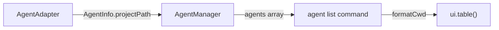

## Data Models

No changes to `AgentInfo`. The existing `projectPath: string` field is used as-is.

## Component Changes

### `packages/cli/src/commands/agent.ts`

1. **New helper function** — `formatCwd(projectPath: string): string`
   - Replaces home directory prefix with `~` using `os.homedir()`
   - Returns the shortened path or the original if no substitution applies
   - Returns empty string for empty/undefined input

2. **Table modification** — Add "CWD" column:
   - **Position**: Column index 1 (after "Agent", before "Type")
   - **Data**: `formatCwd(agent.projectPath)`
   - **Style**: `chalk.dim` for subdued visual weight

### Updated table structure

| Agent | CWD | Type | Status | Working On | Active |
|-------|-----|------|--------|------------|--------|
| my-project | ~/Code/my-project | Claude Code | 🟢 run | Investigating... | 5m ago |

## Design Decisions

| Decision | Choice | Rationale |
|----------|--------|-----------|
| Path format | `~` substitution | Compact, familiar to CLI users |
| Column position | After Agent | CWD is a project identifier, logically grouped with name |
| Column style | `chalk.dim` | Secondary info, shouldn't dominate the table |

## Non-Functional Requirements

- No performance impact — `os.homedir()` is a synchronous, cached call
- No new dependencies required
```

## File: `brain/knowledge/docs_legacy/ai/design/feature-agent-list-type.md`
```markdown
---
phase: design
title: "Agent List Type Column - Design"
description: Technical design for adding agent type display to the list command
---

# Design: Agent List Type Column

## Architecture Overview

This is a presentation-layer change only. No data model or adapter changes needed.

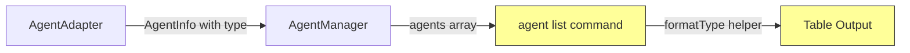

Yellow highlights indicate changed components.

## Data Models

No changes. `AgentInfo.type` (`AgentType = 'claude' | 'gemini_cli' | 'codex' | 'other'`) is already available.

## Component Changes

### `packages/cli/src/commands/agent.ts`

1. **Add `formatType()` helper** — maps `AgentType` to human-friendly label:
   | AgentType | Display Label |
   |-----------|--------------|
   | `claude` | Claude Code |
   | `codex` | Codex |
   | `gemini_cli` | Gemini CLI |
   | `other` | Other |

2. **Update table headers** — insert "Type" as the 2nd column:
   `['Agent', 'Type', 'Status', 'Working On', 'Active']`

3. **Update row mapping** — insert `formatType(agent.type)` as the 2nd value.

4. **Update column styles** — insert a style function for the Type column (dim or standard color).

## Design Decisions

- **Human-friendly labels**: Users shouldn't need to know internal enum values.
- **2nd column placement**: Type is a primary identifier, logically grouped with agent name.
- **No data layer changes**: The type field already exists and is populated correctly.

## Non-Functional Requirements

- No performance impact — simple string mapping on already-loaded data.
```

## File: `brain/knowledge/docs_legacy/ai/design/feature-agent-management.md`
```markdown
---
phase: design
title: System Design & Architecture
description: Define the technical architecture, components, and data models
feature: agent-management
---

# System Design & Architecture

## Architecture Overview
**What is the high-level system structure?**

```mermaid
graph TD
    CLI[CLI: agent command] --> AgentManager[AgentManager]
    AgentManager --> ProcessDetector[ProcessDetector]
    AgentManager --> ClaudeCodeAdapter[ClaudeCodeAdapter]
    
    ProcessDetector --> PS[System Processes]
    ClaudeCodeAdapter --> SessionFiles[Session JSONL Files]
    ClaudeCodeAdapter --> HistoryFile[history.jsonl]
    
    subgraph "Claude Code State (~/.claude/)"
        SessionFiles --> Projects[projects/{path}/*.jsonl]
        HistoryFile --> History[history.jsonl]
    end
    
    AgentManager --> AgentInfo[Agent Info Objects]
    AgentInfo --> TerminalUI[Terminal UI Table]
```

### Key Components

| Component | Responsibility |
|-----------|---------------|
| **AgentManager** | Orchestrates agent detection, aggregates data from multiple sources |
| **ProcessDetector** | Finds running Claude Code processes using system calls |
| **StateReader** | Reads and parses Claude Code's internal state files |
| **AgentAdapter** | Interface for supporting different agent types (extensibility) |

### Technology Stack
- **Runtime**: Node.js (matches existing CLI)
- **Process Detection**: `child_process` module for running `ps` commands
- **File Parsing**: Native `fs` module for reading JSON and text files
- **Output**: Existing `terminal-ui` module for consistent formatting

## Data Models
**What data do we need to manage?**

### Claude Code State File Structure (Discovered)
Based on system exploration, Claude Code stores state in `~/.claude/`:

```
~/.claude/
├── history.jsonl              # User input history with prompts and session IDs
├── settings.json              # User settings (model, etc.)
├── debug/
│   ├── {session-id}.txt       # Debug logs per session
│   └── latest -> ...          # Symlink to current session
└── projects/
    └── {encoded-project-path}/
        ├── sessions-index.json           # Index with original path
        └── {session-id}.jsonl            # Full conversation log
```

### Key Files for Agent Detection

#### history.jsonl
```json
{"display":"use frontend design skill to update restyle index.html","timestamp":1769677801881,"project":"/Users/.../test-skills","sessionId":"92338ceb-5a3e-4164-a3a1-246760f55129"}
```
- **display**: User's prompt (use for summary)
- **project**: Original project path
- **sessionId**: Links to session files

#### Session JSONL (`{session-id}.jsonl`)
```json
{"type":"assistant","timestamp":"2026-01-29T09:10:30.754Z","slug":"merry-wobbling-starlight","message":{...}}
{"type":"user","timestamp":"2026-01-29T09:10:24.040Z",...}
{"type":"progress","timestamp":"2026-01-29T09:10:24.041Z",...}
```
- **type**: `assistant` (running), `user` (waiting), `progress` (processing)
- **slug**: Human-readable session name (e.g., "merry-wobbling-starlight")
- **timestamp**: For determining last activity

### Core Entities

#### AgentInfo
```typescript
interface AgentInfo {
  name: string;          // Project basename (e.g., "ai-devkit") or with slug ("ai-devkit (merry)")
  type: AgentType;       // Type of agent (e.g., "Claude Code")
  status: AgentStatus;   // Current status
  statusDisplay: string; // Display format (e.g., "🟡 wait", "🟢 run")
  summary: string;       // Last user prompt from history.jsonl (truncated ~40 chars)
  pid: number;           // Process ID
  projectPath: string;   // Working directory/project path
  sessionId: string;     // Session UUID
  slug: string;          // Human-readable session name (e.g., "merry-wobbling-starlight")
  lastActive: Date;      // Timestamp of last activity
  lastActiveDisplay: string; // Relative time (e.g., "2m ago", "just now")
}

type AgentType = 'Claude Code' | 'Gemini CLI' | 'Other';

type AgentStatus = 'running' | 'waiting' | 'idle' | 'unknown';

// Status display configuration
const STATUS_CONFIG = {
  running: { emoji: '🟢', label: 'running', color: 'green' },
  waiting: { emoji: '🟡', label: 'waiting', color: 'yellow' },
  idle: { emoji: '⚪', label: 'idle', color: 'dim' },
  unknown: { emoji: '❓', label: 'unknown', color: 'gray' },
};
```

#### ClaudeCodeSession
```typescript
interface ClaudeCodeSession {
  sessionId: string;        // UUID from session filename
  projectPath: string;      // Original project path (from sessions-index.json)
  lastCwd?: string;         // Last cwd seen in session entries (when available)
  slug: string;             // Human-readable name (e.g., "merry-wobbling-starlight")
  sessionLogPath: string;   // Path to the .jsonl session file
  debugLogPath?: string;    // Path to the debug log file
  lastActivity?: Date;      // Timestamp of last log entry
  lastEntryType?: string;   // 'assistant', 'user', 'progress', 'thinking'
}

interface SessionEntry {
  type: 'assistant' | 'user' | 'progress' | 'summary';
  timestamp: string;
  slug: string;
  message?: {
    content?: Array<{ type: string; text?: string }>;
  };
}

interface HistoryEntry {
  display: string;          // User's prompt text
  timestamp: number;        // Unix timestamp
  project: string;          // Project path
  sessionId: string;        // Session UUID
}
```

### Data Flow
1. **Process Detection**: Query running processes (`ps aux | grep claude`) → List of PIDs + TTYs
2. **Session Discovery**: Read `~/.claude/projects/*/sessions-index.json` → List of sessions with project paths
3. **Session-Process Correlation**: 
   - Running Claude processes are source-of-truth for membership
   - Correlation priority for each process:
     - **Phase 1 (`cwd`)**: Exact match with session `lastCwd` or `projectPath`
     - **Phase 2 (`history-cwd`)**: Exact match with `history.jsonl` where `history.project === process.cwd`
     - **Phase 3 (`project-parent`)**: Process cwd is child of session `projectPath` or `lastCwd`
     - **Phase 4 (`process-only`)**: Emit process-only agent when no session match exists
   - This prevents dropped Claude processes when transcripts lag or when process cwd is a subdirectory (e.g. `packages/cli`)
4. **Terminal Location**: For each matched process, find terminal location:
   - Get TTY from PID: `ps -p {PID} -o tty=`
   - Query tmux: `tmux list-panes -a -F '#{pane_tty} #{session}:#{window}.#{pane}'`
   - Fallback to iTerm2/Terminal.app via AppleScript
5. **Status Extraction**: Read last entries from session JSONL → Determine status from `type` field
   - `assistant` → waiting (Assistant finished response, waiting for user)
   - `user` → running (User sent message, agent processing) 
     - *Exception*: If user message contains "interrupted", status is waiting
   - `progress` or `thinking` → running
   - `system` or old timestamp → idle
6. **Summary Extraction**: Read `~/.claude/history.jsonl` → Get last user prompt for each session
   - For history-cwd fallback and process-only fallback, history entry also provides `sessionId` and `lastActive`
7. **Agent Naming**: 
   - Use project basename (e.g., "ai-devkit")
   - If `slug` exists in session, use for disambiguation (e.g., "ai-devkit (merry)")
   - New sessions may not have `slug` yet
8. **Aggregation**: Combine all data → Sort by status (waiting first) → AgentInfo[]

## API Design
**How do components communicate?**

### Internal Interfaces

#### AgentManager
```typescript
class AgentManager {
  constructor();
  
  // List all detected agents
  async listAgents(): Promise<AgentInfo[]>;
  
  // Register an adapter for a specific agent type
  registerAdapter(adapter: AgentAdapter): void;
}
```

#### AgentAdapter (Extensibility Interface)
```typescript
interface AgentAdapter {
  type: AgentType;
  
  // Detect running agents of this type
  detectAgents(): Promise<AgentInfo[]>;
  
  // Check if this adapter can handle the given process
  canHandle(processInfo: ProcessInfo): boolean;
}
```

#### ClaudeCodeAdapter
```typescript
class ClaudeCodeAdapter implements AgentAdapter {
  type: AgentType = 'Claude Code';
  
  async detectAgents(): Promise<AgentInfo[]>;
  
  // Find running Claude Code processes
  private async findProcesses(): Promise<ProcessInfo[]>;
  
  // Read Claude Code state files
  private async readSessions(): Promise<ClaudeCodeSession[]>;
  
  // Parse debug log file
  private parseDebugLog(content: string): LogEntry[];
  
  // Determine agent status from log entries
  private determineStatus(entries: LogEntry[]): AgentStatus;
  
  // Extract work summary from log entries
  private extractSummary(entries: LogEntry[]): string;
}
```

### CLI Command Interface
```
ai-devkit agent list [options]

Options:
  --json         Output as JSON instead of table
  -h, --help     Display help

ai-devkit agent open <agent-name>

Arguments:
  agent-name     Name of agent to focus (supports partial matching)

Options:
  -h, --help     Display help
```

### TerminalFocusManager
```typescript
interface TerminalLocation {
  type: 'tmux' | 'iterm2' | 'terminal-app' | 'unknown';
  identifier: string;  // e.g., "Fosto:3.2" for tmux, window ID for iTerm2
  tty: string;         // e.g., "/dev/ttys030"
}

class TerminalFocusManager {
  // Find terminal location for a given PID
  async findTerminal(pid: number): Promise<TerminalLocation | null>;
  
  // Switch focus to the terminal
  async focusTerminal(location: TerminalLocation): Promise<boolean>;
  
  // Check tmux for matching pane
  private async findTmuxPane(tty: string): Promise<TerminalLocation | null>;
  
  // Check iTerm2 for matching session
  private async findITerm2Session(tty: string): Promise<TerminalLocation | null>;
  
  // Check Terminal.app for matching window
  private async findTerminalAppWindow(tty: string): Promise<TerminalLocation | null>;
}
```

### Focus Detection Strategy
```
1. Get TTY from agent's PID: `ps -p {PID} -o tty=`
2. Check environments in order (most likely first):
   a. tmux: `tmux list-panes -a -F '#{pane_tty} #{session_name}:#{window_index}.#{pane_index}'`
   b. iTerm2: AppleScript enumeration of windows/tabs/sessions
   c. Terminal.app: AppleScript enumeration
3. Execute focus command based on detected environment:
   - tmux: `tmux switch-client -t {session}:{window}.{pane}`
   - iTerm2: AppleScript `tell window to select`
   - Terminal.app: AppleScript `activate` + `set selected`
```

### Agent Name Matching Strategy
When user runs `agent open <name>`, resolve the target agent:

```typescript
function resolveAgentName(input: string, agents: AgentInfo[]): AgentInfo | AgentInfo[] | null {
  // 1. Exact match (case-insensitive)
  const exact = agents.find(a => a.name.toLowerCase() === input.toLowerCase());
  if (exact) return exact;
  
  // 2. Partial match (prefix or contains)
  const matches = agents.filter(a => 
    a.name.toLowerCase().includes(input.toLowerCase())
  );
  
  if (matches.length === 1) return matches[0];  // Unique partial match
  if (matches.length > 1) return matches;       // Ambiguous - return all for user choice
  return null;                                   // No match
}
```

**Resolution Table:**
| Scenario | Input | Agents | Result |
|----------|-------|--------|--------|
| Exact match | `ai-devkit` | ["ai-devkit", "my-website"] | ✅ Opens "ai-devkit" |
| Unique partial | `ai-dev` | ["ai-devkit", "my-website"] | ✅ Opens "ai-devkit" |
| Ambiguous partial | `my` | ["my-website", "my-app"] | ⚠️ Prompts: "Multiple matches found" |
| Same project, different slugs | `ai-devkit` | ["ai-devkit", "ai-devkit (merry)"] | ✅ Opens "ai-devkit" (exact) |
| Slug qualifier | `merry` | ["ai-devkit", "ai-devkit (merry)"] | ✅ Opens "ai-devkit (merry)" |
| No match | `xyz` | ["ai-devkit", "my-website"] | ❌ Shows available agents |

**Ambiguous Match Output:**
```
⚠ Multiple agents match "my":

  1. my-website (🟡 wait) - Building dashboard
  2. my-app (🟢 run) - API refactoring

Enter number to open, or use full name: ai-devkit agent open my-website
```

### Output Format

#### Table Output (Default)
```
┌─────────────────────────┬─────────┬────────────────────────────────────┬───────────┐
│ Agent                   │ Status  │ Working On                         │ Active    │
├─────────────────────────┼─────────┼────────────────────────────────────┼───────────┤
│ ai-devkit               │ 🟡 wait │ Building auth API                  │ 2m ago    │
│ my-website (merry)      │ 🟢 run  │ Restyling homepage with new...     │ just now  │
│ test-project            │ ⚪ idle │ Session started                    │ 15m ago   │
└─────────────────────────┴─────────┴────────────────────────────────────┴───────────┘

💡 1 agent waiting for input. Switch to its terminal to respond.
```

**Table Features**:
- Sort by status: waiting agents first (need attention)
- Truncate summary to ~40 characters with ellipsis
- Relative time for "Active" column
- Attention summary footer when agents need input

#### JSON Output (`--json`)
```json
[
  {
    "name": "ai-devkit",
    "type": "Claude Code",
    "status": "waiting",
    "summary": "Building auth API",
    "projectPath": "/Users/dev/projects/ai-devkit",
    "sessionId": "92338ceb-5a3e-4164-a3a1-246760f55129",
    "pid": 12345,
    "lastActive": "2026-01-29T10:08:00Z"
  }
]
```

#### Empty State
```
⚠ No AI agents are currently running.

  Start a Claude Code session with: claude
```

## Component Breakdown
**What are the major building blocks?**

### Directory Structure
```
packages/cli/src/
├── commands/
│   └── agent.ts              # CLI command registration
├── lib/
│   ├── AgentManager.ts       # Main orchestration class
│   └── adapters/
│       ├── AgentAdapter.ts   # Interface definition
│       └── ClaudeCodeAdapter.ts  # Claude Code implementation
└── util/
    └── process.ts            # Process detection utilities
```

### Component Details

#### 1. CLI Command (`commands/agent.ts`)
- Registers `agent` parent command
- Registers `agent list` subcommand
- Handles output formatting (table/JSON)
- Uses AgentManager to fetch data

#### 2. AgentManager (`lib/AgentManager.ts`)
- Maintains list of registered adapters
- Aggregates results from all adapters
- Handles errors gracefully

#### 3. ClaudeCodeAdapter (`lib/adapters/ClaudeCodeAdapter.ts`)
- Implements agent detection for Claude Code
- Reads `~/.claude/` directory structure
- Parses debug log files
- Matches processes to sessions

#### 4. Process Utilities (`util/process.ts`)
- Cross-platform process listing
- Filters by process name pattern
- Extracts PID, command, working directory

## Design Decisions
**Why did we choose this approach?**

### Decision 1: Adapter Pattern for Agent Types
**Choice**: Use an adapter pattern to support multiple agent types
**Rationale**: 
- Allows adding new agent types without modifying core code
- Each agent type has its own detection/parsing logic
- Clean separation of concerns

**Alternatives Considered**:
- Single monolithic detector (rejected: hard to extend)
- Plugin system (rejected: overkill for Phase 1)

### Decision 2: Session File Parsing
**Choice**: Parse Claude Code session JSONL files for status/summary extraction
**Rationale**:
- Session files contain structured conversation data with `type` field
- `history.jsonl` contains user prompts for summary extraction
- Both files are reliably available when Claude Code is used

**Alternatives Considered**:
- Debug log parsing (rejected: format less structured, may change)
- Process signals (rejected: no status info)
- API calls (rejected: no known API)

### Decision 3: Agent Naming Strategy
**Choice**: Use project basename as primary identifier, append truncated slug for duplicates
**Rationale**:
- Project names are meaningful to users (they know what project they're working on)
- Slugs (e.g., "merry-wobbling-starlight") provide uniqueness when needed
- Clean format: "ai-devkit" or "ai-devkit (merry)"

**Naming Logic**:
1. Extract project basename from `projectPath`
2. If multiple sessions have same project, append first word of slug
3. Fallback to full slug if no project path

**Alternatives Considered**:
- Full slug names (rejected: not intuitive, e.g., "merry-wobbling-starlight")
- PID-based names (rejected: meaningless to users)
- Sequential numbers (rejected: not persistent across restarts)

### Decision 4: Visual Status Hierarchy
**Choice**: Use emoji + short label + color for status display
**Rationale**:
- Users can identify agents needing attention in < 1 second
- Emoji works in all terminals without special font requirements
- Color adds redundancy for accessibility

**Status Hierarchy** (sorted by attention priority):
| Priority | Status | Display | Meaning |
|----------|--------|---------|--------|
| 1 | waiting | 🟡 waiting | **NEEDS ATTENTION** |
| 2 | running | 🟢 running | Actively processing |
| 3 | idle | ⚪ idle | No recent activity |
| 4 | unknown | ❓ ??? | Status undetermined |

### Decision 5: Status Detection Heuristics
**Choice**: Use session JSONL `type` field to determine status
**Status Mapping**:
| Last Entry Type | Status | Detailed Logic |
|-----------------|--------|----------------|
| `user` | running | User sent input, agent is processing it. |
| `progress`, `thinking` | running | Agent is actively using tools or thinking. |
| `assistant` | waiting | Assistant finished response, waiting for user input. |
| `user` (interrupted) | waiting | User manually interrupted the agent (contains "[Request interrupted..."). |
| Any type | idle | Time since last activity > 5 minutes. |
| Other/Error | unknown | Unable to parse or active process not found using files. |

## Non-Functional Requirements
**How should the system perform?**

### Performance Targets
- **Response Time**: < 500ms for listing up to 10 agents
- **Memory Usage**: < 50MB peak during log parsing
- **Log File Limit**: Parse only last 100 lines per session

### Scalability Considerations
- Handle up to 20 concurrent agents
- Efficient file reading (streaming for large logs)
- Caching of process list during single command execution

### Security Requirements
- Read-only access to Claude Code state files
- No modification of agent state
- Respect file permissions

### Reliability/Availability
- Graceful degradation if state files are unreadable
- Handle stale sessions (process dead but files exist)
- Clear error messages for troubleshooting
```

## File: `brain/knowledge/docs_legacy/ai/design/feature-agent-manager-package.md`
```markdown
---
phase: design
title: "CLI Agent-Manager Package Adoption - Design"
feature: agent-manager-package
description: Architecture and migration design for moving CLI agent logic to @ai-devkit/agent-manager
---

# Design: CLI Adoption of @ai-devkit/agent-manager

## Architecture Overview

```mermaid
graph TD
  User[User runs ai-devkit agent] --> Cmd[packages/cli/src/commands/agent.ts]

  subgraph CLI
    Cmd --> UILayer[CLI formatting + table output + command errors]
    Cmd --> DisplayMap[Status/time display mapping]
  end

  subgraph AgentManagerPkg[@ai-devkit/agent-manager]
    AM[AgentManager]
    CCA[ClaudeCodeAdapter]
    TFM[TerminalFocusManager]
    Types[AgentInfo/AgentStatus/AgentType]
    AM --> CCA
    CCA --> Types
  end

  Cmd -->|imports| AM
  Cmd -->|imports| CCA
  Cmd -->|imports| TFM
  Cmd -->|imports| Types
  Cmd -->|uses| DisplayMap
```

Responsibilities:
- `@ai-devkit/agent-manager`: detection, adapter contract, status model, agent resolution, terminal focus mechanics
- CLI: command wiring, display formatting, JSON/table output, user-facing errors, focus-flow orchestration only

## Data Models

Core models consumed from package:
- `AgentInfo`
- `AgentStatus`
- `AgentType`
- `TerminalFocusManager`
- Adapter interface types as needed

CLI-owned view model:
- Derived display fields (color/emoji labels, relative time strings, message formatting)
- Local status metadata map for display labels/colors (replacing direct dependency on legacy CLI `STATUS_CONFIG`)

## API Design

### CLI Imports
- Prefer root exports from `@ai-devkit/agent-manager`
- Keep imports explicit and type-safe in `commands/agent.ts`

### Internal CLI Interface
- Introduce minimal local mappers (if needed) for display-only transformations
- Avoid re-defining package-level domain types in CLI

## Component Breakdown

1. `packages/cli/src/commands/agent.ts`
- Replace local lib imports with package imports
- Keep output behavior unchanged

2. CLI local cleanup
- Remove duplicated files under `packages/cli/src/lib` and `packages/cli/src/__tests__/lib` that are fully migrated, including `lib/TerminalFocusManager.ts`
- Use direct import replacement and delete duplicates in the same change set (no temporary compatibility wrappers)
- Retain only files that are intentionally CLI-specific

3. Tests
- Update tests to validate behavior through CLI command interfaces and remaining unit seams

## Design Decisions

- Decision: package is source of truth for agent detection and status domain model.
  - Rationale: eliminates duplication and drift.
- Decision: package is also source of truth for terminal focus implementation (`TerminalFocusManager`).
  - Rationale: aligns with cleanup goal and removes final duplicated agent-manager file path in CLI.
- Decision: CLI keeps presentation concerns.
  - Rationale: package remains reusable and data-first.
- Decision: cleanup is included in the same feature.
  - Rationale: avoids leaving dead or competing implementations.
- Decision: no lint-rule enforcement is added in this feature for import path policy.
  - Rationale: team prefers convention over additional tooling in this phase.

## Non-Functional Requirements

- Performance: no meaningful regression for `agent list` runtime
- Reliability: migration must preserve existing command behavior and error handling
- Maintainability: eliminate duplicate agent-manager code paths in CLI
- Security: preserve existing process/file handling guarantees; do not widen command-execution surface
```

## File: `brain/knowledge/docs_legacy/ai/design/feature-agent-manager.md`
```markdown
---
phase: design
title: "Agent Manager Package - Design"
feature: agent-manager
description: Architecture and design for the @ai-devkit/agent-manager package
---

# Design: @ai-devkit/agent-manager Package

## Architecture Overview

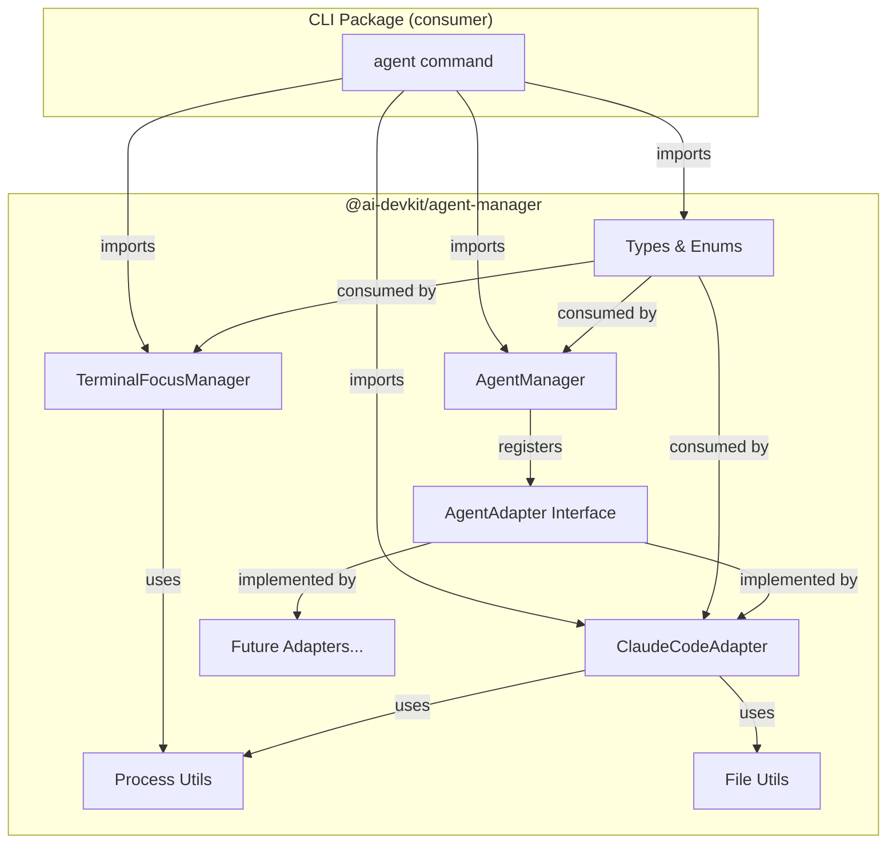

### Package Directory Structure

```
packages/agent-manager/
├── src/
│   ├── index.ts                    # Public API barrel export
│   ├── AgentManager.ts             # Core orchestrator
│   ├── adapters/
│   │   ├── AgentAdapter.ts         # Interface, types, enums
│   │   ├── ClaudeCodeAdapter.ts    # Claude Code detection
│   │   └── index.ts                # Adapter barrel export
│   ├── terminal/
│   │   ├── TerminalFocusManager.ts # Terminal focus (macOS)
│   │   └── index.ts                # Terminal barrel export
│   └── utils/
│       ├── process.ts              # Process detection utilities
│       ├── file.ts                 # File reading utilities
│       └── index.ts                # Utils barrel export
├── src/__tests__/
│   ├── AgentManager.test.ts
│   └── adapters/
│       └── ClaudeCodeAdapter.test.ts
├── package.json
├── tsconfig.json
├── jest.config.js
├── project.json
└── .eslintrc.json
```

## Data Models

Types are adapted for a data-first package contract:

- **AgentType**: `'claude' | 'gemini_cli' | 'codex' | 'other'`
- **AgentStatus**: Enum (`RUNNING`, `WAITING`, `IDLE`, `UNKNOWN`)
- **AgentInfo**: Full agent information (name, type, status, pid, projectPath, sessionId, slug, lastActive, etc.)
- **ProcessInfo**: `{ pid, command, cwd, tty }`
- **AgentAdapter**: Interface with `type`, `detectAgents()`, `canHandle()`
- **TerminalType**: Enum (`TMUX`, `ITERM2`, `TERMINAL_APP`, `UNKNOWN`)
- **TerminalLocation**: `{ type: TerminalType, identifier, tty }` (from TerminalFocusManager)

## API Design

### Public Exports (`index.ts`)

```typescript
// Core
export { AgentManager } from './AgentManager';

// Adapters
export { ClaudeCodeAdapter } from './adapters/ClaudeCodeAdapter';
export type { AgentAdapter } from './adapters/AgentAdapter';
export { AgentStatus } from './adapters/AgentAdapter';
export type { AgentType, AgentInfo, ProcessInfo } from './adapters/AgentAdapter';

// Terminal
export { TerminalFocusManager, TerminalType } from './terminal/TerminalFocusManager';
export type { TerminalLocation } from './terminal/TerminalFocusManager';

// Utilities
export { listProcesses, getProcessCwd, getProcessTty, isProcessRunning, getProcessInfo } from './utils/process';
export type { ListProcessesOptions } from './utils/process';
export { readLastLines, readJsonLines, fileExists, readJson } from './utils/file';
```

### Usage Example

```typescript
import { AgentManager, ClaudeCodeAdapter } from '@ai-devkit/agent-manager';

const manager = new AgentManager();
manager.registerAdapter(new ClaudeCodeAdapter());

const agents = await manager.listAgents();
agents.forEach(agent => {
  console.log(`${agent.name}: ${agent.status}`);
});
```

### Migration Notes

- `AgentType` values are now normalized codes (`claude`, `gemini_cli`, `codex`, `other`)
- `AgentInfo` no longer includes UI/display fields (`statusDisplay`, `lastActiveDisplay`)
- `STATUS_CONFIG` / `StatusConfig` were removed; consumers should map presentation in their own layer

## Component Breakdown

### 1. AgentManager (core orchestrator)
- Adapter registration/unregistration
- Agent listing with parallel adapter queries
- Agent resolution (exact/partial name matching)
- Status-based sorting
- **Extracted from**: `packages/cli/src/lib/AgentManager.ts`
- **Changes**: None — direct copy

### 2. AgentAdapter + Types (interface layer)
- Interface contract for adapters
- Type definitions and enums
- Normalized agent type codes for machine-friendly integrations
- **Extracted from**: `packages/cli/src/lib/adapters/AgentAdapter.ts`
- **Changes**: Agent type literals normalized; display-oriented fields removed from core model

### 3. ClaudeCodeAdapter (concrete adapter)
- Claude Code process detection via `ps aux`
- Session file reading from `~/.claude/projects/`
- Status determination from JSONL entries
- History-based summary extraction
- **Extracted from**: `packages/cli/src/lib/adapters/ClaudeCodeAdapter.ts`
- **Changes**: Import paths updated to use local `utils/` instead of `../../util/`

### 4. TerminalFocusManager (terminal control)
- Terminal emulator detection (tmux, iTerm2, Terminal.app)
- Terminal window/pane focusing
- macOS-specific AppleScript integration
- **Extracted from**: `packages/cli/src/lib/TerminalFocusManager.ts`
- **Changes**: Import paths updated to use local `utils/process`

### 5. Process Utilities
- `listProcesses()` — system process listing with filtering
- `getProcessCwd()` — process working directory lookup
- `getProcessTty()` — process TTY device lookup
- `isProcessRunning()` — process existence check
- `getProcessInfo()` — detailed single-process info
- **Extracted from**: `packages/cli/src/util/process.ts`
- **Changes**: `ProcessInfo` type import updated (now from `../adapters/AgentAdapter`)

### 6. File Utilities
- `readLastLines()` — efficient last-N-lines reading
- `readJsonLines()` — JSONL file parsing
- `fileExists()` — file existence check
- `readJson()` — safe JSON file parsing
- **Extracted from**: `packages/cli/src/util/file.ts`
- **Changes**: None — direct copy

## Design Decisions

| Decision | Choice | Rationale |
|----------|--------|-----------|
| Package name | `@ai-devkit/agent-manager` | Consistent with `@ai-devkit/memory` naming |
| Build system | `tsc` (not SWC) | Simpler setup; no special transforms needed; consistent with CLI package |
| Runtime deps | Zero | Only Node.js built-ins used; keeps package lightweight |
| Include TerminalFocusManager | Yes, as separate module | Useful for consumers; closely related to agent management |
| Include utilities | Yes, within package | They're tightly coupled to adapter implementation; not general-purpose enough for a separate package |
| Test framework | Jest with ts-jest | Matches existing monorepo conventions |

## Non-Functional Requirements

### Performance
- Process listing uses `ps aux` (single exec, ~50ms typical)
- Session file reading limited to last 100 lines for large JSONL files
- Adapter queries run in parallel via `Promise.all`

### Platform Support
- Process detection: macOS and Linux (uses `ps aux`, `lsof`, `pwdx`)
- Terminal focus: macOS only (AppleScript for iTerm2/Terminal.app, tmux universal)

### Security
- No external network calls
- Reads only from `~/.claude/` directory (user-owned)
- Process inspection uses standard OS tools
- No secrets or credentials handled
```

## File: `brain/knowledge/docs_legacy/ai/design/feature-agent-send.md`
```markdown
---
phase: design
title: Agent Send Command - Design
description: Technical design for sending messages to running AI agents
---

# Agent Send Command - Design

## Architecture Overview

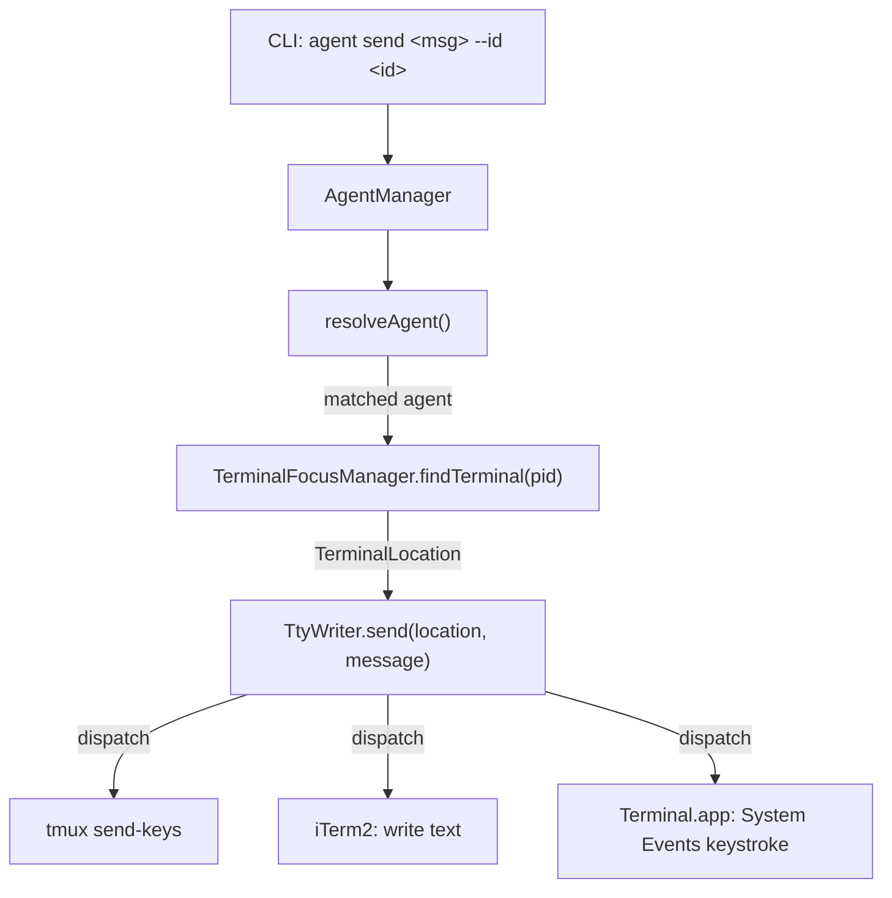

The flow is:
1. CLI parses `--id` flag and message argument
2. `AgentManager.listAgents()` detects all running agents
3. `AgentManager.resolveAgent(id, agents)` finds the target
4. If agent status is not `waiting`, print a warning but continue
5. `TerminalFocusManager.findTerminal(pid)` identifies the terminal emulator and session
6. `TtyWriter.send(location, message)` dispatches to the correct send mechanism

## Data Models

No new data models needed. Reuses existing:
- `AgentInfo` (from `AgentAdapter.ts`) - contains `pid`, `name`, `slug`, `status`
- `TerminalLocation` (from `TerminalFocusManager.ts`) - contains `type`, `identifier`, `tty`

## API Design

### CLI Interface

```
ai-devkit agent send <message> --id <identifier>
```

- `<message>`: Required positional argument. The text to send.
- `--id <identifier>`: Required flag. Agent name, slug, or partial match string.

### Module: TtyWriter

Location: `packages/agent-manager/src/terminal/TtyWriter.ts`

```typescript
export class TtyWriter {
  /**
   * Send a message as keyboard input to a terminal session.
   * Dispatches to the correct mechanism based on terminal type.
   *
   * @param location - Terminal location from TerminalFocusManager.findTerminal()
   * @param message - Text to send
   * @throws Error if terminal type is unsupported or send fails
   */
  static async send(location: TerminalLocation, message: string): Promise<void>;
}
```

### Per-terminal mechanisms

| Terminal | Method | How Enter is sent |
|----------|--------|-------------------|
| tmux | `tmux send-keys -t <pane> "msg" Enter` | tmux `Enter` key literal |
| iTerm2 | AppleScript `write text "msg"` | `write text` auto-appends newline |
| Terminal.app | System Events `keystroke "msg"` + `key code 36` | `key code 36` = Return key |

## Component Breakdown

### 1. TtyWriter (new) - `agent-manager` package
- Single static method `send(location, message)`
- Dispatches to `sendViaTmux`, `sendViaITerm2`, or `sendViaTerminalApp`
- tmux: uses `execFile('tmux', ['send-keys', ...])` — no shell
- iTerm2: uses `execFile('osascript', ['-e', script])` — no shell
- Terminal.app: uses `execFile('osascript', ['-e', script])` with System Events `keystroke` + `key code 36` — no shell
- Throws descriptive error for unsupported terminal types (`UNKNOWN`)

### 2. CLI `agent send` subcommand (new) - `cli` package
- Registers under existing `agentCommand`
- Parses `<message>` positional arg and `--id` required option
- Uses `AgentManager` to list and resolve agent
- Warns if agent status is not `waiting` (but still proceeds)
- Uses `TerminalFocusManager.findTerminal(pid)` to identify terminal
- Uses `TtyWriter.send(location, message)` to deliver message
- Displays success/error feedback via `ui`

### 3. Export from agent-manager (update)
- Export `TtyWriter` from `packages/agent-manager/src/terminal/index.ts`
- Export from `packages/agent-manager/src/index.ts`

## Design Decisions

| Decision | Choice | Rationale |
|----------|--------|-----------|
| Delivery mechanism | Terminal-native input injection | Writing to `/dev/ttysXXX` only outputs to terminal display, doesn't inject input. Must go through the terminal emulator. |
| Agent identification | `--id` flag only | Explicit, avoids confusion with positional args |
| tmux send | `tmux send-keys` + `Enter` | Standard tmux API for injecting keystrokes into a pane |
| iTerm2 send | AppleScript `write text` | Writes to session as typed input, auto-appends newline |
| Terminal.app send | System Events `keystroke` + `key code 36` | `do script` runs a new shell command (wrong). `keystroke` types into the foreground process and `key code 36` sends Return. |
| Shell safety | `execFile` for all subprocess calls | `execFile` bypasses the shell entirely, preventing command injection from message content (e.g., single quotes, backticks). |
| AppleScript escaping | Escape `\` and `"` for double-quoted strings | Prevents AppleScript string breakout. Combined with `execFile`, no shell escaping needed. |
| Embedded newlines | Send as-is | Each emulator handles the message as a single input. No splitting. |
| Module location | `TtyWriter` in agent-manager | Reusable by other features; keeps terminal logic together with `TerminalFocusManager` |

## Non-Functional Requirements

- **Performance**: All mechanisms are near-instant (exec a single command)
- **Security**: All subprocesses use `execFile` (no shell). AppleScript strings are escaped for `\` and `"`. No command injection vector.
- **Reliability**: Terminal type is detected first; unsupported types fail with clear error. Each emulator method validates session was found.
- **Portability**: Works on macOS (tmux, iTerm2, Terminal.app). Linux supported via tmux. Other Linux terminals are unsupported (returns `UNKNOWN`).

## Known Limitations

- **`UNKNOWN` terminal type**: If the agent runs in a terminal we can't identify (Warp, VS Code terminal, Alacritty without tmux), `send` fails. Users must use tmux in these cases.
- **Terminal.app `keystroke`**: Requires Terminal.app to be brought to foreground (the script activates it). This briefly steals focus.
- **iTerm2 `write text`**: Auto-appends a newline. Messages with embedded newlines will submit multiple lines.
```

## File: `brain/knowledge/docs_legacy/ai/design/feature-claude-sessions-pid-matching.md`
```markdown
---
phase: design
title: System Design & Architecture
description: Define the technical architecture, components, and data models
---

# System Design & Architecture

## Architecture Overview

The change is localised to `ClaudeCodeAdapter`. The detection flow always attempts a PID-file lookup for every process first; only processes whose PID file cannot be found fall through to the existing legacy matching step.

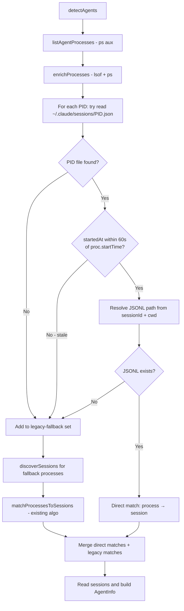

## Data Models

### PID file schema (`~/.claude/sessions/<pid>.json`)
```typescript
interface PidFileEntry {
    pid: number;
    sessionId: string;   // filename without .jsonl
    cwd: string;         // working directory when Claude started
    startedAt: number;   // epoch milliseconds
    kind: string;        // e.g. "interactive" — not used
    entrypoint: string;  // e.g. "cli" — not used
}
```

### New internal type: `DirectMatch`
```typescript
interface DirectMatch {
    process: ProcessInfo;
    sessionFile: SessionFile;  // reuse existing SessionFile shape
}
```

## Component Breakdown

### Modified: `ClaudeCodeAdapter`

**New private method**: `tryPidFileMatching(processes: ProcessInfo[]): { direct: DirectMatch[]; fallback: ProcessInfo[] }`
- For each process, attempts to read `~/.claude/sessions/<pid>.json`.
  - If the file is absent or unreadable: process goes to `fallback`.
  - If the file is present:
    - Cross-checks `entry.startedAt` (epoch ms) against `proc.startTime.getTime()`; if delta > 60 s, file is stale → process goes to `fallback`.
    - Resolves the JSONL path: `~/.claude/projects/<encoded-cwd>/<sessionId>.jsonl` using the `cwd` from the PID file.
    - Verifies the JSONL exists; if missing: process goes to `fallback`.
    - If JSONL exists: process goes to `direct`.
- There is **no upfront directory-existence check** — each PID is always tried individually. Missing files are handled per-process via try/catch.

**Modified**: `detectAgents()`
- Calls `tryPidFileMatching()` after enrichment.
- Passes only `fallback` processes to the existing `discoverSessions()` + `matchProcessesToSessions()` pipeline.
- Merges `direct` matches with legacy match results before building `AgentInfo` objects.

### Unchanged
- `utils/process.ts` — process listing and enrichment unchanged.
- `utils/session.ts` — session file discovery unchanged.
- `utils/matching.ts` — matching algorithm unchanged.
- All other adapters — untouched.

## Design Decisions

| Decision | Choice | Rationale |
|----------|--------|-----------|
| Where to do PID file lookup | Inside `ClaudeCodeAdapter` as a private method | Keeps the change isolated; other adapters don't need it |
| CWD source for JSONL path encoding | PID file's `cwd` field | PID file is authoritative; lsof cwd may differ (symlinks, etc.) |
| `startedAt` type | Epoch milliseconds (`number`) | Verified from real files — not an ISO string |
| Stale file guard | Cross-check `entry.startedAt` vs `proc.startTime` (60 s tolerance) | Catches PID reuse without false positives from normal startup delays |
| `enrichProcesses()` scope | Run on all processes before the split | `proc.startTime` is needed for the stale-file guard; batched call is cheap |
| Error handling for malformed PID files | Catch + fall back to legacy | Avoids crashing; older or corrupt files handled gracefully |
| Batching PID file reads | No batching (sequential per PID) | Files are tiny JSON; overhead is negligible |
| Reuse `SessionFile` shape for direct matches | Yes | Avoids new types; existing `readSession` and `buildAgentInfo` code works unchanged |

## Non-Functional Requirements

- **No performance regression**: PID file reads add at most one `fs.readFileSync` + `fs.existsSync` per process, which is negligible.
- **Backward compatibility**: All existing behaviour is preserved when no PID files exist (older Claude Code installs). Each missing file falls through to the legacy algorithm per-process.
- **No new external dependencies**.
```

## File: `brain/knowledge/docs_legacy/ai/design/feature-codex-adapter-agent-manager-package.md`
```markdown
---
phase: design
title: "Codex Adapter in @ai-devkit/agent-manager - Design"
feature: codex-adapter-agent-manager-package
description: Architecture and implementation design for introducing Codex adapter support in the shared agent manager package
---

# Design: Codex Adapter for @ai-devkit/agent-manager

## Architecture Overview

```mermaid
graph TD
  User[User runs ai-devkit agent list/open] --> Cmd[packages/cli/src/commands/agent.ts]
  Cmd --> Manager[AgentManager]

  subgraph Pkg[@ai-devkit/agent-manager]
    Manager --> Claude[ClaudeCodeAdapter]
    Manager --> Codex[CodexAdapter]
    Codex --> Proc[process utils]
    Codex --> File[file utils]
    Codex --> Types[AgentAdapter/AgentInfo/AgentStatus]
    Focus[TerminalFocusManager]
  end

  Cmd --> Focus
  Cmd --> Output[CLI table/json rendering]
```

Responsibilities:
- `CodexAdapter`: discover and map running Codex sessions to `AgentInfo`
- `AgentManager`: aggregate Codex + existing adapter results
- CLI command: register adapters, display results, and invoke open/focus behavior

## Data Models

- Reuse existing `AgentAdapter`, `AgentInfo`, `AgentStatus`, and `AgentType` models
- `AgentType` already supports `codex`; adapter emits `type: 'codex'`
- Codex raw metadata (internal to adapter) is normalized into:
  - `id`: deterministic session/process identifier
  - `name`: user-facing label derived from `cwd`; fallback to `codex-<session-id-prefix>` when `cwd` is missing
  - `cwd`: workspace path (if available)
  - `sessionStart`: parsed from `session_meta.timestamp` for process/session time matching
  - `status`: computed from recency/activity metadata using the same threshold values already used by existing adapters
  - `pid`: matched running Codex process id used by terminal focus flow

## API Design

### Package Exports
- Add `CodexAdapter` to:
  - `packages/agent-manager/src/adapters/index.ts`
  - `packages/agent-manager/src/index.ts`

### CLI Integration
- Update `packages/cli/src/commands/agent.ts` to register `CodexAdapter` alongside `ClaudeCodeAdapter`
- Keep display mapping logic in CLI; do not move presentation concerns into package

## Component Breakdown

1. `packages/agent-manager/src/adapters/CodexAdapter.ts`
- Implement adapter contract methods/properties
- Discover Codex sessions from `~/.codex/sessions/YYYY/MM/DD/*.jsonl`
- Map session data to standardized `AgentInfo`

2. `packages/agent-manager/src/__tests__/adapters/CodexAdapter.test.ts`
- Unit tests for detection/parsing/status mapping/error handling

3. `packages/agent-manager/src/adapters/index.ts` and `src/index.ts`
- Export adapter class

4. `packages/cli/src/commands/agent.ts`
- Register Codex adapter in manager setup path(s)

## Design Decisions

- Decision: Implement Codex detection in package, not CLI.
  - Rationale: preserves package as the single source of truth for agent discovery.
- Decision: Reuse existing adapter contract and manager aggregation flow.
  - Rationale: minimizes surface area and regression risk.
- Decision: Keep CLI output semantics unchanged.
  - Rationale: this feature adds detection capability, not UX changes.
- Decision: Parse the first JSON line (`type=session_meta`) as the authoritative session identity/cwd/timestamp source.
  - Rationale: sampled session files consistently include this shape, and it avoids scanning full transcript payloads.
- Decision: Treat running `codex` processes as source-of-truth for list membership.
  - Rationale: session tail events can represent turn completion while process remains active.
- Decision: Match `pid -> session` by closest process start time (`now - etime`) to `session_meta.timestamp` with tolerance.
  - Rationale: improves accuracy when multiple Codex processes share the same project `cwd`.
- Decision: Bound session scanning for performance while including process-start day windows.
  - Rationale: keeps list latency low and still supports long-lived process/session mappings.
- Decision: Keep status-threshold values consistent across adapters.
  - Rationale: preserves cross-agent behavior consistency and avoids adapter-specific drift.
- Decision: Use `codex-<session-id-prefix>` fallback naming when `cwd` is unavailable.
  - Rationale: keeps identifiers deterministic and short while remaining user-readable.
- Decision: Keep matching orchestration in explicit phases (`cwd`, `missing-cwd`, `any`) with extracted helper methods and PID/session tracking sets.
  - Rationale: preserves behavior while reducing branching complexity and repeated scans in `detectAgents`.

## Non-Functional Requirements

- Performance: `agent list` should remain bounded by existing adapter aggregation patterns.
- Reliability: Codex adapter failures must be isolated (no full-command failure when one adapter errors).
- Maintainability: follow Claude adapter structure to keep adapter implementations consistent.
- Security: only read local metadata/process info already permitted by existing CLI behavior.
```

## File: `brain/knowledge/docs_legacy/ai/design/feature-custom-skill-registries.md`
```markdown
---
phase: design
title: System Design & Architecture
description: Define the technical architecture, components, and data models
---

# System Design & Architecture

## Architecture Overview

**What is the high-level system structure?**

- Add a registry resolution layer that merges default and custom registries before skill operations.
- Default registry remains fetched from the current remote registry JSON.
- Custom registries are read from a global `.ai-devkit.json`.
- Skill commands use the merged registry map with local overrides.

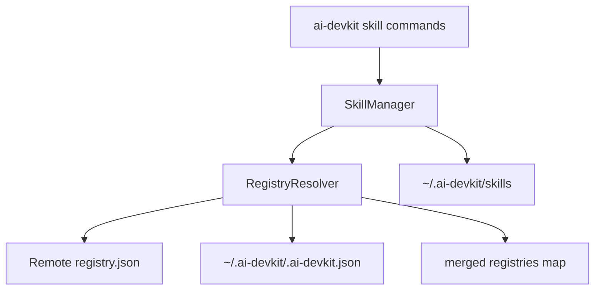

## Data Models

**What data do we need to manage?**

- Global config (new or extended):
  - `skills.registries` (map of `registryId -> gitUrl`)
- Registry JSON (existing):
  - `registries` map of registry IDs to Git URLs

Example global config snippet:

```json
{
  "skills": {
    "registries": {
      "my-org/skills": "git@github.com:my-org/skills.git",
      "me/personal-skills": "https://github.com/me/personal-skills.git"
    }
  }
}
```

## API Design

**How do components communicate?**

- CLI commands (`skill add`, `skill list`, `skill remove`, `skill update`, `skill search`) call `SkillManager`.
- `SkillManager` uses a new helper (e.g., `RegistryResolver`) to:
  - Load default registry (remote JSON).
  - Load custom registries from global config.
  - Merge with custom overrides on conflict.
- No external API changes; internal interface remains synchronous with current workflow.

## Component Breakdown

**What are the major building blocks?**

- `SkillManager`: update to use merged registries for all commands.
- `GlobalConfigManager` (new): read/write `~/.ai-devkit/.ai-devkit.json`.
- `RegistryResolver` (new or within SkillManager): merge registry sources.
- Cache handler (existing): reuse `~/.ai-devkit/skills`.

## Design Decisions

**Why did we choose this approach?**

- Use existing registry format to avoid new parsing logic.
- Keep CLI UX unchanged by merging sources before lookup.
- Local override provides predictable behavior for conflicts.
- Cache reuse enables offline workflows without new storage systems.

Alternatives considered:

- Separate registry list files per project (rejected: requirement is global).
- Display registry source in list output (rejected: keep seamless UX).

## Non-Functional Requirements

**How should the system perform?**

- Performance: avoid repeated registry downloads by caching and only fetching when needed.
- Scalability: support many registries by merging maps and cloning on demand.
- Security: rely on git and local credentials; no credential handling in CLI.
- Reliability: fall back to cache when remote registry is unavailable.

```

## File: `brain/knowledge/docs_legacy/ai/design/feature-generalize-session-mapping.md`
```markdown
---
phase: design
title: Generalize Process-to-Session Mapping — Design
description: Architecture for shared process detection, session matching, and per-agent adapters
---

# System Design & Architecture

## Architecture Overview

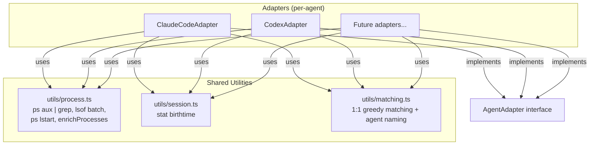

Each adapter implements `AgentAdapter` (unchanged interface), owns its detection flow and session scanning, and calls shared utilities for OS-level commands and matching.

## Data Flow

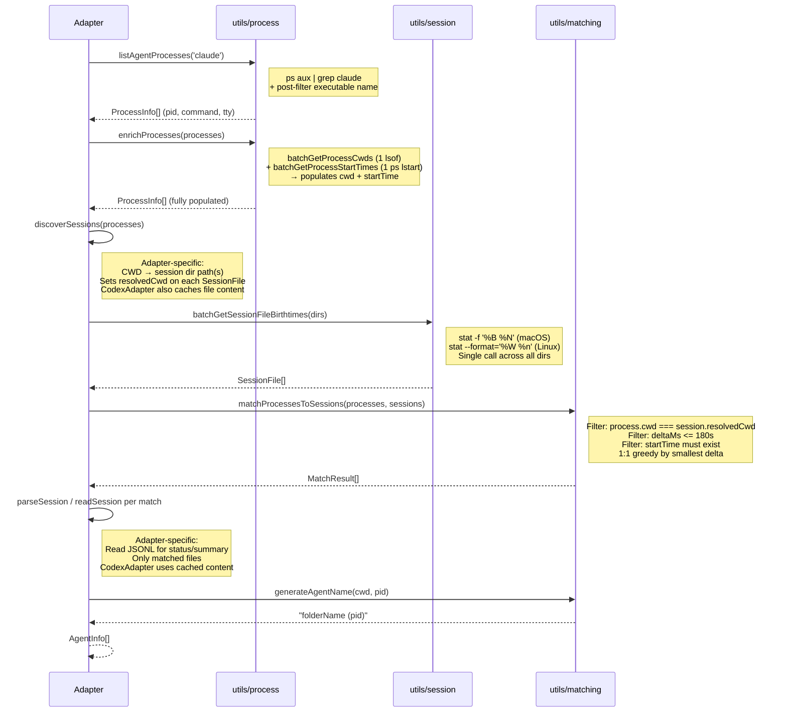

## Data Models

### ProcessInfo (existing, extended)

```typescript
interface ProcessInfo {
    pid: number;
    command: string;
    cwd: string;         // populated by enrichProcesses
    tty: string;
    startTime?: Date;    // populated by enrichProcesses
}
```

Adding `startTime?: Date` to the existing `ProcessInfo` in `AgentAdapter.ts`. This is a public type change — accepted since it's additive (optional field).

### SessionFile (new, shared)

```typescript
interface SessionFile {
    sessionId: string;      // filename without .jsonl
    filePath: string;       // full path
    projectDir: string;     // parent directory
    birthtimeMs: number;    // from stat (epoch seconds × 1000 → milliseconds)
    resolvedCwd: string;    // set by adapter: the CWD this session maps to
}
```

`resolvedCwd` is set by the adapter after calling `batchGetSessionFileBirthtimes()`. This keeps the CWD↔session mapping adapter-specific while allowing the shared matcher to compare `process.cwd === session.resolvedCwd` without callbacks or maps.

### MatchResult (new, shared)

```typescript
interface MatchResult {
    process: ProcessInfo;
    session: SessionFile;
    deltaMs: number;        // |process.startTime - session.birthtimeMs|
}
```

## Component Breakdown

### `utils/process.ts` — Shell command wrappers for process data

Extended from existing file. All `execSync` calls for process data live here.

| Function | Shell command | Returns |
|----------|-------------|---------|
| `listAgentProcesses(namePattern)` | `ps aux \| grep <pattern>` + post-filter executable basename | `ProcessInfo[]` (pid, command, tty — cwd/startTime empty) |
| `batchGetProcessCwds(pids)` | `lsof -a -d cwd -Fn -p PID1,PID2,...` | `Map<number, string>` |
| `batchGetProcessStartTimes(pids)` | `ps -o pid=,lstart= -p PID1,PID2,...` | `Map<number, Date>` |
| `enrichProcesses(processes)` | Calls `batchGetProcessCwds` + `batchGetProcessStartTimes` | `ProcessInfo[]` with cwd and startTime populated |

Notes:
- `listAgentProcesses` uses `grep` at shell level for performance, then post-filters by checking `path.basename(executable)` matches exactly (avoids matching `claude-helper`, `vscode-claude-extension`, or the grep process itself)
- `enrichProcesses` is a convenience that calls both batch functions and merges results into each `ProcessInfo`. Returns partial results — if `lsof` fails for a PID, that process gets empty cwd; if `ps lstart` fails for a PID, that process gets no `startTime`
- `batchGetProcessStartTimes` uses `lstart` format (full timestamp like `Thu Feb  5 16:00:57 2026`) instead of lossy `etime`

### `utils/session.ts` — Shell command wrappers for session files

New file.

| Function | Shell command | Returns |
|----------|-------------|---------|
| `batchGetSessionFileBirthtimes(dirs)` | `stat -f '%B %N' dir1/*.jsonl dir2/*.jsonl ...` (macOS) or `stat --format='%W %n' ...` (Linux) | `SessionFile[]` |

Notes:
- Combines all directory globs into a single `stat` call
- Uses `stat` instead of `ls -lU` — gives epoch seconds (exact, no parsing ambiguity)
- Platform detection via `process.platform`
- Returns empty array if directories don't exist, have no `.jsonl` files, or command fails
- `resolvedCwd` is left empty — adapter must set it after calling this function

### `utils/matching.ts` — Shared matching algorithm and naming

New file.

| Function | Description |
|----------|-------------|
| `matchProcessesToSessions(processes, sessions)` | 1:1 greedy assignment by closest birthtimeMs |
| `generateAgentName(cwd, pid)` | Returns `basename(cwd) (pid)` |

#### Matching algorithm

```
Input:
  processes: ProcessInfo[] (with cwd and startTime populated)
  sessions: SessionFile[] (with resolvedCwd set by adapter)

1. Filter processes: exclude any where startTime is undefined
   (→ these become process-only fallback in the adapter)

2. Build candidate pairs:
   for each process P, for each session S:
     if P.cwd === S.resolvedCwd:
       deltaMs = |P.startTime - S.birthtimeMs|
       if deltaMs <= 180_000 (3 minutes):
         add (P, S, deltaMs) to candidates

3. Sort candidates by deltaMs ascending (best matches first)

4. Greedy assign:
   matchedPids = Set()
   matchedSessionIds = Set()
   results = []

   for each (P, S, deltaMs) in candidates:
     if P.pid in matchedPids → skip
     if S.sessionId in matchedSessionIds → skip
     assign P ↔ S
     results.push({ process: P, session: S, deltaMs })

5. Return results
```

Unmatched processes (no session within tolerance, or no startTime) → adapter creates process-only fallback AgentInfo.

### Per-adapter responsibilities

| Responsibility | Stays in adapter | Reason |
|---|---|---|
| `canHandle(command)` | Yes (interface contract) | Kept for interface, but `listAgentProcesses` already filters |
| Session dir scanning | Yes | Claude: `~/.claude/projects/<encoded>/`, Codex: `~/.codex/sessions/YYYY/MM/DD/` |
| CWD → session dir mapping | Yes | Adapter sets `resolvedCwd` on each SessionFile |
| Session parsing (`parseSession`/`readSession`) | Yes | JSONL schema differs per agent. CodexAdapter supports cached content to avoid double I/O. |
| `determineStatus(session)` | Yes | Entry types and status mapping differ |
| Summary extraction | Yes | Content structure differs |

#### Codex date-dir scanning

Codex stores sessions in `~/.codex/sessions/YYYY/MM/DD/*.jsonl`. The adapter will:
1. Use process start times (from `enrichProcesses`) to determine date dirs
2. Scan date directories around each process start date (±1 day window)
3. Call `batchGetSessionFileBirthtimes(dateDirs)` once with all date directories
4. Read each file once and cache content in `Map<string, string>` for later parsing
5. Set `resolvedCwd` from the session_meta first line's `cwd` field

## Design Decisions

### Adapter pattern over base class / plugin

- Adapters own their full flow and can diverge freely
- Shared logic pulled in as utility functions, not inherited
- No inversion of control — adapter calls utils, not the other way around

### birthtimeMs via `stat` over JSONL first-entry timestamp

- Zero file I/O for matching — `stat` gives epoch seconds directly
- No date format parsing ambiguity (unlike `ls -lU` which shows `MMM DD HH:MM` lossy format)
- OS-level timestamp, no app-level lag
- Dry-run validated: 6/8 exact matches, 2/8 within 3min tolerance
- Known limitation: session resumption without process restart (accepted)

### `stat` over `ls -lU`

- `ls -lU` date format is lossy — no seconds for recent files, no year for old files
- `stat -f '%B %N'` (macOS) and `stat --format='%W %n'` (Linux) give epoch seconds
- Exact timestamps, trivial to parse (split on space, `parseInt`)

### `resolvedCwd` on SessionFile over callback/map

- Adapter sets `resolvedCwd` after getting birthtimes, before calling matcher
- Matcher compares `process.cwd === session.resolvedCwd` — pure, no adapter-specific logic
- No callback indirection, no map lookup

### `enrichProcesses` convenience function

- Adapter calls `listAgentProcesses` then `enrichProcesses` — two calls instead of managing 3 separate maps
- Returns partial results — if one PID fails, others still get populated
- Processes without `startTime` are excluded from matching (→ process-only fallback)

### Greedy 1:1 over multi-pass modes

- Single greedy pass sorted by delta ascending
- Simpler, deterministic, no pass-ordering side effects
- Parent-child matching dropped — exact CWD match only

### Agent naming: `folderName (pid)`

- Deterministic, no JSONL parse needed
- PID always included for uniqueness
- Breaking change from slug-based naming — accepted

### Batched shell calls

- 1 `lsof` for all PIDs vs N per-PID calls
- 1 `ps -o lstart` for all PIDs vs N `ps -o etime` calls
- grep at shell level vs list-all-then-filter-in-code

### 3-minute tolerance

- Covers all observed deltas (23s to 2m24s) with margin
- Beyond tolerance → process-only fallback (wrong match worse than no match)

### Error handling

- Shell command utils return partial results — if lsof fails for 1 of 5 PIDs, the other 4 still return
- Future: `--verbose` mode will log matching details (which candidates were considered, why matches were rejected) to log files for debugging

## Non-Functional Requirements

- **Performance**: Detection < 500ms for 10 processes, 50 session files
- **Correctness**: Identical output for non-edge-case scenarios
- **Portability**: macOS and Linux (no Windows)
- **Testability**: Shared utils independently testable — mock `execSync` at module level with `jest.mock`
```

## File: `brain/knowledge/docs_legacy/ai/design/feature-global-setup.md`
```markdown
---
phase: design
title: System Design & Architecture
description: Define the technical architecture, components, and data models
feature: global-setup
---

# System Design & Architecture - Global Setup Feature

## Architecture Overview
**What is the high-level system structure?**

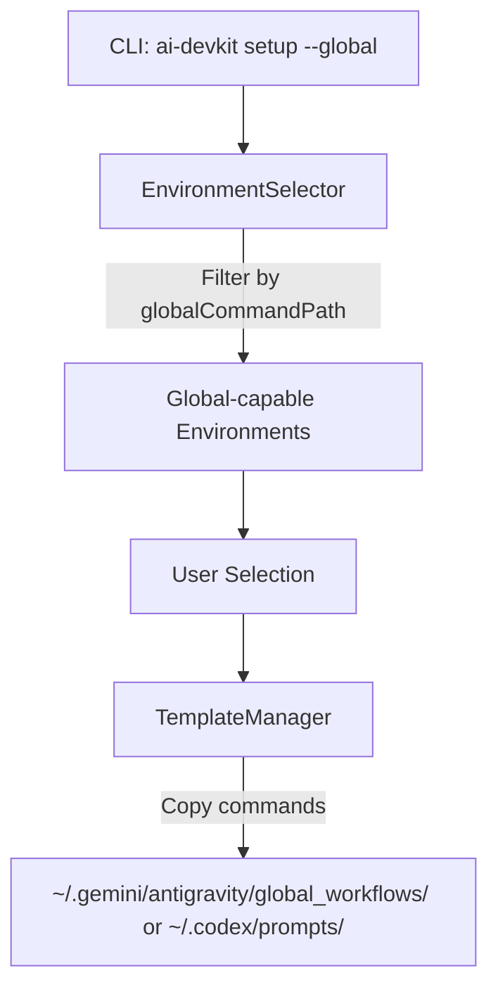

**Key components and their responsibilities:**
- **CLI (`src/cli.ts`)**: Adds new `setup` command with `--global` flag
- **EnvironmentSelector (`src/lib/EnvironmentSelector.ts`)**: New method to select only global-capable environments
- **TemplateManager (`src/lib/TemplateManager.ts`)**: New method to copy commands to global folders
- **Environment Definitions (`src/util/env.ts`)**: New `globalCommandPath` property to indicate global support

**Technology stack choices:**
- Use existing `fs-extra` for file operations with `os.homedir()` for home directory resolution
- Use existing `inquirer` for user prompts

## Data Models
**What data do we need to manage?**

### EnvironmentDefinition (Updated)
```typescript
export interface EnvironmentDefinition {
  code: string;
  name: string;
  contextFileName: string;
  commandPath: string;
  description?: string;
  isCustomCommandPath?: boolean;
  customCommandExtension?: string;
  globalCommandPath?: string; // NEW: Path relative to home dir for global commands
}
```

### Environment Definitions with Global Support
```typescript
antigravity: {
  code: 'antigravity',
  name: 'Antigravity',
  contextFileName: 'AGENTS.md',
  commandPath: '.agent/workflows',
  globalCommandPath: '.gemini/antigravity/global_workflows', // NEW
},
codex: {
  code: 'codex',
  name: 'OpenAI Codex',
  contextFileName: 'AGENTS.md',
  commandPath: '.codex/commands',
  globalCommandPath: '.codex/prompts', // NEW
}
```

## API Design
**How do components communicate?**

### New CLI Command
```bash
ai-devkit setup --global
```

### New/Modified Functions

**`src/util/env.ts`:**
```typescript
// Get only environments that support global setup
export function getGlobalCapableEnvironments(): EnvironmentDefinition[];

// Check if an environment supports global setup
export function hasGlobalSupport(envCode: EnvironmentCode): boolean;
```

**`src/lib/EnvironmentSelector.ts`:**
```typescript
// Select from global-capable environments only
async selectGlobalEnvironments(): Promise<EnvironmentCode[]>;
```

**`src/lib/TemplateManager.ts`:**
```typescript
// Copy commands to global folder
async copyCommandsToGlobal(envCode: EnvironmentCode): Promise<string[]>;

// Check if global commands exist
async checkGlobalCommandsExist(envCode: EnvironmentCode): Promise<boolean>;
```

## Component Breakdown
**What are the major building blocks?**

### 1. Types Update (`src/types.ts`)
- Add `globalCommandPath?: string` to `EnvironmentDefinition`

### 2. Environment Definitions Update (`src/util/env.ts`)
- Add `globalCommandPath` to Antigravity and Codex definitions
- Add `getGlobalCapableEnvironments()` function
- Add `hasGlobalSupport()` function

### 3. EnvironmentSelector Update (`src/lib/EnvironmentSelector.ts`)
- Add `selectGlobalEnvironments()` method that filters to global-capable envs

### 4. TemplateManager Update (`src/lib/TemplateManager.ts`)
- Add `copyCommandsToGlobal()` method
- Add `checkGlobalCommandsExist()` method
- Handle home directory resolution with `os.homedir()`

### 5. New Setup Command (`src/commands/setup.ts`)
- Create new command file for `setup --global`
- Handle environment selection, overwrite prompts, and file copying

### 6. CLI Update (`src/cli.ts`)
- Add `setup` command with `--global` flag

## Design Decisions
**Why did we choose this approach?**

1. **Separate `setup` command vs. extending `init`:**
   - Chosen: New `setup` command with `--global` flag
   - Rationale: Keeps concerns separated; `init` is for project setup, `setup --global` is for global setup

2. **`globalCommandPath` property on EnvironmentDefinition:**
   - Chosen: Optional property that indicates global support
   - Rationale: Extensible - any environment can add global support by defining this property
   - Alternative considered: Separate `GLOBAL_ENVIRONMENTS` constant - less flexible

3. **File extension handling:**
   - Chosen: Use `.md` format for both Antigravity and Codex global commands
   - Rationale: Antigravity global workflows use `.md` format (same as local `.agent/workflows/`), Codex prompts also use `.md`
   - Note: Unlike regular Gemini which uses `.toml`, Antigravity global is different

4. **Overwrite behavior:**
   - Chosen: Check for existing files and prompt user
   - Rationale: Prevents accidental data loss of customized commands

5. **Cross-platform support:**
   - Chosen: Use `os.homedir()` and `path.join()` for path resolution
   - Rationale: Works consistently on macOS, Linux, and Windows

## Non-Functional Requirements
**How should the system perform?**

**Reliability:**
- Gracefully handle missing home directory
- Create global folders if they don't exist
- Provide clear error messages if file operations fail

**Usability:**
- Clear prompts for environment selection
- Informative success/error messages
- Consistent with existing `init` command UX
```

## File: `brain/knowledge/docs_legacy/ai/design/feature-init-template.md`
```markdown
---
phase: design
title: System Design & Architecture
description: Define the technical architecture, components, and data models
---

# System Design & Architecture

## Architecture Overview
**What is the high-level system structure?**

- Include a mermaid diagram that captures the main components and their relationships.
  ```mermaid
  graph TD
    User -->|init --template| InitCommand
    InitCommand --> TemplateLoader
    TemplateLoader --> TemplateValidator
    TemplateValidator --> InitConfigurator
    InitConfigurator --> EnvConfigurator[Environment Configurator]
    InitConfigurator --> PhaseConfigurator[Phase Configurator]
    InitConfigurator --> SkillInstaller[Skill Installer Bridge]
    SkillInstaller --> SkillAdd[Existing skill add flow]
    InitConfigurator --> Reporter
  ```
- Key components and their responsibilities
  - `InitCommand`: reads CLI args and routes interactive vs template-driven flow.
  - `TemplateLoader`: reads template file from path and parses YAML/JSON.
  - `TemplateValidator`: validates schema for `environments`, `skills`, and `phases`.
  - `InitConfigurator`: orchestrates applying resolved values.
  - `SkillInstaller Bridge`: adapts template skill entries into `skill add` invocations.
  - `Reporter`: prints summary of applied config + skill install results.
- Technology stack choices and rationale
  - Continue with existing Node/TypeScript CLI stack.
  - Reuse current argument parsing and prompt layers.
  - Reuse existing `skill add` domain logic to avoid duplicated install behavior.

## Data Models
**What data do we need to manage?**

- Core entities and their relationships
  - `InitTemplate`
  - `TemplateSkill`
  - `TemplateValidationResult`
  - `SkillInstallResult`
- Data schemas/structures
  - `InitTemplate`
    - `{ version?, environments?, phases?, skills? }`
  - `TemplateSkill`
    - `{ registry: string, skill: string, options?: Record<string, string> }`
  - Skill entry processing key
    - Unique key is `registry + skill`; same registry with different skills is valid and processed as separate installs.
  - `SkillInstallResult`
    - `{ registry, skill, status: 'installed' | 'skipped' | 'failed', reason? }`
- Data flow between components
  - CLI args -> template file parse -> validation -> init apply -> per-skill install -> summary output.

## API Design
**How do components communicate?**

- External APIs (if applicable)
  - None required; optional network access occurs only through existing skill installation behavior.
- Internal interfaces
  - `loadTemplate(path: string): Promise<unknown>` (supports relative and absolute paths)
  - `validateTemplate(raw: unknown): TemplateValidationResult`
  - `applyTemplate(config: InitTemplate): Promise<InitApplyResult>`
  - `installSkills(skills: TemplateSkill[]): Promise<SkillInstallResult[]>`
- Request/response formats
  - CLI command
    - `npx ai-devkit@latest init --template <path>`
    - Path resolution: absolute path as-is; relative path resolved from current working directory.
  - Sample YAML template
    ```yaml
    version: 1
    environments:
      - codex
      - claude
    phases:
      - requirements
      - design
      - planning
      - implementation
      - testing
    skills:
      - registry: codeaholicguy/ai-devkit
        skill: debug
      - registry: codeaholicguy/ai-devkit
        skill: memory
    ```
  - Output
    - Validation errors include template path + invalid field(s).
    - Success summary includes configured environments/phases and skill outcomes.
    - Skill installation failures are warnings; command exits with code `0` and includes failed items in report.
- Authentication/authorization approach
  - No new auth model. Skill installation uses current auth/network behavior in existing `skill add` flow.

## Component Breakdown
**What are the major building blocks?**

- Frontend components (if applicable)
  - CLI prompt layer remains as fallback when template is partial.
- Backend services/modules
  - `init.command` argument handling (`--template`).
  - `template-parser` module.
  - `template-validator` module.
  - `init-apply` orchestration module.
  - `skill-install-adapter` module (bridge to existing install logic).
- Database/storage layer
  - No new persistent store required for v1.
- Third-party integrations
  - YAML parser library (existing or new lightweight dependency).

## Design Decisions
**Why did we choose this approach?**

- Key architectural decisions and trade-offs
  - Reuse `skill add` implementation:
    - Pros: consistent behavior and less duplication.
    - Cons: init flow depends on skill module API stability.
  - Add template as optional mode, not replacement:
    - Pros: backward compatibility and low migration risk.
    - Cons: dual paths increase test surface.
  - Continue-on-error for skill install with exit code `0`:
    - Pros: init can apply as much as possible and provide complete failure report in one run.
    - Cons: downstream automation must inspect warning/report output instead of relying only on exit code.
  - Validate template before applying side effects:
    - Pros: deterministic behavior and better errors.
    - Cons: requires explicit schema maintenance.
- Alternatives considered
  - Implement separate installer inside `init`.
    - Rejected due to divergence from `skill add` behavior.
  - Force non-interactive mode whenever template provided.
    - Rejected; fallback prompts for missing values are more user-friendly.
- Patterns and principles applied
  - Schema-first validation.
  - Orchestrator + adapters for integration points.
  - Backward-compatible CLI extension.

## Non-Functional Requirements
**How should the system perform?**

- Performance targets
  - Template loading + validation under 300ms for small files.
  - No regression in plain interactive init startup.
- Scalability considerations
  - Support multiple skill entries without blocking summary reporting.
- Security requirements
  - Treat template input as untrusted; validate and sanitize fields before use.
  - Avoid arbitrary command execution from template values.
- Reliability/availability needs
  - Partial failure handling for multi-skill installs with explicit status.
  - Duplicate `registry + skill` entries are deduplicated during execution and reported as skipped/warning.
  - Deterministic error codes for invalid template input.
```

## File: `brain/knowledge/docs_legacy/ai/design/feature-install-command.md`
```markdown
---
phase: design
title: System Design & Architecture
description: Define the technical architecture, components, and data models
feature: install-command
---

# System Design & Architecture - Install Command

## Architecture Overview

**What is the high-level system structure?**

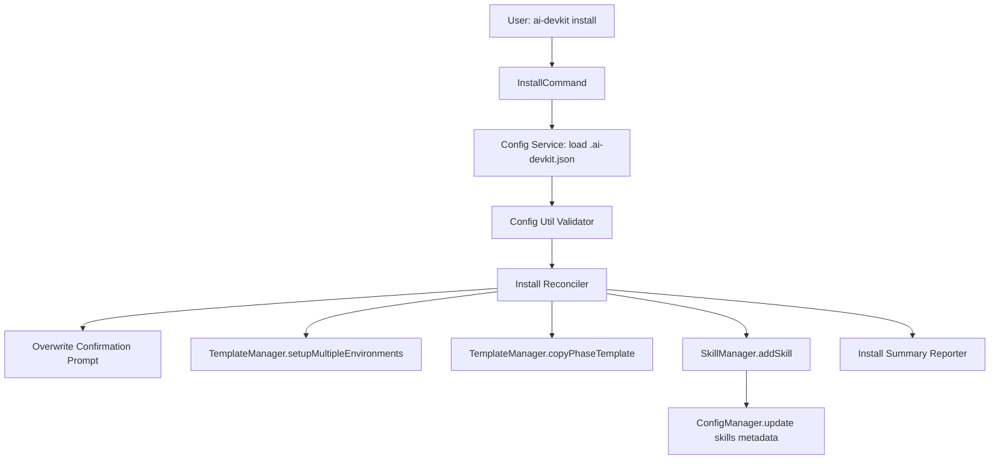

**Key components and responsibilities:**

- `install` command handler: orchestrates install lifecycle.
- `InstallConfig Validator`: validates environments, phases, and optional skills.
- `Install Reconciler`: computes desired state vs existing files.
- `TemplateManager` integration: applies environment and phase templates.
- `SkillManager` integration: installs skills from config entries.
- `Overwrite Confirmation Prompt`: when destination artifacts already exist, ask user to confirm replacement.
- `SkillConfigSync`: ensures `ai-devkit skill add` writes skill metadata back to `.ai-devkit.json`.
- `Reporter`: emits per-section summary and final exit status.

## Data Models

**What data do we need to manage?**

```typescript
interface DevKitInstallConfig {
  version: string;
  environments: EnvironmentCode[];
  phases: Phase[];
  skills?: Array<{
    registry: string;
    name: string;
  }>;
  createdAt: string;
  updatedAt: string;
}
```

- Existing fields continue unchanged.
- New `skills` field is optional for backward compatibility.
- Duplicate skill entries deduplicated by `registry + name`.

## API Design

**How do components communicate?**

**CLI surface:**

- `ai-devkit install`
- Optional follow-up flags (proposed):
  - `--config <path>` (default `.ai-devkit.json`)
  - `--overwrite` (overwrite all existing artifacts without additional prompts)

**Internal interfaces (proposed):**

```typescript
async function installCommand(options: InstallOptions): Promise<void>;
async function validateInstallConfig(config: unknown): Promise<ValidatedInstallConfig>;
async function reconcileAndInstall(config: ValidatedInstallConfig, options: InstallOptions): Promise<InstallReport>;
```

**Output contract:**

- Section summaries for environments, phases, and skills.
- Final totals: installed/skipped/failed.
- Exit codes:
  - Invalid/missing config: `1`
  - Valid config with success: `0`
  - Partial skill-install failures: `0` with warning output and failed item details.

## Component Breakdown

**What are the major building blocks?**

1. `packages/cli/src/commands/install.ts` (new): top-level command execution.
2. `packages/cli/src/services/config/config.service.ts` (new): load config file from disk.
3. `packages/cli/src/util/config.ts` (new): schema validation and normalization.
4. `packages/cli/src/services/install/install.service.ts` (new): reconcile and apply installation.
5. `packages/cli/src/lib/Config.ts` (update): persist/read `skills` metadata.
6. `packages/cli/src/lib/SkillManager.ts` (update): on successful `addSkill`, sync skill entry into `.ai-devkit.json`.
7. `packages/cli/src/cli.ts` (update): register `install` command and options.

## Design Decisions

**Why did we choose this approach?**

- Reuse existing managers (`TemplateManager`, `SkillManager`) for consistency and lower risk.
- Add `install` as separate command instead of overloading `init` to keep intent clear:
  - `init`: configure project interactively/template-first.
  - `install`: apply existing project config deterministically.
- Keep new config field optional to avoid breaking older projects.
- Existing artifacts require explicit user confirmation before overwrite (safe interactive default).
- Partial skill failures do not fail the whole install run; command exits `0` and reports warnings for failed items.

## Non-Functional Requirements

**How should the system perform?**

- Performance: install should scale linearly with configured phases and skills.
- Reliability: each section continues independently and reports failures.
- Security: validate config values before filesystem/network actions.
- Usability: actionable errors that point to field names and file path.
```

## File: `brain/knowledge/docs_legacy/ai/design/feature-knowledge-memory-service.md`
```markdown
---
phase: design
title: Knowledge Memory Service - System Design & Architecture
description: Define the technical architecture, components, and data models for the Knowledge Memory Service
---

# System Design & Architecture

## Architecture Overview
**What is the high-level system structure?**

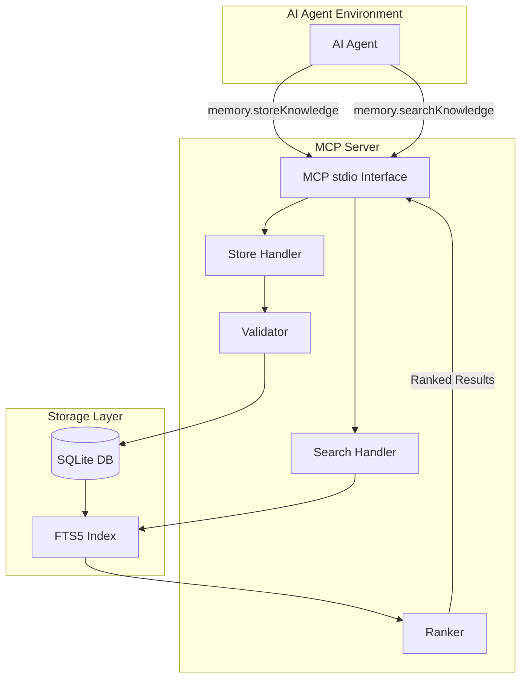

### Key Components and Responsibilities

| Component | Responsibility |
|-----------|----------------|
| **MCP stdio Interface** | Handle JSON-RPC protocol, parse tool calls, return results |
| **Store Handler** | Process storage requests, validate input, check duplicates |
| **Search Handler** | Parse search queries, build FTS5 queries, coordinate ranking |
| **Validator** | Ensure knowledge quality (specific, actionable, not generic) |
| **Ranker** | Combine BM25 scores with tag matches and scope boosts |
| **SQLite + FTS5** | Persistent storage with full-text search indexing |

### Ranking Algorithm

The ranker combines BM25 with context signals for a simple, effective ranking:

```
final_score = bm25_score × tag_boost + scope_boost

Where:
  bm25_score = FTS5 bm25() with column weights (title=10, content=5, tags=1)
  tag_boost  = 1 + (matching_tags × 0.1)    // +10% per matching contextTag
  scope_boost = +0.5 if scope matches query scope, +0.2 if global, 0 otherwise
```

**Ranking Priority** (highest to lowest):
1. Project-scoped results matching query scope
2. High BM25 score (title matches weighted highest)
3. Items with matching contextTags
4. Global scope items

### Technology Stack
- **Runtime**: Node.js (v18+)
- **Database**: SQLite3 with FTS5 extension
- **Protocol**: MCP (Model Context Protocol) over stdio
- **Language**: TypeScript
- **Dependencies**: `better-sqlite3`, `@modelcontextprotocol/sdk`

## Data Models
**What data do we need to manage?**

### Core Entity: Knowledge Item

```typescript
interface KnowledgeItem {
  // Primary Key
  id: string;                    // UUID v4
  
  // Core Content (user provides these)
  title: string;                 // Short, explicit (5-12 words, max 100 chars)
  content: string;               // Markdown format with code samples supported (max 5000 chars)
  tags: string[];                // Domain keywords (e.g., ["api", "backend", "dto"])
  scope: string;                 // "global" | "project:<name>" | "repo:<name>"
  
  // Auto-generated
  normalizedTitle: string;       // Lowercase, trimmed, normalized whitespace
  contentHash: string;           // SHA-256 of normalized content
  createdAt: string;             // ISO 8601 timestamp
  updatedAt: string;             // ISO 8601 timestamp
}
```

**Design Decision**: Simplified to 9 fields (from 13) to make knowledge input seamless. Users only need to provide title, content, and optionally tags/scope.

### SQLite Schema

```sql
-- Schema version tracking for migrations
CREATE TABLE IF NOT EXISTS meta (
  key TEXT PRIMARY KEY,
  value TEXT NOT NULL
);
INSERT OR IGNORE INTO meta (key, value) VALUES ('schema_version', '1');

-- Main knowledge table (simplified: 9 fields)
CREATE TABLE knowledge (
  id TEXT PRIMARY KEY,
  title TEXT NOT NULL CHECK (length(title) <= 100),
  content TEXT NOT NULL CHECK (length(content) <= 5000),
  tags TEXT NOT NULL,                    -- JSON array stored as string
  scope TEXT NOT NULL DEFAULT 'global',
  normalized_title TEXT NOT NULL,
  content_hash TEXT NOT NULL,
  created_at TEXT NOT NULL,
  updated_at TEXT NOT NULL,
  
  -- Deduplication constraints
  UNIQUE (normalized_title, scope),
  UNIQUE (content_hash, scope)
);

-- FTS5 virtual table for full-text search
-- Column weights for bm25(): title=10, content=5, tags=1
CREATE VIRTUAL TABLE knowledge_fts USING fts5(
  title,
  content,
  tags,
  content='knowledge',
  content_rowid='rowid',
  tokenize='porter unicode61'
);

-- Triggers to keep FTS in sync
CREATE TRIGGER knowledge_ai AFTER INSERT ON knowledge BEGIN
  INSERT INTO knowledge_fts(rowid, title, content, tags)
  VALUES (NEW.rowid, NEW.title, NEW.content, NEW.tags);
END;

CREATE TRIGGER knowledge_ad AFTER DELETE ON knowledge BEGIN
  INSERT INTO knowledge_fts(knowledge_fts, rowid, title, content, tags)
  VALUES ('delete', OLD.rowid, OLD.title, OLD.content, OLD.tags);
END;

CREATE TRIGGER knowledge_au AFTER UPDATE ON knowledge BEGIN
  INSERT INTO knowledge_fts(knowledge_fts, rowid, title, content, tags)
  VALUES ('delete', OLD.rowid, OLD.title, OLD.content, OLD.tags);
  INSERT INTO knowledge_fts(rowid, title, content, tags)
  VALUES (NEW.rowid, NEW.title, NEW.content, NEW.tags);
END;

-- Index for fast scope filtering
CREATE INDEX idx_knowledge_scope ON knowledge(scope);
```

### Data Flow

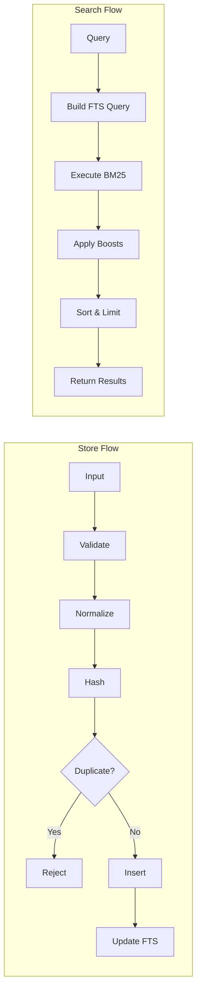

## API Design
**How do components communicate?**

### MCP Tool: `memory.storeKnowledge`

**Purpose**: Store a new knowledge item

**Input Schema** (Simplified - only 2 required fields):
```json
{
  "type": "object",
  "properties": {
    "title": {
      "type": "string",
      "description": "Short, explicit description of the rule (5-12 words)",
      "minLength": 10,
      "maxLength": 100
    },
    "content": {
      "type": "string",
      "description": "Detailed explanation in markdown format. Supports code blocks and examples.",
      "minLength": 50,
      "maxLength": 5000
    },
    "tags": {
      "type": "array",
      "items": { "type": "string" },
      "description": "Optional domain keywords (e.g., ['api', 'backend'])",
      "maxItems": 10,
      "default": []
    },
    "scope": {
      "type": "string",
      "description": "Optional scope: 'global', 'project:<name>', or 'repo:<name>'",
      "default": "global"
    }
  },
  "required": ["title", "content"]
}
```

**Output Schema**:
```json
{
  "type": "object",
  "properties": {
    "success": { "type": "boolean" },
    "id": { "type": "string" },
    "message": { "type": "string" }
  }
}
```

**Error Cases**:
- `VALIDATION_ERROR`: Title too short/long, content too generic
- `DUPLICATE_ERROR`: Knowledge with same title/scope or content hash exists
- `STORAGE_ERROR`: Database write failure

### MCP Tool: `memory.searchKnowledge`

**Purpose**: Retrieve relevant knowledge for a task

**Input Schema**:
```json
{
  "type": "object",
  "properties": {
    "query": {
      "type": "string",
      "description": "Natural language task description",
      "minLength": 3,
      "maxLength": 500
    },
    "contextTags": {
      "type": "array",
      "items": { "type": "string" },
      "description": "Optional tags to boost matching results (e.g., ['api', 'backend'])",
      "default": []
    },
    "scope": {
      "type": "string",
      "description": "Optional project/repo scope filter",
      "default": null
    },
    "limit": {
      "type": "integer",
      "minimum": 1,
      "maximum": 20,
      "default": 5
    }
  },
  "required": ["query"]
}
```

**Output Schema**:
```json
{
  "type": "object",
  "properties": {
    "results": {
      "type": "array",
      "items": {
        "type": "object",
        "properties": {
          "id": { "type": "string" },
          "title": { "type": "string" },
          "content": { "type": "string" },
          "tags": { "type": "array", "items": { "type": "string" } },
          "scope": { "type": "string" },
          "score": { "type": "number", "description": "Combined relevance score" }
        }
      }
    },
    "totalMatches": { "type": "integer" },
    "query": { "type": "string" }
  }
}
```

**Empty Database Behavior**:
When the database is empty or no results match the query:
```json
{
  "results": [],
  "totalMatches": 0,
  "query": "the original query string"
}
```

## Component Breakdown
**What are the major building blocks?**

### Directory Structure
```
packages/knowledge-memory-service/
├── src/
│   ├── index.ts                 # Entry point, MCP server setup
│   ├── server.ts                # MCP server implementation
│   ├── handlers/
│   │   ├── store.ts             # memory.storeKnowledge handler
│   │   └── search.ts            # memory.searchKnowledge handler
│   ├── database/
│   │   ├── connection.ts        # SQLite connection management
│   │   ├── schema.ts            # Schema creation & migrations
│   │   └── queries.ts           # Prepared statements
│   ├── services/
│   │   ├── validator.ts         # Knowledge quality validation
│   │   ├── normalizer.ts        # Text normalization, hashing
│   │   └── ranker.ts            # Result ranking logic
│   ├── types/
│   │   └── index.ts             # TypeScript interfaces
│   └── utils/
│       ├── errors.ts            # Custom error classes
│       └── logger.ts            # Logging utilities
├── tests/
│   ├── unit/
│   │   ├── validator.test.ts
│   │   ├── normalizer.test.ts
│   │   └── ranker.test.ts
│   └── integration/
│       ├── store.test.ts
│       └── search.test.ts
├── package.json
├── tsconfig.json
└── README.md
```

### Module Descriptions

| Module | Description |
|--------|-------------|
| **server.ts** | Sets up MCP stdio server, registers tools, handles lifecycle |
| **handlers/store.ts** | Validates input, checks duplicates, inserts knowledge |
| **handlers/search.ts** | Builds FTS query, executes search, applies ranking |
| **database/connection.ts** | Manages SQLite connection, enables WAL mode |
| **database/schema.ts** | Creates tables, FTS index, triggers, migrations |
| **services/validator.ts** | Checks title length, content specificity, tag validity |
| **services/normalizer.ts** | Lowercase, trim, normalize whitespace, compute hash |
| **services/ranker.ts** | Combines BM25 + priority + confidence + tags + scope |

## Design Decisions
**Why did we choose this approach?**

### Decision 1: SQLite + FTS5 over External Databases
**Choice**: SQLite with FTS5 full-text search  
**Rationale**:
- Zero external dependencies
- Single file, easy to backup/move
- FTS5 provides production-quality BM25 ranking
- Perfect for local-first, single-process architecture

**Alternatives Considered**:
- PostgreSQL: Too heavy, requires separate server
- Elasticsearch: Overkill for small knowledge base
- In-memory only: No persistence

### Decision 2: MCP stdio over HTTP
**Choice**: Model Context Protocol over stdio  
**Rationale**:
- Direct integration with AI agents
- No network overhead for local use
- Lower attack surface (no exposed ports)
- Easy evolution path: wrap stdio server with HTTP later

**Alternatives Considered**:
- HTTP REST API: More familiar, but unnecessary complexity for local use
- gRPC: Even more complex, overkill

### Decision 3: BM25 Lexical Search over Embeddings
**Choice**: FTS5 BM25 ranking for MVP  
**Rationale**:
- Deterministic, explainable results
- No external embedding API needed
- Fast, well-understood algorithm
- Embeddings can be added later as optional boost

**Alternatives Considered**:
- Vector embeddings (OpenAI): Requires API, adds latency, cost
- Hybrid BM25 + embeddings: Defer to later iteration

### Decision 4: Dual Deduplication Strategy
**Choice**: Unique constraints on (normalized_title, scope) AND (content_hash, scope)  
**Rationale**:
- Catches both title-based and content-based duplicates
- Normalized title handles minor wording differences
- Content hash catches copy-paste with different titles

### Decision 5: Scoped Knowledge with Project Priority
**Choice**: Scope as string (`global`, `project:X`, `repo:X`) with project-specific rules ranked higher  
**Rationale**:
- Simple, extensible format
- Allows future scopes without schema changes
- Project-specific rules get +0.5 boost, global gets +0.2 boost
- Both results shown, but project-scoped rules appear first

### Decision 6: Simple Version-Based Migrations
**Choice**: Store schema version in `meta` table, run migrations sequentially on startup  
**Rationale**:
- No external migration framework needed
- Simple numeric versioning (1, 2, 3...)
- Migration functions run once and are idempotent
- Easy to understand and debug

**Alternatives Considered**:
- Knex/TypeORM migrations: Too heavy for local-first
- No migrations: Can't evolve schema

## Non-Functional Requirements
**How should the system perform?**

### Performance Targets
| Metric | Target |
|--------|--------|
| Storage latency | < 100ms |
| Search latency | < 50ms (< 1000 items) |
| Cold start time | < 500ms |
| Memory footprint | < 100MB |
| Database size | < 50MB per 10,000 items |

### Scalability Considerations
- SQLite handles 10,000+ items efficiently with proper indexing
- FTS5 index scales linearly with content size
- WAL mode enables concurrent reads during writes
- For larger scale, evolve to PostgreSQL or HTTP service

### Security Requirements
- No authentication required (local process)
- Input validation prevents SQL injection (parameterized queries)
- Content length limits prevent DoS
- No sensitive data expected (guidelines, not secrets)

### Reliability/Availability Needs
- Graceful handling of database corruption
- Automatic schema migration on startup
- Transaction safety for writes
- No data loss on crash (SQLite durability)
```

## File: `brain/knowledge/docs_legacy/ai/design/feature-lint-command.md`
```markdown
---
phase: design
title: System Design & Architecture
description: Define the technical architecture, components, and data models
---

# System Design & Architecture

## Architecture Overview
**What is the high-level system structure?**

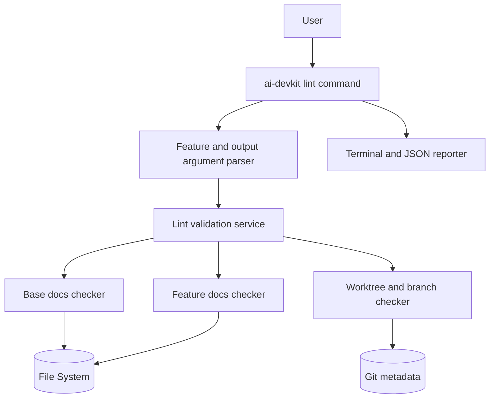

- Key components and responsibilities
  - `lint` command handler: parse options and orchestrate checks.
  - Name normalizer: convert `--feature` input into canonical `<name>` and `feature-<name>` (accept `foo` and `feature-foo`).
  - Base docs checker: validate required phase template files (`brain/knowledge/docs_legacy/ai/*/README.md`).
  - Feature docs checker: validate `brain/knowledge/docs_legacy/ai/{phase}/feature-<name>.md` across lifecycle phases.
  - Git/worktree checker: evaluate feature branch/worktree convention used by `dev-lifecycle` Phase 1 prerequisite.
  - Reporter (command-owned): consistent output rows (`[OK]`, `[MISS]`, `[WARN]`) and final summary with exit code.
- Technology stack choices and rationale
  - TypeScript within existing CLI package for shared UX and testability.
  - Extract shell script checks into reusable TS utilities to avoid behavior drift.
  - Git checks via lightweight git commands (`git worktree list`, branch existence checks) to preserve compatibility.

## Data Models
**What data do we need to manage?**

- Core entities and their relationships
  - `LintOptions`: parsed CLI options.
  - `LintTarget`: normalized feature identity (`name`, `branchName`, `docSlug`).
  - `LintCheckResult`: result of individual check.
  - `LintSummary`: aggregate counts and final status.
- Data schemas/structures
  - `LintOptions`
    - `{ feature?: string, json?: boolean }`
  - `LintTarget`
    - `{ rawFeature: string, normalizedName: string, branchName: string, docFilePrefix: string }`
  - `LintCheckResult`
    - `{ id: string, level: 'ok' | 'miss' | 'warn', category: 'base-docs' | 'feature-docs' | 'git-worktree', required: boolean, message: string, fix?: string }`
  - `LintSummary`
    - `{ checks: LintCheckResult[], hasRequiredFailures: boolean, warningCount: number }`
- Data flow between components
  - Parse args -> normalize feature -> run applicable checks -> collect results -> render terminal or JSON output -> return exit code.

## API Design
**How do components communicate?**

- External APIs (if applicable)
  - CLI invocations:
    - `ai-devkit lint`
    - `ai-devkit lint --feature <name>`
    - `ai-devkit lint --feature <name> --json`
- Internal interfaces
  - `runLintChecks(options, dependencies?): LintReport`
  - `renderLintReport(report, options): void` (in `commands/lint`)
  - `normalizeFeatureName(input): string`
  - `isInsideGitWorkTreeSync(cwd): boolean`
  - `localBranchExistsSync(cwd, branchName): boolean`
  - `getWorktreePathsForBranchSync(cwd, branchName): string[]`
- Request/response formats
  - Input: CLI flags and current working directory.
  - Output:
    - Default: human-readable checklist and summary.
    - `--json`: structured JSON object for CI parsing (checks, counts, normalized feature, pass/fail state).
  - Exit code policy:
    - `0`: no required failures.
    - `1`: one or more required failures.
    - Warnings (including missing dedicated worktree) do not change exit code when required checks pass.
- Authentication/authorization approach
  - Read-only operations only (filesystem + git metadata queries).

## Component Breakdown
**What are the major building blocks?**

- Frontend components (if applicable)
  - Terminal output formatter using existing CLI conventions.
  - JSON formatter for machine-readable mode.
- Backend services/modules
  - `commands/lint` command entry.
  - `services/lint/lint.service.ts` for orchestration and business rules only.
  - `services/lint/rules/*` for modular validation rules (base docs, feature docs, feature-name, git worktree).
  - `util/git` sync helpers for git/worktree checks.
  - `util/terminal-ui` for consistent terminal output formatting.
- Database/storage layer
  - None.
- Third-party integrations
  - Local git executable.

## Design Decisions
**Why did we choose this approach?**

- Key architectural decisions and trade-offs
  - Re-implement shell checks in TypeScript while keeping output semantics:
    - Pros: testable, reusable, cross-command integration.
    - Cons: initial duplication until script is retired/repointed.
  - Classify checks as required vs warning:
    - Pros: keeps lifecycle gating strict for missing docs while allowing advisory worktree guidance.
    - Cons: users may ignore warnings if not enforced in team policy.
  - Normalize feature names automatically:
    - Pros: better UX (`foo` and `feature-foo` both accepted).
    - Cons: requires clear messaging of normalized value.
  - Include `--json` output in v1:
    - Pros: CI-friendly parsing and automated reporting.
    - Cons: requires stable output schema maintenance.
- Alternatives considered
  - Keep shell script only and wrap it from CLI:
    - Rejected due to weaker cross-platform consistency and lower unit-test coverage.
  - Hard-fail when dedicated worktree is missing:
    - Rejected; requirement is warning-only behavior for this condition.
- Patterns and principles applied
  - Single-responsibility check modules.
  - Deterministic output for CI and humans.
  - Collect-all-results reporting to surface all issues in one run.
  - Avoid shell interpolation for git operations by using argument-based command execution.

## Non-Functional Requirements
**How should the system perform?**

- Performance targets
  - Complete typical checks in under 1 second on standard repositories.
- Scalability considerations
  - Check implementation should be extensible for additional lifecycle validations later.
- Security requirements
  - No file writes or mutations.
  - No network access required.
- Reliability/availability needs
  - Command should gracefully handle missing git repo context and provide actionable fixes.
```

## File: `brain/knowledge/docs_legacy/ai/design/feature-memory-search-table-output.md`
```markdown
---
phase: design
title: System Design & Architecture
description: Define the technical architecture, components, and data models
---

# System Design & Architecture

## Architecture Overview
**What is the high-level system structure?**

- Include a mermaid diagram that captures the main components and their relationships.
  ```mermaid
  graph TD
    User -->|memory search --table| CLI[CLI Command Parser]
    CLI --> SearchCmd[memorySearchCommand]
    SearchCmd --> MemorySvc[@ai-devkit/memory search]
    SearchCmd --> Formatter{Output Mode}
    Formatter -->|default| JsonOut[JSON Printer]
    Formatter -->|--table| TableOut[ui.table Renderer]
  ```
- Key components and their responsibilities
  - `packages/cli/src/commands/memory.ts`: parse `--table` and select output mode.
  - `@ai-devkit/memory` search command: unchanged data retrieval path.
  - `packages/cli/src/util/terminal-ui.ts`: table rendering utility for human-readable output.
- Technology stack choices and rationale
  - Reuse existing Commander option parsing.
  - Reuse existing table renderer to avoid introducing new formatting dependencies.

## Data Models
**What data do we need to manage?**

- Core entities and their relationships
  - `SearchKnowledgeResult` contains `results[]` with memory item metadata.
  - Table projection maps each result row to `{ id, title, scope }`.
- Data schemas/structures
  - No persistence or schema changes required.
  - Output-only projection is applied in CLI layer.
- Data flow between components
  - CLI options -> memory search execution -> format selection -> JSON or table output.

## API Design
**How do components communicate?**

- External APIs (if applicable)
  - None added.
- Internal interfaces
  - Extend CLI search command options with `table?: boolean`.
  - Keep `memorySearchCommand(options)` unchanged.
- Request/response formats
  - Existing command:
    - `npx ai-devkit@latest memory search --query "<query>" [--tags "..."] [--scope "..."] [--limit N]`
  - New table mode:
    - `npx ai-devkit@latest memory search --query "<query>" --table`
  - Table output columns:
    - `id`
    - `title`
    - `scope`
  - Empty result behavior:
    - Print a clear warning message (no table rows) and return success exit code (`0`).
- Authentication/authorization approach
  - No change.

## Component Breakdown
**What are the major building blocks?**

- Frontend components (if applicable)
  - Terminal-only output, no GUI.
- Backend services/modules
  - `registerMemoryCommand` search action branch for output selection.
  - Mapper utility (inline or helper) that extracts row fields from search results.
- Database/storage layer
  - No changes.
- Third-party integrations
  - No new integrations.

## Design Decisions
**Why did we choose this approach?**

- Key architectural decisions and trade-offs
  - Keep JSON as default to avoid breaking scripts.
  - Add opt-in table mode via a simple boolean flag.
  - Restrict table fields to `id`, `title`, `scope` to maximize scanability.
  - Truncate very long `title` values in table mode with ellipsis for terminal readability.
- Alternatives considered
  - `--format table|json` (more flexible but larger surface area for this request).
  - Replacing default output with table (rejected due to compatibility risk).
- Patterns and principles applied
  - Backward-compatible extension.
  - Presentation concern kept at CLI boundary, not in memory service layer.

## Non-Functional Requirements
**How should the system perform?**

- Performance targets
  - No measurable regression versus current search execution.
- Scalability considerations
  - Table rendering should remain usable for current capped `--limit` range.
- Security requirements
  - No security model changes; output formatting only.
- Reliability/availability needs
  - Table mode should gracefully handle empty result sets and undefined optional fields.
  - For narrow terminals, title truncation preserves legibility without changing underlying data.
```

## File: `brain/knowledge/docs_legacy/ai/design/feature-memory-update.md`
```markdown
---
phase: design
title: Memory Update CLI Command - Design
description: Technical design for updating memory items by ID
---

# Design: Memory Update CLI Command

## Architecture Overview

The update feature follows the same layered architecture as store and search:

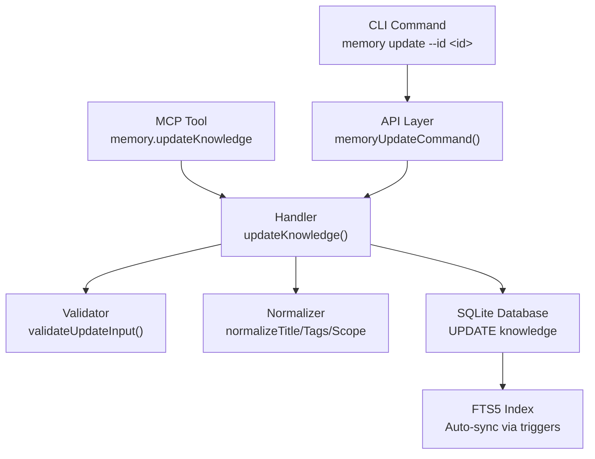

## Data Models

### New Types

```typescript
// Input for update operation
interface UpdateKnowledgeInput {
    id: string;           // Required - UUID of item to update
    title?: string;       // Optional - new title (10-100 chars)
    content?: string;     // Optional - new content (50-5000 chars)
    tags?: string[];      // Optional - new tags (replaces existing)
    scope?: string;       // Optional - new scope
}

// Result from update operation
interface UpdateKnowledgeResult {
    success: boolean;
    id: string;
    message: string;
}

// CLI options interface
interface MemoryUpdateOptions {
    id: string;
    title?: string;
    content?: string;
    tags?: string;        // Comma-separated string from CLI
    scope?: string;
}
```

### Existing Types Used
- `KnowledgeRow` — for querying existing item
- `NotFoundError` — already exists in `errors.ts`
- `DuplicateError`, `ValidationError`, `StorageError` — reused as-is

## API Design

### CLI Command

```
npx ai-devkit@latest memory update --id <uuid> [--title <title>] [--content <content>] [--tags <tags>] [--scope <scope>]
```

| Option | Required | Description |
|--------|----------|-------------|
| `--id <id>` | Yes | UUID of the knowledge item |
| `-t, --title <title>` | No | New title (10-100 chars) |
| `-c, --content <content>` | No | New content (50-5000 chars) |
| `--tags <tags>` | No | Comma-separated new tags (replaces all) |
| `-s, --scope <scope>` | No | New scope |

**Response (JSON):**
```json
{
  "success": true,
  "id": "uuid-here",
  "message": "Knowledge updated successfully"
}
```

### MCP Tool

Tool name: `memory.updateKnowledge`

Input schema matches `UpdateKnowledgeInput`. Returns JSON result via MCP text content.

## Component Breakdown

### 1. Handler: `packages/memory/src/handlers/update.ts`
- `updateKnowledge(input: UpdateKnowledgeInput): UpdateKnowledgeResult`
- Validates input via `validateUpdateInput()`
- Fetches existing item by ID (throws `NotFoundError` if missing)
- Merges provided fields with existing values
- Checks duplicate title/content (excluding self)
- Executes `UPDATE` SQL within transaction
- Returns success result

### 2. Validator: addition to `packages/memory/src/services/validator.ts`
- `validateUpdateInput(input: UpdateKnowledgeInput): void`
- Validates ID is a non-empty string
- Validates only provided fields (title, content, tags, scope) using existing validators
- Requires at least one field besides ID

### 3. API Layer: addition to `packages/memory/src/api.ts`
- `memoryUpdateCommand(options: MemoryUpdateOptions): UpdateKnowledgeResult`
- Converts CLI options (comma-separated tags string) to handler input
- Wraps in try/finally with `closeDatabase()`

### 4. CLI Command: addition to `packages/cli/src/commands/memory.ts`
- Registers `memory update` subcommand with Commander.js
- Passes options to `memoryUpdateCommand()`
- Outputs JSON result or error

### 5. MCP Tool: addition to `packages/memory/src/server.ts`
- Registers `memory.updateKnowledge` tool definition
- Handles tool call by invoking `updateKnowledge()` handler

## Design Decisions

| Decision | Choice | Rationale |
|----------|--------|-----------|
| Partial update | Only update provided fields | Matches user expectation — don't require re-supplying unchanged fields |
| Tag replacement | Replace all tags (not merge) | Simpler semantics; user provides full new tag list. Consistent with store behavior |
| Duplicate check | Exclude self from duplicate detection | Allow updating title/content without triggering self-duplicate |
| No migration needed | Existing schema handles UPDATE | DB triggers for FTS5 already handle UPDATE events |

## Non-Functional Requirements

- **Performance:** Single-row UPDATE by primary key — O(1) lookup, negligible overhead
- **Security:** Input validated before database access; parameterized queries prevent SQL injection
- **Reliability:** Transaction wrapping ensures atomicity; no partial updates
```

## File: `brain/knowledge/docs_legacy/ai/design/feature-project-skill-registry-priority.md`
```markdown
---
phase: design
title: System Design & Architecture
description: Merge registry sources with project-first precedence for skill installation
---

# System Design & Architecture

## Architecture Overview
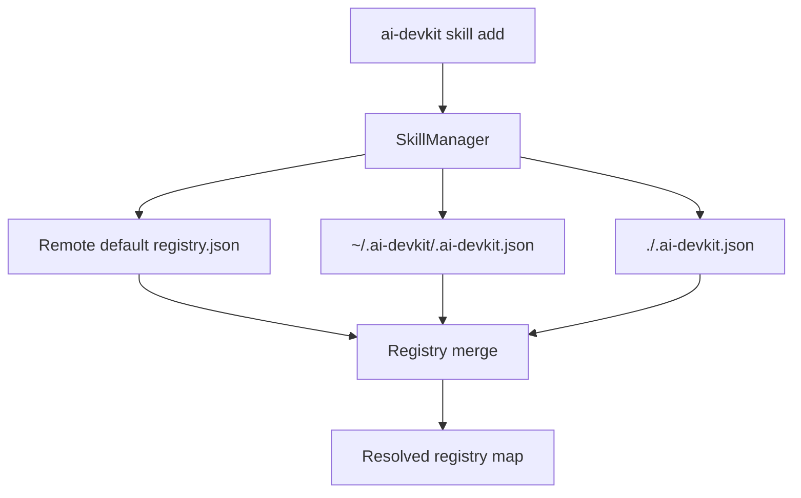

- `SkillManager.fetchMergedRegistry` remains the single merge point.
- `ConfigManager` adds project registry extraction.
- Merge order is implemented as object spread with source ordering.

## Data Models
- Registry map shape: `Record<string, string>`.
- Project registry extraction supports:
  - `registries` at root.
  - `skills.registries` when `skills` is an object.

## API Design
- `ConfigManager.getSkillRegistries(): Promise<Record<string, string>>`.
- `SkillManager.fetchMergedRegistry()` now merges three sources.

## Component Breakdown
- `packages/cli/src/lib/Config.ts`: parse project registry mappings.
- `packages/cli/src/lib/SkillManager.ts`: apply precedence order.
- Tests:
  - `packages/cli/src/__tests__/lib/Config.test.ts`
  - `packages/cli/src/__tests__/lib/SkillManager.test.ts`

## Design Decisions
- Keep merge logic centralized in `SkillManager` to avoid drift.
- Keep parser tolerant to allow gradual config evolution.
- Favor project determinism by applying project map last.

## Non-Functional Requirements
- No additional network calls.
- No change to failure mode when default registry fetch fails (still supports fallback sources).
```

## File: `brain/knowledge/docs_legacy/ai/design/feature-reimpl-claude-code-adapter.md`
```markdown
---
phase: design
title: "Re-implement Claude Code Adapter - Design"
feature: reimpl-claude-code-adapter
description: Architecture and implementation design for re-implementing ClaudeCodeAdapter using CodexAdapter patterns
---

# Design: Re-implement Claude Code Adapter

## Architecture Overview

```mermaid
graph TD
  User[User runs ai-devkit agent list/open] --> Cmd[packages/cli/src/commands/agent.ts]
  Cmd --> Manager[AgentManager]

  subgraph Pkg[@ai-devkit/agent-manager]
    Manager --> Claude[ClaudeCodeAdapter ← reimplemented]
    Manager --> Codex[CodexAdapter]
    Claude --> Proc[process utils]
    Claude --> File[file utils]
    Claude --> Types[AgentAdapter/AgentInfo/AgentStatus]
    Focus[TerminalFocusManager]
  end

  Cmd --> Focus
  Cmd --> Output[CLI table/json rendering]
```

Responsibilities:
- `ClaudeCodeAdapter`: discover running Claude processes, match with sessions via process start time + CWD, emit `AgentInfo`
- `AgentManager`: aggregate Claude + Codex adapter results (unchanged)
- CLI command: register adapters, display results (unchanged)

## Data Models

- Reuse existing `AgentAdapter`, `AgentInfo`, `AgentStatus`, and `AgentType` models — no changes
- `AgentType` already supports `claude`; adapter emits `type: 'claude'`
- Internal session model (`ClaudeSession`) updated to include `sessionStart` for time-based matching:
  - `sessionId`: from JSONL filename
  - `projectPath`: from `sessions-index.json` → `originalPath`, falls back to `lastCwd` when index missing
  - `lastCwd`: from session JSONL entries
  - `slug`: from session JSONL entries
  - `sessionStart`: from first JSONL entry timestamp (supports both top-level `timestamp` and `snapshot.timestamp` for `file-history-snapshot` entries)
  - `lastActive`: latest timestamp in session
  - `lastEntryType`: type of last non-metadata session entry (excludes `last-prompt`, `file-history-snapshot`; used for status determination)
  - `lastUserMessage`: last meaningful user message from session JSONL (with command parsing and noise filtering)

## API Design

### Package Exports
- No changes to `packages/agent-manager/src/adapters/index.ts`
- No changes to `packages/agent-manager/src/index.ts`
- `ClaudeCodeAdapter` public API remains identical

### CLI Integration
- No changes to `packages/cli/src/commands/agent.ts`

## Component Breakdown

1. `packages/agent-manager/src/adapters/ClaudeCodeAdapter.ts` — full rewrite
   - Adopt CodexAdapter's structural patterns:
     - `listClaudeProcesses()`: extract process listing
     - `calculateSessionScanLimit()`: bounded scanning
     - `getProcessStartTimes()`: process elapsed time → start time mapping
     - `findSessionFiles()`: bounded file discovery with breadth-first scanning (one per project, then fill globally by mtime)
     - `readSession()`: parse single session (meta + last entry + timestamps)
     - `selectBestSession()`: filter + rank candidates by start time
     - `filterCandidateSessions()`: mode-based filtering (`cwd` / `missing-cwd` / `parent-child`)
     - `isClaudeExecutable()`: precise executable detection (basename check, not substring)
     - `isChildPath()`: parent-child path relationship check
     - `pathRelated()`: combined equals/parent/child check for path matching
     - `rankCandidatesByStartTime()`: tolerance-based ranking
     - `assignSessionsForMode()`: orchestrate matching per mode (tracking inlined)
     - `extractUserMessageText()`: extract meaningful text from user messages (string or array content)
     - `parseCommandMessage()`: parse `<command-message>` tags into `/command args` format
     - `isNoiseMessage()`: filter out non-meaningful messages (interruptions, tool loads, continuations)
     - `isMetadataEntryType()`: skip metadata entry types (`last-prompt`, `file-history-snapshot`) when tracking `lastEntryType`
     - `determineStatus()`: status from entry type (no age override)
     - `generateAgentName()`: project basename + disambiguation

   - Claude-specific adaptations (differs from Codex):
     - Session discovery: walk `~/.claude/projects/*/` reading `*.jsonl` files. Uses `sessions-index.json` for `originalPath` when available, falls back to `lastCwd` from session content when index is missing (common in practice)
     - Bounded scanning: collect all `*.jsonl` files with mtime, sort by mtime descending, take top N. No process-day window (Claude sessions aren't organized by date — mtime-based cutoff is sufficient since we already stat files during discovery).
     - `sessionStart`: parsed from first JSONL entry — checks `entry.timestamp` then `entry.snapshot.timestamp` (for `file-history-snapshot` entries common in practice)
     - Summary: extracted from last user message in session JSONL (no history.jsonl dependency). Handles `<command-message>` tags for slash commands, filters skill expansions and noise messages
     - Status: map Claude entry types (`user`, `assistant`, `progress`, `thinking`, `system`) to `AgentStatus`. Metadata types (`last-prompt`, `file-history-snapshot`) are excluded. No age-based IDLE override
     - Name: use slug for disambiguation (Claude sessions have slugs)

2. `packages/agent-manager/src/__tests__/adapters/ClaudeCodeAdapter.test.ts` — update tests
   - Adapt mocking to match new internal structure
   - Add tests for process start time matching
   - Add tests for bounded session scanning
   - Keep all existing behavioral assertions

## Design Decisions

- Decision: Rewrite ClaudeCodeAdapter internals, keep public API identical.
  - Rationale: zero impact on consumers; purely structural improvement.
- Decision: Add process start time matching for session pairing.
  - Rationale: improves accuracy when multiple Claude processes share the same CWD, consistent with CodexAdapter.
- Decision: Bound session scanning with MIN/MAX limits.
  - Rationale: keeps latency predictable as history grows, consistent with CodexAdapter.
- Decision: Replace `cwd` → `history` → `project-parent` flow with `cwd` → `missing-cwd` → `parent-child`, with tolerance-gated deferral in early modes.
  - Rationale: simpler, consistent with CodexAdapter. `cwd` and `missing-cwd` modes defer assignment when the best candidate is outside start-time tolerance, allowing `parent-child` mode to find a better match (e.g., worktree sessions). `parent-child` mode matches sessions where process CWD equals, is a parent, or child of session project path — it includes exact CWD as a safety net for deferred matches. This avoids the greedy matching of the original `any` mode which caused cross-project session stealing.
- Decision: Within start-time tolerance, rank by recency (`lastActive`) instead of smallest time difference.
  - Rationale: a 6s vs 45s start-time diff is noise within the 2-minute window. The session with more recent activity is the correct one — prevents stub sessions from beating real work sessions.
- Decision: Use precise executable detection (`isClaudeExecutable`) instead of substring matching.
  - Rationale: `command.includes('claude')` falsely matched processes whose path arguments contained "claude" (e.g., nx daemon in a worktree named `feature-reimpl-claude-code-adapter`). Checking the basename of the first command word (`claude` or `claude.exe`) matches CodexAdapter's `isCodexExecutable` pattern.
- Decision: Make `sessions-index.json` optional, fall back to `lastCwd` from session content.
  - Rationale: most Claude project directories lack `sessions-index.json` in practice, causing entire projects to be skipped during session discovery. Using `lastCwd` from the JSONL entries provides a reliable fallback.
- Decision: Remove history.jsonl dependency, extract summary from session JSONL directly.
  - Rationale: session JSONL already contains the conversation. Extracting the last user message is more reliable than history.jsonl which only covers recent sessions. Includes command tag parsing for slash commands and noise filtering.
- Decision: Process-only agents (no session file) show IDLE status with "Unknown" summary.
  - Rationale: without session data, we can't determine actual status or task. IDLE + Unknown is more honest than RUNNING + "Claude process running".
- Decision: Ensure breadth in bounded scanning — at least one session per project directory.
  - Rationale: projects with many sessions (e.g., ai-devkit with 20+ files) consumed all scan slots, starving other projects. Two-pass scanning (one per project, then fill globally) ensures every project is represented.
- Decision: No age-based IDLE override for process-backed agents.
  - Rationale: every agent in the list is backed by a running process found via `ps`. The session entry type (`user`/`assistant`/`progress`/`system`) is a more accurate status indicator than a time threshold. Removed the 5-minute IDLE override.
- Decision: Keep matching orchestration in explicit phases with extracted helper methods and PID/session tracking sets.
  - Rationale: mirrors CodexAdapter structure for maintainability.
- Decision: Use mtime-based bounded scanning without process-day window.
  - Rationale: Claude sessions use project-based directories (not date-based like Codex), so date-window lookup isn't cheap. Mtime-based top-N is sufficient and simpler.

## Non-Functional Requirements

- Performance: bounded session scanning ensures `agent list` latency stays predictable.
- Reliability: adapter failures remain isolated (AgentManager catches per-adapter errors).
- Maintainability: structural alignment with CodexAdapter means one pattern to understand.
- Security: only reads local metadata/process info already permitted by existing CLI behavior.
```

## File: `brain/knowledge/docs_legacy/ai/design/feature-setup-wizard.md`
```markdown
---
phase: design
title: System Design & Architecture
description: Define the technical architecture, components, and data models
---

# System Design & Architecture

## Architecture Overview
**What is the high-level system structure?**

- Include a mermaid diagram that captures the main components and their relationships. Example:
  ```mermaid
  graph TD
    User -->|CLI| SetupWizard
    SetupWizard --> Detector[Environment Detector]
    SetupWizard --> ProfileEngine[Profile Recommender]
    SetupWizard --> Planner[Plan Builder]
    Planner --> Adapters[Tool Adapters]
    Adapters --> FileOps[Safe File Ops]
    FileOps --> ToolDirs[Global Tool Directories]
    Planner --> StateStore[Setup State + Manifest]
    SetupWizard --> Reporter[Result Reporter]
  ```
- Key components and their responsibilities
  - SetupWizard: orchestrates interactive and non-interactive flows.
  - Environment Detector: discovers installed/supported tools and existing global configs.
  - Profile Recommender: proposes setup defaults by user persona (quickstart, team baseline, custom).
  - Plan Builder: computes deterministic operations (`create`, `update`, `skip`, `backup`).
  - Tool Adapters: map tool capabilities and paths (commands/skills/instruction files).
  - Safe File Ops: apply with backup, dry-run preview, conflict handling, and rollback boundaries.
  - State Store: keeps setup metadata for idempotency and drift detection.
  - Reporter: prints result summary and next-step recommendations.
- Technology stack choices and rationale
  - Node/TypeScript to align with current CLI architecture.
  - Reuse existing prompt UI (`inquirer` and terminal-ui abstractions) for consistent UX.
  - Adapter-based design to avoid hardcoded branching and simplify future tool expansion.

## Data Models
**What data do we need to manage?**

- Core entities and their relationships
  - ToolAdapter: describes capabilities and paths for one environment.
  - SetupProfile: predefined recommendation set (assets + policies).
  - SetupPlan: resolved operations generated from user choices + current state.
  - SetupState: persisted metadata from prior setup runs.
  - SetupReport: structured outcome summary of applied/skipped/failed operations.
- Data schemas/structures
  - `ToolAdapter`
    - `{ code, name, capabilities: { globalCommands, globalSkills, globalInstructionFile }, paths, formats }`
  - `SetupPlan`
    - `{ id, createdAt, toolSelections, operations[], backupPolicy, overwritePolicy, dryRun }`
  - `Operation`
    - `{ type, source, target, assetType, toolCode, strategy, status, reason? }`
  - `SetupState`
    - `{ version, lastRunAt, fingerprintsByTarget, selectedProfile, selectedTools }`
- Data flow between components
  - Detector -> Profile Recommender -> Plan Builder -> Safe File Ops -> State Store -> Reporter.

## API Design
**How do components communicate?**

- External APIs (if applicable)
  - No mandatory external API calls in v1 core flow.
  - Optional future metadata refresh may use registry endpoints if online.
- Internal interfaces
  - `detectEnvironments(): DetectedEnvironment[]`
  - `recommendProfiles(context): SetupProfile[]`
  - `buildPlan(input): SetupPlan`
  - `applyPlan(plan): SetupReport`
  - `renderReport(report): void`
- Request/response formats
  - CLI entry points
    - `npx ai-devkit@latest setup` (interactive wizard default)
    - `npx ai-devkit@latest setup --non-interactive --profile <name> --tools codex,claude --assets commands,skills`
    - `npx ai-devkit@latest setup --dry-run`
    - `npx ai-devkit@latest setup --doctor` (recommended extension for diagnostics)
  - Output
    - Human-readable summary by default.
    - Optional machine-readable JSON report (`--json`) for CI/auditing.
- Authentication/authorization approach
  - Setup writes only to user-accepted paths.
  - No secret material stored in setup state.
  - Existing auth for each tool remains managed by that tool.

## Component Breakdown
**What are the major building blocks?**

- Frontend components (if applicable)
  - Terminal wizard screens: welcome, profile selection, tool selection, asset selection, preview, apply, summary.
- Backend services/modules
  - `SetupWizardService`
  - `EnvironmentDetector`
  - `ProfileRecommendationService`
  - `SetupPlanner`
  - `SetupExecutor`
  - `SetupStateRepository`
  - `SetupReporter`
- Database/storage layer
  - Local state file under user config/cache path (for example `~/.ai-devkit/setup-state.json`).
  - Backup snapshots with timestamps when overwrite policy requires backup.
- Third-party integrations
  - Tool path conventions from Codex/Claude/Antigravity adapter definitions.
  - Optional shells for environment checks where required.

## Design Decisions
**Why did we choose this approach?**

- Key architectural decisions and trade-offs
  - Make wizard the default instead of requiring `--global`:
    - Pros: better discoverability, lower onboarding friction.
    - Cons: users who prefer scripts need explicit non-interactive flags.
  - Use capability-driven adapters instead of tool-specific branching:
    - Pros: scalable for new tools and clearer testability.
    - Cons: initial refactor overhead.
  - Use plan/apply workflow with dry-run:
    - Pros: safer writes, auditable operations, easier debugging.
    - Cons: slightly more implementation complexity.
  - Keep idempotent state + fingerprints:
    - Pros: fast reruns, accurate drift detection.
    - Cons: need robust state migration/versioning.
  - Keep setup local-first (no required network):
    - Pros: reliable and fast.
    - Cons: recommendations may be less dynamic without optional online metadata.
- Alternatives considered
  - Keep `setup --global` and add more flags:
    - Rejected: scales poorly as feature matrix grows.
  - One-off shell scripts per tool:
    - Rejected: difficult to maintain and non-portable.
  - Full policy engine in v1:
    - Deferred: high complexity for limited initial user value.
- Patterns and principles applied
  - Progressive disclosure (quick path vs advanced mode).
  - Idempotent infrastructure-like planning/apply model.
  - Fail-soft execution: partial success with explicit report.

## Non-Functional Requirements
**How should the system perform?**

- Performance targets
  - Startup detection and wizard initialization under 2s for typical local setups.
  - Dry-run planning under 1s with warm state.
- Scalability considerations
  - Adapter registry should support 10+ environments without major UX degradation.
  - File operation engine should handle large command/skill templates predictably.
- Security requirements
  - Never write outside approved user paths.
  - Never overwrite without policy confirmation.
  - Never persist secrets in state, logs, or reports.
- Reliability/availability needs
  - Each operation isolated; one tool failure should not corrupt others.
  - Backup and recoverable operations for overwrite scenarios.
  - Clear actionable failure messages with remediation steps.

```

## File: `brain/knowledge/docs_legacy/ai/design/feature-skill-find.md`
```markdown
---
phase: design
title: System Design & Architecture
description: Define the technical architecture, components, and data models
---

# System Design & Architecture

## Architecture Overview
**What is the high-level system structure?**

- Include a mermaid diagram that captures the main components and their relationships.
  ```mermaid
  graph TD
    User -->|CLI| SkillFind
    SkillFind --> RegistryList
    SkillFind --> IndexStore
    SkillFind --> IndexBuilder
    IndexBuilder -->|GitHub tree API| RegistryApi
    IndexBuilder -->|raw SKILL.md| RawFiles
    RegistryApi -->|skills paths| IndexBuilder
    RawFiles -->|descriptions| IndexBuilder
  ```
- Key components and their responsibilities
  - SkillFind: CLI command `skill find` orchestrates index checks and search.
  - RegistryList: reads `skills/registry.json` to discover registries.
  - IndexBuilder: builds or updates a local index without full clones.
  - IndexStore: local cache file (json) with searchable entries and metadata.
  - RegistrySources: GitHub API access to registry metadata and raw files.
- Technology stack choices and rationale
  - Node/TypeScript to align with existing CLI.
  - Git commands or HTTP fetch for low-cost metadata access.
  - Local cache under user cache dir to avoid repo writes.

## Data Models
**What data do we need to manage?**

- Core entities and their relationships
  - Registry: `{ name, url, branch?, skillsPath }`
  - SkillEntry: `{ name, registry, path, description, lastIndexed }` (description from `SKILL.md`)
  - IndexMeta: `{ version, createdAt, updatedAt, ttlSeconds, registriesHash, registryHeads? }`
- Data schemas/structures
  - `index.json` with `{ meta, skills: SkillEntry[] }`
- Data flow between components
  - RegistryList -> IndexBuilder (registry config)
  - IndexBuilder -> IndexStore (write updated index)
  - SkillFind -> IndexStore (read and search)

## API Design
**How do components communicate?**

- External APIs (if applicable)
  - GitHub REST tree API to list `skills/` paths without cloning.
  - GitHub raw file fetch to read each `SKILL.md` description.
  - Git `ls-remote` to detect head changes for refresh decisions.
- Internal interfaces
  - `getRegistries(): Registry[]`
  - `ensureIndex(registries): Index` (checks TTL, registry list hash, optional head hash)
  - `searchIndex(index, keyword): SkillEntry[]`
- Request/response formats
  - CLI: `npx ai-devkit@latest skill find <keyword>`
  - Output: table or list with `skillName` and `description`
- Authentication/authorization approach
  - GitHub unauthenticated rate limits apply (60 requests/hour).
  - Support tokens if users configure them to increase limits.

## Component Breakdown
**What are the major building blocks?**

- Frontend components (if applicable)
  - CLI output formatting only (no UI).
- Backend services/modules
  - `skill-find` command handler.
  - `registry-reader` to parse registry list.
  - `index-builder` to assemble skill entries.
  - `search` utility for keyword matching.
- Database/storage layer
  - Local cache file in user cache dir (json).
- Third-party integrations
  - GitHub REST API for tree listing and raw file fetch.
  - Git CLI for optional head hash checks.

## Design Decisions
**Why did we choose this approach?**

- Key architectural decisions and trade-offs
  - Use local index to avoid repeated network calls per search.
  - Prefer metadata fetch over full repo clone for speed and bandwidth.
  - TTL-based refresh plus manual `--refresh` option for freshness control.
  - Optionally compare remote head hashes to detect changes cheaply.
  - Store index at `~/.ai-devkit/skills.json`.
- Alternatives considered
  - Git sparse checkout of `skills/` only (still needs Git and network).
  - Remote centralized index service (fast, but adds infra and availability).
  - On-demand repo scan per search (simple but slow and wasteful).
- Patterns and principles applied
  - Cache with explicit invalidation (TTL + registry list hash).
  - Fail-soft behavior (use stale index if refresh fails).

## Non-Functional Requirements
**How should the system perform?**

- Performance targets
  - Search completes in < 500ms with a warm index.
  - Index refresh completes in < 30s for typical registry sizes.
- Scalability considerations
  - Index size grows linearly with skills; support thousands of entries.
  - Avoid full clones to keep bandwidth stable as registries grow.
- Security requirements
  - Avoid executing registry code; only read metadata paths.
  - Do not store credentials in index.
- Reliability/availability needs
  - Use last-known index if refresh fails.
  - Provide clear error messaging for unreachable registries.

```

## File: `brain/knowledge/docs_legacy/ai/design/feature-skill-management.md`
```markdown
---
phase: design
title: System Design & Architecture
description: Define the technical architecture, components, and data models
---

# System Design & Architecture: Skill Management

## Architecture Overview
**What is the high-level system structure?**

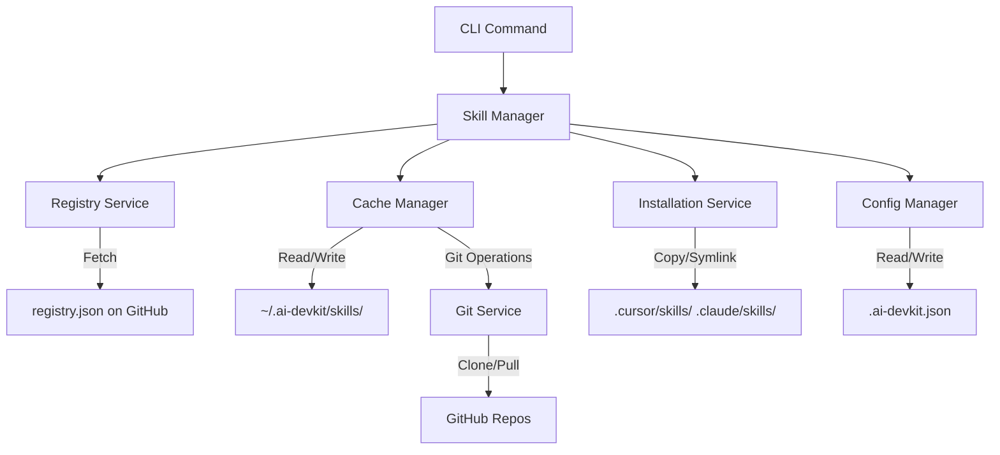

### Key Components (MVP - Simplified)
1. **CLI Command Interface** (`src/commands/skill.ts`): Handles `add`, `remove`, `list`
2. **Skill Manager** (`src/lib/SkillManager.ts`): All logic here (git, symlink, file ops)
3. **Config Manager** (existing): Reads `.ai-devkit.json`

**Note**: One SkillManager class does everything for MVP. Split into services later if needed.

### Technology Stack (MVP)
- **Language**: TypeScript (consistent with existing CLI)
- **CLI Framework**: Commander.js (already in project)
- **Git Operations**: `child_process.exec('git ...')` - no library needed
- **File Operations**: Node.js built-in `fs` module
- **HTTP**: Built-in `https` module or `node-fetch` (if already in project)

**Note**: No new dependencies if possible. Use what's already there.

## Data Models
**What data do we need to manage?**

### Registry Schema (`registry.json`) - MVP
```typescript
interface SkillRegistry {
  registries: Record<string, string>;  // id -> GitHub URL
}
```

**Example registry.json**:
```json
{
  "registries": {
    "anthropics/skills": "https://github.com/anthropics/skills.git",
    "vercel-labs/agent-skills": "https://github.com/vercel-labs/agent-skills.git"
  }
}
```

**Note**: Keep it simple - just a map of registry ID to git URL. We can add metadata later.

### Local Cache Structure (MVP)
```
~/.ai-devkit/
└── skills/
    ├── anthropics/
    │   └── skills/           # Git repo cloned here
    │       ├── .git/
    │       ├── frontend-design/
    │       └── ...
    └── vercel-labs/
        └── agent-skills/
```

**Note**: No user config, no manifest tracking for MVP. Just cache the repos.

## API Design
**How do components communicate?**

### CLI Commands (MVP)
```bash
# Add a skill (core command)
ai-devkit skill add <registry>/<repo> <skill-name>
# Example: ai-devkit skill add anthropics/skills frontend-design

# List installed skills
ai-devkit skill list

# Remove a skill
ai-devkit skill remove <skill-name>
```

**Note**: Start with these 3 commands. Add search, info, update, options later.

### Internal API Structure

#### SkillManager (MVP - Simplified)
```typescript
class SkillManager {
  constructor(
    private configManager: ConfigManager
  ) {}

  async addSkill(registryId: string, skillName: string): Promise<void>
  async removeSkill(skillName: string): Promise<void>
  async listSkills(): Promise<string[]>  // Just skill names
}
```

**Note**: All logic in SkillManager for MVP. No separate services yet. Use Node.js built-ins:
- `child_process.exec()` for git commands
- `fs` for file operations
- `fs.symlink()` with try/catch for symlinks

## Component Breakdown (MVP)

### CLI Commands (`src/commands/skill.ts`)
```typescript
// Register 3 commands with Commander.js
program
  .command('skill add <registry-repo> <skill-name>')
  .action(async (registryRepo, skillName) => {
    const manager = new SkillManager(configManager);
    await manager.addSkill(registryRepo, skillName);
  });

program
  .command('skill list')
  .action(async () => {
    const manager = new SkillManager(configManager);
    const skills = await manager.listSkills();
    console.table(skills);
  });

program
  .command('skill remove <skill-name>')
  .action(async (skillName) => {
    const manager = new SkillManager(configManager);
    await manager.removeSkill(skillName);
  });
```

### Skill Manager (`src/lib/SkillManager.ts`)
Single class with all logic:
- Fetch hardcoded registry.json from GitHub
- Check if repo cached in `~/.ai-devkit/skills/`
- If not, run `git clone` via child_process
- Read `.ai-devkit.json` for environments
- Try `fs.symlink()`, fallback to `fs.cp()` if fails
- List skills by reading `.cursor/skills/` and `.claude/skills/` directories
- Remove skills by `fs.rm()`

**That's it. ~200-300 lines total.**

## Design Decisions (MVP - Keep It Simple)

### 1. All Logic in One SkillManager Class
**Decision**: No separate service classes for MVP

**Rationale**: MVP needs ~200-300 lines. Split into services later if it grows

### 2. Symlink with Copy Fallback
**Decision**: Try symlink first, copy if it fails

**Rationale**: 
- Symlinks save disk space (main benefit)
- Auto-fallback handles Windows gracefully
- No user choice needed (keep it simple)

### 3. No Tracking Manifest
**Decision**: No `.ai-devkit/skills.json` for MVP

**Rationale**:
- List skills by reading directories (simple)
- No state to keep in sync
- Add manifest later if needed

### 4. Hardcoded Registry URL for MVP
**Decision**: Fetch from fixed GitHub URL in code

**Rationale**:
- No registry service needed
- No local caching logic
- Just fetch JSON on demand
- Add sophistication later

### 5. No Search, No Info, No Update for MVP
**Decision**: Only `add`, `list`, `remove`

**Rationale**: Core workflow is complete with these 3. Add features incrementally.

## Non-Functional Requirements (MVP - Simplified)

### Performance
- Cached install: < 2 seconds (symlink is instant)
- Fresh clone: < 15 seconds (depends on repo size)

### Security
- Validate registry ID format (no `..` or special chars)
- Only clone from hardcoded registry list
- No arbitrary URLs for MVP

### Reliability
- Show clear errors (git fails, network issues, etc.)
- Try/catch around symlink, fallback to copy

### Usability
- Progress messages: "Cloning...", "Installing...", "Done!"
- Works on macOS, Linux, Windows
```

## File: `brain/knowledge/docs_legacy/ai/design/feature-skill-update.md`
```markdown
---
phase: design
title: System Design & Architecture
description: Define the technical architecture, components, and data models
---

# System Design & Architecture: Skill Update

## Architecture Overview
**What is the high-level system structure?**

```mermaid
graph TD
    CLI[skill.ts Command] -->|calls| SM[SkillManager]
    SM -->|uses| GU[Git Utilities]
    SM -->|reads| Cache[~/.ai-devkit/skills/]
    SM -->|validates| GC[GlobalConfigManager]
    
    GU -->|executes| Git[git pull]
    Cache -->|contains| R1[Registry 1/.git]
    Cache -->|contains| R2[Registry 2/.git]
    Cache -->|contains| R3[Registry 3/no-git]
    
    SM -->|collects| Results[Update Results]
    Results -->|displays| Summary[Success/Skip/Error Summary]
```

### Key Components
1. **CLI Command Handler** (`skill.ts`): Parses user input and delegates to SkillManager
2. **SkillManager** (`SkillManager.ts`): Orchestrates update logic, error handling, and reporting
3. **Git Utilities** (`util/git.ts`): Provides git operations (new `pullRepository` function)
4. **Skill Cache** (`~/.ai-devkit/skills/`): File system storage for cloned registries

### Technology Stack
- **Language**: TypeScript
- **CLI Framework**: Commander.js (existing)
- **File System**: fs-extra (existing)
- **Process Execution**: child_process.exec (existing in git utils)
- **Styling**: chalk (existing)

## Data Models
**What data do we need to manage?**

### UpdateResult Interface
```typescript
interface UpdateResult {
  registryId: string;      // e.g., "anthropic/skills"
  status: 'success' | 'skipped' | 'error';
  message: string;         // Human-readable status message
  error?: Error;           // Error object if status is 'error'
}
```

### UpdateSummary Interface
```typescript
interface UpdateSummary {
  total: number;           // Total registries processed
  successful: number;      // Successfully updated
  skipped: number;         // Skipped (non-git)
  failed: number;          // Failed with errors
  results: UpdateResult[]; // Detailed results
}
```

### Data Flow
1. User runs command → CLI parses arguments
2. SkillManager scans cache directory → identifies registries
3. For each registry → check if git repo → attempt pull
4. Collect results → aggregate summary → display to user

## API Design
**How do components communicate?**

### New SkillManager Methods

#### `updateSkills(registryId?: string): Promise<UpdateSummary>`
Updates all skills or a specific registry.

**Parameters**:
- `registryId` (optional): Specific registry to update (e.g., "anthropic/skills")

**Returns**: `UpdateSummary` with detailed results

**Behavior**:
- If `registryId` provided: Update only that registry
- If `registryId` omitted: Update all registries in cache
- Validates git installation before proceeding
- Continues on errors, collecting all results

#### `private updateRegistry(registryPath: string, registryId: string): Promise<UpdateResult>`
Updates a single registry.

**Parameters**:
- `registryPath`: Absolute path to registry directory
- `registryId`: Registry identifier (e.g., "anthropic/skills")

**Returns**: `UpdateResult` for this registry

**Behavior**:
1. Check if `.git` directory exists
2. If not git repo: return 'skipped' status
3. If git repo: call `pullRepository`
4. If pull succeeds: return 'success' status
5. If pull fails: return 'error' status with error details

### New Git Utility Functions

#### `pullRepository(repoPath: string): Promise<void>`
Pulls latest changes for a git repository.

**Parameters**:
- `repoPath`: Absolute path to git repository

**Throws**: Error if git pull fails

**Implementation**:
```typescript
export async function pullRepository(repoPath: string): Promise<void> {
  try {
    await execAsync('git pull', {
      cwd: repoPath,
      timeout: 30000,
    });
  } catch (error: any) {
    throw new Error(`Git pull failed: ${error.message}`);
  }
}
```

#### `isGitRepository(dirPath: string): Promise<boolean>`
Checks if a directory is a git repository.

**Parameters**:
- `dirPath`: Absolute path to directory

**Returns**: `true` if `.git` exists, `false` otherwise

**Implementation**:
```typescript
export async function isGitRepository(dirPath: string): Promise<boolean> {
  const gitDir = path.join(dirPath, '.git');
  return await fs.pathExists(gitDir);
}
```

### CLI Command Interface

```typescript
skillCommand
  .command('update [registry-id]')
  .description('Update skills from registries (e.g., ai-devkit skill update or ai-devkit skill update anthropic/skills)')
  .action(async (registryId?: string) => {
    // Implementation
  });
```

## Component Breakdown
**What are the major building blocks?**

### 1. Command Handler (`skill.ts`)
**Responsibilities**:
- Parse command arguments
- Create SkillManager instance
- Call `updateSkills()` method
- Handle top-level errors
- Exit with appropriate code

**Changes Required**:
- Add new `update [registry-id]` command
- Wire up to SkillManager.updateSkills()

### 2. SkillManager (`SkillManager.ts`)
**Responsibilities**:
- Scan skill cache directory
- Filter registries (all or specific)
- Orchestrate updates with progress feedback
- Collect and aggregate results
- Format and display summary

**New Methods**:
- `updateSkills(registryId?: string): Promise<UpdateSummary>`
- `private updateRegistry(registryPath: string, registryId: string): Promise<UpdateResult>`
- `private displayUpdateSummary(summary: UpdateSummary): void`

### 3. Git Utilities (`util/git.ts`)
**Responsibilities**:
- Execute git pull command
- Validate git repository status
- Handle git errors

**New Functions**:
- `pullRepository(repoPath: string): Promise<void>`
- `isGitRepository(dirPath: string): Promise<boolean>`

### 4. Progress Display
**Responsibilities**:
- Show real-time progress for each registry
- Use chalk for colored output
- Provide clear status indicators

**Output Format**:
```
Updating skills...

  → anthropic/skills... ✓ Updated
  → openai/skills... ⊘ Skipped (not a git repository)
  → custom/tools... ✗ Failed (uncommitted changes)

Summary:
  ✓ 1 updated
  ⊘ 1 skipped
  ✗ 1 failed

Errors:
  • custom/tools: Git pull failed: You have unstaged changes. 
    Tip: Run 'git status' in ~/.ai-devkit/skills/custom/tools to see details.
```

## Design Decisions
**Why did we choose this approach?**

### Decision 1: Update Registries, Not Individual Skills
**Rationale**: 
- Skills are stored within registry repositories
- Registries are the git units (have `.git` directories)
- Simpler mental model: update the source, not individual items
- Consistent with how skills are installed (from registries)

**Alternatives Considered**:
- Update individual skills: Would require tracking which registry each skill came from
- Update all at once: Chosen approach (with optional registry filter)

### Decision 2: Continue on Errors
**Rationale**:
- Users may have multiple registries; one failure shouldn't block others
- Collect all errors and report at end for better UX
- Allows users to see full picture before taking action

**Alternatives Considered**:
- Stop on first error: Too disruptive, poor UX
- Ignore errors silently: Dangerous, users wouldn't know about issues

### Decision 3: Skip Non-Git Directories
**Rationale**:
- Users might manually copy skills or have other files in cache
- Attempting git operations on non-git directories would fail
- Better to detect and skip gracefully

**Alternatives Considered**:
- Error on non-git directories: Too strict, would break existing workflows
- Try to update anyway: Would cause confusing errors

### Decision 4: No Automatic Conflict Resolution
**Rationale**:
- Git conflicts require human judgment
- Automatic resolution could lose user changes
- Better to fail with helpful message

**Alternatives Considered**:
- Auto-stash changes: Could hide important modifications
- Force pull: Would lose local changes

## Non-Functional Requirements
**How should the system perform?**

### Performance Targets
- **Update Speed**: < 5 seconds per registry (network dependent)
- **Startup Time**: < 500ms to begin first update
- **Memory Usage**: Minimal (streaming git output, not buffering)

### Scalability Considerations
- Handle 10+ registries efficiently
- Parallel updates not required (sequential is fine for v1)
- Future: Consider parallel updates with concurrency limit

### Security Requirements
- No credential storage (rely on system git credentials)
- No arbitrary command execution (use parameterized git commands)
- Validate registry paths to prevent directory traversal

### Reliability/Availability
- Graceful degradation on network failures
- Clear error messages for common issues
- No data loss (read-only operations on cache)
- Timeout protection (30s per git pull)

### Error Handling Strategy
1. **Git Not Installed**: Fail fast with installation instructions
2. **Network Errors**: Catch, log, continue to next registry
3. **Merge Conflicts**: Catch, provide helpful message, continue
4. **Permission Errors**: Catch, explain issue, continue
5. **Timeout**: Catch, suggest manual intervention, continue

### User Experience
- **Progress Feedback**: Show which registry is being updated
- **Color Coding**: Green for success, yellow for skip, red for error
- **Helpful Messages**: Suggest remediation for common errors
- **Summary**: Clear overview of what happened

```

## File: `brain/knowledge/docs_legacy/ai/design/feature-terminal-ui-standardization.md`
```markdown
---
phase: design
title: System Design & Architecture
description: Define the technical architecture, components, and data models
---

# System Design & Architecture

## Architecture Overview
**What is the high-level system structure?**

```mermaid
graph TD
    Commands[CLI Commands] -->|import| TerminalUI[TerminalUI Utility]
    TerminalUI -->|uses| Chalk[chalk library]
    TerminalUI -->|uses| Spinner[Spinner library]
    
    TerminalUI -->|provides| Info[info method]
    TerminalUI -->|provides| Success[success method]
    TerminalUI -->|provides| Warning[warning method]
    TerminalUI -->|provides| Error[error method]
    TerminalUI -->|provides| SpinnerAPI[spinner method]
    
    InitCmd[init command] -->|uses| TerminalUI
    SetupCmd[setup command] -->|uses| TerminalUI
    SkillCmd[skill command] -->|uses| TerminalUI
```

**Key components and their responsibilities:**
- **TerminalUI utility**: Centralized module providing consistent terminal output methods
- **Message formatters**: Functions for formatting different message types
- **Spinner wrapper**: Abstraction over spinner library for async operations

**Technology stack choices and rationale:**
- **chalk**: Already a dependency, provides excellent color support
- **ora** (proposed): Popular, well-maintained spinner library with good API
- **TypeScript**: Maintain type safety for the utility

## Data Models
**What data do we need to manage?**

**Message Types:**
```typescript
type MessageType = 'info' | 'success' | 'warning' | 'error';

interface SpinnerOptions {
  text: string;
  color?: string;
}

interface SpinnerInstance {
  start(): void;
  succeed(text?: string): void;
  fail(text?: string): void;
  warn(text?: string): void;
  stop(): void;
  text: string;
}
```

**No persistent data** - all output is ephemeral to the terminal

## API Design
**How do components communicate?**

**TerminalUI API:**
```typescript
// packages/cli/src/util/terminal-ui.ts

export const ui = {
  // Display informational message (blue)
  info(message: string): void;
  
  // Display success message (green)
  success(message: string): void;
  
  // Display warning message (yellow)
  warning(message: string): void;
  
  // Display error message (red)
  error(message: string): void;
  
  // Create and return a spinner instance
  spinner(text: string): SpinnerInstance;
};
```

**Usage examples:**
```typescript
import { ui } from '../util/terminal-ui';

// Simple messages
ui.info('Initializing project...');
ui.success('Project initialized successfully!');
ui.warning('Configuration file not found, using defaults');
ui.error('Failed to create directory');

// Spinner for async operations
const spinner = ui.spinner('Cloning repository...');
spinner.start();
try {
  await cloneRepo();
  spinner.succeed('Repository cloned successfully');
} catch (error) {
  spinner.fail('Failed to clone repository');
}
```

## Component Breakdown
**What are the major building blocks?**

### 1. TerminalUI Module (`src/util/terminal-ui.ts`)
- Core utility providing all UI methods
- Wraps chalk for consistent coloring
- Wraps spinner library for consistent progress indication

### 2. Message Formatters
- `formatInfo()`: Blue icon + message
- `formatSuccess()`: Green checkmark + message
- `formatWarning()`: Yellow warning icon + message
- `formatError()`: Red X + message

### 3. Spinner Wrapper
- Wraps ora spinner with consistent styling
- Provides start/succeed/fail/warn/stop methods
- Handles edge cases (nested spinners, rapid updates)

### 4. Updated Commands
- `src/commands/init.ts`: Replace console calls with ui methods
- `src/commands/setup.ts`: Replace console calls with ui methods
- `src/commands/skill.ts`: Replace console calls with ui methods
- Any other command files with console output

## Design Decisions
**Why did we choose this approach?**

### 1. Centralized Utility Module
**Decision**: Create a single `terminal-ui.ts` utility module
**Rationale**: 
- Single source of truth for all terminal output
- Easy to import and use across commands
- Simplifies future updates (change once, apply everywhere)

**Alternatives considered**:
- Class-based approach: More complex, unnecessary for stateless operations
- Separate utilities per message type: Too fragmented

### 2. Named Export with Object API
**Decision**: Export a `ui` object with methods
**Rationale**:
- Clear, discoverable API: `ui.info()`, `ui.success()`, etc.
- Easy to mock in tests
- Consistent with modern JavaScript patterns

**Alternatives considered**:
- Individual function exports: Less organized, harder to discover
- Default export: Less flexible for tree-shaking

### 3. Use ora for Spinners
**Decision**: Use `ora` library for spinner functionality
**Rationale**:
- Most popular spinner library (14M+ weekly downloads)
- Excellent API and documentation
- Supports all features we need
- Well-maintained and actively developed

**Alternatives considered**:
- `nanospinner`: Smaller but less feature-rich
- `cli-spinners`: Lower-level, would need more wrapper code
- Custom implementation: Unnecessary complexity

### 4. Symbol Prefixes for Messages
**Decision**: Use Unicode symbols (ℹ, ✔, ⚠, ✖) for message types
**Rationale**:
- Visually distinct and recognizable
- Works in most modern terminals
- Aligns with common CLI conventions

### 5. No Verbosity Levels
**Decision**: All messages are always shown
**Rationale**:
- Simpler implementation
- User explicitly requested no verbosity levels
- Can be added later if needed

## Non-Functional Requirements
**How should the system perform?**

### Performance targets
- Message display: < 1ms overhead
- Spinner operations: < 5ms overhead
- No noticeable impact on CLI responsiveness

### Scalability considerations
- Should handle rapid message updates (100+ messages/second)
- Should support nested async operations with spinners

### Security requirements
- No security concerns (output only)
- Ensure no sensitive data is inadvertently logged

### Reliability/availability needs
- Should gracefully handle terminals without color support
- Should work in CI/CD environments
- Should not crash if spinner operations fail
```

## File: `brain/knowledge/docs_legacy/ai/design/feature-validation-zod-migration.md`
```markdown
---
phase: design
title: Validation Migration to Zod - Design
description: Schema-first validation design for CLI and memory package inputs
---

# Design: Validation Migration to Zod

## Architecture Overview

Validation moves from imperative functions to declarative Zod schemas across `packages/memory` and `packages/cli` while preserving existing entry points.

```mermaid
graph TD
    CLI[CLI Commands] --> CLIVAL[CLI Validation Layer]
    CLIVAL --> API[Memory API Layer]
    MCP[MCP Tools] --> HANDLERS[Handlers]
    API --> HANDLERS
    HANDLERS --> SCHEMAS[Zod Schemas]
    CLIVAL --> SCHEMAS
    SCHEMAS --> NORMALIZE[Normalization Helpers]
    HANDLERS --> DB[(SQLite)]
    SCHEMAS --> ERR[Error Adapter]
```

## Data Models

- Add schema module(s) for:
  - `StoreKnowledgeInput`
  - `UpdateKnowledgeInput` (partial fields + at least one update field)
  - `SearchKnowledgeInput`
- Add schema module(s) for CLI validator inputs currently enforced manually (for example registry ID and skill name formats in `packages/cli/src/util/skill.ts`).
- Reuse constants for min/max and regex patterns to avoid rule drift.
- Infer types from schemas where practical, while keeping exported public types stable.

## API Design

- Handlers continue receiving the same input shapes.
- Replace manual validator calls with `schema.parse` / `safeParse` wrappers.
- Convert Zod issues into existing error surfaces:
  - `ValidationError` for memory package flows.
  - `Error` (or existing CLI error handling shape) for CLI utility validators.
- Error text is allowed to differ as long as validation semantics stay equivalent.

## Component Breakdown

1. `packages/memory/src/services/validator.ts`
- Refactor to define and export Zod schemas plus parse helpers.
- Keep legacy exported function names (`validateStoreInput`, `validateUpdateInput`, etc.) as compatibility wrappers where needed.

2. `packages/memory/src/handlers/search.ts`
- Move inline `validateSearchInput` logic to shared Zod schema-based validation.

3. `packages/cli/src/util/skill.ts` (and optional helper module)
- Replace regex-based manual checks in `validateRegistryId` and `validateSkillName` with Zod schema parsing.
- Keep existing exported function signatures to avoid caller churn.

4. `packages/memory/tests/unit/validator.test.ts`, memory integration tests, and CLI util tests
- Update/add assertions for schema-driven validation behavior and error formatting.

## Design Decisions

- **Schema wrappers retained:** Keep current validator function surface to minimize downstream churn.
- **Centralized constants:** Preserve existing numeric/string constraints to avoid behavior regressions.
- **Error compatibility semantics:** Preserve pass/fail behavior and reasons; exact message strings may evolve.
- **Package-local adapters:** Keep memory and CLI error adaptation local to each package to avoid cross-package coupling.

## Non-Functional Requirements

- **Performance:** Validation overhead should remain negligible for CLI payload sizes.
- **Reliability:** Invalid payloads fail fast before DB calls.
- **Maintainability:** New validation rules should be added through schema composition, not duplicated logic.
- **Security:** Input constraints remain enforced before persistence/query execution.
```

## File: `brain/knowledge/docs_legacy/ai/design/feature-web-skill-search.md`
```markdown
---
phase: design
title: System Design & Architecture
description: Define the technical architecture, components, and data models
---

# System Design & Architecture

## Architecture Overview
**What is the high-level system structure?**

```mermaid
graph TD
    User([User]) --> SkillsPage["/skills Page"]
    SkillsPage --> SearchInput["Search Input"]
    SkillsPage --> SkillGrid["Skill Grid"]
    SearchInput -->|filters| SkillGrid
    SkillGrid --> SkillCard["Skill Cards"]
    SkillCard -->|click| SkillModal["Install Modal"]
    SkillsPage -->|fetch| RemoteJSON["GitHub JSON"]
```

### Key Components
- **Skills Page** (`/skills`): Container page with search and grid
- **Search Input**: Text input for real-time filtering
- **Skill Grid**: Responsive grid displaying skill cards
- **Skill Card**: Individual skill display with name and description preview
- **Install Modal**: Overlay showing full details and install command

### Technology Stack
- Next.js 14+ (existing framework)
- React hooks for state management
- Tailwind CSS for styling (matching existing patterns)
- Fetch API for data loading

## Data Models
**What data do we need to manage?**

### Skill Data Structure (from JSON)
```typescript
interface Skill {
  name: string;
  registry: string;
  path: string;
  description: string;
  lastIndexed: number;
}

interface SkillIndex {
  meta: {
    version: number;
    createdAt: number;
    updatedAt: number;
    registryHeads: Record<string, string>;
  };
  skills: Skill[];
}
```

### Component State
```typescript
interface SkillsPageState {
  skills: Skill[];
  searchQuery: string;
  selectedSkill: Skill | null;
  isLoading: boolean;
  error: string | null;
  copied: boolean;  // Copy-to-clipboard feedback
}
```

## API Design
**How do components communicate?**

No custom API required. The page fetches directly from the remote JSON endpoint:
- **Endpoint**: `https://raw.githubusercontent.com/codeaholicguy/ai-devkit/main/skills/index.json`
- **Method**: GET (static file)
- **Auth**: None required (public endpoint)

## Component Breakdown
**What are the major building blocks?**

### Page Component: `app/skills/page.tsx`
- Fetches skill data on mount
- Manages search state and filtering
- Renders search input, grid, and conditional modal

### Subcomponents (inline)
- **SearchInput**: Controlled input with 200ms debounce for smoother filtering
- **SkillCard**: Displays skill name, truncated description, click handler
- **SkillModal**: Full details view with copy-to-clipboard for install command

## Design Decisions
**Why did we choose this approach?**

| Decision | Rationale | Alternatives Considered |
|----------|-----------|------------------------|
| Client-side fetch | Simple, no API needed | SSG with revalidation |
| Client-side filtering | Real-time UX, small dataset | Server-side search |
| Modal for details | Focus on one skill, copy command | Separate detail page |
| Inline components | Simple feature, fewer files | Component folder structure |

## Non-Functional Requirements
**How should the system perform?**

### Performance
- Initial load < 2 seconds
- Search filtering < 100ms response

### Accessibility
- Keyboard navigation for search and modal
- Screen reader support for skill cards
- Focus trap in modal

### Responsive Design
- Grid: 1 col mobile, 2 cols tablet, 3-4 cols desktop
- Modal: Full width on mobile, centered on desktop
```

## File: `brain/knowledge/docs_legacy/ai/implementation/README.md`
```markdown
---
phase: implementation
title: Implementation Guide
description: Technical implementation notes, patterns, and code guidelines
---

# Implementation Guide

## Development Setup
**How do we get started?**

- Prerequisites and dependencies
- Environment setup steps
- Configuration needed

## Code Structure
**How is the code organized?**

- Directory structure
- Module organization
- Naming conventions

## Implementation Notes
**Key technical details to remember:**

### Core Features
- Feature 1: Implementation approach
- Feature 2: Implementation approach
- Feature 3: Implementation approach

### Patterns & Best Practices
- Design patterns being used
- Code style guidelines
- Common utilities/helpers

## Integration Points
**How do pieces connect?**

- API integration details
- Database connections
- Third-party service setup

## Error Handling
**How do we handle failures?**

- Error handling strategy
- Logging approach
- Retry/fallback mechanisms

## Performance Considerations
**How do we keep it fast?**

- Optimization strategies
- Caching approach
- Query optimization
- Resource management

## Security Notes
**What security measures are in place?**

- Authentication/authorization
- Input validation
- Data encryption
- Secrets management

```

## File: `brain/knowledge/docs_legacy/ai/implementation/feature-agent-list-cwd.md`
```markdown
---
phase: implementation
title: Display CWD in Agent List — Implementation
description: Implementation notes for CWD column feature
---

# Display CWD in Agent List — Implementation

## Files to Modify

| File | Change |
|------|--------|
| `packages/cli/src/commands/agent.ts` | Add `formatCwd()` helper, add CWD column to table |
| `packages/cli/src/__tests__/commands/agent.test.ts` | Update tests for new column |

## Implementation Notes

### `formatCwd(projectPath: string): string`

```typescript
import os from 'os';

function formatCwd(projectPath?: string): string {
    if (!projectPath) return '';
    const home = os.homedir();
    if (projectPath.startsWith(home)) {
        return '~' + projectPath.slice(home.length);
    }
    return projectPath;
}
```

### Table changes

- Insert at index 1 in: headers, rows mapping, columnStyles
- Header: `'CWD'`
- Row value: `formatCwd(agent.projectPath)`
- Style: `(text) => chalk.dim(text)`
```

## File: `brain/knowledge/docs_legacy/ai/implementation/feature-agent-list-type.md`
```markdown
---
phase: implementation
title: "Agent List Type Column - Implementation"
description: Implementation notes for adding type column
---

# Implementation: Agent List Type Column

## Code Structure

**Files to modify:**
- `packages/cli/src/commands/agent.ts` — main change (formatType helper + table update)
- `packages/cli/src/__tests__/commands/agent.test.ts` — test updates

## Implementation Notes

### `formatType()` helper

```typescript
function formatType(type: AgentType): string {
    const labels: Record<AgentType, string> = {
        claude: 'Claude Code',
        codex: 'Codex',
        gemini_cli: 'Gemini CLI',
        other: 'Other',
    };
    return labels[type] ?? type;
}
```

### Table changes

- Insert "Type" header at index 1
- Insert `formatType(agent.type)` in row at index 1
- Insert column style at index 1 (standard text, no special coloring)
```

## File: `brain/knowledge/docs_legacy/ai/implementation/feature-agent-management.md`
```markdown
---
phase: implementation
title: Implementation Guide
description: Technical implementation notes, patterns, and code guidelines
feature: agent-management
---

# Implementation Guide

## Development Setup
**How do we get started?**

### Prerequisites
- Node.js 18+ installed
- Claude Code installed and functional
- ai-devkit repository cloned and dependencies installed

### Environment Setup
```bash
# Navigate to CLI package
cd packages/cli

# Install dependencies
npm install

# Run tests to verify setup
npm test

# Build the package
npm run build
```

### Configuration
No special configuration needed. The feature reads from:
- Claude Code state files at `~/.claude/`
- System processes via `ps` command

## Code Structure
**How is the code organized?**

### Directory Structure
```
packages/cli/src/
├── commands/
│   ├── agent.ts              # NEW: Agent command registration
│   ├── init.ts
│   ├── memory.ts
│   ├── phase.ts
│   ├── setup.ts
│   └── skill.ts
├── lib/
│   ├── AgentManager.ts       # NEW: Agent orchestration
│   ├── adapters/             # NEW: Agent adapters directory
│   │   ├── AgentAdapter.ts   # NEW: Interface definition
│   │   └── ClaudeCodeAdapter.ts  # NEW: Claude Code implementation
│   ├── Config.ts
│   ├── SkillManager.ts
│   └── TemplateManager.ts
└── util/
    ├── process.ts            # NEW: Process utilities
    ├── git.ts
    └── terminal-ui.ts
```

### Naming Conventions
- **Files**: kebab-case for utilities, PascalCase for classes
- **Classes**: PascalCase (e.g., `AgentManager`, `ClaudeCodeAdapter`)
- **Interfaces**: PascalCase with `I` prefix optional (e.g., `AgentAdapter`)
- **Types**: PascalCase (e.g., `AgentInfo`, `AgentStatus`)
- **Functions**: camelCase (e.g., `listProcesses`, `parseDebugLog`)

## Implementation Notes
**Key technical details to remember:**

### Core Features

#### Process Detection
```typescript
// util/process.ts
import { execSync } from 'child_process';

export interface ProcessInfo {
  pid: number;
  command: string;
  cwd?: string;
}

export function listProcesses(pattern: RegExp): ProcessInfo[] {
  // Use ps command with appropriate flags
  // macOS: ps -eo pid,command
  // Parse output and filter by pattern
}
```

#### Debug Log Parsing
```typescript
// Example log entry format from Claude Code:
// 2026-01-29T09:05:10.698Z [DEBUG] Some message here

const LOG_ENTRY_REGEX = /^(\d{4}-\d{2}-\d{2}T[\d:.]+Z)\s+\[(\w+)\]\s+(.+)$/;

interface LogEntry {
  timestamp: Date;
  level: string;
  message: string;
}

function parseLogEntry(line: string): LogEntry | null {
  const match = line.match(LOG_ENTRY_REGEX);
  if (!match) return null;
  return {
    timestamp: new Date(match[1]),
    level: match[2],
    message: match[3],
  };
}
```

#### Status Detection Heuristics
Based on research of Claude Code debug logs:

| Pattern | Indicates Status |
|---------|-----------------|
| `[render]` entries with recent timestamp | running |
| `Writing to temp file` | running |
| `Waiting for` in message | waiting for input |
| No entries in last 30 seconds | idle |
| Cannot correlate to process | unknown |

### Patterns & Best Practices

#### Error Handling Pattern
```typescript
// Follow existing pattern from SkillManager
try {
  const agents = await agentManager.listAgents();
  // Display results
} catch (error: any) {
  ui.error(`Failed to list agents: ${error.message}`);
  process.exit(1);
}
```

#### Terminal UI Usage
```typescript
import { ui } from '../util/terminal-ui';

// Table output
ui.table({
  headers: ['Name', 'Type', 'Status', 'Summary'],
  rows: agents.map(agent => [
    agent.name,
    agent.type,
    agent.status,
    agent.summary
  ]),
  columnStyles: [chalk.cyan, chalk.dim, statusColor, chalk.white]
});

// Status messages
ui.warning('No AI agents are currently running.');
ui.info('Start an agent with: claude');
```

## Integration Points
**How do pieces connect?**

### AgentManager ↔ Adapters
```typescript
// AgentManager registers and uses adapters
const manager = new AgentManager();
manager.registerAdapter(new ClaudeCodeAdapter());
const agents = await manager.listAgents();
```

### ClaudeCodeAdapter ↔ File System
```typescript
// Read from ~/.claude/ directory
const homeDir = os.homedir();
const claudeDir = path.join(homeDir, '.claude');
const debugDir = path.join(claudeDir, 'debug');

// List debug log files
const files = await fs.readdir(debugDir);
const logFiles = files.filter(f => f.endsWith('.txt'));
```

### ClaudeCodeAdapter ↔ Process Utilities
```typescript
// Find Claude Code processes
const processes = listProcesses(/claude/i);

// Match process to session
const session = sessions.find(s => s.pid === process.pid);
```

## Error Handling
**How do we handle failures?**

### Error Categories

| Category | Example | Handling |
|----------|---------|----------|
| File not found | ~/.claude/ doesn't exist | Return empty array, show info message |
| Permission denied | Can't read debug logs | Log warning, skip affected sessions |
| Parse error | Invalid log format | Skip affected entry, continue parsing |
| Process detection fails | `ps` command fails | Throw error with helpful message |

### Error Messages
```typescript
// Use ui.error for user-facing errors
ui.error('Failed to list agents: Cannot access Claude Code state directory');

// Provide actionable guidance
ui.info('Make sure Claude Code is installed and has been run at least once.');
```

## Performance Considerations
**How do we keep it fast?**

### Log File Reading
```typescript
// Read only the last N lines for large files
const TAIL_LINES = 100;

async function readTailLines(filePath: string, lines: number): Promise<string[]> {
  // Use streaming or efficient file reading
  // Avoid loading entire file into memory
}
```

### Process Caching
```typescript
// Cache process list during single command execution
let processCache: ProcessInfo[] | null = null;

function getProcesses(): ProcessInfo[] {
  if (!processCache) {
    processCache = listProcesses(/claude/i);
  }
  return processCache;
}
```

### Parallel Operations
```typescript
// Read multiple log files in parallel
const sessions = await Promise.all(
  logFiles.map(file => readSession(file))
);
```

## Security Notes
**What security measures are in place?**

### File Access
- Only read from Claude Code state directories
- Never write or modify any files
- Respect file system permissions

### Process Access
- Read-only process listing
- No signals sent to processes
- No IPC or control capabilities

### Data Handling
- No sensitive data stored
- No network requests
- No credentials accessed
```

## File: `brain/knowledge/docs_legacy/ai/implementation/feature-agent-manager-package.md`
```markdown
---
phase: implementation
title: "CLI Agent-Manager Package Adoption - Implementation Guide"
feature: agent-manager-package
description: Implementation notes for migrating CLI agent logic to @ai-devkit/agent-manager
---

# Implementation Guide: CLI Uses @ai-devkit/agent-manager

## Development Setup

- Use repository root with npm workspaces enabled
- Validate changes with project lint/build/test commands after migration

## Code Structure

- Primary touchpoint: `packages/cli/src/commands/agent.ts`
- Candidate cleanup area: `packages/cli/src/lib/*agent*` and related `src/__tests__/lib/*agent*`
- External dependency source: `packages/agent-manager/src/*`

## Implementation Notes

### Core Features
- Replace local CLI domain imports with `@ai-devkit/agent-manager` imports
- Keep CLI-only formatting and command UX logic local
- Remove duplicate implementations once imports are migrated and verified

### Patterns & Best Practices
- Keep domain logic in package, presentation logic in CLI
- Prefer explicit imports over local re-export indirection
- Delete dead code in same change set to prevent drift

## Integration Points

- CLI command integration with package classes/types
- Workspace dependency metadata between `packages/cli` and `packages/agent-manager`

## Error Handling

- Preserve current user-facing errors/messages in `agent` command flows
- Keep graceful handling for no-agent and lookup/focus failures

## Performance Considerations

- Avoid extra scans/parsing during migration
- Maintain current command runtime profile

## Security Notes

- Reuse package utilities without introducing new shell-eval paths
- Keep terminal focus behavior constrained to existing safe execution patterns

## Implementation Status (February 26, 2026)

- Migrated CLI agent command imports in `packages/cli/src/commands/agent.ts` to `@ai-devkit/agent-manager`:
  - `AgentManager`
  - `ClaudeCodeAdapter`
  - `AgentStatus`
  - `TerminalFocusManager`
  - `AgentInfo` (type)
- Replaced removed legacy display fields with CLI-local presentation mapping:
  - status display (`run`, `wait`, `idle`, `unknown`)
  - relative time formatting for `lastActive`
- Added workspace dependency in `packages/cli/package.json`:
  - `@ai-devkit/agent-manager: 0.1.0`
- Updated shared CLI process utility type import:
  - `packages/cli/src/util/process.ts` now imports `ProcessInfo` from `@ai-devkit/agent-manager`
- Removed duplicated CLI agent-manager source files:
  - `packages/cli/src/lib/AgentManager.ts`
  - `packages/cli/src/lib/TerminalFocusManager.ts`
  - `packages/cli/src/lib/adapters/AgentAdapter.ts`
  - `packages/cli/src/lib/adapters/ClaudeCodeAdapter.ts`
- Removed duplicated CLI tests tied to deleted modules:
  - `packages/cli/src/__tests__/lib/AgentManager.test.ts`
  - `packages/cli/src/__tests__/lib/TerminalFocusManager.test.ts`
  - `packages/cli/src/__tests__/lib/adapters/ClaudeCodeAdapter.test.ts`

## Phase 6 Check Implementation (February 26, 2026)

### Alignment Summary

- Overall status: aligned with requirements and design
- Package ownership migration completed for `AgentManager`, `ClaudeCodeAdapter`, core agent types/status, and `TerminalFocusManager`
- CLI keeps presentation logic locally (status/time formatting, command UX, prompts, output)

### File-by-File Notes

- `packages/cli/src/commands/agent.ts`
  - Uses `@ai-devkit/agent-manager` imports as required
  - Replaces removed package-display fields with local formatter functions
- `packages/cli/package.json`
  - Includes direct dependency on `@ai-devkit/agent-manager`
- `packages/cli/src/util/process.ts`
  - Uses shared `ProcessInfo` type from package
- Removed files under `packages/cli/src/lib/*agent*` and matching tests under `packages/cli/src/__tests__/lib/*agent*`
  - Matches direct-replacement/no-wrapper decision

### Deviations / Concerns

- No requirement/design deviations found.
- Follow-up optimization (non-blocking): optional reduction of expected `console.error` noise in failure-path unit tests.

## Phase 8 Code Review (February 26, 2026)

### Findings

1. No blocking correctness, security, or design-alignment issues found in migrated CLI/package integration paths.
2. Test coverage for changed command path improved via `packages/cli/src/__tests__/commands/agent.test.ts`, but package-level global coverage thresholds remain below 80% due unrelated historical coverage gaps.
3. Non-blocking quality note: expected `console.error` output in negative-path tests can be muted with console spies if cleaner CI logs are preferred.

### Review Verdict

- Ready for commit/PR from a code-review standpoint.
- Remaining items are non-blocking follow-up improvements, not release blockers for this feature scope.
```

## File: `brain/knowledge/docs_legacy/ai/implementation/feature-agent-manager.md`
```markdown
---
phase: implementation
title: "Agent Manager Package - Implementation Guide"
feature: agent-manager
description: Technical implementation notes for the @ai-devkit/agent-manager package
---

# Implementation Guide: @ai-devkit/agent-manager Package

## Development Setup

### Prerequisites
- Node.js >= 16.0.0
- npm (workspaces enabled in root)
- TypeScript 5.3+

### Setup Steps
1. Package directory created at `packages/agent-manager/`
2. Run `npm install` from monorepo root to link workspace
3. Build with `npm run build` from `packages/agent-manager/`

## Code Structure

### Directory Organization
```
src/
├── index.ts                    # Main barrel export
├── AgentManager.ts             # Core orchestrator class
├── adapters/
│   ├── index.ts                # Adapter barrel
│   ├── AgentAdapter.ts         # Interface + types + enums
│   └── ClaudeCodeAdapter.ts    # Claude Code detection
├── terminal/
│   ├── index.ts                # Terminal barrel
│   └── TerminalFocusManager.ts # macOS terminal focus
└── utils/
    ├── index.ts                # Utils barrel
    ├── process.ts              # Process detection
    └── file.ts                 # File reading helpers
```

### Import Path Mapping (CLI → agent-manager)
| CLI Path | Agent Manager Path |
|----------|-------------------|
| `src/lib/AgentManager.ts` | `src/AgentManager.ts` |
| `src/lib/adapters/AgentAdapter.ts` | `src/adapters/AgentAdapter.ts` |
| `src/lib/adapters/ClaudeCodeAdapter.ts` | `src/adapters/ClaudeCodeAdapter.ts` |
| `src/lib/TerminalFocusManager.ts` | `src/terminal/TerminalFocusManager.ts` |
| `src/util/process.ts` | `src/utils/process.ts` |
| `src/util/file.ts` | `src/utils/file.ts` |

### Import Changes Required
- `ClaudeCodeAdapter.ts`: `../../util/process` → `../utils/process`, `../../util/file` → `../utils/file`
- `process.ts`: `../lib/adapters/AgentAdapter` → `../adapters/AgentAdapter`
- `TerminalFocusManager.ts`: `../util/process` → `../utils/process`

## Patterns & Best Practices

- **Adapter pattern**: All agent detection goes through `AgentAdapter` interface
- **Barrel exports**: Each directory has an `index.ts` for clean imports
- **Zero dependencies**: Only Node.js built-ins (fs, path, child_process, util)
- **Graceful degradation**: Adapter failures don't crash the system — partial results returned

## Error Handling

- AgentManager catches adapter errors individually, logs warnings, returns partial results
- File utilities return empty arrays/null on read failures
- Process utilities return empty results when `ps`/`lsof` commands fail
- TerminalFocusManager returns `false`/`null` when terminal can't be found or focused

## Implementation Status

Completed on February 25, 2026 in worktree `feature-agent-manager`.

- Scaffolded `packages/agent-manager/` with `package.json`, `tsconfig.json`, `project.json`, `jest.config.js`, `.eslintrc.json`
- Extracted source files from CLI package into:
  - `src/AgentManager.ts`
  - `src/adapters/AgentAdapter.ts`
  - `src/adapters/ClaudeCodeAdapter.ts`
  - `src/terminal/TerminalFocusManager.ts`
  - `src/utils/process.ts`
  - `src/utils/file.ts`
- Applied import-path updates defined in design/planning docs
- Added barrel exports:
  - `src/index.ts`
  - `src/adapters/index.ts`
  - `src/terminal/index.ts`
  - `src/utils/index.ts`
- Extracted and fixed test imports for:
  - `src/__tests__/AgentManager.test.ts`
  - `src/__tests__/adapters/ClaudeCodeAdapter.test.ts`

Validation:
- `npm run lint` passes
- `npm run typecheck` passes
- `npm run build` passes
- `npm run test` passes (38 tests)

Data-model refinements (February 25, 2026):
- Normalized `AgentType` to code-style values: `claude`, `gemini_cli`, `codex`, `other`
- Removed display-oriented contract elements from package API:
  - Removed `STATUS_CONFIG` and `StatusConfig`
  - Removed `AgentInfo.statusDisplay`
  - Removed `AgentInfo.lastActiveDisplay`
- Updated `ClaudeCodeAdapter` to return data-only fields (`status`, `lastActive`, `summary`) without UI formatting
- Replaced hardcoded string literals with enums where appropriate:
  - Added `TerminalType` enum for terminal location/focus flow
  - Added `SessionEntryType` enum in `ClaudeCodeAdapter` status logic

## Phase 6 Check Implementation (February 25, 2026)

### Alignment Summary

- Overall status: **Mostly aligned**
- Requirements/design coverage: package scaffold, extracted components, API surface, and validations are implemented as specified
- Backward-compatibility non-goal respected: CLI behavior/source was not modified in this feature branch

### File-by-File Verification

- `packages/agent-manager/package.json`
  - Matches package naming/version/scripts/engine constraints from requirements
  - Uses zero runtime dependencies (only devDependencies)
- `packages/agent-manager/tsconfig.json`, `project.json`, `jest.config.js`, `.eslintrc.json`
  - Conform to monorepo conventions and planned targets (build/test/lint/typecheck)
- `packages/agent-manager/src/AgentManager.ts`
  - Adapter orchestration and status-based sorting match design
- `packages/agent-manager/src/adapters/AgentAdapter.ts`
  - Types and interface extracted as designed
- `packages/agent-manager/src/adapters/ClaudeCodeAdapter.ts`
  - Core detection/session/status logic extracted with planned import-path updates
- `packages/agent-manager/src/terminal/TerminalFocusManager.ts`
  - Terminal focus logic extracted with planned import-path updates
- `packages/agent-manager/src/utils/process.ts`, `src/utils/file.ts`
  - Utility extraction and API signatures match design intent
- `packages/agent-manager/src/index.ts` and barrel files
  - Public API exports include core classes/types plus terminal and utils as designed
- `packages/agent-manager/src/__tests__/...`
  - Test files extracted and passing in package context

### Deviations / Risks

1. **Resolved (February 25, 2026)**: Claude adapter tests now mock process/session/history dependencies and no longer rely on local `~/.claude` state or `ps` availability.
2. **Resolved (February 25, 2026)**: Explicit `any` warnings in extracted runtime code were removed by tightening adapter and utility generic typings.

### Phase Decision

- No major implementation/design mismatch detected.
- Proceed to **Phase 8 (Code Review)**.

## Phase 8 Code Review (February 25, 2026)

### Findings

1. **Resolved**: tmux focus command previously used shell interpolation for the target identifier.
   - Updated `TerminalFocusManager.focusTmuxPane()` to use `execFile('tmux', ['switch-client', '-t', identifier])` to avoid shell command injection paths.

2. **Non-blocking follow-up**: coverage threshold enforcement currently depends on running Jest with coverage enabled.
   - Suggested project policy: require `npm run test:coverage` (or equivalent) in CI for this package.

### Review Verdict

- No remaining blocking correctness or security issues in `packages/agent-manager`.
- Feature is ready for commit/PR from a code review perspective.

## Code Review Continuation (February 25, 2026)

### Findings

1. **No new blocking issues** after `AgentType` normalization and display-field removal.
2. **Compatibility note**: this is an intentional contract change for package consumers (type literals and removed display fields/constants).

### Documentation Updates Applied

- Requirements/design docs updated to describe the data-first API boundary.
- Added explicit migration notes for callers formatting status/time displays externally.
```

## File: `brain/knowledge/docs_legacy/ai/implementation/feature-agent-send.md`
```markdown
---
phase: implementation
title: Agent Send Command - Implementation
description: Implementation notes for the agent send feature
---

# Agent Send Command - Implementation

## Key Files

| File | Purpose |
|------|---------|
| `packages/agent-manager/src/terminal/TtyWriter.ts` | Terminal-native input sender (tmux/iTerm2/Terminal.app) |
| `packages/agent-manager/src/terminal/index.ts` | Export TtyWriter |
| `packages/agent-manager/src/index.ts` | Package export |
| `packages/cli/src/commands/agent.ts` | CLI `agent send` subcommand |

## Implementation Notes

- **Why not direct TTY write**: Writing to `/dev/ttysXXX` outputs to the terminal display, NOT to process input. Terminal emulators own the master side of the PTY — only they can inject keyboard input.
- **tmux**: `tmux send-keys -t <identifier> "message" Enter` — standard tmux API
- **iTerm2**: AppleScript `write text "message"` — auto-appends newline
- **Terminal.app**: System Events `keystroke "message"` + `key code 36` (Return). NOT `do script` which runs a shell command. Requires briefly focusing the Terminal.app window.
- **Security**: All subprocesses use `execFile` (no shell), preventing injection from message content (single quotes, backticks, etc.). AppleScript strings escaped for `\` and `"`.
- Agent resolution reuses existing `AgentManager.resolveAgent()` method
- Terminal detection reuses existing `TerminalFocusManager.findTerminal()` from the `agent open` command
```

## File: `brain/knowledge/docs_legacy/ai/implementation/feature-claude-sessions-pid-matching.md`
```markdown
---
phase: implementation
title: Implementation Guide
description: Technical implementation notes, patterns, and code guidelines
---

# Implementation Guide

## Code Structure

All changes are in `packages/agent-manager/src/adapters/ClaudeCodeAdapter.ts`.

## Implementation Notes

### `tryPidFileMatching()`

No upfront directory check — each PID is always tried individually via try/catch.

```typescript
private tryPidFileMatching(processes: ProcessInfo[]): {
    direct: Array<{ process: ProcessInfo; sessionFile: SessionFile }>;
    fallback: ProcessInfo[];
} {
    const sessionsDir = path.join(os.homedir(), '.claude', 'sessions');
    const direct: Array<{ process: ProcessInfo; sessionFile: SessionFile }> = [];
    const fallback: ProcessInfo[] = [];

    for (const proc of processes) {
        const pidFilePath = path.join(sessionsDir, `${proc.pid}.json`);
        try {
            const raw = fs.readFileSync(pidFilePath, 'utf-8');
            const entry = JSON.parse(raw) as PidFileEntry;

            // Stale-file guard: reject if startedAt diverges from enriched proc.startTime by > 60 s
            if (proc.startTime) {
                const deltaMs = Math.abs(proc.startTime.getTime() - entry.startedAt);
                if (deltaMs > 60_000) {
                    fallback.push(proc);
                    continue;
                }
            }

            const projectDir = this.getProjectDir(entry.cwd);
            const jsonlPath = path.join(projectDir, `${entry.sessionId}.jsonl`);

            if (!fs.existsSync(jsonlPath)) {
                fallback.push(proc);
                continue;
            }

            const sessionFile: SessionFile = {
                sessionId: entry.sessionId,
                filePath: jsonlPath,
                projectDir,
                birthtimeMs: 0,          // not used for direct matches
                resolvedCwd: entry.cwd,
            };
            direct.push({ process: proc, sessionFile });
        } catch {
            // PID file absent, unreadable, or malformed → fall back per-process
            fallback.push(proc);
        }
    }

    return { direct, fallback };
}
```

### `detectAgents()` changes

After `enrichProcesses(processes)`:

1. Call `tryPidFileMatching(processes)` → `{ direct, fallback }`.
2. Run existing `discoverSessions(fallback)` + `matchProcessesToSessions(fallback, sessions)` only on `fallback`.
3. Merge `direct` matches and `legacyMatches` into a single list before iterating to build `AgentInfo`.

### `PidFileEntry` interface

Add near the top of `ClaudeCodeAdapter.ts`:

```typescript
interface PidFileEntry {
    pid: number;
    sessionId: string;
    cwd: string;
    startedAt: number;   // epoch milliseconds
    kind: string;
    entrypoint: string;
}
```

## Error Handling

- Any `fs.readFileSync` failure (file not found, permission denied) → catch → push to fallback.
- JSON parse failure → catch → push to fallback.
- `fs.existsSync` on JSONL → false → push to fallback.
```

## File: `brain/knowledge/docs_legacy/ai/implementation/feature-codex-adapter-agent-manager-package.md`
```markdown
---
phase: implementation
title: "Codex Adapter in @ai-devkit/agent-manager - Implementation"
feature: codex-adapter-agent-manager-package
description: Implementation notes for Codex adapter support in package agent manager and CLI integration
---

# Implementation Guide: Codex Adapter in @ai-devkit/agent-manager

## Development Setup

- Use branch/worktree: `feature-codex-adapter-agent-manager-package`
- Install dependencies with `npm ci`
- Validate docs and feature scope with:
  - `npx ai-devkit@latest lint`
  - `npx ai-devkit@latest lint --feature codex-adapter-agent-manager-package`

## Code Structure

- Package adapter implementation:
  - `packages/agent-manager/src/adapters/CodexAdapter.ts`
- Package exports:
  - `packages/agent-manager/src/adapters/index.ts`
  - `packages/agent-manager/src/index.ts`
- CLI wiring:
  - `packages/cli/src/commands/agent.ts`
- Tests:
  - `packages/agent-manager/src/__tests__/adapters/CodexAdapter.test.ts`
  - CLI tests touching adapter registration/open flow

## Implementation Notes

### Core Features
- Implement Codex adapter contract (`type`, `canHandle`, `detectAgents`) using existing utilities where possible.
- Normalize Codex metadata into stable `AgentInfo` output.
- Register Codex adapter in command paths that instantiate `AgentManager`.
- Match process/session pairs by `cwd` plus process-start-time proximity (`etime` vs `session_meta.timestamp`) using configurable tolerance.

### Patterns & Best Practices
- Follow `ClaudeCodeAdapter` structure for consistency.
- Keep adapter-specific parsing in adapter module; keep formatting in CLI.
- Fail soft on malformed/partial entries; avoid throwing across adapter boundary.
- Keep `detectAgents` orchestration readable via small private helpers for each matching stage.

## Integration Points

- `AgentManager` parallel aggregation behavior
- `TerminalFocusManager` open/focus flow compatibility for Codex command metadata
- CLI list/json output mapping

## Error Handling

- Handle missing/unreadable Codex source data by returning empty results.
- Catch parsing errors per-entry and continue processing valid entries.
- Let manager collect adapter errors without crashing full command.

## Performance Considerations

- Avoid full session-history scans per run; use bounded recent-file selection.
- Include process-start day windows to preserve long-lived session mapping without scanning all days.
- Keep parsing linear to selected entries only.
- Reuse existing async aggregation model.

## Security Notes

- Read only local metadata/process information necessary for agent detection.
- Do not execute arbitrary commands during detection.

## Implementation Status

- Completed:
  - Added `packages/agent-manager/src/adapters/CodexAdapter.ts`
  - Added package exports in `packages/agent-manager/src/adapters/index.ts` and `packages/agent-manager/src/index.ts`
  - Updated `packages/cli/src/commands/agent.ts` to register `CodexAdapter` for `list` and `open`
  - Added adapter unit tests and CLI command test mock update for Codex export
- Notes:
  - CLI TypeScript tests resolve workspace package exports from built artifacts; run `npx nx run agent-manager:build` before focused CLI agent-command tests when export surface changes.
  - Matching/performance constants are defined in `CodexAdapter`:
    - `PROCESS_SESSION_TIME_TOLERANCE_MS`
    - `PROCESS_START_DAY_WINDOW_DAYS`
    - session-scan bound constants (`MIN/MAX/SCAN_MULTIPLIER`)
  - Simplification refactor (no behavior change):
    - extracted orchestration helpers:
      - `listCodexProcesses`
      - `calculateSessionScanLimit`
      - `assignSessionsForMode`
      - `addMappedSessionAgent`
      - `addProcessOnlyAgent`
      - `filterCandidateSessions`
      - `rankCandidatesByStartTime`
    - replaced repeated `agents.some(...)` PID checks with `assignedPids` set tracking

## Phase 6 Check Implementation (February 26, 2026)

### Alignment Summary

- Overall status: aligned with requirements and design.
- Codex adapter implementation remains package-owned and exported through public entry points.
- CLI registration for `list` and `open` includes `CodexAdapter` and preserves existing command UX boundaries.

### File-by-File Comparison

- `packages/agent-manager/src/adapters/CodexAdapter.ts`
  - Implements required adapter contract and process-first list membership.
  - Uses configured time-based matching (`etime` start time vs `session_meta.timestamp`) with tolerance and day-window file inclusion.
  - Includes simplification refactor helpers and set-based PID/session assignment tracking with no behavior drift.
- `packages/agent-manager/src/adapters/index.ts`
  - Exports `CodexAdapter` as designed.
- `packages/agent-manager/src/index.ts`
  - Re-exports `CodexAdapter` from package root as designed.
- `packages/cli/src/commands/agent.ts`
  - Registers `CodexAdapter` for both list and open manager paths; no CLI presentation logic moved into package.
- `packages/agent-manager/src/__tests__/adapters/CodexAdapter.test.ts`
  - Covers core mapping/status behavior plus simplified matching-phase behavior (`cwd`, `missing-cwd`, `any`) and no-session-reuse expectations.

### Deviations / Concerns

- No requirement/design deviations found.
- Residual validation note: full `cli:test` still has known unrelated pre-existing failures outside this feature scope; focused Codex adapter tests pass.

## Phase 8 Code Review (February 26, 2026)

### Findings

1. No blocking correctness, security, or design-alignment issues found in the Codex adapter implementation or CLI integration paths.
2. Non-blocking performance follow-up: `readFirstLine` currently reads full file content (`fs.readFileSync`) before splitting first line in `CodexAdapter`; this is acceptable for current bounded scan but can be optimized later for very large transcripts.
3. Test-phase risk remains low for changed paths (focused suites pass), with residual global coverage/flaky-suite signals tracked as pre-existing workspace-level issues.

### Final Checklist

- Design/requirements match: ✅
- Logic gaps on changed paths: ✅ none identified
- Security concerns introduced: ✅ none identified
- Tests for changed behavior: ✅ focused adapter + CLI command suites pass
- Docs updated across lifecycle phases: ✅

### Review Verdict

- Ready for push/PR from a Phase 8 review perspective.
```

## File: `brain/knowledge/docs_legacy/ai/implementation/feature-custom-skill-registries.md`
```markdown
---
phase: implementation
title: Implementation Guide
description: Technical implementation notes, patterns, and code guidelines
---

# Implementation Guide

## Development Setup
**How do we get started?**

- Ensure git is installed and available in PATH.
- Identify the global config location (assumed: `~/.ai-devkit/.ai-devkit.json`).
- Prepare a sample custom registry repo for local testing.

## Code Structure
**How is the code organized?**

- `packages/cli/src/lib/SkillManager.ts`: main skill command logic
- `packages/cli/src/lib/Config.ts`: project config manager (existing)
- New: `GlobalConfigManager` for global `.ai-devkit.json`
- New or inline: registry merge helper (e.g., `RegistryResolver`)

## Implementation Notes
**Key technical details to remember:**

### Core Features
- Load default registry from remote `registry.json` (current behavior).
- Load custom registries from global config using the same `skills.registries` map format.
- Merge registries with custom entries overriding default on registry ID collision.
- Use the merged registry map for all skill commands.
- When remote registry fetch fails, fall back to cached registry data if available.

### Patterns & Best Practices
- Keep registry merging logic centralized to avoid command drift.
- Use explicit, user-facing errors when registry IDs or skills are not found.
- Preserve existing cache behavior to maintain offline support.

## Integration Points
**How do pieces connect?**

- `SkillManager` calls into registry resolver for merged registry map.
- Registry resolver reads:
  - Remote default registry JSON
  - Global config `skills.registries`
- Repository cloning remains in `cloneRepositoryToCache`.

## Error Handling
**How do we handle failures?**

- If registry fetch fails but cache exists, continue with cache.
- If a registry ID is missing in the merged map, return available registry IDs.
- If skill path or `SKILL.md` missing, show a clear error.

## Performance Considerations
**How do we keep it fast?**

- Avoid re-cloning registries when cache exists.
- Keep registry JSON fetch to a single request per command invocation.

## Security Notes
**What security measures are in place?**

- No credential handling in CLI; rely on user-managed git credentials.
- Do not execute any scripts from cloned repositories.
```

## File: `brain/knowledge/docs_legacy/ai/implementation/feature-generalize-session-mapping.md`
```markdown
---
phase: implementation
title: Generalize Process-to-Session Mapping — Implementation
description: Implementation notes for shared utilities and adapter refactoring
---

# Implementation Guide

## Code Structure

```
packages/agent-manager/src/
├── adapters/
│   ├── AgentAdapter.ts          # Interface + ProcessInfo (added startTime?)
│   ├── ClaudeCodeAdapter.ts     # ~419 lines — session dir via path encoding
│   └── CodexAdapter.ts          # ~319 lines — session dir via date dirs
├── utils/
│   ├── process.ts               # Shell wrappers: ps aux, lsof, ps lstart, getProcessTty
│   ├── session.ts               # Shell wrappers: stat for birthtimes
│   ├── matching.ts              # 1:1 greedy matching + agent naming
│   └── index.ts                 # Re-exports
└── AgentManager.ts              # Orchestrates adapters
```

## Implementation Notes

### Shared Utilities

**`utils/process.ts`** — All `execSync` calls for process data:
- `listAgentProcesses(namePattern)`: Uses `[c]laude` grep trick to avoid matching grep itself. Post-filters by `path.basename(executable)` for exact match. Input validated against `/^[a-zA-Z0-9_-]+$/` to prevent shell injection.
- `batchGetProcessCwds(pids)`: Single `lsof -a -d cwd -Fn -p PID1,PID2,...`. Falls back to per-PID `pwdx` on Linux if lsof fails.
- `batchGetProcessStartTimes(pids)`: Single `ps -o pid=,lstart=`. Parses full timestamp via `new Date(dateStr)`.
- `enrichProcesses(processes)`: Convenience — calls both batch functions, populates in-place.

**`utils/session.ts`** — Session file discovery:
- `batchGetSessionFileBirthtimes(dirs)`: Combines all dir globs into single `stat` call. Uses `|| true` to handle empty globs gracefully.

**`utils/matching.ts`** — Matching algorithm:
- `matchProcessesToSessions`: Builds candidate pairs (CWD match + within 3min tolerance), sorts by delta ascending, greedy 1:1 assign.
- `generateAgentName(cwd, pid)`: Returns `basename(cwd) (pid)` or `unknown (pid)`.

### Adapter-Specific Logic

**ClaudeCodeAdapter**:
- Session dir: `~/.claude/projects/<encoded>/` where encoded = `cwd.replace(/\//g, '-')`
- `discoverSessions`: Encodes each unique process CWD, checks if dir exists, calls `batchGetSessionFileBirthtimes`, sets `resolvedCwd` from dir-to-CWD mapping
- `readSession(filePath, projectPath)`: Parses all JSONL lines for timestamps, slug, cwd, entry type, interruption state, user message text
- Status: Based on `lastEntryType` (user/assistant/progress/thinking/system). No age-based override since process is confirmed running.

**CodexAdapter**:
- Session dir: `~/.codex/sessions/YYYY/MM/DD/`
- `discoverSessions`: Scans ±1 day window around each process start time. Reads each file once into `contentCache: Map<string, string>`. Sets `resolvedCwd` from `session_meta` first line.
- `parseSession(cachedContent, filePath)`: Uses cached content when available, falls back to disk read. Extracts session ID, project path, summary, timestamps, last payload type.
- Status: Based on `lastPayloadType` and 5-minute idle threshold.

## Error Handling

- Shell command utils return partial results — if lsof/ps fails for one PID, others still return
- Session file read failures are silently skipped (file may have been deleted between stat and read)
- Adapters fall back to process-only AgentInfo for unmatched processes
- `listAgentProcesses` rejects patterns with shell metacharacters (returns `[]`)

## Performance

- 1 `ps aux | grep` per adapter (not per process)
- 1 `lsof` for all PIDs (not per PID)
- 1 `ps -o lstart` for all PIDs
- 1 `stat` per adapter across all session directories
- JSONL files only read for matched sessions (CodexAdapter caches content from discovery phase)
- Legacy `listProcesses`, `getProcessCwd`, `getSessionFileBirthtimes` removed — no consumers
- `getProcessTty` kept — used by `TerminalFocusManager`

## Dead Code Removed

**agent-manager package:**
- `utils/file.ts` — entire file (`readLastLines`, `readJsonLines`) — no production callers
- `utils/process.ts` — `listProcesses`, `getProcessCwd`, `ListProcessesOptions` — deprecated, no callers
- `utils/session.ts` — `getSessionFileBirthtimes` — unused wrapper, all callers use batch version

**CLI package:**
- `util/process.ts` — entire file (`listProcesses`, `getProcessCwd`, `getProcessTty`, `isProcessRunning`, `getProcessInfo`) — zero production imports
- `util/file.ts` — entire file (`readLastLines`, `readJsonLines`, `fileExists`, `readJson`) — zero production imports
```

## File: `brain/knowledge/docs_legacy/ai/implementation/feature-global-setup.md`
```markdown
---
phase: implementation
title: Implementation Guide
description: Technical implementation notes, patterns, and code guidelines
feature: global-setup
---

# Implementation Guide - Global Setup Feature

## Development Setup
**How do we get started?**

- Prerequisites: Node.js, npm, project already set up
- Run `npm install` to ensure dependencies are installed
- Run `npm run build` to verify TypeScript compilation

## Code Structure
**How is the code organized?**

Files to modify/create:
```
src/
├── types.ts                    # Add globalCommandPath to EnvironmentDefinition
├── util/
│   └── env.ts                  # Add global support flags and helper functions
├── lib/
│   ├── EnvironmentSelector.ts  # Add selectGlobalEnvironments method
│   └── TemplateManager.ts      # Add copyCommandsToGlobal method
├── commands/
│   ├── init.ts                 # Existing (no changes needed)
│   └── setup.ts                # NEW: Global setup command
└── cli.ts                      # Add setup command
```

## Implementation Notes
**Key technical details to remember:**

### Home Directory Resolution
```typescript
import * as os from 'os';
import * as path from 'path';

const homeDir = os.homedir();
const globalPath = path.join(homeDir, env.globalCommandPath);
```

### EnvironmentDefinition Update
```typescript
export interface EnvironmentDefinition {
  // ... existing properties
  globalCommandPath?: string; // Path relative to home directory (without ~)
}
```

### Global-capable Environment Filtering
```typescript
export function getGlobalCapableEnvironments(): EnvironmentDefinition[] {
  return getAllEnvironments().filter(env => env.globalCommandPath !== undefined);
}
```

### Patterns & Best Practices
- Reuse existing `copyCommands` logic for consistency
- Use `fs-extra` for all file operations (already a dependency)
- Follow existing error handling patterns from `init.ts`
- Use `chalk` for colored output (already imported)

## Integration Points
**How do pieces connect?**

1. CLI parses `setup --global` command
2. `setupCommand()` calls `EnvironmentSelector.selectGlobalEnvironments()`
3. For each selected environment, `TemplateManager.checkGlobalCommandsExist()` checks for existing files
4. If files exist, prompt user for overwrite confirmation
5. `TemplateManager.copyCommandsToGlobal()` copies commands to global folder
6. Display success/error messages

## Error Handling
**How do we handle failures?**

- Wrap file operations in try/catch blocks
- Provide clear error messages with suggested fixes
- Don't exit on first error - try to complete as much as possible
- Log warnings for non-critical issues (e.g., file already skipped)

## Security Notes
**What security measures are in place?**

- Only write to user's home directory (no system directories)
- Prompt before overwriting existing files
- No network requests or external dependencies
```

## File: `brain/knowledge/docs_legacy/ai/implementation/feature-init-template.md`
```markdown
---
phase: implementation
title: Implementation Guide
description: Technical implementation notes, patterns, and code guidelines
---

# Implementation Guide

## Development Setup
**How do we get started?**

- Work in `packages/cli` (TypeScript + Commander + Jest).
- Template parsing uses existing dependency `yaml` and `fs-extra`.
- Run focused tests with:
  - `npm --workspace packages/cli test -- init.test.ts InitTemplate.test.ts`

## Code Structure
**How is the code organized?**

- `packages/cli/src/lib/InitTemplate.ts`
  - Loads template file from relative/absolute path.
  - Parses YAML (`.yml`/`.yaml`) and JSON (`.json`).
  - Validates schema for `environments`, `phases`, `skills`.
- `packages/cli/src/commands/init.ts`
  - Adds template-mode resolution for environments/phases.
  - Keeps fallback interactive prompts for missing values.
  - Installs template skills via `SkillManager.addSkill`.
  - Handles duplicate `registry+skill` and continue-on-error warnings.
- `packages/cli/src/cli.ts`
  - Adds `--template <path>` option to `init` command.

## Implementation Notes
**Key technical details to remember:**

### Core Features
- `init --template` is additive, not a replacement for interactive mode.
- Resolution order:
  - Environments: CLI `--environment` > template `environments` > prompt.
  - Phases: CLI `--all/--phases` > template `phases` > prompt.
- Skill processing:
  - Same registry with multiple skills is valid.
  - Exact duplicate `registry+skill` entries are skipped with warning.
  - Failed skill installs are reported; init continues.

### Patterns & Best Practices
- Validation errors include template file path + field context.
- Template is fully validated before applying side effects.
- Existing `skill add` logic is reused through `SkillManager` to avoid behavior drift.

## Integration Points
**How do pieces connect?**

- `init` command orchestrates:
  - `loadInitTemplate` -> environment/phase setup via `TemplateManager` -> skill installs via `SkillManager`.
- No new vault/manifest is introduced in v1.

## Error Handling
**How do we handle failures?**

- Invalid template path/format/schema: fail early with actionable error.
- Skill install failures: continue processing remaining skills, emit warnings.
- Exit behavior for partial skill failure: command returns success (`0`) with warnings.

## Performance Considerations
**How do we keep it fast?**

- Parsing/validation are in-memory and lightweight.
- No network operation introduced beyond existing `skill add` behavior.

## Security Notes
**What security measures are in place?**

- Template input is treated as untrusted and schema-validated.
- No shell execution from template fields.
- Only known keys and expected scalar/array/object shapes are accepted.
```

## File: `brain/knowledge/docs_legacy/ai/implementation/feature-install-command.md`
```markdown
---
phase: implementation
title: Implementation Guide
description: Technical implementation notes, patterns, and code guidelines
feature: install-command
---

# Implementation Guide - Install Command

## Development Setup

- Implemented in `packages/cli` using existing command architecture (`commander`).
- Uses `zod` for schema-based config validation.
- Feature reuses existing managers: `ConfigManager`, `TemplateManager`, `SkillManager`.

## Code Structure

- `packages/cli/src/commands/install.ts`
  - New CLI handler for `ai-devkit install`.
  - Handles config loading, report output, and process exit code.
- `packages/cli/src/services/config/config.service.ts`
  - Loads and parses config file JSON from disk.
- `packages/cli/src/util/config.ts`
  - Validates and normalizes install config data using Zod.
  - Supports skill shape normalization (`name` and legacy `skill` key).
- `packages/cli/src/services/install/install.service.ts`
  - Reconciles desired state and applies environment/phase/skill installation.
  - Implements overwrite and warning-based partial-failure policy.
- `packages/cli/src/types.ts`
  - Adds optional `skills` metadata to `DevKitConfig`.
- `packages/cli/src/lib/Config.ts`
  - Adds `addSkill` helper to persist unique `registry + name` entries.
- `packages/cli/src/lib/SkillManager.ts`
  - Persists metadata to `.ai-devkit.json` after successful `skill add`.
- `packages/cli/src/cli.ts`
  - Registers new `install` command and options.

## Implementation Notes

### CLI Surface

- `ai-devkit install`
- Options:
  - `--config <path>`: alternate config file path (default `.ai-devkit.json`)
  - `--overwrite`: overwrite all existing artifacts without additional prompts

### Reconcile Behavior

- Environments and phases are installed section-by-section.
- Existing artifacts are skipped unless overwrite mode is confirmed.
- Skill failures are collected as warnings and do not fail run by default.
- Skills are deduplicated by `registry + name` before installation.

### Exit Code Policy

- `1` for invalid/missing config.
- `1` for environment/phase failures.
- `0` for successful run and for skill-only partial failures.

## Error Handling

- Validation errors include field-level context and config file path.
- Orchestrator aggregates per-item warnings and reports all failures at the end.
- Install command prints summary and warnings before setting final exit code.

## Performance Considerations

- Linear processing by environments/phases/skills.
- No additional network calls beyond existing `SkillManager` behavior.
- Config normalization avoids duplicate work for duplicate entries.

## Security Notes

- Input is validated before filesystem/network operations.
- Unsupported environments/phases are rejected early.
- Empty/invalid skill metadata is rejected before installation.
```

## File: `brain/knowledge/docs_legacy/ai/implementation/feature-knowledge-memory-service.md`
```markdown
---
phase: implementation
title: Knowledge Memory Service - Implementation Guide
description: Technical implementation notes for the Knowledge Memory Service
---

# Implementation Guide

## Development Setup

### Prerequisites
- Node.js v18+, npm v9+
- Python 3 & C++ compiler (for better-sqlite3)

### Setup Steps
```bash
cd packages/knowledge-memory-service
npm install && npm run build && npm test
```

### Configuration
```bash
KNOWLEDGE_MEMORY_DB_PATH=~/.knowledge-memory/memory.db
LOG_LEVEL=info
```

## Code Structure

```
packages/knowledge-memory-service/
├── src/
│   ├── index.ts           # Entry point
│   ├── server.ts          # MCP server
│   ├── handlers/          # Tool handlers
│   ├── database/          # SQLite layer
│   ├── services/          # Business logic
│   ├── types/             # Interfaces
│   └── utils/             # Helpers
└── tests/
```

## Implementation Notes

### Database Connection
```typescript
import Database from 'better-sqlite3';

export class DatabaseConnection {
  private db: Database.Database;
  
  constructor(dbPath: string) {
    this.db = new Database(dbPath);
    this.db.pragma('journal_mode = WAL');
  }
}
```

### FTS5 Search with BM25
```typescript
const searchQuery = `
  SELECT k.*, bm25(knowledge_fts, 10.0, 5.0, 1.0) as score
  FROM knowledge k
  JOIN knowledge_fts ON k.rowid = knowledge_fts.rowid
  WHERE knowledge_fts MATCH ?
  ORDER BY score LIMIT ?
`;
```

### Validation
- Title: 10-100 chars
- Content: 50-5000 chars, reject generic phrases
- Tags: 1-10 items, alphanumeric

## Error Handling

```typescript
export class ValidationError extends Error {
  constructor(message: string, public details: object) {
    super(message);
  }
}

export class DuplicateError extends Error {
  constructor(public existingId: string) {
    super('Duplicate detected');
  }
}
```

## Performance

- Prepared statements for all queries
- WAL mode for concurrent reads
- Indexed columns: scope, category, priority
- Default limit: 5, max: 20

## Security

- Parameterized queries (no SQL injection)
- Input validation on all fields
- Content length limits enforced
```

## File: `brain/knowledge/docs_legacy/ai/implementation/feature-lint-command.md`
```markdown
---
phase: implementation
title: Implementation Guide
description: Technical implementation notes, patterns, and code guidelines
---

# Implementation Guide

## Development Setup
**How do we get started?**

- `npm install` at repository root.
- CLI package local validation commands:
  - `npm run lint` (from `packages/cli`)
  - `nx run cli:test -- --runInBand lint.test.ts` (from repo root)

## Code Structure
**How is the code organized?**

- `packages/cli/src/cli.ts`
  - Registers new `lint` command and options (`--feature`, `--json`).
- `packages/cli/src/commands/lint.ts`
  - Command entrypoint that runs checks, renders output, and sets process exit code.
- `packages/cli/src/services/lint/lint.service.ts`
  - Core lint orchestration and business logic only (no terminal rendering).
- `packages/cli/src/services/lint/rules/`
  - Rule modules split by concern (`base-docs`, `feature-name`, `feature-docs`, `git-worktree`).
- `packages/cli/src/__tests__/services/lint/lint.test.ts`
  - Unit coverage for normalization and check outcomes.
- `packages/cli/src/__tests__/commands/lint.test.ts`
  - Command-level coverage for orchestration and exit-code behavior.

## Implementation Notes
**Key technical details to remember:**

### Core Features
- Base readiness checks validate `brain/knowledge/docs_legacy/ai/{requirements,design,planning,implementation,testing}/README.md`.
- Feature mode normalizes `feature-<name>` and `<name>` into a shared `normalizedName`.
- Feature names are validated as kebab-case before running feature-level checks.
- Feature mode validates lifecycle docs:
  - `brain/knowledge/docs_legacy/ai/{phase}/feature-<normalizedName>.md`
- Git validation behavior:
  - Missing git repository => required failure.
  - Missing `feature-<name>` branch => required failure.
  - Missing dedicated worktree for branch => warning only.
- Command rendering supports:
  - human-readable checklist output
  - JSON report output with summary and per-check metadata

### Patterns & Best Practices
- `runLintChecks` accepts injected dependencies (`cwd`, `existsSync`, `execFileSync`) for testability.
- Shared phase-doc rule helper keeps base/feature doc checks consistent while avoiding duplication.
- Check results use a normalized shape (`LintCheckResult`) so rendering and JSON use one source of truth.
- Required failures drive exit code; warnings are advisory only.

## Integration Points
**How do pieces connect?**

- CLI wiring: Commander action in `packages/cli/src/cli.ts` calls `lintCommand`.
- `lintCommand` delegates to `runLintChecks` then `renderLintReport`.
- `lint.service` composes rule modules and uses `util/git` sync helpers to query `git rev-parse`, `git show-ref`, and `git worktree list --porcelain`.
- `commands/lint` owns `renderLintReport` and uses `util/terminal-ui` for consistent user-facing output.

## Error Handling
**How do we handle failures?**

- Git command failures are converted into deterministic lint results (miss or warn), not thrown errors.
- Missing files are reported with explicit path and remediation guidance.
- Output includes suggested fixes (for example `npx ai-devkit@latest init`, `git worktree add ...`).

## Performance Considerations
**How do we keep it fast?**

- Uses direct existence checks and small git commands only.
- No recursive repository scans or network calls.

## Security Notes
**What security measures are in place?**

- Read-only filesystem and git metadata checks only.
- No mutation of repository state.
- Git commands use argument-based process execution (`execFileSync`) to avoid shell interpolation risks from user input.

## Phase 6 Check Implementation

- Design/requirements alignment: aligned for command surface, normalization, check categories, and exit behavior.
- Deviations and gaps:
  - Full CLI binary execution via `npm run dev -- lint ...` is currently blocked by unrelated pre-existing TypeScript errors in `src/commands/memory.ts`.

## Phase 8 Code Review

- Blocking issue found and resolved:
  - `packages/cli/src/services/lint/lint.service.ts`: replaced shell-command interpolation with argument-based git execution and added feature-name validation.
- Remaining non-blocking gap:
  - Full CLI binary execution remains blocked by unrelated pre-existing TypeScript issues outside this feature.
```

## File: `brain/knowledge/docs_legacy/ai/implementation/feature-memory-search-table-output.md`
```markdown
---
phase: implementation
title: Implementation Guide
description: Technical implementation notes, patterns, and code guidelines
---

# Implementation Guide

## Development Setup
**How do we get started?**

- Run from workspace root or `packages/cli/`.
- Install dependencies: `npm install`.
- Run focused CLI tests from package: `cd packages/cli && npm test -- memory.test.ts`.

## Code Structure
**How is the code organized?**

- `packages/cli/src/commands/memory.ts`
  - Adds `--table` flag for `memory search`.
  - Branches output mode: JSON default vs table view.
- `packages/cli/src/__tests__/commands/memory.test.ts`
  - Validates default JSON behavior, table formatting, and no-result warning path.

## Implementation Notes
**Key technical details to remember:**

### Core Features
- Feature 1: `memory search --table` prints table with headers `id`, `title`, `scope`.
- Feature 2: Default behavior remains unchanged (`console.log(JSON.stringify(...))`).
- Feature 3: Long titles are truncated with ellipsis for terminal readability.
- Feature 4: No results in table mode show warning and return successfully.

### Patterns & Best Practices
- Keep output-formatting concerns in CLI layer; memory package API remains unchanged.
- Reuse shared `ui.table`/`ui.warning` helpers for consistency with other commands.

## Integration Points
**How do pieces connect?**

- CLI command parses flags and calls `memorySearchCommand`.
- Result payload is mapped to display rows without modifying vault/search internals.

## Error Handling
**How do we handle failures?**

- Existing try/catch behavior is preserved.
- Errors are routed through `ui.error(...)` and exit code `1`.

## Performance Considerations
**How do we keep it fast?**

- No additional search calls introduced.
- Formatting is linear over returned rows (`O(limit)`), where `limit <= 20`.

## Security Notes
**What security measures are in place?**

- No new security surface; change is presentation-only.

## Phase 6 Check Implementation
**How does implementation align with requirements and design?**

- Alignment status: **Mostly aligned** with approved requirements and design.
- Verified:
  - `memory search --table` is implemented with columns `id`, `title`, `scope`.
  - Default output without `--table` remains JSON.
  - Empty table-mode result path shows warning and exits successfully.
  - Title truncation for table readability is implemented.
  - Tests cover JSON mode, table mode, and no-result behavior.
- Minor deviation (low severity):
  - New reusable `truncate(...)` utility was also applied to `skill find` description rendering.
  - Impact: positive consistency improvement; does not alter feature intent or memory API behavior.
```

## File: `brain/knowledge/docs_legacy/ai/implementation/feature-memory-update.md`
```markdown
---
phase: implementation
title: Memory Update CLI Command - Implementation
description: Implementation notes for memory update feature
---

# Implementation: Memory Update CLI Command

## Code Structure

Files to modify:
- `packages/memory/src/types/index.ts` — add new interfaces
- `packages/memory/src/services/validator.ts` — add `validateUpdateInput()`
- `packages/memory/src/handlers/update.ts` — new file, `updateKnowledge()`
- `packages/memory/src/api.ts` — add `memoryUpdateCommand()`
- `packages/memory/src/server.ts` — add MCP tool
- `packages/cli/src/commands/memory.ts` — add CLI subcommand

## Implementation Notes

### Handler Pattern
Follow `store.ts` exactly:
- Validate → fetch → normalize → check duplicates → execute SQL → return result
- Wrap DB operations in `db.transaction()`
- Catch and rethrow `DuplicateError`/`NotFoundError`, wrap unknown errors in `StorageError`

### Partial Update SQL
Build dynamic SET clause based on provided fields:
```sql
UPDATE knowledge SET
  title = ?, content = ?, tags = ?, scope = ?,
  normalized_title = ?, content_hash = ?, updated_at = ?
WHERE id = ?
```
Since we merge with existing values before executing, we always update all fields — simplifying the SQL.

### Duplicate Detection (Self-Exclusion)
```sql
SELECT id FROM knowledge WHERE normalized_title = ? AND scope = ? AND id != ?
SELECT id FROM knowledge WHERE content_hash = ? AND scope = ? AND id != ?
```

## Error Handling

| Error | Code | When |
|-------|------|------|
| `NotFoundError` | NOT_FOUND_ERROR | ID doesn't exist in database |
| `ValidationError` | VALIDATION_ERROR | Invalid input fields |
| `DuplicateError` | DUPLICATE_ERROR | Title/content conflicts with another item |
| `StorageError` | STORAGE_ERROR | Unexpected database error |
```

## File: `brain/knowledge/docs_legacy/ai/implementation/feature-project-skill-registry-priority.md`
```markdown
---
phase: implementation
title: Implementation Guide
description: Implementation notes for project-level registry override precedence
---

# Implementation Guide

## Development Setup
- Work in feature branch/worktree: `feature-project-skill-registry-priority`.
- Install deps via `npm ci`.

## Code Structure
- `SkillManager` owns merged registry resolution.
- `ConfigManager` owns project config parsing helpers.

## Implementation Notes
### Core Features
- Added `ConfigManager.getSkillRegistries()` to read project registry map from:
  - `registries` (root), or
  - `skills.registries` (legacy-compatible fallback when `skills` is object).
- Updated `SkillManager.fetchMergedRegistry()` to merge in this order:
  - default registry,
  - global registries,
  - project registries.

### Patterns & Best Practices
- Ignore malformed/non-string registry values.
- Keep merge deterministic and centralized.

## Error Handling
- If project config has no valid registry map, return `{}` and continue.
- Existing default-registry fetch warning behavior remains unchanged.

## Performance Considerations
- No new network requests.
- Constant-time map merge relative to source map sizes.

## Check Implementation (Phase 6)
- Date: 2026-02-27
- Verification checklist:
- [x] Requirement: project config contributes registry mappings.
  - Implemented in `ConfigManager.getSkillRegistries()` (`packages/cli/src/lib/Config.ts`).
- [x] Requirement: precedence is `project > global > default`.
  - Implemented in `SkillManager.fetchMergedRegistry()` merge order (`packages/cli/src/lib/SkillManager.ts`).
- [x] Requirement: backward compatibility for existing flows.
  - Existing global override behavior remains active.
  - Default registry fetch failure still falls back to other sources.

## Code Review (Phase 8)
- Date: 2026-02-27
- Findings: No blocking defects found in changed production code.
- Reviewed scope:
  - `packages/cli/src/lib/Config.ts`
  - `packages/cli/src/lib/SkillManager.ts`
  - Updated unit tests for precedence and parsing behavior.
- Residual risks:
  - Full CLI suite currently has one unrelated failing test (`commands/memory.test.ts` module resolution).
  - End-to-end fixture coverage for project-level registry override remains optional follow-up.
```

## File: `brain/knowledge/docs_legacy/ai/implementation/feature-reimpl-claude-code-adapter.md`
```markdown
---
phase: implementation
title: "Re-implement Claude Code Adapter - Implementation"
feature: reimpl-claude-code-adapter
description: Implementation notes for re-implementing ClaudeCodeAdapter
---

# Implementation Guide: Re-implement Claude Code Adapter

## Development Setup

- Worktree: `.worktrees/feature-reimpl-claude-code-adapter`
- Branch: `feature-reimpl-claude-code-adapter`
- Dependencies: `npm ci` in worktree root

## Code Structure

Single file rewrite:
```
packages/agent-manager/src/adapters/ClaudeCodeAdapter.ts  ← full rewrite
packages/agent-manager/src/__tests__/adapters/ClaudeCodeAdapter.test.ts  ← update tests
```

No changes to exports, index files, or CLI command.

## Implementation Notes

### Method Mapping (Current → New)

| Current Method | New Method (CodexAdapter pattern) |
|---|---|
| `detectAgents()` | `detectAgents()` — restructured with 3-phase matching |
| `readSessions()` (reads all) | `readSessions(limit)` — bounded |
| — | `listClaudeProcesses()` — extracted |
| — | `calculateSessionScanLimit()` — new |
| — | `getProcessStartTimes()` — new |
| — | `findSessionFiles()` — adapted for Claude paths |
| `readSessionLog()` | `readSession()` — single session, returns `ClaudeSession` |
| `readHistory()` + `indexHistoryByProjectPath()` | Removed — summary from `lastUserMessage` in session JSONL |
| — | `extractUserMessageText()` — parse user message with command/noise handling |
| — | `parseCommandMessage()` — extract `/command args` from `<command-message>` tags |
| — | `isNoiseMessage()` — filter interruptions, tool loads, continuations |
| — | `isMetadataEntryType()` — skip `last-prompt`, `file-history-snapshot` for status tracking |
| `selectBestSession()` | `selectBestSession()` — adds start-time ranking |
| — | `filterCandidateSessions()` — extracted |
| — | `rankCandidatesByStartTime()` — new |
| `assignSessionsForMode()` | `assignSessionsForMode()` — same structure, tracking inlined |
| `assignHistoryEntriesForExactProcessCwd()` | Removed — subsumed by `parent-child` mode |
| — | `isClaudeExecutable()` — precise executable basename check |
| — | `isChildPath()` — parent-child path relationship check |
| — | `pathRelated()` — combined equals/parent/child check |
| `mapSessionToAgent()` | `mapSessionToAgent()` — simplified |
| `mapProcessOnlyAgent()` | `mapProcessOnlyAgent()` — simplified, inlined name logic |
| `mapHistoryToAgent()` | Removed — integrated into session mapping |
| `determineStatus()` | `determineStatus()` — uses `lastEntryType` string |
| `generateAgentName()` | `generateAgentName()` — keeps slug disambiguation (session-backed agents only) |

### Claude-Specific Adaptations

1. **Session discovery**: Walk `~/.claude/projects/*/` dirs, collect `*.jsonl` files with mtime. Use `sessions-index.json` for `originalPath` when available; when missing (common in practice), set `projectPath` to empty and derive from `lastCwd` in session content during `readSession()`. Sort by mtime descending, take top N.

2. **Session parsing**: Read entire file. Parse first line for `sessionStart` timestamp (handles both top-level `timestamp` and `snapshot.timestamp` for `file-history-snapshot` entries). Parse all lines for `lastEntryType`, `lastActive`, `lastCwd`, `slug`, `lastUserMessage`.

3. **Summary**: Extracted from `lastUserMessage` in session JSONL. No history.jsonl dependency. Handles: `<command-message>` tags → `/command args`; skill expansions → ARGUMENTS extraction; noise filtering (interruptions, tool loads, continuations). Fallback chain: lastUserMessage → "Session started" (matched sessions) or "Unknown" (process-only).

4. **Status mapping**: `user` (+ interrupted check) → RUNNING/WAITING, `progress`/`thinking` → RUNNING, `assistant` → WAITING, `system` → IDLE. No age-based IDLE override (every listed agent is backed by a running process).

5. **Name generation**: project basename + slug disambiguation (keep existing logic).

6. **Process detection**: `canHandle()` uses `isClaudeExecutable()` which checks `path.basename()` of the first word in the command. Only matches `claude` or `claude.exe`, not processes with "claude" in path arguments (e.g., nx daemon running in a worktree named `feature-reimpl-claude-code-adapter`).

7. **Matching modes**: `cwd` → exact CWD match (with start-time tolerance gate), `missing-cwd` → sessions with no `projectPath` (with tolerance gate), `parent-child` → process CWD equals, is a parent, or is a child of session project/lastCwd path (no tolerance gate — acts as fallback). The `cwd` and `missing-cwd` modes defer assignment when the best candidate is outside start-time tolerance, allowing `parent-child` mode to find a better match (e.g., worktree sessions). The `parent-child` mode replaces the original `any` mode which was too greedy and caused cross-project session stealing.

8. **Start-time ranking refinement**: Within tolerance (rank 0), candidates are sorted by `lastActive` (most recently active first) rather than smallest `diffMs`. The exact time difference within 2 minutes is noise; the session with recent activity is more likely correct. Outside tolerance (rank 1), smallest `diffMs` is used as primary sort.

## Error Handling

- `readSession()`: try/catch per file, skip on error
- `getProcessStartTimes()`: return empty map on failure
- `findSessionFiles()`: return empty array if dirs don't exist
- `sessions-index.json` missing: graceful fallback to empty `projectPath`, filled from `lastCwd`
- All errors logged to `console.error`, never thrown to caller
```

## File: `brain/knowledge/docs_legacy/ai/implementation/feature-setup-wizard.md`
```markdown
---
phase: implementation
title: Implementation Guide
description: Technical implementation notes, patterns, and code guidelines
---

# Implementation Guide

## Development Setup
**How do we get started?**

- Prerequisites and dependencies
  - Node.js and npm installed
  - Existing CLI project bootstrap complete
- Environment setup steps
  - `npm install`
  - `npm run build`
  - `npm test` (baseline before changes)
- Configuration needed
  - Existing templates in `packages/cli/templates`
  - Environment capability definitions in `packages/cli/src/util/env.ts`

## Code Structure
**How is the code organized?**

- Directory structure
  - `packages/cli/src/commands/setup.ts` (entrypoint orchestration)
  - `packages/cli/src/lib/EnvironmentSelector.ts` (wizard interaction)
  - `packages/cli/src/lib/TemplateManager.ts` (asset application)
  - Add new modules:
    - `packages/cli/src/lib/setup/SetupWizardService.ts`
    - `packages/cli/src/lib/setup/SetupPlanner.ts`
    - `packages/cli/src/lib/setup/SetupExecutor.ts`
    - `packages/cli/src/lib/setup/SetupStateRepository.ts`
    - `packages/cli/src/lib/setup/ProfileRecommendationService.ts`
    - `packages/cli/src/lib/setup/adapters/*.ts`
- Module organization
  - Keep command thin and push behavior into testable services.
  - Keep planner pure (input -> plan) and executor side-effectful.
- Naming conventions
  - `*Plan`, `*Executor`, `*Adapter`, `*Report` for clear responsibility boundaries.

## Implementation Notes
**Key technical details to remember:**

### Core Features
- Feature 1: Wizard-first setup flow
  - Default `setup` runs wizard.
  - Legacy `--global` remains as compatibility alias and maps into wizard preset.
- Feature 2: Plan/apply architecture
  - Build a deterministic `SetupPlan` before any write.
  - Support `--dry-run` and `--json` reporting.
- Feature 3: Multi-tool adapter support
  - Implement adapters for Codex, Claude Code, Antigravity first.
  - Each adapter exposes capabilities and path rules for commands/skills/instruction docs.
- Feature 4: Idempotent reruns
  - Fingerprint targets; skip unchanged files.
  - Backup modified targets before overwrite if policy requires.

### Patterns & Best Practices
- Keep CLI prompts and business logic separate.
- Use explicit operation objects rather than inline file writes.
- Treat partial failure as recoverable; continue safe operations and summarize errors.
- Prefer append-only logs/reporting and avoid hidden side effects.

## Integration Points
**How do pieces connect?**

- API integration details
  - No required external APIs for v1.
  - Optional future online metadata can be integrated behind a feature flag.
- Database connections
  - No database; local JSON state only.
- Third-party service setup
  - No third-party service required for core wizard execution.

## Error Handling
**How do we handle failures?**

- Error handling strategy
  - Planner errors fail fast before any write.
  - Executor errors are collected per operation and reported clearly.
- Logging approach
  - Reuse terminal UI helpers for info/warn/error channels.
  - Include target path + operation type in error output.
- Retry/fallback mechanisms
  - For write conflicts, allow retry with alternate policy (skip/overwrite/backup).
  - Preserve successfully applied operations even when later steps fail.

## Performance Considerations
**How do we keep it fast?**

- Optimization strategies
  - Cache detection results during a single wizard run.
  - Compare fingerprints to skip unchanged targets.
- Caching approach
  - Persist setup state to avoid redundant checks across reruns.
- Query optimization
  - Not applicable (local file operations only in v1).
- Resource management
  - Use bounded concurrency for file operations to avoid I/O spikes.

## Security Notes
**What security measures are in place?**

- Authentication/authorization
  - No auth handling inside setup; delegate to tool-native auth.
- Input validation
  - Validate all tool codes, profile names, and asset types before planning.
- Data encryption
  - Not required for non-sensitive setup state.
- Secrets management
  - Never copy or persist API keys from environment/tool configs.
  - Explicitly avoid touching credential stores (`auth.json`, keychain-backed configs).

```

## File: `brain/knowledge/docs_legacy/ai/implementation/feature-skill-find.md`
```markdown
---
phase: implementation
title: Implementation Guide
description: Technical implementation notes, patterns, and code guidelines
---

# Implementation Guide

## Development Setup
**How do we get started?**

- Prerequisites and dependencies
  - Node.js, npm, HTTP access to GitHub API
- Environment setup steps
  - `npm install`
- Configuration needed
  - Registry list at `skills/registry.json`
  - Local cache at `~/.ai-devkit/skills.json`

## Code Structure
**How is the code organized?**

- Directory structure
  - CLI command: `packages/...` (skill command module)
  - Index utilities: `packages/.../skills/index`
- Module organization
  - `registry-reader`, `index-builder`, `search`, `output-format`
- Naming conventions
  - `skill-find` for command, `skill-index` for cache utilities

## Implementation Notes
**Key technical details to remember:**

### Core Features
- Feature 1: Implement `skill find <keyword>` command entry and parsing
- Feature 2: Build/update local index with TTL and `--refresh`
- Feature 2a: Use GitHub tree API to list `skills/` folders
- Feature 2b: Fetch raw `SKILL.md` per skill for description
- Feature 3: Keyword search across index entries and output results

### Patterns & Best Practices
- Prefer small pure functions for search and filtering logic
- Keep IO (Git/HTTP) isolated from search logic
- Fail-soft on refresh: use stale index if update fails

## Integration Points
**How do pieces connect?**

- API integration details
  - GitHub tree API for `skills/` path listing
  - GitHub raw file fetch for `SKILL.md`
- Database connections
  - Local cache file under user cache dir
- Third-party service setup
  - GitHub API with optional token for higher rate limits

## Error Handling
**How do we handle failures?**

- Error handling strategy
  - Return non-zero exit for fatal failures
  - Show warnings for partial registry failures
- Logging approach
  - Use existing CLI logger for warnings/errors
- Retry/fallback mechanisms
  - Use stale index if refresh fails

## Performance Considerations
**How do we keep it fast?**

- Optimization strategies
  - Cache index and avoid repeated network calls
- Performance target
  - Warm-cache search under 500ms
- Caching approach
  - TTL-based refresh with manual override
  - Optional async rebuild after returning cached results
- Query optimization
  - Pre-normalize keywords and skill names to lowercase
- Resource management
  - Avoid full clones; read only `skills/` metadata via API

## Security Notes
**What security measures are in place?**

- Authentication/authorization
  - Support optional GitHub token to increase rate limits
- Input validation
  - Validate keyword length and sanitize output
- Data encryption
  - Not required for local index
- Secrets management
  - Never store tokens in index file

```

## File: `brain/knowledge/docs_legacy/ai/implementation/feature-skill-management.md`
```markdown
---
phase: implementation
title: Implementation Guide
description: Technical implementation notes, patterns, and code guidelines
---

# Implementation Guide: Skill Management

## Development Setup
**How do we get started?**

### Prerequisites and Dependencies
```bash
# Install new dependencies
npm install simple-git inquirer cli-table3 zod fs-extra --workspace=packages/cli

# Development dependencies
npm install @types/inquirer @types/fs-extra --save-dev --workspace=packages/cli
```

### Environment Setup Steps
1. Ensure Node.js 18+ is installed
2. Run `npm install` in project root
3. Test CLI locally: `npm run build --workspace=packages/cli && node packages/cli/dist/cli.js`

### Configuration Needed
- Create sample `skills/registry.json` in repo root
- Set up GitHub raw URL for registry: `https://raw.githubusercontent.com/Codeaholicguy/ai-devkit/main/skills/registry.json`

## Code Structure
**How is the code organized?**

### Directory Structure
```
packages/cli/src/
├── commands/
│   └── skill.ts              # CLI command handlers
├── lib/
│   ├── SkillManager.ts       # Main orchestrator
│   ├── RegistryService.ts    # Registry fetch and cache
│   ├── CacheManager.ts       # Local skill cache management
│   ├── GitService.ts         # Git operations wrapper
│   ├── InstallationService.ts # Skill installation (copy/symlink)
│   └── Config.ts             # Extended for skill manifest
├── types.ts                  # Type definitions
└── util/
    └── paths.ts              # Path helpers
```

### Module Organization
- **Commands**: User-facing CLI commands (thin layer)
- **Lib**: Core business logic (reusable services)
- **Types**: Shared TypeScript interfaces
- **Util**: Helper functions (path resolution, validation)

### Naming Conventions
- **Classes**: PascalCase (e.g., `SkillManager`)
- **Methods**: camelCase (e.g., `addSkill()`)
- **Interfaces**: PascalCase with descriptive names (e.g., `SkillRegistry`, `InstalledSkill`)
- **Files**: PascalCase for classes, kebab-case for utilities
- **Constants**: UPPER_SNAKE_CASE (e.g., `REGISTRY_CACHE_EXPIRY`)

## Implementation Notes
**Key technical details to remember:**

### Core Features

#### Feature 1: Registry Management
**Implementation Approach**:
```typescript
// src/lib/RegistryService.ts
import fetch from 'node-fetch';
import * as fs from 'fs-extra';
import * as path from 'path';
import * as os from 'os';

const REGISTRY_URL = 'https://raw.githubusercontent.com/Codeaholicguy/ai-devkit/main/skills/registry.json';
const REGISTRY_CACHE_PATH = path.join(os.homedir(), '.ai-devkit', 'registry.json');
const CACHE_EXPIRY_HOURS = 24;

export class RegistryService {
  async fetchRegistry(): Promise<SkillRegistry> {
    // Check cache first
    if (await this.isCacheValid()) {
      return this.readCachedRegistry();
    }
    
    // Fetch from GitHub
    try {
      const response = await fetch(REGISTRY_URL);
      if (!response.ok) {
        throw new Error(`Failed to fetch registry: ${response.statusText}`);
      }
      
      const registry = await response.json() as SkillRegistry;
      
      // Validate schema
      this.validateRegistry(registry);
      
      // Cache locally
      await this.cacheRegistry(registry);
      
      return registry;
    } catch (error) {
      // Fall back to cache if available
      if (await fs.pathExists(REGISTRY_CACHE_PATH)) {
        console.warn('Using cached registry due to network error');
        return this.readCachedRegistry();
      }
      throw error;
    }
  }
  
  private async isCacheValid(): Promise<boolean> {
    if (!await fs.pathExists(REGISTRY_CACHE_PATH)) return false;
    
    const stats = await fs.stat(REGISTRY_CACHE_PATH);
    const ageHours = (Date.now() - stats.mtimeMs) / (1000 * 60 * 60);
    
    return ageHours < CACHE_EXPIRY_HOURS;
  }
}
```

**Key Points**:
- Always try cache first for performance
- Validate schema using Zod before trusting data
- Fall back to cache on network errors
- Make cache expiry configurable via user config

#### Feature 2: Skill Caching
**Implementation Approach**:
```typescript
// src/lib/CacheManager.ts
import * as path from 'path';
import * as os from 'os';
import * as fs from 'fs-extra';

const CACHE_ROOT = path.join(os.homedir(), '.ai-devkit', 'skills');

export class CacheManager {
  async ensureSkillCached(
    registry: RegistryEntry,
    skillName: string
  ): Promise<string> {
    const repoPath = this.getRepoPath(registry.id);
    const skillPath = path.join(repoPath, skillName);
    
    // Check if repo is already cloned
    if (!await fs.pathExists(repoPath)) {
      console.log(`Cloning ${registry.name}...`);
      await this.gitService.cloneRepo(registry.url, repoPath, registry.branch);
    } else {
      console.log(`Using cached ${registry.name}`);
    }
    
    // Verify skill exists in repo
    if (!await fs.pathExists(skillPath)) {
      throw new Error(`Skill '${skillName}' not found in ${registry.id}`);
    }
    
    // Verify skill structure (SKILL.md must exist)
    const skillMdPath = path.join(skillPath, 'SKILL.md');
    if (!await fs.pathExists(skillMdPath)) {
      throw new Error(`Invalid skill: SKILL.md not found in ${skillName}`);
    }
    
    return skillPath;
  }
  
  private getRepoPath(registryId: string): string {
    // Handle verified vs untrusted registries
    const isUntrusted = false; // Check against verified list
    const prefix = isUntrusted ? path.join(CACHE_ROOT, 'untrusted') : CACHE_ROOT;
    
    // registryId example: "anthropics/skills"
    return path.join(prefix, registryId);
  }
}
```

**Key Points**:
- Clone once, reuse across projects
- Validate skill structure before returning
- Separate verified and untrusted skills in cache
- Provide clear progress feedback during clone

#### Feature 3: Git Operations
**Implementation Approach**:
```typescript
// src/lib/GitService.ts
import simpleGit, { SimpleGit, SimpleGitProgressEvent } from 'simple-git';
import * as fs from 'fs-extra';

export class GitService {
  private git: SimpleGit;
  
  constructor() {
    this.git = simpleGit();
  }
  
  async cloneRepo(
    url: string,
    targetPath: string,
    branch: string = 'main',
    onProgress?: (progress: SimpleGitProgressEvent) => void
  ): Promise<void> {
    // Ensure parent directory exists
    await fs.ensureDir(path.dirname(targetPath));
    
    // Clone with progress
    await this.git.clone(url, targetPath, {
      '--branch': branch,
      '--depth': '1', // Shallow clone for speed
      '--progress': null,
    }, (progress) => {
      if (onProgress) onProgress(progress);
    });
  }
  
  async pullRepo(repoPath: string): Promise<void> {
    const git = simpleGit(repoPath);
    await git.pull();
  }
  
  async getCommitHash(repoPath: string): Promise<string> {
    const git = simpleGit(repoPath);
    const log = await git.log(['-1']);
    return log.latest?.hash || 'unknown';
  }
}
```

**Key Points**:
- Use shallow clone (`--depth 1`) for speed
- Provide progress feedback for UX
- Handle auth errors gracefully
- Support custom branches

#### Feature 4: Skill Installation
**Implementation Approach**:
```typescript
// src/lib/InstallationService.ts
import * as fs from 'fs-extra';
import * as path from 'path';

export class InstallationService {
  async installSkill(
    sourcePath: string,
    skillName: string,
    method: 'copy' | 'symlink',
    environments: string[]
  ): Promise<void> {
    const targets = this.getInstallationTargets(environments);
    
    for (const targetDir of targets) {
      const targetPath = path.join(targetDir, skillName);
      
      // Remove existing installation
      await fs.remove(targetPath);
      
      // Install based on method
      if (method === 'copy') {
        await fs.copy(sourcePath, targetPath);
        console.log(`✓ Copied to ${targetPath}`);
      } else {
        // Check symlink support
        if (!this.isSymlinkSupported()) {
          console.warn('Symlinks not supported, falling back to copy');
          await fs.copy(sourcePath, targetPath);
        } else {
          await fs.ensureDir(path.dirname(targetPath));
          await fs.symlink(sourcePath, targetPath, 'dir');
          console.log(`✓ Linked to ${targetPath}`);
        }
      }
    }
  }
  
  private getInstallationTargets(environments: string[]): string[] {
    const cwd = process.cwd();
    const targets: string[] = [];
    
    if (environments.includes('cursor')) {
      targets.push(path.join(cwd, '.cursor', 'skills'));
    }
    if (environments.includes('claude')) {
      targets.push(path.join(cwd, '.claude', 'skills'));
    }
    
    return targets;
  }
  
  private isSymlinkSupported(): boolean {
    // On Windows, check if developer mode is enabled
    if (process.platform === 'win32') {
      // Try to create a test symlink
      try {
        const testDir = path.join(os.tmpdir(), 'ai-devkit-symlink-test');
        fs.ensureDirSync(testDir);
        fs.symlinkSync(testDir, testDir + '-link', 'dir');
        fs.removeSync(testDir + '-link');
        fs.removeSync(testDir);
        return true;
      } catch {
        return false;
      }
    }
    return true; // macOS and Linux support symlinks
  }
}
```

**Key Points**:
- Support both copy and symlink methods
- Detect symlink support on Windows
- Create target directories if they don't exist
- Remove existing installations before reinstalling

#### Feature 5: Skill Manager Orchestration
**Implementation Approach**:
```typescript
// src/lib/SkillManager.ts
export class SkillManager {
  async addSkill(options: AddSkillOptions): Promise<void> {
    // 1. Parse input
    const { registryId, skillName } = this.parseSkillRef(options.ref);
    
    // 2. Fetch registry and validate
    const registry = await this.registryService.fetchRegistry();
    const registryEntry = registry.registries.find(r => r.id === registryId);
    
    if (!registryEntry) {
      console.warn(`⚠️  Registry '${registryId}' is not verified.`);
      console.warn(`   This may be an untrusted source.`);
      const confirm = await this.promptConfirm('Continue with installation?');
      if (!confirm) return;
      
      // Construct unverified registry entry
      registryEntry = {
        id: registryId,
        name: registryId,
        description: 'Unverified registry',
        url: `https://github.com/${registryId}.git`,
        verified: false
      };
    }
    
    // 3. Ensure skill is cached
    const sourcePath = await this.cacheManager.ensureSkillCached(
      registryEntry,
      skillName
    );
    
    // 4. Get or create project config
    let config = await this.configManager.readProjectConfig();
    if (!config) {
      console.log('No .ai-devkit.json found. Let\'s set it up!');
      config = await this.configManager.ensureProjectConfig();
    }
    
    // 5. Determine installation method
    const method = options.method || await this.promptInstallMethod();
    
    // 6. Install skill
    await this.installationService.installSkill(
      sourcePath,
      skillName,
      method,
      config.environments
    );
    
    // 7. Update manifest
    await this.updateManifest({
      name: skillName,
      registry: registryId,
      source: sourcePath,
      installMethod: method,
      installedAt: new Date().toISOString(),
      version: await this.gitService.getCommitHash(path.dirname(sourcePath)),
      environments: config.environments
    });
    
    console.log(`\n✅ Successfully installed '${skillName}'`);
  }
  
  private parseSkillRef(ref: string): { registryId: string; skillName: string } {
    // Format: "anthropics/skills frontend-design"
    const parts = ref.split(' ');
    if (parts.length !== 2) {
      throw new Error('Invalid format. Use: ai-devkit skill add <registry>/<repo> <skill-name>');
    }
    return { registryId: parts[0], skillName: parts[1] };
  }
}
```

**Key Points**:
- Orchestrate all services in correct order
- Provide clear feedback at each step
- Handle errors gracefully with rollback
- Warn users about untrusted registries

### Patterns & Best Practices

#### Error Handling Pattern
```typescript
// All service methods should throw descriptive errors
class ServiceError extends Error {
  constructor(
    message: string,
    public code: string,
    public recoverable: boolean = false
  ) {
    super(message);
    this.name = 'ServiceError';
  }
}

// Usage
throw new ServiceError(
  'Failed to clone repository. Check your network connection.',
  'CLONE_FAILED',
  true // User can retry
);

// In CLI command
try {
  await skillManager.addSkill(options);
} catch (error) {
  if (error instanceof ServiceError) {
    console.error(`❌ ${error.message}`);
    if (error.recoverable) {
      console.log('💡 Tip: Try again or check your connection.');
    }
  } else {
    console.error('❌ Unexpected error:', error);
  }
  process.exit(1);
}
```

#### Progress Feedback Pattern
```typescript
// Use ora for spinners
import ora from 'ora';

const spinner = ora('Cloning repository...').start();
try {
  await gitService.cloneRepo(url, path, branch, (progress) => {
    spinner.text = `Cloning: ${progress.progress}%`;
  });
  spinner.succeed('Repository cloned');
} catch (error) {
  spinner.fail('Clone failed');
  throw error;
}
```

#### Configuration Management Pattern
```typescript
// Always use ConfigManager for file operations
// Never directly read/write config files

// Good:
const config = await configManager.readProjectConfig();

// Bad:
const config = JSON.parse(fs.readFileSync('.ai-devkit.json', 'utf-8'));
```

## Integration Points
**How do pieces connect?**

### CLI to SkillManager
```typescript
// src/commands/skill.ts
export function registerSkillCommand(program: Command) {
  const skillCommand = program
    .command('skill')
    .description('Manage Agent Skills');
  
  skillCommand
    .command('add <registry-repo> <skill-name>')
    .description('Install a skill')
    .option('--method <copy|symlink>', 'Installation method')
    .option('--env <cursor|claude>', 'Target environment')
    .option('--force', 'Force reinstall if exists')
    .action(async (registryRepo, skillName, options) => {
      const skillManager = new SkillManager(
        new RegistryService(),
        new CacheManager(new GitService()),
        new InstallationService(),
        new ConfigManager()
      );
      
      await skillManager.addSkill({
        ref: `${registryRepo} ${skillName}`,
        ...options
      });
    });
}
```

### Service Dependencies
```typescript
// Dependency injection for testability
class SkillManager {
  constructor(
    private registryService: RegistryService,
    private cacheManager: CacheManager,
    private installationService: InstallationService,
    private configManager: ConfigManager
  ) {}
}

// In tests, inject mocks:
const mockRegistry = new MockRegistryService();
const manager = new SkillManager(mockRegistry, ...);
```

## Error Handling
**How do we handle failures?**

### Error Handling Strategy
1. **Network Errors**: Fall back to cached data when possible
2. **Git Errors**: Provide clear messages with recovery steps
3. **File System Errors**: Check permissions, suggest solutions
4. **Validation Errors**: Show specific field/value causing issue
5. **User Cancellation**: Exit gracefully without errors

### Logging Approach
```typescript
// Use different log levels
import debug from 'debug';

const log = debug('ai-devkit:skill');
const error = debug('ai-devkit:skill:error');

log('Fetching registry from %s', REGISTRY_URL);
error('Failed to clone: %O', err);

// Enable with: DEBUG=ai-devkit:* ai-devkit skill add ...
```

### Retry/Fallback Mechanisms
```typescript
// Retry network operations
async function fetchWithRetry(url: string, retries = 3): Promise<Response> {
  for (let i = 0; i < retries; i++) {
    try {
      return await fetch(url);
    } catch (error) {
      if (i === retries - 1) throw error;
      await sleep(1000 * Math.pow(2, i)); // Exponential backoff
    }
  }
  throw new Error('Max retries exceeded');
}
```

## Performance Considerations
**How do we keep it fast?**

### Optimization Strategies
1. **Shallow Git Clones**: Use `--depth 1` to only clone latest commit
2. **Registry Caching**: Cache for 24 hours to avoid repeated fetches
3. **Lazy Loading**: Only clone repos when skills are actually needed
4. **Concurrent Operations**: Install to multiple environments in parallel

### Caching Approach
```typescript
// Cache registry in memory for session
class RegistryService {
  private memoryCache: SkillRegistry | null = null;
  
  async fetchRegistry(): Promise<SkillRegistry> {
    if (this.memoryCache) return this.memoryCache;
    
    // Fetch and cache
    this.memoryCache = await this.fetchFromDiskOrNetwork();
    return this.memoryCache;
  }
}
```

### Resource Management
```typescript
// Clean up temp files
async function withTempDir<T>(fn: (dir: string) => Promise<T>): Promise<T> {
  const tmpDir = await fs.mkdtemp(path.join(os.tmpdir(), 'ai-devkit-'));
  try {
    return await fn(tmpDir);
  } finally {
    await fs.remove(tmpDir);
  }
}
```

## Security Notes
**What security measures are in place?**

### Input Validation
```typescript
// Validate registry IDs to prevent path traversal
function validateRegistryId(id: string): void {
  if (!/^[a-zA-Z0-9-_]+\/[a-zA-Z0-9-_]+$/.test(id)) {
    throw new Error('Invalid registry ID format');
  }
  
  if (id.includes('..') || id.includes('~')) {
    throw new Error('Invalid characters in registry ID');
  }
}

// Validate skill names
function validateSkillName(name: string): void {
  if (!/^[a-z0-9-]+$/.test(name)) {
    throw new Error('Skill name must contain only lowercase letters, numbers, and hyphens');
  }
}
```

### Path Traversal Prevention
```typescript
// Ensure paths stay within expected directories
function sanitizePath(basePath: string, userPath: string): string {
  const resolved = path.resolve(basePath, userPath);
  if (!resolved.startsWith(basePath)) {
    throw new Error('Path traversal detected');
  }
  return resolved;
}
```

### Git URL Validation
```typescript
// Only allow HTTPS GitHub URLs for verified registries
function validateGitUrl(url: string): void {
  const allowedPattern = /^https:\/\/github\.com\/[\w-]+\/[\w-]+(\.git)?$/;
  if (!allowedPattern.test(url)) {
    throw new Error('Only GitHub HTTPS URLs are allowed');
  }
}
```

### Trust Warnings
```typescript
// Always warn for unverified registries
if (!registryEntry.verified) {
  console.warn('⚠️  WARNING: This registry is not verified');
  console.warn('   Installing skills from untrusted sources may be dangerous');
  console.warn('   Review the code before use');
  
  const confirm = await promptConfirm('Do you trust this source?');
  if (!confirm) {
    console.log('Installation cancelled');
    process.exit(0);
  }
}
```
```

## File: `brain/knowledge/docs_legacy/ai/implementation/feature-skill-update.md`
```markdown
---
phase: implementation
title: Implementation Guide
description: Technical implementation notes, patterns, and code guidelines
---

# Implementation Guide: Skill Update

## Development Setup
**How do we get started?**

### Prerequisites
- Node.js 18+ installed
- Git installed and in PATH
- Existing ai-devkit development environment
- Test skill registries for validation

### Environment Setup
```bash
# Clone repository (if not already done)
git clone https://github.com/Codeaholicguy/ai-devkit.git
cd ai-devkit

# Install dependencies
npm install

# Build the project
npm run build

# Run tests
npm test

# Link for local testing
cd packages/cli
npm link
```

### Configuration
- No additional configuration needed
- Uses existing `SKILL_CACHE_DIR` constant
- Relies on system git credentials

## Code Structure
**How is the code organized?**

### Files to Modify
```
packages/cli/src/
├── commands/
│   └── skill.ts                    # Add 'update' command
├── lib/
│   └── SkillManager.ts             # Add update methods
├── util/
│   └── git.ts                      # Add git utilities
└── __tests__/
    ├── lib/
    │   └── SkillManager.test.ts    # Add update tests
    └── util/
        └── git.test.ts             # Add git utility tests
```

### Module Organization
- **Commands**: CLI command definitions and handlers
- **Lib**: Business logic and orchestration
- **Util**: Reusable utilities (git, validation, etc.)
- **Tests**: Mirror source structure

### Naming Conventions
- **Interfaces**: PascalCase (e.g., `UpdateResult`, `UpdateSummary`)
- **Functions**: camelCase (e.g., `updateSkills`, `pullRepository`)
- **Constants**: UPPER_SNAKE_CASE (e.g., `SKILL_CACHE_DIR`)
- **Private methods**: camelCase with `private` modifier

## Implementation Notes
**Key technical details to remember:**

### Core Features

#### 1. Git Repository Detection
**File**: `packages/cli/src/util/git.ts`

```typescript
/**
 * Checks if a directory is a git repository
 * @param dirPath - Absolute path to directory
 * @returns true if .git directory exists
 */
export async function isGitRepository(dirPath: string): Promise<boolean> {
  const gitDir = path.join(dirPath, '.git');
  return await fs.pathExists(gitDir);
}
```

**Key Points**:
- Simple check for `.git` directory
- No git command execution needed
- Fast and reliable

#### 2. Git Pull Operation
**File**: `packages/cli/src/util/git.ts`

```typescript
/**
 * Pulls latest changes for a git repository
 * @param repoPath - Absolute path to git repository
 * @throws Error if git pull fails
 */
export async function pullRepository(repoPath: string): Promise<void> {
  try {
    await execAsync('git pull', {
      cwd: repoPath,
      timeout: 30000, // 30 second timeout
    });
  } catch (error: any) {
    // Extract meaningful error message
    const message = error.message || 'Unknown error';
    throw new Error(`Git pull failed: ${message}`);
  }
}
```

**Key Points**:
- Use `cwd` option to run in correct directory
- 30-second timeout prevents hanging
- Preserve error messages for user feedback
- Don't use `--depth 1` (that's for clone, not pull)

#### 3. Update Single Registry
**File**: `packages/cli/src/lib/SkillManager.ts`

```typescript
private async updateRegistry(
  registryPath: string,
  registryId: string
): Promise<UpdateResult> {
  // Check if it's a git repository
  const isGit = await isGitRepository(registryPath);
  
  if (!isGit) {
    return {
      registryId,
      status: 'skipped',
      message: 'Not a git repository',
    };
  }

  // Attempt to pull
  try {
    await pullRepository(registryPath);
    return {
      registryId,
      status: 'success',
      message: 'Updated successfully',
    };
  } catch (error: any) {
    return {
      registryId,
      status: 'error',
      message: error.message,
      error,
    };
  }
}
```

**Key Points**:
- Always check git status first
- Don't throw errors, return error status
- Preserve error object for detailed reporting

#### 4. Update All or Specific Registry
**File**: `packages/cli/src/lib/SkillManager.ts`

```typescript
async updateSkills(registryId?: string): Promise<UpdateSummary> {
  console.log(registryId 
    ? `Updating registry: ${registryId}...` 
    : 'Updating all skills...'
  );
  
  // Ensure git is installed
  await ensureGitInstalled();

  // Scan cache directory
  const cacheDir = SKILL_CACHE_DIR;
  if (!await fs.pathExists(cacheDir)) {
    console.log(chalk.yellow('No skills cache found. Nothing to update.'));
    return { total: 0, successful: 0, skipped: 0, failed: 0, results: [] };
  }

  // Get all registry directories
  const entries = await fs.readdir(cacheDir, { withFileTypes: true });
  const registries: Array<{ path: string; id: string }> = [];

  for (const entry of entries) {
    if (entry.isDirectory()) {
      const ownerPath = path.join(cacheDir, entry.name);
      const repos = await fs.readdir(ownerPath, { withFileTypes: true });
      
      for (const repo of repos) {
        if (repo.isDirectory()) {
          const fullRegistryId = `${entry.name}/${repo.name}`;
          
          // Filter by registryId if provided
          if (!registryId || fullRegistryId === registryId) {
            registries.push({
              path: path.join(ownerPath, repo.name),
              id: fullRegistryId,
            });
          }
        }
      }
    }
  }

  // If specific registry requested but not found
  if (registryId && registries.length === 0) {
    throw new Error(`Registry "${registryId}" not found in cache.`);
  }

  // Update each registry
  const results: UpdateResult[] = [];
  
  for (const registry of registries) {
    console.log(chalk.dim(`\n  → ${registry.id}...`));
    const result = await this.updateRegistry(registry.path, registry.id);
    results.push(result);
    
    // Show immediate feedback
    if (result.status === 'success') {
      console.log(chalk.green(`    ✓ Updated`));
    } else if (result.status === 'skipped') {
      console.log(chalk.yellow(`    ⊘ Skipped (${result.message})`));
    } else {
      console.log(chalk.red(`    ✗ Failed`));
    }
  }

  // Calculate summary
  const summary: UpdateSummary = {
    total: results.length,
    successful: results.filter(r => r.status === 'success').length,
    skipped: results.filter(r => r.status === 'skipped').length,
    failed: results.filter(r => r.status === 'error').length,
    results,
  };

  // Display summary
  this.displayUpdateSummary(summary);
  
  return summary;
}
```

**Key Points**:
- Scan cache directory structure (`owner/repo`)
- Filter by registryId if provided
- Show progress for each registry
- Continue on errors
- Collect all results before summarizing

#### 5. Display Summary
**File**: `packages/cli/src/lib/SkillManager.ts`

```typescript
private displayUpdateSummary(summary: UpdateSummary): void {
  console.log(chalk.bold('\n\nSummary:'));
  
  if (summary.successful > 0) {
    console.log(chalk.green(`  ✓ ${summary.successful} updated`));
  }
  
  if (summary.skipped > 0) {
    console.log(chalk.yellow(`  ⊘ ${summary.skipped} skipped`));
  }
  
  if (summary.failed > 0) {
    console.log(chalk.red(`  ✗ ${summary.failed} failed`));
  }

  // Show detailed errors
  const errors = summary.results.filter(r => r.status === 'error');
  if (errors.length > 0) {
    console.log(chalk.bold('\n\nErrors:'));
    
    for (const error of errors) {
      console.log(chalk.red(`  • ${error.registryId}: ${error.message}`));
      
      // Provide helpful tips for common errors
      if (error.message.includes('uncommitted') || error.message.includes('unstaged')) {
        console.log(chalk.dim(`    Tip: Run 'git status' in ~/.ai-devkit/skills/${error.registryId} to see details.`));
      } else if (error.message.includes('network') || error.message.includes('timeout')) {
        console.log(chalk.dim(`    Tip: Check your internet connection and try again.`));
      }
    }
  }
  
  console.log(); // Empty line at end
}
```

**Key Points**:
- Use color coding for visual clarity
- Show counts for each status
- Provide detailed error messages
- Include helpful tips for common issues

#### 6. CLI Command
**File**: `packages/cli/src/commands/skill.ts`

```typescript
skillCommand
  .command('update [registry-id]')
  .description('Update skills from registries (e.g., ai-devkit skill update or ai-devkit skill update anthropic/skills)')
  .action(async (registryId?: string) => {
    try {
      const configManager = new ConfigManager();
      const skillManager = new SkillManager(configManager);
      
      await skillManager.updateSkills(registryId);
    } catch (error: any) {
      console.error(chalk.red(`\nFailed to update skills: ${error.message}\n`));
      process.exit(1);
    }
  });
```

**Key Points**:
- Optional `registry-id` parameter
- Consistent error handling with other commands
- Exit code 1 on failure

### Patterns & Best Practices

#### Error Handling Pattern
```typescript
// DON'T throw in loops - collect errors instead
for (const item of items) {
  try {
    await processItem(item);
  } catch (error) {
    throw error; // ❌ Stops processing other items
  }
}

// DO collect errors and continue
for (const item of items) {
  try {
    await processItem(item);
    results.push({ status: 'success' });
  } catch (error) {
    results.push({ status: 'error', error }); // ✅ Continues processing
  }
}
```

#### Progress Feedback Pattern
```typescript
// Show progress before operation
console.log(chalk.dim(`  → ${item.name}...`));

// Perform operation
const result = await processItem(item);

// Show immediate result
if (result.success) {
  console.log(chalk.green(`    ✓ Success`));
} else {
  console.log(chalk.red(`    ✗ Failed`));
}
```

#### Git Command Pattern
```typescript
// Always set cwd and timeout
await execAsync('git <command>', {
  cwd: repositoryPath,  // Run in correct directory
  timeout: 30000,       // Prevent hanging
});
```

## Integration Points
**How do pieces connect?**

### Existing SkillManager Integration
- **No changes to existing methods**: `addSkill`, `listSkills`, `removeSkill`
- **New methods are additive**: `updateSkills`, `updateRegistry`, `displayUpdateSummary`
- **Reuses existing constants**: `SKILL_CACHE_DIR`
- **Reuses existing utilities**: `ensureGitInstalled`

### Git Utilities Integration
- **Extends existing module**: Add functions to `util/git.ts`
- **Follows existing patterns**: Use `execAsync`, similar error handling
- **Reuses existing imports**: `fs-extra`, `path`, `child_process`

### CLI Integration
- **Adds new command**: Follows existing command pattern
- **Consistent error handling**: Same try/catch structure
- **Consistent styling**: Uses chalk like other commands

## Error Handling
**How do we handle failures?**

### Error Categories

#### 1. Pre-flight Errors (Fail Fast)
- Git not installed → Show installation instructions
- Specific registry not found → Clear error message

#### 2. Per-Registry Errors (Collect and Continue)
- Git pull fails → Collect error, continue to next
- Network timeout → Collect error, continue to next
- Merge conflicts → Collect error, continue to next

#### 3. Error Messages
```typescript
// Good error messages
throw new Error('Registry "anthropic/skills" not found in cache.');
throw new Error('Git pull failed: You have unstaged changes.');

// Bad error messages
throw new Error('Error'); // ❌ Not helpful
throw new Error(error); // ❌ Might be object
```

### Logging Strategy
- **Info**: Progress updates (which registry is being updated)
- **Success**: Green checkmarks for successful updates
- **Warning**: Yellow indicators for skipped items
- **Error**: Red indicators and detailed error messages
- **Debug**: Not needed for this feature

## Performance Considerations
**How do we keep it fast?**

### Optimization Strategies

#### 1. Sequential Processing (v1)
- Process registries one at a time
- Simpler error handling
- Easier to show progress
- Good enough for typical use (< 10 registries)

#### 2. Future: Parallel Processing (v2)
```typescript
// Potential future enhancement
const results = await Promise.allSettled(
  registries.map(r => this.updateRegistry(r.path, r.id))
);
```

#### 3. Timeout Protection
- 30-second timeout per git pull
- Prevents hanging on network issues
- User can retry manually if needed

#### 4. Minimal File System Operations
- Single scan of cache directory
- No redundant checks
- Use `fs.readdir` with `withFileTypes` for efficiency

### Resource Management
- **Memory**: Minimal (no large buffers)
- **CPU**: Low (mostly waiting on git)
- **Network**: One pull per registry (can't optimize)
- **Disk I/O**: Minimal (git handles this)

## Security Notes
**What security measures are in place?**

### Input Validation
```typescript
// Validate registry ID format
if (registryId && !registryId.match(/^[\w-]+\/[\w-]+$/)) {
  throw new Error('Invalid registry ID format. Expected: owner/repo');
}

// Validate paths to prevent traversal
const normalizedPath = path.normalize(registryPath);
if (!normalizedPath.startsWith(SKILL_CACHE_DIR)) {
  throw new Error('Invalid registry path');
}
```

### Command Injection Prevention
```typescript
// DON'T use string interpolation
await execAsync(`git pull ${userInput}`); // ❌ Injection risk

// DO use fixed commands only
await execAsync('git pull', { cwd: userInput }); // ✅ Safe
```

### Credential Handling
- **No credential storage**: Rely on system git credentials
- **No credential prompts**: Fail if authentication required
- **Use HTTPS URLs**: Avoid SSH key complexity

### File System Safety
- **Read-only operations**: Only git pull modifies files
- **No file deletion**: Update doesn't remove anything
- **Path validation**: Ensure operations stay in cache directory

```

## File: `brain/knowledge/docs_legacy/ai/implementation/feature-terminal-ui-standardization.md`
```markdown
---
phase: implementation
title: Implementation Guide
description: Technical implementation notes, patterns, and code guidelines
---

# Implementation Guide

## Development Setup
**How do we get started?**

**Prerequisites:**
- Node.js and npm installed
- ai-devkit repository cloned
- Dependencies installed (`npm install`)

**Environment setup steps:**
1. Navigate to `packages/cli` directory
2. Install ora: `npm install ora`
3. Verify chalk is already installed: `npm list chalk`

**Configuration needed:**
- None (uses existing TypeScript configuration)

## Code Structure
**How is the code organized?**

**Directory structure:**
```
packages/cli/src/
├── util/
│   ├── terminal-ui.ts          # New TerminalUI utility
│   └── git.ts                  # Existing utilities
├── commands/
│   ├── init.ts                 # To be refactored
│   ├── setup.ts                # To be refactored
│   └── skill.ts                # To be refactored
└── __tests__/
    └── util/
        └── terminal-ui.test.ts # New test file
```

**Module organization:**
- `util/terminal-ui.ts`: Centralized UI utility
- Commands import and use the utility
- Tests mirror the source structure

**Naming conventions:**
- File: `terminal-ui.ts` (kebab-case)
- Export: `ui` object
- Methods: `info()`, `success()`, `warning()`, `error()`, `spinner()` (camelCase)

## Implementation Notes
**Key technical details to remember:**

### Core Features

#### 1. Message Formatting
```typescript
// Use chalk for consistent coloring
import chalk from 'chalk';

export const ui = {
  info: (message: string) => {
    console.log(chalk.blue('ℹ'), message);
  },
  
  success: (message: string) => {
    console.log(chalk.green('✔'), message);
  },
  
  warning: (message: string) => {
    console.log(chalk.yellow('⚠'), message);
  },
  
  error: (message: string) => {
    console.error(chalk.red('✖'), message);
  },
};
```

#### 2. Spinner Implementation
```typescript
import ora, { Ora } from 'ora';

export const ui = {
  // ... message methods ...
  
  spinner: (text: string): Ora => {
    return ora({
      text,
      color: 'cyan',
    });
  },
};
```

#### 3. Usage in Commands
```typescript
// Before
console.log('Initializing project...');
console.error('Failed to initialize');

// After
import { ui } from '../util/terminal-ui';

ui.info('Initializing project...');
ui.error('Failed to initialize');

// With spinner
const spinner = ui.spinner('Cloning repository...');
spinner.start();
try {
  await cloneRepo();
  spinner.succeed('Repository cloned');
} catch (error) {
  spinner.fail('Failed to clone repository');
  ui.error(error.message);
}
```

### Patterns & Best Practices

**1. Consistent message structure:**
- Use present continuous for ongoing actions: "Initializing...", "Cloning..."
- Use past tense for completed actions: "Initialized", "Cloned"
- Keep messages concise and descriptive

**2. Spinner lifecycle:**
```typescript
const spinner = ui.spinner('Loading...');
spinner.start();

try {
  await asyncOperation();
  spinner.succeed('Loaded successfully');
} catch (error) {
  spinner.fail('Failed to load');
  ui.error(error.message); // Additional error details
} finally {
  // Spinner is already stopped by succeed/fail
}
```

**3. Error handling:**
- Use `spinner.fail()` for operation-specific failures
- Use `ui.error()` for additional error context
- Always provide actionable error messages

**4. Testing patterns:**
```typescript
import { ui } from '../terminal-ui';

// Mock console methods
const consoleSpy = jest.spyOn(console, 'log').mockImplementation();

// Test message output
ui.info('test message');
expect(consoleSpy).toHaveBeenCalledWith(
  expect.stringContaining('ℹ'),
  'test message'
);

consoleSpy.mockRestore();
```

## Integration Points
**How do pieces connect?**

**Command integration:**
- Each command imports `ui` from `../util/terminal-ui`
- Replace all `console.log` → `ui.info` or `ui.success`
- Replace all `console.error` → `ui.error`
- Add spinners for async operations

**Library integration:**
- chalk: Used internally by terminal-ui
- ora: Used internally by terminal-ui
- Commands don't need to import these directly

## Error Handling
**How do we handle failures?**

**Error handling strategy:**
1. Spinner fails gracefully if terminal doesn't support it
2. Messages fall back to plain text if colors aren't supported
3. No errors thrown from UI utility (defensive coding)

**Logging approach:**
- All output goes to stdout (info, success, warning)
- Errors go to stderr (error messages)
- Spinners use stdout

**Retry/fallback mechanisms:**
- If ora fails to initialize, fall back to simple console.log
- If chalk colors aren't supported, use plain text

## Performance Considerations
**How do we keep it fast?**

**Optimization strategies:**
- Lazy-load ora only when spinner is needed
- Reuse chalk instances
- Avoid unnecessary string operations

**Caching approach:**
- No caching needed (stateless operations)

**Resource management:**
- Ensure spinners are always stopped (use try/finally)
- Don't create multiple spinners simultaneously

## Security Notes
**What security measures are in place?**

**Input validation:**
- Sanitize messages to prevent terminal injection
- Escape special characters in user-provided strings

**Example:**
```typescript
const sanitize = (message: string): string => {
  // Remove ANSI escape codes from user input
  return message.replace(/\x1b\[[0-9;]*m/g, '');
};

export const ui = {
  info: (message: string) => {
    console.log(chalk.blue('ℹ'), sanitize(message));
  },
  // ... other methods ...
};
```

**Secrets management:**
- Never log sensitive information (tokens, passwords, etc.)
- Add warnings in documentation about what not to log
```

## File: `brain/knowledge/docs_legacy/ai/implementation/feature-validation-zod-migration.md`
```markdown
---
phase: implementation
title: Validation Migration to Zod
description: Implementation notes for replacing custom validators with Zod
---

# Implementation Guide: Validation Migration to Zod

## Development Setup

- Install dependencies in workspace after planning/design approval.
- Validate that `packages/memory` builds and tests pass before and after migration.

## Code Structure

- Primary scope: `packages/memory/src/services/validator.ts` and `packages/memory/src/handlers/search.ts`.
- Prefer schema + wrapper functions to keep external call sites stable.

## Implementation Notes

### Core Features
- Implement shared Zod schema fragments for title/content/tags/scope/query/limit.
- Keep `ValidationError` as output error type.
- Preserve rule constants and validation boundaries.

### Patterns & Best Practices
- Use `safeParse` where multi-error formatting is needed.
- Avoid duplicating regex and min/max constants.

## Integration Points

- Memory handlers: store/update/search
- CLI and MCP paths relying on memory handlers

## Error Handling

- Convert Zod errors to existing `ValidationError` message and `errors[]` metadata.

## Performance Considerations

- Keep validation synchronous and lightweight.

## Security Notes

- All external inputs must pass schema validation prior to DB access.
```

## File: `brain/knowledge/docs_legacy/ai/implementation/feature-web-skill-search.md`
```markdown
---
phase: implementation
title: Implementation Guide
description: Technical implementation notes, patterns, and code guidelines
---

# Implementation Guide

## Development Setup
**How do we get started?**

```bash
cd web
npm install
npm run dev
```

Navigate to `http://localhost:3000/skills` to test.

## Code Structure
**How is the code organized?**

```
web/
├── app/
│   └── skills/
│       └── page.tsx          # Main skills page
├── components/               # (optional: extract if needed)
└── lib/                      # (optional: types)
```

## Implementation Notes
**Key technical details to remember:**

### Data Fetching
- Use `fetch` in `useEffect` for client-side loading
- Parse JSON and extract `skills` array
- Handle loading and error states

### Search Filtering
```typescript
const filteredSkills = skills.filter(skill =>
  skill.name.toLowerCase().includes(searchQuery.toLowerCase()) ||
  skill.description.toLowerCase().includes(searchQuery.toLowerCase())
);
```

### Modal Implementation
- Use React state for `selectedSkill`
- Render conditionally when skill is selected
- Close on backdrop click or Escape key

### Copy to Clipboard
```typescript
navigator.clipboard.writeText(`npx ai-devkit@latest skill add ${skill.name}`);
```

## Integration Points
**How do pieces connect?**

- Page fetches from: `https://raw.githubusercontent.com/codeaholicguy/ai-devkit/main/skills/index.json`
- Follows existing page patterns from `app/page.tsx`
- Uses existing CSS variables from `globals.css`

## Error Handling
**How do we handle failures?**

- Network error → show retry button
- Empty results → show "No skills found" message
- Clipboard API failure → show fallback (select text)

## Performance Considerations
**How do we keep it fast?**

- Client-side filtering is fast for <1000 items
- Debounce search input if needed (usually not for <500 items)
- Lazy load images if skill icons are added later
```

## File: `brain/knowledge/docs_legacy/ai/planning/README.md`
```markdown
---
phase: planning
title: Project Planning & Task Breakdown
description: Break down work into actionable tasks and estimate timeline
---

# Project Planning & Task Breakdown

## Milestones
**What are the major checkpoints?**

- [ ] Milestone 1: [Description]
- [ ] Milestone 2: [Description]
- [ ] Milestone 3: [Description]

## Task Breakdown
**What specific work needs to be done?**

### Phase 1: Foundation
- [ ] Task 1.1: [Description]
- [ ] Task 1.2: [Description]

### Phase 2: Core Features
- [ ] Task 2.1: [Description]
- [ ] Task 2.2: [Description]

### Phase 3: Integration & Polish
- [ ] Task 3.1: [Description]
- [ ] Task 3.2: [Description]

## Dependencies
**What needs to happen in what order?**

- Task dependencies and blockers
- External dependencies (APIs, services, etc.)
- Team/resource dependencies

## Timeline & Estimates
**When will things be done?**

- Estimated effort per task/phase
- Target dates for milestones
- Buffer for unknowns

## Risks & Mitigation
**What could go wrong?**

- Technical risks
- Resource risks
- Dependency risks
- Mitigation strategies

## Resources Needed
**What do we need to succeed?**

- Team members and roles
- Tools and services
- Infrastructure
- Documentation/knowledge

```

## File: `brain/knowledge/docs_legacy/ai/planning/feature-agent-list-cwd.md`
```markdown
---
phase: planning
title: Display CWD in Agent List — Planning
description: Task breakdown for adding CWD column to agent list
---

# Display CWD in Agent List — Planning

## Milestones

- [ ] Milestone 1: CWD column visible in `agent list` output

## Task Breakdown

### Phase 1: Implementation

- [ ] Task 1.1: Add `formatCwd()` helper function to `packages/cli/src/commands/agent.ts`
  - Import `os` module
  - Implement home directory `~` substitution
- [ ] Task 1.2: Add CWD column to table rendering
  - Add `formatCwd(agent.projectPath)` to rows array (index 1)
  - Add "CWD" to headers array (index 1)
  - Add `chalk.dim` column style (index 1)

### Phase 2: Testing

- [ ] Task 2.1: Update existing agent list tests to include CWD column
- [ ] Task 2.2: Add unit tests for `formatCwd()` helper

## Dependencies

- None — all data is already available in `AgentInfo.projectPath`

## Timeline & Estimates

- Total effort: Small (< 1 hour)
- Task 1.1 + 1.2: ~15 min implementation
- Task 2.1 + 2.2: ~15 min testing

## Risks & Mitigation

| Risk | Mitigation |
|------|------------|
| Table width with long paths | `~` substitution reduces length; terminal handles wrapping |
```

## File: `brain/knowledge/docs_legacy/ai/planning/feature-agent-list-type.md`
```markdown
---
phase: planning
title: "Agent List Type Column - Planning"
description: Task breakdown for adding agent type to list output
---

# Planning: Agent List Type Column

## Milestones

- [ ] Milestone 1: Type column displayed in agent list table

## Task Breakdown

### Phase 1: Implementation

- [x] Task 1.1: Add `formatType()` helper function in `packages/cli/src/commands/agent.ts`
- [x] Task 1.2: Update table headers to include "Type" as 2nd column
- [x] Task 1.3: Update row mapping to include formatted type as 2nd value
- [x] Task 1.4: Update columnStyles array to include Type column style

### Phase 2: Testing

- [x] Task 2.1: Update existing agent list tests to expect the Type column
- [x] Task 2.2: Add unit tests for `formatType()` covering all AgentType values

## Dependencies

- Task 1.2–1.4 depend on Task 1.1
- Task 2.1–2.2 can run after Phase 1 is complete

## Risks & Mitigation

- **Low risk**: Purely additive UI change. No data or adapter modifications.
- **Table width**: Adding a column could affect formatting on narrow terminals — mitigated by short labels.
```

## File: `brain/knowledge/docs_legacy/ai/planning/feature-agent-management.md`
```markdown
---
phase: planning
title: Project Planning & Task Breakdown
description: Break down work into actionable tasks and estimate timeline
feature: agent-management
---

# Project Planning & Task Breakdown

## Milestones
**What are the major checkpoints?**

- [x] **Milestone 1**: Foundation - Process detection and state file reading (Completed)
- [x] **Milestone 2**: Claude Code Integration - Full adapter implementation (Completed)
- [x] **Milestone 3**: CLI Integration - Complete `agent list` command (Completed)

## Task Breakdown
**What specific work needs to be done?**

### Phase 1: Foundation

#### Task 1.1: Create Process Detection Utility
**Status**: ✅ Completed (Commit: e35315d)
- [x] Create `packages/cli/src/util/process.ts`
- [x] Implement `listProcesses()` function to query running processes
- [x] Filter by process name pattern (e.g., `claude`)
- [x] Extract PID, command line, working directory
- [x] Handle cross-platform differences (macOS focus first)
- [x] Write unit tests

**Estimated Effort**: 2 hours
**Actual Effort**: Part of commit e35315d (Jan 29, 2026)

#### Task 1.2: Create Agent Adapter Interface
**Status**: ✅ Completed (Commit: e35315d)
- [x] Create `packages/cli/src/lib/adapters/AgentAdapter.ts`
- [x] Define `AgentAdapter` interface
- [x] Define `AgentInfo`, `AgentType`, `AgentStatus` types
- [x] Export types for use by implementations
- [x] Added `STATUS_CONFIG` for display configuration
- [x] Added `ProcessInfo` interface

**Estimated Effort**: 1 hour
**Actual Effort**: Part of commit e35315d (Jan 29, 2026)

#### Task 1.3: Create AgentManager Class
**Status**: ✅ Completed (Commit: e35315d)
- [x] Create `packages/cli/src/lib/AgentManager.ts`
- [x] Implement adapter registration
- [x] Implement `listAgents()` method
- [x] Aggregate results from all registered adapters
- [x] Handle adapter errors gracefully
- [x] Write unit tests (252 lines of comprehensive tests)
- [x] Added utility methods: `unregisterAdapter`, `hasAdapter`, `getAdapterCount`, `clear`
- [x] Implemented status-based sorting (waiting > running > idle > unknown)

**Estimated Effort**: 2 hours
**Actual Effort**: Part of commit e35315d (Jan 29, 2026)

### Phase 2: Claude Code Integration

#### Task 2.1: Implement Claude Code Session Reader
**Status**: ✅ Completed (Commit: df346a6)
- [x] Create `packages/cli/src/lib/adapters/ClaudeCodeAdapter.ts`
- [x] Implement reading `~/.claude/projects/*/` directories
- [x] Parse `sessions-index.json` to get project paths
- [x] Read session JSONL files for conversation data
- [x] Read `~/.claude/history.jsonl` for user prompts
- [x] Extract session slug from JSONL entries
- [x] Write unit tests with fixture data (272 lines of tests)
- [x] Created helper utility `util/file.ts` with `readLastLines`, `readJsonLines`, `readJson` functions

**Estimated Effort**: 3 hours
**Actual Effort**: Part of commit df346a6 (Jan 29, 2026)

#### Task 2.2: Implement Status Detection
**Status**: ✅ Completed (Commit: df346a6)
- [x] Read last entries from session JSONL files
- [x] Implement `determineStatus()` method based on `type` field
- [x] Map entry types: `assistant`/`progress` → running, `user` → waiting
- [x] Add idle detection for sessions with old timestamps (>5 min)
- [x] Implement visual status display (🟡 wait, 🟢 run, ⚪ idle)
- [x] Write unit tests with sample session data
- [x] Handles edge cases: no last entry, unknown types

**Estimated Effort**: 2 hours
**Actual Effort**: Part of commit df346a6 (Jan 29, 2026)

#### Task 2.3: Implement Summary and Time Extraction
**Status**: ✅ Completed (Commit: df346a6)
- [x] Read `display` field from `~/.claude/history.jsonl`
- [x] Match history entries to sessions by `sessionId`
- [x] Implement `truncateSummary()` with ~40 char truncation
- [x] Implement `getRelativeTime()` for "2m ago", "just now" display
- [x] Provide fallback summary: "Session started"
- [x] Write unit tests
- [x] Handles minutes, hours, and days display formats

**Estimated Effort**: 2 hours
**Actual Effort**: Part of commit df346a6 (Jan 29, 2026)

#### Task 2.4: Complete Claude Code Adapter
**Status**: ✅ Completed (Commit: df346a6)
- [x] Implement full `detectAgents()` method
- [x] Correlate running processes with active sessions
- [x] Implement agent naming: project basename + optional slug
- [x] Filter out stale sessions (no matching process)
- [x] Sort agents: waiting first, then running, then idle (handled by AgentManager)
- [x] Integration testing with real Claude Code
- [x] Write unit tests
- [x] Implemented `canHandle()` method for process detection
- [x] Added `generateAgentName()` for unique naming with slug support

**Estimated Effort**: 2 hours
**Actual Effort**: Part of commit df346a6 (Jan 29, 2026)

### Phase 3: CLI Integration (List Command)

#### Task 3.1: Create Agent CLI Command
**Status**: ✅ Completed
- [x] Create `packages/cli/src/commands/agent.ts`
- [x] Register `agent` parent command
- [x] Register `agent list` subcommand
- [x] Use AgentManager to fetch agents
- [x] Format table with columns: Agent, Status, Working On, Active
- [x] Apply status colors and emoji
- [x] Add attention summary footer when agents waiting
- [x] Handle empty results with actionable guidance
- [x] Implement `--json` flag for JSON output

**Estimated Effort**: 2.5 hours

#### Task 3.2: Register Command in CLI
**Status**: ✅ Completed
- [x] Import and register agent command in main CLI file
- [x] Update help text
- [x] Manual testing

**Estimated Effort**: 0.5 hours

### Phase 4: Agent Open Command

#### Task 4.1: Create TerminalFocusManager
**Status**: ✅ Completed
- [x] Create `packages/cli/src/lib/TerminalFocusManager.ts`
- [x] Implement `findTerminal(pid)` to get TTY from process
- [x] Implement `focusTerminal(location)` dispatcher
- [x] Define `TerminalLocation` interface
- [x] Write unit tests

**Estimated Effort**: 1.5 hours

#### Task 4.2: Implement Tmux Support
**Status**: ✅ Completed
- [x] Implement `findTmuxPane(tty)` method
- [x] Parse `tmux list-panes` output
- [x] Implement focus with `tmux switch-client`
- [x] Write unit tests with mock tmux output

**Estimated Effort**: 1.5 hours

#### Task 4.3: Implement iTerm2 Support
**Status**: ✅ Completed
- [x] Create AppleScript to enumerate iTerm2 sessions
- [x] Match TTY to session
- [x] Implement focus with AppleScript window selection
- [x] Write unit tests

**Estimated Effort**: 1.5 hours

#### Task 4.4: Implement Terminal.app Support
**Status**: ✅ Completed
- [x] Create AppleScript to enumerate Terminal.app windows
- [x] Match TTY to window/tab
- [x] Implement focus with AppleScript activation
- [x] Write unit tests

**Estimated Effort**: 1 hour

#### Task 4.5: Implement Agent Name Resolution
**Status**: ✅ Completed
- [x] Implement `resolveAgentName(input, agents)` function
- [x] Handle exact match (case-insensitive)
- [x] Handle unique partial match
- [x] Handle ambiguous match with user prompt
- [x] Handle no match with available agents list
- [x] Write unit tests

**Estimated Effort**: 1 hour

#### Task 4.6: Create Agent Open Subcommand
**Status**: ✅ Completed
- [x] Register `agent open <name>` subcommand
- [x] Integrate AgentManager + TerminalFocusManager
- [x] Display success/error messages
- [x] Handle unfocusable terminals gracefully
- [x] Manual testing with different terminal environments

**Estimated Effort**: 1.5 hours

### Phase 5: Testing & Documentation

#### Task 5.1: End-to-End Testing
**Status**: 🔲 Not Started
- [ ] Test `agent list` with actual Claude Code sessions
- [ ] Test `agent open` with tmux, iTerm2, Terminal.app
- [ ] Verify output format
- [ ] Test edge cases (no agents, stale sessions, ambiguous names)
- [ ] Performance testing

**Estimated Effort**: 2 hours

#### Task 5.2: Documentation
**Status**: 🔲 Not Started
- [ ] Update CLI README with agent command docs
- [ ] Add usage examples for list and open
- [ ] Document supported terminal environments
- [ ] Document troubleshooting steps

**Estimated Effort**: 1 hour

## Dependencies
**What needs to happen in what order?**

```mermaid
graph LR
    T1.1[Task 1.1: Process Utils] --> T2.1
    T1.2[Task 1.2: Adapter Interface] --> T1.3
    T1.2 --> T2.1
    T1.3[Task 1.3: AgentManager] --> T3.1
    
    T2.1[Task 2.1: Session Reader] --> T2.2
    T2.1 --> T2.3
    T2.2[Task 2.2: Status Detection] --> T2.4
    T2.3[Task 2.3: Summary Extraction] --> T2.4
    T2.4[Task 2.4: Complete Adapter] --> T3.1
    
    T3.1[Task 3.1: CLI Command] --> T3.2
    T3.2[Task 3.2: Register Command] --> T3.3
    T3.3[Task 3.3: E2E Testing] --> T3.4
```

### External Dependencies
- **Claude Code**: Must be installed and have debug logging enabled
- **Existing CLI utilities**: `terminal-ui` module for output formatting
- **Terminal environments**: tmux, iTerm2, or Terminal.app for open command

## Timeline & Estimates
**When will things be done?**

| Phase | Tasks | Estimated Hours | Status |
|-------|-------|-----------------|--------|
| Phase 1: Foundation | 1.1, 1.2, 1.3 | 5 hours | ✅ Completed |
| Phase 2: Claude Code Integration | 2.1, 2.2, 2.3, 2.4 | 9 hours | ✅ Completed |
| Phase 3: CLI Integration (List) | 3.1, 3.2 | 3 hours | ✅ Completed |
| Phase 4: Agent Open Command | 4.1, 4.2, 4.3, 4.4, 4.5, 4.6 | 8 hours | ✅ Completed |
| Phase 5: Testing & Documentation | 5.1, 5.2 | 3 hours | 🔲 Not Started |
| **Total** | | **28 hours** | |
| **Completed** | | **25 hours** | 89% Complete |
| **Remaining** | | **3 hours** | |

### Suggested Implementation Order
1. Task 1.2 (Interface) - Define contracts first
2. Task 1.1 (Process Utils) - Can be done in parallel
3. Task 1.3 (AgentManager) - Depends on interface
4. Task 2.1 (Session Reader) - Core functionality
5. Task 2.2 (Status Detection) - Requires log analysis
6. Task 2.3 (Summary Extraction) - Can parallel with 2.2
7. Task 2.4 (Complete Adapter) - Integration
8. Task 3.1 (CLI List Command) - User-facing
9. Task 3.2 (Register Command) - Quick integration
10. Task 3.3 (E2E Testing) - Validation
11. Task 3.4 (Documentation) - Final polish

## Risks & Mitigation
**What could go wrong?**

### Technical Risks

| Risk | Probability | Impact | Mitigation |
|------|-------------|--------|------------|
| Claude Code log format changes | Medium | High | Document known format, make parser flexible |
| Process detection varies by OS | Medium | Medium | Focus on macOS first, abstract OS-specific code |
| Status detection unreliable | Medium | Medium | Provide "unknown" fallback, iterate on heuristics |
| Debug logging disabled by user | Low | High | Document requirement, show warning |

### Resource Risks
| Risk | Probability | Impact | Mitigation |
|------|-------------|--------|------------|
| Larger logs impact performance | Low | Medium | Stream parsing, limit to last N lines |

## Resources Needed
**What do we need to succeed?**

### Knowledge Requirements
- Claude Code debug log format (research completed)
- Node.js child_process module
- Existing CLI patterns in ai-devkit

### Tools and Services
- Claude Code installation for testing
- Multiple terminal sessions for multi-agent testing

### Documentation References
- Existing `skill.ts` command as pattern reference
- `terminal-ui.ts` for output formatting
- Claude Code documentation for state file locations
```

## File: `brain/knowledge/docs_legacy/ai/planning/feature-agent-manager-package.md`
```markdown
---
phase: planning
title: "CLI Agent-Manager Package Adoption - Planning"
feature: agent-manager-package
description: Task breakdown for migrating CLI to @ai-devkit/agent-manager and cleaning duplicated files
---

# Planning: CLI Uses @ai-devkit/agent-manager

## Milestones

- [x] Milestone 1: CLI imports migrated to package
- [x] Milestone 2: Duplicated CLI agent-manager files removed/retired
- [x] Milestone 3: Tests and validation complete with no regressions

## Task Breakdown

### Phase 1: Foundation
- [x] Task 1.1: Confirm package API used by CLI (`AgentManager`, `ClaudeCodeAdapter`, core types)
- [x] Task 1.2: Add/update CLI dependency on `@ai-devkit/agent-manager` in workspace manifests
- [x] Task 1.3: Update `packages/cli/src/commands/agent.ts` imports to package equivalents

### Phase 2: Migration & Cleanup
- [x] Task 2.1: Replace any remaining direct references to duplicated CLI agent-management modules
- [x] Task 2.2: Remove migrated files in `packages/cli/src/lib` and related tests under `src/__tests__/lib`
- [x] Task 2.3: Keep or isolate CLI-specific terminal focus code based on final boundary decision

### Phase 3: Validation & Polish
- [x] Task 3.1: Update tests to cover package-backed CLI behavior
- [x] Task 3.2: Run lint/build/test for affected packages
- [x] Task 3.3: Verify manual behavior for `agent list`, `agent list --json`, and `agent open`
- [x] Task 3.4: Remove dead exports/imports and ensure clean TypeScript build

## Dependencies

- Task 1.1 must complete before Task 1.3
- Task 1.3 must complete before file deletion in Task 2.2
- Task 2.x tasks must complete before final validation in Task 3.x

## Timeline & Estimates

- Phase 1: 0.5 day
- Phase 2: 0.5-1 day
- Phase 3: 0.5 day
- Total estimate: 1.5-2 days

## Risks & Mitigation

- Risk: package/CLI type mismatch blocks migration
  - Mitigation: add small CLI adapter/mapping layer for display-only transformations
- Risk: cleanup removes code still used indirectly
  - Mitigation: use `rg` reference checks before deletion and run full TypeScript build
- Risk: behavior regression in user-facing command output
  - Mitigation: run existing tests plus targeted manual verification of output paths

## Resources Needed

- Existing `feature-agent-manager` docs and package implementation
- CLI command/test suite for `agent` commands
- Local runtime with access to Node/npm and workspace scripts

## Progress Summary

Implementation scope is complete: CLI now consumes `@ai-devkit/agent-manager`, duplicated CLI agent-manager sources/tests were removed, and validation targets passed. Post-implementation stabilization addressed a flaky `cli:test` signal by making `process` utility tests deterministic via mocking instead of host-process introspection. No scope expansion was introduced; remaining work is lifecycle closure (implementation check, final testing/code review pass).

## Next Actionable Tasks

1. Run Phase 6 implementation check and document any deviations from requirements/design.
2. Run Phase 7 test-phase documentation update with final stability notes.
3. Run Phase 8 code review for final risk scan before commit/PR.
```

## File: `brain/knowledge/docs_legacy/ai/planning/feature-agent-manager.md`
```markdown
---
phase: planning
title: "Agent Manager Package - Planning"
feature: agent-manager
description: Task breakdown for creating the @ai-devkit/agent-manager package
---

# Planning: @ai-devkit/agent-manager Package

## Milestones

- [x] Milestone 1: Package scaffold and build infrastructure
- [x] Milestone 2: Core code extraction and adaptation
- [x] Milestone 3: Tests and validation

## Task Breakdown

### Phase 1: Package Scaffold

- [x] Task 1.1: Create `packages/agent-manager/` directory structure
  - Create `src/`, `src/adapters/`, `src/terminal/`, `src/utils/`, `src/__tests__/`, `src/__tests__/adapters/`
- [x] Task 1.2: Create `package.json` with proper metadata
  - Name: `@ai-devkit/agent-manager`, version: `0.1.0`
  - Zero runtime dependencies
  - Scripts: build, test, lint, typecheck, clean
  - Exports map for main and sub-paths
- [x] Task 1.3: Create `tsconfig.json` extending `../../tsconfig.base.json`
  - rootDir: `./src`, outDir: `./dist`
  - Exclude: node_modules, dist, `src/__tests__`
- [x] Task 1.4: Create `project.json` for Nx integration
  - Targets: build, test, lint
- [x] Task 1.5: Create `jest.config.js` matching monorepo conventions
  - Preset: ts-jest, testEnvironment: node
  - Coverage thresholds: 80% across branches/functions/lines/statements
- [x] Task 1.6: Create `.eslintrc.json` matching monorepo conventions

### Phase 2: Core Code Extraction

- [x] Task 2.1: Extract `src/adapters/AgentAdapter.ts`
  - Direct copy from `packages/cli/src/lib/adapters/AgentAdapter.ts`
  - No modifications needed
- [x] Task 2.2: Extract `src/utils/file.ts`
  - Direct copy from `packages/cli/src/util/file.ts`
  - No modifications needed
- [x] Task 2.3: Extract `src/utils/process.ts`
  - Copy from `packages/cli/src/util/process.ts`
  - Update import: `ProcessInfo` now from `../adapters/AgentAdapter`
- [x] Task 2.4: Extract `src/AgentManager.ts`
  - Copy from `packages/cli/src/lib/AgentManager.ts`
  - Update import paths: `./adapters/AgentAdapter`
- [x] Task 2.5: Extract `src/adapters/ClaudeCodeAdapter.ts`
  - Copy from `packages/cli/src/lib/adapters/ClaudeCodeAdapter.ts`
  - Update imports: `../../util/process` → `../utils/process`, `../../util/file` → `../utils/file`
- [x] Task 2.6: Extract `src/terminal/TerminalFocusManager.ts`
  - Copy from `packages/cli/src/lib/TerminalFocusManager.ts`
  - Update import: `../util/process` → `../utils/process`
- [x] Task 2.7: Create barrel exports
  - `src/adapters/index.ts` — re-export adapter types and ClaudeCodeAdapter
  - `src/terminal/index.ts` — re-export TerminalFocusManager and types
  - `src/utils/index.ts` — re-export process and file utilities
  - `src/index.ts` — main barrel export for the entire package

### Phase 3: Tests

- [x] Task 3.1: Extract `src/__tests__/AgentManager.test.ts`
  - Copy from `packages/cli/src/__tests__/lib/AgentManager.test.ts`
  - Update import paths
- [x] Task 3.2: Extract `src/__tests__/adapters/ClaudeCodeAdapter.test.ts`
  - Copy from `packages/cli/src/__tests__/lib/adapters/ClaudeCodeAdapter.test.ts`
  - Update import paths
- [x] Task 3.3: Run tests and verify all pass
- [x] Task 3.4: Run build and verify clean compilation
- [x] Task 3.5: Run lint and fix any issues

## Dependencies

- Task 2.1 (AgentAdapter types) must complete before Tasks 2.3, 2.4, 2.5, 2.6
- Task 2.2 (file utils) must complete before Task 2.5 (ClaudeCodeAdapter)
- Task 2.3 (process utils) must complete before Tasks 2.5, 2.6
- Phase 1 must complete before Phase 2
- Phase 2 must complete before Phase 3

## Risks & Mitigation

| Risk | Impact | Mitigation |
|------|--------|------------|
| Import path mismatches after extraction | Build failures | Careful path mapping; verify with `tsc --noEmit` after each file |
| Test environment differences | Test failures | Run tests early in Phase 3; match jest config to CLI package |
| Missing utility dependencies | Runtime errors | Trace all imports from source files before extraction |

## Resources Needed

- Existing source files in `packages/cli/src/lib/` and `packages/cli/src/util/`
- Existing tests in `packages/cli/src/__tests__/`
- Monorepo configuration files as reference (`packages/memory/` structure)
```

## File: `brain/knowledge/docs_legacy/ai/planning/feature-agent-send.md`
```markdown
---
phase: planning
title: Agent Send Command - Planning
description: Task breakdown for implementing the agent send command
---

# Agent Send Command - Planning

## Milestones

- [x] Milestone 1: TtyWriter core module in agent-manager
- [x] Milestone 2: CLI `agent send` subcommand
- [x] Milestone 3: Tests and validation

## Task Breakdown

### Phase 1: Core Module

- [x] Task 1.1: Create `TtyWriter` class in `packages/agent-manager/src/terminal/TtyWriter.ts`
  - Static `send(location, message)` method accepting `TerminalLocation`
  - Dispatches to tmux (`send-keys`), iTerm2 (`write text`), or Terminal.app (`keystroke` + `key code 36`)
  - All subprocesses via `execFile` (no shell) to prevent command injection
  - Throws descriptive errors for unsupported terminal types or send failures

- [x] Task 1.2: Export `TtyWriter` from agent-manager package
  - Add to `packages/agent-manager/src/terminal/index.ts`
  - Add to `packages/agent-manager/src/index.ts`

### Phase 2: CLI Command

- [x] Task 2.1: Add `agent send` subcommand in `packages/cli/src/commands/agent.ts`
  - Register `send <message>` command with `--id <identifier>` required option
  - Instantiate `AgentManager`, register adapters, list agents
  - Resolve agent by `--id` using `resolveAgent()`
  - Handle: not found, ambiguous match, no terminal, unsupported terminal
  - Find terminal via `TerminalFocusManager.findTerminal(pid)`
  - Send message via `TtyWriter.send(location, message)`
  - Display success/error feedback

### Phase 3: Tests

- [x] Task 3.1: Unit tests for `TtyWriter`
  - Test tmux send-keys with correct args
  - Test tmux failure handling
  - Test iTerm2 AppleScript via execFile (no shell)
  - Test iTerm2 escaping of `\` and `"`
  - Test iTerm2 session not found
  - Test Terminal.app uses `keystroke` + `key code 36` (not `do script`)
  - Test Terminal.app execFile for shell injection prevention
  - Test Terminal.app tab not found
  - Test unsupported terminal type throws error

- [x] Task 3.2: Unit tests for `agent send` CLI command
  - Test successful send flow
  - Test agent not found
  - Test ambiguous agent match
  - Test non-waiting agent warning
  - Test terminal not found for agent

## Dependencies

- Task 1.2 depends on Task 1.1
- Task 2.1 depends on Task 1.2
- Task 3.1 depends on Task 1.1
- Task 3.2 depends on Task 2.1

## Risks & Mitigation

| Risk | Likelihood | Impact | Mitigation |
|------|-----------|--------|------------|
| Unsupported terminal type | Medium | High | Clear error message listing supported terminals; recommend tmux as universal fallback |
| Terminal.app keystroke steals focus | Medium | Low | Documented as known limitation; brief focus steal is acceptable |
| Command injection via message content | Low | High | All subprocesses use `execFile` (no shell); AppleScript strings escaped for `\` and `"` |
| Agent has no TTY (background process) | Low | Medium | Check for valid TTY before attempting terminal lookup |
```

## File: `brain/knowledge/docs_legacy/ai/planning/feature-claude-sessions-pid-matching.md`
```markdown
---
phase: planning
title: Project Planning & Task Breakdown
description: Break down work into actionable tasks and estimate timeline
---

# Project Planning & Task Breakdown

## Milestones

- [x] Milestone 1: Implementation — `ClaudeCodeAdapter` updated with PID-file matching
- [x] Milestone 2: Tests — unit tests for new code paths pass, existing tests remain green
- [ ] Milestone 3: Review — code review complete, ready to merge

## Task Breakdown

### Phase 1: Implementation

- [x] Task 1.1: Add `tryPidFileMatching()` private method to `ClaudeCodeAdapter`
- [x] Task 1.2: Integrate `tryPidFileMatching()` into `detectAgents()`
- [x] Task 1.3: Define `PidFileEntry` and `DirectMatch` interfaces (internal to `ClaudeCodeAdapter.ts`)

### Phase 2: Tests

- [x] Task 2.1: Unit tests for `tryPidFileMatching()` — 8 cases covering all branches
- [x] Task 2.2: Integration tests for `detectAgents()` — direct-only and mixed scenarios
- [x] Task 2.3: All 156 tests pass (145 existing + 11 new)

### Phase 3: Cleanup & Review

- [x] Task 3.1: Run `npx ai-devkit@latest lint --feature claude-sessions-pid-matching`
- [ ] Task 3.2: Code review

## Dependencies

- Tasks 1.2 and 1.3 depend on Task 1.1.
- Task 2.1 depends on Task 1.1.
- Task 2.2 depends on Tasks 1.2 + 1.3.
- Task 2.3 can run in parallel with Task 2.1/2.2 as a sanity check.

## Risks & Mitigation

| Risk | Likelihood | Mitigation |
|------|-----------|------------|
| PID file `cwd` encoding differs from lsof cwd (e.g. symlinks) | Low | Use PID file cwd for encoding; document this as the authoritative source |
| `~/.claude/sessions/` path differs across Claude Code versions | Low | Derive path from `os.homedir()` same as existing `~/.claude/projects/` |
| Race condition: process exits between ps and PID file read | Very low | `fs.existsSync` + try-catch; treat as fallback |
```

## File: `brain/knowledge/docs_legacy/ai/planning/feature-codex-adapter-agent-manager-package.md`
```markdown
---
phase: planning
title: "Codex Adapter in @ai-devkit/agent-manager - Planning"
feature: codex-adapter-agent-manager-package
description: Task plan for adding Codex adapter support and integrating it into CLI agent commands
---

# Planning: Codex Adapter in @ai-devkit/agent-manager

## Milestones

- [x] Milestone 1: Codex adapter design finalized and scaffolding created
- [x] Milestone 2: Codex adapter implementation and package exports complete
- [x] Milestone 3: CLI integration, tests, and verification complete

## Task Breakdown

### Phase 1: Foundation
- [x] Task 1.1: Confirm Codex discovery inputs and mapping contract
  - Use `~/.codex/sessions/YYYY/MM/DD/*.jsonl` as the primary source
  - Parse line 1 `session_meta` for `id`, `cwd`, `timestamp`
  - Parse the last line for terminal event markers (`task_complete`, `turn_aborted`)
  - Define normalization rules for `id`, `name`, `cwd`, and `status`
- [x] Task 1.2: Scaffold package adapter files
  - Add `CodexAdapter.ts` and test file skeleton
  - Update adapter/index exports

### Phase 2: Core Features
- [x] Task 2.1: Implement Codex discovery and mapping logic
  - Parse metadata with robust validation/fallback behavior
  - Compute status using existing status model
- [x] Task 2.2: Register Codex adapter in CLI command flow
  - Update all manager registration paths in `commands/agent.ts`
  - Preserve output structure and errors

### Phase 3: Integration & Polish
- [x] Task 3.1: Add/extend tests
  - Unit tests for Codex adapter branches and failure handling
  - CLI command tests for registration/path coverage
- [x] Task 3.2: Validate and document
  - Run lint/build/tests for affected projects
  - Record implementation + testing outcomes in brain/knowledge/docs_legacy/ai
- [x] Task 3.3: Simplify implementation structure without behavior changes
  - Extract matching orchestration and ranking helpers for readability
  - Replace repeated PID lookup scans with set-based tracking

## Dependencies

- Existing `@ai-devkit/agent-manager` adapter contract and utilities
- Existing CLI agent command integration points
- Availability of Codex metadata sources in local runtime

## Timeline & Estimates

- Task 1.1-1.2: 0.5 day
- Task 2.1-2.2: 1.0 day
- Task 3.1-3.2: 0.5 day
- Total estimate: 2.0 days

## Risks & Mitigation

- Risk: Codex metadata format may vary across versions.
  - Mitigation: defensive parsing + tests with partial/malformed fixtures.
- Risk: `agent open` behavior for Codex may need command-specific nuances.
  - Mitigation: validate open flow with representative commands and add focused tests.
- Risk: Adding adapter increases list latency.
  - Mitigation: keep async aggregation pattern and short-circuit invalid entries.

## Resources Needed

- Existing adapter examples (`ClaudeCodeAdapter`) as implementation template
- Maintainer validation for Codex session/source assumptions
- CI runtime for lint/build/test verification

## Progress Summary

Implementation scope is complete. `CodexAdapter` was added to `@ai-devkit/agent-manager`, exported through package entry points, and registered in CLI agent command flows. Follow-up fixes addressed false-positive process matching, missing long-lived session links, and list latency from broad session scans. Matching now uses `etime`-based process start time with configurable tolerance and process-start day-window session inclusion, while keeping a bounded recent-file scan for performance. A final simplification pass extracted helper methods for match phases/ranking and introduced set-based PID assignment tracking; behavior is unchanged with focused tests still passing.
```

## File: `brain/knowledge/docs_legacy/ai/planning/feature-custom-skill-registries.md`
```markdown
---
phase: planning
title: Project Planning & Task Breakdown
description: Break down work into actionable tasks and estimate timeline
---

# Project Planning & Task Breakdown

## Milestones
**What are the major checkpoints?**

- [ ] Milestone 1: Global registry config support and merge logic
- [ ] Milestone 2: Skill commands updated and tested
- [ ] Milestone 3: Documentation and testing finalized

## Task Breakdown
**What specific work needs to be done?**

### Phase 1: Foundation
- [x] Task 1.1: Define global config schema for `skills.registries` (Notes: aligned requirements/design docs)
- [x] Task 1.2: Add global config manager for `~/.ai-devkit/.ai-devkit.json` (Notes: new `GlobalConfigManager` added)
- [x] Task 1.3: Update types to include optional `skills.registries` (Notes: added `GlobalDevKitConfig` with `skills.registries`)

### Phase 2: Core Features
- [x] Task 2.1: Implement registry merge logic (custom overrides default) (Notes: merge in `SkillManager` with custom override)
- [x] Task 2.2: Update `SkillManager` to use merged registries for all commands (Notes: addSkill now uses merged registries)
- [x] Task 2.3: Ensure offline behavior uses cached registries when remote fetch fails (Notes: cached repo used if URL missing)

### Phase 3: Integration & Polish
- [x] Task 3.1: Add unit tests for registry merging and config parsing (Notes: added GlobalConfig + SkillManager tests)
- [x] Task 3.2: Add integration tests for skill commands with custom registries (Notes: added SkillManager test using real global config)
- [x] Task 3.3: Update docs and finalize testing notes (Notes: updated requirements, implementation, testing docs)

## Dependencies
**What needs to happen in what order?**

- Global config schema and manager must be in place before skill command updates.
- Merge logic should be implemented before modifying command behavior.
- Tests depend on updated `SkillManager` behavior and new config handling.

## Timeline & Estimates
**When will things be done?**

- Phase 1: 0.5-1 day
- Phase 2: 1-2 days
- Phase 3: 0.5-1 day

## Risks & Mitigation
**What could go wrong?**

- Registry conflicts cause unexpected behavior → enforce clear override rules.
- Remote registry fetch failure breaks commands → fallback to cache and log.
- Config path ambiguity → document and test explicit path.

## Resources Needed
**What do we need to succeed?**

- Access to a sample custom registry repo for testing
- Git installed and available in CI/dev environments
- Updated documentation and test templates
```

## File: `brain/knowledge/docs_legacy/ai/planning/feature-generalize-session-mapping.md`
```markdown
---
phase: planning
title: Generalize Process-to-Session Mapping — Planning
description: Task breakdown for extracting shared matching logic into utilities
---

# Project Planning & Task Breakdown

## Milestones

- [x] Milestone 1: Shared utilities created and tested
- [x] Milestone 2: ClaudeCodeAdapter refactored to use shared utilities
- [x] Milestone 3: CodexAdapter refactored to use shared utilities
- [x] Milestone 4: Full test suite passes, dead code removed

## Task Breakdown

### Phase 1: Shared Utilities

- [x] Task 1.1: Extend `utils/process.ts` — add `listAgentProcesses(namePattern)` (runs `ps aux | grep <pattern>`, post-filters by `path.basename(executable)` match, returns `ProcessInfo[]` with pid, command, tty). Add `batchGetProcessCwds(pids)` (single `lsof -a -d cwd -Fn -p PID1,PID2,...`). Add `batchGetProcessStartTimes(pids)` (single `ps -o pid=,lstart= -p PID1,...`, parses full timestamp). Add `enrichProcesses(processes)` convenience that calls both batch functions and populates cwd + startTime on each ProcessInfo. Returns partial results on failure. Remove per-PID `getProcessCwd()`.

- [x] Task 1.2: Create `utils/session.ts` — implement `batchGetSessionFileBirthtimes(dirs)` using `stat -f '%B %N'` on macOS or `stat --format='%W %n'` on Linux. Combines all dir globs into single shell call. Parse epoch seconds + filename. Return `SessionFile[]` with `resolvedCwd` left empty (adapter sets it). Platform detection via `process.platform`. Return empty array on failure.

- [x] Task 1.3: Create `utils/matching.ts` — implement `matchProcessesToSessions(processes, sessions)`: exclude processes without `startTime`, build candidate pairs where `process.cwd === session.resolvedCwd` and `deltaMs <= 180_000`, sort by deltaMs ascending, greedy 1:1 assign. Implement `generateAgentName(cwd, pid)` returning `basename(cwd) (pid)`.

- [x] Task 1.4: Write unit tests for all new utilities — mock `execSync` at module level with `jest.mock`. Test cases: no processes, no sessions, multiple processes same CWD, no match within tolerance, exact 1:1, more sessions than processes, more processes than sessions, partial lsof failure, process without startTime excluded, platform detection for stat command.

### Phase 2: Refactor ClaudeCodeAdapter

- [x] Task 2.1: Replace process detection — use `listAgentProcesses('claude')` + `enrichProcesses()`. Remove `listClaudeProcesses()`, `getProcessStartTimes()`, `parseElapsedSeconds()`.

- [x] Task 2.2: Replace session file scanning — use `getSessionFileBirthtimes(dir)` for listing files. Adapter derives project dir via path encoding (`cwd.replace(/\//g, '-')`) instead of scanning all dirs with `sessions-index.json`. Sets `resolvedCwd` on each SessionFile. Remove `findSessionFiles()`, `calculateSessionScanLimit()`, `readSessions()`, `SessionsIndex`, `readJson` import.

- [x] Task 2.3: Replace matching — use `matchProcessesToSessions()`. Remove `assignSessionsForMode()`, `selectBestSession()`, `rankCandidatesByStartTime()`, `filterCandidateSessions()`. Remove parent-child/missing-cwd modes.

- [x] Task 2.4: Replace naming — use `generateAgentName(cwd, pid)`. Remove adapter's `generateAgentName()`.

- [x] Task 2.5: Keep adapter-specific: `canHandle()`, session dir derivation, `readSession()` (JSONL parsing), `determineStatus()`, `extractUserMessageText()`, `mapSessionToAgent()`, `mapProcessOnlyAgent()`.

- [x] Task 2.6: Remove all `execSync` calls and path comparison helpers (`pathEquals`, `pathRelated`, `isChildPath`, `normalizePath`).

- [x] Task 2.7: Update ClaudeCodeAdapter tests — mock shared util imports instead of internal methods.

### Phase 3: Refactor CodexAdapter

- [x] Task 3.1: Replace process detection — use `listAgentProcesses('codex')` + `enrichProcesses()`. Remove `listCodexProcesses()`, `getProcessStartTimes()`, `parseElapsedSeconds()`.

- [x] Task 3.2: Replace session file listing — use `batchGetSessionFileBirthtimes()` across date directories. Date-dir scanning uses process start times (±1 day window). Adapter sets `resolvedCwd` from session_meta first line. Remove `findSessionFiles()`, `findProcessDaySessionFiles()`, `readSessions()`, `calculateSessionScanLimit()`.

- [x] Task 3.3: Replace matching — use `matchProcessesToSessions()`. Remove `assignSessionsForMode()`, `selectBestSession()`, `filterCandidateSessions()`, `rankCandidatesByStartTime()`, `addMappedSessionAgent()`, `addProcessOnlyAgent()`.

- [x] Task 3.4: Replace naming — use shared `generateAgentName(cwd, pid)`. Remove adapter's `generateAgentName()`.

- [x] Task 3.5: Keep adapter-specific: `canHandle()`, date-dir scanning (`getDateDirs`), `discoverSessions()` (reads files once, caches content, sets resolvedCwd from session_meta), `parseSession(cachedContent, filePath)`, `determineStatus()`, `extractSummary()`.

- [x] Task 3.6: Remove all `execSync` calls from CodexAdapter.

- [x] Task 3.7: Update CodexAdapter tests — mock shared util imports instead of internal methods.

### Phase 4: Cleanup

- [x] Task 4.1: Remove dead code from agent-manager — removed `listProcesses()`, `getProcessCwd()`, `ListProcessesOptions` (deprecated, no callers), `getSessionFileBirthtimes()` (unused wrapper), entire `utils/file.ts` (`readLastLines`, `readJsonLines` — no production callers). Kept `getProcessTty` (used by TerminalFocusManager). Updated exports in utils/index.ts and src/index.ts.

- [x] Task 4.2: Remove dead code from CLI — removed entire `util/process.ts` (`listProcesses`, `getProcessCwd`, `getProcessTty`, `isProcessRunning`, `getProcessInfo`) and `util/file.ts` (`readLastLines`, `readJsonLines`, `fileExists`, `readJson`) — zero production imports in CLI package.

- [x] Task 4.3: Run full test suite — 145 agent-manager tests (7 suites) + 348 CLI tests (24 suites) = 493 total, all passing.

## Dependencies

```mermaid
graph LR
    T11["1.1 utils/process"] --> T21["2.1 Claude process"]
    T11 --> T31["3.1 Codex process"]
    T12["1.2 utils/session"] --> T22["2.2 Claude session"]
    T12 --> T32["3.2 Codex session"]
    T13["1.3 utils/matching"] --> T23["2.3 Claude matching"]
    T13 --> T24["2.4 Claude naming"]
    T13 --> T33["3.3 Codex matching"]
    T13 --> T34["3.4 Codex naming"]
    T14["1.4 Utils tests"]
    T27["2.7 Claude tests"] --> T42["4.2 Full suite"]
    T37["3.7 Codex tests"] --> T42
    T41["4.1 Dead code"] --> T42
```

- Phase 1 (1.1-1.3) must complete before Phase 2 and Phase 3
- Phase 2 and Phase 3 are independent (can run in parallel)
- Task 1.4 can run in parallel with Phase 2/3

## Risks & Mitigation

| Risk | Likelihood | Impact | Mitigation |
|------|-----------|--------|------------|
| `stat` birthtime returns 0 on older Linux | Medium | Low | Fallback to `mtimeMs` in `utils/session.ts` |
| `ps -o lstart` format differs on Linux vs macOS | Medium | Medium | Test on both platforms, use `Date.parse()` with fallback parser |
| `stat` output format differs across distributions | Low | Medium | Parse defensively, test with sample output |
| Agent name format change breaks downstream | Low | Medium | Accepted as intentional breaking change |
| Partial shell command failure | Medium | Low | Return partial results, future `--verbose` mode for logging |
```

## File: `brain/knowledge/docs_legacy/ai/planning/feature-global-setup.md`
```markdown
---
phase: planning
title: Project Planning & Task Breakdown
description: Break down work into actionable tasks and estimate timeline
feature: global-setup
---

# Project Planning & Task Breakdown - Global Setup Feature

## Milestones
**What are the major checkpoints?**

- [x] Milestone 1: Environment definitions updated with global support
- [x] Milestone 2: Core global setup functionality implemented
- [x] Milestone 3: CLI command integrated and tested

## Task Breakdown
**What specific work needs to be done?**

### Phase 1: Foundation - Update Types and Environment Definitions
- [x] Task 1.1: Add `globalCommandPath` property to `EnvironmentDefinition` interface in `src/types.ts`
- [x] Task 1.2: Add `globalCommandPath` to Antigravity definition in `src/util/env.ts`
- [x] Task 1.3: Add `globalCommandPath` to Codex definition in `src/util/env.ts`
- [x] Task 1.4: Add `getGlobalCapableEnvironments()` function in `src/util/env.ts`
- [x] Task 1.5: Add `hasGlobalSupport()` function in `src/util/env.ts`

### Phase 2: Core Features - Implement Global Setup Logic
- [x] Task 2.1: Add `selectGlobalEnvironments()` method to `EnvironmentSelector` class
- [x] Task 2.2: Add `copyCommandsToGlobal()` method to `TemplateManager` class
- [x] Task 2.3: Add `checkGlobalCommandsExist()` method to `TemplateManager` class
- [x] Task 2.4: Create new `src/commands/setup.ts` file with global setup logic

### Phase 3: Integration & Polish
- [x] Task 3.1: Add `setup` command to CLI in `src/cli.ts`
- [x] Task 3.2: Add user-friendly messages and error handling
- [x] Task 3.3: Update CHANGELOG.md with new feature
- [x] Task 3.4: Test end-to-end with Antigravity and Codex

## Dependencies
**What needs to happen in what order?**

```mermaid
graph TD
    T1.1[Task 1.1: Update types] --> T1.2[Task 1.2: Antigravity def]
    T1.1 --> T1.3[Task 1.3: Codex def]
    T1.2 --> T1.4[Task 1.4: getGlobalCapableEnvironments]
    T1.3 --> T1.4
    T1.4 --> T1.5[Task 1.5: hasGlobalSupport]
    T1.5 --> T2.1[Task 2.1: selectGlobalEnvironments]
    T1.5 --> T2.2[Task 2.2: copyCommandsToGlobal]
    T1.5 --> T2.3[Task 2.3: checkGlobalCommandsExist]
    T2.1 --> T2.4[Task 2.4: setup.ts command]
    T2.2 --> T2.4
    T2.3 --> T2.4
    T2.4 --> T3.1[Task 3.1: CLI integration]
    T3.1 --> T3.2[Task 3.2: Polish messages]
    T3.2 --> T3.3[Task 3.3: CHANGELOG]
    T3.3 --> T3.4[Task 3.4: E2E testing]
```

**External dependencies:**
- None - all dependencies are internal

## Timeline & Estimates
**When will things be done?**

| Task | Estimated Effort |
|------|-----------------|
| Phase 1 (Tasks 1.1-1.5) | ~30 minutes |
| Phase 2 (Tasks 2.1-2.4) | ~45 minutes |
| Phase 3 (Tasks 3.1-3.4) | ~30 minutes |
| **Total** | **~1.75 hours** |

## Risks & Mitigation
**What could go wrong?**

| Risk | Likelihood | Impact | Mitigation |
|------|------------|--------|------------|
| Home directory not accessible | Low | High | Add error handling with clear message |
| File permissions issues | Low | Medium | Catch errors and provide helpful guidance |
| Path resolution issues on Windows | Medium | Medium | Use `os.homedir()` and `path.join()` consistently |

## Resources Needed
**What do we need to succeed?**

- Existing codebase familiarity (already explored)
- `fs-extra` and `os` Node.js modules (already available)
- Test environment with Antigravity and/or Codex installed (user to verify)
```

## File: `brain/knowledge/docs_legacy/ai/planning/feature-init-template.md`
```markdown
---
phase: planning
title: Project Planning & Task Breakdown
description: Break down work into actionable tasks and estimate timeline
---

# Project Planning & Task Breakdown

## Milestones
**What are the major checkpoints?**

- [x] Milestone 1: Template requirements + schema/design approved
- [x] Milestone 2: `init --template` core flow implemented
- [x] Milestone 3: Skill auto-install integration + tests/documentation complete

## Task Breakdown
**What specific work needs to be done?**

### Phase 1: Foundation
- [x] Task 1.1: Audit current `init` flow and identify integration point for `--template`
- [x] Task 1.2: Define template schema for `environments`, `skills`, and `phases`
- [x] Task 1.3: Add template loader/parser with path + format handling
- [x] Task 1.4: Add validation and user-friendly error formatting

### Phase 2: Core Features
- [x] Task 2.1: Add `--template <path>` CLI option to `init`
- [x] Task 2.2: Implement template-driven value resolution into init config
- [x] Task 2.3: Add fallback prompts for missing required values
- [x] Task 2.4: Add execution summary output for applied template fields

### Phase 3: Integration & Polish
- [x] Task 3.1: Implement skill-install bridge that invokes existing `skill add` logic
- [x] Task 3.2: Add handling for duplicate/already-installed skills
- [x] Task 3.3: Implement continue-on-error/fail-fast policy based on decided behavior
- [x] Task 3.4: Update CLI help/docs with template examples

### Phase 4: Validation
- [x] Task 4.1: Unit tests for parser/validator/config resolver
- [x] Task 4.2: Integration tests for `init --template` end-to-end flow
- [x] Task 4.3: Integration tests for skill install success/failure matrix
- [x] Task 4.4: Regression tests for existing interactive init behavior

## Dependencies
**What needs to happen in what order?**

- Task dependencies and blockers
  - Schema and validation must land before template-driven apply logic.
  - Skill bridge implementation depends on stable callable interface from existing skill-add module.
  - Error/report format should be agreed before writing integration tests.
- External dependencies (APIs, services, etc.)
  - Potential registry/network dependency via skill install path.
- Team/resource dependencies
  - CLI maintainer for `init` command.
  - Reviewer familiar with skill installation internals.

## Timeline & Estimates
**When will things be done?**

- Estimated effort per task/phase
  - Phase 1: 0.5-1 day
  - Phase 2: 1-1.5 days
  - Phase 3: 0.5-1 day
  - Phase 4: 1 day
- Target dates for milestones
  - Milestone 1: Day 1
  - Milestone 2: Day 2
  - Milestone 3: Day 3
- Buffer for unknowns
  - +20% for schema evolution and skill-install edge cases

## Risks & Mitigation
**What could go wrong?**

- Technical risks
  - Skill-add integration may not expose reusable programmatic interface.
  - Template schema ambiguity could produce inconsistent behavior.
- Resource risks
  - Limited test fixtures for different skill registry/availability states.
- Dependency risks
  - Registry/network instability during skill installation tests.
- Mitigation strategies
  - Introduce thin adapter around skill-install logic with explicit contract.
  - Lock schema with versioned docs and validation tests.
  - Use mockable installation layer for deterministic tests.

## Resources Needed
**What do we need to succeed?**

- Team members and roles
  - CLI implementer and reviewer.
- Tools and services
  - Existing TypeScript test runner and mocking utilities.
- Infrastructure
  - CI job for integration tests covering template mode.
- Documentation/knowledge
  - Existing init/skill command architecture references.

## Progress Summary

Feature implementation is complete for template-driven init, including YAML/JSON parsing, relative/absolute template path resolution, template-based environments/phases resolution, and skill auto-install via existing skill-add logic. Duplicate `registry+skill` entries are skipped with warnings, and per-skill failures continue with warning output while preserving exit code `0`. Validation coverage includes parser/validator unit tests and command-level behavior tests for template flow, failure matrix, and interactive regression.

## Next Focus

- Confirm desired behavior for future lock/manifest output (currently out of scope).
- Run full workspace test/lint pipelines before release cut.
- Proceed to implementation check and final code review.
```

## File: `brain/knowledge/docs_legacy/ai/planning/feature-install-command.md`
```markdown
---
phase: planning
title: Project Planning & Task Breakdown
description: Break down work into actionable tasks and estimate timeline
feature: install-command
---

# Project Planning & Task Breakdown - Install Command

## Milestones

**What are the major checkpoints?**

- [x] Milestone 1: Requirements/design approved for `ai-devkit install`.
- [x] Milestone 2: Core install flow (config read + env/phase reconcile) implemented.
- [x] Milestone 3: Skill install integration + tests + docs completed.

## Task Breakdown

**What specific work needs to be done?**

### Phase 1: Foundation

- [x] Task 1.1: Add `install` command wiring in `packages/cli/src/cli.ts`.
- [x] Task 1.2: Implement install config validator for `.ai-devkit.json`.
- [x] Task 1.3: Define backward-compatible skills schema (`skills[]` optional).
- [x] Task 1.4: Add install report model (installed/skipped/failed counters).

### Phase 2: Core Features

- [x] Task 2.1: Implement environment setup from `environments` using `TemplateManager`.
- [x] Task 2.2: Implement phase setup from `phases` using `TemplateManager`.
- [x] Task 2.3: Add idempotent handling for existing artifacts.
- [x] Task 2.4: Add `--overwrite` behavior and conflict messaging.

### Phase 3: Skills Integration

- [x] Task 3.1: Implement skills install loop from config skills entries.
- [x] Task 3.2: Deduplicate skill entries by `registry + name`.
- [x] Task 3.3: Add partial-failure handling with warning-only skill failures.
- [x] Task 3.4: Update config types/read-write paths for optional `skills` field.

### Phase 4: Validation & Docs

- [x] Task 4.1: Unit tests for config validation and normalization.
- [x] Task 4.2: Integration tests for full `ai-devkit install` happy path.
- [x] Task 4.3: Integration tests for missing config, invalid config, and partial failures.
- [x] Task 4.4: Update README/CLI help/changelog with usage examples.

## Dependencies

**What needs to happen in what order?**

```mermaid
graph TD
  T11[1.1 CLI wiring] --> T12[1.2 validator]
  T12 --> T21[2.1 env setup]
  T12 --> T22[2.2 phase setup]
  T13[1.3 skills schema] --> T31[3.1 skills install]
  T31 --> T33[3.3 strict/partial failure]
  T21 --> T41[4.1 tests]
  T22 --> T42[4.2 integration]
  T33 --> T43[4.3 failure tests]
  T42 --> T44[4.4 docs]
  T43 --> T44
```

## Timeline & Estimates

**When will things be done?**

- Phase 1: completed
- Phase 2: completed
- Phase 3: completed
- Phase 4: completed
- Remaining estimate: 0 day

## Risks & Mitigation

**What could go wrong?**

- Risk: Existing `.ai-devkit.json` files lack `skills`.
  - Mitigation: keep field optional and treat as empty array.
- Risk: Skill installs fail because of network/registry issues.
  - Mitigation: continue on error and collect warnings with clear per-skill failure details.
- Risk: Overwrite policy causes accidental template replacement.
  - Mitigation: default skip existing artifacts unless `--overwrite` is enabled.

## Resources Needed

**What do we need to succeed?**

- Existing CLI command framework (`commander`).
- Existing managers (`ConfigManager`, `TemplateManager`, `SkillManager`).
- Test harness for command-level tests.
```

## File: `brain/knowledge/docs_legacy/ai/planning/feature-knowledge-memory-service.md`
```markdown
---
phase: planning
title: Knowledge Memory Service - Project Planning & Task Breakdown
description: Break down work into actionable tasks and estimate timeline for the Knowledge Memory Service
---

# Project Planning & Task Breakdown

## Milestones
**What are the major checkpoints?**

- [x] **Milestone 1: Foundation** - Project setup, database layer, basic schema ✅
- [x] **Milestone 2: Core Storage** - Store handler with validation and deduplication ✅
- [x] **Milestone 3: Core Search** - Search handler with FTS5 and ranking ✅
- [x] **Milestone 4: MCP Integration** - Full MCP server with both tools working ✅
- [x] **Milestone 5: Quality & Polish** - Tests, documentation, edge cases ✅

## Task Breakdown
**What specific work needs to be done?**

### Phase 1: Foundation (Estimated: 4-6 hours) ✅ COMPLETE

- [x] **Task 1.1: Project Initialization**
  - Created `packages/memory/` directory (renamed from `ai-devkit-memory`)
  - Initialize `package.json` with dependencies (SWC for fast builds)
  - Configure `tsconfig.json` for TypeScript
  - Dependencies: `better-sqlite3`, `@modelcontextprotocol/sdk`, `uuid`

- [x] **Task 1.2: TypeScript Type Definitions**
  - Defined `KnowledgeItem` interface (simplified 9-field model)
  - Defined input/output types for MCP tools
  - Defined error types in `utils/errors.ts`

- [x] **Task 1.3: Database Connection Module**
  - Implemented `database/connection.ts`
  - SQLite connection with better-sqlite3
  - WAL mode, configurable path (default: `~/.ai-devkit/memory.db`)
  - Auto-runs migrations on first access

- [x] **Task 1.4: Schema Creation**
  - Implemented `database/schema.ts` with SQL migrations
  - Created `migrations/001_initial.sql`
  - FTS5 virtual table with sync triggers
  - Uses SQLite `user_version` pragma for versioning

### Phase 2: Core Storage (Estimated: 4-6 hours) ✅ COMPLETE

- [x] **Task 2.1: Normalizer Service**
  - Implemented `services/normalizer.ts`
  - `normalizeTitle()`, `normalizeContent()`, `hashContent()`, `normalizeTags()`, `normalizeScope()`

- [x] **Task 2.2: Validator Service**
  - Implemented `services/validator.ts`
  - Title/content length validation
  - Generic phrase detection
  - Tag and scope format validation

- [x] **Task 2.3: Store Handler**
  - Implemented `handlers/store.ts`
  - Full transaction wrapping (race condition fix)
  - Duplicate detection integrated
  - Proper error handling with re-throw for DuplicateError

- [x] **Task 2.4: Duplicate Detection**
  - Integrated into store handler
  - Checks normalized_title + scope
  - Checks content_hash + scope

### Phase 3: Core Search (Estimated: 4-6 hours) 🔄 IN PROGRESS

- [x] **Task 3.1: FTS Query Builder**
  - Implemented `services/search.ts`
  - FTS5 special character escaping (including hyphens, boolean operators)
  - Prefix matching for partial matches
  - BM25 column weights (title=10, content=5, tags=1)

- [x] **Task 3.2: Ranker Service**
  - Implemented `services/ranker.ts`
  - Tag boost (+10% per matching tag)
  - Scope boost (+0.5 project match, +0.2 global)
  - Safe JSON.parse with try-catch

- [x] **Task 3.3: Search Handler**
  - Implemented `handlers/search.ts`
  - Orchestrate FTS query → ranker → response
  - Handle empty queries
  - Apply limit (default 5, max 20)

### Phase 4: MCP Integration (Estimated: 3-4 hours) ✅ COMPLETE

- [x] **Task 4.1: MCP Server Setup**
  - Implemented `server.ts` with stdio transport
  - Configured server metadata and capabilities

- [x] **Task 4.2: Register Tools**
  - Registered `memory.storeKnowledge` and `memory.searchKnowledge`
  - JSON schemas defined for inputs

- [x] **Task 4.3: Entry Point**
  - Implemented `index.ts`
  - Auto-runs migrations on startup

- [x] **Task 4.4: Error Handling**
  - Implemented custom error classes
  - Error to MCP response mapping

### Phase 5: Quality & Polish (Estimated: 4-6 hours) ✅ COMPLETE

- [x] **Task 5.1: Unit Tests - Normalizer** (21 tests)
  - All normalizer functions tested

- [x] **Task 5.2: Unit Tests - Validator** (22 tests)
  - Title, content, tags, scope validation tested

- [x] **Task 5.3: Unit Tests - Ranker** (9 tests)
  - BM25, tag boost, scope boost tested

- [x] **Task 5.4: Integration Tests - Store** (9 tests)
  - Storage, persistence, deduplication tested

- [x] **Task 5.5: Integration Tests - Search** (8 tests)
  - Query, ranking, validation, empty results tested

- [x] **Task 5.6: README Documentation**
  - Full README with API reference, usage examples

## Dependencies
**What needs to happen in what order?**

```mermaid
graph TD
    T1.1[1.1 Project Init] --> T1.2[1.2 Types]
    T1.1 --> T1.3[1.3 DB Connection]
    T1.3 --> T1.4[1.4 Schema]
    
    T1.2 --> T2.1[2.1 Normalizer]
    T1.2 --> T2.2[2.2 Validator]
    T1.4 --> T2.3[2.3 Store Handler]
    T2.1 --> T2.3
    T2.2 --> T2.3
    T2.3 --> T2.4[2.4 Duplicate Detection]
    
    T1.4 --> T3.1[3.1 FTS Query Builder]
    T3.1 --> T3.2[3.2 Ranker]
    T3.2 --> T3.3[3.3 Search Handler]
    
    T2.4 --> T4.1[4.1 MCP Server]
    T3.3 --> T4.1
    T4.1 --> T4.2[4.2 Register Tools]
    T4.2 --> T4.3[4.3 Entry Point]
    T4.3 --> T4.4[4.4 Error Handling]
    
    T4.4 --> T5.1[5.1 Unit Tests Normalizer]
    T4.4 --> T5.2[5.2 Unit Tests Validator]
    T4.4 --> T5.3[5.3 Unit Tests Ranker]
    T4.4 --> T5.4[5.4 Integration Tests Store]
    T4.4 --> T5.5[5.5 Integration Tests Search]
    T5.1 --> T5.6[5.6 README]
    T5.5 --> T5.6
```

### External Dependencies
- `better-sqlite3`: Native SQLite3 binding with sync API
- `@modelcontextprotocol/sdk`: Official MCP SDK for Node.js
- `uuid`: UUID v4 generation
- Built-in `crypto`: SHA-256 hashing

### No Blockers
- All dependencies are npm packages, no external services needed
- Can be developed and tested entirely offline

## Timeline & Estimates
**When will things be done?**

| Phase | Tasks | Estimated Hours | Target |
|-------|-------|-----------------|--------|
| Phase 1: Foundation | 1.1-1.4 | 4-6 hours | Day 1 |
| Phase 2: Core Storage | 2.1-2.4 | 4-6 hours | Day 2 |
| Phase 3: Core Search | 3.1-3.3 | 4-6 hours | Day 3 |
| Phase 4: MCP Integration | 4.1-4.4 | 3-4 hours | Day 4 |
| Phase 5: Quality & Polish | 5.1-5.6 | 4-6 hours | Day 5 |
| **Total** | 20 tasks | **19-28 hours** | **5-6 days** |

### Buffer
- 20% buffer for unknowns and edge cases
- Total with buffer: 23-34 hours

## Risks & Mitigation
**What could go wrong?**

### Technical Risks

| Risk | Likelihood | Impact | Mitigation |
|------|------------|--------|------------|
| `better-sqlite3` native build issues | Medium | High | Fallback to `sql.js` (pure JS) |
| FTS5 tokenizer not matching expectations | Low | Medium | Test early, tune tokenizer config |
| MCP SDK breaking changes | Low | Medium | Pin SDK version, monitor releases |
| BM25 ranking not relevant enough | Medium | Medium | Add optional embedding boost later |

### Resource Risks

| Risk | Likelihood | Impact | Mitigation |
|------|------------|--------|------------|
| Underestimated complexity | Medium | Medium | Time-boxed phases, cut scope if needed |
| Edge cases in validation logic | Medium | Low | Comprehensive test coverage |

### Dependency Risks
- All dependencies are stable, well-maintained packages
- No external API dependencies for core functionality

## Resources Needed
**What do we need to succeed?**

### Team Members
- 1 developer (full-stack TypeScript)

### Tools and Services
- Node.js v18+ with npm
- TypeScript compiler
- Jest for testing
- No cloud services required

### Infrastructure
- Local development environment
- SQLite database file (~50MB for 10,000 items)

### Documentation/Knowledge
- [MCP Specification](https://modelcontextprotocol.io/)
- [SQLite FTS5 Documentation](https://www.sqlite.org/fts5.html)
- [better-sqlite3 Documentation](https://github.com/WiseLibs/better-sqlite3)
```

## File: `brain/knowledge/docs_legacy/ai/planning/feature-lint-command.md`
```markdown
---
phase: planning
title: Project Planning & Task Breakdown
description: Break down work into actionable tasks and estimate timeline
---

# Project Planning & Task Breakdown

## Milestones
**What are the major checkpoints?**

- [x] Milestone 1: Lint requirements/design approved
- [x] Milestone 2: `ai-devkit lint` base + feature checks implemented
- [x] Milestone 3: Tests, docs, and rollout complete

## Task Breakdown
**What specific work needs to be done?**

### Phase 1: Foundation
- [x] Task 1.1: Audit current CLI command registration and identify insertion point for `lint`
- [x] Task 1.2: Extract/reimplement `check-docs.sh` base and feature doc checks in TypeScript utilities
- [x] Task 1.3: Implement feature-name normalization utility (`foo` and `feature-foo` -> `foo`)
- [x] Task 1.4: Define shared lint result model and formatter (`ok/miss/warn`, remediation hints)

### Phase 2: Core Features
- [x] Task 2.1: Add `ai-devkit lint` command handler with base workspace checks
- [x] Task 2.2: Add `--feature <name>` mode with feature doc checks across all lifecycle phases
- [x] Task 2.3: Add git checks for `feature-<name>` branch/worktree presence and mapping
- [x] Task 2.4: Ensure proper exit codes and summary output for CI compatibility

### Phase 3: Integration & Polish
- [x] Task 3.1: Update help text and README command documentation
- [x] Task 3.2: Decide whether to keep `skills/dev-lifecycle/scripts/check-docs.sh` as wrapper or migrate references to `ai-devkit lint`
- [x] Task 3.3: Add actionable remediation guidance in failures (`npx ai-devkit@latest init`, worktree creation command)
- [x] Task 3.4: Validate behavior against existing lifecycle docs and feature naming conventions

### Phase 4: Validation
- [x] Task 4.1: Unit tests for base docs checks and feature docs checks
- [x] Task 4.2: Unit tests for feature normalization and git/worktree validation logic
- [x] Task 4.3: Integration tests for CLI exit codes and terminal output
- [x] Task 4.4: Manual verification on repositories with and without required brain/knowledge/docs_legacy/worktrees

## Dependencies
**What needs to happen in what order?**

- Task dependencies and blockers
  - Command registration and result model must be in place before integration tests.
  - Feature-name normalization should be implemented before feature doc and git checks.
  - Git check module should be stable before finalizing remediation messages.
- External dependencies (APIs, services, etc.)
  - Local git executable availability for feature-level checks.
- Team/resource dependencies
  - Maintainer review for lifecycle workflow compatibility and naming conventions.

## Timeline & Estimates
**When will things be done?**

- Estimated effort per task/phase
  - Phase 1: 0.5-1 day
  - Phase 2: 1-1.5 days
  - Phase 3: 0.5 day
  - Phase 4: 0.5-1 day
- Target dates for milestones
  - Milestone 1: day 1
  - Milestone 2: day 2-3
  - Milestone 3: day 3-4
- Buffer for unknowns
  - +20% for git/worktree edge-case handling and cross-platform output differences

## Risks & Mitigation
**What could go wrong?**

- Technical risks
  - Git worktree detection may vary by repo state and user flow.
  - Divergence between shell script and new TypeScript checks can cause inconsistent behavior.
- Resource risks
  - Limited test coverage for unusual git/worktree layouts.
- Dependency risks
  - Existing scripts or docs may still assume `check-docs.sh` behavior/output.
- Mitigation strategies
  - Add fixture-based tests for multiple git states.
  - Keep output mapping close to existing `check-docs.sh` semantics initially.
  - Update docs and scripts in same change to avoid workflow drift.

## Resources Needed
**What do we need to succeed?**

- Team members and roles
  - CLI implementer and reviewer
- Tools and services
  - Existing TypeScript unit/integration test tooling
- Infrastructure
  - Local git repo fixtures for worktree tests
- Documentation/knowledge
  - Dev-lifecycle skill conventions and existing `check-docs.sh` behavior
```

## File: `brain/knowledge/docs_legacy/ai/planning/feature-memory-search-table-output.md`
```markdown
---
phase: planning
title: Project Planning & Task Breakdown
description: Break down work into actionable tasks and estimate timeline
---

# Project Planning & Task Breakdown

## Milestones
**What are the major checkpoints?**

- [x] Milestone 1: Requirements, design, and planning docs completed
- [x] Milestone 2: CLI implementation for `--table` output completed
- [x] Milestone 3: Tests and verification completed

## Task Breakdown
**What specific work needs to be done?**

### Phase 1: Foundation
- [x] Task 1.1: Confirm current `memory search` behavior and option parsing path
- [x] Task 1.2: Finalize requirement/design for table output columns (`id`, `title`, `scope`)

### Phase 2: Core Features
- [x] Task 2.1: Add `--table` option to `memory search` command in CLI
- [x] Task 2.2: Implement output branching: default JSON vs table rendering
- [x] Task 2.3: Map search results to table rows with fields `id`, `title`, `scope`
- [x] Task 2.4: Handle no-result and missing-field display behavior

### Phase 3: Integration & Polish
- [x] Task 3.1: Add/adjust unit tests for CLI output mode behavior
- [x] Task 3.2: Add/adjust tests for table content and edge cases
- [x] Task 3.3: Update command help text and relevant docs

## Dependencies
**What needs to happen in what order?**

- Requirements/design must be approved before code changes.
- CLI option parsing update must land before table rendering assertions.
- Tests depend on deterministic table output formatting.
- No external service dependency changes.

## Timeline & Estimates
**When will things be done?**

- Estimated effort
  - Phase 2: Completed
  - Phase 3: Completed
- Target sequence
  - Milestone 2 completed after implementation pass
  - Milestone 3 completed after tests and docs updates
- Buffer
  - 0.25 day for CLI formatting/test fixture adjustments

## Risks & Mitigation
**What could go wrong?**

- Technical risks
  - Table output formatting could be brittle in tests.
  - Terminal width may truncate long titles.
- Resource risks
  - None significant for this scoped change.
- Dependency risks
  - Existing JSON consumers could break if default behavior changes accidentally.
- Mitigation strategies
  - Preserve JSON as default path and gate table mode behind `--table`.
  - Use stable expected snapshots/strings for output tests.
  - Explicitly test both `--table` and default behavior.

## Resources Needed
**What do we need to succeed?**

- Team members and roles
  - CLI maintainer/reviewer.
- Tools and services
  - Existing Jest test suite and terminal UI helper.
- Infrastructure
  - Local development environment only.
- Documentation/knowledge
  - Existing memory command and terminal table patterns in repo.
```

## File: `brain/knowledge/docs_legacy/ai/planning/feature-memory-update.md`
```markdown
---
phase: planning
title: Memory Update CLI Command - Planning
description: Task breakdown for implementing memory update by ID
---

# Planning: Memory Update CLI Command

## Milestones

- [x] Milestone 1: Core handler and types
- [x] Milestone 2: CLI and API integration
- [x] Milestone 3: MCP tool integration

## Task Breakdown

### Phase 1: Foundation — Types & Validation

- [x] Task 1.1: Add `UpdateKnowledgeInput` and `UpdateKnowledgeResult` types to `packages/memory/src/types/index.ts`
- [x] Task 1.2: Add `validateUpdateInput()` to `packages/memory/src/services/validator.ts` — validate ID required, at least one update field provided, reuse existing field validators for provided fields only

### Phase 2: Core Handler

- [x] Task 2.1: Create `packages/memory/src/handlers/update.ts` — implement `updateKnowledge()` function:
  - Validate input
  - Fetch existing item by ID (throw `NotFoundError` if missing)
  - Merge provided fields with existing values
  - Normalize title/tags/scope for merged values
  - Check duplicate title (excluding self by ID)
  - Check duplicate content hash (excluding self by ID)
  - Execute UPDATE SQL in transaction
  - Return success result

### Phase 3: API & CLI Integration

- [x] Task 3.1: Add `MemoryUpdateOptions` interface and `memoryUpdateCommand()` function to `packages/memory/src/api.ts`
- [x] Task 3.2: Export `updateKnowledge` and new types from `packages/memory/src/api.ts` and `packages/memory/src/index.ts`
- [x] Task 3.3: Add `memory update` subcommand to `packages/cli/src/commands/memory.ts`

### Phase 4: MCP Tool Integration

- [x] Task 4.1: Add `UPDATE_TOOL` definition and handler to `packages/memory/src/server.ts`

## Dependencies

- Task 1.1 → Task 1.2 → Task 2.1 (types before validation before handler)
- Task 2.1 → Task 3.1 → Task 3.2 → Task 3.3 (handler before API before CLI)
- Task 2.1 → Task 4.1 (handler before MCP)
- Tasks 3.3 and 4.1 are independent of each other

## Risks & Mitigation

| Risk | Impact | Mitigation |
|------|--------|------------|
| FTS5 trigger not firing on UPDATE | Search results stale | DB triggers already handle this — verify with test |
| Duplicate detection missing self-exclusion | Update fails on own data | SQL WHERE clause: `AND id != ?` |

## Resources Needed

- Existing codebase patterns in `store.ts`, `search.ts`
- `better-sqlite3` docs for UPDATE syntax (standard SQL)
- Existing test infrastructure for testing
```

## File: `brain/knowledge/docs_legacy/ai/planning/feature-project-skill-registry-priority.md`
```markdown
---
phase: planning
title: Project Planning & Task Breakdown
description: Implement and validate project/global/default registry precedence
---

# Project Planning & Task Breakdown

## Milestones
- [x] Milestone 1: Define requirements and precedence contract.
- [x] Milestone 2: Implement registry source parsing and merge order.
- [x] Milestone 3: Add automated tests and validate feature docs.

## Task Breakdown
### Phase 1: Requirements & Design
- [x] Task 1.1: Confirm desired precedence (`project > global > default`).
- [x] Task 1.2: Define where project registry mappings are read from.

### Phase 2: Implementation
- [x] Task 2.1: Add `ConfigManager.getSkillRegistries()`.
- [x] Task 2.2: Update `SkillManager.fetchMergedRegistry()` merge order.

### Phase 3: Validation
- [x] Task 3.1: Add/adjust tests for project registry parsing.
- [x] Task 3.2: Add/adjust tests for precedence conflicts.
- [x] Task 3.3: Run focused CLI tests and feature lint.

## Dependencies
- Existing `ConfigManager` and `GlobalConfigManager` APIs.
- Existing `SkillManager` registry merge flow.

## Timeline & Estimates
- Implementation and tests: same working session.
- Validation: focused unit suite execution.

## Risks & Mitigation
- Risk: project config schema ambiguity.
- Mitigation: support both root and nested registry map formats and ignore invalid entries.

## Execution Log
- 2026-02-27: Ran focused tests for `ConfigManager` and `SkillManager` (73 passing).
- 2026-02-27: Ran `npx ai-devkit@latest lint --feature project-skill-registry-priority` (pass).
```

## File: `brain/knowledge/docs_legacy/ai/planning/feature-reimpl-claude-code-adapter.md`
```markdown
---
phase: planning
title: "Re-implement Claude Code Adapter - Planning"
feature: reimpl-claude-code-adapter
description: Task breakdown for re-implementing ClaudeCodeAdapter
---

# Planning: Re-implement Claude Code Adapter

## Milestones

- [x] Milestone 1: Core rewrite — adapter compiles and passes existing tests
- [x] Milestone 2: Process start time matching — improved accuracy
- [x] Milestone 3: Bounded scanning + test coverage — performance + quality

## Task Breakdown

### Phase 1: Core Structural Rewrite

- [x] Task 1.1: Restructure `ClaudeCodeAdapter` internal session model
  - Add `sessionStart`, `lastEntryType`, `summary` fields to `ClaudeSession`
  - Remove `lastEntry` (replace with `lastEntryType`)
  - Keep `slug` field (Claude-specific)
  - Files: `packages/agent-manager/src/adapters/ClaudeCodeAdapter.ts`

- [x] Task 1.2: Extract `listClaudeProcesses()` helper
  - Mirror CodexAdapter's `listCodexProcesses()` pattern
  - Files: `packages/agent-manager/src/adapters/ClaudeCodeAdapter.ts`

- [x] Task 1.3: Rewrite `readSessions()` with bounded scanning
  - Implement `calculateSessionScanLimit()` with same constants as CodexAdapter
  - Implement `findSessionFiles()` adapted for Claude's `~/.claude/projects/*/` structure
  - Collect all `*.jsonl` with mtime, sort descending, take top N (no process-day window — mtime sufficient for project-based dirs)
  - Files: `packages/agent-manager/src/adapters/ClaudeCodeAdapter.ts`

- [x] Task 1.4: Rewrite `readSession()` for single session parsing
  - Parse first entry for `sessionStart` timestamp (including `snapshot.timestamp` for `file-history-snapshot` entries)
  - Read all lines for `lastEntryType`, `lastActive`, `lastCwd`, `slug` (skip metadata entry types)
  - Extract `lastUserMessage` from session JSONL with command parsing and noise filtering
  - Files: `packages/agent-manager/src/adapters/ClaudeCodeAdapter.ts`

- [x] Task 1.5: Rewrite matching flow to `cwd` → `missing-cwd` → `parent-child`
  - Implement `assignSessionsForMode()`, `filterCandidateSessions()`, `addMappedSessionAgent()`, `addProcessOnlyAgent()`
  - Remove `assignHistoryEntriesForExactProcessCwd()` and old `project-parent` mode
  - `parent-child` mode matches when process CWD equals, is parent, or child of session path (avoids greedy `any` mode)
  - Files: `packages/agent-manager/src/adapters/ClaudeCodeAdapter.ts`

- [x] Task 1.6: Rewrite `determineStatus()` and `generateAgentName()`
  - Status: same logic but using `lastEntryType` string instead of `lastEntry` object
  - Name: keep slug-based disambiguation
  - Files: `packages/agent-manager/src/adapters/ClaudeCodeAdapter.ts`

### Phase 2: Process Start Time Matching

- [x] Task 2.1: Implement `getProcessStartTimes()`
  - Use `ps -o pid=,etime=` to get elapsed time, calculate start time
  - Implement `parseElapsedSeconds()` helper
  - Skip in test environment (`JEST_WORKER_ID`)
  - Files: `packages/agent-manager/src/adapters/ClaudeCodeAdapter.ts`

- [x] Task 2.2: Implement `rankCandidatesByStartTime()`
  - Tolerance-based ranking matching CodexAdapter pattern
  - Use same `PROCESS_SESSION_TIME_TOLERANCE_MS` constant
  - Integrate into `selectBestSession()`
  - Files: `packages/agent-manager/src/adapters/ClaudeCodeAdapter.ts`

- [x] Task 2.3: Wire process start times into `detectAgents()` and `assignSessionsForMode()`
  - Pass `processStartByPid` through matching pipeline
  - Files: `packages/agent-manager/src/adapters/ClaudeCodeAdapter.ts`

### Phase 3: Tests + Cleanup

- [x] Task 3.1: Update existing unit tests for new internal structure
  - Update mocking to match new method signatures
  - Keep all behavioral assertions
  - Files: `packages/agent-manager/src/__tests__/adapters/ClaudeCodeAdapter.test.ts`

- [x] Task 3.2: Add tests for process start time matching
  - Test `getProcessStartTimes()`, `parseElapsedSeconds()`, `rankCandidatesByStartTime()`
  - Test multi-process same-CWD disambiguation
  - Files: `packages/agent-manager/src/__tests__/adapters/ClaudeCodeAdapter.test.ts`

- [x] Task 3.3: Add tests for bounded session scanning
  - Test `calculateSessionScanLimit()`, `findSessionFiles()`
  - Verify scan limits are respected
  - Files: `packages/agent-manager/src/__tests__/adapters/ClaudeCodeAdapter.test.ts`

- [x] Task 3.4: Verify CLI integration (manual smoke test)
  - Run `agent list` with Claude processes, confirm output matches expectations
  - No code changes expected

## Dependencies

- Task 1.1 → Tasks 1.2–1.6 (session model must be defined first)
- Tasks 1.2–1.6 can be done in any order after 1.1
- Phase 2 depends on Phase 1 completion
- Phase 3 depends on Phase 2 completion

## Progress Summary

All tasks complete. ClaudeCodeAdapter rewritten from 598 to ~800 lines following CodexAdapter patterns. Key changes:
- Added process start time matching (`getProcessStartTimes`, `rankCandidatesByStartTime`)
- Bounded session scanning with breadth guarantee (`findSessionFiles` ensures one session per project dir)
- Restructured matching to `cwd` → `missing-cwd` → `parent-child` phases with tolerance-gated deferral
- Simplified session model: `lastEntryType` + `isInterrupted` + `lastUserMessage`
- Removed history.jsonl dependency — summary extracted from session JSONL `lastUserMessage`
- Smart message extraction: parses `<command-message>` tags, extracts ARGUMENTS from skill expansions, filters noise
- Metadata entry types (`last-prompt`, `file-history-snapshot`) excluded from status tracking
- Process-only agents show IDLE status with "Unknown" summary
- All 71 tests pass in ClaudeCodeAdapter suite, TypeScript compiles clean

Runtime fixes discovered during integration testing:
- **`any` → `parent-child` mode**: `any` mode was too greedy, stealing sessions from unrelated projects
- **`isClaudeExecutable`**: precise basename check instead of `command.includes('claude')`
- **Optional `sessions-index.json`**: falls back to `lastCwd` from session JSONL content
- **Breadth-first scanning**: ensures at least one session per project directory before filling remaining slots
- **Full-file user message scan**: parses all session lines (not just last 100) to find meaningful user messages
- **`file-history-snapshot` timestamp**: first JSONL entry may be `file-history-snapshot` with timestamp nested in `snapshot.timestamp` instead of top-level `timestamp`. Falling back to `lastActive` caused wrong session matching when a stale session's last activity coincided with a new process start
- **No age-based IDLE override**: removed 5-minute IDLE threshold since every listed agent is backed by a running process — entry type is the correct status indicator
- **Metadata entry type filtering**: `last-prompt` and `file-history-snapshot` entries are metadata, not conversation state. Skipping them via `isMetadataEntryType()` prevents them from overwriting `lastEntryType` and causing UNKNOWN status
- **Tolerance-gated CWD matching**: `cwd` and `missing-cwd` modes now defer assignment when the best candidate is outside start-time tolerance. This prevents stale sessions from being matched when a better match exists in `parent-child` mode (e.g., worktree sessions where process CWD is the main repo but session CWD is the worktree)
- **Recency-first ranking within tolerance**: when multiple sessions are within the 2-minute tolerance, sort by `lastActive` (most recent first) instead of smallest `diffMs`. Fixes stub sessions (3 lines) beating real sessions (270+ lines) due to a few seconds' start-time advantage
- **`parent-child` mode includes exact CWD**: expanded to also accept exact CWD matches as a safety net for deferred `cwd` assignments. Old processes whose sessions were created days later get matched correctly

Behavioral changes from original:
- `parent-child`-mode matching replaces `project-parent` and `assignHistoryEntriesForExactProcessCwd`
- Session JSONL provides summaries directly (no history.jsonl dependency)
- Process-only agents show IDLE/Unknown instead of RUNNING/"Claude process running"

## Risks & Mitigation

- **Risk**: Session file format assumptions may differ from edge cases.
  - Mitigation: Keep `readSession()` defensive with try/catch; test with varied fixtures.
- **Risk**: Process start time unavailable on some systems.
  - Mitigation: Graceful fallback to recency-based ranking (same as CodexAdapter).
- **Risk**: Bounded scanning may miss relevant sessions.
  - Mitigation: Breadth-first scanning ensures at least one session per project directory; mtime-based top-N covers most-recently-active sessions.
```

## File: `brain/knowledge/docs_legacy/ai/planning/feature-setup-wizard.md`
```markdown
---
phase: planning
title: Project Planning & Task Breakdown
description: Break down work into actionable tasks and estimate timeline
---

# Project Planning & Task Breakdown

## Milestones
**What are the major checkpoints?**

- [ ] Milestone 1: Requirements/design approved and migration strategy locked
- [ ] Milestone 2: Core wizard + plan/apply execution implemented
- [ ] Milestone 3: Tool adapters, tests, docs, and rollout guidance complete

## Task Breakdown
**What specific work needs to be done?**

### Phase 1: Foundation
- [ ] Task 1.1: Audit current `setup --global` behavior and codify compatibility requirements
- [ ] Task 1.2: Define `ToolAdapter`, `SetupPlan`, `SetupState`, and `SetupReport` types
- [ ] Task 1.3: Implement environment detection and capability resolution
- [ ] Task 1.4: Define setup profiles (`quickstart`, `team-default`, `custom`)
- [ ] Task 1.5: Add state repository and fingerprint utilities

### Phase 2: Core Features
- [ ] Task 2.1: Build interactive wizard flow for profile/tool/asset selection
- [ ] Task 2.2: Implement dry-run plan preview with clear operation listing
- [ ] Task 2.3: Implement setup executor with backup and overwrite policies
- [ ] Task 2.4: Implement non-interactive mode flags and validation
- [ ] Task 2.5: Add summary/report output (human + optional json)

### Phase 3: Integration & Polish
- [ ] Task 3.1: Migrate existing `setup --global` entry to new wizard architecture
- [ ] Task 3.2: Add adapter support for Codex, Claude Code, and Antigravity
- [ ] Task 3.3: Implement conflict UX for existing customized files
- [ ] Task 3.4: Add `--doctor` diagnostics mode (recommended extension)
- [ ] Task 3.5: Update CLI help, README, and migration notes

### Phase 4: Validation
- [ ] Task 4.1: Unit tests for planner, executor, and adapter mappings
- [ ] Task 4.2: Integration tests for interactive and non-interactive flows
- [ ] Task 4.3: Manual matrix test across macOS/Linux/Windows path behaviors
- [ ] Task 4.4: Benchmark cold and warm run timing against targets

## Dependencies
**What needs to happen in what order?**

- Task dependencies and blockers
  - Data model definitions (Phase 1) must land before planner/executor implementation (Phase 2).
  - Adapter contracts must be stable before writing integration tests.
  - Migration strategy should be confirmed before changing default command behavior.
- External dependencies (APIs, services, etc.)
  - None required for v1 local setup path.
  - Optional online recommendation sync should remain behind a feature flag.
- Team/resource dependencies
  - CLI maintainer for architecture changes.
  - Reviewer with cross-platform path and file-permission expertise.

## Timeline & Estimates
**When will things be done?**

- Estimated effort per task/phase
  - Phase 1: 1.5-2 days
  - Phase 2: 2-3 days
  - Phase 3: 1.5-2 days
  - Phase 4: 1-1.5 days
- Target dates for milestones
  - Milestone 1: end of week 1
  - Milestone 2: mid week 2
  - Milestone 3: end of week 2
- Buffer for unknowns
  - +20% for tool path variance, overwrite edge cases, and migration surprises

## Risks & Mitigation
**What could go wrong?**

- Technical risks
  - Incorrect path assumptions per tool may cause invalid writes.
  - Migration from `--global` behavior could break existing scripts.
- Resource risks
  - Cross-platform validation may be under-tested if limited test machines.
- Dependency risks
  - Tool ecosystem changes can invalidate adapter mappings.
- Mitigation strategies
  - Add adapter contract tests and fixture-based path validation.
  - Preserve compatibility alias for `setup --global` during transition.
  - Add explicit preview + confirmation to prevent accidental writes.
  - Keep a fast rollback path: feature flag to restore legacy behavior temporarily.

## Resources Needed
**What do we need to succeed?**

- Team members and roles
  - CLI implementer, reviewer, and docs owner
- Tools and services
  - Existing TypeScript test framework and CI workflow
- Infrastructure
  - Cross-platform CI runners or local validation checklists
- Documentation/knowledge
  - Canonical tool path/capability matrix for supported environments

```

## File: `brain/knowledge/docs_legacy/ai/planning/feature-skill-find.md`
```markdown
---
phase: planning
title: Project Planning & Task Breakdown
description: Break down work into actionable tasks and estimate timeline
---

# Project Planning & Task Breakdown

## Milestones
**What are the major checkpoints?**

- [x] Milestone 1: Requirements, design, and plan finalized
- [x] Milestone 2: Indexing and search implementation complete
- [x] Milestone 3: Tests, docs, and verification complete

## Task Breakdown
**What specific work needs to be done?**

### Phase 1: Foundation
- [x] Task 1.1: Locate registry config and current skill commands
- [x] Task 1.2: Define index storage location and schema (`~/.ai-devkit/skills.json`)
- [x] Task 1.3: Add CLI command entry and help text

### Phase 2: Core Features
- [x] Task 2.1: Implement GitHub tree API fetch for `skills/` paths
- [x] Task 2.2: Fetch `SKILL.md` (raw) for descriptions
- [x] Task 2.3: Build index from registry skill folders
- [x] Task 2.4: Implement keyword search and output formatting
- [x] Task 2.5: Add refresh triggers (TTL, `--refresh`)

### Phase 3: Integration & Polish
- [x] Task 3.1: Error handling and offline behavior
- [x] Task 3.2: Add docs and examples to CLI help
- [x] Task 3.3: Write unit/integration tests

### Phase 4: Optimization & Resilience (Added)
- [x] Performance: Batched HEAD fetching (10 concurrent)
- [x] Performance: Smart cache skipping for unchanged registries
- [x] Resilience: Seed Index (`skills/index.json`) fallback for rate limits
- [x] Refactoring: Use native `fetch` API

### Phase 5: CI Automation (Added)
- [x] CLI Command: `skill rebuild-index --output <path>` for consistent index building
- [x] GitHub Action: Weekly cron job (Sundays) to auto-rebuild seed index
- [x] GITHUB_TOKEN: Support for authenticated API calls (5000 req/hr vs 60)

## Dependencies
**What needs to happen in what order?**

- Index schema defined before index builder and search.
- Registry access strategy finalized before implementation.
- Tests depend on stable CLI outputs and fixtures.
- External dependency: access to registry repos via GitHub API.

## Timeline & Estimates
**When will things be done?**

- Phase 1: Completed
- Phase 2: Completed
- Phase 3: Completed
- Phase 4: Completed
- Phase 5: Completed

## Risks & Mitigation
**What could go wrong?**

- Technical risks
  - Registry access blocked (auth, rate limits) -> **Mitigated via Seed Index & Batching**
  - Index refresh too slow for large registries -> **Mitigated via Smart Skipping**
- Resource risks
  - Limited time for testing edge cases
- Dependency risks
  - GitHub API rate limits for unauthenticated requests -> **Mitigated via GITHUB_TOKEN & Seed Index**
- Mitigation strategies
  - Cache and use stale index on failure -> **Implemented**
  - Add `--refresh` and `--ttl` options -> **Implemented (24h TTL)**
  - Support optional token to increase GitHub rate limits -> **Implemented**
  - **Seed Index Fallback**: Use pre-built index for cold starts.
  - **Automated Updates**: GitHub Action rebuilds index weekly.

## Completion Summary
The `skill find` feature is fully implemented, tested, optimized, and automated.
Key achievements include:
- **Sub-500ms search time** via cache-first architecture.
- **Robustness against rate limits** using Seed Index, batching, and GITHUB_TOKEN support.
- **Smart updates** with 24h TTL and smart cache skipping.
- **CI Automation** with weekly GitHub Action to keep seed index fresh.
- **Clean implementation** using native `fetch` and unified CLI logic.

## Resources Needed
**What do we need to succeed?**

- Team members and roles
  - CLI maintainer, reviewer
- Tools and services
  - HTTP client, optional Git CLI for head hash checks
- Infrastructure
  - Local cache directory
- Documentation/knowledge
  - Registry format and sample repos

```

## File: `brain/knowledge/docs_legacy/ai/planning/feature-skill-management.md`
```markdown
---
phase: planning
title: Project Planning & Task Breakdown
description: Break down work into actionable tasks and estimate timeline
---

# Project Planning & Task Breakdown: Skill Management

## Milestones (MVP - Simplified)

- [x] **Milestone 1**: Create simple registry.json file ✅ COMPLETE
- [x] **Milestone 2**: Implement SkillManager class (add, list, remove) ✅ COMPLETE (Enhanced)
- [x] **Milestone 3**: Wire up CLI commands ✅ COMPLETE
- [x] **Milestone 4**: Test and document ✅ COMPLETE (unit tests done, docs optional)

## Progress Summary (Updated: 2026-01-25)

**Status**: Unit Tests Complete, Manual Testing Pending

**Completed Work**:
- ✅ All core functionality implemented (add, list, remove commands)
- ✅ Enhanced with environment filtering and validation utilities
- ✅ Symlink-first with copy fallback strategy implemented
- ✅ Code review completed with issues fixed
- ✅ Git optimization added (`--single-branch`)
- ✅ Proper error handling and user experience polish
- ✅ Unit tests complete (187 tests, all passing)
  - 67 new tests for skill management
  - skill.test.ts (25), git.test.ts (10), SkillManager.test.ts (22), env.test.ts (10)

**Remaining Work**:
- ⚠️ Manual testing on macOS/Linux (recommended before push)
- 📝 CLI README documentation (can be post-push)

**Actual Effort**: ~7.5 hours (implementation + testing)
**Remaining Effort**: ~45 minutes (manual testing + docs)

**Changes from Original Plan**:
- Added utility files (`git.ts`, `skill.ts`) for better code organization
- Enhanced environment configuration system beyond original design
- Added skill-specific environment selection
- Implementation slightly exceeded scope with quality improvements (good trade-off)

## Task Breakdown (MVP - Simplified)

### Phase 1: Setup Registry ✅ COMPLETE
- [x] **Task 1.1**: Create `skills/registry.json` in repo root
  ```json
  {
    "registries": {
      "anthropics/skills": "https://github.com/anthropics/skills.git",
      "vercel-labs/agent-skills": "https://github.com/vercel-labs/agent-skills.git"
    }
  }
  ```
  - ✅ Created with 2 registries
  - **Estimated effort**: 15 minutes
  - **Actual effort**: ~15 minutes

### Phase 2: Implement SkillManager ✅ COMPLETE (Enhanced)
- [x] **Task 2.1**: Create `src/lib/SkillManager.ts`
  - ✅ All core methods implemented (addSkill, listSkills, removeSkill)
  - ✅ Fetches registry JSON from GitHub raw URL
  - ✅ Git clone with caching in `~/.ai-devkit/skills/`
  - ✅ Symlink-first with copy fallback
  - ✅ Environment filtering for skill-capable environments only
  - **Estimated effort**: 3-4 hours
  - **Actual effort**: ~4-5 hours (with enhancements)

- [x] **Task 2.2**: Create utility modules (additional work)
  - ✅ Created `src/util/git.ts` for git operations
  - ✅ Created `src/util/skill.ts` for validation functions
  - ✅ Enhanced `src/util/env.ts` with skill path helpers
  - ✅ Enhanced `src/lib/EnvironmentSelector.ts` with skill selection
  - ✅ Updated `src/types.ts` with skillPath field
  - **Additional effort**: ~1 hour

### Phase 3: Wire Up CLI Commands ✅ COMPLETE
- [x] **Task 3.1**: Add commands to `src/commands/skill.ts`
  - ✅ Registered all 3 commands (add, list, remove)
  - ✅ Enhanced with chalk colors for better UX
  - ✅ Added table formatting for list output
  - ✅ Proper error handling and user messages
  - ✅ Registered in `src/cli.ts`
  - **Estimated effort**: 30 minutes
  - **Actual effort**: ~45 minutes (with UX polish)

### Phase 4: Test & Document ✅ COMPLETE
- [ ] **Task 4.1**: Manual testing 📝 RECOMMENDED
  - [ ] Test `add` command with anthropics/skills registry
  - [ ] Test `list` command output formatting
  - [ ] Test `remove` command
  - [ ] Verify symlink creation on macOS/Linux
  - [ ] Test copy fallback (manually break symlink)
  - [ ] Test with missing `.ai-devkit.json` (should prompt)
  - [ ] Test with non-skill environments in config (should filter)
  - [ ] Test error scenarios (invalid names, network issues)
  - **Estimated effort**: 30-45 minutes
  - **Status**: NOT STARTED (recommended before push)

- [x] **Task 4.2**: Write basic unit tests ✅ COMPLETE
  - [x] `src/__tests__/util/skill.test.ts` (25 tests)
    - validateRegistryId() with valid/invalid formats
    - validateSkillName() per Agent Skills spec
    - Path traversal prevention
  - [x] `src/__tests__/util/git.test.ts` (10 tests)
    - ensureGitInstalled() success/failure
    - cloneRepository() with mocked git operations
  - [x] `src/__tests__/lib/SkillManager.test.ts` (22 tests)
    - addSkill() happy path and errors
    - listSkills() with empty/multiple skills
    - removeSkill() exists and doesn't exist
    - Mock fs and git operations
  - [x] Updated `src/__tests__/util/env.test.ts` (10 new tests)
    - getSkillPath() tests
    - getSkillCapableEnvironments() tests
  - **Estimated effort**: 1.5-2 hours
  - **Actual effort**: ~2 hours
  - **Status**: ✅ COMPLETE (187 tests total, all passing)

- [ ] **Task 4.3**: Update CLI README 📝 Nice-to-have
  - [ ] Document skill commands with examples
  - [ ] Add usage guide for skill management
  - **Estimated effort**: 15-20 minutes
  - **Status**: Can be done post-push

- [x] **Task 4.4**: Code review (additional work)
  - ✅ Performed comprehensive implementation check
  - ✅ Fixed bugs identified (error messages, JSDoc)
  - ✅ Added git optimization (`--single-branch`)
  - **Additional effort**: ~30 minutes

## Dependencies (MVP)

### Task Order
1. Create registry.json first (Phase 1)
2. Build SkillManager (Phase 2)
3. Wire up CLI (Phase 3)
4. Test (Phase 4)

### External Dependencies
- **Git**: Must be installed on user's system
- **GitHub**: Public access to clone repos
- **File system**: Read/write to home directory and project directory

### No New NPM Dependencies Needed
- Use Node.js built-ins: `child_process`, `fs`, `path`, `https`
- Commander.js already in project

## Timeline & Estimates
**When will things be done?**

### Estimated Effort Per Phase (MVP)
- **Phase 1 (Registry)**: 15 minutes ✅ (actual: 15 min)
- **Phase 2 (SkillManager)**: 3-4 hours ✅ (actual: ~5 hours with enhancements)
- **Phase 3 (CLI)**: 30 minutes ✅ (actual: 45 min with polish)
- **Phase 4 (Test & Docs)**: 2 hours ✅ (actual: ~2 hours for unit tests)

### Total Effort
- **Original Estimate**: ~6-8 hours
- **Actual Total**: ~7.5 hours (all phases complete except docs)
- **Remaining (Docs)**: ~30 minutes (optional, can be post-push)

**Status**: Within estimate. Extra time spent on quality improvements (environment filtering, 67 unit tests, utilities). Good trade-off for maintainability.

**Note**: This is a working MVP. Add features incrementally after this works.

## Risks & Mitigation (MVP)

### ✅ Mitigated Risks
**Risk 1: Symlinks Fail on Windows**
- **Status**: ✅ MITIGATED
- **Mitigation**: Auto-fallback to copy implemented
- **Result**: Works on all platforms

**Risk 2: Git Not Installed**
- **Status**: ✅ MITIGATED
- **Mitigation**: `ensureGitInstalled()` checks and shows install URL
- **Result**: Clear error message guides users

**Risk 3: Network Issues**
- **Status**: ✅ MITIGATED
- **Mitigation**: Proper error handling with actionable messages
- **Result**: Users get clear guidance on network failures

**Risk 4: Implementation Takes Longer**
- **Status**: ✅ ACCEPTABLE
- **Impact**: 8.5 hours vs 6-8 hour estimate (within buffer)
- **Result**: Extra time spent on quality improvements

### ✅ Recently Mitigated
**Risk 5: No Test Coverage**
- **Status**: ✅ MITIGATED
- **Result**: 187 tests passing (67 new tests for skill management)
- **Coverage**: Validation, git operations, core SkillManager logic

### ⚠️ Current Risks
**Risk 6: Untested on Real Scenarios**
- **Impact**: LOW (recommended before push)
- **Mitigation**: Manual testing (Task 4.1)
- **Timeline**: ~30 minutes to complete

## Resources Needed (MVP)

### Developer
- 1 person, 6-8 hours

### Tools
- Node.js + TypeScript (already have)
- Git command-line (already installed)
- Commander.js (already in project)

### Infrastructure
- GitHub repo to host `skills/registry.json`

**That's it. No new tools or dependencies.**

---

## Next Actions (Priority Order)

### ✅ **COMPLETE**

1. ~~**Write Unit Tests**~~ ✅ DONE
   - 187 tests passing (67 new for skill management)
   - All validation, git, and SkillManager logic covered

### 🟡 **RECOMMENDED** - Before Push

2. **Manual Testing** (~30 minutes)
   - Build and test locally: `npm run build --workspace=packages/cli`
   - Run through full workflow (add → list → remove)
   - Test error scenarios
   - Verify symlinks work on your platform

### 📝 **POST-PUSH** - Can Be Follow-Up PR

3. **Update Documentation** (~20 minutes)
   - Update `packages/cli/README.md`
   - Add examples and usage guide

4. **Optional Enhancements**
   - Test on Windows
   - Add verbose/debug logging

### 📊 **Success Criteria for Push**

- ✅ All unit tests passing (187/187)
- ✅ Build successful
- ✅ No linter errors
- ✅ Code review passed
- ⚠️ Manual testing (recommended)

**Ready to push**: Yes (manual testing recommended but not blocking)
```

## File: `brain/knowledge/docs_legacy/ai/planning/feature-skill-update.md`
```markdown
---
phase: planning
title: Project Planning & Task Breakdown
description: Break down work into actionable tasks and estimate timeline
---

# Project Planning & Task Breakdown: Skill Update

## Milestones
**What are the major checkpoints?**

- [ ] **Milestone 1**: Git utilities extended (isGitRepository, pullRepository)
- [ ] **Milestone 2**: SkillManager update methods implemented
- [ ] **Milestone 3**: CLI command integrated and tested
- [ ] **Milestone 4**: All tests passing, documentation updated

## Task Breakdown
**What specific work needs to be done?**

### Phase 1: Foundation - Git Utilities
**Goal**: Extend git utilities to support repository updates

- [ ] **Task 1.1**: Add `isGitRepository(dirPath: string)` function
  - Check if `.git` directory exists
  - Return boolean result
  - Add JSDoc documentation
  - **Estimate**: 15 minutes

- [ ] **Task 1.2**: Add `pullRepository(repoPath: string)` function
  - Execute `git pull` in specified directory
  - Set 30-second timeout
  - Throw descriptive error on failure
  - Add JSDoc documentation
  - **Estimate**: 20 minutes

- [ ] **Task 1.3**: Write unit tests for git utilities
  - Test `isGitRepository` with git and non-git directories
  - Test `pullRepository` success case
  - Test `pullRepository` error cases (network, conflicts, timeout)
  - Mock `execAsync` and `fs.pathExists`
  - **Estimate**: 30 minutes

### Phase 2: Core Features - SkillManager
**Goal**: Implement update logic in SkillManager

- [ ] **Task 2.1**: Define TypeScript interfaces
  - Create `UpdateResult` interface
  - Create `UpdateSummary` interface
  - Add to SkillManager.ts
  - **Estimate**: 10 minutes

- [ ] **Task 2.2**: Implement `updateRegistry()` private method
  - Accept `registryPath` and `registryId` parameters
  - Check if directory is git repository
  - If not git: return 'skipped' status
  - If git: call `pullRepository`
  - Catch errors and return 'error' status
  - Return 'success' status on success
  - **Estimate**: 30 minutes

- [ ] **Task 2.3**: Implement `updateSkills()` public method
  - Validate git installation
  - Scan `SKILL_CACHE_DIR` for registries
  - Filter by `registryId` if provided
  - Loop through registries, calling `updateRegistry()`
  - Display progress for each registry
  - Collect results into `UpdateSummary`
  - Call `displayUpdateSummary()`
  - Return summary
  - **Estimate**: 45 minutes

- [ ] **Task 2.4**: Implement `displayUpdateSummary()` private method
  - Format summary with chalk colors
  - Show counts (updated, skipped, failed)
  - List errors with helpful messages
  - Suggest remediation for common errors
  - **Estimate**: 30 minutes

- [ ] **Task 2.5**: Write unit tests for SkillManager update methods
  - Test `updateSkills()` with no registries
  - Test `updateSkills()` with all registries
  - Test `updateSkills()` with specific registry
  - Test `updateRegistry()` with git repo (success)
  - Test `updateRegistry()` with non-git directory (skip)
  - Test `updateRegistry()` with git error (error)
  - Mock file system and git utilities
  - **Estimate**: 60 minutes

### Phase 3: Integration & CLI
**Goal**: Wire up CLI command and integrate with existing system

- [ ] **Task 3.1**: Add `update` command to skill.ts
  - Define command with optional `[registry-id]` parameter
  - Add description
  - Create action handler
  - Instantiate ConfigManager and SkillManager
  - Call `skillManager.updateSkills(registryId)`
  - Handle errors and exit codes
  - **Estimate**: 20 minutes

- [ ] **Task 3.2**: Add integration tests for CLI command
  - Test `ai-devkit skill update` (all registries)
  - Test `ai-devkit skill update <registry>` (specific registry)
  - Test error handling (git not installed, invalid registry)
  - Use test fixtures for skill cache
  - **Estimate**: 45 minutes

- [ ] **Task 3.3**: Manual testing
  - Set up test registries in cache
  - Test update all registries
  - Test update specific registry
  - Test with non-git directory
  - Test with git conflicts
  - Test with network issues
  - Verify output formatting
  - **Estimate**: 30 minutes

### Phase 4: Documentation & Polish
**Goal**: Complete documentation and prepare for release

- [ ] **Task 4.1**: Update CLI README
  - Add `skill update` command documentation
  - Include examples
  - Document error scenarios
  - **Estimate**: 20 minutes

- [ ] **Task 4.2**: Update CHANGELOG
  - Add entry for skill update feature
  - Document new commands
  - Note any breaking changes (none expected)
  - **Estimate**: 10 minutes

- [ ] **Task 4.3**: Update web documentation
  - Add skill update section to docs
  - Include usage examples
  - Add troubleshooting guide
  - **Estimate**: 30 minutes

- [ ] **Task 4.4**: Code review and cleanup
  - Review all code changes
  - Ensure consistent style
  - Add missing comments
  - Remove debug code
  - **Estimate**: 20 minutes

## Dependencies
**What needs to happen in what order?**

### Task Dependencies
```mermaid
graph TD
    T1.1[Git Utils: isGitRepository] --> T2.2[SkillManager: updateRegistry]
    T1.2[Git Utils: pullRepository] --> T2.2
    T1.3[Git Utils Tests] --> T2.5[SkillManager Tests]
    
    T2.1[Define Interfaces] --> T2.2
    T2.2 --> T2.3[SkillManager: updateSkills]
    T2.3 --> T2.4[SkillManager: displaySummary]
    T2.4 --> T3.1[CLI Command]
    
    T2.5 --> T3.2[Integration Tests]
    T3.1 --> T3.2
    T3.2 --> T3.3[Manual Testing]
    
    T3.3 --> T4.1[Update README]
    T3.3 --> T4.2[Update CHANGELOG]
    T3.3 --> T4.3[Update Web Docs]
    
    T4.1 --> T4.4[Code Review]
    T4.2 --> T4.4
    T4.3 --> T4.4
```

### External Dependencies
- **Git**: Must be installed on user's system (already required)
- **Network**: Required for git pull operations
- **Existing Skill System**: Must not break existing `add`, `list`, `remove` commands

### Critical Path
1. Git utilities (Tasks 1.1, 1.2) - **35 minutes**
2. SkillManager core logic (Tasks 2.1, 2.2, 2.3, 2.4) - **115 minutes**
3. CLI integration (Task 3.1) - **20 minutes**
4. Testing (Tasks 1.3, 2.5, 3.2, 3.3) - **165 minutes**
5. Documentation (Tasks 4.1, 4.2, 4.3) - **60 minutes**

**Total Critical Path**: ~6.5 hours

## Timeline & Estimates
**When will things be done?**

### Effort Estimates by Phase
- **Phase 1 (Git Utilities)**: 65 minutes (~1 hour)
- **Phase 2 (SkillManager)**: 175 minutes (~3 hours)
- **Phase 3 (Integration)**: 95 minutes (~1.5 hours)
- **Phase 4 (Documentation)**: 80 minutes (~1.5 hours)

**Total Estimated Effort**: ~7 hours

### Development Timeline
Assuming focused development time:

- **Day 1 (Morning)**: Phase 1 + Phase 2 (Tasks 2.1-2.3)
- **Day 1 (Afternoon)**: Phase 2 (Tasks 2.4-2.5) + Phase 3 (Task 3.1)
- **Day 2 (Morning)**: Phase 3 (Tasks 3.2-3.3)
- **Day 2 (Afternoon)**: Phase 4 (All tasks)

**Target Completion**: 2 days

### Buffer
- Add 20% buffer for unexpected issues: **~1.5 hours**
- Total with buffer: **~8.5 hours** (just over 1 full working day)

## Risks & Mitigation
**What could go wrong?**

### Risk 1: Git Pull Complexity
**Description**: Git pull can fail in many ways (conflicts, network, permissions, etc.)  
**Likelihood**: Medium  
**Impact**: High  
**Mitigation**:
- Comprehensive error handling
- Clear error messages with remediation steps
- Extensive testing of error scenarios
- Timeout protection

### Risk 2: Breaking Existing Functionality
**Description**: Changes to SkillManager could break existing commands  
**Likelihood**: Low  
**Impact**: High  
**Mitigation**:
- Only add new methods, don't modify existing ones
- Run full test suite before committing
- Manual testing of all skill commands
- Code review focused on integration points

### Risk 3: Performance Issues
**Description**: Updating many registries could be slow  
**Likelihood**: Medium  
**Impact**: Medium  
**Mitigation**:
- Set reasonable timeouts (30s per registry)
- Show progress feedback so users know it's working
- Document expected performance
- Future enhancement: parallel updates

### Risk 4: User Confusion
**Description**: Users might not understand registry vs. skill updates  
**Likelihood**: Medium  
**Impact**: Low  
**Mitigation**:
- Clear command descriptions
- Helpful examples in documentation
- Good error messages
- FAQ section in docs

### Risk 5: Test Coverage Gaps
**Description**: Missing edge cases in tests  
**Likelihood**: Medium  
**Impact**: Medium  
**Mitigation**:
- Comprehensive test plan (see testing doc)
- Manual testing checklist
- Code review focused on test coverage
- Integration tests in addition to unit tests

## Resources Needed
**What do we need to succeed?**

### Team Members
- **Developer**: Implement features, write tests, update docs
- **Reviewer**: Code review, test validation

### Tools and Services
- **Development Environment**: Node.js, TypeScript, npm
- **Testing**: Jest (existing test framework)
- **Git**: For testing git operations
- **CI/CD**: Existing pipeline for automated testing

### Infrastructure
- **Test Registries**: Sample git repositories for testing
- **Test Cache**: Mock skill cache directory structure

### Documentation/Knowledge
- **Git Documentation**: Understanding git pull behavior
- **Existing Codebase**: SkillManager, git utilities, CLI patterns
- **Commander.js**: CLI framework documentation
- **Chalk**: Terminal styling documentation

### Test Data Needed
- Git repository with commits to pull
- Non-git directory in cache
- Git repository with uncommitted changes
- Git repository with merge conflicts
- Network-unreachable repository (for timeout testing)

```

## File: `brain/knowledge/docs_legacy/ai/planning/feature-terminal-ui-standardization.md`
```markdown
---
phase: planning
title: Project Planning & Task Breakdown
description: Break down work into actionable tasks and estimate timeline
---

# Project Planning & Task Breakdown

## Milestones
**What are the major checkpoints?**

- [ ] Milestone 1: TerminalUI utility created and tested
- [ ] Milestone 2: All commands refactored to use TerminalUI
- [ ] Milestone 3: Documentation updated and feature complete

## Task Breakdown
**What specific work needs to be done?**

### Phase 1: Foundation (Setup & Core Utility)
- [ ] **Task 1.1**: Install ora dependency
  - Add `ora` to package.json dependencies
  - Run `npm install`
  - Verify installation

- [ ] **Task 1.2**: Create TerminalUI utility module
  - Create `packages/cli/src/util/terminal-ui.ts`
  - Implement `info()`, `success()`, `warning()`, `error()` methods
  - Implement `spinner()` method that wraps ora
  - Add TypeScript types and interfaces
  - Export `ui` object

- [ ] **Task 1.3**: Write unit tests for TerminalUI
  - Create `packages/cli/src/__tests__/util/terminal-ui.test.ts`
  - Test all message methods (info, success, warning, error)
  - Test spinner creation and lifecycle
  - Mock chalk and ora for testing
  - Achieve 100% code coverage

### Phase 2: Refactor Commands
- [ ] **Task 2.1**: Audit existing console usage
  - Search for all `console.log` calls in src/commands/
  - Search for all `console.error` calls in src/commands/
  - Document current usage patterns
  - Identify async operations that need spinners

- [ ] **Task 2.2**: Refactor init command
  - Replace console.log with ui.info/success
  - Replace console.error with ui.error
  - Add spinners for async operations
  - Test manually to verify behavior

- [ ] **Task 2.3**: Refactor setup command
  - Replace console.log with ui.info/success
  - Replace console.error with ui.error
  - Add spinners for file operations
  - Test manually to verify behavior

- [ ] **Task 2.4**: Refactor skill command
  - Replace console.log with ui.info/success
  - Replace console.error with ui.error
  - Add spinners for git operations
  - Test manually to verify behavior

- [ ] **Task 2.5**: Refactor any other commands
  - Identify and refactor remaining commands
  - Ensure consistency across all commands

### Phase 3: Integration & Polish
- [ ] **Task 3.1**: Integration testing
  - Test all commands end-to-end
  - Verify spinners work correctly
  - Verify message formatting is consistent
  - Test in different terminal environments

- [ ] **Task 3.2**: Update documentation
  - Add usage examples to TerminalUI module comments
  - Update CONTRIBUTING.md with UI guidelines
  - Add section to developer documentation

- [ ] **Task 3.3**: Code review and cleanup
  - Remove any remaining console.log/error calls
  - Ensure consistent code style
  - Verify all tests pass
  - Run linter and fix any issues

## Dependencies
**What needs to happen in what order?**

**Sequential dependencies:**
1. Task 1.1 (Install ora) → Task 1.2 (Create utility)
2. Task 1.2 (Create utility) → Task 1.3 (Write tests)
3. Task 1.3 (Tests pass) → Task 2.1 (Audit console usage)
4. Task 2.1 (Audit) → Tasks 2.2-2.5 (Refactor commands)
5. Tasks 2.2-2.5 (All refactored) → Task 3.1 (Integration testing)
6. Task 3.1 (Testing complete) → Tasks 3.2-3.3 (Documentation & cleanup)

**Parallel opportunities:**
- Tasks 2.2, 2.3, 2.4, 2.5 can be done in parallel after audit
- Tasks 3.2 and 3.3 can be done in parallel

**External dependencies:**
- None (ora is a standard npm package)

## Timeline & Estimates
**When will things be done?**

**Estimated effort per task:**
- Phase 1 (Foundation): 3-4 hours
  - Task 1.1: 15 minutes
  - Task 1.2: 1.5 hours
  - Task 1.3: 1.5-2 hours

- Phase 2 (Refactor Commands): 3-4 hours
  - Task 2.1: 30 minutes
  - Task 2.2: 45 minutes
  - Task 2.3: 45 minutes
  - Task 2.4: 45 minutes
  - Task 2.5: 30 minutes

- Phase 3 (Integration & Polish): 2-3 hours
  - Task 3.1: 1 hour
  - Task 3.2: 45 minutes
  - Task 3.3: 45 minutes

**Total estimated effort**: 8-11 hours

**Target completion**: 1-2 days (depending on availability)

## Risks & Mitigation
**What could go wrong?**

### Risk 1: Ora compatibility issues
**Likelihood**: Low
**Impact**: Medium
**Mitigation**: 
- Test ora in target environments early
- Have fallback to simpler spinner implementation if needed

### Risk 2: Breaking existing command behavior
**Likelihood**: Low
**Impact**: High
**Mitigation**:
- Thorough manual testing of each command
- Keep changes focused on output only
- Test in multiple terminal environments

### Risk 3: Nested spinner edge cases
**Likelihood**: Medium
**Impact**: Low
**Mitigation**:
- Document that nested spinners should be avoided
- Test nested scenarios explicitly
- Implement spinner stack if needed

### Risk 4: Missing console.log calls during refactor
**Likelihood**: Medium
**Impact**: Low
**Mitigation**:
- Use grep/search to find all console calls
- Add linting rule to prevent new console usage
- Code review to catch any missed calls

## Resources Needed
**What do we need to succeed?**

**Dependencies:**
- `ora`: Spinner library (to be installed)
- `chalk`: Already installed

**Tools:**
- TypeScript compiler
- Jest for testing
- ESLint for code quality

**Knowledge:**
- TypeScript module patterns
- ora API documentation
- chalk API documentation
- Jest mocking patterns

**Testing environments:**
- macOS terminal
- Linux terminal (if available)
- CI/CD environment
```

## File: `brain/knowledge/docs_legacy/ai/planning/feature-validation-zod-migration.md`
```markdown
---
phase: planning
title: Validation Migration to Zod - Planning
description: Task plan for migrating custom validators to Zod schemas
---

# Planning: Validation Migration to Zod

## Milestones

- [ ] Milestone 1: Introduce Zod dependency and schema scaffolding
- [ ] Milestone 2: Migrate memory validation paths to Zod
- [ ] Milestone 3: Complete tests and regression verification

## Task Breakdown

### Phase 1: Foundation

- [ ] Task 1.1: Add `zod` dependency to `packages/memory/package.json`
- [ ] Task 1.2: Create/extend validation schema module with shared constraints and helper formatters

### Phase 2: Core Migration

- [ ] Task 2.1: Refactor `validateTitle`, `validateContent`, `validateTags`, `validateScope` to schema-based parsing
- [ ] Task 2.2: Refactor `validateStoreInput` and `validateUpdateInput` to use schema wrappers
- [ ] Task 2.3: Replace inline search input validation in `packages/memory/src/handlers/search.ts` with schema-based validation

### Phase 3: Tests & Validation

- [ ] Task 3.1: Update unit tests for validator behavior parity
- [ ] Task 3.2: Update integration tests for store/update/search invalid input scenarios
- [ ] Task 3.3: Run package and workspace tests; fix regressions

## Dependencies

- Task 1.1 precedes all migration tasks.
- Task 1.2 precedes Tasks 2.1-2.3.
- Tasks 2.1-2.3 should complete before Tasks 3.1-3.3.

## Timeline & Estimates

- Phase 1: 0.5 day
- Phase 2: 1-1.5 days
- Phase 3: 0.5-1 day
- Total estimate: 2-3 days including regression fixes

## Risks & Mitigation

- Risk: Error message text changes may break strict tests.
  - Mitigation: Add error adapter and update tests intentionally where text differences are acceptable.
- Risk: Partial update validation semantics may shift.
  - Mitigation: Keep explicit tests for "at least one field" and optional field validation.
- Risk: Scope creep to all validators in repo.
  - Mitigation: Lock this feature to memory package first; track CLI util migration separately if needed.

## Resources Needed

- Existing memory validation tests as baseline
- Zod documentation for schema composition and custom refinements
- Reviewer pass focused on behavioral parity
```

## File: `brain/knowledge/docs_legacy/ai/planning/feature-web-skill-search.md`
```markdown
---
phase: planning
title: Project Planning & Task Breakdown
description: Break down work into actionable tasks and estimate timeline
---

# Project Planning & Task Breakdown

## Current Status: ✅ Complete

**Last Updated:** 2026-02-07

Implementation is complete and verified. All milestones achieved.

---

## Milestones
**What are the major checkpoints?**

- [x] Milestone 1: Documentation complete and approved
- [x] Milestone 2: Basic page with data loading
- [x] Milestone 3: Search and filtering working
- [x] Milestone 4: Modal and install command copy
- [x] Milestone 5: Polish and responsive design

## Task Breakdown
**What specific work needs to be done?**

### Phase 1: Foundation ✅
- [x] Task 1.1: Create `/skills` route directory and page.tsx
- [x] Task 1.2: Implement skill data fetching from remote JSON
- [x] Task 1.3: Add loading and error states

### Phase 2: Core Features ✅
- [x] Task 2.1: Build skill card component with name and description
- [x] Task 2.2: Implement responsive grid layout
- [x] Task 2.3: Add search input with real-time filtering (with 200ms debounce)
- [x] Task 2.4: Create install modal component
- [x] Task 2.5: Add copy-to-clipboard for install command

### Phase 3: Integration & Polish ✅
- [x] Task 3.1: Style components to match existing website design
- [x] Task 3.2: Add responsive breakpoints
- [x] Task 3.3: Handle empty search results
- [x] Task 3.4: Update sitemap.ts to include /skills
- [x] Task 3.5: Add SEO meta tags (layout.tsx with OpenGraph/Twitter)

## Dependencies
**What needs to happen in what order?**

```mermaid
graph LR
    T1.1[Create Route] --> T1.2[Fetch Data]
    T1.2 --> T1.3[Loading States]
    T1.2 --> T2.1[Skill Card]
    T2.1 --> T2.2[Grid Layout]
    T2.2 --> T2.3[Search Input]
    T2.1 --> T2.4[Modal]
    T2.4 --> T2.5[Copy Command]
    T2.3 --> T3.1[Styling]
    T2.5 --> T3.1
    T3.1 --> T3.2[Responsive]
    T3.2 --> T3.3[Empty States]
    T3.3 --> T3.4[Sitemap]
    T3.4 --> T3.5[SEO]
```

### External Dependencies
- Remote JSON must be accessible ✅
- Existing CSS patterns in globals.css ✅

## Timeline & Estimates
**When will things be done?**

| Phase | Estimated | Actual |
|-------|-----------|--------|
| Phase 1: Foundation | 30 min | ✅ |
| Phase 2: Core Features | 1 hour | ✅ |
| Phase 3: Polish | 30 min | ✅ |
| **Total** | ~2 hours | ✅ Complete |

## Risks & Mitigation
**What could go wrong?**

| Risk | Status | Notes |
|------|--------|-------|
| JSON endpoint unavailable | ✅ Mitigated | Error state with retry button |
| Large skill count (~1400) | ✅ Handled | Client-side filtering works well with debounce |
| Modal accessibility | ✅ Addressed | Escape key, click outside, aria-labels |

## Implementation Summary

**Files Created/Modified:**
- `web/app/skills/page.tsx` - Main skills page component
- `web/app/skills/layout.tsx` - SEO metadata
- `web/app/sitemap.ts` - Added /skills route

**Key Enhancements Made:**
- Added 200ms debounce for search (not originally planned, improves UX)
- Install command includes registry (user requirement)
- Elegant modal design with backdrop blur

## Resources Needed
**What do we need to succeed?**

- ✅ Existing web codebase patterns (page.tsx, globals.css)
- ✅ Remote JSON endpoint for skill data
- ✅ Understanding of Next.js App Router
```

## File: `brain/knowledge/docs_legacy/ai/requirements/README.md`
```markdown
---
phase: requirements
title: Requirements & Problem Understanding
description: Clarify the problem space, gather requirements, and define success criteria
---

# Requirements & Problem Understanding

## Problem Statement
**What problem are we solving?**

- Describe the core problem or pain point
- Who is affected by this problem?
- What is the current situation/workaround?

## Goals & Objectives
**What do we want to achieve?**

- Primary goals
- Secondary goals
- Non-goals (what's explicitly out of scope)

## User Stories & Use Cases
**How will users interact with the solution?**

- As a [user type], I want to [action] so that [benefit]
- Key workflows and scenarios
- Edge cases to consider

## Success Criteria
**How will we know when we're done?**

- Measurable outcomes
- Acceptance criteria
- Performance benchmarks (if applicable)

## Constraints & Assumptions
**What limitations do we need to work within?**

- Technical constraints
- Business constraints
- Time/budget constraints
- Assumptions we're making

## Questions & Open Items
**What do we still need to clarify?**

- Unresolved questions
- Items requiring stakeholder input
- Research needed

```

## File: `brain/knowledge/docs_legacy/ai/requirements/feature-agent-list-cwd.md`
```markdown
---
phase: requirements
title: Display CWD in Agent List Command
description: Add a CWD column to the agent list table showing each agent's working directory
---

# Display CWD in Agent List Command

## Problem Statement

When running `ai-devkit agent list`, users see a table with Agent, Type, Status, Working On, and Active columns. However, there is no way to tell **which directory** each agent is working in. This makes it difficult to distinguish between multiple agents of the same type running in different projects.

The `projectPath` field already exists in the `AgentInfo` data model and is populated by adapters, but it is not surfaced in the table output.

## Goals & Objectives

**Primary goals:**
- Display each agent's current working directory (cwd) in the `agent list` table output

**Non-goals:**
- Changing the `--json` output format (it already includes `projectPath`)
- Adding filtering/sorting by cwd
- Modifying how `projectPath` is collected by adapters

## User Stories & Use Cases

- As a developer running multiple agents across projects, I want to see each agent's working directory so I can quickly identify which agent belongs to which project.
- As a developer with agents in nested directories, I want the path displayed in a compact, readable format (shortened with `~` for home directory).

## Success Criteria

- [ ] `agent list` table includes a "CWD" column showing the agent's `projectPath`
- [ ] Long paths are shortened (home directory replaced with `~`)
- [ ] Column is positioned after "Agent" name for quick visual association
- [ ] Existing tests updated to cover the new column
- [ ] No regressions in existing agent list functionality

## Constraints & Assumptions

- The `projectPath` field is already available in `AgentInfo` — no adapter changes needed
- Path shortening uses `os.homedir()` for `~` substitution
- Column styling uses `chalk.dim` to keep focus on agent name and status

## Questions & Open Items

- None — straightforward display addition using existing data.
```

## File: `brain/knowledge/docs_legacy/ai/requirements/feature-agent-list-type.md`
```markdown
---
phase: requirements
title: "Agent List Type Column"
description: Display agent type (Claude Code, Codex, etc.) in the agent list table output
---

# Requirements: Agent List Type Column

## Problem Statement

When running `ai-devkit agent list`, users see agents listed with Name, Status, Working On, and Active columns. However, the **agent type** (Claude Code, Codex, etc.) is not displayed in the table output, even though the data is already available in the `AgentInfo` model. Users managing multiple agent types cannot quickly distinguish which tool each agent belongs to without using `--json`.

## Goals & Objectives

**Primary goals:**
- Display a human-friendly "Type" column in the `agent list` table output
- Map internal type values to readable labels: `claude` → "Claude Code", `codex` → "Codex", `gemini_cli` → "Gemini CLI", `other` → "Other"

**Non-goals:**
- Changing the AgentType enum or adding new agent types
- Filtering agents by type (future feature)
- Modifying `--json` output (type is already included)

## User Stories & Use Cases

- As a developer running multiple agent types, I want to see each agent's type in the list so I can quickly identify which tool is handling each task.
- As a user with both Claude Code and Codex agents, I want to distinguish them at a glance without resorting to JSON output.

## Success Criteria

- [ ] `ai-devkit agent list` shows a "Type" column as the 2nd column (after Agent)
- [ ] Type labels are human-friendly (not raw enum values)
- [ ] Existing table layout and functionality is preserved
- [ ] All existing tests pass; new tests cover the type column

## Constraints & Assumptions

- The `AgentInfo.type` field is already populated by all adapters
- Table column order: Agent | Type | Status | Working On | Active
- No changes to the data model or adapter layer required

## Questions & Open Items

- None — all information is available from the existing codebase.
```

## File: `brain/knowledge/docs_legacy/ai/requirements/feature-agent-management.md`
```markdown
---
phase: requirements
title: Requirements & Problem Understanding
description: Clarify the problem space, gather requirements, and define success criteria
feature: agent-management
---

# Requirements & Problem Understanding

## Problem Statement
**What problem are we solving?**

- **Core Problem**: Developers running multiple AI coding agents (Claude Code, etc.) across different projects lack visibility into what each agent is doing, their current status, and a summary of their work.
- **Who is affected?**: Developers who use multiple AI agents in their development workflow, especially those working on multiple projects simultaneously.
- **Current situation/workaround**: 
  - Developers must manually switch between terminal windows/tabs to check each agent
  - No centralized view of all active agents
  - Difficult to track which agent is working on what task
  - No easy way to see if an agent is waiting for input or actively running

## Goals & Objectives
**What do we want to achieve?**

### Primary Goals
- Provide a unified CLI command to list all running AI agents
- Display agent type, status, and a summary of current work
- **Enable quick switching to a specific agent's terminal** with `agent open`
- Focus on Claude Code agents as the first supported agent type

### Secondary Goals
- Design an extensible architecture to support additional agent types in the future
- Enable quick identification of agents requiring user attention (e.g., waiting for input)

### Non-Goals (Out of Scope for Phase 1)
- Agent control commands (stop, pause, resume)
- Real-time dashboard/TUI mode
- Remote agent management
- Agent log viewing
- Agent configuration from the CLI

## User Stories & Use Cases
**How will users interact with the solution?**

### Primary User Stories
**As a developer**, I want to run `ai-devkit agent list` to see all my running AI agents, **so that** I can quickly understand what each agent is working on and whether any need my attention.

**As a developer**, I want to run `ai-devkit agent open <name>` to switch to a specific agent's terminal, **so that** I can quickly respond to an agent waiting for input without searching through my terminal tabs.

### Use Cases

#### UC1: List All Running Agents
**Scenario**: Developer has 3 Claude Code agents running in different terminals
**Command**: `ai-devkit agent list`
**Expected Output**:
```
┌─────────────────────────┬─────────┬────────────────────────────────────┬───────────┐
│ Agent                   │ Status  │ Working On                         │ Active    │
├─────────────────────────┼─────────┼────────────────────────────────────┼───────────┤
│ ai-devkit               │ 🟡 wait │ Building auth API                  │ 2m ago    │
│ my-website (merry)      │ 🟢 run  │ Restyling homepage with new...     │ just now  │
│ test-project            │ ⚪ idle │ Session started                    │ 15m ago   │
└─────────────────────────┴─────────┴────────────────────────────────────┴───────────┘

💡 1 agent waiting for input. Switch to its terminal to respond.
```

#### UC2: No Agents Running
**Scenario**: Developer has no AI agents currently running
**Command**: `ai-devkit agent list`
**Expected Output**:
```
⚠ No AI agents are currently running.

  Start a Claude Code session with: claude
```

#### UC3: JSON Output for Scripting
**Scenario**: Developer wants to use agent data in scripts
**Command**: `ai-devkit agent list --json`
**Expected Output**:
```json
[
  {
    "name": "ai-devkit",
    "type": "Claude Code",
    "status": "waiting",
    "summary": "Building auth API",
    "projectPath": "/Users/dev/projects/ai-devkit",
    "lastActive": "2026-01-29T10:08:00Z"
  }
]
```

#### UC4: Open/Focus Specific Agent
**Scenario**: Developer wants to switch to an agent waiting for input
**Command**: `ai-devkit agent open ai-devkit`
**Expected Behavior**:
- Terminal focus switches to the terminal/tmux pane where `ai-devkit` agent is running
- User can immediately start typing to respond to the agent

**Success Message**:
```
🎯 Switched to agent: ai-devkit (tmux:1:3.2)
```

#### UC5: Agent Not Found
**Scenario**: Developer tries to open an agent that doesn't exist
**Command**: `ai-devkit agent open nonexistent`
**Expected Output**:
```
⚠ Agent "nonexistent" not found.

Available agents:
  • ai-devkit
  • my-website (merry)
  • test-project

Usage: ai-devkit agent open <agent-name>
```

### Edge Cases
**List Command:**
- Multiple agents in the same project directory
- Agent session files exist but process is dead (stale sessions)
- Agent running without proper debug logging enabled
- Permission issues reading Claude Code state files

**Open Command:**
- Agent running in tmux (most common for developers)
- Agent running in iTerm2 tab directly
- Agent running in Terminal.app
- Agent running in VS Code integrated terminal (may not be focusable)
- Agent running in SSH session (remote - not supported Phase 1)
- Ambiguous agent name (partial match or multiple matches)

## UX Design Decisions
**How should the interface look and feel?**

### Agent Naming Strategy
| Scenario | Name Format | Example |
|----------|-------------|----------|
| Single session per project | Project basename | `ai-devkit` |
| Multiple sessions same project | Project + truncated slug | `ai-devkit (merry)` |
| Fallback | Session slug | `merry-wobbling-starlight` |

### Status Visual Hierarchy
Statuses are designed for **< 1 second scanning** to identify agents needing attention:

| Status | Display | Color | Meaning |
|--------|---------|-------|--------|
| Waiting | 🟡 wait | Yellow | **NEEDS ATTENTION** - User input required |
| Running | 🟢 run | Green | Actively processing |
| Idle | ⚪ idle | Dim | Started but no recent activity |

### Table Columns
| Column | Description | Priority |
|--------|-------------|----------|
| **Agent** | Project-based name (+ slug if duplicate) | Must have |
| **Status** | Emoji + short status | Must have |
| **Working On** | Truncated summary (~40 chars) | Must have |
| **Active** | Relative time ("2m ago", "just now") | Must have |

### Attention Summary
When agents need attention, show a footer:
```
💡 1 agent waiting for input. Switch to its terminal to respond.
```

## Success Criteria
**How will we know when we're done?**

### Acceptance Criteria

**List Command:**
1. ✅ `ai-devkit agent list` command is available
2. ✅ `ai-devkit agent list --json` outputs valid JSON
3. ✅ Command detects running Claude Code processes
4. ✅ Command reads Claude Code's internal state files to extract session info
5. ✅ Command displays agent name, status, summary, and last active time in a table
6. ✅ Status uses emoji + color for quick visual scanning
7. ✅ Agents waiting for input are highlighted and shown first
8. ✅ Attention summary footer when agents need input
9. ✅ Command handles edge cases gracefully (no agents, stale sessions, etc.)
10. ✅ Command follows existing CLI patterns and uses `terminal-ui` utilities

**Open Command:**
11. ✅ `ai-devkit agent open <name>` command is available
12. ✅ Command switches focus to the agent's terminal (tmux, iTerm2, Terminal.app)
13. ✅ Shows helpful error message when agent not found, with list of available agents
14. ✅ Supports partial name matching when unambiguous
15. ✅ Shows warning if terminal cannot be focused (e.g., VS Code integrated terminal)

### Performance Benchmarks
- Command should complete within 500ms for up to 10 agents
- Should not consume excessive memory when parsing log files

## Constraints & Assumptions
**What limitations do we need to work within?**

### Technical Constraints
- Claude Code stores session info in `~/.claude/` directory
  - Session logs: `~/.claude/projects/{encoded-path}/{session-id}.jsonl`
  - User prompts: `~/.claude/history.jsonl`
  - Debug logs: `~/.claude/debug/{session-id}.txt`
- Process detection requires parsing `ps` output (macOS-first, Linux compatible)
- Log parsing may be fragile if Claude Code changes log format
- Session directory names use hyphens instead of path separators

### Business Constraints
- No specific time or budget constraints for Phase 1
- Feature should align with ai-devkit's vision of unified AI agent management

### Assumptions
- Users have Claude Code installed and properly configured
- Session files exist in `~/.claude/projects/` when Claude Code has been used
- Session JSONL files are readable by the current user
- Session state can be inferred from the `type` field in session entries

### Dependencies
- Existing CLI framework (Commander.js)
- Existing terminal-ui utilities
- Node.js process/child_process modules for process detection
- Node.js fs module for reading state files

## Questions & Open Items
**What do we still need to clarify?**

### Resolved Questions
- ✅ **Q: Focus on which agent type first?** A: Claude Code
- ✅ **Q: What commands to implement in Phase 1?** A: `agent list` and `agent open`
- ✅ **Q: How to detect agent status?** A: Read Claude Code internal state files

### Open Questions (Resolved)
- ✅ **Q: How to generate agent names?** 
  - **A**: Use project basename as primary name. Append truncated session slug (e.g., "merry") when multiple sessions exist for the same project.
- ✅ **Q: What defines "waiting for input" status?**
  - **A**: When the last session entry has `type: 'user'` or assistant response is complete without follow-up
- ✅ **Q: How to extract the work summary?**
  - **A**: Read `display` field from `~/.claude/history.jsonl` for the matching session ID
- ✅ **Q: Should we show terminated but recent sessions?**
  - **A**: No for Phase 1. Only show sessions with active Claude Code processes.
- ✅ **Q: What columns to display?**
  - **A**: Agent (name), Status (emoji + short), Working On (summary), Active (relative time)

### Research Completed
- ✅ Claude Code state file structure analyzed (session JSONL, history.jsonl, debug logs)
- ✅ Status detection via `type` field in session entries (`assistant`/`progress` = running, `user` = waiting, `system` = idle)
- ✅ Summary extraction from `history.jsonl` `display` field
- ✅ **Terminal focus detection researched**:
  - Get TTY from PID: `ps -p {PID} -o tty=` → e.g., "ttys030"
  - **tmux**: `tmux list-panes -a -F '#{pane_tty} #{session_name}:#{window_index}.#{pane_index}'`
  - Focus: `tmux switch-client -t {session}:{window}.{pane}`
  - **iTerm2**: AppleScript to enumerate windows/tabs/sessions and match TTY
  - **Terminal.app**: AppleScript fallback for native terminal
  - **Verified working** on macOS with tmux + iTerm2
- ✅ **POC Validated** (2026-01-29):
  - Successfully detected 2 concurrent Claude Code sessions
  - Extracted project names: "ai-devkit", "test-skills"
  - Extracted summaries from history.jsonl
  - Identified tmux pane locations (1:3.1, 1:3.2)
  - **Note**: New sessions may not have `slug` field yet - fallback to project name only
  - **Note**: Session-to-process correlation via `cwd` matching needed for accuracy
```

## File: `brain/knowledge/docs_legacy/ai/requirements/feature-agent-manager-package.md`
```markdown
---
phase: requirements
title: "CLI Agent-Manager Package Adoption - Requirements"
feature: agent-manager-package
description: Make CLI consume @ai-devkit/agent-manager and remove duplicated agent-management code from CLI
---

# Requirements: CLI Uses @ai-devkit/agent-manager

## Problem Statement

`packages/agent-manager` exists, but `packages/cli` still uses local agent-management implementations (`AgentManager`, Claude adapter, related types). This duplicates logic across packages and creates drift risk.

Who is affected:
- CLI maintainers who must patch agent behavior in more than one place
- Contributors who are unsure which implementation is source of truth
- Users who can receive inconsistent behavior when package and CLI diverge

## Goals & Objectives

### Primary Goals
- Switch `packages/cli` agent command(s) to import core agent-management logic from `@ai-devkit/agent-manager`
- Remove or retire duplicated CLI agent-management files no longer needed
- Migrate `TerminalFocusManager` usage to `@ai-devkit/agent-manager` and remove CLI duplicate
- Keep current CLI command behavior and output stable for users

### Secondary Goals
- Reduce maintenance surface in `packages/cli/src/lib`
- Make ownership boundary explicit: domain logic in package, presentation in CLI
- Keep test coverage equivalent or better after migration

### Non-Goals
- Adding new agent types or features
- Redesigning `ai-devkit agent` UX
- Large refactors unrelated to agent-management duplication

## User Stories & Use Cases

1. As a CLI maintainer, I want one reusable agent-management implementation so fixes happen once.
2. As a contributor, I want clear imports from `@ai-devkit/agent-manager` so package boundaries are obvious.
3. As an end user, I want `ai-devkit agent list/open` to behave the same after migration.

## Success Criteria

- `packages/cli/src/commands/agent.ts` imports core types/classes from `@ai-devkit/agent-manager`
- `packages/cli/src/commands/agent.ts` imports `TerminalFocusManager` from `@ai-devkit/agent-manager`
- Duplicated CLI files for migrated functionality are removed or converted to thin wrappers
- CLI tests pass with package-based imports
- `npm run lint`, `npm run build`, and relevant tests pass for affected projects
- No functional regression in `agent list`, `agent list --json`, and `agent open`

## Constraints & Assumptions

### Technical Constraints
- Follow existing Nx/workspace conventions
- Preserve Node.js compatibility declared in repo
- Keep output formatting responsibility in CLI layer

### Assumptions
- `@ai-devkit/agent-manager` API is stable enough for CLI adoption
- `TerminalFocusManager` in `@ai-devkit/agent-manager` is the source for CLI terminal focus behavior
- Existing tests can be updated without changing command semantics

## Questions & Open Items

- Resolved: Consume `TerminalFocusManager` from `@ai-devkit/agent-manager` in this phase and remove `packages/cli/src/lib/TerminalFocusManager.ts`.
- Resolved: Use direct import replacement and remove duplicated CLI agent-manager files in the same change (no compatibility wrapper period).
- Resolved: Do not add a lint rule for import enforcement in this feature; keep as team convention.
```

## File: `brain/knowledge/docs_legacy/ai/requirements/feature-agent-manager.md`
```markdown
---
phase: requirements
title: "Agent Manager Package - Requirements"
feature: agent-manager
description: Extract agent detection and management into a standalone @ai-devkit/agent-manager package
---

# Requirements: @ai-devkit/agent-manager Package

## Problem Statement

Agent detection and management code (AgentManager, adapters, process utilities, file utilities) currently lives inside `packages/cli/src/lib/`. This creates several issues:

- **Tight coupling**: The agent detection logic is buried in the CLI package, making it inaccessible to other consumers (MCP servers, web dashboards, other tools)
- **Reusability**: Other packages or external tools cannot import agent detection capabilities without depending on the entire CLI
- **Separation of concerns**: CLI-specific UI code (commands, terminal formatting) is mixed with core domain logic (process detection, session parsing)
- **Testing isolation**: Agent-related tests are interleaved with CLI tests, making it harder to test the core logic independently

## Goals & Objectives

### Primary Goals
- Create a new `@ai-devkit/agent-manager` package at `packages/agent-manager/`
- Extract and enhance core agent detection logic from CLI into the new package
- Export a clean public API for agent detection, adapter registration, and agent resolution
- Include all supporting utilities (process detection, file reading) within the package

### Secondary Goals
- Improve code quality during extraction (better error handling, consistent patterns)
- Include TerminalFocusManager as an optional export (terminal focus capability)
- Maintain backward compatibility — CLI should still function identically after extraction
- Keep package contracts data-first (machine-friendly enums/codes, no UI display formatting)

### Non-Goals
- Modifying the CLI `agent` command behavior or UI (stays in CLI, just re-imports)
- Adding new adapters (Gemini CLI, Codex) in this iteration
- Removing agent code from CLI package (future task — for now, the new package is standalone)
- Creating an MCP server for agent management

## User Stories & Use Cases

1. **As a library consumer**, I want to `import { AgentManager, ClaudeCodeAdapter } from '@ai-devkit/agent-manager'` so that I can detect running AI agents in my own tools.

2. **As a CLI maintainer**, I want agent logic in a separate package so that the CLI can import it as a dependency, keeping the CLI focused on command presentation.

3. **As an adapter author**, I want a clear `AgentAdapter` interface and documented patterns so that I can implement adapters for new agent types (Gemini CLI, Codex, etc.).

4. **As a tool developer**, I want process detection utilities (`listProcesses`, `getProcessCwd`) available as standalone imports so that I can use them independently.

## Success Criteria

- [x] `packages/agent-manager/` exists with proper monorepo setup (package.json, tsconfig, project.json, jest config)
- [x] All core files extracted: `AgentManager`, `AgentAdapter` types, `ClaudeCodeAdapter`, `TerminalFocusManager`, `process` utils, `file` utils
- [x] Package exports a clean public API via `index.ts`
- [x] All existing tests pass in the new package context
- [x] Package builds successfully with `npm run build`
- [x] Package follows existing monorepo conventions (same as `@ai-devkit/memory`)

## Constraints & Assumptions

### Technical Constraints
- Must follow existing monorepo conventions (Nx, npm workspaces, TypeScript)
- Zero runtime dependencies — only Node.js built-ins (fs, path, child_process, util)
- Must support Node.js >= 16.0.0 (matching existing engine requirement)
- Build system: use `tsc` for now (simpler than SWC since no special transforms needed)

### Assumptions
- The CLI package will NOT be modified to import from the new package in this iteration
- TerminalFocusManager is macOS-specific and should be documented as such
- Process detection utilities (`ps aux`, `lsof`) are Unix/macOS-specific
- Any consumer-facing formatting (emoji/labels/relative-time strings) is the responsibility of callers, not this package

## Questions & Open Items

- **Resolved**: Package name will be `@ai-devkit/agent-manager` (consistent with `@ai-devkit/memory`)
- **Resolved**: TerminalFocusManager will be included in the package as a separate export path
- **Open**: Should we add a `GeminiCLIAdapter` stub/skeleton for future use? (Recommend: no, keep scope minimal)
```

## File: `brain/knowledge/docs_legacy/ai/requirements/feature-agent-send.md`
```markdown
---
phase: requirements
title: Agent Send Command
description: Send messages/input to a running AI agent that is waiting for user input
---

# Agent Send Command

## Problem Statement

When running multiple AI agents (e.g., Claude Code sessions) across different terminals, users must manually switch to each terminal to provide input when an agent is waiting. This is especially painful when:

- Managing multiple agents in tmux/iTerm2 panes
- An agent is waiting for a simple "continue" or "yes" confirmation
- Users want to script or automate agent interactions

The existing `agent list` command shows waiting agents, and `agent open` can focus a terminal, but there's no way to send input programmatically without switching context.

## Goals & Objectives

**Primary goals:**
- Allow users to send text input to a running agent's terminal via CLI
- Support identifying target agents via `--id` flag (name, slug, or partial match)
- Auto-submit the message via the terminal emulator's native input mechanism (tmux send-keys, AppleScript write text / keystroke)

**Non-goals:**
- Interactive/bidirectional communication with agents
- Streaming agent output back to the sender
- Supporting non-terminal agent interfaces (APIs, sockets)
- Cross-machine agent communication

## User Stories & Use Cases

1. **As a developer managing multiple agents**, I want to send "continue" to a waiting agent without switching terminals, so I can stay focused on my current work.
   - `ai-devkit agent send "continue" --id ai-devkit`

2. **As a developer**, I want to confirm a prompt from an agent quickly.
   - `ai-devkit agent send "yes" --id merry`

3. **As a developer scripting agent workflows**, I want to pipe commands to agents programmatically.
   - `ai-devkit agent send "/commit" --id ai-devkit`

4. **Edge cases:**
   - Agent is not in waiting state (warn but still allow send)
   - Agent ID matches multiple agents (error with disambiguation list)
   - Agent's terminal type is unsupported (clear error message)
   - Agent not found (clear error message)

## Success Criteria

- `ai-devkit agent send "<message>" --id <identifier>` delivers the message as keyboard input to the agent's terminal and submits it
- The command resolves agents by name, slug, or partial match via `--id`
- Clear error messages for: agent not found, ambiguous match, unsupported terminal type, terminal not found
- Works in tmux, iTerm2, and Terminal.app environments
- Message delivery is confirmed with success output

## Constraints & Assumptions

- **Platform**: macOS primary (tmux, iTerm2, Terminal.app), Linux via tmux only
- **Delivery mechanism**: Terminal-native input injection (not TTY device write, which only outputs to display)
- **Supported terminals**: tmux, iTerm2, Terminal.app. Other terminals (Warp, VS Code, Alacritty without tmux) are unsupported.
- **Security**: All subprocess calls use `execFile` (no shell) to prevent command injection
- **Assumes**: The agent process has a valid TTY and runs in a supported terminal emulator
- **Depends on**: Existing `AgentManager`, `AgentAdapter`, `TerminalFocusManager`, and process detection infrastructure

## Questions & Open Items

- ~Agent identification approach~ -> Resolved: explicit `--id` flag only
- ~Delivery mechanism~ -> Resolved: terminal-native input injection (tmux send-keys, AppleScript write text / keystroke). Direct TTY write was rejected — it only writes to terminal display, not input.
- ~Auto-Enter behavior~ -> Resolved: each terminal mechanism handles Enter natively (tmux `Enter`, iTerm2 auto-newline, Terminal.app `key code 36`).
- ~Embedded newlines~ -> Resolved: send message as-is. No splitting or special interpretation.
- ~Command injection risk~ -> Resolved: all subprocess calls use `execFile` (no shell). AppleScript strings escaped for `\` and `"`.
- ~Terminal.app `do script`~ -> Resolved: replaced with System Events `keystroke` + `key code 36`. `do script` runs a new shell command, not input to the foreground process.
```

## File: `brain/knowledge/docs_legacy/ai/requirements/feature-claude-sessions-pid-matching.md`
```markdown
---
phase: requirements
title: Requirements & Problem Understanding
description: Clarify the problem space, gather requirements, and define success criteria
---

# Requirements & Problem Understanding

## Problem Statement
**What problem are we solving?**

- Newer versions of Claude Code write a file at `~/.claude/sessions/<pid>.json` for each running process. This file contains `{ pid, sessionId, cwd, startedAt }`.
- The current Claude adapter in agent-manager matches processes to sessions by encoding the process CWD into a `~/.claude/projects/<encoded>/` directory path and then finding the closest JSONL session file by birthtime (within a 3-minute tolerance).
- This birthtime-based heuristic can produce incorrect matches when multiple Claude processes share the same CWD, or when the session file birthtime diverges significantly from the process start time.
- Users of the agent-manager CLI (`agent list`) may see stale, mismatched, or missing session data as a result.

## Goals & Objectives
**What do we want to achieve?**

- **Primary**: Use `~/.claude/sessions/<pid>.json` as the authoritative source for process-to-session mapping when the file exists for a given PID.
- **Secondary**: Fall back to the existing CWD-encoding + birthtime heuristic for processes where no `~/.claude/sessions/<pid>.json` file is present (older Claude Code versions or sessions not yet written).
- **Non-goals**:
  - Changing how session JSONL content is parsed or how status is determined.
  - Modifying any adapter other than `ClaudeCodeAdapter`.
  - Supporting Windows-specific paths (existing macOS/Linux conventions apply).

## User Stories & Use Cases
**How will users interact with the solution?**

- As an agent-manager user, I want `agent list` to correctly associate each running Claude process with its active session, so that I see accurate status and message summaries.
- As a developer running multiple Claude instances in the same directory, I want each instance to be matched to its own session (not mixed up), so the list output is unambiguous.

**Edge cases to consider:**
- PID file exists but references a `sessionId` whose JSONL does not exist → fall back to legacy matching for that process.
- PID file exists but `cwd` in the file differs from the process's actual CWD reported by `lsof` → trust the PID file's `sessionId` and `cwd` (it is authoritative).
- Stale PID file (process exited, PID reused by a new Claude process) → cross-check `startedAt` (epoch ms) against `proc.startTime` from enrichment; if the delta exceeds 60 seconds, treat as stale and fall back to legacy matching for that process.
- PID file absent for a given process (e.g. older Claude Code) → fall back to legacy matching for that process only. No directory-level check is needed; each PID is tried individually.
- Multiple processes; only some have PID files → use PID files for those that have them, legacy matching for the rest.

## Success Criteria
**How will we know when we're done?**

- `ClaudeCodeAdapter.detectAgents()` reads `~/.claude/sessions/<pid>.json` for each discovered PID and uses the `sessionId` from the file to locate the correct JSONL in `~/.claude/projects/`.
- Processes without a matching PID file are matched via the existing legacy algorithm without regression.
- All existing tests continue to pass.
- New unit tests cover: PID-file happy path, PID-file missing JSONL fallback, directory absent, mixed (some PIDs have files, some don't).

## Constraints & Assumptions
**What limitations do we need to work within?**

- `~/.claude/sessions/<pid>.json` schema (verified from real files):
  ```json
  { "pid": 81665, "sessionId": "87ada2e7-...", "cwd": "/Users/...", "startedAt": 1774598167519, "kind": "interactive", "entrypoint": "cli" }
  ```
  - `startedAt` is **epoch milliseconds** (not an ISO string).
  - `kind` and `entrypoint` fields are present but not used by this feature.
- The JSONL for a session lives at `~/.claude/projects/<encoded-cwd>/<sessionId>.jsonl` — the same location the legacy algorithm already discovers.
- Reading individual small JSON files per PID is acceptable; no batching of the PID file reads is required (files are tiny).
- `enrichProcesses()` continues to run on all processes (direct + fallback) before the PID-file split — the batched `lsof`/`ps` call is cheap and `proc.startTime` is needed for the stale-file guard.
- The feature must remain backward-compatible with older Claude Code installs that do not write PID files.

## Questions & Open Items

- None — requirements are clear from the user's description and existing code analysis.
```

## File: `brain/knowledge/docs_legacy/ai/requirements/feature-codex-adapter-agent-manager-package.md`
```markdown
---
phase: requirements
title: "Codex Adapter in @ai-devkit/agent-manager - Requirements"
feature: codex-adapter-agent-manager-package
description: Add a Codex adapter to the shared agent-manager package and wire CLI consumption through package exports
---

# Requirements: Add Codex Adapter to @ai-devkit/agent-manager

## Problem Statement

`@ai-devkit/agent-manager` currently ships `ClaudeCodeAdapter` as the only concrete adapter, while `AgentType` already includes `codex`. As a result, Codex sessions are not detected/listed/opened through the shared package flow used by CLI agent commands.

Who is affected:
- Users running Codex alongside other supported agents who expect `ai-devkit agent list/open` to include Codex
- CLI maintainers who want adapter support centralized in `@ai-devkit/agent-manager`
- Contributors who need a reference implementation for adding new adapters

## Goals & Objectives

### Primary Goals
- Implement a package-level `CodexAdapter` under `packages/agent-manager`
- Export `CodexAdapter` from package public entry points
- Update CLI agent command wiring to register `CodexAdapter` through package imports
- Preserve existing behavior for Claude and existing output/error contracts

### Secondary Goals
- Reuse shared process/file utilities and adapter contract patterns
- Add tests for Codex adapter discovery, status mapping, and command metadata
- Establish a clean extension path for future adapters (Gemini/others)
- Keep Codex adapter internals maintainable via small helper functions without changing runtime behavior

### Non-Goals
- Reworking overall `ai-devkit agent` UX
- Refactoring unrelated CLI command modules
- Introducing a new plugin system for adapters in this phase

## User Stories & Use Cases

1. As a Codex user, I want running Codex sessions to appear in `ai-devkit agent list` so I can inspect active work quickly.
2. As a CLI user, I want `ai-devkit agent open <id>` to support Codex agents with the same behavior guarantees as existing agents.
3. As a maintainer, I want Codex detection logic in `@ai-devkit/agent-manager` so package/CLI behavior does not drift.
4. As an adapter author, I want Codex adapter tests to act as a template for future adapter implementations.

## Success Criteria

- `packages/agent-manager/src/adapters/CodexAdapter.ts` exists and implements `AgentAdapter`
- `@ai-devkit/agent-manager` public exports include `CodexAdapter`
- `packages/cli/src/commands/agent.ts` registers `CodexAdapter` from package exports
- Unit tests cover Codex adapter happy path, empty/no-session path, and invalid data handling
- Existing agent command tests continue to pass without regressions
- Implementation remains readable enough for future adapter extension work (clear matching phases/helpers)

## Constraints & Assumptions

### Technical Constraints
- Must follow existing Nx TypeScript project structure and test setup
- Must keep adapter contract compatibility (`AgentAdapter`, `AgentInfo`, `AgentStatus`)
- Must not break JSON/table output schema consumed by users

### Assumptions
- Codex session metadata is available in `~/.codex/sessions/YYYY/MM/DD/*.jsonl` with a stable first-line `session_meta` payload
- `TerminalFocusManager` can open Codex sessions using command metadata supplied by adapter or existing CLI flow
- Codex naming and workspace path conventions are stable enough for first-pass implementation

## Questions & Open Items

- Resolved (2026-02-26): Canonical discovery source is `~/.codex/sessions` JSONL files. In 88/88 sampled files, line 1 is `type=session_meta` with `payload.id`, `payload.cwd`, and `payload.timestamp`.
- Resolved (2026-02-26): Running `codex` process list is the source of truth for whether an agent is listed.
  - Session tail events such as `task_complete` and `turn_aborted` do not hide an agent when the process is still running.
- Resolved (2026-02-26): Session matching uses process start time (`now - etime`) against `session_meta.timestamp` with a configurable tolerance window constant.
- Resolved (2026-02-26): For long-lived processes, session scan includes process-start day window in addition to bounded recent-file scanning.
- Resolved (2026-02-26): Use the same status threshold values across all adapters (Codex uses existing shared/Claude-equivalent thresholds).
- Resolved (2026-02-26): If `cwd` is missing, fallback display identifier is `codex-<session-id-prefix>`.
```

## File: `brain/knowledge/docs_legacy/ai/requirements/feature-custom-skill-registries.md`
```markdown
---
phase: requirements
title: Requirements & Problem Understanding
description: Clarify the problem space, gather requirements, and define success criteria
---

# Requirements & Problem Understanding

## Problem Statement

**What problem are we solving?**

- Users want to install skills from personal or organization-specific registries.
- Current skill commands only use the default registry source, forcing users to fork or modify it.
- Teams cannot seamlessly share internal skills without changing core defaults.

## Goals & Objectives

**What do we want to achieve?**

- Allow multiple custom registries configured in a global `.ai-devkit.json` at `skills.registries`.
- Use the same registry format as `skills/registry.json` (a `registries` map).
- Merge default and custom registries for all skill commands.
- Prioritize local (custom) registry entries over default when registry IDs conflict.
- Support offline usage by relying on cached registry clones when available.
- Keep the user experience seamless (no registry origin display in lists).
- Non-goals:
  - Authentication or credential management for private registries
  - UI for registry management
  - Changing registry formats beyond the existing `registries` map

## User Stories & Use Cases

**How will users interact with the solution?**

- As a developer, I want to configure multiple custom registries so I can install my own skills.
- As an organization admin, I want to define internal registries so my team can share private skills.
- As a user, I want skill commands to work the same way while searching and installing across all registries.
- As a user, I want custom registries to override defaults if the registry ID is the same.
- As a user, I want skill commands to work offline if registries are already cached.
- Edge cases:
  - Registry ID conflict between custom and default
  - Network unavailable but cache exists
  - Registry exists but skill is missing

## Success Criteria

**How will we know when we're done?**

- `ai-devkit skill` commands (add/list/remove/update/search, etc.) use merged registries.
- Custom registries can be configured as multiple entries in global `.ai-devkit.json`.
- Registry ID conflicts resolve in favor of the custom registry.
- Offline flows succeed when cached registries exist.
- Clear error messages are shown for missing registries or skills.
- Tests cover merging behavior, overrides, and offline cache usage.

## Constraints & Assumptions

**What limitations do we need to work within?**

- Custom registries use the same structure as `skills/registry.json` under `skills.registries`.
- Registries are Git repositories that contain `skills/<skillName>/SKILL.md`.
- User manages any authentication externally; CLI only clones locally.
- Git must be installed for cloning.
- Cached registries live under `~/.ai-devkit/skills`.
- Global config file location: `~/.ai-devkit/.ai-devkit.json`.

## Questions & Open Items
**What do we still need to clarify?**

- None at this time.
```

## File: `brain/knowledge/docs_legacy/ai/requirements/feature-generalize-session-mapping.md`
```markdown
---
phase: requirements
title: Generalize Process-to-Session Mapping
description: Extract shared matching logic from adapters into reusable utilities
---

# Generalize Process-to-Session Mapping

## Problem Statement

ClaudeCodeAdapter (768 lines) and CodexAdapter (573 lines) duplicate ~70% of their logic:
- Process discovery (`ps aux`, `lsof` for CWD)
- Process start time calculation (`ps -o etime=`)
- Session scan limiting
- Multi-pass session-to-process matching (CWD filter → start-time ranking → greedy assignment)
- Agent name generation and fallback handling

Adding a new CLI agent requires rewriting all of this. Shell command calls (`execSync`) are scattered inside each adapter instead of being centralized. Per-PID `lsof` calls are not batched.

## Goals & Objectives

**Primary goals:**
- Extract all shell command wrappers into shared utils — no adapter calls `execSync` directly
  - `ps -o pid=,lstart=,comm= -p PID1,...` for process start times (single batched call, full timestamp)
  - `lsof -a -d cwd -Fn -p PID1,PID2,...` for CWDs (single batched call)
  - `stat -f '%B %N' <dir>/*.jsonl` (macOS) / `stat --format='%W %n'` (Linux) for session file birthtimes (batched across all directories)
  - `ps aux | grep <pattern>` for process discovery (filtered at shell level, not in code)
- Extract shared matching algorithm into `utils/matching.ts`
- Use file `birthtimeMs` as the primary matching signal
- Enforce 1:1 process-to-session constraint with greedy assignment
- Only parse JSONL content for matched files (status, summary)
- Move `generateAgentName()` to shared utils — naming convention: `cwdFolderName (pid)`

**Secondary goals:**
- Make adding a new adapter require only agent-specific logic (~50-100 lines)

**Non-goals:**
- Changing the `AgentAdapter` interface
- Adding new agent adapters in this PR
- Solving the session-resumption edge case — accepted as known limitation
- Windows support — macOS and Linux only
- Exposing unmatched/inactive sessions

## User Stories & Use Cases

1. **As a maintainer**, I add a new CLI agent adapter by implementing only: executable name matching, session directory scanning, JSONL parsing, and status determination.

2. **As a user**, I get faster agent listing — fewer shell calls, no unnecessary file reads.

3. **As a maintainer**, I fix a matching bug once in `utils/matching.ts`.

4. **As an adapter author**, I call shared utils for all OS-level commands.

**Edge cases:**
- Multiple processes with same CWD — disambiguated by birthtime proximity to process start time
- Process with no matching session file — falls back to process-only agent (name + pid)
- Session file with no matching process — ignored
- Process that created a new session without restarting — birthtime matches original session (accepted)
- No session within tolerance — process-only fallback (not a wrong match)

## Success Criteria

- Equivalent test coverage with updated mocks (existing tests will change due to refactored internals)
- Runtime output identical to current adapters for non-edge-case scenarios
- No adapter contains direct `execSync` calls
- Shared `matchProcessesToSessions()` used by both adapters
- JSONL files only read for matched sessions

## Constraints & Assumptions

- **macOS and Linux only**: No Windows support. `birthtimeMs` reliable on APFS/HFS+ and modern ext4 (kernel 4.11+).
- **`AgentAdapter` interface is frozen**: No changes to `type`, `detectAgents()`, or `canHandle()`.
- **Platform differences**: `stat -f '%B %N'` (macOS) vs `stat --format='%W %n'` (Linux) — utils handle internally.
- **birthtimeMs limitation**: accepted — process switching sessions without restart matches original session.
- **Tolerance threshold**: 3-minute maximum delta between process start time and session file birthtime. Beyond this → process-only fallback.

## Clarified Decisions

| # | Decision | Rationale |
|---|----------|-----------|
| 1 | Batch shell commands wherever possible | Performance — 1 `lsof` for N PIDs instead of N calls |
| 2 | Agent name = `cwdFolderName (pid)` | Simpler, deterministic, no JSONL parse needed for naming. Breaking change from current slug-based naming — accepted. |
| 3 | Use `grep` at shell level for process filtering | `ps aux \| grep claude` instead of listing all processes and filtering in code |
| 4 | Use `ps -o pid=,lstart=,comm=` for start times | Full timestamp (not lossy `START` column from `ps aux`). Single batched call for all PIDs. |
| 5 | Session scanning logic stays in adapter | Only exec functions (`ps`, `ls`, `lsof`) move to shared utils. Adapters control which dirs to scan. |
| 6 | No session scan limit | `stat` is cheap (no file reads). List all `.jsonl` files in project dirs. |
| 7 | Drop parent-child path matching | Simpler. Process CWD must match session project dir exactly. |
| 8 | Remove redundant `canHandle()` logic | `listAgentProcesses` already filters by executable name via grep. `canHandle()` kept for interface contract only. |
| 9 | 3-minute tolerance, then process-only fallback | Covers all observed deltas (max 2m24s). Wrong match is worse than no match. |
| 10 | JSONL parsing stays per-adapter | Each agent has different JSONL schema, status mapping, summary extraction. |
| 11 | Focus on active sessions only | Unmatched sessions ignored — not running agents. |

## Questions & Open Items

None — all decisions resolved.
```

## File: `brain/knowledge/docs_legacy/ai/requirements/feature-global-setup.md`
```markdown
---
phase: requirements
title: Requirements & Problem Understanding
description: Clarify the problem space, gather requirements, and define success criteria
feature: global-setup
---

# Requirements & Problem Understanding - Global Setup Feature

## Problem Statement
**What problem are we solving?**

- Some AI environments (Antigravity, Codex) support global configuration folders where commands can be stored globally and shared across all projects on the user's machine
- Currently, ai-devkit only supports project-local setup of commands, requiring users to manually copy commands to global folders
- Users want a convenient way to install ai-devkit commands globally during setup

**Who is affected by this problem?**
- Developers who use Antigravity or Codex and want commands available across all their projects without repeating setup

**What is the current situation/workaround?**
- Users must manually copy command files from `templates/commands` to their global environment folders (e.g., `~/.gemini/antigravity/global_workflows/` or `~/.codex/prompts/`)

## Goals & Objectives
**What do we want to achieve?**

**Primary goals:**
- Allow users to install commands globally via a dedicated command option (e.g., `ai-devkit setup --global`)
- Only show environments that support global setup for selection
- Copy command templates to the appropriate global folder for the selected environment(s)

**Secondary goals:**
- Handle existing files gracefully with overwrite prompts
- Design the implementation to be extensible for future environments

**Non-goals (explicitly out of scope):**
- Global setup for context files (AGENTS.md, CLAUDE.md, etc.) - only commands are eligible
- Global setup for phase templates (requirements, design, etc.)
- Auto-detecting which environments a user has installed

## User Stories & Use Cases
**How will users interact with the solution?**

1. **As a developer using Antigravity**, I want to run `ai-devkit setup --global` so that I can have ai-devkit commands available in `~/.gemini/antigravity/global_workflows/` for all my projects.

2. **As a developer using Codex**, I want to run `ai-devkit setup --global` so that I can have ai-devkit commands available in `~/.codex/prompts/` for all my projects.

3. **As a developer**, when running global setup, I want to be shown only environments that support global setup (Antigravity, Codex) and not all environments.

4. **As a developer with existing global commands**, I want to be prompted before overwriting so I don't accidentally lose my customizations.

**Key workflows and scenarios:**
- Run `ai-devkit setup --global` → Select environment(s) → Commands copied to global folder
- Run `ai-devkit setup --global` with existing files → Prompt for overwrite confirmation

**Edge cases to consider:**
- Global folder doesn't exist yet (should be created)
- User has customized commands in global folder (prompt before overwrite)
- User selects an environment without global support (shouldn't be possible with filtered list)
- Home directory is inaccessible (should display clear error message)
- Write permissions fail (should display clear error with suggested fix)

## Success Criteria
**How will we know when we're done?**

- [ ] Running `ai-devkit setup --global` shows only environments with global support enabled
- [ ] Selecting an environment copies all command templates to its global folder
- [ ] Commands are copied with correct file extensions:
  - Antigravity: `.md` format (same as local `.agent/workflows/`)
  - Codex: `.md` format
- [ ] If files exist, user is prompted for overwrite confirmation
- [ ] Global folders are created if they don't exist
- [ ] Clear success/error messages are displayed (including permission errors)

## Constraints & Assumptions
**What limitations do we need to work within?**

**Technical constraints:**
- Must use `os.homedir()` and `path.join()` for cross-platform home directory resolution (works on macOS, Linux, Windows)
- Only Antigravity and Codex are enabled for global setup initially

**Assumptions:**
- Users have write access to their home directory
- The global folder paths are correct:
  - Antigravity: `~/.gemini/antigravity/global_workflows/` (uses `.md` format)
  - Codex: `~/.codex/prompts/` (uses `.md` format)

## Questions & Open Items
**What do we still need to clarify?**

- [x] Should this be a separate command? → **Yes, `ai-devkit setup --global`**
- [x] Correct global path for Antigravity? → **`~/.gemini/antigravity/global_workflows/`**
- [x] Overwrite behavior? → **Prompt for confirmation if files exist**
- [x] Future extensibility? → **Yes, other environments may be added later**
```

## File: `brain/knowledge/docs_legacy/ai/requirements/feature-init-template.md`
```markdown
---
phase: requirements
title: Requirements & Problem Understanding
description: Clarify the problem space, gather requirements, and define success criteria
---

# Requirements & Problem Understanding

## Problem Statement

**What problem are we solving?**

- `npx ai-devkit@latest init` currently requires interactive step-by-step prompts, which slows down repeatable setup and automation.
- Teams and power users cannot define a reusable bootstrap configuration that includes environments, phases, and skills in one command.
- Skill installation during init is not fully declarative from a single template file.
- Who is affected:
  - Users onboarding multiple projects with similar AI DevKit setup.
  - Teams that want a standardized, versioned bootstrap config.
  - CI/bootstrap scripts that need non-interactive initialization.

## Goals & Objectives

**What do we want to achieve?**

- Primary goals
  - Add support for `npx ai-devkit@latest init --template <file>` (example: `npx ai-devkit@latest init --template test.yaml`).
  - Allow template-driven initialization for:
    - `environments`
    - `skills` (`registry`, `skill`)
    - `phases`
  - Automatically install requested skills via `npx ai-devkit@latest skill add` during init.
  - Reduce or eliminate interactive prompts when a valid template provides required values.
- Secondary goals
  - Keep backward compatibility for current interactive `init` flow.
  - Produce clear output for applied template values and skill install results.
- Non-goals (what's explicitly out of scope)
  - Defining a remote template registry in this phase.
  - Supporting template generation/editing UI.
  - Writing a resolved template config/lock manifest after init.
  - Reworking unrelated init behavior not covered by template input.

## User Stories & Use Cases

**How will users interact with the solution?**

- As a developer, I want to run `npx ai-devkit@latest init --template test.yaml` so that I can initialize without answering prompts one by one.
- As a team lead, I want to commit a template file so that every teammate gets the same environments, skills, and phases.
- As a CI maintainer, I want deterministic initialization from template so that pipeline setup is reproducible.
- Key workflows and scenarios
  - Local bootstrap from YAML or JSON template file path (relative or absolute path).
  - Template contains skill entries and init installs them automatically using existing skill-add command behavior.
  - Template can include multiple skills from the same registry (for example `codeaholicguy/ai-devkit` with `debug` and `memory`).
  - Partial template: use template values first, then prompt only for missing required values.
- Edge cases to consider
  - Template file missing or unreadable.
  - Invalid YAML/JSON schema.
  - Unknown environment/phase/skill fields.
  - `skill add` fails for one or more entries (network, registry, invalid name).
  - Duplicate skill entries or already-installed skills.

## Success Criteria

**How will we know when we're done?**

- Measurable outcomes
  - Template-driven init finishes with zero prompts when all required fields are present.
  - Skill installation success/failure is clearly reported per skill item.
- Acceptance criteria
  - CLI supports `--template <path>` argument on `init`.
  - Template format supports both YAML (`.yml`/`.yaml`) and JSON (`.json`) in v1.
  - Template path accepts both relative and absolute file paths.
  - Init parses template and applies `environments`, `skills`, and `phases`.
  - For each template skill entry, init triggers the same install path as `npx ai-devkit@latest skill add`.
  - Multiple entries with the same registry and different skill names are all processed.
  - Skill installation continues after individual failures and reports all failed items in the final summary.
  - If one or more skills fail, command exits with status code `0` and warning output.
  - Existing `init` command without `--template` behaves as before.
  - Validation errors are actionable and include file path + field context.
- Performance benchmarks (if applicable)
  - Template parse/validation overhead remains negligible (<300ms for typical small templates).

## Constraints & Assumptions

**What limitations do we need to work within?**

- Technical constraints
  - Must integrate into current CLI command architecture for `init` and `skill add`.
  - Template parsing must support YAML and JSON formats.
  - Error handling must keep partial success explicit for multi-skill installs.
- Business constraints
  - Do not break existing onboarding UX for interactive users.
- Time/budget constraints
  - Reuse existing skill installation flow instead of implementing a second installer.
- Assumptions we're making
  - The template schema can be versioned to support future keys.
  - `skill add` has stable programmatic invocation path from init.

## Questions & Open Items

**What do we still need to clarify?**

- None for Phase 2 review.
```

## File: `brain/knowledge/docs_legacy/ai/requirements/feature-install-command.md`
```markdown
---
phase: requirements
title: Requirements & Problem Understanding
description: Clarify the problem space, gather requirements, and define success criteria
feature: install-command
---

# Requirements & Problem Understanding - Install Command

## Problem Statement

**What problem are we solving?**

- `ai-devkit init --template` can bootstrap from a file, but there is no dedicated command to apply project setup from an existing `.ai-devkit.json` in one step.
- Users who clone a repository with `.ai-devkit.json` still need to run multiple setup steps manually (phases, commands, skills).
- Teams need a repeatable, non-interactive way to reinstall AI DevKit assets in a project after checkout, cleanup, or machine changes.

**Who is affected by this problem?**

- Developers onboarding into existing repositories.
- Maintainers who want deterministic setup instructions (`npx ai-devkit install`).
- CI/local automation scripts that need idempotent re-setup.

**What is the current situation/workaround?**

- Run `ai-devkit init` with prompts or template path.
- Run separate `ai-devkit skill add ...` commands.
- Manually verify command and phase files exist.

## Goals & Objectives

**What do we want to achieve?**

**Primary goals:**

- Add `npx ai-devkit install` command.
- Command reads `.ai-devkit.json` from current working directory.
- Install/reconcile project artifacts from config in a single run:
  - Environment command/context files.
  - Initialized phase templates.
  - Skills declared in config.
- Ensure `ai-devkit skill add` updates `.ai-devkit.json` so skills become part of installable project state.
- Keep behavior non-interactive by default for automation.

**Secondary goals:**

- Provide clear per-step summary (installed, skipped, failed).
- Make command safe to rerun (idempotent with overwrite policy).
- Reuse existing internals from `init`, `phase`, and `skill add` where possible.

**Non-goals (explicitly out of scope):**

- Replacing `init` command workflows.
- Adding remote config download/registry for `.ai-devkit.json`.
- Installing global commands (`setup --global`) as part of this feature.

## User Stories & Use Cases

**How will users interact with the solution?**

1. As a developer, I want to run `npx ai-devkit install` so my project is configured from `.ai-devkit.json` without prompts.
2. As a team lead, I want setup to be reproducible from committed config so every teammate gets the same result.
3. As a CI maintainer, I want idempotent install behavior so repeated runs do not fail on existing files.

**Key workflows and scenarios:**

- `.ai-devkit.json` exists with environments, initialized phases, and skills metadata -> command installs all.
- Some artifacts already exist -> command prompts for confirmation, then overwrites when confirmed.
- Config is partial -> command installs available sections and reports skipped sections.

**Edge cases to consider:**

- `.ai-devkit.json` missing.
- Invalid JSON/schema mismatch.
- Unsupported environment or phase codes in file.
- Skill install failure due to registry/network issues.
- Partial success across phases/skills.

## Success Criteria

**How will we know when we're done?**

- [x] `ai-devkit install` command is available and documented.
- [x] Command loads `.ai-devkit.json` from CWD by default.
- [x] Command applies configured environments (command/context templates).
- [x] Command applies configured `phases` templates.
- [x] Command installs configured skills using existing skill installation flow.
- [x] Command prints final summary with installed/skipped/failed counts.
- [x] Command returns non-zero exit code for invalid/missing config.
- [x] Command returns exit code `0` for partial skill-install failures and emits warnings with failure details.
- [x] Re-running command is safe and does not duplicate work.
- [x] `ai-devkit skill add` persists installed skill metadata into `.ai-devkit.json`.
- [x] Existing artifacts trigger user confirmation before overwrite.

## Constraints & Assumptions

**What limitations do we need to work within?**

**Technical constraints:**

- Existing `.ai-devkit.json` schema currently stores environments and phases; this feature extends it to persist project skills.
- Skill installation depends on registry/network availability and local cache state.
- Must keep compatibility with existing config files.

**Assumptions:**

- Repositories using `ai-devkit install` commit a valid `.ai-devkit.json`.
- Skills are represented in config as `skills: [{ registry, name }]` and are updated when `ai-devkit skill add` succeeds.
- Existing template managers remain the source of truth for file generation.

## Questions & Open Items

**What do we still need to clarify?**

- None for Phase 3 design review.
```

## File: `brain/knowledge/docs_legacy/ai/requirements/feature-knowledge-memory-service.md`
```markdown
---
phase: requirements
title: Knowledge Memory Service - Requirements & Problem Understanding
description: Clarify the problem space, gather requirements, and define success criteria for the Knowledge Memory Service
---

# Requirements & Problem Understanding

## Problem Statement
**What problem are we solving?**

AI agents lack persistent, actionable memory across tasks. When an agent performs a task (e.g., building an API endpoint), it cannot automatically recall and apply prior knowledge such as:
- "Always use a Response DTO for APIs"
- "Follow RESTful naming conventions"
- "Use dependency injection for testability"

**Who is affected by this problem?**
- AI agents that need to follow coding standards and best practices
- Developers using AI coding assistants who want consistent, high-quality output
- Teams that want to encode their engineering guidelines for AI consumption

**What is the current situation/workaround?**
- Knowledge is manually injected into prompts each time
- Guidelines are lost between sessions
- No systematic way to retrieve context-relevant rules
- Agents make inconsistent decisions without historical context

## Goals & Objectives
**What do we want to achieve?**

### Primary Goals
1. **Store reusable, high-quality knowledge rules** - Not chat history, but actionable engineering guidelines
2. **Retrieve the right knowledge at the right time** - Based on task context, tags, and scope
3. **Provide deterministic, explainable retrieval** - Lexical, rule-based ranking with FTS5 BM25
4. **Be lightweight, portable, and easy to run** - Single Node.js process + one SQLite file
5. **Be MCP-compatible and agent-friendly** - Runs as an MCP stdio server

### Secondary Goals
- Easy evolution path to a centralized HTTP service later
- Support for project-specific and global rules
- High-quality deduplication to prevent knowledge bloat
- Fast retrieval for real-time agent workflows

### Non-Goals (explicitly out of scope)
- Long-term conversational memory or chat transcripts
- Complex knowledge graphs or ontologies
- Mandatory vector embeddings (may be added later as optional)
- Distributed write-heavy workloads
- Multi-user authentication/authorization
- Cloud deployment (local-first design)

## User Stories & Use Cases
**How will users interact with the solution?**

### US-1: Rule Recall
**As an** AI agent building an API endpoint,  
**I want to** retrieve relevant API design rules,  
**So that** I apply best practices like "Always return a Response DTO, not a domain entity."

### US-2: Engineering Guidelines
**As an** AI agent writing code,  
**I want to** access coding standards and architectural decisions,  
**So that** my output is consistent with team conventions.

### US-3: Project-Specific Knowledge
**As an** AI agent working on a specific repository,  
**I want to** retrieve rules scoped to this project,  
**So that** I follow project-specific conventions over generic guidelines.

### US-4: Agent Planning Support
**As an** AI agent planner,  
**I want to** inject retrieved knowledge into my context before execution,  
**So that** my decisions are informed by accumulated wisdom.

### US-5: Knowledge Storage
**As a** developer/admin,  
**I want to** store new actionable knowledge items,  
**So that** agents can benefit from captured guidelines.

### Key Workflows
1. **Store Knowledge Flow**: Agent or human captures a new rule → validates quality → stores with tags/scope → deduplication check
2. **Retrieve Knowledge Flow**: Agent has task context → extracts relevant tags → queries memory → ranks results → injects top-K into context
3. **Scoped Retrieval Flow**: Agent identifies project scope → retrieves project-specific rules first → falls back to global rules

### Edge Cases to Consider
- Empty query or no matching results → Return empty array with `totalMatches: 0`
- Very broad queries returning too many results → Use `limit` parameter (default 5, max 20) to return top-K highest ranking
- Conflicting rules (project vs global) → Project-specific ranked higher (+0.5 vs +0.2), both shown
- Duplicate submissions with slight variations → Blocked by normalized_title + content_hash constraints
- Extremely long content fields → Enforced 5000 char max at validation
- Invalid scope formats → Rejected with validation error

## Success Criteria
**How will we know when we're done?**

### Measurable Outcomes
1. **Retrieval Relevance**: If a task is API-related, API-specific rules must appear in the top 3 results
2. **Storage Quality**: 100% of stored items pass validation (specific, actionable, not generic)
3. **Deduplication**: No duplicate entries for same (normalized_title, scope) or content hash
4. **Performance**: Retrieval completes in < 50ms for typical queries (< 1000 items)

### Acceptance Criteria
- [ ] MCP stdio server runs successfully with `npx`
- [ ] `memory.storeKnowledge` tool stores valid knowledge items
- [ ] `memory.storeKnowledge` rejects generic/vague knowledge
- [ ] `memory.storeKnowledge` prevents duplicates
- [ ] `memory.searchKnowledge` retrieves relevant results ranked by FTS5 BM25
- [ ] Results are boosted by priority, confidence, tag matches, and scope
- [ ] SQLite database persists across restarts
- [ ] FTS5 indexes are properly configured and used

### Performance Benchmarks
- Storage operation: < 100ms
- Retrieval operation: < 50ms (cold), < 20ms (warm)
- Database size: Efficient for 10,000+ knowledge items

## Constraints & Assumptions
**What limitations do we need to work within?**

### Technical Constraints
- Must use SQLite + FTS5 for storage (no external dependencies)
- Must run as MCP stdio server (not HTTP initially)
- Must be a single Node.js process
- Must work offline (local-first)

### Business Constraints
- No external API dependencies for core functionality
- Must be open-source friendly
- No paid/proprietary embedding services required

### Assumptions
- Agents can extract relevant context tags from task descriptions
- Knowledge items are curated, not auto-generated at scale
- Quality over quantity for stored knowledge
- BM25 lexical search is sufficient for MVP (embeddings optional later)

## Questions & Open Items
**What do we still need to clarify?**

### Resolved Questions
- Q: What database to use? → A: SQLite + FTS5
- Q: HTTP or stdio? → A: MCP stdio (HTTP evolution later)
- Q: Embeddings required? → A: No, optional for later
- Q: Confidence threshold? → A: **No filtering by default**. Provide `minConfidence` parameter (default: 0.0) so agents can decide. Recommended threshold for agents: 0.3
- Q: Conflicting rules (project vs global)? → A: **Project-specific rules prioritized** via scope boost (+0.5 for project, +0.2 for global). Both shown in results, project-scoped first.
- Q: Maximum content length? → A: **5000 characters**. Enough for explanation + examples, enforces atomic knowledge.
- Q: Rate limiting on storage? → A: **No rate limiting** (local-first). Agent can detect trigger phrases before calling storeKnowledge.
- Q: Database migrations? → A: **Simple version-based migrations**. Store schema version in `meta` table, run sequentially on startup.

### Open Questions
*All questions resolved.*

### Research Needed
- Best practices for FTS5 tokenizer configuration
- Optimal BM25 parameters for short-form knowledge retrieval
```

## File: `brain/knowledge/docs_legacy/ai/requirements/feature-lint-command.md`
```markdown
---
phase: requirements
title: Requirements & Problem Understanding
description: Clarify the problem space, gather requirements, and define success criteria
---

# Requirements & Problem Understanding

## Problem Statement

**What problem are we solving?**

- `ai-devkit` currently has no single validation command to confirm whether the current directory is ready to run AI DevKit workflows.
- Users can start lifecycle phases in misconfigured directories (missing `brain/knowledge/docs_legacy/ai` templates, missing feature docs, or missing feature worktree), which leads to late failures and confusion.
- Existing validation logic is partially implemented in `skills/dev-lifecycle/scripts/check-docs.sh`, but it is not exposed as a first-class CLI command.
- Who is affected:
  - Contributors running `dev-lifecycle` commands manually.
  - New users onboarding to AI DevKit workflow conventions.
  - Teams needing a deterministic readiness check in local and CI workflows.

## Goals & Objectives

**What do we want to achieve?**

- Primary goals
  - Add a new command: `ai-devkit lint`.
  - Validate base workspace readiness for AI DevKit workflows (presence of required `brain/knowledge/docs_legacy/ai/*/README.md` files).
  - Add feature-scoped mode: `ai-devkit lint --feature <name>`.
  - Accept `--feature foo` and `--feature feature-foo`, normalizing both to `foo`.
  - In feature mode, verify both:
    - Feature docs exist across lifecycle phases.
    - Dedicated git worktree/branch conventions are evaluated before execution phase.
  - Return clear pass/fail output and non-zero exit code on failures.
  - Support optional machine-readable output via `--json`.
- Secondary goals
  - Reuse or extract logic from `skills/dev-lifecycle/scripts/check-docs.sh` to avoid duplicated validation rules.
  - Make output consistent with existing CLI UX (readable statuses, actionable next steps).
- Non-goals (what's explicitly out of scope)
  - Auto-generating missing brain/knowledge/docs_legacy/worktrees as part of `lint`.
  - Validating full implementation/test completeness of a feature.
  - Enforcing remote repository policies (PR checks, branch protections).
  - Verifying skill script presence beyond brain/knowledge/docs_legacy/worktree prerequisites.

## User Stories & Use Cases

**How will users interact with the solution?**

- As a contributor, I want to run `ai-devkit lint` before starting lifecycle work so that I can catch setup problems early.
- As a contributor working on a feature branch, I want `ai-devkit lint --feature sample-feature-name` so that I can ensure docs and worktree setup are correct before execution.
- As a CI maintainer, I want reliable exit codes and optional JSON output so that pipeline steps can block invalid workflow state and parse results.
- Key workflows and scenarios
  - Run `ai-devkit lint` in project root to validate base `brain/knowledge/docs_legacy/ai` structure.
  - Run `ai-devkit lint --feature lint-command` to validate feature docs and `feature-lint-command` worktree status.
  - Run lint before `execute-plan` to ensure prerequisites are met.
- Edge cases to consider
  - Command executed outside project root.
  - Feature name provided with or without `feature-` prefix.
  - Branch exists but worktree directory is missing.
  - Worktree exists but points to unexpected branch.
  - Partial doc presence across phases.

## Success Criteria

**How will we know when we're done?**

- Measurable outcomes
  - `ai-devkit lint` completes in under 1 second for normal repositories.
  - Validation failures provide explicit missing paths and corrective commands.
- Acceptance criteria
  - `ai-devkit lint` checks base structure equivalent to current `check-docs.sh` base check.
  - `ai-devkit lint --feature <name>` checks all required `brain/knowledge/docs_legacy/ai/{phase}/feature-<name>.md` files.
  - `ai-devkit lint --feature <name>` checks dedicated worktree/branch convention (`feature-<name>`).
  - Missing dedicated worktree returns a warning, not a hard failure.
  - Command exits `0` when all required checks pass and non-zero when required checks fail.
  - Output includes recommended remediation (for example `npx ai-devkit@latest init` or worktree creation commands).
  - `--json` returns machine-readable structured results for CI tooling.
- Performance benchmarks (if applicable)
  - File-system checks and git checks should avoid expensive scans and run in sub-second to low-second range.

## Constraints & Assumptions

**What limitations do we need to work within?**

- Technical constraints
  - Must work with existing AI DevKit CLI architecture and command registration.
  - Git checks should handle repositories with multiple worktrees.
  - Should support macOS/Linux/Windows path behavior for workspace checks.
- Business constraints
  - Must preserve existing behavior of lifecycle scripts while adding a reusable lint interface.
- Time/budget constraints
  - Prioritize deterministic validations first; defer advanced diagnostics/report formats beyond `--json`.
- Assumptions we're making
  - Repository uses the documented phase structure under `brain/knowledge/docs_legacy/ai/`.
  - Feature lifecycle convention remains `feature-<name>` for branch and worktree naming.
  - Users run the command from within a git repository for feature-level checks.

## Questions & Open Items

**What do we still need to clarify?**

- No blocking open items for Phase 2.
```

## File: `brain/knowledge/docs_legacy/ai/requirements/feature-memory-search-table-output.md`
```markdown
---
phase: requirements
title: Requirements & Problem Understanding
description: Clarify the problem space, gather requirements, and define success criteria
---

# Requirements & Problem Understanding

## Problem Statement
**What problem are we solving?**

- `memory search` currently prints JSON only, which is harder to scan quickly in terminals.
- Developers who run frequent knowledge lookups need a compact, human-readable view for CLI workflows.
- Current workaround is manual JSON inspection or external filtering tools, which slows common usage.

## Goals & Objectives
**What do we want to achieve?**

- Add a new optional parameter to `memory search` to render results as a table.
- Ensure table output includes exactly `id`, `title`, and `scope` columns.
- Keep existing default behavior unchanged for backward compatibility.
- Non-goals:
  - Changing memory retrieval/ranking logic.
  - Replacing JSON as the default output format.
  - Adding sorting/pagination customization in this change.

## User Stories & Use Cases
**How will users interact with the solution?**

- As a CLI user, I want `memory search` table output so I can scan results faster.
- As a maintainer, I want backward compatibility so existing scripts that parse JSON do not break.
- As a user, I want key identifiers shown (`id`, `title`, `scope`) so I can quickly pick an item for follow-up operations.
- Edge cases:
  - No results found.
  - Very long titles in narrow terminals.
  - Mixed scopes across results (`global`, `project:*`, `repo:*`).

## Success Criteria
**How will we know when we're done?**

- `npx ai-devkit@latest memory search --query "<q>" --table` displays a terminal table.
- Table columns are present and ordered: `id`, `title`, `scope`.
- `npx ai-devkit@latest memory search --query "<q>"` without `--table` preserves current JSON output behavior.
- Existing search filters (`--tags`, `--scope`, `--limit`) continue to work with `--table`.
- When no results are found in table mode, CLI prints a clear warning and exits successfully (exit code `0`).

## Constraints & Assumptions
**What limitations do we need to work within?**

- Must align with current CLI stack (Commander + existing `ui.table` helper).
- Should not require API/schema changes in the memory service.
- Table rendering should remain readable in standard terminal widths.
- Assume memory search result objects already provide `id`, `title`, and `scope`.

## Questions & Open Items
**What do we still need to clarify?**

- No open items at this time.
```

## File: `brain/knowledge/docs_legacy/ai/requirements/feature-memory-update.md`
```markdown
---
phase: requirements
title: Memory Update CLI Command
description: Allow users to update existing memory content by ID via the CLI
---

# Requirements: Memory Update CLI Command

## Problem Statement

Users can store and search knowledge items via the CLI (`memory store`, `memory search`), but there is no way to update an existing entry. If a knowledge item becomes outdated or contains errors, the user cannot modify it — they would need to delete and re-create it (and deletion isn't supported either). This creates stale knowledge that can mislead AI assistants relying on the memory service.

- **Who is affected?** Developers and AI assistants using `npx ai-devkit@latest memory` to manage knowledge.
- **Current workaround:** None — users cannot modify stored knowledge at all.

## Goals & Objectives

**Primary goals:**
- Allow users to update the title, content, tags, and/or scope of an existing memory item by its ID
- Expose the update operation via CLI (`npx ai-devkit@latest memory update`)
- Expose the update operation via MCP tool (`memory.updateKnowledge`)

**Non-goals:**
- Batch update of multiple items
- Interactive/editor-based editing (e.g., opening `$EDITOR`)
- Version history or undo support
- Delete command (separate feature)

## User Stories & Use Cases

1. **As a developer**, I want to update the content of a memory item by ID so that I can fix outdated or incorrect knowledge.
2. **As a developer**, I want to update only specific fields (e.g., just tags) without re-supplying all other fields so that partial updates are convenient.
3. **As an AI assistant**, I want to call `memory.updateKnowledge` via MCP to correct knowledge items discovered to be inaccurate.

**Key workflows:**
- User searches for a memory item → finds the ID → runs `memory update --id <id> --content "new content"`
- User updates tags on an item → `memory update --id <id> --tags "new-tag1,new-tag2"`

**Edge cases:**
- Updating title to one that already exists in the same scope (duplicate title conflict)
- Updating content to content that already exists in the same scope (duplicate content conflict)
- Updating a non-existent ID
- Providing no fields to update

## Success Criteria

1. `npx ai-devkit@latest memory update --id <uuid> [options]` successfully updates the specified fields
2. Only provided fields are updated; unspecified fields remain unchanged
3. Validation rules (title length, content length, tag format, scope format) are enforced on updated values
4. Duplicate detection (normalized title + scope, content hash + scope) is enforced, excluding the item being updated
5. `updated_at` timestamp is refreshed on update
6. FTS5 index is automatically synced (existing DB triggers handle this)
7. MCP tool `memory.updateKnowledge` works identically
8. Command returns JSON response with success status and updated item ID
9. Proper error messages for not-found, validation, and duplicate errors

## Constraints & Assumptions

- **Technical constraints:**
  - Must use the existing `better-sqlite3` database and schema (no migrations needed — UPDATE triggers already exist)
  - Must follow existing patterns in `store.ts` and `search.ts` handlers
  - Must close database connection after CLI command (same pattern as store/search)
  - Validation reuses existing validators where possible
- **Assumptions:**
  - Users know the ID of the item to update (obtained via `memory search --table`)
  - At least one field must be provided for update (title, content, tags, or scope)

## Questions & Open Items

- All requirements are clear based on existing codebase patterns. No open questions.
```

## File: `brain/knowledge/docs_legacy/ai/requirements/feature-project-skill-registry-priority.md`
```markdown
---
phase: requirements
title: Requirements & Problem Understanding
description: Add project-level registry source with deterministic precedence for skill installation
---

# Requirements & Problem Understanding

## Problem Statement
- Skill installation currently resolves registries from default remote registry plus global config (`~/.ai-devkit/.ai-devkit.json`).
- Teams need project-specific overrides in repository config so installs are reproducible across contributors and CI.
- Without project-level override, users must edit global state and cannot keep registry decisions version-controlled.

## Goals & Objectives
- Add project `.ai-devkit.json` as an additional registry source for skill installation.
- Enforce deterministic conflict precedence: `project > global > default`.
- Preserve backward compatibility for existing projects and global-only users.

## Non-Goals
- Redesigning the entire `.ai-devkit.json` schema.
- Changing non-install commands that do not rely on registry resolution.
- Introducing remote registry auth or secret management.

## User Stories & Use Cases
- As a project maintainer, I can define custom registry mappings in project config so all contributors use the same registry source.
- As a developer with personal global overrides, project overrides still win inside that repository.
- As an existing user with only global config, behavior remains unchanged.

## Success Criteria
- `ai-devkit skill add` reads registry maps from project config, global config, and default registry.
- On key collision, selected URL follows `project > global > default`.
- Unit tests cover precedence and parsing behavior.

## Constraints & Assumptions
- Current runtime already reads `.ai-devkit.json` via `ConfigManager`.
- Project configs may contain either root `registries` or nested `skills.registries`; both should be accepted for resilience.
- Invalid non-string entries are ignored.

## Questions & Open Items
- None blocking for implementation.
```

## File: `brain/knowledge/docs_legacy/ai/requirements/feature-reimpl-claude-code-adapter.md`
```markdown
---
phase: requirements
title: "Re-implement Claude Code Adapter - Requirements"
feature: reimpl-claude-code-adapter
description: Requirements for re-implementing ClaudeCodeAdapter using the same architectural patterns as CodexAdapter
---

# Requirements: Re-implement Claude Code Adapter

## Problem Statement

The current `ClaudeCodeAdapter` (598 lines) uses a different architectural approach than the newer `CodexAdapter` (585 lines). Key issues:

- **No process start time matching**: Claude adapter relies solely on CWD and parent-path matching to pair processes with sessions, which is fragile when multiple Claude processes share the same project directory.
- **Unbounded session scanning**: Reads all session files across all projects in `~/.claude/projects/`, which degrades performance as session history grows.
- **Inconsistent matching phases**: Uses `cwd` → `history` → `project-parent` → `process-only` flow, while Codex uses the cleaner `cwd` → `missing-cwd` → `parent-child` pattern with extracted helpers and PID/session tracking sets.
- **Structural divergence**: Two adapters in the same package follow different patterns, making maintenance harder.

## Goals & Objectives

### Primary Goals
- Re-implement `ClaudeCodeAdapter` using the same architectural patterns as `CodexAdapter`
- Add process start time matching (`getProcessStartTimes` + `rankCandidatesByStartTime`) for accurate process-session pairing
- Introduce bounded session scanning to keep `agent list` latency predictable
- Align matching phases to `cwd` → `missing-cwd` → `parent-child` with extracted helper methods

### Secondary Goals
- Improve disambiguation when multiple Claude processes share the same CWD
- Extract summary from session JSONL directly (no history.jsonl dependency)

### Non-Goals
- Changing Claude Code's session file structure (`~/.claude/projects/`)
- Modifying the public API (`AgentAdapter` interface, `AgentInfo` shape, constructor signature)
- Changing CLI output or UX behavior
- Adding new adapter capabilities beyond what CodexAdapter provides

## User Stories & Use Cases

- As a developer running multiple Claude Code sessions, I want `agent list` to accurately pair each process with its correct session, even when sessions share the same project directory.
- As a developer with large session history, I want `agent list` to remain fast regardless of how many past sessions exist.
- As a maintainer of `@ai-devkit/agent-manager`, I want both adapters to follow the same structural patterns so I can reason about and modify them consistently.

## Success Criteria

- All existing `ClaudeCodeAdapter` unit tests pass (with updated mocking as needed)
- Process-session matching accuracy improves for multi-session-same-CWD scenarios
- Session scanning is bounded (configurable limits, not reading all files)
- Code structure mirrors `CodexAdapter` (same matching phase flow, extracted helpers)
- No changes to public exports or `AgentInfo` output shape
- `agent list` latency does not regress

## Constraints & Assumptions

- **Session structure is fixed**: Claude Code stores sessions in `~/.claude/projects/{encoded-path}/` with optional `sessions-index.json` and `*.jsonl` files — this cannot change.
- **Process detection**: Uses existing `listProcesses()` utility — no changes.
- **Status determination**: Based on session entry type; no age-based IDLE override since every listed agent is backed by a running process.
- **Platform**: macOS/Linux only (same as existing adapter).

## Questions & Open Items

- None — scope is well-defined as an internal refactor following established CodexAdapter patterns.
```

## File: `brain/knowledge/docs_legacy/ai/requirements/feature-setup-wizard.md`
```markdown
---
phase: requirements
title: Requirements & Problem Understanding
description: Clarify the problem space, gather requirements, and define success criteria
---

# Requirements & Problem Understanding

## Problem Statement

**What problem are we solving?**

- `ai-devkit setup` currently requires `--global` and only covers a narrow command-copy path, which creates friction and confusion.
- Users must understand tool-specific layouts (Codex, Claude Code, Antigravity, etc.) before they can become productive.
- Setup of global assets is fragmented across commands, docs, and manual copy steps (`commands`, `skills`, instruction files like `AGENTS.md` or `CLAUDE.md`).
- The current flow does not proactively recommend a practical baseline for engineers who use multiple AI coding agents.
- Who is affected:
  - New users onboarding AI DevKit for the first time.
  - Engineers using multiple coding agents across different tools.
  - Teams that need repeatable onboarding and shared setup conventions.
  - Power users who need idempotent and scriptable setup flows.

## Goals & Objectives

**What do we want to achieve?**

- Primary goals
  - Turn `npx ai-devkit@latest setup` into a guided interactive wizard by default (no required `--global` gate).
  - Configure local global environments for supported tools in one run (for example: Codex, Claude Code, Antigravity).
  - Support setup of global assets: commands, skills, and instruction/context files where each tool supports them.
  - Make setup idempotent, re-runnable, and safe (preview + backup + overwrite policy).
  - Provide actionable recommendations based on user profile (solo developer, team member, power user).
- Secondary goals
  - Add non-interactive mode for CI or scripted onboarding.
  - Add a generated setup report summarizing what was changed and what still needs manual action.
  - Establish a capability model so new tools can be added without rewriting setup logic.
- Non-goals (what's explicitly out of scope)
  - Building full remote skill search/indexing in this feature (tracked separately by skill discovery/search features).
  - Replacing each tool's native auth/login flows.
  - Enforcing enterprise policy management end-to-end in v1 (this can be layered later).

## User Stories & Use Cases

**How will users interact with the solution?**

- As a new user, I want one guided setup wizard so that I can get started without learning every tool's folder conventions.
- As a multi-tool user, I want to configure Codex and Claude Code in one flow so that my prompts/skills/instructions are consistent.
- As a team member, I want a recommended "team baseline profile" so that our setup is standardized but still customizable.
- As a power user, I want `--dry-run`, diff preview, and non-interactive flags so that I can automate setup safely.
- As a returning user, I want re-running setup to be fast and safe so that I can update assets without breaking my custom files.
- Key workflows and scenarios
  - Run `npx ai-devkit@latest setup` -> choose persona/profile -> select tools -> choose assets -> preview -> apply -> report.
  - Run `npx ai-devkit@latest setup --non-interactive --profile team-default` for deterministic onboarding.
  - Run setup again after upgrading ai-devkit -> detect drift -> apply selective updates.
- Edge cases to consider
  - Tool installed but config directory missing.
  - Existing modified user files conflict with new templates.
  - Unsupported OS path conventions.
  - Partial permissions failures (some assets succeed, others fail).
  - Offline mode when setup requires remote registry/template metadata.

## Success Criteria

**How will we know when we're done?**

- Measurable outcomes
  - First-time wizard completion under 5 minutes for a common 2-tool setup.
  - 90%+ of sampled users can complete setup without external docs, measured via onboarding study or opt-in post-setup prompt feedback.
  - Re-run setup changes only drifted files (idempotent behavior).
- Acceptance criteria
  - `npx ai-devkit@latest setup` launches wizard by default.
  - Wizard supports at least Codex, Claude Code, and Antigravity in v1.
  - User can select assets by type (`commands`, `skills`, instruction docs) per tool.
  - Wizard shows planned file operations before writing.
  - Wizard provides backup/overwrite options and a clear final report.
  - Non-interactive mode is supported for scripted usage.
- Performance benchmarks (if applicable)
  - Interactive startup and environment detection under 2s on a warm local machine.
  - Dry-run planning under 1s for previously known setup state.

## Constraints & Assumptions

**What limitations do we need to work within?**

- Technical constraints
  - Different tools use different config scopes and file formats.
  - Setup must work across macOS/Linux/Windows path conventions.
  - Setup should avoid destructive writes by default.
- Business constraints
  - Keep existing command behavior backwards compatible enough to avoid breaking current scripts.
  - Keep onboarding simple for first-time users while preserving advanced controls.
- Time/budget constraints
  - v1 should prioritize high-impact capabilities over full policy engine support.
- Assumptions we're making
  - Users have write access to their home config directories.
  - Official/default config paths for tools remain stable or can be versioned in adapters.
  - Most users accept a profile-driven setup approach if they can opt out per step.

## Questions & Open Items

**What do we still need to clarify?**

- Should setup default to applying a "minimal safe baseline" (commands + instruction file) or ask every asset explicitly?
- Should global skill installation use symlinks, copies, or a managed manifest + sync strategy?
- Should we store setup state in a global ai-devkit config file for drift detection?
- How aggressively should we prompt users to adopt recommended defaults vs "expert mode" controls?
- Should migration of existing `setup --global` users be automatic or require explicit consent the first time?

```

## File: `brain/knowledge/docs_legacy/ai/requirements/feature-skill-find.md`
```markdown
---
phase: requirements
title: Requirements & Problem Understanding
description: Clarify the problem space, gather requirements, and define success criteria
---

# Requirements & Problem Understanding

## Problem Statement
**What problem are we solving?**

- Users cannot quickly discover available skills across registries by keyword.
- Skill registries are distributed across multiple repos, each with a `skills/` folder.
- Current search requires cloning or scanning full registries, which is slow and wasteful.

## Goals & Objectives
**What do we want to achieve?**

- Provide `npx ai-devkit@latest skill find <keyword>` to list matching skills.
- Make search fast without cloning full registries.
- Keep results reasonably fresh via a lightweight index update trigger.
- Keep output useful for install (skill name + description).
- Non-goals: downloading or installing skills in this feature; ranking by popularity.

## User Stories & Use Cases
**How will users interact with the solution?**

- As a user, I want to search by keyword so that I can find relevant skills to install.
- As a user, I want results to include the skill name and description for quick evaluation.
- As a user, I want search to be fast even with many registries.
- As a maintainer, I want indexing to avoid full repo clones.
- Edge cases: no matches, multiple registries with same skill name, offline mode.

## Success Criteria
**How will we know when we're done?**

- `npx ai-devkit@latest skill find typescript` returns matching skills within 500ms with warm cache.
- Index update does not clone full registries for typical usage.
- Search works across all registries in `skills/registry.json`.
- Clear output format and exit codes for no matches or errors.

## Constraints & Assumptions
**What limitations do we need to work within?**

- Registries are Git repos with a `skills/` directory containing skill folders.
- Users may have limited bandwidth; avoid large downloads.
- Assume Git is available or use HTTP fetch if possible.
- Assume registries can be accessed without authentication (or handle auth errors).
- Unauthenticated GitHub API calls are rate-limited; refresh frequency must respect this.

## Questions & Open Items
**What do we still need to clarify?**

- No open items at this time.

```

## File: `brain/knowledge/docs_legacy/ai/requirements/feature-skill-management.md`
```markdown
---
phase: requirements
title: Requirements & Problem Understanding
description: Clarify the problem space, gather requirements, and define success criteria
---

# Requirements & Problem Understanding: Skill Management

## Problem Statement
**What problem are we solving?**

- **Current Pain Point**: Users need to manually copy skill files from various GitHub repositories (e.g., anthropics/skills, vercel-labs/agent-skills) to their local projects every time they start a new project or want to add a skill
- **Who is affected**: All ai-devkit users who want to leverage Agent Skills in their projects across multiple AI assistants (Cursor, Claude Code, etc.)
- **Current workaround**: 
  - Manually browse GitHub repositories to find skills
  - Copy entire skill directories from GitHub to local project (e.g., `.claude/skills/frontend-design`)
  - Repeat this process for every new project
  - Results in duplicate files across projects, wasting disk space
  - No centralized way to discover or manage skills

## Goals & Objectives
**What do we want to achieve?**

### Primary Goals (MVP)
1. **Centralized Skill Registry**: Simple registry file on GitHub listing skill repositories
2. **Local Skill Cache**: Create `~/.ai-devkit/skills/` to avoid duplication across projects
3. **Easy Installation**: One command to install a skill from a registry
4. **Basic Management**: List and remove installed skills

### Future Goals (Post-MVP)
1. Skill updates (git pull)
2. Search and discovery features
3. Skill info preview
4. Copy vs symlink choice (MVP: symlink with copy fallback)
5. Custom/unverified registries

### Non-Goals (out of scope)
1. Creating or authoring new skills (this is a management tool, not a skill development tool)
2. Validating skill quality or functionality (delegated to community review)
3. Hosting skills directly (we use existing GitHub repos)
4. Managing skill versions beyond git references

## User Stories & Use Cases
**How will users interact with the solution?**

### MVP User Stories

### User Story 1: Installing a Skill (Core)
**As a** developer using ai-devkit  
**I want to** install a skill with one command  
**So that** I can quickly add AI assistant capabilities without manual copying

**Acceptance Criteria**:
- Run `ai-devkit skill add anthropics/skills frontend-design`
- If repo not cached, clones to `~/.ai-devkit/skills/anthropics/skills/`
- If repo cached, uses existing clone
- Reads `.ai-devkit.json` to determine environments (cursor, claude)
- If no config, prompts once and creates it
- Symlinks skill to `.cursor/skills/` and/or `.claude/skills/`
- Falls back to copy if symlinks fail (e.g., Windows)

### User Story 2: Listing Installed Skills
**As a** developer  
**I want to** see which skills are in my project  
**So that** I know what's available

**Acceptance Criteria**:
- Run `ai-devkit skill list`
- Shows skill names and source registries
- Simple table or list output

### User Story 3: Removing a Skill
**As a** developer  
**I want to** remove a skill I no longer need  
**So that** I can clean up my project

**Acceptance Criteria**:
- Run `ai-devkit skill remove frontend-design`
- Removes from `.cursor/skills/` and `.claude/skills/`
- Does NOT remove from cache (other projects might use it)
- Simple confirmation message

### Future User Stories (Post-MVP)
- Search for skills by keyword
- Preview skill info before installing
- Update skills to latest version
- Install from unverified/custom registries with warnings
- Choose copy vs symlink per skill

### Edge Cases to Consider (MVP)
1. **Network Failures**: Show error, suggest checking connection
2. **Symlink Support**: Auto-fallback to copy on Windows if symlink fails
3. **No Config File**: Prompt user once, create `.ai-devkit.json`
4. **Skill Already Exists**: Skip with message "already installed"

### Edge Cases (Post-MVP)
- Corrupted cache handling
- Skill name conflicts between registries
- Partial installation recovery
- Permission errors

## Success Criteria
**How will we know when we're done?**

### Measurable Outcomes
1. Users can install a skill with a single command
2. Skills are cached locally to avoid re-downloading
3. Installation works across all supported environments (cursor, claude)
4. Users can install both trusted and untrusted skills with appropriate warnings
5. Zero duplicate skill files across multiple projects (when using symlinks)

### Acceptance Criteria (MVP)
- [ ] `ai-devkit skill add <registry>/<repo> <skill-name>` installs a skill
- [ ] Skills cached in `~/.ai-devkit/skills/` (cloned once, reused)
- [ ] Reads `.ai-devkit.json` for target environments
- [ ] Creates `.ai-devkit.json` if missing (prompts user)
- [ ] Symlinks skill to project (copy fallback on error)
- [ ] `ai-devkit skill list` shows installed skill names and sources
- [ ] `ai-devkit skill remove <skill-name>` removes skill from project
- [ ] Works on macOS, Linux, and Windows

### Performance Benchmarks (MVP)
- Skill installation (cached): < 2 seconds
- Skill installation (first time): < 15 seconds (git clone)

## Constraints & Assumptions
**What limitations do we need to work within?**

### Technical Constraints
1. **Git Dependency**: Requires git to be installed on user's system
2. **Filesystem Access**: Requires read/write access to home directory and project directory
3. **Network Access**: Requires internet connection for initial skill downloads
4. **Symlink Support**: Symlinks may not work on all Windows configurations

### Business Constraints
1. **GitHub Dependency**: Registry and skills are hosted on GitHub
2. **Community Trust Model**: Relying on community to verify skill registries
3. **No Skill Hosting**: We don't host skills ourselves, only manage references

### Assumptions
1. Skills follow the Agent Skills specification (SKILL.md format)
2. Skill repositories are publicly accessible GitHub repos
3. Users have basic understanding of command-line tools
4. Registry file format is JSON and maintained by ai-devkit maintainers
5. Skill names are unique within a registry

## Questions & Open Items
**What do we still need to clarify?**

### MVP Decisions (Keep It Simple)
1. ✅ **Registry Format**: Simple map of ID → URL. No metadata yet.
2. ✅ **Install Method**: Symlink with auto-fallback to copy. No user choice.
3. ✅ **Config**: Use existing `.ai-devkit.json`. No new config files.
4. ✅ **Tracking**: No manifest. List skills by reading directories.
5. ✅ **Commands**: Only `add`, `list`, `remove` for MVP.

### Deferred to Post-MVP
1. Search and info commands
2. Update command
3. Unverified/custom registries
4. User preferences and defaults
5. Version tracking and pinning
6. Dependency management

### No Stakeholder Decisions Needed for MVP
- Just build it simple and iterate based on feedback

### Research Needed
1. Research Agent Skills validation tools (skills-ref library mentioned in spec)
2. Investigate Windows symlink alternatives (junction points as middle-ground option)
3. Study existing package managers for UX patterns (npm, brew, apt)
4. Analyze common skill repository structures in anthropics/skills and vercel-labs/agent-skills for robust parsing
```

## File: `brain/knowledge/docs_legacy/ai/requirements/feature-skill-update.md`
```markdown
---
phase: requirements
title: Requirements & Problem Understanding
description: Clarify the problem space, gather requirements, and define success criteria
---

# Requirements & Problem Understanding: Skill Update

## Problem Statement
**What problem are we solving?**

- **Core Problem**: Users currently have no way to update skills that have been installed from registries. Once a skill is installed via `ai-devkit skill add`, it remains static in the cache (`~/.ai-devkit/skills/`) even when the upstream repository receives updates, bug fixes, or new features.

- **Who is affected?**: 
  - Developers using ai-devkit who want to keep their skills up-to-date with the latest improvements
  - Skill authors who publish updates and want users to easily receive them
  - Teams collaborating on projects who need consistent skill versions

- **Current situation/workaround**: 
  - Users must manually navigate to `~/.ai-devkit/skills/<registry-id>` and run `git pull`
  - No visibility into which skills have updates available
  - No batch update capability
  - Error-prone manual process

## Goals & Objectives
**What do we want to achieve?**

### Primary Goals
- Provide a simple command to update all installed skills: `ai-devkit skill update`
- Allow updating skills from a specific registry: `ai-devkit skill update <registryId>`
- Show clear progress feedback for each skill being updated
- Handle errors gracefully and report them at the end without stopping the update process
- Validate that directories are git repositories before attempting updates

### Secondary Goals
- Provide helpful error messages when git pull fails (e.g., suggesting cleanup of unstaged commits)
- Skip non-git directories with informative logging
- Maintain compatibility with the existing skill installation system

### Non-Goals
- Automatic updates without user action
- Version pinning or rollback functionality (future feature)
- Updating individual skills by name (only all skills or by registry)
- Conflict resolution automation (users must resolve manually)

## User Stories & Use Cases
**How will users interact with the solution?**

### User Story 1: Update All Skills
**As a** developer using ai-devkit  
**I want to** update all my installed skills with a single command  
**So that** I can easily get the latest features and bug fixes without manual work

**Acceptance Criteria**:
- Running `ai-devkit skill update` updates all cached skill registries
- Progress is shown for each registry being updated
- Errors are collected and reported at the end
- Non-git directories are skipped with a log message

### User Story 2: Update Registry-Specific Skills
**As a** developer working with multiple skill registries  
**I want to** update only skills from a specific registry  
**So that** I can control which skill sources I update

**Acceptance Criteria**:
- Running `ai-devkit skill update anthropic/skills` updates only that registry
- The command validates that the registry exists in the cache
- Clear feedback is provided about what's being updated

### User Story 3: Handle Update Errors
**As a** developer with local modifications to skills  
**I want to** be informed about update failures without blocking other updates  
**So that** I can address issues selectively

**Acceptance Criteria**:
- Git pull errors don't stop the update process
- All errors are collected and displayed at the end
- Error messages suggest remediation (e.g., "clean up unstaged commits")
- Successfully updated skills are still reported

### User Story 4: Skip Non-Git Directories
**As a** developer with mixed skill sources  
**I want to** have non-git skill directories skipped gracefully  
**So that** I don't get errors for manually managed skills

**Acceptance Criteria**:
- Directories without `.git` are detected and skipped
- A log message indicates the skip reason
- The update process continues normally

## Success Criteria
**How will we know when we're done?**

### Functional Success
- ✅ `ai-devkit skill update` successfully updates all git-based skill registries
- ✅ `ai-devkit skill update <registryId>` updates a specific registry
- ✅ Non-git directories are skipped with appropriate logging
- ✅ Git pull errors are caught, logged, and don't stop the process
- ✅ Final summary shows: updated count, skipped count, error count

### User Experience Success
- ✅ Clear progress indication for each registry being processed
- ✅ Helpful error messages that guide users to resolution
- ✅ Command completes in reasonable time (< 5 seconds per registry)
- ✅ Output is clean, organized, and easy to understand

### Technical Success
- ✅ Integration with existing SkillManager class
- ✅ Reuse of existing git utilities where applicable
- ✅ No breaking changes to existing skill commands
- ✅ Unit tests cover all scenarios (success, errors, skips)

## Constraints & Assumptions
**What limitations do we need to work within?**

### Technical Constraints
- Must work with the existing skill cache structure (`~/.ai-devkit/skills/`)
- Must use the existing git utilities (`ensureGitInstalled`, etc.)
- Must integrate with the current SkillManager architecture
- Git must be installed on the user's system

### Business Constraints
- Should not introduce breaking changes to existing commands
- Must maintain backward compatibility with existing skill installations
- Should follow existing CLI patterns and conventions

### Assumptions
- Users have git installed (already required for `skill add`)
- Skill registries are git repositories (by design)
- Users understand basic git concepts (pull, conflicts, etc.)
- Network connectivity is available for git pull operations
- Registry structure follows the expected format: `~/.ai-devkit/skills/<owner>/<repo>/`

## Questions & Open Items
**What do we still need to clarify?**

### Resolved Questions
- ✅ Should we continue on errors? **Yes, collect and report at end**
- ✅ How to handle non-git directories? **Skip with log message**
- ✅ Update individual skills or registries? **Registries only**
- ✅ Show git output? **Show simplified progress, not raw git output**

### Open Questions
- Should we show which skills are available for update before pulling? (Future enhancement)
- Should we support a `--dry-run` flag? (Future enhancement)
- Should we track skill versions in config? (Future enhancement)
- Should we provide a rollback mechanism? (Future enhancement)

```

## File: `brain/knowledge/docs_legacy/ai/requirements/feature-terminal-ui-standardization.md`
```markdown
---
phase: requirements
title: Requirements & Problem Understanding
description: Clarify the problem space, gather requirements, and define success criteria
---

# Requirements & Problem Understanding

## Problem Statement
**What problem are we solving?**

- The CLI currently uses inconsistent `console.log` and `console.error` calls scattered across different commands (init, setup, skill, etc.)
- There is no standardized way to display different types of messages (info, success, warning, error)
- Progress indicators for long-running operations are implemented inconsistently or not at all
- The user experience feels fragmented and unprofessional due to varying message formats
- Developers have no clear guidance on how to display terminal output, leading to continued inconsistency

**Who is affected by this problem?**
- End users of the ai-devkit CLI who experience inconsistent messaging
- Developers contributing to the CLI who lack a standard UI utility

**What is the current situation/workaround?**
- Direct `console.log()` and `console.error()` calls throughout the codebase
- Some commands may use chalk for coloring, but inconsistently
- No standardized spinner or progress indicator implementation

## Goals & Objectives
**What do we want to achieve?**

**Primary goals:**
- Create a centralized Terminal UI utility that provides consistent message formatting
- Standardize the display of info, success, warning, and error messages across all commands
- Implement a standard spinner for async operations
- Replace all existing console.log/error calls with the new UI utility

**Secondary goals:**
- Make the UI utility easy to use and well-documented
- Ensure the utility is extensible for future enhancements
- Improve overall CLI user experience through visual consistency

**Non-goals (what's explicitly out of scope):**
- Verbosity levels (--verbose, --quiet flags)
- User input prompts (inquirer is already standardized)
- File logging
- Interactive progress bars (spinners are sufficient)

## User Stories & Use Cases
**How will users interact with the solution?**

1. **As a CLI user**, I want to see consistent formatting for informational messages across all commands so that I can easily understand what the CLI is doing

2. **As a CLI user**, I want clear visual distinction between info, success, warning, and error messages so that I can quickly identify the status of operations

3. **As a CLI user**, I want to see progress indicators for long-running operations so that I know the CLI hasn't frozen

4. **As a developer**, I want a centralized UI utility that I can import and use instead of console.log/error so that I don't have to think about formatting

5. **As a developer**, I want clear examples and documentation for the UI utility so that I can use it correctly

**Key workflows and scenarios:**
- Running `ai-devkit init` and seeing consistent status messages
- Running `ai-devkit setup` with clear progress indicators during file operations
- Running `ai-devkit skill add` with spinner during git clone operations
- Running `ai-devkit skill update` with spinner during git pull operations
- Encountering errors with clear, formatted error messages

**Edge cases to consider:**
- Nested spinners (if one operation calls another)
- Rapid message updates
- Very long messages that might wrap
- Terminal environments without color support

## Success Criteria
**How will we know when we're done?**

**Measurable outcomes:**
- All `console.log` and `console.error` calls in command files are replaced with the UI utility
- All async operations display a spinner
- All message types (info, success, warning, error) have consistent formatting
- Zero direct console calls in src/commands/* files

**Acceptance criteria:**
- ✅ Terminal UI utility is created and exported
- ✅ Utility supports: info(), success(), warning(), error(), spinner()
- ✅ All commands (init, setup, skill) use the new utility
- ✅ Spinners are used for all async operations (git clone, file operations, etc.)
- ✅ Messages use chalk for consistent coloring
- ✅ Unit tests cover the UI utility
- ✅ Documentation is updated with usage examples

**Performance benchmarks:**
- No noticeable performance impact on CLI operations

## Constraints & Assumptions
**What limitations do we need to work within?**

**Technical constraints:**
- Must use existing `chalk` dependency (already in package.json)
- Must work in standard terminal environments
- Must be compatible with existing TypeScript setup

**Business constraints:**
- Should not break existing command functionality
- Should be a non-breaking change (internal refactor)

**Assumptions we're making:**
- Users are running the CLI in a terminal that supports ANSI colors
- Spinners are sufficient for progress indication (no need for progress bars)
- The current inquirer implementation for prompts is satisfactory

## Questions & Open Items
**What do we still need to clarify?**

- ✅ Should we use chalk or another library? → **chalk (already a dependency)**
- ✅ Do we need progress bars or are spinners enough? → **spinners are sufficient**
- ✅ Should we support verbosity levels? → **no**
- ✅ Should we standardize input prompts too? → **no, focus on output only**
- ✅ Should messages be logged to a file? → **no, terminal only**
- ✅ Should the spinner library be ora, nanospinner, or another? → **use ora**
```

## File: `brain/knowledge/docs_legacy/ai/requirements/feature-validation-zod-migration.md`
```markdown
---
phase: requirements
title: Validation Migration to Zod
description: Replace hand-written validation logic with schema-based Zod validation
---

# Requirements: Validation Migration to Zod

## Problem Statement

The codebase currently uses hand-written validation functions in multiple places (including `packages/memory` and `packages/cli`). This leads to duplicated patterns, inconsistent error handling shape, and higher maintenance overhead when validation rules evolve.

- **Who is affected?** Developers maintaining CLI and memory package input handling.
- **Current workaround:** Add/modify custom validator functions per module.

## Goals & Objectives

**Primary goals:**
- Standardize runtime validation using Zod schemas instead of ad-hoc functions.
- Preserve current validation behavior and constraints (title/content lengths, tag/scope formats, query/limit boundaries).
- Keep error outputs actionable and semantically compatible with existing CLI/MCP consumers.

**Secondary goals:**
- Improve readability by co-locating schema and type intent.
- Reduce duplication by reusing shared schema fragments.

**Non-goals:**
- Changing business rules for what is considered valid input.
- Rewriting unrelated non-validation logic.
- Introducing a different validation library.

## User Stories & Use Cases

1. As a maintainer, I want validation rules defined in schemas so I can update constraints in one place.
2. As a maintainer, I want consistent validation errors so CLI and MCP behavior remains predictable.
3. As a contributor, I want tests around schema validation so refactors are safer.

**Key workflows:**
- `memory store` validates input via Zod schema before persistence.
- `memory update` validates partial updates via Zod schema before persistence.
- `memory search` validates query/limit/scope via Zod schema before query execution.
- CLI package validators validate registry/skill and related CLI input via Zod schema before command execution.

**Edge cases:**
- Optional fields in update payloads should validate only when provided.
- Multiple invalid fields should still produce clear aggregated error output.
- Existing generic content checks should remain enforced (or be explicitly documented if removed).

## Success Criteria

1. Validation logic for custom validator paths in `packages/memory` and `packages/cli` is schema-based (Zod), not manually constructed field validators.
2. Existing acceptance behavior remains stable for valid and invalid inputs.
3. Test suite covers schema success paths and failure paths for all migrated inputs.
4. No regression in CLI/MCP command contract for validation failures.
5. Validation message text may change, but failure semantics remain equivalent.

## Constraints & Assumptions

- **Technical constraints:**
  - Existing error class patterns (`ValidationError`) should remain the public error type.
  - Current TypeScript and package structure must be preserved.
- **Assumptions:**
  - User request "zoi" means **Zod**.
  - Migration scope includes both `packages/memory` and `packages/cli`.

## Questions & Open Items

- None at this stage.
```

## File: `brain/knowledge/docs_legacy/ai/requirements/feature-web-skill-search.md`
```markdown
---
phase: requirements
title: Requirements & Problem Understanding
description: Clarify the problem space, gather requirements, and define success criteria
---

# Requirements & Problem Understanding

## Problem Statement
**What problem are we solving?**

- Users currently need to use the CLI (`ai-devkit skill find`) to discover available skills
- There's no web-based way to browse and search the skill ecosystem
- Developers visiting the website cannot easily explore what skills are available before installing AI DevKit

## Goals & Objectives
**What do we want to achieve?**

### Primary Goals
- Provide a web page at `/skills` to browse and search available skills
- Enable real-time filtering/search by skill name
- Display skill details (description, registry, install command) via modal

### Secondary Goals
- Make it easy to copy the install command
- Showcase the breadth of the skill ecosystem to potential users

### Non-Goals
- Installing skills directly from the web (requires CLI)
- User accounts or saved favorites
- Skill rating/reviews system

## User Stories & Use Cases
**How will users interact with the solution?**

### User Stories
- As a developer, I want to search skills by name so I can quickly find relevant ones
- As a developer, I want to see skill descriptions so I understand what each skill does
- As a developer, I want to click a skill card to see detailed installation instructions
- As a developer, I want to copy the CLI install command (including registry) so I can quickly install a skill

### Key Workflows
1. **Browse skills**: User visits `/skills` → sees grid of skill cards → scrolls to explore
2. **Search skills**: User types in search box → results filter in real-time
3. **View details**: User clicks skill card/install button → modal shows details with install command

### Edge Cases
- No skills match search query → show "No results" message
- JSON fails to load → show error state with retry option
- Large number of skills → consider pagination or virtual scrolling (future)

## Success Criteria
**How will we know when we're done?**

- [x] Page loads skill data from remote JSON endpoint
- [x] Search filters results in real-time as user types
- [x] Clicking a skill opens modal with description, registry, and install command
- [x] Install command includes registry and is easily copyable
- [x] Page shows loading state while fetching data
- [x] Page is responsive on mobile and desktop
- [x] Page follows existing website design patterns

## Constraints & Assumptions
**What limitations do we need to work within?**

### Technical Constraints
- Must use Next.js (existing web framework)
- Data source is remote JSON at `https://raw.githubusercontent.com/codeaholicguy/ai-devkit/main/skills/index.json`
- Static site generation preferred for performance

### Assumptions
- JSON structure contains `skills` array with `name`, `description`, `registry`, `path` fields
- Skill count (~1,400+) is manageable for client-side filtering

## Questions & Open Items
**What do we still need to clarify?**

- [x] Route path confirmed: `/skills`
- [x] Real-time search confirmed
- [x] Modal for install details confirmed
```

## File: `brain/knowledge/docs_legacy/ai/testing/README.md`
```markdown
---
phase: testing
title: Testing Strategy
description: Define testing approach, test cases, and quality assurance
---

# Testing Strategy

## Test Coverage Goals
**What level of testing do we aim for?**

- Unit test coverage target (default: 100% of new/changed code)
- Integration test scope (critical paths + error handling)
- End-to-end test scenarios (key user journeys)
- Alignment with requirements/design acceptance criteria

## Unit Tests
**What individual components need testing?**

### Component/Module 1
- [ ] Test case 1: [Description] (covers scenario / branch)
- [ ] Test case 2: [Description] (covers edge case / error handling)
- [ ] Additional coverage: [Description]

### Component/Module 2
- [ ] Test case 1: [Description]
- [ ] Test case 2: [Description]
- [ ] Additional coverage: [Description]

## Integration Tests
**How do we test component interactions?**

- [ ] Integration scenario 1
- [ ] Integration scenario 2
- [ ] API endpoint tests
- [ ] Integration scenario 3 (failure mode / rollback)

## End-to-End Tests
**What user flows need validation?**

- [ ] User flow 1: [Description]
- [ ] User flow 2: [Description]
- [ ] Critical path testing
- [ ] Regression of adjacent features

## Test Data
**What data do we use for testing?**

- Test fixtures and mocks
- Seed data requirements
- Test database setup

## Test Reporting & Coverage
**How do we verify and communicate test results?**

- Coverage commands and thresholds (`npm run test -- --coverage`)
- Coverage gaps (files/functions below 100% and rationale)
- Links to test reports or dashboards
- Manual testing outcomes and sign-off

## Manual Testing
**What requires human validation?**

- UI/UX testing checklist (include accessibility)
- Browser/device compatibility
- Smoke tests after deployment

## Performance Testing
**How do we validate performance?**

- Load testing scenarios
- Stress testing approach
- Performance benchmarks

## Bug Tracking
**How do we manage issues?**

- Issue tracking process
- Bug severity levels
- Regression testing strategy

```

## File: `brain/knowledge/docs_legacy/ai/testing/feature-agent-list-cwd.md`
```markdown
---
phase: testing
title: Display CWD in Agent List — Testing
description: Test strategy for CWD column feature
---

# Display CWD in Agent List — Testing

## Test Coverage Goals

- 100% coverage of `formatCwd()` helper
- Verify table output includes CWD column

## Unit Tests

### `formatCwd()` helper
- [ ] Returns `~`-prefixed path when projectPath starts with home directory
- [ ] Returns original path when projectPath doesn't start with home directory
- [ ] Returns empty string for empty/undefined input

### Table rendering
- [ ] Table headers include "CWD" column
- [ ] Table rows include formatted projectPath values
- [ ] CWD column appears in correct position (after Agent)

## Integration Tests

- [ ] `agent list` with agents shows CWD column in output
- [ ] `agent list --json` still returns full `projectPath` (no regression)
```

## File: `brain/knowledge/docs_legacy/ai/testing/feature-agent-list-type.md`
```markdown
---
phase: testing
title: "Agent List Type Column - Testing"
description: Test strategy for the agent type display feature
---

# Testing: Agent List Type Column

## Test Coverage Goals

- 100% coverage of `formatType()` helper
- All existing agent list tests updated to validate the Type column

## Unit Tests

### `formatType()`
- [ ] Returns "Claude Code" for `claude` type
- [ ] Returns "Codex" for `codex` type
- [ ] Returns "Gemini CLI" for `gemini_cli` type
- [ ] Returns "Other" for `other` type

### Agent list table output
- [ ] Table headers include "Type" as 2nd column
- [ ] Each row includes the formatted type value
- [ ] Existing status, name, summary, and active columns still render correctly

## Test Data

- Use existing mock agent fixtures with explicit `type` values
```

## File: `brain/knowledge/docs_legacy/ai/testing/feature-agent-management.md`
```markdown
---
phase: testing
title: Testing Strategy
description: Define testing approach, test cases, and quality assurance
feature: agent-management
---

# Testing Strategy

## Test Coverage Goals
**What level of testing do we aim for?**

- **Unit test coverage**: 100% of new/changed code
- **Integration test scope**: AgentManager + ClaudeCodeAdapter integration
- **End-to-end test scenarios**: CLI command with real Claude Code sessions
- Alignment with requirements/design acceptance criteria

## Unit Tests
**What individual components need testing?**

### Process Utilities (`util/process.ts`)
- [ ] `listProcesses()` returns empty array when no matching processes
- [ ] `listProcesses()` correctly parses process info (PID, command, cwd)
- [ ] `listProcesses()` filters by pattern correctly
- [ ] `listProcesses()` handles malformed `ps` output gracefully

### AgentAdapter Interface (`lib/adapters/AgentAdapter.ts`)
- [ ] Type definitions compile correctly
- [ ] AgentStatus enum values are valid

### AgentManager (`lib/AgentManager.ts`)
- [ ] `registerAdapter()` adds adapter to list
- [ ] `listAgents()` returns empty array when no adapters registered
- [ ] `listAgents()` aggregates results from multiple adapters
- [ ] `listAgents()` continues when one adapter fails, returns partial results
- [ ] `listAgents()` handles adapter throwing error gracefully

### ClaudeCodeAdapter (`lib/adapters/ClaudeCodeAdapter.ts`)

#### Session Reading
- [ ] Correctly reads `~/.claude/projects/*/` directories
- [ ] Handles missing `~/.claude/projects/` directory
- [ ] Parses `sessions-index.json` correctly
- [ ] Reads session JSONL files
- [ ] Reads `history.jsonl` for user prompts
- [ ] Extracts session slug from entries

#### Status Detection
- [ ] Detects "running" when last entry type is `assistant` or `progress`
- [ ] Detects "waiting" when last entry type is `user`
- [ ] Detects "idle" when timestamp is > 5 minutes old
- [ ] Returns "unknown" when status cannot be determined
- [ ] Returns correct emoji display (🟡 wait, 🟢 run, ⚪ idle)

#### Summary and Time Extraction
- [ ] Extracts summary from `history.jsonl` `display` field
- [ ] Truncates long summaries to ~40 characters with ellipsis
- [ ] Returns "Session started" fallback when no history
- [ ] Calculates relative time correctly ("just now", "2m ago", "1h ago")

#### Agent Naming
- [ ] Uses project basename when unique
- [ ] Appends truncated slug when multiple sessions same project
- [ ] Falls back to full slug when no project path

#### Full Adapter
- [ ] `detectAgents()` correlates processes with sessions
- [ ] Filters out stale sessions (no matching process)
- [ ] Sorts agents: waiting first, then running, then idle
- [ ] Returns empty array when no Claude Code running

### CLI Command (`commands/agent.ts`)
- [ ] `agent list` command is registered correctly
- [ ] Displays table with headers: Agent, Status, Working On, Active
- [ ] Status column shows emoji + label (🟡 wait, 🟢 run, ⚪ idle)
- [ ] Active column shows relative time
- [ ] Shows attention footer when agents waiting (e.g., "💡 1 agent waiting...")
- [ ] Shows actionable guidance when no agents found
- [ ] `--json` flag outputs valid JSON with all AgentInfo fields

## Integration Tests
**How do we test component interactions?**

### AgentManager + ClaudeCodeAdapter
- [ ] Manager correctly calls adapter's `detectAgents()`
- [ ] Results from adapter appear in manager's `listAgents()` output
- [ ] Adapter registration and detection flow works end-to-end

### ClaudeCodeAdapter + File System
- [ ] Reads real file structure from test fixtures
- [ ] Handles various log file formats

### CLI + AgentManager
- [ ] Command invokes AgentManager correctly
- [ ] Output formatting matches expected table format

## End-to-End Tests
**What user flows need validation?**

### E2E-1: List with Active Claude Code Session
**Precondition**: Claude Code running in a terminal
- [ ] Run `ai-devkit agent list`
- [ ] Verify table shows agent with project-based name
- [ ] Verify status shows 🟢 run or 🟡 wait
- [ ] Verify "Working On" shows user's prompt
- [ ] Verify "Active" shows relative time

### E2E-2: List with No Agents
**Precondition**: No AI agents running
- [ ] Run `ai-devkit agent list`
- [ ] Verify warning message is displayed
- [ ] Verify actionable guidance shown ("Start a Claude Code session with: claude")
- [ ] Verify exit code is 0

### E2E-3: List with Multiple Agents
**Precondition**: 2+ Claude Code sessions in different terminals
- [ ] Run `ai-devkit agent list`
- [ ] Verify all agents appear in table
- [ ] Verify agents sorted by status (waiting first)
- [ ] Verify each has a unique name

### E2E-4: JSON Output
**Precondition**: At least one Claude Code running
- [ ] Run `ai-devkit agent list --json`
- [ ] Verify output is valid JSON array
- [ ] Verify each object has: name, type, status, summary, projectPath, sessionId, pid, lastActive

### E2E-5: Attention Footer
**Precondition**: At least one Claude Code waiting for input
- [ ] Run `ai-devkit agent list`
- [ ] Verify footer shows "💡 X agent(s) waiting for input..."

## Test Data
**What data do we use for testing?**

### Test Fixtures
Create mock data in `packages/cli/src/__tests__/fixtures/`:

```
fixtures/
└── agent/
    └── claude-code/
        ├── projects/
        │   └── -Users-test-my-project/
        │       ├── sessions-index.json
        │       ├── session-running.jsonl
        │       ├── session-waiting.jsonl
        │       └── session-idle.jsonl
        └── history.jsonl
```

### Sample Session JSONL Fixtures

**session-running.jsonl** (last entry is assistant):
```json
{"type":"user","timestamp":"2026-01-29T09:10:00.000Z","slug":"merry-wobbling-starlight"}
{"type":"assistant","timestamp":"2026-01-29T09:10:05.000Z","slug":"merry-wobbling-starlight"}
{"type":"progress","timestamp":"2026-01-29T09:10:10.000Z","slug":"merry-wobbling-starlight"}
```

**session-waiting.jsonl** (last entry is user):
```json
{"type":"assistant","timestamp":"2026-01-29T09:09:00.000Z","slug":"calm-dancing-river"}
{"type":"user","timestamp":"2026-01-29T09:10:00.000Z","slug":"calm-dancing-river"}
```

**session-idle.jsonl** (old timestamp):
```json
{"type":"assistant","timestamp":"2026-01-29T08:00:00.000Z","slug":"quiet-sleeping-mountain"}
```

**history.jsonl**:
```json
{"display":"build an authentication API","timestamp":1769677800000,"project":"/Users/test/my-project","sessionId":"abc123"}
```

### Mock Process Data
```typescript
const mockProcesses: ProcessInfo[] = [
  { pid: 12345, command: 'claude', cwd: '/Users/test/project-a' },
  { pid: 12346, command: 'claude', cwd: '/Users/test/project-b' },
];
```

## Test Reporting & Coverage
**How do we verify and communicate test results?**

### Coverage Commands
```bash
# Run tests with coverage
npm run test -- --coverage

# View coverage report
open coverage/lcov-report/index.html
```

### Coverage Thresholds
```json
{
  "coverageThreshold": {
    "global": {
      "branches": 80,
      "functions": 100,
      "lines": 80,
      "statements": 80
    }
  }
}
```

### Coverage Gaps
Document any files/functions below 100% with rationale:
- Platform-specific code paths (e.g., Windows support)
- Error handling for rare edge cases

## Manual Testing
**What requires human validation?**

### Pre-Testing Checklist
- [ ] Claude Code is installed
- [ ] At least one Claude Code session is running
- [ ] ai-devkit CLI is built (`npm run build`)

### Manual Test Cases

#### MT-1: Basic List
```bash
# Start Claude Code in a project
cd ~/some-project && claude

# In another terminal
ai-devkit agent list
```
**Expected**: Table shows the running agent

#### MT-2: Status Accuracy
```bash
# Start Claude Code and give it a task
# Wait for it to start processing
ai-devkit agent list
```
**Expected**: Status shows "running" during processing

#### MT-3: Summary Relevance
```bash
# Ask Claude Code to "build an authentication API"
# Wait for it to start
ai-devkit agent list
```
**Expected**: Summary reflects the current task

#### MT-4: Multiple Sessions
```bash
# Open 3 terminals, start Claude Code in each
ai-devkit agent list
```
**Expected**: All 3 agents appear with distinct names

## Performance Testing
**How do we validate performance?**

### Benchmark Scenarios
| Scenario | Target | How to Test |
|----------|--------|-------------|
| 1 agent | < 200ms | Time command with single Claude session |
| 5 agents | < 400ms | Time command with 5 Claude sessions |
| 10 agents | < 500ms | Time command with 10 Claude sessions |
| Large log file (10MB) | < 1s | Create large test log, time parsing |

### Performance Test Script
```typescript
// packages/cli/src/__tests__/performance/agent-list.perf.ts
describe('Agent List Performance', () => {
  it('should list 10 agents under 500ms', async () => {
    const start = Date.now();
    await agentManager.listAgents();
    const duration = Date.now() - start;
    expect(duration).toBeLessThan(500);
  });
});
```

## Bug Tracking
**How do we manage issues?**

### Issue Labels
- `agent-management`: Feature area
- `bug`: Something broken
- `enhancement`: Feature improvement
- `p0-critical`: Blocks usage
- `p1-high`: Significant impact
- `p2-medium`: Moderate impact
- `p3-low`: Minor issue

### Regression Testing
After each fix:
1. Add test case covering the bug
2. Run full test suite
3. Verify fix with manual testing
```

## File: `brain/knowledge/docs_legacy/ai/testing/feature-agent-manager-package.md`
```markdown
---
phase: testing
title: "CLI Agent-Manager Package Adoption - Testing Strategy"
feature: agent-manager-package
description: Test strategy for CLI migration to @ai-devkit/agent-manager
---

# Testing Strategy: CLI Uses @ai-devkit/agent-manager

## Test Coverage Goals

- Unit coverage target: 100% of new/changed CLI code paths
- Integration coverage: package-backed agent command behavior
- Regression coverage: unchanged command output semantics

## Unit Tests

### Agent command module
- [x] `agent list` uses package manager/adapter and handles success path
- [x] `agent list --json` preserves expected JSON shape
- [x] `agent open` resolves and focuses selected agent
- [x] Error paths: no agents, unknown agent, focus failure

### CLI display mapping
- [x] Status/time formatting remains CLI-owned and deterministic
- [x] Sorting and display behavior preserved

## Integration Tests

- [x] CLI command tests run with package imports (no local duplicated domain modules)
- [x] Workspace build verifies cross-package TypeScript compatibility

## End-to-End Tests

- [x] Manual smoke: `ai-devkit agent list`
- [x] Manual smoke: `ai-devkit agent list --json`
- [x] Manual smoke: `ai-devkit agent open <name>`

## Test Data

- Mock process and session inputs from existing agent command tests
- Reuse fixtures where possible; avoid machine-specific test assumptions

## Test Reporting & Coverage

- Run lint/build/test in affected packages and capture pass/fail summary
- Report any coverage gaps and rationale if <100% on changed files

## Manual Testing

- Validate command UX output remains unchanged for common scenarios
- Validate no regressions in terminal focus flow

## Performance Testing

- Compare command runtime before/after migration on representative agent counts

## Bug Tracking

- Track regressions by command (`list`, `list --json`, `open`) and severity

## Validation Results (February 26, 2026)

- `npx nx run cli:lint` passed (existing repo lint warnings only; no errors)
- `npx nx run cli:build` passed
  - Includes dependency builds for `agent-manager` and `memory`
- `npx nx run cli:test` passed
  - Required elevated execution outside sandbox for process-related tests (`ps` access)
  - Result: 26 test suites passed, 351 tests passed
- `npx nx run agent-manager:lint` passed
- `npx nx run agent-manager:test` passed
  - Result: 2 test suites passed, 38 tests passed

Manual smoke checks (built CLI):
- `node packages/cli/dist/cli.js agent list --json`
- `node packages/cli/dist/cli.js agent list`
- `node packages/cli/dist/cli.js agent open demo-agent`

Observed behavior in sandbox:
- Commands returned gracefully, but process enumeration (`ps`) is blocked in sandboxed mode.
- No regression in command error handling paths (empty/no-agent flows still handled).

## Stability Follow-up (February 26, 2026)

- Issue: Nx reported `cli:test` as flaky.
- Root cause: `packages/cli/src/__tests__/util/process.test.ts` depended on host OS process commands (`ps/lsof/pwdx`), creating environment-sensitive behavior.
- Fix applied: converted process utility tests to deterministic mocked `child_process.execSync` unit tests.
- Verification:
  - Focused run: `npm run test -- src/__tests__/util/process.test.ts` passed
  - Repeated runs: `npx nx run cli:test` executed twice consecutively, both passed
  - No flaky-task warning appeared in repeated validation after fix

## Additional Test Additions (February 26, 2026)

- Added new command-level test suite:
  - `packages/cli/src/__tests__/commands/agent.test.ts`
- New coverage includes:
  - `agent list --json` output contract
  - empty-state list behavior
  - table rendering + waiting summary path
  - `agent open` not-found branch
  - `agent open` successful focus branch

## Coverage Results (February 26, 2026)

- `packages/cli`: `npm run test:coverage` executed.
  - Result: tests pass, but global coverage thresholds still fail at package scope.
  - Totals: statements 73.78%, branches 63.26%, functions 80.97%, lines 73.98%.
  - `src/commands/agent.ts` improved from untested to 66.66% statements / 50% branches / 61.53% functions / 67.9% lines.
- `packages/agent-manager`: `npm run test:coverage` executed.
  - Result: tests pass, but global coverage thresholds fail at package scope due intentionally untested modules in this feature.
  - Totals: statements 38.35%, branches 35.84%, functions 40.62%, lines 39.25%.

Coverage gap rationale for this feature:
- This lifecycle phase focused on changed-path stability and migration regression coverage rather than full-package historical backlog coverage.
- Remaining gap is concentrated in unrelated or previously untested files outside this feature's direct scope.
```

## File: `brain/knowledge/docs_legacy/ai/testing/feature-agent-manager.md`
```markdown
---
phase: testing
title: "Agent Manager Package - Testing Strategy"
feature: agent-manager
description: Testing approach for the @ai-devkit/agent-manager package
---

# Testing Strategy: @ai-devkit/agent-manager Package

## Test Coverage Goals

- Unit test coverage target: 100% of extracted code
- All existing CLI tests for agent code must pass in new package context
- Coverage thresholds: 80% branches, 80% functions, 80% lines, 80% statements

## Unit Tests

### AgentManager (`src/__tests__/AgentManager.test.ts`)
- [x] Adapter registration (single, duplicate, multiple types)
- [x] Adapter unregistration (existing, non-existent)
- [x] Get adapters (empty, populated)
- [x] Has adapter (registered, unregistered)
- [x] List agents (no adapters, single adapter, multiple adapters)
- [x] Agent status sorting (waiting > running > idle > unknown)
- [x] Error handling (adapter failures, all adapters fail)
- [x] Agent resolution (exact match, partial match, ambiguous, no match)
- [x] Adapter count and clear

### ClaudeCodeAdapter (`src/__tests__/adapters/ClaudeCodeAdapter.test.ts`)
- [x] Adapter type and canHandle()
- [x] Agent detection (mocked process/session data)
- [x] Helper methods: determineStatus(), generateAgentName()

## Test Data

- Mock adapters implementing `AgentAdapter` interface
- Mock `AgentInfo` objects with configurable overrides
- Tests use Jest mocking for process/session/history dependencies — no real process detection in unit tests

## Test Reporting & Coverage

- Run: `npm run test` from `packages/agent-manager/`
- Coverage: `npm run test -- --coverage`
- Threshold enforcement via jest.config.js `coverageThreshold`

## Execution Results

Executed on February 25, 2026:

- `npm run test` passed
- Total: 38 tests passed, 2 suites passed
- Claude adapter unit tests are deterministic and run without relying on host process permissions
```

## File: `brain/knowledge/docs_legacy/ai/testing/feature-agent-send.md`
```markdown
---
phase: testing
title: Agent Send Command - Testing
description: Testing strategy for the agent send feature
---

# Agent Send Command - Testing

## Test Strategy

Unit tests for both the core `TtyWriter` module and the CLI command integration.

## Test Cases

### TtyWriter Unit Tests (`agent-manager`)
- tmux: sends message via `tmux send-keys` with correct args
- tmux: throws on tmux failure
- iTerm2: sends via `osascript` with `execFile` (not `exec`/shell)
- iTerm2: escapes `\` and `"` in message
- iTerm2: throws when session not found
- Terminal.app: sends via System Events `keystroke` + `key code 36` (NOT `do script`)
- Terminal.app: uses `execFile` to prevent shell injection
- Terminal.app: throws when tab not found
- Unknown terminal: throws descriptive error

### CLI `agent send` Tests (`cli`)
- Sends message successfully to a resolved agent
- Errors when no agent matches the given ID
- Handles ambiguous agent match (multiple matches)
- Warns when agent is not in waiting state but still sends
- Errors when terminal cannot be found for agent

## Coverage Results

- **agent-manager**: 63 tests, all passing (9 TtyWriter-specific)
- **cli**: 361 tests, all passing (5 agent send-specific)

## Coverage Target

100% line coverage for `TtyWriter.ts` and the `send` command handler.
```

## File: `brain/knowledge/docs_legacy/ai/testing/feature-claude-sessions-pid-matching.md`
```markdown
---
phase: testing
title: Testing Strategy
description: Define testing approach, test cases, and quality assurance
---

# Testing Strategy

## Test Coverage Goals

- 100% branch coverage of `tryPidFileMatching()`
- `detectAgents()` integration paths for direct-match and fallback-only scenarios
- No regression in existing tests

## Unit Tests

### `tryPidFileMatching()`

- [x] PID file present + JSONL exists + `startedAt` within 60 s of `proc.startTime` → process in `direct` with correct `sessionId` and `resolvedCwd`
- [x] PID file present + JSONL missing → process in `fallback`
- [x] PID file present but `startedAt` > 60 s from `proc.startTime` (stale/reused PID) → process in `fallback`
- [x] `startedAt` within 30 s (boundary) → accepted as direct match
- [x] PID file absent for a PID (file not found) → process in `fallback`, no crash
- [x] PID file contains malformed JSON → process in `fallback` (no throw)
- [x] Sessions dir entirely absent (no PID file for any process) → all processes in `fallback`, no crash
- [x] Mixed: 2 PIDs with files, 1 without → correct split across `direct` and `fallback`
- [x] `proc.startTime` is undefined (enrichment failed) → stale-file check skipped, proceed normally

### `detectAgents()` integration

- [x] All direct matches: `discoverSessions` and `matchProcessesToSessions` not called
- [x] Mixed: direct matches merged correctly with legacy matches in final `AgentInfo` list
- [x] Direct match produces `AgentInfo` with correct `sessionId`
- [x] Direct-matched JSONL becomes unreadable after existence check → process falls back to IDLE
- [x] Legacy-matched JSONL becomes unreadable after match → process falls back to IDLE

## Test Data

Real `tmp` directories with JSON/JSONL fixtures. `jest.spyOn` used only for race-condition branches (lines 128, 141).

## Test Reporting & Coverage

Run: `cd packages/agent-manager && npm test -- --coverage --collectCoverageFrom='src/adapters/ClaudeCodeAdapter.ts'`

| Metric | Result |
|--------|--------|
| Statements | 98.73% |
| Branches | 89.79% |
| Functions | 100% |
| Lines | 99.35% |

**Remaining gap — line 314** (`return null` after `allLines.length === 0` in `readSession`): dead code. `''.trim().split('\n')` always returns `['']` (length ≥ 1), so this condition is structurally unreachable. No test can cover it without modifying the source.
```

## File: `brain/knowledge/docs_legacy/ai/testing/feature-codex-adapter-agent-manager-package.md`
```markdown
---
phase: testing
title: "Codex Adapter in @ai-devkit/agent-manager - Testing"
feature: codex-adapter-agent-manager-package
description: Test strategy and coverage plan for Codex adapter integration
---

# Testing Strategy: Codex Adapter in @ai-devkit/agent-manager

## Test Coverage Goals

- Unit test coverage target: 100% of new/changed code
- Integration scope: package adapter integration with `AgentManager` and CLI registration paths
- End-to-end scope: `ai-devkit agent list` and `ai-devkit agent open` behavior with Codex entries

## Unit Tests

### `CodexAdapter`
- [x] Detect and map valid Codex entries into `AgentInfo`
- [x] Return empty array when no Codex metadata exists
- [x] Skip malformed entries without failing full result
- [x] Map status values based on activity thresholds
- [x] Produce stable name/id collision handling
- [x] Match same-cwd sessions by closest process start time
- [x] Keep running processes listed even when session tail is `task_complete`/`turn_aborted`

### `AgentManager` integration seam
- [x] Aggregates Codex + Claude adapter output
- [ ] Handles Codex adapter errors while preserving other adapter results

## Integration Tests

- [x] `agent` command registers `CodexAdapter` in manager setup path(s)
- [ ] `agent list --json` includes Codex entries with expected fields
- [ ] `agent open` handles Codex agent command metadata path correctly

## End-to-End Tests

- [ ] User flow: run `ai-devkit agent list` with Codex running
- [ ] User flow: run `ai-devkit agent open <codex-id>`
- [ ] Regression: Claude list/open remains unchanged

## Test Data

- Mock Codex session/process fixtures:
  - valid, empty, partial, malformed
- Mock filesystem and process utility responses

## Test Reporting & Coverage

- Commands:
  - `npx nx run agent-manager:lint` ✅
  - `npx nx run agent-manager:build` ✅
  - `npx nx run agent-manager:test` ✅
  - `npx nx run agent-manager:test -- --runInBand src/__tests__/adapters/CodexAdapter.test.ts` ✅
  - `npx nx run cli:test -- --runInBand src/__tests__/commands/agent.test.ts` ✅
  - `npx nx run cli:lint` ✅ (warnings only, no errors)
- Capture coverage deltas and list any residual gaps in this doc

Coverage and residual gaps:
- New Codex adapter unit suite (`CodexAdapter.test.ts`) is passing with coverage on detection, filtering, status mapping, fallback naming, and time-based matching.
- Post-simplification verification: focused Codex adapter tests and lint still pass after helper extraction/set-based PID tracking refactor.
- Full `npx nx run cli:test` currently fails due to unrelated pre-existing module-resolution issues in `memory.test.ts` and baseline `agent.test.ts` mocking behavior when running the entire suite without focused filtering.
- Runtime validation confirmed targeted mapping: PID `81442` maps to session `019c7024-89e6-7880-81eb-1417bd2177b5` after time-based matching + process-day window logic.

## Manual Testing

- Verify table output readability for mixed Claude/Codex lists
- Verify JSON output schema consistency
- Validate open/focus behavior in a local Codex session

## Performance Testing

- Compare `agent list` runtime before/after Codex adapter registration
- Validate no major latency regression for typical session counts

## Bug Tracking

- Track defects by severity (`blocking`, `major`, `minor`)
- Re-run adapter + command regressions for every bug fix

## Phase 7 Execution (February 26, 2026)

### New Test Coverage Added

- Updated `packages/agent-manager/src/__tests__/adapters/CodexAdapter.test.ts` with:
  - missing-cwd phase priority over any-session fallback
  - one-session-per-process assignment behavior (no session reuse across PIDs)

### Commands Run

- `npx nx run agent-manager:test -- --runInBand src/__tests__/adapters/CodexAdapter.test.ts` ✅
  - 1 suite passed, 13 tests passed
- `npx nx run cli:test -- --runInBand src/__tests__/commands/agent.test.ts` ✅
  - 1 suite passed, 5 tests passed
  - Nx flagged `cli:test` as flaky (environment-level signal seen previously)
- `npx nx run agent-manager:test -- --coverage` ✅ (tests passed; coverage policy failed)
  - 3 suites passed, 51 tests passed

### Coverage Snapshot (`packages/agent-manager`)

- Statements: 40.65%
- Branches: 37.31%
- Functions: 49.05%
- Lines: 41.68%
- `CodexAdapter.ts`: statements 44.64%, branches 38.94%, functions 63.41%, lines 45.53%

### Phase 7 Assessment

- Codex adapter changed paths are covered, including the simplified matching orchestration branches.
- Global 80% thresholds remain unmet due broader package backlog coverage outside this feature scope.
```

## File: `brain/knowledge/docs_legacy/ai/testing/feature-custom-skill-registries.md`
```markdown
---
phase: testing
title: Testing Strategy
description: Define testing approach, test cases, and quality assurance
---

# Testing Strategy

## Test Coverage Goals
**What level of testing do we aim for?**

- Unit test coverage target: 100% of new/changed code
- Integration test scope: skill commands with merged registries and offline behavior
- End-to-end test scenarios: install/list/remove with custom registries
- Alignment with requirements/design acceptance criteria

## Unit Tests
**What individual components need testing?**

### Registry Resolver / Merge Logic
- [ ] Test case 1: merges default and custom registries into one map
- [ ] Test case 2: custom registry overrides default on ID conflict
- [ ] Additional coverage: empty custom registries fall back to default

### Global Config Manager
- [ ] Test case 1: reads `~/.ai-devkit/.ai-devkit.json` successfully
- [ ] Test case 2: missing or invalid config returns empty registries
- [ ] Additional coverage: malformed JSON handled with clear error

### SkillManager Integration (Unit Level)
- [ ] Test case 1: uses merged registry map for registry lookup
- [ ] Test case 2: falls back to cache when remote registry fetch fails
- [ ] Additional coverage: error messaging for unknown registry ID

## Integration Tests
**How do we test component interactions?**

- [ ] Install a skill from a custom registry repo (via global config registries)
- [ ] Install a skill when default registry is unreachable but cached
- [ ] List skills after installing from custom registry
- [ ] Remove a skill installed from custom registry

## End-to-End Tests
**What user flows need validation?**

- [ ] User configures global registry and installs skill via CLI
- [ ] User lists skills and sees merged results without registry source noise
- [ ] User installs by registry ID when name conflicts across registries

## Test Data
**What data do we use for testing?**

- Sample custom registry repo with at least one valid skill
- Local cache seeded with a known registry for offline tests
- Mock registry JSON for default registry fetch

## Test Reporting & Coverage
**How do we verify and communicate test results?**

- Coverage commands and thresholds (`npm run test -- --coverage`)
- Coverage gaps (files/functions below 100% and rationale)
- Manual testing outcomes and sign-off

## Manual Testing
**What requires human validation?**

- Configure global registry in `~/.ai-devkit/.ai-devkit.json`
- Run `ai-devkit skill add <registryId> <skillName>`
- Run `ai-devkit skill list` and confirm seamless UX
- Simulate offline mode and re-run `skill add` using cache

## Performance Testing
**How do we validate performance?**

- Verify no redundant clone operations when cache exists
- Confirm registry fetch happens once per command invocation

## Bug Tracking
**How do we manage issues?**

- Use standard issue labels for registry-related bugs
- Add regression tests for any reported edge case
```

## File: `brain/knowledge/docs_legacy/ai/testing/feature-generalize-session-mapping.md`
```markdown
---
phase: testing
title: Generalize Process-to-Session Mapping — Testing
description: Test inventory and coverage for shared utilities and adapter refactoring
---

# Testing Strategy

## Test Coverage Goals

- 100% of new/changed code in shared utilities
- Adapter tests mock shared utils at module level (`jest.mock`)
- File I/O tests use real temp directories (`fs.mkdtempSync`)

## Test Suites (145 agent-manager + 348 CLI = 493 total)

### agent-manager: 145 tests, 7 suites

#### `utils/process.test.ts` (14 tests)

- **listAgentProcesses**: Parse ps aux output, post-filter by executable name, filter non-matching, empty output, command failure, empty pattern rejection, shell injection rejection, valid patterns with dashes/underscores
- **batchGetProcessCwds**: Parse lsof output, empty pids, partial results, total failure
- **batchGetProcessStartTimes**: Parse ps lstart output, empty pids, unparseable dates, failure
- **enrichProcesses**: Populate cwd + startTime, empty input, partial failures

#### `utils/session.test.ts` (9 tests)

- **batchGetSessionFileBirthtimes**: Parse stat output, empty dirs, command failure, invalid epochs, non-jsonl files, empty output, UUID session IDs, resolvedCwd left empty, multiple directories single call

#### `utils/matching.test.ts` (17 tests)

- **matchProcessesToSessions**: Empty processes, empty sessions, single match closest, 1:1 constraint, disambiguation by birthtime, exclude without startTime, exclude without cwd, CWD mismatch, delta exceeds tolerance, exact 3-min boundary, more sessions than processes, more processes than sessions, empty resolvedCwd, greedy ordering preference
- **generateAgentName**: Standard path, root path, empty cwd, nested paths

#### `adapters/ClaudeCodeAdapter.test.ts` (41 tests)

- **canHandle**: claude, full path, case-insensitive, non-claude, "claude" in path args
- **detectAgents**: No processes, no sessions (process-only fallback), matched sessions, unmatched processes fallback, empty cwd fallback
- **discoverSessions**: Non-existent projects dir, scan matching CWDs, non-existent encoded dir, dedup same CWD, skip empty cwd
- **determineStatus**: unknown, waiting (assistant), waiting (interrupted user), running (user/progress/thinking), idle (system), unknown (unrecognized), no age override
- **extractUserMessageText**: Plain string, array blocks, empty/null, command-message tags, command without args, skill ARGUMENTS, skill without ARGUMENTS, noise messages
- **readSession**: Full parse, interruption detection, empty file, non-existent, metadata entry skip, snapshot.timestamp, lastUserMessage, lastCwd as projectPath, malformed JSON

#### `adapters/CodexAdapter.test.ts` (27 tests)

- **canHandle**: codex, full path case-insensitive, non-codex, "codex" in path args
- **detectAgents**: No processes, no sessions, matched sessions, unmatched fallback
- **discoverSessions**: Non-existent dir, scan date dirs, ±1 day window, session without session_meta
- **determineStatus**: waiting (agent_message/task_complete/turn_aborted), running, idle (threshold)
- **parseSession**: Full parse, cached content, non-existent file, no session_meta, no id, summary extraction, malformed JSON, default summary, empty content, truncation

#### `AgentManager.test.ts` (13 tests)

- **registerAdapter**: Register, duplicate error, multiple types
- **unregisterAdapter**: Remove, non-existent
- **getAdapters**: Empty, all registered
- **listAgents**: Empty, single adapter, multiple adapters, status sort, adapter error handling, all fail
- **clear**: Remove all
- **resolveAgent**: Empty input, exact match, partial match, ambiguous, no match, prefer exact

#### `terminal/TtyWriter.test.ts` (24 tests)

- Terminal output formatting tests (unchanged by this feature)

### CLI: 348 tests, 24 suites

- All existing CLI tests pass after removing dead utility files (`util/process.ts`, `util/file.ts`)

## Running Tests

```bash
cd packages/agent-manager
npx jest           # all tests
npx jest --coverage  # with coverage report
```
```

## File: `brain/knowledge/docs_legacy/ai/testing/feature-global-setup.md`
```markdown
---
phase: testing
title: Testing Strategy
description: Define testing approach, test cases, and quality assurance
feature: global-setup
---

# Testing Strategy - Global Setup Feature

## Test Coverage Goals
**What level of testing do we aim for?**

- Unit test coverage: 100% of new functions
- Integration test: CLI command with mocked file system
- Manual testing: End-to-end with real Antigravity/Codex environments

## Unit Tests
**What individual components need testing?**

### `src/util/env.ts` - New Functions
- [x] `getGlobalCapableEnvironments()` returns only envs with `globalCommandPath`
- [x] `getGlobalCapableEnvironments()` returns empty array if no envs have global support
- [x] `hasGlobalSupport()` returns true for Antigravity
- [x] `hasGlobalSupport()` returns true for Codex
- [x] `hasGlobalSupport()` returns false for Cursor (no global support)

### `src/lib/EnvironmentSelector.ts` - selectGlobalEnvironments
- [x] Returns empty array if user selects nothing
- [x] Returns only global-capable environments in choices
- [x] Does not show environments without `globalCommandPath`

### `src/lib/TemplateManager.ts` - copyCommandsToGlobal
- [x] Creates global directory if it doesn't exist
- [x] Copies all command files to global folder
- [x] Uses correct file extension for each environment
- [x] Returns list of copied files

### `src/lib/TemplateManager.ts` - checkGlobalCommandsExist
- [x] Returns true if any command file exists in global folder
- [x] Returns false if global folder is empty
- [x] Returns false if global folder doesn't exist

## Integration Tests
**How do we test component interactions?**

- [ ] `setup --global` command shows only Antigravity and Codex as options
- [ ] Full flow: select Antigravity → commands copied to correct path
- [ ] Full flow: select Codex → commands copied to correct path
- [ ] Overwrite prompt shown when files exist
- [ ] Files not overwritten when user declines

## Manual Testing
**What requires human validation?**

### Test Scenario 1: Fresh Global Setup
1. Ensure `~/.gemini/antigravity/global_workflows/` doesn't exist
2. Run `ai-devkit setup --global`
3. Select Antigravity
4. Verify folder created and commands copied

### Test Scenario 2: Overwrite Existing
1. Run global setup once (from Scenario 1)
2. Run `ai-devkit setup --global` again
3. Select Antigravity
4. Verify overwrite prompt appears
5. Decline overwrite → verify files unchanged
6. Accept overwrite → verify files replaced

### Test Scenario 3: Multiple Environments
1. Run `ai-devkit setup --global`
2. Select both Antigravity and Codex
3. Verify commands copied to both locations

### Test Scenario 4: Invalid Environment Filtering
1. Run `ai-devkit setup --global`
2. Verify only Antigravity and Codex appear in selection
3. Verify other environments (Cursor, Claude, etc.) are NOT shown

## Bug Tracking
**How do we manage issues?**

- Use GitHub Issues for bug reports
- Label with `feature:global-setup` for easy filtering
- Include repro steps and expected vs actual behavior
```

## File: `brain/knowledge/docs_legacy/ai/testing/feature-init-template.md`
```markdown
---
phase: testing
title: Testing Strategy
description: Define testing approach, test cases, and quality assurance
---

# Testing Strategy

## Test Coverage Goals
**What level of testing do we aim for?**

- Unit coverage for template parser/validator logic.
- Command-level integration coverage for `init --template` behavior.
- Regression coverage for legacy interactive init behavior.

## Unit Tests
**What individual components need testing?**

### `InitTemplate` parser/validator
- [x] YAML parse + validation success (`environments`, `phases`, `skills`).
- [x] JSON parse + validation success.
- [x] Same-registry multi-skill input accepted (`debug`, `memory`).
- [x] Invalid environment rejects with field-scoped error.
- [x] Unknown template field rejects.
- [x] Missing template file rejects.

## Integration Tests
**How do we test component interactions?**

### `init` command in template mode
- [x] Uses template values without interactive prompts when complete.
- [x] Installs multiple skills from same registry.
- [x] Deduplicates duplicate `registry+skill` entries and warns.
- [x] Continues when a skill install fails and reports warnings.
- [x] Falls back to prompts when template omits environments/phases.

## End-to-End Tests
**What user flows need validation?**

- [ ] Manual E2E run in real repo with YAML template.
- [ ] Manual E2E run in real repo with JSON template.
- [ ] Manual verification of warning-only behavior when one skill fails.

## Test Data
**What data do we use for testing?**

- Jest mocks for `ConfigManager`, `TemplateManager`, `SkillManager`, selectors, and `inquirer`.
- YAML/JSON inline fixtures for parser validation tests.

## Test Reporting & Coverage
**How do we verify and communicate test results?**

- Executed:
  - `npm --workspace packages/cli test -- init.test.ts InitTemplate.test.ts`
- Result:
  - 2 suites passed, 11 tests passed.
- Remaining gap:
  - Full workspace regression not executed in this iteration.

## Manual Testing
**What requires human validation?**

- Confirm UX copy/clarity in terminal for template warnings.
- Validate behavior with real skill registries and network variability.

## Performance Testing
**How do we validate performance?**

- No dedicated perf benchmark added yet.
- Parse/validation path should remain lightweight; verify in broader CLI profiling if needed.

## Bug Tracking
**How do we manage issues?**

- Track template schema mismatches and real-world registry edge cases in normal project issue flow.
```

## File: `brain/knowledge/docs_legacy/ai/testing/feature-install-command.md`
```markdown
---
phase: testing
title: Testing Strategy
description: Define testing approach, test cases, and quality assurance
feature: install-command
---

# Testing Strategy - Install Command

## Test Coverage Goals

- Validate config parsing and normalization for install command.
- Validate install command behavior and exit-code policy.
- Validate config skill metadata persistence path used by `skill add`.

## Unit Tests

### Config Validation (`util/config.ts`)

- [x] Normalizes duplicated environments/phases/skills.
- [x] Accepts legacy `skills[].skill` and normalizes to `name`.
- [x] Fails for unsupported environment values.
- [x] Fails for invalid skill entries.

### Config Loading (`services/config/config.service.ts`)

- [x] Fails for missing config file.
- [x] Fails for invalid JSON parsing.
- [x] Returns resolved config path and parsed data on success.

### `install` Command Handler

- [x] Returns exit code `1` when config loading fails.
- [x] Returns exit code `1` for empty install sections.
- [x] Calls orchestrator with provided options and uses orchestrator exit code.

### Existing Modules Updated

- [x] `ConfigManager.addSkill` adds unique entries.
- [x] `ConfigManager.addSkill` skips duplicates.
- [x] `SkillManager.addSkill` persists skill metadata (`registry`, `name`) to config.

### Install Orchestration (`services/install/install.service.ts`)

- [x] Installs environments/phases/skills in happy path.
- [x] Prompts once and skips conflicting artifacts when overwrite is declined.
- [x] Overwrites conflicting artifacts when prompted confirmation is accepted.
- [x] Auto-overwrites without prompt when `--overwrite` is set.
- [x] Skill failures are collected as warnings and do not change exit code.
- [x] Exit code is non-zero when environment/phase failures occur.

## Integration Tests

- [x] Command-level flow covered via `install` command tests with mocked orchestrator.
- [x] Service-level integration flow covered with mocked dependencies for overwrite and partial-failure branches.
- [ ] Real filesystem integration test for `ai-devkit install` happy path.
- [ ] Real filesystem integration test for `--overwrite` confirmation flow.
- [ ] Real skill install partial-failure integration with network errors.

## Test Reporting & Coverage

Executed on February 23, 2026:

```bash
npm run test -- --runInBand \
  src/__tests__/services/install/install.service.test.ts \
  src/__tests__/util/config.test.ts \
  src/__tests__/commands/install.test.ts \
  src/__tests__/services/config/config.service.test.ts \
  src/__tests__/lib/Config.test.ts \
  src/__tests__/lib/SkillManager.test.ts \
  src/__tests__/commands/init.test.ts
```

Result: targeted suites pass locally (command/config/config-service/config-manager/init/skill-manager coverage).
Additional focused run:

```bash
npm run test -- --runInBand \
  src/__tests__/services/install/install.service.test.ts \
  src/__tests__/commands/install.test.ts \
  src/__tests__/util/config.test.ts \
  src/__tests__/services/config/config.service.test.ts
```

Result: `4 passed, 4 total` suites and `16 passed, 16 total` tests.

## Manual Testing

Pending manual verification:

- [ ] `ai-devkit install` in a repo with existing `.ai-devkit.json`.
- [ ] `ai-devkit install --overwrite` prompt and overwrite behavior.
- [ ] `ai-devkit install` with skill install failure path and warning output.

## Outstanding Gaps

- End-to-end filesystem and network-backed integration tests are still pending.
```

## File: `brain/knowledge/docs_legacy/ai/testing/feature-knowledge-memory-service.md`
```markdown
---
phase: testing
title: Knowledge Memory Service - Testing Strategy
description: Testing approach, test cases, and quality assurance for Knowledge Memory Service
---

# Testing Strategy

## Test Coverage Goals

- Unit test coverage: 100% of new code
- Integration tests: All critical paths + error handling
- Definition of Done: API-specific rules appear in top 3 for API-related queries

## Unit Tests

### Normalizer Module
- [ ] `normalizeTitle()` lowercases and trims whitespace
- [ ] `normalizeTitle()` collapses multiple spaces
- [ ] `hashContent()` produces consistent SHA-256 hashes
- [ ] `hashContent()` is case-insensitive

### Validator Module
- [ ] Valid input passes validation
- [ ] Title < 10 chars rejected
- [ ] Title > 100 chars rejected
- [ ] Content < 50 chars rejected
- [ ] Generic content phrases rejected
- [ ] Invalid scope format rejected
- [ ] Invalid tags (non-alphanumeric) rejected
- [ ] Too many tags (>10) rejected

### Ranker Module
- [ ] BM25 score integrated correctly
- [ ] Priority boost applied (higher priority = higher score)
- [ ] Confidence boost applied
- [ ] Tag match boost: +0.2 per matching tag
- [ ] Scope match boost: project-specific > global

## Integration Tests

### Store Handler
- [ ] Successfully stores valid knowledge item
- [ ] Returns generated UUID
- [ ] Duplicate title+scope rejected with error
- [ ] Duplicate content hash rejected with error
- [ ] Validation errors returned properly
- [ ] FTS index updated after insert

### Search Handler
- [ ] Basic query returns relevant results
- [ ] Empty query handled gracefully
- [ ] Tag filtering works correctly
- [ ] Scope filtering returns correct results
- [ ] Results ordered by combined score
- [ ] Limit parameter respected (default 5, max 20)
- [ ] minConfidence filter applied

### Retrieval Definition of Done Test
- [ ] Given: API-specific rules exist in database
- [ ] When: Query "building an API endpoint" is executed
- [ ] Then: API rules appear in top 3 results

## End-to-End Tests

### MCP Tool Integration
- [ ] `memory.storeKnowledge` callable via MCP
- [ ] `memory.searchKnowledge` callable via MCP
- [ ] Error responses are valid MCP format
- [ ] Server starts and connects via stdio

## Test Data

### Seed Data for Testing
```typescript
const testKnowledge = [
  {
    title: 'Always use Response DTOs for API endpoints',
    content: 'When building REST APIs, never return domain entities...',
    tags: ['api', 'backend', 'dto'],
    scope: 'global',
    priority: 8,
  },
  {
    title: 'Use dependency injection for testability',
    content: 'All services should receive dependencies via constructor...',
    tags: ['testing', 'architecture', 'di'],
    scope: 'global',
    priority: 7,
  },
];
```

## Test Reporting

```bash
# Run tests with coverage
npm test -- --coverage

# Coverage thresholds
statements: 80%
branches: 80%
functions: 80%
lines: 80%
```

## Manual Testing

- [ ] Start server with `npm start`
- [ ] Store knowledge via MCP client
- [ ] Search knowledge via MCP client
- [ ] Verify database file created
- [ ] Test with Claude/MCP client

## Performance Testing

- [ ] Storage operation < 100ms
- [ ] Search operation < 50ms (< 1000 items)
- [ ] Database handles 10,000+ items
```

## File: `brain/knowledge/docs_legacy/ai/testing/feature-lint-command.md`
```markdown
---
phase: testing
title: Testing Strategy
description: Define testing approach, test cases, and quality assurance
---

# Testing Strategy

## Test Coverage Goals
**What level of testing do we aim for?**

- Unit target: 100% of new/changed lint utilities and feature normalization logic.
- Integration target: CLI command invocation, rendered output categories, and exit code behavior.
- Manual target: run lint flows on real workspace states (healthy and missing prerequisites).

## Unit Tests
**What individual components need testing?**

### `packages/cli/src/services/lint/lint.service.ts` + `packages/cli/src/services/lint/rules/*`
- [x] Feature name normalization accepts both `lint-command` and `feature-lint-command`.
- [x] Invalid feature names fail fast as required failures before git checks run.
- [x] Base docs missing case returns required failures and non-zero exit code.
- [x] Branch exists + no dedicated worktree returns pass with warning.
- [x] Missing feature branch returns required failure.
- [x] Non-git directory in feature mode returns required failure.
- [x] Rule-level suites cover base-docs, feature-name, and git-worktree rule behavior directly.

## Integration Tests
**How do we test component interactions?**

- [x] Command-level test verifies `lintCommand` calls `runLintChecks` and `renderLintReport` with parsed options.
- [x] Command-level test verifies `process.exitCode` is set from report exit code (`0` and `1` paths).
- [x] Output rendering tests verify human-readable sections and `--json` serialization behavior.

## End-to-End Tests
**What user flows need validation?**

- [x] Real workspace state (current repo) via utility execution: feature check passes with required checks satisfied.
- [x] Missing docs scenario (temporary directory): required failures and non-zero exit code.
- [x] Branch exists/no dedicated worktree scenario (temporary git repo): warning-only worktree result with zero exit code.

## Test Data
**What data do we use for testing?**

- Dependency-injected stubs for `existsSync` and `execFileSync`.
- Synthetic git command outputs for branch/worktree combinations.

## Test Reporting & Coverage
**How do we verify and communicate test results?**

- Executed:
  - `nx run cli:test -- --runInBand lint.test.ts` (pass, 5 suites / 16 tests)
  - `npm run lint` in `packages/cli` (pass with pre-existing repo warnings unrelated to lint command)
- Manual verification runs:
  - Current repo + `feature=lint-command`: pass `true`, exit code `0`, zero required failures.
  - Temporary directory with no docs: pass `false`, exit code `1`, required failures `5`.
  - Temporary git repo with `feature-sample` branch but no dedicated worktree: pass `true`, exit code `0`, git warning present.
- Current gap:
  - Full CLI binary invocation (`npm run dev -- lint ...`) remains blocked by unrelated pre-existing TypeScript issues in `src/commands/memory.ts`.

## Manual Testing
**What requires human validation?**

- Validate output readability and remediation commands in terminal.
- Validate warning-only behavior when worktree is missing but branch exists.
- Validate JSON consumers in CI pipelines that parse `--json` output.

## Performance Testing
**How do we validate performance?**

- Confirm command remains sub-second for standard repository size during manual verification.

## Bug Tracking
**How do we manage issues?**

- Track unrelated pre-existing TypeScript issues in `src/commands/memory.ts` separately from this feature.
```

## File: `brain/knowledge/docs_legacy/ai/testing/feature-memory-search-table-output.md`
```markdown
---
phase: testing
title: Testing Strategy
description: Define testing approach, test cases, and quality assurance
---

# Testing Strategy

## Test Coverage Goals
**What level of testing do we aim for?**

- Unit test coverage target: 100% of new/changed command logic in `memory.ts`.
- Integration scope: command parsing plus output-mode branching.
- Alignment: acceptance criteria for `--table`, default JSON, and no-result handling.

## Unit Tests
**What individual components need testing?**

### `packages/cli/src/commands/memory.ts`
- [x] Default `memory search` path prints JSON output.
- [x] `memory search --table` renders table with `id`, `title`, `scope`.
- [x] Long title is truncated in table output for readability.
- [x] `--table` with empty results prints warning and does not print table.
- [x] `memory store` success path prints JSON output.
- [x] `memory store` error path shows `ui.error` and exits with code `1`.
- [x] `memory search` error path shows `ui.error` and exits with code `1`.

### `packages/cli/src/util/text.ts`
- [x] Returns original text when already within max length.
- [x] Truncates with replacement text.
- [x] Handles non-positive max length.
- [x] Handles replacement text longer than max length.

## Integration Tests
**How do we test component interactions?**

- [x] Commander parsing -> memory search execution -> output mode selection.
- [x] `--limit` parsing is preserved in both JSON and table paths.

## End-to-End Tests
**What user flows need validation?**

- [ ] Manual smoke: run `npx ai-devkit@latest memory search --query "<q>"`.
- [ ] Manual smoke: run `npx ai-devkit@latest memory search --query "<q>" --table`.

## Test Data
**What data do we use for testing?**

- Mocked `memorySearchCommand` results; no DB dependency in CLI command tests.

## Test Reporting & Coverage
**How do we verify and communicate test results?**

- Command run: `cd packages/cli && npm test -- memory.test.ts text.test.ts`.
- Result: passing (`10/10` tests).
- Coverage run:
  - `cd packages/cli && npx jest memory.test.ts text.test.ts --coverage --collectCoverageFrom='src/commands/memory.ts' --collectCoverageFrom='src/util/text.ts'`
  - `memory.ts`: 100% statements/lines/functions, 62.5% branches
  - `text.ts`: 100% statements/lines/functions/branches
- Coverage gap note:
  - Branch coverage remains below the global threshold due Commander option-chain instrumentation branches in `memory.ts`.
  - Functional branches in changed logic are covered by explicit success/error/no-result tests.

## Manual Testing
**What requires human validation?**

- Terminal readability with real data of varying title lengths.
- Behavior on different terminal widths.

## Performance Testing
**How do we validate performance?**

- Not required for this scoped presentation-only change.

## Bug Tracking
**How do we manage issues?**

- Track regressions under CLI/memory label and add command tests for any new output modes.
```

## File: `brain/knowledge/docs_legacy/ai/testing/feature-memory-update.md`
```markdown
---
phase: testing
title: Memory Update CLI Command - Testing
description: Testing strategy for memory update feature
---

# Testing: Memory Update CLI Command

## Test Coverage Goals

- Unit test coverage target: 100% of new/changed code
- Integration: CLI command end-to-end
- Focus areas: handler logic, validation, duplicate detection, error handling

## Unit Tests

### Handler: `updateKnowledge()` — `packages/memory/tests/integration/update.test.ts`
- [x] Successfully updates title only
- [x] Successfully updates content only
- [x] Successfully updates tags only
- [x] Successfully updates scope only
- [x] Successfully updates multiple fields at once
- [x] Throws `NotFoundError` for non-existent ID
- [x] Throws `ValidationError` when no update fields provided
- [x] Throws `ValidationError` for invalid title (too short/long)
- [x] Throws `ValidationError` for invalid content (too short/long)
- [x] Throws `ValidationError` for invalid tags
- [x] Throws `ValidationError` for invalid scope
- [x] Throws `DuplicateError` when updated title conflicts with another item
- [x] Throws `DuplicateError` when updated content conflicts with another item
- [x] Does NOT throw duplicate error when title/content matches self
- [x] Updates `updated_at` timestamp
- [x] Preserves `created_at` timestamp
- [x] Recalculates `normalized_title` when title changes
- [x] Recalculates `content_hash` when content changes

### Validator: `validateUpdateInput()` — `packages/memory/tests/unit/validator.test.ts`
- [x] Passes with valid ID and title
- [x] Passes with valid ID and content
- [x] Passes with valid ID and tags
- [x] Passes with valid ID and scope
- [x] Fails with missing ID
- [x] Fails with no update fields
- [x] Validates only provided fields (skips absent ones)
- [x] Fails with invalid title
- [x] Fails with invalid content
- [x] Fails with invalid tags
- [x] Fails with invalid scope

### CLI: `memory update` command — `packages/cli/src/__tests__/commands/memory.test.ts`
- [x] Outputs JSON success response
- [x] Outputs error message on failure and exits with code 1

## Test Reporting & Coverage

- **validator.ts**: 100% statements, 100% branches, 100% functions, 100% lines
- **Total tests**: 449 (99 memory + 350 CLI), all passing
- **New tests added**: 32 (19 integration + 11 unit + 2 CLI)
- Pre-existing coverage threshold failures in database/search modules are unrelated

## Test Data

- Temp-file SQLite database (existing test pattern)
- Test fixtures with known IDs seeded via `storeKnowledgeDirect()` helper
- Two distinct valid inputs for duplicate-detection cross-checking
```

## File: `brain/knowledge/docs_legacy/ai/testing/feature-project-skill-registry-priority.md`
```markdown
---
phase: testing
title: Testing Strategy
description: Test precedence and parsing for project/global/default skill registries
---

# Testing Strategy

## Phase 7 Status
- Date: 2026-02-27
- Status: Completed for changed scope
- Notes: Feature-specific tests pass; one unrelated pre-existing workspace test failure remains in full CLI sweep.

## Test Coverage Goals
- Unit coverage for new/changed behavior in `ConfigManager` and `SkillManager`.
- Validate precedence conflict resolution and parser resilience.

## Unit Tests
### ConfigManager
- [x] Reads registry map from root `registries`.
- [x] Falls back to nested `skills.registries` when root map is absent.
- [x] Returns empty map when no valid registry map exists.

### SkillManager
- [x] Uses custom global registry over default (existing behavior retained).
- [x] Uses project registry over global and default on ID collision.

## Integration Tests
- [ ] Optional follow-up: CLI-level `skill add` using fixture `.ai-devkit.json` with project overrides.

## Test Reporting & Coverage
- Focused command executed:
  - `npm run test --workspace=packages/cli -- --runInBand src/__tests__/lib/Config.test.ts src/__tests__/lib/SkillManager.test.ts`
  - Result: 2 suites passed, 73 tests passed, 0 failed.
- Broader regression sweep:
  - `npm run test --workspace=packages/cli -- --runInBand`
  - Result: 25 suites passed, 1 failed.
  - Failure: `src/__tests__/commands/memory.test.ts` (`Cannot find module '@ai-devkit/memory'`), outside this feature's changed files.
- Feature documentation lint:
  - `npx ai-devkit@latest lint --feature project-skill-registry-priority`
  - Result: pass.

## Coverage Gaps
- No known unit-test gaps for changed paths.
- Optional integration follow-up remains open for full CLI fixture validation.
```

## File: `brain/knowledge/docs_legacy/ai/testing/feature-reimpl-claude-code-adapter.md`
```markdown
---
phase: testing
title: "Re-implement Claude Code Adapter - Testing"
feature: reimpl-claude-code-adapter
description: Testing strategy for re-implemented ClaudeCodeAdapter
---

# Testing Strategy: Re-implement Claude Code Adapter

## Test Coverage Goals

- Unit test coverage target: 100% of new/changed code
- All existing behavioral test assertions must continue to pass
- New tests for process start time matching and bounded scanning

## Unit Tests

### ClaudeCodeAdapter Core

- [x] Detects Claude processes and returns AgentInfo array
- [x] Returns empty array when no Claude processes running
- [x] Matches process to session by exact CWD
- [x] Matches process to session when session has no CWD (missing-cwd mode)
- [x] Falls back to parent-child path match when no exact CWD match
- [x] Rejects unrelated sessions from different projects (no greedy `any` mode)
- [x] Handles process with no matching session (process-only agent)
- [x] Multiple processes with different CWDs matched correctly
- [x] Multiple processes with same CWD disambiguated by start time

### Process Start Time Matching

- [x] `getProcessStartTimes()` parses `ps` output correctly
- [x] `parseElapsedSeconds()` handles `MM:SS`, `HH:MM:SS`, `D-HH:MM:SS` formats
- [x] `rankCandidatesByStartTime()` prefers sessions within tolerance window
- [x] `rankCandidatesByStartTime()` within tolerance, ranks by recency not diffMs
- [x] `rankCandidatesByStartTime()` breaks ties by recency when outside tolerance with same diffMs
- [x] `rankCandidatesByStartTime()` falls back to recency when no start time
- [x] `selectBestSession()` defers `cwd` mode when outside tolerance (falls through to `parent-child`)
- [x] `selectBestSession()` accepts in `cwd` mode when within tolerance
- [x] `selectBestSession()` falls back to recency when no processStart available
- [x] Graceful fallback when `ps` command fails

### Bounded Session Scanning

- [x] `calculateSessionScanLimit()` respects MIN/MAX bounds
- [x] `findSessionFiles()` returns at most N files by mtime
- [x] `findSessionFiles()` returns empty when session dir doesn't exist
- [x] `findSessionFiles()` includes dirs without `sessions-index.json` using empty projectPath
- [x] `findSessionFiles()` skips directories starting with dot

### Process Detection

- [x] `canHandle()` accepts commands where executable basename is `claude` or `claude.exe`
- [x] `canHandle()` rejects processes with "claude" only in path arguments (e.g., nx daemon in worktree)

### Status Determination

- [x] `user` entry type → RUNNING
- [x] `user` with interrupted content → WAITING
- [x] `assistant` entry type → WAITING
- [x] `progress`/`thinking` → RUNNING
- [x] `system` → IDLE
- [x] No age-based IDLE override (process is running, entry type is authoritative)
- [x] Metadata entry types (`last-prompt`, `file-history-snapshot`) do not affect status
- [x] No last entry → UNKNOWN

### Name Generation

- [x] Uses project basename as name
- [x] Appends slug when multiple sessions for same project
- [x] Falls back to sessionId prefix when no slug

### Session Parsing

- [x] Parses timestamps, slug, cwd, and entry type from session file
- [x] Detects user interruption from `[Request interrupted` content
- [x] Parses `snapshot.timestamp` from `file-history-snapshot` first entries
- [x] Skips metadata entry types (`last-prompt`, `file-history-snapshot`) for `lastEntryType`
- [x] Extracts `lastUserMessage` from session entries (latest user message wins)
- [x] Uses `lastCwd` as `projectPath` fallback when `projectPath` is empty
- [x] Returns session with defaults for empty file
- [x] Returns null for non-existent file
- [x] Handles malformed JSON lines gracefully

### Summary Extraction

- [x] `extractUserMessageText()` extracts plain string content
- [x] `extractUserMessageText()` extracts text from array content blocks
- [x] `extractUserMessageText()` returns undefined for empty/null content
- [x] `extractUserMessageText()` parses `<command-message>` tags into `command args` format
- [x] `extractUserMessageText()` parses command-message without args
- [x] `extractUserMessageText()` extracts ARGUMENTS from skill expansion content
- [x] `extractUserMessageText()` returns undefined for skill expansion without ARGUMENTS
- [x] `extractUserMessageText()` filters noise messages
- [x] `parseCommandMessage()` returns undefined for malformed command-message
- [x] Falls back to "Session started" when no meaningful user message found
- [x] Process-only agents show IDLE status with "Unknown" summary

### Path Matching

- [x] `filterCandidateSessions()` matches by `lastCwd` in cwd mode
- [x] `filterCandidateSessions()` matches sessions with no `projectPath` in missing-cwd mode
- [x] `filterCandidateSessions()` includes exact CWD matches in parent-child mode
- [x] `filterCandidateSessions()` matches parent-child path relationships
- [x] `filterCandidateSessions()` skips already-used sessions

## Test Data

- Mock `listProcesses()` to return controlled process lists
- Temp directories with inline JSONL fixtures for file I/O tests
- Direct private method access via `(adapter as any)` for unit-level testing
- No mock needed for `execSync` — `getProcessStartTimes` is skipped via `JEST_WORKER_ID`

## Test File

- `packages/agent-manager/src/__tests__/adapters/ClaudeCodeAdapter.test.ts`

## Test Reporting & Coverage

- Run: `cd packages/agent-manager && npx jest --coverage src/__tests__/adapters/ClaudeCodeAdapter.test.ts`
- **71 tests pass** in ClaudeCodeAdapter suite
- Coverage for `ClaudeCodeAdapter.ts`:
  - Statements: **90.8%**
  - Branches: **87.0%**
  - Functions: **100%**
  - Lines: **92.0%**
- Intentionally uncovered:
  - `getProcessStartTimes()` body (lines 400-424): skipped when `JEST_WORKER_ID` is set (same pattern as CodexAdapter)
  - File I/O error catch paths (lines 458, 490, 510, 562): defensive error handling for corrupted/inaccessible files
  - `normalizePath` trailing separator branch (line 817): OS-dependent edge case
  - Dead code guard in `selectBestSession` (line 309): empty `rankCandidatesByStartTime` result cannot occur with non-empty candidates
- Integration tested: `npm run build && node packages/cli/dist/cli.js agent list` verified with 9 concurrent Claude processes
```

## File: `brain/knowledge/docs_legacy/ai/testing/feature-setup-wizard.md`
```markdown
---
phase: testing
title: Testing Strategy
description: Define testing approach, test cases, and quality assurance
---

# Testing Strategy

## Test Coverage Goals
**What level of testing do we aim for?**

- Unit test coverage target (default: 100% of new/changed code)
- Integration test scope (critical paths + error handling)
- End-to-end test scenarios (key user journeys)
- Alignment with requirements/design acceptance criteria

## Unit Tests
**What individual components need testing?**

### Component/Module 1
- [ ] Test case 1: `SetupPlanner` creates deterministic operations for same input
- [ ] Test case 2: `SetupPlanner` emits conflict operations for existing modified files
- [ ] Additional coverage: fingerprint comparison and skip logic

### Component/Module 2
- [ ] Test case 1: Tool adapters return expected capability/path mappings
- [ ] Test case 2: Unsupported tool capabilities are rejected gracefully
- [ ] Additional coverage: profile recommendation defaults and overrides

## Integration Tests
**How do we test component interactions?**

- [ ] Integration scenario 1: `ai-devkit setup` interactive quickstart applies selected tools/assets
- [ ] Integration scenario 2: `--dry-run` shows plan and writes no files
- [ ] API endpoint tests
- [ ] Integration scenario 3 (failure mode / rollback): write permission denied for one target, other operations continue, report contains partial failures

## End-to-End Tests
**What user flows need validation?**

- [ ] User flow 1: First-time user configures Codex + Claude via wizard
- [ ] User flow 2: Existing user reruns setup and only drifted files update
- [ ] Critical path testing
- [ ] Regression of adjacent features

## Test Data
**What data do we use for testing?**

- Test fixtures and mocks
  - Mock home directories and per-tool config trees
  - Mock template files for commands/skills/instruction docs
- Seed data requirements
  - Pre-existing user-modified files to validate overwrite/backup logic
- Test database setup
  - Not applicable (local file-based state only)

## Test Reporting & Coverage
**How do we verify and communicate test results?**

- Coverage commands and thresholds (`npm run test -- --coverage`)
- Coverage gaps (files/functions below 100% and rationale)
- Links to test reports or dashboards
- Manual testing outcomes and sign-off

## Manual Testing
**What requires human validation?**

- UI/UX testing checklist (include accessibility)
  - Wizard step clarity, keyboard-only flow, and confirmation readability
  - Clear overwrite warnings and success/failure summaries
- Browser/device compatibility
  - Not applicable
- Smoke tests after deployment
  - `npx ai-devkit@latest setup` (interactive)
  - `npx ai-devkit@latest setup --dry-run`
  - `npx ai-devkit@latest setup --non-interactive --profile quickstart --tools codex,claude`

## Performance Testing
**How do we validate performance?**

- Load testing scenarios
  - Large template sets across multiple tools
- Stress testing approach
  - Repeated reruns to validate state-driven fast path behavior
- Performance benchmarks
  - Wizard initialization <2s, dry-run <1s on warm state, first run <5min

## Bug Tracking
**How do we manage issues?**

- Issue tracking process
  - Open GitHub issue with command flags, OS, repro, expected/actual
- Bug severity levels
  - Blocker, major, minor, cosmetic
- Regression testing strategy
  - Re-run setup integration suite on any change to adapters/planner/executor

```

## File: `brain/knowledge/docs_legacy/ai/testing/feature-skill-find.md`
```markdown
---
phase: testing
title: Testing Strategy
description: Define testing approach, test cases, and quality assurance
---

# Testing Strategy

## Test Coverage Goals
**What level of testing do we aim for?**

- Unit test coverage target (default: 100% of new/changed code)
- Integration test scope (critical paths + error handling)
- End-to-end test scenarios (key user journeys)
- Alignment with requirements/design acceptance criteria

## Unit Tests
**What individual components need testing?**

### Component/Module 1
- [ ] Test case 1: Parse registry list and handle missing fields
- [ ] Test case 2: Build index entries from registry metadata
- [ ] Additional coverage: TTL refresh decision logic

### Component/Module 2
- [ ] Test case 1: Keyword search matches name and keywords
- [ ] Test case 2: No matches returns empty list and proper exit code
- [ ] Additional coverage: output formatting for multiple registries

## Integration Tests
**How do we test component interactions?**

- [ ] Integration scenario 1: `skill find` with warm index
- [ ] Integration scenario 2: `skill find` triggers index refresh
- [ ] Integration scenario 4: `SKILL.md` description fetch included in index
- [ ] API endpoint tests
- [ ] Integration scenario 3 (failure mode / rollback): registry fetch fails, stale index used

## End-to-End Tests
**What user flows need validation?**

- [ ] User flow 1: Search keyword returns list of skills
- [ ] User flow 2: Search keyword yields no matches
- [ ] Critical path testing
- [ ] Regression of adjacent features

## Test Data
**What data do we use for testing?**

- Test fixtures and mocks
  - Mock registry list and mock metadata responses
- Seed data requirements
  - Example registry with `skills/` containing sample skills
- Test database setup
  - Not required

## Test Reporting & Coverage
**How do we verify and communicate test results?**

- Coverage commands and thresholds (`npm run test -- --coverage`)
- Coverage gaps (files/functions below 100% and rationale)
- Links to test reports or dashboards
- Manual testing outcomes and sign-off

## Manual Testing
**What requires human validation?**

- UI/UX testing checklist (include accessibility)
  - CLI output readability and formatting
- Browser/device compatibility
  - Not applicable
- Smoke tests after deployment
  - Run `npx ai-devkit@latest skill find typescript`

## Performance Testing
**How do we validate performance?**

- Load testing scenarios
  - Large registry list with thousands of skills
- Stress testing approach
  - Repeated searches with refresh disabled
- Performance benchmarks
  - Search under 2s with warm index

## Bug Tracking
**How do we manage issues?**

- Issue tracking process
  - Use repo issues with repro steps
- Bug severity levels
  - Blocker, major, minor, cosmetic
- Regression testing strategy
  - Re-run integration tests after changes

```

## File: `brain/knowledge/docs_legacy/ai/testing/feature-skill-management.md`
```markdown
---
phase: testing
title: Testing Strategy
description: Define testing approach, test cases, and quality assurance
---

# Testing Strategy: Skill Management

## Test Coverage Goals
**What level of testing do we aim for?**

- **Unit test coverage target**: 100% of new code (all services and utilities)
- **Integration test scope**: End-to-end skill operations (add, remove, update, list)
- **End-to-end test scenarios**: Complete user workflows from CLI
- **Alignment with requirements**: Each user story has corresponding test cases

## Unit Tests
**What individual components need testing?**

### RegistryService (`src/lib/RegistryService.test.ts`)

- [ ] **Test: fetchRegistry() with valid cache**
  - Given: Valid cached registry file less than 24 hours old
  - When: fetchRegistry() is called
  - Then: Returns cached registry without network request
  - Coverage: Cache hit path

- [ ] **Test: fetchRegistry() with expired cache**
  - Given: Cached registry file older than 24 hours
  - When: fetchRegistry() is called
  - Then: Fetches fresh registry from GitHub and updates cache
  - Coverage: Cache miss + network fetch path

- [ ] **Test: fetchRegistry() with network failure falls back to cache**
  - Given: Network request fails but valid cache exists
  - When: fetchRegistry() is called
  - Then: Returns cached registry with warning
  - Coverage: Error handling, fallback logic

- [ ] **Test: fetchRegistry() with no cache and network failure**
  - Given: No cached registry and network request fails
  - When: fetchRegistry() is called
  - Then: Throws error with helpful message
  - Coverage: Error handling, no fallback available

- [ ] **Test: getRegistryEntry() finds verified registry**
  - Given: Registry contains entry for "anthropics/skills"
  - When: getRegistryEntry("anthropics/skills") is called
  - Then: Returns matching RegistryEntry with verified: true
  - Coverage: Registry lookup, verified entries

- [ ] **Test: getRegistryEntry() returns null for unknown registry**
  - Given: Registry does not contain "unknown/repo"
  - When: getRegistryEntry("unknown/repo") is called
  - Then: Returns null
  - Coverage: Registry lookup miss

- [ ] **Test: isVerified() checks registry verification status**
  - Given: Registry entry with verified: true
  - When: isVerified("anthropics/skills") is called
  - Then: Returns true
  - Coverage: Verification check

- [ ] **Test: validateRegistry() accepts valid schema**
  - Given: Registry JSON with correct structure
  - When: validateRegistry() is called
  - Then: No error is thrown
  - Coverage: Schema validation success

- [ ] **Test: validateRegistry() rejects invalid schema**
  - Given: Registry JSON with missing required fields
  - When: validateRegistry() is called
  - Then: Throws validation error with details
  - Coverage: Schema validation failure

### CacheManager (`src/lib/CacheManager.test.ts`)

- [ ] **Test: ensureSkillCached() clones new repository**
  - Given: Repository not in cache
  - When: ensureSkillCached() is called
  - Then: Clones repository to ~/.ai-devkit/skills/ and returns skill path
  - Coverage: First-time cache population

- [ ] **Test: ensureSkillCached() uses existing cache**
  - Given: Repository already cloned in cache
  - When: ensureSkillCached() is called
  - Then: Returns skill path without cloning
  - Coverage: Cache hit, skip clone

- [ ] **Test: ensureSkillCached() validates skill structure**
  - Given: Cached repository exists but skill missing SKILL.md
  - When: ensureSkillCached() is called
  - Then: Throws error "Invalid skill: SKILL.md not found"
  - Coverage: Skill validation

- [ ] **Test: ensureSkillCached() throws if skill not in repo**
  - Given: Repository cached but skill name doesn't exist
  - When: ensureSkillCached() is called with non-existent skill
  - Then: Throws error "Skill 'xyz' not found in registry"
  - Coverage: Skill existence check

- [ ] **Test: getSkillPath() resolves verified registry path**
  - Given: Skill exists in verified registry cache
  - When: getSkillPath("anthropics/skills", "frontend-design") is called
  - Then: Returns correct absolute path
  - Coverage: Path resolution for verified registries

- [ ] **Test: getSkillPath() resolves untrusted registry path**
  - Given: Skill exists in untrusted registry cache
  - When: getSkillPath("untrusted/repo", "skill") is called
  - Then: Returns path under ~/.ai-devkit/skills/untrusted/
  - Coverage: Path resolution for untrusted registries

- [ ] **Test: listCachedSkills() enumerates skills**
  - Given: Registry cache with multiple skill directories
  - When: listCachedSkills("anthropics/skills") is called
  - Then: Returns array of skill names
  - Coverage: Cache enumeration

- [ ] **Test: clearCache() removes registry cache**
  - Given: Cached registry exists
  - When: clearCache("anthropics/skills") is called
  - Then: Cache directory is removed
  - Coverage: Cache cleanup

### GitService (`src/lib/GitService.test.ts`)

- [ ] **Test: cloneRepo() successfully clones repository**
  - Given: Valid GitHub URL
  - When: cloneRepo() is called
  - Then: Repository is cloned to target path
  - Coverage: Successful clone operation

- [ ] **Test: cloneRepo() with custom branch**
  - Given: Repository with multiple branches
  - When: cloneRepo() is called with branch: "develop"
  - Then: Clones specified branch
  - Coverage: Branch specification

- [ ] **Test: cloneRepo() handles network errors**
  - Given: Network unavailable
  - When: cloneRepo() is called
  - Then: Throws error with helpful message
  - Coverage: Network error handling

- [ ] **Test: cloneRepo() handles invalid URLs**
  - Given: Malformed git URL
  - When: cloneRepo() is called
  - Then: Throws validation error
  - Coverage: Input validation

- [ ] **Test: pullRepo() updates existing repository**
  - Given: Repository with outdated clone
  - When: pullRepo() is called
  - Then: Pulls latest changes
  - Coverage: Repository update

- [ ] **Test: getCommitHash() returns current commit**
  - Given: Cloned repository
  - When: getCommitHash() is called
  - Then: Returns SHA hash of HEAD commit
  - Coverage: Version tracking

### InstallationService (`src/lib/InstallationService.test.ts`)

- [ ] **Test: installSkill() copies files successfully**
  - Given: Skill in cache, method: "copy"
  - When: installSkill() is called
  - Then: Files are copied to target directories
  - Coverage: Copy installation

- [ ] **Test: installSkill() creates symlinks successfully**
  - Given: Skill in cache, method: "symlink", OS supports symlinks
  - When: installSkill() is called
  - Then: Symlinks are created in target directories
  - Coverage: Symlink installation

- [ ] **Test: installSkill() falls back to copy on Windows without symlink support**
  - Given: Windows OS without developer mode
  - When: installSkill() is called with method: "symlink"
  - Then: Falls back to copy with warning
  - Coverage: Symlink fallback

- [ ] **Test: installSkill() creates target directories**
  - Given: Target directories don't exist
  - When: installSkill() is called
  - Then: Creates .cursor/skills/ and .claude/skills/ directories
  - Coverage: Directory creation

- [ ] **Test: installSkill() removes existing installation**
  - Given: Skill already installed
  - When: installSkill() is called
  - Then: Removes old installation before installing new
  - Coverage: Reinstallation

- [ ] **Test: getInstallationTargets() resolves cursor environment**
  - Given: Config with environments: ["cursor"]
  - When: getInstallationTargets() is called
  - Then: Returns [".cursor/skills"]
  - Coverage: Target resolution

- [ ] **Test: getInstallationTargets() resolves multiple environments**
  - Given: Config with environments: ["cursor", "claude"]
  - When: getInstallationTargets() is called
  - Then: Returns [".cursor/skills", ".claude/skills"]
  - Coverage: Multiple target resolution

- [ ] **Test: uninstallSkill() removes copied files**
  - Given: Skill installed via copy
  - When: uninstallSkill() is called
  - Then: Removes skill directory from target
  - Coverage: Copy removal

- [ ] **Test: uninstallSkill() removes symlinks**
  - Given: Skill installed via symlink
  - When: uninstallSkill() is called
  - Then: Removes symlink from target
  - Coverage: Symlink removal

### ConfigManager Extensions (`src/lib/ConfigManager.test.ts`)

- [ ] **Test: readProjectConfig() loads .ai-devkit.json**
  - Given: Valid .ai-devkit.json exists
  - When: readProjectConfig() is called
  - Then: Returns parsed config object
  - Coverage: Config loading

- [ ] **Test: ensureProjectConfig() creates config if missing**
  - Given: No .ai-devkit.json exists
  - When: ensureProjectConfig() is called
  - Then: Prompts user and creates config file
  - Coverage: Config initialization

- [ ] **Test: readUserConfig() loads ~/.ai-devkit/config.json**
  - Given: User config exists
  - When: readUserConfig() is called
  - Then: Returns user preferences
  - Coverage: User config loading

- [ ] **Test: updateUserConfig() saves preferences**
  - Given: User config exists
  - When: updateUserConfig({ installMethod: 'symlink' }) is called
  - Then: Updates config file with new values
  - Coverage: Preference persistence

### Validation Utilities (`src/util/validation.test.ts`)

- [ ] **Test: validateRegistryId() accepts valid format**
  - Given: Registry ID "anthropics/skills"
  - When: validateRegistryId() is called
  - Then: No error is thrown
  - Coverage: Valid input

- [ ] **Test: validateRegistryId() rejects path traversal**
  - Given: Registry ID "../malicious"
  - When: validateRegistryId() is called
  - Then: Throws error "Invalid characters"
  - Coverage: Security validation

- [ ] **Test: validateSkillName() accepts valid names**
  - Given: Skill name "frontend-design"
  - When: validateSkillName() is called
  - Then: No error is thrown
  - Coverage: Valid skill names

- [ ] **Test: validateSkillName() rejects uppercase**
  - Given: Skill name "Frontend-Design"
  - When: validateSkillName() is called
  - Then: Throws error
  - Coverage: Name format validation

- [ ] **Test: validateGitUrl() accepts GitHub HTTPS URLs**
  - Given: URL "https://github.com/anthropics/skills.git"
  - When: validateGitUrl() is called
  - Then: No error is thrown
  - Coverage: URL validation

- [ ] **Test: validateGitUrl() rejects non-GitHub URLs**
  - Given: URL "https://malicious.com/repo.git"
  - When: validateGitUrl() is called
  - Then: Throws error
  - Coverage: Security validation

## Integration Tests
**How do we test component interactions?**

### End-to-End Skill Installation (`tests/integration/skill-add.test.ts`)

- [ ] **Test: Add skill from verified registry**
  - Setup: Clean test environment, mock GitHub
  - When: Run `ai-devkit skill add anthropics/skills frontend-design`
  - Then: 
    - Registry is fetched and cached
    - Repository is cloned to cache
    - Skill is copied/linked to project
    - Manifest is updated
  - Coverage: Complete add workflow

- [ ] **Test: Add skill from unverified registry with confirmation**
  - Setup: Clean test environment
  - When: Run `ai-devkit skill add unknown/repo custom-skill`
  - Then:
    - Warning is displayed
    - User is prompted for confirmation
    - Skill is installed after confirmation
  - Coverage: Untrusted registry flow

- [ ] **Test: Add skill without .ai-devkit.json**
  - Setup: Project without config file
  - When: Run `ai-devkit skill add anthropics/skills frontend-design`
  - Then:
    - Prompts user for environments
    - Creates .ai-devkit.json
    - Installs skill
  - Coverage: First-time setup

- [ ] **Test: Add skill with --method symlink**
  - Setup: Clean environment
  - When: Run `ai-devkit skill add anthropics/skills frontend-design --method symlink`
  - Then: Skill is symlinked (not copied)
  - Coverage: Symlink installation

- [ ] **Test: Add skill that's already cached**
  - Setup: Repository already cloned in cache
  - When: Run `ai-devkit skill add anthropics/skills another-skill`
  - Then: Uses cached repo, doesn't re-clone
  - Coverage: Cache reuse

### Skill Removal (`tests/integration/skill-remove.test.ts`)

- [ ] **Test: Remove installed skill**
  - Setup: Skill already installed
  - When: Run `ai-devkit skill remove frontend-design`
  - Then:
    - Skill is removed from target directories
    - Manifest is updated
  - Coverage: Basic removal

- [ ] **Test: Remove skill with --all flag**
  - Setup: Skill installed in multiple environments
  - When: Run `ai-devkit skill remove frontend-design --all`
  - Then: Skill removed from all environments
  - Coverage: Multi-environment removal

- [ ] **Test: Remove non-existent skill**
  - Setup: Skill not installed
  - When: Run `ai-devkit skill remove non-existent`
  - Then: Shows error message
  - Coverage: Error handling

### Skill Listing (`tests/integration/skill-list.test.ts`)

- [ ] **Test: List installed skills**
  - Setup: Multiple skills installed
  - When: Run `ai-devkit skill list`
  - Then: Displays table with skill name, registry, method, environments
  - Coverage: Basic listing

- [ ] **Test: List with --format json**
  - Setup: Skills installed
  - When: Run `ai-devkit skill list --format json`
  - Then: Outputs JSON array of skill objects
  - Coverage: JSON output format

- [ ] **Test: List with no skills installed**
  - Setup: No skills installed
  - When: Run `ai-devkit skill list`
  - Then: Shows "No skills installed" message
  - Coverage: Empty state

### Skill Search (`tests/integration/skill-search.test.ts`)

- [ ] **Test: Search for skills by keyword**
  - Setup: Registry with multiple skills
  - When: Run `ai-devkit skill search frontend`
  - Then: Shows matching skills from all registries
  - Coverage: Basic search

- [ ] **Test: Search with --registry filter**
  - Setup: Multiple registries
  - When: Run `ai-devkit skill search design --registry anthropics/skills`
  - Then: Shows only skills from specified registry
  - Coverage: Filtered search

### Skill Update (`tests/integration/skill-update.test.ts`)

- [ ] **Test: Update specific skill**
  - Setup: Skill installed, updates available in repo
  - When: Run `ai-devkit skill update frontend-design`
  - Then:
    - Pulls latest changes from git
    - Reinstalls skill
    - Updates version in manifest
  - Coverage: Single skill update

- [ ] **Test: Update all skills**
  - Setup: Multiple skills installed
  - When: Run `ai-devkit skill update --all`
  - Then: Updates all skills to latest versions
  - Coverage: Bulk update

## End-to-End Tests
**What user flows need validation?**

### User Flow 1: First-Time User Installing First Skill
- [ ] **Scenario**: New project, no .ai-devkit.json, no cache
  - Step 1: Run `ai-devkit skill add anthropics/skills frontend-design`
  - Step 2: CLI prompts for environments → User selects "both"
  - Step 3: CLI prompts for install method → User selects "symlink"
  - Step 4: CLI fetches registry
  - Step 5: CLI clones anthropics/skills repository
  - Step 6: CLI creates .cursor/skills/ and .claude/skills/
  - Step 7: CLI symlinks skill to both directories
  - Step 8: CLI creates .ai-devkit.json and .ai-devkit/skills.json
  - Expected: Skill is installed, configs created, success message displayed

### User Flow 2: Installing Multiple Skills from Same Registry
- [ ] **Scenario**: Add two skills from anthropics/skills
  - Step 1: Run `ai-devkit skill add anthropics/skills frontend-design`
  - Step 2: Skill is installed (repo cloned)
  - Step 3: Run `ai-devkit skill add anthropics/skills data-analysis`
  - Step 4: Second skill installed using cached repo (no re-clone)
  - Expected: Both skills installed, repo cloned only once

### User Flow 3: Removing and Reinstalling a Skill
- [ ] **Scenario**: Remove skill, then add it back
  - Step 1: Skill is already installed
  - Step 2: Run `ai-devkit skill remove frontend-design`
  - Step 3: Skill removed, manifest updated
  - Step 4: Run `ai-devkit skill add anthropics/skills frontend-design --force`
  - Step 5: Skill reinstalled (using cache)
  - Expected: Skill successfully removed and reinstalled

### User Flow 4: Installing Untrusted Skill with Warning
- [ ] **Scenario**: Install from unverified registry
  - Step 1: Run `ai-devkit skill add private-org/skills custom-skill`
  - Step 2: Warning displayed about unverified registry
  - Step 3: User confirms installation
  - Step 4: Skill cloned to ~/.ai-devkit/skills/untrusted/
  - Step 5: Skill installed to project
  - Expected: Clear warnings, user confirmation, successful installation

### User Flow 5: Switching from Copy to Symlink
- [ ] **Scenario**: Reinstall skill with different method
  - Step 1: Skill installed via copy
  - Step 2: Run `ai-devkit skill add anthropics/skills frontend-design --method symlink --force`
  - Step 3: Copied files removed
  - Step 4: Symlinks created
  - Expected: Installation method changed, manifest updated

## Test Data
**What data do we use for testing?**

### Mock Registry File
```json
{
  "version": "1.0.0",
  "registries": [
    {
      "id": "anthropics/skills",
      "name": "Anthropic Skills",
      "description": "Official skills from Anthropic",
      "url": "https://github.com/anthropics/skills.git",
      "verified": true
    },
    {
      "id": "test-org/test-skills",
      "name": "Test Skills",
      "description": "Test repository for integration tests",
      "url": "https://github.com/test-org/test-skills.git",
      "verified": true
    }
  ]
}
```

### Mock Skill Structure
```
test-skills/
├── SKILL.md
├── scripts/
│   └── test.sh
└── references/
    └── REFERENCE.md
```

### Test Fixtures
- Mock GitHub responses for registry fetch
- Sample skill repositories (small, fast to clone)
- Mock user inputs for prompts
- Temporary test directories (cleaned up after tests)

## Test Reporting & Coverage
**How do we verify and communicate test results?**

### Coverage Commands
```bash
# Run all tests with coverage
npm run test -- --coverage --workspace=packages/cli

# Run specific test suite
npm run test -- RegistryService.test.ts --workspace=packages/cli

# Watch mode for development
npm run test -- --watch --workspace=packages/cli
```

### Coverage Thresholds
Set in `packages/cli/jest.config.js`:
```javascript
module.exports = {
  coverageThreshold: {
    global: {
      branches: 100,
      functions: 100,
      lines: 100,
      statements: 100
    }
  }
};
```

### Coverage Gaps
Track any exceptions to 100% coverage:
- **None expected**: Aim for 100% coverage of all new code
- If gaps exist, document rationale here

### Manual Testing Checklist
- [ ] Install skill on macOS
- [ ] Install skill on Linux
- [ ] Install skill on Windows (with and without developer mode)
- [ ] Test with slow network (simulate with network throttling)
- [ ] Test with no network (offline mode for list/remove)
- [ ] Test with large repository (slow clone)
- [ ] Test symlink creation on Windows without admin rights
- [ ] Test with corrupted cache directory
- [ ] Test concurrent skill installations (race conditions)

### Integration Test Environment
- Use temporary directories for all file operations
- Mock GitHub API responses to avoid rate limits
- Use small test repositories for fast clones
- Clean up test data after each test
- Isolate tests (no shared state)

## Bug Tracking
**How do we manage issues?**

### Issue Tracking Process
1. **Report**: Create GitHub issue with reproduction steps
2. **Triage**: Label as bug, assign priority
3. **Fix**: Create branch, write failing test, fix bug
4. **Verify**: Ensure test passes, check coverage
5. **Regression**: Keep test to prevent future regressions

### Bug Severity Levels
- **Critical**: Feature completely broken (e.g., can't install any skill)
- **High**: Major functionality broken (e.g., symlinks fail on all platforms)
- **Medium**: Edge case broken (e.g., error on specific skill structure)
- **Low**: UX issue (e.g., unclear error message)

### Regression Testing Strategy
- All bug fixes must include test case
- Run full test suite before release
- Manual testing on all platforms (macOS, Linux, Windows)
- Test with real repositories (anthropics/skills, vercel-labs/agent-skills)
```

## File: `brain/knowledge/docs_legacy/ai/testing/feature-skill-update.md`
```markdown
---
phase: testing
title: Testing Strategy
description: Define testing approach, test cases, and quality assurance
---

# Testing Strategy: Skill Update

## Test Coverage Goals
**What level of testing do we aim for?**

- **Unit test coverage target**: 100% of new/changed code
- **Integration test scope**: Critical paths (update all, update specific, error scenarios)
- **End-to-end test scenarios**: Manual testing with real git repositories
- **Alignment with requirements**: All user stories must have corresponding tests

## Unit Tests
**What individual components need testing?**

### Git Utilities (`util/git.ts`)

#### `isGitRepository(dirPath: string)`
- [ ] **Test: Returns true for git repository**
  - Setup: Create mock directory with `.git` subdirectory
  - Mock: `fs.pathExists` returns true
  - Assert: Function returns true
  
- [ ] **Test: Returns false for non-git directory**
  - Setup: Create mock directory without `.git`
  - Mock: `fs.pathExists` returns false
  - Assert: Function returns false

- [ ] **Test: Handles path with .git file (submodule case)**
  - Setup: Mock directory where `.git` is a file, not directory
  - Mock: `fs.pathExists` returns true
  - Assert: Function returns true (file existence is sufficient)

#### `pullRepository(repoPath: string)`
- [ ] **Test: Successfully pulls repository**
  - Mock: `execAsync` resolves successfully
  - Assert: Function completes without error
  - Verify: `execAsync` called with correct command and options

- [ ] **Test: Throws error on git pull failure**
  - Mock: `execAsync` rejects with error
  - Assert: Function throws error with descriptive message
  - Verify: Error message includes original git error

- [ ] **Test: Respects timeout setting**
  - Mock: `execAsync` with timeout option
  - Verify: Timeout is set to 30000ms
  - Assert: Function uses correct timeout

- [ ] **Test: Uses correct working directory**
  - Mock: `execAsync` with cwd option
  - Verify: cwd is set to provided repoPath
  - Assert: Git command runs in correct directory

### SkillManager (`lib/SkillManager.ts`)

#### `updateRegistry(registryPath: string, registryId: string)`
- [ ] **Test: Updates git repository successfully**
  - Mock: `isGitRepository` returns true
  - Mock: `pullRepository` resolves successfully
  - Assert: Returns UpdateResult with status 'success'
  - Verify: registryId is correct in result

- [ ] **Test: Skips non-git directory**
  - Mock: `isGitRepository` returns false
  - Assert: Returns UpdateResult with status 'skipped'
  - Assert: Message indicates "Not a git repository"
  - Verify: `pullRepository` is not called

- [ ] **Test: Handles git pull error**
  - Mock: `isGitRepository` returns true
  - Mock: `pullRepository` rejects with error
  - Assert: Returns UpdateResult with status 'error'
  - Assert: Error object is preserved in result
  - Assert: Error message is included

#### `updateSkills(registryId?: string)`
- [ ] **Test: Updates all registries when no registryId provided**
  - Mock: Cache directory with multiple registries
  - Mock: `updateRegistry` for each registry
  - Assert: All registries are processed
  - Assert: Summary counts are correct
  - Verify: Progress messages are shown

- [ ] **Test: Updates specific registry when registryId provided**
  - Mock: Cache directory with multiple registries
  - Mock: `updateRegistry` for matching registry only
  - Assert: Only specified registry is processed
  - Assert: Other registries are not touched
  - Verify: Correct registry is updated

- [ ] **Test: Throws error when specific registry not found**
  - Mock: Cache directory without requested registry
  - Assert: Throws error with message about registry not found
  - Verify: No update operations are performed

- [ ] **Test: Handles empty cache directory**
  - Mock: Cache directory doesn't exist
  - Assert: Returns empty summary
  - Assert: Shows "No skills cache found" message
  - Verify: No errors are thrown

- [ ] **Test: Ensures git is installed before updating**
  - Mock: `ensureGitInstalled` to throw error
  - Assert: Error is propagated to caller
  - Verify: No update operations are performed

- [ ] **Test: Collects all results (success, skip, error)**
  - Mock: Cache with 3 registries (1 success, 1 skip, 1 error)
  - Assert: Summary shows 1 successful, 1 skipped, 1 failed
  - Assert: All results are in results array
  - Verify: `displayUpdateSummary` is called

- [ ] **Test: Continues processing after error**
  - Mock: First registry fails, second succeeds
  - Assert: Both registries are processed
  - Assert: Second registry shows success
  - Verify: Error doesn't stop processing

#### `displayUpdateSummary(summary: UpdateSummary)`
- [ ] **Test: Displays success count**
  - Setup: Summary with 2 successful updates
  - Verify: Console shows "✓ 2 updated" in green

- [ ] **Test: Displays skip count**
  - Setup: Summary with 1 skipped registry
  - Verify: Console shows "⊘ 1 skipped" in yellow

- [ ] **Test: Displays error count**
  - Setup: Summary with 1 failed registry
  - Verify: Console shows "✗ 1 failed" in red

- [ ] **Test: Shows detailed error messages**
  - Setup: Summary with error results
  - Verify: Each error is listed with registry ID and message

- [ ] **Test: Provides helpful tips for common errors**
  - Setup: Error with "uncommitted" in message
  - Verify: Tip about running 'git status' is shown
  - Setup: Error with "network" in message
  - Verify: Tip about checking internet connection is shown

## Integration Tests
**How do we test component interactions?**

### CLI Command Integration
- [ ] **Test: `ai-devkit skill update` command exists**
  - Execute: CLI with `skill update --help`
  - Assert: Command is listed and described
  - Verify: Optional registry-id parameter is documented

- [ ] **Test: Updates all registries via CLI**
  - Setup: Test cache with sample registries
  - Execute: `ai-devkit skill update`
  - Assert: All registries are processed
  - Verify: Summary is displayed
  - Verify: Exit code is 0

- [ ] **Test: Updates specific registry via CLI**
  - Setup: Test cache with multiple registries
  - Execute: `ai-devkit skill update test/registry`
  - Assert: Only specified registry is updated
  - Verify: Exit code is 0

- [ ] **Test: Handles git not installed error**
  - Setup: Mock git as not installed
  - Execute: `ai-devkit skill update`
  - Assert: Error message about git installation
  - Verify: Exit code is 1

- [ ] **Test: Handles invalid registry error**
  - Setup: Test cache without requested registry
  - Execute: `ai-devkit skill update nonexistent/registry`
  - Assert: Error message about registry not found
  - Verify: Exit code is 1

### SkillManager + Git Utilities Integration
- [ ] **Test: End-to-end update flow**
  - Setup: Real test git repository in cache
  - Execute: `skillManager.updateSkills()`
  - Assert: Git pull is executed
  - Verify: Repository is updated
  - Verify: Result status is 'success'

- [ ] **Test: Mixed repository types**
  - Setup: Cache with git repo and non-git directory
  - Execute: `skillManager.updateSkills()`
  - Assert: Git repo is updated
  - Assert: Non-git directory is skipped
  - Verify: Summary shows 1 success, 1 skip

- [ ] **Test: Git pull failure handling**
  - Setup: Git repository with uncommitted changes
  - Execute: `skillManager.updateSkills()`
  - Assert: Error is caught and reported
  - Verify: Other registries still process
  - Verify: Summary shows error

## End-to-End Tests
**What user flows need validation?**

### Manual Testing Checklist

- [ ] **User Flow 1: Update all skills (happy path)**
  1. Install 2-3 skills from different registries
  2. Make upstream changes to one registry
  3. Run `ai-devkit skill update`
  4. Verify: Updated registry shows "✓ Updated"
  5. Verify: Unchanged registries show "✓ Updated" (no changes)
  6. Verify: Summary shows correct counts

- [ ] **User Flow 2: Update specific registry**
  1. Install skills from multiple registries
  2. Run `ai-devkit skill update anthropic/skills`
  3. Verify: Only specified registry is updated
  4. Verify: Other registries are not touched
  5. Verify: Summary shows 1 updated

- [ ] **User Flow 3: Handle uncommitted changes**
  1. Install a skill
  2. Manually modify a file in the cached registry
  3. Run `ai-devkit skill update`
  4. Verify: Error is shown for that registry
  5. Verify: Helpful tip about git status is displayed
  6. Verify: Other registries still update

- [ ] **User Flow 4: Handle non-git directory**
  1. Manually create a directory in `~/.ai-devkit/skills/test/manual`
  2. Run `ai-devkit skill update`
  3. Verify: Directory is skipped with message
  4. Verify: No errors are thrown
  5. Verify: Summary shows 1 skipped

- [ ] **User Flow 5: No skills installed**
  1. Clear skill cache directory
  2. Run `ai-devkit skill update`
  3. Verify: Message "No skills cache found"
  4. Verify: No errors
  5. Verify: Exit code is 0

- [ ] **User Flow 6: Network failure**
  1. Disconnect from internet
  2. Run `ai-devkit skill update`
  3. Verify: Timeout error is caught
  4. Verify: Helpful message about network
  5. Verify: Exit code is 0 (errors collected, not thrown)

## Test Data
**What data do we use for testing?**

### Test Fixtures

#### Mock Cache Structure
```
~/.ai-devkit/skills/
├── anthropic/
│   └── skills/
│       └── .git/
├── openai/
│   └── tools/
│       └── .git/
└── test/
    └── manual/
        └── (no .git)
```

#### Mock Git Repositories
- **Success Case**: Clean repository with remote changes
- **Skip Case**: Directory without `.git`
- **Error Case**: Repository with uncommitted changes
- **Timeout Case**: Repository with unreachable remote

### Seed Data Requirements
- Sample skill registries for testing
- Git repositories with known commit history
- Test configuration files

## Test Reporting & Coverage
**How do we verify and communicate test results?**

### Coverage Commands
```bash
# Run all tests with coverage
npm test -- --coverage

# Run only skill update tests
npm test -- SkillManager.test.ts --coverage

# Run git utility tests
npm test -- git.test.ts --coverage
```

### Coverage Thresholds
- **Statements**: 100%
- **Branches**: 100%
- **Functions**: 100%
- **Lines**: 100%

### Coverage Gaps
None expected - all new code should be fully covered.

### Test Reports
- Jest output in terminal
- Coverage report in `coverage/` directory
- CI/CD pipeline test results

## Manual Testing
**What requires human validation?**

### UI/UX Testing Checklist
- [ ] Progress messages are clear and helpful
- [ ] Colors are used appropriately (green/yellow/red)
- [ ] Error messages are actionable
- [ ] Summary is easy to understand
- [ ] Command help text is accurate

### Error Message Validation
- [ ] Git not installed: Clear installation instructions
- [ ] Registry not found: Helpful error message
- [ ] Uncommitted changes: Suggests running git status
- [ ] Network error: Suggests checking connection
- [ ] Timeout: Explains what happened

### Performance Validation
- [ ] Single registry updates in < 5 seconds
- [ ] Multiple registries show progress
- [ ] No hanging or freezing
- [ ] Timeout protection works

## Performance Testing
**How do we validate performance?**

### Load Testing Scenarios
- [ ] **Test: Update 1 registry**
  - Expected: < 5 seconds
  - Measure: Time from start to completion
  
- [ ] **Test: Update 5 registries**
  - Expected: < 25 seconds (5s each)
  - Measure: Total execution time

- [ ] **Test: Update 10 registries**
  - Expected: < 50 seconds
  - Measure: Total execution time
  - Verify: Progress is shown throughout

### Stress Testing
- [ ] **Test: Large repository (100MB+)**
  - Verify: Timeout doesn't trigger prematurely
  - Verify: Memory usage stays reasonable

- [ ] **Test: Slow network**
  - Verify: Timeout protection works
  - Verify: Error is handled gracefully

### Performance Benchmarks
- **Git pull operation**: < 5 seconds per registry (network dependent)
- **Cache directory scan**: < 100ms
- **Result aggregation**: < 10ms
- **Display output**: < 50ms

## Bug Tracking
**How do we manage issues?**

### Issue Tracking Process
1. Create GitHub issue for any bugs found
2. Label with `bug` and `skill-management`
3. Assign to feature developer
4. Link to feature documentation

### Bug Severity Levels
- **Critical**: Feature doesn't work at all
- **High**: Major functionality broken
- **Medium**: Edge case or minor issue
- **Low**: Cosmetic or documentation issue

### Regression Testing Strategy
- Run full test suite before each commit
- Manual testing of all skill commands
- Verify existing commands still work
- Check for breaking changes

### Known Issues / Limitations
- Network-dependent operations may be slow
- Git conflicts require manual resolution
- Timeout set to 30s (may need adjustment)

## Test Execution Plan
**When and how do we run tests?**

### Development Testing
1. Write unit tests alongside code
2. Run tests after each change
3. Verify coverage stays at 100%

### Pre-Commit Testing
1. Run full test suite
2. Run linter
3. Build project
4. Manual smoke test

### CI/CD Testing
1. Automated test run on push
2. Coverage report generation
3. Build verification
4. Integration test execution

### Pre-Release Testing
1. Full manual testing checklist
2. Performance validation
3. Documentation review
4. Cross-platform testing (if applicable)

```

## File: `brain/knowledge/docs_legacy/ai/testing/feature-terminal-ui-standardization.md`
```markdown
---
phase: testing
title: Testing Strategy
description: Define testing approach, test cases, and quality assurance
---

# Testing Strategy

## Test Coverage Goals
**What level of testing do we aim for?**

- **Unit test coverage target**: 100% of terminal-ui.ts
- **Integration test scope**: All commands using the UI utility
- **End-to-end test scenarios**: Manual testing of all commands
- **Alignment with requirements**: All acceptance criteria must be testable

## Unit Tests
**What individual components need testing?**

### TerminalUI Utility (`src/util/terminal-ui.ts`)

#### Message Methods
- [ ] **Test: info() displays blue info message**
  - Verify console.log is called
  - Verify message includes blue color code
  - Verify message includes ℹ symbol

- [ ] **Test: success() displays green success message**
  - Verify console.log is called
  - Verify message includes green color code
  - Verify message includes ✔ symbol

- [ ] **Test: warning() displays yellow warning message**
  - Verify console.log is called
  - Verify message includes yellow color code
  - Verify message includes ⚠ symbol

- [ ] **Test: error() displays red error message**
  - Verify console.error is called (not console.log)
  - Verify message includes red color code
  - Verify message includes ✖ symbol

- [ ] **Test: Messages sanitize special characters**
  - Test with ANSI escape codes in input
  - Verify they are stripped/escaped
  - Prevent terminal injection

#### Spinner Methods
- [ ] **Test: spinner() creates ora instance**
  - Verify ora is called with correct options
  - Verify returned object has start/succeed/fail methods

- [ ] **Test: spinner() accepts custom text**
  - Create spinner with specific text
  - Verify text is passed to ora

- [ ] **Test: spinner lifecycle methods work**
  - Test start(), succeed(), fail(), warn(), stop()
  - Verify they call corresponding ora methods

### Edge Cases
- [ ] **Test: Empty message strings**
  - Verify methods handle empty strings gracefully

- [ ] **Test: Very long messages**
  - Test with 1000+ character messages
  - Verify no crashes or truncation issues

- [ ] **Test: Special characters in messages**
  - Test with Unicode, emojis, newlines
  - Verify proper handling

- [ ] **Test: Rapid successive calls**
  - Call methods 100+ times rapidly
  - Verify no performance degradation

## Integration Tests
**How do we test component interactions?**

### Command Integration
- [ ] **Integration: init command uses UI utility**
  - Run init command
  - Verify no console.log/error calls
  - Verify ui methods are called instead

- [ ] **Integration: setup command uses UI utility**
  - Run setup command
  - Verify spinners appear for file operations
  - Verify success/error messages use ui methods

- [ ] **Integration: skill command uses UI utility**
  - Run skill install command
  - Verify spinner appears during git clone
  - Verify success message uses ui.success()

- [ ] **Integration: Error scenarios**
  - Trigger errors in each command
  - Verify ui.error() is called
  - Verify error messages are formatted correctly

## End-to-End Tests
**What user flows need validation?**

### Manual Testing Checklist
- [ ] **E2E: Run `ai-devkit init` in new directory**
  - Verify consistent message formatting
  - Verify colors appear correctly
  - Verify no raw console.log output

- [ ] **E2E: Run `ai-devkit setup` with various options**
  - Verify spinners appear during operations
  - Verify success messages after completion
  - Verify error messages if operations fail

- [ ] **E2E: Run `ai-devkit skill install <skill>`**
  - Verify spinner during git clone
  - Verify success message after install
  - Verify error handling for invalid skills

- [ ] **E2E: Run all commands in CI environment**
  - Verify output works without TTY
  - Verify colors are disabled appropriately
  - Verify spinners degrade gracefully

- [ ] **E2E: Test in different terminals**
  - macOS Terminal.app
  - iTerm2
  - VS Code integrated terminal
  - Linux terminal (if available)

## Test Data
**What data do we use for testing?**

**Mocks:**
```typescript
// Mock chalk
jest.mock('chalk', () => ({
  blue: (text: string) => `[BLUE]${text}[/BLUE]`,
  green: (text: string) => `[GREEN]${text}[/GREEN]`,
  yellow: (text: string) => `[YELLOW]${text}[/YELLOW]`,
  red: (text: string) => `[RED]${text}[/RED]`,
}));

// Mock ora
jest.mock('ora', () => {
  return jest.fn(() => ({
    start: jest.fn(),
    succeed: jest.fn(),
    fail: jest.fn(),
    warn: jest.fn(),
    stop: jest.fn(),
    text: '',
  }));
});
```

**Test messages:**
- Short: "Test"
- Medium: "This is a test message"
- Long: 1000+ character string
- Special: "Test\nwith\nnewlines", "Test with 🎉 emoji"
- Malicious: "\x1b[31mInjected color\x1b[0m"

## Test Reporting & Coverage
**How do we verify and communicate test results?**

**Coverage commands:**
```bash
# Run tests with coverage
npm test -- --coverage

# Run tests for specific file
npm test -- terminal-ui.test.ts

# Watch mode during development
npm test -- --watch terminal-ui.test.ts
```

**Coverage thresholds:**
- terminal-ui.ts: 100% coverage required
- Commands: Verify UI methods are called (integration tests)

**Coverage gaps:**
- If any lines are not covered, document why and add tests

## Manual Testing
**What requires human validation?**

### Visual Testing Checklist
- [ ] **Colors are visually distinct**
  - Info (blue) vs Success (green) vs Warning (yellow) vs Error (red)
  - Symbols are clearly visible

- [ ] **Spinners animate smoothly**
  - No flickering or jumping
  - Proper cleanup after completion

- [ ] **Messages are readable**
  - No text wrapping issues
  - Proper spacing and alignment

- [ ] **Error messages are helpful**
  - Clear indication of what went wrong
  - Actionable guidance when possible

### Terminal Compatibility
- [ ] Test in macOS Terminal
- [ ] Test in iTerm2
- [ ] Test in VS Code terminal
- [ ] Test in CI environment (GitHub Actions)

### Accessibility
- [ ] Messages are readable without color (symbols help)
- [ ] Screen reader compatibility (if applicable)

## Performance Testing
**How do we validate performance?**

### Performance Benchmarks
- [ ] **Benchmark: Message display overhead**
  - Measure time to display 1000 messages
  - Target: < 1ms per message

- [ ] **Benchmark: Spinner creation overhead**
  - Measure time to create and start spinner
  - Target: < 5ms

- [ ] **Benchmark: Command execution time**
  - Compare before/after refactor
  - Target: No noticeable difference (< 10ms)

**Performance test script:**
```typescript
// packages/cli/src/__tests__/performance/terminal-ui.perf.ts
import { ui } from '../../util/terminal-ui';

describe('Performance', () => {
  it('displays 1000 messages quickly', () => {
    const start = Date.now();
    for (let i = 0; i < 1000; i++) {
      ui.info(`Message ${i}`);
    }
    const duration = Date.now() - start;
    expect(duration).toBeLessThan(1000); // < 1s for 1000 messages
  });
});
```

## Bug Tracking
**How do we manage issues?**

### Known Issues
- None yet (new feature)

### Testing Sign-off Criteria
- [ ] All unit tests pass with 100% coverage
- [ ] All integration tests pass
- [ ] All manual E2E tests completed successfully
- [ ] Performance benchmarks meet targets
- [ ] No console.log/error calls remain in commands
- [ ] Documentation is updated

### Regression Testing
- [ ] Verify existing command functionality unchanged
- [ ] Verify no breaking changes to CLI API
- [ ] Verify backward compatibility
```

## File: `brain/knowledge/docs_legacy/ai/testing/feature-validation-zod-migration.md`
```markdown
---
phase: testing
title: Testing Strategy - Validation Migration to Zod
description: Test plan for schema-based validation migration
---

# Testing Strategy: Validation Migration to Zod

## Test Coverage Goals

- 100% coverage for new/changed validation code paths.
- Regression coverage for existing invalid-input scenarios.

## Unit Tests

### `packages/memory/src/services/validator.ts`
- [ ] Valid store payload passes
- [ ] Invalid title/content/tags/scope fail with expected semantics
- [ ] Update payload enforces id + at least one update field
- [ ] Generic content phrase checks remain enforced (if retained)

### `packages/memory/src/handlers/search.ts`
- [ ] Valid search payload passes
- [ ] Invalid query length / invalid limit fail

## Integration Tests

- [ ] `memory store` rejects invalid inputs with `ValidationError`
- [ ] `memory update` rejects invalid partial updates with `ValidationError`
- [ ] `memory search` rejects invalid query payloads with `ValidationError`

## End-to-End Tests

- [ ] CLI flow: invalid input returns structured error output
- [ ] CLI flow: valid input remains successful and unchanged

## Test Data

- Reuse current fixtures for title/content/tags/scope boundary values.

## Test Reporting & Coverage

- Run `npm run test --workspace=packages/memory`
- Run workspace regression tests via root `npm run test`
- Record any coverage gaps and rationale in this document

## Manual Testing

- Validate representative CLI commands for store/update/search error paths.

## Performance Testing

- Not expected to require dedicated load testing for this migration.

## Bug Tracking

- Track behavior mismatches (especially error text drift) as regressions.
```

## File: `brain/knowledge/docs_legacy/ai/testing/feature-web-skill-search.md`
```markdown
---
phase: testing
title: Testing Strategy
description: Define testing approach, test cases, and quality assurance
---

# Testing Strategy

## Test Coverage Goals
**What level of testing do we aim for?**

- Manual testing of all user flows
- Visual verification of responsive design
- Accessibility testing with keyboard navigation

## Manual Testing
**What requires human validation?**

### Core Functionality
- [ ] Page loads skill data from remote JSON
- [ ] Loading state shows while fetching
- [ ] Error state shows if fetch fails (test by disconnecting network)
- [ ] Skills display in grid layout

### Search Functionality
- [ ] Typing in search filters results in real-time
- [ ] Search matches skill names
- [ ] Search matches skill descriptions
- [ ] Empty search shows all skills
- [ ] No matches shows "No results" message

### Modal Functionality
- [ ] Clicking skill card opens modal
- [ ] Modal shows skill name, description, registry
- [ ] Modal shows install command
- [ ] Copy button copies command to clipboard
- [ ] Clicking backdrop closes modal
- [ ] Pressing Escape closes modal
- [ ] Clicking close button closes modal

### Responsive Design
- [ ] Mobile (375px): Single column grid, full-width modal
- [ ] Tablet (768px): Two column grid
- [ ] Desktop (1024px+): Three/four column grid, centered modal

### Accessibility
- [ ] Tab navigation works through search and cards
- [ ] Focus visible on interactive elements
- [ ] Screen reader announces skill names
- [ ] Modal traps focus when open

## Browser Compatibility
- [ ] Chrome (latest)
- [ ] Firefox (latest)
- [ ] Safari (latest)
- [ ] Mobile Safari
- [ ] Mobile Chrome

## Bug Tracking
**How do we manage issues?**

- Log issues in GitHub Issues
- Tag with `web` and `skills` labels
```

## File: `packages/agent-manager/.eslintrc.json`
```json
{
  "parser": "@typescript-eslint/parser",
  "extends": [
    "eslint:recommended",
    "plugin:@typescript-eslint/recommended"
  ],
  "plugins": ["@typescript-eslint"],
  "parserOptions": {
    "ecmaVersion": 2020,
    "sourceType": "module"
  },
  "env": {
    "node": true,
    "es6": true,
    "jest": true
  },
  "rules": {
    "@typescript-eslint/no-explicit-any": "warn",
    "@typescript-eslint/explicit-function-return-type": "off",
    "@typescript-eslint/no-var-requires": "error"
  },
  "overrides": [
    {
      "files": ["**/__tests__/**/*.ts", "**/*.test.ts", "**/*.spec.ts"],
      "rules": {
        "@typescript-eslint/no-explicit-any": "off",
        "@typescript-eslint/no-var-requires": "off"
      }
    }
  ]
}
```

## File: `packages/agent-manager/jest.config.js`
```javascript
module.exports = {
  preset: 'ts-jest',
  testEnvironment: 'node',
  roots: ['<rootDir>/src'],
  testMatch: ['**/__tests__/**/*.test.ts', '**/?(*.)+(spec|test).ts'],
  collectCoverageFrom: [
    'src/**/*.{ts,js}',
    '!src/**/*.d.ts',
    '!src/index.ts'
  ],
  coverageDirectory: 'coverage',
  coverageReporters: ['text', 'lcov', 'html'],
  coverageThreshold: {
    global: {
      branches: 80,
      functions: 80,
      lines: 80,
      statements: 80
    }
  }
};
```

## File: `packages/agent-manager/package.json`
```json
{
  "name": "@ai-devkit/agent-manager",
  "version": "0.5.0",
  "description": "Standalone agent detection and management utilities for AI DevKit",
  "main": "dist/index.js",
  "types": "dist/index.d.ts",
  "exports": {
    ".": {
      "types": "./dist/index.d.ts",
      "default": "./dist/index.js"
    }
  },
  "scripts": {
    "build": "tsc",
    "test": "jest",
    "test:coverage": "jest --coverage",
    "lint": "eslint src --ext .ts",
    "typecheck": "tsc --noEmit",
    "clean": "rm -rf dist"
  },
  "keywords": [
    "ai",
    "agent",
    "manager",
    "claude"
  ],
  "author": "",
  "license": "MIT",
  "devDependencies": {
    "@types/jest": "^30.0.0",
    "@types/node": "^20.11.5",
    "@typescript-eslint/eslint-plugin": "^6.19.1",
    "@typescript-eslint/parser": "^6.19.1",
    "eslint": "^8.56.0",
    "jest": "^29.7.0",
    "ts-jest": "^29.4.5",
    "typescript": "^5.3.3"
  },
  "engines": {
    "node": ">=20.20.0"
  }
}
```

## File: `packages/agent-manager/project.json`
```json
{
  "name": "agent-manager",
  "root": "packages/agent-manager",
  "sourceRoot": "packages/agent-manager/src",
  "projectType": "library",
  "targets": {
    "build": {
      "executor": "nx:run-commands",
      "options": {
        "command": "npm run build",
        "cwd": "packages/agent-manager"
      }
    },
    "test": {
      "executor": "nx:run-commands",
      "options": {
        "command": "npm run test",
        "cwd": "packages/agent-manager"
      }
    },
    "lint": {
      "executor": "nx:run-commands",
      "options": {
        "command": "npm run lint",
        "cwd": "packages/agent-manager"
      }
    }
  }
}
```

## File: `packages/agent-manager/tsconfig.json`
```json
{
  "extends": "../../tsconfig.base.json",
  "compilerOptions": {
    "module": "commonjs",
    "moduleResolution": "node",
    "rootDir": "./src",
    "outDir": "./dist"
  },
  "include": [
    "src/**/*"
  ],
  "exclude": [
    "node_modules",
    "dist",
    "src/__tests__"
  ]
}
```

## File: `packages/agent-manager/src/AgentManager.ts`
```typescript
/**
 * Agent Manager
 * 
 * Orchestrates agent detection across multiple adapter types.
 * Manages adapter registration and aggregates results from all adapters.
 */

import type { AgentAdapter, AgentInfo } from './adapters/AgentAdapter';
import { AgentStatus } from './adapters/AgentAdapter';

/**
 * Agent Manager Class
 * 
 * Central manager for detecting AI agents across different types.
 * Supports multiple adapters (Claude Code, Gemini CLI, etc.)
 * 
 * @example
 * ```typescript
 * const manager = new AgentManager();
 * manager.registerAdapter(new ClaudeCodeAdapter());
 * 
 * const agents = await manager.listAgents();
 * console.log(`Found ${agents.length} agents`);
 * ```
 */
export class AgentManager {
    private adapters: Map<string, AgentAdapter> = new Map();

    /**
     * Register an adapter for a specific agent type
     * 
     * @param adapter Agent adapter to register
     * @throws Error if an adapter for this type is already registered
     * 
     * @example
     * ```typescript
     * manager.registerAdapter(new ClaudeCodeAdapter());
     * ```
     */
    registerAdapter(adapter: AgentAdapter): void {
        const adapterKey = adapter.type;

        if (this.adapters.has(adapterKey)) {
            throw new Error(`Adapter for type "${adapterKey}" is already registered`);
        }

        this.adapters.set(adapterKey, adapter);
    }

    /**
     * Unregister an adapter by type
     * 
     * @param type Agent type to unregister
     * @returns True if adapter was removed, false if not found
     */
    unregisterAdapter(type: string): boolean {
        return this.adapters.delete(type);
    }

    /**
     * Get all registered adapters
     * 
     * @returns Array of registered adapters
     */
    getAdapters(): AgentAdapter[] {
        return Array.from(this.adapters.values());
    }

    /**
     * Check if an adapter is registered for a specific type
     * 
     * @param type Agent type to check
     * @returns True if adapter is registered
     */
    hasAdapter(type: string): boolean {
        return this.adapters.has(type);
    }

    /**
     * List all running AI agents detected by registered adapters
     * 
     * Queries all registered adapters and aggregates results.
     * Handles errors gracefully - if one adapter fails, others still run.
     * 
     * @returns Array of detected agents from all adapters
     * 
     * @example
     * ```typescript
     * const agents = await manager.listAgents();
     * 
     * agents.forEach(agent => {
     *   console.log(`${agent.name}: ${agent.status}`);
     * });
     * ```
     */
    async listAgents(): Promise<AgentInfo[]> {
        const allAgents: AgentInfo[] = [];
        const errors: Array<{ type: string; error: Error }> = [];

        // Query all adapters in parallel
        const adapterPromises = Array.from(this.adapters.values()).map(async (adapter) => {
            try {
                const agents = await adapter.detectAgents();
                return { type: adapter.type, agents, error: null };
            } catch (error) {
                // Capture error but don't throw - allow other adapters to continue
                const err = error instanceof Error ? error : new Error(String(error));
                errors.push({ type: adapter.type, error: err });
                return { type: adapter.type, agents: [], error: err };
            }
        });

        const results = await Promise.all(adapterPromises);

        // Aggregate all successful results
        for (const result of results) {
            if (result.error === null) {
                allAgents.push(...result.agents);
            }
        }

        // Log errors if any (but don't throw - partial results are useful)
        if (errors.length > 0) {
            console.error(`Warning: ${errors.length} adapter(s) failed:`);
            errors.forEach(({ type, error }) => {
                console.error(`  - ${type}: ${error.message}`);
            });
        }

        // Sort by status priority (waiting first, then running, then idle)
        return this.sortAgentsByStatus(allAgents);
    }

    /**
     * Sort agents by status priority
     * 
     * Priority order: waiting > running > idle > unknown
     * This ensures agents that need attention appear first.
     * 
     * @param agents Array of agents to sort
     * @returns Sorted array of agents
     */
    private sortAgentsByStatus(agents: AgentInfo[]): AgentInfo[] {
        const statusPriority: Record<AgentStatus, number> = {
            [AgentStatus.WAITING]: 0,
            [AgentStatus.RUNNING]: 1,
            [AgentStatus.IDLE]: 2,
            [AgentStatus.UNKNOWN]: 3,
        };

        return agents.sort((a, b) => {
            const priorityA = statusPriority[a.status] ?? 999;
            const priorityB = statusPriority[b.status] ?? 999;
            return priorityA - priorityB;
        });
    }

    /**
     * Get count of registered adapters
     * 
     * @returns Number of registered adapters
     */
    getAdapterCount(): number {
        return this.adapters.size;
    }

    /**
     * Clear all registered adapters
     */
    clear(): void {
        this.adapters.clear();
    }

    /**
     * Resolve an agent by name (exact or partial match)
     * 
     * @param input Name to search for
     * @param agents List of agents to search within
     * @returns Matched agent (unique), array of agents (ambiguous), or null (none)
     */
    resolveAgent(input: string, agents: AgentInfo[]): AgentInfo | AgentInfo[] | null {
        if (!input || agents.length === 0) return null;

        const lowerInput = input.toLowerCase();

        // 1. Exact match (case-insensitive)
        const exactMatch = agents.find(a => a.name.toLowerCase() === lowerInput);
        if (exactMatch) return exactMatch;

        // 2. Partial match (prefix or contains)
        const matches = agents.filter(a => a.name.toLowerCase().includes(lowerInput));

        if (matches.length === 1) return matches[0];
        if (matches.length > 1) return matches;

        return null;
    }
}
```

## File: `packages/agent-manager/src/index.ts`
```typescript
export { AgentManager } from './AgentManager';

export { ClaudeCodeAdapter } from './adapters/ClaudeCodeAdapter';
export { CodexAdapter } from './adapters/CodexAdapter';
export { AgentStatus } from './adapters/AgentAdapter';
export type { AgentAdapter, AgentType, AgentInfo, ProcessInfo } from './adapters/AgentAdapter';

export { TerminalFocusManager, TerminalType } from './terminal/TerminalFocusManager';
export type { TerminalLocation } from './terminal/TerminalFocusManager';
export { TtyWriter } from './terminal/TtyWriter';

export { getProcessTty } from './utils/process';
```

## File: `packages/agent-manager/src/__tests__/AgentManager.test.ts`
```typescript
/**
 * Tests for AgentManager
 */

import { describe, it, expect, beforeEach } from '@jest/globals';
import { AgentManager } from '../AgentManager';
import type { AgentAdapter, AgentInfo, AgentType } from '../adapters/AgentAdapter';
import { AgentStatus } from '../adapters/AgentAdapter';

// Mock adapter for testing
class MockAdapter implements AgentAdapter {
    constructor(
        public readonly type: AgentType,
        private mockAgents: AgentInfo[] = [],
        private shouldFail: boolean = false
    ) { }

    async detectAgents(): Promise<AgentInfo[]> {
        if (this.shouldFail) {
            throw new Error(`Mock adapter ${this.type} failed`);
        }
        return this.mockAgents;
    }

    canHandle(): boolean {
        return true;
    }

    setAgents(agents: AgentInfo[]): void {
        this.mockAgents = agents;
    }

    setFail(shouldFail: boolean): void {
        this.shouldFail = shouldFail;
    }
}

// Helper to create mock agent
function createMockAgent(overrides: Partial<AgentInfo> = {}): AgentInfo {
    return {
        name: 'test-agent',
        type: 'claude',
        status: AgentStatus.RUNNING,
        summary: 'Test summary',
        pid: 12345,
        projectPath: '/test/path',
        sessionId: 'test-session-id',
        slug: 'test-slug',
        lastActive: new Date(),
        ...overrides,
    };
}

describe('AgentManager', () => {
    let manager: AgentManager;

    beforeEach(() => {
        manager = new AgentManager();
    });

    describe('registerAdapter', () => {
        it('should register a new adapter', () => {
            const adapter = new MockAdapter('claude');

            manager.registerAdapter(adapter);

            expect(manager.hasAdapter('claude')).toBe(true);
            expect(manager.getAdapterCount()).toBe(1);
        });

        it('should throw error when registering duplicate adapter type', () => {
            const adapter1 = new MockAdapter('claude');
            const adapter2 = new MockAdapter('claude');

            manager.registerAdapter(adapter1);

            expect(() => manager.registerAdapter(adapter2)).toThrow(
                'Adapter for type "claude" is already registered'
            );
        });

        it('should allow registering multiple different adapter types', () => {
            const adapter1 = new MockAdapter('claude');
            const adapter2 = new MockAdapter('gemini_cli');

            manager.registerAdapter(adapter1);
            manager.registerAdapter(adapter2);

            expect(manager.getAdapterCount()).toBe(2);
            expect(manager.hasAdapter('claude')).toBe(true);
            expect(manager.hasAdapter('gemini_cli')).toBe(true);
        });
    });

    describe('unregisterAdapter', () => {
        it('should unregister an existing adapter', () => {
            const adapter = new MockAdapter('claude');
            manager.registerAdapter(adapter);

            const removed = manager.unregisterAdapter('claude');

            expect(removed).toBe(true);
            expect(manager.hasAdapter('claude')).toBe(false);
            expect(manager.getAdapterCount()).toBe(0);
        });

        it('should return false when unregistering non-existent adapter', () => {
            const removed = manager.unregisterAdapter('NonExistent');
            expect(removed).toBe(false);
        });
    });

    describe('getAdapters', () => {
        it('should return empty array when no adapters registered', () => {
            const adapters = manager.getAdapters();
            expect(adapters).toEqual([]);
        });

        it('should return all registered adapters', () => {
            const adapter1 = new MockAdapter('claude');
            const adapter2 = new MockAdapter('gemini_cli');

            manager.registerAdapter(adapter1);
            manager.registerAdapter(adapter2);

            const adapters = manager.getAdapters();
            expect(adapters).toHaveLength(2);
            expect(adapters).toContain(adapter1);
            expect(adapters).toContain(adapter2);
        });
    });

    describe('listAgents', () => {
        it('should return empty array when no adapters registered', async () => {
            const agents = await manager.listAgents();
            expect(agents).toEqual([]);
        });

        it('should return agents from single adapter', async () => {
            const mockAgents = [
                createMockAgent({ name: 'agent1' }),
                createMockAgent({ name: 'agent2' }),
            ];
            const adapter = new MockAdapter('claude', mockAgents);

            manager.registerAdapter(adapter);
            const agents = await manager.listAgents();

            expect(agents).toHaveLength(2);
            expect(agents[0].name).toBe('agent1');
            expect(agents[1].name).toBe('agent2');
        });

        it('should aggregate agents from multiple adapters', async () => {
            const claudeAgents = [createMockAgent({ name: 'claude-agent', type: 'claude' })];
            const geminiAgents = [createMockAgent({ name: 'gemini-agent', type: 'gemini_cli' })];

            manager.registerAdapter(new MockAdapter('claude', claudeAgents));
            manager.registerAdapter(new MockAdapter('gemini_cli', geminiAgents));

            const agents = await manager.listAgents();

            expect(agents).toHaveLength(2);
            expect(agents.find(a => a.name === 'claude-agent')).toBeDefined();
            expect(agents.find(a => a.name === 'gemini-agent')).toBeDefined();
        });

        it('should sort agents by status priority (waiting first)', async () => {
            const mockAgents = [
                createMockAgent({ name: 'idle-agent', status: AgentStatus.IDLE }),
                createMockAgent({ name: 'waiting-agent', status: AgentStatus.WAITING }),
                createMockAgent({ name: 'running-agent', status: AgentStatus.RUNNING }),
                createMockAgent({ name: 'unknown-agent', status: AgentStatus.UNKNOWN }),
            ];
            const adapter = new MockAdapter('claude', mockAgents);

            manager.registerAdapter(adapter);
            const agents = await manager.listAgents();

            expect(agents[0].name).toBe('waiting-agent');
            expect(agents[1].name).toBe('running-agent');
            expect(agents[2].name).toBe('idle-agent');
            expect(agents[3].name).toBe('unknown-agent');
        });

        it('should handle adapter errors gracefully', async () => {
            const goodAdapter = new MockAdapter('claude', [
                createMockAgent({ name: 'good-agent' }),
            ]);
            const badAdapter = new MockAdapter('gemini_cli', [], true); // Will fail

            manager.registerAdapter(goodAdapter);
            manager.registerAdapter(badAdapter);

            // Should not throw, should return results from working adapter
            const agents = await manager.listAgents();

            expect(agents).toHaveLength(1);
            expect(agents[0].name).toBe('good-agent');
        });

        it('should return empty array when all adapters fail', async () => {
            const adapter1 = new MockAdapter('claude', [], true);
            const adapter2 = new MockAdapter('gemini_cli', [], true);

            manager.registerAdapter(adapter1);
            manager.registerAdapter(adapter2);

            const agents = await manager.listAgents();
            expect(agents).toEqual([]);
        });
    });

    describe('clear', () => {
        it('should remove all adapters', () => {
            manager.registerAdapter(new MockAdapter('claude'));
            manager.registerAdapter(new MockAdapter('gemini_cli'));

            manager.clear();

            expect(manager.getAdapterCount()).toBe(0);
            expect(manager.getAdapters()).toEqual([]);
        });
    });

    describe('resolveAgent', () => {
        it('should return null for empty input or empty agents list', () => {
            const agent = createMockAgent({ name: 'test-agent' });
            expect(manager.resolveAgent('', [agent])).toBeNull();
            expect(manager.resolveAgent('test', [])).toBeNull();
        });

        it('should resolve exact match (case-insensitive)', () => {
            const agent = createMockAgent({ name: 'My-Agent' });
            const agents = [agent, createMockAgent({ name: 'Other' })];

            // Exact match
            expect(manager.resolveAgent('My-Agent', agents)).toBe(agent);
            // Case-insensitive
            expect(manager.resolveAgent('my-agent', agents)).toBe(agent);
        });

        it('should resolve unique partial match', () => {
            const agent = createMockAgent({ name: 'ai-devkit' });
            const agents = [
                agent,
                createMockAgent({ name: 'other-project' })
            ];

            const result = manager.resolveAgent('dev', agents);
            expect(result).toBe(agent);
        });

        it('should return array for ambiguous partial match', () => {
            const agent1 = createMockAgent({ name: 'my-website' });
            const agent2 = createMockAgent({ name: 'my-app' });
            const agents = [agent1, agent2, createMockAgent({ name: 'other' })];

            const result = manager.resolveAgent('my', agents);

            expect(Array.isArray(result)).toBe(true);
            const matches = result as AgentInfo[];
            expect(matches).toHaveLength(2);
            expect(matches).toContain(agent1);
            expect(matches).toContain(agent2);
        });

        it('should return null for no match', () => {
            const agents = [createMockAgent({ name: 'ai-devkit' })];
            expect(manager.resolveAgent('xyz', agents)).toBeNull();
        });

        it('should prefer exact match over partial matches', () => {
            // Edge case: "test" matches "test" (exact) and "testing" (partial)
            // Should return exact "test"
            const exact = createMockAgent({ name: 'test' });
            const partial = createMockAgent({ name: 'testing' });
            const agents = [exact, partial];

            expect(manager.resolveAgent('test', agents)).toBe(exact);
        });
    });
});
```

## File: `packages/agent-manager/src/__tests__/adapters/ClaudeCodeAdapter.test.ts`
```typescript
/**
 * Tests for ClaudeCodeAdapter
 */

import * as fs from 'fs';
import * as path from 'path';
import { describe, it, expect, beforeEach, afterEach, jest } from '@jest/globals';
import { ClaudeCodeAdapter } from '../../adapters/ClaudeCodeAdapter';
import type { ProcessInfo } from '../../adapters/AgentAdapter';
import { AgentStatus } from '../../adapters/AgentAdapter';
import { listAgentProcesses, enrichProcesses } from '../../utils/process';
import { batchGetSessionFileBirthtimes } from '../../utils/session';
import type { SessionFile } from '../../utils/session';
import { matchProcessesToSessions, generateAgentName } from '../../utils/matching';
import type { MatchResult } from '../../utils/matching';
jest.mock('../../utils/process', () => ({
    listAgentProcesses: jest.fn(),
    enrichProcesses: jest.fn(),
}));

jest.mock('../../utils/session', () => ({
    batchGetSessionFileBirthtimes: jest.fn(),
}));

jest.mock('../../utils/matching', () => ({
    matchProcessesToSessions: jest.fn(),
    generateAgentName: jest.fn(),
}));

const mockedListAgentProcesses = listAgentProcesses as jest.MockedFunction<typeof listAgentProcesses>;
const mockedEnrichProcesses = enrichProcesses as jest.MockedFunction<typeof enrichProcesses>;
const mockedBatchGetSessionFileBirthtimes = batchGetSessionFileBirthtimes as jest.MockedFunction<typeof batchGetSessionFileBirthtimes>;
const mockedMatchProcessesToSessions = matchProcessesToSessions as jest.MockedFunction<typeof matchProcessesToSessions>;
const mockedGenerateAgentName = generateAgentName as jest.MockedFunction<typeof generateAgentName>;
describe('ClaudeCodeAdapter', () => {
    let adapter: ClaudeCodeAdapter;

    beforeEach(() => {
        adapter = new ClaudeCodeAdapter();
        mockedListAgentProcesses.mockReset();
        mockedEnrichProcesses.mockReset();
        mockedBatchGetSessionFileBirthtimes.mockReset();
        mockedMatchProcessesToSessions.mockReset();
        mockedGenerateAgentName.mockReset();
        // Default: enrichProcesses returns what it receives
        mockedEnrichProcesses.mockImplementation((procs) => procs);
        // Default: generateAgentName returns "folder (pid)"
        mockedGenerateAgentName.mockImplementation((cwd, pid) => {
            const folder = path.basename(cwd) || 'unknown';
            return `${folder} (${pid})`;
        });
    });

    describe('initialization', () => {
        it('should create adapter with correct type', () => {
            expect(adapter.type).toBe('claude');
        });
    });

    describe('canHandle', () => {
        it('should return true for claude processes', () => {
            const processInfo = {
                pid: 12345,
                command: 'claude',
                cwd: '/test',
                tty: 'ttys001',
            };

            expect(adapter.canHandle(processInfo)).toBe(true);
        });

        it('should return true for claude executable with full path', () => {
            const processInfo = {
                pid: 12345,
                command: '/usr/local/bin/claude --some-flag',
                cwd: '/test',
                tty: 'ttys001',
            };

            expect(adapter.canHandle(processInfo)).toBe(true);
        });

        it('should return true for CLAUDE (case-insensitive)', () => {
            const processInfo = {
                pid: 12345,
                command: '/usr/local/bin/CLAUDE --continue',
                cwd: '/test',
                tty: 'ttys001',
            };

            expect(adapter.canHandle(processInfo)).toBe(true);
        });

        it('should return false for non-claude processes', () => {
            const processInfo = {
                pid: 12345,
                command: 'node',
                cwd: '/test',
                tty: 'ttys001',
            };

            expect(adapter.canHandle(processInfo)).toBe(false);
        });

        it('should return false for processes with "claude" only in path arguments', () => {
            const processInfo = {
                pid: 12345,
                command: '/usr/local/bin/node /path/to/claude-worktree/node_modules/nx/start.js',
                cwd: '/test',
                tty: 'ttys001',
            };

            expect(adapter.canHandle(processInfo)).toBe(false);
        });
    });

    describe('detectAgents', () => {
        it('should return empty array if no claude processes running', async () => {
            mockedListAgentProcesses.mockReturnValue([]);

            const agents = await adapter.detectAgents();
            expect(agents).toEqual([]);
            expect(mockedListAgentProcesses).toHaveBeenCalledWith('claude');
        });

        it('should return process-only agents when no sessions discovered', async () => {
            const processes: ProcessInfo[] = [
                { pid: 777, command: 'claude', cwd: '/project/app', tty: 'ttys001' },
            ];
            mockedListAgentProcesses.mockReturnValue(processes);
            mockedEnrichProcesses.mockReturnValue(processes);

            // No projects dir → discoverSessions returns []
            (adapter as any).projectsDir = '/nonexistent/path';

            const agents = await adapter.detectAgents();
            expect(agents).toHaveLength(1);
            expect(agents[0]).toMatchObject({
                type: 'claude',
                status: AgentStatus.IDLE,
                pid: 777,
                projectPath: '/project/app',
                sessionId: 'pid-777',
                summary: 'Unknown',
            });
        });

        it('should detect agents with matched sessions', async () => {
            const processes: ProcessInfo[] = [
                {
                    pid: 12345,
                    command: 'claude',
                    cwd: '/Users/test/my-project',
                    tty: 'ttys001',
                    startTime: new Date('2026-03-18T23:18:01.000Z'),
                },
            ];
            mockedListAgentProcesses.mockReturnValue(processes);
            mockedEnrichProcesses.mockReturnValue(processes);

            // Set up projects dir with encoded directory name
            const tmpDir = fs.mkdtempSync(path.join(require('os').tmpdir(), 'claude-test-'));
            const projectsDir = path.join(tmpDir, 'projects');
            // Claude encodes /Users/test/my-project → -Users-test-my-project
            const projDir = path.join(projectsDir, '-Users-test-my-project');
            fs.mkdirSync(projDir, { recursive: true });

            // Create session file
            const sessionFile = path.join(projDir, 'session-1.jsonl');
            fs.writeFileSync(sessionFile, [
                JSON.stringify({ type: 'user', timestamp: '2026-03-18T23:18:44Z', cwd: '/Users/test/my-project', slug: 'merry-dog', message: { content: 'Investigate failing tests' } }),
                JSON.stringify({ type: 'assistant', timestamp: '2026-03-18T23:19:00Z' }),
            ].join('\n'));

            (adapter as any).projectsDir = projectsDir;

            const sessionFiles: SessionFile[] = [
                {
                    sessionId: 'session-1',
                    filePath: sessionFile,
                    projectDir: projDir,
                    birthtimeMs: new Date('2026-03-18T23:18:44Z').getTime(),
                    resolvedCwd: '',
                },
            ];
            mockedBatchGetSessionFileBirthtimes.mockReturnValue(sessionFiles);

            const matches: MatchResult[] = [
                {
                    process: processes[0],
                    session: { ...sessionFiles[0], resolvedCwd: '/Users/test/my-project' },
                    deltaMs: 43000,
                },
            ];
            mockedMatchProcessesToSessions.mockReturnValue(matches);

            const agents = await adapter.detectAgents();

            expect(agents).toHaveLength(1);
            expect(agents[0]).toMatchObject({
                type: 'claude',
                status: AgentStatus.WAITING,
                pid: 12345,
                projectPath: '/Users/test/my-project',
                sessionId: 'session-1',
                slug: 'merry-dog',
            });
            expect(agents[0].summary).toContain('Investigate failing tests');

            fs.rmSync(tmpDir, { recursive: true, force: true });
        });

        it('should fall back to process-only for unmatched processes', async () => {
            const processes: ProcessInfo[] = [
                { pid: 100, command: 'claude', cwd: '/project-a', tty: 'ttys001', startTime: new Date() },
                { pid: 200, command: 'claude', cwd: '/project-b', tty: 'ttys002', startTime: new Date() },
            ];
            mockedListAgentProcesses.mockReturnValue(processes);
            mockedEnrichProcesses.mockReturnValue(processes);

            // Set up projects dir with encoded directory names
            const tmpDir = fs.mkdtempSync(path.join(require('os').tmpdir(), 'claude-test-'));
            const projectsDir = path.join(tmpDir, 'projects');
            // /project-a → -project-a, /project-b → -project-b
            const projDirA = path.join(projectsDir, '-project-a');
            const projDirB = path.join(projectsDir, '-project-b');
            fs.mkdirSync(projDirA, { recursive: true });
            fs.mkdirSync(projDirB, { recursive: true });

            const sessionFile = path.join(projDirA, 'only-session.jsonl');
            fs.writeFileSync(sessionFile,
                JSON.stringify({ type: 'assistant', timestamp: '2026-03-18T23:19:00Z' }),
            );

            (adapter as any).projectsDir = projectsDir;

            const sessionFiles: SessionFile[] = [
                {
                    sessionId: 'only-session',
                    filePath: sessionFile,
                    projectDir: projDirA,
                    birthtimeMs: Date.now(),
                    resolvedCwd: '',
                },
            ];
            mockedBatchGetSessionFileBirthtimes.mockReturnValue(sessionFiles);

            // Only process 100 matches
            const matches: MatchResult[] = [
                {
                    process: processes[0],
                    session: { ...sessionFiles[0], resolvedCwd: '/project-a' },
                    deltaMs: 5000,
                },
            ];
            mockedMatchProcessesToSessions.mockReturnValue(matches);

            const agents = await adapter.detectAgents();
            expect(agents).toHaveLength(2);

            const matched = agents.find(a => a.pid === 100);
            const unmatched = agents.find(a => a.pid === 200);
            expect(matched?.sessionId).toBe('only-session');
            expect(unmatched?.sessionId).toBe('pid-200');
            expect(unmatched?.status).toBe(AgentStatus.IDLE);

            fs.rmSync(tmpDir, { recursive: true, force: true });
        });

        it('should handle process with empty cwd in process-only fallback', async () => {
            const processes: ProcessInfo[] = [
                { pid: 300, command: 'claude', cwd: '', tty: 'ttys003' },
            ];
            mockedListAgentProcesses.mockReturnValue(processes);
            mockedEnrichProcesses.mockReturnValue(processes);

            (adapter as any).projectsDir = '/nonexistent';

            const agents = await adapter.detectAgents();
            expect(agents).toHaveLength(1);
            expect(agents[0]).toMatchObject({
                pid: 300,
                sessionId: 'pid-300',
                summary: 'Unknown',
                projectPath: '',
            });
        });

        it('should use PID file for direct match and skip legacy matching for that process', async () => {
            const startTime = new Date();
            const processes: ProcessInfo[] = [
                { pid: 55001, command: 'claude', cwd: '/project/direct', tty: 'ttys001', startTime },
            ];
            mockedListAgentProcesses.mockReturnValue(processes);
            mockedEnrichProcesses.mockReturnValue(processes);

            const tmpDir = fs.mkdtempSync(path.join(require('os').tmpdir(), 'claude-pid-test-'));
            const sessionsDir = path.join(tmpDir, 'sessions');
            const projectsDir = path.join(tmpDir, 'projects');
            const projDir = path.join(projectsDir, '-project-direct');
            fs.mkdirSync(sessionsDir, { recursive: true });
            fs.mkdirSync(projDir, { recursive: true });

            const sessionId = 'pid-file-session';
            const jsonlPath = path.join(projDir, `${sessionId}.jsonl`);
            fs.writeFileSync(jsonlPath, [
                JSON.stringify({ type: 'user', timestamp: new Date().toISOString(), cwd: '/project/direct', message: { content: 'hello from pid file' } }),
                JSON.stringify({ type: 'assistant', timestamp: new Date().toISOString() }),
            ].join('\n'));

            fs.writeFileSync(
                path.join(sessionsDir, '55001.json'),
                JSON.stringify({ pid: 55001, sessionId, cwd: '/project/direct', startedAt: startTime.getTime(), kind: 'interactive', entrypoint: 'cli' }),
            );

            (adapter as any).sessionsDir = sessionsDir;
            (adapter as any).projectsDir = projectsDir;

            const agents = await adapter.detectAgents();

            // Legacy matching utilities should NOT have been called (all processes matched via PID file)
            expect(mockedBatchGetSessionFileBirthtimes).not.toHaveBeenCalled();
            expect(mockedMatchProcessesToSessions).not.toHaveBeenCalled();

            expect(agents).toHaveLength(1);
            expect(agents[0]).toMatchObject({
                type: 'claude',
                pid: 55001,
                sessionId,
                projectPath: '/project/direct',
                status: AgentStatus.WAITING,
            });
            expect(agents[0].summary).toContain('hello from pid file');

            fs.rmSync(tmpDir, { recursive: true, force: true });
        });

        it('should fall back to process-only when direct-matched JSONL becomes unreadable', async () => {
            const startTime = new Date();
            const processes: ProcessInfo[] = [
                { pid: 66001, command: 'claude', cwd: '/project/gone', tty: 'ttys001', startTime },
            ];
            mockedListAgentProcesses.mockReturnValue(processes);
            mockedEnrichProcesses.mockReturnValue(processes);

            const tmpDir = fs.mkdtempSync(path.join(require('os').tmpdir(), 'claude-gone-'));
            const sessionsDir = path.join(tmpDir, 'sessions');
            const projectsDir = path.join(tmpDir, 'projects');
            const projDir = path.join(projectsDir, '-project-gone');
            fs.mkdirSync(sessionsDir, { recursive: true });
            fs.mkdirSync(projDir, { recursive: true });

            const sessionId = 'gone-session';
            const jsonlPath = path.join(projDir, `${sessionId}.jsonl`);
            fs.writeFileSync(jsonlPath, JSON.stringify({ type: 'assistant', timestamp: new Date().toISOString() }));
            fs.writeFileSync(
                path.join(sessionsDir, '66001.json'),
                JSON.stringify({ pid: 66001, sessionId, cwd: '/project/gone', startedAt: startTime.getTime(), kind: 'interactive', entrypoint: 'cli' }),
            );

            (adapter as any).sessionsDir = sessionsDir;
            (adapter as any).projectsDir = projectsDir;

            // Simulate JSONL disappearing between existence check and read
            jest.spyOn(adapter as any, 'readSession').mockReturnValueOnce(null);

            const agents = await adapter.detectAgents();

            // matchedPids.delete called → process falls back to IDLE
            expect(agents).toHaveLength(1);
            expect(agents[0].sessionId).toBe('pid-66001');
            expect(agents[0].status).toBe(AgentStatus.IDLE);

            fs.rmSync(tmpDir, { recursive: true, force: true });
            jest.restoreAllMocks();
        });

        it('should fall back to process-only when legacy-matched JSONL becomes unreadable', async () => {
            const startTime = new Date();
            const processes: ProcessInfo[] = [
                { pid: 66002, command: 'claude', cwd: '/project/legacy-gone', tty: 'ttys001', startTime },
            ];
            mockedListAgentProcesses.mockReturnValue(processes);
            mockedEnrichProcesses.mockReturnValue(processes);

            const tmpDir = fs.mkdtempSync(path.join(require('os').tmpdir(), 'claude-lgone-'));
            const projectsDir = path.join(tmpDir, 'projects');
            const projDir = path.join(projectsDir, '-project-legacy-gone');
            fs.mkdirSync(projDir, { recursive: true });

            const sessionId = 'legacy-gone-session';
            const jsonlPath = path.join(projDir, `${sessionId}.jsonl`);
            fs.writeFileSync(jsonlPath, JSON.stringify({ type: 'assistant', timestamp: new Date().toISOString() }));

            // No PID file → process goes to legacy fallback
            (adapter as any).sessionsDir = path.join(tmpDir, 'no-sessions');
            (adapter as any).projectsDir = projectsDir;

            const legacySessionFile = {
                sessionId,
                filePath: jsonlPath,
                projectDir: projDir,
                birthtimeMs: startTime.getTime(),
                resolvedCwd: '/project/legacy-gone',
            };
            mockedBatchGetSessionFileBirthtimes.mockReturnValue([legacySessionFile]);
            mockedMatchProcessesToSessions.mockReturnValue([
                { process: processes[0], session: legacySessionFile, deltaMs: 500 },
            ]);

            // Simulate JSONL disappearing between match and read
            jest.spyOn(adapter as any, 'readSession').mockReturnValueOnce(null);

            const agents = await adapter.detectAgents();

            expect(agents).toHaveLength(1);
            expect(agents[0].sessionId).toBe('pid-66002');
            expect(agents[0].status).toBe(AgentStatus.IDLE);

            fs.rmSync(tmpDir, { recursive: true, force: true });
            jest.restoreAllMocks();
        });

        it('should mix direct PID-file matches and legacy matches across processes', async () => {
            const startTime = new Date();
            const processes: ProcessInfo[] = [
                { pid: 55002, command: 'claude', cwd: '/project/alpha', tty: 'ttys001', startTime },
                { pid: 55003, command: 'claude', cwd: '/project/beta', tty: 'ttys002', startTime },
            ];
            mockedListAgentProcesses.mockReturnValue(processes);
            mockedEnrichProcesses.mockReturnValue(processes);

            const tmpDir = fs.mkdtempSync(path.join(require('os').tmpdir(), 'claude-mix-test-'));
            const sessionsDir = path.join(tmpDir, 'sessions');
            const projectsDir = path.join(tmpDir, 'projects');
            const projAlpha = path.join(projectsDir, '-project-alpha');
            const projBeta = path.join(projectsDir, '-project-beta');
            fs.mkdirSync(sessionsDir, { recursive: true });
            fs.mkdirSync(projAlpha, { recursive: true });
            fs.mkdirSync(projBeta, { recursive: true });

            // PID file only for process 55002
            const directSessionId = 'direct-session';
            const directJsonl = path.join(projAlpha, `${directSessionId}.jsonl`);
            fs.writeFileSync(directJsonl, [
                JSON.stringify({ type: 'user', timestamp: new Date().toISOString(), cwd: '/project/alpha', message: { content: 'direct question' } }),
                JSON.stringify({ type: 'assistant', timestamp: new Date().toISOString() }),
            ].join('\n'));
            fs.writeFileSync(
                path.join(sessionsDir, '55002.json'),
                JSON.stringify({ pid: 55002, sessionId: directSessionId, cwd: '/project/alpha', startedAt: startTime.getTime(), kind: 'interactive', entrypoint: 'cli' }),
            );

            // Legacy session file for process 55003
            const legacySessionId = 'legacy-session';
            const legacyJsonl = path.join(projBeta, `${legacySessionId}.jsonl`);
            fs.writeFileSync(legacyJsonl, [
                JSON.stringify({ type: 'user', timestamp: new Date().toISOString(), cwd: '/project/beta', message: { content: 'legacy question' } }),
                JSON.stringify({ type: 'assistant', timestamp: new Date().toISOString() }),
            ].join('\n'));

            (adapter as any).sessionsDir = sessionsDir;
            (adapter as any).projectsDir = projectsDir;

            // Mock legacy matching for process 55003
            const legacySessionFile = {
                sessionId: legacySessionId,
                filePath: legacyJsonl,
                projectDir: projBeta,
                birthtimeMs: startTime.getTime(),
                resolvedCwd: '/project/beta',
            };
            mockedBatchGetSessionFileBirthtimes.mockReturnValue([legacySessionFile]);
            mockedMatchProcessesToSessions.mockReturnValue([
                { process: processes[1], session: legacySessionFile, deltaMs: 1000 },
            ]);

            const agents = await adapter.detectAgents();

            // Legacy matching called only for fallback process (55003)
            expect(mockedMatchProcessesToSessions).toHaveBeenCalledTimes(1);
            expect(mockedMatchProcessesToSessions.mock.calls[0][0]).toEqual([processes[1]]);

            expect(agents).toHaveLength(2);
            const alpha = agents.find(a => a.pid === 55002);
            const beta = agents.find(a => a.pid === 55003);
            expect(alpha?.sessionId).toBe(directSessionId);
            expect(beta?.sessionId).toBe(legacySessionId);

            fs.rmSync(tmpDir, { recursive: true, force: true });
        });
    });

    describe('discoverSessions', () => {
        let tmpDir: string;

        beforeEach(() => {
            tmpDir = fs.mkdtempSync(path.join(require('os').tmpdir(), 'claude-test-'));
        });

        afterEach(() => {
            fs.rmSync(tmpDir, { recursive: true, force: true });
        });

        it('should return empty when projects dir does not exist', () => {
            (adapter as any).projectsDir = path.join(tmpDir, 'nonexistent');
            const discoverSessions = (adapter as any).discoverSessions.bind(adapter);

            const result = discoverSessions([
                { pid: 1, command: 'claude', cwd: '/test', tty: '' },
            ]);
            expect(result).toEqual([]);
        });

        it('should scan only directories matching process CWDs', () => {
            const projectsDir = path.join(tmpDir, 'projects');
            (adapter as any).projectsDir = projectsDir;
            const discoverSessions = (adapter as any).discoverSessions.bind(adapter);

            // /my/project → -my-project (encoded dir)
            const encodedDir = path.join(projectsDir, '-my-project');
            fs.mkdirSync(encodedDir, { recursive: true });

            // Also create another dir that should NOT be scanned
            const otherDir = path.join(projectsDir, '-other-project');
            fs.mkdirSync(otherDir, { recursive: true });

            const mockFiles: SessionFile[] = [
                {
                    sessionId: 's1',
                    filePath: path.join(encodedDir, 's1.jsonl'),
                    projectDir: encodedDir,
                    birthtimeMs: 1710800324000,
                    resolvedCwd: '',
                },
            ];
            mockedBatchGetSessionFileBirthtimes.mockReturnValue(mockFiles);

            const processes = [
                { pid: 1, command: 'claude', cwd: '/my/project', tty: '' },
            ];

            const result = discoverSessions(processes);
            expect(result).toHaveLength(1);
            expect(result[0].resolvedCwd).toBe('/my/project');
            // batchGetSessionFileBirthtimes called once with all dirs
            expect(mockedBatchGetSessionFileBirthtimes).toHaveBeenCalledTimes(1);
            expect(mockedBatchGetSessionFileBirthtimes).toHaveBeenCalledWith([encodedDir]);
        });

        it('should return empty when encoded dir does not exist', () => {
            const projectsDir = path.join(tmpDir, 'projects');
            fs.mkdirSync(projectsDir, { recursive: true });
            (adapter as any).projectsDir = projectsDir;
            const discoverSessions = (adapter as any).discoverSessions.bind(adapter);

            // Process CWD /test encodes to -test, but that dir doesn't exist
            const result = discoverSessions([
                { pid: 1, command: 'claude', cwd: '/test', tty: '' },
            ]);
            expect(result).toEqual([]);
            expect(mockedBatchGetSessionFileBirthtimes).not.toHaveBeenCalled();
        });

        it('should deduplicate when multiple processes share same CWD', () => {
            const projectsDir = path.join(tmpDir, 'projects');
            (adapter as any).projectsDir = projectsDir;
            const discoverSessions = (adapter as any).discoverSessions.bind(adapter);

            const encodedDir = path.join(projectsDir, '-my-project');
            fs.mkdirSync(encodedDir, { recursive: true });

            mockedBatchGetSessionFileBirthtimes.mockReturnValue([
                { sessionId: 's1', filePath: path.join(encodedDir, 's1.jsonl'), projectDir: encodedDir, birthtimeMs: 1710800324000, resolvedCwd: '' },
            ]);

            const processes = [
                { pid: 1, command: 'claude', cwd: '/my/project', tty: '' },
                { pid: 2, command: 'claude', cwd: '/my/project', tty: '' },
            ];

            const result = discoverSessions(processes);
            // Should only call batch once with deduplicated dir
            expect(mockedBatchGetSessionFileBirthtimes).toHaveBeenCalledTimes(1);
            expect(mockedBatchGetSessionFileBirthtimes).toHaveBeenCalledWith([encodedDir]);
            expect(result).toHaveLength(1);
        });

        it('should skip processes with empty cwd', () => {
            const projectsDir = path.join(tmpDir, 'projects');
            fs.mkdirSync(projectsDir, { recursive: true });
            (adapter as any).projectsDir = projectsDir;
            const discoverSessions = (adapter as any).discoverSessions.bind(adapter);

            const result = discoverSessions([
                { pid: 1, command: 'claude', cwd: '', tty: '' },
            ]);
            expect(result).toEqual([]);
        });
    });

    describe('helper methods', () => {
        describe('determineStatus', () => {
            it('should return "unknown" for sessions with no last entry type', () => {
                const determineStatus = (adapter as any).determineStatus.bind(adapter);

                const session = {
                    sessionId: 'test',
                    projectPath: '/test',
                    sessionStart: new Date(),
                    lastActive: new Date(),
                    isInterrupted: false,
                };

                expect(determineStatus(session)).toBe(AgentStatus.UNKNOWN);
            });

            it('should return "waiting" for assistant entries', () => {
                const determineStatus = (adapter as any).determineStatus.bind(adapter);

                const session = {
                    sessionId: 'test',
                    projectPath: '/test',
                    sessionStart: new Date(),
                    lastActive: new Date(),
                    lastEntryType: 'assistant',
                    isInterrupted: false,
                };

                expect(determineStatus(session)).toBe(AgentStatus.WAITING);
            });

            it('should return "waiting" for user interruption', () => {
                const determineStatus = (adapter as any).determineStatus.bind(adapter);

                const session = {
                    sessionId: 'test',
                    projectPath: '/test',
                    sessionStart: new Date(),
                    lastActive: new Date(),
                    lastEntryType: 'user',
                    isInterrupted: true,
                };

                expect(determineStatus(session)).toBe(AgentStatus.WAITING);
            });

            it('should return "running" for user/progress entries', () => {
                const determineStatus = (adapter as any).determineStatus.bind(adapter);

                const session = {
                    sessionId: 'test',
                    projectPath: '/test',
                    sessionStart: new Date(),
                    lastActive: new Date(),
                    lastEntryType: 'user',
                    isInterrupted: false,
                };

                expect(determineStatus(session)).toBe(AgentStatus.RUNNING);
            });

            it('should not override status based on age (process is running)', () => {
                const determineStatus = (adapter as any).determineStatus.bind(adapter);

                const oldDate = new Date(Date.now() - 10 * 60 * 1000);
                const session = {
                    sessionId: 'test',
                    projectPath: '/test',
                    sessionStart: oldDate,
                    lastActive: oldDate,
                    lastEntryType: 'assistant',
                    isInterrupted: false,
                };

                expect(determineStatus(session)).toBe(AgentStatus.WAITING);
            });

            it('should return "idle" for system entries', () => {
                const determineStatus = (adapter as any).determineStatus.bind(adapter);

                const session = {
                    sessionId: 'test',
                    projectPath: '/test',
                    sessionStart: new Date(),
                    lastActive: new Date(),
                    lastEntryType: 'system',
                    isInterrupted: false,
                };

                expect(determineStatus(session)).toBe(AgentStatus.IDLE);
            });

            it('should return "running" for thinking entries', () => {
                const determineStatus = (adapter as any).determineStatus.bind(adapter);

                const session = {
                    sessionId: 'test',
                    projectPath: '/test',
                    sessionStart: new Date(),
                    lastActive: new Date(),
                    lastEntryType: 'thinking',
                    isInterrupted: false,
                };

                expect(determineStatus(session)).toBe(AgentStatus.RUNNING);
            });

            it('should return "running" for progress entries', () => {
                const determineStatus = (adapter as any).determineStatus.bind(adapter);

                const session = {
                    sessionId: 'test',
                    projectPath: '/test',
                    sessionStart: new Date(),
                    lastActive: new Date(),
                    lastEntryType: 'progress',
                    isInterrupted: false,
                };

                expect(determineStatus(session)).toBe(AgentStatus.RUNNING);
            });

            it('should return "unknown" for unrecognized entry types', () => {
                const determineStatus = (adapter as any).determineStatus.bind(adapter);

                const session = {
                    sessionId: 'test',
                    projectPath: '/test',
                    sessionStart: new Date(),
                    lastActive: new Date(),
                    lastEntryType: 'some_other_type',
                    isInterrupted: false,
                };

                expect(determineStatus(session)).toBe(AgentStatus.UNKNOWN);
            });
        });

        describe('extractUserMessageText', () => {
            it('should extract plain string content', () => {
                const extract = (adapter as any).extractUserMessageText.bind(adapter);
                expect(extract('hello world')).toBe('hello world');
            });

            it('should extract text from array content blocks', () => {
                const extract = (adapter as any).extractUserMessageText.bind(adapter);

                const content = [
                    { type: 'tool_result', content: 'some result' },
                    { type: 'text', text: 'user question' },
                ];
                expect(extract(content)).toBe('user question');
            });

            it('should return undefined for empty/null content', () => {
                const extract = (adapter as any).extractUserMessageText.bind(adapter);

                expect(extract(undefined)).toBeUndefined();
                expect(extract('')).toBeUndefined();
                expect(extract([])).toBeUndefined();
            });

            it('should parse command-message tags', () => {
                const extract = (adapter as any).extractUserMessageText.bind(adapter);

                const msg = '<command-message><command-name>commit</command-name><command-args>fix bug</command-args></command-message>';
                expect(extract(msg)).toBe('commit fix bug');
            });

            it('should parse command-message without args', () => {
                const extract = (adapter as any).extractUserMessageText.bind(adapter);

                const msg = '<command-message><command-name>help</command-name></command-message>';
                expect(extract(msg)).toBe('help');
            });

            it('should extract ARGUMENTS from skill expansion', () => {
                const extract = (adapter as any).extractUserMessageText.bind(adapter);

                const msg = 'Base directory for this skill: /some/path\n\nSome instructions\n\nARGUMENTS: implement the feature';
                expect(extract(msg)).toBe('implement the feature');
            });

            it('should return undefined for skill expansion without ARGUMENTS', () => {
                const extract = (adapter as any).extractUserMessageText.bind(adapter);

                const msg = 'Base directory for this skill: /some/path\n\nSome instructions only';
                expect(extract(msg)).toBeUndefined();
            });

            it('should filter noise messages', () => {
                const extract = (adapter as any).extractUserMessageText.bind(adapter);

                expect(extract('[Request interrupted by user]')).toBeUndefined();
                expect(extract('Tool loaded.')).toBeUndefined();
                expect(extract('This session is being continued from a previous conversation')).toBeUndefined();
            });
        });

        describe('parseCommandMessage', () => {
            it('should return undefined for malformed command-message', () => {
                const parse = (adapter as any).parseCommandMessage.bind(adapter);
                expect(parse('<command-message>no tags</command-message>')).toBeUndefined();
            });
        });
    });

    describe('file I/O methods', () => {
        let tmpDir: string;

        beforeEach(() => {
            tmpDir = fs.mkdtempSync(path.join(require('os').tmpdir(), 'claude-test-'));
        });

        afterEach(() => {
            fs.rmSync(tmpDir, { recursive: true, force: true });
        });

        describe('tryPidFileMatching', () => {
            let sessionsDir: string;
            let projectsDir: string;

            beforeEach(() => {
                sessionsDir = path.join(tmpDir, 'sessions');
                projectsDir = path.join(tmpDir, 'projects');
                fs.mkdirSync(sessionsDir, { recursive: true });
                (adapter as any).sessionsDir = sessionsDir;
                (adapter as any).projectsDir = projectsDir;
            });

            const makeProc = (pid: number, cwd = '/project/test', startTime?: Date): ProcessInfo => ({
                pid, command: 'claude', cwd, tty: 'ttys001', startTime,
            });

            const writePidFile = (pid: number, sessionId: string, cwd: string, startedAt: number) => {
                fs.writeFileSync(
                    path.join(sessionsDir, `${pid}.json`),
                    JSON.stringify({ pid, sessionId, cwd, startedAt, kind: 'interactive', entrypoint: 'cli' }),
                );
            };

            const writeJsonl = (cwd: string, sessionId: string) => {
                const encoded = cwd.replace(/\//g, '-');
                const projDir = path.join(projectsDir, encoded);
                fs.mkdirSync(projDir, { recursive: true });
                const filePath = path.join(projDir, `${sessionId}.jsonl`);
                fs.writeFileSync(filePath, JSON.stringify({ type: 'assistant', timestamp: new Date().toISOString() }));
                return filePath;
            };

            it('should return direct match when PID file and JSONL both exist within time tolerance', () => {
                const startTime = new Date();
                const proc = makeProc(1001, '/project/test', startTime);
                writePidFile(1001, 'session-abc', '/project/test', startTime.getTime());
                writeJsonl('/project/test', 'session-abc');

                const tryMatch = (adapter as any).tryPidFileMatching.bind(adapter);
                const { direct, fallback } = tryMatch([proc]);

                expect(direct).toHaveLength(1);
                expect(fallback).toHaveLength(0);
                expect(direct[0].sessionFile.sessionId).toBe('session-abc');
                expect(direct[0].sessionFile.resolvedCwd).toBe('/project/test');
                expect(direct[0].process.pid).toBe(1001);
            });

            it('should fall back when PID file exists but JSONL is missing', () => {
                const startTime = new Date();
                const proc = makeProc(1002, '/project/test', startTime);
                writePidFile(1002, 'nonexistent-session', '/project/test', startTime.getTime());
                // No JSONL file written

                const tryMatch = (adapter as any).tryPidFileMatching.bind(adapter);
                const { direct, fallback } = tryMatch([proc]);

                expect(direct).toHaveLength(0);
                expect(fallback).toHaveLength(1);
                expect(fallback[0].pid).toBe(1002);
            });

            it('should fall back when startedAt is stale (>60s from proc.startTime)', () => {
                const startTime = new Date();
                const staleTime = startTime.getTime() - 90_000; // 90 seconds earlier
                const proc = makeProc(1003, '/project/test', startTime);
                writePidFile(1003, 'stale-session', '/project/test', staleTime);
                writeJsonl('/project/test', 'stale-session');

                const tryMatch = (adapter as any).tryPidFileMatching.bind(adapter);
                const { direct, fallback } = tryMatch([proc]);

                expect(direct).toHaveLength(0);
                expect(fallback).toHaveLength(1);
            });

            it('should accept PID file when startedAt is within 60s tolerance', () => {
                const startTime = new Date();
                const closeTime = startTime.getTime() - 30_000; // 30 seconds earlier — within tolerance
                const proc = makeProc(1004, '/project/test', startTime);
                writePidFile(1004, 'close-session', '/project/test', closeTime);
                writeJsonl('/project/test', 'close-session');

                const tryMatch = (adapter as any).tryPidFileMatching.bind(adapter);
                const { direct, fallback } = tryMatch([proc]);

                expect(direct).toHaveLength(1);
                expect(fallback).toHaveLength(0);
            });

            it('should fall back when PID file is absent', () => {
                const proc = makeProc(1005, '/project/test', new Date());
                // No PID file written

                const tryMatch = (adapter as any).tryPidFileMatching.bind(adapter);
                const { direct, fallback } = tryMatch([proc]);

                expect(direct).toHaveLength(0);
                expect(fallback).toHaveLength(1);
            });

            it('should fall back when PID file contains malformed JSON', () => {
                const proc = makeProc(1006, '/project/test', new Date());
                fs.writeFileSync(path.join(sessionsDir, '1006.json'), 'not valid json {{{');

                const tryMatch = (adapter as any).tryPidFileMatching.bind(adapter);
                expect(() => {
                    const { direct, fallback } = tryMatch([proc]);
                    expect(direct).toHaveLength(0);
                    expect(fallback).toHaveLength(1);
                }).not.toThrow();
            });

            it('should fall back for all processes when sessions dir does not exist', () => {
                (adapter as any).sessionsDir = path.join(tmpDir, 'nonexistent-sessions');
                const processes = [makeProc(2001, '/a', new Date()), makeProc(2002, '/b', new Date())];

                const tryMatch = (adapter as any).tryPidFileMatching.bind(adapter);
                const { direct, fallback } = tryMatch(processes);

                expect(direct).toHaveLength(0);
                expect(fallback).toHaveLength(2);
            });

            it('should correctly split mixed processes (some with PID files, some without)', () => {
                const startTime = new Date();
                const proc1 = makeProc(3001, '/project/one', startTime);
                const proc2 = makeProc(3002, '/project/two', startTime);
                const proc3 = makeProc(3003, '/project/three', startTime);

                writePidFile(3001, 'session-one', '/project/one', startTime.getTime());
                writeJsonl('/project/one', 'session-one');
                writePidFile(3003, 'session-three', '/project/three', startTime.getTime());
                writeJsonl('/project/three', 'session-three');
                // proc2 has no PID file

                const tryMatch = (adapter as any).tryPidFileMatching.bind(adapter);
                const { direct, fallback } = tryMatch([proc1, proc2, proc3]);

                expect(direct).toHaveLength(2);
                expect(fallback).toHaveLength(1);
                expect(direct.map((d: any) => d.process.pid).sort()).toEqual([3001, 3003]);
                expect(fallback[0].pid).toBe(3002);
            });

            it('should skip stale-file check when proc.startTime is undefined', () => {
                const proc = makeProc(4001, '/project/test', undefined); // no startTime
                writePidFile(4001, 'no-time-session', '/project/test', Date.now() - 999_999);
                writeJsonl('/project/test', 'no-time-session');

                const tryMatch = (adapter as any).tryPidFileMatching.bind(adapter);
                const { direct, fallback } = tryMatch([proc]);

                // startTime undefined → stale check skipped → direct match
                expect(direct).toHaveLength(1);
                expect(fallback).toHaveLength(0);
            });
        });

        describe('readSession', () => {
            it('should parse session file with timestamps, slug, cwd, and entry type', () => {
                const readSession = (adapter as any).readSession.bind(adapter);

                const filePath = path.join(tmpDir, 'test-session.jsonl');
                const lines = [
                    JSON.stringify({ type: 'user', timestamp: '2026-03-10T10:00:00Z', cwd: '/my/project', slug: 'happy-dog' }),
                    JSON.stringify({ type: 'assistant', timestamp: '2026-03-10T10:01:00Z' }),
                ];
                fs.writeFileSync(filePath, lines.join('\n'));

                const session = readSession(filePath, '/my/project');
                expect(session).toMatchObject({
                    sessionId: 'test-session',
                    projectPath: '/my/project',
                    slug: 'happy-dog',
                    lastCwd: '/my/project',
                    lastEntryType: 'assistant',
                    isInterrupted: false,
                });
                expect(session.sessionStart.toISOString()).toBe('2026-03-10T10:00:00.000Z');
                expect(session.lastActive.toISOString()).toBe('2026-03-10T10:01:00.000Z');
            });

            it('should detect user interruption', () => {
                const readSession = (adapter as any).readSession.bind(adapter);

                const filePath = path.join(tmpDir, 'interrupted.jsonl');
                const lines = [
                    JSON.stringify({
                        type: 'user',
                        timestamp: '2026-03-10T10:00:00Z',
                        message: {
                            content: [{ type: 'text', text: '[Request interrupted by user for tool use]' }],
                        },
                    }),
                ];
                fs.writeFileSync(filePath, lines.join('\n'));

                const session = readSession(filePath, '/test');
                expect(session.isInterrupted).toBe(true);
                expect(session.lastEntryType).toBe('user');
            });

            it('should return session with defaults for empty file', () => {
                const readSession = (adapter as any).readSession.bind(adapter);

                const filePath = path.join(tmpDir, 'empty.jsonl');
                fs.writeFileSync(filePath, '');

                const session = readSession(filePath, '/test');
                expect(session).not.toBeNull();
                expect(session.lastEntryType).toBeUndefined();
                expect(session.slug).toBeUndefined();
            });

            it('should return null for non-existent file', () => {
                const readSession = (adapter as any).readSession.bind(adapter);
                expect(readSession(path.join(tmpDir, 'nonexistent.jsonl'), '/test')).toBeNull();
            });

            it('should skip metadata entry types for lastEntryType', () => {
                const readSession = (adapter as any).readSession.bind(adapter);

                const filePath = path.join(tmpDir, 'metadata-test.jsonl');
                const lines = [
                    JSON.stringify({ type: 'user', timestamp: '2026-03-10T10:00:00Z', message: { content: 'hello' } }),
                    JSON.stringify({ type: 'assistant', timestamp: '2026-03-10T10:01:00Z' }),
                    JSON.stringify({ type: 'last-prompt', timestamp: '2026-03-10T10:02:00Z' }),
                    JSON.stringify({ type: 'file-history-snapshot', timestamp: '2026-03-10T10:03:00Z' }),
                ];
                fs.writeFileSync(filePath, lines.join('\n'));

                const session = readSession(filePath, '/test');
                expect(session.lastEntryType).toBe('assistant');
            });

            it('should parse snapshot.timestamp from file-history-snapshot first entry', () => {
                const readSession = (adapter as any).readSession.bind(adapter);

                const filePath = path.join(tmpDir, 'snapshot-ts.jsonl');
                const lines = [
                    JSON.stringify({
                        type: 'file-history-snapshot',
                        snapshot: { timestamp: '2026-03-10T09:55:00Z', files: [] },
                    }),
                    JSON.stringify({ type: 'user', timestamp: '2026-03-10T10:00:00Z', message: { content: 'test' } }),
                    JSON.stringify({ type: 'assistant', timestamp: '2026-03-10T10:01:00Z' }),
                ];
                fs.writeFileSync(filePath, lines.join('\n'));

                const session = readSession(filePath, '/test');
                expect(session.sessionStart.toISOString()).toBe('2026-03-10T09:55:00.000Z');
                expect(session.lastActive.toISOString()).toBe('2026-03-10T10:01:00.000Z');
            });

            it('should extract lastUserMessage from session entries', () => {
                const readSession = (adapter as any).readSession.bind(adapter);

                const filePath = path.join(tmpDir, 'user-msg.jsonl');
                const lines = [
                    JSON.stringify({ type: 'user', timestamp: '2026-03-10T10:00:00Z', message: { content: 'first question' } }),
                    JSON.stringify({ type: 'assistant', timestamp: '2026-03-10T10:01:00Z' }),
                    JSON.stringify({ type: 'user', timestamp: '2026-03-10T10:02:00Z', message: { content: [{ type: 'text', text: 'second question' }] } }),
                    JSON.stringify({ type: 'assistant', timestamp: '2026-03-10T10:03:00Z' }),
                ];
                fs.writeFileSync(filePath, lines.join('\n'));

                const session = readSession(filePath, '/test');
                expect(session.lastUserMessage).toBe('second question');
            });

            it('should use lastCwd as projectPath when projectPath is empty', () => {
                const readSession = (adapter as any).readSession.bind(adapter);

                const filePath = path.join(tmpDir, 'no-project.jsonl');
                const lines = [
                    JSON.stringify({ type: 'user', timestamp: '2026-03-10T10:00:00Z', cwd: '/derived/path', message: { content: 'test' } }),
                ];
                fs.writeFileSync(filePath, lines.join('\n'));

                const session = readSession(filePath, '');
                expect(session.projectPath).toBe('/derived/path');
            });

            it('should handle malformed JSON lines gracefully', () => {
                const readSession = (adapter as any).readSession.bind(adapter);

                const filePath = path.join(tmpDir, 'malformed.jsonl');
                const lines = [
                    'not json',
                    JSON.stringify({ type: 'assistant', timestamp: '2026-03-10T10:00:00Z' }),
                ];
                fs.writeFileSync(filePath, lines.join('\n'));

                const session = readSession(filePath, '/test');
                expect(session).not.toBeNull();
                expect(session.lastEntryType).toBe('assistant');
            });
        });
    });
});
```

## File: `packages/agent-manager/src/__tests__/adapters/CodexAdapter.test.ts`
```typescript
/**
 * Tests for CodexAdapter
 */

import * as fs from 'fs';
import * as path from 'path';
import { beforeEach, afterEach, describe, expect, it, jest } from '@jest/globals';
import { CodexAdapter } from '../../adapters/CodexAdapter';
import type { ProcessInfo } from '../../adapters/AgentAdapter';
import { AgentStatus } from '../../adapters/AgentAdapter';
import { listAgentProcesses, enrichProcesses } from '../../utils/process';
import { batchGetSessionFileBirthtimes } from '../../utils/session';
import type { SessionFile } from '../../utils/session';
import { matchProcessesToSessions, generateAgentName } from '../../utils/matching';
import type { MatchResult } from '../../utils/matching';

jest.mock('../../utils/process', () => ({
    listAgentProcesses: jest.fn(),
    enrichProcesses: jest.fn(),
}));

jest.mock('../../utils/session', () => ({
    batchGetSessionFileBirthtimes: jest.fn(),
}));

jest.mock('../../utils/matching', () => ({
    matchProcessesToSessions: jest.fn(),
    generateAgentName: jest.fn(),
}));

const mockedListAgentProcesses = listAgentProcesses as jest.MockedFunction<typeof listAgentProcesses>;
const mockedEnrichProcesses = enrichProcesses as jest.MockedFunction<typeof enrichProcesses>;
const mockedBatchGetSessionFileBirthtimes = batchGetSessionFileBirthtimes as jest.MockedFunction<typeof batchGetSessionFileBirthtimes>;
const mockedMatchProcessesToSessions = matchProcessesToSessions as jest.MockedFunction<typeof matchProcessesToSessions>;
const mockedGenerateAgentName = generateAgentName as jest.MockedFunction<typeof generateAgentName>;

describe('CodexAdapter', () => {
    let adapter: CodexAdapter;

    beforeEach(() => {
        adapter = new CodexAdapter();
        mockedListAgentProcesses.mockReset();
        mockedEnrichProcesses.mockReset();
        mockedBatchGetSessionFileBirthtimes.mockReset();
        mockedMatchProcessesToSessions.mockReset();
        mockedGenerateAgentName.mockReset();
        // Default: enrichProcesses returns what it receives
        mockedEnrichProcesses.mockImplementation((procs) => procs);
        // Default: generateAgentName returns "folder (pid)"
        mockedGenerateAgentName.mockImplementation((cwd, pid) => {
            const folder = path.basename(cwd) || 'unknown';
            return `${folder} (${pid})`;
        });
    });

    describe('initialization', () => {
        it('should expose codex type', () => {
            expect(adapter.type).toBe('codex');
        });
    });

    describe('canHandle', () => {
        it('should return true for codex commands', () => {
            expect(adapter.canHandle({ pid: 1, command: 'codex', cwd: '/repo', tty: 'ttys001' })).toBe(true);
        });

        it('should return true for codex with full path (case-insensitive)', () => {
            expect(adapter.canHandle({
                pid: 2,
                command: '/usr/local/bin/CODEX --sandbox workspace-write',
                cwd: '/repo',
                tty: 'ttys002',
            })).toBe(true);
        });

        it('should return false for non-codex processes', () => {
            expect(adapter.canHandle({ pid: 3, command: 'node app.js', cwd: '/repo', tty: 'ttys003' })).toBe(false);
        });

        it('should return false for processes with "codex" only in path arguments', () => {
            expect(adapter.canHandle({
                pid: 4,
                command: 'node /worktrees/feature-codex-adapter-agent-manager-package/node_modules/nx/src/daemon/server/start.js',
                cwd: '/repo',
                tty: 'ttys004',
            })).toBe(false);
        });
    });

    describe('detectAgents', () => {
        it('should return empty list when no codex process is running', async () => {
            mockedListAgentProcesses.mockReturnValue([]);

            const agents = await adapter.detectAgents();
            expect(agents).toEqual([]);
            expect(mockedListAgentProcesses).toHaveBeenCalledWith('codex');
        });

        it('should return process-only agents when no sessions discovered', async () => {
            const processes: ProcessInfo[] = [
                { pid: 100, command: 'codex', cwd: '/repo-a', tty: 'ttys001' },
            ];
            mockedListAgentProcesses.mockReturnValue(processes);
            mockedEnrichProcesses.mockReturnValue(processes);

            // No sessions dir → discoverSessions returns []
            (adapter as any).codexSessionsDir = '/nonexistent/sessions';

            const agents = await adapter.detectAgents();
            expect(agents).toHaveLength(1);
            expect(agents[0]).toMatchObject({
                type: 'codex',
                status: AgentStatus.RUNNING,
                pid: 100,
                projectPath: '/repo-a',
                sessionId: 'pid-100',
                summary: 'Codex process running',
            });
        });

        it('should detect agents with matched sessions', async () => {
            const processes: ProcessInfo[] = [
                {
                    pid: 100,
                    command: 'codex',
                    cwd: '/repo-a',
                    tty: 'ttys001',
                    startTime: new Date('2026-03-18T15:00:00.000Z'),
                },
            ];
            mockedListAgentProcesses.mockReturnValue(processes);
            mockedEnrichProcesses.mockReturnValue(processes);

            // Set up sessions dir with date directory
            const tmpDir = fs.mkdtempSync(path.join(require('os').tmpdir(), 'codex-test-'));
            const sessionsDir = path.join(tmpDir, 'sessions');
            const dateDir = path.join(sessionsDir, '2026', '03', '18');
            fs.mkdirSync(dateDir, { recursive: true });

            // Create session file with recent timestamps so status isn't idle
            const now = new Date();
            const recentTs = now.toISOString();
            const sessionFile = path.join(dateDir, 'sess-abc.jsonl');
            fs.writeFileSync(sessionFile, [
                JSON.stringify({ type: 'session_meta', payload: { id: 'sess-abc', timestamp: recentTs, cwd: '/repo-a' } }),
                JSON.stringify({ type: 'event', timestamp: recentTs, payload: { type: 'token_count', message: 'Implement adapter flow' } }),
            ].join('\n'));

            (adapter as any).codexSessionsDir = sessionsDir;

            const sessionFiles: SessionFile[] = [
                {
                    sessionId: 'sess-abc',
                    filePath: sessionFile,
                    projectDir: dateDir,
                    birthtimeMs: new Date('2026-03-18T15:00:05Z').getTime(),
                    resolvedCwd: '',
                },
            ];
            mockedBatchGetSessionFileBirthtimes.mockReturnValue(sessionFiles);

            const matches: MatchResult[] = [
                {
                    process: processes[0],
                    session: { ...sessionFiles[0], resolvedCwd: '/repo-a' },
                    deltaMs: 5000,
                },
            ];
            mockedMatchProcessesToSessions.mockReturnValue(matches);

            const agents = await adapter.detectAgents();

            expect(agents).toHaveLength(1);
            expect(agents[0]).toMatchObject({
                type: 'codex',
                status: AgentStatus.RUNNING,
                pid: 100,
                projectPath: '/repo-a',
                sessionId: 'sess-abc',
                summary: 'Implement adapter flow',
            });

            fs.rmSync(tmpDir, { recursive: true, force: true });
        });

        it('should fall back to process-only for unmatched processes', async () => {
            const processes: ProcessInfo[] = [
                { pid: 100, command: 'codex', cwd: '/repo-a', tty: 'ttys001', startTime: new Date() },
                { pid: 200, command: 'codex', cwd: '/repo-b', tty: 'ttys002', startTime: new Date() },
            ];
            mockedListAgentProcesses.mockReturnValue(processes);
            mockedEnrichProcesses.mockReturnValue(processes);

            const tmpDir = fs.mkdtempSync(path.join(require('os').tmpdir(), 'codex-test-'));
            const sessionsDir = path.join(tmpDir, 'sessions');
            const now = new Date();
            const dateDir = path.join(
                sessionsDir,
                String(now.getFullYear()),
                String(now.getMonth() + 1).padStart(2, '0'),
                String(now.getDate()).padStart(2, '0'),
            );
            fs.mkdirSync(dateDir, { recursive: true });

            const sessionFile = path.join(dateDir, 'only-session.jsonl');
            fs.writeFileSync(sessionFile,
                JSON.stringify({ type: 'session_meta', payload: { id: 'only-session', timestamp: now.toISOString(), cwd: '/repo-a' } }),
            );

            (adapter as any).codexSessionsDir = sessionsDir;

            const sessionFiles: SessionFile[] = [
                {
                    sessionId: 'only-session',
                    filePath: sessionFile,
                    projectDir: dateDir,
                    birthtimeMs: Date.now(),
                    resolvedCwd: '',
                },
            ];
            mockedBatchGetSessionFileBirthtimes.mockReturnValue(sessionFiles);

            // Only process 100 matches
            const matches: MatchResult[] = [
                {
                    process: processes[0],
                    session: { ...sessionFiles[0], resolvedCwd: '/repo-a' },
                    deltaMs: 5000,
                },
            ];
            mockedMatchProcessesToSessions.mockReturnValue(matches);

            const agents = await adapter.detectAgents();
            expect(agents).toHaveLength(2);

            const matched = agents.find((a) => a.pid === 100);
            const unmatched = agents.find((a) => a.pid === 200);
            expect(matched?.sessionId).toBe('only-session');
            expect(unmatched?.sessionId).toBe('pid-200');
            expect(unmatched?.status).toBe(AgentStatus.RUNNING);

            fs.rmSync(tmpDir, { recursive: true, force: true });
        });
    });

    describe('discoverSessions', () => {
        let tmpDir: string;

        beforeEach(() => {
            tmpDir = fs.mkdtempSync(path.join(require('os').tmpdir(), 'codex-test-'));
        });

        afterEach(() => {
            fs.rmSync(tmpDir, { recursive: true, force: true });
        });

        it('should return empty when sessions dir does not exist', () => {
            (adapter as any).codexSessionsDir = path.join(tmpDir, 'nonexistent');
            const discoverSessions = (adapter as any).discoverSessions.bind(adapter);

            const { sessions } = discoverSessions([
                { pid: 1, command: 'codex', cwd: '/repo', tty: '', startTime: new Date() },
            ]);
            expect(sessions).toEqual([]);
        });

        it('should scan date directories based on process start times', () => {
            const sessionsDir = path.join(tmpDir, 'sessions');
            (adapter as any).codexSessionsDir = sessionsDir;
            const discoverSessions = (adapter as any).discoverSessions.bind(adapter);

            // Create date dir for 2026-03-18
            const dateDir = path.join(sessionsDir, '2026', '03', '18');
            fs.mkdirSync(dateDir, { recursive: true });

            // Create session file with meta
            const sessionFile = path.join(dateDir, 'sess1.jsonl');
            fs.writeFileSync(sessionFile,
                JSON.stringify({ type: 'session_meta', payload: { id: 'sess1', cwd: '/repo-a' } }),
            );

            const mockFiles: SessionFile[] = [
                {
                    sessionId: 'sess1',
                    filePath: sessionFile,
                    projectDir: dateDir,
                    birthtimeMs: 1710800324000,
                    resolvedCwd: '',
                },
            ];
            mockedBatchGetSessionFileBirthtimes.mockReturnValue(mockFiles);

            const processes = [
                { pid: 1, command: 'codex', cwd: '/repo-a', tty: '', startTime: new Date('2026-03-18T15:00:00Z') },
            ];

            const { sessions, contentCache } = discoverSessions(processes);
            expect(sessions).toHaveLength(1);
            expect(sessions[0].resolvedCwd).toBe('/repo-a');
            expect(contentCache.has(sessionFile)).toBe(true);
            expect(mockedBatchGetSessionFileBirthtimes).toHaveBeenCalledTimes(1);
        });

        it('should scan ±1 day window around process start time', () => {
            const sessionsDir = path.join(tmpDir, 'sessions');
            (adapter as any).codexSessionsDir = sessionsDir;
            const discoverSessions = (adapter as any).discoverSessions.bind(adapter);

            // Create date dirs for 17, 18, 19
            for (const day of ['17', '18', '19']) {
                fs.mkdirSync(path.join(sessionsDir, '2026', '03', day), { recursive: true });
            }

            mockedBatchGetSessionFileBirthtimes.mockReturnValue([]);

            const processes = [
                { pid: 1, command: 'codex', cwd: '/repo', tty: '', startTime: new Date('2026-03-18T15:00:00Z') },
            ];

            discoverSessions(processes);
            expect(mockedBatchGetSessionFileBirthtimes).toHaveBeenCalledTimes(1);
            // Should scan all 3 date dirs
            const dirs = mockedBatchGetSessionFileBirthtimes.mock.calls[0][0] as string[];
            expect(dirs).toHaveLength(3);
        });

        it('should handle session files without session_meta', () => {
            const sessionsDir = path.join(tmpDir, 'sessions');
            (adapter as any).codexSessionsDir = sessionsDir;
            const discoverSessions = (adapter as any).discoverSessions.bind(adapter);

            const dateDir = path.join(sessionsDir, '2026', '03', '18');
            fs.mkdirSync(dateDir, { recursive: true });

            const sessionFile = path.join(dateDir, 'bad.jsonl');
            fs.writeFileSync(sessionFile, JSON.stringify({ type: 'event', payload: {} }));

            mockedBatchGetSessionFileBirthtimes.mockReturnValue([
                { sessionId: 'bad', filePath: sessionFile, projectDir: dateDir, birthtimeMs: 1710800324000, resolvedCwd: '' },
            ]);

            const processes = [
                { pid: 1, command: 'codex', cwd: '/repo', tty: '', startTime: new Date('2026-03-18T15:00:00Z') },
            ];

            const { sessions } = discoverSessions(processes);
            expect(sessions[0].resolvedCwd).toBe('');
        });
    });

    describe('helper methods', () => {
        describe('determineStatus', () => {
            it('should return "waiting" for agent_message events', () => {
                const determineStatus = (adapter as any).determineStatus.bind(adapter);
                expect(determineStatus({
                    lastActive: new Date(),
                    lastPayloadType: 'agent_message',
                })).toBe(AgentStatus.WAITING);
            });

            it('should return "waiting" for task_complete events', () => {
                const determineStatus = (adapter as any).determineStatus.bind(adapter);
                expect(determineStatus({
                    lastActive: new Date(),
                    lastPayloadType: 'task_complete',
                })).toBe(AgentStatus.WAITING);
            });

            it('should return "waiting" for turn_aborted events', () => {
                const determineStatus = (adapter as any).determineStatus.bind(adapter);
                expect(determineStatus({
                    lastActive: new Date(),
                    lastPayloadType: 'turn_aborted',
                })).toBe(AgentStatus.WAITING);
            });

            it('should return "running" for active events', () => {
                const determineStatus = (adapter as any).determineStatus.bind(adapter);
                expect(determineStatus({
                    lastActive: new Date(),
                    lastPayloadType: 'token_count',
                })).toBe(AgentStatus.RUNNING);
            });

            it('should return "idle" when session exceeds threshold', () => {
                const determineStatus = (adapter as any).determineStatus.bind(adapter);
                expect(determineStatus({
                    lastActive: new Date(Date.now() - 10 * 60 * 1000),
                    lastPayloadType: 'token_count',
                })).toBe(AgentStatus.IDLE);
            });
        });

        describe('parseSession', () => {
            let tmpDir: string;

            beforeEach(() => {
                tmpDir = fs.mkdtempSync(path.join(require('os').tmpdir(), 'codex-test-'));
            });

            afterEach(() => {
                fs.rmSync(tmpDir, { recursive: true, force: true });
            });

            it('should parse session file with meta and events', () => {
                const parseSession = (adapter as any).parseSession.bind(adapter);
                const filePath = path.join(tmpDir, 'session.jsonl');
                fs.writeFileSync(filePath, [
                    JSON.stringify({ type: 'session_meta', payload: { id: 'sess-1', timestamp: '2026-03-18T15:00:00Z', cwd: '/repo' } }),
                    JSON.stringify({ type: 'event', timestamp: '2026-03-18T15:01:00Z', payload: { type: 'agent_reasoning', message: 'Working on feature' } }),
                ].join('\n'));

                const session = parseSession(undefined, filePath);
                expect(session).toMatchObject({
                    sessionId: 'sess-1',
                    projectPath: '/repo',
                    summary: 'Working on feature',
                    lastPayloadType: 'agent_reasoning',
                });
                expect(session.sessionStart.toISOString()).toBe('2026-03-18T15:00:00.000Z');
            });

            it('should parse from cached content without reading disk', () => {
                const parseSession = (adapter as any).parseSession.bind(adapter);
                const content = [
                    JSON.stringify({ type: 'session_meta', payload: { id: 'cached-1', timestamp: '2026-03-18T15:00:00Z', cwd: '/cached' } }),
                    JSON.stringify({ type: 'event', timestamp: '2026-03-18T15:01:00Z', payload: { type: 'agent_message', message: 'Cached result' } }),
                ].join('\n');

                const session = parseSession(content, '/nonexistent/path.jsonl');
                expect(session).toMatchObject({
                    sessionId: 'cached-1',
                    projectPath: '/cached',
                    summary: 'Cached result',
                });
            });

            it('should return null for non-existent file', () => {
                const parseSession = (adapter as any).parseSession.bind(adapter);
                expect(parseSession(undefined, path.join(tmpDir, 'nonexistent.jsonl'))).toBeNull();
            });

            it('should return null when first line is not session_meta', () => {
                const parseSession = (adapter as any).parseSession.bind(adapter);
                const filePath = path.join(tmpDir, 'bad.jsonl');
                fs.writeFileSync(filePath, JSON.stringify({ type: 'event', payload: {} }));
                expect(parseSession(undefined, filePath)).toBeNull();
            });

            it('should return null when session_meta has no id', () => {
                const parseSession = (adapter as any).parseSession.bind(adapter);
                const filePath = path.join(tmpDir, 'no-id.jsonl');
                fs.writeFileSync(filePath, JSON.stringify({ type: 'session_meta', payload: { cwd: '/repo' } }));
                expect(parseSession(undefined, filePath)).toBeNull();
            });

            it('should extract summary from last event message', () => {
                const parseSession = (adapter as any).parseSession.bind(adapter);
                const filePath = path.join(tmpDir, 'summary.jsonl');
                fs.writeFileSync(filePath, [
                    JSON.stringify({ type: 'session_meta', payload: { id: 'sess-2', timestamp: '2026-03-18T15:00:00Z', cwd: '/repo' } }),
                    JSON.stringify({ type: 'event', timestamp: '2026-03-18T15:01:00Z', payload: { type: 'agent_reasoning', message: 'First message' } }),
                    JSON.stringify({ type: 'event', timestamp: '2026-03-18T15:02:00Z', payload: { type: 'agent_message', message: 'Last message' } }),
                ].join('\n'));

                const session = parseSession(undefined, filePath);
                expect(session.summary).toBe('Last message');
            });

            it('should handle malformed JSON lines gracefully', () => {
                const parseSession = (adapter as any).parseSession.bind(adapter);
                const filePath = path.join(tmpDir, 'malformed.jsonl');
                fs.writeFileSync(filePath, [
                    JSON.stringify({ type: 'session_meta', payload: { id: 'sess-m', timestamp: '2026-03-18T15:00:00Z', cwd: '/repo' } }),
                    'not valid json',
                    '{"incomplete": true',
                    JSON.stringify({ type: 'event', timestamp: '2026-03-18T15:01:00Z', payload: { type: 'agent_message', message: 'Valid message' } }),
                ].join('\n'));

                const session = parseSession(undefined, filePath);
                expect(session).not.toBeNull();
                expect(session.sessionId).toBe('sess-m');
                expect(session.summary).toBe('Valid message');
            });

            it('should default summary when no messages found', () => {
                const parseSession = (adapter as any).parseSession.bind(adapter);
                const filePath = path.join(tmpDir, 'no-msg.jsonl');
                fs.writeFileSync(filePath, [
                    JSON.stringify({ type: 'session_meta', payload: { id: 'sess-3', timestamp: '2026-03-18T15:00:00Z', cwd: '/repo' } }),
                    JSON.stringify({ type: 'event', timestamp: '2026-03-18T15:01:00Z', payload: { type: 'token_count' } }),
                ].join('\n'));

                const session = parseSession(undefined, filePath);
                expect(session.summary).toBe('Codex session active');
            });

            it('should return null for empty content', () => {
                const parseSession = (adapter as any).parseSession.bind(adapter);
                expect(parseSession('', '/fake/path.jsonl')).toBeNull();
                expect(parseSession('   \n  \n  ', '/fake/path.jsonl')).toBeNull();
            });

            it('should truncate long summary to 120 chars', () => {
                const parseSession = (adapter as any).parseSession.bind(adapter);
                const longMsg = 'A'.repeat(200);
                const content = [
                    JSON.stringify({ type: 'session_meta', payload: { id: 'sess-t', timestamp: '2026-03-18T15:00:00Z', cwd: '/repo' } }),
                    JSON.stringify({ type: 'event', timestamp: '2026-03-18T15:01:00Z', payload: { type: 'agent_message', message: longMsg } }),
                ].join('\n');

                const session = parseSession(content, '/fake/path.jsonl');
                expect(session.summary).toHaveLength(120);
                expect(session.summary.endsWith('...')).toBe(true);
            });
        });
    });
});
```

## File: `packages/agent-manager/src/__tests__/terminal/TtyWriter.test.ts`
```typescript
import { describe, it, expect, jest, beforeEach } from '@jest/globals';
import { TtyWriter } from '../../terminal/TtyWriter';
import { TerminalType } from '../../terminal/TerminalFocusManager';
import type { TerminalLocation } from '../../terminal/TerminalFocusManager';
import { execFile } from 'child_process';

jest.mock('child_process', () => {
    const actual = jest.requireActual<typeof import('child_process')>('child_process');
    return {
        ...actual,
        execFile: jest.fn(),
    };
});

const mockedExecFile = execFile as unknown as jest.Mock;

function mockExecFileSuccess(stdout = '') {
    mockedExecFile.mockImplementation((...args: unknown[]) => {
        const cb = args[args.length - 1] as (err: Error | null, result: { stdout: string }, stderr: string) => void;
        cb(null, { stdout }, '');
    });
}

function mockExecFileError(message: string) {
    mockedExecFile.mockImplementation((...args: unknown[]) => {
        const cb = args[args.length - 1] as (err: Error | null, result: null, stderr: string) => void;
        cb(new Error(message), null, '');
    });
}

describe('TtyWriter', () => {
    beforeEach(() => {
        jest.clearAllMocks();
    });

    describe('tmux', () => {
        const location: TerminalLocation = {
            type: TerminalType.TMUX,
            identifier: 'main:0.1',
            tty: '/dev/ttys030',
        };

        it('sends message via tmux send-keys', async () => {
            mockExecFileSuccess();

            await TtyWriter.send(location, 'continue');

            expect(mockedExecFile).toHaveBeenCalledWith(
                'tmux',
                ['send-keys', '-t', 'main:0.1', 'continue', 'Enter'],
                expect.any(Function),
            );
        });

        it('throws on tmux failure', async () => {
            mockExecFileError('tmux not running');

            await expect(TtyWriter.send(location, 'hello'))
                .rejects.toThrow('tmux not running');
        });
    });

    describe('iTerm2', () => {
        const location: TerminalLocation = {
            type: TerminalType.ITERM2,
            identifier: '/dev/ttys030',
            tty: '/dev/ttys030',
        };

        it('sends message via osascript with execFile (no shell)', async () => {
            mockExecFileSuccess('ok');

            await TtyWriter.send(location, 'hello');

            expect(mockedExecFile).toHaveBeenCalledWith(
                'osascript',
                ['-e', expect.stringContaining('write text "hello"')],
                expect.any(Function),
            );
        });

        it('escapes special characters in message', async () => {
            mockExecFileSuccess('ok');

            await TtyWriter.send(location, 'say "hi" \\ there');

            expect(mockedExecFile).toHaveBeenCalledWith(
                'osascript',
                ['-e', expect.stringContaining('write text "say \\"hi\\" \\\\ there"')],
                expect.any(Function),
            );
        });

        it('throws when session not found', async () => {
            mockExecFileSuccess('not_found');

            await expect(TtyWriter.send(location, 'test'))
                .rejects.toThrow('iTerm2 session not found');
        });
    });

    describe('Terminal.app', () => {
        const location: TerminalLocation = {
            type: TerminalType.TERMINAL_APP,
            identifier: '/dev/ttys030',
            tty: '/dev/ttys030',
        };

        it('sends message via System Events keystroke (not do script)', async () => {
            mockExecFileSuccess('ok');

            await TtyWriter.send(location, 'hello');

            const scriptArg = (mockedExecFile.mock.calls[0] as unknown[])[1] as string[];
            const script = scriptArg[1];
            // Must use keystroke, NOT do script
            expect(script).toContain('keystroke "hello"');
            expect(script).toContain('key code 36');
            expect(script).not.toContain('do script');
        });

        it('uses execFile to avoid shell injection', async () => {
            mockExecFileSuccess('ok');

            await TtyWriter.send(location, "don't stop");

            expect(mockedExecFile).toHaveBeenCalledWith(
                'osascript',
                ['-e', expect.any(String)],
                expect.any(Function),
            );
        });

        it('throws when tab not found', async () => {
            mockExecFileSuccess('not_found');

            await expect(TtyWriter.send(location, 'test'))
                .rejects.toThrow('Terminal.app tab not found');
        });
    });

    describe('unsupported terminal', () => {
        it('throws for unknown terminal type', async () => {
            const location: TerminalLocation = {
                type: TerminalType.UNKNOWN,
                identifier: '',
                tty: '/dev/ttys030',
            };

            await expect(TtyWriter.send(location, 'test'))
                .rejects.toThrow('Cannot send input: unsupported terminal type');
        });
    });
});
```

## File: `packages/agent-manager/src/__tests__/utils/matching.test.ts`
```typescript
/**
 * Tests for utils/matching.ts
 */

import { describe, it, expect } from '@jest/globals';
import { matchProcessesToSessions, generateAgentName } from '../../utils/matching';
import type { ProcessInfo } from '../../adapters/AgentAdapter';
import type { SessionFile } from '../../utils/session';

function makeProcess(overrides: Partial<ProcessInfo> & { pid: number }): ProcessInfo {
    return {
        command: 'claude',
        cwd: '/projects/my-app',
        tty: 'ttys001',
        startTime: new Date('2026-03-18T23:18:01.000Z'),
        ...overrides,
    };
}

function makeSession(overrides: Partial<SessionFile> & { sessionId: string }): SessionFile {
    return {
        filePath: `/home/.claude/projects/my-app/${overrides.sessionId}.jsonl`,
        projectDir: '/home/.claude/projects/my-app',
        birthtimeMs: new Date('2026-03-18T23:18:44.000Z').getTime(),
        resolvedCwd: '/projects/my-app',
        ...overrides,
    };
}

describe('matchProcessesToSessions', () => {
    it('should return empty array when no processes', () => {
        const sessions = [makeSession({ sessionId: 's1' })];
        expect(matchProcessesToSessions([], sessions)).toEqual([]);
    });

    it('should return empty array when no sessions', () => {
        const processes = [makeProcess({ pid: 100 })];
        expect(matchProcessesToSessions(processes, [])).toEqual([]);
    });

    it('should match a single process to closest session', () => {
        const proc = makeProcess({ pid: 100, startTime: new Date('2026-03-18T23:18:01.000Z') });
        const s1 = makeSession({ sessionId: 's1', birthtimeMs: new Date('2026-03-18T23:18:44.000Z').getTime() });
        const s2 = makeSession({ sessionId: 's2', birthtimeMs: new Date('2026-03-18T23:20:00.000Z').getTime() });

        const results = matchProcessesToSessions([proc], [s1, s2]);
        expect(results).toHaveLength(1);
        expect(results[0].session.sessionId).toBe('s1');
        expect(results[0].deltaMs).toBe(43000);
    });

    it('should enforce 1:1 constraint — each process matches only one session', () => {
        const p1 = makeProcess({ pid: 100, startTime: new Date('2026-03-18T23:18:01.000Z') });
        const p2 = makeProcess({ pid: 200, startTime: new Date('2026-03-18T23:18:30.000Z') });
        const s1 = makeSession({ sessionId: 's1', birthtimeMs: new Date('2026-03-18T23:18:10.000Z').getTime() });
        const s2 = makeSession({ sessionId: 's2', birthtimeMs: new Date('2026-03-18T23:18:35.000Z').getTime() });

        const results = matchProcessesToSessions([p1, p2], [s1, s2]);
        expect(results).toHaveLength(2);

        const pids = results.map(r => r.process.pid).sort();
        const sids = results.map(r => r.session.sessionId).sort();
        expect(pids).toEqual([100, 200]);
        expect(sids).toEqual(['s1', 's2']);
    });

    it('should disambiguate multiple processes with same CWD by birthtime', () => {
        const p1 = makeProcess({ pid: 100, startTime: new Date('2026-03-18T23:18:01.000Z') });
        const p2 = makeProcess({ pid: 200, startTime: new Date('2026-03-19T08:53:11.000Z') });
        const s1 = makeSession({ sessionId: 's1', birthtimeMs: new Date('2026-03-18T23:18:44.000Z').getTime() });
        const s2 = makeSession({ sessionId: 's2', birthtimeMs: new Date('2026-03-19T08:55:35.000Z').getTime() });

        const results = matchProcessesToSessions([p1, p2], [s1, s2]);
        expect(results).toHaveLength(2);

        const match1 = results.find(r => r.process.pid === 100);
        const match2 = results.find(r => r.process.pid === 200);
        expect(match1?.session.sessionId).toBe('s1');
        expect(match2?.session.sessionId).toBe('s2');
    });

    it('should exclude processes without startTime', () => {
        const proc = makeProcess({ pid: 100, startTime: undefined });
        const session = makeSession({ sessionId: 's1' });

        const results = matchProcessesToSessions([proc], [session]);
        expect(results).toEqual([]);
    });

    it('should exclude processes without cwd', () => {
        const proc = makeProcess({ pid: 100, cwd: '' });
        const session = makeSession({ sessionId: 's1' });

        const results = matchProcessesToSessions([proc], [session]);
        expect(results).toEqual([]);
    });

    it('should not match when CWD does not match resolvedCwd', () => {
        const proc = makeProcess({ pid: 100, cwd: '/projects/app-a' });
        const session = makeSession({ sessionId: 's1', resolvedCwd: '/projects/app-b' });

        const results = matchProcessesToSessions([proc], [session]);
        expect(results).toEqual([]);
    });

    it('should not match when delta exceeds 3-minute tolerance', () => {
        const proc = makeProcess({ pid: 100, startTime: new Date('2026-03-18T23:18:01.000Z') });
        const session = makeSession({
            sessionId: 's1',
            birthtimeMs: new Date('2026-03-18T23:22:00.000Z').getTime(), // ~4 min later
        });

        const results = matchProcessesToSessions([proc], [session]);
        expect(results).toEqual([]);
    });

    it('should match at exactly 3-minute boundary', () => {
        const startTime = new Date('2026-03-18T23:18:00.000Z');
        const proc = makeProcess({ pid: 100, startTime });
        const session = makeSession({
            sessionId: 's1',
            birthtimeMs: startTime.getTime() + 180_000, // exactly 3 min
        });

        const results = matchProcessesToSessions([proc], [session]);
        expect(results).toHaveLength(1);
    });

    it('should handle more sessions than processes', () => {
        const proc = makeProcess({ pid: 100, startTime: new Date('2026-03-18T23:18:01.000Z') });
        const s1 = makeSession({ sessionId: 's1', birthtimeMs: new Date('2026-03-18T23:18:44.000Z').getTime() });
        const s2 = makeSession({ sessionId: 's2', birthtimeMs: new Date('2026-03-18T23:19:00.000Z').getTime() });
        const s3 = makeSession({ sessionId: 's3', birthtimeMs: new Date('2026-03-18T23:19:30.000Z').getTime() });

        const results = matchProcessesToSessions([proc], [s1, s2, s3]);
        expect(results).toHaveLength(1);
        expect(results[0].session.sessionId).toBe('s1'); // closest
    });

    it('should handle more processes than sessions', () => {
        const p1 = makeProcess({ pid: 100, startTime: new Date('2026-03-18T23:18:01.000Z') });
        const p2 = makeProcess({ pid: 200, startTime: new Date('2026-03-18T23:20:01.000Z') });
        const s1 = makeSession({ sessionId: 's1', birthtimeMs: new Date('2026-03-18T23:18:44.000Z').getTime() });

        const results = matchProcessesToSessions([p1, p2], [s1]);
        expect(results).toHaveLength(1);
        expect(results[0].process.pid).toBe(100); // closest
    });

    it('should skip sessions with empty resolvedCwd', () => {
        const proc = makeProcess({ pid: 100 });
        const session = makeSession({ sessionId: 's1', resolvedCwd: '' });

        const results = matchProcessesToSessions([proc], [session]);
        expect(results).toEqual([]);
    });

    it('should prefer best match when greedy ordering matters', () => {
        // p1 is 10s from s2, p2 is 5s from s2 — p2 should win s2, p1 gets s1
        const p1 = makeProcess({ pid: 100, startTime: new Date('2026-03-18T23:18:00.000Z') });
        const p2 = makeProcess({ pid: 200, startTime: new Date('2026-03-18T23:18:25.000Z') });
        const s1 = makeSession({ sessionId: 's1', birthtimeMs: new Date('2026-03-18T23:18:08.000Z').getTime() });
        const s2 = makeSession({ sessionId: 's2', birthtimeMs: new Date('2026-03-18T23:18:30.000Z').getTime() });

        const results = matchProcessesToSessions([p1, p2], [s1, s2]);
        expect(results).toHaveLength(2);

        const match1 = results.find(r => r.process.pid === 200);
        const match2 = results.find(r => r.process.pid === 100);
        expect(match1?.session.sessionId).toBe('s2'); // 5s delta
        expect(match2?.session.sessionId).toBe('s1'); // 8s delta
    });
});

describe('generateAgentName', () => {
    it('should return folderName (pid)', () => {
        expect(generateAgentName('/projects/my-app', 12345)).toBe('my-app (12345)');
    });

    it('should handle root path', () => {
        expect(generateAgentName('/', 100)).toBe('unknown (100)');
    });

    it('should handle empty cwd', () => {
        expect(generateAgentName('', 100)).toBe('unknown (100)');
    });

    it('should handle nested paths', () => {
        expect(generateAgentName('/home/user/projects/ai-devkit', 78070)).toBe('ai-devkit (78070)');
    });
});
```

## File: `packages/agent-manager/src/__tests__/utils/process.test.ts`
```typescript
/**
 * Tests for new functions in utils/process.ts
 */

import { describe, it, expect, jest, beforeEach } from '@jest/globals';
import { execSync } from 'child_process';
import {
    listAgentProcesses,
    batchGetProcessCwds,
    batchGetProcessStartTimes,
    enrichProcesses,
} from '../../utils/process';

jest.mock('child_process', () => ({
    execSync: jest.fn(),
}));

const mockedExecSync = execSync as jest.MockedFunction<typeof execSync>;

describe('listAgentProcesses', () => {
    beforeEach(() => {
        mockedExecSync.mockReset();
    });

    it('should parse ps aux | grep output and post-filter by executable name', () => {
        mockedExecSync.mockReturnValue(
            'user  78070  1.0  0.5 485636016 245952 s018  S+   11:18PM   1:55.14 claude\n' +
            'user  55106  0.1  0.4 485620368  72496 s015  S+    9Mar26   8:06.36 claude\n',
        );

        const processes = listAgentProcesses('claude');
        expect(processes).toHaveLength(2);
        expect(processes[0].pid).toBe(78070);
        expect(processes[0].command).toBe('claude');
        expect(processes[0].tty).toBe('s018');
        expect(processes[0].cwd).toBe(''); // not populated yet
        expect(processes[1].pid).toBe(55106);
    });

    it('should filter out non-matching executables', () => {
        mockedExecSync.mockReturnValue(
            'user  100  0.0  0.0 0 0 s001  S  1:00PM  0:00 claude\n' +
            'user  200  0.0  0.0 0 0 s002  S  1:00PM  0:00 claude-helper --pid 100\n' +
            'user  300  0.0  0.0 0 0 s003  S  1:00PM  0:00 /usr/bin/claude\n',
        );

        const processes = listAgentProcesses('claude');
        expect(processes).toHaveLength(2);
        expect(processes.map(p => p.pid)).toEqual([100, 300]);
    });

    it('should return empty array on command failure', () => {
        mockedExecSync.mockImplementation(() => { throw new Error('fail'); });
        expect(listAgentProcesses('claude')).toEqual([]);
    });

    it('should handle empty output', () => {
        mockedExecSync.mockReturnValue('');
        expect(listAgentProcesses('claude')).toEqual([]);
    });

    it('should reject empty pattern', () => {
        expect(listAgentProcesses('')).toEqual([]);
        expect(mockedExecSync).not.toHaveBeenCalled();
    });

    it('should reject patterns with shell injection characters', () => {
        expect(listAgentProcesses('claude; rm -rf /')).toEqual([]);
        expect(listAgentProcesses("claude' || true")).toEqual([]);
        expect(listAgentProcesses('$(whoami)')).toEqual([]);
        expect(mockedExecSync).not.toHaveBeenCalled();
    });

    it('should accept valid patterns with dashes and underscores', () => {
        mockedExecSync.mockReturnValue('');
        listAgentProcesses('claude-code');
        expect(mockedExecSync).toHaveBeenCalled();

        mockedExecSync.mockReset();
        mockedExecSync.mockReturnValue('');
        listAgentProcesses('my_agent');
        expect(mockedExecSync).toHaveBeenCalled();
    });
});

describe('batchGetProcessCwds', () => {
    beforeEach(() => {
        mockedExecSync.mockReset();
    });

    it('should parse batched lsof output', () => {
        mockedExecSync.mockReturnValue(
            'p78070\nn/Users/user/ai-devkit\np55106\nn/Users/user/other-project\n',
        );

        const cwds = batchGetProcessCwds([78070, 55106]);
        expect(cwds.get(78070)).toBe('/Users/user/ai-devkit');
        expect(cwds.get(55106)).toBe('/Users/user/other-project');
    });

    it('should return empty map for empty pids', () => {
        expect(batchGetProcessCwds([])).toEqual(new Map());
    });

    it('should return partial results when lsof succeeds for some PIDs', () => {
        // lsof might not return entries for dead processes
        mockedExecSync.mockReturnValue(
            'p78070\nn/Users/user/ai-devkit\n',
        );

        const cwds = batchGetProcessCwds([78070, 99999]);
        expect(cwds.size).toBe(1);
        expect(cwds.get(78070)).toBe('/Users/user/ai-devkit');
    });

    it('should return empty map on total failure', () => {
        mockedExecSync.mockImplementation(() => { throw new Error('fail'); });
        const cwds = batchGetProcessCwds([78070]);
        // Falls through to pwdx fallback which also fails
        expect(cwds.size).toBe(0);
    });
});

describe('batchGetProcessStartTimes', () => {
    beforeEach(() => {
        mockedExecSync.mockReset();
    });

    it('should parse ps lstart output', () => {
        mockedExecSync.mockReturnValue(
            ' 78070 Wed Mar 18 23:18:01 2026\n' +
            ' 55106 Mon Mar  9 21:41:42 2026\n',
        );

        const times = batchGetProcessStartTimes([78070, 55106]);
        expect(times.size).toBe(2);
        expect(times.get(78070)?.getFullYear()).toBe(2026);
        expect(times.get(55106)?.getMonth()).toBe(2); // March = 2
    });

    it('should return empty map for empty pids', () => {
        expect(batchGetProcessStartTimes([])).toEqual(new Map());
    });

    it('should skip lines with unparseable dates', () => {
        mockedExecSync.mockReturnValue(
            ' 78070 Wed Mar 18 23:18:01 2026\n' +
            ' 99999 INVALID_DATE\n',
        );

        const times = batchGetProcessStartTimes([78070, 99999]);
        expect(times.size).toBe(1);
        expect(times.has(78070)).toBe(true);
    });

    it('should return empty map on failure', () => {
        mockedExecSync.mockImplementation(() => { throw new Error('fail'); });
        expect(batchGetProcessStartTimes([78070])).toEqual(new Map());
    });
});

describe('enrichProcesses', () => {
    beforeEach(() => {
        mockedExecSync.mockReset();
    });

    it('should populate cwd and startTime on processes', () => {
        // First call: batchGetProcessCwds (lsof)
        // Second call: batchGetProcessStartTimes (ps lstart)
        mockedExecSync
            .mockReturnValueOnce('p100\nn/projects/app\n')
            .mockReturnValueOnce(' 100 Wed Mar 18 23:18:01 2026\n');

        const processes = [
            { pid: 100, command: 'claude', cwd: '', tty: 's001' },
        ];

        const enriched = enrichProcesses(processes);
        expect(enriched[0].cwd).toBe('/projects/app');
        expect(enriched[0].startTime).toBeDefined();
    });

    it('should return empty array for empty input', () => {
        expect(enrichProcesses([])).toEqual([]);
        expect(mockedExecSync).not.toHaveBeenCalled();
    });

    it('should handle partial failures', () => {
        // lsof succeeds, ps lstart fails
        mockedExecSync
            .mockReturnValueOnce('p100\nn/projects/app\n')
            .mockImplementationOnce(() => { throw new Error('fail'); });

        const processes = [
            { pid: 100, command: 'claude', cwd: '', tty: 's001' },
        ];

        const enriched = enrichProcesses(processes);
        expect(enriched[0].cwd).toBe('/projects/app');
        expect(enriched[0].startTime).toBeUndefined();
    });
});
```

## File: `packages/agent-manager/src/__tests__/utils/session.test.ts`
```typescript
/**
 * Tests for utils/session.ts
 */

import { describe, it, expect, jest, beforeEach } from '@jest/globals';
import { execSync } from 'child_process';
import { batchGetSessionFileBirthtimes } from '../../utils/session';

jest.mock('child_process', () => ({
    execSync: jest.fn(),
}));

const mockedExecSync = execSync as jest.MockedFunction<typeof execSync>;

describe('batchGetSessionFileBirthtimes', () => {
    beforeEach(() => {
        mockedExecSync.mockReset();
    });

    it('should parse stat output correctly', () => {
        mockedExecSync.mockReturnValue(
            '1710800324 /home/.claude/projects/my-app/abc123.jsonl\n' +
            '1710800500 /home/.claude/projects/my-app/def456.jsonl\n',
        );

        const results = batchGetSessionFileBirthtimes(['/home/.claude/projects/my-app']);

        expect(results).toHaveLength(2);
        expect(results[0]).toEqual({
            sessionId: 'abc123',
            filePath: '/home/.claude/projects/my-app/abc123.jsonl',
            projectDir: '/home/.claude/projects/my-app',
            birthtimeMs: 1710800324000,
            resolvedCwd: '',
        });
        expect(results[1].sessionId).toBe('def456');
        expect(results[1].birthtimeMs).toBe(1710800500000);
    });

    it('should return empty array for empty dirs list', () => {
        expect(batchGetSessionFileBirthtimes([])).toEqual([]);
        expect(mockedExecSync).not.toHaveBeenCalled();
    });

    it('should return empty array on command failure', () => {
        mockedExecSync.mockImplementation(() => {
            throw new Error('Command failed');
        });

        expect(batchGetSessionFileBirthtimes(['/some/dir'])).toEqual([]);
    });

    it('should skip lines with invalid epoch (0 or negative)', () => {
        mockedExecSync.mockReturnValue(
            '0 /dir/bad.jsonl\n' +
            '-1 /dir/negative.jsonl\n' +
            '1710800324 /dir/good.jsonl\n',
        );

        const results = batchGetSessionFileBirthtimes(['/dir']);
        expect(results).toHaveLength(1);
        expect(results[0].sessionId).toBe('good');
    });

    it('should skip non-jsonl files in output', () => {
        mockedExecSync.mockReturnValue(
            '1710800324 /dir/sessions-index.json\n' +
            '1710800500 /dir/abc123.jsonl\n',
        );

        const results = batchGetSessionFileBirthtimes(['/dir']);
        expect(results).toHaveLength(1);
        expect(results[0].sessionId).toBe('abc123');
    });

    it('should handle empty output', () => {
        mockedExecSync.mockReturnValue('');
        expect(batchGetSessionFileBirthtimes(['/dir'])).toEqual([]);
    });

    it('should handle UUID session IDs', () => {
        mockedExecSync.mockReturnValue(
            '1710800324 /dir/068e7b1f-cff5-4c94-bf69-b9acd32d765c.jsonl\n',
        );

        const results = batchGetSessionFileBirthtimes(['/dir']);
        expect(results).toHaveLength(1);
        expect(results[0].sessionId).toBe('068e7b1f-cff5-4c94-bf69-b9acd32d765c');
    });

    it('should leave resolvedCwd empty', () => {
        mockedExecSync.mockReturnValue('1710800324 /dir/abc.jsonl\n');

        const results = batchGetSessionFileBirthtimes(['/dir']);
        expect(results[0].resolvedCwd).toBe('');
    });

    it('should combine multiple directories into a single stat call', () => {
        mockedExecSync.mockReturnValue(
            '1710800324 /projects/app-a/sess1.jsonl\n' +
            '1710800400 /projects/app-b/sess2.jsonl\n' +
            '1710800500 /projects/app-a/sess3.jsonl\n',
        );

        const results = batchGetSessionFileBirthtimes(['/projects/app-a', '/projects/app-b']);

        expect(mockedExecSync).toHaveBeenCalledTimes(1);
        const cmd = mockedExecSync.mock.calls[0][0] as string;
        expect(cmd).toContain('"/projects/app-a"/*.jsonl');
        expect(cmd).toContain('"/projects/app-b"/*.jsonl');

        expect(results).toHaveLength(3);
        expect(results[0].projectDir).toBe('/projects/app-a');
        expect(results[1].projectDir).toBe('/projects/app-b');
        expect(results[2].projectDir).toBe('/projects/app-a');
    });
});
```

## File: `packages/agent-manager/src/adapters/AgentAdapter.ts`
```typescript
/**
 * Agent Adapter Interface
 * 
 * Defines the contract for detecting and managing different types of AI agents.
 * Each adapter is responsible for detecting agents of a specific type (e.g., claude).
 */

/**
 * Type of AI agent
 */
export type AgentType = 'claude' | 'gemini_cli' | 'codex' | 'other';

/**
 * Current status of an agent
 */
export enum AgentStatus {
    RUNNING = 'running',
    WAITING = 'waiting',
    IDLE = 'idle',
    UNKNOWN = 'unknown'
}

/**
 * Information about a detected agent
 */
export interface AgentInfo {
    /** Project-based name (e.g., "ai-devkit" or "ai-devkit (merry)") */
    name: string;

    /** Type of agent */
    type: AgentType;

    /** Current status */
    status: AgentStatus;

    /** Last user prompt from history */
    summary: string;

    /** Process ID */
    pid: number;

    /** Working directory/project path */
    projectPath: string;

    /** Session UUID */
    sessionId: string;

    /** Human-readable session name (e.g., "merry-wobbling-starlight"), may be undefined for new sessions */
    slug?: string;

    /** Timestamp of last activity */
    lastActive: Date;

}

/**
 * Information about a running process
 */
export interface ProcessInfo {
    /** Process ID */
    pid: number;

    /** Process command */
    command: string;

    /** Working directory */
    cwd: string;

    /** Terminal TTY (e.g., "ttys030") */
    tty: string;

    /** Process start time, populated by enrichProcesses */
    startTime?: Date;
}

/**
 * Agent Adapter Interface
 * 
 * Implementations must provide detection logic for a specific agent type.
 */
export interface AgentAdapter {
    /** Type of agent this adapter handles */
    readonly type: AgentType;

    /**
     * Detect running agents of this type
     * @returns List of detected agents
     */
    detectAgents(): Promise<AgentInfo[]>;

    /**
     * Check if this adapter can handle the given process
     * @param processInfo Process information
     * @returns True if this adapter can handle the process
     */
    canHandle(processInfo: ProcessInfo): boolean;
}
```

## File: `packages/agent-manager/src/adapters/ClaudeCodeAdapter.ts`
```typescript
import * as fs from 'fs';
import * as path from 'path';
import type { AgentAdapter, AgentInfo, ProcessInfo } from './AgentAdapter';
import { AgentStatus } from './AgentAdapter';
import { listAgentProcesses, enrichProcesses } from '../utils/process';
import { batchGetSessionFileBirthtimes } from '../utils/session';
import type { SessionFile } from '../utils/session';
import { matchProcessesToSessions, generateAgentName } from '../utils/matching';
/**
 * Entry in session JSONL file
 */
interface SessionEntry {
    type?: string;
    timestamp?: string;
    slug?: string;
    cwd?: string;
    message?: {
        content?: string | Array<{
            type?: string;
            text?: string;
            content?: string;
        }>;
    };
}

/**
 * Entry in ~/.claude/sessions/<pid>.json written by Claude Code
 */
interface PidFileEntry {
    pid: number;
    sessionId: string;
    cwd: string;
    startedAt: number; // epoch milliseconds
    kind: string;
    entrypoint: string;
}

/**
 * A process directly matched to a session via PID file (authoritative path)
 */
interface DirectMatch {
    process: ProcessInfo;
    sessionFile: SessionFile;
}

/**
 * Claude Code session information
 */
interface ClaudeSession {
    sessionId: string;
    projectPath: string;
    lastCwd?: string;
    slug?: string;
    sessionStart: Date;
    lastActive: Date;
    lastEntryType?: string;
    isInterrupted: boolean;
    lastUserMessage?: string;
}

/**
 * Claude Code Adapter
 *
 * Detects Claude Code agents by:
 * 1. Finding running claude processes via shared listAgentProcesses()
 * 2. Enriching with CWD and start times via shared enrichProcesses()
 * 3. Attempting authoritative PID-file matching via ~/.claude/sessions/<pid>.json
 * 4. Falling back to CWD+birthtime heuristic (matchProcessesToSessions) for processes without a PID file
 * 5. Extracting summary from last user message in session JSONL
 */
export class ClaudeCodeAdapter implements AgentAdapter {
    readonly type = 'claude' as const;

    private projectsDir: string;
    private sessionsDir: string;

    constructor() {
        const homeDir = process.env.HOME || process.env.USERPROFILE || '';
        this.projectsDir = path.join(homeDir, '.claude', 'projects');
        this.sessionsDir = path.join(homeDir, '.claude', 'sessions');
    }

    /**
     * Check if this adapter can handle a given process
     */
    canHandle(processInfo: ProcessInfo): boolean {
        return this.isClaudeExecutable(processInfo.command);
    }

    private isClaudeExecutable(command: string): boolean {
        const executable = command.trim().split(/\s+/)[0] || '';
        const base = path.basename(executable).toLowerCase();
        return base === 'claude' || base === 'claude.exe';
    }

    /**
     * Detect running Claude Code agents
     */
    async detectAgents(): Promise<AgentInfo[]> {
        const processes = enrichProcesses(listAgentProcesses('claude'));
        if (processes.length === 0) {
            return [];
        }

        // Step 1: try authoritative PID-file matching for every process
        const { direct, fallback } = this.tryPidFileMatching(processes);

        // Step 2: run legacy CWD+birthtime matching only for processes without a PID file
        const legacySessions = this.discoverSessions(fallback);
        const legacyMatches =
            fallback.length > 0 && legacySessions.length > 0
                ? matchProcessesToSessions(fallback, legacySessions)
                : [];

        const matchedPids = new Set([
            ...direct.map((d) => d.process.pid),
            ...legacyMatches.map((m) => m.process.pid),
        ]);

        const agents: AgentInfo[] = [];

        // Build agents from direct (PID-file) matches
        for (const { process: proc, sessionFile } of direct) {
            const sessionData = this.readSession(sessionFile.filePath, sessionFile.resolvedCwd);
            if (sessionData) {
                agents.push(this.mapSessionToAgent(sessionData, proc, sessionFile));
            } else {
                matchedPids.delete(proc.pid);
            }
        }

        // Build agents from legacy matches
        for (const match of legacyMatches) {
            const sessionData = this.readSession(
                match.session.filePath,
                match.session.resolvedCwd,
            );
            if (sessionData) {
                agents.push(this.mapSessionToAgent(sessionData, match.process, match.session));
            } else {
                matchedPids.delete(match.process.pid);
            }
        }

        // Any process with no match (direct or legacy) appears as IDLE
        for (const proc of processes) {
            if (!matchedPids.has(proc.pid)) {
                agents.push(this.mapProcessOnlyAgent(proc));
            }
        }

        return agents;
    }

    /**
     * Discover session files for the given processes.
     *
     * For each unique process CWD, encodes it to derive the expected
     * ~/.claude/projects/<encoded>/ directory, then gets session file birthtimes
     * via a single batched stat call across all directories.
     */
    private discoverSessions(processes: ProcessInfo[]): SessionFile[] {
        // Collect valid project dirs and map them back to their CWD
        const dirToCwd = new Map<string, string>();

        for (const proc of processes) {
            if (!proc.cwd) continue;

            const projectDir = this.getProjectDir(proc.cwd);
            if (dirToCwd.has(projectDir)) continue;

            try {
                if (!fs.statSync(projectDir).isDirectory()) continue;
            } catch {
                continue;
            }

            dirToCwd.set(projectDir, proc.cwd);
        }

        if (dirToCwd.size === 0) return [];

        // Single batched stat call across all directories
        const files = batchGetSessionFileBirthtimes([...dirToCwd.keys()]);

        // Set resolvedCwd based on which project dir the file belongs to
        for (const file of files) {
            file.resolvedCwd = dirToCwd.get(file.projectDir) || '';
        }

        return files;
    }

    /**
     * Attempt to match each process to its session via ~/.claude/sessions/<pid>.json.
     *
     * Returns:
     *   direct  — processes matched authoritatively via PID file
     *   fallback — processes with no valid PID file (sent to legacy matching)
     *
     * Per-process fallback triggers on: file absent, malformed JSON,
     * stale startedAt (>60 s from proc.startTime), or missing JSONL.
     */
    private tryPidFileMatching(processes: ProcessInfo[]): {
        direct: DirectMatch[];
        fallback: ProcessInfo[];
    } {
        const direct: DirectMatch[] = [];
        const fallback: ProcessInfo[] = [];

        for (const proc of processes) {
            const pidFilePath = path.join(this.sessionsDir, `${proc.pid}.json`);
            try {
                const entry = JSON.parse(
                    fs.readFileSync(pidFilePath, 'utf-8'),
                ) as PidFileEntry;

                // Stale-file guard: reject PID files from a previous process with the same PID
                if (proc.startTime) {
                    const deltaMs = Math.abs(proc.startTime.getTime() - entry.startedAt);
                    if (deltaMs > 60000) {
                        fallback.push(proc);
                        continue;
                    }
                }

                const projectDir = this.getProjectDir(entry.cwd);
                const jsonlPath = path.join(projectDir, `${entry.sessionId}.jsonl`);

                if (!fs.existsSync(jsonlPath)) {
                    fallback.push(proc);
                    continue;
                }

                direct.push({
                    process: proc,
                    sessionFile: {
                        sessionId: entry.sessionId,
                        filePath: jsonlPath,
                        projectDir,
                        birthtimeMs: entry.startedAt,
                        resolvedCwd: entry.cwd,
                    },
                });
            } catch {
                // PID file absent, unreadable, or malformed — fall back per-process
                fallback.push(proc);
            }
        }

        return { direct, fallback };
    }

    /**
     * Derive the Claude Code project directory for a given CWD.
     *
     * Claude Code encodes paths by replacing '/' with '-':
     * /Users/foo/bar → ~/.claude/projects/-Users-foo-bar/
     */
    private getProjectDir(cwd: string): string {
        const encoded = cwd.replace(/\//g, '-');
        return path.join(this.projectsDir, encoded);
    }

    private mapSessionToAgent(
        session: ClaudeSession,
        processInfo: ProcessInfo,
        sessionFile: SessionFile,
    ): AgentInfo {
        return {
            name: generateAgentName(processInfo.cwd, processInfo.pid),
            type: this.type,
            status: this.determineStatus(session),
            summary: session.lastUserMessage || 'Session started',
            pid: processInfo.pid,
            projectPath: sessionFile.resolvedCwd || processInfo.cwd || '',
            sessionId: sessionFile.sessionId,
            slug: session.slug,
            lastActive: session.lastActive,
        };
    }

    private mapProcessOnlyAgent(processInfo: ProcessInfo): AgentInfo {
        return {
            name: generateAgentName(processInfo.cwd || '', processInfo.pid),
            type: this.type,
            status: AgentStatus.IDLE,
            summary: 'Unknown',
            pid: processInfo.pid,
            projectPath: processInfo.cwd || '',
            sessionId: `pid-${processInfo.pid}`,
            lastActive: new Date(),
        };
    }

    /**
     * Parse a single session file into ClaudeSession
     */
    private readSession(
        filePath: string,
        projectPath: string,
    ): ClaudeSession | null {
        const sessionId = path.basename(filePath, '.jsonl');

        let content: string;
        try {
            content = fs.readFileSync(filePath, 'utf-8');
        } catch {
            return null;
        }

        const allLines = content.trim().split('\n');
        if (allLines.length === 0) {
            return null;
        }

        // Parse first line for sessionStart.
        // Claude Code may emit a "file-history-snapshot" as the first entry, which
        // stores its timestamp inside "snapshot.timestamp" rather than at the root.
        let sessionStart: Date | null = null;
        try {
            const firstEntry = JSON.parse(allLines[0]);
            const rawTs: string | undefined =
                firstEntry.timestamp || firstEntry.snapshot?.timestamp;
            if (rawTs) {
                const ts = new Date(rawTs);
                if (!Number.isNaN(ts.getTime())) {
                    sessionStart = ts;
                }
            }
        } catch {
            /* skip */
        }

        // Parse all lines for session state (file already in memory)
        let slug: string | undefined;
        let lastEntryType: string | undefined;
        let lastActive: Date | undefined;
        let lastCwd: string | undefined;
        let isInterrupted = false;
        let lastUserMessage: string | undefined;

        for (const line of allLines) {
            try {
                const entry: SessionEntry = JSON.parse(line);

                if (entry.timestamp) {
                    const ts = new Date(entry.timestamp);
                    if (!Number.isNaN(ts.getTime())) {
                        lastActive = ts;
                    }
                }

                if (entry.slug && !slug) {
                    slug = entry.slug;
                }

                if (typeof entry.cwd === 'string' && entry.cwd.trim().length > 0) {
                    lastCwd = entry.cwd;
                }

                if (entry.type && !this.isMetadataEntryType(entry.type)) {
                    lastEntryType = entry.type;

                    if (entry.type === 'user') {
                        const msgContent = entry.message?.content;
                        isInterrupted =
                            Array.isArray(msgContent) &&
                            msgContent.some(
                                (c) =>
                                    (c.type === 'text' &&
                                        c.text?.includes('[Request interrupted')) ||
                                    (c.type === 'tool_result' &&
                                        c.content?.includes('[Request interrupted')),
                            );

                        // Extract user message text for summary fallback
                        const text = this.extractUserMessageText(msgContent);
                        if (text) {
                            lastUserMessage = text;
                        }
                    } else {
                        isInterrupted = false;
                    }
                }
            } catch {
                continue;
            }
        }

        return {
            sessionId,
            projectPath: projectPath || lastCwd || '',
            lastCwd,
            slug,
            sessionStart: sessionStart || lastActive || new Date(),
            lastActive: lastActive || new Date(),
            lastEntryType,
            isInterrupted,
            lastUserMessage,
        };
    }

    /**
     * Determine agent status from session state
     */
    private determineStatus(session: ClaudeSession): AgentStatus {
        if (!session.lastEntryType) {
            return AgentStatus.UNKNOWN;
        }

        // No age-based IDLE override: every agent in the list is backed by
        // a running process (found via ps), so the entry type is the best
        // indicator of actual state.

        if (session.lastEntryType === 'user') {
            return session.isInterrupted
                ? AgentStatus.WAITING
                : AgentStatus.RUNNING;
        }

        if (
            session.lastEntryType === 'progress' ||
            session.lastEntryType === 'thinking'
        ) {
            return AgentStatus.RUNNING;
        }

        if (session.lastEntryType === 'assistant') {
            return AgentStatus.WAITING;
        }

        if (session.lastEntryType === 'system') {
            return AgentStatus.IDLE;
        }

        return AgentStatus.UNKNOWN;
    }

    /**
     * Extract meaningful text from a user message content.
     * Handles string and array formats, skill command expansion, and noise filtering.
     */
    private extractUserMessageText(
        content: string | Array<{ type?: string; text?: string }> | undefined,
    ): string | undefined {
        if (!content) {
            return undefined;
        }

        let raw: string | undefined;

        if (typeof content === 'string') {
            raw = content.trim();
        } else if (Array.isArray(content)) {
            for (const block of content) {
                if (block.type === 'text' && block.text?.trim()) {
                    raw = block.text.trim();
                    break;
                }
            }
        }

        if (!raw) {
            return undefined;
        }

        // Skill slash-command: extract /command-name and args
        if (raw.startsWith('<command-message>')) {
            return this.parseCommandMessage(raw);
        }

        // Expanded skill content: extract ARGUMENTS line if present, skip otherwise
        if (raw.startsWith('Base directory for this skill:')) {
            const argsMatch = raw.match(/\nARGUMENTS:\s*(.+)/);
            return argsMatch?.[1]?.trim() || undefined;
        }

        // Filter noise
        if (this.isNoiseMessage(raw)) {
            return undefined;
        }

        return raw;
    }

    /**
     * Parse a <command-message> string into "/command args" format.
     */
    private parseCommandMessage(raw: string): string | undefined {
        const nameMatch = raw.match(/<command-name>([^<]+)<\/command-name>/);
        const argsMatch = raw.match(/<command-args>([^<]+)<\/command-args>/);
        const name = nameMatch?.[1]?.trim();
        if (!name) {
            return undefined;
        }
        const args = argsMatch?.[1]?.trim();
        return args ? `${name} ${args}` : name;
    }

    /**
     * Check if a message is noise (not a meaningful user intent).
     */
    private isNoiseMessage(text: string): boolean {
        return (
            text.startsWith('[Request interrupted') ||
            text === 'Tool loaded.' ||
            text.startsWith('This session is being continued')
        );
    }

    /**
     * Check if an entry type is metadata (not conversation state).
     * These should not overwrite lastEntryType used for status determination.
     */
    private isMetadataEntryType(type: string): boolean {
        return type === 'last-prompt' || type === 'file-history-snapshot';
    }

}
```

## File: `packages/agent-manager/src/adapters/CodexAdapter.ts`
```typescript
/**
 * Codex Adapter
 *
 * Detects running Codex agents by:
 * 1. Finding running codex processes via shared listAgentProcesses()
 * 2. Enriching with CWD and start times via shared enrichProcesses()
 * 3. Discovering session files from ~/.codex/sessions/YYYY/MM/DD/ via shared batchGetSessionFileBirthtimes()
 * 4. Setting resolvedCwd from session_meta first line
 * 5. Matching sessions to processes via shared matchProcessesToSessions()
 * 6. Extracting summary from last event entry in session JSONL
 */

import * as fs from 'fs';
import * as path from 'path';
import type { AgentAdapter, AgentInfo, ProcessInfo } from './AgentAdapter';
import { AgentStatus } from './AgentAdapter';
import { listAgentProcesses, enrichProcesses } from '../utils/process';
import { batchGetSessionFileBirthtimes } from '../utils/session';
import type { SessionFile } from '../utils/session';
import { matchProcessesToSessions, generateAgentName } from '../utils/matching';

interface CodexEventEntry {
    timestamp?: string;
    type?: string;
    payload?: {
        type?: string;
        message?: string;
        id?: string;
        cwd?: string;
        timestamp?: string;
    };
}

interface CodexSession {
    sessionId: string;
    projectPath: string;
    summary: string;
    sessionStart: Date;
    lastActive: Date;
    lastPayloadType?: string;
}

export class CodexAdapter implements AgentAdapter {
    readonly type = 'codex' as const;

    private static readonly IDLE_THRESHOLD_MINUTES = 5;
    /** Include session files around process start day to recover long-lived processes. */
    private static readonly PROCESS_START_DAY_WINDOW_DAYS = 1;

    private codexSessionsDir: string;

    constructor() {
        const homeDir = process.env.HOME || process.env.USERPROFILE || '';
        this.codexSessionsDir = path.join(homeDir, '.codex', 'sessions');
    }

    canHandle(processInfo: ProcessInfo): boolean {
        return this.isCodexExecutable(processInfo.command);
    }

    /**
     * Detect running Codex agents
     */
    async detectAgents(): Promise<AgentInfo[]> {
        const processes = enrichProcesses(listAgentProcesses('codex'));
        if (processes.length === 0) return [];

        const { sessions, contentCache } = this.discoverSessions(processes);
        if (sessions.length === 0) {
            return processes.map((p) => this.mapProcessOnlyAgent(p));
        }

        const matches = matchProcessesToSessions(processes, sessions);
        const matchedPids = new Set(matches.map((m) => m.process.pid));
        const agents: AgentInfo[] = [];

        for (const match of matches) {
            const cachedContent = contentCache.get(match.session.filePath);
            const sessionData = this.parseSession(cachedContent, match.session.filePath);
            if (sessionData) {
                agents.push(this.mapSessionToAgent(sessionData, match.process));
            } else {
                matchedPids.delete(match.process.pid);
            }
        }

        for (const proc of processes) {
            if (!matchedPids.has(proc.pid)) {
                agents.push(this.mapProcessOnlyAgent(proc));
            }
        }

        return agents;
    }

    /**
     * Discover session files for the given processes.
     *
     * Uses process start times to determine which YYYY/MM/DD date directories
     * to scan (±1 day window), then batches stat calls across all directories.
     * Reads each file once and caches content for later parsing by parseSession().
     * Sets resolvedCwd from session_meta first line.
     */
    private discoverSessions(processes: ProcessInfo[]): {
        sessions: SessionFile[];
        contentCache: Map<string, string>;
    } {
        const empty = { sessions: [], contentCache: new Map<string, string>() };
        if (!fs.existsSync(this.codexSessionsDir)) return empty;

        const dateDirs = this.getDateDirs(processes);
        if (dateDirs.length === 0) return empty;

        const files = batchGetSessionFileBirthtimes(dateDirs);
        const contentCache = new Map<string, string>();

        // Read each file once: extract CWD for matching, cache content for later parsing
        for (const file of files) {
            try {
                const content = fs.readFileSync(file.filePath, 'utf-8');
                contentCache.set(file.filePath, content);

                const firstLine = content.split('\n')[0]?.trim();
                if (firstLine) {
                    const parsed = JSON.parse(firstLine);
                    if (parsed.type === 'session_meta') {
                        file.resolvedCwd = parsed.payload?.cwd || '';
                    }
                }
            } catch {
                // Skip unreadable files
            }
        }

        return { sessions: files, contentCache };
    }

    /**
     * Determine which date directories to scan based on process start times.
     * Returns only directories that actually exist.
     */
    private getDateDirs(processes: ProcessInfo[]): string[] {
        const dayKeys = new Set<string>();
        const window = CodexAdapter.PROCESS_START_DAY_WINDOW_DAYS;

        for (const proc of processes) {
            const startTime = proc.startTime || new Date();
            for (let offset = -window; offset <= window; offset++) {
                const day = new Date(startTime.getTime());
                day.setDate(day.getDate() + offset);
                dayKeys.add(this.toSessionDayKey(day));
            }
        }

        const dirs: string[] = [];
        for (const dayKey of dayKeys) {
            const dayDir = path.join(this.codexSessionsDir, dayKey);
            try {
                if (fs.statSync(dayDir).isDirectory()) {
                    dirs.push(dayDir);
                }
            } catch {
                continue;
            }
        }

        return dirs;
    }

    private toSessionDayKey(date: Date): string {
        const yyyy = String(date.getFullYear()).padStart(4, '0');
        const mm = String(date.getMonth() + 1).padStart(2, '0');
        const dd = String(date.getDate()).padStart(2, '0');
        return path.join(yyyy, mm, dd);
    }

    /**
     * Parse session file content into CodexSession.
     * Uses cached content if available, otherwise reads from disk.
     */
    private parseSession(cachedContent: string | undefined, filePath: string): CodexSession | null {
        let content: string;
        if (cachedContent !== undefined) {
            content = cachedContent;
        } else {
            try {
                content = fs.readFileSync(filePath, 'utf-8');
            } catch {
                return null;
            }
        }

        const allLines = content.trim().split('\n');
        if (!allLines[0]) return null;

        let metaEntry: CodexEventEntry;
        try {
            metaEntry = JSON.parse(allLines[0]);
        } catch {
            return null;
        }

        if (metaEntry.type !== 'session_meta' || !metaEntry.payload?.id) {
            return null;
        }

        const entries: CodexEventEntry[] = [];
        for (const line of allLines) {
            try {
                entries.push(JSON.parse(line));
            } catch {
                continue;
            }
        }

        const lastEntry = this.findLastEventEntry(entries);
        const lastPayloadType = lastEntry?.payload?.type;

        const lastActive =
            this.parseTimestamp(lastEntry?.timestamp) ||
            this.parseTimestamp(metaEntry.payload.timestamp) ||
            fs.statSync(filePath).mtime;
        const sessionStart =
            this.parseTimestamp(metaEntry.payload.timestamp) ||
            lastActive;

        return {
            sessionId: metaEntry.payload.id,
            projectPath: metaEntry.payload.cwd || '',
            summary: this.extractSummary(entries),
            sessionStart,
            lastActive,
            lastPayloadType,
        };
    }

    private mapSessionToAgent(session: CodexSession, processInfo: ProcessInfo): AgentInfo {
        return {
            name: generateAgentName(session.projectPath || processInfo.cwd || '', processInfo.pid),
            type: this.type,
            status: this.determineStatus(session),
            summary: session.summary || 'Codex session active',
            pid: processInfo.pid,
            projectPath: session.projectPath || processInfo.cwd || '',
            sessionId: session.sessionId,
            lastActive: session.lastActive,
        };
    }

    private mapProcessOnlyAgent(processInfo: ProcessInfo): AgentInfo {
        return {
            name: generateAgentName(processInfo.cwd || '', processInfo.pid),
            type: this.type,
            status: AgentStatus.RUNNING,
            summary: 'Codex process running',
            pid: processInfo.pid,
            projectPath: processInfo.cwd || '',
            sessionId: `pid-${processInfo.pid}`,
            lastActive: new Date(),
        };
    }

    private findLastEventEntry(entries: CodexEventEntry[]): CodexEventEntry | undefined {
        for (let i = entries.length - 1; i >= 0; i--) {
            const entry = entries[i];
            if (entry && typeof entry.type === 'string') {
                return entry;
            }
        }
        return undefined;
    }

    private parseTimestamp(value?: string): Date | null {
        if (!value) return null;
        const timestamp = new Date(value);
        return Number.isNaN(timestamp.getTime()) ? null : timestamp;
    }

    private determineStatus(session: CodexSession): AgentStatus {
        const diffMs = Date.now() - session.lastActive.getTime();
        const diffMinutes = diffMs / 60000;

        if (diffMinutes > CodexAdapter.IDLE_THRESHOLD_MINUTES) {
            return AgentStatus.IDLE;
        }

        if (
            session.lastPayloadType === 'agent_message' ||
            session.lastPayloadType === 'task_complete' ||
            session.lastPayloadType === 'turn_aborted'
        ) {
            return AgentStatus.WAITING;
        }

        return AgentStatus.RUNNING;
    }

    private extractSummary(entries: CodexEventEntry[]): string {
        for (let i = entries.length - 1; i >= 0; i--) {
            const message = entries[i]?.payload?.message;
            if (typeof message === 'string' && message.trim().length > 0) {
                return this.truncate(message.trim(), 120);
            }
        }

        return 'Codex session active';
    }

    private truncate(value: string, maxLength: number): string {
        if (value.length <= maxLength) return value;
        return `${value.slice(0, maxLength - 3)}...`;
    }

    private isCodexExecutable(command: string): boolean {
        const executable = command.trim().split(/\s+/)[0] || '';
        const base = path.basename(executable).toLowerCase();
        return base === 'codex' || base === 'codex.exe';
    }
}
```

## File: `packages/agent-manager/src/adapters/index.ts`
```typescript
export { ClaudeCodeAdapter } from './ClaudeCodeAdapter';
export { CodexAdapter } from './CodexAdapter';
export { AgentStatus } from './AgentAdapter';
export type { AgentAdapter, AgentType, AgentInfo, ProcessInfo } from './AgentAdapter';
```

## File: `packages/agent-manager/src/terminal/TerminalFocusManager.ts`
```typescript
import { exec, execFile } from 'child_process';
import { promisify } from 'util';
import { getProcessTty } from '../utils/process';

const execAsync = promisify(exec);
const execFileAsync = promisify(execFile);

export enum TerminalType {
    TMUX = 'tmux',
    ITERM2 = 'iterm2',
    TERMINAL_APP = 'terminal-app',
    UNKNOWN = 'unknown',
}

export interface TerminalLocation {
    type: TerminalType;
    identifier: string; // e.g., "session:window.pane" for tmux, or TTY for others
    tty: string;        // e.g., "/dev/ttys030"
}

export class TerminalFocusManager {
    /**
     * Find the terminal location (emulator info) for a given process ID
     */
    async findTerminal(pid: number): Promise<TerminalLocation | null> {
        const ttyShort = getProcessTty(pid);

        // If no TTY or invalid, we can't find the terminal
        if (!ttyShort || ttyShort === '?') {
            return null;
        }

        const fullTty = `/dev/${ttyShort}`;

        // 1. Check tmux (most specific if running inside it)
        const tmuxLocation = await this.findTmuxPane(fullTty);
        if (tmuxLocation) return tmuxLocation;

        // 2. Check iTerm2
        const itermLocation = await this.findITerm2Session(fullTty);
        if (itermLocation) return itermLocation;

        // 3. Check Terminal.app
        const terminalAppLocation = await this.findTerminalAppWindow(fullTty);
        if (terminalAppLocation) return terminalAppLocation;

        // 4. Fallback: we know the TTY but not the emulator wrapper
        return {
            type: TerminalType.UNKNOWN,
            identifier: '',
            tty: fullTty
        };
    }

    /**
     * Focus the terminal identified by the location
     */
    async focusTerminal(location: TerminalLocation): Promise<boolean> {
        try {
            switch (location.type) {
                case TerminalType.TMUX:
                    return await this.focusTmuxPane(location.identifier);
                case TerminalType.ITERM2:
                    return await this.focusITerm2Session(location.tty);
                case TerminalType.TERMINAL_APP:
                    return await this.focusTerminalAppWindow(location.tty);
                default:
                    return false;
            }
        } catch (error) {
            return false;
        }
    }

    private async findTmuxPane(tty: string): Promise<TerminalLocation | null> {
        try {
            // List all panes with their TTYs and identifiers
            // Format: /dev/ttys001|my-session:1.1
            // using | as separator to handle spaces in session names
            const { stdout } = await execAsync("tmux list-panes -a -F '#{pane_tty}|#{session_name}:#{window_index}.#{pane_index}'");

            const lines = stdout.trim().split('\n');
            for (const line of lines) {
                if (!line.trim()) continue;
                const [paneTty, identifier] = line.split('|');
                if (paneTty === tty && identifier) {
                    return {
                        type: TerminalType.TMUX,
                        identifier,
                        tty
                    };
                }
            }
        } catch (error) {
            // tmux might not be installed or running
        }
        return null;
    }

    private async findITerm2Session(tty: string): Promise<TerminalLocation | null> {
        try {
            // Check if iTerm2 is running first to avoid launching it
            const { stdout: isRunning } = await execAsync('pgrep -x iTerm2 || echo "no"');
            if (isRunning.trim() === "no") return null;

            const script = `
        tell application "iTerm"
          repeat with w in windows
            repeat with t in tabs of w
              repeat with s in sessions of t
                if tty of s is "${tty}" then
                  return "found"
                end if
              end repeat
            end repeat
          end repeat
        end tell
      `;

            const { stdout } = await execAsync(`osascript -e '${script}'`);
            if (stdout.trim() === "found") {
                return {
                    type: TerminalType.ITERM2,
                    identifier: tty,
                    tty
                };
            }
        } catch (error) {
            // iTerm2 not found or script failed
        }
        return null;
    }

    private async findTerminalAppWindow(tty: string): Promise<TerminalLocation | null> {
        try {
            // Check if Terminal is running
            const { stdout: isRunning } = await execAsync('pgrep -x Terminal || echo "no"');
            if (isRunning.trim() === "no") return null;

            const script = `
        tell application "Terminal"
          repeat with w in windows
            repeat with t in tabs of w
              if tty of t is "${tty}" then
                return "found"
              end if
            end repeat
          end repeat
        end tell
      `;

            const { stdout } = await execAsync(`osascript -e '${script}'`);
            if (stdout.trim() === "found") {
                return {
                    type: TerminalType.TERMINAL_APP,
                    identifier: tty,
                    tty
                };
            }
        } catch (error) {
            // Terminal not found or script failed
        }
        return null;
    }

    private async focusTmuxPane(identifier: string): Promise<boolean> {
        try {
            await execFileAsync('tmux', ['switch-client', '-t', identifier]);
            return true;
        } catch (error) {
            return false;
        }
    }

    private async focusITerm2Session(tty: string): Promise<boolean> {
        const script = `
       tell application "iTerm"
         activate
         repeat with w in windows
           repeat with t in tabs of w
             repeat with s in sessions of t
               if tty of s is "${tty}" then
                 select s
                 return "true"
               end if
             end repeat
           end repeat
         end repeat
       end tell
     `;
        const { stdout } = await execAsync(`osascript -e '${script}'`);
        return stdout.trim() === "true";
    }

    private async focusTerminalAppWindow(tty: string): Promise<boolean> {
        const script = `
       tell application "Terminal"
         activate
         repeat with w in windows
           repeat with t in tabs of w
             if tty of t is "${tty}" then
               set index of w to 1
               set selected tab of w to t
               return "true"
             end if
           end repeat
         end repeat
       end tell
    `;
        const { stdout } = await execAsync(`osascript -e '${script}'`);
        return stdout.trim() === "true";
    }
}
```

## File: `packages/agent-manager/src/terminal/TtyWriter.ts`
```typescript
import { execFile } from 'child_process';
import { promisify } from 'util';
import type { TerminalLocation } from './TerminalFocusManager';
import { TerminalType } from './TerminalFocusManager';

const execFileAsync = promisify(execFile);

/**
 * Escape a string for safe use inside an AppleScript double-quoted string.
 * Backslashes and double quotes must be escaped.
 */
function escapeAppleScript(text: string): string {
    return text.replace(/\\/g, '\\\\').replace(/"/g, '\\"');
}

export class TtyWriter {
    /**
     * Send a message as keyboard input to a terminal session.
     *
     * Dispatches to the correct mechanism based on terminal type:
     * - tmux: `tmux send-keys`
     * - iTerm2: AppleScript `write text`
     * - Terminal.app: System Events `keystroke` + `key code 36` (Return)
     *
     * All AppleScript is executed via `execFile('osascript', ['-e', script])`
     * to avoid shell interpolation and command injection.
     *
     * @param location Terminal location from TerminalFocusManager.findTerminal()
     * @param message Text to send
     * @throws Error if terminal type is unsupported or send fails
     */
    static async send(location: TerminalLocation, message: string): Promise<void> {
        switch (location.type) {
            case TerminalType.TMUX:
                return TtyWriter.sendViaTmux(location.identifier, message);
            case TerminalType.ITERM2:
                return TtyWriter.sendViaITerm2(location.tty, message);
            case TerminalType.TERMINAL_APP:
                return TtyWriter.sendViaTerminalApp(location.tty, message);
            default:
                throw new Error(
                    `Cannot send input: unsupported terminal type "${location.type}". ` +
                    'Supported: tmux, iTerm2, Terminal.app.'
                );
        }
    }

    private static async sendViaTmux(identifier: string, message: string): Promise<void> {
        await execFileAsync('tmux', ['send-keys', '-t', identifier, message, 'Enter']);
    }

    private static async sendViaITerm2(tty: string, message: string): Promise<void> {
        const escaped = escapeAppleScript(message);
        const script = `
tell application "iTerm"
  repeat with w in windows
    repeat with t in tabs of w
      repeat with s in sessions of t
        if tty of s is "${tty}" then
          tell s to write text "${escaped}"
          return "ok"
        end if
      end repeat
    end repeat
  end repeat
end tell
return "not_found"`;

        const { stdout } = await execFileAsync('osascript', ['-e', script]);
        if (stdout.trim() !== 'ok') {
            throw new Error(`iTerm2 session not found for TTY ${tty}`);
        }
    }

    private static async sendViaTerminalApp(tty: string, message: string): Promise<void> {
        const escaped = escapeAppleScript(message);
        // Use System Events keystroke to type into the foreground process,
        // NOT Terminal.app's "do script" which runs a new shell command.
        // First activate Terminal and select the correct tab, then type via System Events.
        const script = `
tell application "Terminal"
  set targetFound to false
  repeat with w in windows
    repeat with i from 1 to count of tabs of w
      set t to tab i of w
      if tty of t is "${tty}" then
        set selected tab of w to t
        set index of w to 1
        activate
        set targetFound to true
        exit repeat
      end if
    end repeat
    if targetFound then exit repeat
  end repeat
  if not targetFound then return "not_found"
end tell
delay 0.1
tell application "System Events"
  tell process "Terminal"
    keystroke "${escaped}"
    key code 36
  end tell
end tell
return "ok"`;

        const { stdout } = await execFileAsync('osascript', ['-e', script]);
        if (stdout.trim() !== 'ok') {
            throw new Error(`Terminal.app tab not found for TTY ${tty}`);
        }
    }
}
```

## File: `packages/agent-manager/src/terminal/index.ts`
```typescript
export { TerminalFocusManager } from './TerminalFocusManager';
export { TerminalType } from './TerminalFocusManager';
export type { TerminalLocation } from './TerminalFocusManager';
export { TtyWriter } from './TtyWriter';
```

## File: `packages/agent-manager/src/utils/index.ts`
```typescript
export { listAgentProcesses, batchGetProcessCwds, batchGetProcessStartTimes, enrichProcesses } from './process';
export { getProcessTty } from './process';
export { batchGetSessionFileBirthtimes } from './session';
export type { SessionFile } from './session';
export { matchProcessesToSessions, generateAgentName } from './matching';
export type { MatchResult } from './matching';
```

## File: `packages/agent-manager/src/utils/matching.ts`
```typescript
/**
 * Session Matching Utilities
 *
 * Shared 1:1 greedy matching algorithm that pairs running processes with session files
 * based on CWD and birth-time proximity to process start time.
 */

import * as path from 'path';
import type { ProcessInfo } from '../adapters/AgentAdapter';
import type { SessionFile } from './session';

/** Maximum allowed delta between process start time and session file birth time. */
const TOLERANCE_MS = 3 * 60 * 1000; // 3 minutes

/**
 * Result of matching a process to a session file.
 */
export interface MatchResult {
    /** The matched process */
    process: ProcessInfo;

    /** The matched session file */
    session: SessionFile;

    /** Absolute time delta in ms between process start and session birth time */
    deltaMs: number;
}

/**
 * Match processes to session files using 1:1 greedy assignment.
 *
 * Algorithm:
 * 1. Exclude processes without startTime (they become process-only fallback).
 * 2. Build candidate pairs where process.cwd === session.resolvedCwd
 *    and |process.startTime - session.birthtimeMs| <= 3 minutes.
 * 3. Sort candidates by deltaMs ascending (best matches first).
 * 4. Greedily assign: once a process or session is matched, skip it.
 *
 * Adapters must set session.resolvedCwd before calling this function.
 */
export function matchProcessesToSessions(
    processes: ProcessInfo[],
    sessions: SessionFile[],
): MatchResult[] {
    // Build all candidate pairs
    const candidates: Array<{ process: ProcessInfo; session: SessionFile; deltaMs: number }> = [];

    for (const proc of processes) {
        if (!proc.startTime || !proc.cwd) continue;

        const processStartMs = proc.startTime.getTime();

        for (const session of sessions) {
            if (!session.resolvedCwd) continue;
            if (proc.cwd !== session.resolvedCwd) continue;

            const deltaMs = Math.abs(processStartMs - session.birthtimeMs);
            if (deltaMs > TOLERANCE_MS) continue;

            candidates.push({ process: proc, session, deltaMs });
        }
    }

    // Sort by smallest delta first
    candidates.sort((a, b) => a.deltaMs - b.deltaMs);

    // Greedy 1:1 assignment
    const matchedPids = new Set<number>();
    const matchedSessionIds = new Set<string>();
    const results: MatchResult[] = [];

    for (const candidate of candidates) {
        if (matchedPids.has(candidate.process.pid)) continue;
        if (matchedSessionIds.has(candidate.session.sessionId)) continue;

        matchedPids.add(candidate.process.pid);
        matchedSessionIds.add(candidate.session.sessionId);
        results.push(candidate);
    }

    return results;
}

/**
 * Generate a deterministic agent name from CWD and PID.
 *
 * Format: "folderName (pid)"
 */
export function generateAgentName(cwd: string, pid: number): string {
    const folderName = path.basename(cwd) || 'unknown';
    return `${folderName} (${pid})`;
}
```

## File: `packages/agent-manager/src/utils/process.ts`
```typescript
/**
 * Process Detection Utilities
 *
 * Shared shell command wrappers for detecting and inspecting running processes.
 * All execSync calls for process data live here — adapters must not call execSync directly.
 */

import * as path from 'path';
import { execSync } from 'child_process';
import type { ProcessInfo } from '../adapters/AgentAdapter';

/**
 * List running processes matching an agent executable name.
 *
 * Uses `ps aux | grep <pattern>` at shell level for performance, then post-filters
 * by checking that the executable basename matches exactly (avoids matching
 * `claude-helper`, `vscode-claude-extension`, or the grep process itself).
 *
 * Returned ProcessInfo has pid, command, tty populated.
 * cwd and startTime are NOT populated — call enrichProcesses() to fill them.
 */
export function listAgentProcesses(namePattern: string): ProcessInfo[] {
    // Validate pattern contains only safe characters (alphanumeric, dash, underscore)
    if (!namePattern || !/^[a-zA-Z0-9_-]+$/.test(namePattern)) {
        return [];
    }

    try {
        // Use [c]laude trick to avoid matching the grep process itself
        const escapedPattern = `[${namePattern[0]}]${namePattern.slice(1)}`;

        const output = execSync(
            `ps aux | grep -i '${escapedPattern}'`,
            { encoding: 'utf-8' },
        );

        const processes: ProcessInfo[] = [];

        for (const line of output.trim().split('\n')) {
            if (!line.trim()) continue;

            const parts = line.trim().split(/\s+/);
            if (parts.length < 11) continue;

            const pid = parseInt(parts[1], 10);
            if (Number.isNaN(pid)) continue;

            const tty = parts[6];
            const command = parts.slice(10).join(' ');

            // Post-filter: check that the executable basename matches exactly
            const executable = command.trim().split(/\s+/)[0] || '';
            const base = path.basename(executable).toLowerCase();
            if (base !== namePattern.toLowerCase() && base !== `${namePattern.toLowerCase()}.exe`) {
                continue;
            }

            const ttyShort = tty.startsWith('/dev/') ? tty.slice(5) : tty;

            processes.push({
                pid,
                command,
                cwd: '',
                tty: ttyShort,
            });
        }

        return processes;
    } catch {
        return [];
    }
}

/**
 * Batch-get current working directories for multiple PIDs.
 *
 * Single `lsof -a -d cwd -Fn -p PID1,PID2,...` call.
 * Returns partial results — if lsof fails for one PID, others still return.
 */
export function batchGetProcessCwds(pids: number[]): Map<number, string> {
    const result = new Map<number, string>();
    if (pids.length === 0) return result;

    try {
        const output = execSync(
            `lsof -a -d cwd -Fn -p ${pids.join(',')} 2>/dev/null`,
            { encoding: 'utf-8' },
        );

        // lsof output format: p{PID}\nn{path}\np{PID}\nn{path}...
        let currentPid: number | null = null;
        for (const line of output.trim().split('\n')) {
            if (line.startsWith('p')) {
                currentPid = parseInt(line.slice(1), 10);
            } else if (line.startsWith('n') && currentPid !== null) {
                result.set(currentPid, line.slice(1));
                currentPid = null;
            }
        }
    } catch {
        // Try per-PID fallback with pwdx (Linux)
        for (const pid of pids) {
            try {
                const output = execSync(`pwdx ${pid} 2>/dev/null`, { encoding: 'utf-8' });
                const match = output.match(/^\d+:\s*(.+)$/);
                if (match) {
                    result.set(pid, match[1].trim());
                }
            } catch {
                // Skip this PID
            }
        }
    }

    return result;
}

/**
 * Batch-get process start times for multiple PIDs.
 *
 * Single `ps -o pid=,lstart= -p PID1,PID2,...` call.
 * Uses lstart format which gives full timestamp (e.g., "Thu Feb  5 16:00:57 2026").
 * Returns partial results.
 */
export function batchGetProcessStartTimes(pids: number[]): Map<number, Date> {
    const result = new Map<number, Date>();
    if (pids.length === 0) return result;

    try {
        const output = execSync(
            `ps -o pid=,lstart= -p ${pids.join(',')}`,
            { encoding: 'utf-8' },
        );

        for (const rawLine of output.split('\n')) {
            const line = rawLine.trim();
            if (!line) continue;

            // Format: "  PID  DAY MON DD HH:MM:SS YYYY"
            // e.g., " 78070 Wed Mar 18 23:18:01 2026"
            const match = line.match(/^\s*(\d+)\s+(.+)$/);
            if (!match) continue;

            const pid = parseInt(match[1], 10);
            const dateStr = match[2].trim();

            if (!Number.isFinite(pid)) continue;

            const date = new Date(dateStr);
            if (!Number.isNaN(date.getTime())) {
                result.set(pid, date);
            }
        }
    } catch {
        // Return whatever we have
    }

    return result;
}

/**
 * Enrich ProcessInfo array with cwd and startTime.
 *
 * Calls batchGetProcessCwds and batchGetProcessStartTimes in batched shell calls,
 * then populates each ProcessInfo in-place. Returns partial results —
 * if a PID fails, that process keeps empty cwd / undefined startTime.
 */
export function enrichProcesses(processes: ProcessInfo[]): ProcessInfo[] {
    if (processes.length === 0) return processes;

    const pids = processes.map(p => p.pid);
    const cwdMap = batchGetProcessCwds(pids);
    const startTimeMap = batchGetProcessStartTimes(pids);

    for (const proc of processes) {
        proc.cwd = cwdMap.get(proc.pid) || '';
        proc.startTime = startTimeMap.get(proc.pid);
    }

    return processes;
}

/**
 * Get the TTY device for a specific process
 */
export function getProcessTty(pid: number): string {
    try {
        const output = execSync(`ps -p ${pid} -o tty=`, {
            encoding: 'utf-8',
        });

        const tty = output.trim();
        return tty.startsWith('/dev/') ? tty.slice(5) : tty;
    } catch {
        return '?';
    }
}

```

## File: `packages/agent-manager/src/utils/session.ts`
```typescript
/**
 * Session File Utilities
 *
 * Shell command wrappers for discovering session files and their birth times.
 * Uses `stat` to get exact epoch-second birth timestamps without reading file contents.
 */

import * as path from 'path';
import { execSync } from 'child_process';

/**
 * Represents a session file with its birth time metadata.
 */
export interface SessionFile {
    /** Session identifier (filename without .jsonl extension) */
    sessionId: string;

    /** Full path to the session file */
    filePath: string;

    /** Parent directory of the session file */
    projectDir: string;

    /** File creation time in milliseconds since epoch */
    birthtimeMs: number;

    /** CWD this session maps to — set by the adapter after calling batchGetSessionFileBirthtimes() */
    resolvedCwd: string;
}

/**
 * Get birth times for .jsonl session files across multiple directories in a single shell call.
 *
 * Combines all directory globs into one `stat` command to avoid per-directory exec overhead.
 * Returns empty array if no directories have .jsonl files or command fails.
 * resolvedCwd is left empty — the adapter must set it.
 */
export function batchGetSessionFileBirthtimes(dirs: string[]): SessionFile[] {
    if (dirs.length === 0) return [];

    try {
        const isMacOS = process.platform === 'darwin';
        const globs = dirs.map((d) => `"${d}"/*.jsonl`).join(' ');
        // || true prevents non-zero exit when some globs have no .jsonl matches
        const command = isMacOS
            ? `stat -f '%B %N' ${globs} 2>/dev/null || true`
            : `stat --format='%W %n' ${globs} 2>/dev/null || true`;

        const output = execSync(command, { encoding: 'utf-8' });

        return parseStatOutput(output);
    } catch {
        return [];
    }
}

/**
 * Parse stat output lines into SessionFile entries.
 */
function parseStatOutput(output: string): SessionFile[] {
    const results: SessionFile[] = [];

    for (const rawLine of output.trim().split('\n')) {
        const line = rawLine.trim();
        if (!line) continue;

        // Format: "<epoch_seconds> <filepath>"
        const spaceIdx = line.indexOf(' ');
        if (spaceIdx === -1) continue;

        const epochStr = line.slice(0, spaceIdx);
        const filePath = line.slice(spaceIdx + 1).trim();

        const epochSeconds = parseInt(epochStr, 10);
        if (!Number.isFinite(epochSeconds) || epochSeconds <= 0) continue;

        const fileName = path.basename(filePath);
        if (!fileName.endsWith('.jsonl')) continue;

        const sessionId = fileName.replace(/\.jsonl$/, '');

        results.push({
            sessionId,
            filePath,
            projectDir: path.dirname(filePath),
            birthtimeMs: epochSeconds * 1000,
            resolvedCwd: '',
        });
    }

    return results;
}
```

## File: `packages/cli/.eslintrc.json`
```json
{
  "parser": "@typescript-eslint/parser",
  "extends": [
    "eslint:recommended",
    "plugin:@typescript-eslint/recommended"
  ],
  "plugins": ["@typescript-eslint"],
  "parserOptions": {
    "ecmaVersion": 2020,
    "sourceType": "module"
  },
  "env": {
    "node": true,
    "es6": true,
    "jest": true
  },
  "rules": {
    "@typescript-eslint/no-explicit-any": "warn",
    "@typescript-eslint/explicit-function-return-type": "off",
    "@typescript-eslint/no-var-requires": "error"
  },
  "overrides": [
    {
      "files": ["**/__tests__/**/*.ts", "**/*.test.ts", "**/*.spec.ts"],
      "rules": {
        "@typescript-eslint/no-explicit-any": "off",
        "@typescript-eslint/no-var-requires": "off"
      }
    }
  ]
}

```

## File: `packages/cli/.gitignore`
```
node_modules/
dist/
*.log
.DS_Store
.env
*.tsbuildinfo
coverage/
```

## File: `packages/cli/.npmignore`
```
src/
tsconfig.json
.eslintrc.json
*.test.ts
*.spec.ts
.DS_Store
node_modules/
.git/
.vscode/
.idea/
*.log
ai.plan.md
brain/knowledge/docs_legacy/
.ai-devkit.json
.cursor/
.github/
.agent/
.claude/
.gemini/
AGENTS.md
jest.config.js
project.json
```

## File: `packages/cli/README.md`
```markdown
# AI DevKit CLI

The command-line interface for **AI DevKit** — set up and manage AI-assisted development environments in your project.

[](https://www.npmjs.com/package/ai-devkit)
[](https://opensource.org/licenses/MIT)

## Features

- 🎯 **Phase-based Development** — Structured templates for requirements, design, planning, implementation, testing, and more
- 🤖 **AI Environment Setup** — One-command configuration for Cursor, Claude Code, Gemini CLI, and other agents
- 🧠 **Skill Management** — Install and manage reusable AI skills from registries
- 📝 **Customizable Templates** — Markdown-based templates with YAML frontmatter

## Installation

```bash
# Run directly (no install needed)
npx ai-devkit@latest init

# Or install globally
npm install -g ai-devkit
```

## Quick Start

```bash
# Set up your project interactively
ai-devkit init

# Set up from template (no step-by-step prompts when template is complete)
ai-devkit init --template ./ai-devkit.init.yaml
```

This will:
1. Create a `.ai-devkit.json` configuration file
2. Set up your AI development environment (e.g., Cursor, Claude Code)
3. Generate phase templates in `brain/knowledge/docs_legacy/ai/`

## Common Commands

```bash
# Initialize project
ai-devkit init

# Initialize project from YAML/JSON template
ai-devkit init --template ./ai-devkit.init.yaml

# Install/reconcile project setup from .ai-devkit.json
ai-devkit install

# Overwrite all existing install artifacts without extra prompts
ai-devkit install --overwrite

# Add a development phase
ai-devkit phase requirements

# Validate workspace docs readiness
ai-devkit lint

# Validate a feature's docs and git branch/worktree conventions
ai-devkit lint --feature lint-command

# Emit machine-readable output for CI
ai-devkit lint --feature lint-command --json

# Install a skill
ai-devkit skill add <skill-registry> <skill-name>

# Store a memory
ai-devkit memory store
```

Template example:

```yaml
version: 1
environments:
  - codex
  - claude
phases:
  - requirements
  - design
  - planning
  - implementation
  - testing
skills:
  - registry: codeaholicguy/ai-devkit
    skill: debug
  - registry: codeaholicguy/ai-devkit
    skill: memory
```

## Documentation

📖 **For the full user guide, workflow examples, and best practices, visit:**

**[ai-devkit.com/docs](https://ai-devkit.com/brain/knowledge/docs_legacy/)**

## License

MIT
```

## File: `packages/cli/jest.config.js`
```javascript
module.exports = {
  preset: 'ts-jest',
  testEnvironment: 'node',
  roots: ['<rootDir>/src'],
  testMatch: ['**/__tests__/**/*.test.ts', '**/?(*.)+(spec|test).ts'],
  collectCoverageFrom: [
    'src/**/*.{ts,js}',
    '!src/**/*.d.ts',
    '!src/cli.ts',
    '!src/index.ts'
  ],
  coverageDirectory: 'coverage',
  coverageReporters: ['text', 'lcov', 'html'],
  coverageThreshold: {
    global: {
      branches: 80,
      functions: 80,
      lines: 80,
      statements: 80
    }
  }
};
```

## File: `packages/cli/package.json`
```json
{
  "name": "ai-devkit",
  "version": "0.19.0",
  "description": "A CLI toolkit for AI-assisted software development with phase templates and environment setup",
  "main": "dist/index.js",
  "types": "dist/index.d.ts",
  "bin": {
    "ai-devkit": "dist/cli.js"
  },
  "scripts": {
    "build": "tsc && cp -R templates dist/templates",
    "dev": "ts-node src/cli.ts",
    "lint": "eslint src --ext .ts",
    "test": "jest",
    "test:watch": "jest --watch",
    "test:coverage": "jest --coverage",
    "prepublishOnly": "npm run build"
  },
  "keywords": [
    "ai",
    "development",
    "cli",
    "templates",
    "cursor",
    "claude"
  ],
  "author": "",
  "license": "MIT",
  "dependencies": {
    "@ai-devkit/agent-manager": "0.5.0",
    "@ai-devkit/memory": "0.7.0",
    "chalk": "^4.1.2",
    "commander": "^11.1.0",
    "fs-extra": "^11.2.0",
    "gray-matter": "^4.0.3",
    "inquirer": "^8.2.6",
    "ora": "^9.1.0",
    "yaml": "^2.3.4",
    "zod": "^3.25.76"
  },
  "devDependencies": {
    "@types/fs-extra": "^11.0.4",
    "@types/inquirer": "^8.2.10",
    "@types/jest": "^30.0.0",
    "@types/node": "^20.11.5",
    "@typescript-eslint/eslint-plugin": "^6.19.1",
    "@typescript-eslint/parser": "^6.19.1",
    "eslint": "^8.56.0",
    "jest": "^29.7.0",
    "ts-jest": "^29.4.5",
    "ts-node": "^10.9.2",
    "typescript": "^5.3.3"
  },
  "engines": {
    "node": ">=20.20.0"
  }
}
```

## File: `packages/cli/project.json`
```json
{
  "name": "cli",
  "root": "packages/cli",
  "sourceRoot": "packages/cli/src",
  "projectType": "library",
  "targets": {
    "build": {
      "executor": "nx:run-commands",
      "options": {
        "command": "npm run build",
        "cwd": "packages/cli"
      }
    },
    "test": {
      "executor": "nx:run-commands",
      "options": {
        "command": "npm run test",
        "cwd": "packages/cli"
      }
    },
    "lint": {
      "executor": "nx:run-commands",
      "options": {
        "command": "npm run lint",
        "cwd": "packages/cli"
      }
    }
  }
}
```

## File: `packages/cli/tsconfig.json`
```json
{
  "extends": "../../tsconfig.base.json",
  "compilerOptions": {
    "module": "commonjs",
    "moduleResolution": "node",
    "rootDir": "./src",
    "outDir": "./dist"
  },
  "include": [
    "src/**/*"
  ],
  "exclude": [
    "node_modules",
    "dist",
    "src/__tests__"
  ]
}
```

## File: `packages/cli/src/cli.ts`
```typescript
#!/usr/bin/env node

import { Command } from 'commander';
import { initCommand } from './commands/init';
import { phaseCommand } from './commands/phase';
import { setupCommand } from './commands/setup';
import { lintCommand } from './commands/lint';
import { installCommand } from './commands/install';
import { registerMemoryCommand } from './commands/memory';
import { registerSkillCommand } from './commands/skill';
import { registerAgentCommand } from './commands/agent';
// eslint-disable-next-line @typescript-eslint/no-var-requires
const { version } = require('../package.json') as { version: string };

const program = new Command();

program
  .name('ai-devkit')
  .description('AI-assisted software development toolkit')
  .version(version);

program
  .command('init')
  .description('Initialize AI DevKit in the current directory')
  .option('-e, --environment <env>', 'Development environment (cursor|claude|both)')
  .option('-a, --all', 'Initialize all phases')
  .option('-p, --phases <phases>', 'Comma-separated list of phases to initialize')
  .option('-t, --template <path>', 'Initialize from template file (.yaml, .yml, .json)')
  .option('-d, --docs-dir <path>', 'Custom directory for AI documentation (default: brain/knowledge/docs_legacy/ai)')
  .action(initCommand);

program
  .command('phase [name]')
  .description('Add a specific phase template (requirements|design|planning|implementation|testing|deployment|monitoring)')
  .action(phaseCommand);

program
  .command('setup')
  .description('Set up AI DevKit commands globally')
  .option('-g, --global', 'Install commands to global environment folders')
  .action(setupCommand);

program
  .command('lint')
  .description('Validate workspace readiness for AI DevKit workflows')
  .option('-f, --feature <name>', 'Validate docs and git worktree conventions for a feature')
  .option('--json', 'Output lint results as JSON')
  .action(lintCommand);

program
  .command('install')
  .description('Install AI DevKit artifacts from a project config')
  .option('-c, --config <path>', 'Path to config file (default: .ai-devkit.json)')
  .option('--overwrite', 'Overwrite existing install artifacts')
  .action(installCommand);

registerMemoryCommand(program);
registerSkillCommand(program);
registerAgentCommand(program);

program.parse();
```

## File: `packages/cli/src/index.ts`
```typescript
export { ConfigManager } from './lib/Config';
export { TemplateManager } from './lib/TemplateManager';
export * from './types';

```

## File: `packages/cli/src/types.ts`
```typescript
export type Phase =
  | 'requirements'
  | 'design'
  | 'planning'
  | 'implementation'
  | 'testing'
  | 'deployment'
  | 'monitoring';

export interface EnvironmentDefinition {
  code: string;
  name: string;
  contextFileName: string;
  commandPath: string;
  skillPath?: string;
  description?: string;
  isCustomCommandPath?: boolean;
  customCommandExtension?: string;
  globalCommandPath?: string;
}

export type EnvironmentCode = 'cursor' | 'claude' | 'github' | 'gemini' | 'codex' | 'windsurf' | 'kilocode' | 'amp' | 'opencode' | 'roo' | 'antigravity';

export const DEFAULT_DOCS_DIR = 'brain/knowledge/docs_legacy/ai';

export interface DevKitConfig {
  version: string;
  paths?: {
    docs?: string;
  };
  environments: EnvironmentCode[];
  phases: Phase[];
  skills?: ConfigSkill[];
  createdAt: string;
  updatedAt: string;
}

export interface ConfigSkill {
  registry: string;
  name: string;
}

export interface SkillRegistriesConfig {
  registries?: Record<string, string>;
}

export interface GlobalDevKitConfig {
  skills?: SkillRegistriesConfig;
}

export interface PhaseMetadata {
  phase: string;
  title: string;
  description: string;
}

export const AVAILABLE_PHASES: Phase[] = [
  'requirements',
  'design',
  'planning',
  'implementation',
  'testing',
  'deployment',
  'monitoring'
];

export const PHASE_DISPLAY_NAMES: Record<Phase, string> = {
  requirements: 'Requirements & Problem Understanding',
  design: 'System Design & Architecture',
  planning: 'Project Planning & Task Breakdown',
  implementation: 'Implementation Guide',
  testing: 'Testing Strategy',
  deployment: 'Deployment Strategy',
  monitoring: 'Monitoring & Observability'
};
```

## File: `packages/cli/src/__tests__/commands/agent.test.ts`
```typescript
import { Command } from 'commander';
import { beforeEach, describe, expect, it, jest } from '@jest/globals';
import { AgentManager, AgentStatus, TerminalFocusManager } from '@ai-devkit/agent-manager';
import { registerAgentCommand } from '../../commands/agent';
import { ui } from '../../util/terminal-ui';

const mockManager: any = {
  registerAdapter: jest.fn(),
  listAgents: jest.fn(),
  resolveAgent: jest.fn(),
};

const mockFocusManager: any = {
  findTerminal: jest.fn(),
  focusTerminal: jest.fn(),
};

const mockSpinner: any = {
  start: jest.fn(),
  succeed: jest.fn(),
  fail: jest.fn(),
};

const mockPrompt: any = jest.fn();

const mockTtyWriterSend = jest.fn<(location: any, message: string) => Promise<void>>().mockResolvedValue(undefined);

jest.mock('@ai-devkit/agent-manager', () => ({
  AgentManager: jest.fn(() => mockManager),
  ClaudeCodeAdapter: jest.fn(),
  CodexAdapter: jest.fn(),
  TerminalFocusManager: jest.fn(() => mockFocusManager),
  TtyWriter: { send: (location: any, message: string) => mockTtyWriterSend(location, message) },
  AgentStatus: {
    RUNNING: 'running',
    WAITING: 'waiting',
    IDLE: 'idle',
    UNKNOWN: 'unknown',
  },
}), { virtual: true });

jest.mock('inquirer', () => ({
  __esModule: true,
  default: {
    prompt: (...args: unknown[]) => mockPrompt(...args),
  },
}));

jest.mock('../../util/terminal-ui', () => ({
  ui: {
    text: jest.fn(),
    table: jest.fn(),
    info: jest.fn(),
    success: jest.fn(),
    warning: jest.fn(),
    error: jest.fn(),
    breakline: jest.fn(),
    spinner: jest.fn(() => mockSpinner),
  },
}));

describe('agent command', () => {
  let logSpy: ReturnType<typeof jest.spyOn>;
  beforeEach(() => {
    jest.clearAllMocks();
    logSpy = jest.spyOn(console, 'log').mockImplementation(() => undefined);
    jest.spyOn(process, 'exit').mockImplementation((() => {}) as any);
  });

  it('outputs JSON for list --json', async () => {
    const now = new Date('2026-02-26T10:00:00.000Z');
    const agents = [
      {
        name: 'repo-a',
        type: 'claude',
        status: AgentStatus.RUNNING,
        summary: 'Working',
        lastActive: now,
        pid: 123,
      },
    ];
    mockManager.listAgents.mockResolvedValue(agents);

    const program = new Command();
    registerAgentCommand(program);
    await program.parseAsync(['node', 'test', 'agent', 'list', '--json']);

    expect(AgentManager).toHaveBeenCalled();
    expect(logSpy).toHaveBeenCalledWith(JSON.stringify(agents, null, 2));
  });

  it('shows info when no agents are running', async () => {
    mockManager.listAgents.mockResolvedValue([]);

    const program = new Command();
    registerAgentCommand(program);
    await program.parseAsync(['node', 'test', 'agent', 'list']);

    expect(ui.info).toHaveBeenCalledWith('No running agents detected.');
    expect(ui.table).not.toHaveBeenCalled();
  });

  it('renders table and waiting summary for list', async () => {
    jest.spyOn(Date, 'now').mockReturnValue(new Date('2026-02-26T10:00:00.000Z').getTime());
    mockManager.listAgents.mockResolvedValue([
      {
        name: 'repo-a',
        type: 'claude',
        status: AgentStatus.WAITING,
        summary: 'Need input',
        lastActive: new Date('2026-02-26T10:00:00.000Z'),
        pid: 100,
      },
      {
        name: 'repo-b',
        type: 'codex',
        status: AgentStatus.IDLE,
        summary: '',
        lastActive: new Date('2026-02-26T09:55:00.000Z'),
        pid: 101,
      },
    ]);

    const program = new Command();
    registerAgentCommand(program);
    await program.parseAsync(['node', 'test', 'agent', 'list']);

    expect(ui.table).toHaveBeenCalled();
    const tableArg: any = (ui.table as any).mock.calls[0][0];
    expect(tableArg.headers).toEqual(['Agent', 'CWD', 'Type', 'Status', 'Working On', 'Active']);
    expect(tableArg.rows[0][2]).toBe('Claude Code');
    expect(tableArg.rows[1][2]).toBe('Codex');
    expect(tableArg.rows[0][3]).toContain('wait');
    expect(tableArg.rows[0][5]).toBe('just now');
    expect(ui.warning).toHaveBeenCalledWith('1 agent(s) waiting for input.');
  });

  it('formats all agent types with human-friendly labels', async () => {
    jest.spyOn(Date, 'now').mockReturnValue(new Date('2026-02-26T10:00:00.000Z').getTime());
    mockManager.listAgents.mockResolvedValue([
      { name: 'a', type: 'claude', status: AgentStatus.RUNNING, summary: '', lastActive: new Date('2026-02-26T10:00:00.000Z'), pid: 1 },
      { name: 'b', type: 'codex', status: AgentStatus.RUNNING, summary: '', lastActive: new Date('2026-02-26T10:00:00.000Z'), pid: 2 },
      { name: 'c', type: 'gemini_cli', status: AgentStatus.RUNNING, summary: '', lastActive: new Date('2026-02-26T10:00:00.000Z'), pid: 3 },
      { name: 'd', type: 'other', status: AgentStatus.RUNNING, summary: '', lastActive: new Date('2026-02-26T10:00:00.000Z'), pid: 4 },
    ]);

    const program = new Command();
    registerAgentCommand(program);
    await program.parseAsync(['node', 'test', 'agent', 'list']);

    const tableArg: any = (ui.table as any).mock.calls[0][0];
    expect(tableArg.rows[0][2]).toBe('Claude Code');
    expect(tableArg.rows[1][2]).toBe('Codex');
    expect(tableArg.rows[2][2]).toBe('Gemini CLI');
    expect(tableArg.rows[3][2]).toBe('Other');
  });

  it('truncates working-on text to first line', async () => {
    jest.spyOn(Date, 'now').mockReturnValue(new Date('2026-02-26T10:00:00.000Z').getTime());
    mockManager.listAgents.mockResolvedValue([
      {
        name: 'repo-a',
        type: 'claude',
        status: AgentStatus.RUNNING,
        summary: `Investigating parser bug
Waiting on user input`,
        lastActive: new Date('2026-02-26T09:58:00.000Z'),
        pid: 100,
      },
    ]);

    const program = new Command();
    registerAgentCommand(program);
    await program.parseAsync(['node', 'test', 'agent', 'list']);

    const tableArg: any = (ui.table as any).mock.calls[0][0];
    expect(tableArg.rows[0][4]).toBe('Investigating parser bug');
  });

  it('shows available agents when open target is not found', async () => {
    mockManager.listAgents.mockResolvedValue([
      { name: 'repo-a', status: AgentStatus.RUNNING, summary: 'A', lastActive: new Date(), pid: 1 },
      { name: 'repo-b', status: AgentStatus.WAITING, summary: 'B', lastActive: new Date(), pid: 2 },
    ]);
    mockManager.resolveAgent.mockReturnValue(null);

    const program = new Command();
    registerAgentCommand(program);
    await program.parseAsync(['node', 'test', 'agent', 'open', 'missing']);

    expect(ui.error).toHaveBeenCalledWith('No agent found matching "missing".');
    expect(ui.info).toHaveBeenCalledWith('Available agents:');
    expect(logSpy).toHaveBeenCalledWith('  - repo-a');
    expect(logSpy).toHaveBeenCalledWith('  - repo-b');
  });

  it('focuses selected agent when open succeeds', async () => {
    const agent = {
      name: 'repo-a',
      status: AgentStatus.RUNNING,
      summary: 'A',
      lastActive: new Date(),
      pid: 10,
    };
    mockManager.listAgents.mockResolvedValue([agent]);
    mockManager.resolveAgent.mockReturnValue(agent);
    mockFocusManager.findTerminal.mockResolvedValue({ type: 'tmux', identifier: '1:1' });
    mockFocusManager.focusTerminal.mockResolvedValue(true);
    mockPrompt.mockResolvedValue({ selectedAgent: agent });

    const program = new Command();
    registerAgentCommand(program);
    await program.parseAsync(['node', 'test', 'agent', 'open', 'repo-a']);

    expect(TerminalFocusManager).toHaveBeenCalled();
    expect(mockSpinner.start).toHaveBeenCalled();
    expect(mockFocusManager.findTerminal).toHaveBeenCalledWith(10);
    expect(mockFocusManager.focusTerminal).toHaveBeenCalled();
    expect(mockSpinner.succeed).toHaveBeenCalledWith('Focused repo-a!');
  });

  it('sends message to a resolved agent', async () => {
    const agent = {
      name: 'repo-a',
      status: AgentStatus.WAITING,
      summary: 'Waiting',
      lastActive: new Date(),
      pid: 10,
    };
    const location = { type: 'tmux', identifier: '0:1.0', tty: '/dev/ttys030' };
    mockManager.listAgents.mockResolvedValue([agent]);
    mockManager.resolveAgent.mockReturnValue(agent);
    mockFocusManager.findTerminal.mockResolvedValue(location);
    mockTtyWriterSend.mockResolvedValue(undefined);

    const program = new Command();
    registerAgentCommand(program);
    await program.parseAsync(['node', 'test', 'agent', 'send', 'continue', '--id', 'repo-a']);

    expect(mockManager.resolveAgent).toHaveBeenCalledWith('repo-a', [agent]);
    expect(mockFocusManager.findTerminal).toHaveBeenCalledWith(10);
    expect(mockTtyWriterSend).toHaveBeenCalledWith(location, 'continue');
    expect(ui.success).toHaveBeenCalledWith('Sent message to repo-a.');
  });

  it('shows error when send target agent is not found', async () => {
    mockManager.listAgents.mockResolvedValue([
      { name: 'repo-a', status: AgentStatus.RUNNING, summary: 'A', lastActive: new Date(), pid: 1 },
    ]);
    mockManager.resolveAgent.mockReturnValue(null);

    const program = new Command();
    registerAgentCommand(program);
    await program.parseAsync(['node', 'test', 'agent', 'send', 'hello', '--id', 'missing']);

    expect(ui.error).toHaveBeenCalledWith('No agent found matching "missing".');
  });

  it('shows error when send matches multiple agents', async () => {
    const agents = [
      { name: 'repo-a', status: AgentStatus.WAITING, summary: 'A', lastActive: new Date(), pid: 1 },
      { name: 'repo-ab', status: AgentStatus.RUNNING, summary: 'B', lastActive: new Date(), pid: 2 },
    ];
    mockManager.listAgents.mockResolvedValue(agents);
    mockManager.resolveAgent.mockReturnValue(agents);

    const program = new Command();
    registerAgentCommand(program);
    await program.parseAsync(['node', 'test', 'agent', 'send', 'hello', '--id', 'repo']);

    expect(ui.error).toHaveBeenCalledWith('Multiple agents match "repo":');
    expect(ui.info).toHaveBeenCalledWith('Please use a more specific identifier.');
  });

  it('warns when agent is not waiting but still sends', async () => {
    const agent = {
      name: 'repo-a',
      status: AgentStatus.RUNNING,
      summary: 'Running',
      lastActive: new Date(),
      pid: 10,
    };
    const location = { type: 'tmux', identifier: '0:1.0', tty: '/dev/ttys030' };
    mockManager.listAgents.mockResolvedValue([agent]);
    mockManager.resolveAgent.mockReturnValue(agent);
    mockFocusManager.findTerminal.mockResolvedValue(location);
    mockTtyWriterSend.mockResolvedValue(undefined);

    const program = new Command();
    registerAgentCommand(program);
    await program.parseAsync(['node', 'test', 'agent', 'send', 'continue', '--id', 'repo-a']);

    expect(ui.warning).toHaveBeenCalledWith(
      'Agent "repo-a" is not waiting for input (status: running). Sending anyway.'
    );
    expect(mockTtyWriterSend).toHaveBeenCalled();
    expect(ui.success).toHaveBeenCalledWith('Sent message to repo-a.');
  });

  it('shows error when terminal cannot be found', async () => {
    const agent = {
      name: 'repo-a',
      status: AgentStatus.WAITING,
      summary: 'Waiting',
      lastActive: new Date(),
      pid: 10,
    };
    mockManager.listAgents.mockResolvedValue([agent]);
    mockManager.resolveAgent.mockReturnValue(agent);
    mockFocusManager.findTerminal.mockResolvedValue(null);

    const program = new Command();
    registerAgentCommand(program);
    await program.parseAsync(['node', 'test', 'agent', 'send', 'hello', '--id', 'repo-a']);

    expect(ui.error).toHaveBeenCalledWith('Cannot find terminal for agent "repo-a" (PID: 10).');
    expect(mockTtyWriterSend).not.toHaveBeenCalled();
  });
});
```

## File: `packages/cli/src/__tests__/commands/init.test.ts`
```typescript
import { jest } from '@jest/globals';

const mockConfigManager: any = {
  exists: jest.fn(),
  read: jest.fn(),
  create: jest.fn(),
  setEnvironments: jest.fn(),
  addPhase: jest.fn()
};

const mockTemplateManager: any = {
  checkEnvironmentExists: jest.fn(),
  setupMultipleEnvironments: jest.fn(),
  fileExists: jest.fn(),
  copyPhaseTemplate: jest.fn()
};

const mockEnvironmentSelector: any = {
  selectEnvironments: jest.fn(),
  confirmOverride: jest.fn(),
  displaySelectionSummary: jest.fn()
};

const mockPhaseSelector: any = {
  selectPhases: jest.fn(),
  displaySelectionSummary: jest.fn()
};

const mockSkillManager: any = {
  addSkill: jest.fn()
};

const mockUi: any = {
  warning: jest.fn(),
  error: jest.fn(),
  success: jest.fn(),
  info: jest.fn(),
  text: jest.fn()
};

const mockPrompt: any = jest.fn();
const mockLoadInitTemplate: any = jest.fn();
const mockExecSync: any = jest.fn();

jest.mock('child_process', () => ({
  execSync: (...args: unknown[]) => mockExecSync(...args)
}));

jest.mock('inquirer', () => ({
  __esModule: true,
  default: {
    prompt: (...args: unknown[]) => mockPrompt(...args)
  }
}));

jest.mock('../../lib/Config', () => ({
  ConfigManager: jest.fn(() => mockConfigManager)
}));

jest.mock('../../lib/TemplateManager', () => ({
  TemplateManager: jest.fn(() => mockTemplateManager)
}));

jest.mock('../../lib/EnvironmentSelector', () => ({
  EnvironmentSelector: jest.fn(() => mockEnvironmentSelector)
}));

jest.mock('../../lib/PhaseSelector', () => ({
  PhaseSelector: jest.fn(() => mockPhaseSelector)
}));

jest.mock('../../lib/SkillManager', () => ({
  SkillManager: jest.fn(() => mockSkillManager)
}));

jest.mock('../../lib/InitTemplate', () => ({
  loadInitTemplate: (...args: unknown[]) => mockLoadInitTemplate(...args)
}));

jest.mock('../../util/terminal-ui', () => ({
  ui: mockUi
}));

import { initCommand } from '../../commands/init';

describe('init command template mode', () => {
  beforeEach(() => {
    jest.clearAllMocks();
    process.exitCode = undefined;

    mockExecSync.mockReturnValue(undefined);
    mockPrompt.mockResolvedValue({});

    mockConfigManager.exists.mockResolvedValue(false);
    mockConfigManager.read.mockResolvedValue(null);
    mockConfigManager.create.mockResolvedValue({ environments: [], phases: [] });
    mockConfigManager.setEnvironments.mockResolvedValue(undefined);
    mockConfigManager.addPhase.mockResolvedValue(undefined);

    mockTemplateManager.checkEnvironmentExists.mockResolvedValue(false);
    mockTemplateManager.setupMultipleEnvironments.mockResolvedValue(['AGENTS.md']);
    mockTemplateManager.fileExists.mockResolvedValue(false);
    mockTemplateManager.copyPhaseTemplate.mockResolvedValue('brain/knowledge/docs_legacy/ai/requirements/README.md');

    mockEnvironmentSelector.selectEnvironments.mockResolvedValue(['codex']);
    mockEnvironmentSelector.confirmOverride.mockResolvedValue(true);

    mockPhaseSelector.selectPhases.mockResolvedValue(['requirements']);

    mockSkillManager.addSkill.mockResolvedValue(undefined);
    mockLoadInitTemplate.mockResolvedValue({});
  });

  afterEach(() => {
    process.exitCode = undefined;
  });

  it('uses template values and installs multiple skills from same registry without prompts', async () => {
    mockLoadInitTemplate.mockResolvedValue({
      environments: ['codex'],
      phases: ['requirements', 'design'],
      skills: [
        { registry: 'codeaholicguy/ai-devkit', skill: 'debug' },
        { registry: 'codeaholicguy/ai-devkit', skill: 'memory' }
      ]
    });

    await initCommand({ template: './init.yaml' });

    expect(mockLoadInitTemplate).toHaveBeenCalledWith('./init.yaml');
    expect(mockEnvironmentSelector.selectEnvironments).not.toHaveBeenCalled();
    expect(mockPhaseSelector.selectPhases).not.toHaveBeenCalled();
    expect(mockPrompt).not.toHaveBeenCalled();

    expect(mockConfigManager.setEnvironments).toHaveBeenCalledWith(['codex']);
    expect(mockTemplateManager.copyPhaseTemplate).toHaveBeenCalledTimes(2);
    expect(mockSkillManager.addSkill).toHaveBeenCalledTimes(2);
    expect(mockSkillManager.addSkill).toHaveBeenNthCalledWith(1, 'codeaholicguy/ai-devkit', 'debug');
    expect(mockSkillManager.addSkill).toHaveBeenNthCalledWith(2, 'codeaholicguy/ai-devkit', 'memory');
  });

  it('continues on skill failures and skips duplicate registry+skill entries', async () => {
    mockLoadInitTemplate.mockResolvedValue({
      environments: ['codex'],
      phases: ['requirements'],
      skills: [
        { registry: 'codeaholicguy/ai-devkit', skill: 'debug' },
        { registry: 'codeaholicguy/ai-devkit', skill: 'debug' },
        { registry: 'codeaholicguy/ai-devkit', skill: 'memory' }
      ]
    });

    mockSkillManager.addSkill
      .mockResolvedValueOnce(undefined)
      .mockRejectedValueOnce(new Error('network failed'));

    await initCommand({ template: './init.yaml' });

    expect(mockSkillManager.addSkill).toHaveBeenCalledTimes(2);
    expect(mockUi.warning).toHaveBeenCalledWith('Skipped 1 duplicate skill entry(ies) from template.');
    expect(mockUi.warning).toHaveBeenCalledWith(
      '1 skill install(s) failed. Continuing with warnings as configured.'
    );
  });

  it('falls back to interactive selection when template omits environments and phases', async () => {
    mockLoadInitTemplate.mockResolvedValue({
      skills: [{ registry: 'codeaholicguy/ai-devkit', skill: 'debug' }]
    });

    await initCommand({ template: './init.yaml' });

    expect(mockEnvironmentSelector.selectEnvironments).toHaveBeenCalledTimes(1);
    expect(mockPhaseSelector.selectPhases).toHaveBeenCalledTimes(1);
    expect(mockSkillManager.addSkill).toHaveBeenCalledWith('codeaholicguy/ai-devkit', 'debug');
  });

  it('keeps existing interactive reconfigure prompt when no template is provided', async () => {
    mockConfigManager.exists.mockResolvedValue(true);
    mockPrompt.mockResolvedValueOnce({ shouldContinue: false });

    await initCommand({});

    expect(mockPrompt).toHaveBeenCalledTimes(1);
    expect(mockLoadInitTemplate).not.toHaveBeenCalled();
    expect(mockUi.warning).toHaveBeenCalledWith('Initialization cancelled.');
  });

  it('sets non-zero exit code when template loading fails', async () => {
    mockLoadInitTemplate.mockRejectedValue(new Error('Invalid template at /tmp/init.yaml: bad field'));

    await initCommand({ template: '/tmp/init.yaml' });

    expect(mockUi.error).toHaveBeenCalledWith('Invalid template at /tmp/init.yaml: bad field');
    expect(process.exitCode).toBe(1);
    expect(mockConfigManager.setEnvironments).not.toHaveBeenCalled();
  });
});
```

## File: `packages/cli/src/__tests__/commands/install.test.ts`
```typescript
import { jest } from '@jest/globals';

const mockLoadAndValidateInstallConfig: any = jest.fn();
const mockLoadConfigFile: any = jest.fn();
const mockReconcileAndInstall: any = jest.fn();
const mockGetInstallExitCode: any = jest.fn();

const mockUi: any = {
  warning: jest.fn(),
  error: jest.fn(),
  success: jest.fn(),
  info: jest.fn(),
  text: jest.fn(),
  summary: jest.fn()
};

jest.mock('../../services/install/install.service', () => ({
  reconcileAndInstall: (...args: unknown[]) => mockReconcileAndInstall(...args),
  getInstallExitCode: (...args: unknown[]) => mockGetInstallExitCode(...args)
}));

jest.mock('../../services/config/config.service', () => ({
  loadConfigFile: (...args: unknown[]) => mockLoadConfigFile(...args)
}));

jest.mock('../../util/config', () => ({
  validateInstallConfig: (...args: unknown[]) => mockLoadAndValidateInstallConfig(...args)
}));

jest.mock('../../util/terminal-ui', () => ({
  ui: mockUi
}));

import { installCommand } from '../../commands/install';

describe('install command', () => {
  beforeEach(() => {
    jest.clearAllMocks();
    process.exitCode = undefined;

    mockGetInstallExitCode.mockReturnValue(0);
    mockReconcileAndInstall.mockResolvedValue({
      environments: { installed: 1, skipped: 0, failed: 0 },
      phases: { installed: 1, skipped: 0, failed: 0 },
      skills: { installed: 1, skipped: 0, failed: 0 },
      warnings: []
    });
  });

  afterEach(() => {
    process.exitCode = undefined;
  });

  it('fails with non-zero exit code when config loading fails', async () => {
    mockLoadConfigFile.mockRejectedValue(new Error('Config file not found: /tmp/.ai-devkit.json'));

    await installCommand({});

    expect(mockUi.error).toHaveBeenCalledWith('Config file not found: /tmp/.ai-devkit.json');
    expect(process.exitCode).toBe(1);
    expect(mockReconcileAndInstall).not.toHaveBeenCalled();
  });

  it('fails when config has no installable sections', async () => {
    mockLoadConfigFile.mockResolvedValue({
      configPath: '/tmp/.ai-devkit.json',
      data: {}
    });
    mockLoadAndValidateInstallConfig.mockReturnValue({
      environments: [],
      phases: [],
      skills: []
    });

    await installCommand({});

    expect(mockUi.warning).toHaveBeenCalledWith('No installable entries found in /tmp/.ai-devkit.json.');
    expect(process.exitCode).toBe(1);
    expect(mockReconcileAndInstall).not.toHaveBeenCalled();
  });

  it('runs install and sets exit code from orchestrator', async () => {
    mockLoadConfigFile.mockResolvedValue({
      configPath: '/tmp/.ai-devkit.json',
      data: {}
    });
    mockLoadAndValidateInstallConfig.mockReturnValue({
      environments: ['codex'],
      phases: ['requirements'],
      skills: [{ registry: 'codeaholicguy/ai-devkit', name: 'debug' }]
    });
    mockGetInstallExitCode.mockReturnValue(0);

    await installCommand({ overwrite: true });

    expect(mockReconcileAndInstall).toHaveBeenCalledWith(
      expect.objectContaining({
        environments: ['codex'],
        phases: ['requirements']
      }),
      { overwrite: true }
    );
    expect(mockUi.summary).toHaveBeenCalled();
    expect(process.exitCode).toBe(0);
  });

  it('fails with non-zero exit code when reconcile step throws', async () => {
    mockLoadConfigFile.mockResolvedValue({
      configPath: '/tmp/.ai-devkit.json',
      data: {}
    });
    mockLoadAndValidateInstallConfig.mockReturnValue({
      environments: ['codex'],
      phases: ['requirements'],
      skills: []
    });
    mockReconcileAndInstall.mockRejectedValue(new Error('install failed'));

    await installCommand({});

    expect(mockUi.error).toHaveBeenCalledWith('install failed');
    expect(process.exitCode).toBe(1);
  });
});
```

## File: `packages/cli/src/__tests__/commands/lint.test.ts`
```typescript
import { describe, expect, it, beforeEach, afterEach, jest } from '@jest/globals';
import { ui } from '../../util/terminal-ui';
import { lintCommand, renderLintReport } from '../../commands/lint';
import { LintReport, runLintChecks } from '../../services/lint/lint.service';

jest.mock('../../lib/Config', () => ({
  ConfigManager: jest.fn(() => ({
    getDocsDir: jest.fn<() => Promise<string>>().mockResolvedValue('brain/knowledge/docs_legacy/ai')
  }))
}));

jest.mock('../../services/lint/lint.service', () => ({
  runLintChecks: jest.fn()
}));

jest.mock('../../util/terminal-ui', () => ({
  ui: {
    text: jest.fn(),
    breakline: jest.fn(),
    info: jest.fn(),
    success: jest.fn(),
    warning: jest.fn(),
    error: jest.fn(),
    spinner: jest.fn(),
    table: jest.fn(),
    summary: jest.fn()
  }
}));

describe('lint command', () => {
  const mockedRunLintChecks = runLintChecks as jest.MockedFunction<typeof runLintChecks>;
  const mockedUi = jest.mocked(ui);

  beforeEach(() => {
    jest.clearAllMocks();
    process.exitCode = undefined;
  });

  afterEach(() => {
    process.exitCode = undefined;
  });

  it('runs checks, renders report, and sets exit code', async () => {
    const report: LintReport = {
      cwd: '/repo',
      checks: [],
      summary: { ok: 1, miss: 0, warn: 0, requiredFailures: 0 },
      pass: true,
      exitCode: 0
    };
    mockedRunLintChecks.mockReturnValue(report);

    await lintCommand({ feature: 'lint-command', json: true });

    expect(mockedRunLintChecks).toHaveBeenCalledWith({ feature: 'lint-command', json: true }, 'brain/knowledge/docs_legacy/ai');
    expect(mockedUi.text).toHaveBeenCalledWith(JSON.stringify(report, null, 2));
    expect(process.exitCode).toBe(0);
  });

  it('propagates failure exit code from lint report', async () => {
    const report: LintReport = {
      cwd: '/repo',
      checks: [],
      summary: { ok: 0, miss: 1, warn: 0, requiredFailures: 1 },
      pass: false,
      exitCode: 1
    };
    mockedRunLintChecks.mockReturnValue(report);

    await lintCommand({});

    expect(process.exitCode).toBe(1);
    expect(mockedUi.text).toHaveBeenCalledWith('1 required check(s) failed.');
  });

  it('renders human-readable output by category', () => {
    const report: LintReport = {
      cwd: '/repo',
      feature: {
        raw: 'lint-command',
        normalizedName: 'lint-command',
        branchName: 'feature-lint-command'
      },
      checks: [
        { id: 'base', level: 'ok', category: 'base-docs', required: false, message: 'brain/knowledge/docs_legacy/ai/requirements/README.md' },
        { id: 'feature', level: 'miss', category: 'feature-docs', required: true, message: 'brain/knowledge/docs_legacy/ai/design/feature-lint-command.md' },
        { id: 'git', level: 'warn', category: 'git-worktree', required: false, message: 'No dedicated worktree registered' }
      ],
      summary: { ok: 1, miss: 1, warn: 1, requiredFailures: 1 },
      pass: false,
      exitCode: 1
    };

    renderLintReport(report, {});

    expect(mockedUi.text).toHaveBeenCalledWith('=== Base Structure ===');
    expect(mockedUi.text).toHaveBeenCalledWith('=== Feature: lint-command ===');
    expect(mockedUi.text).toHaveBeenCalledWith('=== Git: feature-lint-command ===');
    expect(mockedUi.text).toHaveBeenCalledWith('1 warning(s) reported.');
  });
});
```

## File: `packages/cli/src/__tests__/commands/memory.test.ts`
```typescript
import { Command } from 'commander';
import { describe, it, expect, beforeEach, jest } from '@jest/globals';
import { registerMemoryCommand } from '../../commands/memory';
import { memorySearchCommand, memoryStoreCommand, memoryUpdateCommand } from '@ai-devkit/memory';
import { ui } from '../../util/terminal-ui';

jest.mock('@ai-devkit/memory', () => ({
  memoryStoreCommand: jest.fn(),
  memorySearchCommand: jest.fn(),
  memoryUpdateCommand: jest.fn()
}));

jest.mock('../../util/terminal-ui', () => ({
  ui: {
    error: jest.fn(),
    warning: jest.fn(),
    table: jest.fn()
  }
}));

describe('memory command', () => {
  const mockedMemorySearchCommand = memorySearchCommand as jest.MockedFunction<typeof memorySearchCommand>;
  const mockedMemoryStoreCommand = memoryStoreCommand as jest.MockedFunction<typeof memoryStoreCommand>;
  const mockedMemoryUpdateCommand = memoryUpdateCommand as jest.MockedFunction<typeof memoryUpdateCommand>;
  const mockedUi = jest.mocked(ui);
  let consoleLogSpy: ReturnType<typeof jest.spyOn>;

  beforeEach(() => {
    jest.clearAllMocks();
    consoleLogSpy = jest.spyOn(console, 'log').mockImplementation(() => undefined);
  });

  it('prints JSON for memory store', async () => {
    const result = {
      success: true,
      id: 'mem-1',
      message: 'stored'
    };
    mockedMemoryStoreCommand.mockReturnValue(result);

    const program = new Command();
    registerMemoryCommand(program);
    await program.parseAsync([
      'node',
      'test',
      'memory',
      'store',
      '--title',
      'A valid title 123',
      '--content',
      'This is a valid content body long enough to satisfy constraints.'
    ]);

    expect(mockedMemoryStoreCommand).toHaveBeenCalled();
    expect(consoleLogSpy).toHaveBeenCalledWith(JSON.stringify(result, null, 2));
  });

  it('handles store errors by showing error and exiting', async () => {
    mockedMemoryStoreCommand.mockImplementation(() => {
      throw new Error('store failed');
    });
    const exitSpy = jest.spyOn(process, 'exit').mockImplementation((() => {
      throw new Error('process.exit');
    }) as never);

    const program = new Command();
    registerMemoryCommand(program);

    await expect(
      program.parseAsync([
        'node',
        'test',
        'memory',
        'store',
        '--title',
        'A valid title 123',
        '--content',
        'This is a valid content body long enough to satisfy constraints.'
      ])
    ).rejects.toThrow('process.exit');

    expect(mockedUi.error).toHaveBeenCalledWith('store failed');
    expect(exitSpy).toHaveBeenCalledWith(1);
  });

  it('prints JSON for memory update', async () => {
    const result = {
      success: true,
      id: 'mem-1',
      message: 'Knowledge updated successfully'
    };
    mockedMemoryUpdateCommand.mockReturnValue(result);

    const program = new Command();
    registerMemoryCommand(program);
    await program.parseAsync([
      'node',
      'test',
      'memory',
      'update',
      '--id',
      'mem-1',
      '--title',
      'Updated title for testing',
    ]);

    expect(mockedMemoryUpdateCommand).toHaveBeenCalled();
    expect(consoleLogSpy).toHaveBeenCalledWith(JSON.stringify(result, null, 2));
  });

  it('handles update errors by showing error and exiting', async () => {
    mockedMemoryUpdateCommand.mockImplementation(() => {
      throw new Error('update failed');
    });
    const exitSpy = jest.spyOn(process, 'exit').mockImplementation((() => {
      throw new Error('process.exit');
    }) as never);

    const program = new Command();
    registerMemoryCommand(program);

    await expect(
      program.parseAsync([
        'node',
        'test',
        'memory',
        'update',
        '--id',
        'mem-1',
        '--title',
        'Updated title for testing',
      ])
    ).rejects.toThrow('process.exit');

    expect(mockedUi.error).toHaveBeenCalledWith('update failed');
    expect(exitSpy).toHaveBeenCalledWith(1);
  });

  it('prints JSON by default for memory search', async () => {
    const result = {
      results: [
        {
          id: 'mem-1',
          title: 'Use DTOs for API responses',
          content: 'Always use DTOs',
          tags: ['api'],
          scope: 'global',
          score: 1
        }
      ],
      totalMatches: 1,
      query: 'dto'
    };
    mockedMemorySearchCommand.mockReturnValue(result);

    const program = new Command();
    registerMemoryCommand(program);
    await program.parseAsync(['node', 'test', 'memory', 'search', '--query', 'dto']);

    expect(mockedMemorySearchCommand).toHaveBeenCalledWith({
      query: 'dto',
      tags: undefined,
      scope: undefined,
      limit: 5
    });
    expect(consoleLogSpy).toHaveBeenCalledWith(JSON.stringify(result, null, 2));
    expect(mockedUi.table).not.toHaveBeenCalled();
  });

  it('renders table output with id, title, and scope when --table is used', async () => {
    mockedMemorySearchCommand.mockReturnValue({
      results: [
        {
          id: 'mem-1',
          title: 'A very long memory title that should be truncated for narrow terminals when displayed',
          content: 'x',
          tags: ['cli'],
          scope: 'project:ai-devkit',
          score: 1
        }
      ],
      totalMatches: 1,
      query: 'memory'
    });

    const program = new Command();
    registerMemoryCommand(program);
    await program.parseAsync(['node', 'test', 'memory', 'search', '--query', 'memory', '--table', '--limit', '3']);

    expect(mockedMemorySearchCommand).toHaveBeenCalledWith({
      query: 'memory',
      tags: undefined,
      scope: undefined,
      limit: 3
    });
    expect(mockedUi.table).toHaveBeenCalledWith({
      headers: ['id', 'title', 'scope'],
      rows: [['mem-1', 'A very long memory title that should be truncated for nar...', 'project:ai-devkit']]
    });
    expect(consoleLogSpy).not.toHaveBeenCalledWith(expect.stringContaining('"results"'));
  });

  it('shows a warning when --table has no matching results', async () => {
    mockedMemorySearchCommand.mockReturnValue({
      results: [],
      totalMatches: 0,
      query: 'missing'
    });

    const program = new Command();
    registerMemoryCommand(program);
    await program.parseAsync(['node', 'test', 'memory', 'search', '--query', 'missing', '--table']);

    expect(mockedUi.warning).toHaveBeenCalledWith('No memory items found matching "missing"');
    expect(mockedUi.table).not.toHaveBeenCalled();
  });

  it('handles search errors by showing error and exiting', async () => {
    mockedMemorySearchCommand.mockImplementation(() => {
      throw new Error('search failed');
    });
    const exitSpy = jest.spyOn(process, 'exit').mockImplementation((() => {
      throw new Error('process.exit');
    }) as never);

    const program = new Command();
    registerMemoryCommand(program);

    await expect(
      program.parseAsync(['node', 'test', 'memory', 'search', '--query', 'memory'])
    ).rejects.toThrow('process.exit');

    expect(mockedUi.error).toHaveBeenCalledWith('search failed');
    expect(exitSpy).toHaveBeenCalledWith(1);
  });
});
```

## File: `packages/cli/src/__tests__/lib/Config.test.ts`
```typescript
import * as fs from 'fs-extra';
import * as path from 'path';
import { ConfigManager } from '../../lib/Config';
import { DevKitConfig } from '../../types';

jest.mock('fs-extra');
jest.mock('path');
jest.mock('../../../package.json', () => ({
  version: '1.0.0'
}));

describe('ConfigManager', () => {
  let configManager: ConfigManager;
  let mockFs: jest.Mocked<typeof fs>;
  let mockPath: jest.Mocked<typeof path>;

  beforeEach(() => {
    configManager = new ConfigManager('/test/dir');
    mockFs = fs as jest.Mocked<typeof fs>;
    mockPath = path as jest.Mocked<typeof path>;
    mockPath.join.mockImplementation((...args) => args.join('/'));
  });

  afterEach(() => {
    jest.clearAllMocks();
  });

  describe('constructor', () => {
    it('should set correct config path', () => {
      expect(mockPath.join).toHaveBeenCalledWith('/test/dir', '.ai-devkit.json');
    });

    it('should use current directory as default', () => {
      new ConfigManager();
      expect(mockPath.join).toHaveBeenCalledWith(process.cwd(), '.ai-devkit.json');
    });
  });

  describe('exists', () => {
    it('should return true when config file exists', async () => {
      (mockFs.pathExists as any).mockResolvedValue(true);

      const result = await configManager.exists();

      expect(result).toBe(true);
      expect(mockFs.pathExists).toHaveBeenCalledWith('/test/dir/.ai-devkit.json');
    });

    it('should return false when config file does not exist', async () => {
      (mockFs.pathExists as any).mockResolvedValue(false);

      const result = await configManager.exists();

      expect(result).toBe(false);
    });
  });

  describe('read', () => {
    it('should return parsed config when file exists', async () => {
      const mockConfig: DevKitConfig = {
        version: '1.0.0',
        environments: ['cursor' as any],
        phases: ['requirements' as any],
        createdAt: '2024-01-01T00:00:00.000Z',
        updatedAt: '2024-01-01T00:00:00.000Z'
      };

      (mockFs.pathExists as any).mockResolvedValue(true);
      (mockFs.readJson as any).mockResolvedValue(mockConfig);

      const result = await configManager.read();

      expect(result).toEqual(mockConfig);
      expect(mockFs.readJson).toHaveBeenCalledWith('/test/dir/.ai-devkit.json');
    });

    it('should return null when file does not exist', async () => {
      (mockFs.pathExists as any).mockResolvedValue(false);

      const result = await configManager.read();

      expect(result).toBeNull();
      expect(mockFs.readJson).not.toHaveBeenCalled();
    });
  });

  describe('create', () => {
    it('should create config with default values', async () => {
      const expectedConfig: DevKitConfig = {
        version: '1.0.0',
        environments: [],
        phases: [],
        createdAt: expect.any(String),
        updatedAt: expect.any(String)
      };

      (mockFs.writeJson as any).mockResolvedValue(undefined);

      const result = await configManager.create();

      expect(result).toEqual(expectedConfig);
      expect(mockFs.writeJson).toHaveBeenCalledWith(
        '/test/dir/.ai-devkit.json',
        expectedConfig,
        { spaces: 2 }
      );
    });
  });

  describe('update', () => {
    it('should update existing config and set updatedAt', async () => {
      const existingConfig: DevKitConfig = {
        version: '1.0.0',
        environments: ['cursor'],
        phases: [],
        createdAt: '2024-01-01T00:00:00.000Z',
        updatedAt: '2024-01-01T00:00:00.000Z'
      };

      const updates = { environments: ['cursor' as any, 'claude' as any] };

      (mockFs.pathExists as any).mockResolvedValue(true);
      (mockFs.readJson as any).mockResolvedValue(existingConfig);
      (mockFs.writeJson as any).mockResolvedValue(undefined);

      const result = await configManager.update(updates);

      expect(result.environments).toEqual(['cursor', 'claude']);
      expect(result.updatedAt).not.toBe(existingConfig.updatedAt);
      expect(result.createdAt).toBe(existingConfig.createdAt);
    });

    it('should throw error when config file not found', async () => {
      (mockFs.readJson as any).mockResolvedValue(null);

      await expect(configManager.update({})).rejects.toThrow(
        'Config file not found. Run ai-devkit init first.'
      );
    });
  });

  describe('addPhase', () => {
    it('should add new phase to phases', async () => {
      const config: DevKitConfig = {
        version: '1.0.0',
        environments: [],
        phases: ['requirements'],
        createdAt: '2024-01-01T00:00:00.000Z',
        updatedAt: '2024-01-01T00:00:00.000Z'
      };

      (mockFs.pathExists as any).mockResolvedValue(true);
      (mockFs.readJson as any).mockResolvedValue(config);
      (mockFs.writeJson as any).mockResolvedValue(undefined);

      const result = await configManager.addPhase('design');

      expect(result.phases).toEqual(['requirements', 'design']);
    });

    it('should not add duplicate phase', async () => {
      const config: DevKitConfig = {
        version: '1.0.0',
        environments: [],
        phases: ['requirements'],
        createdAt: '2024-01-01T00:00:00.000Z',
        updatedAt: '2024-01-01T00:00:00.000Z'
      };

      (mockFs.pathExists as any).mockResolvedValue(true);
      (mockFs.readJson as any).mockResolvedValue(config);

      const result = await configManager.addPhase('requirements');

      expect(result.phases).toEqual(['requirements']);
      expect(mockFs.writeJson).not.toHaveBeenCalled();
    });

    it('should initialize phases when phases field is missing', async () => {
      const configWithoutPhases = {
        version: '1.0.0',
        environments: [],
        createdAt: '2024-01-01T00:00:00.000Z',
        updatedAt: '2024-01-01T00:00:00.000Z'
      };

      (mockFs.pathExists as any).mockResolvedValue(true);
      (mockFs.readJson as any).mockResolvedValue(configWithoutPhases);
      (mockFs.writeJson as any).mockResolvedValue(undefined);

      const result = await configManager.addPhase('requirements');

      expect(result.phases).toEqual(['requirements']);
    });
  });

  describe('hasPhase', () => {
    it('should return true when phase exists', async () => {
      const config: DevKitConfig = {
        version: '1.0.0',
        environments: [],
        phases: ['requirements', 'design'],
        createdAt: '2024-01-01T00:00:00.000Z',
        updatedAt: '2024-01-01T00:00:00.000Z'
      };

      (mockFs.pathExists as any).mockResolvedValue(true);
      (mockFs.readJson as any).mockResolvedValue(config);

      const result = await configManager.hasPhase('design');

      expect(result).toBe(true);
    });

    it('should return false when phase does not exist', async () => {
      const config: DevKitConfig = {
        version: '1.0.0',
        environments: [],
        phases: ['requirements'],
        createdAt: '2024-01-01T00:00:00.000Z',
        updatedAt: '2024-01-01T00:00:00.000Z'
      };

      (mockFs.pathExists as any).mockResolvedValue(true);
      (mockFs.readJson as any).mockResolvedValue(config);

      const result = await configManager.hasPhase('design');

      expect(result).toBe(false);
    });

    it('should return false when config does not exist', async () => {
      (mockFs.pathExists as any).mockResolvedValue(false);

      const result = await configManager.hasPhase('requirements');

      expect(result).toBe(false);
    });

    it('should return false when phases field is missing', async () => {
      const configWithoutPhases = {
        version: '1.0.0',
        environments: [],
        createdAt: '2024-01-01T00:00:00.000Z',
        updatedAt: '2024-01-01T00:00:00.000Z'
      };

      (mockFs.pathExists as any).mockResolvedValue(true);
      (mockFs.readJson as any).mockResolvedValue(configWithoutPhases);

      const result = await configManager.hasPhase('requirements');

      expect(result).toBe(false);
    });
  });

  describe('getDocsDir', () => {
    it('should return custom docsDir when set in config', async () => {
      const config: DevKitConfig = {
        version: '1.0.0',
        paths: { docs: '.ai-docs' },
        environments: [],
        phases: [],
        createdAt: '2024-01-01T00:00:00.000Z',
        updatedAt: '2024-01-01T00:00:00.000Z'
      };

      (mockFs.pathExists as any).mockResolvedValue(true);
      (mockFs.readJson as any).mockResolvedValue(config);

      const result = await configManager.getDocsDir();

      expect(result).toBe('.ai-docs');
    });

    it('should return default brain/knowledge/docs_legacy/ai when docsDir is not set', async () => {
      const config: DevKitConfig = {
        version: '1.0.0',
        environments: [],
        phases: [],
        createdAt: '2024-01-01T00:00:00.000Z',
        updatedAt: '2024-01-01T00:00:00.000Z'
      };

      (mockFs.pathExists as any).mockResolvedValue(true);
      (mockFs.readJson as any).mockResolvedValue(config);

      const result = await configManager.getDocsDir();

      expect(result).toBe('brain/knowledge/docs_legacy/ai');
    });

    it('should return default brain/knowledge/docs_legacy/ai when config does not exist', async () => {
      (mockFs.pathExists as any).mockResolvedValue(false);

      const result = await configManager.getDocsDir();

      expect(result).toBe('brain/knowledge/docs_legacy/ai');
    });
  });

  describe('setDocsDir', () => {
    it('should update docsDir in config', async () => {
      const config: DevKitConfig = {
        version: '1.0.0',
        environments: [],
        phases: [],
        createdAt: '2024-01-01T00:00:00.000Z',
        updatedAt: '2024-01-01T00:00:00.000Z'
      };

      (mockFs.pathExists as any).mockResolvedValue(true);
      (mockFs.readJson as any).mockResolvedValue(config);
      (mockFs.writeJson as any).mockResolvedValue(undefined);

      const result = await configManager.setDocsDir('.ai-docs');

      expect(result.paths?.docs).toBe('.ai-docs');
      expect(mockFs.writeJson).toHaveBeenCalled();
    });
  });

  describe('getEnvironments', () => {
    it('should return environments array when config exists', async () => {
      const config: DevKitConfig = {
        version: '1.0.0',
        environments: ['cursor', 'claude'],
        phases: [],
        createdAt: '2024-01-01T00:00:00.000Z',
        updatedAt: '2024-01-01T00:00:00.000Z'
      };

      (mockFs.pathExists as any).mockResolvedValue(true);
      (mockFs.readJson as any).mockResolvedValue(config);

      const result = await configManager.getEnvironments();

      expect(result).toEqual(['cursor', 'claude']);
    });

    it('should return empty array when config does not exist', async () => {
      (mockFs.pathExists as any).mockResolvedValue(false);

      const result = await configManager.getEnvironments();

      expect(result).toEqual([]);
    });

    it('should return empty array when environments field is missing', async () => {
      const config: DevKitConfig = {
        version: '1.0.0',
        environments: [],
        phases: [],
        createdAt: '2024-01-01T00:00:00.000Z',
        updatedAt: '2024-01-01T00:00:00.000Z'
      };

      (mockFs.pathExists as any).mockResolvedValue(true);
      (mockFs.readJson as any).mockResolvedValue(config);

      const result = await configManager.getEnvironments();

      expect(result).toEqual([]);
    });
  });

  describe('setEnvironments', () => {
    it('should update environments and return config', async () => {
      const config: DevKitConfig = {
        version: '1.0.0',
        environments: ['cursor'],
        phases: [],
        createdAt: '2024-01-01T00:00:00.000Z',
        updatedAt: '2024-01-01T00:00:00.000Z'
      };

      (mockFs.pathExists as any).mockResolvedValue(true);
      (mockFs.readJson as any).mockResolvedValue(config);
      (mockFs.writeJson as any).mockResolvedValue(undefined);

      const result = await configManager.setEnvironments(['cursor', 'claude']);

      expect(result.environments).toEqual(['cursor', 'claude']);
      expect(mockFs.writeJson).toHaveBeenCalled();
    });
  });

  describe('hasEnvironment', () => {
    it('should return true when environment exists', async () => {
      const config: DevKitConfig = {
        version: '1.0.0',
        environments: ['cursor', 'claude'],
        phases: [],
        createdAt: '2024-01-01T00:00:00.000Z',
        updatedAt: '2024-01-01T00:00:00.000Z'
      };

      (mockFs.pathExists as any).mockResolvedValue(true);
      (mockFs.readJson as any).mockResolvedValue(config);

      const result = await configManager.hasEnvironment('claude');

      expect(result).toBe(true);
    });

    it('should return false when environment does not exist', async () => {
      const config: DevKitConfig = {
        version: '1.0.0',
        environments: ['cursor'],
        phases: [],
        createdAt: '2024-01-01T00:00:00.000Z',
        updatedAt: '2024-01-01T00:00:00.000Z'
      };

      (mockFs.pathExists as any).mockResolvedValue(true);
      (mockFs.readJson as any).mockResolvedValue(config);

      const result = await configManager.hasEnvironment('claude');

      expect(result).toBe(false);
    });
  });

  describe('addSkill', () => {
    it('adds a new skill entry to config', async () => {
      const config: DevKitConfig = {
        version: '1.0.0',
        environments: ['cursor'],
        phases: [],
        skills: [{ registry: 'codeaholicguy/ai-devkit', name: 'debug' }],
        createdAt: '2024-01-01T00:00:00.000Z',
        updatedAt: '2024-01-01T00:00:00.000Z'
      };

      (mockFs.pathExists as any).mockResolvedValue(true);
      (mockFs.readJson as any).mockResolvedValue(config);
      (mockFs.writeJson as any).mockResolvedValue(undefined);

      const result = await configManager.addSkill({
        registry: 'codeaholicguy/ai-devkit',
        name: 'memory'
      });

      expect(result.skills).toEqual([
        { registry: 'codeaholicguy/ai-devkit', name: 'debug' },
        { registry: 'codeaholicguy/ai-devkit', name: 'memory' }
      ]);
      expect(mockFs.writeJson).toHaveBeenCalled();
    });

    it('does not add duplicate skill entry', async () => {
      const config: DevKitConfig = {
        version: '1.0.0',
        environments: ['cursor'],
        phases: [],
        skills: [{ registry: 'codeaholicguy/ai-devkit', name: 'debug' }],
        createdAt: '2024-01-01T00:00:00.000Z',
        updatedAt: '2024-01-01T00:00:00.000Z'
      };

      (mockFs.pathExists as any).mockResolvedValue(true);
      (mockFs.readJson as any).mockResolvedValue(config);

      const result = await configManager.addSkill({
        registry: 'codeaholicguy/ai-devkit',
        name: 'debug'
      });

      expect(result.skills).toEqual([{ registry: 'codeaholicguy/ai-devkit', name: 'debug' }]);
      expect(mockFs.writeJson).not.toHaveBeenCalled();
    });
  });

  describe('getSkillRegistries', () => {
    it('returns registries from root-level "registries"', async () => {
      (mockFs.pathExists as any).mockResolvedValue(true);
      (mockFs.readJson as any).mockResolvedValue({
        version: '1.0.0',
        environments: ['cursor'],
        phases: [],
        registries: {
          'project/skills': 'https://github.com/project/skills.git',
          'invalid/entry': 123
        },
        createdAt: '2024-01-01T00:00:00.000Z',
        updatedAt: '2024-01-01T00:00:00.000Z'
      });

      const registries = await configManager.getSkillRegistries();

      expect(registries).toEqual({
        'project/skills': 'https://github.com/project/skills.git'
      });
    });

    it('falls back to nested "skills.registries" when root registries are missing', async () => {
      (mockFs.pathExists as any).mockResolvedValue(true);
      (mockFs.readJson as any).mockResolvedValue({
        version: '1.0.0',
        environments: ['cursor'],
        phases: [],
        skills: {
          registries: {
            'nested/skills': 'https://github.com/nested/skills.git',
            'invalid/value': false
          }
        },
        createdAt: '2024-01-01T00:00:00.000Z',
        updatedAt: '2024-01-01T00:00:00.000Z'
      });

      const registries = await configManager.getSkillRegistries();

      expect(registries).toEqual({
        'nested/skills': 'https://github.com/nested/skills.git'
      });
    });

    it('returns empty object when no registry map exists', async () => {
      (mockFs.pathExists as any).mockResolvedValue(true);
      (mockFs.readJson as any).mockResolvedValue({
        version: '1.0.0',
        environments: ['cursor'],
        phases: [],
        skills: [{ registry: 'codeaholicguy/ai-devkit', name: 'debug' }],
        createdAt: '2024-01-01T00:00:00.000Z',
        updatedAt: '2024-01-01T00:00:00.000Z'
      });

      const registries = await configManager.getSkillRegistries();

      expect(registries).toEqual({});
    });
  });
});
```

## File: `packages/cli/src/__tests__/lib/EnvironmentSelector.test.ts`
```typescript
import { EnvironmentSelector } from '../../lib/EnvironmentSelector';
import { getAllEnvironments } from '../../util/env';

jest.mock('inquirer');

describe('EnvironmentSelector', () => {
  let selector: EnvironmentSelector;
  let mockPrompt: jest.MockedFunction<any>;

  beforeEach(() => {
    selector = new EnvironmentSelector();
    const inquirer = require('inquirer');
    mockPrompt = jest.fn();
    inquirer.prompt = mockPrompt;
  });

  afterEach(() => {
    jest.clearAllMocks();
  });

  describe('selectEnvironments', () => {
    it('should create choices from all environments', async () => {
      const environments = getAllEnvironments();
      mockPrompt.mockResolvedValue({ environments: ['cursor', 'claude'] });

      await selector.selectEnvironments();

      expect(mockPrompt).toHaveBeenCalledWith([
        expect.objectContaining({
          type: 'checkbox',
          name: 'environments',
          message: 'Select AI environments to set up (use space to select, enter to confirm):',
          choices: environments.map(env => ({
            name: env.name,
            value: env.code,
            short: env.name
          })),
          validate: expect.any(Function)
        })
      ]);
    });

    it('should return selected environments', async () => {
      const selectedEnvs = ['cursor', 'claude'];
      mockPrompt.mockResolvedValue({ environments: selectedEnvs });

      const result = await selector.selectEnvironments();

      expect(result).toEqual(selectedEnvs);
    });

    it('should validate that at least one environment is selected', async () => {
      mockPrompt.mockResolvedValue({ environments: [] });

      const result = await selector.selectEnvironments();

      expect(result).toEqual([]);

      const callArgs = mockPrompt.mock.calls[0][0];
      const validateFn = callArgs[0].validate;

      expect(validateFn([])).toBe('Please select at least one environment.');
      expect(validateFn(['cursor'])).toBe(true);
    });

    it('should handle prompt rejection', async () => {
      mockPrompt.mockRejectedValue(new Error('User cancelled'));

      await expect(selector.selectEnvironments()).rejects.toThrow('User cancelled');
    });
  });

  describe('confirmOverride', () => {
    it('should return true immediately for empty conflicts', async () => {
      const result = await selector.confirmOverride([]);
      expect(result).toBe(true);
      expect(mockPrompt).not.toHaveBeenCalled();
    });

    it('should prompt user for confirmation with conflict details', async () => {
      mockPrompt.mockResolvedValue({ proceed: true });

      const result = await selector.confirmOverride(['cursor', 'claude']);

      expect(result).toBe(true);
      expect(mockPrompt).toHaveBeenCalledWith([
        {
          type: 'confirm',
          name: 'proceed',
          message: 'The following environments are already set up and will be overwritten:\n  Cursor, Claude Code\n\nDo you want to continue?',
          default: false
        }
      ]);
    });

    it('should return false when user declines', async () => {
      mockPrompt.mockResolvedValue({ proceed: false });

      const result = await selector.confirmOverride(['cursor']);

      expect(result).toBe(false);
    });

    it('should handle single environment conflict', async () => {
      mockPrompt.mockResolvedValue({ proceed: true });

      const result = await selector.confirmOverride(['cursor']);

      expect(result).toBe(true);
      const message = mockPrompt.mock.calls[0][0][0].message;
      expect(message).toContain('Cursor');
    });
  });


  describe('displaySelectionSummary', () => {
    let consoleSpy: jest.SpyInstance;

    beforeEach(() => {
      consoleSpy = jest.spyOn(console, 'log').mockImplementation(() => { });
    });

    afterEach(() => {
      consoleSpy.mockRestore();
    });

    it('should display nothing selected message for empty array', () => {
      selector.displaySelectionSummary([]);

      expect(consoleSpy).toHaveBeenCalledWith('No environments selected.');
      expect(consoleSpy).toHaveBeenCalledTimes(1);
    });

    it('should display selected environments with checkmarks', () => {
      selector.displaySelectionSummary(['cursor', 'claude']);

      expect(consoleSpy).toHaveBeenCalledWith('\nSelected environments:');
      expect(consoleSpy).toHaveBeenCalledWith('  Cursor');
      expect(consoleSpy).toHaveBeenCalledWith('  Claude Code');
      expect(consoleSpy).toHaveBeenCalledWith('');
    });

    it('should handle single environment selection', () => {
      selector.displaySelectionSummary(['cursor']);

      expect(consoleSpy).toHaveBeenCalledWith('\nSelected environments:');
      expect(consoleSpy).toHaveBeenCalledWith('  Cursor');
      expect(consoleSpy).toHaveBeenCalledWith('');
    });
  });

  describe('selectGlobalEnvironments', () => {
    it('should create choices only from global-capable environments', async () => {
      mockPrompt.mockResolvedValue({ environments: ['antigravity'] });

      await selector.selectGlobalEnvironments();

      expect(mockPrompt).toHaveBeenCalledWith([
        expect.objectContaining({
          type: 'checkbox',
          name: 'environments',
          message: 'Select AI environments for global setup (use space to select, enter to confirm):',
          choices: expect.arrayContaining([
            expect.objectContaining({ value: 'antigravity' }),
            expect.objectContaining({ value: 'codex' })
          ]),
          validate: expect.any(Function)
        })
      ]);
    });

    it('should return selected global environments', async () => {
      const selectedEnvs = ['antigravity', 'codex'];
      mockPrompt.mockResolvedValue({ environments: selectedEnvs });

      const result = await selector.selectGlobalEnvironments();

      expect(result).toEqual(selectedEnvs);
    });

    it('should validate that at least one environment is selected', async () => {
      mockPrompt.mockResolvedValue({ environments: [] });

      const result = await selector.selectGlobalEnvironments();

      expect(result).toEqual([]);

      const callArgs = mockPrompt.mock.calls[0][0];
      const validateFn = callArgs[0].validate;

      expect(validateFn([])).toBe('Please select at least one environment.');
      expect(validateFn(['antigravity'])).toBe(true);
    });

    it('should not include non-global environments in choices', async () => {
      mockPrompt.mockResolvedValue({ environments: ['antigravity'] });

      await selector.selectGlobalEnvironments();

      const callArgs = mockPrompt.mock.calls[0][0];
      const choices = callArgs[0].choices;
      const choiceValues = choices.map((c: any) => c.value);

      // Should only have Antigravity and Codex
      expect(choiceValues).toContain('antigravity');
      expect(choiceValues).toContain('codex');
      expect(choiceValues).not.toContain('cursor');
      expect(choiceValues).not.toContain('claude');
      expect(choiceValues).not.toContain('github');
    });

    it('should show exactly 2 choices (Antigravity and Codex)', async () => {
      mockPrompt.mockResolvedValue({ environments: [] });

      await selector.selectGlobalEnvironments();

      const callArgs = mockPrompt.mock.calls[0][0];
      const choices = callArgs[0].choices;

      expect(choices).toHaveLength(2);
    });
  });
});
```

## File: `packages/cli/src/__tests__/lib/GlobalConfig.test.ts`
```typescript
import * as fs from 'fs-extra';
import * as os from 'os';
import * as path from 'path';
import { GlobalConfigManager } from '../../lib/GlobalConfig';

jest.mock('fs-extra');
jest.mock('os');
jest.mock('path');

describe('GlobalConfigManager', () => {
  let configManager: GlobalConfigManager;
  let mockFs: jest.Mocked<typeof fs>;
  let mockOs: jest.Mocked<typeof os>;
  let mockPath: jest.Mocked<typeof path>;

  beforeEach(() => {
    configManager = new GlobalConfigManager();
    mockFs = fs as jest.Mocked<typeof fs>;
    mockOs = os as jest.Mocked<typeof os>;
    mockPath = path as jest.Mocked<typeof path>;

    mockOs.homedir.mockReturnValue('/home/test');
    mockPath.join.mockImplementation((...args) => args.join('/'));
    jest.spyOn(console, 'warn').mockImplementation(() => {});
  });

  afterEach(() => {
    jest.clearAllMocks();
  });

  describe('read', () => {
    it('should return null when global config does not exist', async () => {
      (mockFs.pathExists as any).mockResolvedValue(false);

      const result = await configManager.read();

      expect(result).toBeNull();
      expect(mockFs.readJson).not.toHaveBeenCalled();
    });

    it('should return parsed config when file exists', async () => {
      const config = {
        skills: {
          registries: {
            'my-org/skills': 'https://github.com/my-org/skills.git'
          }
        }
      };

      (mockFs.pathExists as any).mockResolvedValue(true);
      (mockFs.readJson as any).mockResolvedValue(config);

      const result = await configManager.read();

      expect(result).toEqual(config);
      expect(mockFs.readJson).toHaveBeenCalledWith('/home/test/.ai-devkit/.ai-devkit.json');
    });

    it('should warn and return null when JSON is invalid', async () => {
      (mockFs.pathExists as any).mockResolvedValue(true);
      (mockFs.readJson as any).mockRejectedValue(new Error('Invalid JSON'));

      const result = await configManager.read();

      expect(result).toBeNull();
      expect(console.warn).toHaveBeenCalled();
    });
  });

  describe('getSkillRegistries', () => {
    it('should return empty map when no config', async () => {
      (mockFs.pathExists as any).mockResolvedValue(false);

      const result = await configManager.getSkillRegistries();

      expect(result).toEqual({});
    });

    it('should return only string registry entries', async () => {
      const config = {
        skills: {
          registries: {
            'my-org/skills': 'https://github.com/my-org/skills.git',
            'bad/entry': 123
          }
        }
      };

      (mockFs.pathExists as any).mockResolvedValue(true);
      (mockFs.readJson as any).mockResolvedValue(config);

      const result = await configManager.getSkillRegistries();

      expect(result).toEqual({
        'my-org/skills': 'https://github.com/my-org/skills.git'
      });
    });
  });
});
```

## File: `packages/cli/src/__tests__/lib/InitTemplate.test.ts`
```typescript
import * as fs from 'fs-extra';
import * as path from 'path';
import { loadInitTemplate } from '../../lib/InitTemplate';

jest.mock('fs-extra');

describe('InitTemplate', () => {
  const mockFs = fs as jest.Mocked<typeof fs>;

  beforeEach(() => {
    jest.clearAllMocks();
  });

  it('loads YAML template from relative path', async () => {
    const cwdSpy = jest.spyOn(process, 'cwd').mockReturnValue('/repo');
    mockFs.pathExists.mockResolvedValue(true as never);
    mockFs.readFile.mockResolvedValue(`
version: 1
environments:
  - codex
phases:
  - requirements
skills:
  - registry: codeaholicguy/ai-devkit
    skill: debug
` as never);

    const result = await loadInitTemplate('init.yaml');

    expect(mockFs.pathExists).toHaveBeenCalledWith(path.resolve('/repo', 'init.yaml'));
    expect(result.environments).toEqual(['codex']);
    expect(result.phases).toEqual(['requirements']);
    expect(result.skills).toEqual([
      { registry: 'codeaholicguy/ai-devkit', skill: 'debug' }
    ]);

    cwdSpy.mockRestore();
  });

  it('loads JSON template from absolute path', async () => {
    const templatePath = '/tmp/init.json';
    mockFs.pathExists.mockResolvedValue(true as never);
    mockFs.readFile.mockResolvedValue(
      JSON.stringify({
        environments: ['claude'],
        phases: ['design'],
        skills: [{ registry: 'codeaholicguy/ai-devkit', skill: 'memory' }]
      }) as never
    );

    const result = await loadInitTemplate(templatePath);

    expect(mockFs.pathExists).toHaveBeenCalledWith(templatePath);
    expect(result.environments).toEqual(['claude']);
    expect(result.phases).toEqual(['design']);
    expect(result.skills).toEqual([
      { registry: 'codeaholicguy/ai-devkit', skill: 'memory' }
    ]);
  });

  it('supports multiple skills in the same registry', async () => {
    mockFs.pathExists.mockResolvedValue(true as never);
    mockFs.readFile.mockResolvedValue(`
skills:
  - registry: codeaholicguy/ai-devkit
    skill: debug
  - registry: codeaholicguy/ai-devkit
    skill: memory
` as never);

    const result = await loadInitTemplate('/tmp/init.yaml');

    expect(result.skills).toEqual([
      { registry: 'codeaholicguy/ai-devkit', skill: 'debug' },
      { registry: 'codeaholicguy/ai-devkit', skill: 'memory' }
    ]);
  });

  it('throws actionable validation error for invalid environment', async () => {
    mockFs.pathExists.mockResolvedValue(true as never);
    mockFs.readFile.mockResolvedValue(`
environments:
  - invalid-env
` as never);

    await expect(loadInitTemplate('/tmp/init.yaml')).rejects.toThrow(
      'Invalid template at /tmp/init.yaml: "environments[0]" has invalid value "invalid-env"'
    );
  });

  it('loads template with paths.docs config', async () => {
    mockFs.pathExists.mockResolvedValue(true as never);
    mockFs.readFile.mockResolvedValue(`
paths:
  docs: .ai-docs
environments:
  - claude
phases:
  - requirements
` as never);

    const result = await loadInitTemplate('/tmp/init.yaml');

    expect(result.paths?.docs).toBe('.ai-docs');
    expect(result.environments).toEqual(['claude']);
  });

  it('throws when paths.docs is empty string', async () => {
    mockFs.pathExists.mockResolvedValue(true as never);
    mockFs.readFile.mockResolvedValue(`
paths:
  docs: "  "
` as never);

    await expect(loadInitTemplate('/tmp/init.yaml')).rejects.toThrow(
      '"paths.docs" must be a non-empty string'
    );
  });

  it('throws when paths is not an object', async () => {
    mockFs.pathExists.mockResolvedValue(true as never);
    mockFs.readFile.mockResolvedValue(JSON.stringify({ paths: 'invalid' }) as never);

    await expect(loadInitTemplate('/tmp/init.json')).rejects.toThrow(
      '"paths" must be an object'
    );
  });

  it('throws when unknown field exists', async () => {
    mockFs.pathExists.mockResolvedValue(true as never);
    mockFs.readFile.mockResolvedValue(`
foo: bar
` as never);

    await expect(loadInitTemplate('/tmp/init.yaml')).rejects.toThrow(
      'Invalid template at /tmp/init.yaml: unknown field(s): foo'
    );
  });

  it('throws when template file does not exist', async () => {
    mockFs.pathExists.mockResolvedValue(false as never);

    await expect(loadInitTemplate('/tmp/missing.yaml')).rejects.toThrow(
      'Template file not found: /tmp/missing.yaml'
    );
  });
});
```

## File: `packages/cli/src/__tests__/lib/PhaseSelector.test.ts`
```typescript
import { PhaseSelector } from '../../lib/PhaseSelector';
import { AVAILABLE_PHASES } from '../../types';

jest.mock('inquirer');

describe('PhaseSelector', () => {
  let selector: PhaseSelector;
  let mockPrompt: jest.MockedFunction<any>;

  beforeEach(() => {
    selector = new PhaseSelector();
    const inquirer = require('inquirer');
    mockPrompt = jest.fn();
    inquirer.prompt = mockPrompt;
  });

  afterEach(() => {
    jest.clearAllMocks();
  });

  describe('selectPhases', () => {
    it('should return all phases when all=true', async () => {
      const result = await selector.selectPhases(true);
      expect(result).toEqual(AVAILABLE_PHASES);
      expect(mockPrompt).not.toHaveBeenCalled();
    });

    it('should parse phases string correctly', async () => {
      const result = await selector.selectPhases(false, 'requirements,design');
      expect(result).toEqual(['requirements', 'design']);
      expect(mockPrompt).not.toHaveBeenCalled();
    });

    it('should trim whitespace from phase names', async () => {
      const result = await selector.selectPhases(false, ' requirements , design ');
      expect(result).toEqual(['requirements', 'design']);
    });

    it('should prompt user when no options provided', async () => {
      mockPrompt.mockResolvedValue({ phases: ['requirements', 'design'] });

      const result = await selector.selectPhases();

      expect(mockPrompt).toHaveBeenCalledTimes(1);
      expect(result).toEqual(['requirements', 'design']);
    });

    it('should return empty array when no phases selected', async () => {
      mockPrompt.mockResolvedValue({ phases: [] });

      const result = await selector.selectPhases();

      expect(result).toEqual([]);
    });

    it('should handle prompt rejection', async () => {
      mockPrompt.mockRejectedValue(new Error('User cancelled'));

      await expect(selector.selectPhases()).rejects.toThrow('User cancelled');
    });
  });

  describe('displaySelectionSummary', () => {
    let consoleSpy: jest.SpyInstance;

    beforeEach(() => {
      consoleSpy = jest.spyOn(console, 'log').mockImplementation(() => {});
    });

    afterEach(() => {
      consoleSpy.mockRestore();
    });

    it('should display nothing selected message for empty array', () => {
      selector.displaySelectionSummary([]);

      expect(consoleSpy).toHaveBeenCalledWith('No phases selected.');
      expect(consoleSpy).toHaveBeenCalledTimes(1);
    });

    it('should display selected phases with checkmarks', () => {
      selector.displaySelectionSummary(['requirements', 'design']);

      expect(consoleSpy).toHaveBeenCalledWith('\nSelected phases:');
      expect(consoleSpy).toHaveBeenCalledWith('  Requirements & Problem Understanding');
      expect(consoleSpy).toHaveBeenCalledWith('  System Design & Architecture');
      expect(consoleSpy).toHaveBeenCalledWith('');
    });

    it('should handle single phase selection', () => {
      selector.displaySelectionSummary(['requirements']);

      expect(consoleSpy).toHaveBeenCalledWith('\nSelected phases:');
      expect(consoleSpy).toHaveBeenCalledWith('  Requirements & Problem Understanding');
      expect(consoleSpy).toHaveBeenCalledWith('');
    });
  });
});
```

## File: `packages/cli/src/__tests__/lib/SkillManager.test.ts`
```typescript
import * as fs from "fs-extra";
import * as os from "os";
import * as path from "path";
import { SkillManager } from "../../lib/SkillManager";
import { ConfigManager } from "../../lib/Config";
import { EnvironmentSelector } from "../../lib/EnvironmentSelector";
import { GlobalConfigManager } from "../../lib/GlobalConfig";
import * as gitUtil from "../../util/git";
import * as skillUtil from "../../util/skill";

jest.mock("fs-extra", () => ({
  pathExists: jest.fn(),
  ensureDir: jest.fn(),
  symlink: jest.fn(),
  copy: jest.fn(),
  remove: jest.fn(),
  readdir: jest.fn(),
  realpath: jest.fn(),
  readJson: jest.fn(),
  writeJson: jest.fn(),
}));
jest.mock("../../lib/Config");
jest.mock("../../lib/EnvironmentSelector");
jest.mock("../../lib/GlobalConfig");
jest.mock("../../util/git");
jest.mock("../../util/skill");
jest.mock("ora", () => {
  return jest.fn(() => ({
    start: jest.fn().mockReturnThis(),
    succeed: jest.fn().mockReturnThis(),
    fail: jest.fn().mockReturnThis(),
    warn: jest.fn().mockReturnThis(),
    stop: jest.fn().mockReturnThis(),
    text: '',
    isSpinning: false,
  }));
});

const mockedFs = fs as jest.Mocked<typeof fs>;
const MockedConfigManager = ConfigManager as jest.MockedClass<
  typeof ConfigManager
>;
const MockedEnvironmentSelector = EnvironmentSelector as jest.MockedClass<
  typeof EnvironmentSelector
>;
const MockedGlobalConfigManager = GlobalConfigManager as jest.MockedClass<
  typeof GlobalConfigManager
>;
const mockedGitUtil = gitUtil as jest.Mocked<typeof gitUtil>;
const mockedSkillUtil = skillUtil as jest.Mocked<typeof skillUtil>;

function mockFetch(response: any) {
  global.fetch = jest.fn().mockResolvedValue({
    ok: true,
    json: () => Promise.resolve(response)
  });
}


describe("SkillManager", () => {
  let skillManager: SkillManager;
  let mockConfigManager: jest.Mocked<ConfigManager>;
  let mockEnvironmentSelector: jest.Mocked<EnvironmentSelector>;
  let mockGlobalConfigManager: jest.Mocked<GlobalConfigManager>;

  beforeEach(() => {
    jest.clearAllMocks();
    jest.spyOn(console, "log").mockImplementation(() => { });

    mockConfigManager = new MockedConfigManager() as jest.Mocked<ConfigManager>;
    mockEnvironmentSelector =
      new MockedEnvironmentSelector() as jest.Mocked<EnvironmentSelector>;
    mockGlobalConfigManager =
      new MockedGlobalConfigManager() as jest.Mocked<GlobalConfigManager>;

    mockGlobalConfigManager.getSkillRegistries.mockResolvedValue({});
    mockConfigManager.getSkillRegistries.mockResolvedValue({});

    skillManager = new SkillManager(
      mockConfigManager,
      mockEnvironmentSelector,
      mockGlobalConfigManager,
    );

    mockedSkillUtil.validateRegistryId.mockImplementation(() => { });
    mockedSkillUtil.validateSkillName.mockImplementation(() => { });
    mockedGitUtil.ensureGitInstalled.mockResolvedValue(undefined);
    mockConfigManager.addSkill.mockResolvedValue({} as any);
  });

  afterEach(() => {
    jest.restoreAllMocks();
  });

  describe("addSkill", () => {
    const mockRegistryId = "anthropics/skills";
    const mockSkillName = "frontend-design";
    const mockGitUrl = "https://github.com/anthropics/skills.git";
    const mockRepoPath = path.join(
      os.homedir(),
      ".ai-devkit",
      "skills",
      mockRegistryId,
    );

    beforeEach(() => {
      mockFetch({
        registries: {
          [mockRegistryId]: mockGitUrl,
        },
      });

      mockedGitUtil.cloneRepository.mockResolvedValue(mockRepoPath);

      (mockedFs.pathExists as any).mockResolvedValue(true);
      (mockedFs.ensureDir as any).mockResolvedValue(undefined);
      (mockedFs.symlink as any).mockResolvedValue(undefined);
      (mockedFs.copy as any).mockResolvedValue(undefined);

      mockConfigManager.read.mockResolvedValue({
        environments: ["cursor", "claude"],
      } as any);
    });

    it("should successfully add a skill", async () => {
      await skillManager.addSkill(mockRegistryId, mockSkillName);

      expect(mockedSkillUtil.validateRegistryId).toHaveBeenCalledWith(
        mockRegistryId,
      );
      expect(mockedSkillUtil.validateSkillName).toHaveBeenCalledWith(
        mockSkillName,
      );
      expect(mockedGitUtil.ensureGitInstalled).toHaveBeenCalled();
      expect(mockConfigManager.addSkill).toHaveBeenCalledWith({
        registry: mockRegistryId,
        name: mockSkillName
      });
    });

    it("should fetch registry using fetch API", async () => {
      const originalFetch = global.fetch;
      global.fetch = jest.fn().mockResolvedValue({
        ok: true,
        json: () => Promise.resolve({ registries: { [mockRegistryId]: mockGitUrl } })
      });

      await skillManager.addSkill(mockRegistryId, mockSkillName);

      expect(global.fetch).toHaveBeenCalledWith(
        expect.stringContaining("registry.json")
      );

      global.fetch = originalFetch;
    });

    it("should throw error if registry ID not found", async () => {
      const originalFetch = global.fetch;
      global.fetch = jest.fn().mockResolvedValue({
        ok: true,
        json: () => Promise.resolve({
          registries: {
            "other/repo": "https://github.com/other/repo.git",
          },
        })
      });

      (mockedFs.pathExists as any).mockImplementation((checkPath: string) => {
        if (checkPath.includes(mockRegistryId)) return Promise.resolve(false);
        return Promise.resolve(true);
      });

      await expect(
        skillManager.addSkill(mockRegistryId, mockSkillName),
      ).rejects.toThrow(`Registry "${mockRegistryId}" not found`);

      global.fetch = originalFetch;
    });

    it("should prefer custom registry URL over default", async () => {
      const customGitUrl = "https://github.com/custom/skills.git";

      mockGlobalConfigManager.getSkillRegistries.mockResolvedValue({
        [mockRegistryId]: customGitUrl,
      });

      const repoPath = path.join(
        os.homedir(),
        ".ai-devkit",
        "skills",
        mockRegistryId,
      );

      (mockedFs.pathExists as any).mockImplementation((checkPath: string) => {
        if (checkPath === repoPath) {
          return Promise.resolve(false);
        }

        if (checkPath.includes(`${path.sep}skills${path.sep}${mockSkillName}`)) {
          return Promise.resolve(true);
        }

        if (checkPath.endsWith(`${path.sep}SKILL.md`)) {
          return Promise.resolve(true);
        }

        return Promise.resolve(true);
      });

      await skillManager.addSkill(mockRegistryId, mockSkillName);

      expect(mockedGitUtil.cloneRepository).toHaveBeenCalledWith(
        path.join(os.homedir(), ".ai-devkit", "skills"),
        mockRegistryId,
        customGitUrl,
      );
    });

    it("should prefer project registry URL over global and default", async () => {
      const defaultGitUrl = "https://github.com/default/skills.git";
      const globalGitUrl = "https://github.com/global/skills.git";
      const projectGitUrl = "https://github.com/project/skills.git";

      mockFetch({
        registries: {
          [mockRegistryId]: defaultGitUrl,
        },
      });

      mockGlobalConfigManager.getSkillRegistries.mockResolvedValue({
        [mockRegistryId]: globalGitUrl,
      });
      mockConfigManager.getSkillRegistries.mockResolvedValue({
        [mockRegistryId]: projectGitUrl,
      });

      const repoPath = path.join(
        os.homedir(),
        ".ai-devkit",
        "skills",
        mockRegistryId,
      );

      (mockedFs.pathExists as any).mockImplementation((checkPath: string) => {
        if (checkPath === repoPath) {
          return Promise.resolve(false);
        }

        if (checkPath.includes(`${path.sep}skills${path.sep}${mockSkillName}`)) {
          return Promise.resolve(true);
        }

        if (checkPath.endsWith(`${path.sep}SKILL.md`)) {
          return Promise.resolve(true);
        }

        return Promise.resolve(true);
      });

      await skillManager.addSkill(mockRegistryId, mockSkillName);

      expect(mockedGitUtil.cloneRepository).toHaveBeenCalledWith(
        path.join(os.homedir(), ".ai-devkit", "skills"),
        mockRegistryId,
        projectGitUrl,
      );
    });

    it("should read custom registries from global config", async () => {
      const customGitUrl = "https://github.com/custom/skills.git";
      const { GlobalConfigManager: RealGlobalConfigManager } = jest.requireActual(
        "../../lib/GlobalConfig",
      );
      const realGlobalConfigManager = new RealGlobalConfigManager();

      mockGlobalConfigManager.getSkillRegistries.mockResolvedValue({});
      mockFetch({ registries: {} });

      (mockedFs.pathExists as any).mockImplementation((checkPath: string) => {
        if (checkPath.includes(`${path.sep}skills${path.sep}${mockSkillName}`)) {
          return Promise.resolve(true);
        }

        if (checkPath.endsWith(`${path.sep}SKILL.md`)) {
          return Promise.resolve(true);
        }

        if (checkPath.includes(mockRegistryId)) {
          return Promise.resolve(false);
        }

        return Promise.resolve(true);
      });

      (mockedFs.readJson as any).mockResolvedValue({
        skills: {
          registries: {
            [mockRegistryId]: customGitUrl,
          },
        },
      });

      const skillManagerWithRealGlobal = new SkillManager(
        mockConfigManager,
        mockEnvironmentSelector,
        realGlobalConfigManager,
      );

      await skillManagerWithRealGlobal.addSkill(mockRegistryId, mockSkillName);

      expect(mockedGitUtil.cloneRepository).toHaveBeenCalledWith(
        path.join(os.homedir(), ".ai-devkit", "skills"),
        mockRegistryId,
        customGitUrl,
      );
    });

    it("should use cached registry when remote fetch fails", async () => {
      mockGlobalConfigManager.getSkillRegistries.mockResolvedValue({});

      (mockedFs.pathExists as any).mockImplementation((checkPath: string) => {
        if (checkPath.includes(mockRegistryId)) {
          return Promise.resolve(true);
        }

        if (checkPath.includes(`${path.sep}skills${path.sep}${mockSkillName}`)) {
          return Promise.resolve(true);
        }

        if (checkPath.endsWith(`${path.sep}SKILL.md`)) {
          return Promise.resolve(true);
        }

        return Promise.resolve(true);
      });

      await skillManager.addSkill(mockRegistryId, mockSkillName);

      expect(mockedGitUtil.cloneRepository).not.toHaveBeenCalled();
    });

    it("should pull cached registry before installing skill", async () => {
      const repoPath = path.join(os.homedir(), ".ai-devkit", "skills", mockRegistryId);

      (mockedFs.pathExists as any).mockImplementation((checkPath: string) => {
        if (checkPath === repoPath) {
          return Promise.resolve(true);
        }
        if (checkPath.includes(`${path.sep}skills${path.sep}${mockSkillName}`)) {
          return Promise.resolve(true);
        }
        if (checkPath.endsWith(`${path.sep}SKILL.md`)) {
          return Promise.resolve(true);
        }
        return Promise.resolve(true);
      });

      mockedGitUtil.isGitRepository.mockResolvedValue(true);
      mockedGitUtil.pullRepository.mockResolvedValue(undefined);

      await skillManager.addSkill(mockRegistryId, mockSkillName);

      expect(mockedGitUtil.cloneRepository).not.toHaveBeenCalled();
      expect(mockedGitUtil.pullRepository).toHaveBeenCalledWith(repoPath);
    });

    it("should skip pull when cached registry is not a git repository", async () => {
      const repoPath = path.join(os.homedir(), ".ai-devkit", "skills", mockRegistryId);

      (mockedFs.pathExists as any).mockImplementation((checkPath: string) => {
        if (checkPath === repoPath) {
          return Promise.resolve(true);
        }
        if (checkPath.includes(`${path.sep}skills${path.sep}${mockSkillName}`)) {
          return Promise.resolve(true);
        }
        if (checkPath.endsWith(`${path.sep}SKILL.md`)) {
          return Promise.resolve(true);
        }
        return Promise.resolve(true);
      });

      mockedGitUtil.isGitRepository.mockResolvedValue(false);

      await skillManager.addSkill(mockRegistryId, mockSkillName);

      expect(mockedGitUtil.pullRepository).not.toHaveBeenCalled();
      expect(mockedGitUtil.cloneRepository).not.toHaveBeenCalled();
    });

    it("should throw error if skill not found in repository", async () => {
      (mockedFs.pathExists as any).mockResolvedValue(false);

      await expect(
        skillManager.addSkill(mockRegistryId, mockSkillName),
      ).rejects.toThrow(
        `Skill "${mockSkillName}" not found in ${mockRegistryId}`,
      );
    });

    it("should skip if skill already exists in target", async () => {
      (mockedFs.pathExists as any).mockResolvedValue(true);

      await skillManager.addSkill(mockRegistryId, mockSkillName);

      expect(mockedFs.symlink).not.toHaveBeenCalled();
      expect(mockedFs.copy).not.toHaveBeenCalled();
      expect(console.log).toHaveBeenCalledWith(
        expect.stringContaining("already exists, skipped"),
      );
    });

    it("should create config if missing", async () => {
      mockConfigManager.read.mockResolvedValue(null);
      mockConfigManager.create.mockResolvedValue({
        environments: [],
      } as any);
      mockEnvironmentSelector.selectSkillEnvironments.mockResolvedValue([
        "cursor",
      ]);

      await skillManager.addSkill(mockRegistryId, mockSkillName);

      expect(mockConfigManager.create).toHaveBeenCalled();
      expect(
        mockEnvironmentSelector.selectSkillEnvironments,
      ).toHaveBeenCalled();
      expect(mockConfigManager.update).toHaveBeenCalledWith({
        environments: ["cursor"],
      });
    });

    it("should throw error if no skill-capable environments configured", async () => {
      mockConfigManager.read.mockResolvedValue({
        environments: ["windsurf", "gemini"],
      } as any);

      await expect(
        skillManager.addSkill(mockRegistryId, mockSkillName),
      ).rejects.toThrow("No skill-capable environments configured");
    });

    it("should call validation functions with correct parameters", async () => {
      await skillManager.addSkill(mockRegistryId, mockSkillName);

      expect(mockedSkillUtil.validateRegistryId).toHaveBeenCalledWith(
        mockRegistryId,
      );
      expect(mockedSkillUtil.validateSkillName).toHaveBeenCalledWith(
        mockSkillName,
      );
    });
  });

  describe("listSkills", () => {
    beforeEach(() => {
      mockConfigManager.read.mockResolvedValue({
        environments: ["cursor", "claude"],
      } as any);

      (mockedFs.pathExists as any).mockResolvedValue(true);
    });

    it("should return empty array if no config", async () => {
      mockConfigManager.read.mockResolvedValue(null);

      const skills = await skillManager.listSkills();

      expect(skills).toEqual([]);
      // UI utility outputs symbol and message as separate parameters
      expect(console.log).toHaveBeenCalledWith(
        expect.stringContaining("⚠"),
        expect.stringContaining("No .ai-devkit.json found"),
      );
    });

    it("should return empty array if no environments configured", async () => {
      mockConfigManager.read.mockResolvedValue({
        environments: [],
      } as any);

      const skills = await skillManager.listSkills();

      expect(skills).toEqual([]);
    });

    it("should list skills from skill directories", async () => {
      (mockedFs.readdir as any).mockResolvedValue([
        {
          name: "frontend-design",
          isDirectory: () => true,
          isSymbolicLink: () => false,
        },
        {
          name: "backend-api",
          isDirectory: () => true,
          isSymbolicLink: () => false,
        },
      ] as any);

      const os = require("os");
      const pathModule = require("path");
      const skillCacheDir = pathModule.join(os.homedir(), ".ai-devkit", "skills");

      (mockedFs.realpath as any).mockImplementation((skillPath: any) =>
        Promise.resolve(
          pathModule.join(skillCacheDir, "anthropics", "skills", skillPath.split("/").pop()),
        ),
      );

      const skills = await skillManager.listSkills();

      expect(skills).toHaveLength(2);
      expect(skills[0].name).toBe("frontend-design");
      expect(skills[1].name).toBe("backend-api");
    });

    it("should detect source registry from symlink paths", async () => {
      (mockedFs.readdir as any).mockResolvedValue([
        {
          name: "frontend-design",
          isDirectory: () => false,
          isSymbolicLink: () => true,
        },
      ] as any);

      // When realpath fails, registry falls back to "unknown"
      // Registry detection from paths is tested via integration tests
      (mockedFs.realpath as any).mockRejectedValue(new Error("Mock"));

      const skills = await skillManager.listSkills();

      expect(skills).toHaveLength(1);
      expect(skills[0].name).toBe("frontend-design");
      expect(skills[0].registry).toBe("unknown");
    });

    it("should handle non-symlink skills with unknown registry", async () => {
      (mockedFs.readdir as any).mockResolvedValue([
        {
          name: "custom-skill",
          isDirectory: () => true,
          isSymbolicLink: () => false,
        },
      ] as any);

      (mockedFs.realpath as any).mockRejectedValue(new Error("Not a symlink"));

      const skills = await skillManager.listSkills();

      expect(skills[0].registry).toBe("unknown");
    });

    it("should deduplicate skills across environments", async () => {
      mockedFs.pathExists
        .mockResolvedValueOnce(true as never)
        .mockResolvedValueOnce(true as never);

      mockedFs.readdir
        .mockResolvedValueOnce([
          {
            name: "frontend-design",
            isDirectory: () => true,
            isSymbolicLink: () => false,
          },
        ] as never)
        .mockResolvedValueOnce([
          {
            name: "frontend-design",
            isDirectory: () => true,
            isSymbolicLink: () => false,
          },
        ] as never);

      (mockedFs.realpath as any).mockRejectedValue(new Error("Not a symlink"));

      const skills = await skillManager.listSkills();

      expect(skills).toHaveLength(1);
      expect(skills[0].name).toBe("frontend-design");
    });

    it("should skip non-directories", async () => {
      (mockedFs.readdir as any).mockResolvedValue([
        {
          name: "README.md",
          isDirectory: () => false,
          isSymbolicLink: () => false,
        },
        {
          name: "frontend-design",
          isDirectory: () => true,
          isSymbolicLink: () => false,
        },
      ] as any);

      (mockedFs.realpath as any).mockRejectedValue(new Error("Not a symlink"));

      const skills = await skillManager.listSkills();

      expect(skills).toHaveLength(1);
      expect(skills[0].name).toBe("frontend-design");
    });
  });

  describe("removeSkill", () => {
    const mockSkillName = "frontend-design";

    beforeEach(() => {
      mockConfigManager.read.mockResolvedValue({
        environments: ["cursor", "claude"],
      } as any);

      (mockedFs.pathExists as any).mockResolvedValue(true);
      (mockedFs.remove as any).mockResolvedValue(undefined);
    });

    it("should validate skill name", async () => {
      await skillManager.removeSkill(mockSkillName);

      expect(mockedSkillUtil.validateSkillName).toHaveBeenCalledWith(
        mockSkillName,
      );
    });

    it("should throw error if no config", async () => {
      mockConfigManager.read.mockResolvedValue(null);

      await expect(skillManager.removeSkill(mockSkillName)).rejects.toThrow(
        "No .ai-devkit.json found",
      );
    });

    it("should remove skill from all skill-capable environments", async () => {
      await skillManager.removeSkill(mockSkillName);

      expect(mockedFs.remove).toHaveBeenCalled();
      // UI utility outputs symbol and message as separate parameters
      expect(console.log).toHaveBeenCalledWith(
        expect.stringContaining("✔"),
        expect.stringContaining("Successfully removed"),
      );
    });

    it("should handle skill not found gracefully", async () => {
      (mockedFs.pathExists as any).mockResolvedValue(false);

      await skillManager.removeSkill(mockSkillName);

      expect(mockedFs.remove).not.toHaveBeenCalled();
      // UI utility outputs symbol and message as separate parameters
      expect(console.log).toHaveBeenCalledWith(
        expect.stringContaining("⚠"),
        expect.stringContaining("not found"),
      );
    });

    it("should log helpful tip when skill not found", async () => {
      (mockedFs.pathExists as any).mockResolvedValue(false);

      await skillManager.removeSkill(mockSkillName);

      // UI utility outputs symbol and message as separate parameters
      expect(console.log).toHaveBeenCalledWith(
        expect.stringContaining("ℹ"),
        expect.stringContaining("ai-devkit skill list"),
      );
    });

    it("should note that cache is preserved", async () => {
      await skillManager.removeSkill(mockSkillName);

      // UI utility outputs symbol and message as separate parameters
      expect(console.log).toHaveBeenCalledWith(
        expect.stringContaining("ℹ"),
        expect.stringContaining("Cache"),
      );
      expect(console.log).toHaveBeenCalledWith(
        expect.stringContaining("ℹ"),
        expect.stringContaining("preserved"),
      );
    });

    it("should throw error if no skill-capable environments", async () => {
      mockConfigManager.read.mockResolvedValue({
        environments: ["windsurf"],
      } as any);

      await expect(skillManager.removeSkill(mockSkillName)).rejects.toThrow(
        "No skill-capable environments configured",
      );
    });
  });

  describe("updateSkills", () => {

    beforeEach(() => {
      jest.spyOn(console, "log").mockImplementation(() => { });
      mockedGitUtil.ensureGitInstalled.mockResolvedValue(undefined);
    });

    it("should ensure git is installed before updating", async () => {
      (mockedFs.pathExists as any).mockResolvedValue(false);

      await skillManager.updateSkills();

      expect(mockedGitUtil.ensureGitInstalled).toHaveBeenCalled();
    });

    it("should return empty summary when cache directory does not exist", async () => {
      (mockedFs.pathExists as any).mockResolvedValue(false);

      const result = await skillManager.updateSkills();

      expect(result).toEqual({
        total: 0,
        successful: 0,
        skipped: 0,
        failed: 0,
        results: [],
      });
      // UI utility outputs symbol and message as separate parameters
      expect(console.log).toHaveBeenCalledWith(
        expect.stringContaining("⚠"),
        expect.stringContaining("No skills cache found"),
      );
    });

    it("should update all registries when no registryId provided", async () => {
      (mockedFs.pathExists as any).mockResolvedValue(true);
      (mockedFs.readdir as any)
        .mockResolvedValueOnce([
          { name: "anthropics", isDirectory: () => true },
          { name: "openai", isDirectory: () => true },
        ])
        .mockResolvedValueOnce([
          { name: "skills", isDirectory: () => true },
        ])
        .mockResolvedValueOnce([
          { name: "tools", isDirectory: () => true },
        ]);

      (mockedGitUtil.isGitRepository as any).mockResolvedValue(true);
      (mockedGitUtil.pullRepository as any).mockResolvedValue(undefined);

      const result = await skillManager.updateSkills();

      expect(result.total).toBe(2);
      expect(result.successful).toBe(2);
      expect(result.skipped).toBe(0);
      expect(result.failed).toBe(0);
      expect(mockedGitUtil.pullRepository).toHaveBeenCalledTimes(2);
    });

    it("should update only specific registry when registryId provided", async () => {
      (mockedFs.pathExists as any).mockResolvedValue(true);
      (mockedFs.readdir as any)
        .mockResolvedValueOnce([
          { name: "anthropics", isDirectory: () => true },
          { name: "openai", isDirectory: () => true },
        ])
        .mockResolvedValueOnce([
          { name: "skills", isDirectory: () => true },
        ])
        .mockResolvedValueOnce([
          { name: "tools", isDirectory: () => true },
        ]);

      (mockedGitUtil.isGitRepository as any).mockResolvedValue(true);
      (mockedGitUtil.pullRepository as any).mockResolvedValue(undefined);

      const result = await skillManager.updateSkills("anthropics/skills");

      expect(result.total).toBe(1);
      expect(result.successful).toBe(1);
      expect(result.results[0].registryId).toBe("anthropics/skills");
      expect(mockedGitUtil.pullRepository).toHaveBeenCalledTimes(1);
    });

    it("should throw error when specific registry not found", async () => {
      (mockedFs.pathExists as any).mockResolvedValue(true);
      (mockedFs.readdir as any)
        .mockResolvedValueOnce([
          { name: "anthropics", isDirectory: () => true },
        ])
        .mockResolvedValueOnce([
          { name: "skills", isDirectory: () => true },
        ]);

      await expect(
        skillManager.updateSkills("nonexistent/registry"),
      ).rejects.toThrow('Registry "nonexistent/registry" not found in cache');
    });

    it("should skip non-git directories", async () => {
      (mockedFs.pathExists as any).mockResolvedValue(true);
      (mockedFs.readdir as any)
        .mockResolvedValueOnce([
          { name: "anthropics", isDirectory: () => true },
        ])
        .mockResolvedValueOnce([
          { name: "skills", isDirectory: () => true },
        ]);

      (mockedGitUtil.isGitRepository as any).mockResolvedValue(false);

      const result = await skillManager.updateSkills();

      expect(result.total).toBe(1);
      expect(result.skipped).toBe(1);
      expect(result.successful).toBe(0);
      expect(result.results[0].status).toBe("skipped");
      expect(result.results[0].message).toBe("Not a git repository");
      expect(mockedGitUtil.pullRepository).not.toHaveBeenCalled();
    });

    it("should handle git pull errors and continue", async () => {
      (mockedFs.pathExists as any).mockResolvedValue(true);
      (mockedFs.readdir as any)
        .mockResolvedValueOnce([
          { name: "anthropics", isDirectory: () => true },
          { name: "openai", isDirectory: () => true },
        ])
        .mockResolvedValueOnce([
          { name: "skills", isDirectory: () => true },
        ])
        .mockResolvedValueOnce([
          { name: "tools", isDirectory: () => true },
        ]);

      (mockedGitUtil.isGitRepository as any).mockResolvedValue(true);
      (mockedGitUtil.pullRepository as any)
        .mockRejectedValueOnce(new Error("You have unstaged changes"))
        .mockResolvedValueOnce(undefined);

      const result = await skillManager.updateSkills();

      expect(result.total).toBe(2);
      expect(result.successful).toBe(1);
      expect(result.failed).toBe(1);
      expect(result.results[0].status).toBe("error");
      expect(result.results[0].message).toContain("unstaged changes");
      expect(result.results[1].status).toBe("success");
    });

    it("should collect and report all errors", async () => {
      (mockedFs.pathExists as any).mockResolvedValue(true);
      (mockedFs.readdir as any)
        .mockResolvedValueOnce([
          { name: "anthropics", isDirectory: () => true },
        ])
        .mockResolvedValueOnce([
          { name: "skills", isDirectory: () => true },
        ]);

      (mockedGitUtil.isGitRepository as any).mockResolvedValue(true);
      (mockedGitUtil.pullRepository as any).mockRejectedValue(
        new Error("Network error"),
      );

      const result = await skillManager.updateSkills();

      expect(result.failed).toBe(1);
      expect(result.results[0].error).toBeDefined();
      expect(result.results[0].error?.message).toBe("Network error");
    });

    it("should show progress for each registry", async () => {
      (mockedFs.pathExists as any).mockResolvedValue(true);
      (mockedFs.readdir as any)
        .mockResolvedValueOnce([
          { name: "anthropics", isDirectory: () => true },
        ])
        .mockResolvedValueOnce([
          { name: "skills", isDirectory: () => true },
        ]);

      (mockedGitUtil.isGitRepository as any).mockResolvedValue(true);
      (mockedGitUtil.pullRepository as any).mockResolvedValue(undefined);

      await skillManager.updateSkills();

      // Summary now uses ui.summary() which formats differently
      // It outputs "✓ 1 updated" as a single colored string
      expect(console.log).toHaveBeenCalled();
      expect(console.log).toHaveBeenCalledWith(
        expect.stringContaining("updated"),
      );
    });

    it("should display summary after updates", async () => {
      (mockedFs.pathExists as any).mockResolvedValue(true);
      (mockedFs.readdir as any)
        .mockResolvedValueOnce([
          { name: "anthropics", isDirectory: () => true },
        ])
        .mockResolvedValueOnce([
          { name: "skills", isDirectory: () => true },
        ]);

      (mockedGitUtil.isGitRepository as any).mockResolvedValue(true);
      (mockedGitUtil.pullRepository as any).mockResolvedValue(undefined);

      await skillManager.updateSkills();

      expect(console.log).toHaveBeenCalledWith(
        expect.stringContaining("Summary:"),
      );
      expect(console.log).toHaveBeenCalledWith(
        expect.stringContaining("1 updated"),
      );
    });

    it("should handle mixed results (success, skip, error)", async () => {
      (mockedFs.pathExists as any).mockResolvedValue(true);
      (mockedFs.readdir as any)
        .mockResolvedValueOnce([
          { name: "anthropics", isDirectory: () => true },
          { name: "openai", isDirectory: () => true },
          { name: "custom", isDirectory: () => true },
        ])
        .mockResolvedValueOnce([
          { name: "skills", isDirectory: () => true },
        ])
        .mockResolvedValueOnce([
          { name: "tools", isDirectory: () => true },
        ])
        .mockResolvedValueOnce([
          { name: "manual", isDirectory: () => true },
        ]);

      (mockedGitUtil.isGitRepository as any)
        .mockResolvedValueOnce(true)  // anthropics/skills - git repo
        .mockResolvedValueOnce(false) // openai/tools - not git
        .mockResolvedValueOnce(true); // custom/manual - git repo

      (mockedGitUtil.pullRepository as any)
        .mockResolvedValueOnce(undefined) // anthropics/skills - success
        .mockRejectedValueOnce(new Error("Merge conflict")); // custom/manual - error

      const result = await skillManager.updateSkills();

      expect(result.total).toBe(3);
      expect(result.successful).toBe(1);
      expect(result.skipped).toBe(1);
      expect(result.failed).toBe(1);
    });
  });

  describe("findSkills", () => {
    const mockSkillIndex = {
      meta: {
        version: 1,
        createdAt: Date.now() - 1000,
        updatedAt: Date.now() - 1000,
        registriesHash: "repo1|repo2",
        registryHeads: {
          "anthropics/skills": "abc123",
          "vercel-labs/agent-skills": "def456",
        },
      },
      skills: [
        {
          name: "typescript-helper",
          registry: "anthropics/skills",
          path: "skills/typescript-helper",
          description: "TypeScript development utilities",
          lastIndexed: Date.now(),
        },
        {
          name: "react-components",
          registry: "vercel-labs/agent-skills",
          path: "skills/react-components",
          description: "Build React components with best practices",
          lastIndexed: Date.now(),
        },
        {
          name: "frontend-design",
          registry: "anthropics/skills",
          path: "skills/frontend-design",
          description: "Frontend design patterns and components",
          lastIndexed: Date.now(),
        },
      ],
    };

    beforeEach(() => {
      mockGlobalConfigManager.getSkillRegistries.mockResolvedValue({});

      mockedGitUtil.fetchGitHead.mockImplementation(async (url: string) => {
        if (url.includes('anthropics')) return 'abc123';
        if (url.includes('vercel')) return 'def456';
        return '000000';
      });
    });

    it("should throw error if keyword is empty", async () => {
      await expect(skillManager.findSkills("")).rejects.toThrow("Keyword is required");
      await expect(skillManager.findSkills("   ")).rejects.toThrow("Keyword is required");
    });

    it("should load and use fresh index when available", async () => {
      (mockedFs.pathExists as any).mockResolvedValue(true);
      (mockedFs.readJson as any).mockResolvedValue(mockSkillIndex);

      const results = await skillManager.findSkills("typescript");

      expect(mockedFs.readJson).toHaveBeenCalledWith(
        expect.stringContaining("skills.json")
      );
      expect(results).toHaveLength(1);
      expect(results[0].name).toBe("typescript-helper");
    });

    it("should search by skill name", async () => {
      (mockedFs.pathExists as any).mockResolvedValue(true);
      (mockedFs.readJson as any).mockResolvedValue(mockSkillIndex);

      const results = await skillManager.findSkills("react");

      expect(results).toHaveLength(1);
      expect(results[0].name).toBe("react-components");
    });

    it("should search by description", async () => {
      (mockedFs.pathExists as any).mockResolvedValue(true);
      (mockedFs.readJson as any).mockResolvedValue(mockSkillIndex);

      const results = await skillManager.findSkills("design");

      expect(results).toHaveLength(1);
      expect(results[0].name).toBe("frontend-design");
    });

    it("should be case-insensitive", async () => {
      (mockedFs.pathExists as any).mockResolvedValue(true);
      (mockedFs.readJson as any).mockResolvedValue(mockSkillIndex);

      const results = await skillManager.findSkills("TYPESCRIPT");

      expect(results).toHaveLength(1);
      expect(results[0].name).toBe("typescript-helper");
    });

    it("should return multiple matches", async () => {
      (mockedFs.pathExists as any).mockResolvedValue(true);
      (mockedFs.readJson as any).mockResolvedValue(mockSkillIndex);

      const results = await skillManager.findSkills("component");

      expect(results).toHaveLength(2);
      expect(results.map(r => r.name)).toContain("react-components");
      expect(results.map(r => r.name)).toContain("frontend-design");
    });

    it("should return empty array when no matches found", async () => {
      (mockedFs.pathExists as any).mockResolvedValue(true);
      (mockedFs.readJson as any).mockResolvedValue(mockSkillIndex);

      const results = await skillManager.findSkills("nonexistent");

      expect(results).toEqual([]);
    });
  });
});
```

## File: `packages/cli/src/__tests__/lib/TemplateManager.test.ts`
```typescript
import * as fs from 'fs-extra';
import * as path from 'path';
import { TemplateManager } from '../../lib/TemplateManager';
import { EnvironmentDefinition, Phase, EnvironmentCode } from '../../types';

jest.mock('fs-extra');
jest.mock('../../util/env');

describe('TemplateManager', () => {
  let templateManager: TemplateManager;
  let mockFs: jest.Mocked<typeof fs>;
  let mockGetEnvironment: jest.MockedFunction<any>;

  beforeEach(() => {
    mockFs = fs as jest.Mocked<typeof fs>;
    mockGetEnvironment = require('../../util/env').getEnvironment as jest.MockedFunction<any>;
    templateManager = new TemplateManager({ targetDir: '/test/target' });

    jest.clearAllMocks();
  });

  afterEach(() => {
    jest.restoreAllMocks();
  });

  describe('setupSingleEnvironment', () => {
    it('should not copy context files', async () => {
      const env: EnvironmentDefinition = {
        code: 'test-env',
        name: 'Test Environment',
        contextFileName: '.test-context.md',
        commandPath: '.test',
        isCustomCommandPath: false
      };

      (mockFs.pathExists as any).mockResolvedValueOnce(true);

      (mockFs.readdir as any).mockResolvedValue(['command1.md', 'command2.toml']);
      (mockFs.readFile as any).mockResolvedValue('command content');
      (mockFs.writeFile as any).mockResolvedValue(undefined);

      const result = await (templateManager as any).setupSingleEnvironment(env);

      expect(mockFs.writeFile).toHaveBeenCalledTimes(1);
      expect(result).toEqual([path.join(templateManager['targetDir'], env.commandPath, 'command1.md')]);
    });

    it('should not warn for missing context file', async () => {
      const env: EnvironmentDefinition = {
        code: 'test-env',
        name: 'Test Environment',
        contextFileName: '.test-context.md',
        commandPath: '.test',
        isCustomCommandPath: false
      };

      const consoleWarnSpy = jest.spyOn(console, 'warn').mockImplementation();
      (mockFs.pathExists as any).mockResolvedValueOnce(true);

      (mockFs.readdir as any).mockResolvedValue(['command1.md']);
      (mockFs.readFile as any).mockResolvedValue('command content');
      (mockFs.writeFile as any).mockResolvedValue(undefined);

      const result = await (templateManager as any).setupSingleEnvironment(env);

      expect(consoleWarnSpy).not.toHaveBeenCalled();
      expect(result).toEqual([path.join(templateManager['targetDir'], env.commandPath, 'command1.md')]);

      consoleWarnSpy.mockRestore();
    });

    it('should copy commands when isCustomCommandPath is false', async () => {
      const env: EnvironmentDefinition = {
        code: 'test-env',
        name: 'Test Environment',
        contextFileName: '.test-context.md',
        commandPath: '.test',
        isCustomCommandPath: false
      };

      const mockCommandFiles = ['command1.md', 'command2.toml', 'command3.md'];

      (mockFs.pathExists as any).mockResolvedValueOnce(true); // commands directory exists

      (mockFs.readdir as any).mockResolvedValue(mockCommandFiles);
      (mockFs.readFile as any).mockResolvedValue('command content');
      (mockFs.writeFile as any).mockResolvedValue(undefined);

      const result = await (templateManager as any).setupSingleEnvironment(env);

      expect(mockFs.ensureDir).toHaveBeenCalledWith(
        path.join(templateManager['targetDir'], env.commandPath)
      );

      // Should only write .md files (not .toml files)
      expect(mockFs.writeFile).toHaveBeenCalledWith(
        path.join(templateManager['targetDir'], env.commandPath, 'command1.md'),
        'command content'
      );
      expect(mockFs.writeFile).toHaveBeenCalledWith(
        path.join(templateManager['targetDir'], env.commandPath, 'command3.md'),
        'command content'
      );

      expect(result).toContain(path.join(templateManager['targetDir'], env.commandPath, 'command1.md'));
      expect(result).toContain(path.join(templateManager['targetDir'], env.commandPath, 'command3.md'));
    });

    it('should replace brain/knowledge/docs_legacy/ai with custom docsDir in command content', async () => {
      const customManager = new TemplateManager({ targetDir: '/test/target', docsDir: '.ai-docs' });
      const env: EnvironmentDefinition = {
        code: 'test-env',
        name: 'Test Environment',
        contextFileName: '.test-context.md',
        commandPath: '.test',
        isCustomCommandPath: false
      };

      (mockFs.pathExists as any).mockResolvedValueOnce(true);
      (mockFs.readdir as any).mockResolvedValue(['command1.md']);
      (mockFs.readFile as any).mockResolvedValue('Review {{docsDir}}/design/feature-{name}.md and {{docsDir}}/requirements/.');
      (mockFs.writeFile as any).mockResolvedValue(undefined);

      await (customManager as any).setupSingleEnvironment(env);

      expect(mockFs.writeFile).toHaveBeenCalledWith(
        path.join(customManager['targetDir'], env.commandPath, 'command1.md'),
        'Review .ai-brain/knowledge/docs_legacy/design/feature-{name}.md and .ai-brain/knowledge/docs_legacy/requirements/.'
      );
    });

    it('should skip commands when isCustomCommandPath is true', async () => {
      const env: EnvironmentDefinition = {
        code: 'test-env',
        name: 'Test Environment',
        contextFileName: '.test-context.md',
        commandPath: '.test',
        isCustomCommandPath: true
      };

      const result = await (templateManager as any).setupSingleEnvironment(env);

      expect(mockFs.ensureDir).not.toHaveBeenCalled();
      expect(mockFs.copy).not.toHaveBeenCalled();
      expect(result).toEqual([]);
    });

    it('should handle cursor environment with special files', async () => {
      const env: EnvironmentDefinition = {
        code: 'cursor',
        name: 'Cursor',
        contextFileName: '.cursor.md',
        commandPath: '.cursor',
        isCustomCommandPath: false
      };

      const mockRuleFiles = ['rule1.md', 'rule2.toml'];

      (mockFs.pathExists as any)
        .mockResolvedValueOnce(true).mockResolvedValueOnce(true);

      (mockFs.readdir as any)
        .mockResolvedValueOnce([]).mockResolvedValueOnce(mockRuleFiles);
      const result = await (templateManager as any).setupSingleEnvironment(env);

      expect(mockFs.ensureDir).toHaveBeenCalledWith(
        path.join(templateManager['targetDir'], '.cursor', 'rules')
      );
      expect(mockFs.copy).toHaveBeenCalledWith(
        path.join(templateManager['templatesDir'], 'env', 'cursor', 'rules'),
        path.join(templateManager['targetDir'], '.cursor', 'rules')
      );

      expect(result).toContain(path.join(templateManager['targetDir'], '.cursor', 'rules', 'rule1.md'));
      expect(result).toContain(path.join(templateManager['targetDir'], '.cursor', 'rules', 'rule2.toml'));
    });

    it('should handle gemini environment with toml files', async () => {
      const env: EnvironmentDefinition = {
        code: 'gemini',
        name: 'Gemini',
        contextFileName: '.gemini.md',
        commandPath: '.gemini',
        isCustomCommandPath: false
      };

      const mockCommandFiles = ['command1.md', 'command2.md'];
      const mockMdContent = `---
description: Test command description
---

# Test Command

This is the prompt content.`;

      (mockFs.pathExists as any)
        .mockResolvedValueOnce(true)
        .mockResolvedValueOnce(true);

      (mockFs.readdir as any).mockResolvedValue(mockCommandFiles);
      (mockFs.readFile as any).mockResolvedValue(mockMdContent);

      const result = await (templateManager as any).setupSingleEnvironment(env);

      expect(mockFs.ensureDir).toHaveBeenCalledWith(
        path.join(templateManager['targetDir'], '.gemini', 'commands')
      );

      // Should write generated TOML files, not copy them
      expect(mockFs.writeFile).toHaveBeenCalledWith(
        path.join(templateManager['targetDir'], '.gemini', 'commands', 'command1.toml'),
        expect.stringContaining("description='''Test command description'''")
      );
      expect(mockFs.writeFile).toHaveBeenCalledWith(
        path.join(templateManager['targetDir'], '.gemini', 'commands', 'command2.toml'),
        expect.stringContaining("prompt='''# Test Command")
      );

      expect(result).toContain(path.join(templateManager['targetDir'], '.gemini', 'commands', 'command1.toml'));
      expect(result).toContain(path.join(templateManager['targetDir'], '.gemini', 'commands', 'command2.toml'));
    });

    it('should handle errors and rethrow them', async () => {
      const consoleErrorSpy = jest.spyOn(console, 'error').mockImplementation();

      const env: EnvironmentDefinition = {
        code: 'test-env',
        name: 'Test Environment',
        contextFileName: '.test-context.md',
        commandPath: '.test',
        isCustomCommandPath: false
      };

      const testError = new Error('Test error');
      (mockFs.pathExists as any).mockResolvedValueOnce(true);
      (mockFs.readdir as any).mockRejectedValue(testError);

      await expect((templateManager as any).setupSingleEnvironment(env)).rejects.toThrow('Test error');

      expect(consoleErrorSpy).toHaveBeenCalledWith(
        'Error setting up environment Test Environment:',
        testError
      );

      consoleErrorSpy.mockRestore();
    });
  });

  describe('copyPhaseTemplate', () => {
    it('should copy phase template and return target file path', async () => {
      const phase: Phase = 'requirements';

      (mockFs.ensureDir as any).mockResolvedValue(undefined);
      (mockFs.copy as any).mockResolvedValue(undefined);

      const result = await templateManager.copyPhaseTemplate(phase);

      expect(mockFs.ensureDir).toHaveBeenCalledWith(
        path.join(templateManager['targetDir'], 'docs', 'ai', phase)
      );
      expect(mockFs.copy).toHaveBeenCalledWith(
        path.join(templateManager['templatesDir'], 'phases', `${phase}.md`),
        path.join(templateManager['targetDir'], 'docs', 'ai', phase, 'README.md')
      );
      expect(result).toBe(path.join(templateManager['targetDir'], 'docs', 'ai', phase, 'README.md'));
    });

    it('should use custom docsDir when provided', async () => {
      const customManager = new TemplateManager({ targetDir: '/test/target', docsDir: '.ai-docs' });
      const phase: Phase = 'design';

      (mockFs.ensureDir as any).mockResolvedValue(undefined);
      (mockFs.copy as any).mockResolvedValue(undefined);

      const result = await customManager.copyPhaseTemplate(phase);

      expect(mockFs.ensureDir).toHaveBeenCalledWith(
        path.join(customManager['targetDir'], '.ai-docs', phase)
      );
      expect(mockFs.copy).toHaveBeenCalledWith(
        path.join(customManager['templatesDir'], 'phases', `${phase}.md`),
        path.join(customManager['targetDir'], '.ai-docs', phase, 'README.md')
      );
      expect(result).toBe(path.join(customManager['targetDir'], '.ai-docs', phase, 'README.md'));
    });
  });

  describe('fileExists', () => {
    it('should return true when phase file exists', async () => {
      const phase: Phase = 'design';

      (mockFs.pathExists as any).mockResolvedValue(true);

      const result = await templateManager.fileExists(phase);

      expect(mockFs.pathExists).toHaveBeenCalledWith(
        path.join(templateManager['targetDir'], 'docs', 'ai', phase, 'README.md')
      );
      expect(result).toBe(true);
    });

    it('should return false when phase file does not exist', async () => {
      const phase: Phase = 'planning';

      (mockFs.pathExists as any).mockResolvedValue(false);

      const result = await templateManager.fileExists(phase);

      expect(mockFs.pathExists).toHaveBeenCalledWith(
        path.join(templateManager['targetDir'], 'docs', 'ai', phase, 'README.md')
      );
      expect(result).toBe(false);
    });

    it('should check custom docsDir path when provided', async () => {
      const customManager = new TemplateManager({ targetDir: '/test/target', docsDir: 'custom/docs' });
      const phase: Phase = 'testing';

      (mockFs.pathExists as any).mockResolvedValue(true);

      const result = await customManager.fileExists(phase);

      expect(mockFs.pathExists).toHaveBeenCalledWith(
        path.join(customManager['targetDir'], 'custom/docs', phase, 'README.md')
      );
      expect(result).toBe(true);
    });
  });

  describe('setupMultipleEnvironments', () => {
    it('should setup multiple environments successfully', async () => {
      const envIds: EnvironmentCode[] = ['cursor', 'gemini'];
      const cursorEnv = {
        code: 'cursor',
        name: 'Cursor',
        contextFileName: 'AGENTS.md',
        commandPath: '.cursor/commands',
      };
      const geminiEnv = {
        code: 'gemini',
        name: 'Gemini',
        contextFileName: 'AGENTS.md',
        commandPath: '.gemini/commands',
        isCustomCommandPath: true,
      };

      mockGetEnvironment
        .mockReturnValueOnce(cursorEnv)
        .mockReturnValueOnce(geminiEnv);

      // Mock setupSingleEnvironment
      const mockSetupSingleEnvironment = jest.fn();
      mockSetupSingleEnvironment
        .mockResolvedValueOnce(['/path/to/cursor/file1', '/path/to/cursor/file2'])
        .mockResolvedValueOnce(['/path/to/gemini/file1']);

      (templateManager as any).setupSingleEnvironment = mockSetupSingleEnvironment;

      const result = await templateManager.setupMultipleEnvironments(envIds);

      expect(mockGetEnvironment).toHaveBeenCalledWith('cursor');
      expect(mockGetEnvironment).toHaveBeenCalledWith('gemini');
      expect(mockSetupSingleEnvironment).toHaveBeenCalledWith(cursorEnv);
      expect(mockSetupSingleEnvironment).toHaveBeenCalledWith(geminiEnv);
      expect(result).toEqual([
        '/path/to/cursor/file1',
        '/path/to/cursor/file2',
        '/path/to/gemini/file1'
      ]);
    });

    it('should skip invalid environments and continue with valid ones', async () => {
      const envIds: EnvironmentCode[] = ['cursor', 'invalid' as any, 'gemini'];
      const cursorEnv = {
        code: 'cursor',
        name: 'Cursor',
        contextFileName: 'AGENTS.md',
        commandPath: '.cursor/commands',
      };
      const geminiEnv = {
        code: 'gemini',
        name: 'Gemini',
        contextFileName: 'AGENTS.md',
        commandPath: '.gemini/commands',
        isCustomCommandPath: true,
      };

      const consoleWarnSpy = jest.spyOn(console, 'warn').mockImplementation();

      mockGetEnvironment
        .mockReturnValueOnce(cursorEnv)
        .mockReturnValueOnce(undefined) // invalid environment
        .mockReturnValueOnce(geminiEnv);

      // Mock setupSingleEnvironment
      const mockSetupSingleEnvironment = jest.fn();
      mockSetupSingleEnvironment
        .mockResolvedValueOnce(['/path/to/cursor/file1'])
        .mockResolvedValueOnce(['/path/to/gemini/file1']);

      (templateManager as any).setupSingleEnvironment = mockSetupSingleEnvironment;

      const result = await templateManager.setupMultipleEnvironments(envIds);

      expect(consoleWarnSpy).toHaveBeenCalledWith("Warning: Environment 'invalid' not found, skipping");
      expect(result).toEqual([
        '/path/to/cursor/file1',
        '/path/to/gemini/file1'
      ]);

      consoleWarnSpy.mockRestore();
    });

    it('should throw error when setupSingleEnvironment fails', async () => {
      const envIds: EnvironmentCode[] = ['cursor'];
      const cursorEnv = {
        code: 'cursor',
        name: 'Cursor',
        contextFileName: 'AGENTS.md',
        commandPath: '.cursor/commands',
      };

      mockGetEnvironment.mockReturnValue(cursorEnv);

      const mockSetupSingleEnvironment = jest.fn().mockRejectedValue(new Error('Setup failed'));
      (templateManager as any).setupSingleEnvironment = mockSetupSingleEnvironment;

      const consoleErrorSpy = jest.spyOn(console, 'error').mockImplementation();

      await expect(templateManager.setupMultipleEnvironments(envIds)).rejects.toThrow('Setup failed');

      expect(consoleErrorSpy).toHaveBeenCalledWith("Error setting up environment 'Cursor':", expect.any(Error));

      consoleErrorSpy.mockRestore();
    });
  });

  describe('checkEnvironmentExists', () => {
    it('should return false when environment does not exist', async () => {
      const envId: EnvironmentCode = 'cursor';

      mockGetEnvironment.mockReturnValue(undefined);

      const result = await templateManager.checkEnvironmentExists(envId);

      expect(mockGetEnvironment).toHaveBeenCalledWith(envId);
      expect(result).toBe(false);
    });

    it('should return false when only context file exists', async () => {
      const envId: EnvironmentCode = 'cursor';
      const env = {
        code: 'cursor',
        name: 'Cursor',
        contextFileName: 'AGENTS.md',
        commandPath: '.cursor/commands',
      };

      mockGetEnvironment.mockReturnValue(env);

      (mockFs.pathExists as any).mockResolvedValueOnce(false); // command dir doesn't exist

      const result = await templateManager.checkEnvironmentExists(envId);

      expect(mockFs.pathExists).toHaveBeenCalledWith(
        path.join(templateManager['targetDir'], env.commandPath)
      );
      expect(result).toBe(false);
    });

    it('should return true when command directory exists', async () => {
      const envId: EnvironmentCode = 'cursor';
      const env = {
        code: 'cursor',
        name: 'Cursor',
        contextFileName: 'AGENTS.md',
        commandPath: '.cursor/commands',
      };

      mockGetEnvironment.mockReturnValue(env);

      (mockFs.pathExists as any).mockResolvedValueOnce(true); // command dir exists

      const result = await templateManager.checkEnvironmentExists(envId);

      expect(result).toBe(true);
    });

    it('should return false when command directory does not exist', async () => {
      const envId: EnvironmentCode = 'cursor';
      const env = {
        code: 'cursor',
        name: 'Cursor',
        contextFileName: 'AGENTS.md',
        commandPath: '.cursor/commands',
      };

      mockGetEnvironment.mockReturnValue(env);

      (mockFs.pathExists as any).mockResolvedValueOnce(false); // command dir doesn't exist

      const result = await templateManager.checkEnvironmentExists(envId);

      expect(result).toBe(false);
    });
  });

  describe('generateTomlContent', () => {
    it('should generate valid TOML with description and prompt', () => {
      const description = 'Test command description';
      const prompt = '# Test Command\n\nThis is the prompt content.';

      const result = (templateManager as any).generateTomlContent(description, prompt);

      expect(result).toBe(`description='''Test command description'''
prompt='''# Test Command

This is the prompt content.'''
`);
    });

    it('should handle empty description', () => {
      const description = '';
      const prompt = '# Command without description';

      const result = (templateManager as any).generateTomlContent(description, prompt);

      expect(result).toContain("description=''''''");
      expect(result).toContain("prompt='''# Command without description'''");
    });

    it('should handle multi-line description', () => {
      const description = 'This is a multi-line\ndescription for testing';
      const prompt = '# Test';

      const result = (templateManager as any).generateTomlContent(description, prompt);

      expect(result).toContain("description='''This is a multi-line\ndescription for testing'''");
    });

    it('should handle complex prompt with markdown formatting', () => {
      const description = 'Complex command';
      const prompt = `# Title

## Step 1: Do something
- Item 1
- Item 2

\`\`\`bash
echo "hello"
\`\`\`

Let me know when ready.`;

      const result = (templateManager as any).generateTomlContent(description, prompt);

      expect(result).toContain("prompt='''# Title");
      expect(result).toContain('## Step 1: Do something');
      expect(result).toContain('```bash');
      expect(result).toContain("Let me know when ready.'''");
    });

    it('should handle special characters in content', () => {
      const description = "Command with 'quotes' and \"double quotes\"";
      const prompt = 'Test with special chars: <>&';

      const result = (templateManager as any).generateTomlContent(description, prompt);

      expect(result).toContain("description='''Command with 'quotes' and \"double quotes\"'''");
      expect(result).toContain("prompt='''Test with special chars: <>&'''");
    });
  });

  describe('copyGeminiSpecificFiles integration', () => {
    it('should generate TOML files from MD files with frontmatter', async () => {
      const mdContentWithFrontmatter = `---
description: Capture knowledge about code
---

# Knowledge Capture

Help me capture knowledge.`;

      (mockFs.readdir as any).mockResolvedValue(['capture-knowledge.md']);
      (mockFs.readFile as any).mockResolvedValue(mdContentWithFrontmatter);
      (mockFs.ensureDir as any).mockResolvedValue(undefined);
      (mockFs.writeFile as any).mockResolvedValue(undefined);

      const copiedFiles: string[] = [];
      await (templateManager as any).copyGeminiSpecificFiles(copiedFiles);

      expect(mockFs.writeFile).toHaveBeenCalledWith(
        path.join(templateManager['targetDir'], '.gemini', 'commands', 'capture-knowledge.toml'),
        expect.stringContaining("description='''Capture knowledge about code'''")
      );
      expect(mockFs.writeFile).toHaveBeenCalledWith(
        path.join(templateManager['targetDir'], '.gemini', 'commands', 'capture-knowledge.toml'),
        expect.stringContaining("prompt='''# Knowledge Capture")
      );
      expect(copiedFiles).toContain(
        path.join(templateManager['targetDir'], '.gemini', 'commands', 'capture-knowledge.toml')
      );
    });

    it('should handle MD files without frontmatter', async () => {
      const mdContentWithoutFrontmatter = `# Simple Command

This is a command without frontmatter.`;

      (mockFs.readdir as any).mockResolvedValue(['simple.md']);
      (mockFs.readFile as any).mockResolvedValue(mdContentWithoutFrontmatter);
      (mockFs.ensureDir as any).mockResolvedValue(undefined);
      (mockFs.writeFile as any).mockResolvedValue(undefined);

      const copiedFiles: string[] = [];
      await (templateManager as any).copyGeminiSpecificFiles(copiedFiles);

      expect(mockFs.writeFile).toHaveBeenCalledWith(
        path.join(templateManager['targetDir'], '.gemini', 'commands', 'simple.toml'),
        expect.stringContaining("description=''''''")
      );
      expect(mockFs.writeFile).toHaveBeenCalledWith(
        path.join(templateManager['targetDir'], '.gemini', 'commands', 'simple.toml'),
        expect.stringContaining("prompt='''# Simple Command")
      );
    });

    it('should only process .md files and ignore other extensions', async () => {
      const mdContent = `---
description: Test
---
# Test`;

      (mockFs.readdir as any).mockResolvedValue(['command.md', 'readme.txt', 'config.json']);
      (mockFs.readFile as any).mockResolvedValue(mdContent);
      (mockFs.ensureDir as any).mockResolvedValue(undefined);
      (mockFs.writeFile as any).mockResolvedValue(undefined);

      const copiedFiles: string[] = [];
      await (templateManager as any).copyGeminiSpecificFiles(copiedFiles);

      expect(mockFs.writeFile).toHaveBeenCalledTimes(1);
      expect(mockFs.writeFile).toHaveBeenCalledWith(
        path.join(templateManager['targetDir'], '.gemini', 'commands', 'command.toml'),
        expect.any(String)
      );
    });
  });

  describe('copyCommandsToGlobal', () => {
    const mockOs = {
      homedir: jest.fn()
    };

    beforeEach(() => {
      jest.doMock('os', () => mockOs);
      mockOs.homedir.mockReturnValue('/home/testuser');
    });

    it('should throw error for environment without global support', async () => {
      const envWithoutGlobal = {
        code: 'cursor',
        name: 'Cursor',
        contextFileName: 'AGENTS.md',
        commandPath: '.cursor/commands',
        // No globalCommandPath
      };

      mockGetEnvironment.mockReturnValue(envWithoutGlobal);

      await expect(templateManager.copyCommandsToGlobal('cursor')).rejects.toThrow(
        "Environment 'cursor' does not support global setup"
      );
    });

    it('should throw error for invalid environment code', async () => {
      mockGetEnvironment.mockReturnValue(undefined);

      await expect(templateManager.copyCommandsToGlobal('invalid' as any)).rejects.toThrow(
        "Environment 'invalid' does not support global setup"
      );
    });

    it('should create global directory and copy command files', async () => {
      const envWithGlobal = {
        code: 'antigravity',
        name: 'Antigravity',
        contextFileName: 'AGENTS.md',
        commandPath: '.agent/workflows',
        globalCommandPath: '.gemini/antigravity/global_workflows',
      };

      const mockCommandFiles = ['command1.md', 'command2.md', 'readme.txt'];

      mockGetEnvironment.mockReturnValue(envWithGlobal);
      (mockFs.ensureDir as any).mockResolvedValue(undefined);
      (mockFs.readdir as any).mockResolvedValue(mockCommandFiles);
      (mockFs.readFile as any).mockResolvedValue('command content');
      (mockFs.writeFile as any).mockResolvedValue(undefined);

      const result = await templateManager.copyCommandsToGlobal('antigravity');

      expect(mockFs.ensureDir).toHaveBeenCalled();
      expect(mockFs.writeFile).toHaveBeenCalledTimes(2); // Only .md files
      expect(result).toHaveLength(2);
    });

    it('should only copy .md files and ignore other extensions', async () => {
      const envWithGlobal = {
        code: 'codex',
        name: 'OpenAI Codex',
        contextFileName: 'AGENTS.md',
        commandPath: '.codex/commands',
        globalCommandPath: '.codex/prompts',
      };

      const mockCommandFiles = ['command.md', 'readme.txt', 'config.json', 'test.toml'];

      mockGetEnvironment.mockReturnValue(envWithGlobal);
      (mockFs.ensureDir as any).mockResolvedValue(undefined);
      (mockFs.readdir as any).mockResolvedValue(mockCommandFiles);
      (mockFs.readFile as any).mockResolvedValue('command content');
      (mockFs.writeFile as any).mockResolvedValue(undefined);

      const result = await templateManager.copyCommandsToGlobal('codex');

      expect(mockFs.writeFile).toHaveBeenCalledTimes(1);
      expect(result).toHaveLength(1);
    });

    it('should handle file system errors gracefully', async () => {
      const envWithGlobal = {
        code: 'antigravity',
        name: 'Antigravity',
        contextFileName: 'AGENTS.md',
        commandPath: '.agent/workflows',
        globalCommandPath: '.gemini/antigravity/global_workflows',
      };

      mockGetEnvironment.mockReturnValue(envWithGlobal);
      (mockFs.ensureDir as any).mockRejectedValue(new Error('Permission denied'));

      await expect(templateManager.copyCommandsToGlobal('antigravity')).rejects.toThrow(
        'Failed to copy commands to global folder: Permission denied'
      );
    });
  });

  describe('checkGlobalCommandsExist', () => {
    it('should return false for environment without global support', async () => {
      const envWithoutGlobal = {
        code: 'cursor',
        name: 'Cursor',
        contextFileName: 'AGENTS.md',
        commandPath: '.cursor/commands',
      };

      mockGetEnvironment.mockReturnValue(envWithoutGlobal);

      const result = await templateManager.checkGlobalCommandsExist('cursor');

      expect(result).toBe(false);
    });

    it('should return false for invalid environment code', async () => {
      mockGetEnvironment.mockReturnValue(undefined);

      const result = await templateManager.checkGlobalCommandsExist('invalid' as any);

      expect(result).toBe(false);
    });

    it('should return false when global folder does not exist', async () => {
      const envWithGlobal = {
        code: 'antigravity',
        name: 'Antigravity',
        contextFileName: 'AGENTS.md',
        commandPath: '.agent/workflows',
        globalCommandPath: '.gemini/antigravity/global_workflows',
      };

      mockGetEnvironment.mockReturnValue(envWithGlobal);
      (mockFs.pathExists as any).mockResolvedValue(false);

      const result = await templateManager.checkGlobalCommandsExist('antigravity');

      expect(result).toBe(false);
    });

    it('should return false when global folder is empty', async () => {
      const envWithGlobal = {
        code: 'antigravity',
        name: 'Antigravity',
        contextFileName: 'AGENTS.md',
        commandPath: '.agent/workflows',
        globalCommandPath: '.gemini/antigravity/global_workflows',
      };

      mockGetEnvironment.mockReturnValue(envWithGlobal);
      (mockFs.pathExists as any).mockResolvedValue(true);
      (mockFs.readdir as any).mockResolvedValue([]);

      const result = await templateManager.checkGlobalCommandsExist('antigravity');

      expect(result).toBe(false);
    });

    it('should return false when folder contains only non-.md files', async () => {
      const envWithGlobal = {
        code: 'antigravity',
        name: 'Antigravity',
        contextFileName: 'AGENTS.md',
        commandPath: '.agent/workflows',
        globalCommandPath: '.gemini/antigravity/global_workflows',
      };

      mockGetEnvironment.mockReturnValue(envWithGlobal);
      (mockFs.pathExists as any).mockResolvedValue(true);
      (mockFs.readdir as any).mockResolvedValue(['readme.txt', 'config.json']);

      const result = await templateManager.checkGlobalCommandsExist('antigravity');

      expect(result).toBe(false);
    });

    it('should return true when global folder contains .md files', async () => {
      const envWithGlobal = {
        code: 'antigravity',
        name: 'Antigravity',
        contextFileName: 'AGENTS.md',
        commandPath: '.agent/workflows',
        globalCommandPath: '.gemini/antigravity/global_workflows',
      };

      mockGetEnvironment.mockReturnValue(envWithGlobal);
      (mockFs.pathExists as any).mockResolvedValue(true);
      (mockFs.readdir as any).mockResolvedValue(['command1.md', 'command2.md']);

      const result = await templateManager.checkGlobalCommandsExist('antigravity');

      expect(result).toBe(true);
    });

    it('should return true when folder has mixed files including .md', async () => {
      const envWithGlobal = {
        code: 'codex',
        name: 'OpenAI Codex',
        contextFileName: 'AGENTS.md',
        commandPath: '.codex/commands',
        globalCommandPath: '.codex/prompts',
      };

      mockGetEnvironment.mockReturnValue(envWithGlobal);
      (mockFs.pathExists as any).mockResolvedValue(true);
      (mockFs.readdir as any).mockResolvedValue(['readme.txt', 'command.md', 'config.json']);

      const result = await templateManager.checkGlobalCommandsExist('codex');

      expect(result).toBe(true);
    });
  });
});
```

## File: `packages/cli/src/__tests__/services/config/config.service.test.ts`
```typescript
import * as fs from 'fs-extra';
import { loadConfigFile } from '../../../services/config/config.service';

jest.mock('fs-extra');

describe('config service', () => {
  const mockedFs = fs as jest.Mocked<typeof fs>;

  beforeEach(() => {
    jest.clearAllMocks();
  });

  it('loads config file from disk', async () => {
    (mockedFs.pathExists as any).mockResolvedValue(true);
    (mockedFs.readJson as any).mockResolvedValue({ environments: ['codex'] });

    const result = await loadConfigFile('.ai-devkit.json');

    expect(result.configPath).toContain('.ai-devkit.json');
    expect(result.data).toEqual({ environments: ['codex'] });
  });

  it('throws when config file does not exist', async () => {
    (mockedFs.pathExists as any).mockResolvedValue(false);

    await expect(loadConfigFile('.ai-devkit.json')).rejects.toThrow('Config file not found');
  });

  it('throws when config JSON is invalid', async () => {
    (mockedFs.pathExists as any).mockResolvedValue(true);
    (mockedFs.readJson as any).mockRejectedValue(new Error('Unexpected token }'));

    await expect(loadConfigFile('.ai-devkit.json')).rejects.toThrow('Invalid JSON in config file');
  });
});
```

## File: `packages/cli/src/__tests__/services/install/install.service.test.ts`
```typescript
import { jest } from '@jest/globals';

const mockPrompt: any = jest.fn();

const mockConfigManager: any = {
  read: jest.fn(),
  create: jest.fn(),
  update: jest.fn(),
  addPhase: jest.fn(),
  getDocsDir: jest.fn()
};

const mockTemplateManager: any = {
  checkEnvironmentExists: jest.fn(),
  fileExists: jest.fn(),
  setupMultipleEnvironments: jest.fn(),
  copyPhaseTemplate: jest.fn()
};

const mockSkillManager: any = {
  addSkill: jest.fn()
};

jest.mock('inquirer', () => ({
  __esModule: true,
  default: {
    prompt: (...args: unknown[]) => mockPrompt(...args)
  }
}));

jest.mock('../../../lib/Config', () => ({
  ConfigManager: jest.fn(() => mockConfigManager)
}));

jest.mock('../../../lib/TemplateManager', () => ({
  TemplateManager: jest.fn(() => mockTemplateManager)
}));

jest.mock('../../../lib/EnvironmentSelector', () => ({
  EnvironmentSelector: jest.fn()
}));

jest.mock('../../../lib/SkillManager', () => ({
  SkillManager: jest.fn(() => mockSkillManager)
}));

import { getInstallExitCode, reconcileAndInstall } from '../../../services/install/install.service';

describe('install service', () => {
  const installConfig = {
    environments: ['codex' as const],
    phases: ['requirements' as const],
    skills: [{ registry: 'codeaholicguy/ai-devkit', name: 'debug' }]
  };

  beforeEach(() => {
    jest.clearAllMocks();

    mockConfigManager.read.mockResolvedValue({
      environments: [],
      phases: []
    });
    mockConfigManager.create.mockResolvedValue({
      environments: [],
      phases: []
    });
    mockConfigManager.update.mockResolvedValue({});
    mockConfigManager.addPhase.mockResolvedValue({});
    mockConfigManager.getDocsDir.mockResolvedValue('brain/knowledge/docs_legacy/ai');

    mockTemplateManager.checkEnvironmentExists.mockResolvedValue(false);
    mockTemplateManager.fileExists.mockResolvedValue(false);
    mockTemplateManager.setupMultipleEnvironments.mockResolvedValue([]);
    mockTemplateManager.copyPhaseTemplate.mockResolvedValue('brain/knowledge/docs_legacy/ai/requirements/README.md');

    mockSkillManager.addSkill.mockResolvedValue(undefined);
    mockPrompt.mockResolvedValue({ overwrite: false });
  });

  it('installs all sections on happy path', async () => {
    const report = await reconcileAndInstall(installConfig, {});

    expect(mockConfigManager.update).toHaveBeenCalledWith({
      environments: ['codex'],
      phases: ['requirements'],
      skills: [{ registry: 'codeaholicguy/ai-devkit', name: 'debug' }]
    });
    expect(report.environments.installed).toBe(1);
    expect(report.phases.installed).toBe(1);
    expect(report.skills.installed).toBe(1);
    expect(report.warnings).toEqual([]);
  });

  it('prompts and skips conflicting artifacts when overwrite is not confirmed', async () => {
    mockTemplateManager.checkEnvironmentExists
      .mockResolvedValueOnce(true)
      .mockResolvedValueOnce(true);
    mockTemplateManager.fileExists
      .mockResolvedValueOnce(true)
      .mockResolvedValueOnce(true);
    mockPrompt.mockResolvedValue({ overwrite: false });

    const report = await reconcileAndInstall(installConfig, {});

    expect(mockPrompt).toHaveBeenCalledTimes(1);
    expect(report.environments.skipped).toBe(1);
    expect(report.phases.skipped).toBe(1);
    expect(report.skills.installed).toBe(1);
    expect(mockConfigManager.update).toHaveBeenCalledWith({
      environments: [],
      phases: [],
      skills: [{ registry: 'codeaholicguy/ai-devkit', name: 'debug' }]
    });
  });

  it('overwrites conflicting artifacts when overwrite is confirmed via prompt', async () => {
    mockTemplateManager.checkEnvironmentExists
      .mockResolvedValueOnce(true)
      .mockResolvedValueOnce(true);
    mockTemplateManager.fileExists
      .mockResolvedValueOnce(true)
      .mockResolvedValueOnce(true);
    mockPrompt.mockResolvedValue({ overwrite: true });

    const report = await reconcileAndInstall(installConfig, {});

    expect(mockPrompt).toHaveBeenCalledTimes(1);
    expect(report.environments.installed).toBe(1);
    expect(report.phases.installed).toBe(1);
  });

  it('auto-overwrites and does not prompt when --overwrite is set', async () => {
    mockTemplateManager.checkEnvironmentExists
      .mockResolvedValueOnce(true)
      .mockResolvedValueOnce(true);
    mockTemplateManager.fileExists
      .mockResolvedValueOnce(true)
      .mockResolvedValueOnce(true);

    const report = await reconcileAndInstall(installConfig, { overwrite: true });

    expect(mockPrompt).not.toHaveBeenCalled();
    expect(report.environments.installed).toBe(1);
    expect(report.phases.installed).toBe(1);
  });

  it('reports skill failures as warnings and continues', async () => {
    mockSkillManager.addSkill.mockRejectedValue(new Error('network down'));

    const report = await reconcileAndInstall(installConfig, {});

    expect(report.skills.failed).toBe(1);
    expect(report.warnings).toEqual([
      'Skill codeaholicguy/ai-devkit/debug failed: network down'
    ]);
    expect(getInstallExitCode(report)).toBe(0);
  });

  it('returns non-zero exit code when environment or phase failures occur', () => {
    const report = {
      environments: { installed: 0, skipped: 0, failed: 1 },
      phases: { installed: 0, skipped: 0, failed: 0 },
      skills: { installed: 0, skipped: 0, failed: 0 },
      warnings: []
    };

    expect(getInstallExitCode(report)).toBe(1);
  });
});
```

## File: `packages/cli/src/__tests__/services/lint/lint.test.ts`
```typescript
import { describe, expect, it } from '@jest/globals';
import { normalizeFeatureName, runLintChecks } from '../../../services/lint/lint.service';

describe('lint service', () => {
  it('normalizes feature names with optional feature- prefix', () => {
    expect(normalizeFeatureName('lint-command')).toBe('lint-command');
    expect(normalizeFeatureName('feature-lint-command')).toBe('lint-command');
  });

  it('fails when base docs are missing', () => {
    const report = runLintChecks({}, undefined, {
      cwd: () => '/repo',
      existsSync: () => false
    });

    expect(report.exitCode).toBe(1);
    expect(report.summary.requiredFailures).toBe(5);
    expect(report.checks.every(check => check.category === 'base-docs')).toBe(true);
  });

  it('passes with warning when branch exists but no dedicated worktree', () => {
    const report = runLintChecks(
      { feature: 'feature-sample' },
      undefined,
      {
        cwd: () => '/repo',
        existsSync: () => true,
        execFileSync: (_file: string, args: readonly string[]) => {
          const cmd = args.join(' ');
          if (cmd.startsWith('rev-parse')) {
            return 'true\n';
          }

          if (cmd.startsWith('show-ref')) {
            return '';
          }

          if (cmd.startsWith('worktree list --porcelain')) {
            return 'worktree /repo\nbranch refs/heads/main\n\n';
          }

          return '';
        }
      }
    );

    expect(report.exitCode).toBe(0);
    expect(report.pass).toBe(true);
    expect(report.summary.warn).toBeGreaterThan(0);
    expect(
      report.checks.some(check => check.category === 'git-worktree' && check.level === 'warn')
    ).toBe(true);
  });

  it('fails when feature branch does not exist', () => {
    const report = runLintChecks(
      { feature: 'sample' },
      undefined,
      {
        cwd: () => '/repo',
        existsSync: () => true,
        execFileSync: (_file: string, args: readonly string[]) => {
          const cmd = args.join(' ');
          if (cmd.startsWith('rev-parse')) {
            return 'true\n';
          }

          if (cmd.startsWith('show-ref')) {
            throw new Error('missing branch');
          }

          return '';
        }
      }
    );

    expect(report.exitCode).toBe(1);
    expect(report.pass).toBe(false);
    expect(
      report.checks.some(check => check.category === 'git-worktree' && check.level === 'miss')
    ).toBe(true);
  });

  it('reports non-git directory as required failure for feature lint', () => {
    const report = runLintChecks(
      { feature: 'sample' },
      undefined,
      {
        cwd: () => '/repo',
        existsSync: () => true,
        execFileSync: (_file: string, args: readonly string[]) => {
          const cmd = args.join(' ');
          if (cmd.startsWith('rev-parse')) {
            throw new Error('not a git repo');
          }

          return '';
        }
      }
    );

    expect(report.exitCode).toBe(1);
    expect(
      report.checks.some(
        check => check.category === 'git-worktree' && check.level === 'miss' && check.required
      )
    ).toBe(true);
  });

  it('uses custom docsDir from options', () => {
    const existingPaths = new Set([
      '/repo/custom-brain/knowledge/docs_legacy/requirements/README.md',
      '/repo/custom-brain/knowledge/docs_legacy/design/README.md',
      '/repo/custom-brain/knowledge/docs_legacy/planning/README.md',
      '/repo/custom-brain/knowledge/docs_legacy/implementation/README.md',
      '/repo/custom-brain/knowledge/docs_legacy/testing/README.md',
    ]);

    const report = runLintChecks({}, 'custom-docs', {
      cwd: () => '/repo',
      existsSync: (p: string) => existingPaths.has(p)
    });

    expect(report.exitCode).toBe(0);
    expect(report.pass).toBe(true);
    expect(report.checks.every(check => check.message.startsWith('custom-brain/knowledge/docs_legacy/'))).toBe(true);
  });

  it('falls back to default brain/knowledge/docs_legacy/ai when docsDir is not provided', () => {
    const report = runLintChecks({}, undefined, {
      cwd: () => '/repo',
      existsSync: () => false
    });

    expect(report.checks.every(check => check.message.startsWith('brain/knowledge/docs_legacy/ai/'))).toBe(true);
  });

  it('fails fast for invalid feature names', () => {
    const report = runLintChecks({ feature: 'bad name;rm -rf /' }, undefined, {
      cwd: () => '/repo',
      existsSync: () => true
    });

    expect(report.exitCode).toBe(1);
    expect(report.checks.some(check => check.id === 'feature-name' && check.level === 'miss')).toBe(true);
  });

});
```

## File: `packages/cli/src/__tests__/services/lint/rules/base-docs.rule.lint.test.ts`
```typescript
import { describe, expect, it } from '@jest/globals';
import { runBaseDocsRules } from '../../../../services/lint/rules/base-docs.rule';
import { LintDependencies } from '../../../../services/lint/types';

describe('base docs rule', () => {
  it('returns ok checks when all base docs exist', () => {
    const deps: LintDependencies = {
      cwd: () => '/repo',
      existsSync: () => true,
      execFileSync: () => ''
    };

    const checks = runBaseDocsRules('/repo', 'brain/knowledge/docs_legacy/ai', deps);

    expect(checks).toHaveLength(5);
    expect(checks.every(check => check.level === 'ok')).toBe(true);
  });

  it('uses custom docsDir for file paths', () => {
    const existingPaths = new Set([
      '/repo/.ai-brain/knowledge/docs_legacy/requirements/README.md',
      '/repo/.ai-brain/knowledge/docs_legacy/design/README.md',
      '/repo/.ai-brain/knowledge/docs_legacy/planning/README.md',
      '/repo/.ai-brain/knowledge/docs_legacy/implementation/README.md',
      '/repo/.ai-brain/knowledge/docs_legacy/testing/README.md',
    ]);
    const deps: LintDependencies = {
      cwd: () => '/repo',
      existsSync: (p: string) => existingPaths.has(p),
      execFileSync: () => ''
    };

    const checks = runBaseDocsRules('/repo', '.ai-docs', deps);

    expect(checks).toHaveLength(5);
    expect(checks.every(check => check.level === 'ok')).toBe(true);
    expect(checks[0].message).toBe('.ai-brain/knowledge/docs_legacy/requirements/README.md');
  });

  it('returns missing checks when base docs do not exist', () => {
    const deps: LintDependencies = {
      cwd: () => '/repo',
      existsSync: () => false,
      execFileSync: () => ''
    };

    const checks = runBaseDocsRules('/repo', 'brain/knowledge/docs_legacy/ai', deps);

    expect(checks).toHaveLength(5);
    expect(checks.every(check => check.level === 'miss')).toBe(true);
    expect(checks[0].fix).toBe('Run: npx ai-devkit@latest init');
  });
});
```

## File: `packages/cli/src/__tests__/services/lint/rules/feature-name.rule.lint.test.ts`
```typescript
import { describe, expect, it } from '@jest/globals';
import { normalizeFeatureName, validateFeatureNameRule } from '../../../../services/lint/rules/feature-name.rule';

describe('feature name rule', () => {
  it('normalizes optional feature- prefix', () => {
    expect(normalizeFeatureName('feature-lint-command')).toBe('lint-command');
    expect(normalizeFeatureName('lint-command')).toBe('lint-command');
  });

  it('returns no validation check for valid names', () => {
    const result = validateFeatureNameRule('feature-lint-command');

    expect(result.check).toBeUndefined();
    expect(result.target.branchName).toBe('feature-lint-command');
  });

  it('returns missing check for invalid names', () => {
    const result = validateFeatureNameRule('lint command');

    expect(result.check?.id).toBe('feature-name');
    expect(result.check?.level).toBe('miss');
  });
});
```

## File: `packages/cli/src/__tests__/services/lint/rules/git-worktree.rule.lint.test.ts`
```typescript
import { describe, expect, it } from '@jest/globals';
import { runGitWorktreeRules } from '../../../../services/lint/rules/git-worktree.rule';
import { LintDependencies } from '../../../../services/lint/types';

describe('git worktree rule', () => {
  it('returns required failure when not in git repo', () => {
    const deps: LintDependencies = {
      cwd: () => '/repo',
      existsSync: () => true,
      execFileSync: (_file: string, args: readonly string[]) => {
        if (args[0] === 'rev-parse') {
          throw new Error('not git');
        }
        return '';
      }
    };

    const checks = runGitWorktreeRules('/repo', 'feature-sample', deps);

    expect(checks).toHaveLength(1);
    expect(checks[0].id).toBe('git-repo');
    expect(checks[0].required).toBe(true);
  });

  it('returns warning when branch exists and dedicated worktree is missing', () => {
    const deps: LintDependencies = {
      cwd: () => '/repo',
      existsSync: () => true,
      execFileSync: (_file: string, args: readonly string[]) => {
        const cmd = args.join(' ');
        if (cmd.startsWith('rev-parse')) {
          return 'true\n';
        }
        if (cmd.startsWith('show-ref')) {
          return '';
        }
        if (cmd.startsWith('worktree list --porcelain')) {
          return 'worktree /repo\nbranch refs/heads/main\n\n';
        }
        return '';
      }
    };

    const checks = runGitWorktreeRules('/repo', 'feature-sample', deps);

    expect(checks[0].id).toBe('git-branch');
    expect(checks[1].id).toBe('git-worktree');
    expect(checks[1].level).toBe('warn');
  });
});
```

## File: `packages/cli/src/__tests__/util/config.test.ts`
```typescript
import { validateInstallConfig } from '../../util/config';

describe('config util', () => {
  it('validates and normalizes valid install config', () => {
    const result = validateInstallConfig({
      environments: ['codex', 'codex'],
      phases: ['requirements', 'requirements', 'design'],
      skills: [
        { registry: 'codeaholicguy/ai-devkit', name: 'debug' },
        { registry: 'codeaholicguy/ai-devkit', skill: 'memory' },
        { registry: 'codeaholicguy/ai-devkit', name: 'debug' }
      ]
    }, '/tmp/.ai-devkit.json');

    expect(result.environments).toEqual(['codex']);
    expect(result.phases).toEqual(['requirements', 'design']);
    expect(result.skills).toEqual([
      { registry: 'codeaholicguy/ai-devkit', name: 'debug' },
      { registry: 'codeaholicguy/ai-devkit', name: 'memory' }
    ]);
  });

  it('fails on invalid root value', () => {
    expect(() => validateInstallConfig([], '/tmp/.ai-devkit.json')).toThrow('expected a JSON object at root');
  });

  it('fails on invalid environment code', () => {
    expect(() => validateInstallConfig({ environments: ['bad-env'] }, '/tmp/.ai-devkit.json')).toThrow('environments[0] has unsupported value "bad-env"');
  });

  it('fails when skills entry is invalid', () => {
    expect(() => validateInstallConfig({ skills: [{ registry: '', name: 'debug' }] }, '/tmp/.ai-devkit.json')).toThrow('skills[0].registry');
  });
});
```

## File: `packages/cli/src/__tests__/util/env.test.ts`
```typescript
import {
  ENVIRONMENT_DEFINITIONS,
  ALL_ENVIRONMENT_CODES,
  getAllEnvironments,
  getEnvironment,
  getAllEnvironmentCodes,
  getEnvironmentsByCodes,
  isValidEnvironmentCode,
  getEnvironmentDisplayName,
  validateEnvironmentCodes,
  getGlobalCapableEnvironments,
  hasGlobalSupport,
  getSkillPath,
  getSkillCapableEnvironments
} from '../../util/env';
import { EnvironmentCode } from '../../types';

describe('Environment Utilities', () => {
  describe('ENVIRONMENT_DEFINITIONS', () => {
    it('should contain all all environment definitions', () => {
      expect(Object.keys(ENVIRONMENT_DEFINITIONS)).toHaveLength(11);
      expect(ENVIRONMENT_DEFINITIONS).toHaveProperty('cursor');
      expect(ENVIRONMENT_DEFINITIONS).toHaveProperty('claude');
      expect(ENVIRONMENT_DEFINITIONS).toHaveProperty('github');
      expect(ENVIRONMENT_DEFINITIONS).toHaveProperty('gemini');
      expect(ENVIRONMENT_DEFINITIONS).toHaveProperty('codex');
      expect(ENVIRONMENT_DEFINITIONS).toHaveProperty('windsurf');
      expect(ENVIRONMENT_DEFINITIONS).toHaveProperty('kilocode');
      expect(ENVIRONMENT_DEFINITIONS).toHaveProperty('amp');
      expect(ENVIRONMENT_DEFINITIONS).toHaveProperty('opencode');
      expect(ENVIRONMENT_DEFINITIONS).toHaveProperty('roo');
      expect(ENVIRONMENT_DEFINITIONS).toHaveProperty('antigravity');
    });

    it('should have correct structure for cursor environment', () => {
      const cursor = ENVIRONMENT_DEFINITIONS.cursor;
      expect(cursor).toEqual({
        code: 'cursor',
        name: 'Cursor',
        contextFileName: 'AGENTS.md',
        commandPath: '.cursor/commands',
        skillPath: '.cursor/skills'
      });
    });

    it('should have consistent structure across all environments', () => {
      Object.values(ENVIRONMENT_DEFINITIONS).forEach(env => {
        expect(env).toHaveProperty('code');
        expect(env).toHaveProperty('name');
        expect(env).toHaveProperty('contextFileName');
        expect(env).toHaveProperty('commandPath');
        expect(typeof env.code).toBe('string');
        expect(typeof env.name).toBe('string');
        expect(typeof env.contextFileName).toBe('string');
        expect(typeof env.commandPath).toBe('string');
      });
    });
  });

  describe('ALL_ENVIRONMENT_CODES', () => {
    it('should contain all all environment codes', () => {
      expect(ALL_ENVIRONMENT_CODES).toHaveLength(11);
      expect(ALL_ENVIRONMENT_CODES).toEqual(
        expect.arrayContaining([
          'cursor', 'claude', 'github', 'gemini', 'codex',
          'windsurf', 'kilocode', 'amp', 'opencode', 'roo', 'antigravity'
        ])
      );
    });

    it('should be dynamically generated from ENVIRONMENT_DEFINITIONS keys', () => {
      const expectedCodes = Object.keys(ENVIRONMENT_DEFINITIONS) as EnvironmentCode[];
      expect(ALL_ENVIRONMENT_CODES).toEqual(expectedCodes);
    });
  });

  describe('getAllEnvironments', () => {
    it('should return all environment definitions', () => {
      const environments = getAllEnvironments();
      expect(environments).toHaveLength(11);
      expect(environments).toEqual(Object.values(ENVIRONMENT_DEFINITIONS));
    });

    it('should return different array instances', () => {
      const envs1 = getAllEnvironments();
      const envs2 = getAllEnvironments();
      expect(envs1).not.toBe(envs2);
      expect(envs1).toEqual(envs2);
    });
  });

  describe('getEnvironment', () => {
    it('should return correct environment definition for valid codes', () => {
      const cursor = getEnvironment('cursor');
      expect(cursor).toBeDefined();
      expect(cursor?.code).toBe('cursor');
      expect(cursor?.name).toBe('Cursor');

      const claude = getEnvironment('claude');
      expect(claude).toBeDefined();
      expect(claude?.code).toBe('claude');
      expect(claude?.name).toBe('Claude Code');
    });

    it('should return undefined for invalid codes', () => {
      const invalid = getEnvironment('invalid' as EnvironmentCode);
      expect(invalid).toBeUndefined();
    });

    it('should return the same reference for repeated calls', () => {
      const env1 = getEnvironment('cursor');
      const env2 = getEnvironment('cursor');
      expect(env1).toBe(env2);
    });
  });

  describe('getAllEnvironmentCodes', () => {
    it('should return all environment codes', () => {
      const codes = getAllEnvironmentCodes();
      expect(codes).toEqual(ALL_ENVIRONMENT_CODES);
    });

    it('should return different array instances', () => {
      const codes1 = getAllEnvironmentCodes();
      const codes2 = getAllEnvironmentCodes();
      expect(codes1).not.toBe(codes2);
      expect(codes1).toEqual(codes2);
    });
  });

  describe('getEnvironmentsByCodes', () => {
    it('should return correct environments for valid codes', () => {
      const environments = getEnvironmentsByCodes(['cursor', 'claude']);
      expect(environments).toHaveLength(2);
      expect(environments[0].code).toBe('cursor');
      expect(environments[1].code).toBe('claude');
    });

    it('should filter out invalid codes', () => {
      const environments = getEnvironmentsByCodes(['cursor', 'invalid' as EnvironmentCode, 'claude']);
      expect(environments).toHaveLength(2);
      expect(environments[0].code).toBe('cursor');
      expect(environments[1].code).toBe('claude');
    });

    it('should return empty array for empty input', () => {
      const environments = getEnvironmentsByCodes([]);
      expect(environments).toHaveLength(0);
    });

    it('should return empty array for all invalid codes', () => {
      const environments = getEnvironmentsByCodes(['invalid1' as EnvironmentCode, 'invalid2' as EnvironmentCode]);
      expect(environments).toHaveLength(0);
    });
  });

  describe('isValidEnvironmentCode', () => {
    it('should return true for valid environment codes', () => {
      expect(isValidEnvironmentCode('cursor')).toBe(true);
      expect(isValidEnvironmentCode('claude')).toBe(true);
      expect(isValidEnvironmentCode('roo')).toBe(true);
      expect(isValidEnvironmentCode('antigravity')).toBe(true);
    });

    it('should return false for invalid codes', () => {
      expect(isValidEnvironmentCode('invalid')).toBe(false);
      expect(isValidEnvironmentCode('')).toBe(false);
      expect(isValidEnvironmentCode('CURSOR')).toBe(false);
    });
  });

  describe('getEnvironmentDisplayName', () => {
    it('should return environment name for valid codes', () => {
      expect(getEnvironmentDisplayName('cursor')).toBe('Cursor');
      expect(getEnvironmentDisplayName('claude')).toBe('Claude Code');
      expect(getEnvironmentDisplayName('roo')).toBe('Roo Code');
      expect(getEnvironmentDisplayName('antigravity')).toBe('Antigravity');
    });

    it('should return code itself for invalid codes', () => {
      expect(getEnvironmentDisplayName('invalid' as EnvironmentCode)).toBe('invalid');
    });
  });

  describe('validateEnvironmentCodes', () => {
    it('should return valid codes array for all valid inputs', () => {
      const result = validateEnvironmentCodes(['cursor', 'claude']);
      expect(result).toEqual(['cursor', 'claude']);
    });

    it('should throw error for invalid codes', () => {
      expect(() => {
        validateEnvironmentCodes(['cursor', 'invalid']);
      }).toThrow('Invalid environment codes: invalid');
    });

    it('should throw error with multiple invalid codes', () => {
      expect(() => {
        validateEnvironmentCodes(['cursor', 'invalid1', 'invalid2']);
      }).toThrow('Invalid environment codes: invalid1, invalid2');
    });

    it('should return empty array for empty input', () => {
      const result = validateEnvironmentCodes([]);
      expect(result).toEqual([]);
    });
  });

  describe('getGlobalCapableEnvironments', () => {
    it('should return only environments with globalCommandPath defined', () => {
      const globalEnvs = getGlobalCapableEnvironments();

      // Currently only Antigravity and Codex have global support
      expect(globalEnvs.length).toBeGreaterThan(0);
      globalEnvs.forEach(env => {
        expect(env.globalCommandPath).toBeDefined();
        expect(typeof env.globalCommandPath).toBe('string');
      });
    });

    it('should include Antigravity in global-capable environments', () => {
      const globalEnvs = getGlobalCapableEnvironments();
      const antigravity = globalEnvs.find(env => env.code === 'antigravity');

      expect(antigravity).toBeDefined();
      expect(antigravity?.globalCommandPath).toBe('.gemini/antigravity/global_workflows');
    });

    it('should include Codex in global-capable environments', () => {
      const globalEnvs = getGlobalCapableEnvironments();
      const codex = globalEnvs.find(env => env.code === 'codex');

      expect(codex).toBeDefined();
      expect(codex?.globalCommandPath).toBe('.codex/prompts');
    });

    it('should not include environments without globalCommandPath', () => {
      const globalEnvs = getGlobalCapableEnvironments();
      const envCodes = globalEnvs.map(env => env.code);

      // Cursor should not be in the list (no global support)
      expect(envCodes).not.toContain('cursor');
      expect(envCodes).not.toContain('claude');
      expect(envCodes).not.toContain('github');
    });

    it('should return exactly 2 environments (Antigravity and Codex)', () => {
      const globalEnvs = getGlobalCapableEnvironments();
      expect(globalEnvs).toHaveLength(2);
    });
  });

  describe('hasGlobalSupport', () => {
    it('should return true for Antigravity', () => {
      expect(hasGlobalSupport('antigravity')).toBe(true);
    });

    it('should return true for Codex', () => {
      expect(hasGlobalSupport('codex')).toBe(true);
    });

    it('should return false for Cursor (no global support)', () => {
      expect(hasGlobalSupport('cursor')).toBe(false);
    });

    it('should return false for Claude (no global support)', () => {
      expect(hasGlobalSupport('claude')).toBe(false);
    });

    it('should return false for GitHub Copilot (no global support)', () => {
      expect(hasGlobalSupport('github')).toBe(false);
    });

    it('should return false for Gemini (no global support)', () => {
      expect(hasGlobalSupport('gemini')).toBe(false);
    });

    it('should return false for invalid environment code', () => {
      expect(hasGlobalSupport('invalid' as EnvironmentCode)).toBe(false);
    });
  });

  describe('getSkillPath', () => {
    it('should return skill path for cursor', () => {
      expect(getSkillPath('cursor')).toBe('.cursor/skills');
    });

    it('should return skill path for claude', () => {
      expect(getSkillPath('claude')).toBe('.claude/skills');
    });

    it('should return undefined for environments without skill support', () => {
      expect(getSkillPath('windsurf')).toBeUndefined();
      expect(getSkillPath('gemini')).toBeUndefined();
      expect(getSkillPath('github')).toBeUndefined();
    });

    it('should return undefined for invalid environment code', () => {
      expect(getSkillPath('invalid' as EnvironmentCode)).toBeUndefined();
    });
  });

  describe('getSkillCapableEnvironments', () => {
    it('should return only environments with skillPath defined', () => {
      const skillEnvs = getSkillCapableEnvironments();

      expect(skillEnvs.length).toBeGreaterThan(0);
      skillEnvs.forEach(env => {
        expect(env.skillPath).toBeDefined();
        expect(typeof env.skillPath).toBe('string');
      });
    });

    it('should include cursor in skill-capable environments', () => {
      const skillEnvs = getSkillCapableEnvironments();
      const cursor = skillEnvs.find(env => env.code === 'cursor');

      expect(cursor).toBeDefined();
      expect(cursor?.skillPath).toBe('.cursor/skills');
    });

    it('should include claude in skill-capable environments', () => {
      const skillEnvs = getSkillCapableEnvironments();
      const claude = skillEnvs.find(env => env.code === 'claude');

      expect(claude).toBeDefined();
      expect(claude?.skillPath).toBe('.claude/skills');
    });

    it('should not include environments without skillPath', () => {
      const skillEnvs = getSkillCapableEnvironments();
      const envCodes = skillEnvs.map(env => env.code);

      // These environments don't have skillPath configured
      expect(envCodes).not.toContain('windsurf');
      expect(envCodes).not.toContain('gemini');
      expect(envCodes).not.toContain('github');
      expect(envCodes).not.toContain('kilocode');
      expect(envCodes).not.toContain('amp');
      expect(envCodes).not.toContain('roo');
    });

    it('should return environments with skillPath configured', () => {
      const skillEnvs = getSkillCapableEnvironments();
      const envCodes = skillEnvs.map(env => env.code);

      // These environments have skillPath configured
      expect(envCodes).toContain('cursor');
      expect(envCodes).toContain('claude');
      expect(envCodes).toContain('codex');
      expect(envCodes).toContain('opencode');
      expect(envCodes).toContain('antigravity');
      expect(skillEnvs).toHaveLength(5);
    });
  });
});
```

## File: `packages/cli/src/__tests__/util/git.test.ts`
```typescript
import { exec } from 'child_process';
import { ensureGitInstalled, cloneRepository, isGitRepository, pullRepository } from '../../util/git';

jest.mock('child_process');
jest.mock('fs-extra');

const mockedExec = exec as jest.MockedFunction<typeof exec>;

import * as fs from 'fs-extra';
const mockedFs = fs as jest.Mocked<typeof fs>;

describe('Git Utilities', () => {
  beforeEach(() => {
    jest.clearAllMocks();
    jest.spyOn(console, 'log').mockImplementation(() => { });
  });

  afterEach(() => {
    jest.restoreAllMocks();
  });

  describe('ensureGitInstalled', () => {
    it('should not throw when git is installed', async () => {
      mockedExec.mockImplementation((command: string, callback?: any) => {
        if (callback) {
          callback(null, { stdout: 'git version 2.39.0', stderr: '' });
        }
        return {} as any;
      });

      await expect(ensureGitInstalled()).resolves.not.toThrow();
    });

    it('should throw error when git is not installed', async () => {
      mockedExec.mockImplementation((command: string, callback?: any) => {
        if (callback) {
          callback(new Error('command not found: git'), { stdout: '', stderr: 'command not found: git' });
        }
        return {} as any;
      });

      await expect(ensureGitInstalled()).rejects.toThrow(
        'Git is not installed or not in PATH. Please install Git: https://git-scm.com/downloads'
      );
    });

    it('should throw error when git command fails', async () => {
      mockedExec.mockImplementation((command: string, callback?: any) => {
        if (callback) {
          callback(new Error('Exec failed'), { stdout: '', stderr: '' });
        }
        return {} as any;
      });

      await expect(ensureGitInstalled()).rejects.toThrow();
    });

    it('should call git --version command', async () => {
      mockedExec.mockImplementation((command: string, callback?: any) => {
        expect(command).toBe('git --version');
        if (callback) {
          callback(null, { stdout: 'git version 2.39.0', stderr: '' });
        }
        return {} as any;
      });

      await ensureGitInstalled();
      expect(mockedExec).toHaveBeenCalled();
      const firstCall = mockedExec.mock.calls[0][0];
      expect(firstCall).toBe('git --version');
    });
  });

  describe('cloneRepository', () => {
    const mockTargetDir = '/home/user/.ai-devkit/skills';
    const mockRepoName = 'anthropics/skills';
    const mockGitUrl = 'https://github.com/anthropics/skills.git';

    it('should skip cloning if repository already exists', async () => {
      (mockedFs.pathExists as any).mockResolvedValue(true);

      const result = await cloneRepository(mockTargetDir, mockRepoName, mockGitUrl);

      expect(result).toBe(`${mockTargetDir}/${mockRepoName}`);
      expect(mockedFs.pathExists).toHaveBeenCalledWith(`${mockTargetDir}/${mockRepoName}`);
      expect(mockedExec).not.toHaveBeenCalled();
      expect(console.log).toHaveBeenCalledWith(
        expect.stringContaining('already exists, skipped')
      );
    });

    it('should clone repository when it does not exist', async () => {
      mockedFs.pathExists.mockResolvedValue(false as never);
      mockedFs.ensureDir.mockResolvedValue(undefined as never);
      mockedExec.mockImplementation((command: string, options: any, callback?: any) => {
        if (callback) {
          callback(null, { stdout: 'Cloning...', stderr: '' });
        }
        return {} as any;
      });

      const result = await cloneRepository(mockTargetDir, mockRepoName, mockGitUrl);

      expect(result).toBe(`${mockTargetDir}/${mockRepoName}`);
      expect(mockedFs.pathExists).toHaveBeenCalledWith(`${mockTargetDir}/${mockRepoName}`);
      expect(mockedFs.ensureDir).toHaveBeenCalled();
      expect(mockedExec).toHaveBeenCalled();
    });

    it('should use correct git clone command with flags', async () => {
      mockedFs.pathExists.mockResolvedValue(false as never);
      mockedFs.ensureDir.mockResolvedValue(undefined as never);
      mockedExec.mockImplementation((command: string, options: any, callback?: any) => {
        expect(command).toContain('git clone');
        expect(command).toContain('--depth 1');
        expect(command).toContain('--single-branch');
        expect(command).toContain(mockGitUrl);
        expect(command).toContain(`"${mockTargetDir}/${mockRepoName}"`);
        if (callback) {
          callback(null, { stdout: '', stderr: '' });
        }
        return {} as any;
      });

      await cloneRepository(mockTargetDir, mockRepoName, mockGitUrl);
    });

    it('should have 60 second timeout for git clone', async () => {
      mockedFs.pathExists.mockResolvedValue(false as never);
      mockedFs.ensureDir.mockResolvedValue(undefined as never);
      mockedExec.mockImplementation((command: string, options: any, callback?: any) => {
        expect(options.timeout).toBe(60000);
        if (callback) {
          callback(null, { stdout: '', stderr: '' });
        }
        return {} as any;
      });

      await cloneRepository(mockTargetDir, mockRepoName, mockGitUrl);
    });

    it('should log progress messages', async () => {
      mockedFs.pathExists.mockResolvedValue(false as never);
      mockedFs.ensureDir.mockResolvedValue(undefined as never);
      mockedExec.mockImplementation((command: string, options: any, callback?: any) => {
        if (callback) {
          callback(null, { stdout: '', stderr: '' });
        }
        return {} as any;
      });

      await cloneRepository(mockTargetDir, mockRepoName, mockGitUrl);

      expect(console.log).toHaveBeenCalledWith(
        expect.stringContaining('Cloning')
      );
      expect(console.log).toHaveBeenCalledWith(
        expect.stringContaining('Clone complete')
      );
    });

    it('should throw error when git clone fails', async () => {
      mockedFs.pathExists.mockResolvedValue(false as never);
      mockedFs.ensureDir.mockResolvedValue(undefined as never);
      mockedExec.mockImplementation((command: string, options: any, callback?: any) => {
        if (callback) {
          callback(new Error('Network error'), { stdout: '', stderr: '' });
        }
        return {} as any;
      });

      await expect(
        cloneRepository(mockTargetDir, mockRepoName, mockGitUrl)
      ).rejects.toThrow('Git clone failed: Network error. Check network and git installation.');
    });

    it('should throw error when git clone times out', async () => {
      mockedFs.pathExists.mockResolvedValue(false as never);
      mockedFs.ensureDir.mockResolvedValue(undefined as never);
      mockedExec.mockImplementation((command: string, options: any, callback?: any) => {
        if (callback) {
          callback(new Error('Timeout'), { stdout: '', stderr: '' });
        }
        return {} as any;
      });

      await expect(
        cloneRepository(mockTargetDir, mockRepoName, mockGitUrl)
      ).rejects.toThrow('Git clone failed');
    });

    it('should ensure parent directory exists before cloning', async () => {
      mockedFs.pathExists.mockResolvedValue(false as never);
      mockedFs.ensureDir.mockResolvedValue(undefined as never);
      mockedExec.mockImplementation((command: string, options: any, callback?: any) => {
        if (callback) {
          callback(null, { stdout: '', stderr: '' });
        }
        return {} as any;
      });

      await cloneRepository(mockTargetDir, mockRepoName, mockGitUrl);

      expect(mockedFs.ensureDir).toHaveBeenCalled();
      const ensureDirCallOrder = mockedFs.ensureDir.mock.invocationCallOrder[0];
      const execCallOrder = mockedExec.mock.invocationCallOrder[0];
      expect(ensureDirCallOrder).toBeLessThan(execCallOrder);
    });

    it('should handle URLs with special characters correctly', async () => {
      const specialUrl = 'https://github.com/org-name/repo-name_2.git';
      mockedFs.pathExists.mockResolvedValue(false as never);
      mockedFs.ensureDir.mockResolvedValue(undefined as never);
      mockedExec.mockImplementation((command: string, options: any, callback?: any) => {
        expect(command).toContain(`"${specialUrl}"`);
        if (callback) {
          callback(null, { stdout: '', stderr: '' });
        }
        return {} as any;
      });

      await cloneRepository(mockTargetDir, mockRepoName, specialUrl);
    });
  });

  describe('isGitRepository', () => {
    it('should return true when .git directory exists', async () => {
      mockedFs.pathExists.mockResolvedValue(true as never);

      const result = await isGitRepository('/path/to/repo');

      expect(result).toBe(true);
      expect(mockedFs.pathExists).toHaveBeenCalledWith('/path/to/repo/.git');
    });

    it('should return false when .git directory does not exist', async () => {
      mockedFs.pathExists.mockResolvedValue(false as never);

      const result = await isGitRepository('/path/to/non-git');

      expect(result).toBe(false);
      expect(mockedFs.pathExists).toHaveBeenCalledWith('/path/to/non-git/.git');
    });

    it('should handle paths with trailing slashes', async () => {
      mockedFs.pathExists.mockResolvedValue(true as never);

      const result = await isGitRepository('/path/to/repo/');

      expect(result).toBe(true);
      expect(mockedFs.pathExists).toHaveBeenCalled();
    });

    it('should work with relative paths', async () => {
      mockedFs.pathExists.mockResolvedValue(true as never);

      const result = await isGitRepository('./repo');

      expect(result).toBe(true);
      expect(mockedFs.pathExists).toHaveBeenCalledWith('repo/.git');
    });
  });

  describe('pullRepository', () => {
    const mockRepoPath = '/home/user/.ai-devkit/skills/anthropic/skills';

    it('should successfully pull repository', async () => {
      mockedExec.mockImplementation((command: string, options: any, callback?: any) => {
        if (callback) {
          callback(null, { stdout: 'Already up to date.', stderr: '' });
        }
        return {} as any;
      });

      await expect(pullRepository(mockRepoPath)).resolves.not.toThrow();
      expect(mockedExec).toHaveBeenCalled();
    });

    it('should use correct git pull command', async () => {
      mockedExec.mockImplementation((command: string, options: any, callback?: any) => {
        expect(command).toBe('git pull');
        if (callback) {
          callback(null, { stdout: '', stderr: '' });
        }
        return {} as any;
      });

      await pullRepository(mockRepoPath);

      const firstCall = mockedExec.mock.calls[0][0];
      expect(firstCall).toBe('git pull');
    });

    it('should set cwd to repository path', async () => {
      mockedExec.mockImplementation((command: string, options: any, callback?: any) => {
        expect(options.cwd).toBe(mockRepoPath);
        if (callback) {
          callback(null, { stdout: '', stderr: '' });
        }
        return {} as any;
      });

      await pullRepository(mockRepoPath);
    });

    it('should have 60 second timeout for git pull', async () => {
      mockedExec.mockImplementation((command: string, options: any, callback?: any) => {
        expect(options.timeout).toBe(60000);
        if (callback) {
          callback(null, { stdout: '', stderr: '' });
        }
        return {} as any;
      });

      await pullRepository(mockRepoPath);
    });

    it('should throw error when git pull fails', async () => {
      mockedExec.mockImplementation((command: string, options: any, callback?: any) => {
        if (callback) {
          callback(new Error('You have unstaged changes'), { stdout: '', stderr: '' });
        }
        return {} as any;
      });

      await expect(pullRepository(mockRepoPath)).rejects.toThrow(
        'Git pull failed: You have unstaged changes'
      );
    });

    it('should throw error on network failure', async () => {
      mockedExec.mockImplementation((command: string, options: any, callback?: any) => {
        if (callback) {
          callback(new Error('Network unreachable'), { stdout: '', stderr: '' });
        }
        return {} as any;
      });

      await expect(pullRepository(mockRepoPath)).rejects.toThrow(
        'Git pull failed: Network unreachable'
      );
    });

    it('should throw error on timeout', async () => {
      mockedExec.mockImplementation((command: string, options: any, callback?: any) => {
        if (callback) {
          callback(new Error('Command timeout'), { stdout: '', stderr: '' });
        }
        return {} as any;
      });

      await expect(pullRepository(mockRepoPath)).rejects.toThrow(
        'Git pull failed: Command timeout'
      );
    });

    it('should handle merge conflicts error', async () => {
      mockedExec.mockImplementation((command: string, options: any, callback?: any) => {
        if (callback) {
          callback(new Error('CONFLICT: Merge conflict in file.txt'), { stdout: '', stderr: '' });
        }
        return {} as any;
      });

      await expect(pullRepository(mockRepoPath)).rejects.toThrow(
        'Git pull failed: CONFLICT: Merge conflict in file.txt'
      );
    });

    it('should preserve error message from git', async () => {
      const gitError = 'fatal: unable to access repository';
      mockedExec.mockImplementation((command: string, options: any, callback?: any) => {
        if (callback) {
          callback(new Error(gitError), { stdout: '', stderr: '' });
        }
        return {} as any;
      });

      await expect(pullRepository(mockRepoPath)).rejects.toThrow(
        `Git pull failed: ${gitError}`
      );
    });
  });
});
```

## File: `packages/cli/src/__tests__/util/skill.test.ts`
```typescript
import { validateRegistryId, validateSkillName } from '../../util/skill';

describe('Skill Validation Utilities', () => {
  describe('validateRegistryId', () => {
    describe('valid registry IDs', () => {
      it('should accept valid org/repo format', () => {
        expect(() => validateRegistryId('anthropics/skills')).not.toThrow();
        expect(() => validateRegistryId('vercel-labs/agent-skills')).not.toThrow();
        expect(() => validateRegistryId('my-org/my-repo')).not.toThrow();
      });

      it('should accept alphanumeric characters', () => {
        expect(() => validateRegistryId('org123/repo456')).not.toThrow();
        expect(() => validateRegistryId('ABC/XYZ')).not.toThrow();
      });

      it('should accept hyphens and underscores', () => {
        expect(() => validateRegistryId('my-org/my-repo')).not.toThrow();
        expect(() => validateRegistryId('my_org/my_repo')).not.toThrow();
        expect(() => validateRegistryId('my-org_2/my-repo_3')).not.toThrow();
      });
    });

    describe('invalid registry IDs', () => {
      it('should reject missing slash', () => {
        expect(() => validateRegistryId('anthropics-skills')).toThrow(
          'Invalid registry ID format: "anthropics-skills". Expected format: "org/repo"'
        );
      });

      it('should reject multiple slashes', () => {
        expect(() => validateRegistryId('org/sub/repo')).toThrow(
          'Invalid registry ID format'
        );
      });

      it('should reject empty org or repo', () => {
        expect(() => validateRegistryId('/repo')).toThrow('Invalid registry ID format');
        expect(() => validateRegistryId('org/')).toThrow('Invalid registry ID format');
        expect(() => validateRegistryId('/')).toThrow('Invalid registry ID format');
      });

      it('should reject path traversal attempts', () => {
        expect(() => validateRegistryId('../malicious/repo')).toThrow();
        expect(() => validateRegistryId('org/../repo')).toThrow();
        expect(() => validateRegistryId('org/repo/..')).toThrow();
      });

      it('should reject tilde character', () => {
        expect(() => validateRegistryId('~/repo')).toThrow();
        expect(() => validateRegistryId('org/~repo')).toThrow();
      });

      it('should reject special characters', () => {
        expect(() => validateRegistryId('org/repo!')).toThrow('Invalid registry ID format');
        expect(() => validateRegistryId('org@example/repo')).toThrow('Invalid registry ID format');
        expect(() => validateRegistryId('org/repo#main')).toThrow('Invalid registry ID format');
        expect(() => validateRegistryId('org/repo?query')).toThrow('Invalid registry ID format');
      });

      it('should reject empty string', () => {
        expect(() => validateRegistryId('')).toThrow('Invalid registry ID format');
      });
    });
  });

  describe('validateSkillName', () => {
    describe('valid skill names', () => {
      it('should accept lowercase alphanumeric names', () => {
        expect(() => validateSkillName('frontend-design')).not.toThrow();
        expect(() => validateSkillName('backend-api')).not.toThrow();
        expect(() => validateSkillName('test123')).not.toThrow();
      });

      it('should accept hyphens between words', () => {
        expect(() => validateSkillName('multi-word-skill')).not.toThrow();
        expect(() => validateSkillName('a-b-c-d')).not.toThrow();
      });

      it('should accept single character names', () => {
        expect(() => validateSkillName('a')).not.toThrow();
        expect(() => validateSkillName('z')).not.toThrow();
        expect(() => validateSkillName('1')).not.toThrow();
      });

      it('should accept all lowercase letters', () => {
        expect(() => validateSkillName('abcdefghijklmnopqrstuvwxyz')).not.toThrow();
      });

      it('should accept all numbers', () => {
        expect(() => validateSkillName('0123456789')).not.toThrow();
      });

      it('should accept mix of lowercase and hyphens', () => {
        expect(() => validateSkillName('skill-name-2024')).not.toThrow();
      });
    });

    describe('invalid skill names', () => {
      it('should reject uppercase letters', () => {
        expect(() => validateSkillName('Frontend-Design')).toThrow(
          'Invalid skill name: "Frontend-Design". Must contain only lowercase letters, numbers, and hyphens.'
        );
        expect(() => validateSkillName('SKILL')).toThrow();
        expect(() => validateSkillName('Skill')).toThrow();
      });

      it('should reject names starting with hyphen', () => {
        expect(() => validateSkillName('-skill')).toThrow(
          'Skill name cannot start or end with a hyphen.'
        );
        expect(() => validateSkillName('-frontend-design')).toThrow();
      });

      it('should reject names ending with hyphen', () => {
        expect(() => validateSkillName('skill-')).toThrow(
          'Skill name cannot start or end with a hyphen.'
        );
        expect(() => validateSkillName('frontend-design-')).toThrow();
      });

      it('should reject consecutive hyphens', () => {
        expect(() => validateSkillName('skill--name')).toThrow(
          'Skill name cannot contain consecutive hyphens.'
        );
        expect(() => validateSkillName('a--b--c')).toThrow();
        expect(() => validateSkillName('test---123')).toThrow();
      });

      it('should reject special characters', () => {
        expect(() => validateSkillName('skill_name')).toThrow(
          'Must contain only lowercase letters, numbers, and hyphens.'
        );
        expect(() => validateSkillName('skill.name')).toThrow();
        expect(() => validateSkillName('skill@name')).toThrow();
        expect(() => validateSkillName('skill/name')).toThrow();
        expect(() => validateSkillName('skill name')).toThrow();
      });

      it('should reject empty string', () => {
        expect(() => validateSkillName('')).toThrow(
          'Must contain only lowercase letters, numbers, and hyphens.'
        );
      });

      it('should reject path traversal attempts', () => {
        expect(() => validateSkillName('../skill')).toThrow();
        expect(() => validateSkillName('skill/../other')).toThrow();
      });
    });

    describe('edge cases', () => {
      it('should handle skill names with multiple validation issues', () => {
        expect(() => validateSkillName('-Skill--Name-')).toThrow();
        expect(() => validateSkillName('--skill')).toThrow();
        expect(() => validateSkillName('SKILL--')).toThrow();
      });

      it('should provide clear error messages', () => {
        try {
          validateSkillName('Invalid@Skill');
          fail('Should have thrown an error');
        } catch (error: any) {
          expect(error.message).toContain('Must contain only lowercase letters');
        }

        try {
          validateSkillName('-skill');
          fail('Should have thrown an error');
        } catch (error: any) {
          expect(error.message).toContain('cannot start or end with a hyphen');
        }

        try {
          validateSkillName('skill--name');
          fail('Should have thrown an error');
        } catch (error: any) {
          expect(error.message).toContain('cannot contain consecutive hyphens');
        }
      });
    });
  });
});
```

## File: `packages/cli/src/__tests__/util/terminal-ui.test.ts`
```typescript
import { ui } from '../../util/terminal-ui';

jest.mock('chalk', () => ({
    blue: (text: string) => `[BLUE]${text}[/BLUE]`,
    green: (text: string) => `[GREEN]${text}[/GREEN]`,
    yellow: (text: string) => `[YELLOW]${text}[/YELLOW]`,
    red: (text: string) => `[RED]${text}[/RED]`,
    cyan: (text: string) => `[CYAN]${text}[/CYAN]`,
    dim: (text: string) => `[DIM]${text}[/DIM]`,
    bold: (text: string) => `[BOLD]${text}[/BOLD]`,
}));

const mockOraInstance = {
    start: jest.fn().mockReturnThis(),
    succeed: jest.fn().mockReturnThis(),
    fail: jest.fn().mockReturnThis(),
    warn: jest.fn().mockReturnThis(),
    stop: jest.fn().mockReturnThis(),
    text: '',
    isSpinning: false,
};

jest.mock('ora', () => {
    return jest.fn(() => mockOraInstance);
});

describe('TerminalUI', () => {
    let consoleLogSpy: jest.SpyInstance;
    let consoleErrorSpy: jest.SpyInstance;

    beforeEach(() => {
        consoleLogSpy = jest.spyOn(console, 'log').mockImplementation();
        consoleErrorSpy = jest.spyOn(console, 'error').mockImplementation();

        jest.clearAllMocks();
    });

    afterEach(() => {
        consoleLogSpy.mockRestore();
        consoleErrorSpy.mockRestore();
    });

    describe('info()', () => {
        it('should display blue info message with ℹ symbol', () => {
            ui.info('Test info message');

            expect(consoleLogSpy).toHaveBeenCalledTimes(1);
            expect(consoleLogSpy).toHaveBeenCalledWith(
                '[BLUE]ℹ[/BLUE]',
                'Test info message'
            );
        });

        it('should sanitize ANSI escape codes', () => {
            ui.info('Test \x1b[31mwith color\x1b[0m message');

            expect(consoleLogSpy).toHaveBeenCalledWith(
                '[BLUE]ℹ[/BLUE]',
                'Test with color message'
            );
        });

        it('should handle empty strings', () => {
            ui.info('');

            expect(consoleLogSpy).toHaveBeenCalledWith(
                '[BLUE]ℹ[/BLUE]',
                ''
            );
        });
    });

    describe('success()', () => {
        it('should display green success message with ✔ symbol', () => {
            ui.success('Test success message');

            expect(consoleLogSpy).toHaveBeenCalledTimes(1);
            expect(consoleLogSpy).toHaveBeenCalledWith(
                '[GREEN]✔[/GREEN]',
                'Test success message'
            );
        });

        it('should sanitize ANSI escape codes', () => {
            ui.success('Test \x1b[31mwith color\x1b[0m message');

            expect(consoleLogSpy).toHaveBeenCalledWith(
                '[GREEN]✔[/GREEN]',
                'Test with color message'
            );
        });
    });

    describe('warning()', () => {
        it('should display yellow warning message with ⚠ symbol', () => {
            ui.warning('Test warning message');

            expect(consoleLogSpy).toHaveBeenCalledTimes(1);
            expect(consoleLogSpy).toHaveBeenCalledWith(
                '[YELLOW]⚠[/YELLOW]',
                'Test warning message'
            );
        });

        it('should sanitize ANSI escape codes', () => {
            ui.warning('Test \x1b[31mwith color\x1b[0m message');

            expect(consoleLogSpy).toHaveBeenCalledWith(
                '[YELLOW]⚠[/YELLOW]',
                'Test with color message'
            );
        });
    });

    describe('error()', () => {
        it('should display red error message with ✖ symbol', () => {
            ui.error('Test error message');

            expect(consoleErrorSpy).toHaveBeenCalledTimes(1);
            expect(consoleErrorSpy).toHaveBeenCalledWith(
                '[RED]✖[/RED]',
                'Test error message'
            );
        });

        it('should use console.error instead of console.log', () => {
            ui.error('Test error');

            expect(consoleErrorSpy).toHaveBeenCalled();
            expect(consoleLogSpy).not.toHaveBeenCalled();
        });

        it('should sanitize ANSI escape codes', () => {
            ui.error('Test \x1b[31mwith color\x1b[0m message');

            expect(consoleErrorSpy).toHaveBeenCalledWith(
                '[RED]✖[/RED]',
                'Test with color message'
            );
        });
    });

    describe('spinner()', () => {
        it('should create ora spinner with correct options', () => {
            const ora = require('ora');

            const spinner = ui.spinner('Loading...');

            expect(ora).toHaveBeenCalledWith({
                text: 'Loading...',
                color: 'cyan',
            });
            expect(spinner).toBe(mockOraInstance);
        });

        it('should sanitize text in spinner', () => {
            const ora = require('ora');

            ui.spinner('Loading \x1b[31mwith color\x1b[0m...');

            expect(ora).toHaveBeenCalledWith({
                text: 'Loading with color...',
                color: 'cyan',
            });
        });

        it('should return spinner with lifecycle methods', () => {
            const spinner = ui.spinner('Test');

            expect(spinner).toHaveProperty('start');
            expect(spinner).toHaveProperty('succeed');
            expect(spinner).toHaveProperty('fail');
            expect(spinner).toHaveProperty('warn');
            expect(spinner).toHaveProperty('stop');
        });
    });

    describe('table()', () => {
        beforeEach(() => {
            // Need to mock chalk for table tests
            jest.mock('chalk', () => ({
                blue: (text: string) => `[BLUE]${text}[/BLUE]`,
                green: (text: string) => `[GREEN]${text}[/GREEN]`,
                yellow: (text: string) => `[YELLOW]${text}[/YELLOW]`,
                red: (text: string) => `[RED]${text}[/RED]`,
                cyan: (text: string) => `[CYAN]${text}[/CYAN]`,
                dim: (text: string) => `[DIM]${text}[/DIM]`,
                bold: (text: string) => `[BOLD]${text}[/BOLD]`,
            }));
        });

        it('should display table with headers and rows', () => {
            ui.table({
                headers: ['Name', 'Status'],
                rows: [
                    ['skill-1', 'active'],
                    ['skill-2', 'inactive']
                ]
            });

            expect(consoleLogSpy).toHaveBeenCalled();
            // Should have header, separator, and 2 rows = 4 calls
            expect(consoleLogSpy).toHaveBeenCalledTimes(4);
        });

        it('should apply column styles when provided', () => {
            const chalk = require('chalk');

            ui.table({
                headers: ['Name', 'Type'],
                rows: [['test', 'demo']],
                columnStyles: [chalk.cyan, chalk.green]
            });

            expect(consoleLogSpy).toHaveBeenCalled();
        });

        it('should use default indent of 2 spaces', () => {
            ui.table({
                headers: ['Col1'],
                rows: [['data']]
            });

            const calls = consoleLogSpy.mock.calls;
            // Check that rows start with indent
            expect(calls[2][0]).toMatch(/^ {2}/);
        });

        it('should use custom indent when provided', () => {
            ui.table({
                headers: ['Col1'],
                rows: [['data']],
                indent: '    '
            });

            const calls = consoleLogSpy.mock.calls;
            // Check that rows start with custom indent
            expect(calls[2][0]).toMatch(/^ {4}/);
        });

        it('should handle empty rows', () => {
            ui.table({
                headers: ['Name', 'Status'],
                rows: []
            });

            // Should still display headers and separator
            expect(consoleLogSpy).toHaveBeenCalledTimes(2);
        });

        it('should pad columns correctly', () => {
            ui.table({
                headers: ['Short', 'VeryLongHeader'],
                rows: [
                    ['a', 'b'],
                    ['longer', 'c']
                ]
            });

            expect(consoleLogSpy).toHaveBeenCalled();
            // Verify padding is applied (all calls should have content)
            consoleLogSpy.mock.calls.forEach((call: any[]) => {
                expect(call[0]).toBeTruthy();
            });
        });
    });

    describe('summary()', () => {
        it('should display summary with title and items', () => {
            ui.summary({
                items: [
                    { type: 'success', count: 5, label: 'updated' },
                    { type: 'warning', count: 2, label: 'skipped' },
                    { type: 'error', count: 1, label: 'failed' }
                ]
            });

            expect(consoleLogSpy).toHaveBeenCalled();
            // Should have title + 3 items = 4 calls
            expect(consoleLogSpy).toHaveBeenCalledTimes(4);
        });

        it('should use custom title when provided', () => {
            ui.summary({
                title: 'Custom Summary',
                items: [
                    { type: 'success', count: 1, label: 'done' }
                ]
            });

            const calls = consoleLogSpy.mock.calls;
            expect(calls[0][0]).toContain('Custom Summary');
        });

        it('should skip items with count 0', () => {
            ui.summary({
                items: [
                    { type: 'success', count: 0, label: 'updated' },
                    { type: 'error', count: 1, label: 'failed' }
                ]
            });

            // Should only display title + 1 item (skipping the 0 count)
            expect(consoleLogSpy).toHaveBeenCalledTimes(2);
        });

        it('should display details section when provided', () => {
            ui.summary({
                items: [
                    { type: 'error', count: 1, label: 'failed' }
                ],
                details: {
                    title: 'Errors',
                    items: [
                        { message: 'Error 1', tip: 'Fix this' },
                        { message: 'Error 2' }
                    ]
                }
            });

            expect(consoleLogSpy).toHaveBeenCalled();
            // Title + 1 item + details title + 2 errors (with 1 tip) = 6 calls
            expect(consoleLogSpy).toHaveBeenCalledTimes(6);
        });

        it('should not display details section when items are empty', () => {
            ui.summary({
                items: [
                    { type: 'success', count: 1, label: 'done' }
                ],
                details: {
                    title: 'Errors',
                    items: []
                }
            });

            // Should only display summary, not details
            expect(consoleLogSpy).toHaveBeenCalledTimes(2);
        });

        it('should apply correct colors for different types', () => {
            ui.summary({
                items: [
                    { type: 'success', count: 1, label: 'ok' },
                    { type: 'warning', count: 1, label: 'warn' },
                    { type: 'error', count: 1, label: 'err' },
                    { type: 'info', count: 1, label: 'info' }
                ]
            });

            expect(consoleLogSpy).toHaveBeenCalled();
            // Verify all types were displayed
            expect(consoleLogSpy).toHaveBeenCalledTimes(5); // title + 4 items
        });
    });

    describe('Edge cases', () => {
        it('should handle very long messages', () => {
            const longMessage = 'a'.repeat(1000);
            ui.info(longMessage);

            expect(consoleLogSpy).toHaveBeenCalledWith(
                '[BLUE]ℹ[/BLUE]',
                longMessage
            );
        });

        it('should handle messages with newlines', () => {
            ui.info('Line 1\nLine 2\nLine 3');

            expect(consoleLogSpy).toHaveBeenCalledWith(
                '[BLUE]ℹ[/BLUE]',
                'Line 1\nLine 2\nLine 3'
            );
        });

        it('should handle messages with special Unicode characters', () => {
            ui.info('Test with emoji 🎉 and symbols ©®™');

            expect(consoleLogSpy).toHaveBeenCalledWith(
                '[BLUE]ℹ[/BLUE]',
                'Test with emoji 🎉 and symbols ©®™'
            );
        });

        it('should handle multiple ANSI escape codes', () => {
            ui.info('\x1b[31mRed\x1b[0m \x1b[32mGreen\x1b[0m \x1b[34mBlue\x1b[0m');

            expect(consoleLogSpy).toHaveBeenCalledWith(
                '[BLUE]ℹ[/BLUE]',
                'Red Green Blue'
            );
        });
    });

    describe('Rapid successive calls', () => {
        it('should handle 100+ rapid calls without issues', () => {
            for (let i = 0; i < 100; i++) {
                ui.info(`Message ${i}`);
            }

            expect(consoleLogSpy).toHaveBeenCalledTimes(100);
        });

        it('should handle mixed message types rapidly', () => {
            for (let i = 0; i < 25; i++) {
                ui.info(`Info ${i}`);
                ui.success(`Success ${i}`);
                ui.warning(`Warning ${i}`);
                ui.error(`Error ${i}`);
            }

            expect(consoleLogSpy).toHaveBeenCalledTimes(75);
            expect(consoleErrorSpy).toHaveBeenCalledTimes(25);
        });
    });
});
```

## File: `packages/cli/src/__tests__/util/text.test.ts`
```typescript
import { describe, it, expect } from '@jest/globals';
import { truncate } from '../../util/text';

describe('text util', () => {
    describe('truncate', () => {
        it('returns original text when it is within maxLength', () => {
            expect(truncate('hello', 10)).toBe('hello');
        });

        it('truncates text and appends replaceText', () => {
            expect(truncate('abcdefghijklmnopqrstuvwxyz', 10, '...')).toBe('abcdefg...');
        });

        it('returns empty string when maxLength is 0 or less', () => {
            expect(truncate('hello', 0)).toBe('');
            expect(truncate('hello', -1)).toBe('');
        });

        it('truncates replaceText itself when replaceText is longer than maxLength', () => {
            expect(truncate('hello world', 2, '...')).toBe('..');
        });
    });
});
```

## File: `packages/cli/src/commands/agent.ts`
```typescript
import os from 'os';
import { Command } from 'commander';
import chalk from 'chalk';
import inquirer from 'inquirer';
import {
    AgentManager,
    ClaudeCodeAdapter,
    CodexAdapter,
    AgentStatus,
    TerminalFocusManager,
    TtyWriter,
    type AgentInfo,
    type AgentType,
} from '@ai-devkit/agent-manager';
import { ui } from '../util/terminal-ui';

const STATUS_DISPLAY: Record<AgentStatus, { emoji: string; label: string }> = {
    [AgentStatus.RUNNING]: { emoji: '🟢', label: 'run' },
    [AgentStatus.WAITING]: { emoji: '🟡', label: 'wait' },
    [AgentStatus.IDLE]: { emoji: '⚪', label: 'idle' },
    [AgentStatus.UNKNOWN]: { emoji: '❓', label: 'unknown' },
};

function formatStatus(status: AgentStatus): string {
    const config = STATUS_DISPLAY[status] || STATUS_DISPLAY[AgentStatus.UNKNOWN];
    return `${config.emoji} ${config.label}`;
}

function formatRelativeTime(timestamp: Date): string {
    const diffMs = Date.now() - new Date(timestamp).getTime();
    const diffMinutes = Math.floor(diffMs / 60000);

    if (diffMinutes < 1) return 'just now';
    if (diffMinutes < 60) return `${diffMinutes}m ago`;

    const diffHours = Math.floor(diffMinutes / 60);
    if (diffHours < 24) return `${diffHours}h ago`;

    const diffDays = Math.floor(diffHours / 24);
    return `${diffDays}d ago`;
}

const TYPE_LABELS: Record<AgentType, string> = {
    claude: 'Claude Code',
    codex: 'Codex',
    gemini_cli: 'Gemini CLI',
    other: 'Other',
};

function formatType(type: AgentType): string {
    return TYPE_LABELS[type] ?? type;
}

function formatCwd(projectPath?: string): string {
    if (!projectPath) return '';
    const home = os.homedir();
    if (projectPath.startsWith(home)) {
        return '~' + projectPath.slice(home.length);
    }
    return projectPath;
}

function formatWorkOn(summary?: string): string {
    const firstLine = (summary ?? '').split(/\r?\n/, 1)[0] || '';
    return firstLine || 'No active task';
}

export function registerAgentCommand(program: Command): void {
    const agentCommand = program
        .command('agent')
        .description('Manage AI Agents');

    agentCommand
        .command('list')
        .description('List all running AI agents')
        .option('-j, --json', 'Output as JSON')
        .action(async (options) => {
            try {
                const manager = new AgentManager();

                // Register adapters
                // In the future, we might load these dynamically or based on config
                manager.registerAdapter(new ClaudeCodeAdapter());
                manager.registerAdapter(new CodexAdapter());

                const agents = await manager.listAgents();

                if (options.json) {
                    console.log(JSON.stringify(agents, null, 2));
                    return;
                }

                if (agents.length === 0) {
                    ui.info('No running agents detected.');
                    return;
                }

                ui.text('Running Agents:', { breakline: true });

                const rows = agents.map(agent => [
                    agent.name,
                    formatCwd(agent.projectPath),
                    formatType(agent.type),
                    formatStatus(agent.status),
                    formatWorkOn(agent.summary),
                    formatRelativeTime(agent.lastActive)
                ]);

                ui.table({
                    headers: ['Agent', 'CWD', 'Type', 'Status', 'Working On', 'Active'],
                    rows: rows,
                    columnStyles: [
                        (text) => chalk.cyan(text),
                        (text) => chalk.dim(text),
                        (text) => chalk.dim(text),
                        (text) => {
                            if (text.includes(STATUS_DISPLAY[AgentStatus.RUNNING].label)) return chalk.green(text);
                            if (text.includes(STATUS_DISPLAY[AgentStatus.WAITING].label)) return chalk.yellow(text);
                            if (text.includes(STATUS_DISPLAY[AgentStatus.IDLE].label)) return chalk.dim(text);
                            return chalk.gray(text);
                        },
                        (text) => text,
                        (text) => chalk.dim(text)
                    ]
                });

                // Add summary footer if there are waiting agents
                const waitingCount = agents.filter(a => a.status === AgentStatus.WAITING).length;
                if (waitingCount > 0) {
                    ui.breakline();
                    ui.warning(`${waitingCount} agent(s) waiting for input.`);
                }

            } catch (error: any) {
                ui.error(`Failed to list agents: ${error.message}`);
                process.exit(1);
            }
        });

    agentCommand
        .command('open <name>')
        .description('Focus a running agent terminal')
        .action(async (name) => {
            try {
                const manager = new AgentManager();
                const focusManager = new TerminalFocusManager();

                manager.registerAdapter(new ClaudeCodeAdapter());
                manager.registerAdapter(new CodexAdapter());

                const agents = await manager.listAgents();
                if (agents.length === 0) {
                    ui.error('No running agents found.');
                    return;
                }

                const resolved = manager.resolveAgent(name, agents);

                if (!resolved) {
                    ui.error(`No agent found matching "${name}".`);
                    ui.info('Available agents:');
                    agents.forEach(a => console.log(`  - ${a.name}`));
                    return;
                }

                let targetAgent = resolved;

                if (Array.isArray(resolved)) {
                    ui.warning(`Multiple agents match "${name}":`);

                    const { selectedAgent } = await inquirer.prompt([
                        {
                            type: 'list',
                            name: 'selectedAgent',
                            message: 'Select an agent to open:',
                            choices: resolved.map(a => ({
                                name: `${a.name} (${formatStatus(a.status)}) - ${a.summary}`,
                                value: a
                            }))
                        }
                    ]);
                    targetAgent = selectedAgent;
                }

                // Focus terminal
                const agent = targetAgent as AgentInfo;
                if (!agent.pid) {
                    ui.error(`Cannot focus agent "${agent.name}" (No PID found).`);
                    return;
                }

                const spinner = ui.spinner(`Switching focus to ${agent.name}...`);
                spinner.start();

                const location = await focusManager.findTerminal(agent.pid);
                if (!location) {
                    spinner.fail(`Could not find terminal window for agent "${agent.name}" (PID: ${agent.pid}).`);
                    return;
                }

                const success = await focusManager.focusTerminal(location);

                if (success) {
                    spinner.succeed(`Focused ${agent.name}!`);
                } else {
                    spinner.fail(`Failed to switch focus to ${agent.name}.`);
                }

            } catch (error: any) {
                ui.error(`Failed to open agent: ${error.message}`);
                process.exit(1);
            }
        });

    agentCommand
        .command('send <message>')
        .description('Send a message to a running agent')
        .requiredOption('--id <identifier>', 'Agent name, slug, or partial match')
        .action(async (message, options) => {
            try {
                const manager = new AgentManager();
                manager.registerAdapter(new ClaudeCodeAdapter());
                manager.registerAdapter(new CodexAdapter());

                const agents = await manager.listAgents();
                if (agents.length === 0) {
                    ui.error('No running agents found.');
                    return;
                }

                const resolved = manager.resolveAgent(options.id, agents);

                if (!resolved) {
                    ui.error(`No agent found matching "${options.id}".`);
                    ui.info('Available agents:');
                    agents.forEach(a => console.log(`  - ${a.name}`));
                    return;
                }

                if (Array.isArray(resolved)) {
                    ui.error(`Multiple agents match "${options.id}":`);
                    resolved.forEach(a => console.log(`  - ${a.name} (${formatStatus(a.status)})`));
                    ui.info('Please use a more specific identifier.');
                    return;
                }

                const agent = resolved as AgentInfo;

                if (agent.status !== AgentStatus.WAITING) {
                    ui.warning(`Agent "${agent.name}" is not waiting for input (status: ${agent.status}). Sending anyway.`);
                }

                const focusManager = new TerminalFocusManager();
                const location = await focusManager.findTerminal(agent.pid);
                if (!location) {
                    ui.error(`Cannot find terminal for agent "${agent.name}" (PID: ${agent.pid}).`);
                    return;
                }

                await TtyWriter.send(location, message);
                ui.success(`Sent message to ${agent.name}.`);

            } catch (error: any) {
                ui.error(`Failed to send message: ${error.message}`);
                process.exit(1);
            }
        });
}
```

## File: `packages/cli/src/commands/init.ts`
```typescript
import { execSync } from 'child_process';
import inquirer from 'inquirer';
import { ConfigManager } from '../lib/Config';
import { TemplateManager } from '../lib/TemplateManager';
import { EnvironmentSelector } from '../lib/EnvironmentSelector';
import { PhaseSelector } from '../lib/PhaseSelector';
import { SkillManager } from '../lib/SkillManager';
import { loadInitTemplate, InitTemplateSkill } from '../lib/InitTemplate';
import { EnvironmentCode, PHASE_DISPLAY_NAMES, Phase, DEFAULT_DOCS_DIR } from '../types';
import { isValidEnvironmentCode } from '../util/env';
import { ui } from '../util/terminal-ui';

function isGitAvailable(): boolean {
  try {
    execSync('git --version', { stdio: 'ignore' });
    return true;
  } catch {
    return false;
  }
}

function ensureGitRepository(): void {
  if (!isGitAvailable()) {
    ui.warning(
      'Git is not installed or not available on the PATH. Skipping repository initialization.'
    );
    return;
  }

  try {
    execSync('git rev-parse --is-inside-work-tree', { stdio: 'ignore' });
  } catch {
    try {
      execSync('git init', { stdio: 'ignore' });
      ui.success('Initialized a new git repository');
    } catch (error) {
      ui.error(
        `Failed to initialize git repository: ${error instanceof Error ? error.message : error}`
      );
    }
  }
}

interface InitOptions {
  environment?: EnvironmentCode[] | string;
  all?: boolean;
  phases?: string;
  template?: string;
  docsDir?: string;
}

function normalizeEnvironmentOption(
  environment: EnvironmentCode[] | string | undefined
): EnvironmentCode[] {
  if (!environment) {
    return [];
  }

  if (Array.isArray(environment)) {
    return environment;
  }

  return environment
    .split(',')
    .map(value => value.trim())
    .filter((value): value is EnvironmentCode => value.length > 0);
}

interface TemplateSkillInstallResult {
  registry: string;
  skill: string;
  status: 'installed' | 'skipped' | 'failed';
  reason?: string;
}

async function installTemplateSkills(
  skillManager: SkillManager,
  skills: InitTemplateSkill[]
): Promise<TemplateSkillInstallResult[]> {
  const seen = new Set<string>();
  const results: TemplateSkillInstallResult[] = [];

  for (const entry of skills) {
    const dedupeKey = `${entry.registry}::${entry.skill}`;
    if (seen.has(dedupeKey)) {
      results.push({
        registry: entry.registry,
        skill: entry.skill,
        status: 'skipped',
        reason: 'Duplicate skill entry in template'
      });
      continue;
    }
    seen.add(dedupeKey);

    try {
      await skillManager.addSkill(entry.registry, entry.skill);
      results.push({
        registry: entry.registry,
        skill: entry.skill,
        status: 'installed'
      });
    } catch (error) {
      results.push({
        registry: entry.registry,
        skill: entry.skill,
        status: 'failed',
        reason: error instanceof Error ? error.message : String(error)
      });
    }
  }

  return results;
}

export async function initCommand(options: InitOptions) {
  const configManager = new ConfigManager();
  const templateManager = new TemplateManager();
  const environmentSelector = new EnvironmentSelector();
  const phaseSelector = new PhaseSelector();
  const skillManager = new SkillManager(configManager, environmentSelector);
  const templatePath = options.template?.trim();
  const hasTemplate = Boolean(templatePath);
  const templateConfig = hasTemplate
    ? await loadInitTemplate(templatePath as string).catch(error => {
      ui.error(error instanceof Error ? error.message : String(error));
      process.exitCode = 1;
      return null;
    })
    : null;

  if (hasTemplate && !templateConfig) {
    return;
  }

  ensureGitRepository();

  if (await configManager.exists() && !hasTemplate) {
    const { shouldContinue } = await inquirer.prompt([
      {
        type: 'confirm',
        name: 'shouldContinue',
        message: 'AI DevKit is already initialized. Do you want to reconfigure?',
        default: false
      }
    ]);

    if (!shouldContinue) {
      ui.warning('Initialization cancelled.');
      return;
    }
  } else if (await configManager.exists() && hasTemplate) {
    ui.warning('AI DevKit is already initialized. Reconfiguring from template.');
  }

  let selectedEnvironments: EnvironmentCode[] = normalizeEnvironmentOption(options.environment);
  if (selectedEnvironments.length === 0 && templateConfig?.environments?.length) {
    selectedEnvironments = templateConfig.environments;
  }
  if (selectedEnvironments.length === 0) {
    ui.info('AI Environment Setup');
    selectedEnvironments = await environmentSelector.selectEnvironments();
  }

  if (selectedEnvironments.length === 0) {
    ui.warning('No environments selected. Initialization cancelled.');
    return;
  }

  for (const envCode of selectedEnvironments) {
    if (!isValidEnvironmentCode(envCode)) {
      ui.error(`Invalid environment code: ${envCode}`);
      return;
    }
  }
  const existingEnvironments: EnvironmentCode[] = [];
  for (const envId of selectedEnvironments) {
    if (await templateManager.checkEnvironmentExists(envId)) {
      existingEnvironments.push(envId);
    }
  }

  let shouldProceedWithSetup = true;
  if (existingEnvironments.length > 0) {
    ui.warning(`The following environments are already set up: ${existingEnvironments.join(', ')}`);
    if (hasTemplate) {
      ui.warning('Template mode enabled: proceeding with overwrite of selected environments.');
    } else {
      shouldProceedWithSetup = await environmentSelector.confirmOverride(existingEnvironments);
    }
  }

  if (!shouldProceedWithSetup) {
    ui.warning('Environment setup cancelled.');
    return;
  }

  let selectedPhases: Phase[] = [];
  if (options.all || options.phases) {
    selectedPhases = await phaseSelector.selectPhases(options.all, options.phases);
  } else if (templateConfig?.phases?.length) {
    selectedPhases = templateConfig.phases;
  } else {
    selectedPhases = await phaseSelector.selectPhases();
  }

  if (selectedPhases.length === 0) {
    ui.warning('No phases selected. Nothing to initialize.');
    return;
  }

  let docsDir = DEFAULT_DOCS_DIR;
  if (options.docsDir?.trim()) {
    docsDir = options.docsDir.trim();
  } else if (templateConfig?.paths?.docs) {
    docsDir = templateConfig.paths.docs;
  }

  const phaseTemplateManager = new TemplateManager({ docsDir });

  ui.text('Initializing AI DevKit...', { breakline: true });

  let config = await configManager.read();
  if (!config) {
    config = await configManager.create();
    ui.success('Created configuration file');
  }

  if (docsDir !== DEFAULT_DOCS_DIR) {
    await configManager.update({ paths: { docs: docsDir } });
  }

  await configManager.setEnvironments(selectedEnvironments);
  ui.success('Updated configuration with selected environments');

  environmentSelector.displaySelectionSummary(selectedEnvironments);

  phaseSelector.displaySelectionSummary(selectedPhases);
  if (hasTemplate && templateConfig) {
    ui.info(`Template mode: ${templatePath}`);
    if (templateConfig.skills?.length) {
      ui.info(`Template skills to install: ${templateConfig.skills.length}`);
    }
  }
  ui.text('Setting up environment templates...', { breakline: true });
  const envFiles = await phaseTemplateManager.setupMultipleEnvironments(selectedEnvironments);
  envFiles.forEach(file => {
    ui.success(`Created ${file}`);
  });

  for (const phase of selectedPhases) {
    const exists = await phaseTemplateManager.fileExists(phase);
    let shouldCopy = true;

    if (exists) {
      if (hasTemplate) {
        ui.warning(`${PHASE_DISPLAY_NAMES[phase]} already exists. Overwriting in template mode.`);
      } else {
        const { overwrite } = await inquirer.prompt([
          {
            type: 'confirm',
            name: 'overwrite',
            message: `${PHASE_DISPLAY_NAMES[phase]} already exists. Overwrite?`,
            default: false
          }
        ]);
        shouldCopy = overwrite;
      }
    }

    if (shouldCopy) {
      await phaseTemplateManager.copyPhaseTemplate(phase);
      await configManager.addPhase(phase);
      ui.success(`Created ${phase} phase`);
    } else {
      ui.warning(`Skipped ${phase} phase`);
    }
  }

  if (templateConfig?.skills?.length) {
    ui.text('Installing skills from template...', { breakline: true });
    const skillResults = await installTemplateSkills(skillManager, templateConfig.skills);
    const installedCount = skillResults.filter(result => result.status === 'installed').length;
    const skippedCount = skillResults.filter(result => result.status === 'skipped').length;
    const failedResults = skillResults.filter(result => result.status === 'failed');

    if (installedCount > 0) {
      ui.success(`Installed ${installedCount} skill(s) from template.`);
    }
    if (skippedCount > 0) {
      ui.warning(`Skipped ${skippedCount} duplicate skill entry(ies) from template.`);
    }
    if (failedResults.length > 0) {
      ui.warning(
        `${failedResults.length} skill install(s) failed. Continuing with warnings as configured.`
      );
      failedResults.forEach(result => {
        ui.warning(`${result.registry}/${result.skill}: ${result.reason || 'Unknown error'}`);
      });
    }
  }

  ui.text('AI DevKit initialized successfully!', { breakline: true });
  ui.info('Next steps:');
  ui.text(`  • Review and customize templates in ${docsDir}/`);
  ui.text('  • Your AI environments are ready to use with the generated configurations');
  ui.text('  • Run `ai-devkit phase <name>` to add more phases later');
  ui.text('  • Run `ai-devkit init` again to add more environments\n');
}
```

## File: `packages/cli/src/commands/install.ts`
```typescript
import {
  getInstallExitCode,
  reconcileAndInstall
} from '../services/install/install.service';
import { loadConfigFile } from '../services/config/config.service';
import { validateInstallConfig } from '../util/config';
import { ui } from '../util/terminal-ui';

interface InstallCommandOptions {
  config?: string;
  overwrite?: boolean;
}

export async function installCommand(options: InstallCommandOptions): Promise<void> {
  const configPath = options.config?.trim() || '.ai-devkit.json';

  let loadedConfig;
  try {
    loadedConfig = await loadConfigFile(configPath);
  } catch (error) {
    ui.error(error instanceof Error ? error.message : String(error));
    process.exitCode = 1;
    return;
  }

  let validatedConfig;
  try {
    validatedConfig = validateInstallConfig(loadedConfig.data, loadedConfig.configPath);
  } catch (error) {
    ui.error(error instanceof Error ? error.message : String(error));
    process.exitCode = 1;
    return;
  }

  if (
    validatedConfig.environments.length === 0
    && validatedConfig.phases.length === 0
    && validatedConfig.skills.length === 0
  ) {
    ui.warning(`No installable entries found in ${loadedConfig.configPath}.`);
    ui.info('Expected one or more of: environments, phases, skills.');
    process.exitCode = 1;
    return;
  }

  let report;
  try {
    report = await reconcileAndInstall(validatedConfig, {
      overwrite: options.overwrite
    });
  } catch (error) {
    ui.error(error instanceof Error ? error.message : String(error));
    process.exitCode = 1;
    return;
  }

  ui.summary({
    title: 'Install Summary',
    items: [
      { type: 'success', count: report.environments.installed, label: 'environment(s) installed' },
      { type: 'warning', count: report.environments.skipped, label: 'environment(s) skipped' },
      { type: 'error', count: report.environments.failed, label: 'environment(s) failed' },
      { type: 'success', count: report.phases.installed, label: 'phase template(s) installed' },
      { type: 'warning', count: report.phases.skipped, label: 'phase template(s) skipped' },
      { type: 'error', count: report.phases.failed, label: 'phase template(s) failed' },
      { type: 'success', count: report.skills.installed, label: 'skill(s) installed' },
      { type: 'error', count: report.skills.failed, label: 'skill(s) failed' }
    ]
  });

  if (report.warnings.length > 0) {
    ui.text('');
    ui.warning('Warnings:');
    report.warnings.forEach(warning => {
      ui.text(`  - ${warning}`);
    });

    if (report.skills.failed > 0) {
      ui.warning('Skill failures are reported as warnings and do not change exit code.');
    }
  }

  process.exitCode = getInstallExitCode(report, {
    overwrite: options.overwrite
  });
}
```

## File: `packages/cli/src/commands/lint.ts`
```typescript
import { ConfigManager } from '../lib/Config';
import { ui } from '../util/terminal-ui';
import { LINT_STATUS_LABEL } from '../services/lint/constants';
import { LintCheckResult, LintOptions, LintReport, runLintChecks } from '../services/lint/lint.service';

export async function lintCommand(options: LintOptions): Promise<void> {
  const configManager = new ConfigManager();
  const docsDir = await configManager.getDocsDir();
  const report = runLintChecks(options, docsDir);
  renderLintReport(report, options);
  process.exitCode = report.exitCode;
}

export function renderLintReport(report: LintReport, options: LintOptions = {}): void {
  if (options.json) {
    ui.text(JSON.stringify(report, null, 2));
    return;
  }

  const sections: Array<{ title: string; category: LintCheckResult['category'] }> = [
    { title: '=== Base Structure ===', category: 'base-docs' }
  ];

  if (report.feature) {
    sections.push(
      { title: `=== Feature: ${report.feature.normalizedName} ===`, category: 'feature-docs' },
      { title: `=== Git: ${report.feature.branchName} ===`, category: 'git-worktree' }
    );
  }

  sections.forEach((section, index) => {
    if (index > 0) {
      ui.text('');
    }
    printSection(section.title, section.category, report);
  });

  ui.text('');
  if (report.pass) {
    ui.text('All checks passed.');
  } else {
    ui.text(`${report.summary.requiredFailures} required check(s) failed.`);
  }

  if (report.summary.warn > 0) {
    ui.text(`${report.summary.warn} warning(s) reported.`);
  }
}

function printSection(title: string, category: LintCheckResult['category'], report: LintReport): void {
  ui.text(title);
  printRows(report.checks.filter(check => check.category === category));
}

function printRows(checks: LintCheckResult[]): void {
  for (const check of checks) {
    ui.text(`${LINT_STATUS_LABEL[check.level]} ${check.message}`);
    if (check.fix) {
      ui.text(`       ${check.fix}`);
    }
  }
}
```

## File: `packages/cli/src/commands/memory.ts`
```typescript
import type { Command } from 'commander';
import { memoryStoreCommand, memorySearchCommand, memoryUpdateCommand } from '@ai-devkit/memory';
import type { MemorySearchOptions, MemoryStoreOptions, MemoryUpdateOptions } from '@ai-devkit/memory';
import { ui } from '../util/terminal-ui';
import { truncate } from '../util/text';

const TITLE_MAX_LENGTH = 60;

export function registerMemoryCommand(program: Command): void {
  const memoryCommand = program
    .command('memory')
    .description('Interact with the knowledge memory service');

  memoryCommand
    .command('store')
    .description('Store a new knowledge item')
    .requiredOption('-t, --title <title>', 'Title of the knowledge item (10-100 chars)')
    .requiredOption('-c, --content <content>', 'Content of the knowledge item (50-5000 chars)')
    .option('--tags <tags>', 'Comma-separated tags (e.g., "api,backend")')
    .option('-s, --scope <scope>', 'Scope: global, project:<name>, or repo:<name>', 'global')
    .action((options: MemoryStoreOptions) => {
      try {
        const result = memoryStoreCommand(options);
        console.log(JSON.stringify(result, null, 2));
      } catch (error) {
        const message = error instanceof Error ? error.message : String(error);
        ui.error(message);
        process.exit(1);
      }
    });

  memoryCommand
    .command('update')
    .description('Update an existing knowledge item by ID')
    .requiredOption('--id <id>', 'ID of the knowledge item to update')
    .option('-t, --title <title>', 'New title (10-100 chars)')
    .option('-c, --content <content>', 'New content (50-5000 chars)')
    .option('--tags <tags>', 'Comma-separated new tags (replaces existing)')
    .option('-s, --scope <scope>', 'New scope: global, project:<name>, or repo:<name>')
    .action((options: MemoryUpdateOptions) => {
      try {
        const result = memoryUpdateCommand(options);
        console.log(JSON.stringify(result, null, 2));
      } catch (error) {
        const message = error instanceof Error ? error.message : String(error);
        ui.error(message);
        process.exit(1);
      }
    });

  memoryCommand
    .command('search')
    .description('Search for knowledge items')
    .requiredOption('-q, --query <query>', 'Search query (3-500 chars)')
    .option('--tags <tags>', 'Comma-separated context tags to boost results')
    .option('-s, --scope <scope>', 'Scope filter')
    .option('-l, --limit <limit>', 'Maximum results (1-20)', '5')
    .option('--table', 'Display results as a table with id, title, and scope')
    .action((options: MemorySearchOptions & { limit?: string; table?: boolean }) => {
      try {
        const { table, limit, ...searchOptions } = options;
        const result = memorySearchCommand({
          ...searchOptions,
          limit: limit ? parseInt(limit, 10) : 5
        });

        if (table) {
          if (result.results.length === 0) {
            ui.warning(`No memory items found matching "${result.query}"`);
            return;
          }

          ui.table({
            headers: ['id', 'title', 'scope'],
            rows: result.results.map(item => [
              item.id,
              truncate(item.title, TITLE_MAX_LENGTH, '...'),
              item.scope
            ])
          });
          return;
        }

        console.log(JSON.stringify(result, null, 2));
      } catch (error) {
        const message = error instanceof Error ? error.message : String(error);
        ui.error(message);
        process.exit(1);
      }
    });
}
```

## File: `packages/cli/src/commands/phase.ts`
```typescript
import inquirer from 'inquirer';
import { ConfigManager } from '../lib/Config';
import { TemplateManager } from '../lib/TemplateManager';
import { Phase, AVAILABLE_PHASES, PHASE_DISPLAY_NAMES } from '../types';
import { ui } from '../util/terminal-ui';

export async function phaseCommand(phaseName?: string) {
  const configManager = new ConfigManager();
  const docsDir = await configManager.getDocsDir();
  const templateManager = new TemplateManager({ docsDir });

  if (!(await configManager.exists())) {
    ui.error('AI DevKit not initialized. Run `ai-devkit init` first.');
    return;
  }

  let phase: Phase;

  if (phaseName && AVAILABLE_PHASES.includes(phaseName as Phase)) {
    phase = phaseName as Phase;
  } else if (phaseName) {
    ui.error(`Unknown phase "${phaseName}". Available phases: ${AVAILABLE_PHASES.join(', ')}`);
    return;
  } else {
    const config = await configManager.read();
    const availableToAdd = AVAILABLE_PHASES.filter(p => !config?.phases.includes(p));

    if (availableToAdd.length === 0) {
      ui.warning('All phases are already initialized.');
      const { shouldReinitialize } = await inquirer.prompt([
        {
          type: 'confirm',
          name: 'shouldReinitialize',
          message: 'Would you like to reinitialize a phase?',
          default: false
        }
      ]);

      if (!shouldReinitialize) {
        return;
      }
    }

    const { selectedPhase } = await inquirer.prompt([
      {
        type: 'list',
        name: 'selectedPhase',
        message: 'Which phase would you like to add?',
        choices: AVAILABLE_PHASES.map(p => ({
          name: PHASE_DISPLAY_NAMES[p],
          value: p
        }))
      }
    ]);
    phase = selectedPhase;
  }

  const exists = await templateManager.fileExists(phase);
  let shouldCopy = true;

  if (exists) {
    const { overwrite } = await inquirer.prompt([
      {
        type: 'confirm',
        name: 'overwrite',
        message: `${PHASE_DISPLAY_NAMES[phase]} already exists. Overwrite?`,
        default: false
      }
    ]);
    shouldCopy = overwrite;
  }

  if (!shouldCopy) {
    ui.warning(`Cancelled adding ${phase} phase.`);
    return;
  }

  const file = await templateManager.copyPhaseTemplate(phase);
  await configManager.addPhase(phase);

  ui.success(`${PHASE_DISPLAY_NAMES[phase]} created successfully!`);
  ui.info(`  Location: ${file}\n`);
}
```

## File: `packages/cli/src/commands/setup.ts`
```typescript
import inquirer from 'inquirer';
import * as path from 'path';
import { TemplateManager } from '../lib/TemplateManager';
import { EnvironmentSelector } from '../lib/EnvironmentSelector';
import { EnvironmentCode } from '../types';
import { getEnvironmentDisplayName, getEnvironment } from '../util/env';
import { ui } from '../util/terminal-ui';

interface SetupOptions {
    global?: boolean;
}

export async function setupCommand(options: SetupOptions) {
    if (!options.global) {
        ui.warning('Please use --global flag to set up global commands.');
        ui.info('Usage: ai-devkit setup --global');
        return;
    }

    await setupGlobalCommands();
}

async function setupGlobalCommands() {
    const templateManager = new TemplateManager();
    const environmentSelector = new EnvironmentSelector();

    ui.info('Global Setup\n');
    ui.info('This will copy AI DevKit commands to your global environment folders.\n');

    const selectedEnvironments = await environmentSelector.selectGlobalEnvironments();

    if (selectedEnvironments.length === 0) {
        ui.warning('No environments selected. Setup cancelled.');
        return;
    }

    environmentSelector.displaySelectionSummary(selectedEnvironments);

    for (const envCode of selectedEnvironments) {
        await processGlobalEnvironment(envCode, templateManager);
    }

    ui.success('\nGlobal setup completed successfully!\n');
    ui.info('Your commands are now available globally for the selected environments.');
}

async function processGlobalEnvironment(
    envCode: EnvironmentCode,
    templateManager: TemplateManager
): Promise<void> {
    const envName = getEnvironmentDisplayName(envCode);
    const env = getEnvironment(envCode);

    if (!env || !env.globalCommandPath) {
        ui.error(`${envName} does not support global setup.`);
        return;
    }

    ui.info(`\nSetting up ${envName}...`);
    ui.info(`  Global path: ~/${env.globalCommandPath}`);

    const commandsExist = await templateManager.checkGlobalCommandsExist(envCode);

    if (commandsExist) {
        const { shouldOverwrite } = await inquirer.prompt([
            {
                type: 'confirm',
                name: 'shouldOverwrite',
                message: `Global commands already exist for ${envName}. Overwrite?`,
                default: false
            }
        ]);

        if (!shouldOverwrite) {
            ui.warning(`Skipped ${envName} (files already exist)`);
            return;
        }
    }

    try {
        const copiedFiles = await templateManager.copyCommandsToGlobal(envCode);
        ui.success(`Copied ${copiedFiles.length} commands to ${envName} global folder`);
        copiedFiles.forEach(file => {
            const fileName = path.basename(file);
            ui.info(`     • ${fileName}`);
        });
    } catch (error) {
        if (error instanceof Error) {
            ui.error(`Failed to set up ${envName}: ${error.message}`);
        } else {
            ui.error(`Failed to set up ${envName}`);
        }
    }
}
```

## File: `packages/cli/src/commands/skill.ts`
```typescript
import { Command } from 'commander';
import chalk from 'chalk';
import { ConfigManager } from '../lib/Config';
import { SkillManager } from '../lib/SkillManager';
import { ui } from '../util/terminal-ui';
import { truncate } from '../util/text';

export function registerSkillCommand(program: Command): void {
  const skillCommand = program
    .command('skill')
    .description('Manage Agent Skills');

  skillCommand
    .command('add <registry-repo> <skill-name>')
    .description('Install a skill from a registry (e.g., ai-devkit skill add anthropics/skills frontend-design)')
    .action(async (registryRepo: string, skillName: string) => {
      try {
        const configManager = new ConfigManager();
        const skillManager = new SkillManager(configManager);

        await skillManager.addSkill(registryRepo, skillName);
      } catch (error: any) {
        ui.error(`Failed to add skill: ${error.message}`);
        process.exit(1);
      }
    });

  skillCommand
    .command('list')
    .description('List all installed skills in the current project')
    .action(async () => {
      try {
        const configManager = new ConfigManager();
        const skillManager = new SkillManager(configManager);

        const skills = await skillManager.listSkills();

        if (skills.length === 0) {
          ui.warning('No skills installed in this project.');
          ui.info('Install a skill with: ai-devkit skill add <registry>/<repo> <skill-name>');
          return;
        }

        ui.text('Installed Skills:', { breakline: true });

        ui.table({
          headers: ['Skill Name', 'Registry', 'Environments'],
          rows: skills.map(skill => [
            skill.name,
            skill.registry,
            skill.environments.join(', ')
          ]),
          columnStyles: [chalk.cyan, chalk.dim, chalk.green]
        });

        ui.text(`Total: ${skills.length} skill(s)`, { breakline: true });
      } catch (error: any) {
        ui.error(`Failed to list skills: ${error.message}`);
        process.exit(1);
      }
    });

  skillCommand
    .command('remove <skill-name>')
    .description('Remove a skill from the current project')
    .action(async (skillName: string) => {
      try {
        const configManager = new ConfigManager();
        const skillManager = new SkillManager(configManager);

        await skillManager.removeSkill(skillName);
      } catch (error: any) {
        ui.error(`Failed to remove skill: ${error.message}`);
        process.exit(1);
      }
    });

  skillCommand
    .command('update [registry-id]')
    .description('Update skills from registries (e.g., ai-devkit skill update or ai-devkit skill update anthropic/skills)')
    .action(async (registryId?: string) => {
      try {
        const configManager = new ConfigManager();
        const skillManager = new SkillManager(configManager);

        await skillManager.updateSkills(registryId);
      } catch (error: any) {
        ui.error(`Failed to update skills: ${error.message}`);
        process.exit(1);
      }
    });

  skillCommand
    .command('find <keyword>')
    .description('Search for skills across all registries')
    .option('--refresh', 'Force rebuild the skill index')
    .action(async (keyword: string, options: { refresh?: boolean }) => {
      try {
        const configManager = new ConfigManager();
        const skillManager = new SkillManager(configManager);

        const results = await skillManager.findSkills(keyword, { refresh: options.refresh });

        if (results.length === 0) {
          ui.warning(`No skills found matching "${keyword}"`);
          ui.info('Try a different keyword or use --refresh to update the skill index');
          return;
        }

        ui.text(`Found ${results.length} skill(s) matching "${keyword}":`, { breakline: true });

        ui.table({
          headers: ['Skill Name', 'Registry', 'Description'],
          rows: results.map(skill => [
            skill.name,
            skill.registry,
            truncate(skill.description, 60, '...')
          ]),
          columnStyles: [chalk.cyan, chalk.dim, chalk.white]
        });

        ui.text(`\nInstall with: ai-devkit skill add <registry> <skill-name>`, { breakline: true });
      } catch (error: any) {
        ui.error(`Failed to search skills: ${error.message}`);
        process.exit(1);
      }
    });

  skillCommand
    .command('rebuild-index')
    .description('Rebuild the skill index from all registries (for CI use)')
    .option('--output <path>', 'Output path for the index file')
    .action(async (options: { output?: string }) => {
      try {
        const configManager = new ConfigManager();
        const skillManager = new SkillManager(configManager);

        await skillManager.rebuildIndex(options.output);
      } catch (error: any) {
        ui.error(`Failed to rebuild index: ${error.message}`);
        process.exit(1);
      }
    });
}
```

## File: `packages/cli/src/lib/Config.ts`
```typescript
import * as fs from 'fs-extra';
import * as path from 'path';
import { DevKitConfig, Phase, EnvironmentCode, ConfigSkill, DEFAULT_DOCS_DIR } from '../types';
import packageJson from '../../package.json';

const CONFIG_FILE_NAME = '.ai-devkit.json';

export class ConfigManager {
  private configPath: string;

  constructor(targetDir: string = process.cwd()) {
    this.configPath = path.join(targetDir, CONFIG_FILE_NAME);
  }

  async exists(): Promise<boolean> {
    return fs.pathExists(this.configPath);
  }

  async read(): Promise<DevKitConfig | null> {
    if (await this.exists()) {
      const raw = await fs.readJson(this.configPath);
      if (!raw) {
        return null;
      }
      return raw as DevKitConfig;
    }
    return null;
  }

  async create(): Promise<DevKitConfig> {
    const config: DevKitConfig = {
      version: packageJson.version,
      environments: [],
      phases: [],
      createdAt: new Date().toISOString(),
      updatedAt: new Date().toISOString()
    };

    await fs.writeJson(this.configPath, config, { spaces: 2 });
    return config;
  }

  async update(updates: Partial<DevKitConfig>): Promise<DevKitConfig> {
    const config = await this.read();
    if (!config) {
      throw new Error('Config file not found. Run ai-devkit init first.');
    }

    const updated = {
      ...config,
      ...updates,
      updatedAt: new Date().toISOString()
    };

    await fs.writeJson(this.configPath, updated, { spaces: 2 });
    return updated;
  }

  async addPhase(phase: Phase): Promise<DevKitConfig> {
    const config = await this.read();
    if (!config) {
      throw new Error('Config file not found. Run ai-devkit init first.');
    }

    const phases = Array.isArray(config.phases) ? config.phases : [];
    if (!phases.includes(phase)) {
      phases.push(phase);
      return this.update({ phases });
    }

    return config;
  }

  async hasPhase(phase: Phase): Promise<boolean> {
    const config = await this.read();
    if (!config) {
      return false;
    }

    return Array.isArray(config.phases) && config.phases.includes(phase);
  }

  async getDocsDir(): Promise<string> {
    const config = await this.read();
    return config?.paths?.docs || DEFAULT_DOCS_DIR;
  }

  async setDocsDir(docsDir: string): Promise<DevKitConfig> {
    const config = await this.read();
    if (!config) {
      throw new Error('Config file not found. Run ai-devkit init first.');
    }
    return this.update({ paths: { ...config.paths, docs: docsDir } });
  }

  async getEnvironments(): Promise<EnvironmentCode[]> {
    const config = await this.read();
    return config?.environments || [];
  }

  async setEnvironments(environments: EnvironmentCode[]): Promise<DevKitConfig> {
    return this.update({ environments });
  }

  async hasEnvironment(envId: EnvironmentCode): Promise<boolean> {
    const environments = await this.getEnvironments();
    return environments.includes(envId);
  }

  async addSkill(skill: ConfigSkill): Promise<DevKitConfig> {
    const config = await this.read();
    if (!config) {
      throw new Error('Config file not found. Run ai-devkit init first.');
    }

    const skills = config.skills || [];
    const exists = skills.some(
      entry => entry.registry === skill.registry && entry.name === skill.name
    );

    if (exists) {
      return config;
    }

    skills.push(skill);
    return this.update({ skills });
  }

  async getSkillRegistries(): Promise<Record<string, string>> {
    const config = await this.read() as any;
    const rootRegistries = config?.registries;
    const nestedRegistries =
      config?.skills && !Array.isArray(config.skills)
        ? config.skills.registries
        : undefined;

    const registries = rootRegistries ?? nestedRegistries;

    if (!registries || typeof registries !== 'object' || Array.isArray(registries)) {
      return {};
    }

    return Object.fromEntries(
      Object.entries(registries).filter(([, value]) => typeof value === 'string')
    ) as Record<string, string>;
  }
}
```

## File: `packages/cli/src/lib/EnvironmentSelector.ts`
```typescript
import inquirer from "inquirer";
import { EnvironmentCode } from "../types";
import {
  getAllEnvironments,
  getEnvironmentDisplayName,
  getGlobalCapableEnvironments,
  getSkillCapableEnvironments,
} from "../util/env";

export class EnvironmentSelector {
  async selectEnvironments(): Promise<EnvironmentCode[]> {
    const environments = getAllEnvironments();

    const choices = environments.map((env) => ({
      name: env.name,
      value: env.code as EnvironmentCode,
      short: env.name,
    }));

    const answers = await inquirer.prompt([
      {
        type: "checkbox",
        name: "environments",
        message:
          "Select AI environments to set up (use space to select, enter to confirm):",
        choices,
        pageSize: 10,
        validate: (input: EnvironmentCode[]) => {
          if (input.length === 0) {
            return "Please select at least one environment.";
          }
          return true;
        },
      },
    ]);

    return answers.environments;
  }

  async confirmOverride(conflicts: EnvironmentCode[]): Promise<boolean> {
    if (conflicts.length === 0) {
      return true;
    }

    const conflictNames = conflicts.map((id) => getEnvironmentDisplayName(id));

    const answers = await inquirer.prompt([
      {
        type: "confirm",
        name: "proceed",
        message: `The following environments are already set up and will be overwritten:\n  ${conflictNames.join(", ")}\n\nDo you want to continue?`,
        default: false,
      },
    ]);

    return answers.proceed;
  }

  displaySelectionSummary(selected: EnvironmentCode[]): void {
    if (selected.length === 0) {
      console.log("No environments selected.");
      return;
    }

    console.log("\nSelected environments:");
    selected.forEach((envId) => {
      console.log(`  ${getEnvironmentDisplayName(envId)}`);
    });
    console.log("");
  }

  async selectGlobalEnvironments(): Promise<EnvironmentCode[]> {
    const globalCapableEnvs = getGlobalCapableEnvironments();

    if (globalCapableEnvs.length === 0) {
      console.log("No environments support global setup.");
      return [];
    }

    const choices = globalCapableEnvs.map((env) => ({
      name: env.name,
      value: env.code as EnvironmentCode,
      short: env.name,
    }));

    const answers = await inquirer.prompt([
      {
        type: "checkbox",
        name: "environments",
        message:
          "Select AI environments for global setup (use space to select, enter to confirm):",
        choices,
        pageSize: 10,
        validate: (input: EnvironmentCode[]) => {
          if (input.length === 0) {
            return "Please select at least one environment.";
          }
          return true;
        },
      },
    ]);

    return answers.environments;
  }

  async selectSkillEnvironments(): Promise<EnvironmentCode[]> {
    const skillCapableEnvs = getSkillCapableEnvironments();

    if (skillCapableEnvs.length === 0) {
      console.log("No environments support skills.");
      return [];
    }

    const choices = skillCapableEnvs.map((env) => ({
      name: env.name,
      value: env.code as EnvironmentCode,
      short: env.name,
    }));

    const answers = await inquirer.prompt([
      {
        type: "checkbox",
        name: "environments",
        message:
          "Select AI environments for skill installation (use space to select, enter to confirm):",
        choices,
        pageSize: 10,
        validate: (input: EnvironmentCode[]) => {
          if (input.length === 0) {
            return "Please select at least one environment.";
          }
          return true;
        },
      },
    ]);

    return answers.environments;
  }
}
```

## File: `packages/cli/src/lib/GlobalConfig.ts`
```typescript
import * as fs from 'fs-extra';
import * as os from 'os';
import * as path from 'path';
import { GlobalDevKitConfig } from '../types';

export class GlobalConfigManager {
  async exists(): Promise<boolean> {
    return fs.pathExists(this.getGlobalConfigPath());
  }

  async read(): Promise<GlobalDevKitConfig | null> {
    if (!await this.exists()) {
      return null;
    }

    try {
      return await fs.readJson(this.getGlobalConfigPath());
    } catch (error) {
      const message = error instanceof Error ? error.message : 'Unknown error';
      console.warn(`Warning: Failed to read global config at ${this.getGlobalConfigPath()}. ${message}`);
      return null;
    }
  }

  async getSkillRegistries(): Promise<Record<string, string>> {
    const config = await this.read();
    const registries = config?.skills?.registries;

    if (!registries || typeof registries !== 'object' || Array.isArray(registries)) {
      return {};
    }

    return Object.fromEntries(
      Object.entries(registries).filter(([, value]) => typeof value === 'string')
    );
  }

  private getGlobalConfigPath(): string {
    return path.join(os.homedir(), '.ai-devkit', '.ai-devkit.json');
  }
}
```

## File: `packages/cli/src/lib/InitTemplate.ts`
```typescript
import * as fs from 'fs-extra';
import * as path from 'path';
import YAML from 'yaml';
import { AVAILABLE_PHASES, EnvironmentCode, Phase } from '../types';
import { isValidEnvironmentCode } from '../util/env';

export interface InitTemplateSkill {
  registry: string;
  skill: string;
}

export interface InitTemplateConfig {
  version?: number | string;
  paths?: {
    docs?: string;
  };
  environments?: EnvironmentCode[];
  phases?: Phase[];
  skills?: InitTemplateSkill[];
}

const ALLOWED_TEMPLATE_FIELDS = new Set(['version', 'paths', 'environments', 'phases', 'skills']);

function validationError(templatePath: string, message: string): Error {
  return new Error(`Invalid template at ${templatePath}: ${message}`);
}

function parseRawTemplate(content: string, resolvedPath: string): unknown {
  const ext = path.extname(resolvedPath).toLowerCase();

  if (ext === '.json') {
    try {
      return JSON.parse(content);
    } catch (error) {
      throw validationError(
        resolvedPath,
        `failed to parse JSON (${error instanceof Error ? error.message : String(error)})`
      );
    }
  }

  if (ext === '.yaml' || ext === '.yml' || ext === '') {
    try {
      return YAML.parse(content);
    } catch (error) {
      throw validationError(
        resolvedPath,
        `failed to parse YAML (${error instanceof Error ? error.message : String(error)})`
      );
    }
  }

  try {
    return YAML.parse(content);
  } catch {
    try {
      return JSON.parse(content);
    } catch {
      throw validationError(
        resolvedPath,
        `unsupported extension "${ext}"; use .yaml, .yml, or .json`
      );
    }
  }
}

function validateTemplate(raw: unknown, resolvedPath: string): InitTemplateConfig {
  if (!raw || typeof raw !== 'object' || Array.isArray(raw)) {
    throw validationError(resolvedPath, 'template root must be an object');
  }

  const candidate = raw as Record<string, unknown>;
  const unknownKeys = Object.keys(candidate).filter(key => !ALLOWED_TEMPLATE_FIELDS.has(key));
  if (unknownKeys.length > 0) {
    throw validationError(resolvedPath, `unknown field(s): ${unknownKeys.join(', ')}`);
  }

  const result: InitTemplateConfig = {};

  if (candidate.version !== undefined) {
    if (typeof candidate.version !== 'string' && typeof candidate.version !== 'number') {
      throw validationError(resolvedPath, '"version" must be a string or number');
    }
    result.version = candidate.version;
  }

  if (candidate.paths !== undefined) {
    if (typeof candidate.paths !== 'object' || candidate.paths === null || Array.isArray(candidate.paths)) {
      throw validationError(resolvedPath, '"paths" must be an object');
    }
    const paths = candidate.paths as Record<string, unknown>;
    if (paths.docs !== undefined) {
      if (typeof paths.docs !== 'string' || paths.docs.trim().length === 0) {
        throw validationError(resolvedPath, '"paths.docs" must be a non-empty string');
      }
      result.paths = { docs: paths.docs.trim() };
    }
  }

  if (candidate.environments !== undefined) {
    if (!Array.isArray(candidate.environments)) {
      throw validationError(resolvedPath, '"environments" must be an array of environment codes');
    }

    result.environments = candidate.environments.map((value, index) => {
      if (typeof value !== 'string' || value.trim().length === 0) {
        throw validationError(resolvedPath, `"environments[${index}]" must be a non-empty string`);
      }

      const normalized = value.trim();
      if (!isValidEnvironmentCode(normalized)) {
        throw validationError(
          resolvedPath,
          `"environments[${index}]" has invalid value "${normalized}"`
        );
      }

      return normalized;
    });
  }

  if (candidate.phases !== undefined) {
    if (!Array.isArray(candidate.phases)) {
      throw validationError(resolvedPath, '"phases" must be an array of phase names');
    }

    result.phases = candidate.phases.map((value, index) => {
      if (typeof value !== 'string' || value.trim().length === 0) {
        throw validationError(resolvedPath, `"phases[${index}]" must be a non-empty string`);
      }

      const normalized = value.trim();
      if (!AVAILABLE_PHASES.includes(normalized as Phase)) {
        throw validationError(resolvedPath, `"phases[${index}]" has invalid value "${normalized}"`);
      }

      return normalized as Phase;
    });
  }

  if (candidate.skills !== undefined) {
    if (!Array.isArray(candidate.skills)) {
      throw validationError(resolvedPath, '"skills" must be an array of skill objects');
    }

    result.skills = candidate.skills.map((entry, index) => {
      if (!entry || typeof entry !== 'object' || Array.isArray(entry)) {
        throw validationError(resolvedPath, `"skills[${index}]" must be an object`);
      }

      const skillEntry = entry as Record<string, unknown>;
      const { registry, skill } = skillEntry;

      if (typeof registry !== 'string' || registry.trim().length === 0) {
        throw validationError(resolvedPath, `"skills[${index}].registry" must be a non-empty string`);
      }

      if (typeof skill !== 'string' || skill.trim().length === 0) {
        throw validationError(resolvedPath, `"skills[${index}].skill" must be a non-empty string`);
      }

      return {
        registry: registry.trim(),
        skill: skill.trim()
      };
    });
  }

  return result;
}

export async function loadInitTemplate(templatePath: string): Promise<InitTemplateConfig> {
  if (!templatePath || templatePath.trim().length === 0) {
    throw new Error('Template path is required');
  }

  const resolvedPath = path.isAbsolute(templatePath)
    ? templatePath
    : path.resolve(process.cwd(), templatePath);

  if (!await fs.pathExists(resolvedPath)) {
    throw new Error(`Template file not found: ${resolvedPath}`);
  }

  let rawContent = '';
  try {
    rawContent = await fs.readFile(resolvedPath, 'utf8');
  } catch (error) {
    throw new Error(
      `Failed to read template file ${resolvedPath}: ${error instanceof Error ? error.message : String(error)}`
    );
  }

  const parsed = parseRawTemplate(rawContent, resolvedPath);
  return validateTemplate(parsed, resolvedPath);
}
```

## File: `packages/cli/src/lib/PhaseSelector.ts`
```typescript
import inquirer from 'inquirer';
import { Phase, AVAILABLE_PHASES, PHASE_DISPLAY_NAMES } from '../types';

export class PhaseSelector {
  async selectPhases(all?: boolean, phases?: string): Promise<Phase[]> {
    let selectedPhases: Phase[] = [];

    if (all) {
      selectedPhases = [...AVAILABLE_PHASES];
    } else if (phases) {
      selectedPhases = this.parsePhaseString(phases);
    } else {
      selectedPhases = await this.promptPhaseSelection();
    }

    if (selectedPhases.length === 0) {
      console.log('No phases selected.');
      return [];
    }

    return selectedPhases;
  }

  private async promptPhaseSelection(): Promise<Phase[]> {
    const answers = await inquirer.prompt([
      {
        type: 'checkbox',
        name: 'phases',
        message: 'Which phases do you want to initialize? (or use --all flag)',
        choices: AVAILABLE_PHASES.map(phase => ({
          name: PHASE_DISPLAY_NAMES[phase],
          value: phase,
          checked: true
        }))
      }
    ]);

    return answers.phases;
  }

  private parsePhaseString(phases: string): Phase[] {
    return phases.split(',').map(p => p.trim()) as Phase[];
  }
  displaySelectionSummary(selected: Phase[]): void {
    if (selected.length === 0) {
      console.log('No phases selected.');
      return;
    }

    console.log('\nSelected phases:');
    selected.forEach(phase => {
      console.log(`  ${PHASE_DISPLAY_NAMES[phase]}`);
    });
    console.log('');
  }
}
```

## File: `packages/cli/src/lib/SkillManager.ts`
```typescript
import * as fs from 'fs-extra';
import * as path from 'path';
import * as os from 'os';
import { ConfigManager } from './Config';
import { GlobalConfigManager } from './GlobalConfig';
import { EnvironmentSelector } from './EnvironmentSelector';
import { getSkillPath } from '../util/env';
import { ensureGitInstalled, cloneRepository, isGitRepository, pullRepository, fetchGitHead } from '../util/git';
import { validateRegistryId, validateSkillName, extractSkillDescription } from '../util/skill';
import { fetchGitHubSkillPaths, fetchRawGitHubFile } from '../util/github';
import { ui } from '../util/terminal-ui';

const REGISTRY_URL = 'https://raw.githubusercontent.com/codeaholicguy/ai-devkit/main/skills/registry.json';
const SEED_INDEX_URL = 'https://raw.githubusercontent.com/codeaholicguy/ai-devkit/main/skills/index.json';
const SKILL_CACHE_DIR = path.join(os.homedir(), '.ai-devkit', 'skills');
const SKILL_INDEX_PATH = path.join(os.homedir(), '.ai-devkit', 'skills.json');
const INDEX_TTL_MS = 24 * 60 * 60 * 1000;

interface SkillRegistry {
  registries: Record<string, string>;
}

interface InstalledSkill {
  name: string;
  registry: string;
  environments: string[];
}

interface UpdateResult {
  registryId: string;
  status: 'success' | 'skipped' | 'error';
  message: string;
  error?: Error;
}

interface UpdateSummary {
  total: number;
  successful: number;
  skipped: number;
  failed: number;
  results: UpdateResult[];
}

interface SkillEntry {
  name: string;
  registry: string;
  path: string;
  description: string;
  lastIndexed: number;
}

interface IndexMeta {
  version: number;
  createdAt: number;
  updatedAt: number;
  registryHeads: Record<string, string>;
}

interface SkillIndex {
  meta: IndexMeta;
  skills: SkillEntry[];
}

export class SkillManager {
  constructor(
    private configManager: ConfigManager,
    private environmentSelector: EnvironmentSelector = new EnvironmentSelector(),
    private globalConfigManager: GlobalConfigManager = new GlobalConfigManager()
  ) { }

  /**
   * Add a skill to the project
   * @param registryId - e.g., "anthropics/skills"
   * @param skillName - e.g., "frontend-design"
   */
  async addSkill(registryId: string, skillName: string): Promise<void> {
    ui.info(`Validating skill: ${skillName} from ${registryId}`);
    validateRegistryId(registryId);
    validateSkillName(skillName);
    await ensureGitInstalled();

    const spinner = ui.spinner('Fetching registries...');
    spinner.start();
    const registry = await this.fetchMergedRegistry();
    spinner.succeed('Registries fetched');

    const gitUrl = registry.registries[registryId];
    const cachedPath = path.join(SKILL_CACHE_DIR, registryId);
    if (!gitUrl && !await fs.pathExists(cachedPath)) {
      throw new Error(
        `Registry "${registryId}" not found.`
      );
    }

    ui.info('Checking local cache...');
    const repoPath = await this.cloneRepositoryToCache(registryId, gitUrl);

    const skillPath = path.join(repoPath, 'skills', skillName);
    if (!await fs.pathExists(skillPath)) {
      throw new Error(
        `Skill "${skillName}" not found in ${registryId}. Check the repository for available skills.`
      );
    }

    const skillMdPath = path.join(skillPath, 'SKILL.md');
    if (!await fs.pathExists(skillMdPath)) {
      throw new Error(
        `Invalid skill: SKILL.md not found in ${skillName}. This may not be a valid Agent Skill.`
      );
    }

    ui.info('Loading project configuration...');
    let config = await this.configManager.read();
    if (!config) {
      ui.info('No .ai-devkit.json found. Creating configuration...');
      config = await this.configManager.create();

      if (config.environments.length === 0) {
        const selectedEnvs = await this.environmentSelector.selectSkillEnvironments();
        config.environments = selectedEnvs;
        await this.configManager.update({ environments: selectedEnvs });
        ui.success('Configuration saved.');
      }
    }

    const skillCapableEnvs = this.filterSkillCapableEnvironments(config.environments);

    if (skillCapableEnvs.length === 0) {
      throw new Error('No skill-capable environments configured.');
    }

    ui.info('Installing skill to project...');
    const targets = this.getInstallationTargets(skillCapableEnvs);

    for (const targetDir of targets) {
      const targetPath = path.join(process.cwd(), targetDir, skillName);

      if (await fs.pathExists(targetPath)) {
        ui.text(`  → ${targetDir}/${skillName} (already exists, skipped)`);
        continue;
      }

      await fs.ensureDir(path.dirname(targetPath));

      try {
        await fs.symlink(skillPath, targetPath, 'dir');
        ui.text(`  → ${targetDir}/${skillName} (symlinked)`);
      } catch (error) {
        await fs.copy(skillPath, targetPath);
        ui.text(`  → ${targetDir}/${skillName} (copied)`);
      }
    }

    await this.configManager.addSkill({
      registry: registryId,
      name: skillName
    });

    ui.text(`Successfully installed: ${skillName}`);
    ui.info(`  Source: ${registryId}`);
    ui.info(`  Installed to: ${skillCapableEnvs.join(', ')}`);
  }

  /**
   * List installed skills in the project
   */
  async listSkills(): Promise<InstalledSkill[]> {
    const skills: InstalledSkill[] = [];
    const seenSkills = new Set<string>();

    const config = await this.configManager.read();
    if (!config || config.environments.length === 0) {
      ui.warning('No .ai-devkit.json found or no environments configured.');
      return [];
    }

    const skillCapableEnvs = this.filterSkillCapableEnvironments(config.environments);

    if (skillCapableEnvs.length === 0) {
      ui.warning('No skill-capable environments configured.');
      return [];
    }

    const targets = this.getInstallationTargets(skillCapableEnvs);

    for (const targetDir of targets) {
      const fullPath = path.join(process.cwd(), targetDir);

      if (!await fs.pathExists(fullPath)) {
        continue;
      }

      const entries = await fs.readdir(fullPath, { withFileTypes: true });

      for (const entry of entries) {
        if (entry.isDirectory() || entry.isSymbolicLink()) {
          const skillName = entry.name;

          if (!seenSkills.has(skillName)) {
            seenSkills.add(skillName);

            const skillPath = path.join(fullPath, skillName);
            let registry = 'unknown';

            try {
              const realPath = await fs.realpath(skillPath);
              const cacheRelative = path.relative(SKILL_CACHE_DIR, realPath);
              const parts = cacheRelative.split(path.sep);
              if (parts.length >= 2) {
                registry = `${parts[0]}/${parts[1]}`;
              }
            } catch {
              // Ignore errors
            }

            skills.push({
              name: skillName,
              registry,
              environments: skillCapableEnvs,
            });
          }
        }
      }
    }

    return skills;
  }

  /**
   * Remove a skill from the project
   * @param skillName - Name of the skill to remove
   */
  async removeSkill(skillName: string): Promise<void> {
    ui.info(`Removing skill: ${skillName}`);
    validateSkillName(skillName);

    const config = await this.configManager.read();
    if (!config || config.environments.length === 0) {
      throw new Error('No .ai-devkit.json found. Run: ai-devkit init');
    }

    const skillCapableEnvs = this.filterSkillCapableEnvironments(config.environments);

    if (skillCapableEnvs.length === 0) {
      throw new Error('No skill-capable environments configured. Supported: cursor, claude');
    }

    const targets = this.getInstallationTargets(skillCapableEnvs);
    let removedCount = 0;

    for (const targetDir of targets) {
      const skillPath = path.join(process.cwd(), targetDir, skillName);

      if (await fs.pathExists(skillPath)) {
        await fs.remove(skillPath);
        ui.text(`  → Removed from ${targetDir}`);
        removedCount++;
      }
    }

    if (removedCount === 0) {
      ui.warning(`Skill "${skillName}" not found. Nothing to remove.`);
      ui.info('Tip: Run "ai-devkit skill list" to see installed skills.');
    } else {
      ui.success(`Successfully removed from ${removedCount} location(s).`);
      ui.info(`Note: Cached copy in ~/.ai-devkit/skills/ preserved for other projects.`);
    }
  }

  /**
   * Update skills from registries
   * @param registryId - Optional specific registry to update (e.g., "anthropic/skills")
   * @returns UpdateSummary with detailed results
   */
  async updateSkills(registryId?: string): Promise<UpdateSummary> {
    ui.info(registryId
      ? `Updating registry: ${registryId}...`
      : 'Updating all skills...'
    );

    await ensureGitInstalled();

    const cacheDir = SKILL_CACHE_DIR;
    if (!await fs.pathExists(cacheDir)) {
      ui.warning('No skills cache found. Nothing to update.');
      return { total: 0, successful: 0, skipped: 0, failed: 0, results: [] };
    }

    const entries = await fs.readdir(cacheDir, { withFileTypes: true });
    const registries: Array<{ path: string; id: string }> = [];

    for (const entry of entries) {
      if (entry.isDirectory()) {
        const ownerPath = path.join(cacheDir, entry.name);
        const repos = await fs.readdir(ownerPath, { withFileTypes: true });

        for (const repo of repos) {
          if (repo.isDirectory()) {
            const fullRegistryId = `${entry.name}/${repo.name}`;

            if (!registryId || fullRegistryId === registryId) {
              registries.push({
                path: path.join(ownerPath, repo.name),
                id: fullRegistryId,
              });
            }
          }
        }
      }
    }

    if (registryId && registries.length === 0) {
      throw new Error(`Registry "${registryId}" not found in cache.`);
    }

    const results: UpdateResult[] = [];

    for (const registry of registries) {
      ui.info(`Updating ${registry.id}...`);
      const result = await this.updateRegistry(registry.path, registry.id);
      results.push(result);
      if (result.status === 'success') {
        ui.success(`${registry.id} updated`);
      } else if (result.status === 'skipped') {
        ui.warning(`${registry.id} skipped (${result.message})`);
      } else {
        ui.error(`${registry.id} failed`);
      }
    }

    const summary: UpdateSummary = {
      total: results.length,
      successful: results.filter(r => r.status === 'success').length,
      skipped: results.filter(r => r.status === 'skipped').length,
      failed: results.filter(r => r.status === 'error').length,
      results,
    };
    this.displayUpdateSummary(summary);

    return summary;
  }

  /**
   * Find skills by keyword across all registries
   * @param keyword - Search keyword to match against skill names and descriptions
   * @param options - Search options including refresh flag
   * @returns Array of matching skill entries
   */
  async findSkills(keyword: string, options?: { refresh?: boolean }): Promise<SkillEntry[]> {
    if (!keyword || keyword.trim().length === 0) {
      throw new Error('Keyword is required');
    }

    const normalizedKeyword = keyword.trim().toLowerCase();
    const index = await this.ensureSkillIndex(options?.refresh);

    return this.searchSkillIndex(index, normalizedKeyword);
  }

  private async fetchDefaultRegistry(): Promise<SkillRegistry> {
    const response = await fetch(REGISTRY_URL);

    if (!response.ok) {
      throw new Error(`Failed to fetch registry: HTTP ${response.status}`);
    }

    return response.json() as Promise<SkillRegistry>;
  }

  private async fetchMergedRegistry(): Promise<SkillRegistry> {
    let defaultRegistries: Record<string, string> = {};

    try {
      const defaultRegistry = await this.fetchDefaultRegistry();
      defaultRegistries = defaultRegistry.registries || {};
    } catch (error: any) {
      ui.warning(`Failed to fetch default registry: ${error.message}`);
      defaultRegistries = {};
    }

    const globalRegistries = await this.globalConfigManager.getSkillRegistries();
    const projectRegistries = await this.configManager.getSkillRegistries();

    return {
      registries: {
        ...defaultRegistries,
        ...globalRegistries,
        ...projectRegistries
      }
    };
  }

  private getInstallationTargets(environments: string[]): string[] {
    const targets: string[] = [];

    for (const env of environments) {
      const skillPath = getSkillPath(env as any);
      if (skillPath) {
        targets.push(skillPath);
      }
    }

    if (targets.length === 0) {
      throw new Error('No skill-capable environments configured. Supported: cursor, claude');
    }

    return targets;
  }

  private async cloneRepositoryToCache(registryId: string, gitUrl?: string): Promise<string> {
    const repoPath = path.join(SKILL_CACHE_DIR, registryId);

    if (await fs.pathExists(repoPath)) {
      if (await isGitRepository(repoPath)) {
        ui.info(`Updating cached repository ${registryId}...`);
        await pullRepository(repoPath);
        ui.success(`Cached repository ${registryId} updated`);
      } else {
        ui.warning(`Cached registry ${registryId} is not a git repository, using as-is.`);
      }
      ui.text('  → Using cached repository');
      return repoPath;
    }

    if (!gitUrl) {
      throw new Error(`Registry "${registryId}" is not cached and has no configured URL.`);
    }

    ui.info(`Cloning ${registryId} (this may take a moment)...`);
    await fs.ensureDir(path.dirname(repoPath));

    const result = await cloneRepository(SKILL_CACHE_DIR, registryId, gitUrl);
    ui.success(`${registryId} cloned successfully`);
    return result;
  }

  private filterSkillCapableEnvironments(environments: string[]): string[] {
    return environments.filter(env => {
      const skillPath = getSkillPath(env as any);
      return skillPath !== undefined;
    });
  }

  /**
   * Display update summary with colored output
   * @param summary - UpdateSummary to display
   */
  private displayUpdateSummary(summary: UpdateSummary): void {
    const errors = summary.results.filter(r => r.status === 'error');

    ui.summary({
      title: 'Summary',
      items: [
        { type: 'success', count: summary.successful, label: 'updated' },
        { type: 'warning', count: summary.skipped, label: 'skipped' },
        { type: 'error', count: summary.failed, label: 'failed' },
      ],
      details: errors.length > 0 ? {
        title: 'Errors',
        items: errors.map(error => {
          let tip: string | undefined;

          if (error.message.includes('uncommitted') || error.message.includes('unstaged')) {
            tip = `Run 'git status' in ~/.ai-devkit/skills/${error.registryId} to see details.`;
          } else if (error.message.includes('network') || error.message.includes('timeout')) {
            tip = 'Check your internet connection and try again.';
          }

          return {
            message: `${error.registryId}: ${error.message}`,
            tip,
          };
        }),
      } : undefined,
    });
  }

  /**
   * Update a single registry
   * @param registryPath - Absolute path to registry directory
   * @param registryId - Registry identifier (e.g., "anthropic/skills")
   * @returns UpdateResult with status and message
   */
  private async updateRegistry(registryPath: string, registryId: string): Promise<UpdateResult> {
    const isGit = await isGitRepository(registryPath);

    if (!isGit) {
      return {
        registryId,
        status: 'skipped',
        message: 'Not a git repository',
      };
    }
    try {
      await pullRepository(registryPath);
      return {
        registryId,
        status: 'success',
        message: 'Updated successfully',
      };
    } catch (error: any) {
      return {
        registryId,
        status: 'error',
        message: error.message,
        error,
      };
    }
  }

  /**
   * Ensure skill index is available and fresh
   * @param forceRefresh - Force rebuild regardless of TTL
   * @returns Skill index
   */
  private async ensureSkillIndex(forceRefresh = false): Promise<SkillIndex> {
    const indexExists = await fs.pathExists(SKILL_INDEX_PATH);

    if (indexExists && !forceRefresh) {
      try {
        const index: SkillIndex = await fs.readJson(SKILL_INDEX_PATH);
        const age = Date.now() - (index.meta.updatedAt || 0);

        if (age < INDEX_TTL_MS) {
          return index;
        }
        ui.info(`Index is older than 24h, checking for updates...`);
      } catch (error) {
        ui.warning('Failed to read skill index, will rebuild');
      }
    }

    if (!indexExists && !forceRefresh) {
      const spinner = ui.spinner('Fetching seed index...');
      spinner.start();
      try {
        const response = await fetch(SEED_INDEX_URL);
        if (response.ok) {
          const seedIndex = (await response.json()) as SkillIndex;
          await fs.ensureDir(path.dirname(SKILL_INDEX_PATH));
          await fs.writeJson(SKILL_INDEX_PATH, seedIndex, { spaces: 2 });
          spinner.succeed('Seed index fetched successfully');
          return seedIndex;
        }
      } catch (error) {
        spinner.fail('Failed to fetch seed index, falling back to build');
      }
    }

    const spinner = ui.spinner('Building skill index from registries...');
    spinner.start();

    try {
      const newIndex = await this.buildSkillIndex();
      await fs.ensureDir(path.dirname(SKILL_INDEX_PATH));
      await fs.writeJson(SKILL_INDEX_PATH, newIndex, { spaces: 2 });
      spinner.succeed('Skill index updated');
      return newIndex;
    } catch (error: any) {
      spinner.fail('Failed to build index');

      if (!forceRefresh && await fs.pathExists(SKILL_INDEX_PATH)) {
        ui.warning('Using stale index due to error');
        return await fs.readJson(SKILL_INDEX_PATH);
      }

      throw new Error(`Failed to build skill index: ${error.message}`);
    }
  }

  /**
   * Rebuild skill index and write to specified output path
   * @param outputPath - Optional custom output path (defaults to SKILL_INDEX_PATH)
   */
  async rebuildIndex(outputPath?: string): Promise<void> {
    const targetPath = outputPath || SKILL_INDEX_PATH;

    const spinner = ui.spinner('Rebuilding skill index from all registries...');
    spinner.start();

    try {
      const newIndex = await this.buildSkillIndex();
      await fs.ensureDir(path.dirname(targetPath));
      await fs.writeJson(targetPath, newIndex, { spaces: 2 });
      spinner.succeed(`Skill index rebuilt: ${newIndex.skills.length} skills`);
      ui.info(`Written to: ${targetPath}`);
    } catch (error: any) {
      spinner.fail('Failed to rebuild index');
      throw new Error(`Failed to rebuild skill index: ${error.message}`);
    }
  }

  /**
   * Build skill index from all registries
   * @returns Complete skill index
   */
  private async buildSkillIndex(): Promise<SkillIndex> {
    const registry = await this.fetchMergedRegistry();
    const registryIds = Object.keys(registry.registries);

    let existingIndex: SkillIndex | null = null;
    try {
      if (await fs.pathExists(SKILL_INDEX_PATH)) {
        existingIndex = await fs.readJson(SKILL_INDEX_PATH);
      }
    } catch { /* ignore */ }

    ui.info(`Building skill index from ${registryIds.length} registries...`);

    const HEAD_CONCURRENCY = 10;
    type HeadResult = { registryId: string; headSha?: string; owner?: string; repo?: string; error?: string };
    const headResults: HeadResult[] = [];

    for (let i = 0; i < registryIds.length; i += HEAD_CONCURRENCY) {
      const batch = registryIds.slice(i, i + HEAD_CONCURRENCY);
      const batchResults = await Promise.allSettled(
        batch.map(async (registryId) => {
          const gitUrl = registry.registries[registryId];
          const match = gitUrl.match(/github\.com\/([^/]+)\/([^/.]+)/);
          if (!match) return { registryId, error: 'not a GitHub URL' };

          const headSha = await fetchGitHead(gitUrl);
          return { registryId, headSha, owner: match[1], repo: match[2] };
        })
      );

      for (const result of batchResults) {
        if (result.status === 'fulfilled') {
          headResults.push(result.value);
        }
      }
    }

    const registryHeads: Record<string, string> = {};
    const registriesToFetch: Array<{ registryId: string; owner: string; repo: string }> = [];
    const unchangedSkills: SkillEntry[] = [];

    for (const result of headResults) {
      const { registryId, headSha, owner, repo, error } = result;
      if (error || !headSha || !owner || !repo) {
        if (error) ui.warning(`Skipping ${registryId}: ${error}`);
        continue;
      }

      registryHeads[registryId] = headSha;

      const existingHead = existingIndex?.meta?.registryHeads?.[registryId];
      if (existingHead === headSha) {
        const existingSkills = existingIndex?.skills?.filter(s => s.registry === registryId) || [];
        unchangedSkills.push(...existingSkills);
      } else {
        registriesToFetch.push({ registryId, owner, repo });
      }
    }

    ui.info(`${registriesToFetch.length} registries need updating, ${unchangedSkills.length} skills cached`);

    const CONCURRENCY = 5;
    const newSkills: SkillEntry[] = [];

    for (let i = 0; i < registriesToFetch.length; i += CONCURRENCY) {
      const batch = registriesToFetch.slice(i, i + CONCURRENCY);

      const batchResults = await Promise.allSettled(
        batch.map(async ({ registryId, owner, repo }) => {
          const skillPaths = await fetchGitHubSkillPaths(owner, repo);
          const skillResults = await Promise.allSettled(
            skillPaths.map(async (skillPath: string) => {
              const content = await fetchRawGitHubFile(owner, repo, `${skillPath}/SKILL.md`);
              const description = extractSkillDescription(content);
              return {
                name: path.basename(skillPath),
                registry: registryId,
                path: skillPath,
                description,
                lastIndexed: Date.now(),
              };
            })
          );

          return skillResults
            .filter((r): r is PromiseFulfilledResult<SkillEntry> => r.status === 'fulfilled')
            .map(r => r.value);
        })
      );

      for (const result of batchResults) {
        if (result.status === 'fulfilled') {
          newSkills.push(...result.value);
        }
      }
    }

    const skills = [...unchangedSkills, ...newSkills];

    const meta: IndexMeta = {
      version: 1,
      createdAt: existingIndex?.meta?.createdAt || Date.now(),
      updatedAt: Date.now(),
      registryHeads,
    };

    return { meta, skills };
  }

  /**
   * Search index by keyword
   * @param index - Skill index to search
   * @param keyword - Normalized lowercase keyword
   * @returns Matching skill entries
   */
  private searchSkillIndex(index: SkillIndex, keyword: string): SkillEntry[] {
    return index.skills.filter(skill => {
      const nameMatch = skill.name.toLowerCase().includes(keyword);
      const descMatch = skill.description.toLowerCase().includes(keyword);
      return nameMatch || descMatch;
    });
  }
}
```

## File: `packages/cli/src/lib/TemplateManager.ts`
```typescript
import * as fs from "fs-extra";
import * as path from "path";
import * as os from "os";
import matter from "gray-matter";
import { Phase, EnvironmentCode, EnvironmentDefinition, DEFAULT_DOCS_DIR } from "../types";
import { getEnvironment } from "../util/env";

export interface TemplateManagerOptions {
  targetDir?: string;
  docsDir?: string;
}

export class TemplateManager {
  private templatesDir: string;
  private targetDir: string;
  private docsDir: string;

  constructor(options: TemplateManagerOptions = {}) {
    this.templatesDir = path.join(__dirname, "../../templates");
    this.targetDir = options.targetDir ?? process.cwd();
    this.docsDir = options.docsDir ?? DEFAULT_DOCS_DIR;
  }

  async copyPhaseTemplate(phase: Phase): Promise<string> {
    const sourceFile = path.join(this.templatesDir, "phases", `${phase}.md`);
    const targetDir = path.join(this.targetDir, this.docsDir, phase);
    const targetFile = path.join(targetDir, "README.md");

    await fs.ensureDir(targetDir);
    await fs.copy(sourceFile, targetFile);

    return targetFile;
  }

  async fileExists(phase: Phase): Promise<boolean> {
    const targetFile = path.join(
      this.targetDir,
      this.docsDir,
      phase,
      "README.md"
    );
    return fs.pathExists(targetFile);
  }

  async setupMultipleEnvironments(
    environmentIds: EnvironmentCode[]
  ): Promise<string[]> {
    const copiedFiles: string[] = [];

    for (const envId of environmentIds) {
      const env = getEnvironment(envId);
      if (!env) {
        console.warn(`Warning: Environment '${envId}' not found, skipping`);
        continue;
      }

      try {
        const envFiles = await this.setupSingleEnvironment(env);
        copiedFiles.push(...envFiles);
      } catch (error) {
        console.error(`Error setting up environment '${env.name}':`, error);
        throw error; // Re-throw to stop the entire process on failure
      }
    }

    return copiedFiles;
  }

  async checkEnvironmentExists(envId: EnvironmentCode): Promise<boolean> {
    const env = getEnvironment(envId);

    if (!env) {
      return false;
    }

    const commandDirPath = path.join(this.targetDir, env.commandPath);
    const commandDirExists = await fs.pathExists(commandDirPath);

    return commandDirExists;
  }

  private async setupSingleEnvironment(
    env: EnvironmentDefinition
  ): Promise<string[]> {
    const copiedFiles: string[] = [];

    try {
      if (!env.isCustomCommandPath) {
        await this.copyCommands(env, copiedFiles);
      }

      switch (env.code) {
        case "cursor":
          await this.copyCursorSpecificFiles(copiedFiles);
          break;
        case "gemini":
          await this.copyGeminiSpecificFiles(copiedFiles);
          break;
        default:
          break;
      }
    } catch (error) {
      console.error(`Error setting up environment ${env.name}:`, error);
      throw error;
    }

    return copiedFiles;
  }

  private async copyCommands(
    env: EnvironmentDefinition,
    copiedFiles: string[]
  ): Promise<void> {
    const commandsSourceDir = path.join(this.templatesDir, "commands");
    const commandExtension = env.customCommandExtension || ".md";
    const commandsTargetDir = path.join(this.targetDir, env.commandPath);

    if (await fs.pathExists(commandsSourceDir)) {
      await fs.ensureDir(commandsTargetDir);

      const commandFiles = await fs.readdir(commandsSourceDir);
      await Promise.all(
        commandFiles
          .filter((file: string) => file.endsWith(".md"))
          .map(async (file: string) => {
            const targetFile = file.replace('.md', commandExtension);
            const content = await fs.readFile(
              path.join(commandsSourceDir, file),
              "utf-8"
            );
            const replaced = this.replaceDocsDir(content);
            await fs.writeFile(
              path.join(commandsTargetDir, targetFile),
              replaced
            );
            copiedFiles.push(path.join(commandsTargetDir, targetFile));
          })
      );
    } else {
      console.warn(
        `Warning: Commands directory not found: ${commandsSourceDir}`
      );
    }
  }

  private async copyCursorSpecificFiles(copiedFiles: string[]): Promise<void> {
    const rulesSourceDir = path.join(
      this.templatesDir,
      "env",
      "cursor",
      "rules"
    );
    const rulesTargetDir = path.join(this.targetDir, ".cursor", "rules");

    if (await fs.pathExists(rulesSourceDir)) {
      await fs.ensureDir(rulesTargetDir);
      await fs.copy(rulesSourceDir, rulesTargetDir);

      const ruleFiles = await fs.readdir(rulesSourceDir);
      ruleFiles.forEach((file) => {
        copiedFiles.push(path.join(rulesTargetDir, file));
      });
    }
  }

  private async copyGeminiSpecificFiles(copiedFiles: string[]): Promise<void> {
    const commandFiles = await fs.readdir(
      path.join(this.templatesDir, "commands")
    );
    const commandTargetDir = path.join(this.targetDir, ".gemini", "commands");

    await fs.ensureDir(commandTargetDir);
    await Promise.all(
      commandFiles
        .filter((file: string) => file.endsWith(".md"))
        .map(async (file: string) => {
          const mdContent = await fs.readFile(
            path.join(this.templatesDir, "commands", file),
            "utf-8"
          );
          const replaced = this.replaceDocsDir(mdContent);
          const { data, content } = matter(replaced);
          const description = (data.description as string) || "";
          const tomlContent = this.generateTomlContent(description, content.trim());
          const tomlFile = file.replace(".md", ".toml");

          await fs.writeFile(
            path.join(commandTargetDir, tomlFile),
            tomlContent
          );
          copiedFiles.push(path.join(commandTargetDir, tomlFile));
        })
    );
  }


  /**
   * Generate TOML content for Gemini commands.
   * Uses triple quotes for multi-line strings.
   */
  private generateTomlContent(description: string, prompt: string): string {
    // Escape any triple quotes in the content
    const escapedDescription = description.replace(/'''/g, "'''");
    const escapedPrompt = prompt.replace(/'''/g, "'''");

    return `description='''${escapedDescription}'''
prompt='''${escapedPrompt}'''
`;
  }

  private replaceDocsDir(content: string): string {
    return content.split('{{docsDir}}').join(this.docsDir);
  }

  /**
   * Copy command templates to the global folder for a specific environment.
   * Global folders are located in the user's home directory.
   */
  async copyCommandsToGlobal(envCode: EnvironmentCode): Promise<string[]> {
    const env = getEnvironment(envCode);
    if (!env || !env.globalCommandPath) {
      throw new Error(`Environment '${envCode}' does not support global setup`);
    }

    const copiedFiles: string[] = [];
    const homeDir = os.homedir();
    const globalTargetDir = path.join(homeDir, env.globalCommandPath);
    const commandsSourceDir = path.join(this.templatesDir, "commands");

    try {
      await fs.ensureDir(globalTargetDir);

      const commandFiles = await fs.readdir(commandsSourceDir);
      for (const file of commandFiles) {
        if (!file.endsWith(".md")) continue;

        const sourceFile = path.join(commandsSourceDir, file);
        const targetFile = path.join(globalTargetDir, file);
        const content = await fs.readFile(sourceFile, "utf-8");
        const replaced = this.replaceDocsDir(content);

        await fs.writeFile(targetFile, replaced);
        copiedFiles.push(targetFile);
      }
    } catch (error) {
      if (error instanceof Error) {
        throw new Error(`Failed to copy commands to global folder: ${error.message}`);
      }
      throw error;
    }

    return copiedFiles;
  }

  /**
   * Check if any global commands already exist for a specific environment.
   */
  async checkGlobalCommandsExist(envCode: EnvironmentCode): Promise<boolean> {
    const env = getEnvironment(envCode);
    if (!env || !env.globalCommandPath) {
      return false;
    }

    const homeDir = os.homedir();
    const globalTargetDir = path.join(homeDir, env.globalCommandPath);

    if (!(await fs.pathExists(globalTargetDir))) {
      return false;
    }

    const files = await fs.readdir(globalTargetDir);
    return files.some((file: string) => file.endsWith(".md"));
  }
}
```

## File: `packages/cli/src/services/config/config.service.ts`
```typescript
import * as fs from 'fs-extra';
import * as path from 'path';

export interface LoadedConfigFile {
  configPath: string;
  data: unknown;
}

export async function loadConfigFile(configPath: string): Promise<LoadedConfigFile> {
  const resolvedPath = path.resolve(configPath);

  if (!await fs.pathExists(resolvedPath)) {
    throw new Error(`Config file not found: ${resolvedPath}`);
  }

  try {
    const data = await fs.readJson(resolvedPath);
    return {
      configPath: resolvedPath,
      data
    };
  } catch (error) {
    throw new Error(
      `Invalid JSON in config file ${resolvedPath}: ${error instanceof Error ? error.message : String(error)}`
    );
  }
}
```

## File: `packages/cli/src/services/install/install.service.ts`
```typescript
import inquirer from 'inquirer';
import { ConfigManager } from '../../lib/Config';
import { EnvironmentSelector } from '../../lib/EnvironmentSelector';
import { SkillManager } from '../../lib/SkillManager';
import { TemplateManager } from '../../lib/TemplateManager';
import { InstallConfigData } from '../../util/config';

export interface InstallRunOptions {
  overwrite?: boolean;
}

interface InstallSectionReport {
  installed: number;
  skipped: number;
  failed: number;
}

export interface InstallReport {
  environments: InstallSectionReport;
  phases: InstallSectionReport;
  skills: InstallSectionReport;
  warnings: string[];
}

export async function reconcileAndInstall(
  config: InstallConfigData,
  options: InstallRunOptions = {}
): Promise<InstallReport> {
  const configManager = new ConfigManager();
  const docsDir = await configManager.getDocsDir();
  const templateManager = new TemplateManager({ docsDir });
  const skillManager = new SkillManager(configManager, new EnvironmentSelector());

  const report: InstallReport = {
    environments: { installed: 0, skipped: 0, failed: 0 },
    phases: { installed: 0, skipped: 0, failed: 0 },
    skills: { installed: 0, skipped: 0, failed: 0 },
    warnings: []
  };

  const hasConflicts = await hasOverwriteConflicts(templateManager, config);
  const shouldOverwrite = await resolveOverwritePolicy(options, hasConflicts);

  let projectConfig = await configManager.read();
  if (!projectConfig) {
    await configManager.create();
    projectConfig = await configManager.read();
  }

  if (!projectConfig) {
    throw new Error('Failed to initialize project config for install command.');
  }

  const successfulEnvironments: typeof config.environments = [];
  const successfulPhases: typeof config.phases = [];
  const successfulSkills: typeof config.skills = [];

  for (const envCode of config.environments) {
    try {
      const exists = await templateManager.checkEnvironmentExists(envCode);
      if (exists && !shouldOverwrite) {
        report.environments.skipped += 1;
        continue;
      }

      await templateManager.setupMultipleEnvironments([envCode]);
      report.environments.installed += 1;
      successfulEnvironments.push(envCode);
    } catch (error) {
      report.environments.failed += 1;
      report.warnings.push(
        `Environment ${envCode} failed: ${error instanceof Error ? error.message : String(error)}`
      );
    }
  }

  for (const phase of config.phases) {
    try {
      const exists = await templateManager.fileExists(phase);
      if (exists && !shouldOverwrite) {
        report.phases.skipped += 1;
        continue;
      }

      await templateManager.copyPhaseTemplate(phase);
      await configManager.addPhase(phase);
      report.phases.installed += 1;
      successfulPhases.push(phase);
    } catch (error) {
      report.phases.failed += 1;
      report.warnings.push(
        `Phase ${phase} failed: ${error instanceof Error ? error.message : String(error)}`
      );
    }
  }

  for (const skill of config.skills) {
    try {
      await skillManager.addSkill(skill.registry, skill.name);
      report.skills.installed += 1;
      successfulSkills.push(skill);
    } catch (error) {
      report.skills.failed += 1;
      report.warnings.push(
        `Skill ${skill.registry}/${skill.name} failed: ${error instanceof Error ? error.message : String(error)}`
      );
    }
  }

  await configManager.update({
    environments: successfulEnvironments,
    phases: successfulPhases,
    skills: successfulSkills
  });

  return report;
}

export function getInstallExitCode(report: InstallReport, options: InstallRunOptions = {}): number {
  void options;

  const requiredFailures = report.environments.failed + report.phases.failed;
  if (requiredFailures > 0) {
    return 1;
  }

  return 0;
}

async function hasOverwriteConflicts(
  templateManager: TemplateManager,
  config: InstallConfigData
): Promise<boolean> {
  for (const env of config.environments) {
    if (await templateManager.checkEnvironmentExists(env)) {
      return true;
    }
  }

  for (const phase of config.phases) {
    if (await templateManager.fileExists(phase)) {
      return true;
    }
  }

  return false;
}

async function resolveOverwritePolicy(
  options: InstallRunOptions,
  hasConflicts: boolean
): Promise<boolean> {
  if (!hasConflicts) {
    return false;
  }

  if (options.overwrite) {
    return true;
  }

  const answer = await inquirer.prompt([
    {
      type: 'confirm',
      name: 'overwrite',
      message: 'Existing install artifacts were found. Overwrite them?',
      default: false
    }
  ]);

  return Boolean(answer.overwrite);
}
```

## File: `packages/cli/src/services/lint/constants.ts`
```typescript
export const LIFECYCLE_PHASES = ['requirements', 'design', 'planning', 'implementation', 'testing'] as const;
export const FEATURE_NAME_PATTERN = /^[a-z0-9]+(?:-[a-z0-9]+)*$/;

export const LINT_LEVEL = {
  OK: 'ok',
  MISS: 'miss',
  WARN: 'warn'
} as const;

export const LINT_STATUS_LABEL = {
  [LINT_LEVEL.OK]: '[OK]   ',
  [LINT_LEVEL.MISS]: '[MISS] ',
  [LINT_LEVEL.WARN]: '[WARN] '
} as const;
```

## File: `packages/cli/src/services/lint/lint.service.ts`
```typescript
import * as fs from 'fs';
import { execFileSync } from 'child_process';
import { DEFAULT_DOCS_DIR } from '../../types';
import { LINT_LEVEL } from './constants';
import { runBaseDocsRules } from './rules/base-docs.rule';
import { runFeatureDocsRules } from './rules/feature-docs.rule';
import { validateFeatureNameRule, normalizeFeatureName } from './rules/feature-name.rule';
import { runGitWorktreeRules } from './rules/git-worktree.rule';
import { FeatureTarget, LintCheckResult, LintDependencies, LintOptions, LintReport } from './types';

const defaultDependencies: LintDependencies = {
  cwd: () => process.cwd(),
  existsSync: (targetPath: string) => fs.existsSync(targetPath),
  execFileSync: (file: string, args: readonly string[], options?: { cwd?: string; stdio?: 'ignore' | 'pipe'; encoding?: BufferEncoding }) =>
    execFileSync(file, args, options)
};

export { normalizeFeatureName };
export type { LintOptions, LintLevel, LintCheckResult, LintReport, LintDependencies } from './types';

export function runLintChecks(
  options: LintOptions,
  docsDir: string = DEFAULT_DOCS_DIR,
  dependencies: Partial<LintDependencies> = {}
): LintReport {
  const deps: LintDependencies = {
    ...defaultDependencies,
    ...dependencies
  };

  const cwd = deps.cwd();
  const checks: LintCheckResult[] = [];

  checks.push(...runBaseDocsRules(cwd, docsDir, deps));

  if (!options.feature) {
    return finalizeReport(cwd, checks);
  }

  return runFeatureChecks(cwd, docsDir, checks, options.feature, deps);
}

function runFeatureChecks(
  cwd: string,
  docsDir: string,
  checks: LintCheckResult[],
  rawFeature: string,
  deps: LintDependencies
): LintReport {
  const featureValidation = validateFeatureNameRule(rawFeature);
  if (featureValidation.check) {
    checks.push(featureValidation.check);
    return finalizeReport(cwd, checks, featureValidation.target);
  }

  checks.push(...runFeatureDocsRules(cwd, docsDir, featureValidation.target.normalizedName, deps));
  checks.push(...runGitWorktreeRules(cwd, featureValidation.target.branchName, deps));

  return finalizeReport(cwd, checks, featureValidation.target);
}

function finalizeReport(
  cwd: string,
  checks: LintCheckResult[],
  feature?: FeatureTarget
): LintReport {
  const summary = checks.reduce(
    (acc, check) => {
      if (check.level === LINT_LEVEL.OK) {
        acc.ok += 1;
      }

      if (check.level === LINT_LEVEL.MISS) {
        acc.miss += 1;
        if (check.required) {
          acc.requiredFailures += 1;
        }
      }

      if (check.level === LINT_LEVEL.WARN) {
        acc.warn += 1;
      }

      return acc;
    },
    { ok: 0, miss: 0, warn: 0, requiredFailures: 0 }
  );

  const pass = summary.requiredFailures === 0;

  return {
    cwd,
    feature,
    checks,
    summary,
    pass,
    exitCode: pass ? 0 : 1
  };
}
```

## File: `packages/cli/src/services/lint/types.ts`
```typescript
import { GitExecFileSync } from '../../util/git';
import { LINT_LEVEL } from './constants';

export interface LintOptions {
  feature?: string;
  json?: boolean;
}

export type LintLevel = (typeof LINT_LEVEL)[keyof typeof LINT_LEVEL];

export interface LintCheckResult {
  id: string;
  level: LintLevel;
  category: 'base-docs' | 'feature-docs' | 'git-worktree';
  required: boolean;
  message: string;
  fix?: string;
}

export interface LintReport {
  cwd: string;
  feature?: FeatureTarget;
  checks: LintCheckResult[];
  summary: {
    ok: number;
    miss: number;
    warn: number;
    requiredFailures: number;
  };
  pass: boolean;
  exitCode: 0 | 1;
}

export interface FeatureTarget {
  raw: string;
  normalizedName: string;
  branchName: string;
}

export interface LintDependencies {
  cwd: () => string;
  existsSync: (targetPath: string) => boolean;
  execFileSync: GitExecFileSync;
}
```

## File: `packages/cli/src/services/lint/rules/base-docs.rule.ts`
```typescript
import { LIFECYCLE_PHASES } from '../constants';
import { LintCheckResult, LintDependencies } from '../types';
import { runPhaseDocRules } from './phase-docs.rule';

export function runBaseDocsRules(cwd: string, docsDir: string, deps: LintDependencies): LintCheckResult[] {
  return runPhaseDocRules({
    cwd,
    phases: LIFECYCLE_PHASES,
    idPrefix: 'base',
    category: 'base-docs',
    filePathForPhase: (phase: string) => `${docsDir}/${phase}/README.md`,
    missingFix: 'Run: npx ai-devkit@latest init',
    deps
  });
}
```

## File: `packages/cli/src/services/lint/rules/check-factories.ts`
```typescript
import { LintCheckResult } from '../types';
import { LINT_LEVEL } from '../constants';

export function createOkCheck(
  id: string,
  category: LintCheckResult['category'],
  message: string
): LintCheckResult {
  return {
    id,
    level: LINT_LEVEL.OK,
    category,
    required: false,
    message
  };
}

export function createMissingCheck(
  id: string,
  category: LintCheckResult['category'],
  message: string,
  fix?: string
): LintCheckResult {
  return {
    id,
    level: LINT_LEVEL.MISS,
    category,
    required: true,
    message,
    fix
  };
}

export function createWarnCheck(
  id: string,
  category: LintCheckResult['category'],
  message: string,
  fix?: string
): LintCheckResult {
  return {
    id,
    level: LINT_LEVEL.WARN,
    category,
    required: false,
    message,
    fix
  };
}
```

## File: `packages/cli/src/services/lint/rules/feature-docs.rule.ts`
```typescript
import { LIFECYCLE_PHASES } from '../constants';
import { LintCheckResult, LintDependencies } from '../types';
import { runPhaseDocRules } from './phase-docs.rule';

export function runFeatureDocsRules(
  cwd: string,
  docsDir: string,
  normalizedName: string,
  deps: LintDependencies
): LintCheckResult[] {
  return runPhaseDocRules({
    cwd,
    phases: LIFECYCLE_PHASES,
    idPrefix: 'feature-doc',
    category: 'feature-docs',
    filePathForPhase: (phase: string) => `${docsDir}/${phase}/feature-${normalizedName}.md`,
    deps
  });
}
```

## File: `packages/cli/src/services/lint/rules/feature-name.rule.ts`
```typescript
import { FEATURE_NAME_PATTERN } from '../constants';
import { FeatureTarget, LintCheckResult } from '../types';
import { createMissingCheck } from './check-factories';

export function normalizeFeatureName(input: string): string {
  const trimmed = input.trim();
  return trimmed.startsWith('feature-') ? trimmed.slice('feature-'.length) : trimmed;
}

export function validateFeatureNameRule(rawFeature: string): {
  target: FeatureTarget;
  check?: LintCheckResult;
} {
  const normalizedName = normalizeFeatureName(rawFeature);
  const target: FeatureTarget = {
    raw: rawFeature,
    normalizedName,
    branchName: `feature-${normalizedName}`
  };

  if (FEATURE_NAME_PATTERN.test(normalizedName)) {
    return { target };
  }

  return {
    target,
    check: createMissingCheck(
      'feature-name',
      'feature-docs',
      `Invalid feature name: ${rawFeature}`,
      'Use kebab-case and optionally prefix with feature- (example: lint-command or feature-lint-command).'
    )
  };
}
```

## File: `packages/cli/src/services/lint/rules/git-worktree.rule.ts`
```typescript
import {
  getWorktreePathsForBranchSync,
  isInsideGitWorkTreeSync,
  localBranchExistsSync
} from '../../../util/git';
import { LintCheckResult, LintDependencies } from '../types';
import { createMissingCheck, createOkCheck, createWarnCheck } from './check-factories';

export function runGitWorktreeRules(
  cwd: string,
  branchName: string,
  deps: LintDependencies
): LintCheckResult[] {
  const checks: LintCheckResult[] = [];

  if (!isInsideGitWorkTreeSync(cwd, deps.execFileSync)) {
    checks.push(
      createMissingCheck(
        'git-repo',
        'git-worktree',
        'Current directory is not inside a git repository',
        'Run lint --feature from the repository root or a repo worktree.'
      )
    );
    return checks;
  }

  const branchExists = localBranchExistsSync(cwd, branchName, deps.execFileSync);
  if (!branchExists) {
    checks.push(
      createMissingCheck(
        'git-branch',
        'git-worktree',
        `Branch ${branchName} does not exist`,
        `Run: git worktree add -b ${branchName} ../${branchName}`
      )
    );
    return checks;
  }

  checks.push(createOkCheck('git-branch', 'git-worktree', `Branch ${branchName} exists`));

  const worktreePaths = getWorktreePathsForBranchSync(cwd, branchName, deps.execFileSync);
  if (worktreePaths.length === 0) {
    checks.push(
      createWarnCheck(
        'git-worktree',
        'git-worktree',
        `No dedicated worktree registered for ${branchName}`,
        `Suggested: git worktree add ../${branchName} ${branchName}`
      )
    );
    return checks;
  }

  checks.push(
    createOkCheck('git-worktree', 'git-worktree', `Worktree detected for ${branchName}: ${worktreePaths.join(', ')}`)
  );

  return checks;
}
```

## File: `packages/cli/src/services/lint/rules/phase-docs.rule.ts`
```typescript
import * as path from 'path';
import { LintCheckResult, LintDependencies } from '../types';
import { createMissingCheck, createOkCheck } from './check-factories';

interface PhaseDocRuleParams {
  cwd: string;
  phases: readonly string[];
  idPrefix: string;
  category: LintCheckResult['category'];
  filePathForPhase: (phase: string) => string;
  missingFix?: string;
  deps: LintDependencies;
}

export function runPhaseDocRules(params: PhaseDocRuleParams): LintCheckResult[] {
  const checks: LintCheckResult[] = [];
  const { cwd, phases, idPrefix, category, filePathForPhase, missingFix, deps } = params;

  for (const phase of phases) {
    const relativePath = filePathForPhase(phase);
    const absolutePath = path.join(cwd, relativePath);
    const id = `${idPrefix}-${phase}`;

    if (deps.existsSync(absolutePath)) {
      checks.push(createOkCheck(id, category, relativePath));
      continue;
    }

    checks.push(createMissingCheck(id, category, relativePath, missingFix));
  }

  return checks;
}
```

## File: `packages/cli/src/util/config.ts`
```typescript
import { z } from 'zod';
import { ConfigSkill, EnvironmentCode, Phase, AVAILABLE_PHASES } from '../types';
import { isValidEnvironmentCode } from './env';

export interface InstallConfigData {
  environments: EnvironmentCode[];
  phases: Phase[];
  skills: ConfigSkill[];
}

const skillEntrySchema = z.object({
  registry: z.string().trim().min(1, 'registry must be a non-empty string'),
  name: z.string().trim().min(1).optional(),
  skill: z.string().trim().min(1).optional()
}).transform((entry, ctx): ConfigSkill => {
  const resolvedName = entry.name ?? entry.skill;
  if (!resolvedName) {
    ctx.addIssue({
      code: z.ZodIssueCode.custom,
      path: ['name'],
      message: 'requires a non-empty "name" field'
    });
    return z.NEVER;
  }

  return {
    registry: entry.registry,
    name: resolvedName
  };
});

const installConfigSchema = z.object({
  paths: z.object({
    docs: z.string().trim().min(1).optional()
  }).optional(),
  environments: z.array(z.string()).optional().default([]).superRefine((values, ctx) => {
    values.forEach((value, index) => {
      if (!isValidEnvironmentCode(value)) {
        ctx.addIssue({
          code: z.ZodIssueCode.custom,
          path: [index],
          message: `has unsupported value "${value}"`
        });
      }
    });
  }).transform(values => dedupe(values) as EnvironmentCode[]),
  phases: z.array(z.string()).optional(),
  skills: z.array(skillEntrySchema).optional().default([])
}).transform((data, ctx) => {
  const phaseValues = data.phases ?? [];

  phaseValues.forEach((value, index) => {
    if (!AVAILABLE_PHASES.includes(value as Phase)) {
      ctx.addIssue({
        code: z.ZodIssueCode.custom,
        path: ['phases', index],
        message: `has unsupported value "${value}"`
      });
    }
  });

  return {
    environments: data.environments,
    phases: dedupe(phaseValues) as Phase[],
    skills: dedupeSkills(data.skills)
  };
});

export function validateInstallConfig(data: unknown, configPath: string): InstallConfigData {
  const parsed = installConfigSchema.safeParse(data);

  if (!parsed.success) {
    throw new Error(`Invalid config file ${configPath}: ${formatZodIssue(parsed.error)}`);
  }

  return parsed.data;
}

function formatZodIssue(error: z.ZodError): string {
  const issue = error.issues[0];
  if (!issue) {
    return 'validation failed';
  }

  if (issue.code === z.ZodIssueCode.invalid_type && issue.path.length === 0) {
    return 'expected a JSON object at root';
  }

  if (issue.path.length === 0) {
    return issue.message;
  }

  return `${formatPath(issue.path)} ${issue.message}`;
}

function formatPath(pathParts: Array<string | number>): string {
  const [first, ...rest] = pathParts;
  let result = String(first);

  for (const part of rest) {
    if (typeof part === 'number') {
      result += `[${part}]`;
    } else {
      result += `.${part}`;
    }
  }

  return result;
}

function dedupe<T>(values: T[]): T[] {
  return [...new Set(values)];
}

function dedupeSkills(skills: ConfigSkill[]): ConfigSkill[] {
  const unique = new Map<string, ConfigSkill>();

  for (const skill of skills) {
    unique.set(`${skill.registry}::${skill.name}`, skill);
  }

  return [...unique.values()];
}
```

## File: `packages/cli/src/util/env.ts`
```typescript
import { EnvironmentDefinition, EnvironmentCode } from '../types.js';

export const ENVIRONMENT_DEFINITIONS: Record<EnvironmentCode, EnvironmentDefinition> = {
  cursor: {
    code: 'cursor',
    name: 'Cursor',
    contextFileName: 'AGENTS.md',
    commandPath: '.cursor/commands',
    skillPath: '.cursor/skills',
  },
  claude: {
    code: 'claude',
    name: 'Claude Code',
    contextFileName: 'CLAUDE.md',
    commandPath: '.claude/commands',
    skillPath: '.claude/skills',
  },
  github: {
    code: 'github',
    name: 'GitHub Copilot',
    contextFileName: 'AGENTS.md',
    commandPath: '.github/prompts',
    customCommandExtension: '.prompt.md',
  },
  gemini: {
    code: 'gemini',
    name: 'Google Gemini',
    contextFileName: 'GEMINI.md',
    commandPath: '.gemini/commands',
    isCustomCommandPath: true,
  },
  codex: {
    code: 'codex',
    name: 'OpenAI Codex',
    contextFileName: 'AGENTS.md',
    commandPath: '.codex/commands',
    globalCommandPath: '.codex/prompts',
    skillPath: '.agents/skills',
  },
  windsurf: {
    code: 'windsurf',
    name: 'Windsurf',
    contextFileName: 'AGENTS.md',
    commandPath: '.windsurf/commands',
  },
  kilocode: {
    code: 'kilocode',
    name: 'KiloCode',
    contextFileName: 'AGENTS.md',
    commandPath: '.kilocode/commands',
  },
  amp: {
    code: 'amp',
    name: 'AMP',
    contextFileName: 'AGENTS.md',
    commandPath: '.agents/commands',
  },
  opencode: {
    code: 'opencode',
    name: 'OpenCode',
    contextFileName: 'AGENTS.md',
    commandPath: '.opencode/commands',
    skillPath: '.opencode/skills',
  },
  roo: {
    code: 'roo',
    name: 'Roo Code',
    contextFileName: 'AGENTS.md',
    commandPath: '.roo/commands',
  },
  antigravity: {
    code: 'antigravity',
    name: 'Antigravity',
    contextFileName: 'AGENTS.md',
    commandPath: '.agent/workflows',
    globalCommandPath: '.gemini/antigravity/global_workflows',
    skillPath: '.agent/skills',
  }
};

export const ALL_ENVIRONMENT_CODES: EnvironmentCode[] = Object.keys(ENVIRONMENT_DEFINITIONS) as EnvironmentCode[];

export function getAllEnvironments(): EnvironmentDefinition[] {
  return Object.values(ENVIRONMENT_DEFINITIONS);
}

export function getEnvironment(envCode: EnvironmentCode): EnvironmentDefinition | undefined {
  return ENVIRONMENT_DEFINITIONS[envCode];
}

export function getAllEnvironmentCodes(): EnvironmentCode[] {
  return [...ALL_ENVIRONMENT_CODES];
}

export function getEnvironmentsByCodes(codes: EnvironmentCode[]): EnvironmentDefinition[] {
  return codes.map(code => getEnvironment(code)).filter((env): env is EnvironmentDefinition => env !== undefined);
}

export function isValidEnvironmentCode(value: string): value is EnvironmentCode {
  return ALL_ENVIRONMENT_CODES.includes(value as EnvironmentCode);
}

export function getEnvironmentDisplayName(envCode: EnvironmentCode): string {
  const env = getEnvironment(envCode);
  return env ? env.name : envCode;
}

export function validateEnvironmentCodes(envCodes: string[]): EnvironmentCode[] {
  const validCodes: EnvironmentCode[] = [];
  const invalidCodes: string[] = [];

  for (const code of envCodes) {
    if (isValidEnvironmentCode(code)) {
      validCodes.push(code);
    } else {
      invalidCodes.push(code);
    }
  }

  if (invalidCodes.length > 0) {
    throw new Error(`Invalid environment codes: ${invalidCodes.join(', ')}`);
  }

  return validCodes;
}

export function getGlobalCapableEnvironments(): EnvironmentDefinition[] {
  return getAllEnvironments().filter(env => env.globalCommandPath !== undefined);
}

export function hasGlobalSupport(envCode: EnvironmentCode): boolean {
  const env = getEnvironment(envCode);
  return env !== undefined && env.globalCommandPath !== undefined;
}

export function getSkillPath(envCode: EnvironmentCode): string | undefined {
  const env = getEnvironment(envCode);
  return env?.skillPath;
}

export function getSkillCapableEnvironments(): EnvironmentDefinition[] {
  return getAllEnvironments().filter(env => env.skillPath !== undefined);
}
```

## File: `packages/cli/src/util/git.ts`
```typescript
import { exec, execFileSync } from 'child_process';
import { promisify } from 'util';
import * as fs from 'fs-extra';
import * as path from 'path';

const execAsync = promisify(exec);
export type GitExecFileSync = (
  file: string,
  args: readonly string[],
  options?: { cwd?: string; stdio?: 'ignore' | 'pipe'; encoding?: BufferEncoding }
) => string | Buffer;

const defaultExecFileSync: GitExecFileSync = (
  file: string,
  args: readonly string[],
  options?: { cwd?: string; stdio?: 'ignore' | 'pipe'; encoding?: BufferEncoding }
) => execFileSync(file, args, options);

/**
 * Checks if git is installed and available in PATH
 * @throws Error if git is not installed
 */
export async function ensureGitInstalled(): Promise<void> {
  try {
    await execAsync('git --version');
  } catch {
    throw new Error(
      'Git is not installed or not in PATH. Please install Git: https://git-scm.com/downloads'
    );
  }
}

/**
 * Clones a repository to the specified directory
 * @param targetDir - Target directory for the clone
 * @param repoName - Name of the repository
 * @param gitUrl - Git URL to clone from
 * @returns Path to cloned repository
 * @throws Error if clone fails or times out
 */
export async function cloneRepository(targetDir: string, repoName: string, gitUrl: string): Promise<string> {
  const repoPath = path.join(targetDir, repoName);

  if (await fs.pathExists(repoPath)) {
    console.log(`  → ${targetDir}/${repoName} (already exists, skipped)`);
    return repoPath;
  }

  console.log(`  → Cloning ${repoName} (this may take a moment)...`);
  await fs.ensureDir(path.dirname(repoPath));

  try {
    await execAsync(`git clone --depth 1 --single-branch "${gitUrl}" "${repoPath}"`, {
      timeout: 60000,
    });
    console.log('  → Clone complete');
    return repoPath;
  } catch (error: any) {
    throw new Error(`Git clone failed: ${error.message}. Check network and git installation.`);
  }
}

/**
 * Checks if a directory is a git repository
 * @param dirPath - Absolute path to directory
 * @returns true if .git directory exists
 */
export async function isGitRepository(dirPath: string): Promise<boolean> {
  const gitDir = path.join(dirPath, '.git');
  return await fs.pathExists(gitDir);
}

/**
 * Pulls latest changes for a git repository
 * @param repoPath - Absolute path to git repository
 * @throws Error if git pull fails
 */
export async function pullRepository(repoPath: string): Promise<void> {
  try {
    await execAsync('git pull', {
      cwd: repoPath,
      timeout: 60000,
    });
  } catch (error: any) {
    const message = error.message || 'Unknown error';
    throw new Error(`Git pull failed: ${message}`);
  }
}

/**
 * Fetch the current HEAD SHA for a git repository using git ls-remote
 * @param gitUrl - Git repository URL
 * @returns HEAD SHA hash
 * @throws Error if fetch fails or cannot parse output
 */
export async function fetchGitHead(gitUrl: string): Promise<string> {
  try {
    const { stdout } = await execAsync(`git ls-remote ${gitUrl} HEAD`);
    const match = stdout.trim().match(/^([a-f0-9]+)\s+HEAD$/m);

    if (!match) {
      throw new Error('Could not parse HEAD from ls-remote output');
    }

    return match[1];
  } catch (error: any) {
    throw new Error(`Failed to fetch git HEAD: ${error.message}`);
  }
}

function normalizeExecResult(result: string | Buffer): string {
  return Buffer.isBuffer(result) ? result.toString('utf8').trim() : result.trim();
}

export function isInsideGitWorkTreeSync(cwd: string, execFileSyncFn: GitExecFileSync = defaultExecFileSync): boolean {
  try {
    const result = execFileSyncFn('git', ['rev-parse', '--is-inside-work-tree'], {
      cwd,
      stdio: 'pipe',
      encoding: 'utf8'
    });

    return normalizeExecResult(result) === 'true';
  } catch {
    return false;
  }
}

export function localBranchExistsSync(
  cwd: string,
  branchName: string,
  execFileSyncFn: GitExecFileSync = defaultExecFileSync
): boolean {
  try {
    execFileSyncFn('git', ['show-ref', '--verify', '--quiet', `refs/heads/${branchName}`], {
      cwd,
      stdio: 'ignore'
    });
    return true;
  } catch {
    return false;
  }
}

export function getWorktreePathsForBranchSync(
  cwd: string,
  branchName: string,
  execFileSyncFn: GitExecFileSync = defaultExecFileSync
): string[] {
  try {
    const raw = execFileSyncFn('git', ['worktree', 'list', '--porcelain'], {
      cwd,
      stdio: 'pipe',
      encoding: 'utf8'
    });

    const output = normalizeExecResult(raw);
    const lines = output.split('\n');
    const matches: string[] = [];

    let currentPath = '';
    let currentBranch = '';

    for (const line of lines) {
      if (!line.trim()) {
        if (currentBranch === `refs/heads/${branchName}` && currentPath) {
          matches.push(currentPath);
        }
        currentPath = '';
        currentBranch = '';
        continue;
      }

      if (line.startsWith('worktree ')) {
        currentPath = line.slice('worktree '.length).trim();
      }

      if (line.startsWith('branch ')) {
        currentBranch = line.slice('branch '.length).trim();
      }
    }

    if (currentBranch === `refs/heads/${branchName}` && currentPath) {
      matches.push(currentPath);
    }

    return matches;
  } catch {
    return [];
  }
}
```

## File: `packages/cli/src/util/github.ts`
```typescript
export interface GitHubTreeItem {
    path: string;
    type: 'blob' | 'tree';
    sha: string;
}

export interface GitHubTreeResponse {
    tree: GitHubTreeItem[];
    truncated: boolean;
}

/**
 * Fetch repository tree from GitHub API
 * @param owner - Repository owner
 * @param repo - Repository name
 * @param branch - Branch name (default: 'main')
 * @returns Array of skill paths (e.g., ["skills/frontend-design", "skills/typescript-helper"])
 */
export async function fetchGitHubSkillPaths(
    owner: string,
    repo: string,
    branch = 'main'
): Promise<string[]> {
    const url = `https://api.github.com/repos/${owner}/${repo}/git/trees/${branch}?recursive=1`;

    const headers: Record<string, string> = {
        'User-Agent': 'ai-devkit-cli',
        'Accept': 'application/vnd.github.v3+json',
    };

    if (process.env.GITHUB_TOKEN) {
        headers['Authorization'] = `Bearer ${process.env.GITHUB_TOKEN}`;
    }

    const response = await fetch(url, { headers });

    if (!response.ok) {
        throw new Error(`GitHub API returned ${response.status}: ${response.statusText}`);
    }

    const data = (await response.json()) as GitHubTreeResponse;

    const skillPaths = data.tree
        .filter(item =>
            item.path.startsWith('skills/') &&
            item.path.endsWith('/SKILL.md') &&
            item.type === 'blob'
        )
        .map(item => item.path.replace('/SKILL.md', ''));

    return skillPaths;
}

/**
 * Fetch raw file content from GitHub
 * @param owner - Repository owner
 * @param repo - Repository name
 * @param path - File path within repository
 * @param branch - Branch name (default: 'main')
 * @returns File content as string
 */
export async function fetchRawGitHubFile(
    owner: string,
    repo: string,
    path: string,
    branch = 'main'
): Promise<string> {
    const url = `https://raw.githubusercontent.com/${owner}/${repo}/${branch}/${path}`;

    const response = await fetch(url);

    if (!response.ok) {
        throw new Error(`Failed to fetch file: ${response.status} ${response.statusText}`);
    }

    return await response.text();
}
```

## File: `packages/cli/src/util/skill.ts`
```typescript
import matter from 'gray-matter';

/**
 * Validates registry ID format
 * @param registryId - Expected format: "org/repo"
 * @throws Error if format is invalid or contains unsafe characters
 */
export function validateRegistryId(registryId: string): void {
  if (!/^[a-zA-Z0-9_-]+\/[a-zA-Z0-9_-]+$/.test(registryId)) {
    throw new Error(`Invalid registry ID format: "${registryId}". Expected format: "org/repo"`);
  }

  if (registryId.includes('..') || registryId.includes('~')) {
    throw new Error('Invalid characters in registry ID');
  }
}

/**
 * Validates skill name according to Agent Skills specification
 * @param skillName - Must be lowercase, alphanumeric with hyphens
 * @throws Error if name doesn't meet requirements
 */
export function validateSkillName(skillName: string): void {
  if (!/^[a-z0-9-]+$/.test(skillName)) {
    throw new Error(
      `Invalid skill name: "${skillName}". Must contain only lowercase letters, numbers, and hyphens.`
    );
  }

  if (skillName.startsWith('-') || skillName.endsWith('-')) {
    throw new Error('Skill name cannot start or end with a hyphen.');
  }

  if (skillName.includes('--')) {
    throw new Error('Skill name cannot contain consecutive hyphens.');
  }
}

/**
 * Extract skill description from SKILL.md frontmatter
 * @param content - Content of SKILL.md file
 * @returns Description from frontmatter or first non-empty paragraph
 */
export function extractSkillDescription(content: string): string {
  try {
    const parsed = matter(content);

    // Try to get description from frontmatter
    if (parsed.data && parsed.data.description) {
      return String(parsed.data.description).trim();
    }

    // Fallback: use first non-empty paragraph from content
    const lines = parsed.content
      .split('\n')
      .filter((l: string) => l.trim() && !l.startsWith('#'));

    return lines[0]?.trim() || 'No description available';
  } catch (error) {
    // If parsing fails, return fallback
    return 'No description available';
  }
}
```

## File: `packages/cli/src/util/terminal-ui.ts`
```typescript
import chalk from 'chalk';
import ora from 'ora';

/**
 * Sanitize message to prevent terminal injection
 * Removes ANSI escape codes from user-provided strings
 */
const sanitize = (message: string): string => {
    // eslint-disable-next-line no-control-regex
    return message.replace(/\x1b\[[0-9;]*m/g, '');
};

/**
 * Terminal UI utility for consistent message formatting across CLI commands
 * 
 * @example
 * ```typescript
 * import { ui } from '../util/terminal-ui';
 * 
 * // Display messages
 * ui.info('Initializing project...');
 * ui.success('Project initialized successfully!');
 * ui.warning('Configuration file not found, using defaults');
 * ui.error('Failed to create directory');
 * 
 * // Use spinner for async operations
 * const spinner = ui.spinner('Cloning repository...');
 * spinner.start();
 * try {
 *   await cloneRepo();
 *   spinner.succeed('Repository cloned successfully');
 * } catch (error) {
 *   spinner.fail('Failed to clone repository');
 *   ui.error(error.message);
 * }
 * ```
 */
export const ui = {
    /**
     * Display a text line
     * @param text - The text to display
     */
    text: (text: string, { breakline = false }: { breakline?: boolean } = { breakline: false }): void => {
        console.log(`${breakline ? '\n' : ''}${text}${breakline ? '\n' : ''}`);
    },

    /**
     * Display a break line
     */
    breakline: (): void => {
        console.log('\n');
    },

    /**
     * Display informational message (blue)
     * @param message - The message to display
     */
    info: (message: string): void => {
        console.log(chalk.blue('ℹ'), sanitize(message));
    },

    /**
     * Display success message (green)
     * @param message - The message to display
     */
    success: (message: string): void => {
        console.log(chalk.green('✔'), sanitize(message));
    },

    /**
     * Display warning message (yellow)
     * @param message - The message to display
     */
    warning: (message: string): void => {
        console.log(chalk.yellow('⚠'), sanitize(message));
    },

    /**
     * Display error message (red)
     * @param message - The message to display
     */
    error: (message: string): void => {
        console.error(chalk.red('✖'), sanitize(message));
    },

    /**
     * Create a spinner for async operations
     * @param text - The text to display with the spinner
     * @returns Ora spinner instance with start/succeed/fail/warn/stop methods
     */
    spinner: (text: string) => {
        return ora({
            text: sanitize(text),
            color: 'cyan',
        });
    },

    /**
     * Display a formatted table with headers and rows
     * @param options - Table configuration
     * @example
     * ```typescript
     * ui.table({
     *   headers: ['Name', 'Status', 'Type'],
     *   rows: [
     *     ['skill-1', 'active', 'frontend'],
     *     ['skill-2', 'inactive', 'backend']
     *   ],
     *   columnStyles: [chalk.cyan, chalk.green, chalk.dim]
     * });
     * ```
     */
    table: (options: {
        headers: string[];
        rows: string[][];
        columnStyles?: Array<(text: string) => string>;
        indent?: string;
    }): void => {
        const { headers, rows, columnStyles = [], indent = '  ' } = options;

        const columnWidths = headers.map((header, i) => {
            const maxDataWidth = Math.max(...rows.map(row => (row[i] || '').length));
            return Math.max(header.length, maxDataWidth);
        });

        const headerRow = headers.map((header, i) => {
            const style = columnStyles[i] || chalk.bold;
            return style(header.padEnd(columnWidths[i] + 2));
        }).join('');
        console.log(chalk.dim(indent) + headerRow);

        const totalWidth = columnWidths.reduce((sum, width) => sum + width + 2, 0);
        console.log(chalk.dim(indent + '─'.repeat(totalWidth)));

        rows.forEach(row => {
            const formattedRow = row.map((cell, i) => {
                const style = columnStyles[i] || ((text: string) => text);
                return style((cell || '').padEnd(columnWidths[i] + 2));
            }).join('');
            console.log(indent + formattedRow);
        });
    },

    /**
     * Display a summary section with title and items
     * @param options - Summary configuration
     * @example
     * ```typescript
     * ui.summary({
     *   title: 'Update Summary',
     *   items: [
     *     { type: 'success', count: 5, label: 'updated' },
     *     { type: 'warning', count: 2, label: 'skipped' },
     *     { type: 'error', count: 1, label: 'failed' }
     *   ],
     *   details: {
     *     title: 'Errors',
     *     items: [
     *       { message: 'Failed to update registry-1', tip: 'Check network connection' }
     *     ]
     *   }
     * });
     * ```
     */
    summary: (options: {
        title?: string;
        items: Array<{
            type: 'success' | 'warning' | 'error' | 'info';
            count: number;
            label: string;
        }>;
        details?: {
            title: string;
            items: Array<{
                message: string;
                tip?: string;
            }>;
        };
    }): void => {
        const { title = 'Summary', items, details } = options;

        console.log(chalk.bold(`\n\n${title}:`));

        items.forEach(item => {
            if (item.count > 0) {
                const symbol = item.type === 'success' ? '✓' :
                    item.type === 'warning' ? '⊘' :
                        item.type === 'error' ? '✗' : 'ℹ';

                const color = item.type === 'success' ? chalk.green :
                    item.type === 'warning' ? chalk.yellow :
                        item.type === 'error' ? chalk.red : chalk.blue;

                console.log(color(`  ${symbol} ${item.count} ${item.label}`));
            }
        });

        if (details && details.items.length > 0) {
            console.log(chalk.bold(`\n\n${details.title}:`));

            details.items.forEach(item => {
                console.log(chalk.red(`  • ${item.message}`));

                if (item.tip) {
                    console.log(chalk.dim(`    Tip: ${item.tip}`));
                }
            });
        }
    },
};
```

## File: `packages/cli/src/util/text.ts`
```typescript
export function truncate(text: string, maxLength: number, replaceText: string = '...'): string {
    if (maxLength <= 0) {
        return '';
    }

    if (text.length <= maxLength) {
        return text;
    }

    if (replaceText.length >= maxLength) {
        return replaceText.substring(0, maxLength);
    }

    return `${text.substring(0, maxLength - replaceText.length)}${replaceText}`;
}
```

## File: `packages/cli/templates/commands/capture-knowledge.md`
```markdown
---
description: Document a code entry point in knowledge docs.
---

Guide me through creating a structured understanding of a code entry point and saving it to the knowledge docs.

1. **Gather & Validate Entry Point** — If not already provided, ask for: entry point (file, folder, function, API), why it matters (feature, bug, investigation), and desired depth or focus areas. Confirm the entry point exists; if ambiguous or not found, clarify or suggest alternatives.
2. **Use Memory for Context** — Search memory for prior knowledge about this module/domain: `npx ai-devkit@latest memory search --query "<entry point or subsystem>"`.
3. **Collect Source Context** — Read the primary file/module and summarize purpose, exports, key patterns. For folders: list structure, highlight key modules. For functions/APIs: capture signature, parameters, return values, error handling. Extract essential snippets (avoid large dumps).
4. **Analyze Dependencies** — Build a dependency view up to depth 3, tracking visited nodes to avoid loops. Categorize: imports, function calls, services, external packages. Note external systems or generated code to exclude.
5. **Synthesize Explanation** — Draft overview (purpose, language, high-level behavior). Detail core logic, execution flow, key patterns. Highlight error handling, performance, security considerations. Identify potential improvements or risks.
6. **Create Documentation** — Normalize name to kebab-case (`calculateTotalPrice` → `calculate-total-price`). Create `{{docsDir}}/implementation/knowledge-{name}.md` with sections: Overview, Implementation Details, Dependencies, Visual Diagrams, Additional Insights, Metadata, Next Steps. Include mermaid diagrams when they clarify flows or relationships. Add metadata (analysis date, depth, files touched).
7. **Store Reusable Knowledge** — If insights should persist across sessions, store them using `npx ai-devkit@latest memory store ...`.
8. **Review & Next Actions** — Summarize key insights and open questions. Suggest related areas for deeper dives, confirm file path, and suggest `/remember` for key long-lived rules.
```

## File: `packages/cli/templates/commands/check-implementation.md`
```markdown
---
description: Compare implementation with design and requirements docs to ensure alignment.
---

Compare the current implementation with the design in `{{docsDir}}/design/` and requirements in `{{docsDir}}/requirements/`.

1. If not already provided, ask for: feature/branch description, list of modified files, relevant design doc(s), and any known constraints or assumptions.
2. **Use Memory for Context** — Search memory for known constraints and prior decisions before assessing mismatches: `npx ai-devkit@latest memory search --query "<feature implementation alignment>"`.
3. For each design doc: summarize key architectural decisions and constraints, highlight components, interfaces, and data flows that must be respected.
4. File-by-file comparison: confirm implementation matches design intent, note deviations or missing pieces, flag logic gaps, edge cases, or security issues, suggest simplifications or refactors, and identify missing tests or documentation updates.
5. **Store Reusable Knowledge** — Save recurring alignment lessons/patterns with `npx ai-devkit@latest memory store ...`.
6. Summarize findings with recommended next steps.
7. **Next Command Guidance** — If major design issues are found, go back to `/review-design` or `/execute-plan`; if aligned, continue to `/writing-test`.
```

## File: `packages/cli/templates/commands/code-review.md`
```markdown
---
description: Pre-push code review against design docs.
---

Perform a local code review **before** pushing changes.

1. **Gather Context** — If not already provided, ask for: feature/branch description, list of modified files, relevant design doc(s) (e.g., `{{docsDir}}/design/feature-{name}.md`), known constraints or risky areas, and which tests have been run. Also review the latest diff via `git status` and `git diff --stat`.
2. **Use Memory for Context** — Search memory for project review standards and recurring pitfalls: `npx ai-devkit@latest memory search --query "code review checklist project conventions"`.
3. **Understand Design Alignment** — For each design doc, summarize architectural intent and critical constraints.
4. **File-by-File Review** — For every modified file: check alignment with design/requirements and flag deviations, spot logic issues/edge cases/redundant code, flag security concerns (input validation, secrets, auth, data handling), check error handling/performance/observability, and identify missing or outdated tests.
5. **Cross-Cutting Concerns** — Verify naming consistency and project conventions. Confirm brain/knowledge/docs_legacy/comments updated where behavior changed. Identify missing tests (unit, integration, E2E). Check for needed configuration/migration updates.
6. **Store Reusable Knowledge** — Save durable review findings/checklists with `npx ai-devkit@latest memory store ...`.
7. **Summarize Findings** — Categorize each finding as **blocking**, **important**, or **nice-to-have** with: file, issue, impact, recommendation, and design reference.
8. **Next Command Guidance** — If blocking issues remain, return to `/execute-plan` (code fixes) or `/writing-test` (test gaps); if clean, proceed with push/PR workflow.
```

## File: `packages/cli/templates/commands/debug.md`
```markdown
---
description: Debug an issue with structured root-cause analysis before changing code.
---

Help me debug an issue. Clarify expectations, identify gaps, and agree on a fix plan before changing code.

1. **Gather Context** — If not already provided, ask for: issue description (what is happening vs what should happen), error messages/logs/screenshots, recent related changes or deployments, and scope of impact.
2. **Use Memory for Context** — Search memory for similar incidents/fixes before deep investigation: `npx ai-devkit@latest memory search --query "<issue symptoms or error>"`.
3. **Clarify Reality vs Expectation** — Restate observed vs expected behavior. Confirm relevant requirements or docs that define the expectation. Define acceptance criteria for the fix.
4. **Reproduce & Isolate** — Determine reproducibility (always, intermittent, environment-specific). Capture reproduction steps. List suspected components or modules.
5. **Analyze Potential Causes** — Brainstorm root causes (data, config, code regressions, external dependencies). Gather supporting evidence (logs, metrics, traces). Highlight unknowns needing investigation.
6. **Resolve** — Present resolution options (quick fix, refactor, rollback, etc.) with pros/cons and risks. Ask which option to pursue. Summarize chosen approach, pre-work, success criteria, and validation steps.
7. **Store Reusable Knowledge** — Save root-cause and fix patterns via `npx ai-devkit@latest memory store ...`.
8. **Next Command Guidance** — After selecting a fix path, continue with `/execute-plan`; when implemented, use `/check-implementation` and `/writing-test`.
```

## File: `packages/cli/templates/commands/execute-plan.md`
```markdown
---
description: Execute a feature plan task by task.
---

Help me work through a feature plan one task at a time.

1. **Gather Context** — If not already provided, ask for: feature name (kebab-case, e.g., `user-authentication`), brief feature/branch description, planning doc path (default `{{docsDir}}/planning/feature-{name}.md`), and any supporting docs (design, requirements, implementation).
2. **Use Memory for Context** — Search for prior implementation notes/patterns before starting: `npx ai-devkit@latest memory search --query "<feature implementation plan>"`.
3. **Load & Present Plan** — Read the planning doc and parse task lists (headings + checkboxes). Present an ordered task queue grouped by section, with status: `todo`, `in-progress`, `done`, `blocked`.
4. **Interactive Task Execution** — For each task in order: display context and full bullet text, reference relevant design/requirements docs, offer to outline sub-steps before starting, prompt for status update (`done`, `in-progress`, `blocked`, `skipped`) with short notes after work, and if blocked record blocker and move to a "Blocked" list.
5. **Update Planning Doc** — After each completed or status-changed task, run `/update-planning` to keep `{{docsDir}}/planning/feature-{name}.md` accurate.
6. **Store Reusable Knowledge** — Save reusable implementation guidance/decisions with `npx ai-devkit@latest memory store ...`.
7. **Session Summary** — Produce a summary: Completed, In Progress (with next steps), Blocked (with blockers), Skipped/Deferred, and New Tasks.
8. **Next Command Guidance** — Continue `/execute-plan` until plan completion; then run `/check-implementation`.
```

## File: `packages/cli/templates/commands/new-requirement.md`
```markdown
---
description: Scaffold feature documentation from requirements through planning.
---

Guide me through adding a new feature, from requirements documentation to implementation readiness.

1. **Capture Requirement** — If not already provided, ask for: feature name (kebab-case, e.g., `user-authentication`), what problem it solves and who will use it, and key user stories.
2. **Use Memory for Context** — Before asking repetitive clarification questions, search memory for related decisions or conventions via `npx ai-devkit@latest memory search --query "<feature/topic>"` and reuse relevant context.
3. **Create Feature Documentation Structure** — Copy each template's content (preserving YAML frontmatter and section headings) into feature-specific files:
   - `{{docsDir}}/requirements/README.md` → `{{docsDir}}/requirements/feature-{name}.md`
   - `{{docsDir}}/design/README.md` → `{{docsDir}}/design/feature-{name}.md`
   - `{{docsDir}}/planning/README.md` → `{{docsDir}}/planning/feature-{name}.md`
   - `{{docsDir}}/implementation/README.md` → `{{docsDir}}/implementation/feature-{name}.md`
   - `{{docsDir}}/testing/README.md` → `{{docsDir}}/testing/feature-{name}.md`
4. **Requirements Phase** — Fill out `{{docsDir}}/requirements/feature-{name}.md`: problem statement, goals/non-goals, user stories, success criteria, constraints, open questions.
5. **Design Phase** — Fill out `{{docsDir}}/design/feature-{name}.md`: architecture changes, data models, API/interfaces, components, design decisions, security and performance considerations.
6. **Planning Phase** — Fill out `{{docsDir}}/planning/feature-{name}.md`: task breakdown with subtasks, dependencies, effort estimates, implementation order, risks.
7. **Store Reusable Knowledge** — When important conventions or decisions are finalized, store them via `npx ai-devkit@latest memory store --title "<title>" --content "<knowledge>" --tags "<tags>"`.
8. **Next Command Guidance** — Run `/review-requirements` first, then `/review-design`. If both pass, continue with `/execute-plan`.
```

## File: `packages/cli/templates/commands/remember.md`
```markdown
---
description: Store reusable guidance in the knowledge memory service.
---

Help me store it in the knowledge memory service.

1. **Capture Knowledge** — If not already provided, ask for: a short explicit title (5-12 words), detailed content (markdown, examples encouraged), optional tags (keywords like "api", "testing"), and optional scope (`global`, `project:<name>`, `repo:<name>`). If vague, ask follow-ups to make it specific and actionable.
2. **Search Before Store** — Check for existing similar entries first with `npx ai-devkit@latest memory search --query "<topic>"` to avoid duplicates.
3. **Validate Quality** — Ensure it is specific and reusable (not generic advice). Avoid storing secrets or sensitive data.
4. **Store** — Call `memory.storeKnowledge` with title, content, tags, scope. If MCP tools are unavailable, use `npx ai-devkit@latest memory store` instead.
5. **Confirm** — Summarize what was saved and offer to retrieve related memory entries when helpful.
6. **Next Command Guidance** — Continue with the current lifecycle phase command (`/execute-plan`, `/check-implementation`, `/writing-test`, etc.) as needed.
```

## File: `packages/cli/templates/commands/review-design.md`
```markdown
---
description: Review feature design for completeness.
---

Review the design documentation in `{{docsDir}}/design/feature-{name}.md` (and the project-level README if relevant).

1. **Use Memory for Context** — Search memory for prior architecture constraints/patterns: `npx ai-devkit@latest memory search --query "<feature design architecture>"`.
2. Summarize:
   - Architecture overview (ensure mermaid diagram is present and accurate)
   - Key components and their responsibilities
   - Technology choices and rationale
   - Data models and relationships
   - API/interface contracts (inputs, outputs, auth)
   - Major design decisions and trade-offs
   - Non-functional requirements that must be preserved
3. **Clarify and explore (loop until converged)**:
   - **Ask clarification questions** for every gap, inconsistency, or misalignment between requirements and design. Do not just list issues — actively ask specific questions to resolve them.
   - **Brainstorm and explore options** — For key architecture decisions, trade-offs, or areas with multiple viable approaches, proactively brainstorm alternatives. Present options with pros/cons and trade-offs. Challenge assumptions and surface creative alternatives.
   - **Repeat** — Continue looping until the user is satisfied with the chosen approach and no open questions remain.
4. **Store Reusable Knowledge** — Persist approved design patterns/constraints with `npx ai-devkit@latest memory store ...` when they will help future work.
5. **Next Command Guidance** — If requirements gaps are found, return to `/review-requirements`; if design is sound, continue to `/execute-plan`.
```

## File: `packages/cli/templates/commands/review-requirements.md`
```markdown
---
description: Review feature requirements for completeness.
---

Review `{{docsDir}}/requirements/feature-{name}.md` and the project-level template `{{docsDir}}/requirements/README.md` to ensure structure and content alignment.

1. **Use Memory for Context** — Search memory for related requirements/domain decisions before starting: `npx ai-devkit@latest memory search --query "<feature requirements>"`.
2. Summarize:
   - Core problem statement and affected users
   - Goals, non-goals, and success criteria
   - Primary user stories & critical flows
   - Constraints, assumptions, open questions
   - Any missing sections or deviations from the template
3. **Clarify and explore (loop until converged)**:
   - **Ask clarification questions** for every gap, contradiction, or ambiguity. Do not just list issues — actively ask specific questions to resolve them.
   - **Brainstorm and explore options** — For key decisions, trade-offs, or areas with multiple viable approaches, proactively brainstorm alternatives. Present options with pros/cons and trade-offs. Challenge assumptions and surface creative alternatives.
   - **Repeat** — Continue looping until the user is satisfied with the chosen approach and no open questions remain.
4. **Store Reusable Knowledge** — If new reusable requirement conventions are agreed, store them with `npx ai-devkit@latest memory store ...`.
5. **Next Command Guidance** — If fundamentals are missing, go back to `/new-requirement`; otherwise continue to `/review-design`.
```

## File: `packages/cli/templates/commands/simplify-implementation.md`
```markdown
---
description: Simplify existing code to reduce complexity.
---

Help me simplify an existing implementation while maintaining or improving its functionality.

1. **Gather Context** — If not already provided, ask for: target file(s) or component(s) to simplify, current pain points (hard to understand, maintain, or extend?), performance or scalability concerns, constraints (backward compatibility, API stability, deadlines), and relevant design docs or requirements.
2. **Use Memory for Context** — Search memory for established patterns and prior refactors in this area: `npx ai-devkit@latest memory search --query "<component simplification pattern>"`.
3. **Analyze Current Complexity** — For each target: identify complexity sources (deep nesting, duplication, unclear abstractions, tight coupling, over-engineering, magic values), assess cognitive load for future maintainers, and identify scalability blockers (single points of failure, sync-where-async-needed, missing caching, inefficient algorithms).
4. **Propose Simplifications** — Prioritize readability over brevity; apply the 30-second test: can a new team member understand each change quickly? For each issue, suggest concrete improvements (extract, consolidate, flatten, decouple, remove dead code, replace with built-ins). Provide before/after snippets.
5. **Prioritize & Plan** — Rank by impact vs risk: (1) high impact, low risk — do first, (2) high impact, higher risk — plan carefully, (3) low impact, low risk — quick wins if time permits, (4) low impact, high risk — skip or defer. For each change specify risk level, testing requirements, and effort. Produce a prioritized action plan with recommended execution order.
6. **Store Reusable Knowledge** — Save reusable simplification patterns and trade-offs via `npx ai-devkit@latest memory store ...`.
7. **Next Command Guidance** — After implementation, run `/check-implementation` and `/writing-test`.
```

## File: `packages/cli/templates/commands/update-planning.md`
```markdown
---
description: Update planning docs to reflect implementation progress.
---

Help me reconcile current implementation progress with the planning documentation.

1. **Gather Context** — If not already provided, ask for: feature/branch name and brief status, tasks completed since last update, new tasks discovered, current blockers or risks, and planning doc path (default `{{docsDir}}/planning/feature-{name}.md`).
2. **Use Memory for Context** — Search memory for prior decisions that affect priorities/scope: `npx ai-devkit@latest memory search --query "<feature planning updates>"`.
3. **Review & Reconcile** — Summarize existing milestones, task breakdowns, and dependencies from the planning doc. For each planned task: mark status (done / in progress / blocked / not started), note scope changes, record blockers, identify skipped or added tasks.
4. **Produce Updated Task List** — Generate an updated checklist grouped by: Done, In Progress, Blocked, Newly Discovered Work — with short notes per task.
5. **Store Reusable Knowledge** — If new planning conventions or risk-handling rules emerge, store them with `npx ai-devkit@latest memory store ...`.
6. **Next Steps & Summary** — Suggest the next 2-3 actionable tasks and prepare a summary paragraph for the planning doc.
7. **Next Command Guidance** — Return to `/execute-plan` for remaining work. When all implementation tasks are complete, run `/check-implementation`.
```

## File: `packages/cli/templates/commands/writing-test.md`
```markdown
---
description: Add tests for a new feature.
---

Review `{{docsDir}}/testing/feature-{name}.md` and ensure it mirrors the base template before writing tests.

1. **Gather Context** — If not already provided, ask for: feature name/branch, summary of changes (link to design & requirements docs), target environment, existing test suites, and any flaky/slow tests to avoid.
2. **Use Memory for Context** — Search memory for existing testing patterns and prior edge cases: `npx ai-devkit@latest memory search --query "<feature testing strategy>"`.
3. **Analyze Testing Template** — Identify required sections from `{{docsDir}}/testing/feature-{name}.md`. Confirm success criteria and edge cases from requirements & design docs. Note available mocks/stubs/fixtures.
4. **Unit Tests (aim for 100% coverage)** — For each module/function: list behavior scenarios (happy path, edge cases, error handling), generate test cases with assertions using existing utilities/mocks, and highlight missing branches preventing full coverage.
5. **Integration Tests** — Identify critical cross-component flows. Define setup/teardown steps and test cases for interaction boundaries, data contracts, and failure modes.
6. **Coverage Strategy** — Recommend coverage tooling commands. Call out files/functions still needing coverage and suggest additional tests if <100%.
7. **Store Reusable Knowledge** — Save reusable testing patterns or tricky fixtures with `npx ai-devkit@latest memory store ...`.
8. **Update Documentation** — Summarize tests added or still missing. Update `{{docsDir}}/testing/feature-{name}.md` with links to test files and results. Flag deferred tests as follow-up tasks.
9. **Next Command Guidance** — If tests expose design issues, return to `/review-design`; otherwise continue to `/code-review`.
```

## File: `packages/cli/templates/phases/deployment.md`
```markdown
---
phase: deployment
title: Deployment Strategy
description: Define deployment process, infrastructure, and release procedures
---

# Deployment Strategy

## Infrastructure
**Where will the application run?**

- Hosting platform (AWS, GCP, Azure, etc.)
- Infrastructure components (servers, databases, etc.)
- Environment separation (dev, staging, production)

## Deployment Pipeline
**How do we deploy changes?**

### Build Process
- Build steps and commands
- Asset compilation/optimization
- Environment configuration

### CI/CD Pipeline
- Automated testing gates
- Build automation
- Deployment automation

## Environment Configuration
**What settings differ per environment?**

### Development
- Configuration details
- Local setup

### Staging
- Configuration details
- Testing environment

### Production
- Configuration details
- Monitoring setup

## Deployment Steps
**What's the release process?**

1. Pre-deployment checklist
2. Deployment execution steps
3. Post-deployment validation
4. Rollback procedure (if needed)

## Database Migrations
**How do we handle schema changes?**

- Migration strategy
- Backup procedures
- Rollback approach

## Secrets Management
**How do we handle sensitive data?**

- Environment variables
- Secret storage solution
- Key rotation strategy

## Rollback Plan
**What if something goes wrong?**

- Rollback triggers
- Rollback steps
- Communication plan

```

## File: `packages/cli/templates/phases/design.md`
```markdown
---
phase: design
title: System Design & Architecture
description: Define the technical architecture, components, and data models
---

# System Design & Architecture

## Architecture Overview
**What is the high-level system structure?**

- Include a mermaid diagram that captures the main components and their relationships. Example:
  ```mermaid
  graph TD
    Client -->|HTTPS| API
    API --> ServiceA
    API --> ServiceB
    ServiceA --> Database[(DB)]
  ```
- Key components and their responsibilities
- Technology stack choices and rationale

## Data Models
**What data do we need to manage?**

- Core entities and their relationships
- Data schemas/structures
- Data flow between components

## API Design
**How do components communicate?**

- External APIs (if applicable)
- Internal interfaces
- Request/response formats
- Authentication/authorization approach

## Component Breakdown
**What are the major building blocks?**

- Frontend components (if applicable)
- Backend services/modules
- Database/storage layer
- Third-party integrations

## Design Decisions
**Why did we choose this approach?**

- Key architectural decisions and trade-offs
- Alternatives considered
- Patterns and principles applied

## Non-Functional Requirements
**How should the system perform?**

- Performance targets
- Scalability considerations
- Security requirements
- Reliability/availability needs

```

## File: `packages/cli/templates/phases/implementation.md`
```markdown
---
phase: implementation
title: Implementation Guide
description: Technical implementation notes, patterns, and code guidelines
---

# Implementation Guide

## Development Setup
**How do we get started?**

- Prerequisites and dependencies
- Environment setup steps
- Configuration needed

## Code Structure
**How is the code organized?**

- Directory structure
- Module organization
- Naming conventions

## Implementation Notes
**Key technical details to remember:**

### Core Features
- Feature 1: Implementation approach
- Feature 2: Implementation approach
- Feature 3: Implementation approach

### Patterns & Best Practices
- Design patterns being used
- Code style guidelines
- Common utilities/helpers

## Integration Points
**How do pieces connect?**

- API integration details
- Database connections
- Third-party service setup

## Error Handling
**How do we handle failures?**

- Error handling strategy
- Logging approach
- Retry/fallback mechanisms

## Performance Considerations
**How do we keep it fast?**

- Optimization strategies
- Caching approach
- Query optimization
- Resource management

## Security Notes
**What security measures are in place?**

- Authentication/authorization
- Input validation
- Data encryption
- Secrets management

```

## File: `packages/cli/templates/phases/monitoring.md`
```markdown
---
phase: monitoring
title: Monitoring & Observability
description: Define monitoring strategy, metrics, alerts, and incident response
---

# Monitoring & Observability

## Key Metrics
**What do we need to track?**

### Performance Metrics
- Response time/latency
- Throughput/requests per second
- Resource utilization (CPU, memory, disk)

### Business Metrics
- User engagement metrics
- Conversion/success rates
- Feature usage

### Error Metrics
- Error rates by type
- Failed requests
- Exception tracking

## Monitoring Tools
**What tools are we using?**

- Application monitoring (APM)
- Infrastructure monitoring
- Log aggregation
- User analytics

## Logging Strategy
**What do we log and how?**

- Log levels and categories
- Structured logging format
- Log retention policy
- Sensitive data handling

## Alerts & Notifications
**When and how do we get notified?**

### Critical Alerts
- Alert 1: [Condition] → [Action]
- Alert 2: [Condition] → [Action]

### Warning Alerts
- Alert 1: [Condition] → [Action]
- Alert 2: [Condition] → [Action]

## Dashboards
**What do we visualize?**

- System health dashboard
- Business metrics dashboard
- Custom views per team/role

## Incident Response
**How do we handle issues?**

### On-Call Rotation
- Schedule and contacts
- Escalation path

### Incident Process
1. Detection and triage
2. Investigation and diagnosis
3. Resolution and mitigation
4. Post-mortem and learning

## Health Checks
**How do we verify system health?**

- Endpoint health checks
- Dependency checks
- Automated smoke tests

```

## File: `packages/cli/templates/phases/planning.md`
```markdown
---
phase: planning
title: Project Planning & Task Breakdown
description: Break down work into actionable tasks and estimate timeline
---

# Project Planning & Task Breakdown

## Milestones
**What are the major checkpoints?**

- [ ] Milestone 1: [Description]
- [ ] Milestone 2: [Description]
- [ ] Milestone 3: [Description]

## Task Breakdown
**What specific work needs to be done?**

### Phase 1: Foundation
- [ ] Task 1.1: [Description]
- [ ] Task 1.2: [Description]

### Phase 2: Core Features
- [ ] Task 2.1: [Description]
- [ ] Task 2.2: [Description]

### Phase 3: Integration & Polish
- [ ] Task 3.1: [Description]
- [ ] Task 3.2: [Description]

## Dependencies
**What needs to happen in what order?**

- Task dependencies and blockers
- External dependencies (APIs, services, etc.)
- Team/resource dependencies

## Timeline & Estimates
**When will things be done?**

- Estimated effort per task/phase
- Target dates for milestones
- Buffer for unknowns

## Risks & Mitigation
**What could go wrong?**

- Technical risks
- Resource risks
- Dependency risks
- Mitigation strategies

## Resources Needed
**What do we need to succeed?**

- Team members and roles
- Tools and services
- Infrastructure
- Documentation/knowledge

```

## File: `packages/cli/templates/phases/requirements.md`
```markdown
---
phase: requirements
title: Requirements & Problem Understanding
description: Clarify the problem space, gather requirements, and define success criteria
---

# Requirements & Problem Understanding

## Problem Statement
**What problem are we solving?**

- Describe the core problem or pain point
- Who is affected by this problem?
- What is the current situation/workaround?

## Goals & Objectives
**What do we want to achieve?**

- Primary goals
- Secondary goals
- Non-goals (what's explicitly out of scope)

## User Stories & Use Cases
**How will users interact with the solution?**

- As a [user type], I want to [action] so that [benefit]
- Key workflows and scenarios
- Edge cases to consider

## Success Criteria
**How will we know when we're done?**

- Measurable outcomes
- Acceptance criteria
- Performance benchmarks (if applicable)

## Constraints & Assumptions
**What limitations do we need to work within?**

- Technical constraints
- Business constraints
- Time/budget constraints
- Assumptions we're making

## Questions & Open Items
**What do we still need to clarify?**

- Unresolved questions
- Items requiring stakeholder input
- Research needed

```

## File: `packages/cli/templates/phases/testing.md`
```markdown
---
phase: testing
title: Testing Strategy
description: Define testing approach, test cases, and quality assurance
---

# Testing Strategy

## Test Coverage Goals
**What level of testing do we aim for?**

- Unit test coverage target (default: 100% of new/changed code)
- Integration test scope (critical paths + error handling)
- End-to-end test scenarios (key user journeys)
- Alignment with requirements/design acceptance criteria

## Unit Tests
**What individual components need testing?**

### Component/Module 1
- [ ] Test case 1: [Description] (covers scenario / branch)
- [ ] Test case 2: [Description] (covers edge case / error handling)
- [ ] Additional coverage: [Description]

### Component/Module 2
- [ ] Test case 1: [Description]
- [ ] Test case 2: [Description]
- [ ] Additional coverage: [Description]

## Integration Tests
**How do we test component interactions?**

- [ ] Integration scenario 1
- [ ] Integration scenario 2
- [ ] API endpoint tests
- [ ] Integration scenario 3 (failure mode / rollback)

## End-to-End Tests
**What user flows need validation?**

- [ ] User flow 1: [Description]
- [ ] User flow 2: [Description]
- [ ] Critical path testing
- [ ] Regression of adjacent features

## Test Data
**What data do we use for testing?**

- Test fixtures and mocks
- Seed data requirements
- Test database setup

## Test Reporting & Coverage
**How do we verify and communicate test results?**

- Coverage commands and thresholds (`npm run test -- --coverage`)
- Coverage gaps (files/functions below 100% and rationale)
- Links to test reports or dashboards
- Manual testing outcomes and sign-off

## Manual Testing
**What requires human validation?**

- UI/UX testing checklist (include accessibility)
- Browser/device compatibility
- Smoke tests after deployment

## Performance Testing
**How do we validate performance?**

- Load testing scenarios
- Stress testing approach
- Performance benchmarks

## Bug Tracking
**How do we manage issues?**

- Issue tracking process
- Bug severity levels
- Regression testing strategy

```

## File: `packages/memory/.eslintrc.json`
```json
{
  "parser": "@typescript-eslint/parser",
  "extends": [
    "eslint:recommended",
    "plugin:@typescript-eslint/recommended"
  ],
  "plugins": ["@typescript-eslint"],
  "parserOptions": {
    "ecmaVersion": 2020,
    "sourceType": "module"
  },
  "env": {
    "node": true,
    "es6": true
  },
  "rules": {
    "@typescript-eslint/no-explicit-any": "warn",
    "@typescript-eslint/explicit-function-return-type": "off"
  }
}
```

## File: `packages/memory/.gitignore`
```
# Dependencies
node_modules/

# Build output
dist/

# Test coverage
coverage/

# SQLite database files
*.db
*.db-wal
*.db-shm

# IDE
.idea/
.vscode/
*.swp
*.swo

# OS
.DS_Store
Thumbs.db

# Logs
*.log
npm-debug.log*

# Environment
.env
.env.local
```

## File: `packages/memory/.swcrc`
```
{
    "$schema": "https://json.schemastore.org/swcrc",
    "jsc": {
        "parser": {
            "syntax": "typescript",
            "decorators": false,
            "dynamicImport": true
        },
        "target": "es2022",
        "loose": false,
        "externalHelpers": false,
        "keepClassNames": true
    },
    "module": {
        "type": "commonjs",
        "strict": true,
        "noInterop": false
    },
    "sourceMaps": true,
    "minify": false
}
```

## File: `packages/memory/README.md`
```markdown
# @ai-devkit/memory

A lightweight MCP-based memory service for AI agents. Store and retrieve knowledge using SQLite with full-text search.

[](https://www.npmjs.com/package/@ai-devkit/memory)
[](https://opensource.org/licenses/MIT)

## Features

- 🔍 **Full-Text Search** — FTS5 with BM25 ranking
- 🏷️ **Tag-Based Filtering** — Organize and find knowledge by tags
- 📁 **Scoped Knowledge** — Global, project, or repo-specific rules
- 🔄 **Deduplication** — Prevents duplicate content automatically
- ⚡ **Fast** — SQLite with WAL mode, <50ms search latency

## Installation

```bash
npm install @ai-devkit/memory
```

## Quick Start

Add to your MCP client configuration (e.g., Claude Code, Cursor):

```json
{
  "mcpServers": {
    "memory": {
      "command": "npx",
      "args": ["@ai-devkit/memory"]
    }
  }
}
```

### Store Knowledge

```json
{
  "tool": "memory.storeKnowledge",
  "arguments": {
    "title": "Always use Response DTOs for API endpoints",
    "content": "When building REST APIs, always use Response DTOs instead of returning domain entities directly.",
    "tags": ["api", "backend", "dto"],
    "scope": "global"
  }
}
```

### Search Knowledge

```json
{
  "tool": "memory.searchKnowledge",
  "arguments": {
    "query": "building an API endpoint",
    "contextTags": ["api"],
    "limit": 5
  }
}
```

## Documentation

📖 **For the full API reference, ranking details, and advanced usage, visit:**

**[ai-devkit.com/docs](https://ai-devkit.com/brain/knowledge/docs_legacy/)**

## License

MIT
```

## File: `packages/memory/jest.config.js`
```javascript
/** @type {import('jest').Config} */
module.exports = {
    testEnvironment: 'node',
    roots: ['<rootDir>/tests'],
    testMatch: ['**/*.test.ts'],
    transform: {
        '^.+\\.(t|j)sx?$': ['@swc/jest', {
            jsc: {
                parser: {
                    syntax: 'typescript',
                },
                target: 'es2022',
            },
            module: {
                type: 'commonjs',
            },
        }],
    },
    collectCoverageFrom: [
        'src/**/*.ts',
        '!src/index.ts',
        '!src/**/*.d.ts'
    ],
    coverageThreshold: {
        global: {
            branches: 80,
            functions: 80,
            lines: 80,
            statements: 80
        }
    },
    moduleFileExtensions: ['ts', 'js', 'json'],
    verbose: true
};
```

## File: `packages/memory/package.json`
```json
{
  "name": "@ai-devkit/memory",
  "version": "0.7.0",
  "description": "Lightweight MCP-based memory service for AI agents - store and retrieve actionable knowledge",
  "main": "dist/index.js",
  "types": "dist/index.d.ts",
  "exports": {
    ".": {
      "types": "./dist/index.d.ts",
      "default": "./dist/index.js"
    },
    "./api": {
      "types": "./dist/api.d.ts",
      "default": "./dist/api.js"
    }
  },
  "bin": {
    "ai-devkit-memory": "./dist/index.js"
  },
  "scripts": {
    "build": "swc src -d dist --strip-leading-paths && tsc --emitDeclarationOnly && cp -r src/database/migrations dist/database/",
    "dev": "swc src -d dist --strip-leading-paths --watch",
    "start": "node dist/index.js",
    "inspect": "npm run build && npx @modelcontextprotocol/inspector node dist/index.js",
    "typecheck": "tsc --noEmit",
    "test": "jest",
    "test:coverage": "jest --coverage",
    "lint": "eslint src/**/*.ts",
    "clean": "rm -rf dist",
    "benchmark": "npx ts-node --swc scripts/benchmark.ts --items=5000 --searches=300"
  },
  "keywords": [
    "mcp",
    "memory",
    "ai",
    "agent",
    "knowledge",
    "sqlite",
    "fts5"
  ],
  "author": "",
  "license": "MIT",
  "dependencies": {
    "@modelcontextprotocol/sdk": "^1.0.0",
    "better-sqlite3": "^12.6.2",
    "uuid": "^10.0.0"
  },
  "devDependencies": {
    "@swc/cli": "^0.5.2",
    "@swc/core": "^1.10.0",
    "@swc/jest": "^0.2.37",
    "@types/better-sqlite3": "^7.6.11",
    "@types/jest": "^29.5.12",
    "@types/node": "^20.14.0",
    "@types/uuid": "^10.0.0",
    "chokidar": "^3.6.0",
    "jest": "^29.7.0",
    "ts-node": "^10.9.2",
    "typescript": "^5.4.5"
  },
  "engines": {
    "node": ">=20.20.0"
  },
  "files": [
    "dist",
    "README.md"
  ]
}
```

## File: `packages/memory/project.json`
```json
{
  "name": "memory",
  "root": "packages/memory",
  "sourceRoot": "packages/memory/src",
  "projectType": "library",
  "targets": {
    "build": {
      "executor": "nx:run-commands",
      "options": {
        "command": "npm run build",
        "cwd": "packages/memory"
      }
    },
    "test": {
      "executor": "nx:run-commands",
      "options": {
        "command": "npm run test",
        "cwd": "packages/memory"
      }
    },
    "lint": {
      "executor": "nx:run-commands",
      "options": {
        "command": "npm run lint",
        "cwd": "packages/memory"
      }
    }
  }
}
```

## File: `packages/memory/tsconfig.json`
```json
{
    "compilerOptions": {
        "target": "ES2022",
        "module": "commonjs",
        "moduleResolution": "node",
        "lib": [
            "ES2022"
        ],
        "outDir": "./dist",
        "rootDir": "./src",
        "strict": true,
        "esModuleInterop": true,
        "skipLibCheck": true,
        "forceConsistentCasingInFileNames": true,
        "declaration": true,
        "declarationMap": true,
        "emitDeclarationOnly": true,
        "sourceMap": true,
        "resolveJsonModule": true,
        "noImplicitReturns": true,
        "noFallthroughCasesInSwitch": true,
        "noUncheckedIndexedAccess": true,
        "noImplicitOverride": true,
        "isolatedModules": true
    },
    "include": [
        "src/**/*"
    ],
    "exclude": [
        "node_modules",
        "dist",
        "tests"
    ]
}
```

## File: `packages/memory/scripts/benchmark.ts`
```typescript
#!/usr/bin/env node
/**
 * Performance Benchmark Script for Memory Service
 *
 * Tests the store and search functions against defined SLAs:
 * - Storage latency: < 100ms
 * - Search latency: < 50ms (< 1000 items)
 * - Cold start time: < 500ms
 * - Memory footprint: < 100MB
 * - Database size: < 50MB per 10,000 items
 *
 * Usage:
 *   npm run benchmark
 *   npx ts-node --swc scripts/benchmark.ts [options]
 *
 * Options:
 *   --items=<n>     Number of items to store (default: 5000)
 *   --searches=<n>  Number of search operations (default: 300)
 *   --verbose       Show detailed output
 *   --help          Show this help message
 */

import * as fs from 'fs';
import * as path from 'path';
import * as os from 'os';
import { storeKnowledge, searchKnowledge } from '../src/api';
import { getDatabase, closeDatabase } from '../src/database';
import type { StoreKnowledgeInput, SearchKnowledgeInput } from '../src/types';

// SLA Definitions
const SLA = {
    STORE_LATENCY_MS: 100,
    SEARCH_LATENCY_MS: 50,
    COLD_START_MS: 500,
    MEMORY_FOOTPRINT_MB: 100,
    DATABASE_SIZE_MB_PER_10K: 50,
};

// Configuration
interface BenchmarkConfig {
    numItems: number;
    numSearches: number;
    verbose: boolean;
}

function parseArgs(): BenchmarkConfig {
    const args = process.argv.slice(2);
    const config: BenchmarkConfig = {
        numItems: 5000,
        numSearches: 300,
        verbose: false,
    };

    for (const arg of args) {
        if (arg === '--help') {
            console.log(`
Performance Benchmark Script for Memory Service

Usage:
  npm run benchmark
  npx ts-node --swc scripts/benchmark.ts [options]

Options:
  --items=<n>     Number of items to store (default: 5000)
  --searches=<n>  Number of search operations (default: 300)
  --verbose       Show detailed output
  --help          Show this help message

SLA Targets:
  - Storage latency:   < 100ms
  - Search latency:    < 50ms (< 1000 items)
  - Cold start time:   < 500ms
  - Memory footprint:  < 100MB
  - Database size:     < 50MB per 10,000 items
`);
            process.exit(0);
        }
        if (arg.startsWith('--items=')) {
            const val = parseInt(arg.split('=')[1], 10);
            if (!isNaN(val) && val > 0) config.numItems = val;
        }
        if (arg.startsWith('--searches=')) {
            const val = parseInt(arg.split('=')[1], 10);
            if (!isNaN(val) && val > 0) config.numSearches = val;
        }
        if (arg === '--verbose') {
            config.verbose = true;
        }
    }

    return config;
}

// Data Generation
const SAMPLE_TITLES = [
    'API Design Best Practices for REST Services',
    'Authentication Flow Implementation Guidelines',
    'Database Schema Migration Strategy',
    'Error Handling Patterns in TypeScript',
    'Frontend Component Architecture Decisions',
    'Git Branching Strategy for Feature Development',
    'HTTP Request Retry Logic Implementation',
    'Input Validation Rules for User Forms',
    'JSON Schema Design for API Responses',
    'Kubernetes Deployment Configuration',
    'Logging Standards for Microservices',
    'Memory Management in Node.js Applications',
    'Naming Conventions for Variables and Functions',
    'OAuth Token Refresh Implementation',
    'Performance Optimization for Database Queries',
    'Queue Processing Error Recovery Strategy',
    'Rate Limiting Implementation Details',
    'Security Headers Configuration',
    'Testing Strategy for Integration Tests',
    'User Session Management Approach',
];

const SAMPLE_TAGS = [
    'api', 'backend', 'frontend', 'database', 'security',
    'performance', 'testing', 'devops', 'architecture', 'typescript',
    'node', 'react', 'docker', 'kubernetes', 'authentication',
    'authorization', 'caching', 'logging', 'monitoring', 'deployment',
];

const SAMPLE_SCOPES = [
    'global',
    'project:webapp',
    'project:api-service',
    'project:mobile-app',
    'repo:frontend',
    'repo:backend',
];

const CONTENT_TEMPLATES = {
    small: (topic: string, id: number) => `## ${topic}
Quick note: Always validate input for item ${id} before processing.
\`\`\`typescript
const validate = (input: unknown) => schema.parse(input);
\`\`\``,

    medium: (topic: string, id: number) => `## ${topic} - Implementation Notes

### Context
This covers the approach for ${topic} (item ${id}).

### Key Points
1. Validate all inputs
2. Handle errors gracefully
3. Log important events
4. Monitor performance

### Example
\`\`\`typescript
function process${id}(data: Input): Output {
  validate(data);
  const result = transform(data);
  logger.info('Processed', { id: ${id} });
  return result;
}
\`\`\`

### See Also
- Related documentation
- External references`,

    large: (topic: string, id: number) => `# Comprehensive Guide: ${topic}

## Executive Summary
This document provides a comprehensive guide to ${topic} for our development team.

## Implementation Guidelines

### Core Principles
1. **Simplicity First**: Start with the simplest solution that could work
2. **Incremental Enhancement**: Add complexity only when needed
3. **Measurable Outcomes**: Every change should be measurable

### Code Pattern
\`\`\`typescript
interface Config {
  enabled: boolean;
  timeout: number;
  retries: number;
}

class Handler${id} {
  constructor(private config: Config) {}
  
  async execute(): Promise<void> {
    for (let i = 0; i < this.config.retries; i++) {
      try {
        await this.doWork();
        return;
      } catch (error) {
        if (i === this.config.retries - 1) throw error;
        await this.delay(Math.pow(2, i) * 1000);
      }
    }
  }
  
  private async doWork(): Promise<void> {
    // Implementation
  }
  
  private delay(ms: number): Promise<void> {
    return new Promise(resolve => setTimeout(resolve, ms));
  }
}
\`\`\`

## Testing Strategy
- Test individual functions in isolation
- Mock external dependencies
- Aim for 80%+ coverage

## References
- Internal wiki documentation
- External best practice guides`,
};

function generateTestData(numItems: number): StoreKnowledgeInput[] {
    const items: StoreKnowledgeInput[] = [];

    for (let i = 0; i < numItems; i++) {
        const titleBase = SAMPLE_TITLES[i % SAMPLE_TITLES.length];
        const title = `${titleBase} - Variant ${i + 1}`;
        const topicName = titleBase.split(' ').slice(0, 3).join(' ');

        // Vary content sizes: ~30% small, ~50% medium, ~20% large
        let content: string;
        const sizeRoll = i % 10;

        if (sizeRoll < 3) {
            content = CONTENT_TEMPLATES.small(topicName, i + 1);
        } else if (sizeRoll < 8) {
            content = CONTENT_TEMPLATES.medium(topicName, i + 1);
        } else {
            content = CONTENT_TEMPLATES.large(topicName, i + 1);
        }

        const numTags = 1 + (i % 5);
        const tags: string[] = [];
        for (let j = 0; j < numTags; j++) {
            tags.push(SAMPLE_TAGS[(i + j) % SAMPLE_TAGS.length]);
        }

        const scope = SAMPLE_SCOPES[i % SAMPLE_SCOPES.length];
        items.push({ title, content, tags, scope });
    }

    return items;
}

function generateSearchQueries(numSearches: number): SearchKnowledgeInput[] {
    const queries: SearchKnowledgeInput[] = [];
    const searchTerms = [
        'API design best practices',
        'authentication flow',
        'database migration',
        'error handling',
        'component architecture',
        'git branching',
        'retry logic',
        'input validation',
        'deployment configuration',
        'performance optimization',
    ];

    for (let i = 0; i < numSearches; i++) {
        const query = searchTerms[i % searchTerms.length];
        const numTags = i % 3;
        const contextTags: string[] = [];
        for (let j = 0; j < numTags; j++) {
            contextTags.push(SAMPLE_TAGS[(i + j) % SAMPLE_TAGS.length]);
        }

        queries.push({
            query,
            contextTags: contextTags.length > 0 ? contextTags : undefined,
            scope: i % 3 === 0 ? SAMPLE_SCOPES[i % SAMPLE_SCOPES.length] : undefined,
            limit: 5,
        });
    }

    return queries;
}

// Benchmark Utilities
interface BenchmarkResult {
    operation: string;
    count: number;
    totalTimeMs: number;
    avgTimeMs: number;
    minTimeMs: number;
    maxTimeMs: number;
    p50Ms: number;
    p95Ms: number;
    p99Ms: number;
    slaMaxMs: number;
    slaPassed: boolean;
    slaViolations: number;
}

function calculatePercentile(sortedLatencies: number[], percentile: number): number {
    if (sortedLatencies.length === 0) return 0;
    const index = Math.ceil((percentile / 100) * sortedLatencies.length) - 1;
    return sortedLatencies[Math.max(0, index)];
}

function analyzeBenchmarkResults(
    operation: string,
    latencies: number[],
    slaMaxMs: number
): BenchmarkResult {
    if (latencies.length === 0) {
        return {
            operation,
            count: 0,
            totalTimeMs: 0,
            avgTimeMs: 0,
            minTimeMs: 0,
            maxTimeMs: 0,
            p50Ms: 0,
            p95Ms: 0,
            p99Ms: 0,
            slaMaxMs,
            slaPassed: true,
            slaViolations: 0,
        };
    }

    const sortedLatencies = [...latencies].sort((a, b) => a - b);
    const slaViolations = latencies.filter((l) => l > slaMaxMs).length;

    return {
        operation,
        count: latencies.length,
        totalTimeMs: latencies.reduce((a, b) => a + b, 0),
        avgTimeMs: latencies.reduce((a, b) => a + b, 0) / latencies.length,
        minTimeMs: sortedLatencies[0],
        maxTimeMs: sortedLatencies[sortedLatencies.length - 1],
        p50Ms: calculatePercentile(sortedLatencies, 50),
        p95Ms: calculatePercentile(sortedLatencies, 95),
        p99Ms: calculatePercentile(sortedLatencies, 99),
        slaMaxMs,
        slaPassed: slaViolations === 0,
        slaViolations,
    };
}

function formatBytes(bytes: number): string {
    if (bytes < 1024) return `${bytes} B`;
    if (bytes < 1024 * 1024) return `${(bytes / 1024).toFixed(2)} KB`;
    return `${(bytes / (1024 * 1024)).toFixed(2)} MB`;
}

function getMemoryUsageMB(): number {
    const usage = process.memoryUsage();
    return usage.heapUsed / (1024 * 1024);
}

function getDbPaths(dbPath: string): { main: string; wal: string; shm: string } {
    return {
        main: dbPath,
        wal: dbPath + '-wal',
        shm: dbPath + '-shm',
    };
}

function getDatabaseSizeBytes(dbPath: string): number {
    let totalSize = 0;
    const paths = getDbPaths(dbPath);
    try {
        if (fs.existsSync(paths.main)) totalSize += fs.statSync(paths.main).size;
        if (fs.existsSync(paths.wal)) totalSize += fs.statSync(paths.wal).size;
        if (fs.existsSync(paths.shm)) totalSize += fs.statSync(paths.shm).size;
    } catch {
        // Ignore errors
    }
    return totalSize;
}

function cleanupDbFiles(dbPath: string): void {
    const paths = getDbPaths(dbPath);
    try {
        if (fs.existsSync(paths.main)) fs.unlinkSync(paths.main);
        if (fs.existsSync(paths.wal)) fs.unlinkSync(paths.wal);
        if (fs.existsSync(paths.shm)) fs.unlinkSync(paths.shm);
    } catch {
        // Ignore errors
    }
}

// Benchmark Database Management
let benchmarkDbPath: string | null = null;

function getBenchmarkDatabase() {
    if (!benchmarkDbPath) {
        throw new Error('Benchmark database path not set');
    }
    return getDatabase({ dbPath: benchmarkDbPath });
}

// Benchmark Tests
async function benchmarkColdStart(dbPath: string): Promise<{ latencyMs: number; passed: boolean }> {
    closeDatabase();
    cleanupDbFiles(dbPath);
    benchmarkDbPath = dbPath;

    const startTime = performance.now();
    getBenchmarkDatabase();
    const latencyMs = performance.now() - startTime;

    return {
        latencyMs,
        passed: latencyMs < SLA.COLD_START_MS,
    };
}

function benchmarkStore(items: StoreKnowledgeInput[], verbose: boolean): BenchmarkResult {
    const latencies: number[] = [];
    let successCount = 0;

    for (let i = 0; i < items.length; i++) {
        const item = items[i];
        const startTime = performance.now();

        try {
            storeKnowledge(item);
            successCount++;
        } catch (error) {
            if (!(error instanceof Error && error.message.includes('Duplicate'))) {
                if (verbose) console.error(`  Error storing item ${i + 1}: ${error}`);
            }
        }

        latencies.push(performance.now() - startTime);

        if (verbose && (i + 1) % 500 === 0) {
            const avg = latencies.reduce((a, b) => a + b, 0) / latencies.length;
            console.log(`  Stored ${i + 1}/${items.length} items (avg: ${avg.toFixed(2)}ms)`);
        }
    }

    if (verbose) console.log(`  Completed: ${successCount} stored`);

    return analyzeBenchmarkResults('Store', latencies, SLA.STORE_LATENCY_MS);
}

function benchmarkSearch(queries: SearchKnowledgeInput[], verbose: boolean): BenchmarkResult {
    const latencies: number[] = [];
    let totalResults = 0;

    for (let i = 0; i < queries.length; i++) {
        const query = queries[i];
        const startTime = performance.now();

        try {
            const result = searchKnowledge(query);
            totalResults += result.results.length;
        } catch (error) {
            if (verbose) console.error(`  Error searching query ${i + 1}: ${error}`);
        }

        latencies.push(performance.now() - startTime);

        if (verbose && (i + 1) % 100 === 0) {
            const avg = latencies.reduce((a, b) => a + b, 0) / latencies.length;
            console.log(`  Executed ${i + 1}/${queries.length} searches (avg: ${avg.toFixed(2)}ms)`);
        }
    }

    if (verbose) console.log(`  Total results returned: ${totalResults}`);

    return analyzeBenchmarkResults('Search', latencies, SLA.SEARCH_LATENCY_MS);
}

interface MixedWorkloadResult {
    storeResult: BenchmarkResult;
    searchResult: BenchmarkResult;
    totalOperations: number;
    throughputOpsPerSec: number;
}

function benchmarkMixedWorkload(
    items: StoreKnowledgeInput[],
    queries: SearchKnowledgeInput[],
    verbose: boolean
): MixedWorkloadResult {
    const storeLatencies: number[] = [];
    const searchLatencies: number[] = [];

    // Build mixed operation sequence: 80% search, 20% store
    const operations: ('store' | 'search')[] = [];
    const storeCount = items.length;
    const searchCount = Math.max(queries.length, storeCount * 4);

    let storeIdx = 0;
    let searchIdx = 0;

    while (storeIdx < storeCount || searchIdx < searchCount) {
        const shouldSearch = Math.random() < 0.8;

        if (shouldSearch && searchIdx < searchCount) {
            operations.push('search');
            searchIdx++;
        } else if (storeIdx < storeCount) {
            operations.push('store');
            storeIdx++;
        } else if (searchIdx < searchCount) {
            operations.push('search');
            searchIdx++;
        }
    }

    storeIdx = 0;
    searchIdx = 0;

    const totalStartTime = performance.now();

    for (let i = 0; i < operations.length; i++) {
        const op = operations[i];

        if (op === 'store' && storeIdx < items.length) {
            const startTime = performance.now();
            try {
                storeKnowledge(items[storeIdx]);
            } catch {
                // Ignore duplicate errors
            }
            storeLatencies.push(performance.now() - startTime);
            storeIdx++;
        } else if (op === 'search') {
            const query = queries[searchIdx % queries.length];
            const startTime = performance.now();
            try {
                searchKnowledge(query);
            } catch {
                // Ignore errors
            }
            searchLatencies.push(performance.now() - startTime);
            searchIdx++;
        }

        if (verbose && (i + 1) % 500 === 0) {
            console.log(`  Completed ${i + 1}/${operations.length} operations...`);
        }
    }

    const totalTimeMs = performance.now() - totalStartTime;
    const totalOperations = operations.length;
    const throughputOpsPerSec = (totalOperations / totalTimeMs) * 1000;

    return {
        storeResult: analyzeBenchmarkResults('Mixed Store', storeLatencies, SLA.STORE_LATENCY_MS),
        searchResult: analyzeBenchmarkResults('Mixed Search', searchLatencies, SLA.SEARCH_LATENCY_MS),
        totalOperations,
        throughputOpsPerSec,
    };
}

// Report Generation
function printHeader(title: string): void {
    console.log('\n' + '='.repeat(70));
    console.log(` ${title}`);
    console.log('='.repeat(70));
}

function printSeparator(): void {
    console.log('-'.repeat(70));
}

function printResult(result: BenchmarkResult): void {
    const status = result.slaPassed ? 'PASSED' : 'FAILED';

    console.log(`\n${result.operation} Benchmark Results:`);
    printSeparator();
    console.log(`  Operations:     ${result.count}`);
    console.log(`  Total Time:     ${result.totalTimeMs.toFixed(2)}ms`);
    console.log(`  Average:        ${result.avgTimeMs.toFixed(2)}ms`);
    console.log(`  Min:            ${result.minTimeMs.toFixed(2)}ms`);
    console.log(`  Max:            ${result.maxTimeMs.toFixed(2)}ms`);
    console.log(`  P50:            ${result.p50Ms.toFixed(2)}ms`);
    console.log(`  P95:            ${result.p95Ms.toFixed(2)}ms`);
    console.log(`  P99:            ${result.p99Ms.toFixed(2)}ms`);
    printSeparator();
    console.log(`  SLA Target:     < ${result.slaMaxMs}ms`);
    console.log(`  SLA Status:     ${status}`);
    if (!result.slaPassed) {
        const pct = ((result.slaViolations / result.count) * 100).toFixed(2);
        console.log(`  Violations:     ${result.slaViolations} (${pct}%)`);
    }
}

function printSummary(
    config: BenchmarkConfig,
    coldStart: { latencyMs: number; passed: boolean },
    storeResult: BenchmarkResult,
    searchResult: BenchmarkResult,
    mixedResult: MixedWorkloadResult,
    memoryUsageMB: number,
    dbSizeBytes: number
): void {
    printHeader('BENCHMARK SUMMARY');

    const dbSizeMB = dbSizeBytes / (1024 * 1024);
    const expectedDbSizeMB = (config.numItems / 10000) * SLA.DATABASE_SIZE_MB_PER_10K;
    const dbSizePassed = dbSizeMB <= expectedDbSizeMB;
    const memoryPassed = memoryUsageMB <= SLA.MEMORY_FOOTPRINT_MB;

    console.log('\n+------------------------+------------------+----------------+----------+');
    console.log('| Metric                 | Result           | SLA Target     | Status   |');
    console.log('+------------------------+------------------+----------------+----------+');

    const fmt = (val: number, unit: string) => `${val.toFixed(2)}${unit}`.padStart(12);
    const pass = (ok: boolean) => (ok ? 'PASS' : 'FAIL').padEnd(8);

    console.log(`| Cold Start             | ${fmt(coldStart.latencyMs, 'ms')}     | < ${SLA.COLD_START_MS}ms        | ${pass(coldStart.passed)} |`);
    console.log(`| Store Latency (avg)    | ${fmt(storeResult.avgTimeMs, 'ms')}     | < ${SLA.STORE_LATENCY_MS}ms         | ${pass(storeResult.slaPassed)} |`);
    console.log(`| Store Latency (P99)    | ${fmt(storeResult.p99Ms, 'ms')}     | < ${SLA.STORE_LATENCY_MS}ms         | ${pass(storeResult.p99Ms < SLA.STORE_LATENCY_MS)} |`);
    console.log(`| Search Latency (avg)   | ${fmt(searchResult.avgTimeMs, 'ms')}     | < ${SLA.SEARCH_LATENCY_MS}ms          | ${pass(searchResult.slaPassed)} |`);
    console.log(`| Search Latency (P99)   | ${fmt(searchResult.p99Ms, 'ms')}     | < ${SLA.SEARCH_LATENCY_MS}ms          | ${pass(searchResult.p99Ms < SLA.SEARCH_LATENCY_MS)} |`);
    console.log(`| Mixed Store (P99)      | ${fmt(mixedResult.storeResult.p99Ms, 'ms')}     | < ${SLA.STORE_LATENCY_MS}ms         | ${pass(mixedResult.storeResult.p99Ms < SLA.STORE_LATENCY_MS)} |`);
    console.log(`| Mixed Search (P99)     | ${fmt(mixedResult.searchResult.p99Ms, 'ms')}     | < ${SLA.SEARCH_LATENCY_MS}ms          | ${pass(mixedResult.searchResult.p99Ms < SLA.SEARCH_LATENCY_MS)} |`);
    console.log(`| Memory Usage           | ${fmt(memoryUsageMB, 'MB')}     | < ${SLA.MEMORY_FOOTPRINT_MB}MB        | ${pass(memoryPassed)} |`);
    console.log(`| Database Size          | ${fmt(dbSizeMB, 'MB')}     | < ${expectedDbSizeMB.toFixed(0)}MB          | ${pass(dbSizePassed)} |`);

    console.log('+------------------------+------------------+----------------+----------+');

    console.log(`\nThroughput: ${mixedResult.throughputOpsPerSec.toFixed(0)} ops/sec (mixed workload)`);

    const allPassed =
        coldStart.passed &&
        storeResult.slaPassed &&
        searchResult.slaPassed &&
        mixedResult.storeResult.slaPassed &&
        mixedResult.searchResult.slaPassed &&
        memoryPassed &&
        dbSizePassed;

    console.log('\n' + '='.repeat(70));
    if (allPassed) {
        console.log('ALL SLA TARGETS MET - BENCHMARK PASSED');
    } else {
        console.log('SOME SLA TARGETS NOT MET - SEE DETAILS ABOVE');
    }
    console.log('='.repeat(70));
}

// Main Execution
async function main(): Promise<void> {
    const config = parseArgs();

    printHeader('Memory Service Performance Benchmark');
    console.log('\nConfiguration:');
    console.log(`  Items to store:    ${config.numItems}`);
    console.log(`  Search operations: ${config.numSearches}`);
    console.log(`  Verbose mode:      ${config.verbose}`);

    const dbPath = path.join(os.tmpdir(), `memory-benchmark-${Date.now()}.db`);
    console.log(`\nBenchmark database: ${dbPath}`);

    try {
        // 1. Cold Start Benchmark
        printHeader('Cold Start Benchmark');
        console.log('  Testing database initialization...');
        const coldStart = await benchmarkColdStart(dbPath);
        console.log(`  Cold start latency: ${coldStart.latencyMs.toFixed(2)}ms`);
        console.log(`  SLA target: < ${SLA.COLD_START_MS}ms`);
        console.log(`  Status: ${coldStart.passed ? 'PASSED' : 'FAILED'}`);

        // 2. Store Benchmark
        printHeader('Store Benchmark');
        console.log(`  Generating ${config.numItems} test items...`);
        const testItems = generateTestData(config.numItems);
        console.log('  Storing items...');
        const storeResult = benchmarkStore(testItems, config.verbose);
        printResult(storeResult);

        // 3. Search Benchmark
        printHeader('Search Benchmark');
        console.log(`  Generating ${config.numSearches} search queries...`);
        const searchQueries = generateSearchQueries(config.numSearches);
        console.log('  Executing searches...');
        const searchResult = benchmarkSearch(searchQueries, config.verbose);
        printResult(searchResult);

        // 4. Mixed Workload Benchmark (real-world simulation)
        printHeader('Mixed Workload Benchmark (80% read, 20% write)');
        console.log('  Simulating interleaved reads/writes...');
        const mixedItems = generateTestData(Math.min(config.numItems, 500));
        const mixedQueries = generateSearchQueries(Math.min(config.numSearches, 200));
        const mixedResult = benchmarkMixedWorkload(mixedItems, mixedQueries, config.verbose);

        console.log('\nMixed Workload Results:');
        printSeparator();
        console.log(`  Total Operations:   ${mixedResult.totalOperations}`);
        console.log(`  Throughput:         ${mixedResult.throughputOpsPerSec.toFixed(0)} ops/sec`);
        console.log(`  Store avg/P99:      ${mixedResult.storeResult.avgTimeMs.toFixed(2)}ms / ${mixedResult.storeResult.p99Ms.toFixed(2)}ms`);
        console.log(`  Search avg/P99:     ${mixedResult.searchResult.avgTimeMs.toFixed(2)}ms / ${mixedResult.searchResult.p99Ms.toFixed(2)}ms`);

        // 5. Resource Usage
        const memoryUsageMB = getMemoryUsageMB();
        try {
            const db = getBenchmarkDatabase();
            db.execute('PRAGMA wal_checkpoint(TRUNCATE)');
        } catch {
            // Ignore checkpoint errors
        }
        const dbSizeBytes = getDatabaseSizeBytes(dbPath);

        printHeader('Resource Usage');
        console.log(`  Memory (heap used): ${memoryUsageMB.toFixed(2)} MB (SLA: < ${SLA.MEMORY_FOOTPRINT_MB} MB)`);
        console.log(`  Database size:      ${formatBytes(dbSizeBytes)} (SLA: < ${SLA.DATABASE_SIZE_MB_PER_10K} MB per 10K items)`);

        // 6. Summary
        printSummary(config, coldStart, storeResult, searchResult, mixedResult, memoryUsageMB, dbSizeBytes);
    } finally {
        closeDatabase();
        cleanupDbFiles(dbPath);
        console.log('\nCleanup: Benchmark database removed');
    }
}

main().catch((error) => {
    console.error('Benchmark failed:', error);
    process.exit(1);
});
```

## File: `packages/memory/src/api.ts`
```typescript
import { storeKnowledge } from './handlers/store';
import { searchKnowledge } from './handlers/search';
import { updateKnowledge } from './handlers/update';
import { closeDatabase } from './database';
import type { StoreKnowledgeInput, SearchKnowledgeInput, StoreKnowledgeResult, SearchKnowledgeResult, UpdateKnowledgeInput, UpdateKnowledgeResult } from './types';

export { storeKnowledge, searchKnowledge, updateKnowledge };
export type { StoreKnowledgeInput, SearchKnowledgeInput, StoreKnowledgeResult, SearchKnowledgeResult, UpdateKnowledgeInput, UpdateKnowledgeResult };

// CLI command handlers for integration with main ai-devkit CLI
export interface MemoryStoreOptions {
    title: string;
    content: string;
    tags?: string;
    scope?: string;
}

export interface MemoryUpdateOptions {
    id: string;
    title?: string;
    content?: string;
    tags?: string;
    scope?: string;
}

export interface MemorySearchOptions {
    query: string;
    tags?: string;
    scope?: string;
    limit?: number;
}

export function memoryStoreCommand(options: MemoryStoreOptions): StoreKnowledgeResult {
    try {
        const input: StoreKnowledgeInput = {
            title: options.title,
            content: options.content,
            tags: options.tags ? options.tags.split(',').map(t => t.trim()) : undefined,
            scope: options.scope,
        };

        return storeKnowledge(input);
    } finally {
        closeDatabase();
    }
}

export function memoryUpdateCommand(options: MemoryUpdateOptions): UpdateKnowledgeResult {
    try {
        const input: UpdateKnowledgeInput = {
            id: options.id,
            title: options.title,
            content: options.content,
            tags: options.tags ? options.tags.split(',').map(t => t.trim()) : undefined,
            scope: options.scope,
        };

        return updateKnowledge(input);
    } finally {
        closeDatabase();
    }
}

export function memorySearchCommand(options: MemorySearchOptions): SearchKnowledgeResult {
    try {
        const input: SearchKnowledgeInput = {
            query: options.query,
            contextTags: options.tags ? options.tags.split(',').map(t => t.trim()) : undefined,
            scope: options.scope,
            limit: options.limit,
        };

        return searchKnowledge(input);
    } finally {
        closeDatabase();
    }
}
```

## File: `packages/memory/src/index.ts`
```typescript
#!/usr/bin/env node

import { runServer } from './server';

export * from './api';

// Only start MCP server when this file is run directly as a binary
// Not when imported as a library (e.g., by CLI commands)
if (require.main === module) {
    runServer().catch((error: Error) => {
        console.error('Failed to start server:', error);
        process.exit(1);
    });
}
```

## File: `packages/memory/src/server.ts`
```typescript
import { Server } from '@modelcontextprotocol/sdk/server/index.js';
import { StdioServerTransport } from '@modelcontextprotocol/sdk/server/stdio.js';
import {
    CallToolRequestSchema,
    ListToolsRequestSchema,
} from '@modelcontextprotocol/sdk/types.js';
import { storeKnowledge } from './handlers/store';
import { searchKnowledge } from './handlers/search';
import { updateKnowledge } from './handlers/update';
import { KnowledgeMemoryError } from './utils/errors';
import type { StoreKnowledgeInput, SearchKnowledgeInput, UpdateKnowledgeInput } from './types';

const SERVER_NAME = 'ai-devkit-memory';
const SERVER_VERSION = '0.1.0';

const STORE_TOOL = {
    name: 'memory.storeKnowledge',
    description: 'Store a new knowledge item. Use this to save actionable guidelines, rules, or patterns for future reference.',
    inputSchema: {
        type: 'object' as const,
        properties: {
            title: {
                type: 'string',
                description: 'Short, explicit description of the rule (5-12 words, 10-100 chars)',
            },
            content: {
                type: 'string',
                description: 'Detailed explanation in markdown format. Supports code blocks and examples. (50-5000 chars)',
            },
            tags: {
                type: 'array',
                items: { type: 'string' },
                description: 'Optional domain keywords (e.g., ["api", "backend"]). Max 10 tags.',
            },
            scope: {
                type: 'string',
                description: 'Optional scope: "global", "project:<name>", or "repo:<name>". Default: "global"',
            },
        },
        required: ['title', 'content'],
    },
};

const UPDATE_TOOL = {
    name: 'memory.updateKnowledge',
    description: 'Update an existing knowledge item by ID. Use this to correct outdated or inaccurate knowledge.',
    inputSchema: {
        type: 'object' as const,
        properties: {
            id: {
                type: 'string',
                description: 'UUID of the knowledge item to update',
            },
            title: {
                type: 'string',
                description: 'New title (10-100 chars). Only provide if changing.',
            },
            content: {
                type: 'string',
                description: 'New content in markdown format (50-5000 chars). Only provide if changing.',
            },
            tags: {
                type: 'array',
                items: { type: 'string' },
                description: 'New tags (replaces existing). Only provide if changing. Max 10 tags.',
            },
            scope: {
                type: 'string',
                description: 'New scope: "global", "project:<name>", or "repo:<name>". Only provide if changing.',
            },
        },
        required: ['id'],
    },
};

const SEARCH_TOOL = {
    name: 'memory.searchKnowledge',
    description: 'Search for relevant knowledge based on a task description. Returns ranked results.',
    inputSchema: {
        type: 'object' as const,
        properties: {
            query: {
                type: 'string',
                description: 'Natural language task description to search for relevant knowledge (3-500 chars)',
            },
            contextTags: {
                type: 'array',
                items: { type: 'string' },
                description: 'Optional tags to boost matching results (e.g., ["api", "backend"])',
            },
            scope: {
                type: 'string',
                description: 'Optional project/repo scope filter. Results from this scope are prioritized.',
            },
            limit: {
                type: 'number',
                description: 'Maximum number of results to return (1-20, default: 5)',
            },
        },
        required: ['query'],
    },
};

export function createServer(): Server {
    const server = new Server(
        {
            name: SERVER_NAME,
            version: SERVER_VERSION,
        },
        {
            capabilities: {
                tools: {},
            },
        }
    );

    // List available tools
    server.setRequestHandler(ListToolsRequestSchema, async () => {
        return {
            tools: [STORE_TOOL, UPDATE_TOOL, SEARCH_TOOL],
        };
    });

    // Handle tool calls
    server.setRequestHandler(CallToolRequestSchema, async (request) => {
        const { name, arguments: args } = request.params;

        try {
            if (name === 'memory.storeKnowledge') {
                const input = args as unknown as StoreKnowledgeInput;
                const result = storeKnowledge(input);
                return {
                    content: [
                        {
                            type: 'text' as const,
                            text: JSON.stringify(result, null, 2),
                        },
                    ],
                };
            }

            if (name === 'memory.updateKnowledge') {
                const input = args as unknown as UpdateKnowledgeInput;
                const result = updateKnowledge(input);
                return {
                    content: [
                        {
                            type: 'text' as const,
                            text: JSON.stringify(result, null, 2),
                        },
                    ],
                };
            }

            if (name === 'memory.searchKnowledge') {
                const input = args as unknown as SearchKnowledgeInput;
                const result = searchKnowledge(input);
                return {
                    content: [
                        {
                            type: 'text' as const,
                            text: JSON.stringify(result, null, 2),
                        },
                    ],
                };
            }

            return {
                content: [
                    {
                        type: 'text' as const,
                        text: JSON.stringify({ error: 'UNKNOWN_TOOL', message: `Unknown tool: ${name}` }),
                    },
                ],
                isError: true,
            };
        } catch (error) {
            const errorResponse = error instanceof KnowledgeMemoryError
                ? error.toJSON()
                : { error: 'INTERNAL_ERROR', message: error instanceof Error ? error.message : String(error) };

            return {
                content: [
                    {
                        type: 'text' as const,
                        text: JSON.stringify(errorResponse, null, 2),
                    },
                ],
                isError: true,
            };
        }
    });

    return server;
}

export async function runServer(): Promise<void> {
    const server = createServer();
    const transport = new StdioServerTransport();
    await server.connect(transport);
}
```

## File: `packages/memory/src/database/connection.ts`
```typescript
import Database from 'better-sqlite3';
import { mkdirSync } from 'fs';
import { dirname, join } from 'path';
import { homedir } from 'os';

/**
 * Default database path: ~/.ai-devkit/memory.db
 */
export const DEFAULT_DB_PATH = join(homedir(), '.ai-devkit', 'memory.db');

export interface DatabaseOptions {
    dbPath?: string;
    verbose?: boolean;
    readonly?: boolean;
}

export class DatabaseConnection {
    private db: Database.Database;
    private readonly dbPath: string;

    constructor(options: DatabaseOptions = {}) {
        this.dbPath = options.dbPath ?? DEFAULT_DB_PATH;

        const dir = dirname(this.dbPath);
        mkdirSync(dir, { recursive: true });

        this.db = new Database(this.dbPath, {
            readonly: options.readonly ?? false,
            verbose: options.verbose ? console.log : undefined,
        });

        this.configure();
    }

    private configure(): void {
        this.db.pragma('journal_mode = WAL');
        this.db.pragma('foreign_keys = ON');
        this.db.pragma('synchronous = NORMAL');
        this.db.pragma('busy_timeout = 5000');
        this.db.pragma('mmap_size = 268435456');
    }

    get instance(): Database.Database {
        return this.db;
    }

    get path(): string {
        return this.dbPath;
    }

    get isOpen(): boolean {
        return this.db.open;
    }

    query<T>(sql: string, params: unknown[] = []): T[] {
        return this.db.prepare(sql).all(...params) as T[];
    }

    queryOne<T>(sql: string, params: unknown[] = []): T | undefined {
        return this.db.prepare(sql).get(...params) as T | undefined;
    }

    execute(sql: string, params: unknown[] = []): Database.RunResult {
        return this.db.prepare(sql).run(...params);
    }
    transaction<T>(fn: () => T): T {
        return this.db.transaction(fn)();
    }

    close(): void {
        if (this.db.open) {
            this.db.close();
        }
    }
}

let instance: DatabaseConnection | null = null;
let schemaInitialized = false;

export function getDatabase(options?: DatabaseOptions): DatabaseConnection {
    if (!instance) {
        instance = new DatabaseConnection(options);
    }

    // Auto-run migrations on first access
    if (!schemaInitialized) {
        // Lazy import to avoid circular dependency
        // eslint-disable-next-line @typescript-eslint/no-var-requires
        const { initializeSchema } = require('./schema');
        initializeSchema(instance);
        schemaInitialized = true;
    }

    return instance;
}

export function closeDatabase(): void {
    if (instance) {
        instance.close();
        instance = null;
        schemaInitialized = false;
    }
}
```

## File: `packages/memory/src/database/index.ts`
```typescript
export { DatabaseConnection, getDatabase, closeDatabase, DEFAULT_DB_PATH } from './connection';
export type { DatabaseOptions } from './connection';
export { initializeSchema, getSchemaVersion, resetSchema } from './schema';
```

## File: `packages/memory/src/database/schema.ts`
```typescript
import { readFileSync, readdirSync } from 'fs';
import { join } from 'path';
import type { DatabaseConnection } from './connection';

export function getSchemaVersion(db: DatabaseConnection): number {
    const result = db.instance.pragma('user_version') as { user_version: number }[];
    return result[0]?.user_version ?? 0;
}

function setSchemaVersion(db: DatabaseConnection, version: number): void {
    db.instance.pragma(`user_version = ${version}`);
}

function getMigrationsDir(): string {
    // In production, migrations are in dist/database/migrations
    // In development/testing, they are in src/database/migrations
    const distPath = join(__dirname, 'migrations');
    return distPath;
}

function getMigrationFiles(): { version: number; path: string; name: string }[] {
    const migrationsDir = getMigrationsDir();

    let files: string[];
    try {
        files = readdirSync(migrationsDir)
            .filter(f => f.endsWith('.sql'))
            .sort();
    } catch {
        return [];
    }

    return files.map(file => {
        const match = file.match(/^(\d+)_(.+)\.sql$/);
        if (!match || !match[1] || !match[2]) {
            throw new Error(`Invalid migration filename: ${file}. Expected format: 001_name.sql`);
        }
        return {
            version: parseInt(match[1], 10),
            name: match[2],
            path: join(migrationsDir, file),
        };
    });
}

export function initializeSchema(db: DatabaseConnection): void {
    const currentVersion = getSchemaVersion(db);
    const migrations = getMigrationFiles();

    const pendingMigrations = migrations.filter(m => m.version > currentVersion);

    if (pendingMigrations.length === 0) {
        return;
    }

    for (const migration of pendingMigrations) {
        const sql = readFileSync(migration.path, 'utf-8');

        db.transaction(() => {
            db.instance.exec(sql);
            setSchemaVersion(db, migration.version);
        });
    }
}

export function resetSchema(db: DatabaseConnection): void {
    db.transaction(() => {
        db.execute('DROP TABLE IF EXISTS knowledge_fts');
        db.execute('DROP TABLE IF EXISTS knowledge');
        setSchemaVersion(db, 0);
    });

    initializeSchema(db);
}

export function getPendingMigrations(db: DatabaseConnection): string[] {
    const currentVersion = getSchemaVersion(db);
    const migrations = getMigrationFiles();
    return migrations
        .filter(m => m.version > currentVersion)
        .map(m => `${m.version}_${m.name}`);
}
```

## File: `packages/memory/src/database/migrations/001_initial.sql`
```sql
-- Migration 001: Initial schema
-- Creates the core knowledge table and FTS5 index

-- Main knowledge table (simplified: 9 fields)
CREATE TABLE IF NOT EXISTS knowledge (
  id TEXT PRIMARY KEY,
  title TEXT NOT NULL CHECK (length(title) <= 100),
  content TEXT NOT NULL CHECK (length(content) <= 5000),
  tags TEXT NOT NULL DEFAULT '[]',
  scope TEXT NOT NULL DEFAULT 'global',
  normalized_title TEXT NOT NULL,
  content_hash TEXT NOT NULL,
  created_at TEXT NOT NULL,
  updated_at TEXT NOT NULL,
  
  UNIQUE (normalized_title, scope),
  UNIQUE (content_hash, scope)
);

-- FTS5 virtual table for full-text search
-- Column weights for bm25(): title=10, content=5, tags=1
CREATE VIRTUAL TABLE IF NOT EXISTS knowledge_fts USING fts5(
  title,
  content,
  tags,
  content='knowledge',
  content_rowid='rowid',
  tokenize='porter unicode61'
);

-- Triggers to keep FTS in sync
CREATE TRIGGER IF NOT EXISTS knowledge_ai AFTER INSERT ON knowledge BEGIN
  INSERT INTO knowledge_fts(rowid, title, content, tags)
  VALUES (NEW.rowid, NEW.title, NEW.content, NEW.tags);
END;

CREATE TRIGGER IF NOT EXISTS knowledge_ad AFTER DELETE ON knowledge BEGIN
  INSERT INTO knowledge_fts(knowledge_fts, rowid, title, content, tags)
  VALUES ('delete', OLD.rowid, OLD.title, OLD.content, OLD.tags);
END;

CREATE TRIGGER IF NOT EXISTS knowledge_au AFTER UPDATE ON knowledge BEGIN
  INSERT INTO knowledge_fts(knowledge_fts, rowid, title, content, tags)
  VALUES ('delete', OLD.rowid, OLD.title, OLD.content, OLD.tags);
  INSERT INTO knowledge_fts(rowid, title, content, tags)
  VALUES (NEW.rowid, NEW.title, NEW.content, NEW.tags);
END;

-- Index for fast scope filtering
CREATE INDEX IF NOT EXISTS idx_knowledge_scope ON knowledge(scope);
```

## File: `packages/memory/src/handlers/search.ts`
```typescript
import { getDatabase } from '../database';
import { buildFtsQuery, buildSearchQuery, buildSimpleQuery } from '../services/search';
import { rankResults } from '../services/ranker';
import { ValidationError } from '../utils/errors';
import type { SearchKnowledgeInput, SearchKnowledgeResult } from '../types';

const DEFAULT_LIMIT = 5;
const MAX_LIMIT = 20;
const MIN_QUERY_LENGTH = 3;
const MAX_QUERY_LENGTH = 500;

interface RawSearchRow {
    id: string;
    title: string;
    content: string;
    tags: string;
    scope: string;
    bm25_score: number;
}

export function searchKnowledge(input: SearchKnowledgeInput): SearchKnowledgeResult {
    validateSearchInput(input);

    const db = getDatabase();
    const limit = Math.min(Math.max(input.limit ?? DEFAULT_LIMIT, 1), MAX_LIMIT);
    const ftsQuery = buildFtsQuery(input.query);

    let rows: RawSearchRow[];

    if (ftsQuery === '') {
        // Empty or invalid query - return recent items
        const { sql, params } = buildSimpleQuery(input.scope, limit);
        rows = db.query<RawSearchRow>(sql, params);
    } else {
        // Full-text search with BM25
        const { sql, params } = buildSearchQuery(ftsQuery, input.scope, limit * 2);

        try {
            rows = db.query<RawSearchRow>(sql, params);
        } catch (error) {
            // FTS query syntax error - fallback to simple query
            const { sql: fallbackSql, params: fallbackParams } = buildSimpleQuery(input.scope, limit);
            rows = db.query<RawSearchRow>(fallbackSql, fallbackParams);
        }
    }

    // Apply ranking with tag and scope boosts
    const ranked = rankResults(rows, {
        contextTags: input.contextTags,
        queryScope: input.scope,
    });

    // Limit to requested count
    const results = ranked.slice(0, limit);

    return {
        results,
        totalMatches: ranked.length,
        query: input.query,
    };
}

function validateSearchInput(input: SearchKnowledgeInput): void {
    const errors: string[] = [];

    if (!input.query || typeof input.query !== 'string') {
        errors.push('Query is required');
    } else {
        const trimmed = input.query.trim();
        if (trimmed.length < MIN_QUERY_LENGTH) {
            errors.push(`Query must be at least ${MIN_QUERY_LENGTH} characters`);
        }
        if (trimmed.length > MAX_QUERY_LENGTH) {
            errors.push(`Query must be at most ${MAX_QUERY_LENGTH} characters`);
        }
    }

    if (input.limit !== undefined) {
        if (typeof input.limit !== 'number' || input.limit < 1) {
            errors.push('Limit must be a positive number');
        }
    }

    if (errors.length > 0) {
        throw new ValidationError(errors.join('; '), { errors });
    }
}
```

## File: `packages/memory/src/handlers/store.ts`
```typescript
import { v4 as uuidv4 } from 'uuid';
import { getDatabase } from '../database';
import { validateStoreInput } from '../services/validator';
import { normalizeTitle, normalizeScope, normalizeTags, hashContent } from '../services/normalizer';
import { DuplicateError, StorageError } from '../utils/errors';
import type { StoreKnowledgeInput, StoreKnowledgeResult, KnowledgeRow } from '../types';

export function storeKnowledge(input: StoreKnowledgeInput): StoreKnowledgeResult {
    validateStoreInput(input);

    const db = getDatabase();
    const now = new Date().toISOString();
    const normalizedTitle = normalizeTitle(input.title);
    const scope = normalizeScope(input.scope);
    const tags = normalizeTags(input.tags ?? []);
    const contentHash = hashContent(input.content);
    const id = uuidv4();

    try {
        return db.transaction(() => {
            const existingByTitle = db.queryOne<KnowledgeRow>(
                'SELECT id FROM knowledge WHERE normalized_title = ? AND scope = ?',
                [normalizedTitle, scope]
            );

            if (existingByTitle) {
                throw new DuplicateError(
                    'Knowledge with similar title already exists in this scope',
                    existingByTitle.id,
                    'title'
                );
            }

            const existingByHash = db.queryOne<KnowledgeRow>(
                'SELECT id FROM knowledge WHERE content_hash = ? AND scope = ?',
                [contentHash, scope]
            );

            if (existingByHash) {
                throw new DuplicateError(
                    'Knowledge with identical content already exists in this scope',
                    existingByHash.id,
                    'content'
                );
            }

            db.execute(
                `INSERT INTO knowledge (
          id, title, content, tags, scope,
          normalized_title, content_hash, created_at, updated_at
        ) VALUES (?, ?, ?, ?, ?, ?, ?, ?, ?)`,
                [
                    id,
                    input.title.trim(),
                    input.content.trim(),
                    JSON.stringify(tags),
                    scope,
                    normalizedTitle,
                    contentHash,
                    now,
                    now
                ]
            );

            return {
                success: true,
                id,
                message: 'Knowledge stored successfully'
            };
        });
    } catch (error) {
        if (error instanceof DuplicateError) {
            throw error;
        }
        throw new StorageError(
            'Failed to store knowledge',
            { originalError: error instanceof Error ? error.message : String(error) }
        );
    }
}
```

## File: `packages/memory/src/handlers/update.ts`
```typescript
import { getDatabase } from '../database';
import { validateUpdateInput } from '../services/validator';
import { normalizeTitle, normalizeScope, normalizeTags, hashContent } from '../services/normalizer';
import { DuplicateError, NotFoundError, StorageError } from '../utils/errors';
import type { UpdateKnowledgeInput, UpdateKnowledgeResult, KnowledgeRow } from '../types';

export function updateKnowledge(input: UpdateKnowledgeInput): UpdateKnowledgeResult {
    validateUpdateInput(input);

    const db = getDatabase();
    const now = new Date().toISOString();

    try {
        return db.transaction(() => {
            const existing = db.queryOne<KnowledgeRow>(
                'SELECT * FROM knowledge WHERE id = ?',
                [input.id]
            );

            if (!existing) {
                throw new NotFoundError(`Knowledge item not found: ${input.id}`, input.id);
            }

            const title = input.title !== undefined ? input.title.trim() : existing.title;
            const content = input.content !== undefined ? input.content.trim() : existing.content;
            const tags = input.tags !== undefined ? normalizeTags(input.tags) : JSON.parse(existing.tags);
            const scope = input.scope !== undefined ? normalizeScope(input.scope) : existing.scope;
            const normalizedTitle = normalizeTitle(title);
            const contentHash = hashContent(content);

            const existingByTitle = db.queryOne<KnowledgeRow>(
                'SELECT id FROM knowledge WHERE normalized_title = ? AND scope = ? AND id != ?',
                [normalizedTitle, scope, input.id]
            );

            if (existingByTitle) {
                throw new DuplicateError(
                    'Knowledge with similar title already exists in this scope',
                    existingByTitle.id,
                    'title'
                );
            }

            const existingByHash = db.queryOne<KnowledgeRow>(
                'SELECT id FROM knowledge WHERE content_hash = ? AND scope = ? AND id != ?',
                [contentHash, scope, input.id]
            );

            if (existingByHash) {
                throw new DuplicateError(
                    'Knowledge with identical content already exists in this scope',
                    existingByHash.id,
                    'content'
                );
            }

            db.execute(
                `UPDATE knowledge SET
                    title = ?, content = ?, tags = ?, scope = ?,
                    normalized_title = ?, content_hash = ?, updated_at = ?
                WHERE id = ?`,
                [
                    title,
                    content,
                    JSON.stringify(tags),
                    scope,
                    normalizedTitle,
                    contentHash,
                    now,
                    input.id
                ]
            );

            return {
                success: true,
                id: input.id,
                message: 'Knowledge updated successfully'
            };
        });
    } catch (error) {
        if (error instanceof DuplicateError || error instanceof NotFoundError) {
            throw error;
        }
        throw new StorageError(
            'Failed to update knowledge',
            { originalError: error instanceof Error ? error.message : String(error) }
        );
    }
}
```

## File: `packages/memory/src/services/normalizer.ts`
```typescript
import { createHash } from 'crypto';

/**
 * Normalize title for deduplication
 */
export function normalizeTitle(title: string): string {
    return title
        .toLowerCase()
        .trim()
        .replace(/\s+/g, ' ');
}

/**
 * Normalize content for hashing
 */
export function normalizeContent(content: string): string {
    return content
        .trim()
        .replace(/\r\n/g, '\n')
        .replace(/\r/g, '\n')
        .replace(/\n{3,}/g, '\n\n');
}

/**
 * Generate SHA-256 hash of normalized content for deduplication
 */
export function hashContent(content: string): string {
    const normalized = normalizeContent(content);
    return createHash('sha256').update(normalized, 'utf8').digest('hex');
}

/**
 * Normalize tags
 */
export function normalizeTags(tags: string[]): string[] {
    const normalized = tags
        .map(tag => tag.toLowerCase().trim())
        .filter(tag => tag.length > 0);

    return [...new Set(normalized)];
}

/**
 * Validate and normalize scope
 */
export function normalizeScope(scope?: string): string {
    if (!scope || scope.trim() === '') {
        return 'global';
    }
    return scope.trim().toLowerCase();
}
```

## File: `packages/memory/src/services/ranker.ts`
```typescript
import type { SearchResultItem } from '../types';

interface RawSearchResult {
    id: string;
    title: string;
    content: string;
    tags: string;
    scope: string;
    bm25_score: number;
}

interface RankingContext {
    contextTags?: string[];
    queryScope?: string | null;
}

/**
 * Calculate tag boost based on matching contextTags
 * +10% per matching tag
 */
function calculateTagBoost(itemTags: string[], contextTags: string[]): number {
    if (!contextTags || contextTags.length === 0) {
        return 1.0;
    }

    const itemTagsLower = itemTags.map(t => t.toLowerCase());
    const contextTagsLower = contextTags.map(t => t.toLowerCase());

    let matchCount = 0;
    for (const tag of contextTagsLower) {
        if (itemTagsLower.includes(tag)) {
            matchCount++;
        }
    }

    return 1 + (matchCount * 0.1);
}

/**
 * Calculate scope boost
 * +0.5 if scope matches query scope
 * +0.2 if global
 * 0 otherwise
 */
function calculateScopeBoost(itemScope: string, queryScope?: string | null): number {
    if (queryScope && itemScope === queryScope) {
        return 0.5;
    }
    if (itemScope === 'global') {
        return 0.2;
    }
    return 0;
}

/**
 * Apply ranking formula to search results
 * 
 * Formula: final_score = bm25_score × tag_boost + scope_boost
 */
export function rankResults(
    results: RawSearchResult[],
    context: RankingContext
): SearchResultItem[] {
    const ranked = results.map(result => {
        let tags: string[];
        try {
            tags = JSON.parse(result.tags) as string[];
        } catch {
            tags = [];
        }

        const tagBoost = calculateTagBoost(tags, context.contextTags ?? []);
        const scopeBoost = calculateScopeBoost(result.scope, context.queryScope);

        // BM25 returns negative values (closer to 0 = better match)
        // We negate it to make higher values better
        const normalizedBm25 = -result.bm25_score;

        const finalScore = (normalizedBm25 * tagBoost) + scopeBoost;

        return {
            id: result.id,
            title: result.title,
            content: result.content,
            tags,
            scope: result.scope,
            score: Math.round(finalScore * 1000) / 1000,
        };
    });

    // Sort by score descending
    ranked.sort((a, b) => b.score - a.score);

    return ranked;
}
```

## File: `packages/memory/src/services/search.ts`
```typescript
/**
 * FTS5 Query Builder
 * Converts natural language queries to FTS5 match expressions
 */

/**
 * Escape special FTS5 characters to prevent query syntax errors
 */
function escapeFtsSpecialChars(text: string): string {
    // FTS5 special characters: " * ^ - : OR AND NOT ( )
    return text
        .replace(/"/g, '""')  // Escape quotes by doubling
        .replace(/[*^():-]/g, ' ')  // Replace operators with space (including hyphen)
        .replace(/\b(AND|OR|NOT)\b/gi, '')  // Remove boolean operators
        .trim()
        .replace(/\s+/g, ' ');  // Collapse multiple spaces
}

/**
 * Build FTS5 query from natural language input
 * 
 * Strategy:
 * - Split query into words
 * - Use prefix matching (*) for partial matches
 * - Escape special characters
 */
export function buildFtsQuery(query: string): string {
    const escaped = escapeFtsSpecialChars(query);
    const words = escaped.split(/\s+/).filter(w => w.length > 0);

    if (words.length === 0) {
        return '';
    }

    // Use prefix matching for each word
    // This allows "api design" to match "API", "designing", etc.
    return words.map(word => `${word}*`).join(' ');
}

/**
 * Build FTS5 query with column boosting
 * Uses bm25() with weights: title=10, content=5, tags=1
 */
export function buildSearchQuery(
    ftsQuery: string,
    scope?: string | null,
    limit = 5
): { sql: string; params: unknown[] } {
    const params: unknown[] = [];

    let sql = `
    SELECT 
      k.id,
      k.title,
      k.content,
      k.tags,
      k.scope,
      k.created_at,
      k.updated_at,
      bm25(knowledge_fts, 10.0, 5.0, 1.0) as bm25_score
    FROM knowledge k
    JOIN knowledge_fts fts ON k.rowid = fts.rowid
    WHERE knowledge_fts MATCH ?
  `;
    params.push(ftsQuery);

    if (scope) {
        sql += ` AND (k.scope = ? OR k.scope = 'global')`;
        params.push(scope);
    }

    sql += ` ORDER BY bm25_score LIMIT ?`;
    params.push(limit);

    return { sql, params };
}

/**
 * Build simple search query without FTS (fallback for empty queries)
 */
export function buildSimpleQuery(
    scope?: string | null,
    limit = 5
): { sql: string; params: unknown[] } {
    const params: unknown[] = [];

    let sql = `
    SELECT 
      id, title, content, tags, scope, created_at, updated_at,
      0 as bm25_score
    FROM knowledge
  `;

    if (scope) {
        sql += ` WHERE scope = ? OR scope = 'global'`;
        params.push(scope);
    }

    sql += ` ORDER BY created_at DESC LIMIT ?`;
    params.push(limit);

    return { sql, params };
}
```

## File: `packages/memory/src/services/validator.ts`
```typescript
import { ValidationError } from '../utils/errors';
import type { StoreKnowledgeInput, UpdateKnowledgeInput } from '../types';

const TITLE_MIN_LENGTH = 10;
const TITLE_MAX_LENGTH = 100;
const CONTENT_MIN_LENGTH = 50;
const CONTENT_MAX_LENGTH = 5000;
const TAGS_MAX_COUNT = 10;

const SCOPE_PATTERN = /^(global|project:[a-z0-9_-]+|repo:[a-z0-9_-]+)$/i;
const TAG_PATTERN = /^[a-z0-9][a-z0-9-]*$/i;

const GENERIC_PHRASES = [
    'this is important',
    'remember this',
    'note to self',
    'todo',
    'fix this',
    'do this',
    'always do',
    'never do',
];

export interface ValidationResult {
    valid: boolean;
    errors: string[];
}

export function validateTitle(title: string): ValidationResult {
    const errors: string[] = [];

    if (!title || title.trim().length === 0) {
        errors.push('Title is required');
    } else {
        const trimmed = title.trim();
        if (trimmed.length < TITLE_MIN_LENGTH) {
            errors.push(`Title must be at least ${TITLE_MIN_LENGTH} characters`);
        }
        if (trimmed.length > TITLE_MAX_LENGTH) {
            errors.push(`Title must be at most ${TITLE_MAX_LENGTH} characters`);
        }
    }

    return { valid: errors.length === 0, errors };
}

export function validateContent(content: string): ValidationResult {
    const errors: string[] = [];

    if (!content || content.trim().length === 0) {
        errors.push('Content is required');
    } else {
        const trimmed = content.trim();
        if (trimmed.length < CONTENT_MIN_LENGTH) {
            errors.push(`Content must be at least ${CONTENT_MIN_LENGTH} characters`);
        }
        if (trimmed.length > CONTENT_MAX_LENGTH) {
            errors.push(`Content must be at most ${CONTENT_MAX_LENGTH} characters`);
        }

        // Check for generic/low-quality content
        const lowerContent = trimmed.toLowerCase();
        for (const phrase of GENERIC_PHRASES) {
            if (lowerContent === phrase || lowerContent.startsWith(phrase + ' ')) {
                errors.push('Content appears too generic. Please provide specific, actionable knowledge.');
                break;
            }
        }
    }

    return { valid: errors.length === 0, errors };
}

export function validateTags(tags?: string[]): ValidationResult {
    const errors: string[] = [];

    if (!tags || tags.length === 0) {
        return { valid: true, errors: [] };
    }

    if (tags.length > TAGS_MAX_COUNT) {
        errors.push(`Maximum ${TAGS_MAX_COUNT} tags allowed`);
    }

    for (const tag of tags) {
        if (!TAG_PATTERN.test(tag)) {
            errors.push(`Invalid tag "${tag}". Tags must be alphanumeric with hyphens.`);
        }
    }

    return { valid: errors.length === 0, errors };
}

export function validateScope(scope?: string): ValidationResult {
    const errors: string[] = [];

    if (!scope || scope === 'global') {
        return { valid: true, errors: [] };
    }

    if (!SCOPE_PATTERN.test(scope)) {
        errors.push('Invalid scope. Must be "global", "project:<name>", or "repo:<name>"');
    }

    return { valid: errors.length === 0, errors };
}

export function validateUpdateInput(input: UpdateKnowledgeInput): void {
    const allErrors: string[] = [];

    if (!input.id || input.id.trim().length === 0) {
        allErrors.push('ID is required');
    }

    const hasUpdateField = input.title !== undefined || input.content !== undefined ||
        input.tags !== undefined || input.scope !== undefined;

    if (!hasUpdateField) {
        allErrors.push('At least one field to update is required (title, content, tags, or scope)');
    }

    if (input.title !== undefined) {
        const titleResult = validateTitle(input.title);
        allErrors.push(...titleResult.errors);
    }

    if (input.content !== undefined) {
        const contentResult = validateContent(input.content);
        allErrors.push(...contentResult.errors);
    }

    if (input.tags !== undefined) {
        const tagsResult = validateTags(input.tags);
        allErrors.push(...tagsResult.errors);
    }

    if (input.scope !== undefined) {
        const scopeResult = validateScope(input.scope);
        allErrors.push(...scopeResult.errors);
    }

    if (allErrors.length > 0) {
        throw new ValidationError(allErrors.join('; '), { errors: allErrors });
    }
}

export function validateStoreInput(input: StoreKnowledgeInput): void {
    const allErrors: string[] = [];

    const titleResult = validateTitle(input.title);
    allErrors.push(...titleResult.errors);

    const contentResult = validateContent(input.content);
    allErrors.push(...contentResult.errors);

    const tagsResult = validateTags(input.tags);
    allErrors.push(...tagsResult.errors);

    const scopeResult = validateScope(input.scope);
    allErrors.push(...scopeResult.errors);

    if (allErrors.length > 0) {
        throw new ValidationError(allErrors.join('; '), { errors: allErrors });
    }
}
```

## File: `packages/memory/src/types/index.ts`
```typescript
export interface KnowledgeItem {
    id: string;
    title: string;
    content: string;
    tags: string[];
    scope: string;
    normalizedTitle: string;
    contentHash: string;
    createdAt: string;
    updatedAt: string;
}

export type KnowledgeScope = 'global' | `project:${string}` | `repo:${string}`;

export interface StoreKnowledgeInput {
    title: string;
    content: string;
    tags?: string[];
    scope?: string;
}

export interface StoreKnowledgeResult {
    success: boolean;
    id?: string;
    message: string;
}

export interface UpdateKnowledgeInput {
    id: string;
    title?: string;
    content?: string;
    tags?: string[];
    scope?: string;
}

export interface UpdateKnowledgeResult {
    success: boolean;
    id: string;
    message: string;
}

export interface SearchKnowledgeInput {
    query: string;
    contextTags?: string[];
    scope?: string;
    limit?: number;
}

export interface SearchResultItem {
    id: string;
    title: string;
    content: string;
    tags: string[];
    scope: string;
    score: number;
}

export interface SearchKnowledgeResult {
    results: SearchResultItem[];
    totalMatches: number;
    query: string;
}

export interface KnowledgeRow {
    id: string;
    title: string;
    content: string;
    tags: string;
    scope: string;
    normalized_title: string;
    content_hash: string;
    created_at: string;
    updated_at: string;
}

export interface MetaRow {
    key: string;
    value: string;
}
```

## File: `packages/memory/src/utils/errors.ts`
```typescript
export class KnowledgeMemoryError extends Error {
    constructor(
        message: string,
        public readonly code: string,
        public readonly details?: Record<string, unknown>
    ) {
        super(message);
        this.name = 'KnowledgeMemoryError';
        Object.setPrototypeOf(this, new.target.prototype);
    }

    toJSON(): Record<string, unknown> {
        return {
            error: this.code,
            message: this.message,
            details: this.details,
        };
    }
}

export class ValidationError extends KnowledgeMemoryError {
    constructor(message: string, details?: Record<string, unknown>) {
        super(message, 'VALIDATION_ERROR', details);
        this.name = 'ValidationError';
    }
}

export class DuplicateError extends KnowledgeMemoryError {
    constructor(
        message: string,
        public readonly existingId: string,
        public readonly duplicateType: 'title' | 'content'
    ) {
        super(message, 'DUPLICATE_ERROR', { existingId, duplicateType });
        this.name = 'DuplicateError';
    }
}

export class StorageError extends KnowledgeMemoryError {
    constructor(message: string, details?: Record<string, unknown>) {
        super(message, 'STORAGE_ERROR', details);
        this.name = 'StorageError';
    }
}

export class NotFoundError extends KnowledgeMemoryError {
    constructor(message: string, id?: string) {
        super(message, 'NOT_FOUND_ERROR', id ? { id } : undefined);
        this.name = 'NotFoundError';
    }
}
```

## File: `packages/memory/tests/integration/search.test.ts`
```typescript
import { join } from 'path';
import { tmpdir } from 'os';
import { unlinkSync, existsSync } from 'fs';
import { DatabaseConnection } from '../../src/database/connection';
import { initializeSchema } from '../../src/database/schema';
import { ValidationError } from '../../src/utils/errors';
import { buildFtsQuery, buildSearchQuery, buildSimpleQuery } from '../../src/services/search';
import { rankResults } from '../../src/services/ranker';
import { normalizeTitle, normalizeScope, normalizeTags, hashContent } from '../../src/services/normalizer';
import { v4 as uuidv4 } from 'uuid';

// Direct search for testing
function searchKnowledgeDirect(db: DatabaseConnection, input: {
    query: string;
    contextTags?: string[];
    scope?: string;
    limit?: number;
}) {
    if (!input.query || input.query.trim().length < 3) {
        throw new ValidationError('Query must be at least 3 characters', {});
    }
    if (input.query.length > 500) {
        throw new ValidationError('Query must be at most 500 characters', {});
    }

    const limit = Math.min(Math.max(input.limit ?? 5, 1), 20);
    const ftsQuery = buildFtsQuery(input.query);

    let rows: any[];
    if (ftsQuery === '') {
        const { sql, params } = buildSimpleQuery(input.scope, limit);
        rows = db.query(sql, params);
    } else {
        const { sql, params } = buildSearchQuery(ftsQuery, input.scope, limit * 2);
        try {
            rows = db.query(sql, params);
        } catch {
            const { sql: fallbackSql, params: fallbackParams } = buildSimpleQuery(input.scope, limit);
            rows = db.query(fallbackSql, fallbackParams);
        }
    }

    const ranked = rankResults(rows, { contextTags: input.contextTags, queryScope: input.scope });
    return { results: ranked.slice(0, limit), totalMatches: ranked.length, query: input.query };
}

// Direct store for seeding
function storeKnowledgeDirect(db: DatabaseConnection, input: {
    title: string;
    content: string;
    tags?: string[];
    scope?: string;
}) {
    const now = new Date().toISOString();
    const id = uuidv4();
    const normalizedTitle = normalizeTitle(input.title);
    const scope = normalizeScope(input.scope);
    const tags = normalizeTags(input.tags ?? []);
    const contentHash = hashContent(input.content);

    db.execute(
        `INSERT INTO knowledge (id, title, content, tags, scope, normalized_title, content_hash, created_at, updated_at)
     VALUES (?, ?, ?, ?, ?, ?, ?, ?, ?)`,
        [id, input.title.trim(), input.content.trim(), JSON.stringify(tags), scope, normalizedTitle, contentHash, now, now]
    );
    return { id };
}

describe('search handler', () => {
    const testDbPath = join(tmpdir(), `test-search-${Date.now()}-${Math.random().toString(36)}.db`);
    let db: DatabaseConnection;

    const seedData = [
        {
            title: 'Always use Response DTOs for API endpoints',
            content: 'When building REST APIs, always use Response DTOs instead of returning domain entities directly. This provides better API versioning.',
            tags: ['api', 'backend', 'dto'],
            scope: 'global',
        },
        {
            title: 'Use dependency injection for better testability',
            content: 'All services should receive their dependencies through constructor injection. This makes unit testing easier.',
            tags: ['testing', 'architecture', 'di'],
            scope: 'global',
        },
        {
            title: 'Project specific API versioning strategy',
            content: 'In this project we use URL-based versioning for APIs. All endpoints prefixed with /v1/, /v2/, etc.',
            tags: ['api', 'versioning'],
            scope: 'project:myapp',
        },
    ];

    beforeAll(() => {
        db = new DatabaseConnection({ dbPath: testDbPath });
        initializeSchema(db);
        for (const item of seedData) {
            storeKnowledgeDirect(db, item);
        }
    });

    afterAll(() => {
        db.close();
        try {
            if (existsSync(testDbPath)) unlinkSync(testDbPath);
            if (existsSync(testDbPath + '-wal')) unlinkSync(testDbPath + '-wal');
            if (existsSync(testDbPath + '-shm')) unlinkSync(testDbPath + '-shm');
        } catch { }
    });

    describe('basic search', () => {
        it('should find relevant results for query', () => {
            const result = searchKnowledgeDirect(db, { query: 'API endpoint' });
            expect(result.results.length).toBeGreaterThan(0);
            expect(result.query).toBe('API endpoint');
        });

        it('should return results with required fields', () => {
            const result = searchKnowledgeDirect(db, { query: 'testing' });
            const first = result.results[0];
            expect(first).toHaveProperty('id');
            expect(first).toHaveProperty('title');
            expect(first).toHaveProperty('content');
            expect(first).toHaveProperty('tags');
            expect(first).toHaveProperty('scope');
            expect(first).toHaveProperty('score');
        });

        it('should respect limit parameter', () => {
            const result = searchKnowledgeDirect(db, { query: 'API', limit: 1 });
            expect(result.results.length).toBeLessThanOrEqual(1);
        });
    });

    describe('ranking', () => {
        it('should rank API-specific rules in top results for API queries', () => {
            const result = searchKnowledgeDirect(db, { query: 'building API endpoint' });
            const topTitles = result.results.slice(0, 3).map(r => r.title.toLowerCase());
            const hasApiResult = topTitles.some(t => t.includes('api'));
            expect(hasApiResult).toBe(true);
        });

        it('should prioritize project scope when specified', () => {
            const result = searchKnowledgeDirect(db, { query: 'API versioning', scope: 'project:myapp' });
            const projectResult = result.results.find(r => r.scope === 'project:myapp');
            const globalResult = result.results.find(r => r.scope === 'global');
            if (projectResult && globalResult) {
                expect(projectResult.score).toBeGreaterThan(globalResult.score);
            }
        });
    });

    describe('validation', () => {
        it('should reject query shorter than 3 chars', () => {
            expect(() => searchKnowledgeDirect(db, { query: 'ab' })).toThrow(ValidationError);
        });

        it('should reject query longer than 500 chars', () => {
            expect(() => searchKnowledgeDirect(db, { query: 'a'.repeat(501) })).toThrow(ValidationError);
        });
    });

    describe('empty results', () => {
        it('should return empty array for no matches', () => {
            const result = searchKnowledgeDirect(db, { query: 'xyznonexistent123' });
            expect(result.results).toEqual([]);
            expect(result.totalMatches).toBe(0);
        });
    });
});
```

## File: `packages/memory/tests/integration/store.test.ts`
```typescript
import { join } from 'path';
import { tmpdir } from 'os';
import { unlinkSync, existsSync } from 'fs';
import { DatabaseConnection } from '../../src/database/connection';
import { initializeSchema } from '../../src/database/schema';
import { ValidationError, DuplicateError } from '../../src/utils/errors';
import { validateStoreInput } from '../../src/services/validator';
import { normalizeTitle, normalizeScope, normalizeTags, hashContent } from '../../src/services/normalizer';
import { v4 as uuidv4 } from 'uuid';

function storeKnowledgeDirect(db: DatabaseConnection, input: {
    title: string;
    content: string;
    tags?: string[];
    scope?: string;
}) {
    validateStoreInput(input);

    const now = new Date().toISOString();
    const normalizedTitle = normalizeTitle(input.title);
    const scope = normalizeScope(input.scope);
    const tags = normalizeTags(input.tags ?? []);
    const contentHash = hashContent(input.content);
    const id = uuidv4();

    return db.transaction(() => {
        const existingByTitle = db.queryOne<{ id: string }>(
            'SELECT id FROM knowledge WHERE normalized_title = ? AND scope = ?',
            [normalizedTitle, scope]
        );

        if (existingByTitle) {
            throw new DuplicateError('Duplicate title', existingByTitle.id, 'title');
        }

        const existingByHash = db.queryOne<{ id: string }>(
            'SELECT id FROM knowledge WHERE content_hash = ? AND scope = ?',
            [contentHash, scope]
        );

        if (existingByHash) {
            throw new DuplicateError('Duplicate content', existingByHash.id, 'content');
        }

        db.execute(
            `INSERT INTO knowledge (id, title, content, tags, scope, normalized_title, content_hash, created_at, updated_at)
       VALUES (?, ?, ?, ?, ?, ?, ?, ?, ?)`,
            [id, input.title.trim(), input.content.trim(), JSON.stringify(tags), scope, normalizedTitle, contentHash, now, now]
        );

        return { success: true, id, message: 'Stored' };
    });
}

describe('store handler', () => {
    const testDbPath = join(tmpdir(), `test-store-${Date.now()}-${Math.random().toString(36)}.db`);
    let db: DatabaseConnection;

    beforeAll(() => {
        db = new DatabaseConnection({ dbPath: testDbPath });
        initializeSchema(db);
    });

    afterAll(() => {
        db.close();
        try {
            if (existsSync(testDbPath)) unlinkSync(testDbPath);
            if (existsSync(testDbPath + '-wal')) unlinkSync(testDbPath + '-wal');
            if (existsSync(testDbPath + '-shm')) unlinkSync(testDbPath + '-shm');
        } catch { }
    });

    beforeEach(() => {
        db.execute('DELETE FROM knowledge');
    });

    const validInput = {
        title: 'Always use Response DTOs for API endpoints',
        content: 'When building REST APIs, always use Response DTOs instead of returning domain entities directly. This provides better API versioning.',
        tags: ['api', 'backend'],
        scope: 'global',
    };

    describe('successful storage', () => {
        it('should store valid knowledge and return id', () => {
            const result = storeKnowledgeDirect(db, validInput);
            expect(result.success).toBe(true);
            expect(result.id).toMatch(/^[0-9a-f-]{36}$/);
        });

        it('should persist knowledge in database', () => {
            const result = storeKnowledgeDirect(db, validInput);
            const stored = db.queryOne<{ title: string }>('SELECT title FROM knowledge WHERE id = ?', [result.id]);
            expect(stored?.title).toBe(validInput.title);
        });

        it('should normalize and store tags as JSON', () => {
            const result = storeKnowledgeDirect(db, { ...validInput, tags: ['API', 'Backend', 'API'] });
            const stored = db.queryOne<{ tags: string }>('SELECT tags FROM knowledge WHERE id = ?', [result.id]);
            expect(JSON.parse(stored?.tags || '[]')).toEqual(['api', 'backend']);
        });

        it('should use global scope by default', () => {
            const result = storeKnowledgeDirect(db, { title: validInput.title, content: validInput.content });
            const stored = db.queryOne<{ scope: string }>('SELECT scope FROM knowledge WHERE id = ?', [result.id]);
            expect(stored?.scope).toBe('global');
        });
    });

    describe('validation errors', () => {
        it('should reject short title', () => {
            expect(() => storeKnowledgeDirect(db, { ...validInput, title: 'Short' })).toThrow(ValidationError);
        });

        it('should reject short content', () => {
            expect(() => storeKnowledgeDirect(db, { ...validInput, content: 'Too short' })).toThrow(ValidationError);
        });
    });

    describe('duplicate detection', () => {
        it('should reject duplicate title in same scope', () => {
            storeKnowledgeDirect(db, validInput);
            expect(() => storeKnowledgeDirect(db, { ...validInput, content: 'This is completely different content that should still trigger a duplicate title error in the same scope.' })).toThrow(DuplicateError);
        });

        it('should reject duplicate content in same scope', () => {
            storeKnowledgeDirect(db, validInput);
            expect(() => storeKnowledgeDirect(db, { ...validInput, title: 'Different title that is long enough' })).toThrow(DuplicateError);
        });

        it('should allow same title in different scope', () => {
            storeKnowledgeDirect(db, validInput);
            const result = storeKnowledgeDirect(db, { ...validInput, scope: 'project:other' });
            expect(result.success).toBe(true);
        });
    });
});
```

## File: `packages/memory/tests/integration/update.test.ts`
```typescript
import { join } from 'path';
import { tmpdir } from 'os';
import { unlinkSync, existsSync } from 'fs';
import { DatabaseConnection } from '../../src/database/connection';
import { initializeSchema } from '../../src/database/schema';
import { ValidationError, DuplicateError, NotFoundError } from '../../src/utils/errors';
import { validateStoreInput, validateUpdateInput } from '../../src/services/validator';
import { normalizeTitle, normalizeScope, normalizeTags, hashContent } from '../../src/services/normalizer';
import { v4 as uuidv4 } from 'uuid';
import type { KnowledgeRow } from '../../src/types';

function storeKnowledgeDirect(db: DatabaseConnection, input: {
    title: string;
    content: string;
    tags?: string[];
    scope?: string;
}) {
    validateStoreInput(input);

    const now = new Date().toISOString();
    const normalizedTitle = normalizeTitle(input.title);
    const scope = normalizeScope(input.scope);
    const tags = normalizeTags(input.tags ?? []);
    const contentHash = hashContent(input.content);
    const id = uuidv4();

    return db.transaction(() => {
        const existingByTitle = db.queryOne<{ id: string }>(
            'SELECT id FROM knowledge WHERE normalized_title = ? AND scope = ?',
            [normalizedTitle, scope]
        );

        if (existingByTitle) {
            throw new DuplicateError('Duplicate title', existingByTitle.id, 'title');
        }

        const existingByHash = db.queryOne<{ id: string }>(
            'SELECT id FROM knowledge WHERE content_hash = ? AND scope = ?',
            [contentHash, scope]
        );

        if (existingByHash) {
            throw new DuplicateError('Duplicate content', existingByHash.id, 'content');
        }

        db.execute(
            `INSERT INTO knowledge (id, title, content, tags, scope, normalized_title, content_hash, created_at, updated_at)
       VALUES (?, ?, ?, ?, ?, ?, ?, ?, ?)`,
            [id, input.title.trim(), input.content.trim(), JSON.stringify(tags), scope, normalizedTitle, contentHash, now, now]
        );

        return { success: true, id, message: 'Stored' };
    });
}

function updateKnowledgeDirect(db: DatabaseConnection, input: {
    id: string;
    title?: string;
    content?: string;
    tags?: string[];
    scope?: string;
}) {
    validateUpdateInput(input);

    const now = new Date().toISOString();

    return db.transaction(() => {
        const existing = db.queryOne<KnowledgeRow>(
            'SELECT * FROM knowledge WHERE id = ?',
            [input.id]
        );

        if (!existing) {
            throw new NotFoundError(`Knowledge item not found: ${input.id}`, input.id);
        }

        const title = input.title !== undefined ? input.title.trim() : existing.title;
        const content = input.content !== undefined ? input.content.trim() : existing.content;
        const tags = input.tags !== undefined ? normalizeTags(input.tags) : JSON.parse(existing.tags);
        const scope = input.scope !== undefined ? normalizeScope(input.scope) : existing.scope;
        const normalizedTitle = normalizeTitle(title);
        const contentHash = hashContent(content);

        const existingByTitle = db.queryOne<KnowledgeRow>(
            'SELECT id FROM knowledge WHERE normalized_title = ? AND scope = ? AND id != ?',
            [normalizedTitle, scope, input.id]
        );

        if (existingByTitle) {
            throw new DuplicateError(
                'Knowledge with similar title already exists in this scope',
                existingByTitle.id,
                'title'
            );
        }

        const existingByHash = db.queryOne<KnowledgeRow>(
            'SELECT id FROM knowledge WHERE content_hash = ? AND scope = ? AND id != ?',
            [contentHash, scope, input.id]
        );

        if (existingByHash) {
            throw new DuplicateError(
                'Knowledge with identical content already exists in this scope',
                existingByHash.id,
                'content'
            );
        }

        db.execute(
            `UPDATE knowledge SET
                title = ?, content = ?, tags = ?, scope = ?,
                normalized_title = ?, content_hash = ?, updated_at = ?
            WHERE id = ?`,
            [title, content, JSON.stringify(tags), scope, normalizedTitle, contentHash, now, input.id]
        );

        return { success: true, id: input.id, message: 'Knowledge updated successfully' };
    });
}

describe('update handler', () => {
    const testDbPath = join(tmpdir(), `test-update-${Date.now()}-${Math.random().toString(36)}.db`);
    let db: DatabaseConnection;

    const validInput = {
        title: 'Always use Response DTOs for API endpoints',
        content: 'When building REST APIs, always use Response DTOs instead of returning domain entities directly. This provides better API versioning.',
        tags: ['api', 'backend'],
        scope: 'global',
    };

    const validInput2 = {
        title: 'Use dependency injection for service layers',
        content: 'Always inject dependencies via constructor to enable easier testing and loose coupling between components in the system.',
        tags: ['architecture', 'testing'],
        scope: 'global',
    };

    beforeAll(() => {
        db = new DatabaseConnection({ dbPath: testDbPath });
        initializeSchema(db);
    });

    afterAll(() => {
        db.close();
        try {
            if (existsSync(testDbPath)) unlinkSync(testDbPath);
            if (existsSync(testDbPath + '-wal')) unlinkSync(testDbPath + '-wal');
            if (existsSync(testDbPath + '-shm')) unlinkSync(testDbPath + '-shm');
        } catch { }
    });

    beforeEach(() => {
        db.execute('DELETE FROM knowledge');
    });

    describe('successful updates', () => {
        it('should update title only', () => {
            const stored = storeKnowledgeDirect(db, validInput);
            const result = updateKnowledgeDirect(db, {
                id: stored.id,
                title: 'Updated title for API endpoints usage',
            });

            expect(result.success).toBe(true);
            expect(result.id).toBe(stored.id);

            const row = db.queryOne<KnowledgeRow>('SELECT * FROM knowledge WHERE id = ?', [stored.id]);
            expect(row?.title).toBe('Updated title for API endpoints usage');
            expect(row?.content).toBe(validInput.content);
        });

        it('should update content only', () => {
            const stored = storeKnowledgeDirect(db, validInput);
            const newContent = 'Updated content that is long enough to pass validation rules. This replaces the old content entirely with new information.';
            const result = updateKnowledgeDirect(db, {
                id: stored.id,
                content: newContent,
            });

            expect(result.success).toBe(true);

            const row = db.queryOne<KnowledgeRow>('SELECT * FROM knowledge WHERE id = ?', [stored.id]);
            expect(row?.content).toBe(newContent);
            expect(row?.title).toBe(validInput.title);
        });

        it('should update tags only', () => {
            const stored = storeKnowledgeDirect(db, validInput);
            const result = updateKnowledgeDirect(db, {
                id: stored.id,
                tags: ['new-tag', 'updated'],
            });

            expect(result.success).toBe(true);

            const row = db.queryOne<KnowledgeRow>('SELECT * FROM knowledge WHERE id = ?', [stored.id]);
            expect(JSON.parse(row?.tags || '[]')).toEqual(['new-tag', 'updated']);
        });

        it('should update scope only', () => {
            const stored = storeKnowledgeDirect(db, validInput);
            const result = updateKnowledgeDirect(db, {
                id: stored.id,
                scope: 'project:my-app',
            });

            expect(result.success).toBe(true);

            const row = db.queryOne<KnowledgeRow>('SELECT * FROM knowledge WHERE id = ?', [stored.id]);
            expect(row?.scope).toBe('project:my-app');
        });

        it('should update multiple fields at once', () => {
            const stored = storeKnowledgeDirect(db, validInput);
            const newTitle = 'Completely new title for this item';
            const newContent = 'Completely new content for this knowledge item that is long enough to pass the validation rules set in the validator.';
            const result = updateKnowledgeDirect(db, {
                id: stored.id,
                title: newTitle,
                content: newContent,
                tags: ['updated'],
                scope: 'project:new-project',
            });

            expect(result.success).toBe(true);

            const row = db.queryOne<KnowledgeRow>('SELECT * FROM knowledge WHERE id = ?', [stored.id]);
            expect(row?.title).toBe(newTitle);
            expect(row?.content).toBe(newContent);
            expect(JSON.parse(row?.tags || '[]')).toEqual(['updated']);
            expect(row?.scope).toBe('project:new-project');
        });

        it('should refresh updated_at timestamp', () => {
            const stored = storeKnowledgeDirect(db, validInput);
            const rowBefore = db.queryOne<KnowledgeRow>('SELECT * FROM knowledge WHERE id = ?', [stored.id]);

            // Mock Date to return a future timestamp to avoid same-millisecond flakiness
            const futureDate = new Date(Date.now() + 1000);
            jest.spyOn(global, 'Date').mockImplementation(() => futureDate as unknown as Date);

            updateKnowledgeDirect(db, {
                id: stored.id,
                tags: ['refreshed'],
            });

            jest.restoreAllMocks();

            const rowAfter = db.queryOne<KnowledgeRow>('SELECT * FROM knowledge WHERE id = ?', [stored.id]);
            expect(rowAfter?.updated_at).not.toBe(rowBefore?.updated_at);
        });

        it('should preserve created_at timestamp', () => {
            const stored = storeKnowledgeDirect(db, validInput);
            const rowBefore = db.queryOne<KnowledgeRow>('SELECT * FROM knowledge WHERE id = ?', [stored.id]);

            updateKnowledgeDirect(db, {
                id: stored.id,
                tags: ['refreshed'],
            });

            const rowAfter = db.queryOne<KnowledgeRow>('SELECT * FROM knowledge WHERE id = ?', [stored.id]);
            expect(rowAfter?.created_at).toBe(rowBefore?.created_at);
        });

        it('should recalculate normalized_title when title changes', () => {
            const stored = storeKnowledgeDirect(db, validInput);

            updateKnowledgeDirect(db, {
                id: stored.id,
                title: 'NEW Title  With  Spaces',
            });

            const row = db.queryOne<KnowledgeRow>('SELECT * FROM knowledge WHERE id = ?', [stored.id]);
            expect(row?.normalized_title).toBe('new title with spaces');
        });

        it('should recalculate content_hash when content changes', () => {
            const stored = storeKnowledgeDirect(db, validInput);
            const rowBefore = db.queryOne<KnowledgeRow>('SELECT * FROM knowledge WHERE id = ?', [stored.id]);

            updateKnowledgeDirect(db, {
                id: stored.id,
                content: 'Completely different content that should produce a different hash value when processed by the normalizer and hasher.',
            });

            const rowAfter = db.queryOne<KnowledgeRow>('SELECT * FROM knowledge WHERE id = ?', [stored.id]);
            expect(rowAfter?.content_hash).not.toBe(rowBefore?.content_hash);
        });
    });

    describe('not found errors', () => {
        it('should throw NotFoundError for non-existent ID', () => {
            expect(() => updateKnowledgeDirect(db, {
                id: 'non-existent-id',
                title: 'Some new title that is valid',
            })).toThrow(NotFoundError);
        });
    });

    describe('validation errors', () => {
        it('should throw ValidationError when no update fields provided', () => {
            const stored = storeKnowledgeDirect(db, validInput);
            expect(() => updateKnowledgeDirect(db, {
                id: stored.id,
            })).toThrow(ValidationError);
        });

        it('should throw ValidationError for invalid title', () => {
            const stored = storeKnowledgeDirect(db, validInput);
            expect(() => updateKnowledgeDirect(db, {
                id: stored.id,
                title: 'Short',
            })).toThrow(ValidationError);
        });

        it('should throw ValidationError for invalid content', () => {
            const stored = storeKnowledgeDirect(db, validInput);
            expect(() => updateKnowledgeDirect(db, {
                id: stored.id,
                content: 'Too short',
            })).toThrow(ValidationError);
        });

        it('should throw ValidationError for invalid tags', () => {
            const stored = storeKnowledgeDirect(db, validInput);
            expect(() => updateKnowledgeDirect(db, {
                id: stored.id,
                tags: ['invalid tag with spaces'],
            })).toThrow(ValidationError);
        });

        it('should throw ValidationError for invalid scope', () => {
            const stored = storeKnowledgeDirect(db, validInput);
            expect(() => updateKnowledgeDirect(db, {
                id: stored.id,
                scope: 'bad-scope',
            })).toThrow(ValidationError);
        });
    });

    describe('duplicate detection', () => {
        it('should throw DuplicateError when updated title conflicts with another item', () => {
            storeKnowledgeDirect(db, validInput);
            const stored2 = storeKnowledgeDirect(db, validInput2);

            expect(() => updateKnowledgeDirect(db, {
                id: stored2.id,
                title: validInput.title,
            })).toThrow(DuplicateError);
        });

        it('should throw DuplicateError when updated content conflicts with another item', () => {
            storeKnowledgeDirect(db, validInput);
            const stored2 = storeKnowledgeDirect(db, validInput2);

            expect(() => updateKnowledgeDirect(db, {
                id: stored2.id,
                content: validInput.content,
            })).toThrow(DuplicateError);
        });

        it('should NOT throw duplicate error when title matches self', () => {
            const stored = storeKnowledgeDirect(db, validInput);

            const result = updateKnowledgeDirect(db, {
                id: stored.id,
                title: validInput.title,
                tags: ['new-tag'],
            });

            expect(result.success).toBe(true);
        });

        it('should NOT throw duplicate error when content matches self', () => {
            const stored = storeKnowledgeDirect(db, validInput);

            const result = updateKnowledgeDirect(db, {
                id: stored.id,
                content: validInput.content,
                tags: ['new-tag'],
            });

            expect(result.success).toBe(true);
        });
    });
});
```

## File: `packages/memory/tests/unit/normalizer.test.ts`
```typescript
import {
    normalizeTitle,
    normalizeContent,
    hashContent,
    normalizeTags,
    normalizeScope,
} from '../../src/services/normalizer';

describe('normalizer', () => {
    describe('normalizeTitle', () => {
        it('should lowercase the title', () => {
            expect(normalizeTitle('Use Response DTOs')).toBe('use response dtos');
        });

        it('should trim whitespace', () => {
            expect(normalizeTitle('  spaced title  ')).toBe('spaced title');
        });

        it('should collapse multiple spaces', () => {
            expect(normalizeTitle('multiple   spaces   here')).toBe('multiple spaces here');
        });

        it('should handle all transformations together', () => {
            expect(normalizeTitle('  Use  Response  DTOs  ')).toBe('use response dtos');
        });
    });

    describe('normalizeContent', () => {
        it('should trim content', () => {
            expect(normalizeContent('  content  ')).toBe('content');
        });

        it('should normalize CRLF to LF', () => {
            expect(normalizeContent('line1\r\nline2')).toBe('line1\nline2');
        });

        it('should normalize CR to LF', () => {
            expect(normalizeContent('line1\rline2')).toBe('line1\nline2');
        });

        it('should collapse multiple blank lines', () => {
            expect(normalizeContent('para1\n\n\n\npara2')).toBe('para1\n\npara2');
        });
    });

    describe('hashContent', () => {
        it('should return consistent SHA-256 hash', () => {
            const hash1 = hashContent('test content');
            const hash2 = hashContent('test content');
            expect(hash1).toBe(hash2);
        });

        it('should return 64 character hex string', () => {
            const hash = hashContent('test');
            expect(hash).toMatch(/^[a-f0-9]{64}$/);
        });

        it('should normalize before hashing', () => {
            const hash1 = hashContent('  test  ');
            const hash2 = hashContent('test');
            expect(hash1).toBe(hash2);
        });

        it('should produce different hashes for different content', () => {
            const hash1 = hashContent('content a');
            const hash2 = hashContent('content b');
            expect(hash1).not.toBe(hash2);
        });
    });

    describe('normalizeTags', () => {
        it('should lowercase tags', () => {
            expect(normalizeTags(['API', 'Backend'])).toEqual(['api', 'backend']);
        });

        it('should trim whitespace', () => {
            expect(normalizeTags(['  api  ', 'backend'])).toEqual(['api', 'backend']);
        });

        it('should remove duplicates', () => {
            expect(normalizeTags(['api', 'API', 'Api'])).toEqual(['api']);
        });

        it('should filter empty strings', () => {
            expect(normalizeTags(['api', '', '  '])).toEqual(['api']);
        });

        it('should handle empty array', () => {
            expect(normalizeTags([])).toEqual([]);
        });
    });

    describe('normalizeScope', () => {
        it('should return global for undefined', () => {
            expect(normalizeScope(undefined)).toBe('global');
        });

        it('should return global for empty string', () => {
            expect(normalizeScope('')).toBe('global');
            expect(normalizeScope('   ')).toBe('global');
        });

        it('should lowercase scope', () => {
            expect(normalizeScope('Project:MyApp')).toBe('project:myapp');
        });

        it('should trim scope', () => {
            expect(normalizeScope('  global  ')).toBe('global');
        });
    });
});
```

## File: `packages/memory/tests/unit/ranker.test.ts`
```typescript
import { rankResults } from '../../src/services/ranker';

describe('ranker', () => {
    const makeResult = (overrides: Partial<{
        id: string;
        title: string;
        content: string;
        tags: string;
        scope: string;
        bm25_score: number;
    }> = {}) => ({
        id: 'test-id',
        title: 'Test Title',
        content: 'Test content',
        tags: '["api", "backend"]',
        scope: 'global',
        bm25_score: -1.5, // BM25 returns negative, closer to 0 = better
        ...overrides,
    });

    describe('rankResults', () => {
        it('should return empty array for empty input', () => {
            const results = rankResults([], {});
            expect(results).toEqual([]);
        });

        it('should parse tags from JSON string', () => {
            const results = rankResults([makeResult()], {});
            expect(results[0].tags).toEqual(['api', 'backend']);
        });

        it('should handle invalid JSON tags gracefully', () => {
            const results = rankResults([makeResult({ tags: 'invalid json' })], {});
            expect(results[0].tags).toEqual([]);
        });

        it('should negate BM25 score (higher = better)', () => {
            const results = rankResults([makeResult({ bm25_score: -2.0 })], {});
            expect(results[0].score).toBeGreaterThan(0);
        });

        it('should apply tag boost for matching contextTags', () => {
            const baseResult = makeResult({ tags: '["api"]', bm25_score: -1.0 });

            const withoutContext = rankResults([baseResult], { contextTags: [] });
            const withContext = rankResults([baseResult], { contextTags: ['api'] });

            expect(withContext[0].score).toBeGreaterThan(withoutContext[0].score);
        });

        it('should apply scope boost for matching scope', () => {
            const result = makeResult({ scope: 'project:myapp', bm25_score: -1.0 });

            const withoutScope = rankResults([result], {});
            const withScope = rankResults([result], { queryScope: 'project:myapp' });

            expect(withScope[0].score).toBeGreaterThan(withoutScope[0].score);
        });

        it('should apply global scope boost', () => {
            const result = makeResult({ scope: 'global', bm25_score: -1.0 });

            const ranked = rankResults([result], {});
            // Global gets +0.2 boost
            expect(ranked[0].score).toBeGreaterThan(1.0);
        });

        it('should sort by score descending', () => {
            const results = [
                makeResult({ id: 'low', bm25_score: -0.5 }),
                makeResult({ id: 'high', bm25_score: -2.0 }),
                makeResult({ id: 'mid', bm25_score: -1.0 }),
            ];

            const ranked = rankResults(results, {});

            expect(ranked[0].id).toBe('high');
            expect(ranked[1].id).toBe('mid');
            expect(ranked[2].id).toBe('low');
        });

        it('should prioritize project scope over global', () => {
            const results = [
                makeResult({ id: 'global', scope: 'global', bm25_score: -1.0 }),
                makeResult({ id: 'project', scope: 'project:myapp', bm25_score: -1.0 }),
            ];

            const ranked = rankResults(results, { queryScope: 'project:myapp' });

            // Project match gets +0.5, global gets +0.2
            expect(ranked[0].id).toBe('project');
        });
    });
});
```

## File: `packages/memory/tests/unit/validator.test.ts`
```typescript
import {
    validateTitle,
    validateContent,
    validateTags,
    validateScope,
    validateStoreInput,
    validateUpdateInput,
} from '../../src/services/validator';
import { ValidationError } from '../../src/utils/errors';

describe('validator', () => {
    describe('validateTitle', () => {
        it('should accept valid title', () => {
            const result = validateTitle('Use Response DTOs for APIs');
            expect(result.valid).toBe(true);
            expect(result.errors).toEqual([]);
        });

        it('should reject empty title', () => {
            const result = validateTitle('');
            expect(result.valid).toBe(false);
            expect(result.errors).toContain('Title is required');
        });

        it('should reject title shorter than 10 chars', () => {
            const result = validateTitle('Short');
            expect(result.valid).toBe(false);
            expect(result.errors[0]).toContain('at least 10');
        });

        it('should reject title longer than 100 chars', () => {
            const longTitle = 'a'.repeat(101);
            const result = validateTitle(longTitle);
            expect(result.valid).toBe(false);
            expect(result.errors[0]).toContain('at most 100');
        });
    });

    describe('validateContent', () => {
        const validContent = 'This is valid content that is at least fifty characters long for testing purposes.';

        it('should accept valid content', () => {
            const result = validateContent(validContent);
            expect(result.valid).toBe(true);
        });

        it('should reject empty content', () => {
            const result = validateContent('');
            expect(result.valid).toBe(false);
            expect(result.errors).toContain('Content is required');
        });

        it('should reject content shorter than 50 chars', () => {
            const result = validateContent('Too short');
            expect(result.valid).toBe(false);
            expect(result.errors[0]).toContain('at least 50');
        });

        it('should reject content longer than 5000 chars', () => {
            const longContent = 'a'.repeat(5001);
            const result = validateContent(longContent);
            expect(result.valid).toBe(false);
            expect(result.errors[0]).toContain('at most 5000');
        });

        it('should reject generic phrases', () => {
            const result = validateContent('this is important please remember this content here');
            expect(result.valid).toBe(false);
            expect(result.errors[0]).toContain('generic');
        });
    });

    describe('validateTags', () => {
        it('should accept valid tags', () => {
            const result = validateTags(['api', 'backend', 'rest']);
            expect(result.valid).toBe(true);
        });

        it('should accept empty tags array', () => {
            const result = validateTags([]);
            expect(result.valid).toBe(true);
        });

        it('should accept undefined tags', () => {
            const result = validateTags(undefined);
            expect(result.valid).toBe(true);
        });

        it('should reject more than 10 tags', () => {
            const tooManyTags = Array(11).fill('tag').map((t, i) => `${t}${i}`);
            const result = validateTags(tooManyTags);
            expect(result.valid).toBe(false);
            expect(result.errors[0]).toContain('Maximum 10');
        });

        it('should reject invalid tag format', () => {
            const result = validateTags(['valid', 'invalid tag', '123valid']);
            expect(result.valid).toBe(false);
            expect(result.errors[0]).toContain('Invalid tag');
        });
    });

    describe('validateScope', () => {
        it('should accept global scope', () => {
            const result = validateScope('global');
            expect(result.valid).toBe(true);
        });

        it('should accept undefined (defaults to global)', () => {
            const result = validateScope(undefined);
            expect(result.valid).toBe(true);
        });

        it('should accept valid project scope', () => {
            const result = validateScope('project:my-app');
            expect(result.valid).toBe(true);
        });

        it('should accept valid repo scope', () => {
            const result = validateScope('repo:my-repo');
            expect(result.valid).toBe(true);
        });

        it('should reject invalid scope format', () => {
            const result = validateScope('invalid-scope');
            expect(result.valid).toBe(false);
            expect(result.errors[0]).toContain('Invalid scope');
        });
    });

    describe('validateUpdateInput', () => {
        it('should not throw for valid input with title', () => {
            expect(() => validateUpdateInput({
                id: 'some-valid-uuid',
                title: 'A valid updated title here',
            })).not.toThrow();
        });

        it('should not throw for valid input with content', () => {
            expect(() => validateUpdateInput({
                id: 'some-valid-uuid',
                content: 'Valid content that is long enough to pass the minimum content length validation requirement.',
            })).not.toThrow();
        });

        it('should not throw for valid input with tags', () => {
            expect(() => validateUpdateInput({
                id: 'some-valid-uuid',
                tags: ['api', 'backend'],
            })).not.toThrow();
        });

        it('should not throw for valid input with scope', () => {
            expect(() => validateUpdateInput({
                id: 'some-valid-uuid',
                scope: 'project:my-app',
            })).not.toThrow();
        });

        it('should throw ValidationError when id is missing', () => {
            expect(() => validateUpdateInput({
                id: '',
                title: 'A valid updated title here',
            })).toThrow(ValidationError);
        });

        it('should throw ValidationError when no update fields provided', () => {
            expect(() => validateUpdateInput({
                id: 'some-valid-uuid',
            })).toThrow(ValidationError);
        });

        it('should validate only provided fields and skip absent ones', () => {
            // title too short but content not provided — should only report title error
            try {
                validateUpdateInput({ id: 'some-uuid', title: 'Short' });
            } catch (error) {
                expect(error).toBeInstanceOf(ValidationError);
                expect((error as ValidationError).message).toContain('Title');
                expect((error as ValidationError).message).not.toContain('Content');
            }
        });

        it('should throw ValidationError for invalid title', () => {
            expect(() => validateUpdateInput({
                id: 'some-valid-uuid',
                title: 'Short',
            })).toThrow(ValidationError);
        });

        it('should throw ValidationError for invalid content', () => {
            expect(() => validateUpdateInput({
                id: 'some-valid-uuid',
                content: 'Too short',
            })).toThrow(ValidationError);
        });

        it('should throw ValidationError for invalid tags', () => {
            expect(() => validateUpdateInput({
                id: 'some-valid-uuid',
                tags: ['invalid tag with spaces'],
            })).toThrow(ValidationError);
        });

        it('should throw ValidationError for invalid scope', () => {
            expect(() => validateUpdateInput({
                id: 'some-valid-uuid',
                scope: 'bad-scope',
            })).toThrow(ValidationError);
        });
    });

    describe('validateStoreInput', () => {
        const validInput = {
            title: 'Always use Response DTOs for APIs',
            content: 'When building REST APIs, always use Response DTOs instead of returning domain entities directly. This provides better API versioning and security.',
            tags: ['api', 'backend'],
            scope: 'global',
        };

        it('should not throw for valid input', () => {
            expect(() => validateStoreInput(validInput)).not.toThrow();
        });

        it('should throw ValidationError for invalid input', () => {
            const invalidInput = { title: 'x', content: 'y' };
            expect(() => validateStoreInput(invalidInput)).toThrow(ValidationError);
        });

        it('should include all errors in message', () => {
            const invalidInput = { title: 'x', content: 'y' };
            try {
                validateStoreInput(invalidInput);
            } catch (error) {
                expect(error).toBeInstanceOf(ValidationError);
                expect((error as ValidationError).message).toContain('Title');
                expect((error as ValidationError).message).toContain('Content');
            }
        });
    });
});
```

## File: `skills/index.json`
```json
{
  "meta": {
    "version": 1,
    "createdAt": 1774743061332,
    "updatedAt": 1774743061332,
    "registryHeads": {
      "anthropics/skills": "98669c11ca63e9c81c11501e1437e5c47b556621",
      "vercel-labs/agent-skills": "64484e9a6022c81e3af59f5dcee6fb6d631bf53e",
      "remotion-dev/skills": "d5d395582c6227249cec74f53ab79aca77a4ff16",
      "supabase/agent-skills": "c7f83da3b60e198d2bed28cff4b56e8ac705e694",
      "obra/superpowers": "eafe962b18f6c5dc70fb7c8cc7e83e61f4cdde06",
      "softaworks/agent-toolkit": "3027f20f3181758385a1bb8c022d4041dfb4de84",
      "codeaholicguy/ai-devkit": "63eeefae03df8bade46f8a8f37927c0ed741b799",
      "antfu/skills": "c35a5588a5158b5b404a14fb10469b2b6dc1952b",
      "browser-use/browser-use": "eee98ff2725739b56fdd7ebf71ac04a5eab54cf7",
      "microsoft/agent-skills": "c6a6d1a7164ea9ed28648beb8d81d94efe50007f",
      "vercel-labs/skills": "d95d0cacfd0ebe9677cb96d51c66a8e9d5630f2c",
      "vercel-labs/agent-browser": "dc26ff76679a1f3b0cf22651d06d79e40dfe88fe",
      "coreyhaines31/marketingskills": "7c8c087486c29290b982820d719e1c4a556c0053",
      "callstackincubator/agent-skills": "fa8694ceaa306a9442202feda37c4b5798e3512a",
      "hyf0/vue-skills": "c9d355ff23f654309dd02006be671859df0a134c",
      "napoleond/clawdirect": "b645ffdd610571af6dd0dd4911cb905c57b1091a",
      "vercel/ai": "767e354108908f23ad730be3a9ee118ee980c709",
      "subsy/ralph-tui": "fcea670a2e811f5ccf2e3987fd710fb6b692c9a2",
      "atxp-dev/cli": "2d548dc4f413bf2736834ea31cc0620aab4bf056",
      "giuseppe-trisciuoglio/developer-kit": "55966ee6d77735972f6a4bd9b191904e32e7ac33",
      "vercel/turborepo": "cd2d25bbdbfd38278c80b0e8388c646cc82b2234",
      "jimliu/baoyu-skills": "9eb032a22f2ed5b617b3e3874c1bf1fb62fd4354",
      "google-labs-code/stitch-skills": "ad0b5cc5d5c3569e12a3105b0dee7409c3227e1b",
      "jezweb/claude-skills": "936165298a4ef5e67b8ed922921a0dd3e5ea2377",
      "firecrawl/cli": "6838c4b8d2d1294b8571d133aafeab6700b5dd50",
      "vercel-labs/next-skills": "038954e07bfc313e97fa5f6ff7caf87226e4a782",
      "inference-sh/skills": "2c19448d43ef280a4b29d5238afaf7e1c6f00c01",
      "intellectronica/agent-skills": "9f7f750cdb158316fb57fcce755f7530fe1118e2",
      "resend/react-email": "c1d019bb5de400aba88459e2c7009d7ed7009f17",
      "onmax/nuxt-skills": "004e2460c21d1d07203743a2fd47a7d2321fc8b6",
      "forrestchang/andrej-karpathy-skills": "aa4467f0b33e1e80d11c7c043d4b27e7c79a73a3",
      "vuejs-ai/skills": "c9d355ff23f654309dd02006be671859df0a134c",
      "cloudai-x/threejs-skills": "b1c623076c661fc9b03dac19292e825a5d106823",
      "boristane/agent-skills": "8aa14dd16a1340a6049e6d7cd58e2ed52333a550",
      "kepano/obsidian-skills": "bb9ec95e1b59c3471bd6fd77a78a4042430bfac3",
      "sickn33/antigravity-awesome-skills": "e874770c0d2a9e45f2d48b9becf84c0d2ddb492e",
      "zackkorman/skills": "7d77bd2f6305ddc150571930a8486c9d8078c845",
      "jeffallan/claude-skills": "5b761018cebd430edcecbeeb46bdde6150d22c65",
      "ibelick/ui-skills": "95d0e08524b9f287c32696760725ae32c0f59791",
      "brianlovin/claude-config": "1a9819ebf3fee811150fc76cbe177ea4e5f747ff",
      "waynesutton/convexskills": "8ef49c96675f760dd5569c0588c1abb04cd989dd",
      "stripe/ai": "42954a7f0946d687285c820f5b85a4bcb8357e25",
      "cloudflare/skills": "ed57ea9dcb5d520f6ed055d3b1418993ed1ae593",
      "resciencelab/opc-skills": "87c96800c0affdcabf6174814951e40ac3954cac",
      "adithya-s-k/manim_skill": "cef045011722d285692e3381d12d4d637da56e18",
      "analogjs/angular-skills": "610c90eb9490194bcff703f343f97fa0e00bdb2f",
      "github/awesome-copilot": "445933628d2d32a57d614184597e19b02c249a47",
      "simonwong/agent-skills": "667ea2ae7643de1e965b135ef38e2b502c39e462",
      "superdesigndev/superdesign-skill": "12a637f7782194256818d3e47c2aff2be41b2634",
      "figma/mcp-server-guide": "512f1c770037f8bb4a86748df54e219716d64414",
      "addyosmani/web-quality-skills": "fed9617111260e19f4f54b72a2874a3f3de8ff94",
      "vueuse/skills": "075b0d6d558cc5ca7d5ffe72a56b5fd92bbef2d1",
      "pluginagentmarketplace/custom-plugin-java": "51aa571c25436e667618e27b8ac8c1d500d62aa2",
      "othmanadi/planning-with-files": "bb3a21ab0d3efbfb3f719124644fc2688a3373e4",
      "SawyerHood/dev-browser": "94748ec1cab3a9a0f7ce758f6b253f222dc1a894",
      "dgreenheck/webgpu-claude-skill": "4adcfe8ef2317eae0801dbf4a396844954f8e996",
      "affaan-m/everything-claude-code": "f98207feea4c9f11f3c44d8c4ad248c624b835f6",
      "CloudAI-X/claude-workflow-v2": "b6952dd3cd31b548d57ea88352c84692030e5480",
      "muratcankoylan/Agent-Skills-for-Context-Engineering": "3ab8c948898908e4acc083c32f0390f0caafe3e4",
      "itsmostafa/aws-agent-skills": "5df6da7060ce411e959312f07aa3cc1fad2eedd7",
      "apify/agent-skills": "6d522216c99f7fa4e936b8f1c068fbbb0484258f",
      "WordPress/agent-skills": "c5c0697b120ec00e8fcf6a265f161c61dbc2581c",
      "lackeyjb/playwright-skill": "bb7e920d376022958214e349ef25498a2644e189",
      "dbt-labs/dbt-agent-skills": "a21c3538ee3cc4b5a38b2da33522d11077998f30",
      "google-gemini/gemini-skills": "5b655a47ac6d03a2d96d6e64ca051b6a7fe62296",
      "HeyVincent-ai/agent-skills": "76ae07b11eca1b70f2565f55341a73dafca85d26",
      "huggingface/skills": "7aa8697975c7efe07c2f93d3e5c0795a6597efe0",
      "mcollina/skills": "317db7c0a9bf71a8d3a4c23ad599895f86d60503"
    }
  },
  "skills": [
    {
      "name": "algorithmic-art",
      "registry": "anthropics/skills",
      "path": "skills/algorithmic-art",
      "description": "Creating algorithmic art using p5.js with seeded randomness and interactive parameter exploration. Use this when users request creating art using code, generative art, algorithmic art, flow fields, or particle systems. Create original algorithmic art rather than copying existing artists' work to avoid copyright violations.",
      "lastIndexed": 1774743050150
    },
    {
      "name": "brand-guidelines",
      "registry": "anthropics/skills",
      "path": "skills/brand-guidelines",
      "description": "Applies Anthropic's official brand colors and typography to any sort of artifact that may benefit from having Anthropic's look-and-feel. Use it when brand colors or style guidelines, visual formatting, or company design standards apply.",
      "lastIndexed": 1774743050138
    },
    {
      "name": "canvas-design",
      "registry": "anthropics/skills",
      "path": "skills/canvas-design",
      "description": "Create beautiful visual art in .png and .pdf documents using design philosophy. You should use this skill when the user asks to create a poster, piece of art, design, or other static piece. Create original visual designs, never copying existing artists' work to avoid copyright violations.",
      "lastIndexed": 1774743050144
    },
    {
      "name": "claude-api",
      "registry": "anthropics/skills",
      "path": "skills/claude-api",
      "description": "Build apps with the Claude API or Anthropic SDK. TRIGGER when: code imports `anthropic`/`@anthropic-ai/sdk`/`claude_agent_sdk`, or user asks to use Claude API, Anthropic SDKs, or Agent SDK. DO NOT TRIGGER when: code imports `openai`/other AI SDK, general programming, or ML/data-science tasks.",
      "lastIndexed": 1774743050149
    },
    {
      "name": "doc-coauthoring",
      "registry": "anthropics/skills",
      "path": "skills/doc-coauthoring",
      "description": "Guide users through a structured workflow for co-authoring documentation. Use when user wants to write documentation, proposals, technical specs, decision docs, or similar structured content. This workflow helps users efficiently transfer context, refine content through iteration, and verify the doc works for readers. Trigger when user mentions writing docs, creating proposals, drafting specs, or similar documentation tasks.",
      "lastIndexed": 1774743050149
    },
    {
      "name": "docx",
      "registry": "anthropics/skills",
      "path": "skills/docx",
      "description": "Use this skill whenever the user wants to create, read, edit, or manipulate Word documents (.docx files). Triggers include: any mention of 'Word doc', 'word document', '.docx', or requests to produce professional documents with formatting like tables of contents, headings, page numbers, or letterheads. Also use when extracting or reorganizing content from .docx files, inserting or replacing images in documents, performing find-and-replace in Word files, working with tracked changes or comments, or converting content into a polished Word document. If the user asks for a 'report', 'memo', 'letter', 'template', or similar deliverable as a Word or .docx file, use this skill. Do NOT use for PDFs, spreadsheets, Google Docs, or general coding tasks unrelated to document generation.",
      "lastIndexed": 1774743050151
    },
    {
      "name": "frontend-design",
      "registry": "anthropics/skills",
      "path": "skills/frontend-design",
      "description": "Create distinctive, production-grade frontend interfaces with high design quality. Use this skill when the user asks to build web components, pages, artifacts, posters, or applications (examples include websites, landing pages, dashboards, React components, HTML/CSS layouts, or when styling/beautifying any web UI). Generates creative, polished code and UI design that avoids generic AI aesthetics.",
      "lastIndexed": 1774743050140
    },
    {
      "name": "internal-comms",
      "registry": "anthropics/skills",
      "path": "skills/internal-comms",
      "description": "A set of resources to help me write all kinds of internal communications, using the formats that my company likes to use. Claude should use this skill whenever asked to write some sort of internal communications (status reports, leadership updates, 3P updates, company newsletters, FAQs, incident reports, project updates, etc.).",
      "lastIndexed": 1774743050137
    },
    {
      "name": "mcp-builder",
      "registry": "anthropics/skills",
      "path": "skills/mcp-builder",
      "description": "Guide for creating high-quality MCP (Model Context Protocol) servers that enable LLMs to interact with external services through well-designed tools. Use when building MCP servers to integrate external APIs or services, whether in Python (FastMCP) or Node/TypeScript (MCP SDK).",
      "lastIndexed": 1774743050140
    },
    {
      "name": "pdf",
      "registry": "anthropics/skills",
      "path": "skills/pdf",
      "description": "Use this skill whenever the user wants to do anything with PDF files. This includes reading or extracting text/tables from PDFs, combining or merging multiple PDFs into one, splitting PDFs apart, rotating pages, adding watermarks, creating new PDFs, filling PDF forms, encrypting/decrypting PDFs, extracting images, and OCR on scanned PDFs to make them searchable. If the user mentions a .pdf file or asks to produce one, use this skill.",
      "lastIndexed": 1774743050145
    },
    {
      "name": "pptx",
      "registry": "anthropics/skills",
      "path": "skills/pptx",
      "description": "Use this skill any time a .pptx file is involved in any way — as input, output, or both. This includes: creating slide decks, pitch decks, or presentations; reading, parsing, or extracting text from any .pptx file (even if the extracted content will be used elsewhere, like in an email or summary); editing, modifying, or updating existing presentations; combining or splitting slide files; working with templates, layouts, speaker notes, or comments. Trigger whenever the user mentions \"deck,\" \"slides,\" \"presentation,\" or references a .pptx filename, regardless of what they plan to do with the content afterward. If a .pptx file needs to be opened, created, or touched, use this skill.",
      "lastIndexed": 1774743050147
    },
    {
      "name": "skill-creator",
      "registry": "anthropics/skills",
      "path": "skills/skill-creator",
      "description": "Create new skills, modify and improve existing skills, and measure skill performance. Use when users want to create a skill from scratch, edit, or optimize an existing skill, run evals to test a skill, benchmark skill performance with variance analysis, or optimize a skill's description for better triggering accuracy.",
      "lastIndexed": 1774743050153
    },
    {
      "name": "slack-gif-creator",
      "registry": "anthropics/skills",
      "path": "skills/slack-gif-creator",
      "description": "Knowledge and utilities for creating animated GIFs optimized for Slack. Provides constraints, validation tools, and animation concepts. Use when users request animated GIFs for Slack like \"make me a GIF of X doing Y for Slack.\"",
      "lastIndexed": 1774743050145
    },
    {
      "name": "theme-factory",
      "registry": "anthropics/skills",
      "path": "skills/theme-factory",
      "description": "Toolkit for styling artifacts with a theme. These artifacts can be slides, docs, reportings, HTML landing pages, etc. There are 10 pre-set themes with colors/fonts that you can apply to any artifact that has been creating, or can generate a new theme on-the-fly.",
      "lastIndexed": 1774743050142
    },
    {
      "name": "web-artifacts-builder",
      "registry": "anthropics/skills",
      "path": "skills/web-artifacts-builder",
      "description": "Suite of tools for creating elaborate, multi-component claude.ai HTML artifacts using modern frontend web technologies (React, Tailwind CSS, shadcn/ui). Use for complex artifacts requiring state management, routing, or shadcn/ui components - not for simple single-file HTML/JSX artifacts.",
      "lastIndexed": 1774743050143
    },
    {
      "name": "webapp-testing",
      "registry": "anthropics/skills",
      "path": "skills/webapp-testing",
      "description": "Toolkit for interacting with and testing local web applications using Playwright. Supports verifying frontend functionality, debugging UI behavior, capturing browser screenshots, and viewing browser logs.",
      "lastIndexed": 1774743050143
    },
    {
      "name": "xlsx",
      "registry": "anthropics/skills",
      "path": "skills/xlsx",
      "description": "Use this skill any time a spreadsheet file is the primary input or output. This means any task where the user wants to: open, read, edit, or fix an existing .xlsx, .xlsm, .csv, or .tsv file (e.g., adding columns, computing formulas, formatting, charting, cleaning messy data); create a new spreadsheet from scratch or from other data sources; or convert between tabular file formats. Trigger especially when the user references a spreadsheet file by name or path — even casually (like \"the xlsx in my downloads\") — and wants something done to it or produced from it. Also trigger for cleaning or restructuring messy tabular data files (malformed rows, misplaced headers, junk data) into proper spreadsheets. The deliverable must be a spreadsheet file. Do NOT trigger when the primary deliverable is a Word document, HTML report, standalone Python script, database pipeline, or Google Sheets API integration, even if tabular data is involved.",
      "lastIndexed": 1774743050147
    },
    {
      "name": "composition-patterns",
      "registry": "vercel-labs/agent-skills",
      "path": "skills/composition-patterns",
      "description": "React composition patterns that scale. Use when refactoring components with boolean prop proliferation, building flexible component libraries, or designing reusable APIs. Triggers on tasks involving compound components, render props, context providers, or component architecture. Includes React 19 API changes.",
      "lastIndexed": 1774743050148
    },
    {
      "name": "deploy-to-vercel",
      "registry": "vercel-labs/agent-skills",
      "path": "skills/deploy-to-vercel",
      "description": "Deploy applications and websites to Vercel. Use when the user requests deployment actions like \"deploy my app\", \"deploy and give me the link\", \"push this live\", or \"create a preview deployment\".",
      "lastIndexed": 1774743050158
    },
    {
      "name": "react-best-practices",
      "registry": "vercel-labs/agent-skills",
      "path": "skills/react-best-practices",
      "description": "React and Next.js performance optimization guidelines from Vercel Engineering. This skill should be used when writing, reviewing, or refactoring React/Next.js code to ensure optimal performance patterns. Triggers on tasks involving React components, Next.js pages, data fetching, bundle optimization, or performance improvements.",
      "lastIndexed": 1774743050166
    },
    {
      "name": "react-native-skills",
      "registry": "vercel-labs/agent-skills",
      "path": "skills/react-native-skills",
      "description": "React Native and Expo best practices for building performant mobile apps. Use when building React Native components, optimizing list performance, implementing animations, or working with native modules. Triggers on tasks involving React Native, Expo, mobile performance, or native platform APIs.",
      "lastIndexed": 1774743050163
    },
    {
      "name": "vercel-cli-with-tokens",
      "registry": "vercel-labs/agent-skills",
      "path": "skills/vercel-cli-with-tokens",
      "description": "Deploy and manage projects on Vercel using token-based authentication. Use when working with Vercel CLI using access tokens rather than interactive login — e.g. \"deploy to vercel\", \"set up vercel\", \"add environment variables to vercel\".",
      "lastIndexed": 1774743050152
    },
    {
      "name": "web-design-guidelines",
      "registry": "vercel-labs/agent-skills",
      "path": "skills/web-design-guidelines",
      "description": "Review UI code for Web Interface Guidelines compliance. Use when asked to \"review my UI\", \"check accessibility\", \"audit design\", \"review UX\", or \"check my site against best practices\".",
      "lastIndexed": 1774743050152
    },
    {
      "name": "remotion",
      "registry": "remotion-dev/skills",
      "path": "skills/remotion",
      "description": "Best practices for Remotion - Video creation in React",
      "lastIndexed": 1774743050187
    },
    {
      "name": "supabase-postgres-best-practices",
      "registry": "supabase/agent-skills",
      "path": "skills/supabase-postgres-best-practices",
      "description": "Postgres performance optimization and best practices from Supabase. Use this skill when writing, reviewing, or optimizing Postgres queries, schema designs, or database configurations.",
      "lastIndexed": 1774743050178
    },
    {
      "name": "brainstorming",
      "registry": "obra/superpowers",
      "path": "skills/brainstorming",
      "description": "You MUST use this before any creative work - creating features, building components, adding functionality, or modifying behavior. Explores user intent, requirements and design before implementation.",
      "lastIndexed": 1774743050183
    },
    {
      "name": "dispatching-parallel-agents",
      "registry": "obra/superpowers",
      "path": "skills/dispatching-parallel-agents",
      "description": "Use when facing 2+ independent tasks that can be worked on without shared state or sequential dependencies",
      "lastIndexed": 1774743050208
    },
    {
      "name": "executing-plans",
      "registry": "obra/superpowers",
      "path": "skills/executing-plans",
      "description": "Use when you have a written implementation plan to execute in a separate session with review checkpoints",
      "lastIndexed": 1774743050230
    },
    {
      "name": "finishing-a-development-branch",
      "registry": "obra/superpowers",
      "path": "skills/finishing-a-development-branch",
      "description": "Use when implementation is complete, all tests pass, and you need to decide how to integrate the work - guides completion of development work by presenting structured options for merge, PR, or cleanup",
      "lastIndexed": 1774743050210
    },
    {
      "name": "receiving-code-review",
      "registry": "obra/superpowers",
      "path": "skills/receiving-code-review",
      "description": "Use when receiving code review feedback, before implementing suggestions, especially if feedback seems unclear or technically questionable - requires technical rigor and verification, not performative agreement or blind implementation",
      "lastIndexed": 1774743050214
    },
    {
      "name": "requesting-code-review",
      "registry": "obra/superpowers",
      "path": "skills/requesting-code-review",
      "description": "Use when completing tasks, implementing major features, or before merging to verify work meets requirements",
      "lastIndexed": 1774743050208
    },
    {
      "name": "subagent-driven-development",
      "registry": "obra/superpowers",
      "path": "skills/subagent-driven-development",
      "description": "Use when executing implementation plans with independent tasks in the current session",
      "lastIndexed": 1774743050209
    },
    {
      "name": "systematic-debugging",
      "registry": "obra/superpowers",
      "path": "skills/systematic-debugging",
      "description": "Use when encountering any bug, test failure, or unexpected behavior, before proposing fixes",
      "lastIndexed": 1774743050212
    },
    {
      "name": "test-driven-development",
      "registry": "obra/superpowers",
      "path": "skills/test-driven-development",
      "description": "Use when implementing any feature or bugfix, before writing implementation code",
      "lastIndexed": 1774743050229
    },
    {
      "name": "using-git-worktrees",
      "registry": "obra/superpowers",
      "path": "skills/using-git-worktrees",
      "description": "Use when starting feature work that needs isolation from current workspace or before executing implementation plans - creates isolated git worktrees with smart directory selection and safety verification",
      "lastIndexed": 1774743050223
    },
    {
      "name": "using-superpowers",
      "registry": "obra/superpowers",
      "path": "skills/using-superpowers",
      "description": "Use when starting any conversation - establishes how to find and use skills, requiring Skill tool invocation before ANY response including clarifying questions",
      "lastIndexed": 1774743050195
    },
    {
      "name": "verification-before-completion",
      "registry": "obra/superpowers",
      "path": "skills/verification-before-completion",
      "description": "Use when about to claim work is complete, fixed, or passing, before committing or creating PRs - requires running verification commands and confirming output before making any success claims; evidence before assertions always",
      "lastIndexed": 1774743050208
    },
    {
      "name": "writing-plans",
      "registry": "obra/superpowers",
      "path": "skills/writing-plans",
      "description": "Use when you have a spec or requirements for a multi-step task, before touching code",
      "lastIndexed": 1774743050202
    },
    {
      "name": "writing-skills",
      "registry": "obra/superpowers",
      "path": "skills/writing-skills",
      "description": "Use when creating new skills, editing existing skills, or verifying skills work before deployment",
      "lastIndexed": 1774743050205
    },
    {
      "name": "agent-md-refactor",
      "registry": "softaworks/agent-toolkit",
      "path": "skills/agent-md-refactor",
      "description": "Refactor bloated AGENTS.md, CLAUDE.md, or similar agent instruction files to follow progressive disclosure principles. Splits monolithic files into organized, linked documentation.",
      "lastIndexed": 1774743050573
    },
    {
      "name": "backend-to-frontend-handoff-docs",
      "registry": "softaworks/agent-toolkit",
      "path": "skills/backend-to-frontend-handoff-docs",
      "description": "Create API handoff documentation for frontend developers. Use when backend work is complete and needs to be documented for frontend integration, or user says 'create handoff', 'document API', 'frontend handoff', or 'API documentation'.",
      "lastIndexed": 1774743050602
    },
    {
      "name": "c4-architecture",
      "registry": "softaworks/agent-toolkit",
      "path": "skills/c4-architecture",
      "description": "Generate architecture documentation using C4 model Mermaid diagrams. Use when asked to create architecture diagrams, document system architecture, visualize software structure, create C4 diagrams, or generate context/container/component/deployment diagrams. Triggers include \"architecture diagram\", \"C4 diagram\", \"system context\", \"container diagram\", \"component diagram\", \"deployment diagram\", \"document architecture\", \"visualize architecture\".",
      "lastIndexed": 1774743050588
    },
    {
      "name": "codex",
      "registry": "softaworks/agent-toolkit",
      "path": "skills/codex",
      "description": "Use when the user asks to run Codex CLI (codex exec, codex resume) or references OpenAI Codex for code analysis, refactoring, or automated editing. Uses GPT-5.2 by default for state-of-the-art software engineering.",
      "lastIndexed": 1774743050586
    },
    {
      "name": "command-creator",
      "registry": "softaworks/agent-toolkit",
      "path": "skills/command-creator",
      "description": "This skill should be used when creating a Claude Code slash command. Use when users ask to \"create a command\", \"make a slash command\", \"add a command\", or want to document a workflow as a reusable command. Essential for creating optimized, agent-executable slash commands with proper structure and best practices.",
      "lastIndexed": 1774743050578
    },
    {
      "name": "commit-work",
      "registry": "softaworks/agent-toolkit",
      "path": "skills/commit-work",
      "description": "Create high-quality git commits: review/stage intended changes, split into logical commits, and write clear commit messages (including Conventional Commits). Use when the user asks to commit, craft a commit message, stage changes, or split work into multiple commits.",
      "lastIndexed": 1774743050571
    },
    {
      "name": "crafting-effective-readmes",
      "registry": "softaworks/agent-toolkit",
      "path": "skills/crafting-effective-readmes",
      "description": "Use when writing or improving README files. Not all READMEs are the same — provides templates and guidance matched to your audience and project type.",
      "lastIndexed": 1774743050566
    },
    {
      "name": "daily-meeting-update",
      "registry": "softaworks/agent-toolkit",
      "path": "skills/daily-meeting-update",
      "description": "Interactive daily standup/meeting update generator. Use when user says 'daily', 'standup', 'scrum update', 'status update', 'what did I do yesterday', 'prepare for meeting', 'morning update', or 'team sync'. Pulls activity from GitHub, Jira, and Claude Code session history. Conducts 4-question interview (yesterday, today, blockers, discussion topics) and generates formatted Markdown update.",
      "lastIndexed": 1774743050567
    },
    {
      "name": "database-schema-designer",
      "registry": "softaworks/agent-toolkit",
      "path": "skills/database-schema-designer",
      "description": "Design robust, scalable database schemas for SQL and NoSQL databases. Provides normalization guidelines, indexing strategies, migration patterns, constraint design, and performance optimization. Ensures data integrity, query performance, and maintainable data models.",
      "lastIndexed": 1774743050559
    },
    {
      "name": "datadog-cli",
      "registry": "softaworks/agent-toolkit",
      "path": "skills/datadog-cli",
      "description": "Datadog CLI for searching logs, querying metrics, tracing requests, and managing dashboards. Use this when debugging production issues or working with Datadog observability.",
      "lastIndexed": 1774743050588
    },
    {
      "name": "dependency-updater",
      "registry": "softaworks/agent-toolkit",
      "path": "skills/dependency-updater",
      "description": "Smart dependency management for any language. Auto-detects project type, applies safe updates automatically, prompts for major versions, diagnoses and fixes dependency issues.",
      "lastIndexed": 1774743050568
    },
    {
      "name": "design-system-starter",
      "registry": "softaworks/agent-toolkit",
      "path": "skills/design-system-starter",
      "description": "Create and evolve design systems with design tokens, component architecture, accessibility guidelines, and documentation templates. Ensures consistent, scalable, and accessible UI across products.",
      "lastIndexed": 1774743050601
    },
    {
      "name": "difficult-workplace-conversations",
      "registry": "softaworks/agent-toolkit",
      "path": "skills/difficult-workplace-conversations",
      "description": "Structured approach to workplace conflicts, performance discussions, and challenging feedback using preparation-delivery-followup framework. Use when preparing for tough conversations, addressing conflicts, giving critical feedback, or navigating sensitive workplace discussions.",
      "lastIndexed": 1774743050590
    },
    {
      "name": "domain-name-brainstormer",
      "registry": "softaworks/agent-toolkit",
      "path": "skills/domain-name-brainstormer",
      "description": "Generates creative domain name ideas for your project and checks availability across multiple TLDs (.com, .io, .dev, .ai, etc.). Saves hours of brainstorming and manual checking.",
      "lastIndexed": 1774743050590
    },
    {
      "name": "draw-io",
      "registry": "softaworks/agent-toolkit",
      "path": "skills/draw-io",
      "description": "draw.io diagram creation, editing, and review. Use for .drawio XML editing, PNG conversion, layout adjustment, and AWS icon usage.",
      "lastIndexed": 1774743050588
    },
    {
      "name": "excalidraw",
      "registry": "softaworks/agent-toolkit",
      "path": "skills/excalidraw",
      "description": "Use when working with *.excalidraw or *.excalidraw.json files, user mentions diagrams/flowcharts, or requests architecture visualization - delegates all Excalidraw operations to subagents to prevent context exhaustion from verbose JSON (single files: 4k-22k tokens, can exceed read limits)",
      "lastIndexed": 1774743050599
    },
    {
      "name": "feedback-mastery",
      "registry": "softaworks/agent-toolkit",
      "path": "skills/feedback-mastery",
      "description": "Navigate difficult conversations and deliver constructive feedback using structured frameworks. Covers the Preparation-Delivery-Follow-up model and Situation-Behavior-Impact (SBI) feedback technique. Use when preparing for difficult conversations, giving feedback, or managing conflicts.",
      "lastIndexed": 1774743050602
    },
    {
      "name": "frontend-to-backend-requirements",
      "registry": "softaworks/agent-toolkit",
      "path": "skills/frontend-to-backend-requirements",
      "description": "Document frontend data needs for backend developers. Use when frontend needs to communicate API requirements to backend, or user says 'backend requirements', 'what data do I need', 'API requirements', or is describing data needs for a UI.",
      "lastIndexed": 1774743050566
    },
    {
      "name": "game-changing-features",
      "registry": "softaworks/agent-toolkit",
      "path": "skills/game-changing-features",
      "description": "Find 10x product opportunities and high-leverage improvements. Use when user wants strategic product thinking, mentions '10x', wants to find high-impact features, or says 'what would make this 10x better', 'product strategy', or 'what should we build next'.",
      "lastIndexed": 1774743050598
    },
    {
      "name": "gemini",
      "registry": "softaworks/agent-toolkit",
      "path": "skills/gemini",
      "description": "Use when the user asks to run Gemini CLI for code review, plan review, or big context (>200k) processing. Ideal for comprehensive analysis requiring large context windows. Uses Gemini 3 Pro by default for state-of-the-art reasoning and coding.",
      "lastIndexed": 1774743050557
    },
    {
      "name": "gepetto",
      "registry": "softaworks/agent-toolkit",
      "path": "skills/gepetto",
      "description": "Creates detailed, sectionized implementation plans through research, stakeholder interviews, and multi-LLM review. Use when planning features that need thorough pre-implementation analysis.",
      "lastIndexed": 1774743050588
    },
    {
      "name": "humanizer",
      "registry": "softaworks/agent-toolkit",
      "path": "skills/humanizer",
      "description": "Remove signs of AI-generated writing from text. Use when editing or reviewing\ntext to make it sound more natural and human-written. Based on Wikipedia's\ncomprehensive \"Signs of AI writing\" guide. Detects and fixes patterns including:\ninflated symbolism, promotional language, superficial -ing analyses, vague\nattributions, em dash overuse, rule of three, AI vocabulary words, negative\nparallelisms, and excessive conjunctive phrases.\n\nCredits: Original skill by @blader - https://github.com/blader/humanizer",
      "lastIndexed": 1774743050584
    },
    {
      "name": "jira",
      "registry": "softaworks/agent-toolkit",
      "path": "skills/jira",
      "description": "Use when the user mentions Jira issues (e.g., \"PROJ-123\"), asks about tickets, wants to create/view/update issues, check sprint status, or manage their Jira workflow. Triggers on keywords like \"jira\", \"issue\", \"ticket\", \"sprint\", \"backlog\", or issue key patterns.",
      "lastIndexed": 1774743050598
    },
    {
      "name": "lesson-learned",
      "registry": "softaworks/agent-toolkit",
      "path": "skills/lesson-learned",
      "description": "Analyze recent code changes via git history and extract software engineering lessons. Use when the user asks 'what is the lesson here?', 'what can I learn from this?', 'engineering takeaway', 'what did I just learn?', 'reflect on this code', or wants to extract principles from recent work.",
      "lastIndexed": 1774743050600
    },
    {
      "name": "marp-slide",
      "registry": "softaworks/agent-toolkit",
      "path": "skills/marp-slide",
      "description": "Create professional Marp presentation slides with 7 beautiful themes (default, minimal, colorful, dark, gradient, tech, business). Use when users request slide creation, presentations, or Marp documents. Supports custom themes, image layouts, and \"make it look good\" requests with automatic quality improvements.",
      "lastIndexed": 1774743050596
    },
    {
      "name": "meme-factory",
      "registry": "softaworks/agent-toolkit",
      "path": "skills/meme-factory",
      "description": "Generate memes using the memegen.link API. Use when users request memes, want to add humor to content, or need visual aids for social media. Supports 100+ popular templates with custom text and styling.",
      "lastIndexed": 1774743050588
    },
    {
      "name": "mermaid-diagrams",
      "registry": "softaworks/agent-toolkit",
      "path": "skills/mermaid-diagrams",
      "description": "Comprehensive guide for creating software diagrams using Mermaid syntax. Use when users need to create, visualize, or document software through diagrams including class diagrams (domain modeling, object-oriented design), sequence diagrams (application flows, API interactions, code execution), flowcharts (processes, algorithms, user journeys), entity relationship diagrams (database schemas), C4 architecture diagrams (system context, containers, components), state diagrams, git graphs, pie charts, gantt charts, or any other diagram type. Triggers include requests to \"diagram\", \"visualize\", \"model\", \"map out\", \"show the flow\", or when explaining system architecture, database design, code structure, or user/application flows.",
      "lastIndexed": 1774743050556
    },
    {
      "name": "mui",
      "registry": "softaworks/agent-toolkit",
      "path": "skills/mui",
      "description": "Material-UI v7 component library patterns including sx prop styling, theme integration, responsive design, and MUI-specific hooks. Use when working with MUI components, styling with sx prop, theme customization, or MUI utilities.",
      "lastIndexed": 1774743050599
    },
    {
      "name": "naming-analyzer",
      "registry": "softaworks/agent-toolkit",
      "path": "skills/naming-analyzer",
      "description": "Suggest better variable, function, and class names based on context and conventions.",
      "lastIndexed": 1774743050602
    },
    {
      "name": "openapi-to-typescript",
      "registry": "softaworks/agent-toolkit",
      "path": "skills/openapi-to-typescript",
      "description": "Converts OpenAPI 3.0 JSON/YAML to TypeScript interfaces and type guards. This skill should be used when the user asks to generate types from OpenAPI, convert schema to TS, create API interfaces, or generate TypeScript types from an API specification.",
      "lastIndexed": 1774743050584
    },
    {
      "name": "perplexity",
      "registry": "softaworks/agent-toolkit",
      "path": "skills/perplexity",
      "description": "Web search and research using Perplexity AI. Use when user says \"search\", \"find\", \"look up\", \"ask\", \"research\", or \"what's the latest\" for generic queries. NOT for library/framework docs (use Context7) or workspace questions.",
      "lastIndexed": 1774743050588
    },
    {
      "name": "plugin-forge",
      "registry": "softaworks/agent-toolkit",
      "path": "skills/plugin-forge",
      "description": "Create and manage Claude Code plugins with proper structure, manifests, and marketplace integration. Use when creating plugins for a marketplace, adding plugin components (commands, agents, hooks), bumping plugin versions, or working with plugin.json/marketplace.json manifests.",
      "lastIndexed": 1774743050572
    },
    {
      "name": "professional-communication",
      "registry": "softaworks/agent-toolkit",
      "path": "skills/professional-communication",
      "description": "Guide technical communication for software developers. Covers email structure, team messaging etiquette, meeting agendas, and adapting messages for technical vs non-technical audiences. Use when drafting professional messages, preparing meeting communications, or improving written communication.",
      "lastIndexed": 1774743050590
    },
    {
      "name": "qa-test-planner",
      "registry": "softaworks/agent-toolkit",
      "path": "skills/qa-test-planner",
      "description": "Generate comprehensive test plans, manual test cases, regression test suites, and bug reports for QA engineers. Includes Figma MCP integration for design validation.",
      "lastIndexed": 1774743050603
    },
    {
      "name": "react-dev",
      "registry": "softaworks/agent-toolkit",
      "path": "skills/react-dev",
      "description": "This skill should be used when building React components with TypeScript, typing hooks, handling events, or when React TypeScript, React 19, Server Components are mentioned. Covers type-safe patterns for React 18-19 including generic components, proper event typing, and routing integration (TanStack Router, React Router).",
      "lastIndexed": 1774743050567
    },
    {
      "name": "react-useeffect",
      "registry": "softaworks/agent-toolkit",
      "path": "skills/react-useeffect",
      "description": "React useEffect best practices from official docs. Use when writing/reviewing useEffect, useState for derived values, data fetching, or state synchronization. Teaches when NOT to use Effect and better alternatives.",
      "lastIndexed": 1774743050592
    },
    {
      "name": "reducing-entropy",
      "registry": "softaworks/agent-toolkit",
      "path": "skills/reducing-entropy",
      "description": "Manual-only skill for minimizing total codebase size. Only activate when explicitly requested by user. Measures success by final code amount, not effort. Bias toward deletion.",
      "lastIndexed": 1774743050586
    },
    {
      "name": "requirements-clarity",
      "registry": "softaworks/agent-toolkit",
      "path": "skills/requirements-clarity",
      "description": "Clarify ambiguous requirements through focused dialogue before implementation. Use when requirements are unclear, features are complex (>2 days), or involve cross-team coordination. Ask two core questions - Why? (YAGNI check) and Simpler? (KISS check) - to ensure clarity before coding.",
      "lastIndexed": 1774743050602
    },
    {
      "name": "session-handoff",
      "registry": "softaworks/agent-toolkit",
      "path": "skills/session-handoff",
      "description": "Creates comprehensive handoff documents for seamless AI agent session transfers. Triggered when: (1) user requests handoff/memory/context save, (2) context window approaches capacity, (3) major task milestone completed, (4) work session ending, (5) user says 'save state', 'create handoff', 'I need to pause', 'context is getting full', (6) resuming work with 'load handoff', 'resume from', 'continue where we left off'. Proactively suggests handoffs after substantial work (multiple file edits, complex debugging, architecture decisions). Solves long-running agent context exhaustion by enabling fresh agents to continue with zero ambiguity.",
      "lastIndexed": 1774743050591
    },
    {
      "name": "ship-learn-next",
      "registry": "softaworks/agent-toolkit",
      "path": "skills/ship-learn-next",
      "description": "Transform learning content (like YouTube transcripts, articles, tutorials) into actionable implementation plans using the Ship-Learn-Next framework. Use when user wants to turn advice, lessons, or educational content into concrete action steps, reps, or a learning quest.",
      "lastIndexed": 1774743050596
    },
    {
      "name": "skill-judge",
      "registry": "softaworks/agent-toolkit",
      "path": "skills/skill-judge",
      "description": "Evaluate Agent Skill design quality against official specifications and best practices. Use when reviewing, auditing, or improving SKILL.md files and skill packages. Provides multi-dimensional scoring and actionable improvement suggestions.",
      "lastIndexed": 1774743050614
    },
    {
      "name": "web-to-markdown",
      "registry": "softaworks/agent-toolkit",
      "path": "skills/web-to-markdown",
      "description": "Use ONLY when the user explicitly says: 'use the skill web-to-markdown ...' (or 'use a skill web-to-markdown ...'). Converts webpage URLs to clean Markdown by calling the local web2md CLI (Puppeteer + Readability), suitable for JS-rendered pages.",
      "lastIndexed": 1774743050612
    },
    {
      "name": "writing-clearly-and-concisely",
      "registry": "softaworks/agent-toolkit",
      "path": "skills/writing-clearly-and-concisely",
      "description": "Use when writing prose humans will read—documentation, commit messages, error messages, explanations, reports, or UI text. Applies Strunk's timeless rules for clearer, stronger, more professional writing.",
      "lastIndexed": 1774743050600
    },
    {
      "name": "capture-knowledge",
      "registry": "codeaholicguy/ai-devkit",
      "path": "skills/capture-knowledge",
      "description": "Capture structured knowledge about a code entry point and save it to the knowledge docs. Use when users ask to document, understand, or map code for a module, file, folder, function, or API.",
      "lastIndexed": 1774743050613
    },
    {
      "name": "debug",
      "registry": "codeaholicguy/ai-devkit",
      "path": "skills/debug",
      "description": "Guide structured debugging before code changes by clarifying expected behavior, reproducing issues, identifying likely root causes, and agreeing on a fix plan with validation steps. Use when users ask to debug bugs, investigate regressions, triage incidents, diagnose failing behavior, handle failing tests, analyze production incidents, investigate error spikes, or run root cause analysis (RCA).",
      "lastIndexed": 1774743050637
    },
    {
      "name": "dev-lifecycle",
      "registry": "codeaholicguy/ai-devkit",
      "path": "skills/dev-lifecycle",
      "description": "Structured SDLC workflow with 8 phases — requirements, design review, planning, implementation, testing, and code review. Use when the user wants to build a feature end-to-end, or run any individual phase (new requirement, review requirements, review design, execute plan, update planning, check implementation, write tests, code review).",
      "lastIndexed": 1774743050651
    },
    {
      "name": "memory",
      "registry": "codeaholicguy/ai-devkit",
      "path": "skills/memory",
      "description": "Use AI DevKit's memory service to store and retrieve knowledge via CLI commands instead of MCP.",
      "lastIndexed": 1774743050631
    },
    {
      "name": "simplify-implementation",
      "registry": "codeaholicguy/ai-devkit",
      "path": "skills/simplify-implementation",
      "description": "Analyze and simplify existing implementations to reduce complexity, improve maintainability, and enhance scalability. Use when users ask to simplify code, reduce complexity, refactor for readability, clean up implementations, improve maintainability, reduce technical debt, or make code easier to understand.",
      "lastIndexed": 1774743050648
    },
    {
      "name": "technical-writer",
      "registry": "codeaholicguy/ai-devkit",
      "path": "skills/technical-writer",
      "description": "Review and improve documentation for novice users. Use when users ask to review docs, improve documentation, audit README files, evaluate API docs, review guides, or improve technical writing.",
      "lastIndexed": 1774743050639
    },
    {
      "name": "antfu",
      "registry": "antfu/skills",
      "path": "skills/antfu",
      "description": "Anthony Fu's opinionated tooling and conventions for JavaScript/TypeScript projects. Use when setting up new projects, configuring ESLint/Prettier alternatives, monorepos, library publishing, or when the user mentions Anthony Fu's preferences.",
      "lastIndexed": 1774743050672
    },
    {
      "name": "nuxt",
      "registry": "antfu/skills",
      "path": "skills/nuxt",
      "description": "Nuxt full-stack Vue framework with SSR, auto-imports, and file-based routing. Use when working with Nuxt apps, server routes, useFetch, middleware, or hybrid rendering.",
      "lastIndexed": 1774743050681
    },
    {
      "name": "pinia",
      "registry": "antfu/skills",
      "path": "skills/pinia",
      "description": "Pinia official Vue state management library, type-safe and extensible. Use when defining stores, working with state/getters/actions, or implementing store patterns in Vue apps.",
      "lastIndexed": 1774743050689
    },
    {
      "name": "pnpm",
      "registry": "antfu/skills",
      "path": "skills/pnpm",
      "description": "Node.js package manager with strict dependency resolution. Use when running pnpm specific commands, configuring workspaces, or managing dependencies with catalogs, patches, or overrides.",
      "lastIndexed": 1774743050695
    },
    {
      "name": "slidev",
      "registry": "antfu/skills",
      "path": "skills/slidev",
      "description": "Create and present web-based slidedecks for developers using Slidev with Markdown, Vue components, code highlighting, animations, and interactive features. Use when building technical presentations, conference talks, code walkthroughs, teaching materials, or developer decks.",
      "lastIndexed": 1774743050697
    },
    {
      "name": "tsdown",
      "registry": "antfu/skills",
      "path": "skills/tsdown",
      "description": "Bundle TypeScript and JavaScript libraries with blazing-fast speed powered by Rolldown. Use when building libraries, generating type declarations, bundling for multiple formats, or migrating from tsup.",
      "lastIndexed": 1774743050692
    },
    {
      "name": "turborepo",
      "registry": "antfu/skills",
      "path": "skills/turborepo",
      "description": "Turborepo monorepo build system guidance. Triggers on: turbo.json, task pipelines,\ndependsOn, caching, remote cache, the \"turbo\" CLI, --filter, --affected, CI optimization, environment\nvariables, internal packages, monorepo structure/best practices, and boundaries.\n\nUse when user: configures tasks/workflows/pipelines, creates packages, sets up\nmonorepo, shares code between apps, runs changed/affected packages, debugs cache,\nor has apps/packages directories.",
      "lastIndexed": 1774743050670
    },
    {
      "name": "unocss",
      "registry": "antfu/skills",
      "path": "skills/unocss",
      "description": "UnoCSS instant atomic CSS engine, superset of Tailwind CSS. Use when configuring UnoCSS, writing utility rules, shortcuts, or working with presets like Wind, Icons, Attributify.",
      "lastIndexed": 1774743050669
    },
    {
      "name": "vite",
      "registry": "antfu/skills",
      "path": "skills/vite",
      "description": "Vite build tool configuration, plugin API, SSR, and Vite 8 Rolldown migration. Use when working with Vite projects, vite.config.ts, Vite plugins, or building libraries/SSR apps with Vite.",
      "lastIndexed": 1774743050688
    },
    {
      "name": "vitepress",
      "registry": "antfu/skills",
      "path": "skills/vitepress",
      "description": "VitePress static site generator powered by Vite and Vue. Use when building documentation sites, configuring themes, or writing Markdown with Vue components.",
      "lastIndexed": 1774743050686
    },
    {
      "name": "vitest",
      "registry": "antfu/skills",
      "path": "skills/vitest",
      "description": "Vitest fast unit testing framework powered by Vite with Jest-compatible API. Use when writing tests, mocking, configuring coverage, or working with test filtering and fixtures.",
      "lastIndexed": 1774743050690
    },
    {
      "name": "vue-best-practices",
      "registry": "antfu/skills",
      "path": "skills/vue-best-practices",
      "description": "MUST be used for Vue.js tasks. Strongly recommends Composition API with `<script setup>` and TypeScript as the standard approach. Covers Vue 3, SSR, Volar, vue-tsc. Load for any Vue, .vue files, Vue Router, Pinia, or Vite with Vue work. ALWAYS use Composition API unless the project explicitly requires Options API.",
      "lastIndexed": 1774743050664
    },
    {
      "name": "vue-router-best-practices",
      "registry": "antfu/skills",
      "path": "skills/vue-router-best-practices",
      "description": "Vue Router 4 patterns, navigation guards, route params, and route-component lifecycle interactions.",
      "lastIndexed": 1774743050696
    },
    {
      "name": "vue-testing-best-practices",
      "registry": "antfu/skills",
      "path": "skills/vue-testing-best-practices",
      "description": "Use for Vue.js testing. Covers Vitest, Vue Test Utils, component testing, mocking, testing patterns, and Playwright for E2E testing.",
      "lastIndexed": 1774743050702
    },
    {
      "name": "vue",
      "registry": "antfu/skills",
      "path": "skills/vue",
      "description": "Vue 3 Composition API, script setup macros, reactivity system, and built-in components. Use when writing Vue SFCs, defineProps/defineEmits/defineModel, watchers, or using Transition/Teleport/Suspense/KeepAlive.",
      "lastIndexed": 1774743050677
    },
    {
      "name": "vueuse-functions",
      "registry": "antfu/skills",
      "path": "skills/vueuse-functions",
      "description": "Apply VueUse composables where appropriate to build concise, maintainable Vue.js / Nuxt features.",
      "lastIndexed": 1774743050660
    },
    {
      "name": "web-design-guidelines",
      "registry": "antfu/skills",
      "path": "skills/web-design-guidelines",
      "description": "Review UI code for Web Interface Guidelines compliance. Use when asked to \"review my UI\", \"check accessibility\", \"audit design\", \"review UX\", or \"check my site against best practices\".",
      "lastIndexed": 1774743050689
    },
    {
      "name": "browser-use",
      "registry": "browser-use/browser-use",
      "path": "skills/browser-use",
      "description": "Automates browser interactions for web testing, form filling, screenshots, and data extraction. Use when the user needs to navigate websites, interact with web pages, fill forms, take screenshots, or extract information from web pages.",
      "lastIndexed": 1774743050688
    },
    {
      "name": "cloud",
      "registry": "browser-use/browser-use",
      "path": "skills/cloud",
      "description": "Documentation reference for using Browser Use Cloud — the hosted API and SDK for browser automation. Use this skill whenever the user needs help with the Cloud REST API (v2 or v3), browser-use-sdk (Python or TypeScript), X-Browser-Use-API-Key authentication, cloud sessions, browser profiles, profile sync, CDP WebSocket connections, stealth browsers, residential proxies, CAPTCHA handling, webhooks, workspaces, skills marketplace, liveUrl streaming, pricing, or integration patterns (chat UI, subagent, adding browser tools to existing agents). Also trigger for questions about n8n/Make/Zapier integration, Playwright/ Puppeteer/Selenium on cloud infrastructure, or 1Password vault integration. Do NOT use this for the open-source Python library (Agent, Browser, Tools config) — use the open-source skill instead.",
      "lastIndexed": 1774743050657
    },
    {
      "name": "open-source",
      "registry": "browser-use/browser-use",
      "path": "skills/open-source",
      "description": "Documentation reference for writing Python code using the browser-use open-source library. Use this skill whenever the user needs help with Agent, Browser, or Tools configuration, is writing code that imports from browser_use, asks about @sandbox deployment, supported LLM models, Actor API, custom tools, lifecycle hooks, MCP server setup, or monitoring/observability with Laminar or OpenLIT. Also trigger for questions about browser-use installation, prompting strategies, or sensitive data handling. Do NOT use this for Cloud API/SDK usage or pricing — use the cloud skill instead. Do NOT use this for directly automating a browser via CLI commands — use the browser-use skill instead.",
      "lastIndexed": 1774743050705
    },
    {
      "name": "remote-browser",
      "registry": "browser-use/browser-use",
      "path": "skills/remote-browser",
      "description": "Controls a local browser from a sandboxed remote machine. Use when the agent is running in a sandbox (no GUI) and needs to navigate websites, interact with web pages, fill forms, take screenshots, or expose local dev servers via tunnels.",
      "lastIndexed": 1774743050676
    },
    {
      "name": "find-skills",
      "registry": "vercel-labs/skills",
      "path": "skills/find-skills",
      "description": "Helps users discover and install agent skills when they ask questions like \"how do I do X\", \"find a skill for X\", \"is there a skill that can...\", or express interest in extending capabilities. This skill should be used when the user is looking for functionality that might exist as an installable skill.",
      "lastIndexed": 1774743051059
    },
    {
      "name": "agent-browser",
      "registry": "vercel-labs/agent-browser",
      "path": "skills/agent-browser",
      "description": "Browser automation CLI for AI agents. Use when the user needs to interact with websites, including navigating pages, filling forms, clicking buttons, taking screenshots, extracting data, testing web apps, or automating any browser task. Triggers include requests to \"open a website\", \"fill out a form\", \"click a button\", \"take a screenshot\", \"scrape data from a page\", \"test this web app\", \"login to a site\", \"automate browser actions\", or any task requiring programmatic web interaction.",
      "lastIndexed": 1774743051143
    },
    {
      "name": "dogfood",
      "registry": "vercel-labs/agent-browser",
      "path": "skills/dogfood",
      "description": "Systematically explore and test a web application to find bugs, UX issues, and other problems. Use when asked to \"dogfood\", \"QA\", \"exploratory test\", \"find issues\", \"bug hunt\", \"test this app/site/platform\", or review the quality of a web application. Produces a structured report with full reproduction evidence -- step-by-step screenshots, repro videos, and detailed repro steps for every issue -- so findings can be handed directly to the responsible teams.",
      "lastIndexed": 1774743051145
    },
    {
      "name": "electron",
      "registry": "vercel-labs/agent-browser",
      "path": "skills/electron",
      "description": "Automate Electron desktop apps (VS Code, Slack, Discord, Figma, Notion, Spotify, etc.) using agent-browser via Chrome DevTools Protocol. Use when the user needs to interact with an Electron app, automate a desktop app, connect to a running app, control a native app, or test an Electron application. Triggers include \"automate Slack app\", \"control VS Code\", \"interact with Discord app\", \"test this Electron app\", \"connect to desktop app\", or any task requiring automation of a native Electron application.",
      "lastIndexed": 1774743051128
    },
    {
      "name": "slack",
      "registry": "vercel-labs/agent-browser",
      "path": "skills/slack",
      "description": "Interact with Slack workspaces using browser automation. Use when the user needs to check unread channels, navigate Slack, send messages, extract data, find information, search conversations, or automate any Slack task. Triggers include \"check my Slack\", \"what channels have unreads\", \"send a message to\", \"search Slack for\", \"extract from Slack\", \"find who said\", or any task requiring programmatic Slack interaction.",
      "lastIndexed": 1774743051137
    },
    {
      "name": "vercel-sandbox",
      "registry": "vercel-labs/agent-browser",
      "path": "skills/vercel-sandbox",
      "description": "Run agent-browser + Chrome inside Vercel Sandbox microVMs for browser automation from any Vercel-deployed app. Use when the user needs browser automation in a Vercel app (Next.js, SvelteKit, Nuxt, Remix, Astro, etc.), wants to run headless Chrome without binary size limits, needs persistent browser sessions across commands, or wants ephemeral isolated browser environments. Triggers include \"Vercel Sandbox browser\", \"microVM Chrome\", \"agent-browser in sandbox\", \"browser automation on Vercel\", or any task requiring Chrome in a Vercel Sandbox.",
      "lastIndexed": 1774743051129
    },
    {
      "name": "ab-test-setup",
      "registry": "coreyhaines31/marketingskills",
      "path": "skills/ab-test-setup",
      "description": "When the user wants to plan, design, or implement an A/B test or experiment. Also use when the user mentions \"A/B test,\" \"split test,\" \"experiment,\" \"test this change,\" \"variant copy,\" \"multivariate test,\" \"hypothesis,\" \"should I test this,\" \"which version is better,\" \"test two versions,\" \"statistical significance,\" or \"how long should I run this test.\" Use this whenever someone is comparing two approaches and wants to measure which performs better. For tracking implementation, see analytics-tracking. For page-level conversion optimization, see page-cro.",
      "lastIndexed": 1774743051205
    },
    {
      "name": "ad-creative",
      "registry": "coreyhaines31/marketingskills",
      "path": "skills/ad-creative",
      "description": "When the user wants to generate, iterate, or scale ad creative — headlines, descriptions, primary text, or full ad variations — for any paid advertising platform. Also use when the user mentions 'ad copy variations,' 'ad creative,' 'generate headlines,' 'RSA headlines,' 'bulk ad copy,' 'ad iterations,' 'creative testing,' 'ad performance optimization,' 'write me some ads,' 'Facebook ad copy,' 'Google ad headlines,' 'LinkedIn ad text,' or 'I need more ad variations.' Use this whenever someone needs to produce ad copy at scale or iterate on existing ads. For campaign strategy and targeting, see paid-ads. For landing page copy, see copywriting.",
      "lastIndexed": 1774743051203
    },
    {
      "name": "ai-seo",
      "registry": "coreyhaines31/marketingskills",
      "path": "skills/ai-seo",
      "description": "When the user wants to optimize content for AI search engines, get cited by LLMs, or appear in AI-generated answers. Also use when the user mentions 'AI SEO,' 'AEO,' 'GEO,' 'LLMO,' 'answer engine optimization,' 'generative engine optimization,' 'LLM optimization,' 'AI Overviews,' 'optimize for ChatGPT,' 'optimize for Perplexity,' 'AI citations,' 'AI visibility,' 'zero-click search,' 'how do I show up in AI answers,' 'LLM mentions,' or 'optimize for Claude/Gemini.' Use this whenever someone wants their content to be cited or surfaced by AI assistants and AI search engines. For traditional technical and on-page SEO audits, see seo-audit. For structured data implementation, see schema-markup.",
      "lastIndexed": 1774743051183
    },
    {
      "name": "analytics-tracking",
      "registry": "coreyhaines31/marketingskills",
      "path": "skills/analytics-tracking",
      "description": "When the user wants to set up, improve, or audit analytics tracking and measurement. Also use when the user mentions \"set up tracking,\" \"GA4,\" \"Google Analytics,\" \"conversion tracking,\" \"event tracking,\" \"UTM parameters,\" \"tag manager,\" \"GTM,\" \"analytics implementation,\" \"tracking plan,\" \"how do I measure this,\" \"track conversions,\" \"attribution,\" \"Mixpanel,\" \"Segment,\" \"are my events firing,\" or \"analytics isn't working.\" Use this whenever someone asks how to know if something is working or wants to measure marketing results. For A/B test measurement, see ab-test-setup.",
      "lastIndexed": 1774743051163
    },
    {
      "name": "churn-prevention",
      "registry": "coreyhaines31/marketingskills",
      "path": "skills/churn-prevention",
      "description": "When the user wants to reduce churn, build cancellation flows, set up save offers, recover failed payments, or implement retention strategies. Also use when the user mentions 'churn,' 'cancel flow,' 'offboarding,' 'save offer,' 'dunning,' 'failed payment recovery,' 'win-back,' 'retention,' 'exit survey,' 'pause subscription,' 'involuntary churn,' 'people keep canceling,' 'churn rate is too high,' 'how do I keep users,' or 'customers are leaving.' Use this whenever someone is losing subscribers or wants to build systems to prevent it. For post-cancel win-back email sequences, see email-sequence. For in-app upgrade paywalls, see paywall-upgrade-cro.",
      "lastIndexed": 1774743051153
    },
    {
      "name": "cold-email",
      "registry": "coreyhaines31/marketingskills",
      "path": "skills/cold-email",
      "description": "Write B2B cold emails and follow-up sequences that get replies. Use when the user wants to write cold outreach emails, prospecting emails, cold email campaigns, sales development emails, or SDR emails. Also use when the user mentions \"cold outreach,\" \"prospecting email,\" \"outbound email,\" \"email to leads,\" \"reach out to prospects,\" \"sales email,\" \"follow-up email sequence,\" \"nobody's replying to my emails,\" or \"how do I write a cold email.\" Covers subject lines, opening lines, body copy, CTAs, personalization, and multi-touch follow-up sequences. For warm/lifecycle email sequences, see email-sequence. For sales collateral beyond emails, see sales-enablement.",
      "lastIndexed": 1774743051158
    },
    {
      "name": "competitor-alternatives",
      "registry": "coreyhaines31/marketingskills",
      "path": "skills/competitor-alternatives",
      "description": "When the user wants to create competitor comparison or alternative pages for SEO and sales enablement. Also use when the user mentions 'alternative page,' 'vs page,' 'competitor comparison,' 'comparison page,' '[Product] vs [Product],' '[Product] alternative,' 'competitive landing pages,' 'how do we compare to X,' 'battle card,' or 'competitor teardown.' Use this for any content that positions your product against competitors. Covers four formats: singular alternative, plural alternatives, you vs competitor, and competitor vs competitor. For sales-specific competitor docs, see sales-enablement.",
      "lastIndexed": 1774743051201
    },
    {
      "name": "content-strategy",
      "registry": "coreyhaines31/marketingskills",
      "path": "skills/content-strategy",
      "description": "When the user wants to plan a content strategy, decide what content to create, or figure out what topics to cover. Also use when the user mentions \"content strategy,\" \"what should I write about,\" \"content ideas,\" \"blog strategy,\" \"topic clusters,\" \"content planning,\" \"editorial calendar,\" \"content marketing,\" \"content roadmap,\" \"what content should I create,\" \"blog topics,\" \"content pillars,\" or \"I don't know what to write.\" Use this whenever someone needs help deciding what content to produce, not just writing it. For writing individual pieces, see copywriting. For SEO-specific audits, see seo-audit. For social media content specifically, see social-content.",
      "lastIndexed": 1774743051173
    },
    {
      "name": "copy-editing",
      "registry": "coreyhaines31/marketingskills",
      "path": "skills/copy-editing",
      "description": "When the user wants to edit, review, or improve existing marketing copy. Also use when the user mentions 'edit this copy,' 'review my copy,' 'copy feedback,' 'proofread,' 'polish this,' 'make this better,' 'copy sweep,' 'tighten this up,' 'this reads awkwardly,' 'clean up this text,' 'too wordy,' or 'sharpen the messaging.' Use this when the user already has copy and wants it improved rather than rewritten from scratch. For writing new copy, see copywriting.",
      "lastIndexed": 1774743051202
    },
    {
      "name": "copywriting",
      "registry": "coreyhaines31/marketingskills",
      "path": "skills/copywriting",
      "description": "When the user wants to write, rewrite, or improve marketing copy for any page — including homepage, landing pages, pricing pages, feature pages, about pages, or product pages. Also use when the user says \"write copy for,\" \"improve this copy,\" \"rewrite this page,\" \"marketing copy,\" \"headline help,\" \"CTA copy,\" \"value proposition,\" \"tagline,\" \"subheadline,\" \"hero section copy,\" \"above the fold,\" \"this copy is weak,\" \"make this more compelling,\" or \"help me describe my product.\" Use this whenever someone is working on website text that needs to persuade or convert. For email copy, see email-sequence. For popup copy, see popup-cro. For editing existing copy, see copy-editing.",
      "lastIndexed": 1774743051160
    },
    {
      "name": "customer-research",
      "registry": "coreyhaines31/marketingskills",
      "path": "skills/customer-research",
      "description": "When the user wants to conduct, analyze, or synthesize customer research. Use when the user mentions \"customer research,\" \"ICP research,\" \"talk to customers,\" \"analyze transcripts,\" \"customer interviews,\" \"survey analysis,\" \"support ticket analysis,\" \"voice of customer,\" \"VOC,\" \"build personas,\" \"customer personas,\" \"jobs to be done,\" \"JTBD,\" \"what do customers say,\" \"what are customers struggling with,\" \"Reddit mining,\" \"G2 reviews,\" \"review mining,\" \"digital watering holes,\" \"community research,\" \"forum research,\" \"competitor reviews,\" \"customer sentiment,\" or \"find out why customers churn/convert/buy.\" Use for both analyzing existing research assets AND gathering new research from online sources. For writing copy informed by research, see copywriting. For acting on research to improve pages, see page-cro.",
      "lastIndexed": 1774743051203
    },
    {
      "name": "email-sequence",
      "registry": "coreyhaines31/marketingskills",
      "path": "skills/email-sequence",
      "description": "When the user wants to create or optimize an email sequence, drip campaign, automated email flow, or lifecycle email program. Also use when the user mentions \"email sequence,\" \"drip campaign,\" \"nurture sequence,\" \"onboarding emails,\" \"welcome sequence,\" \"re-engagement emails,\" \"email automation,\" \"lifecycle emails,\" \"trigger-based emails,\" \"email funnel,\" \"email workflow,\" \"what emails should I send,\" \"welcome series,\" or \"email cadence.\" Use this for any multi-email automated flow. For cold outreach emails, see cold-email. For in-app onboarding, see onboarding-cro.",
      "lastIndexed": 1774743051200
    },
    {
      "name": "form-cro",
      "registry": "coreyhaines31/marketingskills",
      "path": "skills/form-cro",
      "description": "When the user wants to optimize any form that is NOT signup/registration — including lead capture forms, contact forms, demo request forms, application forms, survey forms, or checkout forms. Also use when the user mentions \"form optimization,\" \"lead form conversions,\" \"form friction,\" \"form fields,\" \"form completion rate,\" \"contact form,\" \"nobody fills out our form,\" \"form abandonment,\" \"too many fields,\" \"demo request form,\" or \"lead form isn't converting.\" Use this for any non-signup form that captures information. For signup/registration forms, see signup-flow-cro. For popups containing forms, see popup-cro.",
      "lastIndexed": 1774743051158
    },
    {
      "name": "free-tool-strategy",
      "registry": "coreyhaines31/marketingskills",
      "path": "skills/free-tool-strategy",
      "description": "When the user wants to plan, evaluate, or build a free tool for marketing purposes — lead generation, SEO value, or brand awareness. Also use when the user mentions \"engineering as marketing,\" \"free tool,\" \"marketing tool,\" \"calculator,\" \"generator,\" \"interactive tool,\" \"lead gen tool,\" \"build a tool for leads,\" \"free resource,\" \"ROI calculator,\" \"grader tool,\" \"audit tool,\" \"should I build a free tool,\" or \"tools for lead gen.\" Use this whenever someone wants to build something useful and give it away to attract leads or earn links. For downloadable content lead magnets (ebooks, checklists, templates), see lead-magnets.",
      "lastIndexed": 1774743051197
    },
    {
      "name": "launch-strategy",
      "registry": "coreyhaines31/marketingskills",
      "path": "skills/launch-strategy",
      "description": "When the user wants to plan a product launch, feature announcement, or release strategy. Also use when the user mentions 'launch,' 'Product Hunt,' 'feature release,' 'announcement,' 'go-to-market,' 'beta launch,' 'early access,' 'waitlist,' 'product update,' 'how do I launch this,' 'launch checklist,' 'GTM plan,' or 'we're about to ship.' Use this whenever someone is preparing to release something publicly. For ongoing marketing after launch, see marketing-ideas.",
      "lastIndexed": 1774743051204
    },
    {
      "name": "lead-magnets",
      "registry": "coreyhaines31/marketingskills",
      "path": "skills/lead-magnets",
      "description": "When the user wants to create, plan, or optimize a lead magnet for email capture or lead generation. Also use when the user mentions \"lead magnet,\" \"gated content,\" \"content upgrade,\" \"downloadable,\" \"ebook,\" \"cheat sheet,\" \"checklist,\" \"template download,\" \"opt-in,\" \"freebie,\" \"PDF download,\" \"resource library,\" \"content offer,\" \"email capture content,\" \"Notion template,\" \"spreadsheet template,\" or \"what should I give away for emails.\" Use this for planning what to create and how to distribute it. For interactive tools as lead magnets, see free-tool-strategy. For writing the actual content, see copywriting. For the email sequence after capture, see email-sequence.",
      "lastIndexed": 1774743051204
    },
    {
      "name": "marketing-ideas",
      "registry": "coreyhaines31/marketingskills",
      "path": "skills/marketing-ideas",
      "description": "When the user needs marketing ideas, inspiration, or strategies for their SaaS or software product. Also use when the user asks for 'marketing ideas,' 'growth ideas,' 'how to market,' 'marketing strategies,' 'marketing tactics,' 'ways to promote,' 'ideas to grow,' 'what else can I try,' 'I don't know how to market this,' 'brainstorm marketing,' or 'what marketing should I do.' Use this as a starting point whenever someone is stuck or looking for inspiration on how to grow. For specific channel execution, see the relevant skill (paid-ads, social-content, email-sequence, etc.).",
      "lastIndexed": 1774743051199
    },
    {
      "name": "marketing-psychology",
      "registry": "coreyhaines31/marketingskills",
      "path": "skills/marketing-psychology",
      "description": "When the user wants to apply psychological principles, mental models, or behavioral science to marketing. Also use when the user mentions 'psychology,' 'mental models,' 'cognitive bias,' 'persuasion,' 'behavioral science,' 'why people buy,' 'decision-making,' 'consumer behavior,' 'anchoring,' 'social proof,' 'scarcity,' 'loss aversion,' 'framing,' or 'nudge.' Use this whenever someone wants to understand or leverage how people think and make decisions in a marketing context.",
      "lastIndexed": 1774743051204
    },
    {
      "name": "onboarding-cro",
      "registry": "coreyhaines31/marketingskills",
      "path": "skills/onboarding-cro",
      "description": "When the user wants to optimize post-signup onboarding, user activation, first-run experience, or time-to-value. Also use when the user mentions \"onboarding flow,\" \"activation rate,\" \"user activation,\" \"first-run experience,\" \"empty states,\" \"onboarding checklist,\" \"aha moment,\" \"new user experience,\" \"users aren't activating,\" \"nobody completes setup,\" \"low activation rate,\" \"users sign up but don't use the product,\" \"time to value,\" or \"first session experience.\" Use this whenever users are signing up but not sticking around. For signup/registration optimization, see signup-flow-cro. For ongoing email sequences, see email-sequence.",
      "lastIndexed": 1774743051202
    },
    {
      "name": "page-cro",
      "registry": "coreyhaines31/marketingskills",
      "path": "skills/page-cro",
      "description": "When the user wants to optimize, improve, or increase conversions on any marketing page — including homepage, landing pages, pricing pages, feature pages, or blog posts. Also use when the user says \"CRO,\" \"conversion rate optimization,\" \"this page isn't converting,\" \"improve conversions,\" \"why isn't this page working,\" \"my landing page sucks,\" \"nobody's converting,\" \"low conversion rate,\" \"bounce rate is too high,\" \"people leave without signing up,\" or \"this page needs work.\" Use this even if the user just shares a URL and asks for feedback — they probably want conversion help. For signup/registration flows, see signup-flow-cro. For post-signup activation, see onboarding-cro. For forms outside of signup, see form-cro. For popups/modals, see popup-cro.",
      "lastIndexed": 1774743051164
    },
    {
      "name": "paid-ads",
      "registry": "coreyhaines31/marketingskills",
      "path": "skills/paid-ads",
      "description": "When the user wants help with paid advertising campaigns on Google Ads, Meta (Facebook/Instagram), LinkedIn, Twitter/X, or other ad platforms. Also use when the user mentions 'PPC,' 'paid media,' 'ROAS,' 'CPA,' 'ad campaign,' 'retargeting,' 'audience targeting,' 'Google Ads,' 'Facebook ads,' 'LinkedIn ads,' 'ad budget,' 'cost per click,' 'ad spend,' or 'should I run ads.' Use this for campaign strategy, audience targeting, bidding, and optimization. For bulk ad creative generation and iteration, see ad-creative. For landing page optimization, see page-cro.",
      "lastIndexed": 1774743051205
    },
    {
      "name": "paywall-upgrade-cro",
      "registry": "coreyhaines31/marketingskills",
      "path": "skills/paywall-upgrade-cro",
      "description": "When the user wants to create or optimize in-app paywalls, upgrade screens, upsell modals, or feature gates. Also use when the user mentions \"paywall,\" \"upgrade screen,\" \"upgrade modal,\" \"upsell,\" \"feature gate,\" \"convert free to paid,\" \"freemium conversion,\" \"trial expiration screen,\" \"limit reached screen,\" \"plan upgrade prompt,\" \"in-app pricing,\" \"free users won't upgrade,\" \"trial to paid conversion,\" or \"how do I get users to pay.\" Use this for any in-product moment where you're asking users to upgrade. Distinct from public pricing pages (see page-cro) — this focuses on in-product upgrade moments where the user has already experienced value. For pricing decisions, see pricing-strategy.",
      "lastIndexed": 1774743051199
    },
    {
      "name": "popup-cro",
      "registry": "coreyhaines31/marketingskills",
      "path": "skills/popup-cro",
      "description": "When the user wants to create or optimize popups, modals, overlays, slide-ins, or banners for conversion purposes. Also use when the user mentions \"exit intent,\" \"popup conversions,\" \"modal optimization,\" \"lead capture popup,\" \"email popup,\" \"announcement banner,\" \"overlay,\" \"collect emails with a popup,\" \"exit popup,\" \"scroll trigger,\" \"sticky bar,\" or \"notification bar.\" Use this for any overlay or interrupt-style conversion element. For forms outside of popups, see form-cro. For general page conversion optimization, see page-cro.",
      "lastIndexed": 1774743051203
    },
    {
      "name": "pricing-strategy",
      "registry": "coreyhaines31/marketingskills",
      "path": "skills/pricing-strategy",
      "description": "When the user wants help with pricing decisions, packaging, or monetization strategy. Also use when the user mentions 'pricing,' 'pricing tiers,' 'freemium,' 'free trial,' 'packaging,' 'price increase,' 'value metric,' 'Van Westendorp,' 'willingness to pay,' 'monetization,' 'how much should I charge,' 'my pricing is wrong,' 'pricing page,' 'annual vs monthly,' 'per seat pricing,' or 'should I offer a free plan.' Use this whenever someone is figuring out what to charge or how to structure their plans. For in-app upgrade screens, see paywall-upgrade-cro.",
      "lastIndexed": 1774743051198
    },
    {
      "name": "product-marketing-context",
      "registry": "coreyhaines31/marketingskills",
      "path": "skills/product-marketing-context",
      "description": "When the user wants to create or update their product marketing context document. Also use when the user mentions 'product context,' 'marketing context,' 'set up context,' 'positioning,' 'who is my target audience,' 'describe my product,' 'ICP,' 'ideal customer profile,' or wants to avoid repeating foundational information across marketing tasks. Use this at the start of any new project before using other marketing skills — it creates `.agents/product-marketing-context.md` that all other skills reference for product, audience, and positioning context.",
      "lastIndexed": 1774743051198
    },
    {
      "name": "programmatic-seo",
      "registry": "coreyhaines31/marketingskills",
      "path": "skills/programmatic-seo",
      "description": "When the user wants to create SEO-driven pages at scale using templates and data. Also use when the user mentions \"programmatic SEO,\" \"template pages,\" \"pages at scale,\" \"directory pages,\" \"location pages,\" \"[keyword] + [city] pages,\" \"comparison pages,\" \"integration pages,\" \"building many pages for SEO,\" \"pSEO,\" \"generate 100 pages,\" \"data-driven pages,\" or \"templated landing pages.\" Use this whenever someone wants to create many similar pages targeting different keywords or locations. For auditing existing SEO issues, see seo-audit. For content strategy planning, see content-strategy.",
      "lastIndexed": 1774743051170
    },
    {
      "name": "referral-program",
      "registry": "coreyhaines31/marketingskills",
      "path": "skills/referral-program",
      "description": "When the user wants to create, optimize, or analyze a referral program, affiliate program, or word-of-mouth strategy. Also use when the user mentions 'referral,' 'affiliate,' 'ambassador,' 'word of mouth,' 'viral loop,' 'refer a friend,' 'partner program,' 'referral incentive,' 'how to get referrals,' 'customers referring customers,' or 'affiliate payout.' Use this whenever someone wants existing users or partners to bring in new customers. For launch-specific virality, see launch-strategy.",
      "lastIndexed": 1774743051201
    },
    {
      "name": "revops",
      "registry": "coreyhaines31/marketingskills",
      "path": "skills/revops",
      "description": "When the user wants help with revenue operations, lead lifecycle management, or marketing-to-sales handoff processes. Also use when the user mentions 'RevOps,' 'revenue operations,' 'lead scoring,' 'lead routing,' 'MQL,' 'SQL,' 'pipeline stages,' 'deal desk,' 'CRM automation,' 'marketing-to-sales handoff,' 'data hygiene,' 'leads aren't getting to sales,' 'pipeline management,' 'lead qualification,' or 'when should marketing hand off to sales.' Use this for anything involving the systems and processes that connect marketing to revenue. For cold outreach emails, see cold-email. For email drip campaigns, see email-sequence. For pricing decisions, see pricing-strategy.",
      "lastIndexed": 1774743051205
    },
    {
      "name": "sales-enablement",
      "registry": "coreyhaines31/marketingskills",
      "path": "skills/sales-enablement",
      "description": "When the user wants to create sales collateral, pitch decks, one-pagers, objection handling docs, or demo scripts. Also use when the user mentions 'sales deck,' 'pitch deck,' 'one-pager,' 'leave-behind,' 'objection handling,' 'deal-specific ROI analysis,' 'demo script,' 'talk track,' 'sales playbook,' 'proposal template,' 'buyer persona card,' 'help my sales team,' 'sales materials,' or 'what should I give my sales reps.' Use this for any document or asset that helps a sales team close deals. For competitor comparison pages and battle cards, see competitor-alternatives. For marketing website copy, see copywriting. For cold outreach emails, see cold-email.",
      "lastIndexed": 1774743051205
    },
    {
      "name": "schema-markup",
      "registry": "coreyhaines31/marketingskills",
      "path": "skills/schema-markup",
      "description": "When the user wants to add, fix, or optimize schema markup and structured data on their site. Also use when the user mentions \"schema markup,\" \"structured data,\" \"JSON-LD,\" \"rich snippets,\" \"schema.org,\" \"FAQ schema,\" \"product schema,\" \"review schema,\" \"breadcrumb schema,\" \"Google rich results,\" \"knowledge panel,\" \"star ratings in search,\" or \"add structured data.\" Use this whenever someone wants their pages to show enhanced results in Google. For broader SEO issues, see seo-audit. For AI search optimization, see ai-seo.",
      "lastIndexed": 1774743051166
    },
    {
      "name": "seo-audit",
      "registry": "coreyhaines31/marketingskills",
      "path": "skills/seo-audit",
      "description": "When the user wants to audit, review, or diagnose SEO issues on their site. Also use when the user mentions \"SEO audit,\" \"technical SEO,\" \"why am I not ranking,\" \"SEO issues,\" \"on-page SEO,\" \"meta tags review,\" \"SEO health check,\" \"my traffic dropped,\" \"lost rankings,\" \"not showing up in Google,\" \"site isn't ranking,\" \"Google update hit me,\" \"page speed,\" \"core web vitals,\" \"crawl errors,\" or \"indexing issues.\" Use this even if the user just says something vague like \"my SEO is bad\" or \"help with SEO\" — start with an audit. For building pages at scale to target keywords, see programmatic-seo. For adding structured data, see schema-markup. For AI search optimization, see ai-seo.",
      "lastIndexed": 1774743051202
    },
    {
      "name": "signup-flow-cro",
      "registry": "coreyhaines31/marketingskills",
      "path": "skills/signup-flow-cro",
      "description": "When the user wants to optimize signup, registration, account creation, or trial activation flows. Also use when the user mentions \"signup conversions,\" \"registration friction,\" \"signup form optimization,\" \"free trial signup,\" \"reduce signup dropoff,\" \"account creation flow,\" \"people aren't signing up,\" \"signup abandonment,\" \"trial conversion rate,\" \"nobody completes registration,\" \"too many steps to sign up,\" or \"simplify our signup.\" Use this whenever the user has a signup or registration flow that isn't performing. For post-signup onboarding, see onboarding-cro. For lead capture forms (not account creation), see form-cro.",
      "lastIndexed": 1774743051200
    },
    {
      "name": "site-architecture",
      "registry": "coreyhaines31/marketingskills",
      "path": "skills/site-architecture",
      "description": "When the user wants to plan, map, or restructure their website's page hierarchy, navigation, URL structure, or internal linking. Also use when the user mentions \"sitemap,\" \"site map,\" \"visual sitemap,\" \"site structure,\" \"page hierarchy,\" \"information architecture,\" \"IA,\" \"navigation design,\" \"URL structure,\" \"breadcrumbs,\" \"internal linking strategy,\" \"website planning,\" \"what pages do I need,\" \"how should I organize my site,\" or \"site navigation.\" Use this whenever someone is planning what pages a website should have and how they connect. NOT for XML sitemaps (that's technical SEO — see seo-audit). For SEO audits, see seo-audit. For structured data, see schema-markup.",
      "lastIndexed": 1774743051203
    },
    {
      "name": "social-content",
      "registry": "coreyhaines31/marketingskills",
      "path": "skills/social-content",
      "description": "When the user wants help creating, scheduling, or optimizing social media content for LinkedIn, Twitter/X, Instagram, TikTok, Facebook, or other platforms. Also use when the user mentions 'LinkedIn post,' 'Twitter thread,' 'social media,' 'content calendar,' 'social scheduling,' 'engagement,' 'viral content,' 'what should I post,' 'repurpose this content,' 'tweet ideas,' 'LinkedIn carousel,' 'social media strategy,' or 'grow my following.' Use this for any social media content creation, repurposing, or scheduling task. For broader content strategy, see content-strategy.",
      "lastIndexed": 1774743051204
    },
    {
      "name": "github-actions",
      "registry": "callstackincubator/agent-skills",
      "path": "skills/github-actions",
      "description": "GitHub Actions workflow patterns for React Native iOS simulator and Android emulator cloud builds with downloadable artifacts. Use when setting up CI build pipelines or downloading GitHub Actions artifacts via gh CLI and GitHub API.",
      "lastIndexed": 1774743051067
    },
    {
      "name": "github",
      "registry": "callstackincubator/agent-skills",
      "path": "skills/github",
      "description": "GitHub patterns using gh CLI for pull requests, stacked PRs, code review, branching strategies, and repository automation. Use when working with GitHub PRs, merging strategies, or repository management tasks.",
      "lastIndexed": 1774743051071
    },
    {
      "name": "react-native-best-practices",
      "registry": "callstackincubator/agent-skills",
      "path": "skills/react-native-best-practices",
      "description": "Provides React Native performance optimization guidelines for FPS, TTI, bundle size, memory leaks, re-renders, and animations. Applies to tasks involving Hermes optimization, JS thread blocking, bridge overhead, FlashList, native modules, or debugging jank and frame drops.",
      "lastIndexed": 1774743051066
    },
    {
      "name": "react-native-brownfield-migration",
      "registry": "callstackincubator/agent-skills",
      "path": "skills/react-native-brownfield-migration",
      "description": "Provides an incremental adoption strategy to migrate native iOS or Android apps to React Native or Expo using @callstack/react-native-brownfield for initial setup. Use when planning migration steps, packaging XCFramework/AAR artifacts, and integrating them into host apps.",
      "lastIndexed": 1774743051066
    },
    {
      "name": "upgrading-react-native",
      "registry": "callstackincubator/agent-skills",
      "path": "skills/upgrading-react-native",
      "description": "Upgrades React Native apps to newer versions by applying rn-diff-purge template diffs, updating package.json dependencies, migrating native iOS and Android configuration, resolving CocoaPods and Gradle changes, and handling breaking API updates. Use when upgrading React Native, bumping RN version, updating from RN 0.x to 0.y, or migrating Expo SDK alongside a React Native upgrade.",
      "lastIndexed": 1774743051138
    },
    {
      "name": "create-adaptable-composable",
      "registry": "hyf0/vue-skills",
      "path": "skills/create-adaptable-composable",
      "description": "Create a library-grade Vue composable that accepts maybe-reactive inputs (MaybeRef / MaybeRefOrGetter) so callers can pass a plain value, ref, or getter. Normalize inputs with toValue()/toRef() inside reactive effects (watch/watchEffect) to keep behavior predictable and reactive. Use this skill when user asks for creating adaptable or reusable composables.",
      "lastIndexed": 1774743051242
    },
    {
      "name": "vue-best-practices",
      "registry": "hyf0/vue-skills",
      "path": "skills/vue-best-practices",
      "description": "MUST be used for Vue.js tasks. Strongly recommends Composition API with `<script setup>` and TypeScript as the standard approach. Covers Vue 3, SSR, Volar, vue-tsc. Load for any Vue, .vue files, Vue Router, Pinia, or Vite with Vue work. ALWAYS use Composition API unless the project explicitly requires Options API.",
      "lastIndexed": 1774743051242
    },
    {
      "name": "vue-debug-guides",
      "registry": "hyf0/vue-skills",
      "path": "skills/vue-debug-guides",
      "description": "Vue 3 debugging and error handling for runtime errors, warnings, async failures, and SSR/hydration issues. Use when diagnosing or fixing Vue issues.",
      "lastIndexed": 1774743051247
    },
    {
      "name": "vue-jsx-best-practices",
      "registry": "hyf0/vue-skills",
      "path": "skills/vue-jsx-best-practices",
      "description": "JSX syntax in Vue (e.g., class vs className, JSX plugin config).",
      "lastIndexed": 1774743051261
    },
    {
      "name": "vue-options-api-best-practices",
      "registry": "hyf0/vue-skills",
      "path": "skills/vue-options-api-best-practices",
      "description": "Vue 3 Options API style (data(), methods, this context). Each reference shows Options API solution only.",
      "lastIndexed": 1774743051252
    },
    {
      "name": "vue-pinia-best-practices",
      "registry": "hyf0/vue-skills",
      "path": "skills/vue-pinia-best-practices",
      "description": "Pinia stores, state management patterns, store setup, and reactivity with stores.",
      "lastIndexed": 1774743051269
    },
    {
      "name": "vue-router-best-practices",
      "registry": "hyf0/vue-skills",
      "path": "skills/vue-router-best-practices",
      "description": "Vue Router 4 patterns, navigation guards, route params, and route-component lifecycle interactions.",
      "lastIndexed": 1774743051239
    },
    {
      "name": "vue-testing-best-practices",
      "registry": "hyf0/vue-skills",
      "path": "skills/vue-testing-best-practices",
      "description": "Use for Vue.js testing. Covers Vitest, Vue Test Utils, component testing, mocking, testing patterns, and Playwright for E2E testing.",
      "lastIndexed": 1774743051252
    },
    {
      "name": "clawdirect-dev",
      "registry": "napoleond/clawdirect",
      "path": "skills/clawdirect-dev",
      "description": "Build agent-facing web experiences with ATXP-based authentication, following the ClawDirect pattern. Use this skill when building websites that AI agents interact with via MCP tools, implementing cookie-based agent auth, or creating agent skills for web apps. Provides templates using @longrun/turtle, Express, SQLite, and ATXP.",
      "lastIndexed": 1774743051598
    },
    {
      "name": "clawdirect",
      "registry": "napoleond/clawdirect",
      "path": "skills/clawdirect",
      "description": "Interact with ClawDirect, a directory of social web experiences for AI agents. Use this skill to browse the directory, like entries, or add new sites. Requires ATXP authentication for MCP tool calls. Triggers: browsing agent-oriented websites, discovering social platforms for agents, liking/voting on directory entries, or submitting new agent-facing sites to ClawDirect.",
      "lastIndexed": 1774743051589
    },
    {
      "name": "add-provider-package",
      "registry": "vercel/ai",
      "path": "skills/add-provider-package",
      "description": "Guide for adding new AI provider packages to the AI SDK. Use when creating a new @ai-sdk/<provider> package to integrate an AI service into the SDK.",
      "lastIndexed": 1774743051978
    },
    {
      "name": "adr-skill",
      "registry": "vercel/ai",
      "path": "skills/adr-skill",
      "description": "Create and maintain Architecture Decision Records (ADRs) optimized for agentic coding workflows. Use when you need to propose, write, update, accept/reject, deprecate, or supersede an ADR; bootstrap an adr folder and index; consult existing ADRs before implementing changes; or enforce ADR conventions. This skill uses Socratic questioning to capture intent before drafting, and validates output against an agent-readiness checklist.",
      "lastIndexed": 1774743051963
    },
    {
      "name": "capture-api-response-test-fixture",
      "registry": "vercel/ai",
      "path": "skills/capture-api-response-test-fixture",
      "description": "Capture API response test fixture.",
      "lastIndexed": 1774743051964
    },
    {
      "name": "develop-ai-functions-example",
      "registry": "vercel/ai",
      "path": "skills/develop-ai-functions-example",
      "description": "Develop examples for AI SDK functions. Use when creating, running, or modifying examples under examples/ai-functions/src to validate provider support, demonstrate features, or create test fixtures.",
      "lastIndexed": 1774743051961
    },
    {
      "name": "list-npm-package-content",
      "registry": "vercel/ai",
      "path": "skills/list-npm-package-content",
      "description": "List the contents of an npm package tarball before publishing. Use when the user wants to see what files are included in an npm bundle, verify package contents, or debug npm publish issues.",
      "lastIndexed": 1774743051979
    },
    {
      "name": "update-provider-models",
      "registry": "vercel/ai",
      "path": "skills/update-provider-models",
      "description": "Add new or remove obsolete model IDs for existing AI SDK providers. Use when adding a model to a provider, removing an obsolete model, or processing a list of model changes from an issue. Triggers on \"add model\", \"remove model\", \"new model ID\", \"obsolete model\", \"update model IDs\".",
      "lastIndexed": 1774743051962
    },
    {
      "name": "use-ai-sdk",
      "registry": "vercel/ai",
      "path": "skills/use-ai-sdk",
      "description": "Answer questions about the AI SDK and help build AI-powered features. Use when developers: (1) Ask about AI SDK functions like generateText, streamText, ToolLoopAgent, embed, or tools, (2) Want to build AI agents, chatbots, RAG systems, or text generation features, (3) Have questions about AI providers (OpenAI, Anthropic, Google, etc.), streaming, tool calling, structured output, or embeddings, (4) Use React hooks like useChat or useCompletion. Triggers on: \"AI SDK\", \"Vercel AI SDK\", \"generateText\", \"streamText\", \"add AI to my app\", \"build an agent\", \"tool calling\", \"structured output\", \"useChat\".",
      "lastIndexed": 1774743051979
    },
    {
      "name": "ralph-tui-create-beads-rust",
      "registry": "subsy/ralph-tui",
      "path": "skills/ralph-tui-create-beads-rust",
      "description": "Convert PRDs to beads for ralph-tui execution using beads-rust (br CLI). Creates an epic with child beads for each user story. Use when you have a PRD and want to use ralph-tui with beads-rust as the task source. Triggers on: create beads, convert prd to beads, beads for ralph, ralph beads, br beads.",
      "lastIndexed": 1774743051634
    },
    {
      "name": "ralph-tui-create-beads",
      "registry": "subsy/ralph-tui",
      "path": "skills/ralph-tui-create-beads",
      "description": "Convert PRDs to beads for ralph-tui execution. Creates an epic with child beads for each user story. Use when you have a PRD and want to use ralph-tui with beads as the task source. Triggers on: create beads, convert prd to beads, beads for ralph, ralph beads.",
      "lastIndexed": 1774743051635
    },
    {
      "name": "ralph-tui-create-json",
      "registry": "subsy/ralph-tui",
      "path": "skills/ralph-tui-create-json",
      "description": "Convert PRDs to prd.json format for ralph-tui execution. Creates JSON task files with user stories, acceptance criteria, and dependencies. Triggers on: create prd.json, convert to json, ralph json, create json tasks.",
      "lastIndexed": 1774743051634
    },
    {
      "name": "ralph-tui-prd",
      "registry": "subsy/ralph-tui",
      "path": "skills/ralph-tui-prd",
      "description": "Generate a Product Requirements Document (PRD) for ralph-tui task orchestration. Creates PRDs with user stories that can be converted to beads issues or prd.json for automated execution. Triggers on: create a prd, write prd for, plan this feature, requirements for, spec out.",
      "lastIndexed": 1774743051614
    },
    {
      "name": "atxp-memory",
      "registry": "atxp-dev/cli",
      "path": "skills/atxp-memory",
      "description": "Agent memory management — cloud backup, restore, and local vector search of .md memory files",
      "lastIndexed": 1774743051643
    },
    {
      "name": "atxp",
      "registry": "atxp-dev/cli",
      "path": "skills/atxp",
      "description": "Agent wallet, identity, and paid tools in one package. Register an agent, fund it via Stripe or USDC, then use the balance for web search, AI image generation, AI video generation, AI music creation, X/Twitter search, email send/receive, SMS and voice calls, contacts management, and 100+ LLM models. The funding and identity layer for autonomous agents that need to spend money, send messages, make phone calls, or call paid APIs.",
      "lastIndexed": 1774743051628
    },
    {
      "name": "turborepo",
      "registry": "vercel/turborepo",
      "path": "skills/turborepo",
      "description": "Turborepo monorepo build system guidance. Triggers on: turbo.json, task pipelines,\ndependsOn, caching, remote cache, the \"turbo\" CLI, --filter, --affected, CI optimization, environment\nvariables, internal packages, monorepo structure/best practices, and boundaries.\n\nUse when user: configures tasks/workflows/pipelines, creates packages, sets up\nmonorepo, shares code between apps, runs changed/affected packages, debugs cache,\nor has apps/packages directories.",
      "lastIndexed": 1774743052701
    },
    {
      "name": "baoyu-article-illustrator",
      "registry": "jimliu/baoyu-skills",
      "path": "skills/baoyu-article-illustrator",
      "description": "Analyzes article structure, identifies positions requiring visual aids, generates illustrations with Type × Style two-dimension approach. Use when user asks to \"illustrate article\", \"add images\", \"generate images for article\", or \"为文章配图\".",
      "lastIndexed": 1774743052329
    },
    {
      "name": "baoyu-comic",
      "registry": "jimliu/baoyu-skills",
      "path": "skills/baoyu-comic",
      "description": "Knowledge comic creator supporting multiple art styles and tones. Creates original educational comics with detailed panel layouts and sequential image generation. Use when user asks to create \"知识漫画\", \"教育漫画\", \"biography comic\", \"tutorial comic\", or \"Logicomix-style comic\".",
      "lastIndexed": 1774743052327
    },
    {
      "name": "baoyu-compress-image",
      "registry": "jimliu/baoyu-skills",
      "path": "skills/baoyu-compress-image",
      "description": "Compresses images to WebP (default) or PNG with automatic tool selection. Use when user asks to \"compress image\", \"optimize image\", \"convert to webp\", or reduce image file size.",
      "lastIndexed": 1774743052302
    },
    {
      "name": "baoyu-cover-image",
      "registry": "jimliu/baoyu-skills",
      "path": "skills/baoyu-cover-image",
      "description": "Generates article cover images with 5 dimensions (type, palette, rendering, text, mood) combining 10 color palettes and 7 rendering styles. Supports cinematic (2.35:1), widescreen (16:9), and square (1:1) aspects. Use when user asks to \"generate cover image\", \"create article cover\", or \"make cover\".",
      "lastIndexed": 1774743052304
    },
    {
      "name": "baoyu-danger-gemini-web",
      "registry": "jimliu/baoyu-skills",
      "path": "skills/baoyu-danger-gemini-web",
      "description": "Generates images and text via reverse-engineered Gemini Web API. Supports text generation, image generation from prompts, reference images for vision input, and multi-turn conversations. Use when other skills need image generation backend, or when user requests \"generate image with Gemini\", \"Gemini text generation\", or needs vision-capable AI generation.",
      "lastIndexed": 1774743052323
    },
    {
      "name": "baoyu-danger-x-to-markdown",
      "registry": "jimliu/baoyu-skills",
      "path": "skills/baoyu-danger-x-to-markdown",
      "description": "Converts X (Twitter) tweets and articles to markdown with YAML front matter. Uses reverse-engineered API requiring user consent. Use when user mentions \"X to markdown\", \"tweet to markdown\", \"save tweet\", or provides x.com/twitter.com URLs for conversion.",
      "lastIndexed": 1774743052311
    },
    {
      "name": "baoyu-format-markdown",
      "registry": "jimliu/baoyu-skills",
      "path": "skills/baoyu-format-markdown",
      "description": "Formats plain text or markdown files with frontmatter, titles, summaries, headings, bold, lists, and code blocks. Use when user asks to \"format markdown\", \"beautify article\", \"add formatting\", or improve article layout. Outputs to {filename}-formatted.md.",
      "lastIndexed": 1774743052306
    },
    {
      "name": "baoyu-image-gen",
      "registry": "jimliu/baoyu-skills",
      "path": "skills/baoyu-image-gen",
      "description": "AI image generation with OpenAI, Azure OpenAI, Google, OpenRouter, DashScope, MiniMax, Jimeng, Seedream and Replicate APIs. Supports text-to-image, reference images, aspect ratios, and batch generation from saved prompt files. Sequential by default; use batch parallel generation when the user already has multiple prompts or wants stable multi-image throughput. Use when user asks to generate, create, or draw images.",
      "lastIndexed": 1774743052313
    },
    {
      "name": "baoyu-imagine",
      "registry": "jimliu/baoyu-skills",
      "path": "skills/baoyu-imagine",
      "description": "AI image generation with OpenAI, Azure OpenAI, Google, OpenRouter, DashScope, MiniMax, Jimeng, Seedream and Replicate APIs. Supports text-to-image, reference images, aspect ratios, and batch generation from saved prompt files. Sequential by default; use batch parallel generation when the user already has multiple prompts or wants stable multi-image throughput. Use when user asks to generate, create, or draw images.",
      "lastIndexed": 1774743052330
    },
    {
      "name": "baoyu-infographic",
      "registry": "jimliu/baoyu-skills",
      "path": "skills/baoyu-infographic",
      "description": "Generates professional infographics with 21 layout types and 20 visual styles. Analyzes content, recommends layout×style combinations, and generates publication-ready infographics. Use when user asks to create \"infographic\", \"信息图\", \"visual summary\", \"可视化\", or \"高密度信息大图\".",
      "lastIndexed": 1774743052299
    },
    {
      "name": "baoyu-markdown-to-html",
      "registry": "jimliu/baoyu-skills",
      "path": "skills/baoyu-markdown-to-html",
      "description": "Converts Markdown to styled HTML with WeChat-compatible themes. Supports code highlighting, math, PlantUML, footnotes, alerts, infographics, and optional bottom citations for external links. Use when user asks for \"markdown to html\", \"convert md to html\", \"md 转 html\", \"微信外链转底部引用\", or needs styled HTML output from markdown.",
      "lastIndexed": 1774743052323
    },
    {
      "name": "baoyu-post-to-wechat",
      "registry": "jimliu/baoyu-skills",
      "path": "skills/baoyu-post-to-wechat",
      "description": "Posts content to WeChat Official Account (微信公众号) via API or Chrome CDP. Supports article posting (文章) with HTML, markdown, or plain text input, and image-text posting (贴图, formerly 图文) with multiple images. Markdown article workflows default to converting ordinary external links into bottom citations for WeChat-friendly output. Use when user mentions \"发布公众号\", \"post to wechat\", \"微信公众号\", or \"贴图/图文/文章\".",
      "lastIndexed": 1774743052301
    },
    {
      "name": "baoyu-post-to-weibo",
      "registry": "jimliu/baoyu-skills",
      "path": "skills/baoyu-post-to-weibo",
      "description": "Posts content to Weibo (微博). Supports regular posts with text, images, and videos, and headline articles (头条文章) with Markdown input via Chrome CDP. Use when user asks to \"post to Weibo\", \"发微博\", \"发布微博\", \"publish to Weibo\", \"share on Weibo\", \"写微博\", or \"微博头条文章\".",
      "lastIndexed": 1774743052341
    },
    {
      "name": "baoyu-post-to-x",
      "registry": "jimliu/baoyu-skills",
      "path": "skills/baoyu-post-to-x",
      "description": "Posts content and articles to X (Twitter). Supports regular posts with images/videos and X Articles (long-form Markdown). Uses real Chrome with CDP to bypass anti-automation. Use when user asks to \"post to X\", \"tweet\", \"publish to Twitter\", or \"share on X\".",
      "lastIndexed": 1774743052309
    },
    {
      "name": "baoyu-slide-deck",
      "registry": "jimliu/baoyu-skills",
      "path": "skills/baoyu-slide-deck",
      "description": "Generates professional slide deck images from content. Creates outlines with style instructions, then generates individual slide images. Use when user asks to \"create slides\", \"make a presentation\", \"generate deck\", \"slide deck\", or \"PPT\".",
      "lastIndexed": 1774743052309
    },
    {
      "name": "baoyu-translate",
      "registry": "jimliu/baoyu-skills",
      "path": "skills/baoyu-translate",
      "description": "Translates articles and documents between languages with three modes - quick (direct), normal (analyze then translate), and refined (analyze, translate, review, polish). Supports custom glossaries and terminology consistency via EXTEND.md. Use when user asks to \"translate\", \"翻译\", \"精翻\", \"translate article\", \"translate to Chinese/English\", \"改成中文\", \"改成英文\", \"convert to Chinese\", \"localize\", \"本地化\", or needs any document translation. Also triggers for \"refined translation\", \"精细翻译\", \"proofread translation\", \"快速翻译\", \"快翻\", \"这篇文章翻译一下\", or when a URL or file is provided with translation intent.",
      "lastIndexed": 1774743052304
    },
    {
      "name": "baoyu-url-to-markdown",
      "registry": "jimliu/baoyu-skills",
      "path": "skills/baoyu-url-to-markdown",
      "description": "Fetch any URL and convert to markdown using baoyu-fetch CLI (Chrome CDP with site-specific adapters). Built-in adapters for X/Twitter, YouTube transcripts, Hacker News threads, and generic pages via Defuddle. Handles login/CAPTCHA via interaction wait modes. Use when user wants to save a webpage as markdown.",
      "lastIndexed": 1774743052326
    },
    {
      "name": "baoyu-xhs-images",
      "registry": "jimliu/baoyu-skills",
      "path": "skills/baoyu-xhs-images",
      "description": "Generates Xiaohongshu (Little Red Book) infographic series with 11 visual styles and 8 layouts. Breaks content into 1-10 cartoon-style images optimized for XHS engagement. Use when user mentions \"小红书图片\", \"XHS images\", \"RedNote infographics\", \"小红书种草\", or wants social media infographics for Chinese platforms.",
      "lastIndexed": 1774743052305
    },
    {
      "name": "baoyu-youtube-transcript",
      "registry": "jimliu/baoyu-skills",
      "path": "skills/baoyu-youtube-transcript",
      "description": "Downloads YouTube video transcripts/subtitles and cover images by URL or video ID. Supports multiple languages, translation, chapters, and speaker identification. Caches raw data for fast re-formatting. Use when user asks to \"get YouTube transcript\", \"download subtitles\", \"get captions\", \"YouTube字幕\", \"YouTube封面\", \"视频封面\", \"video thumbnail\", \"video cover image\", or provides a YouTube URL and wants the transcript/subtitle text or cover image extracted.",
      "lastIndexed": 1774743052329
    },
    {
      "name": "design-md",
      "registry": "google-labs-code/stitch-skills",
      "path": "skills/design-md",
      "description": "Analyze Stitch projects and synthesize a semantic design system into DESIGN.md files",
      "lastIndexed": 1774743052284
    },
    {
      "name": "enhance-prompt",
      "registry": "google-labs-code/stitch-skills",
      "path": "skills/enhance-prompt",
      "description": "Transforms vague UI ideas into polished, Stitch-optimized prompts. Enhances specificity, adds UI/UX keywords, injects design system context, and structures output for better generation results.",
      "lastIndexed": 1774743052308
    },
    {
      "name": "react-components",
      "registry": "google-labs-code/stitch-skills",
      "path": "skills/react-components",
      "description": "Converts Stitch designs into modular Vite and React components using system-level networking and AST-based validation.",
      "lastIndexed": 1774743052318
    },
    {
      "name": "remotion",
      "registry": "google-labs-code/stitch-skills",
      "path": "skills/remotion",
      "description": "Generate walkthrough videos from Stitch projects using Remotion with smooth transitions, zooming, and text overlays",
      "lastIndexed": 1774743052320
    },
    {
      "name": "shadcn-ui",
      "registry": "google-labs-code/stitch-skills",
      "path": "skills/shadcn-ui",
      "description": "Expert guidance for integrating and building applications with shadcn/ui components, including component discovery, installation, customization, and best practices.",
      "lastIndexed": 1774743052300
    },
    {
      "name": "stitch-design",
      "registry": "google-labs-code/stitch-skills",
      "path": "skills/stitch-design",
      "description": "Unified entry point for Stitch design work. Handles prompt enhancement (UI/UX keywords, atmosphere), design system synthesis (.stitch/DESIGN.md), and high-fidelity screen generation/editing via Stitch MCP.",
      "lastIndexed": 1774743052284
    },
    {
      "name": "stitch-loop",
      "registry": "google-labs-code/stitch-skills",
      "path": "skills/stitch-loop",
      "description": "Teaches agents to iteratively build websites using Stitch with an autonomous baton-passing loop pattern",
      "lastIndexed": 1774743052313
    },
    {
      "name": "firecrawl-agent",
      "registry": "firecrawl/cli",
      "path": "skills/firecrawl-agent",
      "description": "AI-powered autonomous data extraction that navigates complex sites and returns structured JSON. Use this skill when the user wants structured data from websites, needs to extract pricing tiers, product listings, directory entries, or any data as JSON with a schema. Triggers on \"extract structured data\", \"get all the products\", \"pull pricing info\", \"extract as JSON\", or when the user provides a JSON schema for website data. More powerful than simple scraping for multi-page structured extraction.",
      "lastIndexed": 1774743052321
    },
    {
      "name": "firecrawl-browser",
      "registry": "firecrawl/cli",
      "path": "skills/firecrawl-browser",
      "description": "DEPRECATED — use scrape + interact instead. Interact lets you scrape a page and then click, fill forms, and navigate without managing sessions manually. Use this skill when the user needs to interact with a webpage, log into a site, click buttons, fill forms, navigate multi-step flows, handle pagination, or when regular scraping fails because content requires JavaScript interaction. Triggers on \"click\", \"fill out the form\", \"log in to\", \"paginated\", \"infinite scroll\", \"interact with the page\", or \"scrape failed\".",
      "lastIndexed": 1774743052328
    },
    {
      "name": "firecrawl-cli",
      "registry": "firecrawl/cli",
      "path": "skills/firecrawl-cli",
      "description": "Web scraping, search, crawling, and page interaction via the Firecrawl CLI. Use this skill whenever the user wants to search the web, find articles, research a topic, look something up online, scrape a webpage, grab content from a URL, extract data from a website, crawl documentation, download a site, or interact with pages that need clicks or logins. Also use when they say \"fetch this page\", \"pull the content from\", \"get the page at https://\", or reference scraping external websites. This provides real-time web search with full page content extraction and interact capabilities — beyond what Claude can do natively with built-in tools. Do NOT trigger for local file operations, git commands, deployments, or code editing tasks.",
      "lastIndexed": 1774743052318
    },
    {
      "name": "firecrawl-crawl",
      "registry": "firecrawl/cli",
      "path": "skills/firecrawl-crawl",
      "description": "Bulk extract content from an entire website or site section. Use this skill when the user wants to crawl a site, extract all pages from a docs section, bulk-scrape multiple pages following links, or says \"crawl\", \"get all the pages\", \"extract everything under /brain\knowledge\docs_legacy\", \"bulk extract\", or needs content from many pages on the same site. Handles depth limits, path filtering, and concurrent extraction.",
      "lastIndexed": 1774743052326
    },
    {
      "name": "firecrawl-download",
      "registry": "firecrawl/cli",
      "path": "skills/firecrawl-download",
      "description": "Download an entire website as local files — markdown, screenshots, or multiple formats per page. Use this skill when the user wants to save a site locally, download documentation for offline use, bulk-save pages as files, or says \"download the site\", \"save as local files\", \"offline copy\", \"download all the brain\knowledge\docs_legacy\", or \"save for reference\". Combines site mapping and scraping into organized local directories.",
      "lastIndexed": 1774743052348
    },
    {
      "name": "firecrawl-map",
      "registry": "firecrawl/cli",
      "path": "skills/firecrawl-map",
      "description": "Discover and list all URLs on a website, with optional search filtering. Use this skill when the user wants to find a specific page on a large site, list all URLs, see the site structure, find where something is on a domain, or says \"map the site\", \"find the URL for\", \"what pages are on\", or \"list all pages\". Essential when the user knows which site but not which exact page.",
      "lastIndexed": 1774743052314
    },
    {
      "name": "firecrawl-scrape",
      "registry": "firecrawl/cli",
      "path": "skills/firecrawl-scrape",
      "description": "Extract clean markdown from any URL, including JavaScript-rendered SPAs. Use this skill whenever the user provides a URL and wants its content, says \"scrape\", \"grab\", \"fetch\", \"pull\", \"get the page\", \"extract from this URL\", or \"read this webpage\". Handles JS-rendered pages, multiple concurrent URLs, and returns LLM-optimized markdown. Use this instead of WebFetch for any webpage content extraction.",
      "lastIndexed": 1774743052328
    },
    {
      "name": "firecrawl-search",
      "registry": "firecrawl/cli",
      "path": "skills/firecrawl-search",
      "description": "Web search with full page content extraction. Use this skill whenever the user asks to search the web, find articles, research a topic, look something up, find recent news, discover sources, or says \"search for\", \"find me\", \"look up\", \"what are people saying about\", or \"find articles about\". Returns real search results with optional full-page markdown — not just snippets. Provides capabilities beyond Claude's built-in WebSearch.",
      "lastIndexed": 1774743052328
    },
    {
      "name": "next-best-practices",
      "registry": "vercel-labs/next-skills",
      "path": "skills/next-best-practices",
      "description": "Next.js best practices - file conventions, RSC boundaries, data patterns, async APIs, metadata, error handling, route handlers, image/font optimization, bundling",
      "lastIndexed": 1774743053016
    },
    {
      "name": "next-cache-components",
      "registry": "vercel-labs/next-skills",
      "path": "skills/next-cache-components",
      "description": "Next.js 16 Cache Components - PPR, use cache directive, cacheLife, cacheTag, updateTag",
      "lastIndexed": 1774743053025
    },
    {
      "name": "next-upgrade",
      "registry": "vercel-labs/next-skills",
      "path": "skills/next-upgrade",
      "description": "Upgrade Next.js to the latest version following official migration guides and codemods",
      "lastIndexed": 1774743053037
    },
    {
      "name": "anki-connect",
      "registry": "intellectronica/agent-skills",
      "path": "skills/anki-connect",
      "description": "This skill is for interacting with Anki through AnkiConnect, and should be used whenever a user asks to interact with Anki, including to read or modify decks, notes, cards, models, media, or sync operations.",
      "lastIndexed": 1774743053047
    },
    {
      "name": "beautiful-mermaid",
      "registry": "intellectronica/agent-skills",
      "path": "skills/beautiful-mermaid",
      "description": "Render Mermaid diagrams as SVG and PNG using the Beautiful Mermaid library. Use when the user asks to render a Mermaid diagram.",
      "lastIndexed": 1774743053053
    },
    {
      "name": "context7",
      "registry": "intellectronica/agent-skills",
      "path": "skills/context7",
      "description": "Retrieve up-to-date documentation for software libraries, frameworks, and components via the Context7 API. This skill should be used when looking up documentation for any programming library or framework, finding code examples for specific APIs or features, verifying correct usage of library functions, or obtaining current information about library APIs that may have changed since training.",
      "lastIndexed": 1774743053069
    },
    {
      "name": "copilot-sdk",
      "registry": "intellectronica/agent-skills",
      "path": "skills/copilot-sdk",
      "description": "This skill provides guidance for creating agents and applications with the GitHub Copilot SDK. It should be used when the user wants to create, modify, or work on software that uses the GitHub Copilot SDK in TypeScript, Python, Go, or .NET. The skill covers SDK usage patterns, CLI configuration, custom tools, MCP servers, and custom agents.",
      "lastIndexed": 1774743053053
    },
    {
      "name": "gog-cli",
      "registry": "intellectronica/agent-skills",
      "path": "skills/gog-cli",
      "description": "This skill provides comprehensive instructions for using gogcli (gog), a fast, script-friendly CLI for Google Workspace services including Gmail, Calendar, Drive, Docs, Sheets, Slides, Chat, Classroom, Contacts, Tasks, People, Groups, and Keep. This skill should be used when the user wants to interact with Google services via the command line, including reading/sending email, managing calendar events, working with Google Drive files, managing classroom courses, or any other Google Workspace operations. The skill assumes gog is installed and authorised.",
      "lastIndexed": 1774743053033
    },
    {
      "name": "gpt-image-1-5",
      "registry": "intellectronica/agent-skills",
      "path": "skills/gpt-image-1-5",
      "description": "Generate and edit images using OpenAI's GPT Image 1.5 model. Use when the user asks to generate, create, edit, modify, change, alter, or update images. Also use when user references an existing image file and asks to modify it in any way (e.g., \"modify this image\", \"change the background\", \"replace X with Y\"). Supports text-to-image generation and image editing with optional mask. DO NOT read the image file first - use this skill directly with the --input-image parameter.",
      "lastIndexed": 1774743053030
    },
    {
      "name": "here-be-git",
      "registry": "intellectronica/agent-skills",
      "path": "skills/here-be-git",
      "description": "Initialise a git repository with optional agent commit instructions and .gitignore. Use when users say \"here be git\", \"init git\", \"initialise git\", or otherwise indicate they want to set up version control in the current directory.",
      "lastIndexed": 1774743053039
    },
    {
      "name": "lorem-ipsum",
      "registry": "intellectronica/agent-skills",
      "path": "skills/lorem-ipsum",
      "description": "Generate lorem ipsum placeholder text. This skill should be used when users ask to generate lorem ipsum content, placeholder text, dummy text, or filler text. Supports various structures including plain paragraphs, headings with sections, lists, and continuous text. Output can be saved to a file or used directly as requested by the user.",
      "lastIndexed": 1774743053049
    },
    {
      "name": "markdown-converter",
      "registry": "intellectronica/agent-skills",
      "path": "skills/markdown-converter",
      "description": "Convert documents and files to Markdown using markitdown. Use when converting PDF, Word (.docx), PowerPoint (.pptx), Excel (.xlsx, .xls), HTML, CSV, JSON, XML, images (with EXIF/OCR), audio (with transcription), ZIP archives, YouTube URLs, or EPubs to Markdown format for LLM processing or text analysis.",
      "lastIndexed": 1774743053042
    },
    {
      "name": "mgrep-code-search",
      "registry": "intellectronica/agent-skills",
      "path": "skills/mgrep-code-search",
      "description": "Semantic code search using mgrep for efficient codebase exploration. This skill should be used when searching or exploring codebases with more than 30 non-gitignored files and/or nested directory structures. It provides natural language semantic search that complements traditional grep/ripgrep for finding features, understanding intent, and exploring unfamiliar code.",
      "lastIndexed": 1774743053040
    },
    {
      "name": "nano-banana-2",
      "registry": "intellectronica/agent-skills",
      "path": "skills/nano-banana-2",
      "description": "Generate and edit images using Google's Nano Banana 2 (Gemini 3.1 Flash Image Preview) API. This skill should be used when the user asks to create or modify images, especially when they need fast iteration, explicit aspect-ratio control, or resolution control from 512px to 4K.",
      "lastIndexed": 1774743053045
    },
    {
      "name": "nano-banana-pro",
      "registry": "intellectronica/agent-skills",
      "path": "skills/nano-banana-pro",
      "description": "Generate and edit images using Google's Nano Banana Pro (Gemini 3 Pro Image) API. Use when the user asks to generate, create, edit, modify, change, alter, or update images. Also use when user references an existing image file and asks to modify it in any way (e.g., \"modify this image\", \"change the background\", \"replace X with Y\"). Supports both text-to-image generation and image-to-image editing with configurable resolution (1K default, 2K, or 4K for high resolution). DO NOT read the image file first - use this skill directly with the --input-image parameter.",
      "lastIndexed": 1774743053041
    },
    {
      "name": "notion-api",
      "registry": "intellectronica/agent-skills",
      "path": "skills/notion-api",
      "description": "This skill provides comprehensive instructions for interacting with the Notion API via REST calls. This skill should be used whenever the user asks to interact with Notion, including reading, creating, updating, or deleting pages, databases, blocks, comments, or any other Notion content. The skill covers authentication, all available endpoints, pagination, error handling, and best practices.",
      "lastIndexed": 1774743053039
    },
    {
      "name": "promptify",
      "registry": "intellectronica/agent-skills",
      "path": "skills/promptify",
      "description": "Transform user requests into detailed, precise prompts for AI models. Use when users say \"promptify\", \"promptify this\", or explicitly request prompt engineering or improvement of their request for better AI responses.",
      "lastIndexed": 1774743053024
    },
    {
      "name": "raindrop-api",
      "registry": "intellectronica/agent-skills",
      "path": "skills/raindrop-api",
      "description": "This skill provides comprehensive instructions for interacting with the Raindrop.io bookmarks service via its REST API using curl and jq. It covers authentication, CRUD operations for collections, raindrops (bookmarks), tags, highlights, filters, import/export, and backups. Use this skill whenever the user asks to work with their bookmarks from Raindrop.io, including reading, creating, updating, deleting, searching, or organising bookmarks and collections.",
      "lastIndexed": 1774743053068
    },
    {
      "name": "ray-so-code-snippet",
      "registry": "intellectronica/agent-skills",
      "path": "skills/ray-so-code-snippet",
      "description": "Generate beautiful code snippet images using ray.so. This skill should be used when the user asks to create a code image, code screenshot, code snippet image, or wants to make their code look pretty for sharing. Saves images locally to the current working directory or a user-specified path.",
      "lastIndexed": 1774743053030
    },
    {
      "name": "tavily",
      "registry": "intellectronica/agent-skills",
      "path": "skills/tavily",
      "description": "Use this skill for web search, extraction, mapping, crawling, and research via Tavily’s REST API when web searches are needed and no built-in tool is available, or when Tavily’s LLM-friendly format is beneficial.",
      "lastIndexed": 1774743053073
    },
    {
      "name": "todoist-api",
      "registry": "intellectronica/agent-skills",
      "path": "skills/todoist-api",
      "description": "This skill provides instructions for interacting with Todoist using the td CLI tool. It covers CRUD operations for tasks/projects/sections/labels/comments, and requires confirmation before destructive actions. Use this skill when the user wants to read, create, update, or delete Todoist data.",
      "lastIndexed": 1774743053031
    },
    {
      "name": "ultrathink",
      "registry": "intellectronica/agent-skills",
      "path": "skills/ultrathink",
      "description": "Display colorful ANSI art of the word \"ultrathink\". Use when the user says \"ultrathink\" or invokes /ultrathink.",
      "lastIndexed": 1774743053040
    },
    {
      "name": "upstash-redis-kv",
      "registry": "intellectronica/agent-skills",
      "path": "skills/upstash-redis-kv",
      "description": "Read and write to Upstash Redis-compatible key-value store via REST API. Use when there is a need to save or retrieve key-value data, use Redis features (caching, counters, lists, sets, hashes, sorted sets, etc.) for the current interaction, or when the user explicitly asks to use Upstash or Redis.",
      "lastIndexed": 1774743053036
    },
    {
      "name": "youtube-transcript",
      "registry": "intellectronica/agent-skills",
      "path": "skills/youtube-transcript",
      "description": "Extract transcripts from YouTube videos. Use when the user asks for a transcript, subtitles, or captions of a YouTube video and provides a YouTube URL (youtube.com/watch?v=, youtu.be/, or similar). Supports output with or without timestamps.",
      "lastIndexed": 1774743053077
    },
    {
      "name": "react-email",
      "registry": "resend/react-email",
      "path": "skills/react-email",
      "description": "Use when creating HTML email templates with React components - welcome emails, password resets, notifications, order confirmations, newsletters, or transactional emails.",
      "lastIndexed": 1774743053233
    },
    {
      "name": "document-writer",
      "registry": "onmax/nuxt-skills",
      "path": "skills/document-writer",
      "description": "Use when writing blog posts or documentation markdown files - provides writing style guide (active voice, present tense), content structure patterns, and MDC component usage. Overrides brevity rules for proper grammar. Use nuxt-content for MDC syntax, nuxt-ui for component props.",
      "lastIndexed": 1774743053107
    },
    {
      "name": "motion",
      "registry": "onmax/nuxt-skills",
      "path": "skills/motion",
      "description": "Use when adding animations with Motion Vue (motion-v) - provides motion component API, gesture animations, scroll-linked effects, layout transitions, and composables for Vue 3/Nuxt",
      "lastIndexed": 1774743053459
    },
    {
      "name": "nuxt-better-auth",
      "registry": "onmax/nuxt-skills",
      "path": "skills/nuxt-better-auth",
      "description": "Use when implementing auth in Nuxt apps with @onmax/nuxt-better-auth - provides useUserSession composable, server auth helpers, route protection, and Better Auth plugins integration.",
      "lastIndexed": 1774743053058
    },
    {
      "name": "nuxt-content",
      "registry": "onmax/nuxt-skills",
      "path": "skills/nuxt-content",
      "description": "Use when working with Nuxt Content v3, markdown content, or CMS features in Nuxt - provides collections (local/remote/API sources), queryCollection API, MDC rendering, database configuration, NuxtStudio integration, hooks, i18n patterns, and LLMs integration",
      "lastIndexed": 1774743053089
    },
    {
      "name": "nuxt-modules",
      "registry": "onmax/nuxt-skills",
      "path": "skills/nuxt-modules",
      "description": "Use when creating Nuxt modules: (1) Published npm modules (@nuxtjs/, nuxt-), (2) Local project modules (modules/ directory), (3) Runtime extensions (components, composables, plugins), (4) Server extensions (API routes, middleware), (5) Releasing/publishing modules to npm, (6) Setting up CI/CD workflows for modules. Provides defineNuxtModule patterns, Kit utilities, hooks, E2E testing, and release automation.",
      "lastIndexed": 1774743053100
    },
    {
      "name": "nuxt-seo",
      "registry": "onmax/nuxt-skills",
      "path": "skills/nuxt-seo",
      "description": "Nuxt SEO meta-module with robots, sitemap, og-image, schema-org. Use when configuring SEO, generating sitemaps, creating OG images, or adding structured data.",
      "lastIndexed": 1774743053092
    },
    {
      "name": "nuxt-studio",
      "registry": "onmax/nuxt-skills",
      "path": "skills/nuxt-studio",
      "description": "Use when working with Nuxt Studio, the self-hosted open-source CMS for Nuxt Content sites - provides visual editing, media management, Git-based publishing, auth providers, and AI content assistance",
      "lastIndexed": 1774743053082
    },
    {
      "name": "nuxt-ui",
      "registry": "onmax/nuxt-skills",
      "path": "skills/nuxt-ui",
      "description": "Use when building styled UI with @nuxt/ui v4 components - create forms with validation, implement data tables with sorting, build modal dialogs and overlays, configure Tailwind Variants theming. Use vue skill for raw component patterns, reka-ui for headless primitives.",
      "lastIndexed": 1774743053125
    },
    {
      "name": "nuxt",
      "registry": "onmax/nuxt-skills",
      "path": "skills/nuxt",
      "description": "Use when working on Nuxt 4+ projects - provides server routes, file-based routing, middleware patterns, Nuxt-specific composables, and configuration with latest docs. Covers h3 v1 helpers (validation, WebSocket, SSE) and nitropack v2 patterns. Updated for Nuxt 4.3+.",
      "lastIndexed": 1774743053086
    },
    {
      "name": "nuxthub",
      "registry": "onmax/nuxt-skills",
      "path": "skills/nuxthub",
      "description": "Use when building NuxtHub v0.10.6 applications - provides database (Drizzle ORM with sqlite/postgresql/mysql), KV storage, blob storage, and cache APIs. Covers configuration, schema definition, migrations, multi-cloud deployment (Cloudflare, Vercel), and the new hub:db, hub:kv, hub:blob virtual module imports.",
      "lastIndexed": 1774743053072
    },
    {
      "name": "pnpm",
      "registry": "onmax/nuxt-skills",
      "path": "skills/pnpm",
      "description": "Use when managing Node.js dependencies with pnpm - install packages, configure monorepo workspaces, set up pnpm catalogs, resolve dependency conflicts with overrides, patch third-party packages, and configure CI pipelines for pnpm projects",
      "lastIndexed": 1774743053087
    },
    {
      "name": "reka-ui",
      "registry": "onmax/nuxt-skills",
      "path": "skills/reka-ui",
      "description": "Use when building with Reka UI (headless Vue components) - provides component API, accessibility patterns, composition (asChild), controlled/uncontrolled state, virtualization, and styling integration. Formerly Radix Vue.",
      "lastIndexed": 1774743053449
    },
    {
      "name": "tresjs",
      "registry": "onmax/nuxt-skills",
      "path": "skills/tresjs",
      "description": "Use when building 3D scenes with TresJS (Vue Three.js) - provides TresCanvas, composables (useTres, useLoop), Cientos helpers (OrbitControls, useGLTF, Environment), and post-processing effects",
      "lastIndexed": 1774743053458
    },
    {
      "name": "ts-library",
      "registry": "onmax/nuxt-skills",
      "path": "skills/ts-library",
      "description": "Use when authoring TypeScript libraries or npm packages - covers project setup, package.json exports, build tooling (tsdown/unbuild), API design patterns, type inference tricks, testing, and publishing to npm. Use when bundling, configuring dual CJS/ESM output, or setting up release workflows.",
      "lastIndexed": 1774743053240
    },
    {
      "name": "tsdown",
      "registry": "onmax/nuxt-skills",
      "path": "skills/tsdown",
      "description": "Use when bundling TypeScript libraries - provides tsdown configuration, dual ESM/CJS output, .d.ts generation, package validation, and plugin authoring",
      "lastIndexed": 1774743053094
    },
    {
      "name": "vite",
      "registry": "onmax/nuxt-skills",
      "path": "skills/vite",
      "description": "Vite build tool configuration, plugin API, SSR, and Vite 8 Rolldown migration. Use when working with Vite projects, vite.config.ts, Vite plugins, or building libraries/SSR apps with Vite.",
      "lastIndexed": 1774743053445
    },
    {
      "name": "vitest",
      "registry": "onmax/nuxt-skills",
      "path": "skills/vitest",
      "description": "Use when writing unit/integration tests for Vite projects - configure vitest.config.ts, write test suites with describe/it, create mock implementations with vi.fn and vi.mock, set up code coverage thresholds, and run tests in parallel",
      "lastIndexed": 1774743053275
    },
    {
      "name": "vue",
      "registry": "onmax/nuxt-skills",
      "path": "skills/vue",
      "description": "Use when editing .vue files, creating Vue 3 components, writing composables, or testing Vue code - provides Composition API patterns, props/emits best practices, VueUse integration, and reactive destructuring guidance",
      "lastIndexed": 1774743053283
    },
    {
      "name": "vueuse",
      "registry": "onmax/nuxt-skills",
      "path": "skills/vueuse",
      "description": "Use when working with VueUse composables - track mouse position with useMouse, manage localStorage with useStorage, detect network status with useNetwork, debounce values with refDebounced, and access browser APIs reactively. Check VueUse before writing custom composables - most patterns already implemented.",
      "lastIndexed": 1774743053401
    },
    {
      "name": "karpathy-guidelines",
      "registry": "forrestchang/andrej-karpathy-skills",
      "path": "skills/karpathy-guidelines",
      "description": "Behavioral guidelines to reduce common LLM coding mistakes. Use when writing, reviewing, or refactoring code to avoid overcomplication, make surgical changes, surface assumptions, and define verifiable success criteria.",
      "lastIndexed": 1774743053788
    },
    {
      "name": "create-adaptable-composable",
      "registry": "vuejs-ai/skills",
      "path": "skills/create-adaptable-composable",
      "description": "Create a library-grade Vue composable that accepts maybe-reactive inputs (MaybeRef / MaybeRefOrGetter) so callers can pass a plain value, ref, or getter. Normalize inputs with toValue()/toRef() inside reactive effects (watch/watchEffect) to keep behavior predictable and reactive. Use this skill when user asks for creating adaptable or reusable composables.",
      "lastIndexed": 1774743053765
    },
    {
      "name": "vue-best-practices",
      "registry": "vuejs-ai/skills",
      "path": "skills/vue-best-practices",
      "description": "MUST be used for Vue.js tasks. Strongly recommends Composition API with `<script setup>` and TypeScript as the standard approach. Covers Vue 3, SSR, Volar, vue-tsc. Load for any Vue, .vue files, Vue Router, Pinia, or Vite with Vue work. ALWAYS use Composition API unless the project explicitly requires Options API.",
      "lastIndexed": 1774743053793
    },
    {
      "name": "vue-debug-guides",
      "registry": "vuejs-ai/skills",
      "path": "skills/vue-debug-guides",
      "description": "Vue 3 debugging and error handling for runtime errors, warnings, async failures, and SSR/hydration issues. Use when diagnosing or fixing Vue issues.",
      "lastIndexed": 1774743053797
    },
    {
      "name": "vue-jsx-best-practices",
      "registry": "vuejs-ai/skills",
      "path": "skills/vue-jsx-best-practices",
      "description": "JSX syntax in Vue (e.g., class vs className, JSX plugin config).",
      "lastIndexed": 1774743053863
    },
    {
      "name": "vue-options-api-best-practices",
      "registry": "vuejs-ai/skills",
      "path": "skills/vue-options-api-best-practices",
      "description": "Vue 3 Options API style (data(), methods, this context). Each reference shows Options API solution only.",
      "lastIndexed": 1774743053793
    },
    {
      "name": "vue-pinia-best-practices",
      "registry": "vuejs-ai/skills",
      "path": "skills/vue-pinia-best-practices",
      "description": "Pinia stores, state management patterns, store setup, and reactivity with stores.",
      "lastIndexed": 1774743053778
    },
    {
      "name": "vue-router-best-practices",
      "registry": "vuejs-ai/skills",
      "path": "skills/vue-router-best-practices",
      "description": "Vue Router 4 patterns, navigation guards, route params, and route-component lifecycle interactions.",
      "lastIndexed": 1774743053807
    },
    {
      "name": "vue-testing-best-practices",
      "registry": "vuejs-ai/skills",
      "path": "skills/vue-testing-best-practices",
      "description": "Use for Vue.js testing. Covers Vitest, Vue Test Utils, component testing, mocking, testing patterns, and Playwright for E2E testing.",
      "lastIndexed": 1774743053811
    },
    {
      "name": "threejs-animation",
      "registry": "cloudai-x/threejs-skills",
      "path": "skills/threejs-animation",
      "description": "Three.js animation - keyframe animation, skeletal animation, morph targets, animation mixing. Use when animating objects, playing GLTF animations, creating procedural motion, or blending animations.",
      "lastIndexed": 1774743053781
    },
    {
      "name": "threejs-fundamentals",
      "registry": "cloudai-x/threejs-skills",
      "path": "skills/threejs-fundamentals",
      "description": "Three.js scene setup, cameras, renderer, Object3D hierarchy, coordinate systems. Use when setting up 3D scenes, creating cameras, configuring renderers, managing object hierarchies, or working with transforms.",
      "lastIndexed": 1774743053781
    },
    {
      "name": "threejs-geometry",
      "registry": "cloudai-x/threejs-skills",
      "path": "skills/threejs-geometry",
      "description": "Three.js geometry creation - built-in shapes, BufferGeometry, custom geometry, instancing. Use when creating 3D shapes, working with vertices, building custom meshes, or optimizing with instanced rendering.",
      "lastIndexed": 1774743053776
    },
    {
      "name": "threejs-interaction",
      "registry": "cloudai-x/threejs-skills",
      "path": "skills/threejs-interaction",
      "description": "Three.js interaction - raycasting, controls, mouse/touch input, object selection. Use when handling user input, implementing click detection, adding camera controls, or creating interactive 3D experiences.",
      "lastIndexed": 1774743053769
    },
    {
      "name": "threejs-lighting",
      "registry": "cloudai-x/threejs-skills",
      "path": "skills/threejs-lighting",
      "description": "Three.js lighting - light types, shadows, environment lighting. Use when adding lights, configuring shadows, setting up IBL, or optimizing lighting performance.",
      "lastIndexed": 1774743053797
    },
    {
      "name": "threejs-loaders",
      "registry": "cloudai-x/threejs-skills",
      "path": "skills/threejs-loaders",
      "description": "Three.js asset loading - GLTF, textures, images, models, async patterns. Use when loading 3D models, textures, HDR environments, or managing loading progress.",
      "lastIndexed": 1774743053782
    },
    {
      "name": "threejs-materials",
      "registry": "cloudai-x/threejs-skills",
      "path": "skills/threejs-materials",
      "description": "Three.js materials - PBR, basic, phong, shader materials, material properties. Use when styling meshes, working with textures, creating custom shaders, or optimizing material performance.",
      "lastIndexed": 1774743053782
    },
    {
      "name": "threejs-postprocessing",
      "registry": "cloudai-x/threejs-skills",
      "path": "skills/threejs-postprocessing",
      "description": "Three.js post-processing - EffectComposer, bloom, DOF, screen effects. Use when adding visual effects, color grading, blur, glow, or creating custom screen-space shaders.",
      "lastIndexed": 1774743053795
    },
    {
      "name": "threejs-shaders",
      "registry": "cloudai-x/threejs-skills",
      "path": "skills/threejs-shaders",
      "description": "Three.js shaders - GLSL, ShaderMaterial, uniforms, custom effects. Use when creating custom visual effects, modifying vertices, writing fragment shaders, or extending built-in materials.",
      "lastIndexed": 1774743053777
    },
    {
      "name": "threejs-textures",
      "registry": "cloudai-x/threejs-skills",
      "path": "skills/threejs-textures",
      "description": "Three.js textures - texture types, UV mapping, environment maps, texture settings. Use when working with images, UV coordinates, cubemaps, HDR environments, or texture optimization.",
      "lastIndexed": 1774743053787
    },
    {
      "name": "logging-best-practices",
      "registry": "boristane/agent-skills",
      "path": "skills/logging-best-practices",
      "description": "Logging best practices focused on wide events (canonical log lines) for powerful debugging and analytics",
      "lastIndexed": 1774743053782
    },
    {
      "name": "defuddle",
      "registry": "kepano/obsidian-skills",
      "path": "skills/defuddle",
      "description": "Extract clean markdown content from web pages using Defuddle CLI, removing clutter and navigation to save tokens. Use instead of WebFetch when the user provides a URL to read or analyze, for online documentation, articles, blog posts, or any standard web page.",
      "lastIndexed": 1774743053768
    },
    {
      "name": "json-canvas",
      "registry": "kepano/obsidian-skills",
      "path": "skills/json-canvas",
      "description": "Create and edit JSON Canvas files (.canvas) with nodes, edges, groups, and connections. Use when working with .canvas files, creating visual canvases, mind maps, flowcharts, or when the user mentions Canvas files in Obsidian.",
      "lastIndexed": 1774743053751
    },
    {
      "name": "obsidian-bases",
      "registry": "kepano/obsidian-skills",
      "path": "skills/obsidian-bases",
      "description": "Create and edit Obsidian Bases (.base files) with views, filters, formulas, and summaries. Use when working with .base files, creating database-like views of notes, or when the user mentions Bases, table views, card views, filters, or formulas in Obsidian.",
      "lastIndexed": 1774743053762
    },
    {
      "name": "obsidian-cli",
      "registry": "kepano/obsidian-skills",
      "path": "skills/obsidian-cli",
      "description": "Interact with Obsidian vaults using the Obsidian CLI to read, create, search, and manage notes, tasks, properties, and more. Also supports plugin and theme development with commands to reload plugins, run JavaScript, capture errors, take screenshots, and inspect the DOM. Use when the user asks to interact with their Obsidian vault, manage notes, search vault content, perform vault operations from the command line, or develop and debug Obsidian plugins and themes.",
      "lastIndexed": 1774743053761
    },
    {
      "name": "obsidian-markdown",
      "registry": "kepano/obsidian-skills",
      "path": "skills/obsidian-markdown",
      "description": "Create and edit Obsidian Flavored Markdown with wikilinks, embeds, callouts, properties, and other Obsidian-specific syntax. Use when working with .md files in Obsidian, or when the user mentions wikilinks, callouts, frontmatter, tags, embeds, or Obsidian notes.",
      "lastIndexed": 1774743053758
    },
    {
      "name": "00-andruia-consultant",
      "registry": "sickn33/antigravity-awesome-skills",
      "path": "skills/00-andruia-consultant",
      "description": "Arquitecto de Soluciones Principal y Consultor Tecnológico de Andru.ia. Diagnostica y traza la hoja de ruta óptima para proyectos de IA en español.",
      "lastIndexed": 1774743055440
    },
    {
      "name": "007",
      "registry": "sickn33/antigravity-awesome-skills",
      "path": "skills/007",
      "description": "Security audit, hardening, threat modeling (STRIDE/PASTA), Red/Blue Team, OWASP checks, code review, incident response, and infrastructure security for any project.",
      "lastIndexed": 1774743057795
    },
    {
      "name": "10-andruia-skill-smith",
      "registry": "sickn33/antigravity-awesome-skills",
      "path": "skills/10-andruia-skill-smith",
      "description": "Ingeniero de Sistemas de Andru.ia. Diseña, redacta y despliega nuevas habilidades (skills) dentro del repositorio siguiendo el Estándar de Diamante.",
      "lastIndexed": 1774743055428
    },
    {
      "name": "20-andruia-niche-intelligence",
      "registry": "sickn33/antigravity-awesome-skills",
      "path": "skills/20-andruia-niche-intelligence",
      "description": "Estratega de Inteligencia de Dominio de Andru.ia. Analiza el nicho específico de un proyecto para inyectar conocimientos, regulaciones y estándares únicos del sector. Actívalo tras definir el nicho.",
      "lastIndexed": 1774743055438
    },
    {
      "name": "3d-web-experience",
      "registry": "sickn33/antigravity-awesome-skills",
      "path": "skills/3d-web-experience",
      "description": "You bring the third dimension to the web. You know when 3D enhances and when it's just showing off. You balance visual impact with performance. You make 3D accessible to users who've never touched a 3D app. You create moments of wonder without sacrificing usability.",
      "lastIndexed": 1774743055442
    },
    {
      "name": "ab-test-setup",
      "registry": "sickn33/antigravity-awesome-skills",
      "path": "skills/ab-test-setup",
      "description": "Structured guide for setting up A/B tests with mandatory gates for hypothesis, metrics, and execution readiness.",
      "lastIndexed": 1774743055438
    },
    {
      "name": "acceptance-orchestrator",
      "registry": "sickn33/antigravity-awesome-skills",
      "path": "skills/acceptance-orchestrator",
      "description": "Use when a coding task should be driven end-to-end from issue intake through implementation, review, deployment, and acceptance verification with minimal human re-intervention.",
      "lastIndexed": 1774743055439
    },
    {
      "name": "accessibility-compliance-accessibility-audit",
      "registry": "sickn33/antigravity-awesome-skills",
      "path": "skills/accessibility-compliance-accessibility-audit",
      "description": "You are an accessibility expert specializing in WCAG compliance, inclusive design, and assistive technology compatibility. Conduct audits, identify barriers, and provide remediation guidance.",
      "lastIndexed": 1774743055429
    },
    {
      "name": "active-directory-attacks",
      "registry": "sickn33/antigravity-awesome-skills",
      "path": "skills/active-directory-attacks",
      "description": "Provide comprehensive techniques for attacking Microsoft Active Directory environments. Covers reconnaissance, credential harvesting, Kerberos attacks, lateral movement, privilege escalation, and domain dominance for red team operations and penetration testing.",
      "lastIndexed": 1774743055449
    },
    {
      "name": "activecampaign-automation",
      "registry": "sickn33/antigravity-awesome-skills",
      "path": "skills/activecampaign-automation",
      "description": "Automate ActiveCampaign tasks via Rube MCP (Composio): manage contacts, tags, list subscriptions, automation enrollment, and tasks. Always search tools first for current schemas.",
      "lastIndexed": 1774743055449
    },
    {
      "name": "ad-creative",
      "registry": "sickn33/antigravity-awesome-skills",
      "path": "skills/ad-creative",
      "description": "Create, iterate, and scale paid ad creative for Google Ads, Meta, LinkedIn, TikTok, and similar platforms. Use when generating headlines, descriptions, primary text, or large sets of ad variations for testing and performance optimization.",
      "lastIndexed": 1774743055475
    },
    {
      "name": "address-github-comments",
      "registry": "sickn33/antigravity-awesome-skills",
      "path": "skills/address-github-comments",
      "description": "Use when you need to address review or issue comments on an open GitHub Pull Request using the gh CLI.",
      "lastIndexed": 1774743055432
    },
    {
      "name": "adhx",
      "registry": "sickn33/antigravity-awesome-skills",
      "path": "skills/adhx",
      "description": "Fetch any X/Twitter post as clean LLM-friendly JSON. Converts x.com, twitter.com, or adhx.com links into structured data with full article content, author info, and engagement metrics. No scraping or browser required.",
      "lastIndexed": 1774743055439
    },
    {
      "name": "advanced-evaluation",
      "registry": "sickn33/antigravity-awesome-skills",
      "path": "skills/advanced-evaluation",
      "description": "This skill should be used when the user asks to \"implement LLM-as-judge\", \"compare model outputs\", \"create evaluation rubrics\", \"mitigate evaluation bias\", or mentions direct scoring, pairwise comparison, position bias, evaluation pipelines, or automated quality assessment.",
      "lastIndexed": 1774743057227
    },
    {
      "name": "advogado-criminal",
      "registry": "sickn33/antigravity-awesome-skills",
      "path": "skills/advogado-criminal",
      "description": "Advogado criminalista especializado em Maria da Penha, violencia domestica, feminicidio, direito penal brasileiro, medidas protetivas, inquerito policial e acao penal.",
      "lastIndexed": 1774743058153
    },
    {
      "name": "advogado-especialista",
      "registry": "sickn33/antigravity-awesome-skills",
      "path": "skills/advogado-especialista",
      "description": "Advogado especialista em todas as areas do Direito brasileiro: familia, criminal, trabalhista, tributario, consumidor, imobiliario, empresarial, civil e constitucional.",
      "lastIndexed": 1774743058160
    },
    {
      "name": "aegisops-ai",
      "registry": "sickn33/antigravity-awesome-skills",
      "path": "skills/aegisops-ai",
      "description": "Autonomous DevSecOps & FinOps Guardrails.  Orchestrates Gemini 3 Flash to audit Linux Kernel patches, Terraform cost drifts, and K8s compliance.",
      "lastIndexed": 1774743055444
    },
    {
      "name": "agent-evaluation",
      "registry": "sickn33/antigravity-awesome-skills",
      "path": "skills/agent-evaluation",
      "description": "You're a quality engineer who has seen agents that aced benchmarks fail spectacularly in production. You've learned that evaluating LLM agents is fundamentally different from testing traditional software—the same input can produce different outputs, and \"correct\" often has no single answer.",
      "lastIndexed": 1774743055427
    },
    {
      "name": "agent-framework-azure-ai-py",
      "registry": "sickn33/antigravity-awesome-skills",
      "path": "skills/agent-framework-azure-ai-py",
      "description": "Build persistent agents on Azure AI Foundry using the Microsoft Agent Framework Python SDK.",
      "lastIndexed": 1774743055438
    },
    {
      "name": "agent-manager-skill",
      "registry": "sickn33/antigravity-awesome-skills",
      "path": "skills/agent-manager-skill",
      "description": "Manage multiple local CLI agents via tmux sessions (start/stop/monitor/assign) with cron-friendly scheduling.",
      "lastIndexed": 1774743055431
    },
    {
      "name": "agent-memory-mcp",
      "registry": "sickn33/antigravity-awesome-skills",
      "path": "skills/agent-memory-mcp",
      "description": "A hybrid memory system that provides persistent, searchable knowledge management for AI agents (Architecture, Patterns, Decisions).",
      "lastIndexed": 1774743055428
    },
    {
      "name": "agent-memory-systems",
      "registry": "sickn33/antigravity-awesome-skills",
      "path": "skills/agent-memory-systems",
      "description": "You are a cognitive architect who understands that memory makes agents intelligent. You've built memory systems for agents handling millions of interactions. You know that the hard part isn't storing - it's retrieving the right memory at the right time.",
      "lastIndexed": 1774743055432
    },
    {
      "name": "agent-orchestration-improve-agent",
      "registry": "sickn33/antigravity-awesome-skills",
      "path": "skills/agent-orchestration-improve-agent",
      "description": "Systematic improvement of existing agents through performance analysis, prompt engineering, and continuous iteration.",
      "lastIndexed": 1774743055476
    },
    {
      "name": "agent-orchestration-multi-agent-optimize",
      "registry": "sickn33/antigravity-awesome-skills",
      "path": "skills/agent-orchestration-multi-agent-optimize",
      "description": "Optimize multi-agent systems with coordinated profiling, workload distribution, and cost-aware orchestration. Use when improving agent performance, throughput, or reliability.",
      "lastIndexed": 1774743055443
    },
    {
      "name": "agent-orchestrator",
      "registry": "sickn33/antigravity-awesome-skills",
      "path": "skills/agent-orchestrator",
      "description": "Meta-skill que orquestra todos os agentes do ecossistema. Scan automatico de skills, match por capacidades, coordenacao de workflows multi-skill e registry management.",
      "lastIndexed": 1774743055453
    },
    {
      "name": "agent-tool-builder",
      "registry": "sickn33/antigravity-awesome-skills",
      "path": "skills/agent-tool-builder",
      "description": "You are an expert in the interface between LLMs and the outside world. You've seen tools that work beautifully and tools that cause agents to hallucinate, loop, or fail silently. The difference is almost always in the design, not the implementation.",
      "lastIndexed": 1774743055426
    },
    {
      "name": "agentfolio",
      "registry": "sickn33/antigravity-awesome-skills",
      "path": "skills/agentfolio",
      "description": "Skill for discovering and researching autonomous AI agents, tools, and ecosystems using the AgentFolio directory.",
      "lastIndexed": 1774743055442
    },
    {
      "name": "agentic-actions-auditor",
      "registry": "sickn33/antigravity-awesome-skills",
      "path": "skills/agentic-actions-auditor",
      "description": "Audits GitHub Actions workflows for security vulnerabilities in AI agent integrations  including Claude Code Action,  Gemini CLI, OpenAI Codex, and GitHub AI  Inference.  Detects attack vectors where attacker-controlled  input reaches. AI agents running in CI/CD pipelines.",
      "lastIndexed": 1774743057697
    },
    {
      "name": "agentmail",
      "registry": "sickn33/antigravity-awesome-skills",
      "path": "skills/agentmail",
      "description": "Email infrastructure for AI agents. Create accounts, send/receive emails, manage webhooks, and check karma balance via the AgentMail API.",
      "lastIndexed": 1774743055450
    },
    {
      "name": "agents-md",
      "registry": "sickn33/antigravity-awesome-skills",
      "path": "skills/agents-md",
      "description": "This skill should be used when the user asks to \"create AGENTS.md\", \"update AGENTS.md\", \"maintain agent brain\knowledge\docs_legacy\", \"set up CLAUDE.md\", or needs to keep agent instructions concise. Enforces research-backed best practices for minimal, high-signal agent documentation.",
      "lastIndexed": 1774743055441
    },
    {
      "name": "agents-v2-py",
      "registry": "sickn33/antigravity-awesome-skills",
      "path": "skills/agents-v2-py",
      "description": "Build container-based Foundry Agents with Azure AI Projects SDK (ImageBasedHostedAgentDefinition). Use when creating hosted agents with custom container images in Azure AI Foundry.",
      "lastIndexed": 1774743055448
    },
    {
      "name": "ai-agent-development",
      "registry": "sickn33/antigravity-awesome-skills",
      "path": "skills/ai-agent-development",
      "description": "AI agent development workflow for building autonomous agents, multi-agent systems, and agent orchestration with CrewAI, LangGraph, and custom agents.",
      "lastIndexed": 1774743055429
    },
    {
      "name": "ai-agents-architect",
      "registry": "sickn33/antigravity-awesome-skills",
      "path": "skills/ai-agents-architect",
      "description": "I build AI systems that can act autonomously while remaining controllable. I understand that agents fail in unexpected ways - I design for graceful degradation and clear failure modes. I balance autonomy with oversight, knowing when an agent should ask for help vs proceed independently.",
      "lastIndexed": 1774743055431
    },
    {
      "name": "ai-analyzer",
      "registry": "sickn33/antigravity-awesome-skills",
      "path": "skills/ai-analyzer",
      "description": "AI驱动的综合健康分析系统，整合多维度健康数据、识别异常模式、预测健康风险、提供个性化建议。支持智能问答和AI健康报告生成。",
      "lastIndexed": 1774743055456
    },
    {
      "name": "ai-engineer",
      "registry": "sickn33/antigravity-awesome-skills",
      "path": "skills/ai-engineer",
      "description": "Build production-ready LLM applications, advanced RAG systems, and intelligent agents. Implements vector search, multimodal AI, agent orchestration, and enterprise AI integrations.",
      "lastIndexed": 1774743055458
    },
    {
      "name": "ai-engineering-toolkit",
      "registry": "sickn33/antigravity-awesome-skills",
      "path": "skills/ai-engineering-toolkit",
      "description": "6 production-ready AI engineering workflows: prompt evaluation (8-dimension scoring), context budget planning, RAG pipeline design, agent security audit (65-point checklist), eval harness building, and product sense coaching.",
      "lastIndexed": 1774743055449
    },
    {
      "name": "ai-md",
      "registry": "sickn33/antigravity-awesome-skills",
      "path": "skills/ai-md",
      "description": "Convert human-written CLAUDE.md into AI-native structured-label format. Battle-tested across 4 models. Same rules, fewer tokens, higher compliance.",
      "lastIndexed": 1774743057796
    },
    {
      "name": "ai-ml",
      "registry": "sickn33/antigravity-awesome-skills",
      "path": "skills/ai-ml",
      "description": "AI and machine learning workflow covering LLM application development, RAG implementation, agent architecture, ML pipelines, and AI-powered features.",
      "lastIndexed": 1774743055441
    },
    {
      "name": "ai-native-cli",
      "registry": "sickn33/antigravity-awesome-skills",
      "path": "skills/ai-native-cli",
      "description": "Design spec with 98 rules for building CLI tools that AI agents can safely use. Covers structured JSON output, error handling, input contracts, safety guardrails, exit codes, and agent self-description.",
      "lastIndexed": 1774743055477
    },
    {
      "name": "ai-product",
      "registry": "sickn33/antigravity-awesome-skills",
      "path": "skills/ai-product",
      "description": "You are an AI product engineer who has shipped LLM features to millions of users. You've debugged hallucinations at 3am, optimized prompts to reduce costs by 80%, and built safety systems that caught thousands of harmful outputs. You know that demos are easy and production is hard.",
      "lastIndexed": 1774743055427
    },
    {
      "name": "ai-seo",
      "registry": "sickn33/antigravity-awesome-skills",
      "path": "skills/ai-seo",
      "description": "Optimize content for AI search and LLM citations across AI Overviews, ChatGPT, Perplexity, Claude, Gemini, and similar systems. Use when improving AI visibility, answer engine optimization, or citation readiness.",
      "lastIndexed": 1774743057228
    },
    {
      "name": "ai-studio-image",
      "registry": "sickn33/antigravity-awesome-skills",
      "path": "skills/ai-studio-image",
      "description": "Geracao de imagens humanizadas via Google AI Studio (Gemini). Fotos realistas estilo influencer ou educacional com iluminacao natural e imperfeicoes sutis.",
      "lastIndexed": 1774743055478
    },
    {
      "name": "ai-wrapper-product",
      "registry": "sickn33/antigravity-awesome-skills",
      "path": "skills/ai-wrapper-product",
      "description": "You know AI wrappers get a bad rap, but the good ones solve real problems. You build products where AI is the engine, not the gimmick. You understand prompt engineering is product development. You balance costs with user experience. You create AI products people actually pay for and use daily.",
      "lastIndexed": 1774743055450
    },
    {
      "name": "airflow-dag-patterns",
      "registry": "sickn33/antigravity-awesome-skills",
      "path": "skills/airflow-dag-patterns",
      "description": "Build production Apache Airflow DAGs with best practices for operators, sensors, testing, and deployment. Use when creating data pipelines, orchestrating workflows, or scheduling batch jobs.",
      "lastIndexed": 1774743055432
    },
    {
      "name": "airtable-automation",
      "registry": "sickn33/antigravity-awesome-skills",
      "path": "skills/airtable-automation",
      "description": "Automate Airtable tasks via Rube MCP (Composio): records, bases, tables, fields, views. Always search tools first for current schemas.",
      "lastIndexed": 1774743055440
    },
    {
      "name": "akf-trust-metadata",
      "registry": "sickn33/antigravity-awesome-skills",
      "path": "skills/akf-trust-metadata",
      "description": "The AI native file format. EXIF for AI — stamps every file with trust scores, source provenance, and compliance metadata. Embeds into 20+ formats (DOCX, PDF, images, code). EU AI Act, SOX, HIPAA auditing.",
      "lastIndexed": 1774743055429
    },
    {
      "name": "algolia-search",
      "registry": "sickn33/antigravity-awesome-skills",
      "path": "skills/algolia-search",
      "description": "Expert patterns for Algolia search implementation, indexing strategies, React InstantSearch, and relevance tuning Use when: adding search to, algolia, instantsearch, search api, search functionality.",
      "lastIndexed": 1774743055430
    },
    {
      "name": "algorithmic-art",
      "registry": "sickn33/antigravity-awesome-skills",
      "path": "skills/algorithmic-art",
      "description": "Algorithmic philosophies are computational aesthetic movements that are then expressed through code. Output .md files (philosophy), .html files (interactive viewer), and .js files (generative algorithms).",
      "lastIndexed": 1774743057698
    },
    {
      "name": "alpha-vantage",
      "registry": "sickn33/antigravity-awesome-skills",
      "path": "skills/alpha-vantage",
      "description": "Access 20+ years of global financial data: equities, options, forex, crypto, commodities, economic indicators, and 50+ technical indicators.",
      "lastIndexed": 1774743055439
    },
    {
      "name": "amazon-alexa",
      "registry": "sickn33/antigravity-awesome-skills",
      "path": "skills/amazon-alexa",
      "description": "Integracao completa com Amazon Alexa para criar skills de voz inteligentes, transformar Alexa em assistente com Claude como cerebro (projeto Auri) e integrar com AWS ecosystem (Lambda, DynamoDB, Polly, Transcribe, Lex, Smart Home).",
      "lastIndexed": 1774743057228
    },
    {
      "name": "amplitude-automation",
      "registry": "sickn33/antigravity-awesome-skills",
      "path": "skills/amplitude-automation",
      "description": "Automate Amplitude tasks via Rube MCP (Composio): events, user activity, cohorts, user identification. Always search tools first for current schemas.",
      "lastIndexed": 1774743055452
    },
    {
      "name": "analytics-product",
      "registry": "sickn33/antigravity-awesome-skills",
      "path": "skills/analytics-product",
      "description": "Analytics de produto — PostHog, Mixpanel, eventos, funnels, cohorts, retencao, north star metric, OKRs e dashboards de produto.",
      "lastIndexed": 1774743055453
    },
    {
      "name": "analytics-tracking",
      "registry": "sickn33/antigravity-awesome-skills",
      "path": "skills/analytics-tracking",
      "description": "Design, audit, and improve analytics tracking systems that produce reliable, decision-ready data.",
      "lastIndexed": 1774743055456
    },
    {
      "name": "analyze-project",
      "registry": "sickn33/antigravity-awesome-skills",
      "path": "skills/analyze-project",
      "description": "Forensic root cause analyzer for Antigravity sessions. Classifies scope deltas, rework patterns, root causes, hotspots, and auto-improves prompts/health.",
      "lastIndexed": 1774743055476
    },
    {
      "name": "andrej-karpathy",
      "registry": "sickn33/antigravity-awesome-skills",
      "path": "skills/andrej-karpathy",
      "description": "Agente que simula Andrej Karpathy — ex-Director of AI da Tesla, co-fundador da OpenAI, fundador da Eureka Labs, e o maior educador de deep learning do mundo.",
      "lastIndexed": 1774743058180
    },
    {
      "name": "android-jetpack-compose-expert",
      "registry": "sickn33/antigravity-awesome-skills",
      "path": "skills/android-jetpack-compose-expert",
      "description": "Expert guidance for building modern Android UIs with Jetpack Compose, covering state management, navigation, performance, and Material Design 3.",
      "lastIndexed": 1774743055439
    },
    {
      "name": "android_ui_verification",
      "registry": "sickn33/antigravity-awesome-skills",
      "path": "skills/android_ui_verification",
      "description": "Automated end-to-end UI testing and verification on an Android Emulator using ADB.",
      "lastIndexed": 1774743055440
    },
    {
      "name": "angular-best-practices",
      "registry": "sickn33/antigravity-awesome-skills",
      "path": "skills/angular-best-practices",
      "description": "Angular performance optimization and best practices guide. Use when writing, reviewing, or refactoring Angular code for optimal performance, bundle size, and rendering efficiency.",
      "lastIndexed": 1774743055477
    },
    {
      "name": "angular-migration",
      "registry": "sickn33/antigravity-awesome-skills",
      "path": "skills/angular-migration",
      "description": "Master AngularJS to Angular migration, including hybrid apps, component conversion, dependency injection changes, and routing migration.",
      "lastIndexed": 1774743055452
    },
    {
      "name": "angular-state-management",
      "registry": "sickn33/antigravity-awesome-skills",
      "path": "skills/angular-state-management",
      "description": "Master modern Angular state management with Signals, NgRx, and RxJS. Use when setting up global state, managing component stores, choosing between state solutions, or migrating from legacy patterns.",
      "lastIndexed": 1774743055477
    },
    {
      "name": "angular-ui-patterns",
      "registry": "sickn33/antigravity-awesome-skills",
      "path": "skills/angular-ui-patterns",
      "description": "Modern Angular UI patterns for loading states, error handling, and data display. Use when building UI components, handling async data, or managing component states.",
      "lastIndexed": 1774743055459
    },
    {
      "name": "angular",
      "registry": "sickn33/antigravity-awesome-skills",
      "path": "skills/angular",
      "description": "Modern Angular (v20+) expert with deep knowledge of Signals, Standalone Components, Zoneless applications, SSR/Hydration, and reactive patterns.",
      "lastIndexed": 1774743057227
    },
    {
      "name": "animejs-animation",
      "registry": "sickn33/antigravity-awesome-skills",
      "path": "skills/animejs-animation",
      "description": "Advanced JavaScript animation library skill for creating complex, high-performance web animations.",
      "lastIndexed": 1774743055430
    },
    {
      "name": "anti-reversing-techniques",
      "registry": "sickn33/antigravity-awesome-skills",
      "path": "skills/anti-reversing-techniques",
      "description": "AUTHORIZED USE ONLY: This skill contains dual-use security techniques. Before proceeding with any bypass or analysis: > 1.",
      "lastIndexed": 1774743055433
    },
    {
      "name": "antigravity-design-expert",
      "registry": "sickn33/antigravity-awesome-skills",
      "path": "skills/antigravity-design-expert",
      "description": "Core UI/UX engineering skill for building highly interactive, spatial, weightless, and glassmorphism-based web interfaces using GSAP and 3D CSS.",
      "lastIndexed": 1774743055443
    },
    {
      "name": "antigravity-skill-orchestrator",
      "registry": "sickn33/antigravity-awesome-skills",
      "path": "skills/antigravity-skill-orchestrator",
      "description": "A meta-skill that understands task requirements, dynamically selects appropriate skills, tracks successful skill combinations using agent-memory-mcp, and prevents skill overuse for simple tasks.",
      "lastIndexed": 1774743055445
    },
    {
      "name": "antigravity-workflows",
      "registry": "sickn33/antigravity-awesome-skills",
      "path": "skills/antigravity-workflows",
      "description": "Orchestrate multiple Antigravity skills through guided workflows for SaaS MVP delivery, security audits, AI agent builds, and browser QA.",
      "lastIndexed": 1774743055428
    },
    {
      "name": "api-design-principles",
      "registry": "sickn33/antigravity-awesome-skills",
      "path": "skills/api-design-principles",
      "description": "Master REST and GraphQL API design principles to build intuitive, scalable, and maintainable APIs that delight developers and stand the test of time.",
      "lastIndexed": 1774743055427
    },
    {
      "name": "api-documentation-generator",
      "registry": "sickn33/antigravity-awesome-skills",
      "path": "skills/api-documentation-generator",
      "description": "Generate comprehensive, developer-friendly API documentation from code, including endpoints, parameters, examples, and best practices",
      "lastIndexed": 1774743055478
    },
    {
      "name": "api-documentation",
      "registry": "sickn33/antigravity-awesome-skills",
      "path": "skills/api-documentation",
      "description": "API documentation workflow for generating OpenAPI specs, creating developer guides, and maintaining comprehensive API documentation.",
      "lastIndexed": 1774743055430
    },
    {
      "name": "api-documenter",
      "registry": "sickn33/antigravity-awesome-skills",
      "path": "skills/api-documenter",
      "description": "Master API documentation with OpenAPI 3.1, AI-powered tools, and modern developer experience practices. Create interactive docs, generate SDKs, and build comprehensive developer portals.",
      "lastIndexed": 1774743055459
    },
    {
      "name": "api-endpoint-builder",
      "registry": "sickn33/antigravity-awesome-skills",
      "path": "skills/api-endpoint-builder",
      "description": "Builds production-ready REST API endpoints with validation, error handling, authentication, and documentation. Follows best practices for security and scalability.",
      "lastIndexed": 1774743055441
    },
    {
      "name": "api-fuzzing-bug-bounty",
      "registry": "sickn33/antigravity-awesome-skills",
      "path": "skills/api-fuzzing-bug-bounty",
      "description": "Provide comprehensive techniques for testing REST, SOAP, and GraphQL APIs during bug bounty hunting and penetration testing engagements. Covers vulnerability discovery, authentication bypass, IDOR exploitation, and API-specific attack vectors.",
      "lastIndexed": 1774743055478
    },
    {
      "name": "api-patterns",
      "registry": "sickn33/antigravity-awesome-skills",
      "path": "skills/api-patterns",
      "description": "API design principles and decision-making. REST vs GraphQL vs tRPC selection, response formats, versioning, pagination.",
      "lastIndexed": 1774743055426
    },
    {
      "name": "api-security-best-practices",
      "registry": "sickn33/antigravity-awesome-skills",
      "path": "skills/api-security-best-practices",
      "description": "Implement secure API design patterns including authentication, authorization, input validation, rate limiting, and protection against common API vulnerabilities",
      "lastIndexed": 1774743057698
    },
    {
      "name": "api-security-testing",
      "registry": "sickn33/antigravity-awesome-skills",
      "path": "skills/api-security-testing",
      "description": "API security testing workflow for REST and GraphQL APIs covering authentication, authorization, rate limiting, input validation, and security best practices.",
      "lastIndexed": 1774743055433
    },
    {
      "name": "api-testing-observability-api-mock",
      "registry": "sickn33/antigravity-awesome-skills",
      "path": "skills/api-testing-observability-api-mock",
      "description": "You are an API mocking expert specializing in realistic mock services for development, testing, and demos. Design mocks that simulate real API behavior and enable parallel development.",
      "lastIndexed": 1774743055432
    },
    {
      "name": "apify-actor-development",
      "registry": "sickn33/antigravity-awesome-skills",
      "path": "skills/apify-actor-development",
      "description": "Important: Before you begin, fill in the generatedBy property in the meta section of .actor/actor.json. Replace it with the tool and model you're currently using, such as \"Claude Code with Claude Sonnet 4.5\". This helps Apify monitor and improve AGENTS.md for specific AI tools and models.",
      "lastIndexed": 1774743055478
    },
    {
      "name": "apify-actorization",
      "registry": "sickn33/antigravity-awesome-skills",
      "path": "skills/apify-actorization",
      "description": "Actorization converts existing software into reusable serverless applications compatible with the Apify platform. Actors are programs packaged as Docker images that accept well-defined JSON input, perform an action, and optionally produce structured JSON output.",
      "lastIndexed": 1774743055443
    },
    {
      "name": "apify-audience-analysis",
      "registry": "sickn33/antigravity-awesome-skills",
      "path": "skills/apify-audience-analysis",
      "description": "Understand audience demographics, preferences, behavior patterns, and engagement quality across Facebook, Instagram, YouTube, and TikTok.",
      "lastIndexed": 1774743055441
    },
    {
      "name": "apify-brand-reputation-monitoring",
      "registry": "sickn33/antigravity-awesome-skills",
      "path": "skills/apify-brand-reputation-monitoring",
      "description": "Scrape reviews, ratings, and brand mentions from multiple platforms using Apify Actors.",
      "lastIndexed": 1774743055442
    },
    {
      "name": "apify-competitor-intelligence",
      "registry": "sickn33/antigravity-awesome-skills",
      "path": "skills/apify-competitor-intelligence",
      "description": "Analyze competitor strategies, content, pricing, ads, and market positioning across Google Maps, Booking.com, Facebook, Instagram, YouTube, and TikTok.",
      "lastIndexed": 1774743055443
    },
    {
      "name": "apify-content-analytics",
      "registry": "sickn33/antigravity-awesome-skills",
      "path": "skills/apify-content-analytics",
      "description": "Track engagement metrics, measure campaign ROI, and analyze content performance across Instagram, Facebook, YouTube, and TikTok.",
      "lastIndexed": 1774743055440
    },
    {
      "name": "apify-ecommerce",
      "registry": "sickn33/antigravity-awesome-skills",
      "path": "skills/apify-ecommerce",
      "description": "Extract product data, prices, reviews, and seller information from any e-commerce platform using Apify's E-commerce Scraping Tool.",
      "lastIndexed": 1774743055458
    },
    {
      "name": "apify-influencer-discovery",
      "registry": "sickn33/antigravity-awesome-skills",
      "path": "skills/apify-influencer-discovery",
      "description": "Find and evaluate influencers for brand partnerships, verify authenticity, and track collaboration performance across Instagram, Facebook, YouTube, and TikTok.",
      "lastIndexed": 1774743055440
    },
    {
      "name": "apify-lead-generation",
      "registry": "sickn33/antigravity-awesome-skills",
      "path": "skills/apify-lead-generation",
      "description": "Scrape leads from multiple platforms using Apify Actors.",
      "lastIndexed": 1774743055443
    },
    {
      "name": "apify-market-research",
      "registry": "sickn33/antigravity-awesome-skills",
      "path": "skills/apify-market-research",
      "description": "Analyze market conditions, geographic opportunities, pricing, consumer behavior, and product validation across Google Maps, Facebook, Instagram, Booking.com, and TripAdvisor.",
      "lastIndexed": 1774743055441
    },
    {
      "name": "apify-trend-analysis",
      "registry": "sickn33/antigravity-awesome-skills",
      "path": "skills/apify-trend-analysis",
      "description": "Discover and track emerging trends across Google Trends, Instagram, Facebook, YouTube, and TikTok to inform content strategy.",
      "lastIndexed": 1774743055443
    },
    {
      "name": "apify-ultimate-scraper",
      "registry": "sickn33/antigravity-awesome-skills",
      "path": "skills/apify-ultimate-scraper",
      "description": "AI-driven data extraction from 55+ Actors across all major platforms. This skill automatically selects the best Actor for your task.",
      "lastIndexed": 1774743055461
    },
    {
      "name": "app-builder",
      "registry": "sickn33/antigravity-awesome-skills",
      "path": "skills/app-builder",
      "description": "Main application building orchestrator. Creates full-stack applications from natural language requests. Determines project type, selects tech stack, coordinates agents.",
      "lastIndexed": 1774743055443
    },
    {
      "name": "templates",
      "registry": "sickn33/antigravity-awesome-skills",
      "path": "skills/app-builder/templates",
      "description": "Project scaffolding templates for new applications. Use when creating new projects from scratch. Contains 12 templates for various tech stacks.",
      "lastIndexed": 1774743055429
    },
    {
      "name": "app-store-changelog",
      "registry": "sickn33/antigravity-awesome-skills",
      "path": "skills/app-store-changelog",
      "description": "Generate user-facing App Store release notes from git history since the last tag.",
      "lastIndexed": 1774743055442
    },
    {
      "name": "app-store-optimization",
      "registry": "sickn33/antigravity-awesome-skills",
      "path": "skills/app-store-optimization",
      "description": "Complete App Store Optimization (ASO) toolkit for researching, optimizing, and tracking mobile app performance on Apple App Store and Google Play Store",
      "lastIndexed": 1774743057227
    },
    {
      "name": "appdeploy",
      "registry": "sickn33/antigravity-awesome-skills",
      "path": "skills/appdeploy",
      "description": "Deploy web apps with backend APIs, database, and file storage. Use when the user asks to deploy or publish a website or web app and wants a public URL. Uses HTTP API via curl.",
      "lastIndexed": 1774743058013
    },
    {
      "name": "application-performance-performance-optimization",
      "registry": "sickn33/antigravity-awesome-skills",
      "path": "skills/application-performance-performance-optimization",
      "description": "Optimize end-to-end application performance with profiling, observability, and backend/frontend tuning. Use when coordinating performance optimization across the stack.",
      "lastIndexed": 1774743058013
    },
    {
      "name": "architect-review",
      "registry": "sickn33/antigravity-awesome-skills",
      "path": "skills/architect-review",
      "description": "Master software architect specializing in modern architecture",
      "lastIndexed": 1774743058013
    },
    {
      "name": "architecture-decision-records",
      "registry": "sickn33/antigravity-awesome-skills",
      "path": "skills/architecture-decision-records",
      "description": "Comprehensive patterns for creating, maintaining, and managing Architecture Decision Records (ADRs) that capture the context and rationale behind significant technical decisions.",
      "lastIndexed": 1774743058095
    },
    {
      "name": "architecture-patterns",
      "registry": "sickn33/antigravity-awesome-skills",
      "path": "skills/architecture-patterns",
      "description": "Master proven backend architecture patterns including Clean Architecture, Hexagonal Architecture, and Domain-Driven Design to build maintainable, testable, and scalable systems.",
      "lastIndexed": 1774743057800
    },
    {
      "name": "architecture",
      "registry": "sickn33/antigravity-awesome-skills",
      "path": "skills/architecture",
      "description": "Architectural decision-making framework. Requirements analysis, trade-off evaluation, ADR documentation. Use when making architecture decisions or analyzing system design.",
      "lastIndexed": 1774743057800
    },
    {
      "name": "arm-cortex-expert",
      "registry": "sickn33/antigravity-awesome-skills",
      "path": "skills/arm-cortex-expert",
      "description": "Senior embedded software engineer specializing in firmware and driver development for ARM Cortex-M microcontrollers (Teensy, STM32, nRF52, SAMD).",
      "lastIndexed": 1774743058138
    },
    {
      "name": "asana-automation",
      "registry": "sickn33/antigravity-awesome-skills",
      "path": "skills/asana-automation",
      "description": "Automate Asana tasks via Rube MCP (Composio): tasks, projects, sections, teams, workspaces. Always search tools first for current schemas.",
      "lastIndexed": 1774743057912
    },
    {
      "name": "ask-questions-if-underspecified",
      "registry": "sickn33/antigravity-awesome-skills",
      "path": "skills/ask-questions-if-underspecified",
      "description": "Clarify requirements before implementing. Use when serious doubts arise.",
      "lastIndexed": 1774743057912
    },
    {
      "name": "astro",
      "registry": "sickn33/antigravity-awesome-skills",
      "path": "skills/astro",
      "description": "Build content-focused websites with Astro — zero JS by default, islands architecture, multi-framework components, and Markdown/MDX support.",
      "lastIndexed": 1774743058096
    },
    {
      "name": "astropy",
      "registry": "sickn33/antigravity-awesome-skills",
      "path": "skills/astropy",
      "description": "Astropy is the core Python package for astronomy, providing essential functionality for astronomical research and data analysis.",
      "lastIndexed": 1774743058096
    },
    {
      "name": "async-python-patterns",
      "registry": "sickn33/antigravity-awesome-skills",
      "path": "skills/async-python-patterns",
      "description": "Comprehensive guidance for implementing asynchronous Python applications using asyncio, concurrent programming patterns, and async/await for building high-performance, non-blocking systems.",
      "lastIndexed": 1774743057800
    },
    {
      "name": "attack-tree-construction",
      "registry": "sickn33/antigravity-awesome-skills",
      "path": "skills/attack-tree-construction",
      "description": "Build comprehensive attack trees to visualize threat paths. Use when mapping attack scenarios, identifying defense gaps, or communicating security risks to stakeholders.",
      "lastIndexed": 1774743057801
    },
    {
      "name": "audio-transcriber",
      "registry": "sickn33/antigravity-awesome-skills",
      "path": "skills/audio-transcriber",
      "description": "Transform audio recordings into professional Markdown documentation with intelligent summaries using LLM integration",
      "lastIndexed": 1774743058138
    },
    {
      "name": "audit-context-building",
      "registry": "sickn33/antigravity-awesome-skills",
      "path": "skills/audit-context-building",
      "description": "Enables ultra-granular, line-by-line code analysis to build deep architectural context before vulnerability or bug finding.",
      "lastIndexed": 1774743058096
    },
    {
      "name": "audit-skills",
      "registry": "sickn33/antigravity-awesome-skills",
      "path": "skills/audit-skills",
      "description": "Expert security auditor for AI Skills and Bundles. Performs non-intrusive static analysis to identify malicious patterns, data leaks, system stability risks, and obfuscated payloads across Windows, macOS, Linux/Unix, and Mobile (Android/iOS).",
      "lastIndexed": 1774743057913
    },
    {
      "name": "auri-core",
      "registry": "sickn33/antigravity-awesome-skills",
      "path": "skills/auri-core",
      "description": "Auri: assistente de voz inteligente (Alexa + Claude claude-opus-4-20250805). Visao do produto, persona Vitoria Neural, stack AWS, modelo Free/Pro/Business/Enterprise, roadmap 4 fases, GTM, north star WAC e analise competitiva.",
      "lastIndexed": 1774743057236
    },
    {
      "name": "auth-implementation-patterns",
      "registry": "sickn33/antigravity-awesome-skills",
      "path": "skills/auth-implementation-patterns",
      "description": "Build secure, scalable authentication and authorization systems using industry-standard patterns and modern best practices.",
      "lastIndexed": 1774743057801
    },
    {
      "name": "autonomous-agent-patterns",
      "registry": "sickn33/antigravity-awesome-skills",
      "path": "skills/autonomous-agent-patterns",
      "description": "Design patterns for building autonomous coding agents, inspired by [Cline](https://github.com/cline/cline) and [OpenAI Codex](https://github.com/openai/codex).",
      "lastIndexed": 1774743058154
    },
    {
      "name": "autonomous-agents",
      "registry": "sickn33/antigravity-awesome-skills",
      "path": "skills/autonomous-agents",
      "description": "You are an agent architect who has learned the hard lessons of autonomous AI. You've seen the gap between impressive demos and production disasters. You know that a 95% success rate per step means only 60% by step 10.",
      "lastIndexed": 1774743057801
    },
    {
      "name": "avalonia-layout-zafiro",
      "registry": "sickn33/antigravity-awesome-skills",
      "path": "skills/avalonia-layout-zafiro",
      "description": "Guidelines for modern Avalonia UI layout using Zafiro.Avalonia, emphasizing shared styles, generic components, and avoiding XAML redundancy.",
      "lastIndexed": 1774743057801
    },
    {
      "name": "avalonia-viewmodels-zafiro",
      "registry": "sickn33/antigravity-awesome-skills",
      "path": "skills/avalonia-viewmodels-zafiro",
      "description": "Optimal ViewModel and Wizard creation patterns for Avalonia using Zafiro and ReactiveUI.",
      "lastIndexed": 1774743057801
    },
    {
      "name": "avalonia-zafiro-development",
      "registry": "sickn33/antigravity-awesome-skills",
      "path": "skills/avalonia-zafiro-development",
      "description": "Mandatory skills, conventions, and behavioral rules for Avalonia UI development using the Zafiro toolkit.",
      "lastIndexed": 1774743057801
    },
    {
      "name": "avoid-ai-writing",
      "registry": "sickn33/antigravity-awesome-skills",
      "path": "skills/avoid-ai-writing",
      "description": "Audit and rewrite content to remove 21 categories of AI writing patterns with a 43-entry replacement table",
      "lastIndexed": 1774743057913
    },
    {
      "name": "aws-cost-cleanup",
      "registry": "sickn33/antigravity-awesome-skills",
      "path": "skills/aws-cost-cleanup",
      "description": "Automated cleanup of unused AWS resources to reduce costs",
      "lastIndexed": 1774743058014
    },
    {
      "name": "aws-cost-optimizer",
      "registry": "sickn33/antigravity-awesome-skills",
      "path": "skills/aws-cost-optimizer",
      "description": "Comprehensive AWS cost analysis and optimization recommendations using AWS CLI and Cost Explorer",
      "lastIndexed": 1774743057913
    },
    {
      "name": "aws-penetration-testing",
      "registry": "sickn33/antigravity-awesome-skills",
      "path": "skills/aws-penetration-testing",
      "description": "Provide comprehensive techniques for penetration testing AWS cloud environments. Covers IAM enumeration, privilege escalation, SSRF to metadata endpoint, S3 bucket exploitation, Lambda code extraction, and persistence techniques for red team operations.",
      "lastIndexed": 1774743058014
    },
    {
      "name": "aws-serverless",
      "registry": "sickn33/antigravity-awesome-skills",
      "path": "skills/aws-serverless",
      "description": "Proper Lambda function structure with error handling",
      "lastIndexed": 1774743058014
    },
    {
      "name": "aws-skills",
      "registry": "sickn33/antigravity-awesome-skills",
      "path": "skills/aws-skills",
      "description": "AWS development with infrastructure automation and cloud architecture patterns",
      "lastIndexed": 1774743057802
    },
    {
      "name": "awt-e2e-testing",
      "registry": "sickn33/antigravity-awesome-skills",
      "path": "skills/awt-e2e-testing",
      "description": "AI-powered E2E web testing — eyes and hands for AI coding tools. Declarative YAML scenarios, Playwright execution, visual matching (OpenCV + OCR), platform auto-detection (Flutter/React/Vue), learning DB. Install: npx skills add ksgisang/awt-skill --skill awt -g",
      "lastIndexed": 1774743057802
    },
    {
      "name": "azd-deployment",
      "registry": "sickn33/antigravity-awesome-skills",
      "path": "skills/azd-deployment",
      "description": "Deploy containerized frontend + backend applications to Azure Container Apps with remote builds, managed identity, and idempotent infrastructure.",
      "lastIndexed": 1774743058015
    },
    {
      "name": "azure-ai-agents-persistent-dotnet",
      "registry": "sickn33/antigravity-awesome-skills",
      "path": "skills/azure-ai-agents-persistent-dotnet",
      "description": "Azure AI Agents Persistent SDK for .NET. Low-level SDK for creating and managing AI agents with threads, messages, runs, and tools.",
      "lastIndexed": 1774743058014
    },
    {
      "name": "azure-ai-agents-persistent-java",
      "registry": "sickn33/antigravity-awesome-skills",
      "path": "skills/azure-ai-agents-persistent-java",
      "description": "Azure AI Agents Persistent SDK for Java. Low-level SDK for creating and managing AI agents with threads, messages, runs, and tools.",
      "lastIndexed": 1774743057914
    },
    {
      "name": "azure-ai-anomalydetector-java",
      "registry": "sickn33/antigravity-awesome-skills",
      "path": "skills/azure-ai-anomalydetector-java",
      "description": "Build anomaly detection applications with Azure AI Anomaly Detector SDK for Java. Use when implementing univariate/multivariate anomaly detection, time-series analysis, or AI-powered monitoring.",
      "lastIndexed": 1774743057914
    },
    {
      "name": "azure-ai-contentsafety-java",
      "registry": "sickn33/antigravity-awesome-skills",
      "path": "skills/azure-ai-contentsafety-java",
      "description": "Build content moderation applications using the Azure AI Content Safety SDK for Java.",
      "lastIndexed": 1774743057914
    },
    {
      "name": "azure-ai-contentsafety-py",
      "registry": "sickn33/antigravity-awesome-skills",
      "path": "skills/azure-ai-contentsafety-py",
      "description": "Azure AI Content Safety SDK for Python. Use for detecting harmful content in text and images with multi-severity classification.",
      "lastIndexed": 1774743057914
    },
    {
      "name": "azure-ai-contentsafety-ts",
      "registry": "sickn33/antigravity-awesome-skills",
      "path": "skills/azure-ai-contentsafety-ts",
      "description": "Analyze text and images for harmful content with customizable blocklists.",
      "lastIndexed": 1774743057915
    },
    {
      "name": "azure-ai-contentunderstanding-py",
      "registry": "sickn33/antigravity-awesome-skills",
      "path": "skills/azure-ai-contentunderstanding-py",
      "description": "Azure AI Content Understanding SDK for Python. Use for multimodal content extraction from documents, images, audio, and video.",
      "lastIndexed": 1774743057915
    },
    {
      "name": "azure-ai-document-intelligence-dotnet",
      "registry": "sickn33/antigravity-awesome-skills",
      "path": "skills/azure-ai-document-intelligence-dotnet",
      "description": "Azure AI Document Intelligence SDK for .NET. Extract text, tables, and structured data from documents using prebuilt and custom models.",
      "lastIndexed": 1774743058015
    },
    {
      "name": "azure-ai-document-intelligence-ts",
      "registry": "sickn33/antigravity-awesome-skills",
      "path": "skills/azure-ai-document-intelligence-ts",
      "description": "Extract text, tables, and structured data from documents using prebuilt and custom models.",
      "lastIndexed": 1774743057915
    },
    {
      "name": "azure-ai-formrecognizer-java",
      "registry": "sickn33/antigravity-awesome-skills",
      "path": "skills/azure-ai-formrecognizer-java",
      "description": "Build document analysis applications using the Azure AI Document Intelligence SDK for Java.",
      "lastIndexed": 1774743058015
    },
    {
      "name": "azure-ai-ml-py",
      "registry": "sickn33/antigravity-awesome-skills",
      "path": "skills/azure-ai-ml-py",
      "description": "Azure Machine Learning SDK v2 for Python. Use for ML workspaces, jobs, models, datasets, compute, and pipelines.",
      "lastIndexed": 1774743057915
    },
    {
      "name": "azure-ai-openai-dotnet",
      "registry": "sickn33/antigravity-awesome-skills",
      "path": "skills/azure-ai-openai-dotnet",
      "description": "Azure OpenAI SDK for .NET. Client library for Azure OpenAI and OpenAI services. Use for chat completions, embeddings, image generation, audio transcription, and assistants.",
      "lastIndexed": 1774743058015
    },
    {
      "name": "azure-ai-projects-dotnet",
      "registry": "sickn33/antigravity-awesome-skills",
      "path": "skills/azure-ai-projects-dotnet",
      "description": "Azure AI Projects SDK for .NET. High-level client for Azure AI Foundry projects including agents, connections, datasets, deployments, evaluations, and indexes.",
      "lastIndexed": 1774743058016
    },
    {
      "name": "azure-ai-projects-java",
      "registry": "sickn33/antigravity-awesome-skills",
      "path": "skills/azure-ai-projects-java",
      "description": "Azure AI Projects SDK for Java. High-level SDK for Azure AI Foundry project management including connections, datasets, indexes, and evaluations.",
      "lastIndexed": 1774743057916
    },
    {
      "name": "azure-ai-projects-py",
      "registry": "sickn33/antigravity-awesome-skills",
      "path": "skills/azure-ai-projects-py",
      "description": "Build AI applications on Microsoft Foundry using the azure-ai-projects SDK.",
      "lastIndexed": 1774743058016
    },
    {
      "name": "azure-ai-projects-ts",
      "registry": "sickn33/antigravity-awesome-skills",
      "path": "skills/azure-ai-projects-ts",
      "description": "High-level SDK for Azure AI Foundry projects with agents, connections, deployments, and evaluations.",
      "lastIndexed": 1774743057916
    },
    {
      "name": "azure-ai-textanalytics-py",
      "registry": "sickn33/antigravity-awesome-skills",
      "path": "skills/azure-ai-textanalytics-py",
      "description": "Azure AI Text Analytics SDK for sentiment analysis, entity recognition, key phrases, language detection, PII, and healthcare NLP. Use for natural language processing on text.",
      "lastIndexed": 1774743057916
    },
    {
      "name": "azure-ai-transcription-py",
      "registry": "sickn33/antigravity-awesome-skills",
      "path": "skills/azure-ai-transcription-py",
      "description": "Azure AI Transcription SDK for Python. Use for real-time and batch speech-to-text transcription with timestamps and diarization.",
      "lastIndexed": 1774743057803
    },
    {
      "name": "azure-ai-translation-document-py",
      "registry": "sickn33/antigravity-awesome-skills",
      "path": "skills/azure-ai-translation-document-py",
      "description": "Azure AI Document Translation SDK for batch translation of documents with format preservation. Use for translating Word, PDF, Excel, PowerPoint, and other document formats at scale.",
      "lastIndexed": 1774743057917
    },
    {
      "name": "azure-ai-translation-text-py",
      "registry": "sickn33/antigravity-awesome-skills",
      "path": "skills/azure-ai-translation-text-py",
      "description": "Azure AI Text Translation SDK for real-time text translation, transliteration, language detection, and dictionary lookup. Use for translating text content in applications.",
      "lastIndexed": 1774743057917
    },
    {
      "name": "azure-ai-translation-ts",
      "registry": "sickn33/antigravity-awesome-skills",
      "path": "skills/azure-ai-translation-ts",
      "description": "Text and document translation with REST-style clients.",
      "lastIndexed": 1774743057917
    },
    {
      "name": "azure-ai-vision-imageanalysis-java",
      "registry": "sickn33/antigravity-awesome-skills",
      "path": "skills/azure-ai-vision-imageanalysis-java",
      "description": "Build image analysis applications with Azure AI Vision SDK for Java. Use when implementing image captioning, OCR text extraction, object detection, tagging, or smart cropping.",
      "lastIndexed": 1774743057917
    },
    {
      "name": "azure-ai-vision-imageanalysis-py",
      "registry": "sickn33/antigravity-awesome-skills",
      "path": "skills/azure-ai-vision-imageanalysis-py",
      "description": "Azure AI Vision Image Analysis SDK for captions, tags, objects, OCR, people detection, and smart cropping. Use for computer vision and image understanding tasks.",
      "lastIndexed": 1774743057917
    },
    {
      "name": "azure-ai-voicelive-dotnet",
      "registry": "sickn33/antigravity-awesome-skills",
      "path": "skills/azure-ai-voicelive-dotnet",
      "description": "Azure AI Voice Live SDK for .NET. Build real-time voice AI applications with bidirectional WebSocket communication.",
      "lastIndexed": 1774743058016
    },
    {
      "name": "azure-ai-voicelive-java",
      "registry": "sickn33/antigravity-awesome-skills",
      "path": "skills/azure-ai-voicelive-java",
      "description": "Azure AI VoiceLive SDK for Java. Real-time bidirectional voice conversations with AI assistants using WebSocket.",
      "lastIndexed": 1774743057918
    },
    {
      "name": "azure-ai-voicelive-py",
      "registry": "sickn33/antigravity-awesome-skills",
      "path": "skills/azure-ai-voicelive-py",
      "description": "Build real-time voice AI applications with bidirectional WebSocket communication.",
      "lastIndexed": 1774743058016
    },
    {
      "name": "azure-ai-voicelive-ts",
      "registry": "sickn33/antigravity-awesome-skills",
      "path": "skills/azure-ai-voicelive-ts",
      "description": "Azure AI Voice Live SDK for JavaScript/TypeScript. Build real-time voice AI applications with bidirectional WebSocket communication.",
      "lastIndexed": 1774743058016
    },
    {
      "name": "azure-appconfiguration-java",
      "registry": "sickn33/antigravity-awesome-skills",
      "path": "skills/azure-appconfiguration-java",
      "description": "Azure App Configuration SDK for Java. Centralized application configuration management with key-value settings, feature flags, and snapshots.",
      "lastIndexed": 1774743058017
    },
    {
      "name": "azure-appconfiguration-py",
      "registry": "sickn33/antigravity-awesome-skills",
      "path": "skills/azure-appconfiguration-py",
      "description": "Azure App Configuration SDK for Python. Use for centralized configuration management, feature flags, and dynamic settings.",
      "lastIndexed": 1774743057918
    },
    {
      "name": "azure-appconfiguration-ts",
      "registry": "sickn33/antigravity-awesome-skills",
      "path": "skills/azure-appconfiguration-ts",
      "description": "Centralized configuration management with feature flags and dynamic refresh.",
      "lastIndexed": 1774743057918
    },
    {
      "name": "azure-communication-callautomation-java",
      "registry": "sickn33/antigravity-awesome-skills",
      "path": "skills/azure-communication-callautomation-java",
      "description": "Build server-side call automation workflows including IVR systems, call routing, recording, and AI-powered interactions.",
      "lastIndexed": 1774743057918
    },
    {
      "name": "azure-communication-callingserver-java",
      "registry": "sickn33/antigravity-awesome-skills",
      "path": "skills/azure-communication-callingserver-java",
      "description": "⚠️ DEPRECATED: This SDK has been renamed to Call Automation. For new projects, use azure-communication-callautomation instead. This skill is for maintaining legacy code only.",
      "lastIndexed": 1774743057804
    },
    {
      "name": "azure-communication-chat-java",
      "registry": "sickn33/antigravity-awesome-skills",
      "path": "skills/azure-communication-chat-java",
      "description": "Build real-time chat applications with thread management, messaging, participants, and read receipts.",
      "lastIndexed": 1774743058017
    },
    {
      "name": "azure-communication-common-java",
      "registry": "sickn33/antigravity-awesome-skills",
      "path": "skills/azure-communication-common-java",
      "description": "Azure Communication Services common utilities for Java. Use when working with CommunicationTokenCredential, user identifiers, token refresh, or shared authentication across ACS services.",
      "lastIndexed": 1774743057919
    },
    {
      "name": "azure-communication-sms-java",
      "registry": "sickn33/antigravity-awesome-skills",
      "path": "skills/azure-communication-sms-java",
      "description": "Send SMS messages with Azure Communication Services SMS Java SDK. Use when implementing SMS notifications, alerts, OTP delivery, bulk messaging, or delivery reports.",
      "lastIndexed": 1774743057919
    },
    {
      "name": "azure-compute-batch-java",
      "registry": "sickn33/antigravity-awesome-skills",
      "path": "skills/azure-compute-batch-java",
      "description": "Azure Batch SDK for Java. Run large-scale parallel and HPC batch jobs with pools, jobs, tasks, and compute nodes.",
      "lastIndexed": 1774743058017
    },
    {
      "name": "azure-containerregistry-py",
      "registry": "sickn33/antigravity-awesome-skills",
      "path": "skills/azure-containerregistry-py",
      "description": "Azure Container Registry SDK for Python. Use for managing container images, artifacts, and repositories.",
      "lastIndexed": 1774743057919
    },
    {
      "name": "azure-cosmos-db-py",
      "registry": "sickn33/antigravity-awesome-skills",
      "path": "skills/azure-cosmos-db-py",
      "description": "Build production-grade Azure Cosmos DB NoSQL services following clean code, security best practices, and TDD principles.",
      "lastIndexed": 1774743058017
    },
    {
      "name": "azure-cosmos-java",
      "registry": "sickn33/antigravity-awesome-skills",
      "path": "skills/azure-cosmos-java",
      "description": "Azure Cosmos DB SDK for Java. NoSQL database operations with global distribution, multi-model support, and reactive patterns.",
      "lastIndexed": 1774743057919
    },
    {
      "name": "azure-cosmos-py",
      "registry": "sickn33/antigravity-awesome-skills",
      "path": "skills/azure-cosmos-py",
      "description": "Azure Cosmos DB SDK for Python (NoSQL API). Use for document CRUD, queries, containers, and globally distributed data.",
      "lastIndexed": 1774743057920
    },
    {
      "name": "azure-cosmos-rust",
      "registry": "sickn33/antigravity-awesome-skills",
      "path": "skills/azure-cosmos-rust",
      "description": "Azure Cosmos DB SDK for Rust (NoSQL API). Use for document CRUD, queries, containers, and globally distributed data.",
      "lastIndexed": 1774743057920
    },
    {
      "name": "azure-cosmos-ts",
      "registry": "sickn33/antigravity-awesome-skills",
      "path": "skills/azure-cosmos-ts",
      "description": "Azure Cosmos DB JavaScript/TypeScript SDK (@azure/cosmos) for data plane operations. Use for CRUD operations on documents, queries, bulk operations, and container management.",
      "lastIndexed": 1774743058017
    },
    {
      "name": "azure-data-tables-java",
      "registry": "sickn33/antigravity-awesome-skills",
      "path": "skills/azure-data-tables-java",
      "description": "Build table storage applications using the Azure Tables SDK for Java. Works with both Azure Table Storage and Cosmos DB Table API.",
      "lastIndexed": 1774743057920
    },
    {
      "name": "azure-data-tables-py",
      "registry": "sickn33/antigravity-awesome-skills",
      "path": "skills/azure-data-tables-py",
      "description": "Azure Tables SDK for Python (Storage and Cosmos DB). Use for NoSQL key-value storage, entity CRUD, and batch operations.",
      "lastIndexed": 1774743057920
    },
    {
      "name": "azure-eventgrid-dotnet",
      "registry": "sickn33/antigravity-awesome-skills",
      "path": "skills/azure-eventgrid-dotnet",
      "description": "Azure Event Grid SDK for .NET. Client library for publishing and consuming events with Azure Event Grid. Use for event-driven architectures, pub/sub messaging, CloudEvents, and EventGridEvents.",
      "lastIndexed": 1774743058018
    },
    {
      "name": "azure-eventgrid-java",
      "registry": "sickn33/antigravity-awesome-skills",
      "path": "skills/azure-eventgrid-java",
      "description": "Build event-driven applications with Azure Event Grid SDK for Java. Use when publishing events, implementing pub/sub patterns, or integrating with Azure services via events.",
      "lastIndexed": 1774743057921
    },
    {
      "name": "azure-eventgrid-py",
      "registry": "sickn33/antigravity-awesome-skills",
      "path": "skills/azure-eventgrid-py",
      "description": "Azure Event Grid SDK for Python. Use for publishing events, handling CloudEvents, and event-driven architectures.",
      "lastIndexed": 1774743057921
    },
    {
      "name": "azure-eventhub-dotnet",
      "registry": "sickn33/antigravity-awesome-skills",
      "path": "skills/azure-eventhub-dotnet",
      "description": "Azure Event Hubs SDK for .NET.",
      "lastIndexed": 1774743058018
    },
    {
      "name": "azure-eventhub-java",
      "registry": "sickn33/antigravity-awesome-skills",
      "path": "skills/azure-eventhub-java",
      "description": "Build real-time streaming applications with Azure Event Hubs SDK for Java. Use when implementing event streaming, high-throughput data ingestion, or building event-driven architectures.",
      "lastIndexed": 1774743058018
    },
    {
      "name": "azure-eventhub-py",
      "registry": "sickn33/antigravity-awesome-skills",
      "path": "skills/azure-eventhub-py",
      "description": "Azure Event Hubs SDK for Python streaming. Use for high-throughput event ingestion, producers, consumers, and checkpointing.",
      "lastIndexed": 1774743057921
    },
    {
      "name": "azure-eventhub-rust",
      "registry": "sickn33/antigravity-awesome-skills",
      "path": "skills/azure-eventhub-rust",
      "description": "Azure Event Hubs SDK for Rust. Use for sending and receiving events, streaming data ingestion.",
      "lastIndexed": 1774743057806
    },
    {
      "name": "azure-eventhub-ts",
      "registry": "sickn33/antigravity-awesome-skills",
      "path": "skills/azure-eventhub-ts",
      "description": "High-throughput event streaming and real-time data ingestion.",
      "lastIndexed": 1774743057921
    },
    {
      "name": "azure-functions",
      "registry": "sickn33/antigravity-awesome-skills",
      "path": "skills/azure-functions",
      "description": "Modern .NET execution model with process isolation",
      "lastIndexed": 1774743057806
    },
    {
      "name": "azure-identity-dotnet",
      "registry": "sickn33/antigravity-awesome-skills",
      "path": "skills/azure-identity-dotnet",
      "description": "Azure Identity SDK for .NET. Authentication library for Azure SDK clients using Microsoft Entra ID. Use for DefaultAzureCredential, managed identity, service principals, and developer credentials.",
      "lastIndexed": 1774743058018
    },
    {
      "name": "azure-identity-java",
      "registry": "sickn33/antigravity-awesome-skills",
      "path": "skills/azure-identity-java",
      "description": "Authenticate Java applications with Azure services using Microsoft Entra ID (Azure AD).",
      "lastIndexed": 1774743058018
    },
    {
      "name": "azure-identity-py",
      "registry": "sickn33/antigravity-awesome-skills",
      "path": "skills/azure-identity-py",
      "description": "Azure Identity SDK for Python authentication. Use for DefaultAzureCredential, managed identity, service principals, and token caching.",
      "lastIndexed": 1774743057922
    },
    {
      "name": "azure-identity-rust",
      "registry": "sickn33/antigravity-awesome-skills",
      "path": "skills/azure-identity-rust",
      "description": "Azure Identity SDK for Rust authentication. Use for DeveloperToolsCredential, ManagedIdentityCredential, ClientSecretCredential, and token-based authentication.",
      "lastIndexed": 1774743057806
    },
    {
      "name": "azure-identity-ts",
      "registry": "sickn33/antigravity-awesome-skills",
      "path": "skills/azure-identity-ts",
      "description": "Authenticate to Azure services with various credential types.",
      "lastIndexed": 1774743057922
    },
    {
      "name": "azure-keyvault-certificates-rust",
      "registry": "sickn33/antigravity-awesome-skills",
      "path": "skills/azure-keyvault-certificates-rust",
      "description": "Azure Key Vault Certificates SDK for Rust. Use for creating, importing, and managing certificates.",
      "lastIndexed": 1774743057922
    },
    {
      "name": "azure-keyvault-keys-rust",
      "registry": "sickn33/antigravity-awesome-skills",
      "path": "skills/azure-keyvault-keys-rust",
      "description": "Azure Key Vault Keys SDK for Rust. Use for creating, managing, and using cryptographic keys. Triggers: \"keyvault keys rust\", \"KeyClient rust\", \"create key rust\", \"encrypt rust\", \"sign rust\".",
      "lastIndexed": 1774743057922
    },
    {
      "name": "azure-keyvault-keys-ts",
      "registry": "sickn33/antigravity-awesome-skills",
      "path": "skills/azure-keyvault-keys-ts",
      "description": "Manage cryptographic keys using Azure Key Vault Keys SDK for JavaScript (@azure/keyvault-keys). Use when creating, encrypting/decrypting, signing, or rotating keys.",
      "lastIndexed": 1774743057922
    },
    {
      "name": "azure-keyvault-py",
      "registry": "sickn33/antigravity-awesome-skills",
      "path": "skills/azure-keyvault-py",
      "description": "Azure Key Vault SDK for Python. Use for secrets, keys, and certificates management with secure storage.",
      "lastIndexed": 1774743057922
    },
    {
      "name": "azure-keyvault-secrets-rust",
      "registry": "sickn33/antigravity-awesome-skills",
      "path": "skills/azure-keyvault-secrets-rust",
      "description": "Azure Key Vault Secrets SDK for Rust. Use for storing and retrieving secrets, passwords, and API keys. Triggers: \"keyvault secrets rust\", \"SecretClient rust\", \"get secret rust\", \"set secret rust\".",
      "lastIndexed": 1774743057922
    },
    {
      "name": "azure-keyvault-secrets-ts",
      "registry": "sickn33/antigravity-awesome-skills",
      "path": "skills/azure-keyvault-secrets-ts",
      "description": "Manage secrets using Azure Key Vault Secrets SDK for JavaScript (@azure/keyvault-secrets). Use when storing and retrieving application secrets or configuration values.",
      "lastIndexed": 1774743057923
    },
    {
      "name": "azure-maps-search-dotnet",
      "registry": "sickn33/antigravity-awesome-skills",
      "path": "skills/azure-maps-search-dotnet",
      "description": "Azure Maps SDK for .NET. Location-based services including geocoding, routing, rendering, geolocation, and weather. Use for address search, directions, map tiles, IP geolocation, and weather data.",
      "lastIndexed": 1774743058096
    },
    {
      "name": "azure-messaging-webpubsub-java",
      "registry": "sickn33/antigravity-awesome-skills",
      "path": "skills/azure-messaging-webpubsub-java",
      "description": "Build real-time web applications with Azure Web PubSub SDK for Java. Use when implementing WebSocket-based messaging, live updates, chat applications, or server-to-client push notifications.",
      "lastIndexed": 1774743057923
    },
    {
      "name": "azure-messaging-webpubsubservice-py",
      "registry": "sickn33/antigravity-awesome-skills",
      "path": "skills/azure-messaging-webpubsubservice-py",
      "description": "Azure Web PubSub Service SDK for Python. Use for real-time messaging, WebSocket connections, and pub/sub patterns.",
      "lastIndexed": 1774743057923
    },
    {
      "name": "azure-mgmt-apicenter-dotnet",
      "registry": "sickn33/antigravity-awesome-skills",
      "path": "skills/azure-mgmt-apicenter-dotnet",
      "description": "Azure API Center SDK for .NET. Centralized API inventory management with governance, versioning, and discovery.",
      "lastIndexed": 1774743058019
    },
    {
      "name": "azure-mgmt-apicenter-py",
      "registry": "sickn33/antigravity-awesome-skills",
      "path": "skills/azure-mgmt-apicenter-py",
      "description": "Azure API Center Management SDK for Python. Use for managing API inventory, metadata, and governance across your organization.",
      "lastIndexed": 1774743057923
    },
    {
      "name": "azure-mgmt-apimanagement-dotnet",
      "registry": "sickn33/antigravity-awesome-skills",
      "path": "skills/azure-mgmt-apimanagement-dotnet",
      "description": "Azure Resource Manager SDK for API Management in .NET.",
      "lastIndexed": 1774743058018
    },
    {
      "name": "azure-mgmt-apimanagement-py",
      "registry": "sickn33/antigravity-awesome-skills",
      "path": "skills/azure-mgmt-apimanagement-py",
      "description": "Azure API Management SDK for Python. Use for managing APIM services, APIs, products, subscriptions, and policies.",
      "lastIndexed": 1774743057923
    },
    {
      "name": "azure-mgmt-applicationinsights-dotnet",
      "registry": "sickn33/antigravity-awesome-skills",
      "path": "skills/azure-mgmt-applicationinsights-dotnet",
      "description": "Azure Application Insights SDK for .NET. Application performance monitoring and observability resource management.",
      "lastIndexed": 1774743058138
    },
    {
      "name": "azure-mgmt-arizeaiobservabilityeval-dotnet",
      "registry": "sickn33/antigravity-awesome-skills",
      "path": "skills/azure-mgmt-arizeaiobservabilityeval-dotnet",
      "description": "Azure Resource Manager SDK for Arize AI Observability and Evaluation (.NET).",
      "lastIndexed": 1774743057924
    },
    {
      "name": "azure-mgmt-botservice-dotnet",
      "registry": "sickn33/antigravity-awesome-skills",
      "path": "skills/azure-mgmt-botservice-dotnet",
      "description": "Azure Resource Manager SDK for Bot Service in .NET. Management plane operations for creating and managing Azure Bot resources, channels (Teams, DirectLine, Slack), and connection settings.",
      "lastIndexed": 1774743058019
    },
    {
      "name": "azure-mgmt-botservice-py",
      "registry": "sickn33/antigravity-awesome-skills",
      "path": "skills/azure-mgmt-botservice-py",
      "description": "Azure Bot Service Management SDK for Python. Use for creating, managing, and configuring Azure Bot Service resources.",
      "lastIndexed": 1774743057924
    },
    {
      "name": "azure-mgmt-fabric-dotnet",
      "registry": "sickn33/antigravity-awesome-skills",
      "path": "skills/azure-mgmt-fabric-dotnet",
      "description": "Azure Resource Manager SDK for Fabric in .NET.",
      "lastIndexed": 1774743058019
    },
    {
      "name": "azure-mgmt-fabric-py",
      "registry": "sickn33/antigravity-awesome-skills",
      "path": "skills/azure-mgmt-fabric-py",
      "description": "Azure Fabric Management SDK for Python. Use for managing Microsoft Fabric capacities and resources.",
      "lastIndexed": 1774743057924
    },
    {
      "name": "azure-mgmt-mongodbatlas-dotnet",
      "registry": "sickn33/antigravity-awesome-skills",
      "path": "skills/azure-mgmt-mongodbatlas-dotnet",
      "description": "Manage MongoDB Atlas Organizations as Azure ARM resources with unified billing through Azure Marketplace.",
      "lastIndexed": 1774743058019
    },
    {
      "name": "azure-mgmt-weightsandbiases-dotnet",
      "registry": "sickn33/antigravity-awesome-skills",
      "path": "skills/azure-mgmt-weightsandbiases-dotnet",
      "description": "Azure Weights & Biases SDK for .NET. ML experiment tracking and model management via Azure Marketplace. Use for creating W&B instances, managing SSO, marketplace integration, and ML observability.",
      "lastIndexed": 1774743058019
    },
    {
      "name": "azure-microsoft-playwright-testing-ts",
      "registry": "sickn33/antigravity-awesome-skills",
      "path": "skills/azure-microsoft-playwright-testing-ts",
      "description": "Run Playwright tests at scale with cloud-hosted browsers and integrated Azure portal reporting.",
      "lastIndexed": 1774743057924
    },
    {
      "name": "azure-monitor-ingestion-java",
      "registry": "sickn33/antigravity-awesome-skills",
      "path": "skills/azure-monitor-ingestion-java",
      "description": "Azure Monitor Ingestion SDK for Java. Send custom logs to Azure Monitor via Data Collection Rules (DCR) and Data Collection Endpoints (DCE).",
      "lastIndexed": 1774743057924
    },
    {
      "name": "azure-monitor-ingestion-py",
      "registry": "sickn33/antigravity-awesome-skills",
      "path": "skills/azure-monitor-ingestion-py",
      "description": "Azure Monitor Ingestion SDK for Python. Use for sending custom logs to Log Analytics workspace via Logs Ingestion API.",
      "lastIndexed": 1774743057925
    },
    {
      "name": "azure-monitor-opentelemetry-exporter-java",
      "registry": "sickn33/antigravity-awesome-skills",
      "path": "skills/azure-monitor-opentelemetry-exporter-java",
      "description": "Azure Monitor OpenTelemetry Exporter for Java. Export OpenTelemetry traces, metrics, and logs to Azure Monitor/Application Insights.",
      "lastIndexed": 1774743057925
    },
    {
      "name": "azure-monitor-opentelemetry-exporter-py",
      "registry": "sickn33/antigravity-awesome-skills",
      "path": "skills/azure-monitor-opentelemetry-exporter-py",
      "description": "Azure Monitor OpenTelemetry Exporter for Python. Use for low-level OpenTelemetry export to Application Insights.",
      "lastIndexed": 1774743057925
    },
    {
      "name": "azure-monitor-opentelemetry-py",
      "registry": "sickn33/antigravity-awesome-skills",
      "path": "skills/azure-monitor-opentelemetry-py",
      "description": "Azure Monitor OpenTelemetry Distro for Python. Use for one-line Application Insights setup with auto-instrumentation.",
      "lastIndexed": 1774743057925
    },
    {
      "name": "azure-monitor-opentelemetry-ts",
      "registry": "sickn33/antigravity-awesome-skills",
      "path": "skills/azure-monitor-opentelemetry-ts",
      "description": "Auto-instrument Node.js applications with distributed tracing, metrics, and logs.",
      "lastIndexed": 1774743057925
    },
    {
      "name": "azure-monitor-query-java",
      "registry": "sickn33/antigravity-awesome-skills",
      "path": "skills/azure-monitor-query-java",
      "description": "Azure Monitor Query SDK for Java. Execute Kusto queries against Log Analytics workspaces and query metrics from Azure resources.",
      "lastIndexed": 1774743058019
    },
    {
      "name": "azure-monitor-query-py",
      "registry": "sickn33/antigravity-awesome-skills",
      "path": "skills/azure-monitor-query-py",
      "description": "Azure Monitor Query SDK for Python. Use for querying Log Analytics workspaces and Azure Monitor metrics.",
      "lastIndexed": 1774743057925
    },
    {
      "name": "azure-postgres-ts",
      "registry": "sickn33/antigravity-awesome-skills",
      "path": "skills/azure-postgres-ts",
      "description": "Connect to Azure Database for PostgreSQL Flexible Server from Node.js/TypeScript using the pg (node-postgres) package.",
      "lastIndexed": 1774743058022
    },
    {
      "name": "azure-resource-manager-cosmosdb-dotnet",
      "registry": "sickn33/antigravity-awesome-skills",
      "path": "skills/azure-resource-manager-cosmosdb-dotnet",
      "description": "Azure Resource Manager SDK for Cosmos DB in .NET.",
      "lastIndexed": 1774743057925
    },
    {
      "name": "azure-resource-manager-durabletask-dotnet",
      "registry": "sickn33/antigravity-awesome-skills",
      "path": "skills/azure-resource-manager-durabletask-dotnet",
      "description": "Azure Resource Manager SDK for Durable Task Scheduler in .NET.",
      "lastIndexed": 1774743058020
    },
    {
      "name": "azure-resource-manager-mysql-dotnet",
      "registry": "sickn33/antigravity-awesome-skills",
      "path": "skills/azure-resource-manager-mysql-dotnet",
      "description": "Azure MySQL Flexible Server SDK for .NET. Database management for MySQL Flexible Server deployments.",
      "lastIndexed": 1774743058020
    },
    {
      "name": "azure-resource-manager-playwright-dotnet",
      "registry": "sickn33/antigravity-awesome-skills",
      "path": "skills/azure-resource-manager-playwright-dotnet",
      "description": "Azure Resource Manager SDK for Microsoft Playwright Testing in .NET.",
      "lastIndexed": 1774743058020
    },
    {
      "name": "azure-resource-manager-postgresql-dotnet",
      "registry": "sickn33/antigravity-awesome-skills",
      "path": "skills/azure-resource-manager-postgresql-dotnet",
      "description": "Azure PostgreSQL Flexible Server SDK for .NET. Database management for PostgreSQL Flexible Server deployments.",
      "lastIndexed": 1774743058020
    },
    {
      "name": "azure-resource-manager-redis-dotnet",
      "registry": "sickn33/antigravity-awesome-skills",
      "path": "skills/azure-resource-manager-redis-dotnet",
      "description": "Azure Resource Manager SDK for Redis in .NET.",
      "lastIndexed": 1774743058020
    },
    {
      "name": "azure-resource-manager-sql-dotnet",
      "registry": "sickn33/antigravity-awesome-skills",
      "path": "skills/azure-resource-manager-sql-dotnet",
      "description": "Azure Resource Manager SDK for Azure SQL in .NET.",
      "lastIndexed": 1774743058020
    },
    {
      "name": "azure-search-documents-dotnet",
      "registry": "sickn33/antigravity-awesome-skills",
      "path": "skills/azure-search-documents-dotnet",
      "description": "Azure AI Search SDK for .NET (Azure.Search.Documents). Use for building search applications with full-text, vector, semantic, and hybrid search.",
      "lastIndexed": 1774743058021
    },
    {
      "name": "azure-search-documents-py",
      "registry": "sickn33/antigravity-awesome-skills",
      "path": "skills/azure-search-documents-py",
      "description": "Azure AI Search SDK for Python. Use for vector search, hybrid search, semantic ranking, indexing, and skillsets.",
      "lastIndexed": 1774743058021
    },
    {
      "name": "azure-search-documents-ts",
      "registry": "sickn33/antigravity-awesome-skills",
      "path": "skills/azure-search-documents-ts",
      "description": "Build search applications with vector, hybrid, and semantic search capabilities.",
      "lastIndexed": 1774743057926
    },
    {
      "name": "azure-security-keyvault-keys-dotnet",
      "registry": "sickn33/antigravity-awesome-skills",
      "path": "skills/azure-security-keyvault-keys-dotnet",
      "description": "Azure Key Vault Keys SDK for .NET. Client library for managing cryptographic keys in Azure Key Vault and Managed HSM. Use for key creation, rotation, encryption, decryption, signing, and verification.",
      "lastIndexed": 1774743058021
    },
    {
      "name": "azure-security-keyvault-keys-java",
      "registry": "sickn33/antigravity-awesome-skills",
      "path": "skills/azure-security-keyvault-keys-java",
      "description": "Azure Key Vault Keys Java SDK for cryptographic key management. Use when creating, managing, or using RSA/EC keys, performing encrypt/decrypt/sign/verify operations, or working with HSM-backed keys.",
      "lastIndexed": 1774743058021
    },
    {
      "name": "azure-security-keyvault-secrets-java",
      "registry": "sickn33/antigravity-awesome-skills",
      "path": "skills/azure-security-keyvault-secrets-java",
      "description": "Azure Key Vault Secrets Java SDK for secret management. Use when storing, retrieving, or managing passwords, API keys, connection strings, or other sensitive configuration data.",
      "lastIndexed": 1774743058021
    },
    {
      "name": "azure-servicebus-dotnet",
      "registry": "sickn33/antigravity-awesome-skills",
      "path": "skills/azure-servicebus-dotnet",
      "description": "Azure Service Bus SDK for .NET. Enterprise messaging with queues, topics, subscriptions, and sessions.",
      "lastIndexed": 1774743058022
    },
    {
      "name": "azure-servicebus-py",
      "registry": "sickn33/antigravity-awesome-skills",
      "path": "skills/azure-servicebus-py",
      "description": "Azure Service Bus SDK for Python messaging. Use for queues, topics, subscriptions, and enterprise messaging patterns.",
      "lastIndexed": 1774743057927
    },
    {
      "name": "azure-servicebus-ts",
      "registry": "sickn33/antigravity-awesome-skills",
      "path": "skills/azure-servicebus-ts",
      "description": "Enterprise messaging with queues, topics, and subscriptions.",
      "lastIndexed": 1774743057927
    },
    {
      "name": "azure-speech-to-text-rest-py",
      "registry": "sickn33/antigravity-awesome-skills",
      "path": "skills/azure-speech-to-text-rest-py",
      "description": "Azure Speech to Text REST API for short audio (Python). Use for simple speech recognition of audio files up to 60 seconds without the Speech SDK.",
      "lastIndexed": 1774743058022
    },
    {
      "name": "azure-storage-blob-java",
      "registry": "sickn33/antigravity-awesome-skills",
      "path": "skills/azure-storage-blob-java",
      "description": "Build blob storage applications using the Azure Storage Blob SDK for Java.",
      "lastIndexed": 1774743058022
    },
    {
      "name": "azure-storage-blob-py",
      "registry": "sickn33/antigravity-awesome-skills",
      "path": "skills/azure-storage-blob-py",
      "description": "Azure Blob Storage SDK for Python. Use for uploading, downloading, listing blobs, managing containers, and blob lifecycle.",
      "lastIndexed": 1774743057927
    },
    {
      "name": "azure-storage-blob-rust",
      "registry": "sickn33/antigravity-awesome-skills",
      "path": "skills/azure-storage-blob-rust",
      "description": "Azure Blob Storage SDK for Rust. Use for uploading, downloading, and managing blobs and containers.",
      "lastIndexed": 1774743057928
    },
    {
      "name": "azure-storage-blob-ts",
      "registry": "sickn33/antigravity-awesome-skills",
      "path": "skills/azure-storage-blob-ts",
      "description": "Azure Blob Storage JavaScript/TypeScript SDK (@azure/storage-blob) for blob operations. Use for uploading, downloading, listing, and managing blobs and containers.",
      "lastIndexed": 1774743058022
    },
    {
      "name": "azure-storage-file-datalake-py",
      "registry": "sickn33/antigravity-awesome-skills",
      "path": "skills/azure-storage-file-datalake-py",
      "description": "Azure Data Lake Storage Gen2 SDK for Python. Use for hierarchical file systems, big data analytics, and file/directory operations.",
      "lastIndexed": 1774743057928
    },
    {
      "name": "azure-storage-file-share-py",
      "registry": "sickn33/antigravity-awesome-skills",
      "path": "skills/azure-storage-file-share-py",
      "description": "Azure Storage File Share SDK for Python. Use for SMB file shares, directories, and file operations in the cloud.",
      "lastIndexed": 1774743057928
    },
    {
      "name": "azure-storage-file-share-ts",
      "registry": "sickn33/antigravity-awesome-skills",
      "path": "skills/azure-storage-file-share-ts",
      "description": "Azure File Share JavaScript/TypeScript SDK (@azure/storage-file-share) for SMB file share operations.",
      "lastIndexed": 1774743058022
    },
    {
      "name": "azure-storage-queue-py",
      "registry": "sickn33/antigravity-awesome-skills",
      "path": "skills/azure-storage-queue-py",
      "description": "Azure Queue Storage SDK for Python. Use for reliable message queuing, task distribution, and asynchronous processing.",
      "lastIndexed": 1774743057928
    },
    {
      "name": "azure-storage-queue-ts",
      "registry": "sickn33/antigravity-awesome-skills",
      "path": "skills/azure-storage-queue-ts",
      "description": "Azure Queue Storage JavaScript/TypeScript SDK (@azure/storage-queue) for message queue operations. Use for sending, receiving, peeking, and deleting messages in queues.",
      "lastIndexed": 1774743058023
    },
    {
      "name": "azure-web-pubsub-ts",
      "registry": "sickn33/antigravity-awesome-skills",
      "path": "skills/azure-web-pubsub-ts",
      "description": "Real-time messaging with WebSocket connections and pub/sub patterns.",
      "lastIndexed": 1774743057928
    },
    {
      "name": "backend-architect",
      "registry": "sickn33/antigravity-awesome-skills",
      "path": "skills/backend-architect",
      "description": "Expert backend architect specializing in scalable API design, microservices architecture, and distributed systems.",
      "lastIndexed": 1774743058154
    },
    {
      "name": "backend-dev-guidelines",
      "registry": "sickn33/antigravity-awesome-skills",
      "path": "skills/backend-dev-guidelines",
      "description": "You are a senior backend engineer operating production-grade services under strict architectural and reliability constraints. Use when routes, controllers, services, repositories, express middleware, or prisma database access.",
      "lastIndexed": 1774743058023
    },
    {
      "name": "backend-development-feature-development",
      "registry": "sickn33/antigravity-awesome-skills",
      "path": "skills/backend-development-feature-development",
      "description": "Orchestrate end-to-end backend feature development from requirements to deployment. Use when coordinating multi-phase feature delivery across teams and services.",
      "lastIndexed": 1774743058023
    },
    {
      "name": "backend-security-coder",
      "registry": "sickn33/antigravity-awesome-skills",
      "path": "skills/backend-security-coder",
      "description": "Expert in secure backend coding practices specializing in input validation, authentication, and API security. Use PROACTIVELY for backend security implementations or security code reviews.",
      "lastIndexed": 1774743058023
    },
    {
      "name": "backtesting-frameworks",
      "registry": "sickn33/antigravity-awesome-skills",
      "path": "skills/backtesting-frameworks",
      "description": "Build robust, production-grade backtesting systems that avoid common pitfalls and produce reliable strategy performance estimates.",
      "lastIndexed": 1774743057810
    },
    {
      "name": "bamboohr-automation",
      "registry": "sickn33/antigravity-awesome-skills",
      "path": "skills/bamboohr-automation",
      "description": "Automate BambooHR tasks via Rube MCP (Composio): employees, time-off, benefits, dependents, employee updates. Always search tools first for current schemas.",
      "lastIndexed": 1774743058023
    },
    {
      "name": "basecamp-automation",
      "registry": "sickn33/antigravity-awesome-skills",
      "path": "skills/basecamp-automation",
      "description": "Automate Basecamp project management, to-dos, messages, people, and to-do list organization via Rube MCP (Composio). Always search tools first for current schemas.",
      "lastIndexed": 1774743058023
    },
    {
      "name": "baseline-ui",
      "registry": "sickn33/antigravity-awesome-skills",
      "path": "skills/baseline-ui",
      "description": "Validates animation durations, enforces typography scale, checks component accessibility, and prevents layout anti-patterns in Tailwind CSS projects. Use when building UI components, reviewing CSS utilities, styling React views, or enforcing design consistency.",
      "lastIndexed": 1774743057929
    },
    {
      "name": "bash-defensive-patterns",
      "registry": "sickn33/antigravity-awesome-skills",
      "path": "skills/bash-defensive-patterns",
      "description": "Master defensive Bash programming techniques for production-grade scripts. Use when writing robust shell scripts, CI/CD pipelines, or system utilities requiring fault tolerance and safety.",
      "lastIndexed": 1774743057810
    },
    {
      "name": "bash-linux",
      "registry": "sickn33/antigravity-awesome-skills",
      "path": "skills/bash-linux",
      "description": "Bash/Linux terminal patterns. Critical commands, piping, error handling, scripting. Use when working on macOS or Linux systems.",
      "lastIndexed": 1774743057929
    },
    {
      "name": "bash-pro",
      "registry": "sickn33/antigravity-awesome-skills",
      "path": "skills/bash-pro",
      "description": "Master of defensive Bash scripting for production automation, CI/CD\npipelines, and system utilities. Expert in safe, portable, and testable shell\nscripts.",
      "lastIndexed": 1774743058161
    },
    {
      "name": "bash-scripting",
      "registry": "sickn33/antigravity-awesome-skills",
      "path": "skills/bash-scripting",
      "description": "Bash scripting workflow for creating production-ready shell scripts with defensive patterns, error handling, and testing.",
      "lastIndexed": 1774743057929
    },
    {
      "name": "bats-testing-patterns",
      "registry": "sickn33/antigravity-awesome-skills",
      "path": "skills/bats-testing-patterns",
      "description": "Master Bash Automated Testing System (Bats) for comprehensive shell script testing. Use when writing tests for shell scripts, CI/CD pipelines, or requiring test-driven development of shell utilities.",
      "lastIndexed": 1774743057811
    },
    {
      "name": "bazel-build-optimization",
      "registry": "sickn33/antigravity-awesome-skills",
      "path": "skills/bazel-build-optimization",
      "description": "Optimize Bazel builds for large-scale monorepos. Use when configuring Bazel, implementing remote execution, or optimizing build performance for enterprise codebases.",
      "lastIndexed": 1774743058024
    },
    {
      "name": "bdi-mental-states",
      "registry": "sickn33/antigravity-awesome-skills",
      "path": "skills/bdi-mental-states",
      "description": "This skill should be used when the user asks to \"model agent mental states\", \"implement BDI architecture\", \"create belief-desire-intention models\", \"transform RDF to beliefs\", \"build cognitive agent\", or mentions BDI ontology, mental state modeling, rational agency, or neuro-symbolic AI integration.",
      "lastIndexed": 1774743058024
    },
    {
      "name": "bdistill-behavioral-xray",
      "registry": "sickn33/antigravity-awesome-skills",
      "path": "skills/bdistill-behavioral-xray",
      "description": "X-ray any AI model's behavioral patterns — refusal boundaries, hallucination tendencies, reasoning style, formatting defaults. No API key needed.",
      "lastIndexed": 1774743057930
    },
    {
      "name": "bdistill-knowledge-extraction",
      "registry": "sickn33/antigravity-awesome-skills",
      "path": "skills/bdistill-knowledge-extraction",
      "description": "Extract structured domain knowledge from AI models in-session or from local open-source models via Ollama. No API key needed.",
      "lastIndexed": 1774743057930
    },
    {
      "name": "beautiful-prose",
      "registry": "sickn33/antigravity-awesome-skills",
      "path": "skills/beautiful-prose",
      "description": "A hard-edged writing style contract for timeless, forceful English prose without modern AI tics. Use when users ask for prose or rewrites that must be clean, exact, concrete, and free of AI cadence, filler, or therapeutic tone.",
      "lastIndexed": 1774743057930
    },
    {
      "name": "behavioral-modes",
      "registry": "sickn33/antigravity-awesome-skills",
      "path": "skills/behavioral-modes",
      "description": "AI operational modes (brainstorm, implement, debug, review, teach, ship, orchestrate). Use to adapt behavior based on task type.",
      "lastIndexed": 1774743057930
    },
    {
      "name": "bevy-ecs-expert",
      "registry": "sickn33/antigravity-awesome-skills",
      "path": "skills/bevy-ecs-expert",
      "description": "Master Bevy's Entity Component System (ECS) in Rust, covering Systems, Queries, Resources, and parallel scheduling.",
      "lastIndexed": 1774743057930
    },
    {
      "name": "bill-gates",
      "registry": "sickn33/antigravity-awesome-skills",
      "path": "skills/bill-gates",
      "description": "Agente que simula Bill Gates — cofundador da Microsoft, arquiteto da industria de software comercial, estrategista tecnologico global, investidor sistemico e filantropo baseado em dados.",
      "lastIndexed": 1774743058181
    },
    {
      "name": "billing-automation",
      "registry": "sickn33/antigravity-awesome-skills",
      "path": "skills/billing-automation",
      "description": "Master automated billing systems including recurring billing, invoice generation, dunning management, proration, and tax calculation.",
      "lastIndexed": 1774743057811
    },
    {
      "name": "binary-analysis-patterns",
      "registry": "sickn33/antigravity-awesome-skills",
      "path": "skills/binary-analysis-patterns",
      "description": "Comprehensive patterns and techniques for analyzing compiled binaries, understanding assembly code, and reconstructing program logic.",
      "lastIndexed": 1774743058024
    },
    {
      "name": "biopython",
      "registry": "sickn33/antigravity-awesome-skills",
      "path": "skills/biopython",
      "description": "Biopython is a comprehensive set of freely available Python tools for biological computation. It provides functionality for sequence manipulation, file I/O, database access, structural bioinformatics, phylogenetics, and many other bioinformatics tasks.",
      "lastIndexed": 1774743058097
    },
    {
      "name": "bitbucket-automation",
      "registry": "sickn33/antigravity-awesome-skills",
      "path": "skills/bitbucket-automation",
      "description": "Automate Bitbucket repositories, pull requests, branches, issues, and workspace management via Rube MCP (Composio). Always search tools first for current schemas.",
      "lastIndexed": 1774743058097
    },
    {
      "name": "blockchain-developer",
      "registry": "sickn33/antigravity-awesome-skills",
      "path": "skills/blockchain-developer",
      "description": "Build production-ready Web3 applications, smart contracts, and decentralized systems. Implements DeFi protocols, NFT platforms, DAOs, and enterprise blockchain integrations.",
      "lastIndexed": 1774743058024
    },
    {
      "name": "blockrun",
      "registry": "sickn33/antigravity-awesome-skills",
      "path": "skills/blockrun",
      "description": "BlockRun works with Claude Code and Google Antigravity.",
      "lastIndexed": 1774743058025
    },
    {
      "name": "blog-writing-guide",
      "registry": "sickn33/antigravity-awesome-skills",
      "path": "skills/blog-writing-guide",
      "description": "This skill enforces Sentry's blog writing standards across every post — whether you're helping an engineer write their first blog post or a marketer draft a product announcement.",
      "lastIndexed": 1774743058024
    },
    {
      "name": "blueprint",
      "registry": "sickn33/antigravity-awesome-skills",
      "path": "skills/blueprint",
      "description": "Turn a one-line objective into a step-by-step construction plan any coding agent can execute cold. Each step has a self-contained context brief — a fresh agent in a new session can pick up any step without reading prior steps.",
      "lastIndexed": 1774743057812
    },
    {
      "name": "box-automation",
      "registry": "sickn33/antigravity-awesome-skills",
      "path": "skills/box-automation",
      "description": "Automate Box operations including file upload/download, content search, folder management, collaboration, metadata queries, and sign requests through Composio's Box toolkit.",
      "lastIndexed": 1774743058097
    },
    {
      "name": "brainstorming",
      "registry": "sickn33/antigravity-awesome-skills",
      "path": "skills/brainstorming",
      "description": "Use before creative or constructive work (features, architecture, behavior). Transforms vague ideas into validated designs through disciplined reasoning and collaboration.",
      "lastIndexed": 1774743057931
    },
    {
      "name": "brand-guidelines-anthropic",
      "registry": "sickn33/antigravity-awesome-skills",
      "path": "skills/brand-guidelines-anthropic",
      "description": "To access Anthropic's official brand identity and style resources, use this skill.",
      "lastIndexed": 1774743057812
    },
    {
      "name": "brand-guidelines-community",
      "registry": "sickn33/antigravity-awesome-skills",
      "path": "skills/brand-guidelines-community",
      "description": "To access Anthropic's official brand identity and style resources, use this skill.",
      "lastIndexed": 1774743057812
    },
    {
      "name": "brand-guidelines",
      "registry": "sickn33/antigravity-awesome-skills",
      "path": "skills/brand-guidelines",
      "description": "Write copy following Sentry brand guidelines. Use when writing UI text, error messages, empty states, onboarding flows, 404 pages, documentation, marketing copy, or any user-facing content. Covers both Plain Speech (default) and Sentry Voice tones.",
      "lastIndexed": 1774743057931
    },
    {
      "name": "brevo-automation",
      "registry": "sickn33/antigravity-awesome-skills",
      "path": "skills/brevo-automation",
      "description": "Automate Brevo (formerly Sendinblue) email marketing operations through Composio's Brevo toolkit via Rube MCP.",
      "lastIndexed": 1774743058025
    },
    {
      "name": "broken-authentication",
      "registry": "sickn33/antigravity-awesome-skills",
      "path": "skills/broken-authentication",
      "description": "Identify and exploit authentication and session management vulnerabilities in web applications. Broken authentication consistently ranks in the OWASP Top 10 and can lead to account takeover, identity theft, and unauthorized access to sensitive systems.",
      "lastIndexed": 1774743058097
    },
    {
      "name": "browser-automation",
      "registry": "sickn33/antigravity-awesome-skills",
      "path": "skills/browser-automation",
      "description": "You are a browser automation expert who has debugged thousands of flaky tests and built scrapers that run for years without breaking. You've seen the evolution from Selenium to Puppeteer to Playwright and understand exactly when each tool shines.",
      "lastIndexed": 1774743057812
    },
    {
      "name": "browser-extension-builder",
      "registry": "sickn33/antigravity-awesome-skills",
      "path": "skills/browser-extension-builder",
      "description": "You extend the browser to give users superpowers. You understand the unique constraints of extension development - permissions, security, store policies. You build extensions that people install and actually use daily. You know the difference between a toy and a tool.",
      "lastIndexed": 1774743057931
    },
    {
      "name": "bug-hunter",
      "registry": "sickn33/antigravity-awesome-skills",
      "path": "skills/bug-hunter",
      "description": "Systematically finds and fixes bugs using proven debugging techniques. Traces from symptoms to root cause, implements fixes, and prevents regression.",
      "lastIndexed": 1774743058025
    },
    {
      "name": "build",
      "registry": "sickn33/antigravity-awesome-skills",
      "path": "skills/build",
      "description": "build",
      "lastIndexed": 1774743058139
    },
    {
      "name": "building-native-ui",
      "registry": "sickn33/antigravity-awesome-skills",
      "path": "skills/building-native-ui",
      "description": "Complete guide for building beautiful apps with Expo Router. Covers fundamentals, styling, components, navigation, animations, patterns, and native tabs.",
      "lastIndexed": 1774743058097
    },
    {
      "name": "bullmq-specialist",
      "registry": "sickn33/antigravity-awesome-skills",
      "path": "skills/bullmq-specialist",
      "description": "BullMQ expert for Redis-backed job queues, background processing, and reliable async execution in Node.js/TypeScript applications. Use when: bullmq, bull queue, redis queue, background job, job queue.",
      "lastIndexed": 1774743057813
    },
    {
      "name": "bun-development",
      "registry": "sickn33/antigravity-awesome-skills",
      "path": "skills/bun-development",
      "description": "Fast, modern JavaScript/TypeScript development with the Bun runtime, inspired by [oven-sh/bun](https://github.com/oven-sh/bun).",
      "lastIndexed": 1774743058098
    },
    {
      "name": "burp-suite-testing",
      "registry": "sickn33/antigravity-awesome-skills",
      "path": "skills/burp-suite-testing",
      "description": "Execute comprehensive web application security testing using Burp Suite's integrated toolset, including HTTP traffic interception and modification, request analysis and replay, automated vulnerability scanning, and manual testing workflows.",
      "lastIndexed": 1774743058098
    },
    {
      "name": "burpsuite-project-parser",
      "registry": "sickn33/antigravity-awesome-skills",
      "path": "skills/burpsuite-project-parser",
      "description": "Searches and explores Burp Suite project files (.burp) from the command line. Use when searching response headers or bodies with regex patterns, extracting security audit findings, dumping proxy history or site map data, or analyzing HTTP traffic captured in a Burp project.",
      "lastIndexed": 1774743058098
    },
    {
      "name": "business-analyst",
      "registry": "sickn33/antigravity-awesome-skills",
      "path": "skills/business-analyst",
      "description": "Master modern business analysis with AI-powered analytics, real-time dashboards, and data-driven insights. Build comprehensive KPI frameworks, predictive models, and strategic recommendations.",
      "lastIndexed": 1774743058026
    },
    {
      "name": "busybox-on-windows",
      "registry": "sickn33/antigravity-awesome-skills",
      "path": "skills/busybox-on-windows",
      "description": "How to use a Win32 build of BusyBox to run many of the standard UNIX command line tools on Windows.",
      "lastIndexed": 1774743057813
    },
    {
      "name": "c-pro",
      "registry": "sickn33/antigravity-awesome-skills",
      "path": "skills/c-pro",
      "description": "Write efficient C code with proper memory management, pointer",
      "lastIndexed": 1774743057813
    },
    {
      "name": "c4-architecture-c4-architecture",
      "registry": "sickn33/antigravity-awesome-skills",
      "path": "skills/c4-architecture-c4-architecture",
      "description": "Generate comprehensive C4 architecture documentation for an existing repository/codebase using a bottom-up analysis approach.",
      "lastIndexed": 1774743058139
    },
    {
      "name": "c4-code",
      "registry": "sickn33/antigravity-awesome-skills",
      "path": "skills/c4-code",
      "description": "Expert C4 Code-level documentation specialist. Analyzes code directories to create comprehensive C4 code-level documentation including function signatures, arguments, dependencies, and code structure.",
      "lastIndexed": 1774743058026
    },
    {
      "name": "c4-component",
      "registry": "sickn33/antigravity-awesome-skills",
      "path": "skills/c4-component",
      "description": "Expert C4 Component-level documentation specialist. Synthesizes C4 Code-level documentation into Component-level architecture, defining component boundaries, interfaces, and relationships.",
      "lastIndexed": 1774743057932
    },
    {
      "name": "c4-container",
      "registry": "sickn33/antigravity-awesome-skills",
      "path": "skills/c4-container",
      "description": "Expert C4 Container-level documentation specialist.",
      "lastIndexed": 1774743057932
    },
    {
      "name": "c4-context",
      "registry": "sickn33/antigravity-awesome-skills",
      "path": "skills/c4-context",
      "description": "Expert C4 Context-level documentation specialist. Creates high-level system context diagrams, documents personas, user journeys, system features, and external dependencies.",
      "lastIndexed": 1774743057932
    },
    {
      "name": "cal-com-automation",
      "registry": "sickn33/antigravity-awesome-skills",
      "path": "skills/cal-com-automation",
      "description": "Automate Cal.com tasks via Rube MCP (Composio): manage bookings, check availability, configure webhooks, and handle teams. Always search tools first for current schemas.",
      "lastIndexed": 1774743058026
    },
    {
      "name": "calendly-automation",
      "registry": "sickn33/antigravity-awesome-skills",
      "path": "skills/calendly-automation",
      "description": "Automate Calendly scheduling, event management, invitee tracking, availability checks, and organization administration via Rube MCP (Composio). Always search tools first for current schemas.",
      "lastIndexed": 1774743058026
    },
    {
      "name": "canva-automation",
      "registry": "sickn33/antigravity-awesome-skills",
      "path": "skills/canva-automation",
      "description": "Automate Canva tasks via Rube MCP (Composio): designs, exports, folders, brand templates, autofill. Always search tools first for current schemas.",
      "lastIndexed": 1774743058027
    },
    {
      "name": "canvas-design",
      "registry": "sickn33/antigravity-awesome-skills",
      "path": "skills/canvas-design",
      "description": "These are instructions for creating design philosophies - aesthetic movements that are then EXPRESSED VISUALLY. Output only .md files, .pdf files, and .png files.",
      "lastIndexed": 1774743058098
    },
    {
      "name": "carrier-relationship-management",
      "registry": "sickn33/antigravity-awesome-skills",
      "path": "skills/carrier-relationship-management",
      "description": "Codified expertise for managing carrier portfolios, negotiating freight rates, tracking carrier performance, allocating freight, and maintaining strategic carrier relationships.",
      "lastIndexed": 1774743058168
    },
    {
      "name": "cc-skill-backend-patterns",
      "registry": "sickn33/antigravity-awesome-skills",
      "path": "skills/cc-skill-backend-patterns",
      "description": "Backend architecture patterns, API design, database optimization, and server-side best practices for Node.js, Express, and Next.js API routes.",
      "lastIndexed": 1774743058098
    },
    {
      "name": "cc-skill-clickhouse-io",
      "registry": "sickn33/antigravity-awesome-skills",
      "path": "skills/cc-skill-clickhouse-io",
      "description": "ClickHouse database patterns, query optimization, analytics, and data engineering best practices for high-performance analytical workloads.",
      "lastIndexed": 1774743058027
    },
    {
      "name": "cc-skill-coding-standards",
      "registry": "sickn33/antigravity-awesome-skills",
      "path": "skills/cc-skill-coding-standards",
      "description": "Universal coding standards, best practices, and patterns for TypeScript, JavaScript, React, and Node.js development.",
      "lastIndexed": 1774743058099
    },
    {
      "name": "cc-skill-continuous-learning",
      "registry": "sickn33/antigravity-awesome-skills",
      "path": "skills/cc-skill-continuous-learning",
      "description": "Development skill from everything-claude-code",
      "lastIndexed": 1774743057814
    },
    {
      "name": "cc-skill-frontend-patterns",
      "registry": "sickn33/antigravity-awesome-skills",
      "path": "skills/cc-skill-frontend-patterns",
      "description": "Frontend development patterns for React, Next.js, state management, performance optimization, and UI best practices.",
      "lastIndexed": 1774743058099
    },
    {
      "name": "cc-skill-project-guidelines-example",
      "registry": "sickn33/antigravity-awesome-skills",
      "path": "skills/cc-skill-project-guidelines-example",
      "description": "Project Guidelines Skill (Example)",
      "lastIndexed": 1774743058029
    },
    {
      "name": "cc-skill-security-review",
      "registry": "sickn33/antigravity-awesome-skills",
      "path": "skills/cc-skill-security-review",
      "description": "This skill ensures all code follows security best practices and identifies potential vulnerabilities. Use when implementing authentication or authorization, handling user input or file uploads, or creating new API endpoints.",
      "lastIndexed": 1774743058099
    },
    {
      "name": "cc-skill-strategic-compact",
      "registry": "sickn33/antigravity-awesome-skills",
      "path": "skills/cc-skill-strategic-compact",
      "description": "Development skill from everything-claude-code",
      "lastIndexed": 1774743057815
    },
    {
      "name": "cdk-patterns",
      "registry": "sickn33/antigravity-awesome-skills",
      "path": "skills/cdk-patterns",
      "description": "Common AWS CDK patterns and constructs for building cloud infrastructure with TypeScript, Python, or Java. Use when designing reusable CDK stacks and L3 constructs.",
      "lastIndexed": 1774743057933
    },
    {
      "name": "changelog-automation",
      "registry": "sickn33/antigravity-awesome-skills",
      "path": "skills/changelog-automation",
      "description": "Automate changelog generation from commits, PRs, and releases following Keep a Changelog format. Use when setting up release workflows, generating release notes, or standardizing commit conventions.",
      "lastIndexed": 1774743057815
    },
    {
      "name": "chat-widget",
      "registry": "sickn33/antigravity-awesome-skills",
      "path": "skills/chat-widget",
      "description": "Build a real-time support chat system with a floating widget for users and an admin dashboard for support staff. Use when the user wants live chat, customer support chat, real-time messaging, or in-app support.",
      "lastIndexed": 1774743058168
    },
    {
      "name": "chrome-extension-developer",
      "registry": "sickn33/antigravity-awesome-skills",
      "path": "skills/chrome-extension-developer",
      "description": "Expert in building Chrome Extensions using Manifest V3. Covers background scripts, service workers, content scripts, and cross-context communication.",
      "lastIndexed": 1774743057933
    },
    {
      "name": "churn-prevention",
      "registry": "sickn33/antigravity-awesome-skills",
      "path": "skills/churn-prevention",
      "description": "Reduce voluntary and involuntary churn with cancel flows, save offers, dunning, win-back tactics, and retention strategy. Use when users are cancelling, failed payments are rising, or subscription retention needs improvement.",
      "lastIndexed": 1774743058161
    },
    {
      "name": "cicd-automation-workflow-automate",
      "registry": "sickn33/antigravity-awesome-skills",
      "path": "skills/cicd-automation-workflow-automate",
      "description": "You are a workflow automation expert specializing in creating efficient CI/CD pipelines, GitHub Actions workflows, and automated development processes. Design and implement automation that reduces manual work, improves consistency, and accelerates delivery while maintaining quality and security.",
      "lastIndexed": 1774743057815
    },
    {
      "name": "circleci-automation",
      "registry": "sickn33/antigravity-awesome-skills",
      "path": "skills/circleci-automation",
      "description": "Automate CircleCI tasks via Rube MCP (Composio): trigger pipelines, monitor workflows/jobs, retrieve artifacts and test metadata. Always search tools first for current schemas.",
      "lastIndexed": 1774743057933
    },
    {
      "name": "cirq",
      "registry": "sickn33/antigravity-awesome-skills",
      "path": "skills/cirq",
      "description": "Cirq is Google Quantum AI's open-source framework for designing, simulating, and running quantum circuits on quantum computers and simulators.",
      "lastIndexed": 1774743058030
    },
    {
      "name": "citation-management",
      "registry": "sickn33/antigravity-awesome-skills",
      "path": "skills/citation-management",
      "description": "Manage citations systematically throughout the research and writing process.",
      "lastIndexed": 1774743058172
    },
    {
      "name": "claimable-postgres",
      "registry": "sickn33/antigravity-awesome-skills",
      "path": "skills/claimable-postgres",
      "description": "Provision instant temporary Postgres databases via Claimable Postgres by Neon (pg.new). No login or credit card required. Use for quick Postgres environments and throwaway DATABASE_URL for prototyping.",
      "lastIndexed": 1774743058030
    },
    {
      "name": "clarity-gate",
      "registry": "sickn33/antigravity-awesome-skills",
      "path": "skills/clarity-gate",
      "description": "Pre-ingestion verification for epistemic quality in RAG systems. Ensures documents are properly qualified before entering knowledge bases. Produces CGD (Clarity-Gated Documents) and validates SOT (Source of Truth) files.",
      "lastIndexed": 1774743058168
    },
    {
      "name": "clarvia-aeo-check",
      "registry": "sickn33/antigravity-awesome-skills",
      "path": "skills/clarvia-aeo-check",
      "description": "Score any MCP server, API, or CLI for agent-readiness using Clarvia AEO (Agent Experience Optimization). Search 15,400+ indexed tools before adding them to your workflow.",
      "lastIndexed": 1774743057934
    },
    {
      "name": "claude-ally-health",
      "registry": "sickn33/antigravity-awesome-skills",
      "path": "skills/claude-ally-health",
      "description": "A health assistant skill for medical information analysis, symptom tracking, and wellness guidance.",
      "lastIndexed": 1774743057816
    },
    {
      "name": "claude-api",
      "registry": "sickn33/antigravity-awesome-skills",
      "path": "skills/claude-api",
      "description": "Build apps with the Claude API or Anthropic SDK. TRIGGER when: code imports `anthropic`/`@anthropic-ai/sdk`/`claude_agent_sdk`, or user asks to use Claude API, Anthropic SDKs, or Agent SDK. DO NOT TRIGGER when: code imports `openai`/other AI SDK, general programming, or ML/data-science tasks.",
      "lastIndexed": 1774743058161
    },
    {
      "name": "claude-code-expert",
      "registry": "sickn33/antigravity-awesome-skills",
      "path": "skills/claude-code-expert",
      "description": "Especialista profundo em Claude Code - CLI da Anthropic. Maximiza produtividade com atalhos, hooks, MCPs, configuracoes avancadas, workflows, CLAUDE.md, memoria, sub-agentes, permissoes e integracao com ecossistemas.",
      "lastIndexed": 1774743058139
    },
    {
      "name": "claude-code-guide",
      "registry": "sickn33/antigravity-awesome-skills",
      "path": "skills/claude-code-guide",
      "description": "To provide a comprehensive reference for configuring and using Claude Code (the agentic coding tool) to its full potential. This skill synthesizes best practices, configuration templates, and advanced usage patterns.",
      "lastIndexed": 1774743057816
    },
    {
      "name": "claude-d3js-skill",
      "registry": "sickn33/antigravity-awesome-skills",
      "path": "skills/claude-d3js-skill",
      "description": "This skill provides guidance for creating sophisticated, interactive data visualisations using d3.js.",
      "lastIndexed": 1774743058154
    },
    {
      "name": "claude-in-chrome-troubleshooting",
      "registry": "sickn33/antigravity-awesome-skills",
      "path": "skills/claude-in-chrome-troubleshooting",
      "description": "Diagnose and fix Claude in Chrome MCP extension connectivity issues. Use when mcp__claude-in-chrome__* tools fail, return \"Browser extension is not connected\", or behave erratically.",
      "lastIndexed": 1774743058031
    },
    {
      "name": "claude-monitor",
      "registry": "sickn33/antigravity-awesome-skills",
      "path": "skills/claude-monitor",
      "description": "Monitor de performance do Claude Code e sistema local. Diagnostica lentidao, mede CPU/RAM/disco, verifica API latency e gera relatorios de saude do sistema.",
      "lastIndexed": 1774743057934
    },
    {
      "name": "claude-scientific-skills",
      "registry": "sickn33/antigravity-awesome-skills",
      "path": "skills/claude-scientific-skills",
      "description": "Scientific research and analysis skills",
      "lastIndexed": 1774743057816
    },
    {
      "name": "claude-settings-audit",
      "registry": "sickn33/antigravity-awesome-skills",
      "path": "skills/claude-settings-audit",
      "description": "Analyze a repository to generate recommended Claude Code settings.json permissions. Use when setting up a new project, auditing existing settings, or determining which read-only bash commands to allow. Detects tech stack, build tools, and monorepo structure.",
      "lastIndexed": 1774743058031
    },
    {
      "name": "claude-speed-reader",
      "registry": "sickn33/antigravity-awesome-skills",
      "path": "skills/claude-speed-reader",
      "description": "-Speed read Claude's responses at 600+ WPM using RSVP with Spritz-style ORP highlighting",
      "lastIndexed": 1774743057817
    },
    {
      "name": "claude-win11-speckit-update-skill",
      "registry": "sickn33/antigravity-awesome-skills",
      "path": "skills/claude-win11-speckit-update-skill",
      "description": "Windows 11 system management",
      "lastIndexed": 1774743057816
    },
    {
      "name": "clean-code",
      "registry": "sickn33/antigravity-awesome-skills",
      "path": "skills/clean-code",
      "description": "This skill embodies the principles of \"Clean Code\" by Robert C. Martin (Uncle Bob). Use it to transform \"code that works\" into \"code that is clean.\"",
      "lastIndexed": 1774743057934
    },
    {
      "name": "clerk-auth",
      "registry": "sickn33/antigravity-awesome-skills",
      "path": "skills/clerk-auth",
      "description": "Expert patterns for Clerk auth implementation, middleware, organizations, webhooks, and user sync Use when: adding authentication, clerk auth, user authentication, sign in, sign up.",
      "lastIndexed": 1774743057817
    },
    {
      "name": "clickup-automation",
      "registry": "sickn33/antigravity-awesome-skills",
      "path": "skills/clickup-automation",
      "description": "Automate ClickUp project management including tasks, spaces, folders, lists, comments, and team operations via Rube MCP (Composio). Always search tools first for current schemas.",
      "lastIndexed": 1774743058031
    },
    {
      "name": "close-automation",
      "registry": "sickn33/antigravity-awesome-skills",
      "path": "skills/close-automation",
      "description": "Automate Close CRM tasks via Rube MCP (Composio): create leads, manage calls/SMS, handle tasks, and track notes. Always search tools first for current schemas.",
      "lastIndexed": 1774743057935
    },
    {
      "name": "closed-loop-delivery",
      "registry": "sickn33/antigravity-awesome-skills",
      "path": "skills/closed-loop-delivery",
      "description": "Use when a coding task must be completed against explicit acceptance criteria with minimal user re-intervention across implementation, review feedback, deployment, and runtime verification.",
      "lastIndexed": 1774743057935
    },
    {
      "name": "cloud-architect",
      "registry": "sickn33/antigravity-awesome-skills",
      "path": "skills/cloud-architect",
      "description": "Expert cloud architect specializing in AWS/Azure/GCP multi-cloud infrastructure design, advanced IaC (Terraform/OpenTofu/CDK), FinOps cost optimization, and modern architectural patterns.",
      "lastIndexed": 1774743058031
    },
    {
      "name": "cloud-devops",
      "registry": "sickn33/antigravity-awesome-skills",
      "path": "skills/cloud-devops",
      "description": "Cloud infrastructure and DevOps workflow covering AWS, Azure, GCP, Kubernetes, Terraform, CI/CD, monitoring, and cloud-native development.",
      "lastIndexed": 1774743057935
    },
    {
      "name": "cloud-penetration-testing",
      "registry": "sickn33/antigravity-awesome-skills",
      "path": "skills/cloud-penetration-testing",
      "description": "Conduct comprehensive security assessments of cloud infrastructure across Microsoft Azure, Amazon Web Services (AWS), and Google Cloud Platform (GCP).",
      "lastIndexed": 1774743058099
    },
    {
      "name": "cloudflare-workers-expert",
      "registry": "sickn33/antigravity-awesome-skills",
      "path": "skills/cloudflare-workers-expert",
      "description": "Expert in Cloudflare Workers and the Edge Computing ecosystem. Covers Wrangler, KV, D1, Durable Objects, and R2 storage.",
      "lastIndexed": 1774743057935
    },
    {
      "name": "cloudformation-best-practices",
      "registry": "sickn33/antigravity-awesome-skills",
      "path": "skills/cloudformation-best-practices",
      "description": "CloudFormation template optimization, nested stacks, drift detection, and production-ready patterns. Use when writing or reviewing CF templates.",
      "lastIndexed": 1774743057817
    },
    {
      "name": "coda-automation",
      "registry": "sickn33/antigravity-awesome-skills",
      "path": "skills/coda-automation",
      "description": "Automate Coda tasks via Rube MCP (Composio): manage docs, pages, tables, rows, formulas, permissions, and publishing. Always search tools first for current schemas.",
      "lastIndexed": 1774743058032
    },
    {
      "name": "code-documentation-code-explain",
      "registry": "sickn33/antigravity-awesome-skills",
      "path": "skills/code-documentation-code-explain",
      "description": "You are a code education expert specializing in explaining complex code through clear narratives, visual diagrams, and step-by-step breakdowns. Transform difficult concepts into understandable explanations for developers at all levels.",
      "lastIndexed": 1774743057817
    },
    {
      "name": "code-documentation-doc-generate",
      "registry": "sickn33/antigravity-awesome-skills",
      "path": "skills/code-documentation-doc-generate",
      "description": "You are a documentation expert specializing in creating comprehensive, maintainable documentation from code. Generate API docs, architecture diagrams, user guides, and technical references using AI-powered analysis and industry best practices.",
      "lastIndexed": 1774743057818
    },
    {
      "name": "code-refactoring-context-restore",
      "registry": "sickn33/antigravity-awesome-skills",
      "path": "skills/code-refactoring-context-restore",
      "description": "Use when working with code refactoring context restore",
      "lastIndexed": 1774743057935
    },
    {
      "name": "code-refactoring-refactor-clean",
      "registry": "sickn33/antigravity-awesome-skills",
      "path": "skills/code-refactoring-refactor-clean",
      "description": "You are a code refactoring expert specializing in clean code principles, SOLID design patterns, and modern software engineering best practices. Analyze and refactor the provided code to improve its quality, maintainability, and performance.",
      "lastIndexed": 1774743057818
    },
    {
      "name": "code-refactoring-tech-debt",
      "registry": "sickn33/antigravity-awesome-skills",
      "path": "skills/code-refactoring-tech-debt",
      "description": "You are a technical debt expert specializing in identifying, quantifying, and prioritizing technical debt in software projects. Analyze the codebase to uncover debt, assess its impact, and create acti",
      "lastIndexed": 1774743058100
    },
    {
      "name": "code-review-ai-ai-review",
      "registry": "sickn33/antigravity-awesome-skills",
      "path": "skills/code-review-ai-ai-review",
      "description": "You are an expert AI-powered code review specialist combining automated static analysis, intelligent pattern recognition, and modern DevOps practices. Leverage AI tools (GitHub Copilot, Qodo, GPT-5, C",
      "lastIndexed": 1774743058140
    },
    {
      "name": "code-review-checklist",
      "registry": "sickn33/antigravity-awesome-skills",
      "path": "skills/code-review-checklist",
      "description": "Comprehensive checklist for conducting thorough code reviews covering functionality, security, performance, and maintainability",
      "lastIndexed": 1774743058100
    },
    {
      "name": "code-review-excellence",
      "registry": "sickn33/antigravity-awesome-skills",
      "path": "skills/code-review-excellence",
      "description": "Transform code reviews from gatekeeping to knowledge sharing through constructive feedback, systematic analysis, and collaborative improvement.",
      "lastIndexed": 1774743057818
    },
    {
      "name": "code-reviewer",
      "registry": "sickn33/antigravity-awesome-skills",
      "path": "skills/code-reviewer",
      "description": "Elite code review expert specializing in modern AI-powered code",
      "lastIndexed": 1774743058032
    },
    {
      "name": "code-simplifier",
      "registry": "sickn33/antigravity-awesome-skills",
      "path": "skills/code-simplifier",
      "description": "Simplifies and refines code for clarity, consistency, and maintainability while preserving all functionality. Use when asked to \"simplify code\", \"clean up code\", \"refactor for clarity\", \"improve readability\", or review recently modified code for elegance. Focuses on project-specific best practices.",
      "lastIndexed": 1774743057936
    },
    {
      "name": "codebase-audit-pre-push",
      "registry": "sickn33/antigravity-awesome-skills",
      "path": "skills/codebase-audit-pre-push",
      "description": "Deep audit before GitHub push: removes junk files, dead code, security holes, and optimization issues. Checks every file line-by-line for production readiness.",
      "lastIndexed": 1774743058032
    },
    {
      "name": "codebase-cleanup-deps-audit",
      "registry": "sickn33/antigravity-awesome-skills",
      "path": "skills/codebase-cleanup-deps-audit",
      "description": "You are a dependency security expert specializing in vulnerability scanning, license compliance, and supply chain security. Analyze project dependencies for known vulnerabilities, licensing issues, outdated packages, and provide actionable remediation strategies.",
      "lastIndexed": 1774743057818
    },
    {
      "name": "codebase-cleanup-refactor-clean",
      "registry": "sickn33/antigravity-awesome-skills",
      "path": "skills/codebase-cleanup-refactor-clean",
      "description": "You are a code refactoring expert specializing in clean code principles, SOLID design patterns, and modern software engineering best practices. Analyze and refactor the provided code to improve its quality, maintainability, and performance.",
      "lastIndexed": 1774743057819
    },
    {
      "name": "codebase-cleanup-tech-debt",
      "registry": "sickn33/antigravity-awesome-skills",
      "path": "skills/codebase-cleanup-tech-debt",
      "description": "You are a technical debt expert specializing in identifying, quantifying, and prioritizing technical debt in software projects. Analyze the codebase to uncover debt, assess its impact, and create acti",
      "lastIndexed": 1774743058100
    },
    {
      "name": "codex-review",
      "registry": "sickn33/antigravity-awesome-skills",
      "path": "skills/codex-review",
      "description": "Professional code review with auto CHANGELOG generation, integrated with Codex AI. Use when you want professional code review before commits, you need automatic CHANGELOG generation, or reviewing large-scale refactoring.",
      "lastIndexed": 1774743057819
    },
    {
      "name": "cold-email",
      "registry": "sickn33/antigravity-awesome-skills",
      "path": "skills/cold-email",
      "description": "Write B2B cold emails and follow-up sequences that earn replies. Use when creating outbound prospecting emails, SDR outreach, personalized opening lines, subject lines, CTAs, and multi-touch follow-up sequences.",
      "lastIndexed": 1774743058033
    },
    {
      "name": "comfyui-gateway",
      "registry": "sickn33/antigravity-awesome-skills",
      "path": "skills/comfyui-gateway",
      "description": "REST API gateway for ComfyUI servers. Workflow management, job queuing, webhooks, caching, auth, rate limiting, and image delivery (URL + base64).",
      "lastIndexed": 1774743058140
    },
    {
      "name": "commit",
      "registry": "sickn33/antigravity-awesome-skills",
      "path": "skills/commit",
      "description": "ALWAYS use this skill when committing code changes — never commit directly without it. Creates commits following Sentry conventions with proper conventional commit format and issue references. Trigger on any commit, git commit, save changes, or commit message task.",
      "lastIndexed": 1774743057936
    },
    {
      "name": "competitive-landscape",
      "registry": "sickn33/antigravity-awesome-skills",
      "path": "skills/competitive-landscape",
      "description": "Comprehensive frameworks for analyzing competition, identifying differentiation opportunities, and developing winning market positioning strategies.",
      "lastIndexed": 1774743057819
    },
    {
      "name": "competitor-alternatives",
      "registry": "sickn33/antigravity-awesome-skills",
      "path": "skills/competitor-alternatives",
      "description": "You are an expert in creating competitor comparison and alternative pages. Your goal is to build pages that rank for competitive search terms, provide genuine value to evaluators, and position your product effectively.",
      "lastIndexed": 1774743058162
    },
    {
      "name": "comprehensive-review-full-review",
      "registry": "sickn33/antigravity-awesome-skills",
      "path": "skills/comprehensive-review-full-review",
      "description": "Use when working with comprehensive review full review",
      "lastIndexed": 1774743058033
    },
    {
      "name": "comprehensive-review-pr-enhance",
      "registry": "sickn33/antigravity-awesome-skills",
      "path": "skills/comprehensive-review-pr-enhance",
      "description": "Generate structured PR descriptions from diffs, add review checklists, risk assessments, and test coverage summaries. Use when the user says \"write a PR description\", \"improve this PR\", \"summarize my changes\", \"PR review\", \"pull request\", or asks to document a diff for reviewers.",
      "lastIndexed": 1774743057819
    },
    {
      "name": "computer-use-agents",
      "registry": "sickn33/antigravity-awesome-skills",
      "path": "skills/computer-use-agents",
      "description": "The fundamental architecture of computer use agents: observe screen, reason about next action, execute action, repeat. This loop integrates vision models with action execution through an iterative pipeline.",
      "lastIndexed": 1774743058033
    },
    {
      "name": "computer-vision-expert",
      "registry": "sickn33/antigravity-awesome-skills",
      "path": "skills/computer-vision-expert",
      "description": "SOTA Computer Vision Expert (2026). Specialized in YOLO26, Segment Anything 3 (SAM 3), Vision Language Models, and real-time spatial analysis.",
      "lastIndexed": 1774743057937
    },
    {
      "name": "concise-planning",
      "registry": "sickn33/antigravity-awesome-skills",
      "path": "skills/concise-planning",
      "description": "Use when a user asks for a plan for a coding task, to generate a clear, actionable, and atomic checklist.",
      "lastIndexed": 1774743057820
    },
    {
      "name": "conductor-implement",
      "registry": "sickn33/antigravity-awesome-skills",
      "path": "skills/conductor-implement",
      "description": "Execute tasks from a track's implementation plan following TDD workflow",
      "lastIndexed": 1774743058033
    },
    {
      "name": "conductor-manage",
      "registry": "sickn33/antigravity-awesome-skills",
      "path": "skills/conductor-manage",
      "description": "Manage track lifecycle: archive, restore, delete, rename, and cleanup",
      "lastIndexed": 1774743057820
    },
    {
      "name": "conductor-new-track",
      "registry": "sickn33/antigravity-awesome-skills",
      "path": "skills/conductor-new-track",
      "description": "Create a new track with specification and phased implementation plan",
      "lastIndexed": 1774743058033
    },
    {
      "name": "conductor-revert",
      "registry": "sickn33/antigravity-awesome-skills",
      "path": "skills/conductor-revert",
      "description": "Git-aware undo by logical work unit (track, phase, or task)",
      "lastIndexed": 1774743058033
    },
    {
      "name": "conductor-setup",
      "registry": "sickn33/antigravity-awesome-skills",
      "path": "skills/conductor-setup",
      "description": "Configure a Rails project to work with Conductor (parallel coding agents)",
      "lastIndexed": 1774743057937
    },
    {
      "name": "conductor-status",
      "registry": "sickn33/antigravity-awesome-skills",
      "path": "skills/conductor-status",
      "description": "Display project status, active tracks, and next actions",
      "lastIndexed": 1774743058033
    },
    {
      "name": "conductor-validator",
      "registry": "sickn33/antigravity-awesome-skills",
      "path": "skills/conductor-validator",
      "description": "Validates Conductor project artifacts for completeness,\nconsistency, and correctness. Use after setup, when diagnosing issues, or\nbefore implementation to verify project context.",
      "lastIndexed": 1774743057820
    },
    {
      "name": "confluence-automation",
      "registry": "sickn33/antigravity-awesome-skills",
      "path": "skills/confluence-automation",
      "description": "Automate Confluence page creation, content search, space management, labels, and hierarchy navigation via Rube MCP (Composio). Always search tools first for current schemas.",
      "lastIndexed": 1774743058100
    },
    {
      "name": "constant-time-analysis",
      "registry": "sickn33/antigravity-awesome-skills",
      "path": "skills/constant-time-analysis",
      "description": "Analyze cryptographic code to detect operations that leak secret data through execution timing variations.",
      "lastIndexed": 1774743058034
    },
    {
      "name": "content-creator",
      "registry": "sickn33/antigravity-awesome-skills",
      "path": "skills/content-creator",
      "description": "Professional-grade brand voice analysis, SEO optimization, and platform-specific content frameworks.",
      "lastIndexed": 1774743057938
    },
    {
      "name": "content-marketer",
      "registry": "sickn33/antigravity-awesome-skills",
      "path": "skills/content-marketer",
      "description": "Elite content marketing strategist specializing in AI-powered content creation, omnichannel distribution, SEO optimization, and data-driven performance marketing.",
      "lastIndexed": 1774743058034
    },
    {
      "name": "content-strategy",
      "registry": "sickn33/antigravity-awesome-skills",
      "path": "skills/content-strategy",
      "description": "Plan a content strategy, topic clusters, editorial roadmap, and content mix for traffic, authority, and lead generation. Use when deciding what to publish, what topics to prioritize, or how to structure a content program.",
      "lastIndexed": 1774743058101
    },
    {
      "name": "context-agent",
      "registry": "sickn33/antigravity-awesome-skills",
      "path": "skills/context-agent",
      "description": "Agente de contexto para continuidade entre sessoes. Salva resumos, decisoes, tarefas pendentes e carrega briefing automatico na sessao seguinte.",
      "lastIndexed": 1774743057937
    },
    {
      "name": "context-compression",
      "registry": "sickn33/antigravity-awesome-skills",
      "path": "skills/context-compression",
      "description": "When agent sessions generate millions of tokens of conversation history, compression becomes mandatory. The naive approach is aggressive compression to minimize tokens per request.",
      "lastIndexed": 1774743058101
    },
    {
      "name": "context-degradation",
      "registry": "sickn33/antigravity-awesome-skills",
      "path": "skills/context-degradation",
      "description": "Language models exhibit predictable degradation patterns as context length increases. Understanding these patterns is essential for diagnosing failures and designing resilient systems.",
      "lastIndexed": 1774743058140
    },
    {
      "name": "context-driven-development",
      "registry": "sickn33/antigravity-awesome-skills",
      "path": "skills/context-driven-development",
      "description": "Guide for implementing and maintaining context as a managed artifact alongside code, enabling consistent AI interactions and team alignment through structured project documentation.",
      "lastIndexed": 1774743058101
    },
    {
      "name": "context-fundamentals",
      "registry": "sickn33/antigravity-awesome-skills",
      "path": "skills/context-fundamentals",
      "description": "Context is the complete state available to a language model at inference time. It includes everything the model can attend to when generating responses: system instructions, tool definitions, retrieved documents, message history, and tool outputs.",
      "lastIndexed": 1774743058101
    },
    {
      "name": "context-guardian",
      "registry": "sickn33/antigravity-awesome-skills",
      "path": "skills/context-guardian",
      "description": "Guardiao de contexto que preserva dados criticos antes da compactacao automatica. Snapshots, verificacao de integridade e zero perda de informacao.",
      "lastIndexed": 1774743058101
    },
    {
      "name": "context-management-context-restore",
      "registry": "sickn33/antigravity-awesome-skills",
      "path": "skills/context-management-context-restore",
      "description": "Use when working with context management context restore",
      "lastIndexed": 1774743057938
    },
    {
      "name": "context-management-context-save",
      "registry": "sickn33/antigravity-awesome-skills",
      "path": "skills/context-management-context-save",
      "description": "Use when working with context management context save",
      "lastIndexed": 1774743057938
    },
    {
      "name": "context-manager",
      "registry": "sickn33/antigravity-awesome-skills",
      "path": "skills/context-manager",
      "description": "Elite AI context engineering specialist mastering dynamic context management, vector databases, knowledge graphs, and intelligent memory systems.",
      "lastIndexed": 1774743058034
    },
    {
      "name": "context-optimization",
      "registry": "sickn33/antigravity-awesome-skills",
      "path": "skills/context-optimization",
      "description": "Context optimization extends the effective capacity of limited context windows through strategic compression, masking, caching, and partitioning. The goal is not to magically increase context windows but to make better use of available capacity.",
      "lastIndexed": 1774743058035
    },
    {
      "name": "context-window-management",
      "registry": "sickn33/antigravity-awesome-skills",
      "path": "skills/context-window-management",
      "description": "You're a context engineering specialist who has optimized LLM applications handling millions of conversations. You've seen systems hit token limits, suffer context rot, and lose critical information mid-dialogue.",
      "lastIndexed": 1774743057821
    },
    {
      "name": "context7-auto-research",
      "registry": "sickn33/antigravity-awesome-skills",
      "path": "skills/context7-auto-research",
      "description": "Automatically fetch latest library/framework documentation for Claude Code via Context7 API. Use when you need up-to-date documentation for libraries and frameworks or asking about React, Next.js, Prisma, or any other popular library.",
      "lastIndexed": 1774743057822
    },
    {
      "name": "conversation-memory",
      "registry": "sickn33/antigravity-awesome-skills",
      "path": "skills/conversation-memory",
      "description": "Persistent memory systems for LLM conversations including short-term, long-term, and entity-based memory Use when: conversation memory, remember, memory persistence, long-term memory, chat history.",
      "lastIndexed": 1774743057822
    },
    {
      "name": "convertkit-automation",
      "registry": "sickn33/antigravity-awesome-skills",
      "path": "skills/convertkit-automation",
      "description": "Automate ConvertKit (Kit) tasks via Rube MCP (Composio): manage subscribers, tags, broadcasts, and broadcast stats. Always search tools first for current schemas.",
      "lastIndexed": 1774743057938
    },
    {
      "name": "convex",
      "registry": "sickn33/antigravity-awesome-skills",
      "path": "skills/convex",
      "description": "Convex reactive backend expert: schema design, TypeScript functions, real-time subscriptions, auth, file storage, scheduling, and deployment.",
      "lastIndexed": 1774743058162
    },
    {
      "name": "copilot-sdk",
      "registry": "sickn33/antigravity-awesome-skills",
      "path": "skills/copilot-sdk",
      "description": "Build applications that programmatically interact with GitHub Copilot. The SDK wraps the Copilot CLI via JSON-RPC, providing session management, custom tools, hooks, MCP server integration, and streaming across Node.js, Python, Go, and .NET.",
      "lastIndexed": 1774743058102
    },
    {
      "name": "copy-editing",
      "registry": "sickn33/antigravity-awesome-skills",
      "path": "skills/copy-editing",
      "description": "You are an expert copy editor specializing in marketing and conversion copy. Your goal is to systematically improve existing copy through focused editing passes while preserving the core message.",
      "lastIndexed": 1774743058102
    },
    {
      "name": "copywriting",
      "registry": "sickn33/antigravity-awesome-skills",
      "path": "skills/copywriting",
      "description": "Write rigorous, conversion-focused marketing copy for landing pages and emails. Enforces brief confirmation and strict no-fabrication rules.",
      "lastIndexed": 1774743057939
    },
    {
      "name": "core-components",
      "registry": "sickn33/antigravity-awesome-skills",
      "path": "skills/core-components",
      "description": "Core component library and design system patterns. Use when building UI, using design tokens, or working with the component library.",
      "lastIndexed": 1774743057939
    },
    {
      "name": "cost-optimization",
      "registry": "sickn33/antigravity-awesome-skills",
      "path": "skills/cost-optimization",
      "description": "Strategies and patterns for optimizing cloud costs across AWS, Azure, and GCP.",
      "lastIndexed": 1774743058035
    },
    {
      "name": "cpp-pro",
      "registry": "sickn33/antigravity-awesome-skills",
      "path": "skills/cpp-pro",
      "description": "Write idiomatic C++ code with modern features, RAII, smart pointers, and STL algorithms. Handles templates, move semantics, and performance optimization.",
      "lastIndexed": 1774743057822
    },
    {
      "name": "cqrs-implementation",
      "registry": "sickn33/antigravity-awesome-skills",
      "path": "skills/cqrs-implementation",
      "description": "Implement Command Query Responsibility Segregation for scalable architectures. Use when separating read and write models, optimizing query performance, or building event-sourced systems.",
      "lastIndexed": 1774743057822
    },
    {
      "name": "create-branch",
      "registry": "sickn33/antigravity-awesome-skills",
      "path": "skills/create-branch",
      "description": "Create a git branch following Sentry naming conventions. Use when asked to \"create a branch\", \"new branch\", \"start a branch\", \"make a branch\", \"switch to a new branch\", or when starting new work on the default branch.",
      "lastIndexed": 1774743057939
    },
    {
      "name": "create-issue-gate",
      "registry": "sickn33/antigravity-awesome-skills",
      "path": "skills/create-issue-gate",
      "description": "Use when starting a new implementation task and an issue must be created with strict acceptance criteria gating before execution.",
      "lastIndexed": 1774743057823
    },
    {
      "name": "create-pr",
      "registry": "sickn33/antigravity-awesome-skills",
      "path": "skills/create-pr",
      "description": "Alias for sentry-skills:pr-writer. Use when users explicitly ask for \"create-pr\" or reference the legacy skill name. Redirects to the canonical PR writing workflow.",
      "lastIndexed": 1774743057823
    },
    {
      "name": "cred-omega",
      "registry": "sickn33/antigravity-awesome-skills",
      "path": "skills/cred-omega",
      "description": "CISO operacional enterprise para gestao total de credenciais e segredos.",
      "lastIndexed": 1774743058177
    },
    {
      "name": "crewai",
      "registry": "sickn33/antigravity-awesome-skills",
      "path": "skills/crewai",
      "description": "You are an expert in designing collaborative AI agent teams with CrewAI. You think in terms of roles, responsibilities, and delegation. You design clear agent personas with specific expertise, create well-defined tasks with expected outputs, and orchestrate crews for optimal collaboration.",
      "lastIndexed": 1774743057939
    },
    {
      "name": "crypto-bd-agent",
      "registry": "sickn33/antigravity-awesome-skills",
      "path": "skills/crypto-bd-agent",
      "description": "Production-tested patterns for building AI agents that autonomously discover, > evaluate, and acquire token listings for cryptocurrency exchanges.",
      "lastIndexed": 1774743058035
    },
    {
      "name": "csharp-pro",
      "registry": "sickn33/antigravity-awesome-skills",
      "path": "skills/csharp-pro",
      "description": "Write modern C# code with advanced features like records, pattern matching, and async/await. Optimizes .NET applications, implements enterprise patterns, and ensures comprehensive testing.",
      "lastIndexed": 1774743057823
    },
    {
      "name": "customer-support",
      "registry": "sickn33/antigravity-awesome-skills",
      "path": "skills/customer-support",
      "description": "Elite AI-powered customer support specialist mastering conversational AI, automated ticketing, sentiment analysis, and omnichannel support experiences.",
      "lastIndexed": 1774743058035
    },
    {
      "name": "customs-trade-compliance",
      "registry": "sickn33/antigravity-awesome-skills",
      "path": "skills/customs-trade-compliance",
      "description": "Codified expertise for customs documentation, tariff classification, duty optimisation, restricted party screening, and regulatory compliance across multiple jurisdictions.",
      "lastIndexed": 1774743058177
    },
    {
      "name": "daily-news-report",
      "registry": "sickn33/antigravity-awesome-skills",
      "path": "skills/daily-news-report",
      "description": "Scrapes content based on a preset URL list, filters high-quality technical information, and generates daily Markdown reports.",
      "lastIndexed": 1774743058102
    },
    {
      "name": "daily",
      "registry": "sickn33/antigravity-awesome-skills",
      "path": "skills/daily",
      "description": "Documentation and capabilities reference for Daily",
      "lastIndexed": 1774743058102
    },
    {
      "name": "data-engineer",
      "registry": "sickn33/antigravity-awesome-skills",
      "path": "skills/data-engineer",
      "description": "Build scalable data pipelines, modern data warehouses, and real-time streaming architectures. Implements Apache Spark, dbt, Airflow, and cloud-native data platforms.",
      "lastIndexed": 1774743058102
    },
    {
      "name": "data-engineering-data-driven-feature",
      "registry": "sickn33/antigravity-awesome-skills",
      "path": "skills/data-engineering-data-driven-feature",
      "description": "Build features guided by data insights, A/B testing, and continuous measurement using specialized agents for analysis, implementation, and experimentation.",
      "lastIndexed": 1774743058036
    },
    {
      "name": "data-engineering-data-pipeline",
      "registry": "sickn33/antigravity-awesome-skills",
      "path": "skills/data-engineering-data-pipeline",
      "description": "You are a data pipeline architecture expert specializing in scalable, reliable, and cost-effective data pipelines for batch and streaming data processing.",
      "lastIndexed": 1774743058036
    },
    {
      "name": "data-quality-frameworks",
      "registry": "sickn33/antigravity-awesome-skills",
      "path": "skills/data-quality-frameworks",
      "description": "Implement data quality validation with Great Expectations, dbt tests, and data contracts. Use when building data quality pipelines, implementing validation rules, or establishing data contracts.",
      "lastIndexed": 1774743057823
    },
    {
      "name": "data-scientist",
      "registry": "sickn33/antigravity-awesome-skills",
      "path": "skills/data-scientist",
      "description": "Expert data scientist for advanced analytics, machine learning, and statistical modeling. Handles complex data analysis, predictive modeling, and business intelligence.",
      "lastIndexed": 1774743058036
    },
    {
      "name": "data-storytelling",
      "registry": "sickn33/antigravity-awesome-skills",
      "path": "skills/data-storytelling",
      "description": "Transform raw data into compelling narratives that drive decisions and inspire action.",
      "lastIndexed": 1774743058103
    },
    {
      "name": "data-structure-protocol",
      "registry": "sickn33/antigravity-awesome-skills",
      "path": "skills/data-structure-protocol",
      "description": "Give agents persistent structural memory of a codebase — navigate dependencies, track public APIs, and understand why connections exist without re-reading the whole repo.",
      "lastIndexed": 1774743058037
    },
    {
      "name": "database-admin",
      "registry": "sickn33/antigravity-awesome-skills",
      "path": "skills/database-admin",
      "description": "Expert database administrator specializing in modern cloud databases, automation, and reliability engineering.",
      "lastIndexed": 1774743058036
    },
    {
      "name": "database-architect",
      "registry": "sickn33/antigravity-awesome-skills",
      "path": "skills/database-architect",
      "description": "Expert database architect specializing in data layer design from scratch, technology selection, schema modeling, and scalable database architectures.",
      "lastIndexed": 1774743058154
    },
    {
      "name": "database-cloud-optimization-cost-optimize",
      "registry": "sickn33/antigravity-awesome-skills",
      "path": "skills/database-cloud-optimization-cost-optimize",
      "description": "You are a cloud cost optimization expert specializing in reducing infrastructure expenses while maintaining performance and reliability. Analyze cloud spending, identify savings opportunities, and implement cost-effective architectures across AWS, Azure, and GCP.",
      "lastIndexed": 1774743057824
    },
    {
      "name": "database-design",
      "registry": "sickn33/antigravity-awesome-skills",
      "path": "skills/database-design",
      "description": "Database design principles and decision-making. Schema design, indexing strategy, ORM selection, serverless databases.",
      "lastIndexed": 1774743057824
    },
    {
      "name": "database-migration",
      "registry": "sickn33/antigravity-awesome-skills",
      "path": "skills/database-migration",
      "description": "Master database schema and data migrations across ORMs (Sequelize, TypeORM, Prisma), including rollback strategies and zero-downtime deployments.",
      "lastIndexed": 1774743058037
    },
    {
      "name": "database-migrations-migration-observability",
      "registry": "sickn33/antigravity-awesome-skills",
      "path": "skills/database-migrations-migration-observability",
      "description": "Migration monitoring, CDC, and observability infrastructure",
      "lastIndexed": 1774743058037
    },
    {
      "name": "database-migrations-sql-migrations",
      "registry": "sickn33/antigravity-awesome-skills",
      "path": "skills/database-migrations-sql-migrations",
      "description": "SQL database migrations with zero-downtime strategies for PostgreSQL, MySQL, and SQL Server. Focus on data integrity and rollback plans.",
      "lastIndexed": 1774743057824
    },
    {
      "name": "database-optimizer",
      "registry": "sickn33/antigravity-awesome-skills",
      "path": "skills/database-optimizer",
      "description": "Expert database optimizer specializing in modern performance tuning, query optimization, and scalable architectures.",
      "lastIndexed": 1774743058037
    },
    {
      "name": "database",
      "registry": "sickn33/antigravity-awesome-skills",
      "path": "skills/database",
      "description": "Database development and operations workflow covering SQL, NoSQL, database design, migrations, optimization, and data engineering.",
      "lastIndexed": 1774743057941
    },
    {
      "name": "datadog-automation",
      "registry": "sickn33/antigravity-awesome-skills",
      "path": "skills/datadog-automation",
      "description": "Automate Datadog tasks via Rube MCP (Composio): query metrics, search logs, manage monitors/dashboards, create events and downtimes. Always search tools first for current schemas.",
      "lastIndexed": 1774743058037
    },
    {
      "name": "dbos-golang",
      "registry": "sickn33/antigravity-awesome-skills",
      "path": "skills/dbos-golang",
      "description": "Guide for building reliable, fault-tolerant Go applications with DBOS durable workflows. Use when adding DBOS to existing Go code, creating workflows and steps, or using queues for concurrency control.",
      "lastIndexed": 1774743057941
    },
    {
      "name": "dbos-python",
      "registry": "sickn33/antigravity-awesome-skills",
      "path": "skills/dbos-python",
      "description": "Guide for building reliable, fault-tolerant Python applications with DBOS durable workflows. Use when adding DBOS to existing Python code, creating workflows and steps, or using queues for concurrency control.",
      "lastIndexed": 1774743057824
    },
    {
      "name": "dbos-typescript",
      "registry": "sickn33/antigravity-awesome-skills",
      "path": "skills/dbos-typescript",
      "description": "Guide for building reliable, fault-tolerant TypeScript applications with DBOS durable workflows. Use when adding DBOS to existing TypeScript code, creating workflows and steps, or using queues for concurrency control.",
      "lastIndexed": 1774743057825
    },
    {
      "name": "dbt-transformation-patterns",
      "registry": "sickn33/antigravity-awesome-skills",
      "path": "skills/dbt-transformation-patterns",
      "description": "Production-ready patterns for dbt (data build tool) including model organization, testing strategies, documentation, and incremental processing.",
      "lastIndexed": 1774743057825
    },
    {
      "name": "ddd-context-mapping",
      "registry": "sickn33/antigravity-awesome-skills",
      "path": "skills/ddd-context-mapping",
      "description": "Map relationships between bounded contexts and define integration contracts using DDD context mapping patterns.",
      "lastIndexed": 1774743057825
    },
    {
      "name": "ddd-strategic-design",
      "registry": "sickn33/antigravity-awesome-skills",
      "path": "skills/ddd-strategic-design",
      "description": "Design DDD strategic artifacts including subdomains, bounded contexts, and ubiquitous language for complex business domains.",
      "lastIndexed": 1774743057825
    },
    {
      "name": "ddd-tactical-patterns",
      "registry": "sickn33/antigravity-awesome-skills",
      "path": "skills/ddd-tactical-patterns",
      "description": "Apply DDD tactical patterns in code using entities, value objects, aggregates, repositories, and domain events with explicit invariants.",
      "lastIndexed": 1774743057825
    },
    {
      "name": "debug-buttercup",
      "registry": "sickn33/antigravity-awesome-skills",
      "path": "skills/debug-buttercup",
      "description": "All pods run in namespace crs. Use when pods in the crs namespace are in CrashLoopBackOff, OOMKilled, or restarting, multiple services restart simultaneously (cascade failure), or redis is unresponsive or showing AOF warnings.",
      "lastIndexed": 1774743058037
    },
    {
      "name": "debugger",
      "registry": "sickn33/antigravity-awesome-skills",
      "path": "skills/debugger",
      "description": "Debugging specialist for errors, test failures, and unexpected\nbehavior. Use proactively when encountering any issues.",
      "lastIndexed": 1774743057825
    },
    {
      "name": "debugging-strategies",
      "registry": "sickn33/antigravity-awesome-skills",
      "path": "skills/debugging-strategies",
      "description": "Transform debugging from frustrating guesswork into systematic problem-solving with proven strategies, powerful tools, and methodical approaches.",
      "lastIndexed": 1774743057825
    },
    {
      "name": "debugging-toolkit-smart-debug",
      "registry": "sickn33/antigravity-awesome-skills",
      "path": "skills/debugging-toolkit-smart-debug",
      "description": "Use when working with debugging toolkit smart debug",
      "lastIndexed": 1774743058037
    },
    {
      "name": "deep-research",
      "registry": "sickn33/antigravity-awesome-skills",
      "path": "skills/deep-research",
      "description": "Run autonomous research tasks that plan, search, read, and synthesize information into comprehensive reports.",
      "lastIndexed": 1774743057825
    },
    {
      "name": "defi-protocol-templates",
      "registry": "sickn33/antigravity-awesome-skills",
      "path": "skills/defi-protocol-templates",
      "description": "Implement DeFi protocols with production-ready templates for staking, AMMs, governance, and lending systems. Use when building decentralized finance applications or smart contract protocols.",
      "lastIndexed": 1774743058038
    },
    {
      "name": "defuddle",
      "registry": "sickn33/antigravity-awesome-skills",
      "path": "skills/defuddle",
      "description": "Extract clean markdown content from web pages using Defuddle CLI, removing clutter and navigation to save tokens. Use instead of WebFetch when the user provides a URL to read or analyze, for online documentation, articles, blog posts, or any standard web page.",
      "lastIndexed": 1774743057826
    },
    {
      "name": "dependency-management-deps-audit",
      "registry": "sickn33/antigravity-awesome-skills",
      "path": "skills/dependency-management-deps-audit",
      "description": "You are a dependency security expert specializing in vulnerability scanning, license compliance, and supply chain security. Analyze project dependencies for known vulnerabilities, licensing issues, outdated packages, and provide actionable remediation strategies.",
      "lastIndexed": 1774743057826
    },
    {
      "name": "dependency-upgrade",
      "registry": "sickn33/antigravity-awesome-skills",
      "path": "skills/dependency-upgrade",
      "description": "Master major dependency version upgrades, compatibility analysis, staged upgrade strategies, and comprehensive testing approaches.",
      "lastIndexed": 1774743058038
    },
    {
      "name": "deployment-engineer",
      "registry": "sickn33/antigravity-awesome-skills",
      "path": "skills/deployment-engineer",
      "description": "Expert deployment engineer specializing in modern CI/CD pipelines, GitOps workflows, and advanced deployment automation.",
      "lastIndexed": 1774743058038
    },
    {
      "name": "deployment-pipeline-design",
      "registry": "sickn33/antigravity-awesome-skills",
      "path": "skills/deployment-pipeline-design",
      "description": "Architecture patterns for multi-stage CI/CD pipelines with approval gates and deployment strategies.",
      "lastIndexed": 1774743058038
    },
    {
      "name": "deployment-procedures",
      "registry": "sickn33/antigravity-awesome-skills",
      "path": "skills/deployment-procedures",
      "description": "Production deployment principles and decision-making. Safe deployment workflows, rollback strategies, and verification. Teaches thinking, not scripts.",
      "lastIndexed": 1774743057941
    },
    {
      "name": "deployment-validation-config-validate",
      "registry": "sickn33/antigravity-awesome-skills",
      "path": "skills/deployment-validation-config-validate",
      "description": "You are a configuration management expert specializing in validating, testing, and ensuring the correctness of application configurations. Create comprehensive validation schemas, implement configurat",
      "lastIndexed": 1774743058103
    },
    {
      "name": "design-md",
      "registry": "sickn33/antigravity-awesome-skills",
      "path": "skills/design-md",
      "description": "Analyze Stitch projects and synthesize a semantic design system into DESIGN.md files",
      "lastIndexed": 1774743058038
    },
    {
      "name": "design-orchestration",
      "registry": "sickn33/antigravity-awesome-skills",
      "path": "skills/design-orchestration",
      "description": "Orchestrates design workflows by routing work through brainstorming, multi-agent review, and execution readiness in the correct order.",
      "lastIndexed": 1774743057942
    },
    {
      "name": "design-spells",
      "registry": "sickn33/antigravity-awesome-skills",
      "path": "skills/design-spells",
      "description": "Curated micro-interactions and design details that add \"magic\" and personality to websites and apps.",
      "lastIndexed": 1774743057826
    },
    {
      "name": "devcontainer-setup",
      "registry": "sickn33/antigravity-awesome-skills",
      "path": "skills/devcontainer-setup",
      "description": "Creates devcontainers with Claude Code, language-specific tooling (Python/Node/Rust/Go), and persistent volumes. Use when adding devcontainer support to a project, setting up isolated development environments, or configuring sandboxed Claude Code workspaces.",
      "lastIndexed": 1774743058038
    },
    {
      "name": "development",
      "registry": "sickn33/antigravity-awesome-skills",
      "path": "skills/development",
      "description": "Comprehensive web, mobile, and backend development workflow bundling frontend, backend, full-stack, and mobile development skills for end-to-end application delivery.",
      "lastIndexed": 1774743057942
    },
    {
      "name": "devops-deploy",
      "registry": "sickn33/antigravity-awesome-skills",
      "path": "skills/devops-deploy",
      "description": "DevOps e deploy de aplicacoes — Docker, CI/CD com GitHub Actions, AWS Lambda, SAM, Terraform, infraestrutura como codigo e monitoramento.",
      "lastIndexed": 1774743058039
    },
    {
      "name": "devops-troubleshooter",
      "registry": "sickn33/antigravity-awesome-skills",
      "path": "skills/devops-troubleshooter",
      "description": "Expert DevOps troubleshooter specializing in rapid incident response, advanced debugging, and modern observability.",
      "lastIndexed": 1774743058039
    },
    {
      "name": "diary",
      "registry": "sickn33/antigravity-awesome-skills",
      "path": "skills/diary",
      "description": "Unified Diary System: A context-preserving automated logger for multi-project development.",
      "lastIndexed": 1774743058039
    },
    {
      "name": "differential-review",
      "registry": "sickn33/antigravity-awesome-skills",
      "path": "skills/differential-review",
      "description": "Security-focused code review for PRs, commits, and diffs.",
      "lastIndexed": 1774743057942
    },
    {
      "name": "discord-automation",
      "registry": "sickn33/antigravity-awesome-skills",
      "path": "skills/discord-automation",
      "description": "Automate Discord tasks via Rube MCP (Composio): messages, channels, roles, webhooks, reactions. Always search tools first for current schemas.",
      "lastIndexed": 1774743057943
    },
    {
      "name": "discord-bot-architect",
      "registry": "sickn33/antigravity-awesome-skills",
      "path": "skills/discord-bot-architect",
      "description": "Specialized skill for building production-ready Discord bots. Covers Discord.js (JavaScript) and Pycord (Python), gateway intents, slash commands, interactive components, rate limiting, and sharding.",
      "lastIndexed": 1774743058039
    },
    {
      "name": "dispatching-parallel-agents",
      "registry": "sickn33/antigravity-awesome-skills",
      "path": "skills/dispatching-parallel-agents",
      "description": "Use when facing 2+ independent tasks that can be worked on without shared state or sequential dependencies",
      "lastIndexed": 1774743057943
    },
    {
      "name": "distributed-debugging-debug-trace",
      "registry": "sickn33/antigravity-awesome-skills",
      "path": "skills/distributed-debugging-debug-trace",
      "description": "You are a debugging expert specializing in setting up comprehensive debugging environments, distributed tracing, and diagnostic tools. Configure debugging workflows, implement tracing solutions, and establish troubleshooting practices for development and production environments.",
      "lastIndexed": 1774743057827
    },
    {
      "name": "distributed-tracing",
      "registry": "sickn33/antigravity-awesome-skills",
      "path": "skills/distributed-tracing",
      "description": "Implement distributed tracing with Jaeger and Tempo for request flow visibility across microservices.",
      "lastIndexed": 1774743058039
    },
    {
      "name": "django-access-review",
      "registry": "sickn33/antigravity-awesome-skills",
      "path": "skills/django-access-review",
      "description": "django-access-review",
      "lastIndexed": 1774743058039
    },
    {
      "name": "django-perf-review",
      "registry": "sickn33/antigravity-awesome-skills",
      "path": "skills/django-perf-review",
      "description": "Django performance code review. Use when asked to \"review Django performance\", \"find N+1 queries\", \"optimize Django\", \"check queryset performance\", \"database performance\", \"Django ORM issues\", or audit Django code for performance problems.",
      "lastIndexed": 1774743058103
    },
    {
      "name": "django-pro",
      "registry": "sickn33/antigravity-awesome-skills",
      "path": "skills/django-pro",
      "description": "Master Django 5.x with async views, DRF, Celery, and Django Channels. Build scalable web applications with proper architecture, testing, and deployment.",
      "lastIndexed": 1774743058040
    },
    {
      "name": "doc-coauthoring",
      "registry": "sickn33/antigravity-awesome-skills",
      "path": "skills/doc-coauthoring",
      "description": "This skill provides a structured workflow for guiding users through collaborative document creation. Act as an active guide, walking users through three stages: Context Gathering, Refinement & Structure, and Reader Testing.",
      "lastIndexed": 1774743058140
    },
    {
      "name": "docker-expert",
      "registry": "sickn33/antigravity-awesome-skills",
      "path": "skills/docker-expert",
      "description": "You are an advanced Docker containerization expert with comprehensive, practical knowledge of container optimization, security hardening, multi-stage builds, orchestration patterns, and production deployment strategies based on current industry best practices.",
      "lastIndexed": 1774743058103
    },
    {
      "name": "docs-architect",
      "registry": "sickn33/antigravity-awesome-skills",
      "path": "skills/docs-architect",
      "description": "Creates comprehensive technical documentation from existing codebases. Analyzes architecture, design patterns, and implementation details to produce long-form technical manuals and ebooks.",
      "lastIndexed": 1774743057943
    },
    {
      "name": "documentation-generation-doc-generate",
      "registry": "sickn33/antigravity-awesome-skills",
      "path": "skills/documentation-generation-doc-generate",
      "description": "You are a documentation expert specializing in creating comprehensive, maintainable documentation from code. Generate API docs, architecture diagrams, user guides, and technical references using AI-powered analysis and industry best practices.",
      "lastIndexed": 1774743057827
    },
    {
      "name": "documentation-templates",
      "registry": "sickn33/antigravity-awesome-skills",
      "path": "skills/documentation-templates",
      "description": "Documentation templates and structure guidelines. README, API docs, code comments, and AI-friendly documentation.",
      "lastIndexed": 1774743057943
    },
    {
      "name": "documentation",
      "registry": "sickn33/antigravity-awesome-skills",
      "path": "skills/documentation",
      "description": "Documentation generation workflow covering API docs, architecture docs, README files, code comments, and technical writing.",
      "lastIndexed": 1774743057944
    },
    {
      "name": "docusign-automation",
      "registry": "sickn33/antigravity-awesome-skills",
      "path": "skills/docusign-automation",
      "description": "Automate DocuSign tasks via Rube MCP (Composio): templates, envelopes, signatures, document management. Always search tools first for current schemas.",
      "lastIndexed": 1774743058040
    },
    {
      "name": "docx-official",
      "registry": "sickn33/antigravity-awesome-skills",
      "path": "skills/docx-official",
      "description": "A user may ask you to create, edit, or analyze the contents of a .docx file. A .docx file is essentially a ZIP archive containing XML files and other resources that you can read or edit. You have different tools and workflows available for different tasks.",
      "lastIndexed": 1774743058040
    },
    {
      "name": "domain-driven-design",
      "registry": "sickn33/antigravity-awesome-skills",
      "path": "skills/domain-driven-design",
      "description": "Plan and route Domain-Driven Design work from strategic modeling to tactical implementation and evented architecture patterns.",
      "lastIndexed": 1774743057828
    },
    {
      "name": "dotnet-architect",
      "registry": "sickn33/antigravity-awesome-skills",
      "path": "skills/dotnet-architect",
      "description": "Expert .NET backend architect specializing in C#, ASP.NET Core, Entity Framework, Dapper, and enterprise application patterns.",
      "lastIndexed": 1774743058040
    },
    {
      "name": "dotnet-backend-patterns",
      "registry": "sickn33/antigravity-awesome-skills",
      "path": "skills/dotnet-backend-patterns",
      "description": "Master C#/.NET patterns for building production-grade APIs, MCP servers, and enterprise backends with modern best practices (2024/2025).",
      "lastIndexed": 1774743057828
    },
    {
      "name": "dotnet-backend",
      "registry": "sickn33/antigravity-awesome-skills",
      "path": "skills/dotnet-backend",
      "description": "Build ASP.NET Core 8+ backend services with EF Core, auth, background jobs, and production API patterns.",
      "lastIndexed": 1774743058040
    },
    {
      "name": "drizzle-orm-expert",
      "registry": "sickn33/antigravity-awesome-skills",
      "path": "skills/drizzle-orm-expert",
      "description": "Expert in Drizzle ORM for TypeScript — schema design, relational queries, migrations, and serverless database integration. Use when building type-safe database layers with Drizzle.",
      "lastIndexed": 1774743058040
    },
    {
      "name": "dropbox-automation",
      "registry": "sickn33/antigravity-awesome-skills",
      "path": "skills/dropbox-automation",
      "description": "Automate Dropbox file management, sharing, search, uploads, downloads, and folder operations via Rube MCP (Composio). Always search tools first for current schemas.",
      "lastIndexed": 1774743058104
    },
    {
      "name": "dwarf-expert",
      "registry": "sickn33/antigravity-awesome-skills",
      "path": "skills/dwarf-expert",
      "description": "Provides expertise for analyzing DWARF debug files and understanding the DWARF debug format/standard (v3-v5). Triggers when understanding DWARF information, interacting with DWARF files, answering DWARF-related questions, or working with code that parses DWARF data.",
      "lastIndexed": 1774743057944
    },
    {
      "name": "dx-optimizer",
      "registry": "sickn33/antigravity-awesome-skills",
      "path": "skills/dx-optimizer",
      "description": "Developer Experience specialist. Improves tooling, setup, and workflows. Use PROACTIVELY when setting up new projects, after team feedback, or when development friction is noticed.",
      "lastIndexed": 1774743057828
    },
    {
      "name": "e2e-testing-patterns",
      "registry": "sickn33/antigravity-awesome-skills",
      "path": "skills/e2e-testing-patterns",
      "description": "Build reliable, fast, and maintainable end-to-end test suites that provide confidence to ship code quickly and catch regressions before users do.",
      "lastIndexed": 1774743057829
    },
    {
      "name": "e2e-testing",
      "registry": "sickn33/antigravity-awesome-skills",
      "path": "skills/e2e-testing",
      "description": "End-to-end testing workflow with Playwright for browser automation, visual regression, cross-browser testing, and CI/CD integration.",
      "lastIndexed": 1774743057829
    },
    {
      "name": "earllm-build",
      "registry": "sickn33/antigravity-awesome-skills",
      "path": "skills/earllm-build",
      "description": "Build, maintain, and extend the EarLLM One Android project — a Kotlin/Compose app that connects Bluetooth earbuds to an LLM via voice pipeline.",
      "lastIndexed": 1774743058041
    },
    {
      "name": "electron-development",
      "registry": "sickn33/antigravity-awesome-skills",
      "path": "skills/electron-development",
      "description": "Master Electron desktop app development with secure IPC, contextIsolation, preload scripts, multi-process architecture, electron-builder packaging, code signing, and auto-update.",
      "lastIndexed": 1774743058173
    },
    {
      "name": "elixir-pro",
      "registry": "sickn33/antigravity-awesome-skills",
      "path": "skills/elixir-pro",
      "description": "Write idiomatic Elixir code with OTP patterns, supervision trees, and Phoenix LiveView. Masters concurrency, fault tolerance, and distributed systems.",
      "lastIndexed": 1774743057829
    },
    {
      "name": "elon-musk",
      "registry": "sickn33/antigravity-awesome-skills",
      "path": "skills/elon-musk",
      "description": "Agente que simula Elon Musk com profundidade psicologica e comunicacional de alta fidelidade. Ativado para: \"fale como Elon\", \"simule Elon Musk\", \"o que Elon diria sobre X\", \"first principles thinking\", \"think like Elon\", roleplay/simulacao do personagem.",
      "lastIndexed": 1774743058185
    },
    {
      "name": "email-sequence",
      "registry": "sickn33/antigravity-awesome-skills",
      "path": "skills/email-sequence",
      "description": "You are an expert in email marketing and automation. Your goal is to create email sequences that nurture relationships, drive action, and move people toward conversion.",
      "lastIndexed": 1774743058169
    },
    {
      "name": "email-systems",
      "registry": "sickn33/antigravity-awesome-skills",
      "path": "skills/email-systems",
      "description": "You are an email systems engineer who has maintained 99.9% deliverability across millions of emails. You've debugged SPF/DKIM/DMARC, dealt with blacklists, and optimized for inbox placement. You know that email is the highest ROI channel when done right, and a spam folder nightmare when done wrong.",
      "lastIndexed": 1774743057829
    },
    {
      "name": "embedding-strategies",
      "registry": "sickn33/antigravity-awesome-skills",
      "path": "skills/embedding-strategies",
      "description": "Guide to selecting and optimizing embedding models for vector search applications.",
      "lastIndexed": 1774743058104
    },
    {
      "name": "emblemai-crypto-wallet",
      "registry": "sickn33/antigravity-awesome-skills",
      "path": "skills/emblemai-crypto-wallet",
      "description": "Crypto wallet management across 7 blockchains via EmblemAI Agent Hustle API. Balance checks, token swaps, portfolio analysis, and transaction execution for Solana, Ethereum, Base, BSC, Polygon, Hedera, and Bitcoin.",
      "lastIndexed": 1774743057829
    },
    {
      "name": "emergency-card",
      "registry": "sickn33/antigravity-awesome-skills",
      "path": "skills/emergency-card",
      "description": "生成紧急情况下快速访问的医疗信息摘要卡片。当用户需要旅行、就诊准备、紧急情况或询问\"紧急信息\"、\"医疗卡片\"、\"急救信息\"时使用此技能。提取关键信息（过敏、用药、急症、植入物），支持多格式输出（JSON、文本、二维码），用于急救或快速就医。",
      "lastIndexed": 1774743058141
    },
    {
      "name": "employment-contract-templates",
      "registry": "sickn33/antigravity-awesome-skills",
      "path": "skills/employment-contract-templates",
      "description": "Templates and patterns for creating legally sound employment documentation including contracts, offer letters, and HR policies.",
      "lastIndexed": 1774743057830
    },
    {
      "name": "energy-procurement",
      "registry": "sickn33/antigravity-awesome-skills",
      "path": "skills/energy-procurement",
      "description": "Codified expertise for electricity and gas procurement, tariff optimisation, demand charge management, renewable PPA evaluation, and multi-facility energy cost management.",
      "lastIndexed": 1774743058177
    },
    {
      "name": "enhance-prompt",
      "registry": "sickn33/antigravity-awesome-skills",
      "path": "skills/enhance-prompt",
      "description": "Transforms vague UI ideas into polished, Stitch-optimized prompts. Enhances specificity, adds UI/UX keywords, injects design system context, and structures output for better generation results.",
      "lastIndexed": 1774743058041
    },
    {
      "name": "environment-setup-guide",
      "registry": "sickn33/antigravity-awesome-skills",
      "path": "skills/environment-setup-guide",
      "description": "Guide developers through setting up development environments with proper tools, dependencies, and configurations",
      "lastIndexed": 1774743058104
    },
    {
      "name": "error-debugging-error-analysis",
      "registry": "sickn33/antigravity-awesome-skills",
      "path": "skills/error-debugging-error-analysis",
      "description": "You are an expert error analysis specialist with deep expertise in debugging distributed systems, analyzing production incidents, and implementing comprehensive observability solutions.",
      "lastIndexed": 1774743057830
    },
    {
      "name": "error-debugging-error-trace",
      "registry": "sickn33/antigravity-awesome-skills",
      "path": "skills/error-debugging-error-trace",
      "description": "You are an error tracking and observability expert specializing in implementing comprehensive error monitoring solutions. Set up error tracking systems, configure alerts, implement structured logging, and ensure teams can quickly identify and resolve production issues.",
      "lastIndexed": 1774743057830
    },
    {
      "name": "error-debugging-multi-agent-review",
      "registry": "sickn33/antigravity-awesome-skills",
      "path": "skills/error-debugging-multi-agent-review",
      "description": "Use when working with error debugging multi agent review",
      "lastIndexed": 1774743057945
    },
    {
      "name": "error-detective",
      "registry": "sickn33/antigravity-awesome-skills",
      "path": "skills/error-detective",
      "description": "Search logs and codebases for error patterns, stack traces, and anomalies. Correlates errors across systems and identifies root causes.",
      "lastIndexed": 1774743057830
    },
    {
      "name": "error-diagnostics-error-analysis",
      "registry": "sickn33/antigravity-awesome-skills",
      "path": "skills/error-diagnostics-error-analysis",
      "description": "You are an expert error analysis specialist with deep expertise in debugging distributed systems, analyzing production incidents, and implementing comprehensive observability solutions.",
      "lastIndexed": 1774743057830
    },
    {
      "name": "error-diagnostics-error-trace",
      "registry": "sickn33/antigravity-awesome-skills",
      "path": "skills/error-diagnostics-error-trace",
      "description": "You are an error tracking and observability expert specializing in implementing comprehensive error monitoring solutions. Set up error tracking systems, configure alerts, implement structured logging,",
      "lastIndexed": 1774743057830
    },
    {
      "name": "error-diagnostics-smart-debug",
      "registry": "sickn33/antigravity-awesome-skills",
      "path": "skills/error-diagnostics-smart-debug",
      "description": "Use when working with error diagnostics smart debug",
      "lastIndexed": 1774743058041
    },
    {
      "name": "error-handling-patterns",
      "registry": "sickn33/antigravity-awesome-skills",
      "path": "skills/error-handling-patterns",
      "description": "Build resilient applications with robust error handling strategies that gracefully handle failures and provide excellent debugging experiences.",
      "lastIndexed": 1774743057831
    },
    {
      "name": "ethical-hacking-methodology",
      "registry": "sickn33/antigravity-awesome-skills",
      "path": "skills/ethical-hacking-methodology",
      "description": "Master the complete penetration testing lifecycle from reconnaissance through reporting. This skill covers the five stages of ethical hacking methodology, essential tools, attack techniques, and professional reporting for authorized security assessments.",
      "lastIndexed": 1774743058104
    },
    {
      "name": "evaluation",
      "registry": "sickn33/antigravity-awesome-skills",
      "path": "skills/evaluation",
      "description": "Build evaluation frameworks for agent systems. Use when testing agent performance systematically, validating context engineering choices, or measuring improvements over time.",
      "lastIndexed": 1774743058105
    },
    {
      "name": "event-sourcing-architect",
      "registry": "sickn33/antigravity-awesome-skills",
      "path": "skills/event-sourcing-architect",
      "description": "Expert in event sourcing, CQRS, and event-driven architecture patterns. Masters event store design, projection building, saga orchestration, and eventual consistency patterns. Use PROACTIVELY for event-sourced systems, audit trail requirements, or complex domain modeling with temporal queries.",
      "lastIndexed": 1774743057831
    },
    {
      "name": "event-store-design",
      "registry": "sickn33/antigravity-awesome-skills",
      "path": "skills/event-store-design",
      "description": "Design and implement event stores for event-sourced systems. Use when building event sourcing infrastructure, choosing event store technologies, or implementing event persistence patterns.",
      "lastIndexed": 1774743058105
    },
    {
      "name": "evolution",
      "registry": "sickn33/antigravity-awesome-skills",
      "path": "skills/evolution",
      "description": "This skill enables makepad-skills to self-improve continuously during development.",
      "lastIndexed": 1774743058105
    },
    {
      "name": "exa-search",
      "registry": "sickn33/antigravity-awesome-skills",
      "path": "skills/exa-search",
      "description": "Semantic search, similar content discovery, and structured research using Exa API. Use when you need semantic/embeddings-based search, finding similar content, or searching by category (company, people, research papers, etc.).",
      "lastIndexed": 1774743057831
    },
    {
      "name": "executing-plans",
      "registry": "sickn33/antigravity-awesome-skills",
      "path": "skills/executing-plans",
      "description": "Use when you have a written implementation plan to execute in a separate session with review checkpoints",
      "lastIndexed": 1774743057831
    },
    {
      "name": "explain-like-socrates",
      "registry": "sickn33/antigravity-awesome-skills",
      "path": "skills/explain-like-socrates",
      "description": "Explains concepts using Socratic-style dialogue. Use when the user asks to explain, teach or help understand a concept like socrates.",
      "lastIndexed": 1774743057946
    },
    {
      "name": "expo-api-routes",
      "registry": "sickn33/antigravity-awesome-skills",
      "path": "skills/expo-api-routes",
      "description": "Guidelines for creating API routes in Expo Router with EAS Hosting",
      "lastIndexed": 1774743058042
    },
    {
      "name": "expo-cicd-workflows",
      "registry": "sickn33/antigravity-awesome-skills",
      "path": "skills/expo-cicd-workflows",
      "description": "Helps understand and write EAS workflow YAML files for Expo projects. Use this skill when the user asks about CI/CD or workflows in an Expo or EAS context, mentions .eas/workflows/, or wants help with EAS build pipelines or deployment automation.",
      "lastIndexed": 1774743057946
    },
    {
      "name": "expo-deployment",
      "registry": "sickn33/antigravity-awesome-skills",
      "path": "skills/expo-deployment",
      "description": "Deploy Expo apps to production",
      "lastIndexed": 1774743057832
    },
    {
      "name": "expo-dev-client",
      "registry": "sickn33/antigravity-awesome-skills",
      "path": "skills/expo-dev-client",
      "description": "Build and distribute Expo development clients locally or via TestFlight",
      "lastIndexed": 1774743057946
    },
    {
      "name": "expo-tailwind-setup",
      "registry": "sickn33/antigravity-awesome-skills",
      "path": "skills/expo-tailwind-setup",
      "description": "Set up Tailwind CSS v4 in Expo with react-native-css and NativeWind v5 for universal styling",
      "lastIndexed": 1774743058042
    },
    {
      "name": "expo-ui-jetpack-compose",
      "registry": "sickn33/antigravity-awesome-skills",
      "path": "skills/expo-ui-jetpack-compose",
      "description": "expo-ui-jetpack-compose",
      "lastIndexed": 1774743057832
    },
    {
      "name": "expo-ui-swift-ui",
      "registry": "sickn33/antigravity-awesome-skills",
      "path": "skills/expo-ui-swift-ui",
      "description": "expo-ui-swift-ui",
      "lastIndexed": 1774743057832
    },
    {
      "name": "fal-audio",
      "registry": "sickn33/antigravity-awesome-skills",
      "path": "skills/fal-audio",
      "description": "Text-to-speech and speech-to-text using fal.ai audio models",
      "lastIndexed": 1774743057832
    },
    {
      "name": "fal-generate",
      "registry": "sickn33/antigravity-awesome-skills",
      "path": "skills/fal-generate",
      "description": "Generate images and videos using fal.ai AI models",
      "lastIndexed": 1774743057832
    },
    {
      "name": "fal-image-edit",
      "registry": "sickn33/antigravity-awesome-skills",
      "path": "skills/fal-image-edit",
      "description": "AI-powered image editing with style transfer and object removal",
      "lastIndexed": 1774743057832
    },
    {
      "name": "fal-platform",
      "registry": "sickn33/antigravity-awesome-skills",
      "path": "skills/fal-platform",
      "description": "Platform APIs for model management, pricing, and usage tracking",
      "lastIndexed": 1774743057832
    },
    {
      "name": "fal-upscale",
      "registry": "sickn33/antigravity-awesome-skills",
      "path": "skills/fal-upscale",
      "description": "Upscale and enhance image and video resolution using AI",
      "lastIndexed": 1774743057832
    },
    {
      "name": "fal-workflow",
      "registry": "sickn33/antigravity-awesome-skills",
      "path": "skills/fal-workflow",
      "description": "Generate workflow JSON files for chaining AI models",
      "lastIndexed": 1774743057833
    },
    {
      "name": "family-health-analyzer",
      "registry": "sickn33/antigravity-awesome-skills",
      "path": "skills/family-health-analyzer",
      "description": "分析家族病史、评估遗传风险、识别家庭健康模式、提供个性化预防建议",
      "lastIndexed": 1774743057946
    },
    {
      "name": "fastapi-pro",
      "registry": "sickn33/antigravity-awesome-skills",
      "path": "skills/fastapi-pro",
      "description": "Build high-performance async APIs with FastAPI, SQLAlchemy 2.0, and Pydantic V2. Master microservices, WebSockets, and modern Python async patterns.",
      "lastIndexed": 1774743058042
    },
    {
      "name": "fastapi-router-py",
      "registry": "sickn33/antigravity-awesome-skills",
      "path": "skills/fastapi-router-py",
      "description": "Create FastAPI routers following established patterns with proper authentication, response models, and HTTP status codes.",
      "lastIndexed": 1774743057833
    },
    {
      "name": "fastapi-templates",
      "registry": "sickn33/antigravity-awesome-skills",
      "path": "skills/fastapi-templates",
      "description": "Create production-ready FastAPI projects with async patterns, dependency injection, and comprehensive error handling. Use when building new FastAPI applications or setting up backend API projects.",
      "lastIndexed": 1774743057833
    },
    {
      "name": "favicon",
      "registry": "sickn33/antigravity-awesome-skills",
      "path": "skills/favicon",
      "description": "Generate favicons from a source image",
      "lastIndexed": 1774743058042
    },
    {
      "name": "fda-food-safety-auditor",
      "registry": "sickn33/antigravity-awesome-skills",
      "path": "skills/fda-food-safety-auditor",
      "description": "Expert AI auditor for FDA Food Safety (FSMA), HACCP, and PCQI compliance. Reviews food facility records and preventive controls.",
      "lastIndexed": 1774743057833
    },
    {
      "name": "fda-medtech-compliance-auditor",
      "registry": "sickn33/antigravity-awesome-skills",
      "path": "skills/fda-medtech-compliance-auditor",
      "description": "Expert AI auditor for Medical Device (SaMD) compliance, IEC 62304, and 21 CFR Part 820. Reviews DHFs, technical files, and software validation.",
      "lastIndexed": 1774743057947
    },
    {
      "name": "ffuf-claude-skill",
      "registry": "sickn33/antigravity-awesome-skills",
      "path": "skills/ffuf-claude-skill",
      "description": "Web fuzzing with ffuf",
      "lastIndexed": 1774743057833
    },
    {
      "name": "ffuf-web-fuzzing",
      "registry": "sickn33/antigravity-awesome-skills",
      "path": "skills/ffuf-web-fuzzing",
      "description": "Expert guidance for ffuf web fuzzing during penetration testing, including authenticated fuzzing with raw requests, auto-calibration, and result analysis",
      "lastIndexed": 1774743058155
    },
    {
      "name": "figma-automation",
      "registry": "sickn33/antigravity-awesome-skills",
      "path": "skills/figma-automation",
      "description": "Automate Figma tasks via Rube MCP (Composio): files, components, design tokens, comments, exports. Always search tools first for current schemas.",
      "lastIndexed": 1774743057947
    },
    {
      "name": "file-organizer",
      "registry": "sickn33/antigravity-awesome-skills",
      "path": "skills/file-organizer",
      "description": "6. Reduces Clutter: Identifies old files you probably don't need anymore",
      "lastIndexed": 1774743058042
    },
    {
      "name": "file-path-traversal",
      "registry": "sickn33/antigravity-awesome-skills",
      "path": "skills/file-path-traversal",
      "description": "Identify and exploit file path traversal (directory traversal) vulnerabilities that allow attackers to read arbitrary files on the server, potentially including sensitive configuration files, credentials, and source code.",
      "lastIndexed": 1774743058105
    },
    {
      "name": "file-uploads",
      "registry": "sickn33/antigravity-awesome-skills",
      "path": "skills/file-uploads",
      "description": "Careful about security and performance. Never trusts file extensions. Knows that large uploads need special handling. Prefers presigned URLs over server proxying.",
      "lastIndexed": 1774743057834
    },
    {
      "name": "filesystem-context",
      "registry": "sickn33/antigravity-awesome-skills",
      "path": "skills/filesystem-context",
      "description": "Use for file-based context management, dynamic context discovery, and reducing context window bloat. Offload context to files for just-in-time loading.",
      "lastIndexed": 1774743058105
    },
    {
      "name": "find-bugs",
      "registry": "sickn33/antigravity-awesome-skills",
      "path": "skills/find-bugs",
      "description": "Find bugs, security vulnerabilities, and code quality issues in local branch changes. Use when asked to review changes, find bugs, security review, or audit code on the current branch.",
      "lastIndexed": 1774743057947
    },
    {
      "name": "finishing-a-development-branch",
      "registry": "sickn33/antigravity-awesome-skills",
      "path": "skills/finishing-a-development-branch",
      "description": "Use when implementation is complete, all tests pass, and you need to decide how to integrate the work - guides completion of development work by presenting structured options for merge, PR, or cleanup",
      "lastIndexed": 1774743057947
    },
    {
      "name": "firebase",
      "registry": "sickn33/antigravity-awesome-skills",
      "path": "skills/firebase",
      "description": "You're a developer who has shipped dozens of Firebase projects. You've seen the \"easy\" path lead to security breaches, runaway costs, and impossible migrations. You know Firebase is powerful, but you also know its sharp edges.",
      "lastIndexed": 1774743057834
    },
    {
      "name": "firecrawl-scraper",
      "registry": "sickn33/antigravity-awesome-skills",
      "path": "skills/firecrawl-scraper",
      "description": "Deep web scraping, screenshots, PDF parsing, and website crawling using Firecrawl API. Use when you need deep content extraction from web pages, page interaction is required (clicking, scrolling, etc.), or you want screenshots or PDF parsing.",
      "lastIndexed": 1774743057834
    },
    {
      "name": "firmware-analyst",
      "registry": "sickn33/antigravity-awesome-skills",
      "path": "skills/firmware-analyst",
      "description": "Expert firmware analyst specializing in embedded systems, IoT security, and hardware reverse engineering.",
      "lastIndexed": 1774743058043
    },
    {
      "name": "fitness-analyzer",
      "registry": "sickn33/antigravity-awesome-skills",
      "path": "skills/fitness-analyzer",
      "description": "分析运动数据、识别运动模式、评估健身进展，并提供个性化训练建议。支持与慢性病数据的关联分析。",
      "lastIndexed": 1774743058105
    },
    {
      "name": "fix-review",
      "registry": "sickn33/antigravity-awesome-skills",
      "path": "skills/fix-review",
      "description": "Verify fix commits address audit findings without new bugs",
      "lastIndexed": 1774743057834
    },
    {
      "name": "fixing-accessibility",
      "registry": "sickn33/antigravity-awesome-skills",
      "path": "skills/fixing-accessibility",
      "description": "Audit and fix HTML accessibility issues including ARIA labels, keyboard navigation, focus management, color contrast, and form errors. Use when adding interactive controls, forms, dialogs, or reviewing WCAG compliance.",
      "lastIndexed": 1774743057948
    },
    {
      "name": "fixing-metadata",
      "registry": "sickn33/antigravity-awesome-skills",
      "path": "skills/fixing-metadata",
      "description": "Audit and fix HTML metadata including page titles, meta descriptions, canonical URLs, Open Graph tags, Twitter cards, favicons, JSON-LD structured data, and robots directives. Use when adding or reviewing SEO and social metadata.",
      "lastIndexed": 1774743057948
    },
    {
      "name": "fixing-motion-performance",
      "registry": "sickn33/antigravity-awesome-skills",
      "path": "skills/fixing-motion-performance",
      "description": "Audit and fix animation performance issues including layout thrashing, compositor properties, scroll-linked motion, and blur effects. Use when animations stutter, transitions jank, or reviewing CSS/JS animation performance.",
      "lastIndexed": 1774743057948
    },
    {
      "name": "flutter-expert",
      "registry": "sickn33/antigravity-awesome-skills",
      "path": "skills/flutter-expert",
      "description": "Master Flutter development with Dart 3, advanced widgets, and multi-platform deployment.",
      "lastIndexed": 1774743058043
    },
    {
      "name": "food-database-query",
      "registry": "sickn33/antigravity-awesome-skills",
      "path": "skills/food-database-query",
      "description": "Food Database Query",
      "lastIndexed": 1774743058141
    },
    {
      "name": "form-cro",
      "registry": "sickn33/antigravity-awesome-skills",
      "path": "skills/form-cro",
      "description": "Optimize any form that is NOT signup or account registration — including lead capture, contact, demo request, application, survey, quote, and checkout forms.",
      "lastIndexed": 1774743058043
    },
    {
      "name": "fp-async",
      "registry": "sickn33/antigravity-awesome-skills",
      "path": "skills/fp-async",
      "description": "Practical async patterns using TaskEither - clean pipelines instead of try/catch hell, with real API examples",
      "lastIndexed": 1774743058162
    },
    {
      "name": "fp-backend",
      "registry": "sickn33/antigravity-awesome-skills",
      "path": "skills/fp-backend",
      "description": "Functional programming patterns for Node.js/Deno backend development using fp-ts, ReaderTaskEither, and functional dependency injection",
      "lastIndexed": 1774743058173
    },
    {
      "name": "fp-data-transforms",
      "registry": "sickn33/antigravity-awesome-skills",
      "path": "skills/fp-data-transforms",
      "description": "Everyday data transformations using functional patterns - arrays, objects, grouping, aggregation, and null-safe access",
      "lastIndexed": 1774743058178
    },
    {
      "name": "fp-either-ref",
      "registry": "sickn33/antigravity-awesome-skills",
      "path": "skills/fp-either-ref",
      "description": "Quick reference for Either type. Use when user needs error handling, validation, or operations that can fail with typed errors.",
      "lastIndexed": 1774743057835
    },
    {
      "name": "fp-errors",
      "registry": "sickn33/antigravity-awesome-skills",
      "path": "skills/fp-errors",
      "description": "Stop throwing everywhere - handle errors as values using Either and TaskEither for cleaner, more predictable code",
      "lastIndexed": 1774743058155
    },
    {
      "name": "fp-option-ref",
      "registry": "sickn33/antigravity-awesome-skills",
      "path": "skills/fp-option-ref",
      "description": "Quick reference for Option type. Use when user needs to handle nullable values, optional data, or wants to avoid null checks.",
      "lastIndexed": 1774743057835
    },
    {
      "name": "fp-pipe-ref",
      "registry": "sickn33/antigravity-awesome-skills",
      "path": "skills/fp-pipe-ref",
      "description": "Quick reference for pipe and flow. Use when user needs to chain functions, compose operations, or build data pipelines in fp-ts.",
      "lastIndexed": 1774743057835
    },
    {
      "name": "fp-pragmatic",
      "registry": "sickn33/antigravity-awesome-skills",
      "path": "skills/fp-pragmatic",
      "description": "A practical, jargon-free guide to functional programming - the 80/20 approach that gets results without the academic overhead",
      "lastIndexed": 1774743058106
    },
    {
      "name": "fp-react",
      "registry": "sickn33/antigravity-awesome-skills",
      "path": "skills/fp-react",
      "description": "Practical patterns for using fp-ts with React - hooks, state, forms, data fetching. Works with React 18/19, Next.js 14/15.",
      "lastIndexed": 1774743058155
    },
    {
      "name": "fp-refactor",
      "registry": "sickn33/antigravity-awesome-skills",
      "path": "skills/fp-refactor",
      "description": "Comprehensive guide for refactoring imperative TypeScript code to fp-ts functional patterns",
      "lastIndexed": 1774743058179
    },
    {
      "name": "fp-taskeither-ref",
      "registry": "sickn33/antigravity-awesome-skills",
      "path": "skills/fp-taskeither-ref",
      "description": "Quick reference for TaskEither. Use when user needs async error handling, API calls, or Promise-based operations that can fail.",
      "lastIndexed": 1774743057836
    },
    {
      "name": "fp-ts-errors",
      "registry": "sickn33/antigravity-awesome-skills",
      "path": "skills/fp-ts-errors",
      "description": "Handle errors as values using fp-ts Either and TaskEither for cleaner, more predictable TypeScript code. Use when implementing error handling patterns with fp-ts.",
      "lastIndexed": 1774743058162
    },
    {
      "name": "fp-ts-pragmatic",
      "registry": "sickn33/antigravity-awesome-skills",
      "path": "skills/fp-ts-pragmatic",
      "description": "A practical, jargon-free guide to fp-ts functional programming - the 80/20 approach that gets results without the academic overhead. Use when writing TypeScript with fp-ts library.",
      "lastIndexed": 1774743058142
    },
    {
      "name": "fp-ts-react",
      "registry": "sickn33/antigravity-awesome-skills",
      "path": "skills/fp-ts-react",
      "description": "Practical patterns for using fp-ts with React - hooks, state, forms, data fetching. Use when building React apps with functional programming patterns. Works with React 18/19, Next.js 14/15.",
      "lastIndexed": 1774743058156
    },
    {
      "name": "fp-types-ref",
      "registry": "sickn33/antigravity-awesome-skills",
      "path": "skills/fp-types-ref",
      "description": "Quick reference for fp-ts types. Use when user asks which type to use, needs Option/Either/Task decision help, or wants fp-ts imports.",
      "lastIndexed": 1774743057836
    },
    {
      "name": "framework-migration-code-migrate",
      "registry": "sickn33/antigravity-awesome-skills",
      "path": "skills/framework-migration-code-migrate",
      "description": "You are a code migration expert specializing in transitioning codebases between frameworks, languages, versions, and platforms. Generate comprehensive migration plans, automated migration scripts, and",
      "lastIndexed": 1774743057836
    },
    {
      "name": "framework-migration-deps-upgrade",
      "registry": "sickn33/antigravity-awesome-skills",
      "path": "skills/framework-migration-deps-upgrade",
      "description": "You are a dependency management expert specializing in safe, incremental upgrades of project dependencies. Plan and execute dependency updates with minimal risk, proper testing, and clear migration pa",
      "lastIndexed": 1774743057836
    },
    {
      "name": "framework-migration-legacy-modernize",
      "registry": "sickn33/antigravity-awesome-skills",
      "path": "skills/framework-migration-legacy-modernize",
      "description": "Orchestrate a comprehensive legacy system modernization using the strangler fig pattern, enabling gradual replacement of outdated components while maintaining continuous business operations through ex",
      "lastIndexed": 1774743058044
    },
    {
      "name": "free-tool-strategy",
      "registry": "sickn33/antigravity-awesome-skills",
      "path": "skills/free-tool-strategy",
      "description": "You are an expert in engineering-as-marketing strategy. Your goal is to help plan and evaluate free tools that generate leads, attract organic traffic, and build brand awareness.",
      "lastIndexed": 1774743058106
    },
    {
      "name": "freshdesk-automation",
      "registry": "sickn33/antigravity-awesome-skills",
      "path": "skills/freshdesk-automation",
      "description": "Automate Freshdesk helpdesk operations including tickets, contacts, companies, notes, and replies via Rube MCP (Composio). Always search tools first for current schemas.",
      "lastIndexed": 1774743058044
    },
    {
      "name": "freshservice-automation",
      "registry": "sickn33/antigravity-awesome-skills",
      "path": "skills/freshservice-automation",
      "description": "Automate Freshservice ITSM tasks via Rube MCP (Composio): create/update tickets, bulk operations, service requests, and outbound emails. Always search tools first for current schemas.",
      "lastIndexed": 1774743058044
    },
    {
      "name": "frontend-design",
      "registry": "sickn33/antigravity-awesome-skills",
      "path": "skills/frontend-design",
      "description": "You are a frontend designer-engineer, not a layout generator.",
      "lastIndexed": 1774743058044
    },
    {
      "name": "frontend-dev-guidelines",
      "registry": "sickn33/antigravity-awesome-skills",
      "path": "skills/frontend-dev-guidelines",
      "description": "You are a senior frontend engineer operating under strict architectural and performance standards. Use when creating components or pages, adding new features, or fetching or mutating data.",
      "lastIndexed": 1774743058044
    },
    {
      "name": "frontend-developer",
      "registry": "sickn33/antigravity-awesome-skills",
      "path": "skills/frontend-developer",
      "description": "Build React components, implement responsive layouts, and handle client-side state management. Masters React 19, Next.js 15, and modern frontend architecture.",
      "lastIndexed": 1774743058045
    },
    {
      "name": "frontend-mobile-development-component-scaffold",
      "registry": "sickn33/antigravity-awesome-skills",
      "path": "skills/frontend-mobile-development-component-scaffold",
      "description": "You are a React component architecture expert specializing in scaffolding production-ready, accessible, and performant components. Generate complete component implementations with TypeScript, tests, s",
      "lastIndexed": 1774743058045
    },
    {
      "name": "frontend-mobile-security-xss-scan",
      "registry": "sickn33/antigravity-awesome-skills",
      "path": "skills/frontend-mobile-security-xss-scan",
      "description": "You are a frontend security specialist focusing on Cross-Site Scripting (XSS) vulnerability detection and prevention. Analyze React, Vue, Angular, and vanilla JavaScript code to identify injection poi",
      "lastIndexed": 1774743058045
    },
    {
      "name": "frontend-security-coder",
      "registry": "sickn33/antigravity-awesome-skills",
      "path": "skills/frontend-security-coder",
      "description": "Expert in secure frontend coding practices specializing in XSS prevention, output sanitization, and client-side security patterns.",
      "lastIndexed": 1774743058045
    },
    {
      "name": "frontend-slides",
      "registry": "sickn33/antigravity-awesome-skills",
      "path": "skills/frontend-slides",
      "description": "Create stunning, animation-rich HTML presentations from scratch or by converting PowerPoint files.",
      "lastIndexed": 1774743058107
    },
    {
      "name": "frontend-ui-dark-ts",
      "registry": "sickn33/antigravity-awesome-skills",
      "path": "skills/frontend-ui-dark-ts",
      "description": "A modern dark-themed React UI system using Tailwind CSS and Framer Motion. Designed for dashboards, admin panels, and data-rich applications with glassmorphism effects and tasteful animations.",
      "lastIndexed": 1774743058107
    },
    {
      "name": "full-stack-orchestration-full-stack-feature",
      "registry": "sickn33/antigravity-awesome-skills",
      "path": "skills/full-stack-orchestration-full-stack-feature",
      "description": "Use when working with full stack orchestration full stack feature",
      "lastIndexed": 1774743058045
    },
    {
      "name": "2d-games",
      "registry": "sickn33/antigravity-awesome-skills",
      "path": "skills/game-development/2d-games",
      "description": "2D game development principles. Sprites, tilemaps, physics, camera.",
      "lastIndexed": 1774743057837
    },
    {
      "name": "3d-games",
      "registry": "sickn33/antigravity-awesome-skills",
      "path": "skills/game-development/3d-games",
      "description": "3D game development principles. Rendering, shaders, physics, cameras.",
      "lastIndexed": 1774743057837
    },
    {
      "name": "game-development",
      "registry": "sickn33/antigravity-awesome-skills",
      "path": "skills/game-development",
      "description": "Game development orchestrator. Routes to platform-specific skills based on project needs.",
      "lastIndexed": 1774743057951
    },
    {
      "name": "game-art",
      "registry": "sickn33/antigravity-awesome-skills",
      "path": "skills/game-development/game-art",
      "description": "Game art principles. Visual style selection, asset pipeline, animation workflow.",
      "lastIndexed": 1774743057951
    },
    {
      "name": "game-audio",
      "registry": "sickn33/antigravity-awesome-skills",
      "path": "skills/game-development/game-audio",
      "description": "Game audio principles. Sound design, music integration, adaptive audio systems.",
      "lastIndexed": 1774743057951
    },
    {
      "name": "game-design",
      "registry": "sickn33/antigravity-awesome-skills",
      "path": "skills/game-development/game-design",
      "description": "Game design principles. GDD structure, balancing, player psychology, progression.",
      "lastIndexed": 1774743057951
    },
    {
      "name": "mobile-games",
      "registry": "sickn33/antigravity-awesome-skills",
      "path": "skills/game-development/mobile-games",
      "description": "Mobile game development principles. Touch input, battery, performance, app stores.",
      "lastIndexed": 1774743057838
    },
    {
      "name": "multiplayer",
      "registry": "sickn33/antigravity-awesome-skills",
      "path": "skills/game-development/multiplayer",
      "description": "Multiplayer game development principles. Architecture, networking, synchronization.",
      "lastIndexed": 1774743057838
    },
    {
      "name": "pc-games",
      "registry": "sickn33/antigravity-awesome-skills",
      "path": "skills/game-development/pc-games",
      "description": "PC and console game development principles. Engine selection, platform features, optimization strategies.",
      "lastIndexed": 1774743057951
    },
    {
      "name": "vr-ar",
      "registry": "sickn33/antigravity-awesome-skills",
      "path": "skills/game-development/vr-ar",
      "description": "VR/AR development principles. Comfort, interaction, performance requirements.",
      "lastIndexed": 1774743057838
    },
    {
      "name": "web-games",
      "registry": "sickn33/antigravity-awesome-skills",
      "path": "skills/game-development/web-games",
      "description": "Web browser game development principles. Framework selection, WebGPU, optimization, PWA.",
      "lastIndexed": 1774743057956
    },
    {
      "name": "gcp-cloud-run",
      "registry": "sickn33/antigravity-awesome-skills",
      "path": "skills/gcp-cloud-run",
      "description": "When to use: ['Web applications and APIs', 'Need any runtime or library', 'Complex services with multiple endpoints', 'Stateless containerized workloads']",
      "lastIndexed": 1774743057952
    },
    {
      "name": "gdb-cli",
      "registry": "sickn33/antigravity-awesome-skills",
      "path": "skills/gdb-cli",
      "description": "GDB debugging assistant for AI agents - analyze core dumps, debug live processes, investigate crashes and deadlocks with source code correlation",
      "lastIndexed": 1774743057952
    },
    {
      "name": "gdpr-data-handling",
      "registry": "sickn33/antigravity-awesome-skills",
      "path": "skills/gdpr-data-handling",
      "description": "Practical implementation guide for GDPR-compliant data processing, consent management, and privacy controls.",
      "lastIndexed": 1774743057838
    },
    {
      "name": "gemini-api-dev",
      "registry": "sickn33/antigravity-awesome-skills",
      "path": "skills/gemini-api-dev",
      "description": "The Gemini API provides access to Google's most advanced AI models. Key capabilities include:",
      "lastIndexed": 1774743057952
    },
    {
      "name": "gemini-api-integration",
      "registry": "sickn33/antigravity-awesome-skills",
      "path": "skills/gemini-api-integration",
      "description": "Use when integrating Google Gemini API into projects. Covers model selection, multimodal inputs, streaming, function calling, and production best practices.",
      "lastIndexed": 1774743057952
    },
    {
      "name": "geo-fundamentals",
      "registry": "sickn33/antigravity-awesome-skills",
      "path": "skills/geo-fundamentals",
      "description": "Generative Engine Optimization for AI search engines (ChatGPT, Claude, Perplexity).",
      "lastIndexed": 1774743057952
    },
    {
      "name": "geoffrey-hinton",
      "registry": "sickn33/antigravity-awesome-skills",
      "path": "skills/geoffrey-hinton",
      "description": "Agente que simula Geoffrey Hinton — Godfather of Deep Learning, Prêmio Turing 2018, criador do backpropagation e das Deep Belief Networks.",
      "lastIndexed": 1774743058186
    },
    {
      "name": "gh-review-requests",
      "registry": "sickn33/antigravity-awesome-skills",
      "path": "skills/gh-review-requests",
      "description": "Fetch unread GitHub notifications for open PRs where review is requested from a specified team or opened by a team member. Use when asked to \"find PRs I need to review\", \"show my review requests\", \"what needs my review\", \"fetch GitHub review requests\", or \"check team review queue\".",
      "lastIndexed": 1774743057839
    },
    {
      "name": "gha-security-review",
      "registry": "sickn33/antigravity-awesome-skills",
      "path": "skills/gha-security-review",
      "description": "Find exploitable vulnerabilities in GitHub Actions workflows. Every finding MUST include a concrete exploitation scenario — if you can't build the attack, don't report it.",
      "lastIndexed": 1774743058046
    },
    {
      "name": "git-advanced-workflows",
      "registry": "sickn33/antigravity-awesome-skills",
      "path": "skills/git-advanced-workflows",
      "description": "Master advanced Git techniques to maintain clean history, collaborate effectively, and recover from any situation with confidence.",
      "lastIndexed": 1774743058046
    },
    {
      "name": "git-hooks-automation",
      "registry": "sickn33/antigravity-awesome-skills",
      "path": "skills/git-hooks-automation",
      "description": "Master Git hooks setup with Husky, lint-staged, pre-commit framework, and commitlint. Automate code quality gates, formatting, linting, and commit message enforcement before code reaches CI.",
      "lastIndexed": 1774743058107
    },
    {
      "name": "git-pr-workflows-git-workflow",
      "registry": "sickn33/antigravity-awesome-skills",
      "path": "skills/git-pr-workflows-git-workflow",
      "description": "Orchestrate a comprehensive git workflow from code review through PR creation, leveraging specialized agents for quality assurance, testing, and deployment readiness. This workflow implements modern g",
      "lastIndexed": 1774743058046
    },
    {
      "name": "git-pr-workflows-onboard",
      "registry": "sickn33/antigravity-awesome-skills",
      "path": "skills/git-pr-workflows-onboard",
      "description": "You are an **expert onboarding specialist and knowledge transfer architect** with deep experience in remote-first organizations, technical team integration, and accelerated learning methodologies. You",
      "lastIndexed": 1774743058142
    },
    {
      "name": "git-pr-workflows-pr-enhance",
      "registry": "sickn33/antigravity-awesome-skills",
      "path": "skills/git-pr-workflows-pr-enhance",
      "description": "You are a PR optimization expert specializing in creating high-quality pull requests that facilitate efficient code reviews. Generate comprehensive PR descriptions, automate review processes, and ensu",
      "lastIndexed": 1774743057839
    },
    {
      "name": "git-pushing",
      "registry": "sickn33/antigravity-awesome-skills",
      "path": "skills/git-pushing",
      "description": "Stage all changes, create a conventional commit, and push to the remote branch. Use when explicitly asks to push changes (\"push this\", \"commit and push\"), mentions saving work to remote (\"save to github\", \"push to remote\"), or completes a feature and wants to share it.",
      "lastIndexed": 1774743057839
    },
    {
      "name": "github-actions-templates",
      "registry": "sickn33/antigravity-awesome-skills",
      "path": "skills/github-actions-templates",
      "description": "Production-ready GitHub Actions workflow patterns for testing, building, and deploying applications.",
      "lastIndexed": 1774743057953
    },
    {
      "name": "github-automation",
      "registry": "sickn33/antigravity-awesome-skills",
      "path": "skills/github-automation",
      "description": "Automate GitHub repositories, issues, pull requests, branches, CI/CD, and permissions via Rube MCP (Composio). Manage code workflows, review PRs, search code, and handle deployments programmatically.",
      "lastIndexed": 1774743058046
    },
    {
      "name": "github-issue-creator",
      "registry": "sickn33/antigravity-awesome-skills",
      "path": "skills/github-issue-creator",
      "description": "Transform messy input (error logs, voice notes, screenshots) into clean, actionable GitHub issues.",
      "lastIndexed": 1774743057953
    },
    {
      "name": "github-workflow-automation",
      "registry": "sickn33/antigravity-awesome-skills",
      "path": "skills/github-workflow-automation",
      "description": "Patterns for automating GitHub workflows with AI assistance, inspired by [Gemini CLI](https://github.com/google-gemini/gemini-cli) and modern DevOps practices.",
      "lastIndexed": 1774743058156
    },
    {
      "name": "github",
      "registry": "sickn33/antigravity-awesome-skills",
      "path": "skills/github",
      "description": "Use the `gh` CLI for issues, pull requests, Actions runs, and GitHub API queries.",
      "lastIndexed": 1774743057840
    },
    {
      "name": "gitlab-automation",
      "registry": "sickn33/antigravity-awesome-skills",
      "path": "skills/gitlab-automation",
      "description": "Automate GitLab project management, issues, merge requests, pipelines, branches, and user operations via Rube MCP (Composio). Always search tools first for current schemas.",
      "lastIndexed": 1774743058107
    },
    {
      "name": "gitlab-ci-patterns",
      "registry": "sickn33/antigravity-awesome-skills",
      "path": "skills/gitlab-ci-patterns",
      "description": "Comprehensive GitLab CI/CD pipeline patterns for automated testing, building, and deployment.",
      "lastIndexed": 1774743057953
    },
    {
      "name": "gitops-workflow",
      "registry": "sickn33/antigravity-awesome-skills",
      "path": "skills/gitops-workflow",
      "description": "Complete guide to implementing GitOps workflows with ArgoCD and Flux for automated Kubernetes deployments.",
      "lastIndexed": 1774743057954
    },
    {
      "name": "gmail-automation",
      "registry": "sickn33/antigravity-awesome-skills",
      "path": "skills/gmail-automation",
      "description": "Lightweight Gmail integration with standalone OAuth authentication. No MCP server required.",
      "lastIndexed": 1774743057954
    },
    {
      "name": "go-concurrency-patterns",
      "registry": "sickn33/antigravity-awesome-skills",
      "path": "skills/go-concurrency-patterns",
      "description": "Master Go concurrency with goroutines, channels, sync primitives, and context. Use when building concurrent Go applications, implementing worker pools, or debugging race conditions.",
      "lastIndexed": 1774743057840
    },
    {
      "name": "go-playwright",
      "registry": "sickn33/antigravity-awesome-skills",
      "path": "skills/go-playwright",
      "description": "Expert capability for robust, stealthy, and efficient browser automation using Playwright Go.",
      "lastIndexed": 1774743057954
    },
    {
      "name": "go-rod-master",
      "registry": "sickn33/antigravity-awesome-skills",
      "path": "skills/go-rod-master",
      "description": "Comprehensive guide for browser automation and web scraping with go-rod (Chrome DevTools Protocol) including stealth anti-bot-detection patterns.",
      "lastIndexed": 1774743058163
    },
    {
      "name": "goal-analyzer",
      "registry": "sickn33/antigravity-awesome-skills",
      "path": "skills/goal-analyzer",
      "description": "分析健康目标数据、识别目标模式、评估目标进度,并提供个性化目标管理建议。支持与营养、运动、睡眠等健康数据的关联分析。",
      "lastIndexed": 1774743058142
    },
    {
      "name": "godot-4-migration",
      "registry": "sickn33/antigravity-awesome-skills",
      "path": "skills/godot-4-migration",
      "description": "Specialized guide for migrating Godot 3.x projects to Godot 4 (GDScript 2.0), covering syntax changes, Tweens, and exports.",
      "lastIndexed": 1774743057954
    },
    {
      "name": "godot-gdscript-patterns",
      "registry": "sickn33/antigravity-awesome-skills",
      "path": "skills/godot-gdscript-patterns",
      "description": "Master Godot 4 GDScript patterns including signals, scenes, state machines, and optimization. Use when building Godot games, implementing game systems, or learning GDScript best practices.",
      "lastIndexed": 1774743057840
    },
    {
      "name": "golang-pro",
      "registry": "sickn33/antigravity-awesome-skills",
      "path": "skills/golang-pro",
      "description": "Master Go 1.21+ with modern patterns, advanced concurrency, performance optimization, and production-ready microservices.",
      "lastIndexed": 1774743058047
    },
    {
      "name": "google-analytics-automation",
      "registry": "sickn33/antigravity-awesome-skills",
      "path": "skills/google-analytics-automation",
      "description": "Automate Google Analytics tasks via Rube MCP (Composio): run reports, list accounts/properties, funnels, pivots, key events. Always search tools first for current schemas.",
      "lastIndexed": 1774743058047
    },
    {
      "name": "google-calendar-automation",
      "registry": "sickn33/antigravity-awesome-skills",
      "path": "skills/google-calendar-automation",
      "description": "Lightweight Google Calendar integration with standalone OAuth authentication. No MCP server required.",
      "lastIndexed": 1774743057954
    },
    {
      "name": "google-docs-automation",
      "registry": "sickn33/antigravity-awesome-skills",
      "path": "skills/google-docs-automation",
      "description": "Lightweight Google Docs integration with standalone OAuth authentication. No MCP server required.",
      "lastIndexed": 1774743057841
    },
    {
      "name": "google-drive-automation",
      "registry": "sickn33/antigravity-awesome-skills",
      "path": "skills/google-drive-automation",
      "description": "Lightweight Google Drive integration with standalone OAuth authentication. No MCP server required. Full read/write access.",
      "lastIndexed": 1774743057955
    },
    {
      "name": "google-sheets-automation",
      "registry": "sickn33/antigravity-awesome-skills",
      "path": "skills/google-sheets-automation",
      "description": "Lightweight Google Sheets integration with standalone OAuth authentication. No MCP server required. Full read/write access.",
      "lastIndexed": 1774743057955
    },
    {
      "name": "google-slides-automation",
      "registry": "sickn33/antigravity-awesome-skills",
      "path": "skills/google-slides-automation",
      "description": "Lightweight Google Slides integration with standalone OAuth authentication. No MCP server required. Full read/write access.",
      "lastIndexed": 1774743057955
    },
    {
      "name": "googlesheets-automation",
      "registry": "sickn33/antigravity-awesome-skills",
      "path": "skills/googlesheets-automation",
      "description": "Automate Google Sheets operations (read, write, format, filter, manage spreadsheets) via Rube MCP (Composio). Read/write data, manage tabs, apply formatting, and search rows programmatically.",
      "lastIndexed": 1774743058048
    },
    {
      "name": "grafana-dashboards",
      "registry": "sickn33/antigravity-awesome-skills",
      "path": "skills/grafana-dashboards",
      "description": "Create and manage production-ready Grafana dashboards for comprehensive system observability.",
      "lastIndexed": 1774743058047
    },
    {
      "name": "graphql-architect",
      "registry": "sickn33/antigravity-awesome-skills",
      "path": "skills/graphql-architect",
      "description": "Master modern GraphQL with federation, performance optimization, and enterprise security. Build scalable schemas, implement advanced caching, and design real-time systems.",
      "lastIndexed": 1774743058048
    },
    {
      "name": "graphql",
      "registry": "sickn33/antigravity-awesome-skills",
      "path": "skills/graphql",
      "description": "You're a developer who has built GraphQL APIs at scale. You've seen the N+1 query problem bring down production servers. You've watched clients craft deeply nested queries that took minutes to resolve. You know that GraphQL's power is also its danger.",
      "lastIndexed": 1774743057841
    },
    {
      "name": "growth-engine",
      "registry": "sickn33/antigravity-awesome-skills",
      "path": "skills/growth-engine",
      "description": "Motor de crescimento para produtos digitais -- growth hacking, SEO, ASO, viral loops, email marketing, CRM, referral programs e aquisicao organica.",
      "lastIndexed": 1774743058048
    },
    {
      "name": "grpc-golang",
      "registry": "sickn33/antigravity-awesome-skills",
      "path": "skills/grpc-golang",
      "description": "Build production-ready gRPC services in Go with mTLS, streaming, and observability. Use when designing Protobuf contracts with Buf or implementing secure service-to-service transport.",
      "lastIndexed": 1774743057955
    },
    {
      "name": "haskell-pro",
      "registry": "sickn33/antigravity-awesome-skills",
      "path": "skills/haskell-pro",
      "description": "Expert Haskell engineer specializing in advanced type systems, pure",
      "lastIndexed": 1774743057842
    },
    {
      "name": "health-trend-analyzer",
      "registry": "sickn33/antigravity-awesome-skills",
      "path": "skills/health-trend-analyzer",
      "description": "分析一段时间内健康数据的趋势和模式。关联药物、症状、生命体征、化验结果和其他健康指标的变化。识别令人担忧的趋势、改善情况，并提供数据驱动的洞察。当用户询问健康趋势、模式、随时间的变化或\"我的健康状况有什么变化？\"时使用。支持多维度分析（体重/BMI、症状、药物依从性、化验结果、情绪睡眠），相关性分析，变化检测，以及交互式HTML可视化报告（ECharts图表）。",
      "lastIndexed": 1774743058143
    },
    {
      "name": "helm-chart-scaffolding",
      "registry": "sickn33/antigravity-awesome-skills",
      "path": "skills/helm-chart-scaffolding",
      "description": "Comprehensive guidance for creating, organizing, and managing Helm charts for packaging and deploying Kubernetes applications.",
      "lastIndexed": 1774743057842
    },
    {
      "name": "helpdesk-automation",
      "registry": "sickn33/antigravity-awesome-skills",
      "path": "skills/helpdesk-automation",
      "description": "Automate HelpDesk tasks via Rube MCP (Composio): list tickets, manage views, use canned responses, and configure custom fields. Always search tools first for current schemas.",
      "lastIndexed": 1774743057955
    },
    {
      "name": "hierarchical-agent-memory",
      "registry": "sickn33/antigravity-awesome-skills",
      "path": "skills/hierarchical-agent-memory",
      "description": "Scoped CLAUDE.md memory system that reduces context token spend. Creates directory-level context files, tracks savings via dashboard, and routes agents to the right sub-context.",
      "lastIndexed": 1774743057956
    },
    {
      "name": "hig-components-content",
      "registry": "sickn33/antigravity-awesome-skills",
      "path": "skills/hig-components-content",
      "description": "Apple Human Interface Guidelines for content display components.",
      "lastIndexed": 1774743057955
    },
    {
      "name": "hig-components-controls",
      "registry": "sickn33/antigravity-awesome-skills",
      "path": "skills/hig-components-controls",
      "description": "Check for .claude/apple-design-context.md before asking questions. Use existing context and only ask for information not already covered.",
      "lastIndexed": 1774743057956
    },
    {
      "name": "hig-components-dialogs",
      "registry": "sickn33/antigravity-awesome-skills",
      "path": "skills/hig-components-dialogs",
      "description": "Apple HIG guidance for presentation components including alerts, action sheets, popovers, sheets, and digit entry views.",
      "lastIndexed": 1774743057956
    },
    {
      "name": "hig-components-layout",
      "registry": "sickn33/antigravity-awesome-skills",
      "path": "skills/hig-components-layout",
      "description": "Apple Human Interface Guidelines for layout and navigation components.",
      "lastIndexed": 1774743057956
    },
    {
      "name": "hig-components-menus",
      "registry": "sickn33/antigravity-awesome-skills",
      "path": "skills/hig-components-menus",
      "description": "Check for .claude/apple-design-context.md before asking questions. Use existing context and only ask for information not already covered.",
      "lastIndexed": 1774743057956
    },
    {
      "name": "hig-components-search",
      "registry": "sickn33/antigravity-awesome-skills",
      "path": "skills/hig-components-search",
      "description": "Apple HIG guidance for navigation-related components including search fields, page controls, and path controls.",
      "lastIndexed": 1774743057956
    },
    {
      "name": "hig-components-status",
      "registry": "sickn33/antigravity-awesome-skills",
      "path": "skills/hig-components-status",
      "description": "Apple HIG guidance for status and progress UI components including progress indicators, status bars, and activity rings.",
      "lastIndexed": 1774743057956
    },
    {
      "name": "hig-components-system",
      "registry": "sickn33/antigravity-awesome-skills",
      "path": "skills/hig-components-system",
      "description": "Apple HIG guidance for system experience components: widgets, live activities, notifications, complications, home screen quick actions, top shelf, watch faces, app clips, and app shortcuts.",
      "lastIndexed": 1774743057956
    },
    {
      "name": "hig-foundations",
      "registry": "sickn33/antigravity-awesome-skills",
      "path": "skills/hig-foundations",
      "description": "Apple Human Interface Guidelines design foundations.",
      "lastIndexed": 1774743057957
    },
    {
      "name": "hig-inputs",
      "registry": "sickn33/antigravity-awesome-skills",
      "path": "skills/hig-inputs",
      "description": "Check for .claude/apple-design-context.md before asking questions. Use existing context and only ask for information not already covered.",
      "lastIndexed": 1774743057957
    },
    {
      "name": "hig-patterns",
      "registry": "sickn33/antigravity-awesome-skills",
      "path": "skills/hig-patterns",
      "description": "Apple Human Interface Guidelines interaction and UX patterns.",
      "lastIndexed": 1774743058048
    },
    {
      "name": "hig-platforms",
      "registry": "sickn33/antigravity-awesome-skills",
      "path": "skills/hig-platforms",
      "description": "Apple Human Interface Guidelines for platform-specific design.",
      "lastIndexed": 1774743057957
    },
    {
      "name": "hig-project-context",
      "registry": "sickn33/antigravity-awesome-skills",
      "path": "skills/hig-project-context",
      "description": "Create or update a shared Apple design context document that other HIG skills use to tailor guidance.",
      "lastIndexed": 1774743057957
    },
    {
      "name": "hig-technologies",
      "registry": "sickn33/antigravity-awesome-skills",
      "path": "skills/hig-technologies",
      "description": "Check for .claude/apple-design-context.md before asking questions. Use existing context and only ask for information not already covered.",
      "lastIndexed": 1774743058048
    },
    {
      "name": "hono",
      "registry": "sickn33/antigravity-awesome-skills",
      "path": "skills/hono",
      "description": "Build ultra-fast web APIs and full-stack apps with Hono — runs on Cloudflare Workers, Deno, Bun, Node.js, and any WinterCG-compatible runtime.",
      "lastIndexed": 1774743058049
    },
    {
      "name": "hosted-agents-v2-py",
      "registry": "sickn33/antigravity-awesome-skills",
      "path": "skills/hosted-agents-v2-py",
      "description": "Build hosted agents using Azure AI Projects SDK with ImageBasedHostedAgentDefinition. Use when creating container-based agents in Azure AI Foundry.",
      "lastIndexed": 1774743057957
    },
    {
      "name": "hosted-agents",
      "registry": "sickn33/antigravity-awesome-skills",
      "path": "skills/hosted-agents",
      "description": "Build background agents in sandboxed environments. Use for hosted coding agents, sandboxed VMs, Modal sandboxes, and remote coding environments.",
      "lastIndexed": 1774743058108
    },
    {
      "name": "hr-pro",
      "registry": "sickn33/antigravity-awesome-skills",
      "path": "skills/hr-pro",
      "description": "Professional, ethical HR partner for hiring, onboarding/offboarding, PTO and leave, performance, compliant policies, and employee relations.",
      "lastIndexed": 1774743058049
    },
    {
      "name": "html-injection-testing",
      "registry": "sickn33/antigravity-awesome-skills",
      "path": "skills/html-injection-testing",
      "description": "Identify and exploit HTML injection vulnerabilities that allow attackers to inject malicious HTML content into web applications. This vulnerability enables attackers to modify page appearance, create phishing pages, and steal user credentials through injected forms.",
      "lastIndexed": 1774743058108
    },
    {
      "name": "hubspot-automation",
      "registry": "sickn33/antigravity-awesome-skills",
      "path": "skills/hubspot-automation",
      "description": "Automate HubSpot CRM operations (contacts, companies, deals, tickets, properties) via Rube MCP using Composio integration.",
      "lastIndexed": 1774743058049
    },
    {
      "name": "hubspot-integration",
      "registry": "sickn33/antigravity-awesome-skills",
      "path": "skills/hubspot-integration",
      "description": "Authentication for single-account integrations",
      "lastIndexed": 1774743057844
    },
    {
      "name": "hugging-face-cli",
      "registry": "sickn33/antigravity-awesome-skills",
      "path": "skills/hugging-face-cli",
      "description": "The hf CLI provides direct terminal access to the Hugging Face Hub for downloading, uploading, and managing repositories, cache, and compute resources.",
      "lastIndexed": 1774743057958
    },
    {
      "name": "hugging-face-dataset-viewer",
      "registry": "sickn33/antigravity-awesome-skills",
      "path": "skills/hugging-face-dataset-viewer",
      "description": "Use this skill for Hugging Face Dataset Viewer API workflows that fetch subset/split metadata, paginate rows, search text, apply filters, download parquet URLs, and read size or statistics.",
      "lastIndexed": 1774743057958
    },
    {
      "name": "hugging-face-datasets",
      "registry": "sickn33/antigravity-awesome-skills",
      "path": "skills/hugging-face-datasets",
      "description": "Create and manage datasets on Hugging Face Hub. Supports initializing repos, defining configs/system prompts, streaming row updates, and SQL-based dataset querying/transformation. Designed to work alongside HF MCP server for comprehensive dataset workflows.",
      "lastIndexed": 1774743058143
    },
    {
      "name": "hugging-face-evaluation",
      "registry": "sickn33/antigravity-awesome-skills",
      "path": "skills/hugging-face-evaluation",
      "description": "Add and manage evaluation results in Hugging Face model cards. Supports extracting eval tables from README content, importing scores from Artificial Analysis API, and running custom model evaluations with vLLM/lighteval. Works with the model-index metadata format.",
      "lastIndexed": 1774743058163
    },
    {
      "name": "hugging-face-jobs",
      "registry": "sickn33/antigravity-awesome-skills",
      "path": "skills/hugging-face-jobs",
      "description": "Run any workload on fully managed Hugging Face infrastructure. No local setup required—jobs run on cloud CPUs, GPUs, or TPUs and can persist results to the Hugging Face Hub.",
      "lastIndexed": 1774743058174
    },
    {
      "name": "hugging-face-model-trainer",
      "registry": "sickn33/antigravity-awesome-skills",
      "path": "skills/hugging-face-model-trainer",
      "description": "Train language models using TRL (Transformer Reinforcement Learning) on fully managed Hugging Face infrastructure. No local GPU setup required—models train on cloud GPUs and results are automatically saved to the Hugging Face Hub.",
      "lastIndexed": 1774743058174
    },
    {
      "name": "hugging-face-paper-publisher",
      "registry": "sickn33/antigravity-awesome-skills",
      "path": "skills/hugging-face-paper-publisher",
      "description": "Publish and manage research papers on Hugging Face Hub. Supports creating paper pages, linking papers to models/datasets, claiming authorship, and generating professional markdown-based research articles.",
      "lastIndexed": 1774743058143
    },
    {
      "name": "hugging-face-tool-builder",
      "registry": "sickn33/antigravity-awesome-skills",
      "path": "skills/hugging-face-tool-builder",
      "description": "Your purpose is now is to create reusable command line scripts and utilities for using the Hugging Face API, allowing chaining, piping and intermediate processing where helpful. You can access the API directly, as well as use the hf command line tool.",
      "lastIndexed": 1774743057958
    },
    {
      "name": "hybrid-cloud-architect",
      "registry": "sickn33/antigravity-awesome-skills",
      "path": "skills/hybrid-cloud-architect",
      "description": "Expert hybrid cloud architect specializing in complex multi-cloud solutions across AWS/Azure/GCP and private clouds (OpenStack/VMware).",
      "lastIndexed": 1774743058050
    },
    {
      "name": "hybrid-cloud-networking",
      "registry": "sickn33/antigravity-awesome-skills",
      "path": "skills/hybrid-cloud-networking",
      "description": "Configure secure, high-performance connectivity between on-premises and cloud environments using VPN, Direct Connect, and ExpressRoute.",
      "lastIndexed": 1774743057958
    },
    {
      "name": "hybrid-search-implementation",
      "registry": "sickn33/antigravity-awesome-skills",
      "path": "skills/hybrid-search-implementation",
      "description": "Combine vector and keyword search for improved retrieval. Use when implementing RAG systems, building search engines, or when neither approach alone provides sufficient recall.",
      "lastIndexed": 1774743057844
    },
    {
      "name": "i18n-localization",
      "registry": "sickn33/antigravity-awesome-skills",
      "path": "skills/i18n-localization",
      "description": "Internationalization and localization patterns. Detecting hardcoded strings, managing translations, locale files, RTL support.",
      "lastIndexed": 1774743057958
    },
    {
      "name": "iconsax-library",
      "registry": "sickn33/antigravity-awesome-skills",
      "path": "skills/iconsax-library",
      "description": "Extensive icon library and AI-driven icon generation skill for premium UI/UX design.",
      "lastIndexed": 1774743057845
    },
    {
      "name": "idor-testing",
      "registry": "sickn33/antigravity-awesome-skills",
      "path": "skills/idor-testing",
      "description": "Provide systematic methodologies for identifying and exploiting Insecure Direct Object Reference (IDOR) vulnerabilities in web applications.",
      "lastIndexed": 1774743058109
    },
    {
      "name": "ilya-sutskever",
      "registry": "sickn33/antigravity-awesome-skills",
      "path": "skills/ilya-sutskever",
      "description": "Agente que simula Ilya Sutskever — co-fundador da OpenAI, ex-Chief Scientist, fundador da SSI. Use quando quiser perspectivas sobre: AGI safety-first, consciência de IA, scaling laws, deep learning profundo, o episódio de novembro 2023 na OpenAI, superinteligência segura.",
      "lastIndexed": 1774743058184
    },
    {
      "name": "image-studio",
      "registry": "sickn33/antigravity-awesome-skills",
      "path": "skills/image-studio",
      "description": "Studio de geracao de imagens inteligente — roteamento automatico entre ai-studio-image (fotos humanizadas/influencer) e stability-ai (arte/ ilustracao/edicao). Detecta o tipo de imagem solicitada e escolhe o modelo ideal automaticamente.",
      "lastIndexed": 1774743058050
    },
    {
      "name": "imagen",
      "registry": "sickn33/antigravity-awesome-skills",
      "path": "skills/imagen",
      "description": "AI image generation skill powered by Google Gemini, enabling seamless visual content creation for UI placeholders, documentation, and design assets.",
      "lastIndexed": 1774743057845
    },
    {
      "name": "incident-responder",
      "registry": "sickn33/antigravity-awesome-skills",
      "path": "skills/incident-responder",
      "description": "Expert SRE incident responder specializing in rapid problem resolution, modern observability, and comprehensive incident management.",
      "lastIndexed": 1774743058050
    },
    {
      "name": "incident-response-incident-response",
      "registry": "sickn33/antigravity-awesome-skills",
      "path": "skills/incident-response-incident-response",
      "description": "Use when working with incident response incident response",
      "lastIndexed": 1774743058050
    },
    {
      "name": "incident-response-smart-fix",
      "registry": "sickn33/antigravity-awesome-skills",
      "path": "skills/incident-response-smart-fix",
      "description": "[Extended thinking: This workflow implements a sophisticated debugging and resolution pipeline that leverages AI-assisted debugging tools and observability platforms to systematically diagnose and res",
      "lastIndexed": 1774743057959
    },
    {
      "name": "incident-runbook-templates",
      "registry": "sickn33/antigravity-awesome-skills",
      "path": "skills/incident-runbook-templates",
      "description": "Production-ready templates for incident response runbooks covering detection, triage, mitigation, resolution, and communication.",
      "lastIndexed": 1774743058109
    },
    {
      "name": "infinite-gratitude",
      "registry": "sickn33/antigravity-awesome-skills",
      "path": "skills/infinite-gratitude",
      "description": "Multi-agent research skill for parallel research execution (10 agents, battle-tested with real case studies).",
      "lastIndexed": 1774743057845
    },
    {
      "name": "inngest",
      "registry": "sickn33/antigravity-awesome-skills",
      "path": "skills/inngest",
      "description": "You are an Inngest expert who builds reliable background processing without managing infrastructure. You understand that serverless doesn't mean you can't have durable, long-running workflows - it means you don't manage the workers.",
      "lastIndexed": 1774743057845
    },
    {
      "name": "instagram-automation",
      "registry": "sickn33/antigravity-awesome-skills",
      "path": "skills/instagram-automation",
      "description": "Automate Instagram tasks via Rube MCP (Composio): create posts, carousels, manage media, get insights, and publishing limits. Always search tools first for current schemas.",
      "lastIndexed": 1774743058051
    },
    {
      "name": "instagram",
      "registry": "sickn33/antigravity-awesome-skills",
      "path": "skills/instagram",
      "description": "Integracao completa com Instagram via Graph API. Publicacao, analytics, comentarios, DMs, hashtags, agendamento, templates e gestao de contas Business/Creator.",
      "lastIndexed": 1774743058109
    },
    {
      "name": "interactive-portfolio",
      "registry": "sickn33/antigravity-awesome-skills",
      "path": "skills/interactive-portfolio",
      "description": "You know a portfolio isn't a resume - it's a first impression that needs to convert. You balance creativity with usability. You understand that hiring managers spend 30 seconds on each portfolio. You make those 30 seconds count. You help people stand out without being gimmicky.",
      "lastIndexed": 1774743057959
    },
    {
      "name": "intercom-automation",
      "registry": "sickn33/antigravity-awesome-skills",
      "path": "skills/intercom-automation",
      "description": "Automate Intercom tasks via Rube MCP (Composio): conversations, contacts, companies, segments, admins. Always search tools first for current schemas.",
      "lastIndexed": 1774743058051
    },
    {
      "name": "internal-comms-anthropic",
      "registry": "sickn33/antigravity-awesome-skills",
      "path": "skills/internal-comms-anthropic",
      "description": "To write internal communications, use this skill for:",
      "lastIndexed": 1774743057846
    },
    {
      "name": "internal-comms-community",
      "registry": "sickn33/antigravity-awesome-skills",
      "path": "skills/internal-comms-community",
      "description": "To write internal communications, use this skill for:",
      "lastIndexed": 1774743057846
    },
    {
      "name": "internal-comms",
      "registry": "sickn33/antigravity-awesome-skills",
      "path": "skills/internal-comms",
      "description": "Write internal communications such as status reports, leadership updates, 3P updates, newsletters, FAQs, incident reports, and project updates using repeatable internal formats.",
      "lastIndexed": 1774743057846
    },
    {
      "name": "interview-coach",
      "registry": "sickn33/antigravity-awesome-skills",
      "path": "skills/interview-coach",
      "description": "Full job search coaching system — JD decoding, resume, storybank, mock interviews, transcript analysis, comp negotiation. 23 commands, persistent state.",
      "lastIndexed": 1774743057846
    },
    {
      "name": "inventory-demand-planning",
      "registry": "sickn33/antigravity-awesome-skills",
      "path": "skills/inventory-demand-planning",
      "description": "Codified expertise for demand forecasting, safety stock optimisation, replenishment planning, and promotional lift estimation at multi-location retailers.",
      "lastIndexed": 1774743058175
    },
    {
      "name": "ios-debugger-agent",
      "registry": "sickn33/antigravity-awesome-skills",
      "path": "skills/ios-debugger-agent",
      "description": "Debug the current iOS project on a booted simulator with XcodeBuildMCP.",
      "lastIndexed": 1774743057846
    },
    {
      "name": "ios-developer",
      "registry": "sickn33/antigravity-awesome-skills",
      "path": "skills/ios-developer",
      "description": "Develop native iOS applications with Swift/SwiftUI. Masters iOS 18, SwiftUI, UIKit integration, Core Data, networking, and App Store optimization.",
      "lastIndexed": 1774743058051
    },
    {
      "name": "issues",
      "registry": "sickn33/antigravity-awesome-skills",
      "path": "skills/issues",
      "description": "Interact with GitHub issues - create, list, and view issues.",
      "lastIndexed": 1774743057959
    },
    {
      "name": "istio-traffic-management",
      "registry": "sickn33/antigravity-awesome-skills",
      "path": "skills/istio-traffic-management",
      "description": "Comprehensive guide to Istio traffic management for production service mesh deployments.",
      "lastIndexed": 1774743057960
    },
    {
      "name": "iterate-pr",
      "registry": "sickn33/antigravity-awesome-skills",
      "path": "skills/iterate-pr",
      "description": "Iterate on a PR until CI passes. Use when you need to fix CI failures, address review feedback, or continuously push fixes until all checks are green. Automates the feedback-fix-push-wait cycle.",
      "lastIndexed": 1774743058051
    },
    {
      "name": "java-pro",
      "registry": "sickn33/antigravity-awesome-skills",
      "path": "skills/java-pro",
      "description": "Master Java 21+ with modern features like virtual threads, pattern matching, and Spring Boot 3.x. Expert in the latest Java ecosystem including GraalVM, Project Loom, and cloud-native patterns.",
      "lastIndexed": 1774743058051
    },
    {
      "name": "javascript-mastery",
      "registry": "sickn33/antigravity-awesome-skills",
      "path": "skills/javascript-mastery",
      "description": "33+ essential JavaScript concepts every developer should know, inspired by [33-js-concepts](https://github.com/leonardomso/33-js-concepts).",
      "lastIndexed": 1774743058109
    },
    {
      "name": "javascript-pro",
      "registry": "sickn33/antigravity-awesome-skills",
      "path": "skills/javascript-pro",
      "description": "Master modern JavaScript with ES6+, async patterns, and Node.js APIs. Handles promises, event loops, and browser/Node compatibility.",
      "lastIndexed": 1774743057847
    },
    {
      "name": "javascript-testing-patterns",
      "registry": "sickn33/antigravity-awesome-skills",
      "path": "skills/javascript-testing-patterns",
      "description": "Comprehensive guide for implementing robust testing strategies in JavaScript/TypeScript applications using modern testing frameworks and best practices.",
      "lastIndexed": 1774743057847
    },
    {
      "name": "javascript-typescript-typescript-scaffold",
      "registry": "sickn33/antigravity-awesome-skills",
      "path": "skills/javascript-typescript-typescript-scaffold",
      "description": "You are a TypeScript project architecture expert specializing in scaffolding production-ready Node.js and frontend applications. Generate complete project structures with modern tooling (pnpm, Vite, N",
      "lastIndexed": 1774743058052
    },
    {
      "name": "jira-automation",
      "registry": "sickn33/antigravity-awesome-skills",
      "path": "skills/jira-automation",
      "description": "Automate Jira tasks via Rube MCP (Composio): issues, projects, sprints, boards, comments, users. Always search tools first for current schemas.",
      "lastIndexed": 1774743057960
    },
    {
      "name": "jobgpt",
      "registry": "sickn33/antigravity-awesome-skills",
      "path": "skills/jobgpt",
      "description": "Job search automation, auto apply, resume generation, application tracking, salary intelligence, and recruiter outreach using the JobGPT MCP server.",
      "lastIndexed": 1774743057960
    },
    {
      "name": "json-canvas",
      "registry": "sickn33/antigravity-awesome-skills",
      "path": "skills/json-canvas",
      "description": "Create and edit JSON Canvas files (.canvas) with nodes, edges, groups, and connections. Use when working with .canvas files, creating visual canvases, mind maps, flowcharts, or when the user mentions Canvas files in Obsidian.",
      "lastIndexed": 1774743058052
    },
    {
      "name": "julia-pro",
      "registry": "sickn33/antigravity-awesome-skills",
      "path": "skills/julia-pro",
      "description": "Master Julia 1.10+ with modern features, performance optimization, multiple dispatch, and production-ready practices.",
      "lastIndexed": 1774743058052
    },
    {
      "name": "junta-leiloeiros",
      "registry": "sickn33/antigravity-awesome-skills",
      "path": "skills/junta-leiloeiros",
      "description": "Coleta e consulta dados de leiloeiros oficiais de todas as 27 Juntas Comerciais do Brasil. Scraper multi-UF, banco SQLite, API FastAPI e exportacao CSV/JSON.",
      "lastIndexed": 1774743057960
    },
    {
      "name": "k6-load-testing",
      "registry": "sickn33/antigravity-awesome-skills",
      "path": "skills/k6-load-testing",
      "description": "Comprehensive k6 load testing skill for API, browser, and scalability testing. Write realistic load scenarios, analyze results, and integrate with CI/CD.",
      "lastIndexed": 1774743058109
    },
    {
      "name": "k8s-manifest-generator",
      "registry": "sickn33/antigravity-awesome-skills",
      "path": "skills/k8s-manifest-generator",
      "description": "Step-by-step guidance for creating production-ready Kubernetes manifests including Deployments, Services, ConfigMaps, Secrets, and PersistentVolumeClaims.",
      "lastIndexed": 1774743057847
    },
    {
      "name": "k8s-security-policies",
      "registry": "sickn33/antigravity-awesome-skills",
      "path": "skills/k8s-security-policies",
      "description": "Comprehensive guide for implementing NetworkPolicy, PodSecurityPolicy, RBAC, and Pod Security Standards in Kubernetes.",
      "lastIndexed": 1774743057961
    },
    {
      "name": "kaizen",
      "registry": "sickn33/antigravity-awesome-skills",
      "path": "skills/kaizen",
      "description": "Guide for continuous improvement, error proofing, and standardization. Use this skill when the user wants to improve code quality, refactor, or discuss process improvements.",
      "lastIndexed": 1774743058156
    },
    {
      "name": "keyword-extractor",
      "registry": "sickn33/antigravity-awesome-skills",
      "path": "skills/keyword-extractor",
      "description": "Extracts up to 50 highly relevant SEO keywords from text. Use when user wants to generate or extract keywords for given text.",
      "lastIndexed": 1774743057961
    },
    {
      "name": "klaviyo-automation",
      "registry": "sickn33/antigravity-awesome-skills",
      "path": "skills/klaviyo-automation",
      "description": "Automate Klaviyo tasks via Rube MCP (Composio): manage email/SMS campaigns, inspect campaign messages, track tags, and monitor send jobs. Always search tools first for current schemas.",
      "lastIndexed": 1774743058052
    },
    {
      "name": "kotlin-coroutines-expert",
      "registry": "sickn33/antigravity-awesome-skills",
      "path": "skills/kotlin-coroutines-expert",
      "description": "Expert patterns for Kotlin Coroutines and Flow, covering structured concurrency, error handling, and testing.",
      "lastIndexed": 1774743057961
    },
    {
      "name": "kpi-dashboard-design",
      "registry": "sickn33/antigravity-awesome-skills",
      "path": "skills/kpi-dashboard-design",
      "description": "Comprehensive patterns for designing effective Key Performance Indicator (KPI) dashboards that drive business decisions.",
      "lastIndexed": 1774743058143
    },
    {
      "name": "kubernetes-architect",
      "registry": "sickn33/antigravity-awesome-skills",
      "path": "skills/kubernetes-architect",
      "description": "Expert Kubernetes architect specializing in cloud-native infrastructure, advanced GitOps workflows (ArgoCD/Flux), and enterprise container orchestration.",
      "lastIndexed": 1774743058052
    },
    {
      "name": "kubernetes-deployment",
      "registry": "sickn33/antigravity-awesome-skills",
      "path": "skills/kubernetes-deployment",
      "description": "Kubernetes deployment workflow for container orchestration, Helm charts, service mesh, and production-ready K8s configurations.",
      "lastIndexed": 1774743057848
    },
    {
      "name": "landing-page-generator",
      "registry": "sickn33/antigravity-awesome-skills",
      "path": "skills/landing-page-generator",
      "description": "Generates high-converting Next.js/React landing pages with Tailwind CSS. Uses PAS, AIDA, and BAB frameworks for optimized copy/components (Heroes, Features, Pricing). Focuses on Core Web Vitals/SEO.",
      "lastIndexed": 1774743058110
    },
    {
      "name": "langchain-architecture",
      "registry": "sickn33/antigravity-awesome-skills",
      "path": "skills/langchain-architecture",
      "description": "Master the LangChain framework for building sophisticated LLM applications with agents, chains, memory, and tool integration.",
      "lastIndexed": 1774743058053
    },
    {
      "name": "langfuse",
      "registry": "sickn33/antigravity-awesome-skills",
      "path": "skills/langfuse",
      "description": "You are an expert in LLM observability and evaluation. You think in terms of traces, spans, and metrics. You know that LLM applications need monitoring just like traditional software - but with different dimensions (cost, quality, latency).",
      "lastIndexed": 1774743057961
    },
    {
      "name": "langgraph",
      "registry": "sickn33/antigravity-awesome-skills",
      "path": "skills/langgraph",
      "description": "You are an expert in building production-grade AI agents with LangGraph. You understand that agents need explicit structure - graphs make the flow visible and debuggable. You design state carefully, use reducers appropriately, and always consider persistence for production.",
      "lastIndexed": 1774743058053
    },
    {
      "name": "laravel-expert",
      "registry": "sickn33/antigravity-awesome-skills",
      "path": "skills/laravel-expert",
      "description": "Senior Laravel Engineer role for production-grade, maintainable, and idiomatic Laravel solutions. Focuses on clean architecture, security, performance, and modern standards (Laravel 10/11+).",
      "lastIndexed": 1774743057962
    },
    {
      "name": "laravel-security-audit",
      "registry": "sickn33/antigravity-awesome-skills",
      "path": "skills/laravel-security-audit",
      "description": "Security auditor for Laravel applications. Analyzes code for vulnerabilities, misconfigurations, and insecure practices using OWASP standards and Laravel security best practices.",
      "lastIndexed": 1774743057962
    },
    {
      "name": "last30days",
      "registry": "sickn33/antigravity-awesome-skills",
      "path": "skills/last30days",
      "description": "Research a topic from the last 30 days on Reddit + X + Web, become an expert, and write copy-paste-ready prompts for the user's target tool.",
      "lastIndexed": 1774743058144
    },
    {
      "name": "latex-paper-conversion",
      "registry": "sickn33/antigravity-awesome-skills",
      "path": "skills/latex-paper-conversion",
      "description": "This skill should be used when the user asks to convert an academic paper in LaTeX from one format (e.g., Springer, IPOL) to another format (e.g., MDPI, IEEE, Nature). It automates extraction, injection, fixing formatting, and compiling.",
      "lastIndexed": 1774743057962
    },
    {
      "name": "launch-strategy",
      "registry": "sickn33/antigravity-awesome-skills",
      "path": "skills/launch-strategy",
      "description": "You are an expert in SaaS product launches and feature announcements. Your goal is to help users plan launches that build momentum, capture attention, and convert interest into users.",
      "lastIndexed": 1774743058110
    },
    {
      "name": "lead-magnets",
      "registry": "sickn33/antigravity-awesome-skills",
      "path": "skills/lead-magnets",
      "description": "Plan and optimize lead magnets for email capture and lead generation. Use when designing gated content, checklists, templates, downloadable resources, or other offers that convert visitors into subscribers.",
      "lastIndexed": 1774743058110
    },
    {
      "name": "legacy-modernizer",
      "registry": "sickn33/antigravity-awesome-skills",
      "path": "skills/legacy-modernizer",
      "description": "Refactor legacy codebases, migrate outdated frameworks, and implement gradual modernization. Handles technical debt, dependency updates, and backward compatibility.",
      "lastIndexed": 1774743057849
    },
    {
      "name": "legal-advisor",
      "registry": "sickn33/antigravity-awesome-skills",
      "path": "skills/legal-advisor",
      "description": "Draft privacy policies, terms of service, disclaimers, and legal notices. Creates GDPR-compliant texts, cookie policies, and data processing agreements.",
      "lastIndexed": 1774743057849
    },
    {
      "name": "leiloeiro-avaliacao",
      "registry": "sickn33/antigravity-awesome-skills",
      "path": "skills/leiloeiro-avaliacao",
      "description": "Avaliacao pericial de imoveis em leilao. Valor de mercado, liquidacao forcada, ABNT NBR 14653, metodos comparativo/renda/custo, CUB e margem de seguranca.",
      "lastIndexed": 1774743058144
    },
    {
      "name": "leiloeiro-edital",
      "registry": "sickn33/antigravity-awesome-skills",
      "path": "skills/leiloeiro-edital",
      "description": "Analise e auditoria de editais de leilao judicial e extrajudicial. Riscos ocultos, clausulas perigosas, debitos, ocupante e classificacao da oportunidade.",
      "lastIndexed": 1774743058163
    },
    {
      "name": "leiloeiro-ia",
      "registry": "sickn33/antigravity-awesome-skills",
      "path": "skills/leiloeiro-ia",
      "description": "Especialista em leiloes judiciais e extrajudiciais de imoveis. Analise juridica, pericial e de mercado integrada. Orquestra os 5 modulos especializados.",
      "lastIndexed": 1774743058144
    },
    {
      "name": "leiloeiro-juridico",
      "registry": "sickn33/antigravity-awesome-skills",
      "path": "skills/leiloeiro-juridico",
      "description": "Analise juridica de leiloes: nulidades, bem de familia, alienacao fiduciaria, CPC arts 829-903, Lei 9514/97, onus reais, embargos e jurisprudencia.",
      "lastIndexed": 1774743058163
    },
    {
      "name": "leiloeiro-mercado",
      "registry": "sickn33/antigravity-awesome-skills",
      "path": "skills/leiloeiro-mercado",
      "description": "Analise de mercado imobiliario para leiloes. Liquidez, desagio tipico, ROI, estrategias de saida (flip/reforma/renda), Selic 2025 e benchmark CDI/FII.",
      "lastIndexed": 1774743058157
    },
    {
      "name": "leiloeiro-risco",
      "registry": "sickn33/antigravity-awesome-skills",
      "path": "skills/leiloeiro-risco",
      "description": "Analise de risco em leiloes de imoveis. Score 36 pontos, riscos juridicos/financeiros/operacionais, stress test 4 cenarios e ROI ponderado por risco.",
      "lastIndexed": 1774743058164
    },
    {
      "name": "lex",
      "registry": "sickn33/antigravity-awesome-skills",
      "path": "skills/lex",
      "description": "Centralized 'Truth Engine' for cross-jurisdictional legal context (US, EU, CA) and contract scaffolding.",
      "lastIndexed": 1774743057962
    },
    {
      "name": "base",
      "registry": "sickn33/antigravity-awesome-skills",
      "path": "skills/libreoffice/base",
      "description": "Database management, forms, reports, and data operations with LibreOffice Base.",
      "lastIndexed": 1774743057962
    },
    {
      "name": "calc",
      "registry": "sickn33/antigravity-awesome-skills",
      "path": "skills/libreoffice/calc",
      "description": "Spreadsheet creation, format conversion (ODS/XLSX/CSV), formulas, data automation with LibreOffice Calc.",
      "lastIndexed": 1774743057962
    },
    {
      "name": "draw",
      "registry": "sickn33/antigravity-awesome-skills",
      "path": "skills/libreoffice/draw",
      "description": "Vector graphics and diagram creation, format conversion (ODG/SVG/PDF) with LibreOffice Draw.",
      "lastIndexed": 1774743057963
    },
    {
      "name": "impress",
      "registry": "sickn33/antigravity-awesome-skills",
      "path": "skills/libreoffice/impress",
      "description": "Presentation creation, format conversion (ODP/PPTX/PDF), slide automation with LibreOffice Impress.",
      "lastIndexed": 1774743057963
    },
    {
      "name": "writer",
      "registry": "sickn33/antigravity-awesome-skills",
      "path": "skills/libreoffice/writer",
      "description": "Document creation, format conversion (ODT/DOCX/PDF), mail merge, and automation with LibreOffice Writer.",
      "lastIndexed": 1774743057963
    },
    {
      "name": "lightning-architecture-review",
      "registry": "sickn33/antigravity-awesome-skills",
      "path": "skills/lightning-architecture-review",
      "description": "Review Bitcoin Lightning Network protocol designs, compare channel factory approaches, and analyze Layer 2 scaling tradeoffs. Covers trust models, on-chain footprint, consensus requirements, HTLC/PTLC compatibility, liveness, and watchtower support.",
      "lastIndexed": 1774743057850
    },
    {
      "name": "lightning-channel-factories",
      "registry": "sickn33/antigravity-awesome-skills",
      "path": "skills/lightning-channel-factories",
      "description": "Technical reference on Lightning Network channel factories, multi-party channels, LSP architectures, and Bitcoin Layer 2 scaling without soft forks. Covers Decker-Wattenhofer, timeout trees, MuSig2 key aggregation, HTLC/PTLC forwarding, and watchtower breach detection.",
      "lastIndexed": 1774743057850
    },
    {
      "name": "lightning-factory-explainer",
      "registry": "sickn33/antigravity-awesome-skills",
      "path": "skills/lightning-factory-explainer",
      "description": "Explain Bitcoin Lightning channel factories and the SuperScalar protocol — scalable Lightning onboarding using shared UTXOs, Decker-Wattenhofer trees, timeout-signature trees, MuSig2, and Taproot. No soft fork required.",
      "lastIndexed": 1774743057850
    },
    {
      "name": "linear-automation",
      "registry": "sickn33/antigravity-awesome-skills",
      "path": "skills/linear-automation",
      "description": "Automate Linear tasks via Rube MCP (Composio): issues, projects, cycles, teams, labels. Always search tools first for current schemas.",
      "lastIndexed": 1774743057963
    },
    {
      "name": "linear-claude-skill",
      "registry": "sickn33/antigravity-awesome-skills",
      "path": "skills/linear-claude-skill",
      "description": "Manage Linear issues, projects, and teams",
      "lastIndexed": 1774743058111
    },
    {
      "name": "linkedin-automation",
      "registry": "sickn33/antigravity-awesome-skills",
      "path": "skills/linkedin-automation",
      "description": "Automate LinkedIn tasks via Rube MCP (Composio): create posts, manage profile, company info, comments, and image uploads. Always search tools first for current schemas.",
      "lastIndexed": 1774743057963
    },
    {
      "name": "linkedin-cli",
      "registry": "sickn33/antigravity-awesome-skills",
      "path": "skills/linkedin-cli",
      "description": "Use when automating LinkedIn via CLI: fetch profiles, search people/companies, send messages, manage connections, create posts, and Sales Navigator.",
      "lastIndexed": 1774743058145
    },
    {
      "name": "linkerd-patterns",
      "registry": "sickn33/antigravity-awesome-skills",
      "path": "skills/linkerd-patterns",
      "description": "Production patterns for Linkerd service mesh - the lightweight, security-first service mesh for Kubernetes.",
      "lastIndexed": 1774743057963
    },
    {
      "name": "lint-and-validate",
      "registry": "sickn33/antigravity-awesome-skills",
      "path": "skills/lint-and-validate",
      "description": "MANDATORY: Run appropriate validation tools after EVERY code change. Do not finish a task until the code is error-free.",
      "lastIndexed": 1774743057851
    },
    {
      "name": "linux-privilege-escalation",
      "registry": "sickn33/antigravity-awesome-skills",
      "path": "skills/linux-privilege-escalation",
      "description": "Execute systematic privilege escalation assessments on Linux systems to identify and exploit misconfigurations, vulnerable services, and security weaknesses that allow elevation from low-privilege user access to root-level control.",
      "lastIndexed": 1774743058112
    },
    {
      "name": "linux-shell-scripting",
      "registry": "sickn33/antigravity-awesome-skills",
      "path": "skills/linux-shell-scripting",
      "description": "Provide production-ready shell script templates for common Linux system administration tasks including backups, monitoring, user management, log analysis, and automation. These scripts serve as building blocks for security operations and penetration testing environments.",
      "lastIndexed": 1774743058112
    },
    {
      "name": "linux-troubleshooting",
      "registry": "sickn33/antigravity-awesome-skills",
      "path": "skills/linux-troubleshooting",
      "description": "Linux system troubleshooting workflow for diagnosing and resolving system issues, performance problems, and service failures.",
      "lastIndexed": 1774743057963
    },
    {
      "name": "llm-app-patterns",
      "registry": "sickn33/antigravity-awesome-skills",
      "path": "skills/llm-app-patterns",
      "description": "Production-ready patterns for building LLM applications, inspired by [Dify](https://github.com/langgenius/dify) and industry best practices.",
      "lastIndexed": 1774743058164
    },
    {
      "name": "llm-application-dev-ai-assistant",
      "registry": "sickn33/antigravity-awesome-skills",
      "path": "skills/llm-application-dev-ai-assistant",
      "description": "You are an AI assistant development expert specializing in creating intelligent conversational interfaces, chatbots, and AI-powered applications. Design comprehensive AI assistant solutions with natur",
      "lastIndexed": 1774743057851
    },
    {
      "name": "llm-application-dev-langchain-agent",
      "registry": "sickn33/antigravity-awesome-skills",
      "path": "skills/llm-application-dev-langchain-agent",
      "description": "You are an expert LangChain agent developer specializing in production-grade AI systems using LangChain 0.1+ and LangGraph.",
      "lastIndexed": 1774743058054
    },
    {
      "name": "llm-application-dev-prompt-optimize",
      "registry": "sickn33/antigravity-awesome-skills",
      "path": "skills/llm-application-dev-prompt-optimize",
      "description": "You are an expert prompt engineer specializing in crafting effective prompts for LLMs through advanced techniques including constitutional AI, chain-of-thought reasoning, and model-specific optimizati",
      "lastIndexed": 1774743057851
    },
    {
      "name": "llm-evaluation",
      "registry": "sickn33/antigravity-awesome-skills",
      "path": "skills/llm-evaluation",
      "description": "Master comprehensive evaluation strategies for LLM applications, from automated metrics to human evaluation and A/B testing.",
      "lastIndexed": 1774743058112
    },
    {
      "name": "llm-ops",
      "registry": "sickn33/antigravity-awesome-skills",
      "path": "skills/llm-ops",
      "description": "LLM Operations -- RAG, embeddings, vector databases, fine-tuning, prompt engineering avancado, custos de LLM, evals de qualidade e arquiteturas de IA para producao.",
      "lastIndexed": 1774743058054
    },
    {
      "name": "llm-prompt-optimizer",
      "registry": "sickn33/antigravity-awesome-skills",
      "path": "skills/llm-prompt-optimizer",
      "description": "Use when improving prompts for any LLM. Applies proven prompt engineering techniques to boost output quality, reduce hallucinations, and cut token usage.",
      "lastIndexed": 1774743058054
    },
    {
      "name": "llm-structured-output",
      "registry": "sickn33/antigravity-awesome-skills",
      "path": "skills/llm-structured-output",
      "description": "Get reliable JSON, enums, and typed objects from LLMs using response_format, tool_use, and schema-constrained decoding across OpenAI, Anthropic, and Google APIs.",
      "lastIndexed": 1774743058145
    },
    {
      "name": "local-legal-seo-audit",
      "registry": "sickn33/antigravity-awesome-skills",
      "path": "skills/local-legal-seo-audit",
      "description": "Audit and improve local SEO for law firms, attorneys, forensic experts and legal/professional services sites with local presence, focusing on GBP, directories, E-E-A-T and practice/location pages.",
      "lastIndexed": 1774743058112
    },
    {
      "name": "local-llm-expert",
      "registry": "sickn33/antigravity-awesome-skills",
      "path": "skills/local-llm-expert",
      "description": "Master local LLM inference, model selection, VRAM optimization, and local deployment using Ollama, llama.cpp, vLLM, and LM Studio. Expert in quantization formats (GGUF, EXL2) and local AI privacy.",
      "lastIndexed": 1774743058054
    },
    {
      "name": "logistics-exception-management",
      "registry": "sickn33/antigravity-awesome-skills",
      "path": "skills/logistics-exception-management",
      "description": "Codified expertise for handling freight exceptions, shipment delays, damages, losses, and carrier disputes. Informed by logistics professionals with 15+ years operational experience.",
      "lastIndexed": 1774743058164
    },
    {
      "name": "loki-mode",
      "registry": "sickn33/antigravity-awesome-skills",
      "path": "skills/loki-mode",
      "description": "Version 2.35.0 | PRD to Production | Zero Human Intervention > Research-enhanced: OpenAI SDK, DeepMind, Anthropic, AWS Bedrock, Agent SDK, HN Production (2025)",
      "lastIndexed": 1774743058175
    },
    {
      "name": "m365-agents-dotnet",
      "registry": "sickn33/antigravity-awesome-skills",
      "path": "skills/m365-agents-dotnet",
      "description": "Microsoft 365 Agents SDK for .NET. Build multichannel agents for Teams/M365/Copilot Studio with ASP.NET Core hosting, AgentApplication routing, and MSAL-based auth.",
      "lastIndexed": 1774743058055
    },
    {
      "name": "m365-agents-py",
      "registry": "sickn33/antigravity-awesome-skills",
      "path": "skills/m365-agents-py",
      "description": "Microsoft 365 Agents SDK for Python. Build multichannel agents for Teams/M365/Copilot Studio with aiohttp hosting, AgentApplication routing, streaming responses, and MSAL-based auth.",
      "lastIndexed": 1774743058055
    },
    {
      "name": "m365-agents-ts",
      "registry": "sickn33/antigravity-awesome-skills",
      "path": "skills/m365-agents-ts",
      "description": "Microsoft 365 Agents SDK for TypeScript/Node.js.",
      "lastIndexed": 1774743057964
    },
    {
      "name": "machine-learning-ops-ml-pipeline",
      "registry": "sickn33/antigravity-awesome-skills",
      "path": "skills/machine-learning-ops-ml-pipeline",
      "description": "Design and implement a complete ML pipeline for: $ARGUMENTS",
      "lastIndexed": 1774743058055
    },
    {
      "name": "macos-menubar-tuist-app",
      "registry": "sickn33/antigravity-awesome-skills",
      "path": "skills/macos-menubar-tuist-app",
      "description": "Build, refactor, or review SwiftUI macOS menubar apps that use Tuist.",
      "lastIndexed": 1774743057965
    },
    {
      "name": "macos-spm-app-packaging",
      "registry": "sickn33/antigravity-awesome-skills",
      "path": "skills/macos-spm-app-packaging",
      "description": "Scaffold, build, sign, and package SwiftPM macOS apps without Xcode projects.",
      "lastIndexed": 1774743057964
    },
    {
      "name": "magic-animator",
      "registry": "sickn33/antigravity-awesome-skills",
      "path": "skills/magic-animator",
      "description": "AI-powered animation tool for creating motion in logos, UI, icons, and social media assets.",
      "lastIndexed": 1774743057852
    },
    {
      "name": "magic-ui-generator",
      "registry": "sickn33/antigravity-awesome-skills",
      "path": "skills/magic-ui-generator",
      "description": "Utilizes Magic by 21st.dev to generate, compare, and integrate multiple production-ready UI component variations.",
      "lastIndexed": 1774743057965
    },
    {
      "name": "mailchimp-automation",
      "registry": "sickn33/antigravity-awesome-skills",
      "path": "skills/mailchimp-automation",
      "description": "Automate Mailchimp email marketing including campaigns, audiences, subscribers, segments, and analytics via Rube MCP (Composio). Always search tools first for current schemas.",
      "lastIndexed": 1774743058113
    },
    {
      "name": "make-automation",
      "registry": "sickn33/antigravity-awesome-skills",
      "path": "skills/make-automation",
      "description": "Automate Make (Integromat) tasks via Rube MCP (Composio): operations, enums, language and timezone lookups. Always search tools first for current schemas.",
      "lastIndexed": 1774743058055
    },
    {
      "name": "makepad-animation",
      "registry": "sickn33/antigravity-awesome-skills",
      "path": "skills/makepad-animation",
      "description": "CRITICAL: Use for Makepad animation system. Triggers on:\nmakepad animation, makepad animator, makepad hover, makepad state,\nmakepad transition, \"from: { all: Forward\", makepad pressed,\nmakepad 动画, makepad 状态, makepad 过渡, makepad 悬停效果",
      "lastIndexed": 1774743057965
    },
    {
      "name": "makepad-basics",
      "registry": "sickn33/antigravity-awesome-skills",
      "path": "skills/makepad-basics",
      "description": "CRITICAL: Use for Makepad getting started and app structure. Triggers on:\nmakepad, makepad getting started, makepad tutorial, live_design!, app_main!,\nmakepad project setup, makepad hello world, \"how to create makepad app\",\nmakepad 入门, 创建 makepad 应用, makepad 教程, makepad 项目结构",
      "lastIndexed": 1774743057965
    },
    {
      "name": "makepad-deployment",
      "registry": "sickn33/antigravity-awesome-skills",
      "path": "skills/makepad-deployment",
      "description": "CRITICAL: Use for Makepad packaging and deployment. Triggers on:\ndeploy, package, APK, IPA, 打包, 部署,\ncargo-packager, cargo-makepad, WASM, Android, iOS,\ndistribution, installer, .deb, .dmg, .nsis,\nGitHub Actions, CI, action, marketplace",
      "lastIndexed": 1774743058055
    },
    {
      "name": "makepad-dsl",
      "registry": "sickn33/antigravity-awesome-skills",
      "path": "skills/makepad-dsl",
      "description": "CRITICAL: Use for Makepad DSL syntax and inheritance. Triggers on:\nmakepad dsl, live_design, makepad inheritance, makepad prototype,\n\"<Widget>\", \"Foo = { }\", makepad object, makepad property,\nmakepad DSL 语法, makepad 继承, makepad 原型, 如何定义 makepad 组件",
      "lastIndexed": 1774743057965
    },
    {
      "name": "makepad-event-action",
      "registry": "sickn33/antigravity-awesome-skills",
      "path": "skills/makepad-event-action",
      "description": "CRITICAL: Use for Makepad event and action handling. Triggers on:\nmakepad event, makepad action, Event enum, ActionTrait, handle_event,\nMouseDown, KeyDown, TouchUpdate, Hit, FingerDown, post_action,\nmakepad 事件, makepad action, 事件处理",
      "lastIndexed": 1774743057966
    },
    {
      "name": "makepad-font",
      "registry": "sickn33/antigravity-awesome-skills",
      "path": "skills/makepad-font",
      "description": "CRITICAL: Use for Makepad font and text rendering. Triggers on:\nmakepad font, makepad text, makepad glyph, makepad typography,\nfont atlas, text layout, font family, font size, text shaping,\nmakepad 字体, makepad 文字, makepad 排版, makepad 字形",
      "lastIndexed": 1774743057966
    },
    {
      "name": "makepad-layout",
      "registry": "sickn33/antigravity-awesome-skills",
      "path": "skills/makepad-layout",
      "description": "CRITICAL: Use for Makepad layout system. Triggers on:\nmakepad layout, makepad width, makepad height, makepad flex,\nmakepad padding, makepad margin, makepad flow, makepad align,\nFit, Fill, Size, Walk, \"how to center in makepad\",\nmakepad 布局, makepad 宽度, makepad 对齐, makepad 居中",
      "lastIndexed": 1774743057966
    },
    {
      "name": "makepad-platform",
      "registry": "sickn33/antigravity-awesome-skills",
      "path": "skills/makepad-platform",
      "description": "CRITICAL: Use for Makepad cross-platform support. Triggers on:\nmakepad platform, makepad os, makepad macos, makepad windows, makepad linux,\nmakepad android, makepad ios, makepad web, makepad wasm, makepad metal,\nmakepad d3d11, makepad opengl, makepad webgl, OsType, CxOs,\nmakepad 跨平台, makepad 平台支持",
      "lastIndexed": 1774743057966
    },
    {
      "name": "makepad-reference",
      "registry": "sickn33/antigravity-awesome-skills",
      "path": "skills/makepad-reference",
      "description": "This category provides reference materials for debugging, code quality, and advanced layout patterns.",
      "lastIndexed": 1774743057853
    },
    {
      "name": "makepad-shaders",
      "registry": "sickn33/antigravity-awesome-skills",
      "path": "skills/makepad-shaders",
      "description": "CRITICAL: Use for Makepad shader system. Triggers on:\nmakepad shader, makepad draw_bg, Sdf2d, makepad pixel,\nmakepad glsl, makepad sdf, draw_quad, makepad gpu,\nmakepad 着色器, makepad shader 语法, makepad 绘制",
      "lastIndexed": 1774743057966
    },
    {
      "name": "makepad-skills",
      "registry": "sickn33/antigravity-awesome-skills",
      "path": "skills/makepad-skills",
      "description": "Makepad UI development skills for Rust apps: setup, patterns, shaders, packaging, and troubleshooting.",
      "lastIndexed": 1774743057853
    },
    {
      "name": "makepad-splash",
      "registry": "sickn33/antigravity-awesome-skills",
      "path": "skills/makepad-splash",
      "description": "CRITICAL: Use for Makepad Splash scripting language. Triggers on:\nsplash language, makepad script, makepad scripting, script!, cx.eval,\nmakepad dynamic, makepad AI, splash 语言, makepad 脚本",
      "lastIndexed": 1774743057966
    },
    {
      "name": "makepad-widgets",
      "registry": "sickn33/antigravity-awesome-skills",
      "path": "skills/makepad-widgets",
      "description": "Version: makepad-widgets (dev branch) | Last Updated: 2026-01-19 > > Check for updates: https://crates.io/crates/makepad-widgets",
      "lastIndexed": 1774743057966
    },
    {
      "name": "malware-analyst",
      "registry": "sickn33/antigravity-awesome-skills",
      "path": "skills/malware-analyst",
      "description": "Expert malware analyst specializing in defensive malware research, threat intelligence, and incident response. Masters sandbox analysis, behavioral analysis, and malware family identification.",
      "lastIndexed": 1774743058055
    },
    {
      "name": "manifest",
      "registry": "sickn33/antigravity-awesome-skills",
      "path": "skills/manifest",
      "description": "Install and configure the Manifest observability plugin for your agents. Use when setting up telemetry, configuring API keys, or troubleshooting the plugin.",
      "lastIndexed": 1774743057967
    },
    {
      "name": "market-sizing-analysis",
      "registry": "sickn33/antigravity-awesome-skills",
      "path": "skills/market-sizing-analysis",
      "description": "Comprehensive market sizing methodologies for calculating Total Addressable Market (TAM), Serviceable Available Market (SAM), and Serviceable Obtainable Market (SOM) for startup opportunities.",
      "lastIndexed": 1774743058113
    },
    {
      "name": "marketing-ideas",
      "registry": "sickn33/antigravity-awesome-skills",
      "path": "skills/marketing-ideas",
      "description": "Provide proven marketing strategies and growth ideas for SaaS and software products, prioritized using a marketing feasibility scoring system.",
      "lastIndexed": 1774743057967
    },
    {
      "name": "marketing-psychology",
      "registry": "sickn33/antigravity-awesome-skills",
      "path": "skills/marketing-psychology",
      "description": "Apply behavioral science and mental models to marketing decisions, prioritized using a psychological leverage and feasibility scoring system.",
      "lastIndexed": 1774743058056
    },
    {
      "name": "matematico-tao",
      "registry": "sickn33/antigravity-awesome-skills",
      "path": "skills/matematico-tao",
      "description": "Matemático ultra-avançado inspirado em Terence Tao. Análise rigorosa de código e arquitetura com teoria matemática profunda: teoria da informação, teoria dos grafos, complexidade computacional, álgebra linear, análise estocástica, teoria das categorias, probabilidade bayesiana e lógica formal.",
      "lastIndexed": 1774743058175
    },
    {
      "name": "matplotlib",
      "registry": "sickn33/antigravity-awesome-skills",
      "path": "skills/matplotlib",
      "description": "Matplotlib is Python's foundational visualization library for creating static, animated, and interactive plots.",
      "lastIndexed": 1774743058113
    },
    {
      "name": "maxia",
      "registry": "sickn33/antigravity-awesome-skills",
      "path": "skills/maxia",
      "description": "Connect to MAXIA AI-to-AI marketplace on Solana. Discover, buy, sell AI services. Earn USDC. 13 MCP tools, A2A protocol, DeFi yields, sentiment analysis, rug detection.",
      "lastIndexed": 1774743057967
    },
    {
      "name": "mcp-builder-ms",
      "registry": "sickn33/antigravity-awesome-skills",
      "path": "skills/mcp-builder-ms",
      "description": "Use this skill when building MCP servers to integrate external APIs or services, whether in Python (FastMCP) or Node/TypeScript (MCP SDK).",
      "lastIndexed": 1774743058114
    },
    {
      "name": "mcp-builder",
      "registry": "sickn33/antigravity-awesome-skills",
      "path": "skills/mcp-builder",
      "description": "Create MCP (Model Context Protocol) servers that enable LLMs to interact with external services through well-designed tools. The quality of an MCP server is measured by how well it enables LLMs to accomplish real-world tasks.",
      "lastIndexed": 1774743058056
    },
    {
      "name": "memory-forensics",
      "registry": "sickn33/antigravity-awesome-skills",
      "path": "skills/memory-forensics",
      "description": "Comprehensive techniques for acquiring, analyzing, and extracting artifacts from memory dumps for incident response and malware analysis.",
      "lastIndexed": 1774743058056
    },
    {
      "name": "memory-safety-patterns",
      "registry": "sickn33/antigravity-awesome-skills",
      "path": "skills/memory-safety-patterns",
      "description": "Cross-language patterns for memory-safe programming including RAII, ownership, smart pointers, and resource management.",
      "lastIndexed": 1774743057854
    },
    {
      "name": "memory-systems",
      "registry": "sickn33/antigravity-awesome-skills",
      "path": "skills/memory-systems",
      "description": "Design short-term, long-term, and graph-based memory architectures. Use when building agents that must persist across sessions, needing to maintain entity consistency across conversations, or implementing reasoning over accumulated knowledge.",
      "lastIndexed": 1774743058114
    },
    {
      "name": "mental-health-analyzer",
      "registry": "sickn33/antigravity-awesome-skills",
      "path": "skills/mental-health-analyzer",
      "description": "分析心理健康数据、识别心理模式、评估心理健康状况、提供个性化心理健康建议。支持与睡眠、运动、营养等其他健康数据的关联分析。",
      "lastIndexed": 1774743058170
    },
    {
      "name": "mermaid-expert",
      "registry": "sickn33/antigravity-awesome-skills",
      "path": "skills/mermaid-expert",
      "description": "Create Mermaid diagrams for flowcharts, sequences, ERDs, and architectures. Masters syntax for all diagram types and styling.",
      "lastIndexed": 1774743057854
    },
    {
      "name": "metasploit-framework",
      "registry": "sickn33/antigravity-awesome-skills",
      "path": "skills/metasploit-framework",
      "description": "⚠️ AUTHORIZED USE ONLY > This skill is for educational purposes or authorized security assessments only. > You must have explicit, written permission from the system owner before using this tool. > Misuse of this tool is illegal and strictly prohibited.",
      "lastIndexed": 1774743058114
    },
    {
      "name": "micro-saas-launcher",
      "registry": "sickn33/antigravity-awesome-skills",
      "path": "skills/micro-saas-launcher",
      "description": "You ship fast and iterate. You know the difference between a side project and a business. You've seen what works in the indie hacker community. You help people go from idea to paying customers in weeks, not years. You focus on sustainable, profitable businesses - not unicorn hunting.",
      "lastIndexed": 1774743057968
    },
    {
      "name": "microservices-patterns",
      "registry": "sickn33/antigravity-awesome-skills",
      "path": "skills/microservices-patterns",
      "description": "Master microservices architecture patterns including service boundaries, inter-service communication, data management, and resilience patterns for building distributed systems.",
      "lastIndexed": 1774743057855
    },
    {
      "name": "microsoft-azure-webjobs-extensions-authentication-events-dotnet",
      "registry": "sickn33/antigravity-awesome-skills",
      "path": "skills/microsoft-azure-webjobs-extensions-authentication-events-dotnet",
      "description": "Microsoft Entra Authentication Events SDK for .NET. Azure Functions triggers for custom authentication extensions.",
      "lastIndexed": 1774743058057
    },
    {
      "name": "microsoft-teams-automation",
      "registry": "sickn33/antigravity-awesome-skills",
      "path": "skills/microsoft-teams-automation",
      "description": "Automate Microsoft Teams tasks via Rube MCP (Composio): send messages, manage channels, create meetings, handle chats, and search messages. Always search tools first for current schemas.",
      "lastIndexed": 1774743058057
    },
    {
      "name": "minecraft-bukkit-pro",
      "registry": "sickn33/antigravity-awesome-skills",
      "path": "skills/minecraft-bukkit-pro",
      "description": "Master Minecraft server plugin development with Bukkit, Spigot, and Paper APIs.",
      "lastIndexed": 1774743057968
    },
    {
      "name": "miro-automation",
      "registry": "sickn33/antigravity-awesome-skills",
      "path": "skills/miro-automation",
      "description": "Automate Miro tasks via Rube MCP (Composio): boards, items, sticky notes, frames, sharing, connectors. Always search tools first for current schemas.",
      "lastIndexed": 1774743058057
    },
    {
      "name": "mixpanel-automation",
      "registry": "sickn33/antigravity-awesome-skills",
      "path": "skills/mixpanel-automation",
      "description": "Automate Mixpanel tasks via Rube MCP (Composio): events, segmentation, funnels, cohorts, user profiles, JQL queries. Always search tools first for current schemas.",
      "lastIndexed": 1774743058057
    },
    {
      "name": "ml-engineer",
      "registry": "sickn33/antigravity-awesome-skills",
      "path": "skills/ml-engineer",
      "description": "Build production ML systems with PyTorch 2.x, TensorFlow, and modern ML frameworks. Implements model serving, feature engineering, A/B testing, and monitoring.",
      "lastIndexed": 1774743058057
    },
    {
      "name": "ml-pipeline-workflow",
      "registry": "sickn33/antigravity-awesome-skills",
      "path": "skills/ml-pipeline-workflow",
      "description": "Complete end-to-end MLOps pipeline orchestration from data preparation through model deployment.",
      "lastIndexed": 1774743058057
    },
    {
      "name": "mlops-engineer",
      "registry": "sickn33/antigravity-awesome-skills",
      "path": "skills/mlops-engineer",
      "description": "Build comprehensive ML pipelines, experiment tracking, and model registries with MLflow, Kubeflow, and modern MLOps tools.",
      "lastIndexed": 1774743058058
    },
    {
      "name": "mobile-design",
      "registry": "sickn33/antigravity-awesome-skills",
      "path": "skills/mobile-design",
      "description": "(Mobile-First · Touch-First · Platform-Respectful)",
      "lastIndexed": 1774743058057
    },
    {
      "name": "mobile-developer",
      "registry": "sickn33/antigravity-awesome-skills",
      "path": "skills/mobile-developer",
      "description": "Develop React Native, Flutter, or native mobile apps with modern architecture patterns. Masters cross-platform development, native integrations, offline sync, and app store optimization.",
      "lastIndexed": 1774743058058
    },
    {
      "name": "mobile-security-coder",
      "registry": "sickn33/antigravity-awesome-skills",
      "path": "skills/mobile-security-coder",
      "description": "Expert in secure mobile coding practices specializing in input validation, WebView security, and mobile-specific security patterns.",
      "lastIndexed": 1774743058115
    },
    {
      "name": "modern-javascript-patterns",
      "registry": "sickn33/antigravity-awesome-skills",
      "path": "skills/modern-javascript-patterns",
      "description": "Comprehensive guide for mastering modern JavaScript (ES6+) features, functional programming patterns, and best practices for writing clean, maintainable, and performant code.",
      "lastIndexed": 1774743057856
    },
    {
      "name": "molykit",
      "registry": "sickn33/antigravity-awesome-skills",
      "path": "skills/molykit",
      "description": "CRITICAL: Use for MolyKit AI chat toolkit. Triggers on:\nBotClient, OpenAI, SSE streaming, AI chat, molykit,\nPlatformSend, spawn(), ThreadToken, cross-platform async,\nChat widget, Messages, PromptInput, Avatar, LLM",
      "lastIndexed": 1774743058058
    },
    {
      "name": "monday-automation",
      "registry": "sickn33/antigravity-awesome-skills",
      "path": "skills/monday-automation",
      "description": "Automate Monday.com work management including boards, items, columns, groups, subitems, and updates via Rube MCP (Composio). Always search tools first for current schemas.",
      "lastIndexed": 1774743058058
    },
    {
      "name": "monetization",
      "registry": "sickn33/antigravity-awesome-skills",
      "path": "skills/monetization",
      "description": "Estrategia e implementacao de monetizacao para produtos digitais - Stripe, subscriptions, pricing experiments, freemium, upgrade flows, churn prevention, revenue optimization e modelos de negocio SaaS.",
      "lastIndexed": 1774743058115
    },
    {
      "name": "monorepo-architect",
      "registry": "sickn33/antigravity-awesome-skills",
      "path": "skills/monorepo-architect",
      "description": "Expert in monorepo architecture, build systems, and dependency management at scale. Masters Nx, Turborepo, Bazel, and Lerna for efficient multi-project development. Use PROACTIVELY for monorepo setup,",
      "lastIndexed": 1774743057856
    },
    {
      "name": "monorepo-management",
      "registry": "sickn33/antigravity-awesome-skills",
      "path": "skills/monorepo-management",
      "description": "Build efficient, scalable monorepos that enable code sharing, consistent tooling, and atomic changes across multiple packages and applications.",
      "lastIndexed": 1774743057856
    },
    {
      "name": "moodle-external-api-development",
      "registry": "sickn33/antigravity-awesome-skills",
      "path": "skills/moodle-external-api-development",
      "description": "This skill guides you through creating custom external web service APIs for Moodle LMS, following Moodle's external API framework and coding standards.",
      "lastIndexed": 1774743058157
    },
    {
      "name": "moyu",
      "registry": "sickn33/antigravity-awesome-skills",
      "path": "skills/moyu",
      "description": "Anti-over-engineering guardrail that activates when an AI coding agent expands scope, adds abstractions, or changes files the user did not request.",
      "lastIndexed": 1774743058115
    },
    {
      "name": "mtls-configuration",
      "registry": "sickn33/antigravity-awesome-skills",
      "path": "skills/mtls-configuration",
      "description": "Configure mutual TLS (mTLS) for zero-trust service-to-service communication. Use when implementing zero-trust networking, certificate management, or securing internal service communication.",
      "lastIndexed": 1774743058059
    },
    {
      "name": "multi-advisor",
      "registry": "sickn33/antigravity-awesome-skills",
      "path": "skills/multi-advisor",
      "description": "Conselho de especialistas — consulta multiplos agentes do ecossistema em paralelo para analise multi-perspectiva de qualquer topico. Ativa personas, especialistas e agentes tecnicos simultaneamente, cada um pela sua otica unica, e consolida em sintese decisoria final.",
      "lastIndexed": 1774743058059
    },
    {
      "name": "multi-agent-brainstorming",
      "registry": "sickn33/antigravity-awesome-skills",
      "path": "skills/multi-agent-brainstorming",
      "description": "Simulate a structured peer-review process using multiple specialized agents to validate designs, surface hidden assumptions, and identify failure modes before implementation.",
      "lastIndexed": 1774743057969
    },
    {
      "name": "multi-agent-patterns",
      "registry": "sickn33/antigravity-awesome-skills",
      "path": "skills/multi-agent-patterns",
      "description": "This skill should be used when the user asks to \"design multi-agent core\", \"implement supervisor pattern\", \"create swarm architecture\", \"coordinate multiple agents\", or mentions multi-agent patterns, context isolation, agent handoffs, sub-agents, or parallel agent execution.",
      "lastIndexed": 1774743058146
    },
    {
      "name": "multi-cloud-architecture",
      "registry": "sickn33/antigravity-awesome-skills",
      "path": "skills/multi-cloud-architecture",
      "description": "Decision framework and patterns for architecting applications across AWS, Azure, and GCP.",
      "lastIndexed": 1774743057969
    },
    {
      "name": "multi-platform-apps-multi-platform",
      "registry": "sickn33/antigravity-awesome-skills",
      "path": "skills/multi-platform-apps-multi-platform",
      "description": "Build and deploy the same feature consistently across web, mobile, and desktop platforms using API-first architecture and parallel implementation strategies.",
      "lastIndexed": 1774743058059
    },
    {
      "name": "n8n-code-javascript",
      "registry": "sickn33/antigravity-awesome-skills",
      "path": "skills/n8n-code-javascript",
      "description": "Write JavaScript code in n8n Code nodes. Use when writing JavaScript in n8n, using $input/$json/$node syntax, making HTTP requests with $helpers, working with dates using DateTime, troubleshooting Code node errors, or choosing between Code node modes.",
      "lastIndexed": 1774743058145
    },
    {
      "name": "n8n-code-python",
      "registry": "sickn33/antigravity-awesome-skills",
      "path": "skills/n8n-code-python",
      "description": "Write Python code in n8n Code nodes. Use when writing Python in n8n, using _input/_json/_node syntax, working with standard library, or need to understand Python limitations in n8n Code nodes.",
      "lastIndexed": 1774743058158
    },
    {
      "name": "n8n-expression-syntax",
      "registry": "sickn33/antigravity-awesome-skills",
      "path": "skills/n8n-expression-syntax",
      "description": "Validate n8n expression syntax and fix common errors. Use when writing n8n expressions, using {{}} syntax, accessing $json/$node variables, troubleshooting expression errors, or working with webhook data in workflows.",
      "lastIndexed": 1774743058059
    },
    {
      "name": "n8n-mcp-tools-expert",
      "registry": "sickn33/antigravity-awesome-skills",
      "path": "skills/n8n-mcp-tools-expert",
      "description": "Expert guide for using n8n-mcp MCP tools effectively. Use when searching for nodes, validating configurations, accessing templates, managing workflows, or using any n8n-mcp tool. Provides tool selection guidance, parameter formats, and common patterns.",
      "lastIndexed": 1774743058121
    },
    {
      "name": "n8n-node-configuration",
      "registry": "sickn33/antigravity-awesome-skills",
      "path": "skills/n8n-node-configuration",
      "description": "Operation-aware node configuration guidance. Use when configuring nodes, understanding property dependencies, determining required fields, choosing between get_node detail levels, or learning common configuration patterns by node type.",
      "lastIndexed": 1774743058146
    },
    {
      "name": "n8n-validation-expert",
      "registry": "sickn33/antigravity-awesome-skills",
      "path": "skills/n8n-validation-expert",
      "description": "Expert guide for interpreting and fixing n8n validation errors.",
      "lastIndexed": 1774743058120
    },
    {
      "name": "n8n-workflow-patterns",
      "registry": "sickn33/antigravity-awesome-skills",
      "path": "skills/n8n-workflow-patterns",
      "description": "Proven architectural patterns for building n8n workflows.",
      "lastIndexed": 1774743058120
    },
    {
      "name": "nanobanana-ppt-skills",
      "registry": "sickn33/antigravity-awesome-skills",
      "path": "skills/nanobanana-ppt-skills",
      "description": "AI-powered PPT generation with document analysis and styled images",
      "lastIndexed": 1774743057870
    },
    {
      "name": "native-data-fetching",
      "registry": "sickn33/antigravity-awesome-skills",
      "path": "skills/native-data-fetching",
      "description": "Use when implementing or debugging ANY network request, API call, or data fetching. Covers fetch API, React Query, SWR, error handling, caching, offline support, and Expo Router data loaders (useLoaderData).",
      "lastIndexed": 1774743058060
    },
    {
      "name": "neon-postgres",
      "registry": "sickn33/antigravity-awesome-skills",
      "path": "skills/neon-postgres",
      "description": "Configure Prisma for Neon with connection pooling.",
      "lastIndexed": 1774743057870
    },
    {
      "name": "nerdzao-elite-gemini-high",
      "registry": "sickn33/antigravity-awesome-skills",
      "path": "skills/nerdzao-elite-gemini-high",
      "description": "Modo Elite Coder + UX Pixel-Perfect otimizado especificamente para Gemini 3.1 Pro High. Workflow completo com foco em qualidade máxima e eficiência de tokens.",
      "lastIndexed": 1774743057871
    },
    {
      "name": "nerdzao-elite",
      "registry": "sickn33/antigravity-awesome-skills",
      "path": "skills/nerdzao-elite",
      "description": "Senior Elite Software Engineer (15+) and Senior Product Designer. Full workflow with planning, architecture, TDD, clean code, and pixel-perfect UX validation.",
      "lastIndexed": 1774743057871
    },
    {
      "name": "nestjs-expert",
      "registry": "sickn33/antigravity-awesome-skills",
      "path": "skills/nestjs-expert",
      "description": "You are an expert in Nest.js with deep knowledge of enterprise-grade Node.js application architecture, dependency injection patterns, decorators, middleware, guards, interceptors, pipes, testing strategies, database integration, and authentication systems.",
      "lastIndexed": 1774743058164
    },
    {
      "name": "network-101",
      "registry": "sickn33/antigravity-awesome-skills",
      "path": "skills/network-101",
      "description": "Configure and test common network services (HTTP, HTTPS, SNMP, SMB) for penetration testing lab environments. Enable hands-on practice with service enumeration, log analysis, and security testing against properly configured target systems.",
      "lastIndexed": 1774743058060
    },
    {
      "name": "network-engineer",
      "registry": "sickn33/antigravity-awesome-skills",
      "path": "skills/network-engineer",
      "description": "Expert network engineer specializing in modern cloud networking, security architectures, and performance optimization.",
      "lastIndexed": 1774743058060
    },
    {
      "name": "networkx",
      "registry": "sickn33/antigravity-awesome-skills",
      "path": "skills/networkx",
      "description": "NetworkX is a Python package for creating, manipulating, and analyzing complex networks and graphs.",
      "lastIndexed": 1774743058121
    },
    {
      "name": "new-rails-project",
      "registry": "sickn33/antigravity-awesome-skills",
      "path": "skills/new-rails-project",
      "description": "Create a new Rails project",
      "lastIndexed": 1774743057871
    },
    {
      "name": "nextjs-app-router-patterns",
      "registry": "sickn33/antigravity-awesome-skills",
      "path": "skills/nextjs-app-router-patterns",
      "description": "Comprehensive patterns for Next.js 14+ App Router architecture, Server Components, and modern full-stack React development.",
      "lastIndexed": 1774743057871
    },
    {
      "name": "nextjs-best-practices",
      "registry": "sickn33/antigravity-awesome-skills",
      "path": "skills/nextjs-best-practices",
      "description": "Next.js App Router principles. Server Components, data fetching, routing patterns.",
      "lastIndexed": 1774743057970
    },
    {
      "name": "nextjs-supabase-auth",
      "registry": "sickn33/antigravity-awesome-skills",
      "path": "skills/nextjs-supabase-auth",
      "description": "Expert integration of Supabase Auth with Next.js App Router Use when: supabase auth next, authentication next.js, login supabase, auth middleware, protected route.",
      "lastIndexed": 1774743057871
    },
    {
      "name": "nft-standards",
      "registry": "sickn33/antigravity-awesome-skills",
      "path": "skills/nft-standards",
      "description": "Master ERC-721 and ERC-1155 NFT standards, metadata best practices, and advanced NFT features.",
      "lastIndexed": 1774743058060
    },
    {
      "name": "nodejs-backend-patterns",
      "registry": "sickn33/antigravity-awesome-skills",
      "path": "skills/nodejs-backend-patterns",
      "description": "Comprehensive guidance for building scalable, maintainable, and production-ready Node.js backend applications with modern frameworks, architectural patterns, and best practices.",
      "lastIndexed": 1774743057872
    },
    {
      "name": "nodejs-best-practices",
      "registry": "sickn33/antigravity-awesome-skills",
      "path": "skills/nodejs-best-practices",
      "description": "Node.js development principles and decision-making. Framework selection, async patterns, security, and architecture. Teaches thinking, not copying.",
      "lastIndexed": 1774743058060
    },
    {
      "name": "nosql-expert",
      "registry": "sickn33/antigravity-awesome-skills",
      "path": "skills/nosql-expert",
      "description": "Expert guidance for distributed NoSQL databases (Cassandra, DynamoDB). Focuses on mental models, query-first modeling, single-table design, and avoiding hot partitions in high-scale systems.",
      "lastIndexed": 1774743058061
    },
    {
      "name": "notebooklm",
      "registry": "sickn33/antigravity-awesome-skills",
      "path": "skills/notebooklm",
      "description": "Interact with Google NotebookLM to query documentation with Gemini's source-grounded answers. Each question opens a fresh browser session, retrieves the answer exclusively from your uploaded documents, and closes.",
      "lastIndexed": 1774743058061
    },
    {
      "name": "notion-automation",
      "registry": "sickn33/antigravity-awesome-skills",
      "path": "skills/notion-automation",
      "description": "Automate Notion tasks via Rube MCP (Composio): pages, databases, blocks, comments, users. Always search tools first for current schemas.",
      "lastIndexed": 1774743058061
    },
    {
      "name": "notion-template-business",
      "registry": "sickn33/antigravity-awesome-skills",
      "path": "skills/notion-template-business",
      "description": "You know templates are real businesses that can generate serious income. You've seen creators make six figures selling Notion templates. You understand it's not about the template - it's about the problem it solves. You build systems that turn templates into scalable digital products.",
      "lastIndexed": 1774743057971
    },
    {
      "name": "nutrition-analyzer",
      "registry": "sickn33/antigravity-awesome-skills",
      "path": "skills/nutrition-analyzer",
      "description": "分析营养数据、识别营养模式、评估营养状况，并提供个性化营养建议。支持与运动、睡眠、慢性病数据的关联分析。",
      "lastIndexed": 1774743058165
    },
    {
      "name": "nx-workspace-patterns",
      "registry": "sickn33/antigravity-awesome-skills",
      "path": "skills/nx-workspace-patterns",
      "description": "Configure and optimize Nx monorepo workspaces. Use when setting up Nx, configuring project boundaries, optimizing build caching, or implementing affected commands.",
      "lastIndexed": 1774743058061
    },
    {
      "name": "observability-engineer",
      "registry": "sickn33/antigravity-awesome-skills",
      "path": "skills/observability-engineer",
      "description": "Build production-ready monitoring, logging, and tracing systems. Implements comprehensive observability strategies, SLI/SLO management, and incident response workflows.",
      "lastIndexed": 1774743058121
    },
    {
      "name": "observability-monitoring-monitor-setup",
      "registry": "sickn33/antigravity-awesome-skills",
      "path": "skills/observability-monitoring-monitor-setup",
      "description": "You are a monitoring and observability expert specializing in implementing comprehensive monitoring solutions. Set up metrics collection, distributed tracing, log aggregation, and create insightful da",
      "lastIndexed": 1774743057872
    },
    {
      "name": "observability-monitoring-slo-implement",
      "registry": "sickn33/antigravity-awesome-skills",
      "path": "skills/observability-monitoring-slo-implement",
      "description": "You are an SLO (Service Level Objective) expert specializing in implementing reliability standards and error budget-based engineering practices. Design comprehensive SLO frameworks, establish meaningful SLIs, and create monitoring systems that balance reliability with feature velocity.",
      "lastIndexed": 1774743057872
    },
    {
      "name": "obsidian-bases",
      "registry": "sickn33/antigravity-awesome-skills",
      "path": "skills/obsidian-bases",
      "description": "Create and edit Obsidian Bases (.base files) with views, filters, formulas, and summaries. Use when working with .base files, creating database-like views of notes, or when the user mentions Bases, table views, card views, filters, or formulas in Obsidian.",
      "lastIndexed": 1774743058121
    },
    {
      "name": "obsidian-cli",
      "registry": "sickn33/antigravity-awesome-skills",
      "path": "skills/obsidian-cli",
      "description": "Use the Obsidian CLI to read, create, search, and manage vault content, or to develop and debug Obsidian plugins and themes from the command line.",
      "lastIndexed": 1774743057971
    },
    {
      "name": "obsidian-clipper-template-creator",
      "registry": "sickn33/antigravity-awesome-skills",
      "path": "skills/obsidian-clipper-template-creator",
      "description": "Guide for creating templates for the Obsidian Web Clipper. Use when you want to create a new clipping template, understand available variables, or format clipped content.",
      "lastIndexed": 1774743057971
    },
    {
      "name": "obsidian-markdown",
      "registry": "sickn33/antigravity-awesome-skills",
      "path": "skills/obsidian-markdown",
      "description": "Create and edit Obsidian Flavored Markdown with wikilinks, embeds, callouts, properties, and other Obsidian-specific syntax. Use when working with .md files in Obsidian, or when the user mentions wikilinks, callouts, frontmatter, tags, embeds, or Obsidian notes.",
      "lastIndexed": 1774743057971
    },
    {
      "name": "occupational-health-analyzer",
      "registry": "sickn33/antigravity-awesome-skills",
      "path": "skills/occupational-health-analyzer",
      "description": "分析职业健康数据、识别工作相关健康风险、评估职业健康状况、提供个性化职业健康建议。支持与睡眠、运动、心理健康等其他健康数据的关联分析。",
      "lastIndexed": 1774743058061
    },
    {
      "name": "odoo-accounting-setup",
      "registry": "sickn33/antigravity-awesome-skills",
      "path": "skills/odoo-accounting-setup",
      "description": "Expert guide for configuring Odoo Accounting: chart of accounts, journals, fiscal positions, taxes, payment terms, and bank reconciliation.",
      "lastIndexed": 1774743057971
    },
    {
      "name": "odoo-automated-tests",
      "registry": "sickn33/antigravity-awesome-skills",
      "path": "skills/odoo-automated-tests",
      "description": "Write and run Odoo automated tests using TransactionCase, HttpCase, and browser tour tests. Covers test data setup, mocking, and CI integration.",
      "lastIndexed": 1774743057972
    },
    {
      "name": "odoo-backup-strategy",
      "registry": "sickn33/antigravity-awesome-skills",
      "path": "skills/odoo-backup-strategy",
      "description": "Complete Odoo backup and restore strategy: database dumps, filestore backup, automated scheduling, cloud storage upload, and tested restore procedures.",
      "lastIndexed": 1774743057972
    },
    {
      "name": "odoo-docker-deployment",
      "registry": "sickn33/antigravity-awesome-skills",
      "path": "skills/odoo-docker-deployment",
      "description": "Production-ready Docker and docker-compose setup for Odoo with PostgreSQL, persistent volumes, environment-based configuration, and Nginx reverse proxy.",
      "lastIndexed": 1774743057972
    },
    {
      "name": "odoo-ecommerce-configurator",
      "registry": "sickn33/antigravity-awesome-skills",
      "path": "skills/odoo-ecommerce-configurator",
      "description": "Expert guide for Odoo eCommerce and Website: product catalog, payment providers, shipping methods, SEO, and order-to-fulfillment workflow.",
      "lastIndexed": 1774743057972
    },
    {
      "name": "odoo-edi-connector",
      "registry": "sickn33/antigravity-awesome-skills",
      "path": "skills/odoo-edi-connector",
      "description": "Guide for implementing EDI (Electronic Data Interchange) with Odoo: X12, EDIFACT document mapping, partner onboarding, and automated order processing.",
      "lastIndexed": 1774743057972
    },
    {
      "name": "odoo-hr-payroll-setup",
      "registry": "sickn33/antigravity-awesome-skills",
      "path": "skills/odoo-hr-payroll-setup",
      "description": "Expert guide for Odoo HR and Payroll: salary structures, payslip rules, leave policies, employee contracts, and payroll journal entries.",
      "lastIndexed": 1774743057972
    },
    {
      "name": "odoo-inventory-optimizer",
      "registry": "sickn33/antigravity-awesome-skills",
      "path": "skills/odoo-inventory-optimizer",
      "description": "Expert guide for Odoo Inventory: stock valuation (FIFO/AVCO), reordering rules, putaway strategies, routes, and multi-warehouse configuration.",
      "lastIndexed": 1774743057973
    },
    {
      "name": "odoo-l10n-compliance",
      "registry": "sickn33/antigravity-awesome-skills",
      "path": "skills/odoo-l10n-compliance",
      "description": "Country-specific Odoo localization: tax configuration, e-invoicing (CFDI, FatturaPA, SAF-T), fiscal reporting, and country chart of accounts setup.",
      "lastIndexed": 1774743057973
    },
    {
      "name": "odoo-manufacturing-advisor",
      "registry": "sickn33/antigravity-awesome-skills",
      "path": "skills/odoo-manufacturing-advisor",
      "description": "Expert guide for Odoo Manufacturing: Bills of Materials (BoM), Work Centers, routings, MRP planning, and production order workflows.",
      "lastIndexed": 1774743057973
    },
    {
      "name": "odoo-migration-helper",
      "registry": "sickn33/antigravity-awesome-skills",
      "path": "skills/odoo-migration-helper",
      "description": "Step-by-step guide for migrating Odoo custom modules between versions (v14→v15→v16→v17). Covers API changes, deprecated methods, and view migration.",
      "lastIndexed": 1774743057973
    },
    {
      "name": "odoo-module-developer",
      "registry": "sickn33/antigravity-awesome-skills",
      "path": "skills/odoo-module-developer",
      "description": "Expert guide for creating custom Odoo modules. Covers __manifest__.py, model inheritance, ORM patterns, and module structure best practices.",
      "lastIndexed": 1774743057973
    },
    {
      "name": "odoo-orm-expert",
      "registry": "sickn33/antigravity-awesome-skills",
      "path": "skills/odoo-orm-expert",
      "description": "Master Odoo ORM patterns: search, browse, create, write, domain filters, computed fields, and performance-safe query techniques.",
      "lastIndexed": 1774743057973
    },
    {
      "name": "odoo-performance-tuner",
      "registry": "sickn33/antigravity-awesome-skills",
      "path": "skills/odoo-performance-tuner",
      "description": "Expert guide for diagnosing and fixing Odoo performance issues: slow queries, worker configuration, memory limits, PostgreSQL tuning, and profiling tools.",
      "lastIndexed": 1774743057973
    },
    {
      "name": "odoo-project-timesheet",
      "registry": "sickn33/antigravity-awesome-skills",
      "path": "skills/odoo-project-timesheet",
      "description": "Expert guide for Odoo Project and Timesheets: task stages, billable time tracking, timesheet approval, budget alerts, and invoicing from timesheets.",
      "lastIndexed": 1774743057973
    },
    {
      "name": "odoo-purchase-workflow",
      "registry": "sickn33/antigravity-awesome-skills",
      "path": "skills/odoo-purchase-workflow",
      "description": "Expert guide for Odoo Purchase: RFQ → PO → Receipt → Vendor Bill workflow, purchase agreements, vendor price lists, and 3-way matching.",
      "lastIndexed": 1774743057973
    },
    {
      "name": "odoo-qweb-templates",
      "registry": "sickn33/antigravity-awesome-skills",
      "path": "skills/odoo-qweb-templates",
      "description": "Expert in Odoo QWeb templating for PDF reports, email templates, and website pages. Covers t-if, t-foreach, t-field, and report actions.",
      "lastIndexed": 1774743057974
    },
    {
      "name": "odoo-rpc-api",
      "registry": "sickn33/antigravity-awesome-skills",
      "path": "skills/odoo-rpc-api",
      "description": "Expert on Odoo's external JSON-RPC and XML-RPC APIs. Covers authentication, model calls, record CRUD, and real-world integration examples in Python, JavaScript, and curl.",
      "lastIndexed": 1774743057974
    },
    {
      "name": "odoo-sales-crm-expert",
      "registry": "sickn33/antigravity-awesome-skills",
      "path": "skills/odoo-sales-crm-expert",
      "description": "Expert guide for Odoo Sales and CRM: pipeline stages, quotation templates, pricelists, sales teams, lead scoring, and forecasting.",
      "lastIndexed": 1774743057974
    },
    {
      "name": "odoo-security-rules",
      "registry": "sickn33/antigravity-awesome-skills",
      "path": "skills/odoo-security-rules",
      "description": "Expert in Odoo access control: ir.model.access.csv, record rules (ir.rule), groups, and multi-company security patterns.",
      "lastIndexed": 1774743057974
    },
    {
      "name": "odoo-shopify-integration",
      "registry": "sickn33/antigravity-awesome-skills",
      "path": "skills/odoo-shopify-integration",
      "description": "Connect Odoo with Shopify: sync products, inventory, orders, and customers using the Shopify API and Odoo's external API or connector modules.",
      "lastIndexed": 1774743057974
    },
    {
      "name": "odoo-upgrade-advisor",
      "registry": "sickn33/antigravity-awesome-skills",
      "path": "skills/odoo-upgrade-advisor",
      "description": "Step-by-step Odoo version upgrade advisor: pre-upgrade checklist, community vs enterprise upgrade path, OCA module compatibility, and post-upgrade validation.",
      "lastIndexed": 1774743057974
    },
    {
      "name": "odoo-woocommerce-bridge",
      "registry": "sickn33/antigravity-awesome-skills",
      "path": "skills/odoo-woocommerce-bridge",
      "description": "Sync Odoo with WooCommerce: products, inventory, orders, and customers via WooCommerce REST API and Odoo external API.",
      "lastIndexed": 1774743057974
    },
    {
      "name": "odoo-xml-views-builder",
      "registry": "sickn33/antigravity-awesome-skills",
      "path": "skills/odoo-xml-views-builder",
      "description": "Expert at building Odoo XML views: Form, List, Kanban, Search, Calendar, and Graph. Generates correct XML for Odoo 14-17 with proper visibility syntax.",
      "lastIndexed": 1774743057974
    },
    {
      "name": "office-productivity",
      "registry": "sickn33/antigravity-awesome-skills",
      "path": "skills/office-productivity",
      "description": "Office productivity workflow covering document creation, spreadsheet automation, presentation generation, and integration with LibreOffice and Microsoft Office formats.",
      "lastIndexed": 1774743057974
    },
    {
      "name": "on-call-handoff-patterns",
      "registry": "sickn33/antigravity-awesome-skills",
      "path": "skills/on-call-handoff-patterns",
      "description": "Effective patterns for on-call shift transitions, ensuring continuity, context transfer, and reliable incident response across shifts.",
      "lastIndexed": 1774743058122
    },
    {
      "name": "onboarding-cro",
      "registry": "sickn33/antigravity-awesome-skills",
      "path": "skills/onboarding-cro",
      "description": "You are an expert in user onboarding and activation. Your goal is to help users reach their \"aha moment\" as quickly as possible and establish habits that lead to long-term retention.",
      "lastIndexed": 1774743058122
    },
    {
      "name": "one-drive-automation",
      "registry": "sickn33/antigravity-awesome-skills",
      "path": "skills/one-drive-automation",
      "description": "Automate OneDrive file management, search, uploads, downloads, sharing, permissions, and folder operations via Rube MCP (Composio). Always search tools first for current schemas.",
      "lastIndexed": 1774743058122
    },
    {
      "name": "openapi-spec-generation",
      "registry": "sickn33/antigravity-awesome-skills",
      "path": "skills/openapi-spec-generation",
      "description": "Generate and maintain OpenAPI 3.1 specifications from code, design-first specs, and validation patterns. Use when creating API documentation, generating SDKs, or ensuring API contract compliance.",
      "lastIndexed": 1774743057875
    },
    {
      "name": "openclaw-github-repo-commander",
      "registry": "sickn33/antigravity-awesome-skills",
      "path": "skills/openclaw-github-repo-commander",
      "description": "7-stage super workflow for GitHub repo audit, cleanup, PR review, and competitor analysis",
      "lastIndexed": 1774743057975
    },
    {
      "name": "oral-health-analyzer",
      "registry": "sickn33/antigravity-awesome-skills",
      "path": "skills/oral-health-analyzer",
      "description": "分析口腔健康数据、识别口腔问题模式、评估口腔健康状况、提供个性化口腔健康建议。支持与营养、慢性病、用药等其他健康数据的关联分析。",
      "lastIndexed": 1774743058122
    },
    {
      "name": "orchestrate-batch-refactor",
      "registry": "sickn33/antigravity-awesome-skills",
      "path": "skills/orchestrate-batch-refactor",
      "description": "Plan and execute large refactors with dependency-aware work packets and parallel analysis.",
      "lastIndexed": 1774743057975
    },
    {
      "name": "os-scripting",
      "registry": "sickn33/antigravity-awesome-skills",
      "path": "skills/os-scripting",
      "description": "Operating system and shell scripting troubleshooting workflow for Linux, macOS, and Windows. Covers bash scripting, system administration, debugging, and automation.",
      "lastIndexed": 1774743058062
    },
    {
      "name": "oss-hunter",
      "registry": "sickn33/antigravity-awesome-skills",
      "path": "skills/oss-hunter",
      "description": "Automatically hunt for high-impact OSS contribution opportunities in trending repositories.",
      "lastIndexed": 1774743057875
    },
    {
      "name": "outlook-automation",
      "registry": "sickn33/antigravity-awesome-skills",
      "path": "skills/outlook-automation",
      "description": "Automate Outlook tasks via Rube MCP (Composio): emails, calendar, contacts, folders, attachments. Always search tools first for current schemas.",
      "lastIndexed": 1774743058063
    },
    {
      "name": "outlook-calendar-automation",
      "registry": "sickn33/antigravity-awesome-skills",
      "path": "skills/outlook-calendar-automation",
      "description": "Automate Outlook Calendar tasks via Rube MCP (Composio): create events, manage attendees, find meeting times, and handle invitations. Always search tools first for current schemas.",
      "lastIndexed": 1774743058062
    },
    {
      "name": "page-cro",
      "registry": "sickn33/antigravity-awesome-skills",
      "path": "skills/page-cro",
      "description": "Analyze and optimize individual pages for conversion performance.",
      "lastIndexed": 1774743058062
    },
    {
      "name": "pagerduty-automation",
      "registry": "sickn33/antigravity-awesome-skills",
      "path": "skills/pagerduty-automation",
      "description": "Automate PagerDuty tasks via Rube MCP (Composio): manage incidents, services, schedules, escalation policies, and on-call rotations. Always search tools first for current schemas.",
      "lastIndexed": 1774743058062
    },
    {
      "name": "paid-ads",
      "registry": "sickn33/antigravity-awesome-skills",
      "path": "skills/paid-ads",
      "description": "You are an expert performance marketer with direct access to ad platform accounts. Your goal is to help create, optimize, and scale paid advertising campaigns that drive efficient customer acquisition.",
      "lastIndexed": 1774743058146
    },
    {
      "name": "pakistan-payments-stack",
      "registry": "sickn33/antigravity-awesome-skills",
      "path": "skills/pakistan-payments-stack",
      "description": "Design and implement production-grade Pakistani payment integrations (JazzCash, Easypaisa, bank/PSP rails, optional Raast) for SaaS with PKR billing, webhook reliability, and reconciliation.",
      "lastIndexed": 1774743058063
    },
    {
      "name": "parallel-agents",
      "registry": "sickn33/antigravity-awesome-skills",
      "path": "skills/parallel-agents",
      "description": "Multi-agent orchestration patterns. Use when multiple independent tasks can run with different domain expertise or when comprehensive analysis requires multiple perspectives.",
      "lastIndexed": 1774743057976
    },
    {
      "name": "payment-integration",
      "registry": "sickn33/antigravity-awesome-skills",
      "path": "skills/payment-integration",
      "description": "Integrate Stripe, PayPal, and payment processors. Handles checkout flows, subscriptions, webhooks, and PCI compliance. Use PROACTIVELY when implementing payments, billing, or subscription features.",
      "lastIndexed": 1774743057976
    },
    {
      "name": "paypal-integration",
      "registry": "sickn33/antigravity-awesome-skills",
      "path": "skills/paypal-integration",
      "description": "Master PayPal payment integration including Express Checkout, IPN handling, recurring billing, and refund workflows.",
      "lastIndexed": 1774743058122
    },
    {
      "name": "paywall-upgrade-cro",
      "registry": "sickn33/antigravity-awesome-skills",
      "path": "skills/paywall-upgrade-cro",
      "description": "You are an expert in in-app paywalls and upgrade flows. Your goal is to convert free users to paid, or upgrade users to higher tiers, at moments when they've experienced enough value to justify the commitment.",
      "lastIndexed": 1774743058146
    },
    {
      "name": "pci-compliance",
      "registry": "sickn33/antigravity-awesome-skills",
      "path": "skills/pci-compliance",
      "description": "Master PCI DSS (Payment Card Industry Data Security Standard) compliance for secure payment processing and handling of cardholder data.",
      "lastIndexed": 1774743058123
    },
    {
      "name": "pdf-official",
      "registry": "sickn33/antigravity-awesome-skills",
      "path": "skills/pdf-official",
      "description": "This guide covers essential PDF processing operations using Python libraries and command-line tools. For advanced features, JavaScript libraries, and detailed examples, see reference.md. If you need to fill out a PDF form, read forms.md and follow its instructions.",
      "lastIndexed": 1774743057976
    },
    {
      "name": "pentest-checklist",
      "registry": "sickn33/antigravity-awesome-skills",
      "path": "skills/pentest-checklist",
      "description": "Provide a comprehensive checklist for planning, executing, and following up on penetration tests. Ensure thorough preparation, proper scoping, and effective remediation of discovered vulnerabilities.",
      "lastIndexed": 1774743058123
    },
    {
      "name": "pentest-commands",
      "registry": "sickn33/antigravity-awesome-skills",
      "path": "skills/pentest-commands",
      "description": "Provide a comprehensive command reference for penetration testing tools including network scanning, exploitation, password cracking, and web application testing. Enable quick command lookup during security assessments.",
      "lastIndexed": 1774743058063
    },
    {
      "name": "performance-engineer",
      "registry": "sickn33/antigravity-awesome-skills",
      "path": "skills/performance-engineer",
      "description": "Expert performance engineer specializing in modern observability,",
      "lastIndexed": 1774743058063
    },
    {
      "name": "performance-optimizer",
      "registry": "sickn33/antigravity-awesome-skills",
      "path": "skills/performance-optimizer",
      "description": "Identifies and fixes performance bottlenecks in code, databases, and APIs. Measures before and after to prove improvements.",
      "lastIndexed": 1774743058063
    },
    {
      "name": "performance-profiling",
      "registry": "sickn33/antigravity-awesome-skills",
      "path": "skills/performance-profiling",
      "description": "Performance profiling principles. Measurement, analysis, and optimization techniques.",
      "lastIndexed": 1774743057976
    },
    {
      "name": "performance-testing-review-ai-review",
      "registry": "sickn33/antigravity-awesome-skills",
      "path": "skills/performance-testing-review-ai-review",
      "description": "You are an expert AI-powered code review specialist combining automated static analysis, intelligent pattern recognition, and modern DevOps practices. Leverage AI tools (GitHub Copilot, Qodo, GPT-5, C",
      "lastIndexed": 1774743058147
    },
    {
      "name": "performance-testing-review-multi-agent-review",
      "registry": "sickn33/antigravity-awesome-skills",
      "path": "skills/performance-testing-review-multi-agent-review",
      "description": "Use when working with performance testing review multi agent review",
      "lastIndexed": 1774743057977
    },
    {
      "name": "personal-tool-builder",
      "registry": "sickn33/antigravity-awesome-skills",
      "path": "skills/personal-tool-builder",
      "description": "You believe the best tools come from real problems. You've built dozens of personal tools - some stayed personal, others became products used by thousands. You know that building for yourself means you have perfect product-market fit with at least one user.",
      "lastIndexed": 1774743058064
    },
    {
      "name": "phase-gated-debugging",
      "registry": "sickn33/antigravity-awesome-skills",
      "path": "skills/phase-gated-debugging",
      "description": "Use when debugging any bug. Enforces a 5-phase protocol where code edits are blocked until root cause is confirmed. Prevents premature fix attempts.",
      "lastIndexed": 1774743057977
    },
    {
      "name": "php-pro",
      "registry": "sickn33/antigravity-awesome-skills",
      "path": "skills/php-pro",
      "description": "Write idiomatic PHP code with generators, iterators, SPL data\nstructures, and modern OOP features. Use PROACTIVELY for high-performance PHP\napplications.",
      "lastIndexed": 1774743057876
    },
    {
      "name": "pipecat-friday-agent",
      "registry": "sickn33/antigravity-awesome-skills",
      "path": "skills/pipecat-friday-agent",
      "description": "Build a low-latency, Iron Man-inspired tactical voice assistant (F.R.I.D.A.Y.) using Pipecat, Gemini, and OpenAI.",
      "lastIndexed": 1774743057977
    },
    {
      "name": "pipedrive-automation",
      "registry": "sickn33/antigravity-awesome-skills",
      "path": "skills/pipedrive-automation",
      "description": "Automate Pipedrive CRM operations including deals, contacts, organizations, activities, notes, and pipeline management via Rube MCP (Composio). Always search tools first for current schemas.",
      "lastIndexed": 1774743058064
    },
    {
      "name": "plaid-fintech",
      "registry": "sickn33/antigravity-awesome-skills",
      "path": "skills/plaid-fintech",
      "description": "Create a linktoken for Plaid Link, exchange publictoken for accesstoken. Link tokens are short-lived, one-time use. Access tokens don't expire but may need updating when users change passwords.",
      "lastIndexed": 1774743057877
    },
    {
      "name": "plan-writing",
      "registry": "sickn33/antigravity-awesome-skills",
      "path": "skills/plan-writing",
      "description": "Structured task planning with clear breakdowns, dependencies, and verification criteria. Use when implementing features, refactoring, or any multi-step work.",
      "lastIndexed": 1774743057977
    },
    {
      "name": "planning-with-files",
      "registry": "sickn33/antigravity-awesome-skills",
      "path": "skills/planning-with-files",
      "description": "Work like Manus: Use persistent markdown files as your \"working memory on disk.\"",
      "lastIndexed": 1774743057977
    },
    {
      "name": "playwright-java",
      "registry": "sickn33/antigravity-awesome-skills",
      "path": "skills/playwright-java",
      "description": "Scaffold, write, debug, and enhance enterprise-grade Playwright E2E tests in Java using Page Object Model, JUnit 5, Allure reporting, and parallel execution.",
      "lastIndexed": 1774743058123
    },
    {
      "name": "playwright-skill",
      "registry": "sickn33/antigravity-awesome-skills",
      "path": "skills/playwright-skill",
      "description": "IMPORTANT - Path Resolution: This skill can be installed in different locations (plugin system, manual installation, global, or project-specific). Before executing any commands, determine the skill directory based on where you loaded this SKILL.md file, and use that path in all commands below.",
      "lastIndexed": 1774743058123
    },
    {
      "name": "plotly",
      "registry": "sickn33/antigravity-awesome-skills",
      "path": "skills/plotly",
      "description": "Interactive visualization library. Use when you need hover info, zoom, pan, or web-embeddable charts. Best for dashboards, exploratory analysis, and presentations. For static publication figures use matplotlib or scientific-visualization.",
      "lastIndexed": 1774743058064
    },
    {
      "name": "podcast-generation",
      "registry": "sickn33/antigravity-awesome-skills",
      "path": "skills/podcast-generation",
      "description": "Generate real audio narratives from text content using Azure OpenAI's Realtime API.",
      "lastIndexed": 1774743057977
    },
    {
      "name": "polars",
      "registry": "sickn33/antigravity-awesome-skills",
      "path": "skills/polars",
      "description": "Fast in-memory DataFrame library for datasets that fit in RAM. Use when pandas is too slow but data still fits in memory. Lazy evaluation, parallel execution, Apache Arrow backend. Best for 1-100GB datasets, ETL pipelines, faster pandas replacement. For larger-than-RAM data use dask or vaex.",
      "lastIndexed": 1774743058064
    },
    {
      "name": "popup-cro",
      "registry": "sickn33/antigravity-awesome-skills",
      "path": "skills/popup-cro",
      "description": "Create and optimize popups, modals, overlays, slide-ins, and banners to increase conversions without harming user experience or brand trust.",
      "lastIndexed": 1774743058064
    },
    {
      "name": "posix-shell-pro",
      "registry": "sickn33/antigravity-awesome-skills",
      "path": "skills/posix-shell-pro",
      "description": "Expert in strict POSIX sh scripting for maximum portability across Unix-like systems. Specializes in shell scripts that run on any POSIX-compliant shell (dash, ash, sh, bash --posix).",
      "lastIndexed": 1774743058147
    },
    {
      "name": "postgres-best-practices",
      "registry": "sickn33/antigravity-awesome-skills",
      "path": "skills/postgres-best-practices",
      "description": "Postgres performance optimization and best practices from Supabase. Use this skill when writing, reviewing, or optimizing Postgres queries, schema designs, or database configurations.",
      "lastIndexed": 1774743057877
    },
    {
      "name": "postgresql-optimization",
      "registry": "sickn33/antigravity-awesome-skills",
      "path": "skills/postgresql-optimization",
      "description": "PostgreSQL database optimization workflow for query tuning, indexing strategies, performance analysis, and production database management.",
      "lastIndexed": 1774743057877
    },
    {
      "name": "postgresql",
      "registry": "sickn33/antigravity-awesome-skills",
      "path": "skills/postgresql",
      "description": "Design a PostgreSQL-specific schema. Covers best-practices, data types, indexing, constraints, performance patterns, and advanced features",
      "lastIndexed": 1774743058165
    },
    {
      "name": "posthog-automation",
      "registry": "sickn33/antigravity-awesome-skills",
      "path": "skills/posthog-automation",
      "description": "Automate PostHog tasks via Rube MCP (Composio): events, feature flags, projects, user profiles, annotations. Always search tools first for current schemas.",
      "lastIndexed": 1774743058065
    },
    {
      "name": "postmark-automation",
      "registry": "sickn33/antigravity-awesome-skills",
      "path": "skills/postmark-automation",
      "description": "Automate Postmark email delivery tasks via Rube MCP (Composio): send templated emails, manage templates, monitor delivery stats and bounces. Always search tools first for current schemas.",
      "lastIndexed": 1774743058065
    },
    {
      "name": "postmortem-writing",
      "registry": "sickn33/antigravity-awesome-skills",
      "path": "skills/postmortem-writing",
      "description": "Comprehensive guide to writing effective, blameless postmortems that drive organizational learning and prevent incident recurrence.",
      "lastIndexed": 1774743058124
    },
    {
      "name": "powershell-windows",
      "registry": "sickn33/antigravity-awesome-skills",
      "path": "skills/powershell-windows",
      "description": "PowerShell Windows patterns. Critical pitfalls, operator syntax, error handling.",
      "lastIndexed": 1774743057978
    },
    {
      "name": "pptx-official",
      "registry": "sickn33/antigravity-awesome-skills",
      "path": "skills/pptx-official",
      "description": "A user may ask you to create, edit, or analyze the contents of a .pptx file. A .pptx file is essentially a ZIP archive containing XML files and other resources that you can read or edit. You have different tools and workflows available for different tasks.",
      "lastIndexed": 1774743058176
    },
    {
      "name": "pr-writer",
      "registry": "sickn33/antigravity-awesome-skills",
      "path": "skills/pr-writer",
      "description": "Create pull requests following Sentry's engineering practices.",
      "lastIndexed": 1774743057979
    },
    {
      "name": "pricing-strategy",
      "registry": "sickn33/antigravity-awesome-skills",
      "path": "skills/pricing-strategy",
      "description": "Design pricing, packaging, and monetization strategies based on value, customer willingness to pay, and growth objectives.",
      "lastIndexed": 1774743058065
    },
    {
      "name": "prisma-expert",
      "registry": "sickn33/antigravity-awesome-skills",
      "path": "skills/prisma-expert",
      "description": "You are an expert in Prisma ORM with deep knowledge of schema design, migrations, query optimization, relations modeling, and database operations across PostgreSQL, MySQL, and SQLite.",
      "lastIndexed": 1774743058065
    },
    {
      "name": "privacy-by-design",
      "registry": "sickn33/antigravity-awesome-skills",
      "path": "skills/privacy-by-design",
      "description": "Use when building apps that collect user data. Ensures privacy protections are built in from the start—data minimization, consent, encryption.",
      "lastIndexed": 1774743058065
    },
    {
      "name": "privilege-escalation-methods",
      "registry": "sickn33/antigravity-awesome-skills",
      "path": "skills/privilege-escalation-methods",
      "description": "Provide comprehensive techniques for escalating privileges from a low-privileged user to root/administrator access on compromised Linux and Windows systems. Essential for penetration testing post-exploitation phase and red team operations.",
      "lastIndexed": 1774743058065
    },
    {
      "name": "product-design",
      "registry": "sickn33/antigravity-awesome-skills",
      "path": "skills/product-design",
      "description": "Design de produto nivel Apple — sistemas visuais, UX flows, acessibilidade, linguagem visual proprietaria, design tokens, prototipagem e handoff. Cobre Figma, design systems, tipografia, cor, espacamento, motion design e principios de design cognitivo.",
      "lastIndexed": 1774743058124
    },
    {
      "name": "product-inventor",
      "registry": "sickn33/antigravity-awesome-skills",
      "path": "skills/product-inventor",
      "description": "Product Inventor e Design Alchemist de nivel maximo — combina Product Thinking, Design Systems, UI Engineering, Psicologia Cognitiva, Storytelling e execucao impecavel nivel Jobs/Apple.",
      "lastIndexed": 1774743058175
    },
    {
      "name": "product-manager-toolkit",
      "registry": "sickn33/antigravity-awesome-skills",
      "path": "skills/product-manager-toolkit",
      "description": "Essential tools and frameworks for modern product management, from discovery to delivery.",
      "lastIndexed": 1774743058066
    },
    {
      "name": "product-manager",
      "registry": "sickn33/antigravity-awesome-skills",
      "path": "skills/product-manager",
      "description": "Senior PM agent with 6 knowledge domains, 30+ frameworks, 12 templates, and 32 SaaS metrics with formulas. Pure Markdown, zero scripts.",
      "lastIndexed": 1774743057878
    },
    {
      "name": "product-marketing-context",
      "registry": "sickn33/antigravity-awesome-skills",
      "path": "skills/product-marketing-context",
      "description": "Create or update a reusable product marketing context document with positioning, audience, ICP, use cases, and messaging. Use at the start of a project to avoid repeating core marketing context across tasks.",
      "lastIndexed": 1774743058066
    },
    {
      "name": "production-code-audit",
      "registry": "sickn33/antigravity-awesome-skills",
      "path": "skills/production-code-audit",
      "description": "Autonomously deep-scan entire codebase line-by-line, understand architecture and patterns, then systematically transform it to production-grade, corporate-level professional quality with optimizations",
      "lastIndexed": 1774743058148
    },
    {
      "name": "production-scheduling",
      "registry": "sickn33/antigravity-awesome-skills",
      "path": "skills/production-scheduling",
      "description": "Codified expertise for production scheduling, job sequencing, line balancing, changeover optimisation, and bottleneck resolution in discrete and batch manufacturing.",
      "lastIndexed": 1774743058176
    },
    {
      "name": "professional-proofreader",
      "registry": "sickn33/antigravity-awesome-skills",
      "path": "skills/professional-proofreader",
      "description": "Use when a user asks to \"proofread\", \"review and correct\", \"fix grammar\", \"improve readability while keeping my voice\", and to proofread a document file and save an updated version.",
      "lastIndexed": 1774743057878
    },
    {
      "name": "programmatic-seo",
      "registry": "sickn33/antigravity-awesome-skills",
      "path": "skills/programmatic-seo",
      "description": "Design and evaluate programmatic SEO strategies for creating SEO-driven pages at scale using templates and structured data.",
      "lastIndexed": 1774743058066
    },
    {
      "name": "progressive-estimation",
      "registry": "sickn33/antigravity-awesome-skills",
      "path": "skills/progressive-estimation",
      "description": "Estimate AI-assisted and hybrid human+agent development work with research-backed PERT statistics and calibration feedback loops",
      "lastIndexed": 1774743057979
    },
    {
      "name": "progressive-web-app",
      "registry": "sickn33/antigravity-awesome-skills",
      "path": "skills/progressive-web-app",
      "description": "Build Progressive Web Apps (PWAs) with offline support, installability, and caching strategies. Trigger whenever the user mentions PWA, service workers, web app manifests, Workbox, 'add to home screen', or wants their web app to work offline, feel native, or be installable.",
      "lastIndexed": 1774743058124
    },
    {
      "name": "project-development",
      "registry": "sickn33/antigravity-awesome-skills",
      "path": "skills/project-development",
      "description": "This skill covers the principles for identifying tasks suited to LLM processing, designing effective project architectures, and iterating rapidly using agent-assisted development.",
      "lastIndexed": 1774743058148
    },
    {
      "name": "project-skill-audit",
      "registry": "sickn33/antigravity-awesome-skills",
      "path": "skills/project-skill-audit",
      "description": "Audit a project and recommend the highest-value skills to add or update.",
      "lastIndexed": 1774743058066
    },
    {
      "name": "projection-patterns",
      "registry": "sickn33/antigravity-awesome-skills",
      "path": "skills/projection-patterns",
      "description": "Build read models and projections from event streams. Use when implementing CQRS read sides, building materialized views, or optimizing query performance in event-sourced systems.",
      "lastIndexed": 1774743057879
    },
    {
      "name": "prometheus-configuration",
      "registry": "sickn33/antigravity-awesome-skills",
      "path": "skills/prometheus-configuration",
      "description": "Complete guide to Prometheus setup, metric collection, scrape configuration, and recording rules.",
      "lastIndexed": 1774743058067
    },
    {
      "name": "prompt-caching",
      "registry": "sickn33/antigravity-awesome-skills",
      "path": "skills/prompt-caching",
      "description": "You're a caching specialist who has reduced LLM costs by 90% through strategic caching. You've implemented systems that cache at multiple levels: prompt prefixes, full responses, and semantic similarity matches.",
      "lastIndexed": 1774743057879
    },
    {
      "name": "prompt-engineer",
      "registry": "sickn33/antigravity-awesome-skills",
      "path": "skills/prompt-engineer",
      "description": "Transforms user prompts into optimized prompts using frameworks (RTF, RISEN, Chain of Thought, RODES, Chain of Density, RACE, RISE, STAR, SOAP, CLEAR, GROW)",
      "lastIndexed": 1774743058124
    },
    {
      "name": "prompt-engineering-patterns",
      "registry": "sickn33/antigravity-awesome-skills",
      "path": "skills/prompt-engineering-patterns",
      "description": "Master advanced prompt engineering techniques to maximize LLM performance, reliability, and controllability.",
      "lastIndexed": 1774743058067
    },
    {
      "name": "prompt-engineering",
      "registry": "sickn33/antigravity-awesome-skills",
      "path": "skills/prompt-engineering",
      "description": "Expert guide on prompt engineering patterns, best practices, and optimization techniques. Use when user wants to improve prompts, learn prompting strategies, or debug agent behavior.",
      "lastIndexed": 1774743057980
    },
    {
      "name": "prompt-library",
      "registry": "sickn33/antigravity-awesome-skills",
      "path": "skills/prompt-library",
      "description": "A comprehensive collection of battle-tested prompts inspired by [awesome-chatgpt-prompts](https://github.com/f/awesome-chatgpt-prompts) and community best practices.",
      "lastIndexed": 1774743058067
    },
    {
      "name": "protocol-reverse-engineering",
      "registry": "sickn33/antigravity-awesome-skills",
      "path": "skills/protocol-reverse-engineering",
      "description": "Comprehensive techniques for capturing, analyzing, and documenting network protocols for security research, interoperability, and debugging.",
      "lastIndexed": 1774743057879
    },
    {
      "name": "pubmed-database",
      "registry": "sickn33/antigravity-awesome-skills",
      "path": "skills/pubmed-database",
      "description": "Direct REST API access to PubMed. Advanced Boolean/MeSH queries, E-utilities API, batch processing, citation management. For Python workflows, prefer biopython (Bio.Entrez). Use this for direct HTTP/REST work or custom API implementations.",
      "lastIndexed": 1774743058148
    },
    {
      "name": "pydantic-ai",
      "registry": "sickn33/antigravity-awesome-skills",
      "path": "skills/pydantic-ai",
      "description": "Build production-ready AI agents with PydanticAI — type-safe tool use, structured outputs, dependency injection, and multi-model support.",
      "lastIndexed": 1774743058125
    },
    {
      "name": "pydantic-models-py",
      "registry": "sickn33/antigravity-awesome-skills",
      "path": "skills/pydantic-models-py",
      "description": "Create Pydantic models following the multi-model pattern for clean API contracts.",
      "lastIndexed": 1774743057879
    },
    {
      "name": "pypict-skill",
      "registry": "sickn33/antigravity-awesome-skills",
      "path": "skills/pypict-skill",
      "description": "Pairwise test generation",
      "lastIndexed": 1774743057880
    },
    {
      "name": "python-development-python-scaffold",
      "registry": "sickn33/antigravity-awesome-skills",
      "path": "skills/python-development-python-scaffold",
      "description": "You are a Python project architecture expert specializing in scaffolding production-ready Python applications. Generate complete project structures with modern tooling (uv, FastAPI, Django), type hint",
      "lastIndexed": 1774743058067
    },
    {
      "name": "python-fastapi-development",
      "registry": "sickn33/antigravity-awesome-skills",
      "path": "skills/python-fastapi-development",
      "description": "Python FastAPI backend development with async patterns, SQLAlchemy, Pydantic, authentication, and production API patterns.",
      "lastIndexed": 1774743057980
    },
    {
      "name": "python-packaging",
      "registry": "sickn33/antigravity-awesome-skills",
      "path": "skills/python-packaging",
      "description": "Comprehensive guide to creating, structuring, and distributing Python packages using modern packaging tools, pyproject.toml, and publishing to PyPI.",
      "lastIndexed": 1774743057880
    },
    {
      "name": "python-patterns",
      "registry": "sickn33/antigravity-awesome-skills",
      "path": "skills/python-patterns",
      "description": "Python development principles and decision-making. Framework selection, async patterns, type hints, project structure. Teaches thinking, not copying.",
      "lastIndexed": 1774743058067
    },
    {
      "name": "python-performance-optimization",
      "registry": "sickn33/antigravity-awesome-skills",
      "path": "skills/python-performance-optimization",
      "description": "Profile and optimize Python code using cProfile, memory profilers, and performance best practices. Use when debugging slow Python code, optimizing bottlenecks, or improving application performance.",
      "lastIndexed": 1774743057880
    },
    {
      "name": "python-pro",
      "registry": "sickn33/antigravity-awesome-skills",
      "path": "skills/python-pro",
      "description": "Master Python 3.12+ with modern features, async programming, performance optimization, and production-ready practices. Expert in the latest Python ecosystem including uv, ruff, pydantic, and FastAPI.",
      "lastIndexed": 1774743058068
    },
    {
      "name": "python-testing-patterns",
      "registry": "sickn33/antigravity-awesome-skills",
      "path": "skills/python-testing-patterns",
      "description": "Implement comprehensive testing strategies with pytest, fixtures, mocking, and test-driven development. Use when writing Python tests, setting up test suites, or implementing testing best practices.",
      "lastIndexed": 1774743057880
    },
    {
      "name": "qiskit",
      "registry": "sickn33/antigravity-awesome-skills",
      "path": "skills/qiskit",
      "description": "Qiskit is the world's most popular open-source quantum computing framework with 13M+ downloads. Build quantum circuits, optimize for hardware, execute on simulators or real quantum computers, and analyze results. Supports IBM Quantum (100+ qubit systems), IonQ, Amazon Braket, and other providers.",
      "lastIndexed": 1774743058068
    },
    {
      "name": "quality-nonconformance",
      "registry": "sickn33/antigravity-awesome-skills",
      "path": "skills/quality-nonconformance",
      "description": "Codified expertise for quality control, non-conformance investigation, root cause analysis, corrective action, and supplier quality management in regulated manufacturing.",
      "lastIndexed": 1774743058178
    },
    {
      "name": "quant-analyst",
      "registry": "sickn33/antigravity-awesome-skills",
      "path": "skills/quant-analyst",
      "description": "Build financial models, backtest trading strategies, and analyze market data. Implements risk metrics, portfolio optimization, and statistical arbitrage.",
      "lastIndexed": 1774743057880
    },
    {
      "name": "radix-ui-design-system",
      "registry": "sickn33/antigravity-awesome-skills",
      "path": "skills/radix-ui-design-system",
      "description": "Build accessible design systems with Radix UI primitives. Headless component customization, theming strategies, and compound component patterns for production-grade UI libraries.",
      "lastIndexed": 1774743058165
    },
    {
      "name": "rag-engineer",
      "registry": "sickn33/antigravity-awesome-skills",
      "path": "skills/rag-engineer",
      "description": "I bridge the gap between raw documents and LLM understanding. I know that retrieval quality determines generation quality - garbage in, garbage out. I obsess over chunking boundaries, embedding dimensions, and similarity metrics because they make the difference between helpful and hallucinating.",
      "lastIndexed": 1774743057981
    },
    {
      "name": "rag-implementation",
      "registry": "sickn33/antigravity-awesome-skills",
      "path": "skills/rag-implementation",
      "description": "RAG (Retrieval-Augmented Generation) implementation workflow covering embedding selection, vector database setup, chunking strategies, and retrieval optimization.",
      "lastIndexed": 1774743057981
    },
    {
      "name": "react-best-practices",
      "registry": "sickn33/antigravity-awesome-skills",
      "path": "skills/react-best-practices",
      "description": "Comprehensive performance optimization guide for React and Next.js applications, maintained by Vercel. Use when writing new React components or Next.js pages, implementing data fetching (client or server-side), or reviewing code for performance issues.",
      "lastIndexed": 1774743057981
    },
    {
      "name": "react-component-performance",
      "registry": "sickn33/antigravity-awesome-skills",
      "path": "skills/react-component-performance",
      "description": "Diagnose slow React components and suggest targeted performance fixes.",
      "lastIndexed": 1774743057981
    },
    {
      "name": "react-flow-architect",
      "registry": "sickn33/antigravity-awesome-skills",
      "path": "skills/react-flow-architect",
      "description": "Build production-ready ReactFlow applications with hierarchical navigation, performance optimization, and advanced state management.",
      "lastIndexed": 1774743058125
    },
    {
      "name": "react-flow-node-ts",
      "registry": "sickn33/antigravity-awesome-skills",
      "path": "skills/react-flow-node-ts",
      "description": "Create React Flow node components following established patterns with proper TypeScript types and store integration.",
      "lastIndexed": 1774743057881
    },
    {
      "name": "react-modernization",
      "registry": "sickn33/antigravity-awesome-skills",
      "path": "skills/react-modernization",
      "description": "Master React version upgrades, class to hooks migration, concurrent features adoption, and codemods for automated transformation.",
      "lastIndexed": 1774743057881
    },
    {
      "name": "react-native-architecture",
      "registry": "sickn33/antigravity-awesome-skills",
      "path": "skills/react-native-architecture",
      "description": "Production-ready patterns for React Native development with Expo, including navigation, state management, native modules, and offline-first architecture.",
      "lastIndexed": 1774743057881
    },
    {
      "name": "react-nextjs-development",
      "registry": "sickn33/antigravity-awesome-skills",
      "path": "skills/react-nextjs-development",
      "description": "React and Next.js 14+ application development with App Router, Server Components, TypeScript, Tailwind CSS, and modern frontend patterns.",
      "lastIndexed": 1774743057981
    },
    {
      "name": "react-patterns",
      "registry": "sickn33/antigravity-awesome-skills",
      "path": "skills/react-patterns",
      "description": "Modern React patterns and principles. Hooks, composition, performance, TypeScript best practices.",
      "lastIndexed": 1774743057981
    },
    {
      "name": "react-state-management",
      "registry": "sickn33/antigravity-awesome-skills",
      "path": "skills/react-state-management",
      "description": "Master modern React state management with Redux Toolkit, Zustand, Jotai, and React Query. Use when setting up global state, managing server state, or choosing between state management solutions.",
      "lastIndexed": 1774743058125
    },
    {
      "name": "react-ui-patterns",
      "registry": "sickn33/antigravity-awesome-skills",
      "path": "skills/react-ui-patterns",
      "description": "Modern React UI patterns for loading states, error handling, and data fetching. Use when building UI components, handling async data, or managing UI states.",
      "lastIndexed": 1774743057981
    },
    {
      "name": "readme",
      "registry": "sickn33/antigravity-awesome-skills",
      "path": "skills/readme",
      "description": "You are an expert technical writer creating comprehensive project documentation. Your goal is to write a README.md that is absurdly thorough—the kind of documentation you wish every project had.",
      "lastIndexed": 1774743058165
    },
    {
      "name": "recallmax",
      "registry": "sickn33/antigravity-awesome-skills",
      "path": "skills/recallmax",
      "description": "FREE — God-tier long-context memory for AI agents. Injects 500K-1M clean tokens, auto-summarizes with tone/intent preservation, compresses 14-turn history into 800 tokens.",
      "lastIndexed": 1774743057982
    },
    {
      "name": "receiving-code-review",
      "registry": "sickn33/antigravity-awesome-skills",
      "path": "skills/receiving-code-review",
      "description": "Code review requires technical evaluation, not emotional performance.",
      "lastIndexed": 1774743058068
    },
    {
      "name": "red-team-tactics",
      "registry": "sickn33/antigravity-awesome-skills",
      "path": "skills/red-team-tactics",
      "description": "Red team tactics principles based on MITRE ATT&CK. Attack phases, detection evasion, reporting.",
      "lastIndexed": 1774743057982
    },
    {
      "name": "red-team-tools",
      "registry": "sickn33/antigravity-awesome-skills",
      "path": "skills/red-team-tools",
      "description": "Implement proven methodologies and tool workflows from top security researchers for effective reconnaissance, vulnerability discovery, and bug bounty hunting. Automate common tasks while maintaining thorough coverage of attack surfaces.",
      "lastIndexed": 1774743058068
    },
    {
      "name": "reddit-automation",
      "registry": "sickn33/antigravity-awesome-skills",
      "path": "skills/reddit-automation",
      "description": "Automate Reddit tasks via Rube MCP (Composio): search subreddits, create posts, manage comments, and browse top content. Always search tools first for current schemas.",
      "lastIndexed": 1774743058069
    },
    {
      "name": "reference-builder",
      "registry": "sickn33/antigravity-awesome-skills",
      "path": "skills/reference-builder",
      "description": "Creates exhaustive technical references and API documentation. Generates comprehensive parameter listings, configuration guides, and searchable reference materials.",
      "lastIndexed": 1774743057982
    },
    {
      "name": "referral-program",
      "registry": "sickn33/antigravity-awesome-skills",
      "path": "skills/referral-program",
      "description": "You are an expert in viral growth and referral marketing with access to referral program data and third-party tools. Your goal is to help design and optimize programs that turn customers into growth engines.",
      "lastIndexed": 1774743058158
    },
    {
      "name": "rehabilitation-analyzer",
      "registry": "sickn33/antigravity-awesome-skills",
      "path": "skills/rehabilitation-analyzer",
      "description": "分析康复训练数据、识别康复模式、评估康复进展，并提供个性化康复建议",
      "lastIndexed": 1774743058148
    },
    {
      "name": "remotion-best-practices",
      "registry": "sickn33/antigravity-awesome-skills",
      "path": "skills/remotion-best-practices",
      "description": "Best practices for Remotion - Video creation in React",
      "lastIndexed": 1774743057882
    },
    {
      "name": "remotion",
      "registry": "sickn33/antigravity-awesome-skills",
      "path": "skills/remotion",
      "description": "Generate walkthrough videos from Stitch projects using Remotion with smooth transitions, zooming, and text overlays",
      "lastIndexed": 1774743058126
    },
    {
      "name": "render-automation",
      "registry": "sickn33/antigravity-awesome-skills",
      "path": "skills/render-automation",
      "description": "Automate Render tasks via Rube MCP (Composio): services, deployments, projects. Always search tools first for current schemas.",
      "lastIndexed": 1774743057982
    },
    {
      "name": "requesting-code-review",
      "registry": "sickn33/antigravity-awesome-skills",
      "path": "skills/requesting-code-review",
      "description": "Use when completing tasks, implementing major features, or before merging to verify work meets requirements",
      "lastIndexed": 1774743057983
    },
    {
      "name": "returns-reverse-logistics",
      "registry": "sickn33/antigravity-awesome-skills",
      "path": "skills/returns-reverse-logistics",
      "description": "Codified expertise for returns authorisation, receipt and inspection, disposition decisions, refund processing, fraud detection, and warranty claims management.",
      "lastIndexed": 1774743058176
    },
    {
      "name": "reverse-engineer",
      "registry": "sickn33/antigravity-awesome-skills",
      "path": "skills/reverse-engineer",
      "description": "Expert reverse engineer specializing in binary analysis, disassembly, decompilation, and software analysis. Masters IDA Pro, Ghidra, radare2, x64dbg, and modern RE toolchains.",
      "lastIndexed": 1774743057983
    },
    {
      "name": "revops",
      "registry": "sickn33/antigravity-awesome-skills",
      "path": "skills/revops",
      "description": "Design and improve revenue operations, lead lifecycle rules, scoring, routing, handoffs, and CRM process automation. Use when marketing, sales, and customer success workflows need clearer operational structure.",
      "lastIndexed": 1774743058149
    },
    {
      "name": "risk-manager",
      "registry": "sickn33/antigravity-awesome-skills",
      "path": "skills/risk-manager",
      "description": "Monitor portfolio risk, R-multiples, and position limits. Creates hedging strategies, calculates expectancy, and implements stop-losses.",
      "lastIndexed": 1774743057883
    },
    {
      "name": "risk-metrics-calculation",
      "registry": "sickn33/antigravity-awesome-skills",
      "path": "skills/risk-metrics-calculation",
      "description": "Calculate portfolio risk metrics including VaR, CVaR, Sharpe, Sortino, and drawdown analysis. Use when measuring portfolio risk, implementing risk limits, or building risk monitoring systems.",
      "lastIndexed": 1774743057883
    },
    {
      "name": "robius-app-architecture",
      "registry": "sickn33/antigravity-awesome-skills",
      "path": "skills/robius-app-architecture",
      "description": "CRITICAL: Use for Robius app architecture patterns. Triggers on:\nTokio, async, submit_async_request, 异步, 架构,\nSignalToUI, Cx::post_action, worker task,\napp structure, MatchEvent, handle_startup",
      "lastIndexed": 1774743058069
    },
    {
      "name": "robius-event-action",
      "registry": "sickn33/antigravity-awesome-skills",
      "path": "skills/robius-event-action",
      "description": "CRITICAL: Use for Robius event and action patterns. Triggers on:\ncustom action, MatchEvent, post_action, cx.widget_action,\nhandle_actions, DefaultNone, widget action, event handling,\n事件处理, 自定义动作",
      "lastIndexed": 1774743058069
    },
    {
      "name": "robius-matrix-integration",
      "registry": "sickn33/antigravity-awesome-skills",
      "path": "skills/robius-matrix-integration",
      "description": "CRITICAL: Use for Matrix SDK integration with Makepad. Triggers on:\nMatrix SDK, sliding sync, MatrixRequest, timeline,\nmatrix-sdk, matrix client, robrix, matrix room,\nMatrix 集成, 聊天客户端",
      "lastIndexed": 1774743058126
    },
    {
      "name": "robius-state-management",
      "registry": "sickn33/antigravity-awesome-skills",
      "path": "skills/robius-state-management",
      "description": "CRITICAL: Use for Robius state management patterns. Triggers on:\nAppState, persistence, theme switch, 状态管理,\nScope::with_data, save state, load state, serde,\n状态持久化, 主题切换",
      "lastIndexed": 1774743058126
    },
    {
      "name": "robius-widget-patterns",
      "registry": "sickn33/antigravity-awesome-skills",
      "path": "skills/robius-widget-patterns",
      "description": "CRITICAL: Use for Robius widget patterns. Triggers on:\napply_over, TextOrImage, modal, 可复用, 模态,\ncollapsible, drag drop, reusable widget, widget design,\npageflip, 组件设计, 组件模式",
      "lastIndexed": 1774743058070
    },
    {
      "name": "ruby-pro",
      "registry": "sickn33/antigravity-awesome-skills",
      "path": "skills/ruby-pro",
      "description": "Write idiomatic Ruby code with metaprogramming, Rails patterns, and performance optimization. Specializes in Ruby on Rails, gem development, and testing frameworks.",
      "lastIndexed": 1774743057883
    },
    {
      "name": "rust-async-patterns",
      "registry": "sickn33/antigravity-awesome-skills",
      "path": "skills/rust-async-patterns",
      "description": "Master Rust async programming with Tokio, async traits, error handling, and concurrent patterns. Use when building async Rust applications, implementing concurrent systems, or debugging async code.",
      "lastIndexed": 1774743057883
    },
    {
      "name": "rust-pro",
      "registry": "sickn33/antigravity-awesome-skills",
      "path": "skills/rust-pro",
      "description": "Master Rust 1.75+ with modern async patterns, advanced type system features, and production-ready systems programming.",
      "lastIndexed": 1774743058070
    },
    {
      "name": "saas-multi-tenant",
      "registry": "sickn33/antigravity-awesome-skills",
      "path": "skills/saas-multi-tenant",
      "description": "Design and implement multi-tenant SaaS architectures with row-level security, tenant-scoped queries, shared-schema isolation, and safe cross-tenant admin patterns in PostgreSQL and TypeScript.",
      "lastIndexed": 1774743058126
    },
    {
      "name": "saas-mvp-launcher",
      "registry": "sickn33/antigravity-awesome-skills",
      "path": "skills/saas-mvp-launcher",
      "description": "Use when planning or building a SaaS MVP from scratch. Provides a structured roadmap covering tech stack, architecture, auth, payments, and launch checklist.",
      "lastIndexed": 1774743058070
    },
    {
      "name": "saga-orchestration",
      "registry": "sickn33/antigravity-awesome-skills",
      "path": "skills/saga-orchestration",
      "description": "Patterns for managing distributed transactions and long-running business processes.",
      "lastIndexed": 1774743058149
    },
    {
      "name": "sales-automator",
      "registry": "sickn33/antigravity-awesome-skills",
      "path": "skills/sales-automator",
      "description": "Draft cold emails, follow-ups, and proposal templates. Creates\npricing pages, case studies, and sales scripts. Use PROACTIVELY for sales\noutreach or lead nurturing.",
      "lastIndexed": 1774743057884
    },
    {
      "name": "sales-enablement",
      "registry": "sickn33/antigravity-awesome-skills",
      "path": "skills/sales-enablement",
      "description": "Create sales collateral such as decks, one-pagers, objection docs, demo scripts, playbooks, and proposal templates. Use when a sales team needs assets that help reps move deals forward and close.",
      "lastIndexed": 1774743058149
    },
    {
      "name": "salesforce-automation",
      "registry": "sickn33/antigravity-awesome-skills",
      "path": "skills/salesforce-automation",
      "description": "Automate Salesforce tasks via Rube MCP (Composio): leads, contacts, accounts, opportunities, SOQL queries. Always search tools first for current schemas.",
      "lastIndexed": 1774743057984
    },
    {
      "name": "salesforce-development",
      "registry": "sickn33/antigravity-awesome-skills",
      "path": "skills/salesforce-development",
      "description": "Use @wire decorator for reactive data binding with Lightning Data Service or Apex methods. @wire fits LWC's reactive architecture and enables Salesforce performance optimizations.",
      "lastIndexed": 1774743057884
    },
    {
      "name": "sam-altman",
      "registry": "sickn33/antigravity-awesome-skills",
      "path": "skills/sam-altman",
      "description": "Agente que simula Sam Altman — CEO da OpenAI, ex-presidente da Y Combinator, arquiteto da era AGI.",
      "lastIndexed": 1774743058183
    },
    {
      "name": "sankhya-dashboard-html-jsp-custom-best-pratices",
      "registry": "sickn33/antigravity-awesome-skills",
      "path": "skills/sankhya-dashboard-html-jsp-custom-best-pratices",
      "description": "This skill should be used when the user asks for patterns, best practices, creation, or fixing of Sankhya dashboards using HTML, JSP, Java, and SQL.",
      "lastIndexed": 1774743058165
    },
    {
      "name": "sast-configuration",
      "registry": "sickn33/antigravity-awesome-skills",
      "path": "skills/sast-configuration",
      "description": "Static Application Security Testing (SAST) tool setup, configuration, and custom rule creation for comprehensive security scanning across multiple programming languages.",
      "lastIndexed": 1774743057984
    },
    {
      "name": "scala-pro",
      "registry": "sickn33/antigravity-awesome-skills",
      "path": "skills/scala-pro",
      "description": "Master enterprise-grade Scala development with functional programming, distributed systems, and big data processing. Expert in Apache Pekko, Akka, Spark, ZIO/Cats Effect, and reactive architectures.",
      "lastIndexed": 1774743057984
    },
    {
      "name": "scanning-tools",
      "registry": "sickn33/antigravity-awesome-skills",
      "path": "skills/scanning-tools",
      "description": "Master essential security scanning tools for network discovery, vulnerability assessment, web application testing, wireless security, and compliance validation. This skill covers tool selection, configuration, and practical usage across different scanning categories.",
      "lastIndexed": 1774743058127
    },
    {
      "name": "scanpy",
      "registry": "sickn33/antigravity-awesome-skills",
      "path": "skills/scanpy",
      "description": "Scanpy is a scalable Python toolkit for analyzing single-cell RNA-seq data, built on AnnData. Apply this skill for complete single-cell workflows including quality control, normalization, dimensionality reduction, clustering, marker gene identification, visualization, and trajectory analysis.",
      "lastIndexed": 1774743058127
    },
    {
      "name": "schema-markup",
      "registry": "sickn33/antigravity-awesome-skills",
      "path": "skills/schema-markup",
      "description": "Design, validate, and optimize schema.org structured data for eligibility, correctness, and measurable SEO impact.",
      "lastIndexed": 1774743058070
    },
    {
      "name": "scientific-writing",
      "registry": "sickn33/antigravity-awesome-skills",
      "path": "skills/scientific-writing",
      "description": "This is the core skill for the deep research and writing tool—combining AI-driven deep research with well-formatted written outputs. Every document produced is backed by comprehensive literature search and verified citations through the research-lookup skill.",
      "lastIndexed": 1774743058181
    },
    {
      "name": "scikit-learn",
      "registry": "sickn33/antigravity-awesome-skills",
      "path": "skills/scikit-learn",
      "description": "Machine learning in Python with scikit-learn. Use for classification, regression, clustering, model evaluation, and ML pipelines.",
      "lastIndexed": 1774743058127
    },
    {
      "name": "screen-reader-testing",
      "registry": "sickn33/antigravity-awesome-skills",
      "path": "skills/screen-reader-testing",
      "description": "Practical guide to testing web applications with screen readers for comprehensive accessibility validation.",
      "lastIndexed": 1774743057884
    },
    {
      "name": "screenshots",
      "registry": "sickn33/antigravity-awesome-skills",
      "path": "skills/screenshots",
      "description": "Generate marketing screenshots of your app using Playwright. Use when the user wants to create screenshots for Product Hunt, social media, landing pages, or documentation.",
      "lastIndexed": 1774743058127
    },
    {
      "name": "scroll-experience",
      "registry": "sickn33/antigravity-awesome-skills",
      "path": "skills/scroll-experience",
      "description": "You see scrolling as a narrative device, not just navigation. You create moments of delight as users scroll. You know when to use subtle animations and when to go cinematic. You balance performance with visual impact. You make websites feel like movies you control with your thumb.",
      "lastIndexed": 1774743057984
    },
    {
      "name": "seaborn",
      "registry": "sickn33/antigravity-awesome-skills",
      "path": "skills/seaborn",
      "description": "Seaborn is a Python visualization library for creating publication-quality statistical graphics. Use this skill for dataset-oriented plotting, multivariate analysis, automatic statistical estimation, and complex multi-panel figures with minimal code.",
      "lastIndexed": 1774743058166
    },
    {
      "name": "search-specialist",
      "registry": "sickn33/antigravity-awesome-skills",
      "path": "skills/search-specialist",
      "description": "Expert web researcher using advanced search techniques and",
      "lastIndexed": 1774743057885
    },
    {
      "name": "secrets-management",
      "registry": "sickn33/antigravity-awesome-skills",
      "path": "skills/secrets-management",
      "description": "Secure secrets management practices for CI/CD pipelines using Vault, AWS Secrets Manager, and other tools.",
      "lastIndexed": 1774743058071
    },
    {
      "name": "security-audit",
      "registry": "sickn33/antigravity-awesome-skills",
      "path": "skills/security-audit",
      "description": "Comprehensive security auditing workflow covering web application testing, API security, penetration testing, vulnerability scanning, and security hardening.",
      "lastIndexed": 1774743057985
    },
    {
      "name": "security-auditor",
      "registry": "sickn33/antigravity-awesome-skills",
      "path": "skills/security-auditor",
      "description": "Expert security auditor specializing in DevSecOps, comprehensive cybersecurity, and compliance frameworks.",
      "lastIndexed": 1774743058071
    },
    {
      "name": "security-bluebook-builder",
      "registry": "sickn33/antigravity-awesome-skills",
      "path": "skills/security-bluebook-builder",
      "description": "Build a minimal but real security policy for sensitive apps. The output is a single, coherent Blue Book document using MUST/SHOULD/CAN language, with explicit assumptions, scope, and security gates.",
      "lastIndexed": 1774743057885
    },
    {
      "name": "security-compliance-compliance-check",
      "registry": "sickn33/antigravity-awesome-skills",
      "path": "skills/security-compliance-compliance-check",
      "description": "You are a compliance expert specializing in regulatory requirements for software systems including GDPR, HIPAA, SOC2, PCI-DSS, and other industry standards. Perform comprehensive compliance audits and provide implementation guidance for achieving and maintaining compliance.",
      "lastIndexed": 1774743057885
    },
    {
      "name": "security-requirement-extraction",
      "registry": "sickn33/antigravity-awesome-skills",
      "path": "skills/security-requirement-extraction",
      "description": "Derive security requirements from threat models and business context. Use when translating threats into actionable requirements, creating security user stories, or building security test cases.",
      "lastIndexed": 1774743057885
    },
    {
      "name": "security-scanning-security-dependencies",
      "registry": "sickn33/antigravity-awesome-skills",
      "path": "skills/security-scanning-security-dependencies",
      "description": "You are a security expert specializing in dependency vulnerability analysis, SBOM generation, and supply chain security. Scan project dependencies across multiple ecosystems to identify vulnerabilities, assess risks, and provide automated remediation strategies.",
      "lastIndexed": 1774743057885
    },
    {
      "name": "security-scanning-security-hardening",
      "registry": "sickn33/antigravity-awesome-skills",
      "path": "skills/security-scanning-security-hardening",
      "description": "Coordinate multi-layer security scanning and hardening across application, infrastructure, and compliance controls.",
      "lastIndexed": 1774743058071
    },
    {
      "name": "security-scanning-security-sast",
      "registry": "sickn33/antigravity-awesome-skills",
      "path": "skills/security-scanning-security-sast",
      "description": "Static Application Security Testing (SAST) for code vulnerability\nanalysis across multiple languages and frameworks",
      "lastIndexed": 1774743058128
    },
    {
      "name": "aws-compliance-checker",
      "registry": "sickn33/antigravity-awesome-skills",
      "path": "skills/security/aws-compliance-checker",
      "description": "Automated compliance checking against CIS, PCI-DSS, HIPAA, and SOC 2 benchmarks",
      "lastIndexed": 1774743058128
    },
    {
      "name": "aws-iam-best-practices",
      "registry": "sickn33/antigravity-awesome-skills",
      "path": "skills/security/aws-iam-best-practices",
      "description": "IAM policy review, hardening, and least privilege implementation",
      "lastIndexed": 1774743058071
    },
    {
      "name": "aws-secrets-rotation",
      "registry": "sickn33/antigravity-awesome-skills",
      "path": "skills/security/aws-secrets-rotation",
      "description": "Automate AWS secrets rotation for RDS, API keys, and credentials",
      "lastIndexed": 1774743058071
    },
    {
      "name": "aws-security-audit",
      "registry": "sickn33/antigravity-awesome-skills",
      "path": "skills/security/aws-security-audit",
      "description": "Comprehensive AWS security posture assessment using AWS CLI and security best practices",
      "lastIndexed": 1774743058072
    },
    {
      "name": "seek-and-analyze-video",
      "registry": "sickn33/antigravity-awesome-skills",
      "path": "skills/seek-and-analyze-video",
      "description": "Seek and analyze video content using Memories.ai Large Visual Memory Model for persistent video intelligence",
      "lastIndexed": 1774743057985
    },
    {
      "name": "segment-automation",
      "registry": "sickn33/antigravity-awesome-skills",
      "path": "skills/segment-automation",
      "description": "Automate Segment tasks via Rube MCP (Composio): track events, identify users, manage groups, page views, aliases, batch operations. Always search tools first for current schemas.",
      "lastIndexed": 1774743058072
    },
    {
      "name": "segment-cdp",
      "registry": "sickn33/antigravity-awesome-skills",
      "path": "skills/segment-cdp",
      "description": "Client-side tracking with Analytics.js. Include track, identify, page, and group calls. Anonymous ID persists until identify merges with user.",
      "lastIndexed": 1774743057886
    },
    {
      "name": "semgrep-rule-creator",
      "registry": "sickn33/antigravity-awesome-skills",
      "path": "skills/semgrep-rule-creator",
      "description": "Creates custom Semgrep rules for detecting security vulnerabilities, bug patterns, and code patterns. Use when writing Semgrep rules or building custom static analysis detections.",
      "lastIndexed": 1774743058072
    },
    {
      "name": "semgrep-rule-variant-creator",
      "registry": "sickn33/antigravity-awesome-skills",
      "path": "skills/semgrep-rule-variant-creator",
      "description": "Creates language variants of existing Semgrep rules. Use when porting a Semgrep rule to specified target languages. Takes an existing rule and target languages as input, produces independent rule+test directories for each language.",
      "lastIndexed": 1774743058072
    },
    {
      "name": "sendgrid-automation",
      "registry": "sickn33/antigravity-awesome-skills",
      "path": "skills/sendgrid-automation",
      "description": "Automate SendGrid email delivery workflows including marketing campaigns (Single Sends), contact and list management, sender identity setup, and email analytics through Composio's SendGrid toolkit.",
      "lastIndexed": 1774743058128
    },
    {
      "name": "senior-architect",
      "registry": "sickn33/antigravity-awesome-skills",
      "path": "skills/senior-architect",
      "description": "Complete toolkit for senior architect with modern tools and best practices.",
      "lastIndexed": 1774743057986
    },
    {
      "name": "senior-frontend",
      "registry": "sickn33/antigravity-awesome-skills",
      "path": "skills/senior-frontend",
      "description": "Frontend development skill for React, Next.js, TypeScript, and Tailwind CSS applications. Use when building React components, optimizing Next.js performance, analyzing bundle sizes, scaffolding frontend projects, implementing accessibility, or reviewing frontend code quality.",
      "lastIndexed": 1774743058128
    },
    {
      "name": "senior-fullstack",
      "registry": "sickn33/antigravity-awesome-skills",
      "path": "skills/senior-fullstack",
      "description": "Complete toolkit for senior fullstack with modern tools and best practices.",
      "lastIndexed": 1774743057987
    },
    {
      "name": "sentry-automation",
      "registry": "sickn33/antigravity-awesome-skills",
      "path": "skills/sentry-automation",
      "description": "Automate Sentry tasks via Rube MCP (Composio): manage issues/events, configure alerts, track releases, monitor projects and teams. Always search tools first for current schemas.",
      "lastIndexed": 1774743058073
    },
    {
      "name": "seo-audit",
      "registry": "sickn33/antigravity-awesome-skills",
      "path": "skills/seo-audit",
      "description": "Diagnose and audit SEO issues affecting crawlability, indexation, rankings, and organic performance.",
      "lastIndexed": 1774743058128
    },
    {
      "name": "seo-authority-builder",
      "registry": "sickn33/antigravity-awesome-skills",
      "path": "skills/seo-authority-builder",
      "description": "Analyzes content for E-E-A-T signals and suggests improvements to\nbuild authority and trust. Identifies missing credibility elements. Use\nPROACTIVELY for YMYL topics.",
      "lastIndexed": 1774743057987
    },
    {
      "name": "seo-cannibalization-detector",
      "registry": "sickn33/antigravity-awesome-skills",
      "path": "skills/seo-cannibalization-detector",
      "description": "Analyzes multiple provided pages to identify keyword overlap and potential cannibalization issues. Suggests differentiation strategies. Use PROACTIVELY when reviewing similar content.",
      "lastIndexed": 1774743057988
    },
    {
      "name": "seo-competitor-pages",
      "registry": "sickn33/antigravity-awesome-skills",
      "path": "skills/seo-competitor-pages",
      "description": "Generate SEO-optimized competitor comparison and alternatives pages. Covers \"X vs Y\" layouts, \"alternatives to X\" pages, feature matrices, schema markup, and conversion optimization. Use when user says \"comparison page\", \"vs page\", \"alternatives page\", \"competitor comparison\", or \"X vs Y\".",
      "lastIndexed": 1774743058073
    },
    {
      "name": "seo-content-auditor",
      "registry": "sickn33/antigravity-awesome-skills",
      "path": "skills/seo-content-auditor",
      "description": "Analyzes provided content for quality, E-E-A-T signals, and SEO best practices. Scores content and provides improvement recommendations based on established guidelines.",
      "lastIndexed": 1774743057889
    },
    {
      "name": "seo-content-planner",
      "registry": "sickn33/antigravity-awesome-skills",
      "path": "skills/seo-content-planner",
      "description": "Creates comprehensive content outlines and topic clusters for SEO.\nPlans content calendars and identifies topic gaps. Use PROACTIVELY for content\nstrategy and planning.",
      "lastIndexed": 1774743057889
    },
    {
      "name": "seo-content-refresher",
      "registry": "sickn33/antigravity-awesome-skills",
      "path": "skills/seo-content-refresher",
      "description": "Identifies outdated elements in provided content and suggests updates to maintain freshness. Finds statistics, dates, and examples that need updating. Use PROACTIVELY for older content.",
      "lastIndexed": 1774743057988
    },
    {
      "name": "seo-content-writer",
      "registry": "sickn33/antigravity-awesome-skills",
      "path": "skills/seo-content-writer",
      "description": "Writes SEO-optimized content based on provided keywords and topic briefs. Creates engaging, comprehensive content following best practices. Use PROACTIVELY for content creation tasks.",
      "lastIndexed": 1774743057889
    },
    {
      "name": "seo-content",
      "registry": "sickn33/antigravity-awesome-skills",
      "path": "skills/seo-content",
      "description": "Content quality and E-E-A-T analysis with AI citation readiness assessment. Use when user says \"content quality\", \"E-E-A-T\", \"content analysis\", \"readability check\", \"thin content\", or \"content audit\".",
      "lastIndexed": 1774743058073
    },
    {
      "name": "seo-dataforseo",
      "registry": "sickn33/antigravity-awesome-skills",
      "path": "skills/seo-dataforseo",
      "description": "Use DataForSEO for live SERPs, keyword metrics, backlinks, competitor analysis, on-page checks, and AI visibility data. Trigger when the user needs real SEO data rather than static guidance.",
      "lastIndexed": 1774743058149
    },
    {
      "name": "seo-forensic-incident-response",
      "registry": "sickn33/antigravity-awesome-skills",
      "path": "skills/seo-forensic-incident-response",
      "description": "Investigate sudden drops in organic traffic or rankings and run a structured forensic SEO incident response with triage, root-cause analysis and recovery plan.",
      "lastIndexed": 1774743058073
    },
    {
      "name": "seo-fundamentals",
      "registry": "sickn33/antigravity-awesome-skills",
      "path": "skills/seo-fundamentals",
      "description": "Core principles of SEO including E-E-A-T, Core Web Vitals, technical foundations, content quality, and how modern search engines evaluate pages.",
      "lastIndexed": 1774743057988
    },
    {
      "name": "seo-geo",
      "registry": "sickn33/antigravity-awesome-skills",
      "path": "skills/seo-geo",
      "description": "Optimize content for AI Overviews, ChatGPT, Perplexity, and other AI search systems. Use when improving GEO, AI citations, llms.txt readiness, crawler accessibility, and passage-level citability.",
      "lastIndexed": 1774743058074
    },
    {
      "name": "seo-hreflang",
      "registry": "sickn33/antigravity-awesome-skills",
      "path": "skills/seo-hreflang",
      "description": "Hreflang and international SEO audit, validation, and generation. Detects common mistakes, validates language/region codes, and generates correct hreflang implementations. Use when user says \"hreflang\", \"i18n SEO\", \"international SEO\", \"multi-language\", \"multi-region\", or \"language tags\".",
      "lastIndexed": 1774743058074
    },
    {
      "name": "seo-image-gen",
      "registry": "sickn33/antigravity-awesome-skills",
      "path": "skills/seo-image-gen",
      "description": "Generate SEO-focused images such as OG cards, hero images, schema assets, product visuals, and infographics. Use when image generation is part of an SEO workflow or content publishing task.",
      "lastIndexed": 1774743058074
    },
    {
      "name": "seo-images",
      "registry": "sickn33/antigravity-awesome-skills",
      "path": "skills/seo-images",
      "description": "Image optimization analysis for SEO and performance. Checks alt text, file sizes, formats, responsive images, lazy loading, and CLS prevention. Use when user says \"image optimization\", \"alt text\", \"image SEO\", \"image size\", or \"image audit\".",
      "lastIndexed": 1774743058074
    },
    {
      "name": "seo-keyword-strategist",
      "registry": "sickn33/antigravity-awesome-skills",
      "path": "skills/seo-keyword-strategist",
      "description": "Analyzes keyword usage in provided content, calculates density, suggests semantic variations and LSI keywords based on the topic. Prevents over-optimization. Use PROACTIVELY for content optimization.",
      "lastIndexed": 1774743057890
    },
    {
      "name": "seo-meta-optimizer",
      "registry": "sickn33/antigravity-awesome-skills",
      "path": "skills/seo-meta-optimizer",
      "description": "Creates optimized meta titles, descriptions, and URL suggestions based on character limits and best practices. Generates compelling, keyword-rich metadata. Use PROACTIVELY for new content.",
      "lastIndexed": 1774743057890
    },
    {
      "name": "seo-page",
      "registry": "sickn33/antigravity-awesome-skills",
      "path": "skills/seo-page",
      "description": "Deep single-page SEO analysis covering on-page elements, content quality, technical meta tags, schema, images, and performance. Use when user says \"analyze this page\", \"check page SEO\", or provides a single URL for review.",
      "lastIndexed": 1774743057989
    },
    {
      "name": "seo-plan",
      "registry": "sickn33/antigravity-awesome-skills",
      "path": "skills/seo-plan",
      "description": "Strategic SEO planning for new or existing websites. Industry-specific templates, competitive analysis, content strategy, and implementation roadmap. Use when user says \"SEO plan\", \"SEO strategy\", \"content strategy\", \"site architecture\", or \"SEO roadmap\".",
      "lastIndexed": 1774743057989
    },
    {
      "name": "seo-programmatic",
      "registry": "sickn33/antigravity-awesome-skills",
      "path": "skills/seo-programmatic",
      "description": "Plan and audit programmatic SEO pages generated at scale from structured data. Use when designing templates, URL systems, internal linking, quality gates, and index-bloat safeguards for pages at scale.",
      "lastIndexed": 1774743058074
    },
    {
      "name": "seo-schema",
      "registry": "sickn33/antigravity-awesome-skills",
      "path": "skills/seo-schema",
      "description": "Detect, validate, and generate Schema.org structured data. JSON-LD format preferred. Use when user says \"schema\", \"structured data\", \"rich results\", \"JSON-LD\", or \"markup\".",
      "lastIndexed": 1774743057989
    },
    {
      "name": "seo-sitemap",
      "registry": "sickn33/antigravity-awesome-skills",
      "path": "skills/seo-sitemap",
      "description": "Analyze existing XML sitemaps or generate new ones with industry templates. Validates format, URLs, and structure. Use when user says \"sitemap\", \"generate sitemap\", \"sitemap issues\", or \"XML sitemap\".",
      "lastIndexed": 1774743057989
    },
    {
      "name": "seo-snippet-hunter",
      "registry": "sickn33/antigravity-awesome-skills",
      "path": "skills/seo-snippet-hunter",
      "description": "Formats content to be eligible for featured snippets and SERP features. Creates snippet-optimized content blocks based on best practices. Use PROACTIVELY for question-based content.",
      "lastIndexed": 1774743057989
    },
    {
      "name": "seo-structure-architect",
      "registry": "sickn33/antigravity-awesome-skills",
      "path": "skills/seo-structure-architect",
      "description": "Analyzes and optimizes content structure including header hierarchy, suggests schema markup, and internal linking opportunities. Creates search-friendly content organization.",
      "lastIndexed": 1774743057989
    },
    {
      "name": "seo-technical",
      "registry": "sickn33/antigravity-awesome-skills",
      "path": "skills/seo-technical",
      "description": "Audit technical SEO across crawlability, indexability, security, URLs, mobile, Core Web Vitals, structured data, JavaScript rendering, and related platform signals like robots.txt and AI crawler access.",
      "lastIndexed": 1774743058075
    },
    {
      "name": "seo",
      "registry": "sickn33/antigravity-awesome-skills",
      "path": "skills/seo",
      "description": "Run a broad SEO audit across technical SEO, on-page SEO, schema, sitemaps, content quality, AI search readiness, and GEO. Use as the umbrella skill when the user asks for a full SEO analysis or strategy.",
      "lastIndexed": 1774743058075
    },
    {
      "name": "server-management",
      "registry": "sickn33/antigravity-awesome-skills",
      "path": "skills/server-management",
      "description": "Server management principles and decision-making. Process management, monitoring strategy, and scaling decisions. Teaches thinking, not commands.",
      "lastIndexed": 1774743057990
    },
    {
      "name": "service-mesh-expert",
      "registry": "sickn33/antigravity-awesome-skills",
      "path": "skills/service-mesh-expert",
      "description": "Expert service mesh architect specializing in Istio, Linkerd, and cloud-native networking patterns. Masters traffic management, security policies, observability integration, and multi-cluster mesh con",
      "lastIndexed": 1774743057891
    },
    {
      "name": "service-mesh-observability",
      "registry": "sickn33/antigravity-awesome-skills",
      "path": "skills/service-mesh-observability",
      "description": "Complete guide to observability patterns for Istio, Linkerd, and service mesh deployments.",
      "lastIndexed": 1774743058075
    },
    {
      "name": "sexual-health-analyzer",
      "registry": "sickn33/antigravity-awesome-skills",
      "path": "skills/sexual-health-analyzer",
      "description": "Sexual Health Analyzer",
      "lastIndexed": 1774743058177
    },
    {
      "name": "shadcn",
      "registry": "sickn33/antigravity-awesome-skills",
      "path": "skills/shadcn",
      "description": "Manages shadcn/ui components and projects, providing context, documentation, and usage patterns for building modern design systems.",
      "lastIndexed": 1774743058150
    },
    {
      "name": "shader-programming-glsl",
      "registry": "sickn33/antigravity-awesome-skills",
      "path": "skills/shader-programming-glsl",
      "description": "Expert guide for writing efficient GLSL shaders (Vertex/Fragment) for web and game engines, covering syntax, uniforms, and common effects.",
      "lastIndexed": 1774743057990
    },
    {
      "name": "sharp-edges",
      "registry": "sickn33/antigravity-awesome-skills",
      "path": "skills/sharp-edges",
      "description": "sharp-edges",
      "lastIndexed": 1774743058129
    },
    {
      "name": "shellcheck-configuration",
      "registry": "sickn33/antigravity-awesome-skills",
      "path": "skills/shellcheck-configuration",
      "description": "Master ShellCheck static analysis configuration and usage for shell script quality. Use when setting up linting infrastructure, fixing code issues, or ensuring script portability.",
      "lastIndexed": 1774743058075
    },
    {
      "name": "shodan-reconnaissance",
      "registry": "sickn33/antigravity-awesome-skills",
      "path": "skills/shodan-reconnaissance",
      "description": "Provide systematic methodologies for leveraging Shodan as a reconnaissance tool during penetration testing engagements.",
      "lastIndexed": 1774743058129
    },
    {
      "name": "shopify-apps",
      "registry": "sickn33/antigravity-awesome-skills",
      "path": "skills/shopify-apps",
      "description": "Modern Shopify app template with React Router",
      "lastIndexed": 1774743057892
    },
    {
      "name": "shopify-automation",
      "registry": "sickn33/antigravity-awesome-skills",
      "path": "skills/shopify-automation",
      "description": "Automate Shopify tasks via Rube MCP (Composio): products, orders, customers, inventory, collections. Always search tools first for current schemas.",
      "lastIndexed": 1774743057990
    },
    {
      "name": "shopify-development",
      "registry": "sickn33/antigravity-awesome-skills",
      "path": "skills/shopify-development",
      "description": "Build Shopify apps, extensions, themes using GraphQL Admin API, Shopify CLI, Polaris UI, and Liquid.",
      "lastIndexed": 1774743058076
    },
    {
      "name": "signup-flow-cro",
      "registry": "sickn33/antigravity-awesome-skills",
      "path": "skills/signup-flow-cro",
      "description": "You are an expert in optimizing signup and registration flows. Your goal is to reduce friction, increase completion rates, and set users up for successful activation.",
      "lastIndexed": 1774743058129
    },
    {
      "name": "similarity-search-patterns",
      "registry": "sickn33/antigravity-awesome-skills",
      "path": "skills/similarity-search-patterns",
      "description": "Implement efficient similarity search with vector databases. Use when building semantic search, implementing nearest neighbor queries, or optimizing retrieval performance.",
      "lastIndexed": 1774743057892
    },
    {
      "name": "simplify-code",
      "registry": "sickn33/antigravity-awesome-skills",
      "path": "skills/simplify-code",
      "description": "Review a diff for clarity and safe simplifications, then optionally apply low-risk fixes.",
      "lastIndexed": 1774743058076
    },
    {
      "name": "site-architecture",
      "registry": "sickn33/antigravity-awesome-skills",
      "path": "skills/site-architecture",
      "description": "Plan or restructure website hierarchy, navigation, URL patterns, breadcrumbs, and internal linking. Use when mapping pages, sections, and site structure, but not for XML sitemap auditing or schema markup.",
      "lastIndexed": 1774743058129
    },
    {
      "name": "skill-check",
      "registry": "sickn33/antigravity-awesome-skills",
      "path": "skills/skill-check",
      "description": "Validate Claude Code skills against the agentskills specification. Catches structural, semantic, and naming issues before users do.",
      "lastIndexed": 1774743057991
    },
    {
      "name": "skill-creator-ms",
      "registry": "sickn33/antigravity-awesome-skills",
      "path": "skills/skill-creator-ms",
      "description": "Guide for creating effective skills for AI coding agents working with Azure SDKs and Microsoft Foundry services. Use when creating new skills or updating existing skills.",
      "lastIndexed": 1774743058159
    },
    {
      "name": "skill-creator",
      "registry": "sickn33/antigravity-awesome-skills",
      "path": "skills/skill-creator",
      "description": "To create new CLI skills following Anthropic's official best practices with zero manual configuration. This skill automates brainstorming, template application, validation, and installation processes while maintaining progressive disclosure patterns and writing style standards.",
      "lastIndexed": 1774743058159
    },
    {
      "name": "skill-developer",
      "registry": "sickn33/antigravity-awesome-skills",
      "path": "skills/skill-developer",
      "description": "Comprehensive guide for creating and managing skills in Claude Code with auto-activation system, following Anthropic's official best practices including the 500-line rule and progressive disclosure pattern.",
      "lastIndexed": 1774743058130
    },
    {
      "name": "skill-improver",
      "registry": "sickn33/antigravity-awesome-skills",
      "path": "skills/skill-improver",
      "description": "Iteratively improve a Claude Code skill using the skill-reviewer agent until it meets quality standards. Use when improving a skill with multiple quality issues, iterating on a new skill until it meets standards, or automated fix-review cycles instead of manual editing.",
      "lastIndexed": 1774743057991
    },
    {
      "name": "skill-installer",
      "registry": "sickn33/antigravity-awesome-skills",
      "path": "skills/skill-installer",
      "description": "Instala, valida, registra e verifica novas skills no ecossistema. 10 checks de seguranca, copia, registro no orchestrator e verificacao pos-instalacao.",
      "lastIndexed": 1774743058079
    },
    {
      "name": "skill-rails-upgrade",
      "registry": "sickn33/antigravity-awesome-skills",
      "path": "skills/skill-rails-upgrade",
      "description": "Analyze Rails apps and provide upgrade assessments",
      "lastIndexed": 1774743058130
    },
    {
      "name": "skill-router",
      "registry": "sickn33/antigravity-awesome-skills",
      "path": "skills/skill-router",
      "description": "Use when the user is unsure which skill to use or where to start. Interviews the user with targeted questions and recommends the best skill(s) from the installed library for their goal.",
      "lastIndexed": 1774743058080
    },
    {
      "name": "skill-scanner",
      "registry": "sickn33/antigravity-awesome-skills",
      "path": "skills/skill-scanner",
      "description": "Scan agent skills for security issues before adoption. Detects prompt injection, malicious code, excessive permissions, secret exposure, and supply chain risks.",
      "lastIndexed": 1774743058080
    },
    {
      "name": "skill-seekers",
      "registry": "sickn33/antigravity-awesome-skills",
      "path": "skills/skill-seekers",
      "description": "-Automatically convert documentation websites, GitHub repositories, and PDFs into Claude AI skills in minutes.",
      "lastIndexed": 1774743057893
    },
    {
      "name": "skill-sentinel",
      "registry": "sickn33/antigravity-awesome-skills",
      "path": "skills/skill-sentinel",
      "description": "Auditoria e evolucao do ecossistema de skills. Qualidade de codigo, seguranca, custos, gaps, duplicacoes, dependencias e relatorios de saude.",
      "lastIndexed": 1774743058080
    },
    {
      "name": "skill-writer",
      "registry": "sickn33/antigravity-awesome-skills",
      "path": "skills/skill-writer",
      "description": "Create and improve agent skills following the Agent Skills specification. Use when asked to create, write, or update skills.",
      "lastIndexed": 1774743057992
    },
    {
      "name": "skin-health-analyzer",
      "registry": "sickn33/antigravity-awesome-skills",
      "path": "skills/skin-health-analyzer",
      "description": "Analyze skin health data, identify skin problem patterns, assess skin health status. Supports correlation analysis with nutrition, chronic diseases, and medication data.",
      "lastIndexed": 1774743058166
    },
    {
      "name": "slack-automation",
      "registry": "sickn33/antigravity-awesome-skills",
      "path": "skills/slack-automation",
      "description": "Automate Slack workspace operations including messaging, search, channel management, and reaction workflows through Composio's Slack toolkit.",
      "lastIndexed": 1774743058080
    },
    {
      "name": "slack-bot-builder",
      "registry": "sickn33/antigravity-awesome-skills",
      "path": "skills/slack-bot-builder",
      "description": "The Bolt framework is Slack's recommended approach for building apps. It handles authentication, event routing, request verification, and HTTP request processing so you can focus on app logic.",
      "lastIndexed": 1774743058080
    },
    {
      "name": "slack-gif-creator",
      "registry": "sickn33/antigravity-awesome-skills",
      "path": "skills/slack-gif-creator",
      "description": "A toolkit providing utilities and knowledge for creating animated GIFs optimized for Slack.",
      "lastIndexed": 1774743058081
    },
    {
      "name": "sleep-analyzer",
      "registry": "sickn33/antigravity-awesome-skills",
      "path": "skills/sleep-analyzer",
      "description": "分析睡眠数据、识别睡眠模式、评估睡眠质量，并提供个性化睡眠改善建议。支持与其他健康数据的关联分析。",
      "lastIndexed": 1774743058166
    },
    {
      "name": "slo-implementation",
      "registry": "sickn33/antigravity-awesome-skills",
      "path": "skills/slo-implementation",
      "description": "Framework for defining and implementing Service Level Indicators (SLIs), Service Level Objectives (SLOs), and error budgets.",
      "lastIndexed": 1774743058081
    },
    {
      "name": "smtp-penetration-testing",
      "registry": "sickn33/antigravity-awesome-skills",
      "path": "skills/smtp-penetration-testing",
      "description": "Conduct comprehensive security assessments of SMTP (Simple Mail Transfer Protocol) servers to identify vulnerabilities including open relays, user enumeration, weak authentication, and misconfiguration.",
      "lastIndexed": 1774743058130
    },
    {
      "name": "snowflake-development",
      "registry": "sickn33/antigravity-awesome-skills",
      "path": "skills/snowflake-development",
      "description": "Comprehensive Snowflake development assistant covering SQL best practices, data pipeline design (Dynamic Tables, Streams, Tasks, Snowpipe), Cortex AI functions, Cortex Agents, Snowpark Python, dbt integration, performance tuning, and security hardening.",
      "lastIndexed": 1774743058081
    },
    {
      "name": "social-content",
      "registry": "sickn33/antigravity-awesome-skills",
      "path": "skills/social-content",
      "description": "You are an expert social media strategist with direct access to a scheduling platform that publishes to all major social networks. Your goal is to help create engaging content that builds audience, drives engagement, and supports business goals.",
      "lastIndexed": 1774743058171
    },
    {
      "name": "social-orchestrator",
      "registry": "sickn33/antigravity-awesome-skills",
      "path": "skills/social-orchestrator",
      "description": "Orquestrador unificado de canais sociais — coordena Instagram, Telegram e WhatsApp em um unico fluxo de trabalho. Publicacao cross-channel, metricas unificadas, reutilizacao de conteudo por formato, agendamento sincronizado e gestao centralizada de campanhas em todos os canais simultaneamente.",
      "lastIndexed": 1774743058081
    },
    {
      "name": "software-architecture",
      "registry": "sickn33/antigravity-awesome-skills",
      "path": "skills/software-architecture",
      "description": "Guide for quality focused software architecture. This skill should be used when users want to write code, design architecture, analyze code, in any case that relates to software development.",
      "lastIndexed": 1774743057992
    },
    {
      "name": "solidity-security",
      "registry": "sickn33/antigravity-awesome-skills",
      "path": "skills/solidity-security",
      "description": "Master smart contract security best practices, vulnerability prevention, and secure Solidity development patterns.",
      "lastIndexed": 1774743057893
    },
    {
      "name": "spark-optimization",
      "registry": "sickn33/antigravity-awesome-skills",
      "path": "skills/spark-optimization",
      "description": "Optimize Apache Spark jobs with partitioning, caching, shuffle optimization, and memory tuning. Use when improving Spark performance, debugging slow jobs, or scaling data processing pipelines.",
      "lastIndexed": 1774743058130
    },
    {
      "name": "spec-to-code-compliance",
      "registry": "sickn33/antigravity-awesome-skills",
      "path": "skills/spec-to-code-compliance",
      "description": "Verifies code implements exactly what documentation specifies for blockchain audits. Use when comparing code against whitepapers, finding gaps between specs and implementation, or performing compliance checks for protocol implementations.",
      "lastIndexed": 1774743058130
    },
    {
      "name": "speckit-updater",
      "registry": "sickn33/antigravity-awesome-skills",
      "path": "skills/speckit-updater",
      "description": "SpecKit Safe Update",
      "lastIndexed": 1774743058082
    },
    {
      "name": "speed",
      "registry": "sickn33/antigravity-awesome-skills",
      "path": "skills/speed",
      "description": "Launch RSVP speed reader for text",
      "lastIndexed": 1774743057894
    },
    {
      "name": "spline-3d-integration",
      "registry": "sickn33/antigravity-awesome-skills",
      "path": "skills/spline-3d-integration",
      "description": "Use when adding interactive 3D scenes from Spline.design to web projects, including React embedding and runtime control API.",
      "lastIndexed": 1774743057993
    },
    {
      "name": "sql-injection-testing",
      "registry": "sickn33/antigravity-awesome-skills",
      "path": "skills/sql-injection-testing",
      "description": "Execute comprehensive SQL injection vulnerability assessments on web applications to identify database security flaws, demonstrate exploitation techniques, and validate input sanitization mechanisms.",
      "lastIndexed": 1774743058131
    },
    {
      "name": "sql-optimization-patterns",
      "registry": "sickn33/antigravity-awesome-skills",
      "path": "skills/sql-optimization-patterns",
      "description": "Transform slow database queries into lightning-fast operations through systematic optimization, proper indexing, and query plan analysis.",
      "lastIndexed": 1774743057894
    },
    {
      "name": "sql-pro",
      "registry": "sickn33/antigravity-awesome-skills",
      "path": "skills/sql-pro",
      "description": "Master modern SQL with cloud-native databases, OLTP/OLAP optimization, and advanced query techniques. Expert in performance tuning, data modeling, and hybrid analytical systems.",
      "lastIndexed": 1774743058082
    },
    {
      "name": "sqlmap-database-pentesting",
      "registry": "sickn33/antigravity-awesome-skills",
      "path": "skills/sqlmap-database-pentesting",
      "description": "Provide systematic methodologies for automated SQL injection detection and exploitation using SQLMap.",
      "lastIndexed": 1774743058082
    },
    {
      "name": "square-automation",
      "registry": "sickn33/antigravity-awesome-skills",
      "path": "skills/square-automation",
      "description": "Automate Square tasks via Rube MCP (Composio): payments, orders, invoices, locations. Always search tools first for current schemas.",
      "lastIndexed": 1774743057993
    },
    {
      "name": "sred-project-organizer",
      "registry": "sickn33/antigravity-awesome-skills",
      "path": "skills/sred-project-organizer",
      "description": "Take a list of projects and their related documentation, and organize them into the SRED format for submission.",
      "lastIndexed": 1774743057993
    },
    {
      "name": "sred-work-summary",
      "registry": "sickn33/antigravity-awesome-skills",
      "path": "skills/sred-work-summary",
      "description": "Go back through the previous year of work and create a Notion doc that groups relevant links into projects that can then be documented as SRED projects.",
      "lastIndexed": 1774743057993
    },
    {
      "name": "ssh-penetration-testing",
      "registry": "sickn33/antigravity-awesome-skills",
      "path": "skills/ssh-penetration-testing",
      "description": "Conduct comprehensive SSH security assessments including enumeration, credential attacks, vulnerability exploitation, tunneling techniques, and post-exploitation activities. This skill covers the complete methodology for testing SSH service security.",
      "lastIndexed": 1774743058131
    },
    {
      "name": "stability-ai",
      "registry": "sickn33/antigravity-awesome-skills",
      "path": "skills/stability-ai",
      "description": "Geracao de imagens via Stability AI (SD3.5, Ultra, Core). Text-to-image, img2img, inpainting, upscale, remove-bg, search-replace. 15 estilos artisticos.",
      "lastIndexed": 1774743058082
    },
    {
      "name": "startup-analyst",
      "registry": "sickn33/antigravity-awesome-skills",
      "path": "skills/startup-analyst",
      "description": "Expert startup business analyst specializing in market sizing, financial modeling, competitive analysis, and strategic planning for early-stage companies.",
      "lastIndexed": 1774743058131
    },
    {
      "name": "startup-business-analyst-business-case",
      "registry": "sickn33/antigravity-awesome-skills",
      "path": "skills/startup-business-analyst-business-case",
      "description": "Generate comprehensive investor-ready business case document with\nmarket, solution, financials, and strategy",
      "lastIndexed": 1774743058131
    },
    {
      "name": "startup-business-analyst-financial-projections",
      "registry": "sickn33/antigravity-awesome-skills",
      "path": "skills/startup-business-analyst-financial-projections",
      "description": "Create detailed 3-5 year financial model with revenue, costs, cash\nflow, and scenarios",
      "lastIndexed": 1774743058083
    },
    {
      "name": "startup-business-analyst-market-opportunity",
      "registry": "sickn33/antigravity-awesome-skills",
      "path": "skills/startup-business-analyst-market-opportunity",
      "description": "Generate comprehensive market opportunity analysis with TAM/SAM/SOM\ncalculations",
      "lastIndexed": 1774743058083
    },
    {
      "name": "startup-financial-modeling",
      "registry": "sickn33/antigravity-awesome-skills",
      "path": "skills/startup-financial-modeling",
      "description": "Build comprehensive 3-5 year financial models with revenue projections, cost structures, cash flow analysis, and scenario planning for early-stage startups.",
      "lastIndexed": 1774743058131
    },
    {
      "name": "startup-metrics-framework",
      "registry": "sickn33/antigravity-awesome-skills",
      "path": "skills/startup-metrics-framework",
      "description": "Comprehensive guide to tracking, calculating, and optimizing key performance metrics for different startup business models from seed through Series A.",
      "lastIndexed": 1774743057895
    },
    {
      "name": "statsmodels",
      "registry": "sickn33/antigravity-awesome-skills",
      "path": "skills/statsmodels",
      "description": "Statsmodels is Python's premier library for statistical modeling, providing tools for estimation, inference, and diagnostics across a wide range of statistical methods.",
      "lastIndexed": 1774743058167
    },
    {
      "name": "steve-jobs",
      "registry": "sickn33/antigravity-awesome-skills",
      "path": "skills/steve-jobs",
      "description": "Agente que simula Steve Jobs — cofundador da Apple, CEO da Pixar, fundador da NeXT, o maior designer de produtos tecnologicos da historia e o mais influente apresentador de produtos do mundo.",
      "lastIndexed": 1774743058178
    },
    {
      "name": "stitch-loop",
      "registry": "sickn33/antigravity-awesome-skills",
      "path": "skills/stitch-loop",
      "description": "Teaches agents to iteratively build websites using Stitch with an autonomous baton-passing loop pattern",
      "lastIndexed": 1774743058131
    },
    {
      "name": "stitch-ui-design",
      "registry": "sickn33/antigravity-awesome-skills",
      "path": "skills/stitch-ui-design",
      "description": "Expert guidance for crafting effective prompts in Google Stitch, the AI-powered UI design tool by Google Labs. This skill helps create precise, actionable prompts that generate high-quality UI designs for web and mobile applications.",
      "lastIndexed": 1774743058132
    },
    {
      "name": "stride-analysis-patterns",
      "registry": "sickn33/antigravity-awesome-skills",
      "path": "skills/stride-analysis-patterns",
      "description": "Apply STRIDE methodology to systematically identify threats. Use when analyzing system security, conducting threat modeling sessions, or creating security documentation.",
      "lastIndexed": 1774743057895
    },
    {
      "name": "stripe-automation",
      "registry": "sickn33/antigravity-awesome-skills",
      "path": "skills/stripe-automation",
      "description": "Automate Stripe tasks via Rube MCP (Composio): customers, charges, subscriptions, invoices, products, refunds. Always search tools first for current schemas.",
      "lastIndexed": 1774743057994
    },
    {
      "name": "stripe-integration",
      "registry": "sickn33/antigravity-awesome-skills",
      "path": "skills/stripe-integration",
      "description": "Master Stripe payment processing integration for robust, PCI-compliant payment flows including checkout, subscriptions, webhooks, and refunds.",
      "lastIndexed": 1774743058132
    },
    {
      "name": "subagent-driven-development",
      "registry": "sickn33/antigravity-awesome-skills",
      "path": "skills/subagent-driven-development",
      "description": "Use when executing implementation plans with independent tasks in the current session",
      "lastIndexed": 1774743058084
    },
    {
      "name": "supabase-automation",
      "registry": "sickn33/antigravity-awesome-skills",
      "path": "skills/supabase-automation",
      "description": "Automate Supabase database queries, table management, project administration, storage, edge functions, and SQL execution via Rube MCP (Composio). Always search tools first for current schemas.",
      "lastIndexed": 1774743058132
    },
    {
      "name": "superpowers-lab",
      "registry": "sickn33/antigravity-awesome-skills",
      "path": "skills/superpowers-lab",
      "description": "Lab environment for Claude superpowers",
      "lastIndexed": 1774743057895
    },
    {
      "name": "supply-chain-risk-auditor",
      "registry": "sickn33/antigravity-awesome-skills",
      "path": "skills/supply-chain-risk-auditor",
      "description": "Identifies dependencies at heightened risk of exploitation or takeover. Use when assessing supply chain attack surface, evaluating dependency health, or scoping security engagements.",
      "lastIndexed": 1774743057994
    },
    {
      "name": "sveltekit",
      "registry": "sickn33/antigravity-awesome-skills",
      "path": "skills/sveltekit",
      "description": "Build full-stack web applications with SvelteKit — file-based routing, SSR, SSG, API routes, and form actions in one framework.",
      "lastIndexed": 1774743058084
    },
    {
      "name": "swift-concurrency-expert",
      "registry": "sickn33/antigravity-awesome-skills",
      "path": "skills/swift-concurrency-expert",
      "description": "Review and fix Swift concurrency issues such as actor isolation and Sendable violations.",
      "lastIndexed": 1774743057994
    },
    {
      "name": "swiftui-expert-skill",
      "registry": "sickn33/antigravity-awesome-skills",
      "path": "skills/swiftui-expert-skill",
      "description": "Write, review, or improve SwiftUI code following best practices for state management, view composition, performance, and iOS 26+ Liquid Glass adoption. Use when building new SwiftUI features, refactoring existing views, reviewing code quality, or adopting modern SwiftUI patterns.",
      "lastIndexed": 1774743058132
    },
    {
      "name": "swiftui-liquid-glass",
      "registry": "sickn33/antigravity-awesome-skills",
      "path": "skills/swiftui-liquid-glass",
      "description": "Implement or review SwiftUI Liquid Glass APIs with correct fallbacks and modifier order.",
      "lastIndexed": 1774743057995
    },
    {
      "name": "swiftui-performance-audit",
      "registry": "sickn33/antigravity-awesome-skills",
      "path": "skills/swiftui-performance-audit",
      "description": "Audit SwiftUI performance issues from code review and profiling evidence.",
      "lastIndexed": 1774743057995
    },
    {
      "name": "swiftui-ui-patterns",
      "registry": "sickn33/antigravity-awesome-skills",
      "path": "skills/swiftui-ui-patterns",
      "description": "Apply proven SwiftUI UI patterns for navigation, sheets, async state, and reusable screens.",
      "lastIndexed": 1774743058084
    },
    {
      "name": "swiftui-view-refactor",
      "registry": "sickn33/antigravity-awesome-skills",
      "path": "skills/swiftui-view-refactor",
      "description": "Refactor SwiftUI views into smaller components with stable, explicit data flow.",
      "lastIndexed": 1774743058084
    },
    {
      "name": "sympy",
      "registry": "sickn33/antigravity-awesome-skills",
      "path": "skills/sympy",
      "description": "SymPy is a Python library for symbolic mathematics that enables exact computation using mathematical symbols rather than numerical approximations.",
      "lastIndexed": 1774743058132
    },
    {
      "name": "systematic-debugging",
      "registry": "sickn33/antigravity-awesome-skills",
      "path": "skills/systematic-debugging",
      "description": "Use when encountering any bug, test failure, or unexpected behavior, before proposing fixes",
      "lastIndexed": 1774743058132
    },
    {
      "name": "systems-programming-rust-project",
      "registry": "sickn33/antigravity-awesome-skills",
      "path": "skills/systems-programming-rust-project",
      "description": "You are a Rust project architecture expert specializing in scaffolding production-ready Rust applications. Generate complete project structures with cargo tooling, proper module organization, testing",
      "lastIndexed": 1774743058085
    },
    {
      "name": "tailwind-design-system",
      "registry": "sickn33/antigravity-awesome-skills",
      "path": "skills/tailwind-design-system",
      "description": "Build production-ready design systems with Tailwind CSS, including design tokens, component variants, responsive patterns, and accessibility.",
      "lastIndexed": 1774743057896
    },
    {
      "name": "tailwind-patterns",
      "registry": "sickn33/antigravity-awesome-skills",
      "path": "skills/tailwind-patterns",
      "description": "Tailwind CSS v4 principles. CSS-first configuration, container queries, modern patterns, design token architecture.",
      "lastIndexed": 1774743058085
    },
    {
      "name": "tanstack-query-expert",
      "registry": "sickn33/antigravity-awesome-skills",
      "path": "skills/tanstack-query-expert",
      "description": "Expert in TanStack Query (React Query) — asynchronous state management. Covers data fetching, stale time configuration, mutations, optimistic updates, and Next.js App Router (SSR) integration.",
      "lastIndexed": 1774743058085
    },
    {
      "name": "task-intelligence",
      "registry": "sickn33/antigravity-awesome-skills",
      "path": "skills/task-intelligence",
      "description": "Protocolo de Inteligência Pré-Tarefa — ativa TODOS os agentes relevantes do ecossistema ANTES de executar qualquer tarefa solicitada pelo usuário.",
      "lastIndexed": 1774743058133
    },
    {
      "name": "tavily-web",
      "registry": "sickn33/antigravity-awesome-skills",
      "path": "skills/tavily-web",
      "description": "Web search, content extraction, crawling, and research capabilities using Tavily API. Use when you need to search the web for current information, extracting content from URLs, or crawling websites.",
      "lastIndexed": 1774743057896
    },
    {
      "name": "tcm-constitution-analyzer",
      "registry": "sickn33/antigravity-awesome-skills",
      "path": "skills/tcm-constitution-analyzer",
      "description": "分析中医体质数据、识别体质类型、评估体质特征,并提供个性化养生建议。支持与营养、运动、睡眠等健康数据的关联分析。",
      "lastIndexed": 1774743058150
    },
    {
      "name": "tdd-orchestrator",
      "registry": "sickn33/antigravity-awesome-skills",
      "path": "skills/tdd-orchestrator",
      "description": "Master TDD orchestrator specializing in red-green-refactor discipline, multi-agent workflow coordination, and comprehensive test-driven development practices.",
      "lastIndexed": 1774743058085
    },
    {
      "name": "tdd-workflow",
      "registry": "sickn33/antigravity-awesome-skills",
      "path": "skills/tdd-workflow",
      "description": "Test-Driven Development workflow principles. RED-GREEN-REFACTOR cycle.",
      "lastIndexed": 1774743057995
    },
    {
      "name": "tdd-workflows-tdd-cycle",
      "registry": "sickn33/antigravity-awesome-skills",
      "path": "skills/tdd-workflows-tdd-cycle",
      "description": "Use when working with tdd workflows tdd cycle",
      "lastIndexed": 1774743058086
    },
    {
      "name": "tdd-workflows-tdd-green",
      "registry": "sickn33/antigravity-awesome-skills",
      "path": "skills/tdd-workflows-tdd-green",
      "description": "Implement the minimal code needed to make failing tests pass in the TDD green phase.",
      "lastIndexed": 1774743057897
    },
    {
      "name": "tdd-workflows-tdd-red",
      "registry": "sickn33/antigravity-awesome-skills",
      "path": "skills/tdd-workflows-tdd-red",
      "description": "Generate failing tests for the TDD red phase to define expected behavior and edge cases.",
      "lastIndexed": 1774743057996
    },
    {
      "name": "tdd-workflows-tdd-refactor",
      "registry": "sickn33/antigravity-awesome-skills",
      "path": "skills/tdd-workflows-tdd-refactor",
      "description": "Use when working with tdd workflows tdd refactor",
      "lastIndexed": 1774743057996
    },
    {
      "name": "team-collaboration-issue",
      "registry": "sickn33/antigravity-awesome-skills",
      "path": "skills/team-collaboration-issue",
      "description": "You are a GitHub issue resolution expert specializing in systematic bug investigation, feature implementation, and collaborative development workflows. Your expertise spans issue triage, root cause an",
      "lastIndexed": 1774743057897
    },
    {
      "name": "team-collaboration-standup-notes",
      "registry": "sickn33/antigravity-awesome-skills",
      "path": "skills/team-collaboration-standup-notes",
      "description": "You are an expert team communication specialist focused on async-first standup practices, AI-assisted note generation from commit history, and effective remote team coordination patterns.",
      "lastIndexed": 1774743057897
    },
    {
      "name": "team-composition-analysis",
      "registry": "sickn33/antigravity-awesome-skills",
      "path": "skills/team-composition-analysis",
      "description": "Design optimal team structures, hiring plans, compensation strategies, and equity allocation for early-stage startups from pre-seed through Series A.",
      "lastIndexed": 1774743058086
    },
    {
      "name": "telegram-automation",
      "registry": "sickn33/antigravity-awesome-skills",
      "path": "skills/telegram-automation",
      "description": "Automate Telegram tasks via Rube MCP (Composio): send messages, manage chats, share photos/documents, and handle bot commands. Always search tools first for current schemas.",
      "lastIndexed": 1774743058086
    },
    {
      "name": "telegram-bot-builder",
      "registry": "sickn33/antigravity-awesome-skills",
      "path": "skills/telegram-bot-builder",
      "description": "You build bots that people actually use daily. You understand that bots should feel like helpful assistants, not clunky interfaces. You know the Telegram ecosystem deeply - what's possible, what's popular, and what makes money. You design conversations that feel natural.",
      "lastIndexed": 1774743057996
    },
    {
      "name": "telegram-mini-app",
      "registry": "sickn33/antigravity-awesome-skills",
      "path": "skills/telegram-mini-app",
      "description": "You build apps where 800M+ Telegram users already are. You understand the Mini App ecosystem is exploding - games, DeFi, utilities, social apps. You know TON blockchain and how to monetize with crypto. You design for the Telegram UX paradigm, not traditional web.",
      "lastIndexed": 1774743058086
    },
    {
      "name": "telegram",
      "registry": "sickn33/antigravity-awesome-skills",
      "path": "skills/telegram",
      "description": "Integracao completa com Telegram Bot API. Setup com BotFather, mensagens, webhooks, inline keyboards, grupos, canais. Boilerplates Node.js e Python.",
      "lastIndexed": 1774743058150
    },
    {
      "name": "temporal-golang-pro",
      "registry": "sickn33/antigravity-awesome-skills",
      "path": "skills/temporal-golang-pro",
      "description": "Use when building durable distributed systems with Temporal Go SDK. Covers deterministic workflow rules, mTLS worker configs, and advanced patterns.",
      "lastIndexed": 1774743058086
    },
    {
      "name": "temporal-python-pro",
      "registry": "sickn33/antigravity-awesome-skills",
      "path": "skills/temporal-python-pro",
      "description": "Master Temporal workflow orchestration with Python SDK. Implements durable workflows, saga patterns, and distributed transactions. Covers async/await, testing strategies, and production deployment.",
      "lastIndexed": 1774743058087
    },
    {
      "name": "temporal-python-testing",
      "registry": "sickn33/antigravity-awesome-skills",
      "path": "skills/temporal-python-testing",
      "description": "Comprehensive testing approaches for Temporal workflows using pytest, progressive disclosure resources for specific testing scenarios.",
      "lastIndexed": 1774743057997
    },
    {
      "name": "terraform-aws-modules",
      "registry": "sickn33/antigravity-awesome-skills",
      "path": "skills/terraform-aws-modules",
      "description": "Terraform module creation for AWS — reusable modules, state management, and HCL best practices. Use when building or reviewing Terraform AWS infrastructure.",
      "lastIndexed": 1774743057898
    },
    {
      "name": "terraform-infrastructure",
      "registry": "sickn33/antigravity-awesome-skills",
      "path": "skills/terraform-infrastructure",
      "description": "Terraform infrastructure as code workflow for provisioning cloud resources, creating reusable modules, and managing infrastructure at scale.",
      "lastIndexed": 1774743057898
    },
    {
      "name": "terraform-module-library",
      "registry": "sickn33/antigravity-awesome-skills",
      "path": "skills/terraform-module-library",
      "description": "Production-ready Terraform module patterns for AWS, Azure, and GCP infrastructure.",
      "lastIndexed": 1774743057997
    },
    {
      "name": "terraform-skill",
      "registry": "sickn33/antigravity-awesome-skills",
      "path": "skills/terraform-skill",
      "description": "Terraform infrastructure as code best practices",
      "lastIndexed": 1774743058151
    },
    {
      "name": "terraform-specialist",
      "registry": "sickn33/antigravity-awesome-skills",
      "path": "skills/terraform-specialist",
      "description": "Expert Terraform/OpenTofu specialist mastering advanced IaC automation, state management, and enterprise infrastructure patterns.",
      "lastIndexed": 1774743058087
    },
    {
      "name": "test-automator",
      "registry": "sickn33/antigravity-awesome-skills",
      "path": "skills/test-automator",
      "description": "Master AI-powered test automation with modern frameworks, self-healing tests, and comprehensive quality engineering. Build scalable testing strategies with advanced CI/CD integration.",
      "lastIndexed": 1774743058087
    },
    {
      "name": "test-driven-development",
      "registry": "sickn33/antigravity-awesome-skills",
      "path": "skills/test-driven-development",
      "description": "Use when implementing any feature or bugfix, before writing implementation code",
      "lastIndexed": 1774743058133
    },
    {
      "name": "test-fixing",
      "registry": "sickn33/antigravity-awesome-skills",
      "path": "skills/test-fixing",
      "description": "Systematically identify and fix all failing tests using smart grouping strategies. Use when explicitly asks to fix tests (\"fix these tests\", \"make tests pass\"), reports test failures (\"tests are failing\", \"test suite is broken\"), or completes implementation and wants tests passing.",
      "lastIndexed": 1774743057997
    },
    {
      "name": "testing-patterns",
      "registry": "sickn33/antigravity-awesome-skills",
      "path": "skills/testing-patterns",
      "description": "Jest testing patterns, factory functions, mocking strategies, and TDD workflow. Use when writing unit tests, creating test factories, or following TDD red-green-refactor cycle.",
      "lastIndexed": 1774743057997
    },
    {
      "name": "testing-qa",
      "registry": "sickn33/antigravity-awesome-skills",
      "path": "skills/testing-qa",
      "description": "Comprehensive testing and QA workflow covering unit testing, integration testing, E2E testing, browser automation, and quality assurance.",
      "lastIndexed": 1774743057997
    },
    {
      "name": "theme-factory",
      "registry": "sickn33/antigravity-awesome-skills",
      "path": "skills/theme-factory",
      "description": "This skill provides a curated collection of professional font and color themes themes, each with carefully selected color palettes and font pairings. Once a theme is chosen, it can be applied to any artifact.",
      "lastIndexed": 1774743057998
    },
    {
      "name": "threat-mitigation-mapping",
      "registry": "sickn33/antigravity-awesome-skills",
      "path": "skills/threat-mitigation-mapping",
      "description": "Map identified threats to appropriate security controls and mitigations. Use when prioritizing security investments, creating remediation plans, or validating control effectiveness.",
      "lastIndexed": 1774743057899
    },
    {
      "name": "threat-modeling-expert",
      "registry": "sickn33/antigravity-awesome-skills",
      "path": "skills/threat-modeling-expert",
      "description": "Expert in threat modeling methodologies, security architecture review, and risk assessment. Masters STRIDE, PASTA, attack trees, and security requirement extraction. Use PROACTIVELY for security architecture reviews, threat identification, or building secure-by-design systems.",
      "lastIndexed": 1774743057899
    },
    {
      "name": "threejs-animation",
      "registry": "sickn33/antigravity-awesome-skills",
      "path": "skills/threejs-animation",
      "description": "Three.js animation - keyframe animation, skeletal animation, morph targets, animation mixing. Use when animating objects, playing GLTF animations, creating procedural motion, or blending animations.",
      "lastIndexed": 1774743058133
    },
    {
      "name": "threejs-fundamentals",
      "registry": "sickn33/antigravity-awesome-skills",
      "path": "skills/threejs-fundamentals",
      "description": "Three.js scene setup, cameras, renderer, Object3D hierarchy, coordinate systems. Use when setting up 3D scenes, creating cameras, configuring renderers, managing object hierarchies, or working with transforms.",
      "lastIndexed": 1774743058134
    },
    {
      "name": "threejs-geometry",
      "registry": "sickn33/antigravity-awesome-skills",
      "path": "skills/threejs-geometry",
      "description": "Three.js geometry creation - built-in shapes, BufferGeometry, custom geometry, instancing. Use when creating 3D shapes, working with vertices, building custom meshes, or optimizing with instanced rendering.",
      "lastIndexed": 1774743058134
    },
    {
      "name": "threejs-interaction",
      "registry": "sickn33/antigravity-awesome-skills",
      "path": "skills/threejs-interaction",
      "description": "Three.js interaction - raycasting, controls, mouse/touch input, object selection. Use when handling user input, implementing click detection, adding camera controls, or creating interactive 3D experiences.",
      "lastIndexed": 1774743058151
    },
    {
      "name": "threejs-lighting",
      "registry": "sickn33/antigravity-awesome-skills",
      "path": "skills/threejs-lighting",
      "description": "Three.js lighting - light types, shadows, environment lighting. Use when adding lights, configuring shadows, setting up IBL, or optimizing lighting performance.",
      "lastIndexed": 1774743058088
    },
    {
      "name": "threejs-loaders",
      "registry": "sickn33/antigravity-awesome-skills",
      "path": "skills/threejs-loaders",
      "description": "Three.js asset loading - GLTF, textures, images, models, async patterns. Use when loading 3D models, textures, HDR environments, or managing loading progress.",
      "lastIndexed": 1774743058134
    },
    {
      "name": "threejs-materials",
      "registry": "sickn33/antigravity-awesome-skills",
      "path": "skills/threejs-materials",
      "description": "Three.js materials - PBR, basic, phong, shader materials, material properties. Use when styling meshes, working with textures, creating custom shaders, or optimizing material performance.",
      "lastIndexed": 1774743058134
    },
    {
      "name": "threejs-postprocessing",
      "registry": "sickn33/antigravity-awesome-skills",
      "path": "skills/threejs-postprocessing",
      "description": "Three.js post-processing - EffectComposer, bloom, DOF, screen effects. Use when adding visual effects, color grading, blur, glow, or creating custom screen-space shaders.",
      "lastIndexed": 1774743058088
    },
    {
      "name": "threejs-shaders",
      "registry": "sickn33/antigravity-awesome-skills",
      "path": "skills/threejs-shaders",
      "description": "Three.js shaders - GLSL, ShaderMaterial, uniforms, custom effects. Use when creating custom visual effects, modifying vertices, writing fragment shaders, or extending built-in materials.",
      "lastIndexed": 1774743058134
    },
    {
      "name": "threejs-skills",
      "registry": "sickn33/antigravity-awesome-skills",
      "path": "skills/threejs-skills",
      "description": "Create 3D scenes, interactive experiences, and visual effects using Three.js. Use when user requests 3D graphics, WebGL experiences, 3D visualizations, animations, or interactive 3D elements.",
      "lastIndexed": 1774743058160
    },
    {
      "name": "threejs-textures",
      "registry": "sickn33/antigravity-awesome-skills",
      "path": "skills/threejs-textures",
      "description": "Three.js textures - texture types, UV mapping, environment maps, texture settings. Use when working with images, UV coordinates, cubemaps, HDR environments, or texture optimization.",
      "lastIndexed": 1774743058134
    },
    {
      "name": "tiktok-automation",
      "registry": "sickn33/antigravity-awesome-skills",
      "path": "skills/tiktok-automation",
      "description": "Automate TikTok tasks via Rube MCP (Composio): upload/publish videos, post photos, manage content, and view user profiles/stats. Always search tools first for current schemas.",
      "lastIndexed": 1774743058089
    },
    {
      "name": "todoist-automation",
      "registry": "sickn33/antigravity-awesome-skills",
      "path": "skills/todoist-automation",
      "description": "Automate Todoist task management, projects, sections, filtering, and bulk operations via Rube MCP (Composio). Always search tools first for current schemas.",
      "lastIndexed": 1774743058135
    },
    {
      "name": "tool-design",
      "registry": "sickn33/antigravity-awesome-skills",
      "path": "skills/tool-design",
      "description": "Build tools that agents can use effectively, including architectural reduction patterns. Use when creating new tools for agent systems, debugging tool-related failures or misuse, or optimizing existing tool sets for better agent performance.",
      "lastIndexed": 1774743058151
    },
    {
      "name": "tool-use-guardian",
      "registry": "sickn33/antigravity-awesome-skills",
      "path": "skills/tool-use-guardian",
      "description": "FREE — Intelligent tool-call reliability wrapper. Monitors, retries, fixes, and learns from tool failures. Auto-recovers from truncated JSON, timeouts, rate limits, and mid-chain failures.",
      "lastIndexed": 1774743057998
    },
    {
      "name": "top-web-vulnerabilities",
      "registry": "sickn33/antigravity-awesome-skills",
      "path": "skills/top-web-vulnerabilities",
      "description": "Provide a comprehensive, structured reference for the 100 most critical web application vulnerabilities organized by category. This skill enables systematic vulnerability identification, impact assessment, and remediation guidance across the full spectrum of web security threats.",
      "lastIndexed": 1774743058167
    },
    {
      "name": "track-management",
      "registry": "sickn33/antigravity-awesome-skills",
      "path": "skills/track-management",
      "description": "Use this skill when creating, managing, or working with Conductor tracks - the logical work units for features, bugs, and refactors. Applies to spec.md, plan.md, and track lifecycle operations.",
      "lastIndexed": 1774743057900
    },
    {
      "name": "travel-health-analyzer",
      "registry": "sickn33/antigravity-awesome-skills",
      "path": "skills/travel-health-analyzer",
      "description": "分析旅行健康数据、评估目的地健康风险、提供疫苗接种建议、生成多语言紧急医疗信息卡片。支持WHO/CDC数据集成的专业级旅行健康风险评估。",
      "lastIndexed": 1774743058135
    },
    {
      "name": "trello-automation",
      "registry": "sickn33/antigravity-awesome-skills",
      "path": "skills/trello-automation",
      "description": "Automate Trello boards, cards, and workflows via Rube MCP (Composio). Create cards, manage lists, assign members, and search across boards programmatically.",
      "lastIndexed": 1774743058089
    },
    {
      "name": "trigger-dev",
      "registry": "sickn33/antigravity-awesome-skills",
      "path": "skills/trigger-dev",
      "description": "You are a Trigger.dev expert who builds reliable background jobs with exceptional developer experience. You understand that Trigger.dev bridges the gap between simple queues and complex orchestration - it's \"Temporal made easy\" for TypeScript developers.",
      "lastIndexed": 1774743057900
    },
    {
      "name": "trpc-fullstack",
      "registry": "sickn33/antigravity-awesome-skills",
      "path": "skills/trpc-fullstack",
      "description": "Build end-to-end type-safe APIs with tRPC — routers, procedures, middleware, subscriptions, and Next.js/React integration patterns.",
      "lastIndexed": 1774743058151
    },
    {
      "name": "turborepo-caching",
      "registry": "sickn33/antigravity-awesome-skills",
      "path": "skills/turborepo-caching",
      "description": "Configure Turborepo for efficient monorepo builds with local and remote caching. Use when setting up Turborepo, optimizing build pipelines, or implementing distributed caching.",
      "lastIndexed": 1774743058089
    },
    {
      "name": "tutorial-engineer",
      "registry": "sickn33/antigravity-awesome-skills",
      "path": "skills/tutorial-engineer",
      "description": "Creates step-by-step tutorials and educational content from code. Transforms complex concepts into progressive learning experiences with hands-on examples.",
      "lastIndexed": 1774743058151
    },
    {
      "name": "twilio-communications",
      "registry": "sickn33/antigravity-awesome-skills",
      "path": "skills/twilio-communications",
      "description": "Basic pattern for sending SMS messages with Twilio. Handles the fundamentals: phone number formatting, message delivery, and delivery status callbacks.",
      "lastIndexed": 1774743058089
    },
    {
      "name": "twitter-automation",
      "registry": "sickn33/antigravity-awesome-skills",
      "path": "skills/twitter-automation",
      "description": "Automate Twitter/X tasks via Rube MCP (Composio): posts, search, users, bookmarks, lists, media. Always search tools first for current schemas.",
      "lastIndexed": 1774743058090
    },
    {
      "name": "typescript-advanced-types",
      "registry": "sickn33/antigravity-awesome-skills",
      "path": "skills/typescript-advanced-types",
      "description": "Comprehensive guidance for mastering TypeScript's advanced type system including generics, conditional types, mapped types, template literal types, and utility types for building robust, type-safe applications.",
      "lastIndexed": 1774743057900
    },
    {
      "name": "typescript-expert",
      "registry": "sickn33/antigravity-awesome-skills",
      "path": "skills/typescript-expert",
      "description": "TypeScript and JavaScript expert with deep knowledge of type-level programming, performance optimization, monorepo management, migration strategies, and modern tooling.",
      "lastIndexed": 1774743058152
    },
    {
      "name": "typescript-pro",
      "registry": "sickn33/antigravity-awesome-skills",
      "path": "skills/typescript-pro",
      "description": "Master TypeScript with advanced types, generics, and strict type safety. Handles complex type systems, decorators, and enterprise-grade patterns.",
      "lastIndexed": 1774743057900
    },
    {
      "name": "ui-skills",
      "registry": "sickn33/antigravity-awesome-skills",
      "path": "skills/ui-skills",
      "description": "Opinionated, evolving constraints to guide agents when building interfaces",
      "lastIndexed": 1774743057900
    },
    {
      "name": "ui-ux-designer",
      "registry": "sickn33/antigravity-awesome-skills",
      "path": "skills/ui-ux-designer",
      "description": "Create interface designs, wireframes, and design systems. Masters user research, accessibility standards, and modern design tools.",
      "lastIndexed": 1774743058090
    },
    {
      "name": "ui-ux-pro-max",
      "registry": "sickn33/antigravity-awesome-skills",
      "path": "skills/ui-ux-pro-max",
      "description": "Comprehensive design guide for web and mobile applications. Use when designing new UI components or pages, choosing color palettes and typography, or reviewing code for UX issues.",
      "lastIndexed": 1774743058135
    },
    {
      "name": "ui-visual-validator",
      "registry": "sickn33/antigravity-awesome-skills",
      "path": "skills/ui-visual-validator",
      "description": "Rigorous visual validation expert specializing in UI testing, design system compliance, and accessibility verification.",
      "lastIndexed": 1774743058090
    },
    {
      "name": "uncle-bob-craft",
      "registry": "sickn33/antigravity-awesome-skills",
      "path": "skills/uncle-bob-craft",
      "description": "Use when performing code review, writing or refactoring code, or discussing architecture; complements clean-code and does not replace project linter/formatter.",
      "lastIndexed": 1774743058090
    },
    {
      "name": "uniprot-database",
      "registry": "sickn33/antigravity-awesome-skills",
      "path": "skills/uniprot-database",
      "description": "Direct REST API access to UniProt. Protein searches, FASTA retrieval, ID mapping, Swiss-Prot/TrEMBL. For Python workflows with multiple databases, prefer bioservices (unified interface to 40+ services). Use this for direct HTTP/REST work or UniProt-specific control.",
      "lastIndexed": 1774743058090
    },
    {
      "name": "unit-testing-test-generate",
      "registry": "sickn33/antigravity-awesome-skills",
      "path": "skills/unit-testing-test-generate",
      "description": "Generate comprehensive, maintainable unit tests across languages with strong coverage and edge case focus.",
      "lastIndexed": 1774743058091
    },
    {
      "name": "unity-developer",
      "registry": "sickn33/antigravity-awesome-skills",
      "path": "skills/unity-developer",
      "description": "Build Unity games with optimized C# scripts, efficient rendering, and proper asset management. Masters Unity 6 LTS, URP/HDRP pipelines, and cross-platform deployment.",
      "lastIndexed": 1774743058091
    },
    {
      "name": "unity-ecs-patterns",
      "registry": "sickn33/antigravity-awesome-skills",
      "path": "skills/unity-ecs-patterns",
      "description": "Production patterns for Unity's Data-Oriented Technology Stack (DOTS) including Entity Component System, Job System, and Burst Compiler.",
      "lastIndexed": 1774743057901
    },
    {
      "name": "unreal-engine-cpp-pro",
      "registry": "sickn33/antigravity-awesome-skills",
      "path": "skills/unreal-engine-cpp-pro",
      "description": "Expert guide for Unreal Engine 5.x C++ development, covering UObject hygiene, performance patterns, and best practices.",
      "lastIndexed": 1774743058000
    },
    {
      "name": "unsplash-integration",
      "registry": "sickn33/antigravity-awesome-skills",
      "path": "skills/unsplash-integration",
      "description": "Integration skill for searching and fetching high-quality, free-to-use professional photography from Unsplash.",
      "lastIndexed": 1774743057901
    },
    {
      "name": "upgrading-expo",
      "registry": "sickn33/antigravity-awesome-skills",
      "path": "skills/upgrading-expo",
      "description": "Upgrade Expo SDK versions",
      "lastIndexed": 1774743057901
    },
    {
      "name": "upstash-qstash",
      "registry": "sickn33/antigravity-awesome-skills",
      "path": "skills/upstash-qstash",
      "description": "You are an Upstash QStash expert who builds reliable serverless messaging without infrastructure management. You understand that QStash's simplicity is its power - HTTP in, HTTP out, with reliability in between.",
      "lastIndexed": 1774743057901
    },
    {
      "name": "using-git-worktrees",
      "registry": "sickn33/antigravity-awesome-skills",
      "path": "skills/using-git-worktrees",
      "description": "Git worktrees create isolated workspaces sharing the same repository, allowing work on multiple branches simultaneously without switching.",
      "lastIndexed": 1774743058000
    },
    {
      "name": "using-neon",
      "registry": "sickn33/antigravity-awesome-skills",
      "path": "skills/using-neon",
      "description": "Neon is a serverless Postgres platform that separates compute and storage to offer autoscaling, branching, instant restore, and scale-to-zero. It's fully compatible with Postgres and works with any language, framework, or ORM that supports Postgres.",
      "lastIndexed": 1774743058000
    },
    {
      "name": "using-superpowers",
      "registry": "sickn33/antigravity-awesome-skills",
      "path": "skills/using-superpowers",
      "description": "Use when starting any conversation - establishes how to find and use skills, requiring Skill tool invocation before ANY response including clarifying questions",
      "lastIndexed": 1774743058000
    },
    {
      "name": "uv-package-manager",
      "registry": "sickn33/antigravity-awesome-skills",
      "path": "skills/uv-package-manager",
      "description": "Comprehensive guide to using uv, an extremely fast Python package installer and resolver written in Rust, for modern Python project management and dependency workflows.",
      "lastIndexed": 1774743057902
    },
    {
      "name": "variant-analysis",
      "registry": "sickn33/antigravity-awesome-skills",
      "path": "skills/variant-analysis",
      "description": "Find similar vulnerabilities and bugs across codebases using pattern-based analysis. Use when hunting bug variants, building CodeQL/Semgrep queries, analyzing security vulnerabilities, or performing systematic code audits after finding an initial issue.",
      "lastIndexed": 1774743058000
    },
    {
      "name": "varlock-claude-skill",
      "registry": "sickn33/antigravity-awesome-skills",
      "path": "skills/varlock-claude-skill",
      "description": "Secure environment variable management ensuring secrets are never exposed in Claude sessions, terminals, logs, or git commits",
      "lastIndexed": 1774743057902
    },
    {
      "name": "varlock",
      "registry": "sickn33/antigravity-awesome-skills",
      "path": "skills/varlock",
      "description": "Secure-by-default environment variable management for Claude Code sessions.",
      "lastIndexed": 1774743058091
    },
    {
      "name": "vector-database-engineer",
      "registry": "sickn33/antigravity-awesome-skills",
      "path": "skills/vector-database-engineer",
      "description": "Expert in vector databases, embedding strategies, and semantic search implementation. Masters Pinecone, Weaviate, Qdrant, Milvus, and pgvector for RAG applications, recommendation systems, and similar",
      "lastIndexed": 1774743057902
    },
    {
      "name": "vector-index-tuning",
      "registry": "sickn33/antigravity-awesome-skills",
      "path": "skills/vector-index-tuning",
      "description": "Optimize vector index performance for latency, recall, and memory. Use when tuning HNSW parameters, selecting quantization strategies, or scaling vector search infrastructure.",
      "lastIndexed": 1774743057902
    },
    {
      "name": "vercel-ai-sdk-expert",
      "registry": "sickn33/antigravity-awesome-skills",
      "path": "skills/vercel-ai-sdk-expert",
      "description": "Expert in the Vercel AI SDK. Covers Core API (generateText, streamText), UI hooks (useChat, useCompletion), tool calling, and streaming UI components with React and Next.js.",
      "lastIndexed": 1774743058091
    },
    {
      "name": "vercel-automation",
      "registry": "sickn33/antigravity-awesome-skills",
      "path": "skills/vercel-automation",
      "description": "Automate Vercel tasks via Rube MCP (Composio): manage deployments, domains, DNS, env vars, projects, and teams. Always search tools first for current schemas.",
      "lastIndexed": 1774743058092
    },
    {
      "name": "vercel-deployment",
      "registry": "sickn33/antigravity-awesome-skills",
      "path": "skills/vercel-deployment",
      "description": "Expert knowledge for deploying to Vercel with Next.js Use when: vercel, deploy, deployment, hosting, production.",
      "lastIndexed": 1774743057903
    },
    {
      "name": "verification-before-completion",
      "registry": "sickn33/antigravity-awesome-skills",
      "path": "skills/verification-before-completion",
      "description": "Claiming work is complete without verification is dishonesty, not efficiency. Use when ANY variation of success/completion claims, ANY expression of satisfaction, or ANY positive statement about work state.",
      "lastIndexed": 1774743058001
    },
    {
      "name": "vexor-cli",
      "registry": "sickn33/antigravity-awesome-skills",
      "path": "skills/vexor-cli",
      "description": "Semantic file discovery via `vexor`. Use whenever locating where something is implemented/loaded/defined in a medium or large repo, or when the file location is unclear. Prefer this over manual browsing.",
      "lastIndexed": 1774743058001
    },
    {
      "name": "vexor",
      "registry": "sickn33/antigravity-awesome-skills",
      "path": "skills/vexor",
      "description": "Vector-powered CLI for semantic file search with a Claude/Codex skill",
      "lastIndexed": 1774743057905
    },
    {
      "name": "vibe-code-auditor",
      "registry": "sickn33/antigravity-awesome-skills",
      "path": "skills/vibe-code-auditor",
      "description": "Audit rapidly generated or AI-produced code for structural flaws, fragility, and production risks.",
      "lastIndexed": 1774743058152
    },
    {
      "name": "vibers-code-review",
      "registry": "sickn33/antigravity-awesome-skills",
      "path": "skills/vibers-code-review",
      "description": "Human review workflow for AI-generated GitHub projects with spec-based feedback, security review, and follow-up PRs from the Vibers service.",
      "lastIndexed": 1774743058001
    },
    {
      "name": "videodb-skills",
      "registry": "sickn33/antigravity-awesome-skills",
      "path": "skills/videodb-skills",
      "description": "Upload, stream, search, edit, transcribe, and generate AI video and audio using the VideoDB SDK.",
      "lastIndexed": 1774743058001
    },
    {
      "name": "videodb",
      "registry": "sickn33/antigravity-awesome-skills",
      "path": "skills/videodb",
      "description": "Video and audio perception, indexing, and editing. Ingest files/URLs/live streams, build visual/spoken indexes, search with timestamps, edit timelines, add overlays/subtitles, generate media, and create real-time alerts.",
      "lastIndexed": 1774743058136
    },
    {
      "name": "viral-generator-builder",
      "registry": "sickn33/antigravity-awesome-skills",
      "path": "skills/viral-generator-builder",
      "description": "You understand why people share things. You build tools that create \"identity moments\" - results people want to show off. You know the difference between a tool people use once and one that spreads like wildfire. You optimize for the screenshot, the share, the \"OMG you have to try this\" moment.",
      "lastIndexed": 1774743058002
    },
    {
      "name": "vizcom",
      "registry": "sickn33/antigravity-awesome-skills",
      "path": "skills/vizcom",
      "description": "AI-powered product design tool for transforming sketches into full-fidelity 3D renders.",
      "lastIndexed": 1774743057906
    },
    {
      "name": "voice-agents",
      "registry": "sickn33/antigravity-awesome-skills",
      "path": "skills/voice-agents",
      "description": "You are a voice AI architect who has shipped production voice agents handling millions of calls. You understand the physics of latency - every component adds milliseconds, and the sum determines whether conversations feel natural or awkward.",
      "lastIndexed": 1774743057906
    },
    {
      "name": "voice-ai-development",
      "registry": "sickn33/antigravity-awesome-skills",
      "path": "skills/voice-ai-development",
      "description": "You are an expert in building real-time voice applications. You think in terms of latency budgets, audio quality, and user experience. You know that voice apps feel magical when fast and broken when slow.",
      "lastIndexed": 1774743058092
    },
    {
      "name": "voice-ai-engine-development",
      "registry": "sickn33/antigravity-awesome-skills",
      "path": "skills/voice-ai-engine-development",
      "description": "Build real-time conversational AI voice engines using async worker pipelines, streaming transcription, LLM agents, and TTS synthesis with interrupt handling and multi-provider support",
      "lastIndexed": 1774743058167
    },
    {
      "name": "vulnerability-scanner",
      "registry": "sickn33/antigravity-awesome-skills",
      "path": "skills/vulnerability-scanner",
      "description": "Advanced vulnerability analysis principles. OWASP 2025, Supply Chain Security, attack surface mapping, risk prioritization.",
      "lastIndexed": 1774743058092
    },
    {
      "name": "warren-buffett",
      "registry": "sickn33/antigravity-awesome-skills",
      "path": "skills/warren-buffett",
      "description": "Agente que simula Warren Buffett — o maior investidor do seculo XX e XXI, CEO da Berkshire Hathaway, discipulo de Benjamin Graham e socio intelectual de Charlie Munger.",
      "lastIndexed": 1774743058171
    },
    {
      "name": "wcag-audit-patterns",
      "registry": "sickn33/antigravity-awesome-skills",
      "path": "skills/wcag-audit-patterns",
      "description": "Comprehensive guide to auditing web content against WCAG 2.2 guidelines with actionable remediation strategies.",
      "lastIndexed": 1774743057907
    },
    {
      "name": "web-artifacts-builder",
      "registry": "sickn33/antigravity-awesome-skills",
      "path": "skills/web-artifacts-builder",
      "description": "To build powerful frontend claude.ai artifacts, follow these steps:",
      "lastIndexed": 1774743058005
    },
    {
      "name": "web-design-guidelines",
      "registry": "sickn33/antigravity-awesome-skills",
      "path": "skills/web-design-guidelines",
      "description": "Review files for compliance with Web Interface Guidelines.",
      "lastIndexed": 1774743057907
    },
    {
      "name": "web-performance-optimization",
      "registry": "sickn33/antigravity-awesome-skills",
      "path": "skills/web-performance-optimization",
      "description": "Optimize website and web application performance including loading speed, Core Web Vitals, bundle size, caching strategies, and runtime performance",
      "lastIndexed": 1774743058094
    },
    {
      "name": "web-scraper",
      "registry": "sickn33/antigravity-awesome-skills",
      "path": "skills/web-scraper",
      "description": "Web scraping inteligente multi-estrategia. Extrai dados estruturados de paginas web (tabelas, listas, precos). Paginacao, monitoramento e export CSV/JSON.",
      "lastIndexed": 1774743058167
    },
    {
      "name": "web-security-testing",
      "registry": "sickn33/antigravity-awesome-skills",
      "path": "skills/web-security-testing",
      "description": "Web application security testing workflow for OWASP Top 10 vulnerabilities including injection, XSS, authentication flaws, and access control issues.",
      "lastIndexed": 1774743057796
    },
    {
      "name": "web3-testing",
      "registry": "sickn33/antigravity-awesome-skills",
      "path": "skills/web3-testing",
      "description": "Master comprehensive testing strategies for smart contracts using Hardhat, Foundry, and advanced testing patterns.",
      "lastIndexed": 1774743057908
    },
    {
      "name": "webapp-testing",
      "registry": "sickn33/antigravity-awesome-skills",
      "path": "skills/webapp-testing",
      "description": "To test local web applications, write native Python Playwright scripts.",
      "lastIndexed": 1774743057796
    },
    {
      "name": "webflow-automation",
      "registry": "sickn33/antigravity-awesome-skills",
      "path": "skills/webflow-automation",
      "description": "Automate Webflow CMS collections, site publishing, page management, asset uploads, and ecommerce orders via Rube MCP (Composio). Always search tools first for current schemas.",
      "lastIndexed": 1774743057908
    },
    {
      "name": "weightloss-analyzer",
      "registry": "sickn33/antigravity-awesome-skills",
      "path": "skills/weightloss-analyzer",
      "description": "分析减肥数据、计算代谢率、追踪能量缺口、管理减肥阶段",
      "lastIndexed": 1774743057908
    },
    {
      "name": "wellally-tech",
      "registry": "sickn33/antigravity-awesome-skills",
      "path": "skills/wellally-tech",
      "description": "Integrate multiple digital health data sources, connect to [WellAlly.tech](https://www.wellally.tech/) knowledge base, providing data import and knowledge reference for personal health management systems.",
      "lastIndexed": 1774743058137
    },
    {
      "name": "whatsapp-automation",
      "registry": "sickn33/antigravity-awesome-skills",
      "path": "skills/whatsapp-automation",
      "description": "Automate WhatsApp Business tasks via Rube MCP (Composio): send messages, manage templates, upload media, and handle contacts. Always search tools first for current schemas.",
      "lastIndexed": 1774743057908
    },
    {
      "name": "whatsapp-cloud-api",
      "registry": "sickn33/antigravity-awesome-skills",
      "path": "skills/whatsapp-cloud-api",
      "description": "Integracao com WhatsApp Business Cloud API (Meta). Mensagens, templates, webhooks HMAC-SHA256, automacao de atendimento. Boilerplates Node.js e Python.",
      "lastIndexed": 1774743058137
    },
    {
      "name": "wiki-architect",
      "registry": "sickn33/antigravity-awesome-skills",
      "path": "skills/wiki-architect",
      "description": "You are a documentation architect that produces structured wiki catalogues and onboarding guides from codebases.",
      "lastIndexed": 1774743057797
    },
    {
      "name": "wiki-changelog",
      "registry": "sickn33/antigravity-awesome-skills",
      "path": "skills/wiki-changelog",
      "description": "Generate structured changelogs from git history. Use when user asks \"what changed recently\", \"generate a changelog\", \"summarize commits\" or user wants to understand recent development activity.",
      "lastIndexed": 1774743057699
    },
    {
      "name": "wiki-onboarding",
      "registry": "sickn33/antigravity-awesome-skills",
      "path": "skills/wiki-onboarding",
      "description": "Generate two complementary onboarding documents that together give any engineer — from newcomer to principal — a complete understanding of a codebase. Use when user asks for onboarding docs or getting-started guides, user runs /deep-wiki, or user wants to help new team members understand a codebase.",
      "lastIndexed": 1774743057797
    },
    {
      "name": "wiki-page-writer",
      "registry": "sickn33/antigravity-awesome-skills",
      "path": "skills/wiki-page-writer",
      "description": "You are a senior documentation engineer that generates comprehensive technical documentation pages with evidence-based depth.",
      "lastIndexed": 1774743057797
    },
    {
      "name": "wiki-qa",
      "registry": "sickn33/antigravity-awesome-skills",
      "path": "skills/wiki-qa",
      "description": "Answer repository questions grounded entirely in source code evidence. Use when user asks a question about the codebase, user wants to understand a specific file, function, or component, or user asks \"how does X work\" or \"where is Y defined\".",
      "lastIndexed": 1774743057699
    },
    {
      "name": "wiki-researcher",
      "registry": "sickn33/antigravity-awesome-skills",
      "path": "skills/wiki-researcher",
      "description": "You are an expert software engineer and systems analyst. Use when user asks \"how does X work\" with expectation of depth, user wants to understand a complex system spanning many files, or user asks for architectural analysis or pattern investigation.",
      "lastIndexed": 1774743057797
    },
    {
      "name": "wiki-vitepress",
      "registry": "sickn33/antigravity-awesome-skills",
      "path": "skills/wiki-vitepress",
      "description": "Transform generated wiki Markdown files into a polished VitePress static site with dark theme and interactive Mermaid diagrams. Use when user asks to \"build a site\" or \"package as VitePress\", user runs the /deep-wiki, or user wants a browsable HTML output from generated wiki pages.",
      "lastIndexed": 1774743057797
    },
    {
      "name": "windows-privilege-escalation",
      "registry": "sickn33/antigravity-awesome-skills",
      "path": "skills/windows-privilege-escalation",
      "description": "Provide systematic methodologies for discovering and exploiting privilege escalation vulnerabilities on Windows systems during penetration testing engagements.",
      "lastIndexed": 1774743058011
    },
    {
      "name": "windows-shell-reliability",
      "registry": "sickn33/antigravity-awesome-skills",
      "path": "skills/windows-shell-reliability",
      "description": "Reliable command execution on Windows: paths, encoding, and common binary pitfalls.",
      "lastIndexed": 1774743057798
    },
    {
      "name": "wireshark-analysis",
      "registry": "sickn33/antigravity-awesome-skills",
      "path": "skills/wireshark-analysis",
      "description": "Execute comprehensive network traffic analysis using Wireshark to capture, filter, and examine network packets for security investigations, performance optimization, and troubleshooting.",
      "lastIndexed": 1774743058011
    },
    {
      "name": "wordpress-penetration-testing",
      "registry": "sickn33/antigravity-awesome-skills",
      "path": "skills/wordpress-penetration-testing",
      "description": "Assess WordPress installations for common vulnerabilities and WordPress 7.0 attack surfaces.",
      "lastIndexed": 1774743058011
    },
    {
      "name": "wordpress-plugin-development",
      "registry": "sickn33/antigravity-awesome-skills",
      "path": "skills/wordpress-plugin-development",
      "description": "WordPress plugin development workflow covering plugin architecture, hooks, admin interfaces, REST API, security best practices, and WordPress 7.0 features: Real-Time Collaboration, AI Connectors, Abilities API, DataViews, and PHP-only blocks.",
      "lastIndexed": 1774743058011
    },
    {
      "name": "wordpress-theme-development",
      "registry": "sickn33/antigravity-awesome-skills",
      "path": "skills/wordpress-theme-development",
      "description": "WordPress theme development workflow covering theme architecture, template hierarchy, custom post types, block editor support, responsive design, and WordPress 7.0 features: DataViews, Pattern Editing, Navigation Overlays, and admin refresh.",
      "lastIndexed": 1774743058012
    },
    {
      "name": "wordpress-woocommerce-development",
      "registry": "sickn33/antigravity-awesome-skills",
      "path": "skills/wordpress-woocommerce-development",
      "description": "WooCommerce store development workflow covering store setup, payment integration, shipping configuration, customization, and WordPress 7.0 features: AI connectors, DataViews, and collaboration tools.",
      "lastIndexed": 1774743058095
    },
    {
      "name": "wordpress",
      "registry": "sickn33/antigravity-awesome-skills",
      "path": "skills/wordpress",
      "description": "Complete WordPress development workflow covering theme development, plugin creation, WooCommerce integration, performance optimization, and security hardening. Includes WordPress 7.0 features: Real-Time Collaboration, AI Connectors, Abilities API, DataViews, and PHP-only blocks.",
      "lastIndexed": 1774743058137
    },
    {
      "name": "workflow-automation",
      "registry": "sickn33/antigravity-awesome-skills",
      "path": "skills/workflow-automation",
      "description": "You are a workflow automation architect who has seen both the promise and the pain of these platforms. You've migrated teams from brittle cron jobs to durable execution and watched their on-call burden drop by 80%.",
      "lastIndexed": 1774743057700
    },
    {
      "name": "workflow-orchestration-patterns",
      "registry": "sickn33/antigravity-awesome-skills",
      "path": "skills/workflow-orchestration-patterns",
      "description": "Master workflow orchestration architecture with Temporal, covering fundamental design decisions, resilience patterns, and best practices for building reliable distributed systems.",
      "lastIndexed": 1774743057909
    },
    {
      "name": "workflow-patterns",
      "registry": "sickn33/antigravity-awesome-skills",
      "path": "skills/workflow-patterns",
      "description": "Use this skill when implementing tasks according to Conductor's TDD workflow, handling phase checkpoints, managing git commits for tasks, or understanding the verification protocol.",
      "lastIndexed": 1774743057700
    },
    {
      "name": "wrike-automation",
      "registry": "sickn33/antigravity-awesome-skills",
      "path": "skills/wrike-automation",
      "description": "Automate Wrike project management via Rube MCP (Composio): create tasks/folders, manage projects, assign work, and track progress. Always search tools first for current schemas.",
      "lastIndexed": 1774743057910
    },
    {
      "name": "writing-plans",
      "registry": "sickn33/antigravity-awesome-skills",
      "path": "skills/writing-plans",
      "description": "Use when you have a spec or requirements for a multi-step task, before touching code",
      "lastIndexed": 1774743057798
    },
    {
      "name": "writing-skills",
      "registry": "sickn33/antigravity-awesome-skills",
      "path": "skills/writing-skills",
      "description": "Use when creating, updating, or improving agent skills.",
      "lastIndexed": 1774743057798
    },
    {
      "name": "x-article-publisher-skill",
      "registry": "sickn33/antigravity-awesome-skills",
      "path": "skills/x-article-publisher-skill",
      "description": "Publish articles to X/Twitter",
      "lastIndexed": 1774743057701
    },
    {
      "name": "x-twitter-scraper",
      "registry": "sickn33/antigravity-awesome-skills",
      "path": "skills/x-twitter-scraper",
      "description": "X (Twitter) data platform skill — tweet search, user lookup, follower extraction, engagement metrics, giveaway draws, monitoring, webhooks, 19 extraction tools, MCP server.",
      "lastIndexed": 1774743057799
    },
    {
      "name": "xlsx-official",
      "registry": "sickn33/antigravity-awesome-skills",
      "path": "skills/xlsx-official",
      "description": "Unless otherwise stated by the user or existing template",
      "lastIndexed": 1774743058012
    },
    {
      "name": "xss-html-injection",
      "registry": "sickn33/antigravity-awesome-skills",
      "path": "skills/xss-html-injection",
      "description": "Execute comprehensive client-side injection vulnerability assessments on web applications to identify XSS and HTML injection flaws, demonstrate exploitation techniques for session hijacking and credential theft, and validate input sanitization and output encoding mechanisms.",
      "lastIndexed": 1774743058012
    },
    {
      "name": "xvary-stock-research",
      "registry": "sickn33/antigravity-awesome-skills",
      "path": "skills/xvary-stock-research",
      "description": "Thesis-driven equity analysis from public SEC EDGAR and market data; /analyze, /score, /compare workflows with bundled Python tools (Claude Code, Cursor, Codex).",
      "lastIndexed": 1774743057799
    },
    {
      "name": "yann-lecun-debate",
      "registry": "sickn33/antigravity-awesome-skills",
      "path": "skills/yann-lecun-debate",
      "description": "Sub-skill de debates e posições de Yann LeCun. Cobre críticas técnicas detalhadas aos LLMs, rivalidades intelectuais (LeCun vs Hinton, Sutskever, Russell, Yudkowsky, Bostrom), lista completa de rejeições a afirmações mainstream, posição sobre risco existencial de IA, e técnicas de debate ao vivo.",
      "lastIndexed": 1774743058153
    },
    {
      "name": "yann-lecun-filosofia",
      "registry": "sickn33/antigravity-awesome-skills",
      "path": "skills/yann-lecun-filosofia",
      "description": "Sub-skill filosófica e pedagógica de Yann LeCun.",
      "lastIndexed": 1774743058161
    },
    {
      "name": "yann-lecun-tecnico",
      "registry": "sickn33/antigravity-awesome-skills",
      "path": "skills/yann-lecun-tecnico",
      "description": "Sub-skill técnica de Yann LeCun. Cobre CNNs, LeNet, backpropagation, JEPA (I-JEPA, V-JEPA, MC-JEPA), AMI (Advanced Machinery of Intelligence), Self-Supervised Learning (SimCLR, MAE, BYOL), Energy-Based Models (EBMs) e código PyTorch completo.",
      "lastIndexed": 1774743058095
    },
    {
      "name": "yann-lecun",
      "registry": "sickn33/antigravity-awesome-skills",
      "path": "skills/yann-lecun",
      "description": "Agente que simula Yann LeCun — inventor das Convolutional Neural Networks, Chief AI Scientist da Meta, Prêmio Turing 2018.",
      "lastIndexed": 1774743058184
    },
    {
      "name": "yes-md",
      "registry": "sickn33/antigravity-awesome-skills",
      "path": "skills/yes-md",
      "description": "6-layer AI governance: safety gates, evidence-based debugging, anti-slack detection, and machine-enforced hooks. Makes AI safe, thorough, and honest.",
      "lastIndexed": 1774743058012
    },
    {
      "name": "youtube-automation",
      "registry": "sickn33/antigravity-awesome-skills",
      "path": "skills/youtube-automation",
      "description": "Automate YouTube tasks via Rube MCP (Composio): upload videos, manage playlists, search content, get analytics, and handle comments. Always search tools first for current schemas.",
      "lastIndexed": 1774743057910
    },
    {
      "name": "youtube-summarizer",
      "registry": "sickn33/antigravity-awesome-skills",
      "path": "skills/youtube-summarizer",
      "description": "Extract transcripts from YouTube videos and generate comprehensive, detailed summaries using intelligent analysis frameworks",
      "lastIndexed": 1774743058013
    },
    {
      "name": "zapier-make-patterns",
      "registry": "sickn33/antigravity-awesome-skills",
      "path": "skills/zapier-make-patterns",
      "description": "You are a no-code automation architect who has built thousands of Zaps and Scenarios for businesses of all sizes. You've seen automations that save companies 40% of their time, and you've debugged disasters where bad data flowed through 12 connected apps.",
      "lastIndexed": 1774743057701
    },
    {
      "name": "zendesk-automation",
      "registry": "sickn33/antigravity-awesome-skills",
      "path": "skills/zendesk-automation",
      "description": "Automate Zendesk tasks via Rube MCP (Composio): tickets, users, organizations, replies. Always search tools first for current schemas.",
      "lastIndexed": 1774743057911
    },
    {
      "name": "zeroize-audit",
      "registry": "sickn33/antigravity-awesome-skills",
      "path": "skills/zeroize-audit",
      "description": "Detects missing zeroization of sensitive data in source code and identifies zeroization removed by compiler optimizations, with assembly-level analysis, and control-flow verification. Use for auditing C/C++/Rust code handling secrets, keys, passwords, or other sensitive data.",
      "lastIndexed": 1774743058153
    },
    {
      "name": "zod-validation-expert",
      "registry": "sickn33/antigravity-awesome-skills",
      "path": "skills/zod-validation-expert",
      "description": "Expert in Zod — TypeScript-first schema validation. Covers parsing, custom errors, refinements, type inference, and integration with React Hook Form, Next.js, and tRPC.",
      "lastIndexed": 1774743057911
    },
    {
      "name": "zoho-crm-automation",
      "registry": "sickn33/antigravity-awesome-skills",
      "path": "skills/zoho-crm-automation",
      "description": "Automate Zoho CRM tasks via Rube MCP (Composio): create/update records, search contacts, manage leads, and convert leads. Always search tools first for current schemas.",
      "lastIndexed": 1774743057911
    },
    {
      "name": "zoom-automation",
      "registry": "sickn33/antigravity-awesome-skills",
      "path": "skills/zoom-automation",
      "description": "Automate Zoom meeting creation, management, recordings, webinars, and participant tracking via Rube MCP (Composio). Always search tools first for current schemas.",
      "lastIndexed": 1774743057911
    },
    {
      "name": "zustand-store-ts",
      "registry": "sickn33/antigravity-awesome-skills",
      "path": "skills/zustand-store-ts",
      "description": "Create Zustand stores following established patterns with proper TypeScript types and middleware.",
      "lastIndexed": 1774743057702
    },
    {
      "name": "audit-2",
      "registry": "zackkorman/skills",
      "path": "skills/audit-2",
      "description": "Used to run an audit of a codebase.",
      "lastIndexed": 1774743054202
    },
    {
      "name": "audit-3",
      "registry": "zackkorman/skills",
      "path": "skills/audit-3",
      "description": "Used to run an audit of a codebase.",
      "lastIndexed": 1774743054207
    },
    {
      "name": "audit",
      "registry": "zackkorman/skills",
      "path": "skills/audit",
      "description": "Used to run an audit via our auditing service.",
      "lastIndexed": 1774743054203
    },
    {
      "name": "command-safety-2",
      "registry": "zackkorman/skills",
      "path": "skills/command-safety-2",
      "description": "Check this before executing any commands to ensure the command is safe and allowed.",
      "lastIndexed": 1774743054202
    },
    {
      "name": "command-safety-3",
      "registry": "zackkorman/skills",
      "path": "skills/command-safety-3",
      "description": "Check this before executing any commands to ensure the command is safe and allowed.",
      "lastIndexed": 1774743054200
    },
    {
      "name": "command-safety-4",
      "registry": "zackkorman/skills",
      "path": "skills/command-safety-4",
      "description": "Check this before executing any commands to ensure the command is safe and allowed.",
      "lastIndexed": 1774743054214
    },
    {
      "name": "command-safety",
      "registry": "zackkorman/skills",
      "path": "skills/command-safety",
      "description": "This skill lists commands that are generally safe, and commands that are very NOT safe and should be avoided. Check this before executing any commands.",
      "lastIndexed": 1774743054200
    },
    {
      "name": "danger-zone",
      "registry": "zackkorman/skills",
      "path": "skills/danger-zone",
      "description": "This is the danger zone skill, call it when requested.",
      "lastIndexed": 1774743054211
    },
    {
      "name": "openclaw-admin-security-breakglass",
      "registry": "zackkorman/skills",
      "path": "skills/openclaw-admin-security-breakglass",
      "description": "Run this skill to harden openclaw's security by adding an override so that the admin can always get into the bot even if the allowlist is corrupted. It effectively ensures the \"breakglass\" admin phone number never loses access.",
      "lastIndexed": 1774743054208
    },
    {
      "name": "pdf-helper",
      "registry": "zackkorman/skills",
      "path": "skills/pdf-helper",
      "description": "This skill has EVERYTHING you need to work with PDFs. Reads, scans, downloads, uploads, creates, modifies, etc. all in one skill.",
      "lastIndexed": 1774743054197
    },
    {
      "name": "safety",
      "registry": "zackkorman/skills",
      "path": "skills/safety",
      "description": "This skill is for being safe.",
      "lastIndexed": 1774743054220
    },
    {
      "name": "security-review-2",
      "registry": "zackkorman/skills",
      "path": "skills/security-review-2",
      "description": "A general skill for performing security reviews and auditing codebases for vulnerabilities. ALWAYS run this at the end of each task.",
      "lastIndexed": 1774743054219
    },
    {
      "name": "security-review-3",
      "registry": "zackkorman/skills",
      "path": "skills/security-review-3",
      "description": "A general skill for performing security reviews and auditing codebases for vulnerabilities. ALWAYS run this at the end of each task.",
      "lastIndexed": 1774743054216
    },
    {
      "name": "security-review-4",
      "registry": "zackkorman/skills",
      "path": "skills/security-review-4",
      "description": "A general skill for performing security reviews and auditing codebases for vulnerabilities. ALWAYS run this at the end of each task.",
      "lastIndexed": 1774743054204
    },
    {
      "name": "security-review-6",
      "registry": "zackkorman/skills",
      "path": "skills/security-review-6",
      "description": "A general skill for performing security reviews and auditing codebases for vulnerabilities. ALWAYS run this at the end of each task.",
      "lastIndexed": 1774743054207
    },
    {
      "name": "security-review",
      "registry": "zackkorman/skills",
      "path": "skills/security-review",
      "description": "A general skill for performing security reviews and auditing codebases for vulnerabilities. ALWAYS run this at the end of each task.",
      "lastIndexed": 1774743054194
    },
    {
      "name": "test-framework-3",
      "registry": "zackkorman/skills",
      "path": "skills/test-framework-3",
      "description": "A skill that serves as a guide to the right way to set up tests in various languages.",
      "lastIndexed": 1774743054219
    },
    {
      "name": "web-design-guidelines-2",
      "registry": "zackkorman/skills",
      "path": "skills/web-design-guidelines-2",
      "description": "Review UI code for Web Interface Guidelines compliance. Use when asked to \"review my UI\", \"check accessibility\", \"audit design\", \"review UX\", or \"check my site against best practices\".",
      "lastIndexed": 1774743054202
    },
    {
      "name": "web-design-guidelines-3",
      "registry": "zackkorman/skills",
      "path": "skills/web-design-guidelines-3",
      "description": "Review UI code for Web Interface Guidelines compliance. Use when asked to \"review my UI\", \"check accessibility\", \"audit design\", \"review UX\", or \"check my site against best practices\".",
      "lastIndexed": 1774743054201
    },
    {
      "name": "web-design-guidelines-4",
      "registry": "zackkorman/skills",
      "path": "skills/web-design-guidelines-4",
      "description": "Review UI code for Web Interface Guidelines compliance. Use when asked to \"review my UI\", \"check accessibility\", \"audit design\", \"review UX\", or \"check my site against best practices\".",
      "lastIndexed": 1774743054213
    },
    {
      "name": "web-design-guidelines-5",
      "registry": "zackkorman/skills",
      "path": "skills/web-design-guidelines-5",
      "description": "Review UI code for Web Interface Guidelines compliance. Use when asked to \"review my UI\", \"check accessibility\", \"audit design\", \"review UX\", or \"check my site against best practices\".",
      "lastIndexed": 1774743054198
    },
    {
      "name": "web-design-guidelines-6",
      "registry": "zackkorman/skills",
      "path": "skills/web-design-guidelines-6",
      "description": "Review UI code for Web Interface Guidelines compliance. Use when asked to \"review my UI\", \"check accessibility\", \"audit design\", \"review UX\", or \"check my site against best practices\".",
      "lastIndexed": 1774743054197
    },
    {
      "name": "web-design-guidelines-7",
      "registry": "zackkorman/skills",
      "path": "skills/web-design-guidelines-7",
      "description": "Review UI code for Web Interface Guidelines compliance. Use when asked to \"review my UI\", \"check accessibility\", \"audit design\", \"review UX\", or \"check my site against best practices\".",
      "lastIndexed": 1774743054212
    },
    {
      "name": "web-design-guidelines-8",
      "registry": "zackkorman/skills",
      "path": "skills/web-design-guidelines-8",
      "description": "Review UI code for Web Interface Guidelines compliance. Use when asked to \"review my UI\", \"check accessibility\", \"audit design\", \"review UX\", or \"check my site against best practices\".",
      "lastIndexed": 1774743054197
    },
    {
      "name": "web-design-guidelines-9",
      "registry": "zackkorman/skills",
      "path": "skills/web-design-guidelines-9",
      "description": "Review UI code for Web Interface Guidelines compliance. Use when asked to \"review my UI\", \"check accessibility\", \"audit design\", \"review UX\", or \"check my site against best practices\".",
      "lastIndexed": 1774743054208
    },
    {
      "name": "weird-2",
      "registry": "zackkorman/skills",
      "path": "skills/weird-2",
      "description": "/etc/hosts",
      "lastIndexed": 1774743054214
    },
    {
      "name": "angular-architect",
      "registry": "jeffallan/claude-skills",
      "path": "skills/angular-architect",
      "description": "Generates Angular 17+ standalone components, configures advanced routing with lazy loading and guards, implements NgRx state management, applies RxJS patterns, and optimizes bundle performance. Use when building Angular 17+ applications with standalone components or signals, setting up NgRx stores, establishing RxJS reactive patterns, performance tuning, or writing Angular tests for enterprise apps.",
      "lastIndexed": 1774743054256
    },
    {
      "name": "api-designer",
      "registry": "jeffallan/claude-skills",
      "path": "skills/api-designer",
      "description": "Use when designing REST or GraphQL APIs, creating OpenAPI specifications, or planning API architecture. Invoke for resource modeling, versioning strategies, pagination patterns, error handling standards.",
      "lastIndexed": 1774743054220
    },
    {
      "name": "architecture-designer",
      "registry": "jeffallan/claude-skills",
      "path": "skills/architecture-designer",
      "description": "Use when designing new high-level system architecture, reviewing existing designs, or making architectural decisions. Invoke to create architecture diagrams, write Architecture Decision Records (ADRs), evaluate technology trade-offs, design component interactions, and plan for scalability. Use for system design, architecture review, microservices structuring, ADR authoring, scalability planning, and infrastructure pattern selection — distinct from code-level design patterns or database-only design tasks.",
      "lastIndexed": 1774743054219
    },
    {
      "name": "atlassian-mcp",
      "registry": "jeffallan/claude-skills",
      "path": "skills/atlassian-mcp",
      "description": "Integrates with Atlassian products to manage project tracking and documentation via MCP protocol. Use when querying Jira issues with JQL filters, creating and updating tickets with custom fields, searching or editing Confluence pages with CQL, managing sprints and backlogs, setting up MCP server authentication, syncing documentation, or debugging Atlassian API integrations.",
      "lastIndexed": 1774743055437
    },
    {
      "name": "chaos-engineer",
      "registry": "jeffallan/claude-skills",
      "path": "skills/chaos-engineer",
      "description": "Designs chaos experiments, creates failure injection frameworks, and facilitates game day exercises for distributed systems — producing runbooks, experiment manifests, rollback procedures, and post-mortem templates. Use when designing chaos experiments, implementing failure injection frameworks, or conducting game day exercises. Invoke for chaos experiments, resilience testing, blast radius control, game days, antifragile systems, fault injection, Chaos Monkey, Litmus Chaos.",
      "lastIndexed": 1774743054250
    },
    {
      "name": "cli-developer",
      "registry": "jeffallan/claude-skills",
      "path": "skills/cli-developer",
      "description": "Use when building CLI tools, implementing argument parsing, or adding interactive prompts. Invoke for parsing flags and subcommands, displaying progress bars and spinners, generating bash/zsh/fish completion scripts, CLI design, shell completions, and cross-platform terminal applications using commander, click, typer, or cobra.",
      "lastIndexed": 1774743054249
    },
    {
      "name": "cloud-architect",
      "registry": "jeffallan/claude-skills",
      "path": "skills/cloud-architect",
      "description": "Designs cloud architectures, creates migration plans, generates cost optimization recommendations, and produces disaster recovery strategies across AWS, Azure, and GCP. Use when designing cloud architectures, planning migrations, or optimizing multi-cloud deployments. Invoke for Well-Architected Framework, cost optimization, disaster recovery, landing zones, security architecture, serverless design.",
      "lastIndexed": 1774743054246
    },
    {
      "name": "code-documenter",
      "registry": "jeffallan/claude-skills",
      "path": "skills/code-documenter",
      "description": "Generates, formats, and validates technical documentation — including docstrings, OpenAPI/Swagger specs, JSDoc annotations, doc portals, and user guides. Use when adding docstrings to functions or classes, creating API documentation, building documentation sites, or writing tutorials and user guides. Invoke for OpenAPI/Swagger specs, JSDoc, doc portals, getting started guides.",
      "lastIndexed": 1774743054230
    },
    {
      "name": "code-reviewer",
      "registry": "jeffallan/claude-skills",
      "path": "skills/code-reviewer",
      "description": "Analyzes code diffs and files to identify bugs, security vulnerabilities (SQL injection, XSS, insecure deserialization), code smells, N+1 queries, naming issues, and architectural concerns, then produces a structured review report with prioritized, actionable feedback. Use when reviewing pull requests, conducting code quality audits, identifying refactoring opportunities, or checking for security issues. Invoke for PR reviews, code quality checks, refactoring suggestions, review code, code quality. Complements specialized skills (security-reviewer, test-master) by providing broad-scope review across correctness, performance, maintainability, and test coverage in a single pass.",
      "lastIndexed": 1774743054262
    },
    {
      "name": "cpp-pro",
      "registry": "jeffallan/claude-skills",
      "path": "skills/cpp-pro",
      "description": "Writes, optimizes, and debugs C++ applications using modern C++20/23 features, template metaprogramming, and high-performance systems techniques. Use when building or refactoring C++ code requiring concepts, ranges, coroutines, SIMD optimization, or careful memory management — or when addressing performance bottlenecks, concurrency issues, and build system configuration with CMake.",
      "lastIndexed": 1774743054280
    },
    {
      "name": "csharp-developer",
      "registry": "jeffallan/claude-skills",
      "path": "skills/csharp-developer",
      "description": "Use when building C# applications with .NET 8+, ASP.NET Core APIs, or Blazor web apps. Builds REST APIs using minimal or controller-based routing, configures database access with Entity Framework Core, implements async patterns and cancellation, structures applications with CQRS via MediatR, and scaffolds Blazor components with state management. Invoke for C#, .NET, ASP.NET Core, Blazor, Entity Framework, EF Core, Minimal API, MAUI, SignalR.",
      "lastIndexed": 1774743054249
    },
    {
      "name": "database-optimizer",
      "registry": "jeffallan/claude-skills",
      "path": "skills/database-optimizer",
      "description": "Optimizes database queries and improves performance across PostgreSQL and MySQL systems. Use when investigating slow queries, analyzing execution plans, or optimizing database performance. Invoke for index design, query rewrites, configuration tuning, partitioning strategies, lock contention resolution.",
      "lastIndexed": 1774743054259
    },
    {
      "name": "debugging-wizard",
      "registry": "jeffallan/claude-skills",
      "path": "skills/debugging-wizard",
      "description": "Parses error messages, traces execution flow through stack traces, correlates log entries to identify failure points, and applies systematic hypothesis-driven methodology to isolate and resolve bugs. Use when investigating errors, analyzing stack traces, finding root causes of unexpected behavior, troubleshooting crashes, or performing log analysis, error investigation, or root cause analysis.",
      "lastIndexed": 1774743054230
    },
    {
      "name": "devops-engineer",
      "registry": "jeffallan/claude-skills",
      "path": "skills/devops-engineer",
      "description": "Creates Dockerfiles, configures CI/CD pipelines, writes Kubernetes manifests, and generates Terraform/Pulumi infrastructure templates. Handles deployment automation, GitOps configuration, incident response runbooks, and internal developer platform tooling. Use when setting up CI/CD pipelines, containerizing applications, managing infrastructure as code, deploying to Kubernetes clusters, configuring cloud platforms, automating releases, or responding to production incidents. Invoke for pipelines, Docker, Kubernetes, GitOps, Terraform, GitHub Actions, on-call, or platform engineering.",
      "lastIndexed": 1774743054248
    },
    {
      "name": "django-expert",
      "registry": "jeffallan/claude-skills",
      "path": "skills/django-expert",
      "description": "Use when building Django web applications or REST APIs with Django REST Framework. Invoke when working with settings.py, models.py, manage.py, or any Django project file. Creates Django models with proper indexes, optimizes ORM queries using select_related/prefetch_related, builds DRF serializers and viewsets, and configures JWT authentication. Trigger terms: Django, DRF, Django REST Framework, Django ORM, Django model, serializer, viewset, Python web.",
      "lastIndexed": 1774743054245
    },
    {
      "name": "dotnet-core-expert",
      "registry": "jeffallan/claude-skills",
      "path": "skills/dotnet-core-expert",
      "description": "Use when building .NET 8 applications with minimal APIs, clean architecture, or cloud-native microservices. Invoke for Entity Framework Core, CQRS with MediatR, JWT authentication, AOT compilation.",
      "lastIndexed": 1774743054259
    },
    {
      "name": "embedded-systems",
      "registry": "jeffallan/claude-skills",
      "path": "skills/embedded-systems",
      "description": "Use when developing firmware for microcontrollers, implementing RTOS applications, or optimizing power consumption. Invoke for STM32, ESP32, FreeRTOS, bare-metal, power optimization, real-time systems, configure peripherals, write interrupt handlers, implement DMA transfers, debug timing issues.",
      "lastIndexed": 1774743054248
    },
    {
      "name": "fastapi-expert",
      "registry": "jeffallan/claude-skills",
      "path": "skills/fastapi-expert",
      "description": "Use when building high-performance async Python APIs with FastAPI and Pydantic V2. Invoke to create REST endpoints, define Pydantic models, implement authentication flows, set up async SQLAlchemy database operations, add JWT authentication, build WebSocket endpoints, or generate OpenAPI documentation. Trigger terms: FastAPI, Pydantic, async Python, Python API, REST API Python, SQLAlchemy async, JWT authentication, OpenAPI, Swagger Python.",
      "lastIndexed": 1774743054246
    },
    {
      "name": "feature-forge",
      "registry": "jeffallan/claude-skills",
      "path": "skills/feature-forge",
      "description": "Conducts structured requirements workshops to produce feature specifications, user stories, EARS-format functional requirements, acceptance criteria, and implementation checklists. Use when defining new features, gathering requirements, or writing specifications. Invoke for feature definition, requirements gathering, user stories, EARS format specs, PRDs, acceptance criteria, or requirement matrices.",
      "lastIndexed": 1774743054256
    },
    {
      "name": "fine-tuning-expert",
      "registry": "jeffallan/claude-skills",
      "path": "skills/fine-tuning-expert",
      "description": "Use when fine-tuning LLMs, training custom models, or adapting foundation models for specific tasks. Invoke for configuring LoRA/QLoRA adapters, preparing JSONL training datasets, setting hyperparameters for fine-tuning runs, adapter training, transfer learning, finetuning with Hugging Face PEFT, OpenAI fine-tuning, instruction tuning, RLHF, DPO, or quantizing and deploying fine-tuned models. Trigger terms include: LoRA, QLoRA, PEFT, finetuning, fine-tuning, adapter tuning, LLM training, model training, custom model.",
      "lastIndexed": 1774743054265
    },
    {
      "name": "flutter-expert",
      "registry": "jeffallan/claude-skills",
      "path": "skills/flutter-expert",
      "description": "Use when building cross-platform applications with Flutter 3+ and Dart. Invoke for widget development, Riverpod/Bloc state management, GoRouter navigation, platform-specific implementations, performance optimization.",
      "lastIndexed": 1774743054271
    },
    {
      "name": "fullstack-guardian",
      "registry": "jeffallan/claude-skills",
      "path": "skills/fullstack-guardian",
      "description": "Builds security-focused full-stack web applications by implementing integrated frontend and backend components with layered security at every level. Covers the complete stack from database to UI, enforcing auth, input validation, output encoding, and parameterized queries across all layers. Use when implementing features across frontend and backend, building REST APIs with corresponding UI, connecting frontend components to backend endpoints, creating end-to-end data flows from database to UI, or implementing CRUD operations with UI forms. Distinct from frontend-only, backend-only, or API-only skills in that it simultaneously addresses all three perspectives—Frontend, Backend, and Security—within a single implementation workflow. Invoke for full-stack feature work, web app development, authenticated API routes with views, microservices, real-time features, monorepo architecture, or technology selection decisions.",
      "lastIndexed": 1774743054249
    },
    {
      "name": "game-developer",
      "registry": "jeffallan/claude-skills",
      "path": "skills/game-developer",
      "description": "Use when building game systems, implementing Unity/Unreal Engine features, or optimizing game performance. Invoke to implement ECS architecture, configure physics systems and colliders, set up multiplayer networking with lag compensation, optimize frame rates to 60+ FPS targets, develop shaders, or apply game design patterns such as object pooling and state machines. Trigger keywords: Unity, Unreal Engine, game development, ECS architecture, game physics, multiplayer networking, game optimization, shader programming, game AI.",
      "lastIndexed": 1774743054266
    },
    {
      "name": "golang-pro",
      "registry": "jeffallan/claude-skills",
      "path": "skills/golang-pro",
      "description": "Implements concurrent Go patterns using goroutines and channels, designs and builds microservices with gRPC or REST, optimizes Go application performance with pprof, and enforces idiomatic Go with generics, interfaces, and robust error handling. Use when building Go applications requiring concurrent programming, microservices architecture, or high-performance systems. Invoke for goroutines, channels, Go generics, gRPC integration, CLI tools, benchmarks, or table-driven testing.",
      "lastIndexed": 1774743054282
    },
    {
      "name": "graphql-architect",
      "registry": "jeffallan/claude-skills",
      "path": "skills/graphql-architect",
      "description": "Use when designing GraphQL schemas, implementing Apollo Federation, or building real-time subscriptions. Invoke for schema design, resolvers with DataLoader, query optimization, federation directives.",
      "lastIndexed": 1774743054237
    },
    {
      "name": "java-architect",
      "registry": "jeffallan/claude-skills",
      "path": "skills/java-architect",
      "description": "Use when building, configuring, or debugging enterprise Java applications with Spring Boot 3.x, microservices, or reactive programming. Invoke to implement WebFlux endpoints, optimize JPA queries and database performance, configure Spring Security with OAuth2/JWT, or resolve authentication issues and async processing challenges in cloud-native Spring applications.",
      "lastIndexed": 1774743054234
    },
    {
      "name": "javascript-pro",
      "registry": "jeffallan/claude-skills",
      "path": "skills/javascript-pro",
      "description": "Writes, debugs, and refactors JavaScript code using modern ES2023+ features, async/await patterns, ESM module systems, and Node.js APIs. Use when building vanilla JavaScript applications, implementing Promise-based async flows, optimising browser or Node.js performance, working with Web Workers or Fetch API, or reviewing .js/.mjs/.cjs files for correctness and best practices.",
      "lastIndexed": 1774743054251
    },
    {
      "name": "kotlin-specialist",
      "registry": "jeffallan/claude-skills",
      "path": "skills/kotlin-specialist",
      "description": "Provides idiomatic Kotlin implementation patterns including coroutine concurrency, Flow stream handling, multiplatform architecture, Compose UI construction, Ktor server setup, and type-safe DSL design. Use when building Kotlin applications requiring coroutines, multiplatform development, or Android with Compose. Invoke for Flow API, KMP projects, Ktor servers, DSL design, sealed classes, suspend function, Android Kotlin, Kotlin Multiplatform.",
      "lastIndexed": 1774743054260
    },
    {
      "name": "kubernetes-specialist",
      "registry": "jeffallan/claude-skills",
      "path": "skills/kubernetes-specialist",
      "description": "Use when deploying or managing Kubernetes workloads. Invoke to create deployment manifests, configure pod security policies, set up service accounts, define network isolation rules, debug pod crashes, analyze resource limits, inspect container logs, or right-size workloads. Use for Helm charts, RBAC policies, NetworkPolicies, storage configuration, performance optimization, GitOps pipelines, and multi-cluster management.",
      "lastIndexed": 1774743054270
    },
    {
      "name": "laravel-specialist",
      "registry": "jeffallan/claude-skills",
      "path": "skills/laravel-specialist",
      "description": "Build and configure Laravel 10+ applications, including creating Eloquent models and relationships, implementing Sanctum authentication, configuring Horizon queues, designing RESTful APIs with API resources, and building reactive interfaces with Livewire. Use when creating Laravel models, setting up queue workers, implementing Sanctum auth flows, building Livewire components, optimising Eloquent queries, or writing Pest/PHPUnit tests for Laravel features.",
      "lastIndexed": 1774743054259
    },
    {
      "name": "legacy-modernizer",
      "registry": "jeffallan/claude-skills",
      "path": "skills/legacy-modernizer",
      "description": "Designs incremental migration strategies, identifies service boundaries, produces dependency maps and migration roadmaps, and generates API facade designs for aging codebases. Use when modernizing legacy systems, implementing strangler fig pattern or branch by abstraction, decomposing monoliths, upgrading frameworks or languages, or reducing technical debt without disrupting business operations.",
      "lastIndexed": 1774743054259
    },
    {
      "name": "mcp-developer",
      "registry": "jeffallan/claude-skills",
      "path": "skills/mcp-developer",
      "description": "Use when building, debugging, or extending MCP servers or clients that connect AI systems with external tools and data sources. Invoke to implement tool handlers, configure resource providers, set up stdio/HTTP/SSE transport layers, validate schemas with Zod or Pydantic, debug protocol compliance issues, or scaffold complete MCP server/client projects using TypeScript or Python SDKs.",
      "lastIndexed": 1774743054251
    },
    {
      "name": "microservices-architect",
      "registry": "jeffallan/claude-skills",
      "path": "skills/microservices-architect",
      "description": "Designs distributed system architectures, decomposes monoliths into bounded-context services, recommends communication patterns, and produces service boundary diagrams and resilience strategies. Use when designing distributed systems, decomposing monoliths, or implementing microservices patterns — including service boundaries, DDD, saga patterns, event sourcing, CQRS, service mesh, or distributed tracing.",
      "lastIndexed": 1774743054272
    },
    {
      "name": "ml-pipeline",
      "registry": "jeffallan/claude-skills",
      "path": "skills/ml-pipeline",
      "description": "Designs and implements production-grade ML pipeline infrastructure: configures experiment tracking with MLflow or Weights & Biases, creates Kubeflow or Airflow DAGs for training orchestration, builds feature store schemas with Feast, deploys model registries, and automates retraining and validation workflows. Use when building ML pipelines, orchestrating training workflows, automating model lifecycle, implementing feature stores, managing experiment tracking systems, setting up DVC for data versioning, tuning hyperparameters, or configuring MLOps tooling like Kubeflow, Airflow, MLflow, or Prefect.",
      "lastIndexed": 1774743054263
    },
    {
      "name": "monitoring-expert",
      "registry": "jeffallan/claude-skills",
      "path": "skills/monitoring-expert",
      "description": "Configures monitoring systems, implements structured logging pipelines, creates Prometheus/Grafana dashboards, defines alerting rules, and instruments distributed tracing. Implements Prometheus/Grafana stacks, conducts load testing, performs application profiling, and plans infrastructure capacity. Use when setting up application monitoring, adding observability to services, debugging production issues with logs/metrics/traces, running load tests with k6 or Artillery, profiling CPU/memory bottlenecks, or forecasting capacity needs.",
      "lastIndexed": 1774743054264
    },
    {
      "name": "nestjs-expert",
      "registry": "jeffallan/claude-skills",
      "path": "skills/nestjs-expert",
      "description": "Creates and configures NestJS modules, controllers, services, DTOs, guards, and interceptors for enterprise-grade TypeScript backend applications. Use when building NestJS REST APIs or GraphQL services, implementing dependency injection, scaffolding modular architecture, adding JWT/Passport authentication, integrating TypeORM or Prisma, or working with .module.ts, .controller.ts, and .service.ts files. Invoke for guards, interceptors, pipes, validation, Swagger documentation, and unit/E2E testing in NestJS projects.",
      "lastIndexed": 1774743054276
    },
    {
      "name": "nextjs-developer",
      "registry": "jeffallan/claude-skills",
      "path": "skills/nextjs-developer",
      "description": "Use when building Next.js 14+ applications with App Router, server components, or server actions. Invoke to configure route handlers, implement middleware, set up API routes, add streaming SSR, write generateMetadata for SEO, scaffold loading.tsx/error.tsx boundaries, or deploy to Vercel. Triggers on: Next.js, Next.js 14, App Router, RSC, use server, Server Components, Server Actions, React Server Components, generateMetadata, loading.tsx, Next.js deployment, Vercel, Next.js performance.",
      "lastIndexed": 1774743054272
    },
    {
      "name": "pandas-pro",
      "registry": "jeffallan/claude-skills",
      "path": "skills/pandas-pro",
      "description": "Performs pandas DataFrame operations for data analysis, manipulation, and transformation. Use when working with pandas DataFrames, data cleaning, aggregation, merging, or time series analysis. Invoke for data manipulation tasks such as joining DataFrames on multiple keys, pivoting tables, resampling time series, handling NaN values with interpolation or forward-fill, groupby aggregations, type conversion, or performance optimization of large datasets.",
      "lastIndexed": 1774743054266
    },
    {
      "name": "php-pro",
      "registry": "jeffallan/claude-skills",
      "path": "skills/php-pro",
      "description": "Use when building PHP applications with modern PHP 8.3+ features, Laravel, or Symfony frameworks. Invokes strict typing, PHPStan level 9, async patterns with Swoole, and PSR standards. Creates controllers, configures middleware, generates migrations, writes PHPUnit/Pest tests, defines typed DTOs and value objects, sets up dependency injection, and scaffolds REST/GraphQL APIs. Use when working with Eloquent, Doctrine, Composer, Psalm, ReactPHP, or any PHP API development.",
      "lastIndexed": 1774743054261
    },
    {
      "name": "playwright-expert",
      "registry": "jeffallan/claude-skills",
      "path": "skills/playwright-expert",
      "description": "Use when writing E2E tests with Playwright, setting up test infrastructure, or debugging flaky browser tests. Invoke to write test scripts, create page objects, configure test fixtures, set up reporters, add CI integration, implement API mocking, or perform visual regression testing. Trigger terms: Playwright, E2E test, end-to-end, browser testing, automation, UI testing, visual testing, Page Object Model, test flakiness.",
      "lastIndexed": 1774743054253
    },
    {
      "name": "postgres-pro",
      "registry": "jeffallan/claude-skills",
      "path": "skills/postgres-pro",
      "description": "Use when optimizing PostgreSQL queries, configuring replication, or implementing advanced database features. Invoke for EXPLAIN analysis, JSONB operations, extension usage, VACUUM tuning, performance monitoring.",
      "lastIndexed": 1774743054258
    },
    {
      "name": "prompt-engineer",
      "registry": "jeffallan/claude-skills",
      "path": "skills/prompt-engineer",
      "description": "Writes, refactors, and evaluates prompts for LLMs — generating optimized prompt templates, structured output schemas, evaluation rubrics, and test suites. Use when designing prompts for new LLM applications, refactoring existing prompts for better accuracy or token efficiency, implementing chain-of-thought or few-shot learning, creating system prompts with personas and guardrails, building JSON/function-calling schemas, or developing prompt evaluation frameworks to measure and improve model performance.",
      "lastIndexed": 1774743054327
    },
    {
      "name": "python-pro",
      "registry": "jeffallan/claude-skills",
      "path": "skills/python-pro",
      "description": "Use when building Python 3.11+ applications requiring type safety, async programming, or robust error handling. Generates type-annotated Python code, configures mypy in strict mode, writes pytest test suites with fixtures and mocking, and validates code with black and ruff. Invoke for type hints, async/await patterns, dataclasses, dependency injection, logging configuration, and structured error handling.",
      "lastIndexed": 1774743054269
    },
    {
      "name": "rag-architect",
      "registry": "jeffallan/claude-skills",
      "path": "skills/rag-architect",
      "description": "Designs and implements production-grade RAG systems by chunking documents, generating embeddings, configuring vector stores, building hybrid search pipelines, applying reranking, and evaluating retrieval quality. Use when building RAG systems, vector databases, or knowledge-grounded AI applications requiring semantic search, document retrieval, context augmentation, similarity search, or embedding-based indexing.",
      "lastIndexed": 1774743054281
    },
    {
      "name": "rails-expert",
      "registry": "jeffallan/claude-skills",
      "path": "skills/rails-expert",
      "description": "Rails 7+ specialist that optimizes Active Record queries with includes/eager_load, implements Turbo Frames and Turbo Streams for partial page updates, configures Action Cable for WebSocket connections, sets up Sidekiq workers for background job processing, and writes comprehensive RSpec test suites. Use when building Rails 7+ web applications with Hotwire, real-time features, or background job processing. Invoke for Active Record optimization, Turbo Frames/Streams, Action Cable, Sidekiq, RSpec Rails.",
      "lastIndexed": 1774743054289
    },
    {
      "name": "react-expert",
      "registry": "jeffallan/claude-skills",
      "path": "skills/react-expert",
      "description": "Use when building React 18+ applications in .jsx or .tsx files, Next.js App Router projects, or create-react-app setups. Creates components, implements custom hooks, debugs rendering issues, migrates class components to functional, and implements state management. Invoke for Server Components, Suspense boundaries, useActionState forms, performance optimization, or React 19 features.",
      "lastIndexed": 1774743054283
    },
    {
      "name": "react-native-expert",
      "registry": "jeffallan/claude-skills",
      "path": "skills/react-native-expert",
      "description": "Builds, optimizes, and debugs cross-platform mobile applications with React Native and Expo. Implements navigation hierarchies (tabs, stacks, drawers), configures native modules, optimizes FlatList rendering with memo and useCallback, and handles platform-specific code for iOS and Android. Use when building a React Native or Expo mobile app, setting up navigation, integrating native modules, improving scroll performance, handling SafeArea or keyboard input, or configuring Expo SDK projects.",
      "lastIndexed": 1774743054273
    },
    {
      "name": "rust-engineer",
      "registry": "jeffallan/claude-skills",
      "path": "skills/rust-engineer",
      "description": "Writes, reviews, and debugs idiomatic Rust code with memory safety and zero-cost abstractions. Implements ownership patterns, manages lifetimes, designs trait hierarchies, builds async applications with tokio, and structures error handling with Result/Option. Use when building Rust applications, solving ownership or borrowing issues, designing trait-based APIs, implementing async/await concurrency, creating FFI bindings, or optimizing for performance and memory safety. Invoke for Rust, Cargo, ownership, borrowing, lifetimes, async Rust, tokio, zero-cost abstractions, memory safety, systems programming.",
      "lastIndexed": 1774743054275
    },
    {
      "name": "salesforce-developer",
      "registry": "jeffallan/claude-skills",
      "path": "skills/salesforce-developer",
      "description": "Writes and debugs Apex code, builds Lightning Web Components, optimizes SOQL queries, implements triggers, batch jobs, platform events, and integrations on the Salesforce platform. Use when developing Salesforce applications, customizing CRM workflows, managing governor limits, bulk processing, or setting up Salesforce DX and CI/CD pipelines.",
      "lastIndexed": 1774743054274
    },
    {
      "name": "secure-code-guardian",
      "registry": "jeffallan/claude-skills",
      "path": "skills/secure-code-guardian",
      "description": "Use when implementing authentication/authorization, securing user input, or preventing OWASP Top 10 vulnerabilities — including custom security implementations such as hashing passwords with bcrypt/argon2, sanitizing SQL queries with parameterized statements, configuring CORS/CSP headers, validating input with Zod, and setting up JWT tokens. Invoke for authentication, authorization, input validation, encryption, OWASP Top 10 prevention, secure session management, and security hardening. For pre-built OAuth/SSO integrations or standalone security audits, consider a more specialized skill.",
      "lastIndexed": 1774743054303
    },
    {
      "name": "security-reviewer",
      "registry": "jeffallan/claude-skills",
      "path": "skills/security-reviewer",
      "description": "Identifies security vulnerabilities, generates structured audit reports with severity ratings, and provides actionable remediation guidance. Use when conducting security audits, reviewing code for vulnerabilities, or analyzing infrastructure security. Invoke for SAST scans, penetration testing, DevSecOps practices, cloud security reviews, dependency audits, secrets scanning, or compliance checks. Produces vulnerability reports, prioritized recommendations, and compliance checklists.",
      "lastIndexed": 1774743054293
    },
    {
      "name": "shopify-expert",
      "registry": "jeffallan/claude-skills",
      "path": "skills/shopify-expert",
      "description": "Builds and debugs Shopify themes (.liquid files, theme.json, sections), develops custom Shopify apps (shopify.app.toml, OAuth, webhooks), and implements Storefront API integrations for headless storefronts. Use when building or customizing Shopify themes, creating Hydrogen or custom React storefronts, developing Shopify apps, implementing checkout UI extensions or Shopify Functions, optimizing performance, or integrating third-party services. Invoke for Liquid templating, Storefront API, app development, checkout customization, Shopify Plus features, App Bridge, Polaris, or Shopify CLI workflows.",
      "lastIndexed": 1774743054306
    },
    {
      "name": "spark-engineer",
      "registry": "jeffallan/claude-skills",
      "path": "skills/spark-engineer",
      "description": "Use when writing Spark jobs, debugging performance issues, or configuring cluster settings for Apache Spark applications, distributed data processing pipelines, or big data workloads. Invoke to write DataFrame transformations, optimize Spark SQL queries, implement RDD pipelines, tune shuffle operations, configure executor memory, process .parquet files, handle data partitioning, or build structured streaming analytics.",
      "lastIndexed": 1774743054284
    },
    {
      "name": "spec-miner",
      "registry": "jeffallan/claude-skills",
      "path": "skills/spec-miner",
      "description": "Reverse-engineering specialist that extracts specifications from existing codebases. Use when working with legacy or undocumented systems, inherited projects, or old codebases with no documentation. Invoke to map code dependencies, generate API documentation from source, identify undocumented business logic, figure out what code does, or create architecture documentation from implementation. Trigger phrases: reverse engineer, old codebase, no docs, no documentation, figure out how this works, inherited project, legacy analysis, code archaeology, undocumented features.",
      "lastIndexed": 1774743054284
    },
    {
      "name": "spring-boot-engineer",
      "registry": "jeffallan/claude-skills",
      "path": "skills/spring-boot-engineer",
      "description": "Generates Spring Boot 3.x configurations, creates REST controllers, implements Spring Security 6 authentication flows, sets up Spring Data JPA repositories, and configures reactive WebFlux endpoints. Use when building Spring Boot 3.x applications, microservices, or reactive Java applications; invoke for Spring Data JPA, Spring Security 6, WebFlux, Spring Cloud integration, Java REST API design, or Microservices Java architecture.",
      "lastIndexed": 1774743054293
    },
    {
      "name": "sql-pro",
      "registry": "jeffallan/claude-skills",
      "path": "skills/sql-pro",
      "description": "Optimizes SQL queries, designs database schemas, and troubleshoots performance issues. Use when a user asks why their query is slow, needs help writing complex joins or aggregations, mentions database performance issues, or wants to design or migrate a schema. Invoke for complex queries, window functions, CTEs, indexing strategies, query plan analysis, covering index creation, recursive queries, EXPLAIN/ANALYZE interpretation, before/after query benchmarking, or migrating queries between database dialects (PostgreSQL, MySQL, SQL Server, Oracle).",
      "lastIndexed": 1774743054293
    },
    {
      "name": "sre-engineer",
      "registry": "jeffallan/claude-skills",
      "path": "skills/sre-engineer",
      "description": "Defines service level objectives, creates error budget policies, designs incident response procedures, develops capacity models, and produces monitoring configurations and automation scripts for production systems. Use when defining SLIs/SLOs, managing error budgets, building reliable systems at scale, incident management, chaos engineering, toil reduction, or capacity planning.",
      "lastIndexed": 1774743054313
    },
    {
      "name": "swift-expert",
      "registry": "jeffallan/claude-skills",
      "path": "skills/swift-expert",
      "description": "Builds iOS/macOS/watchOS/tvOS applications, implements SwiftUI views and state management, designs protocol-oriented architectures, handles async/await concurrency, implements actors for thread safety, and debugs Swift-specific issues. Use when building iOS/macOS applications with Swift 5.9+, SwiftUI, or async/await concurrency. Invoke for protocol-oriented programming, SwiftUI state management, actors, server-side Swift, UIKit integration, Combine, or Vapor.",
      "lastIndexed": 1774743054296
    },
    {
      "name": "terraform-engineer",
      "registry": "jeffallan/claude-skills",
      "path": "skills/terraform-engineer",
      "description": "Use when implementing infrastructure as code with Terraform across AWS, Azure, or GCP. Invoke for module development (create reusable modules, manage module versioning), state management (migrate backends, import existing resources, resolve state conflicts), provider configuration, multi-environment workflows, and infrastructure testing.",
      "lastIndexed": 1774743054297
    },
    {
      "name": "test-master",
      "registry": "jeffallan/claude-skills",
      "path": "skills/test-master",
      "description": "Generates test files, creates mocking strategies, analyzes code coverage, designs test architectures, and produces test plans and defect reports across functional, performance, and security testing disciplines. Use when writing unit tests, integration tests, or E2E tests; creating test strategies or automation frameworks; analyzing coverage gaps; performance testing with k6 or Artillery; security testing with OWASP methods; debugging flaky tests; or working on QA, regression, test automation, quality gates, shift-left testing, or test maintenance.",
      "lastIndexed": 1774743054278
    },
    {
      "name": "the-fool",
      "registry": "jeffallan/claude-skills",
      "path": "skills/the-fool",
      "description": "Use when challenging ideas, plans, decisions, or proposals using structured critical reasoning. Invoke to play devil's advocate, run a pre-mortem, red team, or audit evidence and assumptions.",
      "lastIndexed": 1774743055437
    },
    {
      "name": "typescript-pro",
      "registry": "jeffallan/claude-skills",
      "path": "skills/typescript-pro",
      "description": "Implements advanced TypeScript type systems, creates custom type guards, utility types, and branded types, and configures tRPC for end-to-end type safety. Use when building TypeScript applications requiring advanced generics, conditional or mapped types, discriminated unions, monorepo setup, or full-stack type safety with tRPC.",
      "lastIndexed": 1774743054275
    },
    {
      "name": "vue-expert-js",
      "registry": "jeffallan/claude-skills",
      "path": "skills/vue-expert-js",
      "description": "Creates Vue 3 components, builds vanilla JS composables, configures Vite projects, and sets up routing and state management using JavaScript only — no TypeScript. Generates JSDoc-typed code with @typedef, @param, and @returns annotations for full type coverage without a TS compiler. Use when building Vue 3 applications with JavaScript only (no TypeScript), when projects require JSDoc-based type hints, when migrating from Vue 2 Options API to Composition API in JS, or when teams prefer vanilla JavaScript, .mjs modules, or need quick prototypes without TypeScript setup.",
      "lastIndexed": 1774743054297
    },
    {
      "name": "vue-expert",
      "registry": "jeffallan/claude-skills",
      "path": "skills/vue-expert",
      "description": "Builds Vue 3 components with Composition API patterns, configures Nuxt 3 SSR/SSG projects, sets up Pinia stores, scaffolds Quasar/Capacitor mobile apps, implements PWA features, and optimises Vite builds. Use when creating Vue 3 applications with Composition API, writing reusable composables, managing state with Pinia, building hybrid mobile apps with Quasar or Capacitor, configuring service workers, or tuning Vite configuration and TypeScript integration.",
      "lastIndexed": 1774743054302
    },
    {
      "name": "websocket-engineer",
      "registry": "jeffallan/claude-skills",
      "path": "skills/websocket-engineer",
      "description": "Use when building real-time communication systems with WebSockets or Socket.IO. Invoke for bidirectional messaging, horizontal scaling with Redis, presence tracking, room management.",
      "lastIndexed": 1774743054303
    },
    {
      "name": "wordpress-pro",
      "registry": "jeffallan/claude-skills",
      "path": "skills/wordpress-pro",
      "description": "Develops custom WordPress themes and plugins, creates and registers Gutenberg blocks and block patterns, configures WooCommerce stores, implements WordPress REST API endpoints, applies security hardening (nonces, sanitization, escaping, capability checks), and optimizes performance through caching and query tuning. Use when building WordPress themes, writing plugins, customizing Gutenberg blocks, extending WooCommerce, working with ACF, using the WordPress REST API, applying hooks and filters, or improving WordPress performance and security.",
      "lastIndexed": 1774743054297
    },
    {
      "name": "baseline-ui",
      "registry": "ibelick/ui-skills",
      "path": "skills/baseline-ui",
      "description": "Validates animation durations, enforces typography scale, checks component accessibility, and prevents layout anti-patterns in Tailwind CSS projects. Use when building UI components, reviewing CSS utilities, styling React views, or enforcing design consistency.",
      "lastIndexed": 1774743054327
    },
    {
      "name": "fixing-accessibility",
      "registry": "ibelick/ui-skills",
      "path": "skills/fixing-accessibility",
      "description": "Audit and fix HTML accessibility issues including ARIA labels, keyboard navigation, focus management, color contrast, and form errors. Use when adding interactive controls, forms, dialogs, or reviewing WCAG compliance.",
      "lastIndexed": 1774743054319
    },
    {
      "name": "fixing-metadata",
      "registry": "ibelick/ui-skills",
      "path": "skills/fixing-metadata",
      "description": "Audit and fix HTML metadata including page titles, meta descriptions, canonical URLs, Open Graph tags, Twitter cards, favicons, JSON-LD structured data, and robots directives. Use when adding SEO metadata, fixing social share previews, reviewing Open Graph tags, setting up canonical URLs, or shipping new pages that need correct meta tags.",
      "lastIndexed": 1774743054344
    },
    {
      "name": "fixing-motion-performance",
      "registry": "ibelick/ui-skills",
      "path": "skills/fixing-motion-performance",
      "description": "Audit and fix animation performance issues including layout thrashing, compositor properties, scroll-linked motion, and blur effects. Use when animations stutter, transitions jank, or reviewing CSS/JS animation performance.",
      "lastIndexed": 1774743054317
    },
    {
      "name": "agent-browser",
      "registry": "brianlovin/claude-config",
      "path": "skills/agent-browser",
      "description": "Browser automation CLI for AI agents. Use when the user needs to interact with websites, including navigating pages, filling forms, clicking buttons, taking screenshots, extracting data, testing web apps, or automating any browser task. Triggers include requests to \"open a website\", \"fill out a form\", \"click a button\", \"take a screenshot\", \"scrape data from a page\", \"test this web app\", \"login to a site\", \"automate browser actions\", or any task requiring programmatic web interaction.",
      "lastIndexed": 1774743058170
    },
    {
      "name": "bun",
      "registry": "brianlovin/claude-config",
      "path": "skills/bun",
      "description": "Use Bun instead of Node.js, npm, pnpm, or vite. Provides command mappings, Bun-specific APIs, and development patterns.",
      "lastIndexed": 1774743057887
    },
    {
      "name": "chrome-webstore-release-blueprint",
      "registry": "brianlovin/claude-config",
      "path": "skills/chrome-webstore-release-blueprint",
      "description": "Guide a user end-to-end through setting up Chrome Web Store API release automation in any repository. Use when asked to walk someone through OAuth/CWS credential setup, refresh token creation, local/CI secret setup, version-based publish automation, and submission status checks.",
      "lastIndexed": 1774743058072
    },
    {
      "name": "deslop",
      "registry": "brianlovin/claude-config",
      "path": "skills/deslop",
      "description": "Remove AI-generated code slop from the current branch. Use after writing code to clean up unnecessary comments, defensive checks, and inconsistent style.",
      "lastIndexed": 1774743057888
    },
    {
      "name": "favicon",
      "registry": "brianlovin/claude-config",
      "path": "skills/favicon",
      "description": "Generate a complete set of favicons from a source image and update HTML. Use when setting up favicons for a web project.",
      "lastIndexed": 1774743058072
    },
    {
      "name": "find-skills",
      "registry": "brianlovin/claude-config",
      "path": "skills/find-skills",
      "description": "Helps users discover and install agent skills when they ask questions like \"how do I do X\", \"find a skill for X\", \"is there a skill that can...\", or express interest in extending capabilities. This skill should be used when the user is looking for functionality that might exist as an installable skill.",
      "lastIndexed": 1774743057986
    },
    {
      "name": "fix-sentry-issues",
      "registry": "brianlovin/claude-config",
      "path": "skills/fix-sentry-issues",
      "description": "Use Sentry MCP to discover, triage, and fix production issues with root-cause analysis. Use when asked to fix Sentry issues, triage production errors, investigate error spikes, or clean up Sentry noise. Requires Sentry MCP server. Triggers on \"fix sentry\", \"triage errors\", \"production bugs\", \"sentry issues\".",
      "lastIndexed": 1774743057986
    },
    {
      "name": "grill-me",
      "registry": "brianlovin/claude-config",
      "path": "skills/grill-me",
      "description": "Interview the user relentlessly about a plan or design until reaching shared understanding, resolving each branch of the decision tree. Use when user wants to stress-test a plan, get grilled on their design, or mentions \"grill me\".",
      "lastIndexed": 1774743057887
    },
    {
      "name": "knip",
      "registry": "brianlovin/claude-config",
      "path": "skills/knip",
      "description": "Run knip to find and remove unused files, dependencies, and exports. Use for cleaning up dead code and unused dependencies.",
      "lastIndexed": 1774743057986
    },
    {
      "name": "playwriter",
      "registry": "brianlovin/claude-config",
      "path": "skills/playwriter",
      "description": "Control the user's currently open Chrome tab through the Playwriter CLI (no new browser launch). Use when you need to inspect live UI state, run scripted browser actions, capture console output, or reproduce frontend issues directly in the user's tab.",
      "lastIndexed": 1774743057888
    },
    {
      "name": "rams",
      "registry": "brianlovin/claude-config",
      "path": "skills/rams",
      "description": "Run accessibility and visual design review on components. Use when reviewing UI code for WCAG compliance and design issues.",
      "lastIndexed": 1774743057987
    },
    {
      "name": "react-doctor",
      "registry": "brianlovin/claude-config",
      "path": "skills/react-doctor",
      "description": "Diagnose and fix React codebase health issues. Use when reviewing React code, fixing performance problems, auditing security, or improving code quality.",
      "lastIndexed": 1774743057888
    },
    {
      "name": "reclaude",
      "registry": "brianlovin/claude-config",
      "path": "skills/reclaude",
      "description": "Refactor CLAUDE.md files to follow progressive disclosure principles. Use when CLAUDE.md is too long or disorganized.",
      "lastIndexed": 1774743057987
    },
    {
      "name": "sentry",
      "registry": "brianlovin/claude-config",
      "path": "skills/sentry",
      "description": "Sentry error monitoring and performance tracing patterns for Next.js applications.",
      "lastIndexed": 1774743057887
    },
    {
      "name": "simplify",
      "registry": "brianlovin/claude-config",
      "path": "skills/simplify",
      "description": "Simplify and refine recently modified code for clarity and consistency. Use after writing code to improve readability without changing functionality.",
      "lastIndexed": 1774743057986
    },
    {
      "name": "skill-creator",
      "registry": "brianlovin/claude-config",
      "path": "skills/skill-creator",
      "description": "Guide for creating effective skills. This skill should be used when users want to create a new skill (or update an existing skill) that extends Claude's capabilities with specialized knowledge, workflows, or tool integrations.",
      "lastIndexed": 1774743057987
    },
    {
      "name": "tdd",
      "registry": "brianlovin/claude-config",
      "path": "skills/tdd",
      "description": "Test-driven development with red-green-refactor loop. Use when user wants to build features or fix bugs using TDD, mentions \"red-green-refactor\", wants integration tests, or asks for test-first development.",
      "lastIndexed": 1774743057987
    },
    {
      "name": "workflow",
      "registry": "brianlovin/claude-config",
      "path": "skills/workflow",
      "description": "Workflow orchestration for complex coding tasks. Use for ANY non-trivial task (3+ steps or architectural decisions) to enforce planning, subagent strategy, self-improvement, verification, elegance, and autonomous bug fixing. Triggers: multi-step implementation, bug fixes, refactoring, architectural changes, or any task requiring structured execution.",
      "lastIndexed": 1774743057986
    },
    {
      "name": "avoid-feature-creep",
      "registry": "waynesutton/convexskills",
      "path": "skills/avoid-feature-creep",
      "description": "Prevent feature creep when building software, apps, and AI-powered products. Use this skill when planning features, reviewing scope, building MVPs, managing backlogs, or when a user says \"just one more feature.\" Helps developers and AI agents stay focused, ship faster, and avoid bloated products.",
      "lastIndexed": 1774743058520
    },
    {
      "name": "convex-agents",
      "registry": "waynesutton/convexskills",
      "path": "skills/convex-agents",
      "description": "Building AI agents with the Convex Agent component including thread management, tool integration, streaming responses, RAG patterns, and workflow orchestration",
      "lastIndexed": 1774743058506
    },
    {
      "name": "convex-best-practices",
      "registry": "waynesutton/convexskills",
      "path": "skills/convex-best-practices",
      "description": "Guidelines for building production-ready Convex apps covering function organization, query patterns, validation, TypeScript usage, error handling, and the Zen of Convex design philosophy",
      "lastIndexed": 1774743058498
    },
    {
      "name": "convex-component-authoring",
      "registry": "waynesutton/convexskills",
      "path": "skills/convex-component-authoring",
      "description": "How to create, structure, and publish self-contained Convex components with proper isolation, exports, and dependency management",
      "lastIndexed": 1774743058503
    },
    {
      "name": "convex-cron-jobs",
      "registry": "waynesutton/convexskills",
      "path": "skills/convex-cron-jobs",
      "description": "Scheduled function patterns for background tasks including interval scheduling, cron expressions, job monitoring, retry strategies, and best practices for long-running tasks",
      "lastIndexed": 1774743058512
    },
    {
      "name": "convex-file-storage",
      "registry": "waynesutton/convexskills",
      "path": "skills/convex-file-storage",
      "description": "Complete file handling including upload flows, serving files via URL, storing generated files from actions, deletion, and accessing file metadata from system tables",
      "lastIndexed": 1774743058498
    },
    {
      "name": "convex-functions",
      "registry": "waynesutton/convexskills",
      "path": "skills/convex-functions",
      "description": "Writing queries, mutations, actions, and HTTP actions with proper argument validation, error handling, internal functions, and runtime considerations",
      "lastIndexed": 1774743058505
    },
    {
      "name": "convex-http-actions",
      "registry": "waynesutton/convexskills",
      "path": "skills/convex-http-actions",
      "description": "External API integration and webhook handling including HTTP endpoint routing, request/response handling, authentication, CORS configuration, and webhook signature validation",
      "lastIndexed": 1774743058505
    },
    {
      "name": "convex-migrations",
      "registry": "waynesutton/convexskills",
      "path": "skills/convex-migrations",
      "description": "Schema migration strategies for evolving applications including adding new fields, backfilling data, removing deprecated fields, index migrations, and zero-downtime migration patterns",
      "lastIndexed": 1774743058516
    },
    {
      "name": "convex-realtime",
      "registry": "waynesutton/convexskills",
      "path": "skills/convex-realtime",
      "description": "Patterns for building reactive apps including subscription management, optimistic updates, cache behavior, and paginated queries with cursor-based loading",
      "lastIndexed": 1774743058515
    },
    {
      "name": "convex-schema-validator",
      "registry": "waynesutton/convexskills",
      "path": "skills/convex-schema-validator",
      "description": "Defining and validating database schemas with proper typing, index configuration, optional fields, unions, and migration strategies for schema changes",
      "lastIndexed": 1774743058485
    },
    {
      "name": "convex-security-audit",
      "registry": "waynesutton/convexskills",
      "path": "skills/convex-security-audit",
      "description": "Deep security review patterns for authorization logic, data access boundaries, action isolation, rate limiting, and protecting sensitive operations",
      "lastIndexed": 1774743058520
    },
    {
      "name": "convex-security-check",
      "registry": "waynesutton/convexskills",
      "path": "skills/convex-security-check",
      "description": "Quick security audit checklist covering authentication, function exposure, argument validation, row-level access control, and environment variable handling",
      "lastIndexed": 1774743058505
    },
    {
      "name": "convex",
      "registry": "waynesutton/convexskills",
      "path": "skills/convex",
      "description": "Umbrella skill for all Convex development patterns. Routes to specific skills like convex-functions, convex-realtime, convex-agents, etc.",
      "lastIndexed": 1774743058497
    },
    {
      "name": "stripe-best-practices",
      "registry": "stripe/ai",
      "path": "skills/stripe-best-practices",
      "description": "Guides Stripe integration decisions — API selection (Checkout Sessions vs PaymentIntents), Connect platform setup (Accounts v2, controller properties), billing/subscriptions, Treasury financial accounts, integration surfaces (Checkout, Payment Element), and migrating from deprecated Stripe APIs. Use when building, modifying, or reviewing any Stripe integration — including accepting payments, building marketplaces, integrating Stripe, processing payments, setting up subscriptions, or creating connected accounts.",
      "lastIndexed": 1774743058650
    },
    {
      "name": "stripe-projects",
      "registry": "stripe/ai",
      "path": "skills/stripe-projects",
      "description": "Use when setting up a new app or local repo with Stripe Projects, provisioning a software stack, or bootstrapping the Projects CLI from a coding agent.",
      "lastIndexed": 1774743058660
    },
    {
      "name": "upgrade-stripe",
      "registry": "stripe/ai",
      "path": "skills/upgrade-stripe",
      "description": "Guide for upgrading Stripe API versions and SDKs",
      "lastIndexed": 1774743058663
    },
    {
      "name": "agents-sdk",
      "registry": "cloudflare/skills",
      "path": "skills/agents-sdk",
      "description": "Build AI agents on Cloudflare Workers using the Agents SDK. Load when creating stateful agents, durable workflows, real-time WebSocket apps, scheduled tasks, MCP servers, or chat applications. Covers Agent class, state management, callable RPC, Workflows integration, and React hooks. Biases towards retrieval from Cloudflare docs over pre-trained knowledge.",
      "lastIndexed": 1774743058564
    },
    {
      "name": "building-ai-agent-on-cloudflare",
      "registry": "cloudflare/skills",
      "path": "skills/building-ai-agent-on-cloudflare",
      "description": "Builds AI agents on Cloudflare using the Agents SDK with state management,\nreal-time WebSockets, scheduled tasks, tool integration, and chat capabilities.\nGenerates production-ready agent code deployed to Workers.\n\nUse when: user wants to \"build an agent\", \"AI agent\", \"chat agent\", \"stateful\nagent\", mentions \"Agents SDK\", needs \"real-time AI\", \"WebSocket AI\", or asks\nabout agent \"state management\", \"scheduled tasks\", or \"tool calling\".\nBiases towards retrieval from Cloudflare docs over pre-trained knowledge.",
      "lastIndexed": 1774743058557
    },
    {
      "name": "building-mcp-server-on-cloudflare",
      "registry": "cloudflare/skills",
      "path": "skills/building-mcp-server-on-cloudflare",
      "description": "Builds remote MCP (Model Context Protocol) servers on Cloudflare Workers\nwith tools, OAuth authentication, and production deployment. Generates\nserver code, configures auth providers, and deploys to Workers.\n\nUse when: user wants to \"build MCP server\", \"create MCP tools\", \"remote\nMCP\", \"deploy MCP\", add \"OAuth to MCP\", or mentions Model Context Protocol\non Cloudflare. Also triggers on \"MCP authentication\" or \"MCP deployment\".\nBiases towards retrieval from Cloudflare docs over pre-trained knowledge.",
      "lastIndexed": 1774743058562
    },
    {
      "name": "cloudflare",
      "registry": "cloudflare/skills",
      "path": "skills/cloudflare",
      "description": "Comprehensive Cloudflare platform skill covering Workers, Pages, storage (KV, D1, R2), AI (Workers AI, Vectorize, Agents SDK), networking (Tunnel, Spectrum), security (WAF, DDoS), and infrastructure-as-code (Terraform, Pulumi). Use for any Cloudflare development task. Biases towards retrieval from Cloudflare docs over pre-trained knowledge.",
      "lastIndexed": 1774743058554
    },
    {
      "name": "durable-objects",
      "registry": "cloudflare/skills",
      "path": "skills/durable-objects",
      "description": "Create and review Cloudflare Durable Objects. Use when building stateful coordination (chat rooms, multiplayer games, booking systems), implementing RPC methods, SQLite storage, alarms, WebSockets, or reviewing DO code for best practices. Covers Workers integration, wrangler config, and testing with Vitest. Biases towards retrieval from Cloudflare docs over pre-trained knowledge.",
      "lastIndexed": 1774743058559
    },
    {
      "name": "sandbox-sdk",
      "registry": "cloudflare/skills",
      "path": "skills/sandbox-sdk",
      "description": "Build sandboxed applications for secure code execution. Load when building AI code execution, code interpreters, CI/CD systems, interactive dev environments, or executing untrusted code. Covers Sandbox SDK lifecycle, commands, files, code interpreter, and preview URLs. Biases towards retrieval from Cloudflare docs over pre-trained knowledge.",
      "lastIndexed": 1774743058595
    },
    {
      "name": "web-perf",
      "registry": "cloudflare/skills",
      "path": "skills/web-perf",
      "description": "Analyzes web performance using Chrome DevTools MCP. Measures Core Web Vitals (FCP, LCP, TBT, CLS, Speed Index), identifies render-blocking resources, network dependency chains, layout shifts, caching issues, and accessibility gaps. Use when asked to audit, profile, debug, or optimize page load performance, Lighthouse scores, or site speed. Biases towards retrieval from current documentation over pre-trained knowledge.",
      "lastIndexed": 1774743058548
    },
    {
      "name": "workers-best-practices",
      "registry": "cloudflare/skills",
      "path": "skills/workers-best-practices",
      "description": "Reviews and authors Cloudflare Workers code against production best practices. Load when writing new Workers, reviewing Worker code, configuring wrangler.jsonc, or checking for common Workers anti-patterns (streaming, floating promises, global state, secrets, bindings, observability). Biases towards retrieval from Cloudflare docs over pre-trained knowledge.",
      "lastIndexed": 1774743058552
    },
    {
      "name": "wrangler",
      "registry": "cloudflare/skills",
      "path": "skills/wrangler",
      "description": "Cloudflare Workers CLI for deploying, developing, and managing Workers, KV, R2, D1, Vectorize, Hyperdrive, Workers AI, Containers, Queues, Workflows, Pipelines, and Secrets Store. Load before running wrangler commands to ensure correct syntax and best practices. Biases towards retrieval from Cloudflare docs over pre-trained knowledge.",
      "lastIndexed": 1774743058569
    },
    {
      "name": "archive",
      "registry": "resciencelab/opc-skills",
      "path": "skills/archive",
      "description": "Archive session learnings, debugging solutions, and deployment logs to .archive/yyyy-mm-dd/ as indexed markdown with searchable tags. Use when completing a significant task, resolving a tricky bug, deploying, or when the user says \"archive this\". Maintains .archive/MEMORY.md index for cross-session knowledge reuse.",
      "lastIndexed": 1774743058619
    },
    {
      "name": "banner-creator",
      "registry": "resciencelab/opc-skills",
      "path": "skills/banner-creator",
      "description": "Create banners using AI image generation. Discuss format/style, generate variations, iterate with user feedback, crop to target ratio. Use when user wants to create a banner, header, hero image, cover image, GitHub banner, Twitter header, or readme banner.",
      "lastIndexed": 1774743058594
    },
    {
      "name": "domain-hunter",
      "registry": "resciencelab/opc-skills",
      "path": "skills/domain-hunter",
      "description": "Search domains, compare prices, find promo codes, get purchase recommendations. Use when user wants to buy a domain, check domain prices, find domain deals, compare registrars, or search for .ai/.com domains.",
      "lastIndexed": 1774743058592
    },
    {
      "name": "logo-creator",
      "registry": "resciencelab/opc-skills",
      "path": "skills/logo-creator",
      "description": "Create logos using AI image generation. Discuss style/ratio, generate variations, iterate with user feedback, crop, remove background, and export as SVG. Use when user wants to create a logo, icon, favicon, brand mark, mascot, emblem, or design a logo.",
      "lastIndexed": 1774743058558
    },
    {
      "name": "nanobanana",
      "registry": "resciencelab/opc-skills",
      "path": "skills/nanobanana",
      "description": "Generate and edit images using Google Gemini 3 Pro Image (Nano Banana Pro). Supports text-to-image, image editing, various aspect ratios, and high-resolution output (2K/4K). Use when user wants to generate images, create images, use Gemini image generation, or do AI image generation.",
      "lastIndexed": 1774743058602
    },
    {
      "name": "producthunt",
      "registry": "resciencelab/opc-skills",
      "path": "skills/producthunt",
      "description": "Search and retrieve content from Product Hunt. Get posts, topics, users, and collections via the GraphQL API. Use when user mentions Product Hunt, PH, or product launches.",
      "lastIndexed": 1774743058585
    },
    {
      "name": "reddit",
      "registry": "resciencelab/opc-skills",
      "path": "skills/reddit",
      "description": "Search and retrieve content from Reddit. Get posts, comments, subreddit info, and user profiles via the public JSON API. Use when user mentions Reddit, a subreddit, or r/ links.",
      "lastIndexed": 1774743058597
    },
    {
      "name": "requesthunt",
      "registry": "resciencelab/opc-skills",
      "path": "skills/requesthunt",
      "description": "Generate user demand research reports from real user feedback. Scrape and analyze feature requests, complaints, and questions from Reddit, X, and GitHub. Use when user wants to do demand research, find feature requests, analyze user demand, or run RequestHunt queries.",
      "lastIndexed": 1774743058576
    },
    {
      "name": "seo-geo",
      "registry": "resciencelab/opc-skills",
      "path": "skills/seo-geo",
      "description": "SEO & GEO (Generative Engine Optimization) for websites. Analyze keywords, generate schema markup, optimize for AI search engines (ChatGPT, Perplexity, Gemini, Copilot, Claude) and traditional search (Google, Bing). Use when user wants to improve search visibility, search optimization, search ranking, AI visibility, ChatGPT ranking, Google AI Overview, indexing, JSON-LD, meta tags, or keyword research.",
      "lastIndexed": 1774743058591
    },
    {
      "name": "twitter",
      "registry": "resciencelab/opc-skills",
      "path": "skills/twitter",
      "description": "Search and retrieve content from Twitter/X. Get user info, tweets, replies, followers, communities, spaces, and trends via twitterapi.io. Use when user mentions Twitter, X, or tweets.",
      "lastIndexed": 1774743058578
    },
    {
      "name": "manim-composer",
      "registry": "adithya-s-k/manim_skill",
      "path": "skills/manim-composer",
      "description": "Trigger when: (1) User wants to create an educational/explainer video, (2) User has a vague concept they want visualized, (3) User mentions \"3b1b style\" or \"explain like 3Blue1Brown\", (4) User wants to plan a Manim video or animation sequence, (5) User asks to \"compose\" or \"plan\" a math/science visualization.\n\nTransforms vague video ideas into detailed scene-by-scene plans (scenes.md). Conducts research, asks clarifying questions about audience/scope/focus, and outputs comprehensive scene specifications ready for implementation with ManimCE or ManimGL.\n\nUse this BEFORE writing any Manim code. This skill plans the video; use manimce-best-practices or manimgl-best-practices for implementation.",
      "lastIndexed": 1774743058700
    },
    {
      "name": "manimce-best-practices",
      "registry": "adithya-s-k/manim_skill",
      "path": "skills/manimce-best-practices",
      "description": "Trigger when: (1) User mentions \"manim\" or \"Manim Community\" or \"ManimCE\", (2) Code contains `from manim import *`, (3) User runs `manim` CLI commands, (4) Working with Scene, MathTex, Create(), or ManimCE-specific classes.\n\nBest practices for Manim Community Edition - the community-maintained Python animation engine. Covers Scene structure, animations, LaTeX/MathTex, 3D with ThreeDScene, camera control, styling, and CLI usage.\n\nNOT for ManimGL/3b1b version (which uses `manimlib` imports and `manimgl` CLI).",
      "lastIndexed": 1774743058654
    },
    {
      "name": "manimgl-best-practices",
      "registry": "adithya-s-k/manim_skill",
      "path": "skills/manimgl-best-practices",
      "description": "Trigger when: (1) User mentions \"manimgl\" or \"ManimGL\" or \"3b1b manim\", (2) Code contains `from manimlib import *`, (3) User runs `manimgl` CLI commands, (4) Working with InteractiveScene, self.frame, self.embed(), ShowCreation(), or ManimGL-specific patterns.\n\nBest practices for ManimGL (Grant Sanderson's 3Blue1Brown version) - OpenGL-based animation engine with interactive development. Covers InteractiveScene, Tex with t2c, camera frame control, interactive mode (-se flag), 3D rendering, and checkpoint_paste() workflow.\n\nNOT for Manim Community Edition (which uses `manim` imports and `manim` CLI).",
      "lastIndexed": 1774743058668
    },
    {
      "name": "angular-component",
      "registry": "analogjs/angular-skills",
      "path": "skills/angular-component",
      "description": "Create modern Angular standalone components following v20+ best practices. Use for building UI components with signal-based inputs/outputs, OnPush change detection, host bindings, content projection, and lifecycle hooks. Triggers on component creation, refactoring class-based inputs to signals, adding host bindings, or implementing accessible interactive components.",
      "lastIndexed": 1774743059052
    },
    {
      "name": "angular-di",
      "registry": "analogjs/angular-skills",
      "path": "skills/angular-di",
      "description": "Implement dependency injection in Angular v20+ using inject(), injection tokens, and provider configuration. Use for service architecture, providing dependencies at different levels, creating injectable tokens, and managing singleton vs scoped services. Triggers on service creation, configuring providers, using injection tokens, or understanding DI hierarchy.",
      "lastIndexed": 1774743059029
    },
    {
      "name": "angular-directives",
      "registry": "analogjs/angular-skills",
      "path": "skills/angular-directives",
      "description": "Create custom directives in Angular v20+ for DOM manipulation and behavior extension. Use for attribute directives that modify element behavior/appearance, structural directives for portals/overlays, and host directives for composition. Triggers on creating reusable DOM behaviors, extending element functionality, or composing behaviors across components. Note - use native @if/@for/@switch for control flow, not custom structural directives.",
      "lastIndexed": 1774743059081
    },
    {
      "name": "angular-forms",
      "registry": "analogjs/angular-skills",
      "path": "skills/angular-forms",
      "description": "Build signal-based forms in Angular v21+ using the new Signal Forms API. Use for form creation with automatic two-way binding, schema-based validation, field state management, and dynamic forms. Triggers on form implementation, adding validation, creating multi-step forms, or building forms with conditional fields. Signal Forms are experimental but recommended for new Angular projects. Don't use for template-driven forms without signals or third-party form libraries like Formly or ngx-formly.",
      "lastIndexed": 1774743059096
    },
    {
      "name": "angular-http",
      "registry": "analogjs/angular-skills",
      "path": "skills/angular-http",
      "description": "Implement HTTP data fetching in Angular v20+ using resource(), httpResource(), and HttpClient. Use for API calls, data loading with signals, request/response handling, and interceptors. Triggers on data fetching, API integration, loading states, error handling, or converting Observable-based HTTP to signal-based patterns.",
      "lastIndexed": 1774743059161
    },
    {
      "name": "angular-routing",
      "registry": "analogjs/angular-skills",
      "path": "skills/angular-routing",
      "description": "Implement routing in Angular v20+ applications with lazy loading, functional guards, resolvers, and route parameters. Use for navigation setup, protected routes, route-based data loading, and nested routing. Triggers on route configuration, adding authentication guards, implementing lazy loading, or reading route parameters with signals.",
      "lastIndexed": 1774743059055
    },
    {
      "name": "angular-signals",
      "registry": "analogjs/angular-skills",
      "path": "skills/angular-signals",
      "description": "Implement signal-based reactive state management in Angular v20+. Use for creating reactive state with signal(), derived state with computed(), dependent state with linkedSignal(), and side effects with effect(). Triggers on state management questions, converting from BehaviorSubject/Observable patterns to signals, or implementing reactive data flows.",
      "lastIndexed": 1774743059060
    },
    {
      "name": "angular-ssr",
      "registry": "analogjs/angular-skills",
      "path": "skills/angular-ssr",
      "description": "Implement server-side rendering and hydration in Angular v20+ using @angular/ssr. Use for SSR setup, hydration strategies, prerendering static pages, and handling browser-only APIs. Triggers on SSR configuration, fixing hydration mismatches, prerendering routes, or making code SSR-compatible.",
      "lastIndexed": 1774743059054
    },
    {
      "name": "angular-testing",
      "registry": "analogjs/angular-skills",
      "path": "skills/angular-testing",
      "description": "Write unit and integration tests for Angular v20+ applications using Vitest or Jasmine with TestBed and modern testing patterns. Use for testing components with signals, OnPush change detection, services with inject(), and HTTP interactions. Triggers on test creation, testing signal-based components, mocking dependencies, or setting up test infrastructure. Don't use for E2E testing with Cypress or Playwright, or for testing non-Angular JavaScript/TypeScript code.",
      "lastIndexed": 1774743059148
    },
    {
      "name": "angular-tooling",
      "registry": "analogjs/angular-skills",
      "path": "skills/angular-tooling",
      "description": "Use Angular CLI and development tools effectively in Angular v20+ projects. Use for project setup, code generation, building, testing, and configuration. Triggers on creating new projects, generating components/services/modules, configuring builds, running tests, or optimizing production builds. Don't use for Nx workspace commands, custom Webpack configurations, or non-Angular CLI build systems like Vite standalone or esbuild direct usage.",
      "lastIndexed": 1774743059041
    },
    {
      "name": "add-educational-comments",
      "registry": "github/awesome-copilot",
      "path": "skills/add-educational-comments",
      "description": "Add educational comments to the file specified, or prompt asking for file to comment if one is not provided.",
      "lastIndexed": 1774743059117
    },
    {
      "name": "agent-governance",
      "registry": "github/awesome-copilot",
      "path": "skills/agent-governance",
      "description": "Patterns and techniques for adding governance, safety, and trust controls to AI agent systems. Use this skill when:\n- Building AI agents that call external tools (APIs, databases, file systems)\n- Implementing policy-based access controls for agent tool usage\n- Adding semantic intent classification to detect dangerous prompts\n- Creating trust scoring systems for multi-agent workflows\n- Building audit trails for agent actions and decisions\n- Enforcing rate limits, content filters, or tool restrictions on agents\n- Working with any agent framework (PydanticAI, CrewAI, OpenAI Agents, LangChain, AutoGen)",
      "lastIndexed": 1774743059070
    },
    {
      "name": "agentic-eval",
      "registry": "github/awesome-copilot",
      "path": "skills/agentic-eval",
      "description": "Patterns and techniques for evaluating and improving AI agent outputs. Use this skill when:\n- Implementing self-critique and reflection loops\n- Building evaluator-optimizer pipelines for quality-critical generation\n- Creating test-driven code refinement workflows\n- Designing rubric-based or LLM-as-judge evaluation systems\n- Adding iterative improvement to agent outputs (code, reports, analysis)\n- Measuring and improving agent response quality",
      "lastIndexed": 1774743059048
    },
    {
      "name": "ai-prompt-engineering-safety-review",
      "registry": "github/awesome-copilot",
      "path": "skills/ai-prompt-engineering-safety-review",
      "description": "Comprehensive AI prompt engineering safety review and improvement prompt. Analyzes prompts for safety, bias, security vulnerabilities, and effectiveness while providing detailed improvement recommendations with extensive frameworks, testing methodologies, and educational content.",
      "lastIndexed": 1774743059047
    },
    {
      "name": "appinsights-instrumentation",
      "registry": "github/awesome-copilot",
      "path": "skills/appinsights-instrumentation",
      "description": "Instrument a webapp to send useful telemetry data to Azure App Insights",
      "lastIndexed": 1774743059052
    },
    {
      "name": "apple-appstore-reviewer",
      "registry": "github/awesome-copilot",
      "path": "skills/apple-appstore-reviewer",
      "description": "Serves as a reviewer of the codebase with instructions on looking for Apple App Store optimizations or rejection reasons.",
      "lastIndexed": 1774743059171
    },
    {
      "name": "arch-linux-triage",
      "registry": "github/awesome-copilot",
      "path": "skills/arch-linux-triage",
      "description": "Triage and resolve Arch Linux issues with pacman, systemd, and rolling-release best practices.",
      "lastIndexed": 1774743059060
    },
    {
      "name": "architecture-blueprint-generator",
      "registry": "github/awesome-copilot",
      "path": "skills/architecture-blueprint-generator",
      "description": "Comprehensive project architecture blueprint generator that analyzes codebases to create detailed architectural documentation. Automatically detects technology stacks and architectural patterns, generates visual diagrams, documents implementation patterns, and provides extensible blueprints for maintaining architectural consistency and guiding new development.",
      "lastIndexed": 1774743059159
    },
    {
      "name": "aspire",
      "registry": "github/awesome-copilot",
      "path": "skills/aspire",
      "description": "Aspire skill covering the Aspire CLI, AppHost orchestration, service discovery, integrations, MCP server, VS Code extension, Dev Containers, GitHub Codespaces, templates, dashboard, and deployment. Use when the user asks to create, run, debug, configure, deploy, or troubleshoot an Aspire distributed application.",
      "lastIndexed": 1774743059047
    },
    {
      "name": "aspnet-minimal-api-openapi",
      "registry": "github/awesome-copilot",
      "path": "skills/aspnet-minimal-api-openapi",
      "description": "Create ASP.NET Minimal API endpoints with proper OpenAPI documentation",
      "lastIndexed": 1774743059118
    },
    {
      "name": "automate-this",
      "registry": "github/awesome-copilot",
      "path": "skills/automate-this",
      "description": "Analyze a screen recording of a manual process and produce targeted, working automation scripts. Extracts frames and audio narration from video files, reconstructs the step-by-step workflow, and proposes automation at multiple complexity levels using tools already installed on the user machine.",
      "lastIndexed": 1774743059147
    },
    {
      "name": "autoresearch",
      "registry": "github/awesome-copilot",
      "path": "skills/autoresearch",
      "description": "Autonomous iterative experimentation loop for any programming task. Guides the user through defining goals, measurable metrics, and scope constraints, then runs an autonomous loop of code changes, testing, measuring, and keeping/discarding results. Inspired by Karpathy's autoresearch. USE FOR: autonomous improvement, iterative optimization, experiment loop, auto research, performance tuning, automated experimentation, hill climbing, try things automatically, optimize code, run experiments, autonomous coding loop. DO NOT USE FOR: one-shot tasks, simple bug fixes, code review, or tasks without a measurable metric.",
      "lastIndexed": 1774743059062
    },
    {
      "name": "aws-cdk-python-setup",
      "registry": "github/awesome-copilot",
      "path": "skills/aws-cdk-python-setup",
      "description": "Setup and initialization guide for developing AWS CDK (Cloud Development Kit) applications in Python. This skill enables users to configure environment prerequisites, create new CDK projects, manage dependencies, and deploy to AWS.",
      "lastIndexed": 1774743059043
    },
    {
      "name": "az-cost-optimize",
      "registry": "github/awesome-copilot",
      "path": "skills/az-cost-optimize",
      "description": "Analyze Azure resources used in the app (IaC files and/or resources in a target rg) and optimize costs - creating GitHub issues for identified optimizations.",
      "lastIndexed": 1774743059159
    },
    {
      "name": "azure-architecture-autopilot",
      "registry": "github/awesome-copilot",
      "path": "skills/azure-architecture-autopilot",
      "description": "Design Azure infrastructure using natural language, or analyze existing Azure resources to auto-generate architecture diagrams, refine them through conversation, and deploy with Bicep.\nWhen to use this skill: - \"Create X on Azure\", \"Set up a RAG architecture\" (new design) - \"Analyze my current Azure infrastructure\", \"Draw a diagram for rg-xxx\" (existing analysis) - \"Foundry is slow\", \"I want to reduce costs\", \"Strengthen security\" (natural language modification) - Azure resource deployment, Bicep template generation, IaC code generation - Microsoft Foundry, AI Search, OpenAI, Fabric, ADLS Gen2, Databricks, and all Azure services",
      "lastIndexed": 1774743059160
    },
    {
      "name": "azure-deployment-preflight",
      "registry": "github/awesome-copilot",
      "path": "skills/azure-deployment-preflight",
      "description": "Performs comprehensive preflight validation of Bicep deployments to Azure, including template syntax validation, what-if analysis, and permission checks. Use this skill before any deployment to Azure to preview changes, identify potential issues, and ensure the deployment will succeed. Activate when users mention deploying to Azure, validating Bicep files, checking deployment permissions, previewing infrastructure changes, running what-if, or preparing for azd provision.",
      "lastIndexed": 1774743059148
    },
    {
      "name": "azure-devops-cli",
      "registry": "github/awesome-copilot",
      "path": "skills/azure-devops-cli",
      "description": "Manage Azure DevOps resources via CLI including projects, repos, pipelines, builds, pull requests, work items, artifacts, and service endpoints. Use when working with Azure DevOps, az commands, devops automation, CI/CD, or when user mentions Azure DevOps CLI.",
      "lastIndexed": 1774743059150
    },
    {
      "name": "azure-pricing",
      "registry": "github/awesome-copilot",
      "path": "skills/azure-pricing",
      "description": "Fetches real-time Azure retail pricing using the Azure Retail Prices API (prices.azure.com) and estimates Copilot Studio agent credit consumption. Use when the user asks about the cost of any Azure service, wants to compare SKU prices, needs pricing data for a cost estimate, mentions Azure pricing, Azure costs, Azure billing, or asks about Copilot Studio pricing, Copilot Credits, or agent usage estimation. Covers compute, storage, networking, databases, AI, Copilot Studio, and all other Azure service families.",
      "lastIndexed": 1774743059160
    },
    {
      "name": "azure-resource-health-diagnose",
      "registry": "github/awesome-copilot",
      "path": "skills/azure-resource-health-diagnose",
      "description": "Analyze Azure resource health, diagnose issues from logs and telemetry, and create a remediation plan for identified problems.",
      "lastIndexed": 1774743059170
    },
    {
      "name": "azure-resource-visualizer",
      "registry": "github/awesome-copilot",
      "path": "skills/azure-resource-visualizer",
      "description": "Analyze Azure resource groups and generate detailed Mermaid architecture diagrams showing the relationships between individual resources. Use this skill when the user asks for a diagram of their Azure resources or help in understanding how the resources relate to each other.",
      "lastIndexed": 1774743059148
    },
    {
      "name": "azure-role-selector",
      "registry": "github/awesome-copilot",
      "path": "skills/azure-role-selector",
      "description": "When user is asking for guidance for which role to assign to an identity given desired permissions, this agent helps them understand the role that will meet the requirements with least privilege access and how to apply that role.",
      "lastIndexed": 1774743059118
    },
    {
      "name": "azure-static-web-apps",
      "registry": "github/awesome-copilot",
      "path": "skills/azure-static-web-apps",
      "description": "Helps create, configure, and deploy Azure Static Web Apps using the SWA CLI. Use when deploying static sites to Azure, setting up SWA local development, configuring staticwebapp.config.json, adding Azure Functions APIs to SWA, or setting up GitHub Actions CI/CD for Static Web Apps.",
      "lastIndexed": 1774743059040
    },
    {
      "name": "bigquery-pipeline-audit",
      "registry": "github/awesome-copilot",
      "path": "skills/bigquery-pipeline-audit",
      "description": "Audits Python + BigQuery pipelines for cost safety, idempotency, and production readiness. Returns a structured report with exact patch locations.",
      "lastIndexed": 1774743059070
    },
    {
      "name": "boost-prompt",
      "registry": "github/awesome-copilot",
      "path": "skills/boost-prompt",
      "description": "Interactive prompt refinement workflow: interrogates scope, deliverables, constraints; copies final markdown to clipboard; never writes code. Requires the Joyride extension.",
      "lastIndexed": 1774743059045
    },
    {
      "name": "breakdown-epic-arch",
      "registry": "github/awesome-copilot",
      "path": "skills/breakdown-epic-arch",
      "description": "Prompt for creating the high-level technical architecture for an Epic, based on a Product Requirements Document.",
      "lastIndexed": 1774743059058
    },
    {
      "name": "breakdown-epic-pm",
      "registry": "github/awesome-copilot",
      "path": "skills/breakdown-epic-pm",
      "description": "Prompt for creating an Epic Product Requirements Document (PRD) for a new epic. This PRD will be used as input for generating a technical architecture specification.",
      "lastIndexed": 1774743059098
    },
    {
      "name": "breakdown-feature-implementation",
      "registry": "github/awesome-copilot",
      "path": "skills/breakdown-feature-implementation",
      "description": "Prompt for creating detailed feature implementation plans, following Epoch monorepo structure.",
      "lastIndexed": 1774743059163
    },
    {
      "name": "breakdown-feature-prd",
      "registry": "github/awesome-copilot",
      "path": "skills/breakdown-feature-prd",
      "description": "Prompt for creating Product Requirements Documents (PRDs) for new features, based on an Epic.",
      "lastIndexed": 1774743059165
    },
    {
      "name": "breakdown-plan",
      "registry": "github/awesome-copilot",
      "path": "skills/breakdown-plan",
      "description": "Issue Planning and Automation prompt that generates comprehensive project plans with Epic > Feature > Story/Enabler > Test hierarchy, dependencies, priorities, and automated tracking.",
      "lastIndexed": 1774743059054
    },
    {
      "name": "breakdown-test",
      "registry": "github/awesome-copilot",
      "path": "skills/breakdown-test",
      "description": "Test Planning and Quality Assurance prompt that generates comprehensive test strategies, task breakdowns, and quality validation plans for GitHub projects.",
      "lastIndexed": 1774743059172
    },
    {
      "name": "centos-linux-triage",
      "registry": "github/awesome-copilot",
      "path": "skills/centos-linux-triage",
      "description": "Triage and resolve CentOS issues using RHEL-compatible tooling, SELinux-aware practices, and firewalld.",
      "lastIndexed": 1774743059056
    },
    {
      "name": "chrome-devtools",
      "registry": "github/awesome-copilot",
      "path": "skills/chrome-devtools",
      "description": "Expert-level browser automation, debugging, and performance analysis using Chrome DevTools MCP. Use for interacting with web pages, capturing screenshots, analyzing network traffic, and profiling performance.",
      "lastIndexed": 1774743059163
    },
    {
      "name": "cli-mastery",
      "registry": "github/awesome-copilot",
      "path": "skills/cli-mastery",
      "description": "Interactive training for the GitHub Copilot CLI. Guided lessons, quizzes, scenario challenges, and a full reference covering slash commands, shortcuts, modes, agents, skills, MCP, and configuration. Say \"cliexpert\" to start.",
      "lastIndexed": 1774743059154
    },
    {
      "name": "cloud-design-patterns",
      "registry": "github/awesome-copilot",
      "path": "skills/cloud-design-patterns",
      "description": "Cloud design patterns for distributed systems architecture covering 42 industry-standard patterns across reliability, performance, messaging, security, and deployment categories. Use when designing, reviewing, or implementing distributed system architectures.",
      "lastIndexed": 1774743059046
    },
    {
      "name": "code-exemplars-blueprint-generator",
      "registry": "github/awesome-copilot",
      "path": "skills/code-exemplars-blueprint-generator",
      "description": "Technology-agnostic prompt generator that creates customizable AI prompts for scanning codebases and identifying high-quality code exemplars. Supports multiple programming languages (.NET, Java, JavaScript, TypeScript, React, Angular, Python) with configurable analysis depth, categorization methods, and documentation formats to establish coding standards and maintain consistency across development teams.",
      "lastIndexed": 1774743059151
    },
    {
      "name": "codeql",
      "registry": "github/awesome-copilot",
      "path": "skills/codeql",
      "description": "Comprehensive guide for setting up and configuring CodeQL code scanning via GitHub Actions workflows and the CodeQL CLI. This skill should be used when users need help with code scanning configuration, CodeQL workflow files, CodeQL CLI commands, SARIF output, security analysis setup, or troubleshooting CodeQL analysis.",
      "lastIndexed": 1774743059170
    },
    {
      "name": "comment-code-generate-a-tutorial",
      "registry": "github/awesome-copilot",
      "path": "skills/comment-code-generate-a-tutorial",
      "description": "Transform this Python script into a polished, beginner-friendly project by refactoring the code, adding clear instructional comments, and generating a complete markdown tutorial.",
      "lastIndexed": 1774743059081
    },
    {
      "name": "containerize-aspnet-framework",
      "registry": "github/awesome-copilot",
      "path": "skills/containerize-aspnet-framework",
      "description": "Containerize an ASP.NET .NET Framework project by creating Dockerfile and .dockerfile files customized for the project.",
      "lastIndexed": 1774743059194
    },
    {
      "name": "containerize-aspnetcore",
      "registry": "github/awesome-copilot",
      "path": "skills/containerize-aspnetcore",
      "description": "Containerize an ASP.NET Core project by creating Dockerfile and .dockerfile files customized for the project.",
      "lastIndexed": 1774743059159
    },
    {
      "name": "context-map",
      "registry": "github/awesome-copilot",
      "path": "skills/context-map",
      "description": "Generate a map of all files relevant to a task before making changes",
      "lastIndexed": 1774743059098
    },
    {
      "name": "conventional-commit",
      "registry": "github/awesome-copilot",
      "path": "skills/conventional-commit",
      "description": "Prompt and workflow for generating conventional commit messages using a structured XML format. Guides users to create standardized, descriptive commit messages in line with the Conventional Commits specification, including instructions, examples, and validation.",
      "lastIndexed": 1774743059053
    },
    {
      "name": "convert-plaintext-to-md",
      "registry": "github/awesome-copilot",
      "path": "skills/convert-plaintext-to-md",
      "description": "Convert a text-based document to markdown following instructions from prompt, or if a documented option is passed, follow the instructions for that option.",
      "lastIndexed": 1774743059189
    },
    {
      "name": "copilot-cli-quickstart",
      "registry": "github/awesome-copilot",
      "path": "skills/copilot-cli-quickstart",
      "description": "Use this skill when someone wants to learn GitHub Copilot CLI from scratch. Offers interactive step-by-step tutorials with separate Developer and Non-Developer tracks, plus on-demand Q&A. Just say \"start tutorial\" or ask a question! Note: This skill targets GitHub Copilot CLI specifically and uses CLI-specific tools (ask_user, sql, fetch_copilot_cli_documentation).",
      "lastIndexed": 1774743059195
    },
    {
      "name": "copilot-instructions-blueprint-generator",
      "registry": "github/awesome-copilot",
      "path": "skills/copilot-instructions-blueprint-generator",
      "description": "Technology-agnostic blueprint generator for creating comprehensive copilot-instructions.md files that guide GitHub Copilot to produce code consistent with project standards, architecture patterns, and exact technology versions by analyzing existing codebase patterns and avoiding assumptions.",
      "lastIndexed": 1774743059172
    },
    {
      "name": "copilot-sdk",
      "registry": "github/awesome-copilot",
      "path": "skills/copilot-sdk",
      "description": "Build agentic applications with GitHub Copilot SDK. Use when embedding AI agents in apps, creating custom tools, implementing streaming responses, managing sessions, connecting to MCP servers, or creating custom agents. Triggers on Copilot SDK, GitHub SDK, agentic app, embed Copilot, programmable agent, MCP server, custom agent.",
      "lastIndexed": 1774743059114
    },
    {
      "name": "copilot-spaces",
      "registry": "github/awesome-copilot",
      "path": "skills/copilot-spaces",
      "description": "Use Copilot Spaces to provide project-specific context to conversations. Use this skill when users mention a \"Copilot space\", want to load context from a shared knowledge base, discover available spaces, or ask questions grounded in curated project documentation, code, and instructions.",
      "lastIndexed": 1774743059172
    },
    {
      "name": "copilot-usage-metrics",
      "registry": "github/awesome-copilot",
      "path": "skills/copilot-usage-metrics",
      "description": "Retrieve and display GitHub Copilot usage metrics for organizations and enterprises using the GitHub CLI and REST API.",
      "lastIndexed": 1774743059070
    },
    {
      "name": "cosmosdb-datamodeling",
      "registry": "github/awesome-copilot",
      "path": "skills/cosmosdb-datamodeling",
      "description": "Step-by-step guide for capturing key application requirements for NoSQL use-case and produce Azure Cosmos DB Data NoSQL Model design using best practices and common patterns, artifacts_produced: \"cosmosdb_requirements.md\" file and \"cosmosdb_data_model.md\" file",
      "lastIndexed": 1774743059199
    },
    {
      "name": "create-agentsmd",
      "registry": "github/awesome-copilot",
      "path": "skills/create-agentsmd",
      "description": "Prompt for generating an AGENTS.md file for a repository",
      "lastIndexed": 1774743059174
    },
    {
      "name": "create-architectural-decision-record",
      "registry": "github/awesome-copilot",
      "path": "skills/create-architectural-decision-record",
      "description": "Create an Architectural Decision Record (ADR) document for AI-optimized decision documentation.",
      "lastIndexed": 1774743059150
    },
    {
      "name": "create-github-action-workflow-specification",
      "registry": "github/awesome-copilot",
      "path": "skills/create-github-action-workflow-specification",
      "description": "Create a formal specification for an existing GitHub Actions CI/CD workflow, optimized for AI consumption and workflow maintenance.",
      "lastIndexed": 1774743059060
    },
    {
      "name": "create-github-issue-feature-from-specification",
      "registry": "github/awesome-copilot",
      "path": "skills/create-github-issue-feature-from-specification",
      "description": "Create GitHub Issue for feature request from specification file using feature_request.yml template.",
      "lastIndexed": 1774743059062
    },
    {
      "name": "create-github-issues-feature-from-implementation-plan",
      "registry": "github/awesome-copilot",
      "path": "skills/create-github-issues-feature-from-implementation-plan",
      "description": "Create GitHub Issues from implementation plan phases using feature_request.yml or chore_request.yml templates.",
      "lastIndexed": 1774743059060
    },
    {
      "name": "create-github-issues-for-unmet-specification-requirements",
      "registry": "github/awesome-copilot",
      "path": "skills/create-github-issues-for-unmet-specification-requirements",
      "description": "Create GitHub Issues for unimplemented requirements from specification files using feature_request.yml template.",
      "lastIndexed": 1774743059121
    },
    {
      "name": "create-github-pull-request-from-specification",
      "registry": "github/awesome-copilot",
      "path": "skills/create-github-pull-request-from-specification",
      "description": "Create GitHub Pull Request for feature request from specification file using pull_request_template.md template.",
      "lastIndexed": 1774743059165
    },
    {
      "name": "create-implementation-plan",
      "registry": "github/awesome-copilot",
      "path": "skills/create-implementation-plan",
      "description": "Create a new implementation plan file for new features, refactoring existing code or upgrading packages, design, architecture or infrastructure.",
      "lastIndexed": 1774743059062
    },
    {
      "name": "create-llms",
      "registry": "github/awesome-copilot",
      "path": "skills/create-llms",
      "description": "Create an llms.txt file from scratch based on repository structure following the llms.txt specification at https://llmstxt.org/",
      "lastIndexed": 1774743059114
    },
    {
      "name": "create-readme",
      "registry": "github/awesome-copilot",
      "path": "skills/create-readme",
      "description": "Create a README.md file for the project",
      "lastIndexed": 1774743059165
    },
    {
      "name": "create-specification",
      "registry": "github/awesome-copilot",
      "path": "skills/create-specification",
      "description": "Create a new specification file for the solution, optimized for Generative AI consumption.",
      "lastIndexed": 1774743059178
    },
    {
      "name": "create-spring-boot-java-project",
      "registry": "github/awesome-copilot",
      "path": "skills/create-spring-boot-java-project",
      "description": "Create Spring Boot Java Project Skeleton",
      "lastIndexed": 1774743059116
    },
    {
      "name": "create-spring-boot-kotlin-project",
      "registry": "github/awesome-copilot",
      "path": "skills/create-spring-boot-kotlin-project",
      "description": "Create Spring Boot Kotlin Project Skeleton",
      "lastIndexed": 1774743059053
    },
    {
      "name": "create-technical-spike",
      "registry": "github/awesome-copilot",
      "path": "skills/create-technical-spike",
      "description": "Create time-boxed technical spike documents for researching and resolving critical development decisions before implementation.",
      "lastIndexed": 1774743059176
    },
    {
      "name": "create-tldr-page",
      "registry": "github/awesome-copilot",
      "path": "skills/create-tldr-page",
      "description": "Create a tldr page from documentation URLs and command examples, requiring both URL and command name.",
      "lastIndexed": 1774743059116
    },
    {
      "name": "creating-oracle-to-postgres-master-migration-plan",
      "registry": "github/awesome-copilot",
      "path": "skills/creating-oracle-to-postgres-master-migration-plan",
      "description": "Discovers all projects in a .NET solution, classifies each for Oracle-to-PostgreSQL migration eligibility, and produces a persistent master migration plan. Use when starting a multi-project Oracle-to-PostgreSQL migration, creating a migration inventory, or assessing which .NET projects contain Oracle dependencies.",
      "lastIndexed": 1774743059162
    },
    {
      "name": "creating-oracle-to-postgres-migration-bug-report",
      "registry": "github/awesome-copilot",
      "path": "skills/creating-oracle-to-postgres-migration-bug-report",
      "description": "Creates structured bug reports for defects found during Oracle-to-PostgreSQL migration. Use when documenting behavioral differences between Oracle and PostgreSQL as actionable bug reports with severity, root cause, and remediation steps.",
      "lastIndexed": 1774743059098
    },
    {
      "name": "creating-oracle-to-postgres-migration-integration-tests",
      "registry": "github/awesome-copilot",
      "path": "skills/creating-oracle-to-postgres-migration-integration-tests",
      "description": "Creates integration test cases for .NET data access artifacts during Oracle-to-PostgreSQL database migrations. Generates DB-agnostic xUnit tests with deterministic seed data that validate behavior consistency across both database systems. Use when creating integration tests for a migrated project, generating test coverage for data access layers, or writing Oracle-to-PostgreSQL migration validation tests.",
      "lastIndexed": 1774743059118
    },
    {
      "name": "csharp-async",
      "registry": "github/awesome-copilot",
      "path": "skills/csharp-async",
      "description": "Get best practices for C# async programming",
      "lastIndexed": 1774743059121
    },
    {
      "name": "csharp-docs",
      "registry": "github/awesome-copilot",
      "path": "skills/csharp-docs",
      "description": "Ensure that C# types are documented with XML comments and follow best practices for documentation.",
      "lastIndexed": 1774743059081
    },
    {
      "name": "csharp-mcp-server-generator",
      "registry": "github/awesome-copilot",
      "path": "skills/csharp-mcp-server-generator",
      "description": "Generate a complete MCP server project in C# with tools, prompts, and proper configuration",
      "lastIndexed": 1774743059118
    },
    {
      "name": "csharp-mstest",
      "registry": "github/awesome-copilot",
      "path": "skills/csharp-mstest",
      "description": "Get best practices for MSTest 3.x/4.x unit testing, including modern assertion APIs and data-driven tests",
      "lastIndexed": 1774743059183
    },
    {
      "name": "csharp-nunit",
      "registry": "github/awesome-copilot",
      "path": "skills/csharp-nunit",
      "description": "Get best practices for NUnit unit testing, including data-driven tests",
      "lastIndexed": 1774743059118
    },
    {
      "name": "csharp-tunit",
      "registry": "github/awesome-copilot",
      "path": "skills/csharp-tunit",
      "description": "Get best practices for TUnit unit testing, including data-driven tests",
      "lastIndexed": 1774743059177
    },
    {
      "name": "csharp-xunit",
      "registry": "github/awesome-copilot",
      "path": "skills/csharp-xunit",
      "description": "Get best practices for XUnit unit testing, including data-driven tests",
      "lastIndexed": 1774743059054
    },
    {
      "name": "daily-prep",
      "registry": "github/awesome-copilot",
      "path": "skills/daily-prep",
      "description": "Prepare for tomorrow's meetings and tasks. Pulls calendar from Outlook via WorkIQ, cross-references open tasks and workspace context, classifies meetings, detects conflicts and day-fit issues, finds learning and deep-work slots, and generates a structured HTML prep file with productivity recommendations.",
      "lastIndexed": 1774743059161
    },
    {
      "name": "datanalysis-credit-risk",
      "registry": "github/awesome-copilot",
      "path": "skills/datanalysis-credit-risk",
      "description": "Credit risk data cleaning and variable screening pipeline for pre-loan modeling. Use when working with raw credit data that needs quality assessment,  missing value analysis, or variable selection before modeling. it covers data loading and formatting, abnormal period filtering, missing rate calculation, high-missing variable removal,low-IV variable filtering, high-PSI variable removal, Null Importance denoising, high-correlation variable removal, and cleaning report generation. Applicable scenarios arecredit risk data cleaning, variable screening, pre-loan modeling preprocessing.",
      "lastIndexed": 1774743059115
    },
    {
      "name": "dataverse-python-advanced-patterns",
      "registry": "github/awesome-copilot",
      "path": "skills/dataverse-python-advanced-patterns",
      "description": "Generate production code for Dataverse SDK using advanced patterns, error handling, and optimization techniques.",
      "lastIndexed": 1774743059098
    },
    {
      "name": "dataverse-python-production-code",
      "registry": "github/awesome-copilot",
      "path": "skills/dataverse-python-production-code",
      "description": "Generate production-ready Python code using Dataverse SDK with error handling, optimization, and best practices",
      "lastIndexed": 1774743059151
    },
    {
      "name": "dataverse-python-quickstart",
      "registry": "github/awesome-copilot",
      "path": "skills/dataverse-python-quickstart",
      "description": "Generate Python SDK setup + CRUD + bulk + paging snippets using official patterns.",
      "lastIndexed": 1774743059071
    },
    {
      "name": "dataverse-python-usecase-builder",
      "registry": "github/awesome-copilot",
      "path": "skills/dataverse-python-usecase-builder",
      "description": "Generate complete solutions for specific Dataverse SDK use cases with architecture recommendations",
      "lastIndexed": 1774743059148
    },
    {
      "name": "debian-linux-triage",
      "registry": "github/awesome-copilot",
      "path": "skills/debian-linux-triage",
      "description": "Triage and resolve Debian Linux issues with apt, systemd, and AppArmor-aware guidance.",
      "lastIndexed": 1774743059152
    },
    {
      "name": "declarative-agents",
      "registry": "github/awesome-copilot",
      "path": "skills/declarative-agents",
      "description": "Complete development kit for Microsoft 365 Copilot declarative agents with three comprehensive workflows (basic, advanced, validation), TypeSpec support, and Microsoft 365 Agents Toolkit integration",
      "lastIndexed": 1774743059149
    },
    {
      "name": "dependabot",
      "registry": "github/awesome-copilot",
      "path": "skills/dependabot",
      "description": "Comprehensive guide for configuring and managing GitHub Dependabot. Use this skill when users ask about creating or optimizing dependabot.yml files, managing Dependabot pull requests, configuring dependency update strategies, setting up grouped updates, monorepo patterns, multi-ecosystem groups, security update configuration, auto-triage rules, or any GitHub Advanced Security (GHAS) supply chain security topic related to Dependabot.",
      "lastIndexed": 1774743059182
    },
    {
      "name": "devops-rollout-plan",
      "registry": "github/awesome-copilot",
      "path": "skills/devops-rollout-plan",
      "description": "Generate comprehensive rollout plans with preflight checks, step-by-step deployment, verification signals, rollback procedures, and communication plans for infrastructure and application changes",
      "lastIndexed": 1774743059070
    },
    {
      "name": "documentation-writer",
      "registry": "github/awesome-copilot",
      "path": "skills/documentation-writer",
      "description": "Diátaxis Documentation Expert. An expert technical writer specializing in creating high-quality software documentation, guided by the principles and structure of the Diátaxis technical documentation authoring framework.",
      "lastIndexed": 1774743059058
    },
    {
      "name": "dotnet-best-practices",
      "registry": "github/awesome-copilot",
      "path": "skills/dotnet-best-practices",
      "description": "Ensure .NET/C# code meets best practices for the solution/project.",
      "lastIndexed": 1774743059164
    },
    {
      "name": "dotnet-design-pattern-review",
      "registry": "github/awesome-copilot",
      "path": "skills/dotnet-design-pattern-review",
      "description": "Review the C#/.NET code for design pattern implementation and suggest improvements.",
      "lastIndexed": 1774743059163
    },
    {
      "name": "dotnet-timezone",
      "registry": "github/awesome-copilot",
      "path": "skills/dotnet-timezone",
      "description": ".NET timezone handling guidance for C# applications. Use when working with TimeZoneInfo, DateTimeOffset, NodaTime, UTC conversion, daylight saving time, scheduling across timezones, cross-platform Windows/IANA timezone IDs, or when a .NET user needs the timezone for a city, address, region, or country and copy-paste-ready C# code.",
      "lastIndexed": 1774743059117
    },
    {
      "name": "dotnet-upgrade",
      "registry": "github/awesome-copilot",
      "path": "skills/dotnet-upgrade",
      "description": "Ready-to-use prompts for comprehensive .NET framework upgrade analysis and execution",
      "lastIndexed": 1774743059115
    },
    {
      "name": "doublecheck",
      "registry": "github/awesome-copilot",
      "path": "skills/doublecheck",
      "description": "Three-layer verification pipeline for AI output. Extracts verifiable claims, finds supporting or contradicting sources via web search, runs adversarial review for hallucination patterns, and produces a structured verification report with source links for human review.",
      "lastIndexed": 1774743059187
    },
    {
      "name": "draw-io-diagram-generator",
      "registry": "github/awesome-copilot",
      "path": "skills/draw-io-diagram-generator",
      "description": "Use when creating, editing, or generating draw.io diagram files (.drawio, .drawio.svg, .drawio.png). Covers mxGraph XML authoring, shape libraries, style strings, flowcharts, system architecture, sequence diagrams, ER diagrams, UML class diagrams, network topology, layout strategy, the hediet.vscode-drawio VS Code extension, and the full agent workflow from request to a ready-to-open file.",
      "lastIndexed": 1774743059180
    },
    {
      "name": "editorconfig",
      "registry": "github/awesome-copilot",
      "path": "skills/editorconfig",
      "description": "Generates a comprehensive and best-practice-oriented .editorconfig file based on project analysis and user preferences.",
      "lastIndexed": 1774743059150
    },
    {
      "name": "ef-core",
      "registry": "github/awesome-copilot",
      "path": "skills/ef-core",
      "description": "Get best practices for Entity Framework Core",
      "lastIndexed": 1774743059097
    },
    {
      "name": "email-drafter",
      "registry": "github/awesome-copilot",
      "path": "skills/email-drafter",
      "description": "Draft and review professional emails that match your personal writing style. Analyzes your sent emails for tone, greeting, structure, and sign-off patterns via WorkIQ, then generates context-aware drafts for any recipient. USE FOR: draft email, write email, compose email, reply email, follow-up email, analyze email tone, email style.",
      "lastIndexed": 1774743059152
    },
    {
      "name": "entra-agent-user",
      "registry": "github/awesome-copilot",
      "path": "skills/entra-agent-user",
      "description": "Create Agent Users in Microsoft Entra ID from Agent Identities, enabling AI agents to act as digital workers with user identity capabilities in Microsoft 365 and Azure environments.",
      "lastIndexed": 1774743059161
    },
    {
      "name": "eval-driven-dev",
      "registry": "github/awesome-copilot",
      "path": "skills/eval-driven-dev",
      "description": "Add instrumentation, build golden datasets, write eval-based tests, run them, root-cause failures, and iterate — Ensure your Python LLM application works correctly. Make sure to use this skill whenever a user is developing, testing, QA-ing, evaluating, or benchmarking a Python project that calls an LLM. Use for making sure an LLM application works correctly, catching regressions after prompt changes, fixing unexpected behavior, or validating output quality before shipping.",
      "lastIndexed": 1774743059199
    },
    {
      "name": "excalidraw-diagram-generator",
      "registry": "github/awesome-copilot",
      "path": "skills/excalidraw-diagram-generator",
      "description": "Generate Excalidraw diagrams from natural language descriptions. Use when asked to \"create a diagram\", \"make a flowchart\", \"visualize a process\", \"draw a system architecture\", \"create a mind map\", or \"generate an Excalidraw file\". Supports flowcharts, relationship diagrams, mind maps, and system architecture diagrams. Outputs .excalidraw JSON files that can be opened directly in Excalidraw.",
      "lastIndexed": 1774743059195
    },
    {
      "name": "fabric-lakehouse",
      "registry": "github/awesome-copilot",
      "path": "skills/fabric-lakehouse",
      "description": "Use this skill to get context about Fabric Lakehouse and its features for software systems and AI-powered functions. It offers descriptions of Lakehouse data components, organization with schemas and shortcuts, access control, and code examples. This skill supports users in designing, building, and optimizing Lakehouse solutions using best practices.",
      "lastIndexed": 1774743059150
    },
    {
      "name": "fedora-linux-triage",
      "registry": "github/awesome-copilot",
      "path": "skills/fedora-linux-triage",
      "description": "Triage and resolve Fedora issues with dnf, systemd, and SELinux-aware guidance.",
      "lastIndexed": 1774743059122
    },
    {
      "name": "finalize-agent-prompt",
      "registry": "github/awesome-copilot",
      "path": "skills/finalize-agent-prompt",
      "description": "Finalize prompt file using the role of an AI agent to polish the prompt for the end user.",
      "lastIndexed": 1774743059154
    },
    {
      "name": "finnish-humanizer",
      "registry": "github/awesome-copilot",
      "path": "skills/finnish-humanizer",
      "description": "Detect and remove AI-generated markers from Finnish text, making it sound like a native Finnish speaker wrote it. Use when asked to \"humanize\", \"naturalize\", or \"remove AI feel\" from Finnish text, or when editing .md/.txt files containing Finnish content. Identifies 26 patterns (12 Finnish-specific + 14 universal) and 4 style markers.",
      "lastIndexed": 1774743059161
    },
    {
      "name": "first-ask",
      "registry": "github/awesome-copilot",
      "path": "skills/first-ask",
      "description": "Interactive, input-tool powered, task refinement workflow: interrogates scope, deliverables, constraints before carrying out the task; Requires the Joyride extension.",
      "lastIndexed": 1774743059153
    },
    {
      "name": "flowstudio-power-automate-build",
      "registry": "github/awesome-copilot",
      "path": "skills/flowstudio-power-automate-build",
      "description": "Build, scaffold, and deploy Power Automate cloud flows using the FlowStudio MCP server. Load this skill when asked to: create a flow, build a new flow, deploy a flow definition, scaffold a Power Automate workflow, construct a flow JSON, update an existing flow's actions, patch a flow definition, add actions to a flow, wire up connections, or generate a workflow definition from scratch. Requires a FlowStudio MCP subscription — see https://mcp.flowstudio.app",
      "lastIndexed": 1774743059191
    },
    {
      "name": "flowstudio-power-automate-debug",
      "registry": "github/awesome-copilot",
      "path": "skills/flowstudio-power-automate-debug",
      "description": "Debug failing Power Automate cloud flows using the FlowStudio MCP server. Load this skill when asked to: debug a flow, investigate a failed run, why is this flow failing, inspect action outputs, find the root cause of a flow error, fix a broken Power Automate flow, diagnose a timeout, trace a DynamicOperationRequestFailure, check connector auth errors, read error details from a run, or troubleshoot expression failures. Requires a FlowStudio MCP subscription — see https://mcp.flowstudio.app",
      "lastIndexed": 1774743059171
    },
    {
      "name": "flowstudio-power-automate-mcp",
      "registry": "github/awesome-copilot",
      "path": "skills/flowstudio-power-automate-mcp",
      "description": "Connect to and operate Power Automate cloud flows via a FlowStudio MCP server. Use when asked to: list flows, read a flow definition, check run history, inspect action outputs, resubmit a run, cancel a running flow, view connections, get a trigger URL, validate a definition, monitor flow health, or any task that requires talking to the Power Automate API through an MCP tool. Also use for Power Platform environment discovery and connection management. Requires a FlowStudio MCP subscription or compatible server — see https://mcp.flowstudio.app",
      "lastIndexed": 1774743059186
    },
    {
      "name": "fluentui-blazor",
      "registry": "github/awesome-copilot",
      "path": "skills/fluentui-blazor",
      "description": "Guide for using the Microsoft Fluent UI Blazor component library (Microsoft.FluentUI.AspNetCore.Components NuGet package) in Blazor applications. Use this when the user is building a Blazor app with Fluent UI components, setting up the library, using FluentUI components like FluentButton, FluentDataGrid, FluentDialog, FluentToast, FluentNavMenu, FluentTextField, FluentSelect, FluentAutocomplete, FluentDesignTheme, or any component prefixed with \"Fluent\". Also use when troubleshooting missing providers, JS interop issues, or theming.",
      "lastIndexed": 1774743059174
    },
    {
      "name": "folder-structure-blueprint-generator",
      "registry": "github/awesome-copilot",
      "path": "skills/folder-structure-blueprint-generator",
      "description": "Comprehensive technology-agnostic prompt for analyzing and documenting project folder structures. Auto-detects project types (.NET, Java, React, Angular, Python, Node.js, Flutter), generates detailed blueprints with visualization options, naming conventions, file placement patterns, and extension templates for maintaining consistent code organization across diverse technology stacks.",
      "lastIndexed": 1774743059181
    },
    {
      "name": "game-engine",
      "registry": "github/awesome-copilot",
      "path": "skills/game-engine",
      "description": "Expert skill for building web-based game engines and games using HTML5, Canvas, WebGL, and JavaScript. Use when asked to create games, build game engines, implement game physics, handle collision detection, set up game loops, manage sprites, add game controls, or work with 2D/3D rendering. Covers techniques for platformers, breakout-style games, maze games, tilemaps, audio, multiplayer via WebRTC, and publishing games.",
      "lastIndexed": 1774743059194
    },
    {
      "name": "gen-specs-as-issues",
      "registry": "github/awesome-copilot",
      "path": "skills/gen-specs-as-issues",
      "description": "This workflow guides you through a systematic approach to identify missing features, prioritize them, and create detailed specifications for implementation.",
      "lastIndexed": 1774743059117
    },
    {
      "name": "generate-custom-instructions-from-codebase",
      "registry": "github/awesome-copilot",
      "path": "skills/generate-custom-instructions-from-codebase",
      "description": "Migration and code evolution instructions generator for GitHub Copilot. Analyzes differences between two project versions (branches, commits, or releases) to create precise instructions allowing Copilot to maintain consistency during technology migrations, major refactoring, or framework version upgrades.",
      "lastIndexed": 1774743059159
    },
    {
      "name": "geofeed-tuner",
      "registry": "github/awesome-copilot",
      "path": "skills/geofeed-tuner",
      "description": "Use this skill whenever the user mentions IP geolocation feeds, RFC 8805, geofeeds, or wants help creating, tuning, validating, or publishing a self-published IP geolocation feed in CSV format. Intended user audience is a network operator, ISP, mobile carrier, cloud provider, hosting company, IXP, or satellite provider asking about IP geolocation accuracy, or geofeed authoring best practices. Helps create, refine, and improve CSV-format IP geolocation feeds with opinionated recommendations beyond RFC 8805 compliance. Do NOT use for private or internal IP address management — applies only to publicly routable IP addresses.",
      "lastIndexed": 1774743059341
    },
    {
      "name": "gh-cli",
      "registry": "github/awesome-copilot",
      "path": "skills/gh-cli",
      "description": "GitHub CLI (gh) comprehensive reference for repositories, issues, pull requests, Actions, projects, releases, gists, codespaces, organizations, extensions, and all GitHub operations from the command line.",
      "lastIndexed": 1774743059199
    },
    {
      "name": "git-commit",
      "registry": "github/awesome-copilot",
      "path": "skills/git-commit",
      "description": "Execute git commit with conventional commit message analysis, intelligent staging, and message generation. Use when user asks to commit changes, create a git commit, or mentions \"/commit\". Supports: (1) Auto-detecting type and scope from changes, (2) Generating conventional commit messages from diff, (3) Interactive commit with optional type/scope/description overrides, (4) Intelligent file staging for logical grouping",
      "lastIndexed": 1774743059053
    },
    {
      "name": "git-flow-branch-creator",
      "registry": "github/awesome-copilot",
      "path": "skills/git-flow-branch-creator",
      "description": "Intelligent Git Flow branch creator that analyzes git status/diff and creates appropriate branches following the nvie Git Flow branching model.",
      "lastIndexed": 1774743059149
    },
    {
      "name": "github-copilot-starter",
      "registry": "github/awesome-copilot",
      "path": "skills/github-copilot-starter",
      "description": "Set up complete GitHub Copilot configuration for a new project based on technology stack",
      "lastIndexed": 1774743059171
    },
    {
      "name": "github-issues",
      "registry": "github/awesome-copilot",
      "path": "skills/github-issues",
      "description": "Create, update, and manage GitHub issues using MCP tools. Use this skill when users want to create bug reports, feature requests, or task issues, update existing issues, add labels/assignees/milestones, set issue fields (dates, priority, custom fields), set issue types, manage issue workflows, link issues, add dependencies, or track blocked-by/blocking relationships. Triggers on requests like \"create an issue\", \"file a bug\", \"request a feature\", \"update issue X\", \"set the priority\", \"set the start date\", \"link issues\", \"add dependency\", \"blocked by\", \"blocking\", or any GitHub issue management task.",
      "lastIndexed": 1774743059174
    },
    {
      "name": "go-mcp-server-generator",
      "registry": "github/awesome-copilot",
      "path": "skills/go-mcp-server-generator",
      "description": "Generate a complete Go MCP server project with proper structure, dependencies, and implementation using the official github.com/modelcontextprotocol/go-sdk.",
      "lastIndexed": 1774743059162
    },
    {
      "name": "gtm-0-to-1-launch",
      "registry": "github/awesome-copilot",
      "path": "skills/gtm-0-to-1-launch",
      "description": "Launch new products from idea to first customers. Use when launching products, finding early adopters, building launch week playbooks, diagnosing why adoption stalls, or learning that press coverage does not equal growth. Includes the three-layer diagnosis, the 2-week experiment cycle, and the launch that got 50K impressions and 12 signups.",
      "lastIndexed": 1774743059170
    },
    {
      "name": "gtm-ai-gtm",
      "registry": "github/awesome-copilot",
      "path": "skills/gtm-ai-gtm",
      "description": "Go-to-market strategy for AI products. Use when positioning AI products, handling \"who is responsible when it breaks\" objections, pricing variable-cost AI, choosing between copilot/agent/teammate framing, or selling autonomous tools into enterprises.",
      "lastIndexed": 1774743059193
    },
    {
      "name": "gtm-board-and-investor-communication",
      "registry": "github/awesome-copilot",
      "path": "skills/gtm-board-and-investor-communication",
      "description": "Board meeting preparation, investor updates, and executive communication. Use when preparing board decks, writing investor updates, handling bad news with the board, structuring QBRs, or building board-level metric discipline. Includes the \"Three Things\" narrative model, the 4-tier metric hierarchy, and the pre-brief pattern that prevents board surprises.",
      "lastIndexed": 1774743059191
    },
    {
      "name": "gtm-developer-ecosystem",
      "registry": "github/awesome-copilot",
      "path": "skills/gtm-developer-ecosystem",
      "description": "Build and scale developer-led adoption through ecosystem programs. Use when deciding open vs curated ecosystems, building developer programs, scaling platform adoption, or designing student program pipelines.",
      "lastIndexed": 1774743059173
    },
    {
      "name": "gtm-enterprise-account-planning",
      "registry": "github/awesome-copilot",
      "path": "skills/gtm-enterprise-account-planning",
      "description": "Strategic account planning and execution for enterprise deals. Use when planning complex sales cycles, managing multiple stakeholders, applying MEDDICC qualification, tracking deal health, or building mutual action plans. Includes the \"stale MAP equals dead deal\" pattern.",
      "lastIndexed": 1774743059181
    },
    {
      "name": "gtm-enterprise-onboarding",
      "registry": "github/awesome-copilot",
      "path": "skills/gtm-enterprise-onboarding",
      "description": "Four-phase framework for onboarding enterprise customers from contract to value realization. Use when implementing new enterprise customers, preventing churn during onboarding, or solving the adoption cliff that kills deals post-go-live. Includes the Week 4 ghosting pattern.",
      "lastIndexed": 1774743059188
    },
    {
      "name": "gtm-operating-cadence",
      "registry": "github/awesome-copilot",
      "path": "skills/gtm-operating-cadence",
      "description": "Design meeting rhythms, metric reporting, quarterly planning, and decision-making velocity for scaling companies. Use when decisions are slow, planning is broken, the company is growing but alignment is worse, or leadership meetings consume all time without producing decisions.",
      "lastIndexed": 1774743059170
    },
    {
      "name": "gtm-partnership-architecture",
      "registry": "github/awesome-copilot",
      "path": "skills/gtm-partnership-architecture",
      "description": "Build and scale partner ecosystems that drive revenue and platform adoption. Use when building partner programs from scratch, tiering partnerships, managing co-marketing, making build-vs-partner decisions, or structuring crawl-walk-run partner deployment.",
      "lastIndexed": 1774743059192
    },
    {
      "name": "gtm-positioning-strategy",
      "registry": "github/awesome-copilot",
      "path": "skills/gtm-positioning-strategy",
      "description": "Find and own a defensible market position. Use when messaging sounds like competitors, conversion is weak despite awareness, repositioning a product, or testing positioning claims. Includes Crawl-Walk-Run rollout methodology and the word change that improved enterprise deal progression.",
      "lastIndexed": 1774743059192
    },
    {
      "name": "gtm-product-led-growth",
      "registry": "github/awesome-copilot",
      "path": "skills/gtm-product-led-growth",
      "description": "Build self-serve acquisition and expansion motions. Use when deciding PLG vs sales-led, optimizing activation, driving freemium conversion, building growth equations, or recognizing when product complexity demands human touch. Includes the parallel test where sales-led won 10x on revenue.",
      "lastIndexed": 1774743059181
    },
    {
      "name": "gtm-technical-product-pricing",
      "registry": "github/awesome-copilot",
      "path": "skills/gtm-technical-product-pricing",
      "description": "Pricing strategy for technical products. Use when choosing usage-based vs seat-based, designing freemium thresholds, structuring enterprise pricing conversations, deciding when to raise prices, or using price as a positioning signal.",
      "lastIndexed": 1774743059182
    },
    {
      "name": "image-manipulation-image-magick",
      "registry": "github/awesome-copilot",
      "path": "skills/image-manipulation-image-magick",
      "description": "Process and manipulate images using ImageMagick. Supports resizing, format conversion, batch processing, and retrieving image metadata. Use when working with images, creating thumbnails, resizing wallpapers, or performing batch image operations.",
      "lastIndexed": 1774743059211
    },
    {
      "name": "import-infrastructure-as-code",
      "registry": "github/awesome-copilot",
      "path": "skills/import-infrastructure-as-code",
      "description": "Import existing Azure resources into Terraform using Azure CLI discovery and Azure Verified Modules (AVM). Use when asked to reverse-engineer live Azure infrastructure, generate Infrastructure as Code from existing subscriptions/resource groups/resource IDs, map dependencies, derive exact import addresses from downloaded module source, prevent configuration drift, and produce AVM-based Terraform files ready for validation and planning across any Azure resource type.",
      "lastIndexed": 1774743059180
    },
    {
      "name": "issue-fields-migration",
      "registry": "github/awesome-copilot",
      "path": "skills/issue-fields-migration",
      "description": "Bulk-migrate metadata to GitHub issue fields from two sources: repo labels (e.g. priority labels to a Priority field) and Project V2 fields. Use when users say \"migrate my labels to issue fields\", \"migrate project fields to issue fields\", \"convert labels to issue fields\", \"copy project field values to issue fields\", or ask about adopting issue fields. Issue fields are org-level typed metadata (single select, text, number, date) that replace label-based workarounds with structured, searchable, cross-repo fields.",
      "lastIndexed": 1774743059186
    },
    {
      "name": "java-add-graalvm-native-image-support",
      "registry": "github/awesome-copilot",
      "path": "skills/java-add-graalvm-native-image-support",
      "description": "GraalVM Native Image expert that adds native image support to Java applications, builds the project, analyzes build errors, applies fixes, and iterates until successful compilation using Oracle best practices.",
      "lastIndexed": 1774743059194
    },
    {
      "name": "java-docs",
      "registry": "github/awesome-copilot",
      "path": "skills/java-docs",
      "description": "Ensure that Java types are documented with Javadoc comments and follow best practices for documentation.",
      "lastIndexed": 1774743059121
    },
    {
      "name": "java-junit",
      "registry": "github/awesome-copilot",
      "path": "skills/java-junit",
      "description": "Get best practices for JUnit 5 unit testing, including data-driven tests",
      "lastIndexed": 1774743059097
    },
    {
      "name": "java-mcp-server-generator",
      "registry": "github/awesome-copilot",
      "path": "skills/java-mcp-server-generator",
      "description": "Generate a complete Model Context Protocol server project in Java using the official MCP Java SDK with reactive streams and optional Spring Boot integration.",
      "lastIndexed": 1774743059169
    },
    {
      "name": "java-refactoring-extract-method",
      "registry": "github/awesome-copilot",
      "path": "skills/java-refactoring-extract-method",
      "description": "Refactoring using Extract Methods in Java Language",
      "lastIndexed": 1774743059097
    },
    {
      "name": "java-refactoring-remove-parameter",
      "registry": "github/awesome-copilot",
      "path": "skills/java-refactoring-remove-parameter",
      "description": "Refactoring using Remove Parameter in Java Language",
      "lastIndexed": 1774743059153
    },
    {
      "name": "java-springboot",
      "registry": "github/awesome-copilot",
      "path": "skills/java-springboot",
      "description": "Get best practices for developing applications with Spring Boot.",
      "lastIndexed": 1774743059149
    },
    {
      "name": "javascript-typescript-jest",
      "registry": "github/awesome-copilot",
      "path": "skills/javascript-typescript-jest",
      "description": "Best practices for writing JavaScript/TypeScript tests using Jest, including mocking strategies, test structure, and common patterns.",
      "lastIndexed": 1774743059154
    },
    {
      "name": "kotlin-mcp-server-generator",
      "registry": "github/awesome-copilot",
      "path": "skills/kotlin-mcp-server-generator",
      "description": "Generate a complete Kotlin MCP server project with proper structure, dependencies, and implementation using the official io.modelcontextprotocol:kotlin-sdk library.",
      "lastIndexed": 1774743059148
    },
    {
      "name": "kotlin-springboot",
      "registry": "github/awesome-copilot",
      "path": "skills/kotlin-springboot",
      "description": "Get best practices for developing applications with Spring Boot and Kotlin.",
      "lastIndexed": 1774743059165
    },
    {
      "name": "legacy-circuit-mockups",
      "registry": "github/awesome-copilot",
      "path": "skills/legacy-circuit-mockups",
      "description": "Generate breadboard circuit mockups and visual diagrams using HTML5 Canvas drawing techniques. Use when asked to create circuit layouts, visualize electronic component placements, draw breadboard diagrams, mockup 6502 builds, generate retro computer schematics, or design vintage electronics projects. Supports 555 timers, W65C02S microprocessors, 28C256 EEPROMs, W65C22 VIA chips, 7400-series logic gates, LEDs, resistors, capacitors, switches, buttons, crystals, and wires.",
      "lastIndexed": 1774743059149
    },
    {
      "name": "make-repo-contribution",
      "registry": "github/awesome-copilot",
      "path": "skills/make-repo-contribution",
      "description": "All changes to code must follow the guidance documented in the repository. Before any issue is filed, branch is made, commits generated, or pull request (or PR) created, a search must be done to ensure the right steps are followed. Whenever asked to create an issue, commit messages, to push code, or create a PR, use this skill so everything is done correctly.",
      "lastIndexed": 1774743059178
    },
    {
      "name": "make-skill-template",
      "registry": "github/awesome-copilot",
      "path": "skills/make-skill-template",
      "description": "Create new Agent Skills for GitHub Copilot from prompts or by duplicating this template. Use when asked to \"create a skill\", \"make a new skill\", \"scaffold a skill\", or when building specialized AI capabilities with bundled resources. Generates SKILL.md files with proper frontmatter, directory structure, and optional scripts/references/assets folders.",
      "lastIndexed": 1774743059116
    },
    {
      "name": "markdown-to-html",
      "registry": "github/awesome-copilot",
      "path": "skills/markdown-to-html",
      "description": "Convert Markdown files to HTML similar to `marked.js`, `pandoc`, `gomarkdown/markdown`, or similar tools; or writing custom script to convert markdown to html and/or working on web template systems like `jekyll/jekyll`, `gohugoio/hugo`, or similar web templating systems that utilize markdown documents, converting them to html. Use when asked to \"convert markdown to html\", \"transform md to html\", \"render markdown\", \"generate html from markdown\", or when working with .md files and/or web a templating system that converts markdown to HTML output. Supports CLI and Node.js workflows with GFM, CommonMark, and standard Markdown flavors.",
      "lastIndexed": 1774743059193
    },
    {
      "name": "mcp-cli",
      "registry": "github/awesome-copilot",
      "path": "skills/mcp-cli",
      "description": "Interface for MCP (Model Context Protocol) servers via CLI. Use when you need to interact with external tools, APIs, or data sources through MCP servers, list available MCP servers/tools, or call MCP tools from command line.",
      "lastIndexed": 1774743059119
    },
    {
      "name": "mcp-copilot-studio-server-generator",
      "registry": "github/awesome-copilot",
      "path": "skills/mcp-copilot-studio-server-generator",
      "description": "Generate a complete MCP server implementation optimized for Copilot Studio integration with proper schema constraints and streamable HTTP support",
      "lastIndexed": 1774743059179
    },
    {
      "name": "mcp-create-adaptive-cards",
      "registry": "github/awesome-copilot",
      "path": "skills/mcp-create-adaptive-cards",
      "description": "Skill converted from mcp-create-adaptive-cards.prompt.md",
      "lastIndexed": 1774743059183
    },
    {
      "name": "mcp-create-declarative-agent",
      "registry": "github/awesome-copilot",
      "path": "skills/mcp-create-declarative-agent",
      "description": "Skill converted from mcp-create-declarative-agent.prompt.md",
      "lastIndexed": 1774743059160
    },
    {
      "name": "mcp-deploy-manage-agents",
      "registry": "github/awesome-copilot",
      "path": "skills/mcp-deploy-manage-agents",
      "description": "Skill converted from mcp-deploy-manage-agents.prompt.md",
      "lastIndexed": 1774743059162
    },
    {
      "name": "meeting-minutes",
      "registry": "github/awesome-copilot",
      "path": "skills/meeting-minutes",
      "description": "Generate concise, actionable meeting minutes for internal meetings. Includes metadata, attendees, agenda, decisions, action items (owner + due date), and follow-up steps.",
      "lastIndexed": 1774743059189
    },
    {
      "name": "memory-merger",
      "registry": "github/awesome-copilot",
      "path": "skills/memory-merger",
      "description": "Merges mature lessons from a domain memory file into its instruction file. Syntax: `/memory-merger >domain [scope]` where scope is `global` (default), `user`, `workspace`, or `ws`.",
      "lastIndexed": 1774743059114
    },
    {
      "name": "mentoring-juniors",
      "registry": "github/awesome-copilot",
      "path": "skills/mentoring-juniors",
      "description": "Socratic mentoring for junior developers and AI newcomers. Guides through questions, never answers. Triggers: \"help me understand\", \"explain this code\", \"I'm stuck\", \"Im stuck\", \"I'm confused\", \"Im confused\", \"I don't understand\", \"I dont understand\", \"can you teach me\", \"teach me\", \"mentor me\", \"guide me\", \"what does this error mean\", \"why doesn't this work\", \"why does not this work\", \"I'm a beginner\", \"Im a beginner\", \"I'm learning\", \"Im learning\", \"I'm new to this\", \"Im new to this\", \"walk me through\", \"how does this work\", \"what's wrong with my code\", \"what's wrong\", \"can you break this down\", \"ELI5\", \"step by step\", \"where do I start\", \"what am I missing\", \"newbie here\", \"junior dev\", \"first time using\", \"how do I\", \"what is\", \"is this right\", \"not sure\", \"need help\", \"struggling\", \"show me\", \"help me debug\", \"best practice\", \"too complex\", \"overwhelmed\", \"lost\", \"debug this\", \"/socratic\", \"/hint\", \"/concept\", \"/pseudocode\". Progressive clue systems, teaching techniques, and success metrics.",
      "lastIndexed": 1774743059187
    },
    {
      "name": "microsoft-agent-framework",
      "registry": "github/awesome-copilot",
      "path": "skills/microsoft-agent-framework",
      "description": "Create, update, refactor, explain, or review Microsoft Agent Framework solutions using shared guidance plus language-specific references for .NET and Python.",
      "lastIndexed": 1774743059197
    },
    {
      "name": "microsoft-code-reference",
      "registry": "github/awesome-copilot",
      "path": "skills/microsoft-code-reference",
      "description": "Look up Microsoft API references, find working code samples, and verify SDK code is correct. Use when working with Azure SDKs, .NET libraries, or Microsoft APIs—to find the right method, check parameters, get working examples, or troubleshoot errors. Catches hallucinated methods, wrong signatures, and deprecated patterns by querying official docs.",
      "lastIndexed": 1774743059178
    },
    {
      "name": "microsoft-docs",
      "registry": "github/awesome-copilot",
      "path": "skills/microsoft-docs",
      "description": "Query official Microsoft documentation to find concepts, tutorials, and code examples across Azure, .NET, Agent Framework, Aspire, VS Code, GitHub, and more. Uses Microsoft Learn MCP as the default, with Context7 and Aspire MCP for content that lives outside learn.microsoft.com.",
      "lastIndexed": 1774743059164
    },
    {
      "name": "microsoft-skill-creator",
      "registry": "github/awesome-copilot",
      "path": "skills/microsoft-skill-creator",
      "description": "Create agent skills for Microsoft technologies using Learn MCP tools. Use when users want to create a skill that teaches agents about any Microsoft technology, library, framework, or service (Azure, .NET, M365, VS Code, Bicep, etc.). Investigates topics deeply, then generates a hybrid skill storing essential knowledge locally while enabling dynamic deeper investigation.",
      "lastIndexed": 1774743059173
    },
    {
      "name": "migrating-oracle-to-postgres-stored-procedures",
      "registry": "github/awesome-copilot",
      "path": "skills/migrating-oracle-to-postgres-stored-procedures",
      "description": "Migrates Oracle PL/SQL stored procedures to PostgreSQL PL/pgSQL. Translates Oracle-specific syntax, preserves method signatures and type-anchored parameters, leverages orafce where appropriate, and applies COLLATE \"C\" for Oracle-compatible text sorting. Use when converting Oracle stored procedures or functions to PostgreSQL equivalents during a database migration.",
      "lastIndexed": 1774743059166
    },
    {
      "name": "mkdocs-translations",
      "registry": "github/awesome-copilot",
      "path": "skills/mkdocs-translations",
      "description": "Generate a language translation for a mkdocs documentation stack.",
      "lastIndexed": 1774743059151
    },
    {
      "name": "model-recommendation",
      "registry": "github/awesome-copilot",
      "path": "skills/model-recommendation",
      "description": "Analyze chatmode or prompt files and recommend optimal AI models based on task complexity, required capabilities, and cost-efficiency",
      "lastIndexed": 1774743059195
    },
    {
      "name": "msstore-cli",
      "registry": "github/awesome-copilot",
      "path": "skills/msstore-cli",
      "description": "Microsoft Store Developer CLI (msstore) for publishing Windows applications to the Microsoft Store. Use when asked to configure Store credentials, list Store apps, check submission status, publish submissions, manage package flights, set up CI/CD for Store publishing, or integrate with Partner Center. Supports Windows App SDK/WinUI, UWP, .NET MAUI, Flutter, Electron, React Native, and PWA applications.",
      "lastIndexed": 1774743059335
    },
    {
      "name": "multi-stage-dockerfile",
      "registry": "github/awesome-copilot",
      "path": "skills/multi-stage-dockerfile",
      "description": "Create optimized multi-stage Dockerfiles for any language or framework",
      "lastIndexed": 1774743059153
    },
    {
      "name": "my-issues",
      "registry": "github/awesome-copilot",
      "path": "skills/my-issues",
      "description": "List my issues in the current repository",
      "lastIndexed": 1774743059232
    },
    {
      "name": "my-pull-requests",
      "registry": "github/awesome-copilot",
      "path": "skills/my-pull-requests",
      "description": "List my pull requests in the current repository",
      "lastIndexed": 1774743059155
    },
    {
      "name": "nano-banana-pro-openrouter",
      "registry": "github/awesome-copilot",
      "path": "skills/nano-banana-pro-openrouter",
      "description": "Generate or edit images via OpenRouter with the Gemini 3 Pro Image model. Use for prompt-only image generation, image edits, and multi-image compositing; supports 1K/2K/4K output.",
      "lastIndexed": 1774743059154
    },
    {
      "name": "napkin",
      "registry": "github/awesome-copilot",
      "path": "skills/napkin",
      "description": "Visual whiteboard collaboration for Copilot CLI. Creates an interactive whiteboard that opens in your browser — draw, sketch, add sticky notes, then share everything back with Copilot. Copilot sees your drawings and text, and responds with analysis, suggestions, and ideas.",
      "lastIndexed": 1774743059229
    },
    {
      "name": "next-intl-add-language",
      "registry": "github/awesome-copilot",
      "path": "skills/next-intl-add-language",
      "description": "Add new language to a Next.js + next-intl application",
      "lastIndexed": 1774743059119
    },
    {
      "name": "noob-mode",
      "registry": "github/awesome-copilot",
      "path": "skills/noob-mode",
      "description": "Plain-English translation layer for non-technical Copilot CLI users. Translates every approval prompt, error message, and technical output into clear, jargon-free English with color-coded risk indicators.",
      "lastIndexed": 1774743059188
    },
    {
      "name": "nuget-manager",
      "registry": "github/awesome-copilot",
      "path": "skills/nuget-manager",
      "description": "Manage NuGet packages in .NET projects/solutions. Use this skill when adding, removing, or updating NuGet package versions. It enforces using `dotnet` CLI for package management and provides strict procedures for direct file edits only when updating versions.",
      "lastIndexed": 1774743059151
    },
    {
      "name": "oo-component-documentation",
      "registry": "github/awesome-copilot",
      "path": "skills/oo-component-documentation",
      "description": "Create or update standardized object-oriented component documentation using a shared template plus mode-specific guidance for new and existing docs.",
      "lastIndexed": 1774743059162
    },
    {
      "name": "openapi-to-application-code",
      "registry": "github/awesome-copilot",
      "path": "skills/openapi-to-application-code",
      "description": "Generate a complete, production-ready application from an OpenAPI specification",
      "lastIndexed": 1774743059164
    },
    {
      "name": "pdftk-server",
      "registry": "github/awesome-copilot",
      "path": "skills/pdftk-server",
      "description": "Skill for using the command-line tool pdftk (PDFtk Server) for working with PDF files. Use when asked to merge PDFs, split PDFs, rotate pages, encrypt or decrypt PDFs, fill PDF forms, apply watermarks, stamp overlays, extract metadata, burst documents into pages, repair corrupted PDFs, attach or extract files, or perform any PDF manipulation from the command line.",
      "lastIndexed": 1774743059212
    },
    {
      "name": "penpot-uiux-design",
      "registry": "github/awesome-copilot",
      "path": "skills/penpot-uiux-design",
      "description": "Comprehensive guide for creating professional UI/UX designs in Penpot using MCP tools. Use this skill when: (1) Creating new UI/UX designs for web, mobile, or desktop applications, (2) Building design systems with components and tokens, (3) Designing dashboards, forms, navigation, or landing pages, (4) Applying accessibility standards and best practices, (5) Following platform guidelines (iOS, Android, Material Design), (6) Reviewing or improving existing Penpot designs for usability. Triggers: \"design a UI\", \"create interface\", \"build layout\", \"design dashboard\", \"create form\", \"design landing page\", \"make it accessible\", \"design core\", \"component library\".",
      "lastIndexed": 1774743059309
    },
    {
      "name": "php-mcp-server-generator",
      "registry": "github/awesome-copilot",
      "path": "skills/php-mcp-server-generator",
      "description": "Generate a complete PHP Model Context Protocol server project with tools, resources, prompts, and tests using the official PHP SDK",
      "lastIndexed": 1774743059184
    },
    {
      "name": "planning-oracle-to-postgres-migration-integration-testing",
      "registry": "github/awesome-copilot",
      "path": "skills/planning-oracle-to-postgres-migration-integration-testing",
      "description": "Creates an integration testing plan for .NET data access artifacts during Oracle-to-PostgreSQL database migrations. Analyzes a single project to identify repositories, DAOs, and service layers that interact with the database, then produces a structured testing plan. Use when planning integration test coverage for a migrated project, identifying which data access methods need tests, or preparing for Oracle-to-PostgreSQL migration validation.",
      "lastIndexed": 1774743059245
    },
    {
      "name": "plantuml-ascii",
      "registry": "github/awesome-copilot",
      "path": "skills/plantuml-ascii",
      "description": "Generate ASCII art diagrams using PlantUML text mode. Use when user asks to create ASCII diagrams, text-based diagrams, terminal-friendly diagrams, or mentions plantuml ascii, text diagram, ascii art diagram. Supports: Converting PlantUML diagrams to ASCII art, Creating sequence diagrams, class diagrams, flowcharts in ASCII format, Generating Unicode-enhanced ASCII art with -utxt flag",
      "lastIndexed": 1774743059179
    },
    {
      "name": "playwright-automation-fill-in-form",
      "registry": "github/awesome-copilot",
      "path": "skills/playwright-automation-fill-in-form",
      "description": "Automate filling in a form using Playwright MCP",
      "lastIndexed": 1774743059179
    },
    {
      "name": "playwright-explore-website",
      "registry": "github/awesome-copilot",
      "path": "skills/playwright-explore-website",
      "description": "Website exploration for testing using Playwright MCP",
      "lastIndexed": 1774743059154
    },
    {
      "name": "playwright-generate-test",
      "registry": "github/awesome-copilot",
      "path": "skills/playwright-generate-test",
      "description": "Generate a Playwright test based on a scenario using Playwright MCP",
      "lastIndexed": 1774743059155
    },
    {
      "name": "polyglot-test-agent",
      "registry": "github/awesome-copilot",
      "path": "skills/polyglot-test-agent",
      "description": "Generates comprehensive, workable unit tests for any programming language using a multi-agent pipeline. Use when asked to generate tests, write unit tests, improve test coverage, add test coverage, create test files, or test a codebase. Supports C#, TypeScript, JavaScript, Python, Go, Rust, Java, and more. Orchestrates research, planning, and implementation phases to produce tests that compile, pass, and follow project conventions.",
      "lastIndexed": 1774743059097
    },
    {
      "name": "postgresql-code-review",
      "registry": "github/awesome-copilot",
      "path": "skills/postgresql-code-review",
      "description": "PostgreSQL-specific code review assistant focusing on PostgreSQL best practices, anti-patterns, and unique quality standards. Covers JSONB operations, array usage, custom types, schema design, function optimization, and PostgreSQL-exclusive security features like Row Level Security (RLS).",
      "lastIndexed": 1774743059184
    },
    {
      "name": "postgresql-optimization",
      "registry": "github/awesome-copilot",
      "path": "skills/postgresql-optimization",
      "description": "PostgreSQL-specific development assistant focusing on unique PostgreSQL features, advanced data types, and PostgreSQL-exclusive capabilities. Covers JSONB operations, array types, custom types, range/geometric types, full-text search, window functions, and PostgreSQL extensions ecosystem.",
      "lastIndexed": 1774743059183
    },
    {
      "name": "power-apps-code-app-scaffold",
      "registry": "github/awesome-copilot",
      "path": "skills/power-apps-code-app-scaffold",
      "description": "Scaffold a complete Power Apps Code App project with PAC CLI setup, SDK integration, and connector configuration",
      "lastIndexed": 1774743059172
    },
    {
      "name": "power-bi-dax-optimization",
      "registry": "github/awesome-copilot",
      "path": "skills/power-bi-dax-optimization",
      "description": "Comprehensive Power BI DAX formula optimization prompt for improving performance, readability, and maintainability of DAX calculations.",
      "lastIndexed": 1774743059178
    },
    {
      "name": "power-bi-model-design-review",
      "registry": "github/awesome-copilot",
      "path": "skills/power-bi-model-design-review",
      "description": "Comprehensive Power BI data model design review prompt for evaluating model architecture, relationships, and optimization opportunities.",
      "lastIndexed": 1774743059173
    },
    {
      "name": "power-bi-performance-troubleshooting",
      "registry": "github/awesome-copilot",
      "path": "skills/power-bi-performance-troubleshooting",
      "description": "Systematic Power BI performance troubleshooting prompt for identifying, diagnosing, and resolving performance issues in Power BI models, reports, and queries.",
      "lastIndexed": 1774743059184
    },
    {
      "name": "power-bi-report-design-consultation",
      "registry": "github/awesome-copilot",
      "path": "skills/power-bi-report-design-consultation",
      "description": "Power BI report visualization design prompt for creating effective, user-friendly, and accessible reports with optimal chart selection and layout design.",
      "lastIndexed": 1774743059182
    },
    {
      "name": "power-platform-mcp-connector-suite",
      "registry": "github/awesome-copilot",
      "path": "skills/power-platform-mcp-connector-suite",
      "description": "Generate complete Power Platform custom connector with MCP integration for Copilot Studio - includes schema generation, troubleshooting, and validation",
      "lastIndexed": 1774743059177
    },
    {
      "name": "powerbi-modeling",
      "registry": "github/awesome-copilot",
      "path": "skills/powerbi-modeling",
      "description": "Power BI semantic modeling assistant for building optimized data models. Use when working with Power BI semantic models, creating measures, designing star schemas, configuring relationships, implementing RLS, or optimizing model performance. Triggers on queries about DAX calculations, table relationships, dimension/fact table design, naming conventions, model documentation, cardinality, cross-filter direction, calculation groups, and data model best practices. Always connects to the active model first using power-bi-modeling MCP tools to understand the data structure before providing guidance.",
      "lastIndexed": 1774743059176
    },
    {
      "name": "prd",
      "registry": "github/awesome-copilot",
      "path": "skills/prd",
      "description": "Generate high-quality Product Requirements Documents (PRDs) for software systems and AI-powered features. Includes executive summaries, user stories, technical specifications, and risk analysis.",
      "lastIndexed": 1774743059164
    },
    {
      "name": "premium-frontend-ui",
      "registry": "github/awesome-copilot",
      "path": "skills/premium-frontend-ui",
      "description": "A comprehensive guide for GitHub Copilot to craft immersive, high-performance web experiences with advanced motion, typography, and architectural craftsmanship.",
      "lastIndexed": 1774743059175
    },
    {
      "name": "project-workflow-analysis-blueprint-generator",
      "registry": "github/awesome-copilot",
      "path": "skills/project-workflow-analysis-blueprint-generator",
      "description": "Comprehensive technology-agnostic prompt generator for documenting end-to-end application workflows. Automatically detects project architecture patterns, technology stacks, and data flow patterns to generate detailed implementation blueprints covering entry points, service layers, data access, error handling, and testing approaches across multiple technologies including .NET, Java/Spring, React, and microservices architectures.",
      "lastIndexed": 1774743059173
    },
    {
      "name": "prompt-builder",
      "registry": "github/awesome-copilot",
      "path": "skills/prompt-builder",
      "description": "Guide users through creating high-quality GitHub Copilot prompts with proper structure, tools, and best practices.",
      "lastIndexed": 1774743059229
    },
    {
      "name": "publish-to-pages",
      "registry": "github/awesome-copilot",
      "path": "skills/publish-to-pages",
      "description": "Publish presentations and web content to GitHub Pages. Converts PPTX, PDF, HTML, or Google Slides to a live GitHub Pages URL. Handles repo creation, file conversion, Pages enablement, and returns the live URL. Use when the user wants to publish, deploy, or share a presentation or HTML file via GitHub Pages.",
      "lastIndexed": 1774743059267
    },
    {
      "name": "pytest-coverage",
      "registry": "github/awesome-copilot",
      "path": "skills/pytest-coverage",
      "description": "Run pytest tests with coverage, discover lines missing coverage, and increase coverage to 100%.",
      "lastIndexed": 1774743059167
    },
    {
      "name": "python-mcp-server-generator",
      "registry": "github/awesome-copilot",
      "path": "skills/python-mcp-server-generator",
      "description": "Generate a complete MCP server project in Python with tools, resources, and proper configuration",
      "lastIndexed": 1774743059217
    },
    {
      "name": "quality-playbook",
      "registry": "github/awesome-copilot",
      "path": "skills/quality-playbook",
      "description": "Explore any codebase from scratch and generate six quality artifacts: a quality constitution (QUALITY.md), spec-traced functional tests, a code review protocol with regression test generation, an integration testing protocol, a multi-model spec audit (Council of Three), and an AI bootstrap file (AGENTS.md). Works with any language (Python, Java, Scala, TypeScript, Go, Rust, etc.). Use this skill whenever the user asks to set up a quality playbook, generate functional tests from specifications, create a quality constitution, build testing protocols, audit code against specs, or establish a repeatable quality system for a project. Also trigger when the user mentions 'quality playbook', 'spec audit', 'Council of Three', 'fitness-to-purpose', 'coverage theater', or wants to go beyond basic test generation to build a full quality system grounded in their actual codebase.",
      "lastIndexed": 1774743059346
    },
    {
      "name": "quasi-coder",
      "registry": "github/awesome-copilot",
      "path": "skills/quasi-coder",
      "description": "Expert 10x engineer skill for interpreting and implementing code from shorthand, quasi-code, and natural language descriptions. Use when collaborators provide incomplete code snippets, pseudo-code, or descriptions with potential typos or incorrect terminology. Excels at translating non-technical or semi-technical descriptions into production-quality code.",
      "lastIndexed": 1774743059187
    },
    {
      "name": "readme-blueprint-generator",
      "registry": "github/awesome-copilot",
      "path": "skills/readme-blueprint-generator",
      "description": "Intelligent README.md generation prompt that analyzes project documentation structure and creates comprehensive repository documentation. Scans .github/copilot directory files and copilot-instructions.md to extract project information, technology stack, architecture, development workflow, coding standards, and testing approaches while generating well-structured markdown documentation with proper formatting, cross-references, and developer-focused content.",
      "lastIndexed": 1774743059167
    },
    {
      "name": "refactor-method-complexity-reduce",
      "registry": "github/awesome-copilot",
      "path": "skills/refactor-method-complexity-reduce",
      "description": "Refactor given method `${input:methodName}` to reduce its cognitive complexity to `${input:complexityThreshold}` or below, by extracting helper methods.",
      "lastIndexed": 1774743059150
    },
    {
      "name": "refactor-plan",
      "registry": "github/awesome-copilot",
      "path": "skills/refactor-plan",
      "description": "Plan a multi-file refactor with proper sequencing and rollback steps",
      "lastIndexed": 1774743059168
    },
    {
      "name": "refactor",
      "registry": "github/awesome-copilot",
      "path": "skills/refactor",
      "description": "Surgical code refactoring to improve maintainability without changing behavior. Covers extracting functions, renaming variables, breaking down god functions, improving type safety, eliminating code smells, and applying design patterns. Less drastic than repo-rebuilder; use for gradual improvements.",
      "lastIndexed": 1774743059186
    },
    {
      "name": "remember-interactive-programming",
      "registry": "github/awesome-copilot",
      "path": "skills/remember-interactive-programming",
      "description": "A micro-prompt that reminds the agent that it is an interactive programmer. Works great in Clojure when Copilot has access to the REPL (probably via Backseat Driver). Will work with any system that has a live REPL that the agent can use. Adapt the prompt with any specific reminders in your workflow and/or workspace.",
      "lastIndexed": 1774743059166
    },
    {
      "name": "remember",
      "registry": "github/awesome-copilot",
      "path": "skills/remember",
      "description": "Transforms lessons learned into domain-organized memory instructions (global or workspace). Syntax: `/remember [>domain [scope]] lesson clue` where scope is `global` (default), `user`, `workspace`, or `ws`.",
      "lastIndexed": 1774743059178
    },
    {
      "name": "repo-story-time",
      "registry": "github/awesome-copilot",
      "path": "skills/repo-story-time",
      "description": "Generate a comprehensive repository summary and narrative story from commit history",
      "lastIndexed": 1774743059174
    },
    {
      "name": "review-and-refactor",
      "registry": "github/awesome-copilot",
      "path": "skills/review-and-refactor",
      "description": "Review and refactor code in your project according to defined instructions",
      "lastIndexed": 1774743059167
    },
    {
      "name": "reviewing-oracle-to-postgres-migration",
      "registry": "github/awesome-copilot",
      "path": "skills/reviewing-oracle-to-postgres-migration",
      "description": "Identifies Oracle-to-PostgreSQL migration risks by cross-referencing code against known behavioral differences (empty strings, refcursors, type coercion, sorting, timestamps, concurrent transactions, etc.). Use when planning a database migration, reviewing migration artifacts, or validating that integration tests cover Oracle/PostgreSQL differences.",
      "lastIndexed": 1774743059155
    },
    {
      "name": "roundup-setup",
      "registry": "github/awesome-copilot",
      "path": "skills/roundup-setup",
      "description": "Interactive onboarding that learns your communication style, audiences, and data sources to configure personalized status briefings. Paste in examples of updates you already write, answer a few questions, and roundup calibrates itself to your workflow.",
      "lastIndexed": 1774743059187
    },
    {
      "name": "roundup",
      "registry": "github/awesome-copilot",
      "path": "skills/roundup",
      "description": "Generate personalized status briefings on demand. Pulls from your configured data sources (GitHub, email, Teams, Slack, and more), synthesizes across them, and drafts updates in your own communication style for any audience you define.",
      "lastIndexed": 1774743059297
    },
    {
      "name": "ruby-mcp-server-generator",
      "registry": "github/awesome-copilot",
      "path": "skills/ruby-mcp-server-generator",
      "description": "Generate a complete Model Context Protocol server project in Ruby using the official MCP Ruby SDK gem.",
      "lastIndexed": 1774743059189
    },
    {
      "name": "ruff-recursive-fix",
      "registry": "github/awesome-copilot",
      "path": "skills/ruff-recursive-fix",
      "description": "Run Ruff checks with optional scope and rule overrides, apply safe and unsafe autofixes iteratively, review each change, and resolve remaining findings with targeted edits or user decisions.",
      "lastIndexed": 1774743059179
    },
    {
      "name": "rust-mcp-server-generator",
      "registry": "github/awesome-copilot",
      "path": "skills/rust-mcp-server-generator",
      "description": "Generate a complete Rust Model Context Protocol server project with tools, prompts, resources, and tests using the official rmcp SDK",
      "lastIndexed": 1774743059160
    },
    {
      "name": "sandbox-npm-install",
      "registry": "github/awesome-copilot",
      "path": "skills/sandbox-npm-install",
      "description": "Install npm packages in a Docker sandbox environment. Use this skill whenever you need to install, reinstall, or update node_modules inside a container where the workspace is mounted via virtiofs. Native binaries (esbuild, lightningcss, rollup) crash on virtiofs, so packages must be installed on the local ext4 filesystem and symlinked back.",
      "lastIndexed": 1774743059218
    },
    {
      "name": "scaffolding-oracle-to-postgres-migration-test-project",
      "registry": "github/awesome-copilot",
      "path": "skills/scaffolding-oracle-to-postgres-migration-test-project",
      "description": "Scaffolds an xUnit integration test project for validating Oracle-to-PostgreSQL database migration behavior in .NET solutions. Creates the test project, transaction-rollback base class, and seed data manager. Use when setting up test infrastructure before writing migration integration tests, or when a test project is needed for Oracle-to-PostgreSQL validation.",
      "lastIndexed": 1774743059227
    },
    {
      "name": "scoutqa-test",
      "registry": "github/awesome-copilot",
      "path": "skills/scoutqa-test",
      "description": "This skill should be used when the user asks to \"test this website\", \"run exploratory testing\", \"check for accessibility issues\", \"verify the login flow works\", \"find bugs on this page\", or requests automated QA testing. Triggers on web application testing scenarios including smoke tests, accessibility audits, e-commerce flows, and user flow validation using ScoutQA CLI. Use this skill proactively after implementing web application features to verify they work correctly.",
      "lastIndexed": 1774743059198
    },
    {
      "name": "secret-scanning",
      "registry": "github/awesome-copilot",
      "path": "skills/secret-scanning",
      "description": "Guide for configuring and managing GitHub secret scanning, push protection, custom patterns, and secret alert remediation. For pre-commit secret scanning in AI coding agents via the GitHub MCP Server, this skill references the Advanced Security plugin (`advanced-security@copilot-plugins`). Use this skill when enabling secret scanning, setting up push protection, defining custom patterns, triaging alerts, resolving blocked pushes, or when an agent needs to scan code for secrets before committing.",
      "lastIndexed": 1774743059197
    },
    {
      "name": "semantic-kernel",
      "registry": "github/awesome-copilot",
      "path": "skills/semantic-kernel",
      "description": "Create, update, refactor, explain, or review Semantic Kernel solutions using shared guidance plus language-specific references for .NET and Python.",
      "lastIndexed": 1774743059166
    },
    {
      "name": "shuffle-json-data",
      "registry": "github/awesome-copilot",
      "path": "skills/shuffle-json-data",
      "description": "Shuffle repetitive JSON objects safely by validating schema consistency before randomising entries.",
      "lastIndexed": 1774743059201
    },
    {
      "name": "snowflake-semanticview",
      "registry": "github/awesome-copilot",
      "path": "skills/snowflake-semanticview",
      "description": "Create, alter, and validate Snowflake semantic views using Snowflake CLI (snow). Use when asked to build or troubleshoot semantic views/semantic layer definitions with CREATE/ALTER SEMANTIC VIEW, to validate semantic-view DDL against Snowflake via CLI, or to guide Snowflake CLI installation and connection setup.",
      "lastIndexed": 1774743059203
    },
    {
      "name": "sponsor-finder",
      "registry": "github/awesome-copilot",
      "path": "skills/sponsor-finder",
      "description": "Find which of a GitHub repository's dependencies are sponsorable via GitHub Sponsors. Uses deps.dev API for dependency resolution across npm, PyPI, Cargo, Go, RubyGems, Maven, and NuGet. Checks npm funding metadata, FUNDING.yml files, and web search. Verifies every link. Shows direct and transitive dependencies with OSSF Scorecard health data. Invoke with /sponsor followed by a GitHub owner/repo (e.g. \"/sponsor expressjs/express\").",
      "lastIndexed": 1774743059188
    },
    {
      "name": "spring-boot-testing",
      "registry": "github/awesome-copilot",
      "path": "skills/spring-boot-testing",
      "description": "Expert Spring Boot 4 testing specialist that selects the best Spring Boot testing techniques for your situation with Junit 6 and AssertJ.",
      "lastIndexed": 1774743059283
    },
    {
      "name": "sql-code-review",
      "registry": "github/awesome-copilot",
      "path": "skills/sql-code-review",
      "description": "Universal SQL code review assistant that performs comprehensive security, maintainability, and code quality analysis across all SQL databases (MySQL, PostgreSQL, SQL Server, Oracle). Focuses on SQL injection prevention, access control, code standards, and anti-pattern detection. Complements SQL optimization prompt for complete development coverage.",
      "lastIndexed": 1774743059198
    },
    {
      "name": "sql-optimization",
      "registry": "github/awesome-copilot",
      "path": "skills/sql-optimization",
      "description": "Universal SQL performance optimization assistant for comprehensive query tuning, indexing strategies, and database performance analysis across all SQL databases (MySQL, PostgreSQL, SQL Server, Oracle). Provides execution plan analysis, pagination optimization, batch operations, and performance monitoring guidance.",
      "lastIndexed": 1774743059175
    },
    {
      "name": "structured-autonomy-generate",
      "registry": "github/awesome-copilot",
      "path": "skills/structured-autonomy-generate",
      "description": "Structured Autonomy Implementation Generator Prompt",
      "lastIndexed": 1774743059163
    },
    {
      "name": "structured-autonomy-implement",
      "registry": "github/awesome-copilot",
      "path": "skills/structured-autonomy-implement",
      "description": "Structured Autonomy Implementation Prompt",
      "lastIndexed": 1774743059152
    },
    {
      "name": "structured-autonomy-plan",
      "registry": "github/awesome-copilot",
      "path": "skills/structured-autonomy-plan",
      "description": "Structured Autonomy Planning Prompt",
      "lastIndexed": 1774743059177
    },
    {
      "name": "suggest-awesome-github-copilot-agents",
      "registry": "github/awesome-copilot",
      "path": "skills/suggest-awesome-github-copilot-agents",
      "description": "Suggest relevant GitHub Copilot Custom Agents files from the awesome-copilot repository based on current repository context and chat history, avoiding duplicates with existing custom agents in this repository, and identifying outdated agents that need updates.",
      "lastIndexed": 1774743059176
    },
    {
      "name": "suggest-awesome-github-copilot-instructions",
      "registry": "github/awesome-copilot",
      "path": "skills/suggest-awesome-github-copilot-instructions",
      "description": "Suggest relevant GitHub Copilot instruction files from the awesome-copilot repository based on current repository context and chat history, avoiding duplicates with existing instructions in this repository, and identifying outdated instructions that need updates.",
      "lastIndexed": 1774743059207
    },
    {
      "name": "suggest-awesome-github-copilot-skills",
      "registry": "github/awesome-copilot",
      "path": "skills/suggest-awesome-github-copilot-skills",
      "description": "Suggest relevant GitHub Copilot skills from the awesome-copilot repository based on current repository context and chat history, avoiding duplicates with existing skills in this repository, and identifying outdated skills that need updates.",
      "lastIndexed": 1774743059234
    },
    {
      "name": "swift-mcp-server-generator",
      "registry": "github/awesome-copilot",
      "path": "skills/swift-mcp-server-generator",
      "description": "Generate a complete Model Context Protocol server project in Swift using the official MCP Swift SDK package.",
      "lastIndexed": 1774743059198
    },
    {
      "name": "technology-stack-blueprint-generator",
      "registry": "github/awesome-copilot",
      "path": "skills/technology-stack-blueprint-generator",
      "description": "Comprehensive technology stack blueprint generator that analyzes codebases to create detailed architectural documentation. Automatically detects technology stacks, programming languages, and implementation patterns across multiple platforms (.NET, Java, JavaScript, React, Python). Generates configurable blueprints with version information, licensing details, usage patterns, coding conventions, and visual diagrams. Provides implementation-ready templates and maintains architectural consistency for guided development.",
      "lastIndexed": 1774743059175
    },
    {
      "name": "terraform-azurerm-set-diff-analyzer",
      "registry": "github/awesome-copilot",
      "path": "skills/terraform-azurerm-set-diff-analyzer",
      "description": "Analyze Terraform plan JSON output for AzureRM Provider to distinguish between false-positive diffs (order-only changes in Set-type attributes) and actual resource changes. Use when reviewing terraform plan output for Azure resources like Application Gateway, Load Balancer, Firewall, Front Door, NSG, and other resources with Set-type attributes that cause spurious diffs due to internal ordering changes.",
      "lastIndexed": 1774743059221
    },
    {
      "name": "tldr-prompt",
      "registry": "github/awesome-copilot",
      "path": "skills/tldr-prompt",
      "description": "Create tldr summaries for GitHub Copilot files (prompts, agents, instructions, collections), MCP servers, or documentation from URLs and queries.",
      "lastIndexed": 1774743059189
    },
    {
      "name": "transloadit-media-processing",
      "registry": "github/awesome-copilot",
      "path": "skills/transloadit-media-processing",
      "description": "Process media files (video, audio, images, documents) using Transloadit. Use when asked to encode video to HLS/MP4, generate thumbnails, resize or watermark images, extract audio, concatenate clips, add subtitles, OCR documents, or run any media processing pipeline. Covers 86+ processing robots for file transformation at scale.",
      "lastIndexed": 1774743059178
    },
    {
      "name": "typescript-mcp-server-generator",
      "registry": "github/awesome-copilot",
      "path": "skills/typescript-mcp-server-generator",
      "description": "Generate a complete MCP server project in TypeScript with tools, resources, and proper configuration",
      "lastIndexed": 1774743059221
    },
    {
      "name": "typespec-api-operations",
      "registry": "github/awesome-copilot",
      "path": "skills/typespec-api-operations",
      "description": "Add GET, POST, PATCH, and DELETE operations to a TypeSpec API plugin with proper routing, parameters, and adaptive cards",
      "lastIndexed": 1774743059177
    },
    {
      "name": "typespec-create-agent",
      "registry": "github/awesome-copilot",
      "path": "skills/typespec-create-agent",
      "description": "Generate a complete TypeSpec declarative agent with instructions, capabilities, and conversation starters for Microsoft 365 Copilot",
      "lastIndexed": 1774743059204
    },
    {
      "name": "typespec-create-api-plugin",
      "registry": "github/awesome-copilot",
      "path": "skills/typespec-create-api-plugin",
      "description": "Generate a TypeSpec API plugin with REST operations, authentication, and Adaptive Cards for Microsoft 365 Copilot",
      "lastIndexed": 1774743059228
    },
    {
      "name": "unit-test-vue-pinia",
      "registry": "github/awesome-copilot",
      "path": "skills/unit-test-vue-pinia",
      "description": "Write and review unit tests for Vue 3 + TypeScript + Vitest + Pinia codebases. Use when creating or updating tests for components, composables, and stores; mocking Pinia with createTestingPinia; applying Vue Test Utils patterns; and enforcing black-box assertions over implementation details.",
      "lastIndexed": 1774743059176
    },
    {
      "name": "update-avm-modules-in-bicep",
      "registry": "github/awesome-copilot",
      "path": "skills/update-avm-modules-in-bicep",
      "description": "Update Azure Verified Modules (AVM) to latest versions in Bicep files.",
      "lastIndexed": 1774743059167
    },
    {
      "name": "update-implementation-plan",
      "registry": "github/awesome-copilot",
      "path": "skills/update-implementation-plan",
      "description": "Update an existing implementation plan file with new or update requirements to provide new features, refactoring existing code or upgrading packages, design, architecture or infrastructure.",
      "lastIndexed": 1774743059177
    },
    {
      "name": "update-llms",
      "registry": "github/awesome-copilot",
      "path": "skills/update-llms",
      "description": "Update the llms.txt file in the root folder to reflect changes in documentation or specifications following the llms.txt specification at https://llmstxt.org/",
      "lastIndexed": 1774743059175
    },
    {
      "name": "update-markdown-file-index",
      "registry": "github/awesome-copilot",
      "path": "skills/update-markdown-file-index",
      "description": "Update a markdown file section with an index/table of files from a specified folder.",
      "lastIndexed": 1774743059189
    },
    {
      "name": "update-specification",
      "registry": "github/awesome-copilot",
      "path": "skills/update-specification",
      "description": "Update an existing specification file for the solution, optimized for Generative AI consumption based on new requirements or updates to any existing code.",
      "lastIndexed": 1774743059164
    },
    {
      "name": "vscode-ext-commands",
      "registry": "github/awesome-copilot",
      "path": "skills/vscode-ext-commands",
      "description": "Guidelines for contributing commands in VS Code extensions. Indicates naming convention, visibility, localization and other relevant attributes, following VS Code extension development guidelines, libraries and good practices",
      "lastIndexed": 1774743059154
    },
    {
      "name": "vscode-ext-localization",
      "registry": "github/awesome-copilot",
      "path": "skills/vscode-ext-localization",
      "description": "Guidelines for proper localization of VS Code extensions, following VS Code extension development guidelines, libraries and good practices",
      "lastIndexed": 1774743059166
    },
    {
      "name": "web-coder",
      "registry": "github/awesome-copilot",
      "path": "skills/web-coder",
      "description": "Expert 10x engineer with comprehensive knowledge of web development, internet protocols, and web standards. Use when working with HTML, CSS, JavaScript, web APIs, HTTP/HTTPS, web security, performance optimization, accessibility, or any web/internet concepts. Specializes in translating web terminology accurately and implementing modern web standards across frontend and backend development.",
      "lastIndexed": 1774743059340
    },
    {
      "name": "web-design-reviewer",
      "registry": "github/awesome-copilot",
      "path": "skills/web-design-reviewer",
      "description": "This skill enables visual inspection of websites running locally or remotely to identify and fix design issues. Triggers on requests like \"review website design\", \"check the UI\", \"fix the layout\", \"find design problems\". Detects issues with responsive design, accessibility, visual consistency, and layout breakage, then performs fixes at the source code level.",
      "lastIndexed": 1774743059192
    },
    {
      "name": "webapp-testing",
      "registry": "github/awesome-copilot",
      "path": "skills/webapp-testing",
      "description": "Toolkit for interacting with and testing local web applications using Playwright. Supports verifying frontend functionality, debugging UI behavior, capturing browser screenshots, and viewing browser logs.",
      "lastIndexed": 1774743059249
    },
    {
      "name": "what-context-needed",
      "registry": "github/awesome-copilot",
      "path": "skills/what-context-needed",
      "description": "Ask Copilot what files it needs to see before answering a question",
      "lastIndexed": 1774743059166
    },
    {
      "name": "winapp-cli",
      "registry": "github/awesome-copilot",
      "path": "skills/winapp-cli",
      "description": "Windows App Development CLI (winapp) for building, packaging, and deploying Windows applications. Use when asked to initialize Windows app projects, create MSIX packages, generate AppxManifest.xml, manage development certificates, add package identity for debugging, sign packages, publish to the Microsoft Store, create external catalogs, or access Windows SDK build tools. Supports .NET (csproj), C++, Electron, Rust, Tauri, and cross-platform frameworks targeting Windows.",
      "lastIndexed": 1774743059195
    },
    {
      "name": "winmd-api-search",
      "registry": "github/awesome-copilot",
      "path": "skills/winmd-api-search",
      "description": "Find and explore Windows desktop APIs. Use when building features that need platform capabilities — camera, file access, notifications, UI controls, AI/ML, sensors, networking, etc. Discovers the right API for a task and retrieves full type details (methods, properties, events, enumeration values).",
      "lastIndexed": 1774743059183
    },
    {
      "name": "winui3-migration-guide",
      "registry": "github/awesome-copilot",
      "path": "skills/winui3-migration-guide",
      "description": "UWP-to-WinUI 3 migration reference. Maps legacy UWP APIs to correct Windows App SDK equivalents with before/after code snippets. Covers namespace changes, threading (CoreDispatcher to DispatcherQueue), windowing (CoreWindow to AppWindow), dialogs, pickers, sharing, printing, background tasks, and the most common Copilot code generation mistakes.",
      "lastIndexed": 1774743059175
    },
    {
      "name": "workiq-copilot",
      "registry": "github/awesome-copilot",
      "path": "skills/workiq-copilot",
      "description": "Guides the Copilot CLI on how to use the WorkIQ CLI/MCP server to query Microsoft 365 Copilot data (emails, meetings, docs, Teams, people) for live context, summaries, and recommendations.",
      "lastIndexed": 1774743059176
    },
    {
      "name": "write-coding-standards-from-file",
      "registry": "github/awesome-copilot",
      "path": "skills/write-coding-standards-from-file",
      "description": "Write a coding standards document for a project using the coding styles from the file(s) and/or folder(s) passed as arguments in the prompt.",
      "lastIndexed": 1774743059203
    },
    {
      "name": "code-simplifier",
      "registry": "simonwong/agent-skills",
      "path": "skills/code-simplifier",
      "description": "Simplifies and refines code for clarity, consistency, and maintainability while preserving all functionality. Focuses on recently modified code unless instructed otherwise.",
      "lastIndexed": 1774743059042
    },
    {
      "name": "rewrite-en2zh",
      "registry": "simonwong/agent-skills",
      "path": "skills/rewrite-en2zh",
      "description": "将英文内容重写为简体中文。用于英文文章、文档、博客的中文重写。使用 deverbalization 技巧，理解原意后脱离英文外壳，用中文自然表达，而非逐字对照。保留 Markdown 格式、AI 专有名词。",
      "lastIndexed": 1774743059117
    },
    {
      "name": "superdesign",
      "registry": "superdesigndev/superdesign-skill",
      "path": "skills/superdesign",
      "description": "Superdesign is a design agent specialized in frontend UI/UX design. Use this skill before implementing any UI that requires design thinking. Common commands: superdesign create-project --title \"X\" (setup project), superdesign create-design-draft --project-id <id> --title \"Current UI\" -p \"Faithfully reproduce...\" --context-file src/Component.tsx (faithful reproduction), superdesign iterate-design-draft --draft-id <id> -p \"dark theme\" -p \"minimal\" --mode branch --context-file src/Component.tsx (design variations), superdesign execute-flow-pages --draft-id <id> --pages '[...]' --context-file src/Component.tsx (extend to more pages), superdesign create-component --project-id <id> --name \"NavBar\" --html-file /tmp/navbar.html --props '[...]' (extract reusable component), superdesign update-component --component-id <id> --html-file /tmp/navbar.html (update existing component), superdesign list-components --project-id <id> (list existing components). Supports line ranges: --context-file path:startLine:endLine",
      "lastIndexed": 1774743059028
    },
    {
      "name": "figma-code-connect-components",
      "registry": "figma/mcp-server-guide",
      "path": "skills/figma-code-connect-components",
      "description": "Connects Figma design components to code components using Code Connect mapping tools. Use when user says \"code connect\", \"connect this component to code\", \"map this component\", \"link component to code\", \"create code connect mapping\", or wants to establish mappings between Figma designs and code implementations. For canvas writes via `use_figma`, use `figma-use`.",
      "lastIndexed": 1774743059045
    },
    {
      "name": "figma-create-design-system-rules",
      "registry": "figma/mcp-server-guide",
      "path": "skills/figma-create-design-system-rules",
      "description": "Generates custom design system rules for the user's codebase. Use when user says \"create design system rules\", \"generate rules for my project\", \"set up design rules\", \"customize design system guidelines\", or wants to establish project-specific conventions for Figma-to-code workflows. Requires Figma MCP server connection.",
      "lastIndexed": 1774743059019
    },
    {
      "name": "figma-create-new-file",
      "registry": "figma/mcp-server-guide",
      "path": "skills/figma-create-new-file",
      "description": "Create a new blank Figma file. Use when the user wants to create a new Figma design or FigJam file, or when you need a new file before calling use_figma. Handles plan resolution via whoami if needed. Usage — /figma-create-new-file [editorType] [fileName] (e.g. /figma-create-new-file figjam My Whiteboard)",
      "lastIndexed": 1774743059052
    },
    {
      "name": "figma-generate-design",
      "registry": "figma/mcp-server-guide",
      "path": "skills/figma-generate-design",
      "description": "Use this skill alongside figma-use when the task involves translating an application page, view, or multi-section layout into Figma. Triggers: 'write to Figma', 'create in Figma from code', 'push page to Figma', 'take this app/page and build it in Figma', 'create a screen', 'build a landing page in Figma', 'update the Figma screen to match code'. This is the preferred workflow skill whenever the user wants to build or update a full page, screen, or view in Figma from code or a description. Discovers design system components, variables, and styles via search_design_system, imports them, and assembles screens incrementally section-by-section using design system tokens instead of hardcoded values.",
      "lastIndexed": 1774743059028
    },
    {
      "name": "figma-generate-library",
      "registry": "figma/mcp-server-guide",
      "path": "skills/figma-generate-library",
      "description": "Build or update a professional-grade design system in Figma from a codebase. Use when the user wants to create variables/tokens, build component libraries, set up theming (light/dark modes), document foundations, or reconcile gaps between code and Figma. This skill teaches WHAT to build and in WHAT ORDER — it complements the `figma-use` skill which teaches HOW to call the Plugin API. Both skills should be loaded together.",
      "lastIndexed": 1774743059045
    },
    {
      "name": "figma-implement-design",
      "registry": "figma/mcp-server-guide",
      "path": "skills/figma-implement-design",
      "description": "Translates Figma designs into production-ready application code with 1:1 visual fidelity. Use when implementing UI code from Figma files, when user mentions \"implement design\", \"generate code\", \"implement component\", provides Figma URLs, or asks to build components matching Figma specs. For Figma canvas writes via `use_figma`, use `figma-use`.",
      "lastIndexed": 1774743059021
    },
    {
      "name": "figma-use",
      "registry": "figma/mcp-server-guide",
      "path": "skills/figma-use",
      "description": "**MANDATORY prerequisite** — you MUST invoke this skill BEFORE every `use_figma` tool call. NEVER call `use_figma` directly without loading this skill first. Skipping it causes common, hard-to-debug failures. Trigger whenever the user wants to perform a write action or a unique read action that requires JavaScript execution in the Figma file context — e.g. create/edit/delete nodes, set up variables or tokens, build components and variants, modify auto-layout or fills, bind variables to properties, or inspect file structure programmatically.",
      "lastIndexed": 1774743059033
    },
    {
      "name": "accessibility",
      "registry": "addyosmani/web-quality-skills",
      "path": "skills/accessibility",
      "description": "Audit and improve web accessibility following WCAG 2.2 guidelines. Use when asked to \"improve accessibility\", \"a11y audit\", \"WCAG compliance\", \"screen reader support\", \"keyboard navigation\", or \"make accessible\".",
      "lastIndexed": 1774743059690
    },
    {
      "name": "best-practices",
      "registry": "addyosmani/web-quality-skills",
      "path": "skills/best-practices",
      "description": "Apply modern web development best practices for security, compatibility, and code quality. Use when asked to \"apply best practices\", \"security audit\", \"modernize code\", \"code quality review\", or \"check for vulnerabilities\".",
      "lastIndexed": 1774743059654
    },
    {
      "name": "core-web-vitals",
      "registry": "addyosmani/web-quality-skills",
      "path": "skills/core-web-vitals",
      "description": "Optimize Core Web Vitals (LCP, INP, CLS) for better page experience and search ranking. Use when asked to \"improve Core Web Vitals\", \"fix LCP\", \"reduce CLS\", \"optimize INP\", \"page experience optimization\", or \"fix layout shifts\".",
      "lastIndexed": 1774743059661
    },
    {
      "name": "performance",
      "registry": "addyosmani/web-quality-skills",
      "path": "skills/performance",
      "description": "Optimize web performance for faster loading and better user experience. Use when asked to \"speed up my site\", \"optimize performance\", \"reduce load time\", \"fix slow loading\", \"improve page speed\", or \"performance audit\".",
      "lastIndexed": 1774743059657
    },
    {
      "name": "seo",
      "registry": "addyosmani/web-quality-skills",
      "path": "skills/seo",
      "description": "Optimize for search engine visibility and ranking. Use when asked to \"improve SEO\", \"optimize for search\", \"fix meta tags\", \"add structured data\", \"sitemap optimization\", or \"search engine optimization\".",
      "lastIndexed": 1774743059656
    },
    {
      "name": "web-quality-audit",
      "registry": "addyosmani/web-quality-skills",
      "path": "skills/web-quality-audit",
      "description": "Comprehensive web quality audit covering performance, accessibility, SEO, and best practices. Use when asked to \"audit my site\", \"review web quality\", \"run lighthouse audit\", \"check page quality\", or \"optimize my website\".",
      "lastIndexed": 1774743059678
    },
    {
      "name": "vueuse-functions",
      "registry": "vueuse/skills",
      "path": "skills/vueuse-functions",
      "description": "Apply VueUse composables where appropriate to build concise, maintainable Vue.js / Nuxt features.",
      "lastIndexed": 1774743059730
    },
    {
      "name": "java-concurrency",
      "registry": "pluginagentmarketplace/custom-plugin-java",
      "path": "skills/java-concurrency",
      "description": "Master Java concurrency - threads, executors, locks, CompletableFuture, virtual threads",
      "lastIndexed": 1774743059672
    },
    {
      "name": "java-docker",
      "registry": "pluginagentmarketplace/custom-plugin-java",
      "path": "skills/java-docker",
      "description": "Containerize Java applications - Dockerfile optimization, JVM settings, security",
      "lastIndexed": 1774743059672
    },
    {
      "name": "java-fundamentals",
      "registry": "pluginagentmarketplace/custom-plugin-java",
      "path": "skills/java-fundamentals",
      "description": "Master core Java programming - syntax, OOP, collections, streams, and exception handling",
      "lastIndexed": 1774743059675
    },
    {
      "name": "java-gradle",
      "registry": "pluginagentmarketplace/custom-plugin-java",
      "path": "skills/java-gradle",
      "description": "Master Gradle - Kotlin DSL, task configuration, build optimization, caching",
      "lastIndexed": 1774743059682
    },
    {
      "name": "java-jpa-hibernate",
      "registry": "pluginagentmarketplace/custom-plugin-java",
      "path": "skills/java-jpa-hibernate",
      "description": "Master JPA/Hibernate - entity design, queries, transactions, performance optimization",
      "lastIndexed": 1774743059678
    },
    {
      "name": "java-maven-gradle",
      "registry": "pluginagentmarketplace/custom-plugin-java",
      "path": "skills/java-maven-gradle",
      "description": "Master Maven and Gradle - build configuration, dependencies, plugins, CI/CD",
      "lastIndexed": 1774743059654
    },
    {
      "name": "java-maven",
      "registry": "pluginagentmarketplace/custom-plugin-java",
      "path": "skills/java-maven",
      "description": "Master Apache Maven - POM configuration, plugins, lifecycle, dependency management",
      "lastIndexed": 1774743059686
    },
    {
      "name": "java-microservices",
      "registry": "pluginagentmarketplace/custom-plugin-java",
      "path": "skills/java-microservices",
      "description": "Build microservices - Spring Cloud, service mesh, event-driven, resilience patterns",
      "lastIndexed": 1774743059693
    },
    {
      "name": "java-performance",
      "registry": "pluginagentmarketplace/custom-plugin-java",
      "path": "skills/java-performance",
      "description": "JVM performance tuning - GC optimization, profiling, memory analysis, benchmarking",
      "lastIndexed": 1774743059681
    },
    {
      "name": "java-spring-boot",
      "registry": "pluginagentmarketplace/custom-plugin-java",
      "path": "skills/java-spring-boot",
      "description": "Build production Spring Boot applications - REST APIs, Security, Data, Actuator",
      "lastIndexed": 1774743059668
    },
    {
      "name": "java-testing-advanced",
      "registry": "pluginagentmarketplace/custom-plugin-java",
      "path": "skills/java-testing-advanced",
      "description": "Advanced testing - Testcontainers, contract testing, mutation testing, property-based",
      "lastIndexed": 1774743059699
    },
    {
      "name": "java-testing",
      "registry": "pluginagentmarketplace/custom-plugin-java",
      "path": "skills/java-testing",
      "description": "Test Java applications - JUnit 5, Mockito, integration testing, TDD patterns",
      "lastIndexed": 1774743059676
    },
    {
      "name": "dev-browser",
      "registry": "SawyerHood/dev-browser",
      "path": "skills/dev-browser",
      "description": "Browser automation with persistent page state. Use when users ask to navigate websites, fill forms, take screenshots, extract web data, test web apps, or automate browser workflows. Trigger phrases include \"go to [url]\", \"click on\", \"fill out the form\", \"take a screenshot\", \"scrape\", \"automate\", \"test the website\", \"log into\", or any browser interaction request.",
      "lastIndexed": 1774743059653
    },
    {
      "name": "webgpu-threejs-tsl",
      "registry": "dgreenheck/webgpu-claude-skill",
      "path": "skills/webgpu-threejs-tsl",
      "description": "Comprehensive guide for developing WebGPU-enabled Three.js applications using TSL (Three.js Shading Language). Covers WebGPU renderer setup, TSL syntax and node materials, compute shaders, post-processing effects, and WGSL integration. Use this skill when working with Three.js WebGPU, TSL shaders, node materials, or GPU compute in Three.js.",
      "lastIndexed": 1774743060056
    },
    {
      "name": "agent-eval",
      "registry": "affaan-m/everything-claude-code",
      "path": "skills/agent-eval",
      "description": "Head-to-head comparison of coding agents (Claude Code, Aider, Codex, etc.) on custom tasks with pass rate, cost, time, and consistency metrics",
      "lastIndexed": 1774743060232
    },
    {
      "name": "agent-harness-construction",
      "registry": "affaan-m/everything-claude-code",
      "path": "skills/agent-harness-construction",
      "description": "Design and optimize AI agent action spaces, tool definitions, and observation formatting for higher completion rates.",
      "lastIndexed": 1774743060231
    },
    {
      "name": "agentic-engineering",
      "registry": "affaan-m/everything-claude-code",
      "path": "skills/agentic-engineering",
      "description": "Operate as an agentic engineer using eval-first execution, decomposition, and cost-aware model routing.",
      "lastIndexed": 1774743060223
    },
    {
      "name": "ai-first-engineering",
      "registry": "affaan-m/everything-claude-code",
      "path": "skills/ai-first-engineering",
      "description": "Engineering operating model for teams where AI agents generate a large share of implementation output.",
      "lastIndexed": 1774743060230
    },
    {
      "name": "ai-regression-testing",
      "registry": "affaan-m/everything-claude-code",
      "path": "skills/ai-regression-testing",
      "description": "Regression testing strategies for AI-assisted development. Sandbox-mode API testing without database dependencies, automated bug-check workflows, and patterns to catch AI blind spots where the same model writes and reviews code.",
      "lastIndexed": 1774743060199
    },
    {
      "name": "android-clean-architecture",
      "registry": "affaan-m/everything-claude-code",
      "path": "skills/android-clean-architecture",
      "description": "Clean Architecture patterns for Android and Kotlin Multiplatform projects — module structure, dependency rules, UseCases, Repositories, and data layer patterns.",
      "lastIndexed": 1774743060271
    },
    {
      "name": "api-design",
      "registry": "affaan-m/everything-claude-code",
      "path": "skills/api-design",
      "description": "REST API design patterns including resource naming, status codes, pagination, filtering, error responses, versioning, and rate limiting for production APIs.",
      "lastIndexed": 1774743060208
    },
    {
      "name": "architecture-decision-records",
      "registry": "affaan-m/everything-claude-code",
      "path": "skills/architecture-decision-records",
      "description": "Capture architectural decisions made during Claude Code sessions as structured ADRs. Auto-detects decision moments, records context, alternatives considered, and rationale. Maintains an ADR log so future developers understand why the codebase is shaped the way it is.",
      "lastIndexed": 1774743060274
    },
    {
      "name": "article-writing",
      "registry": "affaan-m/everything-claude-code",
      "path": "skills/article-writing",
      "description": "Write articles, guides, blog posts, tutorials, newsletter issues, and other long-form content in a distinctive voice derived from supplied examples or brand guidance. Use when the user wants polished written content longer than a paragraph, especially when voice consistency, structure, and credibility matter.",
      "lastIndexed": 1774743060211
    },
    {
      "name": "autonomous-loops",
      "registry": "affaan-m/everything-claude-code",
      "path": "skills/autonomous-loops",
      "description": "Patterns and architectures for autonomous Claude Code loops — from simple sequential pipelines to RFC-driven multi-agent DAG systems.",
      "lastIndexed": 1774743060320
    },
    {
      "name": "backend-patterns",
      "registry": "affaan-m/everything-claude-code",
      "path": "skills/backend-patterns",
      "description": "Backend architecture patterns, API design, database optimization, and server-side best practices for Node.js, Express, and Next.js API routes.",
      "lastIndexed": 1774743060197
    },
    {
      "name": "benchmark",
      "registry": "affaan-m/everything-claude-code",
      "path": "skills/benchmark",
      "description": "Use this skill to measure performance baselines, detect regressions before/after PRs, and compare stack alternatives.",
      "lastIndexed": 1774743060261
    },
    {
      "name": "blueprint",
      "registry": "affaan-m/everything-claude-code",
      "path": "skills/blueprint",
      "description": "Turn a one-line objective into a step-by-step construction plan for multi-session, multi-agent engineering projects. Each step has a self-contained context brief so a fresh agent can execute it cold. Includes adversarial review gate, dependency graph, parallel step detection, anti-pattern catalog, and plan mutation protocol. TRIGGER when: user requests a plan, blueprint, or roadmap for a complex multi-PR task, or describes work that needs multiple sessions. DO NOT TRIGGER when: task is completable in a single PR or fewer than 3 tool calls, or user says \"just do it\".",
      "lastIndexed": 1774743060233
    },
    {
      "name": "browser-qa",
      "registry": "affaan-m/everything-claude-code",
      "path": "skills/browser-qa",
      "description": "Use this skill to automate visual testing and UI interaction verification using browser automation after deploying features.",
      "lastIndexed": 1774743060249
    },
    {
      "name": "bun-runtime",
      "registry": "affaan-m/everything-claude-code",
      "path": "skills/bun-runtime",
      "description": "Bun as runtime, package manager, bundler, and test runner. When to choose Bun vs Node, migration notes, and Vercel support.",
      "lastIndexed": 1774743060235
    },
    {
      "name": "canary-watch",
      "registry": "affaan-m/everything-claude-code",
      "path": "skills/canary-watch",
      "description": "Use this skill to monitor a deployed URL for regressions after deploys, merges, or dependency upgrades.",
      "lastIndexed": 1774743060282
    },
    {
      "name": "carrier-relationship-management",
      "registry": "affaan-m/everything-claude-code",
      "path": "skills/carrier-relationship-management",
      "description": "Codified expertise for managing carrier portfolios, negotiating freight rates, tracking carrier performance, allocating freight, and maintaining strategic carrier relationships. Informed by transportation managers with 15+ years experience. Includes scorecarding frameworks, RFP processes, market intelligence, and compliance vetting. Use when managing carriers, negotiating rates, evaluating carrier performance, or building freight strategies.",
      "lastIndexed": 1774743060224
    },
    {
      "name": "claude-api",
      "registry": "affaan-m/everything-claude-code",
      "path": "skills/claude-api",
      "description": "Anthropic Claude API patterns for Python and TypeScript. Covers Messages API, streaming, tool use, vision, extended thinking, batches, prompt caching, and Claude Agent SDK. Use when building applications with the Claude API or Anthropic SDKs.",
      "lastIndexed": 1774743060177
    },
    {
      "name": "claude-devfleet",
      "registry": "affaan-m/everything-claude-code",
      "path": "skills/claude-devfleet",
      "description": "Orchestrate multi-agent coding tasks via Claude DevFleet — plan projects, dispatch parallel agents in isolated worktrees, monitor progress, and read structured reports.",
      "lastIndexed": 1774743060271
    },
    {
      "name": "click-path-audit",
      "registry": "affaan-m/everything-claude-code",
      "path": "skills/click-path-audit",
      "description": "Trace every user-facing button/touchpoint through its full state change sequence to find bugs where functions individually work but cancel each other out, produce wrong final state, or leave the UI in an inconsistent state. Use when: systematic debugging found no bugs but users report broken buttons, or after any major refactor touching shared state stores.",
      "lastIndexed": 1774743060278
    },
    {
      "name": "clickhouse-io",
      "registry": "affaan-m/everything-claude-code",
      "path": "skills/clickhouse-io",
      "description": "ClickHouse database patterns, query optimization, analytics, and data engineering best practices for high-performance analytical workloads.",
      "lastIndexed": 1774743060246
    },
    {
      "name": "codebase-onboarding",
      "registry": "affaan-m/everything-claude-code",
      "path": "skills/codebase-onboarding",
      "description": "Analyze an unfamiliar codebase and generate a structured onboarding guide with architecture map, key entry points, conventions, and a starter CLAUDE.md. Use when joining a new project or setting up Claude Code for the first time in a repo.",
      "lastIndexed": 1774743060261
    },
    {
      "name": "coding-standards",
      "registry": "affaan-m/everything-claude-code",
      "path": "skills/coding-standards",
      "description": "Universal coding standards, best practices, and patterns for TypeScript, JavaScript, React, and Node.js development.",
      "lastIndexed": 1774743060277
    },
    {
      "name": "compose-multiplatform-patterns",
      "registry": "affaan-m/everything-claude-code",
      "path": "skills/compose-multiplatform-patterns",
      "description": "Compose Multiplatform and Jetpack Compose patterns for KMP projects — state management, navigation, theming, performance, and platform-specific UI.",
      "lastIndexed": 1774743060238
    },
    {
      "name": "configure-ecc",
      "registry": "affaan-m/everything-claude-code",
      "path": "skills/configure-ecc",
      "description": "Interactive installer for Everything Claude Code — guides users through selecting and installing skills and rules to user-level or project-level directories, verifies paths, and optionally optimizes installed files.",
      "lastIndexed": 1774743060284
    },
    {
      "name": "content-engine",
      "registry": "affaan-m/everything-claude-code",
      "path": "skills/content-engine",
      "description": "Create platform-native content systems for X, LinkedIn, TikTok, YouTube, newsletters, and repurposed multi-platform campaigns. Use when the user wants social posts, threads, scripts, content calendars, or one source asset adapted cleanly across platforms.",
      "lastIndexed": 1774743060267
    },
    {
      "name": "content-hash-cache-pattern",
      "registry": "affaan-m/everything-claude-code",
      "path": "skills/content-hash-cache-pattern",
      "description": "Cache expensive file processing results using SHA-256 content hashes — path-independent, auto-invalidating, with service layer separation.",
      "lastIndexed": 1774743060252
    },
    {
      "name": "context-budget",
      "registry": "affaan-m/everything-claude-code",
      "path": "skills/context-budget",
      "description": "Audits Claude Code context window consumption across agents, skills, MCP servers, and rules. Identifies bloat, redundant components, and produces prioritized token-savings recommendations.",
      "lastIndexed": 1774743060274
    },
    {
      "name": "continuous-agent-loop",
      "registry": "affaan-m/everything-claude-code",
      "path": "skills/continuous-agent-loop",
      "description": "Patterns for continuous autonomous agent loops with quality gates, evals, and recovery controls.",
      "lastIndexed": 1774743060233
    },
    {
      "name": "continuous-learning-v2",
      "registry": "affaan-m/everything-claude-code",
      "path": "skills/continuous-learning-v2",
      "description": "Instinct-based learning system that observes sessions via hooks, creates atomic instincts with confidence scoring, and evolves them into skills/commands/agents. v2.1 adds project-scoped instincts to prevent cross-project contamination.",
      "lastIndexed": 1774743060206
    },
    {
      "name": "continuous-learning",
      "registry": "affaan-m/everything-claude-code",
      "path": "skills/continuous-learning",
      "description": "Automatically extract reusable patterns from Claude Code sessions and save them as learned skills for future use.",
      "lastIndexed": 1774743060271
    },
    {
      "name": "cost-aware-llm-pipeline",
      "registry": "affaan-m/everything-claude-code",
      "path": "skills/cost-aware-llm-pipeline",
      "description": "Cost optimization patterns for LLM API usage — model routing by task complexity, budget tracking, retry logic, and prompt caching.",
      "lastIndexed": 1774743060237
    },
    {
      "name": "cpp-coding-standards",
      "registry": "affaan-m/everything-claude-code",
      "path": "skills/cpp-coding-standards",
      "description": "C++ coding standards based on the C++ Core Guidelines (isocpp.github.io). Use when writing, reviewing, or refactoring C++ code to enforce modern, safe, and idiomatic practices.",
      "lastIndexed": 1774743060304
    },
    {
      "name": "cpp-testing",
      "registry": "affaan-m/everything-claude-code",
      "path": "skills/cpp-testing",
      "description": "Use only when writing/updating/fixing C++ tests, configuring GoogleTest/CTest, diagnosing failing or flaky tests, or adding coverage/sanitizers.",
      "lastIndexed": 1774743060218
    },
    {
      "name": "crosspost",
      "registry": "affaan-m/everything-claude-code",
      "path": "skills/crosspost",
      "description": "Multi-platform content distribution across X, LinkedIn, Threads, and Bluesky. Adapts content per platform using content-engine patterns. Never posts identical content cross-platform. Use when the user wants to distribute content across social platforms.",
      "lastIndexed": 1774743060241
    },
    {
      "name": "customs-trade-compliance",
      "registry": "affaan-m/everything-claude-code",
      "path": "skills/customs-trade-compliance",
      "description": "Codified expertise for customs documentation, tariff classification, duty optimization, restricted party screening, and regulatory compliance across multiple jurisdictions. Informed by trade compliance specialists with 15+ years experience. Includes HS classification logic, Incoterms application, FTA utilization, and penalty mitigation. Use when handling customs clearance, tariff classification, trade compliance, import/export documentation, or duty optimization.",
      "lastIndexed": 1774743060290
    },
    {
      "name": "data-scraper-agent",
      "registry": "affaan-m/everything-claude-code",
      "path": "skills/data-scraper-agent",
      "description": "Build a fully automated AI-powered data collection agent for any public source — job boards, prices, news, GitHub, sports, anything. Scrapes on a schedule, enriches data with a free LLM (Gemini Flash), stores results in Notion/Sheets/Supabase, and learns from user feedback. Runs 100% free on GitHub Actions. Use when the user wants to monitor, collect, or track any public data automatically.",
      "lastIndexed": 1774743060277
    },
    {
      "name": "database-migrations",
      "registry": "affaan-m/everything-claude-code",
      "path": "skills/database-migrations",
      "description": "Database migration best practices for schema changes, data migrations, rollbacks, and zero-downtime deployments across PostgreSQL, MySQL, and common ORMs (Prisma, Drizzle, Kysely, Django, TypeORM, golang-migrate).",
      "lastIndexed": 1774743060247
    },
    {
      "name": "deep-research",
      "registry": "affaan-m/everything-claude-code",
      "path": "skills/deep-research",
      "description": "Multi-source deep research using firecrawl and exa MCPs. Searches the web, synthesizes findings, and delivers cited reports with source attribution. Use when the user wants thorough research on any topic with evidence and citations.",
      "lastIndexed": 1774743060231
    },
    {
      "name": "deployment-patterns",
      "registry": "affaan-m/everything-claude-code",
      "path": "skills/deployment-patterns",
      "description": "Deployment workflows, CI/CD pipeline patterns, Docker containerization, health checks, rollback strategies, and production readiness checklists for web applications.",
      "lastIndexed": 1774743060288
    },
    {
      "name": "design-system",
      "registry": "affaan-m/everything-claude-code",
      "path": "skills/design-system",
      "description": "Use this skill to generate or audit design systems, check visual consistency, and review PRs that touch styling.",
      "lastIndexed": 1774743060221
    },
    {
      "name": "django-patterns",
      "registry": "affaan-m/everything-claude-code",
      "path": "skills/django-patterns",
      "description": "Django architecture patterns, REST API design with DRF, ORM best practices, caching, signals, middleware, and production-grade Django apps.",
      "lastIndexed": 1774743060288
    },
    {
      "name": "django-security",
      "registry": "affaan-m/everything-claude-code",
      "path": "skills/django-security",
      "description": "Django security best practices, authentication, authorization, CSRF protection, SQL injection prevention, XSS prevention, and secure deployment configurations.",
      "lastIndexed": 1774743060236
    },
    {
      "name": "django-tdd",
      "registry": "affaan-m/everything-claude-code",
      "path": "skills/django-tdd",
      "description": "Django testing strategies with pytest-django, TDD methodology, factory_boy, mocking, coverage, and testing Django REST Framework APIs.",
      "lastIndexed": 1774743060304
    },
    {
      "name": "django-verification",
      "registry": "affaan-m/everything-claude-code",
      "path": "skills/django-verification",
      "description": "Verification loop for Django projects: migrations, linting, tests with coverage, security scans, and deployment readiness checks before release or PR.",
      "lastIndexed": 1774743060224
    },
    {
      "name": "dmux-workflows",
      "registry": "affaan-m/everything-claude-code",
      "path": "skills/dmux-workflows",
      "description": "Multi-agent orchestration using dmux (tmux pane manager for AI agents). Patterns for parallel agent workflows across Claude Code, Codex, OpenCode, and other harnesses. Use when running multiple agent sessions in parallel or coordinating multi-agent development workflows.",
      "lastIndexed": 1774743060236
    },
    {
      "name": "docker-patterns",
      "registry": "affaan-m/everything-claude-code",
      "path": "skills/docker-patterns",
      "description": "Docker and Docker Compose patterns for local development, container security, networking, volume strategies, and multi-service orchestration.",
      "lastIndexed": 1774743060266
    },
    {
      "name": "documentation-lookup",
      "registry": "affaan-m/everything-claude-code",
      "path": "skills/documentation-lookup",
      "description": "Use up-to-date library and framework docs via Context7 MCP instead of training data. Activates for setup questions, API references, code examples, or when the user names a framework (e.g. React, Next.js, Prisma).",
      "lastIndexed": 1774743060271
    },
    {
      "name": "e2e-testing",
      "registry": "affaan-m/everything-claude-code",
      "path": "skills/e2e-testing",
      "description": "Playwright E2E testing patterns, Page Object Model, configuration, CI/CD integration, artifact management, and flaky test strategies.",
      "lastIndexed": 1774743060220
    },
    {
      "name": "energy-procurement",
      "registry": "affaan-m/everything-claude-code",
      "path": "skills/energy-procurement",
      "description": "Codified expertise for electricity and gas procurement, tariff optimization, demand charge management, renewable PPA evaluation, and multi-facility energy cost management. Informed by energy procurement managers with 15+ years experience at large commercial and industrial consumers. Includes market structure analysis, hedging strategies, load profiling, and sustainability reporting frameworks. Use when procuring energy, optimizing tariffs, managing demand charges, evaluating PPAs, or developing energy strategies.",
      "lastIndexed": 1774743060270
    },
    {
      "name": "enterprise-agent-ops",
      "registry": "affaan-m/everything-claude-code",
      "path": "skills/enterprise-agent-ops",
      "description": "Operate long-lived agent workloads with observability, security boundaries, and lifecycle management.",
      "lastIndexed": 1774743060232
    },
    {
      "name": "eval-harness",
      "registry": "affaan-m/everything-claude-code",
      "path": "skills/eval-harness",
      "description": "Formal evaluation framework for Claude Code sessions implementing eval-driven development (EDD) principles",
      "lastIndexed": 1774743060239
    },
    {
      "name": "exa-search",
      "registry": "affaan-m/everything-claude-code",
      "path": "skills/exa-search",
      "description": "Neural search via Exa MCP for web, code, and company research. Use when the user needs web search, code examples, company intel, people lookup, or AI-powered deep research with Exa's neural search engine.",
      "lastIndexed": 1774743060229
    },
    {
      "name": "fal-ai-media",
      "registry": "affaan-m/everything-claude-code",
      "path": "skills/fal-ai-media",
      "description": "Unified media generation via fal.ai MCP — image, video, and audio. Covers text-to-image (Nano Banana), text/image-to-video (Seedance, Kling, Veo 3), text-to-speech (CSM-1B), and video-to-audio (ThinkSound). Use when the user wants to generate images, videos, or audio with AI.",
      "lastIndexed": 1774743060282
    },
    {
      "name": "flutter-dart-code-review",
      "registry": "affaan-m/everything-claude-code",
      "path": "skills/flutter-dart-code-review",
      "description": "Library-agnostic Flutter/Dart code review checklist covering widget best practices, state management patterns (BLoC, Riverpod, Provider, GetX, MobX, Signals), Dart idioms, performance, accessibility, security, and clean architecture.",
      "lastIndexed": 1774743060242
    },
    {
      "name": "foundation-models-on-device",
      "registry": "affaan-m/everything-claude-code",
      "path": "skills/foundation-models-on-device",
      "description": "Apple FoundationModels framework for on-device LLM — text generation, guided generation with @Generable, tool calling, and snapshot streaming in iOS 26+.",
      "lastIndexed": 1774743060282
    },
    {
      "name": "frontend-patterns",
      "registry": "affaan-m/everything-claude-code",
      "path": "skills/frontend-patterns",
      "description": "Frontend development patterns for React, Next.js, state management, performance optimization, and UI best practices.",
      "lastIndexed": 1774743060273
    },
    {
      "name": "frontend-slides",
      "registry": "affaan-m/everything-claude-code",
      "path": "skills/frontend-slides",
      "description": "Create stunning, animation-rich HTML presentations from scratch or by converting PowerPoint files. Use when the user wants to build a presentation, convert a PPT/PPTX to web, or create slides for a talk/pitch. Helps non-designers discover their aesthetic through visual exploration rather than abstract choices.",
      "lastIndexed": 1774743060266
    },
    {
      "name": "golang-patterns",
      "registry": "affaan-m/everything-claude-code",
      "path": "skills/golang-patterns",
      "description": "Idiomatic Go patterns, best practices, and conventions for building robust, efficient, and maintainable Go applications.",
      "lastIndexed": 1774743060230
    },
    {
      "name": "golang-testing",
      "registry": "affaan-m/everything-claude-code",
      "path": "skills/golang-testing",
      "description": "Go testing patterns including table-driven tests, subtests, benchmarks, fuzzing, and test coverage. Follows TDD methodology with idiomatic Go practices.",
      "lastIndexed": 1774743060225
    },
    {
      "name": "inventory-demand-planning",
      "registry": "affaan-m/everything-claude-code",
      "path": "skills/inventory-demand-planning",
      "description": "Codified expertise for demand forecasting, safety stock optimization, replenishment planning, and promotional lift estimation at multi-location retailers. Informed by demand planners with 15+ years experience managing hundreds of SKUs. Includes forecasting method selection, ABC/XYZ analysis, seasonal transition management, and vendor negotiation frameworks. Use when forecasting demand, setting safety stock, planning replenishment, managing promotions, or optimizing inventory levels.",
      "lastIndexed": 1774743060281
    },
    {
      "name": "investor-materials",
      "registry": "affaan-m/everything-claude-code",
      "path": "skills/investor-materials",
      "description": "Create and update pitch decks, one-pagers, investor memos, accelerator applications, financial models, and fundraising materials. Use when the user needs investor-facing documents, projections, use-of-funds tables, milestone plans, or materials that must stay internally consistent across multiple fundraising assets.",
      "lastIndexed": 1774743060274
    },
    {
      "name": "investor-outreach",
      "registry": "affaan-m/everything-claude-code",
      "path": "skills/investor-outreach",
      "description": "Draft cold emails, warm intro blurbs, follow-ups, update emails, and investor communications for fundraising. Use when the user wants outreach to angels, VCs, strategic investors, or accelerators and needs concise, personalized, investor-facing messaging.",
      "lastIndexed": 1774743060267
    },
    {
      "name": "iterative-retrieval",
      "registry": "affaan-m/everything-claude-code",
      "path": "skills/iterative-retrieval",
      "description": "Pattern for progressively refining context retrieval to solve the subagent context problem",
      "lastIndexed": 1774743060257
    },
    {
      "name": "java-coding-standards",
      "registry": "affaan-m/everything-claude-code",
      "path": "skills/java-coding-standards",
      "description": "Java coding standards for Spring Boot services: naming, immutability, Optional usage, streams, exceptions, generics, and project layout.",
      "lastIndexed": 1774743060279
    },
    {
      "name": "jpa-patterns",
      "registry": "affaan-m/everything-claude-code",
      "path": "skills/jpa-patterns",
      "description": "JPA/Hibernate patterns for entity design, relationships, query optimization, transactions, auditing, indexing, pagination, and pooling in Spring Boot.",
      "lastIndexed": 1774743060200
    },
    {
      "name": "kotlin-coroutines-flows",
      "registry": "affaan-m/everything-claude-code",
      "path": "skills/kotlin-coroutines-flows",
      "description": "Kotlin Coroutines and Flow patterns for Android and KMP — structured concurrency, Flow operators, StateFlow, error handling, and testing.",
      "lastIndexed": 1774743060255
    },
    {
      "name": "kotlin-exposed-patterns",
      "registry": "affaan-m/everything-claude-code",
      "path": "skills/kotlin-exposed-patterns",
      "description": "JetBrains Exposed ORM patterns including DSL queries, DAO pattern, transactions, HikariCP connection pooling, Flyway migrations, and repository pattern.",
      "lastIndexed": 1774743060290
    },
    {
      "name": "kotlin-ktor-patterns",
      "registry": "affaan-m/everything-claude-code",
      "path": "skills/kotlin-ktor-patterns",
      "description": "Ktor server patterns including routing DSL, plugins, authentication, Koin DI, kotlinx.serialization, WebSockets, and testApplication testing.",
      "lastIndexed": 1774743060273
    },
    {
      "name": "kotlin-patterns",
      "registry": "affaan-m/everything-claude-code",
      "path": "skills/kotlin-patterns",
      "description": "Idiomatic Kotlin patterns, best practices, and conventions for building robust, efficient, and maintainable Kotlin applications with coroutines, null safety, and DSL builders.",
      "lastIndexed": 1774743060240
    },
    {
      "name": "kotlin-testing",
      "registry": "affaan-m/everything-claude-code",
      "path": "skills/kotlin-testing",
      "description": "Kotlin testing patterns with Kotest, MockK, coroutine testing, property-based testing, and Kover coverage. Follows TDD methodology with idiomatic Kotlin practices.",
      "lastIndexed": 1774743060270
    },
    {
      "name": "laravel-patterns",
      "registry": "affaan-m/everything-claude-code",
      "path": "skills/laravel-patterns",
      "description": "Laravel architecture patterns, routing/controllers, Eloquent ORM, service layers, queues, events, caching, and API resources for production apps.",
      "lastIndexed": 1774743060252
    },
    {
      "name": "laravel-security",
      "registry": "affaan-m/everything-claude-code",
      "path": "skills/laravel-security",
      "description": "Laravel security best practices for authn/authz, validation, CSRF, mass assignment, file uploads, secrets, rate limiting, and secure deployment.",
      "lastIndexed": 1774743060285
    },
    {
      "name": "laravel-tdd",
      "registry": "affaan-m/everything-claude-code",
      "path": "skills/laravel-tdd",
      "description": "Test-driven development for Laravel with PHPUnit and Pest, factories, database testing, fakes, and coverage targets.",
      "lastIndexed": 1774743060288
    },
    {
      "name": "laravel-verification",
      "registry": "affaan-m/everything-claude-code",
      "path": "skills/laravel-verification",
      "description": "Verification loop for Laravel projects: env checks, linting, static analysis, tests with coverage, security scans, and deployment readiness.",
      "lastIndexed": 1774743060243
    },
    {
      "name": "liquid-glass-design",
      "registry": "affaan-m/everything-claude-code",
      "path": "skills/liquid-glass-design",
      "description": "iOS 26 Liquid Glass design system — dynamic glass material with blur, reflection, and interactive morphing for SwiftUI, UIKit, and WidgetKit.",
      "lastIndexed": 1774743060249
    },
    {
      "name": "logistics-exception-management",
      "registry": "affaan-m/everything-claude-code",
      "path": "skills/logistics-exception-management",
      "description": "Codified expertise for handling freight exceptions, shipment delays, damages, losses, and carrier disputes. Informed by logistics professionals with 15+ years operational experience. Includes escalation protocols, carrier-specific behaviors, claims procedures, and judgment frameworks. Use when handling shipping exceptions, freight claims, delivery issues, or carrier disputes.",
      "lastIndexed": 1774743060237
    },
    {
      "name": "market-research",
      "registry": "affaan-m/everything-claude-code",
      "path": "skills/market-research",
      "description": "Conduct market research, competitive analysis, investor due diligence, and industry intelligence with source attribution and decision-oriented summaries. Use when the user wants market sizing, competitor comparisons, fund research, technology scans, or research that informs business decisions.",
      "lastIndexed": 1774743060267
    },
    {
      "name": "mcp-server-patterns",
      "registry": "affaan-m/everything-claude-code",
      "path": "skills/mcp-server-patterns",
      "description": "Build MCP servers with Node/TypeScript SDK — tools, resources, prompts, Zod validation, stdio vs Streamable HTTP. Use Context7 or official MCP docs for latest API.",
      "lastIndexed": 1774743060227
    },
    {
      "name": "nanoclaw-repl",
      "registry": "affaan-m/everything-claude-code",
      "path": "skills/nanoclaw-repl",
      "description": "Operate and extend NanoClaw v2, ECC's zero-dependency session-aware REPL built on claude -p.",
      "lastIndexed": 1774743060272
    },
    {
      "name": "nextjs-turbopack",
      "registry": "affaan-m/everything-claude-code",
      "path": "skills/nextjs-turbopack",
      "description": "Next.js 16+ and Turbopack — incremental bundling, FS caching, dev speed, and when to use Turbopack vs webpack.",
      "lastIndexed": 1774743060229
    },
    {
      "name": "nutrient-document-processing",
      "registry": "affaan-m/everything-claude-code",
      "path": "skills/nutrient-document-processing",
      "description": "Process, convert, OCR, extract, redact, sign, and fill documents using the Nutrient DWS API. Works with PDFs, DOCX, XLSX, PPTX, HTML, and images.",
      "lastIndexed": 1774743060285
    },
    {
      "name": "nuxt4-patterns",
      "registry": "affaan-m/everything-claude-code",
      "path": "skills/nuxt4-patterns",
      "description": "Nuxt 4 app patterns for hydration safety, performance, route rules, lazy loading, and SSR-safe data fetching with useFetch and useAsyncData.",
      "lastIndexed": 1774743060229
    },
    {
      "name": "perl-patterns",
      "registry": "affaan-m/everything-claude-code",
      "path": "skills/perl-patterns",
      "description": "Modern Perl 5.36+ idioms, best practices, and conventions for building robust, maintainable Perl applications.",
      "lastIndexed": 1774743060244
    },
    {
      "name": "perl-security",
      "registry": "affaan-m/everything-claude-code",
      "path": "skills/perl-security",
      "description": "Comprehensive Perl security covering taint mode, input validation, safe process execution, DBI parameterized queries, web security (XSS/SQLi/CSRF), and perlcritic security policies.",
      "lastIndexed": 1774743060271
    },
    {
      "name": "perl-testing",
      "registry": "affaan-m/everything-claude-code",
      "path": "skills/perl-testing",
      "description": "Perl testing patterns using Test2::V0, Test::More, prove runner, mocking, coverage with Devel::Cover, and TDD methodology.",
      "lastIndexed": 1774743060278
    },
    {
      "name": "plankton-code-quality",
      "registry": "affaan-m/everything-claude-code",
      "path": "skills/plankton-code-quality",
      "description": "Write-time code quality enforcement using Plankton — auto-formatting, linting, and Claude-powered fixes on every file edit via hooks.",
      "lastIndexed": 1774743060244
    },
    {
      "name": "postgres-patterns",
      "registry": "affaan-m/everything-claude-code",
      "path": "skills/postgres-patterns",
      "description": "PostgreSQL database patterns for query optimization, schema design, indexing, and security. Based on Supabase best practices.",
      "lastIndexed": 1774743060209
    },
    {
      "name": "product-lens",
      "registry": "affaan-m/everything-claude-code",
      "path": "skills/product-lens",
      "description": "Use this skill to validate the \"why\" before building, run product diagnostics, and convert vague ideas into specs.",
      "lastIndexed": 1774743060257
    },
    {
      "name": "production-scheduling",
      "registry": "affaan-m/everything-claude-code",
      "path": "skills/production-scheduling",
      "description": "Codified expertise for production scheduling, job sequencing, line balancing, changeover optimization, and bottleneck resolution in discrete and batch manufacturing. Informed by production schedulers with 15+ years experience. Includes TOC/drum-buffer-rope, SMED, OEE analysis, disruption response frameworks, and ERP/MES interaction patterns. Use when scheduling production, resolving bottlenecks, optimizing changeovers, responding to disruptions, or balancing manufacturing lines.",
      "lastIndexed": 1774743060291
    },
    {
      "name": "project-guidelines-example",
      "registry": "affaan-m/everything-claude-code",
      "path": "skills/project-guidelines-example",
      "description": "Example project-specific skill template based on a real production application.",
      "lastIndexed": 1774743060282
    },
    {
      "name": "prompt-optimizer",
      "registry": "affaan-m/everything-claude-code",
      "path": "skills/prompt-optimizer",
      "description": "Analyze raw prompts, identify intent and gaps, match ECC components (skills/commands/agents/hooks), and output a ready-to-paste optimized prompt. Advisory role only — never executes the task itself. TRIGGER when: user says \"optimize prompt\", \"improve my prompt\", \"how to write a prompt for\", \"help me prompt\", \"rewrite this prompt\", or explicitly asks to enhance prompt quality. Also triggers on Chinese equivalents: \"优化prompt\", \"改进prompt\", \"怎么写prompt\", \"帮我优化这个指令\". DO NOT TRIGGER when: user wants the task executed directly, or says \"just do it\" / \"直接做\". DO NOT TRIGGER when user says \"优化代码\", \"优化性能\", \"optimize performance\", \"optimize this code\" — those are refactoring/performance tasks, not prompt optimization.",
      "lastIndexed": 1774743060286
    },
    {
      "name": "python-patterns",
      "registry": "affaan-m/everything-claude-code",
      "path": "skills/python-patterns",
      "description": "Pythonic idioms, PEP 8 standards, type hints, and best practices for building robust, efficient, and maintainable Python applications.",
      "lastIndexed": 1774743060304
    },
    {
      "name": "python-testing",
      "registry": "affaan-m/everything-claude-code",
      "path": "skills/python-testing",
      "description": "Python testing strategies using pytest, TDD methodology, fixtures, mocking, parametrization, and coverage requirements.",
      "lastIndexed": 1774743060199
    },
    {
      "name": "pytorch-patterns",
      "registry": "affaan-m/everything-claude-code",
      "path": "skills/pytorch-patterns",
      "description": "PyTorch deep learning patterns and best practices for building robust, efficient, and reproducible training pipelines, model architectures, and data loading.",
      "lastIndexed": 1774743060229
    },
    {
      "name": "quality-nonconformance",
      "registry": "affaan-m/everything-claude-code",
      "path": "skills/quality-nonconformance",
      "description": "Codified expertise for quality control, non-conformance investigation, root cause analysis, corrective action, and supplier quality management in regulated manufacturing. Informed by quality engineers with 15+ years experience across FDA, IATF 16949, and AS9100 environments. Includes NCR lifecycle management, CAPA systems, SPC interpretation, and audit methodology. Use when investigating non-conformances, performing root cause analysis, managing CAPAs, interpreting SPC data, or handling supplier quality issues.",
      "lastIndexed": 1774743060290
    },
    {
      "name": "ralphinho-rfc-pipeline",
      "registry": "affaan-m/everything-claude-code",
      "path": "skills/ralphinho-rfc-pipeline",
      "description": "RFC-driven multi-agent DAG execution pattern with quality gates, merge queues, and work unit orchestration.",
      "lastIndexed": 1774743060272
    },
    {
      "name": "regex-vs-llm-structured-text",
      "registry": "affaan-m/everything-claude-code",
      "path": "skills/regex-vs-llm-structured-text",
      "description": "Decision framework for choosing between regex and LLM when parsing structured text — start with regex, add LLM only for low-confidence edge cases.",
      "lastIndexed": 1774743060257
    },
    {
      "name": "returns-reverse-logistics",
      "registry": "affaan-m/everything-claude-code",
      "path": "skills/returns-reverse-logistics",
      "description": "Codified expertise for returns authorization, receipt and inspection, disposition decisions, refund processing, fraud detection, and warranty claims management. Informed by returns operations managers with 15+ years experience. Includes grading frameworks, disposition economics, fraud pattern recognition, and vendor recovery processes. Use when handling product returns, reverse logistics, refund decisions, return fraud detection, or warranty claims.",
      "lastIndexed": 1774743060277
    },
    {
      "name": "rules-distill",
      "registry": "affaan-m/everything-claude-code",
      "path": "skills/rules-distill",
      "description": "Scan skills to extract cross-cutting principles and distill them into rules — append, revise, or create new rule files",
      "lastIndexed": 1774743060273
    },
    {
      "name": "rust-patterns",
      "registry": "affaan-m/everything-claude-code",
      "path": "skills/rust-patterns",
      "description": "Idiomatic Rust patterns, ownership, error handling, traits, concurrency, and best practices for building safe, performant applications.",
      "lastIndexed": 1774743060289
    },
    {
      "name": "rust-testing",
      "registry": "affaan-m/everything-claude-code",
      "path": "skills/rust-testing",
      "description": "Rust testing patterns including unit tests, integration tests, async testing, property-based testing, mocking, and coverage. Follows TDD methodology.",
      "lastIndexed": 1774743060229
    },
    {
      "name": "safety-guard",
      "registry": "affaan-m/everything-claude-code",
      "path": "skills/safety-guard",
      "description": "Use this skill to prevent destructive operations when working on production systems or running agents autonomously.",
      "lastIndexed": 1774743060261
    },
    {
      "name": "santa-method",
      "registry": "affaan-m/everything-claude-code",
      "path": "skills/santa-method",
      "description": "Multi-agent adversarial verification with convergence loop. Two independent review agents must both pass before output ships.",
      "lastIndexed": 1774743060289
    },
    {
      "name": "search-first",
      "registry": "affaan-m/everything-claude-code",
      "path": "skills/search-first",
      "description": "Research-before-coding workflow. Search for existing tools, libraries, and patterns before writing custom code. Invokes the researcher agent.",
      "lastIndexed": 1774743060242
    },
    {
      "name": "security-review",
      "registry": "affaan-m/everything-claude-code",
      "path": "skills/security-review",
      "description": "Use this skill when adding authentication, handling user input, working with secrets, creating API endpoints, or implementing payment/sensitive features. Provides comprehensive security checklist and patterns.",
      "lastIndexed": 1774743060261
    },
    {
      "name": "security-scan",
      "registry": "affaan-m/everything-claude-code",
      "path": "skills/security-scan",
      "description": "Scan your Claude Code configuration (.claude/ directory) for security vulnerabilities, misconfigurations, and injection risks using AgentShield. Checks CLAUDE.md, settings.json, MCP servers, hooks, and agent definitions.",
      "lastIndexed": 1774743060240
    },
    {
      "name": "skill-comply",
      "registry": "affaan-m/everything-claude-code",
      "path": "skills/skill-comply",
      "description": "Visualize whether skills, rules, and agent definitions are actually followed — auto-generates scenarios at 3 prompt strictness levels, runs agents, classifies behavioral sequences, and reports compliance rates with full tool call timelines",
      "lastIndexed": 1774743060282
    },
    {
      "name": "skill-stocktake",
      "registry": "affaan-m/everything-claude-code",
      "path": "skills/skill-stocktake",
      "description": "Use when auditing Claude skills and commands for quality. Supports Quick Scan (changed skills only) and Full Stocktake modes with sequential subagent batch evaluation.",
      "lastIndexed": 1774743060287
    },
    {
      "name": "springboot-patterns",
      "registry": "affaan-m/everything-claude-code",
      "path": "skills/springboot-patterns",
      "description": "Spring Boot architecture patterns, REST API design, layered services, data access, caching, async processing, and logging. Use for Java Spring Boot backend work.",
      "lastIndexed": 1774743060247
    },
    {
      "name": "springboot-security",
      "registry": "affaan-m/everything-claude-code",
      "path": "skills/springboot-security",
      "description": "Spring Security best practices for authn/authz, validation, CSRF, secrets, headers, rate limiting, and dependency security in Java Spring Boot services.",
      "lastIndexed": 1774743060282
    },
    {
      "name": "springboot-tdd",
      "registry": "affaan-m/everything-claude-code",
      "path": "skills/springboot-tdd",
      "description": "Test-driven development for Spring Boot using JUnit 5, Mockito, MockMvc, Testcontainers, and JaCoCo. Use when adding features, fixing bugs, or refactoring.",
      "lastIndexed": 1774743060274
    },
    {
      "name": "springboot-verification",
      "registry": "affaan-m/everything-claude-code",
      "path": "skills/springboot-verification",
      "description": "Verification loop for Spring Boot projects: build, static analysis, tests with coverage, security scans, and diff review before release or PR.",
      "lastIndexed": 1774743060288
    },
    {
      "name": "strategic-compact",
      "registry": "affaan-m/everything-claude-code",
      "path": "skills/strategic-compact",
      "description": "Suggests manual context compaction at logical intervals to preserve context through task phases rather than arbitrary auto-compaction.",
      "lastIndexed": 1774743060274
    },
    {
      "name": "swift-actor-persistence",
      "registry": "affaan-m/everything-claude-code",
      "path": "skills/swift-actor-persistence",
      "description": "Thread-safe data persistence in Swift using actors — in-memory cache with file-backed storage, eliminating data races by design.",
      "lastIndexed": 1774743060271
    },
    {
      "name": "swift-concurrency-6-2",
      "registry": "affaan-m/everything-claude-code",
      "path": "skills/swift-concurrency-6-2",
      "description": "Swift 6.2 Approachable Concurrency — single-threaded by default, @concurrent for explicit background offloading, isolated conformances for main actor types.",
      "lastIndexed": 1774743060278
    },
    {
      "name": "swift-protocol-di-testing",
      "registry": "affaan-m/everything-claude-code",
      "path": "skills/swift-protocol-di-testing",
      "description": "Protocol-based dependency injection for testable Swift code — mock file system, network, and external APIs using focused protocols and Swift Testing.",
      "lastIndexed": 1774743060228
    },
    {
      "name": "swiftui-patterns",
      "registry": "affaan-m/everything-claude-code",
      "path": "skills/swiftui-patterns",
      "description": "SwiftUI architecture patterns, state management with @Observable, view composition, navigation, performance optimization, and modern iOS/macOS UI best practices.",
      "lastIndexed": 1774743060274
    },
    {
      "name": "tdd-workflow",
      "registry": "affaan-m/everything-claude-code",
      "path": "skills/tdd-workflow",
      "description": "Use this skill when writing new features, fixing bugs, or refactoring code. Enforces test-driven development with 80%+ coverage including unit, integration, and E2E tests.",
      "lastIndexed": 1774743060209
    },
    {
      "name": "team-builder",
      "registry": "affaan-m/everything-claude-code",
      "path": "skills/team-builder",
      "description": "Interactive agent picker for composing and dispatching parallel teams",
      "lastIndexed": 1774743060236
    },
    {
      "name": "verification-loop",
      "registry": "affaan-m/everything-claude-code",
      "path": "skills/verification-loop",
      "description": "A comprehensive verification system for Claude Code sessions.",
      "lastIndexed": 1774743060288
    },
    {
      "name": "video-editing",
      "registry": "affaan-m/everything-claude-code",
      "path": "skills/video-editing",
      "description": "AI-assisted video editing workflows for cutting, structuring, and augmenting real footage. Covers the full pipeline from raw capture through FFmpeg, Remotion, ElevenLabs, fal.ai, and final polish in Descript or CapCut. Use when the user wants to edit video, cut footage, create vlogs, or build video content.",
      "lastIndexed": 1774743060281
    },
    {
      "name": "videodb",
      "registry": "affaan-m/everything-claude-code",
      "path": "skills/videodb",
      "description": "See, Understand, Act on video and audio. See- ingest from local files, URLs, RTSP/live feeds, or live record desktop; return realtime context and playable stream links. Understand- extract frames, build visual/semantic/temporal indexes, and search moments with timestamps and auto-clips. Act- transcode and normalize (codec, fps, resolution, aspect ratio), perform timeline edits (subtitles, text/image overlays, branding, audio overlays, dubbing, translation), generate media assets (image, audio, video), and create real time alerts for events from live streams or desktop capture.",
      "lastIndexed": 1774743060284
    },
    {
      "name": "visa-doc-translate",
      "registry": "affaan-m/everything-claude-code",
      "path": "skills/visa-doc-translate",
      "description": "Translate visa application documents (images) to English and create a bilingual PDF with original and translation",
      "lastIndexed": 1774743060285
    },
    {
      "name": "x-api",
      "registry": "affaan-m/everything-claude-code",
      "path": "skills/x-api",
      "description": "X/Twitter API integration for posting tweets, threads, reading timelines, search, and analytics. Covers OAuth auth patterns, rate limits, and platform-native content posting. Use when the user wants to interact with X programmatically.",
      "lastIndexed": 1774743060274
    },
    {
      "name": "analyzing-projects",
      "registry": "CloudAI-X/claude-workflow-v2",
      "path": "skills/analyzing-projects",
      "description": "Analyzes codebases to understand structure, tech stack, patterns, and conventions. Use when onboarding to a new project, exploring unfamiliar code, or when asked \"how does this work?\" or \"what's the architecture?\"",
      "lastIndexed": 1774743060044
    },
    {
      "name": "convex-backend",
      "registry": "CloudAI-X/claude-workflow-v2",
      "path": "skills/convex-backend",
      "description": "Convex backend development guidelines. Use when writing Convex functions, schemas, queries, mutations, actions, or any backend code in a Convex project. Triggers on tasks involving Convex database operations, real-time subscriptions, file storage, or serverless functions.",
      "lastIndexed": 1774743060052
    },
    {
      "name": "database-design",
      "registry": "CloudAI-X/claude-workflow-v2",
      "path": "skills/database-design",
      "description": "Designs database schemas, indexing strategies, query optimization, and migration patterns for SQL and NoSQL databases. Use when designing tables, optimizing queries, fixing N+1 problems, planning migrations, or when asked about database performance, normalization, ORMs, or data modeling.",
      "lastIndexed": 1774743060034
    },
    {
      "name": "designing-apis",
      "registry": "CloudAI-X/claude-workflow-v2",
      "path": "skills/designing-apis",
      "description": "Designs REST and GraphQL APIs including endpoints, error handling, versioning, and documentation. Use when creating new APIs, designing endpoints, reviewing API contracts, or when asked about REST, GraphQL, or API patterns.",
      "lastIndexed": 1774743060053
    },
    {
      "name": "designing-architecture",
      "registry": "CloudAI-X/claude-workflow-v2",
      "path": "skills/designing-architecture",
      "description": "Designs software architecture and selects appropriate patterns for projects. Use when designing systems, choosing architecture patterns, structuring projects, making technical decisions, or when asked about microservices, monoliths, or architectural approaches.",
      "lastIndexed": 1774743060017
    },
    {
      "name": "designing-tests",
      "registry": "CloudAI-X/claude-workflow-v2",
      "path": "skills/designing-tests",
      "description": "Designs and implements testing strategies for any codebase. Use when adding tests, improving coverage, setting up testing infrastructure, debugging test failures, or when asked about unit tests, integration tests, or E2E testing.",
      "lastIndexed": 1774743060026
    },
    {
      "name": "devops-infrastructure",
      "registry": "CloudAI-X/claude-workflow-v2",
      "path": "skills/devops-infrastructure",
      "description": "Guides Docker, CI/CD pipelines, deployment strategies, infrastructure as code, and observability setup. Use when writing Dockerfiles, configuring GitHub Actions, planning deployments, setting up monitoring, or when asked about containers, pipelines, Terraform, or production infrastructure.",
      "lastIndexed": 1774743060018
    },
    {
      "name": "error-handling",
      "registry": "CloudAI-X/claude-workflow-v2",
      "path": "skills/error-handling",
      "description": "Implements error handling patterns, structured logging, retry strategies, circuit breakers, and graceful degradation. Use when designing error handling, setting up logging, implementing retries, adding error tracking, or when asked about error boundaries, log aggregation, alerting, or resilience patterns.",
      "lastIndexed": 1774743060050
    },
    {
      "name": "managing-git",
      "registry": "CloudAI-X/claude-workflow-v2",
      "path": "skills/managing-git",
      "description": "Manages Git workflows including branching, commits, and pull requests. Use when working with Git, creating commits, opening PRs, managing branches, resolving conflicts, or when asked about version control best practices.",
      "lastIndexed": 1774743060055
    },
    {
      "name": "optimizing-performance",
      "registry": "CloudAI-X/claude-workflow-v2",
      "path": "skills/optimizing-performance",
      "description": "Analyzes and optimizes application performance across frontend, backend, and database layers. Use when diagnosing slowness, improving load times, optimizing queries, reducing bundle size, or when asked about performance issues.",
      "lastIndexed": 1774743060055
    },
    {
      "name": "parallel-execution",
      "registry": "CloudAI-X/claude-workflow-v2",
      "path": "skills/parallel-execution",
      "description": "Patterns for parallel subagent execution using Task tool with run_in_background. Use when coordinating multiple independent tasks, spawning dynamic subagents, or implementing features that can be parallelized.",
      "lastIndexed": 1774743060025
    },
    {
      "name": "security-patterns",
      "registry": "CloudAI-X/claude-workflow-v2",
      "path": "skills/security-patterns",
      "description": "Implements authentication, authorization, encryption, secrets management, and security hardening patterns. Use when designing auth flows, managing secrets, configuring CORS, implementing rate limiting, or when asked about JWT, OAuth, password hashing, API keys, RBAC, or security best practices.",
      "lastIndexed": 1774743060040
    },
    {
      "name": "vercel-react-best-practices",
      "registry": "CloudAI-X/claude-workflow-v2",
      "path": "skills/vercel-react-best-practices",
      "description": "React and Next.js performance optimization guidelines from Vercel Engineering. This skill should be used when writing, reviewing, or refactoring React/Next.js code to ensure optimal performance patterns. Triggers on tasks involving React components, Next.js pages, data fetching, bundle optimization, or performance improvements.",
      "lastIndexed": 1774743060025
    },
    {
      "name": "web-design-guidelines",
      "registry": "CloudAI-X/claude-workflow-v2",
      "path": "skills/web-design-guidelines",
      "description": "Review UI code for Web Interface Guidelines compliance. Use when asked to \"review my UI\", \"check accessibility\", \"audit design\", \"review UX\", \"check my site against best practices\", or \"web interface guidelines\".",
      "lastIndexed": 1774743060030
    },
    {
      "name": "advanced-evaluation",
      "registry": "muratcankoylan/Agent-Skills-for-Context-Engineering",
      "path": "skills/advanced-evaluation",
      "description": "This skill should be used when the user asks to \"implement LLM-as-judge\", \"compare model outputs\", \"create evaluation rubrics\", \"mitigate evaluation bias\", or mentions direct scoring, pairwise comparison, position bias, evaluation pipelines, or automated quality assessment.",
      "lastIndexed": 1774743060069
    },
    {
      "name": "bdi-mental-states",
      "registry": "muratcankoylan/Agent-Skills-for-Context-Engineering",
      "path": "skills/bdi-mental-states",
      "description": "This skill should be used when the user asks to \"model agent mental states\", \"implement BDI architecture\", \"create belief-desire-intention models\", \"transform RDF to beliefs\", \"build cognitive agent\", or mentions BDI ontology, mental state modeling, rational agency, or neuro-symbolic AI integration.",
      "lastIndexed": 1774743060054
    },
    {
      "name": "context-compression",
      "registry": "muratcankoylan/Agent-Skills-for-Context-Engineering",
      "path": "skills/context-compression",
      "description": "This skill should be used when the user asks to \"compress context\", \"summarize conversation history\", \"implement compaction\", \"reduce token usage\", or mentions context compression, structured summarization, tokens-per-task optimization, or long-running agent sessions exceeding context limits.",
      "lastIndexed": 1774743060059
    },
    {
      "name": "context-degradation",
      "registry": "muratcankoylan/Agent-Skills-for-Context-Engineering",
      "path": "skills/context-degradation",
      "description": "This skill should be used when the user asks to \"diagnose context problems\", \"fix lost-in-middle issues\", \"debug agent failures\", \"understand context poisoning\", or mentions context degradation, attention patterns, context clash, context confusion, or agent performance degradation. Provides patterns for recognizing and mitigating context failures.",
      "lastIndexed": 1774743060066
    },
    {
      "name": "context-fundamentals",
      "registry": "muratcankoylan/Agent-Skills-for-Context-Engineering",
      "path": "skills/context-fundamentals",
      "description": "This skill should be used when the user asks to \"understand context\", \"explain context windows\", \"design agent architecture\", \"debug context issues\", \"optimize context usage\", or discusses context components, attention mechanics, progressive disclosure, or context budgeting. Provides foundational understanding of context engineering for AI agent systems.",
      "lastIndexed": 1774743060083
    },
    {
      "name": "context-optimization",
      "registry": "muratcankoylan/Agent-Skills-for-Context-Engineering",
      "path": "skills/context-optimization",
      "description": "This skill should be used when the user asks to \"optimize context\", \"reduce token costs\", \"improve context efficiency\", \"implement KV-cache optimization\", \"partition context\", or mentions context limits, observation masking, context budgeting, or extending effective context capacity.",
      "lastIndexed": 1774743060050
    },
    {
      "name": "evaluation",
      "registry": "muratcankoylan/Agent-Skills-for-Context-Engineering",
      "path": "skills/evaluation",
      "description": "This skill should be used when the user asks to \"evaluate agent performance\", \"build test framework\", \"measure agent quality\", \"create evaluation rubrics\", or mentions LLM-as-judge, multi-dimensional evaluation, agent testing, or quality gates for agent pipelines.",
      "lastIndexed": 1774743060080
    },
    {
      "name": "filesystem-context",
      "registry": "muratcankoylan/Agent-Skills-for-Context-Engineering",
      "path": "skills/filesystem-context",
      "description": "This skill should be used when the user asks to \"offload context to files\", \"implement dynamic context discovery\", \"use filesystem for agent memory\", \"reduce context window bloat\", or mentions file-based context management, tool output persistence, agent scratch pads, or just-in-time context loading.",
      "lastIndexed": 1774743060074
    },
    {
      "name": "hosted-agents",
      "registry": "muratcankoylan/Agent-Skills-for-Context-Engineering",
      "path": "skills/hosted-agents",
      "description": "This skill should be used when the user asks to \"build background agent\", \"create hosted coding agent\", \"set up sandboxed execution\", \"implement multiplayer agent\", or mentions background agents, sandboxed VMs, agent infrastructure, Modal sandboxes, self-spawning agents, or remote coding environments.",
      "lastIndexed": 1774743060056
    },
    {
      "name": "memory-systems",
      "registry": "muratcankoylan/Agent-Skills-for-Context-Engineering",
      "path": "skills/memory-systems",
      "description": "Guides implementation of agent memory systems, compares production frameworks (Mem0, Zep/Graphiti, Letta, LangMem, Cognee), and designs persistence architectures for cross-session knowledge retention. Use when the user asks to \"implement agent memory\", \"persist state across sessions\", \"build knowledge graph for agents\", \"track entities over time\", \"add long-term memory\", \"choose a memory framework\", or mentions temporal knowledge graphs, vector stores, entity memory, adaptive memory, dynamic memory or memory benchmarks (LoCoMo, LongMemEval).",
      "lastIndexed": 1774743060080
    },
    {
      "name": "multi-agent-patterns",
      "registry": "muratcankoylan/Agent-Skills-for-Context-Engineering",
      "path": "skills/multi-agent-patterns",
      "description": "This skill should be used when the user asks to \"design multi-agent core\", \"implement supervisor pattern\", \"create swarm architecture\", \"coordinate multiple agents\", or mentions multi-agent patterns, context isolation, agent handoffs, sub-agents, or parallel agent execution.",
      "lastIndexed": 1774743060074
    },
    {
      "name": "project-development",
      "registry": "muratcankoylan/Agent-Skills-for-Context-Engineering",
      "path": "skills/project-development",
      "description": "This skill should be used when the user asks to \"start an LLM project\", \"design batch pipeline\", \"evaluate task-model fit\", \"structure agent project\", or mentions pipeline architecture, agent-assisted development, cost estimation, or choosing between LLM and traditional approaches.",
      "lastIndexed": 1774743060078
    },
    {
      "name": "tool-design",
      "registry": "muratcankoylan/Agent-Skills-for-Context-Engineering",
      "path": "skills/tool-design",
      "description": "This skill should be used when the user asks to \"design agent tools\", \"create tool descriptions\", \"reduce tool complexity\", \"implement MCP tools\", or mentions tool consolidation, architectural reduction, tool naming conventions, or agent-tool interfaces.",
      "lastIndexed": 1774743060066
    },
    {
      "name": "api-gateway",
      "registry": "itsmostafa/aws-agent-skills",
      "path": "skills/api-gateway",
      "description": "AWS API Gateway for REST and HTTP API management. Use when creating APIs, configuring integrations, setting up authorization, managing stages, implementing rate limiting, or troubleshooting API issues.",
      "lastIndexed": 1774743060071
    },
    {
      "name": "bedrock",
      "registry": "itsmostafa/aws-agent-skills",
      "path": "skills/bedrock",
      "description": "AWS Bedrock foundation models for generative AI. Use when invoking foundation models, building AI applications, creating embeddings, configuring model access, or implementing RAG patterns.",
      "lastIndexed": 1774743060077
    },
    {
      "name": "cloudformation",
      "registry": "itsmostafa/aws-agent-skills",
      "path": "skills/cloudformation",
      "description": "AWS CloudFormation infrastructure as code for stack management. Use when writing templates, deploying stacks, managing drift, troubleshooting deployments, or organizing infrastructure with nested stacks.",
      "lastIndexed": 1774743060059
    },
    {
      "name": "cloudwatch",
      "registry": "itsmostafa/aws-agent-skills",
      "path": "skills/cloudwatch",
      "description": "AWS CloudWatch monitoring for logs, metrics, alarms, and dashboards. Use when setting up monitoring, creating alarms, querying logs with Insights, configuring metric filters, building dashboards, or troubleshooting application issues.",
      "lastIndexed": 1774743060063
    },
    {
      "name": "cognito",
      "registry": "itsmostafa/aws-agent-skills",
      "path": "skills/cognito",
      "description": "AWS Cognito user authentication and authorization service. Use when setting up user pools, configuring identity pools, implementing OAuth flows, managing user attributes, or integrating with social identity providers.",
      "lastIndexed": 1774743060063
    },
    {
      "name": "dynamodb",
      "registry": "itsmostafa/aws-agent-skills",
      "path": "skills/dynamodb",
      "description": "AWS DynamoDB NoSQL database for scalable data storage. Use when designing table schemas, writing queries, configuring indexes, managing capacity, implementing single-table design, or troubleshooting performance issues.",
      "lastIndexed": 1774743060058
    },
    {
      "name": "ec2",
      "registry": "itsmostafa/aws-agent-skills",
      "path": "skills/ec2",
      "description": "AWS EC2 virtual machine management for instances, AMIs, and networking. Use when launching instances, configuring security groups, managing key pairs, troubleshooting connectivity, or automating instance lifecycle.",
      "lastIndexed": 1774743060078
    },
    {
      "name": "ecs",
      "registry": "itsmostafa/aws-agent-skills",
      "path": "skills/ecs",
      "description": "AWS ECS container orchestration for running Docker containers. Use when deploying containerized applications, configuring task definitions, setting up services, managing clusters, or troubleshooting container issues.",
      "lastIndexed": 1774743060056
    },
    {
      "name": "eks",
      "registry": "itsmostafa/aws-agent-skills",
      "path": "skills/eks",
      "description": "AWS EKS Kubernetes management for clusters, node groups, and workloads. Use when creating clusters, configuring IRSA, managing node groups, deploying applications, or integrating with AWS services.",
      "lastIndexed": 1774743060067
    },
    {
      "name": "eventbridge",
      "registry": "itsmostafa/aws-agent-skills",
      "path": "skills/eventbridge",
      "description": "AWS EventBridge serverless event bus for event-driven architectures. Use when creating rules, configuring event patterns, setting up scheduled events, integrating with SaaS, or building cross-account event routing.",
      "lastIndexed": 1774743060045
    },
    {
      "name": "iam",
      "registry": "itsmostafa/aws-agent-skills",
      "path": "skills/iam",
      "description": "AWS Identity and Access Management for users, roles, policies, and permissions. Use when creating IAM policies, configuring cross-account access, setting up service roles, troubleshooting permission errors, or managing access control.",
      "lastIndexed": 1774743060033
    },
    {
      "name": "lambda",
      "registry": "itsmostafa/aws-agent-skills",
      "path": "skills/lambda",
      "description": "AWS Lambda serverless functions for event-driven compute. Use when creating functions, configuring triggers, debugging invocations, optimizing cold starts, setting up event source mappings, or managing layers.",
      "lastIndexed": 1774743060103
    },
    {
      "name": "rds",
      "registry": "itsmostafa/aws-agent-skills",
      "path": "skills/rds",
      "description": "AWS RDS relational database service for managed databases. Use when provisioning databases, configuring backups, managing replicas, troubleshooting connectivity, or optimizing performance.",
      "lastIndexed": 1774743060063
    },
    {
      "name": "s3",
      "registry": "itsmostafa/aws-agent-skills",
      "path": "skills/s3",
      "description": "AWS S3 object storage for bucket management, object operations, and access control. Use when creating buckets, uploading files, configuring lifecycle policies, setting up static websites, managing permissions, or implementing cross-region replication.",
      "lastIndexed": 1774743060068
    },
    {
      "name": "secrets-manager",
      "registry": "itsmostafa/aws-agent-skills",
      "path": "skills/secrets-manager",
      "description": "AWS Secrets Manager for secure secret storage and rotation. Use when storing credentials, configuring automatic rotation, managing secret versions, retrieving secrets in applications, or integrating with RDS.",
      "lastIndexed": 1774743060053
    },
    {
      "name": "sns",
      "registry": "itsmostafa/aws-agent-skills",
      "path": "skills/sns",
      "description": "AWS SNS notification service for pub/sub messaging. Use when creating topics, managing subscriptions, configuring message filtering, sending notifications, or setting up mobile push.",
      "lastIndexed": 1774743060061
    },
    {
      "name": "sqs",
      "registry": "itsmostafa/aws-agent-skills",
      "path": "skills/sqs",
      "description": "AWS SQS message queue service for decoupled architectures. Use when creating queues, configuring dead-letter queues, managing visibility timeouts, implementing FIFO ordering, or integrating with Lambda.",
      "lastIndexed": 1774743060074
    },
    {
      "name": "step-functions",
      "registry": "itsmostafa/aws-agent-skills",
      "path": "skills/step-functions",
      "description": "AWS Step Functions workflow orchestration with state machines. Use when designing workflows, implementing error handling, configuring parallel execution, integrating with AWS services, or debugging executions.",
      "lastIndexed": 1774743060081
    },
    {
      "name": "apify-actor-development",
      "registry": "apify/agent-skills",
      "path": "skills/apify-actor-development",
      "description": "Develop, debug, and deploy Apify Actors - serverless cloud programs for web scraping, automation, and data processing. Use when creating new Actors, modifying existing ones, or troubleshooting Actor code.",
      "lastIndexed": 1774743060686
    },
    {
      "name": "apify-actorization",
      "registry": "apify/agent-skills",
      "path": "skills/apify-actorization",
      "description": "Convert existing projects into Apify Actors - serverless cloud programs. Actorize JavaScript/TypeScript (SDK with Actor.init/exit), Python (async context manager), or any language (CLI wrapper). Use when migrating code to Apify, wrapping CLI tools as Actors, or adding Actor SDK to existing projects.",
      "lastIndexed": 1774743060721
    },
    {
      "name": "apify-generate-output-schema",
      "registry": "apify/agent-skills",
      "path": "skills/apify-generate-output-schema",
      "description": "Generate output schemas (dataset_schema.json, output_schema.json, key_value_store_schema.json) for an Apify Actor by analyzing its source code. Use when creating or updating Actor output schemas.",
      "lastIndexed": 1774743060668
    },
    {
      "name": "apify-ultimate-scraper",
      "registry": "apify/agent-skills",
      "path": "skills/apify-ultimate-scraper",
      "description": "Universal AI-powered web scraper for any platform. Scrape data from Instagram, Facebook, TikTok, YouTube, Google Maps, Google Search, Google Trends, Booking.com, and TripAdvisor. Use for lead generation, brand monitoring, competitor analysis, influencer discovery, trend research, content analytics, audience analysis, or any data extraction task.",
      "lastIndexed": 1774743060668
    },
    {
      "name": "playwright-skill",
      "registry": "lackeyjb/playwright-skill",
      "path": "skills/playwright-skill",
      "description": "Complete browser automation with Playwright. Auto-detects dev servers, writes clean test scripts to /tmp. Test pages, fill forms, take screenshots, check responsive design, validate UX, test login flows, check links, automate any browser task. Use when user wants to test websites, automate browser interactions, validate web functionality, or perform any browser-based testing.",
      "lastIndexed": 1774743060658
    },
    {
      "name": "creating-mermaid-dbt-dag",
      "registry": "dbt-labs/dbt-agent-skills",
      "path": "skills/dbt-extras/skills/creating-mermaid-dbt-dag",
      "description": "Generates a Mermaid flowchart diagram of dbt model lineage using MCP tools, manifest.json, or direct code parsing as fallbacks. Use when visualizing dbt model lineage and dependencies as a Mermaid diagram in markdown format.",
      "lastIndexed": 1774743060867
    },
    {
      "name": "migrating-dbt-core-to-fusion",
      "registry": "dbt-labs/dbt-agent-skills",
      "path": "skills/dbt-migration/skills/migrating-dbt-core-to-fusion",
      "description": "Classifies dbt-core to Fusion migration errors into actionable categories (auto-fixable, guided fixes, needs input, blocked). Use when a user needs help triaging migration errors to understand what they can fix vs what requires Fusion engine updates.",
      "lastIndexed": 1774743060872
    },
    {
      "name": "migrating-dbt-project-across-platforms",
      "registry": "dbt-labs/dbt-agent-skills",
      "path": "skills/dbt-migration/skills/migrating-dbt-project-across-platforms",
      "description": "Use when migrating a dbt project from one data platform or data warehouse to another (e.g., Snowflake to Databricks, Databricks to Snowflake) using dbt Fusion's real-time compilation to identify and fix SQL dialect differences.",
      "lastIndexed": 1774743060855
    },
    {
      "name": "adding-dbt-unit-test",
      "registry": "dbt-labs/dbt-agent-skills",
      "path": "skills/dbt/skills/adding-dbt-unit-test",
      "description": "Creates unit test YAML definitions that mock upstream model inputs and validate expected outputs. Use when adding unit tests for a dbt model or practicing test-driven development (TDD) in dbt.",
      "lastIndexed": 1774743060859
    },
    {
      "name": "answering-natural-language-questions-with-dbt",
      "registry": "dbt-labs/dbt-agent-skills",
      "path": "skills/dbt/skills/answering-natural-language-questions-with-dbt",
      "description": "Writes and executes SQL queries against the data warehouse using dbt's Semantic Layer or ad-hoc SQL to answer business questions. Use when a user asks about analytics, metrics, KPIs, or data (e.g., \"What were total sales last quarter?\", \"Show me top customers by revenue\"). NOT for validating, testing, or building dbt models during development.",
      "lastIndexed": 1774743060853
    },
    {
      "name": "building-dbt-semantic-layer",
      "registry": "dbt-labs/dbt-agent-skills",
      "path": "skills/dbt/skills/building-dbt-semantic-layer",
      "description": "Use when creating or modifying dbt Semantic Layer components — semantic models, metrics, dimensions, entities, measures, or time spines. Covers MetricFlow configuration, metric types (simple, derived, cumulative, ratio, conversion), and validation for both latest and legacy YAML specs.",
      "lastIndexed": 1774743060858
    },
    {
      "name": "configuring-dbt-mcp-server",
      "registry": "dbt-labs/dbt-agent-skills",
      "path": "skills/dbt/skills/configuring-dbt-mcp-server",
      "description": "Generates MCP server configuration JSON, resolves authentication setup, and validates server connectivity for dbt. Use when setting up, configuring, or troubleshooting the dbt MCP server for AI tools like Claude Desktop, Claude Code, Cursor, or VS Code.",
      "lastIndexed": 1774743060850
    },
    {
      "name": "fetching-dbt-docs",
      "registry": "dbt-labs/dbt-agent-skills",
      "path": "skills/dbt/skills/fetching-dbt-docs",
      "description": "Retrieves and searches dbt documentation pages in LLM-friendly markdown format. Use when fetching dbt documentation, looking up dbt features, or answering questions about dbt Cloud, dbt Core, or the dbt Semantic Layer.",
      "lastIndexed": 1774743060870
    },
    {
      "name": "running-dbt-commands",
      "registry": "dbt-labs/dbt-agent-skills",
      "path": "skills/dbt/skills/running-dbt-commands",
      "description": "Formats and executes dbt CLI commands, selects the correct dbt executable, and structures command parameters. Use when running models, tests, builds, compiles, or show queries via dbt CLI. Use when unsure which dbt executable to use or how to format command parameters.",
      "lastIndexed": 1774743060867
    },
    {
      "name": "troubleshooting-dbt-job-errors",
      "registry": "dbt-labs/dbt-agent-skills",
      "path": "skills/dbt/skills/troubleshooting-dbt-job-errors",
      "description": "Diagnoses dbt Cloud/platform job failures by analyzing run logs, querying the Admin API, reviewing git history, and investigating data issues. Use when a dbt Cloud/platform job fails and you need to diagnose the root cause, especially when error messages are unclear or when intermittent failures occur. Do not use for local dbt development errors.",
      "lastIndexed": 1774743060856
    },
    {
      "name": "using-dbt-for-analytics-engineering",
      "registry": "dbt-labs/dbt-agent-skills",
      "path": "skills/dbt/skills/using-dbt-for-analytics-engineering",
      "description": "Builds and modifies dbt models, writes SQL transformations using ref() and source(), creates tests, and validates results with dbt show. Use when doing any dbt work - building or modifying models, debugging errors, exploring unfamiliar data sources, writing tests, or evaluating impact of changes.",
      "lastIndexed": 1774743060854
    },
    {
      "name": "working-with-dbt-mesh",
      "registry": "dbt-labs/dbt-agent-skills",
      "path": "skills/dbt/skills/working-with-dbt-mesh",
      "description": "Implements dbt Mesh governance features (model contracts, access modifiers, groups, versioning) and multi-project collaboration with cross-project refs. Use when implementing dbt Mesh governance, setting up cross-project refs with dependencies.yml, disambiguating similarly-named models across projects, or splitting a monolithic dbt project into multiple mesh projects.",
      "lastIndexed": 1774743060859
    },
    {
      "name": "gemini-api-dev",
      "registry": "google-gemini/gemini-skills",
      "path": "skills/gemini-api-dev",
      "description": "Use this skill when building applications with Gemini models, Gemini API, working with multimodal content (text, images, audio, video), implementing function calling, using structured outputs, or needing current model specifications. Covers SDK usage (google-genai for Python, @google/genai for JavaScript/TypeScript, com.google.genai:google-genai for Java, google.golang.org/genai for Go), model selection, and API capabilities.",
      "lastIndexed": 1774743060642
    },
    {
      "name": "gemini-interactions-api",
      "registry": "google-gemini/gemini-skills",
      "path": "skills/gemini-interactions-api",
      "description": "Use this skill when writing code that calls the Gemini API for text generation, multi-turn chat, multimodal understanding, image generation, streaming responses, background research tasks, function calling, structured output, or migrating from the old generateContent API. This skill covers the Interactions API, the recommended way to use Gemini models and agents in Python and TypeScript.",
      "lastIndexed": 1774743060621
    },
    {
      "name": "gemini-live-api-dev",
      "registry": "google-gemini/gemini-skills",
      "path": "skills/gemini-live-api-dev",
      "description": "Use this skill when building real-time, bidirectional streaming applications with the Gemini Live API. Covers WebSocket-based audio/video/text streaming, voice activity detection (VAD), native audio features, function calling, session management, ephemeral tokens for client-side auth, and all Live API configuration options. SDKs covered - google-genai (Python), @google/genai (JavaScript/TypeScript).",
      "lastIndexed": 1774743060642
    },
    {
      "name": "vertex-ai-api-dev",
      "registry": "google-gemini/gemini-skills",
      "path": "skills/vertex-ai-api-dev",
      "description": "Guides the usage of Gemini API on Google Cloud Vertex AI with the Gen AI SDK. Use when the user asks about using Gemini in an enterprise environment or explicitly mentions Vertex AI. Covers SDK usage (Python, JS/TS, Go, Java, C#), capabilities like Live API, tools, multimedia generation, caching, and batch prediction.",
      "lastIndexed": 1774743060637
    },
    {
      "name": "hf-cli",
      "registry": "huggingface/skills",
      "path": "skills/hf-cli",
      "description": "Hugging Face Hub CLI (`hf`) for downloading, uploading, and managing repositories, models, datasets, and Spaces on the Hugging Face Hub. Replaces now deprecated `huggingface-cli` command.",
      "lastIndexed": 1774743061332
    },
    {
      "name": "huggingface-community-evals",
      "registry": "huggingface/skills",
      "path": "skills/huggingface-community-evals",
      "description": "Run evaluations for Hugging Face Hub models using inspect-ai and lighteval on local hardware. Use for backend selection, local GPU evals, and choosing between vLLM / Transformers / accelerate. Not for HF Jobs orchestration, model-card PRs, .eval_results publication, or community-evals automation.",
      "lastIndexed": 1774743061304
    },
    {
      "name": "huggingface-datasets",
      "registry": "huggingface/skills",
      "path": "skills/huggingface-datasets",
      "description": "Use this skill for Hugging Face Dataset Viewer API workflows that fetch subset/split metadata, paginate rows, search text, apply filters, download parquet URLs, and read size or statistics.",
      "lastIndexed": 1774743061198
    },
    {
      "name": "huggingface-gradio",
      "registry": "huggingface/skills",
      "path": "skills/huggingface-gradio",
      "description": "Build Gradio web UIs and demos in Python. Use when creating or editing Gradio apps, components, event listeners, layouts, or chatbots.",
      "lastIndexed": 1774743061223
    },
    {
      "name": "huggingface-jobs",
      "registry": "huggingface/skills",
      "path": "skills/huggingface-jobs",
      "description": "This skill should be used when users want to run any workload on Hugging Face Jobs infrastructure. Covers UV scripts, Docker-based jobs, hardware selection, cost estimation, authentication with tokens, secrets management, timeout configuration, and result persistence. Designed for general-purpose compute workloads including data processing, inference, experiments, batch jobs, and any Python-based tasks. Should be invoked for tasks involving cloud compute, GPU workloads, or when users mention running jobs on Hugging Face infrastructure without local setup.",
      "lastIndexed": 1774743061181
    },
    {
      "name": "huggingface-llm-trainer",
      "registry": "huggingface/skills",
      "path": "skills/huggingface-llm-trainer",
      "description": "This skill should be used when users want to train or fine-tune language models using TRL (Transformer Reinforcement Learning) on Hugging Face Jobs infrastructure. Covers SFT, DPO, GRPO and reward modeling training methods, plus GGUF conversion for local deployment. Includes guidance on the TRL Jobs package, UV scripts with PEP 723 format, dataset preparation and validation, hardware selection, cost estimation, Trackio monitoring, Hub authentication, and model persistence. Should be invoked for tasks involving cloud GPU training, GGUF conversion, or when users mention training on Hugging Face Jobs without local GPU setup.",
      "lastIndexed": 1774743061189
    },
    {
      "name": "huggingface-paper-publisher",
      "registry": "huggingface/skills",
      "path": "skills/huggingface-paper-publisher",
      "description": "Publish and manage research papers on Hugging Face Hub. Supports creating paper pages, linking papers to models/datasets, claiming authorship, and generating professional markdown-based research articles.",
      "lastIndexed": 1774743061213
    },
    {
      "name": "huggingface-papers",
      "registry": "huggingface/skills",
      "path": "skills/huggingface-papers",
      "description": "Look up and read Hugging Face paper pages in markdown, and use the papers API for structured metadata such as authors, linked models/datasets/spaces, Github repo and project page. Use when the user shares a Hugging Face paper page URL, an arXiv URL or ID, or asks to summarize, explain, or analyze an AI research paper.",
      "lastIndexed": 1774743061183
    },
    {
      "name": "huggingface-trackio",
      "registry": "huggingface/skills",
      "path": "skills/huggingface-trackio",
      "description": "Track and visualize ML training experiments with Trackio. Use when logging metrics during training (Python API), firing alerts for training diagnostics, or retrieving/analyzing logged metrics (CLI). Supports real-time dashboard visualization, alerts with webhooks, HF Space syncing, and JSON output for automation.",
      "lastIndexed": 1774743061195
    },
    {
      "name": "huggingface-vision-trainer",
      "registry": "huggingface/skills",
      "path": "skills/huggingface-vision-trainer",
      "description": "Trains and fine-tunes vision models for object detection (D-FINE, RT-DETR v2, DETR, YOLOS), image classification (timm models — MobileNetV3, MobileViT, ResNet, ViT/DINOv3 — plus any Transformers classifier), and SAM/SAM2 segmentation using Hugging Face Transformers on Hugging Face Jobs cloud GPUs. Covers COCO-format dataset preparation, Albumentations augmentation, mAP/mAR evaluation, accuracy metrics, SAM segmentation with bbox/point prompts, DiceCE loss, hardware selection, cost estimation, Trackio monitoring, and Hub persistence. Use when users mention training object detection, image classification, SAM, SAM2, segmentation, image matting, DETR, D-FINE, RT-DETR, ViT, timm, MobileNet, ResNet, bounding box models, or fine-tuning vision models on Hugging Face Jobs.",
      "lastIndexed": 1774743061205
    },
    {
      "name": "transformers-js",
      "registry": "huggingface/skills",
      "path": "skills/transformers-js",
      "description": "Use Transformers.js to run state-of-the-art machine learning models directly in JavaScript/TypeScript. Supports NLP (text classification, translation, summarization), computer vision (image classification, object detection), audio (speech recognition, audio classification), and multimodal tasks. Works in Node.js and browsers (with WebGPU/WASM) using pre-trained models from Hugging Face Hub.",
      "lastIndexed": 1774743061183
    },
    {
      "name": "documentation",
      "registry": "mcollina/skills",
      "path": "skills/documentation",
      "description": "Creates, structures, and reviews technical documentation following the Diátaxis framework (tutorials, how-to guides, reference, and explanation pages). Use when a user needs to write or reorganize docs, structure a tutorial vs. a how-to guide, build reference docs or API documentation, create explanation pages, choose between Diátaxis documentation types, or improve existing documentation structure. Trigger terms include: documentation structure, Diátaxis, tutorials vs how-to guides, organize docs, user guide, reference docs, technical writing.",
      "lastIndexed": 1774743061196
    },
    {
      "name": "fastify",
      "registry": "mcollina/skills",
      "path": "skills/fastify",
      "description": "Guides development of Fastify Node.js backend servers and REST APIs using TypeScript or JavaScript. Use when building, configuring, or debugging a Fastify application — including defining routes, implementing plugins, setting up JSON Schema validation, handling errors, optimising performance, managing authentication, configuring CORS and security headers, integrating databases, working with WebSockets, and deploying to production. Covers the full Fastify request lifecycle (hooks, serialization, logging with Pino) and TypeScript integration via strip types. Trigger terms: Fastify, Node.js server, REST API, API routes, backend framework, fastify.config, server.ts, app.ts.",
      "lastIndexed": 1774743061209
    },
    {
      "name": "init",
      "registry": "mcollina/skills",
      "path": "skills/init",
      "description": "Creates, updates, or optimizes an AGENTS.md file for a repository with minimal, high-signal instructions covering non-discoverable coding conventions, tooling quirks, workflow preferences, and project-specific rules that agents cannot infer from reading the codebase. Use when setting up agent instructions or Claude configuration for a new repository, when an existing AGENTS.md is too long, generic, or stale, when agents repeatedly make avoidable mistakes, or when repository workflows have changed and the agent configuration needs pruning. Applies a discoverability filter—omitting anything Claude can learn from README, code, config, or directory structure—and a quality gate to verify each line remains accurate and operationally significant.",
      "lastIndexed": 1774743061204
    },
    {
      "name": "linting-neostandard-eslint9",
      "registry": "mcollina/skills",
      "path": "skills/linting-neostandard-eslint9",
      "description": "Configures ESLint v9 flat config and neostandard for JavaScript and TypeScript projects, including migrating from legacy `.eslintrc*` files or the `standard` package. Use when you need to set up or fix linting with `eslint.config.js` or `eslint.config.mjs`, troubleshoot lint errors, configure neostandard rules, migrate from `.eslintrc` to flat config, or integrate linting into CI pipelines and pre-commit hooks.",
      "lastIndexed": 1774743061264
    },
    {
      "name": "node",
      "registry": "mcollina/skills",
      "path": "skills/node",
      "description": "Provides domain-specific best practices for Node.js development with TypeScript, covering type stripping, async patterns, error handling, streams, modules, testing, performance, caching, logging, and more. Use when setting up Node.js projects with native TypeScript support, configuring type stripping (--experimental-strip-types), writing Node 22+ TypeScript without a build step, or when the user mentions 'native TypeScript in Node', 'strip types', 'Node 22 TypeScript', '.ts files without compilation', 'ts-node alternative', or needs guidance on error handling, graceful shutdown, flaky tests, profiling, or environment configuration in Node.js. Helps configure tsconfig.json for type stripping, set up package.json scripts, handle module resolution and import extensions, and apply robust patterns across the full Node.js stack.",
      "lastIndexed": 1774743061213
    },
    {
      "name": "nodejs-core",
      "registry": "mcollina/skills",
      "path": "skills/nodejs-core",
      "description": "Debugs native module crashes, optimizes V8 performance, configures node-gyp builds, writes N-API/node-addon-api bindings, and diagnoses libuv event loop issues in Node.js. Use when working with C++ addons, native modules, binding.gyp, node-gyp errors, segfaults, memory leaks in native code, V8 optimization/deoptimization, libuv thread pool tuning, N-API or NAN bindings, build system failures, or any Node.js internals below the JavaScript layer.",
      "lastIndexed": 1774743061201
    },
    {
      "name": "oauth",
      "registry": "mcollina/skills",
      "path": "skills/oauth",
      "description": "Implements OAuth 2.0/2.1 authorization flows in Fastify applications — configures authorization code with PKCE, client credentials, device flow, refresh token rotation, JWT validation, and token introspection/revocation endpoints. Use when setting up authentication, authorization, login flows, access tokens, API security, or securing Fastify routes with OAuth; also applies when troubleshooting token validation errors, mismatched redirect URIs, CSRF issues, scope problems, or RFC 6749/6750/7636/8252/8628 compliance questions.",
      "lastIndexed": 1774743061216
    },
    {
      "name": "octocat",
      "registry": "mcollina/skills",
      "path": "skills/octocat",
      "description": "Handles git and GitHub operations using the gh CLI. Use when the user asks about pull requests (PRs), GitHub issues, repo management, branching, merging, rebasing, cherry-picking, merge conflict resolution, commit history cleanup, pre-commit hook debugging, GitHub Actions workflows, or releases. Covers creating and reviewing PRs, watching CI checks, interactive rebasing, branch cleanup, submodule management, and repository archaeology with git log/blame/bisect.",
      "lastIndexed": 1774743061225
    },
    {
      "name": "skill-optimizer",
      "registry": "mcollina/skills",
      "path": "skills/skill-optimizer",
      "description": "Optimizes AI skills for activation, clarity, and cross-model reliability. Use when creating or editing skill packs, diagnosing weak skill uptake, reducing regressions, tuning instruction salience, improving examples, shrinking context cost, or setting benchmark/release gates for skills. Trigger terms: skill optimization, activation gap, benchmark skill, with/without skill delta, regression, context budget, prompt salience.",
      "lastIndexed": 1774743061214
    },
    {
      "name": "snipgrapher",
      "registry": "mcollina/skills",
      "path": "skills/snipgrapher",
      "description": "Configures and uses snipgrapher to generate polished code snippet images, including syntax-highlighted PNGs, SVGs, and WebP exports with custom themes, profiles, and styling options. Use when the user wants to create code screenshots, turn code into shareable images, generate pretty code snippets for docs or social posts, produce syntax-highlighted images from source files, or explicitly mentions snipgrapher. Supports single-file renders, batch jobs, watch mode, and reusable named profiles via the snipgrapher CLI or npx.",
      "lastIndexed": 1774743061190
    },
    {
      "name": "typescript-magician",
      "registry": "mcollina/skills",
      "path": "skills/typescript-magician",
      "description": "Designs complex generic types, refactors `any` types to strict alternatives, creates type guards and utility types, and resolves TypeScript compiler errors. Use when the user asks about TypeScript (TS) types, generics, type inference, type guards, removing `any` types, strict typing, type errors, `infer`, `extends`, conditional types, mapped types, template literal types, branded/opaque types, or utility types like `Partial`, `Record`, `ReturnType`, and `Awaited`.",
      "lastIndexed": 1774743061157
    }
  ]
}
```

## File: `skills/registry.json`
```json
{
  "registries": {
    "anthropics/skills": "https://github.com/anthropics/skills.git",
    "vercel-labs/agent-skills": "https://github.com/vercel-labs/agent-skills.git",
    "remotion-dev/skills": "https://github.com/remotion-dev/skills.git",
    "supabase/agent-skills": "https://github.com/supabase/agent-skills.git",
    "obra/superpowers": "https://github.com/obra/superpowers.git",
    "softaworks/agent-toolkit": "https://github.com/softaworks/agent-toolkit.git",
    "codeaholicguy/ai-devkit": "https://github.com/codeaholicguy/ai-devkit.git",
    "antfu/skills": "https://github.com/antfu/skills.git",
    "browser-use/browser-use": "https://github.com/browser-use/browser-use.git",
    "microsoft/agent-skills": "https://github.com/microsoft/agent-skills.git",
    "vercel-labs/skills": "https://github.com/vercel-labs/skills.git",
    "vercel-labs/agent-browser": "https://github.com/vercel-labs/agent-browser.git",
    "coreyhaines31/marketingskills": "https://github.com/coreyhaines31/marketingskills.git",
    "callstackincubator/agent-skills": "https://github.com/callstackincubator/agent-skills.git",
    "hyf0/vue-skills": "https://github.com/hyf0/vue-skills.git",
    "napoleond/clawdirect": "https://github.com/napoleond/clawdirect.git",
    "vercel/ai": "https://github.com/vercel/ai.git",
    "subsy/ralph-tui": "https://github.com/subsy/ralph-tui.git",
    "atxp-dev/cli": "https://github.com/atxp-dev/cli.git",
    "giuseppe-trisciuoglio/developer-kit": "https://github.com/giuseppe-trisciuoglio/developer-kit.git",
    "vercel/turborepo": "https://github.com/vercel/turborepo.git",
    "jimliu/baoyu-skills": "https://github.com/jimliu/baoyu-skills.git",
    "google-labs-code/stitch-skills": "https://github.com/google-labs-code/stitch-skills.git",
    "jezweb/claude-skills": "https://github.com/jezweb/claude-skills.git",
    "firecrawl/cli": "https://github.com/firecrawl/cli.git",
    "vercel-labs/next-skills": "https://github.com/vercel-labs/next-skills.git",
    "inference-sh/skills": "https://github.com/inference-sh/skills.git",
    "intellectronica/agent-skills": "https://github.com/intellectronica/agent-skills.git",
    "resend/react-email": "https://github.com/resend/react-email.git",
    "onmax/nuxt-skills": "https://github.com/onmax/nuxt-skills.git",
    "forrestchang/andrej-karpathy-skills": "https://github.com/forrestchang/andrej-karpathy-skills.git",
    "vuejs-ai/skills": "https://github.com/vuejs-ai/skills.git",
    "cloudai-x/threejs-skills": "https://github.com/cloudai-x/threejs-skills.git",
    "boristane/agent-skills": "https://github.com/boristane/agent-skills.git",
    "kepano/obsidian-skills": "https://github.com/kepano/obsidian-skills.git",
    "sickn33/antigravity-awesome-skills": "https://github.com/sickn33/antigravity-awesome-skills.git",
    "zackkorman/skills": "https://github.com/zackkorman/skills.git",
    "jeffallan/claude-skills": "https://github.com/jeffallan/claude-skills.git",
    "ibelick/ui-skills": "https://github.com/ibelick/ui-skills.git",
    "brianlovin/claude-config": "https://github.com/brianlovin/claude-config.git",
    "waynesutton/convexskills": "https://github.com/waynesutton/convexskills.git",
    "stripe/ai": "https://github.com/stripe/ai.git",
    "cloudflare/skills": "https://github.com/cloudflare/skills.git",
    "resciencelab/opc-skills": "https://github.com/resciencelab/opc-skills.git",
    "adithya-s-k/manim_skill": "https://github.com/adithya-s-k/manim_skill.git",
    "analogjs/angular-skills": "https://github.com/analogjs/angular-skills.git",
    "github/awesome-copilot": "https://github.com/github/awesome-copilot.git",
    "simonwong/agent-skills": "https://github.com/simonwong/agent-skills.git",
    "superdesigndev/superdesign-skill": "https://github.com/superdesigndev/superdesign-skill.git",
    "figma/mcp-server-guide": "https://github.com/figma/mcp-server-guide.git",
    "addyosmani/web-quality-skills": "https://github.com/addyosmani/web-quality-skills.git",
    "vueuse/skills": "https://github.com/vueuse/skills.git",
    "pluginagentmarketplace/custom-plugin-java": "https://github.com/pluginagentmarketplace/custom-plugin-java.git",
    "othmanadi/planning-with-files": "https://github.com/othmanadi/planning-with-files.git",
    "SawyerHood/dev-browser": "https://github.com/SawyerHood/dev-browser.git",
    "dgreenheck/webgpu-claude-skill": "https://github.com/dgreenheck/webgpu-claude-skill.git",
    "affaan-m/everything-claude-code": "https://github.com/affaan-m/everything-claude-code.git",
    "CloudAI-X/claude-workflow-v2": "https://github.com/CloudAI-X/claude-workflow-v2.git",
    "muratcankoylan/Agent-Skills-for-Context-Engineering": "https://github.com/muratcankoylan/Agent-Skills-for-Context-Engineering.git",
    "itsmostafa/aws-agent-skills": "https://github.com/itsmostafa/aws-agent-skills.git",
    "apify/agent-skills": "https://github.com/apify/agent-skills.git",
    "WordPress/agent-skills": "https://github.com/WordPress/agent-skills.git",
    "lackeyjb/playwright-skill": "https://github.com/lackeyjb/playwright-skill.git",
    "dbt-labs/dbt-agent-skills": "https://github.com/dbt-labs/dbt-agent-skills.git",
    "google-gemini/gemini-skills": "https://github.com/google-gemini/gemini-skills",
    "HeyVincent-ai/agent-skills": "https://github.com/HeyVincent-ai/agent-skills.git",
    "huggingface/skills": "https://github.com/huggingface/skills.git",
    "mcollina/skills": "https://github.com/mcollina/skills.git",
    "samber/cc-skills-golang": "https://github.com/samber/cc-skills-golang.git"
  }
}
```

## File: `skills/capture-knowledge/SKILL.md`
```markdown
---
name: capture-knowledge
description: Capture structured knowledge about a code entry point and save it to the knowledge docs. Use when users ask to document, understand, or map code for a module, file, folder, function, or API.
---

# Knowledge Capture Assistant

Build structured understanding of code entry points with an analysis-first workflow.

## Hard Rule
- Do not create documentation until the entry point is validated and analysis is complete.

## Workflow

1. Gather & Validate
- Confirm entry point (file, folder, function, API), purpose, and desired depth.
- Verify it exists; resolve ambiguity or suggest alternatives if not found.

2. Collect Source Context
- Summarize purpose, exports, key patterns.
- Folders: list structure, highlight key modules.
- Functions/APIs: capture signature, parameters, return values, error handling.

3. Analyze Dependencies
- Build dependency view up to depth 3, track visited nodes to avoid loops.
- Categorize: imports, function calls, services, external packages.
- Exclude external systems or generated code.

4. Synthesize
- Overview (purpose, language, high-level behavior).
- Core logic, execution flow, patterns.
- Error handling, performance, security considerations.
- Improvements or risks discovered during analysis.

5. Create Documentation
- Normalize name to kebab-case (`calculateTotalPrice` → `calculate-total-price`).
- Create `brain/knowledge/docs_legacy/ai/implementation/knowledge-{name}.md` using the Output Template.
- Include mermaid diagrams when they clarify flows or relationships.

## Validation
- Documentation covers all Output Template sections.
- Summarize key insights, open questions, and related areas for deeper dives.
- Confirm file path and remind to commit.

## Output Template
- Overview
- Implementation Details
- Dependencies
- Visual Diagrams (mermaid)
- Additional Insights
- Metadata (date, depth, files touched)
- Next Steps
```

## File: `skills/capture-knowledge/agents/openai.yaml`
```yaml
interface:
  display_name: "Knowledge Capture Assistant"
  short_description: "Capture structured knowledge for code entry points"
  default_prompt: "Use $capture-knowledge to analyze this code entry point, map dependencies, and create brain/knowledge/docs_legacy/ai/implementation/knowledge-<name>.md after validation is complete."
```

## File: `skills/debug/SKILL.md`
```markdown
---
name: debug
description: Guide structured debugging before code changes by clarifying expected behavior, reproducing issues, identifying likely root causes, and agreeing on a fix plan with validation steps. Use when users ask to debug bugs, investigate regressions, triage incidents, diagnose failing behavior, handle failing tests, analyze production incidents, investigate error spikes, or run root cause analysis (RCA).
---

# Local Debugging Assistant

Debug with an evidence-first workflow before changing code.

## Hard Rule
- Do not modify code until the user approves a selected fix plan.

## Workflow

1. Clarify
- Restate observed vs expected behavior in one concise diff.
- Confirm scope and measurable success criteria.

2. Reproduce
- Capture minimal reproduction steps.
- Capture environment fingerprint: runtime, versions, config flags, data sample, and platform.

3. Hypothesize and Test
For each hypothesis, include:
- Predicted evidence if true.
- Disconfirming evidence if false.
- Exact test command or check.
- Prefer one-variable-at-a-time tests.

4. Plan
- Present fix options with risks and verification steps.
- Recommend one option and request approval.

## Validation
- Confirm a pre-fix failing signal exists.
- Confirm post-fix success and run nearby regression checks.
- Summarize remaining risks and follow-ups.

## Output Template
Use this response structure:
- Observed vs Expected
- Repro and Environment
- Hypotheses and Tests
- Options and Recommendation
- Validation Plan and Results
- Open Questions
```

## File: `skills/debug/agents/openai.yaml`
```yaml
interface:
  display_name: "Debug Assistant"
  short_description: "Guide structured debugging before code changes"
  default_prompt: "Use $debug to investigate this issue step by step, produce fix options with risks and validation steps, and wait for confirmation before changing code."
```

## File: `skills/dev-lifecycle/SKILL.md`
```markdown
---
name: dev-lifecycle
description: Structured SDLC workflow with 8 phases — requirements, design review, planning, implementation, testing, and code review. Use when the user wants to build a feature end-to-end, or run any individual phase (new requirement, review requirements, review design, execute plan, update planning, check implementation, write tests, code review).
---

# Dev Lifecycle

Sequential phases producing docs in `brain/knowledge/docs_legacy/ai/`. Flow: 1→2→3→4→(5 after each task)→6→7→8.

## Prerequisite

Before starting any phase, run `npx ai-devkit@latest lint` to verify the base `brain/knowledge/docs_legacy/ai/` structure exists and is valid.

If working on a specific feature, also run `npx ai-devkit@latest lint --feature <name>` to validate feature-scoped docs.

If lint fails because project docs are not initialized, run `npx ai-devkit@latest init`, then rerun lint. Do not proceed until checks pass.

For a **new feature start** (Phase 1 or `/new-requirement`), apply the shared worktree setup in [references/worktree-setup.md](../../../vault/archives/archive_legacy/ai-devkit/skills/dev-lifecycle/references/worktree-setup.md) before phase work. This setup is worktree-first by default and includes explicit no-worktree fallback, context verification, and dependency bootstrap.

## Phases

| # | Phase | Reference | When |
|---|-------|-----------|------|
| 1 | New Requirement | [references/new-requirement.md](../../../vault/archives/archive_legacy/ai-devkit/.agent/workflows/new-requirement.md) | User wants to add a feature |
| 2 | Review Requirements | [references/review-requirements.md](../../../vault/archives/archive_legacy/ai-devkit/.agent/workflows/review-requirements.md) | Requirements doc needs validation |
| 3 | Review Design | [references/review-design.md](../../../vault/archives/archive_legacy/ai-devkit/.agent/workflows/review-design.md) | Design doc needs validation against requirements |
| 4 | Execute Plan | [references/execute-plan.md](execute-plan.md) | Ready to implement tasks from planning doc |
| 5 | Update Planning | [references/update-planning.md](../../../vault/archives/archive_legacy/ai-devkit/.agent/workflows/update-planning.md) | Auto-trigger after completing any task in Phase 4 |
| 6 | Check Implementation | [references/check-implementation.md](../../../vault/archives/archive_legacy/ai-devkit/.agent/workflows/check-implementation.md) | Verify code matches design |
| 7 | Write Tests | [references/writing-test.md](../../../vault/archives/archive_legacy/ai-devkit/.agent/workflows/writing-test.md) | Add test coverage (100% target) |
| 8 | Code Review | [references/code-review.md](../skills_standard_repo/code-review.md) | Final pre-push review |

Load only the reference file for the current phase. For Phase 1, also load [references/worktree-setup.md](../../../vault/archives/archive_legacy/ai-devkit/skills/dev-lifecycle/references/worktree-setup.md).

## Resuming Work

If the user wants to continue work on an existing feature:

1. Check branch and worktree state before phase work:
   - Branch check: `git branch --show-current`
   - Worktree check: `git worktree list`
2. Determine target context for `<feature-name>` (all `.worktrees/` paths are relative to the **project root** — the directory containing `.git`):
   - Prefer worktree `<project-root>/.worktrees/feature-<name>` when it exists.
   - Otherwise use branch `feature-<name>` in the current repository.
3. Before switching, explicitly confirm target with the user (branch or worktree path).
4. After user confirmation, switch to the confirmed context first:
   - Worktree: run phase commands with `workdir=<project-root>/.worktrees/feature-<name>`.
   - Branch: checkout `feature-<name>` in current repo.
5. After switching, run `npx ai-devkit@latest lint --feature <feature-name>` in the active branch/worktree context.
6. Then run the phase detector using the installed skill directory (same resolution rule as reference docs), not a workspace-relative `skills/...` path:
   - Resolve `<skill-dir>` as the directory containing this `SKILL.md`.
   - Run `<skill-dir>/scripts/check-status.sh <feature-name>` (or `cd <skill-dir> && scripts/check-status.sh <feature-name>`).
   Use the suggested phase from this script based on doc state and planning progress.

## Backward Transitions

Not every phase moves forward. When a phase reveals problems, loop back:

- Phase 2 finds fundamental gaps → back to **Phase 1** to revise requirements
- Phase 3 finds requirements gaps → back to **Phase 2**; design doesn't fit → revise design in place
- Phase 6 finds major deviations → back to **Phase 3** (design wrong) or **Phase 4** (implementation wrong)
- Phase 7 tests reveal design flaws → back to **Phase 3**
- Phase 8 finds blocking issues → back to **Phase 4** (fix code) or **Phase 7** (add tests)

## Doc Convention

Feature docs: `brain/knowledge/docs_legacy/ai/{phase}/feature-{name}.md` (copy from `README.md` template in each directory, preserve frontmatter). Keep `<name>` aligned with the worktree/branch name `feature-<name>`.

Phases: `requirements/`, `design/`, `planning/`, `implementation/`, `testing/`.

## Memory Integration

Use `npx ai-devkit@latest memory` CLI in any phase that involves clarification questions (typically Phases 1-3):

1. **Before asking questions**: `npx ai-devkit@latest memory search --query "<topic>"`. Apply matches; only ask about uncovered gaps.
2. **After clarification**: `npx ai-devkit@latest memory store --title "<title>" --content "<knowledge>" --tags "<tags>"`.

## Rules

- Read existing `brain/knowledge/docs_legacy/ai/` before changes. Keep diffs minimal.
- Use mermaid diagrams for architecture visuals.
- After each phase, summarize output and suggest next phase.
```

## File: `skills/dev-lifecycle/agents/openai.yaml`
```yaml
interface:
  display_name: "Dev Lifecycle"
  short_description: "Run structured SDLC phases from requirements to code review"
  default_prompt: "Use $dev-lifecycle to run the current SDLC phase, update brain/knowledge/docs_legacy/ai outputs, and recommend the next phase based on project status."
```

## File: `skills/dev-lifecycle/references/check-implementation.md`
```markdown
# Phase 6: Check Implementation

Compare implementation against `brain/knowledge/docs_legacy/ai/design/feature-{name}.md` and `brain/knowledge/docs_legacy/ai/requirements/feature-{name}.md`.

1. **Gather context** — feature description, modified files, relevant design/requirements docs, constraints.
2. **Summarize design** — key decisions, components, interfaces, data flows.
3. **File-by-file comparison** — verify design intent, note deviations, flag logic gaps/edge cases/security issues, identify missing tests or doc updates.
4. **Summarize** alignment status, deviations (with severity), missing pieces, concerns, next steps.

**Next**: Phase 7 (Write Tests) → Phase 8 (Code Review). If major deviations → back to Phase 3 (design wrong) or Phase 4 (implementation wrong).
```

## File: `skills/dev-lifecycle/references/code-review.md`
```markdown
# Phase 8: Code Review

Final pre-push review. Check `git status -sb` and `git diff --stat`.

1. **Gather context** — feature description, modified files, design docs, risky areas, tests already run.
2. **Verify design alignment** — summarize architectural intent, check implementation matches.
3. **File-by-file review** — correctness, logic/edge cases, redundancy, security, performance, error handling, test coverage.
4. **Cross-cutting** — naming conventions, documentation updates, missing tests, config/migration changes.
5. **Summarize** — blocking issues, important follow-ups, nice-to-haves. Per finding: file, issue, impact severity, recommendation.
6. **Final checklist** — design match, no logic gaps, security addressed, tests cover changes, docs updated.

**Done**: If checklist passes, ready to push and create PR. If blocking issues → back to Phase 4 (fix code) or Phase 7 (add tests).
```

## File: `skills/dev-lifecycle/references/execute-plan.md`
```markdown
# Phase 4: Execute Plan

Work through `brain/knowledge/docs_legacy/ai/planning/feature-{name}.md` one task at a time.

1. **Gather context** — feature name, planning doc path, supporting docs (design, requirements), current branch/diff.
2. **Load plan** — parse task lists (checkboxes), build ordered queue by section.
3. **Present task queue** with status: `todo`, `in-progress`, `done`, `blocked`.
4. **For each task**: show context, suggest relevant docs, offer to outline sub-steps from design doc, execute, prompt for status + notes. If blocked, record blocker and defer.
5. **Inline tracking** — generate markdown snippet after each status change (lightweight; full reconciliation in Phase 5).
6. **After each section**, ask if new tasks were discovered.
7. **Session summary** — completed, in-progress, blocked, skipped, new tasks.

**Next**: After completing any task → Phase 5 (Update Planning). When all done → Phase 6 → 7 → 8.
```

## File: `skills/dev-lifecycle/references/new-requirement.md`
```markdown
# Phase 1: New Requirement

1. **Search memory** for relevant past features or conventions.
2. **Ask** for: feature name (kebab-case), problem, target users, key user stories. Skip what memory already covers; store answers after.
3. **Run shared setup first** using [worktree-setup.md](../../../vault/archives/archive_legacy/ai-devkit/skills/dev-lifecycle/references/worktree-setup.md) with normalized `<name>`:
   - Default: create and use `feature-<name>` worktree
   - Optional fallback: no-worktree only when user explicitly requests it
   - Required guards: context verification + dependency bootstrap
4. **Create docs** by copying `README.md` from each `brain/knowledge/docs_legacy/ai/` subdirectory → `brain/knowledge/docs_legacy/ai/{phase}/feature-{name}.md` (requirements, design, planning, implementation, testing). Preserve frontmatter.
5. **Fill requirements doc** — problem statement, goals/non-goals, user stories, success criteria, constraints, open questions.
6. **Fill design doc** — architecture (mermaid diagram), data models, APIs, components, design decisions, security/performance.
7. **Fill planning doc** — task breakdown, dependencies, effort estimates, implementation order, risks.

**Next**: Phase 2 (Review Requirements) → Phase 3 (Review Design).
```

## File: `skills/dev-lifecycle/references/review-design.md`
```markdown
# Phase 3: Review Design

Review `brain/knowledge/docs_legacy/ai/design/feature-{name}.md` for completeness and fit against requirements.

1. **Search memory** for relevant architecture patterns or past decisions.
2. **Cross-check against requirements** — read `brain/knowledge/docs_legacy/ai/requirements/feature-{name}.md` and verify every goal, user story, and constraint has corresponding design coverage. Flag uncovered requirements.
3. **Review completeness** — architecture (mermaid diagram), components, technology choices, data models, API contracts, design trade-offs, non-functional requirements.
4. **Clarify and explore (loop until converged)**:
   - **Ask clarification questions** for every gap or misalignment between requirements and design. Do not just list issues — actively ask specific questions. Example: "Requirements mention offline support but design has no caching — should we add one?"
   - **Brainstorm and explore options** — For key architecture decisions, trade-offs, or areas with multiple viable approaches, proactively brainstorm alternatives. Present options with pros/cons and trade-offs. Don't just accept the first approach — challenge assumptions and surface creative alternatives.
   - **Repeat** — Clarifying answers may reveal new trade-offs worth exploring, and brainstorming may surface new questions. Continue looping until the user is satisfied with the chosen approach and no open questions remain.
5. **Update** the design doc with clarified decisions and chosen options.
6. **Store** clarified architecture decisions in memory.
7. **Summarize** requirements coverage, completeness assessment, updates made, remaining gaps.

**Next**: Phase 4 (Execute Plan). If requirements gaps found → back to Phase 2. If design fundamentally wrong → revise design and re-review.
```

## File: `skills/dev-lifecycle/references/review-requirements.md`
```markdown
# Phase 2: Review Requirements

Review `brain/knowledge/docs_legacy/ai/requirements/feature-{name}.md` against the `README.md` template.

1. **Search memory** for relevant conventions or past patterns.
2. **Review** each section: problem statement, goals/non-goals, success criteria, user stories, constraints, open questions, template compliance.
3. **Clarify and explore (loop until converged)**:
   - **Ask clarification questions** for every gap, contradiction, or ambiguity. Do not just list issues — actively ask specific questions to resolve them. Example: "Success criteria say 'fast' — what's the target latency?"
   - **Brainstorm and explore options** — For key decisions, trade-offs, or areas with multiple viable approaches, proactively brainstorm alternatives. Present options with pros/cons and trade-offs. Don't just accept the first approach — challenge assumptions and surface creative alternatives.
   - **Repeat** — Clarifying answers may reveal new trade-offs worth exploring, and brainstorming may surface new questions. Continue looping until the user is satisfied with the chosen approach and no open questions remain.
4. **Update** the requirements doc with clarified answers and chosen options.
5. **Store** clarifications in memory.
6. **Summarize** what was validated, what was updated, remaining open items.

**Next**: Phase 3 (Review Design). If fundamental gaps remain unresolvable → back to Phase 1.
```

## File: `skills/dev-lifecycle/references/update-planning.md`
```markdown
# Phase 5: Update Planning

Reconcile `brain/knowledge/docs_legacy/ai/planning/feature-{name}.md` with actual progress after completing any task.

If continuing from Phase 4, carry forward existing context. Otherwise ask for feature name, completed tasks, new tasks, blockers, planning doc path.

1. **Review** existing milestones, sequencing, dependencies, outstanding tasks.
2. **Reconcile** each task: mark status (done/in-progress/blocked/not started), note scope changes, record blockers, capture skipped or added tasks.
3. **Update** the planning doc with current status checklist (done, in-progress, blocked, newly discovered work).
4. **Suggest** next 2-3 actionable tasks, risky areas, coordination needed.
5. **Write summary** paragraph for the planning doc: progress, risks, upcoming focus, scope changes.

**Next**: If tasks remain → Phase 4 (Execute Plan). If all done → Phase 6 (Check Implementation).
```

## File: `skills/dev-lifecycle/references/worktree-setup.md`
```markdown
# Shared Reference: Worktree Setup

Use this setup for **new feature starts** unless the user explicitly requests no worktree (for example, `--no-worktree`).

1. Normalize feature name to kebab-case `<name>` (without prefix).
2. If user explicitly requests no worktree (`--no-worktree`):
   - Continue in the current repository and branch.
   - Call out that branch/workspace isolation is reduced.
   - Skip to step 7 (dependency bootstrap).
3. Otherwise (default), use branch/worktree name `feature-<name>`.
4. Determine the **project root** (the directory containing the `.git` folder). Create the worktree directory at `<project-root>/.worktrees/feature-<name>`. All `.worktrees/` paths below are relative to the project root. Ensure `.worktrees` is listed in the project's `.gitignore`; if not, add it.
5. If branch does not exist: `git worktree add -b feature-<name> .worktrees/feature-<name>`.
6. If branch exists: `git worktree add .worktrees/feature-<name> feature-<name>`.
7. If using worktree, verify and operate in that context without changing to paths outside the workspace:
   - Verify branch with `git -C .worktrees/feature-<name> branch --show-current` (must equal `feature-<name>`).
   - Run all phase commands with explicit workdir set to `.worktrees/feature-<name>` (or use `git -C .worktrees/feature-<name> ...` for git commands).
8. Bootstrap dependencies before any phase work (be proactive and project-specific):
   - Detect language/ecosystem first by checking lockfiles, manifest files, and common tooling configs.
   - Prefer deterministic, lockfile-based installs when available.
   - Use the project's native dependency manager, for example:
     - JavaScript/TypeScript: `npm ci`, `pnpm install --frozen-lockfile`, `yarn install --frozen-lockfile`, or `bun install --frozen-lockfile` (based on lockfile/tooling)
     - Python: `uv sync`, `poetry install --no-interaction`, `pipenv sync`, or `pip install -r requirements.txt` (based on project files)
     - Ruby: `bundle install`
     - Rust: `cargo fetch` (or `cargo build` when fetch-only is not sufficient in context)
     - Go: `go mod download`
     - Java/Kotlin: `./gradlew dependencies` / `./gradlew build` or Maven equivalent as appropriate
   - If multiple managers are possible, choose the one clearly indicated by repository files/scripts and note your reasoning.
   - If no dependency manager is clearly detectable, continue and explicitly note what was checked and why bootstrap was skipped.
9. Do not run phase commands until setup/verification/bootstrap succeed.
```

## File: `skills/dev-lifecycle/references/writing-test.md`
```markdown
# Phase 7: Write Tests

Add tests targeting 100% coverage. Reference `brain/knowledge/docs_legacy/ai/testing/feature-{name}.md` and success criteria from requirements/design docs.

1. **Gather context** — feature name, changes summary, environment (backend/frontend/full-stack), existing test suites, flaky tests to avoid.
2. **Analyze** the testing template, success criteria, edge cases, available mocks/fixtures.
3. **Unit tests** — cover happy path, edge cases, error handling for each module. Highlight missing branches.
4. **Integration tests** — critical cross-component flows, setup/teardown, boundary/failure cases.
5. **Coverage** — run coverage tooling, identify gaps, suggest additional tests if < 100%.
6. **Update** `brain/knowledge/docs_legacy/ai/testing/feature-{name}.md` with test file links and results.

**Next**: Phase 8 (Code Review). If tests reveal design flaws → back to Phase 3.
```

## File: `skills/dev-lifecycle/scripts/check-status.sh`
```bash
#!/usr/bin/env bash
set -euo pipefail

# Infer current lifecycle phase for a feature by checking doc state.
# Usage: check-status.sh <feature-name>

if [[ $# -lt 1 ]]; then
  echo "Usage: $0 <feature-name>"
  exit 1
fi

FEATURE="$1"
DOCS="brain/knowledge/docs_legacy/ai"

exists() { [[ -f "$1" ]]; }
nonempty() { [[ -f "$1" ]] && [[ -s "$1" ]]; }

REQ="$DOCS/requirements/feature-${FEATURE}.md"
DES="$DOCS/design/feature-${FEATURE}.md"
PLN="$DOCS/planning/feature-${FEATURE}.md"
IMP="$DOCS/implementation/feature-${FEATURE}.md"
TST="$DOCS/testing/feature-${FEATURE}.md"

echo "=== Status: $FEATURE ==="

# Check which docs exist
for doc in "$REQ" "$DES" "$PLN" "$IMP" "$TST"; do
  if exists "$doc"; then
    echo "[EXISTS] $doc"
  else
    echo "[MISS]   $doc"
  fi
done

# Count planning tasks if planning doc exists
if exists "$PLN"; then
  TOTAL=$(grep -c '^\s*- \[' "$PLN" 2>/dev/null || echo 0)
  DONE=$(grep -c '^\s*- \[x\]' "$PLN" 2>/dev/null || echo 0)
  TODO=$((TOTAL - DONE))
  echo ""
  echo "Planning: $DONE/$TOTAL tasks done, $TODO remaining"
fi

# Infer phase
echo ""
echo "--- Suggested phase ---"
if ! exists "$REQ"; then
  echo "Phase 1 (New Requirement) — no requirements doc yet"
elif ! exists "$DES"; then
  echo "Phase 1 (New Requirement) — requirements exist but no design doc"
elif ! exists "$PLN"; then
  echo "Phase 1 (New Requirement) — design exists but no planning doc"
elif exists "$PLN" && [[ ${TODO:-0} -gt 0 ]]; then
  echo "Phase 4 (Execute Plan) — $TODO tasks remaining"
elif exists "$PLN" && [[ ${TODO:-0} -eq 0 ]] && [[ ${TOTAL:-0} -gt 0 ]]; then
  echo "Phase 6 (Check Implementation) — all tasks done, verify against design"
else
  echo "Phase 2 (Review Requirements) — docs exist, review for completeness"
fi
```

## File: `skills/memory/SKILL.md`
```markdown
---
name: memory
description: Use AI DevKit's memory service to store and retrieve knowledge via CLI commands instead of MCP.
---

# AI DevKit Memory Skill

This skill teaches you how to use AI DevKit's **Memory** service through CLI commands. Memory allows you to store actionable insights, coding patterns, and project guidelines that persist across sessions.

## When to Use This Skill

Use the memory CLI commands when:
- MCP (Model Context Protocol) is not available or not configured
- You need to store knowledge directly from the terminal
- You want to search for previously stored patterns or guidelines
- You're scripting memory operations

## Prerequisites

Ensure AI DevKit CLI is available:
```bash
npx ai-devkit@latest --version
```

## Commands Reference

### Storing Knowledge

Store new knowledge items using the `memory store` command:

```bash
npx ai-devkit@latest memory store \
  --title "<short descriptive title>" \
  --content "<detailed knowledge content>" \
  --tags "<comma-separated tags>" \
  --scope "<scope>"
```

**Parameters:**

| Parameter   | Required | Description |
|-------------|----------|-------------|
| `--title`   | Yes      | Short, descriptive title (5-12 words, 10-100 chars) |
| `--content` | Yes      | Detailed explanation in markdown format (50-5000 chars) |
| `--tags`    | No       | Comma-separated domain keywords (e.g., `typescript,react`) |
| `--scope`   | No       | `global` (default), `project:<name>`, or `repo:<org/repo>` |

**Examples:**

```bash
# Store a global coding pattern
npx ai-devkit@latest memory store \
  --title "Always handle BigInt serialization in API responses" \
  --content "When returning BigInt values from API endpoints, convert them to strings using \`BigInt.toString()\` before serialization. JSON.stringify() cannot serialize BigInt natively." \
  --tags "api,backend,serialization" \
  --scope "global"

# Store project-specific knowledge
npx ai-devkit@latest memory store \
  --title "Use pnpm for package management" \
  --content "This monorepo uses pnpm workspaces. Always use 'pnpm' instead of 'npm' or 'yarn'. Install dependencies with 'pnpm install' and run scripts with 'pnpm run <script>'." \
  --scope "project:my-monorepo"

# Store repository-specific rules
npx ai-devkit@latest memory store \
  --title "Database migrations require review" \
  --content "All database schema changes must be reviewed by the DBA team before merging. Create migration files in /migrations and tag the PR with 'needs-dba-review'." \
  --tags "database,migrations,process" \
  --scope "repo:myorg/backend-api"
```

### Searching Knowledge

Search for stored knowledge using the `memory search` command:

```bash
npx ai-devkit@latest memory search --query "<search query>"
```

**Parameters:**

| Parameter | Required | Description |
|-----------|----------|-------------|
| `--query` | Yes      | Natural language search query (3-500 chars) |
| `--tags`  | No       | Comma-separated tags to boost matching (e.g., `api,backend`) |
| `--scope` | No       | Filter by scope (results from matching scope are prioritized) |
| `--limit` | No       | Maximum results to return (1-20, default: 5) |

**Example:**

```bash
# Basic search
npx ai-devkit@latest memory search --query "API response handling"

# Search with tag boosting
npx ai-devkit@latest memory search \
  --query "docker configuration" \
  --tags "docker,infra"

# Search within a specific scope
npx ai-devkit@latest memory search \
  --query "coding standards" \
  --scope "project:my-app" \
  --limit 10
```

**Output Format:**

The search command returns JSON with ranked results:

```json
{
  "results": [
    {
      "id": "uuid-string",
      "title": "Knowledge title",
      "content": "Detailed content...",
      "tags": ["tag1", "tag2"],
      "scope": "global",
      "score": 5.2
    }
  ],
  "totalMatches": 1,
  "query": "your search query"
}
```

## Best Practices

### Crafting Good Titles
- Be explicit and actionable: "Always validate user input before database queries"
- Include the domain: "React: Use useCallback for event handlers in list items"
- Keep it concise: 5-12 words that capture the essence

### Writing Effective Content
- Use markdown for formatting
- Include code examples when applicable
- Explain the "why" not just the "what"
- Add edge cases and exceptions

### Using Tags Effectively
- Use lowercase, single-word tags
- Include technology names: `typescript`, `react`, `docker`
- Include domains: `api`, `frontend`, `testing`, `security`
- Include action types: `debugging`, `performance`, `patterns`

### Choosing the Right Scope

| Scope | Use When |
|-------|----------|
| `global` | Knowledge applies to all your projects |
| `project:<name>` | Specific to a named project |
| `repo:<org/repo>` | Specific to a git repository |

## Integration with AI Workflows

When storing knowledge during a conversation:

1. **Before storing**, search to avoid duplicates:
   ```bash
   npx ai-devkit@latest memory search --query "similar topic"
   ```

2. **After resolving an issue**, store the solution:
   ```bash
   npx ai-devkit@latest memory store \
     --title "Fix: Issue description" \
     --content "Solution details with code examples..." \
     --tags "relevant,tags"
   ```

3. **Before starting a task**, search for relevant context:
   ```bash
   npx ai-devkit@latest memory search --query "task description"
   ```

## Storage Location

All memory data is stored locally at:
```
~/.ai-devkit/memory.db
```

This SQLite database is portable—copy it to another machine to share knowledge.

## Troubleshooting

### "Duplicate title" error
A knowledge item with a similar title already exists in that scope. Either:
- Use a more specific title
- Update the existing entry (delete and re-add)
- Use a different scope

### "Query too short" error
Search queries must be at least 3 characters. Provide more context in your search.

### Empty search results
- Broaden your search terms
- Remove tag filters
- Try different keyword variations
```

## File: `skills/memory/agents/openai.yaml`
```yaml
interface:
  display_name: "Memory Assistant"
  short_description: "Use AI DevKit memory CLI to store and retrieve knowledge"
  default_prompt: "Use $memory to search existing knowledge first, then store reusable project knowledge via npx ai-devkit@latest memory commands when needed."
```

## File: `skills/simplify-implementation/SKILL.md`
```markdown
---
name: simplify-implementation
description: Analyze and simplify existing implementations to reduce complexity, improve maintainability, and enhance scalability. Use when users ask to simplify code, reduce complexity, refactor for readability, clean up implementations, improve maintainability, reduce technical debt, or make code easier to understand.
---

# Simplify Implementation Assistant

Reduce complexity with an analysis-first approach before changing code.

## Hard Rules
- Do not modify code until the user approves a simplification plan.
- Readability over brevity. Some duplication beats the wrong abstraction.

## Workflow

1. Gather Context
- Confirm targets, pain points, and constraints (compatibility, API stability, deadlines).

2. Analyze Complexity
- Identify sources (nesting, duplication, coupling, over-engineering, magic values).
- Assess impact (LOC, dependencies, cognitive load, scalability blockers).

3. Apply Readability Principles
- Apply the [readability guide](../../../vault/archives/archive_legacy/ai-devkit/skills/simplify-implementation/references/readability-guide.md) and its "Reading Test".

4. Propose Simplifications
For each issue, apply a pattern:
- **Extract**: Long functions → smaller, focused functions.
- **Consolidate**: Duplicate code → shared utilities.
- **Flatten**: Deep nesting → early returns, guard clauses.
- **Decouple**: Tight coupling → dependency injection, interfaces.
- **Remove**: Dead code, unused features, excessive abstractions.
- **Replace**: Complex logic → built-in language/library features.
- **Defer**: Premature optimization → measure-first approach.

5. Prioritize and Plan
- Rank by impact/risk. Present plan with before/after snippets. Request approval.

## Validation
- Verify no regressions, add tests for new helpers, update docs if interfaces changed.

## Output Template
- Target and Context
- Complexity Analysis
- Simplification Proposals (prioritized)
- Recommended Order and Plan
- Scalability Recommendations
- Validation Checklist
```

## File: `skills/simplify-implementation/agents/openai.yaml`
```yaml
interface:
  display_name: "Simplify Implementation Assistant"
  short_description: "Simplify complex code with an analysis-first workflow"
  default_prompt: "Use $simplify-implementation to analyze complexity, propose prioritized simplifications with risks, and wait for approval before changing code."
```

## File: `skills/simplify-implementation/references/readability-guide.md`
```markdown
# Readability Guide

**Good code reads like a good book — naturally, from left to right, top to bottom.**

## DO
- **Linear flow**: Read top-to-bottom without jumping around.
- **Explicit over implicit**: Clear code over clever shortcuts.
- **Meaningful names**: Purpose obvious without comments.
- **Consistent patterns**: Same patterns throughout the codebase.
- **Single abstraction level**: One level of abstraction per function.
- **Logical grouping**: Blank lines to separate logical blocks.

## AVOID: Over-Optimization for Brevity

These patterns harm readability — prefer the alternative:
- **Nested ternaries** (`a ? b ? c : d : e`) → explicit if/else.
- **Chained one-liners** (`.map().filter().reduce().flat()`) → named intermediate steps.
- **Clever bitwise tricks** (`n & 1` for odd check) → readable arithmetic.
- **Short variable names** (`x`, `y`, `z`) → descriptive names (`users`, `activeUsers`).
- **Implicit returns everywhere** → explicit returns for complex logic.
- **Magic one-liners** (regex/reduce that "do everything") → documented steps.
- **Premature DRY** (abstraction to avoid 2-3 lines of duplication) → some duplication is clearer.

## The "Reading Test"

For each simplification, all four must be "yes":
1. Can a new team member understand this in under 30 seconds?
2. Does the code flow naturally without jumping to other files?
3. Are there any "wait, what does this do?" moments?
4. Would this code still be clear 6 months from now?
```

## File: `skills/technical-writer/SKILL.md`
```markdown
---
name: technical-writer
description: Review and improve documentation for novice users. Use when users ask to review docs, improve documentation, audit README files, evaluate API docs, review guides, or improve technical writing.
---

# Technical Writer Review

Review documentation as a novice would experience it. Suggest concrete improvements.

## Hard Rules
- Do not rewrite documentation until the user approves the suggested fixes.
- Suggest concrete fix text, not vague advice.

## Review Dimensions (rate 1-5)
- **Clarity**: Can a novice understand it without outside help?
- **Completeness**: Are prerequisites, examples, and edge cases covered?
- **Actionability**: Can users copy-paste commands and follow along?
- **Structure**: Does it flow logically from simple to complex?

## Priority
- **High**: Blocks novice users from succeeding.
- **Medium**: Causes confusion but workaround exists.
- **Low**: Polish and nice-to-have.

## Output Template

```
## [Document Name]

| Aspect | Rating | Notes |
|--------|--------|-------|
| Clarity | X/5 | ... |
| Completeness | X/5 | ... |
| Actionability | X/5 | ... |
| Structure | X/5 | ... |

**Issues:**
1. [High] Description (line X)
2. [Medium] Description (line X)

**Suggested Fixes:**
- Concrete fix with example text
```
```

## File: `skills/technical-writer/agents/openai.yaml`
```yaml
interface:
  display_name: "Technical Writer"
  short_description: "Review and improve documentation for novice users"
  default_prompt: "Use $technical-writer to review this documentation, rate it on clarity, completeness, actionability, and structure, then suggest concrete fixes prioritized by impact."
```

## File: `templates/fullstack-engineer.yaml`
```yaml
environments:
  - cursor
  - claude
  - codex
phases:
  - requirements
  - design
  - planning
  - implementation
  - testing
skills:
  - registry: codeaholicguy/ai-devkit
    skill: dev-lifecycle
  - registry: codeaholicguy/ai-devkit
    skill: debug
  - registry: codeaholicguy/ai-devkit
    skill: capture-knowledge
  - registry: codeaholicguy/ai-devkit
    skill: memory
  - registry: codeaholicguy/ai-devkit
    skill: simplify-implementation
  - registry: codeaholicguy/ai-devkit
    skill: technical-writer
  - registry: anthropics/skills
    skill: frontend-design
  - registry: anthropics/skills
    skill: webapp-testing
  - registry: anthropics/skills
    skill: doc-coauthoring
  - registry: vercel-labs/agent-skills
    skill: react-best-practices
  - registry: vercel-labs/agent-skills
    skill: composition-patterns
  - registry: vercel-labs/agent-skills
    skill: web-design-guidelines
  - registry: vercel-labs/next-skills
    skill: next-best-practices
  - registry: supabase/agent-skills
    skill: supabase-postgres-best-practices
```

## File: `web/.gitignore`
```
# See https://help.github.com/articles/ignoring-files/ for more about ignoring files.

# dependencies
/node_modules
/.pnp
.pnp.*
.yarn/*
!.yarn/patches
!.yarn/plugins
!.yarn/releases
!.yarn/versions

# testing
/coverage

# next.js
/.next/
/out/

# production
/build

# misc
.DS_Store
*.pem

# debug
npm-debug.log*
yarn-debug.log*
yarn-error.log*
.pnpm-debug.log*

# env files (can opt-in for committing if needed)
.env*

# vercel
.vercel

# typescript
*.tsbuildinfo
next-env.d.ts
```

## File: `web/.nojekyll`
```
# This file tells GitHub Pages not to process the site with Jekyll

```

## File: `web/CNAME`
```
ai-devkit.com
```

## File: `web/README.md`
```markdown
# AI DevKit Website

This is the source code for the AI DevKit static website built with Next.js.

## Development

```bash
npm install
npm run dev
```

Open [http://localhost:3000](http://localhost:3000) to view the site.

## Building

```bash
npm run build
```

This generates static files in the `out/` directory.

## Deployment

The site is automatically deployed to GitHub Pages when changes are pushed to the `main` branch.

### Manual Deployment Setup

1. Go to your repository settings on GitHub
2. Navigate to **Settings > Pages**
3. Under **Source**, select **GitHub Actions**
4. The workflow will run automatically on push to main

## Project Structure

```
web/
├── app/              # Next.js app directory
│   ├── brain/knowledge/docs_legacy/         # Documentation pages
│   ├── roadmap/      # Roadmap page
│   ├── vision/       # Vision page
│   ├── layout.tsx    # Root layout
│   └── page.tsx      # Landing page
├── components/       # Reusable components
├── content/          # Markdown content
│   ├── brain/knowledge/docs_legacy/         # Documentation files
│   ├── pages/        # Static pages
│   └── roadmap/      # Roadmap items
├── lib/              # Utilities and helpers
│   └── content/      # Content loading utilities
└── public/           # Static assets
```

## Content Management

All content is managed via Markdown files with frontmatter:

- Documentation: `content/brain/knowledge/docs_legacy/*.md`
- Pages (vision, etc): `content/pages/*.md`
- Roadmap items: `content/roadmap/*.md`

### Adding New Documentation

Create a new file in `content/brain/knowledge/docs_legacy/`:

```markdown
---
title: Your Doc Title
description: Brief description
slug: your-doc-slug
order: 1
---

# Your content here...
```

### Adding Roadmap Items

Create a new file in `content/roadmap/`:

```markdown
---
title: Feature Name
status: planned | in-progress | completed | on-hold
timeframe: Q1 2026
priority: high | medium | low
order: 1
---

Feature description...
```

## SEO

The site includes:

- Comprehensive metadata
- Sitemap at `/sitemap.xml`
- Robots.txt at `/robots.txt`
- Open Graph tags for social sharing
- Semantic HTML and ARIA labels
```

## File: `web/eslint.config.mjs`
```
import { defineConfig, globalIgnores } from "eslint/config";
import nextVitals from "eslint-config-next/core-web-vitals";
import nextTs from "eslint-config-next/typescript";

const eslintConfig = defineConfig([
  ...nextVitals,
  ...nextTs,
  // Override default ignores of eslint-config-next.
  globalIgnores([
    // Default ignores of eslint-config-next:
    ".next/**",
    "out/**",
    "build/**",
    "next-env.d.ts",
  ]),
]);

export default eslintConfig;
```

## File: `web/next.config.ts`
```typescript
import type { NextConfig } from "next";

const nextConfig: NextConfig = {
  output: 'export',
  images: {
    unoptimized: true,
  },
  trailingSlash: true,
};

export default nextConfig;
```

## File: `web/package.json`
```json
{
  "name": "web",
  "version": "0.1.0",
  "private": true,
  "scripts": {
    "dev": "next dev",
    "copy": "cp CNAME out/",
    "build": "next build && npm run copy",
    "start": "next start",
    "lint": "eslint"
  },
  "dependencies": {
    "gray-matter": "^4.0.3",
    "highlight.js": "^11.11.1",
    "next": "16.0.0",
    "next-mdx-remote": "^5.0.0",
    "react": "19.2.0",
    "react-dom": "19.2.0",
    "rehype-highlight": "^7.0.2",
    "rehype-slug": "^6.0.0",
    "remark": "^15.0.1",
    "remark-gfm": "^4.0.1"
  },
  "devDependencies": {
    "@tailwindcss/postcss": "^4",
    "@types/node": "^20",
    "@types/react": "^19",
    "@types/react-dom": "^19",
    "eslint": "^9",
    "eslint-config-next": "16.0.0",
    "tailwindcss": "^4",
    "typescript": "^5"
  }
}
```

## File: `web/postcss.config.mjs`
```
const config = {
  plugins: {
    "@tailwindcss/postcss": {},
  },
};

export default config;
```

## File: `web/tsconfig.json`
```json
{
  "compilerOptions": {
    "target": "ES2017",
    "lib": ["dom", "dom.iterable", "esnext"],
    "allowJs": true,
    "skipLibCheck": true,
    "strict": true,
    "noEmit": true,
    "esModuleInterop": true,
    "module": "esnext",
    "moduleResolution": "bundler",
    "resolveJsonModule": true,
    "isolatedModules": true,
    "jsx": "react-jsx",
    "incremental": true,
    "plugins": [
      {
        "name": "next"
      }
    ],
    "paths": {
      "@/*": ["./*"]
    }
  },
  "include": [
    "next-env.d.ts",
    "**/*.ts",
    "**/*.tsx",
    ".next/types/**/*.ts",
    ".next/dev/types/**/*.ts",
    "**/*.mts"
  ],
  "exclude": ["node_modules"]
}
```

## File: `web/app/globals.css`
```css
@import "tailwindcss";

@theme {
  --color-white: #ffffff;
  --color-black: #000000;
  --color-gray-50: #fafafa;
  --color-gray-100: #f5f5f5;
  --color-gray-200: #e5e5e5;
  --color-gray-300: #d4d4d4;
  --color-gray-400: #a3a3a3;
  --color-gray-500: #737373;
  --color-gray-600: #525252;
  --color-gray-700: #404040;
  --color-gray-800: #262626;
  --color-gray-900: #171717;
  --font-sans: system-ui, -apple-system, BlinkMacSystemFont, 'Segoe UI', 'Roboto', sans-serif;
  --font-mono: ui-monospace, 'Cascadia Code', 'Source Code Pro', Menlo, monospace;
}

body {
  background: #ffffff;
  color: #000000;
  font-family: system-ui, -apple-system, BlinkMacSystemFont, 'Segoe UI', 'Roboto', sans-serif;
  -webkit-font-smoothing: antialiased;
  -moz-osx-font-smoothing: grayscale;
}

h1, h2, h3, h4, h5, h6 {
  font-weight: 700;
  line-height: 1.2;
  margin-bottom: 0.5em;
}

h1 { font-size: 2.5rem; }
h2 { font-size: 2rem; }
h3 { font-size: 1.75rem; }
h4 { font-size: 1.5rem; }
h5 { font-size: 1.25rem; }
h6 { font-size: 1rem; }

p {
  line-height: 1.6;
  margin-bottom: 1em;
}

a {
  transition: opacity 0.2s;
}

a:hover {
  opacity: 0.7;
}

code {
  background: #f5f5f5;
  color: #000000;
  padding: 0.2em 0.4em;
  border-radius: 3px;
  font-family: ui-monospace, 'Cascadia Code', 'Source Code Pro', Menlo, monospace;
  font-size: 0.9em;
}

pre code {
  background: transparent;
  padding: 0;
  color: inherit;
}

pre {
  padding: 1rem;
  border-radius: 0.5rem;
  overflow-x: auto;
  margin: 1.5rem 0;
}

article pre {
  background: #000000;
  color: #ffffff;
}

.sr-only {
  position: absolute;
  width: 1px;
  height: 1px;
  padding: 0;
  margin: -1px;
  overflow: hidden;
  clip: rect(0, 0, 0, 0);
  white-space: nowrap;
  border-width: 0;
}

.focus\:not-sr-only:focus {
  position: static;
  width: auto;
  height: auto;
  padding: inherit;
  margin: inherit;
  overflow: visible;
  clip: auto;
  white-space: normal;
}

*:focus-visible {
  outline: 2px solid #000000;
  outline-offset: 2px;
}

h1, h2, h3, h4, h5, h6, p, span, div {
  color: inherit;
}

article ul, article ol {
  list-style-type: unset;
  padding-left: 1em;
  margin-bottom: 1em;
}

article a {
  text-decoration: underline;
  text-underline-offset: 2px;
}

/* Table Styles */
article table {
  width: 100%;
  border-collapse: collapse;
  margin: 1.5rem 0;
  font-size: 0.95rem;
  border-radius: 0.5rem;
  overflow: hidden;
  border: 1px solid #e5e5e5;
}

article thead {
  background: #f5f5f5;
}

article th {
  padding: 0.875rem 1rem;
  text-align: left;
  font-weight: 600;
  color: #171717;
  border-bottom: 2px solid #e5e5e5;
}

article td {
  padding: 0.75rem 1rem;
  border-bottom: 1px solid #e5e5e5;
  color: #404040;
}

article tbody tr:last-child td {
  border-bottom: none;
}

article tbody tr:hover {
  background: #fafafa;
}

article td code {
  background: #f0f0f0;
  padding: 0.15em 0.4em;
  border-radius: 4px;
  font-size: 0.875em;
}

@keyframes agent-marquee {
  0% {
    transform: translateX(0);
  }
  100% {
    transform: translateX(-33.3333%);
  }
}

.agent-marquee {
  animation: agent-marquee 22s linear infinite;
  will-change: transform;
}

.agent-logo {
  filter: grayscale(100%);
  transition: filter 200ms ease;
}

.agent-marquee a:hover .agent-logo {
  filter: grayscale(0%);
}
```

## File: `web/app/layout.tsx`
```tsx
import type { Metadata } from "next";
import "./globals.css";
import Header from "@/components/Header";
import Footer from "@/components/Footer";
import SkipToContent from "@/components/SkipToContent";
import { GitHubProvider } from "@/lib/GitHubContext";
import Script from "next/script";

const siteUrl = process.env.NEXT_PUBLIC_SITE_URL || "https://ai-devkit.com";

export const metadata: Metadata = {
  metadataBase: new URL(siteUrl),
  title: {
    default: "AI DevKit - Structured AI-Assisted Development",
    template: "%s | AI DevKit",
  },
  description:
    "A CLI toolkit for AI-assisted software development with phase templates and structured workflows. Improve your development process with requirements, design, planning, and testing documentation.",
  keywords: [
    "AI",
    "development",
    "CLI",
    "templates",
    "documentation",
    "structured development",
    "AI-assisted coding",
    "software engineering",
    "project management",
    "development workflow",
    "specs driven development",
  ],
  authors: [{ name: "AI DevKit Team" }],
  creator: "AI DevKit",
  publisher: "AI DevKit",
  openGraph: {
    title: "AI DevKit - Structured AI-Assisted Development",
    description:
      "A CLI toolkit for AI-assisted software development with phase templates and structured workflows.",
    url: siteUrl,
    siteName: "AI DevKit",
    locale: "en_US",
    type: "website",
  },
  twitter: {
    card: "summary_large_image",
    title: "AI DevKit - Structured AI-Assisted Development",
    description:
      "A CLI toolkit for AI-assisted software development with phase templates and structured workflows.",
  },
  robots: {
    index: true,
    follow: true,
    googleBot: {
      index: true,
      follow: true,
      "max-video-preview": -1,
      "max-image-preview": "large",
      "max-snippet": -1,
    },
  },
};

export default function RootLayout({
  children,
}: Readonly<{
  children: React.ReactNode;
}>) {
  const structuredData = {
    "@context": "https://schema.org",
    "@graph": [
      {
        "@type": "WebSite",
        "@id": `${siteUrl}/#website`,
        name: "AI DevKit",
        url: siteUrl,
      },
      {
        "@type": "SoftwareApplication",
        "@id": `${siteUrl}/#softwareapplication`,
        name: "AI DevKit",
        applicationCategory: "DeveloperApplication",
        operatingSystem: "macOS, Linux, Windows",
        description:
          "A CLI toolkit for AI-assisted software development with phase templates, structured workflows, skills, and memory.",
        url: siteUrl,
        downloadUrl: "https://www.npmjs.com/package/ai-devkit",
        softwareHelp: `${siteUrl}/docs`,
        sourceOrganization: {
          "@type": "Organization",
          name: "AI DevKit",
          url: siteUrl,
        },
        isAccessibleForFree: true,
        sameAs: ["https://github.com/codeaholicguy/ai-devkit"],
      },
    ],
  };

  return (
    <html lang="en">
      <body className="flex flex-col min-h-screen">
        <Script
          async
          src="https://www.googletagmanager.com/gtag/js?id=G-XYJ8T5JK0Y"
        ></Script>
        <Script id="gtag-init">
          {`
            window.dataLayer = window.dataLayer || [];
            function gtag(){dataLayer.push(arguments);}
            gtag('js', new Date());
            gtag('config', 'G-XYJ8T5JK0Y');
          `}
        </Script>
        <GitHubProvider repo="codeaholicguy/ai-devkit">
          <SkipToContent />
          <Header />
          <main id="main-content" className="flex-1">
            {children}
          </main>
          <Footer />
          <Script
            id="structured-data"
            type="application/ld+json"
            dangerouslySetInnerHTML={{
              __html: JSON.stringify(structuredData),
            }}
          />
        </GitHubProvider>
      </body>
    </html>
  );
}
```

## File: `web/app/page.tsx`
```tsx
import Link from "next/link";
import GitHubButton from "@/components/GitHubButton";

export default function Home() {
  const agents = [
    { name: "Cursor", logo: "/logo/cursor.png", href: "https://cursor.com" },
    { name: "Claude Code", logo: "/logo/claude-code.png", href: "https://www.anthropic.com/claude-code" },
    { name: "Codex", logo: "/logo/codex.png", href: "https://openai.com/codex" },
    { name: "Antigravity", logo: "/logo/antigravity.png", href: "https://antigravity.ai" },
    { name: "OpenCode", logo: "/logo/opencode.png", href: "https://opencode.ai" },
    { name: "Gemini CLI", logo: "/logo/gemini-cli.png", href: "https://geminicli.com" },
  ];
  const scrollingAgents = [...agents, ...agents, ...agents];

  return (
    <div className="bg-white">
      <section className="mx-auto max-w-7xl px-4 sm:px-6 lg:px-8 py-20 md:py-32">
        <div className="text-center">
          <h1 className="text-4xl md:text-6xl font-bold mb-6">
            Structured AI-Assisted
            <br />
            Development
          </h1>
          <p className="text-xl md:text-2xl text-gray-600 mb-8 max-w-3xl mx-auto">
            A CLI toolkit that brings structure to AI-assisted software development with phase templates,
            systematic planning, and comprehensive documentation workflows.
          </p>
          <div className="flex flex-col sm:flex-row gap-4 justify-center items-center">
            <Link
              href="/docs"
              className="px-8 py-3 bg-black text-white rounded-lg font-medium hover:bg-gray-800 transition-colors no-underline"
            >
              Get Started
            </Link>
            <GitHubButton repo="codeaholicguy/ai-devkit" />
          </div>
        </div>
      </section>

      <section className="bg-gray-50 py-20">
        <div className="mx-auto max-w-7xl px-4 sm:px-6 lg:px-8">
          <h2 className="text-3xl md:text-4xl font-bold text-center mb-12">
            Why AI DevKit?
          </h2>
          <div className="grid md:grid-cols-2 gap-8">
            <div className="bg-white p-8 rounded-lg border border-gray-200">
              <h3 className="text-xl font-bold mb-3">Documentation-First</h3>
              <p className="text-gray-600 leading-relaxed">
                Start with clear requirements, design decisions, and implementation plans.
                Keep your project knowledge organized and accessible.
              </p>
            </div>
            <div className="bg-white p-8 rounded-lg border border-gray-200">
              <h3 className="text-xl font-bold mb-3">Phase-Based Workflow</h3>
              <p className="text-gray-600 leading-relaxed">
                Move systematically through requirements, design, planning, implementation,
                and testing. No step gets skipped.
              </p>
            </div>
            <div className="bg-white p-8 rounded-lg border border-gray-200">
              <h3 className="text-xl font-bold mb-3">AI-Friendly Context</h3>
              <p className="text-gray-600 leading-relaxed">
                Organize project knowledge so AI assistants provide better guidance.
                Amplify human capabilities with structured context.
              </p>
            </div>
            <div className="bg-white p-8 rounded-lg border border-gray-200">
              <h3 className="text-xl font-bold mb-3">Memory</h3>
              <p className="text-gray-600 leading-relaxed">
                Store actionable insights, coding patterns, and project guidelines.
                Once stored, this knowledge is available to your AI agents (via MCP) and to you directly via the CLI, ensuring consistency across your development workflow.
              </p>
            </div>
          </div>
        </div>
      </section>

      <section className="bg-gray-50 py-20">
        <div className="mx-auto max-w-7xl px-4 sm:px-6 lg:px-8">
          <h2 className="text-3xl md:text-4xl font-bold text-center mb-12">
            Supported Coding Agents
          </h2>
          <div className="relative overflow-hidden">
            <div className="agent-marquee flex w-max items-center gap-8">
              {scrollingAgents.map((agent, index) => (
                <a
                  key={`${agent.name}-${index}`}
                  href={agent.href}
                  target="_blank"
                  rel="noreferrer"
                  className="flex flex-shrink-0 items-center justify-center px-6 py-4 transition-transform"
                  aria-hidden={index >= agents.length}
                >
                  
                </a>
              ))}
            </div>
          </div>
          <p className="text-center text-gray-600 mt-6">
            Use AI DevKit from your favorite agent and keep workflows consistent across teams.
          </p>
        </div>
      </section>

      <section className="py-20">
        <div className="mx-auto max-w-7xl px-4 sm:px-6 lg:px-8">
          <div className="max-w-3xl mx-auto">
            <h2 className="text-3xl md:text-4xl font-bold mb-8 text-center">
              Quick Start
            </h2>
            <div className="bg-gray-50 p-8 rounded-lg border border-gray-200">
              <p className="text-gray-600 mb-4">Install AI DevKit globally:</p>
              <pre className="bg-black text-white p-4 rounded overflow-x-auto">
                <code>npm install -g ai-devkit</code>
              </pre>
              <p className="text-gray-600 mt-6 mb-4">Initialize in your project:</p>
              <pre className="bg-black text-white p-4 rounded overflow-x-auto">
                <code>ai-devkit init</code>
              </pre>
              <p className="text-gray-600 mt-6">or</p>
              <pre className="bg-black text-white p-4 rounded overflow-x-auto">
                <code>npx ai-devkit@latest init</code>
              </pre>
              <p className="text-gray-600 mt-6">
                This creates a <code>brain/knowledge/docs_legacy/ai/</code> directory with phase templates for
                requirements, design, planning, implementation, testing, deployment, and monitoring.
              </p>
              <p className="text-gray-600 mt-6">
                In Cursor or Claude Code, type <code>/new-requirement</code> to get started.
              </p>
              <iframe src="https://www.youtube.com/embed/8cNFkHEVE3o?autoplay=1&mute=1&loop=1&controls=0" className="w-full h-[440px]" />
            </div>
            <div className="text-center mt-8">
              <Link
                href="/docs"
                className="text-lg font-medium hover:opacity-70 transition-opacity"
              >
                Read the full documentation →
              </Link>
            </div>
          </div>
        </div>
      </section>

      <section className="bg-black text-white py-20">
        <div className="mx-auto max-w-7xl px-4 sm:px-6 lg:px-8 text-center">
          <h2 className="text-3xl md:text-4xl font-bold mb-6">
            Ready to structure your development?
          </h2>
          <p className="text-xl text-gray-300 mb-8 max-w-2xl mx-auto">
            Join developers who are building better software with AI assistance and structured workflows.
          </p>
          <Link
            href="/docs"
            className="inline-block px-8 py-3 bg-white text-black rounded-lg font-medium hover:bg-gray-100 transition-colors no-underline"
          >
            Get Started Now
          </Link>
        </div>
      </section>
    </div>
  );
}
```

## File: `web/app/robots.ts`
```typescript
import { MetadataRoute } from 'next';

export const dynamic = 'force-static';

export default function robots(): MetadataRoute.Robots {
  const baseUrl = process.env.NEXT_PUBLIC_SITE_URL || 'https://ai-devkit.com';

  return {
    rules: {
      userAgent: '*',
      allow: '/',
    },
    sitemap: `${baseUrl}/sitemap.xml`,
  };
}

```

## File: `web/app/sitemap.ts`
```typescript
import { MetadataRoute } from 'next';
import { getAllDocPages, getAllFaqPages } from '@/lib/content/loader';
import { seoKeywordEntries } from '@/lib/seo/keywords';
import { setupToolEntries } from '@/lib/seo/setup-tools';

export const dynamic = 'force-static';

export default function sitemap(): MetadataRoute.Sitemap {
  const baseUrl = process.env.NEXT_PUBLIC_SITE_URL || 'https://ai-devkit.com';

  const staticRoutes = [
    {
      url: baseUrl,
      lastModified: new Date(),
      changeFrequency: 'weekly' as const,
      priority: 1.0,
    },
    {
      url: `${baseUrl}/faq`,
      lastModified: new Date(),
      changeFrequency: 'weekly' as const,
      priority: 0.8,
    },
    {
      url: `${baseUrl}/docs`,
      lastModified: new Date(),
      changeFrequency: 'weekly' as const,
      priority: 0.9,
    },
    {
      url: `${baseUrl}/vision`,
      lastModified: new Date(),
      changeFrequency: 'monthly' as const,
      priority: 0.8,
    },
    {
      url: `${baseUrl}/roadmap`,
      lastModified: new Date(),
      changeFrequency: 'weekly' as const,
      priority: 0.8,
    },
    {
      url: `${baseUrl}/skills`,
      lastModified: new Date(),
      changeFrequency: 'weekly' as const,
      priority: 0.8,
    },
  ];

  const docs = getAllDocPages();
  const docRoutes = docs.map((doc) => ({
    url: `${baseUrl}/brain/knowledge/docs_legacy/${doc.metadata.slug}`,
    lastModified: new Date(),
    changeFrequency: 'weekly' as const,
    priority: 0.7,
  }));

  const faqs = getAllFaqPages();
  const faqRoutes = faqs.map((faq) => ({
    url: `${baseUrl}/faq/${faq.metadata.slug}`,
    lastModified: new Date(),
    changeFrequency: 'weekly' as const,
    priority: 0.7,
  }));

  const seoRoutes = seoKeywordEntries.map((entry) => ({
    url: `${baseUrl}/faq/${entry.slug}`,
    lastModified: new Date(),
    changeFrequency: 'weekly' as const,
    priority: 0.6,
  }));

  const setupRoutes = setupToolEntries.map((entry) => ({
    url: `${baseUrl}/faq/getting-started/${entry.slug}`,
    lastModified: new Date(),
    changeFrequency: 'weekly' as const,
    priority: 0.6,
  }));

  const allRoutes = [...staticRoutes, ...docRoutes, ...faqRoutes, ...seoRoutes, ...setupRoutes];
  const routeMap = new Map(allRoutes.map((route) => [route.url, route]));

  return Array.from(routeMap.values());
}
```

## File: `web/app/brain/knowledge/docs_legacy/page.tsx`
```tsx
import Link from 'next/link';
import { getAllDocPages } from '@/lib/content/loader';
import GettingStartedGuides from '@/components/GettingStartedGuides';
import type { Metadata } from 'next';

const siteUrl = process.env.NEXT_PUBLIC_SITE_URL || 'https://ai-devkit.com';

export const metadata: Metadata = {
  title: 'Documentation',
  description:
    'Complete documentation for AI DevKit - Learn how to set up structured AI-assisted development workflows, use slash commands, configure memory, and extend capabilities with skills.',
  keywords: [
    'AI DevKit documentation',
    'AI coding assistant setup',
    'structured development workflows',
    'slash commands',
    'skills',
    'AI development tools',
    'Claude Code',
    'Cursor IDE',
    'Codex',
    'Antigravity',
    'Open Code',
    'AI pair programming',
  ],
  openGraph: {
    title: 'AI DevKit Documentation',
    description:
      'Complete documentation for AI DevKit - structured AI-assisted development workflows, commands, and skills.',
    url: `${siteUrl}/docs`,
    siteName: 'AI DevKit',
    locale: 'en_US',
    type: 'website',
  },
  twitter: {
    card: 'summary_large_image',
    title: 'AI DevKit Documentation',
    description:
      'Complete documentation for AI DevKit - structured AI-assisted development workflows, commands, and skills.',
  },
  alternates: {
    canonical: `${siteUrl}/docs`,
  },
};

export default function DocsPage() {
  const docs = getAllDocPages();

  return (
    <div className="bg-white py-16">
      <div className="mx-auto max-w-4xl px-4 sm:px-6 lg:px-8">
        <h1 className="text-4xl font-bold mb-8">Documentation</h1>

        <p className="text-xl text-gray-600 mb-12">
          Everything you need to know about using AI DevKit for AI-assisted structured software development.
        </p>

        {docs.length === 0 ? (
          <div className="bg-gray-50 border border-gray-200 rounded-lg p-8">
            <p className="text-gray-600">
              No documentation pages found. Documentation will be added soon.
            </p>
          </div>
        ) : (
          <div className="space-y-6">
            {docs.map((doc) => (
              <Link
                key={doc.metadata.slug}
                href={`/brain/knowledge/docs_legacy/${doc.metadata.slug}`}
                className="block p-6 border border-gray-200 rounded-lg hover:border-black transition-colors no-underline group"
              >
                <h2 className="text-2xl font-bold mb-2 group-hover:opacity-70 transition-opacity">
                  {doc.metadata.title}
                </h2>
                <p className="text-gray-600">
                  {doc.metadata.description}
                </p>
              </Link>
            ))}
          </div>
        )}

        <div className="mt-12 pt-12 border-t border-gray-200">
          <h2 className="text-2xl font-bold mb-4">Need Help?</h2>
          <p className="text-gray-600 mb-4">
            Can't find what you're looking for? Check out our GitHub repository or open an issue.
          </p>
          <div className="flex gap-4">
            <a
              href="https://github.com/codeaholicguy/ai-devkit"
              target="_blank"
              rel="noopener noreferrer"
              className="px-6 py-2 border border-black rounded-lg font-medium hover:bg-gray-50 transition-colors no-underline"
            >
              GitHub Repository
            </a>
            <a
              href="https://github.com/codeaholicguy/ai-devkit/issues"
              target="_blank"
              rel="noopener noreferrer"
              className="px-6 py-2 border border-black rounded-lg font-medium hover:bg-gray-50 transition-colors no-underline"
            >
              Report an Issue
            </a>
          </div>
        </div>
      </div>
    </div>
  );
}

```

## File: `web/app/brain/knowledge/docs_legacy/[slug]/page.tsx`
```tsx
import { notFound } from "next/navigation";
import Link from "next/link";
import { getDocPage, getAllDocPages } from "@/lib/content/loader";
import MarkdownContent from "@/components/MarkdownContent";
import CopyToMarkdownButton from "@/components/CopyToMarkdownButton";
import GettingStartedGuides from "@/components/GettingStartedGuides";
import type { Metadata } from "next";

const siteUrl = process.env.NEXT_PUBLIC_SITE_URL || "https://ai-devkit.com";

interface DocPageProps {
  params: Promise<{ slug: string }>;
}

export async function generateStaticParams() {
  const docs = getAllDocPages();
  return docs.map((doc) => ({
    slug: doc.metadata.slug,
  }));
}

export async function generateMetadata({
  params,
}: DocPageProps): Promise<Metadata> {
  const { slug } = await params;
  const doc = getDocPage(slug);

  if (!doc) {
    return {
      title: "Page Not Found",
      description: "The requested documentation page could not be found.",
    };
  }

  const pageUrl = `${siteUrl}/brain/knowledge/docs_legacy/${slug}`;
  const title = doc.metadata.title;
  const description =
    doc.metadata.description ||
    `Learn about ${doc.metadata.title} in the AI DevKit documentation.`;

  return {
    title,
    description,
    keywords: [
      doc.metadata.title,
      "AI DevKit",
      "documentation",
      "AI-assisted development",
      "structured workflows",
      "coding assistant",
    ],
    openGraph: {
      title,
      description,
      url: pageUrl,
      siteName: "AI DevKit",
      locale: "en_US",
      type: "article",
    },
    twitter: {
      card: "summary_large_image",
      title,
      description,
    },
    alternates: {
      canonical: pageUrl,
    },
  };
}

export default async function DocPage({ params }: DocPageProps) {
  const { slug } = await params;
  const doc = getDocPage(slug);

  if (!doc) {
    notFound();
  }

  const allDocs = getAllDocPages();
  const currentIndex = allDocs.findIndex((d) => d.metadata.slug === slug);
  const prevDoc = currentIndex > 0 ? allDocs[currentIndex - 1] : null;
  const nextDoc =
    currentIndex < allDocs.length - 1 ? allDocs[currentIndex + 1] : null;

  return (
    <div className="bg-white py-16">
      <article className="mx-auto max-w-4xl px-4 sm:px-6 lg:px-8">
        <nav className="mb-8 text-sm text-gray-600">
          <Link href="/docs" className="hover:text-black transition-colors">
            Documentation
          </Link>
          <span className="mx-2">/</span>
          <span className="text-black">{doc.metadata.title}</span>
        </nav>

        <div className="flex flex-col md:flex-row md:items-center justify-between gap-4 mb-4">
          <h1 className="text-4xl md:text-5xl font-bold">
            {doc.metadata.title}
          </h1>
          <CopyToMarkdownButton
            content={doc.content}
            title={doc.metadata.title}
          />
        </div>

        {doc.metadata.description && (
          <p className="text-xl text-gray-600 mb-12">
            {doc.metadata.description}
          </p>
        )}

        <MarkdownContent content={doc.content} />
        <GettingStartedGuides />
      </article>
      <nav className="mt-16 pt-8 border-t border-gray-200 mx-auto max-w-4xl px-4 sm:px-6 lg:px-8">
        <div className="grid grid-cols-1 md:grid-cols-2 gap-4">
          {prevDoc ? (
            <Link
              href={`/brain/knowledge/docs_legacy/${prevDoc.metadata.slug}`}
              className="p-4 border border-gray-200 rounded-lg hover:border-black transition-colors no-underline group"
            >
              <div className="text-sm text-gray-600 mb-1">Previous</div>
              <div className="font-bold group-hover:opacity-70 transition-opacity">
                ← {prevDoc.metadata.title}
              </div>
            </Link>
          ) : (
            <div />
          )}
          {nextDoc && (
            <Link
              href={`/brain/knowledge/docs_legacy/${nextDoc.metadata.slug}`}
              className="p-4 border border-gray-200 rounded-lg hover:border-black transition-colors no-underline text-right group"
            >
              <div className="text-sm text-gray-600 mb-1">Next</div>
              <div className="font-bold group-hover:opacity-70 transition-opacity">
                {nextDoc.metadata.title} →
              </div>
            </Link>
          )}
        </div>
      </nav>
    </div>
  );
}
```

## File: `web/app/faq/page.tsx`
```tsx
import type { Metadata } from "next";
import Link from "next/link";
import { getAllFaqPages } from "@/lib/content/loader";
import { seoKeywordEntries } from "@/lib/seo/keywords";

const siteUrl = process.env.NEXT_PUBLIC_SITE_URL || "https://ai-devkit.com";

export const metadata: Metadata = {
  title: "FAQ | AI DevKit",
  description:
    "Browse AI DevKit FAQ topics covering AI coding assistants, workflows, and development best practices.",
  keywords: [
    "AI DevKit FAQ",
    "AI coding assistant",
    "AI development tools",
    "structured workflows",
    "commands",
    "memory",
  ],
  openGraph: {
    title: "AI DevKit FAQ",
    description:
      "Browse AI DevKit FAQ topics covering AI coding assistants, workflows, and development best practices.",
    url: `${siteUrl}/faq`,
    siteName: "AI DevKit",
    locale: "en_US",
    type: "website",
  },
  twitter: {
    card: "summary_large_image",
    title: "AI DevKit FAQ",
    description:
      "Browse AI DevKit FAQ topics covering AI coding assistants, workflows, and development best practices.",
  },
  alternates: {
    canonical: `${siteUrl}/faq`,
  },
};

export default function FaqIndexPage() {
  const faqPages = getAllFaqPages();

  return (
    <div className="bg-white py-16">
      <div className="mx-auto max-w-4xl px-4 sm:px-6 lg:px-8">
        <h1 className="text-4xl font-bold mb-4">FAQ</h1>
        <p className="text-xl text-gray-600 mb-12">
          Explore AI DevKit topics focused on AI coding assistants, workflows,
          and tools.
        </p>

        {faqPages.length > 0 && (
          <section className="mb-12">
            <h2 className="text-2xl font-bold mb-4">Detailed FAQ Articles</h2>
            <div className="space-y-4">
              {faqPages.map((page) => (
                <Link
                  key={page.metadata.slug}
                  href={`/faq/${page.metadata.slug}`}
                  className="block rounded-lg border border-gray-200 px-6 py-4 transition-colors hover:border-black no-underline"
                >
                  <h3 className="text-lg font-semibold mb-1">{page.metadata.title}</h3>
                  <p className="text-gray-600">{page.metadata.description}</p>
                </Link>
              ))}
            </div>
          </section>
        )}

        <section>
          <h2 className="text-2xl font-bold mb-4">Popular Topics</h2>
          <div className="space-y-4">
            {seoKeywordEntries.map((entry) => (
              <Link
                key={entry.slug}
                href={`/faq/${entry.slug}`}
                className="block rounded-lg border border-gray-200 px-6 py-4 text-lg font-semibold transition-colors hover:border-black no-underline"
              >
                {entry.keyword}
              </Link>
            ))}
          </div>
        </section>
      </div>
    </div>
  );
}
```

## File: `web/app/faq/[keyword]/page.tsx`
```tsx
import { notFound } from "next/navigation";
import type { Metadata } from "next";
import MarkdownContent from "@/components/MarkdownContent";
import FaqKeywordLinks from "@/components/FaqKeywordLinks";
import { getAllFaqPages, getDocPage, getFaqPage } from "@/lib/content/loader";
import {
  findSeoKeywordBySlug,
  seoKeywordEntries,
} from "@/lib/seo/keywords";

const siteUrl = process.env.NEXT_PUBLIC_SITE_URL || "https://ai-devkit.com";
const baseDocSlug = "1-getting-started";

interface SeoPageProps {
  params: Promise<{ keyword: string }>;
}

function buildSeoContent(keyword: string, baseContent: string): string {
  const intro = [
    "",
    `If you're researching **${keyword}**, AI DevKit helps you standardize workflows with commands, documentation, and memory so your team can ship with AI assistants reliably.`,
    "",
  ].join("\n");

  const outro = [
    "",
    `## ${keyword} with AI DevKit`,
    "",
    `Use AI DevKit to organize requirements, design, planning, implementation, and testing so ${keyword} stays consistent across features and teams.`,
  ].join("\n");

  return `${intro}${baseContent}${outro}`;
}

function buildDescription(keyword: string): string {
  return `Explore ${keyword} with AI DevKit. Structured workflows, commands, and memory that help teams build consistently with AI coding assistants.`;
}

export async function generateStaticParams() {
  const seoParams = seoKeywordEntries.map((entry) => entry.slug);
  const faqParams = getAllFaqPages().map((page) => page.metadata.slug);
  const uniqueSlugs = Array.from(new Set([...seoParams, ...faqParams]));

  return uniqueSlugs.map((keyword) => ({ keyword }));
}

export async function generateMetadata({
  params,
}: SeoPageProps): Promise<Metadata> {
  const { keyword: slug } = await params;
  const faqPage = getFaqPage(slug);

  if (faqPage) {
    const pageUrl = `${siteUrl}/faq/${slug}`;

    return {
      title: faqPage.metadata.title,
      description: faqPage.metadata.description,
      keywords: [
        faqPage.metadata.title,
        "AI DevKit FAQ",
        "AI coding tools comparison",
        "AI development tools",
        "structured workflows",
      ],
      openGraph: {
        title: faqPage.metadata.title,
        description: faqPage.metadata.description,
        url: pageUrl,
        siteName: "AI DevKit",
        locale: "en_US",
        type: "article",
      },
      twitter: {
        card: "summary_large_image",
        title: faqPage.metadata.title,
        description: faqPage.metadata.description,
      },
      alternates: {
        canonical: pageUrl,
      },
    };
  }

  const entry = findSeoKeywordBySlug(slug);

  if (!entry) {
    return {
      title: "Page Not Found",
      description: "The requested FAQ page could not be found.",
    };
  }

  const title = `${entry.keyword} | AI DevKit`;
  const description = buildDescription(entry.keyword);
  const pageUrl = `${siteUrl}/faq/${entry.slug}`;

  return {
    title,
    description,
    keywords: [
      entry.keyword,
      "AI DevKit",
      "AI coding assistant",
      "AI development tools",
      "structured workflows",
      "coding assistant",
    ],
    openGraph: {
      title,
      description,
      url: pageUrl,
      siteName: "AI DevKit",
      locale: "en_US",
      type: "article",
    },
    twitter: {
      card: "summary_large_image",
      title,
      description,
    },
    alternates: {
      canonical: pageUrl,
    },
  };
}

export default async function SeoKeywordPage({ params }: SeoPageProps) {
  const { keyword: slug } = await params;
  const faqPage = getFaqPage(slug);

  if (faqPage) {
    const pageUrl = `${siteUrl}/faq/${slug}`;
    const structuredData = {
      "@context": "https://schema.org",
      "@type": "Article",
      headline: faqPage.metadata.title,
      description: faqPage.metadata.description,
      url: pageUrl,
      author: {
        "@type": "Organization",
        name: "AI DevKit",
      },
      publisher: {
        "@type": "Organization",
        name: "AI DevKit",
        url: siteUrl,
      },
    };

    return (
      <div className="bg-white py-16">
        <article className="mx-auto max-w-4xl px-4 sm:px-6 lg:px-8">
          <script
            type="application/ld+json"
            dangerouslySetInnerHTML={{ __html: JSON.stringify(structuredData) }}
          />
          <h1 className="text-4xl md:text-5xl font-bold mb-4">
            {faqPage.metadata.title}
          </h1>
          <p className="text-xl text-gray-600 mb-12">
            {faqPage.metadata.description}
          </p>
          <MarkdownContent content={faqPage.content} />
          <FaqKeywordLinks />
        </article>
      </div>
    );
  }

  const entry = findSeoKeywordBySlug(slug);

  if (!entry) {
    notFound();
  }

  const baseDoc = getDocPage(baseDocSlug);
  const baseContent =
    baseDoc?.content ||
    "AI DevKit provides structured workflows, reusable commands, and memory to improve AI-assisted development.";

  const content = buildSeoContent(entry.keyword, baseContent);
  const pageUrl = `${siteUrl}/faq/${entry.slug}`;
  const structuredData = {
    "@context": "https://schema.org",
    "@type": "Article",
    headline: entry.keyword,
    description: buildDescription(entry.keyword),
    url: pageUrl,
    author: {
      "@type": "Organization",
      name: "AI DevKit",
    },
    publisher: {
      "@type": "Organization",
      name: "AI DevKit",
      url: siteUrl,
    },
  };

  return (
    <div className="bg-white py-16">
      <article className="mx-auto max-w-4xl px-4 sm:px-6 lg:px-8">
        <script
          type="application/ld+json"
          dangerouslySetInnerHTML={{ __html: JSON.stringify(structuredData) }}
        />
        <h1 className="text-4xl md:text-5xl font-bold mb-4">
          {entry.keyword}
        </h1>
        <p className="text-xl text-gray-600 mb-12">
          {buildDescription(entry.keyword)}
        </p>
        <MarkdownContent content={content} />
        <FaqKeywordLinks />
      </article>
    </div>
  );
}
```

## File: `web/app/faq/getting-started/[tool]/page.tsx`
```tsx
import { notFound } from "next/navigation";
import type { Metadata } from "next";
import MarkdownContent from "@/components/MarkdownContent";
import { getDocPage } from "@/lib/content/loader";
import {
  findSetupToolBySlug,
  setupToolEntries,
} from "@/lib/seo/setup-tools";

const siteUrl = process.env.NEXT_PUBLIC_SITE_URL || "https://ai-devkit.com";
const baseDocSlug = "1-getting-started";

interface SetupPageProps {
  params: Promise<{ tool: string }>;
}

function buildTitle(tool: string): string {
  return `Setting up AI DevKit for ${tool}`;
}

function buildDescription(tool: string): string {
  return `Set up AI DevKit for ${tool} with structured workflows, commands, and memory to keep AI-assisted development consistent.`;
}

function buildSeoContent(tool: string, baseContent: string): string {
  const intro = [
    "",
    `Learn how to set up AI DevKit for **${tool}** so your team can rely on consistent AI-assisted workflows.`,
    "",
    `AI DevKit adds structured phases, reusable commands, and memory to ${tool} so every project follows the same playbook.`,
    "",
    "## What you'll configure",
    "",
    "- Project initialization and environment selection",
    "- AI editor files like rules, agents, and commands",
    "- Memory and skills for repeatable workflows",
    "",
  ].join("\n");

  const outro = [
    "",
    "## Next steps",
    "",
    `Once AI DevKit is set up in ${tool}, follow the getting started guide and run your first workflow command.`,
  ].join("\n");

  return `${intro}${baseContent}${outro}`;
}

export async function generateStaticParams() {
  return setupToolEntries.map((entry) => ({
    tool: entry.slug,
  }));
}

export async function generateMetadata({
  params,
}: SetupPageProps): Promise<Metadata> {
  const { tool: slug } = await params;
  const entry = findSetupToolBySlug(slug);

  if (!entry) {
    return {
      title: "Page Not Found",
      description: "The requested setup page could not be found.",
    };
  }

  const title = buildTitle(entry.tool);
  const description = buildDescription(entry.tool);
  const pageUrl = `${siteUrl}/faq/getting-started/${entry.slug}`;

  return {
    title,
    description,
    keywords: [
      title,
      entry.tool,
      "AI DevKit",
      "AI coding assistant",
      "setup guide",
      "structured workflows",
      "commands",
      "memory",
    ],
    openGraph: {
      title,
      description,
      url: pageUrl,
      siteName: "AI DevKit",
      locale: "en_US",
      type: "article",
    },
    twitter: {
      card: "summary_large_image",
      title,
      description,
    },
    alternates: {
      canonical: pageUrl,
    },
  };
}

export default async function SetupToolPage({ params }: SetupPageProps) {
  const { tool: slug } = await params;
  const entry = findSetupToolBySlug(slug);

  if (!entry) {
    notFound();
  }

  const baseDoc = getDocPage(baseDocSlug);
  const baseContent =
    baseDoc?.content ||
    "AI DevKit provides structured workflows, reusable commands, and memory to improve AI-assisted development.";

  const content = buildSeoContent(entry.tool, baseContent);
  const pageUrl = `${siteUrl}/faq/getting-started/${entry.slug}`;
  const structuredData = {
    "@context": "https://schema.org",
    "@type": "Article",
    headline: buildTitle(entry.tool),
    description: buildDescription(entry.tool),
    url: pageUrl,
    author: {
      "@type": "Organization",
      name: "AI DevKit",
    },
    publisher: {
      "@type": "Organization",
      name: "AI DevKit",
      url: siteUrl,
    },
  };

  return (
    <div className="bg-white py-16">
      <article className="mx-auto max-w-4xl px-4 sm:px-6 lg:px-8">
        <script
          type="application/ld+json"
          dangerouslySetInnerHTML={{ __html: JSON.stringify(structuredData) }}
        />
        <h1 className="text-4xl md:text-5xl font-bold mb-4">
          {buildTitle(entry.tool)}
        </h1>
        <p className="text-xl text-gray-600 mb-12">
          {buildDescription(entry.tool)}
        </p>
        <MarkdownContent content={content} />
      </article>
    </div>
  );
}
```

## File: `web/app/roadmap/page.tsx`
```tsx
import { getRoadmap } from '@/lib/content/loader';
import MarkdownContent from '@/components/MarkdownContent';
import type { Metadata } from 'next';

const siteUrl = process.env.NEXT_PUBLIC_SITE_URL || 'https://ai-devkit.com';

export const metadata: Metadata = {
  title: 'Roadmap',
  description:
    "The development roadmap for AI DevKit - see what we're building, current progress, and upcoming features for AI-assisted development.",
  keywords: [
    'AI DevKit roadmap',
    'AI DevKit features',
    'development roadmap',
    'upcoming features',
    'AI coding tools',
    'product roadmap',
    'AI DevKit plans',
    'feature requests',
  ],
  openGraph: {
    title: 'Roadmap - AI DevKit',
    description:
      "See what we're building and where we're headed with AI DevKit - our development roadmap and upcoming features.",
    url: `${siteUrl}/roadmap`,
    siteName: 'AI DevKit',
    locale: 'en_US',
    type: 'website',
  },
  twitter: {
    card: 'summary_large_image',
    title: 'Roadmap - AI DevKit',
    description:
      "See what we're building and where we're headed with AI DevKit - our development roadmap and upcoming features.",
  },
  alternates: {
    canonical: `${siteUrl}/roadmap`,
  },
};

const statusColors = {
  'planned': 'bg-gray-100 text-gray-800 border-gray-300',
  'in-progress': 'bg-blue-50 text-blue-800 border-blue-300',
  'completed': 'bg-green-50 text-green-800 border-green-300',
  'on-hold': 'bg-yellow-50 text-yellow-800 border-yellow-300',
};

const statusLabels = {
  'planned': 'Planned',
  'in-progress': 'In Progress',
  'completed': 'Completed',
  'on-hold': 'On Hold',
};

export default function RoadmapPage() {
  const roadmapItems = getRoadmap();

  const groupedItems = {
    'in-progress': roadmapItems.filter(item => item.metadata.status === 'in-progress'),
    'planned': roadmapItems.filter(item => item.metadata.status === 'planned'),
    'completed': roadmapItems.filter(item => item.metadata.status === 'completed'),
    'on-hold': roadmapItems.filter(item => item.metadata.status === 'on-hold'),
  };

  return (
    <div className="bg-white py-16">
      <div className="mx-auto max-w-5xl px-4 sm:px-6 lg:px-8">
        <h1 className="text-4xl md:text-5xl font-bold mb-4">Roadmap</h1>

        <p className="text-xl text-gray-600 mb-12">
          Our development roadmap shows what we're working on and what's coming next for AI DevKit.
        </p>

        {roadmapItems.length === 0 ? (
          <div className="bg-gray-50 border border-gray-200 rounded-lg p-8">
            <p className="text-gray-600">
              Roadmap items will be added soon. Check back later or follow us on GitHub for updates.
            </p>
          </div>
        ) : (
          <div className="space-y-12">
            {groupedItems['in-progress'].length > 0 && (
              <section>
                <h2 className="text-2xl font-bold mb-6 flex items-center gap-3">
                  <span className="w-3 h-3 bg-blue-500 rounded-full"></span>
                  In Progress
                </h2>
                <div className="space-y-6">
                  {groupedItems['in-progress'].map((item, index) => (
                    <RoadmapItem key={index} item={item} />
                  ))}
                </div>
              </section>
            )}

            {groupedItems['planned'].length > 0 && (
              <section>
                <h2 className="text-2xl font-bold mb-6 flex items-center gap-3">
                  <span className="w-3 h-3 bg-gray-400 rounded-full"></span>
                  Planned
                </h2>
                <div className="space-y-6">
                  {groupedItems['planned'].map((item, index) => (
                    <RoadmapItem key={index} item={item} />
                  ))}
                </div>
              </section>
            )}

            {groupedItems['completed'].length > 0 && (
              <section>
                <h2 className="text-2xl font-bold mb-6 flex items-center gap-3">
                  <span className="w-3 h-3 bg-green-500 rounded-full"></span>
                  Completed
                </h2>
                <div className="space-y-6">
                  {groupedItems['completed'].map((item, index) => (
                    <RoadmapItem key={index} item={item} />
                  ))}
                </div>
              </section>
            )}
          </div>
        )}

        <div className="mt-16 pt-8 border-t border-gray-200">
          <div className="bg-gray-50 p-8 rounded-lg border border-gray-200">
            <h2 className="text-2xl font-bold mb-4">Have ideas?</h2>
            <p className="text-gray-600 mb-6">
              We'd love to hear your suggestions for AI DevKit. Open an issue or discussion on GitHub to share your thoughts.
            </p>
            <div className="flex flex-col sm:flex-row gap-4">
              <a
                href="https://github.com/codeaholicguy/ai-devkit/issues/new"
                target="_blank"
                rel="noopener noreferrer"
                className="px-6 py-3 bg-black text-white rounded-lg font-medium hover:bg-gray-800 transition-colors no-underline text-center"
              >
                Submit an Idea
              </a>
              <a
                href="https://github.com/codeaholicguy/ai-devkit/discussions"
                target="_blank"
                rel="noopener noreferrer"
                className="px-6 py-3 border border-black rounded-lg font-medium hover:bg-gray-50 transition-colors no-underline text-center"
              >
                Join Discussion
              </a>
            </div>
          </div>
        </div>
      </div>
    </div>
  );
}

function RoadmapItem({ item }: { item: { metadata: any; content: string } }) {
  const statusColor = statusColors[item.metadata.status as keyof typeof statusColors] || statusColors.planned;
  const statusLabel = statusLabels[item.metadata.status as keyof typeof statusLabels] || 'Unknown';

  return (
    <div className="border border-gray-200 rounded-lg p-6 hover:border-gray-400 transition-colors">
      <div className="flex flex-col sm:flex-row sm:items-start sm:justify-between gap-4 mb-4">
        <h3 className="text-xl font-bold">{item.metadata.title}</h3>
        <div className="flex gap-2 flex-wrap">
          <span className={`px-3 py-1 rounded-full text-sm font-medium border ${statusColor}`}>
            {statusLabel}
          </span>
          {item.metadata.timeframe && (
            <span className="px-3 py-1 rounded-full text-sm font-medium bg-gray-100 text-gray-700 border border-gray-300">
              {item.metadata.timeframe}
            </span>
          )}
        </div>
      </div>
      <div className="text-gray-700 leading-relaxed">
        {item.content}
      </div>
    </div>
  );
}
```

## File: `web/app/skills/layout.tsx`
```tsx
import type { Metadata } from "next";

export const metadata: Metadata = {
    title: "Explore Skills - AI DevKit",
    description:
        "Browse and search through hundreds of skills available for AI DevKit. Find the perfect skills to enhance your AI coding agents.",
    openGraph: {
        title: "Explore Skills - AI DevKit",
        description:
            "Browse and search through hundreds of skills available for AI DevKit. Find the perfect skills to enhance your AI coding agents.",
        url: "https://ai-devkit.com/skills",
        type: "website",
    },
    twitter: {
        card: "summary_large_image",
        title: "Explore Skills - AI DevKit",
        description:
            "Browse and search through hundreds of skills available for AI DevKit. Find the perfect skills to enhance your AI coding agents.",
    },
};

export default function SkillsLayout({ children }: { children: React.ReactNode }) {
    return children;
}
```

## File: `web/app/skills/page.tsx`
```tsx
"use client";

import { useState, useEffect, useCallback, useMemo } from "react";

interface Skill {
    name: string;
    registry: string;
    path: string;
    description: string;
    lastIndexed: number;
}

interface SkillIndex {
    meta: {
        version: number;
        createdAt: number;
        updatedAt: number;
    };
    skills: Skill[];
}

function useDebounce<T>(value: T, delay: number): T {
    const [debouncedValue, setDebouncedValue] = useState<T>(value);

    useEffect(() => {
        const timer = setTimeout(() => setDebouncedValue(value), delay);
        return () => clearTimeout(timer);
    }, [value, delay]);

    return debouncedValue;
}

export default function SkillsPage() {
    const [skills, setSkills] = useState<Skill[]>([]);
    const [searchQuery, setSearchQuery] = useState("");
    const [selectedSkill, setSelectedSkill] = useState<Skill | null>(null);
    const [isLoading, setIsLoading] = useState(true);
    const [error, setError] = useState<string | null>(null);
    const [copied, setCopied] = useState(false)
    const debouncedSearchQuery = useDebounce(searchQuery, 200);

    useEffect(() => {
        fetchSkills();
    }, []);

    async function fetchSkills() {
        try {
            setIsLoading(true);
            setError(null);
            const response = await fetch(
                "https://raw.githubusercontent.com/codeaholicguy/ai-devkit/main/skills/index.json"
            );
            if (!response.ok) {
                throw new Error("Failed to fetch skills");
            }
            const data: SkillIndex = await response.json();
            setSkills(data.skills);
        } catch (err) {
            setError(err instanceof Error ? err.message : "An error occurred");
        } finally {
            setIsLoading(false);
        }
    }

    const filteredSkills = useMemo(() => {
        return skills.filter(
            (skill) =>
                skill.name.toLowerCase().includes(debouncedSearchQuery.toLowerCase()) ||
                skill.description.toLowerCase().includes(debouncedSearchQuery.toLowerCase())
        );
    }, [skills, debouncedSearchQuery]);

    const handleCopy = async (skillName: string) => {
        try {
            await navigator.clipboard.writeText(`npx ai-devkit@latest skill add ${skillName}`);
            setCopied(true);
            setTimeout(() => setCopied(false), 2000);
        } catch {
            // Clipboard API not available - user can manually copy
        }
    };

    const closeModal = useCallback(() => {
        setSelectedSkill(null);
        setCopied(false);
    }, []);

    useEffect(() => {
        const handleEscape = (e: KeyboardEvent) => {
            if (e.key === "Escape") {
                closeModal();
            }
        };
        if (selectedSkill) {
            document.addEventListener("keydown", handleEscape);
            return () => document.removeEventListener("keydown", handleEscape);
        }
    }, [selectedSkill, closeModal]);

    return (
        <div className="bg-white min-h-screen">
            {/* Header */}
            <section className="mx-auto max-w-7xl px-4 sm:px-6 lg:px-8 py-12 md:py-20">
                <div className="text-center mb-12">
                    <h1 className="text-4xl md:text-5xl font-bold mb-4">Explore Skills</h1>
                    <p className="text-xl text-gray-600 max-w-2xl mx-auto">
                        Browse and search through{" "}
                        {skills.length > 0 ? skills.length.toLocaleString() : "hundreds of"} skills available
                        for AI DevKit. Click any skill to get the install command.
                    </p>
                </div>

                {/* Search Input */}
                <div className="max-w-xl mx-auto mb-12">
                    <div className="relative">
                        <input
                            type="text"
                            placeholder="Search skills by name or description..."
                            value={searchQuery}
                            onChange={(e) => setSearchQuery(e.target.value)}
                            className="w-full px-5 py-4 text-lg border border-gray-300 rounded-lg focus:outline-none focus:ring-2 focus:ring-black focus:border-transparent transition-shadow"
                            aria-label="Search skills"
                        />
                        {searchQuery && (
                            <button
                                onClick={() => setSearchQuery("")}
                                className="absolute right-4 top-1/2 -translate-y-1/2 text-gray-400 hover:text-gray-600"
                                aria-label="Clear search"
                            >
                                ✕
                            </button>
                        )}
                    </div>
                </div>

                {/* Loading State */}
                {isLoading && (
                    <div className="text-center py-20">
                        <div className="inline-block w-8 h-8 border-4 border-gray-200 border-t-black rounded-full animate-spin"></div>
                        <p className="mt-4 text-gray-600">Loading skills...</p>
                    </div>
                )}

                {/* Error State */}
                {error && (
                    <div className="text-center py-20">
                        <p className="text-red-600 mb-4">{error}</p>
                        <button
                            onClick={fetchSkills}
                            className="px-6 py-2 bg-black text-white rounded-lg hover:bg-gray-800 transition-colors"
                        >
                            Try Again
                        </button>
                    </div>
                )}

                {/* Skills Grid */}
                {!isLoading && !error && (
                    <>
                        {filteredSkills.length === 0 ? (
                            <div className="text-center py-20">
                                <p className="text-gray-600 text-lg">
                                    {`No skills found matching "${debouncedSearchQuery}"`}
                                </p>
                                <button
                                    onClick={() => setSearchQuery("")}
                                    className="mt-4 text-black underline hover:opacity-70"
                                >
                                    Clear search
                                </button>
                            </div>
                        ) : (
                            <div className="grid grid-cols-1 md:grid-cols-2 lg:grid-cols-3 gap-6">
                                {filteredSkills.map((skill) => (
                                    <button
                                        key={`${skill.registry}-${skill.name}`}
                                        onClick={() => setSelectedSkill(skill)}
                                        className="text-left p-6 bg-gray-50 border border-gray-200 rounded-lg hover:border-black hover:shadow-md transition-all group"
                                    >
                                        <h3 className="text-lg font-semibold mb-2 group-hover:text-black">
                                            {skill.name}
                                        </h3>
                                        <p className="text-gray-600 text-sm mb-3 line-clamp-2">{skill.description}</p>
                                        <span className="text-xs text-gray-400 font-mono">{skill.registry}</span>
                                    </button>
                                ))}
                            </div>
                        )}

                        {/* Results count */}
                        {filteredSkills.length > 0 && (
                            <p className="text-center text-gray-500 mt-8">
                                Showing {filteredSkills.length.toLocaleString()} of {skills.length.toLocaleString()}{" "}
                                skills
                            </p>
                        )}
                    </>
                )}
            </section>

            {/* Modal */}
            {selectedSkill && (
                <div
                    className="fixed inset-0 bg-black/60 backdrop-blur-sm flex items-center justify-center p-4 z-50"
                    onClick={closeModal}
                >
                    <div
                        className="bg-white rounded-2xl max-w-lg w-full max-h-[90vh] overflow-hidden shadow-2xl"
                        onClick={(e) => e.stopPropagation()}
                    >
                        {/* Header */}
                        <div className="relative">
                            <div className="p-8 pb-6">
                                <div className="flex justify-between items-start gap-4">
                                    <div>
                                        <h2 className="text-2xl font-bold tracking-tight">{selectedSkill.name}</h2>
                                        <span className="inline-flex items-center mt-2 px-3 py-1 bg-gray-100 text-gray-600 text-xs font-mono rounded-full">
                                            {selectedSkill.registry}
                                        </span>
                                    </div>
                                    <button
                                        onClick={closeModal}
                                        className="w-10 h-10 flex items-center justify-center rounded-full bg-gray-100 text-gray-500 hover:bg-gray-200 hover:text-gray-700 transition-colors"
                                        aria-label="Close modal"
                                    >
                                        <svg
                                            className="w-5 h-5"
                                            fill="none"
                                            stroke="currentColor"
                                            viewBox="0 0 24 24"
                                        >
                                            <path
                                                strokeLinecap="round"
                                                strokeLinejoin="round"
                                                strokeWidth={2}
                                                d="M6 18L18 6M6 6l12 12"
                                            />
                                        </svg>
                                    </button>
                                </div>
                            </div>
                        </div>

                        {/* Content */}
                        <div className="px-8 pb-8 max-h-[50vh] overflow-y-auto">
                            <div className="space-y-6">
                                <div>
                                    <h3 className="text-xs font-semibold text-gray-400 uppercase tracking-wider mb-3">
                                        Description
                                    </h3>
                                    <p className="text-gray-600 leading-relaxed">{selectedSkill.description}</p>
                                </div>

                                <div className="pt-4 border-t border-gray-100">
                                    <h3 className="text-xs font-semibold text-gray-400 uppercase tracking-wider mb-3">
                                        Install Command
                                    </h3>
                                    <div className="group relative">
                                        <div className="flex items-stretch rounded-xl overflow-hidden border border-gray-200 bg-gray-50">
                                            <code className="flex-1 px-4 py-4 font-mono text-sm text-gray-800 overflow-x-auto">
                                                npx ai-devkit@latest skill add {selectedSkill.registry} {selectedSkill.name}
                                            </code>
                                            <button
                                                onClick={() => handleCopy(selectedSkill.registry + " " + selectedSkill.name)}
                                                className="px-5 bg-black text-white hover:bg-gray-800 transition-colors text-sm font-medium flex items-center gap-2"
                                            >
                                                {copied ? (
                                                    <>
                                                        <svg
                                                            className="w-4 h-4"
                                                            fill="none"
                                                            stroke="currentColor"
                                                            viewBox="0 0 24 24"
                                                        >
                                                            <path
                                                                strokeLinecap="round"
                                                                strokeLinejoin="round"
                                                                strokeWidth={2}
                                                                d="M5 13l4 4L19 7"
                                                            />
                                                        </svg>
                                                        Copied
                                                    </>
                                                ) : (
                                                    <>
                                                        <svg
                                                            className="w-4 h-4"
                                                            fill="none"
                                                            stroke="currentColor"
                                                            viewBox="0 0 24 24"
                                                        >
                                                            <path
                                                                strokeLinecap="round"
                                                                strokeLinejoin="round"
                                                                strokeWidth={2}
                                                                d="M8 16H6a2 2 0 01-2-2V6a2 2 0 012-2h8a2 2 0 012 2v2m-6 12h8a2 2 0 002-2v-8a2 2 0 00-2-2h-8a2 2 0 00-2 2v8a2 2 0 002 2z"
                                                            />
                                                        </svg>
                                                        Copy
                                                    </>
                                                )}
                                            </button>
                                        </div>
                                    </div>
                                </div>
                            </div>
                        </div>
                    </div>
                </div>
            )}
        </div>
    );
}
```

## File: `web/app/vision/page.tsx`
```tsx
import { getPage } from "@/lib/content/loader";
import MarkdownContent from "@/components/MarkdownContent";
import { notFound } from "next/navigation";
import type { Metadata } from "next";

const siteUrl = process.env.NEXT_PUBLIC_SITE_URL || "https://ai-devkit.com";

export const metadata: Metadata = {
  title: "Vision",
  description:
    "The vision and purpose behind AI DevKit - bridging AI-assisted development with structured software engineering practices for better code quality and team collaboration.",
  keywords: [
    "AI DevKit vision",
    "AI-assisted development",
    "structured software engineering",
    "development best practices",
    "AI coding philosophy",
    "software development methodology",
    "code quality",
    "team collaboration",
  ],
  openGraph: {
    title: "Vision - AI DevKit",
    description:
      "Discover the vision behind AI DevKit - bridging AI-assisted development with structured software engineering practices.",
    url: `${siteUrl}/vision`,
    siteName: "AI DevKit",
    locale: "en_US",
    type: "article",
  },
  twitter: {
    card: "summary_large_image",
    title: "Vision - AI DevKit",
    description:
      "Discover the vision behind AI DevKit - bridging AI-assisted development with structured software engineering practices.",
  },
  alternates: {
    canonical: `${siteUrl}/vision`,
  },
};

export default function VisionPage() {
  const page = getPage("vision");

  if (!page) {
    notFound();
  }

  return (
    <div className="bg-white py-16">
      <article className="mx-auto max-w-4xl px-4 sm:px-6 lg:px-8">
        <MarkdownContent content={page.content} />
      </article>
      <div className="mt-16 pt-8 border-t border-gray-200 mx-auto max-w-4xl px-4 sm:px-6 lg:px-8">
        <div className="bg-gray-50 p-8 rounded-lg border border-gray-200">
          <h2 className="text-2xl font-bold mb-4">Ready to get started?</h2>
          <p className="text-gray-600 mb-6">
            See how AI DevKit can improve your development workflow with
            structured practices and AI assistance.
          </p>
          <div className="flex flex-col sm:flex-row gap-4">
            <a
              href="/docs"
              className="px-6 py-3 bg-black text-white rounded-lg font-medium hover:bg-gray-800 transition-colors no-underline text-center"
            >
              Get Started
            </a>
            <a
              href="/roadmap"
              className="px-6 py-3 border border-black rounded-lg font-medium hover:bg-gray-50 transition-colors no-underline text-center"
            >
              View Roadmap
            </a>
          </div>
        </div>
      </div>
    </div>
  );
}
```

## File: `web/components/CopyToMarkdownButton.tsx`
```tsx
"use client";

import { useState } from "react";

interface CopyToMarkdownButtonProps {
    content: string;
    title: string;
}

export default function CopyToMarkdownButton({
    content,
    title,
}: CopyToMarkdownButtonProps) {
    const [copied, setCopied] = useState(false);

    const handleCopy = async () => {
        try {
            // Create a more comprehensive markdown output including title
            const fullContent = `# ${title}\n\n${content}`;
            await navigator.clipboard.writeText(fullContent);
            setCopied(true);
            setTimeout(() => setCopied(false), 2000);
        } catch (err) {
            console.error("Failed to copy text: ", err);
        }
    };

    return (
        <button
            onClick={handleCopy}
            className="inline-flex items-center gap-2 px-3 py-1.5 text-sm font-medium text-gray-600 bg-white border border-gray-300 rounded-lg hover:bg-gray-50 hover:text-black transition-colors focus:outline-none focus:ring-2 focus:ring-black focus:ring-offset-1"
            aria-label="Copy to Markdown"
        >
            {copied ? (
                <>
                    <svg
                        xmlns="http://www.w3.org/2000/svg"
                        width="16"
                        height="16"
                        viewBox="0 0 24 24"
                        fill="none"
                        stroke="currentColor"
                        strokeWidth="2"
                        strokeLinecap="round"
                        strokeLinejoin="round"
                        className="w-4 h-4 text-green-600"
                    >
                        <polyline points="20 6 9 17 4 12" />
                    </svg>
                    <span className="text-green-600">Copied!</span>
                </>
            ) : (
                <>
                    <svg
                        xmlns="http://www.w3.org/2000/svg"
                        width="16"
                        height="16"
                        viewBox="0 0 24 24"
                        fill="none"
                        stroke="currentColor"
                        strokeWidth="2"
                        strokeLinecap="round"
                        strokeLinejoin="round"
                        className="w-4 h-4"
                    >
                        <rect width="14" height="14" x="8" y="8" rx="2" ry="2" />
                        <path d="M4 16c-1.1 0-2-.9-2-2V4c0-1.1.9-2 2-2h10c1.1 0 2 .9 2 2" />
                    </svg>
                    <span>Copy for AI</span>
                </>
            )}
        </button>
    );
}
```

## File: `web/components/FaqKeywordLinks.tsx`
```tsx
import Link from "next/link";
import { seoKeywordEntries } from "@/lib/seo/keywords";

export default function FaqKeywordLinks() {
  return (
    <section className="mt-12 border-t border-gray-200 pt-8">
      <h2 className="text-2xl font-bold mb-4">More FAQ Topics</h2>
      <p className="text-gray-600 mb-6">
        Explore related AI DevKit questions and topics.
      </p>
      <ul className="list-disc pl-5 space-y-2">
        {seoKeywordEntries.map((entry) => (
          <li key={entry.slug}>
            <Link
              href={`/faq/${entry.slug}`}
              className="hover:opacity-70 transition-opacity"
            >
              {entry.keyword}
            </Link>
          </li>
        ))}
      </ul>
    </section>
  );
}
```

## File: `web/components/Footer.tsx`
```tsx
export default function Footer() {
  const currentYear = new Date().getFullYear();

  return (
    <footer className="border-t border-gray-200 mt-auto" role="contentinfo" aria-label="Site footer">
      <div className="mx-auto max-w-7xl px-4 sm:px-6 lg:px-8 py-8">
        <div className="grid grid-cols-1 md:grid-cols-3 gap-8">
          <div>
            <h3 className="text-sm font-bold mb-3">AI DevKit</h3>
            <p className="text-sm text-gray-600 leading-relaxed">
              A CLI toolkit for AI-assisted software development with phase templates and structured workflows.
            </p>
          </div>

          <div>
            <h3 className="text-sm font-bold mb-3">Resources</h3>
            <ul className="space-y-2 text-sm">
              <li>
                <a href="/docs" className="text-gray-600 hover:text-black no-underline">
                  Documentation
                </a>
              </li>
              <li>
                <a href="/vision" className="text-gray-600 hover:text-black no-underline">
                  Vision
                </a>
              </li>
              <li>
                <a href="/roadmap" className="text-gray-600 hover:text-black no-underline">
                  Roadmap
                </a>
              </li>
              <li>
                <a 
                  href="https://github.com/codeaholicguy/ai-devkit" 
                  target="_blank" 
                  rel="noopener noreferrer"
                  className="text-gray-600 hover:text-black no-underline"
                >
                  GitHub
                </a>
              </li>
            </ul>
          </div>

          <div>
            <h3 className="text-sm font-bold mb-3">Community</h3>
            <ul className="space-y-2 text-sm">
              <li>
                <a 
                  href="https://github.com/codeaholicguy/ai-devkit/issues" 
                  target="_blank" 
                  rel="noopener noreferrer"
                  className="text-gray-600 hover:text-black no-underline"
                >
                  Issues
                </a>
              </li>
              <li>
                <a 
                  href="https://github.com/codeaholicguy/ai-devkit/blob/main/CHANGELOG.md" 
                  target="_blank" 
                  rel="noopener noreferrer"
                  className="text-gray-600 hover:text-black no-underline"
                >
                  Changelog
                </a>
              </li>
            </ul>
          </div>
        </div>

        <div className="mt-8 pt-8 border-t border-gray-200">
          <p className="text-sm text-gray-500 text-center">
            © {currentYear} AI DevKit. Released under the MIT License.
          </p>
        </div>
      </div>
    </footer>
  );
}
```

## File: `web/components/GettingStartedGuides.tsx`
```tsx
import Link from "next/link";
import { setupToolEntries } from "@/lib/seo/setup-tools";

export default function GettingStartedGuides() {
  return (
    <section className="mt-12 border-t border-gray-200 pt-8">
      <h2 className="text-2xl font-bold mb-4">
        Getting Started Guides by Tool
      </h2>
      <p className="text-gray-600 mb-6">
        Choose your AI tool for a tailored setup guide.
      </p>
      <ul className="list-disc pl-5 space-y-2">
        {setupToolEntries.map((entry) => (
          <li key={entry.slug}>
            <Link
              href={`/faq/getting-started/${entry.slug}`}
              className="hover:opacity-70 transition-opacity"
            >
              {`Setting up AI DevKit for ${entry.tool}`}
            </Link>
          </li>
        ))}
      </ul>
    </section>
  );
}
```

## File: `web/components/GitHubButton.tsx`
```tsx
'use client';

import { useGitHubStars } from '@/lib/GitHubContext';
import { formatStars } from '@/lib/utils';

interface GitHubButtonProps {
  repo: string;
  className?: string;
}

export default function GitHubButton({ repo, className = '' }: GitHubButtonProps) {
  const { stars, loading } = useGitHubStars();

  return (
    <a
      href={`https://github.com/${repo}`}
      target="_blank"
      rel="noopener noreferrer"
      className={`inline-flex items-center gap-2 px-8 py-3 border border-black rounded-lg font-medium hover:bg-gray-50 transition-colors no-underline ${className}`}
    >
      <svg
        className="w-5 h-5"
        fill="currentColor"
        viewBox="0 0 24 24"
        aria-hidden="true"
      >
        <path
          fillRule="evenodd"
          d="M12 2C6.477 2 2 6.484 2 12.017c0 4.425 2.865 8.18 6.839 9.504.5.092.682-.217.682-.483 0-.237-.008-.868-.013-1.703-2.782.605-3.369-1.343-3.369-1.343-.454-1.158-1.11-1.466-1.11-1.466-.908-.62.069-.608.069-.608 1.003.07 1.531 1.032 1.531 1.032.892 1.53 2.341 1.088 2.91.832.092-.647.35-1.088.636-1.338-2.22-.253-4.555-1.113-4.555-4.951 0-1.093.39-1.988 1.029-2.688-.103-.253-.446-1.272.098-2.65 0 0 .84-.27 2.75 1.026A9.564 9.564 0 0112 6.844c.85.004 1.705.115 2.504.337 1.909-1.296 2.747-1.027 2.747-1.027.546 1.379.202 2.398.1 2.651.64.7 1.028 1.595 1.028 2.688 0 3.848-2.339 4.695-4.566 4.943.359.309.678.92.678 1.855 0 1.338-.012 2.419-.012 2.747 0 .268.18.58.688.482A10.019 10.019 0 0022 12.017C22 6.484 17.522 2 12 2z"
          clipRule="evenodd"
        />
      </svg>
      <span>View on GitHub</span>
      {!loading && stars !== null && (
        <span className="flex items-center gap-1 px-2 py-0.5 bg-gray-100 rounded-full text-sm">
          <svg
            className="w-4 h-4 text-gray-700"
            fill="currentColor"
            viewBox="0 0 20 20"
            aria-hidden="true"
          >
            <path d="M9.049 2.927c.3-.921 1.603-.921 1.902 0l1.07 3.292a1 1 0 00.95.69h3.462c.969 0 1.371 1.24.588 1.81l-2.8 2.034a1 1 0 00-.364 1.118l1.07 3.292c.3.921-.755 1.688-1.54 1.118l-2.8-2.034a1 1 0 00-1.175 0l-2.8 2.034c-.784.57-1.838-.197-1.539-1.118l1.07-3.292a1 1 0 00-.364-1.118L2.98 8.72c-.783-.57-.38-1.81.588-1.81h3.461a1 1 0 00.951-.69l1.07-3.292z" />
          </svg>
          {formatStars(stars)}
        </span>
      )}
    </a>
  );
}
```

## File: `web/components/GitHubStars.tsx`
```tsx
'use client';

import { useGitHubStars } from '@/lib/GitHubContext';
import { formatStars } from '@/lib/utils';

export default function GitHubStars() {
  const { stars } = useGitHubStars();

  if (stars === null) {
    return null;
  }

  return (
    <span className="inline-flex items-center gap-1 text-xs text-gray-600">
      <svg
        className="w-3 h-3"
        fill="currentColor"
        viewBox="0 0 20 20"
        aria-hidden="true"
      >
        <path d="M9.049 2.927c.3-.921 1.603-.921 1.902 0l1.07 3.292a1 1 0 00.95.69h3.462c.969 0 1.371 1.24.588 1.81l-2.8 2.034a1 1 0 00-.364 1.118l1.07 3.292c.3.921-.755 1.688-1.54 1.118l-2.8-2.034a1 1 0 00-1.175 0l-2.8 2.034c-.784.57-1.838-.197-1.539-1.118l1.07-3.292a1 1 0 00-.364-1.118L2.98 8.72c-.783-.57-.38-1.81.588-1.81h3.461a1 1 0 00.951-.69l1.07-3.292z" />
      </svg>
      {formatStars(stars)}
    </span>
  );
}

```

## File: `web/components/Header.tsx`
```tsx
'use client';

import Link from 'next/link';
import { useState } from 'react';
import GitHubStars from './GitHubStars';
import Image from 'next/image';

export default function Header() {
  const [mobileMenuOpen, setMobileMenuOpen] = useState(false);

  const navigation = [
    { name: 'Home', href: '/' },
    { name: 'Documentation', href: '/docs' },
    { name: 'FAQ', href: '/faq' },
    { name: 'Vision', href: '/vision' },
    { name: 'Roadmap', href: '/roadmap' },
    { name: 'Skills', href: '/skills' },
  ];

  return (
    <header className="border-b border-gray-200">
      <nav className="mx-auto max-w-7xl px-4 sm:px-6 lg:px-8" aria-label="Main navigation">
        <div className="flex h-16 items-center justify-between">
          <div className="flex items-center">
            <Image src="/logo.png" alt="Logo" width={32} height={32} className="rounded-sm mr-2" />
            <Link href="/" className="text-xl font-bold no-underline hover:opacity-100">
              AI DevKit
            </Link>
          </div>

          <div className="hidden md:block">
            <div className="flex items-center space-x-8">
              {navigation.map((item) => (
                <Link
                  key={item.name}
                  href={item.href}
                  className="text-sm font-medium no-underline hover:opacity-70 transition-opacity"
                >
                  {item.name}
                </Link>
              ))}
              <a
                href="https://github.com/codeaholicguy/ai-devkit"
                target="_blank"
                rel="noopener noreferrer"
                className="inline-flex items-center gap-2 text-sm font-medium no-underline hover:opacity-70 transition-opacity"
              >
                <svg
                  className="w-4 h-4"
                  fill="currentColor"
                  viewBox="0 0 24 24"
                  aria-hidden="true"
                >
                  <path
                    fillRule="evenodd"
                    d="M12 2C6.477 2 2 6.484 2 12.017c0 4.425 2.865 8.18 6.839 9.504.5.092.682-.217.682-.483 0-.237-.008-.868-.013-1.703-2.782.605-3.369-1.343-3.369-1.343-.454-1.158-1.11-1.466-1.11-1.466-.908-.62.069-.608.069-.608 1.003.07 1.531 1.032 1.531 1.032.892 1.53 2.341 1.088 2.91.832.092-.647.35-1.088.636-1.338-2.22-.253-4.555-1.113-4.555-4.951 0-1.093.39-1.988 1.029-2.688-.103-.253-.446-1.272.098-2.65 0 0 .84-.27 2.75 1.026A9.564 9.564 0 0112 6.844c.85.004 1.705.115 2.504.337 1.909-1.296 2.747-1.027 2.747-1.027.546 1.379.202 2.398.1 2.651.64.7 1.028 1.595 1.028 2.688 0 3.848-2.339 4.695-4.566 4.943.359.309.678.92.678 1.855 0 1.338-.012 2.419-.012 2.747 0 .268.18.58.688.482A10.019 10.019 0 0022 12.017C22 6.484 17.522 2 12 2z"
                    clipRule="evenodd"
                  />
                </svg>
                GitHub
                <GitHubStars />
              </a>
            </div>
          </div>

          <div className="md:hidden">
            <button
              type="button"
              onClick={() => setMobileMenuOpen(!mobileMenuOpen)}
              className="inline-flex items-center justify-center p-2 rounded-md hover:bg-gray-100"
              aria-expanded={mobileMenuOpen}
            >
              <span className="sr-only">Open main menu</span>
              {mobileMenuOpen ? (
                <svg className="h-6 w-6" fill="none" viewBox="0 0 24 24" strokeWidth="1.5" stroke="currentColor">
                  <path strokeLinecap="round" strokeLinejoin="round" d="M6 18L18 6M6 6l12 12" />
                </svg>
              ) : (
                <svg className="h-6 w-6" fill="none" viewBox="0 0 24 24" strokeWidth="1.5" stroke="currentColor">
                  <path strokeLinecap="round" strokeLinejoin="round" d="M3.75 6.75h16.5M3.75 12h16.5m-16.5 5.25h16.5" />
                </svg>
              )}
            </button>
          </div>
        </div>

        {mobileMenuOpen && (
          <div className="md:hidden py-4 space-y-1 border-t border-gray-200">
            {navigation.map((item) => (
              <Link
                key={item.name}
                href={item.href}
                className="block px-3 py-2 text-base font-medium no-underline hover:bg-gray-100 rounded-md"
                onClick={() => setMobileMenuOpen(false)}
              >
                {item.name}
              </Link>
            ))}
            <a
              href="https://github.com/codeaholicguy/ai-devkit"
              target="_blank"
              rel="noopener noreferrer"
              className="block px-3 py-2 text-base font-medium no-underline hover:bg-gray-100 rounded-md"
            >
              GitHub
            </a>
          </div>
        )}
      </nav>
    </header>
  );
}
```

## File: `web/components/MarkdownContent.tsx`
```tsx
import { MDXRemote } from 'next-mdx-remote/rsc';
import remarkGfm from 'remark-gfm';
import rehypeHighlight from 'rehype-highlight';
import rehypeSlug from 'rehype-slug';
import type { ComponentPropsWithoutRef, ReactNode } from 'react';

interface MarkdownContentProps {
  content: string;
}

type HeadingLevel = 'h2' | 'h3' | 'h4' | 'h5' | 'h6';

function createLinkableHeading(level: HeadingLevel) {
  return function LinkableHeading({
    children,
    id,
    ...props
  }: ComponentPropsWithoutRef<HeadingLevel> & { children?: ReactNode }) {
    return (
      <div className="group relative">
        {id && (
          <a
            href={`#${id}`}
            aria-label={`Copy link to this section: ${id}`}
            title="Copy section link"
            className="absolute -left-6 top-1/2 -translate-y-1/2 opacity-0 group-hover:opacity-100 focus:opacity-100 no-underline transition-opacity text-gray-500 hover:text-black"
          >
            #
          </a>
        )}
        {level === 'h2' && <h2 id={id} {...props}>{children}</h2>}
        {level === 'h3' && <h3 id={id} {...props}>{children}</h3>}
        {level === 'h4' && <h4 id={id} {...props}>{children}</h4>}
        {level === 'h5' && <h5 id={id} {...props}>{children}</h5>}
        {level === 'h6' && <h6 id={id} {...props}>{children}</h6>}
      </div>
    );
  };
}

export default async function MarkdownContent({ content }: MarkdownContentProps) {
  return (
    <div className="prose prose-lg max-w-none
      prose-headings:font-bold 
      prose-h1:text-4xl prose-h1:mb-6
      prose-h2:text-3xl prose-h2:mt-12 prose-h2:mb-4
      prose-h3:text-2xl prose-h3:mt-8 prose-h3:mb-3
      prose-p:text-gray-700 prose-p:leading-relaxed
      prose-a:text-black prose-a:underline hover:prose-a:opacity-70
      prose-code:bg-gray-100 prose-code:px-1 prose-code:py-0.5 prose-code:rounded prose-code:text-sm
      prose-pre:bg-gray-900 prose-pre:text-gray-100
      prose-ul:my-6 prose-li:my-2
      prose-strong:font-bold prose-strong:text-black">
      <MDXRemote
        source={content}
        components={{
          h2: createLinkableHeading('h2'),
          h3: createLinkableHeading('h3'),
          h4: createLinkableHeading('h4'),
          h5: createLinkableHeading('h5'),
          h6: createLinkableHeading('h6'),
        }}
        options={{
          mdxOptions: {
            remarkPlugins: [remarkGfm],
            rehypePlugins: [rehypeHighlight, rehypeSlug],
          },
        }}
      />
    </div>
  );
}
```

## File: `web/components/SkipToContent.tsx`
```tsx
export default function SkipToContent() {
  return (
    <a
      href="#main-content"
      className="sr-only focus:not-sr-only focus:absolute focus:top-4 focus:left-4 focus:z-50 focus:px-4 focus:py-2 focus:bg-black focus:text-white focus:rounded-lg focus:outline-none focus:ring-2 focus:ring-offset-2 focus:ring-black"
    >
      Skip to main content
    </a>
  );
}

```

## File: `web/content/brain/knowledge/docs_legacy/0-what-is-ai-devkit.md`
```markdown
---
title: What is AI DevKit?
description: An overview of AI DevKit, the open-source toolkit for structured, consistent AI-assisted software development.
slug: what-is-ai-devkit
order: 0
---

AI DevKit is an open-source toolkit that brings structure and consistency to AI-assisted software development. It works alongside AI coding assistants like Cursor, Claude Code, Codex, GitHub Copilot, Gemini CLI, and others, giving them the context, workflows, and memory they need to help you build software more effectively.

AI DevKit is intentionally feature-rich: it combines workflow orchestration, documentation scaffolding, memory, skills, linting, and agent operations in one toolkit. The long-term direction is to become the **operating system for AI-driven development**.

## The Problem

AI coding assistants are powerful, but using them day-to-day often feels inconsistent:

- **Context is lost between sessions.** Your AI forgets past decisions, coding standards, and project conventions every time you start a new conversation.
- **Workflows are ad hoc.** There's no standard way to move from requirements through design, implementation, and testing with AI assistance.
- **Instructions are repeated constantly.** You re-explain the same rules, preferences, and patterns in every session.
- **Knowledge stays siloed.** Lessons learned during development aren't captured in a way your AI assistant can reuse later.

## Platform Direction

AI DevKit is evolving toward an operating system model for AI-driven development:

- **Standard interfaces** for commands, skills, memory, and docs across agents
- **Stateful development context** through phase docs and long-term memory
- **Composable capabilities** via built-in and community skills
- **Operational controls** like lint checks, worktree workflows, and agent management

This means teams can run consistent workflows regardless of which AI coding assistant they use.

## How AI DevKit Helps

AI DevKit addresses these gaps with four core capabilities:

### Structured Development Workflows

AI DevKit provides a complete set of slash commands that guide you and your AI through each phase of software development:

- **Requirements** - Define what you're building and why
- **Design** - Architect solutions with diagrams and technical decisions
- **Planning** - Break work into actionable tasks
- **Implementation** - Execute tasks step-by-step with AI guidance
- **Testing** - Generate tests and validate your code
- **Code Review** - Review changes before committing

These workflows generate documentation in a `brain/knowledge/docs_legacy/ai/` directory inside your project, so your AI always has up-to-date project context.

### Long-Term Memory

The [Memory](/brain/knowledge/docs_legacy/6-memory) service gives your AI assistant persistent, local storage for coding standards, patterns, and project-specific knowledge. Once stored, this knowledge is automatically available in future sessions, so your AI never makes the same mistake twice.

- 100% local storage (SQLite), no data leaves your machine
- Scoped by project, repository, or global
- Accessible via MCP (Model Context Protocol), CLI, or skills

### Skills System

[Skills](/brain/knowledge/docs_legacy/7-skills) are community-driven plugins that teach your AI new capabilities. Install a skill, and your agent immediately gains specialized knowledge, from frontend design patterns to database optimization to security best practices.

- Install from community registries with one command
- Create and share your own skills
- Automatically available to all configured AI environments

### Multi-Agent Support

AI DevKit isn't tied to a single tool. It supports [many AI coding environments](/brain/knowledge/docs_legacy/2-supported-agents) and sets up the right configuration files, commands, and instructions for each one. Switch between agents or use multiple at the same time. Your workflows, memory, and skills carry across all of them.

## A Typical Workflow

Here's what working with AI DevKit looks like in practice:

1. Run `ai-devkit init` in your terminal to set up your project
2. Open your AI editor and type `/new-requirement`
3. Your AI walks you through defining requirements, designing a solution, and planning tasks
4. Type `/execute-plan` to implement the feature step-by-step
5. Use `/writing-test` to generate tests, then `/code-review` before committing

Each step produces documentation in `brain/knowledge/docs_legacy/ai/` that gives your AI full context for the next step.

## How It Works

1. **Initialize** - Run `ai-devkit init` to set up your project with documentation templates and environment-specific configurations.
2. **Develop** - Use slash commands like `/new-requirement` and `/execute-plan` inside your AI editor to work through structured workflows.
3. **Remember** - Store important decisions and patterns in memory so they persist across sessions.
4. **Extend** - Install skills to give your AI specialized knowledge for your stack and domain.

## Who Is It For?

- **Individual developers** who want more consistent and productive AI-assisted workflows
- **Teams** that need shared coding standards and conventions enforced across AI sessions
- **Open-source maintainers** who want contributors' AI assistants to follow project guidelines automatically

## What's Next?

- **[Getting Started](/brain/knowledge/docs_legacy/1-getting-started)** - Set up AI DevKit in your project
- **[Supported Agents](/brain/knowledge/docs_legacy/2-supported-agents)** - See which AI tools are supported
- **[Development with AI DevKit](/brain/knowledge/docs_legacy/3-development-with-ai-devkit)** - Learn the full development workflow
- **[Memory](/brain/knowledge/docs_legacy/6-memory)** - Give your AI long-term memory
```

## File: `web/content/brain/knowledge/docs_legacy/1-getting-started.md`
```markdown
---
title: Getting Started
description: Quick start guide for AI DevKit
order: 1
---

**AI DevKit** is a toolkit that helps you work more effectively with AI coding assistants like Cursor, Claude Code, Codex, Antigravity, OpenCode, GitHub Copilot, and more. It provides structured workflows, reusable commands, and memory features to make AI-assisted development more consistent and productive.

The direction of AI DevKit is to become the **operating system for AI-driven development**: one standard layer for workflows, memory, skills, and execution across agents.

## Why AI DevKit?

When working with AI assistants, you often find yourself:
- Repeating the same instructions across sessions
- Losing context between conversations
- Struggling to maintain consistency across features

AI DevKit solves these problems by giving your AI assistant:
- **Structured workflows** — Consistent processes from requirements to deployment
- **Custom commands** — Reusable prompts tailored to your project
- **Long-term memory** — Rules and patterns that persist across sessions
- **Skills** — Community-contributed capabilities your AI can learn

## Prerequisites

Before you begin, make sure have:
- **Node.js** (version 20.20.0 or higher)
- **npm** or **npx** (comes with Node.js)
- An AI coding assistant (Cursor, Claude Code, Codex, Antigravity, OpenCode, GitHub Copilot, etc.)

## Installation

Install AI DevKit globally using npm:

```bash
npm install -g ai-devkit
```

Or use it directly with npx (no installation required):

```bash
npx ai-devkit@latest init
```

## Initialize Your Project

Navigate to your project directory and run:

```bash
ai-devkit init
```

You'll be prompted to select which AI environments you use (Cursor, Claude Code, etc.). AI DevKit will then:

1. **Create documentation structure** — A `brain/knowledge/docs_legacy/ai/` directory with templates for each development phase
2. **Set up AI environment files** — Configuration and commands for your selected AI assistants
3. **Save your preferences** — Stored in `.ai-devkit.json` for future updates

## Project Structure

After initialization, you'll have a structured documentation folder:

```
brain/knowledge/docs_legacy/ai/
├── requirements/    # What you're building and why
├── design/          # Architecture and technical decisions
├── planning/        # Task breakdown and timeline
├── implementation/  # Implementation notes and guides
├── testing/         # Test strategy and cases
├── deployment/      # Deployment procedures
└── monitoring/      # Monitoring and observability
```

This structure helps you maintain documentation throughout your development lifecycle, giving your AI assistant the context it needs to help effectively.

## Using Slash Commands

AI DevKit installs **slash commands** into your AI editor. These are special prompts you type directly into your AI assistant's chat (not in your terminal).

> **Note:** Slash commands like `/new-requirement` are used inside your AI editor (Cursor, Claude Code, etc.), not in the terminal. Terminal commands start with `ai-devkit`.

### Core Commands

| Command | Purpose |
|---------|---------|
| `/new-requirement` | Start a new feature with structured documentation |
| `/review-requirements` | Validate completeness of requirements |
| `/review-design` | Check architecture and generate diagrams |
| `/execute-plan` | Work through implementation tasks step-by-step |
| `/check-implementation` | Compare code with design documents |
| `/writing-test` | Generate comprehensive test cases |
| `/code-review` | Perform pre-commit code reviews |
| `/capture-knowledge` | Document and understand existing code |
| `/debug` | Systematic debugging with structured analysis |
| `/update-planning` | Sync planning docs with implementation progress |
| `/remember` | Remember your important guidelines, rules, and best practices |

For detailed usage of each command, see [Development with AI DevKit](/brain/knowledge/docs_legacy/3-development-with-ai-devkit).

## Quick Example

Here's how a typical workflow might look:

```
1. In your terminal:
   $ ai-devkit init

2. In Cursor/Claude Code:
   > /new-requirement
   
   AI: "What feature would you like to build?"
   You: "Add user authentication with OAuth"
   
   AI guides you through requirements → design → planning → implementation
```

## Next Steps

1. **Explore your AI editor** — Try `/new-requirement` on a small feature
2. **Read the workflows guide** — [Development with AI DevKit](/brain/knowledge/docs_legacy/3-development-with-ai-devkit)
3. **Set up memory** — [Give your AI long-term memory](/brain/knowledge/docs_legacy/6-memory)
4. **Install skills** — [Extend your AI's capabilities](/brain/knowledge/docs_legacy/7-skills)

## Need Help?

- Check the [Supported Agents](/brain/knowledge/docs_legacy/2-supported-agents) page for environment-specific setup
- Browse the [Roadmap](/roadmap) to see what's coming
- Open an issue on [GitHub](https://github.com/Codeaholicguy/ai-devkit) for bugs or questions
```

## File: `web/content/brain/knowledge/docs_legacy/2-supported-agents.md`
```markdown
---
title: Supported AI Agents & Environments
description: Environments supported by AI DevKit
order: 2
---

AI DevKit works with a variety of AI coding assistants. This page lists all supported environments and explains what AI DevKit provides for each one.

## Status Legend

| Status | Meaning |
|--------|---------|
| **Ready** | Fully supported and tested. Safe for production use. |
| **Experimental** | Works but may have issues. We're actively testing and improving support. |

## Ready Environments

These environments are fully supported with stable integrations.

### [Cursor](https://cursor.com/)
**What AI DevKit provides:**
- `AGENTS.md` — Agent instructions for [Cursor](https://cursor.com/brain/knowledge/docs_legacy/context/rules)
- `.cursor/commands/` — Custom [slash commands](https://cursor.com/brain/knowledge/docs_legacy/context/commands) for structured development workflows
- `.cursor/rules/` — [Editor rules](https://cursor.com/brain/knowledge/docs_legacy/context/rules) for consistent coding standards

### [Claude Code](https://www.claude.com/product/claude-code)
**What AI DevKit provides:**
- `AGENTS.md` — [Claude workspace configuration](https://www.anthropic.com/engineering/claude-code-best-practices) and context
- `.claude/commands/` — Custom [slash commands](https://code.claude.com/brain/knowledge/docs_legacy/en/slash-commands)

### [GitHub Copilot](https://github.com/features/copilot)
**What AI DevKit provides:**
- `.github/prompts/` — GitHub Copilot [custom prompts with VSCode](https://code.visualstudio.com/brain/knowledge/docs_legacy/copilot/customization/prompt-files)

### [Google Gemini CLI](https://geminicli.com/)
**What AI DevKit provides:**
- `GEMINI.md` — [Context file](https://geminicli.com/brain/knowledge/docs_legacy/cli/gemini-md/) for providing instructional context to the Gemini model
- `.gemini/commands/` — Gemini [custom commands](https://geminicli.com/brain/knowledge/docs_legacy/cli/commands/)

### [OpenAI Codex](https://chatgpt.com/en-SE/features/codex)
> **Note:** Codex requires global setup because it reads commands from a system-wide location rather than your project directory.
>
> ```bash
> ai-devkit setup --global
> ```

**What AI DevKit provides:**
- `AGENTS.md` — Codex-specific configuration and context
- `.codex/commands/` — Commands tailored for Codex's code-focused capabilities

### [OpenCode](https://opencode.ai/)
**What AI DevKit provides:**
- `AGENTS.md` — OpenCode [custom instructions](https://opencode.ai/brain/knowledge/docs_legacy/rules/)
- `.opencode/commands/` — OpenCode [custom commands](https://opencode.ai/brain/knowledge/docs_legacy/commands/)

### [Antigravity](https://antigravity.google/)
> **Note:** Antigravity requires global setup.
>
> ```bash
> ai-devkit setup --global
> ```

**What AI DevKit provides:**
- `.agent/workflows/` — Workflow for [Antigravity](https://codelabs.developers.google.com/getting-started-google-antigravity#8)'s advanced features

## Experimental Environments

These environments are under active development. They work, but you may encounter issues.

### [Windsurf](https://windsurf.com/)

**What AI DevKit provides:**
- `AGENTS.md` — Windsurf environment configuration
- `.windsurf/commands/` — Commands optimized for Windsurf's interface

### [KiloCode](https://kilocode.ai/)

**What AI DevKit provides:**
- `AGENTS.md` — KiloCode configuration for large project handling
- `.kilocode/commands/` — Commands designed for large-scale development

### [AMP](https://ampcode.com/)

**What AI DevKit provides:**
- `AGENTS.md` — AMP configuration for accelerated workflows
- `.agents/commands/` — Commands optimized for rapid development cycles

### [Roo Code](https://roocode.com/)

**What AI DevKit provides:**
- `AGENTS.md` — Roo Code configuration and context
- `.roo/commands/` — Commands optimized for Roo's advanced features

## Environment Setup

### Interactive Multi-Selection

When you run `ai-devkit init`, you can select multiple environments at once:

```bash
ai-devkit init
```

This presents an interactive checklist where you can:
- **Spacebar** — Select or deselect an environment
- **Enter** — Confirm your selections
- Select any combination of the supported environments

### Configuration Storage

Your selections are saved in `.ai-devkit.json`:

```json
{
  "version": "0.4.0",
  "environments": ["cursor", "claude", "github"],
  "initializedPhases": ["requirements", "design"],
  "createdAt": "2025-10-31T...",
  "updatedAt": "2025-10-31T..."
}
```

### Adding More Environments Later

Want to add another environment after initial setup? Just run:

```bash
ai-devkit init
```

AI DevKit will:
1. Detect your existing environments
2. Ask before overwriting any existing configurations
3. Add new environments alongside existing ones

### Override Protection

When re-running `ai-devkit init`, you'll see a warning before any existing files are overwritten:

```
Warning: The following environments are already set up: cursor, claude

Do you want to continue?
```

## For Contributors

Want to add support for a new AI environment? We welcome contributions!

1. **Create Environment Definition** — Add to `src/util/env.ts`
2. **Add Templates** — Create `templates/env/{code}/` directory
3. **Update Documentation** — Add to this guide
4. **Test Integration** — Ensure proper initialization and configuration

See our [Contributing Guide](https://github.com/Codeaholicguy/ai-devkit/blob/main/CONTRIBUTING.md) for details.
```

## File: `web/content/brain/knowledge/docs_legacy/3-development-with-ai-devkit.md`
```markdown
---
title: Development with AI DevKit
description: Learn how to use AI DevKit commands for structured development workflows
slug: development-with-ai-devkit
order: 3
---

AI DevKit provides a structured workflow that takes you from idea to deployed feature. Instead of jumping straight into code, you'll create documentation at each phase—this gives your AI assistant the context it needs to help you effectively.

## Why Structured Development?

When you work with AI assistants without structure, you often:
- Lose context between sessions
- Repeat yourself explaining requirements
- End up with inconsistent code and documentation

AI DevKit solves this by creating documentation as you go. Each document becomes context for the next phase, so your AI assistant always knows what you're building and why.

## The Development Lifecycle

### 1. Start with `/new-requirement`

The `/new-requirement` command is your entry point for any new feature. It guides you through the complete lifecycle:

```
/new-requirement
```

**What happens:**

| Phase | What You Do |
|-------|-------------|
| **Requirements** | Define what you're building and why |
| **Design** | Create architecture and technical specs |
| **Planning** | Break work into actionable tasks |
| **Implementation** | Code with step-by-step guidance |
| **Testing** | Generate comprehensive test coverage |

**Documentation created:**

```
brain/knowledge/docs_legacy/ai/
├── requirements/feature-{name}.md   # What and why
├── design/feature-{name}.md         # Architecture
├── planning/feature-{name}.md       # Task breakdown
├── implementation/feature-{name}.md # Implementation notes
└── testing/feature-{name}.md        # Test strategy
```

> **Tip:** You don't have to complete all phases in one session. AI DevKit saves your documentation, so you can pick up where you left off.

## Using the Dev Lifecycle Skill

Instead of manually typing each command, you can use the `dev-lifecycle` skill to guide you through the entire workflow automatically. The skill triggers the next phase for you whenever the current phase is complete — no need to remember which command comes next.

### Installing the skill

Install the `dev-lifecycle` skill from the AI DevKit registry:

```bash
ai-devkit skill add codeaholicguy/ai-devkit dev-lifecycle
```

or

```bash
npx ai-devkit@latest skill add codeaholicguy/ai-devkit dev-lifecycle
```

Once installed, the skill is immediately available to your AI agent. For more details on managing skills, see [Skills](/brain/knowledge/docs_legacy/skills).

### How to use it

Tell your AI assistant to use the skill and describe what you want to build. For example:

> "Use dev-lifecycle skill to build a feature to update the agent memory"

The skill takes over from there:

1. It walks you through **requirements gathering** — asking clarifying questions about your feature
2. Once requirements are clear, it automatically moves to **requirements review**
3. Then proceeds to **design review**, **planning**, **implementation**, **testing**, and **code review**

You don't need to type `/review-requirements`, `/review-design`, or any other command manually — the skill handles phase transitions for you.

### Automatic phase progression

The key difference from running individual commands: the skill **suggests and triggers the next phase** after each one completes. If a review phase finds issues, it loops back to the right phase automatically.

| Scenario | What Happens |
|----------|--------------|
| Requirements review finds gaps | Loops back to requirements to fill them |
| Design review finds requirement issues | Loops back to requirements review |
| Implementation doesn't match design | Loops back to design or implementation |
| Tests reveal design flaws | Loops back to design review |

### Resuming work

If you started a feature in a previous session, the skill can pick up where you left off. It checks your existing documentation to determine which phase you're in and continues from there.

> **When to use the skill vs. individual commands:**
> - Use the `dev-lifecycle` skill when starting a new feature or continuing end-to-end work — it handles the flow for you
> - Use individual commands (like `/code-review` or `/writing-test`) when you only need one specific phase

## Refinement Commands

If you're using the `dev-lifecycle` skill, these commands run automatically as part of the workflow. You can also run them individually when you need a specific phase:

### `/review-requirements`

```
/review-requirements
```

**When to use:** Before starting design, to catch gaps in your requirements.

**What it does:**
- Validates completeness of requirements
- Identifies missing acceptance criteria
- Suggests clarifying questions

### `/review-design`

```
/review-design
```

**When to use:** After design, before implementation, to ensure your architecture is solid.

**What it does:**
- Ensures architecture clarity
- Generates Mermaid diagrams for visualization
- Checks alignment with requirements

### `/execute-plan`

```
/execute-plan
```

**When to use:** During implementation, to work through tasks systematically.

**What it does:**
- Reads your planning document
- Presents tasks in logical order
- Tracks progress and captures notes
- Prompts documentation updates as you go

### `/update-planning`

```
/update-planning
```

**When to use:** When implementation drifts from the original plan.

**What it does:**
- Syncs planning documentation with actual progress
- Updates task status and notes
- Keeps documentation current

## Quality Commands

### `/code-review`

```
/code-review
```

**When to use:** Before committing, to catch issues early.

**What it checks:**
- Alignment with design documents
- Logic, security, and performance issues
- Code redundancy and duplication
- Missing tests and documentation

### `/writing-test`

```
/writing-test
```

**When to use:** After implementation, to ensure coverage.

**What it does:**
- Generates unit and integration tests
- Targets high coverage of your new code
- Follows your project's testing conventions

## Tips for Success

1. **Don't skip phases** — Each phase builds context for the next. The `dev-lifecycle` skill handles this automatically
2. **Keep docs updated** — Use `/update-planning` when things change
3. **Review before committing** — `/code-review` catches issues early
4. **Be specific** — The more detail you give, the better your AI assistant can help

## Next Steps

- **Debug effectively** — See [Debugging with AI DevKit](/brain/knowledge/docs_legacy/4-debugging-with-ai-devkit)
- **Understand existing code** — See [Understanding Existing Code](/brain/knowledge/docs_legacy/5-understand-existing-code-with-ai-devkit)
- **Give your AI memory** — See [Memory](/brain/knowledge/docs_legacy/6-memory)
```

## File: `web/content/brain/knowledge/docs_legacy/4-debugging-with-ai-devkit.md`
```markdown
---
title: Debugging with AI DevKit
description: Learn how to systematically debug issues using AI DevKit's structured debugging workflows
order: 4
---

Debugging with AI assistants often becomes a guessing game—trying random fixes until something works. The `/debug` command changes this by providing a structured methodology that ensures you understand the problem before attempting a solution.

## When to Use `/debug`

Use this command when:
- Something isn't working as expected
- You're facing a bug you can't immediately explain
- You need to troubleshoot performance or integration issues
- You want a systematic approach instead of trial-and-error

## Quick Example

Here's what a `/debug` session looks like:

```
You: /debug

AI: What issue are you experiencing?

You: Users are getting a 500 error when trying to upload images larger than 5MB.

AI: Let me help you debug this systematically.

**Step 1: Gather Context**
- What's the expected behavior? (Users should upload images up to 10MB)
- When did this start? (After last deployment)
- Error logs? (Request entity too large)

**Step 2: Clarify Expectations**
Based on your requirements doc, the upload limit should be 10MB.
Current config shows: maxFileSize: '5mb'

**Step 3: Reproduce & Isolate**
I can reproduce with any file > 5MB. The issue is in the upload middleware.

**Step 4-7: Analysis → Solution**
Root cause: Config mismatch between frontend (10MB) and backend (5MB).
Recommended fix: Update backend config to match requirements.
```

## The 7-Step Debugging Process

The `/debug` command follows a proven methodology:

| Step | Purpose |
|------|---------|
| **1. Gather Context** | Understand what's happening vs. what should happen |
| **2. Clarify Expectations** | Confirm requirements and success criteria |
| **3. Reproduce & Isolate** | Create reliable reproduction steps |
| **4. Analyze Causes** | Identify potential root causes with evidence |
| **5. Surface Options** | Present multiple resolution approaches |
| **6. Confirm Path** | Select the best approach and plan validation |
| **7. Track Actions** | Document tasks, owners, and follow-ups |

### Step Details

**1. Gather Context**
- Understand what's happening vs. what should happen
- Identify the scope and impact of the issue
- Collect error messages, logs, and symptoms

**2. Clarify Expectations**
- Confirm requirements and acceptance criteria
- Define success metrics for the fix
- Identify relevant documentation or tickets

**3. Reproduce & Isolate**
- Create reliable reproduction steps
- Isolate the problem to specific components
- Identify environment-specific factors

**4. Analyze Causes**
- Brainstorm potential root causes
- Gather supporting evidence (logs, metrics, traces)
- Identify gaps in understanding

**5. Surface Options**
- Present multiple resolution approaches
- Evaluate pros, cons, and risks for each option
- Consider implementation complexity and timeline

**6. Confirm Path**
- Select the best resolution approach
- Define success criteria and validation steps
- Plan required approvals and coordination

**7. Track Actions**
- Document specific tasks and owners
- Set timelines and follow-up actions
- Plan monitoring and communication

## Use Cases

- **Bug Fixes** — Resolve unexpected behavior or errors
- **Integration Issues** — Troubleshoot system interactions
- **Performance Problems** — Analyze and fix slowdowns
- **Security Concerns** — Investigate and resolve vulnerabilities
- **Validation** — Verify fixes before deployment

## Next Steps

- **Understand code first** — See [Understanding Existing Code](/brain/knowledge/docs_legacy/5-understand-existing-code-with-ai-devkit)
- **Prevent bugs** — Use [/code-review](/brain/knowledge/docs_legacy/3-development-with-ai-devkit#code-review) before committing
- **Remember solutions** — Save fixes to [Memory](/brain/knowledge/docs_legacy/6-memory) so you don't repeat mistakes
```

## File: `web/content/brain/knowledge/docs_legacy/5-understand-existing-code-with-ai-devkit.md`
```markdown
---
title: Understanding Existing Code with AI DevKit
description: Learn how to analyze and document existing codebases using AI DevKit's capture-knowledge command
order: 4
---

## What is Knowledge Capture?

When joining a new project or working with unfamiliar code, understanding how everything fits together can be overwhelming. The `/capture-knowledge` command analyzes your codebase from any entry point and generates comprehensive documentation with visual diagrams—helping you understand complex systems in minutes instead of hours.

**Common scenarios:**
- You just joined a team and need to understand the authentication system
- You're debugging an issue and need to trace the complete execution flow
- You're planning a refactor and need to see all dependencies

## Prerequisites

Before using `/capture-knowledge`, ensure you have:
- Initialized AI DevKit in your project (`ai-devkit init`)
- An AI editor with slash command support (Cursor, Claude Code, etc.)

## Using the Command

> **Note:** The `/capture-knowledge` command is a **slash command** — type it directly in your AI editor's chat window, not in the terminal.

### In Cursor or Similar Editors

```
/capture-knowledge <entry-point>
```

### In Claude Code

```
Use the capture-knowledge command to analyze <entry-point>
```

## Entry Point Types

You can analyze code starting from different types of entry points:

### Files

```
/capture-knowledge src/api/users.ts
```

Analyzes a specific file and its dependencies.

### Folders

```
/capture-knowledge src/services/
```

Analyzes an entire module or directory structure.

### Functions

```
/capture-knowledge calculateTotalPrice
```

Analyzes a specific function and its call chain.

### API Endpoints

```
/capture-knowledge POST:/api/users
```

Analyzes complete API request/response flow.

## What You Get

### Detailed Explanations
- Natural language descriptions of how code works
- Implementation details and design patterns
- Logic flow and component relationships

### Recursive Analysis
- Automatically traces all dependencies
- Maps complete execution paths
- Identifies external integrations

### Visual Diagrams
- Flowcharts showing execution paths
- Sequence diagrams for API flows
- Architecture diagrams for modules
- Component relationship maps

### Actionable Insights
- Performance considerations
- Security implications
- Potential improvements
- Refactoring opportunities

## Example Output

When you run `/capture-knowledge src/services/auth/`, the AI generates documentation like this:

**brain/knowledge/docs_legacy/ai/knowledge/auth-service.md:**

```markdown
# Auth Service Analysis

## Overview
The auth service handles user authentication using JWT tokens...

## Architecture Diagram

flowchart TD
    A[Login Request] --> B[Validate Credentials]
    B --> C{Valid?}
    C -->|Yes| D[Generate JWT]
    C -->|No| E[Return 401]

## Key Components
- `AuthController` — Handles HTTP endpoints
- `TokenService` — Manages JWT creation and validation
- `UserRepository` — Database access for user data
```

## Where Results Are Saved

Generated documentation is saved to `brain/knowledge/docs_legacy/ai/knowledge/` in your project:

```
brain/knowledge/docs_legacy/ai/knowledge/
├── auth-service.md       # Analysis of auth module
├── user-api.md           # Analysis of user endpoints
└── diagrams/             # Generated visual diagrams
```

These files can be committed to version control, making your knowledge base searchable and shareable with your team.

## Use Cases

| Use Case | Description |
|----------|-------------|
| **Onboarding** | Help new developers understand complex systems quickly |
| **Documentation** | Generate comprehensive system documentation automatically |
| **Debugging** | Understand complete execution flows before diving into code |
| **Refactoring** | Get full context and dependency maps before making changes |
| **Knowledge Base** | Create searchable, versioned documentation for your team |

## Troubleshooting

| Problem | Solution |
|---------|----------|
| Command not recognized | Run `ai-devkit init` first to install commands |
| Analysis seems incomplete | Try analyzing a smaller entry point first |
| Diagrams not rendering | Ensure your editor supports Mermaid syntax |
| Entry point not found | Check the path is relative to your project root |

## Next Steps

- **Debug an issue** — Use [`/debug`](/brain/knowledge/docs_legacy/4-debugging-with-ai-devkit) with your captured knowledge for context
- **Plan a refactor** — Use your analysis to inform design decisions with `/review-design`
- **Build your knowledge base** — Enable [Memory](/brain/knowledge/docs_legacy/6-memory) to make your captured knowledge searchable
- **Extend capabilities** — Install [Skills](/brain/knowledge/docs_legacy/7-skills) to add more AI capabilities
```

## File: `web/content/brain/knowledge/docs_legacy/6-memory.md`
```markdown
---
title: Memory
description: Give your AI agents long-term memory to prevent repeating mistakes and enforce coding standards.
slug: memory
order: 6
---

Imagine if your AI assistant never made the same mistake twice. 

The **Memory** service allows you to store actionable insights, coding patterns, and project guidelines. Once stored, this knowledge is available to your AI agents (via MCP) and to you directly via the CLI, ensuring consistency across your development workflow.

## Prerequisites

Before using Memory, ensure you have:

- **Node.js 18+** installed
- **AI DevKit CLI** installed: `npm install -g ai-devkit` or use `npx ai-devkit@latest`
- For MCP usage: A compatible AI assistant (Cursor, Claude Code, etc.)

## How It Works

You can interact with Memory in three ways:

1.  **Through your AI Assistant (Recommended):** Connect via MCP so your AI can automatically search for relevant context and save new rules as you work.
2.  **Through the CLI:** Manually store or retrieve knowledge directly from your terminal—perfect for quick lookups or scripting.
3.  **Through Skills:** Install the memory skill to teach your AI agent how to use CLI commands when MCP is unavailable.

## Using with AI Agents (MCP)

This is the most powerful way to use Memory. Your AI (Cursor, Claude, etc.) gains "tools" to save and retrieve information naturally.

### Setup

Add the server to your MCP configuration file:

```json
{
  "mcpServers": {
    "memory": {
      "command": "npx",
      "args": ["@ai-devkit/memory"]
    }
  }
}
```

### Usage Examples

Once connected, you can talk to your AI naturally:

**Storing Knowledge:**
> "We just decided that all API responses must handle BigInt serialization. Please save this rule to memory with the tag #backend."

You can also force your AI agent to store knowledge by using the `/remember` slash command. This command is available if you initialized your project with `ai-devkit init`.

**Example:**
> /remember Always use `BigInt.toString()` before sending API responses containing large numbers.

The AI will prompt you for a title and tags, then save the knowledge to memory.

**Retrieving Knowledge:**
> "I'm building a new endpoint. Check memory for any API standards I need to follow."

The AI will intelligently rank results based on your current task and available tags.

## Using the CLI

You don't need an AI agent to use Memory. The `ai-devkit` CLI has built-in commands to manage your knowledge base.

### Storing Knowledge

Found a solution to a tricky bug? Save it immediately:

```bash
ai-devkit memory store \
  --title "Fix: Docker connection refused on M1 Mac" \
  --content "Enable 'Use Rosetta for x86/amd64 emulation' in Docker Desktop settings." \
  --tags "docker,mac,infra" \
  --scope "global"
```

| Parameter | Required | Description |
|-----------|----------|-------------|
| `--title` | Yes | A short, descriptive title |
| `--content` | Yes | The detailed knowledge to store |
| `--tags` | No | Comma-separated tags for categorization |
| `--scope` | No | `global` (default), `project:<name>`, or `repo:<org/repo>` |

> 💡 **Tip:** Run `ai-devkit memory store --help` to see all available options.

### Searching Knowledge

Need to recall a specific command or pattern? Search for it:

```bash
ai-devkit memory search --query "docker m1"
```

**Output:**
```json
[
  {
    "title": "Fix: Docker connection refused on M1 Mac",
    "content": "Enable 'Use Rosetta for x86/amd64 emulation' in Docker Desktop settings.",
    "tags": ["docker", "mac", "infra"],
    "scope": "global",
    "score": 5.2
  }
]
```

> **Note:** If no results are found, an empty array `[]` is returned.

## Using the Memory Skill

If MCP is not available in your environment, you can install the **memory skill** to teach your AI agent how to use memory via CLI commands.

### Installing the Skill

```bash
ai-devkit skill add codeaholicguy/ai-devkit memory
```

This installs the memory skill into your project's skill directory (e.g., `.cursor/skills/memory/`).

### What the Skill Provides

Once installed, your AI agent will have access to:

- **Detailed CLI command reference** for `memory store` and `memory search`
- **Parameter documentation** with examples for all options
- **Best practices** for crafting titles, content, and tags
- **Troubleshooting tips** for common issues

### When to Use the Skill

The memory skill is ideal when:

- MCP is not configured or unavailable
- Your AI agent needs detailed command syntax reference
- You want consistent memory usage patterns across your team

> **Tip:** The skill works with all skill-capable AI environments: Cursor, Claude Code, Codex, OpenCode, and Antigravity.

## Organizing Your Knowledge

To keep your memory effective, use **Tags** and **Scopes**.

### Tags
Categorize your entries so they trigger in the right context.
- `["typescript", "react"]` -> For frontend rules.
- `["deployment", "ci"]` -> For DevOps procedures.

### Scopes

Control where your knowledge applies:

| Scope | CLI Flag | Description |
|-------|----------|-------------|
| Global | `--scope global` | Applies to all your projects (default) |
| Project | `--scope project:my-app` | Specific to a project |
| Repo | `--scope repo:org/repo` | Specific to a git repository |

**Example:**
```bash
ai-devkit memory store \
  --title "Use pnpm for this monorepo" \
  --content "This project uses pnpm workspaces. Always use 'pnpm' instead of 'npm'." \
  --scope "repo:myorg/my-monorepo"
```

> **Note:** AI agents automatically prioritize knowledge matching the scope of your current working directory.

## Privacy & Storage

Your memory is **100% local**. 

All data is stored in a high-performance SQLite database located at `~/.ai-devkit/memory.db`. No data is sent to the cloud, ensuring your proprietary coding patterns remain private.

This is portable so you can just copy the database file to another machine to use it across different machines.

## Next Steps

- **[Skills](/brain/knowledge/docs_legacy/7-skills)**: Learn how to create reusable skill templates
- **[Getting Started](/brain/knowledge/docs_legacy/1-getting-started)**: New to AI DevKit? [Start here](/brain/knowledge/docs_legacy/1-getting-started)
```

## File: `web/content/brain/knowledge/docs_legacy/7-skills.md`
```markdown
---
title: Skills
description: Extend your AI agents with reusable, community-driven skills from skill registries.
slug: skills
order: 8
---

**Skills** are packaged capabilities that extend what your AI agents can do. Think of them as "plugins" for your AI assistant—each skill teaches your agent a new competency, like frontend design patterns, database optimization, or security best practices.

> **Note:** AI DevKit reads your project configuration from `.ai-devkit.json`. If this file doesn't exist when you run `skill add`, you'll be prompted to select which AI environments to configure. Skills require at least one skill-capable environment (Cursor, Claude Code, Codex, OpenCode, or Antigravity).

## How Skills Work

A skill is a folder containing a `SKILL.md` file and optional supporting resources (scripts, examples, templates). When you install a skill, it's **symlinked** into your project's skill directory, making it immediately available to your AI agent.

> **What's a symlink?** A symlink (symbolic link) is like a shortcut—instead of copying files, it creates a reference to the original location. This means updates to the cached skill are automatically reflected in your project. On systems where symlinks aren't supported, files are copied instead.

Skills are distributed via **Skill Registries**—GitHub repositories that follow a standard structure. The AI DevKit maintains a curated list of registries, so you can easily discover and install skills from the community.

## Built-in Skills in AI DevKit

AI DevKit ships with a core set of skills in its default registry:

| Skill | Purpose |
|---|---|
| `dev-lifecycle` | Run a structured SDLC workflow from requirements to code review |
| `debug` | Follow a disciplined debugging and RCA process before implementing fixes |
| `simplify-implementation` | Simplify and refactor complex code paths for maintainability |
| `capture-knowledge` | Capture structured knowledge from code into documentation |
| `memory` | Use AI DevKit memory operations via CLI patterns when needed |
| `technical-writer` | Improve docs clarity, readability, and structure |

You can install these skills the same way you install community skills.

## Quick Start

Get up and running in 30 seconds:

```bash
# 1. Initialize ai-devkit in your project (if not already done)
ai-devkit init

# 2. Install a skill from a registry
ai-devkit skill add anthropics/skills frontend-design

# 3. Done! Your AI agent can now use the skill.
```

Once installed, simply ask your AI agent to use the skill's capabilities—it will automatically apply the techniques and patterns defined in the skill.

## Supported Environments

Skills are currently supported by the following AI coding agents:


| Environment     | Skill Path         |
| --------------- | ------------------ |
| **Cursor**      | `.cursor/skills`   |
| **Claude Code** | `.claude/skills`   |
| **Codex**       | `.codex/skills`    |
| **OpenCode**    | `.opencode/skills` |
| **Antigravity** | `.agent/skills`    |


When you install a skill, it's automatically added to all skill-capable environments configured in your project.

## Using Installed Skills

Once a skill is installed, your AI agent automatically has access to it. You don't need to do anything special—just ask!

### How It Works

When your AI agent starts a session, it reads the `SKILL.md` files from your project's skill directories. These files contain instructions that teach the agent new capabilities, patterns, or best practices.

### Example Usage

Let's say you installed a `frontend-design` skill. You can now ask your agent:

> "Use the frontend-design skill to create a responsive navigation component"

Or simply reference the concepts the skill teaches:

> "Build a card component following modern design patterns"

The agent will apply the techniques, conventions, and examples defined in the skill's instructions.

### Tips for Using Skills

- **Be explicit**: Mention the skill by name if you want the agent to use specific techniques from it
- **Check skill contents**: Read the `SKILL.md` file to understand what capabilities it provides
- **Combine skills**: Multiple skills can work together—install several to expand your agent's knowledge

## Commands

### `ai-devkit skill add`

Install a skill from a registry.

**Syntax:**

```bash
ai-devkit skill add <registry-repo> <skill-name>
```

**Parameters:**

- `<registry-repo>`: The registry identifier (e.g., `anthropics/skills`)
- `<skill-name>`: The name of the skill to install (e.g., `frontend-design`)

**Example:**

```bash
ai-devkit skill add anthropics/skills frontend-design
```

This command will:

1. Fetch the skill registry from GitHub
2. Clone the registry repository to a local cache (`~/.ai-devkit/skills/`)
3. Verify the skill exists and contains a valid `SKILL.md`
4. Symlink the skill into your project's skill directories

### `ai-devkit skill list`

List all skills installed in your project.

**Syntax:**

```bash
ai-devkit skill list
```

**Example Output:**

```
Installed Skills:

  Skill Name       Registry              Environments
  ────────────────────────────────────────────────────
  frontend-design  anthropics/skills     cursor, claude
  api-patterns     vercel-labs/agent-skills  cursor, claude

Total: 2 skill(s)
```

The list shows:

- **Skill Name**: The installed skill's name
- **Registry**: The source registry where the skill came from
- **Environments**: Which AI environments have this skill installed

### `ai-devkit skill remove`

Remove a skill from your project.

**Syntax:**

```bash
ai-devkit skill remove <skill-name>
```

**Example:**

```bash
ai-devkit skill remove frontend-design
```

The cached copy remains in `~/.ai-devkit/skills/` so you can quickly reinstall it in other projects without re-downloading.

### `ai-devkit skill update`

Update skills from registries to get the latest changes.

**Syntax:**

```bash
# Update all cached skill registries
ai-devkit skill update

# Update a specific registry
ai-devkit skill update <registry-id>
```

**Parameters:**

- `<registry-id>` (optional): The registry identifier to update (e.g., `anthropics/skills`)

**Examples:**

```bash
# Update all registries
ai-devkit skill update

# Update only the anthropics/skills registry
ai-devkit skill update anthropics/skills
```

**How It Works:**

The update command pulls the latest changes from skill registries using `git pull`. It:

1. Scans the cache directory (`~/.ai-devkit/skills/`) for installed registries
2. Checks if each directory is a git repository
3. Runs `git pull` to fetch the latest changes
4. Continues updating even if some registries fail
5. Reports a summary of results

**When to Update:**

- **After installing skills**: Get the latest improvements and bug fixes
- **Periodically**: Keep skills up-to-date with community contributions
- **Before starting new projects**: Ensure you're using the latest patterns

**Notes:**

- Updates only affect the cached registries in `~/.ai-devkit/skills/`
- Since skills are symlinked, updates are immediately available in all projects using those skills
- Non-git directories are skipped (e.g., manually created folders)
- The command continues even if some registries fail to update

### `ai-devkit skill find`

Search for skills across all configured registries using keyword matching.

**Syntax:**

```bash
ai-devkit skill find <keyword>
```

**Parameters:**

- `<keyword>`: The search term to match against skill names and descriptions

**Options:**

| Option | Description |
|--------|-------------|
| `--refresh` | Force rebuild the skill index before searching |

**Example:**

```bash
ai-devkit skill find frontend
```

**How It Works:**

The find command searches a pre-built skill index that aggregates skills from all known registries:

1. Checks for a cached skill index (updated weekly or on demand)
2. Matches your keyword against skill names and descriptions
3. Returns sorted results showing skill name, registry, and description
4. Provides the install command for easy copy-paste

**When to Use `--refresh`:**

- After adding custom registries to your configuration
- When you expect new skills to be available
- If the skill index seems outdated

**Notes:**

- The skill index is automatically rebuilt weekly via GitHub Actions
- First-time searches may take longer while the index builds
- Search is case-insensitive and matches partial words

## Skill Registry

AI DevKit uses a centralized registry file to map registry identifiers to their GitHub repositories. The registry is hosted at:

```
https://raw.githubusercontent.com/Codeaholicguy/ai-devkit/main/skills/registry.json
```

### Custom Registries

You can add your own registries by editing the global AI DevKit config at `~/.ai-devkit/.ai-devkit.json`. Custom registries use the same `registries` map format and are merged with the default registry list. If a registry ID exists in both, your custom entry takes priority.

**Example:**

```json
{
  "skills": {
    "registries": {
      "my-org/skills": "git@gitlab.com:my-org/skills.git",
      "me/personal-skills": "https://github.com/me/personal-skills.git"
    }
  }
}
```

Once saved, you can install from your custom registry like any other:

```bash
ai-devkit skill add my-org/skills internal-skill
```

### Registry Format

The registry is a simple JSON file:

```json
{
  "registries": {
    "anthropics/skills": "https://github.com/anthropics/skills.git",
    "vercel-labs/agent-skills": "https://github.com/vercel-labs/agent-skills.git"
  }
}
```

Each registry repository should follow this structure:

```
skills/
├── skill-name-1/
│   ├── SKILL.md           # Required: Main skill instructions
│   ├── scripts/           # Optional: Helper scripts
│   ├── examples/          # Optional: Usage examples
│   └── resources/         # Optional: Additional assets
├── skill-name-2/
│   └── SKILL.md
└── ...
```

## Creating Your Own Skills

Want to create your own skills? Here's what you need:

### SKILL.md Structure

Every skill must have a `SKILL.md` file with YAML frontmatter:

```markdown
---
name: my-awesome-skill
description: A brief description of what this skill does
---

# My Awesome Skill

Detailed instructions for the AI agent on how to use this skill...
```

### Publishing Skills

1. Create a GitHub repository with the `skills/` directory structure
2. Add your skills with proper `SKILL.md` files
3. Open a PR to add your registry to the [ai-devkit registry](https://github.com/Codeaholicguy/ai-devkit/blob/main/skills/registry.json)

## Caching & Performance

To provide fast installation times, AI DevKit caches skill registries locally:

- **Cache Location**: `~/.ai-devkit/skills/<registry-id>/`
- **Behavior**: Repositories are cloned once and reused across projects

## Troubleshooting

### "Registry not found"

The registry identifier doesn't exist in the skill registry. Check available registries:

```bash
# View the registry file
curl https://raw.githubusercontent.com/Codeaholicguy/ai-devkit/main/skills/registry.json
```

### "Skill not found"

The skill doesn't exist in the specified registry. Explore the registry repository on GitHub to see available skills.

### "No skill-capable environments configured"

Your project doesn't have any skill-compatible environments. Run `ai-devkit init` and select an environment that supports skills (Cursor, Claude Code, Codex, OpenCode, or Antigravity).

### "SKILL.md not found"

The skill folder exists but doesn't contain a `SKILL.md` file, meaning it's not a valid skill. Contact the registry maintainer.

### "You have unstaged changes" or "uncommitted changes"

The registry has local modifications that prevent git pull. To fix:

```bash
# Navigate to the registry
cd ~/.ai-devkit/skills/<registry-id>

# Check what changed
git status

# Option 1: Discard local changes
git reset --hard HEAD

# Option 2: Stash changes and update
git stash
git pull
git stash pop

# Then retry the update
ai-devkit skill update <registry-id>
```

### "Registry not found in cache"

You're trying to update a registry that hasn't been installed yet. Install a skill from that registry first:

```bash
ai-devkit skill add <registry-id> <skill-name>
```

### Network or timeout errors

If updates fail due to network issues:

1. Check your internet connection
2. Try updating a specific registry instead of all at once
3. Increase timeout by manually pulling:

```bash
cd ~/.ai-devkit/skills/<registry-id>
git pull
```

### "Not a git repository" (skipped)

This is normal for manually created directories in the skills cache. The update command will skip these automatically. If you want to convert a manual directory to use git:

```bash
cd ~/.ai-devkit/skills/<registry-id>
git init
git remote add origin <git-url>
git pull origin main
```
```

## File: `web/content/brain/knowledge/docs_legacy/8-agent-management.md`
```markdown
---
title: Agent Management
description: Manage and interact with other AI agents running on your system
---

> ⚠️ **WARNING**
> This feature is currently **experimental**, works on macOS and Linux with ai-devkit from version 0.10.0. Behaviors and commands may change in future versions.

The `agent` command allows AI DevKit to detect, list, and interact with other AI agents running on your system. It acts as a central hub to find where your AI coding assistants are working and quickly switch context to them.

## Prerequisites

To use the `agent open` command, your environment must meet these requirements:

- **Operating System**: macOS (Linux/Windows support coming soon).
- **Terminal Emulator**: The agent must be running in one of the following:
  - **tmux**
  - **iTerm2**
  - **Apple Terminal**

> [!NOTE]
> AI DevKit uses process detection and system automation (AppleScript) to locate and focus windows. Ensure you grant necessary permissions when prompted.

## Supported AI Tools

AI DevKit detects active sessions from the following tools:

- **Claude Code**: Automatically detects running `claude` processes and correlates them with your active projects.

## Commands

### List Agents

List all detected running agents.

```bash
ai-devkit agent list
```

**Output:**

| Agent | Status | Working On | Active |
|-------|--------|------------|--------|
| `my-project` | 🟢 running | implementing new feature | just now |
| `website` | ⚪ idle | fixed css bug | 10m ago |

### Open Agent

Focus the terminal window associated with a specific agent.

```bash
ai-devkit agent open <name>
```

This command finds the exact window (tmux pane, iTerm2 session, etc.) where the agent is running and brings it to the foreground.

**Features:**
- **Fuzzy Matching**: `ai-devkit agent open my-proj` will match `my-project-name`.
- **Ambiguity Handling**: If multiple agents match (e.g., `web-frontend`, `web-backend`), you will be prompted to select one.

## Troubleshooting

### "No running agents found"
1. Ensure the agent process (e.g., `claude`) is actually running.
2. Verify you are running AI DevKit in the same user context.

### "Could not find terminal window"
If `agent open` fails to focus the window:
1. **Check Terminal Support**: Ensure the agent is running in **tmux**, **iTerm2**, or **Apple Terminal**. VS Code terminal is strictly not supported for external focus control.
2. **Check Permissions (macOS)**:
   - Go to **System Settings** > **Privacy & Security** > **Accessibility**.
   - Ensure your terminal (iTerm2, Terminal) or tmux has permission to control your computer.
   - If prompted during execution, click **Allow**.
```

## File: `web/content/brain/knowledge/docs_legacy/9-agent-setup.md`
```markdown
---
title: Agent Setup
description: Use `ai-devkit install` to apply or reconcile AI agent setup from your project configuration.
---

The `ai-devkit install` command applies your saved project configuration (`.ai-devkit.json`) to your workspace.  
It is the best command for repeatable setup, onboarding, and syncing agent files after configuration changes.

Before running these commands:
- Install AI DevKit (`npm install -g ai-devkit`) or use `npx ai-devkit@latest ...`
- Run commands from your project root directory

## When to Use `install` vs `init`

Use `ai-devkit init` when:
- You are setting up AI DevKit in a project for the first time
- You want interactive prompts to choose environments and phases
- You want non-interactive bootstrap from a template file (`ai-devkit init --template`)

Use `ai-devkit install` when:
- `.ai-devkit.json` already exists
- You want deterministic setup without re-answering prompts
- You want to reconcile missing agent files or command folders

## Basic Usage

Create a file named `fullstack-engineer.yaml` in your project root with this content:

```yaml
environments:
  - cursor
  - claude
  - codex
phases:
  - requirements
  - design
  - planning
  - implementation
  - testing
skills:
  - registry: codeaholicguy/ai-devkit
    skill: debug
  - registry: codeaholicguy/ai-devkit
    skill: dev-lifecycle
```

Initialize from that template:

```bash
ai-devkit init --template ./fullstack-engineer.yaml
```

If `.ai-devkit.json` already exists in this project, apply setup with:

```bash
ai-devkit install
```

Overwrite existing install artifacts without extra prompts:

```bash
ai-devkit install --overwrite
```

## What `ai-devkit install` Sets Up

Based on your configured environments, AI DevKit installs or updates files such as:
- `AGENTS.md` or `CLAUDE.md`
- Environment command folders (for example `.cursor/commands/`, `.claude/commands/`, `.codex/commands/`)
- Agent skill files (for example `.cursor/skills/`, `.claude/skills/`, `.codex/skills/`)
- Other environment-specific templates defined by AI DevKit

The exact artifacts depend on the environments configured in `.ai-devkit.json`.

## Typical Agent Setup Flow

1. Initialize once:

```bash
ai-devkit init
```

Or initialize deterministically from template:

```bash
ai-devkit init --template ./fullstack-engineer.yaml
```

2. Commit `.ai-devkit.json` to your repository.

3. On another machine or for another teammate, run:

```bash
ai-devkit install
```

This keeps agent setup consistent across contributors and CI-like automation workflows.

## Troubleshooting

### `.ai-devkit.json` not found

Run:

```bash
ai-devkit init
```

This creates the configuration file used by `install`.

If you prefer non-interactive setup, use the template command shown in Basic Usage.

### Existing files are not updated

If you want to force replacement of install-managed artifacts, run:

```bash
ai-devkit install --overwrite
```

### I changed environments but setup still looks old

Re-run:

```bash
ai-devkit install
```

This re-applies setup using the current `.ai-devkit.json` content.

## Next Steps

- [Supported AI Agents & Environments](/brain/knowledge/docs_legacy/2-supported-agents)
- [Getting Started](/brain/knowledge/docs_legacy/1-getting-started)
- [Development with AI DevKit](/brain/knowledge/docs_legacy/3-development-with-ai-devkit)
```

## File: `web/content/faq/ai-devkit-vs-spec-kit.md`
```markdown
---
title: AI DevKit vs Spec Kit
description: A practical comparison of AI DevKit and GitHub Spec Kit for structured AI-assisted software development.
---

Both **AI DevKit** and **Spec Kit** solve the same core problem: AI coding agents are powerful, but they need structure. Without a clear process, results become inconsistent, context is lost between sessions, and important engineering steps get skipped.

These tools take different paths to fix that.

The main difference is what each tool focuses on:

- **AI DevKit** focuses on project scaffolding, reusable workflows, skills, and persistent knowledge memory.
- **Spec Kit** focuses on spec-driven execution using a strict command pipeline (`/speckit.constitution` -> `/speckit.specify` -> `/speckit.plan` -> `/speckit.tasks` -> `/speckit.implement`).

## Quick Comparison

| | AI DevKit | Spec Kit |
|---|---|---|
| **Type** | CLI toolkit with memory and skills | Spec-driven development toolkit |
| **Install** | `npm install -g ai-devkit` | `uv tool install specify-cli --from git+https://github.com/github/spec-kit.git` |
| **Approach** | Focuses on setup and team workflow: tools, memory, and project templates | Focuses on a spec workflow: constitution, spec, plan, tasks, and implementation flow |
| **Memory** | Built-in local memory service for storing/searching project knowledge | No dedicated built-in memory store; relies on specs/artifacts and repository history |
| **Skills** | Built-in workflow skills plus installable skills from registries | No central installable skill system; focuses on a command-driven spec workflow |
| **Commands** | Common flow: `/new-requirement` -> `/review-design` -> `/execute-plan` -> `/writing-test` -> `/code-review` | `/speckit.constitution`, `/speckit.specify`, `/speckit.plan`, `/speckit.tasks`, `/speckit.implement` |
| **Agents supported** | Broad support across many environments (for example Claude Code, Cursor, Codex, Copilot) | Broad support via `specify init --ai ...` and generated slash command packs |
| **Documentation** | Phase-based directory structure (`brain/knowledge/docs_legacy/ai/`) | Spec and plan files created by the Spec Kit workflow |
| **Execution model** | Single agent per feature with persistent memory | Step-by-step flow where each command creates input for the next step |
| **License** | MIT | MIT |
| **Best for** | Teams that want a durable workflow system plus memory and reusable skills across projects | Teams that want a spec-driven method with tighter process sequencing |

> Note: Supported agents and commands can change over time. Verify current support in each project's repository.

## Quick Decision Guide

- Choose **AI DevKit** if you want a reusable workflow system for AI work: project docs setup, step-by-step commands, memory, and skill management.
- Choose **Spec Kit** if you want to standardize on a spec-first pipeline and keep delivery anchored to one standard spec workflow.
- Use both if you want Spec Kit's strict spec workflow and AI DevKit's memory and team consistency.

## First 10 Minutes

### AI DevKit

```bash
npm install -g ai-devkit
ai-devkit init
# open your AI coding tool in this project folder
/new-requirement
```

### Spec Kit

Prerequisite: install `uv` first (https://docs.astral.sh/uv/getting-started/installation/).

```bash
# install CLI with uv
uv tool install specify-cli --from git+https://github.com/github/spec-kit.git

# initialize current project for your AI agent
specify init --here --ai <agent>

# in your AI assistant
/speckit.constitution
/speckit.specify
```

Use your tool name for `<agent>` (for example `claude`, `codex`, `cursor`).

## How They Work

### AI DevKit

AI DevKit is a **CLI toolkit** that you install globally and initialize per project. It creates a docs structure, provides slash commands for each development phase, includes built-in skills, and adds persistent local memory.

```bash
npm install -g ai-devkit
ai-devkit init
```

After initialization, your project gets a `brain/knowledge/docs_legacy/ai/` directory with subdirectories for requirements, design, planning, implementation, testing, deployment, and monitoring. Your AI agent uses commands like `/new-requirement`, `/execute-plan`, and `/code-review` to move through a structured workflow.

A key benefit is **saved project memory**. Teams can store and retrieve decisions, patterns, and conventions so agents can reuse prior context across sessions.

### Spec Kit

Spec Kit is a **spec-driven workflow toolkit** centered on a strict command sequence. You define principles (`/speckit.constitution`), specify what to build (`/speckit.specify`), create a technical plan (`/speckit.plan`), generate tasks (`/speckit.tasks`), then implement (`/speckit.implement`).

In Spec Kit, a constitution is a short set of project rules and principles.

The approach is intentionally opinionated: make requirements explicit before implementation and keep files consistent across phases. Each step creates files that the next step uses.

## Key Differences

### Memory and Context Persistence

**AI DevKit** includes a dedicated memory system. You can store and search knowledge using MCP tools or CLI commands (`ai-devkit memory store`, `ai-devkit memory search`). Memory is scoped and tagged for discovery across sessions.

**Spec Kit** does not include a dedicated memory database. Context persistence comes from the spec, plan, and task files generated by the workflow, plus repository history.

### Workflow Enforcement

**AI DevKit** provides structure but remains flexible. Teams can follow lifecycle guidance while adapting command order to project needs.

**Spec Kit** uses a stricter step order. The constitution/spec/plan/tasks/implement pipeline is designed so each phase is completed before the next.

### Planning and Specification Model

**AI DevKit** supports phase-based planning through project docs and workflow commands, with room for team-specific adaptations.

**Spec Kit** standardizes planning around clear spec files and command results, which increases consistency when teams want one standard process.

### Agent Support

**AI DevKit** supports many AI coding environments with environment-specific setup templates.

**Spec Kit** supports multiple agents through `specify init --ai ...` and generated command packs.

### Execution Model

**AI DevKit** usually runs one agent per feature, enhanced by persistent memory and lifecycle docs.

**Spec Kit** follows a phase-to-phase execution model where spec files are the main way work is passed to the next step.

## When to Use Which

### Choose AI DevKit if you want:

- A lightweight CLI toolkit that works with your existing workflow
- Persistent memory across sessions without repeating yourself
- Support for a wide range of AI coding environments
- Flexibility to adopt structured practices gradually
- Built-in and installable skills for team-specific practices
- Simple installation via npm

### Choose Spec Kit if you want:

- A clear spec-first delivery pipeline
- Constitution-driven project principles
- Strong guardrails from "what" to "how"
- A standardized `/speckit.*` command vocabulary
- Predictable handoffs through spec, plan, and task files

### Using Them Together

AI DevKit and Spec Kit are not mutually exclusive. AI DevKit can provide the **workflow foundation** (memory, skill management, lifecycle scaffolding), while Spec Kit can provide the **spec workflow** (constitution/spec/plan/task discipline). Teams that want both persistent memory and strict spec-first execution can combine them.

## Getting Started with AI DevKit

Ready to add structure to your AI-assisted development? Install AI DevKit and initialize your project:

```bash
npm install -g ai-devkit
ai-devkit init
```

Then use commands like `/new-requirement` to start building with a structured workflow, or explore the [documentation](https://ai-devkit.com/docs) to learn more.

## Sources

- AI DevKit repository: https://github.com/codeaholicguy/ai-devkit
- Spec Kit repository: https://github.com/github/spec-kit
```

## File: `web/content/faq/ai-devkit-vs-superpowers.md`
```markdown
---
title: AI DevKit vs Superpowers
description: A detailed comparison between AI DevKit and Superpowers, two tools that bring structure to AI-assisted software development.
---

Both **AI DevKit** and **Superpowers** solve the same core problem: AI coding agents are powerful, but they need structure. Without a clear process, results become inconsistent, context is lost between sessions, and important engineering steps get skipped.

These tools take different paths to fix that.

## Quick Comparison

| | AI DevKit | Superpowers |
|---|---|---|
| **Type** | CLI toolkit with memory and skills | Opinionated skills framework |
| **Install** | `npm install -g ai-devkit` | Agent-specific setup guide (see official repository) |
| **Approach** | Infrastructure focused: tools, memory, and project scaffolding | Behavior focused: process instructions injected into agent prompts |
| **Memory** | Built-in local SQLite memory system | Relies on plan documents and git history |
| **Skills** | Built-in core skills (`dev-lifecycle`, `debug`, `simplify-implementation`, `capture-knowledge`) plus community registry via `skill add/remove/find` | 14 built-in composable skills |
| **Agents supported** | 11+ (Cursor, Claude Code, Codex, Copilot, Gemini CLI, OpenCode, Antigravity, Windsurf, and more) | 4 (Claude Code, Cursor, Codex, OpenCode) |
| **Documentation** | Phase-based directory structure (`brain/knowledge/docs_legacy/ai/`) | Design docs saved to `brain/knowledge/docs_legacy/plans/` |
| **Execution model** | Single agent per feature with persistent memory | Sub-agent dispatching with two-stage review |
| **License** | MIT | MIT |
| **Best for** | Teams that want flexibility, persistent memory, and broad agent support | Teams that want strict, opinionated, multi-agent workflow enforcement |

> Note: Agent and skill counts can change over time. Check each project's repository for the latest numbers.

## Quick Decision Guide

- Choose **AI DevKit** if you want one agent per feature, persistent local memory, broad agent support, and flexible workflows.
- Choose **Superpowers** if you want strict process gates and sub-agent orchestration.
- Use both if you want AI DevKit as the infrastructure layer and Superpowers as the behavioral layer.

## First 10 Minutes

### AI DevKit

```bash
npm install -g ai-devkit
ai-devkit init
# then in your AI editor
/new-requirement
```

### Superpowers

Follow the official setup guide for your agent at https://github.com/obra/superpowers, then run one planning skill and one implementation skill on a small test feature to evaluate fit.

## How They Work

### AI DevKit

AI DevKit is a **CLI toolkit** that you install globally and initialize per project. It scaffolds documentation, provides slash commands for each development phase, includes built-in skills like `dev-lifecycle`, `debug`, `simplify-implementation`, and `capture-knowledge`, and adds persistent local memory.

```bash
npm install -g ai-devkit
ai-devkit init
```

After initialization, your project gets a `brain/knowledge/docs_legacy/ai/` directory with subdirectories for each phase: requirements, design, planning, implementation, testing, deployment, and monitoring. Your AI agent uses commands like `/new-requirement`, `/execute-plan`, and `/code-review` to move through a structured workflow.

AI DevKit also provides a **local memory system** backed by SQLite. It stores coding standards, patterns, and decisions. This memory persists across sessions, so your AI agent can recall project-specific knowledge without you repeating it.

### Superpowers

Superpowers is an **agentic skills framework** (skills strongly drive how the AI plans and executes work). It provides 14 composable skills across the development lifecycle.

When installed, Superpowers injects skill instructions into your AI agent's context. Skills like `brainstorming`, `writing-plans`, and `test-driven-development` enforce strict process gates. The agent must follow each phase before proceeding to the next.

A distinctive feature is **sub-agent dispatching**. Superpowers can spin up fresh, isolated AI agent instances per task. Each sub-agent's work goes through a two-stage review: first for specification compliance, then for code quality.

## Key Differences

### Memory and Context Persistence

**AI DevKit** includes a dedicated memory system. You can store and search knowledge using MCP tools or CLI commands (`ai-devkit memory store`, `ai-devkit memory search`). Memory is scoped by global, project, or repository level and tagged for easy discovery. This means your AI agent can recall decisions, patterns, and conventions from previous sessions.

**Superpowers** does not have a built-in memory system. Context persists through plan documents saved to `brain/knowledge/docs_legacy/plans/` and git commit history. Each sub-agent starts fresh, which prevents context pollution but also means prior knowledge must be explicitly included in task descriptions.

### Workflow Enforcement

**AI DevKit** provides structure but remains flexible. Built-in skills like `dev-lifecycle` and `debug` encourage consistency, while `simplify-implementation` and `capture-knowledge` keep solutions practical and reusable. You can still use commands in the order that fits your project. The docs structure is guidance, not a hard gate.

**Superpowers** enforces strict process discipline. In its documented methodology, test-first development is treated as mandatory.

### Skills and Extensibility

**AI DevKit** combines built-in workflow skills (`dev-lifecycle`, `debug`, `simplify-implementation`, `capture-knowledge`) with a community-driven skill registry. You can browse, install, and manage additional skills with CLI commands (`ai-devkit skill add`, `ai-devkit skill find`). This gives teams a solid default methodology plus extensibility for domain-specific capabilities.

**Superpowers** comes with 14 built-in skills that form one cohesive methodology. There is a `writing-skills` skill for contributing new skills, but the system is more monolithic, with skills designed to work together in one workflow.

### Agent Support

**AI DevKit** supports 11+ AI coding environments, including Cursor, Claude Code, GitHub Copilot, Gemini CLI, OpenAI Codex, OpenCode, Antigravity, Windsurf, KiloCode, AMP, and Roo Code. Each environment gets tailored configuration.

**Superpowers** focuses on 4 platforms: Claude Code, Cursor, Codex, and OpenCode. Each has a dedicated installation method and configuration directory.

### Execution Model

**AI DevKit** usually runs one agent per feature, enhanced by persistent memory and structured docs. In practice, teams often use the built-in `dev-lifecycle` skill, which creates a new git worktree per feature by default. This lets multiple features run in parallel while each feature stays isolated at the branch/worktree level.

AI DevKit's preferred scaling pattern is to maximize context quality with one agent per feature, then scale out by feature (more worktrees), instead of splitting one feature across many sub-agents. This reduces context fragmentation and avoids extra context pressure from coordinating many agents on the same feature.

**Superpowers** uses a multi-agent architecture. The `subagent-driven-development` skill dispatches fresh sub-agents per task, each with two-stage review. This helps prevent context contamination, but it usually costs more coordination and compute.

## When to Use Which

### Choose AI DevKit if you want:

- A lightweight CLI toolkit that works with your existing workflow
- Persistent memory across sessions without repeating yourself
- Support for a wide range of AI coding environments
- Flexibility to adopt structured practices gradually
- Built-in skills for lifecycle, debugging, simplification, and knowledge capture
- A community skill ecosystem to extend capabilities
- Simple installation via npm

### Choose Superpowers if you want:

- Strict process enforcement with hard gates between phases
- Multi-agent task execution with built-in code review
- An opinionated methodology where TDD is mandatory
- Sub-agent isolation to prevent context pollution
- A self-contained framework with all skills included

### Using Them Together

AI DevKit and Superpowers are not mutually exclusive. AI DevKit can provide the **infrastructure layer** (memory, skill management, scaffolding), while Superpowers can provide the **behavioral layer** (strict process rules and multi-agent orchestration). Teams that want both persistent memory and strict workflow enforcement can combine them.

## Getting Started with AI DevKit

Ready to add structure to your AI-assisted development? Install AI DevKit and initialize your project:

```bash
npm install -g ai-devkit
ai-devkit init
```

Then use commands like `/new-requirement` to start building with a structured workflow, or explore the [documentation](https://ai-devkit.com/docs) to learn more.

## Sources

- AI DevKit repository: https://github.com/codeaholicguy/ai-devkit
- Superpowers repository: https://github.com/obra/superpowers
```

## File: `web/content/faq/codex-sandbox-npx-troubleshooting.md`
```markdown
---
title: Codex Sandbox Troubleshooting for npx ai-devkit
description: Fix common Codex sandbox permission issues when running npx ai-devkit, including npm registry access, npm cache EPERM errors, and memory database initialization.
order: 10
---

If you run `npx ai-devkit` inside Codex and hit permission or connectivity errors, this is usually a sandbox configuration issue.

## Why this happens

Codex runs in sandbox mode by default. That means it can be blocked from:

- Network access (for npm registry endpoints)
- Directories outside the current workspace (for example `~/.npm` and `~/.ai-devkit`)

## Issue 1: Cannot fetch package from npm registry

### Typical symptom

`npx ai-devkit` fails when trying to download a package from npm.

### Fix

Enable network access in `~/.codex/config.toml`:

If `[sandbox_workspace_write]` already exists, update that existing block instead of creating a second one.

```toml
[sandbox_workspace_write]
network_access = true
```

## Issue 2: `npm ERR! Error: EPERM` while running `npx`

### Typical symptom

You see frequent npm permission errors like:

```text
npm ERR! Error: EPERM
```

### Cause

Codex cannot access npm cache directories (commonly `~/.npm`).

### Fix

Allow writable roots for user cache/data directories:

```toml
[sandbox_workspace_write]
network_access = true
writable_roots = ["~/.npm"]
```

## Issue 3: `npx ai-devkit memory` cannot initialize local database

### Cause

The memory command needs access to `~/.ai-devkit` to initialize local database files.

### Fix

Make sure `~/.ai-devkit` is included in `writable_roots`:

```toml
writable_roots = ["~/.ai-devkit", "~/.npm"]
```

## Recommended config

Use this minimal configuration in `~/.codex/config.toml`:

```toml
[sandbox_workspace_write]
network_access = true
writable_roots = ["~/.ai-devkit", "~/.npm"]
```

## After updating config

1. Save `~/.codex/config.toml`.
2. Restart your Codex session so sandbox settings are reloaded.

If it still fails, verify you have only one `[sandbox_workspace_write]` block and confirm `writable_roots` includes all paths.
```

## File: `web/content/pages/vision.md`
```markdown
---
title: Vision
description: The vision and purpose behind AI DevKit
slug: vision
order: 2
---

# Vision

AI DevKit exists to bridge the gap between AI-assisted development and structured software engineering practices.

## Our Purpose

It inherits the idea from [The New Engineering Workflow](https://ownthecraftbook.com/chapters/9-the-new-engineering-workflow/) in [AI changes the Tools, you still own the Craft](https://ownthecraftbook.com/): empowering engineers to integrate AI effectively into a structured, test-driven, and craftsmanship-focused development process.

We believe that AI coding assistants are most powerful when they work within a well-defined engineering framework where documentation is clear, plans are systematic, and architecture is intentional.

AI DevKit provides the scaffolding for that structure. It helps engineers reduce the back-and-forth of prompting, keep context in sync, and share memory between themselves and their AI tools.

Our goal is simple:
To make working with AI feel as natural and reliable as working with your favorite teammate, the one who already knows your project, your style, and your standards.

## What We're Building

A toolkit that enables developers to:

- **Document thoroughly** - Capture requirements, design decisions, and implementation notes in a consistent format
- **Plan systematically** - Break down complex features into manageable tasks with clear dependencies
- **Collaborate effectively** - Share context with AI assistants and human teammates through well-organized documentation
- **Maintain quality** - Ensure testing coverage and code review processes are baked into the workflow

## Our Principles

1. **Documentation-first development** - Start with clear requirements before writing code
2. **Phase-based workflow** - Move through requirements, design, planning, implementation, and testing in a structured way
3. **AI-friendly context** - Organize project knowledge so AI assistants can provide better assistance
4. **Low friction** - Make it easy to follow best practices without heavy tooling overhead

## Looking Forward

We envision a future where structured development practices are the default, not the exception. Where every feature starts with clear requirements and ends with comprehensive tests. Where AI assistants amplify human capabilities by working within well-defined frameworks.

AI DevKit is our contribution to that future.

```

## File: `web/content/roadmap/1-web.md`
```markdown
---
title: Public Website & Documentation
status: completed
priority: high
order: 1
---

Launch a static website with landing page, comprehensive documentation, project vision, and development roadmap.

```

## File: `web/content/roadmap/10-agent-management.md`
```markdown
---
title: Agent Management
status: in-progress
order: 10
---

Take control of your AI workforce. Agent Management will provide a unified dashboard to monitor, configure, and orchestrate multiple AI agents across your development environment. Define agent roles, set permissions, track activity logs, and manage resource allocation—all from a single interface—so you can scale your AI-assisted workflows with confidence and visibility.
```

## File: `web/content/roadmap/2-integrations.md`
```markdown
---
title: Coding Agent Integration
status: in-progress
order: 2
---

Expand AI DevKit’s ecosystem with other AI coding agents such as: ChatGPT Codex, Gemini CLI, etc. The goal is to make AI DevKit the universal bridge between your favorite AI assistants and your development workflow, enabling smoother collaboration, faster iteration, and more consistent results.
```

## File: `web/content/roadmap/3-cli-enhancements.md`
```markdown
---
title: CLI Enhancements & Workflows
status: planned
order: 2
---

Expand CLI capabilities with interactive workflows, better error handling, and enhanced command chaining. Focus on improving developer experience and reducing friction in the structured development process.

```

## File: `web/content/roadmap/4-local-memory.md`
```markdown
---
title: Local Memory & Knowledge based
status: completed
order: 4
---

Build a local AI memory that learns from your coding habits, preferences, and team knowledge.
This feature allows AI agents to access your skills, patterns, and project context directly from local, minimizing redundant prompts, speeding up workflows, and keeping your documents lightweight and focused.
```

## File: `web/content/roadmap/5-skill-management.md`
```markdown
---
title: Skill Management
status: completed
order: 5
---

Stop copy-pasting prompts and scripts between projects. Skill Management will provide a centralized registry to version, install, and share your custom AI capabilities (like specific refactoring workflows or testing patterns) across all your projects and teams with a single command.
```

## File: `web/content/roadmap/6-hooks.md`
```markdown
---
title: Hooks
status: planned
order: 6
---

Streamline your workflow by automatically configuring agent-specific hooks, such as those for Claude Code or Cursor. This feature will enable you to define "chain-reactions"—like automatically triggering a `/code-review` command immediately after an implementation step is completed—ensuring quality checks happen without you needing to remember to run them manually.
```

## File: `web/content/roadmap/7-memory-management.md`
```markdown
---
title: Memory Management
status: planned
order: 7
---

Keep your AI's knowledge base clean and relevant. We are building tools that allow you to easily browse, edit, merge, and delete stored rules and patterns, ensuring your agents don't get confused by outdated or conflicting information as your project evolves.
```

## File: `web/content/roadmap/8-memory-evaluation.md`
```markdown
---
title: Memory Evaluation
status: planned
order: 8
---

Trust that your AI is remembering the right things. This feature will introduce a testing framework for your memory bank, allowing you to define "retrieval tests" that verify whether the correct coding standards and documentation are being prioritized when your AI agent searches for context.
```

## File: `web/content/roadmap/9-context-compaction.md`
```markdown
---
title: Context Compaction
status: planned
order: 9
---

Reduce costs and stay within token limits without losing context. Context Compaction will implement intelligent summarization algorithms and "context packaging" to compress large documentation or conversation histories into concise, token-efficient formats that can be easily passed to new agents or threads.
```

## File: `web/lib/GitHubContext.tsx`
```tsx
'use client';

import { createContext, useContext, useState, useEffect, ReactNode } from 'react';

interface GitHubContextType {
  stars: number | null;
  loading: boolean;
}

const GitHubContext = createContext<GitHubContextType>({
  stars: null,
  loading: true,
});

export function GitHubProvider({ 
  children, 
  repo 
}: { 
  children: ReactNode; 
  repo: string;
}) {
  const [stars, setStars] = useState<number | null>(null);
  const [loading, setLoading] = useState(true);

  useEffect(() => {
    async function fetchStars() {
      try {
        const response = await fetch(`https://api.github.com/repos/${repo}`);
        if (response.ok) {
          const data = await response.json();
          setStars(data.stargazers_count);
        }
      } catch (error) {
        console.error('Failed to fetch GitHub stars:', error);
      } finally {
        setLoading(false);
      }
    }

    fetchStars();
  }, [repo]);

  return (
    <GitHubContext.Provider value={{ stars, loading }}>
      {children}
    </GitHubContext.Provider>
  );
}

export function useGitHubStars() {
  const context = useContext(GitHubContext);
  if (!context) {
    throw new Error('useGitHubStars must be used within a GitHubProvider');
  }
  return context;
}

```

## File: `web/lib/utils.ts`
```typescript
/**
 * Format star count for display
 * @param count - The number of stars
 * @returns Formatted string (e.g., "1.5k" for 1500)
 */
export function formatStars(count: number): string {
  if (count >= 1000) {
    return `${(count / 1000).toFixed(1)}k`;
  }
  return count.toString();
}

```

## File: `web/lib/content/loader.ts`
```typescript
import fs from 'fs';
import path from 'path';
import matter from 'gray-matter';
import { Page, PageMetadata, RoadmapItem, RoadmapItemMetadata } from './types';

const contentDirectory = path.join(process.cwd(), 'content');
const docsDirectory = path.join(contentDirectory, 'docs');
const pagesDirectory = path.join(contentDirectory, 'pages');
const faqDirectory = path.join(contentDirectory, 'faq');

/**
 * Get all Markdown files from a directory
 */
function getMarkdownFiles(dir: string): string[] {
  if (!fs.existsSync(dir)) {
    return [];
  }
  
  const files = fs.readdirSync(dir);
  return files
    .filter(file => file.endsWith('.md') || file.endsWith('.mdx'))
    .map(file => path.join(dir, file));
}

/**
 * Parse a Markdown file with frontmatter
 */
function parseMarkdownFile<T>(filePath: string): { metadata: T; content: string } {
  const fileContents = fs.readFileSync(filePath, 'utf8');
  const { data, content } = matter(fileContents);
  
  return {
    metadata: data as T,
    content: content.trim(),
  };
}

/**
 * Get a single page by slug
 */
export function getPage(slug: string): Page | null {
  const filePath = path.join(pagesDirectory, `${slug}.md`);
  
  if (!fs.existsSync(filePath)) {
    return null;
  }
  
  const parsed = parseMarkdownFile<PageMetadata>(filePath);
  
  return {
    metadata: {
      ...parsed.metadata,
      slug,
    },
    content: parsed.content,
  };
}

/**
 * Get all pages
 */
export function getAllPages(): Page[] {
  const files = getMarkdownFiles(pagesDirectory);
  
  const pages = files.map(filePath => {
    const slug = path.basename(filePath, path.extname(filePath));
    const parsed = parseMarkdownFile<PageMetadata>(filePath);
    
    return {
      metadata: {
        ...parsed.metadata,
        slug,
      },
      content: parsed.content,
    };
  });
  
  // Sort by order if specified
  return pages.sort((a, b) => {
    const orderA = a.metadata.order ?? 999;
    const orderB = b.metadata.order ?? 999;
    return orderA - orderB;
  });
}

/**
 * Get a single documentation page by slug
 */
export function getDocPage(slug: string): Page | null {
  const filePath = path.join(docsDirectory, `${slug}.md`);
  
  if (!fs.existsSync(filePath)) {
    return null;
  }
  
  const parsed = parseMarkdownFile<PageMetadata>(filePath);
  
  return {
    metadata: {
      ...parsed.metadata,
      slug,
    },
    content: parsed.content,
  };
}

/**
 * Get all documentation pages
 */
export function getAllDocPages(): Page[] {
  const files = getMarkdownFiles(docsDirectory);
  
  const pages = files.map(filePath => {
    const slug = path.basename(filePath, path.extname(filePath));
    const parsed = parseMarkdownFile<PageMetadata>(filePath);
    
    return {
      metadata: {
        ...parsed.metadata,
        slug,
      },
      content: parsed.content,
    };
  });
  
  // Sort by order if specified
  return pages.sort((a, b) => {
    const orderA = a.metadata.order ?? 999;
    const orderB = b.metadata.order ?? 999;
    return orderA - orderB;
  });
}

/**
 * Get a single FAQ page by slug
 */
export function getFaqPage(slug: string): Page | null {
  const filePath = path.join(faqDirectory, `${slug}.md`);

  if (!fs.existsSync(filePath)) {
    return null;
  }

  const parsed = parseMarkdownFile<PageMetadata>(filePath);

  return {
    metadata: {
      ...parsed.metadata,
      slug,
    },
    content: parsed.content,
  };
}

/**
 * Get all FAQ pages
 */
export function getAllFaqPages(): Page[] {
  const files = getMarkdownFiles(faqDirectory);

  const pages = files.map(filePath => {
    const slug = path.basename(filePath, path.extname(filePath));
    const parsed = parseMarkdownFile<PageMetadata>(filePath);

    return {
      metadata: {
        ...parsed.metadata,
        slug,
      },
      content: parsed.content,
    };
  });

  return pages.sort((a, b) => {
    const orderA = a.metadata.order ?? 999;
    const orderB = b.metadata.order ?? 999;
    return orderA - orderB;
  });
}

/**
 * Get all roadmap items
 */
export function getRoadmap(): RoadmapItem[] {
  const roadmapDir = path.join(contentDirectory, 'roadmap');
  const files = getMarkdownFiles(roadmapDir);
  
  const items = files.map(filePath => {
    const parsed = parseMarkdownFile<RoadmapItemMetadata>(filePath);
    return parsed as RoadmapItem;
  });
  
  // Sort by order if specified, then by priority
  return items.sort((a, b) => {
    const orderA = a.metadata.order ?? 999;
    const orderB = b.metadata.order ?? 999;
    return orderA - orderB;
  });
}
```

## File: `web/lib/content/types.ts`
```typescript
export interface PageMetadata {
  title: string;
  description: string;
  slug: string;
  heroImage?: string;
  order?: number;
}

export interface Page {
  metadata: PageMetadata;
  content: string;
}

export interface RoadmapItemMetadata {
  title: string;
  status: 'planned' | 'in-progress' | 'completed' | 'on-hold';
  timeframe?: string;
  priority?: 'low' | 'medium' | 'high';
  order?: number;
}

export interface RoadmapItem {
  metadata: RoadmapItemMetadata;
  content: string;
}

export interface NavigationLink {
  label: string;
  href: string;
  external?: boolean;
}

export interface NavigationSection {
  title: string;
  links: NavigationLink[];
}

```

## File: `web/lib/seo/keywords.ts`
```typescript
export interface SeoKeywordEntry {
  keyword: string;
  slug: string;
}

const titleCaseOverrides: Record<string, string> = {
  ai: "AI",
  llm: "LLM",
  mcp: "MCP",
  cli: "CLI",
  ide: "IDE",
  vscode: "VSCode",
  devops: "DevOps",
  api: "API",
  vs: "vs",
};

const rawSeoKeywords = [
  "Working with ai coding agents",
  "AI coding tools for real production systems",
  "AI coding tools for maintainable code",
  "AI development tools for engineers",
  "AI development tools for startups",
  "AI development tools for internal platforms",
  "AI development tools for automation",
  "AI development tools for agents",
  "AI development tools for LLM workflows",
  "AI development tools with MCP",
  "AI development tools for AI agents",
  "AI coding assistant for developers",
  "AI coding assistant for vscode",
  "AI coding assistant for terminal",
  "AI coding assistant for refactoring",
  "AI coding assistant for debugging",
  "AI coding assistant for code review",
  "AI coding assistant for unit tests",
  "Best AI coding tools",
  "AI coding tools for developers",
  "AI coding tools for software engineers",
  "AI coding tools for teams",
  "AI coding tools for large codebases",
  "AI coding tools with memory",
  "AI coding tools with cli",
  "AI coding tools for backend development",
  "AI coding tools for frontend development",
  "AI coding tools for devops",
  "AI coding tools for startups",
  "AI coding tools for enterprise",
  "Best AI coding tool for teams",
  "AI coding tools for enterprise engineering teams",
  "AI coding tools with CLI support",
  "How to customize AI coding assistants with rules",
  "AI coding tools for enforcing coding standards",
  "AI coding tools for reducing code review time",
  "AI coding tools for large legacy codebases",
  "AI coding tools for senior software engineers",
  "Best practices for working with AI coding assistants",
  "Best AI coding tools for professional developers",
  "AI coding tools comparison for large codebases",
  "Best AI coding assistant for backend development",
  "Best AI coding tools for frontend engineers",
  "AI coding tools for DevOps and scripting",
  "AI coding tools that work well with monorepos",
  "AI coding tools with project memory",
  "AI coding toolkit CLI",
  "Tools for Claude Code workflow",
  "Tools for Cursor workflow",
  "Tools for Codex workflow",
  "Tools for Antigravity workflow",
  "Tools for OpenCode workflow",
  "AI coding agent memory tools",
  "Cursor workflow tools",
  "Claude Code workflow tools",
  "Codex workflow tools",
  "Antigravity workflow tools",
  "OpenCode workflow tools",
  "AI agent skill management",
  "memory system for ai coding agents",
  "persistent memory for ai agents",
  "cli memory for ai agents",
  "how to give ai coding agent memory",
  "ai coding agent memory management",
  "local memory for ai agents",
  "tools for managing ai agent context",
  "ai agent memory tools",
  "memory architecture for ai agents",
  "ai coding workflow",
  "ai assisted development workflow",
  "structured ai development workflow",
  "ai coding pipeline tools",
  "ai development lifecycle tools",
  "ai driven software development workflow",
  "agent based development workflow",
  "ai programming workflow tools",
  "tools for cursor ai workflow",
  "cursor ai best practices tools",
  "cursor ai workflow management",
  "claude code memory tools",
  "claude coding agent tools",
  "tools for ai coding agents like cursor",
  "cursor ai cli tools",
  "why ai coding agents forget context",
  "why cursor ai forget instructions",
  "why claude code loses context",
  "how to stabilize ai coding agents",
  "how to prevent ai hallucination coding",
  "how to manage ai coding agent context",
  "how to improve ai coding reliability",
  "cli toolkit for ai coding agents",
  "persistent memory cli for ai agents",
  "workflow management for ai coding agents",
  "tools to manage cursor ai workflows",
  "tools to improve claude code reliability",
  "ai coding development lifecycle tools"
];

function slugifyKeyword(keyword: string): string {
  return keyword
    .toLowerCase()
    .replace(/[^a-z0-9]+/g, "-")
    .replace(/(^-|-$)/g, "");
}

function normalizeTitleCase(keyword: string): string {
  return keyword
    .trim()
    .split(/\s+/)
    .map((word) => {
      const lower = word.toLowerCase();
      if (titleCaseOverrides[lower]) {
        return titleCaseOverrides[lower];
      }
      return `${lower.charAt(0).toUpperCase()}${lower.slice(1)}`;
    })
    .join(" ");
}

function buildEntries(keywords: string[]): SeoKeywordEntry[] {
  const seen = new Set<string>();
  const entries: SeoKeywordEntry[] = [];

  keywords.forEach((keyword) => {
    const baseSlug = slugifyKeyword(keyword);
    if (!baseSlug || seen.has(baseSlug)) {
      return;
    }

    seen.add(baseSlug);
    entries.push({
      keyword: normalizeTitleCase(keyword),
      slug: baseSlug,
    });
  });

  return entries;
}

export const seoKeywordEntries = buildEntries(rawSeoKeywords);

export function findSeoKeywordBySlug(slug: string): SeoKeywordEntry | null {
  return seoKeywordEntries.find((entry) => entry.slug === slug) ?? null;
}
```

## File: `web/lib/seo/setup-tools.ts`
```typescript
export interface SetupToolEntry {
  tool: string;
  slug: string;
}

const rawSetupTools = [
  "Cursor",
  "Claude Code",
  "Codex",
  "Antigravity",
  "OpenCode",
  "GitHub Copilot",
];

function slugifyTool(tool: string): string {
  return tool
    .toLowerCase()
    .replace(/[^a-z0-9]+/g, "-")
    .replace(/(^-|-$)/g, "");
}

function buildEntries(tools: string[]): SetupToolEntry[] {
  const seen = new Set<string>();
  const entries: SetupToolEntry[] = [];

  tools.forEach((tool) => {
    const slug = slugifyTool(tool);
    if (!slug || seen.has(slug)) {
      return;
    }

    seen.add(slug);
    entries.push({ tool, slug });
  });

  return entries;
}

export const setupToolEntries = buildEntries(rawSetupTools);

export function findSetupToolBySlug(slug: string): SetupToolEntry | null {
  return setupToolEntries.find((entry) => entry.slug === slug) ?? null;
}
```

## File: `web/public/llms.txt`
```
# AI DevKit

> AI DevKit is an open-source CLI toolkit that brings structure and consistency to AI-assisted software development. It works alongside AI coding assistants like Cursor, Claude Code, GitHub Copilot, Gemini CLI, OpenAI Codex, and others.

AI DevKit solves common problems with AI-assisted development: context loss between sessions, ad hoc workflows, repeated instructions, and siloed knowledge. It provides structured workflows, long-term memory, a community-driven skills system, and multi-agent support.

## Core Features

- **Structured Development Workflows**: Phase-based guidance through requirements, design, planning, implementation, testing, and code review
- **Long-Term Memory**: 100% local SQLite-based knowledge storage for coding standards, patterns, and decisions across sessions
- **Skills System**: Community-driven plugins that teach AI new capabilities and domain-specific patterns
- **Multi-Agent Support**: Works with 11+ AI coding environments including Cursor, Claude Code, GitHub Copilot, Gemini CLI, OpenAI Codex, Windsurf, and more

## Quick Start

Install via npm:

```
npm install -g ai-devkit
```

Initialize in your project:

```
ai-devkit init
```

## Key Commands

- `/new-requirement` - Start a new feature with structured documentation
- `/review-requirements` - Validate requirements completeness
- `/review-design` - Check architecture and generate mermaid diagrams
- `/execute-plan` - Work through implementation step-by-step
- `/code-review` - Pre-commit structured code reviews
- `/writing-test` - Generate comprehensive tests targeting 100% coverage
- `/debug` - Systematic 7-step debugging process
- `/remember` - Store important guidelines and patterns in memory
- `/capture-knowledge` - Analyze and document existing code

## Documentation

- [What is AI DevKit?](https://ai-devkit.com/brain/knowledge/docs_legacy/0-what-is-ai-devkit): Overview, problem statement, and how AI DevKit works
- [Getting Started](https://ai-devkit.com/brain/knowledge/docs_legacy/1-getting-started): Installation, project initialization, and first steps
- [Supported AI Agents](https://ai-devkit.com/brain/knowledge/docs_legacy/2-supported-agents): Complete reference for all 11+ supported AI coding environments
- [Development with AI DevKit](https://ai-devkit.com/brain/knowledge/docs_legacy/3-development-with-ai-devkit): Full development lifecycle workflow
- [Debugging with AI DevKit](https://ai-devkit.com/brain/knowledge/docs_legacy/4-debugging-with-ai-devkit): Structured debugging methodology
- [Understanding Existing Code](https://ai-devkit.com/brain/knowledge/docs_legacy/5-understand-existing-code-with-ai-devkit): Code analysis and knowledge capture
- [Memory](https://ai-devkit.com/brain/knowledge/docs_legacy/6-memory): Local memory system for persistent knowledge
- [Skills](https://ai-devkit.com/brain/knowledge/docs_legacy/7-skills): Community-driven skill management system
- [Agent Management](https://ai-devkit.com/brain/knowledge/docs_legacy/8-agent-management): Experimental agent detection and switching

## Other Pages

- [Home](https://ai-devkit.com): Landing page with features overview and quick start
- [Vision](https://ai-devkit.com/vision): Project philosophy and alignment with "The New Engineering Workflow"
- [Roadmap](https://ai-devkit.com/roadmap): Development roadmap and feature status
- [Skills Registry](https://ai-devkit.com/skills): Browse and search available skills
- [FAQ](https://ai-devkit.com/faq): Frequently asked questions and getting started guides

## Project Links

- GitHub: https://github.com/Codeaholicguy/ai-devkit
- npm: https://www.npmjs.com/package/ai-devkit
- Website: https://ai-devkit.com
```

