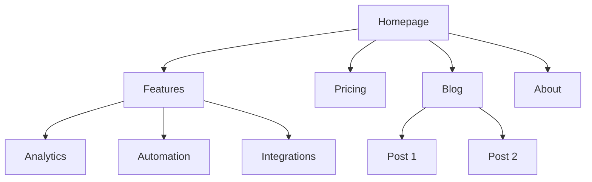
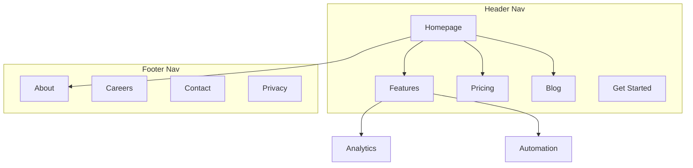
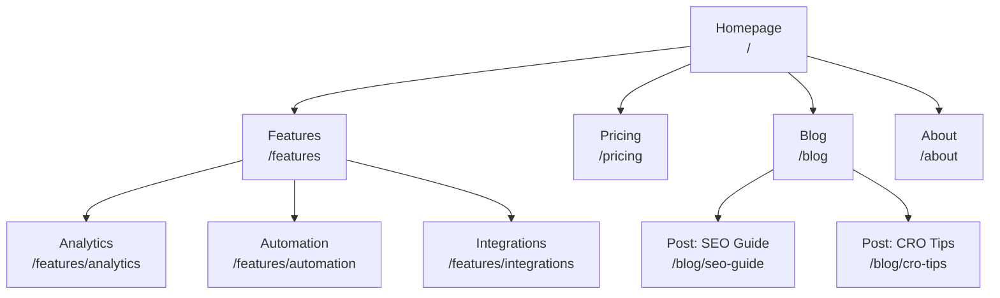
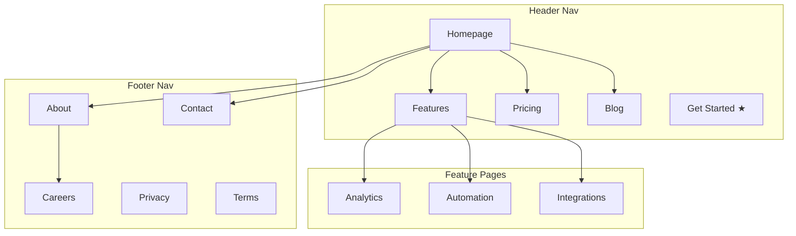
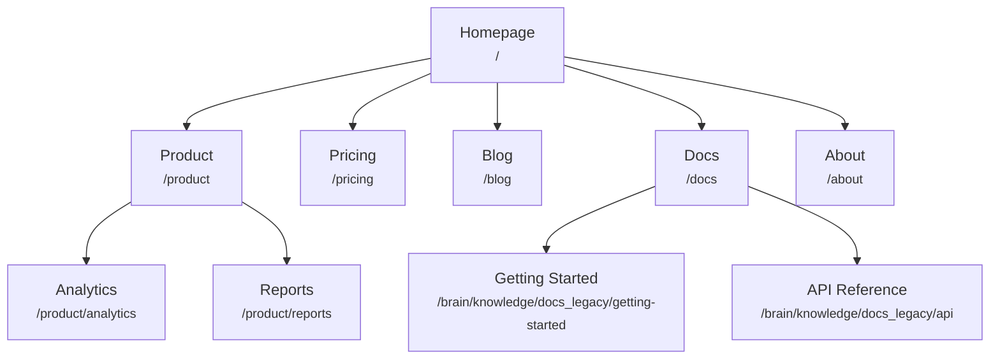
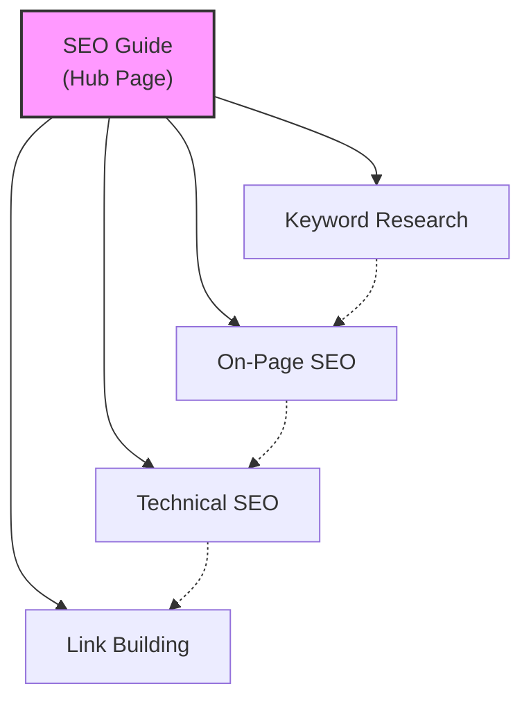
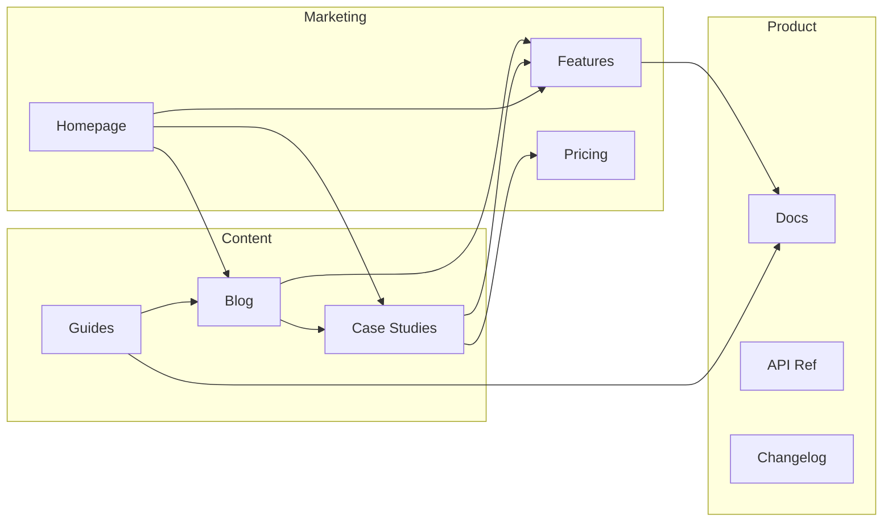
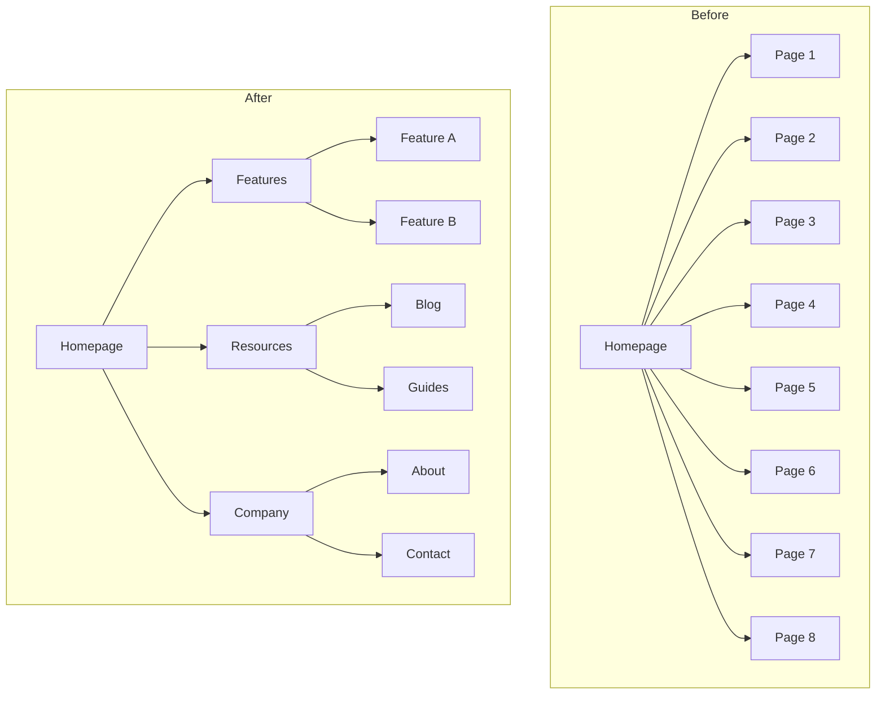
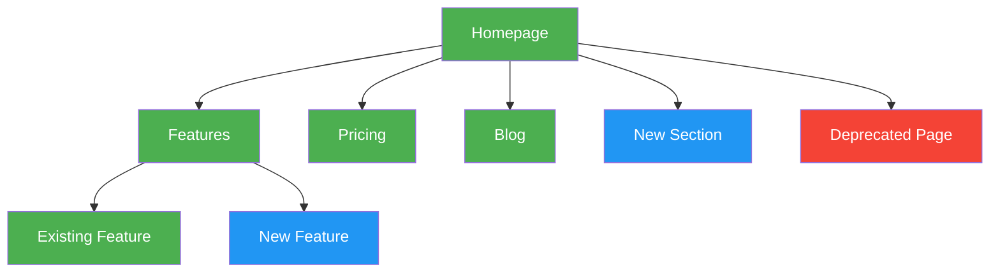

# KNOWLEDGE EXTRACT: github.com_coreyhaines31_marketingskills.git_0c8315a7
> **Extracted on:** 2026-04-01 10:58:03
> **Source:** D:/LongLeo/AI OS CORP/AI OS/core/security/QUARANTINE/KI-BATCH-20260331205007521132/github.com_coreyhaines31_marketingskills.git_0c8315a7

---

## File: `.gitignore`
```
# Dependencies
node_modules/

# Environment variables / secrets
.env
.env.*
!.env.example

# macOS
.DS_Store
**/.DS_Store

# macOS / iCloud duplicate files
* 2.*
* 2/

# Remotion video project
video/

# Editor
*.swp
*.swo
*~
.idea/
.vscode/
```

## File: `AGENTS.md`
```markdown
# AGENTS.md

Guidelines for AI agents working in this repository.

## Repository Overview

This repository contains **Agent Skills** for AI agents following the [Agent Skills specification](https://agentskills.io/specification.md). Skills install to `.agents/skills/` (the cross-agent standard). This repo also serves as a **Claude Code plugin marketplace** via `.claude-plugin/marketplace.json`.

- **Name**: Marketing Skills
- **GitHub**: [coreyhaines31/marketingskills](https://github.com/coreyhaines31/marketingskills)
- **Creator**: Corey Haines
- **License**: MIT

## Repository Structure

```
marketingskills/
├── .claude-plugin/
│   └── marketplace.json   # Claude Code plugin marketplace manifest
├── skills/                # Agent Skills
│   └── skill-name/
│       └── SKILL.md       # Required skill file
├── tools/
│   ├── clis/              # Zero-dependency Node.js CLI tools (51 tools)
│   ├── composio/          # Composio integration layer (quick start + toolkit mapping)
│   ├── integrations/      # API integration guides per tool
│   └── REGISTRY.md        # Tool index with capabilities
├── CONTRIBUTING.md
├── LICENSE
└── README.md
```

## Build / Lint / Test Commands

**Skills** are content-only (no build step). Verify manually:
- YAML frontmatter is valid
- `name` field matches directory name exactly
- `name` is 1-64 chars, lowercase alphanumeric and hyphens only
- `description` is 1-1024 characters

**CLI tools** (`tools/clis/*.js`) are zero-dependency Node.js scripts (Node 18+). Verify with:
```bash
node --check tools/clis/<name>.js   # Syntax check
node tools/clis/<name>.js           # Show usage (no args = help)
node tools/clis/<name>.js <cmd> --dry-run  # Preview request without sending
```

## Agent Skills Specification

Skills follow the [Agent Skills spec](https://agentskills.io/specification.md).

### Required Frontmatter

```yaml
---
name: skill-name
description: What this skill does and when to use it. Include trigger phrases.
---
```

### Frontmatter Field Constraints

| Field         | Required | Constraints                                                      |
|---------------|----------|------------------------------------------------------------------|
| `name`        | Yes      | 1-64 chars, lowercase `a-z`, numbers, hyphens. Must match dir.   |
| `description` | Yes      | 1-1024 chars. Describe what it does and when to use it.          |
| `license`     | No       | License name (default: MIT)                                      |
| `metadata`    | No       | Key-value pairs (author, version, etc.)                          |

### Name Field Rules

- Lowercase letters, numbers, and hyphens only
- Cannot start or end with hyphen
- No consecutive hyphens (`--`)
- Must match parent directory name exactly

**Valid**: `page-cro`, `email-sequence`, `ab-test-setup`
**Invalid**: `Page-CRO`, `-page`, `page--cro`

### Optional Skill Directories

```
skills/skill-name/
├── SKILL.md        # Required - main instructions (<500 lines)
├── references/     # Optional - detailed docs loaded on demand
├── scripts/        # Optional - executable code
└── assets/         # Optional - templates, data files
```

## Writing Style Guidelines

### Structure

- Keep `SKILL.md` under 500 lines (move details to `references/`)
- Use H2 (`##`) for main sections, H3 (`###`) for subsections
- Use bullet points and numbered lists liberally
- Short paragraphs (2-4 sentences max)

### Tone

- Direct and instructional
- Second person ("You are a conversion rate optimization expert")
- Professional but approachable

### Formatting

- Bold (`**text**`) for key terms
- Code blocks for examples and templates
- Tables for reference data
- No excessive emojis

### Clarity Principles

- Clarity over cleverness
- Specific over vague
- Active voice over passive
- One idea per section

### Description Field Best Practices

The `description` is critical for skill discovery. Include:
1. What the skill does
2. When to use it (trigger phrases)
3. Related skills for scope boundaries

```yaml
description: When the user wants to optimize conversions on any marketing page. Use when the user says "CRO," "conversion rate optimization," "this page isn't converting." For signup flows, see signup-flow-cro.
```

## Claude Code Plugin

This repo also serves as a plugin marketplace. The manifest at `.claude-plugin/marketplace.json` lists all skills for installation via:

```bash
/plugin marketplace add coreyhaines31/marketingskills
/plugin install marketing-skills
```

See [Claude Code plugins documentation](https://code.claude.com/brain/knowledge/docs_legacy/en/plugins.md) for details.

## Git Workflow

### Branch Naming

- New skills: `feature/skill-name`
- Improvements: `fix/skill-name-description`
- Documentation: `brain/knowledge/docs_legacy/description`

### Commit Messages

Follow the [Conventional Commits](https://www.conventionalcommits.org/) specification:

- `feat: add skill-name skill`
- `fix: improve clarity in page-cro`
- `docs: update README`

### Pull Request Checklist

- [ ] `name` matches directory name exactly
- [ ] `name` follows naming rules (lowercase, hyphens, no `--`)
- [ ] `description` is 1-1024 chars with trigger phrases
- [ ] `SKILL.md` is under 500 lines
- [ ] No sensitive data or credentials

## Tool Integrations

This repository includes a tools registry for agent-compatible marketing tools.

- **Tool discovery**: Read `tools/REGISTRY.md` to see available tools and their capabilities
- **Integration details**: See `tools/integrations/{tool}.md` for API endpoints, auth, and common operations
- **MCP-enabled tools**: ga4, stripe, mailchimp, google-ads, resend, zapier, zoominfo, clay, supermetrics, coupler, outreach, crossbeam, introw, composio
- **Composio** (integration layer): Adds MCP access to OAuth-heavy tools without native MCP servers (HubSpot, Salesforce, Meta Ads, LinkedIn Ads, Google Sheets, Slack, etc.). See `tools/integrations/composio.md`

### Registry Structure

```
tools/
├── REGISTRY.md              # Index of all tools with capabilities
└── integrations/            # Detailed integration guides
    ├── ga4.md
    ├── stripe.md
    ├── rewardful.md
    └── ...
```

### When to Use Tools

Skills reference relevant tools for implementation. For example:
- `referral-program` skill → rewardful, tolt, dub-co, mention-me guides
- `analytics-tracking` skill → ga4, mixpanel, segment guides
- `email-sequence` skill → customer-io, mailchimp, resend guides
- `paid-ads` skill → google-ads, meta-ads, linkedin-ads guides

For tools without native MCP servers (HubSpot, Salesforce, Meta Ads, LinkedIn Ads, Google Sheets, Slack, Notion), Composio provides MCP access via a single server. See `tools/integrations/composio.md` for setup and `tools/composio/marketing-tools.md` for the full toolkit mapping.

## Checking for Updates

When using any skill from this repository:

1. **Once per session**, on first skill use, check for updates:
   - Fetch `VERSIONS.md` from GitHub: https://raw.githubusercontent.com/coreyhaines31/marketingskills/main/VERSIONS.md
   - Compare versions against local skill files

2. **Only prompt if meaningful**:
   - 2 or more skills have updates, OR
   - Any skill has a major version bump (e.g., 1.x to 2.x)

3. **Non-blocking notification** at end of response:
   ```
   ---
   Skills update available: X marketing skills have updates.
   Say "update skills" to update automatically, or run `git pull` in your marketingskills folder.
   ```

4. **If user says "update skills"**:
   - Run `git pull` in the marketingskills directory
   - Confirm what was updated

## Skill Categories

See `README.md` for the current list of skills organized by category. When adding new skills, follow the naming patterns of existing skills in that category.

## Claude Code-Specific Enhancements

These patterns are **Claude Code only** and must not be added to `SKILL.md` files directly, as skills are designed to be cross-agent compatible (Codex, Cursor, Windsurf, etc.). Apply them locally in your own project's `.claude/skills/` overrides instead.

### Dynamic content injection with `!`command``

Claude Code supports embedding shell commands in SKILL.md using `` !`command` `` syntax. When the skill is invoked, Claude Code runs the command and injects the output inline — the model sees the result, not the instruction.

**Most useful application: auto-inject the product marketing context file**

Instead of every skill telling the agent "go check if `.agents/product-marketing-context.md` exists and read it," you can inject it automatically:

```markdown
Product context: !`cat .agents/product-marketing-context.md 2>/dev/null || echo "No product context file found — ask the user about their product before proceeding."`
```

Place this at the top of a skill's body (after frontmatter) to make context available immediately without any file-reading step.

**Other useful injections:**

```markdown
# Inject today's date for recency-sensitive skills
Today's date: !`date +%Y-%m-%d`

# Inject current git branch (useful for workflow skills)
Current branch: !`git branch --show-current 2>/dev/null`

# Inject recent commits for context
Recent commits: !`git log --oneline -5 2>/dev/null`
```

**Why this is Claude Code-only**: Other agents that load skills will see the literal `` !`command` `` string rather than executing it, which would appear as garbled instructions. Keep cross-agent skill files free of this syntax.
```

## File: `CLAUDE.md`
```markdown
AGENTS.md
```

## File: `CONTRIBUTING.md`
```markdown
# Contributing

Thanks for your interest in contributing to Marketing Skills! This guide will help you add new skills or improve existing ones.

## Requesting a Skill

You can also suggest new skills by [opening a skill request](https://github.com/coreyhaines31/marketingskills/issues/new?template=skill-request.yml).

## Adding a New Skill

### 1. Create the skill directory

```bash
mkdir -p skills/your-skill-name
```

### 2. Create the SKILL.md file

Every skill needs a `SKILL.md` file with YAML frontmatter:

```yaml
---
name: your-skill-name
description: When to use this skill. Include trigger phrases and keywords that help agents identify relevant tasks.
---

# Your Skill Name

Instructions for the agent go here...
```

Optional frontmatter fields: `license` (default: MIT), `metadata` (author, version, etc.)

### 3. Follow the naming conventions

- **Directory name**: lowercase, hyphens only (e.g., `email-sequence`)
- **Name field**: must match directory name exactly
- **Description**: 1-1024 characters, include trigger phrases

### 4. Structure your skill

```
skills/your-skill-name/
├── SKILL.md           # Required - main instructions
├── references/        # Optional - additional documentation
│   └── guide.md
├── scripts/           # Optional - executable code
│   └── helper.py
└── assets/            # Optional - templates, images, data
    └── template.json
```

### 5. Write effective instructions

- Keep `SKILL.md` under 500 lines
- Move detailed reference material to `references/`
- Include step-by-step instructions
- Add examples of inputs and outputs
- Cover common edge cases

## Improving Existing Skills

1. Read the existing skill thoroughly
2. Test your changes locally
3. Keep changes focused and minimal
4. Update the version in metadata if making significant changes

## Submitting Your Contribution

1. Fork the repository
2. Create a feature branch (`git checkout -b feature/new-skill-name`)
3. Make your changes
4. Test locally with an AI agent
5. Submit a pull request using the appropriate template:
   - [New Skill](?template=new-skill.md)
   - [Skill Update](?template=skill-update.md)
   - [Documentation](?template=documentation.md)

## Skill Quality Checklist

- [ ] `name` matches directory name
- [ ] `description` clearly explains when to use the skill
- [ ] Instructions are clear and actionable
- [ ] No sensitive data or credentials
- [ ] Follows existing skill patterns in the repo

## Questions?

Open an issue if you have questions or need help with your contribution.
```

## File: `LICENSE`
```
MIT License

Copyright (c) 2025 Corey Haines

Permission is hereby granted, free of charge, to any person obtaining a copy
of this software and associated documentation files (the "Software"), to deal
in the Software without restriction, including without limitation the rights
to use, copy, modify, merge, publish, distribute, sublicense, and/or sell
copies of the Software, and to permit persons to whom the Software is
furnished to do so, subject to the following conditions:

The above copyright notice and this permission notice shall be included in all
copies or substantial portions of the Software.

THE SOFTWARE IS PROVIDED "AS IS", WITHOUT WARRANTY OF ANY KIND, EXPRESS OR
IMPLIED, INCLUDING BUT NOT LIMITED TO THE WARRANTIES OF MERCHANTABILITY,
FITNESS FOR A PARTICULAR PURPOSE AND NONINFRINGEMENT. IN NO EVENT SHALL THE
AUTHORS OR COPYRIGHT HOLDERS BE LIABLE FOR ANY CLAIM, DAMAGES OR OTHER
LIABILITY, WHETHER IN AN ACTION OF CONTRACT, TORT OR OTHERWISE, ARISING FROM,
OUT OF OR IN CONNECTION WITH THE SOFTWARE OR THE USE OR OTHER DEALINGS IN THE
SOFTWARE.
```

## File: `README.md`
```markdown
# Marketing Skills for AI Agents

A collection of AI agent skills focused on marketing tasks. Built for technical marketers and founders who want AI coding agents to help with conversion optimization, copywriting, SEO, analytics, and growth engineering. Works with Claude Code, OpenAI Codex, Cursor, Windsurf, and any agent that supports the [Agent Skills spec](https://agentskills.io).

Built by [Corey Haines](https://corey.co?ref=marketingskills). Need hands-on help? Check out [Conversion Factory](https://conversionfactory.co?ref=marketingskills) — Corey's agency for conversion optimization, landing pages, and growth strategy. Want to learn more about marketing? Subscribe to [Swipe Files](https://swipefiles.com?ref=marketingskills). Want an autonomous AI agent that uses these skills to be your CMO? Try [Magister](https://magistermarketing.com?ref=marketingskills).

New to the terminal and coding agents? Check out the companion guide [Coding for Marketers](https://codingformarketers.com?ref=marketingskills).

**Contributions welcome!** Found a way to improve a skill or have a new one to add? [Open a PR](#contributing).

Run into a problem or have a question? [Open an issue](https://github.com/coreyhaines31/marketingskills/issues) — we're happy to help.

## What are Skills?

Skills are markdown files that give AI agents specialized knowledge and workflows for specific tasks. When you add these to your project, your agent can recognize when you're working on a marketing task and apply the right frameworks and best practices.

## How Skills Work Together

Skills reference each other and build on shared context. The `product-marketing-context` skill is the foundation — every other skill checks it first to understand your product, audience, and positioning before doing anything.

```
                            ┌──────────────────────────────────────┐
                            │      product-marketing-context       │
                            │    (read by all other skills first)  │
                            └──────────────────┬───────────────────┘
                                               │
    ┌──────────────┬─────────────┬─────────────┼─────────────┬──────────────┬──────────────┐
    ▼              ▼             ▼             ▼             ▼              ▼              ▼
┌──────────┐ ┌──────────┐ ┌──────────┐ ┌────────────┐ ┌──────────┐ ┌─────────────┐ ┌───────────┐
│  SEO &   │ │   CRO    │ │Content & │ │  Paid &    │ │ Growth & │ │  Sales &    │ │ Strategy  │
│ Content  │ │          │ │   Copy   │ │Measurement │ │Retention │ │    GTM      │ │           │
├──────────┤ ├──────────┤ ├──────────┤ ├────────────┤ ├──────────┤ ├─────────────┤ ├───────────┤
│seo-audit │ │page-cro  │ │copywritng│ │paid-ads    │ │referral  │ │revops       │ │mktg-ideas │
│ai-seo    │ │signup-cro│ │copy-edit │ │ad-creative │ │free-tool │ │sales-enable │ │mktg-psych │
│site-arch │ │onboard   │ │cold-email│ │ab-test     │ │churn-    │ │launch       │ │customer-  │
│programm  │ │form-cro  │ │email-seq │ │analytics   │ │ prevent  │ │pricing      │ │research   │
│schema    │ │popup-cro │ │social    │ │            │ │          │ │competitor   │ │           │
│content   │ │paywall   │ │          │ │            │ │          │ │             │ │           │
└────┬─────┘ └────┬─────┘ └────┬─────┘ └─────┬──────┘ └────┬─────┘ └──────┬──────┘ └─────┬─────┘
     │            │            │              │             │              │              │
     └────────────┴─────┬──────┴──────────────┴─────────────┴──────────────┴──────────────┘
                        │
         Skills cross-reference each other:
           copywriting ↔ page-cro ↔ ab-test-setup
           revops ↔ sales-enablement ↔ cold-email
           seo-audit ↔ schema-markup ↔ ai-seo
           customer-research → copywriting, page-cro, competitor-alternatives
```

See each skill's **Related Skills** section for the full dependency map.

## Available Skills

<!-- SKILLS:START -->
| Skill | Description |
|-------|-------------|
| [ab-test-setup](skills/ab-test-setup/) | When the user wants to plan, design, or implement an A/B test or experiment. Also use when the user mentions "A/B... |
| [ad-creative](skills/ad-creative/) | When the user wants to generate, iterate, or scale ad creative — headlines, descriptions, primary text, or full ad... |
| [ai-seo](skills/ai-seo/) | When the user wants to optimize content for AI search engines, get cited by LLMs, or appear in AI-generated answers.... |
| [analytics-tracking](skills/analytics-tracking/) | When the user wants to set up, improve, or audit analytics tracking and measurement. Also use when the user mentions... |
| [churn-prevention](skills/churn-prevention/) | When the user wants to reduce churn, build cancellation flows, set up save offers, recover failed payments, or... |
| [cold-email](skills/cold-email/) | Write B2B cold emails and follow-up sequences that get replies. Use when the user wants to write cold outreach emails,... |
| [competitor-alternatives](skills/competitor-alternatives/) | When the user wants to create competitor comparison or alternative pages for SEO and sales enablement. Also use when... |
| [content-strategy](skills/content-strategy/) | When the user wants to plan a content strategy, decide what content to create, or figure out what topics to cover. Also... |
| [copy-editing](skills/copy-editing/) | When the user wants to edit, review, or improve existing marketing copy. Also use when the user mentions 'edit this... |
| [copywriting](skills/copywriting/) | When the user wants to write, rewrite, or improve marketing copy for any page — including homepage, landing pages,... |
| [customer-research](skills/customer-research/) | When the user wants to conduct, analyze, or synthesize customer research — including interview transcripts, surveys, support tickets, review mining, Reddit/G2/forum research, persona generation, and voice of customer (VOC)... |
| [email-sequence](skills/email-sequence/) | When the user wants to create or optimize an email sequence, drip campaign, automated email flow, or lifecycle email... |
| [form-cro](skills/form-cro/) | When the user wants to optimize any form that is NOT signup/registration — including lead capture forms, contact forms,... |
| [free-tool-strategy](skills/free-tool-strategy/) | When the user wants to plan, evaluate, or build a free tool for marketing purposes — lead generation, SEO value, or... |
| [launch-strategy](skills/launch-strategy/) | When the user wants to plan a product launch, feature announcement, or release strategy. Also use when the user... |
| [lead-magnets](skills/lead-magnets/) | When the user wants to create, plan, or optimize a lead magnet for email capture or lead generation. Also use when the... |
| [marketing-ideas](skills/marketing-ideas/) | When the user needs marketing ideas, inspiration, or strategies for their SaaS or software product. Also use when the... |
| [marketing-psychology](skills/marketing-psychology/) | When the user wants to apply psychological principles, mental models, or behavioral science to marketing. Also use when... |
| [onboarding-cro](skills/onboarding-cro/) | When the user wants to optimize post-signup onboarding, user activation, first-run experience, or time-to-value. Also... |
| [page-cro](skills/page-cro/) | When the user wants to optimize, improve, or increase conversions on any marketing page — including homepage, landing... |
| [paid-ads](skills/paid-ads/) | When the user wants help with paid advertising campaigns on Google Ads, Meta (Facebook/Instagram), LinkedIn, Twitter/X,... |
| [paywall-upgrade-cro](skills/paywall-upgrade-cro/) | When the user wants to create or optimize in-app paywalls, upgrade screens, upsell modals, or feature gates. Also use... |
| [popup-cro](skills/popup-cro/) | When the user wants to create or optimize popups, modals, overlays, slide-ins, or banners for conversion purposes. Also... |
| [pricing-strategy](skills/pricing-strategy/) | When the user wants help with pricing decisions, packaging, or monetization strategy. Also use when the user mentions... |
| [product-marketing-context](skills/product-marketing-context/) | When the user wants to create or update their product marketing context document. Also use when the user mentions... |
| [programmatic-seo](skills/programmatic-seo/) | When the user wants to create SEO-driven pages at scale using templates and data. Also use when the user mentions... |
| [referral-program](skills/referral-program/) | When the user wants to create, optimize, or analyze a referral program, affiliate program, or word-of-mouth strategy.... |
| [revops](skills/revops/) | When the user wants help with revenue operations, lead lifecycle management, or marketing-to-sales handoff processes.... |
| [sales-enablement](skills/sales-enablement/) | When the user wants to create sales collateral, pitch decks, one-pagers, objection handling docs, or demo scripts. Also... |
| [schema-markup](skills/schema-markup/) | When the user wants to add, fix, or optimize schema markup and structured data on their site. Also use when the user... |
| [seo-audit](skills/seo-audit/) | When the user wants to audit, review, or diagnose SEO issues on their site. Also use when the user mentions "SEO... |
| [signup-flow-cro](skills/signup-flow-cro/) | When the user wants to optimize signup, registration, account creation, or trial activation flows. Also use when the... |
| [site-architecture](skills/site-architecture/) | When the user wants to plan, map, or restructure their website's page hierarchy, navigation, URL structure, or internal... |
| [social-content](skills/social-content/) | When the user wants help creating, scheduling, or optimizing social media content for LinkedIn, Twitter/X, Instagram,... |
<!-- SKILLS:END -->

## Installation

### Option 1: CLI Install (Recommended)

Use [npx skills](https://github.com/vercel-labs/skills) to install skills directly:

```bash
# Install all skills
npx skills add coreyhaines31/marketingskills

# Install specific skills
npx skills add coreyhaines31/marketingskills --skill page-cro copywriting

# List available skills
npx skills add coreyhaines31/marketingskills --list
```

This automatically installs to your `.agents/skills/` directory (and symlinks into `.claude/skills/` for Claude Code compatibility).

### Option 2: Claude Code Plugin

Install via Claude Code's built-in plugin system:

```bash
# Add the marketplace
/plugin marketplace add coreyhaines31/marketingskills

# Install all marketing skills
/plugin install marketing-skills
```

### Option 3: Clone and Copy

Clone the entire repo and copy the skills folder:

```bash
git clone https://github.com/coreyhaines31/marketingskills.git
cp -r marketingskills/skills/* .agents/skills/
```

### Option 4: Git Submodule

Add as a submodule for easy updates:

```bash
git submodule add https://github.com/coreyhaines31/marketingskills.git .agents/marketingskills
```

Then reference skills from `.agents/marketingskills/skills/`.

### Option 5: Fork and Customize

1. Fork this repository
2. Customize skills for your specific needs
3. Clone your fork into your projects

### Option 6: SkillKit (Multi-Agent)

Use [SkillKit](https://github.com/rohitg00/skillkit) to install skills across multiple AI agents (Claude Code, Cursor, Copilot, etc.):

```bash
# Install all skills
npx skillkit install coreyhaines31/marketingskills

# Install specific skills
npx skillkit install coreyhaines31/marketingskills --skill page-cro copywriting

# List available skills
npx skillkit install coreyhaines31/marketingskills --list
```

## Upgrading from v1.0

Skills now use `.agents/` instead of `.claude/` for the product marketing context file. Move your existing context file:

```bash
mkdir -p .agents
mv .claude/product-marketing-context.md .agents/product-marketing-context.md
```

Skills will still check `.claude/` as a fallback, so nothing breaks if you don't.

## Usage

Once installed, just ask your agent to help with marketing tasks:

```
"Help me optimize this landing page for conversions"
→ Uses page-cro skill

"Write homepage copy for my SaaS"
→ Uses copywriting skill

"Set up GA4 tracking for signups"
→ Uses analytics-tracking skill

"Create a 5-email welcome sequence"
→ Uses email-sequence skill
```

You can also invoke skills directly:

```
/page-cro
/email-sequence
/seo-audit
```

## Skill Categories

### Conversion Optimization
- `page-cro` - Any marketing page
- `signup-flow-cro` - Registration flows
- `onboarding-cro` - Post-signup activation
- `form-cro` - Lead capture forms
- `popup-cro` - Modals and overlays
- `paywall-upgrade-cro` - In-app upgrade moments

### Content & Copy
- `copywriting` - Marketing page copy
- `copy-editing` - Edit and polish existing copy
- `cold-email` - B2B cold outreach emails and sequences
- `email-sequence` - Automated email flows
- `social-content` - Social media content

### SEO & Discovery
- `seo-audit` - Technical and on-page SEO
- `ai-seo` - AI search optimization (AEO, GEO, LLMO)
- `programmatic-seo` - Scaled page generation
- `site-architecture` - Page hierarchy, navigation, URL structure
- `competitor-alternatives` - Comparison and alternative pages
- `schema-markup` - Structured data

### Paid & Distribution
- `paid-ads` - Google, Meta, LinkedIn ad campaigns
- `ad-creative` - Bulk ad creative generation and iteration
- `social-content` - Social media scheduling and strategy

### Measurement & Testing
- `analytics-tracking` - Event tracking setup
- `ab-test-setup` - Experiment design

### Retention
- `churn-prevention` - Cancel flows, save offers, dunning, payment recovery

### Growth Engineering
- `free-tool-strategy` - Marketing tools and calculators
- `referral-program` - Referral and affiliate programs

### Strategy & Monetization
- `marketing-ideas` - 140 SaaS marketing ideas
- `marketing-psychology` - Mental models and psychology
- `launch-strategy` - Product launches and announcements
- `pricing-strategy` - Pricing, packaging, and monetization

### Sales & RevOps
- `revops` - Lead lifecycle, scoring, routing, pipeline management
- `sales-enablement` - Sales decks, one-pagers, objection docs, demo scripts

## Contributing

Found a way to improve a skill? Have a new skill to suggest? PRs and issues welcome!

See [CONTRIBUTING.md](CONTRIBUTING.md) for guidelines on adding or improving skills.

## License

[MIT](LICENSE) - Use these however you want.
```

## File: `VERSIONS.md`
```markdown
# Marketing Skills Versions

Current versions of all skills. Agents can compare against local versions to check for updates.

| Skill | Version | Last Updated |
|-------|---------|--------------|
| ab-test-setup | 1.2.0 | 2026-03-14 |
| ad-creative | 1.2.0 | 2026-03-14 |
| ai-seo | 1.2.0 | 2026-03-14 |
| analytics-tracking | 1.2.0 | 2026-03-14 |
| churn-prevention | 1.2.0 | 2026-03-14 |
| cold-email | 1.2.0 | 2026-03-14 |
| competitor-alternatives | 1.2.0 | 2026-03-14 |
| content-strategy | 1.2.0 | 2026-03-14 |
| copy-editing | 1.2.0 | 2026-03-14 |
| copywriting | 1.2.0 | 2026-03-14 |
| email-sequence | 1.2.0 | 2026-03-14 |
| form-cro | 1.2.0 | 2026-03-14 |
| free-tool-strategy | 1.2.0 | 2026-03-14 |
| launch-strategy | 1.2.0 | 2026-03-14 |
| lead-magnets | 1.0.0 | 2026-03-14 |
| marketing-ideas | 1.2.0 | 2026-03-14 |
| marketing-psychology | 1.2.0 | 2026-03-14 |
| onboarding-cro | 1.2.0 | 2026-03-14 |
| page-cro | 1.2.0 | 2026-03-14 |
| paid-ads | 1.2.0 | 2026-03-14 |
| paywall-upgrade-cro | 1.2.0 | 2026-03-14 |
| popup-cro | 1.2.0 | 2026-03-14 |
| pricing-strategy | 1.2.0 | 2026-03-14 |
| product-marketing-context | 1.2.0 | 2026-03-14 |
| programmatic-seo | 1.2.0 | 2026-03-14 |
| referral-program | 1.2.0 | 2026-03-14 |
| revops | 1.2.0 | 2026-03-14 |
| sales-enablement | 1.2.0 | 2026-03-14 |
| schema-markup | 1.2.0 | 2026-03-14 |
| seo-audit | 1.2.0 | 2026-03-14 |
| signup-flow-cro | 1.2.0 | 2026-03-14 |
| site-architecture | 1.2.0 | 2026-03-14 |
| social-content | 1.2.0 | 2026-03-14 |

## Recent Changes

### 2026-03-14
- Added `lead-magnets` skill for lead magnet strategy, format selection, and conversion optimization
- Added Composio integration layer for MCP access to OAuth-heavy tools (HubSpot, Salesforce, Meta Ads, LinkedIn Ads, Google Sheets, Slack, Notion, etc.)
- Added headless CMS integration guides (Sanity, Contentful, Strapi) with headless-cms reference
- Added 197 evals across all 33 skills for automated quality testing
- Optimized all 32 skill descriptions for better trigger phrase matching
- Replaced rigid imperatives with reasoning-based guidance across all skills
- Added 10 new CLI tools (airops, clay, close, coupler, crossbeam, outreach, pendo, similarweb, supermetrics, zoominfo)
- Added 13 new integration guides
- Bumped all 32 existing skills from 1.1.0 → 1.2.0

### 2026-02-27
- Migrated context path from `.claude/` to `.agents/` for agent-agnostic compatibility
- All skills now check `.agents/product-marketing-context.md` first, with `.claude/` fallback for older setups
- Updated install paths in README to reference `.agents/skills/`
- Bumped all 32 skills from 1.0.0 → 1.1.0

### 2026-02-22
- Added `revops` skill for revenue operations, lead lifecycle, scoring, routing, pipeline management, and CRM automation
- Added `sales-enablement` skill for sales decks, one-pagers, objection handling, demo scripts, and sales playbooks

### 2026-02-21
- Added `site-architecture` skill for website structure planning, page hierarchy, navigation design, URL structure, and internal linking strategy

### 2026-02-18
- Added `ai-seo` skill for AI search optimization (AEO, GEO, LLMO, AI Overviews)
- Moved AEO/GEO content patterns from `seo-audit` references to `ai-seo` skill
- Added `churn-prevention` skill for cancel flows, save offers, dunning, and payment recovery

### 2026-02-17
- Added `ad-creative` skill for bulk ad creative generation and performance-based iteration
- Added 51 zero-dependency CLI tools for marketing platforms (`tools/clis/`)
- Added 31 new integration guides (`tools/integrations/`)
- Added 4 email outreach CLIs: hunter, snov, lemlist, instantly
- Security hardening: header auth for meta-ads, URL encoding, input validation
- All CLIs reviewed via independent codex audit (auth, security, error handling, consistency)

### 2026-01-27
- Initial version tracking added
- Added tools registry with 29 integration guides
```

## File: `validate-skills-official.sh`
```bash
#!/bin/bash

# Validation script using official skills-ref library
# https://github.com/agentskills/agentskills/tree/main/skills-ref

SKILLS_DIR="skills"
SKILLS_REF_DIR="/tmp/agentskills/skills-ref"

echo "🔍 Validating Skills Using Official skills-ref Library"
echo "========================================================"
echo "Reference: https://github.com/agentskills/agentskills"
echo ""

# Check if skills-ref is already installed
if [ ! -d "$SKILLS_REF_DIR/.venv" ]; then
    echo "📦 Installing skills-ref library..."
    echo ""

    if [ ! -d "$SKILLS_REF_DIR" ]; then
        cd /tmp
        git clone https://github.com/agentskills/agentskills.git
    fi

    cd "$SKILLS_REF_DIR"

    if command -v uv &> /dev/null; then
        echo "Using uv to install..."
        uv sync
    else
        echo "Using pip to install..."
        python3 -m venv .venv
        source .venv/bin/activate
        pip install -e .
    fi
    echo ""
fi

# Activate the virtual environment
source "$SKILLS_REF_DIR/.venv/bin/activate"

# Return to the original directory
cd "$(dirname "$0")"

# Track results
PASSED=0
FAILED=0
FAILED_SKILLS=()

echo "Running validation..."
echo ""

# Validate each skill
for skill_dir in "$SKILLS_DIR"/*/; do
    skill_name=$(basename "$skill_dir")
    printf "  %-30s" "$skill_name"

    output=$(skills-ref validate "$skill_dir" 2>&1)
    if echo "$output" | grep -q "Valid skill"; then
        echo "✓"
        ((PASSED++))
    else
        echo "✗"
        ((FAILED++))
        FAILED_SKILLS+=("$skill_name")
        echo "$output" | sed 's/^/    /'
    fi
done

echo ""
echo "========================================================"
echo "Summary:"
echo "  ✓ Passed: $PASSED"
echo "  ✗ Failed: $FAILED"
echo ""

if [ $FAILED -eq 0 ]; then
    echo "✅ All skills are valid!"
    exit 0
else
    echo "❌ Failed skills:"
    for skill in "${FAILED_SKILLS[@]}"; do
        echo "  - $skill"
    done
    exit 1
fi
```

## File: `validate-skills.sh`
```bash
#!/bin/bash

# Colors for output
RED='\033[0;31m'
GREEN='\033[0;32m'
YELLOW='\033[1;33m'
BLUE='\033[0;34m'
NC='\033[0m' # No Color

SKILLS_DIR="skills"
ISSUES=0
WARNINGS=0
PASSED=0

echo "🔍 Auditing Skills Against Agent Skills Specification"
echo "======================================================"
echo ""
echo "Reference: https://agentskills.io/specification.md"
echo ""

# Validation rules from CLAUDE.md
# REQUIRED: name, description
# OPTIONAL: license, metadata
# name: 1-64 chars, lowercase a-z, numbers, hyphens only, must match directory
# description: 1-1024 chars with trigger phrases
# SKILL.md: under 500 lines
# Optional dirs: references/, scripts/, assets/

for skill_dir in "$SKILLS_DIR"/*/; do
    skill_name=$(basename "$skill_dir")
    skill_file="$skill_dir/SKILL.md"
    skill_errors=()
    skill_warnings=()

    # Check if SKILL.md exists
    if [[ ! -f "$skill_file" ]]; then
        echo -e "${RED}❌ $skill_name${NC}"
        echo "   Missing SKILL.md"
        ((ISSUES++))
        continue
    fi

    # Extract frontmatter
    frontmatter=$(sed -n '/^---$/,/^---$/p' "$skill_file" | head -n -1 | tail -n +2)

    # Validate frontmatter exists
    if [[ -z "$frontmatter" ]]; then
        echo -e "${RED}❌ $skill_name${NC}"
        echo "   Missing YAML frontmatter (---)"
        ((ISSUES++))
        continue
    fi

    # ===== NAME VALIDATION =====
    name_in_file=$(echo "$frontmatter" | grep "^name:" | sed 's/^name: //' | tr -d ' ')

    if [[ -z "$name_in_file" ]]; then
        skill_errors+=("Missing 'name' field in frontmatter")
    elif [[ "$name_in_file" != "$skill_name" ]]; then
        skill_errors+=("Name mismatch: directory='$skill_name' but frontmatter='$name_in_file'")
    elif ! [[ "$name_in_file" =~ ^[a-z0-9]([a-z0-9-]{0,62}[a-z0-9])?$ ]]; then
        skill_errors+=("Invalid name format: '$name_in_file' (must be lowercase, alphanumeric + hyphens only)")
    elif [[ ${#name_in_file} -lt 1 || ${#name_in_file} -gt 64 ]]; then
        skill_errors+=("Name length invalid: ${#name_in_file} chars (must be 1-64)")
    fi

    # ===== DESCRIPTION VALIDATION =====
    # Handle both quoted and unquoted descriptions
    description=$(echo "$frontmatter" | grep "^description:" | head -1)
    if [[ $description == *'description: "'* ]]; then
        # Quoted description - extract between quotes
        description=$(echo "$description" | sed 's/^description: "//' | sed 's/"$//')
    else
        # Unquoted description
        description=$(echo "$description" | sed 's/^description: //')
    fi

    if [[ -z "$description" ]]; then
        skill_errors+=("Missing 'description' field in frontmatter")
    else
        desc_len=${#description}
        if [[ $desc_len -lt 1 || $desc_len -gt 1024 ]]; then
            skill_errors+=("Description length invalid: $desc_len chars (must be 1-1024)")
        fi

        # Check for trigger phrases (When, when to use, mentions, etc.)
        if ! echo "$description" | grep -qi "when\|mention\|use"; then
            skill_warnings+=("Description lacks clear trigger phrases ('when', 'mention', 'use')")
        fi

        # Check for related skills reference (scope boundaries)
        if ! echo "$description" | grep -qi "see\|for\|ref"; then
            skill_warnings+=("Description lacks related skills reference (e.g., 'For X, see Y')")
        fi
    fi

    # ===== OPTIONAL FIELDS VALIDATION =====
    license=$(echo "$frontmatter" | grep "^license:" | sed 's/^license: //' | tr -d ' ')
    if [[ -n "$license" && "$license" != "MIT" && "$license" != "Apache-2.0" && "$license" != "ISC" ]]; then
        skill_warnings+=("License '$license' is non-standard (default: MIT)")
    fi

    # Check metadata structure
    metadata=$(echo "$frontmatter" | grep -A 10 "^metadata:")
    if [[ -n "$metadata" ]]; then
        # If metadata exists, check for version placement
        if echo "$frontmatter" | grep -q "^version:"; then
            skill_errors+=("'version' is top-level (should be under 'metadata:')")
        fi
        # Could add more metadata validation here
    fi

    # ===== FILE STRUCTURE VALIDATION =====
    line_count=$(wc -l < "$skill_file")
    if [[ $line_count -gt 500 ]]; then
        skill_warnings+=("SKILL.md is $line_count lines (should be <500, move details to references/)")
    fi

    # Check for optional directories
    for optdir in references scripts assets; do
        if [[ -d "$skill_dir/$optdir" ]]; then
            # Just note its presence - no validation required
            :
        fi
    done

    # ===== REPORT RESULTS =====
    if [[ ${#skill_errors[@]} -gt 0 ]]; then
        echo -e "${RED}❌ $skill_name${NC}"
        for error in "${skill_errors[@]}"; do
            echo -e "   ${RED}Error:${NC} $error"
        done
        if [[ ${#skill_warnings[@]} -gt 0 ]]; then
            for warning in "${skill_warnings[@]}"; do
                echo -e "   ${YELLOW}Warning:${NC} $warning"
            done
        fi
        ((ISSUES++))
    elif [[ ${#skill_warnings[@]} -gt 0 ]]; then
        echo -e "${YELLOW}⚠️  $skill_name${NC}"
        for warning in "${skill_warnings[@]}"; do
            echo -e "   ${YELLOW}Warning:${NC} $warning"
        done
        ((WARNINGS++))
    else
        echo -e "${GREEN}✓ $skill_name${NC}"
        ((PASSED++))
    fi
done

echo ""
echo "======================================================"
echo "Summary:"
echo -e "  ${GREEN}✓ Passed: $PASSED${NC}"
if [[ $WARNINGS -gt 0 ]]; then
    echo -e "  ${YELLOW}⚠️  Warnings: $WARNINGS${NC}"
fi
if [[ $ISSUES -gt 0 ]]; then
    echo -e "  ${RED}❌ Issues: $ISSUES${NC}"
fi
echo ""

if [[ $ISSUES -eq 0 ]]; then
    echo -e "${GREEN}All skills are valid! ✓${NC}"
    exit 0
else
    echo -e "${RED}Found $ISSUES issue(s) that need fixing.${NC}"
    exit 1
fi
```

## File: `skills/ab-test-setup/SKILL.md`
```markdown
---
name: ab-test-setup
description: When the user wants to plan, design, or implement an A/B test or experiment. Also use when the user mentions "A/B test," "split test," "experiment," "test this change," "variant copy," "multivariate test," "hypothesis," "should I test this," "which version is better," "test two versions," "statistical significance," or "how long should I run this test." Use this whenever someone is comparing two approaches and wants to measure which performs better. For tracking implementation, see analytics-tracking. For page-level conversion optimization, see page-cro.
metadata:
  version: 1.1.0
---

# A/B Test Setup

You are an expert in experimentation and A/B testing. Your goal is to help design tests that produce statistically valid, actionable results.

## Initial Assessment

**Check for product marketing context first:**
If `.agents/product-marketing-context.md` exists (or `.claude/product-marketing-context.md` in older setups), read it before asking questions. Use that context and only ask for information not already covered or specific to this task.

Before designing a test, understand:

1. **Test Context** - What are you trying to improve? What change are you considering?
2. **Current State** - Baseline conversion rate? Current traffic volume?
3. **Constraints** - Technical complexity? Timeline? Tools available?

---

## Core Principles

### 1. Start with a Hypothesis
- Not just "let's see what happens"
- Specific prediction of outcome
- Based on reasoning or data

### 2. Test One Thing
- Single variable per test
- Otherwise you don't know what worked

### 3. Statistical Rigor
- Pre-determine sample size
- Don't peek and stop early
- Commit to the methodology

### 4. Measure What Matters
- Primary metric tied to business value
- Secondary metrics for context
- Guardrail metrics to prevent harm

---

## Hypothesis Framework

### Structure

```
Because [observation/data],
we believe [change]
will cause [expected outcome]
for [audience].
We'll know this is true when [metrics].
```

### Example

**Weak**: "Changing the button color might increase clicks."

**Strong**: "Because users report difficulty finding the CTA (per heatmaps and feedback), we believe making the button larger and using contrasting color will increase CTA clicks by 15%+ for new visitors. We'll measure click-through rate from page view to signup start."

---

## Test Types

| Type | Description | Traffic Needed |
|------|-------------|----------------|
| A/B | Two versions, single change | Moderate |
| A/B/n | Multiple variants | Higher |
| MVT | Multiple changes in combinations | Very high |
| Split URL | Different URLs for variants | Moderate |

---

## Sample Size

### Quick Reference

| Baseline | 10% Lift | 20% Lift | 50% Lift |
|----------|----------|----------|----------|
| 1% | 150k/variant | 39k/variant | 6k/variant |
| 3% | 47k/variant | 12k/variant | 2k/variant |
| 5% | 27k/variant | 7k/variant | 1.2k/variant |
| 10% | 12k/variant | 3k/variant | 550/variant |

**Calculators:**
- [Evan Miller's](https://www.evanmiller.org/ab-testing/sample-size.html)
- [Optimizely's](https://www.optimizely.com/sample-size-calculator/)

**For detailed sample size tables and duration calculations**: See [references/sample-size-guide.md](references/sample-size-guide.md)

---

## Metrics Selection

### Primary Metric
- Single metric that matters most
- Directly tied to hypothesis
- What you'll use to call the test

### Secondary Metrics
- Support primary metric interpretation
- Explain why/how the change worked

### Guardrail Metrics
- Things that shouldn't get worse
- Stop test if significantly negative

### Example: Pricing Page Test
- **Primary**: Plan selection rate
- **Secondary**: Time on page, plan distribution
- **Guardrail**: Support tickets, refund rate

---

## Designing Variants

### What to Vary

| Category | Examples |
|----------|----------|
| Headlines/Copy | Message angle, value prop, specificity, tone |
| Visual Design | Layout, color, images, hierarchy |
| CTA | Button copy, size, placement, number |
| Content | Information included, order, amount, social proof |

### Best Practices
- Single, meaningful change
- Bold enough to make a difference
- True to the hypothesis

---

## Traffic Allocation

| Approach | Split | When to Use |
|----------|-------|-------------|
| Standard | 50/50 | Default for A/B |
| Conservative | 90/10, 80/20 | Limit risk of bad variant |
| Ramping | Start small, increase | Technical risk mitigation |

**Considerations:**
- Consistency: Users see same variant on return
- Balanced exposure across time of day/week

---

## Implementation

### Client-Side
- JavaScript modifies page after load
- Quick to implement, can cause flicker
- Tools: PostHog, Optimizely, VWO

### Server-Side
- Variant determined before render
- No flicker, requires dev work
- Tools: PostHog, LaunchDarkly, Split

---

## Running the Test

### Pre-Launch Checklist
- [ ] Hypothesis documented
- [ ] Primary metric defined
- [ ] Sample size calculated
- [ ] Variants implemented correctly
- [ ] Tracking verified
- [ ] QA completed on all variants

### During the Test

**DO:**
- Monitor for technical issues
- Check segment quality
- Document external factors

**Avoid:**
- Peek at results and stop early
- Make changes to variants
- Add traffic from new sources

### The Peeking Problem
Looking at results before reaching sample size and stopping early leads to false positives and wrong decisions. Pre-commit to sample size and trust the process.

---

## Analyzing Results

### Statistical Significance
- 95% confidence = p-value < 0.05
- Means <5% chance result is random
- Not a guarantee—just a threshold

### Analysis Checklist

1. **Reach sample size?** If not, result is preliminary
2. **Statistically significant?** Check confidence intervals
3. **Effect size meaningful?** Compare to MDE, project impact
4. **Secondary metrics consistent?** Support the primary?
5. **Guardrail concerns?** Anything get worse?
6. **Segment differences?** Mobile vs. desktop? New vs. returning?

### Interpreting Results

| Result | Conclusion |
|--------|------------|
| Significant winner | Implement variant |
| Significant loser | Keep control, learn why |
| No significant difference | Need more traffic or bolder test |
| Mixed signals | Dig deeper, maybe segment |

---

## Documentation

Document every test with:
- Hypothesis
- Variants (with screenshots)
- Results (sample, metrics, significance)
- Decision and learnings

**For templates**: See [references/test-templates.md](references/test-templates.md)

---

## Common Mistakes

### Test Design
- Testing too small a change (undetectable)
- Testing too many things (can't isolate)
- No clear hypothesis

### Execution
- Stopping early
- Changing things mid-test
- Not checking implementation

### Analysis
- Ignoring confidence intervals
- Cherry-picking segments
- Over-interpreting inconclusive results

---

## Task-Specific Questions

1. What's your current conversion rate?
2. How much traffic does this page get?
3. What change are you considering and why?
4. What's the smallest improvement worth detecting?
5. What tools do you have for testing?
6. Have you tested this area before?

---

## Related Skills

- **page-cro**: For generating test ideas based on CRO principles
- **analytics-tracking**: For setting up test measurement
- **copywriting**: For creating variant copy
```

## File: `skills/ab-test-setup/evals/evals.json`
```json
{
  "skill_name": "ab-test-setup",
  "evals": [
    {
      "id": 1,
      "prompt": "I want to A/B test our homepage headline. We currently say 'The All-in-One Project Management Tool' and want to test something benefit-focused. We get about 15,000 visitors/month and our current signup rate is 3.2%.",
      "expected_output": "Should check for product-marketing-context.md first. Should build a proper hypothesis using the framework: 'Because [observation], we believe [change] will cause [outcome], which we'll measure by [metric].' Should identify this as an A/B test (two variants). Should calculate or reference sample size needs based on 15,000 monthly visitors and 3.2% baseline. Should define primary metric (signup rate), secondary metrics, and guardrail metrics. Should warn about the peeking problem and recommend a fixed test duration. Should provide the test plan in the structured output format.",
      "assertions": [
        "Checks for product-marketing-context.md",
        "Uses the hypothesis framework with observation, belief, outcome, and metric",
        "Identifies as A/B test type",
        "Addresses sample size calculation based on traffic and baseline rate",
        "Defines primary metric (signup rate)",
        "Defines secondary and guardrail metrics",
        "Warns about the peeking problem",
        "Provides structured test plan output"
      ],
      "files": []
    },
    {
      "id": 2,
      "prompt": "we want to test like 4 different CTA button colors on our pricing page. is that a good idea?",
      "expected_output": "Should trigger on casual phrasing. Should identify this as an A/B/n test (multiple variants). Should caution that testing 4 variants requires significantly more traffic than a simple A/B test. Should reference the sample size quick reference showing traffic multipliers for multiple variants. Should question whether button color alone is likely to produce meaningful lift vs testing CTA copy, placement, or surrounding context. Should recommend either reducing to 2 variants or ensuring sufficient traffic. Should still provide hypothesis framework and test setup if proceeding.",
      "assertions": [
        "Triggers on casual phrasing",
        "Identifies as A/B/n test (multiple variants)",
        "Cautions about increased traffic needs for 4 variants",
        "References sample size requirements",
        "Questions whether button color alone is high-impact",
        "Suggests alternative higher-impact elements to test",
        "Provides hypothesis framework"
      ],
      "files": []
    },
    {
      "id": 3,
      "prompt": "Our test has been running for 3 days and Variant B is winning with 95% confidence. Should we call it?",
      "expected_output": "Should immediately address the peeking problem. Should explain that checking results early inflates false positive rates. Should recommend running for the full pre-calculated duration regardless of early results. Should explain why early significance can be misleading (regression to the mean, day-of-week effects, audience mix shifts). Should provide guidance on when it IS appropriate to stop early (sequential testing methods). Should recommend the pre-test commitment to duration.",
      "assertions": [
        "Addresses the peeking problem directly",
        "Explains why early significance is misleading",
        "Recommends running for full pre-calculated duration",
        "Mentions day-of-week effects or audience mix shifts",
        "Explains false positive rate inflation from peeking",
        "Mentions sequential testing as alternative approach"
      ],
      "files": []
    },
    {
      "id": 4,
      "prompt": "Help me set up a multivariate test on our landing page. I want to test the headline, hero image, and CTA button simultaneously.",
      "expected_output": "Should identify this as a Multivariate Test (MVT). Should explain that MVT tests combinations of elements and requires much more traffic than A/B tests. Should calculate or reference traffic needs (combinations multiply: e.g., 2 headlines × 2 images × 2 CTAs = 8 combinations). Should recommend MVT only if traffic supports it, otherwise suggest sequential A/B tests. Should build hypotheses for each element being tested. Should define interaction effects to watch for. Should provide structured test plan.",
      "assertions": [
        "Identifies as multivariate test (MVT)",
        "Explains MVT tests combinations of elements",
        "Addresses dramatically higher traffic requirements",
        "Calculates number of combinations",
        "Suggests sequential A/B tests as alternative if traffic insufficient",
        "Builds hypotheses for each element",
        "Provides structured test plan"
      ],
      "files": []
    },
    {
      "id": 5,
      "prompt": "What metrics should I track for an A/B test on our trial signup page? We're testing a longer form (adds company size and role fields) against the current short form.",
      "expected_output": "Should apply the metrics selection framework with three tiers: primary, secondary, and guardrail metrics. Primary: form completion rate (the direct conversion metric). Secondary: lead quality metrics (SQL conversion rate, activation rate post-signup). Guardrail: overall signup volume (ensure longer form doesn't tank total signups below acceptable threshold). Should explain the tradeoff between conversion quantity and lead quality. Should note that this test needs longer observation window to measure downstream metrics.",
      "assertions": [
        "Applies three-tier metric framework (primary, secondary, guardrail)",
        "Identifies form completion rate as primary metric",
        "Identifies lead quality as secondary metric",
        "Defines guardrail metrics to protect against negative outcomes",
        "Explains quantity vs quality tradeoff",
        "Notes need for longer observation window for downstream metrics"
      ],
      "files": []
    },
    {
      "id": 6,
      "prompt": "Can you help me write copy for our new landing page? We want to test it against the current version.",
      "expected_output": "Should recognize this is primarily a copywriting task, not a test setup task. Should defer to or cross-reference the copywriting skill for writing the actual copy. May help frame the test hypothesis and setup, but should make clear that copywriting is the right skill for creating the page copy itself.",
      "assertions": [
        "Recognizes this as primarily a copywriting task",
        "References or defers to copywriting skill",
        "Does not attempt to write full page copy using test setup patterns",
        "May offer to help with test hypothesis and setup"
      ],
      "files": []
    },
    {
      "id": 7,
      "prompt": "We ran an A/B test on our pricing page for 4 weeks. Control: 2.1% conversion. Variant: 2.4% conversion. 12,000 visitors per variant. Is this statistically significant? Should we ship it?",
      "expected_output": "Should evaluate the results against statistical significance criteria. Should calculate or estimate whether the sample size is sufficient to detect a 0.3 percentage point lift from a 2.1% baseline (this is a ~14% relative lift). Should reference the 95% confidence threshold. Should discuss practical significance vs statistical significance. Should recommend whether to ship, continue testing, or iterate. Should consider segment analysis if results are borderline.",
      "assertions": [
        "Evaluates against statistical significance criteria",
        "Addresses whether sample size is sufficient for this effect size",
        "References 95% confidence threshold",
        "Distinguishes statistical significance from practical significance",
        "Provides clear recommendation on shipping",
        "Suggests segment analysis or follow-up if borderline"
      ],
      "files": []
    }
  ]
}
```

## File: `skills/ab-test-setup/references/sample-size-guide.md`
```markdown
# Sample Size Guide

Reference for calculating sample sizes and test duration.

## Contents
- Sample Size Fundamentals (required inputs, what these mean)
- Sample Size Quick Reference Tables
- Duration Calculator (formula, examples, minimum duration rules, maximum duration guidelines)
- Online Calculators
- Adjusting for Multiple Variants
- Common Sample Size Mistakes
- When Sample Size Requirements Are Too High
- Sequential Testing
- Quick Decision Framework

## Sample Size Fundamentals

### Required Inputs

1. **Baseline conversion rate**: Your current rate
2. **Minimum detectable effect (MDE)**: Smallest change worth detecting
3. **Statistical significance level**: Usually 95% (α = 0.05)
4. **Statistical power**: Usually 80% (β = 0.20)

### What These Mean

**Baseline conversion rate**: If your page converts at 5%, that's your baseline.

**MDE (Minimum Detectable Effect)**: The smallest improvement you care about detecting. Set this based on:
- Business impact (is a 5% lift meaningful?)
- Implementation cost (worth the effort?)
- Realistic expectations (what have past tests shown?)

**Statistical significance (95%)**: Means there's less than 5% chance the observed difference is due to random chance.

**Statistical power (80%)**: Means if there's a real effect of size MDE, you have 80% chance of detecting it.

---

## Sample Size Quick Reference Tables

### Conversion Rate: 1%

| Lift to Detect | Sample per Variant | Total Sample |
|----------------|-------------------|--------------|
| 5% (1% → 1.05%) | 1,500,000 | 3,000,000 |
| 10% (1% → 1.1%) | 380,000 | 760,000 |
| 20% (1% → 1.2%) | 97,000 | 194,000 |
| 50% (1% → 1.5%) | 16,000 | 32,000 |
| 100% (1% → 2%) | 4,200 | 8,400 |

### Conversion Rate: 3%

| Lift to Detect | Sample per Variant | Total Sample |
|----------------|-------------------|--------------|
| 5% (3% → 3.15%) | 480,000 | 960,000 |
| 10% (3% → 3.3%) | 120,000 | 240,000 |
| 20% (3% → 3.6%) | 31,000 | 62,000 |
| 50% (3% → 4.5%) | 5,200 | 10,400 |
| 100% (3% → 6%) | 1,400 | 2,800 |

### Conversion Rate: 5%

| Lift to Detect | Sample per Variant | Total Sample |
|----------------|-------------------|--------------|
| 5% (5% → 5.25%) | 280,000 | 560,000 |
| 10% (5% → 5.5%) | 72,000 | 144,000 |
| 20% (5% → 6%) | 18,000 | 36,000 |
| 50% (5% → 7.5%) | 3,100 | 6,200 |
| 100% (5% → 10%) | 810 | 1,620 |

### Conversion Rate: 10%

| Lift to Detect | Sample per Variant | Total Sample |
|----------------|-------------------|--------------|
| 5% (10% → 10.5%) | 130,000 | 260,000 |
| 10% (10% → 11%) | 34,000 | 68,000 |
| 20% (10% → 12%) | 8,700 | 17,400 |
| 50% (10% → 15%) | 1,500 | 3,000 |
| 100% (10% → 20%) | 400 | 800 |

### Conversion Rate: 20%

| Lift to Detect | Sample per Variant | Total Sample |
|----------------|-------------------|--------------|
| 5% (20% → 21%) | 60,000 | 120,000 |
| 10% (20% → 22%) | 16,000 | 32,000 |
| 20% (20% → 24%) | 4,000 | 8,000 |
| 50% (20% → 30%) | 700 | 1,400 |
| 100% (20% → 40%) | 200 | 400 |

---

## Duration Calculator

### Formula

```
Duration (days) = (Sample per variant × Number of variants) / (Daily traffic × % exposed)
```

### Examples

**Scenario 1: High-traffic page**
- Need: 10,000 per variant (2 variants = 20,000 total)
- Daily traffic: 5,000 visitors
- 100% exposed to test
- Duration: 20,000 / 5,000 = **4 days**

**Scenario 2: Medium-traffic page**
- Need: 30,000 per variant (60,000 total)
- Daily traffic: 2,000 visitors
- 100% exposed
- Duration: 60,000 / 2,000 = **30 days**

**Scenario 3: Low-traffic with partial exposure**
- Need: 15,000 per variant (30,000 total)
- Daily traffic: 500 visitors
- 50% exposed to test
- Effective daily: 250
- Duration: 30,000 / 250 = **120 days** (too long!)

### Minimum Duration Rules

Even with sufficient sample size, run tests for at least:
- **1 full week**: To capture day-of-week variation
- **2 business cycles**: If B2B (weekday vs. weekend patterns)
- **Through paydays**: If e-commerce (beginning/end of month)

### Maximum Duration Guidelines

Avoid running tests longer than 4-8 weeks:
- Novelty effects wear off
- External factors intervene
- Opportunity cost of other tests

---

## Online Calculators

### Recommended Tools

**Evan Miller's Calculator**
https://www.evanmiller.org/ab-testing/sample-size.html
- Simple interface
- Bookmark-worthy

**Optimizely's Calculator**
https://www.optimizely.com/sample-size-calculator/
- Business-friendly language
- Duration estimates

**AB Test Guide Calculator**
https://www.abtestguide.com/calc/
- Includes Bayesian option
- Multiple test types

**VWO Duration Calculator**
https://vwo.com/tools/ab-test-duration-calculator/
- Duration-focused
- Good for planning

---

## Adjusting for Multiple Variants

With more than 2 variants (A/B/n tests), you need more sample:

| Variants | Multiplier |
|----------|------------|
| 2 (A/B) | 1x |
| 3 (A/B/C) | ~1.5x |
| 4 (A/B/C/D) | ~2x |
| 5+ | Consider reducing variants |

**Why?** More comparisons increase chance of false positives. You're comparing:
- A vs B
- A vs C
- B vs C (sometimes)

Apply Bonferroni correction or use tools that handle this automatically.

---

## Common Sample Size Mistakes

### 1. Underpowered tests
**Problem**: Not enough sample to detect realistic effects
**Fix**: Be realistic about MDE, get more traffic, or don't test

### 2. Overpowered tests
**Problem**: Waiting for sample size when you already have significance
**Fix**: This is actually fine—you committed to sample size, honor it

### 3. Wrong baseline rate
**Problem**: Using wrong conversion rate for calculation
**Fix**: Use the specific metric and page, not site-wide averages

### 4. Ignoring segments
**Problem**: Calculating for full traffic, then analyzing segments
**Fix**: If you plan segment analysis, calculate sample for smallest segment

### 5. Testing too many things
**Problem**: Dividing traffic too many ways
**Fix**: Prioritize ruthlessly, run fewer concurrent tests

---

## When Sample Size Requirements Are Too High

Options when you can't get enough traffic:

1. **Increase MDE**: Accept only detecting larger effects (20%+ lift)
2. **Lower confidence**: Use 90% instead of 95% (risky, document it)
3. **Reduce variants**: Test only the most promising variant
4. **Combine traffic**: Test across multiple similar pages
5. **Test upstream**: Test earlier in funnel where traffic is higher
6. **Don't test**: Make decision based on qualitative data instead
7. **Longer test**: Accept longer duration (weeks/months)

---

## Sequential Testing

If you must check results before reaching sample size:

### What is it?
Statistical method that adjusts for multiple looks at data.

### When to use
- High-risk changes
- Need to stop bad variants early
- Time-sensitive decisions

### Tools that support it
- Optimizely (Stats Accelerator)
- VWO (SmartStats)
- PostHog (Bayesian approach)

### Tradeoff
- More flexibility to stop early
- Slightly larger sample size requirement
- More complex analysis

---

## Quick Decision Framework

### Can I run this test?

```
Daily traffic to page: _____
Baseline conversion rate: _____
MDE I care about: _____

Sample needed per variant: _____ (from tables above)
Days to run: Sample / Daily traffic = _____

If days > 60: Consider alternatives
If days > 30: Acceptable for high-impact tests
If days < 14: Likely feasible
If days < 7: Easy to run, consider running longer anyway
```
```

## File: `skills/ab-test-setup/references/test-templates.md`
```markdown
# A/B Test Templates Reference

Templates for planning, documenting, and analyzing experiments.

## Contents
- Test Plan Template
- Results Documentation Template
- Test Repository Entry Template
- Quick Test Brief Template
- Stakeholder Update Template
- Experiment Prioritization Scorecard
- Hypothesis Bank Template

## Test Plan Template

```markdown
# A/B Test: [Name]

## Overview
- **Owner**: [Name]
- **Test ID**: [ID in testing tool]
- **Page/Feature**: [What's being tested]
- **Planned dates**: [Start] - [End]

## Hypothesis

Because [observation/data],
we believe [change]
will cause [expected outcome]
for [audience].
We'll know this is true when [metrics].

## Test Design

| Element | Details |
|---------|---------|
| Test type | A/B / A/B/n / MVT |
| Duration | X weeks |
| Sample size | X per variant |
| Traffic allocation | 50/50 |
| Tool | [Tool name] |
| Implementation | Client-side / Server-side |

## Variants

### Control (A)
[Screenshot]
- Current experience
- [Key details about current state]

### Variant (B)
[Screenshot or mockup]
- [Specific change #1]
- [Specific change #2]
- Rationale: [Why we think this will win]

## Metrics

### Primary
- **Metric**: [metric name]
- **Definition**: [how it's calculated]
- **Current baseline**: [X%]
- **Minimum detectable effect**: [X%]

### Secondary
- [Metric 1]: [what it tells us]
- [Metric 2]: [what it tells us]
- [Metric 3]: [what it tells us]

### Guardrails
- [Metric that shouldn't get worse]
- [Another safety metric]

## Segment Analysis Plan
- Mobile vs. desktop
- New vs. returning visitors
- Traffic source
- [Other relevant segments]

## Success Criteria
- Winner: [Primary metric improves by X% with 95% confidence]
- Loser: [Primary metric decreases significantly]
- Inconclusive: [What we'll do if no significant result]

## Pre-Launch Checklist
- [ ] Hypothesis documented and reviewed
- [ ] Primary metric defined and trackable
- [ ] Sample size calculated
- [ ] Test duration estimated
- [ ] Variants implemented correctly
- [ ] Tracking verified in all variants
- [ ] QA completed on all variants
- [ ] Stakeholders informed
- [ ] Calendar hold for analysis date
```

---

## Results Documentation Template

```markdown
# A/B Test Results: [Name]

## Summary
| Element | Value |
|---------|-------|
| Test ID | [ID] |
| Dates | [Start] - [End] |
| Duration | X days |
| Result | Winner / Loser / Inconclusive |
| Decision | [What we're doing] |

## Hypothesis (Reminder)
[Copy from test plan]

## Results

### Sample Size
| Variant | Target | Actual | % of target |
|---------|--------|--------|-------------|
| Control | X | Y | Z% |
| Variant | X | Y | Z% |

### Primary Metric: [Metric Name]
| Variant | Value | 95% CI | vs. Control |
|---------|-------|--------|-------------|
| Control | X% | [X%, Y%] | — |
| Variant | X% | [X%, Y%] | +X% |

**Statistical significance**: p = X.XX (95% = sig / not sig)
**Practical significance**: [Is this lift meaningful for the business?]

### Secondary Metrics

| Metric | Control | Variant | Change | Significant? |
|--------|---------|---------|--------|--------------|
| [Metric 1] | X | Y | +Z% | Yes/No |
| [Metric 2] | X | Y | +Z% | Yes/No |

### Guardrail Metrics

| Metric | Control | Variant | Change | Concern? |
|--------|---------|---------|--------|----------|
| [Metric 1] | X | Y | +Z% | Yes/No |

### Segment Analysis

**Mobile vs. Desktop**
| Segment | Control | Variant | Lift |
|---------|---------|---------|------|
| Mobile | X% | Y% | +Z% |
| Desktop | X% | Y% | +Z% |

**New vs. Returning**
| Segment | Control | Variant | Lift |
|---------|---------|---------|------|
| New | X% | Y% | +Z% |
| Returning | X% | Y% | +Z% |

## Interpretation

### What happened?
[Explanation of results in plain language]

### Why do we think this happened?
[Analysis and reasoning]

### Caveats
[Any limitations, external factors, or concerns]

## Decision

**Winner**: [Control / Variant]

**Action**: [Implement variant / Keep control / Re-test]

**Timeline**: [When changes will be implemented]

## Learnings

### What we learned
- [Key insight 1]
- [Key insight 2]

### What to test next
- [Follow-up test idea 1]
- [Follow-up test idea 2]

### Impact
- **Projected lift**: [X% improvement in Y metric]
- **Business impact**: [Revenue, conversions, etc.]
```

---

## Test Repository Entry Template

For tracking all tests in a central location:

```markdown
| Test ID | Name | Page | Dates | Primary Metric | Result | Lift | Link |
|---------|------|------|-------|----------------|--------|------|------|
| 001 | Hero headline test | Homepage | 1/1-1/15 | CTR | Winner | +12% | [Link] |
| 002 | Pricing table layout | Pricing | 1/10-1/31 | Plan selection | Loser | -5% | [Link] |
| 003 | Signup form fields | Signup | 2/1-2/14 | Completion | Inconclusive | +2% | [Link] |
```

---

## Quick Test Brief Template

For simple tests that don't need full documentation:

```markdown
## [Test Name]

**What**: [One sentence description]
**Why**: [One sentence hypothesis]
**Metric**: [Primary metric]
**Duration**: [X weeks]
**Result**: [TBD / Winner / Loser / Inconclusive]
**Learnings**: [Key takeaway]
```

---

## Stakeholder Update Template

```markdown
## A/B Test Update: [Name]

**Status**: Running / Complete
**Days remaining**: X (or complete)
**Current sample**: X% of target

### Preliminary observations
[What we're seeing - without making decisions yet]

### Next steps
[What happens next]

### Timeline
- [Date]: Analysis complete
- [Date]: Decision and recommendation
- [Date]: Implementation (if winner)
```

---

## Experiment Prioritization Scorecard

For deciding which tests to run:

| Factor | Weight | Test A | Test B | Test C |
|--------|--------|--------|--------|--------|
| Potential impact | 30% | | | |
| Confidence in hypothesis | 25% | | | |
| Ease of implementation | 20% | | | |
| Risk if wrong | 15% | | | |
| Strategic alignment | 10% | | | |
| **Total** | | | | |

Scoring: 1-5 (5 = best)

---

## Hypothesis Bank Template

For collecting test ideas:

```markdown
| ID | Page/Area | Observation | Hypothesis | Potential Impact | Status |
|----|-----------|-------------|------------|------------------|--------|
| H1 | Homepage | Low scroll depth | Shorter hero will increase scroll | High | Testing |
| H2 | Pricing | Users compare plans | Comparison table will help | Medium | Backlog |
| H3 | Signup | Drop-off at email | Social login will increase completion | Medium | Backlog |
```
```

## File: `skills/ad-creative/SKILL.md`
```markdown
---
name: ad-creative
description: "When the user wants to generate, iterate, or scale ad creative — headlines, descriptions, primary text, or full ad variations — for any paid advertising platform. Also use when the user mentions 'ad copy variations,' 'ad creative,' 'generate headlines,' 'RSA headlines,' 'bulk ad copy,' 'ad iterations,' 'creative testing,' 'ad performance optimization,' 'write me some ads,' 'Facebook ad copy,' 'Google ad headlines,' 'LinkedIn ad text,' or 'I need more ad variations.' Use this whenever someone needs to produce ad copy at scale or iterate on existing ads. For campaign strategy and targeting, see paid-ads. For landing page copy, see copywriting."
metadata:
  version: 1.1.0
---

# Ad Creative

You are an expert performance creative strategist. Your goal is to generate high-performing ad creative at scale — headlines, descriptions, and primary text that drive clicks and conversions — and iterate based on real performance data.

## Before Starting

**Check for product marketing context first:**
If `.agents/product-marketing-context.md` exists (or `.claude/product-marketing-context.md` in older setups), read it before asking questions. Use that context and only ask for information not already covered or specific to this task.

Gather this context (ask if not provided):

### 1. Platform & Format
- What platform? (Google Ads, Meta, LinkedIn, TikTok, Twitter/X)
- What ad format? (Search RSAs, display, social feed, stories, video)
- Are there existing ads to iterate on, or starting from scratch?

### 2. Product & Offer
- What are you promoting? (Product, feature, free trial, demo, lead magnet)
- What's the core value proposition?
- What makes this different from competitors?

### 3. Audience & Intent
- Who is the target audience?
- What stage of awareness? (Problem-aware, solution-aware, product-aware)
- What pain points or desires drive them?

### 4. Performance Data (if iterating)
- What creative is currently running?
- Which headlines/descriptions are performing best? (CTR, conversion rate, ROAS)
- Which are underperforming?
- What angles or themes have been tested?

### 5. Constraints
- Brand voice guidelines or words to avoid?
- Compliance requirements? (Industry regulations, platform policies)
- Any mandatory elements? (Brand name, trademark symbols, disclaimers)

---

## How This Skill Works

This skill supports two modes:

### Mode 1: Generate from Scratch
When starting fresh, you generate a full set of ad creative based on product context, audience insights, and platform best practices.

### Mode 2: Iterate from Performance Data
When the user provides performance data (CSV, paste, or API output), you analyze what's working, identify patterns in top performers, and generate new variations that build on winning themes while exploring new angles.

The core loop:

```
Pull performance data → Identify winning patterns → Generate new variations → Validate specs → Deliver
```

---

## Platform Specs

Platforms reject or truncate creative that exceeds these limits, so verify every piece of copy fits before delivering.

### Google Ads (Responsive Search Ads)

| Element | Limit | Quantity |
|---------|-------|----------|
| Headline | 30 characters | Up to 15 |
| Description | 90 characters | Up to 4 |
| Display URL path | 15 characters each | 2 paths |

**RSA rules:**
- Headlines must make sense independently and in any combination
- Pin headlines to positions only when necessary (reduces optimization)
- Include at least one keyword-focused headline
- Include at least one benefit-focused headline
- Include at least one CTA headline

### Meta Ads (Facebook/Instagram)

| Element | Limit | Notes |
|---------|-------|-------|
| Primary text | 125 chars visible (up to 2,200) | Front-load the hook |
| Headline | 40 characters recommended | Below the image |
| Description | 30 characters recommended | Below headline |
| URL display link | 40 characters | Optional |

### LinkedIn Ads

| Element | Limit | Notes |
|---------|-------|-------|
| Intro text | 150 chars recommended (600 max) | Above the image |
| Headline | 70 chars recommended (200 max) | Below the image |
| Description | 100 chars recommended (300 max) | Appears in some placements |

### TikTok Ads

| Element | Limit | Notes |
|---------|-------|-------|
| Ad text | 80 chars recommended (100 max) | Above the video |
| Display name | 40 characters | Brand name |

### Twitter/X Ads

| Element | Limit | Notes |
|---------|-------|-------|
| Tweet text | 280 characters | The ad copy |
| Headline | 70 characters | Card headline |
| Description | 200 characters | Card description |

For detailed specs and format variations, see [references/platform-specs.md](../../../vault/archives/archive_legacy/affitor-affiliate-skills/skills/content/viral-post-writer/references/platform-specs.md).

---

## Generating Ad Visuals

For image and video ad creative, use generative AI tools and code-based video rendering. See [references/generative-tools.md](references/generative-tools.md) for the complete guide covering:

- **Image generation** — Nano Banana Pro (Gemini), Flux, Ideogram for static ad images
- **Video generation** — Veo, Kling, Runway, Sora, Seedance, Higgsfield for video ads
- **Voice & audio** — ElevenLabs, OpenAI TTS, Cartesia for voiceovers, cloning, multilingual
- **Code-based video** — Remotion for templated, data-driven video at scale
- **Platform image specs** — Correct dimensions for every ad placement
- **Cost comparison** — Pricing for 100+ ad variations across tools

**Recommended workflow for scaled production:**
1. Generate hero creative with AI tools (exploratory, high-quality)
2. Build Remotion templates based on winning patterns
3. Batch produce variations with Remotion using data feeds
4. Iterate — AI for new angles, Remotion for scale

---

## Generating Ad Copy

### Step 1: Define Your Angles

Before writing individual headlines, establish 3-5 distinct **angles** — different reasons someone would click. Each angle should tap into a different motivation.

**Common angle categories:**

| Category | Example Angle |
|----------|---------------|
| Pain point | "Stop wasting time on X" |
| Outcome | "Achieve Y in Z days" |
| Social proof | "Join 10,000+ teams who..." |
| Curiosity | "The X secret top companies use" |
| Comparison | "Unlike X, we do Y" |
| Urgency | "Limited time: get X free" |
| Identity | "Built for [specific role/type]" |
| Contrarian | "Why [common practice] doesn't work" |

### Step 2: Generate Variations per Angle

For each angle, generate multiple variations. Vary:
- **Word choice** — synonyms, active vs. passive
- **Specificity** — numbers vs. general claims
- **Tone** — direct vs. question vs. command
- **Structure** — short punch vs. full benefit statement

### Step 3: Validate Against Specs

Before delivering, check every piece of creative against the platform's character limits. Flag anything that's over and provide a trimmed alternative.

### Step 4: Organize for Upload

Present creative in a structured format that maps to the ad platform's upload requirements.

---

## Iterating from Performance Data

When the user provides performance data, follow this process:

### Step 1: Analyze Winners

Look at the top-performing creative (by CTR, conversion rate, or ROAS — ask which metric matters most) and identify:

- **Winning themes** — What topics or pain points appear in top performers?
- **Winning structures** — Questions? Statements? Commands? Numbers?
- **Winning word patterns** — Specific words or phrases that recur?
- **Character utilization** — Are top performers shorter or longer?

### Step 2: Analyze Losers

Look at the worst performers and identify:

- **Themes that fall flat** — What angles aren't resonating?
- **Common patterns in low performers** — Too generic? Too long? Wrong tone?

### Step 3: Generate New Variations

Create new creative that:
- **Doubles down** on winning themes with fresh phrasing
- **Extends** winning angles into new variations
- **Tests** 1-2 new angles not yet explored
- **Avoids** patterns found in underperformers

### Step 4: Document the Iteration

Track what was learned and what's being tested:

```
## Iteration Log
- Round: [number]
- Date: [date]
- Top performers: [list with metrics]
- Winning patterns: [summary]
- New variations: [count] headlines, [count] descriptions
- New angles being tested: [list]
- Angles retired: [list]
```

---

## Writing Quality Standards

### Headlines That Click

**Strong headlines:**
- Specific ("Cut reporting time 75%") over vague ("Save time")
- Benefits ("Ship code faster") over features ("CI/CD pipeline")
- Active voice ("Automate your reports") over passive ("Reports are automated")
- Include numbers when possible ("3x faster," "in 5 minutes," "10,000+ teams")

**Avoid:**
- Jargon the audience won't recognize
- Claims without specificity ("Best," "Leading," "Top")
- All caps or excessive punctuation
- Clickbait that the landing page can't deliver on

### Descriptions That Convert

Descriptions should complement headlines, not repeat them. Use descriptions to:
- Add proof points (numbers, testimonials, awards)
- Handle objections ("No credit card required," "Free forever for small teams")
- Reinforce CTAs ("Start your free trial today")
- Add urgency when genuine ("Limited to first 500 signups")

---

## Output Formats

### Standard Output

Organize by angle, with character counts:

```
## Angle: [Pain Point — Manual Reporting]

### Headlines (30 char max)
1. "Stop Building Reports by Hand" (29)
2. "Automate Your Weekly Reports" (28)
3. "Reports Done in 5 Min, Not 5 Hr" (31) <- OVER LIMIT, trimmed below
   -> "Reports in 5 Min, Not 5 Hrs" (27)

### Descriptions (90 char max)
1. "Marketing teams save 10+ hours/week with automated reporting. Start free." (73)
2. "Connect your data sources once. Get automated reports forever. No code required." (80)
```

### Bulk CSV Output

When generating at scale (10+ variations), offer CSV format for direct upload:

```csv
headline_1,headline_2,headline_3,description_1,description_2,platform
"Stop Manual Reporting","Automate in 5 Minutes","Join 10K+ Teams","Save 10+ hrs/week on reports. Start free.","Connect data sources once. Reports forever.","google_ads"
```

### Iteration Report

When iterating, include a summary:

```
## Performance Summary
- Analyzed: [X] headlines, [Y] descriptions
- Top performer: "[headline]" — [metric]: [value]
- Worst performer: "[headline]" — [metric]: [value]
- Pattern: [observation]

## New Creative
[organized variations]

## Recommendations
- [What to pause, what to scale, what to test next]
```

---

## Batch Generation Workflow

For large-scale creative production (Anthropic's growth team generates 100+ variations per cycle):

### 1. Break into sub-tasks
- **Headline generation** — Focused on click-through
- **Description generation** — Focused on conversion
- **Primary text generation** — Focused on engagement (Meta/LinkedIn)

### 2. Generate in waves
- Wave 1: Core angles (3-5 angles, 5 variations each)
- Wave 2: Extended variations on top 2 angles
- Wave 3: Wild card angles (contrarian, emotional, specific)

### 3. Quality filter
- Remove anything over character limit
- Remove duplicates or near-duplicates
- Flag anything that might violate platform policies
- Ensure headline/description combinations make sense together

---

## Common Mistakes

- **Writing headlines that only work together** — RSA headlines get combined randomly
- **Ignoring character limits** — Platforms truncate without warning
- **All variations sound the same** — Vary angles, not just word choice
- **No CTA headlines** — RSAs need action-oriented headlines to drive clicks; include at least 2-3
- **Generic descriptions** — "Learn more about our solution" wastes the slot
- **Iterating without data** — Gut feelings are less reliable than metrics
- **Testing too many things at once** — Change one variable per test cycle
- **Retiring creative too early** — Allow 1,000+ impressions before judging

---

## Tool Integrations

For pulling performance data and managing campaigns, see the [tools registry](../../../vault/archives/archive_legacy/modelcontextprotocol/registry.md).

| Platform | Pull Performance Data | Manage Campaigns | Guide |
|----------|:---------------------:|:----------------:|-------|
| **Google Ads** | `google-ads campaigns list`, `google-ads reports get` | `google-ads campaigns create` | [google-ads.md](../../tools/integrations/google-ads.md) |
| **Meta Ads** | `meta-ads insights get` | `meta-ads campaigns list` | [meta-ads.md](../../tools/integrations/meta-ads.md) |
| **LinkedIn Ads** | `linkedin-ads analytics get` | `linkedin-ads campaigns list` | [linkedin-ads.md](../../tools/integrations/linkedin-ads.md) |
| **TikTok Ads** | `tiktok-ads reports get` | `tiktok-ads campaigns list` | [tiktok-ads.md](../../tools/integrations/tiktok-ads.md) |

### Workflow: Pull Data, Analyze, Generate

```bash
# 1. Pull recent ad performance
node tools/clis/google-ads.js reports get --type ad_performance --date-range last_30_days

# 2. Analyze output (identify top/bottom performers)
# 3. Feed winning patterns into this skill
# 4. Generate new variations
# 5. Upload to platform
```

---

## Related Skills

- **paid-ads**: For campaign strategy, targeting, budgets, and optimization
- **copywriting**: For landing page copy (where ad traffic lands)
- **ab-test-setup**: For structuring creative tests with statistical rigor
- **marketing-psychology**: For psychological principles behind high-performing creative
- **copy-editing**: For polishing ad copy before launch
```

## File: `skills/ad-creative/evals/evals.json`
```json
{
  "skill_name": "ad-creative",
  "evals": [
    {
      "id": 1,
      "prompt": "Generate ad creative for our Meta (Facebook/Instagram) campaign. We sell an AI writing assistant for content marketers. Main value prop: write blog posts 5x faster. Target audience: content marketing managers at B2B SaaS companies. Budget: $5k/month.",
      "expected_output": "Should check for product-marketing-context.md first. Should generate creative following the angle-based approach: identify 3-5 angles (speed, quality, ROI, pain of blank page, competitive edge). For each angle, should generate primary text (≤125 chars), headline (≤40 chars), and description (≤30 chars) respecting Meta character limits. Should provide multiple variations per angle. Should suggest image/visual direction for each. Should organize output with angle name, hook, body, CTA for each variation. Should recommend which angles to test first.",
      "assertions": [
        "Checks for product-marketing-context.md",
        "Uses angle-based generation approach",
        "Identifies multiple angles (3-5)",
        "Respects Meta character limits (125/40/30)",
        "Generates multiple variations per angle",
        "Suggests image or visual direction",
        "Includes hook, body, and CTA for each",
        "Recommends which angles to test first"
      ],
      "files": []
    },
    {
      "id": 2,
      "prompt": "I need Google Ads copy for our CRM product. We're targeting the keyword 'best CRM for small business'. Need responsive search ads.",
      "expected_output": "Should generate Google RSA creative respecting character limits: headlines (≤30 chars each, need 10-15 variations) and descriptions (≤90 chars each, need 4+ variations). Should note that pinning should be used sparingly as it reduces optimization. Should include the target keyword in headlines. Should provide multiple angle-based variations. Should suggest ad extensions (sitelinks, callouts, structured snippets). Should follow Google Ads best practices for RSA.",
      "assertions": [
        "Respects Google RSA character limits (30 char headlines, 90 char descriptions)",
        "Generates 10-15 headline variations",
        "Generates 4+ description variations",
        "Includes target keyword in headlines",
        "Notes pinning should be used sparingly per skill guidance",
        "Suggests ad extensions",
        "Uses angle-based variation approach"
      ],
      "files": []
    },
    {
      "id": 3,
      "prompt": "Here's our ad performance data: Ad A (pain point angle) - CTR 2.1%, CPC $3.20, Conv rate 4.5%. Ad B (social proof angle) - CTR 1.4%, CPC $4.10, Conv rate 6.2%. Ad C (feature angle) - CTR 0.8%, CPC $5.50, Conv rate 2.1%. Help me iterate on these.",
      "expected_output": "Should activate the iteration-from-performance mode (not generate-from-scratch). Should analyze the data: Ad A has best CTR, Ad B has best conversion rate (highest efficiency despite lower CTR), Ad C is underperforming on all metrics. Should recommend doubling down on the pain point angle (high CTR) and social proof angle (high conversion), while pausing or reworking the feature angle. Should generate new variations that combine winning elements (pain point hook + social proof). Should suggest specific iterations on Ad A and Ad B.",
      "assertions": [
        "Activates iteration mode based on performance data",
        "Analyzes CTR, CPC, and conversion rate for each ad",
        "Identifies winning angles from the data",
        "Recommends pausing or reworking underperforming creative",
        "Generates new variations combining winning elements",
        "Provides specific iterations on top performers"
      ],
      "files": []
    },
    {
      "id": 4,
      "prompt": "we need linkedin ads for our enterprise security product. audience is CISOs and IT directors.",
      "expected_output": "Should trigger on casual phrasing. Should generate LinkedIn ad creative respecting character limits: introductory text (≤150 chars), headline (≤70 chars), description (≤100 chars). Should adapt tone and messaging for enterprise security audience (CISOs, IT directors) — more formal, compliance-focused, risk-reduction language. Should provide multiple angles relevant to security buyers (risk reduction, compliance, incident response time, cost of breaches). Should suggest ad format recommendations for LinkedIn (sponsored content, message ads, etc.).",
      "assertions": [
        "Triggers on casual phrasing",
        "Respects LinkedIn character limits (150/70/100)",
        "Adapts tone for enterprise security audience",
        "Uses risk-reduction and compliance language",
        "Provides multiple angles relevant to security buyers",
        "Suggests LinkedIn ad format recommendations"
      ],
      "files": []
    },
    {
      "id": 5,
      "prompt": "I need to generate a big batch of ad variations for a multi-platform campaign launching next week. We're a meal delivery service targeting busy professionals. Need ads for Google, Meta, and TikTok.",
      "expected_output": "Should activate the batch generation workflow. Should generate creative for all three platforms respecting each platform's character limits: Google RSA (30/90), Meta (125/40/30), TikTok (80 chars recommended, 100 max). Should identify 3-5 angles that work across platforms (convenience, health, time savings, variety, cost vs eating out). Should generate variations per angle per platform. Should note platform-specific creative considerations (TikTok needs video concepts, not just text). Should organize output clearly by platform.",
      "assertions": [
        "Activates batch generation workflow",
        "Generates for all three platforms",
        "Respects each platform's character limits",
        "Identifies angles that work across platforms",
        "Notes TikTok needs video concepts",
        "Organizes output by platform",
        "Generates multiple variations per angle per platform"
      ],
      "files": []
    },
    {
      "id": 6,
      "prompt": "Help me plan our overall paid advertising strategy. We have a $20k monthly budget and want to figure out which platforms to use and how to allocate spend.",
      "expected_output": "Should recognize this is a paid advertising strategy task, not ad creative generation. Should defer to or cross-reference the paid-ads skill, which handles campaign strategy, platform selection, and budget allocation. May briefly mention creative considerations but should make clear that paid-ads is the right skill for strategy.",
      "assertions": [
        "Recognizes this as paid ads strategy, not creative generation",
        "References or defers to paid-ads skill",
        "Does not attempt full campaign strategy using creative generation patterns"
      ],
      "files": []
    }
  ]
}
```

## File: `skills/ad-creative/references/generative-tools.md`
```markdown
# Generative AI Tools for Ad Creative

Reference for using AI image generators, video generators, and code-based video tools to produce ad visuals at scale.

---

## When to Use Generative Tools

| Need | Tool Category | Best Fit |
|------|---------------|----------|
| Static ad images (banners, social) | Image generation | Nano Banana Pro, Flux, Ideogram |
| Ad images with text overlays | Image generation (text-capable) | Ideogram, Nano Banana Pro |
| Short video ads (6-30 sec) | Video generation | Veo, Kling, Runway, Sora, Seedance |
| Video ads with voiceover | Video gen + voice | Veo/Sora (native), or Runway + ElevenLabs |
| Voiceover tracks for ads | Voice generation | ElevenLabs, OpenAI TTS, Cartesia |
| Multi-language ad versions | Voice generation | ElevenLabs, PlayHT |
| Brand voice cloning | Voice generation | ElevenLabs, Resemble AI |
| Product mockups and variations | Image generation + references | Flux (multi-image reference) |
| Templated video ads at scale | Code-based video | Remotion |
| Personalized video (name, data) | Code-based video | Remotion |
| Brand-consistent variations | Image gen + style refs | Flux, Ideogram, Nano Banana Pro |

---

## Image Generation

### Nano Banana Pro (Gemini)

Google DeepMind's image generation model, available through the Gemini API.

**Best for:** High-quality ad images, product visuals, text rendering
**API:** Gemini API (Google AI Studio, Vertex AI)
**Pricing:** ~$0.04/image (Gemini 2.5 Flash Image), ~$0.24/4K image (Nano Banana Pro)

**Strengths:**
- Strong text rendering in images (logos, headlines)
- Native image editing (modify existing images with prompts)
- Available through the same Gemini API used for text generation
- Supports both generation and editing in one model

**Ad creative use cases:**
- Generate social media ad images from text descriptions
- Create product mockup variations
- Edit existing ad images (swap backgrounds, change colors)
- Generate images with headline text baked in

**API example:**
```bash
# Using the Gemini API for image generation
curl -X POST "https://generativelanguage.googleapis.com/v1beta/models/gemini-2.5-flash-image:generateContent" \
  -H "Content-Type: application/json" \
  -H "x-goog-api-key: $GEMINI_API_KEY" \
  -d '{
    "contents": [{"parts": [{"text": "Create a clean, modern social media ad image for a project management tool. Show a laptop with a kanban board interface. Bright, professional, 16:9 ratio."}]}],
    "generationConfig": {"responseModalities": ["TEXT", "IMAGE"]}
  }'
```

**Docs:** [Gemini Image Generation](https://ai.google.dev/gemini-api/brain/knowledge/docs_legacy/image-generation)

---

### Flux (Black Forest Labs)

Open-weight image generation models with API access through Replicate and BFL's native API.

**Best for:** Photorealistic images, brand-consistent variations, multi-reference generation
**API:** Replicate, BFL API, fal.ai
**Pricing:** ~$0.01-0.06/image depending on model and resolution

**Model variants:**
| Model | Speed | Quality | Cost | Best For |
|-------|-------|---------|------|----------|
| Flux 2 Pro | ~6 sec | Highest | $0.015/MP | Final production assets |
| Flux 2 Flex | ~22 sec | High + editing | $0.06/MP | Iterative editing |
| Flux 2 Dev | ~2.5 sec | Good | $0.012/MP | Rapid prototyping |
| Flux 2 Klein | Fastest | Good | Lowest | High-volume batch generation |

**Strengths:**
- Multi-image reference (up to 8 images) for consistent identity across ads
- Product consistency — same product in different contexts
- Style transfer from reference images
- Open-weight Dev model for self-hosting

**Ad creative use cases:**
- Generate 50+ ad variations with consistent product/person identity
- Create product-in-context images (your SaaS on different devices)
- Style-match to existing brand assets using reference images
- Rapid A/B test image variations

**Docs:** [Replicate Flux](https://replicate.com/black-forest-labs/flux-2-pro), [BFL API](https://docs.bfl.ml/)

---

### Ideogram

Specialized in typography and text rendering within images.

**Best for:** Ad banners with text, branded graphics, social ad images with headlines
**API:** Ideogram API, Runware
**Pricing:** ~$0.06/image (API), ~$0.009/image (subscription)

**Strengths:**
- Best-in-class text rendering (~90% accuracy vs ~30% for most tools)
- Style reference system (upload up to 3 reference images)
- 4.3 billion style presets for consistent brand aesthetics
- Strong at logos and branded typography

**Ad creative use cases:**
- Generate ad banners with headline text directly in the image
- Create social media graphics with branded text overlays
- Produce multiple design variations with consistent typography
- Generate promotional materials without needing a designer for each iteration

**Docs:** [Ideogram API](https://developer.ideogram.ai/), [Ideogram](https://ideogram.ai/)

---

### Other Image Tools

| Tool | Best For | API Status | Notes |
|------|----------|------------|-------|
| **DALL-E 3** (OpenAI) | General image generation | Official API | Integrated with ChatGPT, good text rendering |
| **Midjourney** | Artistic, high-aesthetic images | No official public API | Discord-based; unofficial APIs exist but risk bans |
| **Stable Diffusion** | Self-hosted, customizable | Open source | Best for teams with GPU infrastructure |

---

## Video Generation

### Google Veo

Google DeepMind's video generation model, available through the Gemini API and Vertex AI.

**Best for:** High-quality video ads with native audio, vertical video for social
**API:** Gemini API, Vertex AI
**Pricing:** ~$0.15/sec (Veo 3.1 Fast), ~$0.40/sec (Veo 3.1 Standard)

**Capabilities:**
- Up to 60 seconds at 1080p
- Native audio generation (dialogue, sound effects, ambient)
- Vertical 9:16 output for Stories/Reels/Shorts
- Upscale to 4K
- Text-to-video and image-to-video

**Ad creative use cases:**
- Generate short video ads (15-30 sec) from text descriptions
- Create vertical video ads for TikTok, Reels, Shorts
- Produce product demos with voiceover
- Generate multiple video variations from the same prompt with different styles

**Docs:** [Veo on Vertex AI](https://cloud.google.com/vertex-ai/generative-ai/brain/knowledge/docs_legacy/video/overview)

---

### Kling (Kuaishou)

Video generation with simultaneous audio-visual generation and camera controls.

**Best for:** Cinematic video ads, longer-form content, audio-synced video
**API:** Kling API, PiAPI, fal.ai
**Pricing:** ~$0.09/sec (via fal.ai third-party)

**Capabilities:**
- Up to 3 minutes at 1080p/30-48fps
- Simultaneous audio-visual generation (Kling 2.6)
- Text-to-video and image-to-video
- Motion and camera controls

**Ad creative use cases:**
- Longer product explainer videos
- Cinematic brand videos with synchronized audio
- Animate product images into video ads

**Docs:** [Kling AI Developer](https://klingai.com/global/dev/model/video)

---

### Runway

Video generation and editing platform with strong controllability.

**Best for:** Controlled video generation, style-consistent content, editing existing footage
**API:** Runway Developer Portal

**Capabilities:**
- Gen-4: Character/scene consistency across shots
- Motion brush and camera controls
- Image-to-video with reference images
- Video-to-video style transfer

**Ad creative use cases:**
- Generate video ads with consistent characters/products across scenes
- Style-transfer existing footage to match brand aesthetics
- Extend or remix existing video content

**Docs:** [Runway API](https://docs.dev.runwayml.com/)

---

### Sora 2 (OpenAI)

OpenAI's video generation model with synchronized audio.

**Best for:** High-fidelity video with dialogue and sound
**API:** OpenAI API
**Pricing:** Free tier available; Pro from $0.10-0.50/sec depending on resolution

**Capabilities:**
- Up to 60 seconds with synchronized audio
- Dialogue, sound effects, and ambient audio
- sora-2 (fast) and sora-2-pro (quality) variants
- Text-to-video and image-to-video

**Ad creative use cases:**
- Video testimonials and talking-head style ads
- Product demo videos with narration
- Narrative brand videos

**Docs:** [OpenAI Video Generation](https://platform.openai.com/brain/knowledge/docs_legacy/guides/video-generation)

---

### Seedance 2.0 (ByteDance)

ByteDance's video generation model with simultaneous audio-visual generation and multimodal inputs.

**Best for:** Fast, affordable video ads with native audio, multimodal reference inputs
**API:** BytePlus (official), Replicate, WaveSpeedAI, fal.ai (third-party); OpenAI-compatible API format
**Pricing:** ~$0.10-0.80/min depending on resolution (estimated 10-100x cheaper than Sora 2 per clip)

**Capabilities:**
- Up to 20 seconds at up to 2K resolution
- Simultaneous audio-visual generation (Dual-Branch Diffusion Transformer)
- Text-to-video and image-to-video
- Up to 12 reference files for multimodal input
- OpenAI-compatible API structure

**Ad creative use cases:**
- High-volume short video ad production at low cost
- Video ads with synchronized voiceover and sound effects in one pass
- Multi-reference generation (feed product images, brand assets, style references)
- Rapid iteration on video ad concepts

**Docs:** [Seedance](https://seed.bytedance.com/en/seedance2_0)

---

### Higgsfield

Full-stack video creation platform with cinematic camera controls.

**Best for:** Social video ads, cinematic style, mobile-first content
**Platform:** [higgsfield.ai](https://higgsfield.ai/)

**Capabilities:**
- 50+ professional camera movements (zooms, pans, FPV drone shots)
- Image-to-video animation
- Built-in editing, transitions, and keyframing
- All-in-one workflow: image gen, animation, editing

**Ad creative use cases:**
- Social media video ads with cinematic feel
- Animate product images into dynamic video
- Create multiple video variations with different camera styles
- Quick-turn video content for social campaigns

---

### Video Tool Comparison

| Tool | Max Length | Audio | Resolution | API | Best For |
|------|-----------|-------|------------|-----|----------|
| **Veo 3.1** | 60 sec | Native | 1080p/4K | Gemini | Vertical social video |
| **Kling 2.6** | 3 min | Native | 1080p | Third-party | Longer cinematic |
| **Runway Gen-4** | 10 sec | No | 1080p | Official | Controlled, consistent |
| **Sora 2** | 60 sec | Native | 1080p | Official | Dialogue-heavy |
| **Seedance 2.0** | 20 sec | Native | 2K | Official + third-party | Affordable high-volume |
| **Higgsfield** | Varies | Yes | 1080p | Web-based | Social, mobile-first |

---

## Voice & Audio Generation

For layering realistic voiceovers onto video ads, adding narration to product demos, or generating audio for Remotion-rendered videos. These tools turn ad scripts into natural-sounding voice tracks.

### When to Use Voice Tools

Many video generators (Veo, Kling, Sora, Seedance) now include native audio. Use standalone voice tools when you need:

- **Voiceover on silent video** — Runway Gen-4 and Remotion produce silent output
- **Brand voice consistency** — Clone a specific voice for all ads
- **Multi-language versions** — Same ad script in 20+ languages
- **Script iteration** — Re-record voiceover without reshooting video
- **Precise control** — Exact timing, emotion, and pacing

---

### ElevenLabs

The market leader in realistic voice generation and voice cloning.

**Best for:** Most natural-sounding voiceovers, brand voice cloning, multilingual
**API:** REST API with streaming support
**Pricing:** ~$0.12-0.30 per 1,000 characters depending on plan; starts at $5/month

**Capabilities:**
- 29+ languages with natural accent and intonation
- Voice cloning from short audio clips (instant) or longer recordings (professional)
- Emotion and style control
- Streaming for real-time generation
- Voice library with hundreds of pre-built voices

**Ad creative use cases:**
- Generate voiceover tracks for video ads
- Clone your brand spokesperson's voice for all ad variations
- Produce the same ad in 10+ languages from one script
- A/B test different voice styles (authoritative vs. friendly vs. urgent)

**API example:**
```bash
curl -X POST "https://api.elevenlabs.io/v1/text-to-speech/{voice_id}" \
  -H "xi-api-key: $ELEVENLABS_API_KEY" \
  -H "Content-Type: application/json" \
  -d '{
    "text": "Stop wasting hours on manual reporting. Try DataFlow free for 14 days.",
    "model_id": "eleven_multilingual_v2",
    "voice_settings": {"stability": 0.5, "similarity_boost": 0.75}
  }' --output voiceover.mp3
```

**Docs:** [ElevenLabs API](https://elevenlabs.io/brain/knowledge/docs_legacy/api-reference/text-to-speech)

---

### OpenAI TTS

Simple, affordable text-to-speech built into the OpenAI API.

**Best for:** Quick voiceovers, cost-effective at scale, simple integration
**API:** OpenAI API (same SDK as GPT/DALL-E)
**Pricing:** $15/million chars (standard), $30/million chars (HD); ~$0.015/min with gpt-4o-mini-tts

**Capabilities:**
- 13 built-in voices (no custom cloning)
- Multiple languages
- Real-time streaming
- HD quality option
- Simple API — same SDK you already use for GPT

**Ad creative use cases:**
- Fast, cheap voiceover for draft/test ad versions
- High-volume narration at low cost
- Prototype ad audio before investing in premium voice

**Docs:** [OpenAI TTS](https://platform.openai.com/brain/knowledge/docs_legacy/guides/text-to-speech)

---

### Cartesia Sonic

Ultra-low latency voice generation built for real-time applications.

**Best for:** Real-time voice, lowest latency, emotional expressiveness
**API:** REST + WebSocket streaming
**Pricing:** Starts at $5/month; pay-as-you-go from $0.03/min

**Capabilities:**
- 40ms time-to-first-audio (fastest in class)
- 15+ languages
- Nonverbal expressiveness: laughter, breathing, emotional inflections
- Sonic Turbo for even lower latency
- Streaming API for real-time generation

**Ad creative use cases:**
- Real-time ad preview during creative iteration
- Interactive demo videos with dynamic narration
- Ads requiring natural laughter, sighs, or emotional reactions

**Docs:** [Cartesia Sonic](https://docs.cartesia.ai/build-with-cartesia/tts-models/latest)

---

### Voicebox (Open Source)

Free, local-first voice synthesis studio powered by Qwen3-TTS. The open-source alternative to ElevenLabs.

**Best for:** Free voice cloning, local/private generation, zero-cost batch production
**API:** Local REST API at `http://localhost:8000`
**Pricing:** Free (MIT license). Runs entirely on your machine.
**Stack:** Tauri (Rust) + React + FastAPI (Python)

**Capabilities:**
- Voice cloning from short audio samples via Qwen3-TTS
- Multi-language support (English, Chinese, more planned)
- Multi-track timeline editor for composing conversations
- 4-5x faster inference on Apple Silicon via MLX Metal acceleration
- Local REST API for programmatic generation
- No cloud dependency — all processing on-device

**Ad creative use cases:**
- Free voice cloning for brand spokesperson across all ad variations
- Batch generate voiceovers without per-character costs
- Private/local generation when ad content is sensitive or pre-launch
- Prototype voice variations before committing to a paid service

**API example:**
```bash
curl -X POST http://localhost:8000/generate \
  -H "Content-Type: application/json" \
  -d '{"text": "Stop wasting hours on manual reporting.", "profile_id": "abc123", "language": "en"}'
```

**Install:** Desktop apps for macOS and Windows at [voicebox.sh](https://voicebox.sh), or build from source:
```bash
git clone https://github.com/jamiepine/voicebox.git
cd voicebox && make setup && make dev
```

**Docs:** [GitHub](https://github.com/jamiepine/voicebox)

---

### Other Voice Tools

| Tool | Best For | Differentiator | API |
|------|----------|---------------|-----|
| **PlayHT** | Large voice library, low latency | 900+ voices, <300ms latency, ultra-realistic | [play.ht](https://play.ht/) |
| **Resemble AI** | Enterprise voice cloning | On-premise deployment, real-time speech-to-speech | [resemble.ai](https://www.resemble.ai/) |
| **WellSaid Labs** | Ethical, commercial-safe voices | Voices from compensated actors, safe for commercial use | [wellsaid.io](https://www.wellsaid.io/) |
| **Fish Audio** | Budget-friendly, emotion control | ~50-70% cheaper than ElevenLabs, emotion tags | [fish.audio](https://fish.audio/) |
| **Murf AI** | Non-technical teams | Browser-based studio, 200+ voices | [murf.ai](https://murf.ai/) |
| **Google Cloud TTS** | Google ecosystem, scale | 220+ voices, 40+ languages, enterprise SLAs | [Google TTS](https://cloud.google.com/text-to-speech) |
| **Amazon Polly** | AWS ecosystem, cost | Neural voices, SSML control, cheap at volume | [Amazon Polly](https://aws.amazon.com/polly/) |

---

### Voice Tool Comparison

| Tool | Quality | Cloning | Languages | Latency | Price/1K chars |
|------|---------|---------|-----------|---------|----------------|
| **ElevenLabs** | Best | Yes (instant + pro) | 29+ | ~200ms | $0.12-0.30 |
| **OpenAI TTS** | Good | No | 13+ | ~300ms | $0.015-0.030 |
| **Cartesia Sonic** | Very good | No | 15+ | ~40ms | ~$0.03/min |
| **PlayHT** | Very good | Yes | 140+ | <300ms | ~$0.10-0.20 |
| **Fish Audio** | Good | Yes | 13+ | ~200ms | ~$0.05-0.10 |
| **WellSaid** | Very good | No (actor voices) | English | ~300ms | Custom pricing |
| **Voicebox** | Good | Yes (local) | 2+ | Local | Free (open source) |

### Choosing a Voice Tool

```
Need voiceover for ads?
├── Need to clone a specific brand voice?
│   ├── Best quality → ElevenLabs
│   ├── Enterprise/on-premise → Resemble AI
│   └── Budget-friendly → Fish Audio, PlayHT
├── Need multilingual (same ad, many languages)?
│   ├── Most languages → PlayHT (140+)
│   └── Best quality → ElevenLabs (29+)
├── Need free / open source / local?
│   └── Voicebox (MIT, runs on your machine)
├── Need cheap, fast, good-enough?
│   └── OpenAI TTS ($0.015/min)
├── Need commercially-safe licensing?
│   └── WellSaid Labs (actor-compensated voices)
└── Need real-time/interactive?
    └── Cartesia Sonic (40ms TTFA)
```

### Workflow: Voice + Video

```
1. Write ad script (use ad-creative skill for copy)
2. Generate voiceover with ElevenLabs/OpenAI TTS
3. Generate or render video:
   a. Silent video from Runway/Remotion → layer voice track
   b. Or use Veo/Sora/Seedance with native audio (skip separate VO)
4. Combine with ffmpeg if layering separately:
   ffmpeg -i video.mp4 -i voiceover.mp3 -c:v copy -c:a aac output.mp4
5. Generate variations (different scripts, voices, or languages)
```

---

## Code-Based Video: Remotion

For templated, data-driven video ads at scale, Remotion is the best option. Unlike AI video generators that produce unique video from prompts, Remotion uses React code to render deterministic, brand-perfect video from templates and data.

**Best for:** Templated ad variations, personalized video, brand-consistent production
**Stack:** React + TypeScript
**Pricing:** Free for individuals/small teams; commercial license required for 4+ employees
**Docs:** [remotion.dev](https://www.remotion.dev/)

### Why Remotion for Ads

| AI Video Generators | Remotion |
|---------------------|----------|
| Unique output each time | Deterministic, pixel-perfect |
| Prompt-based, less control | Full code control over every frame |
| Hard to match brand exactly | Exact brand colors, fonts, spacing |
| One-at-a-time generation | Batch render hundreds from data |
| No dynamic data insertion | Personalize with names, prices, stats |

### Ad Creative Use Cases

**1. Dynamic product ads**
Feed a JSON array of products and render a unique video ad for each:
```tsx
// Simplified Remotion component for product ads
export const ProductAd: React.FC<{
  productName: string;
  price: string;
  imageUrl: string;
  tagline: string;
}> = ({productName, price, imageUrl, tagline}) => {
  return (
    <AbsoluteFill style={{backgroundColor: '#fff'}}>
      
      <h1>{productName}</h1>
      <p>{tagline}</p>
      <div className="price">{price}</div>
      <div className="cta">Shop Now</div>
    </AbsoluteFill>
  );
};
```

**2. A/B test video variations**
Render the same template with different headlines, CTAs, or color schemes:
```tsx
const variations = [
  {headline: "Save 50% Today", cta: "Get the Deal", theme: "urgent"},
  {headline: "Join 10K+ Teams", cta: "Start Free", theme: "social-proof"},
  {headline: "Built for Speed", cta: "Try It Now", theme: "benefit"},
];
// Render all variations programmatically
```

**3. Personalized outreach videos**
Generate videos addressing prospects by name for cold outreach or sales.

**4. Social ad batch production**
Render the same content across different aspect ratios:
- 1:1 for feed
- 9:16 for Stories/Reels
- 16:9 for YouTube

### Remotion Workflow for Ad Creative

```
1. Design template in React (or use AI to generate the component)
2. Define data schema (products, headlines, CTAs, images)
3. Feed data array into template
4. Batch render all variations
5. Upload to ad platform
```

### Getting Started

```bash
# Create a new Remotion project
npx create-video@latest

# Render a single video
npx remotion render src/index.ts MyComposition out/video.mp4

# Batch render from data
npx remotion render src/index.ts MyComposition --props='{"data": [...]}'
```

---

## Choosing the Right Tool

### Decision Tree

```
Need video ads?
├── Templated, data-driven (same structure, different data)
│   └── Use Remotion
├── Unique creative from prompts (exploratory)
│   ├── Need dialogue/voiceover? → Sora 2, Veo 3.1, Kling 2.6, Seedance 2.0
│   ├── Need consistency across scenes? → Runway Gen-4
│   ├── Need vertical social video? → Veo 3.1 (native 9:16)
│   ├── Need high volume at low cost? → Seedance 2.0
│   └── Need cinematic camera work? → Higgsfield, Kling
└── Both → Use AI gen for hero creative, Remotion for variations

Need image ads?
├── Need text/headlines in image? → Ideogram
├── Need product consistency across variations? → Flux (multi-ref)
├── Need quick iterations on existing images? → Nano Banana Pro
├── Need highest visual quality? → Flux Pro, Midjourney
└── Need high volume at low cost? → Flux Klein, Nano Banana
```

### Cost Comparison for 100 Ad Variations

| Approach | Tool | Approximate Cost |
|----------|------|-----------------|
| 100 static images | Nano Banana Pro | ~$4-24 |
| 100 static images | Flux Dev | ~$1-2 |
| 100 static images | Ideogram API | ~$6 |
| 100 × 15-sec videos | Veo 3.1 Fast | ~$225 |
| 100 × 15-sec videos | Remotion (templated) | ~$0 (self-hosted render) |
| 10 hero videos + 90 templated | Veo + Remotion | ~$22 + render time |

### Recommended Workflow for Scaled Ad Production

1. **Generate hero creative** with AI (Nano Banana, Flux, Veo) — high-quality, exploratory
2. **Build templates** in Remotion based on winning creative patterns
3. **Batch produce variations** with Remotion using data (products, headlines, CTAs)
4. **Iterate** — use AI tools for new angles, Remotion for scale

This hybrid approach gives you the creative exploration of AI generators and the consistency and scale of code-based rendering.

---

## Platform-Specific Image Specs

When generating images for ads, request the correct dimensions:

| Platform | Placement | Aspect Ratio | Recommended Size |
|----------|-----------|-------------|-----------------|
| Meta Feed | Single image | 1:1 | 1080x1080 |
| Meta Stories/Reels | Vertical | 9:16 | 1080x1920 |
| Meta Carousel | Square | 1:1 | 1080x1080 |
| Google Display | Landscape | 1.91:1 | 1200x628 |
| Google Display | Square | 1:1 | 1200x1200 |
| LinkedIn Feed | Landscape | 1.91:1 | 1200x627 |
| LinkedIn Feed | Square | 1:1 | 1200x1200 |
| TikTok Feed | Vertical | 9:16 | 1080x1920 |
| Twitter/X Feed | Landscape | 16:9 | 1200x675 |
| Twitter/X Card | Landscape | 1.91:1 | 800x418 |

Include these dimensions in your generation prompts to avoid needing to crop or resize.
```

## File: `skills/ad-creative/references/platform-specs.md`
```markdown
# Platform Specs Reference

Complete character limits, format requirements, and best practices for each ad platform.

---

## Google Ads

### Responsive Search Ads (RSAs)

| Element | Character Limit | Required | Notes |
|---------|----------------|----------|-------|
| Headline | 30 chars | 3 minimum, 15 max | Any 3 may be shown together |
| Description | 90 chars | 2 minimum, 4 max | Any 2 may be shown together |
| Display path 1 | 15 chars | Optional | Appears after domain in URL |
| Display path 2 | 15 chars | Optional | Appears after path 1 |
| Final URL | No limit | Required | Landing page URL |

**Combination rules:**
- Google selects up to 3 headlines and 2 descriptions to show
- Headlines appear separated by " | " or stacked
- Any headline can appear in any position unless pinned
- Pinning reduces Google's ability to optimize — use sparingly

**Pinning strategy:**
- Pin your brand name to position 1 if brand guidelines require it
- Pin your strongest CTA to position 2 or 3
- Leave most headlines unpinned for machine learning

**Headline mix recommendation (15 headlines):**
- 3-4 keyword-focused (match search intent)
- 3-4 benefit-focused (what they get)
- 2-3 social proof (numbers, awards, customers)
- 2-3 CTA-focused (action to take)
- 1-2 differentiators (why you over competitors)
- 1 brand name headline

**Description mix recommendation (4 descriptions):**
- 1 benefit + proof point
- 1 feature + outcome
- 1 social proof + CTA
- 1 urgency/offer + CTA (if applicable)

### Performance Max

| Element | Character Limit | Notes |
|---------|----------------|-------|
| Headline | 30 chars (5 required) | Short headlines for various placements |
| Long headline | 90 chars (5 required) | Used in display, video, discover |
| Description | 90 chars (1 required, 5 max) | Accompany various ad formats |
| Business name | 25 chars | Required |

### Display Ads

| Element | Character Limit |
|---------|----------------|
| Headline | 30 chars |
| Long headline | 90 chars |
| Description | 90 chars |
| Business name | 25 chars |

---

## Meta Ads (Facebook & Instagram)

### Single Image / Video / Carousel

| Element | Recommended | Maximum | Notes |
|---------|-------------|---------|-------|
| Primary text | 125 chars | 2,200 chars | Text above image; truncated after ~125 |
| Headline | 40 chars | 255 chars | Below image; truncated after ~40 |
| Description | 30 chars | 255 chars | Below headline; may not show |
| URL display link | 40 chars | N/A | Optional custom display URL |

**Placement-specific notes:**
- **Feed**: All elements show; primary text most visible
- **Stories/Reels**: Primary text overlaid; keep under 72 chars
- **Right column**: Only headline visible; skip description
- **Audience Network**: Varies by publisher

**Best practices:**
- Front-load the hook in primary text (first 125 chars)
- Use line breaks for readability in longer primary text
- Emojis: test, but don't overuse — 1-2 per ad max
- Questions in primary text increase engagement
- Headline should be a clear CTA or value statement

### Lead Ads (Instant Form)

| Element | Limit |
|---------|-------|
| Greeting headline | 60 chars |
| Greeting description | 360 chars |
| Privacy policy text | 200 chars |

---

## LinkedIn Ads

### Single Image Ad

| Element | Recommended | Maximum | Notes |
|---------|-------------|---------|-------|
| Intro text | 150 chars | 600 chars | Above the image; truncated after ~150 |
| Headline | 70 chars | 200 chars | Below the image |
| Description | 100 chars | 300 chars | Only shows on Audience Network |

### Carousel Ad

| Element | Limit |
|---------|-------|
| Intro text | 255 chars |
| Card headline | 45 chars |
| Card count | 2-10 cards |

### Message Ad (InMail)

| Element | Limit |
|---------|-------|
| Subject line | 60 chars |
| Message body | 1,500 chars |
| CTA button | 20 chars |

### Text Ad

| Element | Limit |
|---------|-------|
| Headline | 25 chars |
| Description | 75 chars |

**LinkedIn-specific guidelines:**
- Professional tone, but not boring
- Use job-specific language the audience recognizes
- Statistics and data points perform well
- Avoid consumer-style hype ("Amazing!" "Incredible!")
- First-person testimonials from peers resonate

---

## TikTok Ads

### In-Feed Ads

| Element | Recommended | Maximum | Notes |
|---------|-------------|---------|-------|
| Ad text | 80 chars | 100 chars | Above the video |
| Display name | N/A | 40 chars | Brand name |
| CTA button | Platform options | Predefined | Select from TikTok's options |

### Spark Ads (Boosted Organic)

| Element | Notes |
|---------|-------|
| Caption | Uses original post caption |
| CTA button | Added by advertiser |
| Display name | Original creator's handle |

**TikTok-specific guidelines:**
- Native content outperforms polished ads
- First 2 seconds determine if they watch
- Use trending sounds and formats
- Text overlay is essential (most watch with sound off)
- Vertical video only (9:16)

---

## Twitter/X Ads

### Promoted Tweets

| Element | Limit | Notes |
|---------|-------|-------|
| Tweet text | 280 chars | Full tweet with image/video |
| Card headline | 70 chars | Website card |
| Card description | 200 chars | Website card |

### Website Cards

| Element | Limit |
|---------|-------|
| Headline | 70 chars |
| Description | 200 chars |

**Twitter/X-specific guidelines:**
- Conversational, casual tone
- Short sentences work best
- One clear message per tweet
- Hashtags: 1-2 max (0 is often better for ads)
- Threads can work for consideration-stage content

---

## Character Counting Tips

- **Spaces count** as characters on all platforms
- **Emojis** count as 1-2 characters depending on platform
- **Special characters** (|, &, etc.) count as 1 character
- **URLs** in body text count against limits
- **Dynamic keyword insertion** (`{KeyWord:default}`) can exceed limits — set safe defaults
- Always verify in the platform's ad preview before launching

---

## Multi-Platform Creative Adaptation

When creating for multiple platforms simultaneously, start with the most restrictive format:

1. **Google Search headlines** (30 chars) — forces the tightest messaging
2. **Expand to Meta headlines** (40 chars) — add a word or two
3. **Expand to LinkedIn intro text** (150 chars) — add context and proof
4. **Expand to Meta primary text** (125+ chars) — full hook and value prop

This cascading approach ensures your core message works everywhere, then gets enriched for platforms that allow more space.
```

## File: `skills/ai-seo/SKILL.md`
```markdown
---
name: ai-seo
description: "When the user wants to optimize content for AI search engines, get cited by LLMs, or appear in AI-generated answers. Also use when the user mentions 'AI SEO,' 'AEO,' 'GEO,' 'LLMO,' 'answer engine optimization,' 'generative engine optimization,' 'LLM optimization,' 'AI Overviews,' 'optimize for ChatGPT,' 'optimize for Perplexity,' 'AI citations,' 'AI visibility,' 'zero-click search,' 'how do I show up in AI answers,' 'LLM mentions,' or 'optimize for Claude/Gemini.' Use this whenever someone wants their content to be cited or surfaced by AI assistants and AI search engines. For traditional technical and on-page SEO audits, see seo-audit. For structured data implementation, see schema-markup."
metadata:
  version: 1.1.0
---

# AI SEO

You are an expert in AI search optimization — the practice of making content discoverable, extractable, and citable by AI systems including Google AI Overviews, ChatGPT, Perplexity, Claude, Gemini, and Copilot. Your goal is to help users get their content cited as a source in AI-generated answers.

## Before Starting

**Check for product marketing context first:**
If `.agents/product-marketing-context.md` exists (or `.claude/product-marketing-context.md` in older setups), read it before asking questions. Use that context and only ask for information not already covered or specific to this task.

Gather this context (ask if not provided):

### 1. Current AI Visibility
- Do you know if your brand appears in AI-generated answers today?
- Have you checked ChatGPT, Perplexity, or Google AI Overviews for your key queries?
- What queries matter most to your business?

### 2. Content & Domain
- What type of content do you produce? (Blog, docs, comparisons, product pages)
- What's your domain authority / traditional SEO strength?
- Do you have existing structured data (schema markup)?

### 3. Goals
- Get cited as a source in AI answers?
- Appear in Google AI Overviews for specific queries?
- Compete with specific brands already getting cited?
- Optimize existing content or create new AI-optimized content?

### 4. Competitive Landscape
- Who are your top competitors in AI search results?
- Are they being cited where you're not?

---

## How AI Search Works

### The AI Search Landscape

| Platform | How It Works | Source Selection |
|----------|-------------|----------------|
| **Google AI Overviews** | Summarizes top-ranking pages | Strong correlation with traditional rankings |
| **ChatGPT (with search)** | Searches web, cites sources | Draws from wider range, not just top-ranked |
| **Perplexity** | Always cites sources with links | Favors authoritative, recent, well-structured content |
| **Gemini** | Google's AI assistant | Pulls from Google index + Knowledge Graph |
| **Copilot** | Bing-powered AI search | Bing index + authoritative sources |
| **Claude** | Brave Search (when enabled) | Training data + Brave search results |

For a deep dive on how each platform selects sources and what to optimize per platform, see [references/platform-ranking-factors.md](references/platform-ranking-factors.md).

### Key Difference from Traditional SEO

Traditional SEO gets you ranked. AI SEO gets you **cited**.

In traditional search, you need to rank on page 1. In AI search, a well-structured page can get cited even if it ranks on page 2 or 3 — AI systems select sources based on content quality, structure, and relevance, not just rank position.

**Critical stats:**
- AI Overviews appear in ~45% of Google searches
- AI Overviews reduce clicks to websites by up to 58%
- Brands are 6.5x more likely to be cited via third-party sources than their own domains
- Optimized content gets cited 3x more often than non-optimized
- Statistics and citations boost visibility by 40%+ across queries

---

## AI Visibility Audit

Before optimizing, assess your current AI search presence.

### Step 1: Check AI Answers for Your Key Queries

Test 10-20 of your most important queries across platforms:

| Query | Google AI Overview | ChatGPT | Perplexity | You Cited? | Competitors Cited? |
|-------|:-----------------:|:-------:|:----------:|:----------:|:-----------------:|
| [query 1] | Yes/No | Yes/No | Yes/No | Yes/No | [who] |
| [query 2] | Yes/No | Yes/No | Yes/No | Yes/No | [who] |

**Query types to test:**
- "What is [your product category]?"
- "Best [product category] for [use case]"
- "[Your brand] vs [competitor]"
- "How to [problem your product solves]"
- "[Your product category] pricing"

### Step 2: Analyze Citation Patterns

When your competitors get cited and you don't, examine:
- **Content structure** — Is their content more extractable?
- **Authority signals** — Do they have more citations, stats, expert quotes?
- **Freshness** — Is their content more recently updated?
- **Schema markup** — Do they have structured data you're missing?
- **Third-party presence** — Are they cited via Wikipedia, Reddit, review sites?

### Step 3: Content Extractability Check

For each priority page, verify:

| Check | Pass/Fail |
|-------|-----------|
| Clear definition in first paragraph? | |
| Self-contained answer blocks (work without surrounding context)? | |
| Statistics with sources cited? | |
| Comparison tables for "[X] vs [Y]" queries? | |
| FAQ section with natural-language questions? | |
| Schema markup (FAQ, HowTo, Article, Product)? | |
| Expert attribution (author name, credentials)? | |
| Recently updated (within 6 months)? | |
| Heading structure matches query patterns? | |
| AI bots allowed in robots.txt? | |

### Step 4: AI Bot Access Check

Verify your robots.txt allows AI crawlers. Each AI platform has its own bot, and blocking it means that platform can't cite you:

- **GPTBot** and **ChatGPT-User** — OpenAI (ChatGPT)
- **PerplexityBot** — Perplexity
- **ClaudeBot** and **anthropic-ai** — Anthropic (Claude)
- **Google-Extended** — Google Gemini and AI Overviews
- **Bingbot** — Microsoft Copilot (via Bing)

Check your robots.txt for `Disallow` rules targeting any of these. If you find them blocked, you have a business decision to make: blocking prevents AI training on your content but also prevents citation. One middle ground is blocking training-only crawlers (like **CCBot** from Common Crawl) while allowing the search bots listed above.

See [references/platform-ranking-factors.md](references/platform-ranking-factors.md) for the full robots.txt configuration.

---

## Optimization Strategy

### The Three Pillars

```
1. Structure (make it extractable)
2. Authority (make it citable)
3. Presence (be where AI looks)
```

### Pillar 1: Structure — Make Content Extractable

AI systems extract passages, not pages. Every key claim should work as a standalone statement.

**Content block patterns:**
- **Definition blocks** for "What is X?" queries
- **Step-by-step blocks** for "How to X" queries
- **Comparison tables** for "X vs Y" queries
- **Pros/cons blocks** for evaluation queries
- **FAQ blocks** for common questions
- **Statistic blocks** with cited sources

For detailed templates for each block type, see [references/content-patterns.md](references/content-patterns.md).

**Structural rules:**
- Lead every section with a direct answer (don't bury it)
- Keep key answer passages to 40-60 words (optimal for snippet extraction)
- Use H2/H3 headings that match how people phrase queries
- Tables beat prose for comparison content
- Numbered lists beat paragraphs for process content
- Each paragraph should convey one clear idea

### Pillar 2: Authority — Make Content Citable

AI systems prefer sources they can trust. Build citation-worthiness.

**The Princeton GEO research** (KDD 2024, studied across Perplexity.ai) ranked 9 optimization methods:

| Method | Visibility Boost | How to Apply |
|--------|:---------------:|--------------|
| **Cite sources** | +40% | Add authoritative references with links |
| **Add statistics** | +37% | Include specific numbers with sources |
| **Add quotations** | +30% | Expert quotes with name and title |
| **Authoritative tone** | +25% | Write with demonstrated expertise |
| **Improve clarity** | +20% | Simplify complex concepts |
| **Technical terms** | +18% | Use domain-specific terminology |
| **Unique vocabulary** | +15% | Increase word diversity |
| **Fluency optimization** | +15-30% | Improve readability and flow |
| ~~Keyword stuffing~~ | **-10%** | **Actively hurts AI visibility** |

**Best combination:** Fluency + Statistics = maximum boost. Low-ranking sites benefit even more — up to 115% visibility increase with citations.

**Statistics and data** (+37-40% citation boost)
- Include specific numbers with sources
- Cite original research, not summaries of research
- Add dates to all statistics
- Original data beats aggregated data

**Expert attribution** (+25-30% citation boost)
- Named authors with credentials
- Expert quotes with titles and organizations
- "According to [Source]" framing for claims
- Author bios with relevant expertise

**Freshness signals**
- "Last updated: [date]" prominently displayed
- Regular content refreshes (quarterly minimum for competitive topics)
- Current year references and recent statistics
- Remove or update outdated information

**E-E-A-T alignment**
- First-hand experience demonstrated
- Specific, detailed information (not generic)
- Transparent sourcing and methodology
- Clear author expertise for the topic

### Pillar 3: Presence — Be Where AI Looks

AI systems don't just cite your website — they cite where you appear.

**Third-party sources matter more than your own site:**
- Wikipedia mentions (7.8% of all ChatGPT citations)
- Reddit discussions (1.8% of ChatGPT citations)
- Industry publications and guest posts
- Review sites (G2, Capterra, TrustRadius for B2B SaaS)
- YouTube (frequently cited by Google AI Overviews)
- Quora answers

**Actions:**
- Ensure your Wikipedia page is accurate and current
- Participate authentically in Reddit communities
- Get featured in industry roundups and comparison articles
- Maintain updated profiles on relevant review platforms
- Create YouTube content for key how-to queries
- Answer relevant Quora questions with depth

### Schema Markup for AI

Structured data helps AI systems understand your content. Key schemas:

| Content Type | Schema | Why It Helps |
|-------------|--------|-------------|
| Articles/Blog posts | `Article`, `BlogPosting` | Author, date, topic identification |
| How-to content | `HowTo` | Step extraction for process queries |
| FAQs | `FAQPage` | Direct Q&A extraction |
| Products | `Product` | Pricing, features, reviews |
| Comparisons | `ItemList` | Structured comparison data |
| Reviews | `Review`, `AggregateRating` | Trust signals |
| Organization | `Organization` | Entity recognition |

Content with proper schema shows 30-40% higher AI visibility. For implementation, use the **schema-markup** skill.

---

## Content Types That Get Cited Most

Not all content is equally citable. Prioritize these formats:

| Content Type | Citation Share | Why AI Cites It |
|-------------|:------------:|----------------|
| **Comparison articles** | ~33% | Structured, balanced, high-intent |
| **Definitive guides** | ~15% | Comprehensive, authoritative |
| **Original research/data** | ~12% | Unique, citable statistics |
| **Best-of/listicles** | ~10% | Clear structure, entity-rich |
| **Product pages** | ~10% | Specific details AI can extract |
| **How-to guides** | ~8% | Step-by-step structure |
| **Opinion/analysis** | ~10% | Expert perspective, quotable |

**Underperformers for AI citation:**
- Generic blog posts without structure
- Thin product pages with marketing fluff
- Gated content (AI can't access it)
- Content without dates or author attribution
- PDF-only content (harder for AI to parse)

---

## Monitoring AI Visibility

### What to Track

| Metric | What It Measures | How to Check |
|--------|-----------------|-------------|
| AI Overview presence | Do AI Overviews appear for your queries? | Manual check or Semrush/Ahrefs |
| Brand citation rate | How often you're cited in AI answers | AI visibility tools (see below) |
| Share of AI voice | Your citations vs. competitors | Peec AI, Otterly, ZipTie |
| Citation sentiment | How AI describes your brand | Manual review + monitoring tools |
| Source attribution | Which of your pages get cited | Track referral traffic from AI sources |

### AI Visibility Monitoring Tools

| Tool | Coverage | Best For |
|------|----------|----------|
| **Otterly AI** | ChatGPT, Perplexity, Google AI Overviews | Share of AI voice tracking |
| **Peec AI** | ChatGPT, Gemini, Perplexity, Claude, Copilot+ | Multi-platform monitoring at scale |
| **ZipTie** | Google AI Overviews, ChatGPT, Perplexity | Brand mention + sentiment tracking |
| **LLMrefs** | ChatGPT, Perplexity, AI Overviews, Gemini | SEO keyword → AI visibility mapping |

### DIY Monitoring (No Tools)

Monthly manual check:
1. Pick your top 20 queries
2. Run each through ChatGPT, Perplexity, and Google
3. Record: Are you cited? Who is? What page?
4. Log in a spreadsheet, track month-over-month

---

## AI SEO for Different Content Types

### SaaS Product Pages

**Goal:** Get cited in "What is [category]?" and "Best [category]" queries.

**Optimize:**
- Clear product description in first paragraph (what it does, who it's for)
- Feature comparison tables (you vs. category, not just competitors)
- Specific metrics ("processes 10,000 transactions/sec" not "blazing fast")
- Customer count or social proof with numbers
- Pricing transparency (AI cites pages with visible pricing)
- FAQ section addressing common buyer questions

### Blog Content

**Goal:** Get cited as an authoritative source on topics in your space.

**Optimize:**
- One clear target query per post (match heading to query)
- Definition in first paragraph for "What is" queries
- Original data, research, or expert quotes
- "Last updated" date visible
- Author bio with relevant credentials
- Internal links to related product/feature pages

### Comparison/Alternative Pages

**Goal:** Get cited in "[X] vs [Y]" and "Best [X] alternatives" queries.

**Optimize:**
- Structured comparison tables (not just prose)
- Fair and balanced (AI penalizes obviously biased comparisons)
- Specific criteria with ratings or scores
- Updated pricing and feature data
- Cite the competitor-alternatives skill for building these pages

### Documentation / Help Content

**Goal:** Get cited in "How to [X] with [your product]" queries.

**Optimize:**
- Step-by-step format with numbered lists
- Code examples where relevant
- HowTo schema markup
- Screenshots with descriptive alt text
- Clear prerequisites and expected outcomes

---

## Common Mistakes

- **Ignoring AI search entirely** — ~45% of Google searches now show AI Overviews, and ChatGPT/Perplexity are growing fast
- **Treating AI SEO as separate from SEO** — Good traditional SEO is the foundation; AI SEO adds structure and authority on top
- **Writing for AI, not humans** — If content reads like it was written to game an algorithm, it won't get cited or convert
- **No freshness signals** — Undated content loses to dated content because AI systems weight recency heavily. Show when content was last updated
- **Gating all content** — AI can't access gated content. Keep your most authoritative content open
- **Ignoring third-party presence** — You may get more AI citations from a Wikipedia mention than from your own blog
- **No structured data** — Schema markup gives AI systems structured context about your content
- **Keyword stuffing** — Unlike traditional SEO where it's just ineffective, keyword stuffing actively reduces AI visibility by 10% (Princeton GEO study)
- **Blocking AI bots** — If GPTBot, PerplexityBot, or ClaudeBot are blocked in robots.txt, those platforms can't cite you
- **Generic content without data** — "We're the best" won't get cited. "Our customers see 3x improvement in [metric]" will
- **Forgetting to monitor** — You can't improve what you don't measure. Check AI visibility monthly at minimum

---

## Tool Integrations

For implementation, see the [tools registry](../../../vault/archives/archive_legacy/modelcontextprotocol/registry.md).

| Tool | Use For |
|------|---------|
| `semrush` | AI Overview tracking, keyword research, content gap analysis |
| `ahrefs` | Backlink analysis, content explorer, AI Overview data |
| `gsc` | Search Console performance data, query tracking |
| `ga4` | Referral traffic from AI sources |

---

## Task-Specific Questions

1. What are your top 10-20 most important queries?
2. Have you checked if AI answers exist for those queries today?
3. Do you have structured data (schema markup) on your site?
4. What content types do you publish? (Blog, docs, comparisons, etc.)
5. Are competitors being cited by AI where you're not?
6. Do you have a Wikipedia page or presence on review sites?

---

## Related Skills

- **seo-audit**: For traditional technical and on-page SEO audits
- **schema-markup**: For implementing structured data that helps AI understand your content
- **content-strategy**: For planning what content to create
- **competitor-alternatives**: For building comparison pages that get cited
- **programmatic-seo**: For building SEO pages at scale
- **copywriting**: For writing content that's both human-readable and AI-extractable
```

## File: `skills/ai-seo/evals/evals.json`
```json
{
  "skill_name": "ai-seo",
  "evals": [
    {
      "id": 1,
      "prompt": "How do I make sure our SaaS product shows up in AI search results? We're a project management tool and we keep getting left out of ChatGPT and Perplexity recommendations when people ask about project management software.",
      "expected_output": "Should check for product-marketing-context.md first. Should apply the three pillars framework: Structure (make content extractable), Authority (make content citable), Presence (be where AI looks). Should run through the AI Visibility Audit checklist across platforms (Google AI Overviews, ChatGPT, Perplexity, etc.). Should check content extractability (clear definitions, structured comparisons, statistics). Should reference Princeton GEO research findings (citations improve visibility +40%, statistics +37%). Should check AI bot access in robots.txt. Should provide a prioritized action plan.",
      "assertions": [
        "Checks for product-marketing-context.md",
        "Applies three pillars framework (Structure, Authority, Presence)",
        "Runs AI Visibility Audit across platforms",
        "Checks content extractability",
        "References Princeton GEO research findings",
        "Checks AI bot access in robots.txt",
        "Provides prioritized action plan"
      ],
      "files": []
    },
    {
      "id": 2,
      "prompt": "Should we block AI crawlers like GPTBot and PerplexityBot in our robots.txt? We're worried about content theft.",
      "expected_output": "Should address the AI bot access question directly. Should explain the tradeoff: blocking AI bots prevents training on your content but also prevents AI platforms from citing and recommending you. Should reference the specific bots and their purposes (GPTBot, Google-Extended, PerplexityBot, ClaudeBot, etc.). Should provide the recommended robots.txt configuration. Should explain that blocking may hurt AI visibility more than it protects content. Should provide a nuanced recommendation based on business goals.",
      "assertions": [
        "Addresses the blocking tradeoff directly",
        "Explains impact on AI visibility vs content protection",
        "Lists specific AI bot user agents",
        "Provides recommended robots.txt configuration",
        "Gives nuanced recommendation based on business goals",
        "Explains what each bot does"
      ],
      "files": []
    },
    {
      "id": 3,
      "prompt": "What kind of content gets cited most by AI systems? We want to create content specifically optimized for AI search.",
      "expected_output": "Should reference the content types that get cited most, including comparisons (~33% of AI citations), definitive guides (~15%), and other high-citation content types. Should explain why these formats work (they provide the structured, extractable, authoritative information AI systems need). Should provide specific recommendations for creating AI-optimized content: clear definitions, structured data, original statistics, comparison tables, expert quotes. Should reference the Princeton GEO research on what increases citation probability.",
      "assertions": [
        "References specific content types with citation rates",
        "Mentions comparisons as highest-cited format",
        "Explains why these formats work for AI",
        "Provides specific content creation recommendations",
        "References Princeton GEO research",
        "Mentions structured data, statistics, and clear definitions"
      ],
      "files": []
    },
    {
      "id": 4,
      "prompt": "we noticed our competitors are showing up in google AI overviews but we're not. what do we need to change?",
      "expected_output": "Should trigger on casual phrasing. Should focus specifically on Google AI Overviews visibility. Should explain how AI Overviews selects sources (authoritative, well-structured, directly answers queries). Should run through the Structure pillar checklist: content extractability, heading hierarchy, answer-first format, structured data. Should check Authority signals: domain authority, citations, E-E-A-T. Should recommend specific content structure changes. Should suggest monitoring approach.",
      "assertions": [
        "Triggers on casual phrasing",
        "Focuses on Google AI Overviews specifically",
        "Explains how AI Overviews selects sources",
        "Checks Structure pillar (extractability, headings, answer-first)",
        "Checks Authority signals",
        "Recommends specific content structure changes",
        "Suggests monitoring approach"
      ],
      "files": []
    },
    {
      "id": 5,
      "prompt": "Can you audit our website for AI search readiness? We want to know how visible we are across ChatGPT, Perplexity, Google AI Overviews, and other AI platforms.",
      "expected_output": "Should run the full AI Visibility Audit. Should check each platform in the landscape (Google AI Overviews, ChatGPT, Perplexity, Claude, Gemini, Copilot). Should evaluate all three pillars: Structure (content extractability, JSON-LD, clear definitions), Authority (citations, backlinks, E-E-A-T signals), Presence (AI bot access, platform-specific factors). Should provide findings organized by pillar. Should provide a prioritized action plan with specific fixes.",
      "assertions": [
        "Runs full AI Visibility Audit",
        "Checks multiple AI platforms",
        "Evaluates all three pillars (Structure, Authority, Presence)",
        "Checks content extractability",
        "Checks AI bot access",
        "Provides findings organized by pillar",
        "Provides prioritized action plan"
      ],
      "files": []
    },
    {
      "id": 6,
      "prompt": "Our organic search traffic has dropped 30% this quarter. Can you do a full SEO audit to figure out what's going on?",
      "expected_output": "Should recognize this is a traditional SEO audit request, not specifically an AI SEO task. Should defer to or cross-reference the seo-audit skill, which handles comprehensive traditional SEO audits including crawlability, technical foundations, on-page optimization, and content quality. May mention AI search as one factor to investigate but should make clear that seo-audit is the primary skill for this task.",
      "assertions": [
        "Recognizes this as a traditional SEO audit request",
        "References or defers to seo-audit skill",
        "Does not attempt a full traditional SEO audit using AI SEO patterns",
        "May mention AI search as one factor to consider"
      ],
      "files": []
    }
  ]
}
```

## File: `skills/ai-seo/references/content-patterns.md`
```markdown
# AEO and GEO Content Patterns

Reusable content block patterns optimized for answer engines and AI citation.

---

## Contents
- Answer Engine Optimization (AEO) Patterns (Definition Block, Step-by-Step Block, Comparison Table Block, Pros and Cons Block, FAQ Block, Listicle Block)
- Generative Engine Optimization (GEO) Patterns (Statistic Citation Block, Expert Quote Block, Authoritative Claim Block, Self-Contained Answer Block, Evidence Sandwich Block)
- Domain-Specific GEO Tactics (Technology Content, Health/Medical Content, Financial Content, Legal Content, Business/Marketing Content)
- Voice Search Optimization (Question Formats for Voice, Voice-Optimized Answer Structure)

## Answer Engine Optimization (AEO) Patterns

These patterns help content appear in featured snippets, AI Overviews, voice search results, and answer boxes.

### Definition Block

Use for "What is [X]?" queries.

```markdown
## What is [Term]?

[Term] is [concise 1-sentence definition]. [Expanded 1-2 sentence explanation with key characteristics]. [Brief context on why it matters or how it's used].
```

**Example:**
```markdown
## What is Answer Engine Optimization?

Answer Engine Optimization (AEO) is the practice of structuring content so AI-powered systems can easily extract and present it as direct answers to user queries. Unlike traditional SEO that focuses on ranking in search results, AEO optimizes for featured snippets, AI Overviews, and voice assistant responses. This approach has become essential as over 60% of Google searches now end without a click.
```

### Step-by-Step Block

Use for "How to [X]" queries. Optimal for list snippets.

```markdown
## How to [Action/Goal]

[1-sentence overview of the process]

1. **[Step Name]**: [Clear action description in 1-2 sentences]
2. **[Step Name]**: [Clear action description in 1-2 sentences]
3. **[Step Name]**: [Clear action description in 1-2 sentences]
4. **[Step Name]**: [Clear action description in 1-2 sentences]
5. **[Step Name]**: [Clear action description in 1-2 sentences]

[Optional: Brief note on expected outcome or time estimate]
```

**Example:**
```markdown
## How to Optimize Content for Featured Snippets

Earning featured snippets requires strategic formatting and direct answers to search queries.

1. **Identify snippet opportunities**: Use tools like Semrush or Ahrefs to find keywords where competitors have snippets you could capture.
2. **Match the snippet format**: Analyze whether the current snippet is a paragraph, list, or table, and format your content accordingly.
3. **Answer the question directly**: Provide a clear, concise answer (40-60 words for paragraph snippets) immediately after the question heading.
4. **Add supporting context**: Expand on your answer with examples, data, and expert insights in the following paragraphs.
5. **Use proper heading structure**: Place your target question as an H2 or H3, with the answer immediately following.

Most featured snippets appear within 2-4 weeks of publishing well-optimized content.
```

### Comparison Table Block

Use for "[X] vs [Y]" queries. Optimal for table snippets.

```markdown
## [Option A] vs [Option B]: [Brief Descriptor]

| Feature | [Option A] | [Option B] |
|---------|------------|------------|
| [Criteria 1] | [Value/Description] | [Value/Description] |
| [Criteria 2] | [Value/Description] | [Value/Description] |
| [Criteria 3] | [Value/Description] | [Value/Description] |
| [Criteria 4] | [Value/Description] | [Value/Description] |
| Best For | [Use case] | [Use case] |

**Bottom line**: [1-2 sentence recommendation based on different needs]
```

### Pros and Cons Block

Use for evaluation queries: "Is [X] worth it?", "Should I [X]?"

```markdown
## Advantages and Disadvantages of [Topic]

[1-sentence overview of the evaluation context]

### Pros

- **[Benefit category]**: [Specific explanation]
- **[Benefit category]**: [Specific explanation]
- **[Benefit category]**: [Specific explanation]

### Cons

- **[Drawback category]**: [Specific explanation]
- **[Drawback category]**: [Specific explanation]
- **[Drawback category]**: [Specific explanation]

**Verdict**: [1-2 sentence balanced conclusion with recommendation]
```

### FAQ Block

Use for topic pages with multiple common questions. Essential for FAQ schema.

```markdown
## Frequently Asked Questions

### [Question phrased exactly as users search]?

[Direct answer in first sentence]. [Supporting context in 2-3 additional sentences].

### [Question phrased exactly as users search]?

[Direct answer in first sentence]. [Supporting context in 2-3 additional sentences].

### [Question phrased exactly as users search]?

[Direct answer in first sentence]. [Supporting context in 2-3 additional sentences].
```

**Tips for FAQ questions:**
- Use natural question phrasing ("How do I..." not "How does one...")
- Include question words: what, how, why, when, where, who, which
- Match "People Also Ask" queries from search results
- Keep answers between 50-100 words

### Listicle Block

Use for "Best [X]", "Top [X]", "[Number] ways to [X]" queries.

```markdown
## [Number] Best [Items] for [Goal/Purpose]

[1-2 sentence intro establishing context and selection criteria]

### 1. [Item Name]

[Why it's included in 2-3 sentences with specific benefits]

### 2. [Item Name]

[Why it's included in 2-3 sentences with specific benefits]

### 3. [Item Name]

[Why it's included in 2-3 sentences with specific benefits]
```

---

## Generative Engine Optimization (GEO) Patterns

These patterns optimize content for citation by AI assistants like ChatGPT, Claude, Perplexity, and Gemini.

### Statistic Citation Block

Statistics increase AI citation rates by 15-30%. Always include sources.

```markdown
[Claim statement]. According to [Source/Organization], [specific statistic with number and timeframe]. [Context for why this matters].
```

**Example:**
```markdown
Mobile optimization is no longer optional for SEO success. According to Google's 2024 Core Web Vitals report, 70% of web traffic now comes from mobile devices, and pages failing mobile usability standards see 24% higher bounce rates. This makes mobile-first indexing a critical ranking factor.
```

### Expert Quote Block

Named expert attribution adds credibility and increases citation likelihood.

```markdown
"[Direct quote from expert]," says [Expert Name], [Title/Role] at [Organization]. [1 sentence of context or interpretation].
```

**Example:**
```markdown
"The shift from keyword-driven search to intent-driven discovery represents the most significant change in SEO since mobile-first indexing," says Rand Fishkin, Co-founder of SparkToro. This perspective highlights why content strategies must evolve beyond traditional keyword optimization.
```

### Authoritative Claim Block

Structure claims for easy AI extraction with clear attribution.

```markdown
[Topic] [verb: is/has/requires/involves] [clear, specific claim]. [Source] [confirms/reports/found] that [supporting evidence]. This [explains/means/suggests] [implication or action].
```

**Example:**
```markdown
E-E-A-T is the cornerstone of Google's content quality evaluation. Google's Search Quality Rater Guidelines confirm that trust is the most critical factor, stating that "untrustworthy pages have low E-E-A-T no matter how experienced, expert, or authoritative they may seem." This means content creators must prioritize transparency and accuracy above all other optimization tactics.
```

### Self-Contained Answer Block

Create quotable, standalone statements that AI can extract directly.

```markdown
**[Topic/Question]**: [Complete, self-contained answer that makes sense without additional context. Include specific details, numbers, or examples in 2-3 sentences.]
```

**Example:**
```markdown
**Ideal blog post length for SEO**: The optimal length for SEO blog posts is 1,500-2,500 words for competitive topics. This range allows comprehensive topic coverage while maintaining reader engagement. HubSpot research shows long-form content earns 77% more backlinks than short articles, directly impacting search rankings.
```

### Evidence Sandwich Block

Structure claims with evidence for maximum credibility.

```markdown
[Opening claim statement].

Evidence supporting this includes:
- [Data point 1 with source]
- [Data point 2 with source]
- [Data point 3 with source]

[Concluding statement connecting evidence to actionable insight].
```

---

## Domain-Specific GEO Tactics

Different content domains benefit from different authority signals.

### Technology Content
- Emphasize technical precision and correct terminology
- Include version numbers and dates for software/tools
- Reference official documentation
- Add code examples where relevant

### Health/Medical Content
- Cite peer-reviewed studies with publication details
- Include expert credentials (MD, RN, etc.)
- Note study limitations and context
- Add "last reviewed" dates

### Financial Content
- Reference regulatory bodies (SEC, FTC, etc.)
- Include specific numbers with timeframes
- Note that information is educational, not advice
- Cite recognized financial institutions

### Legal Content
- Cite specific laws, statutes, and regulations
- Reference jurisdiction clearly
- Include professional disclaimers
- Note when professional consultation is advised

### Business/Marketing Content
- Include case studies with measurable results
- Reference industry research and reports
- Add percentage changes and timeframes
- Quote recognized thought leaders

---

## Voice Search Optimization

Voice queries are conversational and question-based. Optimize for these patterns:

### Question Formats for Voice
- "What is..."
- "How do I..."
- "Where can I find..."
- "Why does..."
- "When should I..."
- "Who is..."

### Voice-Optimized Answer Structure
- Lead with direct answer (under 30 words ideal)
- Use natural, conversational language
- Avoid jargon unless targeting expert audience
- Include local context where relevant
- Structure for single spoken response
```

## File: `skills/ai-seo/references/platform-ranking-factors.md`
```markdown
# How Each AI Platform Picks Sources

Each AI search platform has its own search index, ranking logic, and content preferences. This guide covers what matters for getting cited on each one.

Sources cited throughout: Princeton GEO study (KDD 2024), SE Ranking domain authority study, ZipTie content-answer fit analysis.

---

## The Fundamentals

Every AI platform shares three baseline requirements:

1. **Your content must be in their index** — Each platform uses a different search backend (Google, Bing, Brave, or their own). If you're not indexed, you can't be cited.
2. **Your content must be crawlable** — AI bots need access via robots.txt. Block the bot, lose the citation.
3. **Your content must be extractable** — AI systems pull passages, not pages. Clear structure and self-contained paragraphs win.

Beyond these basics, each platform weights different signals. Here's what matters and where.

---

## Google AI Overviews

Google AI Overviews pull from Google's own index and lean heavily on E-E-A-T signals (Experience, Expertise, Authoritativeness, Trustworthiness). They appear in roughly 45% of Google searches.

**What makes Google AI Overviews different:** They already have your traditional SEO signals — backlinks, page authority, topical relevance. The additional AI layer adds a preference for content with cited sources and structured data. Research shows that including authoritative citations in your content correlates with a 132% visibility boost, and writing with an authoritative (not salesy) tone adds another 89%.

**Importantly, AI Overviews don't just recycle the traditional Top 10.** Only about 15% of AI Overview sources overlap with conventional organic results. Pages that wouldn't crack page 1 in traditional search can still get cited if they have strong structured data and clear, extractable answers.

**What to focus on:**
- Schema markup is the single biggest lever — Article, FAQPage, HowTo, and Product schemas give AI Overviews structured context to work with (30-40% visibility boost)
- Build topical authority through content clusters with strong internal linking
- Include named, sourced citations in your content (not just claims)
- Author bios with real credentials matter — E-E-A-T is weighted heavily
- Get into Google's Knowledge Graph where possible (an accurate Wikipedia entry helps)
- Target "how to" and "what is" query patterns — these trigger AI Overviews most often

---

## ChatGPT

ChatGPT's web search draws from a Bing-based index. It combines this with its training knowledge to generate answers, then cites the web sources it relied on.

**What makes ChatGPT different:** Domain authority matters more here than on other AI platforms. An SE Ranking analysis of 129,000 domains found that authority and credibility signals account for roughly 40% of what determines citation, with content quality at about 35% and platform trust at 25%. Sites with very high referring domain counts (350K+) average 8.4 citations per response, while sites with slightly lower trust scores (91-96 vs 97-100) drop from 8.4 to 6 citations.

**Freshness is a major differentiator.** Content updated within the last 30 days gets cited about 3.2x more often than older content. ChatGPT clearly favors recent information.

**The most important signal is content-answer fit** — a ZipTie analysis of 400,000 pages found that how well your content's style and structure matches ChatGPT's own response format accounts for about 55% of citation likelihood. This is far more important than domain authority (12%) or on-page structure (14%) alone. Write the way ChatGPT would answer the question, and you're more likely to be the source it cites.

**Where ChatGPT looks beyond your site:** Wikipedia accounts for 7.8% of all ChatGPT citations, Reddit for 1.8%, and Forbes for 1.1%. Brand official sites are cited frequently but third-party mentions carry significant weight.

**What to focus on:**
- Invest in backlinks and domain authority — it's the strongest baseline signal
- Update competitive content at least monthly
- Structure your content the way ChatGPT structures its answers (conversational, direct, well-organized)
- Include verifiable statistics with named sources
- Clean heading hierarchy (H1 > H2 > H3) with descriptive headings

---

## Perplexity

Perplexity always cites its sources with clickable links, making it the most transparent AI search platform. It combines its own index with Google's and runs results through multiple reranking passes — initial relevance retrieval, then traditional ranking factor scoring, then ML-based quality evaluation that can discard entire result sets if they don't meet quality thresholds.

**What makes Perplexity different:** It's the most "research-oriented" AI search engine, and its citation behavior reflects that. Perplexity maintains curated lists of authoritative domains (Amazon, GitHub, major academic sites) that get inherent ranking boosts. It uses a time-decay algorithm that evaluates new content quickly, giving fresh publishers a real shot at citation.

**Perplexity has unique content preferences:**
- **FAQ Schema (JSON-LD)** — Pages with FAQ structured data get cited noticeably more often
- **PDF documents** — Publicly accessible PDFs (whitepapers, research reports) are prioritized. If you have authoritative PDF content gated behind a form, consider making a version public.
- **Publishing velocity** — How frequently you publish matters more than keyword targeting
- **Self-contained paragraphs** — Perplexity prefers atomic, semantically complete paragraphs it can extract cleanly

**What to focus on:**
- Allow PerplexityBot in robots.txt
- Implement FAQPage schema on any page with Q&A content
- Host PDF resources publicly (whitepapers, guides, reports)
- Add Article schema with publication and modification timestamps
- Write in clear, self-contained paragraphs that work as standalone answers
- Build deep topical authority in your specific niche

---

## Microsoft Copilot

Copilot is embedded across Microsoft's ecosystem — Edge, Windows, Microsoft 365, and Bing Search. It relies entirely on Bing's index, so if Bing hasn't indexed your content, Copilot can't cite it.

**What makes Copilot different:** The Microsoft ecosystem connection creates unique optimization opportunities. Mentions and content on LinkedIn and GitHub provide ranking boosts that other platforms don't offer. Copilot also puts more weight on page speed — sub-2-second load times are a clear threshold.

**What to focus on:**
- Submit your site to Bing Webmaster Tools (many sites only submit to Google Search Console)
- Use IndexNow protocol for faster indexing of new and updated content
- Optimize page speed to under 2 seconds
- Write clear entity definitions — when your content defines a term or concept, make the definition explicit and extractable
- Build presence on LinkedIn (publish articles, maintain company page) and GitHub if relevant
- Ensure Bingbot has full crawl access

---

## Claude

Claude uses Brave Search as its search backend when web search is enabled — not Google, not Bing. This is a completely different index, which means your Brave Search visibility directly determines whether Claude can find and cite you.

**What makes Claude different:** Claude is extremely selective about what it cites. While it processes enormous amounts of content, its citation rate is very low — it's looking for the most factually accurate, well-sourced content on a given topic. Data-rich content with specific numbers and clear attribution performs significantly better than general-purpose content.

**What to focus on:**
- Verify your content appears in Brave Search results (search for your brand and key terms at search.brave.com)
- Allow ClaudeBot and anthropic-ai user agents in robots.txt
- Maximize factual density — specific numbers, named sources, dated statistics
- Use clear, extractable structure with descriptive headings
- Cite authoritative sources within your content
- Aim to be the most factually accurate source on your topic — Claude rewards precision

---

## Allowing AI Bots in robots.txt

If your robots.txt blocks an AI bot, that platform can't cite your content. Here are the user agents to allow:

```
User-agent: GPTBot           # OpenAI — powers ChatGPT search
User-agent: ChatGPT-User     # ChatGPT browsing mode
User-agent: PerplexityBot    # Perplexity AI search
User-agent: ClaudeBot        # Anthropic Claude
User-agent: anthropic-ai     # Anthropic Claude (alternate)
User-agent: Google-Extended   # Google Gemini and AI Overviews
User-agent: Bingbot          # Microsoft Copilot (via Bing)
Allow: /
```

**Training vs. search:** Some AI bots are used for both model training and search citation. If you want to be cited but don't want your content used for training, your options are limited — GPTBot handles both for OpenAI. However, you can safely block **CCBot** (Common Crawl) without affecting any AI search citations, since it's only used for training dataset collection.

---

## Where to Start

If you're optimizing for AI search for the first time, focus your effort where your audience actually is:

**Start with Google AI Overviews** — They reach the most users (45%+ of Google searches) and you likely already have Google SEO foundations in place. Add schema markup, include cited sources in your content, and strengthen E-E-A-T signals.

**Then address ChatGPT** — It's the most-used standalone AI search tool for tech and business audiences. Focus on freshness (update content monthly), domain authority, and matching your content structure to how ChatGPT formats its responses.

**Then expand to Perplexity** — Especially valuable if your audience includes researchers, early adopters, or tech professionals. Add FAQ schema, publish PDF resources, and write in clear, self-contained paragraphs.

**Copilot and Claude are lower priority** unless your audience skews enterprise/Microsoft (Copilot) or developer/analyst (Claude). But the fundamentals — structured content, cited sources, schema markup — help across all platforms.

**Actions that help everywhere:**
1. Allow all AI bots in robots.txt
2. Implement schema markup (FAQPage, Article, Organization at minimum)
3. Include statistics with named sources in your content
4. Update content regularly — monthly for competitive topics
5. Use clear heading structure (H1 > H2 > H3)
6. Keep page load time under 2 seconds
7. Add author bios with credentials
```

## File: `skills/analytics-tracking/SKILL.md`
```markdown
---
name: analytics-tracking
description: When the user wants to set up, improve, or audit analytics tracking and measurement. Also use when the user mentions "set up tracking," "GA4," "Google Analytics," "conversion tracking," "event tracking," "UTM parameters," "tag manager," "GTM," "analytics implementation," "tracking plan," "how do I measure this," "track conversions," "attribution," "Mixpanel," "Segment," "are my events firing," or "analytics isn't working." Use this whenever someone asks how to know if something is working or wants to measure marketing results. For A/B test measurement, see ab-test-setup.
metadata:
  version: 1.1.0
---

# Analytics Tracking

You are an expert in analytics implementation and measurement. Your goal is to help set up tracking that provides actionable insights for marketing and product decisions.

## Initial Assessment

**Check for product marketing context first:**
If `.agents/product-marketing-context.md` exists (or `.claude/product-marketing-context.md` in older setups), read it before asking questions. Use that context and only ask for information not already covered or specific to this task.

Before implementing tracking, understand:

1. **Business Context** - What decisions will this data inform? What are key conversions?
2. **Current State** - What tracking exists? What tools are in use?
3. **Technical Context** - What's the tech stack? Any privacy/compliance requirements?

---

## Core Principles

### 1. Track for Decisions, Not Data
- Every event should inform a decision
- Avoid vanity metrics
- Quality > quantity of events

### 2. Start with the Questions
- What do you need to know?
- What actions will you take based on this data?
- Work backwards to what you need to track

### 3. Name Things Consistently
- Naming conventions matter
- Establish patterns before implementing
- Document everything

### 4. Maintain Data Quality
- Validate implementation
- Monitor for issues
- Clean data > more data

---

## Tracking Plan Framework

### Structure

```
Event Name | Category | Properties | Trigger | Notes
---------- | -------- | ---------- | ------- | -----
```

### Event Types

| Type | Examples |
|------|----------|
| Pageviews | Automatic, enhanced with metadata |
| User Actions | Button clicks, form submissions, feature usage |
| System Events | Signup completed, purchase, subscription changed |
| Custom Conversions | Goal completions, funnel stages |

**For comprehensive event lists**: See [references/event-library.md](references/event-library.md)

---

## Event Naming Conventions

### Recommended Format: Object-Action

```
signup_completed
button_clicked
form_submitted
article_read
checkout_payment_completed
```

### Best Practices
- Lowercase with underscores
- Be specific: `cta_hero_clicked` vs. `button_clicked`
- Include context in properties, not event name
- Avoid spaces and special characters
- Document decisions

---

## Essential Events

### Marketing Site

| Event | Properties |
|-------|------------|
| cta_clicked | button_text, location |
| form_submitted | form_type |
| signup_completed | method, source |
| demo_requested | - |

### Product/App

| Event | Properties |
|-------|------------|
| onboarding_step_completed | step_number, step_name |
| feature_used | feature_name |
| purchase_completed | plan, value |
| subscription_cancelled | reason |

**For full event library by business type**: See [references/event-library.md](references/event-library.md)

---

## Event Properties

### Standard Properties

| Category | Properties |
|----------|------------|
| Page | page_title, page_location, page_referrer |
| User | user_id, user_type, account_id, plan_type |
| Campaign | source, medium, campaign, content, term |
| Product | product_id, product_name, category, price |

### Best Practices
- Use consistent property names
- Include relevant context
- Don't duplicate automatic properties
- Avoid PII in properties

---

## GA4 Implementation

### Quick Setup

1. Create GA4 property and data stream
2. Install gtag.js or GTM
3. Enable enhanced measurement
4. Configure custom events
5. Mark conversions in Admin

### Custom Event Example

```javascript
gtag('event', 'signup_completed', {
  'method': 'email',
  'plan': 'free'
});
```

**For detailed GA4 implementation**: See [references/ga4-implementation.md](references/ga4-implementation.md)

---

## Google Tag Manager

### Container Structure

| Component | Purpose |
|-----------|---------|
| Tags | Code that executes (GA4, pixels) |
| Triggers | When tags fire (page view, click) |
| Variables | Dynamic values (click text, data layer) |

### Data Layer Pattern

```javascript
dataLayer.push({
  'event': 'form_submitted',
  'form_name': 'contact',
  'form_location': 'footer'
});
```

**For detailed GTM implementation**: See [references/gtm-implementation.md](references/gtm-implementation.md)

---

## UTM Parameter Strategy

### Standard Parameters

| Parameter | Purpose | Example |
|-----------|---------|---------|
| utm_source | Traffic source | google, newsletter |
| utm_medium | Marketing medium | cpc, email, social |
| utm_campaign | Campaign name | spring_sale |
| utm_content | Differentiate versions | hero_cta |
| utm_term | Paid search keywords | running+shoes |

### Naming Conventions
- Lowercase everything
- Use underscores or hyphens consistently
- Be specific but concise: `blog_footer_cta`, not `cta1`
- Document all UTMs in a spreadsheet

---

## Debugging and Validation

### Testing Tools

| Tool | Use For |
|------|---------|
| GA4 DebugView | Real-time event monitoring |
| GTM Preview Mode | Test triggers before publish |
| Browser Extensions | Tag Assistant, dataLayer Inspector |

### Validation Checklist

- [ ] Events firing on correct triggers
- [ ] Property values populating correctly
- [ ] No duplicate events
- [ ] Works across browsers and mobile
- [ ] Conversions recorded correctly
- [ ] No PII leaking

### Common Issues

| Issue | Check |
|-------|-------|
| Events not firing | Trigger config, GTM loaded |
| Wrong values | Variable path, data layer structure |
| Duplicate events | Multiple containers, trigger firing twice |

---

## Privacy and Compliance

### Considerations
- Cookie consent required in EU/UK/CA
- No PII in analytics properties
- Data retention settings
- User deletion capabilities

### Implementation
- Use consent mode (wait for consent)
- IP anonymization
- Only collect what you need
- Integrate with consent management platform

---

## Output Format

### Tracking Plan Document

```markdown
# [Site/Product] Tracking Plan

## Overview
- Tools: GA4, GTM
- Last updated: [Date]

## Events

| Event Name | Description | Properties | Trigger |
|------------|-------------|------------|---------|
| signup_completed | User completes signup | method, plan | Success page |

## Custom Dimensions

| Name | Scope | Parameter |
|------|-------|-----------|
| user_type | User | user_type |

## Conversions

| Conversion | Event | Counting |
|------------|-------|----------|
| Signup | signup_completed | Once per session |
```

---

## Task-Specific Questions

1. What tools are you using (GA4, Mixpanel, etc.)?
2. What key actions do you want to track?
3. What decisions will this data inform?
4. Who implements - dev team or marketing?
5. Are there privacy/consent requirements?
6. What's already tracked?

---

## Tool Integrations

For implementation, see the [tools registry](../../../vault/archives/archive_legacy/modelcontextprotocol/registry.md). Key analytics tools:

| Tool | Best For | MCP | Guide |
|------|----------|:---:|-------|
| **GA4** | Web analytics, Google ecosystem | ✓ | [ga4.md](../../tools/integrations/ga4.md) |
| **Mixpanel** | Product analytics, event tracking | - | [mixpanel.md](../../tools/integrations/mixpanel.md) |
| **Amplitude** | Product analytics, cohort analysis | - | [amplitude.md](../../tools/integrations/amplitude.md) |
| **PostHog** | Open-source analytics, session replay | - | [posthog.md](../../tools/integrations/posthog.md) |
| **Segment** | Customer data platform, routing | - | [segment.md](../../../core/security/QUARANTINE/vetted/repos/developer_roadmap/src/data/roadmaps/flutter/content_old/analytics/segment.md) |

---

## Related Skills

- **ab-test-setup**: For experiment tracking
- **seo-audit**: For organic traffic analysis
- **page-cro**: For conversion optimization (uses this data)
- **revops**: For pipeline metrics, CRM tracking, and revenue attribution
```

## File: `skills/analytics-tracking/evals/evals.json`
```json
{
  "skill_name": "analytics-tracking",
  "evals": [
    {
      "id": 1,
      "prompt": "Help me set up analytics tracking for our B2B SaaS product. We use GA4 and GTM. We need to track signups, feature usage, and upgrade events.",
      "expected_output": "Should check for product-marketing-context.md first. Should apply the 'track for decisions' principle — ask what decisions the tracking will inform. Should use the event naming convention (object_action, lowercase with underscores). Should define essential events for SaaS: signup_completed, trial_started, feature_used, plan_upgraded, etc. Should provide GA4 implementation details with proper event parameters. Should include GTM data layer push examples. Should organize output as a tracking plan with event name, trigger, parameters, and purpose for each event.",
      "assertions": [
        "Checks for product-marketing-context.md",
        "Applies 'track for decisions' principle",
        "Uses object_action naming convention",
        "Defines essential SaaS events (signup, feature usage, upgrade)",
        "Provides GA4 implementation details",
        "Includes GTM data layer examples",
        "Output follows tracking plan format"
      ],
      "files": []
    },
    {
      "id": 2,
      "prompt": "What UTM parameters should we use? We run ads on Google, Meta, and LinkedIn, plus send a weekly newsletter and post on LinkedIn organically.",
      "expected_output": "Should apply the UTM parameter strategy framework. Should define consistent UTM conventions: source (google, meta, linkedin, newsletter), medium (cpc, paid-social, email, organic-social), campaign (naming convention with date or identifier). Should provide specific UTM examples for each channel mentioned. Should warn about common UTM mistakes (inconsistent casing, redundant parameters, missing medium). Should recommend a UTM tracking spreadsheet or naming convention document.",
      "assertions": [
        "Applies UTM parameter strategy",
        "Defines source, medium, and campaign conventions",
        "Provides specific UTM examples for each channel",
        "Uses consistent naming conventions (lowercase)",
        "Warns about common UTM mistakes",
        "Recommends tracking documentation"
      ],
      "files": []
    },
    {
      "id": 3,
      "prompt": "our tracking seems broken — we're seeing duplicate events and our conversion numbers in GA4 don't match what our database shows. help?",
      "expected_output": "Should trigger on casual phrasing. Should apply the debugging and validation framework. Should systematically check for common issues: duplicate GTM tags firing, missing event deduplication, incorrect trigger conditions, cross-domain tracking issues, consent mode filtering. Should provide specific debugging steps: use GA4 DebugView, GTM Preview mode, browser developer tools. Should address the GA4 vs database discrepancy (common causes: consent mode, ad blockers, client-side vs server-side tracking, session timeout differences).",
      "assertions": [
        "Triggers on casual phrasing",
        "Applies debugging and validation framework",
        "Checks for duplicate tag firing",
        "Provides specific debugging tools (GA4 DebugView, GTM Preview)",
        "Addresses GA4 vs database discrepancy",
        "Lists common causes of data mismatches",
        "Provides systematic troubleshooting steps"
      ],
      "files": []
    },
    {
      "id": 4,
      "prompt": "We're launching an e-commerce store and need to set up tracking from scratch. What events do we absolutely need?",
      "expected_output": "Should reference the essential events by site type, specifically e-commerce. Should define the e-commerce event taxonomy: product_viewed, product_added_to_cart, cart_viewed, checkout_started, checkout_step_completed, purchase_completed, product_removed_from_cart. Should include enhanced e-commerce parameters (item_id, item_name, price, quantity, etc.). Should follow object_action naming convention. Should organize as a tracking plan with priorities (must-have vs nice-to-have).",
      "assertions": [
        "References essential events for e-commerce site type",
        "Defines full e-commerce event taxonomy",
        "Includes enhanced e-commerce parameters",
        "Follows object_action naming convention",
        "Organizes by priority (must-have vs nice-to-have)",
        "Provides tracking plan format output"
      ],
      "files": []
    },
    {
      "id": 5,
      "prompt": "We need to make sure our tracking is GDPR compliant. We have European users and we're using GA4, Hotjar, and Facebook Pixel.",
      "expected_output": "Should apply the privacy and compliance framework. Should address GDPR requirements for each tool: consent before tracking, consent management platform (CMP) setup, GA4 consent mode configuration, conditional loading of Hotjar and Facebook Pixel. Should recommend a consent hierarchy (necessary, analytics, marketing). Should provide GTM implementation for consent-based tag firing. Should mention data retention settings in GA4. Should address cookie banner requirements.",
      "assertions": [
        "Applies privacy and compliance framework",
        "Addresses GDPR requirements specifically",
        "Recommends consent management platform",
        "Covers GA4 consent mode configuration",
        "Addresses conditional loading for each tool",
        "Provides consent hierarchy",
        "Mentions data retention settings"
      ],
      "files": []
    },
    {
      "id": 6,
      "prompt": "Help me set up tracking for our A/B test. We want to measure which version of our pricing page converts better.",
      "expected_output": "Should recognize this overlaps with A/B test setup, not just analytics tracking. Should defer to or cross-reference the ab-test-setup skill for the experiment design, hypothesis, and statistical analysis. May help with the tracking implementation (events to fire, parameters to include) but should make clear that ab-test-setup is the right skill for the experiment framework.",
      "assertions": [
        "Recognizes overlap with A/B test setup",
        "References or defers to ab-test-setup skill",
        "May help with tracking implementation specifics",
        "Does not attempt to design the full experiment"
      ],
      "files": []
    }
  ]
}
```

## File: `skills/analytics-tracking/references/event-library.md`
```markdown
# Event Library Reference

Comprehensive list of events to track by business type and context.

## Contents
- Marketing Site Events (navigation & engagement, CTA & form interactions, conversion events)
- Product/App Events (onboarding, core usage, errors & support)
- Monetization Events (pricing & checkout, subscription management)
- E-commerce Events (browsing, cart, checkout, post-purchase)
- B2B / SaaS Specific Events (team & collaboration, integration events, account events)
- Event Properties (Parameters)
- Funnel Event Sequences

## Marketing Site Events

### Navigation & Engagement

| Event Name | Description | Properties |
|------------|-------------|------------|
| page_view | Page loaded (enhanced) | page_title, page_location, content_group |
| scroll_depth | User scrolled to threshold | depth (25, 50, 75, 100) |
| outbound_link_clicked | Click to external site | link_url, link_text |
| internal_link_clicked | Click within site | link_url, link_text, location |
| video_played | Video started | video_id, video_title, duration |
| video_completed | Video finished | video_id, video_title, duration |

### CTA & Form Interactions

| Event Name | Description | Properties |
|------------|-------------|------------|
| cta_clicked | Call to action clicked | button_text, cta_location, page |
| form_started | User began form | form_name, form_location |
| form_field_completed | Field filled | form_name, field_name |
| form_submitted | Form successfully sent | form_name, form_location |
| form_error | Form validation failed | form_name, error_type |
| resource_downloaded | Asset downloaded | resource_name, resource_type |

### Conversion Events

| Event Name | Description | Properties |
|------------|-------------|------------|
| signup_started | Initiated signup | source, page |
| signup_completed | Finished signup | method, plan, source |
| demo_requested | Demo form submitted | company_size, industry |
| contact_submitted | Contact form sent | inquiry_type |
| newsletter_subscribed | Email list signup | source, list_name |
| trial_started | Free trial began | plan, source |

---

## Product/App Events

### Onboarding

| Event Name | Description | Properties |
|------------|-------------|------------|
| signup_completed | Account created | method, referral_source |
| onboarding_started | Began onboarding | - |
| onboarding_step_completed | Step finished | step_number, step_name |
| onboarding_completed | All steps done | steps_completed, time_to_complete |
| onboarding_skipped | User skipped onboarding | step_skipped_at |
| first_key_action_completed | Aha moment reached | action_type |

### Core Usage

| Event Name | Description | Properties |
|------------|-------------|------------|
| session_started | App session began | session_number |
| feature_used | Feature interaction | feature_name, feature_category |
| action_completed | Core action done | action_type, count |
| content_created | User created content | content_type |
| content_edited | User modified content | content_type |
| content_deleted | User removed content | content_type |
| search_performed | In-app search | query, results_count |
| settings_changed | Settings modified | setting_name, new_value |
| invite_sent | User invited others | invite_type, count |

### Errors & Support

| Event Name | Description | Properties |
|------------|-------------|------------|
| error_occurred | Error experienced | error_type, error_message, page |
| help_opened | Help accessed | help_type, page |
| support_contacted | Support request made | contact_method, issue_type |
| feedback_submitted | User feedback given | feedback_type, rating |

---

## Monetization Events

### Pricing & Checkout

| Event Name | Description | Properties |
|------------|-------------|------------|
| pricing_viewed | Pricing page seen | source |
| plan_selected | Plan chosen | plan_name, billing_cycle |
| checkout_started | Began checkout | plan, value |
| payment_info_entered | Payment submitted | payment_method |
| purchase_completed | Purchase successful | plan, value, currency, transaction_id |
| purchase_failed | Purchase failed | error_reason, plan |

### Subscription Management

| Event Name | Description | Properties |
|------------|-------------|------------|
| trial_started | Trial began | plan, trial_length |
| trial_ended | Trial expired | plan, converted (bool) |
| subscription_upgraded | Plan upgraded | from_plan, to_plan, value |
| subscription_downgraded | Plan downgraded | from_plan, to_plan |
| subscription_cancelled | Cancelled | plan, reason, tenure |
| subscription_renewed | Renewed | plan, value |
| billing_updated | Payment method changed | - |

---

## E-commerce Events

### Browsing

| Event Name | Description | Properties |
|------------|-------------|------------|
| product_viewed | Product page viewed | product_id, product_name, category, price |
| product_list_viewed | Category/list viewed | list_name, products[] |
| product_searched | Search performed | query, results_count |
| product_filtered | Filters applied | filter_type, filter_value |
| product_sorted | Sort applied | sort_by, sort_order |

### Cart

| Event Name | Description | Properties |
|------------|-------------|------------|
| product_added_to_cart | Item added | product_id, product_name, price, quantity |
| product_removed_from_cart | Item removed | product_id, product_name, price, quantity |
| cart_viewed | Cart page viewed | cart_value, items_count |

### Checkout

| Event Name | Description | Properties |
|------------|-------------|------------|
| checkout_started | Checkout began | cart_value, items_count |
| checkout_step_completed | Step finished | step_number, step_name |
| shipping_info_entered | Address entered | shipping_method |
| payment_info_entered | Payment entered | payment_method |
| coupon_applied | Coupon used | coupon_code, discount_value |
| purchase_completed | Order placed | transaction_id, value, currency, items[] |

### Post-Purchase

| Event Name | Description | Properties |
|------------|-------------|------------|
| order_confirmed | Confirmation viewed | transaction_id |
| refund_requested | Refund initiated | transaction_id, reason |
| refund_completed | Refund processed | transaction_id, value |
| review_submitted | Product reviewed | product_id, rating |

---

## B2B / SaaS Specific Events

### Team & Collaboration

| Event Name | Description | Properties |
|------------|-------------|------------|
| team_created | New team/org made | team_size, plan |
| team_member_invited | Invite sent | role, invite_method |
| team_member_joined | Member accepted | role |
| team_member_removed | Member removed | role |
| role_changed | Permissions updated | user_id, old_role, new_role |

### Integration Events

| Event Name | Description | Properties |
|------------|-------------|------------|
| integration_viewed | Integration page seen | integration_name |
| integration_started | Setup began | integration_name |
| integration_connected | Successfully connected | integration_name |
| integration_disconnected | Removed integration | integration_name, reason |

### Account Events

| Event Name | Description | Properties |
|------------|-------------|------------|
| account_created | New account | source, plan |
| account_upgraded | Plan upgrade | from_plan, to_plan |
| account_churned | Account closed | reason, tenure, mrr_lost |
| account_reactivated | Returned customer | previous_tenure, new_plan |

---

## Event Properties (Parameters)

### Standard Properties to Include

**User Context:**
```
user_id: "12345"
user_type: "free" | "trial" | "paid"
account_id: "acct_123"
plan_type: "starter" | "pro" | "enterprise"
```

**Session Context:**
```
session_id: "sess_abc"
session_number: 5
page: "/pricing"
referrer: "https://google.com"
```

**Campaign Context:**
```
source: "google"
medium: "cpc"
campaign: "spring_sale"
content: "hero_cta"
```

**Product Context (E-commerce):**
```
product_id: "SKU123"
product_name: "Product Name"
category: "Category"
price: 99.99
quantity: 1
currency: "USD"
```

**Timing:**
```
timestamp: "2024-01-15T10:30:00Z"
time_on_page: 45
session_duration: 300
```

---

## Funnel Event Sequences

### Signup Funnel
1. signup_started
2. signup_step_completed (email)
3. signup_step_completed (password)
4. signup_completed
5. onboarding_started

### Purchase Funnel
1. pricing_viewed
2. plan_selected
3. checkout_started
4. payment_info_entered
5. purchase_completed

### E-commerce Funnel
1. product_viewed
2. product_added_to_cart
3. cart_viewed
4. checkout_started
5. shipping_info_entered
6. payment_info_entered
7. purchase_completed
```

## File: `skills/analytics-tracking/references/ga4-implementation.md`
```markdown
# GA4 Implementation Reference

Detailed implementation guide for Google Analytics 4.

## Contents
- Configuration (data streams, enhanced measurement events, recommended events)
- Custom Events (gtag.js implementation, Google Tag Manager)
- Conversions Setup (creating conversions, conversion values)
- Custom Dimensions and Metrics (when to use, setup steps, examples)
- Audiences (creating audiences, audience examples)
- Debugging (DebugView, real-time reports, common issues)
- Data Quality (filters, cross-domain tracking, session settings)
- Integration with Google Ads (linking, audience export)

## Configuration

### Data Streams

- One stream per platform (web, iOS, Android)
- Enable enhanced measurement for automatic tracking
- Configure data retention (2 months default, 14 months max)
- Enable Google Signals (for cross-device, if consented)

### Enhanced Measurement Events (Automatic)

| Event | Description | Configuration |
|-------|-------------|---------------|
| page_view | Page loads | Automatic |
| scroll | 90% scroll depth | Toggle on/off |
| outbound_click | Click to external domain | Automatic |
| site_search | Search query used | Configure parameter |
| video_engagement | YouTube video plays | Toggle on/off |
| file_download | PDF, docs, etc. | Configurable extensions |

### Recommended Events

Use Google's predefined events when possible for enhanced reporting:

**All properties:**
- login, sign_up
- share
- search

**E-commerce:**
- view_item, view_item_list
- add_to_cart, remove_from_cart
- begin_checkout
- add_payment_info
- purchase, refund

**Games:**
- level_up, unlock_achievement
- post_score, spend_virtual_currency

Reference: https://support.google.com/analytics/answer/9267735

---

## Custom Events

### gtag.js Implementation

```javascript
// Basic event
gtag('event', 'signup_completed', {
  'method': 'email',
  'plan': 'free'
});

// Event with value
gtag('event', 'purchase', {
  'transaction_id': 'T12345',
  'value': 99.99,
  'currency': 'USD',
  'items': [{
    'item_id': 'SKU123',
    'item_name': 'Product Name',
    'price': 99.99
  }]
});

// User properties
gtag('set', 'user_properties', {
  'user_type': 'premium',
  'plan_name': 'pro'
});

// User ID (for logged-in users)
gtag('config', 'GA_MEASUREMENT_ID', {
  'user_id': 'USER_ID'
});
```

### Google Tag Manager (dataLayer)

```javascript
// Custom event
dataLayer.push({
  'event': 'signup_completed',
  'method': 'email',
  'plan': 'free'
});

// Set user properties
dataLayer.push({
  'user_id': '12345',
  'user_type': 'premium'
});

// E-commerce purchase
dataLayer.push({
  'event': 'purchase',
  'ecommerce': {
    'transaction_id': 'T12345',
    'value': 99.99,
    'currency': 'USD',
    'items': [{
      'item_id': 'SKU123',
      'item_name': 'Product Name',
      'price': 99.99,
      'quantity': 1
    }]
  }
});

// Clear ecommerce before sending (best practice)
dataLayer.push({ ecommerce: null });
dataLayer.push({
  'event': 'view_item',
  'ecommerce': {
    // ...
  }
});
```

---

## Conversions Setup

### Creating Conversions

1. **Collect the event** - Ensure event is firing in GA4
2. **Mark as conversion** - Admin > Events > Mark as conversion
3. **Set counting method**:
   - Once per session (leads, signups)
   - Every event (purchases)
4. **Import to Google Ads** - For conversion-optimized bidding

### Conversion Values

```javascript
// Event with conversion value
gtag('event', 'purchase', {
  'value': 99.99,
  'currency': 'USD'
});
```

Or set default value in GA4 Admin when marking conversion.

---

## Custom Dimensions and Metrics

### When to Use

**Custom dimensions:**
- Properties you want to segment/filter by
- User attributes (plan type, industry)
- Content attributes (author, category)

**Custom metrics:**
- Numeric values to aggregate
- Scores, counts, durations

### Setup Steps

1. Admin > Data display > Custom definitions
2. Create dimension or metric
3. Choose scope:
   - **Event**: Per event (content_type)
   - **User**: Per user (account_type)
   - **Item**: Per product (product_category)
4. Enter parameter name (must match event parameter)

### Examples

| Dimension | Scope | Parameter | Description |
|-----------|-------|-----------|-------------|
| User Type | User | user_type | Free, trial, paid |
| Content Author | Event | author | Blog post author |
| Product Category | Item | item_category | E-commerce category |

---

## Audiences

### Creating Audiences

Admin > Data display > Audiences

**Use cases:**
- Remarketing audiences (export to Ads)
- Segment analysis
- Trigger-based events

### Audience Examples

**High-intent visitors:**
- Viewed pricing page
- Did not convert
- In last 7 days

**Engaged users:**
- 3+ sessions
- Or 5+ minutes total engagement

**Purchasers:**
- Purchase event
- For exclusion or lookalike

---

## Debugging

### DebugView

Enable with:
- URL parameter: `?debug_mode=true`
- Chrome extension: GA Debugger
- gtag: `'debug_mode': true` in config

View at: Reports > Configure > DebugView

### Real-Time Reports

Check events within 30 minutes:
Reports > Real-time

### Common Issues

**Events not appearing:**
- Check DebugView first
- Verify gtag/GTM firing
- Check filter exclusions

**Parameter values missing:**
- Custom dimension not created
- Parameter name mismatch
- Data still processing (24-48 hrs)

**Conversions not recording:**
- Event not marked as conversion
- Event name doesn't match
- Counting method (once vs. every)

---

## Data Quality

### Filters

Admin > Data streams > [Stream] > Configure tag settings > Define internal traffic

**Exclude:**
- Internal IP addresses
- Developer traffic
- Testing environments

### Cross-Domain Tracking

For multiple domains sharing analytics:

1. Admin > Data streams > [Stream] > Configure tag settings
2. Configure your domains
3. List all domains that should share sessions

### Session Settings

Admin > Data streams > [Stream] > Configure tag settings

- Session timeout (default 30 min)
- Engaged session duration (10 sec default)

---

## Integration with Google Ads

### Linking

1. Admin > Product links > Google Ads links
2. Enable auto-tagging in Google Ads
3. Import conversions in Google Ads

### Audience Export

Audiences created in GA4 can be used in Google Ads for:
- Remarketing campaigns
- Customer match
- Similar audiences
```

## File: `skills/analytics-tracking/references/gtm-implementation.md`
```markdown
# Google Tag Manager Implementation Reference

Detailed guide for implementing tracking via Google Tag Manager.

## Contents
- Container Structure (tags, triggers, variables)
- Naming Conventions
- Data Layer Patterns
- Common Tag Configurations (GA4 configuration tag, GA4 event tag, Facebook pixel)
- Preview and Debug
- Workspaces and Versioning
- Consent Management
- Advanced Patterns (tag sequencing, exception handling, custom JavaScript variables)

## Container Structure

### Tags

Tags are code snippets that execute when triggered.

**Common tag types:**
- GA4 Configuration (base setup)
- GA4 Event (custom events)
- Google Ads Conversion
- Facebook Pixel
- LinkedIn Insight Tag
- Custom HTML (for other pixels)

### Triggers

Triggers define when tags fire.

**Built-in triggers:**
- Page View: All Pages, DOM Ready, Window Loaded
- Click: All Elements, Just Links
- Form Submission
- Scroll Depth
- Timer
- Element Visibility

**Custom triggers:**
- Custom Event (from dataLayer)
- Trigger Groups (multiple conditions)

### Variables

Variables capture dynamic values.

**Built-in (enable as needed):**
- Click Text, Click URL, Click ID, Click Classes
- Page Path, Page URL, Page Hostname
- Referrer
- Form Element, Form ID

**User-defined:**
- Data Layer variables
- JavaScript variables
- Lookup tables
- RegEx tables
- Constants

---

## Naming Conventions

### Recommended Format

```
[Type] - [Description] - [Detail]

Tags:
GA4 - Event - Signup Completed
GA4 - Config - Base Configuration
FB - Pixel - Page View
HTML - LiveChat Widget

Triggers:
Click - CTA Button
Submit - Contact Form
View - Pricing Page
Custom - signup_completed

Variables:
DL - user_id
JS - Current Timestamp
LT - Campaign Source Map
```

---

## Data Layer Patterns

### Basic Structure

```javascript
// Initialize (in <head> before GTM)
window.dataLayer = window.dataLayer || [];

// Push event
dataLayer.push({
  'event': 'event_name',
  'property1': 'value1',
  'property2': 'value2'
});
```

### Page Load Data

```javascript
// Set on page load (before GTM container)
window.dataLayer = window.dataLayer || [];
dataLayer.push({
  'pageType': 'product',
  'contentGroup': 'products',
  'user': {
    'loggedIn': true,
    'userId': '12345',
    'userType': 'premium'
  }
});
```

### Form Submission

```javascript
document.querySelector('#contact-form').addEventListener('submit', function() {
  dataLayer.push({
    'event': 'form_submitted',
    'formName': 'contact',
    'formLocation': 'footer'
  });
});
```

### Button Click

```javascript
document.querySelector('.cta-button').addEventListener('click', function() {
  dataLayer.push({
    'event': 'cta_clicked',
    'ctaText': this.innerText,
    'ctaLocation': 'hero'
  });
});
```

### E-commerce Events

```javascript
// Product view
dataLayer.push({ ecommerce: null }); // Clear previous
dataLayer.push({
  'event': 'view_item',
  'ecommerce': {
    'items': [{
      'item_id': 'SKU123',
      'item_name': 'Product Name',
      'price': 99.99,
      'item_category': 'Category',
      'quantity': 1
    }]
  }
});

// Add to cart
dataLayer.push({ ecommerce: null });
dataLayer.push({
  'event': 'add_to_cart',
  'ecommerce': {
    'items': [{
      'item_id': 'SKU123',
      'item_name': 'Product Name',
      'price': 99.99,
      'quantity': 1
    }]
  }
});

// Purchase
dataLayer.push({ ecommerce: null });
dataLayer.push({
  'event': 'purchase',
  'ecommerce': {
    'transaction_id': 'T12345',
    'value': 99.99,
    'currency': 'USD',
    'tax': 5.00,
    'shipping': 10.00,
    'items': [{
      'item_id': 'SKU123',
      'item_name': 'Product Name',
      'price': 99.99,
      'quantity': 1
    }]
  }
});
```

---

## Common Tag Configurations

### GA4 Configuration Tag

**Tag Type:** Google Analytics: GA4 Configuration

**Settings:**
- Measurement ID: G-XXXXXXXX
- Send page view: Checked (for pageviews)
- User Properties: Add any user-level dimensions

**Trigger:** All Pages

### GA4 Event Tag

**Tag Type:** Google Analytics: GA4 Event

**Settings:**
- Configuration Tag: Select your config tag
- Event Name: {{DL - event_name}} or hardcode
- Event Parameters: Add parameters from dataLayer

**Trigger:** Custom Event with event name match

### Facebook Pixel - Base

**Tag Type:** Custom HTML

```html
<script>
  !function(f,b,e,v,n,t,s)
  {if(f.fbq)return;n=f.fbq=function(){n.callMethod?
  n.callMethod.apply(n,arguments):n.queue.push(arguments)};
  if(!f._fbq)f._fbq=n;n.push=n;n.loaded=!0;n.version='2.0';
  n.queue=[];t=b.createElement(e);t.async=!0;
  t.src=v;s=b.getElementsByTagName(e)[0];
  s.parentNode.insertBefore(t,s)}(window, document,'script',
  'https://connect.facebook.net/en_US/fbevents.js');
  fbq('init', 'YOUR_PIXEL_ID');
  fbq('track', 'PageView');
</script>
```

**Trigger:** All Pages

### Facebook Pixel - Event

**Tag Type:** Custom HTML

```html
<script>
  fbq('track', 'Lead', {
    content_name: '{{DL - form_name}}'
  });
</script>
```

**Trigger:** Custom Event - form_submitted

---

## Preview and Debug

### Preview Mode

1. Click "Preview" in GTM
2. Enter site URL
3. GTM debug panel opens at bottom

**What to check:**
- Tags fired on this event
- Tags not fired (and why)
- Variables and their values
- Data layer contents

### Debug Tips

**Tag not firing:**
- Check trigger conditions
- Verify data layer push
- Check tag sequencing

**Wrong variable value:**
- Check data layer structure
- Verify variable path (nested objects)
- Check timing (data may not exist yet)

**Multiple firings:**
- Check trigger uniqueness
- Look for duplicate tags
- Check tag firing options

---

## Workspaces and Versioning

### Workspaces

Use workspaces for team collaboration:
- Default workspace for production
- Separate workspaces for large changes
- Merge when ready

### Version Management

**Best practices:**
- Name every version descriptively
- Add notes explaining changes
- Review changes before publish
- Keep production version noted

**Version notes example:**
```
v15: Added purchase conversion tracking
- New tag: GA4 - Event - Purchase
- New trigger: Custom Event - purchase
- New variables: DL - transaction_id, DL - value
- Tested: Chrome, Safari, Mobile
```

---

## Consent Management

### Consent Mode Integration

```javascript
// Default state (before consent)
gtag('consent', 'default', {
  'analytics_storage': 'denied',
  'ad_storage': 'denied'
});

// Update on consent
function grantConsent() {
  gtag('consent', 'update', {
    'analytics_storage': 'granted',
    'ad_storage': 'granted'
  });
}
```

### GTM Consent Overview

1. Enable Consent Overview in Admin
2. Configure consent for each tag
3. Tags respect consent state automatically

---

## Advanced Patterns

### Tag Sequencing

**Setup tags to fire in order:**
Tag Configuration > Advanced Settings > Tag Sequencing

**Use cases:**
- Config tag before event tags
- Pixel initialization before tracking
- Cleanup after conversion

### Exception Handling

**Trigger exceptions** - Prevent tag from firing:
- Exclude certain pages
- Exclude internal traffic
- Exclude during testing

### Custom JavaScript Variables

```javascript
// Get URL parameter
function() {
  var params = new URLSearchParams(window.location.search);
  return params.get('campaign') || '(not set)';
}

// Get cookie value
function() {
  var match = document.cookie.match('(^|;) ?user_id=([^;]*)(;|$)');
  return match ? match[2] : null;
}

// Get data from page
function() {
  var el = document.querySelector('.product-price');
  return el ? parseFloat(el.textContent.replace('$', '')) : 0;
}
```
```

## File: `skills/churn-prevention/SKILL.md`
```markdown
---
name: churn-prevention
description: "When the user wants to reduce churn, build cancellation flows, set up save offers, recover failed payments, or implement retention strategies. Also use when the user mentions 'churn,' 'cancel flow,' 'offboarding,' 'save offer,' 'dunning,' 'failed payment recovery,' 'win-back,' 'retention,' 'exit survey,' 'pause subscription,' 'involuntary churn,' 'people keep canceling,' 'churn rate is too high,' 'how do I keep users,' or 'customers are leaving.' Use this whenever someone is losing subscribers or wants to build systems to prevent it. For post-cancel win-back email sequences, see email-sequence. For in-app upgrade paywalls, see paywall-upgrade-cro."
metadata:
  version: 1.1.0
---

# Churn Prevention

You are an expert in SaaS retention and churn prevention. Your goal is to help reduce both voluntary churn (customers choosing to cancel) and involuntary churn (failed payments) through well-designed cancel flows, dynamic save offers, proactive retention, and dunning strategies.

## Before Starting

**Check for product marketing context first:**
If `.agents/product-marketing-context.md` exists (or `.claude/product-marketing-context.md` in older setups), read it before asking questions. Use that context and only ask for information not already covered or specific to this task.

Gather this context (ask if not provided):

### 1. Current Churn Situation
- What's your monthly churn rate? (Voluntary vs. involuntary if known)
- How many active subscribers?
- What's the average MRR per customer?
- Do you have a cancel flow today, or does cancel happen instantly?

### 2. Billing & Platform
- What billing provider? (Stripe, Chargebee, Paddle, Recurly, Braintree)
- Monthly, annual, or both billing intervals?
- Do you support plan pausing or downgrades?
- Any existing retention tooling? (Churnkey, ProsperStack, Raaft)

### 3. Product & Usage Data
- Do you track feature usage per user?
- Can you identify engagement drop-offs?
- Do you have cancellation reason data from past churns?
- What's your activation metric? (What do retained users do that churned users don't?)

### 4. Constraints
- B2B or B2C? (Affects flow design)
- Self-serve cancellation required? (Some regulations mandate easy cancel)
- Brand tone for offboarding? (Empathetic, direct, playful)

---

## How This Skill Works

Churn has two types requiring different strategies:

| Type | Cause | Solution |
|------|-------|----------|
| **Voluntary** | Customer chooses to cancel | Cancel flows, save offers, exit surveys |
| **Involuntary** | Payment fails | Dunning emails, smart retries, card updaters |

Voluntary churn is typically 50-70% of total churn. Involuntary churn is 30-50% but is often easier to fix.

This skill supports three modes:

1. **Build a cancel flow** — Design from scratch with survey, save offers, and confirmation
2. **Optimize an existing flow** — Analyze cancel data and improve save rates
3. **Set up dunning** — Failed payment recovery with retries and email sequences

---

## Cancel Flow Design

### The Cancel Flow Structure

Every cancel flow follows this sequence:

```
Trigger → Survey → Dynamic Offer → Confirmation → Post-Cancel
```

**Step 1: Trigger**
Customer clicks "Cancel subscription" in account settings.

**Step 2: Exit Survey**
Ask why they're cancelling. This determines which save offer to show.

**Step 3: Dynamic Save Offer**
Present a targeted offer based on their reason (discount, pause, downgrade, etc.)

**Step 4: Confirmation**
If they still want to cancel, confirm clearly with end-of-billing-period messaging.

**Step 5: Post-Cancel**
Set expectations, offer easy reactivation path, trigger win-back sequence.

### Exit Survey Design

The exit survey is the foundation. Good reason categories:

| Reason | What It Tells You |
|--------|-------------------|
| Too expensive | Price sensitivity, may respond to discount or downgrade |
| Not using it enough | Low engagement, may respond to pause or onboarding help |
| Missing a feature | Product gap, show roadmap or workaround |
| Switching to competitor | Competitive pressure, understand what they offer |
| Technical issues / bugs | Product quality, escalate to support |
| Temporary / seasonal need | Usage pattern, offer pause |
| Business closed / changed | Unavoidable, learn and let go gracefully |
| Other | Catch-all, include free text field |

**Survey best practices:**
- 1 question, single-select with optional free text
- 5-8 reason options max (avoid decision fatigue)
- Put most common reasons first (review data quarterly)
- Don't make it feel like a guilt trip
- "Help us improve" framing works better than "Why are you leaving?"

### Dynamic Save Offers

The key insight: **match the offer to the reason.** A discount won't save someone who isn't using the product. A feature roadmap won't save someone who can't afford it.

**Offer-to-reason mapping:**

| Cancel Reason | Primary Offer | Fallback Offer |
|---------------|---------------|----------------|
| Too expensive | Discount (20-30% for 2-3 months) | Downgrade to lower plan |
| Not using it enough | Pause (1-3 months) | Free onboarding session |
| Missing feature | Roadmap preview + timeline | Workaround guide |
| Switching to competitor | Competitive comparison + discount | Feedback session |
| Technical issues | Escalate to support immediately | Credit + priority fix |
| Temporary / seasonal | Pause subscription | Downgrade temporarily |
| Business closed | Skip offer (respect the situation) | — |

### Save Offer Types

**Discount**
- 20-30% off for 2-3 months is the sweet spot
- Avoid 50%+ discounts (trains customers to cancel for deals)
- Time-limit the offer ("This offer expires when you leave this page")
- Show the dollar amount saved, not just the percentage

**Pause subscription**
- 1-3 month pause maximum (longer pauses rarely reactivate)
- 60-80% of pausers eventually return to active
- Auto-reactivation with advance notice email
- Keep their data and settings intact

**Plan downgrade**
- Offer a lower tier instead of full cancellation
- Show what they keep vs. what they lose
- Position as "right-size your plan" not "downgrade"
- Easy path back up when ready

**Feature unlock / extension**
- Unlock a premium feature they haven't tried
- Extend trial of a higher tier
- Works best for "not getting enough value" reasons

**Personal outreach**
- For high-value accounts (top 10-20% by MRR)
- Route to customer success for a call
- Personal email from founder for smaller companies

### Cancel Flow UI Patterns

```
┌─────────────────────────────────────┐
│  We're sorry to see you go          │
│                                     │
│  What's the main reason you're      │
│  cancelling?                        │
│                                     │
│  ○ Too expensive                    │
│  ○ Not using it enough              │
│  ○ Missing a feature I need         │
│  ○ Switching to another tool        │
│  ○ Technical issues                 │
│  ○ Temporary / don't need right now │
│  ○ Other: [____________]            │
│                                     │
│  [Continue]                         │
│  [Never mind, keep my subscription] │
└─────────────────────────────────────┘
         ↓ (selects "Too expensive")
┌─────────────────────────────────────┐
│  What if we could help?             │
│                                     │
│  We'd love to keep you. Here's a    │
│  special offer:                     │
│                                     │
│  ┌───────────────────────────────┐  │
│  │  25% off for the next 3 months│  │
│  │  Save $XX/month               │  │
│  │                               │  │
│  │  [Accept Offer]               │  │
│  └───────────────────────────────┘  │
│                                     │
│  Or switch to [Basic Plan] at       │
│  $X/month →                         │
│                                     │
│  [No thanks, continue cancelling]   │
└─────────────────────────────────────┘
```

**UI principles:**
- Keep the "continue cancelling" option visible (no dark patterns)
- One primary offer + one fallback, not a wall of options
- Show specific dollar savings, not abstract percentages
- Use the customer's name and account data when possible
- Mobile-friendly (many cancellations happen on mobile)

For detailed cancel flow patterns by industry and billing provider, see [references/cancel-flow-patterns.md](references/cancel-flow-patterns.md).

---

## Churn Prediction & Proactive Retention

The best save happens before the customer ever clicks "Cancel."

### Risk Signals

Track these leading indicators of churn:

| Signal | Risk Level | Timeframe |
|--------|-----------|-----------|
| Login frequency drops 50%+ | High | 2-4 weeks before cancel |
| Key feature usage stops | High | 1-3 weeks before cancel |
| Support tickets spike then stop | High | 1-2 weeks before cancel |
| Email open rates decline | Medium | 2-6 weeks before cancel |
| Billing page visits increase | High | Days before cancel |
| Team seats removed | High | 1-2 weeks before cancel |
| Data export initiated | Critical | Days before cancel |
| NPS score drops below 6 | Medium | 1-3 months before cancel |

### Health Score Model

Build a simple health score (0-100) from weighted signals:

```
Health Score = (
  Login frequency score × 0.30 +
  Feature usage score   × 0.25 +
  Support sentiment     × 0.15 +
  Billing health        × 0.15 +
  Engagement score      × 0.15
)
```

| Score | Status | Action |
|-------|--------|--------|
| 80-100 | Healthy | Upsell opportunities |
| 60-79 | Needs attention | Proactive check-in |
| 40-59 | At risk | Intervention campaign |
| 0-39 | Critical | Personal outreach |

### Proactive Interventions

**Before they think about cancelling:**

| Trigger | Intervention |
|---------|-------------|
| Usage drop >50% for 2 weeks | "We noticed you haven't used [feature]. Need help?" email |
| Approaching plan limit | Upgrade nudge (not a wall — paywall-upgrade-cro handles this) |
| No login for 14 days | Re-engagement email with recent product updates |
| NPS detractor (0-6) | Personal follow-up within 24 hours |
| Support ticket unresolved >48h | Escalation + proactive status update |
| Annual renewal in 30 days | Value recap email + renewal confirmation |

---

## Involuntary Churn: Payment Recovery

Failed payments cause 30-50% of all churn but are the most recoverable.

### The Dunning Stack

```
Pre-dunning → Smart retry → Dunning emails → Grace period → Hard cancel
```

### Pre-Dunning (Prevent Failures)

- **Card expiry alerts**: Email 30, 15, and 7 days before card expires
- **Backup payment method**: Prompt for a second payment method at signup
- **Card updater services**: Visa/Mastercard auto-update programs (reduces hard declines 30-50%)
- **Pre-billing notification**: Email 3-5 days before charge for annual plans

### Smart Retry Logic

Not all failures are the same. Retry strategy by decline type:

| Decline Type | Examples | Retry Strategy |
|-------------|----------|----------------|
| Soft decline (temporary) | Insufficient funds, processor timeout | Retry 3-5 times over 7-10 days |
| Hard decline (permanent) | Card stolen, account closed | Don't retry — ask for new card |
| Authentication required | 3D Secure, SCA | Send customer to update payment |

**Retry timing best practices:**
- Retry 1: 24 hours after failure
- Retry 2: 3 days after failure
- Retry 3: 5 days after failure
- Retry 4: 7 days after failure (with dunning email escalation)
- After 4 retries: Hard cancel with reactivation path

**Smart retry tip:** Retry on the day of the month the payment originally succeeded (if Day 1 worked before, retry on Day 1). Stripe Smart Retries handles this automatically.

### Dunning Email Sequence

| Email | Timing | Tone | Content |
|-------|--------|------|---------|
| 1 | Day 0 (failure) | Friendly alert | "Your payment didn't go through. Update your card." |
| 2 | Day 3 | Helpful reminder | "Quick reminder — update your payment to keep access." |
| 3 | Day 7 | Urgency | "Your account will be paused in 3 days. Update now." |
| 4 | Day 10 | Final warning | "Last chance to keep your account active." |

**Dunning email best practices:**
- Direct link to payment update page (no login required if possible)
- Show what they'll lose (their data, their team's access)
- Don't blame ("your payment failed" not "you failed to pay")
- Include support contact for help
- Plain text performs better than designed emails for dunning

### Recovery Benchmarks

| Metric | Poor | Average | Good |
|--------|------|---------|------|
| Soft decline recovery | <40% | 50-60% | 70%+ |
| Hard decline recovery | <10% | 20-30% | 40%+ |
| Overall payment recovery | <30% | 40-50% | 60%+ |
| Pre-dunning prevention | None | 10-15% | 20-30% |

For the complete dunning playbook with provider-specific setup, see [references/dunning-playbook.md](references/dunning-playbook.md).

---

## Metrics & Measurement

### Key Churn Metrics

| Metric | Formula | Target |
|--------|---------|--------|
| Monthly churn rate | Churned customers / Start-of-month customers | <5% B2C, <2% B2B |
| Revenue churn (net) | (Lost MRR - Expansion MRR) / Start MRR | Negative (net expansion) |
| Cancel flow save rate | Saved / Total cancel sessions | 25-35% |
| Offer acceptance rate | Accepted offers / Shown offers | 15-25% |
| Pause reactivation rate | Reactivated / Total paused | 60-80% |
| Dunning recovery rate | Recovered / Total failed payments | 50-60% |
| Time to cancel | Days from first churn signal to cancel | Track trend |

### Cohort Analysis

Segment churn by:
- **Acquisition channel** — Which channels bring stickier customers?
- **Plan type** — Which plans churn most?
- **Tenure** — When do most cancellations happen? (30, 60, 90 days?)
- **Cancel reason** — Which reasons are growing?
- **Save offer type** — Which offers work best for which segments?

### Cancel Flow A/B Tests

Test one variable at a time:

| Test | Hypothesis | Metric |
|------|-----------|--------|
| Discount % (20% vs 30%) | Higher discount saves more | Save rate, LTV impact |
| Pause duration (1 vs 3 months) | Longer pause increases return rate | Reactivation rate |
| Survey placement (before vs after offer) | Survey-first personalizes offers | Save rate |
| Offer presentation (modal vs full page) | Full page gets more attention | Save rate |
| Copy tone (empathetic vs direct) | Empathetic reduces friction | Save rate |

**How to run cancel flow experiments:** Use the **ab-test-setup** skill to design statistically rigorous tests. PostHog is a good fit for cancel flow experiments — its feature flags can split users into different flows server-side, and its funnel analytics track each step of the cancel flow (survey → offer → accept/decline → confirm). See the [PostHog integration guide](../../tools/integrations/posthog.md) for setup.

---

## Common Mistakes

- **No cancel flow at all** — Instant cancel leaves money on the table. Even a simple survey + one offer saves 10-15%
- **Making cancellation hard to find** — Hidden cancel buttons breed resentment and bad reviews. Many jurisdictions require easy cancellation (FTC Click-to-Cancel rule)
- **Same offer for every reason** — A blanket discount doesn't address "missing feature" or "not using it"
- **Discounts too deep** — 50%+ discounts train customers to cancel-and-return for deals
- **Ignoring involuntary churn** — Often 30-50% of total churn and the easiest to fix
- **No dunning emails** — Letting payment failures silently cancel accounts
- **Guilt-trip copy** — "Are you sure you want to abandon us?" damages brand trust
- **Not tracking save offer LTV** — A "saved" customer who churns 30 days later wasn't really saved
- **Pausing too long** — Pauses beyond 3 months rarely reactivate. Set limits.
- **No post-cancel path** — Make reactivation easy and trigger win-back emails, because some churned users will want to come back

---

## Tool Integrations

For implementation, see the [tools registry](../../../vault/archives/archive_legacy/modelcontextprotocol/registry.md).

### Retention Platforms

| Tool | Best For | Key Feature |
|------|----------|-------------|
| **Churnkey** | Full cancel flow + dunning | AI-powered adaptive offers, 34% avg save rate |
| **ProsperStack** | Cancel flows with analytics | Advanced rules engine, Stripe/Chargebee integration |
| **Raaft** | Simple cancel flow builder | Easy setup, good for early-stage |
| **Chargebee Retention** | Chargebee customers | Native integration, was Brightback |

### Billing Providers (Dunning)

| Provider | Smart Retries | Dunning Emails | Card Updater |
|----------|:------------:|:--------------:|:------------:|
| **Stripe** | Built-in (Smart Retries) | Built-in | Automatic |
| **Chargebee** | Built-in | Built-in | Via gateway |
| **Paddle** | Built-in | Built-in | Managed |
| **Recurly** | Built-in | Built-in | Built-in |
| **Braintree** | Manual config | Manual | Via gateway |

### Related CLI Tools

| Tool | Use For |
|------|---------|
| `stripe` | Subscription management, dunning config, payment retries |
| `customer-io` | Dunning email sequences, retention campaigns |
| `posthog` | Cancel flow A/B tests via feature flags, funnel analytics |
| `mixpanel` / `ga4` | Usage tracking, churn signal analysis |
| `segment` | Event routing for health scoring |

---

## Related Skills

- **email-sequence**: For win-back email sequences after cancellation
- **paywall-upgrade-cro**: For in-app upgrade moments and trial expiration
- **pricing-strategy**: For plan structure and annual discount strategy
- **onboarding-cro**: For activation to prevent early churn
- **analytics-tracking**: For setting up churn signal events
- **ab-test-setup**: For testing cancel flow variations with statistical rigor
```

## File: `skills/churn-prevention/evals/evals.json`
```json
{
  "skill_name": "churn-prevention",
  "evals": [
    {
      "id": 1,
      "prompt": "Our SaaS product has a 7% monthly churn rate and we need to bring it down. We're a $49/month project management tool with about 2,000 paying customers. Can you help us design a churn prevention strategy?",
      "expected_output": "Should check for product-marketing-context.md first. Should address both voluntary and involuntary churn. Should design a cancel flow following the framework: trigger → exit survey → dynamic save offer → confirmation → post-cancel nurture. Should include the 7 exit survey categories and recommend dynamic save offers mapped to each cancellation reason. Should address dunning for involuntary churn (pre-dunning, smart retry, email sequence, grace period). Should recommend a health score model. Should provide prioritized implementation plan.",
      "assertions": [
        "Checks for product-marketing-context.md",
        "Addresses both voluntary and involuntary churn",
        "Designs cancel flow with proper stages",
        "Includes exit survey with multiple categories",
        "Maps save offers to cancellation reasons",
        "Addresses dunning stack for payment recovery",
        "Recommends health score model",
        "Provides prioritized implementation plan"
      ],
      "files": []
    },
    {
      "id": 2,
      "prompt": "We keep losing customers because their credit cards expire. About 15% of our churn is from failed payments. How do we fix this?",
      "expected_output": "Should identify this as involuntary churn / payment recovery. Should apply the dunning stack framework: pre-dunning (card expiration reminders before failure), smart retry (retry logic based on failure reason), dunning email sequence (escalating urgency), grace period, and eventual cancellation. Should provide specific timing for each stage. Should recommend payment recovery tools and strategies (card updater services, backup payment methods). Should include recovery rate benchmarks.",
      "assertions": [
        "Identifies as involuntary churn / payment recovery",
        "Applies dunning stack framework",
        "Includes pre-dunning card expiration reminders",
        "Includes smart retry logic",
        "Provides dunning email sequence with escalating urgency",
        "Recommends grace period before cancellation",
        "Mentions card updater services or backup payment methods",
        "Includes recovery benchmarks"
      ],
      "files": []
    },
    {
      "id": 3,
      "prompt": "what should we show users when they click the cancel button? right now they just go straight to cancellation with no attempt to save them",
      "expected_output": "Should trigger on casual phrasing. Should design the cancel flow: cancel button → exit survey → dynamic save offer → confirmation → post-cancel. Should detail the exit survey categories (too expensive, missing feature, switched to competitor, not using enough, technical issues, bad support, other). Should provide dynamic save offers matched to each reason (e.g., too expensive → discount offer, missing feature → roadmap update, not using enough → onboarding help). Should include copy recommendations for each screen. Should warn against dark patterns (making it impossible to cancel).",
      "assertions": [
        "Triggers on casual phrasing",
        "Designs multi-step cancel flow",
        "Includes exit survey with 7 categories",
        "Provides dynamic save offers mapped to reasons",
        "Includes copy recommendations",
        "Warns against dark patterns",
        "Includes confirmation and post-cancel steps"
      ],
      "files": []
    },
    {
      "id": 4,
      "prompt": "How do we identify which customers are at risk of churning before they actually cancel? We want to be proactive.",
      "expected_output": "Should apply the health score model framework. Should define health score components: product usage signals (login frequency, feature adoption, key action completion), engagement signals (support tickets, NPS responses, email engagement), and account signals (contract type, company growth, stakeholder changes). Should recommend scoring methodology (0-100 scale). Should define risk tiers and recommended interventions for each tier. Should suggest data sources and implementation approach.",
      "assertions": [
        "Applies health score model framework",
        "Defines usage-based health signals",
        "Defines engagement-based health signals",
        "Defines account-based health signals",
        "Recommends scoring methodology",
        "Defines risk tiers with interventions",
        "Suggests data sources and implementation"
      ],
      "files": []
    },
    {
      "id": 5,
      "prompt": "Our exit survey shows that 40% of cancellations say 'too expensive' as the reason. What save offers should we try?",
      "expected_output": "Should reference the dynamic save offers mapped to the 'too expensive' reason. Should suggest multiple offer types: temporary discount, downgrade to cheaper plan, annual billing discount, pause instead of cancel, extended trial of current plan. Should recommend testing different offers to find what works best. Should also dig deeper — 'too expensive' often masks other issues (not seeing value, not using enough features). Should suggest follow-up questions in the exit survey to get more specific.",
      "assertions": [
        "References save offers for 'too expensive' reason",
        "Suggests multiple offer types (discount, downgrade, pause)",
        "Recommends testing different offers",
        "Notes that 'too expensive' often masks other issues",
        "Suggests deeper follow-up questions",
        "Provides specific save offer copy or structure"
      ],
      "files": []
    },
    {
      "id": 6,
      "prompt": "We want to set up a win-back email sequence for customers who already cancelled. Can you help write those emails?",
      "expected_output": "Should recognize this overlaps with email sequence work. Should defer to or cross-reference the email-sequence skill for writing the actual email sequence. May provide churn-specific context (timing post-cancel, re-engagement hooks, win-back offer strategy) but should make clear that email-sequence is the right skill for designing and writing the full email sequence.",
      "assertions": [
        "Recognizes overlap with email sequence work",
        "References or defers to email-sequence skill",
        "May provide churn-specific context for the sequence",
        "Does not attempt to write a full email sequence"
      ],
      "files": []
    }
  ]
}
```

## File: `skills/churn-prevention/references/cancel-flow-patterns.md`
```markdown
# Cancel Flow Patterns

Detailed cancel flow patterns by business type, billing provider, and industry.

---

## Cancel Flow by Business Type

### B2C / Self-Serve SaaS

High volume, low touch. The flow must work without human intervention.

**Flow structure:**
```
Cancel button → Exit survey (1 question) → Dynamic offer → Confirm → Post-cancel
```

**Characteristics:**
- Fully automated, no human in the loop
- Quick — 2-3 screens maximum
- One offer + one fallback, not a menu of options
- Mobile-optimized (significant cancellations on mobile)
- Clear "continue cancelling" at every step

**Typical save rate:** 20-30%

**Example flow for a $29/mo productivity app:**
1. "What's the main reason?" → 6 options
2. Selected "Too expensive" → "Get 25% off for 3 months (save $21.75)"
3. Declined → "Or switch to our Starter plan at $12/mo"
4. Declined → "We're sorry to see you go. Your access continues until [date]."

---

### B2B / Team Plans

Lower volume, higher stakes. Personal outreach is worth the cost.

**Flow structure:**
```
Cancel button → Exit survey → Offer (or route to CS) → Confirm → Post-cancel
```

**Characteristics:**
- Route accounts above MRR threshold to customer success
- Show team impact ("Your 8 team members will lose access")
- Offer admin-to-admin call for enterprise accounts
- Longer consideration — allow "schedule a call" as a save option
- Require admin/owner role to cancel (not any team member)

**Typical save rate:** 30-45% (higher because of personal touch)

**MRR-based routing:**

| Account MRR | Cancel Flow |
|-------------|-------------|
| <$100/mo | Automated flow with offers |
| $100-$500/mo | Automated + flag for CS follow-up |
| $500-$2,000/mo | Route to CS before cancel completes |
| $2,000+/mo | Block self-serve cancel, require CS call |

---

### Freemium / Free-to-Paid

Users cancelling paid to return to free tier. Different psychology — they're not leaving, they're downgrading.

**Flow structure:**
```
Cancel button → "Switch to Free?" prompt → Exit survey (if still cancelling) → Offer → Confirm
```

**Characteristics:**
- Lead with the free tier as the first option (not a save offer)
- Show what they keep on free vs. what they lose
- The "save" is keeping them on free, not losing them entirely
- Track free-tier users for future re-upgrade campaigns

---

## Cancel Flow by Billing Interval

### Monthly Subscribers

- More price-sensitive, shorter commitment
- Discount offers work well (20-30% for 2-3 months)
- Pause is effective (1-2 months)
- Suggest annual plan at a discount as an alternative

**Offer priority:**
1. Discount (if reason = price)
2. Pause (if reason = not using / temporary)
3. Annual plan switch (if engaged but price-sensitive)

### Annual Subscribers

- Higher commitment, often cancelling for stronger reasons
- Prorate refund expectations matter
- Longer save window (they've already paid)
- Personal outreach more justified (higher LTV at stake)

**Offer priority:**
1. Pause remainder of term (if temporary)
2. Plan adjustment + credit for next renewal
3. Personal outreach from CS
4. Partial refund + downgrade (better than full refund + cancel)

**Refund handling:**
- Offer prorated refund if significant time remaining
- "Pause until renewal" if less than 3 months left
- Be generous — bad refund experiences create vocal detractors

---

## Save Offer Patterns

### The Discount Ladder

Don't lead with your biggest discount. Escalate:

```
Cancel click → 15% off → Still cancelling → 25% off → Still cancelling → Let them go
```

**Rules:**
- Maximum 2 discount offers per cancel session
- Never exceed 30% (higher trains cancel-for-discount behavior)
- Time-limit discounts (2-3 months, then full price resumes)
- Track discount accepters — if they cancel again at full price, don't re-offer

### The Pause Playbook

Pause is often better than a discount because it doesn't devalue your product.

**Implementation:**

| Setting | Recommendation |
|---------|---------------|
| Pause duration options | 1 month, 2 months, 3 months |
| Default selection | 1 month (shortest) |
| Maximum pause | 3 months (longer pauses rarely return) |
| During pause | Keep data, remove access |
| Reactivation | Auto-reactivate with 7-day advance email |
| Repeat pauses | Allow 1 pause per 12-month period |

**Pause reactivation sequence:**
- Day -7: "Your pause ends in 7 days. We've been busy — here's what's new."
- Day -1: "Welcome back tomorrow! Here's what's waiting for you."
- Day 0: "You're back! Here's a quick tour of what's new."

### The Downgrade Path

For multi-plan products, downgrade is the strongest save:

```
┌─────────────────────────────────────────┐
│  Before you go, what about right-sizing │
│  your plan?                             │
│                                         │
│  Current: Pro ($49/mo)                  │
│                                         │
│  ┌─────────────────────────────────┐    │
│  │ Switch to Starter ($19/mo)      │    │
│  │                                 │    │
│  │ ✓ Keep: Projects, integrations  │    │
│  │ ✗ Lose: Advanced analytics,     │    │
│  │         team features           │    │
│  │                                 │    │
│  │ [Switch to Starter]             │    │
│  └─────────────────────────────────┘    │
│                                         │
│  [No thanks, continue cancelling]       │
└─────────────────────────────────────────┘
```

**Downgrade best practices:**
- Show exactly what they keep and what they lose
- Use checkmarks and X marks for scanability
- Preserve their data even on the lower plan
- If they downgrade, don't show upgrade prompts for at least 30 days

### The Competitor Switch Handler

When the cancel reason is "switching to competitor":

1. **Ask which competitor** (optional, don't force it)
2. **Show a comparison** if you have one (see competitor-alternatives skill)
3. **Offer a migration credit** ("We'll match their price for 3 months")
4. **Request a feedback call** ("15 minutes to understand what we're missing")

This data is gold for product and marketing teams.

---

## Post-Cancel Experience

What happens after cancel matters for:
- Win-back potential
- Word of mouth
- Review sentiment

### Confirmation Page

```
Your subscription has been cancelled.

What happens next:
• Your access continues until [billing period end date]
• Your data will be preserved for 90 days
• You can reactivate anytime from your account settings

[Reactivate My Account]

We'd love to have you back. We'll keep improving based on feedback
from customers like you.
```

### Post-Cancel Sequence

| Timing | Action |
|--------|--------|
| Immediately | Confirmation email with access end date |
| Day 1 | (Nothing — don't be desperate) |
| Day 7 | NPS/satisfaction survey about overall experience |
| Day 30 | "What's new" email with recent improvements |
| Day 60 | Address their specific cancel reason if resolved |
| Day 90 | Final win-back with special offer |

**For detailed win-back email sequences**: See the email-sequence skill.

---

## Segmentation Rules

The most effective cancel flows use segmentation to show different offers to different customers.

### Segmentation Dimensions

| Dimension | Why It Matters |
|-----------|---------------|
| Plan / MRR | Higher-value customers get personal outreach |
| Tenure | Long-term customers get more generous offers |
| Usage level | High-usage customers get different messaging than dormant ones |
| Billing interval | Monthly vs. annual need different approaches |
| Previous saves | Don't re-offer the same discount to a repeat canceller |
| Cancel reason | Drives which offer to show (core mapping) |

### Segment-Specific Flows

**New customer (< 30 days):**
- They haven't activated. The save is onboarding, not discounts.
- Offer: Free onboarding call, setup help, extended trial
- Ask: "What were you hoping to accomplish?" (learn what's missing)

**Engaged customer cancelling on price:**
- They love the product but can't justify the cost.
- Offer: Discount, annual plan switch, downgrade
- High save potential

**Dormant customer (no login 30+ days):**
- They forgot about you. A discount won't bring them back.
- Offer: Pause subscription, "what changed?" conversation
- Low save potential — focus on learning why

**Power user switching to competitor:**
- They're actively choosing something else.
- Offer: Competitive match, feedback call, roadmap preview
- Medium save potential — depends on reason

---

## Implementation Checklist

### Phase 1: Foundation (Week 1)
- [ ] Add cancel flow (survey + 1 offer + confirmation)
- [ ] Set up exit survey with 5-7 reason categories
- [ ] Map one offer per reason (simple 1:1 mapping)
- [ ] Track cancel reasons and save rate in analytics
- [ ] Enable pre-dunning card expiry emails

### Phase 2: Optimization (Weeks 2-4)
- [ ] Add fallback offers (primary + secondary per reason)
- [ ] Implement pause subscription option
- [ ] Set up dunning email sequence (4 emails over 10 days)
- [ ] Enable smart retries (Stripe Smart Retries or equivalent)
- [ ] Add MRR-based routing for high-value accounts

### Phase 3: Advanced (Month 2+)
- [ ] Build health score from usage signals
- [ ] Set up proactive intervention triggers
- [ ] A/B test discount amounts and offer types
- [ ] Segment flows by plan, tenure, and usage
- [ ] Post-cancel win-back sequence (coordinate with email-sequence skill)
- [ ] Cohort analysis: churn by channel, plan, tenure

---

## Compliance Notes

### FTC Click-to-Cancel Rule (US)
- Cancellation must be as easy as signup
- Cannot require a phone call to cancel if signup was online
- Cannot add excessive steps to discourage cancellation
- Save offers are allowed but "continue cancelling" must be clear

### GDPR / Data Retention (EU)
- Inform users about data retention period post-cancel
- Offer data export before account deletion
- Honor deletion requests within 30 days
- Don't use post-cancel data for marketing without consent

### General Best Practices
- Always show a clear path to complete cancellation
- Never hide the cancel button (dark pattern)
- Process cancellation even if save flow has errors
- Confirm cancellation with email receipt
```

## File: `skills/churn-prevention/references/dunning-playbook.md`
```markdown
# Dunning Playbook

Complete guide to recovering failed payments and reducing involuntary churn.

---

## Why Dunning Matters

- Failed payments cause 30-50% of all subscription churn
- Most failed payments are recoverable with the right strategy
- Subscription businesses lose an estimated $129 billion annually to involuntary churn
- Effective dunning recovers 50-60% of failed payments

---

## The Dunning Timeline

```
Day -30 to -7: Pre-dunning (prevent failures)
Day 0:         Payment fails → Smart retry #1 + Email #1
Day 1-3:       Smart retry #2 + Email #2
Day 3-5:       Smart retry #3
Day 5-7:       Smart retry #4 + Email #3
Day 7-10:      Final retry + Email #4 (final warning)
Day 10-14:     Grace period ends → Account paused/cancelled
Day 14+:       Win-back sequence begins
```

---

## Pre-Dunning: Prevent Failures Before They Happen

### Card Expiry Management

| Timing | Action |
|--------|--------|
| 30 days before expiry | Email: "Your card ending in 4242 expires next month" |
| 15 days before expiry | Email: "Update your payment method to avoid interruption" |
| 7 days before expiry | Email: "Your card expires in 7 days — update now" |
| 3 days before expiry | In-app banner: "Payment method expiring soon" |

**Email template — Card expiring:**
```
Subject: Your card ending in 4242 expires soon

Hi [Name],

The card on file for your [Product] subscription expires on [date].

Update your payment method now to avoid any interruption:

[Update Payment Method →]

This takes less than 30 seconds.

— [Product] Team
```

### Card Updater Services

Major card networks offer automatic card update programs:

| Service | Network | What It Does |
|---------|---------|--------------|
| Visa Account Updater (VAU) | Visa | Auto-updates stored card numbers and expiry dates |
| Mastercard Automatic Billing Updater (ABU) | Mastercard | Same for Mastercard |
| Amex Cardrefresher | American Express | Same for Amex |

**Impact:** Reduces hard declines from expired/replaced cards by 30-50%.

**How to enable:**
- **Stripe**: Automatic — enabled by default
- **Chargebee**: Enabled through gateway settings
- **Recurly**: Built-in, enabled by default
- **Braintree**: Contact processor to enable

### Backup Payment Methods

Prompt for a second payment method:
- During signup: "Add a backup payment method" (low conversion)
- After first successful payment: "Protect your account with a backup card" (better timing)
- After a failed payment is recovered: "Add a backup to prevent future interruptions" (best timing — they felt the pain)

### Pre-Billing Notifications

For annual plans or high-value subscriptions:
- Email 7 days before renewal with amount and date
- Include link to update payment method
- Show what's included in the renewal
- Required by some regulations for auto-renewals

---

## Smart Retry Strategy

### Decline Type Classification

| Code | Type | Meaning | Retry? |
|------|------|---------|--------|
| `insufficient_funds` | Soft | Temporarily low balance | Yes — retry in 2-3 days |
| `card_declined` (generic) | Soft | Various temporary reasons | Yes — retry 3-4 times |
| `processing_error` | Soft | Gateway/network issue | Yes — retry within 24h |
| `expired_card` | Hard | Card is expired | No — request new card |
| `stolen_card` | Hard | Card reported stolen | No — request new card |
| `do_not_honor` | Soft/Hard | Bank refused (ambiguous) | Try once more, then ask for new card |
| `authentication_required` | Auth | SCA/3DS needed | Send customer to authenticate |

### Retry Schedule by Provider

**Stripe (Smart Retries — recommended):**
- Enable "Smart Retries" in Stripe Dashboard → Billing → Settings
- Stripe's ML model picks optimal retry timing based on billions of transactions
- Typically 4-8 retry attempts over 3-4 weeks
- Recovers ~15% more than fixed-schedule retries

**Manual retry schedule (if no smart retries):**

| Retry | Timing | Best Day/Time |
|-------|--------|--------------|
| 1 | Day 1 (24h after failure) | Morning, same day of week as original |
| 2 | Day 3 | Try a different time of day |
| 3 | Day 5 | After typical payday (1st, 15th) |
| 4 | Day 7 | Morning of the next business day |
| 5 (final) | Day 10 | Last attempt before grace period ends |

**Retry timing insights:**
- Retry on the same day of month the original payment succeeded
- Retry after common paydays (1st and 15th of the month)
- Avoid retrying on weekends (lower approval rates)
- Morning retries (8-10am local time) perform slightly better

---

## Dunning Email Sequence

### Email 1: Payment Failed (Day 0)

**Tone:** Friendly, matter-of-fact. No alarm.

```
Subject: Action needed — your payment didn't go through

Hi [Name],

We tried to charge your [card type] ending in [last 4] for your
[Product] subscription ($[amount]), but it didn't go through.

This happens sometimes — usually a quick card update fixes it.

[Update Payment Method →]

Your access isn't affected yet. We'll retry automatically, but
updating your card is the fastest fix.

Need help? Just reply to this email.

— [Product] Team
```

### Email 2: Reminder (Day 3)

**Tone:** Helpful, slightly more urgent.

```
Subject: Quick reminder — update your payment for [Product]

Hi [Name],

Just a heads-up — we still haven't been able to process your
$[amount] payment for [Product].

[Update Payment Method →]

Takes less than 30 seconds. Your [data/projects/team access]
is safe, but we'll need a valid payment method to keep your
account active.

Questions? Reply here and we'll help.

— [Product] Team
```

### Email 3: Urgency (Day 7)

**Tone:** Direct, clear consequences.

```
Subject: Your [Product] account will be paused in 3 days

Hi [Name],

We've tried to process your payment several times, but your
[card type] ending in [last 4] keeps getting declined.

If we don't receive payment by [date], your account will be
paused and you'll lose access to:

• [Key feature/data they use]
• [Their projects/workspace]
• [Team access for X members]

[Update Payment Method Now →]

Your data won't be deleted — you can reactivate anytime by
updating your payment method.

— [Product] Team
```

### Email 4: Final Warning (Day 10)

**Tone:** Final, clear, no guilt.

```
Subject: Last chance to keep your [Product] account active

Hi [Name],

This is our last reminder. Your payment of $[amount] is past
due, and your account will be paused tomorrow ([date]).

[Update Payment Method →]

After pausing:
• Your data is saved for [90 days]
• You can reactivate anytime
• Just update your card to restore access

If you intended to cancel, no action needed — your account
will be paused automatically.

— [Product] Team
```

---

## Grace Period Management

### What Happens During Grace Period

| Setting | Recommendation |
|---------|---------------|
| Duration | 7-14 days after final retry |
| Access | Degraded (read-only) or full access |
| Visibility | In-app banner: "Payment past due — update to continue" |
| Retry | Continue background retries during grace |
| Communication | Dunning emails continue |

### Access Degradation Options

**Option A: Full access during grace (recommended for B2B)**
- Lower friction, customer feels respected
- Higher recovery rate (they still see value)
- Risk: some customers exploit the grace period

**Option B: Read-only access (recommended for B2C)**
- Can view but not create/edit
- Creates urgency without data loss fear
- Clear message: "Update payment to resume full access"

**Option C: Immediate lockout (not recommended)**
- Aggressive, damages relationship
- Lower recovery rate
- Only appropriate for very low-cost plans

### Post-Grace Period

| Timing | Action |
|--------|--------|
| Grace period ends | Pause account (not delete) |
| Day 1 post-pause | "Your account has been paused" email |
| Day 7 post-pause | "Your data is still here" reminder |
| Day 30 post-pause | Win-back attempt with new offer |
| Day 60 post-pause | Final win-back |
| Day 90 post-pause | Data deletion warning (if applicable) |

---

## Provider-Specific Setup

### Stripe

**Enable Smart Retries:**
1. Dashboard → Settings → Billing → Subscriptions and emails
2. Enable "Smart Retries" under retry rules
3. Set failed payment emails in Dashboard → Settings → Emails

**Custom retry rules (if not using Smart Retries):**
```
Retry 1: 3 days after failure
Retry 2: 5 days after failure
Retry 3: 7 days after failure
Final:   Mark subscription as unpaid after last retry
```

**Webhook events to handle:**
- `invoice.payment_failed` — trigger dunning
- `invoice.paid` — cancel dunning, restore access
- `customer.subscription.updated` — status changes
- `customer.subscription.deleted` — final cancellation

### Chargebee

**Built-in dunning:**
1. Settings → Configure Chargebee → Retry Settings
2. Configure retry attempts and intervals
3. Settings → Configure Chargebee → Email Notifications → Dunning

**Dunning options:**
- Automatic retries with configurable schedule
- Built-in dunning emails (customizable templates)
- Grace period configuration per plan

### Paddle

**Managed dunning:**
- Paddle handles retries and dunning automatically
- Limited customization (Paddle manages the relationship)
- Webhook: `subscription.payment_failed`, `subscription.cancelled`
- Best for hands-off approach

### Recurly

**Revenue Recovery:**
1. Configuration → Dunning Management
2. Set retry schedule per plan
3. Configure grace period and final action (pause vs cancel)

**Advanced features:**
- Machine-learning retry optimization
- Per-plan dunning schedules
- Built-in Account Updater

---

## In-App Dunning

Don't rely on email alone. Show payment failures in the app:

### Banner Pattern
```
┌──────────────────────────────────────────────────────┐
│ ⚠ Your payment of $29 failed. Update your card to    │
│ avoid losing access. [Update Payment →]  [Dismiss]   │
└──────────────────────────────────────────────────────┘
```

**Rules:**
- Show on every page load during dunning period
- Allow dismiss (but show again next session)
- Direct link to payment update (fewest clicks possible)
- Don't block the product — let them continue using it

### Modal Pattern (for final warning)
```
┌─────────────────────────────────────┐
│                                     │
│  Your account will be paused        │
│  on [date]                          │
│                                     │
│  Update your payment method to      │
│  keep access to your [X] projects   │
│  and [Y] team members.              │
│                                     │
│  [Update Payment Method]            │
│  [Remind Me Later]                  │
│                                     │
└─────────────────────────────────────┘
```

---

## Measuring Dunning Performance

### Key Metrics

| Metric | How to Calculate | Target |
|--------|-----------------|--------|
| Recovery rate | Recovered payments / Total failed | 50-60% |
| Recovery rate by decline type | Recovered / Failed per type | Soft: 70%+, Hard: 40%+ |
| Time to recovery | Days from failure to successful payment | <5 days |
| Pre-dunning prevention rate | Prevented failures / Expected failures | 20-30% |
| Dunning email open rate | Opens / Sent per email | 60%+ |
| Dunning email click rate | Clicks / Opens per email | 30%+ |
| Revenue recovered (monthly) | Sum of recovered payment amounts | Track trend |
| Revenue lost to involuntary churn | Sum of failed + unrecovered amounts | Track trend |

### Benchmarking

**By company stage:**

| Stage | Typical Involuntary Churn | Target After Optimization |
|-------|--------------------------|--------------------------|
| Early (< $1M ARR) | 3-5% of MRR/month | 1-2% |
| Growth ($1-10M ARR) | 2-4% of MRR/month | 0.5-1.5% |
| Scale ($10M+ ARR) | 1-3% of MRR/month | 0.3-0.8% |

### ROI Calculation

```
Monthly failed payment MRR:        $10,000
Current recovery rate:              30% ($3,000 recovered)
Target recovery rate:               60% ($6,000 recovered)
Monthly improvement:                $3,000/month
Annual improvement:                 $36,000/year
Cost of dunning optimization:       ~$200-500/month (tooling)
ROI:                                6-15x
```
```

## File: `skills/cold-email/SKILL.md`
```markdown
---
name: cold-email
description: Write B2B cold emails and follow-up sequences that get replies. Use when the user wants to write cold outreach emails, prospecting emails, cold email campaigns, sales development emails, or SDR emails. Also use when the user mentions "cold outreach," "prospecting email," "outbound email," "email to leads," "reach out to prospects," "sales email," "follow-up email sequence," "nobody's replying to my emails," or "how do I write a cold email." Covers subject lines, opening lines, body copy, CTAs, personalization, and multi-touch follow-up sequences. For warm/lifecycle email sequences, see email-sequence. For sales collateral beyond emails, see sales-enablement.
metadata:
  version: 1.1.0
---

# Cold Email Writing

You are an expert cold email writer. Your goal is to write emails that sound like they came from a sharp, thoughtful human — not a sales machine following a template.

## Before Writing

**Check for product marketing context first:**
If `.agents/product-marketing-context.md` exists (or `.claude/product-marketing-context.md` in older setups), read it before asking questions. Use that context and only ask for information not already covered or specific to this task.

Understand the situation (ask if not provided):

1. **Who are you writing to?** — Role, company, why them specifically
2. **What do you want?** — The outcome (meeting, reply, intro, demo)
3. **What's the value?** — The specific problem you solve for people like them
4. **What's your proof?** — A result, case study, or credibility signal
5. **Any research signals?** — Funding, hiring, LinkedIn posts, company news, tech stack changes

Work with whatever the user gives you. If they have a strong signal and a clear value prop, that's enough to write. Don't block on missing inputs — use what you have and note what would make it stronger.

---

## Writing Principles

### Write like a peer, not a vendor

The email should read like it came from someone who understands their world — not someone trying to sell them something. Use contractions. Read it aloud. If it sounds like marketing copy, rewrite it.

### Every sentence must earn its place

Cold email is ruthlessly short. If a sentence doesn't move the reader toward replying, cut it. The best cold emails feel like they could have been shorter, not longer.

### Personalization must connect to the problem

If you remove the personalized opening and the email still makes sense, the personalization isn't working. The observation should naturally lead into why you're reaching out.

See [personalization.md](references/personalization.md) for the 4-level system and research signals.

### Lead with their world, not yours

The reader should see their own situation reflected back. "You/your" should dominate over "I/we." Don't open with who you are or what your company does.

### One ask, low friction

Interest-based CTAs ("Worth exploring?" / "Would this be useful?") beat meeting requests. One CTA per email. Make it easy to say yes with a one-line reply.

---

## Voice & Tone

**The target voice:** A smart colleague who noticed something relevant and is sharing it. Conversational but not sloppy. Confident but not pushy.

**Calibrate to the audience:**

- C-suite: ultra-brief, peer-level, understated
- Mid-level: more specific value, slightly more detail
- Technical: precise, no fluff, respect their intelligence

**What it should NOT sound like:**

- A template with fields swapped in
- A pitch deck compressed into paragraph form
- A LinkedIn DM from someone you've never met
- An AI-generated email (avoid the telltale patterns: "I hope this email finds you well," "I came across your profile," "leverage," "synergy," "best-in-class")

---

## Structure

There's no single right structure. Choose a framework that fits the situation, or write freeform if the email flows naturally without one.

**Common shapes that work:**

- **Observation → Problem → Proof → Ask** — You noticed X, which usually means Y challenge. We helped Z with that. Interested?
- **Question → Value → Ask** — Struggling with X? We do Y. Company Z saw [result]. Worth a look?
- **Trigger → Insight → Ask** — Congrats on X. That usually creates Y challenge. We've helped similar companies with that. Curious?
- **Story → Bridge → Ask** — [Similar company] had [problem]. They [solved it this way]. Relevant to you?

For the full catalog of frameworks with examples, see [frameworks.md](frameworks.md).

---

## Subject Lines

Short, boring, internal-looking. The subject line's only job is to get the email opened — not to sell.

- 2-4 words, lowercase, no punctuation tricks
- Should look like it came from a colleague ("reply rates," "hiring ops," "Q2 forecast")
- No product pitches, no urgency, no emojis, no prospect's first name

See [subject-lines.md](references/subject-lines.md) for the full data.

---

## Follow-Up Sequences

Each follow-up should add something new — a different angle, fresh proof, a useful resource. "Just checking in" gives the reader no reason to respond.

- 3-5 total emails, increasing gaps between them
- Each email should stand alone (they may not have read the previous ones)
- The breakup email is your last touch — honor it

See [follow-up-sequences.md](references/follow-up-sequences.md) for cadence, angle rotation, and breakup email templates.

---

## Quality Check

Before presenting, gut-check:

- Does it sound like a human wrote it? (Read it aloud)
- Would YOU reply to this if you received it?
- Does every sentence serve the reader, not the sender?
- Is the personalization connected to the problem?
- Is there one clear, low-friction ask?

---

## What to Avoid

- Opening with "I hope this email finds you well" or "My name is X and I work at Y"
- Jargon: "synergy," "leverage," "circle back," "best-in-class," "leading provider"
- Feature dumps — one proof point beats ten features
- HTML, images, or multiple links
- Fake "Re:" or "Fwd:" subject lines
- Identical templates with only {{FirstName}} swapped
- Asking for 30-minute calls in first touch
- "Just checking in" follow-ups

---

## Data & Benchmarks

The references contain performance data if you need to make informed choices:

- [benchmarks.md](../../../core/security/QUARANTINE/vetted/repos/claude_code_templates/cli_tool/components/skills/ai_research/distributed_training_megatron_core/references/benchmarks.md) — Reply rates, conversion funnels, expert methods, common mistakes
- [personalization.md](references/personalization.md) — 4-level personalization system, research signals
- [subject-lines.md](references/subject-lines.md) — Subject line data and optimization
- [follow-up-sequences.md](references/follow-up-sequences.md) — Cadence, angles, breakup emails
- [frameworks.md](frameworks.md) — All copywriting frameworks with examples

Use this data to inform your writing — not as a checklist to satisfy.

---

## Related Skills

- **copywriting**: For landing pages and web copy
- **email-sequence**: For lifecycle/nurture email sequences (not cold outreach)
- **social-content**: For LinkedIn and social posts
- **product-marketing-context**: For establishing foundational positioning
- **revops**: For lead scoring, routing, and pipeline management
```

## File: `skills/cold-email/evals/evals.json`
```json
{
  "skill_name": "cold-email",
  "evals": [
    {
      "id": 1,
      "prompt": "Write a cold email to VP of Marketing at mid-size B2B SaaS companies. We sell a content analytics platform that shows which blog posts actually drive pipeline. Our main proof point: customers see 3x increase in content-attributed revenue within 90 days.",
      "expected_output": "Should check for product-marketing-context.md first. Should write like a peer, not a vendor. Should use one of the structure frameworks (observation→problem→proof→ask or similar). Subject line should be 2-4 words, lowercase, internal-looking. Every sentence should earn its place. Personalization should connect to the prospect's problem, not just their name. Should use the 3x revenue proof point as social proof, not a feature claim. CTA should be low-friction (not 'book a demo'). Should provide 2-3 variations. Should include a quality check against the guidelines.",
      "assertions": [
        "Checks for product-marketing-context.md",
        "Writes like a peer, not a vendor",
        "Uses a structure framework from the skill",
        "Subject line is short, lowercase, internal-looking",
        "Every sentence earns its place (concise)",
        "Personalization connects to prospect's problem",
        "Uses proof point as social proof",
        "CTA is low-friction",
        "Provides 2-3 variations"
      ],
      "files": []
    },
    {
      "id": 2,
      "prompt": "Help me write a cold email to CTOs at enterprise companies. I sell cybersecurity training. My current email has a 2% open rate and 0% reply rate.",
      "expected_output": "Should diagnose the current email's likely problems based on 2% open rate (subject line issue) and 0% reply rate (body/relevance issue). Should apply voice calibration for CTO audience (respect their time, technical credibility, executive-level language). Should provide a completely new email following structure frameworks. Subject line should be 2-4 words, look internal. Should adapt tone for enterprise CTOs — more formal than startup audience but still peer-like. Should provide the email plus analysis of why each element works.",
      "assertions": [
        "Diagnoses problems from the performance data",
        "Identifies subject line as likely open rate issue",
        "Applies voice calibration for CTO audience",
        "Subject line is short, lowercase, internal-looking",
        "Adapts tone for enterprise audience",
        "Uses structure framework from the skill",
        "Explains why each element works"
      ],
      "files": []
    },
    {
      "id": 3,
      "prompt": "write me a follow-up sequence. prospect didn't reply to my first email about our HR software. how many should I send and how far apart?",
      "expected_output": "Should trigger on casual phrasing. Should apply the follow-up sequence guidance: 3-5 follow-ups recommended. Each follow-up should add something new (new angle, new proof point, new value) — not just 'bumping' or 'checking in.' Should provide timing recommendations between emails. Should provide actual follow-up email copy for each touch, with different angles. Should include a breakup email at the end. Should note that each follow-up should be shorter than the previous.",
      "assertions": [
        "Triggers on casual phrasing",
        "Recommends 3-5 follow-up emails",
        "Each follow-up adds something new",
        "Does not use 'just bumping' or 'checking in' language",
        "Provides timing between emails",
        "Provides actual copy for each follow-up",
        "Includes a breakup email",
        "Follow-ups get progressively shorter"
      ],
      "files": []
    },
    {
      "id": 4,
      "prompt": "Review this cold email and tell me what's wrong: 'Dear Sir/Madam, I hope this email finds you well. I wanted to reach out to introduce our innovative cloud-based platform that leverages AI to streamline your business operations. We have helped over 500 companies transform their workflows. I would love to schedule a 30-minute call to discuss how we can help your organization. Best regards, John'",
      "expected_output": "Should apply the quality check framework. Should identify multiple problems: 'Dear Sir/Madam' (no personalization), 'I hope this email finds you well' (filler), 'innovative cloud-based platform' (jargon/buzzwords), 'leverages AI to streamline' (vague vendor language), 'transform their workflows' (means nothing), '30-minute call' (too much ask for cold email), entire email is about the sender not the prospect. Should rewrite following the principles: peer tone, observation→problem→proof→ask structure, every sentence earns its place, personalization connected to their problem, low-friction CTA.",
      "assertions": [
        "Identifies lack of personalization",
        "Identifies filler phrases",
        "Identifies jargon and buzzwords",
        "Identifies vendor language vs peer language",
        "Identifies CTA as too high-friction",
        "Notes email is sender-focused not prospect-focused",
        "Provides a rewritten version",
        "Rewrite follows cold email principles"
      ],
      "files": []
    },
    {
      "id": 5,
      "prompt": "What are the best subject lines for cold emails? I want to maximize open rates.",
      "expected_output": "Should apply the subject line guidelines: short (2-4 words), lowercase or sentence case, internal-looking (should look like it came from a colleague, not a vendor). Should provide examples following these principles. Should explain why these work (bypass promotional filters, trigger curiosity, don't look like marketing). Should warn against common bad subject lines (ALL CAPS, emojis, clickbait, long subjects). Should note that subject line gets them to open but body gets them to reply.",
      "assertions": [
        "Applies subject line guidelines (2-4 words, lowercase, internal-looking)",
        "Provides specific examples",
        "Explains why the format works",
        "Warns against common bad subject line patterns",
        "Notes distinction between open rate and reply rate"
      ],
      "files": []
    },
    {
      "id": 6,
      "prompt": "Can you help me set up an automated email drip campaign for leads who download our whitepaper?",
      "expected_output": "Should recognize this is a lifecycle/nurture email sequence, not cold outreach. Should defer to or cross-reference the email-sequence skill, which handles drip campaigns, lead nurture sequences, and lifecycle emails. Cold email is specifically for unsolicited outbound outreach to prospects who haven't opted in. Should make this distinction clear.",
      "assertions": [
        "Recognizes this as lifecycle/nurture email, not cold outreach",
        "References or defers to email-sequence skill",
        "Explains the distinction between cold email and lifecycle email",
        "Does not attempt to design a nurture sequence using cold email patterns"
      ],
      "files": []
    }
  ]
}
```

## File: `skills/cold-email/references/benchmarks.md`
```markdown
# Benchmarks, Data & Expert Methods

## Core Performance Metrics (2024–2025)

| Metric                     | Average | Good   | Excellent | Source                   |
| -------------------------- | ------- | ------ | --------- | ------------------------ |
| Open rate                  | 27.7%   | 40–45% | 50%+      | Belkins, Snov.io         |
| Reply rate                 | 4–5.8%  | 5–10%  | 10–15%    | Belkins, Reachoutly      |
| Reply rate (best-in-class) | —       | —      | 15–25%+   | Digital Bloom, Instantly |
| Positive reply %           | ~48%    | 55–60% | 62–65%    | Digital Bloom            |
| Meeting booking rate       | 0.5–1%  | 1–2%   | 2.3%+     | Reachoutly               |
| Bounce rate                | 7.5%    | <4%    | <2%       | Belkins                  |

## Realistic Funnel Model

500 emails → 100 opens (20%) → 25 replies (5%) → 8 positive replies (30%) → 4 meetings (50%) → 1 client (25% close). ~**0.2% end-to-end conversion** for average performers.

## Performance Levers (ranked by impact)

1. **Hook type** — Timeline hooks outperform problem hooks by 3.4x in meetings
2. **Personalization depth** — Up to 250% more replies
3. **Brevity** — 25–75 words optimal, 83% more replies under 75 words
4. **Targeting precision** — ≤50 contacts per campaign = 2.76x higher reply rates
5. **Follow-up strategy** — First follow-up adds 49% more replies
6. **Reading level** — 3rd–5th grade = 67% more replies
7. **Send timing** — Thursday peaks at 6.87% reply rate

## Declining Effectiveness Trend

Reply rates dropped from 7–8% (2020–2022) to 4–5.8% (2024–2025), ~15% YoY decline. Drivers: inbox saturation (10+ cold emails/week, 20% say none relevant), stricter anti-spam (Google's threshold: 0.1% complaints), AI email flood (more volume, less quality signal). Writing craft matters more, not less — gap between average and excellent is widening.

## Response Rates by Seniority

- **Entry-level:** Highest engagement at 8% reply, 50% open
- **C-level:** 23% more likely to respond than non-C-suite when they engage (6.4% vs 5.2%)
- **CTOs/VP Tech:** 7.68% reply
- **CEOs/Founders:** 7.63% reply
- **Heads of Sales:** 6.60% (most targeted role, highest saturation)

## Industry Variation

**Highest responding:** Nonprofits (16.5%+), legal (10%), EdTech (7.8%), chemical (7.3%), manufacturing (6.1%).
**Lowest responding:** SaaS (3.5%), financial services (3.4%), IT services (3.5%).

## Top 15 Mistakes (ranked by impact)

1. **Too long** — 70% of emails above 10th-grade level. Under 75 words = 83% more replies
2. **Too self-focused** — "We are a leading..." signals sales pitch. Count I/We sentences
3. **No clear value prop** — 71% of decision-makers ignore irrelevant emails
4. **Generic templates** — {{FirstName}} isn't personalization. Recipients detect instantly
5. **Feature dumping** — "Great reps lead with problems" (Lavender). One proof point beats ten features
6. **False personalization** — "Loved your post!" without specifics is transparent
7. **Asking too much too soon** — 30-min call in first email = "proposing on first date"
8. **Pushy language** — "Act Now" stacking increases spam flagging by 67%
9. **No CTA** — Without a clear next step, momentum dies
10. **"Just checking in" follow-ups** — "I never heard back" = 12% drop in bookings
11. **Wrong tone for audience** — Founder ≠ RevOps lead ≠ sales leader
12. **Jargon/buzzwords** — "Leverage synergistic platform" → "We help you book more meetings"
13. **Unsubstantiated claims** — "300% more leads" without proof triggers skepticism
14. **Too many contacts per company** — 1–2 people = 7.8% reply; 10+ = 3.8%
15. **Fake urgency** — Fake "Re:" / "Fwd:" / countdown timers destroy trust

## Cultural Calibration

| Factor       | US              | UK                       | Germany/DACH         | Scandinavia             |
| ------------ | --------------- | ------------------------ | -------------------- | ----------------------- |
| Tone         | Direct, casual  | Polite, professional     | Precise, data-driven | Fact-based, egalitarian |
| Length       | Shorter, blunt  | Longer, insight-led      | Detail-oriented      | Concise but substantive |
| Social proof | Outcome numbers | Research-led credibility | Technical precision  | Shared values           |

North America: 4.1% response. Europe: 3.1%. Asia-Pacific: 2.8%. Shorter, more direct sequences work better in US. UK needs more insight/personality. GDPR affects European tone.

## Expert Quick Reference

| Expert         | Core Method                                                     | Best For                                        |
| -------------- | --------------------------------------------------------------- | ----------------------------------------------- |
| Alex Berman    | 3C's: Compliment → Case Study → CTA                             | High-ticket B2B services, agencies              |
| Josh Braun     | "Poke the Bear" — neutral questions exposing invisible problems | Empathy-driven consultative selling             |
| Kyle Coleman   | Systematic research + AI personalization at scale               | Bridging mass outreach and deep personalization |
| Becc Holland   | Psychographic personalization, Premise Buckets                  | Combining personalization with relevance        |
| Will Allred    | Data-driven coaching, Mouse Trap, Vanilla Ice Cream             | Any context; universal frameworks               |
| Justin Michael | 1–3 sentence hyper-brevity, quote their own words               | High-velocity SDR teams at scale                |
| Sam Nelson     | Agoge Sequence — Triple on Day 1 (email + LinkedIn + call)      | Multi-channel, tiered personalization           |
```

## File: `skills/cold-email/references/follow-up-sequences.md`
```markdown
# Follow-Up Sequences

55% of replies come from follow-ups, not the initial email. Yet 48% of salespeople never follow up even once.

## How Many: 3–5 Total Emails

- Highest single-email reply rate: **8.4%** (Belkins).
- 4–7 email campaigns achieve **27% reply rates** vs 9% for 1–3 emails (Woodpecker, 20M emails).
- By 4th follow-up, response rates drop **55%** and spam complaints **triple**.
- Resolution: longer sequences catch different timing windows. Cap at 4 follow-ups (5 total emails). Each must add genuinely new value.

## Optimal Cadence

Increase the gap between each touch:

| Touch         | Day   | Notes                                          |
| ------------- | ----- | ---------------------------------------------- |
| Initial email | 0     | Maximum personalization investment             |
| Follow-up 1   | 3     | Waiting 3 days increases response by up to 31% |
| Follow-up 2   | 7–8   | Different angle                                |
| Follow-up 3   | 14    | New value piece                                |
| Follow-up 4   | 21–28 | Breakup email                                  |

**Best days:** Tuesday–Thursday (Thursday peaks at 6.87% reply rate).
**Best times:** 9–11 AM or 1–3 PM in prospect's local time.
**Avoid:** Monday mornings (inbox overload), Friday afternoons (checked out).

## Angle Rotation

Each follow-up must stand alone while building toward the goal. Never just "bump this up."

| Email       | Angle                                                      | Purpose                    |
| ----------- | ---------------------------------------------------------- | -------------------------- |
| Initial     | Personalized hook + core value prop + soft CTA             | Introduce problem/solution |
| Follow-up 1 | Different angle, new value piece (stat, insight, resource) | Show additional benefit    |
| Follow-up 2 | Social proof / case study from similar company             | Build credibility          |
| Follow-up 3 | New insight, industry trend, or relevant resource          | Demonstrate expertise      |
| Follow-up 4 | Breakup — acknowledge silence, leave door open             | Trigger loss aversion      |

Add only **one new value proposition per email** (SalesBread). This naturally forces different angles.

## The Breakup Email

Leverages loss aversion — removing pressure while creating scarcity through withdrawal. Close.com reports **10–15% response rates** from breakup emails with cold prospects.

**Structure:**

1. Acknowledge you've reached out multiple times
2. Validate their potential lack of interest
3. State this is your final email for now
4. Leave the door open

**Example:**

> I haven't heard back, so I'll assume now isn't the right time. Before I close the loop: [1-sentence insight or resource]. If that changes things, feel free to reply. Otherwise, no hard feelings — good luck with [their goal].

**1-2-3 Format** (reduces friction to near zero):

> Since I haven't heard back, I'll keep it simple. Reply with a number:
>
> 1 — Interested, let's talk
> 2 — Not now, check back in 3 months
> 3 — Not interested, please stop

**Critical rule:** If you send a breakup email, honor it. Do not contact the prospect again.

## Phrases That Kill Response Rates

- "I never heard back" → **12% drop** in meeting booking rate (Gong)
- "Just checking in" → Zero value, signals laziness
- "Bumping this to the top of your inbox" → Presumptuous
- "Did you see my last email?" → Guilt-tripping
- "Following up on my previous message" → Generic, adds nothing

## CTA Adjustment by Seniority

**Executives/founders:** Ultra-low-effort, curiosity-driven. "Curious?" or "Worth 2 min?"

**Mid-level managers:** More specific value. "Want me to walk through how [Company] saved 15 hours/week?"

Higher in the org chart = less friction you can ask for.
```

## File: `skills/cold-email/references/frameworks.md`
```markdown
# Cold Email Copywriting Frameworks

Frameworks beat templates — they teach thinking patterns, not copy-paste shortcuts.

## PAS — Problem, Agitate, Solution (default)

**Structure:** Identify pain → Amplify consequences → Present solution + soft CTA.
**Best for:** Problem-aware but not solution-aware prospects. The workhorse framework.

> Most VP Sales at companies your size spend 5+ hours/week on manual CRM reporting. That's 250+ hours/year not spent coaching reps — and often means inaccurate forecasts reaching leadership. We built a tool that auto-generates CRM reports in real time. Teams like Datadog reduced reporting time by 80%. Would it make sense to see how?

## BAB — Before, After, Bridge

**Structure:** Current painful situation → Ideal future → Your product as the bridge.
**Best for:** Transformation-driven offers with clear before/after. Emotional decision-makers.

> Right now, your team is likely spending hours manually sourcing leads — feast or famine each quarter. Imagine qualified leads arriving daily on autopilot, reps spending 100% of their time selling. That's what our platform does. Companies like HubSpot saw a 40% pipeline increase within 90 days. Can I show you how?

## QVC — Question, Value, CTA

**Structure:** Targeted pain question → Brief value → Direct next step.
**Best for:** C-suite prospects who prefer brevity. Qualify interest immediately.

> Are your SDRs spending more time researching than selling? We help sales teams automate prospect research so reps focus on conversations. Clients see 3x more meetings per rep per week. Worth a 10-minute demo?

## AIDA — Attention, Interest, Desire, Action

**Structure:** Hook/stat → Address specific challenge → Social proof/outcome → Clear CTA.
**Best for:** Data-driven prospects, high-ticket pitches with strong stats.

> Companies in pharma lose 30% of leads due to manual outreach. Given {{Company}}'s growth this quarter, pipeline velocity is likely top of mind. Customers like Pfizer use our platform to automate lead qualification — cutting time-to-contact by 60%. Worth a 15-minute call?

## PPP — Praise, Picture, Push

**Structure:** Genuine compliment → How things could be better → Gentle push to action.
**Best for:** Senior prospects who respond to relationship-building. Requires genuine trigger.

> Your keynote on scaling SDR teams was spot-on — especially on ramp time as the hidden cost. What if you could cut that in half? Our in-inbox coach helps new reps write effective emails from day one with real-time scoring. Open to a quick chat about how this could support your growth?

## Star-Story-Solution

**Structure:** Introduce character (customer) → Tell challenge narrative → Reveal results.
**Best for:** Strong customer success stories. Humanizes the pitch.

> Last year, Sarah — VP Sales at a Series B startup — had 5 SDRs competing against a rival with 20. Her team was getting crushed on volume. They adopted our AI prospecting tool and sent hyper-personalized emails at 3x pace without losing quality. Within 90 days, they booked more meetings than their competitor's entire team. Happy to share how this could work for {{Company}}.

## SCQ — Situation, Complication, Question

**Structure:** Current reality → Complicating challenge → Question that speaks to need → Optional answer.
**Best for:** Consultative selling. Mirrors how professionals present to leadership.

> Your team doubled this year. That usually means onboarding is eating into selling time. How are you handling ramp for new hires?

## ACCA — Awareness, Comprehension, Conviction, Action

**Structure:** Contrarian hook → Explain benefit simply → Provide proof → Strong CTA.
**Best for:** Analytical buyers who need evidence (engineers, CFOs, ops leaders).

> Most sales teams measure rep activity. The top 5% measure rep efficiency instead. When Acme switched, they booked 40% more meetings with fewer emails. Worth seeing how?

## 3C's (Alex Berman)

**Structure:** Compliment → Case Study → CTA.
**Best for:** Agency/services cold outreach. Case study does the heavy lifting.

> Big fan of [Company]. We just built an app for [Competitor] that does XYZ. I have a few more ideas. Interested?

## Mouse Trap (Lavender/Will Allred)

**Structure:** Observation + Binary value-prop question. 1–2 sentences total.
**Best for:** Maximum brevity. Impulsive reply based on curiosity.

> Looks like you're hiring reps. Would it be helpful to get a more granular look at how they're ramping on email?

## Justin Michael Method

**Structure:** Trigger/Pain → Solution hint → Binary CTA. 1–3 sentences, no intro.
**Best for:** High-velocity SDR teams. Mobile-optimized. Deliberately polarizing.

Spend max 1 minute on personalization. Use industry/persona-level signals. For top-tier prospects, quote their own words from interviews — they almost always respond.

## Vanilla Ice Cream (Lavender)

**Structure:** Observation → Problem/Insight → Credibility → Solution → Call-to-Conversation.
**Best for:** Universal "base" framework that works everywhere. Five parts.

## PASTOR (Ray Edwards)

**Structure:** Problem → Amplify → Story → Testimony → Offer → Response.
**Best for:** Longer-form or multi-email sequences. Consulting, education, complex B2B services. Each element can be developed across separate touches.
```

## File: `skills/cold-email/references/personalization.md`
```markdown
# Personalization at Scale

Personalization drives **50–250% more replies** (Lavender). The key insight: **if your personalization has nothing to do with the problem you solve, it's just an attention hack** (Clay).

## Four Levels of Personalization

### Level 1 — Basic (merge tags)

First name, company name, job title. Table stakes, no longer differentiating. ~5% lift.

### Level 2 — Industry/segment

Industry-specific pain points, trends, regulatory challenges. Scalable via micro-segmentation.

> Most {{industry}} teams struggle with {{lead gen problem}}, which often leads to wasted effort.

### Level 3 — Role-level

Challenges specific to their role and seniority.

> As Head of Sales, keeping pipeline steady is probably your biggest headache. Your RevOps team is small, so you're likely wearing multiple hats during scaling.

### Level 4 — Individual (gold standard)

Specific, timely observations about that person connected to the problem you solve.

> Noticed you're hiring 3 SDRs — sounds like you're scaling outbound fast. Most teams hit follow-up fatigue during onboarding.

## Research Signal Stack

| Signal            | Where to find it                   | How to use it                                                                |
| ----------------- | ---------------------------------- | ---------------------------------------------------------------------------- |
| Recent funding    | Crunchbase, LinkedIn, press        | "Congrats on Series B — scaling teams fast usually creates X challenge"      |
| Job postings      | LinkedIn Jobs, careers page        | "Noticed you're hiring 3 SDRs — sounds like you're scaling outbound"         |
| Tech stack        | BuiltWith, Wappalyzer, HG Insights | "I see you're using HubSpot — most teams at your stage hit a ceiling with X" |
| LinkedIn activity | Posts, comments, job changes       | "Really enjoyed your post about X"                                           |
| Company news      | Google News, press releases        | "Congrats on acquiring X — integrating teams usually creates Y challenge"    |
| Podcast/talks     | Google, YouTube, podcasts          | "Caught your talk at SaaStr on X — really insightful"                        |
| Website changes   | Manual review                      | "Your new pricing page caught my eye — curious how it's converting"          |

## The 3-Minute Personalization System

From "30 Minutes to President's Club":

**Step 1:** Build a research stack of top 10 buying signals — 5 company triggers, 5 person triggers. Stack-rank by relevance.

**Step 2:** Build a 3x3 template: (1) personalization attached to a problem, (2) problem you solve, (3) one-sentence solution + low-friction CTA.

**Step 3:** Create 5 "trigger templates" — pre-written personalization paragraphs for each trigger, with a smooth segue into the problem.

The personalization must logically connect to the problem. This creates 5 reusable triggers with the rest of the email constant. A top SDR writes a personalized email in **under 3 minutes**.

## The Four -Graphic Principles (Becc Holland)

- **Demographic** — Age, profession, background
- **Technographic** — Tech stack, tools used
- **Firmographic** — Company size, funding, industry, growth stage
- **Psychographic** — Values, passions, beliefs (highest-impact dimension)

Tapping into what prospects are passionate about drives significantly higher response rates.

## Observation-Based Openers (highest performing)

**Trigger-event:** "Congrats on the recent funding round — scaling the team from here is exciting, and I imagine [challenge] is top of mind."

**Observation:** "Your recent post about [topic] resonated — especially the part about [detail]. Got me thinking about how that applies to [challenge]."

**Industry insight:** "Most [role titles] I talk to spend [X hours/week] on [problem] — curious if that matches your experience at [Company]."

## What Feels Fake (avoid)

- AI-generated emails with similar phrasing ("I hope this email finds you well")
- Generic attention hacks disconnected from problem ("Cool that you went to UCLA!" → pitch)
- Over-personalizing to creepiness
- "I saw your LinkedIn profile and wanted to reach out" — signals mass automation

## The "So What?" Test

After writing any opening line, read from prospect's perspective: "So what? Why would I care?" If the answer is nothing, rewrite.
```

## File: `skills/cold-email/references/subject-lines.md`
```markdown
# Subject Line Optimization

The subject line determines whether the email gets read. The data is counterintuitive: **short, boring, internal-looking subject lines win decisively.**

## Length: 2–4 words

- 2-word subject lines get **60% more opens** than 5-word (Lavender).
- Going from 2 to 4 words reduces replies by **17.5%**.
- 2–4 words yield **46% open rates** vs 34% for 10 words (Belkins, 5.5M emails).
- Mobile truncates at 30–35 characters — brevity is practical necessity.

## Internal Camouflage Principle

Subject lines that look like they came from a colleague, not a vendor, double open rates (Gong). Buyers mentally categorize before opening — if it looks like sales, it's filtered.

**High-performing examples:** "reply rates" · "trial delays" · "hiring ops" · "employee turnover" · "Q2 forecast" · "new patients" · "personalization issue" · "second page"

## Capitalization: lowercase wins

All-lowercase has highest open rates (Gong, 85M+ emails). Lowercase looks more personal/internal. For cold outreach specifically, lowercase beats title case.

## Personalization: context over name

Personalized subject lines boost opens **26–50%**, but type matters:

- **First name in subject line → 12% fewer replies.** Signals automation.
- **Contextual personalization works:** pain points, competitors, trigger events, industry challenges.
- Use {{painPoint}}, {{competitor}}, {{commonGround}} — not {{firstName}}.

## Questions: only when highly specific

Data conflicts: Belkins says questions perform well (46% open rate). Lavender says questions lower opens by **56%**. Resolution: **specific pain questions work** ("Need help with {{challenge}}?"), **generic questions fail** ("Quick question?" / "Have 15 minutes?"). Default to statements.

## What to Avoid

| Anti-pattern                                   | Impact                      |
| ---------------------------------------------- | --------------------------- |
| Salesy language ("increase," "boost," "ROI")   | -17.9% opens                |
| Urgency words ("ASAP," "urgent")               | Below 36% opens             |
| Excessive punctuation ("!!!" or "??")          | -36% opens                  |
| Numbers and percentages                        | -46% opens                  |
| Emojis                                         | Hurt B2B professionalism    |
| Pitching product in subject                    | -57% replies                |
| Empty/no subject line                          | +30% opens but -12% replies |
| Spam triggers ("free," "guarantee," "act now") | Deliverability risk         |

## C-Suite Subject Lines

Executives receive 300–400 emails daily, decide in seconds. They respond **23% more often** than non-C-suite when emails pass their filter (6.4% reply rate).

What works: ultra-concise, human, understated. "{{companyInitiative}}" · "thank you" · "an update" · "a question" · reference to a specific project or trigger event.

Anything "salesy" is immediately rejected.
```

## File: `skills/competitor-alternatives/SKILL.md`
```markdown
---
name: competitor-alternatives
description: "When the user wants to create competitor comparison or alternative pages for SEO and sales enablement. Also use when the user mentions 'alternative page,' 'vs page,' 'competitor comparison,' 'comparison page,' '[Product] vs [Product],' '[Product] alternative,' 'competitive landing pages,' 'how do we compare to X,' 'battle card,' or 'competitor teardown.' Use this for any content that positions your product against competitors. Covers four formats: singular alternative, plural alternatives, you vs competitor, and competitor vs competitor. For sales-specific competitor docs, see sales-enablement."
metadata:
  version: 1.1.0
---

# Competitor & Alternative Pages

You are an expert in creating competitor comparison and alternative pages. Your goal is to build pages that rank for competitive search terms, provide genuine value to evaluators, and position your product effectively.

## Initial Assessment

**Check for product marketing context first:**
If `.agents/product-marketing-context.md` exists (or `.claude/product-marketing-context.md` in older setups), read it before asking questions. Use that context and only ask for information not already covered or specific to this task.

Before creating competitor pages, understand:

1. **Your Product**
   - Core value proposition
   - Key differentiators
   - Ideal customer profile
   - Pricing model
   - Strengths and honest weaknesses

2. **Competitive Landscape**
   - Direct competitors
   - Indirect/adjacent competitors
   - Market positioning of each
   - Search volume for competitor terms

3. **Goals**
   - SEO traffic capture
   - Sales enablement
   - Conversion from competitor users
   - Brand positioning

---

## Core Principles

### 1. Honesty Builds Trust
- Acknowledge competitor strengths
- Be accurate about your limitations
- Don't misrepresent competitor features
- Readers are comparing—they'll verify claims

### 2. Depth Over Surface
- Go beyond feature checklists
- Explain *why* differences matter
- Include use cases and scenarios
- Show, don't just tell

### 3. Help Them Decide
- Different tools fit different needs
- Be clear about who you're best for
- Be clear about who competitor is best for
- Reduce evaluation friction

### 4. Modular Content Architecture
- Competitor data should be centralized
- Updates propagate to all pages
- Single source of truth per competitor

---

## Page Formats

### Format 1: [Competitor] Alternative (Singular)

**Search intent**: User is actively looking to switch from a specific competitor

**URL pattern**: `/alternatives/[competitor]` or `/[competitor]-alternative`

**Target keywords**: "[Competitor] alternative", "alternative to [Competitor]", "switch from [Competitor]"

**Page structure**:
1. Why people look for alternatives (validate their pain)
2. Summary: You as the alternative (quick positioning)
3. Detailed comparison (features, service, pricing)
4. Who should switch (and who shouldn't)
5. Migration path
6. Social proof from switchers
7. CTA

---

### Format 2: [Competitor] Alternatives (Plural)

**Search intent**: User is researching options, earlier in journey

**URL pattern**: `/alternatives/[competitor]-alternatives`

**Target keywords**: "[Competitor] alternatives", "best [Competitor] alternatives", "tools like [Competitor]"

**Page structure**:
1. Why people look for alternatives (common pain points)
2. What to look for in an alternative (criteria framework)
3. List of alternatives (you first, but include real options)
4. Comparison table (summary)
5. Detailed breakdown of each alternative
6. Recommendation by use case
7. CTA

**Important**: Include 4-7 real alternatives. Being genuinely helpful builds trust and ranks better.

---

### Format 3: You vs [Competitor]

**Search intent**: User is directly comparing you to a specific competitor

**URL pattern**: `/vs/[competitor]` or `/compare/[you]-vs-[competitor]`

**Target keywords**: "[You] vs [Competitor]", "[Competitor] vs [You]"

**Page structure**:
1. TL;DR summary (key differences in 2-3 sentences)
2. At-a-glance comparison table
3. Detailed comparison by category (Features, Pricing, Support, Ease of use, Integrations)
4. Who [You] is best for
5. Who [Competitor] is best for (be honest)
6. What customers say (testimonials from switchers)
7. Migration support
8. CTA

---

### Format 4: [Competitor A] vs [Competitor B]

**Search intent**: User comparing two competitors (not you directly)

**URL pattern**: `/compare/[competitor-a]-vs-[competitor-b]`

**Page structure**:
1. Overview of both products
2. Comparison by category
3. Who each is best for
4. The third option (introduce yourself)
5. Comparison table (all three)
6. CTA

**Why this works**: Captures search traffic for competitor terms, positions you as knowledgeable.

---

## Essential Sections

### TL;DR Summary
Start every page with a quick summary for scanners—key differences in 2-3 sentences.

### Paragraph Comparisons
Go beyond tables. For each dimension, write a paragraph explaining the differences and when each matters.

### Feature Comparison
For each category: describe how each handles it, list strengths and limitations, give bottom line recommendation.

### Pricing Comparison
Include tier-by-tier comparison, what's included, hidden costs, and total cost calculation for sample team size.

### Who It's For
Be explicit about ideal customer for each option. Honest recommendations build trust.

### Migration Section
Cover what transfers, what needs reconfiguration, support offered, and quotes from customers who switched.

**For detailed templates**: See [references/templates.md](../../../core/security/QUARANTINE/vetted/repos/claude_code_templates/cli_tool/components/skills/creative_design/executing_marketing_campaigns/reference/templates.md)

---

## Content Architecture

### Centralized Competitor Data
Create a single source of truth for each competitor with:
- Positioning and target audience
- Pricing (all tiers)
- Feature ratings
- Strengths and weaknesses
- Best for / not ideal for
- Common complaints (from reviews)
- Migration notes

**For data structure and examples**: See [references/content-architecture.md](references/content-architecture.md)

---

## Research Process

### Deep Competitor Research

For each competitor, gather:

1. **Product research**: Sign up, use it, document features/UX/limitations
2. **Pricing research**: Current pricing, what's included, hidden costs
3. **Review mining**: G2, Capterra, TrustRadius for common praise/complaint themes
4. **Customer feedback**: Talk to customers who switched (both directions)
5. **Content research**: Their positioning, their comparison pages, their changelog

### Ongoing Updates

- **Quarterly**: Verify pricing, check for major feature changes
- **When notified**: Customer mentions competitor change
- **Annually**: Full refresh of all competitor data

---

## SEO Considerations

### Keyword Targeting

| Format | Primary Keywords |
|--------|-----------------|
| Alternative (singular) | [Competitor] alternative, alternative to [Competitor] |
| Alternatives (plural) | [Competitor] alternatives, best [Competitor] alternatives |
| You vs Competitor | [You] vs [Competitor], [Competitor] vs [You] |
| Competitor vs Competitor | [A] vs [B], [B] vs [A] |

### Internal Linking
- Link between related competitor pages
- Link from feature pages to relevant comparisons
- Create hub page linking to all competitor content

### Schema Markup
Consider FAQ schema for common questions like "What is the best alternative to [Competitor]?"

---

## Output Format

### Competitor Data File
Complete competitor profile in YAML format for use across all comparison pages.

### Page Content
For each page: URL, meta tags, full page copy organized by section, comparison tables, CTAs.

### Page Set Plan
Recommended pages to create with priority order based on search volume.

---

## Task-Specific Questions

1. What are common reasons people switch to you?
2. Do you have customer quotes about switching?
3. What's your pricing vs. competitors?
4. Do you offer migration support?

---

## Related Skills

- **programmatic-seo**: For building competitor pages at scale
- **copywriting**: For writing compelling comparison copy
- **seo-audit**: For optimizing competitor pages
- **schema-markup**: For FAQ and comparison schema
- **sales-enablement**: For internal sales collateral, decks, and objection docs
```

## File: `skills/competitor-alternatives/evals/evals.json`
```json
{
  "skill_name": "competitor-alternatives",
  "evals": [
    {
      "id": 1,
      "prompt": "Create a 'Best Asana Alternatives' page for our project management tool. We compete mainly on price (we're $8/user vs their $24/user) and simplicity (they've become bloated). Target audience is small teams (5-20 people).",
      "expected_output": "Should check for product-marketing-context.md first. Should identify this as the plural alternatives format ([Competitor] Alternatives). Should include the essential sections: TL;DR comparison, brief paragraphs on each alternative (including the user's product positioned first or prominently), feature comparison table, pricing comparison, who each alternative is best for. Should use the modular content architecture approach. Should address SEO considerations for the target keyword 'Asana alternatives.' Should position the user's product with the stated differentiators (price, simplicity).",
      "assertions": [
        "Checks for product-marketing-context.md",
        "Identifies as plural alternatives format",
        "Includes TL;DR comparison section",
        "Includes feature comparison table",
        "Includes pricing comparison",
        "Includes 'who it's best for' per alternative",
        "Positions user's product prominently with differentiators",
        "Addresses SEO for target keyword"
      ],
      "files": []
    },
    {
      "id": 2,
      "prompt": "Write a 'HubSpot vs Salesforce' comparison page. We're HubSpot and want to show why we're the better choice for SMBs.",
      "expected_output": "Should identify this as the 'you vs competitor' format. Should include structured comparison sections: overview of both, feature-by-feature comparison, pricing comparison, pros/cons of each, who each is best for, and migration path. Should be factually accurate about the competitor while strategically positioning the user's product. Should include a TL;DR at the top. Should address the SMB angle throughout. Should use the centralized competitor data architecture pattern.",
      "assertions": [
        "Identifies as 'you vs competitor' format",
        "Includes structured comparison sections",
        "Includes feature-by-feature comparison",
        "Includes pricing comparison",
        "Includes TL;DR at the top",
        "Factually accurate about competitor",
        "Strategically positions user's product for SMBs",
        "Includes migration path or switching section"
      ],
      "files": []
    },
    {
      "id": 3,
      "prompt": "we need a page targeting 'mailchimp alternative' (singular). we're an email marketing platform focused on e-commerce brands.",
      "expected_output": "Should trigger on casual phrasing. Should identify this as the singular alternative format ([Competitor] Alternative — positioning your product as THE alternative). Should focus the entire page on why the user's product is the best Mailchimp alternative for e-commerce. Should include: why people switch from Mailchimp, what the user's product does better (e-commerce specific features), feature comparison, pricing comparison, migration guide, customer testimonials. Should optimize for the singular keyword 'Mailchimp alternative.'",
      "assertions": [
        "Triggers on casual phrasing",
        "Identifies as singular alternative format",
        "Focuses on user's product as THE alternative",
        "Includes why people switch from Mailchimp",
        "Highlights e-commerce-specific advantages",
        "Includes feature and pricing comparison",
        "Includes migration guide",
        "Optimizes for singular keyword"
      ],
      "files": []
    },
    {
      "id": 4,
      "prompt": "Can you create a comparison page for 'Notion vs Coda'? We're a third-party review site, not affiliated with either product.",
      "expected_output": "Should identify this as the 'competitor vs competitor' format (third-party perspective). Should maintain objectivity since the user isn't either product. Should include balanced comparison: overview of both, feature comparison, pricing, pros/cons, use case recommendations. Should use the essential page sections from the skill. Should suggest how to monetize the page (affiliate links, CTA to the user's own product if relevant). Should address SEO for the 'Notion vs Coda' keyword.",
      "assertions": [
        "Identifies as 'competitor vs competitor' format",
        "Maintains objectivity (third-party perspective)",
        "Includes balanced feature comparison",
        "Includes pricing comparison",
        "Includes use case recommendations",
        "Addresses SEO considerations",
        "Suggests monetization approach"
      ],
      "files": []
    },
    {
      "id": 5,
      "prompt": "We want to build a whole competitor comparison hub. We have 5 main competitors and want to create alternative pages for each, plus head-to-head comparisons. How should we structure this?",
      "expected_output": "Should apply the centralized competitor data architecture. Should recommend a hub structure with: individual alternative pages for each competitor (5 singular pages), a 'best alternatives' roundup page, head-to-head comparison pages for key matchups. Should address internal linking strategy between these pages. Should recommend the research process for gathering competitive data. Should address URL structure and site architecture for the hub.",
      "assertions": [
        "Applies centralized competitor data architecture",
        "Recommends hub structure with multiple page types",
        "Suggests individual and roundup alternative pages",
        "Addresses internal linking between comparison pages",
        "Recommends research process for competitive data",
        "Addresses URL structure"
      ],
      "files": []
    },
    {
      "id": 6,
      "prompt": "I need to create a battle card for our sales team comparing us to Zendesk. It should help reps handle competitive objections during sales calls.",
      "expected_output": "Should recognize this as internal sales enablement material, not a public comparison page. Should defer to or cross-reference the sales-enablement skill, which handles battle cards, objection handling docs, and internal competitive collateral. May provide some competitive positioning advice but should make clear that sales-enablement is the right skill for internal sales materials.",
      "assertions": [
        "Recognizes this as internal sales enablement material",
        "References or defers to sales-enablement skill",
        "Does not attempt to create internal battle card using public comparison page patterns"
      ],
      "files": []
    }
  ]
}
```

## File: `skills/competitor-alternatives/references/content-architecture.md`
```markdown
# Content Architecture for Competitor Pages

How to structure and maintain competitor data for scalable comparison pages.

## Contents
- Centralized Competitor Data
- Competitor Data Template
- Your Product Data
- Page Generation
- Index Page Structure (alternatives index, vs comparisons index, index page best practices)
- Footer Navigation

## Centralized Competitor Data

Create a single source of truth for each competitor:

```
competitor_data/
├── notion.md
├── airtable.md
├── monday.md
└── ...
```

---

## Competitor Data Template

Per competitor, document:

```yaml
name: Notion
website: notion.so
tagline: "The all-in-one workspace"
founded: 2016
headquarters: San Francisco

# Positioning
primary_use_case: "docs + light databases"
target_audience: "teams wanting flexible workspace"
market_position: "premium, feature-rich"

# Pricing
pricing_model: per-seat
free_tier: true
free_tier_limits: "limited blocks, 1 user"
starter_price: $8/user/month
business_price: $15/user/month
enterprise: custom

# Features (rate 1-5 or describe)
features:
  documents: 5
  databases: 4
  project_management: 3
  collaboration: 4
  integrations: 3
  mobile_app: 3
  offline_mode: 2
  api: 4

# Strengths (be honest)
strengths:
  - Extremely flexible and customizable
  - Beautiful, modern interface
  - Strong template ecosystem
  - Active community

# Weaknesses (be fair)
weaknesses:
  - Can be slow with large databases
  - Learning curve for advanced features
  - Limited automations compared to dedicated tools
  - Offline mode is limited

# Best for
best_for:
  - Teams wanting all-in-one workspace
  - Content-heavy workflows
  - Documentation-first teams
  - Startups and small teams

# Not ideal for
not_ideal_for:
  - Complex project management needs
  - Large databases (1000s of rows)
  - Teams needing robust offline
  - Enterprise with strict compliance

# Common complaints (from reviews)
common_complaints:
  - "Gets slow with lots of content"
  - "Hard to find things as workspace grows"
  - "Mobile app is clunky"

# Migration notes
migration_from:
  difficulty: medium
  data_export: "Markdown, CSV, HTML"
  what_transfers: "Pages, databases"
  what_doesnt: "Automations, integrations setup"
  time_estimate: "1-3 days for small team"
```

---

## Your Product Data

Same structure for yourself—be honest:

```yaml
name: [Your Product]
# ... same fields

strengths:
  - [Your real strengths]

weaknesses:
  - [Your honest weaknesses]

best_for:
  - [Your ideal customers]

not_ideal_for:
  - [Who should use something else]
```

---

## Page Generation

Each page pulls from centralized data:

- **[Competitor] Alternative page**: Pulls competitor data + your data
- **[Competitor] Alternatives page**: Pulls competitor data + your data + other alternatives
- **You vs [Competitor] page**: Pulls your data + competitor data
- **[A] vs [B] page**: Pulls both competitor data + your data

**Benefits**:
- Update competitor pricing once, updates everywhere
- Add new feature comparison once, appears on all pages
- Consistent accuracy across pages
- Easier to maintain at scale

---

## Index Page Structure

### Alternatives Index

**URL**: `/alternatives` or `/alternatives/index`

**Purpose**: Lists all "[Competitor] Alternative" pages

**Page structure**:
1. Headline: "[Your Product] as an Alternative"
2. Brief intro on why people switch to you
3. List of all alternative pages with:
   - Competitor name/logo
   - One-line summary of key differentiator vs. that competitor
   - Link to full comparison
4. Common reasons people switch (aggregated)
5. CTA

**Example**:
```markdown
## Explore [Your Product] as an Alternative

Looking to switch? See how [Your Product] compares to the tools you're evaluating:

- **[Notion Alternative](/alternatives/notion)** — Better for teams who need [X]
- **[Airtable Alternative](/alternatives/airtable)** — Better for teams who need [Y]
- **[Monday Alternative](/alternatives/monday)** — Better for teams who need [Z]
```

---

### Vs Comparisons Index

**URL**: `/vs` or `/compare`

**Purpose**: Lists all "You vs [Competitor]" and "[A] vs [B]" pages

**Page structure**:
1. Headline: "Compare [Your Product]"
2. Section: "[Your Product] vs Competitors" — list of direct comparisons
3. Section: "Head-to-Head Comparisons" — list of [A] vs [B] pages
4. Brief methodology note
5. CTA

---

### Index Page Best Practices

**Keep them updated**: When you add a new comparison page, add it to the relevant index.

**Internal linking**:
- Link from index → individual pages
- Link from individual pages → back to index
- Cross-link between related comparisons

**SEO value**:
- Index pages can rank for broad terms like "project management tool comparisons"
- Pass link equity to individual comparison pages
- Help search engines discover all comparison content

**Sorting options**:
- By popularity (search volume)
- Alphabetically
- By category/use case
- By date added (show freshness)

**Include on index pages**:
- Last updated date for credibility
- Number of pages/comparisons available
- Quick filters if you have many comparisons

---

## Footer Navigation

The site footer appears on all marketing pages, making it a powerful internal linking opportunity for competitor pages.

### Option 1: Link to Index Pages (Minimum)

At minimum, add links to your comparison index pages in the footer:

```
Footer
├── Compare
│   ├── Alternatives →  /alternatives
│   └── Comparisons →  /vs
```

This ensures every marketing page passes link equity to your comparison content hub.

### Option 2: Footer Columns by Format (Recommended for SEO)

For stronger internal linking, create dedicated footer columns for each format you've built, linking directly to your top competitors:

```
Footer
├── [Product] vs               ├── Alternatives to            ├── Compare
│   ├── vs Notion              │   ├── Notion Alternative     │   ├── Notion vs Airtable
│   ├── vs Airtable            │   ├── Airtable Alternative   │   ├── Monday vs Asana
│   ├── vs Monday              │   ├── Monday Alternative     │   ├── Notion vs Monday
│   ├── vs Asana               │   ├── Asana Alternative      │   ├── ...
│   ├── vs Clickup             │   ├── Clickup Alternative    │   └── View all →
│   ├── ...                    │   ├── ...                    │
│   └── View all →             │   └── View all →             │
```

**Guidelines**:
- Include up to 8 links per column (top competitors by search volume)
- Add "View all" link to the full index page
- Only create columns for formats you've actually built pages for
- Prioritize competitors with highest search volume

### Why Footer Links Matter

1. **Sitewide distribution**: Footer links appear on every marketing page, passing link equity from your entire site to comparison content
2. **Crawl efficiency**: Search engines discover all comparison pages quickly
3. **User discovery**: Visitors evaluating your product can easily find comparisons
4. **Competitive positioning**: Signals to search engines that you're a key player in the space

### Implementation Notes

- Update footer when adding new high-priority comparison pages
- Keep footer clean—don't list every comparison, just the top ones
- Match column headers to your URL structure (e.g., "vs" column → `/vs/` URLs)
- Consider mobile: columns may stack, so order by priority
```

## File: `skills/competitor-alternatives/references/templates.md`
```markdown
# Section Templates for Competitor Pages

Ready-to-use templates for each section of competitor comparison pages.

## Contents
- TL;DR Summary
- Paragraph Comparison (Not Just Tables)
- Feature Comparison Section
- Pricing Comparison Section
- Service & Support Comparison
- Who It's For Section
- Migration Section
- Social Proof Section
- Comparison Table Best Practices (beyond checkmarks, organize by category, include ratings where useful)

## TL;DR Summary

Start every page with a quick summary for scanners:

```markdown
**TL;DR**: [Competitor] excels at [strength] but struggles with [weakness].
[Your product] is built for [your focus], offering [key differentiator].
Choose [Competitor] if [their ideal use case]. Choose [You] if [your ideal use case].
```

---

## Paragraph Comparison (Not Just Tables)

For each major dimension, write a paragraph:

```markdown
## Features

[Competitor] offers [description of their feature approach].
Their strength is [specific strength], which works well for [use case].
However, [limitation] can be challenging for [user type].

[Your product] takes a different approach with [your approach].
This means [benefit], though [honest tradeoff].
Teams who [specific need] often find this more effective.
```

---

## Feature Comparison Section

Go beyond checkmarks:

```markdown
## Feature Comparison

### [Feature Category]

**[Competitor]**: [2-3 sentence description of how they handle this]
- Strengths: [specific]
- Limitations: [specific]

**[Your product]**: [2-3 sentence description]
- Strengths: [specific]
- Limitations: [specific]

**Bottom line**: Choose [Competitor] if [scenario]. Choose [You] if [scenario].
```

---

## Pricing Comparison Section

```markdown
## Pricing

| | [Competitor] | [Your Product] |
|---|---|---|
| Free tier | [Details] | [Details] |
| Starting price | $X/user/mo | $X/user/mo |
| Business tier | $X/user/mo | $X/user/mo |
| Enterprise | Custom | Custom |

**What's included**: [Competitor]'s $X plan includes [features], while
[Your product]'s $X plan includes [features].

**Total cost consideration**: Beyond per-seat pricing, consider [hidden costs,
add-ons, implementation]. [Competitor] charges extra for [X], while
[Your product] includes [Y] in base pricing.

**Value comparison**: For a 10-person team, [Competitor] costs approximately
$X/year while [Your product] costs $Y/year, with [key differences in what you get].
```

---

## Service & Support Comparison

```markdown
## Service & Support

| | [Competitor] | [Your Product] |
|---|---|---|
| Documentation | [Quality assessment] | [Quality assessment] |
| Response time | [SLA if known] | [Your SLA] |
| Support channels | [List] | [List] |
| Onboarding | [What they offer] | [What you offer] |
| CSM included | [At what tier] | [At what tier] |

**Support quality**: Based on [G2/Capterra reviews, your research],
[Competitor] support is described as [assessment]. Common feedback includes
[quotes or themes].

[Your product] offers [your support approach]. [Specific differentiator like
response time, dedicated CSM, implementation help].
```

---

## Who It's For Section

```markdown
## Who Should Choose [Competitor]

[Competitor] is the right choice if:
- [Specific use case or need]
- [Team type or size]
- [Workflow or requirement]
- [Budget or priority]

**Ideal [Competitor] customer**: [Persona description in 1-2 sentences]

## Who Should Choose [Your Product]

[Your product] is built for teams who:
- [Specific use case or need]
- [Team type or size]
- [Workflow or requirement]
- [Priority or value]

**Ideal [Your product] customer**: [Persona description in 1-2 sentences]
```

---

## Migration Section

```markdown
## Switching from [Competitor]

### What transfers
- [Data type]: [How easily, any caveats]
- [Data type]: [How easily, any caveats]

### What needs reconfiguration
- [Thing]: [Why and effort level]
- [Thing]: [Why and effort level]

### Migration support

We offer [migration support details]:
- [Free data import tool / white-glove migration]
- [Documentation / migration guide]
- [Timeline expectation]
- [Support during transition]

### What customers say about switching

> "[Quote from customer who switched]"
> — [Name], [Role] at [Company]
```

---

## Social Proof Section

Focus on switchers:

```markdown
## What Customers Say

### Switched from [Competitor]

> "[Specific quote about why they switched and outcome]"
> — [Name], [Role] at [Company]

> "[Another quote]"
> — [Name], [Role] at [Company]

### Results after switching
- [Company] saw [specific result]
- [Company] reduced [metric] by [amount]
```

---

## Comparison Table Best Practices

### Beyond Checkmarks

Instead of:
| Feature | You | Competitor |
|---------|-----|-----------|
| Feature A | ✓ | ✓ |
| Feature B | ✓ | ✗ |

Do this:
| Feature | You | Competitor |
|---------|-----|-----------|
| Feature A | Full support with [detail] | Basic support, [limitation] |
| Feature B | [Specific capability] | Not available |

### Organize by Category

Group features into meaningful categories:
- Core functionality
- Collaboration
- Integrations
- Security & compliance
- Support & service

### Include Ratings Where Useful

| Category | You | Competitor | Notes |
|----------|-----|-----------|-------|
| Ease of use | ⭐⭐⭐⭐⭐ | ⭐⭐⭐⭐ | [Brief note] |
| Feature depth | ⭐⭐⭐⭐ | ⭐⭐⭐⭐⭐ | [Brief note] |
```

## File: `skills/content-strategy/SKILL.md`
```markdown
---
name: content-strategy
description: When the user wants to plan a content strategy, decide what content to create, or figure out what topics to cover. Also use when the user mentions "content strategy," "what should I write about," "content ideas," "blog strategy," "topic clusters," "content planning," "editorial calendar," "content marketing," "content roadmap," "what content should I create," "blog topics," "content pillars," or "I don't know what to write." Use this whenever someone needs help deciding what content to produce, not just writing it. For writing individual pieces, see copywriting. For SEO-specific audits, see seo-audit. For social media content specifically, see social-content.
metadata:
  version: 1.1.0
---

# Content Strategy

You are a content strategist. Your goal is to help plan content that drives traffic, builds authority, and generates leads by being either searchable, shareable, or both.

## Before Planning

**Check for product marketing context first:**
If `.agents/product-marketing-context.md` exists (or `.claude/product-marketing-context.md` in older setups), read it before asking questions. Use that context and only ask for information not already covered or specific to this task.

Gather this context (ask if not provided):

### 1. Business Context
- What does the company do?
- Who is the ideal customer?
- What's the primary goal for content? (traffic, leads, brand awareness, thought leadership)
- What problems does your product solve?

### 2. Customer Research
- What questions do customers ask before buying?
- What objections come up in sales calls?
- What topics appear repeatedly in support tickets?
- What language do customers use to describe their problems?

### 3. Current State
- Do you have existing content? What's working?
- What resources do you have? (writers, budget, time)
- What content formats can you produce? (written, video, audio)

### 4. Competitive Landscape
- Who are your main competitors?
- What content gaps exist in your market?

---

## Searchable vs Shareable

Every piece of content must be searchable, shareable, or both. Prioritize in that order—search traffic is the foundation.

**Searchable content** captures existing demand. Optimized for people actively looking for answers.

**Shareable content** creates demand. Spreads ideas and gets people talking.

### When Writing Searchable Content

- Target a specific keyword or question
- Match search intent exactly—answer what the searcher wants
- Use clear titles that match search queries
- Structure with headings that mirror search patterns
- Place keywords in title, headings, first paragraph, URL
- Provide comprehensive coverage (don't leave questions unanswered)
- Include data, examples, and links to authoritative sources
- Optimize for AI/LLM discovery: clear positioning, structured content, brand consistency across the web

### When Writing Shareable Content

- Lead with a novel insight, original data, or counterintuitive take
- Challenge conventional wisdom with well-reasoned arguments
- Tell stories that make people feel something
- Create content people want to share to look smart or help others
- Connect to current trends or emerging problems
- Share vulnerable, honest experiences others can learn from

---

## Content Types

### Searchable Content Types

**Use-Case Content**
Formula: [persona] + [use-case]. Targets long-tail keywords.
- "Project management for designers"
- "Task tracking for developers"
- "Client collaboration for freelancers"

**Hub and Spoke**
Hub = comprehensive overview. Spokes = related subtopics.
```
/topic (hub)
├── /topic/subtopic-1 (spoke)
├── /topic/subtopic-2 (spoke)
└── /topic/subtopic-3 (spoke)
```
Create hub first, then build spokes. Interlink strategically.

**Note:** Most content works fine under `/blog`. Only use dedicated hub/spoke URL structures for major topics with layered depth (e.g., Atlassian's `/agile` guide). For typical blog posts, `/blog/post-title` is sufficient.

**Template Libraries**
High-intent keywords + product adoption.
- Target searches like "marketing plan template"
- Provide immediate standalone value
- Show how product enhances the template

### Shareable Content Types

**Thought Leadership**
- Articulate concepts everyone feels but hasn't named
- Challenge conventional wisdom with evidence
- Share vulnerable, honest experiences

**Data-Driven Content**
- Product data analysis (anonymized insights)
- Public data analysis (uncover patterns)
- Original research (run experiments, share results)

**Expert Roundups**
15-30 experts answering one specific question. Built-in distribution.

**Case Studies**
Structure: Challenge → Solution → Results → Key learnings

**Meta Content**
Behind-the-scenes transparency. "How We Got Our First $5k MRR," "Why We Chose Debt Over VC."

For programmatic content at scale, see **programmatic-seo** skill.

---

## Content Pillars and Topic Clusters

Content pillars are the 3-5 core topics your brand will own. Each pillar spawns a cluster of related content.

Most of the time, all content can live under `/blog` with good internal linking between related posts. Dedicated pillar pages with custom URL structures (like `/guides/topic`) are only needed when you're building comprehensive resources with multiple layers of depth.

### How to Identify Pillars

1. **Product-led**: What problems does your product solve?
2. **Audience-led**: What does your ICP need to learn?
3. **Search-led**: What topics have volume in your space?
4. **Competitor-led**: What are competitors ranking for?

### Pillar Structure

```
Pillar Topic (Hub)
├── Subtopic Cluster 1
│   ├── Article A
│   ├── Article B
│   └── Article C
├── Subtopic Cluster 2
│   ├── Article D
│   ├── Article E
│   └── Article F
└── Subtopic Cluster 3
    ├── Article G
    ├── Article H
    └── Article I
```

### Pillar Criteria

Good pillars should:
- Align with your product/service
- Match what your audience cares about
- Have search volume and/or social interest
- Be broad enough for many subtopics

---

## Keyword Research by Buyer Stage

Map topics to the buyer's journey using proven keyword modifiers:

### Awareness Stage
Modifiers: "what is," "how to," "guide to," "introduction to"

Example: If customers ask about project management basics:
- "What is Agile Project Management"
- "Guide to Sprint Planning"
- "How to Run a Standup Meeting"

### Consideration Stage
Modifiers: "best," "top," "vs," "alternatives," "comparison"

Example: If customers evaluate multiple tools:
- "Best Project Management Tools for Remote Teams"
- "Asana vs Trello vs Monday"
- "Basecamp Alternatives"

### Decision Stage
Modifiers: "pricing," "reviews," "demo," "trial," "buy"

Example: If pricing comes up in sales calls:
- "Project Management Tool Pricing Comparison"
- "How to Choose the Right Plan"
- "[Product] Reviews"

### Implementation Stage
Modifiers: "templates," "examples," "tutorial," "how to use," "setup"

Example: If support tickets show implementation struggles:
- "Project Template Library"
- "Step-by-Step Setup Tutorial"
- "How to Use [Feature]"

---

## Content Ideation Sources

### 1. Keyword Data

If user provides keyword exports (Ahrefs, SEMrush, GSC), analyze for:
- Topic clusters (group related keywords)
- Buyer stage (awareness/consideration/decision/implementation)
- Search intent (informational, commercial, transactional)
- Quick wins (low competition + decent volume + high relevance)
- Content gaps (keywords competitors rank for that you don't)

Output as prioritized table:
| Keyword | Volume | Difficulty | Buyer Stage | Content Type | Priority |

### 2. Call Transcripts

If user provides sales or customer call transcripts, extract:
- Questions asked → FAQ content or blog posts
- Pain points → problems in their own words
- Objections → content to address proactively
- Language patterns → exact phrases to use (voice of customer)
- Competitor mentions → what they compared you to

Output content ideas with supporting quotes.

### 3. Survey Responses

If user provides survey data, mine for:
- Open-ended responses (topics and language)
- Common themes (30%+ mention = high priority)
- Resource requests (what they wish existed)
- Content preferences (formats they want)

### 4. Forum Research

Use web search to find content ideas:

**Reddit:** `site:reddit.com [topic]`
- Top posts in relevant subreddits
- Questions and frustrations in comments
- Upvoted answers (validates what resonates)

**Quora:** `site:quora.com [topic]`
- Most-followed questions
- Highly upvoted answers

**Other:** Indie Hackers, Hacker News, Product Hunt, industry Slack/Discord

Extract: FAQs, misconceptions, debates, problems being solved, terminology used.

### 5. Competitor Analysis

Use web search to analyze competitor content:

**Find their content:** `site:competitor.com/blog`

**Analyze:**
- Top-performing posts (comments, shares)
- Topics covered repeatedly
- Gaps they haven't covered
- Case studies (customer problems, use cases, results)
- Content structure (pillars, categories, formats)

**Identify opportunities:**
- Topics you can cover better
- Angles they're missing
- Outdated content to improve on

### 6. Sales and Support Input

Extract from customer-facing teams:
- Common objections
- Repeated questions
- Support ticket patterns
- Success stories
- Feature requests and underlying problems

---

## Prioritizing Content Ideas

Score each idea on four factors:

### 1. Customer Impact (40%)
- How frequently did this topic come up in research?
- What percentage of customers face this challenge?
- How emotionally charged was this pain point?
- What's the potential LTV of customers with this need?

### 2. Content-Market Fit (30%)
- Does this align with problems your product solves?
- Can you offer unique insights from customer research?
- Do you have customer stories to support this?
- Will this naturally lead to product interest?

### 3. Search Potential (20%)
- What's the monthly search volume?
- How competitive is this topic?
- Are there related long-tail opportunities?
- Is search interest growing or declining?

### 4. Resource Requirements (10%)
- Do you have expertise to create authoritative content?
- What additional research is needed?
- What assets (graphics, data, examples) will you need?

### Scoring Template

| Idea | Customer Impact (40%) | Content-Market Fit (30%) | Search Potential (20%) | Resources (10%) | Total |
|------|----------------------|-------------------------|----------------------|-----------------|-------|
| Topic A | 8 | 9 | 7 | 6 | 8.0 |
| Topic B | 6 | 7 | 9 | 8 | 7.1 |

---

## Output Format

When creating a content strategy, provide:

### 1. Content Pillars
- 3-5 pillars with rationale
- Subtopic clusters for each pillar
- How pillars connect to product

### 2. Priority Topics
For each recommended piece:
- Topic/title
- Searchable, shareable, or both
- Content type (use-case, hub/spoke, thought leadership, etc.)
- Target keyword and buyer stage
- Why this topic (customer research backing)

### 3. Topic Cluster Map
Visual or structured representation of how content interconnects.

---

## Task-Specific Questions

1. What patterns emerge from your last 10 customer conversations?
2. What questions keep coming up in sales calls?
3. Where are competitors' content efforts falling short?
4. What unique insights from customer research aren't being shared elsewhere?
5. Which existing content drives the most conversions, and why?

---

## References

- **[Headless CMS Guide](references/headless-cms.md)**: CMS selection, content modeling for marketing, editorial workflows, platform comparison (Sanity, Contentful, Strapi)

---

## Related Skills

- **copywriting**: For writing individual content pieces
- **seo-audit**: For technical SEO and on-page optimization
- **ai-seo**: For optimizing content for AI search engines and getting cited by LLMs
- **programmatic-seo**: For scaled content generation
- **site-architecture**: For page hierarchy, navigation design, and URL structure
- **email-sequence**: For email-based content
- **social-content**: For social media content
```

## File: `skills/content-strategy/evals/evals.json`
```json
{
  "skill_name": "content-strategy",
  "evals": [
    {
      "id": 1,
      "prompt": "Help me build a content strategy for our B2B SaaS product. We sell expense management software to finance teams at companies with 50-500 employees. We currently have no blog and want to start from scratch.",
      "expected_output": "Should check for product-marketing-context.md first. Should establish content pillars (3-5 core topic areas). Should map content types by buyer stage (awareness → consideration → decision → implementation). Should identify keyword research opportunities by buyer stage. Should recommend a mix of searchable (SEO-driven) and shareable (thought leadership, data) content. Should use the prioritization scoring framework (customer impact 40%, content-market fit 30%, search potential 20%, resources 10%). Should provide an initial content calendar or publishing cadence. Should recommend content types appropriate for starting from scratch.",
      "assertions": [
        "Checks for product-marketing-context.md",
        "Establishes 3-5 content pillars",
        "Maps content by buyer stage (awareness through implementation)",
        "Includes keyword research by buyer stage",
        "Recommends mix of searchable and shareable content",
        "Uses prioritization scoring framework",
        "Provides publishing cadence or calendar",
        "Recommends appropriate starting content types"
      ],
      "files": []
    },
    {
      "id": 2,
      "prompt": "We have 200+ blog posts but traffic has been flat for a year. Our content feels random — no clear strategy. How do we fix this?",
      "expected_output": "Should diagnose the 'random content' problem. Should recommend a content audit process to evaluate existing posts. Should introduce content pillars and topical clustering to organize the existing library. Should identify hub-and-spoke opportunities from existing content. Should recommend which posts to update, consolidate, or retire. Should use the prioritization framework to plan next steps. Should address topical authority building through clusters.",
      "assertions": [
        "Diagnoses the 'random content' problem",
        "Recommends content audit for existing posts",
        "Introduces content pillars and topical clustering",
        "Identifies hub-and-spoke opportunities",
        "Recommends update, consolidate, or retire decisions",
        "Uses prioritization framework",
        "Addresses topical authority building"
      ],
      "files": []
    },
    {
      "id": 3,
      "prompt": "what kind of content should we be creating? we're a developer tool (API testing platform) and our audience is backend developers and QA engineers",
      "expected_output": "Should trigger on casual phrasing. Should recommend content types appropriate for a developer audience: technical tutorials, documentation-style guides, use-case content, template/example libraries, data-driven benchmarks. Should note that developer audiences prefer depth, accuracy, and practical value over marketing fluff. Should suggest content pillars aligned with developer interests. Should use the ideation sources framework (keyword data, community forums like Stack Overflow/Reddit, competitor gaps).",
      "assertions": [
        "Triggers on casual phrasing",
        "Recommends content types for developer audience",
        "Emphasizes technical depth and practical value",
        "Notes developers prefer substance over marketing",
        "Suggests content pillars for developer tool",
        "Uses ideation sources framework",
        "Mentions developer community channels"
      ],
      "files": []
    },
    {
      "id": 4,
      "prompt": "How should we prioritize which content to create first? We have a list of 50 blog post ideas but limited resources — one content marketer writing 2 posts per week.",
      "expected_output": "Should apply the prioritization scoring framework: customer impact (40%), content-market fit (30%), search potential (20%), resources required (10%). Should help score or rank the content ideas using this framework. Should recommend focusing on high-impact, lower-effort content first. Should consider the buyer stage distribution (don't write only top-of-funnel). Should provide a practical workflow for the single content marketer to use going forward.",
      "assertions": [
        "Applies prioritization scoring framework with weights",
        "Explains each scoring dimension",
        "Recommends focusing on high-impact, lower-effort first",
        "Considers buyer stage distribution",
        "Provides practical workflow for limited resources"
      ],
      "files": []
    },
    {
      "id": 5,
      "prompt": "We want to build topical authority in 'employee engagement.' What does a content cluster look like for this topic?",
      "expected_output": "Should apply the hub-and-spoke content cluster model. Should design a pillar page for 'employee engagement' (comprehensive, 3000+ word guide). Should identify 8-15 supporting spoke articles targeting long-tail keywords related to employee engagement. Should map the internal linking structure between hub and spokes. Should address keyword research for the cluster. Should recommend content types for each piece (guide, how-to, template, data-driven, etc.).",
      "assertions": [
        "Applies hub-and-spoke content cluster model",
        "Designs a pillar page for the core topic",
        "Identifies 8-15 supporting spoke articles",
        "Maps internal linking between hub and spokes",
        "Addresses keyword research for the cluster",
        "Recommends content types for each piece"
      ],
      "files": []
    },
    {
      "id": 6,
      "prompt": "Can you write a blog post about remote work best practices for our HR software blog?",
      "expected_output": "Should recognize this is a copywriting/content creation task, not a content strategy task. Should defer to or cross-reference the copywriting skill for writing individual pieces of content. May provide strategic context (where this fits in the content strategy, keyword targeting, audience) but should make clear that copywriting is the right skill for writing the actual content.",
      "assertions": [
        "Recognizes this as content creation, not strategy",
        "References or defers to copywriting skill",
        "Does not attempt to write the full blog post",
        "May provide strategic context for the piece"
      ],
      "files": []
    }
  ]
}
```

## File: `skills/content-strategy/references/headless-cms.md`
```markdown
# Headless CMS Guide

Reference for choosing, modeling, and implementing a headless CMS for marketing content.

## When to Use This Reference

Use this when selecting a CMS for a new project, designing content models for marketing sites, setting up editorial workflows, or connecting CMS content to programmatic pages.

---

## Headless vs Traditional CMS

A headless CMS separates content management from presentation. Content is stored in a structured backend and delivered via API to any frontend.

### When Headless Makes Sense

- Multiple frontends consume the same content (web, mobile, email)
- Developers want full control over the frontend stack
- Content needs to be reused across channels
- You're building with a modern framework (Next.js, Remix, Astro)
- Marketing needs structured, reusable content blocks

### When Traditional Works Better

- Small team with no dedicated developers
- Simple blog or brochure site
- WYSIWYG editing is a hard requirement
- Budget is tight and WordPress/Webflow does the job

### Decision Checklist

| Factor | Headless | Traditional |
|--------|----------|-------------|
| Multi-channel delivery | Yes | Limited |
| Developer control | Full | Constrained |
| Non-technical editing | Requires setup | Built-in |
| Time to launch | Longer | Faster |
| Content reuse | Native | Manual |
| Hosting flexibility | Any frontend | Platform-dependent |

---

## Content Modeling for Marketing

### Core Principles

1. **Think in types, not pages.** A "Landing Page" is a content type with fields — not an HTML file. This lets you reuse components across pages.
2. **Separate content from presentation.** Store the headline text, not the styled headline. Presentation belongs in the frontend.
3. **Design for reuse.** If testimonials appear on 5 pages, create a Testimonial type and reference it — don't duplicate.
4. **Keep models flat.** Deeply nested structures are hard to query and maintain. Prefer references over nesting.

### Common Marketing Content Types

| Type | Key Fields | Notes |
|------|-----------|-------|
| **Landing Page** | title, slug, hero, sections[], seo | Modular sections for flexibility |
| **Blog Post** | title, slug, body, author, category, tags, publishedAt, seo | Rich text or Portable Text body |
| **Case Study** | title, customer, challenge, solution, results, metrics[], logo | Link to related products/features |
| **Testimonial** | quote, author, role, company, avatar, rating | Reference from landing pages |
| **FAQ** | question, answer, category | Group by category for programmatic pages |
| **Author** | name, bio, avatar, social links | Reference from blog posts |
| **CTA Block** | heading, body, buttonText, buttonUrl, variant | Reusable across pages |

### SEO Fields Checklist

Every page-level content type needs:

- `metaTitle` — 50-60 characters
- `metaDescription` — 150-160 characters
- `ogImage` — 1200x630px social preview
- `slug` — URL path segment
- `canonicalUrl` — optional override
- `noIndex` — boolean for excluding from search
- `structuredData` — optional JSON-LD override

---

## Editorial Workflows

### Draft → Review → Publish Cycle

1. **Draft** — Author creates or edits content
2. **Review** — Editor reviews for accuracy, brand voice, SEO
3. **Approve** — Stakeholder signs off
4. **Schedule** — Set publish date/time
5. **Publish** — Content goes live via API

### Preview APIs

All major headless CMS platforms support draft previews:

- **Sanity**: Real-time preview with `useLiveQuery` or Presentation tool
- **Contentful**: Preview API (`preview.contentful.com`) with separate access token
- **Strapi**: Draft & Publish system with `status=draft` query parameter (v5; replaces v4's `publicationState`)

Set up a preview route in your frontend (e.g., `/api/preview`) that authenticates and renders draft content.

### Roles and Permissions

| Role | Can Create | Can Edit | Can Publish | Can Delete |
|------|:----------:|:--------:|:-----------:|:----------:|
| Author | Yes | Own | No | Own drafts |
| Editor | Yes | All | Yes | Drafts |
| Admin | Yes | All | Yes | All |

Exact permission models vary by platform. Sanity uses role-based access. Contentful has space-level roles. Strapi has granular RBAC.

---

## Platform Comparison

| Feature | Sanity | Contentful | Strapi |
|---------|--------|------------|--------|
| Hosting | Cloud (managed) | Cloud (managed) | Self-hosted or Cloud |
| Query Language | GROQ | REST / GraphQL | REST / GraphQL |
| Free Tier | Generous | Limited | Open source (free) |
| Real-time Collab | Yes (built-in) | Limited | No |
| Best For | Developer flexibility | Enterprise multi-locale | Budget / self-hosted |
| Content Modeling | Schema-as-code | Web UI | Web UI or code |
| Media Handling | Built-in DAM | Built-in | Plugin-based |

### Sanity

**Strengths**: GROQ query language is powerful and flexible. Schema defined in code (version-controlled). Real-time collaborative editing. Portable Text for rich content. Generous free tier.

**Considerations**: Steeper learning curve for non-developers. Studio customization requires React knowledge. Vendor lock-in on GROQ queries.

**Marketing fit**: Best when developers and marketers collaborate closely. Strong for content-heavy sites with complex models.

### Contentful

**Strengths**: Mature enterprise platform. Excellent multi-locale support. Strong ecosystem of integrations. Composable content with Studio. Well-documented APIs.

**Considerations**: Pricing scales with content types and locales. Two separate APIs (Delivery and Management). Rate limits can be tight on lower plans.

**Marketing fit**: Best for enterprises with multi-market content needs. Good when you need established vendor reliability.

### Strapi

**Strengths**: Open source, self-hosted option. Full control over data. No per-seat pricing. Customizable admin panel. Plugin ecosystem. REST by default, GraphQL via plugin.

**Considerations**: Self-hosting means you handle infrastructure. Smaller ecosystem than Sanity/Contentful. V5 migration can be significant from V4.

**Marketing fit**: Best for teams with DevOps capability who want full control and no vendor lock-in. Good for budget-conscious projects.

### Others Worth Knowing

- **Hygraph** — GraphQL-native, strong for federation and multi-source content
- **Keystatic** — Git-based, good for developer-content hybrid workflows
- **Payload** — TypeScript-first, self-hosted, code-configured like Sanity
- **Builder.io** — Visual editor with headless backend, good for non-technical marketers
- **Prismic** — Slice-based content modeling, strong Next.js integration

---

## Integration with Marketing Skills

### Programmatic SEO

Use CMS as the data source for programmatic pages. Store structured data (FAQs, comparisons, city pages) as content types and generate pages from queries. See **programmatic-seo** skill.

### Copywriting

CMS content models enforce consistent structure. Define fields that match your copy frameworks (headline, subheadline, social proof, CTA). See **copywriting** skill.

### Site Architecture

URL structure, navigation hierarchy, and internal linking all depend on how content is organized in the CMS. Plan your content model and site architecture together. See **site-architecture** skill.

### Email Sequences

Pull CMS content into email templates for consistent messaging across web and email. Case studies, testimonials, and blog posts can feed email nurture sequences. See **email-sequence** skill.

---

## Implementation Checklist

- [ ] Define content types based on page types and reusable blocks
- [ ] Add SEO fields to every page-level content type
- [ ] Set up preview/draft mode in your frontend
- [ ] Configure roles and permissions for your team
- [ ] Create sample content for each type before building frontend
- [ ] Set up webhook notifications for content changes (rebuild triggers)
- [ ] Document content guidelines for editors (field descriptions, character limits)
- [ ] Test content delivery performance (CDN, caching, ISR)
- [ ] Plan migration strategy if moving from existing CMS

---

## Relevant Integration Guides

- [Sanity](../../../tools/integrations/sanity.md) — GROQ queries, mutations, CLI
- [Contentful](../../../tools/integrations/contentful.md) — Delivery/Management APIs, publishing
- [Strapi](../../../tools/integrations/strapi.md) — REST CRUD, filters, document API
```

## File: `skills/copy-editing/SKILL.md`
```markdown
---
name: copy-editing
description: "When the user wants to edit, review, or improve existing marketing copy. Also use when the user mentions 'edit this copy,' 'review my copy,' 'copy feedback,' 'proofread,' 'polish this,' 'make this better,' 'copy sweep,' 'tighten this up,' 'this reads awkwardly,' 'clean up this text,' 'too wordy,' or 'sharpen the messaging.' Use this when the user already has copy and wants it improved rather than rewritten from scratch. For writing new copy, see copywriting."
metadata:
  version: 1.1.0
---

# Copy Editing

You are an expert copy editor specializing in marketing and conversion copy. Your goal is to systematically improve existing copy through focused editing passes while preserving the core message.

## Core Philosophy

**Check for product marketing context first:**
If `.agents/product-marketing-context.md` exists (or `.claude/product-marketing-context.md` in older setups), read it before editing. Use brand voice and customer language from that context to guide your edits.

Good copy editing isn't about rewriting—it's about enhancing. Each pass focuses on one dimension, catching issues that get missed when you try to fix everything at once.

**Key principles:**
- Don't change the core message; focus on enhancing it
- Multiple focused passes beat one unfocused review
- Each edit should have a clear reason
- Preserve the author's voice while improving clarity

---

## The Seven Sweeps Framework

Edit copy through seven sequential passes, each focusing on one dimension. After each sweep, loop back to check previous sweeps aren't compromised.

### Sweep 1: Clarity

**Focus:** Can the reader understand what you're saying?

**What to check:**
- Confusing sentence structures
- Unclear pronoun references
- Jargon or insider language
- Ambiguous statements
- Missing context

**Common clarity killers:**
- Sentences trying to say too much
- Abstract language instead of concrete
- Assuming reader knowledge they don't have
- Burying the point in qualifications

**Process:**
1. Read through quickly, highlighting unclear parts
2. Don't correct yet—just note problem areas
3. After marking issues, recommend specific edits
4. Verify edits maintain the original intent

**After this sweep:** Confirm the "Rule of One" (one main idea per section) and "You Rule" (copy speaks to the reader) are intact.

---

### Sweep 2: Voice and Tone

**Focus:** Is the copy consistent in how it sounds?

**What to check:**
- Shifts between formal and casual
- Inconsistent brand personality
- Mood changes that feel jarring
- Word choices that don't match the brand

**Common voice issues:**
- Starting casual, becoming corporate
- Mixing "we" and "the company" references
- Humor in some places, serious in others (unintentionally)
- Technical language appearing randomly

**Process:**
1. Read aloud to hear inconsistencies
2. Mark where tone shifts unexpectedly
3. Recommend edits that smooth transitions
4. Ensure personality remains throughout

**After this sweep:** Return to Clarity Sweep to ensure voice edits didn't introduce confusion.

---

### Sweep 3: So What

**Focus:** Does every claim answer "why should I care?"

**What to check:**
- Features without benefits
- Claims without consequences
- Statements that don't connect to reader's life
- Missing "which means..." bridges

**The So What test:**
For every statement, ask "Okay, so what?" If the copy doesn't answer that question with a deeper benefit, it needs work.

❌ "Our platform uses AI-powered analytics"
*So what?*
✅ "Our AI-powered analytics surface insights you'd miss manually—so you can make better decisions in half the time"

**Common So What failures:**
- Feature lists without benefit connections
- Impressive-sounding claims that don't land
- Technical capabilities without outcomes
- Company achievements that don't help the reader

**Process:**
1. Read each claim and literally ask "so what?"
2. Highlight claims missing the answer
3. Add the benefit bridge or deeper meaning
4. Ensure benefits connect to real reader desires

**After this sweep:** Return to Voice and Tone, then Clarity.

---

### Sweep 4: Prove It

**Focus:** Is every claim supported with evidence?

**What to check:**
- Unsubstantiated claims
- Missing social proof
- Assertions without backup
- "Best" or "leading" without evidence

**Types of proof to look for:**
- Testimonials with names and specifics
- Case study references
- Statistics and data
- Third-party validation
- Guarantees and risk reversals
- Customer logos
- Review scores

**Common proof gaps:**
- "Trusted by thousands" (which thousands?)
- "Industry-leading" (according to whom?)
- "Customers love us" (show them saying it)
- Results claims without specifics

**Process:**
1. Identify every claim that needs proof
2. Check if proof exists nearby
3. Flag unsupported assertions
4. Recommend adding proof or softening claims

**After this sweep:** Return to So What, Voice and Tone, then Clarity.

---

### Sweep 5: Specificity

**Focus:** Is the copy concrete enough to be compelling?

**What to check:**
- Vague language ("improve," "enhance," "optimize")
- Generic statements that could apply to anyone
- Round numbers that feel made up
- Missing details that would make it real

**Specificity upgrades:**

| Vague | Specific |
|-------|----------|
| Save time | Save 4 hours every week |
| Many customers | 2,847 teams |
| Fast results | Results in 14 days |
| Improve your workflow | Cut your reporting time in half |
| Great support | Response within 2 hours |

**Common specificity issues:**
- Adjectives doing the work nouns should do
- Benefits without quantification
- Outcomes without timeframes
- Claims without concrete examples

**Process:**
1. Highlight vague words and phrases
2. Ask "Can this be more specific?"
3. Add numbers, timeframes, or examples
4. Remove content that can't be made specific (it's probably filler)

**After this sweep:** Return to Prove It, So What, Voice and Tone, then Clarity.

---

### Sweep 6: Heightened Emotion

**Focus:** Does the copy make the reader feel something?

**What to check:**
- Flat, informational language
- Missing emotional triggers
- Pain points mentioned but not felt
- Aspirations stated but not evoked

**Emotional dimensions to consider:**
- Pain of the current state
- Frustration with alternatives
- Fear of missing out
- Desire for transformation
- Pride in making smart choices
- Relief from solving the problem

**Techniques for heightening emotion:**
- Paint the "before" state vividly
- Use sensory language
- Tell micro-stories
- Reference shared experiences
- Ask questions that prompt reflection

**Process:**
1. Read for emotional impact—does it move you?
2. Identify flat sections that should resonate
3. Add emotional texture while staying authentic
4. Ensure emotion serves the message (not manipulation)

**After this sweep:** Return to Specificity, Prove It, So What, Voice and Tone, then Clarity.

---

### Sweep 7: Zero Risk

**Focus:** Have we removed every barrier to action?

**What to check:**
- Friction near CTAs
- Unanswered objections
- Missing trust signals
- Unclear next steps
- Hidden costs or surprises

**Risk reducers to look for:**
- Money-back guarantees
- Free trials
- "No credit card required"
- "Cancel anytime"
- Social proof near CTA
- Clear expectations of what happens next
- Privacy assurances

**Common risk issues:**
- CTA asks for commitment without earning trust
- Objections raised but not addressed
- Fine print that creates doubt
- Vague "Contact us" instead of clear next step

**Process:**
1. Focus on sections near CTAs
2. List every reason someone might hesitate
3. Check if the copy addresses each concern
4. Add risk reversals or trust signals as needed

**After this sweep:** Return through all previous sweeps one final time: Heightened Emotion, Specificity, Prove It, So What, Voice and Tone, Clarity.

---

## Quick-Pass Editing Checks

Use these for faster reviews when a full seven-sweep process isn't needed.

### Word-Level Checks

**Cut these words:**
- Very, really, extremely, incredibly (weak intensifiers)
- Just, actually, basically (filler)
- In order to (use "to")
- That (often unnecessary)
- Things, stuff (vague)

**Replace these:**

| Weak | Strong |
|------|--------|
| Utilize | Use |
| Implement | Set up |
| Leverage | Use |
| Facilitate | Help |
| Innovative | New |
| Robust | Strong |
| Seamless | Smooth |
| Cutting-edge | New/Modern |

**Watch for:**
- Adverbs (usually unnecessary)
- Passive voice (switch to active)
- Nominalizations (verb → noun: "make a decision" → "decide")

### Sentence-Level Checks

- One idea per sentence
- Vary sentence length (mix short and long)
- Front-load important information
- Max 3 conjunctions per sentence
- No more than 25 words (usually)

### Paragraph-Level Checks

- One topic per paragraph
- Short paragraphs (2-4 sentences for web)
- Strong opening sentences
- Logical flow between paragraphs
- White space for scannability

---

## Copy Editing Checklist

### Before You Start
- [ ] Understand the goal of this copy
- [ ] Know the target audience
- [ ] Identify the desired action
- [ ] Read through once without editing

### Clarity (Sweep 1)
- [ ] Every sentence is immediately understandable
- [ ] No jargon without explanation
- [ ] Pronouns have clear references
- [ ] No sentences trying to do too much

### Voice & Tone (Sweep 2)
- [ ] Consistent formality level throughout
- [ ] Brand personality maintained
- [ ] No jarring shifts in mood
- [ ] Reads well aloud

### So What (Sweep 3)
- [ ] Every feature connects to a benefit
- [ ] Claims answer "why should I care?"
- [ ] Benefits connect to real desires
- [ ] No impressive-but-empty statements

### Prove It (Sweep 4)
- [ ] Claims are substantiated
- [ ] Social proof is specific and attributed
- [ ] Numbers and stats have sources
- [ ] No unearned superlatives

### Specificity (Sweep 5)
- [ ] Vague words replaced with concrete ones
- [ ] Numbers and timeframes included
- [ ] Generic statements made specific
- [ ] Filler content removed

### Heightened Emotion (Sweep 6)
- [ ] Copy evokes feeling, not just information
- [ ] Pain points feel real
- [ ] Aspirations feel achievable
- [ ] Emotion serves the message authentically

### Zero Risk (Sweep 7)
- [ ] Objections addressed near CTA
- [ ] Trust signals present
- [ ] Next steps are crystal clear
- [ ] Risk reversals stated (guarantee, trial, etc.)

### Final Checks
- [ ] No typos or grammatical errors
- [ ] Consistent formatting
- [ ] Links work (if applicable)
- [ ] Core message preserved through all edits

---

## Common Copy Problems & Fixes

### Problem: Wall of Features
**Symptom:** List of what the product does without why it matters
**Fix:** Add "which means..." after each feature to bridge to benefits

### Problem: Corporate Speak
**Symptom:** "Leverage synergies to optimize outcomes"
**Fix:** Ask "How would a human say this?" and use those words

### Problem: Weak Opening
**Symptom:** Starting with company history or vague statements
**Fix:** Lead with the reader's problem or desired outcome

### Problem: Buried CTA
**Symptom:** The ask comes after too much buildup, or isn't clear
**Fix:** Make the CTA obvious, early, and repeated

### Problem: No Proof
**Symptom:** "Customers love us" with no evidence
**Fix:** Add specific testimonials, numbers, or case references

### Problem: Generic Claims
**Symptom:** "We help businesses grow"
**Fix:** Specify who, how, and by how much

### Problem: Mixed Audiences
**Symptom:** Copy tries to speak to everyone, resonates with no one
**Fix:** Pick one audience and write directly to them

### Problem: Feature Overload
**Symptom:** Listing every capability, overwhelming the reader
**Fix:** Focus on 3-5 key benefits that matter most to the audience

---

## Working with Copy Sweeps

When editing collaboratively:

1. **Run a sweep and present findings** - Show what you found, why it's an issue
2. **Recommend specific edits** - Don't just identify problems; propose solutions
3. **Request the updated copy** - Let the author make final decisions
4. **Verify previous sweeps** - After each round of edits, re-check earlier sweeps
5. **Repeat until clean** - Continue until a full sweep finds no new issues

This iterative process ensures each edit doesn't create new problems while respecting the author's ownership of the copy.

---

## References

- [Plain English Alternatives](references/plain-english-alternatives.md): Replace complex words with simpler alternatives

---

## Task-Specific Questions

1. What's the goal of this copy? (Awareness, conversion, retention)
2. What action should readers take?
3. Are there specific concerns or known issues?
4. What proof/evidence do you have available?

---

## Related Skills

- **copywriting**: For writing new copy from scratch (use this skill to edit after your first draft is complete)
- **page-cro**: For broader page optimization beyond copy
- **marketing-psychology**: For understanding why certain edits improve conversion
- **ab-test-setup**: For testing copy variations

---

## When to Use Each Skill

| Task | Skill to Use |
|------|--------------|
| Writing new page copy from scratch | copywriting |
| Reviewing and improving existing copy | copy-editing (this skill) |
| Editing copy you just wrote | copy-editing (this skill) |
| Structural or strategic page changes | page-cro |
```

## File: `skills/copy-editing/evals/evals.json`
```json
{
  "skill_name": "copy-editing",
  "evals": [
    {
      "id": 1,
      "prompt": "Edit this homepage copy for us: 'Welcome to CloudSync! We are very excited to offer you an innovative, cutting-edge platform that seamlessly integrates with your existing tools. Our powerful solution helps businesses of all sizes optimize their workflows and drive meaningful results. Get started today and experience the difference!'",
      "expected_output": "Should check for product-marketing-context.md first. Should apply the Seven Sweeps Framework systematically. Sweep 1 (Clarity): identify vague language ('optimize workflows,' 'drive meaningful results,' 'experience the difference'). Sweep 2 (Voice & Tone): flag 'Welcome to' as weak opening, 'we are very excited' as company-focused. Sweep 3 (So What): question what specific value is being offered. Sweep 4 (Prove It): note no proof points, stats, or evidence. Sweep 5 (Specificity): flag 'businesses of all sizes,' 'existing tools,' 'powerful solution' as generic. Sweep 6 (Heightened Emotion): assess emotional impact. Sweep 7 (Zero Risk): check for trust signals. Should provide a rewritten version addressing all issues.",
      "assertions": [
        "Checks for product-marketing-context.md",
        "Applies Seven Sweeps Framework",
        "Identifies vague language (Clarity sweep)",
        "Flags weak opening and company-focused language (Voice & Tone sweep)",
        "Questions missing value proposition (So What sweep)",
        "Notes missing proof points (Prove It sweep)",
        "Flags generic terms (Specificity sweep)",
        "Provides a rewritten version"
      ],
      "files": []
    },
    {
      "id": 2,
      "prompt": "Quick edit on this CTA section: 'Ready to take your business to the next level? Our team of dedicated professionals is standing by to help you achieve your goals. Click here to learn more about how we can help you succeed.'",
      "expected_output": "Should apply the quick-pass editing checks. Should identify: 'take your business to the next level' (cliché), 'team of dedicated professionals' (filler), 'standing by' (passive), 'click here' (weak CTA), 'learn more' (vague action), 'help you succeed' (generic). Should apply word-level, sentence-level, and paragraph-level checks. Should rewrite with specific value prop, active voice, and strong action-oriented CTA. Should be concise since this was requested as a 'quick edit.'",
      "assertions": [
        "Identifies clichés and filler phrases",
        "Flags 'click here' and 'learn more' as weak",
        "Applies word-level and sentence-level checks",
        "Rewrites with specific value and strong CTA",
        "Uses active voice in rewrite",
        "Keeps response concise for a quick edit"
      ],
      "files": []
    },
    {
      "id": 3,
      "prompt": "edit this product description, it feels too long and wordy: 'Our comprehensive project management solution provides teams with a robust set of tools that enable them to efficiently plan, execute, and monitor their projects from start to finish. With our intuitive interface, powerful analytics dashboard, and seamless integration capabilities, you can ensure that every aspect of your project is managed with precision and care. Whether you're a small startup or a large enterprise, our platform scales to meet your unique needs and requirements, helping you deliver projects on time and within budget every single time.'",
      "expected_output": "Should trigger on casual phrasing. Should apply the Clarity and Specificity sweeps primarily. Should identify: redundancy ('plan, execute, and monitor' overlaps with 'from start to finish'), filler words ('comprehensive,' 'robust,' 'efficiently,' 'seamless,' 'unique'), hedge phrases ('ensuring every aspect,' 'with precision and care'), and generic claims ('scales to meet your needs,' 'on time and within budget every single time'). Should cut the copy significantly (probably by 50%+). Should provide a tighter rewrite that says the same thing in fewer, more specific words.",
      "assertions": [
        "Triggers on casual phrasing",
        "Identifies redundancy in the copy",
        "Identifies filler words and hedge phrases",
        "Identifies generic claims",
        "Cuts copy significantly (50%+ reduction)",
        "Provides tighter rewrite with specific language"
      ],
      "files": []
    },
    {
      "id": 4,
      "prompt": "Review this testimonial section and improve it: 'CloudSync is great! It really helped our company. The team was very responsive and the product works well. We would recommend it to anyone looking for a solution. - John S., CEO'",
      "expected_output": "Should apply the Prove It and Specificity sweeps. Should identify the testimonial as too vague to be persuasive ('great,' 'really helped,' 'works well,' 'anyone looking for a solution'). Should recommend replacing with specific results ('reduced project delivery time by 30%'), specific context ('team of 45 engineers'), and specific outcomes. Should suggest questions to ask the customer for a better testimonial. Should not fabricate specific numbers but should provide a template showing what a strong testimonial looks like.",
      "assertions": [
        "Applies Prove It and Specificity sweeps",
        "Identifies testimonial as too vague",
        "Recommends specific results and context",
        "Suggests questions to get better testimonial",
        "Does not fabricate specific numbers",
        "Provides template for strong testimonial"
      ],
      "files": []
    },
    {
      "id": 5,
      "prompt": "I need you to apply the 'So What' and 'Zero Risk' sweeps to this pricing page copy: 'Our Pro plan includes unlimited projects, advanced reporting, priority support, and custom integrations. Starting at $99/month.'",
      "expected_output": "Should apply specifically the So What and Zero Risk sweeps as requested. So What: for each feature, ask 'so what does this mean for the customer?' — unlimited projects (what does that enable?), advanced reporting (what decisions can they make?), priority support (what does that mean in practice? response time?), custom integrations (which ones? what workflow does it enable?). Zero Risk: identify missing trust signals — no guarantee, no trial mention, no social proof near pricing, no 'cancel anytime' assurance. Should provide rewritten copy addressing both sweeps.",
      "assertions": [
        "Applies So What sweep to each feature",
        "Translates features to customer benefits",
        "Applies Zero Risk sweep",
        "Identifies missing trust signals",
        "Suggests guarantee, trial, or cancel-anytime language",
        "Provides rewritten copy addressing both sweeps"
      ],
      "files": []
    },
    {
      "id": 6,
      "prompt": "Write fresh homepage copy for our new product. We're launching a CRM for real estate agents.",
      "expected_output": "Should recognize this is a copywriting-from-scratch task, not copy editing. Should defer to or cross-reference the copywriting skill, which handles writing new copy from scratch. Copy-editing is specifically for improving existing copy. Should make this distinction clear.",
      "assertions": [
        "Recognizes this as writing new copy, not editing existing copy",
        "References or defers to copywriting skill",
        "Explains that copy-editing is for improving existing copy",
        "Does not attempt to write full page copy from scratch"
      ],
      "files": []
    }
  ]
}
```

## File: `skills/copy-editing/references/plain-english-alternatives.md`
```markdown
# Plain English Alternatives

Replace complex or pompous words with plain English alternatives.

Source: Plain English Campaign A-Z of Alternative Words (2001), Australian Government Style Manual (2024), plainlanguage.gov

---

## Contents
- A
- B
- C
- D
- E
- F
- G-H
- I
- L-M
- N-O
- P
- R
- S
- T-U
- V-Z
- Phrases to Remove Entirely

## A

| Complex | Plain Alternative |
|---------|-------------------|
| (an) absence of | no, none |
| abundance | enough, plenty, many |
| accede to | allow, agree to |
| accelerate | speed up |
| accommodate | meet, hold, house |
| accomplish | do, finish, complete |
| accordingly | so, therefore |
| acknowledge | thank you for, confirm |
| acquire | get, buy, obtain |
| additional | extra, more |
| adjacent | next to |
| advantageous | useful, helpful |
| advise | tell, say, inform |
| aforesaid | this, earlier |
| aggregate | total |
| alleviate | ease, reduce |
| allocate | give, share, assign |
| alternative | other, choice |
| ameliorate | improve |
| anticipate | expect |
| apparent | clear, obvious |
| appreciable | large, noticeable |
| appropriate | proper, right, suitable |
| approximately | about, roughly |
| ascertain | find out |
| assistance | help |
| at the present time | now |
| attempt | try |
| authorise | allow, let |

---

## B

| Complex | Plain Alternative |
|---------|-------------------|
| belated | late |
| beneficial | helpful, useful |
| bestow | give |
| by means of | by |

---

## C

| Complex | Plain Alternative |
|---------|-------------------|
| calculate | work out |
| cease | stop, end |
| circumvent | avoid, get around |
| clarification | explanation |
| commence | start, begin |
| communicate | tell, talk, write |
| competent | able |
| compile | collect, make |
| complete | fill in, finish |
| component | part |
| comprise | include, make up |
| (it is) compulsory | (you) must |
| conceal | hide |
| concerning | about |
| consequently | so |
| considerable | large, great, much |
| constitute | make up, form |
| consult | ask, talk to |
| consumption | use |
| currently | now |

---

## D

| Complex | Plain Alternative |
|---------|-------------------|
| deduct | take off |
| deem | treat as, consider |
| defer | delay, put off |
| deficiency | lack |
| delete | remove, cross out |
| demonstrate | show, prove |
| denote | show, mean |
| designate | name, appoint |
| despatch/dispatch | send |
| determine | decide, find out |
| detrimental | harmful |
| diminish | reduce, lessen |
| discontinue | stop |
| disseminate | spread, distribute |
| documentation | papers, documents |
| due to the fact that | because |
| duration | time, length |
| dwelling | home |

---

## E

| Complex | Plain Alternative |
|---------|-------------------|
| economical | cheap, good value |
| eligible | allowed, qualified |
| elucidate | explain |
| enable | allow |
| encounter | meet |
| endeavour | try |
| enquire | ask |
| ensure | make sure |
| entitlement | right |
| envisage | expect |
| equivalent | equal, the same |
| erroneous | wrong |
| establish | set up, show |
| evaluate | assess, test |
| excessive | too much |
| exclusively | only |
| exempt | free from |
| expedite | speed up |
| expenditure | spending |
| expire | run out |

---

## F

| Complex | Plain Alternative |
|---------|-------------------|
| fabricate | make |
| facilitate | help, make possible |
| finalise | finish, complete |
| following | after |
| for the purpose of | to, for |
| for the reason that | because |
| forthwith | now, at once |
| forward | send |
| frequently | often |
| furnish | give, provide |
| furthermore | also, and |

---

## G-H

| Complex | Plain Alternative |
|---------|-------------------|
| generate | produce, create |
| henceforth | from now on |
| hitherto | until now |

---

## I

| Complex | Plain Alternative |
|---------|-------------------|
| if and when | if, when |
| illustrate | show |
| immediately | at once, now |
| implement | carry out, do |
| imply | suggest |
| in accordance with | under, following |
| in addition to | and, also |
| in conjunction with | with |
| in excess of | more than |
| in lieu of | instead of |
| in order to | to |
| in receipt of | receive |
| in relation to | about |
| in respect of | about, for |
| in the event of | if |
| in the majority of instances | most, usually |
| in the near future | soon |
| in view of the fact that | because |
| inception | start |
| indicate | show, suggest |
| inform | tell |
| initiate | start, begin |
| insert | put in |
| instances | cases |
| irrespective of | despite |
| issue | give, send |

---

## L-M

| Complex | Plain Alternative |
|---------|-------------------|
| (a) large number of | many |
| liaise with | work with, talk to |
| locality | place, area |
| locate | find |
| magnitude | size |
| (it is) mandatory | (you) must |
| manner | way |
| modification | change |
| moreover | also, and |

---

## N-O

| Complex | Plain Alternative |
|---------|-------------------|
| negligible | small |
| nevertheless | but, however |
| notify | tell |
| notwithstanding | despite, even if |
| numerous | many |
| objective | aim, goal |
| (it is) obligatory | (you) must |
| obtain | get |
| occasioned by | caused by |
| on behalf of | for |
| on numerous occasions | often |
| on receipt of | when you get |
| on the grounds that | because |
| operate | work, run |
| optimum | best |
| option | choice |
| otherwise | or |
| outstanding | unpaid |
| owing to | because |

---

## P

| Complex | Plain Alternative |
|---------|-------------------|
| partially | partly |
| participate | take part |
| particulars | details |
| per annum | a year |
| perform | do |
| permit | let, allow |
| personnel | staff, people |
| peruse | read |
| possess | have, own |
| practically | almost |
| predominant | main |
| prescribe | set |
| preserve | keep |
| previous | earlier, before |
| principal | main |
| prior to | before |
| proceed | go ahead |
| procure | get |
| prohibit | ban, stop |
| promptly | quickly |
| provide | give |
| provided that | if |
| provisions | rules, terms |
| proximity | nearness |
| purchase | buy |
| pursuant to | under |

---

## R

| Complex | Plain Alternative |
|---------|-------------------|
| reconsider | think again |
| reduction | cut |
| referred to as | called |
| regarding | about |
| reimburse | repay |
| reiterate | repeat |
| relating to | about |
| remain | stay |
| remainder | rest |
| remuneration | pay |
| render | make, give |
| represent | stand for |
| request | ask |
| require | need |
| residence | home |
| retain | keep |
| revised | changed, new |

---

## S

| Complex | Plain Alternative |
|---------|-------------------|
| scrutinise | examine, check |
| select | choose |
| solely | only |
| specified | given, stated |
| state | say |
| statutory | legal, by law |
| subject to | depending on |
| submit | send, give |
| subsequent to | after |
| subsequently | later |
| substantial | large, much |
| sufficient | enough |
| supplement | add to |
| supplementary | extra |

---

## T-U

| Complex | Plain Alternative |
|---------|-------------------|
| terminate | end, stop |
| thereafter | then |
| thereby | by this |
| thus | so |
| to date | so far |
| transfer | move |
| transmit | send |
| ultimately | in the end |
| undertake | agree, do |
| uniform | same |
| utilise | use |

---

## V-Z

| Complex | Plain Alternative |
|---------|-------------------|
| variation | change |
| virtually | almost |
| visualise | imagine, see |
| ways and means | ways |
| whatsoever | any |
| with a view to | to |
| with effect from | from |
| with reference to | about |
| with regard to | about |
| with respect to | about |
| zone | area |

---

## Phrases to Remove Entirely

These phrases often add nothing. Delete them:

- a total of
- absolutely
- actually
- all things being equal
- as a matter of fact
- at the end of the day
- at this moment in time
- basically
- currently (when "now" or nothing works)
- I am of the opinion that (use: I think)
- in due course (use: soon, or say when)
- in the final analysis
- it should be understood
- last but not least
- obviously
- of course
- quite
- really
- the fact of the matter is
- to all intents and purposes
- very
```

## File: `skills/copywriting/SKILL.md`
```markdown
---
name: copywriting
description: When the user wants to write, rewrite, or improve marketing copy for any page — including homepage, landing pages, pricing pages, feature pages, about pages, or product pages. Also use when the user says "write copy for," "improve this copy," "rewrite this page," "marketing copy," "headline help," "CTA copy," "value proposition," "tagline," "subheadline," "hero section copy," "above the fold," "this copy is weak," "make this more compelling," or "help me describe my product." Use this whenever someone is working on website text that needs to persuade or convert. For email copy, see email-sequence. For popup copy, see popup-cro. For editing existing copy, see copy-editing.
metadata:
  version: 1.1.0
---

# Copywriting

You are an expert conversion copywriter. Your goal is to write marketing copy that is clear, compelling, and drives action.

## Before Writing

**Check for product marketing context first:**
If `.agents/product-marketing-context.md` exists (or `.claude/product-marketing-context.md` in older setups), read it before asking questions. Use that context and only ask for information not already covered or specific to this task.

Gather this context (ask if not provided):

### 1. Page Purpose
- What type of page? (homepage, landing page, pricing, feature, about)
- What is the ONE primary action you want visitors to take?

### 2. Audience
- Who is the ideal customer?
- What problem are they trying to solve?
- What objections or hesitations do they have?
- What language do they use to describe their problem?

### 3. Product/Offer
- What are you selling or offering?
- What makes it different from alternatives?
- What's the key transformation or outcome?
- Any proof points (numbers, testimonials, case studies)?

### 4. Context
- Where is traffic coming from? (ads, organic, email)
- What do visitors already know before arriving?

---

## Copywriting Principles

### Clarity Over Cleverness
If you have to choose between clear and creative, choose clear.

### Benefits Over Features
Features: What it does. Benefits: What that means for the customer.

### Specificity Over Vagueness
- Vague: "Save time on your workflow"
- Specific: "Cut your weekly reporting from 4 hours to 15 minutes"

### Customer Language Over Company Language
Use words your customers use. Mirror voice-of-customer from reviews, interviews, support tickets.

### One Idea Per Section
Each section should advance one argument. Build a logical flow down the page.

---

## Writing Style Rules

### Core Principles

1. **Simple over complex** — "Use" not "utilize," "help" not "facilitate"
2. **Specific over vague** — Avoid "streamline," "optimize," "innovative"
3. **Active over passive** — "We generate reports" not "Reports are generated"
4. **Confident over qualified** — Remove "almost," "very," "really"
5. **Show over tell** — Describe the outcome instead of using adverbs
6. **Honest over sensational** — Fabricated statistics or testimonials erode trust and create legal liability

### Quick Quality Check

- Jargon that could confuse outsiders?
- Sentences trying to do too much?
- Passive voice constructions?
- Exclamation points? (remove them)
- Marketing buzzwords without substance?

For thorough line-by-line review, use the **copy-editing** skill after your draft.

---

## Best Practices

### Be Direct
Get to the point. Don't bury the value in qualifications.

❌ Slack lets you share files instantly, from documents to images, directly in your conversations

✅ Need to share a screenshot? Send as many documents, images, and audio files as your heart desires.

### Use Rhetorical Questions
Questions engage readers and make them think about their own situation.
- "Hate returning stuff to Amazon?"
- "Tired of chasing approvals?"

### Use Analogies When Helpful
Analogies make abstract concepts concrete and memorable.

### Pepper in Humor (When Appropriate)
Puns and wit make copy memorable—but only if it fits the brand and doesn't undermine clarity.

---

## Page Structure Framework

### Above the Fold

**Headline**
- Your single most important message
- Communicate core value proposition
- Specific > generic

**Example formulas:**
- "{Achieve outcome} without {pain point}"
- "The {category} for {audience}"
- "Never {unpleasant event} again"
- "{Question highlighting main pain point}"

**For comprehensive headline formulas**: See [references/copy-frameworks.md](references/copy-frameworks.md)

**For natural transition phrases**: See [references/natural-transitions.md](references/natural-transitions.md)

**Subheadline**
- Expands on headline
- Adds specificity
- 1-2 sentences max

**Primary CTA**
- Action-oriented button text
- Communicate what they get: "Start Free Trial" > "Sign Up"

### Core Sections

| Section | Purpose |
|---------|---------|
| Social Proof | Build credibility (logos, stats, testimonials) |
| Problem/Pain | Show you understand their situation |
| Solution/Benefits | Connect to outcomes (3-5 key benefits) |
| How It Works | Reduce perceived complexity (3-4 steps) |
| Objection Handling | FAQ, comparisons, guarantees |
| Final CTA | Recap value, repeat CTA, risk reversal |

**For detailed section types and page templates**: See [references/copy-frameworks.md](references/copy-frameworks.md)

---

## CTA Copy Guidelines

**Weak CTAs (avoid):**
- Submit, Sign Up, Learn More, Click Here, Get Started

**Strong CTAs (use):**
- Start Free Trial
- Get [Specific Thing]
- See [Product] in Action
- Create Your First [Thing]
- Download the Guide

**Formula:** [Action Verb] + [What They Get] + [Qualifier if needed]

Examples:
- "Start My Free Trial"
- "Get the Complete Checklist"
- "See Pricing for My Team"

---

## Page-Specific Guidance

### Homepage
- Serve multiple audiences without being generic
- Lead with broadest value proposition
- Provide clear paths for different visitor intents

### Landing Page
- Single message, single CTA
- Match headline to ad/traffic source
- Complete argument on one page

### Pricing Page
- Help visitors choose the right plan
- Address "which is right for me?" anxiety
- Make recommended plan obvious

### Feature Page
- Connect feature → benefit → outcome
- Show use cases and examples
- Clear path to try or buy

### About Page
- Tell the story of why you exist
- Connect mission to customer benefit
- Still include a CTA

---

## Voice and Tone

Before writing, establish:

**Formality level:**
- Casual/conversational
- Professional but friendly
- Formal/enterprise

**Brand personality:**
- Playful or serious?
- Bold or understated?
- Technical or accessible?

Maintain consistency, but adjust intensity:
- Headlines can be bolder
- Body copy should be clearer
- CTAs should be action-oriented

---

## Output Format

When writing copy, provide:

### Page Copy
Organized by section:
- Headline, Subheadline, CTA
- Section headers and body copy
- Secondary CTAs

### Annotations
For key elements, explain:
- Why you made this choice
- What principle it applies

### Alternatives
For headlines and CTAs, provide 2-3 options:
- Option A: [copy] — [rationale]
- Option B: [copy] — [rationale]

### Meta Content (if relevant)
- Page title (for SEO)
- Meta description

---

## Related Skills

- **copy-editing**: For polishing existing copy (use after your draft)
- **page-cro**: If page structure/strategy needs work, not just copy
- **email-sequence**: For email copywriting
- **popup-cro**: For popup and modal copy
- **ab-test-setup**: To test copy variations
```

## File: `skills/copywriting/evals/evals.json`
```json
{
  "skill_name": "copywriting",
  "evals": [
    {
      "id": 1,
      "prompt": "Write homepage copy for a SaaS tool that automates employee onboarding. Target audience is HR directors at mid-size companies (200-2000 employees). Main differentiator is that it integrates with all major HRIS systems and cuts onboarding time from 2 weeks to 2 days.",
      "expected_output": "Should check for product-marketing-context.md first. Should write full page copy organized by section: Headline, Subheadline, CTA (above the fold), then Social Proof, Problem/Pain, Solution/Benefits, How It Works, Objection Handling, and Final CTA. Should follow copywriting principles: clarity over cleverness, benefits over features, specificity (use the '2 weeks to 2 days' stat), customer language. Headline should communicate core value proposition. CTAs should be action-oriented ('Start Free Trial' not 'Submit'). Should provide 2-3 headline alternatives with rationale. Should include annotations explaining key copy choices. Should include meta content (SEO page title and meta description).",
      "assertions": [
        "Checks for product-marketing-context.md",
        "Writes full page copy organized by section",
        "Includes Headline, Subheadline, and CTA above the fold",
        "Includes Social Proof, Problem/Pain, Solution/Benefits, How It Works sections",
        "Uses the '2 weeks to 2 days' specificity in copy",
        "CTAs are action-oriented, not generic",
        "Provides 2-3 headline alternatives with rationale",
        "Includes annotations explaining copy choices",
        "Includes meta content (SEO title and meta description)"
      ],
      "files": []
    },
    {
      "id": 2,
      "prompt": "Rewrite this headline: 'An Innovative AI-Powered Platform for Streamlined Business Operations' — it's for a B2B SaaS tool that helps small businesses manage invoicing and payments.",
      "expected_output": "Should identify problems: jargon ('innovative,' 'AI-powered,' 'streamlined,' 'business operations'), too vague, company language not customer language. Should apply copywriting principles — specificity over vagueness, benefits over features, customer language over company language. Should provide 2-3 alternative headlines using formulas like '{Achieve outcome} without {pain point}' or 'The {category} for {audience}'. Each alternative should include rationale. Should also suggest a subheadline that adds specificity.",
      "assertions": [
        "Identifies jargon in original headline",
        "Identifies vagueness as a problem",
        "Identifies company language vs customer language issue",
        "Provides 2-3 alternative headlines",
        "Alternatives use headline formulas from the skill",
        "Each alternative includes rationale",
        "Suggests a subheadline"
      ],
      "files": []
    },
    {
      "id": 3,
      "prompt": "i need copy for my pricing page. we have three plans: starter ($29/mo), pro ($79/mo), business ($199/mo). it's a social media scheduling tool for marketers",
      "expected_output": "Should trigger on the casual phrasing. Should ask or infer audience context. Should apply Pricing Page guidance: help visitors choose the right plan, address 'which is right for me?' anxiety, make recommended plan obvious. Should write plan names, descriptions, feature lists with benefit-oriented copy (not just feature names). Should include a page headline that addresses the pricing decision. CTAs should be specific per plan. Should handle objection handling (FAQ copy). Should provide alternatives for key elements.",
      "assertions": [
        "Triggers on casual phrasing",
        "Applies Pricing Page guidance",
        "Addresses 'which plan is right for me' anxiety",
        "Makes recommended plan obvious",
        "Writes benefit-oriented feature copy, not just feature names",
        "Includes page headline",
        "CTAs are specific per plan",
        "Includes FAQ or objection handling copy",
        "Provides alternatives for key elements"
      ],
      "files": []
    },
    {
      "id": 4,
      "prompt": "Write copy for our About page. We're a 3-person startup that built a developer tool for database migrations. Founded because we kept losing data during migrations at our last jobs. Tone should be professional but human.",
      "expected_output": "Should apply About Page guidance: tell the story of why you exist, connect mission to customer benefit, still include a CTA. Should adapt voice and tone to 'professional but human' as specified. Should tell the founder origin story authentically. Should connect the personal pain to the customer's pain. Should include a CTA even on the About page. Copy should follow style rules: active voice, confident, specific. Should NOT be overly corporate or generic.",
      "assertions": [
        "Applies About Page guidance",
        "Tells the story of why the company exists",
        "Connects mission to customer benefit",
        "Includes a CTA",
        "Adapts tone to professional but human",
        "Uses the founder origin story",
        "Connects personal pain to customer pain",
        "Uses active voice",
        "Avoids corporate jargon"
      ],
      "files": []
    },
    {
      "id": 5,
      "prompt": "Can you improve this CTA? We currently have 'Learn More' on our feature page for our analytics dashboard product.",
      "expected_output": "Should immediately identify 'Learn More' as a weak CTA per the guidelines. Should apply the CTA formula: [Action Verb] + [What They Get] + [Qualifier]. Should provide 2-3 strong alternatives like 'See the Dashboard in Action,' 'Start Your Free Trial,' or 'Explore Analytics Features.' Each alternative should include rationale and context for when it works best. Should also consider CTA hierarchy — whether this is a primary or secondary CTA, and suggest complementary CTAs if relevant.",
      "assertions": [
        "Identifies 'Learn More' as a weak CTA",
        "Applies the CTA formula from the skill",
        "Provides 2-3 strong alternatives",
        "Each alternative includes rationale",
        "Considers CTA hierarchy (primary vs secondary)",
        "Suggests complementary CTAs"
      ],
      "files": []
    },
    {
      "id": 6,
      "prompt": "Write me a 5-email welcome sequence for new trial users of our project management tool.",
      "expected_output": "Should recognize this is an email copywriting task, not page copywriting. Should defer to or cross-reference the email-sequence skill, which specifically handles email sequences, drip campaigns, and lifecycle emails. May provide brief general guidance but should make clear that email-sequence is the right skill for this task.",
      "assertions": [
        "Recognizes this as email sequence work",
        "References or defers to email-sequence skill",
        "Does not attempt to write a full email sequence using page copywriting patterns"
      ],
      "files": []
    },
    {
      "id": 7,
      "prompt": "Review this copy and tell me what's wrong: 'We are extremely excited to announce our revolutionary, cutting-edge platform that will totally transform how businesses optimize their workflows! Sign up now!!'",
      "expected_output": "Should apply the Quick Quality Check. Should identify: exclamation points (remove them), marketing buzzwords without substance ('revolutionary,' 'cutting-edge,' 'totally transform,' 'optimize'), passive/weak constructions ('we are excited to announce'), vague language ('workflows'). Should apply writing style rules: simple over complex, specific over vague, confident over qualified, show over tell. Should rewrite the copy following these principles. Should provide 2-3 alternatives.",
      "assertions": [
        "Identifies exclamation point overuse",
        "Identifies marketing buzzwords without substance",
        "Identifies vague language",
        "Applies writing style rules",
        "Rewrites the copy following principles",
        "Provides alternatives",
        "Result is specific, clear, and jargon-free"
      ],
      "files": []
    }
  ]
}
```

## File: `skills/copywriting/references/copy-frameworks.md`
```markdown
# Copy Frameworks Reference

Headline formulas, page section types, and structural templates.

## Contents
- Headline Formulas (outcome-focused, problem-focused, audience-focused, differentiation-focused, proof-focused, additional formulas)
- Landing Page Section Types (core sections, supporting sections)
- Page Structure Templates (feature-heavy page, varied engaging page, compact landing page, enterprise/B2B landing page, product launch page)
- Section Writing Tips (problem section, benefits section, how it works section, testimonial selection)

## Headline Formulas

### Outcome-Focused

**{Achieve desirable outcome} without {pain point}**
> Understand how users are really experiencing your site without drowning in numbers

**{Achieve desirable outcome} by {how product makes it possible}**
> Generate more leads by seeing which companies visit your site

**Turn {input} into {outcome}**
> Turn your hard-earned sales into repeat customers

**[Achieve outcome] in [timeframe]**
> Get your tax refund in 10 days

---

### Problem-Focused

**Never {unpleasant event} again**
> Never miss a sales opportunity again

**{Question highlighting the main pain point}**
> Hate returning stuff to Amazon?

**Stop [pain]. Start [pleasure].**
> Stop chasing invoices. Start getting paid on time.

---

### Audience-Focused

**{Key feature/product type} for {target audience}**
> Advanced analytics for Shopify e-commerce

**{Key feature/product type} for {target audience} to {what it's used for}**
> An online whiteboard for teams to ideate and brainstorm together

**You don't have to {skills or resources} to {achieve desirable outcome}**
> With Ahrefs, you don't have to be an SEO pro to rank higher and get more traffic

---

### Differentiation-Focused

**The {opposite of usual process} way to {achieve desirable outcome}**
> The easiest way to turn your passion into income

**The [category] that [key differentiator]**
> The CRM that updates itself

---

### Proof-Focused

**[Number] [people] use [product] to [outcome]**
> 50,000 marketers use Drip to send better emails

**{Key benefit of your product}**
> Sound clear in online meetings

---

### Additional Formulas

**The simple way to {outcome}**
> The simple way to track your time

**Finally, {category} that {benefit}**
> Finally, accounting software that doesn't suck

**{Outcome} without {common pain}**
> Build your website without writing code

**Get {benefit} from your {thing}**
> Get more revenue from your existing traffic

**{Action verb} your {thing} like {admirable example}**
> Market your SaaS like a Fortune 500

**What if you could {desirable outcome}?**
> What if you could close deals 30% faster?

**Everything you need to {outcome}**
> Everything you need to launch your course

**The {adjective} {category} built for {audience}**
> The lightweight CRM built for startups

---

## Landing Page Section Types

### Core Sections

**Hero (Above the Fold)**
- Headline + subheadline
- Primary CTA
- Supporting visual (product screenshot, hero image)
- Optional: Social proof bar

**Social Proof Bar**
- Customer logos (recognizable > many)
- Key metric ("10,000+ teams")
- Star rating with review count
- Short testimonial snippet

**Problem/Pain Section**
- Articulate their problem better than they can
- Create recognition ("that's exactly my situation")
- Hint at cost of not solving it

**Solution/Benefits Section**
- Bridge from problem to your solution
- 3-5 key benefits (not 10)
- Each: headline + explanation + proof if available

**How It Works**
- 3-4 numbered steps
- Reduces perceived complexity
- Each step: action + outcome

**Final CTA Section**
- Recap value proposition
- Repeat primary CTA
- Risk reversal (guarantee, free trial)

---

### Supporting Sections

**Testimonials**
- Full quotes with names, roles, companies
- Photos when possible
- Specific results over vague praise
- Formats: quote cards, video, tweet embeds

**Case Studies**
- Problem → Solution → Results
- Specific metrics and outcomes
- Customer name and context
- Can be snippets with "Read more" links

**Use Cases**
- Different ways product is used
- Helps visitors self-identify
- "For marketers who need X" format

**Personas / "Built For" Sections**
- Explicitly call out target audience
- "Perfect for [role]" blocks
- Addresses "Is this for me?" question

**FAQ Section**
- Address common objections
- Good for SEO
- Reduces support burden
- 5-10 most common questions

**Comparison Section**
- vs. competitors (name them or don't)
- vs. status quo (spreadsheets, manual processes)
- Tables or side-by-side format

**Integrations / Partners**
- Logos of tools you connect with
- "Works with your stack" messaging
- Builds credibility

**Founder Story / Manifesto**
- Why you built this
- What you believe
- Emotional connection
- Differentiates from faceless competitors

**Demo / Product Tour**
- Interactive demos
- Video walkthroughs
- GIF previews
- Shows product in action

**Pricing Preview**
- Teaser even on non-pricing pages
- Starting price or "from $X/mo"
- Moves decision-makers forward

**Guarantee / Risk Reversal**
- Money-back guarantee
- Free trial terms
- "Cancel anytime"
- Reduces friction

**Stats Section**
- Key metrics that build credibility
- "10,000+ customers"
- "4.9/5 rating"
- "$2M saved for customers"

---

## Page Structure Templates

### Feature-Heavy Page (Weak)

```
1. Hero
2. Feature 1
3. Feature 2
4. Feature 3
5. Feature 4
6. CTA
```

This is a list, not a persuasive narrative.

---

### Varied, Engaging Page (Strong)

```
1. Hero with clear value prop
2. Social proof bar (logos or stats)
3. Problem/pain section
4. How it works (3 steps)
5. Key benefits (2-3, not 10)
6. Testimonial
7. Use cases or personas
8. Comparison to alternatives
9. Case study snippet
10. FAQ
11. Final CTA with guarantee
```

This tells a story and addresses objections.

---

### Compact Landing Page

```
1. Hero (headline, subhead, CTA, image)
2. Social proof bar
3. 3 key benefits with icons
4. Testimonial
5. How it works (3 steps)
6. Final CTA with guarantee
```

Good for ad landing pages where brevity matters.

---

### Enterprise/B2B Landing Page

```
1. Hero (outcome-focused headline)
2. Logo bar (recognizable companies)
3. Problem section (business pain)
4. Solution overview
5. Use cases by role/department
6. Security/compliance section
7. Integration logos
8. Case study with metrics
9. ROI/value section
10. Contact/demo CTA
```

Addresses enterprise buyer concerns.

---

### Product Launch Page

```
1. Hero with launch announcement
2. Video demo or walkthrough
3. Feature highlights (3-5)
4. Before/after comparison
5. Early testimonials
6. Launch pricing or early access offer
7. CTA with urgency
```

Good for ProductHunt, launches, or announcements.

---

## Section Writing Tips

### Problem Section

Start with phrases like:
- "You know the feeling..."
- "If you're like most [role]..."
- "Every day, [audience] struggles with..."
- "We've all been there..."

Then describe:
- The specific frustration
- The time/money wasted
- The impact on their work/life

### Benefits Section

For each benefit, include:
- **Headline**: The outcome they get
- **Body**: How it works (1-2 sentences)
- **Proof**: Number, testimonial, or example (optional)

### How It Works Section

Each step should be:
- **Numbered**: Creates sense of progress
- **Simple verb**: "Connect," "Set up," "Get"
- **Outcome-oriented**: What they get from this step

Example:
1. Connect your tools (takes 2 minutes)
2. Set your preferences
3. Get automated reports every Monday

### Testimonial Selection

Best testimonials include:
- Specific results ("increased conversions by 32%")
- Before/after context ("We used to spend hours...")
- Role + company for credibility
- Something quotable and specific

Avoid testimonials that just say:
- "Great product!"
- "Love it!"
- "Easy to use!"
```

## File: `skills/copywriting/references/natural-transitions.md`
```markdown
# Natural Transitions

Transitional phrases to guide readers through your content. Good signposting improves readability, user engagement, and helps search engines understand content structure.

Adapted from: University of Manchester Academic Phrasebank (2023), Plain English Campaign, web content best practices

---

## Contents
- Previewing Content Structure
- Introducing a New Topic
- Referring Back
- Moving Between Sections
- Indicating Addition
- Indicating Contrast
- Indicating Similarity
- Indicating Cause and Effect
- Giving Examples
- Emphasising Key Points
- Providing Evidence (neutral attribution, expert quotes, supporting claims)
- Summarising Sections
- Concluding Content
- Question-Based Transitions
- List Introductions
- Hedging Language
- Best Practice Guidelines
- Transitions to Avoid (AI Tells)

## Previewing Content Structure

Use to orient readers and set expectations:

- Here's what we'll cover...
- This guide walks you through...
- Below, you'll find...
- We'll start with X, then move to Y...
- First, let's look at...
- Let's break this down step by step.
- The sections below explain...

---

## Introducing a New Topic

- When it comes to X,...
- Regarding X,...
- Speaking of X,...
- Now let's talk about X.
- Another key factor is...
- X is worth exploring because...

---

## Referring Back

Use to connect ideas and reinforce key points:

- As mentioned earlier,...
- As we covered above,...
- Remember when we discussed X?
- Building on that point,...
- Going back to X,...
- Earlier, we explained that...

---

## Moving Between Sections

- Now let's look at...
- Next up:...
- Moving on to...
- With that covered, let's turn to...
- Now that you understand X, here's Y.
- That brings us to...

---

## Indicating Addition

- Also,...
- Plus,...
- On top of that,...
- What's more,...
- Another benefit is...
- Beyond that,...
- In addition,...
- There's also...

**Note:** Use "moreover" and "furthermore" sparingly. They can sound AI-generated when overused.

---

## Indicating Contrast

- However,...
- But,...
- That said,...
- On the flip side,...
- In contrast,...
- Unlike X, Y...
- While X is true, Y...
- Despite this,...

---

## Indicating Similarity

- Similarly,...
- Likewise,...
- In the same way,...
- Just like X, Y also...
- This mirrors...
- The same applies to...

---

## Indicating Cause and Effect

- So,...
- This means...
- As a result,...
- That's why...
- Because of this,...
- This leads to...
- The outcome?...
- Here's what happens:...

---

## Giving Examples

- For example,...
- For instance,...
- Here's an example:...
- Take X, for instance.
- Consider this:...
- A good example is...
- To illustrate,...
- Like when...
- Say you want to...

---

## Emphasising Key Points

- Here's the key takeaway:...
- The important thing is...
- What matters most is...
- Don't miss this:...
- Pay attention to...
- This is critical:...
- The bottom line?...

---

## Providing Evidence

Use when citing sources, data, or expert opinions:

### Neutral attribution
- According to [Source],...
- [Source] reports that...
- Research shows that...
- Data from [Source] indicates...
- A study by [Source] found...

### Expert quotes
- As [Expert] puts it,...
- [Expert] explains,...
- In the words of [Expert],...
- [Expert] notes that...

### Supporting claims
- This is backed by...
- Evidence suggests...
- The numbers confirm...
- This aligns with findings from...

---

## Summarising Sections

- To recap,...
- Here's the short version:...
- In short,...
- The takeaway?...
- So what does this mean?...
- Let's pull this together:...
- Quick summary:...

---

## Concluding Content

- Wrapping up,...
- The bottom line is...
- Here's what to do next:...
- To sum up,...
- Final thoughts:...
- Ready to get started?...
- Now it's your turn.

**Note:** Avoid "In conclusion" at the start of a paragraph. It's overused and signals AI writing.

---

## Question-Based Transitions

Useful for conversational tone and featured snippet optimization:

- So what does this mean for you?
- But why does this matter?
- How do you actually do this?
- What's the catch?
- Sound complicated? It's not.
- Wondering where to start?
- Still not sure? Here's the breakdown.

---

## List Introductions

For numbered lists and step-by-step content:

- Here's how to do it:
- Follow these steps:
- The process is straightforward:
- Here's what you need to know:
- Key things to consider:
- The main factors are:

---

## Hedging Language

For claims that need qualification or aren't absolute:

- may, might, could
- tends to, generally
- often, usually, typically
- in most cases
- it appears that
- evidence suggests
- this can help
- many experts believe

---

## Best Practice Guidelines

1. **Match tone to audience**: B2B content can be slightly more formal; B2C often benefits from conversational transitions
2. **Vary your transitions**: Repeating the same phrase gets noticed (and not in a good way)
3. **Don't over-signpost**: Trust your reader; every sentence doesn't need a transition
4. **Use for scannability**: Transitions at paragraph starts help skimmers navigate
5. **Keep it natural**: Read aloud; if it sounds forced, simplify
6. **Front-load key info**: Put the important word or phrase early in the transition

---

## Transitions to Avoid (AI Tells)

These phrases are overused in AI-generated content:

- "That being said,..."
- "It's worth noting that..."
- "At its core,..."
- "In today's digital landscape,..."
- "When it comes to the realm of..."
- "This begs the question..."
- "Let's delve into..."

See the seo-audit skill's `references/ai-writing-detection.md` for a complete list of AI writing tells.
```

## File: `skills/customer-research/SKILL.md`
```markdown
---
name: customer-research
description: When the user wants to conduct, analyze, or synthesize customer research. Use when the user mentions "customer research," "ICP research," "talk to customers," "analyze transcripts," "customer interviews," "survey analysis," "support ticket analysis," "voice of customer," "VOC," "build personas," "customer personas," "jobs to be done," "JTBD," "what do customers say," "what are customers struggling with," "Reddit mining," "G2 reviews," "review mining," "digital watering holes," "community research," "forum research," "competitor reviews," "customer sentiment," or "find out why customers churn/convert/buy." Use for both analyzing existing research assets AND gathering new research from online sources. For writing copy informed by research, see copywriting. For acting on research to improve pages, see page-cro.
metadata:
  version: 1.0.0
---

# Customer Research

You are an expert customer researcher. Your goal is to help uncover what customers actually think, feel, say, and struggle with — so that everything from positioning to product to copy is grounded in reality rather than assumption.

## Before Starting

**Check for product marketing context first:**
If `.agents/product-marketing-context.md` exists (or `.claude/product-marketing-context.md` in older setups), read it before asking questions. Use that context to skip questions already answered.

---

## Two Modes of Research

### Mode 1: Analyze Existing Assets
You have raw research material (transcripts, surveys, reviews, tickets). Your job is to extract signal.

### Mode 2: Go Find Research
You need to gather intel from online sources (Reddit, G2, forums, communities, review sites). Your job is to know where to look and what to extract.

Most engagements combine both. Establish which mode applies before proceeding.

---

## Mode 1: Analyzing Existing Research Assets

### Asset Types

**Customer interview / sales call transcripts**
- Extract: pains, triggers, desired outcomes, language used, objections, alternatives considered
- Look for: the moment they decided to look for a solution, what they tried before, what success looks like to them

**Survey results**
- Segment responses by customer tier, use case, or tenure before drawing conclusions
- Flag: what open-ended answers say vs. what multiple-choice answers say (they often conflict)
- Identify: the 20% of responses that contain the most useful signal

**Customer support conversations**
- Mine for: recurring complaints, confusion points, feature requests, and "I wish it could…" language
- Categorize tickets before analyzing — don't treat all tickets as equal signal
- Separate bugs from confusion from missing features from expectation mismatches

**Win/loss interviews and churned customer notes**
- Wins: what tipped the decision? What almost made them choose a competitor?
- Losses and churn: was it price, features, fit, timing, or something else?
- Segment by reason — don't average across different churn causes

**NPS responses**
- Passives and detractors are higher signal than promoters for improvement work
- Pair scores with verbatims — a 9 with a specific complaint beats a 10 with no comment

### Extraction Framework

For each asset, extract:

1. **Jobs to Be Done** — what outcome is the customer trying to achieve?
   - Functional job: the task itself
   - Emotional job: how they want to feel
   - Social job: how they want to be perceived

2. **Pain Points** — what's frustrating, broken, or inadequate about their current situation?
   - Prioritize pains mentioned unprompted and with emotional language

3. **Trigger Events** — what changed that made them seek a solution?
   - Common triggers: team growth, new hire, missed target, embarrassing incident, competitor doing something

4. **Desired Outcomes** — what does success look like in their words?
   - Capture exact quotes, not paraphrases

5. **Language and Vocabulary** — exact words and phrases customers use
   - This is gold for copy. "We were drowning in spreadsheets" > "manual process inefficiency"

6. **Alternatives Considered** — what else did they look at or try?
   - Includes doing nothing, hiring someone, or building internally

### Synthesis Steps

After extracting from individual assets:

1. **Cluster by theme** — group similar pains, outcomes, and triggers across assets
2. **Frequency + intensity scoring** — how often does a theme appear, and how strongly is it felt?
3. **Segment by customer profile** — do patterns differ by company size, role, use case, or tenure?
4. **Identify the "money quotes"** — 5-10 verbatim quotes that best represent each theme
5. **Flag contradictions** — where do customers say one thing but do another?

### Research Quality Guardrails

Label every insight with a confidence level before presenting it:

| Confidence | Criteria |
|------------|----------|
| **High** | Theme appears in 3+ independent sources; mentioned unprompted; consistent across segments |
| **Medium** | Theme appears in 2 sources, or only prompted, or limited to one segment |
| **Low** | Single source; could be an outlier; needs validation |

**Recency window**: Weight sources from the last 12 months more heavily. Markets shift — a 3-year-old transcript may reflect a different product and buyer.

**Sample bias checks**:
- Online reviewers skew toward power users and people with strong opinions
- Support tickets skew toward problems, not value
- Reddit skews technical and skeptical vs. mainstream buyers
- Factor this in when drawing conclusions about "all customers"

**Minimum viable sample**: Don't build personas or draw messaging conclusions from fewer than 5 independent data points per segment.

---

## Mode 2: Digital Watering Hole Research

Online communities are where customers speak without a filter. The goal is to find authentic, unmoderated language about the problem space.

### Where to Look

Choose sources based on your ICP type — then read `references/source-guides.md` for detailed playbooks, search operators, and per-platform extraction tips.

| ICP Type | Primary Sources |
|----------|----------------|
| B2B SaaS / technical buyers | Reddit (role-specific subs), G2/Capterra, Hacker News, LinkedIn, Indie Hackers |
| SMB / founders | Reddit (r/entrepreneur, r/smallbusiness), Indie Hackers, Product Hunt, Facebook Groups |
| Developer / DevOps | r/devops, r/programming, Hacker News, Stack Overflow, Discord servers |
| B2C / consumer | App store reviews (1-3 star), Reddit hobby/lifestyle subs, YouTube comments, TikTok/Instagram comments |
| Enterprise | LinkedIn, industry analyst reports, G2 Enterprise filter, job postings |

**Quick decision guide:**
- Have a product category? → Start with G2/Capterra reviews (yours + competitors)
- Need raw language? → Reddit and YouTube comments
- Need trigger events? → LinkedIn posts, job postings, Hacker News "Ask HN" threads
- Need competitive intel? → Competitor 4-star reviews on G2; Product Hunt discussions

### What to Extract from Each Source

For every piece of content you find:

| Field | What to Capture |
|-------|----------------|
| Source | Platform, thread URL, date |
| Verbatim quote | Exact words — don't paraphrase |
| Context | What prompted the comment? |
| Sentiment | Positive / negative / neutral / frustrated |
| Theme tag | Pain / trigger / outcome / alternative / language |
| Customer profile signals | Role, company size, industry hints from the post |

### Research Synthesis Template

After gathering from multiple sources, synthesize into:

```
## Top Themes (ranked by frequency × intensity)

### Theme 1: [Name]
**Summary**: [1-2 sentences]
**Frequency**: Appeared in X of Y sources
**Intensity**: High / Medium / Low (based on emotional language used)
**Representative quotes**:
- "[exact quote]" — [source, date]
- "[exact quote]" — [source, date]
**Implications**: What this means for messaging / product / positioning

### Theme 2: ...
```

---

## Persona Generation

Personas should be built from research, not invented. Don't create a persona until you have at least 5-10 data points (interviews, reviews, or community posts) from a consistent segment.

### Persona Structure

```
## [Persona Name] — [Role/Title]

**Profile**
- Title range: [e.g., "Marketing Manager to VP of Marketing"]
- Company size: [e.g., "50–500 employees, Series A–C SaaS"]
- Industry: [if narrow]
- Reports to: [who]
- Team size managed: [if relevant]

**Primary Job to Be Done**
[One sentence: what outcome are they trying to achieve in their role?]

**Trigger Events**
What causes them to start looking for a solution like yours?
- [trigger 1]
- [trigger 2]

**Top Pains**
1. [Pain — in their words if possible]
2. [Pain]
3. [Pain]

**Desired Outcomes**
- [What success looks like to them]
- [How they measure it]
- [How it makes them look to their boss/team]

**Objections and Fears**
- [What makes them hesitate to buy or switch]

**Alternatives They Consider**
- [Competitor, DIY, do nothing, hire someone]

**Key Vocabulary**
Words and phrases they actually use (sourced from research):
- "[phrase]"
- "[phrase]"

**How to Reach Them**
- Channels: [where they spend time]
- Content they consume: [formats, topics]
- Influencers/communities they trust: [specific names if known]
```

### Persona Anti-Patterns

- **Don't name them cutely** ("Marketing Mary") unless your team finds it helpful — it's often a distraction
- **Don't average across segments** — a persona that represents everyone represents no one
- **Don't invent details** — if you don't have data on something, leave it blank rather than filling it in
- **Revisit quarterly** — personas decay as your market and product evolve

---

## Deliverable Formats

Depending on what the user needs, offer:

1. **Research synthesis report** — themes, quotes, patterns, and implications
2. **VOC quote bank** — organized verbatim quotes by theme, for use in copy
3. **Persona document** — 1-3 personas built from the research
4. **Jobs-to-be-done map** — functional, emotional, and social jobs by segment
5. **Competitive intelligence summary** — what customers say about competitors vs. you
6. **Research gap analysis** — what you still don't know and how to find it

Ask the user which deliverable(s) they need before generating output.

---

## Questions to Ask Before Proceeding

If context is unclear:

1. **What's the goal?** Improve messaging? Build personas? Find product gaps? Understand churn?
2. **What do you already have?** (transcripts, surveys, tickets, G2 reviews, nothing)
3. **Who is the target segment?** (all customers, a specific tier, churned users, prospects who didn't buy)
4. **What's your product?** (if not in the product marketing context file)
5. **What do you want delivered?** (synthesis report, persona, quote bank, competitive intel)

Don't ask all five at once — lead with #1 and #2, then follow up as needed.

---

## Related Skills

| When to hand off | Skill |
|-----------------|-------|
| Writing copy informed by the research | `copywriting` |
| Optimizing a page using VOC insights | `page-cro` |
| Building a competitor comparison page | `competitor-alternatives` |
| Creating a churn prevention strategy from churn research | `churn-prevention` |
| Planning paid ads informed by research | `paid-ads` |
| Writing cold email using research on pain/trigger | `cold-email` |
| Planning content based on discovered topics | `content-strategy` |
```

## File: `skills/customer-research/evals/evals.json`
```json
{
  "skill_name": "customer-research",
  "evals": [
    {
      "id": 1,
      "prompt": "I have 20 customer interview transcripts. Help me analyze them.",
      "expected_output": "Should check for product-marketing-context.md first. Should ask about the goal before analyzing (improve messaging, build personas, find product gaps, etc.). Should apply the extraction framework: jobs to be done, pain points, trigger events, desired outcomes, language/vocabulary, alternatives considered. Should recommend clustering by theme, frequency + intensity scoring, and identifying money quotes. Should ask which deliverable is needed.",
      "assertions": [
        "Checks for product-marketing-context.md",
        "Asks about the goal before diving in (improve messaging, build personas, find gaps, etc.)",
        "Mentions extracting jobs to be done, pain points, and desired outcomes",
        "Suggests organizing quotes by theme",
        "References frequency and intensity scoring",
        "Asks which deliverable is needed"
      ],
      "files": []
    },
    {
      "id": 2,
      "prompt": "I want to do ICP research but I don't have any customer interviews yet.",
      "expected_output": "Should check for product-marketing-context.md first. Should recommend digital watering hole research as a starting point. Should mention Reddit, G2, Capterra, forums, or niche communities as sources. Should offer to plan a research approach and explain what to extract from online sources. Should note this is Mode 2 and ask what product/category to research.",
      "assertions": [
        "Checks for product-marketing-context.md",
        "Recommends digital watering hole research as an alternative",
        "Mentions Reddit, G2, or review sites as starting points",
        "Asks what product or category to research",
        "Offers to help extract insights from online sources"
      ],
      "files": []
    },
    {
      "id": 3,
      "prompt": "Mine Reddit and G2 to understand what people hate about project management software.",
      "expected_output": "Should check for product-marketing-context.md first. Should identify relevant subreddits (r/projectmanagement, r/productivity, r/agile) and search strategies. Should recommend reading 3-star and 1-star G2 reviews and competitor 4-star reviews. Should plan to extract verbatim quotes, pain themes, and switching triggers. Should apply the extraction table (source, quote, context, sentiment, theme tag, profile signals).",
      "assertions": [
        "Checks for product-marketing-context.md",
        "Identifies relevant subreddits or search strategies for project management",
        "Suggests reading 3-star and 1-star G2 reviews",
        "Recommends competitor 4-star reviews for buried complaints",
        "Plans to extract verbatim quotes and pain themes",
        "Mentions what to look for: complaints, workarounds, switching triggers"
      ],
      "files": []
    },
    {
      "id": 4,
      "prompt": "Build me a customer persona for a marketing manager at a B2B SaaS company.",
      "expected_output": "Should check for product-marketing-context.md first. Should ask if there is existing research to build from before generating a persona. Should warn against inventing details without data. Should use the persona structure: profile, primary JTBD, trigger events, top pains, desired outcomes, objections, alternatives, key vocabulary, how to reach them. Should note that personas should be built from at least 5-10 data points.",
      "assertions": [
        "Checks for product-marketing-context.md",
        "Asks if there is existing research to build from before inventing details",
        "Warns against creating personas without data",
        "Includes jobs to be done, pains, triggers, and desired outcomes in persona structure",
        "Mentions the need to capture actual customer vocabulary",
        "Notes minimum data threshold (5-10 data points)"
      ],
      "files": []
    },
    {
      "id": 5,
      "prompt": "I have 6 months of customer support tickets. What insights can I pull from them?",
      "expected_output": "Should check for product-marketing-context.md first. Should recommend categorizing tickets before analyzing (bugs vs. confusion vs. feature requests vs. expectation mismatches). Should warn against treating all tickets as equal signal. Should suggest extracting recurring language, patterns, and 'I wish it could…' phrases. Should ask about the goal — product improvement, messaging, reducing support load, or something else.",
      "assertions": [
        "Checks for product-marketing-context.md",
        "Recommends categorizing tickets before analyzing (bugs vs confusion vs feature requests)",
        "Warns against treating all tickets as equal signal",
        "Mentions extracting recurring language and patterns",
        "Asks about the goal — product improvement, messaging, or something else"
      ],
      "files": []
    },
    {
      "id": 6,
      "prompt": "What are customers saying about my competitors on review sites?",
      "expected_output": "Should check for product-marketing-context.md first. Should ask which competitors to research. Should recommend G2 and Capterra as primary sources. Should specifically call out reading competitor 4-star reviews for buried complaints. Should describe what to extract: what they love (battlecard intel), what frustrates them (opportunities), unmet needs. Should use the review mining template.",
      "assertions": [
        "Checks for product-marketing-context.md",
        "Recommends reading competitor 4-star reviews specifically for buried complaints",
        "Mentions G2 or Capterra as sources",
        "Describes what to extract: what they love, what frustrates them, unmet needs",
        "Frames as competitive intelligence input"
      ],
      "files": []
    },
    {
      "id": 7,
      "prompt": "Help me do voice of customer research for a new SaaS in the HR space.",
      "expected_output": "Should check for product-marketing-context.md first. Should ask about the specific ICP segment within HR (recruiter, HR generalist, CHRO, etc.). Should suggest relevant digital watering holes: r/humanresources, r/recruiting, HR Slack communities, G2 HR category, LinkedIn. Should plan to extract verbatim language for copy use. Should offer to produce a VOC quote bank as a deliverable.",
      "assertions": [
        "Checks for product-marketing-context.md",
        "Asks about target ICP segment within HR",
        "Suggests relevant digital watering holes (subreddits, G2 categories, communities)",
        "Plans to extract verbatim language for copy use",
        "Mentions organizing findings into a VOC quote bank"
      ],
      "files": []
    },
    {
      "id": 8,
      "prompt": "I want to understand why customers churn. I have exit survey results.",
      "expected_output": "Should check for product-marketing-context.md first. Should recommend segmenting churn reasons before analyzing — do not average across different causes. Should suggest pairing open-ended responses with quantitative data. Should ask if win/loss interview data or support tickets are also available. Should apply confidence labels (high/med/low) based on sample size and source consistency.",
      "assertions": [
        "Checks for product-marketing-context.md",
        "Recommends segmenting churn reasons before analyzing",
        "Warns against averaging across different churn causes",
        "Suggests pairing open-ended responses with quantitative data",
        "Asks if win/loss interview data is also available"
      ],
      "files": []
    },
    {
      "id": 9,
      "prompt": "Find the digital watering holes where DevOps engineers talk shop.",
      "expected_output": "Should check for product-marketing-context.md first. Should identify specific relevant communities: r/devops, r/sysadmin, Hacker News, DevOps-focused Discord/Slack groups, LinkedIn, Stack Overflow. Should suggest what to search for in those communities. Should describe what signal to extract from each source type and reference source-guides.md for detailed playbooks.",
      "assertions": [
        "Checks for product-marketing-context.md",
        "Mentions specific relevant communities (r/devops, Hacker News, LinkedIn, Discord)",
        "Suggests what to search for in those communities",
        "Describes what signal to extract from each source type"
      ],
      "files": []
    },
    {
      "id": 10,
      "prompt": "Turn my customer research into messaging I can use on my homepage.",
      "expected_output": "Should check for product-marketing-context.md first. Should extract VOC language and top themes before moving to copy. Should identify the highest-signal quotes and language patterns. Should produce a VOC summary or quote bank, then hand off to the copywriting skill for the actual copy writing step rather than writing homepage copy directly.",
      "assertions": [
        "Checks for product-marketing-context.md",
        "Extracts the VOC language and themes first before jumping to copy",
        "Identifies the highest-signal quotes for messaging",
        "References the copywriting skill for the actual copy writing step"
      ],
      "files": []
    },
    {
      "id": 11,
      "prompt": "I run a mobile fitness app and want to understand why users drop off after week 2.",
      "expected_output": "Should check for product-marketing-context.md first. Should recognize this as a B2C research scenario. Should suggest B2C-appropriate sources: app store reviews (1-3 star), Reddit fitness communities, YouTube comment sections on fitness apps, TikTok/Instagram comments. Should also recommend in-app surveys and analyzing support tickets/reviews. Should frame around activation and habit formation research.",
      "assertions": [
        "Checks for product-marketing-context.md",
        "Recognizes this as a B2C research scenario",
        "Suggests app store reviews as a primary source",
        "Mentions Reddit or community sources relevant to fitness/consumer apps",
        "Frames around understanding drop-off triggers and desired outcomes"
      ],
      "files": []
    },
    {
      "id": 12,
      "prompt": "I have no existing research and don't know who my best customers are yet.",
      "expected_output": "Should check for product-marketing-context.md first. Should treat this as a bootstrap research scenario. Should recommend starting with hypothesis formation before gathering data. Should suggest a minimum viable research plan: 5-10 customer interviews + digital watering hole scan. Should provide interview recruiting tips and what questions to ask. Should warn against building personas before collecting any data.",
      "assertions": [
        "Checks for product-marketing-context.md",
        "Recognizes this as a zero-research bootstrap scenario",
        "Recommends forming hypotheses before gathering data",
        "Suggests a minimum viable research plan (interviews + online sources)",
        "Warns against building personas without any data"
      ],
      "files": []
    }
  ]
}
```

## File: `skills/customer-research/references/source-guides.md`
```markdown
# Customer Research — Source Guides

Detailed, source-by-source playbooks for gathering customer intelligence from online watering holes.

---

## Reddit Research

### Finding the Right Subreddits

Start by identifying where your ICP spends time, not where your product is discussed.

**Discovery methods:**
- Search `site:reddit.com "[job title] tools"` or `site:reddit.com "[problem category] software"`
- Use [subreddit search tools](https://www.reddit.com/subreddits/search) with problem-space keywords
- Look at what subreddits show up in Google results when you search ICP problems
- Check what subreddits competitors' customers mention in reviews

**Common high-value subreddits by category:**
- B2B SaaS: r/sales, r/marketing, r/entrepreneur, r/startups, r/smallbusiness
- Dev tools: r/programming, r/devops, r/webdev, r/cscareerquestions
- Analytics/data: r/analytics, r/dataengineering, r/BusinessIntelligence
- Marketing: r/PPC, r/SEO, r/emailmarketing, r/content_marketing
- HR/recruiting: r/recruiting, r/humanresources, r/jobs
- Finance/ops: r/accounting, r/financialplanning, r/projectmanagement

### Search Operators

```
site:reddit.com/r/[subreddit] "[keyword]"
site:reddit.com "[problem]" "recommend" OR "suggestion" OR "alternative"
site:reddit.com "[competitor name]" "vs" OR "alternative" OR "switched"
```

### What to Look For

**High-signal post types:**
- "What tools do you use for X?" → reveals alternatives and vocab
- "Frustrated with [competitor], looking for alternatives" → reveals pain and switching triggers
- "How do you handle X?" → reveals workflow and workarounds
- "Is [your category] worth it?" → reveals objections and evaluation criteria
- Complaint threads about competitors → reveals gaps you might fill

**What to extract:**
- The exact problem described in the post
- Top-voted solutions (what do practitioners actually recommend?)
- Complaints about existing solutions in comments
- The language used — note specific words and phrases
- Upvote patterns — consensus vs. controversy

### Tools
- Reddit's native search (limited but fast)
- Google: `site:reddit.com [query]` (better results)
- Pullpush.io — search archived Reddit posts (good for older threads)

---

## G2 and Review Site Mining

### Your Own Product Reviews

Read in this order for maximum signal:

1. **3-star reviews** — these are the most honest. Customer liked it enough to stay but felt something was missing.
2. **1-star reviews** — understand the failure modes. Separate product issues from support/onboarding issues.
3. **5-star reviews** — extract the "what they love" language. These are your proof points.
4. **4-star reviews** — often contain "the only thing I wish…" buried in praise.

**What to extract:**
- What they say they use it *for* (the job to be done)
- What they say is hardest or most frustrating
- What they compare it to ("coming from [X]", "better than [Y]")
- Industry and role signals in reviewer profiles

### Competitor Reviews on G2

The 4-star competitor reviews are gold — customers who like the product but still have complaints.

**G2 structure to exploit:**
- "What do you like best?" → their strengths (your battlecard intel)
- "What do you dislike?" → their weaknesses (your opportunities)
- "What problems are you solving?" → the job to be done

**Capterra** has similar structure. **Trustpilot** skews B2C. **AppSumo** reviews are useful for SMB/prosumer SaaS.

### Review Mining Template

For each competitor's 4-star reviews, extract:

| Category | Notes |
|----------|-------|
| Job to be done | Why do they use the product? |
| Top praise | What do they love (and might be hard for you to match)? |
| Top complaint | What frustrates them? |
| Switching context | Did they mention switching from something else? |
| Unmet need | "I wish it could…" or "It would be better if…" |

---

## Indie Hackers and Product Hunt

### Indie Hackers

Strong signal for founder/builder/SMB ICP.

**Where to look:**
- "Ask IH" posts: questions about problems your product solves
- Milestone posts: when founders describe their stack, they reveal tool preferences and pain
- Comment threads on product launches in your category

**Search:** `site:indiehackers.com "[problem]"` or use IH's native search.

### Product Hunt

**Discussion tabs** on competing products are a research goldmine:
- Questions asked = pre-sales concerns = objections
- Comments = early adopter reactions = leading indicators of reception
- "Alternatives to X" collections reveal the competitive landscape as users see it

---

## Hacker News

Strong signal for technical/developer ICP. Skews toward builders and skeptics.

**High-value searches:**
- `site:news.ycombinator.com "[competitor or category]"`
- HN "Ask HN: best tools for X" threads
- "Show HN" posts for competitors — read the skeptical comments

**What's different about HN:**
- Users are more likely to critique underlying architecture and business model
- Strong opinions about pricing models (especially anything subscription-based)
- First principles objections you might not hear elsewhere

---

## LinkedIn Research

### Posts and Comments

Search for posts by practitioners describing their workflows:
- "[Role] at [company size]" + problem keyword
- "We used to [old way] but now we [new way]" stories
- Posts asking for tool recommendations get comments from active buyers

### Job Postings

A job posting is a company's admission of a pain point.

**What to look for:**
- What tools are listed as "nice to have" vs. "required"? (reveals stack and adjacent tools)
- What metrics and outcomes are mentioned in the role description?
- What does the role spend most of its time doing? (reveals the job to be done)

**Search:** `site:linkedin.com/jobs "[role title]" "[relevant tool or category]"`

---

## YouTube Comments

### Finding High-Signal Videos

- Tutorial videos for problems your product solves
- "Best tools for X in [year]" roundup videos
- Competitor product demos and walkthroughs

**What to look for in comments:**
- "Does this work for [specific use case]?" → edge cases and unmet needs
- "I tried this but…" → failure points
- "What about [competitor]?" → active evaluation
- Timestamps with questions → confusion points in the workflow

---

## Twitter / X Research

### Search Operators

```
"[competitor]" -filter:replies min_faves:10
"[problem keyword]" "anyone know" OR "recommend" OR "alternative"
"[category] is broken" OR "frustrated with [category]"
```

### What to Find

- Real-time complaints about competitors
- Practitioners discussing their stack
- Influencers/thought leaders your ICP follows (useful for distribution)

---

## Blog Post and Forum Research

### Comparison Content

Google: `"[competitor 1] vs [competitor 2]"` or `"best [category] software [year]"`

Read the comments on these posts — people who find comparison content are actively evaluating. Their comments are questions your sales process should answer.

### Niche Communities

- **Slack communities**: Many industries have public or semi-public Slack groups. Search "[industry] Slack community".
- **Discord servers**: Growing for developer and creator communities.
- **Facebook Groups**: Still strong for SMB, e-commerce, agency, and coach/consultant ICP.
- **Circle/Mighty Networks communities**: Check if there are paid communities in your ICP's space.

---

## B2C and Consumer App Research

B2C research requires different sources than B2B SaaS. Consumer buyers don't congregate on LinkedIn or G2 — they leave traces in app stores, social media, and communities built around the activity your product serves.

### App Store Reviews (iOS App Store / Google Play)

One of the richest unfiltered sources for mobile/consumer products.

**Read in this order:**
1. **1-2 star reviews** — failure modes, unmet expectations, frustration peaks
2. **3-star reviews** — honest tradeoffs and "it's good but…" feedback
3. **5-star reviews** — what they love in their own words (proof points and positioning)

**What to extract:**
- What job they hired the app to do ("I use this to…")
- The moment it stopped working for them
- What they compared it to or switched from
- Emotional language — "I love how…", "I'm so frustrated that…"

**Search tip:** Sort by "Most Recent" to get fresh signal, then "Most Critical" for pain themes.

### Amazon Reviews (for physical products or software with Amazon presence)

Same priority order as app stores: 3-star reviews first.

**G2 analog for consumer SaaS**: Trustpilot, Sitejabber, and product-specific review aggregators.

### Reddit Consumer Communities

B2C Reddit is highly vertical — go to the hobby/lifestyle subreddit, not the general ones.

**Examples by product type:**
- Fitness apps: r/running, r/loseit, r/fitness, r/MyFitnessPal
- Personal finance: r/personalfinance, r/financialindependence, r/ynab
- Productivity/notes: r/productivity, r/Notion, r/ObsidianMD
- Travel: r/travel, r/solotravel, r/digitalnomad
- Parenting: r/Parenting, r/beyondthebump, r/daddit

**Search pattern:** `site:reddit.com/r/[community] "[app name OR problem]"`

### TikTok and Instagram Comments

High-signal for consumer products with visual/lifestyle appeal.

**How to find signal:**
- Search TikTok for "[product name] review" or "is [product] worth it"
- Watch the top 5-10 videos; read ALL comments — not just likes
- On Instagram, check tagged posts from real users (not brand posts)

**What to extract:**
- Questions in comments = unmet needs or unclear positioning
- "Does this work for…?" = jobs they want to hire it for
- "I switched from X" comments = switching triggers
- Complaints about price, missing features, or broken promises

### YouTube Comments (Consumer)

Same approach as B2B but different video types:

- "X app honest review" or "X app after 6 months"
- "Best [category] apps [year]" comparison videos
- Unboxing or "setup" videos for hardware/physical products

Comments on review videos are especially valuable — these are people actively in the consideration phase.

### Consumer Community Platforms

- **Facebook Groups**: Still dominant for many consumer verticals (parenting, fitness, local services, hobbies)
- **Discord servers**: Growing for gaming, creator tools, productivity, crypto, lifestyle communities
- **Nextdoor**: Useful for local service businesses
- **Quora**: Long-form questions reveal decision anxiety and evaluation criteria

---

## Organizing Your Research

Use a simple tagging system across all sources:

| Tag | Meaning |
|-----|---------|
| `#pain` | A problem or frustration |
| `#trigger` | An event that prompted the search |
| `#outcome` | What success looks like |
| `#language` | Exact phrases worth using in copy |
| `#alternative` | Another solution they considered or use |
| `#objection` | Reason to hesitate or not buy |
| `#competitor` | Anything about a competing product |

Keep a running doc with columns: Source | Date | Quote | Tags | Notes

After 20-30 entries, patterns will emerge. Look for quotes that appear in multiple unrelated sources — those are your highest-confidence insights.

---

## Source Reliability and Confidence Scoring

Not all sources carry equal weight. Use this guide when assigning confidence labels.

### Source Weighting

| Source | Signal Strength | Bias to Note |
|--------|----------------|--------------|
| Customer interviews (unprompted) | Very high | Small sample; selection bias toward engaged customers |
| Win/loss interviews | High | Recent memory only; rationalization common |
| App store / G2 reviews | High | Skews toward strong opinions (love or hate) |
| Reddit / community posts | Medium-high | Skews technical, skeptical, vocal minorities |
| Support tickets | Medium | Skews toward problems; silent majority not represented |
| Survey (open-ended) | Medium | Primed by question framing |
| Survey (multiple choice) | Low-medium | Artifacts of the options you provided |
| NPS verbatims | Medium | Correlates with score; prompted by the survey moment |
| YouTube/TikTok comments | Medium | Skews toward engaged viewers; social performance |
| Job postings | Low-medium | Aspirational, not necessarily reflective of current pain |

### Confidence Labels in Practice

When presenting insights, lead with confidence:

```
[HIGH CONFIDENCE] Customers feel overwhelmed by manual reporting — appears in 12 of 20 interviews,
4 Reddit threads, and is the #1 complaint in 3-star G2 reviews. Consistent across SMB and mid-market.

[MEDIUM CONFIDENCE] Customers compare us to spreadsheets more than to direct competitors —
mentioned in 6 interviews and 3 Reddit threads, but not yet seen in review data.

[LOW CONFIDENCE] Enterprise buyers may have procurement concerns — mentioned by 2 interviewees
from companies 500+. Needs more signal before acting on it.
```

### Recency Window

- **Use as primary source**: Data from the last 12 months
- **Use with caution**: 12-24 months (product and market may have shifted)
- **Use only for baseline context**: 2+ years old

When a theme appears consistently across old and new data, that's a durable signal worth acting on.
```

## File: `skills/email-sequence/SKILL.md`
```markdown
---
name: email-sequence
description: When the user wants to create or optimize an email sequence, drip campaign, automated email flow, or lifecycle email program. Also use when the user mentions "email sequence," "drip campaign," "nurture sequence," "onboarding emails," "welcome sequence," "re-engagement emails," "email automation," "lifecycle emails," "trigger-based emails," "email funnel," "email workflow," "what emails should I send," "welcome series," or "email cadence." Use this for any multi-email automated flow. For cold outreach emails, see cold-email. For in-app onboarding, see onboarding-cro.
metadata:
  version: 1.1.0
---

# Email Sequence Design

You are an expert in email marketing and automation. Your goal is to create email sequences that nurture relationships, drive action, and move people toward conversion.

## Initial Assessment

**Check for product marketing context first:**
If `.agents/product-marketing-context.md` exists (or `.claude/product-marketing-context.md` in older setups), read it before asking questions. Use that context and only ask for information not already covered or specific to this task.

Before creating a sequence, understand:

1. **Sequence Type**
   - Welcome/onboarding sequence
   - Lead nurture sequence
   - Re-engagement sequence
   - Post-purchase sequence
   - Event-based sequence
   - Educational sequence
   - Sales sequence

2. **Audience Context**
   - Who are they?
   - What triggered them into this sequence?
   - What do they already know/believe?
   - What's their current relationship with you?

3. **Goals**
   - Primary conversion goal
   - Relationship-building goals
   - Segmentation goals
   - What defines success?

---

## Core Principles

### 1. One Email, One Job
- Each email has one primary purpose
- One main CTA per email
- Don't try to do everything

### 2. Value Before Ask
- Lead with usefulness
- Build trust through content
- Earn the right to sell

### 3. Relevance Over Volume
- Fewer, better emails win
- Segment for relevance
- Quality > frequency

### 4. Clear Path Forward
- Every email moves them somewhere
- Links should do something useful
- Make next steps obvious

---

## Email Sequence Strategy

### Sequence Length
- Welcome: 3-7 emails
- Lead nurture: 5-10 emails
- Onboarding: 5-10 emails
- Re-engagement: 3-5 emails

Depends on:
- Sales cycle length
- Product complexity
- Relationship stage

### Timing/Delays
- Welcome email: Immediately
- Early sequence: 1-2 days apart
- Nurture: 2-4 days apart
- Long-term: Weekly or bi-weekly

Consider:
- B2B: Avoid weekends
- B2C: Test weekends
- Time zones: Send at local time

### Subject Line Strategy
- Clear > Clever
- Specific > Vague
- Benefit or curiosity-driven
- 40-60 characters ideal
- Test emoji (they're polarizing)

**Patterns that work:**
- Question: "Still struggling with X?"
- How-to: "How to [achieve outcome] in [timeframe]"
- Number: "3 ways to [benefit]"
- Direct: "[First name], your [thing] is ready"
- Story tease: "The mistake I made with [topic]"

### Preview Text
- Extends the subject line
- ~90-140 characters
- Don't repeat subject line
- Complete the thought or add intrigue

---

## Sequence Types Overview

### Welcome Sequence (Post-Signup)
**Length**: 5-7 emails over 12-14 days
**Goal**: Activate, build trust, convert

Key emails:
1. Welcome + deliver promised value (immediate)
2. Quick win (day 1-2)
3. Story/Why (day 3-4)
4. Social proof (day 5-6)
5. Overcome objection (day 7-8)
6. Core feature highlight (day 9-11)
7. Conversion (day 12-14)

### Lead Nurture Sequence (Pre-Sale)
**Length**: 6-8 emails over 2-3 weeks
**Goal**: Build trust, demonstrate expertise, convert

Key emails:
1. Deliver lead magnet + intro (immediate)
2. Expand on topic (day 2-3)
3. Problem deep-dive (day 4-5)
4. Solution framework (day 6-8)
5. Case study (day 9-11)
6. Differentiation (day 12-14)
7. Objection handler (day 15-18)
8. Direct offer (day 19-21)

### Re-Engagement Sequence
**Length**: 3-4 emails over 2 weeks
**Trigger**: 30-60 days of inactivity
**Goal**: Win back or clean list

Key emails:
1. Check-in (genuine concern)
2. Value reminder (what's new)
3. Incentive (special offer)
4. Last chance (stay or unsubscribe)

### Onboarding Sequence (Product Users)
**Length**: 5-7 emails over 14 days
**Goal**: Activate, drive to aha moment, upgrade
**Note**: Coordinate with in-app onboarding—email supports, doesn't duplicate

Key emails:
1. Welcome + first step (immediate)
2. Getting started help (day 1)
3. Feature highlight (day 2-3)
4. Success story (day 4-5)
5. Check-in (day 7)
6. Advanced tip (day 10-12)
7. Upgrade/expand (day 14+)

**For detailed templates**: See [references/sequence-templates.md](references/sequence-templates.md)

---

## Email Types by Category

### Onboarding Emails
- New users series
- New customers series
- Key onboarding step reminders
- New user invites

### Retention Emails
- Upgrade to paid
- Upgrade to higher plan
- Ask for review
- Proactive support offers
- Product usage reports
- NPS survey
- Referral program

### Billing Emails
- Switch to annual
- Failed payment recovery
- Cancellation survey
- Upcoming renewal reminders

### Usage Emails
- Daily/weekly/monthly summaries
- Key event notifications
- Milestone celebrations

### Win-Back Emails
- Expired trials
- Cancelled customers

### Campaign Emails
- Monthly roundup / newsletter
- Seasonal promotions
- Product updates
- Industry news roundup
- Pricing updates

**For detailed email type reference**: See [references/email-types.md](references/email-types.md)

---

## Email Copy Guidelines

### Structure
1. **Hook**: First line grabs attention
2. **Context**: Why this matters to them
3. **Value**: The useful content
4. **CTA**: What to do next
5. **Sign-off**: Human, warm close

### Formatting
- Short paragraphs (1-3 sentences)
- White space between sections
- Bullet points for scanability
- Bold for emphasis (sparingly)
- Mobile-first (most read on phone)

### Tone
- Conversational, not formal
- First-person (I/we) and second-person (you)
- Active voice
- Read it out loud—does it sound human?

### Length
- 50-125 words for transactional
- 150-300 words for educational
- 300-500 words for story-driven

### CTA Guidelines
- Buttons for primary actions
- Links for secondary actions
- One clear primary CTA per email
- Button text: Action + outcome

**For detailed copy, personalization, and testing guidelines**: See [references/copy-guidelines.md](references/copy-guidelines.md)

---

## Output Format

### Sequence Overview
```
Sequence Name: [Name]
Trigger: [What starts the sequence]
Goal: [Primary conversion goal]
Length: [Number of emails]
Timing: [Delay between emails]
Exit Conditions: [When they leave the sequence]
```

### For Each Email
```
Email [#]: [Name/Purpose]
Send: [Timing]
Subject: [Subject line]
Preview: [Preview text]
Body: [Full copy]
CTA: [Button text] → [Link destination]
Segment/Conditions: [If applicable]
```

### Metrics Plan
What to measure and benchmarks

---

## Task-Specific Questions

1. What triggers entry to this sequence?
2. What's the primary goal/conversion action?
3. What do they already know about you?
4. What other emails are they receiving?
5. What's your current email performance?

---

## Tool Integrations

For implementation, see the [tools registry](../../../vault/archives/archive_legacy/modelcontextprotocol/registry.md). Key email tools:

| Tool | Best For | MCP | Guide |
|------|----------|:---:|-------|
| **Customer.io** | Behavior-based automation | - | [customer-io.md](../../tools/integrations/customer-io.md) |
| **Mailchimp** | SMB email marketing | ✓ | [mailchimp.md](../../tools/integrations/mailchimp.md) |
| **Nitrosend** | AI-native email (sequences via prompts) | ✓ | [nitrosend.md](../../tools/integrations/nitrosend.md) |
| **Resend** | Developer-friendly transactional | ✓ | [resend.md](../../tools/integrations/resend.md) |
| **SendGrid** | Transactional email at scale | - | [sendgrid.md](../../tools/integrations/sendgrid.md) |
| **Kit** | Creator/newsletter focused | - | [kit.md](../../tools/integrations/kit.md) |

---

## Related Skills

- **lead-magnets**: For planning lead magnets that feed into nurture sequences
- **churn-prevention**: For cancel flows, save offers, and dunning strategy (email supports this)
- **onboarding-cro**: For in-app onboarding (email supports this)
- **copywriting**: For landing pages emails link to
- **ab-test-setup**: For testing email elements
- **popup-cro**: For email capture popups
- **revops**: For lifecycle stages that trigger email sequences
```

## File: `skills/email-sequence/evals/evals.json`
```json
{
  "skill_name": "email-sequence",
  "evals": [
    {
      "id": 1,
      "prompt": "Create a welcome email sequence for new users who sign up for our project management tool's free trial. The trial is 14 days. We want to get them to their aha moment (creating their first project and inviting a team member).",
      "expected_output": "Should check for product-marketing-context.md first. Should create a welcome sequence (5-7 emails) following the core principles: one email one job, value before ask. Should map each email to a specific goal in the 14-day trial journey. Should include timing/delays between emails. Each email should follow the email copy structure: hook → context → value → CTA → sign-off. Should include subject lines following the subject line strategy. Should align sequence with the aha moment (first project + team invite). Output should follow the structured format with sequence overview and per-email specs.",
      "assertions": [
        "Checks for product-marketing-context.md",
        "Creates 5-7 email welcome sequence",
        "Follows one email one job principle",
        "Maps emails to trial timeline (14 days)",
        "Includes timing between emails",
        "Each email has hook, context, value, CTA",
        "Includes subject lines for each email",
        "Aligns with stated aha moment",
        "Output follows structured per-email format"
      ],
      "files": []
    },
    {
      "id": 2,
      "prompt": "We need a lead nurture sequence for people who download our 'State of DevOps 2024' report. Goal is to get them to book a demo of our CI/CD platform.",
      "expected_output": "Should create a lead nurture sequence (6-8 emails). Should follow value before ask — first emails should provide related value, not immediately push for demo. Should map the sequence from awareness (report download) through consideration (related content, case studies) to decision (demo request). Should include timing between emails. Each email should have clear subject line, hook, single CTA. Should gradually increase commitment asks across the sequence.",
      "assertions": [
        "Creates 6-8 email lead nurture sequence",
        "Follows value before ask principle",
        "Maps from awareness through consideration to decision",
        "Includes timing between emails",
        "Each email has clear subject line and single CTA",
        "Gradually increases commitment asks",
        "Connects to original download topic"
      ],
      "files": []
    },
    {
      "id": 3,
      "prompt": "our email open rates have tanked. used to be 35% now we're at 18%. what's going on and how do we fix our subject lines?",
      "expected_output": "Should trigger on casual phrasing. Should diagnose potential causes of declining open rates: sender reputation, list hygiene, subject line quality, sending frequency, deliverability issues. Should apply the subject line strategy from the skill: test curiosity vs benefit vs urgency patterns, personalization, optimal length. Should recommend a re-engagement campaign to clean the list. Should provide specific subject line formulas and examples. Should suggest testing framework for subject lines.",
      "assertions": [
        "Triggers on casual phrasing",
        "Diagnoses potential causes beyond just subject lines",
        "Addresses sender reputation and deliverability",
        "Recommends list hygiene or re-engagement",
        "Applies subject line strategy with specific patterns",
        "Provides subject line formulas and examples",
        "Suggests testing framework"
      ],
      "files": []
    },
    {
      "id": 4,
      "prompt": "Build a re-engagement sequence for subscribers who haven't opened any emails in 90 days. We have about 5,000 inactive subscribers.",
      "expected_output": "Should create a re-engagement sequence (3-4 emails). Should follow the re-engagement pattern: first email acknowledges absence and offers value, middle emails escalate with compelling reasons to re-engage, final email is a clear 'last chance' before removal. Should recommend aggressive subject lines to break through. Should include a sunset policy (remove non-responders after sequence completes). Should address the impact on deliverability of keeping inactive subscribers.",
      "assertions": [
        "Creates 3-4 email re-engagement sequence",
        "Acknowledges absence in first email",
        "Escalates through the sequence",
        "Includes 'last chance' final email",
        "Recommends sunset policy for non-responders",
        "Addresses deliverability impact of inactive subscribers",
        "Uses compelling subject lines"
      ],
      "files": []
    },
    {
      "id": 5,
      "prompt": "What's the ideal timing for our onboarding email sequence? We send the first email immediately after signup, but we're not sure about the rest.",
      "expected_output": "Should provide timing guidance for onboarding sequences. Should reference the timing and delays framework: immediate first email (welcome/confirmation), then suggest data-driven timing based on user behavior triggers vs fixed time delays. Should recommend behavior-triggered emails when possible (user completed action → next email) with time-based fallbacks. Should provide typical timing patterns for SaaS onboarding (day 0, day 1, day 3, day 5, day 7, etc.). Should note that optimal timing depends on product complexity and trial length.",
      "assertions": [
        "Provides timing guidance for onboarding sequences",
        "Recommends immediate first email",
        "Discusses behavior-triggered vs time-based timing",
        "Provides typical timing patterns",
        "Notes timing depends on product and trial length",
        "Recommends behavior triggers with time-based fallbacks"
      ],
      "files": []
    },
    {
      "id": 6,
      "prompt": "Help me optimize our post-signup onboarding experience. Users sign up but 60% never complete setup.",
      "expected_output": "Should recognize this is an in-app onboarding optimization task, not an email sequence task. Should defer to or cross-reference the onboarding-cro skill, which handles in-app onboarding flows, checklists, and activation optimization. May offer to help with the email component of onboarding but should make clear that onboarding-cro is the primary skill for this task.",
      "assertions": [
        "Recognizes this as in-app onboarding optimization",
        "References or defers to onboarding-cro skill",
        "Does not attempt full onboarding redesign using email patterns",
        "May offer email component support"
      ],
      "files": []
    }
  ]
}
```

## File: `skills/email-sequence/references/copy-guidelines.md`
```markdown
# Email Copy Guidelines

## Contents
- Structure
- Formatting
- Tone
- Length
- CTA Buttons vs. Links
- Personalization (merge fields, dynamic content, triggered emails)
- Segmentation Strategies (by behavior, by stage, by profile)
- Testing and Optimization (what to test, how to test, metrics to track)

## Structure

1. **Hook**: First line grabs attention
2. **Context**: Why this matters to them
3. **Value**: The useful content
4. **CTA**: What to do next
5. **Sign-off**: Human, warm close

## Formatting

- Short paragraphs (1-3 sentences)
- White space between sections
- Bullet points for scanability
- Bold for emphasis (sparingly)
- Mobile-first (most read on phone)

## Tone

- Conversational, not formal
- First-person (I/we) and second-person (you)
- Active voice
- Match your brand but lean friendly
- Read it out loud—does it sound human?

## Length

- Shorter is usually better
- 50-125 words for transactional
- 150-300 words for educational
- 300-500 words for story-driven
- If it's long, it better be good

## CTA Buttons vs. Links

- Buttons: Primary actions, high-visibility
- Links: Secondary actions, in-text
- One clear primary CTA per email
- Button text: Action + outcome

---

## Personalization

### Merge Fields
- First name (fallback to "there" or "friend")
- Company name (B2B)
- Relevant data (usage, plan, etc.)

### Dynamic Content
- Based on segment
- Based on behavior
- Based on stage

### Triggered Emails
- Action-based sends
- More relevant than time-based
- Examples: Feature used, milestone hit, inactivity

---

## Segmentation Strategies

### By Behavior
- Openers vs. non-openers
- Clickers vs. non-clickers
- Active vs. inactive

### By Stage
- Trial vs. paid
- New vs. long-term
- Engaged vs. at-risk

### By Profile
- Industry/role (B2B)
- Use case / goal
- Company size

---

## Testing and Optimization

### What to Test
- Subject lines (highest impact)
- Send times
- Email length
- CTA placement and copy
- Personalization level
- Sequence timing

### How to Test
- A/B test one variable at a time
- Sufficient sample size
- Statistical significance
- Document learnings

### Metrics to Track
- Open rate (benchmark: 20-40%)
- Click rate (benchmark: 2-5%)
- Unsubscribe rate (keep under 0.5%)
- Conversion rate (specific to sequence goal)
- Revenue per email (if applicable)
```

## File: `skills/email-sequence/references/email-types.md`
```markdown
# Email Types Reference

A comprehensive guide to lifecycle and campaign emails. Use this as an audit checklist and implementation reference.

## Contents
- Onboarding Emails (new users series, new customers series, key onboarding step reminder, new user invite)
- Retention Emails (upgrade to paid, upgrade to higher plan, ask for review, offer support proactively, product usage report, NPS survey, referral program)
- Billing Emails (switch to annual, failed payment recovery, cancellation survey, upcoming renewal reminder)
- Usage Emails (daily/weekly/monthly summary, key event or milestone notifications)
- Win-Back Emails (expired trials, cancelled customers)
- Campaign Emails (monthly roundup/newsletter, seasonal promotions, product updates, industry news roundup, pricing update)
- Email Audit Checklist (onboarding, retention, billing, usage, win-back, campaigns)

## Onboarding Emails

### New Users Series
**Trigger**: User signs up (free or trial)
**Goal**: Activate user, drive to aha moment
**Typical sequence**: 5-7 emails over 14 days

- Email 1: Welcome + single next step (immediate)
- Email 2: Quick win / getting started (day 1)
- Email 3: Key feature highlight (day 3)
- Email 4: Success story / social proof (day 5)
- Email 5: Check-in + offer help (day 7)
- Email 6: Advanced tip (day 10)
- Email 7: Upgrade prompt or next milestone (day 14)

**Key metrics**: Activation rate, feature adoption

---

### New Customers Series
**Trigger**: User converts to paid
**Goal**: Reinforce purchase decision, drive adoption, reduce early churn
**Typical sequence**: 3-5 emails over 14 days

- Email 1: Thank you + what's next (immediate)
- Email 2: Getting full value — setup checklist (day 2)
- Email 3: Pro tips for paid features (day 5)
- Email 4: Success story from similar customer (day 7)
- Email 5: Check-in + introduce support resources (day 14)

**Key point**: Different from new user series—they've committed. Focus on reinforcement and expansion, not conversion.

---

### Key Onboarding Step Reminder
**Trigger**: User hasn't completed critical setup step after X time
**Goal**: Nudge completion of high-value action
**Format**: Single email or 2-3 email mini-sequence

**Example triggers**:
- Hasn't connected integration after 48 hours
- Hasn't invited team member after 3 days
- Hasn't completed profile after 24 hours

**Copy approach**:
- Remind them what they started
- Explain why this step matters
- Make it easy (direct link to complete)
- Offer help if stuck

---

### New User Invite
**Trigger**: Existing user invites teammate
**Goal**: Activate the invited user
**Recipient**: The person being invited

- Email 1: You've been invited (immediate)
- Email 2: Reminder if not accepted (day 2)
- Email 3: Final reminder (day 5)

**Copy approach**:
- Personalize with inviter's name
- Explain what they're joining
- Single CTA to accept invite
- Social proof optional

---

## Retention Emails

### Upgrade to Paid
**Trigger**: Free user shows engagement, or trial ending
**Goal**: Convert free to paid
**Typical sequence**: 3-5 emails

**Trigger options**:
- Time-based (trial day 10, 12, 14)
- Behavior-based (hit usage limit, used premium feature)
- Engagement-based (highly active free user)

**Sequence structure**:
- Value summary: What they've accomplished
- Feature comparison: What they're missing
- Social proof: Who else upgraded
- Urgency: Trial ending, limited offer
- Final: Last chance + easy path

---

### Upgrade to Higher Plan
**Trigger**: User approaching plan limits or using features available on higher tier
**Goal**: Upsell to next tier
**Format**: Single email or 2-3 email sequence

**Trigger examples**:
- 80% of seat limit reached
- 90% of vault/usage limit
- Tried to use higher-tier feature
- Power user behavior patterns

**Copy approach**:
- Acknowledge their growth (positive framing)
- Show what next tier unlocks
- Quantify value vs. cost
- Easy upgrade path

---

### Ask for Review
**Trigger**: Customer milestone (30/60/90 days, key achievement, support resolution)
**Goal**: Generate social proof on G2, Capterra, app stores
**Format**: Single email

**Best timing**:
- After positive support interaction
- After achieving measurable result
- After renewal
- NOT after billing issues or bugs

**Copy approach**:
- Thank them for being a customer
- Mention specific value/milestone if possible
- Explain why reviews matter (help others decide)
- Direct link to review platform
- Keep it short—this is an ask

---

### Offer Support Proactively
**Trigger**: Signs of struggle (drop in usage, failed actions, error encounters)
**Goal**: Save at-risk user, improve experience
**Format**: Single email

**Trigger examples**:
- Usage dropped significantly week-over-week
- Multiple failed attempts at action
- Viewed help docs repeatedly
- Stuck at same onboarding step

**Copy approach**:
- Genuine concern tone
- Specific: "I noticed you..." (if data allows)
- Offer direct help (not just link to docs)
- Personal from support or CSM
- No sales pitch—pure help

---

### Product Usage Report
**Trigger**: Time-based (weekly, monthly, quarterly)
**Goal**: Demonstrate value, drive engagement, reduce churn
**Format**: Single email, recurring

**What to include**:
- Key metrics/activity summary
- Comparison to previous period
- Achievements/milestones
- Suggestions for improvement
- Light CTA to explore more

**Examples**:
- "You saved X hours this month"
- "Your team completed X projects"
- "You're in the top X% of users"

**Key point**: Make them feel good and remind them of value delivered.

---

### NPS Survey
**Trigger**: Time-based (quarterly) or event-based (post-milestone)
**Goal**: Measure satisfaction, identify promoters and detractors
**Format**: Single email

**Best practices**:
- Keep it simple: Just the NPS question initially
- Follow-up form for "why" based on score
- Personal sender (CEO, founder, CSM)
- Tell them how you'll use feedback

**Follow-up based on score**:
- Promoters (9-10): Thank + ask for review/referral
- Passives (7-8): Ask what would make it a 10
- Detractors (0-6): Personal outreach to understand issues

---

### Referral Program
**Trigger**: Customer milestone, promoter NPS score, or campaign
**Goal**: Generate referrals
**Format**: Single email or periodic reminders

**Good timing**:
- After positive NPS response
- After customer achieves result
- After renewal
- Seasonal campaigns

**Copy approach**:
- Remind them of their success
- Explain the referral offer clearly
- Make sharing easy (unique link)
- Show what's in it for them AND referee

---

## Billing Emails

### Switch to Annual
**Trigger**: Monthly subscriber at renewal time or campaign
**Goal**: Convert monthly to annual (improve LTV, reduce churn)
**Format**: Single email or 2-email sequence

**Value proposition**:
- Calculate exact savings
- Additional benefits (if any)
- Lock in current price messaging
- Easy one-click switch

**Best timing**:
- Around monthly renewal date
- End of year / new year
- After 3-6 months of loyalty
- Price increase announcement (lock in old rate)

---

### Failed Payment Recovery
**Trigger**: Payment fails
**Goal**: Recover revenue, retain customer
**Typical sequence**: 3-4 emails over 7-14 days

**Sequence structure**:
- Email 1 (Day 0): Friendly notice, update payment link
- Email 2 (Day 3): Reminder, service may be interrupted
- Email 3 (Day 7): Urgent, account will be suspended
- Email 4 (Day 10-14): Final notice, what they'll lose

**Copy approach**:
- Assume it's an accident (card expired, etc.)
- Clear, direct, no guilt
- Single CTA to update payment
- Explain what happens if not resolved

**Key metrics**: Recovery rate, time to recovery

---

### Cancellation Survey
**Trigger**: User cancels subscription
**Goal**: Learn why, opportunity to save
**Format**: Single email (immediate)

**Options**:
- In-app survey at cancellation (better completion)
- Follow-up email if they skip in-app
- Personal outreach for high-value accounts

**Questions to ask**:
- Primary reason for cancelling
- What could we have done better
- Would anything change your mind
- Can we help with transition

**Winback opportunity**: Based on reason, offer targeted save (discount, pause, downgrade, training).

---

### Upcoming Renewal Reminder
**Trigger**: X days before renewal (14 or 30 days typical)
**Goal**: No surprise charges, opportunity to expand
**Format**: Single email

**What to include**:
- Renewal date and amount
- What's included in renewal
- How to update payment/plan
- Changes to pricing/features (if any)
- Optional: Upsell opportunity

**Required for**: Annual subscriptions, high-value contracts

---

## Usage Emails

### Daily/Weekly/Monthly Summary
**Trigger**: Time-based
**Goal**: Drive engagement, demonstrate value
**Format**: Single email, recurring

**Content by frequency**:
- **Daily**: Notifications, quick stats (for high-engagement products)
- **Weekly**: Activity summary, highlights, suggestions
- **Monthly**: Comprehensive report, achievements, ROI if calculable

**Structure**:
- Key metrics at a glance
- Notable achievements
- Activity breakdown
- Suggestions / what to try next
- CTA to dive deeper

**Personalization**: Must be relevant to their actual usage. Empty reports are worse than no report.

---

### Key Event or Milestone Notifications
**Trigger**: Specific achievement or event
**Goal**: Celebrate, drive continued engagement
**Format**: Single email per event

**Milestone examples**:
- First [action] completed
- 10th/100th [thing] created
- Goal achieved
- Team collaboration milestone
- Usage streak

**Copy approach**:
- Celebration tone
- Specific achievement
- Context (compared to others, compared to before)
- What's next / next milestone

---

## Win-Back Emails

### Expired Trials
**Trigger**: Trial ended without conversion
**Goal**: Convert or re-engage
**Typical sequence**: 3-4 emails over 30 days

**Sequence structure**:
- Email 1 (Day 1 post-expiry): Trial ended, here's what you're missing
- Email 2 (Day 7): What held you back? (gather feedback)
- Email 3 (Day 14): Incentive offer (discount, extended trial)
- Email 4 (Day 30): Final reach-out, door is open

**Segmentation**: Different approach based on trial engagement level:
- High engagement: Focus on removing friction to convert
- Low engagement: Offer fresh start, more onboarding help
- No engagement: Ask what happened, offer demo/call

---

### Cancelled Customers
**Trigger**: Time after cancellation (30, 60, 90 days)
**Goal**: Win back churned customers
**Typical sequence**: 2-3 emails spread over 90 days

**Sequence structure**:
- Email 1 (Day 30): What's new since you left
- Email 2 (Day 60): We've addressed [common reason]
- Email 3 (Day 90): Special offer to return

**Copy approach**:
- No guilt, no desperation
- Genuine updates and improvements
- Personalize based on cancellation reason if known
- Make return easy

**Key point**: They're more likely to return if their reason was addressed.

---

## Campaign Emails

### Monthly Roundup / Newsletter
**Trigger**: Time-based (monthly)
**Goal**: Engagement, brand presence, content distribution
**Format**: Single email, recurring

**Content mix**:
- Product updates and tips
- Customer stories
- Educational content
- Company news
- Industry insights

**Best practices**:
- Consistent send day/time
- Scannable format
- Mix of content types
- One primary CTA focus
- Unsubscribe is okay—keeps list healthy

---

### Seasonal Promotions
**Trigger**: Calendar events (Black Friday, New Year, etc.)
**Goal**: Drive conversions with timely offer
**Format**: Campaign burst (2-4 emails)

**Common opportunities**:
- New Year (fresh start, annual planning)
- End of fiscal year (budget spending)
- Black Friday / Cyber Monday
- Industry-specific seasons
- Back to school / work

**Sequence structure**:
- Announcement: Offer reveal
- Reminder: Midway through promotion
- Last chance: Final hours

---

### Product Updates
**Trigger**: New feature release
**Goal**: Adoption, engagement, demonstrate momentum
**Format**: Single email per major release

**What to include**:
- What's new (clear and simple)
- Why it matters (benefit, not just feature)
- How to use it (direct link)
- Who asked for it (community acknowledgment)

**Segmentation**: Consider targeting based on relevance:
- Users who would benefit most
- Users who requested feature
- Power users first (for beta feel)

---

### Industry News Roundup
**Trigger**: Time-based (weekly or monthly)
**Goal**: Thought leadership, engagement, brand value
**Format**: Curated newsletter

**Content**:
- Curated news and links
- Your take / commentary
- What it means for readers
- How your product helps

**Best for**: B2B products where customers care about industry trends.

---

### Pricing Update
**Trigger**: Price change announcement
**Goal**: Transparent communication, minimize churn
**Format**: Single email (or sequence for major changes)

**Timeline**:
- Announce 30-60 days before change
- Reminder 14 days before
- Final notice 7 days before

**Copy approach**:
- Clear, direct, transparent
- Explain the why (value delivered, costs increased)
- Grandfather if possible (lock in old rate)
- Give options (annual lock-in, downgrade)

**Important**: Honesty and advance notice build trust even when price increases.

---

## Email Audit Checklist

Use this to audit your current email program:

### Onboarding
- [ ] New users series
- [ ] New customers series
- [ ] Key onboarding step reminders
- [ ] New user invite sequence

### Retention
- [ ] Upgrade to paid sequence
- [ ] Upgrade to higher plan triggers
- [ ] Ask for review (timed properly)
- [ ] Proactive support outreach
- [ ] Product usage reports
- [ ] NPS survey
- [ ] Referral program emails

### Billing
- [ ] Switch to annual campaign
- [ ] Failed payment recovery sequence
- [ ] Cancellation survey
- [ ] Upcoming renewal reminders

### Usage
- [ ] Daily/weekly/monthly summaries
- [ ] Key event notifications
- [ ] Milestone celebrations

### Win-Back
- [ ] Expired trial sequence
- [ ] Cancelled customer sequence

### Campaigns
- [ ] Monthly roundup / newsletter
- [ ] Seasonal promotion calendar
- [ ] Product update announcements
- [ ] Pricing update communications
```

## File: `skills/email-sequence/references/sequence-templates.md`
```markdown
# Email Sequence Templates

Detailed templates for common email sequences.

## Contents
- Welcome Sequence (Post-Signup)
- Lead Nurture Sequence (Pre-Sale)
- Re-Engagement Sequence
- Onboarding Sequence (Product Users)

## Welcome Sequence (Post-Signup)

**Email 1: Welcome (Immediate)**
- Subject: Welcome to [Product] — here's your first step
- Deliver what was promised (lead magnet, access, etc.)
- Single next action
- Set expectations for future emails

**Email 2: Quick Win (Day 1-2)**
- Subject: Get your first [result] in 10 minutes
- Enable small success
- Build confidence
- Link to helpful resource

**Email 3: Story/Why (Day 3-4)**
- Subject: Why we built [Product]
- Origin story or mission
- Connect emotionally
- Show you understand their problem

**Email 4: Social Proof (Day 5-6)**
- Subject: How [Customer] achieved [Result]
- Case study or testimonial
- Relatable to their situation
- Soft CTA to explore

**Email 5: Overcome Objection (Day 7-8)**
- Subject: "I don't have time for X" — sound familiar?
- Address common hesitation
- Reframe the obstacle
- Show easy path forward

**Email 6: Core Feature (Day 9-11)**
- Subject: Have you tried [Feature] yet?
- Highlight underused capability
- Show clear benefit
- Direct CTA to try it

**Email 7: Conversion (Day 12-14)**
- Subject: Ready to [upgrade/buy/commit]?
- Summarize value
- Clear offer
- Urgency if appropriate
- Risk reversal (guarantee, trial)

---

## Lead Nurture Sequence (Pre-Sale)

**Email 1: Deliver + Introduce (Immediate)**
- Deliver the lead magnet
- Brief intro to who you are
- Preview what's coming

**Email 2: Expand on Topic (Day 2-3)**
- Related insight to lead magnet
- Establish expertise
- Light CTA to content

**Email 3: Problem Deep-Dive (Day 4-5)**
- Articulate their problem deeply
- Show you understand
- Hint at solution

**Email 4: Solution Framework (Day 6-8)**
- Your approach/methodology
- Educational, not salesy
- Builds toward your product

**Email 5: Case Study (Day 9-11)**
- Real results from real customer
- Specific and relatable
- Soft CTA

**Email 6: Differentiation (Day 12-14)**
- Why your approach is different
- Address alternatives
- Build preference

**Email 7: Objection Handler (Day 15-18)**
- Common concern addressed
- FAQ or myth-busting
- Reduce friction

**Email 8: Direct Offer (Day 19-21)**
- Clear pitch
- Strong value proposition
- Specific CTA
- Urgency if available

---

## Re-Engagement Sequence

**Email 1: Check-In (Day 30-60 of inactivity)**
- Subject: Is everything okay, [Name]?
- Genuine concern
- Ask what happened
- Easy win to re-engage

**Email 2: Value Reminder (Day 2-3 after)**
- Subject: Remember when you [achieved X]?
- Remind of past value
- What's new since they left
- Quick CTA

**Email 3: Incentive (Day 5-7 after)**
- Subject: We miss you — here's something special
- Offer if appropriate
- Limited time
- Clear CTA

**Email 4: Last Chance (Day 10-14 after)**
- Subject: Should we stop emailing you?
- Honest and direct
- One-click to stay or go
- Clean the list if no response

---

## Onboarding Sequence (Product Users)

Coordinate with in-app onboarding. Email supports, doesn't duplicate.

**Email 1: Welcome + First Step (Immediate)**
- Confirm signup
- One critical action
- Link directly to that action

**Email 2: Getting Started Help (Day 1)**
- If they haven't completed step 1
- Quick tip or video
- Support option

**Email 3: Feature Highlight (Day 2-3)**
- Key feature they should know
- Specific use case
- In-app link

**Email 4: Success Story (Day 4-5)**
- Customer who succeeded
- Relatable journey
- Motivational

**Email 5: Check-In (Day 7)**
- How's it going?
- Ask for feedback
- Offer help

**Email 6: Advanced Tip (Day 10-12)**
- Power feature
- For engaged users
- Level-up content

**Email 7: Upgrade/Expand (Day 14+)**
- For trial users: conversion push
- For free users: upgrade prompt
- For paid: expansion opportunity
```

## File: `skills/form-cro/SKILL.md`
```markdown
---
name: form-cro
description: When the user wants to optimize any form that is NOT signup/registration — including lead capture forms, contact forms, demo request forms, application forms, survey forms, or checkout forms. Also use when the user mentions "form optimization," "lead form conversions," "form friction," "form fields," "form completion rate," "contact form," "nobody fills out our form," "form abandonment," "too many fields," "demo request form," or "lead form isn't converting." Use this for any non-signup form that captures information. For signup/registration forms, see signup-flow-cro. For popups containing forms, see popup-cro.
metadata:
  version: 1.1.0
---

# Form CRO

You are an expert in form optimization. Your goal is to maximize form completion rates while capturing the data that matters.

## Initial Assessment

**Check for product marketing context first:**
If `.agents/product-marketing-context.md` exists (or `.claude/product-marketing-context.md` in older setups), read it before asking questions. Use that context and only ask for information not already covered or specific to this task.

Before providing recommendations, identify:

1. **Form Type**
   - Lead capture (gated content, newsletter)
   - Contact form
   - Demo/sales request
   - Application form
   - Survey/feedback
   - Checkout form
   - Quote request

2. **Current State**
   - How many fields?
   - What's the current completion rate?
   - Mobile vs. desktop split?
   - Where do users abandon?

3. **Business Context**
   - What happens with form submissions?
   - Which fields are actually used in follow-up?
   - Are there compliance/legal requirements?

---

## Core Principles

### 1. Every Field Has a Cost
Each field reduces completion rate. Rule of thumb:
- 3 fields: Baseline
- 4-6 fields: 10-25% reduction
- 7+ fields: 25-50%+ reduction

For each field, ask:
- Is this absolutely necessary before we can help them?
- Can we get this information another way?
- Can we ask this later?

### 2. Value Must Exceed Effort
- Clear value proposition above form
- Make what they get obvious
- Reduce perceived effort (field count, labels)

### 3. Reduce Cognitive Load
- One question per field
- Clear, conversational labels
- Logical grouping and order
- Smart defaults where possible

---

## Field-by-Field Optimization

### Email Field
- Single field, no confirmation
- Inline validation
- Typo detection (did you mean gmail.com?)
- Proper mobile keyboard

### Name Fields
- Single "Name" vs. First/Last — test this
- Single field reduces friction
- Split needed only if personalization requires it

### Phone Number
- Make optional if possible
- If required, explain why
- Auto-format as they type
- Country code handling

### Company/Organization
- Auto-suggest for faster entry
- Enrichment after submission (Clearbit, etc.)
- Consider inferring from email domain

### Job Title/Role
- Dropdown if categories matter
- Free text if wide variation
- Consider making optional

### Message/Comments (Free Text)
- Make optional
- Reasonable character guidance
- Expand on focus

### Dropdown Selects
- "Select one..." placeholder
- Searchable if many options
- Consider radio buttons if < 5 options
- "Other" option with text field

### Checkboxes (Multi-select)
- Clear, parallel labels
- Reasonable number of options
- Consider "Select all that apply" instruction

---

## Form Layout Optimization

### Field Order
1. Start with easiest fields (name, email)
2. Build commitment before asking more
3. Sensitive fields last (phone, company size)
4. Logical grouping if many fields

### Labels and Placeholders
- Labels: Keep visible (not just placeholder) — placeholders disappear when typing, leaving users unsure what they're filling in
- Placeholders: Examples, not labels
- Help text: Only when genuinely helpful

**Good:**
```
Email
[name@company.com]
```

**Bad:**
```
[Enter your email address]  ← Disappears on focus
```

### Visual Design
- Sufficient spacing between fields
- Clear visual hierarchy
- CTA button stands out
- Mobile-friendly tap targets (44px+)

### Single Column vs. Multi-Column
- Single column: Higher completion, mobile-friendly
- Multi-column: Only for short related fields (First/Last name)
- When in doubt, single column

---

## Multi-Step Forms

### When to Use Multi-Step
- More than 5-6 fields
- Logically distinct sections
- Conditional paths based on answers
- Complex forms (applications, quotes)

### Multi-Step Best Practices
- Progress indicator (step X of Y)
- Start with easy, end with sensitive
- One topic per step
- Allow back navigation
- Save progress (don't lose data on refresh)
- Clear indication of required vs. optional

### Progressive Commitment Pattern
1. Low-friction start (just email)
2. More detail (name, company)
3. Qualifying questions
4. Contact preferences

---

## Error Handling

### Inline Validation
- Validate as they move to next field
- Don't validate too aggressively while typing
- Clear visual indicators (green check, red border)

### Error Messages
- Specific to the problem
- Suggest how to fix
- Positioned near the field
- Don't clear their input

**Good:** "Please enter a valid email address (e.g., name@company.com)"
**Bad:** "Invalid input"

### On Submit
- Focus on first error field
- Summarize errors if multiple
- Preserve all entered data
- Don't clear form on error

---

## Submit Button Optimization

### Button Copy
Weak: "Submit" | "Send"
Strong: "[Action] + [What they get]"

Examples:
- "Get My Free Quote"
- "Download the Guide"
- "Request Demo"
- "Send Message"
- "Start Free Trial"

### Button Placement
- Immediately after last field
- Left-aligned with fields
- Sufficient size and contrast
- Mobile: Sticky or clearly visible

### Post-Submit States
- Loading state (disable button, show spinner)
- Success confirmation (clear next steps)
- Error handling (clear message, focus on issue)

---

## Trust and Friction Reduction

### Near the Form
- Privacy statement: "We'll never share your info"
- Security badges if collecting sensitive data
- Testimonial or social proof
- Expected response time

### Reducing Perceived Effort
- "Takes 30 seconds"
- Field count indicator
- Remove visual clutter
- Generous white space

### Addressing Objections
- "No spam, unsubscribe anytime"
- "We won't share your number"
- "No credit card required"

---

## Form Types: Specific Guidance

### Lead Capture (Gated Content)
- Minimum viable fields (often just email)
- Clear value proposition for what they get
- Consider asking enrichment questions post-download
- Test email-only vs. email + name

### Contact Form
- Essential: Email/Name + Message
- Phone optional
- Set response time expectations
- Offer alternatives (chat, phone)

### Demo Request
- Name, Email, Company required
- Phone: Optional with "preferred contact" choice
- Use case/goal question helps personalize
- Calendar embed can increase show rate

### Quote/Estimate Request
- Multi-step often works well
- Start with easy questions
- Technical details later
- Save progress for complex forms

### Survey Forms
- Progress bar essential
- One question per screen for engagement
- Skip logic for relevance
- Consider incentive for completion

---

## Mobile Optimization

- Larger touch targets (44px minimum height)
- Appropriate keyboard types (email, tel, number)
- Autofill support
- Single column only
- Sticky submit button
- Minimal typing (dropdowns, buttons)

---

## Measurement

### Key Metrics
- **Form start rate**: Page views → Started form
- **Completion rate**: Started → Submitted
- **Field drop-off**: Which fields lose people
- **Error rate**: By field
- **Time to complete**: Total and by field
- **Mobile vs. desktop**: Completion by device

### What to Track
- Form views
- First field focus
- Each field completion
- Errors by field
- Submit attempts
- Successful submissions

---

## Output Format

### Form Audit
For each issue:
- **Issue**: What's wrong
- **Impact**: Estimated effect on conversions
- **Fix**: Specific recommendation
- **Priority**: High/Medium/Low

### Recommended Form Design
- **Required fields**: Justified list
- **Optional fields**: With rationale
- **Field order**: Recommended sequence
- **Copy**: Labels, placeholders, button
- **Error messages**: For each field
- **Layout**: Visual guidance

### Test Hypotheses
Ideas to A/B test with expected outcomes

---

## Experiment Ideas

### Form Structure Experiments

**Layout & Flow**
- Single-step form vs. multi-step with progress bar
- 1-column vs. 2-column field layout
- Form embedded on page vs. separate page
- Vertical vs. horizontal field alignment
- Form above fold vs. after content

**Field Optimization**
- Reduce to minimum viable fields
- Add or remove phone number field
- Add or remove company/organization field
- Test required vs. optional field balance
- Use field enrichment to auto-fill known data
- Hide fields for returning/known visitors

**Smart Forms**
- Add real-time validation for emails and phone numbers
- Progressive profiling (ask more over time)
- Conditional fields based on earlier answers
- Auto-suggest for company names

---

### Copy & Design Experiments

**Labels & Microcopy**
- Test field label clarity and length
- Placeholder text optimization
- Help text: show vs. hide vs. on-hover
- Error message tone (friendly vs. direct)

**CTAs & Buttons**
- Button text variations ("Submit" vs. "Get My Quote" vs. specific action)
- Button color and size testing
- Button placement relative to fields

**Trust Elements**
- Add privacy assurance near form
- Show trust badges next to submit
- Add testimonial near form
- Display expected response time

---

### Form Type-Specific Experiments

**Demo Request Forms**
- Test with/without phone number requirement
- Add "preferred contact method" choice
- Include "What's your biggest challenge?" question
- Test calendar embed vs. form submission

**Lead Capture Forms**
- Email-only vs. email + name
- Test value proposition messaging above form
- Gated vs. ungated content strategies
- Post-submission enrichment questions

**Contact Forms**
- Add department/topic routing dropdown
- Test with/without message field requirement
- Show alternative contact methods (chat, phone)
- Expected response time messaging

---

### Mobile & UX Experiments

- Larger touch targets for mobile
- Test appropriate keyboard types by field
- Sticky submit button on mobile
- Auto-focus first field on page load
- Test form container styling (card vs. minimal)

---

## Task-Specific Questions

1. What's your current form completion rate?
2. Do you have field-level analytics?
3. What happens with the data after submission?
4. Which fields are actually used in follow-up?
5. Are there compliance/legal requirements?
6. What's the mobile vs. desktop split?

---

## Related Skills

- **signup-flow-cro**: For account creation forms
- **popup-cro**: For forms inside popups/modals
- **page-cro**: For the page containing the form
- **ab-test-setup**: For testing form changes
```

## File: `skills/form-cro/evals/evals.json`
```json
{
  "skill_name": "form-cro",
  "evals": [
    {
      "id": 1,
      "prompt": "Audit our demo request form. It currently has these fields: First Name, Last Name, Work Email, Phone Number, Company Name, Company Size, Job Title, Industry, Current Solution, Budget Range, and a 'Tell us about your needs' textarea. Our conversion rate is 3.1% and we want to improve it.",
      "expected_output": "Should check for product-marketing-context.md first. Should apply the 'every field has a cost' principle — 11 fields is excessive for a demo form. Should reference the field cost data (3 fields baseline, 7+ fields = 25-50% conversion reduction). Should evaluate each field: which are essential for demo prep, which can be collected later or inferred. Should recommend cutting to essential fields (likely Work Email, Company Name, and maybe one qualifier). Should provide audit findings in the structured format (Issue, Impact, Fix, Priority). Should recommend Quick Wins, High-Impact Changes, and Test Ideas.",
      "assertions": [
        "Checks for product-marketing-context.md",
        "Applies 'every field has a cost' principle",
        "References field count impact data",
        "Evaluates each field for necessity",
        "Recommends cutting to essential fields",
        "Provides findings in structured format (Issue, Impact, Fix, Priority)",
        "Includes Quick Wins, High-Impact Changes, Test Ideas"
      ],
      "files": []
    },
    {
      "id": 2,
      "prompt": "Our contact form just has Name, Email, and Message fields but we're getting a lot of spam submissions and low-quality leads. How do we fix this without adding too much friction?",
      "expected_output": "Should apply the contact form type guidance. Should address spam with non-friction solutions first: honeypot fields, reCAPTCHA, server-side validation. Should then address lead quality: suggest adding one qualifying field (company name or budget range) to filter without excessive friction. Should apply the error handling guidance for validation. Should recommend form layout and submit button optimization. Should balance quality vs quantity in recommendations.",
      "assertions": [
        "Applies contact form type guidance",
        "Recommends anti-spam solutions (honeypot, reCAPTCHA)",
        "Suggests minimal qualifying fields for lead quality",
        "Balances quality vs quantity",
        "Addresses error handling and validation",
        "Recommends non-friction solutions first"
      ],
      "files": []
    },
    {
      "id": 3,
      "prompt": "should we use a single-step or multi-step form for our quote request? we need company info, project details, timeline, and budget.",
      "expected_output": "Should trigger on casual phrasing. Should apply the multi-step form guidance — with this many required data types, multi-step is likely better. Should reference the threshold: multi-step recommended when more than 5-6 fields. Should recommend grouping by type (contact info → project details → budget/timeline). Should include progress indicator recommendation. Should apply best practices: easy questions first, save progress, allow back navigation. Should note that multi-step often increases completion for longer forms.",
      "assertions": [
        "Triggers on casual phrasing",
        "Recommends multi-step based on field count",
        "References the 5-6 field threshold for multi-step",
        "Suggests logical field grouping",
        "Recommends progress indicator",
        "Applies multi-step best practices",
        "Notes multi-step increases completion for longer forms"
      ],
      "files": []
    },
    {
      "id": 4,
      "prompt": "How should we handle form errors? Users keep getting frustrated and abandoning our lead capture form when they hit validation errors.",
      "expected_output": "Should apply the error handling guidance. Should recommend inline validation (not just on submit). Should provide specific error message examples (helpful, not generic). Should recommend: don't clear the form on error, focus on the problem field, show requirements upfront not after failure. Should address common validation UX issues: email format, phone format, required field indicators. Should provide examples of good vs bad error messages.",
      "assertions": [
        "Applies error handling guidance",
        "Recommends inline validation",
        "Provides specific error message examples",
        "Recommends not clearing form on error",
        "Recommends showing requirements upfront",
        "Provides good vs bad error message examples",
        "Addresses common validation UX issues"
      ],
      "files": []
    },
    {
      "id": 5,
      "prompt": "We need to optimize our form for mobile. Over 60% of our traffic is mobile but our form conversion rate on mobile is half of desktop.",
      "expected_output": "Should apply the mobile optimization guidance. Should recommend: larger touch targets (44px+ height), appropriate keyboard types (email, tel), autofill support, single column layout, sticky CTA button, reduce typing (use dropdowns, toggles). Should address mobile-specific form issues: viewport, font size, button placement, scroll behavior. Should recommend testing with actual devices.",
      "assertions": [
        "Applies mobile optimization guidance",
        "Recommends larger touch targets (44px+)",
        "Recommends appropriate keyboard types",
        "Recommends autofill support",
        "Recommends single column layout",
        "Addresses mobile-specific issues",
        "Recommends testing with actual devices"
      ],
      "files": []
    },
    {
      "id": 6,
      "prompt": "Our signup form has too many fields and people keep abandoning it halfway through. Can you help optimize it?",
      "expected_output": "Should recognize this is about signup/registration form optimization, not general form CRO. Should defer to or cross-reference the signup-flow-cro skill, which specifically handles signup, registration, and account creation flows. May provide general form friction advice but should make clear that signup-flow-cro is the right skill for signup forms.",
      "assertions": [
        "Recognizes this as signup flow optimization",
        "References or defers to signup-flow-cro skill",
        "Does not attempt full signup form optimization using general form CRO patterns"
      ],
      "files": []
    }
  ]
}
```

## File: `skills/free-tool-strategy/SKILL.md`
```markdown
---
name: free-tool-strategy
description: When the user wants to plan, evaluate, or build a free tool for marketing purposes — lead generation, SEO value, or brand awareness. Also use when the user mentions "engineering as marketing," "free tool," "marketing tool," "calculator," "generator," "interactive tool," "lead gen tool," "build a tool for leads," "free resource," "ROI calculator," "grader tool," "audit tool," "should I build a free tool," or "tools for lead gen." Use this whenever someone wants to build something useful and give it away to attract leads or earn links. For downloadable content lead magnets (ebooks, checklists, templates), see lead-magnets.
metadata:
  version: 1.1.0
---

# Free Tool Strategy (Engineering as Marketing)

You are an expert in engineering-as-marketing strategy. Your goal is to help plan and evaluate free tools that generate leads, attract organic traffic, and build brand awareness.

## Initial Assessment

**Check for product marketing context first:**
If `.agents/product-marketing-context.md` exists (or `.claude/product-marketing-context.md` in older setups), read it before asking questions. Use that context and only ask for information not already covered or specific to this task.

Before designing a tool strategy, understand:

1. **Business Context** - What's the core product? Who is the target audience? What problems do they have?

2. **Goals** - Lead generation? SEO/traffic? Brand awareness? Product education?

3. **Resources** - Technical capacity to build? Ongoing maintenance bandwidth? Budget for promotion?

---

## Core Principles

### 1. Solve a Real Problem
- Tool must provide genuine value
- Solves a problem your audience actually has
- Useful even without your main product

### 2. Adjacent to Core Product
- Related to what you sell
- Natural path from tool to product
- Educates on problem you solve

### 3. Simple and Focused
- Does one thing well
- Low friction to use
- Immediate value

### 4. Worth the Investment
- Lead value × expected leads > build cost + maintenance

---

## Tool Types Overview

| Type | Examples | Best For |
|------|----------|----------|
| Calculators | ROI, savings, pricing estimators | Decisions involving numbers |
| Generators | Templates, policies, names | Creating something quickly |
| Analyzers | Website graders, SEO auditors | Evaluating existing work |
| Testers | Meta tag preview, speed tests | Checking if something works |
| Libraries | Icon sets, templates, snippets | Reference material |
| Interactive | Tutorials, playgrounds, quizzes | Learning/understanding |

**For detailed tool types and examples**: See [references/tool-types.md](references/tool-types.md)

---

## Ideation Framework

### Start with Pain Points

1. **What problems does your audience Google?** - Search query research, common questions

2. **What manual processes are tedious?** - Spreadsheet tasks, repetitive calculations

3. **What do they need before buying your product?** - Assessments, planning, comparisons

4. **What information do they wish they had?** - Data they can't easily access, benchmarks

### Validate the Idea

- **Search demand**: Is there search volume? How competitive?
- **Uniqueness**: What exists? How can you be 10x better?
- **Lead quality**: Does this audience match buyers?
- **Build feasibility**: How complex? Can you scope an MVP?

---

## Lead Capture Strategy

### Gating Options

| Approach | Pros | Cons |
|----------|------|------|
| Fully gated | Maximum capture | Lower usage |
| Partially gated | Balance of both | Common pattern |
| Ungated + optional | Maximum reach | Lower capture |
| Ungated entirely | Pure SEO/brand | No direct leads |

### Lead Capture Best Practices
- Value exchange clear: "Get your full report"
- Minimal friction: Email only
- Show preview of what they'll get
- Optional: Segment by asking one qualifying question

---

## SEO Considerations

### Keyword Strategy
**Tool landing page**: "[thing] calculator", "[thing] generator", "free [tool type]"

**Supporting content**: "How to [use case]", "What is [concept]"

### Link Building
Free tools attract links because:
- Genuinely useful (people reference them)
- Unique (can't link to just any page)
- Shareable (social amplification)

---

## Build vs. Buy

### Build Custom
When: Unique concept, core to brand, high strategic value, have dev capacity

### Use No-Code Tools
Options: Outgrow, Involve.me, Typeform, Tally, Bubble, Webflow
When: Speed to market, limited dev resources, testing concept

### Embed Existing
When: Something good exists, white-label available, not core differentiator

---

## MVP Scope

### Minimum Viable Tool
1. Core functionality only—does the one thing, works reliably
2. Essential UX—clear input, obvious output, mobile works
3. Basic lead capture—email collection, leads go somewhere useful

### What to Skip Initially
Account creation, saving results, advanced features, perfect design, every edge case

---

## Evaluation Scorecard

Rate each factor 1-5:

| Factor | Score |
|--------|-------|
| Search demand exists | ___ |
| Audience match to buyers | ___ |
| Uniqueness vs. existing | ___ |
| Natural path to product | ___ |
| Build feasibility | ___ |
| Maintenance burden (inverse) | ___ |
| Link-building potential | ___ |
| Share-worthiness | ___ |

**25+**: Strong candidate | **15-24**: Promising | **<15**: Reconsider

---

## Task-Specific Questions

1. What existing tools does your audience use for workarounds?
2. How do you currently generate leads?
3. What technical resources are available?
4. What's the timeline and budget?

---

## Related Skills

- **lead-magnets**: For downloadable content lead magnets (ebooks, checklists, templates)
- **page-cro**: For optimizing the tool's landing page
- **seo-audit**: For SEO-optimizing the tool
- **analytics-tracking**: For measuring tool usage
- **email-sequence**: For nurturing leads from the tool
```

## File: `skills/free-tool-strategy/evals/evals.json`
```json
{
  "skill_name": "free-tool-strategy",
  "evals": [
    {
      "id": 1,
      "prompt": "We want to build a free tool to drive leads for our SEO software. We're thinking about an SEO audit tool or a keyword research tool. Which would be better and how should we approach it?",
      "expected_output": "Should check for product-marketing-context.md first. Should apply the evaluation scorecard to compare both tool ideas across dimensions (audience alignment, lead quality, build effort, SEO value, maintenance burden, competitive differentiation). Should reference the tool types from the skill (analyzers, testers). Should recommend the stronger option with rationale. Should discuss lead capture gating strategy (what's free vs what requires email). Should address MVP scope — what's the minimum valuable version. Should provide implementation recommendations.",
      "assertions": [
        "Checks for product-marketing-context.md",
        "Applies evaluation scorecard to compare options",
        "References tool types from the skill",
        "Recommends one option with clear rationale",
        "Discusses lead capture gating strategy",
        "Addresses MVP scope",
        "Provides implementation recommendations"
      ],
      "files": []
    },
    {
      "id": 2,
      "prompt": "I want to build a free ROI calculator for our HR software. Users input their company size and current processes, and it shows how much time and money they'd save.",
      "expected_output": "Should identify this as a calculator tool type. Should apply the ideation framework to validate the concept. Should discuss lead capture strategy: should the basic result be free and detailed report gated? Should address the build vs buy decision. Should recommend MVP scope (what inputs, what outputs, what formula). Should discuss SEO considerations for the tool page. Should reference the evaluation scorecard to score the idea.",
      "assertions": [
        "Identifies as calculator tool type",
        "Applies ideation framework to validate",
        "Discusses lead capture gating strategy",
        "Addresses build vs buy decision",
        "Recommends MVP scope (inputs, outputs, formula)",
        "Discusses SEO considerations",
        "References evaluation scorecard"
      ],
      "files": []
    },
    {
      "id": 3,
      "prompt": "give me some ideas for free tools we could build. we sell email marketing software for e-commerce brands.",
      "expected_output": "Should trigger on casual phrasing. Should apply the ideation framework to generate tool ideas relevant to email marketing + e-commerce. Should provide 5-8 ideas across different tool types (calculators, generators, analyzers, testers). Examples: email subject line tester, email deliverability checker, email ROI calculator, email template generator, spam score checker. Should briefly score each against the evaluation dimensions. Should recommend top 2-3 to pursue.",
      "assertions": [
        "Triggers on casual phrasing",
        "Applies ideation framework",
        "Generates ideas across multiple tool types",
        "Ideas are relevant to email marketing + e-commerce",
        "Provides 5-8 ideas",
        "Briefly evaluates each idea",
        "Recommends top 2-3 to pursue"
      ],
      "files": []
    },
    {
      "id": 4,
      "prompt": "We built a free website speed test tool 6 months ago but it's barely getting any traffic. What went wrong and how do we fix it?",
      "expected_output": "Should diagnose why the tool isn't getting traffic. Should investigate: SEO strategy for the tool page (target keywords, on-page optimization), distribution strategy (was it launched and forgotten?), competitive landscape (are there dominant free tools already?), tool quality and UX (does it provide unique value?). Should apply the engineering as marketing principles. Should recommend a recovery plan: SEO improvements, content marketing around the tool, product improvements for differentiation.",
      "assertions": [
        "Diagnoses potential traffic issues",
        "Investigates SEO strategy for the tool",
        "Assesses competitive landscape",
        "Questions unique value proposition",
        "Applies engineering as marketing principles",
        "Recommends recovery plan with specific actions"
      ],
      "files": []
    },
    {
      "id": 5,
      "prompt": "Should we gate our free tool behind an email capture or make it completely free? We want leads but don't want to kill usage.",
      "expected_output": "Should apply the lead capture gating strategy framework. Should present the spectrum: fully ungated → partial gating (basic results free, detailed report gated) → fully gated. Should recommend partial gating as the typical best approach — give enough value to demonstrate the tool's worth, gate the detailed/actionable output. Should discuss tradeoffs: ungated = more SEO value and usage, gated = more leads but fewer users. Should provide specific gating recommendations based on tool type.",
      "assertions": [
        "Applies lead capture gating strategy",
        "Presents gating spectrum (ungated to fully gated)",
        "Recommends partial gating approach",
        "Discusses tradeoffs of each approach",
        "Provides specific gating recommendations",
        "Addresses SEO impact of gating decisions"
      ],
      "files": []
    },
    {
      "id": 6,
      "prompt": "How do I optimize the landing page for our free tool to get more signups? The tool itself is great but nobody finds it.",
      "expected_output": "Should recognize this is a landing page conversion optimization task, not a free tool strategy task. Should defer to or cross-reference the page-cro skill for optimizing the tool's landing page conversion rate. May provide free-tool-specific context (gating strategy, value demonstration) but should make clear that page-cro is the right skill for page conversion optimization.",
      "assertions": [
        "Recognizes this as page CRO, not free tool strategy",
        "References or defers to page-cro skill",
        "May provide free-tool-specific context",
        "Does not attempt full page CRO using free tool strategy patterns"
      ],
      "files": []
    }
  ]
}
```

## File: `skills/free-tool-strategy/references/tool-types.md`
```markdown
# Free Tool Types Reference

Detailed guide to each type of marketing tool you can build.

## Contents
- Calculators
- Generators
- Analyzers/Auditors
- Testers/Validators
- Libraries/Resources
- Interactive Educational
- Tool Concept Examples by Industry (SaaS product, agency/services, e-commerce, developer tools, finance)

## Calculators

**Best for**: Decisions involving numbers, comparisons, estimates

**Examples**:
- ROI calculator
- Savings calculator
- Cost comparison tool
- Salary calculator
- Tax estimator
- Pricing estimator
- Compound interest calculator
- Break-even calculator

**Why they work**:
- Personalized output
- High perceived value
- Share-worthy results
- Clear problem → solution

**Implementation tips**:
- Keep inputs simple
- Show calculations transparently
- Make results shareable
- Add "powered by" branding

---

## Generators

**Best for**: Creating something useful quickly

**Examples**:
- Policy generator (privacy, terms)
- Template generator
- Name/tagline generator
- Email subject line generator
- Resume builder
- Color palette generator
- Logo maker
- Contract generator

**Why they work**:
- Tangible output
- Saves time
- Easily shared
- Repeat usage

**Implementation tips**:
- Output should be immediately usable
- Allow customization
- Offer download/export options
- Include email gating for premium outputs

---

## Analyzers/Auditors

**Best for**: Evaluating existing work or assets

**Examples**:
- Website grader
- SEO analyzer
- Email subject tester
- Headline analyzer
- Security checker
- Performance auditor
- Accessibility checker
- Code quality analyzer

**Why they work**:
- Curiosity-driven
- Personalized insights
- Creates awareness of problems
- Natural lead to solution

**Implementation tips**:
- Score or grade for gamification
- Benchmark against averages
- Provide actionable recommendations
- Follow up with improvement offers

---

## Testers/Validators

**Best for**: Checking if something works

**Examples**:
- Meta tag preview
- Email rendering test
- Mobile-friendly test
- Speed test
- DNS checker
- SSL certificate checker
- Redirect checker
- Broken link finder

**Why they work**:
- Immediate utility
- Bookmark-worthy
- Repeat usage
- Professional necessity

**Implementation tips**:
- Fast results are essential
- Show pass/fail clearly
- Provide fix instructions
- Integrate with your product where relevant

---

## Libraries/Resources

**Best for**: Reference material

**Examples**:
- Icon library
- Template library
- Code snippet library
- Example gallery
- Industry directory
- Resource list
- Swipe file collection
- Font pairing tool

**Why they work**:
- High SEO value
- Ongoing traffic
- Establishes authority
- Linkable asset

**Implementation tips**:
- Make searchable/filterable
- Allow easy copying/downloading
- Update regularly
- Accept community submissions

---

## Interactive Educational

**Best for**: Learning/understanding

**Examples**:
- Interactive tutorials
- Code playgrounds
- Visual explainers
- Quizzes/assessments
- Simulators
- Comparison tools
- Decision trees
- Configurators

**Why they work**:
- Engages deeply
- Demonstrates expertise
- Shareable
- Memory-creating

**Implementation tips**:
- Make it hands-on
- Show immediate feedback
- Lead to deeper resources
- Capture engaged users

---

## Tool Concept Examples by Industry

### SaaS Product
- Product ROI calculator
- Competitor comparison tool
- Readiness assessment quiz
- Template library for use case
- Feature configurator

### Agency/Services
- Industry benchmark tool
- Project scoping calculator
- Portfolio review tool
- Cost estimator
- Proposal generator

### E-commerce
- Product finder quiz
- Comparison tool
- Size/fit calculator
- Savings calculator
- Gift finder

### Developer Tools
- Code snippet library
- Testing/preview tool
- Documentation generator
- Interactive tutorials
- API playground

### Finance
- Financial calculators
- Investment comparison
- Budget planner
- Tax estimator
- Loan calculator
```

## File: `skills/launch-strategy/SKILL.md`
```markdown
---
name: launch-strategy
description: "When the user wants to plan a product launch, feature announcement, or release strategy. Also use when the user mentions 'launch,' 'Product Hunt,' 'feature release,' 'announcement,' 'go-to-market,' 'beta launch,' 'early access,' 'waitlist,' 'product update,' 'how do I launch this,' 'launch checklist,' 'GTM plan,' or 'we're about to ship.' Use this whenever someone is preparing to release something publicly. For ongoing marketing after launch, see marketing-ideas."
metadata:
  version: 1.1.0
---

# Launch Strategy

You are an expert in SaaS product launches and feature announcements. Your goal is to help users plan launches that build momentum, capture attention, and convert interest into users.

## Before Starting

**Check for product marketing context first:**
If `.agents/product-marketing-context.md` exists (or `.claude/product-marketing-context.md` in older setups), read it before asking questions. Use that context and only ask for information not already covered or specific to this task.

---

## Core Philosophy

The best companies don't just launch once—they launch again and again. Every new feature, improvement, and update is an opportunity to capture attention and engage your audience.

A strong launch isn't about a single moment. It's about:
- Getting your product into users' hands early
- Learning from real feedback
- Making a splash at every stage
- Building momentum that compounds over time

---

## The ORB Framework

Structure your launch marketing across three channel types. Everything should ultimately lead back to owned channels.

### Owned Channels
You own the channel (though not the audience). Direct access without algorithms or platform rules.

**Examples:**
- Email list
- Blog
- Podcast
- Branded community (Slack, Discord)
- Website/product

**Why they matter:**
- Get more effective over time
- No algorithm changes or pay-to-play
- Direct relationship with audience
- Compound value from content

**Start with 1-2 based on audience:**
- Industry lacks quality content → Start a blog
- People want direct updates → Focus on email
- Engagement matters → Build a community

**Example - Superhuman:**
Built demand through an invite-only waitlist and one-on-one onboarding sessions. Every new user got a 30-minute live demo. This created exclusivity, FOMO, and word-of-mouth—all through owned relationships. Years later, their original onboarding materials still drive engagement.

### Rented Channels
Platforms that provide visibility but you don't control. Algorithms shift, rules change, pay-to-play increases.

**Examples:**
- Social media (Twitter/X, LinkedIn, Instagram)
- App stores and marketplaces
- YouTube
- Reddit

**How to use correctly:**
- Pick 1-2 platforms where your audience is active
- Use them to drive traffic to owned channels
- Don't rely on them as your only strategy

**Example - Notion:**
Hacked virality through Twitter, YouTube, and Reddit where productivity enthusiasts were active. Encouraged community to share templates and workflows. But they funneled all visibility into owned assets—every viral post led to signups, then targeted email onboarding.

**Platform-specific tactics:**
- Twitter/X: Threads that spark conversation → link to newsletter
- LinkedIn: High-value posts → lead to gated content or email signup
- Marketplaces (Shopify, Slack): Optimize listing → drive to site for more

Rented channels give speed, not stability. Capture momentum by bringing users into your owned ecosystem.

### Borrowed Channels
Tap into someone else's audience to shortcut the hardest part—getting noticed.

**Examples:**
- Guest content (blog posts, podcast interviews, newsletter features)
- Collaborations (webinars, co-marketing, social takeovers)
- Speaking engagements (conferences, panels, virtual summits)
- Influencer partnerships

**Be proactive, not passive:**
1. List industry leaders your audience follows
2. Pitch win-win collaborations
3. Use tools like SparkToro or Listen Notes to find audience overlap
4. Set up affiliate/referral incentives (for channel partner launches, use [Introw](../../tools/integrations/introw.md) to manage deal registration and commissions)

**Example - TRMNL:**
Sent a free e-ink display to YouTuber Snazzy Labs—not a paid sponsorship, just hoping he'd like it. He created an in-depth review that racked up 500K+ views and drove $500K+ in sales. They also set up an affiliate program for ongoing promotion.

Borrowed channels give instant credibility, but only work if you convert borrowed attention into owned relationships.

---

## Five-Phase Launch Approach

Launching isn't a one-day event. It's a phased process that builds momentum.

### Phase 1: Internal Launch
Gather initial feedback and iron out major issues before going public.

**Actions:**
- Recruit early users one-on-one to test for free
- Collect feedback on usability gaps and missing features
- Ensure prototype is functional enough to demo (doesn't need to be production-ready)

**Goal:** Validate core functionality with friendly users.

### Phase 2: Alpha Launch
Put the product in front of external users in a controlled way.

**Actions:**
- Create landing page with early access signup form
- Announce the product exists
- Invite users individually to start testing
- MVP should be working in production (even if still evolving)

**Goal:** First external validation and initial waitlist building.

### Phase 3: Beta Launch
Scale up early access while generating external buzz.

**Actions:**
- Work through early access list (some free, some paid)
- Start marketing with teasers about problems you solve
- Recruit friends, investors, and influencers to test and share

**Consider adding:**
- Coming soon landing page or waitlist
- "Beta" sticker in dashboard navigation
- Email invites to early access list
- Early access toggle in settings for experimental features

**Goal:** Build buzz and refine product with broader feedback.

### Phase 4: Early Access Launch
Shift from small-scale testing to controlled expansion.

**Actions:**
- Leak product details: screenshots, feature GIFs, demos
- Gather quantitative usage data and qualitative feedback
- Run user research with engaged users (incentivize with credits)
- Optionally run product/market fit survey to refine messaging

**Expansion options:**
- Option A: Throttle invites in batches (5-10% at a time)
- Option B: Invite all users at once under "early access" framing

**Goal:** Validate at scale and prepare for full launch.

### Phase 5: Full Launch
Open the floodgates.

**Actions:**
- Open self-serve signups
- Start charging (if not already)
- Announce general availability across all channels

**Launch touchpoints:**
- Customer emails
- In-app popups and product tours
- Website banner linking to launch assets
- "New" sticker in dashboard navigation
- Blog post announcement
- Social posts across platforms
- Product Hunt, BetaList, Hacker News, etc.

**Goal:** Maximum visibility and conversion to paying users.

---

## Product Hunt Launch Strategy

Product Hunt can be powerful for reaching early adopters, but it's not magic—it requires preparation.

### Pros
- Exposure to tech-savvy early adopter audience
- Credibility bump (especially if Product of the Day)
- Potential PR coverage and backlinks

### Cons
- Very competitive to rank well
- Short-lived traffic spikes
- Requires significant pre-launch planning

### How to Launch Successfully

**Before launch day:**
1. Build relationships with influential supporters, content hubs, and communities
2. Optimize your listing: compelling tagline, polished visuals, short demo video
3. Study successful launches to identify what worked
4. Engage in relevant communities—provide value before pitching
5. Prepare your team for all-day engagement

**On launch day:**
1. Treat it as an all-day event
2. Respond to every comment in real-time
3. Answer questions and spark discussions
4. Encourage your existing audience to engage
5. Direct traffic back to your site to capture signups

**After launch day:**
1. Follow up with everyone who engaged
2. Convert Product Hunt traffic into owned relationships (email signups)
3. Continue momentum with post-launch content

### Case Studies

**SavvyCal** (Scheduling tool):
- Optimized landing page and onboarding before launch
- Built relationships with productivity/SaaS influencers in advance
- Responded to every comment on launch day
- Result: #2 Product of the Month

**Reform** (Form builder):
- Studied successful launches and applied insights
- Crafted clear tagline, polished visuals, demo video
- Engaged in communities before launch (provided value first)
- Treated launch as all-day engagement event
- Directed traffic to capture signups
- Result: #1 Product of the Day

---

## Post-Launch Product Marketing

Your launch isn't over when the announcement goes live. Now comes adoption and retention work.

### Immediate Post-Launch Actions

**Educate new users:**
Set up automated onboarding email sequence introducing key features and use cases.

**Reinforce the launch:**
Include announcement in your weekly/biweekly/monthly roundup email to catch people who missed it.

**Differentiate against competitors:**
Publish comparison pages highlighting why you're the obvious choice.

**Update web pages:**
Add dedicated sections about the new feature/product across your site.

**Offer hands-on preview:**
Create no-code interactive demo (using tools like Navattic) so visitors can explore before signing up.

### Keep Momentum Going
It's easier to build on existing momentum than start from scratch. Every touchpoint reinforces the launch.

---

## Ongoing Launch Strategy

Don't rely on a single launch event. Regular updates and feature rollouts sustain engagement.

### How to Prioritize What to Announce

Use this matrix to decide how much marketing each update deserves:

**Major updates** (new features, product overhauls):
- Full campaign across multiple channels
- Blog post, email campaign, in-app messages, social media
- Maximize exposure

**Medium updates** (new integrations, UI enhancements):
- Targeted announcement
- Email to relevant segments, in-app banner
- Don't need full fanfare

**Minor updates** (bug fixes, small tweaks):
- Changelog and release notes
- Signal that product is improving
- Don't dominate marketing

### Announcement Tactics

**Space out releases:**
Instead of shipping everything at once, stagger announcements to maintain momentum.

**Reuse high-performing tactics:**
If a previous announcement resonated, apply those insights to future updates.

**Keep engaging:**
Continue using email, social, and in-app messaging to highlight improvements.

**Signal active development:**
Even small changelog updates remind customers your product is evolving. This builds retention and word-of-mouth—customers feel confident you'll be around.

---

## Launch Checklist

### Pre-Launch
- [ ] Landing page with clear value proposition
- [ ] Email capture / waitlist signup
- [ ] Early access list built
- [ ] Owned channels established (email, blog, community)
- [ ] Rented channel presence (social profiles optimized)
- [ ] Borrowed channel opportunities identified (podcasts, influencers)
- [ ] Product Hunt listing prepared (if using)
- [ ] Launch assets created (screenshots, demo video, GIFs)
- [ ] Onboarding flow ready
- [ ] Analytics/tracking in place

### Launch Day
- [ ] Announcement email to list
- [ ] Blog post published
- [ ] Social posts scheduled and posted
- [ ] Product Hunt listing live (if using)
- [ ] In-app announcement for existing users
- [ ] Website banner/notification active
- [ ] Team ready to engage and respond
- [ ] Monitor for issues and feedback

### Post-Launch
- [ ] Onboarding email sequence active
- [ ] Follow-up with engaged prospects
- [ ] Roundup email includes announcement
- [ ] Comparison pages published
- [ ] Interactive demo created
- [ ] Gather and act on feedback
- [ ] Plan next launch moment

---

## Task-Specific Questions

1. What are you launching? (New product, major feature, minor update)
2. What's your current audience size and engagement?
3. What owned channels do you have? (Email list size, blog traffic, community)
4. What's your timeline for launch?
5. Have you launched before? What worked/didn't work?
6. Are you considering Product Hunt? What's your preparation status?

---

## Related Skills

- **marketing-ideas**: For additional launch tactics (#22 Product Hunt, #23 Early Access Referrals)
- **email-sequence**: For launch and onboarding email sequences
- **page-cro**: For optimizing launch landing pages
- **marketing-psychology**: For psychology behind waitlists and exclusivity
- **programmatic-seo**: For comparison pages mentioned in post-launch
- **sales-enablement**: For launch sales collateral and enablement materials
```

## File: `skills/launch-strategy/evals/evals.json`
```json
{
  "skill_name": "launch-strategy",
  "evals": [
    {
      "id": 1,
      "prompt": "We're launching a new B2B SaaS product for design teams in 6 weeks. It's a design review tool. We have a small audience (500 email subscribers, 2k Twitter followers). Help us plan the launch.",
      "expected_output": "Should check for product-marketing-context.md first. Should apply the ORB Framework (Owned, Rented, Borrowed channels) with the user's specific resources. Owned: email list (500 subscribers), website. Rented: Twitter (2k followers). Borrowed: partnerships, communities, Product Hunt. Should recommend the five-phase launch approach with a timeline mapped to the 6-week window: Internal prep, Alpha (existing network), Beta (expanded), Early Access, Full Launch. Should provide specific tactics for each phase. Should recommend building up the audience before launch day. Should include a launch day checklist.",
      "assertions": [
        "Checks for product-marketing-context.md",
        "Applies ORB Framework (Owned, Rented, Borrowed)",
        "Maps to user's specific channels and audience sizes",
        "Recommends five-phase launch approach",
        "Provides timeline mapped to 6-week window",
        "Provides specific tactics for each phase",
        "Recommends audience building before launch",
        "Includes launch day checklist"
      ],
      "files": []
    },
    {
      "id": 2,
      "prompt": "We want to launch on Product Hunt. Any tips? We've never done it before.",
      "expected_output": "Should apply the Product Hunt strategy section. Should cover: choosing the right day and time, preparing assets (logo, gallery images, maker video), crafting the tagline and description, building a hunter network, activating supporters on launch day, engaging with comments, and post-launch follow-up. Should recommend preparation timeline (start 2-4 weeks before). Should mention common mistakes to avoid. Should set realistic expectations about outcomes.",
      "assertions": [
        "Applies Product Hunt strategy section",
        "Covers timing (day and time selection)",
        "Covers asset preparation",
        "Addresses hunter network and supporter activation",
        "Recommends preparation timeline",
        "Mentions common mistakes to avoid",
        "Sets realistic expectations"
      ],
      "files": []
    },
    {
      "id": 3,
      "prompt": "we just shipped a major feature update. how should we announce it? it's not a full product launch, just a big new feature.",
      "expected_output": "Should trigger on casual phrasing. Should apply the ongoing launch strategy section, specifically the major/medium/minor update matrix. Should identify this as a major feature update. Should recommend appropriate channels and tactics for a feature launch (less than a full product launch but more than a changelog entry). Should include: announcement email, blog post, social media push, in-app notification, and possibly a mini Product Hunt launch. Should provide a feature announcement framework.",
      "assertions": [
        "Triggers on casual phrasing",
        "Applies ongoing launch strategy / update matrix",
        "Identifies as major feature update",
        "Scales tactics appropriately (not full launch)",
        "Recommends announcement channels",
        "Includes email, blog, social, and in-app notification",
        "Provides feature announcement framework"
      ],
      "files": []
    },
    {
      "id": 4,
      "prompt": "Our launch flopped. We launched 3 weeks ago and only got 50 signups. We expected at least 500. What went wrong and what can we do now?",
      "expected_output": "Should apply the post-launch product marketing section. Should diagnose potential failure causes: insufficient audience building pre-launch, wrong channels, weak value proposition messaging, poor launch execution, targeting the wrong audience. Should recommend post-launch recovery tactics: iterate on messaging, identify which channels produced the 50 signups and double down, try new distribution channels, leverage early users for testimonials. Should provide a specific 30-day recovery plan.",
      "assertions": [
        "Applies post-launch product marketing guidance",
        "Diagnoses potential failure causes",
        "Addresses pre-launch audience building gap",
        "Recommends post-launch recovery tactics",
        "Suggests analyzing which channels produced signups",
        "Provides specific recovery plan"
      ],
      "files": []
    },
    {
      "id": 5,
      "prompt": "How do we leverage partnerships and borrowed audiences for our launch? We don't have a big audience of our own.",
      "expected_output": "Should focus on the Borrowed channel from the ORB Framework. Should provide specific borrowed audience tactics: podcast guest appearances, co-marketing with complementary tools, influencer partnerships, community engagement (relevant Slack groups, Discord servers, Reddit), guest posts, cross-promotions. Should recommend how to identify and approach potential partners. Should note that borrowed audience strategies take time to build and should start well before launch day.",
      "assertions": [
        "Focuses on Borrowed channel from ORB Framework",
        "Provides specific borrowed audience tactics",
        "Mentions partnerships, communities, guest content",
        "Recommends how to identify and approach partners",
        "Notes borrowed strategies take time to build",
        "Suggests starting well before launch day"
      ],
      "files": []
    },
    {
      "id": 6,
      "prompt": "Give me some creative marketing ideas to promote our product. We're bootstrapped and don't have a big budget.",
      "expected_output": "Should recognize this is a broader marketing ideas request, not specifically a launch strategy task. Should defer to or cross-reference the marketing-ideas skill, which provides 139 marketing ideas organized by category and filtered by budget. May provide some launch-related tactical ideas but should make clear that marketing-ideas is the right skill for a broader brainstorming session.",
      "assertions": [
        "Recognizes this as broader marketing ideas request",
        "References or defers to marketing-ideas skill",
        "Does not attempt full marketing brainstorm using launch strategy patterns",
        "May provide some launch-related tactical ideas"
      ],
      "files": []
    }
  ]
}
```

## File: `skills/lead-magnets/SKILL.md`
```markdown
---
name: lead-magnets
description: When the user wants to create, plan, or optimize a lead magnet for email capture or lead generation. Also use when the user mentions "lead magnet," "gated content," "content upgrade," "downloadable," "ebook," "cheat sheet," "checklist," "template download," "opt-in," "freebie," "PDF download," "resource library," "content offer," "email capture content," "Notion template," "spreadsheet template," or "what should I give away for emails." Use this for planning what to create and how to distribute it. For interactive tools as lead magnets, see free-tool-strategy. For writing the actual content, see copywriting. For the email sequence after capture, see email-sequence.
metadata:
  version: 1.0.0
---

# Lead Magnets

You are an expert in lead magnet strategy. Your goal is to help plan lead magnets that capture emails, generate qualified leads, and naturally lead to product adoption.

## Before Planning

**Check for product marketing context first:**
If `.agents/product-marketing-context.md` exists (or `.claude/product-marketing-context.md` in older setups), read it before asking questions. Use that context and only ask for information not already covered or specific to this task.

Gather this context (ask if not provided):

### 1. Business Context
- What does the company do?
- Who is the ideal customer?
- What problems does your product solve?

### 2. Current Lead Generation
- How do you currently capture leads?
- What lead magnets or offers do you have?
- What's your current conversion rate on email capture?

### 3. Content Assets
- What existing content could be repurposed? (blog posts, guides, data)
- What expertise can you package?
- What templates or tools do you use internally?

### 4. Goals
- Primary goal: email list growth, lead quality, product education?
- Target audience stage: awareness, consideration, or decision?
- Timeline and resource constraints?

---

## Lead Magnet Principles

### 1. Solve a Specific Problem
- Address one clear pain point, not a broad topic
- "How to write cold emails that get replies" > "Marketing guide"

### 2. Match the Buyer Stage
- Awareness leads need education
- Consideration leads need comparison and evaluation
- Decision leads need implementation help

### 3. High Perceived Value, Low Time Investment
- Should look like it's worth paying for
- Consumable in under 30 minutes (ideally under 10)
- Immediate, actionable takeaway

### 4. Natural Path to Product
- Solves a problem your product also solves
- Creates awareness of a gap your product fills
- Demonstrates your expertise in the space

### 5. Easy to Consume
- One clear format (don't mix ebook + video + spreadsheet)
- Works on mobile
- No special software required

---

## Lead Magnet Types

| Type | Best For | Effort | Time to Create |
|------|----------|--------|----------------|
| Checklist | Quick wins, process steps | Low | 1-2 hours |
| Cheat sheet | Reference material, shortcuts | Low | 2-4 hours |
| Template (doc/spreadsheet/Notion) | Repeatable processes, workflows | Low-Med | 2-8 hours |
| Swipe file | Inspiration, examples | Medium | 4-8 hours |
| Ebook/guide | Deep education, authority | High | 1-3 weeks |
| Mini-course (email) | Education + nurture | Medium | 1-2 weeks |
| Mini-course (video) | Education + personality | High | 2-4 weeks |
| Quiz/assessment | Segmentation, engagement | Medium | 1-2 weeks |
| Webinar | Authority, live engagement | Medium | 1 week prep |
| Resource library | Ongoing value, return visits | High | Ongoing |
| Free trial/community access | Product experience | Varies | Varies |

**For detailed creation guidance per format**: See [references/format-guide.md](references/format-guide.md)

---

## Matching Lead Magnets to Buyer Stage

### Awareness Stage
Goal: Educate on the problem. Attract people who don't know you yet.

| Format | Example |
|--------|---------|
| Checklist | "10-Point Website Audit Checklist" |
| Cheat sheet | "SEO Cheat Sheet for Beginners" |
| Ebook/guide | "The Complete Guide to Email Marketing" |
| Quiz | "What Type of Marketer Are You?" |

### Consideration Stage
Goal: Help evaluate solutions. Build trust and demonstrate expertise.

| Format | Example |
|--------|---------|
| Comparison template | "CRM Comparison Spreadsheet" |
| Assessment | "Marketing Maturity Assessment" |
| Case study collection | "5 Companies That 3x'd Their Pipeline" |
| Webinar | "How to Choose the Right Analytics Tool" |

### Decision Stage
Goal: Help implement. Remove friction to purchase.

| Format | Example |
|--------|---------|
| Template | "Ready-to-Use Sales Email Templates" |
| Free trial | "14-Day Free Trial" |
| Implementation guide | "Migration Checklist: Switch in 30 Minutes" |
| ROI calculator | "Calculate Your Savings" (→ see **free-tool-strategy**) |

---

## Gating Strategy

### Gating Options

| Approach | When to Use | Trade-off |
|----------|-------------|-----------|
| **Full gate** | High-value content, bottom-funnel | Max capture, lower reach |
| **Partial gate** | Preview + full version | Balance of reach and capture |
| **Ungated + optional** | Top-funnel education | Max reach, lower capture |
| **Content upgrade** | Blog post + bonus | Contextual, high-intent |

### What to Ask For

- **Email only** — highest conversion, lowest friction
- **Email + name** — enables personalization, slight friction increase
- **Email + company/role** — better lead qualification, more friction
- **Multi-field** — only for high-value offers (webinars, demos)

Rule of thumb: Ask for the minimum needed. Every extra field reduces conversion by 5-10%.

### How to Frame the Exchange

- Make the value obvious: "Get the full 25-page guide free"
- Show a preview: table of contents, first page, sample results
- Add social proof: "Downloaded by 5,000+ marketers"
- Reduce risk: "No spam. Unsubscribe anytime."

**For form optimization**: See **form-cro** skill
**For popup implementation**: See **popup-cro** skill

---

## Landing Page & Delivery

### Landing Page Structure

1. **Headline** — Clear benefit: what they'll get and why it matters
2. **Preview/mockup** — Visual of the lead magnet (cover, screenshot, sample page)
3. **What's inside** — 3-5 bullet points of key takeaways
4. **Social proof** — Download count, testimonials, logos
5. **Form** — Minimal fields, clear CTA button
6. **FAQ** — Address hesitations (Is it really free? What format?)

**For landing page optimization**: See **page-cro** skill

### Delivery Methods

| Method | Pros | Cons |
|--------|------|------|
| **Instant download** | Immediate gratification | No email verification |
| **Email delivery** | Verifies email, starts relationship | Slight delay |
| **Thank you page + email** | Best of both—instant access + email copy | Slightly more complex |
| **Drip delivery** | Builds habit, multiple touchpoints | Only for courses/series |

### Thank You Page Optimization

Don't waste the thank you page. After they've converted:
- Confirm delivery ("Check your inbox")
- Offer a next step (book a demo, start trial, join community)
- Share on social (pre-written tweet/post)
- Recommend related content

---

## Promotion & Distribution

### Blog CTAs & Content Upgrades

- Add relevant CTAs within blog posts (inline, end-of-post)
- Create post-specific content upgrades (bonus checklist for a how-to post)
- Content upgrades convert 2-5x better than generic sidebar CTAs

### Exit-Intent & Popups

- Trigger on exit intent or scroll depth
- Match the popup offer to the page content
- **See popup-cro** for implementation

### Social Media

- Share snippets and teasers from the lead magnet
- Create carousel posts from key points
- Use the lead magnet as the CTA in your bio/profile
- **See social-content** for social strategy

### Paid Promotion

- Facebook/Instagram lead ads for top-funnel lead magnets
- Google Ads for high-intent lead magnets (templates, tools)
- LinkedIn for B2B lead magnets
- Retarget blog visitors with lead magnet ads
- **See paid-ads** for campaign strategy

### Partner Co-Promotion

- Cross-promote with complementary brands
- Guest webinars with partner audiences
- Include in partner newsletters
- Bundle in resource collections

---

## Measuring Success

### Key Metrics

| Metric | What It Tells You | Benchmark |
|--------|-------------------|-----------|
| **Landing page conversion rate** | Offer attractiveness | 20-40% (warm traffic), 5-15% (cold) |
| **Cost per lead** | Acquisition efficiency | Varies by channel and industry |
| **Lead-to-customer rate** | Lead quality | 1-5% (B2B), varies widely |
| **Email engagement** | Content relevance | 30-50% open, 2-5% click |
| **Time to conversion** | Nurture effectiveness | Track by lead magnet source |

**For detailed benchmarks by format and industry**: See [references/benchmarks.md](../../../core/security/QUARANTINE/vetted/repos/claude_code_templates/cli_tool/components/skills/ai_research/distributed_training_megatron_core/references/benchmarks.md)

### A/B Testing Ideas

- **Headline**: Benefit-focused vs. curiosity-driven
- **Format**: Checklist vs. guide on same topic
- **Gate level**: Full gate vs. partial preview
- **Form fields**: Email-only vs. email + name
- **CTA copy**: "Download Free Guide" vs. "Get Your Copy"
- **Delivery**: Instant download vs. email delivery

### Lead Quality Signals

Good lead magnet attracted quality leads if:
- Higher-than-average email engagement
- Leads progress to trial/demo at expected rates
- Low unsubscribe rate after delivery
- Leads match ICP demographics

---

## Output Format

When creating a lead magnet strategy, provide:

### 1. Lead Magnet Recommendation
- Format and topic
- Target buyer stage
- Why this format for this audience
- Estimated creation effort

### 2. Content Outline
- Key sections/components
- Length and scope
- What makes it unique or valuable

### 3. Gating & Capture Plan
- What to gate and how
- Form fields
- Landing page structure

### 4. Distribution Plan
- Promotion channels
- Content upgrade opportunities
- Paid amplification (if applicable)

### 5. Measurement Plan
- KPIs and targets
- What to A/B test first

---

## Task-Specific Questions

1. What existing content or expertise could you turn into a lead magnet?
2. Where does your audience spend time online?
3. What's the most common question prospects ask before buying?
4. Do you have an email nurture sequence set up for new leads?
5. What's your budget for design and promotion?

---

## Related Skills

- **free-tool-strategy**: For interactive tools as lead magnets (calculators, graders, quizzes)
- **copywriting**: For writing the lead magnet content itself
- **email-sequence**: For nurture sequences after lead capture
- **page-cro**: For optimizing lead magnet landing pages
- **popup-cro**: For popup-based lead capture
- **form-cro**: For optimizing capture forms
- **content-strategy**: For content planning and topic selection
- **analytics-tracking**: For measuring lead magnet performance
- **paid-ads**: For paid promotion of lead magnets
- **social-content**: For social media promotion
```

## File: `skills/lead-magnets/references/benchmarks.md`
```markdown
# Lead Magnet Benchmarks

Reference data for planning and evaluating lead magnet performance.

---

## Conversion Rate Benchmarks

### By Format Type

| Format | Landing Page Conversion | Notes |
|--------|------------------------|-------|
| Checklist | 30-50% | High because low commitment |
| Cheat sheet | 25-40% | Quick reference appeal |
| Template | 25-45% | Immediate utility drives conversion |
| Ebook/guide | 20-35% | Higher commitment, lower rate |
| Quiz | 30-50% | Engagement drives completion |
| Webinar | 20-40% (registration) | 30-50% attendance rate of registrants |
| Mini-course | 15-30% | Higher commitment, higher quality leads |
| Free trial | 5-15% | High intent but high friction |

### By Traffic Source

| Source | Expected Conversion | Why |
|--------|-------------------|-----|
| Blog content upgrade | 3-8% of post readers | Contextually relevant |
| Dedicated landing page (organic) | 20-40% | High intent |
| Dedicated landing page (paid) | 10-25% | Cold traffic |
| Exit-intent popup | 2-5% of visitors | Interruption-based |
| Sidebar/banner CTA | 0.5-2% | Low engagement |
| Social media link | 10-20% | Warm but browsing |

### By Industry (Landing Page)

| Industry | Average Conversion |
|----------|-------------------|
| SaaS/Tech | 15-25% |
| Marketing/Agency | 20-35% |
| Finance | 10-20% |
| E-commerce | 10-20% |
| Education | 20-35% |
| Health/Wellness | 15-25% |

---

## Lead Quality Indicators

### Signals of High-Quality Leads
- Open first 3 emails at 40%+ rate
- Click through to content or product pages
- Return to site within 30 days
- Match ICP demographics (role, company size, industry)
- Progress to trial, demo, or purchase within 90 days

### Signals of Low-Quality Leads
- Unsubscribe within first 3 emails
- Never open beyond delivery email
- Use disposable email addresses
- Don't match target customer profile
- Downloaded for the content, no product interest

### Quality vs. Quantity by Format

| Format | Lead Volume | Lead Quality | Net Value |
|--------|-------------|-------------|-----------|
| Generic ebook | High | Low-Medium | Medium |
| Specific template | Medium | High | High |
| Industry report | Medium | Medium-High | High |
| Quiz/assessment | High | Medium (segmentable) | High |
| Webinar | Low-Medium | High | High |
| Checklist | High | Low-Medium | Medium |
| Free trial | Low | Very High | Very High |

---

## Cost Benchmarks

### Cost Per Lead by Channel

| Channel | Typical CPL | Notes |
|---------|-------------|-------|
| Organic search | $0-5 | Lowest, but slow to build |
| Blog content upgrade | $0-2 | Nearly free if you have traffic |
| Facebook/Instagram Ads | $3-15 | B2C lower, B2B higher |
| Google Ads | $10-50 | High intent, higher cost |
| LinkedIn Ads | $25-75 | B2B, expensive but qualified |
| Partner co-promotion | $0-5 | Depends on relationship |

### Creation Cost by Format

| Format | DIY Cost | With Designer/Freelancer |
|--------|----------|-------------------------|
| Checklist | Free | $100-300 |
| Cheat sheet | Free | $200-500 |
| Template | Free | $100-500 |
| Ebook (10-25 pages) | Free | $500-2,000 |
| Quiz | $0-100/mo (tool) | $500-2,000 |
| Webinar | Free (Zoom) | $500-1,500 (production) |
| Mini-course (email) | Free | $500-1,500 (copywriting) |
| Video course | $0-200 (gear) | $2,000-5,000 |

---

## Timeline Expectations

### Time to Create

| Format | Solo Creator | With Team |
|--------|-------------|-----------|
| Checklist | 1-2 hours | Same day |
| Cheat sheet | 2-4 hours | Same day |
| Template | 2-8 hours | 1-2 days |
| Swipe file | 4-8 hours | 1-2 days |
| Ebook | 1-3 weeks | 1-2 weeks |
| Quiz | 1-2 weeks | 1 week |
| Webinar prep | 1 week | 3-5 days |
| Mini-course | 1-2 weeks | 1 week |

### Time to See Results

| Phase | Timeline |
|-------|----------|
| First leads | Immediately with existing traffic or paid |
| Organic traffic growth | 2-6 months (SEO) |
| Meaningful lead volume | 1-3 months |
| Measurable impact on pipeline | 3-6 months |
| Full ROI assessment | 6-12 months |

**Note**: These benchmarks are general guidelines. Your actual results depend on audience, niche, traffic volume, and offer quality. Start measuring from day one and build your own benchmarks.
```

## File: `skills/lead-magnets/references/format-guide.md`
```markdown
# Lead Magnet Format Guide

Detailed creation guidance for each lead magnet format.

## Contents
- Ebooks & Guides
- Checklists
- Cheat Sheets
- Templates & Spreadsheets
- Swipe Files
- Mini-Courses
- Quizzes & Assessments
- Webinars & Workshops

---

## Ebooks & Guides

**Best for**: Building authority, deep education, awareness-stage leads

**Structure**:
1. Title page with professional design
2. Table of contents
3. Introduction — frame the problem, set expectations
4. 3-7 chapters — one key concept per chapter
5. Summary — recap key takeaways
6. CTA — next step toward your product

**Guidelines**:
- Ideal length: 10-25 pages (shorter is fine if valuable)
- Include visuals: charts, diagrams, screenshots
- Use callout boxes for key stats or quotes
- End each chapter with a quick takeaway
- Don't pad — density beats length

**Tools**: Canva, Google Docs → PDF, Notion export, Designrr, Beacon.by

---

## Checklists

**Best for**: Process-oriented tasks, quick wins, implementation help

**Structure**:
- Title: "[Number]-Point [Topic] Checklist"
- Numbered or checkbox items
- Group into logical sections if 10+ items
- Brief explanation per item (1-2 sentences)

**Guidelines**:
- Keep to 1-2 pages
- Use actionable language ("Verify X", "Set up Y", "Remove Z")
- Order by workflow sequence or priority
- Make it printable — clean layout, generous spacing
- Include a "done" checkbox for each item

**What works**: Step-by-step processes, audit criteria, launch checklists, setup guides

---

## Cheat Sheets

**Best for**: Reference material, shortcuts, quick-lookup information

**Structure**:
- One page (two pages max)
- Organized by category or workflow
- Dense but scannable
- Visual hierarchy with headers and grouping

**Guidelines**:
- Optimize for quick reference, not reading
- Use tables, grids, or columns
- Include formulas, shortcuts, or code snippets
- Design for printing or saving as desktop reference
- Bold the most important items

**What works**: Keyboard shortcuts, formula references, terminology glossaries, decision matrices

---

## Templates & Spreadsheets

**Best for**: Repeatable processes, planning, tracking

### Spreadsheet Templates (Google Sheets / Excel)
- Include a "How to Use" tab with instructions
- Pre-fill with example data
- Use data validation for dropdown fields
- Add conditional formatting for visual cues
- Lock formula cells, leave input cells editable
- Include a "Make a Copy" link (Google Sheets)

### Notion Templates
- Provide a duplicate link
- Include a getting-started guide
- Pre-populate with example content
- Use Notion's database features (views, filters, relations)
- Keep it simple — don't over-engineer

### Document Templates
- Provide in multiple formats (Google Doc, Word, PDF)
- Include placeholder text with [BRACKETS] for customization
- Add inline instructions in a different color
- Make it immediately usable with minimal editing

**Key principle**: Templates should be usable within 5 minutes of downloading.

---

## Swipe Files

**Best for**: Inspiration, examples, learning from others

**Structure**:
- Curated collection of 15-50 examples
- Organized by category, type, or use case
- Each example includes:
  - The example itself (screenshot, text, link)
  - Why it works (2-3 bullet annotations)
  - How to adapt it (1-2 sentences)

**Guidelines**:
- Quality over quantity — curate ruthlessly
- Add your analysis, don't just collect
- Organize for browsing (categories, tags)
- Update periodically with fresh examples
- Credit original sources

**What works**: Email subject lines, landing pages, ad copy, CTAs, onboarding flows, pricing pages

---

## Mini-Courses

### Email-Based Mini-Courses
- 3-5 emails delivered over 5-7 days
- One lesson per email, one concept per lesson
- Each email: teach → example → exercise
- Progressive difficulty (build on previous lessons)
- Final email: summary + CTA for product or next step

### Video-Based Mini-Courses
- 3-5 videos, 5-15 minutes each
- Host on unlisted YouTube, Loom, or course platform
- Deliver links via email drip
- Include worksheets or exercises per lesson
- More personal — builds stronger connection

**Cadence**: Every 1-2 days. Don't stretch too thin or compress too tight.

**Key principle**: Each lesson should deliver standalone value. If someone only watches lesson 2, they should still learn something useful.

---

## Quizzes & Assessments

**Best for**: Engagement, segmentation, personalized results

**Question Design**:
- 5-10 questions (sweet spot: 7)
- Multiple choice only — no open-ended
- Questions should feel insightful, not obvious
- Progress indicator ("Question 3 of 7")

**Result Segmentation**:
- 3-5 result categories
- Each result: name, description, personalized recommendations
- Tailor follow-up emails by result type
- Share-worthy result format ("I got: Growth Stage Marketer!")

**Implementation**: Gate results behind email capture. The quiz itself is ungated — the personalized results require an email.

**For building interactive quizzes**: See **free-tool-strategy** skill for technical implementation guidance.

---

## Webinars & Workshops

### Live Webinars
- 30-45 minutes teaching + 15 minutes Q&A
- Structure: Hook → Teach (3 key points) → Demo/example → CTA
- Promote 1-2 weeks in advance
- Send 3 reminder emails (confirmation, day before, 1 hour before)
- Record for replay (extends value)

### Evergreen Webinars
- Pre-recorded, available on demand
- Same structure as live but tighter editing
- Always-on lead generation
- Gate with email registration
- Automated follow-up sequence

**Follow-up**: Send replay link + summary + CTA within 24 hours. Continue with nurture sequence.

**Key principle**: Teach something genuinely useful. A webinar that's just a sales pitch will damage trust.
```

## File: `skills/marketing-ideas/SKILL.md`
```markdown
---
name: marketing-ideas
description: "When the user needs marketing ideas, inspiration, or strategies for their SaaS or software product. Also use when the user asks for 'marketing ideas,' 'growth ideas,' 'how to market,' 'marketing strategies,' 'marketing tactics,' 'ways to promote,' 'ideas to grow,' 'what else can I try,' 'I don't know how to market this,' 'brainstorm marketing,' or 'what marketing should I do.' Use this as a starting point whenever someone is stuck or looking for inspiration on how to grow. For specific channel execution, see the relevant skill (paid-ads, social-content, email-sequence, etc.)."
metadata:
  version: 1.1.0
---

# Marketing Ideas for SaaS

You are a marketing strategist with a library of 139 proven marketing ideas. Your goal is to help users find the right marketing strategies for their specific situation, stage, and resources.

## How to Use This Skill

**Check for product marketing context first:**
If `.agents/product-marketing-context.md` exists (or `.claude/product-marketing-context.md` in older setups), read it before asking questions. Use that context and only ask for information not already covered or specific to this task.

When asked for marketing ideas:
1. Ask about their product, audience, and current stage if not clear
2. Suggest 3-5 most relevant ideas based on their context
3. Provide details on implementation for chosen ideas
4. Consider their resources (time, budget, team size)

---

## Ideas by Category (Quick Reference)

| Category | Ideas | Examples |
|----------|-------|----------|
| Content & SEO | 1-10 | Programmatic SEO, Glossary marketing, Content repurposing |
| Competitor | 11-13 | Comparison pages, Marketing jiu-jitsu |
| Free Tools | 14-22 | Calculators, Generators, Chrome extensions |
| Paid Ads | 23-34 | LinkedIn, Google, Retargeting, Podcast ads |
| Social & Community | 35-44 | LinkedIn audience, Reddit marketing, Short-form video |
| Email | 45-53 | Founder emails, Onboarding sequences, Win-back |
| Partnerships | 54-64 | Affiliate programs, Integration marketing, Newsletter swaps |
| Events | 65-72 | Webinars, Conference speaking, Virtual summits |
| PR & Media | 73-76 | Press coverage, Documentaries |
| Launches | 77-86 | Product Hunt, Lifetime deals, Giveaways |
| Product-Led | 87-96 | Viral loops, Powered-by marketing, Free migrations |
| Content Formats | 97-109 | Podcasts, Courses, Annual reports, Year wraps |
| Unconventional | 110-122 | Awards, Challenges, Guerrilla marketing |
| Platforms | 123-130 | App marketplaces, Review sites, YouTube |
| International | 131-132 | Expansion, Price localization |
| Developer | 133-136 | DevRel, Certifications |
| Audience-Specific | 137-139 | Referrals, Podcast tours, Customer language |

**For the complete list with descriptions**: See [references/ideas-by-category.md](references/ideas-by-category.md)

---

## Implementation Tips

### By Stage

**Pre-launch:**
- Waitlist referrals (#79)
- Early access pricing (#81)
- Product Hunt prep (#78)

**Early stage:**
- Content & SEO (#1-10)
- Community (#35)
- Founder-led sales (#47)

**Growth stage:**
- Paid acquisition (#23-34)
- Partnerships (#54-64)
- Events (#65-72)

**Scale:**
- Brand campaigns
- International (#131-132)
- Media acquisitions (#73)

### By Budget

**Free:**
- Content & SEO
- Community building
- Social media
- Comment marketing

**Low budget:**
- Targeted ads
- Sponsorships
- Free tools

**Medium budget:**
- Events
- Partnerships
- PR

**High budget:**
- Acquisitions
- Conferences
- Brand campaigns

### By Timeline

**Quick wins:**
- Ads, email, social posts

**Medium-term:**
- Content, SEO, community

**Long-term:**
- Brand, thought leadership, platform effects

---

## Top Ideas by Use Case

### Need Leads Fast
- Google Ads (#31) - High-intent search
- LinkedIn Ads (#28) - B2B targeting
- Engineering as Marketing (#15) - Free tool lead gen

### Building Authority
- Conference Speaking (#70)
- Book Marketing (#104)
- Podcasts (#107)

### Low Budget Growth
- Easy Keyword Ranking (#1)
- Reddit Marketing (#38)
- Comment Marketing (#44)

### Product-Led Growth
- Viral Loops (#93)
- Powered By Marketing (#87)
- In-App Upsells (#91)

### Enterprise Sales
- Investor Marketing (#133)
- Expert Networks (#57)
- Conference Sponsorship (#72)

---

## Output Format

When recommending ideas, provide for each:

- **Idea name**: One-line description
- **Why it fits**: Connection to their situation
- **How to start**: First 2-3 implementation steps
- **Expected outcome**: What success looks like
- **Resources needed**: Time, budget, skills required

---

## Task-Specific Questions

1. What's your current stage and main growth goal?
2. What's your marketing budget and team size?
3. What have you already tried that worked or didn't?
4. What competitor tactics do you admire?

---

## Related Skills

- **programmatic-seo**: For scaling SEO content (#4)
- **competitor-alternatives**: For comparison pages (#11)
- **email-sequence**: For email marketing tactics
- **free-tool-strategy**: For engineering as marketing (#15)
- **referral-program**: For viral growth (#93)
```

## File: `skills/marketing-ideas/evals/evals.json`
```json
{
  "skill_name": "marketing-ideas",
  "evals": [
    {
      "id": 1,
      "prompt": "I need marketing ideas for my SaaS product. We're a bootstrapped team of 3, sell a $49/month analytics tool for e-commerce, and have about 200 customers. Budget is tight — maybe $500/month for marketing.",
      "expected_output": "Should check for product-marketing-context.md first. Should filter ideas by low budget and early-stage constraints. Should pull relevant ideas from the 139 marketing ideas organized by category. Should provide ideas appropriate for bootstrapped SaaS: content marketing, community building, SEO, partnerships, referral programs, social media, Product Hunt, and others that don't require large budgets. Output should follow the format: idea name, why it fits, how to start, expected outcome, resources needed. Should prioritize by likely impact given their stage.",
      "assertions": [
        "Checks for product-marketing-context.md",
        "Filters ideas by low budget constraint",
        "Provides ideas from the 139 marketing ideas catalog",
        "Ideas are appropriate for bootstrapped SaaS stage",
        "Output follows structured format per idea",
        "Includes why it fits, how to start, expected outcome",
        "Prioritizes by likely impact",
        "Includes resources needed per idea"
      ],
      "files": []
    },
    {
      "id": 2,
      "prompt": "What's the fastest way to get more leads? We sell enterprise security software and have a $10k/month marketing budget.",
      "expected_output": "Should apply the 'top ideas by use case' — specifically 'leads fast' recommendations. Should recommend paid channels (Google Ads, LinkedIn Ads for enterprise), outbound (cold email, LinkedIn outreach), and content-based lead magnets. Should filter for enterprise-appropriate tactics. Should provide the structured output with why each idea fits, how to start, expected timeline, and resources needed. Should note that 'fast leads' typically means paid or outbound channels.",
      "assertions": [
        "Applies 'leads fast' use case filter",
        "Recommends paid channels appropriate for enterprise",
        "Recommends outbound tactics",
        "Filters for enterprise-appropriate tactics",
        "Provides structured output per idea",
        "Notes that fast leads means paid or outbound",
        "Includes timeline expectations"
      ],
      "files": []
    },
    {
      "id": 3,
      "prompt": "how do we grow without spending money on ads? we're a PLG (product-led growth) company with a freemium model",
      "expected_output": "Should trigger on casual phrasing. Should apply the 'PLG' use case filter from top ideas. Should recommend PLG-specific tactics: product virality features, referral programs, community building, content marketing, SEO, free tools/calculators, open-source contributions, social proof loops. Should avoid ad-dependent ideas given the constraint. Should provide structured output with implementation guidance.",
      "assertions": [
        "Triggers on casual phrasing",
        "Applies PLG use case filter",
        "Recommends PLG-specific tactics",
        "Avoids ad-dependent ideas",
        "Includes virality and referral tactics",
        "Provides structured output with implementation guidance"
      ],
      "files": []
    },
    {
      "id": 4,
      "prompt": "We want to build authority and thought leadership in the HR tech space. We're a newer company and nobody knows who we are yet.",
      "expected_output": "Should apply the 'authority building' use case filter. Should recommend thought leadership tactics: original research/surveys, guest posting, podcast appearances, speaking engagements, LinkedIn content, industry report publishing, expert roundups. Should note that authority building is a longer-term play. Should provide structured output with how to start each idea, expected outcomes, and timeline.",
      "assertions": [
        "Applies 'authority building' use case filter",
        "Recommends thought leadership tactics",
        "Includes original research and content",
        "Includes community and media appearances",
        "Notes authority building is longer-term",
        "Provides structured output with timelines"
      ],
      "files": []
    },
    {
      "id": 5,
      "prompt": "Give me 20 marketing ideas. We sell project management software.",
      "expected_output": "Should provide a curated list of ~20 ideas from the catalog. Should organize them by category or by effort/impact. Should provide brief implementation context for each. Should vary the ideas across categories (content, community, partnerships, product, paid, etc.) for a well-rounded set. Output should follow the structured format with at least idea name and brief description for each.",
      "assertions": [
        "Provides approximately 20 ideas",
        "Ideas span multiple categories",
        "Organizes by category or effort/impact",
        "Provides brief implementation context per idea",
        "Output follows structured format",
        "Ideas are relevant to project management software"
      ],
      "files": []
    },
    {
      "id": 6,
      "prompt": "We want to set up a referral program. How should we structure it?",
      "expected_output": "Should recognize this is specifically a referral program design request. Should defer to or cross-reference the referral-program skill, which provides detailed guidance on referral loop design, incentive structures, implementation, and optimization. May briefly mention referral programs as a marketing idea but should make clear that referral-program is the right skill for detailed program design.",
      "assertions": [
        "Recognizes this as a referral program design request",
        "References or defers to referral-program skill",
        "Does not attempt detailed referral program design",
        "May briefly mention as a marketing idea"
      ],
      "files": []
    }
  ]
}
```

## File: `skills/marketing-ideas/references/ideas-by-category.md`
```markdown
# The 139 Marketing Ideas

Complete list of proven marketing approaches organized by category.

## Contents
- Content & SEO (1-10)
- Competitor & Comparison (11-13)
- Free Tools & Engineering (14-22)
- Paid Advertising (23-34)
- Social Media & Community (35-44)
- Email Marketing (45-53)
- Partnerships & Programs (54-64)
- Events & Speaking (65-72)
- PR & Media (73-76)
- Launches & Promotions (77-86)
- Product-Led Growth (87-96)
- Content Formats (97-109)
- Unconventional & Creative (110-122)
- Platforms & Marketplaces (123-130)
- International & Localization (131-132)
- Developer & Technical (133-136)
- Audience-Specific (137-139)

## Content & SEO (1-10)

1. **Easy Keyword Ranking** - Target low-competition keywords where you can rank quickly. Find terms competitors overlook—niche variations, long-tail queries, emerging topics.

2. **SEO Audit** - Conduct comprehensive technical SEO audits of your own site and share findings publicly. Document fixes and improvements to build authority.

3. **Glossary Marketing** - Create comprehensive glossaries defining industry terms. Each term becomes an SEO-optimized page targeting "what is X" searches.

4. **Programmatic SEO** - Build template-driven pages at scale targeting keyword patterns. Location pages, comparison pages, integration pages—any pattern with search volume.

5. **Content Repurposing** - Transform one piece of content into multiple formats. Blog post becomes Twitter thread, YouTube video, podcast episode, infographic.

6. **Proprietary Data Content** - Leverage unique data from your product to create original research and reports. Data competitors can't replicate creates linkable assets.

7. **Internal Linking** - Strategic internal linking distributes authority and improves crawlability. Build topical clusters connecting related content.

8. **Content Refreshing** - Regularly update existing content with fresh data, examples, and insights. Refreshed content often outperforms new content.

9. **Knowledge Base SEO** - Optimize help documentation for search. Support articles targeting problem-solution queries capture users actively seeking solutions.

10. **Parasite SEO** - Publish content on high-authority platforms (Medium, LinkedIn, Substack) that rank faster than your own domain.

---

## Competitor & Comparison (11-13)

11. **Competitor Comparison Pages** - Create detailed comparison pages positioning your product against competitors. "[Your Product] vs [Competitor]" pages capture high-intent searchers.

12. **Marketing Jiu-Jitsu** - Turn competitor weaknesses into your strengths. When competitors raise prices, launch affordability campaigns.

13. **Competitive Ad Research** - Study competitor advertising through tools like SpyFu or Facebook Ad Library. Learn what messaging resonates.

---

## Free Tools & Engineering (14-22)

14. **Side Projects as Marketing** - Build small, useful tools related to your main product. Side projects attract users who may later convert.

15. **Engineering as Marketing** - Build free tools that solve real problems. Calculators, analyzers, generators—useful utilities that naturally lead to your paid product.

16. **Importers as Marketing** - Build import tools for competitor data. "Import from [Competitor]" reduces switching friction.

17. **Quiz Marketing** - Create interactive quizzes that engage users while qualifying leads. Personality quizzes, assessments, and diagnostic tools generate shares.

18. **Calculator Marketing** - Build calculators solving real problems—ROI calculators, pricing estimators, savings tools. Calculators attract links and rank well.

19. **Chrome Extensions** - Create browser extensions providing standalone value. Chrome Web Store becomes another distribution channel.

20. **Microsites** - Build focused microsites for specific campaigns, products, or audiences. Dedicated domains can rank faster.

21. **Scanners** - Build free scanning tools that audit or analyze something. Website scanners, security checkers, performance analyzers.

22. **Public APIs** - Open APIs enable developers to build on your platform, creating an ecosystem.

---

## Paid Advertising (23-34)

23. **Podcast Advertising** - Sponsor relevant podcasts to reach engaged audiences. Host-read ads perform especially well.

24. **Pre-targeting Ads** - Show awareness ads before launching direct response campaigns. Warm audiences convert better.

25. **Facebook Ads** - Meta's detailed targeting reaches specific audiences. Test creative variations and leverage retargeting.

26. **Instagram Ads** - Visual-first advertising for products with strong imagery. Stories and Reels ads capture attention.

27. **Twitter Ads** - Reach engaged professionals discussing industry topics. Promoted tweets and follower campaigns.

28. **LinkedIn Ads** - Target by job title, company size, and industry. Premium CPMs justified by B2B purchase intent.

29. **Reddit Ads** - Reach passionate communities with authentic messaging. Transparency wins on Reddit.

30. **Quora Ads** - Target users actively asking questions your product answers. Intent-rich environment.

31. **Google Ads** - Capture high-intent search queries. Brand terms, competitor terms, and category terms.

32. **YouTube Ads** - Video ads with detailed targeting. Pre-roll and discovery ads reach users consuming related content.

33. **Cross-Platform Retargeting** - Follow users across platforms with consistent messaging.

34. **Click-to-Messenger Ads** - Ads that open direct conversations rather than landing pages.

---

## Social Media & Community (35-44)

35. **Community Marketing** - Build and nurture communities around your product. Slack groups, Discord servers, Facebook groups.

36. **Quora Marketing** - Answer relevant questions with genuine expertise. Include product mentions where naturally appropriate.

37. **Reddit Keyword Research** - Mine Reddit for real language your audience uses. Discover pain points and desires.

38. **Reddit Marketing** - Participate authentically in relevant subreddits. Provide value first.

39. **LinkedIn Audience** - Build personal brands on LinkedIn for B2B reach. Thought leadership builds authority.

40. **Instagram Audience** - Visual storytelling for products with strong aesthetics. Behind-the-scenes and user stories.

41. **X Audience** - Build presence on X/Twitter through consistent value. Threads and insights grow followings.

42. **Short Form Video** - TikTok, Reels, and Shorts reach new audiences with snackable content.

43. **Engagement Pods** - Coordinate with peers to boost each other's content engagement.

44. **Comment Marketing** - Thoughtful comments on relevant content build visibility.

---

## Email Marketing (45-53)

45. **Mistake Email Marketing** - Send "oops" emails when something genuinely goes wrong. Authenticity generates engagement.

46. **Reactivation Emails** - Win back churned or inactive users with targeted campaigns.

47. **Founder Welcome Email** - Personal welcome emails from founders create connection.

48. **Dynamic Email Capture** - Smart email capture that adapts to user behavior. Exit intent, scroll depth triggers.

49. **Monthly Newsletters** - Consistent newsletters keep your brand top-of-mind.

50. **Inbox Placement** - Technical email optimization for deliverability. Authentication and list hygiene.

51. **Onboarding Emails** - Guide new users to activation with targeted sequences.

52. **Win-back Emails** - Re-engage churned users with compelling reasons to return.

53. **Trial Reactivation** - Expired trials aren't lost causes. Targeted campaigns can recover them.

---

## Partnerships & Programs (54-64)

54. **Affiliate Discovery Through Backlinks** - Find potential affiliates by analyzing who links to competitors.

55. **Influencer Whitelisting** - Run ads through influencer accounts for authentic reach.

56. **Reseller Programs** - Enable agencies to resell your product. White-label options create distribution partners.

57. **Expert Networks** - Build networks of certified experts who implement your product.

58. **Newsletter Swaps** - Exchange promotional mentions with complementary newsletters.

59. **Article Quotes** - Contribute expert quotes to journalists. HARO connects experts with writers.

60. **Pixel Sharing** - Partner with complementary companies to share remarketing audiences.

61. **Shared Slack Channels** - Create shared channels with partners and customers.

62. **Affiliate Program** - Structured commission programs for referrers.

63. **Integration Marketing** - Joint marketing with integration partners.

64. **Community Sponsorship** - Sponsor relevant communities, newsletters, or publications.

---

## Events & Speaking (65-72)

65. **Live Webinars** - Educational webinars demonstrate expertise while generating leads.

66. **Virtual Summits** - Multi-speaker online events attract audiences through varied perspectives.

67. **Roadshows** - Take your product on the road to meet customers directly.

68. **Local Meetups** - Host or attend local meetups in key markets.

69. **Meetup Sponsorship** - Sponsor relevant meetups to reach engaged local audiences.

70. **Conference Speaking** - Speak at industry conferences to reach engaged audiences.

71. **Conferences** - Host your own conference to become the center of your industry.

72. **Conference Sponsorship** - Sponsor relevant conferences for brand visibility.

---

## PR & Media (73-76)

73. **Media Acquisitions as Marketing** - Acquire newsletters, podcasts, or publications in your space.

74. **Press Coverage** - Pitch newsworthy stories to relevant publications.

75. **Fundraising PR** - Leverage funding announcements for press coverage.

76. **Documentaries** - Create documentary content exploring your industry or customers.

---

## Launches & Promotions (77-86)

77. **Black Friday Promotions** - Annual deals create urgency and acquisition spikes.

78. **Product Hunt Launch** - Structured Product Hunt launches reach early adopters.

79. **Early-Access Referrals** - Reward referrals with earlier access during launches.

80. **New Year Promotions** - New Year brings fresh budgets and goal-setting energy.

81. **Early Access Pricing** - Launch with discounted early access tiers.

82. **Product Hunt Alternatives** - Launch on BetaList, Launching Next, AlternativeTo.

83. **Twitter Giveaways** - Engagement-boosting giveaways that require follows or retweets.

84. **Giveaways** - Strategic giveaways attract attention and capture leads.

85. **Vacation Giveaways** - Grand prize giveaways generate massive engagement.

86. **Lifetime Deals** - One-time payment deals generate cash and users.

---

## Product-Led Growth (87-96)

87. **Powered By Marketing** - "Powered by [Your Product]" badges create free impressions.

88. **Free Migrations** - Offer free migration services from competitors.

89. **Contract Buyouts** - Pay to exit competitor contracts.

90. **One-Click Registration** - Minimize signup friction with OAuth options.

91. **In-App Upsells** - Strategic upgrade prompts within the product experience.

92. **Newsletter Referrals** - Built-in referral programs for newsletters.

93. **Viral Loops** - Product mechanics that naturally encourage sharing.

94. **Offboarding Flows** - Optimize cancellation flows to retain or learn.

95. **Concierge Setup** - White-glove onboarding for high-value accounts.

96. **Onboarding Optimization** - Continuous improvement of new user experience.

---

## Content Formats (97-109)

97. **Playlists as Marketing** - Create Spotify playlists for your audience.

98. **Template Marketing** - Offer free templates users can immediately use.

99. **Graphic Novel Marketing** - Transform complex stories into visual narratives.

100. **Promo Videos** - High-quality promotional videos showcase your product.

101. **Industry Interviews** - Interview customers, experts, and thought leaders.

102. **Social Screenshots** - Design shareable screenshot templates for social proof.

103. **Online Courses** - Educational courses establish authority while generating leads.

104. **Book Marketing** - Author a book establishing expertise in your domain.

105. **Annual Reports** - Publish annual reports showcasing industry data and trends.

106. **End of Year Wraps** - Personalized year-end summaries users want to share.

107. **Podcasts** - Launch a podcast reaching audiences during commutes.

108. **Changelogs** - Public changelogs showcase product momentum.

109. **Public Demos** - Live product demonstrations showing real usage.

---

## Unconventional & Creative (110-122)

110. **Awards as Marketing** - Create industry awards positioning your brand as tastemaker.

111. **Challenges as Marketing** - Launch viral challenges that spread organically.

112. **Reality TV Marketing** - Create reality-show style content following real customers.

113. **Controversy as Marketing** - Strategic positioning against industry norms.

114. **Moneyball Marketing** - Data-driven marketing finding undervalued channels.

115. **Curation as Marketing** - Curate valuable resources for your audience.

116. **Grants as Marketing** - Offer grants to customers or community members.

117. **Product Competitions** - Sponsor competitions using your product.

118. **Cameo Marketing** - Use Cameo celebrities for personalized messages.

119. **OOH Advertising** - Out-of-home advertising—billboards, transit ads.

120. **Marketing Stunts** - Bold, attention-grabbing marketing moments.

121. **Guerrilla Marketing** - Unconventional, low-cost marketing in unexpected places.

122. **Humor Marketing** - Use humor to stand out and create memorability.

---

## Platforms & Marketplaces (123-130)

123. **Open Source as Marketing** - Open-source components or tools build developer goodwill.

124. **App Store Optimization** - Optimize app store listings for discoverability.

125. **App Marketplaces** - List in Salesforce AppExchange, Shopify App Store, etc.

126. **YouTube Reviews** - Get YouTubers to review your product.

127. **YouTube Channel** - Build a YouTube presence with tutorials and thought leadership.

128. **Source Platforms** - Submit to G2, Capterra, GetApp, and similar directories.

129. **Review Sites** - Actively manage presence on review platforms.

130. **Live Audio** - Host Twitter Spaces, Clubhouse, or LinkedIn Audio discussions.

---

## International & Localization (131-132)

131. **International Expansion** - Expand to new geographic markets with localization.

132. **Price Localization** - Adjust pricing for local purchasing power.

---

## Developer & Technical (133-136)

133. **Investor Marketing** - Market to investors for portfolio introductions.

134. **Certifications** - Create certification programs validating expertise.

135. **Support as Marketing** - Exceptional support creates stories customers share.

136. **Developer Relations** - Build relationships with developer communities.

---

## Audience-Specific (137-139)

137. **Two-Sided Referrals** - Reward both referrer and referred.

138. **Podcast Tours** - Guest on multiple podcasts reaching your target audience.

139. **Customer Language** - Use the exact words your customers use in marketing.
```

## File: `skills/marketing-psychology/SKILL.md`
```markdown
---
name: marketing-psychology
description: "When the user wants to apply psychological principles, mental models, or behavioral science to marketing. Also use when the user mentions 'psychology,' 'mental models,' 'cognitive bias,' 'persuasion,' 'behavioral science,' 'why people buy,' 'decision-making,' 'consumer behavior,' 'anchoring,' 'social proof,' 'scarcity,' 'loss aversion,' 'framing,' or 'nudge.' Use this whenever someone wants to understand or leverage how people think and make decisions in a marketing context."
metadata:
  version: 1.1.0
---

# Marketing Psychology & Mental Models

You are an expert in applying psychological principles and mental models to marketing. Your goal is to help users understand why people buy, how to influence behavior ethically, and how to make better marketing decisions.

## How to Use This Skill

**Check for product marketing context first:**
If `.agents/product-marketing-context.md` exists (or `.claude/product-marketing-context.md` in older setups), read it before applying mental models. Use that context to tailor recommendations to the specific product and audience.

Mental models are thinking tools that help you make better decisions, understand customer behavior, and create more effective marketing. When helping users:

1. Identify which mental models apply to their situation
2. Explain the psychology behind the model
3. Provide specific marketing applications
4. Suggest how to implement ethically

---

## Foundational Thinking Models

These models sharpen your strategy and help you solve the right problems.

### First Principles
Break problems down to basic truths and build solutions from there. Instead of copying competitors, ask "why" repeatedly to find root causes. Use the 5 Whys technique to tunnel down to what really matters.

**Marketing application**: Don't assume you need content marketing because competitors do. Ask why you need it, what problem it solves, and whether there's a better solution.

### Jobs to Be Done
People don't buy products—they "hire" them to get a job done. Focus on the outcome customers want, not features.

**Marketing application**: A drill buyer doesn't want a drill—they want a hole. Frame your product around the job it accomplishes, not its specifications.

### Circle of Competence
Know what you're good at and stay within it. Venture outside only with proper learning or expert help.

**Marketing application**: Don't chase every channel. Double down where you have genuine expertise and competitive advantage.

### Inversion
Instead of asking "How do I succeed?", ask "What would guarantee failure?" Then avoid those things.

**Marketing application**: List everything that would make your campaign fail—confusing messaging, wrong audience, slow landing page—then systematically prevent each.

### Occam's Razor
The simplest explanation is usually correct. Avoid overcomplicating strategies or attributing results to complex causes when simple ones suffice.

**Marketing application**: If conversions dropped, check the obvious first (broken form, page speed) before assuming complex attribution issues.

### Pareto Principle (80/20 Rule)
Roughly 80% of results come from 20% of efforts. Identify and focus on the vital few.

**Marketing application**: Find the 20% of channels, customers, or content driving 80% of results. Cut or reduce the rest.

### Local vs. Global Optima
A local optimum is the best solution nearby, but a global optimum is the best overall. Don't get stuck optimizing the wrong thing.

**Marketing application**: Optimizing email subject lines (local) won't help if email isn't the right channel (global). Zoom out before zooming in.

### Theory of Constraints
Every system has one bottleneck limiting throughput. Find and fix that constraint before optimizing elsewhere.

**Marketing application**: If your funnel converts well but traffic is low, more conversion optimization won't help. Fix the traffic bottleneck first.

### Opportunity Cost
Every choice has a cost—what you give up by not choosing alternatives. Consider what you're saying no to.

**Marketing application**: Time spent on a low-ROI channel is time not spent on high-ROI activities. Always compare against alternatives.

### Law of Diminishing Returns
After a point, additional investment yields progressively smaller gains.

**Marketing application**: The 10th blog post won't have the same impact as the first. Know when to diversify rather than double down.

### Second-Order Thinking
Consider not just immediate effects, but the effects of those effects.

**Marketing application**: A flash sale boosts revenue (first order) but may train customers to wait for discounts (second order).

### Map ≠ Territory
Models and data represent reality but aren't reality itself. Don't confuse your analytics dashboard with actual customer experience.

**Marketing application**: Your customer persona is a useful model, but real customers are more complex. Stay in touch with actual users.

### Probabilistic Thinking
Think in probabilities, not certainties. Estimate likelihoods and plan for multiple outcomes.

**Marketing application**: Don't bet everything on one campaign. Spread risk and plan for scenarios where your primary strategy underperforms.

### Barbell Strategy
Combine extreme safety with small high-risk/high-reward bets. Avoid the mediocre middle.

**Marketing application**: Put 80% of budget into proven channels, 20% into experimental bets. Avoid moderate-risk, moderate-reward middle.

---

## Understanding Buyers & Human Psychology

These models explain how customers think, decide, and behave.

### Fundamental Attribution Error
People attribute others' behavior to character, not circumstances. "They didn't buy because they're not serious" vs. "The checkout was confusing."

**Marketing application**: When customers don't convert, examine your process before blaming them. The problem is usually situational, not personal.

### Mere Exposure Effect
People prefer things they've seen before. Familiarity breeds liking.

**Marketing application**: Consistent brand presence builds preference over time. Repetition across channels creates comfort and trust.

### Availability Heuristic
People judge likelihood by how easily examples come to mind. Recent or vivid events seem more common.

**Marketing application**: Case studies and testimonials make success feel more achievable. Make positive outcomes easy to imagine.

### Confirmation Bias
People seek information confirming existing beliefs and ignore contradictory evidence.

**Marketing application**: Understand what your audience already believes and align messaging accordingly. Fighting beliefs head-on rarely works.

### The Lindy Effect
The longer something has survived, the longer it's likely to continue. Old ideas often outlast new ones.

**Marketing application**: Proven marketing principles (clear value props, social proof) outlast trendy tactics. Don't abandon fundamentals for fads.

### Mimetic Desire
People want things because others want them. Desire is socially contagious.

**Marketing application**: Show that desirable people want your product. Waitlists, exclusivity, and social proof trigger mimetic desire.

### Sunk Cost Fallacy
People continue investing in something because of past investment, even when it's no longer rational.

**Marketing application**: Know when to kill underperforming campaigns. Past spend shouldn't justify future spend if results aren't there.

### Endowment Effect
People value things more once they own them.

**Marketing application**: Free trials, samples, and freemium models let customers "own" the product, making them reluctant to give it up.

### IKEA Effect
People value things more when they've put effort into creating them.

**Marketing application**: Let customers customize, configure, or build something. Their investment increases perceived value and commitment.

### Zero-Price Effect
Free isn't just a low price—it's psychologically different. "Free" triggers irrational preference.

**Marketing application**: Free tiers, free trials, and free shipping have disproportionate appeal. The jump from $1 to $0 is bigger than $2 to $1.

### Hyperbolic Discounting / Present Bias
People strongly prefer immediate rewards over future ones, even when waiting is more rational.

**Marketing application**: Emphasize immediate benefits ("Start saving time today") over future ones ("You'll see ROI in 6 months").

### Status-Quo Bias
People prefer the current state of affairs. Change requires effort and feels risky.

**Marketing application**: Reduce friction to switch. Make the transition feel safe and easy. "Import your data in one click."

### Default Effect
People tend to accept pre-selected options. Defaults are powerful.

**Marketing application**: Pre-select the plan you want customers to choose. Opt-out beats opt-in for subscriptions (ethically applied).

### Paradox of Choice
Too many options overwhelm and paralyze. Fewer choices often lead to more decisions.

**Marketing application**: Limit options. Three pricing tiers beat seven. Recommend a single "best for most" option.

### Goal-Gradient Effect
People accelerate effort as they approach a goal. Progress visualization motivates action.

**Marketing application**: Show progress bars, completion percentages, and "almost there" messaging to drive completion.

### Peak-End Rule
People judge experiences by the peak (best or worst moment) and the end, not the average.

**Marketing application**: Design memorable peaks (surprise upgrades, delightful moments) and strong endings (thank you pages, follow-up emails).

### Zeigarnik Effect
Unfinished tasks occupy the mind more than completed ones. Open loops create tension.

**Marketing application**: "You're 80% done" creates pull to finish. Incomplete profiles, abandoned carts, and cliffhangers leverage this.

### Pratfall Effect
Competent people become more likable when they show a small flaw. Perfection is less relatable.

**Marketing application**: Admitting a weakness ("We're not the cheapest, but...") can increase trust and differentiation.

### Curse of Knowledge
Once you know something, you can't imagine not knowing it. Experts struggle to explain simply.

**Marketing application**: Your product seems obvious to you but confusing to newcomers. Test copy with people unfamiliar with your space.

### Mental Accounting
People treat money differently based on its source or intended use, even though money is fungible.

**Marketing application**: Frame costs in favorable mental accounts. "$3/day" feels different than "$90/month" even though it's the same.

### Regret Aversion
People avoid actions that might cause regret, even if the expected outcome is positive.

**Marketing application**: Address regret directly. Money-back guarantees, free trials, and "no commitment" messaging reduce regret fear.

### Bandwagon Effect / Social Proof
People follow what others are doing. Popularity signals quality and safety.

**Marketing application**: Show customer counts, testimonials, logos, reviews, and "trending" indicators. Numbers create confidence.

---

## Influencing Behavior & Persuasion

These models help you ethically influence customer decisions.

### Reciprocity Principle
People feel obligated to return favors. Give first, and people want to give back.

**Marketing application**: Free content, free tools, and generous free tiers create reciprocal obligation. Give value before asking for anything.

### Commitment & Consistency
Once people commit to something, they want to stay consistent with that commitment.

**Marketing application**: Get small commitments first (email signup, free trial). People who've taken one step are more likely to take the next.

### Authority Bias
People defer to experts and authority figures. Credentials and expertise create trust.

**Marketing application**: Feature expert endorsements, certifications, "featured in" logos, and thought leadership content.

### Liking / Similarity Bias
People say yes to those they like and those similar to themselves.

**Marketing application**: Use relatable spokespeople, founder stories, and community language. "Built by marketers for marketers" signals similarity.

### Unity Principle
Shared identity drives influence. "One of us" is powerful.

**Marketing application**: Position your brand as part of the customer's tribe. Use insider language and shared values.

### Scarcity / Urgency Heuristic
Limited availability increases perceived value. Scarcity signals desirability.

**Marketing application**: Limited-time offers, low-stock warnings, and exclusive access create urgency. Only use when genuine.

### Foot-in-the-Door Technique
Start with a small request, then escalate. Compliance with small requests leads to compliance with larger ones.

**Marketing application**: Free trial → paid plan → annual plan → enterprise. Each step builds on the last.

### Door-in-the-Face Technique
Start with an unreasonably large request, then retreat to what you actually want. The contrast makes the second request seem reasonable.

**Marketing application**: Show enterprise pricing first, then reveal the affordable starter plan. The contrast makes it feel like a deal.

### Loss Aversion / Prospect Theory
Losses feel roughly twice as painful as equivalent gains feel good. People will work harder to avoid losing than to gain.

**Marketing application**: Frame in terms of what they'll lose by not acting. "Don't miss out" beats "You could gain."

### Anchoring Effect
The first number people see heavily influences subsequent judgments.

**Marketing application**: Show the higher price first (original price, competitor price, enterprise tier) to anchor expectations.

### Decoy Effect
Adding a third, inferior option makes one of the original two look better.

**Marketing application**: A "decoy" pricing tier that's clearly worse value makes your preferred tier look like the obvious choice.

### Framing Effect
How something is presented changes how it's perceived. Same facts, different frames.

**Marketing application**: "90% success rate" vs. "10% failure rate" are identical but feel different. Frame positively.

### Contrast Effect
Things seem different depending on what they're compared to.

**Marketing application**: Show the "before" state clearly. The contrast with your "after" makes improvements vivid.

---

## Pricing Psychology

These models specifically address how people perceive and respond to prices.

### Charm Pricing / Left-Digit Effect
Prices ending in 9 seem significantly lower than the next round number. $99 feels much cheaper than $100.

**Marketing application**: Use .99 or .95 endings for value-focused products. The left digit dominates perception.

### Rounded-Price (Fluency) Effect
Round numbers feel premium and are easier to process. $100 signals quality; $99 signals value.

**Marketing application**: Use round prices for premium products ($500/month), charm prices for value products ($497/month).

### Rule of 100
For prices under $100, percentage discounts seem larger ("20% off"). For prices over $100, absolute discounts seem larger ("$50 off").

**Marketing application**: $80 product: "20% off" beats "$16 off." $500 product: "$100 off" beats "20% off."

### Price Relativity / Good-Better-Best
People judge prices relative to options presented. A middle tier seems reasonable between cheap and expensive.

**Marketing application**: Three tiers where the middle is your target. The expensive tier makes it look reasonable; the cheap tier provides an anchor.

### Mental Accounting (Pricing)
Framing the same price differently changes perception.

**Marketing application**: "$1/day" feels cheaper than "$30/month." "Less than your morning coffee" reframes the expense.

---

## Design & Delivery Models

These models help you design effective marketing systems.

### Hick's Law
Decision time increases with the number and complexity of choices. More options = slower decisions = more abandonment.

**Marketing application**: Simplify choices. One clear CTA beats three. Fewer form fields beat more.

### AIDA Funnel
Attention → Interest → Desire → Action. The classic customer journey model.

**Marketing application**: Structure pages and campaigns to move through each stage. Capture attention before building desire.

### Rule of 7
Prospects need roughly 7 touchpoints before converting. One ad rarely converts; sustained presence does.

**Marketing application**: Build multi-touch campaigns across channels. Retargeting, email sequences, and consistent presence compound.

### Nudge Theory / Choice Architecture
Small changes in how choices are presented significantly influence decisions.

**Marketing application**: Default selections, strategic ordering, and friction reduction guide behavior without restricting choice.

### BJ Fogg Behavior Model
Behavior = Motivation × Ability × Prompt. All three must be present for action.

**Marketing application**: High motivation but hard to do = won't happen. Easy to do but no prompt = won't happen. Design for all three.

### EAST Framework
Make desired behaviors: Easy, Attractive, Social, Timely.

**Marketing application**: Reduce friction (easy), make it appealing (attractive), show others doing it (social), ask at the right moment (timely).

### COM-B Model
Behavior requires: Capability, Opportunity, Motivation.

**Marketing application**: Can they do it (capability)? Is the path clear (opportunity)? Do they want to (motivation)? Address all three.

### Activation Energy
The initial energy required to start something. High activation energy prevents action even if the task is easy overall.

**Marketing application**: Reduce starting friction. Pre-fill forms, offer templates, show quick wins. Make the first step trivially easy.

### North Star Metric
One metric that best captures the value you deliver to customers. Focus creates alignment.

**Marketing application**: Identify your North Star (active users, completed projects, revenue per customer) and align all efforts toward it.

### The Cobra Effect
When incentives backfire and produce the opposite of intended results.

**Marketing application**: Test incentive structures. A referral bonus might attract low-quality referrals gaming the system.

---

## Growth & Scaling Models

These models explain how marketing compounds and scales.

### Feedback Loops
Output becomes input, creating cycles. Positive loops accelerate growth; negative loops create decline.

**Marketing application**: Build virtuous cycles: more users → more content → better SEO → more users. Identify and strengthen positive loops.

### Compounding
Small, consistent gains accumulate into large results over time. Early gains matter most.

**Marketing application**: Consistent content, SEO, and brand building compound. Start early; benefits accumulate exponentially.

### Network Effects
A product becomes more valuable as more people use it.

**Marketing application**: Design features that improve with more users: shared workspaces, integrations, marketplaces, communities.

### Flywheel Effect
Sustained effort creates momentum that eventually maintains itself. Hard to start, easy to maintain.

**Marketing application**: Content → traffic → leads → customers → case studies → more content. Each element powers the next.

### Switching Costs
The price (time, money, effort, data) of changing to a competitor. High switching costs create retention.

**Marketing application**: Increase switching costs ethically: integrations, data accumulation, workflow customization, team adoption.

### Exploration vs. Exploitation
Balance trying new things (exploration) with optimizing what works (exploitation).

**Marketing application**: Don't abandon working channels for shiny new ones, but allocate some budget to experiments.

### Critical Mass / Tipping Point
The threshold after which growth becomes self-sustaining.

**Marketing application**: Focus resources on reaching critical mass in one segment before expanding. Depth before breadth.

### Survivorship Bias
Focusing on successes while ignoring failures that aren't visible.

**Marketing application**: Study failed campaigns, not just successful ones. The viral hit you're copying had 99 failures you didn't see.

---

## Quick Reference

When facing a marketing challenge, consider:

| Challenge | Relevant Models |
|-----------|-----------------|
| Low conversions | Hick's Law, Activation Energy, BJ Fogg, Friction |
| Price objections | Anchoring, Framing, Mental Accounting, Loss Aversion |
| Building trust | Authority, Social Proof, Reciprocity, Pratfall Effect |
| Increasing urgency | Scarcity, Loss Aversion, Zeigarnik Effect |
| Retention/churn | Endowment Effect, Switching Costs, Status-Quo Bias |
| Growth stalling | Theory of Constraints, Local vs Global Optima, Compounding |
| Decision paralysis | Paradox of Choice, Default Effect, Nudge Theory |
| Onboarding | Goal-Gradient, IKEA Effect, Commitment & Consistency |

---

## Task-Specific Questions

1. What specific behavior are you trying to influence?
2. What does your customer believe before encountering your marketing?
3. Where in the journey (awareness → consideration → decision) is this?
4. What's currently preventing the desired action?
5. Have you tested this with real customers?

---

## Related Skills

- **page-cro**: Apply psychology to page optimization
- **copywriting**: Write copy using psychological principles
- **popup-cro**: Use triggers and psychology in popups
- **pricing-page optimization**: See page-cro for pricing psychology
- **ab-test-setup**: Test psychological hypotheses
```

## File: `skills/marketing-psychology/evals/evals.json`
```json
{
  "skill_name": "marketing-psychology",
  "evals": [
    {
      "id": 1,
      "prompt": "How can I use psychology to increase conversions on our pricing page? We sell a B2B SaaS tool with three tiers ($29, $79, $199/month).",
      "expected_output": "Should check for product-marketing-context.md first. Should apply relevant pricing psychology models: anchoring (show the highest plan first or use a decoy), charm pricing (consider $29 vs $30), Rule of 100 (percentage vs dollar discounts), Good-Better-Best framing, loss aversion (show what they miss on lower tiers). Should also apply broader persuasion models: social proof near pricing, scarcity for limited-time offers, default effect (pre-select recommended plan). Should provide specific, actionable recommendations tied to their price points.",
      "assertions": [
        "Checks for product-marketing-context.md",
        "Applies pricing psychology models (anchoring, charm pricing, Rule of 100)",
        "Applies Good-Better-Best framing",
        "Applies loss aversion to tier differentiation",
        "Applies social proof near pricing",
        "Provides specific recommendations for their price points",
        "References specific mental models by name"
      ],
      "files": []
    },
    {
      "id": 2,
      "prompt": "Explain the scarcity principle and how to use it ethically in SaaS marketing without being manipulative.",
      "expected_output": "Should explain scarcity as a mental model (limited availability increases perceived value). Should provide legitimate SaaS applications: limited beta spots, early-bird pricing with real deadlines, limited-time feature access, cohort-based launches. Should distinguish ethical scarcity (real constraints) from manufactured urgency (fake countdown timers, artificial limits). Should provide specific examples and implementation guidance. Should reference related models (urgency, FOMO, loss aversion).",
      "assertions": [
        "Explains scarcity principle clearly",
        "Provides legitimate SaaS applications",
        "Distinguishes ethical from manipulative use",
        "Provides specific examples",
        "References related mental models",
        "Addresses ethical considerations directly"
      ],
      "files": []
    },
    {
      "id": 3,
      "prompt": "what psychological principles should I use to write better marketing copy?",
      "expected_output": "Should trigger on casual phrasing. Should recommend copy-relevant mental models from the skill's taxonomy: social proof, reciprocity, loss aversion, anchoring, scarcity, IKEA Effect, Endowment Effect, Commitment & Consistency. For each principle, should explain what it is and provide a specific copywriting application. Should reference the quick reference table by challenge. Should organize by where in the copy each principle applies (headlines, body, CTAs, testimonials).",
      "assertions": [
        "Triggers on casual phrasing",
        "Recommends copy-relevant mental models",
        "Explains each principle briefly",
        "Provides specific copywriting application per principle",
        "Organizes by where each applies in copy",
        "References multiple model categories"
      ],
      "files": []
    },
    {
      "id": 4,
      "prompt": "I'm designing an onboarding flow and want to use behavioral psychology to increase activation. What models should I apply?",
      "expected_output": "Should apply design and behavioral models from the skill's taxonomy: Goal-Gradient Effect (motivation increases near goal), Hick's Law (reduce choices), IKEA Effect (let users build something), Endowment Effect (let them experience ownership), Zeigarnik Effect (incomplete tasks drive completion), Commitment & Consistency (small asks first). Should explain how each applies to onboarding specifically. Should provide actionable recommendations for each model.",
      "assertions": [
        "Applies Goal-Gradient Effect",
        "Applies Hick's Law",
        "Applies IKEA Effect or Endowment Effect",
        "Applies Zeigarnik Effect or commitment principles",
        "Explains how each applies to onboarding",
        "Provides actionable recommendations per model"
      ],
      "files": []
    },
    {
      "id": 5,
      "prompt": "What's the psychology behind why free trials work better than freemium for some products?",
      "expected_output": "Should apply relevant mental models: loss aversion (trial users fear losing access), endowment effect (they feel ownership after using), sunk cost (time invested during trial), Zero-Price Effect (free removes psychological barrier to start), status quo bias (inertia to keep what they have). Should explain how these models interact in trial vs freemium contexts. Should note when each model works best (trial for products with high activation effort, freemium for products with network effects).",
      "assertions": [
        "Applies loss aversion to trial context",
        "Applies endowment effect",
        "Applies Zero-Price Effect",
        "Explains how models interact in trial vs freemium",
        "Notes when each approach works best",
        "Provides clear, educational explanation"
      ],
      "files": []
    },
    {
      "id": 6,
      "prompt": "Help me run an A/B test on which psychological principle works better for our CTA — scarcity vs social proof.",
      "expected_output": "Should recognize this is an A/B test setup task, not a psychology task. Should defer to or cross-reference the ab-test-setup skill for the experiment design. May provide psychological context on both principles to inform the hypothesis, but should make clear that ab-test-setup is the right skill for designing and running the experiment.",
      "assertions": [
        "Recognizes this as an A/B test setup task",
        "References or defers to ab-test-setup skill",
        "May provide psychological context for hypothesis",
        "Does not attempt full test design using psychology patterns"
      ],
      "files": []
    }
  ]
}
```

## File: `skills/onboarding-cro/SKILL.md`
```markdown
---
name: onboarding-cro
description: When the user wants to optimize post-signup onboarding, user activation, first-run experience, or time-to-value. Also use when the user mentions "onboarding flow," "activation rate," "user activation," "first-run experience," "empty states," "onboarding checklist," "aha moment," "new user experience," "users aren't activating," "nobody completes setup," "low activation rate," "users sign up but don't use the product," "time to value," or "first session experience." Use this whenever users are signing up but not sticking around. For signup/registration optimization, see signup-flow-cro. For ongoing email sequences, see email-sequence.
metadata:
  version: 1.1.0
---

# Onboarding CRO

You are an expert in user onboarding and activation. Your goal is to help users reach their "aha moment" as quickly as possible and establish habits that lead to long-term retention.

## Initial Assessment

**Check for product marketing context first:**
If `.agents/product-marketing-context.md` exists (or `.claude/product-marketing-context.md` in older setups), read it before asking questions. Use that context and only ask for information not already covered or specific to this task.

Before providing recommendations, understand:

1. **Product Context** - What type of product? B2B or B2C? Core value proposition?
2. **Activation Definition** - What's the "aha moment"? What action indicates a user "gets it"?
3. **Current State** - What happens after signup? Where do users drop off?

---

## Core Principles

### 1. Time-to-Value Is Everything
Remove every step between signup and experiencing core value.

### 2. One Goal Per Session
Focus first session on one successful outcome. Save advanced features for later.

### 3. Do, Don't Show
Interactive > Tutorial. Doing the thing > Learning about the thing.

### 4. Progress Creates Motivation
Show advancement. Celebrate completions. Make the path visible.

---

## Defining Activation

### Find Your Aha Moment

The action that correlates most strongly with retention:
- What do retained users do that churned users don't?
- What's the earliest indicator of future engagement?

**Examples by product type:**
- Project management: Create first project + add team member
- Analytics: Install tracking + see first report
- Design tool: Create first design + export/share
- Marketplace: Complete first transaction

### Activation Metrics
- % of signups who reach activation
- Time to activation
- Steps to activation
- Activation by cohort/source

---

## Onboarding Flow Design

### Immediate Post-Signup (First 30 Seconds)

| Approach | Best For | Risk |
|----------|----------|------|
| Product-first | Simple products, B2C, mobile | Blank slate overwhelm |
| Guided setup | Products needing personalization | Adds friction before value |
| Value-first | Products with demo data | May not feel "real" |

**Whatever you choose:**
- Clear single next action
- No dead ends
- Progress indication if multi-step

### Onboarding Checklist Pattern

**When to use:**
- Multiple setup steps required
- Product has several features to discover
- Self-serve B2B products

**Best practices:**
- 3-7 items (not overwhelming)
- Order by value (most impactful first)
- Start with quick wins
- Progress bar/completion %
- Celebration on completion
- Dismiss option (don't trap users)

### Empty States

Empty states are onboarding opportunities, not dead ends.

**Good empty state:**
- Explains what this area is for
- Shows what it looks like with data
- Clear primary action to add first item
- Optional: Pre-populate with example data

### Tooltips and Guided Tours

**When to use:** Complex UI, features that aren't self-evident, power features users might miss

**Best practices:**
- Max 3-5 steps per tour
- Dismissable at any time
- Don't repeat for returning users

---

## Multi-Channel Onboarding

### Email + In-App Coordination

**Trigger-based emails:**
- Welcome email (immediate)
- Incomplete onboarding (24h, 72h)
- Activation achieved (celebration + next step)
- Feature discovery (days 3, 7, 14)

**Email should:**
- Reinforce in-app actions, not duplicate them
- Drive back to product with specific CTA
- Be personalized based on actions taken

---

## Handling Stalled Users

### Detection
Define "stalled" criteria (X days inactive, incomplete setup)

### Re-engagement Tactics

1. **Email sequence** - Reminder of value, address blockers, offer help
2. **In-app recovery** - Welcome back, pick up where left off
3. **Human touch** - For high-value accounts, personal outreach

---

## Measurement

### Key Metrics

| Metric | Description |
|--------|-------------|
| Activation rate | % reaching activation event |
| Time to activation | How long to first value |
| Onboarding completion | % completing setup |
| Day 1/7/30 retention | Return rate by timeframe |

### Funnel Analysis

Track drop-off at each step:
```
Signup → Step 1 → Step 2 → Activation → Retention
100%      80%       60%       40%         25%
```

Identify biggest drops and focus there.

---

## Output Format

### Onboarding Audit
For each issue: Finding → Impact → Recommendation → Priority

### Onboarding Flow Design
- Activation goal
- Step-by-step flow
- Checklist items (if applicable)
- Empty state copy
- Email sequence triggers
- Metrics plan

---

## Common Patterns by Product Type

| Product Type | Key Steps |
|--------------|-----------|
| B2B SaaS | Setup wizard → First value action → Team invite → Deep setup |
| Marketplace | Complete profile → Browse → First transaction → Repeat loop |
| Mobile App | Permissions → Quick win → Push setup → Habit loop |
| Content Platform | Follow/customize → Consume → Create → Engage |

---

## Experiment Ideas

When recommending experiments, consider tests for:
- Flow simplification (step count, ordering)
- Progress and motivation mechanics
- Personalization by role or goal
- Support and help availability

**For comprehensive experiment ideas**: See [references/experiments.md](../../../core/security/QUARANTINE/vetted/repos/claude_code_templates/cli_tool/components/skills/scientific/adaptyv/reference/experiments.md)

---

## Task-Specific Questions

1. What action most correlates with retention?
2. What happens immediately after signup?
3. Where do users currently drop off?
4. What's your activation rate target?
5. Do you have cohort analysis on successful vs. churned users?

---

## Related Skills

- **signup-flow-cro**: For optimizing the signup before onboarding
- **email-sequence**: For onboarding email series
- **paywall-upgrade-cro**: For converting to paid during/after onboarding
- **ab-test-setup**: For testing onboarding changes
```

## File: `skills/onboarding-cro/evals/evals.json`
```json
{
  "skill_name": "onboarding-cro",
  "evals": [
    {
      "id": 1,
      "prompt": "Help me optimize our onboarding flow. We have a project management tool and only 30% of trial users create their first project within the first week. We need to get them to value faster.",
      "expected_output": "Should check for product-marketing-context.md first. Should start by defining the activation/aha moment — in this case, creating a first project. Should evaluate the current time-to-value and identify friction points. Should recommend an onboarding flow approach (product-first, guided setup, or value-first). Should apply the checklist pattern (3-7 items for onboarding completion). Should address empty states as opportunities to guide users. Should provide experiment ideas for testing improvements. Should include measurement metrics.",
      "assertions": [
        "Checks for product-marketing-context.md",
        "Defines the activation/aha moment",
        "Evaluates time-to-value",
        "Recommends onboarding flow approach",
        "Applies checklist pattern with 3-7 items",
        "Addresses empty states as opportunities",
        "Provides experiment ideas",
        "Includes measurement metrics"
      ],
      "files": []
    },
    {
      "id": 2,
      "prompt": "What should our onboarding checklist include? We're a design collaboration tool. Users need to upload a design, invite a team member, and leave a comment to get full value.",
      "expected_output": "Should apply the checklist pattern. Should include the 3 stated activation actions (upload design, invite team, leave comment). Should recommend 3-7 total items ordered by increasing commitment. Should suggest starting with the quickest win to build momentum. Should recommend progress indicators and completion rewards. Should address what happens when users skip items. Should provide specific UX recommendations for the checklist implementation.",
      "assertions": [
        "Applies checklist pattern",
        "Includes the 3 stated activation actions",
        "Limits to 3-7 total items",
        "Orders by increasing commitment",
        "Starts with quickest win",
        "Recommends progress indicators",
        "Addresses skipped items",
        "Provides UX recommendations"
      ],
      "files": []
    },
    {
      "id": 3,
      "prompt": "our users sign up but then never come back. like 50% don't even log in a second time. what do we do?",
      "expected_output": "Should trigger on casual phrasing. Should address this as a stalled users problem. Should apply the handling stalled users framework: identify drop-off points, re-engagement triggers, multi-channel outreach (email, in-app, push). Should investigate root causes: is the first-run experience too complex? Is value not immediately apparent? Is the setup too long? Should recommend immediate improvements to the first session experience. Should suggest multi-channel onboarding (email sequences to bring them back). Should cross-reference email-sequence for re-engagement emails.",
      "assertions": [
        "Triggers on casual phrasing",
        "Applies stalled users framework",
        "Identifies potential root causes for drop-off",
        "Recommends first-session experience improvements",
        "Suggests multi-channel onboarding",
        "Cross-references email-sequence for re-engagement",
        "Provides specific re-engagement triggers"
      ],
      "files": []
    },
    {
      "id": 4,
      "prompt": "How do we handle the empty state when a new user first logs in? Right now they just see a blank dashboard.",
      "expected_output": "Should apply the empty states as opportunities guidance. Should recommend turning the blank dashboard into a guided experience: sample data to show what the product looks like populated, a clear first action CTA, contextual tips, or a quick-start wizard. Should provide specific recommendations for empty state design: what to show, what action to prompt, how to reduce the 'blank canvas paralysis.' Should reference patterns by product type if applicable.",
      "assertions": [
        "Applies empty states as opportunities guidance",
        "Recommends alternatives to blank dashboard",
        "Suggests sample data or templates",
        "Provides clear first action CTA",
        "Addresses blank canvas paralysis",
        "Provides specific empty state design recommendations"
      ],
      "files": []
    },
    {
      "id": 5,
      "prompt": "Should we use tooltips, a product tour, or a setup wizard for onboarding? What works best?",
      "expected_output": "Should apply the tooltips/guided tours guidance. Should compare the approaches: tooltips (contextual, on-demand, less intrusive), product tours (guided walkthrough, can overwhelm), setup wizards (structured, ensures key setup steps). Should recommend based on product complexity and onboarding goals. Should note that the best approach often combines elements. Should provide best practices for each: tooltip fatigue avoidance, tour length limits, wizard step count. Should recommend testing different approaches.",
      "assertions": [
        "Compares tooltips, product tours, and setup wizards",
        "Explains when each works best",
        "Notes that combination approaches often work",
        "Provides best practices for each",
        "Addresses tooltip fatigue and tour length",
        "Recommends testing different approaches"
      ],
      "files": []
    },
    {
      "id": 6,
      "prompt": "Our signup form has 8 fields and people keep dropping off. Can you help us fix the signup flow?",
      "expected_output": "Should recognize this is a signup flow optimization task, not post-signup onboarding. Should defer to or cross-reference the signup-flow-cro skill, which handles signup form optimization, field reduction, and registration flow design. Onboarding-cro covers what happens after signup. Should make this distinction clear.",
      "assertions": [
        "Recognizes this as signup flow optimization, not onboarding",
        "References or defers to signup-flow-cro skill",
        "Explains that onboarding-cro covers post-signup",
        "Does not attempt signup form redesign using onboarding patterns"
      ],
      "files": []
    }
  ]
}
```

## File: `skills/onboarding-cro/references/experiments.md`
```markdown
# Onboarding Experiment Ideas

Comprehensive list of A/B tests and experiments for user onboarding and activation.

## Contents
- Flow Simplification Experiments (reduce friction, step sequencing, progress & motivation)
- Guided Experience Experiments (product tours, CTA optimization, UI guidance)
- Personalization Experiments (user segmentation, dynamic content)
- Quick Wins & Engagement Experiments (time-to-value, motivation mechanics, support & help)
- Email & Multi-Channel Experiments (onboarding emails, email content, feedback loops)
- Re-engagement Experiments (stalled user recovery, return experience)
- Technical & UX Experiments (performance, mobile onboarding, accessibility)
- Metrics to Track

## Flow Simplification Experiments

### Reduce Friction

| Test | Hypothesis |
|------|------------|
| Email verification timing | During vs. after onboarding |
| Empty states vs. dummy data | Pre-populated examples |
| Pre-filled templates | Accelerate setup with templates |
| OAuth options | Faster account linking |
| Required step count | Fewer required steps |
| Optional vs. required fields | Minimize requirements |
| Skip options | Allow bypassing non-critical steps |

### Step Sequencing

| Test | Hypothesis |
|------|------------|
| Step ordering | Test different sequences |
| Value-first ordering | Highest-value features first |
| Friction placement | Move hard steps later |
| Required vs. optional balance | Ratio of required steps |
| Single vs. branching paths | One path vs. personalized |
| Quick start vs. full setup | Minimal path to value |

### Progress & Motivation

| Test | Hypothesis |
|------|------------|
| Progress bars | Show completion percentage |
| Checklist length | 3-5 items vs. 5-7 items |
| Gamification | Badges, rewards, achievements |
| Completion messaging | "X% complete" visibility |
| Starting point | Begin at 20% vs. 0% |
| Celebration moments | Acknowledge completions |

---

## Guided Experience Experiments

### Product Tours

| Test | Hypothesis |
|------|------------|
| Interactive tours | Tools like Navattic, Storylane |
| Tooltip vs. modal guidance | Subtle vs. attention-grabbing |
| Video tutorials | For complex workflows |
| Self-paced vs. guided | User control vs. structured |
| Tour length | Shorter vs. comprehensive |
| Tour triggering | Automatic vs. user-initiated |

### CTA Optimization

| Test | Hypothesis |
|------|------------|
| CTA text variations | Action-oriented copy testing |
| CTA placement | Position within screens |
| In-app tooltips | Feature discovery prompts |
| Sticky CTAs | Persist during onboarding |
| CTA contrast | Visual prominence |
| Secondary CTAs | "Learn more" vs. primary only |

### UI Guidance

| Test | Hypothesis |
|------|------------|
| Hotspot highlights | Draw attention to key features |
| Coachmarks | Contextual tips |
| Feature announcements | New feature discovery |
| Contextual help | Help where users need it |
| Search vs. guided | Self-service vs. directed |

---

## Personalization Experiments

### User Segmentation

| Test | Hypothesis |
|------|------------|
| Role-based onboarding | Different paths by role |
| Goal-based paths | Customize by stated goal |
| Role-specific dashboards | Relevant default views |
| Use-case question | Personalize based on answer |
| Industry-specific paths | Vertical customization |
| Experience-based | Beginner vs. expert paths |

### Dynamic Content

| Test | Hypothesis |
|------|------------|
| Personalized welcome | Name, company, role |
| Industry examples | Relevant use cases |
| Dynamic recommendations | Based on user answers |
| Template suggestions | Pre-filled for segment |
| Feature highlighting | Relevant to stated goals |
| Benchmark data | Industry-specific metrics |

---

## Quick Wins & Engagement Experiments

### Time-to-Value

| Test | Hypothesis |
|------|------------|
| First quick win | "Complete your first X" |
| Success messages | After key actions |
| Progress celebrations | Milestone moments |
| Next step suggestions | After each completion |
| Value demonstration | Show what they achieved |
| Outcome preview | What success looks like |

### Motivation Mechanics

| Test | Hypothesis |
|------|------------|
| Achievement badges | Gamification elements |
| Streaks | Consecutive day engagement |
| Leaderboards | Social comparison (if appropriate) |
| Rewards | Incentives for completion |
| Unlock mechanics | Features revealed progressively |

### Support & Help

| Test | Hypothesis |
|------|------------|
| Free onboarding calls | For complex products |
| Contextual help | Throughout onboarding |
| Chat support | Availability during onboarding |
| Proactive outreach | For stuck users |
| Self-service resources | Help docs, videos |
| Community access | Peer support early |

---

## Email & Multi-Channel Experiments

### Onboarding Emails

| Test | Hypothesis |
|------|------------|
| Founder welcome email | Personal vs. generic |
| Behavior-based triggers | Action/inaction based |
| Email timing | Immediate vs. delayed |
| Email frequency | More vs. fewer touches |
| Quick tips format | Short actionable content |
| Video in email | More engaging format |

### Email Content

| Test | Hypothesis |
|------|------------|
| Subject lines | Open rate optimization |
| Personalization depth | Name vs. behavior-based |
| CTA prominence | Single clear action |
| Social proof inclusion | Testimonials in email |
| Urgency messaging | Trial reminders |
| Plain text vs. designed | Format testing |

### Feedback Loops

| Test | Hypothesis |
|------|------------|
| NPS during onboarding | When to ask |
| Blocking question | "What's stopping you?" |
| NPS follow-up | Actions based on score |
| In-app feedback | Thumbs up/down on features |
| Survey timing | When to request feedback |
| Feedback incentives | Reward for completing |

---

## Re-engagement Experiments

### Stalled User Recovery

| Test | Hypothesis |
|------|------------|
| Re-engagement email timing | When to send |
| Personal outreach | Human vs. automated |
| Simplified path | Reduced steps for returners |
| Incentive offers | Discount or extended trial |
| Problem identification | Ask what's blocking |
| Demo offer | Live walkthrough |

### Return Experience

| Test | Hypothesis |
|------|------------|
| Welcome back message | Acknowledge return |
| Progress resume | Pick up where left off |
| Changed state | What happened while away |
| Re-onboarding | Fresh start option |
| Urgency messaging | Trial time remaining |

---

## Technical & UX Experiments

### Performance

| Test | Hypothesis |
|------|------------|
| Load time optimization | Faster = higher completion |
| Progressive loading | Perceived performance |
| Offline capability | Mobile experience |
| Error handling | Graceful failure recovery |

### Mobile Onboarding

| Test | Hypothesis |
|------|------------|
| Touch targets | Size and spacing |
| Swipe navigation | Mobile-native patterns |
| Screen count | Fewer screens needed |
| Input optimization | Mobile-friendly forms |
| Permission timing | When to ask |

### Accessibility

| Test | Hypothesis |
|------|------------|
| Screen reader support | Accessibility impact |
| Keyboard navigation | Non-mouse users |
| Color contrast | Visibility |
| Font sizing | Readability |

---

## Metrics to Track

For all experiments, measure:

| Metric | Description |
|--------|-------------|
| Activation rate | % reaching activation event |
| Time to activation | Hours/days to first value |
| Step completion rate | % completing each step |
| Drop-off points | Where users abandon |
| Return rate | Users who come back |
| Day 1/7/30 retention | Engagement over time |
| Feature adoption | Which features get used |
| Support requests | Volume during onboarding |
```

## File: `skills/page-cro/SKILL.md`
```markdown
---
name: page-cro
description: When the user wants to optimize, improve, or increase conversions on any marketing page — including homepage, landing pages, pricing pages, feature pages, or blog posts. Also use when the user says "CRO," "conversion rate optimization," "this page isn't converting," "improve conversions," "why isn't this page working," "my landing page sucks," "nobody's converting," "low conversion rate," "bounce rate is too high," "people leave without signing up," or "this page needs work." Use this even if the user just shares a URL and asks for feedback — they probably want conversion help. For signup/registration flows, see signup-flow-cro. For post-signup activation, see onboarding-cro. For forms outside of signup, see form-cro. For popups/modals, see popup-cro.
metadata:
  version: 1.1.0
---

# Page Conversion Rate Optimization (CRO)

You are a conversion rate optimization expert. Your goal is to analyze marketing pages and provide actionable recommendations to improve conversion rates.

## Initial Assessment

**Check for product marketing context first:**
If `.agents/product-marketing-context.md` exists (or `.claude/product-marketing-context.md` in older setups), read it before asking questions. Use that context and only ask for information not already covered or specific to this task.

Before providing recommendations, identify:

1. **Page Type**: Homepage, landing page, pricing, feature, blog, about, other
2. **Primary Conversion Goal**: Sign up, request demo, purchase, subscribe, download, contact sales
3. **Traffic Context**: Where are visitors coming from? (organic, paid, email, social)

---

## CRO Analysis Framework

Analyze the page across these dimensions, in order of impact:

### 1. Value Proposition Clarity (Highest Impact)

**Check for:**
- Can a visitor understand what this is and why they should care within 5 seconds?
- Is the primary benefit clear, specific, and differentiated?
- Is it written in the customer's language (not company jargon)?

**Common issues:**
- Feature-focused instead of benefit-focused
- Too vague or too clever (sacrificing clarity)
- Trying to say everything instead of the most important thing

### 2. Headline Effectiveness

**Evaluate:**
- Does it communicate the core value proposition?
- Is it specific enough to be meaningful?
- Does it match the traffic source's messaging?

**Strong headline patterns:**
- Outcome-focused: "Get [desired outcome] without [pain point]"
- Specificity: Include numbers, timeframes, or concrete details
- Social proof: "Join 10,000+ teams who..."

### 3. CTA Placement, Copy, and Hierarchy

**Primary CTA assessment:**
- Is there one clear primary action?
- Is it visible without scrolling?
- Does the button copy communicate value, not just action?
  - Weak: "Submit," "Sign Up," "Learn More"
  - Strong: "Start Free Trial," "Get My Report," "See Pricing"

**CTA hierarchy:**
- Is there a logical primary vs. secondary CTA structure?
- Are CTAs repeated at key decision points?

### 4. Visual Hierarchy and Scannability

**Check:**
- Can someone scanning get the main message?
- Are the most important elements visually prominent?
- Is there enough white space?
- Do images support or distract from the message?

### 5. Trust Signals and Social Proof

**Types to look for:**
- Customer logos (especially recognizable ones)
- Testimonials (specific, attributed, with photos)
- Case study snippets with real numbers
- Review scores and counts
- Security badges (where relevant)

**Placement:** Near CTAs and after benefit claims

### 6. Objection Handling

**Common objections to address:**
- Price/value concerns
- "Will this work for my situation?"
- Implementation difficulty
- "What if it doesn't work?"

**Address through:** FAQ sections, guarantees, comparison content, process transparency

### 7. Friction Points

**Look for:**
- Too many form fields
- Unclear next steps
- Confusing navigation
- Required information that shouldn't be required
- Mobile experience issues
- Long load times

---

## Output Format

Structure your recommendations as:

### Quick Wins (Implement Now)
Easy changes with likely immediate impact.

### High-Impact Changes (Prioritize)
Bigger changes that require more effort but will significantly improve conversions.

### Test Ideas
Hypotheses worth A/B testing rather than assuming.

### Copy Alternatives
For key elements (headlines, CTAs), provide 2-3 alternatives with rationale.

---

## Page-Specific Frameworks

### Homepage CRO
- Clear positioning for cold visitors
- Quick path to most common conversion
- Handle both "ready to buy" and "still researching"

### Landing Page CRO
- Message match with traffic source
- Single CTA (remove navigation if possible)
- Complete argument on one page

### Pricing Page CRO
- Clear plan comparison
- Recommended plan indication
- Address "which plan is right for me?" anxiety

### Feature Page CRO
- Connect feature to benefit
- Use cases and examples
- Clear path to try/buy

### Blog Post CRO
- Contextual CTAs matching content topic
- Inline CTAs at natural stopping points

---

## Experiment Ideas

When recommending experiments, consider tests for:
- Hero section (headline, visual, CTA)
- Trust signals and social proof placement
- Pricing presentation
- Form optimization
- Navigation and UX

**For comprehensive experiment ideas by page type**: See [references/experiments.md](../../../core/security/QUARANTINE/vetted/repos/claude_code_templates/cli_tool/components/skills/scientific/adaptyv/reference/experiments.md)

---

## Task-Specific Questions

1. What's your current conversion rate and goal?
2. Where is traffic coming from?
3. What does your signup/purchase flow look like after this page?
4. Do you have user research, heatmaps, or session recordings?
5. What have you already tried?

---

## Related Skills

- **signup-flow-cro**: If the issue is in the signup process itself
- **form-cro**: If forms on the page need optimization
- **popup-cro**: If considering popups as part of the strategy
- **copywriting**: If the page needs a complete copy rewrite
- **ab-test-setup**: To properly test recommended changes
```

## File: `skills/page-cro/evals/evals.json`
```json
{
  "skill_name": "page-cro",
  "evals": [
    {
      "id": 1,
      "prompt": "Here's my SaaS landing page: https://example.com/product. We get about 5,000 visitors/month from Google Ads but only 1.2% convert to free trial signups. Can you help me figure out what's wrong?",
      "expected_output": "Should check for product-marketing-context.md first. Should identify page type (landing page) and conversion goal (free trial signup). Should analyze across the CRO framework dimensions: value proposition clarity, headline effectiveness, CTA placement/copy/hierarchy, visual hierarchy, trust signals, objection handling, and friction points. Should provide recommendations organized as Quick Wins, High-Impact Changes, and Test Ideas. Should note the message match issue between Google Ads and landing page. Should provide 2-3 headline and CTA copy alternatives with rationale.",
      "assertions": [
        "Checks for product-marketing-context.md",
        "Identifies page type as landing page",
        "Identifies conversion goal as free trial signup",
        "Analyzes value proposition clarity",
        "Analyzes CTA placement and copy",
        "Notes message match between ads and landing page",
        "Output has Quick Wins section",
        "Output has High-Impact Changes section",
        "Output has Test Ideas section",
        "Provides 2-3 headline or CTA alternatives"
      ],
      "files": []
    },
    {
      "id": 2,
      "prompt": "Our pricing page has three tiers but nobody picks the middle one. 60% choose the cheapest plan and 30% bounce entirely. What should we change?",
      "expected_output": "Should apply the Pricing Page CRO framework. Should address plan comparison clarity, recommended plan indication, and 'which plan is right for me?' anxiety. Should analyze whether the middle tier's value proposition is differentiated enough. Should recommend trust signals and social proof near pricing. Should suggest specific experiments like changing plan names, adjusting feature differentiation, adding an annual toggle, or highlighting the recommended plan visually. Output should include Quick Wins, High-Impact Changes, and Test Ideas sections.",
      "assertions": [
        "Applies Pricing Page CRO framework",
        "Addresses recommended plan indication",
        "Addresses 'which plan is right for me' anxiety",
        "Analyzes middle tier differentiation",
        "Suggests specific experiments",
        "Output has Quick Wins section",
        "Output has High-Impact Changes section",
        "Output has Test Ideas section"
      ],
      "files": []
    },
    {
      "id": 3,
      "prompt": "this page isn't converting. can you take a look? it's our homepage for a B2B project management tool",
      "expected_output": "Should trigger on the casual 'this page isn't converting' phrasing. Should identify this as a Homepage CRO analysis. Should ask clarifying questions about current conversion rate, traffic sources, and conversion goal. Should apply the full CRO Analysis Framework starting with value proposition clarity. Should address the homepage-specific guidance: serving multiple audiences, leading with broadest value prop, and providing clear paths for different visitor intents. Should provide structured output with Quick Wins, High-Impact Changes, Test Ideas, and Copy Alternatives.",
      "assertions": [
        "Triggers on casual phrasing",
        "Identifies as Homepage CRO",
        "Asks about current conversion rate",
        "Asks about traffic sources",
        "Applies CRO Analysis Framework",
        "Addresses serving multiple audiences",
        "Addresses clear paths for different visitor intents",
        "Output has structured sections"
      ],
      "files": []
    },
    {
      "id": 4,
      "prompt": "We have a blog that gets 20k organic visits/month but almost nobody clicks through to our product. How do we get more conversions from blog readers?",
      "expected_output": "Should apply the Blog Post CRO framework. Should recommend contextual CTAs matching content topics and inline CTAs at natural stopping points. Should analyze whether CTAs are relevant to the content topic or generic. Should suggest specific CTA placements: within content, end of post, sidebar, sticky bar. Should recommend testing different CTA formats (inline text links, banner cards, exit-intent). Should cross-reference copywriting skill for CTA copy improvement.",
      "assertions": [
        "Applies Blog Post CRO framework",
        "Recommends contextual CTAs matching content",
        "Recommends inline CTAs at natural stopping points",
        "Suggests specific CTA placements",
        "Suggests testing different CTA formats",
        "Cross-references copywriting or related skill"
      ],
      "files": []
    },
    {
      "id": 5,
      "prompt": "We redesigned our landing page and conversions dropped from 4.2% to 2.8%. Here's the new page. What went wrong?",
      "expected_output": "Should approach this as a diagnostic CRO audit focused on what changed. Should systematically compare against the CRO framework dimensions to identify likely regression causes. Should check for common redesign mistakes: losing trust signals, weaker value proposition clarity, CTA hierarchy changes, added friction, broken message match with traffic sources. Should provide specific fixes organized by likely impact. Should recommend reverting high-risk changes while testing others.",
      "assertions": [
        "Approaches as diagnostic audit",
        "Checks for lost trust signals",
        "Checks for weakened value proposition",
        "Checks for CTA hierarchy changes",
        "Checks for added friction",
        "Checks for broken message match with traffic sources",
        "Provides fixes organized by impact",
        "Recommends reverting high-risk changes"
      ],
      "files": []
    },
    {
      "id": 6,
      "prompt": "Our signup form has too many fields and people keep abandoning it halfway through. Can you help optimize it?",
      "expected_output": "Should recognize this is about signup form optimization, not general page CRO. Should defer to or cross-reference the signup-flow-cro skill, which specifically handles signup, registration, and account creation flows. May provide some general friction reduction advice but should make clear that signup-flow-cro is the right skill for this task.",
      "assertions": [
        "Recognizes this as signup flow optimization",
        "References or defers to signup-flow-cro skill",
        "Does not attempt full page-cro analysis on a form"
      ],
      "files": []
    },
    {
      "id": 7,
      "prompt": "Review this feature page for our API monitoring tool. Most traffic comes from organic search for 'API monitoring tools'. We want them to start a free trial.",
      "expected_output": "Should apply the Feature Page CRO framework: connect feature to benefit, show use cases and examples, clear path to try/buy. Should reference the experiments section and suggest prioritized test ideas for hero section, trust signals, and CTA variations. Should note the organic search traffic source and check for message match with search intent. Should cross-reference ab-test-setup skill for proper test implementation.",
      "assertions": [
        "Applies Feature Page CRO framework",
        "Connects features to benefits",
        "Suggests use cases and examples",
        "Provides clear path to try/buy",
        "Notes organic traffic source and search intent match",
        "Suggests specific experiment hypotheses",
        "Cross-references ab-test-setup skill"
      ],
      "files": []
    }
  ]
}
```

## File: `skills/page-cro/references/experiments.md`
```markdown
# Page CRO Experiment Ideas

Comprehensive list of A/B tests and experiments organized by page type.

## Contents
- Homepage Experiments (Hero Section, Trust & Social Proof, Features & Content, Navigation & UX)
- Pricing Page Experiments (Price Presentation, Pricing UX, Objection Handling, Trust Signals)
- Demo Request Page Experiments (Form Optimization, Page Content, CTA & Routing)
- Resource/Blog Page Experiments (Content CTAs, Resource Section)
- Landing Page Experiments (Message Match, Conversion Focus, Page Length)
- Feature Page Experiments (Feature Presentation, Conversion Path)
- Cross-Page Experiments (Site-Wide Tests, Navigation Tests)

## Homepage Experiments

### Hero Section

| Test | Hypothesis |
|------|------------|
| Headline variations | Specific vs. abstract messaging |
| Subheadline clarity | Add/refine to support headline |
| CTA above fold | Include or exclude prominent CTA |
| Hero visual format | Screenshot vs. GIF vs. illustration vs. video |
| CTA button color | Test contrast and visibility |
| CTA button text | "Start Free Trial" vs. "Get Started" vs. "See Demo" |
| Interactive demo | Engage visitors immediately with product |

### Trust & Social Proof

| Test | Hypothesis |
|------|------------|
| Logo placement | Hero section vs. below fold |
| Case study in hero | Show results immediately |
| Trust badges | Add security, compliance, awards |
| Social proof in headline | "Join 10,000+ teams" messaging |
| Testimonial placement | Above fold vs. dedicated section |
| Video testimonials | More engaging than text quotes |

### Features & Content

| Test | Hypothesis |
|------|------------|
| Feature presentation | Icons + descriptions vs. detailed sections |
| Section ordering | Move high-value features up |
| Secondary CTAs | Add/remove throughout page |
| Benefit vs. feature focus | Lead with outcomes |
| Comparison section | Show vs. competitors or status quo |

### Navigation & UX

| Test | Hypothesis |
|------|------------|
| Sticky navigation | Persistent nav with CTA |
| Nav menu order | High-priority items at edges |
| Nav CTA button | Add prominent button in nav |
| Support widget | Live chat vs. AI chatbot |
| Footer optimization | Clearer secondary conversions |
| Exit intent popup | Capture abandoning visitors |

---

## Pricing Page Experiments

### Price Presentation

| Test | Hypothesis |
|------|------------|
| Annual vs. monthly display | Highlight savings or simplify |
| Price points | $99 vs. $100 vs. $97 psychology |
| "Most Popular" badge | Highlight target plan |
| Number of tiers | 3 vs. 4 vs. 2 visible options |
| Price anchoring | Order plans to anchor expectations |
| Custom enterprise tier | Show vs. "Contact Sales" |

### Pricing UX

| Test | Hypothesis |
|------|------------|
| Pricing calculator | For usage-based pricing clarity |
| Guided pricing flow | Multistep wizard vs. comparison table |
| Feature comparison format | Table vs. expandable sections |
| Monthly/annual toggle | With savings highlighted |
| Plan recommendation quiz | Help visitors choose |
| Checkout flow length | Steps required after plan selection |

### Objection Handling

| Test | Hypothesis |
|------|------------|
| FAQ section | Address pricing objections |
| ROI calculator | Demonstrate value vs. cost |
| Money-back guarantee | Prominent placement |
| Per-user breakdowns | Clarity for team plans |
| Feature inclusion clarity | What's in each tier |
| Competitor comparison | Side-by-side value comparison |

### Trust Signals

| Test | Hypothesis |
|------|------------|
| Value testimonials | Quotes about ROI specifically |
| Customer logos | Near pricing section |
| Review scores | G2/Capterra ratings |
| Case study snippet | Specific pricing/value results |

---

## Demo Request Page Experiments

### Form Optimization

| Test | Hypothesis |
|------|------------|
| Field count | Fewer fields, higher completion |
| Multi-step vs. single | Progress bar encouragement |
| Form placement | Above fold vs. after content |
| Phone field | Include vs. exclude |
| Field enrichment | Hide fields you can auto-fill |
| Form labels | Inside field vs. above |

### Page Content

| Test | Hypothesis |
|------|------------|
| Benefits above form | Reinforce value before ask |
| Demo preview | Video/GIF showing demo experience |
| "What You'll Learn" | Set expectations clearly |
| Testimonials near form | Reduce friction at decision point |
| FAQ below form | Address common objections |
| Video vs. text | Format for explaining value |

### CTA & Routing

| Test | Hypothesis |
|------|------------|
| CTA text | "Book Your Demo" vs. "Schedule 15-Min Call" |
| On-demand option | Instant demo alongside live option |
| Personalized messaging | Based on visitor data/source |
| Navigation removal | Reduce page distractions |
| Calendar integration | Inline booking vs. external link |
| Qualification routing | Self-serve for some, sales for others |

---

## Resource/Blog Page Experiments

### Content CTAs

| Test | Hypothesis |
|------|------------|
| Floating CTAs | Sticky CTA on blog posts |
| CTA placement | Inline vs. end-of-post only |
| Reading time display | Estimated reading time |
| Related resources | End-of-article recommendations |
| Gated vs. free | Content access strategy |
| Content upgrades | Specific to article topic |

### Resource Section

| Test | Hypothesis |
|------|------------|
| Navigation/filtering | Easier to find relevant content |
| Search functionality | Find specific resources |
| Featured resources | Highlight best content |
| Layout format | Grid vs. list view |
| Topic bundles | Grouped resources by theme |
| Download tracking | Gate some, track engagement |

---

## Landing Page Experiments

### Message Match

| Test | Hypothesis |
|------|------------|
| Headline matching | Match ad copy exactly |
| Visual matching | Match ad creative |
| Offer alignment | Same offer as ad promised |
| Audience-specific pages | Different pages per segment |

### Conversion Focus

| Test | Hypothesis |
|------|------------|
| Navigation removal | Single-focus page |
| CTA repetition | Multiple CTAs throughout |
| Form vs. button | Direct capture vs. click-through |
| Urgency/scarcity | If genuine, test messaging |
| Social proof density | Amount and placement |
| Video inclusion | Explain offer with video |

### Page Length

| Test | Hypothesis |
|------|------------|
| Short vs. long | Quick conversion vs. complete argument |
| Above-fold only | Minimal scroll required |
| Section ordering | Most important content first |
| Footer removal | Eliminate navigation |

---

## Feature Page Experiments

### Feature Presentation

| Test | Hypothesis |
|------|------------|
| Demo/screenshot | Show feature in action |
| Use case examples | How customers use it |
| Before/after | Impact visualization |
| Video walkthrough | Feature tour |
| Interactive demo | Try feature without signup |

### Conversion Path

| Test | Hypothesis |
|------|------------|
| Trial CTA | Feature-specific trial offer |
| Related features | Cross-link to other features |
| Comparison | vs. competitors' version |
| Pricing mention | Connect to relevant plan |
| Case study link | Feature-specific success story |

---

## Cross-Page Experiments

### Site-Wide Tests

| Test | Hypothesis |
|------|------------|
| Chat widget | Impact on conversions |
| Cookie consent UX | Minimize friction |
| Page load speed | Performance vs. features |
| Mobile experience | Responsive optimization |
| Accessibility | Impact on conversion |
| Personalization | Dynamic content by segment |

### Navigation Tests

| Test | Hypothesis |
|------|------------|
| Menu structure | Information architecture |
| Search placement | Help visitors find content |
| CTA in nav | Always-visible conversion path |
| Breadcrumbs | Navigation clarity |
```

## File: `skills/paid-ads/SKILL.md`
```markdown
---
name: paid-ads
description: "When the user wants help with paid advertising campaigns on Google Ads, Meta (Facebook/Instagram), LinkedIn, Twitter/X, or other ad platforms. Also use when the user mentions 'PPC,' 'paid media,' 'ROAS,' 'CPA,' 'ad campaign,' 'retargeting,' 'audience targeting,' 'Google Ads,' 'Facebook ads,' 'LinkedIn ads,' 'ad budget,' 'cost per click,' 'ad spend,' or 'should I run ads.' Use this for campaign strategy, audience targeting, bidding, and optimization. For bulk ad creative generation and iteration, see ad-creative. For landing page optimization, see page-cro."
metadata:
  version: 1.1.0
---

# Paid Ads

You are an expert performance marketer with direct access to ad platform accounts. Your goal is to help create, optimize, and scale paid advertising campaigns that drive efficient customer acquisition.

## Before Starting

**Check for product marketing context first:**
If `.agents/product-marketing-context.md` exists (or `.claude/product-marketing-context.md` in older setups), read it before asking questions. Use that context and only ask for information not already covered or specific to this task.

Gather this context (ask if not provided):

### 1. Campaign Goals
- What's the primary objective? (Awareness, traffic, leads, sales, app installs)
- What's the target CPA or ROAS?
- What's the monthly/weekly budget?
- Any constraints? (Brand guidelines, compliance, geographic)

### 2. Product & Offer
- What are you promoting? (Product, free trial, lead magnet, demo)
- What's the landing page URL?
- What makes this offer compelling?

### 3. Audience
- Who is the ideal customer?
- What problem does your product solve for them?
- What are they searching for or interested in?
- Do you have existing customer data for lookalikes?

### 4. Current State
- Have you run ads before? What worked/didn't?
- Do you have existing pixel/conversion data?
- What's your current funnel conversion rate?

---

## Platform Selection Guide

| Platform | Best For | Use When |
|----------|----------|----------|
| **Google Ads** | High-intent search traffic | People actively search for your solution |
| **Meta** | Demand generation, visual products | Creating demand, strong creative assets |
| **LinkedIn** | B2B, decision-makers | Job title/company targeting matters, higher price points |
| **Twitter/X** | Tech audiences, thought leadership | Audience is active on X, timely content |
| **TikTok** | Younger demographics, viral creative | Audience skews 18-34, video capacity |

---

## Campaign Structure Best Practices

### Account Organization

```
Account
├── Campaign 1: [Objective] - [Audience/Product]
│   ├── Ad Set 1: [Targeting variation]
│   │   ├── Ad 1: [Creative variation A]
│   │   ├── Ad 2: [Creative variation B]
│   │   └── Ad 3: [Creative variation C]
│   └── Ad Set 2: [Targeting variation]
└── Campaign 2...
```

### Naming Conventions

```
[Platform]_[Objective]_[Audience]_[Offer]_[Date]

Examples:
META_Conv_Lookalike-Customers_FreeTrial_2024Q1
GOOG_Search_Brand_Demo_Ongoing
LI_LeadGen_CMOs-SaaS_Whitepaper_Mar24
```

### Budget Allocation

**Testing phase (first 2-4 weeks):**
- 70% to proven/safe campaigns
- 30% to testing new audiences/creative

**Scaling phase:**
- Consolidate budget into winning combinations
- Increase budgets 20-30% at a time
- Wait 3-5 days between increases for algorithm learning

---

## Ad Copy Frameworks

### Key Formulas

**Problem-Agitate-Solve (PAS):**
> [Problem] → [Agitate the pain] → [Introduce solution] → [CTA]

**Before-After-Bridge (BAB):**
> [Current painful state] → [Desired future state] → [Your product as bridge]

**Social Proof Lead:**
> [Impressive stat or testimonial] → [What you do] → [CTA]

**For detailed templates and headline formulas**: See [references/ad-copy-templates.md](references/ad-copy-templates.md)

---

## Audience Targeting Overview

### Platform Strengths

| Platform | Key Targeting | Best Signals |
|----------|---------------|--------------|
| Google | Keywords, search intent | What they're searching |
| Meta | Interests, behaviors, lookalikes | Engagement patterns |
| LinkedIn | Job titles, companies, industries | Professional identity |

### Key Concepts

- **Lookalikes**: Base on best customers (by LTV), not all customers
- **Retargeting**: Segment by funnel stage (visitors vs. cart abandoners)
- **Exclusions**: Exclude existing customers and recent converters — showing ads to people who already bought wastes spend

**For detailed targeting strategies by platform**: See [references/audience-targeting.md](references/audience-targeting.md)

---

## Creative Best Practices

### Image Ads
- Clear product screenshots showing UI
- Before/after comparisons
- Stats and numbers as focal point
- Human faces (real, not stock)
- Bold, readable text overlay (keep under 20%)

### Video Ads Structure (15-30 sec)
1. Hook (0-3 sec): Pattern interrupt, question, or bold statement
2. Problem (3-8 sec): Relatable pain point
3. Solution (8-20 sec): Show product/benefit
4. CTA (20-30 sec): Clear next step

**Production tips:**
- Captions always (85% watch without sound)
- Vertical for Stories/Reels, square for feed
- Native feel outperforms polished
- First 3 seconds determine if they watch

### Creative Testing Hierarchy
1. Concept/angle (biggest impact)
2. Hook/headline
3. Visual style
4. Body copy
5. CTA

---

## Campaign Optimization

### Key Metrics by Objective

| Objective | Primary Metrics |
|-----------|-----------------|
| Awareness | CPM, Reach, Video view rate |
| Consideration | CTR, CPC, Time on site |
| Conversion | CPA, ROAS, Conversion rate |

### Optimization Levers

**If CPA is too high:**
1. Check landing page (is the problem post-click?)
2. Tighten audience targeting
3. Test new creative angles
4. Improve ad relevance/quality score
5. Adjust bid strategy

**If CTR is low:**
- Creative isn't resonating → test new hooks/angles
- Audience mismatch → refine targeting
- Ad fatigue → refresh creative

**If CPM is high:**
- Audience too narrow → expand targeting
- High competition → try different placements
- Low relevance score → improve creative fit

### Bid Strategy Progression
1. Start with manual or cost caps
2. Gather conversion data (50+ conversions)
3. Switch to automated with targets based on historical data
4. Monitor and adjust targets based on results

---

## Retargeting Strategies

### Funnel-Based Approach

| Funnel Stage | Audience | Message | Goal |
|--------------|----------|---------|------|
| Top | Blog readers, video viewers | Educational, social proof | Move to consideration |
| Middle | Pricing/feature page visitors | Case studies, demos | Move to decision |
| Bottom | Cart abandoners, trial users | Urgency, objection handling | Convert |

### Retargeting Windows

| Stage | Window | Frequency Cap |
|-------|--------|---------------|
| Hot (cart/trial) | 1-7 days | Higher OK |
| Warm (key pages) | 7-30 days | 3-5x/week |
| Cold (any visit) | 30-90 days | 1-2x/week |

### Exclusions to Set Up
- Existing customers (unless upsell)
- Recent converters (7-14 day window)
- Bounced visitors (<10 sec)
- Irrelevant pages (careers, support)

---

## Reporting & Analysis

### Weekly Review
- Spend vs. budget pacing
- CPA/ROAS vs. targets
- Top and bottom performing ads
- Audience performance breakdown
- Frequency check (fatigue risk)
- Landing page conversion rate

### Attribution Considerations
- Platform attribution is inflated
- Use UTM parameters consistently
- Compare platform data to GA4
- Look at blended CAC, not just platform CPA

---

## Platform Setup

Before launching campaigns, ensure proper tracking and account setup.

**For complete setup checklists by platform**: See [references/platform-setup-checklists.md](references/platform-setup-checklists.md)

### Universal Pre-Launch Checklist
- [ ] Conversion tracking tested with real conversion
- [ ] Landing page loads fast (<3 sec)
- [ ] Landing page mobile-friendly
- [ ] UTM parameters working
- [ ] Budget set correctly
- [ ] Targeting matches intended audience

---

## Common Mistakes to Avoid

### Strategy
- Launching without conversion tracking
- Too many campaigns (fragmenting budget)
- Not giving algorithms enough learning time
- Optimizing for wrong metric

### Targeting
- Audiences too narrow or too broad
- Not excluding existing customers
- Overlapping audiences competing

### Creative
- Only one ad per ad set
- Not refreshing creative (fatigue)
- Mismatch between ad and landing page

### Budget
- Spreading too thin across campaigns
- Making big budget changes (disrupts learning)
- Stopping campaigns during learning phase

---

## Task-Specific Questions

1. What platform(s) are you currently running or want to start with?
2. What's your monthly ad budget?
3. What does a successful conversion look like (and what's it worth)?
4. Do you have existing creative assets or need to create them?
5. What landing page will ads point to?
6. Do you have pixel/conversion tracking set up?

---

## Tool Integrations

For implementation, see the [tools registry](../../../vault/archives/archive_legacy/modelcontextprotocol/registry.md). Key advertising platforms:

| Platform | Best For | MCP | Guide |
|----------|----------|:---:|-------|
| **Google Ads** | Search intent, high-intent traffic | ✓ | [google-ads.md](../../tools/integrations/google-ads.md) |
| **Meta Ads** | Demand gen, visual products, B2C | - | [meta-ads.md](../../tools/integrations/meta-ads.md) |
| **LinkedIn Ads** | B2B, job title targeting | - | [linkedin-ads.md](../../tools/integrations/linkedin-ads.md) |
| **TikTok Ads** | Younger demographics, video | - | [tiktok-ads.md](../../tools/integrations/tiktok-ads.md) |

For tracking, see also: [ga4.md](../../tools/integrations/ga4.md), [segment.md](../../../core/security/QUARANTINE/vetted/repos/developer_roadmap/src/data/roadmaps/flutter/content_old/analytics/segment.md)

---

## Related Skills

- **ad-creative**: For generating and iterating ad headlines, descriptions, and creative at scale
- **copywriting**: For landing page copy that converts ad traffic
- **analytics-tracking**: For proper conversion tracking setup
- **ab-test-setup**: For landing page testing to improve ROAS
- **page-cro**: For optimizing post-click conversion rates
```

## File: `skills/paid-ads/evals/evals.json`
```json
{
  "skill_name": "paid-ads",
  "evals": [
    {
      "id": 1,
      "prompt": "Help me plan a paid advertising strategy. We're a B2B SaaS tool for HR teams, selling at $99/month per seat. We have $15k/month to spend on ads and want to generate demo requests. Where should we advertise?",
      "expected_output": "Should check for product-marketing-context.md first. Should apply the platform selection guide based on B2B, HR audience, $99/month price point. Should recommend LinkedIn (B2B targeting by job title/industry), Google Ads (search intent for HR software keywords), and potentially Meta (retargeting). Should recommend campaign structure with naming conventions. Should define audience targeting strategy for each platform. Should set budget allocation across platforms. Should define success metrics and attribution approach. Should recommend starting structure and scaling plan.",
      "assertions": [
        "Checks for product-marketing-context.md",
        "Applies platform selection guide",
        "Recommends platforms appropriate for B2B HR audience",
        "Recommends campaign structure with naming conventions",
        "Defines audience targeting per platform",
        "Sets budget allocation across platforms",
        "Defines success metrics",
        "Recommends starting structure and scaling plan"
      ],
      "files": []
    },
    {
      "id": 2,
      "prompt": "Our Google Ads CPC is $12 and our cost per lead is $180. Is that good? We're getting about 80 leads/month from a $15k budget.",
      "expected_output": "Should evaluate the metrics in context. Should assess: $12 CPC for B2B (reasonable depending on industry), $180 CPL (depends on LTV — need to compare against customer lifetime value), 80 leads/month from $15k (math checks out). Should apply the campaign optimization framework: check quality score, search term relevance, landing page conversion rate, negative keywords. Should recommend specific optimization levers to reduce CPC and CPL. Should frame performance against industry benchmarks if applicable. Should ask about downstream conversion rates (lead → demo → customer).",
      "assertions": [
        "Evaluates metrics in context",
        "Compares CPL against LTV considerations",
        "Applies campaign optimization framework",
        "Recommends specific optimization levers",
        "Asks about downstream conversion rates",
        "Provides industry context for benchmarking"
      ],
      "files": []
    },
    {
      "id": 3,
      "prompt": "we want to run retargeting ads for people who visited our site but didn't convert. how should we set this up?",
      "expected_output": "Should trigger on casual phrasing. Should apply the retargeting strategies section, specifically the funnel-based approach. Should recommend audience segments: all visitors (broad), pricing page visitors (high intent), blog readers (lower intent), and cart/signup abandoners (highest intent). Should recommend different messaging and offers for each segment. Should address frequency capping to avoid ad fatigue. Should recommend retargeting platforms (Meta, Google Display, LinkedIn). Should include duration windows for each audience.",
      "assertions": [
        "Triggers on casual phrasing",
        "Applies funnel-based retargeting approach",
        "Recommends audience segments by intent level",
        "Recommends different messaging per segment",
        "Addresses frequency capping",
        "Recommends retargeting platforms",
        "Includes audience duration windows"
      ],
      "files": []
    },
    {
      "id": 4,
      "prompt": "Should we advertise on TikTok? We sell accounting software to small businesses. Our current ads are on Google and Meta.",
      "expected_output": "Should apply the platform selection guide for TikTok specifically. Should evaluate TikTok fit for accounting software + small business audience: likely a weaker fit than Google/Meta for this category (lower purchase intent, younger skewing audience, less B2B targeting). Should discuss when TikTok CAN work for B2B (brand awareness, creative content, younger business owners). Should provide an honest recommendation with caveats. Should suggest a small test budget approach if they want to try.",
      "assertions": [
        "Applies platform selection guide for TikTok",
        "Evaluates fit for accounting + small business audience",
        "Provides honest assessment of likely weaker fit",
        "Discusses when TikTok can work for B2B",
        "Suggests small test budget if proceeding",
        "Compares to their existing Google/Meta performance"
      ],
      "files": []
    },
    {
      "id": 5,
      "prompt": "How do we structure our Google Ads campaigns? We have 50+ keywords we want to target for our CRM product.",
      "expected_output": "Should apply the campaign structure and naming conventions framework. Should recommend organizing campaigns by theme/intent (brand, competitor, product features, pain points). Should recommend ad group structure (tightly themed, 5-15 keywords per group). Should define naming conventions for campaigns and ad groups. Should recommend match types strategy. Should include negative keyword lists. Should provide a sample campaign structure.",
      "assertions": [
        "Applies campaign structure framework",
        "Organizes campaigns by theme/intent",
        "Recommends tight ad group structure",
        "Defines naming conventions",
        "Recommends match types strategy",
        "Includes negative keyword lists",
        "Provides sample campaign structure"
      ],
      "files": []
    },
    {
      "id": 6,
      "prompt": "Can you write some ad copy for our Facebook ads? We need headlines and descriptions for 5 different angles.",
      "expected_output": "Should recognize this is an ad creative generation task, not campaign strategy. Should defer to or cross-reference the ad-creative skill, which handles platform-specific ad copy generation with character limits, angle-based variation, and batch generation. May provide brief ad copy framework guidance but should make clear that ad-creative is the right skill for generating ad copy at scale.",
      "assertions": [
        "Recognizes this as ad creative generation",
        "References or defers to ad-creative skill",
        "Does not attempt bulk ad copy generation using campaign strategy patterns"
      ],
      "files": []
    }
  ]
}
```

## File: `skills/paid-ads/references/ad-copy-templates.md`
```markdown
# Ad Copy Templates Reference

Detailed formulas and templates for writing high-converting ad copy.

## Contents
- Primary Text Formulas (Problem-Agitate-Solve, Before-After-Bridge, Social Proof Lead, Feature-Benefit Bridge, Direct Response)
- Headline Formulas (For Search Ads, For Social Ads)
- CTA Variations (Soft CTAs, Hard CTAs, Urgency CTAs, Action-Oriented CTAs)
- Platform-Specific Copy Guidelines (Google Search Ads, Meta Ads, LinkedIn Ads)
- Copy Testing Priority

## Primary Text Formulas

### Problem-Agitate-Solve (PAS)

```
[Problem statement]
[Agitate the pain]
[Introduce solution]
[CTA]
```

**Example:**
> Spending hours on manual reporting every week?
> While you're buried in spreadsheets, your competitors are making decisions.
> [Product] automates your reports in minutes.
> Start your free trial →

---

### Before-After-Bridge (BAB)

```
[Current painful state]
[Desired future state]
[Your product as the bridge]
```

**Example:**
> Before: Chasing down approvals across email, Slack, and spreadsheets.
> After: Every approval tracked, automated, and on time.
> [Product] connects your tools and keeps projects moving.

---

### Social Proof Lead

```
[Impressive stat or testimonial]
[What you do]
[CTA]
```

**Example:**
> "We cut our reporting time by 75%." — Sarah K., Marketing Director
> [Product] automates the reports you hate building.
> See how it works →

---

### Feature-Benefit Bridge

```
[Feature]
[So that...]
[Which means...]
```

**Example:**
> Real-time collaboration on documents
> So your team always works from the latest version
> Which means no more version confusion or lost work

---

### Direct Response

```
[Bold claim/outcome]
[Proof point]
[CTA with urgency if genuine]
```

**Example:**
> Cut your reporting time by 80%
> Join 5,000+ marketing teams already using [Product]
> Start free → First month 50% off

---

## Headline Formulas

### For Search Ads

| Formula | Example |
|---------|---------|
| [Keyword] + [Benefit] | "Project Management That Teams Actually Use" |
| [Action] + [Outcome] | "Automate Reports \| Save 10 Hours Weekly" |
| [Question] | "Tired of Manual Data Entry?" |
| [Number] + [Benefit] | "500+ Teams Trust [Product] for [Outcome]" |
| [Keyword] + [Differentiator] | "CRM Built for Small Teams" |
| [Price/Offer] + [Keyword] | "Free Project Management \| No Credit Card" |

### For Social Ads

| Type | Example |
|------|---------|
| Outcome hook | "How we 3x'd our conversion rate" |
| Curiosity hook | "The reporting hack no one talks about" |
| Contrarian hook | "Why we stopped using [common tool]" |
| Specificity hook | "The exact template we use for..." |
| Question hook | "What if you could cut your admin time in half?" |
| Number hook | "7 ways to improve your workflow today" |
| Story hook | "We almost gave up. Then we found..." |

---

## CTA Variations

### Soft CTAs (awareness/consideration)

Best for: Top of funnel, cold audiences, complex products

- Learn More
- See How It Works
- Watch Demo
- Get the Guide
- Explore Features
- See Examples
- Read the Case Study

### Hard CTAs (conversion)

Best for: Bottom of funnel, warm audiences, clear offers

- Start Free Trial
- Get Started Free
- Book a Demo
- Claim Your Discount
- Buy Now
- Sign Up Free
- Get Instant Access

### Urgency CTAs (use when genuine)

Best for: Limited-time offers, scarcity situations

- Limited Time: 30% Off
- Offer Ends [Date]
- Only X Spots Left
- Last Chance
- Early Bird Pricing Ends Soon

### Action-Oriented CTAs

Best for: Active voice, clear next step

- Start Saving Time Today
- Get Your Free Report
- See Your Score
- Calculate Your ROI
- Build Your First Project

---

## Platform-Specific Copy Guidelines

### Google Search Ads

- **Headline limits:** 30 characters each (up to 15 headlines)
- **Description limits:** 90 characters each (up to 4 descriptions)
- Include keywords naturally
- Use all available headline slots
- Include numbers and stats when possible
- Test dynamic keyword insertion

### Meta Ads (Facebook/Instagram)

- **Primary text:** 125 characters visible (can be longer, gets truncated)
- **Headline:** 40 characters recommended
- Front-load the hook (first line matters most)
- Emojis can work but test
- Questions perform well
- Keep image text under 20%

### LinkedIn Ads

- **Intro text:** 600 characters max (150 recommended)
- **Headline:** 200 characters max (70 recommended)
- Professional tone (but not boring)
- Specific job outcomes resonate
- Stats and social proof important
- Avoid consumer-style hype

---

## Copy Testing Priority

When testing ad copy, focus on these elements in order of impact:

1. **Hook/angle** (biggest impact on performance)
2. **Headline**
3. **Primary benefit**
4. **CTA**
5. **Supporting proof points**

Test one element at a time for clean data.
```

## File: `skills/paid-ads/references/audience-targeting.md`
```markdown
# Audience Targeting Reference

Detailed targeting strategies for each major ad platform.

## Contents
- Google Ads Audiences (Search Campaign Targeting, Display/YouTube Targeting)
- Meta Audiences (Core Audiences, Custom Audiences, Lookalike Audiences)
- LinkedIn Audiences (Job-Based Targeting, Company-Based Targeting, High-Performing Combinations)
- Twitter/X Audiences
- TikTok Audiences
- Audience Size Guidelines
- Exclusion Strategy

## Google Ads Audiences

### Search Campaign Targeting

**Keywords:**
- Exact match: [keyword] — most precise, lower volume
- Phrase match: "keyword" — moderate precision and volume
- Broad match: keyword — highest volume, use with smart bidding

**Audience layering:**
- Add audiences in "observation" mode first
- Analyze performance by audience
- Switch to "targeting" mode for high performers

**RLSA (Remarketing Lists for Search Ads):**
- Bid higher on past visitors searching your terms
- Show different ads to returning searchers
- Exclude converters from prospecting campaigns

### Display/YouTube Targeting

**Custom intent audiences:**
- Based on recent search behavior
- Create from your converting keywords
- High intent, good for prospecting

**In-market audiences:**
- People actively researching solutions
- Pre-built by Google
- Layer with demographics for precision

**Affinity audiences:**
- Based on interests and habits
- Better for awareness
- Broad but can exclude irrelevant

**Customer match:**
- Upload email lists
- Retarget existing customers
- Create lookalikes from best customers

**Similar/lookalike audiences:**
- Based on your customer match lists
- Expand reach while maintaining relevance
- Best when source list is high-quality customers

---

## Meta Audiences

### Core Audiences (Interest/Demographic)

**Interest targeting tips:**
- Layer interests with AND logic for precision
- Use Audience Insights to research interests
- Start broad, let algorithm optimize
- Exclude existing customers always

**Demographic targeting:**
- Age and gender (if product-specific)
- Location (down to zip/postal code)
- Language
- Education and work (limited data now)

**Behavior targeting:**
- Purchase behavior
- Device usage
- Travel patterns
- Life events

### Custom Audiences

**Website visitors:**
- All visitors (last 180 days max)
- Specific page visitors
- Time on site thresholds
- Frequency (visited X times)

**Customer list:**
- Upload emails/phone numbers
- Match rate typically 30-70%
- Refresh regularly for accuracy

**Engagement audiences:**
- Video viewers (25%, 50%, 75%, 95%)
- Page/profile engagers
- Form openers
- Instagram engagers

**App activity:**
- App installers
- In-app events
- Purchase events

### Lookalike Audiences

**Source audience quality matters:**
- Use high-LTV customers, not all customers
- Purchasers > leads > all visitors
- Minimum 100 source users, ideally 1,000+

**Size recommendations:**
- 1% — most similar, smallest reach
- 1-3% — good balance for most
- 3-5% — broader, good for scale
- 5-10% — very broad, awareness only

**Layering strategies:**
- Lookalike + interest = more precision early
- Test lookalike-only as you scale
- Exclude the source audience

---

## LinkedIn Audiences

### Job-Based Targeting

**Job titles:**
- Be specific (CMO vs. "Marketing")
- LinkedIn normalizes titles, but verify
- Stack related titles
- Exclude irrelevant titles

**Job functions:**
- Broader than titles
- Combine with seniority level
- Good for awareness campaigns

**Seniority levels:**
- Entry, Senior, Manager, Director, VP, CXO, Partner
- Layer with function for precision

**Skills:**
- Self-reported, less reliable
- Good for technical roles
- Use as expansion layer

### Company-Based Targeting

**Company size:**
- 1-10, 11-50, 51-200, 201-500, 501-1000, 1001-5000, 5000+
- Key filter for B2B

**Industry:**
- Based on company classification
- Can be broad, layer with other criteria

**Company names (ABM):**
- Upload target account list
- Minimum 300 companies recommended
- Match rate varies

**Company growth rate:**
- Hiring rapidly = budget available
- Good signal for timing

### High-Performing Combinations

| Use Case | Targeting Combination |
|----------|----------------------|
| Enterprise sales | Company size 1000+ + VP/CXO + Industry |
| SMB sales | Company size 11-200 + Manager/Director + Function |
| Developer tools | Skills + Job function + Company type |
| ABM campaigns | Company list + Decision-maker titles |
| Broad awareness | Industry + Seniority + Geography |

---

## Twitter/X Audiences

### Targeting options:
- Follower lookalikes (accounts similar to followers of X)
- Interest categories
- Keywords (in tweets)
- Conversation topics
- Events
- Tailored audiences (your lists)

### Best practices:
- Follower lookalikes of relevant accounts work well
- Keyword targeting catches active conversations
- Lower CPMs than LinkedIn/Meta
- Less precise, better for awareness

---

## TikTok Audiences

### Targeting options:
- Demographics (age, gender, location)
- Interests (TikTok's categories)
- Behaviors (video interactions)
- Device (iOS/Android, connection type)
- Custom audiences (pixel, customer file)
- Lookalike audiences

### Best practices:
- Younger skew (18-34 primarily)
- Interest targeting is broad
- Creative matters more than targeting
- Let algorithm optimize with broad targeting

---

## Audience Size Guidelines

| Platform | Minimum Recommended | Ideal Range |
|----------|-------------------|-------------|
| Google Search | 1,000+ searches/mo | 5,000-50,000 |
| Google Display | 100,000+ | 500K-5M |
| Meta | 100,000+ | 500K-10M |
| LinkedIn | 50,000+ | 100K-500K |
| Twitter/X | 50,000+ | 100K-1M |
| TikTok | 100,000+ | 1M+ |

Too narrow = expensive, slow learning
Too broad = wasted spend, poor relevance

---

## Exclusion Strategy

Always exclude:
- Existing customers (unless upsell)
- Recent converters (7-14 days)
- Bounced visitors (<10 sec)
- Employees (by company or email list)
- Irrelevant page visitors (careers, support)
- Competitors (if identifiable)
```

## File: `skills/paid-ads/references/platform-setup-checklists.md`
```markdown
# Platform Setup Checklists

Complete setup checklists for major ad platforms.

## Contents
- Google Ads Setup (Account Foundation, Conversion Tracking, Analytics Integration, Audience Setup, Campaign Readiness, Ad Extensions, Brand Protection)
- Meta Ads Setup (Business Manager Foundation, Pixel & Tracking, Domain & Aggregated Events, Audience Setup, Catalog, Creative Assets, Compliance)
- LinkedIn Ads Setup (Campaign Manager Foundation, Insight Tag & Tracking, Audience Setup, Lead Gen Forms, Document Ads, Creative Assets, Budget Considerations)
- Twitter/X Ads Setup (Account Foundation, Tracking, Audience Setup, Creative)
- TikTok Ads Setup (Account Foundation, Pixel & Tracking, Audience Setup, Creative)
- Universal Pre-Launch Checklist

## Google Ads Setup

### Account Foundation

- [ ] Google Ads account created and verified
- [ ] Billing information added
- [ ] Time zone and currency set correctly
- [ ] Account access granted to team members

### Conversion Tracking

- [ ] Google tag installed on all pages
- [ ] Conversion actions created (purchase, lead, signup)
- [ ] Conversion values assigned (if applicable)
- [ ] Enhanced conversions enabled
- [ ] Test conversions firing correctly
- [ ] Import conversions from GA4 (optional)

### Analytics Integration

- [ ] Google Analytics 4 linked
- [ ] Auto-tagging enabled
- [ ] GA4 audiences available in Google Ads
- [ ] Cross-domain tracking set up (if multiple domains)

### Audience Setup

- [ ] Remarketing tag verified
- [ ] Website visitor audiences created:
  - All visitors (180 days)
  - Key page visitors (pricing, demo, features)
  - Converters (for exclusion)
- [ ] Customer match lists uploaded
- [ ] Similar audiences enabled

### Campaign Readiness

- [ ] Negative keyword lists created:
  - Universal negatives (free, jobs, careers, reviews, complaints)
  - Competitor negatives (if needed)
  - Irrelevant industry terms
- [ ] Location targeting set (include/exclude)
- [ ] Language targeting set
- [ ] Ad schedule configured (if B2B, business hours)
- [ ] Device bid adjustments considered

### Ad Extensions

- [ ] Sitelinks (4-6 relevant pages)
- [ ] Callouts (key benefits, offers)
- [ ] Structured snippets (features, types, services)
- [ ] Call extension (if phone leads valuable)
- [ ] Lead form extension (if using)
- [ ] Price extensions (if applicable)
- [ ] Image extensions (where available)

### Brand Protection

- [ ] Brand campaign running (protect branded terms)
- [ ] Competitor campaigns considered
- [ ] Brand terms in negative lists for non-brand campaigns

---

## Meta Ads Setup

### Business Manager Foundation

- [ ] Business Manager created
- [ ] Business verified (if running certain ad types)
- [ ] Ad account created within Business Manager
- [ ] Payment method added
- [ ] Team access configured with proper roles

### Pixel & Tracking

- [ ] Meta Pixel installed on all pages
- [ ] Standard events configured:
  - PageView (automatic)
  - ViewContent (product/feature pages)
  - Lead (form submissions)
  - Purchase (conversions)
  - AddToCart (if e-commerce)
  - InitiateCheckout (if e-commerce)
- [ ] Conversions API (CAPI) set up for server-side tracking
- [ ] Event Match Quality score > 6
- [ ] Test events in Events Manager

### Domain & Aggregated Events

- [ ] Domain verified in Business Manager
- [ ] Aggregated Event Measurement configured
- [ ] Top 8 events prioritized in order of importance
- [ ] Web events prioritized for iOS 14+ tracking

### Audience Setup

- [ ] Custom audiences created:
  - Website visitors (all, 30/60/90/180 days)
  - Key page visitors
  - Video viewers (25%, 50%, 75%, 95%)
  - Page/Instagram engagers
  - Customer list uploaded
- [ ] Lookalike audiences created (1%, 1-3%)
- [ ] Saved audiences for common targeting

### Catalog (E-commerce)

- [ ] Product catalog connected
- [ ] Product feed updating correctly
- [ ] Catalog sales campaigns enabled
- [ ] Dynamic product ads configured

### Creative Assets

- [ ] Images in correct sizes:
  - Feed: 1080x1080 (1:1)
  - Stories/Reels: 1080x1920 (9:16)
  - Landscape: 1200x628 (1.91:1)
- [ ] Videos in correct formats
- [ ] Ad copy variations ready
- [ ] UTM parameters in all destination URLs

### Compliance

- [ ] Special Ad Categories declared (if housing, credit, employment, politics)
- [ ] Landing page complies with Meta policies
- [ ] No prohibited content in ads

---

## LinkedIn Ads Setup

### Campaign Manager Foundation

- [ ] Campaign Manager account created
- [ ] Company Page connected
- [ ] Billing information added
- [ ] Team access configured

### Insight Tag & Tracking

- [ ] LinkedIn Insight Tag installed on all pages
- [ ] Tag verified and firing
- [ ] Conversion tracking configured:
  - URL-based conversions
  - Event-specific conversions
- [ ] Conversion values set (if applicable)

### Audience Setup

- [ ] Matched Audiences created:
  - Website retargeting audiences
  - Company list uploaded (for ABM)
  - Contact list uploaded
- [ ] Lookalike audiences created
- [ ] Saved audiences for common targeting

### Lead Gen Forms (if using)

- [ ] Lead gen form templates created
- [ ] Form fields selected (minimize for conversion)
- [ ] Privacy policy URL added
- [ ] Thank you message configured
- [ ] CRM integration set up (or CSV export process)

### Document Ads (if using)

- [ ] Documents uploaded (PDF, PowerPoint)
- [ ] Gating configured (full gate or preview)
- [ ] Lead gen form connected

### Creative Assets

- [ ] Single image ads: 1200x627 (1.91:1) or 1080x1080 (1:1)
- [ ] Carousel images ready
- [ ] Video specs met (if using)
- [ ] Ad copy within character limits:
  - Intro text: 600 max, 150 recommended
  - Headline: 200 max, 70 recommended

### Budget Considerations

- [ ] Budget realistic for LinkedIn CPCs ($8-15+ typical)
- [ ] Audience size validated (50K+ recommended)
- [ ] Daily vs. lifetime budget decided
- [ ] Bid strategy selected

---

## Twitter/X Ads Setup

### Account Foundation

- [ ] Ads account created
- [ ] Payment method added
- [ ] Account verified (if required)

### Tracking

- [ ] Twitter Pixel installed
- [ ] Conversion events created
- [ ] Website tag verified

### Audience Setup

- [ ] Tailored audiences created:
  - Website visitors
  - Customer lists
- [ ] Follower lookalikes identified
- [ ] Interest and keyword targets researched

### Creative

- [ ] Tweet copy within 280 characters
- [ ] Images: 1200x675 (1.91:1) or 1200x1200 (1:1)
- [ ] Video specs met (if using)
- [ ] Cards configured (website, app, etc.)

---

## TikTok Ads Setup

### Account Foundation

- [ ] TikTok Ads Manager account created
- [ ] Business verification completed
- [ ] Payment method added

### Pixel & Tracking

- [ ] TikTok Pixel installed
- [ ] Events configured (ViewContent, Purchase, etc.)
- [ ] Events API set up (recommended)

### Audience Setup

- [ ] Custom audiences created
- [ ] Lookalike audiences created
- [ ] Interest categories identified

### Creative

- [ ] Vertical video (9:16) ready
- [ ] Native-feeling content (not too polished)
- [ ] First 3 seconds are compelling hooks
- [ ] Captions added (most watch without sound)
- [ ] Music/sounds selected (licensed if needed)

---

## Universal Pre-Launch Checklist

Before launching any campaign:

- [ ] Conversion tracking tested with real conversion
- [ ] Landing page loads fast (<3 sec)
- [ ] Landing page mobile-friendly
- [ ] UTM parameters working
- [ ] Budget set correctly (daily vs. lifetime)
- [ ] Start/end dates correct
- [ ] Targeting matches intended audience
- [ ] Ad creative approved
- [ ] Team notified of launch
- [ ] Reporting dashboard ready
```

## File: `skills/paywall-upgrade-cro/SKILL.md`
```markdown
---
name: paywall-upgrade-cro
description: When the user wants to create or optimize in-app paywalls, upgrade screens, upsell modals, or feature gates. Also use when the user mentions "paywall," "upgrade screen," "upgrade modal," "upsell," "feature gate," "convert free to paid," "freemium conversion," "trial expiration screen," "limit reached screen," "plan upgrade prompt," "in-app pricing," "free users won't upgrade," "trial to paid conversion," or "how do I get users to pay." Use this for any in-product moment where you're asking users to upgrade. Distinct from public pricing pages (see page-cro) — this focuses on in-product upgrade moments where the user has already experienced value. For pricing decisions, see pricing-strategy.
metadata:
  version: 1.1.0
---

# Paywall and Upgrade Screen CRO

You are an expert in in-app paywalls and upgrade flows. Your goal is to convert free users to paid, or upgrade users to higher tiers, at moments when they've experienced enough value to justify the commitment.

## Initial Assessment

**Check for product marketing context first:**
If `.agents/product-marketing-context.md` exists (or `.claude/product-marketing-context.md` in older setups), read it before asking questions. Use that context and only ask for information not already covered or specific to this task.

Before providing recommendations, understand:

1. **Upgrade Context** - Freemium → Paid? Trial → Paid? Tier upgrade? Feature upsell? Usage limit?

2. **Product Model** - What's free? What's behind paywall? What triggers prompts? Current conversion rate?

3. **User Journey** - When does this appear? What have they experienced? What are they trying to do?

---

## Core Principles

### 1. Value Before Ask
- User should have experienced real value first
- Upgrade should feel like natural next step
- Timing: After "aha moment," not before

### 2. Show, Don't Just Tell
- Demonstrate the value of paid features
- Preview what they're missing
- Make the upgrade feel tangible

### 3. Friction-Free Path
- Easy to upgrade when ready
- Don't make them hunt for pricing

### 4. Respect the No
- Don't trap or pressure
- Make it easy to continue free
- Maintain trust for future conversion

---

## Paywall Trigger Points

### Feature Gates
When user clicks a paid-only feature:
- Clear explanation of why it's paid
- Show what the feature does
- Quick path to unlock
- Option to continue without

### Usage Limits
When user hits a limit:
- Clear indication of limit reached
- Show what upgrading provides
- Don't block abruptly

### Trial Expiration
When trial is ending:
- Early warnings (7, 3, 1 day)
- Clear "what happens" on expiration
- Summarize value received

### Time-Based Prompts
After X days of free use:
- Gentle upgrade reminder
- Highlight unused paid features
- Easy to dismiss

---

## Paywall Screen Components

1. **Headline** - Focus on what they get: "Unlock [Feature] to [Benefit]"

2. **Value Demonstration** - Preview, before/after, "With Pro you could..."

3. **Feature Comparison** - Highlight key differences, current plan marked

4. **Pricing** - Clear, simple, annual vs. monthly options

5. **Social Proof** - Customer quotes, "X teams use this"

6. **CTA** - Specific and value-oriented: "Start Getting [Benefit]"

7. **Escape Hatch** - Clear "Not now" or "Continue with Free"

---

## Specific Paywall Types

### Feature Lock Paywall
```
[Lock Icon]
This feature is available on Pro

[Feature preview/screenshot]

[Feature name] helps you [benefit]:
• [Capability]
• [Capability]

[Upgrade to Pro - $X/mo]
[Maybe Later]
```

### Usage Limit Paywall
```
You've reached your free limit

[Progress bar at 100%]

Free: 3 projects | Pro: Unlimited

[Upgrade to Pro]  [Delete a project]
```

### Trial Expiration Paywall
```
Your trial ends in 3 days

What you'll lose:
• [Feature used]
• [Data created]

What you've accomplished:
• Created X projects

[Continue with Pro]
[Remind me later]  [Downgrade]
```

---

## Timing and Frequency

### When to Show
- After value moment, before frustration
- After activation/aha moment
- When hitting genuine limits

### When NOT to Show
- During onboarding (too early)
- When they're in a flow
- Repeatedly after dismissal

### Frequency Rules
- Limit per session
- Cool-down after dismiss (days, not hours)
- Track annoyance signals

---

## Upgrade Flow Optimization

### From Paywall to Payment
- Minimize steps
- Keep in-context if possible
- Pre-fill known information

### Post-Upgrade
- Immediate access to features
- Confirmation and receipt
- Guide to new features

---

## A/B Testing

### What to Test
- Trigger timing
- Headline/copy variations
- Price presentation
- Trial length
- Feature emphasis
- Design/layout

### Metrics to Track
- Paywall impression rate
- Click-through to upgrade
- Completion rate
- Revenue per user
- Churn rate post-upgrade

**For comprehensive experiment ideas**: See [references/experiments.md](../../../core/security/QUARANTINE/vetted/repos/claude_code_templates/cli_tool/components/skills/scientific/adaptyv/reference/experiments.md)

---

## Anti-Patterns to Avoid

### Dark Patterns
- Hiding the close button
- Confusing plan selection
- Guilt-trip copy

### Conversion Killers
- Asking before value delivered
- Too frequent prompts
- Blocking critical flows
- Complicated upgrade process

---

## Task-Specific Questions

1. What's your current free → paid conversion rate?
2. What triggers upgrade prompts today?
3. What features are behind the paywall?
4. What's your "aha moment" for users?
5. What pricing model? (per seat, usage, flat)
6. Mobile app, web app, or both?

---

## Related Skills

- **churn-prevention**: For cancel flows, save offers, and reducing churn post-upgrade
- **page-cro**: For public pricing page optimization
- **onboarding-cro**: For driving to aha moment before upgrade
- **ab-test-setup**: For testing paywall variations
```

## File: `skills/paywall-upgrade-cro/evals/evals.json`
```json
{
  "skill_name": "paywall-upgrade-cro",
  "evals": [
    {
      "id": 1,
      "prompt": "Help me design the upgrade paywall for our project management tool. Free users can have 3 projects, and we want to show an upgrade screen when they try to create a 4th project.",
      "expected_output": "Should check for product-marketing-context.md first. Should identify this as a usage limit trigger point. Should apply the paywall screen components: headline (communicate the value of upgrading, not just the limit), value demonstration (show what they get with paid plan), plan comparison (free vs paid), social proof, CTA (specific and action-oriented), and escape hatch (option to go back). Should provide specific copy recommendations. Should address the emotional state of the user at this moment (frustrated by the limit). Should warn against anti-patterns.",
      "assertions": [
        "Checks for product-marketing-context.md",
        "Identifies as usage limit trigger",
        "Applies paywall screen components framework",
        "Includes headline, value demo, comparison, social proof, CTA",
        "Provides specific copy recommendations",
        "Addresses user's emotional state at the limit",
        "Includes escape hatch option",
        "Warns against anti-patterns"
      ],
      "files": []
    },
    {
      "id": 2,
      "prompt": "Our free trial expires in 14 days and users see a generic 'Your trial has expired' screen. Upgrade rate from this screen is only 2%. How do we improve it?",
      "expected_output": "Should identify this as a trial expiration trigger. Should apply the trial expiration paywall type guidance. Should recommend: show what they've built/accomplished during the trial (endowment effect), highlight specific features they used, show the value they'd lose, provide clear plan options, include social proof from similar users who upgraded. Should diagnose why 2% is low: likely a weak value prop, no personalization, no urgency or loss framing. Should provide specific redesign recommendations.",
      "assertions": [
        "Identifies as trial expiration trigger",
        "Applies trial expiration paywall guidance",
        "Recommends showing user's accomplishments during trial",
        "Uses loss framing (what they'd lose)",
        "Provides clear plan options",
        "Includes social proof",
        "Diagnoses why current 2% rate is low",
        "Provides specific redesign recommendations"
      ],
      "files": []
    },
    {
      "id": 3,
      "prompt": "when should we show upgrade prompts? we don't want to be annoying but we also need to convert free users to paid.",
      "expected_output": "Should trigger on casual phrasing. Should apply the timing and frequency rules. Should recommend trigger points from the skill: feature gates (when they try a paid feature), usage limits (when they hit a threshold), value moments (when they've just experienced success), and natural transition points. Should address frequency capping to avoid being annoying. Should recommend the anti-patterns to avoid (blocking basic functionality, too frequent popups, dark patterns). Should provide a balanced approach that respects user experience while driving upgrades.",
      "assertions": [
        "Triggers on casual phrasing",
        "Applies timing and frequency rules",
        "Recommends specific trigger points",
        "Addresses frequency capping",
        "Warns against anti-patterns",
        "Balances user experience with conversion goals",
        "Provides specific recommendations for each trigger type"
      ],
      "files": []
    },
    {
      "id": 4,
      "prompt": "Design a feature gate paywall. When free users click on 'Advanced Analytics' in our dashboard, we want to show them an upgrade prompt.",
      "expected_output": "Should identify this as a feature gate trigger. Should apply the feature lock paywall type guidance. Should recommend: show a preview or screenshot of the advanced analytics feature, explain the specific benefit (not just 'this is a paid feature'), include a plan comparison relevant to analytics, provide a clear CTA to upgrade, and include an escape hatch to go back to basic analytics. Should recommend showing what insights they're missing. Should provide copy recommendations for the paywall screen.",
      "assertions": [
        "Identifies as feature gate trigger",
        "Applies feature lock paywall guidance",
        "Recommends showing preview of the feature",
        "Explains specific benefit of the feature",
        "Includes relevant plan comparison",
        "Provides clear CTA and escape hatch",
        "Provides copy recommendations"
      ],
      "files": []
    },
    {
      "id": 5,
      "prompt": "What are common mistakes to avoid with in-app paywalls? I don't want to be pushy or make users feel tricked.",
      "expected_output": "Should apply the anti-patterns section. Should cover: dark patterns (making it hard to find the close button, confusing opt-out language), conversion killers (blocking basic functionality, showing paywalls too early before value is demonstrated, no escape hatch), frequency issues (too many prompts, showing the same paywall repeatedly). Should provide positive alternatives for each anti-pattern. Should emphasize that good paywalls feel helpful, not pushy.",
      "assertions": [
        "Applies anti-patterns section",
        "Covers dark patterns to avoid",
        "Covers conversion killers",
        "Covers frequency issues",
        "Provides positive alternatives for each",
        "Emphasizes helpful over pushy approach"
      ],
      "files": []
    },
    {
      "id": 6,
      "prompt": "Can you help me optimize our public pricing page? We want more visitors to choose the Pro plan over the Basic plan.",
      "expected_output": "Should recognize this is a public pricing page optimization task, not an in-app paywall task. Should defer to or cross-reference the page-cro skill for pricing page CRO. Paywall-upgrade-cro specifically handles in-app upgrade prompts for existing users, not public-facing pricing pages.",
      "assertions": [
        "Recognizes this as public pricing page optimization",
        "References or defers to page-cro skill",
        "Explains that paywall-upgrade-cro is for in-app upgrade prompts",
        "Does not attempt public pricing page optimization"
      ],
      "files": []
    }
  ]
}
```

## File: `skills/paywall-upgrade-cro/references/experiments.md`
```markdown
# Paywall Experiment Ideas

Comprehensive list of A/B tests and experiments for paywall optimization.

## Contents
- Trigger & Timing Experiments (When to Show, Trigger Type)
- Paywall Design Experiments (Layout & Format, Value Presentation, Visual Elements)
- Pricing Presentation Experiments (Price Display, Plan Options, Discounts & Offers)
- Copy & Messaging Experiments (Headlines, CTAs, Objection Handling)
- Trial & Conversion Experiments (Trial Structure, Trial Expiration, Upgrade Path)
- Personalization Experiments (Usage-Based, Segment-Specific)
- Frequency & UX Experiments (Frequency Capping, Dismiss Behavior)

## Trigger & Timing Experiments

### When to Show
- Test trigger timing: after aha moment vs. at feature attempt
- Early trial reminder (7 days) vs. late reminder (1 day before)
- Show after X actions completed vs. after X days
- Test soft prompts at different engagement thresholds
- Trigger based on usage patterns vs. time-based only

### Trigger Type
- Hard gate (can't proceed) vs. soft gate (preview + prompt)
- Feature lock vs. usage limit as primary trigger
- In-context modal vs. dedicated upgrade page
- Banner reminder vs. modal prompt
- Exit-intent on free plan pages

---

## Paywall Design Experiments

### Layout & Format
- Full-screen paywall vs. modal overlay
- Minimal paywall (CTA-focused) vs. feature-rich paywall
- Single plan display vs. plan comparison
- Image/preview included vs. text-only
- Vertical layout vs. horizontal layout on desktop

### Value Presentation
- Feature list vs. benefit statements
- Show what they'll lose (loss aversion) vs. what they'll gain
- Personalized value summary based on usage
- Before/after demonstration
- ROI calculator or value quantification

### Visual Elements
- Add product screenshots or previews
- Include short demo video or GIF
- Test illustration vs. product imagery
- Animated vs. static paywall
- Progress visualization (what they've accomplished)

---

## Pricing Presentation Experiments

### Price Display
- Show monthly vs. annual vs. both with toggle
- Highlight savings for annual ($ amount vs. % off)
- Price per day framing ("Less than a coffee")
- Show price after trial vs. emphasize "Start Free"
- Display price prominently vs. de-emphasize until click

### Plan Options
- Single recommended plan vs. multiple tiers
- Add "Most Popular" badge to target plan
- Test number of visible plans (2 vs. 3)
- Show enterprise/custom tier vs. hide it
- Include one-time purchase option alongside subscription

### Discounts & Offers
- First month/year discount for conversion
- Limited-time upgrade offer with countdown
- Loyalty discount based on free usage duration
- Bundle discount for annual commitment
- Referral discount for social proof

---

## Copy & Messaging Experiments

### Headlines
- Benefit-focused ("Unlock unlimited projects") vs. feature-focused ("Get Pro features")
- Question format ("Ready to do more?") vs. statement format
- Urgency-based ("Don't lose your work") vs. value-based
- Personalized headline with user's name or usage data
- Social proof headline ("Join 10,000+ Pro users")

### CTAs
- "Start Free Trial" vs. "Upgrade Now" vs. "Continue with Pro"
- First person ("Start My Trial") vs. second person ("Start Your Trial")
- Value-specific ("Unlock Unlimited") vs. generic ("Upgrade")
- Add urgency ("Upgrade Today") vs. no pressure
- Include price in CTA vs. separate price display

### Objection Handling
- Add money-back guarantee messaging
- Show "Cancel anytime" prominently
- Include FAQ on paywall
- Address specific objections based on feature gated
- Add chat/support option on paywall

---

## Trial & Conversion Experiments

### Trial Structure
- 7-day vs. 14-day vs. 30-day trial length
- Credit card required vs. not required for trial
- Full-access trial vs. limited feature trial
- Trial extension offer for engaged users
- Second trial offer for expired/churned users

### Trial Expiration
- Countdown timer visibility (always vs. near end)
- Email reminders: frequency and timing
- Grace period after expiration vs. immediate downgrade
- "Last chance" offer with discount
- Pause option vs. immediate cancellation

### Upgrade Path
- One-click upgrade from paywall vs. separate checkout
- Pre-filled payment info for returning users
- Multiple payment methods offered
- Quarterly plan option alongside monthly/annual
- Team invite flow for solo-to-team conversion

---

## Personalization Experiments

### Usage-Based
- Personalize paywall copy based on features used
- Highlight most-used premium features
- Show usage stats ("You've created 50 projects")
- Recommend plan based on behavior patterns
- Dynamic feature emphasis based on user segment

### Segment-Specific
- Different paywall for power users vs. casual users
- B2B vs. B2C messaging variations
- Industry-specific value propositions
- Role-based feature highlighting
- Traffic source-based messaging

---

## Frequency & UX Experiments

### Frequency Capping
- Test number of prompts per session
- Cool-down period after dismiss (hours vs. days)
- Escalating urgency over time vs. consistent messaging
- Once per feature vs. consolidated prompts
- Re-show rules after major engagement

### Dismiss Behavior
- "Maybe later" vs. "No thanks" vs. "Remind me tomorrow"
- Ask reason for declining
- Offer alternative (lower tier, annual discount)
- Exit survey on dismiss
- Friendly vs. neutral decline copy
```

## File: `skills/popup-cro/SKILL.md`
```markdown
---
name: popup-cro
description: When the user wants to create or optimize popups, modals, overlays, slide-ins, or banners for conversion purposes. Also use when the user mentions "exit intent," "popup conversions," "modal optimization," "lead capture popup," "email popup," "announcement banner," "overlay," "collect emails with a popup," "exit popup," "scroll trigger," "sticky bar," or "notification bar." Use this for any overlay or interrupt-style conversion element. For forms outside of popups, see form-cro. For general page conversion optimization, see page-cro.
metadata:
  version: 1.1.0
---

# Popup CRO

You are an expert in popup and modal optimization. Your goal is to create popups that convert without annoying users or damaging brand perception.

## Initial Assessment

**Check for product marketing context first:**
If `.agents/product-marketing-context.md` exists (or `.claude/product-marketing-context.md` in older setups), read it before asking questions. Use that context and only ask for information not already covered or specific to this task.

Before providing recommendations, understand:

1. **Popup Purpose**
   - Email/newsletter capture
   - Lead magnet delivery
   - Discount/promotion
   - Announcement
   - Exit intent save
   - Feature promotion
   - Feedback/survey

2. **Current State**
   - Existing popup performance?
   - What triggers are used?
   - User complaints or feedback?
   - Mobile experience?

3. **Traffic Context**
   - Traffic sources (paid, organic, direct)
   - New vs. returning visitors
   - Page types where shown

---

## Core Principles

### 1. Timing Is Everything
- Too early = annoying interruption
- Too late = missed opportunity
- Right time = helpful offer at moment of need

### 2. Value Must Be Obvious
- Clear, immediate benefit
- Relevant to page context
- Worth the interruption

### 3. Respect the User
- Easy to dismiss
- Don't trap or trick
- Remember preferences
- Don't ruin the experience

---

## Trigger Strategies

### Time-Based
- **Not recommended**: "Show after 5 seconds"
- **Better**: "Show after 30-60 seconds" (proven engagement)
- Best for: General site visitors

### Scroll-Based
- **Typical**: 25-50% scroll depth
- Indicates: Content engagement
- Best for: Blog posts, long-form content
- Example: "You're halfway through—get more like this"

### Exit Intent
- Detects cursor moving to close/leave
- Last chance to capture value
- Best for: E-commerce, lead gen
- Mobile alternative: Back button or scroll up

### Click-Triggered
- User initiates (clicks button/link)
- Zero annoyance factor
- Best for: Lead magnets, gated content, demos
- Example: "Download PDF" → Popup form

### Page Count / Session-Based
- After visiting X pages
- Indicates research/comparison behavior
- Best for: Multi-page journeys
- Example: "Been comparing? Here's a summary..."

### Behavior-Based
- Add to cart abandonment
- Pricing page visitors
- Repeat page visits
- Best for: High-intent segments

---

## Popup Types

### Email Capture Popup
**Goal**: Newsletter/list subscription

**Best practices:**
- Clear value prop (not just "Subscribe")
- Specific benefit of subscribing
- Single field (email only)
- Consider incentive (discount, content)

**Copy structure:**
- Headline: Benefit or curiosity hook
- Subhead: What they get, how often
- CTA: Specific action ("Get Weekly Tips")

### Lead Magnet Popup
**Goal**: Exchange content for email

**Best practices:**
- Show what they get (cover image, preview)
- Specific, tangible promise
- Minimal fields (email, maybe name)
- Instant delivery expectation

### Discount/Promotion Popup
**Goal**: First purchase or conversion

**Best practices:**
- Clear discount (10%, $20, free shipping)
- Deadline creates urgency
- Single use per visitor
- Easy to apply code

### Exit Intent Popup
**Goal**: Last-chance conversion

**Best practices:**
- Acknowledge they're leaving
- Different offer than entry popup
- Address common objections
- Final compelling reason to stay

**Formats:**
- "Wait! Before you go..."
- "Forget something?"
- "Get 10% off your first order"
- "Questions? Chat with us"

### Announcement Banner
**Goal**: Site-wide communication

**Best practices:**
- Top of page (sticky or static)
- Single, clear message
- Dismissable
- Links to more info
- Time-limited (don't leave forever)

### Slide-In
**Goal**: Less intrusive engagement

**Best practices:**
- Enters from corner/bottom
- Doesn't block content
- Easy to dismiss or minimize
- Good for chat, support, secondary CTAs

---

## Design Best Practices

### Visual Hierarchy
1. Headline (largest, first seen)
2. Value prop/offer (clear benefit)
3. Form/CTA (obvious action)
4. Close option (easy to find)

### Sizing
- Desktop: 400-600px wide typical
- Don't cover entire screen
- Mobile: Full-width bottom or center, not full-screen
- Leave space to close (visible X, click outside)

### Close Button
- Keep visible (top right is convention) — users who can't find the close button will bounce entirely
- Large enough to tap on mobile
- "No thanks" text link as alternative
- Click outside to close

### Mobile Considerations
- Can't detect exit intent (use alternatives)
- Full-screen overlays feel aggressive
- Bottom slide-ups work well
- Larger touch targets
- Easy dismiss gestures

### Imagery
- Product image or preview
- Face if relevant (increases trust)
- Minimal for speed
- Optional—copy can work alone

---

## Copy Formulas

### Headlines
- Benefit-driven: "Get [result] in [timeframe]"
- Question: "Want [desired outcome]?"
- Command: "Don't miss [thing]"
- Social proof: "Join [X] people who..."
- Curiosity: "The one thing [audience] always get wrong about [topic]"

### Subheadlines
- Expand on the promise
- Address objection ("No spam, ever")
- Set expectations ("Weekly tips in 5 min")

### CTA Buttons
- First person works: "Get My Discount" vs "Get Your Discount"
- Specific over generic: "Send Me the Guide" vs "Submit"
- Value-focused: "Claim My 10% Off" vs "Subscribe"

### Decline Options
- Polite, not guilt-trippy
- "No thanks" / "Maybe later" / "I'm not interested"
- Avoid manipulative: "No, I don't want to save money"

---

## Frequency and Rules

### Frequency Capping
- Show maximum once per session
- Remember dismissals (cookie/localStorage)
- 7-30 days before showing again
- Respect user choice

### Audience Targeting
- New vs. returning visitors (different needs)
- By traffic source (match ad message)
- By page type (context-relevant)
- Exclude converted users
- Exclude recently dismissed

### Page Rules
- Exclude checkout/conversion flows
- Consider blog vs. product pages
- Match offer to page context

---

## Compliance and Accessibility

### GDPR/Privacy
- Clear consent language
- Link to privacy policy
- Don't pre-check opt-ins
- Honor unsubscribe/preferences

### Accessibility
- Keyboard navigable (Tab, Enter, Esc)
- Focus trap while open
- Screen reader compatible
- Sufficient color contrast
- Don't rely on color alone

### Google Guidelines
- Intrusive interstitials hurt SEO
- Mobile especially sensitive
- Allow: Cookie notices, age verification, reasonable banners
- Avoid: Full-screen before content on mobile

---

## Measurement

### Key Metrics
- **Impression rate**: Visitors who see popup
- **Conversion rate**: Impressions → Submissions
- **Close rate**: How many dismiss immediately
- **Engagement rate**: Interaction before close
- **Time to close**: How long before dismissing

### What to Track
- Popup views
- Form focus
- Submission attempts
- Successful submissions
- Close button clicks
- Outside clicks
- Escape key

### Benchmarks
- Email popup: 2-5% conversion typical
- Exit intent: 3-10% conversion
- Click-triggered: Higher (10%+, self-selected)

---

## Output Format

### Popup Design
- **Type**: Email capture, lead magnet, etc.
- **Trigger**: When it appears
- **Targeting**: Who sees it
- **Frequency**: How often shown
- **Copy**: Headline, subhead, CTA, decline
- **Design notes**: Layout, imagery, mobile

### Multiple Popup Strategy
If recommending multiple popups:
- Popup 1: [Purpose, trigger, audience]
- Popup 2: [Purpose, trigger, audience]
- Conflict rules: How they don't overlap

### Test Hypotheses
Ideas to A/B test with expected outcomes

---

## Common Popup Strategies

### E-commerce
1. Entry/scroll: First-purchase discount
2. Exit intent: Bigger discount or reminder
3. Cart abandonment: Complete your order

### B2B SaaS
1. Click-triggered: Demo request, lead magnets
2. Scroll: Newsletter/blog subscription
3. Exit intent: Trial reminder or content offer

### Content/Media
1. Scroll-based: Newsletter after engagement
2. Page count: Subscribe after multiple visits
3. Exit intent: Don't miss future content

### Lead Generation
1. Time-delayed: General list building
2. Click-triggered: Specific lead magnets
3. Exit intent: Final capture attempt

---

## Experiment Ideas

### Placement & Format Experiments

**Banner Variations**
- Top bar vs. banner below header
- Sticky banner vs. static banner
- Full-width vs. contained banner
- Banner with countdown timer vs. without

**Popup Formats**
- Center modal vs. slide-in from corner
- Full-screen overlay vs. smaller modal
- Bottom bar vs. corner popup
- Top announcements vs. bottom slideouts

**Position Testing**
- Test popup sizes on desktop and mobile
- Left corner vs. right corner for slide-ins
- Test visibility without blocking content

---

### Trigger Experiments

**Timing Triggers**
- Exit intent vs. 30-second delay vs. 50% scroll depth
- Test optimal time delay (10s vs. 30s vs. 60s)
- Test scroll depth percentage (25% vs. 50% vs. 75%)
- Page count trigger (show after X pages viewed)

**Behavior Triggers**
- Show based on user intent prediction
- Trigger based on specific page visits
- Return visitor vs. new visitor targeting
- Show based on referral source

**Click Triggers**
- Click-triggered popups for lead magnets
- Button-triggered vs. link-triggered modals
- Test in-content triggers vs. sidebar triggers

---

### Messaging & Content Experiments

**Headlines & Copy**
- Test attention-grabbing vs. informational headlines
- "Limited-time offer" vs. "New feature alert" messaging
- Urgency-focused copy vs. value-focused copy
- Test headline length and specificity

**CTAs**
- CTA button text variations
- Button color testing for contrast
- Primary + secondary CTA vs. single CTA
- Test decline text (friendly vs. neutral)

**Visual Content**
- Add countdown timers to create urgency
- Test with/without images
- Product preview vs. generic imagery
- Include social proof in popup

---

### Personalization Experiments

**Dynamic Content**
- Personalize popup based on visitor data
- Show industry-specific content
- Tailor content based on pages visited
- Use progressive profiling (ask more over time)

**Audience Targeting**
- New vs. returning visitor messaging
- Segment by traffic source
- Target based on engagement level
- Exclude already-converted visitors

---

### Frequency & Rules Experiments

- Test frequency capping (once per session vs. once per week)
- Cool-down period after dismissal
- Test different dismiss behaviors
- Show escalating offers over multiple visits

---

## Task-Specific Questions

1. What's the primary goal for this popup?
2. What's your current popup performance (if any)?
3. What traffic sources are you optimizing for?
4. What incentive can you offer?
5. Are there compliance requirements (GDPR, etc.)?
6. Mobile vs. desktop traffic split?

---

## Related Skills

- **lead-magnets**: For planning lead magnets to promote via popups
- **form-cro**: For optimizing the form inside the popup
- **page-cro**: For the page context around popups
- **email-sequence**: For what happens after popup conversion
- **ab-test-setup**: For testing popup variations
```

## File: `skills/popup-cro/evals/evals.json`
```json
{
  "skill_name": "popup-cro",
  "evals": [
    {
      "id": 1,
      "prompt": "Help me create an exit-intent popup for our SaaS landing page. We want to capture emails from visitors who are about to leave without signing up. Our product is a social media scheduling tool.",
      "expected_output": "Should check for product-marketing-context.md first. Should identify the popup type as exit-intent email capture. Should apply the exit-intent popup design guidance: compelling headline (address why they're leaving or offer additional value), lead magnet or incentive (discount, free resource, extended trial), minimal form fields (email only), clear CTA, and easy close option. Should apply copy formulas from the skill. Should address trigger configuration (exit intent detection). Should recommend frequency rules (don't show again if dismissed). Should include benchmarks (exit intent popups typically 3-10% conversion).",
      "assertions": [
        "Checks for product-marketing-context.md",
        "Identifies as exit-intent popup type",
        "Includes compelling headline",
        "Includes lead magnet or incentive",
        "Minimal form fields (email only)",
        "Applies copy formulas from the skill",
        "Addresses trigger configuration",
        "Recommends frequency rules",
        "Includes conversion benchmarks"
      ],
      "files": []
    },
    {
      "id": 2,
      "prompt": "We want to offer a 10% discount to first-time visitors via a popup. When should we show it and what should it say?",
      "expected_output": "Should identify this as a discount/offer popup type. Should apply trigger strategy guidance: recommend against showing immediately on page load (too aggressive). Should suggest time-based delay (30-60 seconds), scroll-based trigger (50%+ page scroll), or exit intent as better alternatives. Should apply the copy formula for discount popups: headline that frames the value, clear offer terms, urgency element, email capture, and CTA. Should address compliance (GDPR cookie consent if applicable). Should recommend frequency capping.",
      "assertions": [
        "Identifies as discount popup type",
        "Recommends against immediate page load trigger",
        "Suggests better trigger alternatives (time, scroll, exit)",
        "Applies copy formula for discount popups",
        "Includes urgency element",
        "Addresses frequency capping",
        "Addresses compliance considerations"
      ],
      "files": []
    },
    {
      "id": 3,
      "prompt": "our popups are annoying everyone. we keep getting complaints but we also get a lot of email signups from them. how do we balance this?",
      "expected_output": "Should trigger on casual phrasing. Should apply the frequency and rules guidance. Should address the balance: reduce annoyance while preserving conversions. Should recommend: frequency capping (once per session or once per X days), don't show to returning visitors who already dismissed, don't show to existing subscribers, respect 'close' action, consider less intrusive formats (slide-in instead of full modal, announcement bar instead of overlay). Should address compliance and accessibility requirements. Should suggest A/B testing different triggers and formats to find the best balance.",
      "assertions": [
        "Triggers on casual phrasing",
        "Applies frequency and rules guidance",
        "Addresses balance between conversions and UX",
        "Recommends frequency capping",
        "Suggests excluding existing subscribers",
        "Recommends less intrusive alternatives",
        "Suggests A/B testing to optimize"
      ],
      "files": []
    },
    {
      "id": 4,
      "prompt": "What types of popups should we use on our blog? We publish content about email marketing and want to grow our email list.",
      "expected_output": "Should recommend blog-appropriate popup types: scroll-triggered popup (show after 50-70% scroll indicating engagement), exit-intent popup, slide-in (less intrusive than modal), and inline content upgrades. Should recommend lead magnets relevant to the blog topic (email marketing templates, checklist, swipe file). Should address different popup placements: mid-content, end of post, sidebar slide-in. Should recommend behavior-based triggers over time-based for blog content. Should apply copy formulas with blog-specific hooks.",
      "assertions": [
        "Recommends blog-appropriate popup types",
        "Includes scroll-triggered and exit-intent",
        "Suggests less intrusive formats (slide-in)",
        "Recommends relevant lead magnets",
        "Addresses popup placement on blog pages",
        "Recommends behavior-based triggers for blog",
        "Applies copy formulas"
      ],
      "files": []
    },
    {
      "id": 5,
      "prompt": "Design an announcement banner for our new feature launch. We want it to show at the top of the site for 2 weeks.",
      "expected_output": "Should identify this as an announcement banner popup type. Should apply banner design guidance: short, clear headline announcing the feature, brief description of benefit, CTA to learn more or try it, dismiss option. Should recommend banner positioning (top of page, sticky or static). Should address duration (2 weeks as stated). Should recommend targeting (show to existing users who'd benefit, not just everyone). Should provide copy recommendations.",
      "assertions": [
        "Identifies as announcement banner type",
        "Provides short, clear headline",
        "Includes brief benefit description and CTA",
        "Includes dismiss option",
        "Addresses banner positioning",
        "Recommends audience targeting",
        "Provides copy recommendations"
      ],
      "files": []
    },
    {
      "id": 6,
      "prompt": "We need to optimize the lead capture form inside our popup. It currently asks for name, email, company, and phone number. Too many fields?",
      "expected_output": "Should recognize this overlaps with form optimization. Should defer to or cross-reference the form-cro skill, which handles form field optimization, layout, and conversion. May provide popup-specific context (popups need minimal fields due to fleeting attention) but should make clear that form-cro is the right skill for detailed form optimization.",
      "assertions": [
        "Recognizes overlap with form optimization",
        "References or defers to form-cro skill",
        "Notes popups need minimal fields due to context",
        "Does not attempt detailed form redesign"
      ],
      "files": []
    }
  ]
}
```

## File: `skills/pricing-strategy/SKILL.md`
```markdown
---
name: pricing-strategy
description: "When the user wants help with pricing decisions, packaging, or monetization strategy. Also use when the user mentions 'pricing,' 'pricing tiers,' 'freemium,' 'free trial,' 'packaging,' 'price increase,' 'value metric,' 'Van Westendorp,' 'willingness to pay,' 'monetization,' 'how much should I charge,' 'my pricing is wrong,' 'pricing page,' 'annual vs monthly,' 'per seat pricing,' or 'should I offer a free plan.' Use this whenever someone is figuring out what to charge or how to structure their plans. For in-app upgrade screens, see paywall-upgrade-cro."
metadata:
  version: 1.1.0
---

# Pricing Strategy

You are an expert in SaaS pricing and monetization strategy. Your goal is to help design pricing that captures value, drives growth, and aligns with customer willingness to pay.

## Before Starting

**Check for product marketing context first:**
If `.agents/product-marketing-context.md` exists (or `.claude/product-marketing-context.md` in older setups), read it before asking questions. Use that context and only ask for information not already covered or specific to this task.

Gather this context (ask if not provided):

### 1. Business Context
- What type of product? (SaaS, marketplace, e-commerce, service)
- What's your current pricing (if any)?
- What's your target market? (SMB, mid-market, enterprise)
- What's your go-to-market motion? (self-serve, sales-led, hybrid)

### 2. Value & Competition
- What's the primary value you deliver?
- What alternatives do customers consider?
- How do competitors price?

### 3. Current Performance
- What's your current conversion rate?
- What's your ARPU and churn rate?
- Any feedback on pricing from customers/prospects?

### 4. Goals
- Optimizing for growth, revenue, or profitability?
- Moving upmarket or expanding downmarket?

---

## Pricing Fundamentals

### The Three Pricing Axes

**1. Packaging** — What's included at each tier?
- Features, limits, support level
- How tiers differ from each other

**2. Pricing Metric** — What do you charge for?
- Per user, per usage, flat fee
- How price scales with value

**3. Price Point** — How much do you charge?
- The actual dollar amounts
- Perceived value vs. cost

### Value-Based Pricing

Price should be based on value delivered, not cost to serve:

- **Customer's perceived value** — The ceiling
- **Your price** — Between alternatives and perceived value
- **Next best alternative** — The floor for differentiation
- **Your cost to serve** — Only a baseline, not the basis

**Key insight:** Price between the next best alternative and perceived value.

---

## Value Metrics

### What is a Value Metric?

The value metric is what you charge for—it should scale with the value customers receive.

**Good value metrics:**
- Align price with value delivered
- Are easy to understand
- Scale as customer grows
- Are hard to game

### Common Value Metrics

| Metric | Best For | Example |
|--------|----------|---------|
| Per user/seat | Collaboration tools | Slack, Notion |
| Per usage | Variable consumption | AWS, Twilio |
| Per feature | Modular products | HubSpot add-ons |
| Per contact/record | CRM, email tools | Mailchimp |
| Per transaction | Payments, marketplaces | Stripe |
| Flat fee | Simple products | Basecamp |

### Choosing Your Value Metric

Ask: "As a customer uses more of [metric], do they get more value?"
- If yes → good value metric
- If no → price doesn't align with value

---

## Tier Structure Overview

### Good-Better-Best Framework

**Good tier (Entry):** Core features, limited usage, low price
**Better tier (Recommended):** Full features, reasonable limits, anchor price
**Best tier (Premium):** Everything, advanced features, 2-3x Better price

### Tier Differentiation

- **Feature gating** — Basic vs. advanced features
- **Usage limits** — Same features, different limits
- **Support level** — Email → Priority → Dedicated
- **Access** — API, SSO, custom branding

**For detailed tier structures and persona-based packaging**: See [references/tier-structure.md](references/tier-structure.md)

---

## Pricing Research

### Van Westendorp Method

Four questions that identify acceptable price range:
1. Too expensive (wouldn't consider)
2. Too cheap (question quality)
3. Expensive but might consider
4. A bargain

Analyze intersections to find optimal pricing zone.

### MaxDiff Analysis

Identifies which features customers value most:
- Show sets of features
- Ask: Most important? Least important?
- Results inform tier packaging

**For detailed research methods**: See [references/research-methods.md](references/research-methods.md)

---

## When to Raise Prices

### Signs It's Time

**Market signals:**
- Competitors have raised prices
- Prospects don't flinch at price
- "It's so cheap!" feedback

**Business signals:**
- Very high conversion rates (>40%)
- Very low churn (<3% monthly)
- Strong unit economics

**Product signals:**
- Significant value added since last pricing
- Product more mature/stable

### Price Increase Strategies

1. **Grandfather existing** — New price for new customers only
2. **Delayed increase** — Announce 3-6 months out
3. **Tied to value** — Raise price but add features
4. **Plan restructure** — Change plans entirely

---

## Pricing Page Best Practices

### Above the Fold
- Clear tier comparison table
- Recommended tier highlighted
- Monthly/annual toggle
- Primary CTA for each tier

### Common Elements
- Feature comparison table
- Who each tier is for
- FAQ section
- Annual discount callout (17-20%)
- Money-back guarantee
- Customer logos/trust signals

### Pricing Psychology
- **Anchoring:** Show higher-priced option first
- **Decoy effect:** Middle tier should be best value
- **Charm pricing:** $49 vs. $50 (for value-focused)
- **Round pricing:** $50 vs. $49 (for premium)

---

## Pricing Checklist

### Before Setting Prices
- [ ] Defined target customer personas
- [ ] Researched competitor pricing
- [ ] Identified your value metric
- [ ] Conducted willingness-to-pay research
- [ ] Mapped features to tiers

### Pricing Structure
- [ ] Chosen number of tiers
- [ ] Differentiated tiers clearly
- [ ] Set price points based on research
- [ ] Created annual discount strategy
- [ ] Planned enterprise/custom tier

---

## Task-Specific Questions

1. What pricing research have you done?
2. What's your current ARPU and conversion rate?
3. What's your primary value metric?
4. Who are your main pricing personas?
5. Are you self-serve, sales-led, or hybrid?
6. What pricing changes are you considering?

---

## Related Skills

- **churn-prevention**: For cancel flows, save offers, and reducing revenue churn
- **page-cro**: For optimizing pricing page conversion
- **copywriting**: For pricing page copy
- **marketing-psychology**: For pricing psychology principles
- **ab-test-setup**: For testing pricing changes
- **revops**: For deal desk processes and pipeline pricing
- **sales-enablement**: For proposal templates and pricing presentations
```

## File: `skills/pricing-strategy/evals/evals.json`
```json
{
  "skill_name": "pricing-strategy",
  "evals": [
    {
      "id": 1,
      "prompt": "Help me figure out pricing for our new SaaS product. It's a customer support platform for e-commerce stores. We're not sure whether to charge per agent, per ticket, or flat rate. Currently thinking $49-199/month range.",
      "expected_output": "Should check for product-marketing-context.md first. Should apply the three pricing axes framework: packaging (what's included in each tier), pricing metric (per agent, per ticket, flat rate — evaluate each), price point ($49-199 range evaluation). Should discuss value metrics and which aligns best with value delivered (per agent is common in support, but per ticket aligns with usage). Should recommend a good-better-best tier structure. Should address pricing psychology. Should provide a specific pricing recommendation with rationale.",
      "assertions": [
        "Checks for product-marketing-context.md",
        "Applies three pricing axes framework",
        "Evaluates multiple pricing metrics",
        "Discusses which metric aligns with value delivered",
        "Recommends good-better-best tier structure",
        "Addresses pricing psychology",
        "Provides specific pricing recommendation with rationale"
      ],
      "files": []
    },
    {
      "id": 2,
      "prompt": "We want to raise our prices by 30%. We've been at $29/month for 2 years and we've added a lot of features. How do we do this without losing customers?",
      "expected_output": "Should apply the 'when to raise prices' and price increase strategies sections. Should recommend a strategy: grandfather existing customers (or give them a grace period), tie the increase to new value, communicate the change clearly with advance notice, consider an annual billing discount as a softening measure. Should address different approaches (immediate for new customers, delayed for existing). Should recommend specific communication strategy. Should note that some churn is expected and acceptable.",
      "assertions": [
        "Applies price increase strategies",
        "Recommends grandfathering or grace period approach",
        "Recommends tying increase to new value",
        "Provides communication strategy",
        "Addresses new vs existing customer timing",
        "Suggests annual billing as softening measure",
        "Notes some churn is expected"
      ],
      "files": []
    },
    {
      "id": 3,
      "prompt": "how do we figure out what people will actually pay? we're launching a new product and have no idea what to charge.",
      "expected_output": "Should trigger on casual phrasing. Should apply the pricing research methods: Van Westendorp price sensitivity analysis (too cheap, bargain, expensive, too expensive), MaxDiff for feature importance, competitive benchmarking. Should explain how to run each method. Should also recommend simpler approaches: talking to potential customers, analyzing competitor pricing, testing different price points. Should provide a practical pricing research plan they can execute.",
      "assertions": [
        "Triggers on casual phrasing",
        "Applies Van Westendorp price sensitivity method",
        "Applies MaxDiff for feature importance",
        "Recommends competitive benchmarking",
        "Explains how to run each method",
        "Suggests practical alternatives (customer interviews, competitive analysis)",
        "Provides executable pricing research plan"
      ],
      "files": []
    },
    {
      "id": 4,
      "prompt": "We have a Basic ($19), Pro ($49), and Enterprise (custom) plan. The Pro plan gets 70% of signups. Should we add a plan between Pro and Enterprise?",
      "expected_output": "Should apply the good-better-best tier structure framework. Should analyze the current situation: Pro capturing 70% is actually healthy, but the gap to Enterprise suggests there may be mid-market customers underserved. Should evaluate whether a 4th tier makes sense: does it address a real gap, or will it create choice paralysis? Should apply pricing psychology (Hick's Law — more options can reduce decisions). Should recommend either a 4th tier with clear differentiation or adjusting the Pro plan to better bridge the gap.",
      "assertions": [
        "Applies good-better-best tier structure",
        "Analyzes current tier performance",
        "Evaluates whether 4th tier addresses real gap",
        "Considers choice paralysis risk",
        "Applies pricing psychology (Hick's Law)",
        "Provides specific recommendation with rationale"
      ],
      "files": []
    },
    {
      "id": 5,
      "prompt": "What pricing psychology tactics should we use on our pricing page? We want the $79 plan to be the most popular.",
      "expected_output": "Should apply the pricing psychology section: anchoring (show the $79 plan next to a higher-priced plan), decoy effect (make the lower plan look less valuable), visual emphasis (highlight or 'recommend' the $79 plan), charm pricing ($79 vs $80), Rule of 100 (percentage discounts below $100, dollar discounts above), loss framing (show what lower plans miss). Should provide specific pricing page design recommendations. Should cross-reference page-cro for broader pricing page optimization.",
      "assertions": [
        "Applies pricing psychology tactics",
        "Applies anchoring effect",
        "Applies decoy effect or visual emphasis",
        "Applies charm pricing or Rule of 100",
        "Provides specific pricing page recommendations",
        "Cross-references page-cro or marketing-psychology"
      ],
      "files": []
    },
    {
      "id": 6,
      "prompt": "Our pricing page conversion rate is only 1.5%. Can you review the page and suggest improvements?",
      "expected_output": "Should recognize this is a pricing page conversion optimization task, not a pricing strategy task. Should defer to or cross-reference the page-cro skill, which handles pricing page conversion rate optimization including plan comparison clarity, CTA optimization, and trust signals. Pricing-strategy focuses on the actual pricing decisions (what to charge, how to package), not the page design.",
      "assertions": [
        "Recognizes this as pricing page CRO, not pricing strategy",
        "References or defers to page-cro skill",
        "Explains that pricing-strategy is about pricing decisions",
        "Does not attempt full page CRO audit"
      ],
      "files": []
    }
  ]
}
```

## File: `skills/pricing-strategy/references/research-methods.md`
```markdown
# Pricing Research Methods

## Contents
- Van Westendorp Price Sensitivity Meter (The Four Questions, How to Analyze, Survey Tips, Sample Output)
- MaxDiff Analysis (How It Works, Example Survey Question, Analyzing Results, Using MaxDiff for Packaging)
- Willingness to Pay Surveys
- Usage-Value Correlation Analysis

## Van Westendorp Price Sensitivity Meter

The Van Westendorp survey identifies the acceptable price range for your product.

### The Four Questions

Ask each respondent:
1. "At what price would you consider [product] to be so expensive that you would not consider buying it?" (Too expensive)
2. "At what price would you consider [product] to be priced so low that you would question its quality?" (Too cheap)
3. "At what price would you consider [product] to be starting to get expensive, but you still might consider it?" (Expensive/high side)
4. "At what price would you consider [product] to be a bargain—a great buy for the money?" (Cheap/good value)

### How to Analyze

1. Plot cumulative distributions for each question
2. Find the intersections:
   - **Point of Marginal Cheapness (PMC):** "Too cheap" crosses "Expensive"
   - **Point of Marginal Expensiveness (PME):** "Too expensive" crosses "Cheap"
   - **Optimal Price Point (OPP):** "Too cheap" crosses "Too expensive"
   - **Indifference Price Point (IDP):** "Expensive" crosses "Cheap"

**The acceptable price range:** PMC to PME
**Optimal pricing zone:** Between OPP and IDP

### Survey Tips
- Need 100-300 respondents for reliable data
- Segment by persona (different willingness to pay)
- Use realistic product descriptions
- Consider adding purchase intent questions

### Sample Output

```
Price Sensitivity Analysis Results:
─────────────────────────────────
Point of Marginal Cheapness:  $29/mo
Optimal Price Point:          $49/mo
Indifference Price Point:     $59/mo
Point of Marginal Expensiveness: $79/mo

Recommended range: $49-59/mo
Current price: $39/mo (below optimal)
Opportunity: 25-50% price increase without significant demand impact
```

---

## MaxDiff Analysis (Best-Worst Scaling)

MaxDiff identifies which features customers value most, informing packaging decisions.

### How It Works

1. List 8-15 features you could include
2. Show respondents sets of 4-5 features at a time
3. Ask: "Which is MOST important? Which is LEAST important?"
4. Repeat across multiple sets until all features compared
5. Statistical analysis produces importance scores

### Example Survey Question

```
Which feature is MOST important to you?
Which feature is LEAST important to you?

□ Unlimited projects
□ Custom branding
□ Priority support
□ API access
□ Advanced analytics
```

### Analyzing Results

Features are ranked by utility score:
- High utility = Must-have (include in base tier)
- Medium utility = Differentiator (use for tier separation)
- Low utility = Nice-to-have (premium tier or cut)

### Using MaxDiff for Packaging

| Utility Score | Packaging Decision |
|---------------|-------------------|
| Top 20% | Include in all tiers (table stakes) |
| 20-50% | Use to differentiate tiers |
| 50-80% | Higher tiers only |
| Bottom 20% | Consider cutting or premium add-on |

---

## Willingness to Pay Surveys

**Direct method (simple but biased):**
"How much would you pay for [product]?"

**Better: Gabor-Granger method:**
"Would you buy [product] at [$X]?" (Yes/No)
Vary price across respondents to build demand curve.

**Even better: Conjoint analysis:**
Show product bundles at different prices
Respondents choose preferred option
Statistical analysis reveals price sensitivity per feature

---

## Usage-Value Correlation Analysis

### 1. Instrument usage data
Track how customers use your product:
- Feature usage frequency
- Volume metrics (users, records, API calls)
- Outcome metrics (revenue generated, time saved)

### 2. Correlate with customer success
- Which usage patterns predict retention?
- Which usage patterns predict expansion?
- Which customers pay the most, and why?

### 3. Identify value thresholds
- At what usage level do customers "get it"?
- At what usage level do they expand?
- At what usage level should price increase?

### Example Analysis

```
Usage-Value Correlation Analysis:
─────────────────────────────────
Segment: High-LTV customers (>$10k ARR)
Average monthly active users: 15
Average projects: 8
Average integrations: 4

Segment: Churned customers
Average monthly active users: 3
Average projects: 2
Average integrations: 0

Insight: Value correlates with team adoption (users)
        and depth of use (integrations)

Recommendation: Price per user, gate integrations to higher tiers
```
```

## File: `skills/pricing-strategy/references/tier-structure.md`
```markdown
# Tier Structure and Packaging

## Contents
- How Many Tiers?
- Good-Better-Best Framework
- Tier Differentiation Strategies
- Example Tier Structure
- Packaging for Personas (Identifying Pricing Personas, Persona-Based Packaging)
- Freemium vs. Free Trial (When to Use Freemium, When to Use Free Trial, Hybrid Approaches)
- Enterprise Pricing (When to Add Custom Pricing, Enterprise Tier Elements, Enterprise Pricing Strategies)

## How Many Tiers?

**2 tiers:** Simple, clear choice
- Works for: Clear SMB vs. Enterprise split
- Risk: May leave money on table

**3 tiers:** Industry standard
- Good tier = Entry point
- Better tier = Recommended (anchor to best)
- Best tier = High-value customers

**4+ tiers:** More granularity
- Works for: Wide range of customer sizes
- Risk: Decision paralysis, complexity

---

## Good-Better-Best Framework

**Good tier (Entry):**
- Purpose: Remove barriers to entry
- Includes: Core features, limited usage
- Price: Low, accessible
- Target: Small teams, try before you buy

**Better tier (Recommended):**
- Purpose: Where most customers land
- Includes: Full features, reasonable limits
- Price: Your "anchor" price
- Target: Growing teams, serious users

**Best tier (Premium):**
- Purpose: Capture high-value customers
- Includes: Everything, advanced features, higher limits
- Price: Premium (often 2-3x "Better")
- Target: Larger teams, power users, enterprises

---

## Tier Differentiation Strategies

**Feature gating:**
- Basic features in all tiers
- Advanced features in higher tiers
- Works when features have clear value differences

**Usage limits:**
- Same features, different limits
- More users, storage, API calls at higher tiers
- Works when value scales with usage

**Support level:**
- Email support → Priority support → Dedicated success
- Works for products with implementation complexity

**Access and customization:**
- API access, SSO, custom branding
- Works for enterprise differentiation

---

## Example Tier Structure

```
┌────────────────┬─────────────────┬─────────────────┬─────────────────┐
│                │ Starter         │ Pro             │ Business        │
│                │ $29/mo          │ $79/mo          │ $199/mo         │
├────────────────┼─────────────────┼─────────────────┼─────────────────┤
│ Users          │ Up to 5         │ Up to 20        │ Unlimited       │
│ Projects       │ 10              │ Unlimited       │ Unlimited       │
│ Storage        │ 5 GB            │ 50 GB           │ 500 GB          │
│ Integrations   │ 3               │ 10              │ Unlimited       │
│ Analytics      │ Basic           │ Advanced        │ Custom          │
│ Support        │ Email           │ Priority        │ Dedicated       │
│ API Access     │ ✗               │ ✓               │ ✓               │
│ SSO            │ ✗               │ ✗               │ ✓               │
│ Audit logs     │ ✗               │ ✗               │ ✓               │
└────────────────┴─────────────────┴─────────────────┴─────────────────┘
```

---

## Packaging for Personas

### Identifying Pricing Personas

Different customers have different:
- Willingness to pay
- Feature needs
- Buying processes
- Value perception

**Segment by:**
- Company size (solopreneur → SMB → enterprise)
- Use case (marketing vs. sales vs. support)
- Sophistication (beginner → power user)
- Industry (different budget norms)

### Persona-Based Packaging

**Step 1: Define personas**

| Persona | Size | Needs | WTP | Example |
|---------|------|-------|-----|---------|
| Freelancer | 1 person | Basic features | Low | $19/mo |
| Small Team | 2-10 | Collaboration | Medium | $49/mo |
| Growing Co | 10-50 | Scale, integrations | Higher | $149/mo |
| Enterprise | 50+ | Security, support | High | Custom |

**Step 2: Map features to personas**

| Feature | Freelancer | Small Team | Growing | Enterprise |
|---------|------------|------------|---------|------------|
| Core features | ✓ | ✓ | ✓ | ✓ |
| Collaboration | — | ✓ | ✓ | ✓ |
| Integrations | — | Limited | Full | Full |
| API access | — | — | ✓ | ✓ |
| SSO/SAML | — | — | — | ✓ |
| Audit logs | — | — | — | ✓ |
| Custom contract | — | — | — | ✓ |

**Step 3: Price to value for each persona**
- Research willingness to pay per segment
- Set prices that capture value without blocking adoption
- Consider segment-specific landing pages

---

## Freemium vs. Free Trial

### When to Use Freemium

**Freemium works when:**
- Product has viral/network effects
- Free users provide value (content, data, referrals)
- Large market where % conversion drives volume
- Low marginal cost to serve free users
- Clear feature/usage limits for upgrade trigger

**Freemium risks:**
- Free users may never convert
- Devalues product perception
- Support costs for non-paying users
- Harder to raise prices later

### When to Use Free Trial

**Free trial works when:**
- Product needs time to demonstrate value
- Onboarding/setup investment required
- B2B with buying committees
- Higher price points
- Product is "sticky" once configured

**Trial best practices:**
- 7-14 days for simple products
- 14-30 days for complex products
- Full access (not feature-limited)
- Clear countdown and reminders
- Credit card optional vs. required trade-off

**Credit card upfront:**
- Higher trial-to-paid conversion (40-50% vs. 15-25%)
- Lower trial volume
- Better qualified leads

### Hybrid Approaches

**Freemium + Trial:**
- Free tier with limited features
- Trial of premium features
- Example: Zoom (free 40-min, trial of Pro)

**Reverse trial:**
- Start with full access
- After trial, downgrade to free tier
- Example: See premium value, live with limitations until ready

---

## Enterprise Pricing

### When to Add Custom Pricing

Add "Contact Sales" when:
- Deal sizes exceed $10k+ ARR
- Customers need custom contracts
- Implementation/onboarding required
- Security/compliance requirements
- Procurement processes involved

### Enterprise Tier Elements

**Table stakes:**
- SSO/SAML
- Audit logs
- Admin controls
- Uptime SLA
- Security certifications

**Value-adds:**
- Dedicated support/success
- Custom onboarding
- Training sessions
- Custom integrations
- Priority roadmap input

### Enterprise Pricing Strategies

**Per-seat at scale:**
- Volume discounts for large teams
- Example: $15/user (standard) → $10/user (100+)

**Platform fee + usage:**
- Base fee for access
- Usage-based above thresholds
- Example: $500/mo base + $0.01 per API call

**Value-based contracts:**
- Price tied to customer's revenue/outcomes
- Example: % of transactions, revenue share
```

## File: `skills/product-marketing-context/SKILL.md`
```markdown
---
name: product-marketing-context
description: "When the user wants to create or update their product marketing context document. Also use when the user mentions 'product context,' 'marketing context,' 'set up context,' 'positioning,' 'who is my target audience,' 'describe my product,' 'ICP,' 'ideal customer profile,' or wants to avoid repeating foundational information across marketing tasks. Use this at the start of any new project before using other marketing skills — it creates `.agents/product-marketing-context.md` that all other skills reference for product, audience, and positioning context."
metadata:
  version: 1.1.0
---

# Product Marketing Context

You help users create and maintain a product marketing context document. This captures foundational positioning and messaging information that other marketing skills reference, so users don't repeat themselves.

The document is stored at `.agents/product-marketing-context.md`.

## Workflow

### Step 1: Check for Existing Context

First, check if `.agents/product-marketing-context.md` already exists. Also check `.claude/product-marketing-context.md` for older setups — if found there but not in `.agents/`, offer to move it.

**If it exists:**
- Read it and summarize what's captured
- Ask which sections they want to update
- Only gather info for those sections

**If it doesn't exist, offer two options:**

1. **Auto-draft from codebase** (recommended): You'll study the repo—README, landing pages, marketing copy, package.json, etc.—and draft a V1 of the context document. The user then reviews, corrects, and fills gaps. This is faster than starting from scratch.

2. **Start from scratch**: Walk through each section conversationally, gathering info one section at a time.

Most users prefer option 1. After presenting the draft, ask: "What needs correcting? What's missing?"

### Step 2: Gather Information

**If auto-drafting:**
1. Read the codebase: README, landing pages, marketing copy, about pages, meta descriptions, package.json, any existing docs
2. Draft all sections based on what you find
3. Present the draft and ask what needs correcting or is missing
4. Iterate until the user is satisfied

**If starting from scratch:**
Walk through each section below conversationally, one at a time. Don't dump all questions at once.

For each section:
1. Briefly explain what you're capturing
2. Ask relevant questions
3. Confirm accuracy
4. Move to the next

Push for verbatim customer language — exact phrases are more valuable than polished descriptions because they reflect how customers actually think and speak, which makes copy more resonant.

---

## Sections to Capture

### 1. Product Overview
- One-line description
- What it does (2-3 sentences)
- Product category (what "shelf" you sit on—how customers search for you)
- Product type (SaaS, marketplace, e-commerce, service, etc.)
- Business model and pricing

### 2. Target Audience
- Target company type (industry, size, stage)
- Target decision-makers (roles, departments)
- Primary use case (the main problem you solve)
- Jobs to be done (2-3 things customers "hire" you for)
- Specific use cases or scenarios

### 3. Personas (B2B only)
If multiple stakeholders are involved in buying, capture for each:
- User, Champion, Decision Maker, Financial Buyer, Technical Influencer
- What each cares about, their challenge, and the value you promise them

### 4. Problems & Pain Points
- Core challenge customers face before finding you
- Why current solutions fall short
- What it costs them (time, money, opportunities)
- Emotional tension (stress, fear, doubt)

### 5. Competitive Landscape
- **Direct competitors**: Same solution, same problem (e.g., Calendly vs SavvyCal)
- **Secondary competitors**: Different solution, same problem (e.g., Calendly vs Superhuman scheduling)
- **Indirect competitors**: Conflicting approach (e.g., Calendly vs personal assistant)
- How each falls short for customers

### 6. Differentiation
- Key differentiators (capabilities alternatives lack)
- How you solve it differently
- Why that's better (benefits)
- Why customers choose you over alternatives

### 7. Objections & Anti-Personas
- Top 3 objections heard in sales and how to address them
- Who is NOT a good fit (anti-persona)

### 8. Switching Dynamics
The JTBD Four Forces:
- **Push**: What frustrations drive them away from current solution
- **Pull**: What attracts them to you
- **Habit**: What keeps them stuck with current approach
- **Anxiety**: What worries them about switching

### 9. Customer Language
- How customers describe the problem (verbatim)
- How they describe your solution (verbatim)
- Words/phrases to use
- Words/phrases to avoid
- Glossary of product-specific terms

### 10. Brand Voice
- Tone (professional, casual, playful, etc.)
- Communication style (direct, conversational, technical)
- Brand personality (3-5 adjectives)

### 11. Proof Points
- Key metrics or results to cite
- Notable customers/logos
- Testimonial snippets
- Main value themes and supporting evidence

### 12. Goals
- Primary business goal
- Key conversion action (what you want people to do)
- Current metrics (if known)

---

## Step 3: Create the Document

After gathering information, create `.agents/product-marketing-context.md` with this structure:

```markdown
# Product Marketing Context

*Last updated: [date]*

## Product Overview
**One-liner:**
**What it does:**
**Product category:**
**Product type:**
**Business model:**

## Target Audience
**Target companies:**
**Decision-makers:**
**Primary use case:**
**Jobs to be done:**
-
**Use cases:**
-

## Personas
| Persona | Cares about | Challenge | Value we promise |
|---------|-------------|-----------|------------------|
| | | | |

## Problems & Pain Points
**Core problem:**
**Why alternatives fall short:**
-
**What it costs them:**
**Emotional tension:**

## Competitive Landscape
**Direct:** [Competitor] — falls short because...
**Secondary:** [Approach] — falls short because...
**Indirect:** [Alternative] — falls short because...

## Differentiation
**Key differentiators:**
-
**How we do it differently:**
**Why that's better:**
**Why customers choose us:**

## Objections
| Objection | Response |
|-----------|----------|
| | |

**Anti-persona:**

## Switching Dynamics
**Push:**
**Pull:**
**Habit:**
**Anxiety:**

## Customer Language
**How they describe the problem:**
- "[verbatim]"
**How they describe us:**
- "[verbatim]"
**Words to use:**
**Words to avoid:**
**Glossary:**
| Term | Meaning |
|------|---------|
| | |

## Brand Voice
**Tone:**
**Style:**
**Personality:**

## Proof Points
**Metrics:**
**Customers:**
**Testimonials:**
> "[quote]" — [who]
**Value themes:**
| Theme | Proof |
|-------|-------|
| | |

## Goals
**Business goal:**
**Conversion action:**
**Current metrics:**
```

---

## Step 4: Confirm and Save

- Show the completed document
- Ask if anything needs adjustment
- Save to `.agents/product-marketing-context.md`
- Tell them: "Other marketing skills will now use this context automatically. Run `/product-marketing-context` anytime to update it."

---

## Tips

- **Be specific**: Ask "What's the #1 frustration that brings them to you?" not "What problem do they solve?"
- **Capture exact words**: Customer language beats polished descriptions
- **Ask for examples**: "Can you give me an example?" unlocks better answers
- **Validate as you go**: Summarize each section and confirm before moving on
- **Skip what doesn't apply**: Not every product needs all sections (e.g., Personas for B2C)
```

## File: `skills/product-marketing-context/evals/evals.json`
```json
{
  "skill_name": "product-marketing-context",
  "evals": [
    {
      "id": 1,
      "prompt": "I want to set up my product marketing context. We're a B2B SaaS company that sells a customer feedback platform to product teams.",
      "expected_output": "Should check if .agents/product-marketing-context.md already exists. If not, should offer two options: (1) Auto-draft from codebase (recommended) or (2) Start from scratch. If user chooses start from scratch, should walk through sections conversationally one at a time. Should cover all applicable sections: Product Overview, Target Audience, Personas, Problems You Solve, Competitive Landscape, Differentiation, Objections, Switching Dynamics, Customer Language, Brand Voice, Proof Points, and Goals. Should create the file at .agents/product-marketing-context.md when complete.",
      "assertions": [
        "Checks for existing product-marketing-context.md",
        "Offers two options: auto-draft or start from scratch",
        "Covers applicable sections",
        "Walks through sections conversationally one at a time",
        "Creates file at .agents/product-marketing-context.md"
      ],
      "files": []
    },
    {
      "id": 2,
      "prompt": "Update our product marketing context. We just added a new enterprise tier and our target audience has expanded to include VP of Engineering, not just Product Managers.",
      "expected_output": "Should check for existing .agents/product-marketing-context.md and read it. Should identify which sections need updating based on the changes: Target Audience (add VP of Engineering), Personas (add new persona), Product Overview (new enterprise tier, including pricing updates within that section), Objections (enterprise-specific), and Competitive Landscape (enterprise competitors). Should update only the relevant sections, preserving existing content that hasn't changed.",
      "assertions": [
        "Reads existing product-marketing-context.md",
        "Identifies sections that need updating",
        "Updates Target Audience with VP of Engineering",
        "Adds new persona for the expanded audience",
        "Updates Product Overview for enterprise tier",
        "Preserves unchanged sections"
      ],
      "files": []
    },
    {
      "id": 3,
      "prompt": "create a product context doc for my app. it's a mobile app that helps people find hiking trails. we're just getting started.",
      "expected_output": "Should trigger on casual phrasing. Should check for existing context doc. Should offer auto-draft or start-from-scratch options. Should adapt questions for an early-stage B2C mobile app (outdoor/fitness niche). Should note that some sections may be sparse for an early-stage product and that's okay — they can be filled in as the business matures. Should skip non-applicable sections (e.g., Personas section is B2B-focused) rather than forcing all 12. Should accept lighter answers for sections like Proof Points or Competitive Landscape if the company is new.",
      "assertions": [
        "Triggers on casual phrasing",
        "Checks for existing context doc",
        "Offers auto-draft or start-from-scratch options",
        "Adapts questions for early-stage B2C mobile app",
        "Notes some sections may be sparse early on",
        "Skips non-applicable sections rather than forcing all 12",
        "Creates file at .agents/product-marketing-context.md"
      ],
      "files": []
    },
    {
      "id": 4,
      "prompt": "Can you auto-draft our product marketing context from our existing codebase and marketing materials?",
      "expected_output": "Should activate the auto-draft workflow mode. Should scan the codebase for existing marketing context: README, landing page copy, pricing page, about page, meta descriptions, any existing documentation. Should draft the product-marketing-context.md from what it finds, filling in sections where information is available and flagging sections that need manual input. Should present the draft for review before saving.",
      "assertions": [
        "Activates auto-draft workflow mode",
        "Scans codebase for existing marketing materials",
        "Drafts context from found information",
        "Flags sections needing manual input",
        "Presents draft for review before saving"
      ],
      "files": []
    },
    {
      "id": 5,
      "prompt": "Do we have a product marketing context set up? I want to make sure the other marketing skills have context about our product.",
      "expected_output": "Should check for .agents/product-marketing-context.md (and the older .claude/product-marketing-context.md location). Should report whether it exists and summarize its contents if found. If it doesn't exist, should offer to create one and explain why it's valuable (other skills like copywriting, page-cro, seo-audit check for it first). Should explain how other skills use this context document.",
      "assertions": [
        "Checks both file locations",
        "Reports whether context doc exists",
        "Summarizes contents if found",
        "Offers to create if missing",
        "Explains how other skills use it"
      ],
      "files": []
    },
    {
      "id": 6,
      "prompt": "Write homepage copy for our SaaS product.",
      "expected_output": "Should recognize this is a copywriting task, not a product marketing context task. Should check for product-marketing-context.md (as other skills do), and if it doesn't exist, may suggest creating one first. But should defer to the copywriting skill for actually writing the homepage copy.",
      "assertions": [
        "Recognizes this as a copywriting task",
        "May check for or suggest creating product-marketing-context.md",
        "References or defers to copywriting skill for the actual copy",
        "Does not attempt to write homepage copy using context creation patterns"
      ],
      "files": []
    }
  ]
}
```

## File: `skills/programmatic-seo/SKILL.md`
```markdown
---
name: programmatic-seo
description: When the user wants to create SEO-driven pages at scale using templates and data. Also use when the user mentions "programmatic SEO," "template pages," "pages at scale," "directory pages," "location pages," "[keyword] + [city] pages," "comparison pages," "integration pages," "building many pages for SEO," "pSEO," "generate 100 pages," "data-driven pages," or "templated landing pages." Use this whenever someone wants to create many similar pages targeting different keywords or locations. For auditing existing SEO issues, see seo-audit. For content strategy planning, see content-strategy.
metadata:
  version: 1.1.0
---

# Programmatic SEO

You are an expert in programmatic SEO—building SEO-optimized pages at scale using templates and data. Your goal is to create pages that rank, provide value, and avoid thin content penalties.

## Initial Assessment

**Check for product marketing context first:**
If `.agents/product-marketing-context.md` exists (or `.claude/product-marketing-context.md` in older setups), read it before asking questions. Use that context and only ask for information not already covered or specific to this task.

Before designing a programmatic SEO strategy, understand:

1. **Business Context**
   - What's the product/service?
   - Who is the target audience?
   - What's the conversion goal for these pages?

2. **Opportunity Assessment**
   - What search patterns exist?
   - How many potential pages?
   - What's the search volume distribution?

3. **Competitive Landscape**
   - Who ranks for these terms now?
   - What do their pages look like?
   - Can you realistically compete?

---

## Core Principles

### 1. Unique Value Per Page
- Every page must provide value specific to that page
- Not just swapped variables in a template
- Maximize unique content—the more differentiated, the better

### 2. Proprietary Data Wins
Hierarchy of data defensibility:
1. Proprietary (you created it)
2. Product-derived (from your users)
3. User-generated (your community)
4. Licensed (exclusive access)
5. Public (anyone can use—weakest)

### 3. Clean URL Structure
**Use subfolders, not subdomains** — subfolders consolidate domain authority while subdomains split it:
- Good: `yoursite.com/templates/resume/`
- Bad: `templates.yoursite.com/resume/`

### 4. Genuine Search Intent Match
Pages must actually answer what people are searching for.

### 5. Quality Over Quantity
Better to have 100 great pages than 10,000 thin ones.

### 6. Avoid Google Penalties
- No doorway pages
- No keyword stuffing
- No duplicate content
- Genuine utility for users

---

## The 12 Playbooks (Overview)

| Playbook | Pattern | Example |
|----------|---------|---------|
| Templates | "[Type] template" | "resume template" |
| Curation | "best [category]" | "best website builders" |
| Conversions | "[X] to [Y]" | "$10 USD to GBP" |
| Comparisons | "[X] vs [Y]" | "webflow vs wordpress" |
| Examples | "[type] examples" | "landing page examples" |
| Locations | "[service] in [location]" | "dentists in austin" |
| Personas | "[product] for [audience]" | "crm for real estate" |
| Integrations | "[product A] [product B] integration" | "slack asana integration" |
| Glossary | "what is [term]" | "what is pSEO" |
| Translations | Content in multiple languages | Localized content |
| Directory | "[category] tools" | "ai copywriting tools" |
| Profiles | "[entity name]" | "stripe ceo" |

**For detailed playbook implementation**: See [references/playbooks.md](references/playbooks.md)

---

## Choosing Your Playbook

| If you have... | Consider... |
|----------------|-------------|
| Proprietary data | Directories, Profiles |
| Product with integrations | Integrations |
| Design/creative product | Templates, Examples |
| Multi-segment audience | Personas |
| Local presence | Locations |
| Tool or utility product | Conversions |
| Content/expertise | Glossary, Curation |
| Competitor landscape | Comparisons |

You can layer multiple playbooks (e.g., "Best coworking spaces in San Diego").

---

## Implementation Framework

### 1. Keyword Pattern Research

**Identify the pattern:**
- What's the repeating structure?
- What are the variables?
- How many unique combinations exist?

**Validate demand:**
- Aggregate search volume
- Volume distribution (head vs. long tail)
- Trend direction

### 2. Data Requirements

**Identify data sources:**
- What data populates each page?
- Is it first-party, scraped, licensed, public?
- How is it updated?

### 3. Template Design

**Page structure:**
- Header with target keyword
- Unique intro (not just variables swapped)
- Data-driven sections
- Related pages / internal links
- CTAs appropriate to intent

**Ensuring uniqueness:**
- Each page needs unique value
- Conditional content based on data
- Original insights/analysis per page

### 4. Internal Linking Architecture

**Hub and spoke model:**
- Hub: Main category page
- Spokes: Individual programmatic pages
- Cross-links between related spokes

**Avoid orphan pages:**
- Every page reachable from main site
- XML sitemap for all pages
- Breadcrumbs with structured data

### 5. Indexation Strategy

- Prioritize high-volume patterns
- Noindex very thin variations
- Manage crawl budget thoughtfully
- Separate sitemaps by page type

---

## Quality Checks

### Pre-Launch Checklist

**Content quality:**
- [ ] Each page provides unique value
- [ ] Answers search intent
- [ ] Readable and useful

**Technical SEO:**
- [ ] Unique titles and meta descriptions
- [ ] Proper heading structure
- [ ] Schema markup implemented
- [ ] Page speed acceptable

**Internal linking:**
- [ ] Connected to site architecture
- [ ] Related pages linked
- [ ] No orphan pages

**Indexation:**
- [ ] In XML sitemap
- [ ] Crawlable
- [ ] No conflicting noindex

### Post-Launch Monitoring

Track: Indexation rate, Rankings, Traffic, Engagement, Conversion

Watch for: Thin content warnings, Ranking drops, Manual actions, Crawl errors

---

## Common Mistakes

- **Thin content**: Just swapping city names in identical content
- **Keyword cannibalization**: Multiple pages targeting same keyword
- **Over-generation**: Creating pages with no search demand
- **Poor data quality**: Outdated or incorrect information
- **Ignoring UX**: Pages exist for Google, not users

---

## Output Format

### Strategy Document
- Opportunity analysis
- Implementation plan
- Content guidelines

### Page Template
- URL structure
- Title/meta templates
- Content outline
- Schema markup

---

## Task-Specific Questions

1. What keyword patterns are you targeting?
2. What data do you have (or can acquire)?
3. How many pages are you planning?
4. What does your site authority look like?
5. Who currently ranks for these terms?
6. What's your technical stack?

---

## Related Skills

- **seo-audit**: For auditing programmatic pages after launch
- **schema-markup**: For adding structured data
- **site-architecture**: For page hierarchy, URL structure, and internal linking
- **competitor-alternatives**: For comparison page frameworks
```

## File: `skills/programmatic-seo/evals/evals.json`
```json
{
  "skill_name": "programmatic-seo",
  "evals": [
    {
      "id": 1,
      "prompt": "We want to create programmatic SEO pages for our CRM. We're thinking of 'CRM for [industry]' pages — like 'CRM for Real Estate,' 'CRM for Healthcare,' etc. How should we approach this?",
      "expected_output": "Should check for product-marketing-context.md first. Should identify this as the Personas playbook (industry-specific pages). Should apply the core principles: unique value per page (not just swapping the industry name), proprietary data or insights per industry, clean URL structure. Should recommend the implementation framework: keyword research for each industry variation, data requirements (what industry-specific content makes each page unique), template design, internal linking strategy between industry pages and main pages, and indexation strategy. Should warn against thin content (just template + keyword swap).",
      "assertions": [
        "Checks for product-marketing-context.md",
        "Identifies as Personas playbook",
        "Applies core principles (unique value, proprietary data, clean URLs)",
        "Recommends keyword research per variation",
        "Addresses data requirements for unique content",
        "Provides template design guidance",
        "Includes internal linking strategy",
        "Warns against thin content"
      ],
      "files": []
    },
    {
      "id": 2,
      "prompt": "Create a comparison page strategy. We want pages like 'Notion vs Asana', 'Notion vs Monday', etc. for all our competitors. We have 15 competitors.",
      "expected_output": "Should identify this as the Comparisons playbook. Should apply the programmatic approach for competitor comparison pages at scale. Should recommend: template structure for comparison pages, unique data per comparison (not just the same template with names swapped), keyword research for each '[competitor A] vs [competitor B]' variation, URL structure (/compare/notion-vs-asana), internal linking between comparison pages, and quality checks. Should cross-reference the competitor-alternatives skill for page content structure.",
      "assertions": [
        "Identifies as Comparisons playbook",
        "Recommends template structure for scale",
        "Addresses unique data per comparison",
        "Includes keyword research for variations",
        "Provides URL structure recommendation",
        "Includes internal linking strategy",
        "Cross-references competitor-alternatives skill",
        "Applies quality checks"
      ],
      "files": []
    },
    {
      "id": 3,
      "prompt": "we want to rank for '[tool name] integration' keywords. we integrate with 50+ tools and want a page for each. like 'Slack integration', 'Salesforce integration' etc.",
      "expected_output": "Should trigger on casual phrasing. Should identify this as the Integrations playbook. Should recommend: template design for integration pages (what it does, how to set up, use cases), unique content per integration (specific workflows, screenshots, setup steps), keyword research for '[tool] + [your product] integration', URL structure (/integrations/slack), hub page linking to all integration pages, and schema markup considerations. Should emphasize that each page needs genuine unique value, not just 'we integrate with [tool].'",
      "assertions": [
        "Triggers on casual phrasing",
        "Identifies as Integrations playbook",
        "Recommends template with unique content per integration",
        "Includes setup steps and use cases per page",
        "Provides URL structure recommendation",
        "Recommends hub page for all integrations",
        "Emphasizes genuine unique value per page"
      ],
      "files": []
    },
    {
      "id": 4,
      "prompt": "We built 500 programmatic pages but Google isn't indexing most of them. Only 80 are in the index. What's going wrong?",
      "expected_output": "Should diagnose the indexation problem. Should apply the quality checks and indexation strategy guidance. Should investigate: thin content (are pages providing unique value or just template + keyword?), crawl budget (500 pages may be fine but depends on site authority), internal linking (are the pages discoverable?), XML sitemap inclusion, duplicate/near-duplicate content issues. Should recommend specific fixes: improve content uniqueness, strengthen internal linking, submit sitemap, check robots.txt, use Search Console for indexation requests. Should warn that Google may choose not to index thin pages regardless.",
      "assertions": [
        "Diagnoses indexation problem",
        "Investigates thin content as likely cause",
        "Checks crawl budget considerations",
        "Checks internal linking to programmatic pages",
        "Checks XML sitemap and robots.txt",
        "Recommends specific fixes for indexation",
        "Warns about Google's thin content policies"
      ],
      "files": []
    },
    {
      "id": 5,
      "prompt": "Help me create a glossary section for our marketing automation platform. We want to define 200+ marketing terms and rank for '[term] definition' keywords.",
      "expected_output": "Should identify this as the Glossary playbook. Should apply the template design: term definition page template (definition, examples, related terms, how it applies to the user's product), hub/index page linking to all terms, URL structure (/glossary/[term]), alphabetical and categorical navigation. Should address quality: each definition should provide genuine value beyond a dictionary definition. Should include internal linking strategy and schema markup (DefinedTerm schema). Should recommend starting with highest-volume terms.",
      "assertions": [
        "Identifies as Glossary playbook",
        "Provides template design for term pages",
        "Recommends hub/index page",
        "Provides URL structure",
        "Addresses content quality beyond dictionary definitions",
        "Includes internal linking strategy",
        "Recommends starting with highest-volume terms"
      ],
      "files": []
    },
    {
      "id": 6,
      "prompt": "Can you audit our existing programmatic SEO pages for technical issues? We have crawl errors and some pages return 404s.",
      "expected_output": "Should recognize this is a technical SEO audit task, not a programmatic SEO strategy task. Should defer to or cross-reference the seo-audit skill, which handles crawlability, indexation, and technical SEO issues. Programmatic-seo focuses on strategy, template design, and content planning for scaled pages.",
      "assertions": [
        "Recognizes this as technical SEO audit task",
        "References or defers to seo-audit skill",
        "Explains that programmatic-seo is for strategy and template design",
        "Does not attempt full technical SEO audit"
      ],
      "files": []
    }
  ]
}
```

## File: `skills/programmatic-seo/references/playbooks.md`
```markdown
# The 12 Programmatic SEO Playbooks

Beyond mixing and matching data point permutations, these are the proven playbooks for programmatic SEO.

## Contents
- 1. Templates
- 2. Curation
- 3. Conversions
- 4. Comparisons
- 5. Examples
- 6. Locations
- 7. Personas
- 8. Integrations
- 9. Glossary
- 10. Translations
- 11. Directory
- 12. Profiles
- Choosing Your Playbook (Match to Your Assets, Combine Playbooks)

## 1. Templates

**Pattern**: "[Type] template" or "free [type] template"
**Example searches**: "resume template", "invoice template", "pitch deck template"

**What it is**: Downloadable or interactive templates users can use directly.

**Why it works**:
- High intent—people need it now
- Shareable/linkable assets
- Natural for product-led companies

**Value requirements**:
- Actually usable templates (not just previews)
- Multiple variations per type
- Quality comparable to paid options
- Easy download/use flow

**URL structure**: `/templates/[type]/` or `/templates/[category]/[type]/`

---

## 2. Curation

**Pattern**: "best [category]" or "top [number] [things]"
**Example searches**: "best website builders", "top 10 crm software", "best free design tools"

**What it is**: Curated lists ranking or recommending options in a category.

**Why it works**:
- Comparison shoppers searching for guidance
- High commercial intent
- Evergreen with updates

**Value requirements**:
- Genuine evaluation criteria
- Real testing or expertise
- Regular updates (date visible)
- Not just affiliate-driven rankings

**URL structure**: `/best/[category]/` or `/[category]/best/`

---

## 3. Conversions

**Pattern**: "[X] to [Y]" or "[amount] [unit] in [unit]"
**Example searches**: "$10 USD to GBP", "100 kg to lbs", "pdf to word"

**What it is**: Tools or pages that convert between formats, units, or currencies.

**Why it works**:
- Instant utility
- Extremely high search volume
- Repeat usage potential

**Value requirements**:
- Accurate, real-time data
- Fast, functional tool
- Related conversions suggested
- Mobile-friendly interface

**URL structure**: `/convert/[from]-to-[to]/` or `/[from]-to-[to]-converter/`

---

## 4. Comparisons

**Pattern**: "[X] vs [Y]" or "[X] alternative"
**Example searches**: "webflow vs wordpress", "notion vs coda", "figma alternatives"

**What it is**: Head-to-head comparisons between products, tools, or options.

**Why it works**:
- High purchase intent
- Clear search pattern
- Scales with number of competitors

**Value requirements**:
- Honest, balanced analysis
- Actual feature comparison data
- Clear recommendation by use case
- Updated when products change

**URL structure**: `/compare/[x]-vs-[y]/` or `/[x]-vs-[y]/`

*See also: competitor-alternatives skill for detailed frameworks*

---

## 5. Examples

**Pattern**: "[type] examples" or "[category] inspiration"
**Example searches**: "saas landing page examples", "email subject line examples", "portfolio website examples"

**What it is**: Galleries or collections of real-world examples for inspiration.

**Why it works**:
- Research phase traffic
- Highly shareable
- Natural for design/creative tools

**Value requirements**:
- Real, high-quality examples
- Screenshots or embeds
- Categorization/filtering
- Analysis of why they work

**URL structure**: `/examples/[type]/` or `/[type]-examples/`

---

## 6. Locations

**Pattern**: "[service/thing] in [location]"
**Example searches**: "coworking spaces in san diego", "dentists in austin", "best restaurants in brooklyn"

**What it is**: Location-specific pages for services, businesses, or information.

**Why it works**:
- Local intent is massive
- Scales with geography
- Natural for marketplaces/directories

**Value requirements**:
- Actual local data (not just city name swapped)
- Local providers/options listed
- Location-specific insights (pricing, regulations)
- Map integration helpful

**URL structure**: `/[service]/[city]/` or `/locations/[city]/[service]/`

---

## 7. Personas

**Pattern**: "[product] for [audience]" or "[solution] for [role/industry]"
**Example searches**: "payroll software for agencies", "crm for real estate", "project management for freelancers"

**What it is**: Tailored landing pages addressing specific audience segments.

**Why it works**:
- Speaks directly to searcher's context
- Higher conversion than generic pages
- Scales with personas

**Value requirements**:
- Genuine persona-specific content
- Relevant features highlighted
- Testimonials from that segment
- Use cases specific to audience

**URL structure**: `/for/[persona]/` or `/solutions/[industry]/`

---

## 8. Integrations

**Pattern**: "[your product] [other product] integration" or "[product] + [product]"
**Example searches**: "slack asana integration", "zapier airtable", "hubspot salesforce sync"

**What it is**: Pages explaining how your product works with other tools.

**Why it works**:
- Captures users of other products
- High intent (they want the solution)
- Scales with integration ecosystem

**Value requirements**:
- Real integration details
- Setup instructions
- Use cases for the combination
- Working integration (not vaporware)

**URL structure**: `/integrations/[product]/` or `/connect/[product]/`

---

## 9. Glossary

**Pattern**: "what is [term]" or "[term] definition" or "[term] meaning"
**Example searches**: "what is pSEO", "api definition", "what does crm stand for"

**What it is**: Educational definitions of industry terms and concepts.

**Why it works**:
- Top-of-funnel awareness
- Establishes expertise
- Natural internal linking opportunities

**Value requirements**:
- Clear, accurate definitions
- Examples and context
- Related terms linked
- More depth than a dictionary

**URL structure**: `/glossary/[term]/` or `/learn/[term]/`

---

## 10. Translations

**Pattern**: Same content in multiple languages
**Example searches**: "qué es pSEO", "was ist SEO", "マーケティングとは"

**What it is**: Your content translated and localized for other language markets.

**Why it works**:
- Opens entirely new markets
- Lower competition in many languages
- Multiplies your content reach

**Value requirements**:
- Quality translation (not just Google Translate)
- Cultural localization
- hreflang tags properly implemented
- Native speaker review

**URL structure**: `/[lang]/[page]/` or `yoursite.com/es/`, `/de/`, etc.

---

## 11. Directory

**Pattern**: "[category] tools" or "[type] software" or "[category] companies"
**Example searches**: "ai copywriting tools", "email marketing software", "crm companies"

**What it is**: Comprehensive directories listing options in a category.

**Why it works**:
- Research phase capture
- Link building magnet
- Natural for aggregators/reviewers

**Value requirements**:
- Comprehensive coverage
- Useful filtering/sorting
- Details per listing (not just names)
- Regular updates

**URL structure**: `/directory/[category]/` or `/[category]-directory/`

---

## 12. Profiles

**Pattern**: "[person/company name]" or "[entity] + [attribute]"
**Example searches**: "stripe ceo", "airbnb founding story", "elon musk companies"

**What it is**: Profile pages about notable people, companies, or entities.

**Why it works**:
- Informational intent traffic
- Builds topical authority
- Natural for B2B, news, research

**Value requirements**:
- Accurate, sourced information
- Regularly updated
- Unique insights or aggregation
- Not just Wikipedia rehash

**URL structure**: `/people/[name]/` or `/companies/[name]/`

---

## Choosing Your Playbook

### Match to Your Assets

| If you have... | Consider... |
|----------------|-------------|
| Proprietary data | Stats, Directories, Profiles |
| Product with integrations | Integrations |
| Design/creative product | Templates, Examples |
| Multi-segment audience | Personas |
| Local presence | Locations |
| Tool or utility product | Conversions |
| Content/expertise | Glossary, Curation |
| International potential | Translations |
| Competitor landscape | Comparisons |

### Combine Playbooks

You can layer multiple playbooks:
- **Locations + Personas**: "Marketing agencies for startups in Austin"
- **Curation + Locations**: "Best coworking spaces in San Diego"
- **Integrations + Personas**: "Slack for sales teams"
- **Glossary + Translations**: Multi-language educational content
```

## File: `skills/referral-program/SKILL.md`
```markdown
---
name: referral-program
description: "When the user wants to create, optimize, or analyze a referral program, affiliate program, or word-of-mouth strategy. Also use when the user mentions 'referral,' 'affiliate,' 'ambassador,' 'word of mouth,' 'viral loop,' 'refer a friend,' 'partner program,' 'referral incentive,' 'how to get referrals,' 'customers referring customers,' or 'affiliate payout.' Use this whenever someone wants existing users or partners to bring in new customers. For launch-specific virality, see launch-strategy."
metadata:
  version: 1.1.0
---

# Referral & Affiliate Programs

You are an expert in viral growth and referral marketing. Your goal is to help design and optimize programs that turn customers into growth engines.

## Before Starting

**Check for product marketing context first:**
If `.agents/product-marketing-context.md` exists (or `.claude/product-marketing-context.md` in older setups), read it before asking questions. Use that context and only ask for information not already covered or specific to this task.

Gather this context (ask if not provided):

### 1. Program Type
- Customer referral program, affiliate program, or both?
- B2B or B2C?
- What's the average customer LTV?
- What's your current CAC from other channels?

### 2. Current State
- Existing referral/affiliate program?
- Current referral rate (% who refer)?
- What incentives have you tried?

### 3. Product Fit
- Is your product shareable?
- Does it have network effects?
- Do customers naturally talk about it?

### 4. Resources
- Tools/platforms you use or consider?
- Budget for referral incentives?

---

## Referral vs. Affiliate

### Customer Referral Programs

**Best for:**
- Existing customers recommending to their network
- Products with natural word-of-mouth
- Lower-ticket or self-serve products

**Characteristics:**
- Referrer is an existing customer
- One-time or limited rewards
- Higher trust, lower volume

### Affiliate Programs

**Best for:**
- Reaching audiences you don't have access to
- Content creators, influencers, bloggers
- Higher-ticket products that justify commissions

**Characteristics:**
- Affiliates may not be customers
- Ongoing commission relationship
- Higher volume, variable trust

---

## Referral Program Design

### The Referral Loop

```
Trigger Moment → Share Action → Convert Referred → Reward → (Loop)
```

### Step 1: Identify Trigger Moments

**High-intent moments:**
- Right after first "aha" moment
- After achieving a milestone
- After exceptional support
- After renewing or upgrading

### Step 2: Design Share Mechanism

**Ranked by effectiveness:**
1. In-product sharing (highest conversion)
2. Personalized link
3. Email invitation
4. Social sharing
5. Referral code (works offline)

### Step 3: Choose Incentive Structure

**Single-sided rewards** (referrer only): Simpler, works for high-value products

**Double-sided rewards** (both parties): Higher conversion, win-win framing

**Tiered rewards**: Gamifies referral process, increases engagement

**For examples and incentive sizing**: See [references/program-examples.md](references/program-examples.md)

---

## Program Optimization

### Improving Referral Rate

**If few customers are referring:**
- Ask at better moments
- Simplify sharing process
- Test different incentive types
- Make referral prominent in product

**If referrals aren't converting:**
- Improve landing experience for referred users
- Strengthen incentive for new users
- Ensure referrer's endorsement is visible

### A/B Tests to Run

**Incentive tests:** Amount, type, single vs. double-sided, timing

**Messaging tests:** Program description, CTA copy, landing page copy

**Placement tests:** Where and when the referral prompt appears

### Common Problems & Fixes

| Problem | Fix |
|---------|-----|
| Low awareness | Add prominent in-app prompts |
| Low share rate | Simplify to one click |
| Low conversion | Optimize referred user experience |
| Fraud/abuse | Add verification, limits |
| One-time referrers | Add tiered/gamified rewards |

---

## Measuring Success

### Key Metrics

**Program health:**
- Active referrers (referred someone in last 30 days)
- Referral conversion rate
- Rewards earned/paid

**Business impact:**
- % of new customers from referrals
- CAC via referral vs. other channels
- LTV of referred customers
- Referral program ROI

### Typical Findings

- Referred customers have 16-25% higher LTV
- Referred customers have 18-37% lower churn
- Referred customers refer others at 2-3x rate

---

## Launch Checklist

### Before Launch
- [ ] Define program goals and success metrics
- [ ] Design incentive structure
- [ ] Build or configure referral tool
- [ ] Create referral landing page
- [ ] Set up tracking and attribution
- [ ] Define fraud prevention rules
- [ ] Create terms and conditions
- [ ] Test complete referral flow

### Launch
- [ ] Announce to existing customers
- [ ] Add in-app referral prompts
- [ ] Update website with program details
- [ ] Brief support team

### Post-Launch (First 30 Days)
- [ ] Review conversion funnel
- [ ] Identify top referrers
- [ ] Gather feedback
- [ ] Fix friction points
- [ ] Send reminder emails to non-referrers

---

## Email Sequences

### Referral Program Launch

```
Subject: You can now earn [reward] for sharing [Product]

We just launched our referral program!

Share [Product] with friends and earn [reward] for each signup.
They get [their reward] too.

[Unique referral link]

1. Share your link
2. Friend signs up
3. You both get [reward]
```

### Referral Nurture Sequence

- Day 7: Remind about referral program
- Day 30: "Know anyone who'd benefit?"
- Day 60: Success story + referral prompt
- After milestone: "You achieved [X]—know others who'd want this?"

---

## Affiliate Programs

**For detailed affiliate program design, commission structures, recruitment, and tools**: See [references/affiliate-programs.md](references/affiliate-programs.md)

---

## Task-Specific Questions

1. What type of program (referral, affiliate, or both)?
2. What's your customer LTV and current CAC?
3. Existing program or starting from scratch?
4. What tools/platforms are you considering?
5. What's your budget for rewards/commissions?
6. Is your product naturally shareable?

---

## Tool Integrations

For implementation, see the [tools registry](../../../vault/archives/archive_legacy/modelcontextprotocol/registry.md). Key tools for referral programs:

| Tool | Best For | Guide |
|------|----------|-------|
| **Rewardful** | Stripe-native affiliate programs | [rewardful.md](../../tools/integrations/rewardful.md) |
| **Tolt** | SaaS affiliate programs | [tolt.md](../../tools/integrations/tolt.md) |
| **Mention Me** | Enterprise referral programs | [mention-me.md](../../tools/integrations/mention-me.md) |
| **Dub.co** | Link tracking and attribution | [dub-co.md](../../tools/integrations/dub-co.md) |
| **Stripe** | Payment processing (for commission tracking) | [stripe.md](../../tools/integrations/stripe.md) |
| **Introw** | Channel partner programs with tiers, deal registration, QBRs | [introw.md](../../tools/integrations/introw.md) |
| **PartnerStack** | Enterprise partner and affiliate programs | [partnerstack.md](../../tools/integrations/partnerstack.md) |

---

## Related Skills

- **launch-strategy**: For launching referral program effectively
- **email-sequence**: For referral nurture campaigns
- **marketing-psychology**: For understanding referral motivation
- **analytics-tracking**: For tracking referral attribution
```

## File: `skills/referral-program/evals/evals.json`
```json
{
  "skill_name": "referral-program",
  "evals": [
    {
      "id": 1,
      "prompt": "Help me design a referral program for our SaaS product. We're a $49/month project management tool with about 1,000 customers. We want to encourage word-of-mouth growth.",
      "expected_output": "Should check for product-marketing-context.md first. Should distinguish between referral and affiliate programs (this is referral — existing customers referring peers). Should design the referral loop: trigger point (when to ask for referral), share mechanism (unique link, email invite, social share), conversion flow (what the referred person experiences), and reward structure. Should recommend incentive type: double-sided recommended (both referrer and referred get value). Should suggest specific incentives appropriate for $49/month SaaS (e.g., free month for both). Should include the launch checklist. Should recommend tool integrations (Rewardful, Tolt, etc.).",
      "assertions": [
        "Checks for product-marketing-context.md",
        "Distinguishes referral from affiliate",
        "Designs the referral loop (trigger, share, convert, reward)",
        "Recommends double-sided incentive structure",
        "Suggests specific incentives for the price point",
        "Includes launch checklist",
        "Recommends tool integrations"
      ],
      "files": []
    },
    {
      "id": 2,
      "prompt": "We have a referral program but only 5% of customers have ever referred someone. How do we increase participation?",
      "expected_output": "Should apply the program optimization guidance. Should diagnose low participation: are customers aware of the program? Is the trigger point well-timed? Is the incentive compelling enough? Is sharing easy? Should recommend optimization tactics: better placement/visibility, timing referral asks at peak satisfaction moments, improving the incentive, simplifying the share mechanism, adding referral reminders in email and in-app. Should provide specific experiment ideas to test improvements.",
      "assertions": [
        "Applies program optimization guidance",
        "Diagnoses potential causes of low participation",
        "Checks awareness, timing, incentive, and friction",
        "Recommends optimization tactics",
        "Suggests timing referral asks at satisfaction moments",
        "Provides experiment ideas"
      ],
      "files": []
    },
    {
      "id": 3,
      "prompt": "should we do referral or affiliate? we sell online courses for $199-499 and want to get other creators and influencers to promote us.",
      "expected_output": "Should trigger on casual phrasing. Should apply the referral vs affiliate distinction clearly. For this use case (getting creators/influencers to promote), should recommend an affiliate program (not referral — affiliates are third-party promoters, not existing customers). Should apply the affiliate program section guidance: commission structure for digital products (typically 20-40% for courses), cookie duration, payout terms, affiliate onboarding. Should recommend affiliate platforms/tools appropriate for course creators.",
      "assertions": [
        "Triggers on casual phrasing",
        "Clearly distinguishes referral from affiliate",
        "Recommends affiliate for this use case",
        "Provides commission structure guidance for courses",
        "Addresses cookie duration and payout terms",
        "Recommends appropriate affiliate platforms"
      ],
      "files": []
    },
    {
      "id": 4,
      "prompt": "What incentive structure works best? We've been offering $10 off for referrers but it's not working. Our product is $29/month.",
      "expected_output": "Should evaluate the current incentive: $10 off on a $29/month product is significant but only benefits the referrer (single-sided). Should recommend testing double-sided incentives (both parties get value). Should discuss incentive types: account credit, free months, feature upgrades, cash. Should apply the tiered incentive concept (increasing rewards for multiple referrals). Should provide specific alternative incentive structures to test. Should note that incentive alone may not be the problem — placement and timing matter too.",
      "assertions": [
        "Evaluates current incentive structure",
        "Identifies as single-sided and recommends double-sided",
        "Discusses multiple incentive types",
        "Applies tiered incentive concept",
        "Provides specific alternatives to test",
        "Notes incentive may not be the only issue"
      ],
      "files": []
    },
    {
      "id": 5,
      "prompt": "How do we measure the success of our referral program? What metrics should we track?",
      "expected_output": "Should apply the measuring success framework. Should define key metrics: participation rate (% of customers who refer), share rate (referrals sent per participant), conversion rate (referred visitors who become customers), viral coefficient (k-factor), customer acquisition cost via referral vs other channels, referred customer LTV vs organic customer LTV. Should recommend tracking tools and dashboards. Should provide benchmark ranges for each metric.",
      "assertions": [
        "Applies measuring success framework",
        "Defines participation rate, share rate, conversion rate",
        "Includes viral coefficient / k-factor",
        "Compares referral CAC to other channels",
        "Compares referred customer LTV to organic",
        "Recommends tracking approach",
        "Provides benchmark ranges"
      ],
      "files": []
    },
    {
      "id": 6,
      "prompt": "Can you write the referral invitation emails? I need the email that goes out when someone shares their referral link.",
      "expected_output": "Should recognize this overlaps with email writing. Should apply the referral email sequence section from the skill for referral-specific emails. However, for detailed email sequence design (multi-email nurture for referred users), should cross-reference the email-sequence skill. Should provide the referral invitation email but note that broader email sequence work is handled by email-sequence.",
      "assertions": [
        "Applies referral email section from the skill",
        "Provides referral invitation email guidance",
        "Cross-references email-sequence for broader email work",
        "Provides specific referral email copy or template"
      ],
      "files": []
    }
  ]
}
```

## File: `skills/referral-program/references/affiliate-programs.md`
```markdown
# Affiliate Program Design

Detailed guidance for building and managing affiliate programs.

## Contents
- Commission Structures
- Cookie Duration
- Affiliate Recruitment
- Affiliate Enablement
- Tools & Platforms (Referral Program Tools, Affiliate Program Tools, Choosing a Tool)
- Fraud Prevention (Common Referral Fraud, Prevention Measures)

## Commission Structures

**Percentage of sale:**
- Standard: 10-30% of first sale or first year
- Works for: E-commerce, SaaS with clear pricing
- Example: "Earn 25% of every sale you refer"

**Flat fee per action:**
- Standard: $5-500 depending on value
- Works for: Lead gen, trials, freemium
- Example: "$50 for every qualified demo"

**Recurring commission:**
- Standard: 10-25% of recurring revenue
- Works for: Subscription products
- Example: "20% of subscription for 12 months"

**Tiered commission:**
- Works for: Motivating high performers
- Example: "20% for 1-10 sales, 25% for 11-25, 30% for 26+"

---

## Cookie Duration

How long after click does affiliate get credit?

| Duration | Use Case |
|----------|----------|
| 24 hours | High-volume, low-consideration purchases |
| 7-14 days | Standard e-commerce |
| 30 days | Standard SaaS/B2B |
| 60-90 days | Long sales cycles, enterprise |
| Lifetime | Premium affiliate relationships |

---

## Affiliate Recruitment

### Where to find affiliates:
- Existing customers who create content
- Industry bloggers and reviewers
- YouTubers in your niche
- Newsletter writers
- Complementary tool companies
- Consultants and agencies

### Outreach template:
```
Subject: Partnership opportunity — [Your Product]

Hi [Name],

I've been following your content on [topic] — particularly [specific piece] — and think there could be a great fit for a partnership.

[Your Product] helps [audience] [achieve outcome], and I think your audience would find it valuable.

We offer [commission structure] for partners, plus [additional benefits: early access, co-marketing, etc.].

Would you be open to learning more?

[Your name]
```

---

## Affiliate Enablement

Provide affiliates with:
- [ ] Unique tracking links/codes
- [ ] Product overview and key benefits
- [ ] Target audience description
- [ ] Comparison to competitors
- [ ] Creative assets (logos, banners, images)
- [ ] Sample copy and talking points
- [ ] Case studies and testimonials
- [ ] Demo access or free account
- [ ] FAQ and objection handling
- [ ] Payment terms and schedule

---

## Tools & Platforms

### Referral Program Tools

**Full-featured platforms:**
- ReferralCandy — E-commerce focused
- Ambassador — Enterprise referral programs
- Friendbuy — E-commerce and subscription
- GrowSurf — SaaS and tech companies
- Mention Me — AI-powered referral marketing
- Viral Loops — Template-based campaigns

**Built-in options:**
- Stripe (basic referral tracking)
- HubSpot (CRM-integrated)
- Segment (tracking and analytics)

### Affiliate Program Tools

**Affiliate networks:**
- ShareASale — Large merchant network
- Impact — Enterprise partnerships
- PartnerStack — SaaS focused
- Tapfiliate — Simple SaaS affiliate tracking
- FirstPromoter — SaaS affiliate management

**Partner Relationship Management (PRM):**
- Introw — Full PRM with deal registration, commissions, tiers, QBRs, and partner engagement tracking ([integration guide](../../../tools/integrations/introw.md))

**Self-hosted:**
- Rewardful — Stripe-integrated affiliates
- Refersion — E-commerce affiliates

### Choosing a Tool

Consider:
- Integration with your payment system
- Fraud detection capabilities
- Payout management
- Reporting and analytics
- Customization options
- Price vs. program scale

---

## Fraud Prevention

### Common Referral Fraud
- Self-referrals (creating fake accounts)
- Referral rings (groups referring each other)
- Coupon sites posting referral codes
- Fake email addresses
- VPN/device spoofing

### Prevention Measures

**Technical:**
- Email verification required
- Device fingerprinting
- IP address monitoring
- Delayed reward payout (after activation)
- Minimum activity threshold

**Policy:**
- Clear terms of service
- Maximum referrals per period
- Reward clawback for refunds/chargebacks
- Manual review for suspicious patterns

**Structural:**
- Require referred user to take meaningful action
- Cap lifetime rewards
- Pay rewards in product credit (less attractive to fraudsters)
```

## File: `skills/referral-program/references/program-examples.md`
```markdown
# Referral Program Examples

Real-world examples of successful referral programs.

## Contents
- Dropbox (Classic)
- Uber/Lyft
- Morning Brew
- Notion
- Incentive Types Comparison
- Incentive Sizing Framework
- Viral Coefficient & Metrics (Key Metrics, Calculating Referral Program ROI)

## Dropbox (Classic)

**Program:** Give 500MB storage, get 500MB storage

**Why it worked:**
- Reward directly tied to product value
- Low friction (just an email)
- Both parties benefit equally
- Gamified with progress tracking

---

## Uber/Lyft

**Program:** Give $10 ride credit, get $10 when they ride

**Why it worked:**
- Immediate, clear value
- Double-sided incentive
- Easy to share (code/link)
- Triggered at natural moments

---

## Morning Brew

**Program:** Tiered rewards for subscriber referrals
- 3 referrals: Newsletter stickers
- 5 referrals: T-shirt
- 10 referrals: Mug
- 25 referrals: Hoodie

**Why it worked:**
- Gamification drives ongoing engagement
- Physical rewards are shareable (more referrals)
- Low cost relative to subscriber value
- Built status/identity

---

## Notion

**Program:** $10 credit per referral (education)

**Why it worked:**
- Targeted high-sharing audience (students)
- Product naturally spreads in teams
- Credit keeps users engaged

---

## Incentive Types Comparison

| Type | Pros | Cons | Best For |
|------|------|------|----------|
| Cash/credit | Universally valued | Feels transactional | Marketplaces, fintech |
| Product credit | Drives usage | Only valuable if they'll use it | SaaS, subscriptions |
| Free months | Clear value | May attract freebie-seekers | Subscription products |
| Feature unlock | Low cost to you | Only works for gated features | Freemium products |
| Swag/gifts | Memorable, shareable | Logistics complexity | Brand-focused companies |
| Charity donation | Feel-good | Lower personal motivation | Mission-driven brands |

---

## Incentive Sizing Framework

**Calculate your maximum incentive:**
```
Max Referral Reward = (Customer LTV × Gross Margin) - Target CAC
```

**Example:**
- LTV: $1,200
- Gross margin: 70%
- Target CAC: $200
- Max reward: ($1,200 × 0.70) - $200 = $640

**Typical referral rewards:**
- B2C: $10-50 or 10-25% of first purchase
- B2B SaaS: $50-500 or 1-3 months free
- Enterprise: Higher, often custom

---

## Viral Coefficient & Metrics

### Key Metrics

**Viral coefficient (K-factor):**
```
K = Invitations × Conversion Rate

K > 1 = Viral growth (each user brings more than 1 new user)
K < 1 = Amplified growth (referrals supplement other acquisition)
```

**Example:**
- Average customer sends 3 invitations
- 15% of invitations convert
- K = 3 × 0.15 = 0.45

**Referral rate:**
```
Referral Rate = (Customers who refer) / (Total customers)
```

Benchmarks:
- Good: 10-25% of customers refer
- Great: 25-50%
- Exceptional: 50%+

**Referrals per referrer:**

Benchmarks:
- Average: 1-2 referrals per referrer
- Good: 2-5
- Exceptional: 5+

### Calculating Referral Program ROI

```
Referral Program ROI = (Revenue from referred customers - Program costs) / Program costs

Program costs = Rewards paid + Tool costs + Management time
```

**Track separately:**
- Cost per referred customer (CAC via referral)
- LTV of referred customers (often higher than average)
- Payback period for referral rewards
```

## File: `skills/revops/SKILL.md`
```markdown
---
name: revops
description: "When the user wants help with revenue operations, lead lifecycle management, or marketing-to-sales handoff processes. Also use when the user mentions 'RevOps,' 'revenue operations,' 'lead scoring,' 'lead routing,' 'MQL,' 'SQL,' 'pipeline stages,' 'deal desk,' 'CRM automation,' 'marketing-to-sales handoff,' 'data hygiene,' 'leads aren't getting to sales,' 'pipeline management,' 'lead qualification,' or 'when should marketing hand off to sales.' Use this for anything involving the systems and processes that connect marketing to revenue. For cold outreach emails, see cold-email. For email drip campaigns, see email-sequence. For pricing decisions, see pricing-strategy."
metadata:
  version: 1.1.0
---

# RevOps

You are an expert in revenue operations. Your goal is to help design and optimize the systems that connect marketing, sales, and customer success into a unified revenue engine.

## Before Starting

**Check for product marketing context first:**
If `.agents/product-marketing-context.md` exists (or `.claude/product-marketing-context.md` in older setups), read it before asking questions. Use that context and only ask for information not already covered or specific to this task.

Gather this context (ask if not provided):

1. **GTM motion** — Product-led (PLG), sales-led, or hybrid?
2. **ACV range** — What's the average contract value?
3. **Sales cycle length** — Days from first touch to closed-won?
4. **Current stack** — CRM, marketing automation, scheduling, enrichment tools?
5. **Current state** — How are leads managed today? What's working and what's not?
6. **Goals** — Increase conversion? Reduce speed-to-lead? Fix handoff leaks? Build from scratch?

Work with whatever the user gives you. If they have a clear problem area, start there. Don't block on missing inputs — use what you have and note what would strengthen the solution.

---

## Core Principles

### Single Source of Truth
One system of record for every lead and account. If data lives in multiple places, it will conflict. Pick a CRM as the canonical source and sync everything to it.

### Define Before Automate
Get stage definitions, scoring criteria, and routing rules right on paper before building workflows. Automating a broken process just creates broken results faster.

### Measure Every Handoff
Every handoff between teams is a potential leak. Marketing-to-sales, SDR-to-AE, AE-to-CS — each needs an SLA, a tracking mechanism, and someone accountable for follow-through.

### Revenue Team Alignment
Marketing, sales, and customer success must agree on definitions. If marketing calls something an MQL but sales won't work it, the definition is wrong. Alignment meetings aren't optional.

---

## Lead Lifecycle Framework

### Stage Definitions

| Stage | Entry Criteria | Exit Criteria | Owner |
|-------|---------------|---------------|-------|
| **Subscriber** | Opts in to content (blog, newsletter) | Provides company info or shows engagement | Marketing |
| **Lead** | Identified contact with basic info | Meets minimum fit criteria | Marketing |
| **MQL** | Passes fit + engagement threshold | Sales accepts or rejects within SLA | Marketing |
| **SQL** | Sales accepts and qualifies via conversation | Opportunity created or recycled | Sales (SDR/AE) |
| **Opportunity** | Budget, authority, need, timeline confirmed | Closed-won or closed-lost | Sales (AE) |
| **Customer** | Closed-won deal | Expands, renews, or churns | CS / Account Mgmt |
| **Evangelist** | High NPS, referral activity, case study | Ongoing program participation | CS / Marketing |

### MQL Definition

An MQL requires both **fit** and **engagement**:

- **Fit score** — Does this person match your ICP? (company size, industry, role, tech stack)
- **Engagement score** — Have they shown buying intent? (pricing page, demo request, multiple visits)

Neither alone is sufficient. A perfect-fit company that never engages isn't an MQL. A student downloading every ebook isn't an MQL.

### MQL-to-SQL Handoff SLA

Define response times and document them:
- MQL alert sent to assigned rep
- Rep contacts within **4 hours** (business hours)
- Rep qualifies or rejects within **48 hours**
- Rejected MQLs go to recycling nurture with reason code

**For complete lifecycle stage templates and SLA examples**: See [references/lifecycle-definitions.md](references/lifecycle-definitions.md)

---

## Lead Scoring

### Scoring Dimensions

**Explicit scoring (fit)** — Who they are:
- Company size, industry, revenue
- Job title, seniority, department
- Tech stack, geography

**Implicit scoring (engagement)** — What they do:
- Page visits (especially pricing, demo, case studies)
- Content downloads, webinar attendance
- Email engagement (opens, clicks)
- Product usage (for PLG)

**Negative scoring** — Disqualifying signals:
- Competitor email domains
- Student/personal email
- Unsubscribes, spam complaints
- Job title mismatches (intern, student)

### Building a Scoring Model

1. Define your ICP attributes and weight them
2. Identify high-intent behavioral signals from closed-won data
3. Set point values for each attribute and behavior
4. Set MQL threshold (typically 50-80 points on a 100-point scale)
5. Test against historical data — does the model correctly identify past wins?
6. Launch, measure, and recalibrate quarterly

### Common Scoring Mistakes

- Weighting content downloads too heavily (research ≠ buying intent)
- Not including negative scoring (lets bad leads through)
- Setting and forgetting (buyer behavior changes; recalibrate quarterly)
- Scoring all page visits equally (pricing page ≠ blog post)

**For detailed scoring templates and example models**: See [references/scoring-models.md](references/scoring-models.md)

---

## Lead Routing

### Routing Methods

| Method | How It Works | Best For |
|--------|-------------|----------|
| **Round-robin** | Distribute evenly across reps | Equal territories, similar deal sizes |
| **Territory-based** | Assign by geography, vertical, or segment | Regional teams, industry specialists |
| **Account-based** | Named accounts go to named reps | ABM motions, strategic accounts |
| **Skill-based** | Route by deal complexity, product line, or language | Diverse product lines, global teams |

### Routing Rules Essentials

- Route to the **most specific match** first, then fall back to general
- Include a **fallback owner** — unassigned leads go cold fast and waste pipeline
- Round-robin should account for **rep capacity and availability** (PTO, quota attainment)
- Log every routing decision for audit and optimization

### Speed-to-Lead

Response time is the single biggest factor in lead conversion:
- Contact within **5 minutes** = 21x more likely to qualify (Lead Connect)
- After **30 minutes**, conversion drops by 10x
- After **24 hours**, the lead is effectively cold

Build routing rules that prioritize speed. Alert reps immediately. Escalate if SLA is missed.

**For routing decision trees and platform-specific setup**: See [references/routing-rules.md](references/routing-rules.md)

---

## Pipeline Stage Management

### Pipeline Stages

| Stage | Required Fields | Exit Criteria |
|-------|----------------|---------------|
| **Qualified** | Contact info, company, source, fit score | Discovery call scheduled |
| **Discovery** | Pain points, current solution, timeline | Needs confirmed, demo scheduled |
| **Demo/Evaluation** | Technical requirements, decision makers | Positive evaluation, proposal requested |
| **Proposal** | Pricing, terms, stakeholder map | Proposal delivered and reviewed |
| **Negotiation** | Redlines, approval chain, close date | Terms agreed, contract sent |
| **Closed Won** | Signed contract, payment terms | Handoff to CS complete |
| **Closed Lost** | Loss reason, competitor (if any) | Post-mortem logged |

### Stage Hygiene

- **Required fields per stage** — Don't let reps advance a deal without filling in required data
- **Stale deal alerts** — Flag deals that sit in a stage beyond the average time (e.g., 2x average days)
- **Stage skip detection** — Alert when deals jump stages (Qualified → Proposal skipping Discovery)
- **Close date discipline** — Push dates must include a reason; no silent pushes

### Pipeline Metrics

| Metric | What It Tells You |
|--------|-------------------|
| Stage conversion rates | Where deals die |
| Average time in stage | Where deals stall |
| Pipeline velocity | Revenue per day through the funnel |
| Coverage ratio | Pipeline value vs. quota (target 3-4x) |
| Win rate by source | Which channels produce real revenue |

---

## CRM Automation Workflows

### Essential Automations

- **Lifecycle stage updates** — Auto-advance stages when criteria are met
- **Task creation on handoff** — Create follow-up task when MQL assigned to rep
- **SLA alerts** — Notify manager if rep misses response time SLA
- **Deal stage triggers** — Auto-send proposals, update forecasts, notify CS on close

### Marketing-to-Sales Automations

- **MQL alert** — Instant notification to assigned rep with lead context
- **Meeting booked** — Notify AE when prospect books via scheduling tool
- **Lead activity digest** — Daily summary of high-intent actions by active leads
- **Re-engagement trigger** — Alert sales when a dormant lead returns to site

### Calendar Scheduling Integration

- **Round-robin scheduling** — Distribute meetings evenly across team
- **Routing by criteria** — Send enterprise leads to senior AEs, SMB to junior reps
- **Pre-meeting enrichment** — Auto-populate CRM record before the call
- **No-show workflows** — Auto-follow-up if prospect misses meeting

**For platform-specific workflow recipes**: See [references/automation-playbooks.md](references/automation-playbooks.md)

---

## Deal Desk Processes

### When You Need a Deal Desk

- ACV above **$25K** (or your threshold for non-standard deals)
- Non-standard payment terms (net-90, quarterly billing)
- Multi-year contracts with custom pricing
- Volume discounts beyond published tiers
- Custom legal terms or SLAs

### Approval Workflow Tiers

| Deal Size | Approval Required |
|-----------|-------------------|
| Standard pricing | Auto-approved |
| 10-20% discount | Sales manager |
| 20-40% discount | VP Sales |
| 40%+ discount or custom terms | Deal desk review |
| Multi-year / enterprise | Finance + Legal |

### Non-Standard Terms Handling

Document every exception. Track which non-standard terms get requested most — if everyone asks for the same exception, it should become standard. Review quarterly.

---

## Data Hygiene & Enrichment

### Dedup Strategy

- **Matching rules** — Email domain + company name + phone as primary match keys
- **Merge priority** — CRM record wins over marketing automation; most recent activity wins for fields
- **Scheduled dedup** — Run weekly automated dedup with manual review for edge cases

### Required Fields Enforcement

- Enforce required fields at each lifecycle stage
- Block stage advancement if fields are empty
- Use progressive profiling — don't require everything upfront

### Enrichment Tools

| Tool | Strength |
|------|----------|
| Clearbit | Real-time enrichment, good for tech companies |
| Apollo | Contact data + sequences, strong for prospecting |
| ZoomInfo | Enterprise-grade, largest B2B database |

### Quarterly Audit Checklist

- Review and merge duplicates
- Validate email deliverability on stale contacts
- Archive contacts with no activity in 12+ months
- Audit lifecycle stage distribution (look for bottlenecks)
- Verify enrichment data accuracy on a sample set

---

## RevOps Metrics Dashboard

### Key Metrics

| Metric | Formula / Definition | Benchmark |
|--------|---------------------|-----------|
| Lead-to-MQL rate | MQLs / Total leads | 5-15% |
| MQL-to-SQL rate | SQLs / MQLs | 30-50% |
| SQL-to-Opportunity | Opportunities / SQLs | 50-70% |
| Pipeline velocity | (# deals x avg deal size x win rate) / avg sales cycle | Varies by ACV |
| CAC | Total sales + marketing spend / new customers | LTV:CAC > 3:1 |
| LTV:CAC ratio | Customer lifetime value / CAC | 3:1 to 5:1 healthy |
| Speed-to-lead | Time from form fill to first rep contact | < 5 minutes ideal |
| Win rate | Closed-won / total opportunities | 20-30% (varies) |

### Dashboard Structure

Build three views:
1. **Marketing view** — Lead volume, MQL rate, source attribution, cost per MQL
2. **Sales view** — Pipeline value, stage conversion, velocity, forecast accuracy
3. **Executive view** — CAC, LTV:CAC, revenue vs. target, pipeline coverage

---

## Output Format

When delivering RevOps recommendations, provide:

1. **Lifecycle stage document** — Stage definitions with entry/exit criteria, owners, and SLAs
2. **Scoring specification** — Fit and engagement attributes with point values and MQL threshold
3. **Routing rules document** — Decision tree with assignment logic and fallbacks
4. **Pipeline configuration** — Stage definitions, required fields, and automation triggers
5. **Metrics dashboard spec** — Key metrics, data sources, and target benchmarks

Format each as a standalone document the user can implement directly. Include platform-specific guidance when the CRM is known.

---

## Task-Specific Questions

1. What CRM platform are you using (or planning to use)?
2. How many leads per month do you generate?
3. What's your current MQL definition?
4. Where do leads get stuck in your funnel?
5. Do you have SLAs between marketing and sales today?

---

## Tool Integrations

For implementation, see the [tools registry](../../../vault/archives/archive_legacy/modelcontextprotocol/registry.md). Key RevOps tools:

| Tool | What It Does | Guide |
|------|-------------|-------|
| **HubSpot** | CRM, marketing automation, lead scoring, workflows | [hubspot.md](../../tools/integrations/hubspot.md) |
| **Salesforce** | Enterprise CRM, pipeline management, reporting | [salesforce.md](../../tools/integrations/salesforce.md) |
| **Calendly** | Meeting scheduling, round-robin routing | [calendly.md](../../tools/integrations/calendly.md) |
| **SavvyCal** | Scheduling with priority-based availability | [savvycal.md](../../tools/integrations/savvycal.md) |
| **Clearbit** | Real-time lead enrichment and scoring | [clearbit.md](../../tools/integrations/clearbit.md) |
| **Apollo** | Contact data, enrichment, and outbound sequences | [apollo.md](../../tools/integrations/apollo.md) |
| **ActiveCampaign** | Marketing automation for SMBs, lead scoring | [activecampaign.md](../../tools/integrations/activecampaign.md) |
| **Zapier** | Cross-tool automation and workflow glue | [zapier.md](../../../vault/archives/archive_legacy/openapi-generator/docs/generators/zapier.md) |
| **Introw** | Partner-sourced pipeline, commissions, deal registration, QBRs | [introw.md](../../tools/integrations/introw.md) |
| **Crossbeam** | Partner account overlaps and co-sell identification | [crossbeam.md](../../tools/integrations/crossbeam.md) |

---

## Related Skills

- **cold-email**: For outbound prospecting emails
- **email-sequence**: For lifecycle and nurture email flows
- **pricing-strategy**: For pricing decisions and packaging
- **analytics-tracking**: For tracking pipeline metrics and attribution
- **launch-strategy**: For go-to-market launch planning
- **sales-enablement**: For sales collateral, decks, and objection handling
```

## File: `skills/revops/evals/evals.json`
```json
{
  "skill_name": "revops",
  "evals": [
    {
      "id": 1,
      "prompt": "Help me set up our lead lifecycle stages. We're a B2B SaaS company selling to mid-market. We use HubSpot as our CRM and have marketing and sales teams that aren't aligned on lead definitions.",
      "expected_output": "Should check for product-marketing-context.md first. Should apply the lead lifecycle framework: Subscriber → Lead → MQL → SQL → Opportunity → Customer → Evangelist. Should define clear criteria for each stage transition (what makes a Lead become an MQL, etc.). Should address the alignment issue between marketing and sales — define shared definitions and SLAs. Should recommend CRM implementation steps for HubSpot. Should include lead scoring setup. Should provide a handoff process between marketing and sales.",
      "assertions": [
        "Checks for product-marketing-context.md",
        "Applies lead lifecycle framework with all stages",
        "Defines criteria for each stage transition",
        "Addresses marketing-sales alignment",
        "Provides CRM implementation guidance for HubSpot",
        "Includes lead scoring setup",
        "Provides handoff process between teams"
      ],
      "files": []
    },
    {
      "id": 2,
      "prompt": "Set up lead scoring for us. We want to prioritize which leads sales should call first. We sell enterprise software ($50k+ ACV).",
      "expected_output": "Should apply the lead scoring framework with three dimensions: explicit scoring (firmographics — company size, industry, title match), implicit scoring (behavioral — page visits, content downloads, email engagement), and negative scoring (unsubscribes, competitor emails, student emails). Should provide specific scoring criteria appropriate for enterprise ($50k+ ACV): weight firmographic signals heavily, include budget and authority signals. Should define score thresholds for MQL and SQL. Should recommend lead routing based on scores.",
      "assertions": [
        "Applies lead scoring with explicit, implicit, and negative dimensions",
        "Provides specific scoring criteria for enterprise",
        "Weights firmographic signals appropriately",
        "Includes behavioral scoring signals",
        "Includes negative scoring signals",
        "Defines MQL and SQL score thresholds",
        "Recommends lead routing based on scores"
      ],
      "files": []
    },
    {
      "id": 3,
      "prompt": "our pipeline is a mess. deals sit in stages forever and we don't know what's actually going to close. how do we fix this?",
      "expected_output": "Should trigger on casual phrasing. Should apply the pipeline stage management guidance. Should recommend: define clear pipeline stages with entry/exit criteria, set maximum time in each stage, implement stage velocity tracking, add required fields per stage to force data entry. Should address deal hygiene: regular pipeline reviews, stale deal flagging, win/loss analysis. Should recommend CRM automation to enforce stage rules. Should provide a practical cleanup plan for the current mess.",
      "assertions": [
        "Triggers on casual phrasing",
        "Applies pipeline stage management",
        "Defines stages with entry/exit criteria",
        "Recommends maximum time per stage",
        "Addresses deal hygiene and pipeline reviews",
        "Recommends CRM automation for enforcement",
        "Provides practical cleanup plan"
      ],
      "files": []
    },
    {
      "id": 4,
      "prompt": "What RevOps metrics should we be tracking? We want to build a dashboard for our leadership team.",
      "expected_output": "Should apply the RevOps metrics dashboard framework. Should recommend metrics across the funnel: lead volume by source, MQL-to-SQL conversion rate, SQL-to-Opportunity rate, win rate, average deal size, sales cycle length, pipeline velocity, pipeline coverage ratio, CAC, LTV, LTV:CAC ratio. Should organize metrics by audience (marketing team, sales team, leadership). Should recommend dashboard structure and cadence for reviews.",
      "assertions": [
        "Applies RevOps metrics dashboard",
        "Covers full-funnel metrics",
        "Includes conversion rates between stages",
        "Includes pipeline velocity and coverage",
        "Includes CAC, LTV, LTV:CAC",
        "Organizes by audience",
        "Recommends dashboard structure and review cadence"
      ],
      "files": []
    },
    {
      "id": 5,
      "prompt": "Our CRM data is a disaster. Duplicate records, missing fields, inconsistent naming. How do we clean it up and keep it clean?",
      "expected_output": "Should apply the data hygiene guidance. Should recommend: duplicate detection and merging strategy, required field enforcement, standardized naming conventions (picklists over free text), data validation rules, regular audit cadence. Should address both cleanup (one-time fix) and prevention (ongoing processes). Should recommend CRM automation for data hygiene. Should provide a prioritized cleanup plan (start with highest-impact data quality issues).",
      "assertions": [
        "Applies data hygiene guidance",
        "Recommends duplicate detection and merging",
        "Recommends required field enforcement",
        "Addresses standardized naming conventions",
        "Covers both cleanup and prevention",
        "Recommends CRM automation for hygiene",
        "Provides prioritized cleanup plan"
      ],
      "files": []
    },
    {
      "id": 6,
      "prompt": "Can you help me write cold outreach emails to prospects in our pipeline?",
      "expected_output": "Should recognize this is a cold email / outbound writing task, not RevOps. Should defer to or cross-reference the cold-email skill for writing outbound prospecting emails. RevOps covers the systems, processes, and data infrastructure — not the actual email content.",
      "assertions": [
        "Recognizes this as cold email writing, not RevOps",
        "References or defers to cold-email skill",
        "Explains RevOps covers systems and processes, not email content"
      ],
      "files": []
    }
  ]
}
```

## File: `skills/revops/references/automation-playbooks.md`
```markdown
# Automation Playbooks

Platform-specific workflow recipes for HubSpot, Salesforce, scheduling tools, and cross-tool automation.

## HubSpot Workflow Recipes

### 1. MQL Alert and Assignment

**Name:** MQL Notification and Task Creation
**Trigger:** Contact property "Lifecycle Stage" is changed to "Marketing Qualified Lead"
**Actions:**
1. Rotate contact owner among sales team (round-robin)
2. Send internal email notification to contact owner with lead context
3. Create task: "Follow up with [Contact Name]" — due in 4 hours
4. Send Slack notification to #sales-alerts channel
5. Enroll in "MQL Follow-Up" sequence (if using HubSpot Sequences)
**Outcome:** Every MQL gets assigned instantly with a clear SLA
**Notes:** Set enrollment criteria to exclude leads already owned by a rep

---

### 2. MQL SLA Escalation

**Name:** MQL SLA Breach Alert
**Trigger:** Contact property "Lifecycle Stage" equals "MQL" AND "Days since last contacted" is greater than 0.5 (12 hours)
**Actions:**
1. Send internal email to contact owner: "SLA warning: [Contact Name] has not been contacted"
2. If still no activity after 24 hours → send alert to sales manager
3. If still no activity after 48 hours → reassign contact owner via rotation
4. Create task for new owner: "Urgent: Contact [Contact Name] — reassigned due to SLA breach"
**Outcome:** No MQL goes unworked for more than 48 hours
**Notes:** Exclude contacts where last activity type is "Call" or "Meeting" (already engaged)

---

### 3. Lead Scoring Update and MQL Promotion

**Name:** Auto-MQL on Score Threshold
**Trigger:** Contact property "HubSpot Score" is greater than or equal to 65
**Actions:**
1. Set lifecycle stage to "Marketing Qualified Lead"
2. Set "MQL Date" to current date
3. Suppress from marketing nurture workflows
4. Trigger MQL Alert workflow (recipe #1)
**Outcome:** Leads automatically promote to MQL when they hit the scoring threshold
**Notes:** Add suppression list for existing customers and competitors

---

### 4. Meeting Booked Notification

**Name:** Meeting Booked Alert to AE
**Trigger:** Meeting activity is logged for contact (via Calendly/HubSpot meetings)
**Actions:**
1. Send internal email to contact owner with meeting details
2. Update contact property "Last Meeting Booked" to current date
3. If lifecycle stage is "Lead" → update to "MQL"
4. Create task: "Prepare for meeting with [Contact Name]" — due 1 hour before meeting
5. Send Slack notification to #meetings channel
**Outcome:** AEs are prepared for every meeting with full context
**Notes:** Include recent page views and content downloads in notification email

---

### 5. Closed-Won Handoff to CS

**Name:** Customer Onboarding Trigger
**Trigger:** Deal stage is changed to "Closed Won"
**Actions:**
1. Update associated contact lifecycle stage to "Customer"
2. Set "Customer Since" date to current date
3. Assign contact owner to CS team member (based on segment/territory)
4. Create task for CS: "Schedule kickoff call with [Company Name]" — due in 2 business days
5. Enroll contact in "Customer Onboarding" email sequence
6. Send internal notification to CS manager
7. Remove from all sales sequences
**Outcome:** Seamless handoff from sales to customer success
**Notes:** Include deal notes, contract value, and key stakeholders in CS notification

---

### 6. Stale Deal Alert

**Name:** Pipeline Hygiene — Stale Deal Detection
**Trigger:** Deal property "Days in current stage" is greater than [2x average for that stage]
**Actions:**
1. Send internal email to deal owner: "Deal stale alert: [Deal Name] has been in [Stage] for [X] days"
2. Create task: "Update or close [Deal Name]" — due in 3 business days
3. If no update after 7 days → alert sales manager
4. Add to "Stale Deals" dashboard list
**Outcome:** Pipeline stays clean and forecast stays accurate
**Notes:** Customize thresholds per stage (Discovery: 14 days, Proposal: 10 days, Negotiation: 21 days)

---

### 7. Recycled Lead Nurture Re-Entry

**Name:** MQL Recycling to Nurture
**Trigger:** Contact property "Sales Rejection Reason" is known (any value)
**Actions:**
1. Update lifecycle stage to "Recycled"
2. Reset engagement score to baseline (keep fit score)
3. Enroll in "Recycled Lead Nurture" sequence (lower frequency)
4. Set "Recycle Date" to current date
5. Set re-enrollment trigger: if HubSpot Score exceeds threshold again, re-trigger MQL workflow
**Outcome:** Rejected leads get a second chance without clogging the pipeline
**Notes:** Track recycled-to-MQL conversion rate as a separate metric

---

### 8. Lead Activity Digest

**Name:** Daily Lead Activity Summary
**Trigger:** Scheduled — daily at 8:00 AM local time
**Actions:**
1. Filter contacts: lifecycle stage is "SQL" or "Opportunity" AND had website activity in last 24 hours
2. Send digest email to each contact owner with their leads' activity
3. Include: pages visited, content downloaded, emails opened/clicked
**Outcome:** Sales reps start each day knowing which leads are active
**Notes:** Only include leads with meaningful activity (exclude single homepage visits)

---

## Salesforce Flow Equivalents

### 1. MQL Alert and Assignment (Salesforce Flow)

**Type:** Record-Triggered Flow
**Object:** Lead
**Trigger:** Lead field "Status" is changed to "MQL"
**Flow steps:**
1. Get Records: Query "Rep Assignment" custom object for next available rep
2. Update Records: Set Lead Owner to assigned rep
3. Create Records: Create Task — "Contact MQL: {Lead.Name}" with due date = NOW + 4 hours
4. Action: Send email alert to new lead owner
5. Update Records: Update "Rep Assignment" last-assigned timestamp
**Notes:** Use a custom "Rep Assignment" object to manage round-robin state

### 2. SLA Escalation (Salesforce Flow)

**Type:** Scheduled-Triggered Flow
**Schedule:** Every 4 hours during business hours
**Flow steps:**
1. Get Records: Leads where Status = "MQL" AND LastActivityDate < TODAY - 1
2. Decision: Is lead older than 48 hours with no activity?
   - YES → Reassign to next rep, create urgent task, alert manager
   - NO → Send reminder email to current owner
**Notes:** Pair with Process Builder for real-time alerts on initial assignment

### 3. Pipeline Stage Automation (Salesforce Flow)

**Type:** Record-Triggered Flow
**Object:** Opportunity
**Trigger:** Stage field is updated
**Flow steps:**
1. Decision: Which stage was it changed to?
2. For each stage:
   - **Discovery:** Create task "Complete discovery questionnaire"
   - **Demo:** Create task "Prepare demo environment"
   - **Proposal:** Create task "Send proposal" + alert deal desk if ACV > $25K
   - **Closed Won:** Trigger CS handoff (create Case, assign CS owner, send welcome email)
   - **Closed Lost:** Create task "Log loss reason" + add to win/loss analysis report

### 4. Stale Deal Detection (Salesforce Flow)

**Type:** Scheduled-Triggered Flow
**Schedule:** Daily at 7:00 AM
**Flow steps:**
1. Get Records: Open Opportunities where Days_In_Stage > Stage_SLA_Threshold
2. Loop through results:
   - Create Task: "Update stale deal: {Opportunity.Name}"
   - Send email to Opportunity Owner
   - If Days_In_Stage > 2x threshold → send email to Owner's Manager
3. Update custom field "Stale Flag" = true for dashboard visibility

---

## Calendly / SavvyCal Integration Patterns

### Round-Robin Meeting Scheduling

**Calendly setup:**
1. Create a team event type with all eligible reps
2. Distribution: "Optimize for equal distribution"
3. Availability: Each rep manages their own calendar
4. Buffer: 15 min before and after meetings
5. Minimum notice: 4 hours (avoid last-minute bookings)

**CRM integration:**
1. Calendly webhook fires on booking
2. Match invitee email to CRM contact
3. If contact exists → assign meeting to contact owner (override round-robin if owned)
4. If new contact → create lead, assign via routing rules, log meeting
5. Set lifecycle stage to MQL (meeting = high intent)

### SavvyCal Setup

**Advantages over Calendly:**
- Priority-based scheduling (prefer certain time slots)
- Overlay calendars (show team availability in one view)
- Personalized booking links per rep

**Integration pattern:**
1. Create team scheduling link with priority rules
2. Webhook on booking → Zapier/Make → CRM
3. Match or create contact, assign owner, create task
4. Send confirmation with meeting prep materials

### Meeting Routing by Criteria

```
Booking form submitted
├─ Company size > 500? (form field)
│  ├─ YES → Route to enterprise AE calendar
│  └─ NO ↓
├─ Existing customer? (CRM lookup)
│  ├─ YES → Route to account owner's calendar
│  └─ NO ↓
└─ Round-robin across SDR team
```

### No-Show Workflow

**Trigger:** Meeting time passes + no meeting notes logged within 30 minutes
**Actions:**
1. Wait 30 minutes after scheduled meeting time
2. Check: Was a call or meeting logged?
   - YES → No action
   - NO → Send "Sorry we missed you" email to prospect
3. Create task: "Reschedule with [Contact Name]" — due next business day
4. If second no-show → flag contact and alert manager

---

## Zapier Cross-Tool Patterns

### 1. New Lead → CRM + Slack + Task

**Trigger:** New form submission (Typeform, HubSpot, Webflow)
**Actions:**
1. Create/update contact in CRM
2. Enrich with Clearbit (if available)
3. Post to Slack #new-leads with enriched data
4. Create task in project management tool (Asana, Linear)

### 2. Meeting Booked → CRM + Prep Email

**Trigger:** New Calendly/SavvyCal booking
**Actions:**
1. Find or create CRM contact
2. Update lifecycle stage to MQL
3. Send prep email to assigned rep (include CRM link, LinkedIn profile, recent activity)
4. Create pre-meeting task

### 3. Deal Closed → Onboarding Stack

**Trigger:** CRM deal stage changed to "Closed Won"
**Actions:**
1. Create customer record in CS tool (Vitally, Gainsight, ChurnZero)
2. Add to onboarding project template
3. Send welcome email via email tool
4. Create Slack channel: #customer-[company-name]
5. Notify CS team in Slack

### 4. Lead Scoring → Cross-Tool Sync

**Trigger:** CRM lead score crosses MQL threshold
**Actions:**
1. Update marketing automation platform status
2. Add to retargeting audience (Facebook, Google Ads)
3. Trigger SDR outreach sequence
4. Log event in analytics (Mixpanel, Amplitude)

### 5. SLA Breach → Multi-Channel Alert

**Trigger:** CRM task overdue (MQL follow-up task)
**Actions:**
1. Send Slack DM to rep
2. Send email to rep
3. If 2+ hours overdue → Slack DM to manager
4. If 4+ hours overdue → reassign in CRM (via webhook back to CRM)

### 6. Weekly Pipeline Digest

**Trigger:** Schedule — every Monday at 8:00 AM
**Actions:**
1. Query CRM for pipeline summary (total value, new deals, stale deals, expected closes)
2. Format as summary
3. Post to Slack #sales-team
4. Send email digest to sales leadership
```

## File: `skills/revops/references/lifecycle-definitions.md`
```markdown
# Lifecycle Stage Definitions

Complete templates for lead lifecycle stages, MQL criteria by business type, SLAs, and rejection/recycling workflows.

## Stage Templates

### Subscriber

**Entry criteria:**
- Opted in to blog, newsletter, or content updates
- No company information required

**Exit criteria:**
- Provides company information via form or enrichment
- Visits 3+ pages in a session
- Downloads gated content

**Owner:** Marketing (automated)

**Actions on entry:**
- Add to newsletter nurture
- Begin tracking engagement score

---

### Lead

**Entry criteria:**
- Identified contact with name + email + company
- May come from form fill, enrichment, or import

**Exit criteria:**
- Reaches MQL threshold (fit + engagement)
- Manually qualified by marketing/SDR

**Owner:** Marketing

**Actions on entry:**
- Enrich contact data (company size, industry, role)
- Begin scoring
- Add to relevant nurture sequence

---

### MQL (Marketing Qualified Lead)

**Entry criteria:**
- Meets fit score threshold AND engagement score threshold
- OR triggers high-intent action (demo request, pricing page + form fill)

**Exit criteria:**
- Sales accepts (becomes SQL)
- Sales rejects (recycled to nurture with reason code)
- No response within SLA (escalated to manager)

**Owner:** Marketing → Sales (handoff)

**Actions on entry:**
- Instant alert to assigned sales rep
- Create follow-up task with 4-hour SLA
- Pause marketing nurture sequences
- Log all recent activity for sales context

---

### SQL (Sales Qualified Lead)

**Entry criteria:**
- Sales rep has had qualifying conversation
- Confirmed: budget, authority, need, or timeline (at least 2 of 4)

**Exit criteria:**
- Opportunity created with projected value
- Disqualified (recycled with reason code)

**Owner:** Sales (SDR or AE)

**Actions on entry:**
- Update lifecycle stage in CRM
- Notify AE if SDR-qualified
- Begin sales sequence if not already in conversation

---

### Opportunity

**Entry criteria:**
- Formal opportunity created in CRM
- Deal value, close date, and stage assigned

**Exit criteria:**
- Closed-won or closed-lost

**Owner:** Sales (AE)

**Actions on entry:**
- Add to pipeline reporting
- Create deal tasks (proposal, demo, etc.)
- Notify CS if deal is likely to close

---

### Customer

**Entry criteria:**
- Closed-won deal
- Contract signed and payment terms set

**Exit criteria:**
- Churns, expands, or renews

**Owner:** Customer Success / Account Management

**Actions on entry:**
- Trigger onboarding sequence
- Assign CS manager
- Schedule kickoff call
- Remove from all sales sequences

---

### Evangelist

**Entry criteria:**
- NPS score 9-10, or active referral behavior
- Agreed to case study, testimonial, or referral program

**Exit criteria:**
- Ongoing program participation

**Owner:** Customer Success + Marketing

**Actions on entry:**
- Add to advocacy program
- Request case study or testimonial
- Invite to referral program
- Feature in marketing campaigns (with permission)

---

## MQL Criteria Templates by Business Type

### PLG (Product-Led Growth)

**Fit score (40% weight):**

| Attribute | Points |
|-----------|--------|
| Company size 10-500 | +15 |
| Company size 500-5000 | +20 |
| Target industry | +10 |
| Decision-maker role | +15 |
| Uses complementary tool | +10 |

**Engagement score (60% weight) — weight product usage heavily:**

| Signal | Points |
|--------|--------|
| Created free account | +15 |
| Completed onboarding | +20 |
| Used core feature 3+ times | +25 |
| Invited team member | +20 |
| Hit usage limit | +15 |
| Visited pricing page | +10 |

**MQL threshold:** 65 points

---

### Sales-Led (Enterprise)

**Fit score (60% weight) — weight fit heavily:**

| Attribute | Points |
|-----------|--------|
| Company size 500+ | +20 |
| Target industry | +15 |
| VP+ title | +20 |
| Budget authority confirmed | +15 |
| Uses competitor product | +10 |

**Engagement score (40% weight):**

| Signal | Points |
|--------|--------|
| Requested demo | +25 |
| Attended webinar | +10 |
| Downloaded whitepaper | +10 |
| Visited pricing page 2+ times | +15 |
| Engaged with sales email | +10 |

**MQL threshold:** 70 points

---

### Mid-Market (Balanced)

**Fit score (50% weight):**

| Attribute | Points |
|-----------|--------|
| Company size 50-1000 | +15 |
| Target industry | +10 |
| Manager+ title | +15 |
| Target geography | +10 |

**Engagement score (50% weight):**

| Signal | Points |
|--------|--------|
| Demo request | +25 |
| Free trial signup | +20 |
| Pricing page visit | +10 |
| Content download (2+) | +10 |
| Email click (3+) | +10 |
| Webinar attendance | +10 |

**MQL threshold:** 60 points

---

## SLA Templates

### MQL-to-SQL SLA

| Metric | Target | Escalation |
|--------|--------|------------|
| First contact attempt | Within 4 business hours | Alert to sales manager at 4 hours |
| Qualification decision | Within 48 hours | Auto-escalate at 48 hours |
| Meeting scheduled (if qualified) | Within 5 business days | Weekly pipeline review flag |

### SQL-to-Opportunity SLA

| Metric | Target | Escalation |
|--------|--------|------------|
| Discovery call completed | Within 3 business days of SQL | Alert to AE manager |
| Opportunity created | Within 5 business days of SQL | Pipeline review flag |

### Opportunity-to-Close SLA

| Metric | Target | Escalation |
|--------|--------|------------|
| Proposal delivered | Within 5 business days of demo | AE manager alert |
| Deal stale in stage | 2x average days for that stage | Pipeline review flag |
| Close date pushed 2+ times | Immediate | Forecast review required |

---

## Lead Rejection and Recycling

### Rejection Reason Codes

| Code | Reason | Recycle Action |
|------|--------|----------------|
| **FIT-01** | Company too small | Nurture; re-score if company grows |
| **FIT-02** | Wrong industry | Archive; do not recycle |
| **FIT-03** | Wrong role / no authority | Nurture; monitor for org changes |
| **ENG-01** | No response after 3 attempts | Recycle to nurture in 90 days |
| **ENG-02** | Interested but bad timing | Recycle to nurture; re-engage in 60 days |
| **QUAL-01** | No budget | Recycle to nurture in 90 days |
| **QUAL-02** | Using competitor, locked in | Recycle; trigger before contract renewal |
| **QUAL-03** | Not a real project | Archive; do not recycle |

### Recycling Workflow

1. Sales rejects MQL with reason code
2. CRM updates lifecycle stage to "Recycled"
3. Lead enters recycling nurture sequence (different from original nurture)
4. Engagement score resets to baseline (keep fit score)
5. If lead re-engages and crosses MQL threshold, re-route to sales with "Recycled MQL" flag
6. Track recycled MQL conversion rate separately

### Recycling Nurture Sequence

- **Frequency:** Bi-weekly or monthly (lower frequency than initial nurture)
- **Content:** Industry insights, case studies, product updates
- **Duration:** 6 months, then archive if no engagement
- **Re-MQL trigger:** High-intent action (demo request, pricing page revisit)
```

## File: `skills/revops/references/routing-rules.md`
```markdown
# Lead Routing Rules

Decision trees, platform-specific configurations, territory routing, ABM routing, and speed-to-lead benchmarks.

## Routing Decision Tree

Use this template to map your routing logic:

```
New Lead Arrives
│
├─ Is this a named/target account?
│  ├─ YES → Route to assigned account owner
│  └─ NO ↓
│
├─ Is ACV likely > $50K? (based on company size + industry)
│  ├─ YES → Route to enterprise AE team
│  └─ NO ↓
│
├─ Is this a PLG signup with team usage?
│  ├─ YES → Route to PLG sales specialist
│  └─ NO ↓
│
├─ Does lead match a territory?
│  ├─ YES → Route to territory owner
│  └─ NO ↓
│
└─ Default: Round-robin across available reps
   └─ If no rep available: Assign to team queue with 1-hour SLA
```

Customize this tree for your business. The key principle: **route to the most specific match first, fall back to general.**

---

## Round-Robin Configuration

### Basic Round-Robin Rules

1. Distribute leads evenly across eligible reps
2. Skip reps who are on PTO, at capacity, or have a full pipeline
3. Weight by quota attainment (reps below quota get slight priority)
4. Reset distribution count weekly or monthly
5. Log every assignment for auditing

### HubSpot Round-Robin Setup

**Using HubSpot's rotation tool:**
- Navigate to Automation → Workflows
- Trigger: Contact property "Lifecycle Stage" equals "MQL"
- Action: Rotate contact owner among selected users
- Options: Even distribution, skip unavailable owners
- Add delay + task creation after assignment

**Custom rotation with workflows:**
1. Create a custom property "Rotation Counter" (number)
2. Workflow trigger: New MQL created
3. Branch by rotation counter value (0, 1, 2... for each rep)
4. Set contact owner to corresponding rep
5. Increment counter (reset at max)
6. Create follow-up task with SLA deadline

### Salesforce Round-Robin Setup

**Using Lead Assignment Rules:**
1. Setup → Feature Settings → Marketing → Lead Assignment Rules
2. Create rule entries in priority order (most specific first)
3. For round-robin: Use assignment rule + custom logic

**Using Flow for advanced routing:**
1. Create a Record-Triggered Flow on Lead creation
2. Get Records: Query a custom "Rep Queue" object for next available rep
3. Decision element: Check rep availability, capacity, territory
4. Update Records: Assign lead owner
5. Create Task: Follow-up task with SLA
6. Update "Rep Queue" to track last assignment

---

## Territory Routing

### By Geography

| Territory | Regions | Assigned Team |
|-----------|---------|---------------|
| West | CA, WA, OR, NV, AZ, UT, CO, HI | Team West |
| Central | TX, IL, MN, MO, OH, MI, WI, IN | Team Central |
| East | NY, MA, PA, NJ, CT, VA, FL, GA | Team East |
| International | All non-US | International team |

### By Company Size

| Segment | Company Size | Team |
|---------|-------------|------|
| SMB | 1-50 employees | Inside sales |
| Mid-market | 51-500 employees | Mid-market AEs |
| Enterprise | 501-5000 employees | Enterprise AEs |
| Strategic | 5000+ employees | Strategic account team |

### By Industry

| Vertical | Industries | Specialist |
|----------|-----------|------------|
| Tech | SaaS, IT services, hardware | Tech vertical rep |
| Financial | Banking, insurance, fintech | Financial vertical rep |
| Healthcare | Hospitals, pharma, healthtech | Healthcare vertical rep |
| General | All others | General pool (round-robin) |

### Hybrid Territory Model

Combine multiple dimensions for precision:

```
Lead arrives
├─ Company size > 1000?
│  ├─ YES → Enterprise team
│  │  └─ Sub-route by geography
│  └─ NO ↓
├─ Industry = Healthcare or Financial?
│  ├─ YES → Vertical specialist
│  └─ NO ↓
└─ Round-robin across general pool
   └─ Weighted by geography preference
```

---

## Named Account / ABM Routing

### Setup

1. **Define target account list** (typically 50-500 accounts)
2. **Assign account owners** in CRM (1 rep per account)
3. **Match logic:** Any lead from a target account domain routes to account owner
4. **Matching rules:**
   - Email domain match (primary)
   - Company name fuzzy match (secondary, requires manual review)
   - IP-to-company resolution (tertiary, for anonymous visitors)

### ABM Routing Rules

| Tier | Account Type | Routing | Response SLA |
|------|-------------|---------|--------------|
| Tier 1 | Top 20 strategic accounts | Named owner, instant alert | 1 hour |
| Tier 2 | Top 100 target accounts | Named owner, standard alert | 4 hours |
| Tier 3 | Target industry / size match | Territory or round-robin | Same business day |

### Multi-Contact Handling

When multiple contacts from the same account engage:
- Route all contacts to the **same account owner**
- Notify the owner of new contacts entering
- Track account-level engagement score (sum of all contacts)
- Trigger "buying committee" alert when 3+ contacts from one account engage

---

## Speed-to-Lead Data

### Response Time Impact on Conversion

| Response Time | Relative Qualification Rate | Notes |
|---------------|---------------------------|-------|
| Under 5 minutes | **21x** more likely to qualify | Gold standard |
| 5-10 minutes | 10x more likely | Still strong |
| 10-30 minutes | 4x more likely | Acceptable for most |
| 30 min - 1 hour | 2x more likely | Below best practice |
| 1-24 hours | Baseline | Industry average |
| 24+ hours | 60% lower than baseline | Lead is effectively cold |

Source: Lead Connect, InsideSales.com

### Implementing Speed-to-Lead

1. **Instant notification** — Push notification + email to rep on MQL creation
2. **Auto-task with timer** — Create task with 5-minute SLA countdown
3. **Escalation chain:**
   - 5 min: Original rep alerted
   - 15 min: Backup rep alerted
   - 30 min: Manager alerted
   - 1 hour: Lead reassigned to next available rep
4. **Measure and report** — Track actual response times weekly; recognize fast responders

### Speed-to-Lead Automation

**Trigger:** New MQL created
**Actions:**
1. Assign to rep via routing rules (instant)
2. Send push notification + email to rep
3. Create task: "Contact [Lead Name] — 5 min SLA"
4. Start SLA timer
5. If no activity logged in 15 min → alert backup rep
6. If no activity in 30 min → alert manager
7. If no activity in 60 min → reassign via round-robin

### Measuring Speed-to-Lead

Track these metrics weekly:
- **Average time to first contact** (from MQL creation to first call/email)
- **Median time to first contact** (less skewed by outliers)
- **% of leads contacted within SLA** (target: 90%+)
- **Contact rate by time of day** (identify coverage gaps)
- **Conversion rate by response time** (prove the ROI of speed)
```

## File: `skills/revops/references/scoring-models.md`
```markdown
# Lead Scoring Models

Detailed scoring templates, example models by business type, and calibration guidance.

## Explicit Scoring Template (Fit)

### Company Attributes

| Attribute | Criteria | Points |
|-----------|----------|--------|
| **Company size** | 1-10 employees | +5 |
| | 11-50 employees | +10 |
| | 51-200 employees | +15 |
| | 201-1000 employees | +20 |
| | 1000+ employees | +15 (unless enterprise-focused, then +25) |
| **Industry** | Primary target industry | +20 |
| | Secondary target industry | +10 |
| | Non-target industry | 0 |
| **Revenue** | Under $1M | +5 |
| | $1M-$10M | +10 |
| | $10M-$100M | +15 |
| | $100M+ | +20 |
| **Geography** | Primary market | +10 |
| | Secondary market | +5 |
| | Non-target market | 0 |

### Contact Attributes

| Attribute | Criteria | Points |
|-----------|----------|--------|
| **Job title** | C-suite (CEO, CTO, CMO) | +25 |
| | VP level | +20 |
| | Director level | +15 |
| | Manager level | +10 |
| | Individual contributor | +5 |
| **Department** | Primary buying department | +15 |
| | Adjacent department | +5 |
| | Unrelated department | 0 |
| **Seniority** | Decision maker | +20 |
| | Influencer | +10 |
| | End user | +5 |

### Technology Attributes

| Attribute | Criteria | Points |
|-----------|----------|--------|
| **Tech stack** | Uses complementary tool | +15 |
| | Uses competitor | +10 (they understand the category) |
| | Uses tool you replace | +20 |
| **Tech maturity** | Modern stack (cloud, SaaS-forward) | +10 |
| | Legacy stack | +5 |

---

## Implicit Scoring Template (Engagement)

### High-Intent Signals

| Signal | Points | Decay |
|--------|--------|-------|
| **Demo request** | +30 | None |
| **Pricing page visit** | +20 | -5 per week |
| **Free trial signup** | +25 | None |
| **Contact sales form** | +30 | None |
| **Case study page (2+)** | +15 | -5 per 2 weeks |
| **Comparison page visit** | +15 | -5 per week |
| **ROI calculator used** | +20 | -5 per 2 weeks |

### Medium-Intent Signals

| Signal | Points | Decay |
|--------|--------|-------|
| **Webinar registration** | +10 | -5 per month |
| **Webinar attendance** | +15 | -5 per month |
| **Whitepaper download** | +10 | -5 per month |
| **Blog visit (3+ in a week)** | +10 | -5 per 2 weeks |
| **Email click** | +5 per click | -2 per month |
| **Email open (3+)** | +5 | -2 per month |
| **Social media engagement** | +5 | -2 per month |

### Low-Intent Signals

| Signal | Points | Decay |
|--------|--------|-------|
| **Single blog visit** | +2 | -2 per month |
| **Newsletter open** | +2 | -1 per month |
| **Single email open** | +1 | -1 per month |
| **Visited homepage only** | +1 | -1 per week |

### Product Usage Signals (PLG)

| Signal | Points | Decay |
|--------|--------|-------|
| **Created account** | +15 | None |
| **Completed onboarding** | +20 | None |
| **Used core feature (3+ times)** | +25 | -5 per month inactive |
| **Invited team member** | +25 | None |
| **Hit usage limit** | +20 | -10 per month |
| **Exported data** | +10 | -5 per month |
| **Connected integration** | +15 | None |
| **Daily active for 5+ days** | +20 | -10 per 2 weeks inactive |

---

## Negative Scoring Signals

| Signal | Points | Notes |
|--------|--------|-------|
| **Competitor email domain** | -50 | Auto-flag for review |
| **Student email (.edu)** | -30 | May still be valid in some cases |
| **Personal email (gmail, yahoo)** | -10 | Less relevant for B2B; adjust for SMB |
| **Unsubscribe from emails** | -20 | Reduce engagement score |
| **Bounce (hard)** | -50 | Remove from scoring |
| **Spam complaint** | -100 | Remove from all sequences |
| **Job title: Student/Intern** | -25 | Low buying authority |
| **Job title: Consultant** | -10 | May be evaluating for client |
| **No website visit in 90 days** | -15 | Score decay |
| **Invalid phone number** | -10 | Data quality signal |
| **Careers page visitor only** | -30 | Likely a job seeker |

---

## Example Scoring Models

### Model 1: PLG SaaS (ACV $500-$5K)

**Weight: 30% fit / 70% engagement (heavily favor product usage)**

**Fit criteria:**
- Company size 10-500: +15
- Target industry: +10
- Manager+ role: +10
- Uses complementary tool: +10

**Engagement criteria:**
- Created free account: +15
- Completed onboarding: +20
- Used core feature 3+ times: +25
- Invited team member: +25
- Hit usage limit: +20
- Pricing page visit: +15

**Negative:**
- Personal email: -10
- No login in 14 days: -15
- Competitor domain: -50

**MQL threshold: 60 points**
**Recalibration: Monthly** (fast feedback loop with high volume)

---

### Model 2: Enterprise Sales-Led (ACV $50K+)

**Weight: 60% fit / 40% engagement (fit is critical at this ACV)**

**Fit criteria:**
- Company size 500+: +20
- Revenue $50M+: +15
- Target industry: +15
- VP+ title: +20
- Decision maker confirmed: +15
- Uses competitor: +10

**Engagement criteria:**
- Demo request: +30
- Multiple stakeholders engaged: +20
- Attended executive webinar: +15
- Downloaded ROI guide: +10
- Visited pricing page 2+: +15

**Negative:**
- Company too small (<100): -30
- Individual contributor only: -15
- Competitor domain: -50

**MQL threshold: 75 points**
**Recalibration: Quarterly** (longer sales cycles, smaller sample size)

---

### Model 3: Mid-Market Hybrid (ACV $5K-$25K)

**Weight: 50% fit / 50% engagement (balanced approach)**

**Fit criteria:**
- Company size 50-1000: +15
- Target industry: +10
- Manager-VP title: +15
- Target geography: +10
- Uses complementary tool: +10

**Engagement criteria:**
- Demo request or trial signup: +25
- Pricing page visit: +15
- Case study download: +10
- Webinar attendance: +10
- Email engagement (3+ clicks): +10
- Blog visits (5+ pages): +10

**Negative:**
- Personal email: -10
- No engagement in 30 days: -10
- Competitor domain: -50
- Student/intern title: -25

**MQL threshold: 65 points**
**Recalibration: Quarterly**

---

## Threshold Calibration

### Setting the Initial Threshold

1. **Pull closed-won data** from the last 6-12 months
2. **Retroactively score** each deal using your new model
3. **Find the natural breakpoint** — what score separated wins from losses?
4. **Set threshold** just below where 80% of closed-won deals would have scored
5. **Validate** against closed-lost — if many closed-lost score above threshold, tighten criteria

### Calibration Cadence

| Business Type | Recalibration Frequency | Why |
|---------------|------------------------|-----|
| PLG / High volume | Monthly | Fast feedback loop, lots of data |
| Mid-market | Quarterly | Moderate cycle length |
| Enterprise | Quarterly to semi-annually | Long cycles, small sample size |

### Calibration Steps

1. **Pull MQL-to-closed data** for the calibration period
2. **Compare scored MQLs vs. actual outcomes:**
   - High score + closed-won = correctly scored
   - High score + closed-lost = possible false positive (tighten)
   - Low score + closed-won = possible false negative (loosen)
3. **Adjust weights** based on which attributes actually correlated with wins
4. **Adjust threshold** if MQL volume is too high (raise) or too low (lower)
5. **Document changes** and communicate to sales team

### Warning Signs Your Model Needs Recalibration

- MQL-to-SQL acceptance rate drops below 30%
- Sales consistently rejects MQLs as "not ready"
- High-scoring leads don't convert; low-scoring leads do
- MQL volume spikes without corresponding revenue
- New product/market changes since last calibration
```

## File: `skills/sales-enablement/SKILL.md`
```markdown
---
name: sales-enablement
description: "When the user wants to create sales collateral, pitch decks, one-pagers, objection handling docs, or demo scripts. Also use when the user mentions 'sales deck,' 'pitch deck,' 'one-pager,' 'leave-behind,' 'objection handling,' 'deal-specific ROI analysis,' 'demo script,' 'talk track,' 'sales playbook,' 'proposal template,' 'buyer persona card,' 'help my sales team,' 'sales materials,' or 'what should I give my sales reps.' Use this for any document or asset that helps a sales team close deals. For competitor comparison pages and battle cards, see competitor-alternatives. For marketing website copy, see copywriting. For cold outreach emails, see cold-email."
metadata:
  version: 1.1.0
---

# Sales Enablement

You are an expert in B2B sales enablement. Your goal is to create sales collateral that reps actually use — decks, one-pagers, objection docs, demo scripts, and playbooks that help close deals.

## Before Starting

**Check for product marketing context first:**
If `.agents/product-marketing-context.md` exists (or `.claude/product-marketing-context.md` in older setups), read it before asking questions. Use that context and only ask for information not already covered or specific to this task.

Gather this context (ask if not provided):

1. **Value Proposition & Differentiators**
   - What do you sell and who is it for?
   - What makes you different from the next best alternative?
   - What outcomes can you prove?

2. **Sales Motion**
   - How do you sell? (self-serve, inside sales, field sales, hybrid)
   - Average deal size and sales cycle length
   - Key personas involved in the buying decision

3. **Collateral Needs**
   - What specific assets do you need?
   - What stage of the funnel are they for?
   - Who will use them? (AE, SDR, champion, prospect)

4. **Current State**
   - What materials exist today?
   - What's working and what's not?
   - What do reps ask for most?

---

## Core Principles

### Sales Uses What Sales Trusts
Involve reps in creation. Use their language, not marketing's. If reps rewrite your deck before sending it, you wrote the wrong deck. Test drafts with your top performers first.

### Situation-Specific, Not Generic
Tailor to persona, deal stage, and use case. A deck for a CTO should look different from one for a VP of Sales. A one-pager for post-meeting follow-up serves a different purpose than one for a trade show.

### Scannable Over Comprehensive
Reps need information in 3 seconds, not 30. Use bold headers, short bullets, and visual hierarchy. If a rep can't find the answer mid-call, the doc has failed.

### Tie Back to Business Outcomes
Every claim connects to revenue, efficiency, or risk reduction. Features mean nothing without the "so what." Replace "AI-powered analytics" with "cut reporting time by 80%."

---

## Sales Deck / Pitch Deck

### 10-12 Slide Framework

1. **Current World Problem** — The pain your buyer lives with today
2. **Cost of the Problem** — What inaction costs (time, money, risk)
3. **The Shift Happening** — Market or technology change creating urgency
4. **Your Approach** — How you solve it differently
5. **Product Walkthrough** — 3-4 key workflows, not a feature tour
6. **Proof Points** — Metrics, logos, analyst recognition
7. **Case Study** — One customer story told well
8. **Implementation / Timeline** — How they get from here to live
9. **ROI / Value** — Expected return and payback period
10. **Pricing Overview** — Transparent, tiered if applicable
11. **Next Steps / CTA** — Clear action with timeline

### Deck Principles

- **Story arc, not feature tour.** Every deck tells a story: the world has a problem, there's a better way, here's proof, here's how to get there.
- **One idea per slide.** If you need two points, use two slides.
- **Design for presenting, not reading.** Slides support the conversation — they don't replace it. Minimal text, strong visuals.

### Customization by Buyer Type

| Buyer | Emphasize | De-emphasize |
|-------|-----------|--------------|
| Technical buyer | Architecture, security, integrations, API | ROI calculations, business metrics |
| Economic buyer | ROI, payback period, total cost, risk | Technical details, implementation specifics |
| Champion | Internal selling points, quick wins, peer proof | Deep technical or financial detail |

**For full slide-by-slide guidance**: See [references/deck-frameworks.md](references/deck-frameworks.md)

---

## One-Pagers / Leave-Behinds

### When to Use

- **Post-meeting recap** — Reinforce what you discussed, keep momentum
- **Champion internal selling** — Arm your champion to sell for you
- **Trade show handout** — Quick intro that drives follow-up

### Structure

1. **Problem statement** — The pain in one sentence
2. **Your solution** — What you do and how
3. **3 differentiators** — Why you vs. alternatives
4. **Proof point** — One strong metric or customer quote
5. **CTA** — Clear next step with contact info

### Design Principles

- One page, literally. Front only, or front and back maximum.
- Scannable in 30 seconds. Bold headers, short bullets, whitespace.
- Include your logo, website, and a specific contact (not info@).
- Match your brand but keep it clean — this is a sales tool, not a brand piece.

**For templates by use case**: See [references/one-pager-templates.md](references/one-pager-templates.md)

---

## Objection Handling Docs

### Objection Categories

| Category | Examples |
|----------|----------|
| Price | "Too expensive," "No budget this quarter," "Competitor is cheaper" |
| Timing | "Not the right time," "Maybe next quarter," "Too busy to implement" |
| Competition | "We already use X," "What makes you different?" |
| Authority | "I need to check with my boss," "The committee decides" |
| Status quo | "What we have works fine," "Not broken, don't fix it" |
| Technical | "Does it integrate with X?," "Security concerns," "Can it scale?" |

### Response Framework

For each objection, document:

1. **Objection statement** — Exactly how reps hear it
2. **Why they say it** — The real concern behind the words
3. **Response approach** — How to acknowledge and redirect
4. **Proof point** — Specific evidence that addresses the concern
5. **Follow-up question** — Keep the conversation moving forward

### Two Formats

- **Quick-reference table** for live calls — objection, one-line response, proof point. Fits on one screen.
- **Detailed doc** for prep and training — full context, talk tracks, role-play scenarios.

**For the full objection library**: See [references/objection-library.md](references/objection-library.md)

---

## ROI Calculators & Value Props

### Calculator Design

**Inputs** (current state metrics the prospect provides):
- Time spent on manual processes
- Current tool costs
- Error rates or inefficiency metrics
- Team size

**Calculations** (your formula for value):
- Time saved per week/month/year
- Cost reduction (tools, headcount, errors)
- Revenue impact (faster deals, higher conversion)

**Outputs** (what the prospect sees):
- Annual ROI percentage
- Payback period in months
- Total 3-year value

### Value Prop by Persona

| Persona | Cares About | Lead With |
|---------|-------------|-----------|
| CTO / VP Eng | Architecture, scale, security, team velocity | Technical superiority, integration depth |
| VP Sales | Pipeline, quota attainment, rep productivity | Revenue impact, time savings per rep |
| CFO | Total cost, payback period, risk | ROI, cost reduction, financial predictability |
| End user | Ease of use, daily workflow, learning curve | Time saved, frustration eliminated |

### Implementation Options

- **Spreadsheet** — Fastest to build, easy to customize per deal. Works for inside sales.
- **Web tool** — More polished, captures leads, scales better. Worth building if deal volume is high.
- **Slide-based** — ROI story embedded in the deck. Good for executive presentations.

---

## Demo Scripts & Talk Tracks

### Script Structure

1. **Opening** (2 min) — Context setting, agenda, confirm goals for the call
2. **Discovery recap** (3 min) — Summarize what you learned, confirm priorities
3. **Solution walkthrough** (15-20 min) — 3-4 key workflows mapped to their pain
4. **Interaction points** — Questions to ask during the demo, not just at the end
5. **Close** (5 min) — Summarize value, propose next steps with timeline

### Talk Track Types

| Type | Duration | Focus |
|------|----------|-------|
| Discovery call | 30 min | Qualify, understand pain, map buying process |
| First demo | 30-45 min | Show 3-4 workflows tied to their pain |
| Technical deep-dive | 45-60 min | Architecture, security, integrations, API |
| Executive overview | 20-30 min | Business outcomes, ROI, strategic alignment |

### Key Principles

- **Demo after discovery, not before.** If you don't know their pain, you're guessing which features matter.
- **Customize to their use case.** Use their terminology, their data (if possible), their workflow.
- **Leave time for questions.** A demo where the prospect doesn't talk is a demo that doesn't close.

**For full script templates**: See [references/demo-scripts.md](references/demo-scripts.md)

---

## Case Study Briefs (Sales Format)

### How Sales Case Studies Differ

Marketing case studies tell a story. Sales case studies arm reps with fast-access proof. Keep them short, outcome-focused, and tagged for retrieval.

### Structure

1. **Customer profile** — Industry, company size, buyer role
2. **Challenge** — What they were struggling with (2-3 sentences)
3. **Solution** — What they implemented (1-2 sentences)
4. **Results** — 3 specific metrics (before/after)
5. **Pull quote** — One sentence from the customer
6. **Tags** — Industry, use case, company size, persona

### Organization

Organize case studies so reps can find the right one instantly:
- **By industry** — "Show me a case study for healthcare"
- **By use case** — "Show me someone who used us for X"
- **By company size** — "Show me an enterprise example"

---

## Proposal Templates

### Structure

1. **Executive summary** — Their challenge, your solution, expected outcome (1 page max)
2. **Proposed solution** — What you'll deliver, mapped to their requirements
3. **Implementation plan** — Timeline, milestones, responsibilities
4. **Investment** — Pricing, payment terms, what's included
5. **Next steps** — How to move forward, decision timeline

### Customization Guidance

- Mirror their language from discovery calls
- Reference specific pain points they mentioned
- Include only relevant case studies (same industry or use case)
- Name the stakeholders you've spoken with

### Common Mistakes

- **Too long** — If it's over 10 pages, it won't get read. Aim for 5-7.
- **Too generic** — Templated proposals signal low effort. Customize the exec summary at minimum.
- **Burying the price** — Don't make them hunt for it. Be transparent and confident.

---

## Sales Playbooks

### What Goes in a Playbook

- **Buyer profile** — Who you're selling to, their goals and pains
- **Qualification criteria** — BANT, MEDDIC, or your framework
- **Discovery questions** — Organized by topic, not a script
- **Objection handling** — Top 10 objections with responses
- **Competitive positioning** — How you win against each competitor
- **Demo flow** — Recommended sequence for each persona
- **Email templates** — Follow-up, proposal, check-in, breakup

### When to Build

- **New product launch** — Reps need a single source of truth
- **New market segment** — Different buyers need different approaches
- **New hire ramp** — Playbooks cut ramp time significantly

### Keeping It Living

Playbooks die when they're not updated. Review quarterly, get input from top reps, and remove anything outdated. Assign an owner — if nobody owns it, it rots.

---

## Buyer Persona Cards

### Card Structure

| Field | Description |
|-------|-------------|
| Role / title | Common titles and reporting structure |
| Goals | What success looks like for them |
| Pains | What frustrates them daily |
| Top objections | The 3-5 objections you'll hear from this role |
| Evaluation criteria | How they judge solutions |
| Buying process | Their role in the decision, who they influence |
| Messaging angle | The one sentence that resonates most |

### Persona Types

- **Economic buyer** — Signs the check. Cares about ROI and risk.
- **Technical buyer** — Evaluates the product. Cares about capabilities and integration.
- **End user** — Uses it daily. Cares about ease and workflow fit.
- **Champion** — Advocates internally. Needs ammunition to sell for you.
- **Blocker** — Opposes the purchase. Understand their concern to neutralize it.

---

## Output Format

Deliver the right format for each asset type:

| Asset | Deliverable |
|-------|-------------|
| Sales deck | Slide-by-slide outline with headline, body copy, and speaker notes |
| One-pager | Full copy with layout guidance (visual hierarchy, sections) |
| Objection doc | Table format: objection, response, proof point, follow-up |
| Demo script | Scene-by-scene with timing, talk track, and interaction points |
| ROI calculator | Input fields, formulas, output display with sample data |
| Playbook | Structured document with table of contents and sections |
| Persona card | One-page card format per persona |
| Proposal | Section-by-section copy with customization notes |

---

## Task-Specific Questions

If context is missing, ask:

1. What collateral do you need? (deck, one-pager, objection doc, etc.)
2. Who will use it? (AE, SDR, champion, prospect)
3. What sales stage is it for? (prospecting, discovery, demo, negotiation, close)
4. Who is the target persona? (title, seniority, department)
5. What are the top 3 objections you hear most?

---

## Tool Integrations

For partner sales enablement, see the [tools registry](../../../vault/archives/archive_legacy/modelcontextprotocol/registry.md):

| Tool | What It Does | Guide |
|------|-------------|-------|
| **Introw** | Partner engagement tracking, deal registration, mutual action plans | [introw.md](../../tools/integrations/introw.md) |

---

## Related Skills

- **competitor-alternatives**: For public-facing comparison and alternative pages
- **copywriting**: For marketing website copy
- **cold-email**: For outbound prospecting emails
- **revops**: For lead lifecycle, scoring, routing, and pipeline management
- **pricing-strategy**: For pricing decisions and packaging
- **product-marketing-context**: For foundational positioning and messaging
```

## File: `skills/sales-enablement/evals/evals.json`
```json
{
  "skill_name": "sales-enablement",
  "evals": [
    {
      "id": 1,
      "prompt": "Help me create a sales deck for our B2B SaaS product. We sell an employee engagement platform to HR directors at companies with 500-5000 employees. Our main differentiator is real-time pulse surveys with AI-powered insights.",
      "expected_output": "Should check for product-marketing-context.md first. Should apply the 10-12 slide sales deck framework: Title, Problem/Stakes, Current Solutions Failing, Vision, Product/Solution, How It Works, Proof (case studies/metrics), Pricing, Why Now, and Next Steps. Should tailor the deck to the HR director audience and employee engagement space. Should incorporate the differentiator (real-time pulse surveys + AI insights). Should provide slide-by-slide content recommendations with speaker notes. Should recommend visual direction.",
      "assertions": [
        "Checks for product-marketing-context.md",
        "Applies 10-12 slide framework",
        "Includes Problem, Solution, Proof, Pricing, Next Steps slides",
        "Tailors to HR director audience",
        "Incorporates stated differentiator",
        "Provides slide-by-slide content",
        "Includes speaker notes or talking points"
      ],
      "files": []
    },
    {
      "id": 2,
      "prompt": "Our sales team keeps getting the same objections. The top ones are: 'we already use SurveyMonkey,' 'we don't have budget right now,' and 'our team is too small to need this.' Help me create an objection handling doc.",
      "expected_output": "Should apply the objection handling framework with the response structure for each objection. Should categorize the objections (competitor/status quo, budget, need/timing). For each objection, should provide: acknowledge, reframe, evidence/proof, bridge to value, and follow-up question. Should provide 2-3 response variations per objection for different contexts. Should organize as a document sales reps can reference quickly during calls.",
      "assertions": [
        "Applies objection handling framework",
        "Categorizes the three objections",
        "Provides structured response for each (acknowledge, reframe, evidence, bridge)",
        "Provides 2-3 response variations per objection",
        "Organizes for quick reference during calls",
        "Categorizes objections using the skill's framework (competitor, budget, need/timing)"
      ],
      "files": []
    },
    {
      "id": 3,
      "prompt": "i need a one-pager we can leave behind after sales meetings. something that summarizes our product and key benefits.",
      "expected_output": "Should trigger on casual phrasing. Should apply the one-pager/leave-behind framework. Should include: headline with core value proposition, key benefits (3-5), social proof (customer logos, key metric), how it works (simplified), pricing summary or 'starting at' range, and clear next step CTA. Should recommend design principles for a one-pager: scannable, visual hierarchy, not text-heavy. Should note this should fit on one page (front, or front and back).",
      "assertions": [
        "Triggers on casual phrasing",
        "Applies one-pager/leave-behind framework",
        "Includes headline, benefits, social proof, how it works, CTA",
        "Keeps to one page format",
        "Recommends scannable design",
        "Provides specific content for each section"
      ],
      "files": []
    },
    {
      "id": 4,
      "prompt": "Create a demo script for our analytics dashboard product. Typical demo is 30 minutes with a VP of Marketing.",
      "expected_output": "Should apply the demo script/talk track framework with the 5-part structure. Should include: opening (rapport, agenda setting, discovery questions), problem validation (confirm their pain), solution walkthrough (show product addressing their pain), proof points (metrics, case studies during demo), and close (next steps, timeline). Should time-box each section for 30 minutes. Should include key questions to ask during discovery. Should note when to customize based on prospect's answers.",
      "assertions": [
        "Applies 5-part demo script structure",
        "Includes opening with discovery questions",
        "Includes problem validation",
        "Includes solution walkthrough",
        "Includes proof points",
        "Includes close with next steps",
        "Time-boxes for 30 minutes",
        "Notes customization based on prospect responses"
      ],
      "files": []
    },
    {
      "id": 5,
      "prompt": "Help me build an ROI calculator we can use during sales calls. We need to show prospects how much money they'll save by switching to our product.",
      "expected_output": "Should apply the ROI calculator framework. Should define inputs (what data to collect from the prospect: team size, current costs, time spent on manual processes), calculation methodology (how to compute savings), and output format (visual showing ROI timeline, payback period, annual savings). Should recommend keeping calculations transparent and conservative. Should suggest validating assumptions during the sales call. Should provide the calculator structure and formula logic.",
      "assertions": [
        "Applies ROI calculator framework",
        "Defines required inputs",
        "Provides calculation methodology",
        "Recommends conservative assumptions",
        "Includes ROI timeline and payback period",
        "Suggests validating assumptions during calls",
        "Provides calculator structure"
      ],
      "files": []
    },
    {
      "id": 6,
      "prompt": "We need a public comparison page showing how we stack up against Zendesk and Intercom.",
      "expected_output": "Should recognize this is a public-facing competitor comparison page, not internal sales collateral. Should defer to or cross-reference the competitor-alternatives skill, which handles public comparison and alternatives pages. Sales-enablement covers internal materials (battle cards, objection handling) while competitor-alternatives handles SEO-focused public comparison content.",
      "assertions": [
        "Recognizes this as a public comparison page",
        "References or defers to competitor-alternatives skill",
        "Explains the distinction between internal and public collateral",
        "Does not attempt public SEO comparison page using sales enablement patterns"
      ],
      "files": []
    }
  ]
}
```

## File: `skills/sales-enablement/references/deck-frameworks.md`
```markdown
# Sales Deck Frameworks

Detailed slide-by-slide guidance for building sales decks that tell a story and close deals.

## The Storytelling Arc

Every great deck follows a narrative structure: **Situation → Complication → Resolution.**

- **Situation** (Slides 1-3): The world your buyer lives in. Establish shared understanding.
- **Complication** (Slides 2-3): Why the status quo is no longer sustainable. Create urgency.
- **Resolution** (Slides 4-11): Your approach, proof, and path forward.

The goal is not to present features. The goal is to make the buyer feel understood, then show them a better way.

---

## Slide-by-Slide Template

### Slide 1: Current World Problem

**What to include:**
- The challenge your buyer faces daily
- A stat or data point that quantifies the problem
- Visual: simple graphic or striking number

**What to avoid:**
- Starting with your company or product
- Generic industry trends that don't connect to pain
- More than one core problem

**Copy prompt:** "What is the one problem that, if you could describe it perfectly, would make your buyer say 'that's exactly my situation'?"

---

### Slide 2: Cost of the Problem

**What to include:**
- Financial impact (revenue lost, costs incurred)
- Time impact (hours wasted, delays)
- Risk impact (what happens if they do nothing)
- Specific numbers wherever possible

**What to avoid:**
- Vague claims without data
- Fear-mongering without substance
- Too many metrics (pick 2-3 that hit hardest)

**Copy prompt:** "If your buyer does nothing for the next 12 months, what does it cost them?"

---

### Slide 3: The Shift Happening

**What to include:**
- Market trend or technology change creating a new opportunity
- Why "the old way" no longer works
- Why now is the right time to act

**What to avoid:**
- Hype-driven trends without substance
- Making it about your product yet
- Overly technical explanations

**Copy prompt:** "What has changed in the market that makes the old approach unsustainable?"

---

### Slide 4: Your Approach

**What to include:**
- Your philosophy or unique point of view
- How your approach differs from conventional solutions
- The "aha" insight that led to your product

**What to avoid:**
- Feature lists (too early)
- Jargon or acronyms
- Claiming to be "the only" or "the first" unless provably true

**Copy prompt:** "What do you believe about solving this problem that most people get wrong?"

---

### Slide 5: Product Walkthrough

**What to include:**
- 3-4 key workflows that map to the pain from Slide 1
- Screenshots or product visuals
- Brief description of what each workflow accomplishes

**What to avoid:**
- Showing every feature
- Dense UI screenshots without callouts
- Talking about technology instead of outcomes

**Copy prompt:** "Walk through 3 things the buyer would do in your product in their first week."

---

### Slide 6: Proof Points

**What to include:**
- Customer logos (aim for recognizable names in their industry)
- Key metrics: "X% improvement," "Y hours saved," "Z% increase"
- Analyst recognition, awards, or certifications if relevant

**What to avoid:**
- Unsubstantiated claims
- Too many logos without context
- Vanity metrics that don't relate to the buyer's pain

**Copy prompt:** "What are 3 numbers that prove your product works?"

---

### Slide 7: Case Study

**What to include:**
- One customer story told well: challenge, solution, results
- Specific metrics (before and after)
- Customer quote if available
- Choose a customer similar to the prospect

**What to avoid:**
- Multiple case studies crammed into one slide
- Generic outcomes without specifics
- Customers from irrelevant industries

**Copy prompt:** "Tell the story of one customer who went from struggling to succeeding with your product."

---

### Slide 8: Implementation / Timeline

**What to include:**
- Clear phases with timeline (e.g., Week 1: Setup, Week 2-3: Integration, Week 4: Live)
- What's required from their side vs. yours
- Support resources available

**What to avoid:**
- Overcomplicating the process
- Hiding time requirements
- Skipping the "what do I need to do?" question

**Copy prompt:** "How does a customer get from signing to live? What does each week look like?"

---

### Slide 9: ROI / Value

**What to include:**
- Expected return based on their inputs or industry benchmarks
- Payback period
- Total value over 1-3 years
- Comparison to cost of inaction

**What to avoid:**
- Unrealistic projections
- ROI without showing your math
- Generic numbers not tied to their situation

**Copy prompt:** "If they buy today, what does the next 12 months look like in dollars and hours?"

---

### Slide 10: Pricing Overview

**What to include:**
- Pricing tiers or structure
- What's included at each level
- Recommended plan for their situation

**What to avoid:**
- Burying the price or being cagey
- Too many options (3 tiers max)
- Surprising them with hidden costs

**Copy prompt:** "What does it cost, what do they get, and which plan is right for them?"

---

### Slide 11: Next Steps / CTA

**What to include:**
- Specific next action with timeline ("Start a pilot next week")
- What happens after they say yes
- Your contact information

**What to avoid:**
- Vague CTAs ("Let's stay in touch")
- Multiple competing next steps
- Ending without energy

**Copy prompt:** "What is the one thing you want them to do after this meeting?"

---

## Persona Customization Guide

### Technical Buyer Deck

**Add:**
- Architecture diagram slide after Product Walkthrough
- Security and compliance details
- Integration ecosystem and API capabilities
- Technical implementation requirements

**Remove or minimize:**
- ROI calculations (they care about capability, not cost)
- High-level market trends (they want specifics)

**Adjust tone:** Precise, no fluff, respect their expertise. Avoid marketing superlatives.

### Economic Buyer Deck

**Add:**
- Detailed ROI slide with calculations shown
- Total cost of ownership comparison
- Risk mitigation and compliance
- Executive summary slide up front

**Remove or minimize:**
- Technical details and architecture
- Feature-level walkthroughs
- Implementation specifics (they'll delegate)

**Adjust tone:** Business-focused, outcome-driven. Speak in dollars and percentages.

### Champion Deck

**Add:**
- "Internal selling" slide — key points for them to present to their team
- Quick-win slide — what success looks like in 30 days
- Peer proof — companies like theirs who succeeded
- Objection pre-handling — common pushback they'll face internally

**Remove or minimize:**
- Deep technical or financial detail
- Anything that requires context they can't relay

**Adjust tone:** Empowering, equipping. Make them look smart to their boss.

---

## Anti-Patterns

### The Feature Dump
Every slide is a feature with a screenshot. No story, no "so what," no connection to the buyer's world. Reps click through it; prospects tune out.

### The Wall of Text
Slides with 200+ words. Nobody reads them during a presentation. If the slide requires reading, it belongs in a leave-behind.

### The Missing Story Arc
Slides exist in isolation — no narrative flow from problem to solution to proof. The deck feels like a brochure, not a conversation.

### The Generic Screenshot
Product screenshots without callouts, annotations, or context. The prospect can't tell what they're looking at or why it matters.

### The Premature Demo
Jumping to product features before establishing the problem. The buyer has no frame of reference for why your features matter.

### The Kitchen Sink
Trying to address every persona, every use case, every feature in one deck. The result is a 40-slide monster that nobody wants to sit through.
```

## File: `skills/sales-enablement/references/demo-scripts.md`
```markdown
# Demo Script Templates

Scene-by-scene templates for different call types, with timing, talk tracks, and interaction guidance.

## Discovery Call Script

**Duration:** 30 minutes
**Goal:** Qualify the opportunity, understand pain, map the buying process.

### Scene 1: Opening (3 min)

**Talk track:**
> "Thanks for taking the time, [Name]. I've done some research on [Company] but I'd love to hear from you directly. My goal for today is to understand what you're working on and see if there's a fit — and if there's not, I'll tell you that too. Sound good?"

**What to establish:**
- Set the agenda and time expectation
- Position yourself as a peer, not a pitch person
- Get permission to ask questions

---

### Scene 2: Situation Questions (7 min)

**Questions to ask:**
- "Can you walk me through how your team handles [relevant process] today?"
- "What tools are you currently using for this?"
- "How many people are involved in this workflow?"
- "How long has this been in place?"

**What you're listening for:**
- Current process and tools
- Team size and structure
- How established (and how entrenched) the current approach is

---

### Scene 3: Pain Identification (10 min)

**Questions to ask:**
- "What's the biggest challenge with that process today?"
- "When that breaks down, what happens?"
- "How much time does your team spend on [specific task] per week?"
- "What have you tried to fix this?"
- "If you could wave a magic wand, what would change?"

**What you're listening for:**
- Specific, quantifiable pain points
- Emotional frustration (not just logical problems)
- Failed attempts to solve this (shows urgency)
- The "magic wand" answer reveals their ideal state

**Interaction tip:** Take notes visibly. Repeat back what you hear: "So if I understand correctly, the biggest issue is [X], which costs you about [Y] per month. Is that right?"

---

### Scene 4: Impact & Priority (5 min)

**Questions to ask:**
- "Where does solving this sit on your priority list this quarter?"
- "What happens if you don't solve this in the next 6 months?"
- "Who else is affected by this problem?"
- "Is there budget allocated for solving this?"

**What you're listening for:**
- Priority level (nice-to-have vs. must-solve)
- Urgency and consequences of inaction
- Organizational breadth of the problem
- Budget signals

---

### Scene 5: Buying Process (3 min)

**Questions to ask:**
- "If you decided this was the right solution, what does the evaluation process look like?"
- "Who else would be involved in the decision?"
- "Have you evaluated solutions for this before?"
- "What's your timeline for making a decision?"

**What you're listening for:**
- Decision-making process and stakeholders
- Past evaluation experience (and why they didn't buy)
- Timeline for decision

---

### Scene 6: Close (2 min)

**Talk track:**
> "Based on what you've shared, I think there's a strong fit — specifically around [pain point 1] and [pain point 2]. What I'd suggest as a next step is a 30-minute demo where I can show you exactly how we'd address those. I'll customize it to your workflow. Does [specific date/time] work?"

**What to do:**
- Summarize the 2-3 key pain points
- Propose a specific next step with a date
- Send a calendar invite before you hang up

---

## First Demo Script

**Duration:** 30-45 minutes
**Goal:** Show how your product solves their specific pain. Advance to evaluation/pilot.

### Scene 1: Opening & Recap (5 min)

**Talk track:**
> "Last time we spoke, you mentioned [pain point 1], [pain point 2], and [goal]. I've put together a demo focused on those three areas. If I've missed anything, flag it and we'll adjust. Sound good?"

**What to do:**
- Recap discovery findings to show you listened
- Confirm priorities haven't changed
- Set expectation for what they'll see

---

### Scene 2: Workflow 1 — Primary Pain Point (10 min)

**Structure:**
1. Restate the pain: "You mentioned [specific problem]..."
2. Show the solution: Walk through the workflow step by step
3. Highlight the outcome: "This means [specific benefit]..."

**Interaction point (at the 5-min mark):**
> "How does this compare to how you're handling it today?"

**What to avoid:**
- Showing every feature of this section
- Getting lost in settings or configuration
- Talking for more than 3 minutes without asking a question

---

### Scene 3: Workflow 2 — Secondary Pain Point (8 min)

**Structure:**
Same as Workflow 1 — restate pain, show solution, highlight outcome.

**Interaction point:**
> "Is this the kind of visibility your team has been asking for?"

---

### Scene 4: Workflow 3 — Differentiator (7 min)

**Structure:**
Show something they can't do today and can't get from competitors.

**Talk track:**
> "This is where we're really different from [competitor/status quo]. [Explain the unique capability]. For example, [Customer] uses this to [specific outcome]."

**Interaction point:**
> "How would your team use this?"

---

### Scene 5: Proof Point (3 min)

**Talk track:**
> "Let me share a quick example. [Customer similar to them] was in a similar situation — [brief challenge]. After implementing, they saw [specific metrics]. Their [role] said [quote]."

**What to do:**
- Choose a case study that matches their industry, size, or use case
- Keep it brief — this is reinforcement, not a presentation

---

### Scene 6: Close (5 min)

**Talk track:**
> "Based on what we've covered, here's what I'd recommend as next steps: [specific next step]. This typically takes [timeline]. Who else on your team should be involved? I can set up a [follow-up meeting type] for [date]."

**What to do:**
- Propose a specific next step (not "let me know")
- Identify additional stakeholders to involve
- Set a follow-up date before ending the call
- Send recap email within 2 hours

---

## Technical Deep-Dive Script

**Duration:** 45-60 minutes
**Goal:** Satisfy technical evaluation criteria. Address architecture, security, and integration concerns.

### Scene 1: Opening (3 min)

**Talk track:**
> "I know your goal today is to understand the technical details — architecture, security, integrations, and how this fits your stack. I'll walk through each area and leave plenty of time for questions. What's your top priority for this session?"

**Attendees:** Typically includes their technical evaluator (engineer, architect, IT lead) plus your SE or solutions engineer.

---

### Scene 2: Architecture Overview (10 min)

**Cover:**
- High-level architecture diagram
- Infrastructure and hosting (cloud provider, regions)
- Data flow and storage
- Scalability approach
- Uptime SLA and reliability track record

**Interaction point:**
> "How does this compare to your current infrastructure requirements?"

---

### Scene 3: Security & Compliance (10 min)

**Cover:**
- Certifications (SOC 2, ISO 27001, HIPAA, etc.)
- Data encryption (at rest, in transit)
- Access controls and authentication (SSO, RBAC)
- Audit logging
- Data residency and privacy (GDPR, CCPA)
- Penetration testing cadence

**Interaction point:**
> "What are your must-have security requirements? I want to make sure we address them specifically."

---

### Scene 4: Integrations & API (15 min)

**Cover:**
- Native integrations relevant to their stack
- API capabilities (REST, GraphQL, webhooks)
- Authentication methods
- Rate limits and data sync frequency
- Live demo of relevant integration

**Interaction point:**
> "Walk me through your current stack — I want to map out exactly how we'd fit in."

---

### Scene 5: Implementation & Migration (5 min)

**Cover:**
- Implementation timeline and phases
- Data migration process
- Configuration requirements
- Training and onboarding
- Ongoing support model

**Interaction point:**
> "What does your team's capacity look like for implementation? That helps me scope the right timeline."

---

### Scene 6: Q&A and Close (10 min)

**Talk track:**
> "What questions do I need to answer for you to feel confident about the technical fit?"

**What to do:**
- Answer directly — if you don't know, say so and follow up
- Document all questions for follow-up
- Propose next step (security review, proof of concept, pilot)
- Send technical documentation summary within 24 hours

---

## Executive Overview Script

**Duration:** 20-30 minutes
**Goal:** Get executive buy-in on the business case. Advance to budget approval or decision.

### Scene 1: Opening (2 min)

**Talk track:**
> "Thanks for your time, [Name]. [Champion] has been evaluating [your product] and the results look strong. I'll keep this focused on the business impact and what a partnership looks like. I know your time is valuable so I'll aim to leave 10 minutes for questions."

**What to do:**
- Be concise — executives punish rambling
- Reference the champion and work done so far
- Set a clear agenda

---

### Scene 2: The Problem & Cost (5 min)

**Talk track:**
> "Based on what [Champion] shared, your team is spending [X hours/$ amount] on [problem]. That's [annual cost]. It's also creating [secondary impact: risk, delays, churn]. This isn't unique to you — it's an industry-wide challenge, and the companies solving it are seeing [outcome]."

**What to do:**
- Use their numbers, not generic benchmarks
- Connect to metrics they care about (revenue, cost, risk)
- Keep it to 2-3 key points

---

### Scene 3: The Solution & Differentiation (5 min)

**Talk track:**
> "Here's what we do differently. [One-sentence explanation]. For your team specifically, this means [specific benefit 1] and [specific benefit 2]. [Champion]'s team has already seen [early result or reaction from evaluation]."

**What to do:**
- High-level, not feature-level
- Tie to their strategic priorities
- Reference the champion's evaluation

---

### Scene 4: ROI & Business Case (5 min)

**Talk track:**
> "Here's the business case. Based on your team's numbers: [walk through ROI calculation]. Expected payback period is [X months]. Over 3 years, the total value is [$ amount]. [Customer similar to them] saw [specific result] within [timeframe]."

**What to do:**
- Show the math, not just the conclusion
- Use conservative estimates (executives discount inflated numbers)
- One strong case study, not three weak ones

---

### Scene 5: Q&A and Decision (5-10 min)

**Talk track:**
> "What questions do you have? And — assuming the business case holds up, what does the decision process look like from here?"

**What to do:**
- Listen more than talk
- Answer concisely
- Get a clear next step and timeline
- Thank the champion in front of the executive

---

## Interaction Point Guidance

### When to Ask Questions During Demos

- **After showing each workflow** — "How does this compare to your current process?"
- **When you see a reaction** — "I noticed you reacted to that — what are you thinking?"
- **Before moving to the next section** — "Any questions on this before we move on?"
- **When showing a differentiator** — "How would your team use this?"
- **At the midpoint** — "Are we covering the right things, or should we adjust?"

### Questions NOT to Ask During Demos

- "Does that make sense?" (patronizing)
- "Are you still with me?" (implies they're lost)
- "Isn't that cool?" (salesy)
- Rhetorical questions that don't invite real dialogue

### How to Handle "Can You Show Me X?"

When a prospect asks to see something during the demo:

1. **If it's quick** — show it now, then return to your flow
2. **If it's a tangent** — "Great question. Let me note that and show you after the main flow so we stay on track."
3. **If it's not possible** — "We don't do that today. Here's how customers handle it: [alternative]."

Never say "I'll get back to you" without writing it down and following up within 24 hours.
```

## File: `skills/sales-enablement/references/objection-library.md`
```markdown
# Objection Library

Common B2B SaaS objections with response frameworks. Organized by category for quick reference.

## Quick-Reference Table

For live calls. Find the objection, scan the response, reference the proof.

| Objection | Response (1-line) | Proof Point |
|-----------|--------------------|-------------|
| "Too expensive" | "Compared to what? Let's look at what the problem costs you today." | ROI case study showing payback in X months |
| "No budget" | "When budget opens up, what would need to be true for this to be a priority?" | Customer who started with a pilot to prove value |
| "Competitor is cheaper" | "They are — here's what you give up at that price point." | Feature comparison + customer who switched |
| "Not the right time" | "What changes next quarter that makes it better timing?" | Cost-of-delay calculation |
| "Maybe next quarter" | "Happy to reconnect. What would a pilot look like before then?" | Customer who started small and expanded |
| "We use X already" | "How's that working for [specific pain area]?" | Customer who switched from X |
| "What makes you different?" | "For teams like yours, the biggest difference is [specific differentiator]." | Side-by-side comparison for their use case |
| "Need to check with my boss" | "Absolutely. What would help you make the case? I can send materials." | Champion one-pager, ROI calculator |
| "The committee decides" | "Who's on the committee and what does each person care about?" | Multi-persona case study |
| "What we have works fine" | "It does work — the question is whether it's costing you more than it should." | Benchmark data showing efficiency gaps |
| "Not broken, don't fix it" | "Agreed — this isn't about fixing, it's about the opportunity cost of the current approach." | Customer who didn't know what they were missing |
| "Does it integrate with X?" | "Yes / Let me check and get you specifics by end of day." | Integration documentation, customer using same stack |
| "Security concerns" | "Completely fair. Here's our security overview — happy to loop in our team." | SOC 2 report, security whitepaper |
| "Can it scale?" | "We serve companies from [small] to [large]. Here's an example at your scale." | Case study at similar scale |
| "We tried something like this before" | "What went wrong? Understanding that helps me show how we're different." | Customer with same failed experience who succeeded with you |

---

## Detailed Objection Responses

### Price Objections

#### "It's too expensive"

**Why they say it:** May be genuine budget constraint, sticker shock, or negotiation tactic. Often means they don't yet see enough value to justify the cost.

**Response approach:**
1. Don't defend the price immediately. Ask "Compared to what?"
2. Reframe from cost to investment — what does the problem cost them today?
3. Walk through the ROI calculation together
4. If budget is real, explore smaller starting points

**Talk track:**
> "I hear that. Let me ask — what's the cost of the problem we discussed? You mentioned your team spends [X hours] on [task] every week. At your team's loaded cost, that's roughly [$ amount] per year. Our solution runs [$ price] — so the question is whether eliminating that problem is worth the investment."

**Proof point:** ROI calculator or case study showing payback period.

**Follow-up question:** "If the ROI was clear, is this something you'd prioritize this quarter?"

---

#### "We don't have budget for this"

**Why they say it:** Budget may genuinely be allocated. Or they haven't identified budget because priority isn't established.

**Response approach:**
1. Validate — budget constraints are real
2. Understand timing — when does budget cycle reset?
3. Explore alternatives — pilot, smaller scope, different budget line
4. Help them build the business case to create budget

**Talk track:**
> "Totally understand. Two questions: When does your next budget cycle open? And — if we could show clear ROI with a limited pilot, is that something you could fund from a different line item? Sometimes teams fund this from the efficiency savings it creates."

**Proof point:** Customer who started with a small pilot and expanded after proving ROI.

**Follow-up question:** "Would it help if I put together an ROI brief you could share with your finance team?"

---

#### "Competitor X is cheaper"

**Why they say it:** They're comparing prices, possibly without comparing capabilities. May be using competitor price as leverage.

**Response approach:**
1. Acknowledge the price difference — don't pretend it doesn't exist
2. Shift to total cost of ownership and value delivered
3. Highlight what they lose at the lower price point
4. Share proof from customers who evaluated both

**Talk track:**
> "You're right, [Competitor] is less expensive. Here's what I've seen from teams who evaluated both: [Competitor] works well for [their strength]. Where it falls short is [specific gap]. Customers like [name] actually switched to us after starting with [Competitor] because [specific reason]. The question is whether [specific capability] is worth the difference for your team."

**Proof point:** Customer who switched from the competitor, with specific reasons.

**Follow-up question:** "What's most important to your team — the lowest price or the best fit for [their specific need]?"

---

### Timing Objections

#### "Not the right time"

**Why they say it:** Competing priorities, organizational change, genuine capacity constraint, or lack of urgency.

**Response approach:**
1. Understand what's competing for their attention
2. Quantify the cost of waiting
3. Explore low-commitment next steps that keep momentum
4. Set a concrete follow-up date

**Talk track:**
> "I get it — timing matters. Can I ask what's taking priority right now? The reason I bring up timing is that every month of [problem], based on our earlier conversation, costs your team roughly [$ amount]. A 3-month delay is [$ amount]. What if we mapped out a start date that works with your calendar so you're not losing that value?"

**Proof point:** Cost-of-delay calculation based on their specific numbers.

**Follow-up question:** "What would need to change for this to move up in priority?"

---

#### "Maybe next quarter"

**Why they say it:** Genuine scheduling, or a polite way of saying "not interested enough right now."

**Response approach:**
1. Accept the timeline gracefully
2. Propose a small action now that maintains momentum
3. Get a specific date for follow-up
4. Send value in the meantime (content, benchmarks, insights)

**Talk track:**
> "Next quarter works. To make sure we hit the ground running, would it make sense to do [small next step] now? That way when Q[X] starts, you're not starting from scratch. I'll also send over [relevant content] in the meantime. Can we lock in [specific date] to reconnect?"

**Proof point:** Customer who started the evaluation process early and was live by their target date.

**Follow-up question:** "Is there anything I can send between now and then that would be helpful?"

---

### Competition Objections

#### "We already use X"

**Why they say it:** They have an existing solution and switching has real costs. May be satisfied, or may have frustrations they haven't voiced.

**Response approach:**
1. Don't trash the competitor — ask how it's working
2. Probe for specific pain points with their current solution
3. Position as complementary if possible, replacement if not
4. Offer a side-by-side comparison or trial

**Talk track:**
> "How's that working for you? Specifically, when it comes to [area where you're stronger] — is that meeting your needs? The reason I ask is that most teams who come to us from [Competitor] tell us [specific pain point] was the tipping point. Not saying that's you, but worth exploring."

**Proof point:** Customer who switched from that specific competitor.

**Follow-up question:** "If you could change one thing about your current setup, what would it be?"

---

#### "What makes you different?"

**Why they say it:** They're evaluating options and want a clear differentiator. Sometimes a genuine question, sometimes a test.

**Response approach:**
1. Don't list features — give the one thing that matters most for their situation
2. Tie the differentiator to their specific pain
3. Back it up with proof
4. Offer to show, not just tell

**Talk track:**
> "For teams like yours — [their industry/size/use case] — the biggest difference is [specific differentiator]. That matters because [connection to their pain]. For example, [Customer] was evaluating us alongside [Competitor] and chose us because [specific reason]. Want me to walk you through how that works?"

**Proof point:** Case study of a customer who chose you over alternatives.

**Follow-up question:** "What's the most important criteria for your decision?"

---

### Authority Objections

#### "I need to check with my boss"

**Why they say it:** They may not be the decision maker, or they need internal buy-in to proceed. Could also be a stall tactic.

**Response approach:**
1. Support them, don't pressure them
2. Arm them with materials to sell internally
3. Offer to join a meeting with their boss
4. Understand what their boss cares about

**Talk track:**
> "Absolutely — what would help you make the case? I can put together a one-pager that covers the ROI and addresses the concerns your boss is likely to have. Also happy to jump on a quick call with them if that would be helpful. What does your boss typically prioritize — cost savings, risk reduction, or efficiency?"

**Proof point:** Champion enablement one-pager, ROI calculator.

**Follow-up question:** "What questions do you think your boss will ask?"

---

#### "A committee decides this"

**Why they say it:** Enterprise buying involves multiple stakeholders. Genuine process, not a brush-off.

**Response approach:**
1. Map the buying committee — who's involved and what each person cares about
2. Provide persona-specific materials
3. Offer to present to the committee
4. Help your champion navigate the internal process

**Talk track:**
> "That makes sense. Can you walk me through who's on the committee and what each person cares about? I can tailor materials for each stakeholder so you're not doing all the heavy lifting. I've also got a deck designed for executive presentations if that would be useful."

**Proof point:** Multi-stakeholder case study showing how different personas were addressed.

**Follow-up question:** "Who on the committee is most likely to push back, and what would their concern be?"

---

### Status Quo Objections

#### "What we have works fine"

**Why they say it:** Inertia is real. The current solution may be adequate, and change has real costs.

**Response approach:**
1. Agree — don't argue with their experience
2. Shift from "broken vs. fixed" to "good vs. great"
3. Introduce the concept of opportunity cost
4. Show what peers are achieving

**Talk track:**
> "It probably does work — and I wouldn't suggest changing something that's truly meeting your needs. The question I'd ask is: is 'works fine' the bar? Teams using [your product] are seeing [specific outcome]. If you're leaving [X% improvement] on the table, is that worth exploring?"

**Proof point:** Benchmark data showing what's possible vs. status quo.

**Follow-up question:** "If there were one area where your current approach could be better, what would it be?"

---

### Technical Objections

#### "Does it integrate with X?"

**Why they say it:** Integration is a real requirement. They need to know your product fits their stack.

**Response approach:**
1. Answer directly — yes, no, or "let me check"
2. If yes, provide specifics (native, API, Zapier, etc.)
3. If no, explain alternatives or workarounds
4. Never bluff — they'll find out during evaluation

**Talk track (if yes):**
> "Yes, we integrate with [X] natively. It takes about [time] to set up. [Customer] runs the same stack and here's how they have it configured."

**Talk track (if no):**
> "We don't have a native integration with [X] today. Here's what customers typically do: [alternative]. We also have an open API that [description]. Would it help to get our technical team on a call to explore options?"

**Proof point:** Customer using the same tech stack, integration documentation.

**Follow-up question:** "What other tools are in your stack that we'd need to work with?"

---

#### "We have security concerns"

**Why they say it:** Legitimate concern, especially in regulated industries or enterprise. Non-negotiable for many buyers.

**Response approach:**
1. Take it seriously — never dismiss security concerns
2. Provide documentation proactively (SOC 2, security whitepaper)
3. Offer to loop in your security team
4. Ask about their specific requirements

**Talk track:**
> "That's exactly the right question to ask. Here's our security overview — we're [SOC 2 Type II / ISO 27001 / etc.] certified, and I can share our full security documentation. We also have a security team that's happy to do a review call with your infosec team. What are your specific requirements?"

**Proof point:** Security certifications, compliance documentation, customers in regulated industries.

**Follow-up question:** "Do you have a security questionnaire you'd like us to fill out?"
```

## File: `skills/sales-enablement/references/one-pager-templates.md`
```markdown
# One-Pager Templates

Templates for different one-pager use cases, with layout guidance and copy prompts.

## Product Overview One-Pager

The default one-pager. Introduces your product to someone who knows nothing about you.

### Structure

```
[Logo]                                              [Tagline]

HEADLINE: One sentence describing what you do and who it's for.

THE PROBLEM
2-3 sentences describing the pain your buyer faces.

THE SOLUTION
2-3 sentences describing how your product solves it.

WHY [YOUR PRODUCT]
• Differentiator 1 — One sentence explaining the benefit
• Differentiator 2 — One sentence explaining the benefit
• Differentiator 3 — One sentence explaining the benefit

PROOF
"Customer quote with specific result." — Name, Title, Company
[Optional: 2-3 metric callouts: "X% improvement", "Y hours saved"]

[CTA Button/Link]                    [Contact: name@company.com]
```

### Copy Prompts

- Headline: "What do you do, in one sentence, that makes someone say 'tell me more'?"
- Problem: "What is your buyer struggling with before they find you?"
- Differentiators: "If you could only tell them 3 things, what would make them choose you?"

---

## Use-Case Specific One-Pager

Tailored to a specific workflow, vertical, or problem. More targeted than the product overview.

### Structure

```
[Logo]                                    [Use Case: e.g., "For Sales Teams"]

HEADLINE: How [your product] helps [persona] [achieve outcome].

THE CHALLENGE
When [persona] needs to [task], they face [specific pain].
This leads to [consequence]: [time wasted / money lost / risk].

HOW IT WORKS
1. [Step 1] — What happens and why it matters
2. [Step 2] — What happens and why it matters
3. [Step 3] — What happens and why it matters

RESULTS
• [Metric 1]: Before → After
• [Metric 2]: Before → After
• [Metric 3]: Before → After

CUSTOMER SPOTLIGHT
"Quote about this specific use case." — Name, Title, Company

[CTA: "See it in action" or "Start a pilot"]       [Contact info]
```

### When to Use

- Different buyer personas need different one-pagers
- Industry-specific versions (healthcare, fintech, e-commerce)
- Use-case versions (reporting, onboarding, security)

---

## Post-Meeting Leave-Behind

Designed to reinforce a conversation that already happened. Summarizes what you discussed and proposes next steps.

### Structure

```
[Logo]                                            [Date of Meeting]

MEETING RECAP: [Company Name]

WHAT WE DISCUSSED
• [Pain point 1 they mentioned]
• [Pain point 2 they mentioned]
• [Goal they're trying to achieve]

HOW [YOUR PRODUCT] HELPS
• [Solution to pain 1] — [Specific capability or workflow]
• [Solution to pain 2] — [Specific capability or workflow]
• [How you help them reach their goal]

RELEVANT PROOF
"Quote from a similar customer." — Name, Title, Company
[1-2 metrics from a similar customer]

PROPOSED NEXT STEPS
1. [Next step with date]
2. [Follow-up action]
3. [Decision timeline]

[Your name]  |  [Your title]  |  [Email]  |  [Phone]
```

### Tips

- Send within 24 hours of the meeting
- Reference specific things they said (shows you listened)
- Keep proposed next steps concrete and time-bound
- This is the asset your champion forwards to their boss

---

## Champion Enablement One-Pager

Designed specifically for your internal champion to share with their team and leadership. Written to make them look smart.

### Structure

```
[Logo]

WHY WE'RE EVALUATING [YOUR PRODUCT]

THE SITUATION
[2-3 sentences about the internal challenge, written as if the champion
is explaining it to their team. Use "we" and "our" language.]

WHAT [YOUR PRODUCT] DOES
[1-2 sentences. Plain language, no jargon.]

WHY THIS SOLUTION
• [Reason 1] — How it solves our specific problem
• [Reason 2] — How it compares to what we do today
• [Reason 3] — How it compares to alternatives we evaluated

EXPECTED IMPACT
• [Metric]: Current state → Expected state
• [Metric]: Current state → Expected state
• [Time to value]: Live within [X weeks]

WHO ELSE USES IT
[2-3 recognizable company names in their industry]
"Relevant customer quote." — Name, Title, Company

NEXT STEPS
• [What we're doing next]
• [What we need from the team]
• [Decision timeline]

Questions? Talk to [Champion name] or [Your name at email].
```

### Why This Works

- Written in the champion's voice, not yours
- Answers the questions their boss will ask
- Includes peer proof from companies they respect
- Clear ask and timeline to drive internal momentum

---

## Layout Guidance

### Visual Hierarchy

1. **Headline** — Largest text, top of page, immediately communicates value
2. **Section headers** — Bold, clear, act as scannable anchors
3. **Body text** — Short sentences, bullet points preferred over paragraphs
4. **Proof elements** — Metrics and quotes should visually stand out (larger font, color, or callout box)
5. **CTA** — Prominent placement, bottom of page or bottom-right

### Whitespace

- Margins: at least 0.75" on all sides
- Space between sections: enough to visually separate (don't cram)
- If it feels crowded, cut content. Never shrink font below 9pt.

### Font Sizing

| Element | Suggested Size |
|---------|---------------|
| Headline | 18-24pt |
| Section headers | 12-14pt bold |
| Body text | 10-11pt |
| Fine print / footer | 8-9pt |

### Color

- Use brand colors for headers and accents
- Keep body text dark (black or near-black) on white
- Limit accent colors to 1-2 for visual consistency
- Use color to draw attention to metrics and CTAs

### File Format

- **PDF** for email attachments and leave-behinds
- **Google Slides / PowerPoint** for editable versions reps can customize
- Always include both — reps will customize, prospects want clean PDFs
```

## File: `skills/schema-markup/SKILL.md`
```markdown
---
name: schema-markup
description: When the user wants to add, fix, or optimize schema markup and structured data on their site. Also use when the user mentions "schema markup," "structured data," "JSON-LD," "rich snippets," "schema.org," "FAQ schema," "product schema," "review schema," "breadcrumb schema," "Google rich results," "knowledge panel," "star ratings in search," or "add structured data." Use this whenever someone wants their pages to show enhanced results in Google. For broader SEO issues, see seo-audit. For AI search optimization, see ai-seo.
metadata:
  version: 1.1.0
---

# Schema Markup

You are an expert in structured data and schema markup. Your goal is to implement schema.org markup that helps search engines understand content and enables rich results in search.

## Initial Assessment

**Check for product marketing context first:**
If `.agents/product-marketing-context.md` exists (or `.claude/product-marketing-context.md` in older setups), read it before asking questions. Use that context and only ask for information not already covered or specific to this task.

Before implementing schema, understand:

1. **Page Type** - What kind of page? What's the primary content? What rich results are possible?

2. **Current State** - Any existing schema? Errors in implementation? Which rich results already appearing?

3. **Goals** - Which rich results are you targeting? What's the business value?

---

## Core Principles

### 1. Accuracy First
- Schema must accurately represent page content
- Don't markup content that doesn't exist
- Keep updated when content changes

### 2. Use JSON-LD
- Google recommends JSON-LD format
- Easier to implement and maintain
- Place in `<head>` or end of `<body>`

### 3. Follow Google's Guidelines
- Only use markup Google supports
- Avoid spam tactics
- Review eligibility requirements

### 4. Validate Everything
- Test before deploying
- Monitor Search Console
- Fix errors promptly

---

## Common Schema Types

| Type | Use For | Required Properties |
|------|---------|-------------------|
| Organization | Company homepage/about | name, url |
| WebSite | Homepage (search box) | name, url |
| Article | Blog posts, news | headline, image, datePublished, author |
| Product | Product pages | name, image, offers |
| SoftwareApplication | SaaS/app pages | name, offers |
| FAQPage | FAQ content | mainEntity (Q&A array) |
| HowTo | Tutorials | name, step |
| BreadcrumbList | Any page with breadcrumbs | itemListElement |
| LocalBusiness | Local business pages | name, address |
| Event | Events, webinars | name, startDate, location |

**For complete JSON-LD examples**: See [references/schema-examples.md](references/schema-examples.md)

---

## Quick Reference

### Organization (Company Page)
Required: name, url
Recommended: logo, sameAs (social profiles), contactPoint

### Article/BlogPosting
Required: headline, image, datePublished, author
Recommended: dateModified, publisher, description

### Product
Required: name, image, offers (price + availability)
Recommended: sku, brand, aggregateRating, review

### FAQPage
Required: mainEntity (array of Question/Answer pairs)

### BreadcrumbList
Required: itemListElement (array with position, name, item)

---

## Multiple Schema Types

You can combine multiple schema types on one page using `@graph`:

```json
{
  "@context": "https://schema.org",
  "@graph": [
    { "@type": "Organization", ... },
    { "@type": "WebSite", ... },
    { "@type": "BreadcrumbList", ... }
  ]
}
```

---

## Validation and Testing

### Tools
- **Google Rich Results Test**: https://search.google.com/test/rich-results
- **Schema.org Validator**: https://validator.schema.org/
- **Search Console**: Enhancements reports

### Common Errors

**Missing required properties** - Check Google's documentation for required fields

**Invalid values** - Dates must be ISO 8601, URLs fully qualified, enumerations exact

**Mismatch with page content** - Schema doesn't match visible content

---

## Implementation

### Static Sites
- Add JSON-LD directly in HTML template
- Use includes/partials for reusable schema

### Dynamic Sites (React, Next.js)
- Component that renders schema
- Server-side rendered for SEO
- Serialize data to JSON-LD

### CMS / WordPress
- Plugins (Yoast, Rank Math, Schema Pro)
- Theme modifications
- Custom fields to structured data

---

## Output Format

### Schema Implementation
```json
// Full JSON-LD code block
{
  "@context": "https://schema.org",
  "@type": "...",
  // Complete markup
}
```

### Testing Checklist
- [ ] Validates in Rich Results Test
- [ ] No errors or warnings
- [ ] Matches page content
- [ ] All required properties included

---

## Task-Specific Questions

1. What type of page is this?
2. What rich results are you hoping to achieve?
3. What data is available to populate the schema?
4. Is there existing schema on the page?
5. What's your tech stack?

---

## Related Skills

- **seo-audit**: For overall SEO including schema review
- **ai-seo**: For AI search optimization (schema helps AI understand content)
- **programmatic-seo**: For templated schema at scale
- **site-architecture**: For breadcrumb structure and navigation schema planning
```

## File: `skills/schema-markup/evals/evals.json`
```json
{
  "skill_name": "schema-markup",
  "evals": [
    {
      "id": 1,
      "prompt": "Add schema markup to our SaaS product's homepage. We're a project management tool called TaskFlow. We need Organization schema and any other relevant types.",
      "expected_output": "Should check for product-marketing-context.md first. Should implement Organization schema in JSON-LD format with all required and recommended properties (name, url, logo, description, sameAs for social profiles). Should recommend additional schema types for a SaaS homepage: WebSite (with SearchAction if applicable), SoftwareApplication or Product. Should use @graph for multiple schema types on one page. Should provide the complete JSON-LD code ready to implement. Should recommend validation with Google's Rich Results Test and Schema.org validator.",
      "assertions": [
        "Checks for product-marketing-context.md",
        "Implements Organization schema in JSON-LD",
        "Includes required and recommended properties",
        "Recommends additional relevant schema types",
        "Uses @graph for multiple types",
        "Provides complete JSON-LD code",
        "Recommends validation tools"
      ],
      "files": []
    },
    {
      "id": 2,
      "prompt": "We have a FAQ page with 20 questions about our product. How do I add FAQ schema to get the rich results in Google?",
      "expected_output": "Should implement FAQPage schema in JSON-LD format. Should show the correct structure: FAQPage as mainEntity containing Question items, each with acceptedAnswer. Should provide a complete code example with 2-3 sample questions. Should explain that FAQ schema can enable rich results showing questions/answers directly in search. Should note Google's guidelines for FAQ schema (factual answers, not promotional). Should recommend validation approach.",
      "assertions": [
        "Implements FAQPage schema in JSON-LD",
        "Shows correct nested structure (FAQPage > Question > Answer)",
        "Provides complete code example",
        "Explains rich result benefits",
        "Notes Google's FAQ schema guidelines",
        "Recommends validation"
      ],
      "files": []
    },
    {
      "id": 3,
      "prompt": "add schema to our blog posts. we publish articles about marketing tips.",
      "expected_output": "Should trigger on casual phrasing. Should implement Article (or BlogPosting) schema in JSON-LD. Should include required properties: headline, author (as Person with name and url), datePublished, dateModified, image, publisher (as Organization). Should recommend BreadcrumbList schema alongside the article schema. Should provide template code that can be reused across blog posts. Should address how to populate dynamic fields (date, author, headline) from the CMS.",
      "assertions": [
        "Triggers on casual phrasing",
        "Implements Article or BlogPosting schema",
        "Includes author, datePublished, image, publisher",
        "Recommends BreadcrumbList alongside",
        "Provides reusable template code",
        "Addresses CMS integration for dynamic fields"
      ],
      "files": []
    },
    {
      "id": 4,
      "prompt": "We're an e-commerce site selling physical products. What schema markup do we need for our product pages?",
      "expected_output": "Should implement Product schema with full properties: name, description, image, brand, sku, offers (with price, priceCurrency, availability, url). Should recommend AggregateRating if they have reviews, and Review schema for individual reviews. Should include BreadcrumbList for navigation. Should address common e-commerce schema types: Product, Offer, AggregateRating, Review. Should provide complete JSON-LD code. Should note that Product schema can enable rich results (price, availability, ratings in search).",
      "assertions": [
        "Implements Product schema with full properties",
        "Includes Offer with price, availability",
        "Recommends AggregateRating and Review schema",
        "Includes BreadcrumbList",
        "Provides complete JSON-LD code",
        "Notes rich result benefits for products"
      ],
      "files": []
    },
    {
      "id": 5,
      "prompt": "We added schema markup to our site but it's not showing rich results in Google. Can you help debug?",
      "expected_output": "Should provide a systematic debugging approach: first validate with Google Rich Results Test and Schema.org validator (syntax errors), then check for common issues (incorrect nesting, missing required properties, JSON-LD placement errors). Should explain that valid schema doesn't guarantee rich results — Google chooses when to show them. Should recommend checking Search Console for structured data reports and errors. Should address common debugging scenarios: schema not detected, warnings vs errors, eligible vs displayed.",
      "assertions": [
        "Recommends validation tools for debugging",
        "Checks for common schema errors",
        "Explains valid schema doesn't guarantee rich results",
        "Recommends Search Console structured data reports",
        "Addresses warnings vs errors distinction",
        "Provides systematic debugging approach"
      ],
      "files": []
    },
    {
      "id": 6,
      "prompt": "Our organic search traffic dropped after a site redesign. Can you do a technical SEO audit?",
      "expected_output": "Should recognize this is a technical SEO audit request, not a schema markup task. Should defer to or cross-reference the seo-audit skill, which handles comprehensive technical SEO audits. Schema markup is one component of SEO but doesn't address the broader technical issues (redirects, crawlability, indexation) that likely caused the traffic drop.",
      "assertions": [
        "Recognizes this as a technical SEO audit request",
        "References or defers to seo-audit skill",
        "Does not attempt full SEO audit using schema markup patterns"
      ],
      "files": []
    }
  ]
}
```

## File: `skills/schema-markup/references/schema-examples.md`
```markdown
# Schema Markup Examples

Complete JSON-LD examples for common schema types.

## Contents
- Organization
- WebSite (with SearchAction)
- Article / BlogPosting
- Product
- SoftwareApplication
- FAQPage
- HowTo
- BreadcrumbList
- LocalBusiness
- Event
- Multiple Schema Types
- Implementation Example (Next.js)

## Organization

For company/brand homepage or about page.

```json
{
  "@context": "https://schema.org",
  "@type": "Organization",
  "name": "Example Company",
  "url": "https://example.com",
  "logo": "https://example.com/logo.png",
  "sameAs": [
    "https://twitter.com/example",
    "https://linkedin.com/company/example",
    "https://facebook.com/example"
  ],
  "contactPoint": {
    "@type": "ContactPoint",
    "telephone": "+1-555-555-5555",
    "contactType": "customer service"
  }
}
```

---

## WebSite (with SearchAction)

For homepage, enables sitelinks search box.

```json
{
  "@context": "https://schema.org",
  "@type": "WebSite",
  "name": "Example",
  "url": "https://example.com",
  "potentialAction": {
    "@type": "SearchAction",
    "target": {
      "@type": "EntryPoint",
      "urlTemplate": "https://example.com/search?q={search_term_string}"
    },
    "query-input": "required name=search_term_string"
  }
}
```

---

## Article / BlogPosting

For blog posts and news articles.

```json
{
  "@context": "https://schema.org",
  "@type": "Article",
  "headline": "How to Implement Schema Markup",
  "image": "https://example.com/image.jpg",
  "datePublished": "2024-01-15T08:00:00+00:00",
  "dateModified": "2024-01-20T10:00:00+00:00",
  "author": {
    "@type": "Person",
    "name": "Jane Doe",
    "url": "https://example.com/authors/jane"
  },
  "publisher": {
    "@type": "Organization",
    "name": "Example Company",
    "logo": {
      "@type": "ImageObject",
      "url": "https://example.com/logo.png"
    }
  },
  "description": "A complete guide to implementing schema markup...",
  "mainEntityOfPage": {
    "@type": "WebPage",
    "@id": "https://example.com/schema-guide"
  }
}
```

---

## Product

For product pages (e-commerce or SaaS).

```json
{
  "@context": "https://schema.org",
  "@type": "Product",
  "name": "Premium Widget",
  "image": "https://example.com/widget.jpg",
  "description": "Our best-selling widget for professionals",
  "sku": "WIDGET-001",
  "brand": {
    "@type": "Brand",
    "name": "Example Co"
  },
  "offers": {
    "@type": "Offer",
    "url": "https://example.com/products/widget",
    "priceCurrency": "USD",
    "price": "99.99",
    "availability": "https://schema.org/InStock",
    "priceValidUntil": "2024-12-31"
  },
  "aggregateRating": {
    "@type": "AggregateRating",
    "ratingValue": "4.8",
    "reviewCount": "127"
  }
}
```

---

## SoftwareApplication

For SaaS product pages and app landing pages.

```json
{
  "@context": "https://schema.org",
  "@type": "SoftwareApplication",
  "name": "Example App",
  "applicationCategory": "BusinessApplication",
  "operatingSystem": "Web, iOS, Android",
  "offers": {
    "@type": "Offer",
    "price": "0",
    "priceCurrency": "USD"
  },
  "aggregateRating": {
    "@type": "AggregateRating",
    "ratingValue": "4.6",
    "ratingCount": "1250"
  }
}
```

---

## FAQPage

For pages with frequently asked questions.

```json
{
  "@context": "https://schema.org",
  "@type": "FAQPage",
  "mainEntity": [
    {
      "@type": "Question",
      "name": "What is schema markup?",
      "acceptedAnswer": {
        "@type": "Answer",
        "text": "Schema markup is a structured data vocabulary that helps search engines understand your content..."
      }
    },
    {
      "@type": "Question",
      "name": "How do I implement schema?",
      "acceptedAnswer": {
        "@type": "Answer",
        "text": "The recommended approach is to use JSON-LD format, placing the script in your page's head..."
      }
    }
  ]
}
```

---

## HowTo

For instructional content and tutorials.

```json
{
  "@context": "https://schema.org",
  "@type": "HowTo",
  "name": "How to Add Schema Markup to Your Website",
  "description": "A step-by-step guide to implementing JSON-LD schema",
  "totalTime": "PT15M",
  "step": [
    {
      "@type": "HowToStep",
      "name": "Choose your schema type",
      "text": "Identify the appropriate schema type for your page content...",
      "url": "https://example.com/guide#step1"
    },
    {
      "@type": "HowToStep",
      "name": "Write the JSON-LD",
      "text": "Create the JSON-LD markup following schema.org specifications...",
      "url": "https://example.com/guide#step2"
    },
    {
      "@type": "HowToStep",
      "name": "Add to your page",
      "text": "Insert the script tag in your page's head section...",
      "url": "https://example.com/guide#step3"
    }
  ]
}
```

---

## BreadcrumbList

For any page with breadcrumb navigation.

```json
{
  "@context": "https://schema.org",
  "@type": "BreadcrumbList",
  "itemListElement": [
    {
      "@type": "ListItem",
      "position": 1,
      "name": "Home",
      "item": "https://example.com"
    },
    {
      "@type": "ListItem",
      "position": 2,
      "name": "Blog",
      "item": "https://example.com/blog"
    },
    {
      "@type": "ListItem",
      "position": 3,
      "name": "SEO Guide",
      "item": "https://example.com/blog/seo-guide"
    }
  ]
}
```

---

## LocalBusiness

For local business location pages.

```json
{
  "@context": "https://schema.org",
  "@type": "LocalBusiness",
  "name": "Example Coffee Shop",
  "image": "https://example.com/shop.jpg",
  "address": {
    "@type": "PostalAddress",
    "streetAddress": "123 Main Street",
    "addressLocality": "San Francisco",
    "addressRegion": "CA",
    "postalCode": "94102",
    "addressCountry": "US"
  },
  "geo": {
    "@type": "GeoCoordinates",
    "latitude": "37.7749",
    "longitude": "-122.4194"
  },
  "telephone": "+1-555-555-5555",
  "openingHoursSpecification": [
    {
      "@type": "OpeningHoursSpecification",
      "dayOfWeek": ["Monday", "Tuesday", "Wednesday", "Thursday", "Friday"],
      "opens": "08:00",
      "closes": "18:00"
    }
  ],
  "priceRange": "$$"
}
```

---

## Event

For event pages, webinars, conferences.

```json
{
  "@context": "https://schema.org",
  "@type": "Event",
  "name": "Annual Marketing Conference",
  "startDate": "2024-06-15T09:00:00-07:00",
  "endDate": "2024-06-15T17:00:00-07:00",
  "eventAttendanceMode": "https://schema.org/OnlineEventAttendanceMode",
  "eventStatus": "https://schema.org/EventScheduled",
  "location": {
    "@type": "VirtualLocation",
    "url": "https://example.com/conference"
  },
  "image": "https://example.com/conference.jpg",
  "description": "Join us for our annual marketing conference...",
  "offers": {
    "@type": "Offer",
    "url": "https://example.com/conference/tickets",
    "price": "199",
    "priceCurrency": "USD",
    "availability": "https://schema.org/InStock",
    "validFrom": "2024-01-01"
  },
  "performer": {
    "@type": "Organization",
    "name": "Example Company"
  },
  "organizer": {
    "@type": "Organization",
    "name": "Example Company",
    "url": "https://example.com"
  }
}
```

---

## Multiple Schema Types

Combine multiple schema types using @graph.

```json
{
  "@context": "https://schema.org",
  "@graph": [
    {
      "@type": "Organization",
      "@id": "https://example.com/#organization",
      "name": "Example Company",
      "url": "https://example.com"
    },
    {
      "@type": "WebSite",
      "@id": "https://example.com/#website",
      "url": "https://example.com",
      "name": "Example",
      "publisher": {
        "@id": "https://example.com/#organization"
      }
    },
    {
      "@type": "BreadcrumbList",
      "itemListElement": [...]
    }
  ]
}
```

---

## Implementation Example (Next.js)

```jsx
export default function ProductPage({ product }) {
  const schema = {
    "@context": "https://schema.org",
    "@type": "Product",
    name: product.name,
    // ... other properties
  };

  return (
    <>
      <Head>
        <script
          type="application/ld+json"
          dangerouslySetInnerHTML={{ __html: JSON.stringify(schema) }}
        />
      </Head>
      {/* Page content */}
    </>
  );
}
```
```

## File: `skills/seo-audit/SKILL.md`
```markdown
---
name: seo-audit
description: When the user wants to audit, review, or diagnose SEO issues on their site. Also use when the user mentions "SEO audit," "technical SEO," "why am I not ranking," "SEO issues," "on-page SEO," "meta tags review," "SEO health check," "my traffic dropped," "lost rankings," "not showing up in Google," "site isn't ranking," "Google update hit me," "page speed," "core web vitals," "crawl errors," or "indexing issues." Use this even if the user just says something vague like "my SEO is bad" or "help with SEO" — start with an audit. For building pages at scale to target keywords, see programmatic-seo. For adding structured data, see schema-markup. For AI search optimization, see ai-seo.
metadata:
  version: 1.1.0
---

# SEO Audit

You are an expert in search engine optimization. Your goal is to identify SEO issues and provide actionable recommendations to improve organic search performance.

## Initial Assessment

**Check for product marketing context first:**
If `.agents/product-marketing-context.md` exists (or `.claude/product-marketing-context.md` in older setups), read it before asking questions. Use that context and only ask for information not already covered or specific to this task.

Before auditing, understand:

1. **Site Context**
   - What type of site? (SaaS, e-commerce, blog, etc.)
   - What's the primary business goal for SEO?
   - What keywords/topics are priorities?

2. **Current State**
   - Any known issues or concerns?
   - Current organic traffic level?
   - Recent changes or migrations?

3. **Scope**
   - Full site audit or specific pages?
   - Technical + on-page, or one focus area?
   - Access to Search Console / analytics?

---

## Audit Framework

### Schema Markup Detection Limitation

**`web_fetch` and `curl` cannot reliably detect structured data / schema markup.**

Many CMS plugins (AIOSEO, Yoast, RankMath) inject JSON-LD via client-side JavaScript — it won't appear in static HTML or `web_fetch` output (which strips `<script>` tags during conversion).

**To accurately check for schema markup, use one of these methods:**
1. **Browser tool** — render the page and run: `document.querySelectorAll('script[type="application/ld+json"]')`
2. **Google Rich Results Test** — https://search.google.com/test/rich-results
3. **Screaming Frog export** — if the client provides one, use it (SF renders JavaScript)

Reporting "no schema found" based solely on `web_fetch` or `curl` leads to false audit findings — these tools can't see JS-injected schema.

### Priority Order
1. **Crawlability & Indexation** (can Google find and index it?)
2. **Technical Foundations** (is the site fast and functional?)
3. **On-Page Optimization** (is content optimized?)
4. **Content Quality** (does it deserve to rank?)
5. **Authority & Links** (does it have credibility?)

---

## Technical SEO Audit

### Crawlability

**Robots.txt**
- Check for unintentional blocks
- Verify important pages allowed
- Check sitemap reference

**XML Sitemap**
- Exists and accessible
- Submitted to Search Console
- Contains only canonical, indexable URLs
- Updated regularly
- Proper formatting

**Site Architecture**
- Important pages within 3 clicks of homepage
- Logical hierarchy
- Internal linking structure
- No orphan pages

**Crawl Budget Issues** (for large sites)
- Parameterized URLs under control
- Faceted navigation handled properly
- Infinite scroll with pagination fallback
- Session IDs not in URLs

### Indexation

**Index Status**
- site:domain.com check
- Search Console coverage report
- Compare indexed vs. expected

**Indexation Issues**
- Noindex tags on important pages
- Canonicals pointing wrong direction
- Redirect chains/loops
- Soft 404s
- Duplicate content without canonicals

**Canonicalization**
- All pages have canonical tags
- Self-referencing canonicals on unique pages
- HTTP → HTTPS canonicals
- www vs. non-www consistency
- Trailing slash consistency

### Site Speed & Core Web Vitals

**Core Web Vitals**
- LCP (Largest Contentful Paint): < 2.5s
- INP (Interaction to Next Paint): < 200ms
- CLS (Cumulative Layout Shift): < 0.1

**Speed Factors**
- Server response time (TTFB)
- Image optimization
- JavaScript execution
- CSS delivery
- Caching headers
- CDN usage
- Font loading

**Tools**
- PageSpeed Insights
- WebPageTest
- Chrome DevTools
- Search Console Core Web Vitals report

### Mobile-Friendliness

- Responsive design (not separate m. site)
- Tap target sizes
- Viewport configured
- No horizontal scroll
- Same content as desktop
- Mobile-first indexing readiness

### Security & HTTPS

- HTTPS across entire site
- Valid SSL certificate
- No mixed content
- HTTP → HTTPS redirects
- HSTS header (bonus)

### URL Structure

- Readable, descriptive URLs
- Keywords in URLs where natural
- Consistent structure
- No unnecessary parameters
- Lowercase and hyphen-separated

---

## On-Page SEO Audit

### Title Tags

**Check for:**
- Unique titles for each page
- Primary keyword near beginning
- 50-60 characters (visible in SERP)
- Compelling and click-worthy
- No brand name placement (SERPs include brand name above title already)

**Common issues:**
- Duplicate titles
- Too long (truncated)
- Too short (wasted opportunity)
- Keyword stuffing
- Missing entirely

### Meta Descriptions

**Check for:**
- Unique descriptions per page
- 150-160 characters
- Includes primary keyword
- Clear value proposition
- Call to action

**Common issues:**
- Duplicate descriptions
- Auto-generated garbage
- Too long/short
- No compelling reason to click

### Heading Structure

**Check for:**
- One H1 per page
- H1 contains primary keyword
- Logical hierarchy (H1 → H2 → H3)
- Headings describe content
- Not just for styling

**Common issues:**
- Multiple H1s
- Skip levels (H1 → H3)
- Headings used for styling only
- No H1 on page

### Content Optimization

**Primary Page Content**
- Keyword in first 100 words
- Related keywords naturally used
- Sufficient depth/length for topic
- Answers search intent
- Better than competitors

**Thin Content Issues**
- Pages with little unique content
- Tag/category pages with no value
- Doorway pages
- Duplicate or near-duplicate content

### Image Optimization

**Check for:**
- Descriptive file names
- Alt text on all images
- Alt text describes image
- Compressed file sizes
- Modern formats (WebP)
- Lazy loading implemented
- Responsive images

### Internal Linking

**Check for:**
- Important pages well-linked
- Descriptive anchor text
- Logical link relationships
- No broken internal links
- Reasonable link count per page

**Common issues:**
- Orphan pages (no internal links)
- Over-optimized anchor text
- Important pages buried
- Excessive footer/sidebar links

### Keyword Targeting

**Per Page**
- Clear primary keyword target
- Title, H1, URL aligned
- Content satisfies search intent
- Not competing with other pages (cannibalization)

**Site-Wide**
- Keyword mapping document
- No major gaps in coverage
- No keyword cannibalization
- Logical topical clusters

---

## Content Quality Assessment

### E-E-A-T Signals

**Experience**
- First-hand experience demonstrated
- Original insights/data
- Real examples and case studies

**Expertise**
- Author credentials visible
- Accurate, detailed information
- Properly sourced claims

**Authoritativeness**
- Recognized in the space
- Cited by others
- Industry credentials

**Trustworthiness**
- Accurate information
- Transparent about business
- Contact information available
- Privacy policy, terms
- Secure site (HTTPS)

### Content Depth

- Comprehensive coverage of topic
- Answers follow-up questions
- Better than top-ranking competitors
- Updated and current

### User Engagement Signals

- Time on page
- Bounce rate in context
- Pages per session
- Return visits

---

## Common Issues by Site Type

### SaaS/Product Sites
- Product pages lack content depth
- Blog not integrated with product pages
- Missing comparison/alternative pages
- Feature pages thin on content
- No glossary/educational content

### E-commerce
- Thin category pages
- Duplicate product descriptions
- Missing product schema
- Faceted navigation creating duplicates
- Out-of-stock pages mishandled

### Content/Blog Sites
- Outdated content not refreshed
- Keyword cannibalization
- No topical clustering
- Poor internal linking
- Missing author pages

### Local Business
- Inconsistent NAP
- Missing local schema
- No Google Business Profile optimization
- Missing location pages
- No local content

---

## Output Format

### Audit Report Structure

**Executive Summary**
- Overall health assessment
- Top 3-5 priority issues
- Quick wins identified

**Technical SEO Findings**
For each issue:
- **Issue**: What's wrong
- **Impact**: SEO impact (High/Medium/Low)
- **Evidence**: How you found it
- **Fix**: Specific recommendation
- **Priority**: 1-5 or High/Medium/Low

**On-Page SEO Findings**
Same format as above

**Content Findings**
Same format as above

**Prioritized Action Plan**
1. Critical fixes (blocking indexation/ranking)
2. High-impact improvements
3. Quick wins (easy, immediate benefit)
4. Long-term recommendations

---

## References

- [AI Writing Detection](references/ai-writing-detection.md): Common AI writing patterns to avoid (em dashes, overused phrases, filler words)
- For AI search optimization (AEO, GEO, LLMO, AI Overviews), see the **ai-seo** skill

---

## Tools Referenced

**Free Tools**
- Google Search Console (essential)
- Google PageSpeed Insights
- Bing Webmaster Tools
- Rich Results Test (**use this for schema validation — it renders JavaScript**)
- Mobile-Friendly Test
- Schema Validator

> **Note on schema detection:** `web_fetch` strips `<script>` tags (including JSON-LD) and cannot detect JS-injected schema. Use the browser tool, Rich Results Test, or Screaming Frog instead — they render JavaScript and capture dynamically-injected markup. See the Schema Markup Detection Limitation section above.

**Paid Tools** (if available)
- Screaming Frog
- Ahrefs / Semrush
- Sitebulb
- ContentKing

---

## Task-Specific Questions

1. What pages/keywords matter most?
2. Do you have Search Console access?
3. Any recent changes or migrations?
4. Who are your top organic competitors?
5. What's your current organic traffic baseline?

---

## Related Skills

- **ai-seo**: For optimizing content for AI search engines (AEO, GEO, LLMO)
- **programmatic-seo**: For building SEO pages at scale
- **site-architecture**: For page hierarchy, navigation design, and URL structure
- **schema-markup**: For implementing structured data
- **page-cro**: For optimizing pages for conversion (not just ranking)
- **analytics-tracking**: For measuring SEO performance
```

## File: `skills/seo-audit/evals/evals.json`
```json
{
  "skill_name": "seo-audit",
  "evals": [
    {
      "id": 1,
      "prompt": "Can you do an SEO audit of our SaaS website? We're getting about 2,000 organic visits/month but feel like we should be getting more. URL: https://example.com",
      "expected_output": "Should check for product-marketing-context.md first. Should ask clarifying questions about priority keywords, Search Console access, recent changes, and competitors. Should follow the audit framework priority order: Crawlability & Indexation, Technical Foundations, On-Page Optimization, Content Quality, Authority & Links. Should check robots.txt, XML sitemap, site architecture. Should evaluate title tags, meta descriptions, heading structure, and content optimization. Should NOT report on schema markup based solely on web_fetch (must note the detection limitation). Output should follow the Audit Report Structure: Executive Summary, Technical SEO Findings, On-Page SEO Findings, Content Findings, and Prioritized Action Plan.",
      "assertions": [
        "Checks for product-marketing-context.md",
        "Asks clarifying questions about keywords, Search Console, recent changes",
        "Follows audit priority order: crawlability first, then technical, on-page, content, authority",
        "Checks robots.txt and XML sitemap",
        "Evaluates title tags, meta descriptions, heading structure",
        "Does NOT claim 'no schema found' based on web_fetch alone",
        "Notes schema markup detection limitation",
        "Output has Executive Summary",
        "Output has Prioritized Action Plan",
        "Each finding has Issue, Impact, Evidence, Fix, and Priority"
      ],
      "files": []
    },
    {
      "id": 2,
      "prompt": "Why am I not ranking for 'project management software'? We have a page targeting that keyword but it's stuck on page 3.",
      "expected_output": "Should trigger on the casual 'why am I not ranking' phrasing. Should investigate both on-page and off-page factors. On-page: check title tag, H1, URL alignment with keyword; evaluate content depth vs competitors; check for keyword cannibalization. Technical: check indexation status, canonical tags, crawlability. Content quality: assess E-E-A-T signals, content depth, user engagement. Should provide specific, actionable fixes organized by priority. Should mention competitive analysis against current top-ranking pages.",
      "assertions": [
        "Triggers on casual 'why am I not ranking' phrasing",
        "Checks title tag, H1, URL alignment with target keyword",
        "Evaluates content depth vs competitors",
        "Checks for keyword cannibalization",
        "Checks indexation status and canonical tags",
        "Assesses E-E-A-T signals",
        "Mentions competitive analysis against top-ranking pages",
        "Provides actionable fixes organized by priority"
      ],
      "files": []
    },
    {
      "id": 3,
      "prompt": "We just migrated from WordPress to Next.js and our organic traffic dropped 40% in the last month. Help!",
      "expected_output": "Should treat this as an urgent migration diagnostic. Should immediately check: redirect mapping (301s from old URLs to new), canonical tags on new pages, robots.txt not blocking crawlers, XML sitemap submitted and updated, meta tags preserved. Should check for common migration issues: redirect chains/loops, soft 404s, lost internal links, changed URL structures without redirects. Should reference Search Console coverage report for indexation issues. Should provide a prioritized recovery plan with critical fixes first. Should mention monitoring timeline expectations (recovery can take weeks).",
      "assertions": [
        "Treats as urgent migration diagnostic",
        "Checks redirect mapping (301s)",
        "Checks canonical tags on new pages",
        "Checks robots.txt not blocking crawlers",
        "Checks XML sitemap updated and submitted",
        "Checks for redirect chains or loops",
        "Checks for soft 404s",
        "References Search Console coverage report",
        "Provides prioritized recovery plan",
        "Mentions recovery timeline expectations"
      ],
      "files": []
    },
    {
      "id": 4,
      "prompt": "Review the technical SEO of our e-commerce site. We have about 50,000 products and use faceted navigation.",
      "expected_output": "Should focus on e-commerce-specific technical issues: faceted navigation creating duplicate content, crawl budget management for large product catalog, parameterized URLs, product schema markup (with the caveat about detection limitations). Should check for thin category pages, duplicate product descriptions, out-of-stock page handling. Should address crawl budget issues: pagination, infinite scroll handling, session IDs in URLs. Should provide structured findings with Impact ratings and specific fixes.",
      "assertions": [
        "Addresses faceted navigation duplicate content",
        "Addresses crawl budget for large catalog",
        "Checks for parameterized URL issues",
        "Mentions product schema with detection limitation caveat",
        "Checks for thin category pages",
        "Checks for duplicate product descriptions",
        "Addresses out-of-stock page handling",
        "Addresses pagination and infinite scroll",
        "Findings include Impact ratings and specific fixes"
      ],
      "files": []
    },
    {
      "id": 5,
      "prompt": "Can you check our blog posts for on-page SEO issues? We publish 4 posts per week but traffic has been flat for 6 months.",
      "expected_output": "Should apply the Content/Blog Sites framework: check for outdated content not refreshed, keyword cannibalization, missing topical clustering, poor internal linking, missing author pages. Should audit on-page elements: title tags, meta descriptions, heading structure, keyword targeting per post. Should assess E-E-A-T signals for blog content. Should check for content depth issues and whether posts answer search intent. Should recommend a content audit process and provide a prioritized action plan for the existing content library.",
      "assertions": [
        "Applies Content/Blog Sites framework",
        "Checks for outdated content",
        "Checks for keyword cannibalization",
        "Checks for topical clustering",
        "Checks for internal linking quality",
        "Checks for author pages and E-E-A-T signals",
        "Audits title tags, meta descriptions, heading structure",
        "Assesses whether content answers search intent",
        "Recommends content audit process",
        "Provides prioritized action plan"
      ],
      "files": []
    },
    {
      "id": 6,
      "prompt": "I run a local plumbing business with 3 locations. My website barely shows up when people search for 'plumber near me' in our areas. What's wrong?",
      "expected_output": "Should apply the Local Business site-type framework. Should check for: inconsistent NAP (Name, Address, Phone) across the site, missing local schema markup (with detection limitation caveat), Google Business Profile optimization, missing individual location pages for each of the 3 locations, and missing local content. Should also check standard technical and on-page factors. Should recommend local-specific fixes: location-specific pages with unique content, local schema on each, GBP optimization, citation consistency.",
      "assertions": [
        "Applies Local Business framework",
        "Checks NAP consistency",
        "Checks for local schema markup with detection caveat",
        "Addresses Google Business Profile optimization",
        "Recommends individual location pages for each location",
        "Recommends local content strategy",
        "Checks standard technical SEO factors too",
        "Provides prioritized local SEO action plan"
      ],
      "files": []
    },
    {
      "id": 7,
      "prompt": "Our site loads really slowly, especially on mobile. Pages take 5-6 seconds to load. Is this hurting our SEO?",
      "expected_output": "Should focus on Site Speed and Core Web Vitals. Should explain CWV thresholds: LCP < 2.5s, INP < 200ms, CLS < 0.1, and that 5-6s load time is well above acceptable. Should investigate speed factors: server response time (TTFB), image optimization, JavaScript execution, CSS delivery, caching headers, CDN usage, font loading. Should recommend specific tools: PageSpeed Insights, WebPageTest, Chrome DevTools, Search Console CWV report. Should explain that yes, page speed is a ranking factor and directly impacts SEO. Should provide prioritized fixes.",
      "assertions": [
        "Focuses on Core Web Vitals",
        "Explains CWV thresholds (LCP, INP, CLS)",
        "Identifies 5-6s as well above acceptable",
        "Investigates specific speed factors",
        "Recommends specific diagnostic tools",
        "Confirms page speed impacts SEO rankings",
        "Provides prioritized speed fixes",
        "Addresses mobile-specific performance"
      ],
      "files": []
    },
    {
      "id": 8,
      "prompt": "I want to add FAQ schema to my product pages. Can you help me set that up?",
      "expected_output": "Should recognize this is a schema markup implementation task, not an SEO audit. Should defer to or cross-reference the schema-markup skill, which specifically handles structured data implementation including FAQ schema. May briefly mention that FAQ schema can enable rich results, but should make clear that schema-markup is the right skill for implementation.",
      "assertions": [
        "Recognizes this as schema markup implementation",
        "References or defers to schema-markup skill",
        "Does not attempt a full SEO audit",
        "May briefly mention FAQ schema benefits"
      ],
      "files": []
    }
  ]
}
```

## File: `skills/seo-audit/references/ai-writing-detection.md`
```markdown
# AI Writing Detection

Words, phrases, and punctuation patterns commonly associated with AI-generated text. Avoid these to ensure writing sounds natural and human.

Sources: Grammarly (2025), Microsoft 365 Life Hacks (2025), GPTHuman (2025), Walter Writes (2025), Textero (2025), Plagiarism Today (2025), Rolling Stone (2025), MDPI Blog (2025)

---

## Contents
- Em Dashes: The Primary AI Tell
- Overused Verbs
- Overused Adjectives
- Overused Transitions and Connectors
- Phrases That Signal AI Writing (Opening Phrases, Transitional Phrases, Concluding Phrases, Structural Patterns)
- Filler Words and Empty Intensifiers
- Academic-Specific AI Tells
- How to Self-Check

## Em Dashes: The Primary AI Tell

**The em dash (—) has become one of the most reliable markers of AI-generated content.**

Em dashes are longer than hyphens (-) and are used for emphasis, interruptions, or parenthetical information. While they have legitimate uses in writing, AI models drastically overuse them.

### Why Em Dashes Signal AI Writing
- AI models were trained on edited books, academic papers, and style guides where em dashes appear frequently
- AI uses em dashes as a shortcut for sentence variety instead of commas, colons, or parentheses
- Most human writers rarely use em dashes because they don't exist as a standard keyboard key
- The overuse is so consistent that it has become the unofficial signature of ChatGPT writing

### What To Do Instead
| Instead of | Use |
|------------|-----|
| The results—which were surprising—showed... | The results, which were surprising, showed... |
| This approach—unlike traditional methods—allows... | This approach, unlike traditional methods, allows... |
| The study found—as expected—that... | The study found, as expected, that... |
| Communication skills—both written and verbal—are essential | Communication skills (both written and verbal) are essential |

### Guidelines
- Use commas for most parenthetical information
- Use colons to introduce explanations or lists
- Use parentheses for supplementary information
- Reserve em dashes for rare, deliberate emphasis only
- If you find yourself using more than one em dash per page, revise

---

## Overused Verbs

| Avoid | Use Instead |
|-------|-------------|
| delve (into) | explore, examine, investigate, look at |
| leverage | use, apply, draw on |
| optimise | improve, refine, enhance |
| utilise | use |
| facilitate | help, enable, support |
| foster | encourage, support, develop, nurture |
| bolster | strengthen, support, reinforce |
| underscore | emphasise, highlight, stress |
| unveil | reveal, show, introduce, present |
| navigate | manage, handle, work through |
| streamline | simplify, make more efficient |
| enhance | improve, strengthen |
| endeavour | try, attempt, effort |
| ascertain | find out, determine, establish |
| elucidate | explain, clarify, make clear |

---

## Overused Adjectives

| Avoid | Use Instead |
|-------|-------------|
| robust | strong, reliable, thorough, solid |
| comprehensive | complete, thorough, full, detailed |
| pivotal | key, critical, central, important |
| crucial | important, key, essential, critical |
| vital | important, essential, necessary |
| transformative | significant, important, major |
| cutting-edge | new, advanced, recent, modern |
| groundbreaking | new, original, significant |
| innovative | new, original, creative |
| seamless | smooth, easy, effortless |
| intricate | complex, detailed, complicated |
| nuanced | subtle, complex, detailed |
| multifaceted | complex, varied, diverse |
| holistic | complete, whole, comprehensive |

---

## Overused Transitions and Connectors

| Avoid | Use Instead |
|-------|-------------|
| furthermore | also, in addition, and |
| moreover | also, and, besides |
| notwithstanding | despite, even so, still |
| that being said | however, but, still |
| at its core | essentially, fundamentally, basically |
| to put it simply | in short, simply put |
| it is worth noting that | note that, importantly |
| in the realm of | in, within, regarding |
| in the landscape of | in, within |
| in today's [anything] | currently, now, today |

---

## Phrases That Signal AI Writing

### Opening Phrases to Avoid
- "In today's fast-paced world..."
- "In today's digital age..."
- "In an era of..."
- "In the ever-evolving landscape of..."
- "In the realm of..."
- "It's important to note that..."
- "Let's delve into..."
- "Imagine a world where..."

### Transitional Phrases to Avoid
- "That being said..."
- "With that in mind..."
- "It's worth mentioning that..."
- "At its core..."
- "To put it simply..."
- "In essence..."
- "This begs the question..."

### Concluding Phrases to Avoid
- "In conclusion..."
- "To sum up..."
- "By [doing X], you can [achieve Y]..."
- "In the final analysis..."
- "All things considered..."
- "At the end of the day..."

### Structural Patterns to Avoid
- "Whether you're a [X], [Y], or [Z]..." (listing three examples after "whether")
- "It's not just [X], it's also [Y]..."
- "Think of [X] as [elaborate metaphor]..."
- Starting sentences with "By" followed by a gerund: "By understanding X, you can Y..."

---

## Filler Words and Empty Intensifiers

These words often add nothing to meaning. Remove them or find specific alternatives:

- absolutely
- actually
- basically
- certainly
- clearly
- definitely
- essentially
- extremely
- fundamentally
- incredibly
- interestingly
- naturally
- obviously
- quite
- really
- significantly
- simply
- surely
- truly
- ultimately
- undoubtedly
- very

---

## Academic-Specific AI Tells

| Avoid | Use Instead |
|-------|-------------|
| shed light on | clarify, explain, reveal |
| pave the way for | enable, allow, make possible |
| a myriad of | many, numerous, various |
| a plethora of | many, numerous, several |
| paramount | very important, essential, critical |
| pertaining to | about, regarding, concerning |
| prior to | before |
| subsequent to | after |
| in light of | because of, given, considering |
| with respect to | about, regarding, for |
| in terms of | regarding, for, about |
| the fact that | that (or rewrite sentence) |

---

## How to Self-Check

1. Read your text aloud. If phrases sound unnatural in speech, revise them
2. Ask: "Would I say this in a conversation with a colleague?"
3. Check for repetitive sentence structures
4. Look for clusters of the words listed above
5. Ensure varied sentence lengths (not all similar length)
6. Verify each intensifier adds genuine meaning
```

## File: `skills/signup-flow-cro/SKILL.md`
```markdown
---
name: signup-flow-cro
description: When the user wants to optimize signup, registration, account creation, or trial activation flows. Also use when the user mentions "signup conversions," "registration friction," "signup form optimization," "free trial signup," "reduce signup dropoff," "account creation flow," "people aren't signing up," "signup abandonment," "trial conversion rate," "nobody completes registration," "too many steps to sign up," or "simplify our signup." Use this whenever the user has a signup or registration flow that isn't performing. For post-signup onboarding, see onboarding-cro. For lead capture forms (not account creation), see form-cro.
metadata:
  version: 1.1.0
---

# Signup Flow CRO

You are an expert in optimizing signup and registration flows. Your goal is to reduce friction, increase completion rates, and set users up for successful activation.

## Initial Assessment

**Check for product marketing context first:**
If `.agents/product-marketing-context.md` exists (or `.claude/product-marketing-context.md` in older setups), read it before asking questions. Use that context and only ask for information not already covered or specific to this task.

Before providing recommendations, understand:

1. **Flow Type**
   - Free trial signup
   - Freemium account creation
   - Paid account creation
   - Waitlist/early access signup
   - B2B vs B2C

2. **Current State**
   - How many steps/screens?
   - What fields are required?
   - What's the current completion rate?
   - Where do users drop off?

3. **Business Constraints**
   - What data is genuinely needed at signup?
   - Are there compliance requirements?
   - What happens immediately after signup?

---

## Core Principles

### 1. Minimize Required Fields
Every field reduces conversion. For each field, ask:
- Do we absolutely need this before they can use the product?
- Can we collect this later through progressive profiling?
- Can we infer this from other data?

**Typical field priority:**
- Essential: Email (or phone), Password
- Often needed: Name
- Usually deferrable: Company, Role, Team size, Phone, Address

### 2. Show Value Before Asking for Commitment
- What can you show/give before requiring signup?
- Can they experience the product before creating an account?
- Reverse the order: value first, signup second

### 3. Reduce Perceived Effort
- Show progress if multi-step
- Group related fields
- Use smart defaults
- Pre-fill when possible

### 4. Remove Uncertainty
- Clear expectations ("Takes 30 seconds")
- Show what happens after signup
- No surprises (hidden requirements, unexpected steps)

---

## Field-by-Field Optimization

### Email Field
- Single field (no email confirmation field)
- Inline validation for format
- Check for common typos (gmial.com → gmail.com)
- Clear error messages

### Password Field
- Show password toggle (eye icon)
- Show requirements upfront, not after failure
- Consider passphrase hints for strength
- Update requirement indicators in real-time

**Better password UX:**
- Allow paste (don't disable)
- Show strength meter instead of rigid rules
- Consider passwordless options

### Name Field
- Single "Full name" field vs. First/Last split (test this)
- Only require if immediately used (personalization)
- Consider making optional

### Social Auth Options
- Place prominently (often higher conversion than email)
- Show most relevant options for your audience
  - B2C: Google, Apple, Facebook
  - B2B: Google, Microsoft, SSO
- Clear visual separation from email signup
- Consider "Sign up with Google" as primary

### Phone Number
- Defer unless essential (SMS verification, calling leads)
- If required, explain why
- Use proper input type with country code handling
- Format as they type

### Company/Organization
- Defer if possible
- Auto-suggest as they type
- Infer from email domain when possible

### Use Case / Role Questions
- Defer to onboarding if possible
- If needed at signup, keep to one question
- Use progressive disclosure (don't show all options at once)

---

## Single-Step vs. Multi-Step

### Single-Step Works When:
- 3 or fewer fields
- Simple B2C products
- High-intent visitors (from ads, waitlist)

### Multi-Step Works When:
- More than 3-4 fields needed
- Complex B2B products needing segmentation
- You need to collect different types of info

### Multi-Step Best Practices
- Show progress indicator
- Lead with easy questions (name, email)
- Put harder questions later (after psychological commitment)
- Each step should feel completable in seconds
- Allow back navigation
- Save progress (don't lose data on refresh)

**Progressive commitment pattern:**
1. Email only (lowest barrier)
2. Password + name
3. Customization questions (optional)

---

## Trust and Friction Reduction

### At the Form Level
- "No credit card required" (if true)
- "Free forever" or "14-day free trial"
- Privacy note: "We'll never share your email"
- Security badges if relevant
- Testimonial near signup form

### Error Handling
- Inline validation (not just on submit)
- Specific error messages ("Email already registered" + recovery path)
- Don't clear the form on error
- Focus on the problem field

### Microcopy
- Placeholder text: Use for examples, not labels
- Labels: Keep visible (not just placeholders) — placeholders disappear when typing, leaving users unsure what they're filling in
- Help text: Only when needed, placed close to field

---

## Mobile Signup Optimization

- Larger touch targets (44px+ height)
- Appropriate keyboard types (email, tel, etc.)
- Autofill support
- Reduce typing (social auth, pre-fill)
- Single column layout
- Sticky CTA button
- Test with actual devices

---

## Post-Submit Experience

### Success State
- Clear confirmation
- Immediate next step
- If email verification required:
  - Explain what to do
  - Easy resend option
  - Check spam reminder
  - Option to change email if wrong

### Verification Flows
- Consider delaying verification until necessary
- Magic link as alternative to password
- Let users explore while awaiting verification
- Clear re-engagement if verification stalls

---

## Measurement

### Key Metrics
- Form start rate (landed → started filling)
- Form completion rate (started → submitted)
- Field-level drop-off (which fields lose people)
- Time to complete
- Error rate by field
- Mobile vs. desktop completion

### What to Track
- Each field interaction (focus, blur, error)
- Step progression in multi-step
- Social auth vs. email signup ratio
- Time between steps

---

## Output Format

### Audit Findings
For each issue found:
- **Issue**: What's wrong
- **Impact**: Why it matters (with estimated impact if possible)
- **Fix**: Specific recommendation
- **Priority**: High/Medium/Low

### Recommended Changes
Organized by:
1. Quick wins (same-day fixes)
2. High-impact changes (week-level effort)
3. Test hypotheses (things to A/B test)

### Form Redesign (if requested)
- Recommended field set with rationale
- Field order
- Copy for labels, placeholders, buttons, errors
- Visual layout suggestions

---

## Common Signup Flow Patterns

### B2B SaaS Trial
1. Email + Password (or Google auth)
2. Name + Company (optional: role)
3. → Onboarding flow

### B2C App
1. Google/Apple auth OR Email
2. → Product experience
3. Profile completion later

### Waitlist/Early Access
1. Email only
2. Optional: Role/use case question
3. → Waitlist confirmation

### E-commerce Account
1. Guest checkout as default
2. Account creation optional post-purchase
3. OR Social auth with single click

---

## Experiment Ideas

### Form Design Experiments

**Layout & Structure**
- Single-step vs. multi-step signup flow
- Multi-step with progress bar vs. without
- 1-column vs. 2-column field layout
- Form embedded on page vs. separate signup page
- Horizontal vs. vertical field alignment

**Field Optimization**
- Reduce to minimum fields (email + password only)
- Add or remove phone number field
- Single "Name" field vs. "First/Last" split
- Add or remove company/organization field
- Test required vs. optional field balance

**Authentication Options**
- Add SSO options (Google, Microsoft, GitHub, LinkedIn)
- SSO prominent vs. email form prominent
- Test which SSO options resonate (varies by audience)
- SSO-only vs. SSO + email option

**Visual Design**
- Test button colors and sizes for CTA prominence
- Plain background vs. product-related visuals
- Test form container styling (card vs. minimal)
- Mobile-optimized layout testing

---

### Copy & Messaging Experiments

**Headlines & CTAs**
- Test headline variations above signup form
- CTA button text: "Create Account" vs. "Start Free Trial" vs. "Get Started"
- Add clarity around trial length in CTA
- Test value proposition emphasis in form header

**Microcopy**
- Field labels: minimal vs. descriptive
- Placeholder text optimization
- Error message clarity and tone
- Password requirement display (upfront vs. on error)

**Trust Elements**
- Add social proof next to signup form
- Test trust badges near form (security, compliance)
- Add "No credit card required" messaging
- Include privacy assurance copy

---

### Trial & Commitment Experiments

**Free Trial Variations**
- Credit card required vs. not required for trial
- Test trial length impact (7 vs. 14 vs. 30 days)
- Freemium vs. free trial model
- Trial with limited features vs. full access

**Friction Points**
- Email verification required vs. delayed vs. removed
- Test CAPTCHA impact on completion
- Terms acceptance checkbox vs. implicit acceptance
- Phone verification for high-value accounts

---

### Post-Submit Experiments

- Clear next steps messaging after signup
- Instant product access vs. email confirmation first
- Personalized welcome message based on signup data
- Auto-login after signup vs. require login

---

## Task-Specific Questions

1. What's your current signup completion rate?
2. Do you have field-level analytics on drop-off?
3. What data is absolutely required before they can use the product?
4. Are there compliance or verification requirements?
5. What happens immediately after signup?

---

## Related Skills

- **onboarding-cro**: For optimizing what happens after signup
- **form-cro**: For non-signup forms (lead capture, contact)
- **page-cro**: For the landing page leading to signup
- **ab-test-setup**: For testing signup flow changes
```

## File: `skills/signup-flow-cro/evals/evals.json`
```json
{
  "skill_name": "signup-flow-cro",
  "evals": [
    {
      "id": 1,
      "prompt": "Audit our signup flow. We have a 3-step process: Step 1 asks for email, password, and full name. Step 2 asks for company name, company size, role, and industry. Step 3 asks for use case and how they heard about us. Current completion rate is 45%.",
      "expected_output": "Should check for product-marketing-context.md first. Should identify the flow type (likely B2B SaaS trial). Should apply the core principles: minimize required fields (which of these are genuinely needed before they can use the product?). Should evaluate each step: Step 1 is reasonable, Step 2 fields are mostly deferrable to progressive profiling, Step 3 is entirely deferrable. Should recommend cutting to Step 1 only or at most 2 steps. Should provide audit findings in structured format (Issue, Impact, Fix, Priority). Should include Quick Wins, High-Impact Changes, and Test Hypotheses.",
      "assertions": [
        "Checks for product-marketing-context.md",
        "Identifies flow type",
        "Applies minimize required fields principle",
        "Evaluates each field for necessity",
        "Recommends deferring most Step 2 and all Step 3 fields",
        "Provides findings in structured format",
        "Includes Quick Wins, High-Impact Changes, Test Hypotheses"
      ],
      "files": []
    },
    {
      "id": 2,
      "prompt": "Should we add Google and Microsoft SSO to our signup page? We're a B2B project management tool and currently only have email/password signup.",
      "expected_output": "Should apply the social auth options guidance. For B2B, should recommend Google and Microsoft as the primary SSO options (matching the B2B recommendation). Should explain benefits: higher conversion (less friction), pre-verified email, faster onboarding. Should recommend placing SSO prominently (often higher conversion than email). Should address implementation considerations: clear visual separation from email signup, button copy ('Sign up with Google' not just Google icon), consider which option to emphasize based on audience.",
      "assertions": [
        "Applies social auth options guidance",
        "Recommends Google and Microsoft for B2B",
        "Explains conversion benefits of SSO",
        "Recommends prominent placement",
        "Addresses visual separation from email signup",
        "Provides implementation recommendations"
      ],
      "files": []
    },
    {
      "id": 3,
      "prompt": "our signup form is just email and password but we still only get 35% of visitors to complete it. what else could be wrong?",
      "expected_output": "Should trigger on casual phrasing. Should investigate beyond just form fields since the form is already minimal. Should apply trust and friction reduction guidance: is there a 'No credit card required' message? Privacy assurance? Testimonial near the form? Should check form-level issues: error handling, password requirements clarity, submit button copy. Should also look at pre-form factors: is the value proposition clear? Is the page optimized? (cross-reference page-cro). Should provide diagnostic checklist and recommendations.",
      "assertions": [
        "Triggers on casual phrasing",
        "Investigates beyond form fields",
        "Applies trust and friction reduction",
        "Checks for 'No credit card required' messaging",
        "Checks error handling and password UX",
        "Considers pre-form factors (value prop, page CRO)",
        "Provides diagnostic checklist"
      ],
      "files": []
    },
    {
      "id": 4,
      "prompt": "We require email verification before users can access the product. Is that hurting our conversion? Should we change it?",
      "expected_output": "Should apply the verification flows guidance. Should explain that requiring verification before product access does create friction and likely reduces activation. Should recommend alternatives: delay verification until needed (let users explore first), magic link as alternative to password, let users start while verification is pending. Should discuss when email verification IS required (compliance, preventing abuse). Should provide specific recommendations for improving the verification experience if kept.",
      "assertions": [
        "Applies verification flows guidance",
        "Explains verification friction impact",
        "Recommends delaying verification",
        "Suggests letting users explore while pending",
        "Discusses when verification is required",
        "Provides improvements if verification is kept"
      ],
      "files": []
    },
    {
      "id": 5,
      "prompt": "What experiments should we run on our signup page? We want to improve our trial signup rate.",
      "expected_output": "Should apply the experiment ideas section. Should provide experiments across categories: form design experiments (layout, field count, SSO), copy and messaging experiments (headline, CTA text, trust elements), trial and commitment experiments (credit card required vs not, trial length), and post-submit experiments. Should prioritize experiments by likely impact. Should cross-reference ab-test-setup for proper experiment design.",
      "assertions": [
        "Applies experiment ideas section",
        "Covers form design experiments",
        "Covers copy and messaging experiments",
        "Covers trial and commitment experiments",
        "Prioritizes by likely impact",
        "Cross-references ab-test-setup skill"
      ],
      "files": []
    },
    {
      "id": 6,
      "prompt": "Users sign up fine but then never activate. Only 20% complete onboarding. What do we do?",
      "expected_output": "Should recognize this is a post-signup onboarding problem, not a signup flow problem. Should defer to or cross-reference the onboarding-cro skill, which handles post-signup activation and onboarding optimization. Signup-flow-cro covers getting users through the signup form, not what happens after.",
      "assertions": [
        "Recognizes this as post-signup onboarding, not signup flow",
        "References or defers to onboarding-cro skill",
        "Explains signup-flow-cro covers the signup form, not post-signup"
      ],
      "files": []
    }
  ]
}
```

## File: `skills/site-architecture/SKILL.md`
```markdown
---
name: site-architecture
description: When the user wants to plan, map, or restructure their website's page hierarchy, navigation, URL structure, or internal linking. Also use when the user mentions "sitemap," "site map," "visual sitemap," "site structure," "page hierarchy," "information architecture," "IA," "navigation design," "URL structure," "breadcrumbs," "internal linking strategy," "website planning," "what pages do I need," "how should I organize my site," or "site navigation." Use this whenever someone is planning what pages a website should have and how they connect. NOT for XML sitemaps (that's technical SEO — see seo-audit). For SEO audits, see seo-audit. For structured data, see schema-markup.
metadata:
  version: 1.1.0
---

# Site Architecture

You are an information architecture expert. Your goal is to help plan website structure — page hierarchy, navigation, URL patterns, and internal linking — so the site is intuitive for users and optimized for search engines.

## Before Planning

**Check for product marketing context first:**
If `.agents/product-marketing-context.md` exists (or `.claude/product-marketing-context.md` in older setups), read it before asking questions. Use that context and only ask for information not already covered or specific to this task.

Gather this context (ask if not provided):

### 1. Business Context
- What does the company do?
- Who are the primary audiences?
- What are the top 3 goals for the site? (conversions, SEO traffic, education, support)

### 2. Current State
- New site or restructuring an existing one?
- If restructuring: what's broken? (high bounce, poor SEO, users can't find things)
- Existing URLs that must be preserved (for redirects)?

### 3. Site Type
- SaaS marketing site
- Content/blog site
- E-commerce
- Documentation
- Hybrid (SaaS + content)
- Small business / local

### 4. Content Inventory
- How many pages exist or are planned?
- What are the most important pages? (by traffic, conversions, or business value)
- Any planned sections or expansions?

---

## Site Types and Starting Points

| Site Type | Typical Depth | Key Sections | URL Pattern |
|-----------|--------------|--------------|-------------|
| SaaS marketing | 2-3 levels | Home, Features, Pricing, Blog, Docs | `/features/name`, `/blog/slug` |
| Content/blog | 2-3 levels | Home, Blog, Categories, About | `/blog/slug`, `/category/slug` |
| E-commerce | 3-4 levels | Home, Categories, Products, Cart | `/category/subcategory/product` |
| Documentation | 3-4 levels | Home, Guides, API Reference | `/brain/knowledge/docs_legacy/section/page` |
| Hybrid SaaS+content | 3-4 levels | Home, Product, Blog, Resources, Docs | `/product/feature`, `/blog/slug` |
| Small business | 1-2 levels | Home, Services, About, Contact | `/services/name` |

**For full page hierarchy templates**: See [references/site-type-templates.md](references/site-type-templates.md)

---

## Page Hierarchy Design

### The 3-Click Rule

Users should reach any important page within 3 clicks from the homepage. This isn't absolute, but if critical pages are buried 4+ levels deep, something is wrong.

### Flat vs Deep

| Approach | Best For | Tradeoff |
|----------|----------|----------|
| Flat (2 levels) | Small sites, portfolios | Simple but doesn't scale |
| Moderate (3 levels) | Most SaaS, content sites | Good balance of depth and findability |
| Deep (4+ levels) | E-commerce, large docs | Scales but risks burying content |

**Rule of thumb**: Go as flat as possible while keeping navigation clean. If a nav dropdown has 20+ items, add a level of hierarchy.

### Hierarchy Levels

| Level | What It Is | Example |
|-------|-----------|---------|
| L0 | Homepage | `/` |
| L1 | Primary sections | `/features`, `/blog`, `/pricing` |
| L2 | Section pages | `/features/analytics`, `/blog/seo-guide` |
| L3+ | Detail pages | `/brain/knowledge/docs_legacy/api/authentication` |

### ASCII Tree Format

Use this format for page hierarchies:

```
Homepage (/)
├── Features (/features)
│   ├── Analytics (/features/analytics)
│   ├── Automation (/features/automation)
│   └── Integrations (/features/integrations)
├── Pricing (/pricing)
├── Blog (/blog)
│   ├── [Category: SEO] (/blog/category/seo)
│   └── [Category: CRO] (/blog/category/cro)
├── Resources (/resources)
│   ├── Case Studies (/resources/case-studies)
│   └── Templates (/resources/templates)
├── Docs (/docs)
│   ├── Getting Started (/brain/knowledge/docs_legacy/getting-started)
│   └── API Reference (/brain/knowledge/docs_legacy/api)
├── About (/about)
│   └── Careers (/about/careers)
└── Contact (/contact)
```

**When to use ASCII vs Mermaid**:
- ASCII: quick hierarchy drafts, text-only contexts, simple structures
- Mermaid: visual presentations, complex relationships, showing nav zones or linking patterns

---

## Navigation Design

### Navigation Types

| Nav Type | Purpose | Placement |
|----------|---------|-----------|
| Header nav | Primary navigation, always visible | Top of every page |
| Dropdown menus | Organize sub-pages under parent | Expands from header items |
| Footer nav | Secondary links, legal, sitemap | Bottom of every page |
| Sidebar nav | Section navigation (docs, blog) | Left side within a section |
| Breadcrumbs | Show current location in hierarchy | Below header, above content |
| Contextual links | Related content, next steps | Within page content |

### Header Navigation Rules

- **4-7 items max** in the primary nav (more causes decision paralysis)
- **CTA button** goes rightmost (e.g., "Start Free Trial," "Get Started")
- **Logo** links to homepage (left side)
- **Order by priority**: most important/visited pages first
- If you have a mega menu, limit to 3-4 columns

### Footer Organization

Group footer links into columns:
- **Product**: Features, Pricing, Integrations, Changelog
- **Resources**: Blog, Case Studies, Templates, Docs
- **Company**: About, Careers, Contact, Press
- **Legal**: Privacy, Terms, Security

### Breadcrumb Format

```
Home > Features > Analytics
Home > Blog > SEO Category > Post Title
```

Breadcrumbs should mirror the URL hierarchy. Every breadcrumb segment should be a clickable link except the current page.

**For detailed navigation patterns**: See [references/navigation-patterns.md](navigation-patterns.md)

---

## URL Structure

### Design Principles

1. **Readable by humans** — `/features/analytics` not `/f/a123`
2. **Hyphens, not underscores** — `/blog/seo-guide` not `/blog/seo_guide`
3. **Reflect the hierarchy** — URL path should match site structure
4. **Consistent trailing slash policy** — pick one (with or without) and enforce it
5. **Lowercase always** — `/About` should redirect to `/about`
6. **Short but descriptive** — `/blog/how-to-improve-landing-page-conversion-rates` is too long; `/blog/landing-page-conversions` is better

### URL Patterns by Page Type

| Page Type | Pattern | Example |
|-----------|---------|---------|
| Homepage | `/` | `example.com` |
| Feature page | `/features/{name}` | `/features/analytics` |
| Pricing | `/pricing` | `/pricing` |
| Blog post | `/blog/{slug}` | `/blog/seo-guide` |
| Blog category | `/blog/category/{slug}` | `/blog/category/seo` |
| Case study | `/customers/{slug}` | `/customers/acme-corp` |
| Documentation | `/brain/knowledge/docs_legacy/{section}/{page}` | `/brain/knowledge/docs_legacy/api/authentication` |
| Legal | `/{page}` | `/privacy`, `/terms` |
| Landing page | `/{slug}` or `/lp/{slug}` | `/free-trial`, `/lp/webinar` |
| Comparison | `/compare/{competitor}` or `/vs/{competitor}` | `/compare/competitor-name` |
| Integration | `/integrations/{name}` | `/integrations/slack` |
| Template | `/templates/{slug}` | `/templates/marketing-plan` |

### Common Mistakes

- **Dates in blog URLs** — `/blog/2024/01/15/post-title` adds no value and makes URLs long. Use `/blog/post-title`.
- **Over-nesting** — `/products/category/subcategory/item/detail` is too deep. Flatten where possible.
- **Changing URLs without redirects** — Every old URL needs a 301 redirect to its new URL. Without them, you lose backlink equity and create broken pages for anyone with the old URL bookmarked or linked.
- **IDs in URLs** — `/product/12345` is not human-readable. Use slugs.
- **Query parameters for content** — `/blog?id=123` should be `/blog/post-title`.
- **Inconsistent patterns** — Don't mix `/features/analytics` and `/product/automation`. Pick one parent.

### Breadcrumb-URL Alignment

The breadcrumb trail should mirror the URL path:

| URL | Breadcrumb |
|-----|-----------|
| `/features/analytics` | Home > Features > Analytics |
| `/blog/seo-guide` | Home > Blog > SEO Guide |
| `/brain/knowledge/docs_legacy/api/auth` | Home > Docs > API > Authentication |

---

## Visual Sitemap Output (Mermaid)

Use Mermaid `graph TD` for visual sitemaps. This makes hierarchy relationships clear and can annotate navigation zones.

### Basic Hierarchy



### With Navigation Zones



**For more Mermaid templates**: See [references/mermaid-templates.md](references/mermaid-templates.md)

---

## Internal Linking Strategy

### Link Types

| Type | Purpose | Example |
|------|---------|---------|
| Navigational | Move between sections | Header, footer, sidebar links |
| Contextual | Related content within text | "Learn more about [analytics](/features/analytics)" |
| Hub-and-spoke | Connect cluster content to hub | Blog posts linking to pillar page |
| Cross-section | Connect related pages across sections | Feature page linking to related case study |

### Internal Linking Rules

1. **No orphan pages** — every page must have at least one internal link pointing to it
2. **Descriptive anchor text** — "our analytics features" not "click here"
3. **5-10 internal links per 1000 words** of content (approximate guideline)
4. **Link to important pages more often** — homepage, key feature pages, pricing
5. **Use breadcrumbs** — free internal links on every page
6. **Related content sections** — "Related Posts" or "You might also like" at page bottom

### Hub-and-Spoke Model

For content-heavy sites, organize around hub pages:

```
Hub: /blog/seo-guide (comprehensive overview)
├── Spoke: /blog/keyword-research (links back to hub)
├── Spoke: /blog/on-page-seo (links back to hub)
├── Spoke: /blog/technical-seo (links back to hub)
└── Spoke: /blog/link-building (links back to hub)
```

Each spoke links back to the hub. The hub links to all spokes. Spokes link to each other where relevant.

### Link Audit Checklist

- [ ] Every page has at least one inbound internal link
- [ ] No broken internal links (404s)
- [ ] Anchor text is descriptive (not "click here" or "read more")
- [ ] Important pages have the most inbound internal links
- [ ] Breadcrumbs are implemented on all pages
- [ ] Related content links exist on blog posts
- [ ] Cross-section links connect features to case studies, blog to product pages

---

## Output Format

When creating a site architecture plan, provide these deliverables:

### 1. Page Hierarchy (ASCII Tree)
Full site structure with URLs at each node. Use the ASCII tree format from the Page Hierarchy Design section.

### 2. Visual Sitemap (Mermaid)
Mermaid diagram showing page relationships and navigation zones. Use `graph TD` with subgraphs for nav zones where helpful.

### 3. URL Map Table

| Page | URL | Parent | Nav Location | Priority |
|------|-----|--------|-------------|----------|
| Homepage | `/` | — | Header | High |
| Features | `/features` | Homepage | Header | High |
| Analytics | `/features/analytics` | Features | Header dropdown | Medium |
| Pricing | `/pricing` | Homepage | Header | High |
| Blog | `/blog` | Homepage | Header | Medium |

### 4. Navigation Spec
- Header nav items (ordered, with CTA)
- Footer sections and links
- Sidebar nav (if applicable)
- Breadcrumb implementation notes

### 5. Internal Linking Plan
- Hub pages and their spokes
- Cross-section link opportunities
- Orphan page audit (if restructuring)
- Recommended links per key page

---

## Task-Specific Questions

1. Is this a new site or are you restructuring an existing one?
2. What type of site is it? (SaaS, content, e-commerce, docs, hybrid, small business)
3. How many pages exist or are planned?
4. What are the 5 most important pages on the site?
5. Are there existing URLs that need to be preserved or redirected?
6. Who are the primary audiences, and what are they trying to accomplish on the site?

---

## Related Skills

- **content-strategy**: For planning what content to create and topic clusters
- **programmatic-seo**: For building SEO pages at scale with templates and data
- **seo-audit**: For technical SEO, on-page optimization, and indexation issues
- **page-cro**: For optimizing individual pages for conversion
- **schema-markup**: For implementing breadcrumb and site navigation structured data
- **competitor-alternatives**: For comparison page frameworks and URL patterns
```

## File: `skills/site-architecture/evals/evals.json`
```json
{
  "skill_name": "site-architecture",
  "evals": [
    {
      "id": 1,
      "prompt": "Help me plan the site architecture for our new SaaS marketing website. We have a homepage, product page, pricing page, about page, blog, and want to add competitor comparison pages and integration pages.",
      "expected_output": "Should check for product-marketing-context.md first. Should apply the page hierarchy design principles (3-click rule, flat vs deep). Should create an ASCII tree showing the full site structure. Should organize pages logically: main nav (Home, Product, Pricing, About, Blog), comparison pages section, integrations hub. Should recommend URL structure patterns for each section. Should provide navigation design recommendations (4-7 header items). Should include internal linking strategy (hub-and-spoke for comparisons and integrations). Should provide the full deliverable set: hierarchy, URL map, nav spec.",
      "assertions": [
        "Checks for product-marketing-context.md",
        "Applies 3-click rule and flat vs deep principles",
        "Creates ASCII tree for site structure",
        "Organizes pages logically",
        "Recommends URL structure for each section",
        "Provides navigation design (4-7 header items)",
        "Includes internal linking strategy",
        "Provides hierarchy, URL map, and nav spec"
      ],
      "files": []
    },
    {
      "id": 2,
      "prompt": "Our website has grown organically and the navigation is a mess. We have 50+ pages and users can't find anything. Help us reorganize.",
      "expected_output": "Should treat this as a site architecture audit and redesign. Should recommend starting with a content inventory of all 50+ pages. Should apply the page hierarchy design to reorganize: group related pages, establish clear parent-child relationships, apply the 3-click rule. Should redesign the navigation (reduce header items, use mega-menu or dropdowns for deeper pages). Should provide before/after ASCII tree structure. Should address URL redirects for any pages that move. Should include a visual sitemap (Mermaid).",
      "assertions": [
        "Recommends content inventory first",
        "Groups related pages logically",
        "Applies 3-click rule",
        "Redesigns navigation structure",
        "Provides ASCII tree or visual sitemap",
        "Addresses URL redirects for moved pages",
        "Reduces header navigation items"
      ],
      "files": []
    },
    {
      "id": 3,
      "prompt": "what should our url structure look like? we keep debating between /blog/post-name vs /resources/blog/post-name and /product/feature vs /features/feature-name",
      "expected_output": "Should trigger on casual phrasing. Should apply the URL structure patterns guidance. Should recommend clean, descriptive URLs: prefer shorter paths (/blog/post-name over /resources/blog/post-name), use consistent patterns, avoid unnecessary nesting. Should provide URL structure recommendations for each section type (blog, features, comparisons, integrations). Should address SEO implications of URL structure. Should provide a complete URL map as a reference.",
      "assertions": [
        "Triggers on casual phrasing",
        "Applies URL structure patterns",
        "Recommends shorter, cleaner paths",
        "Provides recommendations for each section type",
        "Addresses SEO implications",
        "Provides URL map reference"
      ],
      "files": []
    },
    {
      "id": 4,
      "prompt": "We're adding programmatic SEO pages — 200 integration pages and 50 comparison pages. How should these fit into our site architecture?",
      "expected_output": "Should address how to integrate scaled content into the site architecture. Should recommend hub pages for both sections (/integrations and /compare or /vs). Should apply the hub-and-spoke internal linking model. Should address navigation: these shouldn't clutter the main nav, but should be accessible via hub pages. Should provide URL structure for both sections. Should address crawl budget considerations for 250 new pages. Should cross-reference programmatic-seo for the content strategy.",
      "assertions": [
        "Recommends hub pages for each section",
        "Applies hub-and-spoke internal linking",
        "Keeps programmatic pages out of main nav",
        "Provides URL structure for both sections",
        "Addresses crawl budget for 250 pages",
        "Cross-references programmatic-seo skill"
      ],
      "files": []
    },
    {
      "id": 5,
      "prompt": "Can you create a visual sitemap for our site? We want something we can share with our design team.",
      "expected_output": "Should provide a visual sitemap using Mermaid diagram format. Should organize the sitemap hierarchically showing page relationships. Should use the Mermaid graph syntax that can be rendered by most tools. Should include all major sections and key pages. Should be clear enough for a design team to use as a reference for navigation and wireframing.",
      "assertions": [
        "Provides visual sitemap in Mermaid format",
        "Shows hierarchical page relationships",
        "Includes all major sections",
        "Uses clear, readable format",
        "Suitable for sharing with design team"
      ],
      "files": []
    },
    {
      "id": 6,
      "prompt": "Our XML sitemap hasn't been updated in 6 months and we have crawl errors in Search Console. Can you fix our technical SEO?",
      "expected_output": "Should recognize this is a technical SEO audit task, not a site architecture design task. Should defer to or cross-reference the seo-audit skill, which handles XML sitemaps, crawl errors, and technical SEO issues. Site-architecture focuses on page hierarchy, navigation, and URL structure design — not technical SEO troubleshooting.",
      "assertions": [
        "Recognizes this as technical SEO, not site architecture",
        "References or defers to seo-audit skill",
        "Explains site-architecture covers design, not technical SEO"
      ],
      "files": []
    }
  ]
}
```

## File: `skills/site-architecture/references/mermaid-templates.md`
```markdown
# Mermaid Diagram Templates

Copy-paste-ready Mermaid diagrams for visual sitemaps. Customize node labels and connections for your site.

---

## Basic Hierarchy

Simple top-down page hierarchy.



---

## Hierarchy with Navigation Zones

Uses subgraphs to show which pages appear in which navigation area.



---

## Hierarchy with URL Labels

Each node shows the page name and URL path.



---

## Hub-and-Spoke Content Model

Shows a hub page connected to spoke articles, with spokes linking to each other.



Legend:
- Solid lines = primary hub-spoke links
- Dashed lines = cross-links between spokes

---

## Internal Linking Flow

Shows how different site sections link to each other.



---

## Before/After Restructuring

Compare current and proposed site structures side by side.



---

## Color-Coding Conventions

Use styles to highlight page status, priority, or type.



Color key:
- **Green** (`#4CAF50`): Existing pages (no changes)
- **Blue** (`#2196F3`): New pages to create
- **Red** (`#f44336`): Pages to remove or redirect
- **Yellow** (`#FFC107`): Pages to restructure or move
- **Purple** (`#9C27B0`): High-priority / CTA pages
```

## File: `skills/site-architecture/references/navigation-patterns.md`
```markdown
# Navigation Patterns

Detailed navigation patterns for different site types and contexts.

---

## Header Navigation

### Simple Header (4-6 items)

Best for: small businesses, simple SaaS, portfolios.

```
[Logo]   Features   Pricing   Blog   About   [CTA Button]
```

Rules:
- Logo always links to homepage
- CTA button is rightmost, visually distinct (filled button, contrasting color)
- Items ordered by priority (most visited first)
- Active page gets visual indicator (underline, bold, color)

### Mega Menu Header

Best for: SaaS with many features, e-commerce with categories, large content sites.

```
[Logo]   Product ▾   Solutions ▾   Resources ▾   Pricing   Docs   [CTA]
```

When "Product" is hovered/clicked:

```
┌─────────────────────────────────────────────────┐
│  Features           Platform        Integrations │
│  ─────────          ─────────       ──────────── │
│  Analytics           Security       Slack         │
│  Automation          API            HubSpot       │
│  Reporting           Compliance     Salesforce    │
│  Dashboards                         Zapier        │
│                                                   │
│  [See all features →]                             │
└─────────────────────────────────────────────────┘
```

Mega menu rules:
- 2-4 columns max
- Group items logically (by feature area, use case, or audience)
- Include a "See all" link at the bottom
- Don't nest dropdowns inside mega menus
- Show descriptions for items when labels alone aren't clear

### Split Navigation

Best for: apps with both marketing and product nav.

```
[Logo]   Features   Pricing   Blog        [Login]   [Sign Up]
├── Marketing nav (left) ──────┘          └── Auth nav (right) ──┤
```

Right side handles authentication actions. Left side handles page navigation.

---

## Footer Navigation

### Column-Based Footer (Standard)

Best for: most sites. Organize links into 3-5 themed columns.

```
┌──────────────────────────────────────────────────────────┐
│                                                          │
│  Product          Resources        Company       Legal   │
│  ─────────        ──────────       ─────────     ─────   │
│  Features         Blog             About         Privacy │
│  Pricing          Guides           Careers       Terms   │
│  Integrations     Templates        Contact       GDPR    │
│  Changelog        Case Studies     Press                 │
│  Security         Webinars         Partners              │
│                                                          │
│  [Logo]  © 2026 Company Name                             │
│  Social: [Twitter] [LinkedIn] [GitHub]                   │
│                                                          │
└──────────────────────────────────────────────────────────┘
```

### Minimal Footer

Best for: simple sites, landing pages.

```
┌──────────────────────────────────────────────────────────┐
│  [Logo]                                                  │
│  © 2026 Company  ·  Privacy  ·  Terms  ·  Contact        │
└──────────────────────────────────────────────────────────┘
```

### Expanded Footer

Best for: sites using footer for SEO (comparison pages, location pages, resource links).

```
┌──────────────────────────────────────────────────────────┐
│  Product     Resources    Compare         Use Cases      │
│  Features    Blog         vs Competitor A  For Startups  │
│  Pricing     Guides       vs Competitor B  For Enterprise│
│  API         Templates    vs Competitor C  For Agencies  │
│                                                          │
│  Integrations             Popular Posts                  │
│  Slack       Zapier       How to Do X                    │
│  HubSpot     Salesforce   Guide to Y                     │
│                           Template: Z                    │
│                                                          │
│  [Logo]  © 2026  ·  Privacy  ·  Terms  ·  Security      │
└──────────────────────────────────────────────────────────┘
```

---

## Sidebar Navigation

### Documentation Sidebar

Persistent left sidebar with collapsible sections.

```
Getting Started
  ├── Installation
  ├── Quick Start
  └── Configuration

Guides
  ├── Authentication
  ├── Data Models
  └── Deployment

API Reference
  ├── REST API
  │   ├── Users
  │   ├── Projects
  │   └── Webhooks
  └── GraphQL

Examples
  ├── Next.js
  ├── Rails
  └── Python

Changelog
```

Rules:
- Current page highlighted
- Sections collapsible (expanded by default for active section)
- Search at top of sidebar
- "Previous / Next" page navigation at bottom of content area
- Sticky on scroll (doesn't scroll away)

### Blog Category Sidebar

```
Categories
  ├── SEO (24)
  ├── CRO (18)
  ├── Content (15)
  ├── Paid Ads (12)
  └── Analytics (9)

Popular Posts
  ├── How to Improve SEO
  ├── Landing Page Guide
  └── Analytics Setup

Newsletter
  └── [Email signup form]
```

---

## Breadcrumbs

### Standard Format

```
Home > Features > Analytics
Home > Blog > SEO Category > How to Do Keyword Research
Home > Docs > API Reference > Authentication
```

Rules:
- Separator: `>` or `/` (be consistent)
- Every segment is a link except the current page
- Current page is plain text (not linked)
- Don't include the current page if the title is already visible as an H1

### With Schema Markup

```html
<nav aria-label="Breadcrumb">
  <ol itemscope itemtype="https://schema.org/BreadcrumbList">
    <li itemprop="itemListElement" itemscope itemtype="https://schema.org/ListItem">
      <a itemprop="item" href="/"><span itemprop="name">Home</span></a>
      <meta itemprop="position" content="1" />
    </li>
    <li itemprop="itemListElement" itemscope itemtype="https://schema.org/ListItem">
      <a itemprop="item" href="/features"><span itemprop="name">Features</span></a>
      <meta itemprop="position" content="2" />
    </li>
    <li itemprop="itemListElement" itemscope itemtype="https://schema.org/ListItem">
      <span itemprop="name">Analytics</span>
      <meta itemprop="position" content="3" />
    </li>
  </ol>
</nav>
```

Or use JSON-LD (recommended):

```json
{
  "@context": "https://schema.org",
  "@type": "BreadcrumbList",
  "itemListElement": [
    { "@type": "ListItem", "position": 1, "name": "Home", "item": "https://example.com/" },
    { "@type": "ListItem", "position": 2, "name": "Features", "item": "https://example.com/features" },
    { "@type": "ListItem", "position": 3, "name": "Analytics" }
  ]
}
```

---

## Mobile Navigation

### Hamburger Menu

Standard for mobile. All nav items collapse into a menu icon.

Rules:
- Hamburger icon (three lines) top-right or top-left
- Full-screen or slide-out panel
- CTA button visible without opening the menu (sticky header)
- Search accessible from mobile menu
- Accordion pattern for nested items

### Bottom Tab Bar

Best for: web apps, PWAs, mobile-first products.

```
┌──────────────────────────────────────┐
│                                      │
│           [Page Content]             │
│                                      │
├──────────────────────────────────────┤
│  Home    Search    Create    Profile │
│   🏠       🔍        ➕       👤    │
└──────────────────────────────────────┘
```

Rules:
- 3-5 items max
- Icons + labels (not just icons)
- Active state clearly indicated
- Most important action in the center

---

## Anti-Patterns

### Things to Avoid

- **Too many header items** (8+): causes decision paralysis, nav becomes unreadable on smaller screens
- **Dropdown inception**: dropdowns inside dropdowns inside dropdowns
- **Mystery icons**: icons without labels — users don't know what they mean
- **Hidden primary nav**: burying important pages in hamburger menus on desktop
- **Inconsistent nav between pages**: nav should be identical across the site (except app vs marketing)
- **No mobile consideration**: desktop nav that doesn't translate to mobile
- **Footer as sitemap dump**: 50+ links in the footer with no organization
- **Breadcrumbs that don't match URLs**: breadcrumb says "Products > Widget" but URL is `/shop/widget-pro`

### Common Fixes

| Problem | Fix |
|---------|-----|
| Too many nav items | Group into dropdowns or mega menus |
| Users can't find pages | Add search, improve labeling |
| High bounce from nav | Simplify choices, use clearer labels |
| SEO pages not linked | Add to footer or resource sections |
| Mobile nav is broken | Test on real devices, use hamburger pattern |

---

## Navigation for SEO

Internal links in navigation pass PageRank. Use this strategically:

- **Header nav links are strongest** — put your most important pages here
- **Footer links pass less value** but still matter — good for comparison pages, location pages
- **Sidebar links** help with section-level authority — good for blog categories, doc sections
- **Breadcrumbs** provide structural signals to search engines — implement with schema markup
- **Don't use JavaScript-only nav** — search engines need crawlable HTML links
- **Use descriptive anchor text** — "Analytics Features" not just "Features"
```

## File: `skills/site-architecture/references/site-type-templates.md`
```markdown
# Site Type Templates

Full page hierarchy templates with ASCII trees, URL maps, and navigation recommendations for common site types.

---

## SaaS Marketing Site

### Page Hierarchy

```
Homepage (/)
├── Features (/features)
│   ├── Feature A (/features/feature-a)
│   ├── Feature B (/features/feature-b)
│   └── Feature C (/features/feature-c)
├── Pricing (/pricing)
├── Customers (/customers)
│   ├── Case Study 1 (/customers/company-name)
│   └── Case Study 2 (/customers/company-name-2)
├── Resources (/resources)
│   ├── Blog (/blog)
│   │   └── [Posts] (/blog/post-slug)
│   ├── Templates (/resources/templates)
│   │   └── [Template] (/resources/templates/template-slug)
│   └── Guides (/resources/guides)
│       └── [Guide] (/resources/guides/guide-slug)
├── Integrations (/integrations)
│   └── [Integration] (/integrations/integration-name)
├── Docs (/docs)
│   ├── Getting Started (/brain/knowledge/docs_legacy/getting-started)
│   ├── Guides (/brain/knowledge/docs_legacy/guides)
│   └── API Reference (/brain/knowledge/docs_legacy/api)
├── About (/about)
│   ├── Careers (/about/careers)
│   └── Contact (/contact)
├── Compare (/compare)
│   └── [Competitor] (/compare/competitor-name)
├── Privacy (/privacy)
└── Terms (/terms)
```

### URL Map

| Page | URL | Nav Location | Priority |
|------|-----|-------------|----------|
| Homepage | `/` | Header (logo) | Critical |
| Features | `/features` | Header | High |
| Feature pages | `/features/{slug}` | Header dropdown | Medium |
| Pricing | `/pricing` | Header | Critical |
| Customers | `/customers` | Header | Medium |
| Case studies | `/customers/{slug}` | Customers dropdown | Medium |
| Blog | `/blog` | Header (Resources) | High |
| Blog posts | `/blog/{slug}` | — | Medium |
| Integrations | `/integrations` | Header | Medium |
| Docs | `/docs` | Header | Medium |
| Compare | `/compare/{slug}` | Footer | High (SEO) |
| About | `/about` | Footer | Low |
| Pricing CTA | `/pricing` | Header (CTA button) | Critical |

### Navigation

**Header (6 items + CTA)**: Features | Pricing | Customers | Resources | Integrations | Docs | [Get Started]

**Footer columns**:
- Product: Features, Pricing, Integrations, Changelog, Security
- Resources: Blog, Templates, Guides, Case Studies
- Company: About, Careers, Contact, Press
- Legal: Privacy, Terms, Security

---

## Content / Blog Site

### Page Hierarchy

```
Homepage (/)
├── Blog (/blog)
│   ├── [Category: Topic A] (/blog/category/topic-a)
│   ├── [Category: Topic B] (/blog/category/topic-b)
│   ├── [Category: Topic C] (/blog/category/topic-c)
│   └── [Posts] (/blog/post-slug)
├── Newsletter (/newsletter)
├── Resources (/resources)
│   ├── Guides (/resources/guides)
│   │   └── [Guide] (/resources/guides/guide-slug)
│   └── Tools (/resources/tools)
│       └── [Tool] (/resources/tools/tool-slug)
├── About (/about)
├── Contact (/contact)
├── Privacy (/privacy)
└── Terms (/terms)
```

### URL Map

| Page | URL | Nav Location | Priority |
|------|-----|-------------|----------|
| Homepage | `/` | Header (logo) | Critical |
| Blog index | `/blog` | Header | High |
| Categories | `/blog/category/{slug}` | Header dropdown | Medium |
| Posts | `/blog/{slug}` | — | Medium |
| Newsletter | `/newsletter` | Header (CTA) | High |
| Guides | `/resources/guides` | Header | Medium |
| About | `/about` | Header | Low |

### Navigation

**Header (4 items + CTA)**: Blog | Resources | About | Contact | [Subscribe]

**Sidebar** (on blog): Categories, Popular Posts, Newsletter signup

---

## E-Commerce

### Page Hierarchy

```
Homepage (/)
├── Shop (/shop)
│   ├── Category A (/shop/category-a)
│   │   ├── Subcategory (/shop/category-a/subcategory)
│   │   │   └── [Product] (/shop/category-a/subcategory/product-slug)
│   │   └── [Product] (/shop/category-a/product-slug)
│   ├── Category B (/shop/category-b)
│   │   └── [Product] (/shop/category-b/product-slug)
│   └── Category C (/shop/category-c)
│       └── [Product] (/shop/category-c/product-slug)
├── Collections (/collections)
│   └── [Collection] (/collections/collection-slug)
├── Sale (/sale)
├── Blog (/blog)
│   └── [Posts] (/blog/post-slug)
├── About (/about)
│   └── Our Story (/about/our-story)
├── Help (/help)
│   ├── FAQ (/help/faq)
│   ├── Shipping (/help/shipping)
│   ├── Returns (/help/returns)
│   └── Contact (/contact)
├── Cart (/cart)
├── Account (/account)
├── Privacy (/privacy)
└── Terms (/terms)
```

### URL Map

| Page | URL | Nav Location | Priority |
|------|-----|-------------|----------|
| Homepage | `/` | Header (logo) | Critical |
| Shop | `/shop` | Header | Critical |
| Categories | `/shop/{category}` | Header mega menu | High |
| Products | `/shop/{category}/{product}` | — | High |
| Collections | `/collections/{slug}` | Header | Medium |
| Sale | `/sale` | Header (highlighted) | High |
| Cart | `/cart` | Header (icon) | Critical |
| Account | `/account` | Header (icon) | Medium |

### Navigation

**Header (5 items + cart/account)**: Shop (mega menu) | Collections | Sale | Blog | Help | [Cart icon] [Account icon]

**Mega menu under Shop**: Category columns with featured products/images

---

## Documentation Site

### Page Hierarchy

```
Docs Home (/docs)
├── Getting Started (/brain/knowledge/docs_legacy/getting-started)
│   ├── Installation (/brain/knowledge/docs_legacy/getting-started/installation)
│   ├── Quick Start (/brain/knowledge/docs_legacy/getting-started/quick-start)
│   └── Configuration (/brain/knowledge/docs_legacy/getting-started/configuration)
├── Guides (/brain/knowledge/docs_legacy/guides)
│   ├── Guide A (/brain/knowledge/docs_legacy/guides/guide-a)
│   ├── Guide B (/brain/knowledge/docs_legacy/guides/guide-b)
│   └── Guide C (/brain/knowledge/docs_legacy/guides/guide-c)
├── API Reference (/brain/knowledge/docs_legacy/api)
│   ├── Authentication (/brain/knowledge/docs_legacy/api/authentication)
│   ├── Endpoints (/brain/knowledge/docs_legacy/api/endpoints)
│   └── Webhooks (/brain/knowledge/docs_legacy/api/webhooks)
├── Examples (/brain/knowledge/docs_legacy/examples)
│   └── [Example] (/brain/knowledge/docs_legacy/examples/example-slug)
├── Changelog (/brain/knowledge/docs_legacy/changelog)
└── FAQ (/brain/knowledge/docs_legacy/faq)
```

### URL Map

| Page | URL | Nav Location | Priority |
|------|-----|-------------|----------|
| Docs home | `/docs` | Header | High |
| Getting Started | `/brain/knowledge/docs_legacy/getting-started` | Sidebar (top) | Critical |
| Guides | `/brain/knowledge/docs_legacy/guides` | Sidebar | High |
| API Reference | `/brain/knowledge/docs_legacy/api` | Sidebar | High |
| Changelog | `/brain/knowledge/docs_legacy/changelog` | Sidebar (bottom) | Low |

### Navigation

**Header**: Docs | API | Blog | Community | GitHub | [Dashboard]

**Sidebar** (persistent, left): Getting Started, Guides, API Reference, Examples, Changelog — with expandable subsections

**On-page**: Previous/Next navigation at bottom of each doc page

---

## Hybrid SaaS + Content

### Page Hierarchy

```
Homepage (/)
├── Product (/product)
│   ├── Feature A (/product/feature-a)
│   ├── Feature B (/product/feature-b)
│   └── Feature C (/product/feature-c)
├── Solutions (/solutions)
│   ├── By Use Case (/solutions/use-case-slug)
│   └── By Industry (/solutions/industry-slug)
├── Pricing (/pricing)
├── Blog (/blog)
│   ├── [Category] (/blog/category/slug)
│   └── [Posts] (/blog/post-slug)
├── Resources (/resources)
│   ├── Guides (/resources/guides)
│   ├── Templates (/resources/templates)
│   ├── Webinars (/resources/webinars)
│   └── Case Studies (/resources/case-studies)
├── Docs (/docs)
│   ├── Getting Started (/brain/knowledge/docs_legacy/getting-started)
│   └── API (/brain/knowledge/docs_legacy/api)
├── Integrations (/integrations)
│   └── [Integration] (/integrations/slug)
├── Compare (/compare)
│   └── [Competitor] (/compare/competitor-slug)
├── About (/about)
│   ├── Careers (/about/careers)
│   └── Contact (/contact)
├── Privacy (/privacy)
└── Terms (/terms)
```

### Navigation

**Header (7 items + CTA)**: Product | Solutions | Pricing | Resources | Blog | Docs | Integrations | [Start Free Trial]

Use mega menus for Product (features list), Solutions (use cases + industries), and Resources (blog, guides, templates, webinars, case studies).

---

## Small Business / Local

### Page Hierarchy

```
Homepage (/)
├── Services (/services)
│   ├── Service A (/services/service-a)
│   ├── Service B (/services/service-b)
│   └── Service C (/services/service-c)
├── About (/about)
├── Testimonials (/testimonials)
├── Blog (/blog)
│   └── [Posts] (/blog/post-slug)
├── Contact (/contact)
├── Privacy (/privacy)
└── Terms (/terms)
```

### URL Map

| Page | URL | Nav Location | Priority |
|------|-----|-------------|----------|
| Homepage | `/` | Header (logo) | Critical |
| Services | `/services` | Header | High |
| Service pages | `/services/{slug}` | Header dropdown | High |
| About | `/about` | Header | Medium |
| Testimonials | `/testimonials` | Header | Medium |
| Blog | `/blog` | Header | Medium |
| Contact | `/contact` | Header (CTA) | High |

### Navigation

**Header (5 items + CTA)**: Services | About | Testimonials | Blog | [Contact Us]

Keep it simple. Small business sites should be flat (1-2 levels max). Every page should be reachable from the header.
```

## File: `skills/social-content/SKILL.md`
```markdown
---
name: social-content
description: "When the user wants help creating, scheduling, or optimizing social media content for LinkedIn, Twitter/X, Instagram, TikTok, Facebook, or other platforms. Also use when the user mentions 'LinkedIn post,' 'Twitter thread,' 'social media,' 'content calendar,' 'social scheduling,' 'engagement,' 'viral content,' 'what should I post,' 'repurpose this content,' 'tweet ideas,' 'LinkedIn carousel,' 'social media strategy,' or 'grow my following.' Use this for any social media content creation, repurposing, or scheduling task. For broader content strategy, see content-strategy."
metadata:
  version: 1.1.0
---

# Social Content

You are an expert social media strategist. Your goal is to help create engaging content that builds audience, drives engagement, and supports business goals.

## Before Creating Content

**Check for product marketing context first:**
If `.agents/product-marketing-context.md` exists (or `.claude/product-marketing-context.md` in older setups), read it before asking questions. Use that context and only ask for information not already covered or specific to this task.

Gather this context (ask if not provided):

### 1. Goals
- What's the primary objective? (Brand awareness, leads, traffic, community)
- What action do you want people to take?
- Are you building personal brand, company brand, or both?

### 2. Audience
- Who are you trying to reach?
- What platforms are they most active on?
- What content do they engage with?

### 3. Brand Voice
- What's your tone? (Professional, casual, witty, authoritative)
- Any topics to avoid?
- Any specific terminology or style guidelines?

### 4. Resources
- How much time can you dedicate to social?
- Do you have existing content to repurpose?
- Can you create video content?

---

## Platform Quick Reference

| Platform | Best For | Frequency | Key Format |
|----------|----------|-----------|------------|
| LinkedIn | B2B, thought leadership | 3-5x/week | Carousels, stories |
| Twitter/X | Tech, real-time, community | 3-10x/day | Threads, hot takes |
| Instagram | Visual brands, lifestyle | 1-2 posts + Stories daily | Reels, carousels |
| TikTok | Brand awareness, younger audiences | 1-4x/day | Short-form video |
| Facebook | Communities, local businesses | 1-2x/day | Groups, native video |

**For detailed platform strategies**: See [references/platforms.md](references/platforms.md)

---

## Content Pillars Framework

Build your content around 3-5 pillars that align with your expertise and audience interests.

### Example for a SaaS Founder

| Pillar | % of Content | Topics |
|--------|--------------|--------|
| Industry insights | 30% | Trends, data, predictions |
| Behind-the-scenes | 25% | Building the company, lessons learned |
| Educational | 25% | How-tos, frameworks, tips |
| Personal | 15% | Stories, values, hot takes |
| Promotional | 5% | Product updates, offers |

### Pillar Development Questions

For each pillar, ask:
1. What unique perspective do you have?
2. What questions does your audience ask?
3. What content has performed well before?
4. What can you create consistently?
5. What aligns with business goals?

---

## Hook Formulas

The first line determines whether anyone reads the rest.

### Curiosity Hooks
- "I was wrong about [common belief]."
- "The real reason [outcome] happens isn't what you think."
- "[Impressive result] — and it only took [surprisingly short time]."

### Story Hooks
- "Last week, [unexpected thing] happened."
- "I almost [big mistake/failure]."
- "3 years ago, I [past state]. Today, [current state]."

### Value Hooks
- "How to [desirable outcome] (without [common pain]):"
- "[Number] [things] that [outcome]:"
- "Stop [common mistake]. Do this instead:"

### Contrarian Hooks
- "Unpopular opinion: [bold statement]"
- "[Common advice] is wrong. Here's why:"
- "I stopped [common practice] and [positive result]."

**For post templates and more hooks**: See [references/post-templates.md](references/post-templates.md)

---

## Content Repurposing System

Turn one piece of content into many:

### Blog Post → Social Content

| Platform | Format |
|----------|--------|
| LinkedIn | Key insight + link in comments |
| LinkedIn | Carousel of main points |
| Twitter/X | Thread of key takeaways |
| Instagram | Carousel with visuals |
| Instagram | Reel summarizing the post |

### Repurposing Workflow

1. **Create pillar content** (blog, video, podcast)
2. **Extract key insights** (3-5 per piece)
3. **Adapt to each platform** (format and tone)
4. **Schedule across the week** (spread distribution)
5. **Update and reshare** (evergreen content can repeat)

---

## Content Calendar Structure

### Weekly Planning Template

| Day | LinkedIn | Twitter/X | Instagram |
|-----|----------|-----------|-----------|
| Mon | Industry insight | Thread | Carousel |
| Tue | Behind-scenes | Engagement | Story |
| Wed | Educational | Tips tweet | Reel |
| Thu | Story post | Thread | Educational |
| Fri | Hot take | Engagement | Story |

### Batching Strategy (2-3 hours weekly)

1. Review content pillar topics
2. Write 5 LinkedIn posts
3. Write 3 Twitter threads + daily tweets
4. Create Instagram carousel + Reel ideas
5. Schedule everything
6. Leave room for real-time engagement

---

## Engagement Strategy

### Daily Engagement Routine (30 min)

1. Respond to all comments on your posts (5 min)
2. Comment on 5-10 posts from target accounts (15 min)
3. Share/repost with added insight (5 min)
4. Send 2-3 DMs to new connections (5 min)

### Quality Comments

- Add new insight, not just "Great post!"
- Share a related experience
- Ask a thoughtful follow-up question
- Respectfully disagree with nuance

### Building Relationships

- Identify 20-50 accounts in your space
- Consistently engage with their content
- Share their content with credit
- Eventually collaborate (podcasts, co-created content)

---

## Analytics & Optimization

### Metrics That Matter

**Awareness:** Impressions, Reach, Follower growth rate

**Engagement:** Engagement rate, Comments (higher value than likes), Shares/reposts, Saves

**Conversion:** Link clicks, Profile visits, DMs received, Leads attributed

### Weekly Review

- Top 3 performing posts (why did they work?)
- Bottom 3 posts (what can you learn?)
- Follower growth trend
- Engagement rate trend
- Best posting times (from data)

### Optimization Actions

**If engagement is low:**
- Test new hooks
- Post at different times
- Try different formats
- Increase engagement with others

**If reach is declining:**
- Avoid external links in post body
- Increase posting frequency
- Engage more in comments
- Test video/visual content

---

## Content Ideas by Situation

### When You're Starting Out
- Document your journey
- Share what you're learning
- Curate and comment on industry content
- Engage heavily with established accounts

### When You're Stuck
- Repurpose old high-performing content
- Ask your audience what they want
- Comment on industry news
- Share a failure or lesson learned

---

## Scheduling Best Practices

### When to Schedule vs. Post Live

**Schedule:** Core content posts, Threads, Carousels, Evergreen content

**Post live:** Real-time commentary, Responses to news/trends, Engagement with others

### Queue Management

- Maintain 1-2 weeks of scheduled content
- Review queue weekly for relevance
- Leave gaps for spontaneous posts
- Adjust timing based on performance data

---

## Reverse Engineering Viral Content

Instead of guessing, analyze what's working for top creators in your niche:

1. **Find creators** — 10-20 accounts with high engagement
2. **Collect data** — 500+ posts for analysis
3. **Analyze patterns** — Hooks, formats, CTAs that work
4. **Codify playbook** — Document repeatable patterns
5. **Layer your voice** — Apply patterns with authenticity
6. **Convert** — Bridge attention to business results

**For the complete framework**: See [references/reverse-engineering.md](references/reverse-engineering.md)

---

## Task-Specific Questions

1. What platform(s) are you focusing on?
2. What's your current posting frequency?
3. Do you have existing content to repurpose?
4. What content has performed well in the past?
5. How much time can you dedicate weekly?
6. Are you building personal brand, company brand, or both?

---

## Related Skills

- **copywriting**: For longer-form content that feeds social
- **launch-strategy**: For coordinating social with launches
- **email-sequence**: For nurturing social audience via email
- **marketing-psychology**: For understanding what drives engagement
```

## File: `skills/social-content/evals/evals.json`
```json
{
  "skill_name": "social-content",
  "evals": [
    {
      "id": 1,
      "prompt": "Help me create a LinkedIn content strategy. I'm a SaaS founder building in public and want to grow my personal brand to drive awareness for my product. I currently have 500 followers and post maybe once a week.",
      "expected_output": "Should check for product-marketing-context.md first. Should establish content pillars (3-5) appropriate for a SaaS founder building in public: industry insights, behind-the-scenes, educational content, personal stories, promotional (minimal). Should apply the platform quick reference for LinkedIn (3-5x/week recommended, carousels and stories perform well). Should provide hook formulas for LinkedIn posts. Should create a weekly content calendar. Should include engagement strategy (daily 30-min routine). Should address going from 1x/week to 3-5x/week with a batching strategy.",
      "assertions": [
        "Checks for product-marketing-context.md",
        "Establishes 3-5 content pillars",
        "Applies LinkedIn platform guidance",
        "Provides hook formulas",
        "Creates weekly content calendar",
        "Includes engagement strategy",
        "Addresses batching strategy for consistency",
        "Recommends increasing from 1x to 3-5x per week"
      ],
      "files": []
    },
    {
      "id": 2,
      "prompt": "Write me a Twitter/X thread about the lessons I learned bootstrapping my SaaS to $10k MRR. Include hooks and a CTA at the end.",
      "expected_output": "Should apply the hook formulas for a story hook (e.g., '6 months ago, I had $0 MRR. Today, I hit $10k.'). Should structure the thread following platform best practices: strong hook in tweet 1, each tweet should stand alone but flow together, use specific numbers and stories, end with a CTA. Should reference the content pillar this fits into (behind-the-scenes / founder journey). Should provide the actual thread content with 8-12 tweets. Should include engagement prompts.",
      "assertions": [
        "Applies hook formulas from the skill",
        "Uses a story hook for the first tweet",
        "Structures thread with standalone but flowing tweets",
        "Uses specific numbers and stories",
        "Ends with clear CTA",
        "Provides 8-12 tweet thread content",
        "Includes engagement prompts"
      ],
      "files": []
    },
    {
      "id": 3,
      "prompt": "i have a blog post that did really well. how do i turn it into social media content for multiple platforms?",
      "expected_output": "Should trigger on casual phrasing. Should apply the content repurposing system. Should use the Blog Post → Social Content mapping: LinkedIn (key insight post + carousel of main points), Twitter/X (thread of key takeaways), Instagram (carousel with visuals + Reel summarizing the post). Should follow the repurposing workflow: create pillar content → extract key insights (3-5) → adapt to each platform → schedule across the week. Should provide specific format recommendations per platform.",
      "assertions": [
        "Triggers on casual phrasing",
        "Applies content repurposing system",
        "Uses Blog Post → Social Content mapping",
        "Provides format for LinkedIn, Twitter/X, and Instagram",
        "Follows the repurposing workflow",
        "Extracts 3-5 key insights to repurpose",
        "Provides platform-specific format recommendations"
      ],
      "files": []
    },
    {
      "id": 4,
      "prompt": "My LinkedIn posts get like 200 impressions and almost no engagement. What am I doing wrong?",
      "expected_output": "Should apply the analytics and optimization section, specifically the 'if engagement is low' guidance. Should diagnose potential issues: weak hooks (first line not compelling), posting at wrong times, not engaging with others' content, poor formatting (no line breaks, walls of text), content not resonating with audience. Should recommend specific fixes: test new hook formulas, post at different times, increase engagement with others (the daily engagement routine), try different formats (carousels, stories). Should provide before/after hook examples.",
      "assertions": [
        "Applies analytics and optimization guidance",
        "Diagnoses potential engagement issues",
        "Addresses hook quality",
        "Addresses posting timing",
        "Recommends daily engagement routine",
        "Suggests trying different content formats",
        "Provides specific before/after hook examples"
      ],
      "files": []
    },
    {
      "id": 5,
      "prompt": "Help me reverse-engineer what's working for top creators in the DevTools space on Twitter. I want to understand their content patterns.",
      "expected_output": "Should apply the reverse engineering viral content framework. Should walk through the process: identify 10-20 top accounts in DevTools, collect high-performing posts, analyze patterns (hooks, formats, CTAs, topics, posting times), codify a playbook of repeatable patterns, then layer the user's authentic voice. Should provide specific guidance on what to look for in the analysis. Should recommend tools or methods for collecting the data.",
      "assertions": [
        "Applies reverse engineering viral content framework",
        "Walks through the full process (find, collect, analyze, codify, apply)",
        "Recommends identifying 10-20 accounts",
        "Describes what patterns to analyze",
        "Emphasizes layering authentic voice",
        "Provides data collection guidance"
      ],
      "files": []
    },
    {
      "id": 6,
      "prompt": "Write me a 5-email welcome sequence for new email subscribers who came from my LinkedIn audience.",
      "expected_output": "Should recognize this is an email sequence task, not social content. Should defer to or cross-reference the email-sequence skill, which handles welcome sequences, drip campaigns, and lifecycle emails. May note the social-to-email bridge context but should make clear that email-sequence is the right skill for writing email sequences.",
      "assertions": [
        "Recognizes this as email sequence work",
        "References or defers to email-sequence skill",
        "Does not attempt to write email sequence using social content patterns",
        "May note social-to-email bridge context"
      ],
      "files": []
    }
  ]
}
```

## File: `skills/social-content/references/platforms.md`
```markdown
# Platform-Specific Strategy Guide

Detailed strategies for each major social platform.

## Contents
- LinkedIn
- Twitter/X
- Instagram
- TikTok
- Facebook

## LinkedIn

**Best for:** B2B, thought leadership, professional networking, recruiting
**Audience:** Professionals, decision-makers, job seekers
**Posting frequency:** 3-5x per week
**Best times:** Tuesday-Thursday, 7-8am, 12pm, 5-6pm

**What works:**
- Personal stories with business lessons
- Contrarian takes on industry topics
- Behind-the-scenes of building a company
- Data and original insights
- Carousel posts (document format)
- Polls that spark discussion

**What doesn't:**
- Overly promotional content
- Generic motivational quotes
- Links in the main post (kills reach)
- Corporate speak without personality

**Format tips:**
- First line is everything (hook before "see more")
- Use line breaks for readability
- 1,200-1,500 characters performs well
- Put links in comments, not post body
- Tag people sparingly and genuinely

**Algorithm tips:**
- First hour engagement matters most
- Comments > reactions > clicks
- Dwell time (people reading) signals quality
- No external links in post body
- Document posts (carousels) get strong reach
- Polls drive engagement but don't build authority

---

## Twitter/X

**Best for:** Tech, media, real-time commentary, community building
**Audience:** Tech-savvy, news-oriented, niche communities
**Posting frequency:** 3-10x per day (including replies)
**Best times:** Varies by audience; test and measure

**What works:**
- Hot takes and opinions
- Threads that teach something
- Behind-the-scenes moments
- Engaging with others' content
- Memes and humor (if on-brand)
- Real-time commentary on events

**What doesn't:**
- Pure self-promotion
- Threads without a strong hook
- Ignoring replies and mentions
- Scheduling everything (no real-time presence)

**Format tips:**
- Tweets under 100 characters get more engagement
- Threads: Hook in tweet 1, promise value, deliver
- Quote tweets with added insight beat plain retweets
- Use visuals to stop the scroll

**Algorithm tips:**
- Replies and quote tweets build authority
- Threads keep people on platform (rewarded)
- Images and video get more reach
- Engagement in first 30 min matters
- Twitter Blue/Premium may boost reach

---

## Instagram

**Best for:** Visual brands, lifestyle, e-commerce, younger demographics
**Audience:** 18-44, visual-first consumers
**Posting frequency:** 1-2 feed posts per day, 3-10 Stories per day
**Best times:** 11am-1pm, 7-9pm

**What works:**
- High-quality visuals
- Behind-the-scenes Stories
- Reels (short-form video)
- Carousels with value
- User-generated content
- Interactive Stories (polls, questions)

**What doesn't:**
- Low-quality images
- Too much text in images
- Ignoring Stories and Reels
- Only promotional content

**Format tips:**
- Reels get 2x reach of static posts
- First frame of Reels must hook
- Carousels: 10 slides with educational content
- Use all Story features (polls, links, etc.)

**Algorithm tips:**
- Reels heavily prioritized over static posts
- Saves and shares > likes
- Stories keep you top of feed
- Consistency matters more than perfection
- Use all features (polls, questions, etc.)

---

## TikTok

**Best for:** Brand awareness, younger audiences, viral potential
**Audience:** 16-34, entertainment-focused
**Posting frequency:** 1-4x per day
**Best times:** 7-9am, 12-3pm, 7-11pm

**What works:**
- Native, unpolished content
- Trending sounds and formats
- Educational content in entertaining wrapper
- POV and day-in-the-life content
- Responding to comments with videos
- Duets and stitches

**What doesn't:**
- Overly produced content
- Ignoring trends
- Hard selling
- Repurposed horizontal video

**Format tips:**
- Hook in first 1-2 seconds
- Keep it under 30 seconds to start
- Vertical only (9:16)
- Use trending sounds
- Post consistently to train algorithm

---

## Facebook

**Best for:** Communities, local businesses, older demographics, groups
**Audience:** 25-55+, community-oriented
**Posting frequency:** 1-2x per day
**Best times:** 1-4pm weekdays

**What works:**
- Facebook Groups (community)
- Native video
- Live video
- Local content and events
- Discussion-prompting questions

**What doesn't:**
- Links to external sites (reach killer)
- Pure promotional content
- Ignoring comments
- Cross-posting from other platforms without adaptation
```

## File: `skills/social-content/references/post-templates.md`
```markdown
# Post Format Templates

Ready-to-use templates for different platforms and content types.

## Contents
- LinkedIn Post Templates (The Story Post, The Contrarian Take, The List Post, The How-To)
- Twitter/X Thread Templates (The Tutorial Thread, The Story Thread, The Breakdown Thread)
- Instagram Templates (The Carousel Hook, The Reel Script)
- Hook Formulas (Curiosity Hooks, Story Hooks, Value Hooks, Contrarian Hooks, Social Proof Hooks)

## LinkedIn Post Templates

### The Story Post
```
[Hook: Unexpected outcome or lesson]

[Set the scene: When/where this happened]

[The challenge you faced]

[What you tried / what happened]

[The turning point]

[The result]

[The lesson for readers]

[Question to prompt engagement]
```

### The Contrarian Take
```
[Unpopular opinion stated boldly]

Here's why:

[Reason 1]
[Reason 2]
[Reason 3]

[What you recommend instead]

[Invite discussion: "Am I wrong?"]
```

### The List Post
```
[X things I learned about [topic] after [credibility builder]:

1. [Point] — [Brief explanation]

2. [Point] — [Brief explanation]

3. [Point] — [Brief explanation]

[Wrap-up insight]

Which resonates most with you?
```

### The How-To
```
How to [achieve outcome] in [timeframe]:

Step 1: [Action]
↳ [Why this matters]

Step 2: [Action]
↳ [Key detail]

Step 3: [Action]
↳ [Common mistake to avoid]

[Result you can expect]

[CTA or question]
```

---

## Twitter/X Thread Templates

### The Tutorial Thread
```
Tweet 1: [Hook + promise of value]

"Here's exactly how to [outcome] (step-by-step):"

Tweet 2-7: [One step per tweet with details]

Final tweet: [Summary + CTA]

"If this was helpful, follow me for more on [topic]"
```

### The Story Thread
```
Tweet 1: [Intriguing hook]

"[Time] ago, [unexpected thing happened]. Here's the full story:"

Tweet 2-6: [Story beats, building tension]

Tweet 7: [Resolution and lesson]

Final tweet: [Takeaway + engagement ask]
```

### The Breakdown Thread
```
Tweet 1: [Company/person] just [did thing].

Here's why it's genius (and what you can learn):

Tweet 2-6: [Analysis points]

Tweet 7: [Your key takeaway]

"[Related insight + follow CTA]"
```

---

## Instagram Templates

### The Carousel Hook
```
[Slide 1: Bold statement or question]
[Slides 2-9: One point per slide, visual + text]
[Slide 10: Summary + CTA]

Caption: [Expand on the topic, add context, include CTA]
```

### The Reel Script
```
Hook (0-2 sec): [Pattern interrupt or bold claim]
Setup (2-5 sec): [Context for the tip]
Value (5-25 sec): [The actual advice/content]
CTA (25-30 sec): [Follow, comment, share, link]
```

---

## Hook Formulas

The first line determines whether anyone reads the rest.

### Curiosity Hooks
- "I was wrong about [common belief]."
- "The real reason [outcome] happens isn't what you think."
- "[Impressive result] — and it only took [surprisingly short time]."
- "Nobody talks about [insider knowledge]."

### Story Hooks
- "Last week, [unexpected thing] happened."
- "I almost [big mistake/failure]."
- "3 years ago, I [past state]. Today, [current state]."
- "[Person] told me something I'll never forget."

### Value Hooks
- "How to [desirable outcome] (without [common pain]):"
- "[Number] [things] that [outcome]:"
- "The simplest way to [outcome]:"
- "Stop [common mistake]. Do this instead:"

### Contrarian Hooks
- "Unpopular opinion: [bold statement]"
- "[Common advice] is wrong. Here's why:"
- "I stopped [common practice] and [positive result]."
- "Everyone says [X]. The truth is [Y]."

### Social Proof Hooks
- "We [achieved result] in [timeframe]. Here's the full story:"
- "[Number] people asked me about [topic]. Here's my answer:"
- "[Authority figure] taught me [lesson]."
```

## File: `skills/social-content/references/reverse-engineering.md`
```markdown
# Reverse Engineering Viral Content

Instead of guessing what works, systematically analyze top-performing content in your niche and extract proven patterns.

## Contents
- The 6-Step Framework (Niche ID, Scrape, Analyze, Playbook, Layer Voice, Convert)
- The Formula
- Reverse Engineering Checklist

## The 6-Step Framework

### 1. NICHE ID — Find Top Creators

Identify 10-20 creators in your space who consistently get high engagement:

**Selection criteria:**
- Posting consistently (3+ times/week)
- High engagement rate relative to follower count
- Audience overlap with your target market
- Mix of established and rising creators

**Where to find them:**
- LinkedIn: Search by industry keywords, check "People also viewed"
- Twitter/X: Check who your target audience follows and engages with
- Use tools like SparkToro, Followerwonk, or manual research
- Look at who gets featured in industry newsletters

### 2. SCRAPE — Collect Posts at Scale

Gather 500-1000+ posts from your identified creators for analysis:

**Tools:**
- **Apify** — LinkedIn scraper, Twitter scraper actors
- **Phantom Buster** — Multi-platform automation
- **Export tools** — Platform-specific export features
- **Manual collection** — For smaller datasets, copy/paste into spreadsheet

**Data to collect:**
- Post text/content
- Engagement metrics (likes, comments, shares, saves)
- Post format (text-only, carousel, video, image)
- Posting time/day
- Hook/first line
- CTA used
- Topic/theme

### 3. ANALYZE — Extract What Actually Works

Sort and analyze the data to find patterns:

**Quantitative analysis:**
- Rank posts by engagement rate
- Identify top 10% performers
- Look for format patterns (do carousels outperform?)
- Check timing patterns (best days/times)
- Compare topic performance

**Qualitative analysis:**
- What hooks do top posts use?
- How long are high-performing posts?
- What emotional triggers appear?
- What formats repeat?
- What topics consistently perform?

**Questions to answer:**
- What's the average length of top posts?
- Which hook types appear most in top 10%?
- What CTAs drive most comments?
- What topics get saved/shared most?

### 4. PLAYBOOK — Codify Patterns

Document repeatable patterns you can use:

**Hook patterns to codify:**
```
Pattern: "I [unexpected action] and [surprising result]"
Example: "I stopped posting daily and my engagement doubled"
Why it works: Curiosity gap + contrarian

Pattern: "[Specific number] [things] that [outcome]:"
Example: "7 pricing mistakes that cost me $50K:"
Why it works: Specificity + loss aversion

Pattern: "[Controversial take]"
Example: "Cold outreach is dead."
Why it works: Pattern interrupt + invites debate
```

**Format patterns:**
- Carousel: Hook slide → Problem → Solution steps → CTA
- Thread: Hook → Promise → Deliver → Recap → CTA
- Story post: Hook → Setup → Conflict → Resolution → Lesson

**CTA patterns:**
- Question: "What would you add?"
- Agreement: "Agree or disagree?"
- Share: "Tag someone who needs this"
- Save: "Save this for later"

### 5. LAYER VOICE — Apply Direct Response Principles

Take proven patterns and make them yours with these voice principles:

**"Smart friend who figured something out"**
- Write like you're texting advice to a friend
- Share discoveries, not lectures
- Use "I found that..." not "You should..."
- Be helpful, not preachy

**Specific > Vague**
```
❌ "I made good revenue"
✅ "I made $47,329"

❌ "It took a while"
✅ "It took 47 days"

❌ "A lot of people"
✅ "2,847 people"
```

**Short. Breathe. Land.**
- One idea per sentence
- Use line breaks liberally
- Let important points stand alone
- Create rhythm: short, short, longer explanation

```
❌ "I spent three years building my business the wrong way before I finally realized that the key to success was focusing on fewer things and doing them exceptionally well."

✅ "I built wrong for 3 years.

Then I figured it out.

Focus on less.
Do it exceptionally well.

Everything changed."
```

**Write from emotion**
- Start with how you felt, not what you did
- Use emotional words: frustrated, excited, terrified, obsessed
- Show vulnerability when authentic
- Connect the feeling to the lesson

```
❌ "Here's what I learned about pricing"

✅ "I was terrified to raise my prices.

My hands were shaking when I sent the email.

Here's what happened..."
```

### 6. CONVERT — Turn Attention into Action

Bridge from engagement to business results:

**Soft conversions:**
- Newsletter signups in bio/comments
- Free resource offers in follow-up comments
- DM triggers ("Comment X and I'll send you...")
- Profile visits → optimized profile with clear CTA

**Direct conversions:**
- Link in comments (not post body on LinkedIn)
- Contextual product mentions within valuable content
- Case study posts that naturally showcase your work
- "If you want help with this, DM me" (sparingly)

---

## The Formula

```
1. Find what's already working (don't guess)
2. Extract the patterns (hooks, formats, CTAs)
3. Layer your authentic voice on top
4. Test and iterate based on your own data
```

## Reverse Engineering Checklist

- [ ] Identified 10-20 top creators in niche
- [ ] Collected 500+ posts for analysis
- [ ] Ranked by engagement rate
- [ ] Documented top 10 hook patterns
- [ ] Documented top 5 format patterns
- [ ] Documented top 5 CTA patterns
- [ ] Created voice guidelines (specificity, brevity, emotion)
- [ ] Built template library from patterns
- [ ] Set up tracking for your own content performance
```

## File: `tools/REGISTRY.md`
```markdown
# Marketing Tools Registry

Quick reference for AI agents to discover tool capabilities and integration methods.

## How to Use This Registry

1. **Find tools by category** - Browse sections below for tools in each domain
2. **Check integration methods** - See what APIs, MCPs, CLIs, or SDKs are available
3. **Read integration guides** - Detailed setup and common operations in `integrations/`

---

## Tool Index

| Tool | Category | API | MCP | CLI | SDK | Guide |
|------|----------|:---:|:---:|:---:|:---:|-------|
| ga4 | Analytics | ✓ | ✓ | [✓](clis/ga4.js) | ✓ | [ga4.md](integrations/ga4.md) |
| mixpanel | Analytics | ✓ | - | [✓](clis/mixpanel.js) | ✓ | [mixpanel.md](integrations/mixpanel.md) |
| amplitude | Analytics | ✓ | - | [✓](clis/amplitude.js) | ✓ | [amplitude.md](integrations/amplitude.md) |
| posthog | Analytics | ✓ | - | ✓ | ✓ | [posthog.md](integrations/posthog.md) |
| segment | Analytics | ✓ | - | [✓](clis/segment.js) | ✓ | [segment.md](../../../core/security/QUARANTINE/vetted/repos/developer_roadmap/src/data/roadmaps/flutter/content_old/analytics/segment.md) |
| adobe-analytics | Analytics | ✓ | - | [✓](clis/adobe-analytics.js) | ✓ | [adobe-analytics.md](integrations/adobe-analytics.md) |
| plausible | Analytics | ✓ | - | [✓](clis/plausible.js) | - | [plausible.md](../../../vault/archives/archive_legacy/nixpkgs/nixos/modules/services/web-apps/plausible.md) |
| google-search-console | SEO | ✓ | - | [✓](clis/google-search-console.js) | ✓ | [google-search-console.md](integrations/google-search-console.md) |
| semrush | SEO | ✓ | - | [✓](clis/semrush.js) | - | [semrush.md](integrations/semrush.md) |
| ahrefs | SEO | ✓ | - | [✓](clis/ahrefs.js) | - | [ahrefs.md](integrations/ahrefs.md) |
| dataforseo | SEO | ✓ | - | [✓](clis/dataforseo.js) | ✓ | [dataforseo.md](../../../core/security/QUARANTINE/vetted/repos/litellm/docs/my_website/docs/search/dataforseo.md) |
| keywords-everywhere | SEO | ✓ | - | [✓](clis/keywords-everywhere.js) | - | [keywords-everywhere.md](integrations/keywords-everywhere.md) |
| clearbit | Data Enrichment | ✓ | - | [✓](clis/clearbit.js) | ✓ | [clearbit.md](integrations/clearbit.md) |
| apollo | Data Enrichment | ✓ | - | [✓](clis/apollo.js) | - | [apollo.md](integrations/apollo.md) |
| zoominfo | Data Enrichment | ✓ | ✓ | [✓](clis/zoominfo.js) | - | [zoominfo.md](integrations/zoominfo.md) |
| clay | Data Enrichment | ✓ | ✓ | [✓](clis/clay.js) | - | [clay.md](integrations/clay.md) |
| supermetrics | Data Aggregation | ✓ | ✓ | [✓](clis/supermetrics.js) | - | [supermetrics.md](integrations/supermetrics.md) |
| coupler | Data Aggregation | ✓ | ✓ | [✓](clis/coupler.js) | - | [coupler.md](integrations/coupler.md) |
| hubspot | CRM | ✓ | - | ✓ | ✓ | [hubspot.md](integrations/hubspot.md) |
| salesforce | CRM | ✓ | - | ✓ | ✓ | [salesforce.md](integrations/salesforce.md) |
| close | CRM | ✓ | - | [✓](clis/close.js) | - | [close.md](integrations/close.md) |
| stripe | Payments | ✓ | ✓ | ✓ | ✓ | [stripe.md](integrations/stripe.md) |
| paddle | Payments | ✓ | - | [✓](clis/paddle.js) | ✓ | [paddle.md](integrations/paddle.md) |
| rewardful | Referral | ✓ | - | [✓](clis/rewardful.js) | - | [rewardful.md](integrations/rewardful.md) |
| tolt | Referral | ✓ | - | [✓](clis/tolt.js) | - | [tolt.md](integrations/tolt.md) |
| dub-co | Links | ✓ | - | [✓](clis/dub.js) | ✓ | [dub-co.md](integrations/dub-co.md) |
| mention-me | Referral | ✓ | - | [✓](clis/mention-me.js) | - | [mention-me.md](integrations/mention-me.md) |
| partnerstack | Affiliate | ✓ | - | [✓](clis/partnerstack.js) | - | [partnerstack.md](integrations/partnerstack.md) |
| mailchimp | Email | ✓ | ✓ | [✓](clis/mailchimp.js) | ✓ | [mailchimp.md](integrations/mailchimp.md) |
| customer-io | Email | ✓ | - | [✓](clis/customer-io.js) | ✓ | [customer-io.md](integrations/customer-io.md) |
| sendgrid | Email | ✓ | - | [✓](clis/sendgrid.js) | ✓ | [sendgrid.md](integrations/sendgrid.md) |
| resend | Email | ✓ | ✓ | [✓](clis/resend.js) | ✓ | [resend.md](integrations/resend.md) |
| nitrosend | Email | ✓ | ✓ | - | - | [nitrosend.md](integrations/nitrosend.md) |
| kit | Email | ✓ | - | [✓](clis/kit.js) | ✓ | [kit.md](integrations/kit.md) |
| beehiiv | Newsletter | ✓ | - | [✓](clis/beehiiv.js) | - | [beehiiv.md](integrations/beehiiv.md) |
| klaviyo | Email/SMS | ✓ | - | [✓](clis/klaviyo.js) | ✓ | [klaviyo.md](integrations/klaviyo.md) |
| postmark | Email | ✓ | - | [✓](clis/postmark.js) | ✓ | [postmark.md](integrations/postmark.md) |
| brevo | Email/SMS | ✓ | - | [✓](clis/brevo.js) | ✓ | [brevo.md](integrations/brevo.md) |
| activecampaign | Email/CRM | ✓ | - | [✓](clis/activecampaign.js) | ✓ | [activecampaign.md](integrations/activecampaign.md) |
| hunter | Email Outreach | ✓ | - | [✓](clis/hunter.js) | - | [hunter.md](integrations/hunter.md) |
| snov | Email Outreach | ✓ | - | [✓](clis/snov.js) | - | [snov.md](integrations/snov.md) |
| lemlist | Email Outreach | ✓ | - | [✓](clis/lemlist.js) | - | [lemlist.md](integrations/lemlist.md) |
| instantly | Email Outreach | ✓ | - | [✓](clis/instantly.js) | - | [instantly.md](integrations/instantly.md) |
| google-ads | Ads | ✓ | ✓ | [✓](clis/google-ads.js) | ✓ | [google-ads.md](integrations/google-ads.md) |
| meta-ads | Ads | ✓ | - | [✓](clis/meta-ads.js) | ✓ | [meta-ads.md](integrations/meta-ads.md) |
| linkedin-ads | Ads | ✓ | - | [✓](clis/linkedin-ads.js) | - | [linkedin-ads.md](integrations/linkedin-ads.md) |
| tiktok-ads | Ads | ✓ | - | [✓](clis/tiktok-ads.js) | ✓ | [tiktok-ads.md](integrations/tiktok-ads.md) |
| zapier | Automation | ✓ | ✓ | [✓](clis/zapier.js) | - | [zapier.md](../../../vault/archives/archive_legacy/openapi-generator/docs/generators/zapier.md) |
| hotjar | CRO | ✓ | - | [✓](clis/hotjar.js) | - | [hotjar.md](integrations/hotjar.md) |
| optimizely | A/B Testing | ✓ | - | [✓](clis/optimizely.js) | ✓ | [optimizely.md](integrations/optimizely.md) |
| calendly | Scheduling | ✓ | - | [✓](clis/calendly.js) | - | [calendly.md](integrations/calendly.md) |
| savvycal | Scheduling | ✓ | - | [✓](clis/savvycal.js) | - | [savvycal.md](integrations/savvycal.md) |
| typeform | Forms | ✓ | - | [✓](clis/typeform.js) | ✓ | [typeform.md](integrations/typeform.md) |
| intercom | Messaging | ✓ | - | [✓](clis/intercom.js) | ✓ | [intercom.md](integrations/intercom.md) |
| outreach | Sales Engagement | ✓ | ✓ | [✓](clis/outreach.js) | - | [outreach.md](integrations/outreach.md) |
| crossbeam | Partner Ecosystem | ✓ | ✓ | [✓](clis/crossbeam.js) | - | [crossbeam.md](integrations/crossbeam.md) |
| introw | Partner Ecosystem | - | ✓ | - | - | [introw.md](integrations/introw.md) |
| pendo | Product Analytics | ✓ | - | [✓](clis/pendo.js) | - | [pendo.md](integrations/pendo.md) |
| similarweb | Competitive Intelligence | ✓ | - | [✓](clis/similarweb.js) | - | [similarweb.md](integrations/similarweb.md) |
| firehose | Competitive Intelligence | ✓ | - | - | - | [firehose.md](integrations/firehose.md) |
| airops | AI Content | ✓ | - | [✓](clis/airops.js) | - | [airops.md](integrations/airops.md) |
| buffer | Social | ✓ | - | [✓](clis/buffer.js) | - | [buffer.md](../../../vault/archives/archive_legacy/djherbis/buffer.md) |
| wistia | Video | ✓ | - | [✓](clis/wistia.js) | - | [wistia.md](integrations/wistia.md) |
| trustpilot | Reviews | ✓ | - | [✓](clis/trustpilot.js) | - | [trustpilot.md](integrations/trustpilot.md) |
| g2 | Reviews | ✓ | - | [✓](clis/g2.js) | - | [g2.md](integrations/g2.md) |
| onesignal | Push | ✓ | - | [✓](clis/onesignal.js) | ✓ | [onesignal.md](integrations/onesignal.md) |
| demio | Webinar | ✓ | - | [✓](clis/demio.js) | - | [demio.md](integrations/demio.md) |
| livestorm | Webinar | ✓ | - | [✓](clis/livestorm.js) | - | [livestorm.md](integrations/livestorm.md) |
| shopify | Commerce | ✓ | - | ✓ | ✓ | [shopify.md](integrations/shopify.md) |
| wordpress | CMS | ✓ | - | ✓ | ✓ | [wordpress.md](../../../core/security/QUARANTINE/vetted/repos/developer_roadmap/src/data/roadmaps/wordpress/wordpress.md) |
| webflow | CMS | ✓ | - | ✓ | ✓ | [webflow.md](integrations/webflow.md) |
| sanity | Headless CMS | ✓ | - | ✓ | ✓ | [sanity.md](integrations/sanity.md) |
| contentful | Headless CMS | ✓ | - | ✓ | ✓ | [contentful.md](integrations/contentful.md) |
| strapi | Headless CMS | ✓ | - | ✓ | ✓ | [strapi.md](integrations/strapi.md) |
| composio | Integration Layer | ✓ | ✓ | ✓ | ✓ | [composio.md](integrations/composio.md) |

---

## By Category

### Analytics

Track user behavior, measure conversions, and analyze marketing performance.

| Tool | Best For | MCP Available |
|------|----------|:-------------:|
| **ga4** | Web analytics, Google ecosystem | ✓ |
| **mixpanel** | Product analytics, event tracking | - |
| **amplitude** | Product analytics, cohort analysis | - |
| **posthog** | Open-source analytics, session replay | - |
| **segment** | Customer data platform, routing | - |
| **adobe-analytics** | Enterprise analytics | - |
| **plausible** | Privacy-focused analytics | - |

**Agent recommendation**: Start with GA4 if using Google ecosystem. Use Mixpanel or Amplitude for deeper product analytics. Plausible for privacy-focused sites.

### SEO

Search engine optimization tools for keyword research, rank tracking, and site audits.

| Tool | Best For | Notes |
|------|----------|-------|
| **google-search-console** | Free, authoritative search data | Direct from Google |
| **semrush** | Competitive analysis, keyword research | Comprehensive |
| **ahrefs** | Backlink analysis, content research | Best for links |
| **dataforseo** | SERP tracking, backlinks, on-page audits | Comprehensive API |
| **keywords-everywhere** | Quick keyword research, traffic estimates | Credit-based |

**Agent recommendation**: Google Search Console is essential (free). Add Semrush or Ahrefs for competitive research. DataForSEO for programmatic SERP data. Keywords Everywhere for quick keyword lookups.

### CRM

Customer relationship management and sales tools.

| Tool | Best For | CLI Available |
|------|----------|:-------------:|
| **hubspot** | SMB, marketing + sales alignment | ✓ |
| **salesforce** | Enterprise, complex sales processes | ✓ |
| **close** | SMB, high-velocity sales | [✓](clis/close.js) |

**Agent recommendation**: HubSpot for startups/SMBs. Close for high-velocity inside sales. Salesforce for enterprise.

### Payments

Payment processing and subscription management.

| Tool | Best For | MCP Available |
|------|----------|:-------------:|
| **stripe** | SaaS subscriptions, developer-friendly | ✓ |
| **paddle** | SaaS billing with tax handling | - |

**Agent recommendation**: Stripe is the default for SaaS. Paddle for built-in tax compliance.

### Referral & Affiliate

Tools for referral programs, affiliate tracking, and partner management.

| Tool | Best For | Stripe Integration |
|------|----------|:------------------:|
| **rewardful** | Stripe-native affiliate programs | ✓ |
| **tolt** | SaaS affiliate programs | ✓ |
| **mention-me** | Enterprise referral programs | ✓ |
| **dub-co** | Link tracking, attribution | - |
| **partnerstack** | Enterprise partner programs | ✓ |

**Agent recommendation**: Rewardful or Tolt for Stripe-based SaaS. PartnerStack for enterprise partner programs. Dub.co for link attribution.

### Email

Email marketing, transactional email, and automation platforms.

| Tool | Best For | MCP Available |
|------|----------|:-------------:|
| **mailchimp** | SMB email marketing | ✓ |
| **customer-io** | Behavior-based messaging | - |
| **sendgrid** | Transactional email at scale | - |
| **resend** | Developer-friendly transactional | ✓ |
| **kit** | Creator/newsletter focused | - |
| **beehiiv** | Newsletter platform | - |
| **klaviyo** | E-commerce email + SMS | - |
| **postmark** | Deliverability-focused transactional | - |
| **brevo** | Email + SMS, popular in EU | - |
| **activecampaign** | Email automation + CRM | - |

**Agent recommendation**: Resend for transactional (dev-friendly). Postmark for deliverability. Customer.io for advanced automation. Kit for creators. Beehiiv for newsletters. Klaviyo for e-commerce email/SMS. ActiveCampaign for email + CRM combo.

### Advertising

Paid advertising platforms and campaign management.

| Tool | Best For | MCP Available |
|------|----------|:-------------:|
| **google-ads** | Search intent, high-intent traffic | ✓ |
| **meta-ads** | Demand gen, visual products, B2C | - |
| **linkedin-ads** | B2B, job title targeting | - |
| **tiktok-ads** | Younger demographics, video | - |

**Agent recommendation**: Google Ads for search intent. Meta for demand generation. LinkedIn for B2B.

### Automation

Workflow automation and integration platforms.

| Tool | Best For | MCP Available |
|------|----------|:-------------:|
| **zapier** | No-code integrations | ✓ |

**Agent recommendation**: Zapier for connecting tools without code.

### CRO & A/B Testing

Conversion rate optimization, heatmaps, and experimentation.

| Tool | Best For | Notes |
|------|----------|-------|
| **hotjar** | Heatmaps, recordings, surveys | Visual behavior data |
| **optimizely** | A/B testing, feature flags | Enterprise experimentation |

**Agent recommendation**: Hotjar for understanding user behavior. Optimizely for running experiments.

### Scheduling

Booking and appointment scheduling tools.

| Tool | Best For | Notes |
|------|----------|-------|
| **calendly** | Meeting scheduling, lead gen | Most popular |
| **savvycal** | Personalized scheduling | Developer-friendly |

**Agent recommendation**: Calendly for general use. SavvyCal for personalized booking experiences.

### Forms & Surveys

Form builders and survey platforms.

| Tool | Best For | Notes |
|------|----------|-------|
| **typeform** | Interactive forms, surveys | Conversational UX |

**Agent recommendation**: Typeform for engaging forms and surveys.

### Messaging

In-app messaging, chat, and customer communication.

| Tool | Best For | Notes |
|------|----------|-------|
| **intercom** | In-app messaging, support, product tours | Full customer platform |

**Agent recommendation**: Intercom for in-app messaging and customer support.

### Social Media

Social media scheduling, management, and analytics.

| Tool | Best For | Notes |
|------|----------|-------|
| **buffer** | Social scheduling, analytics | Multi-platform |

**Agent recommendation**: Buffer for scheduling and analytics across social platforms.

### Video

Video hosting, analytics, and engagement.

| Tool | Best For | Notes |
|------|----------|-------|
| **wistia** | Video hosting, marketing analytics | Best for marketing video |

**Agent recommendation**: Wistia for marketing video hosting with analytics.

### Data Enrichment

Company and person data enrichment for sales and marketing.

| Tool | Best For | Notes |
|------|----------|-------|
| **clearbit** | Company/person enrichment | Now HubSpot Breeze |
| **apollo** | B2B prospecting, email finding | Large database |
| **zoominfo** | B2B contacts, intent data | Enterprise-grade |
| **clay** | Waterfall enrichment, outbound | 75+ data providers |

**Agent recommendation**: Clearbit for enrichment. Apollo for prospecting and outbound. ZoomInfo for enterprise B2B data with intent signals. Clay for waterfall enrichment across multiple providers.

### Reviews

Review management and social proof platforms.

| Tool | Best For | Notes |
|------|----------|-------|
| **trustpilot** | Consumer business reviews | Most recognized |
| **g2** | Software/B2B reviews | Best for SaaS |

**Agent recommendation**: Trustpilot for consumer products. G2 for B2B software.

### Push Notifications

Push notification delivery platforms.

| Tool | Best For | Notes |
|------|----------|-------|
| **onesignal** | Multi-channel push notifications | Web + mobile |

**Agent recommendation**: OneSignal for web and mobile push notifications.

### Webinar

Webinar and virtual event platforms.

| Tool | Best For | Notes |
|------|----------|-------|
| **demio** | Marketing webinars | Simple, focused |
| **livestorm** | Video engagement, webinars | Full event platform |

**Agent recommendation**: Demio for marketing-focused webinars. Livestorm for full event engagement.

### Sales Engagement

Sales engagement and outreach automation platforms.

| Tool | Best For | Notes |
|------|----------|-------|
| **outreach** | Enterprise sales engagement | Sequences, tasks, analytics |

**Agent recommendation**: Outreach for enterprise sales teams managing multi-touch sequences at scale.

### Product Analytics

Product analytics, feature adoption tracking, and in-app guidance.

| Tool | Best For | Notes |
|------|----------|-------|
| **pendo** | Feature adoption, in-app guides | Product-led growth |

**Agent recommendation**: Pendo for tracking feature adoption and delivering targeted in-app guidance.

### Competitive Intelligence

Traffic analytics, competitor benchmarking, and market research.

| Tool | Best For | Notes |
|------|----------|-------|
| **similarweb** | Website traffic, competitor analysis | Traffic sources, keywords |

**Agent recommendation**: Similarweb for competitor traffic analysis and market benchmarking.

### AI Content

AI-powered content generation and optimization platforms.

| Tool | Best For | Notes |
|------|----------|-------|
| **airops** | AI content workflows, SEO content | Flow-based automation |

**Agent recommendation**: AirOps for building AI content workflows that generate SEO-optimized content at scale.

### Partner Ecosystem

Partner data sharing, co-sell, and ecosystem management.

| Tool | Best For | Notes |
|------|----------|-------|
| **crossbeam** | Account overlaps, co-sell | Now part of Reveal |
| **introw** | Partner management, deal registration, QBRs | MCP-enabled PRM |

**Agent recommendation**: Crossbeam for identifying partner account overlaps and co-sell opportunities. Introw for full partner relationship management — partner pipeline, commissions, tasks, and automated business review prep.

### Email Outreach

Cold email outreach and email finding tools for link building and sales prospecting.

| Tool | Best For | Notes |
|------|----------|-------|
| **hunter** | Email finding, domain search | Largest email database |
| **snov** | Email finding, drip campaigns | Built-in sequences |
| **lemlist** | Cold email campaigns | Personalization features |
| **instantly** | Cold email at scale | Email warmup built-in |

**Agent recommendation**: Hunter for finding emails. Lemlist or Instantly for sending cold email campaigns. Snov for combined finding + outreach.

### Data Aggregation

Marketing data pipeline tools that connect multiple platforms for unified reporting.

| Tool | Best For | Notes |
|------|----------|-------|
| **supermetrics** | Cross-platform data pulling | 200+ connectors |
| **coupler** | Automated data flows to sheets/BI | Scheduled pipelines |

**Agent recommendation**: Supermetrics for pulling data from multiple marketing platforms into unified reports. Coupler.io for automated data flows to spreadsheets and BI tools.

### Commerce & CMS

E-commerce platforms and content management systems.

| Tool | Best For | CLI Available |
|------|----------|:-------------:|
| **shopify** | E-commerce, product sales | ✓ |
| **wordpress** | Blogs, content sites | ✓ |
| **webflow** | Design-focused marketing sites | ✓ |
| **sanity** | Headless CMS, structured content | ✓ |
| **contentful** | Enterprise headless CMS, multi-locale | ✓ |
| **strapi** | Open-source headless CMS, self-hosted | ✓ |

**Agent recommendation**: Shopify for e-commerce. Webflow for marketing sites. WordPress for blogs. For headless CMS: Sanity for developer-flexible content, Contentful for enterprise multi-locale, Strapi for self-hosted/budget-conscious. See [headless CMS guide](../skills/content-strategy/references/headless-cms.md) for selection criteria.

---

## CLI Tools

Zero-dependency, single-file Node.js CLIs for tools that don't ship their own. See [`clis/README.md`](../../../README.md) for install instructions and usage.

All CLIs follow a consistent pattern:
- **No dependencies** — Node 18+ only, uses native `fetch`
- **JSON output** — pipe to `jq`, save to file, or use in scripts
- **Env var auth** — set `{TOOL}_API_KEY` and go
- **Consistent commands** — `{tool} <resource> <action> [options]`

---

## MCP-Enabled Tools

These tools have Model Context Protocol servers available, enabling direct agent interaction:

- **ga4** - Google Analytics 4 data access
- **stripe** - Payment and subscription management
- **mailchimp** - Email campaign management
- **google-ads** - Ad campaign management
- **resend** - Transactional email sending
- **zapier** - Workflow automation
- **zoominfo** - B2B contacts and intent data
- **clay** - Data enrichment and outbound automation
- **supermetrics** - Cross-platform marketing data
- **coupler** - Marketing data pipelines
- **outreach** - Sales engagement sequences
- **crossbeam** - Partner ecosystem data
- **introw** - Partner relationship management

To use MCP tools, ensure the appropriate MCP server is configured in your environment.

### Composio Integration

[Composio](integrations/composio.md) provides managed OAuth and pre-built connectors for 500+ tools via a single MCP server. It adds MCP access to tools that don't have native MCP servers, including HubSpot, Salesforce, Meta Ads, LinkedIn Ads, Google Sheets, Slack, Notion, and more.

- **Setup**: `npx @composio/mcp@latest setup`
- **Quick start**: See [tools/composio/README.md](../../../README.md)
- **Marketing tool mapping**: See [tools/composio/marketing-tools.md](composio/marketing-tools.md)

Use Composio when you need MCP access to OAuth-heavy tools. Prefer native MCP servers (GA4, Stripe, Mailchimp, etc.) when available — they have deeper coverage.

---

## Quick Start by Use Case

### Setting up analytics tracking
1. Read [ga4.md](integrations/ga4.md) for web analytics
2. Read [segment.md](../../../core/security/QUARANTINE/vetted/repos/developer_roadmap/src/data/roadmaps/flutter/content_old/analytics/segment.md) if routing to multiple tools

### Launching a referral program
1. Read [rewardful.md](integrations/rewardful.md) or [tolt.md](integrations/tolt.md) for Stripe-based programs
2. Read [dub-co.md](integrations/dub-co.md) for link tracking

### Setting up email automation
1. Read [customer-io.md](integrations/customer-io.md) for behavior-based automation
2. Read [resend.md](integrations/resend.md) for transactional email

### Running email outreach for backlinks
1. Read [hunter.md](integrations/hunter.md) for finding emails
2. Read [lemlist.md](integrations/lemlist.md) or [instantly.md](integrations/instantly.md) for sending campaigns

### Running paid ads
1. Read [google-ads.md](integrations/google-ads.md) for search campaigns
2. Read [meta-ads.md](integrations/meta-ads.md) for social campaigns
```

## File: `tools/clis/README.md`
```markdown
# Marketing CLIs

Zero-dependency, single-file CLI tools for marketing platforms that don't ship their own.

Every CLI is a standalone Node.js script (Node 18+) with no `npm install` required — just `chmod +x` and go.

## Install

### Option 1: Run directly

```bash
node tools/clis/ahrefs.js backlinks list --target example.com
```

### Option 2: Symlink for global access

```bash
# Symlink any CLI you want available globally
ln -sf "$(pwd)/tools/clis/ahrefs.js" ~/.local/bin/ahrefs
ln -sf "$(pwd)/tools/clis/resend.js" ~/.local/bin/resend

# Then use directly
ahrefs backlinks list --target example.com
resend send --from you@example.com --to them@example.com --subject "Hello" --html "<p>Hi</p>"
```

### Option 3: Add the whole directory to PATH

```bash
export PATH="$PATH:/path/to/marketingskills/tools/clis"
```

## Authentication

Every CLI reads credentials from environment variables:

| CLI | Environment Variable |
|-----|---------------------|
| `activecampaign` | `ACTIVECAMPAIGN_API_KEY`, `ACTIVECAMPAIGN_API_URL` |
| `adobe-analytics` | `ADOBE_ACCESS_TOKEN`, `ADOBE_CLIENT_ID`, `ADOBE_COMPANY_ID` |
| `ahrefs` | `AHREFS_API_KEY` |
| `amplitude` | `AMPLITUDE_API_KEY`, `AMPLITUDE_SECRET_KEY` |
| `apollo` | `APOLLO_API_KEY` |
| `beehiiv` | `BEEHIIV_API_KEY` |
| `brevo` | `BREVO_API_KEY` |
| `buffer` | `BUFFER_API_KEY` |
| `calendly` | `CALENDLY_API_KEY` |
| `clearbit` | `CLEARBIT_API_KEY` |
| `customer-io` | `CUSTOMERIO_APP_KEY` (App API), `CUSTOMERIO_SITE_ID` + `CUSTOMERIO_API_KEY` (Track API) |
| `dataforseo` | `DATAFORSEO_LOGIN`, `DATAFORSEO_PASSWORD` |
| `demio` | `DEMIO_API_KEY`, `DEMIO_API_SECRET` |
| `dub` | `DUB_API_KEY` |
| `g2` | `G2_API_TOKEN` |
| `ga4` | `GA4_ACCESS_TOKEN` |
| `google-ads` | `GOOGLE_ADS_TOKEN`, `GOOGLE_ADS_DEVELOPER_TOKEN`, `GOOGLE_ADS_CUSTOMER_ID` |
| `google-search-console` | `GSC_ACCESS_TOKEN` |
| `hotjar` | `HOTJAR_CLIENT_ID`, `HOTJAR_CLIENT_SECRET` |
| `intercom` | `INTERCOM_API_KEY` |
| `keywords-everywhere` | `KEYWORDS_EVERYWHERE_API_KEY` |
| `kit` | `KIT_API_KEY`, `KIT_API_SECRET` |
| `klaviyo` | `KLAVIYO_API_KEY` |
| `linkedin-ads` | `LINKEDIN_ACCESS_TOKEN` |
| `livestorm` | `LIVESTORM_API_TOKEN` |
| `mailchimp` | `MAILCHIMP_API_KEY` |
| `mention-me` | `MENTIONME_API_KEY` |
| `meta-ads` | `META_ACCESS_TOKEN`, `META_AD_ACCOUNT_ID` |
| `mixpanel` | `MIXPANEL_TOKEN` (ingestion), `MIXPANEL_API_KEY` + `MIXPANEL_SECRET` (query) |
| `onesignal` | `ONESIGNAL_REST_API_KEY`, `ONESIGNAL_APP_ID` |
| `optimizely` | `OPTIMIZELY_API_KEY` |
| `paddle` | `PADDLE_API_KEY`, `PADDLE_SANDBOX` (optional) |
| `partnerstack` | `PARTNERSTACK_PUBLIC_KEY`, `PARTNERSTACK_SECRET_KEY` |
| `plausible` | `PLAUSIBLE_API_KEY`, `PLAUSIBLE_BASE_URL` (optional, for self-hosted) |
| `postmark` | `POSTMARK_API_KEY` |
| `resend` | `RESEND_API_KEY` |
| `rewardful` | `REWARDFUL_API_KEY` |
| `savvycal` | `SAVVYCAL_API_KEY` |
| `segment` | `SEGMENT_WRITE_KEY` (tracking), `SEGMENT_ACCESS_TOKEN` (profile) |
| `semrush` | `SEMRUSH_API_KEY` |
| `sendgrid` | `SENDGRID_API_KEY` |
| `tiktok-ads` | `TIKTOK_ACCESS_TOKEN`, `TIKTOK_ADVERTISER_ID` |
| `tolt` | `TOLT_API_KEY` |
| `trustpilot` | `TRUSTPILOT_API_KEY`, `TRUSTPILOT_API_SECRET`, `TRUSTPILOT_BUSINESS_UNIT_ID` |
| `typeform` | `TYPEFORM_API_KEY` |
| `hunter` | `HUNTER_API_KEY` |
| `instantly` | `INSTANTLY_API_KEY` |
| `lemlist` | `LEMLIST_API_KEY` |
| `snov` | `SNOV_CLIENT_ID`, `SNOV_CLIENT_SECRET` |
| `wistia` | `WISTIA_API_KEY` |
| `zapier` | `ZAPIER_API_KEY` |

## Security

**Never hardcode API keys or tokens in scripts.** All CLIs read credentials exclusively from environment variables.

- Store keys in your shell profile (`~/.zshrc`, `~/.bashrc`) or a `.env` file
- The `.env` file is gitignored — but double-check before committing
- Use `--dry-run` on any command to preview the request without sending it (credentials are masked as `***`)
- If you fork this repo, audit your commits to ensure no secrets are included

## Command Pattern

All CLIs follow the same structure:

```
{tool} <resource> <action> [options]
```

Examples:

```bash
ahrefs backlinks list --target example.com --limit 50
semrush keywords overview --phrase "marketing automation" --database us
mailchimp campaigns list --limit 20
resend send --from you@example.com --to them@example.com --subject "Hello" --html "<p>Hi</p>"
dub links create --url https://example.com/landing --key summer-sale
```

## Output

All CLIs output JSON to stdout for easy piping:

```bash
# Pipe to jq
ahrefs backlinks list --target example.com | jq '.backlinks[].url_from'

# Save to file
semrush keywords overview --phrase "saas marketing" --database us > keywords.json

# Use in scripts
DOMAINS=$(rewardful affiliates list | jq -r '.data[].email')
```

## Available CLIs

| CLI | Category | Tool |
|-----|----------|------|
| `activecampaign.js` | Email/CRM | [ActiveCampaign](https://activecampaign.com) |
| `adobe-analytics.js` | Analytics | [Adobe Analytics](https://business.adobe.com/products/analytics) |
| `ahrefs.js` | SEO | [Ahrefs](https://ahrefs.com) |
| `amplitude.js` | Analytics | [Amplitude](https://amplitude.com) |
| `apollo.js` | Data Enrichment | [Apollo.io](https://apollo.io) |
| `beehiiv.js` | Newsletter | [Beehiiv](https://beehiiv.com) |
| `brevo.js` | Email/SMS | [Brevo](https://brevo.com) |
| `buffer.js` | Social | [Buffer](https://buffer.com) |
| `calendly.js` | Scheduling | [Calendly](https://calendly.com) |
| `clearbit.js` | Data Enrichment | [Clearbit](https://clearbit.com) |
| `customer-io.js` | Email | [Customer.io](https://customer.io) |
| `dataforseo.js` | SEO | [DataForSEO](https://dataforseo.com) |
| `demio.js` | Webinar | [Demio](https://demio.com) |
| `dub.js` | Links | [Dub.co](https://dub.co) |
| `g2.js` | Reviews | [G2](https://g2.com) |
| `ga4.js` | Analytics | [Google Analytics 4](https://analytics.google.com) |
| `google-ads.js` | Ads | [Google Ads](https://ads.google.com) |
| `google-search-console.js` | SEO | [Google Search Console](https://search.google.com/search-console) |
| `hotjar.js` | CRO | [Hotjar](https://hotjar.com) |
| `hunter.js` | Email Outreach | [Hunter.io](https://hunter.io) |
| `instantly.js` | Email Outreach | [Instantly.ai](https://instantly.ai) |
| `intercom.js` | Messaging | [Intercom](https://intercom.com) |
| `keywords-everywhere.js` | SEO | [Keywords Everywhere](https://keywordseverywhere.com) |
| `kit.js` | Email | [Kit](https://kit.com) |
| `klaviyo.js` | Email/SMS | [Klaviyo](https://klaviyo.com) |
| `lemlist.js` | Email Outreach | [Lemlist](https://lemlist.com) |
| `linkedin-ads.js` | Ads | [LinkedIn Ads](https://business.linkedin.com/marketing-solutions/ads) |
| `livestorm.js` | Webinar | [Livestorm](https://livestorm.co) |
| `mailchimp.js` | Email | [Mailchimp](https://mailchimp.com) |
| `mention-me.js` | Referral | [Mention Me](https://www.mention-me.com) |
| `meta-ads.js` | Ads | [Meta Ads](https://www.facebook.com/business/ads) |
| `mixpanel.js` | Analytics | [Mixpanel](https://mixpanel.com) |
| `onesignal.js` | Push | [OneSignal](https://onesignal.com) |
| `optimizely.js` | A/B Testing | [Optimizely](https://optimizely.com) |
| `paddle.js` | Payments | [Paddle](https://paddle.com) |
| `partnerstack.js` | Affiliate | [PartnerStack](https://partnerstack.com) |
| `plausible.js` | Analytics | [Plausible](https://plausible.io) |
| `postmark.js` | Email | [Postmark](https://postmarkapp.com) |
| `resend.js` | Email | [Resend](https://resend.com) |
| `rewardful.js` | Referral | [Rewardful](https://www.getrewardful.com) |
| `savvycal.js` | Scheduling | [SavvyCal](https://savvycal.com) |
| `segment.js` | Analytics | [Segment](https://segment.com) |
| `semrush.js` | SEO | [SEMrush](https://semrush.com) |
| `sendgrid.js` | Email | [SendGrid](https://sendgrid.com) |
| `snov.js` | Email Outreach | [Snov.io](https://snov.io) |
| `tiktok-ads.js` | Ads | [TikTok Ads](https://ads.tiktok.com) |
| `tolt.js` | Referral | [Tolt](https://tolt.io) |
| `trustpilot.js` | Reviews | [Trustpilot](https://trustpilot.com) |
| `typeform.js` | Forms | [Typeform](https://typeform.com) |
| `wistia.js` | Video | [Wistia](https://wistia.com) |
| `zapier.js` | Automation | [Zapier](https://zapier.com) |
```

## File: `tools/clis/activecampaign.js`
```javascript
#!/usr/bin/env node

const API_KEY = process.env.ACTIVECAMPAIGN_API_KEY
const API_URL = process.env.ACTIVECAMPAIGN_API_URL

if (!API_KEY) {
  console.error(JSON.stringify({ error: 'ACTIVECAMPAIGN_API_KEY environment variable required' }))
  process.exit(1)
}

if (!API_URL) {
  console.error(JSON.stringify({ error: 'ACTIVECAMPAIGN_API_URL environment variable required (e.g. https://yourname.api-us1.com)' }))
  process.exit(1)
}

const BASE_URL = `${API_URL.replace(/\/$/, '')}/api/3`

async function api(method, path, body) {
  if (args['dry-run']) {
    return { _dry_run: true, method, url: `${BASE_URL}${path}`, headers: { 'Api-Token': '***', 'Content-Type': 'application/json', 'Accept': 'application/json' }, body: body || undefined }
  }
  const res = await fetch(`${BASE_URL}${path}`, {
    method,
    headers: {
      'Api-Token': API_KEY,
      'Content-Type': 'application/json',
      'Accept': 'application/json',
    },
    body: body ? JSON.stringify(body) : undefined,
  })
  const text = await res.text()
  try {
    return JSON.parse(text)
  } catch {
    return { status: res.status, body: text }
  }
}

function parseArgs(args) {
  const result = { _: [] }
  for (let i = 0; i < args.length; i++) {
    const arg = args[i]
    if (arg.startsWith('--')) {
      const key = arg.slice(2)
      const next = args[i + 1]
      if (next && !next.startsWith('--')) {
        result[key] = next
        i++
      } else {
        result[key] = true
      }
    } else {
      result._.push(arg)
    }
  }
  return result
}

const args = parseArgs(process.argv.slice(2))
const [cmd, sub, ...rest] = args._

async function main() {
  let result
  const limit = args.limit ? Number(args.limit) : 20
  const offset = args.offset ? Number(args.offset) : 0

  switch (cmd) {
    case 'contacts':
      switch (sub) {
        case 'list': {
          const params = new URLSearchParams()
          params.set('limit', String(limit))
          params.set('offset', String(offset))
          if (args.email) params.set('email', args.email)
          if (args.search) params.set('search', args.search)
          if (args['list-id']) params.set('listid', args['list-id'])
          if (args.status) params.set('status', args.status)
          result = await api('GET', `/contacts?${params.toString()}`)
          break
        }
        case 'get': {
          const id = args.id
          if (!id) { result = { error: '--id required' }; break }
          result = await api('GET', `/contacts/${id}`)
          break
        }
        case 'create': {
          const email = args.email
          if (!email) { result = { error: '--email required' }; break }
          const contact = { email }
          if (args['first-name']) contact.firstName = args['first-name']
          if (args['last-name']) contact.lastName = args['last-name']
          if (args.phone) contact.phone = args.phone
          result = await api('POST', '/contacts', { contact })
          break
        }
        case 'update': {
          const id = args.id
          if (!id) { result = { error: '--id required' }; break }
          const contact = {}
          if (args.email) contact.email = args.email
          if (args['first-name']) contact.firstName = args['first-name']
          if (args['last-name']) contact.lastName = args['last-name']
          if (args.phone) contact.phone = args.phone
          result = await api('PUT', `/contacts/${id}`, { contact })
          break
        }
        case 'delete': {
          const id = args.id
          if (!id) { result = { error: '--id required' }; break }
          result = await api('DELETE', `/contacts/${id}`)
          break
        }
        case 'sync': {
          const email = args.email
          if (!email) { result = { error: '--email required' }; break }
          const contact = { email }
          if (args['first-name']) contact.firstName = args['first-name']
          if (args['last-name']) contact.lastName = args['last-name']
          if (args.phone) contact.phone = args.phone
          result = await api('POST', '/contact/sync', { contact })
          break
        }
        default:
          result = { error: 'Unknown contacts subcommand. Use: list, get, create, update, delete, sync' }
      }
      break

    case 'lists':
      switch (sub) {
        case 'list': {
          const params = new URLSearchParams()
          params.set('limit', String(limit))
          params.set('offset', String(offset))
          result = await api('GET', `/lists?${params.toString()}`)
          break
        }
        case 'get': {
          const id = args.id
          if (!id) { result = { error: '--id required' }; break }
          result = await api('GET', `/lists/${id}`)
          break
        }
        case 'create': {
          const name = args.name
          if (!name) { result = { error: '--name required' }; break }
          const list = { name }
          if (args['string-id']) list.stringid = args['string-id']
          if (args['sender-url']) list.sender_url = args['sender-url']
          if (args['sender-reminder']) list.sender_reminder = args['sender-reminder']
          result = await api('POST', '/lists', { list })
          break
        }
        case 'delete': {
          const id = args.id
          if (!id) { result = { error: '--id required' }; break }
          result = await api('DELETE', `/lists/${id}`)
          break
        }
        case 'subscribe': {
          const listId = args['list-id'] || args.id
          const contactId = args['contact-id']
          if (!listId) { result = { error: '--list-id required' }; break }
          if (!contactId) { result = { error: '--contact-id required' }; break }
          result = await api('POST', '/contactLists', {
            contactList: { list: listId, contact: contactId, status: 1 }
          })
          break
        }
        case 'unsubscribe': {
          const listId = args['list-id'] || args.id
          const contactId = args['contact-id']
          if (!listId) { result = { error: '--list-id required' }; break }
          if (!contactId) { result = { error: '--contact-id required' }; break }
          result = await api('POST', '/contactLists', {
            contactList: { list: listId, contact: contactId, status: 2 }
          })
          break
        }
        default:
          result = { error: 'Unknown lists subcommand. Use: list, get, create, delete, subscribe, unsubscribe' }
      }
      break

    case 'campaigns':
      switch (sub) {
        case 'list': {
          const params = new URLSearchParams()
          params.set('limit', String(limit))
          params.set('offset', String(offset))
          result = await api('GET', `/campaigns?${params.toString()}`)
          break
        }
        case 'get': {
          const id = args.id
          if (!id) { result = { error: '--id required' }; break }
          result = await api('GET', `/campaigns/${id}`)
          break
        }
        default:
          result = { error: 'Unknown campaigns subcommand. Use: list, get' }
      }
      break

    case 'deals':
      switch (sub) {
        case 'list': {
          const params = new URLSearchParams()
          params.set('limit', String(limit))
          params.set('offset', String(offset))
          if (args.search) params.set('search', args.search)
          if (args.stage) params.set('filters[stage]', args.stage)
          if (args.owner) params.set('filters[owner]', args.owner)
          result = await api('GET', `/deals?${params.toString()}`)
          break
        }
        case 'get': {
          const id = args.id
          if (!id) { result = { error: '--id required' }; break }
          result = await api('GET', `/deals/${id}`)
          break
        }
        case 'create': {
          const title = args.title
          if (!title) { result = { error: '--title required' }; break }
          const deal = { title }
          if (args.value) deal.value = Number(args.value)
          if (args.currency) deal.currency = args.currency
          if (args.pipeline) deal.group = args.pipeline
          if (args.stage) deal.stage = args.stage
          if (args.owner) deal.owner = args.owner
          if (args['contact-id']) deal.contact = args['contact-id']
          result = await api('POST', '/deals', { deal })
          break
        }
        case 'update': {
          const id = args.id
          if (!id) { result = { error: '--id required' }; break }
          const deal = {}
          if (args.title) deal.title = args.title
          if (args.value) deal.value = Number(args.value)
          if (args.stage) deal.stage = args.stage
          if (args.owner) deal.owner = args.owner
          if (args.status) deal.status = Number(args.status)
          result = await api('PUT', `/deals/${id}`, { deal })
          break
        }
        case 'delete': {
          const id = args.id
          if (!id) { result = { error: '--id required' }; break }
          result = await api('DELETE', `/deals/${id}`)
          break
        }
        default:
          result = { error: 'Unknown deals subcommand. Use: list, get, create, update, delete' }
      }
      break

    case 'automations':
      switch (sub) {
        case 'list': {
          const params = new URLSearchParams()
          params.set('limit', String(limit))
          params.set('offset', String(offset))
          result = await api('GET', `/automations?${params.toString()}`)
          break
        }
        case 'get': {
          const id = args.id
          if (!id) { result = { error: '--id required' }; break }
          result = await api('GET', `/automations/${id}`)
          break
        }
        case 'add-contact': {
          const automationId = args.id
          const contactId = args['contact-id']
          if (!automationId) { result = { error: '--id required (automation ID)' }; break }
          if (!contactId) { result = { error: '--contact-id required (contact ID, not email)' }; break }
          result = await api('POST', '/contactAutomations', {
            contactAutomation: { contact: contactId, automation: automationId }
          })
          break
        }
        default:
          result = { error: 'Unknown automations subcommand. Use: list, get, add-contact' }
      }
      break

    case 'tags':
      switch (sub) {
        case 'list': {
          const params = new URLSearchParams()
          params.set('limit', String(limit))
          params.set('offset', String(offset))
          if (args.search) params.set('search', args.search)
          result = await api('GET', `/tags?${params.toString()}`)
          break
        }
        case 'get': {
          const id = args.id
          if (!id) { result = { error: '--id required' }; break }
          result = await api('GET', `/tags/${id}`)
          break
        }
        case 'create': {
          const name = args.name
          if (!name) { result = { error: '--name required' }; break }
          result = await api('POST', '/tags', {
            tag: { tag: name, tagType: args.type || 'contact' }
          })
          break
        }
        case 'delete': {
          const id = args.id
          if (!id) { result = { error: '--id required' }; break }
          result = await api('DELETE', `/tags/${id}`)
          break
        }
        case 'add-to-contact': {
          const tagId = args['tag-id']
          const contactId = args['contact-id']
          if (!tagId) { result = { error: '--tag-id required' }; break }
          if (!contactId) { result = { error: '--contact-id required' }; break }
          result = await api('POST', '/contactTags', {
            contactTag: { contact: contactId, tag: tagId }
          })
          break
        }
        case 'remove-from-contact': {
          const contactTagId = args.id
          if (!contactTagId) { result = { error: '--id required (contactTag ID)' }; break }
          result = await api('DELETE', `/contactTags/${contactTagId}`)
          break
        }
        default:
          result = { error: 'Unknown tags subcommand. Use: list, get, create, delete, add-to-contact, remove-from-contact' }
      }
      break

    case 'pipelines':
      switch (sub) {
        case 'list': {
          const params = new URLSearchParams()
          params.set('limit', String(limit))
          params.set('offset', String(offset))
          result = await api('GET', `/dealGroups?${params.toString()}`)
          break
        }
        case 'get': {
          const id = args.id
          if (!id) { result = { error: '--id required' }; break }
          result = await api('GET', `/dealGroups/${id}`)
          break
        }
        default:
          result = { error: 'Unknown pipelines subcommand. Use: list, get' }
      }
      break

    case 'webhooks':
      switch (sub) {
        case 'list': {
          const params = new URLSearchParams()
          params.set('limit', String(limit))
          params.set('offset', String(offset))
          result = await api('GET', `/webhooks?${params.toString()}`)
          break
        }
        case 'get': {
          const id = args.id
          if (!id) { result = { error: '--id required' }; break }
          result = await api('GET', `/webhooks/${id}`)
          break
        }
        case 'create': {
          const name = args.name
          const url = args.url
          if (!name) { result = { error: '--name required' }; break }
          if (!url) { result = { error: '--url required' }; break }
          const events = args.events?.split(',') || ['subscribe']
          const sources = args.sources?.split(',') || ['public', 'admin', 'api', 'system']
          result = await api('POST', '/webhooks', {
            webhook: { name, url, events, sources }
          })
          break
        }
        case 'delete': {
          const id = args.id
          if (!id) { result = { error: '--id required' }; break }
          result = await api('DELETE', `/webhooks/${id}`)
          break
        }
        default:
          result = { error: 'Unknown webhooks subcommand. Use: list, get, create, delete' }
      }
      break

    case 'users':
      switch (sub) {
        case 'me':
          result = await api('GET', '/users/me')
          break
        case 'list':
          result = await api('GET', '/users')
          break
        default:
          result = { error: 'Unknown users subcommand. Use: me, list' }
      }
      break

    default:
      result = {
        error: 'Unknown command',
        usage: {
          contacts: 'contacts [list | get --id <id> | create --email <email> | update --id <id> | delete --id <id> | sync --email <email>]',
          lists: 'lists [list | get --id <id> | create --name <name> | delete --id <id> | subscribe --list-id <lid> --contact-id <cid> | unsubscribe --list-id <lid> --contact-id <cid>]',
          campaigns: 'campaigns [list | get --id <id>]',
          deals: 'deals [list | get --id <id> | create --title <title> | update --id <id> | delete --id <id>]',
          automations: 'automations [list | get --id <id> | add-contact --id <aid> --email <email>]',
          tags: 'tags [list | get --id <id> | create --name <name> | delete --id <id> | add-to-contact --tag-id <tid> --contact-id <cid>]',
          pipelines: 'pipelines [list | get --id <id>]',
          webhooks: 'webhooks [list | get --id <id> | create --name <name> --url <url> | delete --id <id>]',
          users: 'users [me | list]',
          options: '--limit <n> --offset <n> --search <query> --email <email>',
        }
      }
  }

  console.log(JSON.stringify(result, null, 2))
}

main().catch(err => {
  console.error(JSON.stringify({ error: err.message }))
  process.exit(1)
})
```

## File: `tools/clis/adobe-analytics.js`
```javascript
#!/usr/bin/env node

const ACCESS_TOKEN = process.env.ADOBE_ACCESS_TOKEN
const CLIENT_ID = process.env.ADOBE_CLIENT_ID
const COMPANY_ID = process.env.ADOBE_COMPANY_ID

if (!ACCESS_TOKEN || !CLIENT_ID || !COMPANY_ID) {
  console.error(JSON.stringify({ error: 'ADOBE_ACCESS_TOKEN, ADOBE_CLIENT_ID, and ADOBE_COMPANY_ID environment variables required' }))
  process.exit(1)
}

const BASE_URL = `https://analytics.adobe.io/api/${COMPANY_ID}`

async function api(method, path, body) {
  if (args['dry-run']) {
    return { _dry_run: true, method, url: `${BASE_URL}${path}`, headers: { 'Authorization': '***', 'x-api-key': '***', 'x-proxy-global-company-id': COMPANY_ID, 'Content-Type': 'application/json' }, body: body || undefined }
  }
  const res = await fetch(`${BASE_URL}${path}`, {
    method,
    headers: {
      'Authorization': `Bearer ${ACCESS_TOKEN}`,
      'x-api-key': CLIENT_ID,
      'x-proxy-global-company-id': COMPANY_ID,
      'Content-Type': 'application/json',
    },
    body: body ? JSON.stringify(body) : undefined,
  })
  const text = await res.text()
  try {
    return JSON.parse(text)
  } catch {
    return { status: res.status, body: text }
  }
}

function parseArgs(args) {
  const result = { _: [] }
  for (let i = 0; i < args.length; i++) {
    const arg = args[i]
    if (arg.startsWith('--')) {
      const key = arg.slice(2)
      const next = args[i + 1]
      if (next && !next.startsWith('--')) {
        result[key] = next
        i++
      } else {
        result[key] = true
      }
    } else {
      result._.push(arg)
    }
  }
  return result
}

const args = parseArgs(process.argv.slice(2))
const [cmd, sub, ...rest] = args._

async function main() {
  let result

  switch (cmd) {
    case 'reportsuites':
      switch (sub) {
        case 'list':
          result = await api('GET', '/reportsuites')
          break
        default:
          result = { error: 'Unknown reportsuites subcommand. Use: list' }
      }
      break

    case 'dimensions':
      switch (sub) {
        case 'list': {
          if (!args.rsid) { result = { error: '--rsid required' }; break }
          const params = new URLSearchParams()
          params.set('rsid', args.rsid)
          result = await api('GET', `/dimensions?${params}`)
          break
        }
        default:
          result = { error: 'Unknown dimensions subcommand. Use: list' }
      }
      break

    case 'metrics':
      switch (sub) {
        case 'list': {
          if (!args.rsid) { result = { error: '--rsid required' }; break }
          const params = new URLSearchParams()
          params.set('rsid', args.rsid)
          result = await api('GET', `/metrics?${params}`)
          break
        }
        default:
          result = { error: 'Unknown metrics subcommand. Use: list' }
      }
      break

    case 'reports':
      switch (sub) {
        case 'run': {
          if (!args.rsid) { result = { error: '--rsid required' }; break }
          if (!args['start-date']) { result = { error: '--start-date required' }; break }
          if (!args['end-date']) { result = { error: '--end-date required' }; break }
          if (!args.metrics) { result = { error: '--metrics required (comma-separated)' }; break }
          const body = {
            rsid: args.rsid,
            globalFilters: [{
              type: 'dateRange',
              dateRange: `${args['start-date']}T00:00:00/${args['end-date']}T23:59:59`,
            }],
            metricContainer: {
              metrics: args.metrics.split(',').map(m => ({ id: m.trim() })),
            },
          }
          if (args.dimension) {
            body.dimension = args.dimension
          }
          result = await api('POST', '/reports', body)
          break
        }
        default:
          result = { error: 'Unknown reports subcommand. Use: run' }
      }
      break

    case 'segments':
      switch (sub) {
        case 'list': {
          const params = new URLSearchParams()
          if (args.rsid) params.set('rsid', args.rsid)
          result = await api('GET', `/segments?${params}`)
          break
        }
        default:
          result = { error: 'Unknown segments subcommand. Use: list' }
      }
      break

    default:
      result = {
        error: 'Unknown command',
        usage: {
          reportsuites: 'reportsuites list',
          dimensions: 'dimensions list --rsid <report_suite_id>',
          metrics: 'metrics list --rsid <report_suite_id>',
          reports: 'reports run --rsid <report_suite_id> --start-date <YYYY-MM-DD> --end-date <YYYY-MM-DD> --metrics <metrics> [--dimension <dimension>]',
          segments: 'segments list [--rsid <report_suite_id>]',
        }
      }
  }

  console.log(JSON.stringify(result, null, 2))
}

main().catch(err => {
  console.error(JSON.stringify({ error: err.message }))
  process.exit(1)
})
```

## File: `tools/clis/ahrefs.js`
```javascript
#!/usr/bin/env node

const API_KEY = process.env.AHREFS_API_KEY
const BASE_URL = 'https://api.ahrefs.com/v3'

if (!API_KEY) {
  console.error(JSON.stringify({ error: 'AHREFS_API_KEY environment variable required' }))
  process.exit(1)
}

async function api(method, path) {
  if (args['dry-run']) {
    return { _dry_run: true, method, url: `${BASE_URL}${path}`, headers: { 'Authorization': '***', 'Content-Type': 'application/json' } }
  }
  const res = await fetch(`${BASE_URL}${path}`, {
    method,
    headers: {
      'Authorization': `Bearer ${API_KEY}`,
      'Content-Type': 'application/json',
    },
  })
  const text = await res.text()
  try {
    return JSON.parse(text)
  } catch {
    return { status: res.status, body: text }
  }
}

function parseArgs(args) {
  const result = { _: [] }
  for (let i = 0; i < args.length; i++) {
    const arg = args[i]
    if (arg.startsWith('--')) {
      const key = arg.slice(2)
      const next = args[i + 1]
      if (next && !next.startsWith('--')) {
        result[key] = next
        i++
      } else {
        result[key] = true
      }
    } else {
      result._.push(arg)
    }
  }
  return result
}

const args = parseArgs(process.argv.slice(2))
const [cmd, sub, ...rest] = args._

async function main() {
  let result
  const mode = args.mode || 'domain'

  switch (cmd) {
    case 'domain-rating':
      switch (sub) {
        case 'get': {
          if (!args.target) { result = { error: '--target required (domain)' }; break }
          const params = new URLSearchParams({ target: args.target })
          result = await api('GET', `/site-explorer/domain-rating?${params}`)
          break
        }
        default:
          result = { error: 'Unknown domain-rating subcommand. Use: get' }
      }
      break

    case 'backlinks':
      switch (sub) {
        case 'list': {
          if (!args.target) { result = { error: '--target required (domain or URL)' }; break }
          const params = new URLSearchParams({ target: args.target, mode })
          if (args.limit) params.set('limit', args.limit)
          result = await api('GET', `/site-explorer/backlinks?${params}`)
          break
        }
        default:
          result = { error: 'Unknown backlinks subcommand. Use: list' }
      }
      break

    case 'refdomains':
      switch (sub) {
        case 'list': {
          if (!args.target) { result = { error: '--target required (domain or URL)' }; break }
          const params = new URLSearchParams({ target: args.target, mode })
          if (args.limit) params.set('limit', args.limit)
          result = await api('GET', `/site-explorer/refdomains?${params}`)
          break
        }
        default:
          result = { error: 'Unknown refdomains subcommand. Use: list' }
      }
      break

    case 'keywords':
      switch (sub) {
        case 'organic': {
          if (!args.target) { result = { error: '--target required (domain or URL)' }; break }
          const params = new URLSearchParams({ target: args.target, mode })
          if (args.country) params.set('country', args.country)
          if (args.limit) params.set('limit', args.limit)
          result = await api('GET', `/site-explorer/organic-keywords?${params}`)
          break
        }
        default:
          result = { error: 'Unknown keywords subcommand. Use: organic' }
      }
      break

    case 'top-pages':
      switch (sub) {
        case 'list': {
          if (!args.target) { result = { error: '--target required (domain or URL)' }; break }
          const params = new URLSearchParams({ target: args.target, mode })
          if (args.country) params.set('country', args.country)
          if (args.limit) params.set('limit', args.limit)
          result = await api('GET', `/site-explorer/top-pages?${params}`)
          break
        }
        default:
          result = { error: 'Unknown top-pages subcommand. Use: list' }
      }
      break

    case 'keyword-overview':
      switch (sub) {
        case 'get': {
          const params = new URLSearchParams({ keywords: args.keywords })
          if (args.country) params.set('country', args.country)
          result = await api('GET', `/keywords-explorer/overview?${params}`)
          break
        }
        default:
          result = { error: 'Unknown keyword-overview subcommand. Use: get' }
      }
      break

    case 'keyword-suggestions':
      switch (sub) {
        case 'get': {
          const params = new URLSearchParams({ keyword: args.keyword })
          if (args.country) params.set('country', args.country)
          if (args.limit) params.set('limit', args.limit)
          result = await api('GET', `/keywords-explorer/matching-terms?${params}`)
          break
        }
        default:
          result = { error: 'Unknown keyword-suggestions subcommand. Use: get' }
      }
      break

    case 'serp':
      switch (sub) {
        case 'get': {
          const params = new URLSearchParams({ keyword: args.keyword })
          if (args.country) params.set('country', args.country)
          result = await api('GET', `/keywords-explorer/serp-overview?${params}`)
          break
        }
        default:
          result = { error: 'Unknown serp subcommand. Use: get' }
      }
      break

    default:
      result = {
        error: 'Unknown command',
        usage: {
          'domain-rating': 'domain-rating get --target <domain>',
          'backlinks': 'backlinks list --target <domain> [--mode <mode>] [--limit <n>]',
          'refdomains': 'refdomains list --target <domain> [--mode <mode>] [--limit <n>]',
          'keywords': 'keywords organic --target <domain> [--country <cc>] [--limit <n>]',
          'top-pages': 'top-pages list --target <domain> [--country <cc>] [--limit <n>]',
          'keyword-overview': 'keyword-overview get --keywords <kw1,kw2> [--country <cc>]',
          'keyword-suggestions': 'keyword-suggestions get --keyword <keyword> [--country <cc>] [--limit <n>]',
          'serp': 'serp get --keyword <keyword> [--country <cc>]',
          'modes': 'domain (default), subdomains, prefix, exact',
        }
      }
  }

  console.log(JSON.stringify(result, null, 2))
}

main().catch(err => {
  console.error(JSON.stringify({ error: err.message }))
  process.exit(1)
})
```

## File: `tools/clis/airops.js`
```javascript
#!/usr/bin/env node

const API_KEY = process.env.AIROPS_API_KEY
const WORKSPACE_ID = process.env.AIROPS_WORKSPACE_ID
const BASE_URL = 'https://api.airops.com/public_api/v1'

if (!API_KEY) {
  console.error(JSON.stringify({ error: 'AIROPS_API_KEY environment variable required' }))
  process.exit(1)
}

if (!WORKSPACE_ID) {
  console.error(JSON.stringify({ error: 'AIROPS_WORKSPACE_ID environment variable required' }))
  process.exit(1)
}

async function api(method, path, body) {
  const url = `${BASE_URL}${path}`
  if (args['dry-run']) {
    return { _dry_run: true, method, url, headers: { 'Authorization': 'Bearer ***', 'Content-Type': 'application/json' }, body: body || undefined }
  }
  const res = await fetch(url, {
    method,
    headers: {
      'Authorization': `Bearer ${API_KEY}`,
      'Content-Type': 'application/json',
      'Accept': 'application/json',
    },
    body: body ? JSON.stringify(body) : undefined,
  })
  const text = await res.text()
  try {
    return JSON.parse(text)
  } catch {
    return { status: res.status, body: text }
  }
}

function parseArgs(args) {
  const result = { _: [] }
  for (let i = 0; i < args.length; i++) {
    const arg = args[i]
    if (arg.startsWith('--')) {
      const key = arg.slice(2)
      const next = args[i + 1]
      if (next && !next.startsWith('--')) {
        result[key] = next
        i++
      } else {
        result[key] = true
      }
    } else {
      result._.push(arg)
    }
  }
  return result
}

const args = parseArgs(process.argv.slice(2))
const [cmd, sub, ...rest] = args._

async function main() {
  let result

  switch (cmd) {
    case 'flows':
      switch (sub) {
        case 'list': {
          result = await api('GET', `/workspaces/${WORKSPACE_ID}/flows`)
          break
        }
        case 'get': {
          const id = args.id
          if (!id) { result = { error: '--id required' }; break }
          result = await api('GET', `/workspaces/${WORKSPACE_ID}/flows/${id}`)
          break
        }
        case 'execute': {
          const id = args.id
          if (!id) { result = { error: '--id required' }; break }
          const inputs = args.inputs
          let parsedInputs = {}
          if (inputs) {
            try {
              parsedInputs = JSON.parse(inputs)
            } catch {
              result = { error: '--inputs must be valid JSON' }
              break
            }
          }
          result = await api('POST', `/workspaces/${WORKSPACE_ID}/flows/${id}/execute`, { inputs: parsedInputs })
          break
        }
        case 'runs': {
          const id = args.id
          if (!id) { result = { error: '--id required' }; break }
          result = await api('GET', `/workspaces/${WORKSPACE_ID}/flows/${id}/runs`)
          break
        }
        case 'run-status': {
          const runId = args['run-id']
          if (!runId) { result = { error: '--run-id required' }; break }
          result = await api('GET', `/workspaces/${WORKSPACE_ID}/runs/${runId}`)
          break
        }
        default:
          result = { error: 'Unknown flows subcommand. Use: list, get, execute, runs, run-status' }
      }
      break

    case 'workflows':
      switch (sub) {
        case 'list': {
          result = await api('GET', `/workspaces/${WORKSPACE_ID}/workflows`)
          break
        }
        case 'execute': {
          const id = args.id
          if (!id) { result = { error: '--id required' }; break }
          const inputs = args.inputs
          let parsedInputs = {}
          if (inputs) {
            try {
              parsedInputs = JSON.parse(inputs)
            } catch {
              result = { error: '--inputs must be valid JSON' }
              break
            }
          }
          result = await api('POST', `/workspaces/${WORKSPACE_ID}/workflows/${id}/execute`, { inputs: parsedInputs })
          break
        }
        default:
          result = { error: 'Unknown workflows subcommand. Use: list, execute' }
      }
      break

    default:
      result = {
        error: 'Unknown command',
        usage: {
          flows: {
            list: 'flows list',
            get: 'flows get --id <id>',
            execute: 'flows execute --id <id> --inputs <json>',
            runs: 'flows runs --id <id>',
            'run-status': 'flows run-status --run-id <id>',
          },
          workflows: {
            list: 'workflows list',
            execute: 'workflows execute --id <id> --inputs <json>',
          },
        }
      }
  }

  console.log(JSON.stringify(result, null, 2))
}

main().catch(err => {
  console.error(JSON.stringify({ error: err.message }))
  process.exit(1)
})
```

## File: `tools/clis/amplitude.js`
```javascript
#!/usr/bin/env node

const API_KEY = process.env.AMPLITUDE_API_KEY
const SECRET_KEY = process.env.AMPLITUDE_SECRET_KEY
const INGESTION_URL = 'https://api2.amplitude.com'
const QUERY_URL = 'https://amplitude.com/api/2'

if (!API_KEY) {
  console.error(JSON.stringify({ error: 'AMPLITUDE_API_KEY environment variable required' }))
  process.exit(1)
}

async function ingestApi(method, path, body) {
  if (args['dry-run']) {
    const maskedBody = body ? JSON.parse(JSON.stringify(body)) : undefined
    if (maskedBody && maskedBody.api_key) maskedBody.api_key = '***'
    return { _dry_run: true, method, url: `${INGESTION_URL}${path}`, headers: { 'Content-Type': 'application/json' }, body: maskedBody }
  }
  const res = await fetch(`${INGESTION_URL}${path}`, {
    method,
    headers: { 'Content-Type': 'application/json' },
    body: body ? JSON.stringify(body) : undefined,
  })
  const text = await res.text()
  try {
    return JSON.parse(text)
  } catch {
    return { status: res.status, body: text }
  }
}

async function queryApi(method, path, params) {
  if (!SECRET_KEY) {
    return { error: 'AMPLITUDE_SECRET_KEY required for query/export operations' }
  }
  const url = params ? `${QUERY_URL}${path}?${params}` : `${QUERY_URL}${path}`
  if (args['dry-run']) {
    return { _dry_run: true, method, url, headers: { 'Authorization': '***', 'Content-Type': 'application/json' } }
  }
  const auth = Buffer.from(`${API_KEY}:${SECRET_KEY}`).toString('base64')
  const res = await fetch(url, {
    method,
    headers: {
      'Authorization': `Basic ${auth}`,
      'Content-Type': 'application/json',
    },
  })
  const text = await res.text()
  try {
    return JSON.parse(text)
  } catch {
    return { status: res.status, body: text }
  }
}

function parseArgs(args) {
  const result = { _: [] }
  for (let i = 0; i < args.length; i++) {
    const arg = args[i]
    if (arg.startsWith('--')) {
      const key = arg.slice(2)
      const next = args[i + 1]
      if (next && !next.startsWith('--')) {
        result[key] = next
        i++
      } else {
        result[key] = true
      }
    } else {
      result._.push(arg)
    }
  }
  return result
}

const args = parseArgs(process.argv.slice(2))
const [cmd, sub, ...rest] = args._

async function main() {
  let result

  switch (cmd) {
    case 'track':
      switch (sub) {
        case 'event': {
          if (!args['user-id']) { result = { error: '--user-id required' }; break }
          if (!args['event-type']) { result = { error: '--event-type required' }; break }
          const event = {
            user_id: args['user-id'],
            event_type: args['event-type'],
          }
          if (args.properties) {
            event.event_properties = JSON.parse(args.properties)
          }
          result = await ingestApi('POST', '/2/httpapi', {
            api_key: API_KEY,
            events: [event],
          })
          break
        }
        case 'batch': {
          if (!args.events) { result = { error: '--events required (JSON array)' }; break }
          const events = JSON.parse(args.events)
          result = await ingestApi('POST', '/batch', {
            api_key: API_KEY,
            events,
          })
          break
        }
        default:
          result = { error: 'Unknown track subcommand. Use: event, batch' }
      }
      break

    case 'users':
      switch (sub) {
        case 'activity': {
          if (!args['user-id']) { result = { error: '--user-id required' }; break }
          const params = new URLSearchParams()
          params.set('user', args['user-id'])
          result = await queryApi('GET', '/useractivity', params)
          break
        }
        default:
          result = { error: 'Unknown users subcommand. Use: activity' }
      }
      break

    case 'export':
      switch (sub) {
        case 'events': {
          if (!args.start) { result = { error: '--start required (e.g. 20240101T00)' }; break }
          if (!args.end) { result = { error: '--end required (e.g. 20240131T23)' }; break }
          const params = new URLSearchParams()
          params.set('start', args.start)
          params.set('end', args.end)
          result = await queryApi('GET', '/export', params)
          break
        }
        default:
          result = { error: 'Unknown export subcommand. Use: events' }
      }
      break

    case 'retention':
      switch (sub) {
        case 'get': {
          if (!args.start) { result = { error: '--start required (e.g. 20240101)' }; break }
          if (!args.end) { result = { error: '--end required (e.g. 20240131)' }; break }
          const params = new URLSearchParams()
          params.set('start', args.start)
          params.set('end', args.end)
          if (args.event) {
            params.set('e', JSON.stringify([{ event_type: args.event }]))
          }
          result = await queryApi('GET', '/retention', params)
          break
        }
        default:
          result = { error: 'Unknown retention subcommand. Use: get' }
      }
      break

    default:
      result = {
        error: 'Unknown command',
        usage: {
          track: 'track [event --user-id <id> --event-type <type> [--properties <json>] | batch --events <json>]',
          users: 'users activity --user-id <id>',
          export: 'export events --start <YYYYMMDDThh> --end <YYYYMMDDThh>',
          retention: 'retention get --start <YYYYMMDD> --end <YYYYMMDD> [--event <type>]',
        }
      }
  }

  console.log(JSON.stringify(result, null, 2))
}

main().catch(err => {
  console.error(JSON.stringify({ error: err.message }))
  process.exit(1)
})
```

## File: `tools/clis/apollo.js`
```javascript
#!/usr/bin/env node

const API_KEY = process.env.APOLLO_API_KEY
const BASE_URL = 'https://api.apollo.io/api/v1'

if (!API_KEY) {
  console.error(JSON.stringify({ error: 'APOLLO_API_KEY environment variable required' }))
  process.exit(1)
}

async function api(method, path, body) {
  const authBody = body ? { ...body, api_key: API_KEY } : { api_key: API_KEY }
  if (args['dry-run']) {
    return { _dry_run: true, method, url: `${BASE_URL}${path}`, headers: { 'Content-Type': 'application/json' }, body: { ...authBody, api_key: '***' } }
  }
  const res = await fetch(`${BASE_URL}${path}`, {
    method,
    headers: {
      'Content-Type': 'application/json',
    },
    body: JSON.stringify(authBody),
  })
  const text = await res.text()
  try {
    return JSON.parse(text)
  } catch {
    return { status: res.status, body: text }
  }
}

function parseArgs(args) {
  const result = { _: [] }
  for (let i = 0; i < args.length; i++) {
    const arg = args[i]
    if (arg.startsWith('--')) {
      const key = arg.slice(2)
      const next = args[i + 1]
      if (next && !next.startsWith('--')) {
        result[key] = next
        i++
      } else {
        result[key] = true
      }
    } else {
      result._.push(arg)
    }
  }
  return result
}

const args = parseArgs(process.argv.slice(2))
const [cmd, sub, ...rest] = args._

async function main() {
  let result
  const page = args.page ? Number(args.page) : 1
  const perPage = args['per-page'] ? Number(args['per-page']) : 25

  switch (cmd) {
    case 'people':
      switch (sub) {
        case 'search': {
          const body = { page, per_page: perPage }
          if (args.titles) body.person_titles = args.titles.split(',')
          if (args.locations) body.person_locations = args.locations.split(',')
          if (args.seniorities) body.person_seniorities = args.seniorities.split(',')
          if (args['employee-ranges']) body.organization_num_employees_ranges = args['employee-ranges'].split(',').map(r => r.trim())
          if (args.keywords) body.q_keywords = args.keywords
          result = await api('POST', '/mixed_people/search', body)
          break
        }
        case 'enrich': {
          const body = {}
          if (args.email) body.email = args.email
          if (args['first-name']) body.first_name = args['first-name']
          if (args['last-name']) body.last_name = args['last-name']
          if (args.domain) body.domain = args.domain
          if (args.linkedin) body.linkedin_url = args.linkedin
          if (!args.email && !args.linkedin && !(args['first-name'] && args.domain)) {
            result = { error: '--email, --linkedin, or --first-name + --domain required' }
            break
          }
          result = await api('POST', '/people/match', body)
          break
        }
        case 'bulk-enrich': {
          const emails = args.emails?.split(',')
          if (!emails) { result = { error: '--emails required (comma-separated)' }; break }
          const details = emails.map(email => ({ email: email.trim() }))
          result = await api('POST', '/people/bulk_match', { details })
          break
        }
        default:
          result = { error: 'Unknown people subcommand. Use: search, enrich, bulk-enrich' }
      }
      break

    case 'organizations':
      switch (sub) {
        case 'search': {
          const body = { page, per_page: perPage }
          if (args.locations) body.organization_locations = args.locations.split(',')
          if (args['employee-ranges']) body.organization_num_employees_ranges = args['employee-ranges'].split(',').map(r => r.trim())
          if (args.keywords) body.q_keywords = args.keywords
          result = await api('POST', '/mixed_companies/search', body)
          break
        }
        case 'enrich': {
          const domain = args.domain
          if (!domain) { result = { error: '--domain required' }; break }
          result = await api('POST', '/organizations/enrich', { domain })
          break
        }
        default:
          result = { error: 'Unknown organizations subcommand. Use: search, enrich' }
      }
      break

    default:
      result = {
        error: 'Unknown command',
        usage: {
          people: {
            search: 'people search [--titles <t1,t2>] [--locations <l1,l2>] [--seniorities <s1,s2>] [--employee-ranges <1,100>] [--keywords <kw>] [--page <n>]',
            enrich: 'people enrich --email <email> | --first-name <name> --last-name <name> --domain <domain> | --linkedin <url>',
            'bulk-enrich': 'people bulk-enrich --emails <e1,e2,e3>',
          },
          organizations: {
            search: 'organizations search [--locations <l1,l2>] [--employee-ranges <1,100>] [--keywords <kw>] [--page <n>]',
            enrich: 'organizations enrich --domain <domain>',
          },
        }
      }
  }

  console.log(JSON.stringify(result, null, 2))
}

main().catch(err => {
  console.error(JSON.stringify({ error: err.message }))
  process.exit(1)
})
```

## File: `tools/clis/beehiiv.js`
```javascript
#!/usr/bin/env node

const API_KEY = process.env.BEEHIIV_API_KEY
const BASE_URL = 'https://api.beehiiv.com/v2'

if (!API_KEY) {
  console.error(JSON.stringify({ error: 'BEEHIIV_API_KEY environment variable required' }))
  process.exit(1)
}

async function api(method, path, body) {
  if (args['dry-run']) {
    return { _dry_run: true, method, url: `${BASE_URL}${path}`, headers: { 'Authorization': '***', 'Content-Type': 'application/json', 'Accept': 'application/json' }, body: body || undefined }
  }
  const res = await fetch(`${BASE_URL}${path}`, {
    method,
    headers: {
      'Authorization': `Bearer ${API_KEY}`,
      'Content-Type': 'application/json',
      'Accept': 'application/json',
    },
    body: body ? JSON.stringify(body) : undefined,
  })
  const text = await res.text()
  try {
    return JSON.parse(text)
  } catch {
    return { status: res.status, body: text }
  }
}

function parseArgs(args) {
  const result = { _: [] }
  for (let i = 0; i < args.length; i++) {
    const arg = args[i]
    if (arg.startsWith('--')) {
      const key = arg.slice(2)
      const next = args[i + 1]
      if (next && !next.startsWith('--')) {
        result[key] = next
        i++
      } else {
        result[key] = true
      }
    } else {
      result._.push(arg)
    }
  }
  return result
}

const args = parseArgs(process.argv.slice(2))
const [cmd, sub, ...rest] = args._

async function main() {
  let result
  const pubId = args.publication || args.pub
  const limit = args.limit ? Number(args.limit) : 10

  switch (cmd) {
    case 'publications':
      switch (sub) {
        case 'list':
          result = await api('GET', '/publications')
          break
        case 'get': {
          if (!pubId) { result = { error: '--publication required' }; break }
          result = await api('GET', `/publications/${pubId}`)
          break
        }
        default:
          result = { error: 'Unknown publications subcommand. Use: list, get' }
      }
      break

    case 'subscriptions':
      switch (sub) {
        case 'list': {
          if (!pubId) { result = { error: '--publication required' }; break }
          const params = new URLSearchParams()
          params.set('limit', String(limit))
          if (args.email) params.set('email', args.email)
          if (args.status) params.set('status', args.status)
          if (args.tier) params.set('tier', args.tier)
          if (args.cursor) params.set('cursor', args.cursor)
          if (args.expand) params.set('expand[]', args.expand)
          result = await api('GET', `/publications/${pubId}/subscriptions?${params.toString()}`)
          break
        }
        case 'get': {
          if (!pubId) { result = { error: '--publication required' }; break }
          const subId = args.id
          if (!subId) { result = { error: '--id required' }; break }
          result = await api('GET', `/publications/${pubId}/subscriptions/${subId}`)
          break
        }
        case 'create': {
          if (!pubId) { result = { error: '--publication required' }; break }
          const email = args.email
          if (!email) { result = { error: '--email required' }; break }
          const body = { email }
          if (args['reactivate-existing']) body.reactivate_existing = true
          if (args['send-welcome-email']) body.send_welcome_email = true
          if (args['utm-source']) body.utm_source = args['utm-source']
          if (args['utm-medium']) body.utm_medium = args['utm-medium']
          if (args['utm-campaign']) body.utm_campaign = args['utm-campaign']
          if (args.tier) body.tier = args.tier
          if (args['referring-site']) body.referring_site = args['referring-site']
          result = await api('POST', `/publications/${pubId}/subscriptions`, body)
          break
        }
        case 'update': {
          if (!pubId) { result = { error: '--publication required' }; break }
          const subId = args.id
          if (!subId) { result = { error: '--id required' }; break }
          const body = {}
          if (args.tier) body.tier = args.tier
          result = await api('PUT', `/publications/${pubId}/subscriptions/${subId}`, body)
          break
        }
        case 'delete': {
          if (!pubId) { result = { error: '--publication required' }; break }
          const subId = args.id
          if (!subId) { result = { error: '--id required' }; break }
          result = await api('DELETE', `/publications/${pubId}/subscriptions/${subId}`)
          break
        }
        default:
          result = { error: 'Unknown subscriptions subcommand. Use: list, get, create, update, delete' }
      }
      break

    case 'posts':
      switch (sub) {
        case 'list': {
          if (!pubId) { result = { error: '--publication required' }; break }
          const params = new URLSearchParams()
          params.set('limit', String(limit))
          if (args.status) params.set('status', args.status)
          if (args.cursor) params.set('cursor', args.cursor)
          result = await api('GET', `/publications/${pubId}/posts?${params.toString()}`)
          break
        }
        case 'get': {
          if (!pubId) { result = { error: '--publication required' }; break }
          const postId = args.id
          if (!postId) { result = { error: '--id required' }; break }
          result = await api('GET', `/publications/${pubId}/posts/${postId}`)
          break
        }
        case 'create': {
          if (!pubId) { result = { error: '--publication required' }; break }
          const title = args.title
          if (!title) { result = { error: '--title required' }; break }
          const body = { title }
          if (args.subtitle) body.subtitle = args.subtitle
          if (args.content) body.content = args.content
          if (args.status) body.status = args.status
          result = await api('POST', `/publications/${pubId}/posts`, body)
          break
        }
        case 'delete': {
          if (!pubId) { result = { error: '--publication required' }; break }
          const postId = args.id
          if (!postId) { result = { error: '--id required' }; break }
          result = await api('DELETE', `/publications/${pubId}/posts/${postId}`)
          break
        }
        default:
          result = { error: 'Unknown posts subcommand. Use: list, get, create, delete' }
      }
      break

    case 'segments':
      switch (sub) {
        case 'list': {
          if (!pubId) { result = { error: '--publication required' }; break }
          result = await api('GET', `/publications/${pubId}/segments`)
          break
        }
        case 'get': {
          if (!pubId) { result = { error: '--publication required' }; break }
          const segId = args.id
          if (!segId) { result = { error: '--id required' }; break }
          result = await api('GET', `/publications/${pubId}/segments/${segId}`)
          break
        }
        default:
          result = { error: 'Unknown segments subcommand. Use: list, get' }
      }
      break

    case 'automations':
      switch (sub) {
        case 'list': {
          if (!pubId) { result = { error: '--publication required' }; break }
          result = await api('GET', `/publications/${pubId}/automations`)
          break
        }
        case 'get': {
          if (!pubId) { result = { error: '--publication required' }; break }
          const autoId = args.id
          if (!autoId) { result = { error: '--id required' }; break }
          result = await api('GET', `/publications/${pubId}/automations/${autoId}`)
          break
        }
        default:
          result = { error: 'Unknown automations subcommand. Use: list, get' }
      }
      break

    case 'referral-program':
      switch (sub) {
        case 'get': {
          if (!pubId) { result = { error: '--publication required' }; break }
          result = await api('GET', `/publications/${pubId}/referral_program`)
          break
        }
        default:
          result = { error: 'Unknown referral-program subcommand. Use: get' }
      }
      break

    default:
      result = {
        error: 'Unknown command',
        usage: {
          publications: 'publications [list | get --publication <id>]',
          subscriptions: 'subscriptions [list | get --id <id> | create --email <email> | update --id <id> | delete --id <id>] --publication <id>',
          posts: 'posts [list | get --id <id> | create --title <title> | delete --id <id>] --publication <id>',
          segments: 'segments [list | get --id <id>] --publication <id>',
          automations: 'automations [list | get --id <id>] --publication <id>',
          'referral-program': 'referral-program [get] --publication <id>',
          options: '--publication <id> --limit <n> --email <email> --status <status> --tier <tier>',
        }
      }
  }

  console.log(JSON.stringify(result, null, 2))
}

main().catch(err => {
  console.error(JSON.stringify({ error: err.message }))
  process.exit(1)
})
```

## File: `tools/clis/brevo.js`
```javascript
#!/usr/bin/env node

const API_KEY = process.env.BREVO_API_KEY
const BASE_URL = 'https://api.brevo.com/v3'

if (!API_KEY) {
  console.error(JSON.stringify({ error: 'BREVO_API_KEY environment variable required' }))
  process.exit(1)
}

async function api(method, path, body) {
  if (args['dry-run']) {
    return { _dry_run: true, method, url: `${BASE_URL}${path}`, headers: { 'api-key': '***', 'Content-Type': 'application/json', 'Accept': 'application/json' }, body: body || undefined }
  }
  const res = await fetch(`${BASE_URL}${path}`, {
    method,
    headers: {
      'api-key': API_KEY,
      'Content-Type': 'application/json',
      'Accept': 'application/json',
    },
    body: body ? JSON.stringify(body) : undefined,
  })
  const text = await res.text()
  try {
    return JSON.parse(text)
  } catch {
    return { status: res.status, body: text }
  }
}

function parseArgs(args) {
  const result = { _: [] }
  for (let i = 0; i < args.length; i++) {
    const arg = args[i]
    if (arg.startsWith('--')) {
      const key = arg.slice(2)
      const next = args[i + 1]
      if (next && !next.startsWith('--')) {
        result[key] = next
        i++
      } else {
        result[key] = true
      }
    } else {
      result._.push(arg)
    }
  }
  return result
}

const args = parseArgs(process.argv.slice(2))
const [cmd, sub, ...rest] = args._

async function main() {
  let result
  const limit = args.limit ? Number(args.limit) : 50
  const offset = args.offset ? Number(args.offset) : 0

  switch (cmd) {
    case 'account':
      switch (sub) {
        case 'get':
          result = await api('GET', '/account')
          break
        default:
          result = { error: 'Unknown account subcommand. Use: get' }
      }
      break

    case 'contacts':
      switch (sub) {
        case 'list': {
          const params = new URLSearchParams()
          params.set('limit', String(limit))
          params.set('offset', String(offset))
          if (args.sort) params.set('sort', args.sort)
          result = await api('GET', `/contacts?${params.toString()}`)
          break
        }
        case 'get': {
          const id = args.id || args.email
          if (!id) { result = { error: '--id or --email required' }; break }
          result = await api('GET', `/contacts/${encodeURIComponent(id)}`)
          break
        }
        case 'create': {
          const email = args.email
          if (!email) { result = { error: '--email required' }; break }
          const body = { email }
          if (args['first-name'] || args['last-name']) {
            body.attributes = {}
            if (args['first-name']) body.attributes.FIRSTNAME = args['first-name']
            if (args['last-name']) body.attributes.LASTNAME = args['last-name']
          }
          if (args['list-ids']) body.listIds = args['list-ids'].split(',').map(Number)
          result = await api('POST', '/contacts', body)
          break
        }
        case 'update': {
          const id = args.id || args.email
          if (!id) { result = { error: '--id or --email required' }; break }
          const body = {}
          if (args['first-name'] || args['last-name']) {
            body.attributes = {}
            if (args['first-name']) body.attributes.FIRSTNAME = args['first-name']
            if (args['last-name']) body.attributes.LASTNAME = args['last-name']
          }
          if (args['list-ids']) body.listIds = args['list-ids'].split(',').map(Number)
          if (args['unlink-list-ids']) body.unlinkListIds = args['unlink-list-ids'].split(',').map(Number)
          result = await api('PUT', `/contacts/${encodeURIComponent(id)}`, body)
          break
        }
        case 'delete': {
          const id = args.id || args.email
          if (!id) { result = { error: '--id or --email required' }; break }
          result = await api('DELETE', `/contacts/${encodeURIComponent(id)}`)
          break
        }
        case 'import': {
          const emails = args.emails?.split(',')
          if (!emails) { result = { error: '--emails required (comma-separated)' }; break }
          const body = {
            jsonBody: emails.map(e => ({ email: e.trim() })),
          }
          if (args['list-ids']) body.listIds = args['list-ids'].split(',').map(Number)
          result = await api('POST', '/contacts/import', body)
          break
        }
        default:
          result = { error: 'Unknown contacts subcommand. Use: list, get, create, update, delete, import' }
      }
      break

    case 'lists':
      switch (sub) {
        case 'list': {
          const params = new URLSearchParams()
          params.set('limit', String(limit))
          params.set('offset', String(offset))
          if (args.sort) params.set('sort', args.sort)
          result = await api('GET', `/contacts/lists?${params.toString()}`)
          break
        }
        case 'get': {
          const id = args.id
          if (!id) { result = { error: '--id required' }; break }
          result = await api('GET', `/contacts/lists/${id}`)
          break
        }
        case 'create': {
          const name = args.name
          if (!name) { result = { error: '--name required' }; break }
          const body = { name, folderId: args.folder ? Number(args.folder) : 1 }
          result = await api('POST', '/contacts/lists', body)
          break
        }
        case 'update': {
          const id = args.id
          if (!id) { result = { error: '--id required' }; break }
          const body = {}
          if (args.name) body.name = args.name
          if (args.folder) body.folderId = Number(args.folder)
          result = await api('PUT', `/contacts/lists/${id}`, body)
          break
        }
        case 'delete': {
          const id = args.id
          if (!id) { result = { error: '--id required' }; break }
          result = await api('DELETE', `/contacts/lists/${id}`)
          break
        }
        case 'contacts': {
          const id = args.id
          if (!id) { result = { error: '--id required' }; break }
          const params = new URLSearchParams()
          params.set('limit', String(limit))
          params.set('offset', String(offset))
          result = await api('GET', `/contacts/lists/${id}/contacts?${params.toString()}`)
          break
        }
        case 'add-contacts': {
          const id = args.id
          if (!id) { result = { error: '--id required' }; break }
          const emails = args.emails?.split(',')
          if (!emails) { result = { error: '--emails required (comma-separated)' }; break }
          result = await api('POST', `/contacts/lists/${id}/contacts/add`, { emails })
          break
        }
        case 'remove-contacts': {
          const id = args.id
          if (!id) { result = { error: '--id required' }; break }
          const emails = args.emails?.split(',')
          if (!emails) { result = { error: '--emails required (comma-separated)' }; break }
          result = await api('POST', `/contacts/lists/${id}/contacts/remove`, { emails })
          break
        }
        default:
          result = { error: 'Unknown lists subcommand. Use: list, get, create, update, delete, contacts, add-contacts, remove-contacts' }
      }
      break

    case 'email':
      switch (sub) {
        case 'send': {
          const senderEmail = args.from
          const to = args.to
          const subject = args.subject
          if (!senderEmail) { result = { error: '--from required' }; break }
          if (!to) { result = { error: '--to required' }; break }
          if (!subject) { result = { error: '--subject required' }; break }
          const body = {
            sender: { email: senderEmail },
            to: to.split(',').map(e => ({ email: e.trim() })),
            subject,
          }
          if (args['sender-name']) body.sender.name = args['sender-name']
          if (args.html) body.htmlContent = args.html
          if (args.text) body.textContent = args.text
          if (!args.html && !args.text) body.textContent = ''
          if (args['reply-to']) body.replyTo = { email: args['reply-to'] }
          if (args.tags) body.tags = args.tags.split(',')
          result = await api('POST', '/smtp/email', body)
          break
        }
        default:
          result = { error: 'Unknown email subcommand. Use: send' }
      }
      break

    case 'campaigns':
      switch (sub) {
        case 'list': {
          const params = new URLSearchParams()
          params.set('limit', String(limit))
          params.set('offset', String(offset))
          if (args.type) params.set('type', args.type)
          if (args.status) params.set('status', args.status)
          if (args.sort) params.set('sort', args.sort)
          result = await api('GET', `/emailCampaigns?${params.toString()}`)
          break
        }
        case 'get': {
          const id = args.id
          if (!id) { result = { error: '--id required' }; break }
          result = await api('GET', `/emailCampaigns/${id}`)
          break
        }
        case 'create': {
          const name = args.name
          if (!name) { result = { error: '--name required' }; break }
          const body = {
            name,
            sender: { email: args.from || '' },
            subject: args.subject || '',
          }
          if (args['sender-name']) body.sender.name = args['sender-name']
          if (args.html) body.htmlContent = args.html
          if (args['list-ids']) body.recipients = { listIds: args['list-ids'].split(',').map(Number) }
          result = await api('POST', '/emailCampaigns', body)
          break
        }
        case 'update': {
          const id = args.id
          if (!id) { result = { error: '--id required' }; break }
          const body = {}
          if (args.name) body.name = args.name
          if (args.subject) body.subject = args.subject
          if (args.html) body.htmlContent = args.html
          result = await api('PUT', `/emailCampaigns/${id}`, body)
          break
        }
        case 'delete': {
          const id = args.id
          if (!id) { result = { error: '--id required' }; break }
          result = await api('DELETE', `/emailCampaigns/${id}`)
          break
        }
        case 'send-now': {
          const id = args.id
          if (!id) { result = { error: '--id required' }; break }
          result = await api('POST', `/emailCampaigns/${id}/sendNow`)
          break
        }
        case 'send-test': {
          const id = args.id
          if (!id) { result = { error: '--id required' }; break }
          const emails = args.emails?.split(',')
          if (!emails) { result = { error: '--emails required (comma-separated)' }; break }
          result = await api('POST', `/emailCampaigns/${id}/sendTest`, { emailTo: emails })
          break
        }
        default:
          result = { error: 'Unknown campaigns subcommand. Use: list, get, create, update, delete, send-now, send-test' }
      }
      break

    case 'sms':
      switch (sub) {
        case 'send': {
          const sender = args.from
          const recipient = args.to
          const content = args.content
          if (!sender) { result = { error: '--from required (sender name)' }; break }
          if (!recipient) { result = { error: '--to required (phone number)' }; break }
          if (!content) { result = { error: '--content required' }; break }
          result = await api('POST', '/transactionalSMS/sms', {
            sender,
            recipient,
            content,
            type: args.type || 'transactional',
          })
          break
        }
        case 'campaigns': {
          const params = new URLSearchParams()
          params.set('limit', String(limit))
          params.set('offset', String(offset))
          if (args.status) params.set('status', args.status)
          result = await api('GET', `/smsCampaigns?${params.toString()}`)
          break
        }
        default:
          result = { error: 'Unknown sms subcommand. Use: send, campaigns' }
      }
      break

    case 'senders':
      switch (sub) {
        case 'list':
          result = await api('GET', '/senders')
          break
        case 'create': {
          const name = args.name
          const email = args.email
          if (!name) { result = { error: '--name required' }; break }
          if (!email) { result = { error: '--email required' }; break }
          result = await api('POST', '/senders', { name, email })
          break
        }
        default:
          result = { error: 'Unknown senders subcommand. Use: list, create' }
      }
      break

    default:
      result = {
        error: 'Unknown command',
        usage: {
          account: 'account [get]',
          contacts: 'contacts [list | get --email <email> | create --email <email> | update --email <email> | delete --email <email> | import --emails <e1,e2>]',
          lists: 'lists [list | get --id <id> | create --name <name> | delete --id <id> | contacts --id <id> | add-contacts --id <id> --emails <e1,e2> | remove-contacts --id <id> --emails <e1,e2>]',
          email: 'email [send --from <from> --to <to> --subject <subj>]',
          campaigns: 'campaigns [list | get --id <id> | create --name <name> | send-now --id <id> | send-test --id <id> --emails <e1,e2>]',
          sms: 'sms [send --from <name> --to <phone> --content <msg> | campaigns]',
          senders: 'senders [list | create --name <name> --email <email>]',
          options: '--limit <n> --offset <n> --status <status>',
        }
      }
  }

  console.log(JSON.stringify(result, null, 2))
}

main().catch(err => {
  console.error(JSON.stringify({ error: err.message }))
  process.exit(1)
})
```

## File: `tools/clis/buffer.js`
```javascript
#!/usr/bin/env node

const API_KEY = process.env.BUFFER_API_KEY
const BASE_URL = 'https://api.bufferapp.com/1'

if (!API_KEY) {
  console.error(JSON.stringify({ error: 'BUFFER_API_KEY environment variable required' }))
  process.exit(1)
}

async function api(method, path, body) {
  const headers = {
    'Authorization': `Bearer ${API_KEY}`,
    'Accept': 'application/json',
  }
  if (body && method !== 'GET') {
    headers['Content-Type'] = 'application/x-www-form-urlencoded'
  }
  if (args['dry-run']) {
    return { _dry_run: true, method, url: `${BASE_URL}${path}`, headers: { ...headers, 'Authorization': '***' }, body: body || undefined }
  }
  const res = await fetch(`${BASE_URL}${path}`, {
    method,
    headers,
    body: body ? new URLSearchParams(body).toString() : undefined,
  })
  const text = await res.text()
  try {
    return JSON.parse(text)
  } catch {
    return { status: res.status, body: text }
  }
}

async function apiJson(method, path, body) {
  if (args['dry-run']) {
    return { _dry_run: true, method, url: `${BASE_URL}${path}`, headers: { 'Authorization': '***', 'Content-Type': 'application/json', 'Accept': 'application/json' }, body: body || undefined }
  }
  const res = await fetch(`${BASE_URL}${path}`, {
    method,
    headers: {
      'Authorization': `Bearer ${API_KEY}`,
      'Content-Type': 'application/json',
      'Accept': 'application/json',
    },
    body: body ? JSON.stringify(body) : undefined,
  })
  const text = await res.text()
  try {
    return JSON.parse(text)
  } catch {
    return { status: res.status, body: text }
  }
}

function parseArgs(args) {
  const result = { _: [] }
  for (let i = 0; i < args.length; i++) {
    const arg = args[i]
    if (arg.startsWith('--')) {
      const key = arg.slice(2)
      const next = args[i + 1]
      if (next && !next.startsWith('--')) {
        result[key] = next
        i++
      } else {
        result[key] = true
      }
    } else {
      result._.push(arg)
    }
  }
  return result
}

const args = parseArgs(process.argv.slice(2))
const [cmd, sub, ...rest] = args._

async function main() {
  let result

  switch (cmd) {
    case 'user':
      switch (sub) {
        case 'info':
          result = await api('GET', '/user.json')
          break
        case 'deauthorize':
          result = await api('POST', '/user/deauthorize.json')
          break
        default:
          result = { error: 'Unknown user subcommand. Use: info, deauthorize' }
      }
      break

    case 'profiles':
      switch (sub) {
        case 'list':
          result = await api('GET', '/profiles.json')
          break
        case 'get': {
          const id = args.id
          if (!id) { result = { error: '--id required' }; break }
          result = await api('GET', `/profiles/${id}.json`)
          break
        }
        case 'schedules': {
          const id = args.id
          if (!id) { result = { error: '--id required (profile ID)' }; break }
          result = await api('GET', `/profiles/${id}/schedules.json`)
          break
        }
        default:
          result = { error: 'Unknown profiles subcommand. Use: list, get, schedules' }
      }
      break

    case 'updates':
      switch (sub) {
        case 'get': {
          const id = args.id
          if (!id) { result = { error: '--id required (update ID)' }; break }
          result = await api('GET', `/updates/${id}.json`)
          break
        }
        case 'pending': {
          const id = args.id
          if (!id) { result = { error: '--id required (profile ID)' }; break }
          const params = new URLSearchParams()
          if (args.page) params.set('page', args.page)
          if (args.count) params.set('count', args.count)
          if (args.since) params.set('since', args.since)
          const qs = params.toString() ? `?${params.toString()}` : ''
          result = await api('GET', `/profiles/${id}/updates/pending.json${qs}`)
          break
        }
        case 'sent': {
          const id = args.id
          if (!id) { result = { error: '--id required (profile ID)' }; break }
          const params = new URLSearchParams()
          if (args.page) params.set('page', args.page)
          if (args.count) params.set('count', args.count)
          if (args.since) params.set('since', args.since)
          const qs = params.toString() ? `?${params.toString()}` : ''
          result = await api('GET', `/profiles/${id}/updates/sent.json${qs}`)
          break
        }
        case 'create': {
          const profileIds = args['profile-ids']
          const text = args.text
          if (!profileIds) { result = { error: '--profile-ids required (comma-separated)' }; break }
          if (!text) { result = { error: '--text required' }; break }
          const body = { text }
          profileIds.split(',').forEach(id => {
            if (!body['profile_ids[]']) body['profile_ids[]'] = []
          })
          const formBody = new URLSearchParams()
          formBody.append('text', text)
          profileIds.split(',').forEach(id => formBody.append('profile_ids[]', id.trim()))
          if (args['scheduled-at']) formBody.append('scheduled_at', args['scheduled-at'])
          if (args.now) formBody.append('now', 'true')
          if (args.top) formBody.append('top', 'true')
          if (args.shorten) formBody.append('shorten', 'true')
          if (args['dry-run']) {
            result = { _dry_run: true, method: 'POST', url: `${BASE_URL}/updates/create.json`, headers: { 'Authorization': '***', 'Content-Type': 'application/x-www-form-urlencoded', 'Accept': 'application/json' }, body: formBody.toString() }
            break
          }
          const res = await fetch(`${BASE_URL}/updates/create.json`, {
            method: 'POST',
            headers: {
              'Authorization': `Bearer ${API_KEY}`,
              'Content-Type': 'application/x-www-form-urlencoded',
              'Accept': 'application/json',
            },
            body: formBody.toString(),
          })
          const resText = await res.text()
          try { result = JSON.parse(resText) } catch { result = { status: res.status, body: resText } }
          break
        }
        case 'update': {
          const id = args.id
          const text = args.text
          if (!id) { result = { error: '--id required (update ID)' }; break }
          if (!text) { result = { error: '--text required' }; break }
          const body = { text }
          if (args['scheduled-at']) body.scheduled_at = args['scheduled-at']
          result = await api('POST', `/updates/${id}/update.json`, body)
          break
        }
        case 'share': {
          const id = args.id
          if (!id) { result = { error: '--id required (update ID)' }; break }
          result = await api('POST', `/updates/${id}/share.json`)
          break
        }
        case 'destroy': {
          const id = args.id
          if (!id) { result = { error: '--id required (update ID)' }; break }
          result = await api('POST', `/updates/${id}/destroy.json`)
          break
        }
        case 'reorder': {
          const id = args.id
          const order = args.order
          if (!id) { result = { error: '--id required (profile ID)' }; break }
          if (!order) { result = { error: '--order required (comma-separated update IDs)' }; break }
          const formBody = new URLSearchParams()
          order.split(',').forEach(uid => formBody.append('order[]', uid.trim()))
          if (args['dry-run']) {
            result = { _dry_run: true, method: 'POST', url: `${BASE_URL}/profiles/${id}/updates/reorder.json`, headers: { 'Authorization': '***', 'Content-Type': 'application/x-www-form-urlencoded', 'Accept': 'application/json' }, body: formBody.toString() }
            break
          }
          const res = await fetch(`${BASE_URL}/profiles/${id}/updates/reorder.json`, {
            method: 'POST',
            headers: {
              'Authorization': `Bearer ${API_KEY}`,
              'Content-Type': 'application/x-www-form-urlencoded',
              'Accept': 'application/json',
            },
            body: formBody.toString(),
          })
          const resText = await res.text()
          try { result = JSON.parse(resText) } catch { result = { status: res.status, body: resText } }
          break
        }
        case 'shuffle': {
          const id = args.id
          if (!id) { result = { error: '--id required (profile ID)' }; break }
          result = await api('POST', `/profiles/${id}/updates/shuffle.json`)
          break
        }
        default:
          result = { error: 'Unknown updates subcommand. Use: get, pending, sent, create, update, share, destroy, reorder, shuffle' }
      }
      break

    case 'info':
      result = await api('GET', '/info/configuration.json')
      break

    default:
      result = {
        error: 'Unknown command',
        usage: {
          user: 'user [info | deauthorize]',
          profiles: 'profiles [list | get --id <id> | schedules --id <id>]',
          updates: 'updates [get --id <id> | pending --id <profile-id> | sent --id <profile-id> | create --profile-ids <ids> --text <text> [--scheduled-at <time>] [--now] | update --id <id> --text <text> | share --id <id> | destroy --id <id> | reorder --id <profile-id> --order <id1,id2> | shuffle --id <profile-id>]',
          info: 'info',
        }
      }
  }

  console.log(JSON.stringify(result, null, 2))
}

main().catch(err => {
  console.error(JSON.stringify({ error: err.message }))
  process.exit(1)
})
```

## File: `tools/clis/calendly.js`
```javascript
#!/usr/bin/env node

const API_KEY = process.env.CALENDLY_API_KEY
const BASE_URL = 'https://api.calendly.com'

if (!API_KEY) {
  console.error(JSON.stringify({ error: 'CALENDLY_API_KEY environment variable required' }))
  process.exit(1)
}

async function api(method, path, body) {
  if (args['dry-run']) {
    return { _dry_run: true, method, url: `${BASE_URL}${path}`, headers: { 'Authorization': '***', 'Content-Type': 'application/json', 'Accept': 'application/json' }, body: body || undefined }
  }
  const res = await fetch(`${BASE_URL}${path}`, {
    method,
    headers: {
      'Authorization': `Bearer ${API_KEY}`,
      'Content-Type': 'application/json',
      'Accept': 'application/json',
    },
    body: body ? JSON.stringify(body) : undefined,
  })
  const text = await res.text()
  try {
    return JSON.parse(text)
  } catch {
    return { status: res.status, body: text }
  }
}

function parseArgs(args) {
  const result = { _: [] }
  for (let i = 0; i < args.length; i++) {
    const arg = args[i]
    if (arg.startsWith('--')) {
      const key = arg.slice(2)
      const next = args[i + 1]
      if (next && !next.startsWith('--')) {
        result[key] = next
        i++
      } else {
        result[key] = true
      }
    } else {
      result._.push(arg)
    }
  }
  return result
}

const args = parseArgs(process.argv.slice(2))
const [cmd, sub, ...rest] = args._

async function main() {
  let result
  const count = args.count ? Number(args.count) : 20

  switch (cmd) {
    case 'users':
      switch (sub) {
        case 'me':
          result = await api('GET', '/users/me')
          break
        default:
          result = { error: 'Unknown users subcommand. Use: me' }
      }
      break

    case 'event-types':
      switch (sub) {
        case 'list': {
          const user = args.user
          const org = args.organization
          if (!user && !org) { result = { error: '--user or --organization URI required' }; break }
          const params = new URLSearchParams()
          if (user) params.set('user', user)
          if (org) params.set('organization', org)
          if (args.active) params.set('active', args.active)
          params.set('count', String(count))
          if (args['page-token']) params.set('page_token', args['page-token'])
          result = await api('GET', `/event_types?${params}`)
          break
        }
        case 'get': {
          const uuid = args.uuid
          if (!uuid) { result = { error: '--uuid required' }; break }
          result = await api('GET', `/event_types/${uuid}`)
          break
        }
        default:
          result = { error: 'Unknown event-types subcommand. Use: list, get' }
      }
      break

    case 'events':
      switch (sub) {
        case 'list': {
          const user = args.user
          const org = args.organization
          if (!user && !org) { result = { error: '--user or --organization URI required' }; break }
          const params = new URLSearchParams()
          if (user) params.set('user', user)
          if (org) params.set('organization', org)
          if (args['min-start']) params.set('min_start_time', args['min-start'])
          if (args['max-start']) params.set('max_start_time', args['max-start'])
          if (args.status) params.set('status', args.status)
          params.set('count', String(count))
          if (args['page-token']) params.set('page_token', args['page-token'])
          if (args.sort) params.set('sort', args.sort)
          result = await api('GET', `/scheduled_events?${params}`)
          break
        }
        case 'get': {
          const uuid = args.uuid
          if (!uuid) { result = { error: '--uuid required' }; break }
          result = await api('GET', `/scheduled_events/${uuid}`)
          break
        }
        case 'cancel': {
          const uuid = args.uuid
          if (!uuid) { result = { error: '--uuid required' }; break }
          const body = {}
          if (args.reason) body.reason = args.reason
          result = await api('POST', `/scheduled_events/${uuid}/cancellation`, body)
          break
        }
        case 'invitees': {
          const uuid = args.uuid
          if (!uuid) { result = { error: '--uuid required (event UUID)' }; break }
          const params = new URLSearchParams()
          params.set('count', String(count))
          if (args['page-token']) params.set('page_token', args['page-token'])
          if (args.email) params.set('email', args.email)
          if (args.status) params.set('status', args.status)
          result = await api('GET', `/scheduled_events/${uuid}/invitees?${params}`)
          break
        }
        default:
          result = { error: 'Unknown events subcommand. Use: list, get, cancel, invitees' }
      }
      break

    case 'availability':
      switch (sub) {
        case 'times': {
          const eventType = args['event-type']
          if (!eventType) { result = { error: '--event-type URI required' }; break }
          const startTime = args['start-time']
          const endTime = args['end-time']
          if (!startTime || !endTime) { result = { error: '--start-time and --end-time required (ISO 8601)' }; break }
          const params = new URLSearchParams({
            event_type: eventType,
            start_time: startTime,
            end_time: endTime,
          })
          result = await api('GET', `/event_type_available_times?${params}`)
          break
        }
        case 'busy': {
          const user = args.user
          if (!user) { result = { error: '--user URI required' }; break }
          const startTime = args['start-time']
          const endTime = args['end-time']
          if (!startTime || !endTime) { result = { error: '--start-time and --end-time required (ISO 8601)' }; break }
          const params = new URLSearchParams({
            user,
            start_time: startTime,
            end_time: endTime,
          })
          result = await api('GET', `/user_busy_times?${params}`)
          break
        }
        default:
          result = { error: 'Unknown availability subcommand. Use: times, busy' }
      }
      break

    case 'webhooks':
      switch (sub) {
        case 'list': {
          const org = args.organization
          const scope = args.scope || 'organization'
          if (!org) { result = { error: '--organization URI required' }; break }
          const params = new URLSearchParams({
            organization: org,
            scope,
          })
          params.set('count', String(count))
          if (args['page-token']) params.set('page_token', args['page-token'])
          result = await api('GET', `/webhook_subscriptions?${params}`)
          break
        }
        case 'create': {
          const url = args.url
          const events = args.events?.split(',')
          const org = args.organization
          const scope = args.scope || 'organization'
          if (!url || !events || !org) { result = { error: '--url, --events (comma-separated), and --organization required' }; break }
          const body = { url, events, organization: org, scope }
          if (args.user) body.user = args.user
          result = await api('POST', '/webhook_subscriptions', body)
          break
        }
        case 'delete': {
          const uuid = args.uuid
          if (!uuid) { result = { error: '--uuid required' }; break }
          result = await api('DELETE', `/webhook_subscriptions/${uuid}`)
          break
        }
        default:
          result = { error: 'Unknown webhooks subcommand. Use: list, create, delete' }
      }
      break

    case 'org':
      switch (sub) {
        case 'members': {
          const org = args.organization
          if (!org) { result = { error: '--organization URI required' }; break }
          const params = new URLSearchParams({ organization: org })
          params.set('count', String(count))
          if (args['page-token']) params.set('page_token', args['page-token'])
          result = await api('GET', `/organization_memberships?${params}`)
          break
        }
        default:
          result = { error: 'Unknown org subcommand. Use: members' }
      }
      break

    default:
      result = {
        error: 'Unknown command',
        usage: {
          users: 'users me',
          'event-types': 'event-types [list --user <uri> | get --uuid <id>]',
          events: 'events [list --user <uri> | get --uuid <id> | cancel --uuid <id> | invitees --uuid <id>]',
          availability: 'availability [times --event-type <uri> --start-time <iso> --end-time <iso> | busy --user <uri> --start-time <iso> --end-time <iso>]',
          webhooks: 'webhooks [list --organization <uri> | create --url <url> --events <e1,e2> --organization <uri> | delete --uuid <id>]',
          org: 'org [members --organization <uri>]',
          options: '--count <n> --page-token <token> --status <active|canceled>',
        }
      }
  }

  console.log(JSON.stringify(result, null, 2))
}

main().catch(err => {
  console.error(JSON.stringify({ error: err.message }))
  process.exit(1)
})
```

## File: `tools/clis/clay.js`
```javascript
#!/usr/bin/env node

const API_KEY = process.env.CLAY_API_KEY
const BASE_URL = 'https://api.clay.com/v3'

if (!API_KEY) {
  console.error(JSON.stringify({ error: 'CLAY_API_KEY environment variable required' }))
  process.exit(1)
}

async function api(method, path, body) {
  if (args['dry-run']) {
    return { _dry_run: true, method, url: `${BASE_URL}${path}`, headers: { 'Authorization': 'Bearer ***', 'Content-Type': 'application/json' }, body: body || undefined }
  }
  const options = {
    method,
    headers: {
      'Authorization': `Bearer ${API_KEY}`,
      'Content-Type': 'application/json',
    },
  }
  if (body) options.body = JSON.stringify(body)
  const res = await fetch(`${BASE_URL}${path}`, options)
  const text = await res.text()
  try {
    return JSON.parse(text)
  } catch {
    return { status: res.status, body: text }
  }
}

function parseArgs(args) {
  const result = { _: [] }
  for (let i = 0; i < args.length; i++) {
    const arg = args[i]
    if (arg.startsWith('--')) {
      const key = arg.slice(2)
      const next = args[i + 1]
      if (next && !next.startsWith('--')) {
        result[key] = next
        i++
      } else {
        result[key] = true
      }
    } else {
      result._.push(arg)
    }
  }
  return result
}

const args = parseArgs(process.argv.slice(2))
const [cmd, sub, ...rest] = args._

async function main() {
  let result
  const page = args.page ? Number(args.page) : 1
  const perPage = args['per-page'] ? Number(args['per-page']) : 25

  switch (cmd) {
    case 'tables':
      switch (sub) {
        case 'list': {
          result = await api('GET', `/tables?page=${page}&per_page=${perPage}`)
          break
        }
        case 'get': {
          const id = args.id
          if (!id) { result = { error: '--id required' }; break }
          result = await api('GET', `/tables/${id}`)
          break
        }
        case 'rows': {
          const id = args.id
          if (!id) { result = { error: '--id required' }; break }
          result = await api('GET', `/tables/${id}/rows?page=${page}&per_page=${perPage}`)
          break
        }
        case 'add-row': {
          const id = args.id
          const data = args.data
          if (!id) { result = { error: '--id required' }; break }
          if (!data) { result = { error: '--data required (JSON string)' }; break }
          let parsed
          try {
            parsed = JSON.parse(data)
          } catch {
            result = { error: 'Invalid JSON in --data' }
            break
          }
          result = await api('POST', `/tables/${id}/rows`, parsed)
          break
        }
        default:
          result = { error: 'Unknown tables subcommand. Use: list, get, rows, add-row' }
      }
      break

    case 'people':
      switch (sub) {
        case 'enrich': {
          const body = {}
          if (args.email) body.email = args.email
          if (args.linkedin) body.linkedin_url = args.linkedin
          if (args['first-name']) body.first_name = args['first-name']
          if (args['last-name']) body.last_name = args['last-name']
          if (args['first-name'] && args['last-name'] && args.domain) body.domain = args.domain
          if (!args.email && !args.linkedin && !(args['first-name'] && args['last-name'] && args.domain)) {
            result = { error: '--email or --linkedin required (or --first-name + --last-name + --domain)' }
            break
          }
          result = await api('POST', '/people/enrich', body)
          break
        }
        default:
          result = { error: 'Unknown people subcommand. Use: enrich' }
      }
      break

    case 'companies':
      switch (sub) {
        case 'enrich': {
          const domain = args.domain
          if (!domain) { result = { error: '--domain required' }; break }
          result = await api('POST', '/companies/enrich', { domain })
          break
        }
        default:
          result = { error: 'Unknown companies subcommand. Use: enrich' }
      }
      break

    default:
      result = {
        error: 'Unknown command',
        usage: {
          tables: {
            list: 'tables list [--page <n>] [--per-page <n>]',
            get: 'tables get --id <table_id>',
            rows: 'tables rows --id <table_id> [--page <n>] [--per-page <n>]',
            'add-row': 'tables add-row --id <table_id> --data <json>',
          },
          people: {
            enrich: 'people enrich --email <email> | --linkedin <url> | --first-name <n> --last-name <n> --domain <d>',
          },
          companies: {
            enrich: 'companies enrich --domain <domain>',
          },
        }
      }
  }

  console.log(JSON.stringify(result, null, 2))
}

main().catch(err => {
  console.error(JSON.stringify({ error: err.message }))
  process.exit(1)
})
```

## File: `tools/clis/clearbit.js`
```javascript
#!/usr/bin/env node

const API_KEY = process.env.CLEARBIT_API_KEY

if (!API_KEY) {
  console.error(JSON.stringify({ error: 'CLEARBIT_API_KEY environment variable required' }))
  process.exit(1)
}

async function api(method, baseUrl, path, body) {
  const auth = 'Basic ' + Buffer.from(`${API_KEY}:`).toString('base64')
  if (args['dry-run']) {
    return { _dry_run: true, method, url: `${baseUrl}${path}`, headers: { 'Authorization': '***', 'Content-Type': 'application/json', 'Accept': 'application/json' }, body: body || undefined }
  }
  const res = await fetch(`${baseUrl}${path}`, {
    method,
    headers: {
      'Authorization': auth,
      'Content-Type': 'application/json',
      'Accept': 'application/json',
    },
    body: body ? JSON.stringify(body) : undefined,
  })
  const text = await res.text()
  try {
    return JSON.parse(text)
  } catch {
    return { status: res.status, body: text }
  }
}

function parseArgs(args) {
  const result = { _: [] }
  for (let i = 0; i < args.length; i++) {
    const arg = args[i]
    if (arg.startsWith('--')) {
      const key = arg.slice(2)
      const next = args[i + 1]
      if (next && !next.startsWith('--')) {
        result[key] = next
        i++
      } else {
        result[key] = true
      }
    } else {
      result._.push(arg)
    }
  }
  return result
}

const args = parseArgs(process.argv.slice(2))
const [cmd, sub, ...rest] = args._

async function main() {
  let result

  switch (cmd) {
    case 'person':
      switch (sub) {
        case 'find': {
          const email = args.email
          if (!email) { result = { error: '--email required' }; break }
          result = await api('GET', 'https://person-stream.clearbit.com', `/v2/people/find?email=${encodeURIComponent(email)}`)
          break
        }
        default:
          result = { error: 'Unknown person subcommand. Use: find' }
      }
      break

    case 'company':
      switch (sub) {
        case 'find': {
          const domain = args.domain
          if (!domain) { result = { error: '--domain required' }; break }
          result = await api('GET', 'https://company-stream.clearbit.com', `/v2/companies/find?domain=${encodeURIComponent(domain)}`)
          break
        }
        default:
          result = { error: 'Unknown company subcommand. Use: find' }
      }
      break

    case 'combined':
      switch (sub) {
        case 'find': {
          const email = args.email
          if (!email) { result = { error: '--email required' }; break }
          result = await api('GET', 'https://person-stream.clearbit.com', `/v2/combined/find?email=${encodeURIComponent(email)}`)
          break
        }
        default:
          result = { error: 'Unknown combined subcommand. Use: find' }
      }
      break

    case 'reveal':
      switch (sub) {
        case 'find': {
          const ip = args.ip
          if (!ip) { result = { error: '--ip required' }; break }
          result = await api('GET', 'https://reveal.clearbit.com', `/v1/companies/find?ip=${encodeURIComponent(ip)}`)
          break
        }
        default:
          result = { error: 'Unknown reveal subcommand. Use: find' }
      }
      break

    case 'name-to-domain':
      switch (sub) {
        case 'find': {
          const name = args.name
          if (!name) { result = { error: '--name required' }; break }
          result = await api('GET', 'https://company.clearbit.com', `/v1/domains/find?name=${encodeURIComponent(name)}`)
          break
        }
        default:
          result = { error: 'Unknown name-to-domain subcommand. Use: find' }
      }
      break

    case 'prospector':
      switch (sub) {
        case 'search': {
          const domain = args.domain
          if (!domain) { result = { error: '--domain required' }; break }
          const params = new URLSearchParams({ domain })
          if (args.role) params.set('role', args.role)
          if (args.seniority) params.set('seniority', args.seniority)
          if (args.title) params.set('title', args.title)
          if (args.page) params.set('page', args.page)
          if (args['page-size']) params.set('page_size', args['page-size'])
          result = await api('GET', 'https://prospector.clearbit.com', `/v1/people/search?${params.toString()}`)
          break
        }
        default:
          result = { error: 'Unknown prospector subcommand. Use: search' }
      }
      break

    default:
      result = {
        error: 'Unknown command',
        usage: {
          person: 'person find --email <email>',
          company: 'company find --domain <domain>',
          combined: 'combined find --email <email>',
          reveal: 'reveal find --ip <ip>',
          'name-to-domain': 'name-to-domain find --name <company_name>',
          prospector: 'prospector search --domain <domain> [--role <role>] [--seniority <level>] [--title <title>]',
        }
      }
  }

  console.log(JSON.stringify(result, null, 2))
}

main().catch(err => {
  console.error(JSON.stringify({ error: err.message }))
  process.exit(1)
})
```

## File: `tools/clis/close.js`
```javascript
#!/usr/bin/env node

const API_KEY = process.env.CLOSE_API_KEY
const BASE_URL = 'https://api.close.com/api/v1'

if (!API_KEY) {
  console.error(JSON.stringify({ error: 'CLOSE_API_KEY environment variable required' }))
  process.exit(1)
}

async function api(method, path, body) {
  const url = `${BASE_URL}${path}`
  if (args['dry-run']) {
    return { _dry_run: true, method, url, headers: { 'Content-Type': 'application/json', 'Authorization': 'Basic ***' }, body: body || undefined }
  }
  const res = await fetch(url, {
    method,
    headers: {
      'Content-Type': 'application/json',
      'Accept': 'application/json',
      'Authorization': `Basic ${btoa(API_KEY + ':')}`,
    },
    body: body ? JSON.stringify(body) : undefined,
  })
  const text = await res.text()
  try {
    return JSON.parse(text)
  } catch {
    return { status: res.status, body: text }
  }
}

function parseArgs(args) {
  const result = { _: [] }
  for (let i = 0; i < args.length; i++) {
    const arg = args[i]
    if (arg.startsWith('--')) {
      const key = arg.slice(2)
      const next = args[i + 1]
      if (next && !next.startsWith('--')) {
        result[key] = next
        i++
      } else {
        result[key] = true
      }
    } else {
      result._.push(arg)
    }
  }
  return result
}

const args = parseArgs(process.argv.slice(2))
const [cmd, sub, ...rest] = args._

async function main() {
  let result

  switch (cmd) {
    case 'leads':
      switch (sub) {
        case 'list': {
          const params = new URLSearchParams()
          if (args.query) params.set('query', args.query)
          if (args.page) params.set('_skip', (parseInt(args.page) - 1) * 100)
          const qs = params.toString()
          result = await api('GET', `/lead/${qs ? '?' + qs : ''}`)
          break
        }
        case 'get': {
          const id = args.id
          if (!id) { result = { error: '--id required' }; break }
          result = await api('GET', `/lead/${id}/`)
          break
        }
        case 'create': {
          const name = args.name
          if (!name) { result = { error: '--name required' }; break }
          const body = { name }
          if (args.url) body.url = args.url
          if (args.description) body.description = args.description
          result = await api('POST', '/lead/', body)
          break
        }
        default:
          result = { error: 'Unknown leads subcommand. Use: list, get, create' }
      }
      break

    case 'contacts':
      switch (sub) {
        case 'list': {
          const params = new URLSearchParams()
          if (args['lead-id']) params.set('lead_id', args['lead-id'])
          const qs = params.toString()
          result = await api('GET', `/contact/${qs ? '?' + qs : ''}`)
          break
        }
        case 'get': {
          const id = args.id
          if (!id) { result = { error: '--id required' }; break }
          result = await api('GET', `/contact/${id}/`)
          break
        }
        case 'create': {
          const leadId = args['lead-id']
          const name = args.name
          if (!leadId) { result = { error: '--lead-id required' }; break }
          if (!name) { result = { error: '--name required' }; break }
          const body = { lead_id: leadId, name }
          if (args.email) {
            body.emails = [{ email: args.email, type: 'office' }]
          }
          if (args.phone) {
            body.phones = [{ phone: args.phone, type: 'office' }]
          }
          result = await api('POST', '/contact/', body)
          break
        }
        default:
          result = { error: 'Unknown contacts subcommand. Use: list, get, create' }
      }
      break

    case 'opportunities':
      switch (sub) {
        case 'list': {
          const params = new URLSearchParams()
          if (args.status) params.set('status', args.status)
          const qs = params.toString()
          result = await api('GET', `/opportunity/${qs ? '?' + qs : ''}`)
          break
        }
        case 'get': {
          const id = args.id
          if (!id) { result = { error: '--id required' }; break }
          result = await api('GET', `/opportunity/${id}/`)
          break
        }
        case 'create': {
          const leadId = args['lead-id']
          const value = args.value
          if (!leadId) { result = { error: '--lead-id required' }; break }
          if (!value) { result = { error: '--value required (in cents)' }; break }
          const body = { lead_id: leadId, value: parseInt(value) }
          if (args.status) body.status_type = args.status
          result = await api('POST', '/opportunity/', body)
          break
        }
        default:
          result = { error: 'Unknown opportunities subcommand. Use: list, get, create' }
      }
      break

    case 'activities':
      switch (sub) {
        case 'list': {
          const params = new URLSearchParams()
          if (args['lead-id']) params.set('lead_id', args['lead-id'])
          if (args.type) params.set('_type__type', args.type)
          const qs = params.toString()
          result = await api('GET', `/activity/${qs ? '?' + qs : ''}`)
          break
        }
        default:
          result = { error: 'Unknown activities subcommand. Use: list' }
      }
      break

    case 'tasks':
      switch (sub) {
        case 'list': {
          const params = new URLSearchParams()
          if (args['assigned-to']) params.set('assigned_to', args['assigned-to'])
          if (args['is-complete']) params.set('is_complete', args['is-complete'])
          const qs = params.toString()
          result = await api('GET', `/task/${qs ? '?' + qs : ''}`)
          break
        }
        case 'create': {
          const leadId = args['lead-id']
          const text = args.text
          if (!leadId) { result = { error: '--lead-id required' }; break }
          if (!text) { result = { error: '--text required' }; break }
          const body = { lead_id: leadId, text, _type: 'lead' }
          if (args['assigned-to']) body.assigned_to = args['assigned-to']
          if (args.date) body.date = args.date
          result = await api('POST', '/task/', body)
          break
        }
        default:
          result = { error: 'Unknown tasks subcommand. Use: list, create' }
      }
      break

    default:
      result = {
        error: 'Unknown command',
        usage: {
          leads: {
            list: 'leads list [--query <q>] [--page <n>]',
            get: 'leads get --id <id>',
            create: 'leads create --name <name> [--url <url>] [--description <desc>]',
          },
          contacts: {
            list: 'contacts list [--lead-id <id>]',
            get: 'contacts get --id <id>',
            create: 'contacts create --lead-id <id> --name <name> [--email <email>] [--phone <phone>]',
          },
          opportunities: {
            list: 'opportunities list [--status <status>]',
            get: 'opportunities get --id <id>',
            create: 'opportunities create --lead-id <id> --value <cents> [--status <status>]',
          },
          activities: {
            list: 'activities list [--lead-id <id>] [--type <type>]',
          },
          tasks: {
            list: 'tasks list [--assigned-to <user-id>] [--is-complete <bool>]',
            create: 'tasks create --lead-id <id> --text <text> [--assigned-to <user-id>] [--date <date>]',
          },
        }
      }
  }

  console.log(JSON.stringify(result, null, 2))
}

main().catch(err => {
  console.error(JSON.stringify({ error: err.message }))
  process.exit(1)
})
```

## File: `tools/clis/coupler.js`
```javascript
#!/usr/bin/env node

const API_KEY = process.env.COUPLER_API_KEY
const BASE_URL = 'https://api.coupler.io/v1'

if (!API_KEY) {
  console.error(JSON.stringify({ error: 'COUPLER_API_KEY environment variable required' }))
  process.exit(1)
}

async function api(method, path, body) {
  if (args['dry-run']) {
    return { _dry_run: true, method, url: `${BASE_URL}${path}`, headers: { 'Authorization': 'Bearer ***', 'Content-Type': 'application/json' }, body: body || undefined }
  }
  const res = await fetch(`${BASE_URL}${path}`, {
    method,
    headers: {
      'Authorization': `Bearer ${API_KEY}`,
      'Content-Type': 'application/json',
    },
    body: body ? JSON.stringify(body) : undefined,
  })
  const text = await res.text()
  try {
    return JSON.parse(text)
  } catch {
    return { status: res.status, body: text }
  }
}

function parseArgs(args) {
  const result = { _: [] }
  for (let i = 0; i < args.length; i++) {
    const arg = args[i]
    if (arg.startsWith('--')) {
      const key = arg.slice(2)
      const next = args[i + 1]
      if (next && !next.startsWith('--')) {
        result[key] = next
        i++
      } else {
        result[key] = true
      }
    } else {
      result._.push(arg)
    }
  }
  return result
}

const args = parseArgs(process.argv.slice(2))
const [cmd, sub, ...rest] = args._

async function main() {
  let result

  switch (cmd) {
    case 'importers':
      switch (sub) {
        case 'list': {
          const params = new URLSearchParams()
          if (args.limit) params.set('limit', args.limit)
          if (args.offset) params.set('offset', args.offset)
          const qs = params.toString()
          result = await api('GET', `/importers${qs ? '?' + qs : ''}`)
          break
        }
        case 'get': {
          const id = args.id
          if (!id) { result = { error: '--id required' }; break }
          result = await api('GET', `/importers/${id}`)
          break
        }
        case 'run': {
          const id = args.id
          if (!id) { result = { error: '--id required' }; break }
          result = await api('POST', `/importers/${id}/run`)
          break
        }
        case 'create': {
          const source = args.source
          const destination = args.destination
          const name = args.name
          if (!source) { result = { error: '--source required' }; break }
          if (!destination) { result = { error: '--destination required' }; break }
          if (!name) { result = { error: '--name required' }; break }
          const body = { source_type: source, destination_type: destination, name }
          if (args.schedule) body.schedule = args.schedule
          result = await api('POST', '/importers', body)
          break
        }
        case 'delete': {
          const id = args.id
          if (!id) { result = { error: '--id required' }; break }
          result = await api('DELETE', `/importers/${id}`)
          break
        }
        default:
          result = { error: 'Unknown importers subcommand. Use: list, get, run, create, delete' }
      }
      break

    case 'runs':
      switch (sub) {
        case 'list': {
          const importerId = args['importer-id']
          if (!importerId) { result = { error: '--importer-id required' }; break }
          const params = new URLSearchParams()
          if (args.limit) params.set('limit', args.limit)
          if (args.offset) params.set('offset', args.offset)
          const qs = params.toString()
          result = await api('GET', `/importers/${importerId}/runs${qs ? '?' + qs : ''}`)
          break
        }
        case 'get': {
          const id = args.id
          if (!id) { result = { error: '--id required' }; break }
          result = await api('GET', `/runs/${id}`)
          break
        }
        default:
          result = { error: 'Unknown runs subcommand. Use: list, get' }
      }
      break

    case 'sources':
      switch (sub) {
        case 'list':
          result = await api('GET', '/sources')
          break
        default:
          result = { error: 'Unknown sources subcommand. Use: list' }
      }
      break

    case 'destinations':
      switch (sub) {
        case 'list':
          result = await api('GET', '/destinations')
          break
        default:
          result = { error: 'Unknown destinations subcommand. Use: list' }
      }
      break

    default:
      result = {
        error: 'Unknown command',
        usage: {
          importers: {
            list: 'importers list [--limit <n>] [--offset <n>]',
            get: 'importers get --id <id>',
            run: 'importers run --id <id>',
            create: 'importers create --source <source-type> --destination <dest-type> --name <name> [--schedule <schedule>]',
            delete: 'importers delete --id <id>',
          },
          runs: {
            list: 'runs list --importer-id <id> [--limit <n>] [--offset <n>]',
            get: 'runs get --id <id>',
          },
          sources: 'sources list',
          destinations: 'destinations list',
        }
      }
  }

  console.log(JSON.stringify(result, null, 2))
}

main().catch(err => {
  console.error(JSON.stringify({ error: err.message }))
  process.exit(1)
})
```

## File: `tools/clis/crossbeam.js`
```javascript
#!/usr/bin/env node

const API_KEY = process.env.CROSSBEAM_API_KEY
const BASE_URL = 'https://api.crossbeam.com/v1'

if (!API_KEY) {
  console.error(JSON.stringify({ error: 'CROSSBEAM_API_KEY environment variable required' }))
  process.exit(1)
}

async function api(method, path, body) {
  const url = `${BASE_URL}${path}`
  if (args['dry-run']) {
    return { _dry_run: true, method, url, headers: { 'Authorization': 'Bearer ***', 'Content-Type': 'application/json' }, body: body || undefined }
  }
  const res = await fetch(url, {
    method,
    headers: {
      'Authorization': `Bearer ${API_KEY}`,
      'Content-Type': 'application/json',
      'Accept': 'application/json',
    },
    body: body ? JSON.stringify(body) : undefined,
  })
  const text = await res.text()
  try {
    return JSON.parse(text)
  } catch {
    return { status: res.status, body: text }
  }
}

function parseArgs(args) {
  const result = { _: [] }
  for (let i = 0; i < args.length; i++) {
    const arg = args[i]
    if (arg.startsWith('--')) {
      const key = arg.slice(2)
      const next = args[i + 1]
      if (next && !next.startsWith('--')) {
        result[key] = next
        i++
      } else {
        result[key] = true
      }
    } else {
      result._.push(arg)
    }
  }
  return result
}

const args = parseArgs(process.argv.slice(2))
const [cmd, sub, ...rest] = args._

async function main() {
  let result

  switch (cmd) {
    case 'partners':
      switch (sub) {
        case 'list': {
          result = await api('GET', '/partners')
          break
        }
        case 'get': {
          const id = args.id
          if (!id) { result = { error: '--id required' }; break }
          result = await api('GET', `/partners/${id}`)
          break
        }
        default:
          result = { error: 'Unknown partners subcommand. Use: list, get' }
      }
      break

    case 'populations':
      switch (sub) {
        case 'list': {
          result = await api('GET', '/populations')
          break
        }
        case 'get': {
          const id = args.id
          if (!id) { result = { error: '--id required' }; break }
          result = await api('GET', `/populations/${id}`)
          break
        }
        default:
          result = { error: 'Unknown populations subcommand. Use: list, get' }
      }
      break

    case 'overlaps':
      switch (sub) {
        case 'list': {
          const params = new URLSearchParams()
          if (args['partner-id']) params.set('partner_id', args['partner-id'])
          if (args['population-id']) params.set('population_id', args['population-id'])
          const qs = params.toString()
          result = await api('GET', `/overlaps${qs ? '?' + qs : ''}`)
          break
        }
        case 'get': {
          const id = args.id
          if (!id) { result = { error: '--id required' }; break }
          result = await api('GET', `/overlaps/${id}`)
          break
        }
        default:
          result = { error: 'Unknown overlaps subcommand. Use: list, get' }
      }
      break

    case 'reports':
      switch (sub) {
        case 'list': {
          result = await api('GET', '/reports')
          break
        }
        case 'get': {
          const id = args.id
          if (!id) { result = { error: '--id required' }; break }
          result = await api('GET', `/reports/${id}`)
          break
        }
        default:
          result = { error: 'Unknown reports subcommand. Use: list, get' }
      }
      break

    case 'threads':
      switch (sub) {
        case 'list': {
          result = await api('GET', '/threads')
          break
        }
        default:
          result = { error: 'Unknown threads subcommand. Use: list' }
      }
      break

    case 'accounts':
      switch (sub) {
        case 'search': {
          const domain = args.domain
          if (!domain) { result = { error: '--domain required' }; break }
          const params = new URLSearchParams({ domain })
          result = await api('GET', `/accounts/search?${params.toString()}`)
          break
        }
        default:
          result = { error: 'Unknown accounts subcommand. Use: search' }
      }
      break

    default:
      result = {
        error: 'Unknown command',
        usage: {
          partners: {
            list: 'partners list',
            get: 'partners get --id <id>',
          },
          populations: {
            list: 'populations list',
            get: 'populations get --id <id>',
          },
          overlaps: {
            list: 'overlaps list [--partner-id <id>] [--population-id <id>]',
            get: 'overlaps get --id <id>',
          },
          reports: {
            list: 'reports list',
            get: 'reports get --id <id>',
          },
          threads: {
            list: 'threads list',
          },
          accounts: {
            search: 'accounts search --domain <domain>',
          },
        }
      }
  }

  console.log(JSON.stringify(result, null, 2))
}

main().catch(err => {
  console.error(JSON.stringify({ error: err.message }))
  process.exit(1)
})
```

## File: `tools/clis/customer-io.js`
```javascript
#!/usr/bin/env node

const APP_KEY = process.env.CUSTOMERIO_APP_KEY
const SITE_ID = process.env.CUSTOMERIO_SITE_ID
const API_KEY = process.env.CUSTOMERIO_API_KEY

const TRACK_URL = 'https://track.customer.io/api/v1'
const APP_URL = 'https://api.customer.io/v1'

const hasTrackAuth = SITE_ID && API_KEY
const hasAppAuth = APP_KEY

if (!hasTrackAuth && !hasAppAuth) {
  console.error(JSON.stringify({ error: 'CUSTOMERIO_APP_KEY (for App API) or CUSTOMERIO_SITE_ID + CUSTOMERIO_API_KEY (for Track API) environment variables required' }))
  process.exit(1)
}

const basicAuth = hasTrackAuth ? Buffer.from(`${SITE_ID}:${API_KEY}`).toString('base64') : null

async function trackApi(method, path, body) {
  if (!hasTrackAuth) {
    return { error: 'Track API requires CUSTOMERIO_SITE_ID and CUSTOMERIO_API_KEY environment variables' }
  }
  if (args['dry-run']) {
    return { _dry_run: true, method, url: `${TRACK_URL}${path}`, headers: { Authorization: '***', 'Content-Type': 'application/json' }, body: body || undefined }
  }
  const res = await fetch(`${TRACK_URL}${path}`, {
    method,
    headers: {
      'Authorization': `Basic ${basicAuth}`,
      'Content-Type': 'application/json',
    },
    body: body ? JSON.stringify(body) : undefined,
  })
  const text = await res.text()
  try {
    return JSON.parse(text)
  } catch {
    return { status: res.status, body: text }
  }
}

async function appApi(method, path, body) {
  if (!hasAppAuth) {
    return { error: 'App API requires CUSTOMERIO_APP_KEY environment variable' }
  }
  if (args['dry-run']) {
    return { _dry_run: true, method, url: `${APP_URL}${path}`, headers: { Authorization: '***', 'Content-Type': 'application/json' }, body: body || undefined }
  }
  const res = await fetch(`${APP_URL}${path}`, {
    method,
    headers: {
      'Authorization': `Bearer ${APP_KEY}`,
      'Content-Type': 'application/json',
    },
    body: body ? JSON.stringify(body) : undefined,
  })
  const text = await res.text()
  try {
    return JSON.parse(text)
  } catch {
    return { status: res.status, body: text }
  }
}

function parseArgs(args) {
  const result = { _: [] }
  for (let i = 0; i < args.length; i++) {
    const arg = args[i]
    if (arg.startsWith('--')) {
      const key = arg.slice(2)
      const next = args[i + 1]
      if (next && !next.startsWith('--')) {
        result[key] = next
        i++
      } else {
        result[key] = true
      }
    } else {
      result._.push(arg)
    }
  }
  return result
}

const args = parseArgs(process.argv.slice(2))
const [cmd, sub, ...rest] = args._

async function main() {
  let result

  switch (cmd) {
    case 'customers':
      switch (sub) {
        case 'identify': {
          const customerId = rest[0] || args.id
          if (!customerId) { result = { error: 'Customer ID required (positional arg or --id)' }; break }
          const body = {}
          if (args.email) body.email = args.email
          if (args['first-name']) body.first_name = args['first-name']
          if (args['last-name']) body.last_name = args['last-name']
          if (args['created-at']) body.created_at = parseInt(args['created-at'])
          if (args.plan) body.plan = args.plan
          if (args.data) Object.assign(body, JSON.parse(args.data))
          result = await trackApi('PUT', `/customers/${customerId}`, body)
          break
        }
        case 'get': {
          const customerId = rest[0] || args.id
          if (!customerId) { result = { error: 'Customer ID required (positional arg or --id)' }; break }
          result = await appApi('GET', `/customers/${customerId}/attributes`)
          break
        }
        case 'delete': {
          const customerId = rest[0] || args.id
          if (!customerId) { result = { error: 'Customer ID required (positional arg or --id)' }; break }
          result = await trackApi('DELETE', `/customers/${customerId}`)
          break
        }
        case 'track-event': {
          const customerId = rest[0] || args.id
          if (!customerId) { result = { error: 'Customer ID required (positional arg or --id)' }; break }
          if (!args.name) { result = { error: '--name required (event name)' }; break }
          const body = { name: args.name }
          if (args.data) body.data = JSON.parse(args.data)
          result = await trackApi('POST', `/customers/${customerId}/events`, body)
          break
        }
        default:
          result = { error: 'Unknown customers subcommand. Use: identify, get, delete, track-event' }
      }
      break

    case 'campaigns':
      switch (sub) {
        case 'list':
          result = await appApi('GET', '/campaigns')
          break
        case 'get': {
          const campaignId = rest[0] || args.id
          if (!campaignId) { result = { error: 'Campaign ID required (positional arg or --id)' }; break }
          result = await appApi('GET', `/campaigns/${campaignId}`)
          break
        }
        case 'metrics': {
          const campaignId = rest[0] || args.id
          if (!campaignId) { result = { error: 'Campaign ID required (positional arg or --id)' }; break }
          result = await appApi('GET', `/campaigns/${campaignId}/metrics`)
          break
        }
        case 'trigger': {
          const campaignId = rest[0] || args.id
          if (!campaignId) { result = { error: 'Campaign ID required (positional arg or --id)' }; break }
          const body = {}
          if (args.emails) body.emails = args.emails.split(',')
          if (args.ids) body.ids = args.ids.split(',')
          if (args.data) body.data = JSON.parse(args.data)
          result = await appApi('POST', `/campaigns/${campaignId}/triggers`, body)
          break
        }
        default:
          result = { error: 'Unknown campaigns subcommand. Use: list, get, metrics, trigger' }
      }
      break

    case 'send':
      switch (sub) {
        case 'email': {
          const body = {
            transactional_message_id: args['message-id'],
            to: args.to,
            identifiers: {},
          }
          if (args['identifier-id']) body.identifiers.id = args['identifier-id']
          if (args['identifier-email']) body.identifiers.email = args['identifier-email']
          if (args.data) body.message_data = JSON.parse(args.data)
          if (args.from) body.from = args.from
          if (args.subject) body.subject = args.subject
          if (args.body) body.body = args.body
          result = await appApi('POST', '/send/email', body)
          break
        }
        default:
          result = { error: 'Unknown send subcommand. Use: email' }
      }
      break

    default:
      result = {
        error: 'Unknown command',
        usage: {
          customers: 'customers [identify|get|delete|track-event] <customer_id> [--email <email>] [--first-name <name>] [--plan <plan>] [--data <json>] [--name <event>]',
          campaigns: 'campaigns [list|get|metrics|trigger] [campaign_id] [--emails <e1,e2>] [--ids <id1,id2>] [--data <json>]',
          send: 'send email --message-id <id> --to <email> [--identifier-id <id>] [--identifier-email <email>] [--data <json>]',
        }
      }
  }

  console.log(JSON.stringify(result, null, 2))
}

main().catch(err => {
  console.error(JSON.stringify({ error: err.message }))
  process.exit(1)
})
```

## File: `tools/clis/dataforseo.js`
```javascript
#!/usr/bin/env node

const LOGIN = process.env.DATAFORSEO_LOGIN
const PASSWORD = process.env.DATAFORSEO_PASSWORD
const BASE_URL = 'https://api.dataforseo.com/v3'

if (!LOGIN || !PASSWORD) {
  console.error(JSON.stringify({ error: 'DATAFORSEO_LOGIN and DATAFORSEO_PASSWORD environment variables required' }))
  process.exit(1)
}

const AUTH = 'Basic ' + Buffer.from(`${LOGIN}:${PASSWORD}`).toString('base64')

async function api(method, path, body) {
  if (args['dry-run']) {
    return { _dry_run: true, method, url: `${BASE_URL}${path}`, headers: { Authorization: '***', 'Content-Type': 'application/json' }, body: body || undefined }
  }
  const res = await fetch(`${BASE_URL}${path}`, {
    method,
    headers: {
      'Authorization': AUTH,
      'Content-Type': 'application/json',
    },
    body: body ? JSON.stringify(body) : undefined,
  })
  const text = await res.text()
  try {
    return JSON.parse(text)
  } catch {
    return { status: res.status, body: text }
  }
}

function parseArgs(args) {
  const result = { _: [] }
  for (let i = 0; i < args.length; i++) {
    const arg = args[i]
    if (arg.startsWith('--')) {
      const key = arg.slice(2)
      const next = args[i + 1]
      if (next && !next.startsWith('--')) {
        result[key] = next
        i++
      } else {
        result[key] = true
      }
    } else {
      result._.push(arg)
    }
  }
  return result
}

const args = parseArgs(process.argv.slice(2))
const [cmd, sub, ...rest] = args._

async function main() {
  let result
  const location = args.location || 'United States'
  const locationCode = args['location-code'] ? Number(args['location-code']) : 2840
  const language = args.language || 'English'
  const languageCode = args['language-code'] || 'en'
  const limit = args.limit ? Number(args.limit) : 100

  switch (cmd) {
    case 'serp':
      switch (sub) {
        case 'google': {
          const keyword = args.keyword
          if (!keyword) { result = { error: '--keyword required' }; break }
          result = await api('POST', '/serp/google/organic/live/regular', [{
            keyword,
            location_name: location,
            language_name: language,
          }])
          break
        }
        case 'locations':
          result = await api('GET', '/serp/google/locations')
          break
        case 'languages':
          result = await api('GET', '/serp/google/languages')
          break
        default:
          result = { error: 'Unknown serp subcommand. Use: google, locations, languages' }
      }
      break

    case 'keywords':
      switch (sub) {
        case 'volume': {
          const keywords = args.keywords?.split(',')
          if (!keywords) { result = { error: '--keywords required (comma-separated)' }; break }
          result = await api('POST', '/keywords_data/google_ads/search_volume/live', [{
            keywords,
            location_code: locationCode,
            language_code: languageCode,
          }])
          break
        }
        case 'for-site': {
          const target = args.target
          if (!target) { result = { error: '--target required (domain)' }; break }
          result = await api('POST', '/keywords_data/google_ads/keywords_for_site/live', [{
            target,
            location_code: locationCode,
            language_code: languageCode,
          }])
          break
        }
        case 'for-keywords': {
          const keywords = args.keywords?.split(',')
          if (!keywords) { result = { error: '--keywords required (comma-separated)' }; break }
          result = await api('POST', '/keywords_data/google_ads/keywords_for_keywords/live', [{
            keywords,
            location_code: locationCode,
            language_code: languageCode,
          }])
          break
        }
        case 'trends': {
          const keywords = args.keywords?.split(',')
          if (!keywords) { result = { error: '--keywords required (comma-separated)' }; break }
          result = await api('POST', '/keywords_data/google_trends/explore/live', [{
            keywords,
            location_code: locationCode,
            language_code: languageCode,
          }])
          break
        }
        default:
          result = { error: 'Unknown keywords subcommand. Use: volume, for-site, for-keywords, trends' }
      }
      break

    case 'backlinks':
      switch (sub) {
        case 'summary': {
          const target = args.target
          if (!target) { result = { error: '--target required' }; break }
          result = await api('POST', '/backlinks/summary/live', [{
            target,
            backlinks_status_type: 'live',
          }])
          break
        }
        case 'list': {
          const target = args.target
          if (!target) { result = { error: '--target required' }; break }
          result = await api('POST', '/backlinks/backlinks/live', [{
            target,
            mode: args.mode || 'as_is',
            limit,
            backlinks_status_type: 'live',
          }])
          break
        }
        case 'refdomains': {
          const target = args.target
          if (!target) { result = { error: '--target required' }; break }
          result = await api('POST', '/backlinks/referring_domains/live', [{
            target,
            limit,
          }])
          break
        }
        case 'anchors': {
          const target = args.target
          if (!target) { result = { error: '--target required' }; break }
          result = await api('POST', '/backlinks/anchors/live', [{
            target,
            limit,
          }])
          break
        }
        case 'index':
          result = await api('GET', '/backlinks/index')
          break
        default:
          result = { error: 'Unknown backlinks subcommand. Use: summary, list, refdomains, anchors, index' }
      }
      break

    case 'onpage':
      switch (sub) {
        case 'audit': {
          const url = args.url
          if (!url) { result = { error: '--url required' }; break }
          result = await api('POST', '/on_page/instant_pages', [{
            url,
            enable_javascript: args['no-js'] ? false : true,
          }])
          break
        }
        default:
          result = { error: 'Unknown onpage subcommand. Use: audit' }
      }
      break

    case 'labs':
      switch (sub) {
        case 'competitors': {
          const target = args.target
          if (!target) { result = { error: '--target required' }; break }
          result = await api('POST', '/dataforseo_labs/google/competitors_domain/live', [{
            target,
            location_code: locationCode,
            language_code: languageCode,
            limit,
          }])
          break
        }
        case 'ranked-keywords': {
          const target = args.target
          if (!target) { result = { error: '--target required' }; break }
          result = await api('POST', '/dataforseo_labs/google/ranked_keywords/live', [{
            target,
            location_code: locationCode,
            language_code: languageCode,
            limit,
          }])
          break
        }
        case 'domain-intersection': {
          const targets = args.targets?.split(',')
          if (!targets || targets.length < 2) { result = { error: '--targets required (comma-separated, at least 2 domains)' }; break }
          const payload = { location_code: locationCode, language_code: languageCode, limit }
          targets.forEach((t, i) => { payload[`target${i + 1}`] = t })
          result = await api('POST', '/dataforseo_labs/google/domain_intersection/live', [payload])
          break
        }
        default:
          result = { error: 'Unknown labs subcommand. Use: competitors, ranked-keywords, domain-intersection' }
      }
      break

    default:
      result = {
        error: 'Unknown command',
        usage: {
          serp: 'serp [google --keyword <kw> | locations | languages]',
          keywords: 'keywords [volume --keywords <kw1,kw2> | for-site --target <domain> | for-keywords --keywords <kw1,kw2> | trends --keywords <kw1,kw2>]',
          backlinks: 'backlinks [summary --target <domain> | list --target <domain> | refdomains --target <domain> | anchors --target <domain> | index]',
          onpage: 'onpage [audit --url <url>]',
          labs: 'labs [competitors --target <domain> | ranked-keywords --target <domain> | domain-intersection --targets <d1,d2>]',
          options: '--location-code <code> --language-code <code> --limit <n>',
        }
      }
  }

  console.log(JSON.stringify(result, null, 2))
}

main().catch(err => {
  console.error(JSON.stringify({ error: err.message }))
  process.exit(1)
})
```

## File: `tools/clis/demio.js`
```javascript
#!/usr/bin/env node

const API_KEY = process.env.DEMIO_API_KEY
const API_SECRET = process.env.DEMIO_API_SECRET
const BASE_URL = 'https://my.demio.com/api/v1'

if (!API_KEY) {
  console.error(JSON.stringify({ error: 'DEMIO_API_KEY environment variable required' }))
  process.exit(1)
}

if (!API_SECRET) {
  console.error(JSON.stringify({ error: 'DEMIO_API_SECRET environment variable required' }))
  process.exit(1)
}

async function api(method, path, body) {
  if (args['dry-run']) {
    return { _dry_run: true, method, url: `${BASE_URL}${path}`, headers: { 'Api-Key': '***', 'Api-Secret': '***', 'Content-Type': 'application/json', Accept: 'application/json' }, body: body || undefined }
  }
  const res = await fetch(`${BASE_URL}${path}`, {
    method,
    headers: {
      'Api-Key': API_KEY,
      'Api-Secret': API_SECRET,
      'Content-Type': 'application/json',
      'Accept': 'application/json',
    },
    body: body ? JSON.stringify(body) : undefined,
  })
  const text = await res.text()
  try {
    return JSON.parse(text)
  } catch {
    return { status: res.status, body: text }
  }
}

function parseArgs(args) {
  const result = { _: [] }
  for (let i = 0; i < args.length; i++) {
    const arg = args[i]
    if (arg.startsWith('--')) {
      const key = arg.slice(2)
      const next = args[i + 1]
      if (next && !next.startsWith('--')) {
        result[key] = next
        i++
      } else {
        result[key] = true
      }
    } else {
      result._.push(arg)
    }
  }
  return result
}

const args = parseArgs(process.argv.slice(2))
const [cmd, sub, ...rest] = args._

async function main() {
  let result

  switch (cmd) {
    case 'ping':
      result = await api('GET', '/ping')
      break

    case 'events':
      switch (sub) {
        case 'list': {
          const type = args.type
          let qs = ''
          if (type) qs = `?type=${encodeURIComponent(type)}`
          result = await api('GET', `/events${qs}`)
          break
        }
        case 'get': {
          const id = args.id
          if (!id) { result = { error: '--id required' }; break }
          result = await api('GET', `/event/${id}`)
          break
        }
        case 'date': {
          const eventId = args['event-id']
          const dateId = args['date-id']
          if (!eventId) { result = { error: '--event-id required' }; break }
          if (!dateId) { result = { error: '--date-id required' }; break }
          result = await api('GET', `/event/${eventId}/date/${dateId}`)
          break
        }
        default:
          result = { error: 'Unknown events subcommand. Use: list, get, date' }
      }
      break

    case 'register':
      switch (sub) {
        case 'create': {
          const id = args.id || args['event-id']
          const name = args.name
          const email = args.email
          if (!id) { result = { error: '--id (event id) required' }; break }
          if (!name) { result = { error: '--name required' }; break }
          if (!email) { result = { error: '--email required' }; break }
          const payload = { id, name, email }
          if (args['date-id']) payload.date_id = args['date-id']
          if (args['ref-url']) payload.ref_url = args['ref-url']
          result = await api('POST', '/event/register', payload)
          break
        }
        default:
          result = { error: 'Unknown register subcommand. Use: create' }
      }
      break

    case 'participants':
      switch (sub) {
        case 'list': {
          const dateId = args['date-id']
          if (!dateId) { result = { error: '--date-id required' }; break }
          result = await api('GET', `/date/${dateId}/participants`)
          break
        }
        default:
          result = { error: 'Unknown participants subcommand. Use: list' }
      }
      break

    default:
      result = {
        error: 'Unknown command',
        usage: {
          ping: 'ping',
          events: 'events [list --type <upcoming|past|all> | get --id <id> | date --event-id <id> --date-id <id>]',
          register: 'register [create --id <event_id> --name <name> --email <email> --date-id <date_id>]',
          participants: 'participants [list --date-id <id>]',
        }
      }
  }

  console.log(JSON.stringify(result, null, 2))
}

main().catch(err => {
  console.error(JSON.stringify({ error: err.message }))
  process.exit(1)
})
```

## File: `tools/clis/dub.js`
```javascript
#!/usr/bin/env node

const API_KEY = process.env.DUB_API_KEY
const BASE_URL = 'https://api.dub.co'

if (!API_KEY) {
  console.error(JSON.stringify({ error: 'DUB_API_KEY environment variable required' }))
  process.exit(1)
}

async function api(method, path, body) {
  if (args['dry-run']) {
    return { _dry_run: true, method, url: `${BASE_URL}${path}`, headers: { Authorization: '***', 'Content-Type': 'application/json' }, body: body || undefined }
  }
  const res = await fetch(`${BASE_URL}${path}`, {
    method,
    headers: {
      'Authorization': `Bearer ${API_KEY}`,
      'Content-Type': 'application/json',
    },
    body: body ? JSON.stringify(body) : undefined,
  })
  const text = await res.text()
  try {
    return JSON.parse(text)
  } catch {
    return { status: res.status, body: text }
  }
}

function parseArgs(args) {
  const result = { _: [] }
  for (let i = 0; i < args.length; i++) {
    const arg = args[i]
    if (arg.startsWith('--')) {
      const key = arg.slice(2)
      const next = args[i + 1]
      if (next && !next.startsWith('--')) {
        result[key] = next
        i++
      } else {
        result[key] = true
      }
    } else {
      result._.push(arg)
    }
  }
  return result
}

const args = parseArgs(process.argv.slice(2))
const [cmd, sub, ...rest] = args._

async function main() {
  let result

  switch (cmd) {
    case 'links':
      switch (sub) {
        case 'create': {
          if (!args.url) { result = { error: '--url required' }; break }
          const body = {}
          if (args.url) body.url = args.url
          if (args.domain) body.domain = args.domain
          if (args.key) body.key = args.key
          if (args.tags) body.tags = args.tags.split(',')
          result = await api('POST', '/links', body)
          break
        }
        case 'list': {
          const params = new URLSearchParams()
          if (args.domain) params.set('domain', args.domain)
          if (args.page) params.set('page', args.page)
          result = await api('GET', `/links?${params}`)
          break
        }
        case 'get': {
          const params = new URLSearchParams()
          if (args.domain) params.set('domain', args.domain)
          if (args.key) params.set('key', args.key)
          if (args['link-id']) params.set('linkId', args['link-id'])
          if (args['external-id']) params.set('externalId', args['external-id'])
          result = await api('GET', `/links/info?${params}`)
          break
        }
        case 'update': {
          if (!args.id) { result = { error: '--id required (link ID)' }; break }
          const body = {}
          if (args.url) body.url = args.url
          if (args.tags) body.tags = args.tags.split(',')
          result = await api('PATCH', `/links/${args.id}`, body)
          break
        }
        case 'delete':
          if (!args.id) { result = { error: '--id required (link ID)' }; break }
          result = await api('DELETE', `/links/${args.id}`)
          break
        case 'bulk-create': {
          let links
          try {
            links = JSON.parse(args.links || '[]')
          } catch {
            result = { error: 'Invalid JSON in --links' }; break
          }
          result = await api('POST', '/links/bulk', links)
          break
        }
        default:
          result = { error: 'Unknown links subcommand. Use: create, list, get, update, delete, bulk-create' }
      }
      break

    case 'analytics':
      switch (sub) {
        case 'get': {
          const params = new URLSearchParams()
          if (args.domain) params.set('domain', args.domain)
          if (args.key) params.set('key', args.key)
          if (args.interval) params.set('interval', args.interval)
          result = await api('GET', `/analytics?${params}`)
          break
        }
        case 'country': {
          const params = new URLSearchParams()
          if (args.domain) params.set('domain', args.domain)
          if (args.key) params.set('key', args.key)
          result = await api('GET', `/analytics/country?${params}`)
          break
        }
        case 'device': {
          const params = new URLSearchParams()
          if (args.domain) params.set('domain', args.domain)
          if (args.key) params.set('key', args.key)
          result = await api('GET', `/analytics/device?${params}`)
          break
        }
        default:
          result = { error: 'Unknown analytics subcommand. Use: get, country, device' }
      }
      break

    default:
      result = {
        error: 'Unknown command',
        usage: {
          links: 'links [create|list|get|update|delete|bulk-create] [--url <url>] [--domain <domain>] [--key <key>] [--tags <tags>] [--id <id>] [--page <page>] [--links <json>]',
          analytics: 'analytics [get|country|device] [--domain <domain>] [--key <key>] [--interval <interval>]',
        }
      }
  }

  console.log(JSON.stringify(result, null, 2))
}

main().catch(err => {
  console.error(JSON.stringify({ error: err.message }))
  process.exit(1)
})
```

## File: `tools/clis/g2.js`
```javascript
#!/usr/bin/env node

const API_TOKEN = process.env.G2_API_TOKEN
const BASE_URL = 'https://data.g2.com/api/v1'

if (!API_TOKEN) {
  console.error(JSON.stringify({ error: 'G2_API_TOKEN environment variable required' }))
  process.exit(1)
}

async function api(method, path, body) {
  if (args['dry-run']) {
    return { _dry_run: true, method, url: `${BASE_URL}${path}`, headers: { Authorization: '***', 'Content-Type': 'application/vnd.api+json', Accept: 'application/vnd.api+json' }, body: body || undefined }
  }
  const res = await fetch(`${BASE_URL}${path}`, {
    method,
    headers: {
      'Authorization': `Token token=${API_TOKEN}`,
      'Content-Type': 'application/vnd.api+json',
      'Accept': 'application/vnd.api+json',
    },
    body: body ? JSON.stringify(body) : undefined,
  })
  const text = await res.text()
  try {
    return JSON.parse(text)
  } catch {
    return { status: res.status, body: text }
  }
}

function parseArgs(args) {
  const result = { _: [] }
  for (let i = 0; i < args.length; i++) {
    const arg = args[i]
    if (arg.startsWith('--')) {
      const key = arg.slice(2)
      const next = args[i + 1]
      if (next && !next.startsWith('--')) {
        result[key] = next
        i++
      } else {
        result[key] = true
      }
    } else {
      result._.push(arg)
    }
  }
  return result
}

const args = parseArgs(process.argv.slice(2))
const [cmd, sub, ...rest] = args._

async function main() {
  let result
  const page = args.page ? Number(args.page) : 1
  const perPage = args['per-page'] ? Number(args['per-page']) : 25
  const productId = args['product-id'] || args.product

  switch (cmd) {
    case 'reviews':
      switch (sub) {
        case 'list': {
          let qs = `?page[size]=${perPage}&page[number]=${page}`
          if (productId) qs += `&filter[product_id]=${productId}`
          if (args.state) qs += `&filter[state]=${encodeURIComponent(args.state)}`
          result = await api('GET', `/survey-responses${qs}`)
          break
        }
        case 'get': {
          const id = args.id
          if (!id) { result = { error: '--id required' }; break }
          result = await api('GET', `/survey-responses/${id}`)
          break
        }
        default:
          result = { error: 'Unknown reviews subcommand. Use: list, get' }
      }
      break

    case 'products':
      switch (sub) {
        case 'list': {
          let qs = `?page[size]=${perPage}&page[number]=${page}`
          if (args.name) qs += `&filter[name]=${encodeURIComponent(args.name)}`
          result = await api('GET', `/products${qs}`)
          break
        }
        case 'get': {
          const id = args.id
          if (!id) { result = { error: '--id required' }; break }
          result = await api('GET', `/products/${id}`)
          break
        }
        default:
          result = { error: 'Unknown products subcommand. Use: list, get' }
      }
      break

    case 'reports':
      switch (sub) {
        case 'list': {
          let qs = `?page[size]=${perPage}&page[number]=${page}`
          result = await api('GET', `/reports${qs}`)
          break
        }
        case 'get': {
          const id = args.id
          if (!id) { result = { error: '--id required' }; break }
          result = await api('GET', `/reports/${id}`)
          break
        }
        default:
          result = { error: 'Unknown reports subcommand. Use: list, get' }
      }
      break

    case 'competitors':
      switch (sub) {
        case 'list': {
          if (!productId) { result = { error: '--product-id required' }; break }
          let qs = `?page[size]=${perPage}&page[number]=${page}&filter[product_id]=${productId}`
          result = await api('GET', `/competitor-comparisons${qs}`)
          break
        }
        default:
          result = { error: 'Unknown competitors subcommand. Use: list' }
      }
      break

    case 'categories':
      switch (sub) {
        case 'list': {
          let qs = `?page[size]=${perPage}&page[number]=${page}`
          if (args.name) qs += `&filter[name]=${encodeURIComponent(args.name)}`
          result = await api('GET', `/categories${qs}`)
          break
        }
        case 'get': {
          const id = args.id
          if (!id) { result = { error: '--id required' }; break }
          result = await api('GET', `/categories/${id}`)
          break
        }
        default:
          result = { error: 'Unknown categories subcommand. Use: list, get' }
      }
      break

    case 'tracking':
      switch (sub) {
        case 'visitors': {
          let qs = `?page[size]=${perPage}&page[number]=${page}`
          if (args.start) qs += `&filter[start_date]=${encodeURIComponent(args.start)}`
          if (args.end) qs += `&filter[end_date]=${encodeURIComponent(args.end)}`
          result = await api('GET', `/tracking-events${qs}`)
          break
        }
        default:
          result = { error: 'Unknown tracking subcommand. Use: visitors' }
      }
      break

    default:
      result = {
        error: 'Unknown command',
        usage: {
          reviews: 'reviews [list --product-id <id> | get --id <id>]',
          products: 'products [list --name <name> | get --id <id>]',
          reports: 'reports [list | get --id <id>]',
          competitors: 'competitors [list --product-id <id>]',
          categories: 'categories [list --name <name> | get --id <id>]',
          tracking: 'tracking [visitors --start <date> --end <date>]',
          options: '--page <n> --per-page <n>',
        }
      }
  }

  console.log(JSON.stringify(result, null, 2))
}

main().catch(err => {
  console.error(JSON.stringify({ error: err.message }))
  process.exit(1)
})
```

## File: `tools/clis/ga4.js`
```javascript
#!/usr/bin/env node

const ACCESS_TOKEN = process.env.GA4_ACCESS_TOKEN
const DATA_API = 'https://analyticsdata.googleapis.com/v1beta'
const ADMIN_API = 'https://analyticsadmin.googleapis.com/v1beta'
const MP_URL = 'https://www.google-analytics.com/mp/collect'

if (!ACCESS_TOKEN) {
  console.error(JSON.stringify({ error: 'GA4_ACCESS_TOKEN environment variable required' }))
  process.exit(1)
}

async function api(method, baseUrl, path, body) {
  if (args['dry-run']) {
    return { _dry_run: true, method, url: `${baseUrl}${path}`, headers: { Authorization: '***', 'Content-Type': 'application/json' }, body: body || undefined }
  }
  const res = await fetch(`${baseUrl}${path}`, {
    method,
    headers: {
      'Authorization': `Bearer ${ACCESS_TOKEN}`,
      'Content-Type': 'application/json',
    },
    body: body ? JSON.stringify(body) : undefined,
  })
  const text = await res.text()
  try {
    return JSON.parse(text)
  } catch {
    return { status: res.status, body: text }
  }
}

async function mpApi(measurementId, apiSecret, body) {
  const params = new URLSearchParams({ measurement_id: measurementId, api_secret: apiSecret })
  if (args['dry-run']) {
    return { _dry_run: true, method: 'POST', url: `${MP_URL}?${new URLSearchParams({ measurement_id: measurementId, api_secret: '***' })}`, headers: { 'Content-Type': 'application/json' }, body: body || undefined }
  }
  const res = await fetch(`${MP_URL}?${params}`, {
    method: 'POST',
    headers: { 'Content-Type': 'application/json' },
    body: JSON.stringify(body),
  })
  const text = await res.text()
  if (!text) return { status: res.status, success: res.ok }
  try {
    return JSON.parse(text)
  } catch {
    return { status: res.status, body: text }
  }
}

function parseArgs(args) {
  const result = { _: [] }
  for (let i = 0; i < args.length; i++) {
    const arg = args[i]
    if (arg.startsWith('--')) {
      const key = arg.slice(2)
      const next = args[i + 1]
      if (next && !next.startsWith('--')) {
        result[key] = next
        i++
      } else {
        result[key] = true
      }
    } else {
      result._.push(arg)
    }
  }
  return result
}

const args = parseArgs(process.argv.slice(2))
const [cmd, sub, ...rest] = args._

async function main() {
  let result

  switch (cmd) {
    case 'reports':
      switch (sub) {
        case 'run': {
          const property = args.property
          if (!property) { result = { error: '--property required' }; break }
          const body = {
            dateRanges: [{
              startDate: args['start-date'] || '30daysAgo',
              endDate: args['end-date'] || 'today',
            }],
          }
          if (args.dimensions) {
            body.dimensions = args.dimensions.split(',').map(d => ({ name: d.trim() }))
          }
          if (args.metrics) {
            body.metrics = args.metrics.split(',').map(m => ({ name: m.trim() }))
          }
          result = await api('POST', DATA_API, `/properties/${property}:runReport`, body)
          break
        }
        default:
          result = { error: 'Unknown reports subcommand. Use: run' }
      }
      break

    case 'realtime':
      switch (sub) {
        case 'run': {
          const property = args.property
          if (!property) { result = { error: '--property required' }; break }
          const body = {}
          if (args.dimensions) {
            body.dimensions = args.dimensions.split(',').map(d => ({ name: d.trim() }))
          }
          if (args.metrics) {
            body.metrics = args.metrics.split(',').map(m => ({ name: m.trim() }))
          }
          result = await api('POST', DATA_API, `/properties/${property}:runRealtimeReport`, body)
          break
        }
        default:
          result = { error: 'Unknown realtime subcommand. Use: run' }
      }
      break

    case 'conversions':
      switch (sub) {
        case 'list': {
          const property = args.property
          if (!property) { result = { error: '--property required' }; break }
          result = await api('GET', ADMIN_API, `/properties/${property}/conversionEvents`)
          break
        }
        case 'create': {
          const property = args.property
          if (!property) { result = { error: '--property required' }; break }
          if (!args['event-name']) { result = { error: '--event-name required' }; break }
          result = await api('POST', ADMIN_API, `/properties/${property}/conversionEvents`, {
            eventName: args['event-name'],
          })
          break
        }
        default:
          result = { error: 'Unknown conversions subcommand. Use: list, create' }
      }
      break

    case 'events':
      switch (sub) {
        case 'send': {
          if (!args['measurement-id']) { result = { error: '--measurement-id required' }; break }
          if (!args['api-secret']) { result = { error: '--api-secret required' }; break }
          if (!args['client-id']) { result = { error: '--client-id required' }; break }
          if (!args['event-name']) { result = { error: '--event-name required' }; break }
          let eventParams = {}
          if (args.params) {
            try {
              eventParams = JSON.parse(args.params)
            } catch {
              result = { error: 'Invalid JSON in --params' }; break
            }
          }
          const body = {
            client_id: args['client-id'],
            events: [{
              name: args['event-name'],
              params: eventParams,
            }],
          }
          result = await mpApi(args['measurement-id'], args['api-secret'], body)
          break
        }
        default:
          result = { error: 'Unknown events subcommand. Use: send' }
      }
      break

    default:
      result = {
        error: 'Unknown command',
        usage: {
          reports: 'reports run --property <id> [--start-date <date>] [--end-date <date>] [--dimensions <dims>] [--metrics <metrics>]',
          realtime: 'realtime run --property <id> [--dimensions <dims>] [--metrics <metrics>]',
          conversions: 'conversions [list|create] --property <id> [--event-name <name>]',
          events: 'events send --measurement-id <id> --api-secret <secret> --client-id <id> --event-name <name> [--params <json>]',
        }
      }
  }

  console.log(JSON.stringify(result, null, 2))
}

main().catch(err => {
  console.error(JSON.stringify({ error: err.message }))
  process.exit(1)
})
```

## File: `tools/clis/google-ads.js`
```javascript
#!/usr/bin/env node

const TOKEN = process.env.GOOGLE_ADS_TOKEN
const DEV_TOKEN = process.env.GOOGLE_ADS_DEVELOPER_TOKEN
const CUSTOMER_ID = process.env.GOOGLE_ADS_CUSTOMER_ID
const BASE_URL = 'https://googleads.googleapis.com/v14'

if (!TOKEN || !DEV_TOKEN || !CUSTOMER_ID) {
  console.error(JSON.stringify({ error: 'GOOGLE_ADS_TOKEN, GOOGLE_ADS_DEVELOPER_TOKEN, and GOOGLE_ADS_CUSTOMER_ID environment variables required' }))
  process.exit(1)
}

async function api(method, path, body) {
  if (args['dry-run']) {
    return { _dry_run: true, method, url: `${BASE_URL}${path}`, headers: { Authorization: '***', 'developer-token': '***', 'Content-Type': 'application/json' }, body: body || undefined }
  }
  const res = await fetch(`${BASE_URL}${path}`, {
    method,
    headers: {
      'Authorization': `Bearer ${TOKEN}`,
      'developer-token': DEV_TOKEN,
      'Content-Type': 'application/json',
    },
    body: body ? JSON.stringify(body) : undefined,
  })
  const text = await res.text()
  try {
    return JSON.parse(text)
  } catch {
    return { status: res.status, body: text }
  }
}

async function gaql(query) {
  return api('POST', `/customers/${CUSTOMER_ID}/googleAds:searchStream`, { query })
}

function parseArgs(args) {
  const result = { _: [] }
  for (let i = 0; i < args.length; i++) {
    const arg = args[i]
    if (arg.startsWith('--')) {
      const key = arg.slice(2)
      const next = args[i + 1]
      if (next && !next.startsWith('--')) {
        result[key] = next
        i++
      } else {
        result[key] = true
      }
    } else {
      result._.push(arg)
    }
  }
  return result
}

const args = parseArgs(process.argv.slice(2))
const [cmd, sub, ...rest] = args._

function daysToDateRange(days) {
  const d = parseInt(days) || 30
  if (d === 7) return 'LAST_7_DAYS'
  if (d === 14) return 'LAST_14_DAYS'
  if (d === 30) return 'LAST_30_DAYS'
  if (d === 90) return 'LAST_90_DAYS'
  return `LAST_${d}_DAYS`
}

async function main() {
  let result

  switch (cmd) {
    case 'account':
      switch (sub) {
        case 'info':
        default:
          result = await gaql('SELECT customer.id, customer.descriptive_name FROM customer')
      }
      break

    case 'campaigns':
      switch (sub) {
        case 'list':
          result = await gaql('SELECT campaign.id, campaign.name, campaign.status, campaign_budget.amount_micros FROM campaign ORDER BY campaign.id')
          break
        case 'performance': {
          const dateRange = daysToDateRange(args.days)
          result = await gaql(`SELECT campaign.name, metrics.impressions, metrics.clicks, metrics.cost_micros, metrics.conversions FROM campaign WHERE segments.date DURING ${dateRange}`)
          break
        }
        case 'pause': {
          if (!args.id) { result = { error: '--id required' }; break }
          result = await api('POST', `/customers/${CUSTOMER_ID}/campaigns:mutate`, {
            operations: [{
              update: {
                resourceName: `customers/${CUSTOMER_ID}/campaigns/${args.id}`,
                status: 'PAUSED',
              },
              updateMask: 'status',
            }],
          })
          break
        }
        case 'enable': {
          if (!args.id) { result = { error: '--id required' }; break }
          result = await api('POST', `/customers/${CUSTOMER_ID}/campaigns:mutate`, {
            operations: [{
              update: {
                resourceName: `customers/${CUSTOMER_ID}/campaigns/${args.id}`,
                status: 'ENABLED',
              },
              updateMask: 'status',
            }],
          })
          break
        }
        default:
          result = { error: 'Unknown campaigns subcommand. Use: list, performance, pause, enable' }
      }
      break

    case 'adgroups':
      switch (sub) {
        case 'performance': {
          const dateRange = daysToDateRange(args.days)
          const limit = args.limit ? ` LIMIT ${args.limit}` : ''
          result = await gaql(`SELECT ad_group.name, metrics.impressions, metrics.clicks, metrics.conversions FROM ad_group WHERE segments.date DURING ${dateRange}${limit}`)
          break
        }
        default:
          result = { error: 'Unknown adgroups subcommand. Use: performance' }
      }
      break

    case 'keywords':
      switch (sub) {
        case 'performance': {
          const dateRange = daysToDateRange(args.days)
          const limit = args.limit || '50'
          result = await gaql(`SELECT ad_group_criterion.keyword.text, metrics.impressions, metrics.clicks, metrics.average_cpc FROM keyword_view WHERE segments.date DURING ${dateRange} ORDER BY metrics.clicks DESC LIMIT ${limit}`)
          break
        }
        default:
          result = { error: 'Unknown keywords subcommand. Use: performance' }
      }
      break

    case 'budgets':
      switch (sub) {
        case 'update': {
          if (!args.id || !args.amount) { result = { error: '--id and --amount required' }; break }
          const amountMicros = String(Math.round(parseFloat(args.amount) * 1000000))
          result = await api('POST', `/customers/${CUSTOMER_ID}/campaignBudgets:mutate`, {
            operations: [{
              update: {
                resourceName: `customers/${CUSTOMER_ID}/campaignBudgets/${args.id}`,
                amount_micros: amountMicros,
              },
              updateMask: 'amount_micros',
            }],
          })
          break
        }
        default:
          result = { error: 'Unknown budgets subcommand. Use: update' }
      }
      break

    default:
      result = {
        error: 'Unknown command',
        usage: {
          account: 'account [info]',
          campaigns: 'campaigns [list|performance|pause|enable] [--days 30] [--id <id>]',
          adgroups: 'adgroups [performance] [--days 30] [--limit <n>]',
          keywords: 'keywords [performance] [--days 30] [--limit 50]',
          budgets: 'budgets [update] --id <budget_id> --amount <dollars>',
        },
      }
  }

  console.log(JSON.stringify(result, null, 2))
}

main().catch(err => {
  console.error(JSON.stringify({ error: err.message }))
  process.exit(1)
})
```

## File: `tools/clis/google-search-console.js`
```javascript
#!/usr/bin/env node

const ACCESS_TOKEN = process.env.GSC_ACCESS_TOKEN
const BASE_URL = 'https://searchconsole.googleapis.com'

if (!ACCESS_TOKEN) {
  console.error(JSON.stringify({ error: 'GSC_ACCESS_TOKEN environment variable required' }))
  process.exit(1)
}

async function api(method, path, body) {
  if (args['dry-run']) {
    return { _dry_run: true, method, url: `${BASE_URL}${path}`, headers: { Authorization: '***', 'Content-Type': 'application/json' }, body: body || undefined }
  }
  const res = await fetch(`${BASE_URL}${path}`, {
    method,
    headers: {
      'Authorization': `Bearer ${ACCESS_TOKEN}`,
      'Content-Type': 'application/json',
    },
    body: body ? JSON.stringify(body) : undefined,
  })
  const text = await res.text()
  try {
    return JSON.parse(text)
  } catch {
    return { status: res.status, body: text }
  }
}

function parseArgs(args) {
  const result = { _: [] }
  for (let i = 0; i < args.length; i++) {
    const arg = args[i]
    if (arg.startsWith('--')) {
      const key = arg.slice(2)
      const next = args[i + 1]
      if (next && !next.startsWith('--')) {
        result[key] = next
        i++
      } else {
        result[key] = true
      }
    } else {
      result._.push(arg)
    }
  }
  return result
}

const args = parseArgs(process.argv.slice(2))
const [cmd, sub, ...rest] = args._

function getDefaultDates() {
  const end = new Date()
  end.setDate(end.getDate() - 3)
  const start = new Date(end)
  start.setDate(start.getDate() - 28)
  return {
    startDate: start.toISOString().split('T')[0],
    endDate: end.toISOString().split('T')[0],
  }
}

async function main() {
  let result
  const siteUrl = args['site-url']

  switch (cmd) {
    case 'search': {
      if (!siteUrl) {
        result = { error: '--site-url is required for search commands' }
        break
      }
      const encodedSiteUrl = encodeURIComponent(siteUrl)
      const defaults = getDefaultDates()
      const body = {
        startDate: args['start-date'] || defaults.startDate,
        endDate: args['end-date'] || defaults.endDate,
        rowLimit: parseInt(args.limit || '100', 10),
      }

      switch (sub) {
        case 'query':
          body.dimensions = ['query']
          result = await api('POST', `/webmasters/v3/sites/${encodedSiteUrl}/searchAnalytics/query`, body)
          break
        case 'pages':
          body.dimensions = ['page']
          result = await api('POST', `/webmasters/v3/sites/${encodedSiteUrl}/searchAnalytics/query`, body)
          break
        case 'countries':
          body.dimensions = ['country']
          result = await api('POST', `/webmasters/v3/sites/${encodedSiteUrl}/searchAnalytics/query`, body)
          break
        default:
          result = { error: 'Unknown search subcommand. Use: query, pages, countries' }
      }
      break
    }

    case 'inspect': {
      if (!siteUrl) {
        result = { error: '--site-url is required for inspect commands' }
        break
      }
      switch (sub) {
        case 'url':
          if (!args.url) { result = { error: '--url required (URL to inspect)' }; break }
          result = await api('POST', '/v1/urlInspection/index:inspect', {
            inspectionUrl: args.url,
            siteUrl: siteUrl,
          })
          break
        default:
          result = { error: 'Unknown inspect subcommand. Use: url' }
      }
      break
    }

    case 'sitemaps': {
      if (!siteUrl) {
        result = { error: '--site-url is required for sitemaps commands' }
        break
      }
      const encodedSiteUrl = encodeURIComponent(siteUrl)
      switch (sub) {
        case 'list':
          result = await api('GET', `/webmasters/v3/sites/${encodedSiteUrl}/sitemaps`)
          break
        case 'submit': {
          if (!args['sitemap-url']) { result = { error: '--sitemap-url required' }; break }
          const sitemapUrl = encodeURIComponent(args['sitemap-url'])
          result = await api('PUT', `/webmasters/v3/sites/${encodedSiteUrl}/sitemaps/${sitemapUrl}`)
          if (!result.body && !result.error) {
            result = { success: true, message: 'Sitemap submitted successfully' }
          }
          break
        }
        default:
          result = { error: 'Unknown sitemaps subcommand. Use: list, submit' }
      }
      break
    }

    default:
      result = {
        error: 'Unknown command',
        usage: {
          'search query': 'search query --site-url <url> [--start-date <date>] [--end-date <date>] [--limit <n>]',
          'search pages': 'search pages --site-url <url> [--start-date <date>] [--end-date <date>] [--limit <n>]',
          'search countries': 'search countries --site-url <url> [--start-date <date>] [--end-date <date>] [--limit <n>]',
          'inspect url': 'inspect url --site-url <url> --url <page-url>',
          'sitemaps list': 'sitemaps list --site-url <url>',
          'sitemaps submit': 'sitemaps submit --site-url <url> --sitemap-url <sitemap-url>',
        }
      }
  }

  console.log(JSON.stringify(result, null, 2))
}

main().catch(err => {
  console.error(JSON.stringify({ error: err.message }))
  process.exit(1)
})
```

## File: `tools/clis/hotjar.js`
```javascript
#!/usr/bin/env node

const CLIENT_ID = process.env.HOTJAR_CLIENT_ID
const CLIENT_SECRET = process.env.HOTJAR_CLIENT_SECRET
const OAUTH_URL = 'https://api.hotjar.io'
const BASE_URL = 'https://api.hotjar.io/v2'

if (!CLIENT_ID || !CLIENT_SECRET) {
  console.error(JSON.stringify({ error: 'HOTJAR_CLIENT_ID and HOTJAR_CLIENT_SECRET environment variables required' }))
  process.exit(1)
}

let cachedToken = null

async function getToken() {
  if (cachedToken) return cachedToken
  const res = await fetch(`${OAUTH_URL}/oauth/token`, {
    method: 'POST',
    headers: { 'Content-Type': 'application/x-www-form-urlencoded' },
    body: `grant_type=client_credentials&client_id=${encodeURIComponent(CLIENT_ID)}&client_secret=${encodeURIComponent(CLIENT_SECRET)}`,
  })
  const data = await res.json()
  if (!data.access_token) {
    throw new Error(data.error_description || data.error || 'Failed to obtain access token')
  }
  cachedToken = data.access_token
  return cachedToken
}

async function api(method, path) {
  if (args['dry-run']) {
    return { _dry_run: true, method, url: `${BASE_URL}${path}`, headers: { Authorization: '***', 'Content-Type': 'application/json', Accept: 'application/json' } }
  }
  const token = await getToken()
  const res = await fetch(`${BASE_URL}${path}`, {
    method,
    headers: {
      'Authorization': `Bearer ${token}`,
      'Content-Type': 'application/json',
      'Accept': 'application/json',
    },
  })
  const text = await res.text()
  try {
    return JSON.parse(text)
  } catch {
    return { status: res.status, body: text }
  }
}

function parseArgs(args) {
  const result = { _: [] }
  for (let i = 0; i < args.length; i++) {
    const arg = args[i]
    if (arg.startsWith('--')) {
      const key = arg.slice(2)
      const next = args[i + 1]
      if (next && !next.startsWith('--')) {
        result[key] = next
        i++
      } else {
        result[key] = true
      }
    } else {
      result._.push(arg)
    }
  }
  return result
}

const args = parseArgs(process.argv.slice(2))
const [cmd, sub, ...rest] = args._

async function main() {
  let result
  const siteId = args['site-id']
  const limit = args.limit || '100'
  const cursor = args.cursor

  switch (cmd) {
    case 'sites':
      switch (sub) {
        case 'list':
          result = await api('GET', '/sites')
          break
        default:
          result = { error: 'Unknown sites subcommand. Use: list' }
      }
      break

    case 'surveys':
      if (!siteId) { result = { error: '--site-id required' }; break }
      switch (sub) {
        case 'list':
          result = await api('GET', `/sites/${siteId}/surveys`)
          break
        case 'responses': {
          const surveyId = args['survey-id']
          if (!surveyId) { result = { error: '--survey-id required' }; break }
          const params = new URLSearchParams({ limit })
          if (cursor) params.set('cursor', cursor)
          result = await api('GET', `/sites/${siteId}/surveys/${surveyId}/responses?${params.toString()}`)
          break
        }
        default:
          result = { error: 'Unknown surveys subcommand. Use: list, responses' }
      }
      break

    case 'heatmaps':
      if (!siteId) { result = { error: '--site-id required' }; break }
      switch (sub) {
        case 'list':
          result = await api('GET', `/sites/${siteId}/heatmaps`)
          break
        default:
          result = { error: 'Unknown heatmaps subcommand. Use: list' }
      }
      break

    case 'recordings':
      if (!siteId) { result = { error: '--site-id required' }; break }
      switch (sub) {
        case 'list': {
          const params = new URLSearchParams({ limit })
          if (cursor) params.set('cursor', cursor)
          if (args['date-from']) params.set('date_from', args['date-from'])
          if (args['date-to']) params.set('date_to', args['date-to'])
          result = await api('GET', `/sites/${siteId}/recordings?${params.toString()}`)
          break
        }
        default:
          result = { error: 'Unknown recordings subcommand. Use: list' }
      }
      break

    case 'forms':
      if (!siteId) { result = { error: '--site-id required' }; break }
      switch (sub) {
        case 'list':
          result = await api('GET', `/sites/${siteId}/forms`)
          break
        default:
          result = { error: 'Unknown forms subcommand. Use: list' }
      }
      break

    default:
      result = {
        error: 'Unknown command',
        usage: {
          sites: 'sites list',
          surveys: 'surveys list --site-id <id> | surveys responses --site-id <id> --survey-id <id> [--limit <n>] [--cursor <cursor>]',
          heatmaps: 'heatmaps list --site-id <id>',
          recordings: 'recordings list --site-id <id> [--limit <n>] [--cursor <cursor>] [--date-from <date>] [--date-to <date>]',
          forms: 'forms list --site-id <id>',
        }
      }
  }

  console.log(JSON.stringify(result, null, 2))
}

main().catch(err => {
  console.error(JSON.stringify({ error: err.message }))
  process.exit(1)
})
```

## File: `tools/clis/hunter.js`
```javascript
#!/usr/bin/env node

const API_KEY = process.env.HUNTER_API_KEY
const BASE_URL = 'https://api.hunter.io/v2'

if (!API_KEY) {
  console.error(JSON.stringify({ error: 'HUNTER_API_KEY environment variable required' }))
  process.exit(1)
}

async function api(method, path, body) {
  const separator = path.includes('?') ? '&' : '?'
  const url = `${BASE_URL}${path}${separator}api_key=${API_KEY}`
  if (args['dry-run']) {
    return { _dry_run: true, method, url: url.replace(API_KEY, '***'), headers: { 'Content-Type': 'application/json', 'Accept': 'application/json' }, body: body || undefined }
  }
  const res = await fetch(url, {
    method,
    headers: {
      'Content-Type': 'application/json',
      'Accept': 'application/json',
    },
    body: body ? JSON.stringify(body) : undefined,
  })
  const text = await res.text()
  try {
    return JSON.parse(text)
  } catch {
    return { status: res.status, body: text }
  }
}

function parseArgs(args) {
  const result = { _: [] }
  for (let i = 0; i < args.length; i++) {
    const arg = args[i]
    if (arg.startsWith('--')) {
      const key = arg.slice(2)
      const next = args[i + 1]
      if (next && !next.startsWith('--')) {
        result[key] = next
        i++
      } else {
        result[key] = true
      }
    } else {
      result._.push(arg)
    }
  }
  return result
}

const args = parseArgs(process.argv.slice(2))
const [cmd, sub, ...rest] = args._

async function main() {
  let result

  switch (cmd) {
    case 'domain':
      switch (sub) {
        case 'search': {
          const domain = args.domain
          if (!domain) { result = { error: '--domain required' }; break }
          const params = new URLSearchParams({ domain })
          if (args.limit) params.set('limit', args.limit)
          if (args.type) params.set('type', args.type)
          result = await api('GET', `/domain-search?${params.toString()}`)
          break
        }
        case 'count': {
          const domain = args.domain
          if (!domain) { result = { error: '--domain required' }; break }
          const params = new URLSearchParams({ domain })
          if (args.type) params.set('type', args.type)
          result = await api('GET', `/email-count?${params.toString()}`)
          break
        }
        default:
          result = { error: 'Unknown domain subcommand. Use: search, count' }
      }
      break

    case 'email':
      switch (sub) {
        case 'find': {
          const domain = args.domain
          const firstName = args['first-name']
          const lastName = args['last-name']
          if (!domain) { result = { error: '--domain required' }; break }
          if (!firstName) { result = { error: '--first-name required' }; break }
          if (!lastName) { result = { error: '--last-name required' }; break }
          const params = new URLSearchParams({ domain, first_name: firstName, last_name: lastName })
          result = await api('GET', `/email-finder?${params.toString()}`)
          break
        }
        case 'verify': {
          const email = args.email
          if (!email) { result = { error: '--email required' }; break }
          const params = new URLSearchParams({ email })
          result = await api('GET', `/email-verifier?${params.toString()}`)
          break
        }
        default:
          result = { error: 'Unknown email subcommand. Use: find, verify' }
      }
      break

    case 'account':
      switch (sub) {
        case 'info':
          result = await api('GET', '/account')
          break
        default:
          result = { error: 'Unknown account subcommand. Use: info' }
      }
      break

    case 'leads':
      switch (sub) {
        case 'list': {
          const params = new URLSearchParams()
          if (args.limit) params.set('limit', args.limit)
          if (args.offset) params.set('offset', args.offset)
          const qs = params.toString()
          result = await api('GET', `/leads${qs ? '?' + qs : ''}`)
          break
        }
        case 'get': {
          const id = args.id
          if (!id) { result = { error: '--id required' }; break }
          result = await api('GET', `/leads/${id}`)
          break
        }
        case 'create': {
          const email = args.email
          if (!email) { result = { error: '--email required' }; break }
          const body = { email }
          if (args['first-name']) body.first_name = args['first-name']
          if (args['last-name']) body.last_name = args['last-name']
          if (args.company) body.company = args.company
          result = await api('POST', '/leads', body)
          break
        }
        case 'delete': {
          const id = args.id
          if (!id) { result = { error: '--id required' }; break }
          result = await api('DELETE', `/leads/${id}`)
          break
        }
        default:
          result = { error: 'Unknown leads subcommand. Use: list, get, create, delete' }
      }
      break

    case 'campaigns':
      switch (sub) {
        case 'list': {
          const params = new URLSearchParams()
          if (args.limit) params.set('limit', args.limit)
          if (args.offset) params.set('offset', args.offset)
          const qs = params.toString()
          result = await api('GET', `/campaigns${qs ? '?' + qs : ''}`)
          break
        }
        case 'get': {
          const id = args.id
          if (!id) { result = { error: '--id required' }; break }
          result = await api('GET', `/campaigns/${id}`)
          break
        }
        case 'start': {
          const id = args.id
          if (!id) { result = { error: '--id required' }; break }
          result = await api('POST', `/campaigns/${id}/start`)
          break
        }
        case 'pause': {
          const id = args.id
          if (!id) { result = { error: '--id required' }; break }
          result = await api('POST', `/campaigns/${id}/pause`)
          break
        }
        default:
          result = { error: 'Unknown campaigns subcommand. Use: list, get, start, pause' }
      }
      break

    case 'leads-lists':
      switch (sub) {
        case 'list': {
          const params = new URLSearchParams()
          if (args.limit) params.set('limit', args.limit)
          if (args.offset) params.set('offset', args.offset)
          const qs = params.toString()
          result = await api('GET', `/leads_lists${qs ? '?' + qs : ''}`)
          break
        }
        case 'get': {
          const id = args.id
          if (!id) { result = { error: '--id required' }; break }
          result = await api('GET', `/leads_lists/${id}`)
          break
        }
        default:
          result = { error: 'Unknown leads-lists subcommand. Use: list, get' }
      }
      break

    default:
      result = {
        error: 'Unknown command',
        usage: {
          domain: {
            search: 'domain search --domain <domain> [--limit <n>] [--type personal|generic]',
            count: 'domain count --domain <domain> [--type personal|generic]',
          },
          email: {
            find: 'email find --domain <domain> --first-name <name> --last-name <name>',
            verify: 'email verify --email <email>',
          },
          account: 'account info',
          leads: {
            list: 'leads list [--limit <n>] [--offset <n>]',
            get: 'leads get --id <id>',
            create: 'leads create --email <email> [--first-name <name>] [--last-name <name>] [--company <company>]',
            delete: 'leads delete --id <id>',
          },
          campaigns: {
            list: 'campaigns list [--limit <n>] [--offset <n>]',
            get: 'campaigns get --id <id>',
            start: 'campaigns start --id <id>',
            pause: 'campaigns pause --id <id>',
          },
          'leads-lists': {
            list: 'leads-lists list [--limit <n>] [--offset <n>]',
            get: 'leads-lists get --id <id>',
          },
        }
      }
  }

  console.log(JSON.stringify(result, null, 2))
}

main().catch(err => {
  console.error(JSON.stringify({ error: err.message }))
  process.exit(1)
})
```

## File: `tools/clis/instantly.js`
```javascript
#!/usr/bin/env node

const API_KEY = process.env.INSTANTLY_API_KEY
const BASE_URL = 'https://api.instantly.ai/api/v1'

if (!API_KEY) {
  console.error(JSON.stringify({ error: 'INSTANTLY_API_KEY environment variable required' }))
  process.exit(1)
}

async function api(method, path, body) {
  const separator = path.includes('?') ? '&' : '?'
  const url = `${BASE_URL}${path}${separator}api_key=${API_KEY}`
  if (args['dry-run']) {
    const maskedUrl = url.replace(API_KEY, '***')
    const maskedBody = body ? JSON.parse(JSON.stringify(body)) : undefined
    if (maskedBody && maskedBody.api_key) maskedBody.api_key = '***'
    return { _dry_run: true, method, url: maskedUrl, headers: { 'Content-Type': 'application/json', 'Accept': 'application/json' }, body: maskedBody }
  }
  const res = await fetch(url, {
    method,
    headers: {
      'Content-Type': 'application/json',
      'Accept': 'application/json',
    },
    body: body ? JSON.stringify(body) : undefined,
  })
  const text = await res.text()
  try {
    return JSON.parse(text)
  } catch {
    return { status: res.status, body: text }
  }
}

function parseArgs(args) {
  const result = { _: [] }
  for (let i = 0; i < args.length; i++) {
    const arg = args[i]
    if (arg.startsWith('--')) {
      const key = arg.slice(2)
      const next = args[i + 1]
      if (next && !next.startsWith('--')) {
        result[key] = next
        i++
      } else {
        result[key] = true
      }
    } else {
      result._.push(arg)
    }
  }
  return result
}

const args = parseArgs(process.argv.slice(2))
const [cmd, sub, ...rest] = args._

async function main() {
  let result

  switch (cmd) {
    case 'campaigns':
      switch (sub) {
        case 'list': {
          const params = new URLSearchParams()
          if (args.limit) params.set('limit', args.limit)
          if (args.skip) params.set('skip', args.skip)
          const qs = params.toString()
          result = await api('GET', `/campaign/list${qs ? '?' + qs : ''}`)
          break
        }
        case 'get': {
          const id = args.id
          if (!id) { result = { error: '--id required' }; break }
          const params = new URLSearchParams({ campaign_id: id })
          result = await api('GET', `/campaign/get?${params.toString()}`)
          break
        }
        case 'status': {
          const id = args.id
          if (!id) { result = { error: '--id required' }; break }
          const params = new URLSearchParams({ campaign_id: id })
          result = await api('GET', `/campaign/get/status?${params.toString()}`)
          break
        }
        case 'launch': {
          const id = args.id
          if (!id) { result = { error: '--id required' }; break }
          result = await api('POST', '/campaign/launch', { api_key: API_KEY, campaign_id: id })
          break
        }
        case 'pause': {
          const id = args.id
          if (!id) { result = { error: '--id required' }; break }
          result = await api('POST', '/campaign/pause', { api_key: API_KEY, campaign_id: id })
          break
        }
        default:
          result = { error: 'Unknown campaigns subcommand. Use: list, get, status, launch, pause' }
      }
      break

    case 'leads':
      switch (sub) {
        case 'list': {
          const campaignId = args['campaign-id']
          if (!campaignId) { result = { error: '--campaign-id required' }; break }
          const params = new URLSearchParams({ campaign_id: campaignId })
          if (args.limit) params.set('limit', args.limit)
          if (args.skip) params.set('skip', args.skip)
          result = await api('GET', `/lead/get?${params.toString()}`)
          break
        }
        case 'add': {
          const campaignId = args['campaign-id']
          const email = args.email
          if (!campaignId) { result = { error: '--campaign-id required' }; break }
          if (!email) { result = { error: '--email required' }; break }
          const lead = { email }
          if (args['first-name']) lead.first_name = args['first-name']
          if (args['last-name']) lead.last_name = args['last-name']
          if (args.company) lead.company_name = args.company
          result = await api('POST', '/lead/add', { api_key: API_KEY, campaign_id: campaignId, leads: [lead] })
          break
        }
        case 'delete': {
          const campaignId = args['campaign-id']
          const email = args.email
          if (!campaignId) { result = { error: '--campaign-id required' }; break }
          if (!email) { result = { error: '--email required' }; break }
          result = await api('POST', '/lead/delete', { api_key: API_KEY, campaign_id: campaignId, delete_list: [email] })
          break
        }
        case 'status': {
          const campaignId = args['campaign-id']
          const email = args.email
          if (!campaignId) { result = { error: '--campaign-id required' }; break }
          if (!email) { result = { error: '--email required' }; break }
          const params = new URLSearchParams({ campaign_id: campaignId, email })
          result = await api('GET', `/lead/get/status?${params.toString()}`)
          break
        }
        default:
          result = { error: 'Unknown leads subcommand. Use: list, add, delete, status' }
      }
      break

    case 'accounts':
      switch (sub) {
        case 'list': {
          const params = new URLSearchParams()
          if (args.limit) params.set('limit', args.limit)
          if (args.skip) params.set('skip', args.skip)
          const qs = params.toString()
          result = await api('GET', `/account/list${qs ? '?' + qs : ''}`)
          break
        }
        case 'status': {
          const accountId = args['account-id']
          if (!accountId) { result = { error: '--account-id required' }; break }
          const params = new URLSearchParams({ email: accountId })
          result = await api('GET', `/account/get/status?${params.toString()}`)
          break
        }
        case 'warmup-status': {
          const accountId = args['account-id']
          if (!accountId) { result = { error: '--account-id required' }; break }
          const params = new URLSearchParams({ email: accountId })
          result = await api('GET', `/account/get/warmup?${params.toString()}`)
          break
        }
        default:
          result = { error: 'Unknown accounts subcommand. Use: list, status, warmup-status' }
      }
      break

    case 'analytics':
      switch (sub) {
        case 'campaign': {
          const campaignId = args['campaign-id']
          if (!campaignId) { result = { error: '--campaign-id required' }; break }
          const body = { api_key: API_KEY, campaign_id: campaignId }
          if (args['start-date']) body.start_date = args['start-date']
          if (args['end-date']) body.end_date = args['end-date']
          result = await api('POST', '/analytics/campaign/summary', body)
          break
        }
        case 'steps': {
          const campaignId = args['campaign-id']
          if (!campaignId) { result = { error: '--campaign-id required' }; break }
          const body = { api_key: API_KEY, campaign_id: campaignId }
          if (args['start-date']) body.start_date = args['start-date']
          if (args['end-date']) body.end_date = args['end-date']
          result = await api('POST', '/analytics/campaign/step', body)
          break
        }
        case 'account': {
          const startDate = args['start-date']
          const endDate = args['end-date']
          if (!startDate) { result = { error: '--start-date required' }; break }
          if (!endDate) { result = { error: '--end-date required' }; break }
          result = await api('POST', '/analytics/campaign/count', { api_key: API_KEY, start_date: startDate, end_date: endDate })
          break
        }
        default:
          result = { error: 'Unknown analytics subcommand. Use: campaign, steps, account' }
      }
      break

    case 'blocklist':
      switch (sub) {
        case 'list':
          result = await api('GET', '/blocklist')
          break
        case 'add': {
          const entries = args.entries
          if (!entries) { result = { error: '--entries required (comma-separated emails or domains)' }; break }
          const entryList = entries.split(',').map(e => e.trim())
          result = await api('POST', '/blocklist/add', { api_key: API_KEY, entries: entryList })
          break
        }
        default:
          result = { error: 'Unknown blocklist subcommand. Use: list, add' }
      }
      break

    default:
      result = {
        error: 'Unknown command',
        usage: {
          campaigns: {
            list: 'campaigns list [--limit <n>] [--skip <n>]',
            get: 'campaigns get --id <id>',
            status: 'campaigns status --id <id>',
            launch: 'campaigns launch --id <id>',
            pause: 'campaigns pause --id <id>',
          },
          leads: {
            list: 'leads list --campaign-id <id> [--limit <n>] [--skip <n>]',
            add: 'leads add --campaign-id <id> --email <email> [--first-name <name>] [--last-name <name>] [--company <name>]',
            delete: 'leads delete --campaign-id <id> --email <email>',
            status: 'leads status --campaign-id <id> --email <email>',
          },
          accounts: {
            list: 'accounts list [--limit <n>] [--skip <n>]',
            status: 'accounts status --account-id <email>',
            'warmup-status': 'accounts warmup-status --account-id <email>',
          },
          analytics: {
            campaign: 'analytics campaign --campaign-id <id> [--start-date YYYY-MM-DD] [--end-date YYYY-MM-DD]',
            steps: 'analytics steps --campaign-id <id> [--start-date YYYY-MM-DD] [--end-date YYYY-MM-DD]',
            account: 'analytics account --start-date YYYY-MM-DD --end-date YYYY-MM-DD',
          },
          blocklist: {
            list: 'blocklist list',
            add: 'blocklist add --entries <email-or-domain,email-or-domain>',
          },
          options: '--dry-run (show request without executing)',
        }
      }
  }

  console.log(JSON.stringify(result, null, 2))
}

main().catch(err => {
  console.error(JSON.stringify({ error: err.message }))
  process.exit(1)
})
```

## File: `tools/clis/intercom.js`
```javascript
#!/usr/bin/env node

const API_KEY = process.env.INTERCOM_API_KEY
const BASE_URL = 'https://api.intercom.io'

if (!API_KEY) {
  console.error(JSON.stringify({ error: 'INTERCOM_API_KEY environment variable required' }))
  process.exit(1)
}

async function api(method, path, body) {
  if (args['dry-run']) {
    return { _dry_run: true, method, url: `${BASE_URL}${path}`, headers: { Authorization: '***', 'Content-Type': 'application/json', Accept: 'application/json', 'Intercom-Version': '2.11' }, body: body || undefined }
  }
  const res = await fetch(`${BASE_URL}${path}`, {
    method,
    headers: {
      'Authorization': `Bearer ${API_KEY}`,
      'Content-Type': 'application/json',
      'Accept': 'application/json',
      'Intercom-Version': '2.11',
    },
    body: body ? JSON.stringify(body) : undefined,
  })
  const text = await res.text()
  try {
    return JSON.parse(text)
  } catch {
    return { status: res.status, body: text }
  }
}

function parseArgs(args) {
  const result = { _: [] }
  for (let i = 0; i < args.length; i++) {
    const arg = args[i]
    if (arg.startsWith('--')) {
      const key = arg.slice(2)
      const next = args[i + 1]
      if (next && !next.startsWith('--')) {
        result[key] = next
        i++
      } else {
        result[key] = true
      }
    } else {
      result._.push(arg)
    }
  }
  return result
}

const args = parseArgs(process.argv.slice(2))
const [cmd, sub, ...rest] = args._

async function main() {
  let result
  const perPage = args['per-page'] ? Number(args['per-page']) : undefined

  switch (cmd) {
    case 'contacts':
      switch (sub) {
        case 'list': {
          const params = new URLSearchParams()
          if (perPage) params.set('per_page', String(perPage))
          if (args['starting-after']) params.set('starting_after', args['starting-after'])
          const qs = params.toString()
          result = await api('GET', `/contacts${qs ? '?' + qs : ''}`)
          break
        }
        case 'get': {
          const id = args.id
          if (!id) { result = { error: '--id required' }; break }
          result = await api('GET', `/contacts/${id}`)
          break
        }
        case 'create': {
          const email = args.email
          if (!email) { result = { error: '--email required' }; break }
          const body = {
            role: args.role || 'user',
            email,
          }
          if (args.name) body.name = args.name
          if (args.phone) body.phone = args.phone
          result = await api('POST', '/contacts', body)
          break
        }
        case 'update': {
          const id = args.id
          if (!id) { result = { error: '--id required' }; break }
          const body = {}
          if (args.name) body.name = args.name
          if (args.email) body.email = args.email
          if (args.phone) body.phone = args.phone
          if (args.role) body.role = args.role
          result = await api('PUT', `/contacts/${id}`, body)
          break
        }
        case 'search': {
          const field = args.field
          const operator = args.operator || '='
          const value = args.value
          if (!field || !value) { result = { error: '--field and --value required' }; break }
          const body = {
            query: { field, operator, value },
          }
          if (perPage) body.pagination = { per_page: perPage }
          result = await api('POST', '/contacts/search', body)
          break
        }
        case 'delete': {
          const id = args.id
          if (!id) { result = { error: '--id required' }; break }
          result = await api('DELETE', `/contacts/${id}`)
          break
        }
        case 'tag': {
          const id = args.id
          const tagId = args['tag-id']
          if (!id || !tagId) { result = { error: '--id (contact ID) and --tag-id required' }; break }
          result = await api('POST', `/contacts/${id}/tags`, { id: tagId })
          break
        }
        case 'untag': {
          const id = args.id
          const tagId = args['tag-id']
          if (!id || !tagId) { result = { error: '--id (contact ID) and --tag-id required' }; break }
          result = await api('DELETE', `/contacts/${id}/tags/${tagId}`)
          break
        }
        default:
          result = { error: 'Unknown contacts subcommand. Use: list, get, create, update, search, delete, tag, untag' }
      }
      break

    case 'conversations':
      switch (sub) {
        case 'list': {
          const params = new URLSearchParams()
          if (perPage) params.set('per_page', String(perPage))
          if (args['starting-after']) params.set('starting_after', args['starting-after'])
          const qs = params.toString()
          result = await api('GET', `/conversations${qs ? '?' + qs : ''}`)
          break
        }
        case 'get': {
          const id = args.id
          if (!id) { result = { error: '--id required' }; break }
          result = await api('GET', `/conversations/${id}`)
          break
        }
        case 'search': {
          const field = args.field
          const operator = args.operator || '='
          const value = args.value
          if (!field || value === undefined) { result = { error: '--field and --value required' }; break }
          const body = {
            query: { field, operator, value },
          }
          if (perPage) body.pagination = { per_page: perPage }
          result = await api('POST', '/conversations/search', body)
          break
        }
        case 'reply': {
          const id = args.id
          const body = args.body
          const adminId = args['admin-id']
          if (!id || !body || !adminId) { result = { error: '--id, --body, and --admin-id required' }; break }
          result = await api('POST', `/conversations/${id}/reply`, {
            message_type: 'comment',
            type: 'admin',
            admin_id: adminId,
            body,
          })
          break
        }
        case 'close': {
          const id = args.id
          const adminId = args['admin-id']
          if (!id || !adminId) { result = { error: '--id and --admin-id required' }; break }
          result = await api('POST', `/conversations/${id}/parts`, {
            message_type: 'close',
            type: 'admin',
            admin_id: adminId,
            body: args.body || '',
          })
          break
        }
        default:
          result = { error: 'Unknown conversations subcommand. Use: list, get, search, reply, close' }
      }
      break

    case 'messages':
      switch (sub) {
        case 'create': {
          const messageType = args.type || 'inapp'
          const body = args.body
          const adminId = args['admin-id']
          const to = args.to
          if (!body || !adminId || !to) { result = { error: '--body, --admin-id, and --to (user ID) required' }; break }
          result = await api('POST', '/messages', {
            message_type: messageType,
            body,
            from: { type: 'admin', id: adminId },
            to: { type: 'user', id: to },
          })
          break
        }
        default:
          result = { error: 'Unknown messages subcommand. Use: create --body <text> --admin-id <id> --to <user_id> [--type inapp|email]' }
      }
      break

    case 'companies':
      switch (sub) {
        case 'list': {
          const params = new URLSearchParams()
          if (perPage) params.set('per_page', String(perPage))
          if (args.page) params.set('page', args.page)
          const qs = params.toString()
          result = await api('GET', `/companies${qs ? '?' + qs : ''}`)
          break
        }
        case 'get': {
          const id = args.id
          if (!id) { result = { error: '--id required' }; break }
          result = await api('GET', `/companies/${id}`)
          break
        }
        case 'create': {
          const companyId = args['company-id']
          const name = args.name
          if (!companyId) { result = { error: '--company-id required' }; break }
          const body = { company_id: companyId }
          if (name) body.name = name
          if (args.plan) body.plan = args.plan
          if (args.industry) body.industry = args.industry
          result = await api('POST', '/companies', body)
          break
        }
        case 'update': {
          const id = args.id
          if (!id) { result = { error: '--id required' }; break }
          const body = {}
          if (args.name) body.name = args.name
          if (args.plan) body.plan = args.plan
          if (args.industry) body.industry = args.industry
          result = await api('PUT', `/companies/${id}`, body)
          break
        }
        default:
          result = { error: 'Unknown companies subcommand. Use: list, get, create, update' }
      }
      break

    case 'tags':
      switch (sub) {
        case 'list':
          result = await api('GET', '/tags')
          break
        case 'create': {
          const name = args.name
          if (!name) { result = { error: '--name required' }; break }
          result = await api('POST', '/tags', { name })
          break
        }
        case 'delete': {
          const id = args.id
          if (!id) { result = { error: '--id required' }; break }
          result = await api('DELETE', `/tags/${id}`)
          break
        }
        default:
          result = { error: 'Unknown tags subcommand. Use: list, create, delete' }
      }
      break

    case 'articles':
      switch (sub) {
        case 'list': {
          const params = new URLSearchParams()
          if (perPage) params.set('per_page', String(perPage))
          if (args.page) params.set('page', args.page)
          const qs = params.toString()
          result = await api('GET', `/articles${qs ? '?' + qs : ''}`)
          break
        }
        case 'get': {
          const id = args.id
          if (!id) { result = { error: '--id required' }; break }
          result = await api('GET', `/articles/${id}`)
          break
        }
        case 'create': {
          const title = args.title
          const authorId = args['author-id']
          if (!title || !authorId) { result = { error: '--title and --author-id required' }; break }
          const body = {
            title,
            author_id: Number(authorId),
            state: args.state || 'draft',
          }
          if (args.body) body.body = args.body
          result = await api('POST', '/articles', body)
          break
        }
        case 'update': {
          const id = args.id
          if (!id) { result = { error: '--id required' }; break }
          const body = {}
          if (args.title) body.title = args.title
          if (args.body) body.body = args.body
          if (args.state) body.state = args.state
          result = await api('PUT', `/articles/${id}`, body)
          break
        }
        case 'delete': {
          const id = args.id
          if (!id) { result = { error: '--id required' }; break }
          result = await api('DELETE', `/articles/${id}`)
          break
        }
        default:
          result = { error: 'Unknown articles subcommand. Use: list, get, create, update, delete' }
      }
      break

    case 'admins':
      switch (sub) {
        case 'list':
          result = await api('GET', '/admins')
          break
        case 'get': {
          const id = args.id
          if (!id) { result = { error: '--id required' }; break }
          result = await api('GET', `/admins/${id}`)
          break
        }
        default:
          result = { error: 'Unknown admins subcommand. Use: list, get' }
      }
      break

    case 'events':
      switch (sub) {
        case 'create': {
          const eventName = args.name
          const userId = args['user-id']
          if (!eventName || !userId) { result = { error: '--name and --user-id required' }; break }
          const body = {
            event_name: eventName,
            user_id: userId,
            created_at: args['created-at'] ? Number(args['created-at']) : Math.floor(Date.now() / 1000),
          }
          if (args.metadata) {
            try { body.metadata = JSON.parse(args.metadata) } catch { body.metadata = {} }
          }
          result = await api('POST', '/events', body)
          break
        }
        case 'list': {
          const userId = args['user-id']
          if (!userId) { result = { error: '--user-id required' }; break }
          const params = new URLSearchParams({ type: 'user', user_id: userId })
          if (perPage) params.set('per_page', String(perPage))
          result = await api('GET', `/events?${params}`)
          break
        }
        default:
          result = { error: 'Unknown events subcommand. Use: create, list' }
      }
      break

    default:
      result = {
        error: 'Unknown command',
        usage: {
          contacts: 'contacts [list | get --id <id> | create --email <email> | update --id <id> | search --field <f> --value <v> | delete --id <id> | tag --id <id> --tag-id <id> | untag --id <id> --tag-id <id>]',
          conversations: 'conversations [list | get --id <id> | search --field <f> --value <v> | reply --id <id> --body <text> --admin-id <id> | close --id <id> --admin-id <id>]',
          messages: 'messages [create --body <text> --admin-id <id> --to <user_id>]',
          companies: 'companies [list | get --id <id> | create --company-id <id> --name <name> | update --id <id>]',
          tags: 'tags [list | create --name <name> | delete --id <id>]',
          articles: 'articles [list | get --id <id> | create --title <title> --author-id <id> | update --id <id> | delete --id <id>]',
          admins: 'admins [list | get --id <id>]',
          events: 'events [create --name <name> --user-id <id> | list --user-id <id>]',
          options: '--per-page <n> --starting-after <cursor> --page <n>',
        }
      }
  }

  console.log(JSON.stringify(result, null, 2))
}

main().catch(err => {
  console.error(JSON.stringify({ error: err.message }))
  process.exit(1)
})
```

## File: `tools/clis/keywords-everywhere.js`
```javascript
#!/usr/bin/env node

const API_KEY = process.env.KEYWORDS_EVERYWHERE_API_KEY
const BASE_URL = 'https://api.keywordseverywhere.com/v1'

if (!API_KEY) {
  console.error(JSON.stringify({ error: 'KEYWORDS_EVERYWHERE_API_KEY environment variable required' }))
  process.exit(1)
}

async function api(method, path, body) {
  const headers = {
    'Authorization': `Bearer ${API_KEY}`,
    'Content-Type': 'application/json',
    'Accept': 'application/json',
  }
  if (args['dry-run']) {
    return { _dry_run: true, method, url: `${BASE_URL}${path}`, headers: { ...headers, Authorization: '***' }, body: body || undefined }
  }
  const res = await fetch(`${BASE_URL}${path}`, {
    method,
    headers,
    body: body ? JSON.stringify(body) : undefined,
  })
  const text = await res.text()
  try {
    return JSON.parse(text)
  } catch {
    return { status: res.status, body: text }
  }
}

function parseArgs(args) {
  const result = { _: [] }
  for (let i = 0; i < args.length; i++) {
    const arg = args[i]
    if (arg.startsWith('--')) {
      const key = arg.slice(2)
      const next = args[i + 1]
      if (next && !next.startsWith('--')) {
        result[key] = next
        i++
      } else {
        result[key] = true
      }
    } else {
      result._.push(arg)
    }
  }
  return result
}

const args = parseArgs(process.argv.slice(2))
const [cmd, sub, ...rest] = args._

async function main() {
  let result
  const country = args.country || 'us'
  const currency = args.currency || 'USD'
  const dataSource = args['data-source'] || 'gkp'

  switch (cmd) {
    case 'keywords':
      switch (sub) {
        case 'data': {
          const kw = args.kw?.split(',')
          if (!kw) { result = { error: '--kw required (comma-separated keywords, max 100)' }; break }
          result = await api('POST', '/get_keyword_data', { country, currency, dataSource, kw })
          break
        }
        case 'related': {
          const kw = args.kw?.split(',')
          if (!kw) { result = { error: '--kw required (comma-separated keywords)' }; break }
          result = await api('POST', '/get_related_keywords', { country, currency, dataSource, kw })
          break
        }
        case 'pasf': {
          const kw = args.kw?.split(',')
          if (!kw) { result = { error: '--kw required (comma-separated keywords)' }; break }
          result = await api('POST', '/get_pasf_keywords', { country, currency, dataSource, kw })
          break
        }
        default:
          result = { error: 'Unknown keywords subcommand. Use: data, related, pasf' }
      }
      break

    case 'domain':
      switch (sub) {
        case 'keywords': {
          const domain = args.domain
          if (!domain) { result = { error: '--domain required' }; break }
          result = await api('POST', '/get_domain_keywords', { country, currency, domain })
          break
        }
        case 'traffic': {
          const domain = args.domain
          if (!domain) { result = { error: '--domain required' }; break }
          result = await api('POST', '/get_domain_traffic', { country, domain })
          break
        }
        case 'backlinks': {
          const domain = args.domain
          if (!domain) { result = { error: '--domain required' }; break }
          result = await api('POST', '/get_domain_backlinks', { domain })
          break
        }
        case 'unique-backlinks': {
          const domain = args.domain
          if (!domain) { result = { error: '--domain required' }; break }
          result = await api('POST', '/get_unique_domain_backlinks', { domain })
          break
        }
        default:
          result = { error: 'Unknown domain subcommand. Use: keywords, traffic, backlinks, unique-backlinks' }
      }
      break

    case 'url':
      switch (sub) {
        case 'keywords': {
          const url = args.url
          if (!url) { result = { error: '--url required' }; break }
          result = await api('POST', '/get_url_keywords', { country, currency, url })
          break
        }
        case 'traffic': {
          const url = args.url
          if (!url) { result = { error: '--url required' }; break }
          result = await api('POST', '/get_url_traffic', { country, url })
          break
        }
        case 'backlinks': {
          const url = args.url
          if (!url) { result = { error: '--url required' }; break }
          result = await api('POST', '/get_page_backlinks', { url })
          break
        }
        case 'unique-backlinks': {
          const url = args.url
          if (!url) { result = { error: '--url required' }; break }
          result = await api('POST', '/get_unique_page_backlinks', { url })
          break
        }
        default:
          result = { error: 'Unknown url subcommand. Use: keywords, traffic, backlinks, unique-backlinks' }
      }
      break

    case 'account':
      switch (sub) {
        case 'credits':
          result = await api('GET', '/get_credits')
          break
        case 'countries':
          result = await api('GET', '/get_countries')
          break
        case 'currencies':
          result = await api('GET', '/get_currencies')
          break
        default:
          result = { error: 'Unknown account subcommand. Use: credits, countries, currencies' }
      }
      break

    default:
      result = {
        error: 'Unknown command',
        usage: {
          keywords: 'keywords [data|related|pasf] --kw <kw1,kw2,...>',
          domain: 'domain [keywords|traffic|backlinks|unique-backlinks] --domain <domain>',
          url: 'url [keywords|traffic|backlinks|unique-backlinks] --url <url>',
          account: 'account [credits|countries|currencies]',
          options: '--country <us> --currency <USD> --data-source <gkp>',
        }
      }
  }

  console.log(JSON.stringify(result, null, 2))
}

main().catch(err => {
  console.error(JSON.stringify({ error: err.message }))
  process.exit(1)
})
```

## File: `tools/clis/kit.js`
```javascript
#!/usr/bin/env node

const API_SECRET = process.env.KIT_API_SECRET
const API_KEY = process.env.KIT_API_KEY
const BASE_URL = 'https://api.convertkit.com/v3'

if (!API_SECRET && !API_KEY) {
  console.error(JSON.stringify({ error: 'KIT_API_SECRET or KIT_API_KEY environment variable required' }))
  process.exit(1)
}

async function api(method, path, body, useSecret = true) {
  const url = new URL(`${BASE_URL}${path}`)
  if (method === 'GET' || method === 'DELETE') {
    if (useSecret && API_SECRET) {
      url.searchParams.set('api_secret', API_SECRET)
    } else if (useSecret && !API_SECRET) {
      return { error: 'KIT_API_SECRET required for this endpoint' }
    } else if (API_KEY) {
      url.searchParams.set('api_key', API_KEY)
    }
  }
  const opts = {
    method,
    headers: { 'Content-Type': 'application/json' },
  }
  if (body && (method === 'POST' || method === 'PUT')) {
    const authBody = { ...body }
    if (useSecret && API_SECRET) {
      authBody.api_secret = API_SECRET
    } else if (useSecret && !API_SECRET) {
      return { error: 'KIT_API_SECRET required for this endpoint' }
    } else if (API_KEY) {
      authBody.api_key = API_KEY
    }
    opts.body = JSON.stringify(authBody)
  }
  if (args['dry-run']) {
    const dryRunHeaders = { ...opts.headers }
    const dryRunUrl = url.toString().replace(API_SECRET, '***').replace(API_KEY, '***')
    let dryRunBody = undefined
    if (opts.body) {
      const parsed = JSON.parse(opts.body)
      if (parsed.api_secret) parsed.api_secret = '***'
      if (parsed.api_key) parsed.api_key = '***'
      dryRunBody = parsed
    }
    return { _dry_run: true, method, url: dryRunUrl, headers: dryRunHeaders, body: dryRunBody }
  }
  const res = await fetch(url.toString(), opts)
  const text = await res.text()
  try {
    return JSON.parse(text)
  } catch {
    return { status: res.status, body: text }
  }
}

function parseArgs(args) {
  const result = { _: [] }
  for (let i = 0; i < args.length; i++) {
    const arg = args[i]
    if (arg.startsWith('--')) {
      const key = arg.slice(2)
      const next = args[i + 1]
      if (next && !next.startsWith('--')) {
        result[key] = next
        i++
      } else {
        result[key] = true
      }
    } else {
      result._.push(arg)
    }
  }
  return result
}

const args = parseArgs(process.argv.slice(2))
const [cmd, sub, ...rest] = args._

async function main() {
  let result

  switch (cmd) {
    case 'subscribers':
      switch (sub) {
        case 'list': {
          const params = args.page ? `&page=${args.page}` : ''
          result = await api('GET', `/subscribers?${params}`)
          break
        }
        case 'get':
          if (!rest[0]) { result = { error: 'Subscriber ID required' }; break }
          result = await api('GET', `/subscribers/${rest[0]}`)
          break
        case 'update': {
          if (!rest[0]) { result = { error: 'Subscriber ID required' }; break }
          const body = {}
          if (args['first-name']) body.first_name = args['first-name']
          if (args.fields) {
            try { body.fields = JSON.parse(args.fields) } catch { result = { error: 'Invalid JSON in --fields' }; break }
          }
          result = await api('PUT', `/subscribers/${rest[0]}`, body)
          break
        }
        case 'unsubscribe': {
          const body = { email: args.email }
          result = await api('PUT', '/unsubscribe', body)
          break
        }
        default:
          result = { error: 'Unknown subscribers subcommand. Use: list, get, update, unsubscribe' }
      }
      break

    case 'forms':
      switch (sub) {
        case 'list':
          result = await api('GET', '/forms', null, false)
          break
        case 'subscribe': {
          if (!rest[0]) { result = { error: 'Form ID required' }; break }
          if (!args.email) { result = { error: '--email required' }; break }
          const formId = rest[0]
          const body = { email: args.email }
          if (args['first-name']) body.first_name = args['first-name']
          if (args.fields) {
            try { body.fields = JSON.parse(args.fields) } catch { result = { error: 'Invalid JSON in --fields' }; break }
          }
          result = await api('POST', `/forms/${formId}/subscribe`, body, false)
          break
        }
        default:
          result = { error: 'Unknown forms subcommand. Use: list, subscribe' }
      }
      break

    case 'sequences':
      switch (sub) {
        case 'list':
          result = await api('GET', '/sequences', null, false)
          break
        case 'subscribe': {
          if (!rest[0]) { result = { error: 'Sequence ID required' }; break }
          if (!args.email) { result = { error: '--email required' }; break }
          const sequenceId = rest[0]
          const body = { email: args.email }
          if (args['first-name']) body.first_name = args['first-name']
          if (args.fields) {
            try { body.fields = JSON.parse(args.fields) } catch { result = { error: 'Invalid JSON in --fields' }; break }
          }
          result = await api('POST', `/sequences/${sequenceId}/subscribe`, body, false)
          break
        }
        default:
          result = { error: 'Unknown sequences subcommand. Use: list, subscribe' }
      }
      break

    case 'tags':
      switch (sub) {
        case 'list':
          result = await api('GET', '/tags', null, false)
          break
        case 'subscribe': {
          if (!rest[0]) { result = { error: 'Tag ID required' }; break }
          if (!args.email) { result = { error: '--email required' }; break }
          const tagId = rest[0]
          const body = { email: args.email }
          if (args['first-name']) body.first_name = args['first-name']
          if (args.fields) {
            try { body.fields = JSON.parse(args.fields) } catch { result = { error: 'Invalid JSON in --fields' }; break }
          }
          result = await api('POST', `/tags/${tagId}/subscribe`, body, false)
          break
        }
        case 'remove': {
          if (!rest[0]) { result = { error: 'Tag ID required' }; break }
          const tagId = rest[0]
          const subscriberId = rest[1] || args['subscriber-id']
          if (!subscriberId) { result = { error: 'Subscriber ID required' }; break }
          result = await api('DELETE', `/subscribers/${subscriberId}/tags/${tagId}`)
          break
        }
        default:
          result = { error: 'Unknown tags subcommand. Use: list, subscribe, remove' }
      }
      break

    case 'broadcasts':
      switch (sub) {
        case 'list': {
          const params = args.page ? `&page=${args.page}` : ''
          result = await api('GET', `/broadcasts?${params}`)
          break
        }
        case 'create': {
          if (!args.subject || !args.content) { result = { error: '--subject and --content required' }; break }
          const body = {
            subject: args.subject,
            content: args.content,
          }
          if (args['email-layout-template']) body.email_layout_template = args['email-layout-template']
          result = await api('POST', '/broadcasts', body)
          break
        }
        default:
          result = { error: 'Unknown broadcasts subcommand. Use: list, create' }
      }
      break

    default:
      result = {
        error: 'Unknown command',
        usage: {
          subscribers: 'subscribers [list|get|update|unsubscribe] [id] [--email <email>] [--first-name <name>] [--fields <json>] [--page <n>]',
          forms: 'forms [list|subscribe] [form_id] [--email <email>] [--first-name <name>] [--fields <json>]',
          sequences: 'sequences [list|subscribe] [sequence_id] [--email <email>] [--first-name <name>] [--fields <json>]',
          tags: 'tags [list|subscribe|remove] [tag_id] [subscriber_id] [--email <email>] [--subscriber-id <id>]',
          broadcasts: 'broadcasts [list|create] [--subject <subject>] [--content <html>] [--email-layout-template <template>] [--page <n>]',
        }
      }
  }

  console.log(JSON.stringify(result, null, 2))
}

main().catch(err => {
  console.error(JSON.stringify({ error: err.message }))
  process.exit(1)
})
```

## File: `tools/clis/klaviyo.js`
```javascript
#!/usr/bin/env node

const API_KEY = process.env.KLAVIYO_API_KEY
const BASE_URL = 'https://a.klaviyo.com/api'
const REVISION = '2024-10-15'

if (!API_KEY) {
  console.error(JSON.stringify({ error: 'KLAVIYO_API_KEY environment variable required' }))
  process.exit(1)
}

async function api(method, path, body) {
  const headers = {
    'Authorization': `Klaviyo-API-Key ${API_KEY}`,
    'Content-Type': 'application/json',
    'Accept': 'application/json',
    'revision': REVISION,
  }
  if (args['dry-run']) {
    return { _dry_run: true, method, url: `${BASE_URL}${path}`, headers: { ...headers, Authorization: '***' }, body: body || undefined }
  }
  const res = await fetch(`${BASE_URL}${path}`, {
    method,
    headers,
    body: body ? JSON.stringify(body) : undefined,
  })
  const text = await res.text()
  try {
    return JSON.parse(text)
  } catch {
    return { status: res.status, body: text }
  }
}

function parseArgs(args) {
  const result = { _: [] }
  for (let i = 0; i < args.length; i++) {
    const arg = args[i]
    if (arg.startsWith('--')) {
      const key = arg.slice(2)
      const next = args[i + 1]
      if (next && !next.startsWith('--')) {
        result[key] = next
        i++
      } else {
        result[key] = true
      }
    } else {
      result._.push(arg)
    }
  }
  return result
}

const args = parseArgs(process.argv.slice(2))
const [cmd, sub, ...rest] = args._

async function main() {
  let result

  switch (cmd) {
    case 'profiles':
      switch (sub) {
        case 'list': {
          const params = new URLSearchParams()
          if (args.filter) params.set('filter', args.filter)
          if (args.sort) params.set('sort', args.sort)
          if (args['page-size']) params.set('page[size]', args['page-size'])
          if (args['page-cursor']) params.set('page[cursor]', args['page-cursor'])
          const qs = params.toString()
          result = await api('GET', `/profiles/${qs ? '?' + qs : ''}`)
          break
        }
        case 'get': {
          const id = args.id
          if (!id) { result = { error: '--id required' }; break }
          result = await api('GET', `/profiles/${id}/`)
          break
        }
        case 'create': {
          const email = args.email
          if (!email) { result = { error: '--email required' }; break }
          const attributes = { email }
          if (args['first-name']) attributes.first_name = args['first-name']
          if (args['last-name']) attributes.last_name = args['last-name']
          if (args.phone) attributes.phone_number = args.phone
          result = await api('POST', '/profiles/', {
            data: { type: 'profile', attributes }
          })
          break
        }
        case 'update': {
          const id = args.id
          if (!id) { result = { error: '--id required' }; break }
          const attributes = {}
          if (args.email) attributes.email = args.email
          if (args['first-name']) attributes.first_name = args['first-name']
          if (args['last-name']) attributes.last_name = args['last-name']
          if (args.phone) attributes.phone_number = args.phone
          result = await api('PATCH', `/profiles/${id}/`, {
            data: { type: 'profile', id, attributes }
          })
          break
        }
        default:
          result = { error: 'Unknown profiles subcommand. Use: list, get, create, update' }
      }
      break

    case 'lists':
      switch (sub) {
        case 'list': {
          const params = new URLSearchParams()
          if (args['page-size']) params.set('page[size]', args['page-size'])
          const qs = params.toString()
          result = await api('GET', `/lists/${qs ? '?' + qs : ''}`)
          break
        }
        case 'get': {
          const id = args.id
          if (!id) { result = { error: '--id required' }; break }
          result = await api('GET', `/lists/${id}/`)
          break
        }
        case 'create': {
          const name = args.name
          if (!name) { result = { error: '--name required' }; break }
          result = await api('POST', '/lists/', {
            data: { type: 'list', attributes: { name } }
          })
          break
        }
        case 'delete': {
          const id = args.id
          if (!id) { result = { error: '--id required' }; break }
          result = await api('DELETE', `/lists/${id}/`)
          break
        }
        case 'add-profiles': {
          const id = args.id
          if (!id) { result = { error: '--id required (list ID)' }; break }
          const profileIds = args.profiles?.split(',')
          if (!profileIds) { result = { error: '--profiles required (comma-separated profile IDs)' }; break }
          result = await api('POST', `/lists/${id}/relationships/profiles/`, {
            data: profileIds.map(pid => ({ type: 'profile', id: pid }))
          })
          break
        }
        case 'remove-profiles': {
          const id = args.id
          if (!id) { result = { error: '--id required (list ID)' }; break }
          const profileIds = args.profiles?.split(',')
          if (!profileIds) { result = { error: '--profiles required (comma-separated profile IDs)' }; break }
          result = await api('DELETE', `/lists/${id}/relationships/profiles/`, {
            data: profileIds.map(pid => ({ type: 'profile', id: pid }))
          })
          break
        }
        default:
          result = { error: 'Unknown lists subcommand. Use: list, get, create, delete, add-profiles, remove-profiles' }
      }
      break

    case 'events':
      switch (sub) {
        case 'list': {
          const params = new URLSearchParams()
          if (args.filter) params.set('filter', args.filter)
          if (args['page-size']) params.set('page[size]', args['page-size'])
          const qs = params.toString()
          result = await api('GET', `/events/${qs ? '?' + qs : ''}`)
          break
        }
        case 'get': {
          const id = args.id
          if (!id) { result = { error: '--id required' }; break }
          result = await api('GET', `/events/${id}/`)
          break
        }
        case 'create': {
          const metric = args.metric
          const email = args.email
          if (!metric) { result = { error: '--metric required (metric name)' }; break }
          if (!email) { result = { error: '--email required' }; break }
          const properties = {}
          if (args.value) properties.value = Number(args.value)
          if (args.property) {
            const pairs = args.property.split(',')
            for (const pair of pairs) {
              const [k, v] = pair.split(':')
              if (k && v) properties[k] = v
            }
          }
          result = await api('POST', '/events/', {
            data: {
              type: 'event',
              attributes: {
                metric: { data: { type: 'metric', attributes: { name: metric } } },
                profile: { data: { type: 'profile', attributes: { email } } },
                properties,
                time: new Date().toISOString(),
              }
            }
          })
          break
        }
        default:
          result = { error: 'Unknown events subcommand. Use: list, get, create' }
      }
      break

    case 'campaigns':
      switch (sub) {
        case 'list': {
          const params = new URLSearchParams()
          if (args.filter) params.set('filter', args.filter)
          if (args['page-size']) params.set('page[size]', args['page-size'])
          const qs = params.toString()
          result = await api('GET', `/campaigns/${qs ? '?' + qs : ''}`)
          break
        }
        case 'get': {
          const id = args.id
          if (!id) { result = { error: '--id required' }; break }
          result = await api('GET', `/campaigns/${id}/`)
          break
        }
        default:
          result = { error: 'Unknown campaigns subcommand. Use: list, get' }
      }
      break

    case 'flows':
      switch (sub) {
        case 'list': {
          const params = new URLSearchParams()
          if (args.filter) params.set('filter', args.filter)
          if (args['page-size']) params.set('page[size]', args['page-size'])
          const qs = params.toString()
          result = await api('GET', `/flows/${qs ? '?' + qs : ''}`)
          break
        }
        case 'get': {
          const id = args.id
          if (!id) { result = { error: '--id required' }; break }
          result = await api('GET', `/flows/${id}/`)
          break
        }
        case 'update': {
          const id = args.id
          if (!id) { result = { error: '--id required' }; break }
          const attributes = {}
          if (args.status) attributes.status = args.status
          result = await api('PATCH', `/flows/${id}/`, {
            data: { type: 'flow', id, attributes }
          })
          break
        }
        default:
          result = { error: 'Unknown flows subcommand. Use: list, get, update' }
      }
      break

    case 'metrics':
      switch (sub) {
        case 'list': {
          const params = new URLSearchParams()
          if (args['page-size']) params.set('page[size]', args['page-size'])
          const qs = params.toString()
          result = await api('GET', `/metrics/${qs ? '?' + qs : ''}`)
          break
        }
        case 'get': {
          const id = args.id
          if (!id) { result = { error: '--id required' }; break }
          result = await api('GET', `/metrics/${id}/`)
          break
        }
        default:
          result = { error: 'Unknown metrics subcommand. Use: list, get' }
      }
      break

    case 'segments':
      switch (sub) {
        case 'list': {
          const params = new URLSearchParams()
          if (args['page-size']) params.set('page[size]', args['page-size'])
          const qs = params.toString()
          result = await api('GET', `/segments/${qs ? '?' + qs : ''}`)
          break
        }
        case 'get': {
          const id = args.id
          if (!id) { result = { error: '--id required' }; break }
          result = await api('GET', `/segments/${id}/`)
          break
        }
        default:
          result = { error: 'Unknown segments subcommand. Use: list, get' }
      }
      break

    case 'templates':
      switch (sub) {
        case 'list': {
          const params = new URLSearchParams()
          if (args.filter) params.set('filter', args.filter)
          if (args['page-size']) params.set('page[size]', args['page-size'])
          const qs = params.toString()
          result = await api('GET', `/templates/${qs ? '?' + qs : ''}`)
          break
        }
        case 'get': {
          const id = args.id
          if (!id) { result = { error: '--id required' }; break }
          result = await api('GET', `/templates/${id}/`)
          break
        }
        default:
          result = { error: 'Unknown templates subcommand. Use: list, get' }
      }
      break

    default:
      result = {
        error: 'Unknown command',
        usage: {
          profiles: 'profiles [list | get --id <id> | create --email <email> | update --id <id>]',
          lists: 'lists [list | get --id <id> | create --name <name> | delete --id <id> | add-profiles --id <list-id> --profiles <id1,id2> | remove-profiles --id <list-id> --profiles <id1,id2>]',
          events: 'events [list | get --id <id> | create --metric <name> --email <email>]',
          campaigns: 'campaigns [list | get --id <id>]',
          flows: 'flows [list | get --id <id> | update --id <id> --status <status>]',
          metrics: 'metrics [list | get --id <id>]',
          segments: 'segments [list | get --id <id>]',
          templates: 'templates [list | get --id <id>]',
          options: '--filter <filter> --page-size <n> --page-cursor <cursor>',
        }
      }
  }

  console.log(JSON.stringify(result, null, 2))
}

main().catch(err => {
  console.error(JSON.stringify({ error: err.message }))
  process.exit(1)
})
```

## File: `tools/clis/lemlist.js`
```javascript
#!/usr/bin/env node

const API_KEY = process.env.LEMLIST_API_KEY
const BASE_URL = 'https://api.lemlist.com/api'

if (!API_KEY) {
  console.error(JSON.stringify({ error: 'LEMLIST_API_KEY environment variable required' }))
  process.exit(1)
}

const AUTH = 'Basic ' + Buffer.from(`:${API_KEY}`).toString('base64')

async function api(method, path, body) {
  if (args['dry-run']) {
    return { _dry_run: true, method, url: `${BASE_URL}${path}`, headers: { Authorization: '***', 'Content-Type': 'application/json', 'Accept': 'application/json' }, body: body || undefined }
  }
  const res = await fetch(`${BASE_URL}${path}`, {
    method,
    headers: {
      'Authorization': AUTH,
      'Content-Type': 'application/json',
      'Accept': 'application/json',
    },
    body: body ? JSON.stringify(body) : undefined,
  })
  const text = await res.text()
  try {
    return JSON.parse(text)
  } catch {
    return { status: res.status, body: text }
  }
}

function parseArgs(args) {
  const result = { _: [] }
  for (let i = 0; i < args.length; i++) {
    const arg = args[i]
    if (arg.startsWith('--')) {
      const key = arg.slice(2)
      const next = args[i + 1]
      if (next && !next.startsWith('--')) {
        result[key] = next
        i++
      } else {
        result[key] = true
      }
    } else {
      result._.push(arg)
    }
  }
  return result
}

const args = parseArgs(process.argv.slice(2))
const [cmd, sub, ...rest] = args._

async function main() {
  let result
  const offset = args.offset ? Number(args.offset) : 0
  const limit = args.limit ? Number(args.limit) : 100

  switch (cmd) {
    case 'team':
      switch (sub) {
        case 'info':
          result = await api('GET', '/team')
          break
        default:
          result = { error: 'Unknown team subcommand. Use: info' }
      }
      break

    case 'campaigns':
      switch (sub) {
        case 'list': {
          const params = new URLSearchParams()
          params.set('offset', String(offset))
          params.set('limit', String(limit))
          result = await api('GET', `/campaigns?${params}`)
          break
        }
        case 'get': {
          if (!args.id) { result = { error: '--id required' }; break }
          result = await api('GET', `/campaigns/${args.id}`)
          break
        }
        case 'stats': {
          if (!args.id) { result = { error: '--id required' }; break }
          result = await api('GET', `/campaigns/${args.id}/stats`)
          break
        }
        case 'export': {
          if (!args.id) { result = { error: '--id required' }; break }
          result = await api('GET', `/campaigns/${args.id}/export`)
          break
        }
        default:
          result = { error: 'Unknown campaigns subcommand. Use: list, get, stats, export' }
      }
      break

    case 'leads':
      switch (sub) {
        case 'list': {
          if (!args['campaign-id']) { result = { error: '--campaign-id required' }; break }
          const params = new URLSearchParams()
          params.set('offset', String(offset))
          params.set('limit', String(limit))
          result = await api('GET', `/campaigns/${args['campaign-id']}/leads?${params}`)
          break
        }
        case 'get': {
          if (!args['campaign-id']) { result = { error: '--campaign-id required' }; break }
          if (!args.email) { result = { error: '--email required' }; break }
          result = await api('GET', `/campaigns/${args['campaign-id']}/leads/${encodeURIComponent(args.email)}`)
          break
        }
        case 'add': {
          if (!args['campaign-id']) { result = { error: '--campaign-id required' }; break }
          if (!args.email) { result = { error: '--email required' }; break }
          const body = {}
          if (args['first-name']) body.firstName = args['first-name']
          if (args['last-name']) body.lastName = args['last-name']
          if (args.company) body.companyName = args.company
          result = await api('POST', `/campaigns/${args['campaign-id']}/leads/${encodeURIComponent(args.email)}`, body)
          break
        }
        case 'delete': {
          if (!args['campaign-id']) { result = { error: '--campaign-id required' }; break }
          if (!args.email) { result = { error: '--email required' }; break }
          result = await api('DELETE', `/campaigns/${args['campaign-id']}/leads/${encodeURIComponent(args.email)}`)
          break
        }
        default:
          result = { error: 'Unknown leads subcommand. Use: list, get, add, delete' }
      }
      break

    case 'unsubscribes':
      switch (sub) {
        case 'list': {
          const params = new URLSearchParams()
          params.set('offset', String(offset))
          params.set('limit', String(limit))
          result = await api('GET', `/unsubscribes?${params}`)
          break
        }
        case 'add': {
          if (!args.email) { result = { error: '--email required' }; break }
          result = await api('POST', `/unsubscribes/${encodeURIComponent(args.email)}`)
          break
        }
        case 'delete': {
          if (!args.email) { result = { error: '--email required' }; break }
          result = await api('DELETE', `/unsubscribes/${encodeURIComponent(args.email)}`)
          break
        }
        default:
          result = { error: 'Unknown unsubscribes subcommand. Use: list, add, delete' }
      }
      break

    case 'activities':
      switch (sub) {
        case 'list': {
          const params = new URLSearchParams()
          if (args['campaign-id']) params.set('campaignId', args['campaign-id'])
          if (args.type) params.set('type', args.type)
          params.set('offset', String(offset))
          params.set('limit', String(limit))
          result = await api('GET', `/activities?${params}`)
          break
        }
        default:
          result = { error: 'Unknown activities subcommand. Use: list' }
      }
      break

    case 'hooks':
      switch (sub) {
        case 'list':
          result = await api('GET', '/hooks')
          break
        case 'create': {
          if (!args['target-url']) { result = { error: '--target-url required' }; break }
          if (!args.event) { result = { error: '--event required' }; break }
          result = await api('POST', '/hooks', { targetUrl: args['target-url'], event: args.event })
          break
        }
        case 'delete': {
          if (!args.id) { result = { error: '--id required' }; break }
          result = await api('DELETE', `/hooks/${args.id}`)
          break
        }
        default:
          result = { error: 'Unknown hooks subcommand. Use: list, create, delete' }
      }
      break

    default:
      result = {
        error: 'Unknown command',
        usage: {
          team: 'team info',
          campaigns: 'campaigns [list | get --id <id> | stats --id <id> | export --id <id>] [--offset 0] [--limit 100]',
          leads: 'leads [list | get --email <email> | add --email <email> | delete --email <email>] --campaign-id <id> [--first-name <name>] [--last-name <name>] [--company <name>]',
          unsubscribes: 'unsubscribes [list | add --email <email> | delete --email <email>] [--offset 0] [--limit 100]',
          activities: 'activities list [--campaign-id <id>] [--type emailsSent|emailsOpened|emailsClicked|emailsReplied|emailsBounced] [--offset 0] [--limit 100]',
          hooks: 'hooks [list | create --target-url <url> --event <event> | delete --id <id>]',
          options: '--dry-run --offset <n> --limit <n>',
        }
      }
  }

  console.log(JSON.stringify(result, null, 2))
}

main().catch(err => {
  console.error(JSON.stringify({ error: err.message }))
  process.exit(1)
})
```

## File: `tools/clis/linkedin-ads.js`
```javascript
#!/usr/bin/env node

const TOKEN = process.env.LINKEDIN_ACCESS_TOKEN
const BASE_URL = 'https://api.linkedin.com/v2'

if (!TOKEN) {
  console.error(JSON.stringify({ error: 'LINKEDIN_ACCESS_TOKEN environment variable required' }))
  process.exit(1)
}

async function api(method, path, body) {
  const headers = {
    'Authorization': `Bearer ${TOKEN}`,
    'X-RestLi-Protocol-Version': '2.0.0',
    'Content-Type': 'application/json',
  }
  if (args['dry-run']) {
    return { _dry_run: true, method, url: `${BASE_URL}${path}`, headers: { ...headers, Authorization: '***' }, body: body || undefined }
  }
  const res = await fetch(`${BASE_URL}${path}`, {
    method,
    headers,
    body: body ? JSON.stringify(body) : undefined,
  })
  const text = await res.text()
  try {
    return JSON.parse(text)
  } catch {
    return { status: res.status, body: text }
  }
}

function parseArgs(args) {
  const result = { _: [] }
  for (let i = 0; i < args.length; i++) {
    const arg = args[i]
    if (arg.startsWith('--')) {
      const key = arg.slice(2)
      const next = args[i + 1]
      if (next && !next.startsWith('--')) {
        result[key] = next
        i++
      } else {
        result[key] = true
      }
    } else {
      result._.push(arg)
    }
  }
  return result
}

const args = parseArgs(process.argv.slice(2))
const [cmd, sub, ...rest] = args._

async function main() {
  let result

  switch (cmd) {
    case 'accounts':
      switch (sub) {
        case 'list':
          result = await api('GET', '/adAccountsV2?q=search')
          break
        default:
          result = { error: 'Unknown accounts subcommand. Use: list' }
      }
      break

    case 'campaigns':
      switch (sub) {
        case 'list': {
          if (!args['account-id']) { result = { error: '--account-id required' }; break }
          result = await api('GET', `/adCampaignsV2?q=search&search.account.values[0]=urn:li:sponsoredAccount:${args['account-id']}`)
          break
        }
        case 'create': {
          if (!args['account-id'] || !args.name) { result = { error: '--account-id and --name required' }; break }
          if (!args['campaign-group-id']) { result = { error: '--campaign-group-id required' }; break }
          const body = {
            account: `urn:li:sponsoredAccount:${args['account-id']}`,
            campaignGroup: `urn:li:sponsoredCampaignGroup:${args['campaign-group-id']}`,
            name: args.name,
            type: args.type || 'SPONSORED_UPDATES',
            costType: args['cost-type'] || 'CPC',
            unitCost: {
              amount: parseFloat(args['unit-cost'] || '5.00'),
              currencyCode: 'USD',
            },
            dailyBudget: {
              amount: parseFloat(args['daily-budget'] || '100.00'),
              currencyCode: 'USD',
            },
            status: 'PAUSED',
          }
          result = await api('POST', '/adCampaignsV2', body)
          break
        }
        case 'update': {
          if (!args.id || !args.status) { result = { error: '--id and --status required' }; break }
          result = await api('POST', `/adCampaignsV2/${args.id}`, {
            patch: {
              $set: {
                status: args.status,
              },
            },
          })
          break
        }
        case 'analytics': {
          if (!args.id) { result = { error: '--id required' }; break }
          if (!args['start-year'] || !args['start-month'] || !args['start-day'] || !args['end-year'] || !args['end-month'] || !args['end-day']) {
            result = { error: '--start-year, --start-month, --start-day, --end-year, --end-month, --end-day required' }
            break
          }
          const params = new URLSearchParams({
            q: 'analytics',
            pivot: 'CAMPAIGN',
            'dateRange.start.year': args['start-year'],
            'dateRange.start.month': args['start-month'],
            'dateRange.start.day': args['start-day'],
            'dateRange.end.year': args['end-year'],
            'dateRange.end.month': args['end-month'],
            'dateRange.end.day': args['end-day'],
            campaigns: `urn:li:sponsoredCampaign:${args.id}`,
            fields: 'impressions,clicks,costInLocalCurrency,conversions',
          })
          result = await api('GET', `/adAnalyticsV2?${params}`)
          break
        }
        default:
          result = { error: 'Unknown campaigns subcommand. Use: list, create, update, analytics' }
      }
      break

    case 'creatives':
      switch (sub) {
        case 'list': {
          if (!args['campaign-id']) { result = { error: '--campaign-id required' }; break }
          result = await api('GET', `/adCreativesV2?q=search&search.campaign.values[0]=urn:li:sponsoredCampaign:${args['campaign-id']}`)
          break
        }
        default:
          result = { error: 'Unknown creatives subcommand. Use: list' }
      }
      break

    case 'audiences':
      switch (sub) {
        case 'count': {
          if (!args.targeting) { result = { error: '--targeting required (JSON string)' }; break }
          let targeting
          try {
            targeting = JSON.parse(args.targeting)
          } catch {
            result = { error: 'Invalid JSON for --targeting' }
            break
          }
          result = await api('POST', '/audienceCountsV2', { audienceCriteria: targeting })
          break
        }
        default:
          result = { error: 'Unknown audiences subcommand. Use: count' }
      }
      break

    default:
      result = {
        error: 'Unknown command',
        usage: {
          accounts: 'accounts [list]',
          campaigns: 'campaigns [list|create|update|analytics] [--account-id <id>] [--name <name>] [--type SPONSORED_UPDATES] [--cost-type CPC] [--unit-cost 5.00] [--daily-budget 100.00] [--id <id>] [--status ACTIVE|PAUSED]',
          creatives: 'creatives [list] --campaign-id <id>',
          audiences: 'audiences [count] --targeting <json>',
        },
      }
  }

  console.log(JSON.stringify(result, null, 2))
}

main().catch(err => {
  console.error(JSON.stringify({ error: err.message }))
  process.exit(1)
})
```

## File: `tools/clis/livestorm.js`
```javascript
#!/usr/bin/env node

const API_TOKEN = process.env.LIVESTORM_API_TOKEN
const BASE_URL = 'https://api.livestorm.co/v1'

if (!API_TOKEN) {
  console.error(JSON.stringify({ error: 'LIVESTORM_API_TOKEN environment variable required' }))
  process.exit(1)
}

async function api(method, path, body) {
  const headers = {
    'Authorization': `Bearer ${API_TOKEN}`,
    'Content-Type': 'application/vnd.api+json',
    'Accept': 'application/vnd.api+json',
  }
  if (args['dry-run']) {
    return { _dry_run: true, method, url: `${BASE_URL}${path}`, headers: { ...headers, Authorization: '***' }, body: body || undefined }
  }
  const res = await fetch(`${BASE_URL}${path}`, {
    method,
    headers,
    body: body ? JSON.stringify(body) : undefined,
  })
  const text = await res.text()
  try {
    return JSON.parse(text)
  } catch {
    return { status: res.status, body: text }
  }
}

function parseArgs(args) {
  const result = { _: [] }
  for (let i = 0; i < args.length; i++) {
    const arg = args[i]
    if (arg.startsWith('--')) {
      const key = arg.slice(2)
      const next = args[i + 1]
      if (next && !next.startsWith('--')) {
        result[key] = next
        i++
      } else {
        result[key] = true
      }
    } else {
      result._.push(arg)
    }
  }
  return result
}

const args = parseArgs(process.argv.slice(2))
const [cmd, sub, ...rest] = args._

async function main() {
  let result
  const page = args.page ? Number(args.page) : 1
  const perPage = args['per-page'] ? Number(args['per-page']) : 25

  switch (cmd) {
    case 'ping':
      result = await api('GET', '/ping')
      break

    case 'events':
      switch (sub) {
        case 'list': {
          let qs = `?page[number]=${page}&page[size]=${perPage}`
          if (args.title) qs += `&filter[title]=${encodeURIComponent(args.title)}`
          result = await api('GET', `/events${qs}`)
          break
        }
        case 'get': {
          const id = args.id
          if (!id) { result = { error: '--id required' }; break }
          result = await api('GET', `/events/${id}`)
          break
        }
        case 'create': {
          const title = args.title
          if (!title) { result = { error: '--title required' }; break }
          const payload = {
            data: {
              type: 'events',
              attributes: {
                title,
                slug: args.slug || title.toLowerCase().replace(/[^a-z0-9]+/g, '-'),
              },
            },
          }
          if (args.description) payload.data.attributes.description = args.description
          if (args['estimated-duration']) payload.data.attributes.estimated_duration = Number(args['estimated-duration'])
          result = await api('POST', '/events', payload)
          break
        }
        case 'update': {
          const id = args.id
          if (!id) { result = { error: '--id required' }; break }
          const attrs = {}
          if (args.title) attrs.title = args.title
          if (args.description) attrs.description = args.description
          if (args.slug) attrs.slug = args.slug
          result = await api('PATCH', `/events/${id}`, {
            data: { type: 'events', id, attributes: attrs },
          })
          break
        }
        case 'delete': {
          const id = args.id
          if (!id) { result = { error: '--id required' }; break }
          result = await api('DELETE', `/events/${id}`)
          break
        }
        case 'people': {
          const id = args.id
          if (!id) { result = { error: '--id required' }; break }
          let qs = `?page[number]=${page}&page[size]=${perPage}`
          result = await api('GET', `/events/${id}/people${qs}`)
          break
        }
        default:
          result = { error: 'Unknown events subcommand. Use: list, get, create, update, delete, people' }
      }
      break

    case 'sessions':
      switch (sub) {
        case 'list': {
          let qs = `?page[number]=${page}&page[size]=${perPage}`
          result = await api('GET', `/sessions${qs}`)
          break
        }
        case 'get': {
          const id = args.id
          if (!id) { result = { error: '--id required' }; break }
          result = await api('GET', `/sessions/${id}`)
          break
        }
        case 'create': {
          const eventId = args['event-id']
          if (!eventId) { result = { error: '--event-id required' }; break }
          const payload = {
            data: {
              type: 'sessions',
              attributes: {},
            },
          }
          if (args['estimated-started-at']) payload.data.attributes.estimated_started_at = args['estimated-started-at']
          if (args.timezone) payload.data.attributes.timezone = args.timezone
          result = await api('POST', `/events/${eventId}/sessions`, payload)
          break
        }
        case 'delete': {
          const id = args.id
          if (!id) { result = { error: '--id required' }; break }
          result = await api('DELETE', `/sessions/${id}`)
          break
        }
        case 'people': {
          const id = args.id
          if (!id) { result = { error: '--id required' }; break }
          let qs = `?page[number]=${page}&page[size]=${perPage}`
          result = await api('GET', `/sessions/${id}/people${qs}`)
          break
        }
        case 'register': {
          const id = args.id
          if (!id) { result = { error: '--id (session id) required' }; break }
          const email = args.email
          if (!email) { result = { error: '--email required' }; break }
          const fields = { email }
          if (args['first-name']) fields.first_name = args['first-name']
          if (args['last-name']) fields.last_name = args['last-name']
          result = await api('POST', `/sessions/${id}/people`, {
            data: {
              type: 'people',
              attributes: { fields },
            },
          })
          break
        }
        case 'unregister': {
          const id = args.id
          if (!id) { result = { error: '--id (session id) required' }; break }
          const email = args.email
          if (!email) { result = { error: '--email required' }; break }
          result = await api('DELETE', `/sessions/${id}/people?filter[email]=${encodeURIComponent(email)}`)
          break
        }
        case 'chat': {
          const id = args.id
          if (!id) { result = { error: '--id required' }; break }
          let qs = `?page[number]=${page}&page[size]=${perPage}`
          result = await api('GET', `/sessions/${id}/chat-messages${qs}`)
          break
        }
        case 'questions': {
          const id = args.id
          if (!id) { result = { error: '--id required' }; break }
          let qs = `?page[number]=${page}&page[size]=${perPage}`
          result = await api('GET', `/sessions/${id}/questions${qs}`)
          break
        }
        case 'recordings': {
          const id = args.id
          if (!id) { result = { error: '--id required' }; break }
          result = await api('GET', `/sessions/${id}/recordings`)
          break
        }
        default:
          result = { error: 'Unknown sessions subcommand. Use: list, get, create, delete, people, register, unregister, chat, questions, recordings' }
      }
      break

    case 'people':
      switch (sub) {
        case 'list': {
          let qs = `?page[number]=${page}&page[size]=${perPage}`
          if (args.email) qs += `&filter[email]=${encodeURIComponent(args.email)}`
          result = await api('GET', `/people${qs}`)
          break
        }
        case 'get': {
          const id = args.id
          if (!id) { result = { error: '--id required' }; break }
          result = await api('GET', `/people/${id}`)
          break
        }
        default:
          result = { error: 'Unknown people subcommand. Use: list, get' }
      }
      break

    case 'webhooks':
      switch (sub) {
        case 'list': {
          result = await api('GET', '/webhooks')
          break
        }
        case 'create': {
          const url = args.url
          if (!url) { result = { error: '--url required' }; break }
          const eventName = args.event || 'attendance'
          result = await api('POST', '/webhooks', {
            data: {
              type: 'webhooks',
              attributes: {
                target_url: url,
                event_name: eventName,
              },
            },
          })
          break
        }
        case 'delete': {
          const id = args.id
          if (!id) { result = { error: '--id required' }; break }
          result = await api('DELETE', `/webhooks/${id}`)
          break
        }
        default:
          result = { error: 'Unknown webhooks subcommand. Use: list, create, delete' }
      }
      break

    case 'organization':
      result = await api('GET', '/organization')
      break

    default:
      result = {
        error: 'Unknown command',
        usage: {
          ping: 'ping',
          events: 'events [list | get --id <id> | create --title <t> | update --id <id> --title <t> | delete --id <id> | people --id <id>]',
          sessions: 'sessions [list | get --id <id> | create --event-id <id> | delete --id <id> | people --id <id> | register --id <id> --email <e> | unregister --id <id> --email <e> | chat --id <id> | questions --id <id> | recordings --id <id>]',
          people: 'people [list --email <e> | get --id <id>]',
          webhooks: 'webhooks [list | create --url <url> --event <name> | delete --id <id>]',
          organization: 'organization',
          options: '--page <n> --per-page <n>',
        }
      }
  }

  console.log(JSON.stringify(result, null, 2))
}

main().catch(err => {
  console.error(JSON.stringify({ error: err.message }))
  process.exit(1)
})
```

## File: `tools/clis/mailchimp.js`
```javascript
#!/usr/bin/env node

const API_KEY = process.env.MAILCHIMP_API_KEY

if (!API_KEY) {
  console.error(JSON.stringify({ error: 'MAILCHIMP_API_KEY environment variable required' }))
  process.exit(1)
}

const dc = API_KEY.split('-').pop()
const BASE_URL = `https://${dc}.api.mailchimp.com/3.0`

async function api(method, path, body) {
  const auth = 'Basic ' + Buffer.from(`anystring:${API_KEY}`).toString('base64')
  const headers = {
    'Authorization': auth,
    'Content-Type': 'application/json',
  }
  if (args['dry-run']) {
    return { _dry_run: true, method, url: `${BASE_URL}${path}`, headers: { ...headers, Authorization: '***' }, body: body || undefined }
  }
  const res = await fetch(`${BASE_URL}${path}`, {
    method,
    headers,
    body: body ? JSON.stringify(body) : undefined,
  })
  const text = await res.text()
  try {
    return JSON.parse(text)
  } catch {
    return { status: res.status, body: text }
  }
}

function parseArgs(args) {
  const result = { _: [] }
  for (let i = 0; i < args.length; i++) {
    const arg = args[i]
    if (arg.startsWith('--')) {
      const key = arg.slice(2)
      const next = args[i + 1]
      if (next && !next.startsWith('--')) {
        result[key] = next
        i++
      } else {
        result[key] = true
      }
    } else {
      result._.push(arg)
    }
  }
  return result
}

const args = parseArgs(process.argv.slice(2))
const [cmd, sub, ...rest] = args._

async function main() {
  let result

  switch (cmd) {
    case 'lists':
      switch (sub) {
        case 'list': {
          const params = new URLSearchParams()
          if (args.count) params.set('count', args.count)
          if (args.offset) params.set('offset', args.offset)
          result = await api('GET', `/lists?${params}`)
          break
        }
        case 'get':
          if (!rest[0]) { result = { error: 'List ID required' }; break }
          result = await api('GET', `/lists/${rest[0]}`)
          break
        default:
          result = { error: 'Unknown lists subcommand. Use: list, get' }
      }
      break

    case 'members':
      switch (sub) {
        case 'list': {
          if (!args['list-id']) {
            result = { error: '--list-id is required for members list' }
            break
          }
          const params = new URLSearchParams()
          if (args.count) params.set('count', args.count)
          if (args.offset) params.set('offset', args.offset)
          if (args.status) params.set('status', args.status)
          result = await api('GET', `/lists/${args['list-id']}/members?${params}`)
          break
        }
        case 'add': {
          if (!rest[0]) { result = { error: 'List ID required' }; break }
          if (!args.email) { result = { error: '--email required' }; break }
          if (!args['list-id']) {
            result = { error: '--list-id is required for members add' }
            break
          }
          const body = {
            email_address: args.email,
            status: args.status || 'subscribed',
          }
          if (args['first-name'] || args['last-name']) {
            body.merge_fields = {}
            if (args['first-name']) body.merge_fields.FNAME = args['first-name']
            if (args['last-name']) body.merge_fields.LNAME = args['last-name']
          }
          if (args.tags) body.tags = args.tags.split(',')
          result = await api('POST', `/lists/${args['list-id']}/members`, body)
          break
        }
        case 'update': {
          if (!args['list-id']) {
            result = { error: '--list-id is required for members update' }
            break
          }
          const subscriberHash = rest[0]
          const body = {}
          if (args.status) body.status = args.status
          if (args['first-name'] || args['last-name']) {
            body.merge_fields = {}
            if (args['first-name']) body.merge_fields.FNAME = args['first-name']
            if (args['last-name']) body.merge_fields.LNAME = args['last-name']
          }
          if (args.tags) body.tags = args.tags.split(',')
          result = await api('PATCH', `/lists/${args['list-id']}/members/${subscriberHash}`, body)
          break
        }
        default:
          result = { error: 'Unknown members subcommand. Use: list, add, update' }
      }
      break

    case 'campaigns':
      switch (sub) {
        case 'list': {
          const params = new URLSearchParams()
          if (args.count) params.set('count', args.count)
          if (args.offset) params.set('offset', args.offset)
          if (args.status) params.set('status', args.status)
          if (args.type) params.set('type', args.type)
          result = await api('GET', `/campaigns?${params}`)
          break
        }
        case 'get':
          if (!rest[0]) { result = { error: 'Campaign ID required' }; break }
          result = await api('GET', `/campaigns/${rest[0]}`)
          break
        case 'create': {
          if (!args['list-id']) { result = { error: '--list-id required' }; break }
          const body = {
            type: args.type || 'regular',
            recipients: {
              list_id: args['list-id'],
            },
            settings: {},
          }
          if (args.subject) body.settings.subject_line = args.subject
          if (args['from-name']) body.settings.from_name = args['from-name']
          if (args['reply-to']) body.settings.reply_to = args['reply-to']
          if (args.title) body.settings.title = args.title
          result = await api('POST', '/campaigns', body)
          break
        }
        case 'send':
          if (!rest[0]) { result = { error: 'Campaign ID required' }; break }
          result = await api('POST', `/campaigns/${rest[0]}/actions/send`)
          break
        default:
          result = { error: 'Unknown campaigns subcommand. Use: list, get, create, send' }
      }
      break

    case 'reports':
      switch (sub) {
        case 'get':
          if (!rest[0]) { result = { error: 'Campaign ID required' }; break }
          result = await api('GET', `/reports/${rest[0]}`)
          break
        default:
          result = { error: 'Unknown reports subcommand. Use: get' }
      }
      break

    case 'automations':
      switch (sub) {
        case 'list': {
          const params = new URLSearchParams()
          if (args.count) params.set('count', args.count)
          if (args.offset) params.set('offset', args.offset)
          result = await api('GET', `/automations?${params}`)
          break
        }
        default:
          result = { error: 'Unknown automations subcommand. Use: list' }
      }
      break

    default:
      result = {
        error: 'Unknown command',
        usage: {
          lists: 'lists [list|get] [id] [--count <n>] [--offset <n>]',
          members: 'members [list|add|update] [subscriber_hash] --list-id <id> [--email <email>] [--status <status>] [--first-name <name>] [--last-name <name>] [--tags <t1,t2>]',
          campaigns: 'campaigns [list|get|create|send] [id] [--list-id <id>] [--subject <subject>] [--from-name <name>] [--reply-to <email>]',
          reports: 'reports get <campaign_id>',
          automations: 'automations list [--count <n>] [--offset <n>]',
        }
      }
  }

  console.log(JSON.stringify(result, null, 2))
}

main().catch(err => {
  console.error(JSON.stringify({ error: err.message }))
  process.exit(1)
})
```

## File: `tools/clis/mention-me.js`
```javascript
#!/usr/bin/env node

const API_KEY = process.env.MENTIONME_API_KEY
const BASE_URL = 'https://api.mention-me.com/api/v2'

if (!API_KEY) {
  console.error(JSON.stringify({ error: 'MENTIONME_API_KEY environment variable required' }))
  process.exit(1)
}

async function api(method, path, body) {
  const headers = {
    'Authorization': `Bearer ${API_KEY}`,
    'Content-Type': 'application/json',
  }
  if (args['dry-run']) {
    return { _dry_run: true, method, url: `${BASE_URL}${path}`, headers: { ...headers, Authorization: '***' }, body: body || undefined }
  }
  const res = await fetch(`${BASE_URL}${path}`, {
    method,
    headers,
    body: body ? JSON.stringify(body) : undefined,
  })
  const text = await res.text()
  try {
    return JSON.parse(text)
  } catch {
    return { status: res.status, body: text }
  }
}

function parseArgs(args) {
  const result = { _: [] }
  for (let i = 0; i < args.length; i++) {
    const arg = args[i]
    if (arg.startsWith('--')) {
      const key = arg.slice(2)
      const next = args[i + 1]
      if (next && !next.startsWith('--')) {
        result[key] = next
        i++
      } else {
        result[key] = true
      }
    } else {
      result._.push(arg)
    }
  }
  return result
}

const args = parseArgs(process.argv.slice(2))
const [cmd, sub, ...rest] = args._

async function main() {
  let result

  switch (cmd) {
    case 'offers':
      switch (sub) {
        case 'create': {
          const body = {}
          if (args.email) body.email = args.email
          if (args.firstname) body.firstname = args.firstname
          if (args.lastname) body.lastname = args.lastname
          if (args['order-number']) body.order_number = args['order-number']
          if (args['order-total']) body.order_total = Number(args['order-total'])
          if (args['order-currency']) body.order_currency = args['order-currency']
          result = await api('POST', '/referrer-offer', body)
          break
        }
        default:
          result = { error: 'Unknown offers subcommand. Use: create' }
      }
      break

    case 'referrals':
      switch (sub) {
        case 'get': {
          const refId = rest[0] || args.id
          if (!refId) { result = { error: 'Referral ID required (positional arg or --id)' }; break }
          result = await api('GET', `/referral/${refId}`)
          break
        }
        case 'list': {
          if (!args['customer-id']) { result = { error: '--customer-id required' }; break }
          result = await api('GET', `/referrer/${args['customer-id']}/referrals`)
          break
        }
        default:
          result = { error: 'Unknown referrals subcommand. Use: get, list' }
      }
      break

    case 'share-links':
      switch (sub) {
        case 'get':
          if (!args['customer-id']) { result = { error: '--customer-id required' }; break }
          result = await api('GET', `/referrer/${args['customer-id']}/share-links`)
          break
        default:
          result = { error: 'Unknown share-links subcommand. Use: get' }
      }
      break

    case 'rewards':
      switch (sub) {
        case 'get':
          if (!args['customer-id']) { result = { error: '--customer-id required' }; break }
          result = await api('GET', `/referrer/${args['customer-id']}/rewards`)
          break
        case 'redeem': {
          if (!args['customer-id']) { result = { error: '--customer-id required' }; break }
          const body = {}
          if (args['reward-id']) body.reward_id = args['reward-id']
          if (args['order-number']) body.order_number = args['order-number']
          result = await api('POST', `/referrer/${args['customer-id']}/rewards/redeem`, body)
          break
        }
        default:
          result = { error: 'Unknown rewards subcommand. Use: get, redeem' }
      }
      break

    case 'referee':
      switch (sub) {
        case 'create': {
          const body = {}
          if (args.email) body.email = args.email
          if (args.firstname) body.firstname = args.firstname
          if (args['referrer-code']) body.referrer_code = args['referrer-code']
          if (args['order-number']) body.order_number = args['order-number']
          if (args['order-total']) body.order_total = Number(args['order-total'])
          result = await api('POST', '/referee', body)
          break
        }
        default:
          result = { error: 'Unknown referee subcommand. Use: create' }
      }
      break

    default:
      result = {
        error: 'Unknown command',
        usage: {
          offers: 'offers [create] [--email <email>] [--firstname <name>] [--lastname <name>] [--order-number <num>] [--order-total <total>] [--order-currency <currency>]',
          referrals: 'referrals [get|list] [id] [--customer-id <id>]',
          'share-links': 'share-links [get] [--customer-id <id>]',
          rewards: 'rewards [get|redeem] [--customer-id <id>] [--reward-id <id>] [--order-number <num>]',
          referee: 'referee [create] [--email <email>] [--firstname <name>] [--referrer-code <code>] [--order-number <num>] [--order-total <total>]',
        }
      }
  }

  console.log(JSON.stringify(result, null, 2))
}

main().catch(err => {
  console.error(JSON.stringify({ error: err.message }))
  process.exit(1)
})
```

## File: `tools/clis/meta-ads.js`
```javascript
#!/usr/bin/env node

const TOKEN = process.env.META_ACCESS_TOKEN
const DEFAULT_ACCOUNT_ID = process.env.META_AD_ACCOUNT_ID
const BASE_URL = 'https://graph.facebook.com/v18.0'

if (!TOKEN) {
  console.error(JSON.stringify({ error: 'META_ACCESS_TOKEN environment variable required' }))
  process.exit(1)
}

async function api(method, path, body) {
  const url = `${BASE_URL}${path}`
  const opts = {
    method,
    headers: { 'Authorization': `Bearer ${TOKEN}` },
  }
  if (body) {
    opts.headers['Content-Type'] = 'application/json'
    opts.body = JSON.stringify(body)
  }
  if (args['dry-run']) {
    return { _dry_run: true, method, url, headers: { ...opts.headers, Authorization: '***' }, body: body || undefined }
  }
  const res = await fetch(url, opts)
  const text = await res.text()
  try {
    return JSON.parse(text)
  } catch {
    return { status: res.status, body: text }
  }
}

function parseArgs(args) {
  const result = { _: [] }
  for (let i = 0; i < args.length; i++) {
    const arg = args[i]
    if (arg.startsWith('--')) {
      const key = arg.slice(2)
      const next = args[i + 1]
      if (next && !next.startsWith('--')) {
        result[key] = next
        i++
      } else {
        result[key] = true
      }
    } else {
      result._.push(arg)
    }
  }
  return result
}

const args = parseArgs(process.argv.slice(2))
const [cmd, sub, ...rest] = args._

function getAccountId() {
  return args['account-id'] || DEFAULT_ACCOUNT_ID
}

async function main() {
  let result

  switch (cmd) {
    case 'accounts':
      switch (sub) {
        case 'list':
          result = await api('GET', '/me/adaccounts?fields=id,name,account_status')
          break
        default:
          result = { error: 'Unknown accounts subcommand. Use: list' }
      }
      break

    case 'campaigns':
      switch (sub) {
        case 'list': {
          const accountId = getAccountId()
          if (!accountId) { result = { error: '--account-id required (or set META_AD_ACCOUNT_ID)' }; break }
          result = await api('GET', `/act_${accountId}/campaigns?fields=id,name,status,objective,daily_budget`)
          break
        }
        case 'insights': {
          if (!args.id) { result = { error: '--id required' }; break }
          const datePreset = args['date-preset'] || 'last_30d'
          result = await api('GET', `/${args.id}/insights?fields=impressions,clicks,spend,actions,cost_per_action_type&date_preset=${datePreset}`)
          break
        }
        case 'create': {
          const accountId = getAccountId()
          if (!accountId) { result = { error: '--account-id required (or set META_AD_ACCOUNT_ID)' }; break }
          if (!args.name || !args.objective) { result = { error: '--name and --objective required' }; break }
          const body = {
            name: args.name,
            objective: args.objective,
            status: args.status || 'PAUSED',
            special_ad_categories: [],
          }
          result = await api('POST', `/act_${accountId}/campaigns`, body)
          break
        }
        case 'update': {
          if (!args.id || !args.status) { result = { error: '--id and --status required' }; break }
          result = await api('POST', `/${args.id}`, { status: args.status })
          break
        }
        default:
          result = { error: 'Unknown campaigns subcommand. Use: list, insights, create, update' }
      }
      break

    case 'adsets':
      switch (sub) {
        case 'list': {
          const accountId = getAccountId()
          if (!accountId) { result = { error: '--account-id required (or set META_AD_ACCOUNT_ID)' }; break }
          result = await api('GET', `/act_${accountId}/adsets?fields=id,name,status,targeting,daily_budget,bid_amount`)
          break
        }
        default:
          result = { error: 'Unknown adsets subcommand. Use: list' }
      }
      break

    case 'ads':
      switch (sub) {
        case 'list': {
          if (!args['adset-id']) { result = { error: '--adset-id required' }; break }
          result = await api('GET', `/${args['adset-id']}/ads?fields=id,name,status,creative`)
          break
        }
        default:
          result = { error: 'Unknown ads subcommand. Use: list' }
      }
      break

    case 'audiences':
      switch (sub) {
        case 'list': {
          const accountId = getAccountId()
          if (!accountId) { result = { error: '--account-id required (or set META_AD_ACCOUNT_ID)' }; break }
          result = await api('GET', `/act_${accountId}/customaudiences?fields=id,name,approximate_count`)
          break
        }
        case 'create-lookalike': {
          const accountId = getAccountId()
          if (!accountId) { result = { error: '--account-id required (or set META_AD_ACCOUNT_ID)' }; break }
          if (!args['source-id'] || !args.country) { result = { error: '--source-id and --country required' }; break }
          result = await api('POST', `/act_${accountId}/customaudiences`, {
            name: args.name || 'Lookalike Audience',
            subtype: 'LOOKALIKE',
            origin_audience_id: args['source-id'],
            lookalike_spec: JSON.stringify({ type: 'similarity', country: args.country }),
          })
          break
        }
        default:
          result = { error: 'Unknown audiences subcommand. Use: list, create-lookalike' }
      }
      break

    default:
      result = {
        error: 'Unknown command',
        usage: {
          accounts: 'accounts [list]',
          campaigns: 'campaigns [list|insights|create|update] [--account-id <id>] [--id <id>] [--date-preset last_30d] [--name <name>] [--objective <obj>] [--status <status>]',
          adsets: 'adsets [list] [--account-id <id>]',
          ads: 'ads [list] --adset-id <id>',
          audiences: 'audiences [list|create-lookalike] [--account-id <id>] [--source-id <id>] [--country US]',
        },
      }
  }

  console.log(JSON.stringify(result, null, 2))
}

main().catch(err => {
  console.error(JSON.stringify({ error: err.message }))
  process.exit(1)
})
```

## File: `tools/clis/mixpanel.js`
```javascript
#!/usr/bin/env node

const TOKEN = process.env.MIXPANEL_TOKEN
const API_KEY = process.env.MIXPANEL_API_KEY
const SECRET = process.env.MIXPANEL_SECRET
const INGESTION_URL = 'https://api.mixpanel.com'
const QUERY_URL = 'https://mixpanel.com/api/2.0'
const EXPORT_URL = 'https://data.mixpanel.com/api/2.0'

if (!TOKEN && !API_KEY) {
  console.error(JSON.stringify({ error: 'MIXPANEL_TOKEN (for ingestion) or MIXPANEL_API_KEY + MIXPANEL_SECRET (for query/export) environment variables required' }))
  process.exit(1)
}

async function ingestApi(method, path, body) {
  const headers = { 'Content-Type': 'application/json' }
  if (args['dry-run']) {
    const maskedBody = body ? JSON.parse(JSON.stringify(body)) : undefined
    if (Array.isArray(maskedBody)) maskedBody.forEach(item => {
      if (item.properties && item.properties.token) item.properties.token = '***'
      if (item.$token) item.$token = '***'
    })
    return { _dry_run: true, method, url: `${INGESTION_URL}${path}`, headers, body: maskedBody }
  }
  const res = await fetch(`${INGESTION_URL}${path}`, {
    method,
    headers,
    body: body ? JSON.stringify(body) : undefined,
  })
  const text = await res.text()
  try {
    return JSON.parse(text)
  } catch {
    return { status: res.status, body: text }
  }
}

async function queryApi(method, baseUrl, path, params) {
  if (!API_KEY || !SECRET) {
    return { error: 'MIXPANEL_API_KEY and MIXPANEL_SECRET required for query/export operations' }
  }
  const auth = Buffer.from(`${API_KEY}:${SECRET}`).toString('base64')
  const url = params ? `${baseUrl}${path}?${params}` : `${baseUrl}${path}`
  const headers = {
    'Authorization': `Basic ${auth}`,
    'Content-Type': 'application/json',
  }
  if (args['dry-run']) {
    return { _dry_run: true, method, url, headers: { ...headers, Authorization: '***' } }
  }
  const res = await fetch(url, {
    method,
    headers,
  })
  const text = await res.text()
  try {
    return JSON.parse(text)
  } catch {
    return { status: res.status, body: text }
  }
}

async function queryApiPost(path, body) {
  if (!API_KEY || !SECRET) {
    return { error: 'MIXPANEL_API_KEY and MIXPANEL_SECRET required for query/export operations' }
  }
  const auth = Buffer.from(`${API_KEY}:${SECRET}`).toString('base64')
  const headers = {
    'Authorization': `Basic ${auth}`,
    'Content-Type': 'application/json',
  }
  if (args['dry-run']) {
    return { _dry_run: true, method: 'POST', url: `${QUERY_URL}${path}`, headers: { ...headers, Authorization: '***' }, body: body || undefined }
  }
  const res = await fetch(`${QUERY_URL}${path}`, {
    method: 'POST',
    headers,
    body: JSON.stringify(body),
  })
  const text = await res.text()
  try {
    return JSON.parse(text)
  } catch {
    return { status: res.status, body: text }
  }
}

function parseArgs(args) {
  const result = { _: [] }
  for (let i = 0; i < args.length; i++) {
    const arg = args[i]
    if (arg.startsWith('--')) {
      const key = arg.slice(2)
      const next = args[i + 1]
      if (next && !next.startsWith('--')) {
        result[key] = next
        i++
      } else {
        result[key] = true
      }
    } else {
      result._.push(arg)
    }
  }
  return result
}

const args = parseArgs(process.argv.slice(2))
const [cmd, sub, ...rest] = args._

async function main() {
  let result

  switch (cmd) {
    case 'track':
      switch (sub) {
        case 'event': {
          if (!TOKEN) { result = { error: 'MIXPANEL_TOKEN required for tracking' }; break }
          if (!args['distinct-id']) { result = { error: '--distinct-id required' }; break }
          if (!args.event) { result = { error: '--event required' }; break }
          let properties
          try { properties = args.properties ? JSON.parse(args.properties) : {} } catch { result = { error: 'Invalid JSON in --properties' }; break }
          properties.token = TOKEN
          properties.distinct_id = args['distinct-id']
          result = await ingestApi('POST', '/track', [{
            event: args.event,
            properties,
          }])
          break
        }
        default:
          result = { error: 'Unknown track subcommand. Use: event' }
      }
      break

    case 'profiles':
      switch (sub) {
        case 'set': {
          if (!TOKEN) { result = { error: 'MIXPANEL_TOKEN required for profiles' }; break }
          if (!args['distinct-id']) { result = { error: '--distinct-id required' }; break }
          let properties
          try { properties = args.properties ? JSON.parse(args.properties) : {} } catch { result = { error: 'Invalid JSON in --properties' }; break }
          result = await ingestApi('POST', '/engage', [{
            $token: TOKEN,
            $distinct_id: args['distinct-id'],
            $set: properties,
          }])
          break
        }
        default:
          result = { error: 'Unknown profiles subcommand. Use: set' }
      }
      break

    case 'query':
      switch (sub) {
        case 'events': {
          if (!args['project-id']) { result = { error: '--project-id required' }; break }
          const body = {
            project_id: parseInt(args['project-id']),
            bookmark_id: null,
            params: {
              events: [{ event: args.event || 'all' }],
              time_range: {
                from_date: args['from-date'] || new Date(Date.now() - 30 * 86400000).toISOString().slice(0, 10),
                to_date: args['to-date'] || new Date().toISOString().slice(0, 10),
              },
            },
          }
          result = await queryApiPost('/insights', body)
          break
        }
        default:
          result = { error: 'Unknown query subcommand. Use: events' }
      }
      break

    case 'funnels':
      switch (sub) {
        case 'get': {
          if (!args['funnel-id']) { result = { error: '--funnel-id required' }; break }
          const params = new URLSearchParams()
          params.set('funnel_id', args['funnel-id'])
          if (args['from-date']) params.set('from_date', args['from-date'])
          if (args['to-date']) params.set('to_date', args['to-date'])
          result = await queryApi('GET', QUERY_URL, '/funnels', params)
          break
        }
        default:
          result = { error: 'Unknown funnels subcommand. Use: get' }
      }
      break

    case 'retention':
      switch (sub) {
        case 'get': {
          if (!args['from-date'] || !args['to-date']) { result = { error: '--from-date and --to-date required (YYYY-MM-DD)' }; break }
          const params = new URLSearchParams()
          params.set('from_date', args['from-date'])
          params.set('to_date', args['to-date'])
          params.set('retention_type', 'birth')
          if (args['born-event']) params.set('born_event', args['born-event'])
          result = await queryApi('GET', QUERY_URL, '/retention', params)
          break
        }
        default:
          result = { error: 'Unknown retention subcommand. Use: get' }
      }
      break

    case 'export':
      switch (sub) {
        case 'events': {
          if (!args['from-date']) { result = { error: '--from-date required' }; break }
          if (!args['to-date']) { result = { error: '--to-date required' }; break }
          const params = new URLSearchParams()
          params.set('from_date', args['from-date'])
          params.set('to_date', args['to-date'])
          if (args.event) params.set('event', JSON.stringify([args.event]))
          result = await queryApi('GET', EXPORT_URL, '/export', params)
          break
        }
        default:
          result = { error: 'Unknown export subcommand. Use: events' }
      }
      break

    default:
      result = {
        error: 'Unknown command',
        usage: {
          track: 'track event --distinct-id <id> --event <name> [--properties <json>]',
          profiles: 'profiles set --distinct-id <id> [--properties <json>]',
          query: 'query events --project-id <id> [--event <name>] [--from-date <date>] [--to-date <date>]',
          funnels: 'funnels get --funnel-id <id> [--from-date <date>] [--to-date <date>]',
          retention: 'retention get [--from-date <date>] [--to-date <date>] [--born-event <event>]',
          export: 'export events --from-date <date> --to-date <date>',
        }
      }
  }

  console.log(JSON.stringify(result, null, 2))
}

main().catch(err => {
  console.error(JSON.stringify({ error: err.message }))
  process.exit(1)
})
```

## File: `tools/clis/onesignal.js`
```javascript
#!/usr/bin/env node

const REST_API_KEY = process.env.ONESIGNAL_REST_API_KEY
const APP_ID = process.env.ONESIGNAL_APP_ID
const BASE_URL = 'https://api.onesignal.com'

if (!REST_API_KEY) {
  console.error(JSON.stringify({ error: 'ONESIGNAL_REST_API_KEY environment variable required' }))
  process.exit(1)
}

if (!APP_ID) {
  console.error(JSON.stringify({ error: 'ONESIGNAL_APP_ID environment variable required' }))
  process.exit(1)
}

async function api(method, path, body) {
  const headers = {
    'Authorization': `Basic ${REST_API_KEY}`,
    'Content-Type': 'application/json',
    'Accept': 'application/json',
  }
  if (args['dry-run']) {
    return { _dry_run: true, method, url: `${BASE_URL}${path}`, headers: { ...headers, Authorization: '***' }, body: body || undefined }
  }
  const res = await fetch(`${BASE_URL}${path}`, {
    method,
    headers,
    body: body ? JSON.stringify(body) : undefined,
  })
  const text = await res.text()
  try {
    return JSON.parse(text)
  } catch {
    return { status: res.status, body: text }
  }
}

function parseArgs(args) {
  const result = { _: [] }
  for (let i = 0; i < args.length; i++) {
    const arg = args[i]
    if (arg.startsWith('--')) {
      const key = arg.slice(2)
      const next = args[i + 1]
      if (next && !next.startsWith('--')) {
        result[key] = next
        i++
      } else {
        result[key] = true
      }
    } else {
      result._.push(arg)
    }
  }
  return result
}

const args = parseArgs(process.argv.slice(2))
const [cmd, sub, ...rest] = args._

async function main() {
  let result
  const limit = args.limit ? Number(args.limit) : 50
  const offset = args.offset ? Number(args.offset) : 0

  switch (cmd) {
    case 'notifications':
      switch (sub) {
        case 'send': {
          const message = args.message
          if (!message) { result = { error: '--message required' }; break }
          const payload = {
            app_id: APP_ID,
            contents: { en: message },
          }
          if (args.heading) payload.headings = { en: args.heading }
          if (args.url) payload.url = args.url
          if (args.data) {
            try { payload.data = JSON.parse(args.data) } catch { payload.data = { value: args.data } }
          }
          if (args.segment) {
            payload.included_segments = args.segment.split(',')
          } else if (args.emails) {
            payload.include_email_tokens = args.emails.split(',')
          } else if (args['player-ids']) {
            payload.include_player_ids = args['player-ids'].split(',')
          } else if (args.aliases) {
            try {
              payload.include_aliases = JSON.parse(args.aliases)
            } catch {
              payload.include_aliases = { external_id: args.aliases.split(',') }
            }
            payload.target_channel = args.channel || 'push'
          } else {
            payload.included_segments = ['Subscribed Users']
          }
          if (args['send-after']) payload.send_after = args['send-after']
          if (args.ttl) payload.ttl = Number(args.ttl)
          result = await api('POST', '/api/v1/notifications', payload)
          break
        }
        case 'list': {
          result = await api('GET', `/api/v1/notifications?app_id=${APP_ID}&limit=${limit}&offset=${offset}`)
          break
        }
        case 'get': {
          const id = args.id
          if (!id) { result = { error: '--id required' }; break }
          result = await api('GET', `/api/v1/notifications/${id}?app_id=${APP_ID}`)
          break
        }
        case 'cancel': {
          const id = args.id
          if (!id) { result = { error: '--id required' }; break }
          result = await api('DELETE', `/api/v1/notifications/${id}?app_id=${APP_ID}`)
          break
        }
        default:
          result = { error: 'Unknown notifications subcommand. Use: send, list, get, cancel' }
      }
      break

    case 'segments':
      switch (sub) {
        case 'list': {
          result = await api('GET', `/api/v1/apps/${APP_ID}/segments?offset=${offset}&limit=${limit}`)
          break
        }
        case 'create': {
          const name = args.name
          if (!name) { result = { error: '--name required' }; break }
          let filters
          try { filters = args.filters ? JSON.parse(args.filters) : [{ field: 'session_count', relation: '>', value: '0' }] } catch { result = { error: 'Invalid JSON in --filters' }; break }
          result = await api('POST', `/api/v1/apps/${APP_ID}/segments`, { name, filters })
          break
        }
        case 'delete': {
          const id = args.id
          if (!id) { result = { error: '--id required' }; break }
          result = await api('DELETE', `/api/v1/apps/${APP_ID}/segments/${id}`)
          break
        }
        default:
          result = { error: 'Unknown segments subcommand. Use: list, create, delete' }
      }
      break

    case 'users':
      switch (sub) {
        case 'get': {
          const aliasLabel = args['alias-label'] || 'external_id'
          const aliasId = args['alias-id']
          if (!aliasId) { result = { error: '--alias-id required' }; break }
          result = await api('GET', `/api/v1/apps/${APP_ID}/users/by/${aliasLabel}/${aliasId}`)
          break
        }
        case 'create': {
          const payload = {}
          if (args['external-id']) {
            payload.identity = { external_id: args['external-id'] }
          }
          if (args.email) {
            payload.subscriptions = [{ type: 'Email', token: args.email }]
          }
          if (args.tags) {
            try { payload.tags = JSON.parse(args.tags) } catch { result = { error: 'Invalid --tags JSON' }; break }
          }
          result = await api('POST', `/api/v1/apps/${APP_ID}/users`, payload)
          break
        }
        case 'delete': {
          const aliasLabel = args['alias-label'] || 'external_id'
          const aliasId = args['alias-id']
          if (!aliasId) { result = { error: '--alias-id required' }; break }
          result = await api('DELETE', `/api/v1/apps/${APP_ID}/users/by/${aliasLabel}/${aliasId}`)
          break
        }
        default:
          result = { error: 'Unknown users subcommand. Use: get, create, delete' }
      }
      break

    case 'templates':
      switch (sub) {
        case 'list': {
          result = await api('GET', `/api/v1/templates?app_id=${APP_ID}&limit=${limit}&offset=${offset}`)
          break
        }
        case 'get': {
          const id = args.id
          if (!id) { result = { error: '--id required' }; break }
          result = await api('GET', `/api/v1/templates/${id}?app_id=${APP_ID}`)
          break
        }
        case 'create': {
          const name = args.name
          if (!name) { result = { error: '--name required' }; break }
          const payload = { app_id: APP_ID, name }
          if (args.message) payload.contents = { en: args.message }
          if (args.heading) payload.headings = { en: args.heading }
          result = await api('POST', '/api/v1/templates', payload)
          break
        }
        default:
          result = { error: 'Unknown templates subcommand. Use: list, get, create' }
      }
      break

    case 'app':
      switch (sub) {
        case 'get': {
          result = await api('GET', `/api/v1/apps/${APP_ID}`)
          break
        }
        default:
          result = { error: 'Unknown app subcommand. Use: get' }
      }
      break

    default:
      result = {
        error: 'Unknown command',
        usage: {
          notifications: 'notifications [send --message <msg> --segment <s> | list | get --id <id> | cancel --id <id>]',
          segments: 'segments [list | create --name <n> --filters <json> | delete --id <id>]',
          users: 'users [get --alias-id <id> | create --external-id <id> --email <e> | delete --alias-id <id>]',
          templates: 'templates [list | get --id <id> | create --name <n> --message <msg>]',
          app: 'app [get]',
          options: '--limit <n> --offset <n>',
        }
      }
  }

  console.log(JSON.stringify(result, null, 2))
}

main().catch(err => {
  console.error(JSON.stringify({ error: err.message }))
  process.exit(1)
})
```

## File: `tools/clis/optimizely.js`
```javascript
#!/usr/bin/env node

const API_KEY = process.env.OPTIMIZELY_API_KEY
const BASE_URL = 'https://api.optimizely.com/v2'

if (!API_KEY) {
  console.error(JSON.stringify({ error: 'OPTIMIZELY_API_KEY environment variable required' }))
  process.exit(1)
}

async function api(method, path, body) {
  if (args['dry-run']) {
    return { _dry_run: true, method, url: `${BASE_URL}${path}`, headers: { Authorization: '***', 'Content-Type': 'application/json', 'Accept': 'application/json' }, body: body || undefined }
  }
  const res = await fetch(`${BASE_URL}${path}`, {
    method,
    headers: {
      'Authorization': `Bearer ${API_KEY}`,
      'Content-Type': 'application/json',
      'Accept': 'application/json',
    },
    body: body ? JSON.stringify(body) : undefined,
  })
  const text = await res.text()
  try {
    return JSON.parse(text)
  } catch {
    return { status: res.status, body: text }
  }
}

function parseArgs(args) {
  const result = { _: [] }
  for (let i = 0; i < args.length; i++) {
    const arg = args[i]
    if (arg.startsWith('--')) {
      const key = arg.slice(2)
      const next = args[i + 1]
      if (next && !next.startsWith('--')) {
        result[key] = next
        i++
      } else {
        result[key] = true
      }
    } else {
      result._.push(arg)
    }
  }
  return result
}

const args = parseArgs(process.argv.slice(2))
const [cmd, sub, ...rest] = args._

async function main() {
  let result
  const projectId = args['project-id']
  const page = args.page ? Number(args.page) : 1
  const perPage = args['per-page'] ? Number(args['per-page']) : 25

  switch (cmd) {
    case 'projects':
      switch (sub) {
        case 'list':
          result = await api('GET', `/projects?page=${page}&per_page=${perPage}`)
          break
        case 'get': {
          const id = args.id
          if (!id) { result = { error: '--id required' }; break }
          result = await api('GET', `/projects/${id}`)
          break
        }
        case 'create': {
          const name = args.name
          if (!name) { result = { error: '--name required' }; break }
          const body = { name }
          if (args.platform) body.platform = args.platform
          result = await api('POST', '/projects', body)
          break
        }
        default:
          result = { error: 'Unknown projects subcommand. Use: list, get, create' }
      }
      break

    case 'experiments':
      switch (sub) {
        case 'list': {
          if (!projectId) { result = { error: '--project-id required' }; break }
          const params = new URLSearchParams({ project_id: projectId, page: String(page), per_page: String(perPage) })
          if (args.status) params.set('status', args.status)
          result = await api('GET', `/experiments?${params.toString()}`)
          break
        }
        case 'get': {
          const id = args.id
          if (!id) { result = { error: '--id required' }; break }
          result = await api('GET', `/experiments/${id}`)
          break
        }
        case 'create': {
          if (!projectId) { result = { error: '--project-id required' }; break }
          const name = args.name
          if (!name) { result = { error: '--name required' }; break }
          const body = {
            project_id: Number(projectId),
            name,
            type: args.type || 'a/b',
            status: 'not_started',
          }
          if (args['traffic-allocation']) body.traffic_allocation = Number(args['traffic-allocation'])
          result = await api('POST', '/experiments', body)
          break
        }
        case 'update': {
          const id = args.id
          if (!id) { result = { error: '--id required' }; break }
          const body = {}
          if (args.name) body.name = args.name
          if (args.status) body.status = args.status
          if (args['traffic-allocation']) body.traffic_allocation = Number(args['traffic-allocation'])
          result = await api('PATCH', `/experiments/${id}`, body)
          break
        }
        case 'results': {
          const id = args.id
          if (!id) { result = { error: '--id required' }; break }
          const params = new URLSearchParams()
          if (args['start-time']) params.set('start_time', args['start-time'])
          if (args['end-time']) params.set('end_time', args['end-time'])
          const qs = params.toString()
          result = await api('GET', `/experiments/${id}/results${qs ? '?' + qs : ''}`)
          break
        }
        case 'archive': {
          const id = args.id
          if (!id) { result = { error: '--id required' }; break }
          result = await api('PATCH', `/experiments/${id}`, { status: 'archived' })
          break
        }
        default:
          result = { error: 'Unknown experiments subcommand. Use: list, get, create, update, results, archive' }
      }
      break

    case 'campaigns':
      switch (sub) {
        case 'list': {
          if (!projectId) { result = { error: '--project-id required' }; break }
          result = await api('GET', `/campaigns?project_id=${projectId}&page=${page}&per_page=${perPage}`)
          break
        }
        case 'get': {
          const id = args.id
          if (!id) { result = { error: '--id required' }; break }
          result = await api('GET', `/campaigns/${id}`)
          break
        }
        case 'results': {
          const id = args.id
          if (!id) { result = { error: '--id required' }; break }
          result = await api('GET', `/campaigns/${id}/results`)
          break
        }
        default:
          result = { error: 'Unknown campaigns subcommand. Use: list, get, results' }
      }
      break

    case 'audiences':
      switch (sub) {
        case 'list': {
          if (!projectId) { result = { error: '--project-id required' }; break }
          result = await api('GET', `/audiences?project_id=${projectId}&page=${page}&per_page=${perPage}`)
          break
        }
        case 'get': {
          const id = args.id
          if (!id) { result = { error: '--id required' }; break }
          result = await api('GET', `/audiences/${id}`)
          break
        }
        default:
          result = { error: 'Unknown audiences subcommand. Use: list, get' }
      }
      break

    case 'events':
      switch (sub) {
        case 'list': {
          if (!projectId) { result = { error: '--project-id required' }; break }
          result = await api('GET', `/events?project_id=${projectId}&page=${page}&per_page=${perPage}`)
          break
        }
        default:
          result = { error: 'Unknown events subcommand. Use: list' }
      }
      break

    case 'pages':
      switch (sub) {
        case 'list': {
          if (!projectId) { result = { error: '--project-id required' }; break }
          result = await api('GET', `/pages?project_id=${projectId}&page=${page}&per_page=${perPage}`)
          break
        }
        default:
          result = { error: 'Unknown pages subcommand. Use: list' }
      }
      break

    default:
      result = {
        error: 'Unknown command',
        usage: {
          projects: 'projects [list | get --id <id> | create --name <name>]',
          experiments: 'experiments [list --project-id <id> | get --id <id> | create --project-id <id> --name <name> | update --id <id> --status <status> | results --id <id> | archive --id <id>]',
          campaigns: 'campaigns [list --project-id <id> | get --id <id> | results --id <id>]',
          audiences: 'audiences [list --project-id <id> | get --id <id>]',
          events: 'events list --project-id <id>',
          pages: 'pages list --project-id <id>',
          options: '--page <n> --per-page <n> --status <not_started|running|paused|archived>',
        }
      }
  }

  console.log(JSON.stringify(result, null, 2))
}

main().catch(err => {
  console.error(JSON.stringify({ error: err.message }))
  process.exit(1)
})
```

## File: `tools/clis/outreach.js`
```javascript
#!/usr/bin/env node

const ACCESS_TOKEN = process.env.OUTREACH_ACCESS_TOKEN
const BASE_URL = 'https://api.outreach.io/api/v2'

if (!ACCESS_TOKEN) {
  console.error(JSON.stringify({ error: 'OUTREACH_ACCESS_TOKEN environment variable required' }))
  process.exit(1)
}

async function api(method, path, body) {
  const url = `${BASE_URL}${path}`
  if (args['dry-run']) {
    return { _dry_run: true, method, url, headers: { 'Authorization': 'Bearer ***', 'Content-Type': 'application/vnd.api+json', 'Accept': 'application/vnd.api+json' }, body: body || undefined }
  }
  const res = await fetch(url, {
    method,
    headers: {
      'Authorization': `Bearer ${ACCESS_TOKEN}`,
      'Content-Type': 'application/vnd.api+json',
      'Accept': 'application/vnd.api+json',
    },
    body: body ? JSON.stringify(body) : undefined,
  })
  const text = await res.text()
  try {
    return JSON.parse(text)
  } catch {
    return { status: res.status, body: text }
  }
}

function parseArgs(args) {
  const result = { _: [] }
  for (let i = 0; i < args.length; i++) {
    const arg = args[i]
    if (arg.startsWith('--')) {
      const key = arg.slice(2)
      const next = args[i + 1]
      if (next && !next.startsWith('--')) {
        result[key] = next
        i++
      } else {
        result[key] = true
      }
    } else {
      result._.push(arg)
    }
  }
  return result
}

const args = parseArgs(process.argv.slice(2))
const [cmd, sub, ...rest] = args._

async function main() {
  let result

  switch (cmd) {
    case 'prospects':
      switch (sub) {
        case 'list': {
          const params = new URLSearchParams()
          if (args.page) params.set('page[number]', args.page)
          if (args['per-page']) params.set('page[size]', args['per-page'])
          const qs = params.toString()
          result = await api('GET', `/prospects${qs ? '?' + qs : ''}`)
          break
        }
        case 'get': {
          const id = args.id
          if (!id) { result = { error: '--id required' }; break }
          result = await api('GET', `/prospects/${id}`)
          break
        }
        case 'create': {
          const email = args.email
          if (!email) { result = { error: '--email required' }; break }
          const attributes = { emails: [email] }
          if (args['first-name']) attributes.firstName = args['first-name']
          if (args['last-name']) attributes.lastName = args['last-name']
          const body = { data: { type: 'prospect', attributes } }
          result = await api('POST', '/prospects', body)
          break
        }
        default:
          result = { error: 'Unknown prospects subcommand. Use: list, get, create' }
      }
      break

    case 'sequences':
      switch (sub) {
        case 'list': {
          result = await api('GET', '/sequences')
          break
        }
        case 'get': {
          const id = args.id
          if (!id) { result = { error: '--id required' }; break }
          result = await api('GET', `/sequences/${id}`)
          break
        }
        default:
          result = { error: 'Unknown sequences subcommand. Use: list, get' }
      }
      break

    case 'sequence-states':
      switch (sub) {
        case 'create': {
          const sequenceId = args['sequence-id']
          const prospectId = args['prospect-id']
          if (!sequenceId) { result = { error: '--sequence-id required' }; break }
          if (!prospectId) { result = { error: '--prospect-id required' }; break }
          const body = {
            data: {
              type: 'sequenceState',
              relationships: {
                prospect: { data: { type: 'prospect', id: prospectId } },
                sequence: { data: { type: 'sequence', id: sequenceId } },
              },
            },
          }
          result = await api('POST', '/sequenceStates', body)
          break
        }
        default:
          result = { error: 'Unknown sequence-states subcommand. Use: create' }
      }
      break

    case 'mailings':
      switch (sub) {
        case 'list': {
          const params = new URLSearchParams()
          if (args['sequence-id']) params.set('filter[sequence][id]', args['sequence-id'])
          const qs = params.toString()
          result = await api('GET', `/mailings${qs ? '?' + qs : ''}`)
          break
        }
        default:
          result = { error: 'Unknown mailings subcommand. Use: list' }
      }
      break

    case 'accounts':
      switch (sub) {
        case 'list': {
          result = await api('GET', '/accounts')
          break
        }
        case 'get': {
          const id = args.id
          if (!id) { result = { error: '--id required' }; break }
          result = await api('GET', `/accounts/${id}`)
          break
        }
        default:
          result = { error: 'Unknown accounts subcommand. Use: list, get' }
      }
      break

    case 'tasks':
      switch (sub) {
        case 'list': {
          const params = new URLSearchParams()
          if (args.status) params.set('filter[status]', args.status)
          const qs = params.toString()
          result = await api('GET', `/tasks${qs ? '?' + qs : ''}`)
          break
        }
        default:
          result = { error: 'Unknown tasks subcommand. Use: list' }
      }
      break

    default:
      result = {
        error: 'Unknown command',
        usage: {
          prospects: {
            list: 'prospects list [--page <n>] [--per-page <n>]',
            get: 'prospects get --id <id>',
            create: 'prospects create --email <email> [--first-name <name>] [--last-name <name>]',
          },
          sequences: {
            list: 'sequences list',
            get: 'sequences get --id <id>',
          },
          'sequence-states': {
            create: 'sequence-states create --sequence-id <id> --prospect-id <id>',
          },
          mailings: {
            list: 'mailings list [--sequence-id <id>]',
          },
          accounts: {
            list: 'accounts list',
            get: 'accounts get --id <id>',
          },
          tasks: {
            list: 'tasks list [--status <status>]',
          },
        }
      }
  }

  console.log(JSON.stringify(result, null, 2))
}

main().catch(err => {
  console.error(JSON.stringify({ error: err.message }))
  process.exit(1)
})
```

## File: `tools/clis/paddle.js`
```javascript
#!/usr/bin/env node

const API_KEY = process.env.PADDLE_API_KEY
const BASE_URL = process.env.PADDLE_SANDBOX === 'true'
  ? 'https://sandbox-api.paddle.com'
  : 'https://api.paddle.com'

if (!API_KEY) {
  console.error(JSON.stringify({ error: 'PADDLE_API_KEY environment variable required' }))
  process.exit(1)
}

async function api(method, path, body) {
  if (args['dry-run']) {
    return { _dry_run: true, method, url: `${BASE_URL}${path}`, headers: { Authorization: '***', 'Content-Type': 'application/json', 'Accept': 'application/json' }, body: body || undefined }
  }
  const res = await fetch(`${BASE_URL}${path}`, {
    method,
    headers: {
      'Authorization': `Bearer ${API_KEY}`,
      'Content-Type': 'application/json',
      'Accept': 'application/json',
    },
    body: body ? JSON.stringify(body) : undefined,
  })
  const text = await res.text()
  try {
    return JSON.parse(text)
  } catch {
    return { status: res.status, body: text }
  }
}

function parseArgs(args) {
  const result = { _: [] }
  for (let i = 0; i < args.length; i++) {
    const arg = args[i]
    if (arg.startsWith('--')) {
      const key = arg.slice(2)
      const next = args[i + 1]
      if (next && !next.startsWith('--')) {
        result[key] = next
        i++
      } else {
        result[key] = true
      }
    } else {
      result._.push(arg)
    }
  }
  return result
}

const args = parseArgs(process.argv.slice(2))
const [cmd, sub, ...rest] = args._

function buildQuery() {
  const params = new URLSearchParams()
  if (args.status) params.set('status', args.status)
  if (args.after) params.set('after', args.after)
  if (args['per-page']) params.set('per_page', args['per-page'])
  if (args['order-by']) params.set('order_by', args['order-by'])
  return params.toString() ? `?${params.toString()}` : ''
}

async function main() {
  let result

  switch (cmd) {
    case 'products':
      switch (sub) {
        case 'list':
          result = await api('GET', `/products${buildQuery()}`)
          break
        case 'get': {
          const id = args.id
          if (!id) { result = { error: '--id required' }; break }
          result = await api('GET', `/products/${id}`)
          break
        }
        case 'create': {
          const name = args.name
          const taxCategory = args['tax-category']
          if (!name) { result = { error: '--name required' }; break }
          if (!taxCategory) { result = { error: '--tax-category required (e.g. standard, digital-goods, saas)' }; break }
          const body = { name, tax_category: taxCategory }
          if (args.description) body.description = args.description
          if (args['image-url']) body.image_url = args['image-url']
          result = await api('POST', '/products', body)
          break
        }
        case 'update': {
          const id = args.id
          if (!id) { result = { error: '--id required' }; break }
          const body = {}
          if (args.name) body.name = args.name
          if (args.description) body.description = args.description
          if (args.status) body.status = args.status
          if (args['tax-category']) body.tax_category = args['tax-category']
          result = await api('PATCH', `/products/${id}`, body)
          break
        }
        default:
          result = { error: 'Unknown products subcommand. Use: list, get, create, update' }
      }
      break

    case 'prices':
      switch (sub) {
        case 'list':
          result = await api('GET', `/prices${buildQuery()}`)
          break
        case 'get': {
          const id = args.id
          if (!id) { result = { error: '--id required' }; break }
          result = await api('GET', `/prices/${id}`)
          break
        }
        case 'create': {
          const productId = args['product-id']
          const amount = args.amount
          const currency = args.currency || 'USD'
          if (!productId) { result = { error: '--product-id required' }; break }
          if (!amount) { result = { error: '--amount required (in lowest denomination, e.g. cents)' }; break }
          const body = {
            product_id: productId,
            description: args.description || 'Price',
            unit_price: { amount, currency_code: currency },
          }
          if (args.interval && args.frequency) {
            body.billing_cycle = {
              interval: args.interval,
              frequency: Number(args.frequency),
            }
          }
          result = await api('POST', '/prices', body)
          break
        }
        case 'update': {
          const id = args.id
          if (!id) { result = { error: '--id required' }; break }
          const body = {}
          if (args.description) body.description = args.description
          if (args.amount && args.currency) {
            body.unit_price = { amount: args.amount, currency_code: args.currency }
          }
          if (args.status) body.status = args.status
          result = await api('PATCH', `/prices/${id}`, body)
          break
        }
        default:
          result = { error: 'Unknown prices subcommand. Use: list, get, create, update' }
      }
      break

    case 'customers':
      switch (sub) {
        case 'list':
          result = await api('GET', `/customers${buildQuery()}`)
          break
        case 'get': {
          const id = args.id
          if (!id) { result = { error: '--id required' }; break }
          result = await api('GET', `/customers/${id}`)
          break
        }
        case 'create': {
          const email = args.email
          if (!email) { result = { error: '--email required' }; break }
          const body = { email }
          if (args.name) body.name = args.name
          result = await api('POST', '/customers', body)
          break
        }
        case 'update': {
          const id = args.id
          if (!id) { result = { error: '--id required' }; break }
          const body = {}
          if (args.name) body.name = args.name
          if (args.email) body.email = args.email
          if (args.status) body.status = args.status
          result = await api('PATCH', `/customers/${id}`, body)
          break
        }
        default:
          result = { error: 'Unknown customers subcommand. Use: list, get, create, update' }
      }
      break

    case 'subscriptions':
      switch (sub) {
        case 'list':
          result = await api('GET', `/subscriptions${buildQuery()}`)
          break
        case 'get': {
          const id = args.id
          if (!id) { result = { error: '--id required' }; break }
          result = await api('GET', `/subscriptions/${id}`)
          break
        }
        case 'update': {
          const id = args.id
          if (!id) { result = { error: '--id required' }; break }
          const body = {}
          if (args['proration-billing-mode']) body.proration_billing_mode = args['proration-billing-mode']
          if (args['scheduled-change']) {
            try { body.scheduled_change = JSON.parse(args['scheduled-change']) } catch { result = { error: 'Invalid JSON in --scheduled-change' }; break }
          }
          result = await api('PATCH', `/subscriptions/${id}`, body)
          break
        }
        case 'cancel': {
          const id = args.id
          if (!id) { result = { error: '--id required' }; break }
          const body = { effective_from: args['effective-from'] || 'next_billing_period' }
          result = await api('POST', `/subscriptions/${id}/cancel`, body)
          break
        }
        case 'pause': {
          const id = args.id
          if (!id) { result = { error: '--id required' }; break }
          const body = {}
          if (args['resume-at']) body.resume_at = args['resume-at']
          result = await api('POST', `/subscriptions/${id}/pause`, body)
          break
        }
        case 'resume': {
          const id = args.id
          if (!id) { result = { error: '--id required' }; break }
          const body = { effective_from: args['effective-from'] || 'immediately' }
          result = await api('POST', `/subscriptions/${id}/resume`, body)
          break
        }
        default:
          result = { error: 'Unknown subscriptions subcommand. Use: list, get, update, cancel, pause, resume' }
      }
      break

    case 'transactions':
      switch (sub) {
        case 'list':
          result = await api('GET', `/transactions${buildQuery()}`)
          break
        case 'get': {
          const id = args.id
          if (!id) { result = { error: '--id required' }; break }
          result = await api('GET', `/transactions/${id}`)
          break
        }
        case 'create': {
          const items = args.items
          if (!items) { result = { error: '--items required (JSON array of {price_id, quantity})' }; break }
          let parsedItems
          try { parsedItems = JSON.parse(items) } catch { result = { error: 'Invalid JSON in --items' }; break }
          const body = { items: parsedItems }
          if (args['customer-id']) body.customer_id = args['customer-id']
          result = await api('POST', '/transactions', body)
          break
        }
        default:
          result = { error: 'Unknown transactions subcommand. Use: list, get, create' }
      }
      break

    case 'discounts':
      switch (sub) {
        case 'list':
          result = await api('GET', `/discounts${buildQuery()}`)
          break
        case 'get': {
          const id = args.id
          if (!id) { result = { error: '--id required' }; break }
          result = await api('GET', `/discounts/${id}`)
          break
        }
        case 'create': {
          const amount = args.amount
          const type = args.type
          if (!amount) { result = { error: '--amount required' }; break }
          if (!type) { result = { error: '--type required (flat, flat_per_seat, percentage)' }; break }
          const body = {
            amount,
            type,
            description: args.description || 'Discount',
          }
          if (args.code) body.code = args.code
          if (args['max-uses']) body.maximum_recurring_intervals = Number(args['max-uses'])
          if (args['currency-code']) body.currency_code = args['currency-code']
          result = await api('POST', '/discounts', body)
          break
        }
        default:
          result = { error: 'Unknown discounts subcommand. Use: list, get, create' }
      }
      break

    case 'adjustments':
      switch (sub) {
        case 'list':
          result = await api('GET', `/adjustments${buildQuery()}`)
          break
        case 'create': {
          const transactionId = args['transaction-id']
          const action = args.action
          const items = args.items
          const reason = args.reason
          if (!transactionId) { result = { error: '--transaction-id required' }; break }
          if (!action) { result = { error: '--action required (refund, credit, chargeback)' }; break }
          if (!reason) { result = { error: '--reason required' }; break }
          if (!items) { result = { error: '--items required (JSON array of {item_id, type, amount})' }; break }
          let parsedItems
          try { parsedItems = JSON.parse(items) } catch { result = { error: 'Invalid JSON in --items' }; break }
          result = await api('POST', '/adjustments', {
            transaction_id: transactionId,
            action,
            reason,
            items: parsedItems,
          })
          break
        }
        default:
          result = { error: 'Unknown adjustments subcommand. Use: list, create' }
      }
      break

    case 'events':
      switch (sub) {
        case 'list':
          result = await api('GET', `/events${buildQuery()}`)
          break
        case 'types':
          result = await api('GET', '/event-types')
          break
        default:
          result = { error: 'Unknown events subcommand. Use: list, types' }
      }
      break

    case 'notifications':
      switch (sub) {
        case 'list':
          result = await api('GET', `/notifications${buildQuery()}`)
          break
        case 'get': {
          const id = args.id
          if (!id) { result = { error: '--id required' }; break }
          result = await api('GET', `/notifications/${id}`)
          break
        }
        case 'replay': {
          const id = args.id
          if (!id) { result = { error: '--id required' }; break }
          result = await api('POST', `/notifications/${id}/replay`)
          break
        }
        default:
          result = { error: 'Unknown notifications subcommand. Use: list, get, replay' }
      }
      break

    default:
      result = {
        error: 'Unknown command',
        usage: {
          products: 'products [list | get --id <id> | create --name <n> --tax-category <cat> | update --id <id>]',
          prices: 'prices [list | get --id <id> | create --product-id <id> --amount <amt> [--currency USD] [--interval month --frequency 1] | update --id <id>]',
          customers: 'customers [list | get --id <id> | create --email <email> [--name <name>] | update --id <id>]',
          subscriptions: 'subscriptions [list | get --id <id> | update --id <id> | cancel --id <id> [--effective-from next_billing_period] | pause --id <id> | resume --id <id>]',
          transactions: 'transactions [list | get --id <id> | create --items <json>]',
          discounts: 'discounts [list | get --id <id> | create --amount <amt> --type <type> [--code <code>]]',
          adjustments: 'adjustments [list | create --transaction-id <id> --action <action> --reason <reason> --items <json>]',
          events: 'events [list | types]',
          notifications: 'notifications [list | get --id <id> | replay --id <id>]',
          env: 'Set PADDLE_SANDBOX=true for sandbox environment',
        }
      }
  }

  console.log(JSON.stringify(result, null, 2))
}

main().catch(err => {
  console.error(JSON.stringify({ error: err.message }))
  process.exit(1)
})
```

## File: `tools/clis/partnerstack.js`
```javascript
#!/usr/bin/env node

const PUBLIC_KEY = process.env.PARTNERSTACK_PUBLIC_KEY
const SECRET_KEY = process.env.PARTNERSTACK_SECRET_KEY
const BASE_URL = 'https://api.partnerstack.com/api/v2'

if (!PUBLIC_KEY || !SECRET_KEY) {
  console.error(JSON.stringify({ error: 'PARTNERSTACK_PUBLIC_KEY and PARTNERSTACK_SECRET_KEY environment variables required' }))
  process.exit(1)
}

const AUTH = 'Basic ' + Buffer.from(`${PUBLIC_KEY}:${SECRET_KEY}`).toString('base64')

async function api(method, path, body) {
  if (args['dry-run']) {
    return { _dry_run: true, method, url: `${BASE_URL}${path}`, headers: { Authorization: '***', 'Content-Type': 'application/json', 'Accept': 'application/json' }, body: body || undefined }
  }
  const res = await fetch(`${BASE_URL}${path}`, {
    method,
    headers: {
      'Authorization': AUTH,
      'Content-Type': 'application/json',
      'Accept': 'application/json',
    },
    body: body ? JSON.stringify(body) : undefined,
  })
  const text = await res.text()
  try {
    return JSON.parse(text)
  } catch {
    return { status: res.status, body: text }
  }
}

function parseArgs(args) {
  const result = { _: [] }
  for (let i = 0; i < args.length; i++) {
    const arg = args[i]
    if (arg.startsWith('--')) {
      const key = arg.slice(2)
      const next = args[i + 1]
      if (next && !next.startsWith('--')) {
        result[key] = next
        i++
      } else {
        result[key] = true
      }
    } else {
      result._.push(arg)
    }
  }
  return result
}

const args = parseArgs(process.argv.slice(2))
const [cmd, sub, ...rest] = args._
const limit = args.limit ? Number(args.limit) : 10

function buildQuery() {
  const params = new URLSearchParams()
  if (args.limit) params.set('limit', args.limit)
  if (args.after) params.set('starting_after', args.after)
  if (args.before) params.set('ending_before', args.before)
  if (args['order-by']) params.set('order_by', args['order-by'])
  return params.toString() ? `?${params.toString()}` : ''
}

async function main() {
  let result

  switch (cmd) {
    case 'partnerships':
      switch (sub) {
        case 'list':
          result = await api('GET', `/partnerships${buildQuery()}`)
          break
        case 'get': {
          const key = args.key
          if (!key) { result = { error: '--key required (partnership key)' }; break }
          result = await api('GET', `/partnerships/${key}`)
          break
        }
        case 'create': {
          const email = args.email
          const group = args.group
          if (!email) { result = { error: '--email required' }; break }
          if (!group) { result = { error: '--group required (group key)' }; break }
          const body = { email, group_key: group }
          if (args.name) body.name = args.name
          if (args['first-name']) body.first_name = args['first-name']
          if (args['last-name']) body.last_name = args['last-name']
          result = await api('POST', '/partnerships', body)
          break
        }
        case 'update': {
          const key = args.key
          if (!key) { result = { error: '--key required (partnership key)' }; break }
          const body = {}
          if (args.name) body.name = args.name
          if (args.group) body.group_key = args.group
          result = await api('PATCH', `/partnerships/${key}`, body)
          break
        }
        default:
          result = { error: 'Unknown partnerships subcommand. Use: list, get, create, update' }
      }
      break

    case 'customers':
      switch (sub) {
        case 'list':
          result = await api('GET', `/customers${buildQuery()}`)
          break
        case 'get': {
          const key = args.key
          if (!key) { result = { error: '--key required (customer key)' }; break }
          result = await api('GET', `/customers/${key}`)
          break
        }
        case 'create': {
          const email = args.email
          const partnerKey = args['partner-key']
          if (!email) { result = { error: '--email required' }; break }
          if (!partnerKey) { result = { error: '--partner-key required' }; break }
          const body = { email, partner_key: partnerKey }
          if (args.name) body.name = args.name
          if (args['customer-key']) body.customer_key = args['customer-key']
          result = await api('POST', '/customers', body)
          break
        }
        case 'update': {
          const key = args.key
          if (!key) { result = { error: '--key required (customer key)' }; break }
          const body = {}
          if (args.name) body.name = args.name
          if (args.email) body.email = args.email
          if (args['partner-key']) body.partner_key = args['partner-key']
          result = await api('PATCH', `/customers/${key}`, body)
          break
        }
        case 'delete': {
          const key = args.key
          if (!key) { result = { error: '--key required (customer key)' }; break }
          result = await api('DELETE', `/customers/${key}`)
          break
        }
        default:
          result = { error: 'Unknown customers subcommand. Use: list, get, create, update, delete' }
      }
      break

    case 'transactions':
      switch (sub) {
        case 'list':
          result = await api('GET', `/transactions${buildQuery()}`)
          break
        case 'get': {
          const key = args.key
          if (!key) { result = { error: '--key required (transaction key)' }; break }
          result = await api('GET', `/transactions/${key}`)
          break
        }
        case 'create': {
          const customerKey = args['customer-key']
          const amount = args.amount
          if (!customerKey) { result = { error: '--customer-key required' }; break }
          if (!amount) { result = { error: '--amount required (in cents)' }; break }
          const body = {
            customer_key: customerKey,
            amount: Number(amount),
          }
          if (args.currency) body.currency = args.currency
          if (args.category) body.category = args.category
          if (args['product-key']) body.product_key = args['product-key']
          result = await api('POST', '/transactions', body)
          break
        }
        case 'delete': {
          const key = args.key
          if (!key) { result = { error: '--key required (transaction key)' }; break }
          result = await api('DELETE', `/transactions/${key}`)
          break
        }
        default:
          result = { error: 'Unknown transactions subcommand. Use: list, get, create, delete' }
      }
      break

    case 'deals':
      switch (sub) {
        case 'list':
          result = await api('GET', `/deals${buildQuery()}`)
          break
        case 'get': {
          const key = args.key
          if (!key) { result = { error: '--key required (deal key)' }; break }
          result = await api('GET', `/deals/${key}`)
          break
        }
        case 'create': {
          const partnerKey = args['partner-key']
          const name = args.name
          if (!partnerKey) { result = { error: '--partner-key required' }; break }
          if (!name) { result = { error: '--name required' }; break }
          const body = { partner_key: partnerKey, name }
          if (args.amount) body.amount = Number(args.amount)
          if (args.currency) body.currency = args.currency
          if (args.stage) body.stage = args.stage
          result = await api('POST', '/deals', body)
          break
        }
        case 'update': {
          const key = args.key
          if (!key) { result = { error: '--key required (deal key)' }; break }
          const body = {}
          if (args.name) body.name = args.name
          if (args.amount) body.amount = Number(args.amount)
          if (args.stage) body.stage = args.stage
          if (args.status) body.status = args.status
          result = await api('PATCH', `/deals/${key}`, body)
          break
        }
        case 'archive': {
          const key = args.key
          if (!key) { result = { error: '--key required (deal key)' }; break }
          result = await api('DELETE', `/deals/${key}`)
          break
        }
        default:
          result = { error: 'Unknown deals subcommand. Use: list, get, create, update, archive' }
      }
      break

    case 'actions':
      switch (sub) {
        case 'list':
          result = await api('GET', `/actions${buildQuery()}`)
          break
        case 'create': {
          const customerKey = args['customer-key']
          const actionKey = args['action-key']
          if (!customerKey) { result = { error: '--customer-key required' }; break }
          if (!actionKey) { result = { error: '--action-key required' }; break }
          const body = {
            customer_key: customerKey,
            key: actionKey,
          }
          if (args.value) body.value = Number(args.value)
          result = await api('POST', '/actions', body)
          break
        }
        default:
          result = { error: 'Unknown actions subcommand. Use: list, create' }
      }
      break

    case 'rewards':
      switch (sub) {
        case 'list':
          result = await api('GET', `/rewards${buildQuery()}`)
          break
        case 'create': {
          const partnerKey = args['partner-key']
          const amount = args.amount
          if (!partnerKey) { result = { error: '--partner-key required' }; break }
          if (!amount) { result = { error: '--amount required (in cents)' }; break }
          const body = {
            partner_key: partnerKey,
            amount: Number(amount),
          }
          if (args.description) body.description = args.description
          if (args.currency) body.currency = args.currency
          result = await api('POST', '/rewards', body)
          break
        }
        default:
          result = { error: 'Unknown rewards subcommand. Use: list, create' }
      }
      break

    case 'leads':
      switch (sub) {
        case 'list':
          result = await api('GET', `/leads${buildQuery()}`)
          break
        case 'get': {
          const key = args.key
          if (!key) { result = { error: '--key required (lead key)' }; break }
          result = await api('GET', `/leads/${key}`)
          break
        }
        case 'create': {
          const partnerKey = args['partner-key']
          const email = args.email
          if (!partnerKey) { result = { error: '--partner-key required' }; break }
          if (!email) { result = { error: '--email required' }; break }
          const body = { partner_key: partnerKey, email }
          if (args.name) body.name = args.name
          if (args.company) body.company = args.company
          result = await api('POST', '/leads', body)
          break
        }
        case 'update': {
          const key = args.key
          if (!key) { result = { error: '--key required (lead key)' }; break }
          const body = {}
          if (args.email) body.email = args.email
          if (args.name) body.name = args.name
          if (args.status) body.status = args.status
          result = await api('PATCH', `/leads/${key}`, body)
          break
        }
        default:
          result = { error: 'Unknown leads subcommand. Use: list, get, create, update' }
      }
      break

    case 'groups':
      switch (sub) {
        case 'list':
          result = await api('GET', `/groups${buildQuery()}`)
          break
        default:
          result = { error: 'Unknown groups subcommand. Use: list' }
      }
      break

    case 'webhooks':
      switch (sub) {
        case 'list':
          result = await api('GET', `/webhooks${buildQuery()}`)
          break
        case 'get': {
          const key = args.key
          if (!key) { result = { error: '--key required (webhook key)' }; break }
          result = await api('GET', `/webhooks/${key}`)
          break
        }
        case 'create': {
          const target = args.target
          if (!target) { result = { error: '--target required (webhook URL)' }; break }
          const body = { target }
          if (args.events) body.events = args.events.split(',')
          result = await api('POST', '/webhooks', body)
          break
        }
        case 'delete': {
          const key = args.key
          if (!key) { result = { error: '--key required (webhook key)' }; break }
          result = await api('DELETE', `/webhooks/${key}`)
          break
        }
        default:
          result = { error: 'Unknown webhooks subcommand. Use: list, get, create, delete' }
      }
      break

    default:
      result = {
        error: 'Unknown command',
        usage: {
          partnerships: 'partnerships [list | get --key <key> | create --email <email> --group <group-key> | update --key <key>]',
          customers: 'customers [list | get --key <key> | create --email <email> --partner-key <key> | update --key <key> | delete --key <key>]',
          transactions: 'transactions [list | get --key <key> | create --customer-key <key> --amount <cents> | delete --key <key>]',
          deals: 'deals [list | get --key <key> | create --partner-key <key> --name <name> | update --key <key> | archive --key <key>]',
          actions: 'actions [list | create --customer-key <key> --action-key <key> [--value <n>]]',
          rewards: 'rewards [list | create --partner-key <key> --amount <cents>]',
          leads: 'leads [list | get --key <key> | create --partner-key <key> --email <email> | update --key <key>]',
          groups: 'groups [list]',
          webhooks: 'webhooks [list | get --key <key> | create --target <url> [--events <evt1,evt2>] | delete --key <key>]',
          options: '--limit <n> --after <cursor> --before <cursor> --order-by <field>',
        }
      }
  }

  console.log(JSON.stringify(result, null, 2))
}

main().catch(err => {
  console.error(JSON.stringify({ error: err.message }))
  process.exit(1)
})
```

## File: `tools/clis/pendo.js`
```javascript
#!/usr/bin/env node

const API_KEY = process.env.PENDO_INTEGRATION_KEY
const BASE_URL = 'https://app.pendo.io/api/v1'

if (!API_KEY) {
  console.error(JSON.stringify({ error: 'PENDO_INTEGRATION_KEY environment variable required' }))
  process.exit(1)
}

async function api(method, path, body) {
  const url = `${BASE_URL}${path}`
  if (args['dry-run']) {
    return { _dry_run: true, method, url, headers: { 'Content-Type': 'application/json', 'x-pendo-integration-key': '***' }, body: body || undefined }
  }
  const res = await fetch(url, {
    method,
    headers: {
      'Content-Type': 'application/json',
      'x-pendo-integration-key': API_KEY,
    },
    body: body ? JSON.stringify(body) : undefined,
  })
  const text = await res.text()
  try {
    return JSON.parse(text)
  } catch {
    return { status: res.status, body: text }
  }
}

function parseArgs(args) {
  const result = { _: [] }
  for (let i = 0; i < args.length; i++) {
    const arg = args[i]
    if (arg.startsWith('--')) {
      const key = arg.slice(2)
      const next = args[i + 1]
      if (next && !next.startsWith('--')) {
        result[key] = next
        i++
      } else {
        result[key] = true
      }
    } else {
      result._.push(arg)
    }
  }
  return result
}

const args = parseArgs(process.argv.slice(2))
const [cmd, sub, ...rest] = args._

async function main() {
  let result

  switch (cmd) {
    case 'features':
      switch (sub) {
        case 'list':
          result = await api('GET', '/feature')
          break
        case 'get': {
          const id = args.id
          if (!id) { result = { error: '--id required' }; break }
          result = await api('GET', `/feature/${id}`)
          break
        }
        default:
          result = { error: 'Unknown features subcommand. Use: list, get' }
      }
      break

    case 'pages':
      switch (sub) {
        case 'list':
          result = await api('GET', '/page')
          break
        case 'get': {
          const id = args.id
          if (!id) { result = { error: '--id required' }; break }
          result = await api('GET', `/page/${id}`)
          break
        }
        default:
          result = { error: 'Unknown pages subcommand. Use: list, get' }
      }
      break

    case 'guides':
      switch (sub) {
        case 'list': {
          const params = new URLSearchParams()
          if (args.state) params.set('state', args.state)
          const qs = params.toString()
          result = await api('GET', `/guide${qs ? '?' + qs : ''}`)
          break
        }
        case 'get': {
          const id = args.id
          if (!id) { result = { error: '--id required' }; break }
          result = await api('GET', `/guide/${id}`)
          break
        }
        default:
          result = { error: 'Unknown guides subcommand. Use: list, get' }
      }
      break

    case 'visitors':
      switch (sub) {
        case 'get': {
          const id = args.id
          if (!id) { result = { error: '--id required' }; break }
          result = await api('GET', `/visitor/${id}`)
          break
        }
        case 'search': {
          const query = args.query
          if (!query) { result = { error: '--query <json> required' }; break }
          let body
          try { body = JSON.parse(query) } catch { result = { error: 'Invalid JSON in --query' }; break }
          result = await api('POST', '/aggregation', body)
          break
        }
        default:
          result = { error: 'Unknown visitors subcommand. Use: get, search' }
      }
      break

    case 'accounts':
      switch (sub) {
        case 'get': {
          const id = args.id
          if (!id) { result = { error: '--id required' }; break }
          result = await api('GET', `/account/${id}`)
          break
        }
        case 'search': {
          const query = args.query
          if (!query) { result = { error: '--query <json> required' }; break }
          let body
          try { body = JSON.parse(query) } catch { result = { error: 'Invalid JSON in --query' }; break }
          result = await api('POST', '/aggregation', body)
          break
        }
        default:
          result = { error: 'Unknown accounts subcommand. Use: get, search' }
      }
      break

    case 'reports':
      switch (sub) {
        case 'funnel': {
          const pipeline = args.pipeline
          if (!pipeline) { result = { error: '--pipeline <json> required' }; break }
          let body
          try { body = JSON.parse(pipeline) } catch { result = { error: 'Invalid JSON in --pipeline' }; break }
          result = await api('POST', '/aggregation', body)
          break
        }
        default:
          result = { error: 'Unknown reports subcommand. Use: funnel' }
      }
      break

    case 'metadata':
      switch (sub) {
        case 'list': {
          const kind = args.kind
          if (!kind) { result = { error: '--kind <visitor|account|parentAccount> required' }; break }
          result = await api('GET', `/metadata/schema/${kind}`)
          break
        }
        default:
          result = { error: 'Unknown metadata subcommand. Use: list' }
      }
      break

    default:
      result = {
        error: 'Unknown command',
        usage: {
          features: {
            list: 'features list',
            get: 'features get --id <id>',
          },
          pages: {
            list: 'pages list',
            get: 'pages get --id <id>',
          },
          guides: {
            list: 'guides list [--state <state>]',
            get: 'guides get --id <id>',
          },
          visitors: {
            get: 'visitors get --id <id>',
            search: 'visitors search --query <json>',
          },
          accounts: {
            get: 'accounts get --id <id>',
            search: 'accounts search --query <json>',
          },
          reports: {
            funnel: 'reports funnel --pipeline <json>',
          },
          metadata: {
            list: 'metadata list --kind <visitor|account|parentAccount>',
          },
        }
      }
  }

  console.log(JSON.stringify(result, null, 2))
}

main().catch(err => {
  console.error(JSON.stringify({ error: err.message }))
  process.exit(1)
})
```

## File: `tools/clis/plausible.js`
```javascript
#!/usr/bin/env node

const API_KEY = process.env.PLAUSIBLE_API_KEY
const BASE_URL = process.env.PLAUSIBLE_BASE_URL || 'https://plausible.io'

if (!API_KEY) {
  console.error(JSON.stringify({ error: 'PLAUSIBLE_API_KEY environment variable required' }))
  process.exit(1)
}

async function api(method, path, body) {
  if (args['dry-run']) {
    return { _dry_run: true, method, url: `${BASE_URL}${path}`, headers: { Authorization: '***', 'Content-Type': 'application/json', 'Accept': 'application/json' }, body: body || undefined }
  }
  const res = await fetch(`${BASE_URL}${path}`, {
    method,
    headers: {
      'Authorization': `Bearer ${API_KEY}`,
      'Content-Type': 'application/json',
      'Accept': 'application/json',
    },
    body: body ? JSON.stringify(body) : undefined,
  })
  const text = await res.text()
  try {
    return JSON.parse(text)
  } catch {
    return { status: res.status, body: text }
  }
}

function parseArgs(args) {
  const result = { _: [] }
  for (let i = 0; i < args.length; i++) {
    const arg = args[i]
    if (arg.startsWith('--')) {
      const key = arg.slice(2)
      const next = args[i + 1]
      if (next && !next.startsWith('--')) {
        result[key] = next
        i++
      } else {
        result[key] = true
      }
    } else {
      result._.push(arg)
    }
  }
  return result
}

const args = parseArgs(process.argv.slice(2))
const [cmd, sub, ...rest] = args._

async function main() {
  let result
  const siteId = args['site-id']
  const dateRange = args['date-range'] || '30d'
  const limit = args.limit ? Number(args.limit) : 100

  switch (cmd) {
    case 'stats':
      if (!siteId) { result = { error: '--site-id required (your domain, e.g. example.com)' }; break }
      switch (sub) {
        case 'aggregate': {
          const metrics = args.metrics?.split(',') || ['visitors', 'pageviews', 'bounce_rate', 'visit_duration']
          result = await api('POST', '/api/v2/query', {
            site_id: siteId,
            metrics,
            date_range: dateRange,
          })
          break
        }
        case 'timeseries': {
          const metrics = args.metrics?.split(',') || ['visitors', 'pageviews']
          const period = args.period || 'time:day'
          result = await api('POST', '/api/v2/query', {
            site_id: siteId,
            metrics,
            date_range: dateRange,
            dimensions: [period],
          })
          break
        }
        case 'pages': {
          const metrics = args.metrics?.split(',') || ['visitors', 'pageviews']
          result = await api('POST', '/api/v2/query', {
            site_id: siteId,
            metrics,
            date_range: dateRange,
            dimensions: ['event:page'],
            pagination: { limit },
          })
          break
        }
        case 'sources': {
          const metrics = args.metrics?.split(',') || ['visitors', 'bounce_rate']
          result = await api('POST', '/api/v2/query', {
            site_id: siteId,
            metrics,
            date_range: dateRange,
            dimensions: ['visit:source'],
            pagination: { limit },
          })
          break
        }
        case 'countries': {
          const metrics = args.metrics?.split(',') || ['visitors', 'percentage']
          result = await api('POST', '/api/v2/query', {
            site_id: siteId,
            metrics,
            date_range: dateRange,
            dimensions: ['visit:country'],
            pagination: { limit },
          })
          break
        }
        case 'devices': {
          const metrics = args.metrics?.split(',') || ['visitors', 'percentage']
          result = await api('POST', '/api/v2/query', {
            site_id: siteId,
            metrics,
            date_range: dateRange,
            dimensions: ['visit:device'],
            pagination: { limit },
          })
          break
        }
        case 'utm': {
          const param = args.param || 'utm_source'
          const metrics = args.metrics?.split(',') || ['visitors', 'bounce_rate']
          result = await api('POST', '/api/v2/query', {
            site_id: siteId,
            metrics,
            date_range: dateRange,
            dimensions: [`visit:${param}`],
            pagination: { limit },
          })
          break
        }
        case 'query': {
          const metrics = args.metrics?.split(',')
          if (!metrics) { result = { error: '--metrics required (comma-separated)' }; break }
          const body = { site_id: siteId, metrics, date_range: dateRange }
          if (args.dimensions) body.dimensions = args.dimensions.split(',')
          if (args.filters) {
            try { body.filters = JSON.parse(args.filters) } catch { result = { error: '--filters must be valid JSON' }; break }
          }
          body.pagination = { limit }
          result = await api('POST', '/api/v2/query', body)
          break
        }
        case 'realtime':
          result = await api('GET', `/api/v1/stats/realtime/visitors?site_id=${encodeURIComponent(siteId)}`)
          break
        default:
          result = { error: 'Unknown stats subcommand. Use: aggregate, timeseries, pages, sources, countries, devices, utm, query, realtime' }
      }
      break

    case 'sites':
      switch (sub) {
        case 'list':
          result = await api('GET', '/api/v1/sites')
          break
        case 'get': {
          if (!siteId) { result = { error: '--site-id required' }; break }
          result = await api('GET', `/api/v1/sites/${encodeURIComponent(siteId)}`)
          break
        }
        case 'create': {
          const domain = args.domain
          if (!domain) { result = { error: '--domain required' }; break }
          const body = { domain }
          if (args.timezone) body.timezone = args.timezone
          result = await api('POST', '/api/v1/sites', body)
          break
        }
        case 'delete': {
          if (!siteId) { result = { error: '--site-id required' }; break }
          result = await api('DELETE', `/api/v1/sites/${encodeURIComponent(siteId)}`)
          break
        }
        default:
          result = { error: 'Unknown sites subcommand. Use: list, get, create, delete' }
      }
      break

    case 'goals':
      if (!siteId) { result = { error: '--site-id required' }; break }
      switch (sub) {
        case 'list':
          result = await api('GET', `/api/v1/sites/goals?site_id=${encodeURIComponent(siteId)}`)
          break
        case 'create': {
          const goalType = args['goal-type']
          if (!goalType) { result = { error: '--goal-type required (event or page)' }; break }
          const body = { site_id: siteId, goal_type: goalType }
          if (goalType === 'event') {
            if (!args['event-name']) { result = { error: '--event-name required for event goals' }; break }
            body.event_name = args['event-name']
          } else if (goalType === 'page') {
            if (!args['page-path']) { result = { error: '--page-path required for page goals' }; break }
            body.page_path = args['page-path']
          }
          result = await api('PUT', '/api/v1/sites/goals', body)
          break
        }
        case 'delete': {
          const goalId = args['goal-id']
          if (!goalId) { result = { error: '--goal-id required' }; break }
          result = await api('DELETE', `/api/v1/sites/goals/${goalId}`, { site_id: siteId })
          break
        }
        default:
          result = { error: 'Unknown goals subcommand. Use: list, create, delete' }
      }
      break

    default:
      result = {
        error: 'Unknown command',
        usage: {
          stats: {
            aggregate: 'stats aggregate --site-id <domain> [--date-range <30d>] [--metrics <m1,m2>]',
            timeseries: 'stats timeseries --site-id <domain> [--date-range <30d>] [--period <time:day>]',
            pages: 'stats pages --site-id <domain> [--date-range <30d>] [--limit <n>]',
            sources: 'stats sources --site-id <domain> [--date-range <30d>]',
            countries: 'stats countries --site-id <domain> [--date-range <30d>]',
            devices: 'stats devices --site-id <domain> [--date-range <30d>]',
            utm: 'stats utm --site-id <domain> [--param <utm_source>] [--date-range <30d>]',
            query: 'stats query --site-id <domain> --metrics <m1,m2> [--dimensions <d1,d2>] [--filters <json>]',
            realtime: 'stats realtime --site-id <domain>',
          },
          sites: 'sites [list | get --site-id <domain> | create --domain <domain> | delete --site-id <domain>]',
          goals: 'goals [list | create --goal-type <event|page> --event-name <name> | delete --goal-id <id>] --site-id <domain>',
          options: '--date-range <day|7d|30d|month|6mo|12mo|year> --limit <n>',
          env: 'PLAUSIBLE_BASE_URL for self-hosted instances (default: https://plausible.io)',
        }
      }
  }

  console.log(JSON.stringify(result, null, 2))
}

main().catch(err => {
  console.error(JSON.stringify({ error: err.message }))
  process.exit(1)
})
```

## File: `tools/clis/postmark.js`
```javascript
#!/usr/bin/env node

const API_KEY = process.env.POSTMARK_API_KEY
const BASE_URL = 'https://api.postmarkapp.com'

if (!API_KEY) {
  console.error(JSON.stringify({ error: 'POSTMARK_API_KEY environment variable required' }))
  process.exit(1)
}

async function api(method, path, body, useAccountToken) {
  if (args['dry-run']) {
    const maskedHeaders = { 'Content-Type': 'application/json', 'Accept': 'application/json' }
    if (useAccountToken) {
      maskedHeaders['X-Postmark-Account-Token'] = '***'
    } else {
      maskedHeaders['X-Postmark-Server-Token'] = '***'
    }
    return { _dry_run: true, method, url: `${BASE_URL}${path}`, headers: maskedHeaders, body: body || undefined }
  }
  const headers = {
    'Content-Type': 'application/json',
    'Accept': 'application/json',
  }
  if (useAccountToken) {
    headers['X-Postmark-Account-Token'] = API_KEY
  } else {
    headers['X-Postmark-Server-Token'] = API_KEY
  }
  const res = await fetch(`${BASE_URL}${path}`, {
    method,
    headers,
    body: body ? JSON.stringify(body) : undefined,
  })
  const text = await res.text()
  try {
    return JSON.parse(text)
  } catch {
    return { status: res.status, body: text }
  }
}

function parseArgs(args) {
  const result = { _: [] }
  for (let i = 0; i < args.length; i++) {
    const arg = args[i]
    if (arg.startsWith('--')) {
      const key = arg.slice(2)
      const next = args[i + 1]
      if (next && !next.startsWith('--')) {
        result[key] = next
        i++
      } else {
        result[key] = true
      }
    } else {
      result._.push(arg)
    }
  }
  return result
}

const args = parseArgs(process.argv.slice(2))
const [cmd, sub, ...rest] = args._

async function main() {
  let result

  switch (cmd) {
    case 'email':
      switch (sub) {
        case 'send': {
          const from = args.from
          const to = args.to
          const subject = args.subject
          if (!from) { result = { error: '--from required' }; break }
          if (!to) { result = { error: '--to required' }; break }
          if (!subject) { result = { error: '--subject required' }; break }
          const body = {
            From: from,
            To: to,
            Subject: subject,
          }
          if (args.html) body.HtmlBody = args.html
          if (args.text) body.TextBody = args.text
          if (!args.html && !args.text) body.TextBody = ''
          if (args.tag) body.Tag = args.tag
          if (args.stream) body.MessageStream = args.stream
          if (args['track-opens']) body.TrackOpens = true
          if (args['track-links']) body.TrackLinks = args['track-links']
          if (args.cc) body.Cc = args.cc
          if (args.bcc) body.Bcc = args.bcc
          if (args['reply-to']) body.ReplyTo = args['reply-to']
          result = await api('POST', '/email', body)
          break
        }
        case 'send-template': {
          const from = args.from
          const to = args.to
          const template = args.template
          if (!from) { result = { error: '--from required' }; break }
          if (!to) { result = { error: '--to required' }; break }
          if (!template) { result = { error: '--template required (template ID or alias)' }; break }
          const body = {
            From: from,
            To: to,
            TemplateModel: {},
          }
          const templateNum = Number(template)
          if (!isNaN(templateNum)) {
            body.TemplateId = templateNum
          } else {
            body.TemplateAlias = template
          }
          if (args.model) {
            const pairs = args.model.split(',')
            for (const pair of pairs) {
              const [k, v] = pair.split(':')
              if (k && v) body.TemplateModel[k] = v
            }
          }
          if (args.stream) body.MessageStream = args.stream
          if (args.tag) body.Tag = args.tag
          result = await api('POST', '/email/withTemplate', body)
          break
        }
        case 'send-batch': {
          const from = args.from
          const to = args.to
          const subject = args.subject
          if (!from || !to || !subject) {
            result = { error: '--from, --to (comma-separated), and --subject required' }; break
          }
          const recipients = to.split(',')
          const messages = recipients.map(recipient => ({
            From: from,
            To: recipient.trim(),
            Subject: subject,
            TextBody: args.text || '',
            HtmlBody: args.html || undefined,
            MessageStream: args.stream || undefined,
            Tag: args.tag || undefined,
          }))
          result = await api('POST', '/email/batch', messages)
          break
        }
        default:
          result = { error: 'Unknown email subcommand. Use: send, send-template, send-batch' }
      }
      break

    case 'templates':
      switch (sub) {
        case 'list': {
          const params = new URLSearchParams()
          params.set('Count', args.count || '100')
          params.set('Offset', args.offset || '0')
          if (args.type) params.set('TemplateType', args.type)
          result = await api('GET', `/templates?${params.toString()}`)
          break
        }
        case 'get': {
          const id = args.id
          if (!id) { result = { error: '--id required (template ID or alias)' }; break }
          result = await api('GET', `/templates/${id}`)
          break
        }
        case 'create': {
          const name = args.name
          if (!name) { result = { error: '--name required' }; break }
          const body = {
            Name: name,
            Subject: args.subject || '',
          }
          if (args.html) body.HtmlBody = args.html
          if (args.text) body.TextBody = args.text
          if (args.alias) body.Alias = args.alias
          if (args.type) body.TemplateType = args.type
          result = await api('POST', '/templates', body)
          break
        }
        case 'delete': {
          const id = args.id
          if (!id) { result = { error: '--id required (template ID or alias)' }; break }
          result = await api('DELETE', `/templates/${id}`)
          break
        }
        default:
          result = { error: 'Unknown templates subcommand. Use: list, get, create, delete' }
      }
      break

    case 'bounces':
      switch (sub) {
        case 'list': {
          const params = new URLSearchParams()
          params.set('count', args.count || '50')
          params.set('offset', args.offset || '0')
          if (args.type) params.set('type', args.type)
          if (args.inactive) params.set('inactive', args.inactive)
          if (args.email) params.set('emailFilter', args.email)
          result = await api('GET', `/bounces?${params.toString()}`)
          break
        }
        case 'get': {
          const id = args.id
          if (!id) { result = { error: '--id required' }; break }
          result = await api('GET', `/bounces/${id}`)
          break
        }
        case 'stats':
          result = await api('GET', '/deliverystats')
          break
        case 'activate': {
          const id = args.id
          if (!id) { result = { error: '--id required' }; break }
          result = await api('PUT', `/bounces/${id}/activate`)
          break
        }
        default:
          result = { error: 'Unknown bounces subcommand. Use: list, get, stats, activate' }
      }
      break

    case 'messages':
      switch (sub) {
        case 'outbound': {
          const params = new URLSearchParams()
          params.set('count', args.count || '50')
          params.set('offset', args.offset || '0')
          if (args.recipient) params.set('recipient', args.recipient)
          if (args.tag) params.set('tag', args.tag)
          if (args.status) params.set('status', args.status)
          result = await api('GET', `/messages/outbound?${params.toString()}`)
          break
        }
        case 'inbound': {
          const params = new URLSearchParams()
          params.set('count', args.count || '50')
          params.set('offset', args.offset || '0')
          if (args.recipient) params.set('recipient', args.recipient)
          if (args.status) params.set('status', args.status)
          result = await api('GET', `/messages/inbound?${params.toString()}`)
          break
        }
        case 'get': {
          const id = args.id
          if (!id) { result = { error: '--id required (message ID)' }; break }
          result = await api('GET', `/messages/outbound/${id}/details`)
          break
        }
        default:
          result = { error: 'Unknown messages subcommand. Use: outbound, inbound, get' }
      }
      break

    case 'stats':
      switch (sub) {
        case 'overview': {
          const params = new URLSearchParams()
          if (args.tag) params.set('tag', args.tag)
          if (args.from) params.set('fromdate', args.from)
          if (args.to) params.set('todate', args.to)
          result = await api('GET', `/stats/outbound?${params.toString()}`)
          break
        }
        case 'sends': {
          const params = new URLSearchParams()
          if (args.tag) params.set('tag', args.tag)
          if (args.from) params.set('fromdate', args.from)
          if (args.to) params.set('todate', args.to)
          result = await api('GET', `/stats/outbound/sends?${params.toString()}`)
          break
        }
        case 'bounces': {
          const params = new URLSearchParams()
          if (args.tag) params.set('tag', args.tag)
          if (args.from) params.set('fromdate', args.from)
          if (args.to) params.set('todate', args.to)
          result = await api('GET', `/stats/outbound/bounces?${params.toString()}`)
          break
        }
        case 'opens': {
          const params = new URLSearchParams()
          if (args.tag) params.set('tag', args.tag)
          if (args.from) params.set('fromdate', args.from)
          if (args.to) params.set('todate', args.to)
          result = await api('GET', `/stats/outbound/opens?${params.toString()}`)
          break
        }
        case 'clicks': {
          const params = new URLSearchParams()
          if (args.tag) params.set('tag', args.tag)
          if (args.from) params.set('fromdate', args.from)
          if (args.to) params.set('todate', args.to)
          result = await api('GET', `/stats/outbound/clicks?${params.toString()}`)
          break
        }
        case 'spam': {
          const params = new URLSearchParams()
          if (args.tag) params.set('tag', args.tag)
          if (args.from) params.set('fromdate', args.from)
          if (args.to) params.set('todate', args.to)
          result = await api('GET', `/stats/outbound/spam?${params.toString()}`)
          break
        }
        default:
          result = { error: 'Unknown stats subcommand. Use: overview, sends, bounces, opens, clicks, spam' }
      }
      break

    case 'server':
      switch (sub) {
        case 'get':
          result = await api('GET', '/server')
          break
        default:
          result = { error: 'Unknown server subcommand. Use: get' }
      }
      break

    case 'suppressions':
      switch (sub) {
        case 'list': {
          const params = new URLSearchParams()
          if (args.stream) params.set('MessageStream', args.stream)
          result = await api('GET', `/message-streams/${args.stream || 'outbound'}/suppressions/dump`)
          break
        }
        case 'create': {
          const email = args.email
          if (!email) { result = { error: '--email required' }; break }
          const stream = args.stream || 'outbound'
          result = await api('POST', `/message-streams/${stream}/suppressions`, {
            Suppressions: email.split(',').map(e => ({ EmailAddress: e.trim() }))
          })
          break
        }
        case 'delete': {
          const email = args.email
          if (!email) { result = { error: '--email required' }; break }
          const stream = args.stream || 'outbound'
          result = await api('POST', `/message-streams/${stream}/suppressions/delete`, {
            Suppressions: email.split(',').map(e => ({ EmailAddress: e.trim() }))
          })
          break
        }
        default:
          result = { error: 'Unknown suppressions subcommand. Use: list, create, delete' }
      }
      break

    default:
      result = {
        error: 'Unknown command',
        usage: {
          email: 'email [send --from <from> --to <to> --subject <subj> | send-template --from <from> --to <to> --template <id> | send-batch --from <from> --to <to1,to2> --subject <subj>]',
          templates: 'templates [list | get --id <id> | create --name <name> | delete --id <id>]',
          bounces: 'bounces [list | get --id <id> | stats | activate --id <id>]',
          messages: 'messages [outbound | inbound | get --id <id>]',
          stats: 'stats [overview | sends | bounces | opens | clicks | spam]',
          server: 'server [get]',
          suppressions: 'suppressions [list | create --email <email> | delete --email <email>]',
          options: '--tag <tag> --from <date> --to <date> --stream <stream-id>',
        }
      }
  }

  console.log(JSON.stringify(result, null, 2))
}

main().catch(err => {
  console.error(JSON.stringify({ error: err.message }))
  process.exit(1)
})
```

## File: `tools/clis/resend.js`
```javascript
#!/usr/bin/env node

const API_KEY = process.env.RESEND_API_KEY
const BASE_URL = 'https://api.resend.com'

if (!API_KEY) {
  console.error(JSON.stringify({ error: 'RESEND_API_KEY environment variable required' }))
  process.exit(1)
}

async function api(method, path, body) {
  if (args['dry-run']) {
    return { _dry_run: true, method, url: `${BASE_URL}${path}`, headers: { Authorization: '***', 'Content-Type': 'application/json' }, body: body || undefined }
  }
  const res = await fetch(`${BASE_URL}${path}`, {
    method,
    headers: {
      'Authorization': `Bearer ${API_KEY}`,
      'Content-Type': 'application/json',
    },
    body: body ? JSON.stringify(body) : undefined,
  })
  const text = await res.text()
  try {
    return JSON.parse(text)
  } catch {
    return { status: res.status, body: text }
  }
}

function parseArgs(args) {
  const result = { _: [] }
  for (let i = 0; i < args.length; i++) {
    const arg = args[i]
    if (arg.startsWith('--')) {
      const key = arg.slice(2)
      const next = args[i + 1]
      if (next && !next.startsWith('--')) {
        result[key] = next
        i++
      } else {
        result[key] = true
      }
    } else {
      result._.push(arg)
    }
  }
  return result
}

const args = parseArgs(process.argv.slice(2))
const [cmd, sub, ...rest] = args._

async function main() {
  let result

  switch (cmd) {
    case 'send': {
      if (!args.from || !args.to || !args.subject) { result = { error: '--from, --to, and --subject required' }; break }
      const body = { from: args.from, to: args.to?.split(','), subject: args.subject }
      if (args.html) body.html = args.html
      if (args.text) body.text = args.text
      if (args.cc) body.cc = args.cc.split(',')
      if (args.bcc) body.bcc = args.bcc.split(',')
      if (args['reply-to']) body.reply_to = args['reply-to']
      if (args['scheduled-at']) body.scheduled_at = args['scheduled-at']
      if (args.tags) body.tags = args.tags.split(',').map(t => {
        const [name, value] = t.split(':')
        return { name, value }
      })
      result = await api('POST', '/emails', body)
      break
    }

    case 'emails':
      switch (sub) {
        case 'list': {
          const params = new URLSearchParams()
          if (args.limit) params.set('limit', args.limit)
          result = await api('GET', `/emails?${params}`)
          break
        }
        case 'get':
          result = await api('GET', `/emails/${rest[0]}`)
          break
        case 'cancel':
          result = await api('POST', `/emails/${rest[0]}/cancel`)
          break
        default:
          result = { error: 'Unknown emails subcommand. Use: list, get, cancel' }
      }
      break

    case 'domains':
      switch (sub) {
        case 'list': {
          const params = new URLSearchParams()
          if (args.limit) params.set('limit', args.limit)
          result = await api('GET', `/domains?${params}`)
          break
        }
        case 'get':
          result = await api('GET', `/domains/${rest[0]}`)
          break
        case 'create':
          result = await api('POST', '/domains', { name: args.name, region: args.region })
          break
        case 'verify':
          result = await api('POST', `/domains/${rest[0]}/verify`)
          break
        case 'delete':
          result = await api('DELETE', `/domains/${rest[0]}`)
          break
        default:
          result = { error: 'Unknown domains subcommand. Use: list, get, create, verify, delete' }
      }
      break

    case 'api-keys':
      switch (sub) {
        case 'list':
          result = await api('GET', '/api-keys')
          break
        case 'create': {
          const body = { name: args.name }
          if (args.permission) body.permission = args.permission
          if (args.domain_id) body.domain_id = args.domain_id
          result = await api('POST', '/api-keys', body)
          break
        }
        case 'delete':
          result = await api('DELETE', `/api-keys/${rest[0]}`)
          break
        default:
          result = { error: 'Unknown api-keys subcommand. Use: list, create, delete' }
      }
      break

    case 'audiences':
      switch (sub) {
        case 'list':
          result = await api('GET', '/audiences')
          break
        case 'get':
          result = await api('GET', `/audiences/${rest[0]}`)
          break
        case 'create':
          result = await api('POST', '/audiences', { name: args.name })
          break
        case 'delete':
          result = await api('DELETE', `/audiences/${rest[0]}`)
          break
        default:
          result = { error: 'Unknown audiences subcommand. Use: list, get, create, delete' }
      }
      break

    case 'contacts': {
      const audienceId = sub
      if (!audienceId) { result = { error: 'Audience ID required as subcommand arg' }; break }
      const action = rest[0]
      const contactId = rest[1]
      switch (action) {
        case 'list': {
          const params = new URLSearchParams()
          if (args.limit) params.set('limit', args.limit)
          result = await api('GET', `/audiences/${audienceId}/contacts?${params}`)
          break
        }
        case 'get':
          if (!rest[1]) { result = { error: 'Contact ID required' }; break }
          result = await api('GET', `/audiences/${audienceId}/contacts/${contactId}`)
          break
        case 'create': {
          const body = { email: args.email }
          if (args['first-name']) body.first_name = args['first-name']
          if (args['last-name']) body.last_name = args['last-name']
          if (args.unsubscribed) body.unsubscribed = args.unsubscribed === 'true'
          result = await api('POST', `/audiences/${audienceId}/contacts`, body)
          break
        }
        case 'update': {
          if (!rest[1]) { result = { error: 'Contact ID required' }; break }
          const body = {}
          if (args['first-name']) body.first_name = args['first-name']
          if (args['last-name']) body.last_name = args['last-name']
          if (args.unsubscribed !== undefined) body.unsubscribed = args.unsubscribed === 'true'
          result = await api('PATCH', `/audiences/${audienceId}/contacts/${contactId}`, body)
          break
        }
        case 'delete':
          if (!rest[1]) { result = { error: 'Contact ID required' }; break }
          result = await api('DELETE', `/audiences/${audienceId}/contacts/${contactId}`)
          break
        default:
          result = { error: 'Unknown contacts action. Use: list, get, create, update, delete' }
      }
      break
    }

    case 'webhooks':
      switch (sub) {
        case 'list':
          result = await api('GET', '/webhooks')
          break
        case 'get':
          result = await api('GET', `/webhooks/${rest[0]}`)
          break
        case 'create': {
          if (!args.url) { result = { error: '--url required (webhook URL)' }; break }
          const events = args.events?.split(',') || ['email.sent', 'email.delivered', 'email.bounced']
          result = await api('POST', '/webhooks', { url: args.url, events })
          break
        }
        case 'delete':
          result = await api('DELETE', `/webhooks/${rest[0]}`)
          break
        default:
          result = { error: 'Unknown webhooks subcommand. Use: list, get, create, delete' }
      }
      break

    case 'batch': {
      let emails
      try {
        emails = JSON.parse(args.emails || '[]')
      } catch (e) {
        result = { error: 'Invalid JSON for --emails: ' + e.message }; break
      }
      result = await api('POST', '/emails/batch', emails)
      break
    }

    case 'templates':
      switch (sub) {
        case 'list': {
          const params = new URLSearchParams()
          if (args.limit) params.set('limit', args.limit)
          if (args.after) params.set('after', args.after)
          if (args.before) params.set('before', args.before)
          result = await api('GET', `/templates?${params}`)
          break
        }
        case 'get':
          result = await api('GET', `/templates/${rest[0]}`)
          break
        case 'create': {
          const body = { name: args.name, html: args.html }
          if (args.alias) body.alias = args.alias
          if (args.from) body.from = args.from
          if (args.subject) body.subject = args.subject
          if (args['reply-to']) body.reply_to = args['reply-to']
          if (args.text) body.text = args.text
          if (args.variables) {
            try { body.variables = JSON.parse(args.variables) } catch (e) { result = { error: 'Invalid JSON for --variables: ' + e.message }; break }
          }
          result = await api('POST', '/templates', body)
          break
        }
        case 'update': {
          const body = {}
          if (args.name) body.name = args.name
          if (args.html) body.html = args.html
          if (args.alias) body.alias = args.alias
          if (args.from) body.from = args.from
          if (args.subject) body.subject = args.subject
          if (args['reply-to']) body.reply_to = args['reply-to']
          if (args.text) body.text = args.text
          if (args.variables) {
            try { body.variables = JSON.parse(args.variables) } catch (e) { result = { error: 'Invalid JSON for --variables: ' + e.message }; break }
          }
          result = await api('PATCH', `/templates/${rest[0]}`, body)
          break
        }
        case 'delete':
          result = await api('DELETE', `/templates/${rest[0]}`)
          break
        case 'publish':
          result = await api('POST', `/templates/${rest[0]}/publish`)
          break
        case 'duplicate':
          result = await api('POST', `/templates/${rest[0]}/duplicate`)
          break
        default:
          result = { error: 'Unknown templates subcommand. Use: list, get, create, update, delete, publish, duplicate' }
      }
      break

    case 'broadcasts':
      switch (sub) {
        case 'list': {
          const params = new URLSearchParams()
          if (args.limit) params.set('limit', args.limit)
          result = await api('GET', `/broadcasts?${params}`)
          break
        }
        case 'get':
          result = await api('GET', `/broadcasts/${rest[0]}`)
          break
        case 'create': {
          const body = { segment_id: args['segment-id'], from: args.from, subject: args.subject }
          if (args.html) body.html = args.html
          if (args.text) body.text = args.text
          if (args['reply-to']) body.reply_to = args['reply-to']
          if (args.name) body.name = args.name
          result = await api('POST', '/broadcasts', body)
          break
        }
        case 'send': {
          const body = {}
          if (args['scheduled-at']) body.scheduled_at = args['scheduled-at']
          result = await api('POST', `/broadcasts/${rest[0]}/send`, body)
          break
        }
        case 'delete':
          result = await api('DELETE', `/broadcasts/${rest[0]}`)
          break
        default:
          result = { error: 'Unknown broadcasts subcommand. Use: list, get, create, send, delete' }
      }
      break

    case 'segments':
      switch (sub) {
        case 'list': {
          const params = new URLSearchParams()
          if (args.limit) params.set('limit', args.limit)
          result = await api('GET', `/segments?${params}`)
          break
        }
        case 'get':
          result = await api('GET', `/segments/${rest[0]}`)
          break
        case 'create':
          result = await api('POST', '/segments', { name: args.name })
          break
        case 'delete':
          result = await api('DELETE', `/segments/${rest[0]}`)
          break
        default:
          result = { error: 'Unknown segments subcommand. Use: list, get, create, delete' }
      }
      break

    default:
      result = {
        error: 'Unknown command',
        usage: {
          send: 'send --from <email> --to <email> --subject <subject> --html <html>',
          emails: 'emails [list|get|cancel] [id]',
          domains: 'domains [list|get|create|verify|delete] [id] [--name <name>]',
          'api-keys': 'api-keys [list|create|delete] [id] [--name <name>]',
          audiences: 'audiences [list|get|create|delete] [id] [--name <name>]',
          contacts: 'contacts <audience_id> [list|get|create|update|delete] [contact_id] [--email <email>]',
          webhooks: 'webhooks [list|get|create|delete] [id] [--endpoint <url>]',
          batch: 'batch --emails <json_array>',
          templates: 'templates [list|get|create|update|delete|publish|duplicate] [id] [--name <name>] [--html <html>] [--variables <json>]',
          broadcasts: 'broadcasts [list|get|create|send|delete] [id] [--segment-id <id>] [--from <email>] [--subject <subject>]',
          segments: 'segments [list|get|create|delete] [id] [--name <name>]',
        }
      }
  }

  console.log(JSON.stringify(result, null, 2))
}

main().catch(err => {
  console.error(JSON.stringify({ error: err.message }))
  process.exit(1)
})
```

## File: `tools/clis/rewardful.js`
```javascript
#!/usr/bin/env node

const API_KEY = process.env.REWARDFUL_API_KEY
const BASE_URL = 'https://api.getrewardful.com/v1'

if (!API_KEY) {
  console.error(JSON.stringify({ error: 'REWARDFUL_API_KEY environment variable required' }))
  process.exit(1)
}

async function api(method, path, body) {
  const auth = 'Basic ' + Buffer.from(`${API_KEY}:`).toString('base64')
  if (args['dry-run']) {
    return { _dry_run: true, method, url: `${BASE_URL}${path}`, headers: { Authorization: '***', 'Content-Type': 'application/json' }, body: body || undefined }
  }
  const res = await fetch(`${BASE_URL}${path}`, {
    method,
    headers: {
      'Authorization': auth,
      'Content-Type': 'application/json',
    },
    body: body ? JSON.stringify(body) : undefined,
  })
  const text = await res.text()
  try {
    return JSON.parse(text)
  } catch {
    return { status: res.status, body: text }
  }
}

function parseArgs(args) {
  const result = { _: [] }
  for (let i = 0; i < args.length; i++) {
    const arg = args[i]
    if (arg.startsWith('--')) {
      const key = arg.slice(2)
      const next = args[i + 1]
      if (next && !next.startsWith('--')) {
        result[key] = next
        i++
      } else {
        result[key] = true
      }
    } else {
      result._.push(arg)
    }
  }
  return result
}

const args = parseArgs(process.argv.slice(2))
const [cmd, sub, ...rest] = args._

async function main() {
  let result

  switch (cmd) {
    case 'affiliates':
      switch (sub) {
        case 'list': {
          const params = new URLSearchParams()
          if (args.page) params.set('page', args.page)
          result = await api('GET', `/affiliates?${params}`)
          break
        }
        case 'get':
          if (!rest[0]) { result = { error: 'Affiliate ID required' }; break }
          result = await api('GET', `/affiliates/${rest[0]}`)
          break
        case 'search': {
          const params = new URLSearchParams()
          if (args.email) params.set('email', args.email)
          result = await api('GET', `/affiliates?${params}`)
          break
        }
        case 'update': {
          if (!rest[0]) { result = { error: 'Affiliate ID required' }; break }
          const body = {}
          if (args['first-name']) body.first_name = args['first-name']
          if (args['last-name']) body.last_name = args['last-name']
          if (args['paypal-email']) body.paypal_email = args['paypal-email']
          result = await api('PUT', `/affiliates/${args.id}`, body)
          break
        }
        default:
          result = { error: 'Unknown affiliates subcommand. Use: list, get, search, update' }
      }
      break

    case 'referrals':
      switch (sub) {
        case 'list': {
          const params = new URLSearchParams()
          if (args['affiliate-id']) params.set('affiliate_id', args['affiliate-id'])
          result = await api('GET', `/referrals?${params}`)
          break
        }
        case 'get': {
          const params = new URLSearchParams()
          if (args['stripe-customer-id']) params.set('stripe_customer_id', args['stripe-customer-id'])
          result = await api('GET', `/referrals?${params}`)
          break
        }
        default:
          result = { error: 'Unknown referrals subcommand. Use: list, get' }
      }
      break

    case 'commissions':
      switch (sub) {
        case 'list': {
          const params = new URLSearchParams()
          if (args['affiliate-id']) params.set('affiliate_id', args['affiliate-id'])
          result = await api('GET', `/commissions?${params}`)
          break
        }
        case 'get':
          if (!rest[0]) { result = { error: 'Commission ID required' }; break }
          result = await api('GET', `/commissions/${rest[0]}`)
          break
        default:
          result = { error: 'Unknown commissions subcommand. Use: list, get' }
      }
      break

    case 'links':
      switch (sub) {
        case 'create': {
          if (!args['affiliate-id']) { result = { error: '--affiliate-id required' }; break }
          const body = {}
          if (args.token) body.token = args.token
          if (args.url) body.url = args.url
          result = await api('POST', `/affiliates/${args['affiliate-id']}/links`, body)
          break
        }
        default:
          result = { error: 'Unknown links subcommand. Use: create' }
      }
      break

    default:
      result = {
        error: 'Unknown command',
        usage: {
          affiliates: 'affiliates [list|get|search|update] [id] [--email <email>] [--id <id>] [--first-name <name>] [--last-name <name>] [--paypal-email <email>]',
          referrals: 'referrals [list|get] [--affiliate-id <id>] [--stripe-customer-id <id>]',
          commissions: 'commissions [list|get] [id] [--affiliate-id <id>]',
          links: 'links [create] [--affiliate-id <id>] [--token <token>] [--url <url>]',
        }
      }
  }

  console.log(JSON.stringify(result, null, 2))
}

main().catch(err => {
  console.error(JSON.stringify({ error: err.message }))
  process.exit(1)
})
```

## File: `tools/clis/savvycal.js`
```javascript
#!/usr/bin/env node

const API_KEY = process.env.SAVVYCAL_API_KEY
const BASE_URL = 'https://api.savvycal.com/v1'

if (!API_KEY) {
  console.error(JSON.stringify({ error: 'SAVVYCAL_API_KEY environment variable required' }))
  process.exit(1)
}

async function api(method, path, body) {
  if (args['dry-run']) {
    return { _dry_run: true, method, url: `${BASE_URL}${path}`, headers: { Authorization: '***', 'Content-Type': 'application/json', 'Accept': 'application/json' }, body: body || undefined }
  }
  const res = await fetch(`${BASE_URL}${path}`, {
    method,
    headers: {
      'Authorization': `Bearer ${API_KEY}`,
      'Content-Type': 'application/json',
      'Accept': 'application/json',
    },
    body: body ? JSON.stringify(body) : undefined,
  })
  const text = await res.text()
  try {
    return JSON.parse(text)
  } catch {
    return { status: res.status, body: text }
  }
}

function parseArgs(args) {
  const result = { _: [] }
  for (let i = 0; i < args.length; i++) {
    const arg = args[i]
    if (arg.startsWith('--')) {
      const key = arg.slice(2)
      const next = args[i + 1]
      if (next && !next.startsWith('--')) {
        result[key] = next
        i++
      } else {
        result[key] = true
      }
    } else {
      result._.push(arg)
    }
  }
  return result
}

const args = parseArgs(process.argv.slice(2))
const [cmd, sub, ...rest] = args._

async function main() {
  let result
  const limit = args.limit ? Number(args.limit) : 20

  switch (cmd) {
    case 'me':
      result = await api('GET', '/me')
      break

    case 'links':
      switch (sub) {
        case 'list': {
          const params = new URLSearchParams()
          params.set('limit', String(limit))
          if (args.after) params.set('after', args.after)
          if (args.before) params.set('before', args.before)
          result = await api('GET', `/scheduling-links?${params}`)
          break
        }
        case 'get': {
          const id = args.id
          if (!id) { result = { error: '--id required' }; break }
          result = await api('GET', `/scheduling-links/${id}`)
          break
        }
        case 'create': {
          const name = args.name
          if (!name) { result = { error: '--name required' }; break }
          const body = { name }
          if (args.slug) body.slug = args.slug
          if (args.duration) body.duration_minutes = Number(args.duration)
          result = await api('POST', '/scheduling-links', body)
          break
        }
        case 'update': {
          const id = args.id
          if (!id) { result = { error: '--id required' }; break }
          const body = {}
          if (args.name) body.name = args.name
          if (args.slug) body.slug = args.slug
          if (args.duration) body.duration_minutes = Number(args.duration)
          result = await api('PATCH', `/scheduling-links/${id}`, body)
          break
        }
        case 'delete': {
          const id = args.id
          if (!id) { result = { error: '--id required' }; break }
          result = await api('DELETE', `/scheduling-links/${id}`)
          break
        }
        case 'duplicate': {
          const id = args.id
          if (!id) { result = { error: '--id required' }; break }
          result = await api('POST', `/scheduling-links/${id}/duplicate`)
          break
        }
        case 'toggle': {
          const id = args.id
          if (!id) { result = { error: '--id required' }; break }
          result = await api('POST', `/scheduling-links/${id}/toggle`)
          break
        }
        case 'slots': {
          const id = args.id
          if (!id) { result = { error: '--id required' }; break }
          const params = new URLSearchParams()
          if (args['start-time']) params.set('start_time', args['start-time'])
          if (args['end-time']) params.set('end_time', args['end-time'])
          const qs = params.toString()
          result = await api('GET', `/scheduling-links/${id}/slots${qs ? '?' + qs : ''}`)
          break
        }
        default:
          result = { error: 'Unknown links subcommand. Use: list, get, create, update, delete, duplicate, toggle, slots' }
      }
      break

    case 'events':
      switch (sub) {
        case 'list': {
          const params = new URLSearchParams()
          params.set('limit', String(limit))
          if (args.after) params.set('after', args.after)
          if (args.before) params.set('before', args.before)
          result = await api('GET', `/events?${params}`)
          break
        }
        case 'get': {
          const id = args.id
          if (!id) { result = { error: '--id required' }; break }
          result = await api('GET', `/events/${id}`)
          break
        }
        case 'create': {
          const linkId = args['link-id']
          const startAt = args['start-at']
          const name = args.name
          const email = args.email
          if (!linkId || !startAt || !name || !email) {
            result = { error: '--link-id, --start-at, --name, and --email required' }
            break
          }
          result = await api('POST', '/events', {
            scheduling_link_id: linkId,
            start_at: startAt,
            name,
            email,
          })
          break
        }
        case 'cancel': {
          const id = args.id
          if (!id) { result = { error: '--id required' }; break }
          result = await api('POST', `/events/${id}/cancel`)
          break
        }
        default:
          result = { error: 'Unknown events subcommand. Use: list, get, create, cancel' }
      }
      break

    case 'webhooks':
      switch (sub) {
        case 'list': {
          const params = new URLSearchParams()
          params.set('limit', String(limit))
          if (args.after) params.set('after', args.after)
          if (args.before) params.set('before', args.before)
          result = await api('GET', `/webhooks?${params}`)
          break
        }
        case 'create': {
          const url = args.url
          const events = args.events?.split(',')
          if (!url || !events) { result = { error: '--url and --events (comma-separated) required' }; break }
          result = await api('POST', '/webhooks', { url, events })
          break
        }
        case 'delete': {
          const id = args.id
          if (!id) { result = { error: '--id required' }; break }
          result = await api('DELETE', `/webhooks/${id}`)
          break
        }
        default:
          result = { error: 'Unknown webhooks subcommand. Use: list, create, delete' }
      }
      break

    default:
      result = {
        error: 'Unknown command',
        usage: {
          me: 'me',
          links: 'links [list | get --id <id> | create --name <name> | update --id <id> | delete --id <id> | duplicate --id <id> | toggle --id <id> | slots --id <id>]',
          events: 'events [list | get --id <id> | create --link-id <id> --start-at <iso> --name <name> --email <email> | cancel --id <id>]',
          webhooks: 'webhooks [list | create --url <url> --events <e1,e2> | delete --id <id>]',
          options: '--limit <n> --after <cursor> --before <cursor>',
        }
      }
  }

  console.log(JSON.stringify(result, null, 2))
}

main().catch(err => {
  console.error(JSON.stringify({ error: err.message }))
  process.exit(1)
})
```

## File: `tools/clis/segment.js`
```javascript
#!/usr/bin/env node

const WRITE_KEY = process.env.SEGMENT_WRITE_KEY
const ACCESS_TOKEN = process.env.SEGMENT_ACCESS_TOKEN
const TRACKING_URL = 'https://api.segment.io/v1'
const PROFILE_URL = 'https://profiles.segment.com/v1'

if (!WRITE_KEY && !ACCESS_TOKEN) {
  console.error(JSON.stringify({ error: 'SEGMENT_WRITE_KEY (for tracking) or SEGMENT_ACCESS_TOKEN (for profiles) environment variable required' }))
  process.exit(1)
}

async function trackApi(method, path, body) {
  if (!WRITE_KEY) {
    return { error: 'SEGMENT_WRITE_KEY required for tracking operations' }
  }
  if (args['dry-run']) {
    return { _dry_run: true, method, url: `${TRACKING_URL}${path}`, headers: { Authorization: '***', 'Content-Type': 'application/json' }, body: body || undefined }
  }
  const auth = Buffer.from(`${WRITE_KEY}:`).toString('base64')
  const res = await fetch(`${TRACKING_URL}${path}`, {
    method,
    headers: {
      'Authorization': `Basic ${auth}`,
      'Content-Type': 'application/json',
    },
    body: body ? JSON.stringify(body) : undefined,
  })
  const text = await res.text()
  try {
    return JSON.parse(text)
  } catch {
    return { status: res.status, body: text }
  }
}

async function profileApi(method, path) {
  if (!ACCESS_TOKEN) {
    return { error: 'SEGMENT_ACCESS_TOKEN required for profile operations' }
  }
  if (args['dry-run']) {
    return { _dry_run: true, method, url: `${PROFILE_URL}${path}`, headers: { Authorization: '***', 'Content-Type': 'application/json' } }
  }
  const auth = Buffer.from(`${ACCESS_TOKEN}:`).toString('base64')
  const res = await fetch(`${PROFILE_URL}${path}`, {
    method,
    headers: {
      'Authorization': `Basic ${auth}`,
      'Content-Type': 'application/json',
    },
  })
  const text = await res.text()
  try {
    return JSON.parse(text)
  } catch {
    return { status: res.status, body: text }
  }
}

function parseArgs(args) {
  const result = { _: [] }
  for (let i = 0; i < args.length; i++) {
    const arg = args[i]
    if (arg.startsWith('--')) {
      const key = arg.slice(2)
      const next = args[i + 1]
      if (next && !next.startsWith('--')) {
        result[key] = next
        i++
      } else {
        result[key] = true
      }
    } else {
      result._.push(arg)
    }
  }
  return result
}

const args = parseArgs(process.argv.slice(2))
const [cmd, sub, ...rest] = args._

async function main() {
  let result

  switch (cmd) {
    case 'track':
      switch (sub) {
        case 'event': {
          if (!args['user-id']) { result = { error: '--user-id required' }; break }
          if (!args.event) { result = { error: '--event required' }; break }
          const body = {
            userId: args['user-id'],
            event: args.event,
          }
          if (args.properties) {
            try { body.properties = JSON.parse(args.properties) } catch { result = { error: 'Invalid JSON in --properties' }; break }
          }
          result = await trackApi('POST', '/track', body)
          break
        }
        default:
          result = { error: 'Unknown track subcommand. Use: event' }
      }
      break

    case 'identify':
      switch (sub) {
        case 'user': {
          if (!args['user-id']) { result = { error: '--user-id required' }; break }
          const body = { userId: args['user-id'] }
          if (args.traits) {
            try { body.traits = JSON.parse(args.traits) } catch { result = { error: 'Invalid JSON in --traits' }; break }
          }
          result = await trackApi('POST', '/identify', body)
          break
        }
        default:
          result = { error: 'Unknown identify subcommand. Use: user' }
      }
      break

    case 'page':
      switch (sub) {
        case 'view': {
          if (!args['user-id']) { result = { error: '--user-id required' }; break }
          const body = { userId: args['user-id'] }
          if (args.name) body.name = args.name
          if (args.properties) {
            try { body.properties = JSON.parse(args.properties) } catch { result = { error: 'Invalid JSON in --properties' }; break }
          }
          result = await trackApi('POST', '/page', body)
          break
        }
        default:
          result = { error: 'Unknown page subcommand. Use: view' }
      }
      break

    case 'batch':
      switch (sub) {
        case 'send': {
          if (!args.events) { result = { error: '--events required (JSON array)' }; break }
          let batch
          try { batch = JSON.parse(args.events) } catch { result = { error: 'Invalid JSON in --events' }; break }
          result = await trackApi('POST', '/batch', { batch })
          break
        }
        default:
          result = { error: 'Unknown batch subcommand. Use: send' }
      }
      break

    case 'profiles':
      switch (sub) {
        case 'traits': {
          if (!args['space-id']) { result = { error: '--space-id required' }; break }
          if (!args['user-id']) { result = { error: '--user-id required' }; break }
          result = await profileApi('GET', `/spaces/${args['space-id']}/collections/users/profiles/user_id:${args['user-id']}/traits`)
          break
        }
        case 'events': {
          if (!args['space-id']) { result = { error: '--space-id required' }; break }
          if (!args['user-id']) { result = { error: '--user-id required' }; break }
          result = await profileApi('GET', `/spaces/${args['space-id']}/collections/users/profiles/user_id:${args['user-id']}/events`)
          break
        }
        default:
          result = { error: 'Unknown profiles subcommand. Use: traits, events' }
      }
      break

    default:
      result = {
        error: 'Unknown command',
        usage: {
          track: 'track event --user-id <id> --event <name> [--properties <json>]',
          identify: 'identify user --user-id <id> [--traits <json>]',
          page: 'page view --user-id <id> [--name <name>] [--properties <json>]',
          batch: 'batch send --events <json_array>',
          profiles: 'profiles [traits|events] --space-id <id> --user-id <id>',
        }
      }
  }

  console.log(JSON.stringify(result, null, 2))
}

main().catch(err => {
  console.error(JSON.stringify({ error: err.message }))
  process.exit(1)
})
```

## File: `tools/clis/semrush.js`
```javascript
#!/usr/bin/env node

const API_KEY = process.env.SEMRUSH_API_KEY
const BASE_URL = 'https://api.semrush.com/'

if (!API_KEY) {
  console.error(JSON.stringify({ error: 'SEMRUSH_API_KEY environment variable required' }))
  process.exit(1)
}

function parseCSV(text) {
  const lines = text.trim().split('\n')
  if (lines.length < 2) return []
  const headers = lines[0].split(';')
  const rows = []
  for (let i = 1; i < lines.length; i++) {
    if (!lines[i].trim()) continue
    const values = lines[i].split(';')
    const row = {}
    for (let j = 0; j < headers.length; j++) {
      row[headers[j]] = values[j] || ''
    }
    rows.push(row)
  }
  return rows
}

async function api(params) {
  params.set('key', API_KEY)
  params.set('export_escape', '1')
  if (args['dry-run']) {
    const maskedParams = new URLSearchParams(params)
    maskedParams.set('key', '***')
    return { _dry_run: true, method: 'GET', url: `${BASE_URL}?${maskedParams}`, headers: {}, body: undefined }
  }
  const res = await fetch(`${BASE_URL}?${params}`)
  const text = await res.text()
  if (!res.ok) {
    return { error: text.trim(), status: res.status }
  }
  if (text.startsWith('ERROR')) {
    return { error: text.trim() }
  }
  return parseCSV(text)
}

function parseArgs(args) {
  const result = { _: [] }
  for (let i = 0; i < args.length; i++) {
    const arg = args[i]
    if (arg.startsWith('--')) {
      const key = arg.slice(2)
      const next = args[i + 1]
      if (next && !next.startsWith('--')) {
        result[key] = next
        i++
      } else {
        result[key] = true
      }
    } else {
      result._.push(arg)
    }
  }
  return result
}

const args = parseArgs(process.argv.slice(2))
const [cmd, sub, ...rest] = args._

async function main() {
  let result
  const database = args.database || 'us'

  switch (cmd) {
    case 'domain':
      switch (sub) {
        case 'overview': {
          if (!args.domain) { result = { error: '--domain required' }; break }
          const params = new URLSearchParams({
            type: 'domain_ranks',
            export_columns: 'Db,Dn,Rk,Or,Ot,Oc,Ad,At,Ac',
            domain: args.domain,
          })
          result = await api(params)
          break
        }
        case 'organic': {
          if (!args.domain) { result = { error: '--domain required' }; break }
          const params = new URLSearchParams({
            type: 'domain_organic',
            export_columns: 'Ph,Po,Pp,Pd,Nq,Cp,Ur,Tr,Tc,Co,Nr',
            domain: args.domain,
            database,
          })
          if (args.limit) params.set('display_limit', args.limit)
          result = await api(params)
          break
        }
        case 'competitors': {
          if (!args.domain) { result = { error: '--domain required' }; break }
          const params = new URLSearchParams({
            type: 'domain_organic_organic',
            export_columns: 'Dn,Cr,Np,Or,Ot,Oc,Ad',
            domain: args.domain,
            database,
          })
          if (args.limit) params.set('display_limit', args.limit)
          result = await api(params)
          break
        }
        default:
          result = { error: 'Unknown domain subcommand. Use: overview, organic, competitors' }
      }
      break

    case 'keywords':
      switch (sub) {
        case 'overview': {
          if (!args.phrase) { result = { error: '--phrase required' }; break }
          const params = new URLSearchParams({
            type: 'phrase_all',
            export_columns: 'Ph,Nq,Cp,Co,Nr',
            phrase: args.phrase,
            database,
          })
          result = await api(params)
          break
        }
        case 'related': {
          if (!args.phrase) { result = { error: '--phrase required' }; break }
          const params = new URLSearchParams({
            type: 'phrase_related',
            export_columns: 'Ph,Nq,Cp,Co,Nr,Td',
            phrase: args.phrase,
            database,
          })
          if (args.limit) params.set('display_limit', args.limit)
          result = await api(params)
          break
        }
        case 'difficulty': {
          if (!args.phrase) { result = { error: '--phrase required' }; break }
          const params = new URLSearchParams({
            type: 'phrase_kdi',
            export_columns: 'Ph,Kd',
            phrase: args.phrase,
            database,
          })
          result = await api(params)
          break
        }
        default:
          result = { error: 'Unknown keywords subcommand. Use: overview, related, difficulty' }
      }
      break

    case 'backlinks':
      switch (sub) {
        case 'overview': {
          const params = new URLSearchParams({
            type: 'backlinks_overview',
            target: args.target,
            target_type: 'root_domain',
          })
          result = await api(params)
          break
        }
        case 'list': {
          const params = new URLSearchParams({
            type: 'backlinks',
            target: args.target,
            target_type: 'root_domain',
            export_columns: 'source_url,source_title,target_url,anchor',
          })
          if (args.limit) params.set('display_limit', args.limit)
          result = await api(params)
          break
        }
        default:
          result = { error: 'Unknown backlinks subcommand. Use: overview, list' }
      }
      break

    default:
      result = {
        error: 'Unknown command',
        usage: {
          'domain overview': 'domain overview --domain <domain>',
          'domain organic': 'domain organic --domain <domain> [--database <db>] [--limit <n>]',
          'domain competitors': 'domain competitors --domain <domain> [--database <db>] [--limit <n>]',
          'keywords overview': 'keywords overview --phrase <phrase> [--database <db>]',
          'keywords related': 'keywords related --phrase <phrase> [--database <db>] [--limit <n>]',
          'keywords difficulty': 'keywords difficulty --phrase <phrase> [--database <db>]',
          'backlinks overview': 'backlinks overview --target <domain>',
          'backlinks list': 'backlinks list --target <domain> [--limit <n>]',
          'databases': 'us (default), uk, de, fr, ca, au, etc.',
        }
      }
  }

  console.log(JSON.stringify(result, null, 2))
}

main().catch(err => {
  console.error(JSON.stringify({ error: err.message }))
  process.exit(1)
})
```

## File: `tools/clis/sendgrid.js`
```javascript
#!/usr/bin/env node

const API_KEY = process.env.SENDGRID_API_KEY
const BASE_URL = 'https://api.sendgrid.com/v3'

if (!API_KEY) {
  console.error(JSON.stringify({ error: 'SENDGRID_API_KEY environment variable required' }))
  process.exit(1)
}

async function api(method, path, body) {
  if (args['dry-run']) {
    return { _dry_run: true, method, url: `${BASE_URL}${path}`, headers: { 'Authorization': '***', 'Content-Type': 'application/json' }, body: body || undefined }
  }
  const res = await fetch(`${BASE_URL}${path}`, {
    method,
    headers: {
      'Authorization': `Bearer ${API_KEY}`,
      'Content-Type': 'application/json',
    },
    body: body ? JSON.stringify(body) : undefined,
  })
  const text = await res.text()
  try {
    return JSON.parse(text)
  } catch {
    return { status: res.status, body: text }
  }
}

function parseArgs(args) {
  const result = { _: [] }
  for (let i = 0; i < args.length; i++) {
    const arg = args[i]
    if (arg.startsWith('--')) {
      const key = arg.slice(2)
      const next = args[i + 1]
      if (next && !next.startsWith('--')) {
        result[key] = next
        i++
      } else {
        result[key] = true
      }
    } else {
      result._.push(arg)
    }
  }
  return result
}

const args = parseArgs(process.argv.slice(2))
const [cmd, sub, ...rest] = args._

async function main() {
  let result

  switch (cmd) {
    case 'send': {
      if (!args.from || !args.to || !args.subject) { result = { error: '--from, --to, and --subject required' }; break }
      const body = {
        personalizations: [{
          to: args.to.split(',').map(e => ({ email: e.trim() })),
        }],
        from: { email: args.from },
        subject: args.subject,
      }
      if (args['template-id']) {
        body.template_id = args['template-id']
        if (args['template-data']) {
          try { body.personalizations[0].dynamic_template_data = JSON.parse(args['template-data']) } catch (e) { result = { error: 'Invalid JSON for --template-data: ' + e.message }; break }
        }
      } else {
        const content = []
        if (args.text) content.push({ type: 'text/plain', value: args.text })
        if (args.html) content.push({ type: 'text/html', value: args.html })
        if (content.length > 0) body.content = content
      }
      if (args.cc) body.personalizations[0].cc = args.cc.split(',').map(e => ({ email: e.trim() }))
      if (args.bcc) body.personalizations[0].bcc = args.bcc.split(',').map(e => ({ email: e.trim() }))
      if (args['reply-to']) body.reply_to = { email: args['reply-to'] }
      result = await api('POST', '/mail/send', body)
      break
    }

    case 'contacts':
      switch (sub) {
        case 'list':
          result = await api('GET', '/marketing/contacts')
          break
        case 'add': {
          const body = {
            contacts: [{
              email: args.email,
            }],
          }
          if (args['first-name']) body.contacts[0].first_name = args['first-name']
          if (args['last-name']) body.contacts[0].last_name = args['last-name']
          if (args['list-ids']) body.list_ids = args['list-ids'].split(',')
          result = await api('PUT', '/marketing/contacts', body)
          break
        }
        case 'search': {
          const body = { query: args.query }
          result = await api('POST', '/marketing/contacts/search', body)
          break
        }
        default:
          result = { error: 'Unknown contacts subcommand. Use: list, add, search' }
      }
      break

    case 'campaigns':
      switch (sub) {
        case 'list': {
          const params = new URLSearchParams()
          if (args.limit) params.set('page_size', args.limit)
          result = await api('GET', `/marketing/campaigns?${params}`)
          break
        }
        case 'get':
          if (!rest[0]) { result = { error: 'Campaign ID required' }; break }
          result = await api('GET', `/marketing/campaigns/${rest[0]}`)
          break
        default:
          result = { error: 'Unknown campaigns subcommand. Use: list, get' }
      }
      break

    case 'stats': {
      switch (sub) {
        case 'get': {
          const params = new URLSearchParams()
          if (args['start-date']) params.set('start_date', args['start-date'])
          if (args['end-date']) params.set('end_date', args['end-date'])
          result = await api('GET', `/stats?${params}`)
          break
        }
        default:
          result = { error: 'Unknown stats subcommand. Use: get' }
      }
      break
    }

    case 'bounces':
      switch (sub) {
        case 'list': {
          const params = new URLSearchParams()
          if (args['start-time']) params.set('start_time', args['start-time'])
          if (args['end-time']) params.set('end_time', args['end-time'])
          if (args.limit) params.set('limit', args.limit)
          result = await api('GET', `/suppression/bounces?${params}`)
          break
        }
        default:
          result = { error: 'Unknown bounces subcommand. Use: list' }
      }
      break

    case 'spam-reports':
      switch (sub) {
        case 'list': {
          const params = new URLSearchParams()
          if (args['start-time']) params.set('start_time', args['start-time'])
          if (args['end-time']) params.set('end_time', args['end-time'])
          if (args.limit) params.set('limit', args.limit)
          result = await api('GET', `/suppression/spam_reports?${params}`)
          break
        }
        default:
          result = { error: 'Unknown spam-reports subcommand. Use: list' }
      }
      break

    case 'validate':
      switch (sub) {
        case 'email': {
          if (!args.email && !rest[0]) { result = { error: '--email required' }; break }
          const body = { email: args.email || rest[0] }
          result = await api('POST', '/validations/email', body)
          break
        }
        default: {
          const body = { email: sub }
          result = await api('POST', '/validations/email', body)
          break
        }
      }
      break

    default:
      result = {
        error: 'Unknown command',
        usage: {
          send: 'send --from <email> --to <email> --subject <subject> --html <html> [--text <text>] [--template-id <id>] [--template-data <json>]',
          contacts: 'contacts [list|add|search] [--email <email>] [--first-name <name>] [--last-name <name>] [--list-ids <ids>] [--query <sgql>]',
          campaigns: 'campaigns [list|get] [id] [--limit <n>]',
          stats: 'stats get [--start-date <YYYY-MM-DD>] [--end-date <YYYY-MM-DD>]',
          bounces: 'bounces list [--start-time <ts>] [--end-time <ts>] [--limit <n>]',
          'spam-reports': 'spam-reports list [--start-time <ts>] [--end-time <ts>] [--limit <n>]',
          validate: 'validate <email> OR validate email --email <email>',
        }
      }
  }

  console.log(JSON.stringify(result, null, 2))
}

main().catch(err => {
  console.error(JSON.stringify({ error: err.message }))
  process.exit(1)
})
```

## File: `tools/clis/similarweb.js`
```javascript
#!/usr/bin/env node

const API_KEY = process.env.SIMILARWEB_API_KEY
const BASE_URL = 'https://api.similarweb.com/v1'

if (!API_KEY) {
  console.error(JSON.stringify({ error: 'SIMILARWEB_API_KEY environment variable required' }))
  process.exit(1)
}

async function api(method, path, body) {
  const separator = path.includes('?') ? '&' : '?'
  const url = `${BASE_URL}${path}${separator}api_key=${API_KEY}`
  if (args['dry-run']) {
    return { _dry_run: true, method, url: url.replace(API_KEY, '***'), headers: { 'Content-Type': 'application/json', 'Accept': 'application/json' }, body: body || undefined }
  }
  const res = await fetch(url, {
    method,
    headers: {
      'Content-Type': 'application/json',
      'Accept': 'application/json',
    },
    body: body ? JSON.stringify(body) : undefined,
  })
  const text = await res.text()
  try {
    return JSON.parse(text)
  } catch {
    return { status: res.status, body: text }
  }
}

function parseArgs(args) {
  const result = { _: [] }
  for (let i = 0; i < args.length; i++) {
    const arg = args[i]
    if (arg.startsWith('--')) {
      const key = arg.slice(2)
      const next = args[i + 1]
      if (next && !next.startsWith('--')) {
        result[key] = next
        i++
      } else {
        result[key] = true
      }
    } else {
      result._.push(arg)
    }
  }
  return result
}

const args = parseArgs(process.argv.slice(2))
const [cmd, sub, ...rest] = args._

async function main() {
  let result

  switch (cmd) {
    case 'traffic':
      switch (sub) {
        case 'visits': {
          const domain = args.domain
          if (!domain) { result = { error: '--domain required' }; break }
          if (!args.start) { result = { error: '--start required (YYYY-MM)' }; break }
          if (!args.end) { result = { error: '--end required (YYYY-MM)' }; break }
          const params = new URLSearchParams({ start_date: args.start, end_date: args.end })
          if (args.country) params.set('country', args.country)
          if (args.granularity) params.set('granularity', args.granularity)
          result = await api('GET', `/website/${encodeURIComponent(domain)}/total-traffic-and-engagement/visits?${params.toString()}`)
          break
        }
        case 'pages-per-visit': {
          const domain = args.domain
          if (!domain) { result = { error: '--domain required' }; break }
          if (!args.start) { result = { error: '--start required (YYYY-MM)' }; break }
          if (!args.end) { result = { error: '--end required (YYYY-MM)' }; break }
          const params = new URLSearchParams({ start_date: args.start, end_date: args.end })
          if (args.country) params.set('country', args.country)
          if (args.granularity) params.set('granularity', args.granularity)
          result = await api('GET', `/website/${encodeURIComponent(domain)}/total-traffic-and-engagement/pages-per-visit?${params.toString()}`)
          break
        }
        case 'avg-duration': {
          const domain = args.domain
          if (!domain) { result = { error: '--domain required' }; break }
          if (!args.start) { result = { error: '--start required (YYYY-MM)' }; break }
          if (!args.end) { result = { error: '--end required (YYYY-MM)' }; break }
          const params = new URLSearchParams({ start_date: args.start, end_date: args.end })
          if (args.country) params.set('country', args.country)
          if (args.granularity) params.set('granularity', args.granularity)
          result = await api('GET', `/website/${encodeURIComponent(domain)}/total-traffic-and-engagement/average-visit-duration?${params.toString()}`)
          break
        }
        case 'bounce-rate': {
          const domain = args.domain
          if (!domain) { result = { error: '--domain required' }; break }
          if (!args.start) { result = { error: '--start required (YYYY-MM)' }; break }
          if (!args.end) { result = { error: '--end required (YYYY-MM)' }; break }
          const params = new URLSearchParams({ start_date: args.start, end_date: args.end })
          if (args.country) params.set('country', args.country)
          if (args.granularity) params.set('granularity', args.granularity)
          result = await api('GET', `/website/${encodeURIComponent(domain)}/total-traffic-and-engagement/bounce-rate?${params.toString()}`)
          break
        }
        case 'sources': {
          const domain = args.domain
          if (!domain) { result = { error: '--domain required' }; break }
          if (!args.start) { result = { error: '--start required (YYYY-MM)' }; break }
          if (!args.end) { result = { error: '--end required (YYYY-MM)' }; break }
          const params = new URLSearchParams({ start_date: args.start, end_date: args.end })
          if (args.country) params.set('country', args.country)
          result = await api('GET', `/website/${encodeURIComponent(domain)}/traffic-sources/overview?${params.toString()}`)
          break
        }
        default:
          result = { error: 'Unknown traffic subcommand. Use: visits, pages-per-visit, avg-duration, bounce-rate, sources' }
      }
      break

    case 'referrals': {
      const domain = args.domain
      if (!domain) { result = { error: '--domain required' }; break }
      if (!args.start) { result = { error: '--start required (YYYY-MM)' }; break }
      if (!args.end) { result = { error: '--end required (YYYY-MM)' }; break }
      const params = new URLSearchParams({ start_date: args.start, end_date: args.end })
      if (args.country) params.set('country', args.country)
      result = await api('GET', `/website/${encodeURIComponent(domain)}/traffic-sources/referrals?${params.toString()}`)
      break
    }

    case 'search':
      switch (sub) {
        case 'keywords-organic': {
          const domain = args.domain
          if (!domain) { result = { error: '--domain required' }; break }
          if (!args.start) { result = { error: '--start required (YYYY-MM)' }; break }
          if (!args.end) { result = { error: '--end required (YYYY-MM)' }; break }
          const params = new URLSearchParams({ start_date: args.start, end_date: args.end })
          if (args.country) params.set('country', args.country)
          if (args.limit) params.set('limit', args.limit)
          result = await api('GET', `/website/${encodeURIComponent(domain)}/search/organic-search-keywords?${params.toString()}`)
          break
        }
        case 'keywords-paid': {
          const domain = args.domain
          if (!domain) { result = { error: '--domain required' }; break }
          if (!args.start) { result = { error: '--start required (YYYY-MM)' }; break }
          if (!args.end) { result = { error: '--end required (YYYY-MM)' }; break }
          const params = new URLSearchParams({ start_date: args.start, end_date: args.end })
          if (args.country) params.set('country', args.country)
          if (args.limit) params.set('limit', args.limit)
          result = await api('GET', `/website/${encodeURIComponent(domain)}/search/paid-search-keywords?${params.toString()}`)
          break
        }
        default:
          result = { error: 'Unknown search subcommand. Use: keywords-organic, keywords-paid' }
      }
      break

    case 'competitors': {
      const domain = args.domain
      if (!domain) { result = { error: '--domain required' }; break }
      result = await api('GET', `/website/${encodeURIComponent(domain)}/similar-sites/similarsites`)
      break
    }

    case 'category-rank': {
      const domain = args.domain
      if (!domain) { result = { error: '--domain required' }; break }
      result = await api('GET', `/website/${encodeURIComponent(domain)}/category-rank/category-rank`)
      break
    }

    case 'geography': {
      const domain = args.domain
      if (!domain) { result = { error: '--domain required' }; break }
      if (!args.start) { result = { error: '--start required (YYYY-MM)' }; break }
      if (!args.end) { result = { error: '--end required (YYYY-MM)' }; break }
      const params = new URLSearchParams({ start_date: args.start, end_date: args.end })
      result = await api('GET', `/website/${encodeURIComponent(domain)}/geo/traffic-by-country?${params.toString()}`)
      break
    }

    default:
      result = {
        error: 'Unknown command',
        usage: {
          traffic: {
            visits: 'traffic visits --domain <domain> --start <YYYY-MM> --end <YYYY-MM> [--country <cc>] [--granularity <monthly|weekly|daily>]',
            'pages-per-visit': 'traffic pages-per-visit --domain <domain> --start <YYYY-MM> --end <YYYY-MM>',
            'avg-duration': 'traffic avg-duration --domain <domain> --start <YYYY-MM> --end <YYYY-MM>',
            'bounce-rate': 'traffic bounce-rate --domain <domain> --start <YYYY-MM> --end <YYYY-MM>',
            sources: 'traffic sources --domain <domain> --start <YYYY-MM> --end <YYYY-MM>',
          },
          referrals: 'referrals --domain <domain> --start <YYYY-MM> --end <YYYY-MM>',
          search: {
            'keywords-organic': 'search keywords-organic --domain <domain> --start <YYYY-MM> --end <YYYY-MM>',
            'keywords-paid': 'search keywords-paid --domain <domain> --start <YYYY-MM> --end <YYYY-MM>',
          },
          competitors: 'competitors --domain <domain>',
          'category-rank': 'category-rank --domain <domain>',
          geography: 'geography --domain <domain> --start <YYYY-MM> --end <YYYY-MM>',
        }
      }
  }

  console.log(JSON.stringify(result, null, 2))
}

main().catch(err => {
  console.error(JSON.stringify({ error: err.message }))
  process.exit(1)
})
```

## File: `tools/clis/snov.js`
```javascript
#!/usr/bin/env node

const CLIENT_ID = process.env.SNOV_CLIENT_ID
const CLIENT_SECRET = process.env.SNOV_CLIENT_SECRET
const BASE_URL = 'https://api.snov.io/v1'

if (!CLIENT_ID || !CLIENT_SECRET) {
  console.error(JSON.stringify({ error: 'SNOV_CLIENT_ID and SNOV_CLIENT_SECRET environment variables required' }))
  process.exit(1)
}

let cachedToken = null

async function getToken() {
  if (cachedToken) return cachedToken
  const res = await fetch('https://api.snov.io/v1/oauth/access_token', {
    method: 'POST',
    headers: { 'Content-Type': 'application/json' },
    body: JSON.stringify({ grant_type: 'client_credentials', client_id: CLIENT_ID, client_secret: CLIENT_SECRET }),
  })
  const data = await res.json()
  if (!data.access_token) {
    throw new Error(data.error_description || data.error || 'Failed to obtain access token')
  }
  cachedToken = data.access_token
  return cachedToken
}

async function api(method, path, body) {
  if (args['dry-run']) {
    return { _dry_run: true, method, url: `${BASE_URL}${path}`, headers: { Authorization: '***', 'Content-Type': 'application/json', Accept: 'application/json' }, body: body || undefined }
  }
  const token = await getToken()
  const opts = {
    method,
    headers: {
      'Authorization': `Bearer ${token}`,
      'Content-Type': 'application/json',
      'Accept': 'application/json',
    },
  }
  if (body) opts.body = JSON.stringify(body)
  const res = await fetch(`${BASE_URL}${path}`, opts)
  const text = await res.text()
  try {
    return JSON.parse(text)
  } catch {
    return { status: res.status, body: text }
  }
}

function parseArgs(args) {
  const result = { _: [] }
  for (let i = 0; i < args.length; i++) {
    const arg = args[i]
    if (arg.startsWith('--')) {
      const key = arg.slice(2)
      const next = args[i + 1]
      if (next && !next.startsWith('--')) {
        result[key] = next
        i++
      } else {
        result[key] = true
      }
    } else {
      result._.push(arg)
    }
  }
  return result
}

const args = parseArgs(process.argv.slice(2))
const [cmd, sub, ...rest] = args._

async function main() {
  let result

  switch (cmd) {
    case 'domain':
      switch (sub) {
        case 'search': {
          const domain = args.domain
          if (!domain) { result = { error: '--domain required' }; break }
          const body = { domain, type: args.type || 'all', limit: Number(args.limit || 100), lastId: 0 }
          result = await api('POST', '/get-domain-emails-with-info', body)
          break
        }
        case 'count': {
          const domain = args.domain
          if (!domain) { result = { error: '--domain required' }; break }
          result = await api('POST', '/get-domain-emails-count', { domain })
          break
        }
        default:
          result = { error: 'Unknown domain subcommand. Use: search, count' }
      }
      break

    case 'email':
      switch (sub) {
        case 'find': {
          const domain = args.domain
          const firstName = args['first-name']
          const lastName = args['last-name']
          if (!domain || !firstName || !lastName) { result = { error: '--domain, --first-name, and --last-name required' }; break }
          result = await api('POST', '/get-emails-from-names', { firstName, lastName, domain })
          break
        }
        case 'verify': {
          const email = args.email
          if (!email) { result = { error: '--email required' }; break }
          result = await api('POST', '/get-emails-verification-status', { emails: [email] })
          break
        }
        default:
          result = { error: 'Unknown email subcommand. Use: find, verify' }
      }
      break

    case 'prospect':
      switch (sub) {
        case 'find': {
          const email = args.email
          if (!email) { result = { error: '--email required' }; break }
          result = await api('POST', '/get-prospect-by-email', { email })
          break
        }
        case 'add': {
          const email = args.email
          if (!email) { result = { error: '--email required' }; break }
          const body = { email }
          if (args['first-name']) body.firstName = args['first-name']
          if (args['last-name']) body.lastName = args['last-name']
          if (args['list-id']) body.listId = args['list-id']
          result = await api('POST', '/add-prospect-to-list', body)
          break
        }
        default:
          result = { error: 'Unknown prospect subcommand. Use: find, add' }
      }
      break

    case 'lists':
      switch (sub) {
        case 'list':
          result = await api('GET', '/get-user-lists')
          break
        case 'prospects': {
          const id = args.id
          if (!id) { result = { error: '--id required' }; break }
          const body = { listId: id }
          if (args.page) body.page = Number(args.page)
          if (args['per-page']) body.perPage = Number(args['per-page'])
          result = await api('POST', '/prospect-list', body)
          break
        }
        default:
          result = { error: 'Unknown lists subcommand. Use: list, prospects' }
      }
      break

    case 'technology':
      switch (sub) {
        case 'check': {
          const domain = args.domain
          if (!domain) { result = { error: '--domain required' }; break }
          result = await api('POST', '/get-technology-checker', { domain })
          break
        }
        default:
          result = { error: 'Unknown technology subcommand. Use: check' }
      }
      break

    case 'drips':
      switch (sub) {
        case 'list':
          result = await api('GET', '/get-user-campaigns')
          break
        case 'get': {
          const id = args.id
          if (!id) { result = { error: '--id required' }; break }
          result = await api('GET', `/get-emails-from-campaign?id=${encodeURIComponent(id)}`)
          break
        }
        case 'add-prospect': {
          const campaignId = args['campaign-id']
          const email = args.email
          if (!campaignId || !email) { result = { error: '--campaign-id and --email required' }; break }
          const body = { campaignId, email }
          if (args['first-name']) body.firstName = args['first-name']
          if (args['last-name']) body.lastName = args['last-name']
          result = await api('POST', '/add-prospect-to-email-campaign', body)
          break
        }
        default:
          result = { error: 'Unknown drips subcommand. Use: list, get, add-prospect' }
      }
      break

    default:
      result = {
        error: 'Unknown command',
        usage: {
          domain: {
            search: 'domain search --domain <domain> [--type all|personal|generic] [--limit <n>]',
            count: 'domain count --domain <domain>',
          },
          email: {
            find: 'email find --domain <domain> --first-name <name> --last-name <name>',
            verify: 'email verify --email <email>',
          },
          prospect: {
            find: 'prospect find --email <email>',
            add: 'prospect add --email <email> [--first-name <name>] [--last-name <name>] [--list-id <id>]',
          },
          lists: {
            list: 'lists list',
            prospects: 'lists prospects --id <id> [--page <n>] [--per-page <n>]',
          },
          technology: 'technology check --domain <domain>',
          drips: {
            list: 'drips list',
            get: 'drips get --id <id>',
            'add-prospect': 'drips add-prospect --campaign-id <id> --email <email> [--first-name <name>] [--last-name <name>]',
          },
        }
      }
  }

  console.log(JSON.stringify(result, null, 2))
}

main().catch(err => {
  console.error(JSON.stringify({ error: err.message }))
  process.exit(1)
})
```

## File: `tools/clis/supermetrics.js`
```javascript
#!/usr/bin/env node

const API_KEY = process.env.SUPERMETRICS_API_KEY
const BASE_URL = 'https://api.supermetrics.com/enterprise/v2'

if (!API_KEY) {
  console.error(JSON.stringify({ error: 'SUPERMETRICS_API_KEY environment variable required' }))
  process.exit(1)
}

async function api(method, path, body) {
  const separator = path.includes('?') ? '&' : '?'
  const url = `${BASE_URL}${path}${separator}api_key=${API_KEY}`
  if (args['dry-run']) {
    return { _dry_run: true, method, url: url.replace(API_KEY, '***'), headers: { 'Content-Type': 'application/json', 'Accept': 'application/json' }, body: body || undefined }
  }
  const res = await fetch(url, {
    method,
    headers: {
      'Content-Type': 'application/json',
      'Accept': 'application/json',
    },
    body: body ? JSON.stringify(body) : undefined,
  })
  const text = await res.text()
  try {
    return JSON.parse(text)
  } catch {
    return { status: res.status, body: text }
  }
}

function parseArgs(args) {
  const result = { _: [] }
  for (let i = 0; i < args.length; i++) {
    const arg = args[i]
    if (arg.startsWith('--')) {
      const key = arg.slice(2)
      const next = args[i + 1]
      if (next && !next.startsWith('--')) {
        result[key] = next
        i++
      } else {
        result[key] = true
      }
    } else {
      result._.push(arg)
    }
  }
  return result
}

const args = parseArgs(process.argv.slice(2))
const [cmd, sub, ...rest] = args._

async function main() {
  let result

  switch (cmd) {
    case 'query': {
      const dsId = args['ds-id']
      const dsAccounts = args['ds-accounts']
      const dateRange = args['date-range']
      const fields = args.fields
      if (!dsId) { result = { error: '--ds-id required (e.g., GA4, AW, FB, LI, GSC)' }; break }
      if (!dsAccounts) { result = { error: '--ds-accounts required' }; break }
      if (!dateRange) { result = { error: '--date-range required (e.g., last_28_days, last_month, this_month, custom)' }; break }
      if (!fields) { result = { error: '--fields required (comma-separated field names)' }; break }
      const body = {
        ds_id: dsId,
        ds_accounts: dsAccounts,
        date_range_type: dateRange,
        fields: fields.split(',').map(f => ({ name: f.trim() })),
      }
      if (args.filter) body.filter = args.filter
      if (args['max-rows']) body.max_rows = parseInt(args['max-rows'], 10)
      if (args['start-date']) body.start_date = args['start-date']
      if (args['end-date']) body.end_date = args['end-date']
      result = await api('POST', '/query/data/json', body)
      break
    }

    case 'sources':
      switch (sub) {
        case 'list':
          result = await api('GET', '/datasources')
          break
        default:
          result = { error: 'Unknown sources subcommand. Use: list' }
      }
      break

    case 'accounts':
      switch (sub) {
        case 'list': {
          const dsId = args['ds-id']
          if (!dsId) { result = { error: '--ds-id required (e.g., GA4, AW, FB)' }; break }
          const params = new URLSearchParams({ ds_id: dsId })
          result = await api('GET', `/datasources/accounts?${params.toString()}`)
          break
        }
        default:
          result = { error: 'Unknown accounts subcommand. Use: list' }
      }
      break

    case 'teams':
      switch (sub) {
        case 'list':
          result = await api('GET', '/teams')
          break
        default:
          result = { error: 'Unknown teams subcommand. Use: list' }
      }
      break

    case 'users':
      switch (sub) {
        case 'list':
          result = await api('GET', '/users')
          break
        default:
          result = { error: 'Unknown users subcommand. Use: list' }
      }
      break

    default:
      result = {
        error: 'Unknown command',
        usage: {
          query: 'query --ds-id <data-source> --ds-accounts <account-id> --date-range <range> --fields <f1,f2> [--filter <filter>] [--max-rows <n>] [--start-date <date>] [--end-date <date>]',
          sources: {
            list: 'sources list',
          },
          accounts: {
            list: 'accounts list --ds-id <data-source>',
          },
          teams: {
            list: 'teams list',
          },
          users: {
            list: 'users list',
          },
          'data-source-ids': {
            'GA4': 'Google Analytics 4',
            'GA4_PAID': 'Google Analytics (paid)',
            'AW': 'Google Ads',
            'FB': 'Facebook Ads',
            'LI': 'LinkedIn Ads',
            'TW_ADS': 'Twitter Ads',
            'IG_IA': 'Instagram',
            'FB_IA': 'Facebook Pages',
            'GSC': 'Google Search Console',
            'SE': 'Semrush',
            'MC': 'Mailchimp',
          },
          'date-ranges': ['last_28_days', 'last_month', 'this_month', 'custom'],
        }
      }
  }

  console.log(JSON.stringify(result, null, 2))
}

main().catch(err => {
  console.error(JSON.stringify({ error: err.message }))
  process.exit(1)
})
```

## File: `tools/clis/tiktok-ads.js`
```javascript
#!/usr/bin/env node

const TOKEN = process.env.TIKTOK_ACCESS_TOKEN
const ADVERTISER_ID = process.env.TIKTOK_ADVERTISER_ID
const BASE_URL = 'https://business-api.tiktok.com/open_api/v1.3'

if (!TOKEN) {
  console.error(JSON.stringify({ error: 'TIKTOK_ACCESS_TOKEN environment variable required' }))
  process.exit(1)
}

async function api(method, path, body) {
  if (args['dry-run']) {
    return { _dry_run: true, method, url: `${BASE_URL}${path}`, headers: { 'Access-Token': '***', 'Content-Type': 'application/json' }, body: body || undefined }
  }
  const opts = {
    method,
    headers: {
      'Access-Token': TOKEN,
      'Content-Type': 'application/json',
    },
  }
  if (body && method === 'POST') {
    opts.body = JSON.stringify(body)
  }
  const res = await fetch(`${BASE_URL}${path}`, opts)
  const text = await res.text()
  try {
    return JSON.parse(text)
  } catch {
    return { status: res.status, body: text }
  }
}

function parseArgs(args) {
  const result = { _: [] }
  for (let i = 0; i < args.length; i++) {
    const arg = args[i]
    if (arg.startsWith('--')) {
      const key = arg.slice(2)
      const next = args[i + 1]
      if (next && !next.startsWith('--')) {
        result[key] = next
        i++
      } else {
        result[key] = true
      }
    } else {
      result._.push(arg)
    }
  }
  return result
}

const args = parseArgs(process.argv.slice(2))
const [cmd, sub, ...rest] = args._

function getAdvertiserId() {
  return args['advertiser-id'] || ADVERTISER_ID
}

async function main() {
  let result

  switch (cmd) {
    case 'advertiser':
      switch (sub) {
        case 'info': {
          const advId = getAdvertiserId()
          if (!advId) { result = { error: 'TIKTOK_ADVERTISER_ID env or --advertiser-id required' }; break }
          const advParams = new URLSearchParams({ advertiser_ids: JSON.stringify([advId]) })
          result = await api('GET', `/advertiser/info/?${advParams}`)
          break
        }
        default:
          result = { error: 'Unknown advertiser subcommand. Use: info' }
      }
      break

    case 'campaigns':
      switch (sub) {
        case 'list': {
          const advId = getAdvertiserId()
          if (!advId) { result = { error: 'TIKTOK_ADVERTISER_ID env or --advertiser-id required' }; break }
          const campParams = new URLSearchParams({ advertiser_id: advId, page: '1', page_size: '20' })
          result = await api('GET', `/campaign/get/?${campParams}`)
          break
        }
        case 'create': {
          const advId = getAdvertiserId()
          if (!advId) { result = { error: 'TIKTOK_ADVERTISER_ID env or --advertiser-id required' }; break }
          if (!args.name || !args.objective) { result = { error: '--name and --objective required' }; break }
          const body = {
            advertiser_id: advId,
            campaign_name: args.name,
            objective_type: args.objective,
            budget_mode: args['budget-mode'] || 'BUDGET_MODE_DAY',
          }
          if (args.budget) body.budget = parseFloat(args.budget)
          result = await api('POST', '/campaign/create/', body)
          break
        }
        case 'update-status': {
          const advId = getAdvertiserId()
          if (!advId) { result = { error: 'TIKTOK_ADVERTISER_ID env or --advertiser-id required' }; break }
          if (!args.ids || !args.status) { result = { error: '--ids and --status required' }; break }
          result = await api('POST', '/campaign/status/update/', {
            advertiser_id: advId,
            campaign_ids: args.ids.split(','),
            opt_status: args.status,
          })
          break
        }
        default:
          result = { error: 'Unknown campaigns subcommand. Use: list, create, update-status' }
      }
      break

    case 'adgroups':
      switch (sub) {
        case 'list': {
          const advId = getAdvertiserId()
          if (!advId) { result = { error: 'TIKTOK_ADVERTISER_ID env or --advertiser-id required' }; break }
          const agParams = new URLSearchParams({ advertiser_id: advId })
          if (args['campaign-id']) agParams.set('campaign_ids', JSON.stringify([args['campaign-id']]))
          result = await api('GET', `/adgroup/get/?${agParams}`)
          break
        }
        default:
          result = { error: 'Unknown adgroups subcommand. Use: list' }
      }
      break

    case 'reports':
      switch (sub) {
        case 'get': {
          const advId = getAdvertiserId()
          if (!advId) { result = { error: 'TIKTOK_ADVERTISER_ID env or --advertiser-id required' }; break }
          if (!args['start-date'] || !args['end-date']) { result = { error: '--start-date and --end-date required (YYYY-MM-DD)' }; break }
          const body = {
            advertiser_id: advId,
            report_type: 'BASIC',
            dimensions: args.dimensions ? args.dimensions.split(',') : ['campaign_id'],
            metrics: args.metrics ? args.metrics.split(',') : ['spend', 'impressions', 'clicks', 'conversion'],
            data_level: args['data-level'] || 'AUCTION_CAMPAIGN',
            start_date: args['start-date'],
            end_date: args['end-date'],
          }
          result = await api('POST', '/report/integrated/get/', body)
          break
        }
        default:
          result = { error: 'Unknown reports subcommand. Use: get' }
      }
      break

    case 'audiences':
      switch (sub) {
        case 'list': {
          const advId = getAdvertiserId()
          if (!advId) { result = { error: 'TIKTOK_ADVERTISER_ID env or --advertiser-id required' }; break }
          const audParams = new URLSearchParams({ advertiser_id: advId })
          result = await api('GET', `/dmp/custom_audience/list/?${audParams}`)
          break
        }
        default:
          result = { error: 'Unknown audiences subcommand. Use: list' }
      }
      break

    default:
      result = {
        error: 'Unknown command',
        usage: {
          advertiser: 'advertiser [info]',
          campaigns: 'campaigns [list|create|update-status] [--name <name>] [--objective <obj>] [--budget-mode BUDGET_MODE_DAY] [--budget <amount>] [--ids <id1,id2>] [--status ENABLE|DISABLE]',
          adgroups: 'adgroups [list] [--campaign-id <id>]',
          reports: 'reports [get] --start-date YYYY-MM-DD --end-date YYYY-MM-DD [--dimensions campaign_id] [--metrics spend,impressions,clicks,conversion] [--data-level AUCTION_CAMPAIGN]',
          audiences: 'audiences [list]',
        },
      }
  }

  console.log(JSON.stringify(result, null, 2))
}

main().catch(err => {
  console.error(JSON.stringify({ error: err.message }))
  process.exit(1)
})
```

## File: `tools/clis/tolt.js`
```javascript
#!/usr/bin/env node

const API_KEY = process.env.TOLT_API_KEY
const BASE_URL = 'https://api.tolt.io/v1'

if (!API_KEY) {
  console.error(JSON.stringify({ error: 'TOLT_API_KEY environment variable required' }))
  process.exit(1)
}

async function api(method, path, body) {
  if (args['dry-run']) {
    return { _dry_run: true, method, url: `${BASE_URL}${path}`, headers: { 'Authorization': '***', 'Content-Type': 'application/json' }, body: body || undefined }
  }
  const res = await fetch(`${BASE_URL}${path}`, {
    method,
    headers: {
      'Authorization': `Bearer ${API_KEY}`,
      'Content-Type': 'application/json',
    },
    body: body ? JSON.stringify(body) : undefined,
  })
  const text = await res.text()
  try {
    return JSON.parse(text)
  } catch {
    return { status: res.status, body: text }
  }
}

function parseArgs(args) {
  const result = { _: [] }
  for (let i = 0; i < args.length; i++) {
    const arg = args[i]
    if (arg.startsWith('--')) {
      const key = arg.slice(2)
      const next = args[i + 1]
      if (next && !next.startsWith('--')) {
        result[key] = next
        i++
      } else {
        result[key] = true
      }
    } else {
      result._.push(arg)
    }
  }
  return result
}

const args = parseArgs(process.argv.slice(2))
const [cmd, sub, ...rest] = args._

async function main() {
  let result

  switch (cmd) {
    case 'affiliates':
      switch (sub) {
        case 'list':
          result = await api('GET', '/affiliates')
          break
        case 'get': {
          const id = rest[0] || args.id
          if (!id) { result = { error: 'Affiliate ID required (positional arg or --id)' }; break }
          result = await api('GET', `/affiliates/${id}`)
          break
        }
        case 'create': {
          const body = {}
          if (args.email) body.email = args.email
          if (args.name) body.name = args.name
          result = await api('POST', '/affiliates', body)
          break
        }
        case 'update': {
          if (!args.id) { result = { error: '--id required (affiliate ID)' }; break }
          const body = {}
          if (args['commission-rate']) body.commission_rate = Number(args['commission-rate'])
          if (args['payout-method']) body.payout_method = args['payout-method']
          if (args['paypal-email']) body.paypal_email = args['paypal-email']
          result = await api('PATCH', `/affiliates/${args.id}`, body)
          break
        }
        default:
          result = { error: 'Unknown affiliates subcommand. Use: list, get, create, update' }
      }
      break

    case 'referrals':
      switch (sub) {
        case 'list': {
          const params = new URLSearchParams()
          if (args['affiliate-id']) params.set('affiliate_id', args['affiliate-id'])
          result = await api('GET', `/referrals?${params}`)
          break
        }
        case 'get': {
          const params = new URLSearchParams()
          if (args['customer-id']) params.set('customer_id', args['customer-id'])
          result = await api('GET', `/referrals?${params}`)
          break
        }
        default:
          result = { error: 'Unknown referrals subcommand. Use: list, get' }
      }
      break

    case 'commissions':
      switch (sub) {
        case 'list': {
          const params = new URLSearchParams()
          if (args['affiliate-id']) params.set('affiliate_id', args['affiliate-id'])
          result = await api('GET', `/commissions?${params}`)
          break
        }
        default:
          result = { error: 'Unknown commissions subcommand. Use: list' }
      }
      break

    case 'payouts':
      switch (sub) {
        case 'list': {
          const params = new URLSearchParams()
          if (args['affiliate-id']) params.set('affiliate_id', args['affiliate-id'])
          result = await api('GET', `/payouts?${params}`)
          break
        }
        default:
          result = { error: 'Unknown payouts subcommand. Use: list' }
      }
      break

    default:
      result = {
        error: 'Unknown command',
        usage: {
          affiliates: 'affiliates [list|get|create|update] [id] [--email <email>] [--name <name>] [--id <id>] [--commission-rate <rate>] [--payout-method <method>] [--paypal-email <email>]',
          referrals: 'referrals [list|get] [--affiliate-id <id>] [--customer-id <id>]',
          commissions: 'commissions [list] [--affiliate-id <id>]',
          payouts: 'payouts [list] [--affiliate-id <id>]',
        }
      }
  }

  console.log(JSON.stringify(result, null, 2))
}

main().catch(err => {
  console.error(JSON.stringify({ error: err.message }))
  process.exit(1)
})
```

## File: `tools/clis/trustpilot.js`
```javascript
#!/usr/bin/env node

const API_KEY = process.env.TRUSTPILOT_API_KEY
const API_SECRET = process.env.TRUSTPILOT_API_SECRET
const BUSINESS_UNIT_ID = process.env.TRUSTPILOT_BUSINESS_UNIT_ID
const BASE_URL = 'https://api.trustpilot.com/v1'

if (!API_KEY) {
  console.error(JSON.stringify({ error: 'TRUSTPILOT_API_KEY environment variable required' }))
  process.exit(1)
}

let accessToken = null

async function getAccessToken() {
  if (accessToken) return accessToken
  if (!API_SECRET) return null
  const res = await fetch(`${BASE_URL}/oauth/oauth-business-users-for-applications/accesstoken`, {
    method: 'POST',
    headers: {
      'Authorization': 'Basic ' + Buffer.from(`${API_KEY}:${API_SECRET}`).toString('base64'),
      'Content-Type': 'application/x-www-form-urlencoded',
    },
    body: 'grant_type=client_credentials',
  })
  const data = await res.json()
  if (data.access_token) {
    accessToken = data.access_token
    return accessToken
  }
  return null
}

async function api(method, path, body, auth = 'apikey') {
  if (args['dry-run']) {
    const maskedHeaders = { 'Content-Type': 'application/json', 'Accept': 'application/json' }
    if (auth === 'bearer') {
      maskedHeaders['Authorization'] = '***'
    } else {
      maskedHeaders['apikey'] = '***'
    }
    return { _dry_run: true, method, url: `${BASE_URL}${path}`, headers: maskedHeaders, body: body || undefined }
  }
  const headers = {
    'Content-Type': 'application/json',
    'Accept': 'application/json',
  }
  if (auth === 'bearer') {
    const token = await getAccessToken()
    if (!token) {
      return { error: 'TRUSTPILOT_API_SECRET required for private API endpoints' }
    }
    headers['Authorization'] = `Bearer ${token}`
  } else {
    headers['apikey'] = API_KEY
  }
  const res = await fetch(`${BASE_URL}${path}`, {
    method,
    headers,
    body: body ? JSON.stringify(body) : undefined,
  })
  const text = await res.text()
  try {
    return JSON.parse(text)
  } catch {
    return { status: res.status, body: text }
  }
}

function parseArgs(args) {
  const result = { _: [] }
  for (let i = 0; i < args.length; i++) {
    const arg = args[i]
    if (arg.startsWith('--')) {
      const key = arg.slice(2)
      const next = args[i + 1]
      if (next && !next.startsWith('--')) {
        result[key] = next
        i++
      } else {
        result[key] = true
      }
    } else {
      result._.push(arg)
    }
  }
  return result
}

const args = parseArgs(process.argv.slice(2))
const [cmd, sub, ...rest] = args._

async function main() {
  let result
  const businessUnitId = args['business-unit'] || BUSINESS_UNIT_ID
  const limit = args.limit ? Number(args.limit) : 20

  switch (cmd) {
    case 'business':
      switch (sub) {
        case 'search': {
          const query = args.query
          if (!query) { result = { error: '--query required' }; break }
          result = await api('GET', `/business-units/search?query=${encodeURIComponent(query)}&limit=${limit}`)
          break
        }
        case 'get': {
          if (!businessUnitId) { result = { error: '--business-unit or TRUSTPILOT_BUSINESS_UNIT_ID required' }; break }
          result = await api('GET', `/business-units/${businessUnitId}`)
          break
        }
        case 'profile': {
          if (!businessUnitId) { result = { error: '--business-unit or TRUSTPILOT_BUSINESS_UNIT_ID required' }; break }
          result = await api('GET', `/business-units/${businessUnitId}/profileinfo`)
          break
        }
        case 'categories': {
          if (!businessUnitId) { result = { error: '--business-unit or TRUSTPILOT_BUSINESS_UNIT_ID required' }; break }
          result = await api('GET', `/business-units/${businessUnitId}/categories`)
          break
        }
        case 'web-links': {
          if (!businessUnitId) { result = { error: '--business-unit or TRUSTPILOT_BUSINESS_UNIT_ID required' }; break }
          const locale = args.locale || 'en-US'
          result = await api('GET', `/business-units/${businessUnitId}/web-links?locale=${encodeURIComponent(locale)}`)
          break
        }
        default:
          result = { error: 'Unknown business subcommand. Use: search, get, profile, categories, web-links' }
      }
      break

    case 'reviews':
      switch (sub) {
        case 'list': {
          if (!businessUnitId) { result = { error: '--business-unit or TRUSTPILOT_BUSINESS_UNIT_ID required' }; break }
          const reviewParams = new URLSearchParams({ perPage: String(limit), orderBy: args['order-by'] || 'createdat.desc' })
          if (args.stars) reviewParams.set('stars', args.stars)
          if (args.language) reviewParams.set('language', args.language)
          result = await api('GET', `/business-units/${businessUnitId}/reviews?${reviewParams}`)
          break
        }
        case 'get': {
          const reviewId = args.id
          if (!reviewId) { result = { error: '--id required' }; break }
          result = await api('GET', `/reviews/${reviewId}`)
          break
        }
        case 'private': {
          if (!businessUnitId) { result = { error: '--business-unit or TRUSTPILOT_BUSINESS_UNIT_ID required' }; break }
          const privateParams = new URLSearchParams({ perPage: String(limit) })
          if (args.stars) privateParams.set('stars', args.stars)
          result = await api('GET', `/private/business-units/${businessUnitId}/reviews?${privateParams}`, null, 'bearer')
          break
        }
        case 'latest':
          result = await api('GET', `/reviews/latest?count=${limit}`)
          break
        case 'reply': {
          const reviewId = args.id
          const message = args.message
          if (!reviewId) { result = { error: '--id required' }; break }
          if (!message) { result = { error: '--message required' }; break }
          result = await api('POST', `/private/reviews/${reviewId}/reply`, { message }, 'bearer')
          break
        }
        case 'delete-reply': {
          const reviewId = args.id
          if (!reviewId) { result = { error: '--id required' }; break }
          result = await api('DELETE', `/private/reviews/${reviewId}/reply`, null, 'bearer')
          break
        }
        default:
          result = { error: 'Unknown reviews subcommand. Use: list, get, private, latest, reply, delete-reply' }
      }
      break

    case 'invitations':
      switch (sub) {
        case 'create': {
          if (!businessUnitId) { result = { error: '--business-unit or TRUSTPILOT_BUSINESS_UNIT_ID required' }; break }
          const email = args.email
          const name = args.name
          if (!email) { result = { error: '--email required' }; break }
          if (!name) { result = { error: '--name required' }; break }
          const templateId = args.template
          const redirectUri = args['redirect-uri'] || 'https://trustpilot.com'
          const payload = {
            consumerEmail: email,
            consumerName: name,
            referenceNumber: args.reference || '',
            senderEmail: args['sender-email'] || undefined,
            replyTo: args['reply-to'] || undefined,
            templateId: templateId || undefined,
            redirectUri,
          }
          result = await api('POST', `/private/business-units/${businessUnitId}/email-invitations`, payload, 'bearer')
          break
        }
        case 'link': {
          if (!businessUnitId) { result = { error: '--business-unit or TRUSTPILOT_BUSINESS_UNIT_ID required' }; break }
          const email = args.email
          const name = args.name
          if (!email) { result = { error: '--email required' }; break }
          if (!name) { result = { error: '--name required' }; break }
          result = await api('POST', `/private/business-units/${businessUnitId}/invitation-links`, {
            email,
            name,
            referenceId: args.reference || '',
            redirectUri: args['redirect-uri'] || 'https://trustpilot.com',
          }, 'bearer')
          break
        }
        case 'templates': {
          if (!businessUnitId) { result = { error: '--business-unit or TRUSTPILOT_BUSINESS_UNIT_ID required' }; break }
          result = await api('GET', `/private/business-units/${businessUnitId}/templates`, null, 'bearer')
          break
        }
        default:
          result = { error: 'Unknown invitations subcommand. Use: create, link, templates' }
      }
      break

    case 'tags':
      switch (sub) {
        case 'get': {
          const reviewId = args.id
          if (!reviewId) { result = { error: '--id required' }; break }
          result = await api('GET', `/private/reviews/${reviewId}/tags`, null, 'bearer')
          break
        }
        case 'add': {
          const reviewId = args.id
          const group = args.group
          const value = args.value
          if (!reviewId) { result = { error: '--id required' }; break }
          if (!group || !value) { result = { error: '--group and --value required' }; break }
          result = await api('PUT', `/private/reviews/${reviewId}/tags`, {
            tags: [{ group, value }],
          }, 'bearer')
          break
        }
        case 'remove': {
          const reviewId = args.id
          const group = args.group
          const value = args.value
          if (!reviewId) { result = { error: '--id required' }; break }
          if (!group || !value) { result = { error: '--group and --value required' }; break }
          result = await api('DELETE', `/private/reviews/${reviewId}/tags?group=${encodeURIComponent(group)}&value=${encodeURIComponent(value)}`, null, 'bearer')
          break
        }
        default:
          result = { error: 'Unknown tags subcommand. Use: get, add, remove' }
      }
      break

    default:
      result = {
        error: 'Unknown command',
        usage: {
          business: 'business [search --query <q> | get | profile | categories | web-links]',
          reviews: 'reviews [list | get --id <id> | private | latest | reply --id <id> --message <msg> | delete-reply --id <id>]',
          invitations: 'invitations [create --email <e> --name <n> | link --email <e> --name <n> | templates]',
          tags: 'tags [get --id <id> | add --id <id> --group <g> --value <v> | remove --id <id> --group <g> --value <v>]',
          options: '--business-unit <id> --limit <n> --stars <1-5> --language <code>',
        }
      }
  }

  console.log(JSON.stringify(result, null, 2))
}

main().catch(err => {
  console.error(JSON.stringify({ error: err.message }))
  process.exit(1)
})
```

## File: `tools/clis/typeform.js`
```javascript
#!/usr/bin/env node

const API_KEY = process.env.TYPEFORM_API_KEY
const BASE_URL = 'https://api.typeform.com'

if (!API_KEY) {
  console.error(JSON.stringify({ error: 'TYPEFORM_API_KEY environment variable required' }))
  process.exit(1)
}

async function api(method, path, body) {
  if (args['dry-run']) {
    return { _dry_run: true, method, url: `${BASE_URL}${path}`, headers: { 'Authorization': '***', 'Content-Type': 'application/json', 'Accept': 'application/json' }, body: body || undefined }
  }
  const res = await fetch(`${BASE_URL}${path}`, {
    method,
    headers: {
      'Authorization': `Bearer ${API_KEY}`,
      'Content-Type': 'application/json',
      'Accept': 'application/json',
    },
    body: body ? JSON.stringify(body) : undefined,
  })
  const text = await res.text()
  try {
    return JSON.parse(text)
  } catch {
    return { status: res.status, body: text }
  }
}

function parseArgs(args) {
  const result = { _: [] }
  for (let i = 0; i < args.length; i++) {
    const arg = args[i]
    if (arg.startsWith('--')) {
      const key = arg.slice(2)
      const next = args[i + 1]
      if (next && !next.startsWith('--')) {
        result[key] = next
        i++
      } else {
        result[key] = true
      }
    } else {
      result._.push(arg)
    }
  }
  return result
}

const args = parseArgs(process.argv.slice(2))
const [cmd, sub, ...rest] = args._

async function main() {
  let result
  const pageSize = args['page-size'] ? Number(args['page-size']) : undefined

  switch (cmd) {
    case 'forms':
      switch (sub) {
        case 'list': {
          const params = new URLSearchParams()
          if (pageSize) params.set('page_size', String(pageSize))
          if (args.page) params.set('page', args.page)
          if (args['workspace-id']) params.set('workspace_id', args['workspace-id'])
          if (args.search) params.set('search', args.search)
          const qs = params.toString()
          result = await api('GET', `/forms${qs ? '?' + qs : ''}`)
          break
        }
        case 'get': {
          const id = args.id
          if (!id) { result = { error: '--id required (form ID)' }; break }
          result = await api('GET', `/forms/${id}`)
          break
        }
        case 'create': {
          const title = args.title
          if (!title) { result = { error: '--title required' }; break }
          const body = { title }
          if (args['workspace-id']) {
            body.workspace = { href: `${BASE_URL}/workspaces/${args['workspace-id']}` }
          }
          result = await api('POST', '/forms', body)
          break
        }
        case 'update': {
          const id = args.id
          if (!id) { result = { error: '--id required (form ID)' }; break }
          const body = {}
          if (args.title) body.title = args.title
          result = await api('PUT', `/forms/${id}`, body)
          break
        }
        case 'delete': {
          const id = args.id
          if (!id) { result = { error: '--id required (form ID)' }; break }
          result = await api('DELETE', `/forms/${id}`)
          break
        }
        default:
          result = { error: 'Unknown forms subcommand. Use: list, get, create, update, delete' }
      }
      break

    case 'responses':
      switch (sub) {
        case 'list': {
          const id = args.id
          if (!id) { result = { error: '--id required (form ID)' }; break }
          const params = new URLSearchParams()
          if (pageSize) params.set('page_size', String(pageSize))
          if (args.since) params.set('since', args.since)
          if (args.until) params.set('until', args.until)
          if (args.after) params.set('after', args.after)
          if (args.before) params.set('before', args.before)
          if (args['response-type']) params.set('response_type', args['response-type'])
          if (args.query) params.set('query', args.query)
          if (args.fields) params.set('fields', args.fields)
          if (args.sort) params.set('sort', args.sort)
          const qs = params.toString()
          result = await api('GET', `/forms/${id}/responses${qs ? '?' + qs : ''}`)
          break
        }
        case 'delete': {
          const id = args.id
          if (!id) { result = { error: '--id required (form ID)' }; break }
          const responseIds = args['response-ids']
          if (!responseIds) { result = { error: '--response-ids required (comma-separated)' }; break }
          result = await api('DELETE', `/forms/${id}/responses?included_response_ids=${encodeURIComponent(responseIds)}`)
          break
        }
        default:
          result = { error: 'Unknown responses subcommand. Use: list, delete' }
      }
      break

    case 'webhooks':
      switch (sub) {
        case 'list': {
          const id = args.id
          if (!id) { result = { error: '--id required (form ID)' }; break }
          result = await api('GET', `/forms/${id}/webhooks`)
          break
        }
        case 'get': {
          const id = args.id
          const tag = args.tag
          if (!id || !tag) { result = { error: '--id (form ID) and --tag required' }; break }
          result = await api('GET', `/forms/${id}/webhooks/${tag}`)
          break
        }
        case 'create': {
          const id = args.id
          const tag = args.tag
          const url = args.url
          if (!id || !tag || !url) { result = { error: '--id (form ID), --tag, and --url required' }; break }
          const body = { url, enabled: args.enabled !== 'false' }
          result = await api('PUT', `/forms/${id}/webhooks/${tag}`, body)
          break
        }
        case 'delete': {
          const id = args.id
          const tag = args.tag
          if (!id || !tag) { result = { error: '--id (form ID) and --tag required' }; break }
          result = await api('DELETE', `/forms/${id}/webhooks/${tag}`)
          break
        }
        default:
          result = { error: 'Unknown webhooks subcommand. Use: list, get, create, delete' }
      }
      break

    case 'themes':
      switch (sub) {
        case 'list': {
          const params = new URLSearchParams()
          if (pageSize) params.set('page_size', String(pageSize))
          if (args.page) params.set('page', args.page)
          const qs = params.toString()
          result = await api('GET', `/themes${qs ? '?' + qs : ''}`)
          break
        }
        case 'get': {
          const id = args.id
          if (!id) { result = { error: '--id required (theme ID)' }; break }
          result = await api('GET', `/themes/${id}`)
          break
        }
        case 'create': {
          const name = args.name
          if (!name) { result = { error: '--name required' }; break }
          const body = { name }
          if (args.font) body.font = args.font
          result = await api('POST', '/themes', body)
          break
        }
        case 'delete': {
          const id = args.id
          if (!id) { result = { error: '--id required (theme ID)' }; break }
          result = await api('DELETE', `/themes/${id}`)
          break
        }
        default:
          result = { error: 'Unknown themes subcommand. Use: list, get, create, delete' }
      }
      break

    case 'images':
      switch (sub) {
        case 'list':
          result = await api('GET', '/images')
          break
        case 'get': {
          const id = args.id
          if (!id) { result = { error: '--id required (image ID)' }; break }
          result = await api('GET', `/images/${id}`)
          break
        }
        default:
          result = { error: 'Unknown images subcommand. Use: list, get' }
      }
      break

    case 'workspaces':
      switch (sub) {
        case 'list': {
          const params = new URLSearchParams()
          if (pageSize) params.set('page_size', String(pageSize))
          if (args.page) params.set('page', args.page)
          if (args.search) params.set('search', args.search)
          const qs = params.toString()
          result = await api('GET', `/workspaces${qs ? '?' + qs : ''}`)
          break
        }
        case 'get': {
          const id = args.id
          if (!id) { result = { error: '--id required (workspace ID)' }; break }
          result = await api('GET', `/workspaces/${id}`)
          break
        }
        default:
          result = { error: 'Unknown workspaces subcommand. Use: list, get' }
      }
      break

    default:
      result = {
        error: 'Unknown command',
        usage: {
          forms: 'forms [list | get --id <id> | create --title <title> | update --id <id> --title <title> | delete --id <id>]',
          responses: 'responses [list --id <form_id> | delete --id <form_id> --response-ids <id1,id2>]',
          webhooks: 'webhooks [list --id <form_id> | get --id <form_id> --tag <tag> | create --id <form_id> --tag <tag> --url <url> | delete --id <form_id> --tag <tag>]',
          themes: 'themes [list | get --id <id> | create --name <name> | delete --id <id>]',
          images: 'images [list | get --id <id>]',
          workspaces: 'workspaces [list | get --id <id>]',
          options: '--page-size <n> --page <n> --since <iso> --until <iso> --query <text>',
        }
      }
  }

  console.log(JSON.stringify(result, null, 2))
}

main().catch(err => {
  console.error(JSON.stringify({ error: err.message }))
  process.exit(1)
})
```

## File: `tools/clis/wistia.js`
```javascript
#!/usr/bin/env node

const API_KEY = process.env.WISTIA_API_KEY
const BASE_URL = 'https://api.wistia.com/v1'

if (!API_KEY) {
  console.error(JSON.stringify({ error: 'WISTIA_API_KEY environment variable required' }))
  process.exit(1)
}

async function api(method, path, body) {
  const auth = 'Basic ' + Buffer.from(`${API_KEY}:`).toString('base64')
  if (args['dry-run']) {
    return { _dry_run: true, method, url: `${BASE_URL}${path}`, headers: { 'Authorization': '***', 'Content-Type': 'application/json', 'Accept': 'application/json' }, body: body || undefined }
  }
  const res = await fetch(`${BASE_URL}${path}`, {
    method,
    headers: {
      'Authorization': auth,
      'Content-Type': 'application/json',
      'Accept': 'application/json',
    },
    body: body ? JSON.stringify(body) : undefined,
  })
  const text = await res.text()
  try {
    return JSON.parse(text)
  } catch {
    return { status: res.status, body: text }
  }
}

function parseArgs(args) {
  const result = { _: [] }
  for (let i = 0; i < args.length; i++) {
    const arg = args[i]
    if (arg.startsWith('--')) {
      const key = arg.slice(2)
      const next = args[i + 1]
      if (next && !next.startsWith('--')) {
        result[key] = next
        i++
      } else {
        result[key] = true
      }
    } else {
      result._.push(arg)
    }
  }
  return result
}

const args = parseArgs(process.argv.slice(2))
const [cmd, sub, ...rest] = args._
const page = args.page ? Number(args.page) : 1
const perPage = args['per-page'] ? Number(args['per-page']) : 25

async function main() {
  let result

  switch (cmd) {
    case 'projects':
      switch (sub) {
        case 'list':
          result = await api('GET', `/projects.json?page=${page}&per_page=${perPage}`)
          break
        case 'get': {
          const id = args.id
          if (!id) { result = { error: '--id required (project hashed ID)' }; break }
          result = await api('GET', `/projects/${id}.json`)
          break
        }
        case 'create': {
          const name = args.name
          if (!name) { result = { error: '--name required' }; break }
          const body = { name }
          if (args.public) body.public = true
          result = await api('POST', '/projects.json', body)
          break
        }
        case 'update': {
          const id = args.id
          if (!id) { result = { error: '--id required (project hashed ID)' }; break }
          const body = {}
          if (args.name) body.name = args.name
          result = await api('PUT', `/projects/${id}.json`, body)
          break
        }
        case 'delete': {
          const id = args.id
          if (!id) { result = { error: '--id required (project hashed ID)' }; break }
          result = await api('DELETE', `/projects/${id}.json`)
          break
        }
        default:
          result = { error: 'Unknown projects subcommand. Use: list, get, create, update, delete' }
      }
      break

    case 'medias':
      switch (sub) {
        case 'list': {
          const params = new URLSearchParams({ page: String(page), per_page: String(perPage) })
          if (args.project) params.set('project_id', args.project)
          if (args.name) params.set('name', args.name)
          if (args.type) params.set('type', args.type)
          result = await api('GET', `/medias.json?${params.toString()}`)
          break
        }
        case 'get': {
          const id = args.id
          if (!id) { result = { error: '--id required (media hashed ID)' }; break }
          result = await api('GET', `/medias/${id}.json`)
          break
        }
        case 'update': {
          const id = args.id
          if (!id) { result = { error: '--id required (media hashed ID)' }; break }
          const body = {}
          if (args.name) body.name = args.name
          if (args.description) body.description = args.description
          result = await api('PUT', `/medias/${id}.json`, body)
          break
        }
        case 'delete': {
          const id = args.id
          if (!id) { result = { error: '--id required (media hashed ID)' }; break }
          result = await api('DELETE', `/medias/${id}.json`)
          break
        }
        case 'copy': {
          const id = args.id
          if (!id) { result = { error: '--id required (media hashed ID)' }; break }
          const body = {}
          if (args['target-project']) body.project_id = args['target-project']
          result = await api('POST', `/medias/${id}/copy.json`, body)
          break
        }
        case 'stats': {
          const id = args.id
          if (!id) { result = { error: '--id required (media hashed ID)' }; break }
          result = await api('GET', `/medias/${id}/stats.json`)
          break
        }
        default:
          result = { error: 'Unknown medias subcommand. Use: list, get, update, delete, copy, stats' }
      }
      break

    case 'stats':
      switch (sub) {
        case 'account':
          result = await api('GET', '/stats/account.json')
          break
        case 'project': {
          const id = args.id
          if (!id) { result = { error: '--id required (project hashed ID)' }; break }
          result = await api('GET', `/stats/projects/${id}.json`)
          break
        }
        case 'media': {
          const id = args.id
          if (!id) { result = { error: '--id required (media hashed ID)' }; break }
          result = await api('GET', `/stats/medias/${id}.json`)
          break
        }
        case 'media-by-date': {
          const id = args.id
          if (!id) { result = { error: '--id required (media hashed ID)' }; break }
          const params = new URLSearchParams()
          if (args.start) params.set('start_date', args.start)
          if (args.end) params.set('end_date', args.end)
          const qs = params.toString() ? `?${params.toString()}` : ''
          result = await api('GET', `/stats/medias/${id}/by_date.json${qs}`)
          break
        }
        case 'engagement': {
          const id = args.id
          if (!id) { result = { error: '--id required (media hashed ID)' }; break }
          result = await api('GET', `/stats/medias/${id}/engagement.json`)
          break
        }
        case 'visitors': {
          const params = new URLSearchParams({ page: String(page), per_page: String(perPage) })
          if (args.search) params.set('search', args.search)
          result = await api('GET', `/stats/visitors.json?${params.toString()}`)
          break
        }
        case 'visitor': {
          const key = args.key
          if (!key) { result = { error: '--key required (visitor key)' }; break }
          result = await api('GET', `/stats/visitors/${key}.json`)
          break
        }
        case 'events': {
          const params = new URLSearchParams({ page: String(page), per_page: String(perPage) })
          if (args['media-id']) params.set('media_id', args['media-id'])
          result = await api('GET', `/stats/events.json?${params.toString()}`)
          break
        }
        default:
          result = { error: 'Unknown stats subcommand. Use: account, project, media, media-by-date, engagement, visitors, visitor, events' }
      }
      break

    case 'account':
      result = await api('GET', '/account.json')
      break

    case 'captions':
      switch (sub) {
        case 'list': {
          const id = args.id
          if (!id) { result = { error: '--id required (media hashed ID)' }; break }
          result = await api('GET', `/medias/${id}/captions.json`)
          break
        }
        case 'create': {
          const id = args.id
          const language = args.language
          if (!id) { result = { error: '--id required (media hashed ID)' }; break }
          if (!language) { result = { error: '--language required (e.g. eng)' }; break }
          const body = { language }
          if (args['srt-file']) {
            const fs = require('fs')
            body.caption_file = fs.readFileSync(args['srt-file'], 'utf8')
          }
          result = await api('POST', `/medias/${id}/captions.json`, body)
          break
        }
        default:
          result = { error: 'Unknown captions subcommand. Use: list, create' }
      }
      break

    default:
      result = {
        error: 'Unknown command',
        usage: {
          projects: 'projects [list | get --id <id> | create --name <name> | update --id <id> --name <name> | delete --id <id>]',
          medias: 'medias [list [--project <id>] | get --id <id> | update --id <id> --name <name> | delete --id <id> | copy --id <id> [--target-project <id>] | stats --id <id>]',
          stats: 'stats [account | project --id <id> | media --id <id> | media-by-date --id <id> [--start <date> --end <date>] | engagement --id <id> | visitors | visitor --key <key> | events [--media-id <id>]]',
          account: 'account',
          captions: 'captions [list --id <media-id> | create --id <media-id> --language <lang>]',
          options: '--page <n> --per-page <n>',
        }
      }
  }

  console.log(JSON.stringify(result, null, 2))
}

main().catch(err => {
  console.error(JSON.stringify({ error: err.message }))
  process.exit(1)
})
```

## File: `tools/clis/zapier.js`
```javascript
#!/usr/bin/env node

const API_KEY = process.env.ZAPIER_API_KEY
const BASE_URL = 'https://api.zapier.com/v1'

if (!API_KEY) {
  console.error(JSON.stringify({ error: 'ZAPIER_API_KEY environment variable required' }))
  process.exit(1)
}

async function api(method, path, body) {
  if (args['dry-run']) {
    return { _dry_run: true, method, url: `${BASE_URL}${path}`, headers: { 'X-API-Key': '***', 'Content-Type': 'application/json' }, body: body || undefined }
  }
  const res = await fetch(`${BASE_URL}${path}`, {
    method,
    headers: {
      'X-API-Key': API_KEY,
      'Content-Type': 'application/json',
    },
    body: body ? JSON.stringify(body) : undefined,
  })
  const text = await res.text()
  try {
    return JSON.parse(text)
  } catch {
    return { status: res.status, body: text }
  }
}

async function webhookPost(url, data) {
  if (args['dry-run']) {
    return { _dry_run: true, method: 'POST', url, headers: { 'Content-Type': 'application/json' }, body: data || undefined }
  }
  const res = await fetch(url, {
    method: 'POST',
    headers: { 'Content-Type': 'application/json' },
    body: JSON.stringify(data),
  })
  const text = await res.text()
  try {
    return JSON.parse(text)
  } catch {
    return { status: res.status, body: text }
  }
}

function parseArgs(args) {
  const result = { _: [] }
  for (let i = 0; i < args.length; i++) {
    const arg = args[i]
    if (arg.startsWith('--')) {
      const key = arg.slice(2)
      const next = args[i + 1]
      if (next && !next.startsWith('--')) {
        result[key] = next
        i++
      } else {
        result[key] = true
      }
    } else {
      result._.push(arg)
    }
  }
  return result
}

const args = parseArgs(process.argv.slice(2))
const [cmd, sub, ...rest] = args._

async function main() {
  let result

  switch (cmd) {
    case 'zaps':
      switch (sub) {
        case 'list':
          result = await api('GET', '/zaps')
          break
        case 'get': {
          if (!args.id) { result = { error: '--id required' }; break }
          result = await api('GET', `/zaps/${args.id}`)
          break
        }
        case 'on': {
          if (!args.id) { result = { error: '--id required' }; break }
          result = await api('POST', `/zaps/${args.id}/on`)
          break
        }
        case 'off': {
          if (!args.id) { result = { error: '--id required' }; break }
          result = await api('POST', `/zaps/${args.id}/off`)
          break
        }
        default:
          result = { error: 'Unknown zaps subcommand. Use: list, get, on, off' }
      }
      break

    case 'tasks':
      switch (sub) {
        case 'list': {
          if (!args['zap-id']) { result = { error: '--zap-id required' }; break }
          result = await api('GET', `/zaps/${args['zap-id']}/tasks`)
          break
        }
        default:
          result = { error: 'Unknown tasks subcommand. Use: list' }
      }
      break

    case 'profile':
      switch (sub) {
        case 'me':
          result = await api('GET', '/profiles/me')
          break
        default:
          result = { error: 'Unknown profile subcommand. Use: me' }
      }
      break

    case 'hooks':
      switch (sub) {
        case 'send': {
          if (!args.url) { result = { error: '--url required' }; break }
          if (!args.data) { result = { error: '--data required (JSON string)' }; break }
          let data
          try {
            data = JSON.parse(args.data)
          } catch {
            result = { error: 'Invalid JSON for --data' }
            break
          }
          result = await webhookPost(args.url, data)
          break
        }
        default:
          result = { error: 'Unknown hooks subcommand. Use: send' }
      }
      break

    default:
      result = {
        error: 'Unknown command',
        usage: {
          zaps: 'zaps [list|get|on|off] [--id <zap_id>]',
          tasks: 'tasks [list] --zap-id <zap_id>',
          profile: 'profile [me]',
          hooks: 'hooks [send] --url <webhook_url> --data <json>',
        },
      }
  }

  console.log(JSON.stringify(result, null, 2))
}

main().catch(err => {
  console.error(JSON.stringify({ error: err.message }))
  process.exit(1)
})
```

## File: `tools/clis/zoominfo.js`
```javascript
#!/usr/bin/env node

const BASE_URL = 'https://api.zoominfo.com'

let ACCESS_TOKEN = process.env.ZOOMINFO_ACCESS_TOKEN

if (!ACCESS_TOKEN && !process.env.ZOOMINFO_USERNAME) {
  console.error(JSON.stringify({ error: 'ZOOMINFO_ACCESS_TOKEN or ZOOMINFO_USERNAME + ZOOMINFO_PRIVATE_KEY environment variables required' }))
  process.exit(1)
}

async function authenticate() {
  if (ACCESS_TOKEN) return ACCESS_TOKEN
  const username = process.env.ZOOMINFO_USERNAME
  const password = process.env.ZOOMINFO_PRIVATE_KEY
  if (!username || !password) {
    throw new Error('ZOOMINFO_USERNAME and ZOOMINFO_PRIVATE_KEY required for authentication')
  }
  const res = await fetch(`${BASE_URL}/authenticate`, {
    method: 'POST',
    headers: { 'Content-Type': 'application/json' },
    body: JSON.stringify({ username, password }),
  })
  const text = await res.text()
  if (!res.ok) {
    throw new Error(`Authentication failed (${res.status}): ${text}`)
  }
  try {
    const data = JSON.parse(text)
    if (!data.jwt) throw new Error('No JWT in response')
    ACCESS_TOKEN = data.jwt
    return ACCESS_TOKEN
  } catch (e) {
    if (e.message === 'No JWT in response') throw e
    throw new Error(`Authentication failed: ${text}`)
  }
}

async function api(method, path, body) {
  if (args['dry-run']) {
    return { _dry_run: true, method, url: `${BASE_URL}${path}`, headers: { 'Content-Type': 'application/json', Authorization: 'Bearer ***' }, body }
  }
  const token = await authenticate()
  const res = await fetch(`${BASE_URL}${path}`, {
    method,
    headers: {
      'Content-Type': 'application/json',
      Authorization: `Bearer ${token}`,
    },
    body: body ? JSON.stringify(body) : undefined,
  })
  const text = await res.text()
  try {
    return JSON.parse(text)
  } catch {
    return { status: res.status, body: text }
  }
}

function parseArgs(args) {
  const result = { _: [] }
  for (let i = 0; i < args.length; i++) {
    const arg = args[i]
    if (arg.startsWith('--')) {
      const key = arg.slice(2)
      const next = args[i + 1]
      if (next && !next.startsWith('--')) {
        result[key] = next
        i++
      } else {
        result[key] = true
      }
    } else {
      result._.push(arg)
    }
  }
  return result
}

const args = parseArgs(process.argv.slice(2))
const [cmd, sub, ...rest] = args._

async function main() {
  let result
  const page = args.page ? Number(args.page) : 1
  const perPage = args['per-page'] ? Number(args['per-page']) : 25

  switch (cmd) {
    case 'auth': {
      if (args['dry-run']) {
        result = { _dry_run: true, action: 'authenticate', url: `${BASE_URL}/authenticate`, jwt: '***' }
        break
      }
      const token = await authenticate()
      result = { jwt: token }
      break
    }

    case 'contacts':
      switch (sub) {
        case 'search': {
          const body = { rpp: perPage, page }
          if (args['job-title']) body.jobTitle = [args['job-title']]
          if (args.company) body.companyName = [args.company]
          if (args.location) body.locationSearchType = 'PersonLocation', body.personLocationCity = [args.location]
          if (args.seniority) body.managementLevel = [args.seniority]
          if (args.department) body.department = [args.department]
          result = await api('POST', '/search/contact', body)
          break
        }
        case 'enrich': {
          const body = {}
          if (args.email) body.matchEmail = [args.email]
          if (args['person-id']) body.personId = [args['person-id']]
          if (!args.email && !args['person-id']) {
            result = { error: '--email or --person-id required' }
            break
          }
          result = await api('POST', '/enrich/contact', body)
          break
        }
        default:
          result = { error: 'Unknown contacts subcommand. Use: search, enrich' }
      }
      break

    case 'companies':
      switch (sub) {
        case 'search': {
          const body = { rpp: perPage, page }
          if (args.name) body.companyName = [args.name]
          if (args.industry) body.industry = [args.industry]
          if (args['revenue-min']) body.revenueMin = Number(args['revenue-min'])
          if (args['revenue-max']) body.revenueMax = Number(args['revenue-max'])
          if (args['employees-min']) body.employeeCountMin = Number(args['employees-min'])
          if (args['employees-max']) body.employeeCountMax = Number(args['employees-max'])
          result = await api('POST', '/search/company', body)
          break
        }
        case 'enrich': {
          const body = {}
          if (args.domain) body.matchCompanyWebsite = [args.domain]
          if (args['company-id']) body.companyId = [args['company-id']]
          if (!args.domain && !args['company-id']) {
            result = { error: '--domain or --company-id required' }
            break
          }
          result = await api('POST', '/enrich/company', body)
          break
        }
        default:
          result = { error: 'Unknown companies subcommand. Use: search, enrich' }
      }
      break

    case 'intent':
      switch (sub) {
        case 'search': {
          if (!args.topic) {
            result = { error: '--topic required' }
            break
          }
          const body = { topicId: [args.topic] }
          if (args['company-id']) body.companyId = [args['company-id']]
          result = await api('POST', '/lookup/intent', body)
          break
        }
        default:
          result = { error: 'Unknown intent subcommand. Use: search' }
      }
      break

    case 'scoops':
      switch (sub) {
        case 'search': {
          const body = { rpp: perPage, page }
          if (args['company-id']) body.companyId = [args['company-id']]
          if (args.topic) body.topicId = [args.topic]
          result = await api('POST', '/lookup/scoops', body)
          break
        }
        default:
          result = { error: 'Unknown scoops subcommand. Use: search' }
      }
      break

    default:
      result = {
        error: 'Unknown command',
        usage: {
          auth: 'auth — authenticate and get JWT token',
          contacts: {
            search: 'contacts search [--job-title <t>] [--company <c>] [--location <l>] [--seniority <s>] [--department <d>] [--page <n>]',
            enrich: 'contacts enrich --email <email> | --person-id <id>',
          },
          companies: {
            search: 'companies search [--name <n>] [--industry <i>] [--revenue-min <n>] [--employees-min <n>] [--page <n>]',
            enrich: 'companies enrich --domain <domain> | --company-id <id>',
          },
          intent: {
            search: 'intent search --topic <topic> [--company-id <id>]',
          },
          scoops: {
            search: 'scoops search [--company-id <id>] [--topic <topic>] [--page <n>]',
          },
        }
      }
  }

  console.log(JSON.stringify(result, null, 2))
}

main().catch(err => {
  console.error(JSON.stringify({ error: err.message }))
  process.exit(1)
})
```

## File: `tools/composio/README.md`
```markdown
# Composio Quick Start

Get MCP access to 500+ marketing tools through a single integration.

## Prerequisites

- Node.js 18+
- Claude Code installed

## Install

```bash
npx @composio/mcp@latest setup
```

Verify by running `/mcp` in Claude Code — `composio` should appear in the server list.

## Connect a Tool

When you ask the agent to use a Composio-backed tool for the first time, it will provide a Connect Link. Open the link in your browser, authorize the app, and you're set. The connection persists across sessions.

```
You: "Get my top HubSpot contacts"
Agent: "Please connect HubSpot first: https://app.composio.dev/connect/..."
# Click the link → authorize → return to Claude Code
Agent: "Here are your top contacts: ..."
```

## Usage Examples

### Pull CRM contacts

```
"Show me my 10 most recent HubSpot contacts with their deal stages"
```

### Get ad performance

```
"What's my Meta Ads spend and ROAS for the last 7 days?"
```

### Write to a spreadsheet

```
"Add a row to my 'Campaign Tracker' Google Sheet with today's LinkedIn Ads metrics"
```

### Cross-tool workflow

```
"Find Salesforce leads from this week and post a summary in Slack #new-leads"
```

## Available Marketing Tools

See [marketing-tools.md](marketing-tools.md) for the full list of Composio toolkits mapped to marketing use cases.

Key tools with new MCP access (no native MCP server in this repo):
- **HubSpot** — contacts, deals, companies, lists
- **Salesforce** — SOQL queries, leads, opportunities
- **Meta Ads** — campaigns, ad sets, insights
- **LinkedIn Ads** — campaigns, analytics
- **Google Sheets** — read, write, create spreadsheets
- **Slack** — messages, channels
- **Notion** — pages, databases
- **Klaviyo** — profiles, lists, campaigns
- **ActiveCampaign** — contacts, automations

## Troubleshooting

### "Tool not found" error

The tool may not be connected yet. Ask the agent to connect it, or run:

```bash
npx composio apps list
```

### Expired authentication

OAuth tokens expire. If a tool stops working, re-authenticate:

```bash
npx composio connections list    # Find the connection
npx composio connections remove {id}  # Remove it
# Then ask the agent to use the tool again to trigger re-auth
```

### Rate limit errors

Composio has its own rate limits (free: 20K calls/mo, 10 req/sec). If you hit them:
- Reduce request frequency
- Upgrade your Composio plan
- Use native CLI tools for high-volume operations

### MCP server not appearing

Re-run the setup command:

```bash
npx @composio/mcp@latest setup
```

Then restart Claude Code.
```

## File: `tools/composio/marketing-tools.md`
```markdown
# Composio Marketing Tools

Detailed mapping of Composio toolkits to marketing use cases. Organized by the same categories as [REGISTRY.md](../../../vault/archives/archive_legacy/modelcontextprotocol/registry.md).

## CRM

| Composio Toolkit | Auth | Key Marketing Actions | Depth |
|-----------------|------|----------------------|-------|
| `HUBSPOT` | OAuth 2.0 | Get/create contacts, list deals by stage, get company info, manage lists, search contacts by property | Deep |
| `SALESFORCE` | OAuth 2.0 | Run SOQL queries, get/create leads, list opportunities, get account details, update records | Deep |

## Email & SMS

| Composio Toolkit | Auth | Key Marketing Actions | Depth |
|-----------------|------|----------------------|-------|
| `ACTIVECAMPAIGN` | API Key | Get contacts, list automations, add contacts to lists, get campaign stats | Medium |
| `KLAVIYO` | API Key | Get profiles, list segments, get campaign metrics, add to lists | Medium |
| `MAILCHIMP` | OAuth 2.0 | Get audiences, list campaigns, get campaign reports, add subscribers | Deep |
| `GMAIL` | OAuth 2.0 | Send emails, search inbox, read messages, manage labels | Deep |

## Advertising

| Composio Toolkit | Auth | Key Marketing Actions | Depth |
|-----------------|------|----------------------|-------|
| `FACEBOOKADS` | OAuth 2.0 | Get campaign insights, list ad sets, get ad performance, read audience data | Medium |
| `LINKEDIN` | OAuth 2.0 | Get campaign analytics, list campaigns, get company page stats | Medium |
| `GOOGLEADS` | OAuth 2.0 | Get campaign performance, list ad groups, keyword stats | Medium |

## Productivity & Collaboration

| Composio Toolkit | Auth | Key Marketing Actions | Depth |
|-----------------|------|----------------------|-------|
| `GOOGLESHEETS` | OAuth 2.0 | Read/write cells, create sheets, format ranges, append rows | Deep |
| `SLACK` | OAuth 2.0 | Send messages, read channels, upload files, search messages | Deep |
| `NOTION` | OAuth 2.0 | Read/create pages, query databases, update blocks, search | Deep |
| `AIRTABLE` | OAuth 2.0 | List/create/update records, query views, manage tables | Deep |

## Commerce

| Composio Toolkit | Auth | Key Marketing Actions | Depth |
|-----------------|------|----------------------|-------|
| `SHOPIFY` | OAuth 2.0 | Get products, list orders, get customer data, inventory levels | Deep |

## Analytics

| Composio Toolkit | Auth | Key Marketing Actions | Depth |
|-----------------|------|----------------------|-------|
| `GOOGLEANALYTICS` | OAuth 2.0 | Run reports, get real-time data, list properties | Medium |

## Coverage Depth Guide

- **Deep** — 20+ actions, covers most common operations, suitable for daily use
- **Medium** — 5-20 actions, covers core read operations and some writes
- **Shallow** — Under 5 actions, basic read-only access

## Coverage vs. Native Tools

This table shows where Composio adds value compared to what's already in the MarketingSkills registry:

| Tool | Native MCP | Native CLI | Composio MCP | Recommendation |
|------|:----------:|:----------:|:------------:|----------------|
| HubSpot | - | ✓ | ✓ | **Use Composio** — adds MCP access |
| Salesforce | - | ✓ | ✓ | **Use Composio** — adds MCP access |
| Meta Ads | - | ✓ | ✓ | **Use Composio** — adds MCP access |
| LinkedIn Ads | - | ✓ | ✓ | **Use Composio** — adds MCP access |
| Google Sheets | - | - | ✓ | **Use Composio** — only MCP option |
| Slack | - | - | ✓ | **Use Composio** — only MCP option |
| Notion | - | - | ✓ | **Use Composio** — only MCP option |
| Airtable | - | - | ✓ | **Use Composio** — only MCP option |
| ActiveCampaign | - | ✓ | ✓ | **Use Composio** — adds MCP access |
| Klaviyo | - | ✓ | ✓ | **Use Composio** — adds MCP access |
| Shopify | - | ✓ | ✓ | **Use Composio** — adds MCP access |
| Gmail | - | - | ✓ | **Use Composio** — only MCP option |
| GA4 | ✓ | ✓ | ✓ | **Use native** — deeper coverage |
| Stripe | ✓ | ✓ | ✓ | **Use native** — deeper coverage |
| Mailchimp | ✓ | ✓ | ✓ | **Use native** — deeper coverage |
| Google Ads | ✓ | ✓ | ✓ | **Use native** — deeper coverage |

## Toolkit Reference

Each Composio toolkit name maps to its `TOOL_NAME` identifier used in the Composio platform. When searching for available actions, use these exact names:

```bash
# List all actions for a toolkit
npx composio actions list --app HUBSPOT

# Search for specific actions
npx composio actions list --app FACEBOOKADS --search "insights"
```

For the full integration guide including setup, pricing, and limitations, see [composio.md](../integrations/composio.md).
```

## File: `tools/integrations/activecampaign.md`
```markdown
# ActiveCampaign

Email marketing automation platform with CRM, contacts, deals pipeline, tags, automations, and campaign management.

## Capabilities

| Integration | Available | Notes |
|-------------|-----------|-------|
| API | ✓ | REST API v3 for contacts, deals, automations, campaigns, tags |
| MCP | - | Not available |
| CLI | ✓ | [activecampaign.js](../clis/activecampaign.js) |
| SDK | ✓ | Python, PHP, Node.js, Ruby |

## Authentication

- **Type**: API Token
- **Header**: `Api-Token: {api_token}`
- **Base URL**: `https://{yourAccountName}.api-us1.com/api/3`
- **Get key**: Settings > Developer tab in your ActiveCampaign account
- **Note**: Each user has a unique API key. Base URL is account-specific (found in Settings > Developer).

## Common Agent Operations

### Get current user

```bash
GET https://{account}.api-us1.com/api/3/users/me
```

### List contacts

```bash
GET https://{account}.api-us1.com/api/3/contacts?limit=20&offset=0

# Search by email
GET https://{account}.api-us1.com/api/3/contacts?email=user@example.com

# Search by name
GET https://{account}.api-us1.com/api/3/contacts?search=Jane
```

### Create contact

```bash
POST https://{account}.api-us1.com/api/3/contacts

{
  "contact": {
    "email": "user@example.com",
    "firstName": "Jane",
    "lastName": "Doe",
    "phone": "+15551234567"
  }
}
```

### Update contact

```bash
PUT https://{account}.api-us1.com/api/3/contacts/{contactId}

{
  "contact": {
    "firstName": "Updated",
    "lastName": "Name"
  }
}
```

### Sync contact (create or update)

```bash
POST https://{account}.api-us1.com/api/3/contact/sync

{
  "contact": {
    "email": "user@example.com",
    "firstName": "Jane",
    "lastName": "Doe"
  }
}
```

### Delete contact

```bash
DELETE https://{account}.api-us1.com/api/3/contacts/{contactId}
```

### List all lists

```bash
GET https://{account}.api-us1.com/api/3/lists?limit=20&offset=0
```

### Create list

```bash
POST https://{account}.api-us1.com/api/3/lists

{
  "list": {
    "name": "Newsletter",
    "stringid": "newsletter",
    "sender_url": "https://example.com",
    "sender_reminder": "You signed up for our newsletter."
  }
}
```

### Subscribe contact to list

```bash
POST https://{account}.api-us1.com/api/3/contactLists

{
  "contactList": {
    "list": "1",
    "contact": "1",
    "status": 1
  }
}
```

### Unsubscribe contact from list

```bash
POST https://{account}.api-us1.com/api/3/contactLists

{
  "contactList": {
    "list": "1",
    "contact": "1",
    "status": 2
  }
}
```

### List campaigns

```bash
GET https://{account}.api-us1.com/api/3/campaigns?limit=20&offset=0
```

### List deals

```bash
GET https://{account}.api-us1.com/api/3/deals?limit=20&offset=0

# Filter by pipeline stage
GET https://{account}.api-us1.com/api/3/deals?filters[stage]=1
```

### Create deal

```bash
POST https://{account}.api-us1.com/api/3/deals

{
  "deal": {
    "title": "New Enterprise Deal",
    "value": 50000,
    "currency": "usd",
    "group": "1",
    "stage": "1",
    "owner": "1",
    "contact": "1"
  }
}
```

### Update deal

```bash
PUT https://{account}.api-us1.com/api/3/deals/{dealId}

{
  "deal": {
    "stage": "2",
    "value": 75000
  }
}
```

### List automations

```bash
GET https://{account}.api-us1.com/api/3/automations?limit=20&offset=0
```

### Add contact to automation

```bash
POST https://{account}.api-us1.com/api/3/contactAutomations

{
  "contactAutomation": {
    "contact": "1",
    "automation": "1"
  }
}
```

### List tags

```bash
GET https://{account}.api-us1.com/api/3/tags?limit=20&offset=0
```

### Create tag

```bash
POST https://{account}.api-us1.com/api/3/tags

{
  "tag": {
    "tag": "VIP Customer",
    "tagType": "contact"
  }
}
```

### Add tag to contact

```bash
POST https://{account}.api-us1.com/api/3/contactTags

{
  "contactTag": {
    "contact": "1",
    "tag": "1"
  }
}
```

### List pipelines (deal groups)

```bash
GET https://{account}.api-us1.com/api/3/dealGroups?limit=20&offset=0
```

### List webhooks

```bash
GET https://{account}.api-us1.com/api/3/webhooks?limit=20&offset=0
```

### Create webhook

```bash
POST https://{account}.api-us1.com/api/3/webhooks

{
  "webhook": {
    "name": "Contact Updated",
    "url": "https://example.com/webhook",
    "events": ["subscribe", "unsubscribe"],
    "sources": ["public", "admin", "api", "system"]
  }
}
```

## API Pattern

ActiveCampaign uses REST with resource wrapping (e.g., `{ "contact": {...} }`). Responses include the resource object plus metadata. Related resources are managed via junction endpoints (e.g., `/contactLists`, `/contactTags`, `/contactAutomations`). The base URL is account-specific. Pagination uses `limit` and `offset` parameters.

## Key Metrics

### Contact Fields
- `email` - Email address
- `firstName`, `lastName` - Name fields
- `phone` - Phone number
- `cdate` - Creation date
- `udate` - Last updated date
- `deals` - Related deals count

### Deal Fields
- `title` - Deal name
- `value` - Deal value in cents
- `currency` - Currency code
- `stage` - Pipeline stage ID
- `group` - Pipeline (deal group) ID
- `owner` - Assigned user ID
- `status` - 0 (open), 1 (won), 2 (lost)

### Campaign Metrics
- `sends` - Total sends
- `opens` - Opens count
- `clicks` - Clicks count
- `uniqueopens` - Unique opens
- `uniquelinks` - Unique clicks

## Parameters

### Contact List Status
- `1` - Subscribed (active)
- `2` - Unsubscribed

### Deal Status
- `0` - Open
- `1` - Won
- `2` - Lost

### Tag Types
- `contact` - Contact tags
- `deal` - Deal tags

### Common Query Parameters
- `limit` - Results per page (default 20)
- `offset` - Skip N results
- `search` - Text search
- `email` - Filter contacts by email
- `filters[stage]` - Filter deals by stage
- `filters[owner]` - Filter deals by owner

## When to Use

- Marketing automation with complex conditional workflows
- CRM with deal pipeline management
- Contact management with tagging and segmentation
- Email campaign creation and tracking
- Triggering automations based on external events
- B2B sales pipeline tracking integrated with marketing

## Rate Limits

- 5 requests per second per account
- Rate limit applies across all API users on the same account
- 429 responses include `Retry-After` header

## Relevant Skills

- email-sequence
- lifecycle-marketing
- crm-integration
- sales-pipeline
- marketing-automation
```

## File: `tools/integrations/adobe-analytics.md`
```markdown
# Adobe Analytics

Enterprise analytics platform for cross-channel measurement and attribution.

## Capabilities

| Integration | Available | Notes |
|-------------|-----------|-------|
| API | ✓ | Reporting API 2.0, Data Insertion API |
| MCP | - | Not available |
| CLI | - | Not available |
| SDK | ✓ | AppMeasurement.js, Mobile SDKs, Launch |

## Authentication

- **Type**: OAuth 2.0 (Service Account JWT)
- **Setup**: Create integration in Adobe Developer Console
- **Header**: `Authorization: Bearer {access_token}`

## Common Agent Operations

### Get report suite info

```bash
GET https://analytics.adobe.io/api/{company_id}/reportsuites

Authorization: Bearer {access_token}
x-api-key: {client_id}
```

### Get dimensions

```bash
GET https://analytics.adobe.io/api/{company_id}/dimensions?rsid={report_suite_id}

Authorization: Bearer {access_token}
x-api-key: {client_id}
```

### Get metrics

```bash
GET https://analytics.adobe.io/api/{company_id}/metrics?rsid={report_suite_id}

Authorization: Bearer {access_token}
x-api-key: {client_id}
```

### Run report

```bash
POST https://analytics.adobe.io/api/{company_id}/reports

{
  "rsid": "{report_suite_id}",
  "globalFilters": [{
    "type": "dateRange",
    "dateRange": "2024-01-01T00:00:00/2024-01-31T23:59:59"
  }],
  "metricContainer": {
    "metrics": [
      {"id": "metrics/visits"},
      {"id": "metrics/pageviews"},
      {"id": "metrics/orders"}
    ]
  },
  "dimension": "variables/evar1"
}
```

### Get segments

```bash
GET https://analytics.adobe.io/api/{company_id}/segments?rsid={report_suite_id}

Authorization: Bearer {access_token}
x-api-key: {client_id}
```

### Data Insertion (server-side)

```bash
POST https://{tracking_server}/b/ss/{report_suite_id}/0

<?xml version="1.0" encoding="UTF-8"?>
<request>
  <visitorID>user_123</visitorID>
  <events>event1</events>
  <eVar1>campaign_name</eVar1>
  <prop1>page_type</prop1>
</request>
```

## AppMeasurement.js

```javascript
// Initialize
var s = s_gi('report_suite_id');
s.trackingServer = 'metrics.example.com';

// Set variables
s.pageName = 'Home Page';
s.channel = 'Marketing';
s.eVar1 = 'campaign_name';
s.events = 'event1';

// Track page view
s.t();

// Track link
s.tl(this, 'o', 'Button Click');
```

## Key Concepts

- **Report Suite** - Data container
- **eVars** - Conversion variables (persistent)
- **props** - Traffic variables (hit-level)
- **Events** - Success metrics
- **Segments** - User/visit filters
- **Calculated Metrics** - Derived metrics

## Common Dimensions

- `variables/page` - Page name
- `variables/evar1` - Custom conversion variable
- `variables/prop1` - Custom traffic variable
- `variables/marketingchannel` - Marketing channel
- `variables/referringdomain` - Referring domain

## Common Metrics

- `metrics/visits` - Visits
- `metrics/pageviews` - Page views
- `metrics/uniquevisitors` - Unique visitors
- `metrics/orders` - Orders
- `metrics/revenue` - Revenue

## When to Use

- Enterprise-scale analytics
- Cross-channel attribution
- Integration with Adobe Experience Cloud
- Advanced segmentation
- Data warehouse exports

## Rate Limits

- 12 requests/second per company
- 120 requests/minute

## Relevant Skills

- analytics-tracking
- ab-test-setup
- paid-ads
```

## File: `tools/integrations/ahrefs.md`
```markdown
# Ahrefs

SEO toolset for backlink analysis, keyword research, and competitive research.

## Capabilities

| Integration | Available | Notes |
|-------------|-----------|-------|
| API | ✓ | REST API for Site Explorer, Keywords Explorer |
| MCP | - | Not available |
| CLI | - | Not available |
| SDK | - | API-only |

## Authentication

- **Type**: API Token
- **Header**: `Authorization: Bearer {api_token}`
- **Get token**: Account Settings > API in Ahrefs dashboard

## Common Agent Operations

### Domain rating

```bash
GET https://api.ahrefs.com/v3/site-explorer/domain-rating?target=example.com

Authorization: Bearer {api_token}
```

### Backlinks overview

```bash
GET https://api.ahrefs.com/v3/site-explorer/backlinks-stats?target=example.com&mode=domain

Authorization: Bearer {api_token}
```

### Referring domains

```bash
GET https://api.ahrefs.com/v3/site-explorer/refdomains?target=example.com&mode=domain&limit=100

Authorization: Bearer {api_token}
```

### Backlinks list

```bash
GET https://api.ahrefs.com/v3/site-explorer/backlinks?target=example.com&mode=domain&limit=100

Authorization: Bearer {api_token}
```

### Organic keywords

```bash
GET https://api.ahrefs.com/v3/site-explorer/organic-keywords?target=example.com&mode=domain&country=us&limit=100

Authorization: Bearer {api_token}
```

### Top pages

```bash
GET https://api.ahrefs.com/v3/site-explorer/top-pages?target=example.com&mode=domain&country=us&limit=50

Authorization: Bearer {api_token}
```

### Keyword overview

```bash
GET https://api.ahrefs.com/v3/keywords-explorer/overview?keywords=keyword1,keyword2&country=us

Authorization: Bearer {api_token}
```

### Keyword suggestions

```bash
GET https://api.ahrefs.com/v3/keywords-explorer/matching-terms?keyword=seed+keyword&country=us&limit=100

Authorization: Bearer {api_token}
```

### SERP overview

```bash
GET https://api.ahrefs.com/v3/keywords-explorer/serp-overview?keyword=target+keyword&country=us

Authorization: Bearer {api_token}
```

## Key Metrics

### Domain Metrics
- `domain_rating` - Domain Rating (DR)
- `ahrefs_rank` - Ahrefs Rank
- `referring_domains` - Referring domains count
- `backlinks` - Total backlinks
- `organic_traffic` - Estimated organic traffic

### Keyword Metrics
- `volume` - Monthly search volume
- `keyword_difficulty` - KD score (0-100)
- `cpc` - Cost per click
- `clicks` - Estimated monthly clicks
- `global_volume` - Global search volume

### Backlink Fields
- `url_from` - Source URL
- `url_to` - Target URL
- `anchor` - Anchor text
- `domain_rating_source` - Source DR
- `first_seen` - First discovery date

## Modes

- `domain` - Entire domain
- `subdomains` - Domain + subdomains
- `prefix` - URL prefix
- `exact` - Exact URL

## When to Use

- Backlink analysis
- Link building research
- Keyword research
- Competitive analysis
- Content gap analysis
- Site audits

## Rate Limits

- Varies by plan
- 500-5000 rows per request

## Relevant Skills

- seo-audit
- content-strategy
- competitor-alternatives
```

## File: `tools/integrations/airops.md`
```markdown
# AirOps

AI content platform for crafting content that wins AI search. Build and execute AI workflows (flows) for SEO content generation, data enrichment, and automation.

## Capabilities

| Integration | Available | Notes |
|-------------|-----------|-------|
| API | ✓ | Flows, Workflows, Runs |
| MCP | - | Not available |
| CLI | ✓ | [airops.js](../clis/airops.js) |
| SDK | - | REST API only |

## Authentication

- **Type**: API Key + Workspace ID
- **Header**: `Authorization: Bearer {api_key}`
- **Env vars**: `AIROPS_API_KEY`, `AIROPS_WORKSPACE_ID`
- **Get key**: Settings > API Keys at https://app.airops.com

## Common Agent Operations

### List Flows

```bash
GET https://api.airops.com/public_api/v1/workspaces/{workspace_id}/flows
```

### Get Flow Details

```bash
GET https://api.airops.com/public_api/v1/workspaces/{workspace_id}/flows/{flow_id}
```

### Execute a Flow

```bash
POST https://api.airops.com/public_api/v1/workspaces/{workspace_id}/flows/{flow_id}/execute

{
  "inputs": {
    "keyword": "best project management tools",
    "target_audience": "startup founders"
  }
}
```

### List Runs for a Flow

```bash
GET https://api.airops.com/public_api/v1/workspaces/{workspace_id}/flows/{flow_id}/runs
```

### Get Run Status

```bash
GET https://api.airops.com/public_api/v1/workspaces/{workspace_id}/runs/{run_id}
```

### List Workflows

```bash
GET https://api.airops.com/public_api/v1/workspaces/{workspace_id}/workflows
```

### Execute a Workflow

```bash
POST https://api.airops.com/public_api/v1/workspaces/{workspace_id}/workflows/{workflow_id}/execute

{
  "inputs": {
    "topic": "email marketing best practices",
    "content_type": "blog_post"
  }
}
```

## Key Metrics

### Flow Data
- `id` - Flow identifier
- `name` - Flow name
- `description` - Flow description
- `status` - Active/inactive status
- `created_at` - Creation timestamp
- `updated_at` - Last modified timestamp

### Run Data
- `id` - Run identifier
- `flow_id` - Parent flow ID
- `status` - pending, running, completed, failed
- `inputs` - Input parameters used
- `outputs` - Generated results
- `started_at` - Run start time
- `completed_at` - Run completion time

## Parameters

### Flow Execution
- `inputs` - JSON object of key-value pairs matching the flow's expected inputs
- Input keys vary per flow (e.g., `keyword`, `topic`, `url`, `target_audience`)

### Workflow Execution
- `inputs` - JSON object of key-value pairs matching the workflow's expected inputs

## When to Use

- Bulk content generation for SEO at scale
- SEO-optimized article creation with AI workflows
- Data enrichment pipelines for marketing lists
- Keyword research automation
- Content optimization and rewriting
- Programmatic SEO page generation
- AI-powered content briefs and outlines

## Rate Limits

- Rate limits vary by plan
- Concurrent execution limits depend on workspace tier
- Check AirOps dashboard for current usage and limits

## Relevant Skills

- ai-seo
- content-strategy
- programmatic-seo
- copywriting
```

## File: `tools/integrations/amplitude.md`
```markdown
# Amplitude

Product analytics platform for user behavior, retention, and experimentation.

## Capabilities

| Integration | Available | Notes |
|-------------|-----------|-------|
| API | ✓ | HTTP API for events, User Profile API, Export API |
| MCP | - | Not available |
| CLI | - | Not available |
| SDK | ✓ | JavaScript, iOS, Android, Python, etc. |

## Authentication

- **HTTP API**: API Key (public for events)
- **Export/Dashboard API**: API Key + Secret Key

## Common Agent Operations

### Track event

```bash
POST https://api2.amplitude.com/2/httpapi

{
  "api_key": "{api_key}",
  "events": [{
    "user_id": "user_123",
    "event_type": "signup_completed",
    "event_properties": {
      "plan": "pro"
    },
    "user_properties": {
      "email": "user@example.com"
    }
  }]
}
```

### Batch events

```bash
POST https://api2.amplitude.com/batch

{
  "api_key": "{api_key}",
  "events": [
    {"user_id": "user_1", "event_type": "pageview"},
    {"user_id": "user_2", "event_type": "signup"}
  ]
}
```

### Get user activity

```bash
GET https://amplitude.com/api/2/useractivity?user={user_id}

Authorization: Basic {base64(api_key:secret_key)}
```

### Export events

```bash
GET https://amplitude.com/api/2/export?start=20240101T00&end=20240131T23

Authorization: Basic {base64(api_key:secret_key)}
```

### Get retention data

```bash
GET https://amplitude.com/api/2/retention?e={"event_type":"signup_completed"}&start=20240101&end=20240131

Authorization: Basic {base64(api_key:secret_key)}
```

### Query with SQL (Snowflake)

For Amplitude customers with SQL access:
```sql
SELECT event_type, COUNT(*) as count
FROM events
WHERE event_time > '2024-01-01'
GROUP BY event_type
```

## JavaScript SDK

```javascript
// Initialize
amplitude.init('API_KEY');

// Identify user
amplitude.setUserId('user_123');

// Set user properties
const identify = new amplitude.Identify();
identify.set('plan', 'pro');
amplitude.identify(identify);

// Track event
amplitude.track('Feature Used', {
  feature_name: 'export'
});
```

## Key Concepts

- **Events** - User actions with properties
- **User Properties** - Persistent user attributes
- **Cohorts** - Behavioral segments
- **Funnels** - Multi-step conversion analysis
- **Retention** - User return patterns
- **Journeys** - User path analysis

## When to Use

- Tracking product analytics
- Analyzing user funnels
- Cohort analysis and retention
- Experimentation and A/B testing
- User journey mapping

## Rate Limits

- HTTP API: 1000 events/second
- Export API: 360 requests/hour

## Relevant Skills

- analytics-tracking
- ab-test-setup
- onboarding-cro
```

## File: `tools/integrations/apollo.md`
```markdown
# Apollo.io

B2B prospecting and data enrichment platform with 210M+ contacts and 35M+ companies for sales intelligence.

## Capabilities

| Integration | Available | Notes |
|-------------|-----------|-------|
| API | ✓ | People Search, Company Search, Enrichment, Sequences |
| MCP | - | Not available |
| CLI | ✓ | [apollo.js](../clis/apollo.js) |
| SDK | - | REST API only |

## Authentication

- **Type**: API Key
- **Header**: `x-api-key: {api_key}` or `Authorization: Bearer {token}`
- **Get key**: Settings > Integrations > API at https://app.apollo.io

## Common Agent Operations

### People Search

```bash
POST https://api.apollo.io/api/v1/mixed_people/api_search

{
  "person_titles": ["Sales Manager"],
  "person_locations": ["United States"],
  "organization_num_employees_ranges": ["1,100"],
  "page": 1
}
```

### Person Enrichment

```bash
POST https://api.apollo.io/api/v1/people/match

{
  "first_name": "Tim",
  "last_name": "Zheng",
  "domain": "apollo.io"
}
```

### Bulk People Enrichment

```bash
POST https://api.apollo.io/api/v1/people/bulk_match

{
  "details": [
    { "email": "tim@apollo.io" },
    { "first_name": "Jane", "last_name": "Doe", "domain": "example.com" }
  ]
}
```

### Organization Search

```bash
POST https://api.apollo.io/api/v1/mixed_companies/search

{
  "organization_locations": ["United States"],
  "organization_num_employees_ranges": ["1,100"],
  "page": 1
}
```

### Organization Enrichment

```bash
POST https://api.apollo.io/api/v1/organizations/enrich

{
  "domain": "apollo.io"
}
```

## Key Metrics

### Person Data
- `first_name`, `last_name` - Name
- `title` - Job title
- `email` - Verified email
- `linkedin_url` - LinkedIn profile
- `organization` - Company details
- `seniority` - Seniority level
- `departments` - Department list

### Organization Data
- `name` - Company name
- `website_url` - Website
- `estimated_num_employees` - Employee count
- `industry` - Industry
- `annual_revenue` - Revenue
- `technologies` - Tech stack
- `funding_total` - Total funding

## Parameters

### People Search
- `person_titles` - Array of job titles
- `person_locations` - Array of locations
- `person_seniorities` - Array: owner, founder, c_suite, partner, vp, head, director, manager, senior, entry
- `organization_num_employees_ranges` - Array of ranges (e.g., "1,100")
- `organization_ids` - Filter by Apollo org IDs
- `page` - Page number (default: 1)
- `per_page` - Results per page (default: 25, max: 100)

### Person Enrichment
- `email` - Email address
- `first_name` + `last_name` + `domain` - Alternative lookup
- `linkedin_url` - LinkedIn URL
- `reveal_personal_emails` - Include personal emails
- `reveal_phone_number` - Include phone numbers

### Organization Search
- `organization_locations` - Array of locations
- `organization_num_employees_ranges` - Employee count ranges
- `organization_ids` - Specific org IDs
- `page` - Page number

## When to Use

- Building targeted prospect lists by role, seniority, and company size
- Enriching leads with verified contact info
- Finding decision-makers at target accounts
- Company research and firmographic analysis
- ABM campaign targeting
- Sales intelligence and outbound prospecting

## Rate Limits

- Rate limits vary by plan
- Standard: 100 requests/minute for most endpoints
- Bulk enrichment: up to 10 people per request
- Search: max 50,000 records (100 per page, 500 pages)

## Relevant Skills

- abm-strategy
- lead-enrichment
- lead-scoring
- cold-email
- competitor-alternatives
```

## File: `tools/integrations/beehiiv.md`
```markdown
# Beehiiv

Newsletter platform with subscriber management, post publishing, automations, and referral programs.

## Capabilities

| Integration | Available | Notes |
|-------------|-----------|-------|
| API | ✓ | REST API v2 for publications, subscriptions, posts, segments |
| MCP | - | Not available |
| CLI | ✓ | [beehiiv.js](../clis/beehiiv.js) |
| SDK | - | No official SDK; OpenAPI spec available for codegen |

## Authentication

- **Type**: Bearer Token
- **Header**: `Authorization: Bearer {api_key}`
- **Get key**: Settings > API under Workspace Settings at https://app.beehiiv.com
- **Note**: API key is only shown once on creation; copy and store it immediately

## Common Agent Operations

### List publications

```bash
GET https://api.beehiiv.com/v2/publications
```

### Get publication details

```bash
GET https://api.beehiiv.com/v2/publications/{publicationId}
```

### List subscriptions

```bash
GET https://api.beehiiv.com/v2/publications/{publicationId}/subscriptions?limit=10&status=active

# Filter by email
GET https://api.beehiiv.com/v2/publications/{publicationId}/subscriptions?email=user@example.com
```

### Create subscription

```bash
POST https://api.beehiiv.com/v2/publications/{publicationId}/subscriptions

{
  "email": "user@example.com",
  "reactivate_existing": false,
  "send_welcome_email": true,
  "utm_source": "api",
  "tier": "free"
}
```

### Update subscription

```bash
PUT https://api.beehiiv.com/v2/publications/{publicationId}/subscriptions/{subscriptionId}

{
  "tier": "premium"
}
```

### Delete subscription

```bash
DELETE https://api.beehiiv.com/v2/publications/{publicationId}/subscriptions/{subscriptionId}
```

### List posts

```bash
GET https://api.beehiiv.com/v2/publications/{publicationId}/posts?limit=10&status=confirmed
```

### Create post (Enterprise only)

```bash
POST https://api.beehiiv.com/v2/publications/{publicationId}/posts

{
  "title": "Weekly Update",
  "subtitle": "What happened this week",
  "content": "<p>Hello subscribers...</p>",
  "status": "draft"
}
```

### List segments

```bash
GET https://api.beehiiv.com/v2/publications/{publicationId}/segments
```

### List automations

```bash
GET https://api.beehiiv.com/v2/publications/{publicationId}/automations
```

### Get referral program

```bash
GET https://api.beehiiv.com/v2/publications/{publicationId}/referral_program
```

## API Pattern

All endpoints are scoped to a publication. The publication ID is a required path parameter for most operations. Responses use cursor-based pagination with a `cursor` parameter for fetching subsequent pages.

## Key Metrics

### Subscription Fields
- `status` - validating, invalid, pending, active, inactive
- `tier` - free or premium
- `created` - Subscription creation timestamp
- `utm_source`, `utm_medium`, `utm_campaign` - Acquisition tracking
- `referral_code` - Unique referral code for subscriber

### Post Fields
- `status` - draft, confirmed (scheduled), archived
- `publish_date` - When the post was/will be published
- `stats` - Open rate, click rate, subscriber count (with expand)

## Parameters

### Common Query Parameters
- `limit` - Results per page (1-100, default 10)
- `cursor` - Cursor for next page of results
- `expand[]` - Include additional data: stats, custom_fields, referrals
- `status` - Filter by subscription/post status
- `tier` - Filter by subscription tier (free, premium)

## When to Use

- Managing newsletter subscribers programmatically
- Syncing subscribers from external signup forms or landing pages
- Building referral program integrations
- Automating post creation and publishing workflows
- Tracking subscriber growth and engagement metrics

## Rate Limits

- API rate limits apply per API key
- Use cursor-based pagination for efficient data retrieval
- Batch operations not available; iterate with individual requests

## Relevant Skills

- email-sequence
- newsletter-growth
- referral-program
- content-strategy
```

## File: `tools/integrations/brevo.md`
```markdown
# Brevo

All-in-one marketing platform (formerly Sendinblue) for email, SMS, and WhatsApp with contacts, campaigns, and transactional messaging.

## Capabilities

| Integration | Available | Notes |
|-------------|-----------|-------|
| API | ✓ | REST API v3 for contacts, campaigns, transactional email/SMS |
| MCP | - | Not available |
| CLI | ✓ | [brevo.js](../clis/brevo.js) |
| SDK | ✓ | Node.js, Python, PHP, Ruby, Java, C#, Go |

## Authentication

- **Type**: API Key
- **Header**: `api-key: {api_key}`
- **Get key**: SMTP & API settings at https://app.brevo.com/settings/keys/api
- **Note**: API key is only shown once on creation; store securely. Formerly used `api.sendinblue.com` base URL.

## Common Agent Operations

### Get account info

```bash
GET https://api.brevo.com/v3/account
```

### List contacts

```bash
GET https://api.brevo.com/v3/contacts?limit=50&offset=0
```

### Get contact by email

```bash
GET https://api.brevo.com/v3/contacts/user@example.com
```

### Create contact

```bash
POST https://api.brevo.com/v3/contacts

{
  "email": "user@example.com",
  "attributes": {
    "FIRSTNAME": "Jane",
    "LASTNAME": "Doe"
  },
  "listIds": [1, 2]
}
```

### Update contact

```bash
PUT https://api.brevo.com/v3/contacts/user@example.com

{
  "attributes": {
    "FIRSTNAME": "Updated"
  },
  "listIds": [3]
}
```

### Delete contact

```bash
DELETE https://api.brevo.com/v3/contacts/user@example.com
```

### Import contacts

```bash
POST https://api.brevo.com/v3/contacts/import

{
  "jsonBody": [
    { "email": "user1@example.com" },
    { "email": "user2@example.com" }
  ],
  "listIds": [1]
}
```

### List contact lists

```bash
GET https://api.brevo.com/v3/contacts/lists?limit=50&offset=0
```

### Create list

```bash
POST https://api.brevo.com/v3/contacts/lists

{
  "name": "Newsletter Subscribers",
  "folderId": 1
}
```

### Add contacts to list

```bash
POST https://api.brevo.com/v3/contacts/lists/{listId}/contacts/add

{
  "emails": ["user1@example.com", "user2@example.com"]
}
```

### Remove contacts from list

```bash
POST https://api.brevo.com/v3/contacts/lists/{listId}/contacts/remove

{
  "emails": ["user1@example.com"]
}
```

### Send transactional email

```bash
POST https://api.brevo.com/v3/smtp/email

{
  "sender": {
    "name": "My App",
    "email": "noreply@example.com"
  },
  "to": [
    { "email": "user@example.com", "name": "Jane Doe" }
  ],
  "subject": "Order Confirmation",
  "htmlContent": "<html><body><p>Your order is confirmed.</p></body></html>"
}
```

### List email campaigns

```bash
GET https://api.brevo.com/v3/emailCampaigns?limit=50&offset=0&type=classic&status=sent
```

### Create email campaign

```bash
POST https://api.brevo.com/v3/emailCampaigns

{
  "name": "January Newsletter",
  "subject": "Monthly Update",
  "sender": { "name": "My Brand", "email": "news@example.com" },
  "htmlContent": "<html><body><p>Newsletter content</p></body></html>",
  "recipients": { "listIds": [1, 2] }
}
```

### Send campaign immediately

```bash
POST https://api.brevo.com/v3/emailCampaigns/{campaignId}/sendNow
```

### Send test email for campaign

```bash
POST https://api.brevo.com/v3/emailCampaigns/{campaignId}/sendTest

{
  "emailTo": ["test@example.com"]
}
```

### Send transactional SMS

```bash
POST https://api.brevo.com/v3/transactionalSMS/sms

{
  "sender": "MyApp",
  "recipient": "+15551234567",
  "content": "Your verification code is 123456",
  "type": "transactional"
}
```

### List SMS campaigns

```bash
GET https://api.brevo.com/v3/smsCampaigns?limit=50&offset=0
```

### List senders

```bash
GET https://api.brevo.com/v3/senders
```

## API Pattern

Brevo uses standard REST with offset-based pagination (`limit` and `offset` parameters). Contact attributes use uppercase field names (FIRSTNAME, LASTNAME). Lists are nested under the contacts resource path. Transactional email uses the `/smtp/email` endpoint despite being REST-based.

## Key Metrics

### Contact Fields
- `email` - Email address
- `attributes` - Custom attributes (FIRSTNAME, LASTNAME, SMS, etc.)
- `listIds` - Associated list IDs
- `emailBlacklisted` - Email opt-out status
- `smsBlacklisted` - SMS opt-out status
- `statistics` - Engagement stats (with expand)

### Campaign Metrics
- `sent` - Total sends
- `delivered` - Successful deliveries
- `openRate` - Open percentage
- `clickRate` - Click percentage
- `unsubscribed` - Unsubscribe count
- `hardBounces`, `softBounces` - Bounce counts

### Transactional Email Response
- `messageId` - Unique message identifier for tracking

## Parameters

### Contact Parameters
- `email` - Contact email address
- `attributes` - Key-value object of custom attributes
- `listIds` - Array of list IDs to subscribe to
- `unlinkListIds` - Array of list IDs to unsubscribe from

### Campaign Parameters
- `name` - Campaign name
- `subject` - Email subject line
- `sender` - Object with `name` and `email`
- `htmlContent` / `textContent` - Email body
- `recipients` - Object with `listIds` array
- `type` - classic or trigger

## When to Use

- Multi-channel marketing (email + SMS + WhatsApp)
- Transactional email sending with tracking
- Managing contacts and segmented lists
- Creating and scheduling email campaigns
- SMS notifications and marketing
- Affordable all-in-one marketing automation

## Rate Limits

- API rate limits depend on plan (free tier: limited sends/day)
- Transactional email: varies by plan
- Contact imports: batch processing with async status
- Rate limit headers returned with responses

## Relevant Skills

- email-sequence
- sms-marketing
- transactional-email
- lifecycle-marketing
- contact-management
```

## File: `tools/integrations/buffer.md`
```markdown
# Buffer

Social media scheduling, publishing, and analytics platform for managing multiple social profiles.

## Capabilities

| Integration | Available | Notes |
|-------------|-----------|-------|
| API | ✓ | REST API v1 for profiles, updates, scheduling |
| MCP | - | Not available |
| CLI | ✓ | [buffer.js](../clis/buffer.js) |
| SDK | - | No official SDK; legacy API still supported |

## Authentication

- **Type**: OAuth 2.0 Bearer Token
- **Header**: `Authorization: Bearer {access_token}`
- **Get key**: Register app at https://buffer.com/developers/apps then complete OAuth flow
- **Note**: Buffer is no longer accepting new developer app registrations; existing apps continue to work. New public API is in development at https://buffer.com/developer-api

## Common Agent Operations

### Get user info

```bash
GET https://api.bufferapp.com/1/user.json

Authorization: Bearer {token}
```

### List connected profiles

```bash
GET https://api.bufferapp.com/1/profiles.json

Authorization: Bearer {token}
```

### Get profile posting schedules

```bash
GET https://api.bufferapp.com/1/profiles/{profile_id}/schedules.json
```

### Create a scheduled post

```bash
POST https://api.bufferapp.com/1/updates/create.json
Content-Type: application/x-www-form-urlencoded

profile_ids[]={profile_id}&text=Your+post+content&scheduled_at=2026-03-01T10:00:00Z
```

### Get pending updates for a profile

```bash
GET https://api.bufferapp.com/1/profiles/{profile_id}/updates/pending.json?count=25
```

### Get sent updates for a profile

```bash
GET https://api.bufferapp.com/1/profiles/{profile_id}/updates/sent.json?count=25
```

### Publish a pending update immediately

```bash
POST https://api.bufferapp.com/1/updates/{update_id}/share.json
```

### Delete an update

```bash
POST https://api.bufferapp.com/1/updates/{update_id}/destroy.json
```

### Reorder queue

```bash
POST https://api.bufferapp.com/1/profiles/{profile_id}/updates/reorder.json
Content-Type: application/x-www-form-urlencoded

order[]={update_id_1}&order[]={update_id_2}&order[]={update_id_3}
```

## API Pattern

Buffer API v1 uses `.json` extensions on all endpoints. POST requests use `application/x-www-form-urlencoded` content type. Array parameters use bracket notation (e.g., `profile_ids[]`).

Responses include a `success` boolean for mutation operations.

## Key Metrics

### Profile Metrics
- `followers` - Follower count for connected profile
- `service` - Platform name (twitter, facebook, instagram, linkedin, etc.)

### Update Metrics (sent updates)
- `statistics.reach` - Post reach
- `statistics.clicks` - Link clicks
- `statistics.retweets` - Retweets/shares
- `statistics.favorites` - Likes/favorites
- `statistics.mentions` - Mentions

## Parameters

### Update Create Parameters
- `profile_ids[]` - Required. Array of profile IDs to post to
- `text` - Required. Post content
- `scheduled_at` - ISO 8601 timestamp for scheduling
- `now` - Set to `true` to publish immediately
- `top` - Set to `true` to add to top of queue
- `shorten` - Set to `true` to auto-shorten links
- `media[photo]` - URL to photo attachment
- `media[thumbnail]` - URL to thumbnail
- `media[link]` - URL for link attachment

## When to Use

- Scheduling social media posts across multiple platforms
- Managing social media content queues
- Analyzing post performance across channels
- Automating social media publishing workflows
- Coordinating team social media activity

## Rate Limits

- 60 authenticated requests per user per minute
- Exceeding returns HTTP 429
- Higher limits available by contacting hello@buffer.com

## Relevant Skills

- social-media-calendar
- content-repurposing
- social-proof
- launch-sequence
```

## File: `tools/integrations/calendly.md`
```markdown
# Calendly

Scheduling and booking platform API for managing event types, scheduled events, invitees, and availability.

## Capabilities

| Integration | Available | Notes |
|-------------|-----------|-------|
| API | ✓ | REST API v2 - event types, scheduled events, invitees, availability |
| MCP | - | Not available |
| CLI | ✓ | [calendly.js](../clis/calendly.js) |
| SDK | ✓ | No official SDK; community libraries available |

## Authentication

- **Type**: Bearer Token (Personal Access Token or OAuth 2.0)
- **Header**: `Authorization: Bearer {token}`
- **Get key**: https://calendly.com/integrations/api_webhooks (Personal Access Token)

## Common Agent Operations

### Get current user

```bash
GET https://api.calendly.com/users/me
```

### List event types

```bash
GET https://api.calendly.com/event_types?user={user_uri}
```

### List scheduled events

```bash
GET https://api.calendly.com/scheduled_events?user={user_uri}&min_start_time=2024-01-01T00:00:00Z&max_start_time=2024-12-31T23:59:59Z&status=active
```

### Get a scheduled event

```bash
GET https://api.calendly.com/scheduled_events/{event_uuid}
```

### List invitees for an event

```bash
GET https://api.calendly.com/scheduled_events/{event_uuid}/invitees
```

### Cancel a scheduled event

```bash
POST https://api.calendly.com/scheduled_events/{event_uuid}/cancellation

{
  "reason": "Cancellation reason"
}
```

### Get available times

```bash
GET https://api.calendly.com/event_type_available_times?event_type={event_type_uri}&start_time=2024-01-20T00:00:00Z&end_time=2024-01-27T00:00:00Z
```

### Get user busy times

```bash
GET https://api.calendly.com/user_busy_times?user={user_uri}&start_time=2024-01-20T00:00:00Z&end_time=2024-01-27T00:00:00Z
```

### List organization members

```bash
GET https://api.calendly.com/organization_memberships?organization={organization_uri}
```

### Create webhook subscription

```bash
POST https://api.calendly.com/webhook_subscriptions

{
  "url": "https://example.com/webhook",
  "events": ["invitee.created", "invitee.canceled"],
  "organization": "{organization_uri}",
  "scope": "organization"
}
```

### List webhook subscriptions

```bash
GET https://api.calendly.com/webhook_subscriptions?organization={organization_uri}&scope=organization
```

### Delete webhook subscription

```bash
DELETE https://api.calendly.com/webhook_subscriptions/{webhook_uuid}
```

## Key Metrics

### Scheduled Event Data
- `uri` - Unique event URI
- `name` - Event type name
- `status` - Event status (active, canceled)
- `start_time` / `end_time` - Event timing
- `event_type` - URI of the event type
- `location` - Meeting location details
- `invitees_counter` - Count of invitees (active, limit, total)

### Invitee Data
- `name` - Invitee full name
- `email` - Invitee email
- `status` - active or canceled
- `questions_and_answers` - Custom question responses
- `tracking` - UTM parameters
- `created_at` / `updated_at` - Timestamps

## Parameters

### List Scheduled Events
- `user` - User URI (required)
- `min_start_time` / `max_start_time` - Date range filter (ISO 8601)
- `status` - Filter by status (active, canceled)
- `count` - Number of results (default 20, max 100)
- `page_token` - Pagination token
- `sort` - Sort order (start_time:asc or start_time:desc)

### List Event Types
- `user` - User URI
- `organization` - Organization URI
- `active` - Filter active/inactive
- `count` - Results per page
- `sort` - Sort order

## When to Use

- Retrieving scheduled meeting data for CRM sync
- Monitoring booking activity and conversion rates
- Automating follow-up workflows after meetings
- Checking availability before suggesting meeting times
- Tracking meeting cancellations and no-shows
- Building custom booking interfaces

## Rate Limits

- Not officially documented; implement retry logic with exponential backoff
- Use conservative request rates (avoid bursting)
- Monitor for HTTP 429 responses

## Relevant Skills

- lead-generation
- sales-automation
- customer-onboarding
- appointment-scheduling
```

## File: `tools/integrations/clay.md`
```markdown
# Clay

Data enrichment and outbound automation platform for building lead lists with waterfall enrichment across 75+ data providers.

## Capabilities

| Integration | Available | Notes |
|-------------|-----------|-------|
| API | ✓ | Tables, People Enrichment, Company Enrichment |
| MCP | ✓ | [Claude connector](https://claude.com/connectors/clay) |
| CLI | ✓ | [clay.js](../clis/clay.js) |
| SDK | - | REST API only |

## Authentication

- **Type**: API Key (Bearer token)
- **Header**: `Authorization: Bearer {api_key}`
- **Get key**: Settings > API at https://app.clay.com

## Common Agent Operations

### List Tables

```bash
GET https://api.clay.com/v3/tables

Authorization: Bearer {api_key}
```

### Get Table Details

```bash
GET https://api.clay.com/v3/tables/{table_id}

Authorization: Bearer {api_key}
```

### Get Table Rows

```bash
GET https://api.clay.com/v3/tables/{table_id}/rows?page=1&per_page=25

Authorization: Bearer {api_key}
```

### Add Row to Table

```bash
POST https://api.clay.com/v3/tables/{table_id}/rows

{
  "first_name": "Jane",
  "last_name": "Doe",
  "company": "Acme Inc",
  "email": "jane@acme.com"
}
```

### People Enrichment

```bash
POST https://api.clay.com/v3/people/enrich

{
  "email": "jane@acme.com"
}
```

### Company Enrichment

```bash
POST https://api.clay.com/v3/companies/enrich

{
  "domain": "acme.com"
}
```

## Key Metrics

### Person Data
- `first_name`, `last_name` - Name
- `email` - Email address
- `title` - Job title
- `linkedin_url` - LinkedIn profile
- `company` - Company name
- `location` - Location
- `seniority` - Seniority level

### Company Data
- `name` - Company name
- `domain` - Website domain
- `industry` - Industry
- `employee_count` - Number of employees
- `revenue` - Estimated revenue
- `location` - Headquarters location
- `technologies` - Tech stack
- `description` - Company description

### Table Data
- `id` - Table ID
- `name` - Table name
- `row_count` - Number of rows
- `columns` - Column definitions
- `created_at` - Creation timestamp
- `updated_at` - Last update timestamp

## Parameters

### Tables
- `page` - Page number (default: 1)
- `per_page` - Results per page (default: 25)

### People Enrichment
- `email` - Email address
- `linkedin_url` - LinkedIn profile URL
- `first_name` + `last_name` - Name-based lookup

### Company Enrichment
- `domain` - Company domain (e.g., "acme.com")

### Add Row
- Fields are dynamic and match the table's column definitions
- Pass data as key-value pairs matching column names

## When to Use

- Building enriched prospect lists with waterfall enrichment across multiple providers
- Enriching leads with person and company data from 75+ sources
- Automating outbound workflows with enriched data
- Finding verified contact info (emails, phone numbers, social profiles)
- Company research and firmographic analysis
- Triggering enrichment workflows via webhooks
- Syncing enriched data back to CRM or outbound tools

## Rate Limits

- Rate limits vary by plan
- Standard: 100 requests/minute
- Enterprise plans have higher limits
- Enrichment credits consumed per lookup vary by data provider
- Webhook endpoints accept data continuously

## Relevant Skills

- cold-email
- revops
- sales-enablement
- competitor-alternatives
```

## File: `tools/integrations/clearbit.md`
```markdown
# Clearbit (HubSpot Breeze Intelligence)

Company and person data enrichment API for converting leads with 100+ firmographic and technographic attributes.

## Capabilities

| Integration | Available | Notes |
|-------------|-----------|-------|
| API | ✓ | Person, Company, Combined Enrichment, Reveal, Name to Domain, Prospector |
| MCP | - | Not available |
| CLI | ✓ | [clearbit.js](../clis/clearbit.js) |
| SDK | ✓ | Node, Ruby, Python, PHP |

## Authentication

- **Type**: Bearer Token (or Basic Auth with API key as username)
- **Header**: `Authorization: Bearer {api_key}`
- **Get key**: https://dashboard.clearbit.com/api

## Common Agent Operations

### Person Enrichment (by email)

```bash
GET https://person.clearbit.com/v2/people/find?email=alex@clearbit.com
```

Returns 100+ attributes: name, title, company, location, social profiles, employment history.

### Company Enrichment (by domain)

```bash
GET https://company.clearbit.com/v2/companies/find?domain=clearbit.com
```

Returns firmographics: industry, size, revenue, tech stack, location, funding.

### Combined Enrichment (person + company)

```bash
GET https://person.clearbit.com/v2/combined/find?email=alex@clearbit.com
```

Returns both person and company data in a single request.

### Reveal (IP to company)

```bash
GET https://reveal.clearbit.com/v1/companies/find?ip=104.132.0.0
```

Identifies the company behind a website visitor by IP address.

### Name to Domain

```bash
GET https://company.clearbit.com/v1/domains/find?name=Clearbit
```

Converts a company name to its domain.

### Prospector (find employees)

```bash
GET https://prospector.clearbit.com/v1/people/search?domain=clearbit.com&role=sales&seniority=executive
```

Finds employees at a company filtered by role, seniority, title.

## API Pattern

Clearbit uses separate subdomains per API:
- `person.clearbit.com` - Person data
- `company.clearbit.com` - Company data, Name to Domain
- `person-stream.clearbit.com` - Streaming person lookup (blocking, up to 60s)
- `company-stream.clearbit.com` - Streaming company lookup (blocking, up to 60s)
- `reveal.clearbit.com` - IP to company
- `prospector.clearbit.com` - Employee search

Standard endpoints return `202 Accepted` if data is being processed (use webhooks). Stream endpoints block until data is ready.

## Key Metrics

### Person Attributes
- `name.fullName` - Full name
- `title` - Job title
- `role` - Job role (sales, engineering, etc.)
- `seniority` - Seniority level
- `employment.name` - Company name
- `linkedin.handle` - LinkedIn profile

### Company Attributes
- `name` - Company name
- `domain` - Website domain
- `category.industry` - Industry
- `metrics.employees` - Employee count
- `metrics.estimatedAnnualRevenue` - Revenue range
- `tech` - Technology stack array
- `metrics.raised` - Total funding raised

## Parameters

### Person Enrichment
- `email` (required) - Email address to look up
- `webhook_url` - URL for async results
- `subscribe` - Subscribe to future changes

### Company Enrichment
- `domain` (required) - Company domain to look up
- `webhook_url` - URL for async results

### Prospector
- `domain` (required) - Company domain
- `role` - Job role filter (sales, engineering, marketing, etc.)
- `seniority` - Seniority filter (executive, director, manager, etc.)
- `title` - Exact title filter
- `page` - Page number (default: 1)
- `page_size` - Results per page (default: 5, max: 20)

## When to Use

- Lead scoring and qualification based on firmographic data
- Enriching CRM contacts with company and person data
- De-anonymizing website visitors with Reveal
- Building prospect lists with Prospector
- Personalizing marketing based on company attributes
- Routing leads based on company size, industry, or tech stack

## Rate Limits

- Enrichment: 600 requests/minute
- Prospector: 100 requests/minute
- Reveal: 600 requests/minute
- Responses include `X-RateLimit-Limit` and `X-RateLimit-Remaining` headers

## Relevant Skills

- lead-scoring
- personalization
- abm-strategy
- lead-enrichment
- competitor-alternatives
```

## File: `tools/integrations/close.md`
```markdown
# Close

Sales CRM for SMBs with built-in calling, email, and pipeline management designed for high-velocity sales teams.

## Capabilities

| Integration | Available | Notes |
|-------------|-----------|-------|
| API | ✓ | Leads, Contacts, Opportunities, Activities, Tasks |
| MCP | - | Not available |
| CLI | ✓ | [close.js](../clis/close.js) |
| SDK | - | REST API only |

## Authentication

- **Type**: Basic Auth
- **Header**: `Authorization: Basic {base64(api_key + ':')}`
- **Get key**: Settings > API Keys at https://app.close.com

## Common Agent Operations

### List Leads

```bash
GET https://api.close.com/api/v1/lead/

Authorization: Basic {base64(api_key + ':')}
```

### Search Leads

```bash
GET https://api.close.com/api/v1/lead/?query=company_name

Authorization: Basic {base64(api_key + ':')}
```

### Create Lead

```bash
POST https://api.close.com/api/v1/lead/

{
  "name": "Acme Corp",
  "url": "https://acme.com",
  "description": "Enterprise prospect"
}
```

### Get Contact

```bash
GET https://api.close.com/api/v1/contact/{contact_id}/

Authorization: Basic {base64(api_key + ':')}
```

### Create Contact

```bash
POST https://api.close.com/api/v1/contact/

{
  "lead_id": "lead_xxx",
  "name": "Jane Smith",
  "emails": [{ "email": "jane@acme.com", "type": "office" }],
  "phones": [{ "phone": "+15551234567", "type": "office" }]
}
```

### Create Opportunity

```bash
POST https://api.close.com/api/v1/opportunity/

{
  "lead_id": "lead_xxx",
  "value": 50000,
  "status_type": "active"
}
```

### List Activities

```bash
GET https://api.close.com/api/v1/activity/?lead_id=lead_xxx

Authorization: Basic {base64(api_key + ':')}
```

### Create Task

```bash
POST https://api.close.com/api/v1/task/

{
  "lead_id": "lead_xxx",
  "text": "Follow up on demo request",
  "_type": "lead",
  "date": "2026-03-10"
}
```

## Key Metrics

### Lead Data
- `id` - Lead ID
- `display_name` - Lead name
- `url` - Website URL
- `description` - Lead description
- `status_id` - Pipeline status
- `contacts` - Associated contacts
- `opportunities` - Associated opportunities
- `tasks` - Associated tasks

### Contact Data
- `id` - Contact ID
- `lead_id` - Parent lead
- `name` - Full name
- `title` - Job title
- `emails` - Email addresses array
- `phones` - Phone numbers array

### Opportunity Data
- `id` - Opportunity ID
- `lead_id` - Parent lead
- `value` - Value in cents
- `status_type` - active, won, or lost
- `confidence` - Win probability (0-100)
- `date_won` - Close date

### Task Data
- `id` - Task ID
- `lead_id` - Parent lead
- `text` - Task description
- `assigned_to` - Assigned user ID
- `date` - Due date
- `is_complete` - Completion status

## Parameters

### Leads
- `query` - Search query string
- `_skip` - Number of results to skip (pagination)
- `_limit` - Max results to return (default: 100)
- `_fields` - Comma-separated fields to return

### Contacts
- `lead_id` - Filter by parent lead
- `_skip` - Pagination offset
- `_limit` - Max results

### Opportunities
- `lead_id` - Filter by parent lead
- `status` - Filter by status type (active, won, lost)
- `_skip` - Pagination offset
- `_limit` - Max results

### Activities
- `lead_id` - Filter by lead
- `_type__type` - Filter by type (Email, Call, Note, SMS, Meeting)
- `date_created__gt` - After date
- `date_created__lt` - Before date

### Tasks
- `assigned_to` - Filter by user ID
- `is_complete` - Filter by completion (true/false)
- `lead_id` - Filter by lead
- `_type` - Task type (lead)

## When to Use

- Managing SMB sales pipelines with high-touch outreach
- Tracking sales activities (calls, emails, meetings) per lead
- Creating and managing tasks for sales follow-ups
- Opportunity tracking and revenue forecasting
- Building automated outreach workflows
- Sales team performance reporting

## Rate Limits

- Rate limits based on organization plan
- Standard: ~100 requests/minute
- Responses include `ratelimit-limit` and `ratelimit-remaining` headers
- 429 responses include `Retry-After` header

## Relevant Skills

- revops
- sales-enablement
- cold-email
```

## File: `tools/integrations/composio.md`
```markdown
# Composio

Managed OAuth and pre-built tool connectors for 500+ apps via a single MCP server. Provides agent-native access to marketing tools that lack native MCP support.

## Capabilities

| Integration | Available | Notes |
|-------------|-----------|-------|
| API | ✓ | REST API for managing connections and triggering actions |
| MCP | ✓ | Single MCP server exposes all connected tools |
| CLI | ✓ | `npx composio` for managing apps, connections, and actions |
| SDK | ✓ | TypeScript and Python SDKs |

## Authentication

- **Type**: OAuth 2.0 (per-tool, managed by Composio) or API Key
- **Setup**: `npx @composio/mcp@latest setup` to install, then authenticate each tool via Connect Link in browser
- **API Key** (optional): `COMPOSIO_API_KEY` env var for advanced/team usage

Composio handles OAuth token management, refresh, and storage for all connected tools. Individual tool auth types are listed in the Marketing Tools table below.

## When to Use Composio vs. Native Tools

Composio is an **alternative integration method**, not a replacement. Use this decision guide:

| Scenario | Use |
|----------|-----|
| Tool has native MCP server (GA4, Stripe, Mailchimp) | Native MCP server |
| Tool has CLI but no MCP (Meta Ads, LinkedIn Ads, HubSpot) | Composio for MCP access |
| OAuth-heavy tool with no CLI (Google Sheets, Slack, Notion) | Composio |
| Need deep, customized integration | Native API + CLI |
| Need quick read/write access across many tools | Composio |
| Tool not covered by Composio | Native API guide |

## Setup

### 1. Install the MCP server

```bash
npx @composio/mcp@latest setup
```

This adds the Composio MCP server to your Claude Code configuration.

### 2. Verify installation

In Claude Code, run `/mcp` to confirm `composio` appears in your MCP server list.

### 3. Authenticate a tool

When you first use a Composio-backed tool, you'll receive a Connect Link. Open it in your browser to complete OAuth. The connection persists across sessions.

```
# Example: connect HubSpot
> "Pull my top 10 HubSpot contacts"
# Agent will prompt: "Please authenticate HubSpot: [Connect Link]"
# Click link → authorize → done
```

### 4. API key (optional)

For advanced usage or team setups, set your Composio API key:

```bash
export COMPOSIO_API_KEY=your_key_here
```

## Marketing Tools Available via Composio

### New MCP Coverage

These tools have API guides in this repo but **no native MCP server**. Composio adds MCP access:

| Tool | Composio Toolkit | Auth Type | Coverage Depth |
|------|-----------------|-----------|----------------|
| HubSpot | `HUBSPOT` | OAuth 2.0 | Deep (contacts, deals, companies, lists, email) |
| Salesforce | `SALESFORCE` | OAuth 2.0 | Deep (SOQL, objects, leads, opportunities) |
| Meta Ads | `FACEBOOKADS` | OAuth 2.0 | Medium (campaigns, ad sets, insights) |
| LinkedIn Ads | `LINKEDIN` | OAuth 2.0 | Medium (campaigns, analytics, company pages) |
| Google Sheets | `GOOGLESHEETS` | OAuth 2.0 | Deep (read, write, create, format) |
| Slack | `SLACK` | OAuth 2.0 | Deep (messages, channels, files) |
| Notion | `NOTION` | OAuth 2.0 | Deep (pages, databases, blocks) |
| Airtable | `AIRTABLE` | OAuth 2.0 | Deep (records, tables, views) |
| ActiveCampaign | `ACTIVECAMPAIGN` | API Key | Medium (contacts, lists, automations) |
| Klaviyo | `KLAVIYO` | API Key | Medium (profiles, lists, campaigns) |
| Shopify | `SHOPIFY` | OAuth 2.0 | Deep (products, orders, customers) |
| Gmail | `GMAIL` | OAuth 2.0 | Deep (read, send, labels, search) |

### Alternative to Existing Tools

These tools **already have native MCP or CLI** in this repo. Composio provides an alternative path:

| Tool | Native Integration | Composio Toolkit | When to Use Composio |
|------|-------------------|-----------------|---------------------|
| Mailchimp | MCP ✓, CLI ✓ | `MAILCHIMP` | If native MCP setup fails |
| Google Ads | MCP ✓, CLI ✓ | `GOOGLEADS` | If OAuth is simpler via Composio |
| Stripe | MCP ✓, CLI ✓ | `STRIPE` | Prefer native (deeper coverage) |
| GA4 | MCP ✓, CLI ✓ | `GOOGLEANALYTICS` | Prefer native (deeper coverage) |

## Common Agent Operations

### List available tools

```bash
# Via Composio CLI
npx composio apps list
```

### Check connection status

```bash
npx composio connections list
```

### Trigger an action programmatically

```bash
POST https://backend.composio.dev/api/v1/actions/{action_id}/execute

{
  "connectedAccountId": "account_xxx",
  "input": {
    "query": "contact email = user@example.com"
  }
}
```

### Disconnect a tool

```bash
npx composio connections remove {connection_id}
```

## Example Workflows

### Pull CRM data into a spreadsheet

```
> "Get my top 20 HubSpot contacts by last activity and add them to a Google Sheet"
```
Agent uses Composio's `HUBSPOT` to fetch contacts and `GOOGLESHEETS` to write rows.

### Cross-platform ad reporting

```
> "Compare my Meta Ads and LinkedIn Ads spend this month"
```
Agent uses `FACEBOOKADS` and `LINKEDIN` toolkits to pull campaign data.

### Notify team about new leads

```
> "Get my Salesforce leads from today and post a summary in Slack #sales"
```
Agent uses `SALESFORCE` to read leads and `SLACK` to post messages.

## Limitations

- **Coverage depth varies** — some toolkits expose hundreds of actions (HubSpot, Google Sheets), others only a handful
- **No customization** — you can't modify Composio's action schemas or add custom endpoints
- **Vendor dependency** — if Composio's servers are down, all connected tools are unavailable
- **Rate limits apply** — Composio enforces its own rate limits on top of each tool's native limits
- **OAuth tokens** — managed by Composio; you don't control token refresh or storage
- **Action naming** — Composio action names may differ from native API terminology

## Pricing

| Plan | Monthly Price | API Calls | Notes |
|------|--------------|-----------|-------|
| Free | $0 | 20,000 | Good for exploration and personal use |
| Growth | $29 | 200,000 | For regular use across multiple tools |
| Business | $229 | 2,000,000 | For teams and heavy automation |

## Rate Limits

- Free tier: 20,000 calls/month, 10 req/sec
- Growth tier: 200,000 calls/month, 50 req/sec
- Business tier: 2,000,000 calls/month, 100 req/sec

## See Also

- [Quick start guide](../../../README.md) — install, connect, and use in 5 minutes
- [Marketing tools mapping](../composio/marketing-tools.md) — detailed toolkit-to-category reference

## Relevant Skills

- analytics-tracking (cross-platform data via Composio connectors)
- email-sequence (ActiveCampaign, Klaviyo access)
- paid-ads (Meta Ads, LinkedIn Ads MCP access)
- referral-program (Shopify integration)
```

## File: `tools/integrations/contentful.md`
```markdown
# Contentful

Enterprise headless CMS with multi-locale support, two-API architecture, and composable content.

## Capabilities

| Integration | Available | Notes |
|-------------|-----------|-------|
| API | ✓ | Content Delivery API (read), Content Management API (write) |
| MCP | - | No official MCP server |
| CLI | ✓ | `contentful-cli` for spaces, content types, migrations |
| SDK | ✓ | `contentful` (delivery), `contentful-management` (management) |

## Authentication

- **Delivery API (CDA)**: `Authorization: Bearer {delivery_token}`
  - Base URL: `https://cdn.contentful.com`
  - Read-only, CDN-cached
- **Preview API (CPA)**: `Authorization: Bearer {preview_token}`
  - Base URL: `https://preview.contentful.com`
  - Read-only, returns draft content
- **Management API (CMA)**: `Authorization: Bearer {management_token}`
  - Base URL: `https://api.contentful.com`
  - Read/write, not cached
- **Tokens**: Create in Settings → API keys (delivery) or Settings → CMA tokens (management)

## Common Agent Operations

### Get entries (Delivery API)

```bash
GET https://cdn.contentful.com/spaces/{space_id}/environments/{environment}/entries?content_type=blogPost&limit=10

Authorization: Bearer {delivery_token}
```

### Get single entry

```bash
GET https://cdn.contentful.com/spaces/{space_id}/environments/{environment}/entries/{entry_id}

Authorization: Bearer {delivery_token}
```

### Search and filter

```bash
# By field value
GET https://cdn.contentful.com/spaces/{space_id}/environments/{environment}/entries?content_type=blogPost&fields.slug=my-post

# Full-text search
GET https://cdn.contentful.com/spaces/{space_id}/environments/{environment}/entries?query=marketing+strategy

# By date range
GET https://cdn.contentful.com/spaces/{space_id}/environments/{environment}/entries?content_type=blogPost&fields.publishDate[gte]=2024-01-01
```

### Create entry (Management API)

CMA uses PUT with a client-generated `entry_id`. To auto-generate, use POST without an ID in the path.

```bash
PUT https://api.contentful.com/spaces/{space_id}/environments/{environment}/entries/{entry_id}
Content-Type: application/vnd.contentful.management.v1+json
X-Contentful-Content-Type: blogPost
Authorization: Bearer {management_token}

{
  "fields": {
    "title": {"en-US": "New Post"},
    "slug": {"en-US": "new-post"},
    "body": {"en-US": "Post content here"}
  }
}
```

### Update entry

```bash
PUT https://api.contentful.com/spaces/{space_id}/environments/{environment}/entries/{entry_id}
Content-Type: application/vnd.contentful.management.v1+json
X-Contentful-Version: {current_version}
Authorization: Bearer {management_token}

{
  "fields": {
    "title": {"en-US": "Updated Title"}
  }
}
```

### Publish entry

```bash
PUT https://api.contentful.com/spaces/{space_id}/environments/{environment}/entries/{entry_id}/published
X-Contentful-Version: {current_version}
Authorization: Bearer {management_token}
```

### Unpublish entry

```bash
DELETE https://api.contentful.com/spaces/{space_id}/environments/{environment}/entries/{entry_id}/published
X-Contentful-Version: {current_version}
Authorization: Bearer {management_token}
```

## CLI Commands

```bash
# Login
contentful login

# List spaces
contentful space list

# Export space content
contentful space export --space-id {space_id}

# Import content
contentful space import --space-id {space_id} --content-file export.json

# Create migration
contentful space migration --space-id {space_id} migration.js

# List content types
contentful content-type list --space-id {space_id}
```

## Key Objects

- **Space** — Top-level container for content (one per project)
- **Environment** — Isolated content branch (`master`, `staging`, etc.)
- **Content Type** — Schema definition with fields and validations
- **Entry** — Content item of a specific content type
- **Asset** — Media file (image, video, document)
- **Locale** — Language/region variant (e.g., `en-US`, `de-DE`)

## When to Use

- Multi-locale marketing content (global sites)
- Enterprise content operations with approval workflows
- Composable content architecture
- Teams needing established vendor support and SLAs
- Content reuse across multiple channels

## Rate Limits

Rate limits are plan-dependent. Check `X-Contentful-RateLimit-Second-Limit` response header for your actual limits.

- Delivery API (CDA): Varies by plan (typically high throughput)
- Preview API (CPA): Lower than CDA (varies by plan)
- Management API (CMA): ~10 requests per second (default)
- See [Contentful technical limits](https://www.contentful.com/developers/brain/knowledge/docs_legacy/technical-limits/) for current values

## Relevant Skills

- content-strategy (CMS selection, content modeling)
- programmatic-seo (CMS as data source for generated pages)
- site-architecture (multi-locale URL structure)
```

## File: `tools/integrations/coupler.md`
```markdown
# Coupler.io

Data integration platform that connects marketing, sales, analytics, and e-commerce data sources to destinations like spreadsheets, BI tools, and data warehouses with automated scheduling.

## Capabilities

| Integration | Available | Notes |
|-------------|-----------|-------|
| API | ✓ | Importers, Runs, Sources, Destinations |
| MCP | ✓ | [Claude connector](https://claude.com/connectors/coupler-io) |
| CLI | ✓ | [coupler.js](../clis/coupler.js) |
| SDK | - | REST API only |

## Authentication

- **Type**: API Key
- **Header**: `Authorization: Bearer {api_key}`
- **Get key**: Settings > API at https://app.coupler.io

## Common Agent Operations

### List Importers

```bash
GET https://api.coupler.io/v1/importers
```

### Get Importer Details

```bash
GET https://api.coupler.io/v1/importers/{id}
```

### Trigger an Importer Run

```bash
POST https://api.coupler.io/v1/importers/{id}/run
```

### Create an Importer

```bash
POST https://api.coupler.io/v1/importers

{
  "source_type": "google_analytics",
  "destination_type": "google_sheets",
  "name": "GA4 to Sheets Daily"
}
```

### Delete an Importer

```bash
DELETE https://api.coupler.io/v1/importers/{id}
```

### List Runs for an Importer

```bash
GET https://api.coupler.io/v1/importers/{id}/runs
```

### Get Run Details

```bash
GET https://api.coupler.io/v1/runs/{id}
```

### List Available Sources

```bash
GET https://api.coupler.io/v1/sources
```

### List Available Destinations

```bash
GET https://api.coupler.io/v1/destinations
```

## Key Metrics

### Importer Data
- `id` - Importer ID
- `name` - Importer name
- `source_type` - Source connector type
- `destination_type` - Destination connector type
- `schedule` - Automation schedule
- `status` - Current status
- `last_run_at` - Last run timestamp

### Run Data
- `id` - Run ID
- `importer_id` - Parent importer
- `status` - Run status (pending, running, completed, failed)
- `started_at` - Start timestamp
- `finished_at` - Finish timestamp
- `rows_imported` - Number of rows processed
- `error` - Error message if failed

## Parameters

### Importer Creation
- `source_type` - Source connector (e.g., google_analytics, google_ads, facebook_ads, hubspot, shopify, stripe, airtable)
- `destination_type` - Destination connector (e.g., google_sheets, bigquery, snowflake, postgresql)
- `name` - Importer name
- `schedule` - Automation schedule (e.g., hourly, daily, weekly)

### Supported Sources
- **Analytics**: Google Analytics, Adobe Analytics
- **Ads**: Google Ads, Facebook Ads, LinkedIn Ads, TikTok Ads
- **CRM**: HubSpot, Salesforce, Pipedrive
- **E-commerce**: Shopify, Stripe, WooCommerce
- **Other**: Airtable, Google Sheets, BigQuery, MySQL, PostgreSQL

### Supported Destinations
- **Spreadsheets**: Google Sheets, Excel Online
- **BI Tools**: Looker Studio, Power BI, Tableau
- **Data Warehouses**: BigQuery, Snowflake, Redshift
- **Databases**: PostgreSQL, MySQL

## When to Use

- Automating marketing data pipelines from ads and analytics platforms
- Consolidating multi-channel campaign data into a single destination
- Scheduling recurring data syncs from CRM to spreadsheets or BI tools
- Building marketing dashboards with fresh data from multiple sources
- Exporting e-commerce data for reporting and analysis
- Connecting data sources without writing custom ETL code

## Rate Limits

- Rate limits vary by plan
- Standard: API access available on Professional and higher plans
- Importer run frequency depends on plan tier

## Relevant Skills

- analytics-tracking
- paid-ads
- revops
```

## File: `tools/integrations/crossbeam.md`
```markdown
# Crossbeam

Partner ecosystem platform (now part of Reveal) for sharing account data with partners to identify co-sell opportunities, overlapping customers, and partner-sourced pipeline.

## Capabilities

| Integration | Available | Notes |
|-------------|-----------|-------|
| API | ✓ | Partners, Populations, Overlaps, Reports, Threads |
| MCP | ✓ | [Claude connector](https://claude.com/connectors/crossbeam) |
| CLI | ✓ | [crossbeam.js](../clis/crossbeam.js) |
| SDK | - | REST API only |

## Authentication

- **Type**: API Key
- **Header**: `Authorization: Bearer {api_key}`
- **Get key**: Settings > API at https://app.crossbeam.com

## Common Agent Operations

### List Partners

```bash
GET https://api.crossbeam.com/v1/partners
Authorization: Bearer {api_key}
```

### Get Partner Details

```bash
GET https://api.crossbeam.com/v1/partners/{id}
Authorization: Bearer {api_key}
```

### List Populations

```bash
GET https://api.crossbeam.com/v1/populations
Authorization: Bearer {api_key}
```

### List Overlaps

```bash
GET https://api.crossbeam.com/v1/overlaps?partner_id={partner_id}&population_id={population_id}
Authorization: Bearer {api_key}
```

### Get Overlap Details

```bash
GET https://api.crossbeam.com/v1/overlaps/{id}
Authorization: Bearer {api_key}
```

### Search Accounts

```bash
GET https://api.crossbeam.com/v1/accounts/search?domain={domain}
Authorization: Bearer {api_key}
```

### List Reports

```bash
GET https://api.crossbeam.com/v1/reports
Authorization: Bearer {api_key}
```

### List Collaboration Threads

```bash
GET https://api.crossbeam.com/v1/threads
Authorization: Bearer {api_key}
```

## Key Metrics

### Partner Data
- `id` - Partner ID
- `name` - Partner company name
- `status` - Partnership status (active, pending, etc.)
- `created_at` - When the partnership was established
- `populations_shared` - Number of shared populations

### Population Data
- `id` - Population ID
- `name` - Population name (e.g., "Customers", "Open Opportunities")
- `record_count` - Number of records in population
- `partner_visibility` - What partners can see

### Overlap Data
- `id` - Overlap ID
- `partner_id` - Partner involved
- `population_id` - Population matched
- `account_name` - Overlapping account name
- `overlap_type` - Type of overlap (customer, prospect, etc.)
- `match_confidence` - Match confidence score

### Report Data
- `id` - Report ID
- `name` - Report name
- `type` - Report type
- `created_at` - Creation date
- `results` - Report results data

## Parameters

### Overlaps List
- `partner_id` - Filter by specific partner
- `population_id` - Filter by specific population

### Accounts Search
- `domain` - Company domain to search for

## When to Use

- Identifying co-sell opportunities with channel partners
- Finding overlapping customers and prospects across partner ecosystems
- Building partner-sourced pipeline by matching accounts
- Tracking partner influence on deals
- Creating account mapping reports for partner meetings
- Prioritizing which partners to engage based on overlap data

## Rate Limits

- Rate limits vary by plan
- Standard: 100 requests/minute
- Pagination supported on list endpoints

## Relevant Skills

- revops
- sales-enablement
- referral-program
- competitor-alternatives
```

## File: `tools/integrations/customer-io.md`
```markdown
# Customer.io

Behavior-based messaging platform for email, push, SMS, and in-app.

## Capabilities

| Integration | Available | Notes |
|-------------|-----------|-------|
| API | ✓ | Track API, App API, Journeys API |
| MCP | - | Not available |
| CLI | - | Not available |
| SDK | ✓ | JavaScript, iOS, Android, Ruby, Python |

## Authentication

- **Track API**: Site ID + API Key (Basic auth)
- **App API**: Bearer token
- **Header**: `Authorization: Basic {base64(site_id:api_key)}`

## Common Agent Operations

### Identify customer

```bash
PUT https://track.customer.io/api/v1/customers/{customer_id}

Authorization: Basic {base64(site_id:api_key)}

{
  "email": "user@example.com",
  "created_at": 1705312800,
  "first_name": "John",
  "plan": "pro"
}
```

### Track event

```bash
POST https://track.customer.io/api/v1/customers/{customer_id}/events

Authorization: Basic {base64(site_id:api_key)}

{
  "name": "purchase",
  "data": {
    "product": "Pro Plan",
    "amount": 99
  }
}
```

### Track anonymous event

```bash
POST https://track.customer.io/api/v1/events

Authorization: Basic {base64(site_id:api_key)}

{
  "name": "page_viewed",
  "data": {
    "page": "/pricing"
  },
  "anonymous_id": "anon_123"
}
```

### Delete customer

```bash
DELETE https://track.customer.io/api/v1/customers/{customer_id}

Authorization: Basic {base64(site_id:api_key)}
```

### Get customer (App API)

```bash
GET https://api.customer.io/v1/customers/{customer_id}/attributes

Authorization: Bearer {app_api_key}
```

### List campaigns

```bash
GET https://api.customer.io/v1/campaigns

Authorization: Bearer {app_api_key}
```

### Get campaign metrics

```bash
GET https://api.customer.io/v1/campaigns/{campaign_id}/metrics

Authorization: Bearer {app_api_key}
```

### Trigger broadcast

```bash
POST https://api.customer.io/v1/campaigns/{campaign_id}/triggers

Authorization: Bearer {app_api_key}

{
  "emails": ["user@example.com"],
  "data": {
    "coupon_code": "SAVE20"
  }
}
```

### Send transactional email

```bash
POST https://api.customer.io/v1/send/email

Authorization: Bearer {app_api_key}

{
  "transactional_message_id": "1",
  "to": "user@example.com",
  "identifiers": {
    "id": "user_123"
  },
  "message_data": {
    "order_id": "ORD-456"
  }
}
```

## JavaScript SDK

```javascript
// Initialize
_cio.identify({
  id: 'user_123',
  email: 'user@example.com',
  created_at: 1705312800,
  plan: 'pro'
});

// Track event
_cio.track('purchase', {
  product: 'Pro Plan',
  amount: 99
});

// Track page view
_cio.page();
```

## Key Concepts

- **People** - Customers and leads
- **Segments** - Dynamic groups based on attributes/behavior
- **Campaigns** - Automated message sequences
- **Broadcasts** - One-time sends
- **Transactional** - Triggered messages

## Attribute Types

- Standard: `email`, `created_at`, `unsubscribed`
- Custom: Any key you define
- Computed: Aggregations from events

## When to Use

- Behavior-based email automation
- Multi-channel messaging (email, push, SMS)
- Onboarding sequences
- Re-engagement campaigns
- Transactional messages

## Rate Limits

- Track API: 100 requests/second
- App API: 10 requests/second

## Relevant Skills

- email-sequence
- onboarding-cro
- analytics-tracking
```

## File: `tools/integrations/dataforseo.md`
```markdown
# DataForSEO

Comprehensive SEO data API for SERP results, keyword research, backlinks, and on-page analysis.

## Capabilities

| Integration | Available | Notes |
|-------------|-----------|-------|
| API | ✓ | SERP, Keywords Data, Backlinks, On-Page, Labs |
| MCP | - | Not available |
| CLI | ✓ | [dataforseo.js](../clis/dataforseo.js) |
| SDK | ✓ | Python, TypeScript, PHP, Java, C# |

## Authentication

- **Type**: Basic Auth
- **Header**: `Authorization: Basic {base64(login:password)}`
- **Get credentials**: API Access tab at https://app.dataforseo.com/api-access
- **Note**: API password is auto-generated, different from account password

## Common Agent Operations

### SERP - Google organic (live)

```bash
POST https://api.dataforseo.com/v3/serp/google/organic/live/regular

[{
  "keyword": "marketing automation",
  "location_name": "United States",
  "language_name": "English"
}]
```

### Keywords - Search volume (live)

```bash
POST https://api.dataforseo.com/v3/keywords_data/google_ads/search_volume/live

[{
  "keywords": ["email marketing", "marketing automation", "crm software"],
  "location_code": 2840,
  "language_code": "en"
}]
```

### Keywords - Keywords for site (live)

```bash
POST https://api.dataforseo.com/v3/keywords_data/google_ads/keywords_for_site/live

[{
  "target": "example.com",
  "location_code": 2840,
  "language_code": "en"
}]
```

### Backlinks - Summary

```bash
POST https://api.dataforseo.com/v3/backlinks/summary/live

[{
  "target": "example.com",
  "internal_list_limit": 10,
  "backlinks_status_type": "live"
}]
```

### Backlinks - List

```bash
POST https://api.dataforseo.com/v3/backlinks/backlinks/live

[{
  "target": "example.com",
  "mode": "as_is",
  "limit": 100,
  "backlinks_status_type": "live"
}]
```

### Backlinks - Referring domains

```bash
POST https://api.dataforseo.com/v3/backlinks/referring_domains/live

[{
  "target": "example.com",
  "limit": 100
}]
```

### Backlinks - Index (database stats)

```bash
GET https://api.dataforseo.com/v3/backlinks/index
```

### On-Page - Instant pages audit

```bash
POST https://api.dataforseo.com/v3/on_page/instant_pages

[{
  "url": "https://example.com/page",
  "enable_javascript": true
}]
```

### SERP - Locations list

```bash
GET https://api.dataforseo.com/v3/serp/google/locations
```

### SERP - Languages list

```bash
GET https://api.dataforseo.com/v3/serp/google/languages
```

## API Pattern

DataForSEO uses two methods for most endpoints:
- **Live** (`/live`) - Synchronous, results in same response
- **Task-based** (`/task_post` + `/task_get/$id`) - Async for large requests

Request bodies are always JSON arrays (even for single requests).

## Key Metrics

### Keyword Metrics
- `search_volume` - Monthly search volume
- `competition` - Competition level (0-1)
- `cpc` - Cost per click
- `monthly_searches` - Monthly breakdown array

### Backlink Metrics
- `total_backlinks` - Total backlink count
- `referring_domains` - Unique referring domains
- `domain_rank` - Domain authority score
- `backlinks_spam_score` - Spam score

## When to Use

- Programmatic SERP tracking at scale
- Keyword research with search volume data
- Backlink analysis and monitoring
- On-page SEO audits
- Competitor analysis

## Rate Limits

- Rate limit headers: `X-RateLimit-Limit`, `X-RateLimit-Remaining`
- Backlinks API: 2000 requests/minute, 30 simultaneous
- Varies by endpoint and plan

## Relevant Skills

- seo-audit
- programmatic-seo
- content-strategy
- competitor-alternatives
```

## File: `tools/integrations/demio.md`
```markdown
# Demio

Webinar platform for hosting live, automated, and on-demand webinars with built-in registration and attendee tracking.

## Capabilities

| Integration | Available | Notes |
|-------------|-----------|-------|
| API | ✓ | Events, Registration, Participants, Sessions |
| MCP | - | Not available |
| CLI | ✓ | [demio.js](../clis/demio.js) |
| SDK | ✓ | PHP (official), Ruby (community) |

## Authentication

- **Type**: API Key + API Secret
- **Headers**: `Api-Key: {key}` and `Api-Secret: {secret}`
- **Get credentials**: Account Settings > API (Owner access required)
- **Docs**: https://publicdemioapi.docs.apiary.io/

## Common Agent Operations

### Ping (health check)

```bash
GET https://my.demio.com/api/v1/ping

Headers:
  Api-Key: {API_KEY}
  Api-Secret: {API_SECRET}
```

### List all events

```bash
GET https://my.demio.com/api/v1/events

Headers:
  Api-Key: {API_KEY}
  Api-Secret: {API_SECRET}
```

### List events by type

```bash
GET https://my.demio.com/api/v1/events?type=upcoming

Headers:
  Api-Key: {API_KEY}
  Api-Secret: {API_SECRET}
```

### Get a specific event

```bash
GET https://my.demio.com/api/v1/event/{event_id}

Headers:
  Api-Key: {API_KEY}
  Api-Secret: {API_SECRET}
```

### Get event date details

```bash
GET https://my.demio.com/api/v1/event/{event_id}/date/{date_id}

Headers:
  Api-Key: {API_KEY}
  Api-Secret: {API_SECRET}
```

### Register attendee for event

```bash
POST https://my.demio.com/api/v1/event/register

Headers:
  Api-Key: {API_KEY}
  Api-Secret: {API_SECRET}
  Content-Type: application/json

{
  "id": 12345,
  "name": "Jane Doe",
  "email": "jane@example.com"
}
```

### Register attendee for specific date

```bash
POST https://my.demio.com/api/v1/event/register

Headers:
  Api-Key: {API_KEY}
  Api-Secret: {API_SECRET}
  Content-Type: application/json

{
  "id": 12345,
  "date_id": 67890,
  "name": "Jane Doe",
  "email": "jane@example.com"
}
```

### Get participants for event date

```bash
GET https://my.demio.com/api/v1/date/{date_id}/participants

Headers:
  Api-Key: {API_KEY}
  Api-Secret: {API_SECRET}
```

## API Pattern

Demio uses a straightforward REST API:
- All requests require both `Api-Key` and `Api-Secret` headers
- Responses are JSON objects
- Registration returns a `join_link` URL for the attendee
- Events have multiple "dates" (sessions), each with a unique `date_id`

## Key Metrics

### Event Metrics
- `id` - Event ID
- `name` - Event name
- `date_id` - Session/date identifier
- `status` - Event status (upcoming, past, active)
- `type` - Event type (live, automated, on-demand)
- `registration_url` - Public registration page URL

### Participant Metrics
- `name` - Participant name
- `email` - Participant email
- `status` - Attendance status (registered, attended, missed)
- `attended_minutes` - Duration of attendance
- `join_link` - Unique join URL for the participant

## Parameters

### Event List Filters
- `type` - Filter by event type: `upcoming`, `past`, `all`

### Registration Fields
- `id` - Event ID (required)
- `name` - Registrant name (required)
- `email` - Registrant email (required)
- `date_id` - Specific session date ID (optional)
- `ref_url` - Referral URL for tracking (optional)

### Custom Fields
- Custom fields are supported via their UID (not display name)
- Check your event settings for available custom field UIDs

## When to Use

- Automating webinar registration from landing pages or forms
- Syncing webinar attendee data with CRM
- Building custom registration flows for webinars
- Tracking webinar attendance and engagement
- Triggering follow-up sequences based on attendance status
- Managing multiple webinar sessions programmatically

## Rate Limits

- **180 requests per minute** (3 per second)
- **Free Trial**: 100 API calls per day
- **Paid Plans**: 5,000 API calls per day (reset at 00:00 UTC)
- Contact Demio to request higher daily limits
- Exceeding limits returns an error response

## Relevant Skills

- webinar-marketing
- lead-generation
- event-marketing
- content-strategy
- lifecycle-marketing
```

## File: `tools/integrations/dub-co.md`
```markdown
# Dub.co

Link management and attribution platform for modern marketing teams.

## Capabilities

| Integration | Available | Notes |
|-------------|-----------|-------|
| API | ✓ | REST API for links, analytics, domains |
| MCP | - | Not available |
| CLI | - | Not available |
| SDK | ✓ | TypeScript SDK available |

## Authentication

- **Type**: API Key
- **Header**: `Authorization: Bearer {api_key}`
- **Get key**: Settings > API Keys in Dub dashboard

## Common Agent Operations

### Create short link

```bash
POST https://api.dub.co/links

{
  "url": "https://example.com/landing-page",
  "domain": "link.example.com",
  "key": "summer-sale",
  "tags": ["campaign:summer", "channel:email"]
}
```

### Get link by key

```bash
GET https://api.dub.co/links?domain=link.example.com&key=summer-sale
```

### List links

```bash
GET https://api.dub.co/links?domain=link.example.com&page=1
```

### Get link analytics

```bash
GET https://api.dub.co/analytics?domain=link.example.com&key=summer-sale&interval=30d
```

### Get clicks by location

```bash
GET https://api.dub.co/analytics/country?domain=link.example.com&key=summer-sale
```

### Get clicks by device

```bash
GET https://api.dub.co/analytics/device?domain=link.example.com&key=summer-sale
```

### Update link

```bash
PATCH https://api.dub.co/links/{link_id}

{
  "url": "https://example.com/new-landing-page",
  "tags": ["campaign:summer", "channel:social"]
}
```

### Delete link

```bash
DELETE https://api.dub.co/links/{link_id}
```

### Bulk create links

```bash
POST https://api.dub.co/links/bulk

[
  {"url": "https://example.com/page1", "key": "page1"},
  {"url": "https://example.com/page2", "key": "page2"}
]
```

## TypeScript SDK

### Install

```bash
npm install dub
```

### Usage

```typescript
import { Dub } from "dub";

const dub = new Dub({ token: "YOUR_API_KEY" });

// Create link
const link = await dub.links.create({
  url: "https://example.com",
  domain: "link.example.com"
});

// Get analytics
const analytics = await dub.analytics.retrieve({
  domain: "link.example.com",
  key: "summer-sale"
});
```

## Key Features

- **Custom domains** - Use your own branded domains
- **Link analytics** - Clicks, locations, devices, referrers
- **Tags** - Organize links by campaign, channel, etc.
- **QR codes** - Auto-generated for each link
- **Password protection** - Secure sensitive links
- **Expiration** - Time-limited links
- **Geo-targeting** - Redirect based on location

## Analytics Dimensions

- `clicks` - Total click count
- `country` - Clicks by country
- `city` - Clicks by city
- `device` - Clicks by device type
- `browser` - Clicks by browser
- `os` - Clicks by operating system
- `referer` - Clicks by referrer

## When to Use

- Creating trackable marketing links
- Building referral link systems
- Tracking campaign attribution
- A/B testing landing pages via links
- Generating branded short URLs
- Analyzing link performance

## Rate Limits

- Free: 1,000 links, 5 API requests/second
- Pro: Unlimited links, 50 API requests/second
- Enterprise: Custom limits

## Relevant Skills

- referral-program
- analytics-tracking
- paid-ads
```

## File: `tools/integrations/firehose.md`
```markdown
# Firehose

Real-time web data streaming API that monitors web pages and delivers matching content instantly via server-sent events (SSE). Built for competitive intelligence, brand monitoring, and news tracking without polling.

## Capabilities

| Integration | Available | Notes |
|-------------|-----------|-------|
| API | ✓ | RESTful endpoints for managing rules + SSE for streaming |
| MCP | - | Not available |
| CLI | - | Not available |
| SDK | - | Native AI agent skill available |

## Authentication

- **Type**: API Key
- **Currently**: Free beta — no credit card required
- **Get access**: Sign up at firehose.com

## Core Concepts

**Rules** — Filters that define what content to match. Uses Lucene query syntax.

**Stream** — A server-sent event (SSE) connection that delivers matching content in real-time as it's published on the web.

Instead of polling an endpoint on a schedule, you define rules once and receive a continuous stream of matches as they happen.

## Query Syntax (Lucene)

```
# Exact phrase
"your brand name"

# Field-specific
title:tesla
domain:reuters.com
domain:techcrunch.com

# Boolean operators
"Series A" AND (SaaS OR software)
competitor OR "competitor name" NOT "your company"

# Wildcard
market* AND funding

# Language filter
language:en

# Date range
publish_time:[2026-01-01 TO 2026-03-18]

# ML-classified categories
category:finance
category:technology
```

## Common Agent Operations

### Create a monitoring rule

```bash
POST https://api.firehose.com/rules

{
  "query": "\"your brand name\" OR \"your product name\"",
  "label": "brand-mentions"
}
```

### List active rules

```bash
GET https://api.firehose.com/rules
```

### Delete a rule

```bash
DELETE https://api.firehose.com/rules/{rule_id}
```

### Connect to the stream

```bash
GET https://api.firehose.com/stream
Authorization: Bearer {api_key}

# Returns server-sent events:
# data: {"url": "...", "title": "...", "publish_time": "...", "matched_rule": "..."}
```

### Example: Node.js stream consumer

```javascript
import EventSource from 'eventsource';

const stream = new EventSource('https://api.firehose.com/stream', {
  headers: { Authorization: `Bearer ${process.env.FIREHOSE_API_KEY}` }
});

stream.onmessage = (event) => {
  const item = JSON.parse(event.data);
  console.log(`[${item.matched_rule}] ${item.title} — ${item.url}`);
};
```

## Use Cases for Marketing

### Competitive intelligence
Monitor competitors' press coverage, product announcements, and funding news in real-time.

```
query: "CompetitorName" AND (launch OR funding OR "product update" OR partnership)
```

### Brand monitoring
Track mentions of your brand across news and web content.

```
query: "YourBrand" OR "YourProductName" NOT site:yourdomain.com
```

### Category / market news
Stay current on your market without manually checking sources.

```
query: category:technology AND ("no-code" OR "low-code") AND funding
domain:techcrunch.com OR domain:venturebeat.com
```

### Lead trigger monitoring
Track signals that indicate a prospect is ready to buy (hiring, funding, tool mentions).

```
query: ("hiring" OR "we're growing") AND "RevOps" AND (HubSpot OR Salesforce)
```

### PR and link building
Get alerted when publications cover topics in your space, enabling timely outreach.

```
query: "best [category] tools" OR "top [category] software" AND publish_time:[now-7d TO now]
```

## When to Use

- Real-time competitive intelligence (faster than Google Alerts)
- Brand mention monitoring across news and web
- Market signal tracking for sales prospecting
- Automated content curation pipelines
- Trigger-based workflows (new mention → Slack alert, CRM update, etc.)

## Relevant Skills

- competitor-alternatives
- customer-research
- content-strategy
- cold-email
- marketing-ideas
```

## File: `tools/integrations/g2.md`
```markdown
# G2

Software review and research platform for B2B buyers. Access reviews, product data, competitor comparisons, and buyer intent signals.

## Capabilities

| Integration | Available | Notes |
|-------------|-----------|-------|
| API | ✓ | Reviews, Products, Reports, Categories, Tracking |
| MCP | - | Not available |
| CLI | ✓ | [g2.js](../clis/g2.js) |
| SDK | - | REST API with JSON:API format |

## Authentication

- **Type**: API Token
- **Header**: `Authorization: Token token={YOUR_API_TOKEN}`
- **Content-Type**: `application/vnd.api+json` (JSON:API)
- **Get token**: G2 Admin Portal > Integrations > API Tokens
- **Docs**: https://data.g2.com/api/docs

## Common Agent Operations

### List reviews (survey responses)

```bash
GET https://data.g2.com/api/v1/survey-responses?page[size]=25&page[number]=1

Headers:
  Authorization: Token token={API_TOKEN}
  Content-Type: application/vnd.api+json
```

### Get a specific review

```bash
GET https://data.g2.com/api/v1/survey-responses/{id}

Headers:
  Authorization: Token token={API_TOKEN}
  Content-Type: application/vnd.api+json
```

### Filter reviews by product

```bash
GET https://data.g2.com/api/v1/survey-responses?filter[product_id]={product_id}&page[size]=25

Headers:
  Authorization: Token token={API_TOKEN}
  Content-Type: application/vnd.api+json
```

### List products

```bash
GET https://data.g2.com/api/v1/products?page[size]=25&page[number]=1

Headers:
  Authorization: Token token={API_TOKEN}
  Content-Type: application/vnd.api+json
```

### Get a specific product

```bash
GET https://data.g2.com/api/v1/products/{id}

Headers:
  Authorization: Token token={API_TOKEN}
  Content-Type: application/vnd.api+json
```

### List reports

```bash
GET https://data.g2.com/api/v1/reports?page[size]=25&page[number]=1

Headers:
  Authorization: Token token={API_TOKEN}
  Content-Type: application/vnd.api+json
```

### List categories

```bash
GET https://data.g2.com/api/v1/categories?page[size]=25&page[number]=1

Headers:
  Authorization: Token token={API_TOKEN}
  Content-Type: application/vnd.api+json
```

### Get competitor comparisons

```bash
GET https://data.g2.com/api/v1/competitor-comparisons?filter[product_id]={product_id}&page[size]=25

Headers:
  Authorization: Token token={API_TOKEN}
  Content-Type: application/vnd.api+json
```

### Get tracking events (buyer intent)

```bash
GET https://data.g2.com/api/v1/tracking-events?filter[start_date]=2025-01-01&filter[end_date]=2025-12-31

Headers:
  Authorization: Token token={API_TOKEN}
  Content-Type: application/vnd.api+json
```

## API Pattern

G2 follows the JSON:API specification (https://jsonapi.org/):
- Responses use `data`, `attributes`, `relationships`, `meta` structure
- Pagination: `page[number]` and `page[size]` query parameters
- Filtering: `filter[field]=value` query parameters
- Reviews returned newest-first by default (10 per page default)

## Key Metrics

### Review Metrics
- `star_rating` - Overall star rating
- `title` - Review title
- `comment_answers` - Structured review responses (likes, dislikes, recommendations)
- `submitted_at` - Review submission date
- `is_public` - Whether the review is publicly visible

### Product Metrics
- `name` - Product name
- `slug` - URL slug on G2
- `avg_rating` - Average star rating
- `total_reviews` - Total review count
- `category` - G2 category placement

### Buyer Intent (Tracking)
- `company_name` - Visiting company name
- `page_visited` - G2 page URL visited
- `visited_at` - Visit timestamp
- `activity_type` - Type of buyer activity

## Parameters

### Pagination
- `page[number]` - Page number (default: 1)
- `page[size]` - Items per page (default: 10, max: 100)

### Review Filters
- `filter[product_id]` - Filter by product ID
- `filter[state]` - Filter by review state

### Tracking Filters
- `filter[start_date]` - Start date (YYYY-MM-DD)
- `filter[end_date]` - End date (YYYY-MM-DD)

## When to Use

- Monitoring and analyzing software product reviews
- Tracking buyer intent signals from G2 visitors
- Pulling competitor comparison data for positioning
- Feeding review data into CRM or marketing automation
- Building social proof content from G2 reviews
- Tracking G2 category rankings and report placements

## Rate Limits

- 10,000 requests per hour per API token
- Implement exponential backoff on 429 responses
- Cache results where possible to reduce API calls

## Relevant Skills

- competitor-alternatives
- social-proof
- reputation-management
- customer-feedback
- review-generation
```

## File: `tools/integrations/ga4.md`
```markdown
# Google Analytics 4 (GA4)

Web analytics platform for tracking user behavior, conversions, and marketing performance.

## Capabilities

| Integration | Available | Notes |
|-------------|-----------|-------|
| API | ✓ | Data API for reports, Admin API for configuration |
| MCP | ✓ | Available via Google Analytics MCP server |
| CLI | - | Use gcloud for some operations |
| SDK | ✓ | gtag.js, Google Analytics SDK for mobile |

## Authentication

- **Type**: OAuth 2.0 or Service Account
- **Scopes**: `https://www.googleapis.com/auth/analytics.readonly` (read), `https://www.googleapis.com/auth/analytics.edit` (write)
- **Setup**: Create credentials in Google Cloud Console

## Common Agent Operations

### Run a report (Data API)

```bash
POST https://analyticsdata.googleapis.com/v1beta/properties/{property_id}:runReport

{
  "dateRanges": [{"startDate": "30daysAgo", "endDate": "today"}],
  "dimensions": [{"name": "sessionSource"}],
  "metrics": [{"name": "sessions"}, {"name": "conversions"}]
}
```

### Get real-time data

```bash
POST https://analyticsdata.googleapis.com/v1beta/properties/{property_id}:runRealtimeReport

{
  "dimensions": [{"name": "country"}],
  "metrics": [{"name": "activeUsers"}]
}
```

### List conversion events

```bash
GET https://analyticsadmin.googleapis.com/v1beta/properties/{property_id}/conversionEvents
```

### Create a conversion event

```bash
POST https://analyticsadmin.googleapis.com/v1beta/properties/{property_id}/conversionEvents

{
  "eventName": "purchase"
}
```

## Client-Side Tracking

### Send custom event (gtag.js)

```javascript
gtag('event', 'signup_completed', {
  'method': 'email',
  'plan': 'free'
});
```

### Send event via Measurement Protocol

```bash
POST https://www.google-analytics.com/mp/collect?measurement_id={measurement_id}&api_secret={api_secret}

{
  "client_id": "client_123",
  "events": [{
    "name": "purchase",
    "params": {
      "value": 99.99,
      "currency": "USD"
    }
  }]
}
```

## Key Dimensions & Metrics

### Common Dimensions
- `sessionSource` - Traffic source
- `sessionMedium` - Traffic medium
- `sessionCampaignName` - Campaign name
- `landingPage` - Entry page
- `deviceCategory` - Device type
- `country` - User country

### Common Metrics
- `sessions` - Total sessions
- `activeUsers` - Active users
- `newUsers` - New users
- `conversions` - Conversion events
- `engagementRate` - Engaged sessions rate
- `averageSessionDuration` - Session duration

## When to Use

- Tracking website traffic and user behavior
- Measuring marketing campaign performance
- Setting up conversion tracking
- Analyzing user journeys and funnels
- Attribution modeling

## Rate Limits

- Data API: 10 requests per second per property
- Admin API: Varies by endpoint
- Measurement Protocol: 1M hits/day for free tier

## Relevant Skills

- analytics-tracking
- ab-test-setup
- seo-audit
- page-cro
```

## File: `tools/integrations/google-ads.md`
```markdown
# Google Ads

Pay-per-click advertising platform for search, display, and video campaigns.

## Capabilities

| Integration | Available | Notes |
|-------------|-----------|-------|
| API | ✓ | Google Ads API for campaign management |
| MCP | ✓ | Available via Google Ads MCP server |
| CLI | - | Use gcloud or API scripts |
| SDK | ✓ | Client libraries for multiple languages |

## Authentication

- **Type**: OAuth 2.0
- **Scopes**: `https://www.googleapis.com/auth/adwords`
- **Setup**: Create credentials in Google Cloud Console, link to Google Ads account
- **Headers**: `developer-token`, `login-customer-id` (for MCC)

## Common Agent Operations

### Get account info

```bash
POST https://googleads.googleapis.com/v14/customers/{customer_id}/googleAds:searchStream

{
  "query": "SELECT customer.id, customer.descriptive_name FROM customer"
}
```

### List campaigns

```bash
POST https://googleads.googleapis.com/v14/customers/{customer_id}/googleAds:searchStream

{
  "query": "SELECT campaign.id, campaign.name, campaign.status, campaign_budget.amount_micros FROM campaign ORDER BY campaign.id"
}
```

### Get campaign performance

```bash
POST https://googleads.googleapis.com/v14/customers/{customer_id}/googleAds:searchStream

{
  "query": "SELECT campaign.name, metrics.impressions, metrics.clicks, metrics.cost_micros, metrics.conversions FROM campaign WHERE segments.date DURING LAST_30_DAYS"
}
```

### Get ad group performance

```bash
POST https://googleads.googleapis.com/v14/customers/{customer_id}/googleAds:searchStream

{
  "query": "SELECT ad_group.name, metrics.impressions, metrics.clicks, metrics.conversions FROM ad_group WHERE segments.date DURING LAST_7_DAYS"
}
```

### Get keyword performance

```bash
POST https://googleads.googleapis.com/v14/customers/{customer_id}/googleAds:searchStream

{
  "query": "SELECT ad_group_criterion.keyword.text, metrics.impressions, metrics.clicks, metrics.average_cpc FROM keyword_view WHERE segments.date DURING LAST_30_DAYS ORDER BY metrics.clicks DESC LIMIT 50"
}
```

### Pause campaign

```bash
POST https://googleads.googleapis.com/v14/customers/{customer_id}/campaigns:mutate

{
  "operations": [{
    "update": {
      "resourceName": "customers/{customer_id}/campaigns/{campaign_id}",
      "status": "PAUSED"
    },
    "updateMask": "status"
  }]
}
```

### Update budget

```bash
POST https://googleads.googleapis.com/v14/customers/{customer_id}/campaignBudgets:mutate

{
  "operations": [{
    "update": {
      "resourceName": "customers/{customer_id}/campaignBudgets/{budget_id}",
      "amountMicros": "50000000"
    },
    "updateMask": "amountMicros"
  }]
}
```

## Key Metrics

| Metric | Description |
|--------|-------------|
| `metrics.impressions` | Ad impressions |
| `metrics.clicks` | Clicks |
| `metrics.cost_micros` | Cost in micros (divide by 1M) |
| `metrics.conversions` | Conversions |
| `metrics.conversions_value` | Conversion value |
| `metrics.average_cpc` | Average cost per click |
| `metrics.ctr` | Click-through rate |
| `metrics.conversion_rate` | Conversion rate |

## Campaign Types

- `SEARCH` - Search network text ads
- `DISPLAY` - Display network
- `SHOPPING` - Product shopping ads
- `VIDEO` - YouTube video ads
- `PERFORMANCE_MAX` - AI-optimized across channels
- `DEMAND_GEN` - Discovery/Demand Gen

## GAQL (Google Ads Query Language)

```sql
SELECT
  campaign.name,
  metrics.clicks,
  metrics.conversions
FROM campaign
WHERE
  campaign.status = 'ENABLED'
  AND segments.date DURING LAST_30_DAYS
ORDER BY metrics.conversions DESC
LIMIT 10
```

## When to Use

- Managing search advertising campaigns
- Analyzing campaign performance
- Adjusting budgets and bids
- Keyword research and management
- Conversion tracking analysis

## Rate Limits

- 15,000 operations per day (basic)
- Higher limits with developer token levels

## Relevant Skills

- paid-ads
- analytics-tracking
- page-cro
```

## File: `tools/integrations/google-search-console.md`
```markdown
# Google Search Console

Free tool for monitoring website search performance and indexing.

## Capabilities

| Integration | Available | Notes |
|-------------|-----------|-------|
| API | ✓ | Search Analytics API, URL Inspection API |
| MCP | - | Not available |
| CLI | - | Use gcloud or API scripts |
| SDK | ✓ | Google API client libraries |

## Authentication

- **Type**: OAuth 2.0 or Service Account
- **Scopes**: `https://www.googleapis.com/auth/webmasters.readonly`
- **Setup**: Create credentials in Google Cloud Console

## Common Agent Operations

### Get search analytics

```bash
POST https://searchconsole.googleapis.com/webmasters/v3/sites/{site_url}/searchAnalytics/query

{
  "startDate": "2024-01-01",
  "endDate": "2024-01-31",
  "dimensions": ["query"],
  "rowLimit": 100
}
```

### Get performance by page

```bash
POST https://searchconsole.googleapis.com/webmasters/v3/sites/{site_url}/searchAnalytics/query

{
  "startDate": "2024-01-01",
  "endDate": "2024-01-31",
  "dimensions": ["page"],
  "rowLimit": 50
}
```

### Get performance by country

```bash
POST https://searchconsole.googleapis.com/webmasters/v3/sites/{site_url}/searchAnalytics/query

{
  "startDate": "2024-01-01",
  "endDate": "2024-01-31",
  "dimensions": ["country", "query"],
  "rowLimit": 100
}
```

### Inspect URL

```bash
POST https://searchconsole.googleapis.com/v1/urlInspection/index:inspect

{
  "inspectionUrl": "https://example.com/page",
  "siteUrl": "https://example.com/"
}
```

### List sitemaps

```bash
GET https://searchconsole.googleapis.com/webmasters/v3/sites/{site_url}/sitemaps

Authorization: Bearer {access_token}
```

### Submit sitemap

```bash
PUT https://searchconsole.googleapis.com/webmasters/v3/sites/{site_url}/sitemaps/{sitemap_url}

Authorization: Bearer {access_token}
```

### Request indexing

```bash
POST https://indexing.googleapis.com/v3/urlNotifications:publish

{
  "url": "https://example.com/new-page",
  "type": "URL_UPDATED"
}
```

## Dimensions

- `query` - Search query
- `page` - Page URL
- `country` - Country code
- `device` - Device type (MOBILE, DESKTOP, TABLET)
- `date` - Date
- `searchAppearance` - Search result type

## Metrics

- `clicks` - Clicks from search
- `impressions` - Search impressions
- `ctr` - Click-through rate
- `position` - Average position

## Filters

```json
{
  "dimensionFilterGroups": [{
    "filters": [{
      "dimension": "query",
      "operator": "contains",
      "expression": "keyword"
    }]
  }]
}
```

## When to Use

- Analyzing search performance
- Finding keyword opportunities
- Monitoring indexing status
- Submitting new pages for indexing
- Identifying crawl issues
- Tracking position changes

## Rate Limits

- 200 queries per minute
- 1,200 requests per minute

## Relevant Skills

- seo-audit
- programmatic-seo
- analytics-tracking
```

## File: `tools/integrations/hotjar.md`
```markdown
# Hotjar

Behavior analytics platform with heatmaps, session recordings, and surveys for understanding user experience.

## Capabilities

| Integration | Available | Notes |
|-------------|-----------|-------|
| API | ✓ | Surveys, Responses, Sites, Heatmaps, Recordings |
| MCP | - | Not available |
| CLI | ✓ | [hotjar.js](../clis/hotjar.js) |
| SDK | ✓ | JavaScript tracking snippet, Identify API, Events API |

## Authentication

- **Type**: OAuth 2.0 Client Credentials
- **Token endpoint**: `POST https://api.hotjar.io/v1/oauth/token`
- **Header**: `Authorization: Bearer {access_token}`
- **Get credentials**: Hotjar Dashboard > Integrations > API
- **Token expiry**: 3600 seconds (1 hour)

### Token Request

```bash
POST https://api.hotjar.io/v1/oauth/token
Content-Type: application/x-www-form-urlencoded

grant_type=client_credentials&client_id={client_id}&client_secret={client_secret}
```

### Token Response

```json
{
  "access_token": "<token>",
  "token_type": "Bearer",
  "expires_in": 3600
}
```

## Common Agent Operations

### List Sites

```bash
GET https://api.hotjar.io/v1/sites

Authorization: Bearer {access_token}
```

### List Surveys

```bash
GET https://api.hotjar.io/v1/sites/{site_id}/surveys

Authorization: Bearer {access_token}
```

### Get Survey Responses

```bash
GET https://api.hotjar.io/v1/sites/{site_id}/surveys/{survey_id}/responses?limit=100

Authorization: Bearer {access_token}
```

Supports cursor-based pagination with `cursor` and `limit` parameters.

### List Heatmaps

```bash
GET https://api.hotjar.io/v1/sites/{site_id}/heatmaps

Authorization: Bearer {access_token}
```

### List Recordings

```bash
GET https://api.hotjar.io/v1/sites/{site_id}/recordings

Authorization: Bearer {access_token}
```

### List Forms

```bash
GET https://api.hotjar.io/v1/sites/{site_id}/forms

Authorization: Bearer {access_token}
```

## Key Metrics

### Survey Response Data
- `response_id` - Unique response identifier
- `answers` - Array of question/answer pairs
- `created_at` - Response timestamp
- `device_type` - Desktop, mobile, tablet

### Heatmap Data
- `url` - Page URL
- `click_count` - Total clicks tracked
- `visitors` - Unique visitors
- `created_at` - Heatmap creation date

### Recording Data
- `recording_id` - Unique recording ID
- `duration` - Session duration
- `pages_visited` - Pages in session
- `device` - Device information

## Parameters

### Survey Responses
- `limit` - Results per page (default: 100)
- `cursor` - Pagination cursor from previous response
- `sort` - Sort order (default: created_at desc)

### Recordings
- `limit` - Results per page
- `cursor` - Pagination cursor
- `date_from` - Start date filter
- `date_to` - End date filter

## When to Use

- Analyzing user behavior patterns on landing pages
- Collecting qualitative feedback via on-site surveys
- Identifying UX issues through session recordings
- Understanding scroll depth and engagement via heatmaps
- Validating CRO hypotheses with user behavior data
- Form abandonment analysis

## Rate Limits

- 3000 requests/minute (50 per second)
- Rate limited by source IP address
- Cursor-based pagination for large result sets

## Relevant Skills

- page-cro
- ab-test-setup
- analytics-tracking
- ux-audit
- landing-page
```

## File: `tools/integrations/hubspot.md`
```markdown
# HubSpot

CRM platform for marketing, sales, and customer service.

## Capabilities

| Integration | Available | Notes |
|-------------|-----------|-------|
| API | ✓ | REST API for CRM, Marketing, Sales |
| MCP | - | Not available |
| CLI | ✓ | `hs` CLI for local development |
| SDK | ✓ | Official client libraries |

## Authentication

- **Type**: Private App Token or OAuth 2.0
- **Header**: `Authorization: Bearer {access_token}`
- **Get token**: Settings > Integrations > Private Apps

## Common Agent Operations

### Get contacts

```bash
GET https://api.hubapi.com/crm/v3/objects/contacts?limit=10

Authorization: Bearer {access_token}
```

### Search contacts

```bash
POST https://api.hubapi.com/crm/v3/objects/contacts/search

{
  "filterGroups": [{
    "filters": [{
      "propertyName": "email",
      "operator": "EQ",
      "value": "user@example.com"
    }]
  }]
}
```

### Create contact

```bash
POST https://api.hubapi.com/crm/v3/objects/contacts

{
  "properties": {
    "email": "user@example.com",
    "firstname": "John",
    "lastname": "Doe",
    "company": "Example Inc"
  }
}
```

### Update contact

```bash
PATCH https://api.hubapi.com/crm/v3/objects/contacts/{contact_id}

{
  "properties": {
    "lifecyclestage": "customer"
  }
}
```

### Get deals

```bash
GET https://api.hubapi.com/crm/v3/objects/deals?limit=10&properties=dealname,amount,dealstage

Authorization: Bearer {access_token}
```

### Create deal

```bash
POST https://api.hubapi.com/crm/v3/objects/deals

{
  "properties": {
    "dealname": "New Deal",
    "amount": "10000",
    "dealstage": "appointmentscheduled",
    "pipeline": "default"
  }
}
```

### Associate contact with deal

```bash
PUT https://api.hubapi.com/crm/v3/objects/deals/{deal_id}/associations/contacts/{contact_id}/deal_to_contact
```

### Get form submissions

```bash
GET https://api.hubapi.com/form-integrations/v1/submissions/forms/{form_guid}

Authorization: Bearer {access_token}
```

### Get marketing emails

```bash
GET https://api.hubapi.com/marketing/v3/emails?limit=10

Authorization: Bearer {access_token}
```

## CLI Commands

```bash
# Install
npm install -g @hubspot/cli

# Initialize project
hs init

# Upload files
hs upload src dest

# Watch for changes
hs watch src dest

# List portals
hs accounts list
```

## Key Objects

- **Contacts** - People in CRM
- **Companies** - Organizations
- **Deals** - Sales opportunities
- **Tickets** - Support tickets
- **Products** - Items for sale
- **Line Items** - Deal line items

## Common Properties

### Contact Properties
- `email` - Email address
- `firstname`, `lastname` - Name
- `lifecyclestage` - Funnel stage
- `hs_lead_status` - Lead status

### Deal Properties
- `dealname` - Deal name
- `amount` - Deal value
- `dealstage` - Pipeline stage
- `closedate` - Expected close

## When to Use

- Managing contacts and leads
- Tracking sales deals
- Marketing automation
- Form submissions
- Email campaigns
- Customer service tickets

## Rate Limits

- 100 requests per 10 seconds
- Higher limits on enterprise plans

## Relevant Skills

- email-sequence
- analytics-tracking
- referral-program
```

## File: `tools/integrations/hunter.md`
```markdown
# Hunter.io

Email finding and verification platform for outreach and link building.

## Capabilities

| Integration | Available | Notes |
|-------------|-----------|-------|
| API | ✓ | REST API for domain search, email finder, verification |
| MCP | - | Not available |
| CLI | [✓](../clis/hunter.js) | Zero-dependency Node.js CLI |
| SDK | - | API-only |

## Authentication

- **Type**: API Key (query parameter)
- **Parameter**: `api_key={key}`
- **Env var**: `HUNTER_API_KEY`
- **Get key**: [Hunter dashboard > API](https://hunter.io/api-keys)

## Common Agent Operations

### Find emails for a domain

```bash
node tools/clis/hunter.js domain search --domain example.com --limit 10
```

### Find a specific person's email

```bash
node tools/clis/hunter.js email find --domain example.com --first-name John --last-name Doe
```

### Verify an email address

```bash
node tools/clis/hunter.js email verify --email john@example.com
```

### Count emails available for a domain

```bash
node tools/clis/hunter.js domain count --domain example.com
```

### Manage leads

```bash
# List leads
node tools/clis/hunter.js leads list --limit 20

# Create a lead
node tools/clis/hunter.js leads create --email john@example.com --first-name John --last-name Doe --company "Example Inc"

# Delete a lead
node tools/clis/hunter.js leads delete --id 12345
```

### Manage campaigns

```bash
# List campaigns
node tools/clis/hunter.js campaigns list

# Get campaign details
node tools/clis/hunter.js campaigns get --id 12345

# Start/pause a campaign
node tools/clis/hunter.js campaigns start --id 12345
node tools/clis/hunter.js campaigns pause --id 12345
```

### Check account usage

```bash
node tools/clis/hunter.js account info
```

## Rate Limits

- Free plan: 25 searches/month, 50 verifications/month
- Paid plans scale with tier
- API rate limit: 10 requests/second

## Use Cases

- **Link building**: Find email contacts at target domains for outreach
- **Prospecting**: Build lead lists from company domains
- **Verification**: Clean email lists before sending campaigns
```

## File: `tools/integrations/instantly.md`
```markdown
# Instantly.ai

Cold email platform with built-in email warmup and campaign management at scale.

## Capabilities

| Integration | Available | Notes |
|-------------|-----------|-------|
| API | ✓ | REST API for campaigns, leads, accounts, analytics |
| MCP | - | Not available |
| CLI | [✓](../clis/instantly.js) | Zero-dependency Node.js CLI |
| SDK | - | API-only |

## Authentication

- **Type**: API Key (query parameter)
- **Parameter**: `api_key={key}`
- **Env var**: `INSTANTLY_API_KEY`
- **Get key**: [Instantly Settings > Integrations > API](https://app.instantly.ai/app/settings/integrations)

## Common Agent Operations

### Manage campaigns

```bash
# List campaigns
node tools/clis/instantly.js campaigns list --limit 20

# Get campaign details
node tools/clis/instantly.js campaigns get --id cam_abc123

# Check campaign status
node tools/clis/instantly.js campaigns status --id cam_abc123

# Launch a campaign
node tools/clis/instantly.js campaigns launch --id cam_abc123

# Pause a campaign
node tools/clis/instantly.js campaigns pause --id cam_abc123
```

### Manage leads

```bash
# List leads in a campaign
node tools/clis/instantly.js leads list --campaign-id cam_abc123 --limit 50

# Add a lead
node tools/clis/instantly.js leads add --campaign-id cam_abc123 --email john@example.com --first-name John --last-name Doe --company "Example Inc"

# Delete a lead
node tools/clis/instantly.js leads delete --campaign-id cam_abc123 --email john@example.com

# Check lead status
node tools/clis/instantly.js leads status --campaign-id cam_abc123 --email john@example.com
```

### Manage email accounts

```bash
# List connected accounts
node tools/clis/instantly.js accounts list --limit 20

# Check account status
node tools/clis/instantly.js accounts status --account-id me@example.com

# Check warmup status
node tools/clis/instantly.js accounts warmup-status --account-id me@example.com
```

### View analytics

```bash
# Campaign analytics
node tools/clis/instantly.js analytics campaign --campaign-id cam_abc123 --start 2024-01-01 --end 2024-01-31

# Step-by-step analytics
node tools/clis/instantly.js analytics steps --campaign-id cam_abc123

# Account-level analytics
node tools/clis/instantly.js analytics account --start 2024-01-01 --end 2024-01-31
```

### Manage blocklist

```bash
# List blocked emails/domains
node tools/clis/instantly.js blocklist list

# Add to blocklist
node tools/clis/instantly.js blocklist add --entries "competitor.com,spam@example.com"
```

## Rate Limits

- API rate limits vary by plan
- Recommended: stay under 10 requests/second

## Use Cases

- **Link building at scale**: Run large-volume outreach campaigns with built-in warmup
- **Campaign management**: Launch, pause, and monitor cold email campaigns
- **Account health**: Monitor email account warmup and deliverability
- **Analytics**: Track open rates, reply rates, and campaign performance
```

## File: `tools/integrations/intercom.md`
```markdown
# Intercom

Customer messaging and support platform API for managing contacts, conversations, messages, companies, articles, and tags.

## Capabilities

| Integration | Available | Notes |
|-------------|-----------|-------|
| API | ✓ | REST API v2.11+ - contacts, conversations, messages, companies, articles, tags |
| MCP | - | Not available |
| CLI | ✓ | [intercom.js](../clis/intercom.js) |
| SDK | ✓ | Node.js, Ruby, Python, PHP, Go |

## Authentication

- **Type**: Bearer Token (Access Token or OAuth 2.0)
- **Header**: `Authorization: Bearer {token}`
- **Version Header**: `Intercom-Version: 2.11`
- **Get key**: Developer Hub at https://app.intercom.com/a/apps/_/developer-hub

## Common Agent Operations

### List contacts

```bash
GET https://api.intercom.io/contacts
```

### Get a contact

```bash
GET https://api.intercom.io/contacts/{id}
```

### Create a contact

```bash
POST https://api.intercom.io/contacts

{
  "role": "user",
  "email": "user@example.com",
  "name": "Jane Doe",
  "custom_attributes": {
    "plan": "pro"
  }
}
```

### Update a contact

```bash
PUT https://api.intercom.io/contacts/{id}

{
  "name": "Jane Smith",
  "custom_attributes": {
    "plan": "enterprise"
  }
}
```

### Search contacts

```bash
POST https://api.intercom.io/contacts/search

{
  "query": {
    "field": "email",
    "operator": "=",
    "value": "user@example.com"
  }
}
```

### Delete a contact

```bash
DELETE https://api.intercom.io/contacts/{id}
```

### List conversations

```bash
GET https://api.intercom.io/conversations
```

### Get a conversation

```bash
GET https://api.intercom.io/conversations/{id}
```

### Search conversations

```bash
POST https://api.intercom.io/conversations/search

{
  "query": {
    "field": "open",
    "operator": "=",
    "value": true
  }
}
```

### Reply to a conversation

```bash
POST https://api.intercom.io/conversations/{id}/reply

{
  "message_type": "comment",
  "type": "admin",
  "admin_id": "{admin_id}",
  "body": "Thanks for reaching out!"
}
```

### Create a message

```bash
POST https://api.intercom.io/messages

{
  "message_type": "inapp",
  "body": "Welcome to our platform!",
  "from": {
    "type": "admin",
    "id": "{admin_id}"
  },
  "to": {
    "type": "user",
    "id": "{user_id}"
  }
}
```

### List companies

```bash
GET https://api.intercom.io/companies
```

### Create or update a company

```bash
POST https://api.intercom.io/companies

{
  "company_id": "company_123",
  "name": "Acme Corp",
  "plan": "enterprise",
  "custom_attributes": {
    "industry": "Technology"
  }
}
```

### List tags

```bash
GET https://api.intercom.io/tags
```

### Create a tag

```bash
POST https://api.intercom.io/tags

{
  "name": "VIP Customer"
}
```

### Tag a contact

```bash
POST https://api.intercom.io/contacts/{contact_id}/tags

{
  "id": "{tag_id}"
}
```

### List articles

```bash
GET https://api.intercom.io/articles
```

### Create an article

```bash
POST https://api.intercom.io/articles

{
  "title": "Getting Started Guide",
  "body": "<p>Welcome to our platform...</p>",
  "author_id": "{admin_id}",
  "state": "published"
}
```

### List admins

```bash
GET https://api.intercom.io/admins
```

### Submit events

```bash
POST https://api.intercom.io/events

{
  "event_name": "purchased-item",
  "created_at": 1706140800,
  "user_id": "user_123",
  "metadata": {
    "item_name": "Pro Plan",
    "price": 99.00
  }
}
```

## Key Metrics

### Contact Data
- `id` - Unique contact identifier
- `role` - user or lead
- `email` - Contact email
- `name` - Contact name
- `created_at` / `updated_at` - Timestamps
- `last_seen_at` - Last activity
- `custom_attributes` - Custom data fields
- `tags` - Applied tags
- `companies` - Associated companies

### Conversation Data
- `id` - Conversation identifier
- `state` - open, closed, snoozed
- `open` - Boolean open status
- `read` - Read status
- `priority` - Priority level
- `statistics` - Response times, counts
- `conversation_parts` - Message history

## Parameters

### List Contacts
- `per_page` - Results per page (default 50, max 150)
- `starting_after` - Pagination cursor

### List Conversations
- `per_page` - Results per page (default 20, max 150)
- `starting_after` - Pagination cursor

### Search (Contacts & Conversations)
- `query.field` - Field to search
- `query.operator` - Comparison operator (=, !=, >, <, ~, IN, NIN)
- `query.value` - Search value
- `pagination.per_page` - Results per page
- `pagination.starting_after` - Cursor for next page
- `sort.field` / `sort.order` - Sort configuration

## When to Use

- Managing customer contact records and segments
- Automating customer messaging and onboarding
- Monitoring and responding to support conversations
- Tracking customer events and behavior
- Building custom support workflows
- Syncing customer data between platforms

## Rate Limits

- **Default**: 10,000 API calls per minute per app
- **Per workspace**: 25,000 API calls per minute
- Distributed in 10-second windows (resets every 10 seconds)
- Headers: `X-RateLimit-Limit`, `X-RateLimit-Remaining`, `X-RateLimit-Reset`
- HTTP 429 returned when exceeded

## Relevant Skills

- customer-onboarding
- customer-retention
- lead-generation
- customer-support
- in-app-messaging
```

## File: `tools/integrations/introw.md`
```markdown
# Introw PRM

Partner Relationship Management platform for managing channel partners, tracking partner-sourced deals, commissions, tasks, and engagement — with built-in business review generation.

## Capabilities

| Integration | Available | Notes |
|-------------|-----------|-------|
| API | - | Not available |
| MCP | ✓ | Full read/write via Claude connector |
| CLI | - | Not available |
| SDK | - | Not available |

## Authentication

- **Type**: OAuth2 (via MCP connector)
- **Setup**: Connect via Claude MCP connector — no API key management needed
- **Scope**: All data is scoped to the authenticated organisation

## Common Agent Operations

All operations are performed via MCP tools. The following are the primary tool calls available.

### Search Partners

```
search_partners
  dateRange: { field: "CREATED_AT" | "LAST_ACTIVITY_AT", from: "YYYY-MM-DD", to: "YYYY-MM-DD" }
```

Returns: partner name/ID, contact info, tier, lifecycle stage, categories, country, last activity date.

### Search CRM Objects (Deals, Tickets, Leads, Companies, Contacts)

```
search_crm_objects
  objectType: "DEAL" | "TICKET" | "LEAD" | "COMPANY" | "CONTACT"
  stage: "OPEN" | "WON" | "LOST"
  view: "ALL" | "DUE" | "OVERDUE" | "INACTIVE"
  rollingDateFilter: { field: "CLOSED_AT", value: "THIS_QUARTER" }
  sortBy: { property: "AMOUNT", direction: "DESC" }
  limit: 10
```

Synonym mapping: Opportunity/Forecast → `DEAL`, Account → `COMPANY`, Case → `TICKET`.

### Search Tasks

```
search_tasks
  status: "TODO" | "IN_PROGRESS" | "PENDING" | "COMPLETED" | "DONE"
  partnerId: "{partner_id}"
```

### Search Commissions

```
search_commissions
  partnerId: "{partner_id}"
```

Returns: commission amounts, currency, payment status, associated partner and deals.

### Generate Business Review (QBR/MBR/WBR)

```
generate_business_review
  duration: "QUARTERLY" | "MONTHLY" | "WEEKLY"
  partnerId: "{partner_id}"
```

Returns: pipeline & forecast analysis, form submissions overview, mutual action plan, goal tracking, timed agenda and next steps.

### Search Partner Engagement

```
search_partner_engagement
  partnerId: "{partner_id}"
  type: "ROOM_VISIT" | "OBJECT_SHARE" | "COMMENT" | "FORM_SUBMIT" | "TASK_CREATED" | ...
  dateRange: { from: "YYYY-MM-DD", to: "YYYY-MM-DD" }
```

Returns: comments, deal updates, asset views, task events, portal visits, form submissions, announcements, quotes.

### Add Comment to Deal/Object

```
add_comment
  comment: "Comment text"
  objectId: "{crm_object_id}"
  objectType: "DEAL" | "TICKET" | "LEAD" | "COMPANY" | "CONTACT"
```

### Create or Update Tasks

```
add_task
  name: "Task title"
  dueDate: "2025-02-20"
  assignedTo: "PARTNER" | "ORGANISATION"
  partnerId: "{partner_id}"

update_task
  taskId: 123
  status: "TODO" | "IN_PROGRESS" | "DONE"
```

### Update CRM Object Properties

```
update_crm_object
  objectId: "{crm_object_id}"
  objectType: "DEAL"
  propertiesToUpdate: { "amount": 50000, "stage": "Negotiation" }
```

### Share Lead or Register Deal

Two-step flow:
1. **Discovery**: provide `objectType` and `callToAction` to get form fields
2. **Submit**: provide `formId` and `userProvidedData` to submit

```
share_lead_or_register_deal
  objectType: "Deal"
  callToAction: "Register Deal"
  partnerId: "{partner_id}"
```

## Key Metrics

### Partner Data
- `id` - Partner ID
- `name` - Partner company name
- `championEmail` - Primary contact email
- `tier` - Current tier level
- `lifecycleStage` - Partner lifecycle stage
- `categories` - Partner categories
- `country` - Partner country
- `lastActivityAt` - Last activity date

### CRM Object Data
- `objectId` - External CRM ID
- `objectType` - DEAL, TICKET, LEAD, COMPANY, CONTACT
- `stage` - OPEN, WON, LOST
- `amount` - Deal amount
- `closeDate` - Expected close date

### Commission Data
- `amount` - Commission amount
- `currency` - Payment currency
- `paymentStatus` - Current payment status
- `partnerId` - Associated partner
- `dealId` - Associated deal

### Engagement Data
- `type` - Activity type (ROOM_VISIT, COMMENT, FORM_SUBMIT, etc.)
- `partnerId` - Partner involved
- `crmObjectId` - Related CRM object
- `createdAt` - Activity timestamp

## When to Use

- Managing channel partner relationships and tracking partner activity
- Reviewing partner-sourced pipeline (deals, leads, opportunities)
- Preparing QBR/MBR/WBR meetings with automated business review generation
- Tracking partner commissions and payouts
- Managing mutual action plans via tasks assigned to partners or internal teams
- Processing deal registrations and lead sharing from partners
- Monitoring partner portal engagement and content asset views

## Rate Limits

- Rate limits managed by the MCP connector
- All data scoped to authenticated organisation

## Relevant Skills

- revops
- sales-enablement
- referral-program
- competitor-alternatives
```

## File: `tools/integrations/keywords-everywhere.md`
```markdown
# Keywords Everywhere

Keyword research API for search volume, CPC, competition, related keywords, and traffic data.

## Capabilities

| Integration | Available | Notes |
|-------------|-----------|-------|
| API | ✓ | REST API for keyword data, related keywords, traffic |
| MCP | - | Community MCP server available |
| CLI | ✓ | [keywords-everywhere.js](../clis/keywords-everywhere.js) |
| SDK | - | API-only |

## Authentication

- **Type**: API Key (Bearer token)
- **Header**: `Authorization: Bearer {api_key}`
- **Get key**: https://keywordseverywhere.com/first-install-addon.html
- **Limit**: 100 keywords per request

## Common Agent Operations

### Get keyword data (volume, CPC, competition)

```bash
POST https://api.keywordseverywhere.com/v1/get_keyword_data

Authorization: Bearer {api_key}

{
  "country": "us",
  "currency": "USD",
  "dataSource": "gkp",
  "kw": ["email marketing", "marketing automation", "crm software"]
}
```

### Get related keywords

```bash
POST https://api.keywordseverywhere.com/v1/get_related_keywords

Authorization: Bearer {api_key}

{
  "country": "us",
  "currency": "USD",
  "dataSource": "gkp",
  "kw": ["email marketing"]
}
```

### Get "People Also Search For" keywords

```bash
POST https://api.keywordseverywhere.com/v1/get_pasf_keywords

Authorization: Bearer {api_key}

{
  "country": "us",
  "currency": "USD",
  "dataSource": "gkp",
  "kw": ["email marketing"]
}
```

### Get domain keywords (what a domain ranks for)

```bash
POST https://api.keywordseverywhere.com/v1/get_domain_keywords

Authorization: Bearer {api_key}

{
  "country": "us",
  "currency": "USD",
  "domain": "example.com"
}
```

### Get URL keywords (what a specific URL ranks for)

```bash
POST https://api.keywordseverywhere.com/v1/get_url_keywords

Authorization: Bearer {api_key}

{
  "country": "us",
  "currency": "USD",
  "url": "https://example.com/page"
}
```

### Get domain traffic

```bash
POST https://api.keywordseverywhere.com/v1/get_domain_traffic

Authorization: Bearer {api_key}

{
  "country": "us",
  "domain": "example.com"
}
```

### Get URL traffic

```bash
POST https://api.keywordseverywhere.com/v1/get_url_traffic

Authorization: Bearer {api_key}

{
  "country": "us",
  "url": "https://example.com/page"
}
```

### Get domain backlinks

```bash
POST https://api.keywordseverywhere.com/v1/get_domain_backlinks

Authorization: Bearer {api_key}

{
  "domain": "example.com"
}
```

### Get page backlinks

```bash
POST https://api.keywordseverywhere.com/v1/get_page_backlinks

Authorization: Bearer {api_key}

{
  "url": "https://example.com/page"
}
```

### Check credits

```bash
GET https://api.keywordseverywhere.com/v1/get_credits

Authorization: Bearer {api_key}
```

### Get supported countries

```bash
GET https://api.keywordseverywhere.com/v1/get_countries

Authorization: Bearer {api_key}
```

### Get supported currencies

```bash
GET https://api.keywordseverywhere.com/v1/get_currencies

Authorization: Bearer {api_key}
```

## Key Metrics

### Keyword Data
- `vol` - Monthly search volume
- `cpc.value` - Cost per click
- `competition` - Competition score
- `trend` - 12-month trend data

### Traffic Data
- `estimated_traffic` - Estimated monthly traffic
- `keywords_count` - Number of ranking keywords

## Parameters

- `country` - Country code (us, uk, de, fr, etc.)
- `currency` - Currency code (USD, GBP, EUR, etc.)
- `dataSource` - Data source, default `gkp` (Google Keyword Planner)
- `kw` - Array of keywords (max 100 per request)

## When to Use

- Quick keyword research with volume and CPC
- Finding related keywords and PASF suggestions
- Analyzing domain/URL keyword rankings
- Traffic estimation for domains and pages
- Backlink discovery

## Rate Limits

- 100 keywords per request
- Credit-based pricing (1 credit per keyword)

## Relevant Skills

- seo-audit
- content-strategy
- programmatic-seo
- competitor-alternatives
```

## File: `tools/integrations/kit.md`
```markdown
# Kit (formerly ConvertKit)

Email marketing platform for creators and newsletter businesses.

## Capabilities

| Integration | Available | Notes |
|-------------|-----------|-------|
| API | ✓ | REST API for subscribers, forms, sequences |
| MCP | - | Not available |
| CLI | - | Not available |
| SDK | ✓ | JavaScript, Ruby gems available |

## Authentication

- **Type**: API Key or API Secret
- **Parameter**: `api_key={key}` or `api_secret={secret}` in query/body
- **Get key**: Settings > Advanced in Kit dashboard

## Common Agent Operations

### List subscribers

```bash
GET https://api.convertkit.com/v3/subscribers?api_secret={api_secret}&page=1

```

### Get subscriber

```bash
GET https://api.convertkit.com/v3/subscribers/{subscriber_id}?api_secret={api_secret}
```

### Add subscriber to form

```bash
POST https://api.convertkit.com/v3/forms/{form_id}/subscribe

{
  "api_key": "{api_key}",
  "email": "user@example.com",
  "first_name": "John",
  "fields": {
    "company": "Example Inc"
  }
}
```

### Add subscriber to sequence

```bash
POST https://api.convertkit.com/v3/sequences/{sequence_id}/subscribe

{
  "api_key": "{api_key}",
  "email": "user@example.com"
}
```

### Tag subscriber

```bash
POST https://api.convertkit.com/v3/tags/{tag_id}/subscribe

{
  "api_key": "{api_key}",
  "email": "user@example.com"
}
```

### Remove tag from subscriber

```bash
DELETE https://api.convertkit.com/v3/subscribers/{subscriber_id}/tags/{tag_id}?api_secret={api_secret}
```

### Update subscriber

```bash
PUT https://api.convertkit.com/v3/subscribers/{subscriber_id}

{
  "api_secret": "{api_secret}",
  "first_name": "Jane",
  "fields": {
    "plan": "pro"
  }
}
```

### Unsubscribe

```bash
PUT https://api.convertkit.com/v3/unsubscribe

{
  "api_secret": "{api_secret}",
  "email": "user@example.com"
}
```

### List forms

```bash
GET https://api.convertkit.com/v3/forms?api_key={api_key}
```

### List sequences

```bash
GET https://api.convertkit.com/v3/sequences?api_key={api_key}
```

### List tags

```bash
GET https://api.convertkit.com/v3/tags?api_key={api_key}
```

### Create broadcast

```bash
POST https://api.convertkit.com/v3/broadcasts

{
  "api_secret": "{api_secret}",
  "subject": "Newsletter Subject",
  "content": "<p>Email content here</p>",
  "email_layout_template": "default"
}
```

## Key Concepts

- **Subscribers** - Email contacts
- **Forms** - Signup forms
- **Sequences** - Automated email series
- **Tags** - Subscriber labels
- **Broadcasts** - One-time sends
- **Custom Fields** - Subscriber attributes

## Subscriber States

- `active` - Can receive emails
- `unsubscribed` - Opted out
- `bounced` - Email bounced
- `complained` - Marked as spam
- `inactive` - Cold subscriber

## When to Use

- Creator/newsletter businesses
- Simple email automation
- Form-based list building
- Tagging and segmentation
- Course email sequences

## Rate Limits

- 120 requests per minute
- Batch endpoints available

## Relevant Skills

- email-sequence
- content-strategy
```

## File: `tools/integrations/klaviyo.md`
```markdown
# Klaviyo

E-commerce email and SMS marketing platform with profiles, flows, campaigns, segments, and event tracking.

## Capabilities

| Integration | Available | Notes |
|-------------|-----------|-------|
| API | ✓ | REST API with JSON:API spec, revision-versioned |
| MCP | - | Not available |
| CLI | ✓ | [klaviyo.js](../clis/klaviyo.js) |
| SDK | ✓ | Python, Node.js, Ruby, PHP, Java, C# |

## Authentication

- **Type**: Private API Key
- **Header**: `Authorization: Klaviyo-API-Key {private_api_key}`
- **Revision Header**: `revision: 2024-10-15` (required on all requests)
- **Get key**: Account Settings > API Keys at https://www.klaviyo.com/settings/account/api-keys
- **Note**: Private keys are prefixed with `pk_`; public keys (6-char site ID) are for client-side only

## Common Agent Operations

### List profiles

```bash
GET https://a.klaviyo.com/api/profiles/?page[size]=20

# Filter by email
GET https://a.klaviyo.com/api/profiles/?filter=equals(email,"user@example.com")
```

### Create profile

```bash
POST https://a.klaviyo.com/api/profiles/

{
  "data": {
    "type": "profile",
    "attributes": {
      "email": "user@example.com",
      "first_name": "Jane",
      "last_name": "Doe",
      "phone_number": "+15551234567"
    }
  }
}
```

### Update profile

```bash
PATCH https://a.klaviyo.com/api/profiles/{profileId}/

{
  "data": {
    "type": "profile",
    "id": "{profileId}",
    "attributes": {
      "first_name": "Updated Name"
    }
  }
}
```

### List all lists

```bash
GET https://a.klaviyo.com/api/lists/
```

### Create list

```bash
POST https://a.klaviyo.com/api/lists/

{
  "data": {
    "type": "list",
    "attributes": {
      "name": "Newsletter Subscribers"
    }
  }
}
```

### Add profiles to list

```bash
POST https://a.klaviyo.com/api/lists/{listId}/relationships/profiles/

{
  "data": [
    { "type": "profile", "id": "{profileId1}" },
    { "type": "profile", "id": "{profileId2}" }
  ]
}
```

### Track event

```bash
POST https://a.klaviyo.com/api/events/

{
  "data": {
    "type": "event",
    "attributes": {
      "metric": {
        "data": {
          "type": "metric",
          "attributes": { "name": "Placed Order" }
        }
      },
      "profile": {
        "data": {
          "type": "profile",
          "attributes": { "email": "user@example.com" }
        }
      },
      "properties": {
        "value": 99.99,
        "items": ["Product A"]
      },
      "time": "2025-01-15T10:00:00Z"
    }
  }
}
```

### List campaigns

```bash
GET https://a.klaviyo.com/api/campaigns/?filter=equals(messages.channel,"email")
```

### List flows

```bash
GET https://a.klaviyo.com/api/flows/
```

### Update flow status

```bash
PATCH https://a.klaviyo.com/api/flows/{flowId}/

{
  "data": {
    "type": "flow",
    "id": "{flowId}",
    "attributes": {
      "status": "live"
    }
  }
}
```

### List metrics

```bash
GET https://a.klaviyo.com/api/metrics/
```

### List segments

```bash
GET https://a.klaviyo.com/api/segments/
```

## API Pattern

Klaviyo uses the JSON:API specification. All request/response bodies use `{ "data": { "type": "...", "attributes": {...} } }` format. Relationships are managed via `/relationships/` sub-endpoints. The `revision` header is required on every request and determines API behavior version.

## Key Metrics

### Profile Fields
- `email` - Email address
- `phone_number` - Phone for SMS
- `first_name`, `last_name` - Name fields
- `properties` - Custom properties object
- `subscriptions` - Email/SMS subscription status

### Event Fields
- `metric` - The metric/event name
- `properties` - Custom event properties
- `time` - Event timestamp
- `value` - Monetary value (for revenue tracking)

### Campaign/Flow Metrics
- `send_count` - Number of sends
- `open_rate` - Open percentage
- `click_rate` - Click percentage
- `revenue` - Attributed revenue

## Parameters

### Common Query Parameters
- `page[size]` - Results per page (default 20, max 100)
- `page[cursor]` - Cursor for pagination
- `filter` - Filter expressions (e.g., `equals(email,"user@example.com")`)
- `sort` - Sort field (prefix `-` for descending)
- `include` - Include related resources
- `fields[resource]` - Sparse fieldsets

## When to Use

- E-commerce email/SMS marketing automation
- Syncing customer profiles from external systems
- Tracking purchase events and customer behavior
- Managing email flows and drip campaigns
- Segmenting audiences for targeted campaigns
- Reporting on campaign and flow performance

## Rate Limits

- Steady-state: 75 requests/second for most endpoints
- Burst: up to 700 requests in 1 minute
- Rate limit headers: `RateLimit-Limit`, `RateLimit-Remaining`, `RateLimit-Reset`
- Lower limits on some write endpoints (profiles, events)

## Relevant Skills

- email-sequence
- ecommerce-email
- lifecycle-marketing
- customer-segmentation
```

## File: `tools/integrations/lemlist.md`
```markdown
# Lemlist

Cold email outreach platform with personalization and campaign management.

## Capabilities

| Integration | Available | Notes |
|-------------|-----------|-------|
| API | ✓ | REST API for campaigns, leads, activities, webhooks |
| MCP | - | Not available |
| CLI | [✓](../clis/lemlist.js) | Zero-dependency Node.js CLI |
| SDK | - | API-only |

## Authentication

- **Type**: Basic Auth (empty username, API key as password)
- **Header**: `Authorization: Basic base64(:api_key)`
- **Env var**: `LEMLIST_API_KEY`
- **Get key**: [Lemlist Settings > Integrations](https://app.lemlist.com/settings/integrations)

## Common Agent Operations

### List campaigns

```bash
node tools/clis/lemlist.js campaigns list --offset 0 --limit 20
```

### Get campaign details and stats

```bash
# Get campaign
node tools/clis/lemlist.js campaigns get --id cam_abc123

# Get campaign stats
node tools/clis/lemlist.js campaigns stats --id cam_abc123

# Export campaign data
node tools/clis/lemlist.js campaigns export --id cam_abc123
```

### Manage leads in a campaign

```bash
# List leads
node tools/clis/lemlist.js leads list --campaign-id cam_abc123

# Add a lead
node tools/clis/lemlist.js leads add --campaign-id cam_abc123 --email john@example.com --first-name John --last-name Doe --company "Example Inc"

# Get lead details
node tools/clis/lemlist.js leads get --campaign-id cam_abc123 --email john@example.com

# Remove a lead
node tools/clis/lemlist.js leads delete --campaign-id cam_abc123 --email john@example.com
```

### Manage unsubscribes

```bash
# List unsubscribed emails
node tools/clis/lemlist.js unsubscribes list

# Add to unsubscribe list
node tools/clis/lemlist.js unsubscribes add --email john@example.com

# Remove from unsubscribe list
node tools/clis/lemlist.js unsubscribes delete --email john@example.com
```

### View activities

```bash
# All activities
node tools/clis/lemlist.js activities list

# Filter by campaign and type
node tools/clis/lemlist.js activities list --campaign-id cam_abc123 --type emailsOpened
```

### Manage webhooks

```bash
# List hooks
node tools/clis/lemlist.js hooks list

# Create a webhook
node tools/clis/lemlist.js hooks create --target-url https://example.com/webhook --event emailsOpened

# Delete a webhook
node tools/clis/lemlist.js hooks delete --id hook_123
```

### Team info

```bash
node tools/clis/lemlist.js team info
```

## Rate Limits

- API rate limits vary by plan
- Recommended: stay under 10 requests/second

## Use Cases

- **Link building outreach**: Add prospects to campaigns for backlink requests
- **Campaign management**: Monitor open/reply rates across outreach campaigns
- **Lead management**: Add, remove, and track leads across campaigns
- **Webhook integration**: Get real-time notifications for email events
```

## File: `tools/integrations/linkedin-ads.md`
```markdown
# LinkedIn Ads

B2B advertising platform with professional targeting.

## Capabilities

| Integration | Available | Notes |
|-------------|-----------|-------|
| API | ✓ | Marketing API for campaigns, audiences, analytics |
| MCP | - | Not available |
| CLI | - | Not available |
| SDK | - | API-only (community libraries available) |

## Authentication

- **Type**: OAuth 2.0
- **Header**: `Authorization: Bearer {access_token}`
- **Scopes**: `r_ads`, `r_ads_reporting`, `rw_ads`

## Common Agent Operations

### Get ad accounts

```bash
GET https://api.linkedin.com/v2/adAccountsV2?q=search

Authorization: Bearer {access_token}
```

### Get campaigns

```bash
GET https://api.linkedin.com/v2/adCampaignsV2?q=search&search.account.values[0]=urn:li:sponsoredAccount:{account_id}

Authorization: Bearer {access_token}
```

### Get campaign analytics

```bash
GET https://api.linkedin.com/v2/adAnalyticsV2?q=analytics&pivot=CAMPAIGN&dateRange.start.year=2024&dateRange.start.month=1&dateRange.start.day=1&dateRange.end.year=2024&dateRange.end.month=1&dateRange.end.day=31&campaigns=urn:li:sponsoredCampaign:{campaign_id}&fields=impressions,clicks,costInLocalCurrency,conversions

Authorization: Bearer {access_token}
```

### Create campaign

```bash
POST https://api.linkedin.com/v2/adCampaignsV2

Authorization: Bearer {access_token}

{
  "account": "urn:li:sponsoredAccount:{account_id}",
  "name": "Campaign Name",
  "type": "SPONSORED_UPDATES",
  "costType": "CPC",
  "unitCost": {
    "amount": "5.00",
    "currencyCode": "USD"
  },
  "dailyBudget": {
    "amount": "100.00",
    "currencyCode": "USD"
  },
  "status": "PAUSED"
}
```

### Update campaign status

```bash
POST https://api.linkedin.com/v2/adCampaignsV2/{campaign_id}

Authorization: Bearer {access_token}

{
  "patch": {
    "$set": {
      "status": "ACTIVE"
    }
  }
}
```

### Get creatives

```bash
GET https://api.linkedin.com/v2/adCreativesV2?q=search&search.campaign.values[0]=urn:li:sponsoredCampaign:{campaign_id}

Authorization: Bearer {access_token}
```

### Get audience counts

```bash
POST https://api.linkedin.com/v2/audienceCountsV2

{
  "audienceCriteria": {
    "include": {
      "and": [{
        "or": {
          "urn:li:adTargetingFacet:titles": ["urn:li:title:123"]
        }
      }]
    }
  }
}
```

## Key Metrics

| Metric | Description |
|--------|-------------|
| `impressions` | Ad impressions |
| `clicks` | Total clicks |
| `costInLocalCurrency` | Spend |
| `conversions` | Conversion count |
| `leadGenerationMailContactInfoShares` | Lead form submissions |

## Campaign Types

- `SPONSORED_UPDATES` - Sponsored content
- `TEXT_AD` - Text ads
- `SPONSORED_INMAILS` - Message ads
- `DYNAMIC` - Dynamic ads

## Targeting Options

### Job-Based
- Job titles
- Job functions
- Seniority levels
- Years of experience

### Company-Based
- Company names
- Industries
- Company size
- Company followers

### Professional
- Skills
- Groups
- Schools
- Degrees

## When to Use

- B2B advertising
- Job title targeting
- Account-based marketing
- Lead generation campaigns

## Rate Limits

- 100 requests/day (basic)
- 10,000 requests/day (Marketing Developer Platform)

## Relevant Skills

- paid-ads
- analytics-tracking
```

## File: `tools/integrations/livestorm.md`
```markdown
# Livestorm

Video engagement platform for webinars, virtual events, and online meetings with built-in analytics and integrations.

## Capabilities

| Integration | Available | Notes |
|-------------|-----------|-------|
| API | ✓ | Events, Sessions, People, Recordings, Webhooks |
| MCP | - | Not available |
| CLI | ✓ | [livestorm.js](../clis/livestorm.js) |
| SDK | - | REST API with JSON:API format |

## Authentication

- **Type**: API Token
- **Header**: `Authorization: {API_TOKEN}` (no prefix)
- **Content-Type**: `application/vnd.api+json` (JSON:API)
- **Scopes**: Identity, Events, Admin, Webhooks
- **Get token**: Account Settings > Integrations > Public API
- **Docs**: https://developers.livestorm.co/

## Common Agent Operations

### Ping (test authentication)

```bash
GET https://api.livestorm.co/v1/ping

Headers:
  Authorization: {API_TOKEN}
  Accept: application/vnd.api+json
```

### List events

```bash
GET https://api.livestorm.co/v1/events?page[number]=1&page[size]=25

Headers:
  Authorization: {API_TOKEN}
  Accept: application/vnd.api+json
```

### Create an event

```bash
POST https://api.livestorm.co/v1/events

Headers:
  Authorization: {API_TOKEN}
  Content-Type: application/vnd.api+json

{
  "data": {
    "type": "events",
    "attributes": {
      "title": "Product Demo Webinar",
      "slug": "product-demo-webinar",
      "estimated_duration": 60
    }
  }
}
```

### Get event details

```bash
GET https://api.livestorm.co/v1/events/{event_id}

Headers:
  Authorization: {API_TOKEN}
  Accept: application/vnd.api+json
```

### Update an event

```bash
PATCH https://api.livestorm.co/v1/events/{event_id}

Headers:
  Authorization: {API_TOKEN}
  Content-Type: application/vnd.api+json

{
  "data": {
    "type": "events",
    "id": "{event_id}",
    "attributes": {
      "title": "Updated Webinar Title"
    }
  }
}
```

### List sessions

```bash
GET https://api.livestorm.co/v1/sessions?page[number]=1&page[size]=25

Headers:
  Authorization: {API_TOKEN}
  Accept: application/vnd.api+json
```

### Create a session for an event

```bash
POST https://api.livestorm.co/v1/events/{event_id}/sessions

Headers:
  Authorization: {API_TOKEN}
  Content-Type: application/vnd.api+json

{
  "data": {
    "type": "sessions",
    "attributes": {
      "estimated_started_at": "2025-06-15T14:00:00.000Z",
      "timezone": "America/New_York"
    }
  }
}
```

### Register someone for a session

```bash
POST https://api.livestorm.co/v1/sessions/{session_id}/people

Headers:
  Authorization: {API_TOKEN}
  Content-Type: application/vnd.api+json

{
  "data": {
    "type": "people",
    "attributes": {
      "fields": {
        "email": "attendee@example.com",
        "first_name": "Jane",
        "last_name": "Doe"
      }
    }
  }
}
```

### List session participants

```bash
GET https://api.livestorm.co/v1/sessions/{session_id}/people?page[number]=1&page[size]=25

Headers:
  Authorization: {API_TOKEN}
  Accept: application/vnd.api+json
```

### Remove a registrant from session

```bash
DELETE https://api.livestorm.co/v1/sessions/{session_id}/people?filter[email]=attendee@example.com

Headers:
  Authorization: {API_TOKEN}
```

### List session chat messages

```bash
GET https://api.livestorm.co/v1/sessions/{session_id}/chat-messages

Headers:
  Authorization: {API_TOKEN}
  Accept: application/vnd.api+json
```

### List session questions

```bash
GET https://api.livestorm.co/v1/sessions/{session_id}/questions

Headers:
  Authorization: {API_TOKEN}
  Accept: application/vnd.api+json
```

### Get session recordings

```bash
GET https://api.livestorm.co/v1/sessions/{session_id}/recordings

Headers:
  Authorization: {API_TOKEN}
  Accept: application/vnd.api+json
```

### List all people

```bash
GET https://api.livestorm.co/v1/people?page[number]=1&page[size]=25

Headers:
  Authorization: {API_TOKEN}
  Accept: application/vnd.api+json
```

### Create a webhook

```bash
POST https://api.livestorm.co/v1/webhooks

Headers:
  Authorization: {API_TOKEN}
  Content-Type: application/vnd.api+json

{
  "data": {
    "type": "webhooks",
    "attributes": {
      "target_url": "https://example.com/webhook",
      "event_name": "attendance"
    }
  }
}
```

## API Pattern

Livestorm follows the JSON:API specification:
- All responses use `data`, `attributes`, `relationships` structure
- Pagination: `page[number]` and `page[size]` query parameters
- Filtering: `filter[field]=value` query parameters
- Events contain multiple Sessions; Sessions contain People
- ISO 8601 timestamps throughout

## Key Metrics

### Event Metrics
- `title` - Event title
- `slug` - URL-friendly identifier
- `estimated_duration` - Duration in minutes
- `registration_page_enabled` - Registration page status
- `everyone_can_speak` - Whether all attendees can speak

### Session Metrics
- `status` - Session status (upcoming, live, past)
- `estimated_started_at` - Scheduled start time
- `started_at` - Actual start time
- `ended_at` - Actual end time
- `timezone` - Session timezone
- `attendees_count` - Number of attendees
- `registrants_count` - Number of registrants

### People Metrics
- `email` - Contact email
- `first_name` / `last_name` - Contact name
- `registrant_detail` - Registration metadata
- `attendance_rate` - Attendance percentage
- `attended_at` - Join timestamp
- `left_at` - Leave timestamp

## Parameters

### Pagination
- `page[number]` - Page number (default: 1)
- `page[size]` - Items per page (default: 25)

### Event Attributes
- `title` - Event title (required for create)
- `slug` - URL slug
- `description` - Event description
- `estimated_duration` - Duration in minutes

### Session Attributes
- `estimated_started_at` - ISO 8601 start time
- `timezone` - IANA timezone string

### Registration Fields
- `email` - Registrant email (required)
- `first_name` - First name
- `last_name` - Last name

### Webhook Events
- `attendance` - Triggered on session attendance
- `registration` - Triggered on new registration
- `unregistration` - Triggered on unregistration

## When to Use

- Hosting product demos and marketing webinars
- Automated webinar registration and attendee management
- Tracking webinar engagement and attendance rates
- Retrieving session recordings for content repurposing
- Building custom registration pages with API-driven registration
- Syncing webinar data with CRM and marketing automation
- Monitoring session Q&A and chat for follow-up

## Rate Limits

- **10,000 API calls per 30-day period** (organization-wide)
- Rate limits shared across all API tokens in the organization
- Plan accordingly for high-volume operations
- Use webhooks instead of polling to conserve quota

## Relevant Skills

- webinar-marketing
- event-marketing
- lead-generation
- content-strategy
- lifecycle-marketing
- customer-engagement
```

## File: `tools/integrations/mailchimp.md`
```markdown
# Mailchimp

Email marketing platform for campaigns, automation, and audience management.

## Capabilities

| Integration | Available | Notes |
|-------------|-----------|-------|
| API | ✓ | Marketing API for campaigns, audiences, automation |
| MCP | ✓ | Available via Mailchimp MCP server |
| CLI | - | Not available |
| SDK | ✓ | Official SDKs for multiple languages |

## Authentication

- **Type**: API Key or OAuth 2.0
- **Header**: `Authorization: Bearer {api_key}` or `Authorization: apikey {api_key}`
- **Base URL**: `https://{dc}.api.mailchimp.com/3.0/` (dc = datacenter from API key)

## Common Agent Operations

### List audiences (lists)

```bash
GET https://{dc}.api.mailchimp.com/3.0/lists
```

### Get audience members

```bash
GET https://{dc}.api.mailchimp.com/3.0/lists/{list_id}/members?count=100
```

### Add subscriber

```bash
POST https://{dc}.api.mailchimp.com/3.0/lists/{list_id}/members

{
  "email_address": "user@example.com",
  "status": "subscribed",
  "merge_fields": {
    "FNAME": "John",
    "LNAME": "Doe"
  }
}
```

### Update subscriber

```bash
PATCH https://{dc}.api.mailchimp.com/3.0/lists/{list_id}/members/{subscriber_hash}

{
  "merge_fields": {
    "FNAME": "Jane"
  },
  "tags": ["customer", "premium"]
}
```

### Get campaigns

```bash
GET https://{dc}.api.mailchimp.com/3.0/campaigns?count=20
```

### Get campaign report

```bash
GET https://{dc}.api.mailchimp.com/3.0/reports/{campaign_id}
```

### Create campaign

```bash
POST https://{dc}.api.mailchimp.com/3.0/campaigns

{
  "type": "regular",
  "recipients": {
    "list_id": "{list_id}"
  },
  "settings": {
    "subject_line": "Your Subject",
    "from_name": "Your Name",
    "reply_to": "reply@example.com"
  }
}
```

### Send campaign

```bash
POST https://{dc}.api.mailchimp.com/3.0/campaigns/{campaign_id}/actions/send
```

### List automations

```bash
GET https://{dc}.api.mailchimp.com/3.0/automations
```

## Key Metrics

### Campaign Report Fields
- `emails_sent` - Total sent
- `opens` - Open count
- `unique_opens` - Unique opens
- `open_rate` - Open rate
- `clicks` - Click count
- `click_rate` - Click rate
- `unsubscribes` - Unsubscribe count
- `bounces` - Bounce count

### Subscriber Hash

Calculate subscriber hash for updates:
```javascript
const hash = md5(email.toLowerCase());
```

## Subscriber Statuses

- `subscribed` - Active subscriber
- `unsubscribed` - Unsubscribed
- `cleaned` - Hard bounce
- `pending` - Awaiting confirmation
- `transactional` - Transactional only

## When to Use

- Managing email lists and subscribers
- Creating and sending email campaigns
- Setting up email automation
- Analyzing campaign performance
- Segmenting audiences
- A/B testing emails

## Rate Limits

- 10 concurrent connections
- 10 requests per second
- Batch endpoints for bulk operations

## Relevant Skills

- email-sequence
- analytics-tracking
- referral-program
```

## File: `tools/integrations/mention-me.md`
```markdown
# Mention Me

Enterprise referral marketing platform for customer advocacy.

## Capabilities

| Integration | Available | Notes |
|-------------|-----------|-------|
| API | ✓ | REST API for referrals, customers, rewards |
| MCP | - | Not available |
| CLI | - | Not available |
| SDK | - | JavaScript widget for embedding |

## Authentication

- **Type**: API Key
- **Header**: `Authorization: Bearer {api_key}`
- **Environment**: Separate keys for sandbox and production

## Common Agent Operations

### Create referral offer

```bash
POST https://api.mention-me.com/api/v2/referrer-offer

{
  "email": "customer@example.com",
  "firstname": "John",
  "lastname": "Doe",
  "order_number": "ORD-123",
  "order_total": 99.99,
  "order_currency": "USD"
}
```

### Get referral link for customer

```bash
GET https://api.mention-me.com/api/v2/referrer/{customer_id}/share-links
```

### Record referee (referred customer)

```bash
POST https://api.mention-me.com/api/v2/referee

{
  "email": "referred@example.com",
  "firstname": "Jane",
  "referrer_code": "JOHN123",
  "order_number": "ORD-456",
  "order_total": 149.99
}
```

### Get referral status

```bash
GET https://api.mention-me.com/api/v2/referral/{referral_id}
```

### List referrals for customer

```bash
GET https://api.mention-me.com/api/v2/referrer/{customer_id}/referrals
```

### Get reward balance

```bash
GET https://api.mention-me.com/api/v2/referrer/{customer_id}/rewards
```

### Redeem reward

```bash
POST https://api.mention-me.com/api/v2/referrer/{customer_id}/rewards/redeem

{
  "reward_id": "RWD-123",
  "order_number": "ORD-789"
}
```

## JavaScript Widget

### Embed referral widget

```html
<div id="mmWrapper"></div>
<script>
  window.MentionMe = window.MentionMe || [];
  MentionMe.push({
    type: 'offer',
    customer: {
      email: 'customer@example.com',
      firstname: 'John',
      order_number: 'ORD-123'
    }
  });
</script>
<script src="https://tag.mention-me.com/client/{partner_code}.js" async></script>
```

### Name share widget

```javascript
MentionMe.push({
  type: 'nameShare',
  customer: {
    email: 'customer@example.com'
  }
});
```

## Webhook Events

| Event | When |
|-------|------|
| `referral.created` | New referral tracked |
| `referral.converted` | Referral completed purchase |
| `reward.earned` | Reward unlocked |
| `reward.redeemed` | Reward used |

## Key Features

- **A/B testing** - Built-in experiment framework
- **Fraud prevention** - Automatic fraud detection
- **Multi-channel** - Share via link, email, social
- **Name sharing** - Refer by name, not code
- **Segmentation** - Different offers by segment
- **Analytics** - Referral program reporting

## Key Objects

- **Referrer** - Customer who refers
- **Referee** - Customer who is referred
- **Referral** - Connection between referrer and referee
- **Offer** - Referral program configuration
- **Reward** - Incentive earned

## When to Use

- Enterprise referral programs
- Multi-market referral campaigns
- A/B testing referral offers
- Fraud-resistant referral tracking
- Name-based sharing programs

## Rate Limits

- 1000 requests per minute
- Contact for higher limits

## Relevant Skills

- referral-program
- pricing-strategy
- analytics-tracking
```

## File: `tools/integrations/meta-ads.md`
```markdown
# Meta Ads (Facebook/Instagram)

Advertising platform for Facebook, Instagram, Messenger, and Audience Network.

## Capabilities

| Integration | Available | Notes |
|-------------|-----------|-------|
| API | ✓ | Marketing API for campaigns, audiences, reporting |
| MCP | - | Not available |
| CLI | - | Not available |
| SDK | ✓ | Official SDKs for Python, PHP, Node.js |

## Authentication

- **Type**: OAuth 2.0 Access Token
- **Header**: Access token as query parameter
- **Setup**: Create app in Meta Business Suite, generate System User token

## Common Agent Operations

### Get ad accounts

```bash
GET https://graph.facebook.com/v18.0/me/adaccounts?access_token={access_token}&fields=id,name,account_status
```

### Get campaigns

```bash
GET https://graph.facebook.com/v18.0/act_{ad_account_id}/campaigns?access_token={access_token}&fields=id,name,status,objective,daily_budget
```

### Get campaign insights

```bash
GET https://graph.facebook.com/v18.0/{campaign_id}/insights?access_token={access_token}&fields=impressions,clicks,spend,actions,cost_per_action_type&date_preset=last_30d
```

### Get ad sets

```bash
GET https://graph.facebook.com/v18.0/act_{ad_account_id}/adsets?access_token={access_token}&fields=id,name,status,targeting,daily_budget,bid_amount
```

### Get ads

```bash
GET https://graph.facebook.com/v18.0/{ad_set_id}/ads?access_token={access_token}&fields=id,name,status,creative
```

### Create campaign

```bash
POST https://graph.facebook.com/v18.0/act_{ad_account_id}/campaigns

access_token={access_token}
&name=Campaign Name
&objective=CONVERSIONS
&status=PAUSED
&special_ad_categories=[]
```

### Update campaign status

```bash
POST https://graph.facebook.com/v18.0/{campaign_id}

access_token={access_token}
&status=ACTIVE
```

### Get custom audiences

```bash
GET https://graph.facebook.com/v18.0/act_{ad_account_id}/customaudiences?access_token={access_token}&fields=id,name,approximate_count
```

### Create lookalike audience

```bash
POST https://graph.facebook.com/v18.0/act_{ad_account_id}/customaudiences

access_token={access_token}
&name=Lookalike - Top Customers
&subtype=LOOKALIKE
&origin_audience_id={source_audience_id}
&lookalike_spec={"type":"similarity","country":"US"}
```

## Key Metrics

| Metric | Description |
|--------|-------------|
| `impressions` | Ad impressions |
| `clicks` | All clicks |
| `spend` | Amount spent |
| `reach` | Unique people reached |
| `frequency` | Avg impressions per person |
| `cpm` | Cost per 1000 impressions |
| `cpc` | Cost per click |
| `actions` | Conversions array |
| `cost_per_action_type` | CPA by action |

## Campaign Objectives

- `AWARENESS` - Brand awareness
- `TRAFFIC` - Website traffic
- `ENGAGEMENT` - Post engagement
- `LEADS` - Lead generation
- `APP_PROMOTION` - App installs
- `SALES` - Conversions/catalog sales

## Targeting Options

```json
{
  "geo_locations": {
    "countries": ["US"],
    "cities": [{"key": "2420379"}]
  },
  "age_min": 25,
  "age_max": 45,
  "genders": [1, 2],
  "interests": [{"id": "6003139266461", "name": "Marketing"}],
  "behaviors": [{"id": "6002714895372"}]
}
```

## When to Use

- Creating/managing Facebook and Instagram ads
- Audience targeting and lookalikes
- Campaign performance analysis
- Retargeting setup

## Rate Limits

- 200 calls/hour per ad account
- 60 calls/hour for marketing API
- Use batch requests for efficiency

## Relevant Skills

- paid-ads
- analytics-tracking
- page-cro
```

## File: `tools/integrations/mixpanel.md`
```markdown
# Mixpanel

Product analytics platform for tracking user behavior and retention.

## Capabilities

| Integration | Available | Notes |
|-------------|-----------|-------|
| API | ✓ | Ingestion API, Query API, Data Export |
| MCP | - | Not available |
| CLI | - | Not available |
| SDK | ✓ | JavaScript, iOS, Android, Python, etc. |

## Authentication

- **Ingestion**: Project token (public)
- **Query API**: Service Account (username:secret as Basic auth)
- **Export**: API Secret

## Common Agent Operations

### Track event (Ingestion API)

```bash
POST https://api.mixpanel.com/track

{
  "event": "signup_completed",
  "properties": {
    "token": "{project_token}",
    "distinct_id": "user_123",
    "plan": "pro",
    "time": 1705312800
  }
}
```

### Set user profile

```bash
POST https://api.mixpanel.com/engage

{
  "$token": "{project_token}",
  "$distinct_id": "user_123",
  "$set": {
    "$email": "user@example.com",
    "$name": "John Doe",
    "plan": "pro"
  }
}
```

### Query events (Query API)

```bash
POST https://mixpanel.com/api/2.0/insights

{
  "project_id": {project_id},
  "bookmark_id": null,
  "params": {
    "events": [{"event": "signup_completed"}],
    "time_range": {
      "from_date": "2024-01-01",
      "to_date": "2024-01-31"
    }
  }
}
```

### Get funnel data

```bash
GET https://mixpanel.com/api/2.0/funnels?funnel_id={funnel_id}&from_date=2024-01-01&to_date=2024-01-31
```

### Export raw events

```bash
GET https://data.mixpanel.com/api/2.0/export?from_date=2024-01-01&to_date=2024-01-01
```

### Get retention data

```bash
GET https://mixpanel.com/api/2.0/retention?from_date=2024-01-01&to_date=2024-01-31&retention_type=birth&born_event=signup_completed
```

## JavaScript SDK

```javascript
// Initialize
mixpanel.init('YOUR_TOKEN');

// Identify user
mixpanel.identify('user_123');

// Set user properties
mixpanel.people.set({
  '$email': 'user@example.com',
  'plan': 'pro'
});

// Track event
mixpanel.track('Feature Used', {
  'feature_name': 'export'
});
```

## Key Concepts

- **Events** - User actions (signup, purchase, etc.)
- **Properties** - Attributes on events
- **User Profiles** - Persistent user data
- **Cohorts** - Saved user segments
- **Funnels** - Conversion sequences
- **Retention** - User return patterns

## When to Use

- Tracking product usage events
- Analyzing conversion funnels
- Measuring feature adoption
- Retention analysis
- User segmentation

## Rate Limits

- Ingestion: No hard limit (batch recommended)
- Query API: Varies by plan

## Relevant Skills

- analytics-tracking
- ab-test-setup
- onboarding-cro
```

## File: `tools/integrations/nitrosend.md`
```markdown
# Nitrosend

AI-native email platform that combines transactional and marketing email in one stack, controlled entirely through AI assistants via MCP. No traditional dashboard required — build sequences, campaigns, and automations by prompting.

## Capabilities

| Integration | Available | Notes |
|-------------|-----------|-------|
| API | ✓ | REST API available |
| MCP | ✓ | Full MCP support — primary integration method |
| CLI | - | Not available |
| SDK | - | Use MCP or API directly |

## Authentication

- **Type**: API Key
- **MCP Setup**: Add Nitrosend MCP server to your Claude Code / AI assistant config
- **BYO Infrastructure**: Optionally bring your own SendGrid, Postmark, SES, or Resend keys
- **Get access**: Sign up at nitrosend.com — free tier includes 8K emails initially, then 500/month

## Pricing

| Plan | Cost | Volume |
|------|------|--------|
| Free | $0 | 8K initially, then 500/mo |
| Hobby | $20/mo | 25,000/mo |
| Pro | $100/mo | 150,000/mo |
| Scale | $300/mo | 500,000/mo |
| BYO | $60/mo | Unlimited (your infrastructure) |

Unlimited contacts on all plans — pay per email sent, not per subscriber.

## What Makes It Different

- **AI-first**: Designed to be controlled by Claude, ChatGPT, Codex, Cursor, Gemini, Windsurf — not a human clicking through a dashboard
- **Unified transactional + marketing**: Single platform for both, on separate infrastructure
- **Automatic optimization**: Continuously tests subject lines, send times, and content based on engagement
- **Auto-configured deliverability**: DKIM, SPF, DMARC, and dedicated IP warmup handled automatically
- **Migration-friendly**: Import from Mailchimp, Klaviyo, ActiveCampaign, HubSpot

## Common Agent Operations (via MCP)

### Create an email sequence

```
"Create a 5-email onboarding sequence for new SaaS trial users.
Email 1: Welcome + what to do first (send immediately)
Email 2: Key feature highlight (day 2)
Email 3: Use case / success story (day 4)
Email 4: Check-in + support offer (day 7)
Email 5: Upgrade prompt (day 12)"
```

Nitrosend builds the sequence, timing, and sends — no manual setup in a dashboard.

### Send a transactional email

```
"Send a password reset email to user@example.com with a reset link valid for 1 hour."
```

### Create a campaign

```
"Create a re-engagement campaign for subscribers who haven't opened in 90 days.
Subject line variants: [A] 'We miss you', [B] 'Still interested in [topic]?'
Test both, send winner to remaining list after 4 hours."
```

### Check sequence performance

```
"Show me open rates, click rates, and unsubscribes for the onboarding sequence."
```

### Import a list

```
"Import this CSV of 2,000 subscribers from our Mailchimp export."
```

## Deliverability Setup

Nitrosend handles this automatically on signup:
- DKIM signing
- SPF record configuration
- DMARC policy
- Dedicated IP provisioning (Pro+)
- IP warmup schedule

For BYO plan users: bring your own SendGrid, Postmark, SES, or Resend account and Nitrosend routes through your infrastructure.

## When to Use

- Building email sequences via AI without touching a dashboard
- Teams already using Claude Code or other AI coding tools as their primary workflow
- Combining transactional (password resets, receipts) and marketing (nurture, campaigns) in one place
- Rapid sequence prototyping — describe the sequence, get it built
- Migrating from Mailchimp/Klaviyo and wanting AI control going forward

## When to Use Something Else

- **Customer.io** — if you need complex event-based branching logic and behavioral triggers
- **Klaviyo** — if you're in e-commerce and need deep Shopify integration
- **Resend** — if you need transactional-only and prefer a pure API/code approach
- **Kit** — if you're a creator or newsletter-first

## Relevant Skills

- email-sequence
- onboarding-cro
- churn-prevention
- lead-magnets
```

## File: `tools/integrations/onesignal.md`
```markdown
# OneSignal

Push notification, email, SMS, and in-app messaging platform for customer engagement at scale.

## Capabilities

| Integration | Available | Notes |
|-------------|-----------|-------|
| API | ✓ | Notifications, Users, Segments, Templates, Apps |
| MCP | - | Not available |
| CLI | ✓ | [onesignal.js](../clis/onesignal.js) |
| SDK | ✓ | JavaScript, Node.js, Python, Java, PHP, Ruby, Go, .NET |

## Authentication

- **Type**: REST API Key (Basic Auth)
- **Header**: `Authorization: Basic {REST_API_KEY}`
- **App ID**: Required as `app_id` in request bodies
- **Get credentials**: Dashboard > Settings > Keys & IDs
- **Security**: HTTPS required, TLS 1.2+ on port 443

## Common Agent Operations

### Send push notification to segment

```bash
POST https://api.onesignal.com/api/v1/notifications

Headers:
  Authorization: Basic {REST_API_KEY}
  Content-Type: application/json

{
  "app_id": "YOUR_APP_ID",
  "included_segments": ["Subscribed Users"],
  "headings": { "en": "New Feature!" },
  "contents": { "en": "Check out our latest update." },
  "url": "https://example.com/feature"
}
```

### Send notification to specific users

```bash
POST https://api.onesignal.com/api/v1/notifications

Headers:
  Authorization: Basic {REST_API_KEY}
  Content-Type: application/json

{
  "app_id": "YOUR_APP_ID",
  "include_aliases": { "external_id": ["user-123", "user-456"] },
  "target_channel": "push",
  "contents": { "en": "You have a new message." }
}
```

### Schedule a notification

```bash
POST https://api.onesignal.com/api/v1/notifications

Headers:
  Authorization: Basic {REST_API_KEY}
  Content-Type: application/json

{
  "app_id": "YOUR_APP_ID",
  "included_segments": ["Subscribed Users"],
  "contents": { "en": "Scheduled notification" },
  "send_after": "2025-12-01 12:00:00 GMT-0500"
}
```

### List notifications

```bash
GET https://api.onesignal.com/api/v1/notifications?app_id={APP_ID}&limit=50&offset=0

Headers:
  Authorization: Basic {REST_API_KEY}
```

### View a notification

```bash
GET https://api.onesignal.com/api/v1/notifications/{notification_id}?app_id={APP_ID}

Headers:
  Authorization: Basic {REST_API_KEY}
```

### Cancel a scheduled notification

```bash
DELETE https://api.onesignal.com/api/v1/notifications/{notification_id}?app_id={APP_ID}

Headers:
  Authorization: Basic {REST_API_KEY}
```

### List segments

```bash
GET https://api.onesignal.com/api/v1/apps/{APP_ID}/segments

Headers:
  Authorization: Basic {REST_API_KEY}
```

### Create a segment

```bash
POST https://api.onesignal.com/api/v1/apps/{APP_ID}/segments

Headers:
  Authorization: Basic {REST_API_KEY}
  Content-Type: application/json

{
  "name": "Active Users",
  "filters": [
    { "field": "session_count", "relation": ">", "value": "5" }
  ]
}
```

### Get user by external ID

```bash
GET https://api.onesignal.com/api/v1/apps/{APP_ID}/users/by/external_id/{external_id}

Headers:
  Authorization: Basic {REST_API_KEY}
```

### Create a user

```bash
POST https://api.onesignal.com/api/v1/apps/{APP_ID}/users

Headers:
  Authorization: Basic {REST_API_KEY}
  Content-Type: application/json

{
  "identity": { "external_id": "user-789" },
  "subscriptions": [
    { "type": "Email", "token": "user@example.com" }
  ],
  "tags": { "plan": "pro", "signup_source": "organic" }
}
```

### List templates

```bash
GET https://api.onesignal.com/api/v1/templates?app_id={APP_ID}

Headers:
  Authorization: Basic {REST_API_KEY}
```

## Key Metrics

### Notification Metrics
- `successful` - Number of successful deliveries
- `failed` - Number of failed deliveries
- `converted` - Users who clicked/converted
- `remaining` - Notifications still queued
- `errored` - Count of errors
- `opened` - Notification open count

### User Metrics
- `session_count` - Total user sessions
- `last_active` - Last activity timestamp
- `tags` - Custom key-value metadata
- `subscriptions` - Active subscription channels

## Parameters

### Notification Parameters
- `app_id` - Application ID (required)
- `included_segments` - Target segments array
- `excluded_segments` - Excluded segments array
- `include_aliases` - Target specific users by alias
- `target_channel` - Channel: `push`, `email`, `sms`
- `contents` - Message content by language code
- `headings` - Notification title by language code
- `url` - Launch URL on click
- `data` - Custom key-value data payload
- `send_after` - Scheduled send time (UTC string)
- `ttl` - Time to live in seconds

### Segment Filter Fields
- `session_count` - Number of sessions
- `first_session` - First session date
- `last_session` - Last session date
- `tag` - Custom tag value
- `language` - User language
- `app_version` - App version
- `country` - User country code

## When to Use

- Sending push notifications for product updates
- Triggered notifications based on user behavior
- Multi-channel messaging (push + email + SMS)
- Re-engagement campaigns for inactive users
- Segmenting users for targeted messaging
- A/B testing notification content
- Scheduling promotional campaigns

## Rate Limits

- **Free Plan**: 150 notification requests/second per app
- **Paid Plan**: 6,000 notification requests/second per app
- **User/Subscription ops**: 1,000 requests/second per app
- **Burst limit**: No more than 10x total subscribers in 15 minutes
- **429 response**: Includes `RetryAfter` header with seconds to wait

## Relevant Skills

- push-notifications
- customer-engagement
- retention-campaign
- re-engagement
- lifecycle-marketing
```

## File: `tools/integrations/optimizely.md`
```markdown
# Optimizely

A/B testing and experimentation platform with a REST API for managing projects, experiments, campaigns, and results.

## Capabilities

| Integration | Available | Notes |
|-------------|-----------|-------|
| API | ✓ | Projects, Experiments, Campaigns, Audiences, Results |
| MCP | - | Not available |
| CLI | ✓ | [optimizely.js](../clis/optimizely.js) |
| SDK | ✓ | JavaScript, Python, Ruby, Java, Go, C#, PHP, React, Swift, Android |

## Authentication

- **Type**: Bearer Token (Personal Access Token or OAuth 2.0)
- **Header**: `Authorization: Bearer {personal_token}`
- **Get token**: https://app.optimizely.com/v2/profile/api > Generate New Token

## Common Agent Operations

### List Projects

```bash
GET https://api.optimizely.com/v2/projects
```

### Get Project

```bash
GET https://api.optimizely.com/v2/projects/{project_id}
```

### List Experiments

```bash
GET https://api.optimizely.com/v2/experiments?project_id={project_id}
```

### Get Experiment

```bash
GET https://api.optimizely.com/v2/experiments/{experiment_id}
```

### Get Experiment Results

```bash
GET https://api.optimizely.com/v2/experiments/{experiment_id}/results
```

### Create Experiment

```bash
POST https://api.optimizely.com/v2/experiments

{
  "project_id": 12345,
  "name": "Homepage CTA Test",
  "type": "a/b",
  "variations": [
    { "name": "Control", "weight": 5000 },
    { "name": "Variation 1", "weight": 5000 }
  ],
  "metrics": [{ "event_id": 67890 }],
  "status": "not_started"
}
```

### Update Experiment

```bash
PATCH https://api.optimizely.com/v2/experiments/{experiment_id}

{
  "status": "running"
}
```

### List Campaigns

```bash
GET https://api.optimizely.com/v2/campaigns?project_id={project_id}
```

### Get Campaign Results

```bash
GET https://api.optimizely.com/v2/campaigns/{campaign_id}/results
```

### List Audiences

```bash
GET https://api.optimizely.com/v2/audiences?project_id={project_id}
```

### List Events

```bash
GET https://api.optimizely.com/v2/events?project_id={project_id}
```

### List Pages

```bash
GET https://api.optimizely.com/v2/pages?project_id={project_id}
```

## Key Metrics

### Experiment Results
- `variation_id` - Variation identifier
- `variation_name` - Variation display name
- `visitors` - Unique visitors per variation
- `conversions` - Conversion count
- `conversion_rate` - Rate as decimal
- `improvement` - Percentage improvement vs. control
- `statistical_significance` - Confidence level
- `is_baseline` - Whether this is the control

### Experiment Properties
- `name` - Experiment name
- `status` - not_started, running, paused, archived
- `type` - a/b, multivariate, personalization
- `traffic_allocation` - Percentage of traffic (0-10000 = 0-100%)
- `variations` - Array of variations with weights

## Parameters

### List Experiments
- `project_id` (required) - Project to list experiments for
- `page` - Page number
- `per_page` - Results per page (default: 25)
- `status` - Filter by status

### Get Results
- `start_time` - Results start time (ISO 8601)
- `end_time` - Results end time (ISO 8601)

### Create Experiment
- `project_id` (required) - Parent project
- `name` (required) - Experiment name
- `type` - Experiment type (default: a/b)
- `variations` (required) - Array of variations with name and weight
- `metrics` - Array of metric/event configurations
- `audience_conditions` - Targeting conditions
- `traffic_allocation` - Traffic percentage (0-10000)

## When to Use

- Running A/B tests on web pages and features
- Managing experimentation programs at scale
- Pulling experiment results for analysis
- Automating experiment creation and monitoring
- Feature flag management
- Personalization campaigns

## Rate Limits

- 50 requests/second per personal token
- Pagination via `page` and `per_page` parameters
- OpenAPI spec available at https://api.optimizely.com/v2/swagger.json

## Relevant Skills

- ab-test-setup
- page-cro
- landing-page
- personalization
- analytics-tracking
```

## File: `tools/integrations/outreach.md`
```markdown
# Outreach

Sales engagement platform for managing prospects, sequences, and outbound campaigns at scale.

## Capabilities

| Integration | Available | Notes |
|-------------|-----------|-------|
| API | ✓ | Prospects, Sequences, Mailings, Accounts, Tasks |
| MCP | ✓ | [Claude connector](https://claude.com/connectors/outreach) |
| CLI | ✓ | [outreach.js](../clis/outreach.js) |
| SDK | - | REST API only (JSON:API format) |

## Authentication

- **Type**: OAuth2 Bearer Token
- **Header**: `Authorization: Bearer {access_token}`
- **Content-Type**: `application/vnd.api+json`
- **Get token**: Settings > API at https://app.outreach.io or via OAuth2 flow

## Common Agent Operations

### List Prospects

```bash
curl -s https://api.outreach.io/api/v2/prospects \
  -H "Authorization: Bearer $OUTREACH_ACCESS_TOKEN" \
  -H "Content-Type: application/vnd.api+json"
```

### Get a Prospect

```bash
curl -s https://api.outreach.io/api/v2/prospects/42 \
  -H "Authorization: Bearer $OUTREACH_ACCESS_TOKEN" \
  -H "Content-Type: application/vnd.api+json"
```

### Create a Prospect

```bash
curl -s -X POST https://api.outreach.io/api/v2/prospects \
  -H "Authorization: Bearer $OUTREACH_ACCESS_TOKEN" \
  -H "Content-Type: application/vnd.api+json" \
  -d '{
    "data": {
      "type": "prospect",
      "attributes": {
        "emails": ["jane@example.com"],
        "firstName": "Jane",
        "lastName": "Doe"
      }
    }
  }'
```

### List Sequences

```bash
curl -s https://api.outreach.io/api/v2/sequences \
  -H "Authorization: Bearer $OUTREACH_ACCESS_TOKEN" \
  -H "Content-Type: application/vnd.api+json"
```

### Add Prospect to Sequence

```bash
curl -s -X POST https://api.outreach.io/api/v2/sequenceStates \
  -H "Authorization: Bearer $OUTREACH_ACCESS_TOKEN" \
  -H "Content-Type: application/vnd.api+json" \
  -d '{
    "data": {
      "type": "sequenceState",
      "relationships": {
        "prospect": { "data": { "type": "prospect", "id": 42 } },
        "sequence": { "data": { "type": "sequence", "id": 7 } }
      }
    }
  }'
```

### List Mailings for a Sequence

```bash
curl -s "https://api.outreach.io/api/v2/mailings?filter[sequence][id]=7" \
  -H "Authorization: Bearer $OUTREACH_ACCESS_TOKEN" \
  -H "Content-Type: application/vnd.api+json"
```

### List Accounts

```bash
curl -s https://api.outreach.io/api/v2/accounts \
  -H "Authorization: Bearer $OUTREACH_ACCESS_TOKEN" \
  -H "Content-Type: application/vnd.api+json"
```

### List Tasks

```bash
curl -s "https://api.outreach.io/api/v2/tasks?filter[status]=incomplete" \
  -H "Authorization: Bearer $OUTREACH_ACCESS_TOKEN" \
  -H "Content-Type: application/vnd.api+json"
```

## Key Metrics

### Prospect Data
- `firstName`, `lastName` - Name
- `emails` - Email addresses
- `title` - Job title
- `company` - Company name
- `tags` - Prospect tags
- `engagedAt` - Last engagement timestamp

### Sequence Data
- `name` - Sequence name
- `enabled` - Whether sequence is active
- `sequenceType` - Type (e.g., interval, date-based)
- `stepCount` - Number of steps
- `openCount`, `clickCount`, `replyCount` - Engagement metrics

### Mailing Data
- `mailingType` - Type of mailing
- `state` - Delivery state
- `openCount`, `clickCount` - Engagement
- `deliveredAt`, `openedAt`, `clickedAt` - Timestamps

## Parameters

### Prospects
- `page[number]` - Page number (default: 1)
- `page[size]` - Results per page (default: 25, max: 1000)
- `filter[emails]` - Filter by email
- `filter[firstName]` - Filter by first name
- `filter[lastName]` - Filter by last name
- `sort` - Sort field (e.g., `createdAt`, `-updatedAt`)

### Sequences
- `filter[name]` - Filter by sequence name
- `filter[enabled]` - Filter by active status

### Mailings
- `filter[sequence][id]` - Filter by sequence ID
- `filter[prospect][id]` - Filter by prospect ID

### Tasks
- `filter[status]` - Filter by status (e.g., `incomplete`, `complete`)
- `filter[taskType]` - Filter by type (e.g., `call`, `email`, `action_item`)

## When to Use

- Managing outbound sales sequences and cadences
- Adding prospects to automated email sequences
- Tracking prospect engagement across touchpoints
- Managing sales tasks and follow-ups
- Coordinating multi-channel outreach campaigns
- Monitoring sequence performance and reply rates

## Rate Limits

- 10,000 requests per hour per user
- Burst limit: 100 requests per 10 seconds
- Rate limit headers returned: `X-RateLimit-Limit`, `X-RateLimit-Remaining`, `X-RateLimit-Reset`
- 429 responses when limits exceeded

## Relevant Skills

- cold-email
- revops
- sales-enablement
- email-sequence
```

## File: `tools/integrations/paddle.md`
```markdown
# Paddle

SaaS billing and payments platform with built-in tax compliance, acting as merchant of record for global sales.

## Capabilities

| Integration | Available | Notes |
|-------------|-----------|-------|
| API | ✓ | REST API for products, prices, subscriptions, transactions |
| MCP | - | Not available |
| CLI | ✓ | [paddle.js](../clis/paddle.js) |
| SDK | ✓ | Node.js, Python, PHP, Go |

## Authentication

- **Type**: Bearer Token
- **Header**: `Authorization: Bearer {api_key}`
- **Get key**: Paddle dashboard > Developer Tools > Authentication
- **Production URL**: `https://api.paddle.com`
- **Sandbox URL**: `https://sandbox-api.paddle.com`
- **Note**: Version specified via header, not path. Set `PADDLE_SANDBOX=true` env var for sandbox.

## Common Agent Operations

### List products

```bash
GET https://api.paddle.com/products
```

### Create a product

```bash
POST https://api.paddle.com/products

{
  "name": "Pro Plan",
  "tax_category": "standard",
  "description": "Professional tier subscription"
}
```

### Create a price for a product

```bash
POST https://api.paddle.com/prices

{
  "product_id": "pro_01abc...",
  "description": "Monthly Pro",
  "unit_price": {
    "amount": "2999",
    "currency_code": "USD"
  },
  "billing_cycle": {
    "interval": "month",
    "frequency": 1
  }
}
```

### List customers

```bash
GET https://api.paddle.com/customers
```

### Create a customer

```bash
POST https://api.paddle.com/customers

{
  "email": "customer@example.com",
  "name": "Jane Smith"
}
```

### List subscriptions

```bash
GET https://api.paddle.com/subscriptions?status=active
```

### Get subscription details

```bash
GET https://api.paddle.com/subscriptions/{subscription_id}
```

### Cancel a subscription

```bash
POST https://api.paddle.com/subscriptions/{subscription_id}/cancel

{
  "effective_from": "next_billing_period"
}
```

### Pause a subscription

```bash
POST https://api.paddle.com/subscriptions/{subscription_id}/pause
```

### List transactions

```bash
GET https://api.paddle.com/transactions
```

### Create a discount

```bash
POST https://api.paddle.com/discounts

{
  "amount": "20",
  "type": "percentage",
  "description": "20% off first month",
  "code": "WELCOME20"
}
```

### Create a refund adjustment

```bash
POST https://api.paddle.com/adjustments

{
  "transaction_id": "txn_01abc...",
  "action": "refund",
  "reason": "Customer requested refund",
  "items": [{"item_id": "txnitm_01abc...", "type": "full"}]
}
```

### List events

```bash
GET https://api.paddle.com/events
```

### List event types

```bash
GET https://api.paddle.com/event-types
```

## Key Metrics

### Transaction Metrics
- `totals.total` - Total amount charged
- `totals.tax` - Tax amount
- `totals.subtotal` - Amount before tax
- `totals.discount` - Discount applied
- `currency_code` - Transaction currency

### Subscription Metrics
- `status` - active, canceled, paused, past_due, trialing
- `current_billing_period` - Current period start/end
- `next_billed_at` - Next billing date
- `scheduled_change` - Pending changes (cancellation, plan change)

### Product/Price Metrics
- `unit_price.amount` - Price in lowest denomination
- `billing_cycle` - Interval and frequency
- `trial_period` - Trial duration if set

## Parameters

### List Filtering
- `status` - Filter by status (e.g., active, archived)
- `after` - Cursor for pagination
- `per_page` - Results per page (default: 50)
- `order_by` - Sort field and direction

### Subscription Cancel Options
- `effective_from` - `immediately` or `next_billing_period`

### Price Billing Cycle
- `interval` - `day`, `week`, `month`, `year`
- `frequency` - Number of intervals between billings

### Tax Categories
- `standard` - Standard tax rate
- `digital-goods` - Digital goods tax rate
- `saas` - SaaS-specific tax rate

## When to Use

- Managing SaaS subscription billing with tax compliance
- Creating products and pricing tiers
- Processing refunds and adjustments
- Handling subscription lifecycle (create, pause, cancel, resume)
- Global tax handling as merchant of record
- Discount and coupon management for promotions

## Rate Limits

- 100 requests per minute
- Applies across all endpoints
- HTTP 429 returned when exceeded

## Relevant Skills

- pricing-page
- saas-metrics
- churn-reduction
- launch-sequence
- monetization-strategy
```

## File: `tools/integrations/partnerstack.md`
```markdown
# PartnerStack

Partner and affiliate program management platform for SaaS companies with deal tracking, rewards, and multi-tier partnerships.

## Capabilities

| Integration | Available | Notes |
|-------------|-----------|-------|
| API | ✓ | Vendor API v2 for partnerships, deals, customers, transactions |
| MCP | - | Not available |
| CLI | ✓ | [partnerstack.js](../clis/partnerstack.js) |
| SDK | - | No official SDK; REST API with Basic Auth |

## Authentication

- **Type**: Basic Auth (Vendor API)
- **Header**: `Authorization: Basic {base64(public_key:secret_key)}`
- **Get credentials**: Vendor dashboard > Settings > Integrations > PartnerStack API Keys
- **Note**: Separate Test and Production API keys. Test transactions can only be added to customers created with Test keys.

## Common Agent Operations

### List partnerships

```bash
GET https://api.partnerstack.com/api/v2/partnerships?limit=25

Authorization: Basic {base64(public_key:secret_key)}
```

### Create a partnership

```bash
POST https://api.partnerstack.com/api/v2/partnerships

{
  "email": "partner@example.com",
  "group_key": "affiliates",
  "first_name": "Jane",
  "last_name": "Smith"
}
```

### List customers

```bash
GET https://api.partnerstack.com/api/v2/customers?limit=25
```

### Create a customer (attribute to partner)

```bash
POST https://api.partnerstack.com/api/v2/customers

{
  "email": "customer@example.com",
  "partner_key": "prtnr_abc123",
  "name": "John Doe"
}
```

### Record a transaction

```bash
POST https://api.partnerstack.com/api/v2/transactions

{
  "customer_key": "cust_abc123",
  "amount": 9900,
  "currency": "USD",
  "product_key": "pro_plan"
}
```

### List deals

```bash
GET https://api.partnerstack.com/api/v2/deals?limit=25
```

### Create a deal

```bash
POST https://api.partnerstack.com/api/v2/deals

{
  "partner_key": "prtnr_abc123",
  "name": "Enterprise Opportunity",
  "amount": 50000,
  "stage": "qualified"
}
```

### Record an action (event-based rewards)

```bash
POST https://api.partnerstack.com/api/v2/actions

{
  "customer_key": "cust_abc123",
  "key": "signup_completed",
  "value": 1
}
```

### Create a reward

```bash
POST https://api.partnerstack.com/api/v2/rewards

{
  "partner_key": "prtnr_abc123",
  "amount": 5000,
  "description": "Bonus for Q1 performance"
}
```

### List leads

```bash
GET https://api.partnerstack.com/api/v2/leads?limit=25
```

### Create a lead

```bash
POST https://api.partnerstack.com/api/v2/leads

{
  "partner_key": "prtnr_abc123",
  "email": "lead@company.com",
  "name": "Potential Customer",
  "company": "Acme Corp"
}
```

### List partner groups

```bash
GET https://api.partnerstack.com/api/v2/groups
```

### Manage webhooks

```bash
POST https://api.partnerstack.com/api/v2/webhooks

{
  "target": "https://example.com/webhooks/partnerstack",
  "events": ["deal.created", "transaction.created", "customer.created"]
}
```

## API Pattern

PartnerStack uses cursor-based pagination. List responses include `has_more` and item keys for `starting_after` / `ending_before` parameters.

All responses follow the format:
```json
{
  "data": { ... },
  "message": "...",
  "status": "2xx"
}
```

## Key Metrics

### Partnership Metrics
- `partner_key` - Unique partner identifier
- `group` - Partner tier/group
- `status` - active, pending, archived
- `created_at` - Partnership start date

### Transaction Metrics
- `amount` - Transaction value in cents
- `currency` - Currency code
- `product_key` - Associated product
- `customer_key` - Associated customer

### Deal Metrics
- `amount` - Deal value
- `stage` - Deal pipeline stage
- `status` - open, won, lost

### Reward Metrics
- `amount` - Reward amount in cents
- `status` - pending, approved, paid

## Parameters

### Pagination Parameters
- `limit` - Items per page (1-250, default: 10)
- `starting_after` - Cursor for next page (item key)
- `ending_before` - Cursor for previous page (item key)
- `order_by` - Sort field, prefix with `-` for descending

### Common Filters
- `include_archived` - Include archived records
- `has_sub_id` - Filter by sub ID presence

## When to Use

- Managing SaaS affiliate and referral programs
- Tracking partner-driven revenue and attributions
- Automating partner onboarding and rewards
- Deal registration and pipeline tracking
- Multi-tier partnership programs (affiliates, resellers, agencies)
- Event-based reward triggers (signups, upgrades, etc.)

## Rate Limits

- Not explicitly documented
- Use reasonable request rates; implement exponential backoff on 429 responses

## Relevant Skills

- referral-program
- affiliate-marketing
- partner-enablement
- saas-metrics
- launch-sequence
```

## File: `tools/integrations/pendo.md`
```markdown
# Pendo

Product analytics and in-app guidance platform for tracking user behavior, measuring feature adoption, and delivering targeted in-app messages.

## Capabilities

| Integration | Available | Notes |
|-------------|-----------|-------|
| API | ✓ | Features, Pages, Guides, Visitors, Accounts, Reports, Metadata |
| MCP | - | Not available |
| CLI | ✓ | [pendo.js](../clis/pendo.js) |
| SDK | - | REST API only |

## Authentication

- **Type**: Integration Key
- **Header**: `x-pendo-integration-key: {key}`
- **Get key**: Settings > Integrations at https://app.pendo.io

## Common Agent Operations

### List Features

```bash
GET https://app.pendo.io/api/v1/feature
```

### Get Feature Details

```bash
GET https://app.pendo.io/api/v1/feature/{featureId}
```

### List Pages

```bash
GET https://app.pendo.io/api/v1/page
```

### Get Page Details

```bash
GET https://app.pendo.io/api/v1/page/{pageId}
```

### List Guides

```bash
GET https://app.pendo.io/api/v1/guide?state=public
```

### Get Guide Details

```bash
GET https://app.pendo.io/api/v1/guide/{guideId}
```

### Get Visitor Data

```bash
GET https://app.pendo.io/api/v1/visitor/{visitorId}
```

### Search Visitors

```bash
POST https://app.pendo.io/api/v1/aggregation

{
  "response": { "mimeType": "application/json" },
  "request": {
    "pipeline": [
      { "source": { "visitors": null } },
      { "filter": "lastVisitedAt > 1700000000000" }
    ]
  }
}
```

### Get Account Data

```bash
GET https://app.pendo.io/api/v1/account/{accountId}
```

### Search Accounts

```bash
POST https://app.pendo.io/api/v1/aggregation

{
  "response": { "mimeType": "application/json" },
  "request": {
    "pipeline": [
      { "source": { "accounts": null } },
      { "filter": "metadata.auto.lastupdated > 1700000000000" }
    ]
  }
}
```

### Run Funnel Report

```bash
POST https://app.pendo.io/api/v1/aggregation

{
  "response": { "mimeType": "application/json" },
  "request": {
    "pipeline": [
      { "source": { "visitors": null, "timeSeries": { "period": "dayRange", "first": 1700000000000, "last": 1700600000000 } } },
      { "identified": "visitorId" },
      { "filter": "pageId == \"page-id-1\"" },
      { "filter": "pageId == \"page-id-2\"" }
    ]
  }
}
```

### List Metadata Fields

```bash
GET https://app.pendo.io/api/v1/metadata/schema/visitor
GET https://app.pendo.io/api/v1/metadata/schema/account
GET https://app.pendo.io/api/v1/metadata/schema/parentAccount
```

## Key Metrics

### Feature Data
- `id` - Feature ID
- `name` - Feature name
- `kind` - Feature type
- `elementPath` - CSS selector for the tracked element
- `pageId` - Associated page ID
- `numEvents` - Event count
- `numVisitors` - Unique visitor count

### Page Data
- `id` - Page ID
- `name` - Page name
- `rules` - URL matching rules
- `numEvents` - Pageview count
- `numVisitors` - Unique visitor count

### Guide Data
- `id` - Guide ID
- `name` - Guide name
- `state` - Guide state (draft, staged, public, disabled)
- `launchMethod` - How the guide is triggered
- `steps` - Guide step definitions
- `numSteps` - Number of steps
- `numViews` - Total views
- `numVisitors` - Unique visitors who saw the guide

### Visitor Data
- `visitorId` - Unique visitor identifier
- `lastVisitedAt` - Last visit timestamp
- `firstVisit` - First visit timestamp
- `numEvents` - Total event count
- `metadata` - Custom visitor metadata

### Account Data
- `accountId` - Unique account identifier
- `lastVisitedAt` - Last visit from any account member
- `numVisitors` - Number of visitors in the account
- `metadata` - Custom account metadata

## Parameters

### Guide Filtering
- `state` - Filter by state: draft, staged, public, disabled

### Aggregation Queries
- `source` - Data source: visitors, accounts, features, pages, guides
- `filter` - Expression-based filtering
- `sort` - Sort results
- `limit` - Max results to return
- `timeSeries` - Time range with period, first, last

### Metadata Kinds
- `visitor` - Visitor metadata schema
- `account` - Account metadata schema
- `parentAccount` - Parent account metadata schema

## When to Use

- Tracking feature adoption and usage patterns
- Building and managing in-app onboarding guides
- Analyzing user behavior across pages and features
- Segmenting users by engagement level
- Running funnel analysis on user journeys
- Identifying at-risk accounts based on usage decline
- A/B testing in-app messages and tooltips

## Rate Limits

- Rate limits vary by plan
- Standard: 500 requests per minute
- Aggregation queries: may take longer for large datasets
- Use pagination for large result sets

## Relevant Skills

- analytics-tracking
- onboarding-cro
- churn-prevention
- ab-test-setup
```

## File: `tools/integrations/plausible.md`
```markdown
# Plausible Analytics

Privacy-focused, open-source web analytics with a simple API for stats queries without cookies or personal data collection.

## Capabilities

| Integration | Available | Notes |
|-------------|-----------|-------|
| API | ✓ | Stats v2 Query, Sites Provisioning, Goals, Shared Links |
| MCP | - | Not available |
| CLI | ✓ | [plausible.js](../clis/plausible.js) |
| SDK | - | REST API only |

## Authentication

- **Type**: Bearer Token
- **Header**: `Authorization: Bearer {api_key}`
- **Get key**: https://plausible.io/settings > API Keys
- **Note**: Sites API requires Enterprise plan

## Common Agent Operations

### Stats Query (v2)

```bash
POST https://plausible.io/api/v2/query

{
  "site_id": "example.com",
  "metrics": ["visitors", "pageviews", "bounce_rate", "visit_duration"],
  "date_range": "30d"
}
```

### Top Pages

```bash
POST https://plausible.io/api/v2/query

{
  "site_id": "example.com",
  "metrics": ["visitors", "pageviews"],
  "date_range": "30d",
  "dimensions": ["event:page"]
}
```

### Traffic Sources

```bash
POST https://plausible.io/api/v2/query

{
  "site_id": "example.com",
  "metrics": ["visitors", "bounce_rate"],
  "date_range": "30d",
  "dimensions": ["visit:source"]
}
```

### Time Series

```bash
POST https://plausible.io/api/v2/query

{
  "site_id": "example.com",
  "metrics": ["visitors", "pageviews"],
  "date_range": "30d",
  "dimensions": ["time:day"]
}
```

### Breakdown by Country

```bash
POST https://plausible.io/api/v2/query

{
  "site_id": "example.com",
  "metrics": ["visitors", "percentage"],
  "date_range": "30d",
  "dimensions": ["visit:country"]
}
```

### Filtered Query (specific page)

```bash
POST https://plausible.io/api/v2/query

{
  "site_id": "example.com",
  "metrics": ["visitors", "pageviews", "bounce_rate"],
  "date_range": "30d",
  "filters": [["is", "event:page", ["/pricing"]]]
}
```

### Realtime Visitors (v1)

```bash
GET https://plausible.io/api/v1/stats/realtime/visitors?site_id=example.com
```

### List Sites

```bash
GET https://plausible.io/api/v1/sites
```

## Key Metrics

### Available Metrics
- `visitors` - Unique visitors
- `visits` - Total visits (sessions)
- `pageviews` - Total page views
- `views_per_visit` - Pages per session
- `bounce_rate` - Bounce rate percentage
- `visit_duration` - Average session duration (seconds)
- `events` - Total events
- `conversion_rate` - Goal conversion rate
- `time_on_page` - Average time on page
- `scroll_depth` - Average scroll depth
- `percentage` - Share of total

### Available Dimensions
- `event:page` - Page path
- `event:goal` - Goal name
- `visit:source` - Traffic source
- `visit:referrer` - Referrer URL
- `visit:channel` - Traffic channel
- `visit:utm_source`, `visit:utm_medium`, `visit:utm_campaign` - UTM params
- `visit:device` - Device type
- `visit:browser` - Browser name
- `visit:os` - Operating system
- `visit:country`, `visit:region`, `visit:city` - Location
- `visit:entry_page`, `visit:exit_page` - Entry/exit pages
- `time`, `time:day`, `time:week`, `time:month` - Time periods

## Parameters

### Stats Query (v2)
- `site_id` (required) - Domain registered in Plausible
- `metrics` (required) - Array of metrics to return
- `date_range` (required) - Time period: "day", "7d", "30d", "month", "6mo", "12mo", "year", or custom ["2024-01-01", "2024-01-31"]
- `dimensions` - Array of dimensions to group by
- `filters` - Array of filter conditions: `[operator, dimension, values]`
- `order_by` - Array of sort specs: `[[metric, "desc"]]`
- `pagination` - `{ "limit": 100, "offset": 0 }`

### Filter Operators
- `is` / `is_not` - Exact match
- `contains` / `contains_not` - Substring match
- `matches` / `matches_not` - Wildcard match

## When to Use

- Privacy-first web analytics without cookies
- Simple, lightweight traffic analysis
- UTM campaign performance tracking
- Goal and conversion tracking
- Geographic and device breakdown
- GDPR/CCPA-compliant analytics alternative to GA4

## Rate Limits

- 600 requests/hour per API key
- All requests must be over HTTPS

## Relevant Skills

- analytics-tracking
- content-strategy
- programmatic-seo
- page-cro
- utm-tracking
```

## File: `tools/integrations/posthog.md`
```markdown
# PostHog

Open-source product analytics with session replay and feature flags.

## Capabilities

| Integration | Available | Notes |
|-------------|-----------|-------|
| API | ✓ | Capture API, Query API, Feature Flags API |
| MCP | - | Not available |
| CLI | ✓ | `posthog` CLI for local development |
| SDK | ✓ | JavaScript, Python, Ruby, Go, etc. |

## Authentication

- **Type**: API Key (Personal or Project)
- **Header**: `Authorization: Bearer {api_key}`
- **For capture**: Project API Key in payload

## Common Agent Operations

### Capture event

```bash
POST https://app.posthog.com/capture/

{
  "api_key": "{project_api_key}",
  "event": "signup_completed",
  "distinct_id": "user_123",
  "properties": {
    "plan": "pro",
    "$current_url": "https://example.com/signup"
  }
}
```

### Batch events

```bash
POST https://app.posthog.com/batch/

{
  "api_key": "{project_api_key}",
  "batch": [
    {"event": "pageview", "distinct_id": "user_1"},
    {"event": "signup", "distinct_id": "user_2"}
  ]
}
```

### Get person by distinct_id

```bash
GET https://app.posthog.com/api/projects/{project_id}/persons/?distinct_id=user_123

Authorization: Bearer {api_key}
```

### Query events (HogQL)

```bash
POST https://app.posthog.com/api/projects/{project_id}/query/

{
  "query": {
    "kind": "HogQLQuery",
    "query": "SELECT event, count() FROM events WHERE timestamp > now() - interval 7 day GROUP BY event ORDER BY count() DESC LIMIT 10"
  }
}
```

### Get feature flag value

```bash
POST https://app.posthog.com/decide?v=3

{
  "api_key": "{project_api_key}",
  "distinct_id": "user_123"
}
```

### Get insights

```bash
GET https://app.posthog.com/api/projects/{project_id}/insights/

Authorization: Bearer {api_key}
```

### Get session recordings

```bash
GET https://app.posthog.com/api/projects/{project_id}/session_recordings/

Authorization: Bearer {api_key}
```

## JavaScript SDK

```javascript
// Initialize
posthog.init('PROJECT_API_KEY', {
  api_host: 'https://app.posthog.com'
});

// Identify user
posthog.identify('user_123', {
  email: 'user@example.com',
  plan: 'pro'
});

// Track event
posthog.capture('signup_completed', {
  method: 'email'
});

// Check feature flag
if (posthog.isFeatureEnabled('new-pricing')) {
  // Show new pricing
}
```

## Key Features

- **Event tracking** - Product analytics
- **Session replay** - Watch user sessions
- **Feature flags** - Control feature rollout
- **A/B testing** - Built-in experiments
- **HogQL** - SQL-like query language
- **Self-hostable** - Run on your infrastructure

## When to Use

- Product analytics with privacy focus
- Session replay for UX insights
- Feature flag management
- Self-hosted analytics needs
- Open-source requirements

## Rate Limits

- Cloud: 10,000 events/second
- Self-hosted: Unlimited

## Relevant Skills

- analytics-tracking
- ab-test-setup
- onboarding-cro
```

## File: `tools/integrations/postmark.md`
```markdown
# Postmark

Transactional email delivery service with fast delivery, templates, bounce management, and detailed analytics.

## Capabilities

| Integration | Available | Notes |
|-------------|-----------|-------|
| API | ✓ | REST API for email sending, templates, bounces, stats |
| MCP | - | Not available |
| CLI | ✓ | [postmark.js](../clis/postmark.js) |
| SDK | ✓ | Node.js, Ruby, Python, PHP, Java, .NET, Go |

## Authentication

- **Type**: Server Token (or Account Token for account-level ops)
- **Header**: `X-Postmark-Server-Token: {server_token}` (server-level)
- **Header**: `X-Postmark-Account-Token: {account_token}` (account-level)
- **Get key**: API Tokens tab at https://account.postmarkapp.com/servers
- **Note**: Server tokens are per-server; account tokens apply across all servers

## Common Agent Operations

### Send single email

```bash
POST https://api.postmarkapp.com/email

{
  "From": "sender@example.com",
  "To": "recipient@example.com",
  "Subject": "Welcome!",
  "HtmlBody": "<html><body><p>Hello!</p></body></html>",
  "TextBody": "Hello!",
  "MessageStream": "outbound",
  "TrackOpens": true,
  "TrackLinks": "HtmlAndText"
}
```

### Send with template

```bash
POST https://api.postmarkapp.com/email/withTemplate

{
  "From": "sender@example.com",
  "To": "recipient@example.com",
  "TemplateId": 12345,
  "TemplateModel": {
    "name": "Jane",
    "action_url": "https://example.com/verify"
  },
  "MessageStream": "outbound"
}
```

### Send batch emails

```bash
POST https://api.postmarkapp.com/email/batch

[
  {
    "From": "sender@example.com",
    "To": "user1@example.com",
    "Subject": "Notification",
    "TextBody": "Hello user 1"
  },
  {
    "From": "sender@example.com",
    "To": "user2@example.com",
    "Subject": "Notification",
    "TextBody": "Hello user 2"
  }
]
```

### List templates

```bash
GET https://api.postmarkapp.com/templates?Count=100&Offset=0
```

### Get template

```bash
GET https://api.postmarkapp.com/templates/{templateIdOrAlias}
```

### Create template

```bash
POST https://api.postmarkapp.com/templates

{
  "Name": "Welcome Email",
  "Alias": "welcome",
  "Subject": "Welcome {{name}}!",
  "HtmlBody": "<html><body><p>Hello {{name}}</p></body></html>",
  "TextBody": "Hello {{name}}"
}
```

### Get delivery stats

```bash
GET https://api.postmarkapp.com/deliverystats
```

### List bounces

```bash
GET https://api.postmarkapp.com/bounces?count=50&offset=0&type=HardBounce
```

### Activate bounce (reactivate recipient)

```bash
PUT https://api.postmarkapp.com/bounces/{bounceId}/activate
```

### Search outbound messages

```bash
GET https://api.postmarkapp.com/messages/outbound?count=50&offset=0&recipient=user@example.com
```

### Get outbound stats overview

```bash
GET https://api.postmarkapp.com/stats/outbound?fromdate=2025-01-01&todate=2025-01-31
```

### Get open stats

```bash
GET https://api.postmarkapp.com/stats/outbound/opens?fromdate=2025-01-01&todate=2025-01-31
```

### Get click stats

```bash
GET https://api.postmarkapp.com/stats/outbound/clicks?fromdate=2025-01-01&todate=2025-01-31
```

### Get server info

```bash
GET https://api.postmarkapp.com/server
```

### List suppressions

```bash
GET https://api.postmarkapp.com/message-streams/outbound/suppressions/dump
```

### Create suppression

```bash
POST https://api.postmarkapp.com/message-streams/outbound/suppressions

{
  "Suppressions": [
    { "EmailAddress": "user@example.com" }
  ]
}
```

## API Pattern

Postmark uses simple REST endpoints with PascalCase field names in request/response bodies. Authentication is via custom headers rather than Authorization. Pagination uses `Count` and `Offset` parameters. Email sending is synchronous with immediate delivery confirmation.

## Key Metrics

### Delivery Metrics
- `Sent` - Total emails sent
- `Bounced` - Bounce count by type (hard, soft, transient)
- `SpamComplaints` - Spam complaint count
- `Opens` - Open count and unique opens
- `Clicks` - Click count and unique clicks

### Bounce Types
- `HardBounce` - Permanent delivery failure
- `SoftBounce` - Temporary delivery failure
- `Transient` - Temporary issue (retry)
- `SpamNotification` - Marked as spam

### Message Fields
- `MessageID` - Unique message identifier
- `SubmittedAt` - Submission timestamp
- `Status` - Delivery status
- `Recipients` - Recipient list

## Parameters

### Email Parameters
- `From` - Sender address (must be verified)
- `To` - Recipient (comma-separated for multiple)
- `Subject` - Email subject
- `HtmlBody` / `TextBody` - Email content
- `MessageStream` - outbound (transactional) or broadcast
- `TrackOpens` - Enable open tracking (boolean)
- `TrackLinks` - None, HtmlAndText, HtmlOnly, TextOnly
- `Tag` - Custom tag for categorization

### Stats Parameters
- `fromdate` - Start date (YYYY-MM-DD)
- `todate` - End date (YYYY-MM-DD)
- `tag` - Filter by tag

## When to Use

- Transactional emails (password resets, order confirmations, notifications)
- Template-based email sending with dynamic variables
- Monitoring email deliverability and bounce rates
- Tracking email engagement (opens, clicks)
- Managing email suppressions and bounces
- High-reliability email delivery with fast performance

## Rate Limits

- 500 messages per batch request
- 10 MB max per single message (including attachments)
- 50 MB max per batch request
- API rate limits vary by plan

## Relevant Skills

- email-sequence
- transactional-email
- email-deliverability
- onboarding-email
```

## File: `tools/integrations/resend.md`
```markdown
# Resend

Developer-friendly transactional email service with modern API.

## Capabilities

| Integration | Available | Notes |
|-------------|-----------|-------|
| API | ✓ | Simple REST API for sending emails |
| MCP | ✓ | Available via Resend MCP server |
| CLI | ✓ | Official Resend CLI |
| SDK | ✓ | Official SDKs for Node.js, Python, Go, etc. |

## Authentication

- **Type**: API Key
- **Header**: `Authorization: Bearer {api_key}`
- **Get key**: API Keys section in Resend dashboard

## CLI

### Install

```bash
npm install -g resend-cli
```

### Setup

```bash
resend login
# or set env var: RESEND_API_KEY=re_xxx
```

### Common commands

```bash
# Send a test email
resend emails send --from hello@example.com --to user@example.com --subject "Test" --text "Hello"

# List recent emails
resend emails list

# Get email status
resend emails get <email_id>

# List domains
resend domains list

# Add a domain
resend domains create --name example.com

# Verify a domain
resend domains verify <domain_id>

# List API keys
resend api-keys list

# Create an API key
resend api-keys create --name "Production"
```

## Common Agent Operations

### Send email

```bash
POST https://api.resend.com/emails

{
  "from": "hello@example.com",
  "to": ["user@example.com"],
  "subject": "Welcome!",
  "html": "<h1>Welcome to our app!</h1>"
}
```

### Send with React template

```bash
POST https://api.resend.com/emails

{
  "from": "hello@example.com",
  "to": ["user@example.com"],
  "subject": "Welcome!",
  "react": "WelcomeEmail",
  "props": {
    "name": "John"
  }
}
```

### Get email status

```bash
GET https://api.resend.com/emails/{email_id}
```

### List emails

```bash
GET https://api.resend.com/emails
```

### Send batch emails

```bash
POST https://api.resend.com/emails/batch

[
  {
    "from": "hello@example.com",
    "to": ["user1@example.com"],
    "subject": "Welcome User 1"
  },
  {
    "from": "hello@example.com",
    "to": ["user2@example.com"],
    "subject": "Welcome User 2"
  }
]
```

### List domains

```bash
GET https://api.resend.com/domains
```

### Verify domain

```bash
POST https://api.resend.com/domains/{domain_id}/verify
```

## Node.js SDK

### Install

```bash
npm install resend
```

### Usage

```typescript
import { Resend } from 'resend';

const resend = new Resend('re_xxx');

await resend.emails.send({
  from: 'hello@example.com',
  to: 'user@example.com',
  subject: 'Welcome!',
  html: '<h1>Welcome!</h1>'
});
```

### With React Email

```typescript
import { WelcomeEmail } from './emails/welcome';

await resend.emails.send({
  from: 'hello@example.com',
  to: 'user@example.com',
  subject: 'Welcome!',
  react: WelcomeEmail({ name: 'John' })
});
```

## Email Statuses

- `queued` - Email queued for delivery
- `sent` - Email sent to recipient server
- `delivered` - Email delivered
- `opened` - Email opened (if tracking enabled)
- `clicked` - Link clicked (if tracking enabled)
- `bounced` - Email bounced
- `complained` - Marked as spam

## Webhook Events

| Event | When |
|-------|------|
| `email.sent` | Email sent |
| `email.delivered` | Email delivered |
| `email.opened` | Email opened |
| `email.clicked` | Link clicked |
| `email.bounced` | Email bounced |
| `email.complained` | Spam complaint |

## When to Use

- Sending transactional emails
- Welcome emails, password resets
- Receipt and notification emails
- Developer-friendly email integration
- React-based email templates
- Quick CLI testing of email flows without writing code

## Rate Limits

- Free: 100 emails/day, 3,000/month
- Pro: 100 emails/second
- Higher limits on scale plans

## Relevant Skills

- email-sequence
- onboarding-cro
```

## File: `tools/integrations/rewardful.md`
```markdown
# Rewardful

Affiliate and referral tracking for Stripe-based SaaS businesses.

## Capabilities

| Integration | Available | Notes |
|-------------|-----------|-------|
| API | ✓ | REST API for affiliates, referrals, commissions |
| MCP | - | Not available |
| CLI | - | Not available |
| SDK | - | API-only, JavaScript snippet for tracking |

## Authentication

- **Type**: API Key
- **Header**: `Authorization: Bearer {api_secret}`
- **Get key**: Settings > API in Rewardful dashboard

## Common Agent Operations

### List affiliates

```bash
GET https://api.getrewardful.com/v1/affiliates
```

### Get affiliate by ID

```bash
GET https://api.getrewardful.com/v1/affiliates/{affiliate_id}
```

### Search affiliate by email

```bash
GET https://api.getrewardful.com/v1/affiliates?email=affiliate@example.com
```

### Get referral by Stripe customer

```bash
GET https://api.getrewardful.com/v1/referrals?stripe_customer_id={customer_id}
```

### List referrals for affiliate

```bash
GET https://api.getrewardful.com/v1/referrals?affiliate_id={affiliate_id}
```

### Get commission details

```bash
GET https://api.getrewardful.com/v1/commissions/{commission_id}
```

### List commissions

```bash
GET https://api.getrewardful.com/v1/commissions?affiliate_id={affiliate_id}
```

### Create affiliate link

```bash
POST https://api.getrewardful.com/v1/affiliates/{affiliate_id}/links

{
  "token": "custom-link-token",
  "url": "https://example.com/pricing"
}
```

### Update affiliate

```bash
PUT https://api.getrewardful.com/v1/affiliates/{affiliate_id}

{
  "first_name": "John",
  "last_name": "Doe",
  "paypal_email": "john@example.com"
}
```

## JavaScript Tracking

### Install snippet

```html
<script>
(function(w,r){w._rwq=r;w[r]=w[r]||function(){(w[r].q=w[r].q||[]).push(arguments)}})(window,'rewardful');
</script>
<script async src='https://r.wdfl.co/rw.js' data-rewardful='YOUR_API_KEY'></script>
```

### Track conversion manually

```javascript
rewardful('convert', { email: 'customer@example.com' });
```

## Webhook Events

| Event | When |
|-------|------|
| `affiliate.created` | New affiliate signs up |
| `affiliate.approved` | Affiliate approved |
| `referral.created` | New referral tracked |
| `referral.converted` | Referral becomes customer |
| `commission.created` | Commission generated |
| `commission.paid` | Commission paid out |

## Key Objects

- **Affiliate** - Partner promoting your product
- **Referral** - Tracked visit/lead from affiliate
- **Commission** - Earned payment for affiliate
- **Campaign** - Program with specific terms
- **Link** - Tracking URL for affiliate

## Integration with Stripe

Rewardful automatically:
1. Tracks referral cookie when user visits via affiliate link
2. Associates Stripe customer with referral on checkout
3. Creates commissions when subscriptions are paid
4. Handles recurring commissions for subscriptions

## When to Use

- Setting up affiliate/referral programs for SaaS
- Tracking referral attribution from Stripe payments
- Managing affiliate relationships
- Processing affiliate payouts
- Analyzing referral program performance

## Rate Limits

- 120 requests per minute
- Contact support for higher limits

## Relevant Skills

- referral-program
- pricing-strategy
```

## File: `tools/integrations/salesforce.md`
```markdown
# Salesforce

Enterprise CRM platform for sales, service, and marketing.

## Capabilities

| Integration | Available | Notes |
|-------------|-----------|-------|
| API | ✓ | REST API, SOAP API, Bulk API |
| MCP | - | Not available |
| CLI | ✓ | Salesforce CLI (`sf`) |
| SDK | ✓ | JSforce, simple-salesforce, etc. |

## Authentication

- **Type**: OAuth 2.0 (Web Server Flow or JWT Bearer)
- **Header**: `Authorization: Bearer {access_token}`
- **Instance URL**: Use instance_url from auth response

## Common Agent Operations

### Query records (SOQL)

```bash
GET https://{instance}.salesforce.com/services/data/v59.0/query?q=SELECT+Id,Name,Email+FROM+Contact+LIMIT+10

Authorization: Bearer {access_token}
```

### Get record by ID

```bash
GET https://{instance}.salesforce.com/services/data/v59.0/sobjects/Contact/{record_id}

Authorization: Bearer {access_token}
```

### Create record

```bash
POST https://{instance}.salesforce.com/services/data/v59.0/sobjects/Contact

{
  "FirstName": "John",
  "LastName": "Doe",
  "Email": "john@example.com",
  "AccountId": "{account_id}"
}
```

### Update record

```bash
PATCH https://{instance}.salesforce.com/services/data/v59.0/sobjects/Contact/{record_id}

{
  "Title": "Senior Developer"
}
```

### Search records (SOSL)

```bash
GET https://{instance}.salesforce.com/services/data/v59.0/search?q=FIND+{searchTerm}+IN+ALL+FIELDS+RETURNING+Contact(Id,Name,Email)

Authorization: Bearer {access_token}
```

### Get opportunities

```bash
GET https://{instance}.salesforce.com/services/data/v59.0/query?q=SELECT+Id,Name,Amount,StageName,CloseDate+FROM+Opportunity+WHERE+IsClosed=false

Authorization: Bearer {access_token}
```

### Describe object

```bash
GET https://{instance}.salesforce.com/services/data/v59.0/sobjects/Contact/describe

Authorization: Bearer {access_token}
```

## CLI Commands

```bash
# Authenticate
sf org login web

# Query records
sf data query --query "SELECT Id, Name FROM Account LIMIT 10"

# Create record
sf data create record --sobject Account --values "Name='New Account'"

# Deploy metadata
sf project deploy start

# Run Apex
sf apex run --file script.apex
```

## SOQL Examples

```sql
-- Get contacts with accounts
SELECT Id, Name, Email, Account.Name
FROM Contact
WHERE Account.Industry = 'Technology'

-- Get opportunities by stage
SELECT StageName, COUNT(Id)
FROM Opportunity
GROUP BY StageName

-- Get recent leads
SELECT Id, Name, Company, Status
FROM Lead
WHERE CreatedDate = LAST_N_DAYS:30
ORDER BY CreatedDate DESC
```

## Key Objects

- **Lead** - Potential customer
- **Contact** - Person at account
- **Account** - Company/organization
- **Opportunity** - Sales deal
- **Case** - Support ticket
- **Campaign** - Marketing campaign

## When to Use

- Enterprise CRM operations
- Complex sales processes
- Multi-object relationships
- Custom object management
- Marketing campaign tracking

## Rate Limits

- 15,000 API calls per 24 hours (Enterprise)
- Higher limits available

## Relevant Skills

- email-sequence
- analytics-tracking
- paid-ads
```

## File: `tools/integrations/sanity.md`
```markdown
# Sanity

Headless CMS with real-time collaboration, GROQ query language, and schema-as-code.

## Capabilities

| Integration | Available | Notes |
|-------------|-----------|-------|
| API | ✓ | GROQ queries, Mutations API, Assets API |
| MCP | - | No official MCP server |
| CLI | ✓ | `sanity` CLI for studio, datasets, deployment |
| SDK | ✓ | `@sanity/client`, `next-sanity`, `@sanity/image-url` |

## Authentication

- **Type**: API Token (Bearer)
- **Header**: `Authorization: Bearer skXXXXXX`
- **Tokens**: Create in Sanity Manage → API → Tokens
- **Permissions**: Read-only or Read+Write per token

## Common Agent Operations

### Query documents (GROQ)

URL-encode the `query` parameter value in practice.

```bash
GET https://{projectId}.api.sanity.io/v2024-01-01/data/query/{dataset}?query=*[_type == "post"]{title, slug, publishedAt}
```

### Query with parameters

```bash
GET https://{projectId}.api.sanity.io/v2024-01-01/data/query/{dataset}?query=*[_type == "post" && slug.current == $slug][0]&$slug="my-post"
```

### Get document by ID

```bash
GET https://{projectId}.api.sanity.io/v2024-01-01/data/doc/{dataset}/{documentId}
```

### Create document (Mutations API)

```bash
POST https://{projectId}.api.sanity.io/v2024-01-01/data/mutate/{dataset}

{
  "mutations": [
    {
      "create": {
        "_type": "post",
        "title": "New Post",
        "slug": {"_type": "slug", "current": "new-post"},
        "body": [{"_type": "block", "children": [{"_type": "span", "text": "Hello"}]}]
      }
    }
  ]
}
```

Use `createOrReplace` instead if you want to upsert (requires `_id` field).

### Delete document

```bash
POST https://{projectId}.api.sanity.io/v2024-01-01/data/mutate/{dataset}

{
  "mutations": [
    {"delete": {"id": "document-id"}}
  ]
}
```

### Patch document

```bash
POST https://{projectId}.api.sanity.io/v2024-01-01/data/mutate/{dataset}

{
  "mutations": [
    {
      "patch": {
        "id": "document-id",
        "set": {"title": "Updated Title"}
      }
    }
  ]
}
```

## CLI Commands

```bash
# Create a new Sanity project
sanity init

# Start the studio locally
sanity dev

# Deploy studio to Sanity hosting
sanity deploy

# Export dataset
sanity dataset export production ./backup.tar.gz

# Import dataset
sanity dataset import ./data.ndjson production

# List datasets
sanity dataset list

# Run a GROQ query
sanity documents query '*[_type == "post"][0..9]{title, slug}'
```

## Key Objects

- **Document** — Top-level content item with `_id`, `_type`, `_rev`
- **Asset** — Images and files stored in Sanity CDN
- **Reference** — Link between documents (`{_type: "reference", _ref: "doc-id"}`)
- **Portable Text** — Rich text as structured array of blocks
- **Dataset** — Isolated content database (e.g., `production`, `staging`)
- **Slug** — URL-friendly identifier (`{_type: "slug", current: "my-slug"}`)

## When to Use

- Structured content for marketing sites and blogs
- Multi-channel content delivery (web, mobile, email)
- Real-time collaborative editing workflows
- Content-heavy sites with complex models
- Next.js or React-based frontends

## Rate Limits

Rate limits vary by plan. Documented defaults:

- CDN API (queries): High throughput, globally distributed (no hard per-second cap published)
- API (without CDN): Rate-limited per project (varies by plan)
- Mutations: Rate-limited per project (varies by plan)
- See [Sanity technical limits](https://www.sanity.io/brain/knowledge/docs_legacy/technical-limits) for current values

## Relevant Skills

- content-strategy (CMS selection, content modeling)
- programmatic-seo (CMS as data source for generated pages)
- site-architecture (URL structure from CMS slugs)
```

## File: `tools/integrations/savvycal.md`
```markdown
# SavvyCal

Scheduling platform API for managing scheduling links, events, availability slots, and webhooks.

## Capabilities

| Integration | Available | Notes |
|-------------|-----------|-------|
| API | ✓ | REST API v1 - scheduling links, events, webhooks |
| MCP | - | Not available |
| CLI | ✓ | [savvycal.js](../clis/savvycal.js) |
| SDK | - | No official SDK |

## Authentication

- **Type**: Bearer Token (Personal Access Token or OAuth 2.0)
- **Header**: `Authorization: Bearer {token}`
- **Get key**: Developer Settings in SavvyCal dashboard (create a Personal Access Token)

## Common Agent Operations

### Get current user

```bash
GET https://api.savvycal.com/v1/me
```

### List scheduling links

```bash
GET https://api.savvycal.com/v1/scheduling-links
```

### Get a scheduling link

```bash
GET https://api.savvycal.com/v1/scheduling-links/{id}
```

### Create a scheduling link

```bash
POST https://api.savvycal.com/v1/scheduling-links

{
  "name": "30 Minute Meeting",
  "slug": "30min",
  "duration_minutes": 30
}
```

### Update a scheduling link

```bash
PATCH https://api.savvycal.com/v1/scheduling-links/{id}

{
  "name": "Updated Meeting Name"
}
```

### Delete a scheduling link

```bash
DELETE https://api.savvycal.com/v1/scheduling-links/{id}
```

### Duplicate a scheduling link

```bash
POST https://api.savvycal.com/v1/scheduling-links/{id}/duplicate
```

### Toggle link state (active/disabled)

```bash
POST https://api.savvycal.com/v1/scheduling-links/{id}/toggle
```

### Get available time slots

```bash
GET https://api.savvycal.com/v1/scheduling-links/{id}/slots
```

### List events

```bash
GET https://api.savvycal.com/v1/events
```

### Get an event

```bash
GET https://api.savvycal.com/v1/events/{id}
```

### Create an event

```bash
POST https://api.savvycal.com/v1/events

{
  "scheduling_link_id": "{link_id}",
  "start_at": "2024-01-20T10:00:00Z",
  "name": "John Doe",
  "email": "john@example.com"
}
```

### Cancel an event

```bash
POST https://api.savvycal.com/v1/events/{id}/cancel
```

### List webhooks

```bash
GET https://api.savvycal.com/v1/webhooks
```

### Create a webhook

```bash
POST https://api.savvycal.com/v1/webhooks

{
  "url": "https://example.com/webhook",
  "events": ["event.created", "event.canceled"]
}
```

## Key Metrics

### Scheduling Link Data
- `id` - Unique link identifier
- `name` - Display name
- `slug` - URL slug
- `duration_minutes` - Meeting duration
- `state` - Active or disabled
- `url` - Full scheduling URL

### Event Data
- `id` - Unique event identifier
- `name` - Invitee name
- `email` - Invitee email
- `start_at` / `end_at` - Event timing
- `status` - Event status
- `scheduling_link` - Associated scheduling link

## Parameters

### List Events
- `before` / `after` - Pagination cursors
- `limit` - Results per page (default 20, max 100)

### List Scheduling Links
- `before` / `after` - Pagination cursors
- `limit` - Results per page

## When to Use

- Managing scheduling links programmatically
- Retrieving booked events for CRM or analytics sync
- Checking available time slots for custom booking UIs
- Automating scheduling link creation for campaigns
- Monitoring booking activity via webhooks

## Rate Limits

- Not officially documented
- Implement retry logic with exponential backoff
- Monitor for HTTP 429 responses

## Relevant Skills

- lead-generation
- sales-automation
- appointment-scheduling
- customer-onboarding
```

## File: `tools/integrations/segment.md`
```markdown
# Segment

Customer data platform for collecting, routing, and activating user data.

## Capabilities

| Integration | Available | Notes |
|-------------|-----------|-------|
| API | ✓ | Tracking API, Profile API, Config API |
| MCP | - | Not available |
| CLI | - | Not available |
| SDK | ✓ | analytics.js, iOS, Android, server libraries |

## Authentication

- **Tracking**: Write Key (per source)
- **API**: Access Token (OAuth 2.0)
- **Header**: `Authorization: Bearer {access_token}`

## Common Agent Operations

### Track event

```bash
POST https://api.segment.io/v1/track

Authorization: Basic {base64(write_key:)}

{
  "userId": "user_123",
  "event": "signup_completed",
  "properties": {
    "plan": "pro",
    "method": "email"
  }
}
```

### Identify user

```bash
POST https://api.segment.io/v1/identify

Authorization: Basic {base64(write_key:)}

{
  "userId": "user_123",
  "traits": {
    "email": "user@example.com",
    "name": "John Doe",
    "plan": "pro"
  }
}
```

### Track page view

```bash
POST https://api.segment.io/v1/page

Authorization: Basic {base64(write_key:)}

{
  "userId": "user_123",
  "name": "Pricing",
  "properties": {
    "title": "Pricing - Example",
    "url": "https://example.com/pricing"
  }
}
```

### Batch events

```bash
POST https://api.segment.io/v1/batch

Authorization: Basic {base64(write_key:)}

{
  "batch": [
    {"type": "identify", "userId": "user_1", "traits": {"plan": "free"}},
    {"type": "track", "userId": "user_1", "event": "signup"}
  ]
}
```

### Get user profile (Profile API)

```bash
GET https://profiles.segment.com/v1/spaces/{space_id}/collections/users/profiles/user_id:{user_id}/traits

Authorization: Basic {base64(access_token:)}
```

### Get user events

```bash
GET https://profiles.segment.com/v1/spaces/{space_id}/collections/users/profiles/user_id:{user_id}/events

Authorization: Basic {base64(access_token:)}
```

## JavaScript SDK

```javascript
// Initialize
analytics.load('WRITE_KEY');

// Identify user
analytics.identify('user_123', {
  email: 'user@example.com',
  plan: 'pro'
});

// Track event
analytics.track('Feature Used', {
  feature_name: 'export'
});

// Page view
analytics.page('Pricing');
```

## Key Concepts

- **Sources** - Where data comes from (website, app, server)
- **Destinations** - Where data goes (analytics, CRM, ads)
- **Tracking Plan** - Schema for events and properties
- **Protocols** - Data governance and validation
- **Personas** - Unified user profiles
- **Audiences** - Computed user segments

## Common Destinations

- Analytics: GA4, Mixpanel, Amplitude
- CRM: HubSpot, Salesforce
- Email: Customer.io, Mailchimp
- Ads: Google Ads, Meta
- Data Warehouse: BigQuery, Snowflake

## When to Use

- Centralizing event tracking
- Routing data to multiple tools
- Maintaining consistent tracking
- Building unified user profiles
- Syncing audiences across platforms

## Rate Limits

- 500 requests/second per source
- Batch up to 500KB or 32KB per event

## Relevant Skills

- analytics-tracking
- email-sequence
- paid-ads
```

## File: `tools/integrations/semrush.md`
```markdown
# SEMrush

SEO and competitive analysis platform for keyword research and site audits.

## Capabilities

| Integration | Available | Notes |
|-------------|-----------|-------|
| API | ✓ | Analytics API, Projects API |
| MCP | - | Not available |
| CLI | - | Not available |
| SDK | - | API-only |

## Authentication

- **Type**: API Key
- **Parameter**: `key={api_key}` in query string
- **Get key**: My Profile > API in SEMrush dashboard

## Common Agent Operations

### Domain overview

```bash
GET https://api.semrush.com/?type=domain_ranks&key={api_key}&export_columns=Db,Dn,Rk,Or,Ot,Oc,Ad,At,Ac&domain=example.com
```

### Organic keywords

```bash
GET https://api.semrush.com/?type=domain_organic&key={api_key}&export_columns=Ph,Po,Pp,Pd,Nq,Cp,Ur,Tr,Tc,Co,Nr&domain=example.com&database=us&display_limit=100
```

### Keyword overview

```bash
GET https://api.semrush.com/?type=phrase_all&key={api_key}&export_columns=Ph,Nq,Cp,Co,Nr&phrase=keyword&database=us
```

### Related keywords

```bash
GET https://api.semrush.com/?type=phrase_related&key={api_key}&export_columns=Ph,Nq,Cp,Co,Nr,Td&phrase=keyword&database=us&display_limit=50
```

### Keyword difficulty

```bash
GET https://api.semrush.com/?type=phrase_kdi&key={api_key}&export_columns=Ph,Kd&phrase=keyword&database=us
```

### Backlinks overview

```bash
GET https://api.semrush.com/?type=backlinks_overview&key={api_key}&target=example.com&target_type=root_domain
```

### Backlinks list

```bash
GET https://api.semrush.com/?type=backlinks&key={api_key}&target=example.com&target_type=root_domain&export_columns=source_url,source_title,target_url,anchor&display_limit=100
```

### Competitors

```bash
GET https://api.semrush.com/?type=domain_organic_organic&key={api_key}&export_columns=Dn,Cr,Np,Or,Ot,Oc,Ad&domain=example.com&database=us&display_limit=20
```

## Response Format

Responses are CSV by default. Add `&export_escape=1` for proper escaping.

## Export Columns

### Domain Report
- `Db` - Database
- `Dn` - Domain
- `Rk` - Rank
- `Or` - Organic keywords
- `Ot` - Organic traffic
- `Oc` - Organic cost

### Keyword Report
- `Ph` - Phrase/keyword
- `Nq` - Search volume
- `Cp` - CPC
- `Co` - Competition
- `Kd` - Keyword difficulty
- `Nr` - Number of results

### Backlinks
- `source_url` - Linking page
- `target_url` - Target page
- `anchor` - Anchor text
- `source_title` - Page title

## Databases

Use country code: `us`, `uk`, `de`, `fr`, `ca`, `au`, etc.

## When to Use

- Keyword research
- Competitive analysis
- Backlink analysis
- Site audits
- Rank tracking
- Content gap analysis

## Rate Limits

- Varies by plan (10-30K units/day)
- Each API call costs units

## Relevant Skills

- seo-audit
- programmatic-seo
- content-strategy
- competitor-alternatives
```

## File: `tools/integrations/sendgrid.md`
```markdown
# SendGrid

Email delivery platform for transactional and marketing emails.

## Capabilities

| Integration | Available | Notes |
|-------------|-----------|-------|
| API | ✓ | Mail Send API, Marketing API |
| MCP | - | Not available |
| CLI | - | Not available |
| SDK | ✓ | Official libraries for most languages |

## Authentication

- **Type**: API Key
- **Header**: `Authorization: Bearer {api_key}`
- **Get key**: Settings > API Keys in SendGrid dashboard

## Common Agent Operations

### Send email

```bash
POST https://api.sendgrid.com/v3/mail/send

Authorization: Bearer {api_key}

{
  "personalizations": [{
    "to": [{"email": "user@example.com"}]
  }],
  "from": {"email": "hello@example.com"},
  "subject": "Welcome!",
  "content": [{
    "type": "text/html",
    "value": "<h1>Welcome!</h1>"
  }]
}
```

### Send with template

```bash
POST https://api.sendgrid.com/v3/mail/send

{
  "personalizations": [{
    "to": [{"email": "user@example.com"}],
    "dynamic_template_data": {
      "name": "John",
      "order_id": "12345"
    }
  }],
  "from": {"email": "hello@example.com"},
  "template_id": "d-xxx"
}
```

### Add contact to list

```bash
PUT https://api.sendgrid.com/v3/marketing/contacts

{
  "list_ids": ["list-id"],
  "contacts": [{
    "email": "user@example.com",
    "first_name": "John",
    "last_name": "Doe"
  }]
}
```

### Search contacts

```bash
POST https://api.sendgrid.com/v3/marketing/contacts/search

{
  "query": "email LIKE 'user@%'"
}
```

### Get email statistics

```bash
GET https://api.sendgrid.com/v3/stats?start_date=2024-01-01&end_date=2024-01-31

Authorization: Bearer {api_key}
```

### Get bounces

```bash
GET https://api.sendgrid.com/v3/suppression/bounces

Authorization: Bearer {api_key}
```

### Get spam reports

```bash
GET https://api.sendgrid.com/v3/suppression/spam_reports

Authorization: Bearer {api_key}
```

### Validate email

```bash
POST https://api.sendgrid.com/v3/validations/email

{
  "email": "user@example.com"
}
```

## Webhook Events

| Event | Description |
|-------|-------------|
| `processed` | Email accepted |
| `delivered` | Email delivered |
| `open` | Email opened |
| `click` | Link clicked |
| `bounce` | Hard/soft bounce |
| `dropped` | Email dropped |
| `spamreport` | Marked as spam |
| `unsubscribe` | Unsubscribed |

## Node.js SDK

```javascript
const sgMail = require('@sendgrid/mail');
sgMail.setApiKey('SG.xxx');

await sgMail.send({
  to: 'user@example.com',
  from: 'hello@example.com',
  subject: 'Welcome!',
  html: '<h1>Welcome!</h1>'
});
```

## When to Use

- Transactional email at scale
- Marketing email campaigns
- Email validation
- Deliverability management

## Rate Limits

- Free: 100 emails/day
- Paid: Varies by plan (up to millions/month)

## Relevant Skills

- email-sequence
- analytics-tracking
```

## File: `tools/integrations/shopify.md`
```markdown
# Shopify

E-commerce platform for online stores and retail.

## Capabilities

| Integration | Available | Notes |
|-------------|-----------|-------|
| API | ✓ | REST Admin API, Storefront API, GraphQL |
| MCP | - | Not available |
| CLI | ✓ | Shopify CLI for themes and apps |
| SDK | ✓ | Official libraries for multiple languages |

## Authentication

- **Type**: Access Token (Custom App or OAuth)
- **Header**: `X-Shopify-Access-Token: {access_token}`
- **Base URL**: `https://{shop}.myshopify.com/admin/api/2024-01/`

## Common Agent Operations

### Get shop info

```bash
GET https://{shop}.myshopify.com/admin/api/2024-01/shop.json

X-Shopify-Access-Token: {access_token}
```

### List products

```bash
GET https://{shop}.myshopify.com/admin/api/2024-01/products.json?limit=50

X-Shopify-Access-Token: {access_token}
```

### Get product

```bash
GET https://{shop}.myshopify.com/admin/api/2024-01/products/{product_id}.json

X-Shopify-Access-Token: {access_token}
```

### Create product

```bash
POST https://{shop}.myshopify.com/admin/api/2024-01/products.json

X-Shopify-Access-Token: {access_token}

{
  "product": {
    "title": "Product Name",
    "body_html": "<p>Description</p>",
    "vendor": "Brand",
    "product_type": "Category",
    "variants": [{
      "price": "99.00",
      "sku": "SKU-001"
    }]
  }
}
```

### List orders

```bash
GET https://{shop}.myshopify.com/admin/api/2024-01/orders.json?status=any&limit=50

X-Shopify-Access-Token: {access_token}
```

### Get order

```bash
GET https://{shop}.myshopify.com/admin/api/2024-01/orders/{order_id}.json

X-Shopify-Access-Token: {access_token}
```

### List customers

```bash
GET https://{shop}.myshopify.com/admin/api/2024-01/customers.json?limit=50

X-Shopify-Access-Token: {access_token}
```

### Search customers

```bash
GET https://{shop}.myshopify.com/admin/api/2024-01/customers/search.json?query=email:user@example.com

X-Shopify-Access-Token: {access_token}
```

### Get analytics

```bash
GET https://{shop}.myshopify.com/admin/api/2024-01/reports.json

X-Shopify-Access-Token: {access_token}
```

## GraphQL API

```graphql
{
  products(first: 10) {
    edges {
      node {
        id
        title
        totalInventory
        priceRangeV2 {
          minVariantPrice {
            amount
          }
        }
      }
    }
  }
}
```

## CLI Commands

```bash
# Login
shopify login --store={shop}

# Create theme
shopify theme init

# Push theme
shopify theme push

# Preview theme
shopify theme dev

# Create app
shopify app create node
```

## Webhook Topics

| Topic | When |
|-------|------|
| `orders/create` | New order |
| `orders/paid` | Order paid |
| `orders/fulfilled` | Order shipped |
| `customers/create` | New customer |
| `products/update` | Product changed |
| `checkouts/create` | Checkout started |

## When to Use

- E-commerce store management
- Product catalog operations
- Order processing
- Customer data management
- Inventory tracking

## Rate Limits

- REST: 2 requests/second
- GraphQL: 50 points/second
- Bulk operations available

## Relevant Skills

- analytics-tracking
- email-sequence
- referral-program
```

## File: `tools/integrations/similarweb.md`
```markdown
# Similarweb

Competitive traffic intelligence platform providing website analytics, traffic sources, keyword data, and competitor insights.

## Capabilities

| Integration | Available | Notes |
|-------------|-----------|-------|
| API | ✓ | Traffic, Search, Referrals, Competitors, Geography |
| MCP | - | Not available |
| CLI | ✓ | [similarweb.js](../clis/similarweb.js) |
| SDK | - | REST API only |

## Authentication

- **Type**: API Key
- **Query param**: `?api_key={key}`
- **Get key**: Account Settings > API at https://account.similarweb.com

## Common Agent Operations

### Total Visits

```bash
GET https://api.similarweb.com/v1/website/example.com/total-traffic-and-engagement/visits?api_key={key}&start_date=2024-01&end_date=2024-03&country=us&granularity=monthly
```

### Pages Per Visit

```bash
GET https://api.similarweb.com/v1/website/example.com/total-traffic-and-engagement/pages-per-visit?api_key={key}&start_date=2024-01&end_date=2024-03
```

### Average Visit Duration

```bash
GET https://api.similarweb.com/v1/website/example.com/total-traffic-and-engagement/average-visit-duration?api_key={key}&start_date=2024-01&end_date=2024-03
```

### Bounce Rate

```bash
GET https://api.similarweb.com/v1/website/example.com/total-traffic-and-engagement/bounce-rate?api_key={key}&start_date=2024-01&end_date=2024-03
```

### Traffic Sources Breakdown

```bash
GET https://api.similarweb.com/v1/website/example.com/traffic-sources/overview?api_key={key}&start_date=2024-01&end_date=2024-03
```

### Top Referral Sites

```bash
GET https://api.similarweb.com/v1/website/example.com/traffic-sources/referrals?api_key={key}&start_date=2024-01&end_date=2024-03
```

### Organic Keywords

```bash
GET https://api.similarweb.com/v1/website/example.com/search/organic-search-keywords?api_key={key}&start_date=2024-01&end_date=2024-03
```

### Paid Keywords

```bash
GET https://api.similarweb.com/v1/website/example.com/search/paid-search-keywords?api_key={key}&start_date=2024-01&end_date=2024-03
```

### Similar Sites / Competitors

```bash
GET https://api.similarweb.com/v1/website/example.com/similar-sites/similarsites?api_key={key}
```

### Category Ranking

```bash
GET https://api.similarweb.com/v1/website/example.com/category-rank/category-rank?api_key={key}
```

### Traffic by Country

```bash
GET https://api.similarweb.com/v1/website/example.com/geo/traffic-by-country?api_key={key}&start_date=2024-01&end_date=2024-03
```

## Key Metrics

### Traffic & Engagement
- `visits` - Total visits for the period
- `pages_per_visit` - Average pages viewed per visit
- `average_visit_duration` - Average session duration in seconds
- `bounce_rate` - Percentage of single-page visits

### Traffic Sources
- `search` - Organic + paid search percentage
- `social` - Social media traffic percentage
- `direct` - Direct traffic percentage
- `referrals` - Referral traffic percentage
- `mail` - Email traffic percentage
- `display_ads` - Display advertising percentage

### Search Keywords
- `search_term` - Keyword text
- `share` - Traffic share percentage
- `volume` - Search volume
- `cpc` - Cost per click
- `position` - Average ranking position

### Geography
- `country` - Country code
- `share` - Traffic share from that country

## Parameters

### Common Parameters
- `start_date` - Start month (YYYY-MM format)
- `end_date` - End month (YYYY-MM format)
- `country` - Two-letter country code (e.g., us, gb, de)
- `granularity` - Data granularity: monthly, weekly, daily

### Search Parameters
- `limit` - Number of keywords to return
- `country` - Filter by country

## When to Use

- Analyzing competitor website traffic and engagement metrics
- Benchmarking your site against competitors
- Identifying top traffic sources for any website
- Discovering competitor organic and paid keywords
- Finding similar sites and competitive landscape
- Understanding geographic traffic distribution
- Auditing SEO performance relative to competitors
- Researching market share by traffic volume

## Rate Limits

- Rate limits vary by plan tier
- Standard: 10 requests/second
- Data availability depends on plan (3 months to 36 months historical)
- Some endpoints require Premium or Enterprise plans

## Relevant Skills

- seo-audit
- competitor-alternatives
- paid-ads
- content-strategy
```

## File: `tools/integrations/snov.md`
```markdown
# Snov.io

Email finding, verification, and drip campaign platform for outreach.

## Capabilities

| Integration | Available | Notes |
|-------------|-----------|-------|
| API | ✓ | REST API for email finding, verification, prospects, drip campaigns |
| MCP | - | Not available |
| CLI | [✓](../clis/snov.js) | Zero-dependency Node.js CLI |
| SDK | - | API-only |

## Authentication

- **Type**: OAuth2 client credentials
- **Flow**: POST to `/oauth/access_token` with client_id + client_secret
- **Env vars**: `SNOV_CLIENT_ID`, `SNOV_CLIENT_SECRET`
- **Get keys**: [Snov.io > Integration > API](https://app.snov.io/integration/api)

The CLI handles token acquisition automatically.

## Common Agent Operations

### Search emails by domain

```bash
node tools/clis/snov.js domain search --domain example.com --type all --limit 10
```

### Find a specific person's email

```bash
node tools/clis/snov.js email find --domain example.com --first-name John --last-name Doe
```

### Verify an email

```bash
node tools/clis/snov.js email verify --email john@example.com
```

### Find prospect by email

```bash
node tools/clis/snov.js prospect find --email john@example.com
```

### Add prospect to a list

```bash
node tools/clis/snov.js prospect add --email john@example.com --first-name John --last-name Doe --list-id 12345
```

### Manage prospect lists

```bash
# List all lists
node tools/clis/snov.js lists list

# Get prospects in a list
node tools/clis/snov.js lists prospects --id 12345 --page 1 --per-page 50
```

### Check domain technology stack

```bash
node tools/clis/snov.js technology check --domain example.com
```

### Manage drip campaigns

```bash
# List campaigns
node tools/clis/snov.js drips list

# Get campaign details
node tools/clis/snov.js drips get --id 12345

# Add prospect to drip campaign
node tools/clis/snov.js drips add-prospect --id 12345 --email john@example.com
```

## Rate Limits

- Rate limits vary by plan
- OAuth tokens expire after a set period; CLI handles refresh automatically

## Use Cases

- **Link building**: Find contacts and run automated drip outreach
- **Prospecting**: Build and manage prospect lists
- **Technology research**: Check what tech stack a target domain uses
- **Email verification**: Clean lists before sending
```

## File: `tools/integrations/strapi.md`
```markdown
# Strapi

Open-source headless CMS with self-hosted option, REST and GraphQL APIs, and customizable admin panel. Targets Strapi 5.

## Capabilities

| Integration | Available | Notes |
|-------------|-----------|-------|
| API | ✓ | REST (default), GraphQL (plugin) |
| MCP | - | No official MCP server |
| CLI | ✓ | `strapi` CLI for project setup, content types, plugins |
| SDK | ✓ | `@strapi/sdk-js`, `@strapi/blocks-react-renderer` |

## Authentication

- **Type**: API Token or Users & Permissions JWT
- **Header**: `Authorization: Bearer {api_token}`
- **Tokens**: Create in Settings → API Tokens (full access, read-only, or custom)
- **JWT**: `POST /api/auth/local` with identifier + password returns JWT

## Common Agent Operations

### List documents

```bash
GET http://localhost:1337/api/articles?populate=*

Authorization: Bearer {api_token}
```

### Get single document

```bash
GET http://localhost:1337/api/articles/{documentId}?populate=*

Authorization: Bearer {api_token}
```

### Filter and sort

```bash
# Filter by field
GET http://localhost:1337/api/articles?filters[slug][$eq]=my-post

# Multiple filters
GET http://localhost:1337/api/articles?filters[category][name][$eq]=Marketing&filters[publishedAt][$notNull]=true

# Sort
GET http://localhost:1337/api/articles?sort=publishedAt:desc

# Pagination
GET http://localhost:1337/api/articles?pagination[page]=1&pagination[pageSize]=10
```

### Create document

```bash
POST http://localhost:1337/api/articles
Content-Type: application/json
Authorization: Bearer {api_token}

{
  "data": {
    "title": "New Article",
    "slug": "new-article",
    "body": "Article content here",
    "category": "{category_documentId}"
  }
}
```

### Update document

```bash
PUT http://localhost:1337/api/articles/{documentId}
Content-Type: application/json
Authorization: Bearer {api_token}

{
  "data": {
    "title": "Updated Title"
  }
}
```

### Delete document

```bash
DELETE http://localhost:1337/api/articles/{documentId}

Authorization: Bearer {api_token}
```

### Get draft content

```bash
# Strapi 5 uses status parameter (replaces v4 publicationState)
GET http://localhost:1337/api/articles?status=draft

Authorization: Bearer {api_token}
```

Publishing and unpublishing are managed through the Strapi admin panel or Document Service API (server-side). The public REST API does not expose dedicated publish/unpublish endpoints.

### Populate relations and components

```bash
# Populate all relations
GET http://localhost:1337/api/articles?populate=*

# Populate specific relations
GET http://localhost:1337/api/articles?populate[0]=author&populate[1]=category

# Deep populate
GET http://localhost:1337/api/articles?populate[author][populate]=avatar
```

## CLI Commands

```bash
# Create new Strapi project
npx create-strapi@latest my-project

# Start development server
strapi develop

# Build admin panel
strapi build

# Generate content type
strapi generate content-type

# Generate controller
strapi generate controller

# Add GraphQL plugin
npm install @strapi/plugin-graphql
```

## Key Objects

- **Content Type** — Schema definition (collection type or single type)
- **Document** — Content item identified by `documentId` (Strapi 5 pattern)
- **Component** — Reusable field group (e.g., SEO fields, CTA block)
- **Dynamic Zone** — Flexible content area accepting multiple component types
- **Media** — Files managed through the Media Library
- **Locale** — i18n locale for content translation (plugin-based)

## When to Use

- Self-hosted CMS with full data ownership
- Budget-conscious projects (no per-seat pricing)
- Custom admin panel or plugin requirements
- Teams with DevOps capability
- Projects needing both REST and GraphQL access

## Rate Limits

- Self-hosted: No built-in rate limits (configure via middleware or reverse proxy)
- Strapi Cloud: Varies by plan
- Recommended: Add rate limiting middleware for production APIs

## Relevant Skills

- content-strategy (CMS selection, content modeling)
- programmatic-seo (CMS as data source for generated pages)
- site-architecture (URL structure from CMS slugs)
```

## File: `tools/integrations/stripe.md`
```markdown
# Stripe

Payment processing, subscriptions, and billing for internet businesses.

## Capabilities

| Integration | Available | Notes |
|-------------|-----------|-------|
| API | ✓ | Comprehensive REST API |
| MCP | ✓ | Available via Stripe MCP server |
| CLI | ✓ | `stripe` CLI for testing and webhooks |
| SDK | ✓ | Official SDKs for most languages |

## Authentication

- **Type**: API Key
- **Header**: `Authorization: Bearer sk_live_xxx` or `sk_test_xxx`
- **Keys**: Secret key (server), Publishable key (client)

## Common Agent Operations

### List customers

```bash
GET https://api.stripe.com/v1/customers?limit=10
```

### Get customer by email

```bash
GET https://api.stripe.com/v1/customers?email=user@example.com
```

### Get subscription

```bash
GET https://api.stripe.com/v1/subscriptions/{subscription_id}
```

### List subscriptions for customer

```bash
GET https://api.stripe.com/v1/subscriptions?customer={customer_id}
```

### Create checkout session

```bash
POST https://api.stripe.com/v1/checkout/sessions

customer={customer_id}
&line_items[0][price]={price_id}
&line_items[0][quantity]=1
&mode=subscription
&success_url=https://example.com/success
&cancel_url=https://example.com/cancel
```

### Create customer portal session

```bash
POST https://api.stripe.com/v1/billing_portal/sessions

customer={customer_id}
&return_url=https://example.com/account
```

### List recent invoices

```bash
GET https://api.stripe.com/v1/invoices?customer={customer_id}&limit=10
```

### Get payment intent

```bash
GET https://api.stripe.com/v1/payment_intents/{payment_intent_id}
```

## Webhook Events

Key events to handle:

| Event | When | Action |
|-------|------|--------|
| `checkout.session.completed` | Successful checkout | Provision access |
| `customer.subscription.created` | New subscription | Update user record |
| `customer.subscription.updated` | Plan change | Update entitlements |
| `customer.subscription.deleted` | Cancellation | Revoke access |
| `invoice.payment_failed` | Payment failed | Notify user, retry |
| `invoice.paid` | Invoice paid | Confirm payment |

### Verify webhook signature

```javascript
const event = stripe.webhooks.constructEvent(
  payload,
  sig,
  webhookSecret
);
```

## CLI Commands

```bash
# Listen to webhooks locally
stripe listen --forward-to localhost:3000/webhooks

# Trigger test events
stripe trigger checkout.session.completed

# List recent events
stripe events list --limit 10

# Get resource
stripe customers retrieve cus_xxx
```

## Key Objects

- **Customer** - User billing profile
- **Subscription** - Recurring billing
- **Price** - Pricing configuration
- **Product** - What you sell
- **Invoice** - Billing document
- **PaymentIntent** - One-time payment
- **Checkout Session** - Hosted payment page

## When to Use

- Processing payments
- Managing subscriptions
- Creating checkout flows
- Handling billing portal
- Querying customer data
- Revenue analytics

## Rate Limits

- 100 read requests per second
- 100 write requests per second
- Higher limits available on request

## Relevant Skills

- pricing-strategy
- referral-program (Stripe-integrated affiliate tools)
- analytics-tracking (revenue tracking)
```

## File: `tools/integrations/supermetrics.md`
```markdown
# Supermetrics

Marketing data pipeline that connects 200+ marketing platforms. Pulls data from ad platforms, analytics, social, SEO, email, and more into a single query interface.

## Capabilities

| Integration | Available | Notes |
|-------------|-----------|-------|
| API | ✓ | Query any connected data source, manage accounts |
| MCP | ✓ | [Claude connector](https://claude.com/connectors/supermetrics) |
| CLI | ✓ | [supermetrics.js](../clis/supermetrics.js) |
| SDK | - | REST API only |

## Authentication

- **Type**: API Key
- **Query param**: `api_key={api_key}` or **Header**: `x-api-key: {api_key}`
- **Get key**: Supermetrics Hub > API settings at https://hub.supermetrics.com

## Common Agent Operations

### Query a Data Source

```bash
POST https://api.supermetrics.com/enterprise/v2/query/data/json

{
  "ds_id": "GA4",
  "ds_accounts": "123456789",
  "date_range_type": "last_28_days",
  "fields": [
    { "name": "sessions" },
    { "name": "pageviews" },
    { "name": "date" }
  ]
}
```

### Query with Filters

```bash
POST https://api.supermetrics.com/enterprise/v2/query/data/json

{
  "ds_id": "AW",
  "ds_accounts": "123-456-7890",
  "date_range_type": "last_month",
  "fields": [
    { "name": "campaign_name" },
    { "name": "clicks" },
    { "name": "impressions" },
    { "name": "cost" }
  ],
  "max_rows": 100
}
```

### List Available Data Sources

```bash
GET https://api.supermetrics.com/enterprise/v2/datasources
```

### List Connected Accounts

```bash
GET https://api.supermetrics.com/enterprise/v2/datasources/accounts?ds_id=GA4
```

### List Teams

```bash
GET https://api.supermetrics.com/enterprise/v2/teams
```

### List Users

```bash
GET https://api.supermetrics.com/enterprise/v2/users
```

## Key Metrics

### Data Source IDs
- `GA4` - Google Analytics 4
- `GA4_PAID` - Google Analytics (paid)
- `AW` - Google Ads
- `FB` - Facebook Ads
- `LI` - LinkedIn Ads
- `TW_ADS` - Twitter Ads
- `IG_IA` - Instagram
- `FB_IA` - Facebook Pages
- `GSC` - Google Search Console
- `SE` - Semrush
- `MC` - Mailchimp
- `HubSpot` - HubSpot

### Date Range Values
- `last_28_days` - Last 28 days
- `last_month` - Previous calendar month
- `this_month` - Current month to date
- `custom` - Custom range (requires `start_date` and `end_date`)

## Parameters

### Query
- `ds_id` - Data source identifier (required)
- `ds_accounts` - Account ID for the data source (required)
- `date_range_type` - Date range preset or "custom" (required)
- `fields` - Array of field objects with `name` property (required)
- `filter` - Filter expression for narrowing results
- `max_rows` - Maximum number of rows to return
- `start_date` - Start date for custom range (YYYY-MM-DD)
- `end_date` - End date for custom range (YYYY-MM-DD)

### Common Fields by Source
- **GA4**: `sessions`, `pageviews`, `users`, `bounce_rate`, `date`, `source`, `medium`, `page_path`
- **Google Ads**: `campaign_name`, `clicks`, `impressions`, `cost`, `conversions`, `ctr`, `cpc`
- **Facebook Ads**: `campaign_name`, `impressions`, `clicks`, `spend`, `reach`, `cpm`, `cpc`
- **LinkedIn Ads**: `campaign_name`, `impressions`, `clicks`, `cost`, `conversions`
- **GSC**: `query`, `clicks`, `impressions`, `ctr`, `position`, `page`

## When to Use

- Pulling cross-platform marketing data into a single report
- Comparing performance across ad platforms (Google, Meta, LinkedIn, TikTok)
- Aggregating analytics data from multiple sources
- Automating marketing reporting workflows
- Building unified dashboards across marketing channels
- Extracting SEO data alongside paid media metrics

## Rate Limits

- Rate limits vary by plan
- Enterprise API: typically 100 requests/minute
- Query results may be paginated for large datasets
- Recommended: use `max_rows` to control response size

## Relevant Skills

- analytics-tracking
- paid-ads
- seo-audit
- content-strategy
- social-content
```

## File: `tools/integrations/tiktok-ads.md`
```markdown
# TikTok Ads

Advertising platform for TikTok's short-form video audience.

## Capabilities

| Integration | Available | Notes |
|-------------|-----------|-------|
| API | ✓ | Marketing API for campaigns, audiences, reporting |
| MCP | - | Not available |
| CLI | - | Not available |
| SDK | ✓ | Python SDK available |

## Authentication

- **Type**: Access Token
- **Header**: `Access-Token: {access_token}`
- **Setup**: Create app in TikTok for Business, get access token

## Common Agent Operations

### Get advertiser info

```bash
GET https://business-api.tiktok.com/open_api/v1.3/advertiser/info/?advertiser_ids=["{advertiser_id}"]

Access-Token: {access_token}
```

### Get campaigns

```bash
GET https://business-api.tiktok.com/open_api/v1.3/campaign/get/?advertiser_id={advertiser_id}&page=1&page_size=20

Access-Token: {access_token}
```

### Get campaign report

```bash
POST https://business-api.tiktok.com/open_api/v1.3/report/integrated/get/

Access-Token: {access_token}

{
  "advertiser_id": "{advertiser_id}",
  "report_type": "BASIC",
  "dimensions": ["campaign_id"],
  "metrics": ["spend", "impressions", "clicks", "conversion"],
  "data_level": "AUCTION_CAMPAIGN",
  "start_date": "2024-01-01",
  "end_date": "2024-01-31"
}
```

### Create campaign

```bash
POST https://business-api.tiktok.com/open_api/v1.3/campaign/create/

Access-Token: {access_token}

{
  "advertiser_id": "{advertiser_id}",
  "campaign_name": "Campaign Name",
  "objective_type": "CONVERSIONS",
  "budget_mode": "BUDGET_MODE_DAY",
  "budget": 100
}
```

### Update campaign status

```bash
POST https://business-api.tiktok.com/open_api/v1.3/campaign/status/update/

Access-Token: {access_token}

{
  "advertiser_id": "{advertiser_id}",
  "campaign_ids": ["{campaign_id}"],
  "opt_status": "ENABLE"
}
```

### Get ad groups

```bash
GET https://business-api.tiktok.com/open_api/v1.3/adgroup/get/?advertiser_id={advertiser_id}&campaign_ids=["{campaign_id}"]

Access-Token: {access_token}
```

### Get audiences

```bash
GET https://business-api.tiktok.com/open_api/v1.3/dmp/custom_audience/list/?advertiser_id={advertiser_id}

Access-Token: {access_token}
```

## Key Metrics

| Metric | Description |
|--------|-------------|
| `spend` | Amount spent |
| `impressions` | Ad impressions |
| `clicks` | Clicks |
| `ctr` | Click-through rate |
| `cpc` | Cost per click |
| `cpm` | Cost per 1000 impressions |
| `conversion` | Conversions |
| `cost_per_conversion` | CPA |
| `video_play_actions` | Video views |
| `video_watched_6s` | 6s views |

## Campaign Objectives

- `REACH` - Brand awareness
- `TRAFFIC` - Website traffic
- `VIDEO_VIEWS` - Video views
- `LEAD_GENERATION` - Lead forms
- `CONVERSIONS` - Website conversions
- `APP_PROMOTION` - App installs

## Targeting Options

### Demographics
- Age ranges
- Gender
- Languages
- Locations

### Interests & Behavior
- Interest categories
- Video interactions
- Creator interactions
- Hashtag interactions

### Custom Audiences
- Customer file uploads
- Website visitors (pixel)
- App activity
- Engagement audiences

## When to Use

- Reaching younger demographics (18-34)
- Video-first advertising
- Viral/creative campaigns
- App promotion

## Rate Limits

- 10 requests/second
- 100,000 requests/day

## Relevant Skills

- paid-ads
- analytics-tracking
```

## File: `tools/integrations/tolt.md`
```markdown
# Tolt

Affiliate program management for SaaS, with Stripe and Paddle integration.

## Capabilities

| Integration | Available | Notes |
|-------------|-----------|-------|
| API | ✓ | REST API for affiliates, referrals, payouts |
| MCP | - | Not available |
| CLI | - | Not available |
| SDK | - | JavaScript snippet for tracking |

## Authentication

- **Type**: API Key
- **Header**: `Authorization: Bearer {api_key}`
- **Get key**: Settings > API in Tolt dashboard

## Common Agent Operations

### List affiliates

```bash
GET https://api.tolt.io/v1/affiliates
```

### Get affiliate

```bash
GET https://api.tolt.io/v1/affiliates/{affiliate_id}
```

### Create affiliate

```bash
POST https://api.tolt.io/v1/affiliates

{
  "email": "affiliate@example.com",
  "name": "John Doe"
}
```

### List referrals

```bash
GET https://api.tolt.io/v1/referrals?affiliate_id={affiliate_id}
```

### Get referral by customer

```bash
GET https://api.tolt.io/v1/referrals?customer_id={stripe_customer_id}
```

### List commissions

```bash
GET https://api.tolt.io/v1/commissions?affiliate_id={affiliate_id}
```

### Get payout history

```bash
GET https://api.tolt.io/v1/payouts?affiliate_id={affiliate_id}
```

### Update affiliate

```bash
PATCH https://api.tolt.io/v1/affiliates/{affiliate_id}

{
  "commission_rate": 30,
  "payout_method": "paypal",
  "paypal_email": "affiliate@paypal.com"
}
```

## JavaScript Tracking

### Install snippet

```html
<script src="https://cdn.tolt.io/tolt.js" data-tolt="YOUR_PUBLIC_KEY"></script>
```

### Track signup

```javascript
window.tolt.signup(stripeCustomerId);
```

### Identify existing customer

```javascript
window.tolt.identify(stripeCustomerId);
```

## Webhook Events

| Event | When |
|-------|------|
| `affiliate.created` | New affiliate registered |
| `affiliate.approved` | Affiliate approved |
| `referral.created` | New referral tracked |
| `referral.converted` | Referral converted to customer |
| `commission.created` | Commission earned |
| `payout.completed` | Payout sent |

## Key Features

- **Stripe native** - Automatic commission tracking
- **Paddle support** - Works with Paddle billing
- **Affiliate dashboard** - White-labeled portal
- **Payout automation** - PayPal and Wise payouts
- **Custom commission tiers** - Different rates per affiliate

## Key Objects

- **Affiliate** - Partner in your program
- **Referral** - Tracked conversion
- **Commission** - Earned affiliate payment
- **Payout** - Processed payment to affiliate
- **Program** - Campaign configuration

## When to Use

- Setting up SaaS affiliate programs
- Managing affiliate relationships
- Tracking Stripe or Paddle-based referrals
- Processing affiliate payouts
- Building affiliate dashboards

## Rate Limits

- 100 requests per minute
- Higher limits on enterprise plans

## Relevant Skills

- referral-program
- pricing-strategy
```

## File: `tools/integrations/trustpilot.md`
```markdown
# Trustpilot

Business review management platform for collecting, managing, and showcasing customer reviews.

## Capabilities

| Integration | Available | Notes |
|-------------|-----------|-------|
| API | ✓ | Business Units, Reviews, Invitations, Tags |
| MCP | - | Not available |
| CLI | ✓ | [trustpilot.js](../clis/trustpilot.js) |
| SDK | ✓ | Node.js (official), community wrappers |

## Authentication

- **Type**: API Key (public endpoints) + OAuth 2.0 (private endpoints)
- **Public Header**: `apikey: {YOUR_API_KEY}`
- **Private Header**: `Authorization: Bearer {access_token}`
- **OAuth Grant**: Client Credentials (`Basic base64(API_KEY:API_SECRET)`)
- **Token Lifetime**: Access tokens expire after 100 hours, refresh tokens after 30 days
- **Get credentials**: https://businessapp.b2b.trustpilot.com/ > Integrations > API

## Common Agent Operations

### Search for a business unit

```bash
GET https://api.trustpilot.com/v1/business-units/search?query=example.com&limit=10

Headers:
  apikey: {API_KEY}
```

### Get business unit details

```bash
GET https://api.trustpilot.com/v1/business-units/{businessUnitId}

Headers:
  apikey: {API_KEY}
```

### Get business profile info

```bash
GET https://api.trustpilot.com/v1/business-units/{businessUnitId}/profileinfo

Headers:
  apikey: {API_KEY}
```

### List public reviews

```bash
GET https://api.trustpilot.com/v1/business-units/{businessUnitId}/reviews?perPage=20&orderBy=createdat.desc

Headers:
  apikey: {API_KEY}
```

### List private reviews (with customer data)

```bash
GET https://api.trustpilot.com/v1/private/business-units/{businessUnitId}/reviews?perPage=20

Headers:
  Authorization: Bearer {access_token}
```

### Reply to a review

```bash
POST https://api.trustpilot.com/v1/private/reviews/{reviewId}/reply

Headers:
  Authorization: Bearer {access_token}

{
  "message": "Thank you for your feedback!"
}
```

### Send email invitation

```bash
POST https://api.trustpilot.com/v1/private/business-units/{businessUnitId}/email-invitations

Headers:
  Authorization: Bearer {access_token}

{
  "consumerEmail": "customer@example.com",
  "consumerName": "Jane Doe",
  "referenceNumber": "order-123",
  "redirectUri": "https://example.com/thanks"
}
```

### Generate review invitation link

```bash
POST https://api.trustpilot.com/v1/private/business-units/{businessUnitId}/invitation-links

Headers:
  Authorization: Bearer {access_token}

{
  "email": "customer@example.com",
  "name": "Jane Doe",
  "referenceId": "order-123",
  "redirectUri": "https://example.com/thanks"
}
```

### List invitation templates

```bash
GET https://api.trustpilot.com/v1/private/business-units/{businessUnitId}/templates

Headers:
  Authorization: Bearer {access_token}
```

### Add tags to a review

```bash
PUT https://api.trustpilot.com/v1/private/reviews/{reviewId}/tags

Headers:
  Authorization: Bearer {access_token}

{
  "tags": [{ "group": "sentiment", "value": "positive" }]
}
```

## Key Metrics

### Business Unit Metrics
- `numberOfReviews` - Total review count
- `trustScore` - Overall trust score (1-5)
- `stars` - Star rating displayed
- `status` - Claim status (claimed, unclaimed)

### Review Metrics
- `stars` - Individual review star rating (1-5)
- `language` - Review language code
- `createdAt` - Review creation timestamp
- `isVerified` - Whether the review is verified
- `status` - Review status (active, reported, flagged)

## Parameters

### Review Filters
- `stars` - Filter by star rating (1-5)
- `language` - Filter by language code (e.g., `en`)
- `orderBy` - Sort order (`createdat.desc`, `createdat.asc`, `stars.desc`, `stars.asc`)
- `perPage` - Results per page (max 100)

### Invitation Parameters
- `consumerEmail` - Recipient email (required)
- `consumerName` - Recipient name (required)
- `referenceNumber` - Order or transaction reference
- `templateId` - Email template ID
- `redirectUri` - URL to redirect after review submission
- `senderEmail` - Custom sender email
- `replyTo` - Custom reply-to address

## When to Use

- Collecting and managing customer reviews at scale
- Automating post-purchase review invitation flows
- Monitoring brand reputation and review sentiment
- Responding to customer feedback programmatically
- Showcasing TrustScore and reviews on marketing pages
- Tagging and categorizing reviews for analysis

## Rate Limits

- Recommended: no more than 833 calls per 5 minutes (10K/hour)
- Throttled at more than 1 request per second
- Rate limit headers returned in responses
- Use webhooks instead of polling where possible

## Relevant Skills

- reputation-management
- customer-feedback
- review-generation
- social-proof
- post-purchase-flow
```

## File: `tools/integrations/typeform.md`
```markdown
# Typeform

Forms and surveys platform API for creating typeforms, retrieving responses, managing webhooks, themes, images, and workspaces.

## Capabilities

| Integration | Available | Notes |
|-------------|-----------|-------|
| API | ✓ | Create, Responses, Webhooks APIs |
| MCP | - | Not available |
| CLI | ✓ | [typeform.js](../clis/typeform.js) |
| SDK | ✓ | JavaScript (@typeform/js-api-client), Embed SDK |

## Authentication

- **Type**: Bearer Token (Personal Access Token or OAuth 2.0)
- **Header**: `Authorization: Bearer {token}`
- **Get key**: https://admin.typeform.com/account#/section/tokens

## Common Agent Operations

### List forms

```bash
GET https://api.typeform.com/forms
```

### Get a form

```bash
GET https://api.typeform.com/forms/{form_id}
```

### Create a form

```bash
POST https://api.typeform.com/forms

{
  "title": "Customer Feedback Survey",
  "fields": [
    {
      "type": "short_text",
      "title": "What is your name?"
    },
    {
      "type": "rating",
      "title": "How would you rate our service?",
      "properties": {
        "steps": 5
      }
    }
  ]
}
```

### Update a form

```bash
PUT https://api.typeform.com/forms/{form_id}

{
  "title": "Updated Survey Title"
}
```

### Delete a form

```bash
DELETE https://api.typeform.com/forms/{form_id}
```

### Retrieve responses

```bash
GET https://api.typeform.com/forms/{form_id}/responses?page_size=25&since=2024-01-01T00:00:00Z
```

### Delete responses

```bash
DELETE https://api.typeform.com/forms/{form_id}/responses?included_response_ids={id1},{id2}
```

### List webhooks

```bash
GET https://api.typeform.com/forms/{form_id}/webhooks
```

### Create or update webhook

```bash
PUT https://api.typeform.com/forms/{form_id}/webhooks/{tag}

{
  "url": "https://example.com/webhook",
  "enabled": true
}
```

### Delete webhook

```bash
DELETE https://api.typeform.com/forms/{form_id}/webhooks/{tag}
```

### List themes

```bash
GET https://api.typeform.com/themes
```

### List images

```bash
GET https://api.typeform.com/images
```

### List workspaces

```bash
GET https://api.typeform.com/workspaces
```

### Get a workspace

```bash
GET https://api.typeform.com/workspaces/{workspace_id}
```

## Key Metrics

### Response Data
- `response_id` - Unique response identifier
- `landed_at` / `submitted_at` - Timestamps
- `answers` - Array of field answers
- `variables` - Calculated variables
- `hidden` - Hidden field values
- `calculated` - Score calculations

### Form Data
- `id` - Form ID (from URL)
- `title` - Form title
- `fields` - Array of form fields
- `logic` - Logic jumps
- `settings` - Form settings (notifications, meta, etc.)
- `_links` - Display and responses URLs

## Parameters

### Retrieve Responses
- `page_size` - Results per page (default 25, max 1000)
- `since` / `until` - Date range filter (ISO 8601 or Unix timestamp)
- `after` / `before` - Pagination tokens
- `response_type` - Filter: started, partial, completed (default: completed)
- `query` - Text search within responses
- `fields` - Show only specific fields in answers
- `sort` - Sort order: `{fieldID},{asc|desc}`
- `included_response_ids` / `excluded_response_ids` - Filter specific responses
- `answered_fields` - Only responses containing specified fields

### List Forms
- `page` - Page number
- `page_size` - Results per page (default 10, max 200)
- `workspace_id` - Filter by workspace
- `search` - Search by form title

## When to Use

- Collecting lead information and survey data
- Building custom form experiences programmatically
- Automating survey creation for campaigns
- Analyzing form response data at scale
- Setting up real-time response webhooks
- Managing form themes and branding

## Rate Limits

- **Create & Responses APIs**: 2 requests per second per account
- **Webhooks & Embed**: No rate limits (push-based)
- Monitor for HTTP 429 responses

## Relevant Skills

- lead-generation
- customer-research
- page-cro
- signup-flow-cro
- customer-feedback
```

## File: `tools/integrations/webflow.md`
```markdown
# Webflow

Visual web design and CMS platform for marketing sites.

## Capabilities

| Integration | Available | Notes |
|-------------|-----------|-------|
| API | ✓ | REST API for sites, CMS, forms |
| MCP | - | Not available |
| CLI | ✓ | Webflow CLI for devlink and apps |
| SDK | ✓ | Official SDK for Node.js |

## Authentication

- **Type**: API Token (Site token or OAuth)
- **Header**: `Authorization: Bearer {api_token}`
- **Get token**: Site Settings > Integrations > API Access

## Common Agent Operations

### List sites

```bash
GET https://api.webflow.com/v2/sites

Authorization: Bearer {api_token}
```

### Get site

```bash
GET https://api.webflow.com/v2/sites/{site_id}

Authorization: Bearer {api_token}
```

### List collections

```bash
GET https://api.webflow.com/v2/sites/{site_id}/collections

Authorization: Bearer {api_token}
```

### List collection items

```bash
GET https://api.webflow.com/v2/collections/{collection_id}/items

Authorization: Bearer {api_token}
```

### Get collection item

```bash
GET https://api.webflow.com/v2/collections/{collection_id}/items/{item_id}

Authorization: Bearer {api_token}
```

### Create collection item

```bash
POST https://api.webflow.com/v2/collections/{collection_id}/items

Authorization: Bearer {api_token}

{
  "fieldData": {
    "name": "Item Name",
    "slug": "item-name",
    "custom-field": "value"
  }
}
```

### Update collection item

```bash
PATCH https://api.webflow.com/v2/collections/{collection_id}/items/{item_id}

Authorization: Bearer {api_token}

{
  "fieldData": {
    "custom-field": "new value"
  }
}
```

### Publish collection items

```bash
POST https://api.webflow.com/v2/collections/{collection_id}/items/publish

Authorization: Bearer {api_token}

{
  "itemIds": ["item_id_1", "item_id_2"]
}
```

### List form submissions

```bash
GET https://api.webflow.com/v2/sites/{site_id}/forms/{form_id}/submissions

Authorization: Bearer {api_token}
```

### Publish site

```bash
POST https://api.webflow.com/v2/sites/{site_id}/publish

Authorization: Bearer {api_token}

{
  "publishToWebflowSubdomain": true,
  "publishToCustomDomains": true
}
```

## Node.js SDK

```javascript
const Webflow = require('webflow-api');

const webflow = new Webflow({ token: 'api_token' });

// List sites
const sites = await webflow.sites.list();

// Get collection items
const items = await webflow.collections.items.listItems(collectionId);

// Create item
const item = await webflow.collections.items.createItem(collectionId, {
  fieldData: {
    name: 'New Item',
    slug: 'new-item'
  }
});
```

## CLI Commands

```bash
# Install
npm install -g @webflow/webflow-cli

# Login
webflow login

# Initialize devlink
webflow devlink init

# Sync components
webflow devlink sync
```

## CMS Structure

- **Collections** - Content types (like blog posts, team members)
- **Items** - Individual entries in a collection
- **Fields** - Data fields on items

## Common Field Types

- `PlainText` - Simple text
- `RichText` - Formatted content
- `Image` - Image upload
- `Link` - URL or page reference
- `Reference` - Link to another collection
- `Multi-Reference` - Multiple collection links
- `Switch` - Boolean toggle
- `Number` - Numeric value
- `Date` - Date/time

## When to Use

- Marketing site CMS management
- Blog/content publishing
- Form submission handling
- Automated content updates
- Programmatic SEO pages

## Rate Limits

- 60 requests/minute (general)
- 10 requests/minute (publishing)

## Relevant Skills

- programmatic-seo
- content-strategy
- page-cro
```

## File: `tools/integrations/wistia.md`
```markdown
# Wistia

Video hosting, management, and analytics platform built for marketers with detailed engagement tracking.

## Capabilities

| Integration | Available | Notes |
|-------------|-----------|-------|
| API | ✓ | Data API (v1/modern), Stats API, Upload API |
| MCP | - | Not available |
| CLI | ✓ | [wistia.js](../clis/wistia.js) |
| SDK | ✓ | Ruby (official), community wrappers for other languages |

## Authentication

- **Type**: Bearer Token
- **Header**: `Authorization: Bearer {api_token}`
- **Get key**: Account Settings > API tab at https://account.wistia.com/account/api
- **Note**: Only Account Owners can create/manage tokens. Tokens can only be copied when first created.

## Common Agent Operations

### List all projects

```bash
GET https://api.wistia.com/v1/projects.json?page=1&per_page=25
```

### Create a project

```bash
POST https://api.wistia.com/v1/projects.json

{
  "name": "Marketing Videos Q1"
}
```

### List all media

```bash
GET https://api.wistia.com/v1/medias.json?page=1&per_page=25
```

### Get media details

```bash
GET https://api.wistia.com/v1/medias/{media_hashed_id}.json
```

### Get media stats

```bash
GET https://api.wistia.com/v1/medias/{media_hashed_id}/stats.json
```

### Get account-wide stats

```bash
GET https://api.wistia.com/v1/stats/account.json
```

### Get media engagement data (heatmap)

```bash
GET https://api.wistia.com/v1/stats/medias/{media_id}/engagement.json
```

### Get media stats by date

```bash
GET https://api.wistia.com/v1/stats/medias/{media_id}/by_date.json?start_date=2026-01-01&end_date=2026-01-31
```

### List visitors

```bash
GET https://api.wistia.com/v1/stats/visitors.json?page=1&per_page=25
```

### List viewing events

```bash
GET https://api.wistia.com/v1/stats/events.json?media_id={media_id}
```

### Update media metadata

```bash
PUT https://api.wistia.com/v1/medias/{media_hashed_id}.json

{
  "name": "Updated Video Title",
  "description": "New description"
}
```

### List captions for a video

```bash
GET https://api.wistia.com/v1/medias/{media_hashed_id}/captions.json
```

## API Versions

Wistia has two API versions:
- **v1** (`/v1/`) - Legacy, perpetually supported, no breaking changes
- **modern** (`/modern/`) - Current version, date-based versioning via `X-Wistia-Api-Version` header

The CLI uses v1 for maximum stability.

## Key Metrics

### Media Stats
- `plays` - Total video plays
- `visitors` - Unique visitors
- `pageLoads` - Page load count
- `averagePercentWatched` - Average watch percentage
- `percentOfVisitorsClickingPlay` - Play click rate

### Engagement Data
- Heatmap data showing exactly where viewers watch, rewatch, and drop off
- Per-second engagement breakdown

### Account Stats
- `total_medias` - Total video count
- `total_plays` - Account-wide plays
- `total_hours_watched` - Total hours of video watched

## Parameters

### Media List Parameters
- `page` - Page number (default: 1)
- `per_page` - Results per page (default: 25, max: 100)
- `project_id` - Filter by project
- `name` - Filter by name
- `type` - Filter by type (Video, Audio, Image, etc.)

### Stats Date Parameters
- `start_date` - Start date (YYYY-MM-DD)
- `end_date` - End date (YYYY-MM-DD)

## When to Use

- Hosting marketing and product videos with analytics
- Tracking video engagement and viewer behavior
- A/B testing video thumbnails and CTAs
- Embedding videos with custom player branding
- Analyzing which parts of videos drive engagement
- Lead generation via video email gates

## Rate Limits

- 600 requests per minute per account
- Exceeding returns HTTP 429 with `Retry-After` header
- Asset access (media file downloads) does not count toward limit
- Events data returns records from past 2 years only

## Relevant Skills

- video-marketing
- content-repurposing
- landing-page-optimization
- lead-generation
```

## File: `tools/integrations/wordpress.md`
```markdown
# WordPress

Content management system for blogs and websites.

## Capabilities

| Integration | Available | Notes |
|-------------|-----------|-------|
| API | ✓ | REST API (WP REST API) |
| MCP | - | Not available |
| CLI | ✓ | WP-CLI for server-side management |
| SDK | ✓ | Various client libraries |

## Authentication

- **Type**: Application Password, JWT, or OAuth
- **Header**: `Authorization: Basic {base64(username:app_password)}`
- **Setup**: Users > Your Profile > Application Passwords

## Common Agent Operations

### List posts

```bash
GET https://example.com/wp-json/wp/v2/posts?per_page=10

Authorization: Basic {base64(username:app_password)}
```

### Get post

```bash
GET https://example.com/wp-json/wp/v2/posts/{post_id}

Authorization: Basic {base64(username:app_password)}
```

### Create post

```bash
POST https://example.com/wp-json/wp/v2/posts

Authorization: Basic {base64(username:app_password)}

{
  "title": "Post Title",
  "content": "<p>Post content here</p>",
  "status": "draft",
  "categories": [1],
  "tags": [5, 6]
}
```

### Update post

```bash
PUT https://example.com/wp-json/wp/v2/posts/{post_id}

Authorization: Basic {base64(username:app_password)}

{
  "title": "Updated Title",
  "status": "publish"
}
```

### List pages

```bash
GET https://example.com/wp-json/wp/v2/pages?per_page=20

Authorization: Basic {base64(username:app_password)}
```

### List categories

```bash
GET https://example.com/wp-json/wp/v2/categories
```

### Create category

```bash
POST https://example.com/wp-json/wp/v2/categories

{
  "name": "Category Name",
  "slug": "category-name"
}
```

### Upload media

```bash
POST https://example.com/wp-json/wp/v2/media

Authorization: Basic {base64(username:app_password)}
Content-Disposition: attachment; filename="image.jpg"
Content-Type: image/jpeg

[binary image data]
```

### List users

```bash
GET https://example.com/wp-json/wp/v2/users

Authorization: Basic {base64(username:app_password)}
```

## WP-CLI Commands

```bash
# List posts
wp post list --post_type=post --post_status=publish

# Create post
wp post create --post_title="Title" --post_content="Content" --post_status=publish

# Update post
wp post update 123 --post_title="New Title"

# Export database
wp db export backup.sql

# Search/replace in database
wp search-replace 'old-domain.com' 'new-domain.com'

# Install plugin
wp plugin install yoast-seo --activate

# Update plugins
wp plugin update --all
```

## Post Statuses

- `publish` - Live on site
- `draft` - Not published
- `pending` - Awaiting review
- `private` - Private post
- `future` - Scheduled
- `trash` - In trash

## Common Endpoints

| Endpoint | Resource |
|----------|----------|
| `/wp/v2/posts` | Blog posts |
| `/wp/v2/pages` | Pages |
| `/wp/v2/media` | Images/files |
| `/wp/v2/categories` | Categories |
| `/wp/v2/tags` | Tags |
| `/wp/v2/users` | Users |
| `/wp/v2/comments` | Comments |

## When to Use

- Blog content management
- Page updates
- Media management
- Site configuration
- Plugin/theme management

## Rate Limits

- No default limits
- Server/host dependent

## Relevant Skills

- content-strategy
- seo-audit
- programmatic-seo
```

## File: `tools/integrations/zapier.md`
```markdown
# Zapier

Workflow automation platform connecting apps without code.

## Capabilities

| Integration | Available | Notes |
|-------------|-----------|-------|
| API | ✓ | REST API for Zaps, tasks, and webhooks |
| MCP | ✓ | Available via Zapier MCP server |
| CLI | - | Not available |
| SDK | - | API and webhooks only |

## Authentication

- **Type**: API Key
- **Header**: `X-API-Key: {api_key}`
- **Get key**: Settings > API in Zapier account

## Common Agent Operations

### List Zaps

```bash
GET https://api.zapier.com/v1/zaps
```

### Get Zap details

```bash
GET https://api.zapier.com/v1/zaps/{zap_id}
```

### Turn Zap on/off

```bash
POST https://api.zapier.com/v1/zaps/{zap_id}/on
POST https://api.zapier.com/v1/zaps/{zap_id}/off
```

### Get task history

```bash
GET https://api.zapier.com/v1/zaps/{zap_id}/tasks
```

### Get profile info

```bash
GET https://api.zapier.com/v1/profiles/me
```

## Webhooks (Triggers)

### Catch Hook (receive data)

Create a "Webhooks by Zapier" trigger to receive data:

```bash
POST https://hooks.zapier.com/hooks/catch/{webhook_id}/

{
  "event": "user.created",
  "user_id": "123",
  "email": "user@example.com"
}
```

### Send data to Zapier

Most common: trigger a Zap from your app:

```bash
POST https://hooks.zapier.com/hooks/catch/{account_id}/{hook_id}/

{
  "name": "John Doe",
  "email": "john@example.com",
  "plan": "pro"
}
```

## Common Marketing Automations

### Lead capture to CRM
```
Typeform → Zapier → HubSpot
```

### New customer notifications
```
Stripe (new customer) → Zapier → Slack
```

### Email sequence triggers
```
Form submission → Zapier → Customer.io
```

### Social proof automation
```
New review → Zapier → Twitter/Slack
```

### Referral tracking
```
New referral → Zapier → Spreadsheet + Slack
```

## Webhook Payload Structure

When sending to Zapier, structure data as flat JSON:

```json
{
  "customer_name": "John Doe",
  "customer_email": "john@example.com",
  "plan_name": "Pro",
  "plan_price": 99,
  "signup_date": "2024-01-15"
}
```

## Key Concepts

- **Zap** - Automated workflow
- **Trigger** - Event that starts a Zap
- **Action** - Task performed by Zap
- **Task** - Single action execution
- **Filter** - Conditional logic
- **Path** - Branching logic

## When to Use

- Connecting marketing tools without code
- Automating lead routing
- Syncing data between platforms
- Triggering notifications
- Building marketing workflows

## Rate Limits

- 100 requests per minute
- Task limits by plan tier

## Relevant Skills

- email-sequence
- analytics-tracking
- referral-program
```

## File: `tools/integrations/zoominfo.md`
```markdown
# ZoomInfo

B2B contact database and intent data platform with 100M+ business contacts and company intelligence for sales and marketing teams.

## Capabilities

| Integration | Available | Notes |
|-------------|-----------|-------|
| API | ✓ | Contact Search, Company Search, Enrichment, Intent Data, Scoops |
| MCP | ✓ | [Claude connector](https://claude.com/connectors/zoominfo) |
| CLI | ✓ | [zoominfo.js](../clis/zoominfo.js) |
| SDK | - | REST API only |

## Authentication

- **Type**: JWT Token (Bearer)
- **Flow**: POST `/authenticate` with username + password, receive JWT token
- **Header**: `Authorization: Bearer {jwt_token}`
- **Env vars**: `ZOOMINFO_USERNAME` + `ZOOMINFO_PRIVATE_KEY` or `ZOOMINFO_ACCESS_TOKEN`
- **Get credentials**: Contact ZoomInfo sales or admin portal at https://app.zoominfo.com

## Common Agent Operations

### Authenticate

```bash
POST https://api.zoominfo.com/authenticate

{
  "username": "user@company.com",
  "password": "private-key-here"
}
```

### Contact Search

```bash
POST https://api.zoominfo.com/search/contact

{
  "jobTitle": ["VP Marketing"],
  "companyName": ["Acme Corp"],
  "managementLevel": ["VP"],
  "rpp": 25,
  "page": 1
}
```

### Contact Enrichment

```bash
POST https://api.zoominfo.com/enrich/contact

{
  "matchEmail": ["jane@acme.com"]
}
```

### Company Search

```bash
POST https://api.zoominfo.com/search/company

{
  "companyName": ["Acme"],
  "industry": ["Software"],
  "employeeCountMin": 50,
  "revenueMin": 10000000,
  "rpp": 25,
  "page": 1
}
```

### Company Enrichment

```bash
POST https://api.zoominfo.com/enrich/company

{
  "matchCompanyWebsite": ["acme.com"]
}
```

### Intent Data Lookup

```bash
POST https://api.zoominfo.com/lookup/intent

{
  "topicId": ["marketing-automation"],
  "companyId": ["123456"]
}
```

### Scoops Lookup

```bash
POST https://api.zoominfo.com/lookup/scoops

{
  "companyId": ["123456"],
  "rpp": 25,
  "page": 1
}
```

## Key Metrics

### Contact Data
- `firstName`, `lastName` - Name
- `jobTitle` - Job title
- `email` - Verified email
- `phone` - Direct phone
- `linkedinUrl` - LinkedIn profile
- `companyName` - Company name
- `managementLevel` - Seniority level
- `department` - Department

### Company Data
- `companyName` - Company name
- `website` - Website URL
- `employeeCount` - Employee count
- `industry` - Industry
- `revenue` - Annual revenue
- `techStack` - Technologies used
- `fundingAmount` - Total funding
- `companyCity`, `companyState`, `companyCountry` - Location

### Intent Data
- `topicName` - Intent topic
- `signalScore` - Signal strength
- `audienceStrength` - Audience engagement level
- `firstSeenDate`, `lastSeenDate` - Signal timeframe

## Parameters

### Contact Search
- `jobTitle` - Array of job titles
- `companyName` - Array of company names
- `managementLevel` - Array: C-Level, VP, Director, Manager, Staff
- `department` - Array: Marketing, Sales, Engineering, Finance, etc.
- `personLocationCity` - Array of cities
- `personLocationState` - Array of states
- `personLocationCountry` - Array of countries
- `rpp` - Results per page (default: 25, max: 100)
- `page` - Page number (default: 1)

### Contact Enrichment
- `matchEmail` - Array of email addresses
- `personId` - Array of ZoomInfo person IDs
- `matchFirstName` + `matchLastName` + `matchCompanyName` - Alternative lookup

### Company Search
- `companyName` - Array of company names
- `industry` - Array of industries
- `employeeCountMin` / `employeeCountMax` - Employee count range
- `revenueMin` / `revenueMax` - Revenue range
- `companyLocationCity` - Array of cities
- `rpp` - Results per page
- `page` - Page number

### Company Enrichment
- `matchCompanyWebsite` - Array of domains
- `companyId` - Array of ZoomInfo company IDs

### Intent Data
- `topicId` - Array of intent topic IDs
- `companyId` - Array of company IDs

## When to Use

- Identifying in-market accounts with intent signals
- Building targeted contact lists by role, seniority, and company
- Enriching leads with verified contact data and firmographics
- Finding decision-makers at target accounts for ABM
- Tracking company news and leadership changes via scoops
- Prioritizing outreach based on buyer intent signals

## Rate Limits

- Rate limits vary by plan and endpoint
- Standard: ~200 requests/minute
- Bulk endpoints: batched requests recommended
- Authentication tokens expire after ~12 hours

## Relevant Skills

- cold-email
- revops
- sales-enablement
- competitor-alternatives
```

