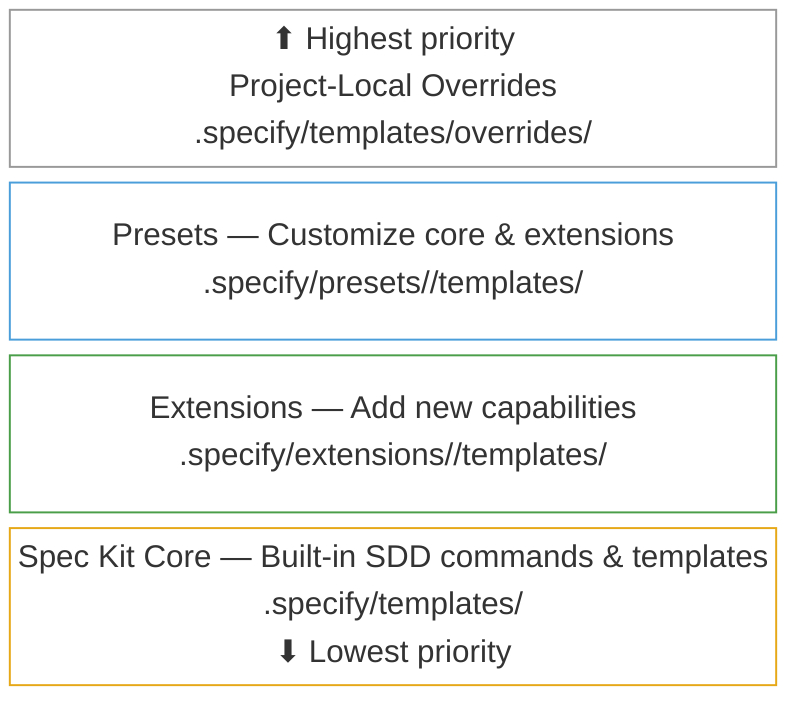
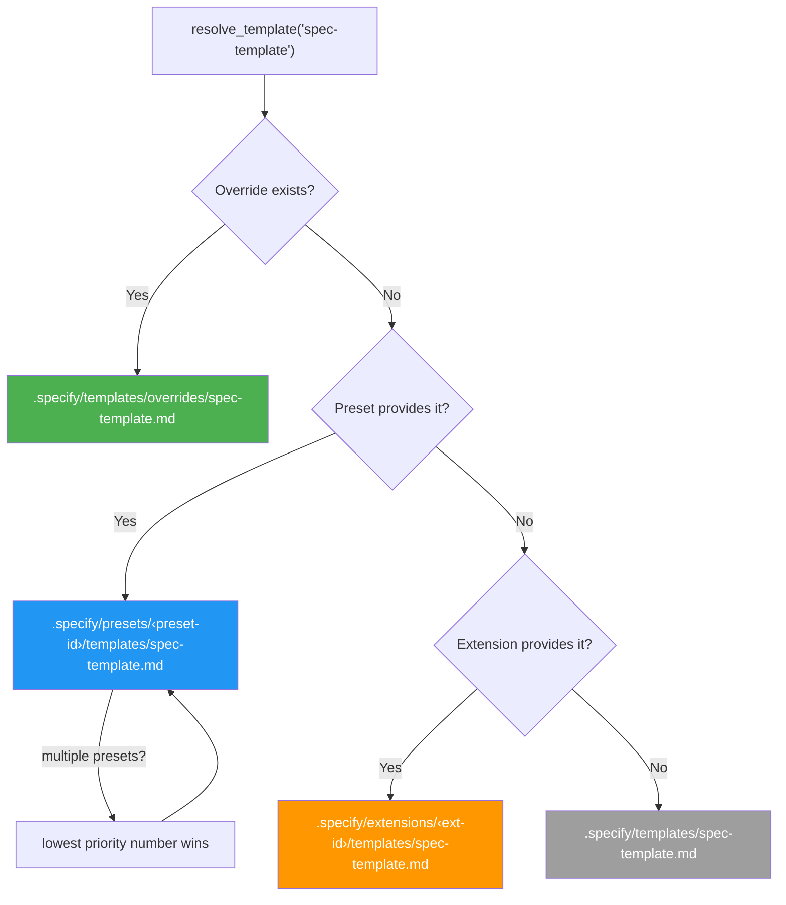
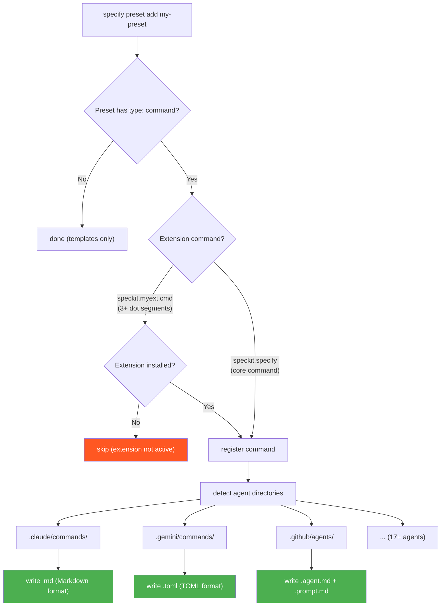
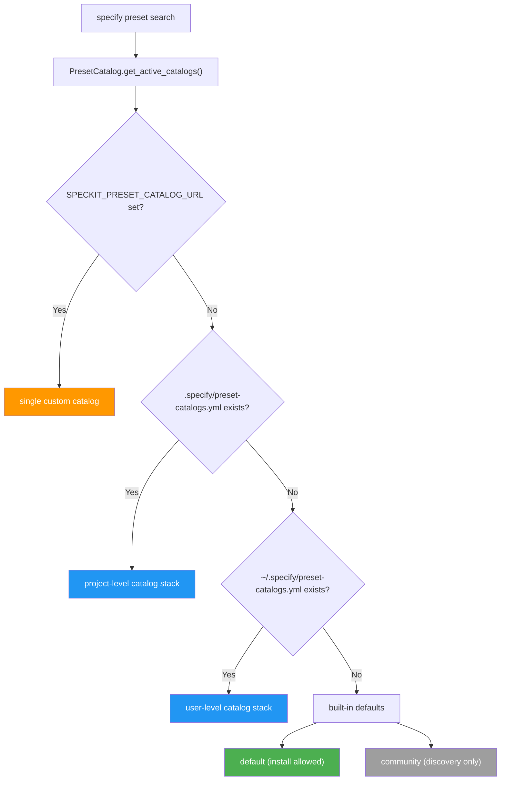

# KNOWLEDGE EXTRACT: github.com_github_spec-kit_8a080a19
> **Extracted on:** 2026-04-01 14:04:42
> **Source:** D:/LongLeo/AI OS CORP/AI OS/core/security/QUARANTINE/KI-BATCH-20260331205007523650/github.com_github_spec-kit_8a080a19

---

## File: `.gitattributes`
```
* text=auto eol=lf
```

## File: `.gitignore`
```
# Python
__pycache__/
*.py[cod]
*$py.class
*.so
.Python
build/
develop-eggs/
dist/
downloads/
eggs/
.eggs/
lib/
lib64/
parts/
sdist/
var/
wheels/
*.egg-info/
.installed.cfg
*.egg

# Virtual environments
venv/
ENV/
env/
.venv

# IDE
.vscode/
.idea/
*.swp
*.swo
.DS_Store
*.tmp

# Project specific
*.log
.env
.env.local
*.lock

# Spec Kit-specific files
.genreleases/
*.zip
sdd-*/
brain/knowledge/docs_legacy/dev

# Extension system
.specify/extensions/.cache/
.specify/extensions/.backup/
.specify/extensions/*/local-config.yml
```

## File: `.markdownlint-cli2.jsonc`
```
{
  // https://github.com/DavidAnson/markdownlint/blob/main/doc/Rules.md
  "config": {
    "default": true,
    "MD003": {
      "style": "atx"
    },
    "MD007": {
      "indent": 2
    },
    "MD013": false,
    "MD024": {
      "siblings_only": true
    },
    "MD033": false,
    "MD041": false,
    "MD049": {
      "style": "asterisk"
    },
    "MD050": {
      "style": "asterisk"
    },
    "MD036": false,
    "MD060": false
  },
  "ignores": [
    ".genreleases/"
  ]
}
```

## File: `AGENTS.md`
```markdown
# AGENTS.md

## About Spec Kit and Specify

**GitHub Spec Kit** is a comprehensive toolkit for implementing Spec-Driven Development (SDD) - a methodology that emphasizes creating clear specifications before implementation. The toolkit includes templates, scripts, and workflows that guide development teams through a structured approach to building software.

**Specify CLI** is the command-line interface that bootstraps projects with the Spec Kit framework. It sets up the necessary directory structures, templates, and AI agent integrations to support the Spec-Driven Development workflow.

The toolkit supports multiple AI coding assistants, allowing teams to use their preferred tools while maintaining consistent project structure and development practices.

---

## Adding New Agent Support

This section explains how to add support for new AI agents/assistants to the Specify CLI. Use this guide as a reference when integrating new AI tools into the Spec-Driven Development workflow.

### Overview

Specify supports multiple AI agents by generating agent-specific command files and directory structures when initializing projects. Each agent has its own conventions for:

- **Command file formats** (Markdown, TOML, etc.)
- **Directory structures** (`.claude/commands/`, `.windsurf/workflows/`, etc.)
- **Command invocation patterns** (slash commands, CLI tools, etc.)
- **Argument passing conventions** (`$ARGUMENTS`, `{{args}}`, etc.)

### Current Supported Agents

| Agent                      | Directory              | Format   | CLI Tool        | Description                 |
| -------------------------- | ---------------------- | -------- | --------------- | --------------------------- |
| **Claude Code**            | `.claude/commands/`    | Markdown | `claude`        | Anthropic's Claude Code CLI |
| **Gemini CLI**             | `.gemini/commands/`    | TOML     | `gemini`        | Google's Gemini CLI         |
| **GitHub Copilot**         | `.github/agents/`      | Markdown | N/A (IDE-based) | GitHub Copilot in VS Code   |
| **Cursor**                 | `.cursor/commands/`    | Markdown | N/A (IDE-based) | Cursor IDE (`--ai cursor-agent`) |
| **Qwen Code**              | `.qwen/commands/`      | Markdown | `qwen`          | Alibaba's Qwen Code CLI     |
| **opencode**               | `.opencode/command/`   | Markdown | `opencode`      | opencode CLI                |
| **Codex CLI**              | `.agents/skills/`      | Markdown | `codex`         | Codex CLI (`--ai codex --ai-skills`) |
| **Windsurf**               | `.windsurf/workflows/` | Markdown | N/A (IDE-based) | Windsurf IDE workflows      |
| **Junie**                  | `.junie/commands/`     | Markdown | `junie`         | Junie by JetBrains          |
| **Kilo Code**              | `.kilocode/workflows/` | Markdown | N/A (IDE-based) | Kilo Code IDE               |
| **Auggie CLI**             | `.augment/commands/`   | Markdown | `auggie`        | Auggie CLI                  |
| **Roo Code**               | `.roo/commands/`       | Markdown | N/A (IDE-based) | Roo Code IDE                |
| **CodeBuddy CLI**          | `.codebuddy/commands/` | Markdown | `codebuddy`     | CodeBuddy CLI               |
| **Qoder CLI**              | `.qoder/commands/`     | Markdown | `qodercli`      | Qoder CLI                   |
| **Kiro CLI**               | `.kiro/prompts/`       | Markdown | `kiro-cli`      | Kiro CLI                    |
| **Amp**                    | `.agents/commands/`    | Markdown | `amp`           | Amp CLI                     |
| **SHAI**                   | `.shai/commands/`      | Markdown | `shai`          | SHAI CLI                    |
| **Tabnine CLI**            | `.tabnine/agent/commands/` | TOML | `tabnine`       | Tabnine CLI                 |
| **Kimi Code**              | `.kimi/skills/`        | Markdown | `kimi`          | Kimi Code CLI (Moonshot AI) |
| **Pi Coding Agent**        | `.pi/prompts/`         | Markdown | `pi`            | Pi terminal coding agent    |
| **iFlow CLI**              | `.iflow/commands/`     | Markdown | `iflow`         | iFlow CLI (iflow-ai)        |
| **IBM Bob**                | `.bob/commands/`       | Markdown | N/A (IDE-based) | IBM Bob IDE                 |
| **Trae**                   | `.trae/rules/`         | Markdown | N/A (IDE-based) | Trae IDE                    |
| **Antigravity**            | `.agent/commands/`     | Markdown | N/A (IDE-based) | Antigravity IDE (`--ai agy --ai-skills`) |
| **Mistral Vibe**           | `.vibe/prompts/`       | Markdown | `vibe`          | Mistral Vibe CLI            |
| **Generic**                | User-specified via `--ai-commands-dir` | Markdown | N/A | Bring your own agent        |

### Step-by-Step Integration Guide

Follow these steps to add a new agent (using a hypothetical new agent as an example):

#### 1. Add to AGENT_CONFIG

**IMPORTANT**: Use the actual CLI tool name as the key, not a shortened version.

Add the new agent to the `AGENT_CONFIG` dictionary in `src/specify_cli/__init__.py`. This is the **single source of truth** for all agent metadata:

```python
AGENT_CONFIG = {
    # ... existing agents ...
    "new-agent-cli": {  # Use the ACTUAL CLI tool name (what users type in terminal)
        "name": "New Agent Display Name",
        "folder": ".newagent/",  # Directory for agent files
        "commands_subdir": "commands",  # Subdirectory name for command files (default: "commands")
        "install_url": "https://example.com/install",  # URL for installation docs (or None if IDE-based)
        "requires_cli": True,  # True if CLI tool required, False for IDE-based agents
    },
}
```

**Key Design Principle**: The dictionary key should match the actual executable name that users install. For example:

- ✅ Use `"cursor-agent"` because the CLI tool is literally called `cursor-agent`
- ❌ Don't use `"cursor"` as a shortcut if the tool is `cursor-agent`

This eliminates the need for special-case mappings throughout the codebase.

**Field Explanations**:

- `name`: Human-readable display name shown to users
- `folder`: Directory where agent-specific files are stored (relative to project root)
- `commands_subdir`: Subdirectory name within the agent folder where command/prompt files are stored (default: `"commands"`)
  - Most agents use `"commands"` (e.g., `.claude/commands/`)
  - Some agents use alternative names: `"agents"` (copilot), `"workflows"` (windsurf, kilocode), `"prompts"` (codex, kiro-cli, pi), `"command"` (opencode - singular)
  - This field enables `--ai-skills` to locate command templates correctly for skill generation
- `install_url`: Installation documentation URL (set to `None` for IDE-based agents)
- `requires_cli`: Whether the agent requires a CLI tool check during initialization

#### 2. Update CLI Help Text

Update the `--ai` parameter help text in the `init()` command to include the new agent:

```python
ai_assistant: str = typer.Option(None, "--ai", help="AI assistant to use: claude, gemini, copilot, cursor-agent, qwen, opencode, codex, windsurf, kilocode, auggie, codebuddy, new-agent-cli, or kiro-cli"),
```

Also update any function docstrings, examples, and error messages that list available agents.

#### 3. Update README Documentation

Update the **Supported AI Agents** section in `README.md` to include the new agent:

- Add the new agent to the table with appropriate support level (Full/Partial)
- Include the agent's official website link
- Add any relevant notes about the agent's implementation
- Ensure the table formatting remains aligned and consistent

#### 4. Update Release Package Script

Modify `.github/workflows/scripts/create-release-packages.sh`:

##### Add to ALL_AGENTS array

```bash
ALL_AGENTS=(claude gemini copilot cursor-agent qwen opencode windsurf kiro-cli)
```

##### Add case statement for directory structure

```bash
case $agent in
  # ... existing cases ...
  windsurf)
    mkdir -p "$base_dir/.windsurf/workflows"
    generate_commands windsurf md "\$ARGUMENTS" "$base_dir/.windsurf/workflows" "$script" ;;
esac
```

#### 4. Update GitHub Release Script

Modify `.github/workflows/scripts/create-github-release.sh` to include the new agent's packages:

```bash
gh release create "$VERSION" \
  # ... existing packages ...
  .genreleases/spec-kit-template-windsurf-sh-"$VERSION".zip \
  .genreleases/spec-kit-template-windsurf-ps-"$VERSION".zip \
  # Add new agent packages here
```

#### 5. Update Agent Context Scripts

##### Bash script (`scripts/bash/update-agent-context.sh`)

Add file variable:

```bash
WINDSURF_FILE="$REPO_ROOT/.windsurf/rules/specify-rules.md"
```

Add to case statement:

```bash
case "$AGENT_TYPE" in
  # ... existing cases ...
  windsurf) update_agent_file "$WINDSURF_FILE" "Windsurf" ;;
  "")
    # ... existing checks ...
    [ -f "$WINDSURF_FILE" ] && update_agent_file "$WINDSURF_FILE" "Windsurf";
    # Update default creation condition
    ;;
esac
```

##### PowerShell script (`scripts/powershell/update-agent-context.ps1`)

Add file variable:

```powershell
$windsurfFile = Join-Path $repoRoot '.windsurf/rules/specify-rules.md'
```

Add to switch statement:

```powershell
switch ($AgentType) {
    # ... existing cases ...
    'windsurf' { Update-AgentFile $windsurfFile 'Windsurf' }
    '' {
        foreach ($pair in @(
            # ... existing pairs ...
            @{file=$windsurfFile; name='Windsurf'}
        )) {
            if (Test-Path $pair.file) { Update-AgentFile $pair.file $pair.name }
        }
        # Update default creation condition
    }
}
```

#### 6. Update CLI Tool Checks (Optional)

For agents that require CLI tools, add checks in the `check()` command and agent validation:

```python
# In check() command
tracker.add("windsurf", "Windsurf IDE (optional)")
windsurf_ok = check_tool_for_tracker("windsurf", "https://windsurf.com/", tracker)

# In init validation (only if CLI tool required)
elif selected_ai == "windsurf":
    if not check_tool("windsurf", "Install from: https://windsurf.com/"):
        console.print("[red]Error:[/red] Windsurf CLI is required for Windsurf projects")
        agent_tool_missing = True
```

**Note**: CLI tool checks are now handled automatically based on the `requires_cli` field in AGENT_CONFIG. No additional code changes needed in the `check()` or `init()` commands - they automatically loop through AGENT_CONFIG and check tools as needed.

## Important Design Decisions

### Using Actual CLI Tool Names as Keys

**CRITICAL**: When adding a new agent to AGENT_CONFIG, always use the **actual executable name** as the dictionary key, not a shortened or convenient version.

**Why this matters:**

- The `check_tool()` function uses `shutil.which(tool)` to find executables in the system PATH
- If the key doesn't match the actual CLI tool name, you'll need special-case mappings throughout the codebase
- This creates unnecessary complexity and maintenance burden

**Example - The Cursor Lesson:**

❌ **Wrong approach** (requires special-case mapping):

```python
AGENT_CONFIG = {
    "cursor": {  # Shorthand that doesn't match the actual tool
        "name": "Cursor",
        # ...
    }
}

# Then you need special cases everywhere:
cli_tool = agent_key
if agent_key == "cursor":
    cli_tool = "cursor-agent"  # Map to the real tool name
```

✅ **Correct approach** (no mapping needed):

```python
AGENT_CONFIG = {
    "cursor-agent": {  # Matches the actual executable name
        "name": "Cursor",
        # ...
    }
}

# No special cases needed - just use agent_key directly!
```

**Benefits of this approach:**

- Eliminates special-case logic scattered throughout the codebase
- Makes the code more maintainable and easier to understand
- Reduces the chance of bugs when adding new agents
- Tool checking "just works" without additional mappings

#### 7. Update Devcontainer files (Optional)

For agents that have VS Code extensions or require CLI installation, update the devcontainer configuration files:

##### VS Code Extension-based Agents

For agents available as VS Code extensions, add them to `.devcontainer/devcontainer.json`:

```json
{
  "customizations": {
    "vscode": {
      "extensions": [
        // ... existing extensions ...
        // [New Agent Name]
        "[New Agent Extension ID]"
      ]
    }
  }
}
```

##### CLI-based Agents

For agents that require CLI tools, add installation commands to `.devcontainer/post-create.sh`:

```bash
#!/bin/bash

# Existing installations...

echo -e "\n🤖 Installing [New Agent Name] CLI..."
# run_command "npm install -g [agent-cli-package]@latest" # Example for node-based CLI
# or other installation instructions (must be non-interactive and compatible with Linux Debian "Trixie" or later)...
echo "✅ Done"

```

**Quick Tips:**

- **Extension-based agents**: Add to the `extensions` array in `devcontainer.json`
- **CLI-based agents**: Add installation scripts to `post-create.sh`
- **Hybrid agents**: May require both extension and CLI installation
- **Test thoroughly**: Ensure installations work in the devcontainer environment

## Agent Categories

### CLI-Based Agents

Require a command-line tool to be installed:

- **Claude Code**: `claude` CLI
- **Gemini CLI**: `gemini` CLI
- **Qwen Code**: `qwen` CLI
- **opencode**: `opencode` CLI
- **Codex CLI**: `codex` CLI (requires `--ai-skills`)
- **Junie**: `junie` CLI
- **Auggie CLI**: `auggie` CLI
- **CodeBuddy CLI**: `codebuddy` CLI
- **Qoder CLI**: `qodercli` CLI
- **Kiro CLI**: `kiro-cli` CLI
- **Amp**: `amp` CLI
- **SHAI**: `shai` CLI
- **Tabnine CLI**: `tabnine` CLI
- **Kimi Code**: `kimi` CLI
- **Mistral Vibe**: `vibe` CLI
- **Pi Coding Agent**: `pi` CLI
- **iFlow CLI**: `iflow` CLI

### IDE-Based Agents

Work within integrated development environments:

- **GitHub Copilot**: Built into VS Code/compatible editors
- **Cursor**: Built into Cursor IDE (`--ai cursor-agent`)
- **Windsurf**: Built into Windsurf IDE
- **Kilo Code**: Built into Kilo Code IDE
- **Roo Code**: Built into Roo Code IDE
- **IBM Bob**: Built into IBM Bob IDE
- **Trae**: Built into Trae IDE
- **Antigravity**: Built into Antigravity IDE (`--ai agy --ai-skills`)

## Command File Formats

### Markdown Format

Used by: Claude, Cursor, GitHub Copilot, opencode, Windsurf, Junie, Kiro CLI, Amp, SHAI, IBM Bob, Kimi Code, Qwen, Pi, Codex, Auggie, CodeBuddy, Qoder, Roo Code, Kilo Code, Trae, Antigravity, Mistral Vibe, iFlow

**Standard format:**

```markdown
---
description: "Command description"
---

Command content with {SCRIPT} and $ARGUMENTS placeholders.
```

**GitHub Copilot Chat Mode format:**

```markdown
---
description: "Command description"
mode: speckit.command-name
---

Command content with {SCRIPT} and $ARGUMENTS placeholders.
```

### TOML Format

Used by: Gemini, Tabnine

```toml
description = "Command description"

prompt = """
Command content with {SCRIPT} and {{args}} placeholders.
"""
```

## Directory Conventions

- **CLI agents**: Usually `.<agent-name>/commands/`
- **Singular command exception**:
  - opencode: `.opencode/command/` (singular `command`, not `commands`)
- **Nested path exception**:
  - Tabnine: `.tabnine/agent/commands/` (extra `agent/` segment)
- **Shared `.agents/` folder**:
  - Amp: `.agents/commands/` (shared folder, not `.amp/`)
  - Codex: `.agents/skills/` (shared folder; requires `--ai-skills`; invoked as `$speckit-<command>`)
- **Skills-based exceptions**:
  - Kimi Code: `.kimi/skills/` (skills, invoked as `/skill:speckit-<command>`)
- **Prompt-based exceptions**:
  - Kiro CLI: `.kiro/prompts/`
  - Pi: `.pi/prompts/`
  - Mistral Vibe: `.vibe/prompts/`
- **Rules-based exceptions**:
  - Trae: `.trae/rules/`
- **IDE agents**: Follow IDE-specific patterns:
  - Copilot: `.github/agents/`
  - Cursor: `.cursor/commands/`
  - Windsurf: `.windsurf/workflows/`
  - Kilo Code: `.kilocode/workflows/`
  - Roo Code: `.roo/commands/`
  - IBM Bob: `.bob/commands/`
  - Antigravity: `.agent/skills/` (`--ai-skills` required; `.agent/commands/` is deprecated)

## Argument Patterns

Different agents use different argument placeholders:

- **Markdown/prompt-based**: `$ARGUMENTS`
- **TOML-based**: `{{args}}`
- **Script placeholders**: `{SCRIPT}` (replaced with actual script path)
- **Agent placeholders**: `__AGENT__` (replaced with agent name)

## Testing New Agent Integration

1. **Build test**: Run package creation script locally
2. **CLI test**: Test `specify init --ai <agent>` command
3. **File generation**: Verify correct directory structure and files
4. **Command validation**: Ensure generated commands work with the agent
5. **Context update**: Test agent context update scripts

## Common Pitfalls

1. **Using shorthand keys instead of actual CLI tool names**: Always use the actual executable name as the AGENT_CONFIG key (e.g., `"cursor-agent"` not `"cursor"`). This prevents the need for special-case mappings throughout the codebase.
2. **Forgetting update scripts**: Both bash and PowerShell scripts must be updated when adding new agents.
3. **Incorrect `requires_cli` value**: Set to `True` only for agents that actually have CLI tools to check; set to `False` for IDE-based agents.
4. **Wrong argument format**: Use correct placeholder format for each agent type (`$ARGUMENTS` for Markdown, `{{args}}` for TOML).
5. **Directory naming**: Follow agent-specific conventions exactly (check existing agents for patterns).
6. **Help text inconsistency**: Update all user-facing text consistently (help strings, docstrings, README, error messages).

## Future Considerations

When adding new agents:

- Consider the agent's native command/workflow patterns
- Ensure compatibility with the Spec-Driven Development process
- Document any special requirements or limitations
- Update this guide with lessons learned
- Verify the actual CLI tool name before adding to AGENT_CONFIG

---

*This documentation should be updated whenever new agents are added to maintain accuracy and completeness.*
```

## File: `CHANGELOG.md`
```markdown
# Changelog

<!-- insert new changelog below this comment -->

## [0.4.3] - 2026-03-26

### Changed

- Unify Kimi/Codex skill naming and migrate legacy dotted Kimi dirs (#1971)
- fix(ps1): replace null-conditional operator for PowerShell 5.1 compatibility (#1975)
- chore: bump version to 0.4.2 (#1973)

## [0.4.2] - 2026-03-25

### Changed

- feat: Auto-register ai-skills for extensions whenever applicable (#1840)
- docs: add manual testing guide for slash command validation (#1955)
- Add AIDE, Extensify, and Presetify to community extensions (#1961)
- docs: add community presets section to main README (#1960)
- docs: move community extensions table to main README for discoverability (#1959)
- docs(readme): consolidate Community Friends sections and fix ToC anchors (#1958)
- fix(commands): rename NFR references to success criteria in analyze and clarify (#1935)
- Add Community Friends section to README (#1956)
- docs: add Community Friends section with Spec Kit Assistant VS Code extension (#1944)

## [0.4.1] - 2026-03-24

### Changed

- Add checkpoint extension (#1947)
- fix(scripts): prioritize .specify over git for repo root detection (#1933)
- docs: add AIDE extension demo to community projects (#1943)
- fix(templates): add missing Assumptions section to spec template (#1939)

## [0.4.0] - 2026-03-23

### Changed

- fix(cli): add allow_unicode=True and encoding="utf-8" to YAML I/O (#1936)
- fix(codex): native skills fallback refresh + legacy prompt suppression (#1930)
- feat(cli): embed core pack in wheel for offline/air-gapped deployment (#1803)
- ci: increase stale workflow operations-per-run to 250 (#1922)
- docs: update publishing guide with Category and Effect columns (#1913)
- fix: Align native skills frontmatter with install_ai_skills (#1920)
- feat: add timestamp-based branch naming option for `specify init` (#1911)
- docs: add Extension Comparison Guide for community extensions (#1897)
- docs: update SUPPORT.md, fix issue templates, add preset submission template (#1910)
- Add support for Junie (#1831)
- feat: migrate Codex/agy init to native skills workflow (#1906)

## [0.3.2] - 2026-03-19

### Changed

- Add conduct extension to community catalog (#1908)
- feat(extensions): add verify-tasks extension to community catalog (#1871)
- feat(presets): add enable/disable toggle and update semantics (#1891)
- feat: add iFlow CLI support (#1875)
- feat(commands): wire before/after hook events into specify and plan templates (#1886)
- docs(catalog): add speckit-utils to community catalog (#1896)
- docs: Add Extensions & Presets section to README (#1898)
- chore: update DocGuard extension to v0.9.11 (#1899)
- Update cognitive-squad catalog entry — Triadic Model, full lifecycle (#1884)
- feat: register spec-kit-iterate extension (#1887)
- fix(scripts): add explicit positional binding to PowerShell create-new-feature params (#1885)
- fix(scripts): encode residual JSON control chars as \uXXXX instead of stripping (#1872)
- chore: update DocGuard extension to v0.9.10 (#1890)
- Feature/spec kit add pi coding agent pullrequest (#1853)
- feat: register spec-kit-learn extension (#1883)

## [0.3.1] - 2026-03-17

### Changed

- docs: add greenfield Spring Boot pirate-speak preset demo to README (#1878)
- fix(ai-skills): exclude non-speckit copilot agent markdown from skills (#1867)
- feat: add Trae IDE support as a new agent (#1817)
- feat(cli): polite deep merge for settings.json and support JSONC (#1874)
- feat(extensions,presets): add priority-based resolution ordering (#1855)
- fix(scripts): suppress stdout from git fetch in create-new-feature.sh (#1876)
- fix(scripts): harden bash scripts — escape, compat, and error handling (#1869)
- Add cognitive-squad to community extension catalog (#1870)
- docs: add Go / React brownfield walkthrough to community walkthroughs (#1868)
- chore: update DocGuard extension to v0.9.8 (#1859)
- Feature: add specify status command (#1837)
- fix(extensions): show extension ID in list output (#1843)
- feat(extensions): add Archive and Reconcile extensions to community catalog (#1844)
- feat: Add DocGuard CDD enforcement extension to community catalog (#1838)

## [0.3.0] - 2026-03-13

### Changed

- feat(presets): Pluggable preset system with catalog, resolver, and skills propagation (#1787)
- fix: match 'Last updated' timestamp with or without bold markers (#1836)
- Add specify doctor command for project health diagnostics (#1828)
- fix: harden bash scripts against shell injection and improve robustness (#1809)
- fix: clean up command templates (specify, analyze) (#1810)
- fix: migrate Qwen Code CLI from TOML to Markdown format (#1589) (#1730)
- fix(cli): deprecate explicit command support for agy (#1798) (#1808)
- Add /selftest.extension core extension to test other extensions (#1758)
- feat(extensions): Quality of life improvements for RFC-aligned catalog integration (#1776)
- Add Java brownfield walkthrough to community walkthroughs (#1820)

## [0.2.1] - 2026-03-11

### Changed

- Added February 2026 newsletter (#1812)
- feat: add Kimi Code CLI agent support (#1790)
- docs: fix broken links in quickstart guide (#1759) (#1797)
- docs: add catalog cli help documentation (#1793) (#1794)
- fix: use quiet checkout to avoid exception on git checkout (#1792)
- feat(extensions): support .extensionignore to exclude files during install (#1781)
- feat: add Codex support for extension command registration (#1767)

## [0.2.0] - 2026-03-09

### Changed

- fix: sync agent list comments with actual supported agents (#1785)
- feat(extensions): support multiple active catalogs simultaneously (#1720)
- Pavel/add tabnine cli support (#1503)
- Add Understanding extension to community catalog (#1778)
- Add ralph extension to community catalog (#1780)
- Update README with project initialization instructions (#1772)
- feat: add review extension to community catalog (#1775)
- Add fleet extension to community catalog (#1771)
- Integration of Mistral vibe support into speckit (#1725)
- fix: Remove duplicate options in specify.md (#1765)
- fix: use global branch numbering instead of per-short-name detection (#1757)
- Add Community Walkthroughs section to README (#1766)
- feat(extensions): add Jira Integration to community catalog (#1764)
- Add Azure DevOps Integration extension to community catalog (#1734)
- Fix docs: update Antigravity link and add initialization example (#1748)
- fix: wire after_tasks and after_implement hook events into command templates (#1702)
- make c ignores consistent with c++ (#1747)

## [0.1.13] - 2026-03-03

### Changed

- feat: add kiro-cli and AGENT_CONFIG consistency coverage (#1690)
- feat: add verify extension to community catalog (#1726)
- Add Retrospective Extension to community catalog README table (#1741)
- fix(scripts): add empty description validation and branch checkout error handling (#1559)
- fix: correct Copilot extension command registration (#1724)
- fix(implement): remove Makefile from C ignore patterns (#1558)
- Add sync extension to community catalog (#1728)
- fix(checklist): clarify file handling behavior for append vs create (#1556)
- fix(clarify): correct conflicting question limit from 10 to 5 (#1557)

## [0.1.12] - 2026-03-02

### Changed

- fix: use RELEASE_PAT so tag push triggers release workflow (#1736)

## [0.1.11] - 2026-03-02

### Changed

- fix: release-trigger uses release branch + PR instead of direct push to main (#1733)
- fix: Split release process to sync pyproject.toml version with git tags (#1732)

## [0.1.10] - 2026-02-27

### Changed

- fix: prepend YAML frontmatter to Cursor .mdc files (#1699)

## [0.1.9] - 2026-02-28

### Changed

- chore(deps): bump astral-sh/setup-uv from 6 to 7 (#1709)

## [0.1.8] - 2026-02-28

### Changed

- chore(deps): bump actions/setup-python from 5 to 6 (#1710)

## [0.1.7] - 2026-02-27

### Changed

- chore: Update outdated GitHub Actions versions (#1706)
- docs: Document dual-catalog system for extensions (#1689)
- Fix version command in documentation (#1685)
- Add Cleanup Extension to README (#1678)
- Add retrospective extension to community catalog (#1681)

## [0.1.6] - 2026-02-23

### Changed

- Add Cleanup Extension to catalog (#1617)
- Fix parameter ordering issues in CLI (#1669)
- Update V-Model Extension Pack to v0.4.0 (#1665)
- docs: Fix doc missing step (#1496)
- Update V-Model Extension Pack to v0.3.0 (#1661)

## [0.1.5] - 2026-02-21

### Changed

- Fix #1658: Add commands_subdir field to support non-standard agent directory structures (#1660)
- feat: add GitHub issue templates (#1655)
- Update V-Model Extension Pack to v0.2.0 in community catalog (#1656)
- Add V-Model Extension Pack to catalog (#1640)
- refactor: remove OpenAPI/GraphQL bias from templates (#1652)

## [0.1.4] - 2026-02-20

### Changed

- fix: rename Qoder AGENT_CONFIG key from 'qoder' to 'qodercli' to match actual CLI executable (#1651)

## [0.1.3] - 2026-02-20

### Changed

- Add generic agent support with customizable command directories (#1639)

## [0.1.2] - 2026-02-20

### Changed

- fix: pin click>=8.1 to prevent Python 3.14/Homebrew env isolation crash (#1648)

## [0.0.102] - 2026-02-20

### Changed

- fix: include 'src/**' path in release workflow triggers (#1646)

## [0.0.101] - 2026-02-19

### Changed

- chore(deps): bump github/codeql-action from 3 to 4 (#1635)

## [0.0.100] - 2026-02-19

### Changed

- Add pytest and Python linting (ruff) to CI (#1637)
- feat: add pull request template for better contribution guidelines (#1634)

## [0.0.99] - 2026-02-19

### Changed

- Feat/ai skills (#1632)

## [0.0.98] - 2026-02-19

### Changed

- chore(deps): bump actions/stale from 9 to 10 (#1623)
- feat: add dependabot configuration for pip and GitHub Actions updates (#1622)

## [0.0.97] - 2026-02-18

### Changed

- Remove Maintainers section from README.md (#1618)

## [0.0.96] - 2026-02-17

### Changed

- fix: typo in plan-template.md (#1446)

## [0.0.95] - 2026-02-12

### Changed

- Feat: add a new agent: Google Anti Gravity (#1220)

## [0.0.94] - 2026-02-11

### Changed

- Add stale workflow for 180-day inactive issues and PRs (#1594)

## [0.0.93] - 2026-02-10

### Changed

- Add modular extension system (#1551)

## [0.0.92] - 2026-02-10

### Changed

- Fixes #1586 - .specify.specify path error (#1588)

## [0.0.91] - 2026-02-09

### Changed

- fix: preserve constitution.md during reinitialization (#1541) (#1553)
- fix: resolve markdownlint errors across documentation (#1571)

## [0.0.90] - 2025-12-04

### Changed

- Update Markdown formatting
- Update Markdown formatting
- docs: Add existing project initialization to getting started

## [0.0.89] - 2025-12-02

### Changed

- Update scripts/bash/create-new-feature.sh
- fix(scripts): prevent octal interpretation in feature number parsing
- fix: remove unused short_name parameter from branch numbering functions
- Update scripts/powershell/create-new-feature.ps1
- Update scripts/bash/create-new-feature.sh
- fix: use global maximum for branch numbering to prevent collisions

## [0.0.88] - 2025-12-01

### Changed

- fix the incorrect task-template file path

## [0.0.87] - 2025-12-01

### Changed

- Limit width and height to 200px to match the small logo
- docs: Switch readme logo to logo_large.webp
- fix:merge
- fix
- fix
- feat:qoder agent
- docs: Enhance quickstart guide with admonitions and examples
- docs: add constitution step to quickstart guide (fixes #906)
- Update supported AI agents in README.md
- cancel:test
- test
- fix:literal bug
- fix:test
- test
- fix:qoder url
- fix:download owner
- test
- feat:support Qoder CLI

## [0.0.86] - 2025-11-26

### Changed

- feat: add bob to new update-agent-context.ps1 + consistency in comments
- feat: add support for IBM Bob IDE

## [0.0.85] - 2025-11-14

### Changed

- Unset CDPATH while getting SCRIPT_DIR

## [0.0.84] - 2025-11-14

### Changed

- docs: fix broken link and improve agent reference
- docs: reorganize upgrade documentation structure
- docs: remove related documentation section from upgrading guide
- fix: remove broken link to existing project guide
- docs: Add comprehensive upgrading guide for Spec Kit
- Refactor ESLint configuration checks in implement.md to address deprecation

## [0.0.83] - 2025-11-14

### Changed

- feat: Add OVHcloud SHAI AI Agent

## [0.0.82] - 2025-11-14

### Changed

- fix: incorrect logic to create release packages with subset AGENTS or SCRIPTS

## [0.0.81] - 2025-11-14

### Changed

- Fix tasktoissues.md to use the 'github/github-mcp-server/issue_write' tool

## [0.0.80] - 2025-11-14

### Changed

- Refactor feature script logic and update agent context scripts
- Update templates/commands/taskstoissues.md
- Update CHANGELOG.md
- Update agent configuration
- Update scripts/powershell/create-new-feature.ps1
- Update src/specify_cli/__init__.py
- Create create-release-packages.ps1
- Script changes
- Update taskstoissues.md
- Create taskstoissues.md
- Update src/specify_cli/__init__.py
- Update CONTRIBUTING.md
- Potential fix for code scanning alert no. 3: Workflow does not contain permissions
- Update src/specify_cli/__init__.py
- Update CHANGELOG.md
- Fixes #970
- Fixes #975
- Support for version command
- Exclude generated releases
- Lint fixes
- Prompt updates
- Hand offs with prompts
- Chatmodes are back in vogue
- Let's switch to proper prompts
- Update prompts
- Update with prompt
- Testing hand-offs
- Use VS Code handoffs

## [0.0.79] - 2025-10-23

### Changed

- docs: restore important note about JSON output in specify command
- fix: improve branch number detection to check all sources
- feat: check remote branches to prevent duplicate branch numbers

## [0.0.78] - 2025-10-21

### Changed

- Update CONTRIBUTING.md
- docs: add steps for testing template and command changes locally
- update specify to make "short-name" argu for create-new-feature.sh in the right position

## [0.0.77] - 2025-10-21

### Changed

- fix: include the latest changelog in the `GitHub Release`'s  body

## [0.0.76] - 2025-10-21

### Changed

- Fix update-agent-context.sh to handle files without Active Technologies/Recent Changes sections

## [0.0.75] - 2025-10-21

### Changed

- Fixed indentation.
- Added correct `install_url` for Amp agent CLI script.
- Added support for Amp code agent.

## [0.0.74] - 2025-10-21

### Changed

- feat(ci): add markdownlint-cli2 for consistent markdown formatting

## [0.0.73] - 2025-10-21

### Changed

- revert vscode auto remove extra space
- fix: correct command references in implement.md
- fix regarding copilot suggestion
- fix: correct command references in speckit.analyze.md
- Support more lang/Devops of Common Patterns by Technology
- chore: replace `bun` by `node/npm` in the `devcontainer` (as many CLI-based agents actually require a `node` runtime)
- chore: add Claude Code extension to devcontainer configuration
- chore: add installation of `codebuddy` CLI in the `devcontainer`
- chore: fix path to powershell script in vscode settings
- fix: correct `run_command` exit behavior and improve installation instructions (for `Amazon Q`) in `post-create.sh` + fix typos in `CONTRIBUTING.md`
- chore: add `specify`'s github copilot chat settings to `devcontainer`
- chore: add `devcontainer` support  to ease developer workstation setup

## [0.0.72] - 2025-10-18

### Changed

- fix: correct argument parsing in create-new-feature.sh script

## [0.0.71] - 2025-10-18

### Changed

- fix: Skip CLI checks for IDE-based agents in check command
- Change loop condition to include last argument

## [0.0.70] - 2025-10-18

### Changed

- fix: broken media files
- Update README.md
- The function parameters lack type hints. Consider adding type annotations for better code clarity and IDE support.
- - **Smart JSON Merging for VS Code Settings**: `.vscode/settings.json` is now intelligently merged instead of being overwritten during `specify init --here` or `specify init .`   - Existing settings are preserved   - New Spec Kit settings are added   - Nested objects are merged recursively   - Prevents accidental loss of custom VS Code workspace configurations
- Fix: incorrect command formatting in agent context file, refix #895

## [0.0.69] - 2025-10-15

### Changed

- Update scripts/bash/create-new-feature.sh
- Update create-new-feature.sh
- Update files
- Update files
- Create .gitattributes
- Update wording
- Update logic for arguments
- Update script logic

## [0.0.68] - 2025-10-15

### Changed

- format content as copilot suggest
- Ruby, PHP, Rust, Kotlin, C, C++

## [0.0.67] - 2025-10-15

### Changed

- Use the number prefix to find the right spec

## [0.0.66] - 2025-10-15

### Changed

- Update CodeBuddy agent name to 'CodeBuddy CLI'
- Rename CodeBuddy to CodeBuddy CLI in update script
- Update AI coding agent references in installation guide
- Rename CodeBuddy to CodeBuddy CLI in AGENTS.md
- Update README.md
- Update CodeBuddy link in README.md
- update codebuddyCli

## [0.0.65] - 2025-10-15

### Changed

- Fix: Fix incorrect command formatting in agent context file
- docs: fix heading capitalization for consistency
- Update README.md

## [0.0.64] - 2025-10-14

### Changed

- Update tasks.md
- Update README.md

## [0.0.63] - 2025-10-14

### Changed

- fix: update CODEBUDDY file path in agent context scripts
- docs(readme): add /speckit.tasks step and renumber walkthrough

## [0.0.62] - 2025-10-11

### Changed

- A few more places to update from code review
- fix: align Cursor agent naming to use 'cursor-agent' consistently

## [0.0.61] - 2025-10-10

### Changed

- Update clarify.md
- add how to upgrade specify installation

## [0.0.60] - 2025-10-10

### Changed

- Update vscode-settings.json
- Update instructions and bug fix

## [0.0.59] - 2025-10-10

### Changed

- Update __init__.py
- Consolidate Cursor naming
- Update CHANGELOG.md
- Git errors are now highlighted.
- Update __init__.py
- Refactor agent configuration
- Update src/specify_cli/__init__.py
- Update scripts/powershell/update-agent-context.ps1
- Update AGENTS.md
- Update templates/commands/implement.md
- Update templates/commands/implement.md
- Update CHANGELOG.md
- Update changelog
- Update plan.md
- Add ignore file verification step to /speckit.implement command
- Escape backslashes in TOML outputs
- update CodeBuddy to international site
- feat: support codebuddy ai
- feat: support codebuddy ai

## [0.0.58] - 2025-10-08

### Changed

- Add escaping guidelines to command templates
- Update README.md
- Update README.md

## [0.0.57] - 2025-10-06

### Changed

- Update CHANGELOG.md
- Update command reference
- Package up VS Code settings for Copilot
- Update tasks-template.md
- Update templates/tasks-template.md
- Cleanup
- Update CLI changes
- Update template and docs
- Update checklist.md
- Update templates
- Cleanup redundancies
- Update checklist.md
- Codex CLI is now fully supported
- Update specify.md
- Prompt updates
- Update prompt prefix
- Update .github/workflows/scripts/create-release-packages.sh
- Consistency updates to commands
- Update commands.
- Update logs
- Template cleanup and reorganization
- Remove Codex named args limitation warning
- Remove Codex named args limitation from README.md

## [0.0.56] - 2025-10-02

### Changed

- docs(readme): link Amazon Q slash command limitation issue
- docs: clarify Amazon Q limitation and update init docstring
- feat(agent): Added Amazon Q Developer CLI Integration

## [0.0.55] - 2025-09-30

### Changed

- Update URLs to Contributing and Support Guides in Docs
- fix: add UTF-8 encoding to file read/write operations in update-agent-context.ps1
- Update __init__.py
- Update src/specify_cli/__init__.py
- docs: fix the paths of generated files (moved under a `.specify/` folder)
- Update src/specify_cli/__init__.py
- feat: support 'specify init .' for current directory initialization
- feat: Add emacs-style up/down keys

## [0.0.54] - 2025-09-25

### Changed

- Update CONTRIBUTING.md
- Refine `plan-template.md` with improved project type detection, clarified structure decision process, and enhanced research task guidance.
- Update __init__.py

## [0.0.53] - 2025-09-24

### Changed

- Update template path for spec file creation
- Update template path for spec file creation
- docs: remove constitution_update_checklist from README

## [0.0.52] - 2025-09-22

### Changed

- Update analyze.md
- Update templates/commands/analyze.md
- Update templates/commands/clarify.md
- Update templates/commands/plan.md
- Update with extra commands
- Update with --force flag
- feat: add uv tool install instructions to README

## [0.0.51] - 2025-09-21

### Changed

- Update with Roo Code support

## [0.0.50] - 2025-09-21

### Changed

- Update generate-release-notes.sh
- Update error messages
- Auggie folder fix

## [0.0.49] - 2025-09-21

### Changed

- Update scripts/powershell/update-agent-context.ps1
- Update templates/commands/implement.md
- Cleanup the check command
- Add support for Auggie
- Update AGENTS.md
- Updates with Kilo Code support
- Update README.md
- Update templates/commands/constitution.md
- Update templates/commands/implement.md
- Update templates/commands/plan.md
- Update templates/commands/specify.md
- Update templates/commands/tasks.md
- Update README.md
- Stop splitting the warning over multiple lines
- Update templates based on #419
- docs: Update README with codex in check command

## [0.0.48] - 2025-09-21

### Changed

- Update scripts/powershell/check-prerequisites.ps1
- Update CHANGELOG.md
- Update CHANGELOG.md
- Update changelog
- Update scripts/bash/update-agent-context.sh
- Fix script config
- Update scripts/bash/common.sh
- Update scripts/powershell/update-agent-context.ps1
- Update scripts/powershell/update-agent-context.ps1
- Clarification
- Update prompts
- Update update-agent-context.ps1
- Update CONTRIBUTING.md
- Update CONTRIBUTING.md
- Update CONTRIBUTING.md
- Update CONTRIBUTING.md
- Update CONTRIBUTING.md
- Update contribution guidelines.
- Root detection logic
- Update templates/plan-template.md
- Update scripts/bash/update-agent-context.sh
- Update scripts/powershell/create-new-feature.ps1
- Simplification
- Script and template tweaks
- Update config
- Update scripts/powershell/check-prerequisites.ps1
- Update scripts/bash/check-prerequisites.sh
- Fix script path
- Script cleanup
- Update scripts/bash/check-prerequisites.sh
- Update scripts/powershell/check-prerequisites.ps1
- Update script delegation from GitHub Action
- Cleanup the setup for generated packages
- Use proper line endings
- Consolidate scripts

## [0.0.47] - 2025-09-20

### Changed

- Updating agent context files

## [0.0.46] - 2025-09-20

### Changed

- Update update-agent-context.ps1
- Update package release
- Update config
- Update __init__.py
- Update __init__.py
- Remove Codex-specific logic in the initialization script
- Update version rev
- Update __init__.py
- Enhance Codex support by auto-syncing prompt files, allowing spec generation without git, and documenting clearer /specify usage.
- Consistency tweaks
- Consistent step coloring
- Update __init__.py
- Update __init__.py
- Quick UI tweak
- Update package release
- Limit workspace command seeding to Codex init and update Codex documentation accordingly.
- Clarify Codex-specific README note with rationale for its different workflow.
- Bump to 0.0.7 and document Codex support
- Normalize Codex command templates to the scripts-based schema and auto-upgrade generated commands.
- Fix remaining merge conflict markers in __init__.py
- Add Codex CLI support with AGENTS.md and commands bootstrap

## [0.0.45] - 2025-09-19

### Changed

- Update with Windsurf support
- expose token as an argument through cli --github-token
- add github auth headers if there are GITHUB_TOKEN/GH_TOKEN set

## [0.0.44] - 2025-09-18

### Changed

- Update specify.md
- Update __init__.py

## [0.0.43] - 2025-09-18

### Changed

- Update with support for /implement

## [0.0.42] - 2025-09-18

### Changed

- Update constitution.md

## [0.0.41] - 2025-09-18

### Changed

- Update constitution.md

## [0.0.40] - 2025-09-18

### Changed

- Update constitution command

## [0.0.39] - 2025-09-18

### Changed

- Cleanup
- fix: commands format for qwen

## [0.0.38] - 2025-09-18

### Changed

- Fix template path in update-agent-context.sh
- docs: fix grammar mistakes in markdown files

## [0.0.37] - 2025-09-17

### Changed

- fix: add missing Qwen support to release workflow and agent scripts

## [0.0.36] - 2025-09-17

### Changed

- feat: Add opencode ai agent
- Fix --no-git argument resolution.

## [0.0.35] - 2025-09-17

### Changed

- chore(release): bump version to 0.0.5 and update changelog
- chore: address review feedback - remove comment and fix numbering
- feat: add Qwen Code support to Spec Kit

## [0.0.34] - 2025-09-15

### Changed

- Update template.

## [0.0.33] - 2025-09-15

### Changed

- Update scripts

## [0.0.32] - 2025-09-15

### Changed

- Update template paths

## [0.0.31] - 2025-09-15

### Changed

- Update for Cursor rules & script path
- Update Specify definition
- Update README.md
- Update with video header
- fix(docs): remove redundant white space

## [0.0.30] - 2025-09-12

### Changed

- Update update-agent-context.ps1

## [0.0.29] - 2025-09-12

### Changed

- Update create-release-packages.sh
- Update with check changes

## [0.0.28] - 2025-09-12

### Changed

- Update wording
- Update release.yml

## [0.0.27] - 2025-09-12

### Changed

- Support Cursor

## [0.0.26] - 2025-09-12

### Changed

- Saner approach to scripts

## [0.0.25] - 2025-09-12

### Changed

- Update packaging

## [0.0.24] - 2025-09-12

### Changed

- Fix package logic

## [0.0.23] - 2025-09-12

### Changed

- Update config
- Update __init__.py
- Refactor with platform-specific constraints
- Update README.md
- Update CLI reference
- Update __init__.py
- refactor: extract Claude local path to constant for maintainability
- fix: support Claude CLI installed via migrate-installer

## [0.0.22] - 2025-09-11

### Changed

- Update release.yml
- Update create-release-packages.sh
- Update create-release-packages.sh
- Update release file

## [0.0.21] - 2025-09-11

### Changed

- Consolidate script creation
- Update how Copilot prompts are created
- Update local-development.md
- Local dev guide and script updates
- Update CONTRIBUTING.md
- Enhance HTTP client initialization with optional SSL verification and bump version to 0.0.3
- Complete Gemini CLI command instructions
- Refactor HTTP client usage to utilize truststore for SSL context
- docs: Update Commands sections renaming to match implementation
- docs: Fix formatting issues in README.md for consistency
- Update docs and release

## [0.0.20] - 2025-09-08

### Changed

- Update brain/knowledge/docs_legacy/quickstart.md
- Docs setup

## [0.0.19] - 2025-09-08

### Changed

- Update README.md

## [0.0.18] - 2025-09-08

### Changed

- Update README.md

## [0.0.17] - 2025-09-08

### Changed

- Remove trailing whitespace from tasks.md template

## [0.0.16] - 2025-09-07

### Changed

- Fix release workflow to work with repository rules

## [0.0.15] - 2025-09-07

### Changed

- Use `/usr/bin/env bash` instead of `/bin/bash` for shebang

## [0.0.14] - 2025-09-04

### Changed

- fix: correct typos in spec-driven.md

## [0.0.13] - 2025-09-04

### Changed

- Fix formatting in usage instructions

## [0.0.12] - 2025-09-04

### Changed

- Fix template path in plan command documentation

## [0.0.11] - 2025-09-04

### Changed

- fix: incorrect tree structure in examples

## [0.0.10] - 2025-09-04

### Changed

- fix minor typo in Article I

## [0.0.9] - 2025-09-03

### Changed

- Update CLI commands from '/spec' to '/specify'

## [0.0.8] - 2025-09-02

### Changed

- adding executable permission to the scripts so they execute when the coding agent launches them

## [0.0.7] - 2025-09-02

### Changed

- doco(spec-driven): Fix small typo in document

## [0.0.6] - 2025-08-25

### Changed

- Update README.md

## [0.0.5] - 2025-08-25

### Changed

- Update .github/workflows/release.yml
- Fix release workflow to work with repository rules

## [0.0.4] - 2025-08-25

### Changed

- Add John Lam as contributor and release badge

## [0.0.3] - 2025-08-22

### Changed

- Update requirements

## [0.0.2] - 2025-08-22

### Changed

- Update README.md

## [0.0.1] - 2025-08-22

### Changed

- Update release.yml

```

## File: `CODE_OF_CONDUCT.md`
```markdown
# Contributor Covenant Code of Conduct

## Our Pledge

In the interest of fostering an open and welcoming environment, we as
contributors and maintainers pledge to making participation in our project and
our community a harassment-free experience for everyone, regardless of age, body
size, disability, ethnicity, gender identity and expression, level of experience,
nationality, personal appearance, race, religion, or sexual identity and
orientation.

## Our Standards

Examples of behavior that contributes to creating a positive environment
include:

- Using welcoming and inclusive language
- Being respectful of differing viewpoints and experiences
- Gracefully accepting constructive criticism
- Focusing on what is best for the community
- Showing empathy towards other community members

Examples of unacceptable behavior by participants include:

- The use of sexualized language or imagery and unwelcome sexual attention or
  advances
- Trolling, insulting/derogatory comments, and personal or political attacks
- Public or private harassment
- Publishing others' private information, such as a physical or electronic
  address, without explicit permission
- Other conduct which could reasonably be considered inappropriate in a
  professional setting

## Our Responsibilities

Project maintainers are responsible for clarifying the standards of acceptable
behavior and are expected to take appropriate and fair corrective action in
response to any instances of unacceptable behavior.

Project maintainers have the right and responsibility to remove, edit, or
reject comments, commits, code, wiki edits, issues, and other contributions
that are not aligned to this Code of Conduct, or to ban temporarily or
permanently any contributor for other behaviors that they deem inappropriate,
threatening, offensive, or harmful.

## Scope

This Code of Conduct applies both within project spaces and in public spaces
when an individual is representing the project or its community. Examples of
representing a project or community include using an official project e-mail
address, posting via an official social media account, or acting as an appointed
representative at an online or offline event. Representation of a project may be
further defined and clarified by project maintainers.

## Enforcement

Instances of abusive, harassing, or otherwise unacceptable behavior may be
reported by contacting the project team at <opensource@github.com>. All
complaints will be reviewed and investigated and will result in a response that
is deemed necessary and appropriate to the circumstances. The project team is
obligated to maintain confidentiality with regard to the reporter of an incident.
Further details of specific enforcement policies may be posted separately.

Project maintainers who do not follow or enforce the Code of Conduct in good
faith may face temporary or permanent repercussions as determined by other
members of the project's leadership.

## Attribution

This Code of Conduct is adapted from the [Contributor Covenant][homepage], version 1.4,
available at [http://contributor-covenant.org/version/1/4][version]

[homepage]: http://contributor-covenant.org
[version]: http://contributor-covenant.org/version/1/4/
```

## File: `CONTRIBUTING.md`
```markdown
# Contributing to Spec Kit

Hi there! We're thrilled that you'd like to contribute to Spec Kit. Contributions to this project are [released](https://help.github.com/articles/github-terms-of-service/#6-contributions-under-repository-license) to the public under the [project's open source license](LICENSE).

Please note that this project is released with a [Contributor Code of Conduct](CODE_OF_CONDUCT.md). By participating in this project you agree to abide by its terms.

## Prerequisites for running and testing code

These are one time installations required to be able to test your changes locally as part of the pull request (PR) submission process.

1. Install [Python 3.11+](https://www.python.org/downloads/)
1. Install [uv](https://docs.astral.sh/uv/) for package management
1. Install [Git](https://git-scm.com/downloads)
1. Have an [AI coding agent available](README.md#-supported-ai-agents)

<details>
<summary><b>💡 Hint if you are using <code>VSCode</code> or <code>GitHub Codespaces</code> as your IDE</b></summary>

<br>

Provided you have [Docker](https://docker.com) installed on your machine, you can leverage [Dev Containers](https://containers.dev) through this [VSCode extension](https://marketplace.visualstudio.com/items?itemName=ms-vscode-remote.remote-containers), to easily set up your development environment, with aforementioned tools already installed and configured, thanks to the `.devcontainer/devcontainer.json` file (located at the root of the project).

To do so, simply:

- Checkout the repo
- Open it with VSCode
- Open the [Command Palette](https://code.visualstudio.com/brain/knowledge/docs_legacy/getstarted/userinterface#_command-palette) and select "Dev Containers: Open Folder in Container..."

On [GitHub Codespaces](https://github.com/features/codespaces) it's even simpler, as it leverages the `.devcontainer/devcontainer.json` automatically upon opening the codespace.

</details>

## Submitting a pull request

> [!NOTE]
> If your pull request introduces a large change that materially impacts the work of the CLI or the rest of the repository (e.g., you're introducing new templates, arguments, or otherwise major changes), make sure that it was **discussed and agreed upon** by the project maintainers. Pull requests with large changes that did not have a prior conversation and agreement will be closed.

1. Fork and clone the repository
1. Configure and install the dependencies: `uv sync --extra test`
1. Make sure the CLI works on your machine: `uv run specify --help`
1. Create a new branch: `git checkout -b my-branch-name`
1. Make your change, add tests, and make sure everything still works
1. Test the CLI functionality with a sample project if relevant
1. Push to your fork and submit a pull request
1. Wait for your pull request to be reviewed and merged.

For the detailed test workflow, command-selection prompt, and PR reporting template, see [`TESTING.md`](../bmad_repo/testing.md).
Activate the project virtual environment (see the Setup block in [`TESTING.md`](../bmad_repo/testing.md)), then install the CLI from your working tree (`uv pip install -e .` after `uv sync --extra test`) or otherwise ensure the shell uses the local `specify` binary before running the manual slash-command tests described below.

Here are a few things you can do that will increase the likelihood of your pull request being accepted:

- Follow the project's coding conventions.
- Write tests for new functionality.
- Update documentation (`README.md`, `spec-driven.md`) if your changes affect user-facing features.
- Keep your change as focused as possible. If there are multiple changes you would like to make that are not dependent upon each other, consider submitting them as separate pull requests.
- Write a [good commit message](http://tbaggery.com/2008/04/19/a-note-about-git-commit-messages.html).
- Test your changes with the Spec-Driven Development workflow to ensure compatibility.

## Development workflow

When working on spec-kit:

1. Test changes with the `specify` CLI commands (`/speckit.specify`, `/speckit.plan`, `/speckit.tasks`) in your coding agent of choice
2. Verify templates are working correctly in `templates/` directory
3. Test script functionality in the `scripts/` directory
4. Ensure memory files (`memory/constitution.md`) are updated if major process changes are made

### Recommended validation flow

For the smoothest review experience, validate changes in this order:

1. **Run focused automated checks first** — use the quick verification commands in [`TESTING.md`](../bmad_repo/testing.md) to catch packaging, scaffolding, and configuration regressions early.
2. **Run manual workflow tests second** — if your change affects slash commands or the developer workflow, follow [`TESTING.md`](../bmad_repo/testing.md) to choose the right commands, run them in an agent, and capture results for your PR.
3. **Use local release packages when debugging packaged output** — if you need to inspect the exact files CI-style packaging produces, generate local release packages as described below.

### Testing template and command changes locally

Running `uv run specify init` pulls released packages, which won’t include your local changes.  
To test your templates, commands, and other changes locally, follow these steps:

1. **Create release packages**

   Run the following command to generate the local packages:

   ```bash
   ./.github/workflows/scripts/create-release-packages.sh v1.0.0
   ```

2. **Copy the relevant package to your test project**

   ```bash
   cp -r .genreleases/sdd-copilot-package-sh/. <path-to-test-project>/
   ```

3. **Open and test the agent**

   Navigate to your test project folder and open the agent to verify your implementation.

If you only need to validate generated file structure and content before doing manual agent testing, start with the focused automated checks in [`TESTING.md`](../bmad_repo/testing.md). Keep this section for the cases where you need to inspect the exact packaged output locally.

## AI contributions in Spec Kit

> [!IMPORTANT]
>
> If you are using **any kind of AI assistance** to contribute to Spec Kit,
> it must be disclosed in the pull request or issue.

We welcome and encourage the use of AI tools to help improve Spec Kit! Many valuable contributions have been enhanced with AI assistance for code generation, issue detection, and feature definition.

That being said, if you are using any kind of AI assistance (e.g., agents, ChatGPT) while contributing to Spec Kit,
**this must be disclosed in the pull request or issue**, along with the extent to which AI assistance was used (e.g., documentation comments vs. code generation).

If your PR responses or comments are being generated by an AI, disclose that as well.

As an exception, trivial spacing or typo fixes don't need to be disclosed, so long as the changes are limited to small parts of the code or short phrases.

An example disclosure:

> This PR was written primarily by GitHub Copilot.

Or a more detailed disclosure:

> I consulted ChatGPT to understand the codebase but the solution
> was fully authored manually by myself.

Failure to disclose this is first and foremost rude to the human operators on the other end of the pull request, but it also makes it difficult to
determine how much scrutiny to apply to the contribution.

In a perfect world, AI assistance would produce equal or higher quality work than any human. That isn't the world we live in today, and in most cases
where human supervision or expertise is not in the loop, it's generating code that cannot be reasonably maintained or evolved.

### What we're looking for

When submitting AI-assisted contributions, please ensure they include:

- **Clear disclosure of AI use** - You are transparent about AI use and degree to which you're using it for the contribution
- **Human understanding and testing** - You've personally tested the changes and understand what they do
- **Clear rationale** - You can explain why the change is needed and how it fits within Spec Kit's goals
- **Concrete evidence** - Include test cases, scenarios, or examples that demonstrate the improvement
- **Your own analysis** - Share your thoughts on the end-to-end developer experience

### What we'll close

We reserve the right to close contributions that appear to be:

- Untested changes submitted without verification
- Generic suggestions that don't address specific Spec Kit needs
- Bulk submissions that show no human review or understanding

### Guidelines for success

The key is demonstrating that you understand and have validated your proposed changes. If a maintainer can easily tell that a contribution was generated entirely by AI without human input or testing, it likely needs more work before submission.

Contributors who consistently submit low-effort AI-generated changes may be restricted from further contributions at the maintainers' discretion.

Please be respectful to maintainers and disclose AI assistance.

## Resources

- [Spec-Driven Development Methodology](./spec-driven.md)
- [How to Contribute to Open Source](https://opensource.guide/how-to-contribute/)
- [Using Pull Requests](https://help.github.com/articles/about-pull-requests/)
- [GitHub Help](https://help.github.com)
```

## File: `LICENSE`
```
MIT License

Copyright GitHub, Inc.

Permission is hereby granted, free of charge, to any person obtaining a copy
of this software and associated documentation files (the "Software"), to deal
in the Software without restriction, including without limitation the rights
to use, copy, modify, merge, publish, distribute, sublicense, and/or sell
copies of the Software, and to permit persons to whom the Software is
furnished to do so, subject to the following conditions:

The above copyright notice and this permission notice shall be included in all
copies or substantial portions of the Software.

THE SOFTWARE IS PROVIDED "AS IS", WITHOUT WARRANTY OF ANY KIND, EXPRESS OR
IMPLIED, INCLUDING BUT NOT LIMITED TO THE WARRANTIES OF MERCHANTABILITY,
FITNESS FOR A PARTICULAR PURPOSE AND NONINFRINGEMENT. IN NO EVENT SHALL THE
AUTHORS OR COPYRIGHT HOLDERS BE LIABLE FOR ANY CLAIM, DAMAGES OR OTHER
LIABILITY, WHETHER IN AN ACTION OF CONTRACT, TORT OR OTHERWISE, ARISING FROM,
OUT OF OR IN CONNECTION WITH THE SOFTWARE OR THE USE OR OTHER DEALINGS IN THE
SOFTWARE.

```

## File: `README.md`
```markdown
<div align="center">
    
    <h1>🌱 Spec Kit</h1>
    <h3><em>Build high-quality software faster.</em></h3>
</div>

<p align="center">
    <strong>An open source toolkit that allows you to focus on product scenarios and predictable outcomes instead of vibe coding every piece from scratch.</strong>
</p>

<p align="center">
    <a href="https://github.com/github/spec-kit/releases/latest"></a>
    <a href="https://github.com/github/spec-kit/stargazers"></a>
    <a href="https://github.com/github/spec-kit/blob/main/LICENSE"></a>
    <a href="https://github.github.io/spec-kit/"></a>
</p>

---

## Table of Contents

- [🤔 What is Spec-Driven Development?](#-what-is-spec-driven-development)
- [⚡ Get Started](#-get-started)
- [📽️ Video Overview](#️-video-overview)
- [🧩 Community Extensions](#-community-extensions)
- [🎨 Community Presets](#-community-presets)
- [🚶 Community Walkthroughs](#-community-walkthroughs)
- [🛠️ Community Friends](#️-community-friends)
- [🤖 Supported AI Agents](#-supported-ai-agents)
- [🔧 Specify CLI Reference](#-specify-cli-reference)
- [🧩 Making Spec Kit Your Own: Extensions & Presets](#-making-spec-kit-your-own-extensions--presets)
- [📚 Core Philosophy](#-core-philosophy)
- [🌟 Development Phases](#-development-phases)
- [🎯 Experimental Goals](#-experimental-goals)
- [🔧 Prerequisites](#-prerequisites)
- [📖 Learn More](#-learn-more)
- [📋 Detailed Process](#-detailed-process)
- [🔍 Troubleshooting](#-troubleshooting)
- [💬 Support](#-support)
- [🙏 Acknowledgements](#-acknowledgements)
- [📄 License](#-license)

## 🤔 What is Spec-Driven Development?

Spec-Driven Development **flips the script** on traditional software development. For decades, code has been king — specifications were just scaffolding we built and discarded once the "real work" of coding began. Spec-Driven Development changes this: **specifications become executable**, directly generating working implementations rather than just guiding them.

## ⚡ Get Started

### 1. Install Specify CLI

Choose your preferred installation method:

#### Option 1: Persistent Installation (Recommended)

Install once and use everywhere. Pin a specific release tag for stability (check [Releases](https://github.com/github/spec-kit/releases) for the latest):

```bash
# Install a specific stable release (recommended — replace vX.Y.Z with the latest tag)
uv tool install specify-cli --from git+https://github.com/github/spec-kit.git@vX.Y.Z

# Or install latest from main (may include unreleased changes)
uv tool install specify-cli --from git+https://github.com/github/spec-kit.git
```

Then use the tool directly:

```bash
# Create new project
specify init <PROJECT_NAME>

# Or initialize in existing project
specify init . --ai claude
# or
specify init --here --ai claude

# Check installed tools
specify check
```

To upgrade Specify, see the [Upgrade Guide](../../../core/security/QUARANTINE/vetted/repos/spec_kit/docs/upgrade.md) for detailed instructions. Quick upgrade:

```bash
uv tool install specify-cli --force --from git+https://github.com/github/spec-kit.git@vX.Y.Z
```

#### Option 2: One-time Usage

Run directly without installing:

```bash
# Create new project (pinned to a stable release — replace vX.Y.Z with the latest tag)
uvx --from git+https://github.com/github/spec-kit.git@vX.Y.Z specify init <PROJECT_NAME>

# Or initialize in existing project
uvx --from git+https://github.com/github/spec-kit.git@vX.Y.Z specify init . --ai claude
# or
uvx --from git+https://github.com/github/spec-kit.git@vX.Y.Z specify init --here --ai claude
```

**Benefits of persistent installation:**

- Tool stays installed and available in PATH
- No need to create shell aliases
- Better tool management with `uv tool list`, `uv tool upgrade`, `uv tool uninstall`
- Cleaner shell configuration

#### Option 3: Enterprise / Air-Gapped Installation

If your environment blocks access to PyPI or GitHub, see the [Enterprise / Air-Gapped Installation](installation.md#enterprise--air-gapped-installation) guide for step-by-step instructions on using `pip download` to create portable, OS-specific wheel bundles on a connected machine.

### 2. Establish project principles

Launch your AI assistant in the project directory. Most agents expose spec-kit as `/speckit.*` slash commands; Codex CLI in skills mode uses `$speckit-*` instead.

Use the **`/speckit.constitution`** command to create your project's governing principles and development guidelines that will guide all subsequent development.

```bash
/speckit.constitution Create principles focused on code quality, testing standards, user experience consistency, and performance requirements
```

### 3. Create the spec

Use the **`/speckit.specify`** command to describe what you want to build. Focus on the **what** and **why**, not the tech stack.

```bash
/speckit.specify Build an application that can help me organize my photos in separate photo albums. Albums are grouped by date and can be re-organized by dragging and dropping on the main page. Albums are never in other nested albums. Within each album, photos are previewed in a tile-like interface.
```

### 4. Create a technical implementation plan

Use the **`/speckit.plan`** command to provide your tech stack and architecture choices.

```bash
/speckit.plan The application uses Vite with minimal number of libraries. Use vanilla HTML, CSS, and JavaScript as much as possible. Images are not uploaded anywhere and metadata is stored in a local SQLite database.
```

### 5. Break down into tasks

Use **`/speckit.tasks`** to create an actionable task list from your implementation plan.

```bash
/speckit.tasks
```

### 6. Execute implementation

Use **`/speckit.implement`** to execute all tasks and build your feature according to the plan.

```bash
/speckit.implement
```

For detailed step-by-step instructions, see our [comprehensive guide](./spec-driven.md).

## 📽️ Video Overview

Want to see Spec Kit in action? Watch our [video overview](https://www.youtube.com/watch?v=a9eR1xsfvHg&pp=0gcJCckJAYcqIYzv)!

[](https://www.youtube.com/watch?v=a9eR1xsfvHg&pp=0gcJCckJAYcqIYzv)

## 🧩 Community Extensions

The following community-contributed extensions are available in [`catalog.community.json`](extensions/catalog.community.json):

**Categories:**

- `docs` — reads, validates, or generates spec artifacts
- `code` — reviews, validates, or modifies source code
- `process` — orchestrates workflow across phases
- `integration` — syncs with external platforms
- `visibility` — reports on project health or progress

**Effect:**

- `Read-only` — produces reports without modifying files
- `Read+Write` — modifies files, creates artifacts, or updates specs

| Extension | Purpose | Category | Effect | URL |
|-----------|---------|----------|--------|-----|
| AI-Driven Engineering (AIDE) | A structured 7-step workflow for building new projects from scratch with AI assistants — from vision through implementation | `process` | Read+Write | [aide](https://github.com/mnriem/spec-kit-extensions/tree/main/aide) |
| Archive Extension | Archive merged features into main project memory. | `docs` | Read+Write | [spec-kit-archive](https://github.com/stn1slv/spec-kit-archive) |
| Azure DevOps Integration | Sync user stories and tasks to Azure DevOps work items using OAuth authentication | `integration` | Read+Write | [spec-kit-azure-devops](https://github.com/pragya247/spec-kit-azure-devops) |
| Checkpoint Extension | Commit the changes made during the middle of the implementation, so you don't end up with just one very large commit at the end | `code` | Read+Write | [spec-kit-checkpoint](https://github.com/aaronrsun/spec-kit-checkpoint) |
| Cleanup Extension | Post-implementation quality gate that reviews changes, fixes small issues (scout rule), creates tasks for medium issues, and generates analysis for large issues | `code` | Read+Write | [spec-kit-cleanup](https://github.com/dsrednicki/spec-kit-cleanup) |
| Cognitive Squad | Multi-agent cognitive system with Triadic Model: understanding, internalization, application — with quality gates, backpropagation verification, and self-healing | `docs` | Read+Write | [cognitive-squad](https://github.com/Testimonial/cognitive-squad) |
| Conduct Extension | Orchestrates spec-kit phases via sub-agent delegation to reduce context pollution. | `process` | Read+Write | [spec-kit-conduct-ext](https://github.com/twbrandon7/spec-kit-conduct-ext) |
| DocGuard — CDD Enforcement | Canonical-Driven Development enforcement. Validates, scores, and traces project documentation with automated checks, AI-driven workflows, and spec-kit hooks. Zero NPM runtime dependencies. | `docs` | Read+Write | [spec-kit-docguard](https://github.com/raccioly/docguard) |
| Extensify | Create and validate extensions and extension catalogs | `process` | Read+Write | [extensify](https://github.com/mnriem/spec-kit-extensions/tree/main/extensify) |
| Fleet Orchestrator | Orchestrate a full feature lifecycle with human-in-the-loop gates across all SpecKit phases | `process` | Read+Write | [spec-kit-fleet](https://github.com/sharathsatish/spec-kit-fleet) |
| Iterate | Iterate on spec documents with a two-phase define-and-apply workflow — refine specs mid-implementation and go straight back to building | `docs` | Read+Write | [spec-kit-iterate](https://github.com/imviancagrace/spec-kit-iterate) |
| Jira Integration | Create Jira Epics, Stories, and Issues from spec-kit specifications and task breakdowns with configurable hierarchy and custom field support | `integration` | Read+Write | [spec-kit-jira](https://github.com/mbachorik/spec-kit-jira) |
| Learning Extension | Generate educational guides from implementations and enhance clarifications with mentoring context | `docs` | Read+Write | [spec-kit-learn](https://github.com/imviancagrace/spec-kit-learn) |
| MAQA — Multi-Agent & Quality Assurance | Coordinator → feature → QA agent workflow with parallel worktree-based implementation. Language-agnostic. Auto-detects installed board plugins. Optional CI gate. | `process` | Read+Write | [spec-kit-maqa-ext](https://github.com/GenieRobot/spec-kit-maqa-ext) |
| MAQA Azure DevOps Integration | Azure DevOps Boards integration for MAQA — syncs User Stories and Task children as features progress | `integration` | Read+Write | [spec-kit-maqa-azure-devops](https://github.com/GenieRobot/spec-kit-maqa-azure-devops) |
| MAQA CI/CD Gate | Auto-detects GitHub Actions, CircleCI, GitLab CI, and Bitbucket Pipelines. Blocks QA handoff until pipeline is green. | `process` | Read+Write | [spec-kit-maqa-ci](https://github.com/GenieRobot/spec-kit-maqa-ci) |
| MAQA GitHub Projects Integration | GitHub Projects v2 integration for MAQA — syncs draft issues and Status columns as features progress | `integration` | Read+Write | [spec-kit-maqa-github-projects](https://github.com/GenieRobot/spec-kit-maqa-github-projects) |
| MAQA Jira Integration | Jira integration for MAQA — syncs Stories and Subtasks as features progress through the board | `integration` | Read+Write | [spec-kit-maqa-jira](https://github.com/GenieRobot/spec-kit-maqa-jira) |
| MAQA Linear Integration | Linear integration for MAQA — syncs issues and sub-issues across workflow states as features progress | `integration` | Read+Write | [spec-kit-maqa-linear](https://github.com/GenieRobot/spec-kit-maqa-linear) |
| MAQA Trello Integration | Trello board integration for MAQA — populates board from specs, moves cards, real-time checklist ticking | `integration` | Read+Write | [spec-kit-maqa-trello](https://github.com/GenieRobot/spec-kit-maqa-trello) |
| Onboard | Contextual onboarding and progressive growth for developers new to spec-kit projects. Explains specs, maps dependencies, validates understanding, and guides the next step | `process` | Read+Write | [spec-kit-onboard](https://github.com/dmux/spec-kit-onboard) |
| Plan Review Gate | Require spec.md and plan.md to be merged via MR/PR before allowing task generation | `process` | Read-only | [spec-kit-plan-review-gate](https://github.com/luno/spec-kit-plan-review-gate) |
| Presetify | Create and validate presets and preset catalogs | `process` | Read+Write | [presetify](https://github.com/mnriem/spec-kit-extensions/tree/main/presetify) |
| Product Forge | Full product lifecycle: research → product spec → SpecKit → implement → verify → test | `process` | Read+Write | [speckit-product-forge](https://github.com/VaiYav/speckit-product-forge) |
| Project Health Check | Diagnose a Spec Kit project and report health issues across structure, agents, features, scripts, extensions, and git | `visibility` | Read-only | [spec-kit-doctor](https://github.com/KhawarHabibKhan/spec-kit-doctor) |
| Project Status | Show current SDD workflow progress — active feature, artifact status, task completion, workflow phase, and extensions summary | `visibility` | Read-only | [spec-kit-status](https://github.com/KhawarHabibKhan/spec-kit-status) |
| Ralph Loop | Autonomous implementation loop using AI agent CLI | `code` | Read+Write | [spec-kit-ralph](https://github.com/Rubiss/spec-kit-ralph) |
| Reconcile Extension | Reconcile implementation drift by surgically updating feature artifacts. | `docs` | Read+Write | [spec-kit-reconcile](https://github.com/stn1slv/spec-kit-reconcile) |
| Retrospective Extension | Post-implementation retrospective with spec adherence scoring, drift analysis, and human-gated spec updates | `docs` | Read+Write | [spec-kit-retrospective](https://github.com/emi-dm/spec-kit-retrospective) |
| Review Extension | Post-implementation comprehensive code review with specialized agents for code quality, comments, tests, error handling, type design, and simplification | `code` | Read-only | [spec-kit-review](https://github.com/ismaelJimenez/spec-kit-review) |
| SDD Utilities | Resume interrupted workflows, validate project health, and verify spec-to-task traceability | `process` | Read+Write | [speckit-utils](https://github.com/mvanhorn/speckit-utils) |
| Superpowers Bridge | Orchestrates obra/superpowers skills within the spec-kit SDD workflow across the full lifecycle (clarification, TDD, review, verification, critique, debugging, branch completion) | `process` | Read+Write | [superpowers-bridge](https://github.com/RbBtSn0w/spec-kit-extensions/tree/main/superpowers-bridge) |
| Spec Sync | Detect and resolve drift between specs and implementation. AI-assisted resolution with human approval | `docs` | Read+Write | [spec-kit-sync](https://github.com/bgervin/spec-kit-sync) |
| Understanding | Automated requirements quality analysis — 31 deterministic metrics against IEEE/ISO standards with experimental energy-based ambiguity detection | `docs` | Read-only | [understanding](https://github.com/Testimonial/understanding) |
| V-Model Extension Pack | Enforces V-Model paired generation of development specs and test specs with full traceability | `docs` | Read+Write | [spec-kit-v-model](https://github.com/leocamello/spec-kit-v-model) |
| Verify Extension | Post-implementation quality gate that validates implemented code against specification artifacts | `code` | Read-only | [spec-kit-verify](https://github.com/ismaelJimenez/spec-kit-verify) |
| Verify Tasks Extension | Detect phantom completions: tasks marked [X] in tasks.md with no real implementation | `code` | Read-only | [spec-kit-verify-tasks](https://github.com/datastone-inc/spec-kit-verify-tasks) |

To submit your own extension, see the [Extension Publishing Guide](extensions/EXTENSION-PUBLISHING-GUIDE.md).

## 🎨 Community Presets

The following community-contributed presets customize how Spec Kit behaves — overriding templates, commands, and terminology without changing any tooling. Presets are available in [`catalog.community.json`](presets/catalog.community.json):

| Preset | Purpose | Provides | Requires | URL |
|--------|---------|----------|----------|-----|
| AIDE In-Place Migration | Adapts the AIDE extension workflow for in-place technology migrations (X → Y pattern) — adds migration objectives, verification gates, knowledge documents, and behavioral equivalence criteria | 2 templates, 8 commands | AIDE extension | [spec-kit-presets](https://github.com/mnriem/spec-kit-presets) |
| Pirate Speak (Full) | Transforms all Spec Kit output into pirate speak — specs become "Voyage Manifests", plans become "Battle Plans", tasks become "Crew Assignments" | 6 templates, 9 commands | — | [spec-kit-presets](https://github.com/mnriem/spec-kit-presets) |

To build and publish your own preset, see the [Presets Publishing Guide](../../../core/security/QUARANTINE/vetted/repos/spec_kit/presets/PUBLISHING.md).

## 🚶 Community Walkthroughs

See Spec-Driven Development in action across different scenarios with these community-contributed walkthroughs:

- **[Greenfield .NET CLI tool](https://github.com/mnriem/spec-kit-dotnet-cli-demo)** — Builds a Timezone Utility as a .NET single-binary CLI tool from a blank directory, covering the full spec-kit workflow: constitution, specify, plan, tasks, and multi-pass implement using GitHub Copilot agents.

- **[Greenfield Spring Boot + React platform](https://github.com/mnriem/spec-kit-spring-react-demo)** — Builds an LLM performance analytics platform (REST API, graphs, iteration tracking) from scratch using Spring Boot, embedded React, PostgreSQL, and Docker Compose, with a clarify step and a cross-artifact consistency analysis pass included.

- **[Brownfield ASP.NET CMS extension](https://github.com/mnriem/spec-kit-aspnet-brownfield-demo)** — Extends an existing open-source .NET CMS (CarrotCakeCMS-Core, ~307,000 lines of C#, Razor, SQL, JavaScript, and config files) with two new features — cross-platform Docker Compose infrastructure and a token-authenticated headless REST API — demonstrating how spec-kit fits into existing codebases without prior specs or a constitution.

- **[Brownfield Java runtime extension](https://github.com/mnriem/spec-kit-java-brownfield-demo)** — Extends an existing open-source Jakarta EE runtime (Piranha, ~420,000 lines of Java, XML, JSP, HTML, and config files across 180 Maven modules) with a password-protected Server Admin Console, demonstrating spec-kit on a large multi-module Java project with no prior specs or constitution.

- **[Brownfield Go / React dashboard demo](https://github.com/mnriem/spec-kit-go-brownfield-demo)** — Demonstrates spec-kit driven entirely from the **terminal using GitHub Copilot CLI**. Extends NASA's open-source Hermes ground support system (Go) with a lightweight React-based web telemetry dashboard, showing that the full constitution → specify → plan → tasks → implement workflow works from the terminal.

- **[Greenfield Spring Boot MVC with a custom preset](https://github.com/mnriem/spec-kit-pirate-speak-preset-demo)** — Builds a Spring Boot MVC application from scratch using a custom pirate-speak preset, demonstrating how presets can reshape the entire spec-kit experience: specifications become "Voyage Manifests," plans become "Battle Plans," and tasks become "Crew Assignments" — all generated in full pirate vernacular without changing any tooling.

- **[Greenfield Spring Boot + React with a custom extension](https://github.com/mnriem/spec-kit-aide-extension-demo)** — Walks through the **AIDE extension**, a community extension that adds an alternative spec-driven workflow to spec-kit with high-level specs (vision) and low-level specs (work items) organized in a 7-step iterative lifecycle: vision → roadmap → progress tracking → work queue → work items → execution → feedback loops. Uses a family trading platform (Spring Boot 4, React 19, PostgreSQL, Docker Compose) as the scenario to illustrate how the extension mechanism lets you plug in a different style of spec-driven development without changing any core tooling — truly utilizing the "Kit" in Spec Kit.

## 🛠️ Community Friends

Community projects that extend, visualize, or build on Spec Kit:

- **[cc-sdd](https://github.com/rhuss/cc-sdd)** - A Claude Code plugin that adds composable traits on top of Spec Kit with [Superpowers](https://github.com/obra/superpowers)-based quality gates, spec/code review, git worktree isolation, and parallel implementation via agent teams.

- **[Spec Kit Assistant](https://marketplace.visualstudio.com/items?itemName=rfsales.speckit-assistant)** — A VS Code extension that provides a visual orchestrator for the full SDD workflow (constitution → specification → planning → tasks → implementation) with phase status visualization, an interactive task checklist, DAG visualization, and support for Claude, Gemini, GitHub Copilot, and OpenAI backends. Requires the `specify` CLI in your PATH.

## 🤖 Supported AI Agents

| Agent                                                                                | Support | Notes                                                                                                                                     |
| ------------------------------------------------------------------------------------ | ------- | ----------------------------------------------------------------------------------------------------------------------------------------- |
| [Qoder CLI](https://qoder.com/cli)                                                   | ✅      |                                                                                                                                           |
| [Kiro CLI](https://kiro.dev/brain/knowledge/docs_legacy/cli/)                                               | ✅      | Use `--ai kiro-cli` (alias: `--ai kiro`)                                                                                                 |
| [Amp](https://ampcode.com/)                                                          | ✅      |                                                                                                                                           |
| [Auggie CLI](https://docs.augmentcode.com/cli/overview)                              | ✅      |                                                                                                                                           |
| [Claude Code](https://www.anthropic.com/claude-code)                                 | ✅      |                                                                                                                                           |
| [CodeBuddy CLI](https://www.codebuddy.ai/cli)                                        | ✅      |                                                                                                                                           |
| [Codex CLI](https://github.com/openai/codex)                                         | ✅      | Requires `--ai-skills`. Codex recommends [skills](https://developers.openai.com/codex/skills) and treats [custom prompts](https://developers.openai.com/codex/custom-prompts) as deprecated. Spec-kit installs Codex skills into `.agents/skills` and invokes them as `$speckit-<command>`. |
| [Cursor](https://cursor.sh/)                                                         | ✅      |                                                                                                                                           |
| [Gemini CLI](https://github.com/google-gemini/gemini-cli)                            | ✅      |                                                                                                                                           |
| [GitHub Copilot](https://code.visualstudio.com/)                                     | ✅      |                                                                                                                                           |
| [IBM Bob](https://www.ibm.com/products/bob)                                          | ✅      | IDE-based agent with slash command support                                                                                                |
| [Jules](https://jules.google.com/)                                                   | ✅      |                                                                                                                                           |
| [Kilo Code](https://github.com/Kilo-Org/kilocode)                                    | ✅      |                                                                                                                                           |
| [opencode](https://opencode.ai/)                                                     | ✅      |                                                                                                                                           |
| [Pi Coding Agent](https://pi.dev)                                                    | ✅      | Pi doesn't have MCP support out of the box, so `taskstoissues` won't work as intended. MCP support can be added via [extensions](https://github.com/badlogic/pi-mono/tree/main/packages/coding-agent#extensions) |
| [Qwen Code](https://github.com/QwenLM/qwen-code)                                     | ✅      |                                                                                                                                           |
| [Roo Code](https://roocode.com/)                                                     | ✅      |                                                                                                                                           |
| [SHAI (OVHcloud)](https://github.com/ovh/shai)                                       | ✅      |                                                                                                                                           |
| [Tabnine CLI](https://docs.tabnine.com/main/getting-started/tabnine-cli)             | ✅      |                                                                                                                                           |
| [Mistral Vibe](https://github.com/mistralai/mistral-vibe)                            | ✅      |                                                                                                                                           |
| [Kimi Code](https://code.kimi.com/)                                                  | ✅      |                                                                                                                                           |
| [iFlow CLI](https://docs.iflow.cn/en/cli/quickstart)                                 | ✅      |                                                                                                                                           |
| [Windsurf](https://windsurf.com/)                                                    | ✅      |                                                                                                                                           |
| [Junie](https://junie.jetbrains.com/)                                                | ✅      |                                                                                                                                           |
| [Antigravity (agy)](https://antigravity.google/)                                     | ✅      | Requires `--ai-skills` |
| [Trae](https://www.trae.ai/)                                                         | ✅      |                                                                                                                                           |
| Generic                                                                              | ✅      | Bring your own agent — use `--ai generic --ai-commands-dir <path>` for unsupported agents                                                 |

## 🔧 Specify CLI Reference

The `specify` command supports the following options:

### Commands

| Command | Description                                                                                                                                                                                                                                                                              |
| ------- |------------------------------------------------------------------------------------------------------------------------------------------------------------------------------------------------------------------------------------------------------------------------------------------|
| `init`  | Initialize a new Specify project from the latest template                                                                                                                                                                                                                                |
| `check` | Check for installed tools: `git` plus all CLI-based agents configured in `AGENT_CONFIG` (for example: `claude`, `gemini`, `code`/`code-insiders`, `cursor-agent`, `windsurf`, `junie`, `qwen`, `opencode`, `codex`, `kiro-cli`, `shai`, `qodercli`, `vibe`, `kimi`, `iflow`, `pi`, etc.) |

### `specify init` Arguments & Options

| Argument/Option        | Type     | Description                                                                                                                                                                                                                                                                                                                                                                               |
| ---------------------- | -------- |-------------------------------------------------------------------------------------------------------------------------------------------------------------------------------------------------------------------------------------------------------------------------------------------------------------------------------------------------------------------------------------------|
| `<project-name>`       | Argument | Name for your new project directory (optional if using `--here`, or use `.` for current directory)                                                                                                                                                                                                                                                                                        |
| `--ai`                 | Option   | AI assistant to use (see `AGENT_CONFIG` for the full, up-to-date list). Common options include: `claude`, `gemini`, `copilot`, `cursor-agent`, `qwen`, `opencode`, `codex`, `windsurf`, `junie`, `kilocode`, `auggie`, `roo`, `codebuddy`, `amp`, `shai`, `kiro-cli` (`kiro` alias), `agy`, `bob`, `qodercli`, `vibe`, `kimi`, `iflow`, `pi`, or `generic` (requires `--ai-commands-dir`) |
| `--ai-commands-dir`    | Option   | Directory for agent command files (required with `--ai generic`, e.g. `.myagent/commands/`)                                                                                                                                                                                                                                                                                               |
| `--script`             | Option   | Script variant to use: `sh` (bash/zsh) or `ps` (PowerShell)                                                                                                                                                                                                                                                                                                                               |
| `--ignore-agent-tools` | Flag     | Skip checks for AI agent tools like Claude Code                                                                                                                                                                                                                                                                                                                                           |
| `--no-git`             | Flag     | Skip git repository initialization                                                                                                                                                                                                                                                                                                                                                        |
| `--here`               | Flag     | Initialize project in the current directory instead of creating a new one                                                                                                                                                                                                                                                                                                                 |
| `--force`              | Flag     | Force merge/overwrite when initializing in current directory (skip confirmation)                                                                                                                                                                                                                                                                                                          |
| `--skip-tls`           | Flag     | Skip SSL/TLS verification (not recommended)                                                                                                                                                                                                                                                                                                                                               |
| `--debug`              | Flag     | Enable detailed debug output for troubleshooting                                                                                                                                                                                                                                                                                                                                          |
| `--github-token`       | Option   | GitHub token for API requests (or set GH_TOKEN/GITHUB_TOKEN env variable)                                                                                                                                                                                                                                                                                                                 |
| `--ai-skills`          | Flag     | Install Prompt.MD templates as agent skills in agent-specific `skills/` directory (requires `--ai`). Extension commands are also auto-registered as skills when extensions are added later.                                                                                                                                                                                               |
| `--branch-numbering`   | Option   | Branch numbering strategy: `sequential` (default — `001`, `002`, `003`) or `timestamp` (`YYYYMMDD-HHMMSS`). Timestamp mode is useful for distributed teams to avoid numbering conflicts                                                                                                                                                                                                  |

### Examples

```bash
# Basic project initialization
specify init my-project

# Initialize with specific AI assistant
specify init my-project --ai claude

# Initialize with Cursor support
specify init my-project --ai cursor-agent

# Initialize with Qoder support
specify init my-project --ai qodercli

# Initialize with Windsurf support
specify init my-project --ai windsurf

# Initialize with Kiro CLI support
specify init my-project --ai kiro-cli

# Initialize with Amp support
specify init my-project --ai amp

# Initialize with SHAI support
specify init my-project --ai shai

# Initialize with Mistral Vibe support
specify init my-project --ai vibe

# Initialize with IBM Bob support
specify init my-project --ai bob

# Initialize with Pi Coding Agent support
specify init my-project --ai pi

# Initialize with Codex CLI support
specify init my-project --ai codex --ai-skills

# Initialize with Antigravity support
specify init my-project --ai agy --ai-skills

# Initialize with an unsupported agent (generic / bring your own agent)
specify init my-project --ai generic --ai-commands-dir .myagent/commands/

# Initialize with PowerShell scripts (Windows/cross-platform)
specify init my-project --ai copilot --script ps

# Initialize in current directory
specify init . --ai copilot
# or use the --here flag
specify init --here --ai copilot

# Force merge into current (non-empty) directory without confirmation
specify init . --force --ai copilot
# or
specify init --here --force --ai copilot

# Skip git initialization
specify init my-project --ai gemini --no-git

# Enable debug output for troubleshooting
specify init my-project --ai claude --debug

# Use GitHub token for API requests (helpful for corporate environments)
specify init my-project --ai claude --github-token ghp_your_token_here

# Install agent skills with the project
specify init my-project --ai claude --ai-skills

# Initialize in current directory with agent skills
specify init --here --ai gemini --ai-skills

# Use timestamp-based branch numbering (useful for distributed teams)
specify init my-project --ai claude --branch-numbering timestamp

# Check system requirements
specify check
```

### Available Slash Commands

After running `specify init`, your AI coding agent will have access to these slash commands for structured development.

For Codex CLI, `--ai-skills` installs spec-kit as agent skills instead of slash-command prompt files. In Codex skills mode, invoke spec-kit as `$speckit-constitution`, `$speckit-specify`, `$speckit-plan`, `$speckit-tasks`, and `$speckit-implement`.

#### Core Commands

Essential commands for the Spec-Driven Development workflow:

| Command                 | Description                                                              |
| ----------------------- | ------------------------------------------------------------------------ |
| `/speckit.constitution` | Create or update project governing principles and development guidelines |
| `/speckit.specify`      | Define what you want to build (requirements and user stories)            |
| `/speckit.plan`         | Create technical implementation plans with your chosen tech stack        |
| `/speckit.tasks`        | Generate actionable task lists for implementation                        |
| `/speckit.implement`    | Execute all tasks to build the feature according to the plan             |

#### Optional Commands

Additional commands for enhanced quality and validation:

| Command              | Description                                                                                                                          |
| -------------------- | ------------------------------------------------------------------------------------------------------------------------------------ |
| `/speckit.clarify`   | Clarify underspecified areas (recommended before `/speckit.plan`; formerly `/quizme`)                                                |
| `/speckit.analyze`   | Cross-artifact consistency & coverage analysis (run after `/speckit.tasks`, before `/speckit.implement`)                             |
| `/speckit.checklist` | Generate custom quality checklists that validate requirements completeness, clarity, and consistency (like "unit tests for English") |

### Environment Variables

| Variable          | Description                                                                                                                                                                                                                                                                                            |
| ----------------- | ------------------------------------------------------------------------------------------------------------------------------------------------------------------------------------------------------------------------------------------------------------------------------------------------------ |
| `SPECIFY_FEATURE` | Override feature detection for non-Git repositories. Set to the feature directory name (e.g., `001-photo-albums`) to work on a specific feature when not using Git branches.<br/>\*\*Must be set in the context of the agent you're working with prior to using `/speckit.plan` or follow-up commands. |

## 🧩 Making Spec Kit Your Own: Extensions & Presets

Spec Kit can be tailored to your needs through two complementary systems — **extensions** and **presets** — plus project-local overrides for one-off adjustments:



**Templates** are resolved at **runtime** — Spec Kit walks the stack top-down and uses the first match. Project-local overrides (`.specify/templates/overrides/`) let you make one-off adjustments for a single project without creating a full preset. **Commands** are applied at **install time** — when you run `specify extension add` or `specify preset add`, command files are written into agent directories (e.g., `.claude/commands/`). If multiple presets or extensions provide the same command, the highest-priority version wins. On removal, the next-highest-priority version is restored automatically. If no overrides or customizations exist, Spec Kit uses its core defaults.

### Extensions — Add New Capabilities

Use **extensions** when you need functionality that goes beyond Spec Kit's core. Extensions introduce new commands and templates — for example, adding domain-specific workflows that are not covered by the built-in SDD commands, integrating with external tools, or adding entirely new development phases. They expand *what Spec Kit can do*.

```bash
# Search available extensions
specify extension search

# Install an extension
specify extension add <extension-name>
```

For example, extensions could add Jira integration, post-implementation code review, V-Model test traceability, or project health diagnostics.

See the [Extensions README](../../../README.md) for the full guide and how to build and publish your own. Browse the [community extensions](#-community-extensions) above for what's available.

### Presets — Customize Existing Workflows

Use **presets** when you want to change *how* Spec Kit works without adding new capabilities. Presets override the templates and commands that ship with the core *and* with installed extensions — for example, enforcing a compliance-oriented spec format, using domain-specific terminology, or applying organizational standards to plans and tasks. They customize the artifacts and instructions that Spec Kit and its extensions produce.

```bash
# Search available presets
specify preset search

# Install a preset
specify preset add <preset-name>
```

For example, presets could restructure spec templates to require regulatory traceability, adapt the workflow to fit the methodology you use (e.g., Agile, Kanban, Waterfall, jobs-to-be-done, or domain-driven design), add mandatory security review gates to plans, enforce test-first task ordering, or localize the entire workflow to a different language. The [pirate-speak demo](https://github.com/mnriem/spec-kit-pirate-speak-preset-demo) shows just how deep the customization can go. Multiple presets can be stacked with priority ordering.

See the [Presets README](../../../README.md) for the full guide, including resolution order, priority, and how to create your own.

### When to Use Which

| Goal | Use |
| --- | --- |
| Add a brand-new command or workflow | Extension |
| Customize the format of specs, plans, or tasks | Preset |
| Integrate an external tool or service | Extension |
| Enforce organizational or regulatory standards | Preset |
| Ship reusable domain-specific templates | Either — presets for template overrides, extensions for templates bundled with new commands |

## 📚 Core Philosophy

Spec-Driven Development is a structured process that emphasizes:

- **Intent-driven development** where specifications define the "*what*" before the "*how*"
- **Rich specification creation** using guardrails and organizational principles
- **Multi-step refinement** rather than one-shot code generation from prompts
- **Heavy reliance** on advanced AI model capabilities for specification interpretation

## 🌟 Development Phases

| Phase                                    | Focus                    | Key Activities                                                                                                                                                     |
| ---------------------------------------- | ------------------------ | ------------------------------------------------------------------------------------------------------------------------------------------------------------------ |
| **0-to-1 Development** ("Greenfield")    | Generate from scratch    | <ul><li>Start with high-level requirements</li><li>Generate specifications</li><li>Plan implementation steps</li><li>Build production-ready applications</li></ul> |
| **Creative Exploration**                 | Parallel implementations | <ul><li>Explore diverse solutions</li><li>Support multiple technology stacks & architectures</li><li>Experiment with UX patterns</li></ul>                         |
| **Iterative Enhancement** ("Brownfield") | Brownfield modernization | <ul><li>Add features iteratively</li><li>Modernize legacy systems</li><li>Adapt processes</li></ul>                                                                |

## 🎯 Experimental Goals

Our research and experimentation focus on:

### Technology independence

- Create applications using diverse technology stacks
- Validate the hypothesis that Spec-Driven Development is a process not tied to specific technologies, programming languages, or frameworks

### Enterprise constraints

- Demonstrate mission-critical application development
- Incorporate organizational constraints (cloud providers, tech stacks, engineering practices)
- Support enterprise design systems and compliance requirements

### User-centric development

- Build applications for different user cohorts and preferences
- Support various development approaches (from vibe-coding to AI-native development)

### Creative & iterative processes

- Validate the concept of parallel implementation exploration
- Provide robust iterative feature development workflows
- Extend processes to handle upgrades and modernization tasks

## 🔧 Prerequisites

- **Linux/macOS/Windows**
- [Supported](#-supported-ai-agents) AI coding agent.
- [uv](https://docs.astral.sh/uv/) for package management
- [Python 3.11+](https://www.python.org/downloads/)
- [Git](https://git-scm.com/downloads)

If you encounter issues with an agent, please open an issue so we can refine the integration.

## 📖 Learn More

- **[Complete Spec-Driven Development Methodology](./spec-driven.md)** - Deep dive into the full process
- **[Detailed Walkthrough](#-detailed-process)** - Step-by-step implementation guide

---

## 📋 Detailed Process

<details>
<summary>Click to expand the detailed step-by-step walkthrough</summary>

You can use the Specify CLI to bootstrap your project, which will bring in the required artifacts in your environment. Run:

```bash
specify init <project_name>
```

Or initialize in the current directory:

```bash
specify init .
# or use the --here flag
specify init --here
# Skip confirmation when the directory already has files
specify init . --force
# or
specify init --here --force
```


You will be prompted to select the AI agent you are using. You can also proactively specify it directly in the terminal:

```bash
specify init <project_name> --ai claude
specify init <project_name> --ai gemini
specify init <project_name> --ai copilot

# Or in current directory:
specify init . --ai claude
specify init . --ai codex --ai-skills

# or use --here flag
specify init --here --ai claude
specify init --here --ai codex --ai-skills

# Force merge into a non-empty current directory
specify init . --force --ai claude

# or
specify init --here --force --ai claude
```

The CLI will check if you have Claude Code, Gemini CLI, Cursor CLI, Qwen CLI, opencode, Codex CLI, Qoder CLI, Tabnine CLI, Kiro CLI, Pi, or Mistral Vibe installed. If you do not, or you prefer to get the templates without checking for the right tools, use `--ignore-agent-tools` with your command:

```bash
specify init <project_name> --ai claude --ignore-agent-tools
```

### **STEP 1:** Establish project principles

Go to the project folder and run your AI agent. In our example, we're using `claude`.


You will know that things are configured correctly if you see the `/speckit.constitution`, `/speckit.specify`, `/speckit.plan`, `/speckit.tasks`, and `/speckit.implement` commands available.

The first step should be establishing your project's governing principles using the `/speckit.constitution` command. This helps ensure consistent decision-making throughout all subsequent development phases:

```text
/speckit.constitution Create principles focused on code quality, testing standards, user experience consistency, and performance requirements. Include governance for how these principles should guide technical decisions and implementation choices.
```

This step creates or updates the `.specify/memory/constitution.md` file with your project's foundational guidelines that the AI agent will reference during specification, planning, and implementation phases.

### **STEP 2:** Create project specifications

With your project principles established, you can now create the functional specifications. Use the `/speckit.specify` command and then provide the concrete requirements for the project you want to develop.

> [!IMPORTANT]
> Be as explicit as possible about *what* you are trying to build and *why*. **Do not focus on the tech stack at this point**.

An example prompt:

```text
Develop Taskify, a team productivity platform. It should allow users to create projects, add team members,
assign tasks, comment and move tasks between boards in Kanban style. In this initial phase for this feature,
let's call it "Create Taskify," let's have multiple users but the users will be declared ahead of time, predefined.
I want five users in two different categories, one product manager and four engineers. Let's create three
different sample projects. Let's have the standard Kanban columns for the status of each task, such as "To Do,"
"In Progress," "In Review," and "Done." There will be no login for this application as this is just the very
first testing thing to ensure that our basic features are set up. For each task in the UI for a task card,
you should be able to change the current status of the task between the different columns in the Kanban work board.
You should be able to leave an unlimited number of comments for a particular card. You should be able to, from that task
card, assign one of the valid users. When you first launch Taskify, it's going to give you a list of the five users to pick
from. There will be no password required. When you click on a user, you go into the main view, which displays the list of
projects. When you click on a project, you open the Kanban board for that project. You're going to see the columns.
You'll be able to drag and drop cards back and forth between different columns. You will see any cards that are
assigned to you, the currently logged in user, in a different color from all the other ones, so you can quickly
see yours. You can edit any comments that you make, but you can't edit comments that other people made. You can
delete any comments that you made, but you can't delete comments anybody else made.
```

After this prompt is entered, you should see Claude Code kick off the planning and spec drafting process. Claude Code will also trigger some of the built-in scripts to set up the repository.

Once this step is completed, you should have a new branch created (e.g., `001-create-taskify`), as well as a new specification in the `specs/001-create-taskify` directory.

The produced specification should contain a set of user stories and functional requirements, as defined in the template.

At this stage, your project folder contents should resemble the following:

```text
└── .specify
    ├── memory
    │  └── constitution.md
    ├── scripts
    │  ├── check-prerequisites.sh
    │  ├── common.sh
    │  ├── create-new-feature.sh
    │  ├── setup-plan.sh
    │  └── update-claude-md.sh
    ├── specs
    │  └── 001-create-taskify
    │      └── spec.md
    └── templates
        ├── plan-template.md
        ├── spec-template.md
        └── tasks-template.md
```

### **STEP 3:** Functional specification clarification (required before planning)

With the baseline specification created, you can go ahead and clarify any of the requirements that were not captured properly within the first shot attempt.

You should run the structured clarification workflow **before** creating a technical plan to reduce rework downstream.

Preferred order:

1. Use `/speckit.clarify` (structured) – sequential, coverage-based questioning that records answers in a Clarifications section.
2. Optionally follow up with ad-hoc free-form refinement if something still feels vague.

If you intentionally want to skip clarification (e.g., spike or exploratory prototype), explicitly state that so the agent doesn't block on missing clarifications.

Example free-form refinement prompt (after `/speckit.clarify` if still needed):

```text
For each sample project or project that you create there should be a variable number of tasks between 5 and 15
tasks for each one randomly distributed into different states of completion. Make sure that there's at least
one task in each stage of completion.
```

You should also ask Claude Code to validate the **Review & Acceptance Checklist**, checking off the things that are validated/pass the requirements, and leave the ones that are not unchecked. The following prompt can be used:

```text
Read the review and acceptance checklist, and check off each item in the checklist if the feature spec meets the criteria. Leave it empty if it does not.
```

It's important to use the interaction with Claude Code as an opportunity to clarify and ask questions around the specification - **do not treat its first attempt as final**.

### **STEP 4:** Generate a plan

You can now be specific about the tech stack and other technical requirements. You can use the `/speckit.plan` command that is built into the project template with a prompt like this:

```text
We are going to generate this using .NET Aspire, using Postgres as the database. The frontend should use
Blazor server with drag-and-drop task boards, real-time updates. There should be a REST API created with a projects API,
tasks API, and a notifications API.
```

The output of this step will include a number of implementation detail documents, with your directory tree resembling this:

```text
.
├── CLAUDE.md
├── memory
│  └── constitution.md
├── scripts
│  ├── check-prerequisites.sh
│  ├── common.sh
│  ├── create-new-feature.sh
│  ├── setup-plan.sh
│  └── update-claude-md.sh
├── specs
│  └── 001-create-taskify
│      ├── contracts
│      │  ├── api-spec.json
│      │  └── signalr-spec.md
│      ├── data-model.md
│      ├── plan.md
│      ├── quickstart.md
│      ├── research.md
│      └── spec.md
└── templates
    ├── CLAUDE-template.md
    ├── plan-template.md
    ├── spec-template.md
    └── tasks-template.md
```

Check the `research.md` document to ensure that the right tech stack is used, based on your instructions. You can ask Claude Code to refine it if any of the components stand out, or even have it check the locally-installed version of the platform/framework you want to use (e.g., .NET).

Additionally, you might want to ask Claude Code to research details about the chosen tech stack if it's something that is rapidly changing (e.g., .NET Aspire, JS frameworks), with a prompt like this:

```text
I want you to go through the implementation plan and implementation details, looking for areas that could
benefit from additional research as .NET Aspire is a rapidly changing library. For those areas that you identify that
require further research, I want you to update the research document with additional details about the specific
versions that we are going to be using in this Taskify application and spawn parallel research tasks to clarify
any details using research from the web.
```

During this process, you might find that Claude Code gets stuck researching the wrong thing - you can help nudge it in the right direction with a prompt like this:

```text
I think we need to break this down into a series of steps. First, identify a list of tasks
that you would need to do during implementation that you're not sure of or would benefit
from further research. Write down a list of those tasks. And then for each one of these tasks,
I want you to spin up a separate research task so that the net results is we are researching
all of those very specific tasks in parallel. What I saw you doing was it looks like you were
researching .NET Aspire in general and I don't think that's gonna do much for us in this case.
That's way too untargeted research. The research needs to help you solve a specific targeted question.
```

> [!NOTE]
> Claude Code might be over-eager and add components that you did not ask for. Ask it to clarify the rationale and the source of the change.

### **STEP 5:** Have Claude Code validate the plan

With the plan in place, you should have Claude Code run through it to make sure that there are no missing pieces. You can use a prompt like this:

```text
Now I want you to go and audit the implementation plan and the implementation detail files.
Read through it with an eye on determining whether or not there is a sequence of tasks that you need
to be doing that are obvious from reading this. Because I don't know if there's enough here. For example,
when I look at the core implementation, it would be useful to reference the appropriate places in the implementation
details where it can find the information as it walks through each step in the core implementation or in the refinement.
```

This helps refine the implementation plan and helps you avoid potential blind spots that Claude Code missed in its planning cycle. Once the initial refinement pass is complete, ask Claude Code to go through the checklist once more before you can get to the implementation.

You can also ask Claude Code (if you have the [GitHub CLI](https://docs.github.com/en/github-cli/github-cli) installed) to go ahead and create a pull request from your current branch to `main` with a detailed description, to make sure that the effort is properly tracked.

> [!NOTE]
> Before you have the agent implement it, it's also worth prompting Claude Code to cross-check the details to see if there are any over-engineered pieces (remember - it can be over-eager). If over-engineered components or decisions exist, you can ask Claude Code to resolve them. Ensure that Claude Code follows the [constitution](../../../core/security/QUARANTINE/vetted/repos/claude_code_templates/cli_tool/components/skills/ai_research/loki_mode/autonomy/CONSTITUTION.md) as the foundational piece that it must adhere to when establishing the plan.

### **STEP 6:** Generate task breakdown with /speckit.tasks

With the implementation plan validated, you can now break down the plan into specific, actionable tasks that can be executed in the correct order. Use the `/speckit.tasks` command to automatically generate a detailed task breakdown from your implementation plan:

```text
/speckit.tasks
```

This step creates a `tasks.md` file in your feature specification directory that contains:

- **Task breakdown organized by user story** - Each user story becomes a separate implementation phase with its own set of tasks
- **Dependency management** - Tasks are ordered to respect dependencies between components (e.g., models before services, services before endpoints)
- **Parallel execution markers** - Tasks that can run in parallel are marked with `[P]` to optimize development workflow
- **File path specifications** - Each task includes the exact file paths where implementation should occur
- **Test-driven development structure** - If tests are requested, test tasks are included and ordered to be written before implementation
- **Checkpoint validation** - Each user story phase includes checkpoints to validate independent functionality

The generated tasks.md provides a clear roadmap for the `/speckit.implement` command, ensuring systematic implementation that maintains code quality and allows for incremental delivery of user stories.

### **STEP 7:** Implementation

Once ready, use the `/speckit.implement` command to execute your implementation plan:

```text
/speckit.implement
```

The `/speckit.implement` command will:

- Validate that all prerequisites are in place (constitution, spec, plan, and tasks)
- Parse the task breakdown from `tasks.md`
- Execute tasks in the correct order, respecting dependencies and parallel execution markers
- Follow the TDD approach defined in your task plan
- Provide progress updates and handle errors appropriately

> [!IMPORTANT]
> The AI agent will execute local CLI commands (such as `dotnet`, `npm`, etc.) - make sure you have the required tools installed on your machine.

Once the implementation is complete, test the application and resolve any runtime errors that may not be visible in CLI logs (e.g., browser console errors). You can copy and paste such errors back to your AI agent for resolution.

</details>

---

## 🔍 Troubleshooting

### Git Credential Manager on Linux

If you're having issues with Git authentication on Linux, you can install Git Credential Manager:

```bash
#!/usr/bin/env bash
set -e
echo "Downloading Git Credential Manager v2.6.1..."
wget https://github.com/git-ecosystem/git-credential-manager/releases/download/v2.6.1/gcm-linux_amd64.2.6.1.deb
echo "Installing Git Credential Manager..."
sudo dpkg -i gcm-linux_amd64.2.6.1.deb
echo "Configuring Git to use GCM..."
git config --global credential.helper manager
echo "Cleaning up..."
rm gcm-linux_amd64.2.6.1.deb
```

## 💬 Support

For support, please open a [GitHub issue](https://github.com/github/spec-kit/issues/new). We welcome bug reports, feature requests, and questions about using Spec-Driven Development.

## 🙏 Acknowledgements

This project is heavily influenced by and based on the work and research of [John Lam](https://github.com/jflam).

## 📄 License

This project is licensed under the terms of the MIT open source license. Please refer to the [LICENSE](./LICENSE) file for the full terms.
```

## File: `SECURITY.md`
```markdown
# Security Policy

Thanks for helping make GitHub safe for everyone.

GitHub takes the security of our software products and services seriously, including all of the open source code repositories managed through our GitHub organizations, such as [GitHub](https://github.com/GitHub).

Even though [open source repositories are outside of the scope of our bug bounty program](https://bounty.github.com/index.html#scope) and therefore not eligible for bounty rewards, we will ensure that your finding gets passed along to the appropriate maintainers for remediation.

## Reporting Security Issues

If you believe you have found a security vulnerability in any GitHub-owned repository, please report it to us through coordinated disclosure.

**Please do not report security vulnerabilities through public GitHub issues, discussions, or pull requests.**

Instead, please send an email to opensource-security[@]github.com.

Please include as much of the information listed below as you can to help us better understand and resolve the issue:

- The type of issue (e.g., buffer overflow, SQL injection, or cross-site scripting)
- Full paths of source file(s) related to the manifestation of the issue
- The location of the affected source code (tag/branch/commit or direct URL)
- Any special configuration required to reproduce the issue
- Step-by-step instructions to reproduce the issue
- Proof-of-concept or exploit code (if possible)
- Impact of the issue, including how an attacker might exploit the issue

This information will help us triage your report more quickly.

## Policy

See [GitHub's Safe Harbor Policy](https://docs.github.com/en/site-policy/security-policies/github-bug-bounty-program-legal-safe-harbor#1-safe-harbor-terms)
```

## File: `SUPPORT.md`
```markdown
# Support

## How to get help

Please search existing [issues](https://github.com/github/spec-kit/issues) and [discussions](https://github.com/github/spec-kit/discussions) before creating new ones to avoid duplicates.

- Review the [README](./README.md) for getting started instructions and troubleshooting tips
- Check the [comprehensive guide](./spec-driven.md) for detailed documentation on the Spec-Driven Development process
- Ask in [GitHub Discussions](https://github.com/github/spec-kit/discussions) for questions about using Spec Kit or the Spec-Driven Development methodology
- Open a [GitHub issue](https://github.com/github/spec-kit/issues/new) for bug reports and feature requests

## Project Status

**Spec Kit** is under active development and maintained by GitHub staff and the community. We will do our best to respond to support, feature requests, and community questions as time permits.

## GitHub Support Policy

Support for this project is limited to the resources listed above.
```

## File: `TESTING.md`
```markdown
# Testing Guide

This document is the detailed testing companion to [`CONTRIBUTING.md`](./CONTRIBUTING.md).

Use it for three things:

1. running quick automated checks before manual testing,
2. manually testing affected slash commands through an AI agent, and
3. capturing the results in a PR-friendly format.

Any change that affects a slash command's behavior requires manually testing that command through an AI agent and submitting results with the PR.

## Recommended order

1. **Sync your environment** — install the project and test dependencies.
2. **Run focused automated checks** — especially for packaging, scaffolding, agent config, and generated-file changes.
3. **Run manual agent tests** — for any affected slash commands.
4. **Paste results into your PR** — include both command-selection reasoning and manual test results.

## Quick automated checks

Run these before manual testing when your change affects packaging, scaffolding, templates, release artifacts, or agent wiring.

### Environment setup

```bash
cd <spec-kit-repo>
uv sync --extra test
source .venv/bin/activate  # On Windows (CMD): .venv\Scripts\activate  |  (PowerShell): .venv\Scripts\Activate.ps1
```

### Generated package structure and content

```bash
uv run python -m pytest tests/test_core_pack_scaffold.py -q
```

This validates the generated files that CI-style packaging depends on, including directory layout, file names, frontmatter/TOML validity, placeholder replacement, `.specify/` path rewrites, and parity with `create-release-packages.sh`.

### Agent configuration and release wiring consistency

```bash
uv run python -m pytest tests/test_agent_config_consistency.py -q
```

Run this when you change agent metadata, release scripts, context update scripts, or artifact naming.

### Optional single-agent packaging spot check

```bash
AGENTS=copilot SCRIPTS=sh ./.github/workflows/scripts/create-release-packages.sh v1.0.0
```

Inspect `.genreleases/sdd-copilot-package-sh/` and the matching ZIP in `.genreleases/` when you want to review the exact packaged output for one agent/script combination.

## Manual testing process

1. **Identify affected commands** — use the [prompt below](#determining-which-tests-to-run) to have your agent analyze your changed files and determine which commands need testing.
2. **Set up a test project** — scaffold from your local branch (see [Setup](#setup)).
3. **Run each affected command** — invoke it in your agent, verify it completes successfully, and confirm it produces the expected output (files created, scripts executed, artifacts populated).
4. **Run prerequisites first** — commands that depend on earlier commands (e.g., `/speckit.tasks` requires `/speckit.plan` which requires `/speckit.specify`) must be run in order.
5. **Report results** — paste the [reporting template](#reporting-results) into your PR with pass/fail for each command tested.

## Setup

```bash
# Install the project and test dependencies from your local branch
cd <spec-kit-repo>
uv sync --extra test
source .venv/bin/activate  # On Windows (CMD): .venv\Scripts\activate  |  (PowerShell): .venv\Scripts\Activate.ps1
uv pip install -e .
# Ensure the `specify` binary in this environment points at your working tree so the agent runs the branch you're testing.

# Initialize a test project using your local changes
uv run specify init /tmp/speckit-test --ai <agent> --offline
cd /tmp/speckit-test

# Open in your agent
```

If you are testing the packaged output rather than the live source tree, create a local release package first as described in [`CONTRIBUTING.md`](./CONTRIBUTING.md).

## Reporting results

Paste this into your PR:

~~~markdown
## Manual test results

**Agent**: [e.g., GitHub Copilot in VS Code]  |  **OS/Shell**: [e.g., macOS/zsh]

| Command tested | Notes |
|----------------|-------|
| `/speckit.command` | |
~~~

## Determining which tests to run

Copy this prompt into your agent. Include the agent's response (selected tests plus a brief explanation of the mapping) in your PR.

~~~text
Read TESTING.md, then run `git diff --name-only main` to get my changed files.
For each changed file, determine which slash commands it affects by reading
the command templates in templates/commands/ to understand what each command
invokes. Use these mapping rules:

- templates/commands/X.md → the command it defines
- scripts/bash/Y.sh or scripts/powershell/Y.ps1 → every command that invokes that script (grep templates/commands/ for the script name). Also check transitive dependencies: if the changed script is sourced by other scripts (e.g., common.sh is sourced by create-new-feature.sh, check-prerequisites.sh, setup-plan.sh, update-agent-context.sh), then every command invoking those downstream scripts is also affected
- templates/Z-template.md → every command that consumes that template during execution
- src/specify_cli/*.py → CLI commands (`specify init`, `specify check`, `specify extension *`, `specify preset *`); test the affected CLI command and, for init/scaffolding changes, at minimum test /speckit.specify
- extensions/X/commands/* → the extension command it defines
- extensions/X/scripts/* → every extension command that invokes that script
- extensions/X/extension.yml or config-template.yml → every command in that extension. Also check if the manifest defines hooks (look for `hooks:` entries like `before_specify`, `after_implement`, etc.) — if so, the core commands those hooks attach to are also affected
- presets/*/* → test preset scaffolding via `specify init` with the preset
- pyproject.toml → packaging/bundling; test `specify init` and verify bundled assets

Include prerequisite tests (e.g., T5 requires T3 requires T1).

Output in this format:

### Test selection reasoning

| Changed file | Affects | Test | Why |
|---|---|---|---|
| (path) | (command) | T# | (reason) |

### Required tests

Number each test sequentially (T1, T2, ...). List prerequisite tests first.

- T1: /speckit.command — (reason)
- T2: /speckit.command — (reason)
~~~
```

## File: `pyproject.toml`
```
[project]
name = "specify-cli"
version = "0.4.4.dev0"
description = "Specify CLI, part of GitHub Spec Kit. A tool to bootstrap your projects for Spec-Driven Development (SDD)."
requires-python = ">=3.11"
dependencies = [
    "typer",
    "click>=8.1",
    "rich",
    "httpx[socks]",
    "platformdirs",
    "readchar",
    "truststore>=0.10.4",
    "pyyaml>=6.0",
    "packaging>=23.0",
    "pathspec>=0.12.0",
    "json5>=0.13.0",
]

[project.scripts]
specify = "specify_cli:main"

[build-system]
requires = ["hatchling"]
build-backend = "hatchling.build"

[tool.hatch.build.targets.wheel]
packages = ["src/specify_cli"]

[tool.hatch.build.targets.wheel.force-include]
# Bundle core assets so `specify init` works without network access (air-gapped / enterprise)
# Page templates (exclude commands/ — bundled separately below to avoid duplication)
"templates/agent-file-template.md" = "specify_cli/core_pack/templates/agent-file-template.md"
"templates/checklist-template.md" = "specify_cli/core_pack/templates/checklist-template.md"
"templates/constitution-template.md" = "specify_cli/core_pack/templates/constitution-template.md"
"templates/plan-template.md" = "specify_cli/core_pack/templates/plan-template.md"
"templates/spec-template.md" = "specify_cli/core_pack/templates/spec-template.md"
"templates/tasks-template.md" = "specify_cli/core_pack/templates/tasks-template.md"
"templates/vscode-settings.json" = "specify_cli/core_pack/templates/vscode-settings.json"
# Command templates
"templates/commands" = "specify_cli/core_pack/commands"
"scripts/bash" = "specify_cli/core_pack/scripts/bash"
"scripts/powershell" = "specify_cli/core_pack/scripts/powershell"
".github/workflows/scripts/create-release-packages.sh" = "specify_cli/core_pack/release_scripts/create-release-packages.sh"
".github/workflows/scripts/create-release-packages.ps1" = "specify_cli/core_pack/release_scripts/create-release-packages.ps1"

[project.optional-dependencies]
test = [
    "pytest>=7.0",
    "pytest-cov>=4.0",
]

[tool.pytest.ini_options]
testpaths = ["tests"]
python_files = ["test_*.py"]
python_classes = ["Test*"]
python_functions = ["test_*"]
addopts = [
    "-v",
    "--strict-markers",
    "--tb=short",
]

[tool.coverage.run]
source = ["src"]
omit = ["*/tests/*", "*/__pycache__/*"]

[tool.coverage.report]
precision = 2
show_missing = true
skip_covered = false

```

## File: `spec-driven.md`
```markdown
# Specification-Driven Development (SDD)

## The Power Inversion

For decades, code has been king. Specifications served code—they were the scaffolding we built and then discarded once the "real work" of coding began. We wrote PRDs to guide development, created design docs to inform implementation, drew diagrams to visualize architecture. But these were always subordinate to the code itself. Code was truth. Everything else was, at best, good intentions. Code was the source of truth, and as it moved forward, specs rarely kept pace. As the asset (code) and the implementation are one, it's not easy to have a parallel implementation without trying to build from the code.

Spec-Driven Development (SDD) inverts this power structure. Specifications don't serve code—code serves specifications. The Product Requirements Document (PRD) isn't a guide for implementation; it's the source that generates implementation. Technical plans aren't documents that inform coding; they're precise definitions that produce code. This isn't an incremental improvement to how we build software. It's a fundamental rethinking of what drives development.

The gap between specification and implementation has plagued software development since its inception. We've tried to bridge it with better documentation, more detailed requirements, stricter processes. These approaches fail because they accept the gap as inevitable. They try to narrow it but never eliminate it. SDD eliminates the gap by making specifications and their concrete implementation plans born from the specification executable. When specifications and implementation plans generate code, there is no gap—only transformation.

This transformation is now possible because AI can understand and implement complex specifications, and create detailed implementation plans. But raw AI generation without structure produces chaos. SDD provides that structure through specifications and subsequent implementation plans that are precise, complete, and unambiguous enough to generate working systems. The specification becomes the primary artifact. Code becomes its expression (as an implementation from the implementation plan) in a particular language and framework.

In this new world, maintaining software means evolving specifications. The intent of the development team is expressed in natural language ("**intent-driven development**"), design assets, core principles and other guidelines. The **lingua franca** of development moves to a higher level, and code is the last-mile approach.

Debugging means fixing specifications and their implementation plans that generate incorrect code. Refactoring means restructuring for clarity. The entire development workflow reorganizes around specifications as the central source of truth, with implementation plans and code as the continuously regenerated output. Updating apps with new features or creating a new parallel implementation because we are creative beings, means revisiting the specification and creating new implementation plans. This process is therefore a 0 -> 1, (1', ..), 2, 3, N.

The development team focuses in on their creativity, experimentation, their critical thinking.

## The SDD Workflow in Practice

The workflow begins with an idea—often vague and incomplete. Through iterative dialogue with AI, this idea becomes a comprehensive PRD. The AI asks clarifying questions, identifies edge cases, and helps define precise acceptance criteria. What might take days of meetings and documentation in traditional development happens in hours of focused specification work. This transforms the traditional SDLC—requirements and design become continuous activities rather than discrete phases. This is supportive of a **team process**, where team-reviewed specifications are expressed and versioned, created in branches, and merged.

When a product manager updates acceptance criteria, implementation plans automatically flag affected technical decisions. When an architect discovers a better pattern, the PRD updates to reflect new possibilities.

Throughout this specification process, research agents gather critical context. They investigate library compatibility, performance benchmarks, and security implications. Organizational constraints are discovered and applied automatically—your company's database standards, authentication requirements, and deployment policies seamlessly integrate into every specification.

From the PRD, AI generates implementation plans that map requirements to technical decisions. Every technology choice has documented rationale. Every architectural decision traces back to specific requirements. Throughout this process, consistency validation continuously improves quality. AI analyzes specifications for ambiguity, contradictions, and gaps—not as a one-time gate, but as an ongoing refinement.

Code generation begins as soon as specifications and their implementation plans are stable enough, but they do not have to be "complete." Early generations might be exploratory—testing whether the specification makes sense in practice. Domain concepts become data models. User stories become API endpoints. Acceptance scenarios become tests. This merges development and testing through specification—test scenarios aren't written after code, they're part of the specification that generates both implementation and tests.

The feedback loop extends beyond initial development. Production metrics and incidents don't just trigger hotfixes—they update specifications for the next regeneration. Performance bottlenecks become new non-functional requirements. Security vulnerabilities become constraints that affect all future generations. This iterative dance between specification, implementation, and operational reality is where true understanding emerges and where the traditional SDLC transforms into a continuous evolution.

## Why SDD Matters Now

Three trends make SDD not just possible but necessary:

First, AI capabilities have reached a threshold where natural language specifications can reliably generate working code. This isn't about replacing developers—it's about amplifying their effectiveness by automating the mechanical translation from specification to implementation. It can amplify exploration and creativity, support "start-over" easily, and support addition, subtraction, and critical thinking.

Second, software complexity continues to grow exponentially. Modern systems integrate dozens of services, frameworks, and dependencies. Keeping all these pieces aligned with original intent through manual processes becomes increasingly difficult. SDD provides systematic alignment through specification-driven generation. Frameworks may evolve to provide AI-first support, not human-first support, or architect around reusable components.

Third, the pace of change accelerates. Requirements change far more rapidly today than ever before. Pivoting is no longer exceptional—it's expected. Modern product development demands rapid iteration based on user feedback, market conditions, and competitive pressures. Traditional development treats these changes as disruptions. Each pivot requires manually propagating changes through documentation, design, and code. The result is either slow, careful updates that limit velocity, or fast, reckless changes that accumulate technical debt.

SDD can support what-if/simulation experiments: "If we need to re-implement or change the application to promote a business need to sell more T-shirts, how would we implement and experiment for that?"

SDD transforms requirement changes from obstacles into normal workflow. When specifications drive implementation, pivots become systematic regenerations rather than manual rewrites. Change a core requirement in the PRD, and affected implementation plans update automatically. Modify a user story, and corresponding API endpoints regenerate. This isn't just about initial development—it's about maintaining engineering velocity through inevitable changes.

## Core Principles

**Specifications as the Lingua Franca**: The specification becomes the primary artifact. Code becomes its expression in a particular language and framework. Maintaining software means evolving specifications.

**Executable Specifications**: Specifications must be precise, complete, and unambiguous enough to generate working systems. This eliminates the gap between intent and implementation.

**Continuous Refinement**: Consistency validation happens continuously, not as a one-time gate. AI analyzes specifications for ambiguity, contradictions, and gaps as an ongoing process.

**Research-Driven Context**: Research agents gather critical context throughout the specification process, investigating technical options, performance implications, and organizational constraints.

**Bidirectional Feedback**: Production reality informs specification evolution. Metrics, incidents, and operational learnings become inputs for specification refinement.

**Branching for Exploration**: Generate multiple implementation approaches from the same specification to explore different optimization targets—performance, maintainability, user experience, cost.

## Implementation Approaches

Today, practicing SDD requires assembling existing tools and maintaining discipline throughout the process. The methodology can be practiced with:

- AI assistants for iterative specification development
- Research agents for gathering technical context
- Code generation tools for translating specifications to implementation
- Version control systems adapted for specification-first workflows
- Consistency checking through AI analysis of specification documents

The key is treating specifications as the source of truth, with code as the generated output that serves the specification rather than the other way around.

## Streamlining SDD with Commands

The SDD methodology is significantly enhanced through three powerful commands that automate the specification → planning → tasking workflow:

### The `/speckit.specify` Command

This command transforms a simple feature description (the user-prompt) into a complete, structured specification with automatic repository management:

1. **Automatic Feature Numbering**: Scans existing specs to determine the next feature number (e.g., 001, 002, 003)
2. **Branch Creation**: Generates a semantic branch name from your description and creates it automatically
3. **Template-Based Generation**: Copies and customizes the feature specification template with your requirements
4. **Directory Structure**: Creates the proper `specs/[branch-name]/` structure for all related documents

### The `/speckit.plan` Command

Once a feature specification exists, this command creates a comprehensive implementation plan:

1. **Specification Analysis**: Reads and understands the feature requirements, user stories, and acceptance criteria
2. **Constitutional Compliance**: Ensures alignment with project constitution and architectural principles
3. **Technical Translation**: Converts business requirements into technical architecture and implementation details
4. **Detailed Documentation**: Generates supporting documents for data models, API contracts, and test scenarios
5. **Quickstart Validation**: Produces a quickstart guide capturing key validation scenarios

### The `/speckit.tasks` Command

After a plan is created, this command analyzes the plan and related design documents to generate an executable task list:

1. **Inputs**: Reads `plan.md` (required) and, if present, `data-model.md`, `contracts/`, and `research.md`
2. **Task Derivation**: Converts contracts, entities, and scenarios into specific tasks
3. **Parallelization**: Marks independent tasks `[P]` and outlines safe parallel groups
4. **Output**: Writes `tasks.md` in the feature directory, ready for execution by a Task agent

### Example: Building a Chat Feature

Here's how these commands transform the traditional development workflow:

**Traditional Approach:**

```text
1. Write a PRD in a document (2-3 hours)
2. Create design documents (2-3 hours)
3. Set up project structure manually (30 minutes)
4. Write technical specifications (3-4 hours)
5. Create test plans (2 hours)
Total: ~12 hours of documentation work
```

**SDD with Commands Approach:**

```bash
# Step 1: Create the feature specification (5 minutes)
/speckit.specify Real-time chat system with message history and user presence

# This automatically:
# - Creates branch "003-chat-system"
# - Generates specs/003-chat-core/spec.md
# - Populates it with structured requirements

# Step 2: Generate implementation plan (5 minutes)
/speckit.plan WebSocket for real-time messaging, PostgreSQL for history, Redis for presence

# Step 3: Generate executable tasks (5 minutes)
/speckit.tasks

# This automatically creates:
# - specs/003-chat-core/plan.md
# - specs/003-chat-core/research.md (WebSocket library comparisons)
# - specs/003-chat-core/data-model.md (Message and User schemas)
# - specs/003-chat-core/contracts/ (WebSocket events, REST endpoints)
# - specs/003-chat-core/quickstart.md (Key validation scenarios)
# - specs/003-chat-core/tasks.md (Task list derived from the plan)
```

In 15 minutes, you have:

- A complete feature specification with user stories and acceptance criteria
- A detailed implementation plan with technology choices and rationale
- API contracts and data models ready for code generation
- Comprehensive test scenarios for both automated and manual testing
- All documents properly versioned in a feature branch

### The Power of Structured Automation

These commands don't just save time—they enforce consistency and completeness:

1. **No Forgotten Details**: Templates ensure every aspect is considered, from non-functional requirements to error handling
2. **Traceable Decisions**: Every technical choice links back to specific requirements
3. **Living Documentation**: Specifications stay in sync with code because they generate it
4. **Rapid Iteration**: Change requirements and regenerate plans in minutes, not days

The commands embody SDD principles by treating specifications as executable artifacts rather than static documents. They transform the specification process from a necessary evil into the driving force of development.

### Template-Driven Quality: How Structure Constrains LLMs for Better Outcomes

The true power of these commands lies not just in automation, but in how the templates guide LLM behavior toward higher-quality specifications. The templates act as sophisticated prompts that constrain the LLM's output in productive ways:

#### 1. **Preventing Premature Implementation Details**

The feature specification template explicitly instructs:

```text
- ✅ Focus on WHAT users need and WHY
- ❌ Avoid HOW to implement (no tech stack, APIs, code structure)
```

This constraint forces the LLM to maintain proper abstraction levels. When an LLM might naturally jump to "implement using React with Redux," the template keeps it focused on "users need real-time updates of their data." This separation ensures specifications remain stable even as implementation technologies change.

#### 2. **Forcing Explicit Uncertainty Markers**

Both templates mandate the use of `[NEEDS CLARIFICATION]` markers:

```text
When creating this spec from a user prompt:
1. **Mark all ambiguities**: Use [NEEDS CLARIFICATION: specific question]
2. **Don't guess**: If the prompt doesn't specify something, mark it
```

This prevents the common LLM behavior of making plausible but potentially incorrect assumptions. Instead of guessing that a "login system" uses email/password authentication, the LLM must mark it as `[NEEDS CLARIFICATION: auth method not specified - email/password, SSO, OAuth?]`.

#### 3. **Structured Thinking Through Checklists**

The templates include comprehensive checklists that act as "unit tests" for the specification:

```markdown
### Requirement Completeness

- [ ] No [NEEDS CLARIFICATION] markers remain
- [ ] Requirements are testable and unambiguous
- [ ] Success criteria are measurable
```

These checklists force the LLM to self-review its output systematically, catching gaps that might otherwise slip through. It's like giving the LLM a quality assurance framework.

#### 4. **Constitutional Compliance Through Gates**

The implementation plan template enforces architectural principles through phase gates:

```markdown
### Phase -1: Pre-Implementation Gates

#### Simplicity Gate (Article VII)

- [ ] Using ≤3 projects?
- [ ] No future-proofing?

#### Anti-Abstraction Gate (Article VIII)

- [ ] Using framework directly?
- [ ] Single model representation?
```

These gates prevent over-engineering by making the LLM explicitly justify any complexity. If a gate fails, the LLM must document why in the "Complexity Tracking" section, creating accountability for architectural decisions.

#### 5. **Hierarchical Detail Management**

The templates enforce proper information architecture:

```text
**IMPORTANT**: This implementation plan should remain high-level and readable.
Any code samples, detailed algorithms, or extensive technical specifications
must be placed in the appropriate `implementation-details/` file
```

This prevents the common problem of specifications becoming unreadable code dumps. The LLM learns to maintain appropriate detail levels, extracting complexity to separate files while keeping the main document navigable.

#### 6. **Test-First Thinking**

The implementation template enforces test-first development:

```text
### File Creation Order
1. Create `contracts/` with API specifications
2. Create test files in order: contract → integration → e2e → unit
3. Create source files to make tests pass
```

This ordering constraint ensures the LLM thinks about testability and contracts before implementation, leading to more robust and verifiable specifications.

#### 7. **Preventing Speculative Features**

Templates explicitly discourage speculation:

```text
- [ ] No speculative or "might need" features
- [ ] All phases have clear prerequisites and deliverables
```

This stops the LLM from adding "nice to have" features that complicate implementation. Every feature must trace back to a concrete user story with clear acceptance criteria.

### The Compound Effect

These constraints work together to produce specifications that are:

- **Complete**: Checklists ensure nothing is forgotten
- **Unambiguous**: Forced clarification markers highlight uncertainties
- **Testable**: Test-first thinking baked into the process
- **Maintainable**: Proper abstraction levels and information hierarchy
- **Implementable**: Clear phases with concrete deliverables

The templates transform the LLM from a creative writer into a disciplined specification engineer, channeling its capabilities toward producing consistently high-quality, executable specifications that truly drive development.

## The Constitutional Foundation: Enforcing Architectural Discipline

At the heart of SDD lies a constitution—a set of immutable principles that govern how specifications become code. The constitution (`memory/constitution.md`) acts as the architectural DNA of the system, ensuring that every generated implementation maintains consistency, simplicity, and quality.

### The Nine Articles of Development

The constitution defines nine articles that shape every aspect of the development process:

#### Article I: Library-First Principle

Every feature must begin as a standalone library—no exceptions. This forces modular design from the start:

```text
Every feature in Specify MUST begin its existence as a standalone library.
No feature shall be implemented directly within application code without
first being abstracted into a reusable library component.
```

This principle ensures that specifications generate modular, reusable code rather than monolithic applications. When the LLM generates an implementation plan, it must structure features as libraries with clear boundaries and minimal dependencies.

#### Article II: CLI Interface Mandate

Every library must expose its functionality through a command-line interface:

```text
All CLI interfaces MUST:
- Accept text as input (via stdin, arguments, or files)
- Produce text as output (via stdout)
- Support JSON format for structured data exchange
```

This enforces observability and testability. The LLM cannot hide functionality inside opaque classes—everything must be accessible and verifiable through text-based interfaces.

#### Article III: Test-First Imperative

The most transformative article—no code before tests:

```text
This is NON-NEGOTIABLE: All implementation MUST follow strict Test-Driven Development.
No implementation code shall be written before:
1. Unit tests are written
2. Tests are validated and approved by the user
3. Tests are confirmed to FAIL (Red phase)
```

This completely inverts traditional AI code generation. Instead of generating code and hoping it works, the LLM must first generate comprehensive tests that define behavior, get them approved, and only then generate implementation.

#### Articles VII & VIII: Simplicity and Anti-Abstraction

These paired articles combat over-engineering:

```text
Section 7.3: Minimal Project Structure
- Maximum 3 projects for initial implementation
- Additional projects require documented justification

Section 8.1: Framework Trust
- Use framework features directly rather than wrapping them
```

When an LLM might naturally create elaborate abstractions, these articles force it to justify every layer of complexity. The implementation plan template's "Phase -1 Gates" directly enforce these principles.

#### Article IX: Integration-First Testing

Prioritizes real-world testing over isolated unit tests:

```text
Tests MUST use realistic environments:
- Prefer real databases over mocks
- Use actual service instances over stubs
- Contract tests mandatory before implementation
```

This ensures generated code works in practice, not just in theory.

### Constitutional Enforcement Through Templates

The implementation plan template operationalizes these articles through concrete checkpoints:

```markdown
### Phase -1: Pre-Implementation Gates

#### Simplicity Gate (Article VII)

- [ ] Using ≤3 projects?
- [ ] No future-proofing?

#### Anti-Abstraction Gate (Article VIII)

- [ ] Using framework directly?
- [ ] Single model representation?

#### Integration-First Gate (Article IX)

- [ ] Contracts defined?
- [ ] Contract tests written?
```

These gates act as compile-time checks for architectural principles. The LLM cannot proceed without either passing the gates or documenting justified exceptions in the "Complexity Tracking" section.

### The Power of Immutable Principles

The constitution's power lies in its immutability. While implementation details can evolve, the core principles remain constant. This provides:

1. **Consistency Across Time**: Code generated today follows the same principles as code generated next year
2. **Consistency Across LLMs**: Different AI models produce architecturally compatible code
3. **Architectural Integrity**: Every feature reinforces rather than undermines the system design
4. **Quality Guarantees**: Test-first, library-first, and simplicity principles ensure maintainable code

### Constitutional Evolution

While principles are immutable, their application can evolve:

```text
Section 4.2: Amendment Process
Modifications to this constitution require:
- Explicit documentation of the rationale for change
- Review and approval by project maintainers
- Backwards compatibility assessment
```

This allows the methodology to learn and improve while maintaining stability. The constitution shows its own evolution with dated amendments, demonstrating how principles can be refined based on real-world experience.

### Beyond Rules: A Development Philosophy

The constitution isn't just a rulebook—it's a philosophy that shapes how LLMs think about code generation:

- **Observability Over Opacity**: Everything must be inspectable through CLI interfaces
- **Simplicity Over Cleverness**: Start simple, add complexity only when proven necessary
- **Integration Over Isolation**: Test in real environments, not artificial ones
- **Modularity Over Monoliths**: Every feature is a library with clear boundaries

By embedding these principles into the specification and planning process, SDD ensures that generated code isn't just functional—it's maintainable, testable, and architecturally sound. The constitution transforms AI from a code generator into an architectural partner that respects and reinforces system design principles.

## The Transformation

This isn't about replacing developers or automating creativity. It's about amplifying human capability by automating mechanical translation. It's about creating a tight feedback loop where specifications, research, and code evolve together, each iteration bringing deeper understanding and better alignment between intent and implementation.

Software development needs better tools for maintaining alignment between intent and implementation. SDD provides the methodology for achieving this alignment through executable specifications that generate code rather than merely guiding it.
```

## File: `spec-kit.code-workspace`
```
{
	"folders": [
		{
			"path": "."
		}
	],
	"settings": {}
}
```

## File: `brain/knowledge/docs_legacy/.gitignore`
```
# DocFX build output
_site/
obj/
.docfx/

# Temporary files
*.tmp
*.log

```

## File: `brain/knowledge/docs_legacy/README.md`
```markdown
# Documentation

This folder contains the documentation source files for Spec Kit, built using [DocFX](https://dotnet.github.io/docfx/).

## Building Locally

To build the documentation locally:

1. Install DocFX:

   ```bash
   dotnet tool install -g docfx
   ```

2. Build the documentation:

   ```bash
   cd docs
   docfx docfx.json --serve
   ```

3. Open your browser to `http://localhost:8080` to view the documentation.

## Structure

- `docfx.json` - DocFX configuration file
- `index.md` - Main documentation homepage
- `toc.yml` - Table of contents configuration
- `installation.md` - Installation guide
- `quickstart.md` - Quick start guide
- `_site/` - Generated documentation output (ignored by git)

## Deployment

Documentation is automatically built and deployed to GitHub Pages when changes are pushed to the `main` branch. The workflow is defined in `.github/workflows/docs.yml`.
```

## File: `brain/knowledge/docs_legacy/docfx.json`
```json
{
  "build": {
    "content": [
      {
        "files": [
          "*.md",
          "toc.yml"
        ]
      },
      {
        "files": [
          "../README.md",
          "../CONTRIBUTING.md",
          "../CODE_OF_CONDUCT.md",
          "../SECURITY.md",
          "../SUPPORT.md"
        ],
        "dest": "."
      }
    ],
    "resource": [
      {
        "files": [
          "images/**"
        ]
      },
      {
        "files": [
          "../media/**"
        ],
        "dest": "media"
      }
    ],
    "overwrite": [
      {
        "files": [
          "apidoc/**.md"
        ],
        "exclude": [
          "obj/**",
          "_site/**"
        ]
      }
    ],
    "dest": "_site",
    "globalMetadataFiles": [],
    "fileMetadataFiles": [],
    "template": [
      "default",
      "modern"
    ],
    "postProcessors": [],
    "markdownEngineName": "markdig",
    "noLangKeyword": false,
    "keepFileLink": false,
    "cleanupCacheHistory": false,
    "disableGitFeatures": false,
    "globalMetadata": {
      "_appTitle": "Spec Kit Documentation",
      "_appName": "Spec Kit",
      "_appFooter": "Spec Kit - A specification-driven development toolkit",
      "_enableSearch": true,
      "_disableContribution": false,
      "_gitContribute": {
        "repo": "https://github.com/github/spec-kit",
        "branch": "main"
      }
    }
  }
}

```

## File: `brain/knowledge/docs_legacy/index.md`
```markdown
# Spec Kit

*Build high-quality software faster.*

**An effort to allow organizations to focus on product scenarios rather than writing undifferentiated code with the help of Spec-Driven Development.**

## What is Spec-Driven Development?

Spec-Driven Development **flips the script** on traditional software development. For decades, code has been king — specifications were just scaffolding we built and discarded once the "real work" of coding began. Spec-Driven Development changes this: **specifications become executable**, directly generating working implementations rather than just guiding them.

## Getting Started

- [Installation Guide](installation.md)
- [Quick Start Guide](quickstart.md)
- [Upgrade Guide](../../../core/security/QUARANTINE/vetted/repos/spec_kit/docs/upgrade.md)
- [Local Development](../../../vault/archives/archive_legacy/gemini-cli/docs/local-development.md)

## Core Philosophy

Spec-Driven Development is a structured process that emphasizes:

- **Intent-driven development** where specifications define the "*what*" before the "*how*"
- **Rich specification creation** using guardrails and organizational principles
- **Multi-step refinement** rather than one-shot code generation from prompts
- **Heavy reliance** on advanced AI model capabilities for specification interpretation

## Development Phases

| Phase | Focus | Key Activities |
|-------|-------|----------------|
| **0-to-1 Development** ("Greenfield") | Generate from scratch | <ul><li>Start with high-level requirements</li><li>Generate specifications</li><li>Plan implementation steps</li><li>Build production-ready applications</li></ul> |
| **Creative Exploration** | Parallel implementations | <ul><li>Explore diverse solutions</li><li>Support multiple technology stacks & architectures</li><li>Experiment with UX patterns</li></ul> |
| **Iterative Enhancement** ("Brownfield") | Brownfield modernization | <ul><li>Add features iteratively</li><li>Modernize legacy systems</li><li>Adapt processes</li></ul> |

## Experimental Goals

Our research and experimentation focus on:

### Technology Independence

- Create applications using diverse technology stacks
- Validate the hypothesis that Spec-Driven Development is a process not tied to specific technologies, programming languages, or frameworks

### Enterprise Constraints

- Demonstrate mission-critical application development
- Incorporate organizational constraints (cloud providers, tech stacks, engineering practices)
- Support enterprise design systems and compliance requirements

### User-Centric Development

- Build applications for different user cohorts and preferences
- Support various development approaches (from vibe-coding to AI-native development)

### Creative & Iterative Processes

- Validate the concept of parallel implementation exploration
- Provide robust iterative feature development workflows
- Extend processes to handle upgrades and modernization tasks

## Contributing

Please see our [Contributing Guide](https://github.com/github/spec-kit/blob/main/CONTRIBUTING.md) for information on how to contribute to this project.

## Support

For support, please check our [Support Guide](https://github.com/github/spec-kit/blob/main/SUPPORT.md) or open an issue on GitHub.
```

## File: `brain/knowledge/docs_legacy/installation.md`
```markdown
# Installation Guide

## Prerequisites

- **Linux/macOS** (or Windows; PowerShell scripts now supported without WSL)
- AI coding agent: [Claude Code](https://www.anthropic.com/claude-code), [GitHub Copilot](https://code.visualstudio.com/), [Codebuddy CLI](https://www.codebuddy.ai/cli), [Gemini CLI](https://github.com/google-gemini/gemini-cli), or [Pi Coding Agent](https://pi.dev)
- [uv](https://docs.astral.sh/uv/) for package management
- [Python 3.11+](https://www.python.org/downloads/)
- [Git](https://git-scm.com/downloads)

## Installation

### Initialize a New Project

The easiest way to get started is to initialize a new project. Pin a specific release tag for stability (check [Releases](https://github.com/github/spec-kit/releases) for the latest):

```bash
# Install from a specific stable release (recommended — replace vX.Y.Z with the latest tag)
uvx --from git+https://github.com/github/spec-kit.git@vX.Y.Z specify init <PROJECT_NAME>

# Or install latest from main (may include unreleased changes)
uvx --from git+https://github.com/github/spec-kit.git specify init <PROJECT_NAME>
```

Or initialize in the current directory:

```bash
uvx --from git+https://github.com/github/spec-kit.git@vX.Y.Z specify init .
# or use the --here flag
uvx --from git+https://github.com/github/spec-kit.git@vX.Y.Z specify init --here
```

### Specify AI Agent

You can proactively specify your AI agent during initialization:

```bash
uvx --from git+https://github.com/github/spec-kit.git@vX.Y.Z specify init <project_name> --ai claude
uvx --from git+https://github.com/github/spec-kit.git@vX.Y.Z specify init <project_name> --ai gemini
uvx --from git+https://github.com/github/spec-kit.git@vX.Y.Z specify init <project_name> --ai copilot
uvx --from git+https://github.com/github/spec-kit.git@vX.Y.Z specify init <project_name> --ai codebuddy
uvx --from git+https://github.com/github/spec-kit.git@vX.Y.Z specify init <project_name> --ai pi
```

### Specify Script Type (Shell vs PowerShell)

All automation scripts now have both Bash (`.sh`) and PowerShell (`.ps1`) variants.

Auto behavior:

- Windows default: `ps`
- Other OS default: `sh`
- Interactive mode: you'll be prompted unless you pass `--script`

Force a specific script type:

```bash
uvx --from git+https://github.com/github/spec-kit.git@vX.Y.Z specify init <project_name> --script sh
uvx --from git+https://github.com/github/spec-kit.git@vX.Y.Z specify init <project_name> --script ps
```

### Ignore Agent Tools Check

If you prefer to get the templates without checking for the right tools:

```bash
uvx --from git+https://github.com/github/spec-kit.git@vX.Y.Z specify init <project_name> --ai claude --ignore-agent-tools
```

## Verification

After initialization, you should see the following commands available in your AI agent:

- `/speckit.specify` - Create specifications
- `/speckit.plan` - Generate implementation plans  
- `/speckit.tasks` - Break down into actionable tasks

The `.specify/scripts` directory will contain both `.sh` and `.ps1` scripts.

## Troubleshooting

### Enterprise / Air-Gapped Installation

If your environment blocks access to PyPI (you see 403 errors when running `uv tool install` or `pip install`), you can create a portable wheel bundle on a connected machine and transfer it to the air-gapped target.

**Step 1: Build the wheel on a connected machine (same OS and Python version as the target)**

```bash
# Clone the repository
git clone https://github.com/github/spec-kit.git
cd spec-kit

# Build the wheel
pip install build
python -m build --wheel --outdir dist/

# Download the wheel and all its runtime dependencies
pip download -d dist/ dist/specify_cli-*.whl
```

> **Important:** `pip download` resolves platform-specific wheels (e.g., PyYAML includes native extensions). You must run this step on a machine with the **same OS and Python version** as the air-gapped target. If you need to support multiple platforms, repeat this step on each target OS (Linux, macOS, Windows) and Python version.

**Step 2: Transfer the `dist/` directory to the air-gapped machine**

Copy the entire `dist/` directory (which contains the `specify-cli` wheel and all dependency wheels) to the target machine via USB, network share, or other approved transfer method.

**Step 3: Install on the air-gapped machine**

```bash
pip install --no-index --find-links=./dist specify-cli
```

**Step 4: Initialize a project (no network required)**

```bash
# Initialize a project — no GitHub access needed
specify init my-project --ai claude --offline
```

The `--offline` flag tells the CLI to use the templates, commands, and scripts bundled inside the wheel instead of downloading from GitHub.

> **Deprecation notice:** Starting with v0.6.0, `specify init` will use bundled assets by default and the `--offline` flag will be removed. The GitHub download path will be retired because bundled assets eliminate the need for network access, avoid proxy/firewall issues, and guarantee that templates always match the installed CLI version. No action will be needed — `specify init` will simply work without network access out of the box.

> **Note:** Python 3.11+ is required.

> **Windows note:** Offline scaffolding requires PowerShell 7+ (`pwsh`), not Windows PowerShell 5.x (`powershell.exe`). Install from https://aka.ms/powershell.

### Git Credential Manager on Linux

If you're having issues with Git authentication on Linux, you can install Git Credential Manager:

```bash
#!/usr/bin/env bash
set -e
echo "Downloading Git Credential Manager v2.6.1..."
wget https://github.com/git-ecosystem/git-credential-manager/releases/download/v2.6.1/gcm-linux_amd64.2.6.1.deb
echo "Installing Git Credential Manager..."
sudo dpkg -i gcm-linux_amd64.2.6.1.deb
echo "Configuring Git to use GCM..."
git config --global credential.helper manager
echo "Cleaning up..."
rm gcm-linux_amd64.2.6.1.deb
```
```

## File: `brain/knowledge/docs_legacy/local-development.md`
```markdown
# Local Development Guide

This guide shows how to iterate on the `specify` CLI locally without publishing a release or committing to `main` first.

> Scripts now have both Bash (`.sh`) and PowerShell (`.ps1`) variants. The CLI auto-selects based on OS unless you pass `--script sh|ps`.

## 1. Clone and Switch Branches

```bash
git clone https://github.com/github/spec-kit.git
cd spec-kit
# Work on a feature branch
git checkout -b your-feature-branch
```

## 2. Run the CLI Directly (Fastest Feedback)

You can execute the CLI via the module entrypoint without installing anything:

```bash
# From repo root
python -m src.specify_cli --help
python -m src.specify_cli init demo-project --ai claude --ignore-agent-tools --script sh
```

If you prefer invoking the script file style (uses shebang):

```bash
python src/specify_cli/__init__.py init demo-project --script ps
```

## 3. Use Editable Install (Isolated Environment)

Create an isolated environment using `uv` so dependencies resolve exactly like end users get them:

```bash
# Create & activate virtual env (uv auto-manages .venv)
uv venv
source .venv/bin/activate  # or on Windows PowerShell: .venv\Scripts\Activate.ps1

# Install project in editable mode
uv pip install -e .

# Now 'specify' entrypoint is available
specify --help
```

Re-running after code edits requires no reinstall because of editable mode.

## 4. Invoke with uvx Directly From Git (Current Branch)

`uvx` can run from a local path (or a Git ref) to simulate user flows:

```bash
uvx --from . specify init demo-uvx --ai copilot --ignore-agent-tools --script sh
```

You can also point uvx at a specific branch without merging:

```bash
# Push your working branch first
git push origin your-feature-branch
uvx --from git+https://github.com/github/spec-kit.git@your-feature-branch specify init demo-branch-test --script ps
```

### 4a. Absolute Path uvx (Run From Anywhere)

If you're in another directory, use an absolute path instead of `.`:

```bash
uvx --from /mnt/c/GitHub/spec-kit specify --help
uvx --from /mnt/c/GitHub/spec-kit specify init demo-anywhere --ai copilot --ignore-agent-tools --script sh
```

Set an environment variable for convenience:

```bash
export SPEC_KIT_SRC=/mnt/c/GitHub/spec-kit
uvx --from "$SPEC_KIT_SRC" specify init demo-env --ai copilot --ignore-agent-tools --script ps
```

(Optional) Define a shell function:

```bash
specify-dev() { uvx --from /mnt/c/GitHub/spec-kit specify "$@"; }
# Then
specify-dev --help
```

## 5. Testing Script Permission Logic

After running an `init`, check that shell scripts are executable on POSIX systems:

```bash
ls -l scripts | grep .sh
# Expect owner execute bit (e.g. -rwxr-xr-x)
```

On Windows you will instead use the `.ps1` scripts (no chmod needed).

## 6. Run Lint / Basic Checks (Add Your Own)

Currently no enforced lint config is bundled, but you can quickly sanity check importability:

```bash
python -c "import specify_cli; print('Import OK')"
```

## 7. Build a Wheel Locally (Optional)

Validate packaging before publishing:

```bash
uv build
ls dist/
```

Install the built artifact into a fresh throwaway environment if needed.

## 8. Using a Temporary Workspace

When testing `init --here` in a dirty directory, create a temp workspace:

```bash
mkdir /tmp/spec-test && cd /tmp/spec-test
python -m src.specify_cli init --here --ai claude --ignore-agent-tools --script sh  # if repo copied here
```

Or copy only the modified CLI portion if you want a lighter sandbox.

## 9. Debug Network / TLS Skips

If you need to bypass TLS validation while experimenting:

```bash
specify check --skip-tls
specify init demo --skip-tls --ai gemini --ignore-agent-tools --script ps
```

(Use only for local experimentation.)

## 10. Rapid Edit Loop Summary

| Action | Command |
|--------|---------|
| Run CLI directly | `python -m src.specify_cli --help` |
| Editable install | `uv pip install -e .` then `specify ...` |
| Local uvx run (repo root) | `uvx --from . specify ...` |
| Local uvx run (abs path) | `uvx --from /mnt/c/GitHub/spec-kit specify ...` |
| Git branch uvx | `uvx --from git+URL@branch specify ...` |
| Build wheel | `uv build` |

## 11. Cleaning Up

Remove build artifacts / virtual env quickly:

```bash
rm -rf .venv dist build *.egg-info
```

## 12. Common Issues

| Symptom | Fix |
|---------|-----|
| `ModuleNotFoundError: typer` | Run `uv pip install -e .` |
| Scripts not executable (Linux) | Re-run init or `chmod +x scripts/*.sh` |
| Git step skipped | You passed `--no-git` or Git not installed |
| Wrong script type downloaded | Pass `--script sh` or `--script ps` explicitly |
| TLS errors on corporate network | Try `--skip-tls` (not for production) |

## 13. Next Steps

- Update docs and run through Quick Start using your modified CLI
- Open a PR when satisfied
- (Optional) Tag a release once changes land in `main`
```

## File: `brain/knowledge/docs_legacy/quickstart.md`
```markdown
# Quick Start Guide

This guide will help you get started with Spec-Driven Development using Spec Kit.

> [!NOTE]
> All automation scripts now provide both Bash (`.sh`) and PowerShell (`.ps1`) variants. The `specify` CLI auto-selects based on OS unless you pass `--script sh|ps`.

## The 6-Step Process

> [!TIP]
> **Context Awareness**: Spec Kit commands automatically detect the active feature based on your current Git branch (e.g., `001-feature-name`). To switch between different specifications, simply switch Git branches.

### Step 1: Install Specify

**In your terminal**, run the `specify` CLI command to initialize your project:

```bash
# Create a new project directory
uvx --from git+https://github.com/github/spec-kit.git specify init <PROJECT_NAME>

# OR initialize in the current directory
uvx --from git+https://github.com/github/spec-kit.git specify init .
```

Pick script type explicitly (optional):

```bash
uvx --from git+https://github.com/github/spec-kit.git specify init <PROJECT_NAME> --script ps  # Force PowerShell
uvx --from git+https://github.com/github/spec-kit.git specify init <PROJECT_NAME> --script sh  # Force POSIX shell
```

### Step 2: Define Your Constitution

**In your AI Agent's chat interface**, use the `/speckit.constitution` slash command to establish the core rules and principles for your project. You should provide your project's specific principles as arguments.

```markdown
/speckit.constitution This project follows a "Library-First" approach. All features must be implemented as standalone libraries first. We use TDD strictly. We prefer functional programming patterns.
```

### Step 3: Create the Spec

**In the chat**, use the `/speckit.specify` slash command to describe what you want to build. Focus on the **what** and **why**, not the tech stack.

```markdown
/speckit.specify Build an application that can help me organize my photos in separate photo albums. Albums are grouped by date and can be re-organized by dragging and dropping on the main page. Albums are never in other nested albums. Within each album, photos are previewed in a tile-like interface.
```

### Step 4: Refine the Spec

**In the chat**, use the `/speckit.clarify` slash command to identify and resolve ambiguities in your specification. You can provide specific focus areas as arguments.

```bash
/speckit.clarify Focus on security and performance requirements.
```

### Step 5: Create a Technical Implementation Plan

**In the chat**, use the `/speckit.plan` slash command to provide your tech stack and architecture choices.

```markdown
/speckit.plan The application uses Vite with minimal number of libraries. Use vanilla HTML, CSS, and JavaScript as much as possible. Images are not uploaded anywhere and metadata is stored in a local SQLite database.
```

### Step 6: Break Down and Implement

**In the chat**, use the `/speckit.tasks` slash command to create an actionable task list.

```markdown
/speckit.tasks
```

Optionally, validate the plan with `/speckit.analyze`:

```markdown
/speckit.analyze
```

Then, use the `/speckit.implement` slash command to execute the plan.

```markdown
/speckit.implement
```

> [!TIP]
> **Phased Implementation**: For complex projects, implement in phases to avoid overwhelming the agent's context. Start with core functionality, validate it works, then add features incrementally.

## Detailed Example: Building Taskify

Here's a complete example of building a team productivity platform:

### Step 1: Define Constitution

Initialize the project's constitution to set ground rules:

```markdown
/speckit.constitution Taskify is a "Security-First" application. All user inputs must be validated. We use a microservices architecture. Code must be fully documented.
```

### Step 2: Define Requirements with `/speckit.specify`

```text
Develop Taskify, a team productivity platform. It should allow users to create projects, add team members,
assign tasks, comment and move tasks between boards in Kanban style. In this initial phase for this feature,
let's call it "Create Taskify," let's have multiple users but the users will be declared ahead of time, predefined.
I want five users in two different categories, one product manager and four engineers. Let's create three
different sample projects. Let's have the standard Kanban columns for the status of each task, such as "To Do,"
"In Progress," "In Review," and "Done." There will be no login for this application as this is just the very
first testing thing to ensure that our basic features are set up.
```

### Step 3: Refine the Specification

Use the `/speckit.clarify` command to interactively resolve any ambiguities in your specification. You can also provide specific details you want to ensure are included.

```bash
/speckit.clarify I want to clarify the task card details. For each task in the UI for a task card, you should be able to change the current status of the task between the different columns in the Kanban work board. You should be able to leave an unlimited number of comments for a particular card. You should be able to, from that task card, assign one of the valid users.
```

You can continue to refine the spec with more details using `/speckit.clarify`:

```bash
/speckit.clarify When you first launch Taskify, it's going to give you a list of the five users to pick from. There will be no password required. When you click on a user, you go into the main view, which displays the list of projects. When you click on a project, you open the Kanban board for that project. You're going to see the columns. You'll be able to drag and drop cards back and forth between different columns. You will see any cards that are assigned to you, the currently logged in user, in a different color from all the other ones, so you can quickly see yours. You can edit any comments that you make, but you can't edit comments that other people made. You can delete any comments that you made, but you can't delete comments anybody else made.
```

### Step 4: Validate the Spec

Validate the specification checklist using the `/speckit.checklist` command:

```bash
/speckit.checklist
```

### Step 5: Generate Technical Plan with `/speckit.plan`

Be specific about your tech stack and technical requirements:

```bash
/speckit.plan We are going to generate this using .NET Aspire, using Postgres as the database. The frontend should use Blazor server with drag-and-drop task boards, real-time updates. There should be a REST API created with a projects API, tasks API, and a notifications API.
```

### Step 6: Define Tasks

Generate an actionable task list using the `/speckit.tasks` command:

```bash
/speckit.tasks
```

### Step 7: Validate and Implement

Have your AI agent audit the implementation plan using `/speckit.analyze`:

```bash
/speckit.analyze
```

Finally, implement the solution:

```bash
/speckit.implement
```

> [!TIP]
> **Phased Implementation**: For large projects like Taskify, consider implementing in phases (e.g., Phase 1: Basic project/task structure, Phase 2: Kanban functionality, Phase 3: Comments and assignments). This prevents context saturation and allows for validation at each stage.

## Key Principles

- **Be explicit** about what you're building and why
- **Don't focus on tech stack** during specification phase
- **Iterate and refine** your specifications before implementation
- **Validate** the plan before coding begins
- **Let the AI agent handle** the implementation details

## Next Steps

- Read the [complete methodology](https://github.com/github/spec-kit/blob/main/spec-driven.md) for in-depth guidance
- Check out [more examples](https://github.com/github/spec-kit/tree/main/templates) in the repository
- Explore the [source code on GitHub](https://github.com/github/spec-kit)
```

## File: `brain/knowledge/docs_legacy/toc.yml`
```yaml
# Home page
- name: Home
  href: index.md

# Getting started section
- name: Getting Started
  items:
    - name: Installation
      href: installation.md
    - name: Quick Start
      href: quickstart.md
    - name: Upgrade
      href: upgrade.md

# Development workflows
- name: Development
  items:
    - name: Local Development
      href: local-development.md
```

## File: `brain/knowledge/docs_legacy/upgrade.md`
```markdown
# Upgrade Guide

> You have Spec Kit installed and want to upgrade to the latest version to get new features, bug fixes, or updated slash commands. This guide covers both upgrading the CLI tool and updating your project files.

---

## Quick Reference

| What to Upgrade | Command | When to Use |
|----------------|---------|-------------|
| **CLI Tool Only** | `uv tool install specify-cli --force --from git+https://github.com/github/spec-kit.git@vX.Y.Z` | Get latest CLI features without touching project files |
| **Project Files** | `specify init --here --force --ai <your-agent>` | Update slash commands, templates, and scripts in your project |
| **Both** | Run CLI upgrade, then project update | Recommended for major version updates |

---

## Part 1: Upgrade the CLI Tool

The CLI tool (`specify`) is separate from your project files. Upgrade it to get the latest features and bug fixes.

### If you installed with `uv tool install`

Upgrade to a specific release (check [Releases](https://github.com/github/spec-kit/releases) for the latest tag):

```bash
uv tool install specify-cli --force --from git+https://github.com/github/spec-kit.git@vX.Y.Z
```

### If you use one-shot `uvx` commands

Specify the desired release tag:

```bash
uvx --from git+https://github.com/github/spec-kit.git@vX.Y.Z specify init --here --ai copilot
```

### Verify the upgrade

```bash
specify check
```

This shows installed tools and confirms the CLI is working.

---

## Part 2: Updating Project Files

When Spec Kit releases new features (like new slash commands or updated templates), you need to refresh your project's Spec Kit files.

### What gets updated?

Running `specify init --here --force` will update:

- ✅ **Slash command files** (`.claude/commands/`, `.github/prompts/`, etc.)
- ✅ **Script files** (`.specify/scripts/`)
- ✅ **Template files** (`.specify/templates/`)
- ✅ **Shared memory files** (`.specify/memory/`) - **⚠️ See warnings below**

### What stays safe?

These files are **never touched** by the upgrade—the template packages don't even contain them:

- ✅ **Your specifications** (`specs/001-my-feature/spec.md`, etc.) - **CONFIRMED SAFE**
- ✅ **Your implementation plans** (`specs/001-my-feature/plan.md`, `tasks.md`, etc.) - **CONFIRMED SAFE**
- ✅ **Your source code** - **CONFIRMED SAFE**
- ✅ **Your git history** - **CONFIRMED SAFE**

The `specs/` directory is completely excluded from template packages and will never be modified during upgrades.

### Update command

Run this inside your project directory:

```bash
specify init --here --force --ai <your-agent>
```

Replace `<your-agent>` with your AI assistant. Refer to this list of [Supported AI Agents](../../../README.md#-supported-ai-agents)

**Example:**

```bash
specify init --here --force --ai copilot
```

### Understanding the `--force` flag

Without `--force`, the CLI warns you and asks for confirmation:

```text
Warning: Current directory is not empty (25 items)
Template files will be merged with existing content and may overwrite existing files
Proceed? [y/N]
```

With `--force`, it skips the confirmation and proceeds immediately.

**Important: Your `specs/` directory is always safe.** The `--force` flag only affects template files (commands, scripts, templates, memory). Your feature specifications, plans, and tasks in `specs/` are never included in upgrade packages and cannot be overwritten.

---

## ⚠️ Important Warnings

### 1. Constitution file will be overwritten

**Known issue:** `specify init --here --force` currently overwrites `.specify/memory/constitution.md` with the default template, erasing any customizations you made.

**Workaround:**

```bash
# 1. Back up your constitution before upgrading
cp .specify/memory/constitution.md .specify/memory/constitution-backup.md

# 2. Run the upgrade
specify init --here --force --ai copilot

# 3. Restore your customized constitution
mv .specify/memory/constitution-backup.md .specify/memory/constitution.md
```

Or use git to restore it:

```bash
# After upgrade, restore from git history
git restore .specify/memory/constitution.md
```

### 2. Custom template modifications

If you customized any templates in `.specify/templates/`, the upgrade will overwrite them. Back them up first:

```bash
# Back up custom templates
cp -r .specify/templates .specify/templates-backup

# After upgrade, merge your changes back manually
```

### 3. Duplicate slash commands (IDE-based agents)

Some IDE-based agents (like Kilo Code, Windsurf) may show **duplicate slash commands** after upgrading—both old and new versions appear.

**Solution:** Manually delete the old command files from your agent's folder.

**Example for Kilo Code:**

```bash
# Navigate to the agent's commands folder
cd .kilocode/rules/

# List files and identify duplicates
ls -la

# Delete old versions (example filenames - yours may differ)
rm speckit.specify-old.md
rm speckit.plan-v1.md
```

Restart your IDE to refresh the command list.

---

## Common Scenarios

### Scenario 1: "I just want new slash commands"

```bash
# Upgrade CLI (if using persistent install)
uv tool install specify-cli --force --from git+https://github.com/github/spec-kit.git

# Update project files to get new commands
specify init --here --force --ai copilot

# Restore your constitution if customized
git restore .specify/memory/constitution.md
```

### Scenario 2: "I customized templates and constitution"

```bash
# 1. Back up customizations
cp .specify/memory/constitution.md /tmp/constitution-backup.md
cp -r .specify/templates /tmp/templates-backup

# 2. Upgrade CLI
uv tool install specify-cli --force --from git+https://github.com/github/spec-kit.git

# 3. Update project
specify init --here --force --ai copilot

# 4. Restore customizations
mv /tmp/constitution-backup.md .specify/memory/constitution.md
# Manually merge template changes if needed
```

### Scenario 3: "I see duplicate slash commands in my IDE"

This happens with IDE-based agents (Kilo Code, Windsurf, Roo Code, etc.).

```bash
# Find the agent folder (example: .kilocode/rules/)
cd .kilocode/rules/

# List all files
ls -la

# Delete old command files
rm speckit.old-command-name.md

# Restart your IDE
```

### Scenario 4: "I'm working on a project without Git"

If you initialized your project with `--no-git`, you can still upgrade:

```bash
# Manually back up files you customized
cp .specify/memory/constitution.md /tmp/constitution-backup.md

# Run upgrade
specify init --here --force --ai copilot --no-git

# Restore customizations
mv /tmp/constitution-backup.md .specify/memory/constitution.md
```

The `--no-git` flag skips git initialization but doesn't affect file updates.

---

## Using `--no-git` Flag

The `--no-git` flag tells Spec Kit to **skip git repository initialization**. This is useful when:

- You manage version control differently (Mercurial, SVN, etc.)
- Your project is part of a larger monorepo with existing git setup
- You're experimenting and don't want version control yet

**During initial setup:**

```bash
specify init my-project --ai copilot --no-git
```

**During upgrade:**

```bash
specify init --here --force --ai copilot --no-git
```

### What `--no-git` does NOT do

❌ Does NOT prevent file updates
❌ Does NOT skip slash command installation
❌ Does NOT affect template merging

It **only** skips running `git init` and creating the initial commit.

### Working without Git

If you use `--no-git`, you'll need to manage feature directories manually:

**Set the `SPECIFY_FEATURE` environment variable** before using planning commands:

```bash
# Bash/Zsh
export SPECIFY_FEATURE="001-my-feature"

# PowerShell
$env:SPECIFY_FEATURE = "001-my-feature"
```

This tells Spec Kit which feature directory to use when creating specs, plans, and tasks.

**Why this matters:** Without git, Spec Kit can't detect your current branch name to determine the active feature. The environment variable provides that context manually.

---

## Troubleshooting

### "Slash commands not showing up after upgrade"

**Cause:** Agent didn't reload the command files.

**Fix:**

1. **Restart your IDE/editor** completely (not just reload window)
2. **For CLI-based agents**, verify files exist:

   ```bash
   ls -la .claude/commands/      # Claude Code
   ls -la .gemini/commands/      # Gemini
   ls -la .cursor/commands/      # Cursor
   ls -la .pi/prompts/           # Pi Coding Agent
   ```

3. **Check agent-specific setup:**
   - Codex requires `CODEX_HOME` environment variable
   - Some agents need workspace restart or cache clearing

### "I lost my constitution customizations"

**Fix:** Restore from git or backup:

```bash
# If you committed before upgrading
git restore .specify/memory/constitution.md

# If you backed up manually
cp /tmp/constitution-backup.md .specify/memory/constitution.md
```

**Prevention:** Always commit or back up `constitution.md` before upgrading.

### "Warning: Current directory is not empty"

**Full warning message:**

```text
Warning: Current directory is not empty (25 items)
Template files will be merged with existing content and may overwrite existing files
Do you want to continue? [y/N]
```

**What this means:**

This warning appears when you run `specify init --here` (or `specify init .`) in a directory that already has files. It's telling you:

1. **The directory has existing content** - In the example, 25 files/folders
2. **Files will be merged** - New template files will be added alongside your existing files
3. **Some files may be overwritten** - If you already have Spec Kit files (`.claude/`, `.specify/`, etc.), they'll be replaced with the new versions

**What gets overwritten:**

Only Spec Kit infrastructure files:

- Agent command files (`.claude/commands/`, `.github/prompts/`, etc.)
- Scripts in `.specify/scripts/`
- Templates in `.specify/templates/`
- Memory files in `.specify/memory/` (including constitution)

**What stays untouched:**

- Your `specs/` directory (specifications, plans, tasks)
- Your source code files
- Your `.git/` directory and git history
- Any other files not part of Spec Kit templates

**How to respond:**

- **Type `y` and press Enter** - Proceed with the merge (recommended if upgrading)
- **Type `n` and press Enter** - Cancel the operation
- **Use `--force` flag** - Skip this confirmation entirely:

  ```bash
  specify init --here --force --ai copilot
  ```

**When you see this warning:**

- ✅ **Expected** when upgrading an existing Spec Kit project
- ✅ **Expected** when adding Spec Kit to an existing codebase
- ⚠️ **Unexpected** if you thought you were creating a new project in an empty directory

**Prevention tip:** Before upgrading, commit or back up your `.specify/memory/constitution.md` if you customized it.

### "CLI upgrade doesn't seem to work"

Verify the installation:

```bash
# Check installed tools
uv tool list

# Should show specify-cli

# Verify path
which specify

# Should point to the uv tool installation directory
```

If not found, reinstall:

```bash
uv tool uninstall specify-cli
uv tool install specify-cli --from git+https://github.com/github/spec-kit.git
```

### "Do I need to run specify every time I open my project?"

**Short answer:** No, you only run `specify init` once per project (or when upgrading).

**Explanation:**

The `specify` CLI tool is used for:

- **Initial setup:** `specify init` to bootstrap Spec Kit in your project
- **Upgrades:** `specify init --here --force` to update templates and commands
- **Diagnostics:** `specify check` to verify tool installation

Once you've run `specify init`, the slash commands (like `/speckit.specify`, `/speckit.plan`, etc.) are **permanently installed** in your project's agent folder (`.claude/`, `.github/prompts/`, `.pi/prompts/`, etc.). Your AI assistant reads these command files directly—no need to run `specify` again.

**If your agent isn't recognizing slash commands:**

1. **Verify command files exist:**

   ```bash
   # For GitHub Copilot
   ls -la .github/prompts/

   # For Claude
   ls -la .claude/commands/

   # For Pi
   ls -la .pi/prompts/
   ```

2. **Restart your IDE/editor completely** (not just reload window)

3. **Check you're in the correct directory** where you ran `specify init`

4. **For some agents**, you may need to reload the workspace or clear cache

**Related issue:** If Copilot can't open local files or uses PowerShell commands unexpectedly, this is typically an IDE context issue, not related to `specify`. Try:

- Restarting VS Code
- Checking file permissions
- Ensuring the workspace folder is properly opened

---

## Version Compatibility

Spec Kit follows semantic versioning for major releases. The CLI and project files are designed to be compatible within the same major version.

**Best practice:** Keep both CLI and project files in sync by upgrading both together during major version changes.

---

## Next Steps

After upgrading:

- **Test new slash commands:** Run `/speckit.constitution` or another command to verify everything works
- **Review release notes:** Check [GitHub Releases](https://github.com/github/spec-kit/releases) for new features and breaking changes
- **Update workflows:** If new commands were added, update your team's development workflows
- **Check documentation:** Visit [github.io/spec-kit](https://github.github.io/spec-kit/) for updated guides
```

## File: `extensions/EXTENSION-API-REFERENCE.md`
```markdown
# Extension API Reference

Technical reference for Spec Kit extension system APIs and manifest schema.

## Table of Contents

1. [Extension Manifest](#extension-manifest)
2. [Python API](#python-api)
3. [Command File Format](#command-file-format)
4. [Configuration Schema](#configuration-schema)
5. [Hook System](#hook-system)
6. [CLI Commands](#cli-commands)

---

## Extension Manifest

### Schema Version 1.0

File: `extension.yml`

```yaml
schema_version: "1.0"  # Required

extension:
  id: string           # Required, pattern: ^[a-z0-9-]+$
  name: string         # Required, human-readable name
  version: string      # Required, semantic version (X.Y.Z)
  description: string  # Required, brief description (<200 chars)
  author: string       # Required
  repository: string   # Required, valid URL
  license: string      # Required (e.g., "MIT", "Apache-2.0")
  homepage: string     # Optional, valid URL

requires:
  speckit_version: string  # Required, version specifier (>=X.Y.Z)
  tools:                   # Optional, array of tool requirements
    - name: string         # Tool name
      version: string      # Optional, version specifier
      required: boolean    # Optional, default: false

provides:
  commands:              # Required, at least one command
    - name: string       # Required, pattern: ^speckit\.[a-z0-9-]+\.[a-z0-9-]+$
      file: string       # Required, relative path to command file
      description: string # Required
      aliases: [string]  # Optional, same pattern as name; namespace must match extension.id and must not shadow core or installed extension commands

  config:                # Optional, array of config files
    - name: string       # Config file name
      template: string   # Template file path
      description: string
      required: boolean  # Default: false

hooks:                   # Optional, event hooks
  event_name:            # e.g., "after_specify", "after_plan", "after_tasks", "after_implement"
    command: string      # Command to execute
    optional: boolean    # Default: true
    prompt: string       # Prompt text for optional hooks
    description: string  # Hook description
    condition: string    # Optional, condition expression

tags:                    # Optional, array of tags (2-10 recommended)
  - string

defaults:                # Optional, default configuration values
  key: value             # Any YAML structure
```

### Field Specifications

#### `extension.id`

- **Type**: string
- **Pattern**: `^[a-z0-9-]+$`
- **Description**: Unique extension identifier
- **Examples**: `jira`, `linear`, `azure-devops`
- **Invalid**: `Jira`, `my_extension`, `extension.id`

#### `extension.version`

- **Type**: string
- **Format**: Semantic versioning (X.Y.Z)
- **Description**: Extension version
- **Examples**: `1.0.0`, `0.9.5`, `2.1.3`
- **Invalid**: `v1.0`, `1.0`, `1.0.0-beta`

#### `requires.speckit_version`

- **Type**: string
- **Format**: Version specifier
- **Description**: Required spec-kit version range
- **Examples**:
  - `>=0.1.0` - Any version 0.1.0 or higher
  - `>=0.1.0,<2.0.0` - Version 0.1.x or 1.x
  - `==0.1.0` - Exactly 0.1.0
- **Invalid**: `0.1.0`, `>= 0.1.0` (space), `latest`

#### `provides.commands[].name`

- **Type**: string
- **Pattern**: `^speckit\.[a-z0-9-]+\.[a-z0-9-]+$`
- **Description**: Namespaced command name
- **Format**:  `speckit.{extension-id}.{command-name}`
- **Examples**: `speckit.jira.specstoissues`, `speckit.linear.sync`
- **Invalid**: `jira.specstoissues`, `speckit.command`, `speckit.jira.CreateIssues`

#### `hooks`

- **Type**: object
- **Keys**: Event names (e.g., `after_specify`, `after_plan`, `after_tasks`, `after_implement`, `before_commit`)
- **Description**: Hooks that execute at lifecycle events
- **Events**: Defined by core spec-kit commands

---

## Python API

### ExtensionManifest

**Module**: `specify_cli.extensions`

```python
from specify_cli.extensions import ExtensionManifest

manifest = ExtensionManifest(Path("extension.yml"))
```

**Properties**:

```python
manifest.id                        # str: Extension ID
manifest.name                      # str: Extension name
manifest.version                   # str: Version
manifest.description               # str: Description
manifest.requires_speckit_version  # str: Required spec-kit version
manifest.commands                  # List[Dict]: Command definitions
manifest.hooks                     # Dict: Hook definitions
```

**Methods**:

```python
manifest.get_hash()  # str: SHA256 hash of manifest file
```

**Exceptions**:

```python
ValidationError       # Invalid manifest structure
CompatibilityError    # Incompatible with current spec-kit version
```

### ExtensionRegistry

**Module**: `specify_cli.extensions`

```python
from specify_cli.extensions import ExtensionRegistry

registry = ExtensionRegistry(extensions_dir)
```

**Methods**:

```python
# Add extension to registry
registry.add(extension_id: str, metadata: dict)

# Remove extension from registry
registry.remove(extension_id: str)

# Get extension metadata
metadata = registry.get(extension_id: str)  # Optional[dict]

# List all extensions
extensions = registry.list()  # Dict[str, dict]

# Check if installed
is_installed = registry.is_installed(extension_id: str)  # bool
```

**Registry Format**:

```json
{
  "schema_version": "1.0",
  "extensions": {
    "jira": {
      "version": "1.0.0",
      "source": "catalog",
      "manifest_hash": "sha256...",
      "enabled": true,
      "registered_commands": ["speckit.jira.specstoissues", ...],
      "installed_at": "2026-01-28T..."
    }
  }
}
```

### ExtensionManager

**Module**: `specify_cli.extensions`

```python
from specify_cli.extensions import ExtensionManager

manager = ExtensionManager(project_root)
```

**Methods**:

```python
# Install from directory
manifest = manager.install_from_directory(
    source_dir: Path,
    speckit_version: str,
    register_commands: bool = True
)  # Returns: ExtensionManifest

# Install from ZIP
manifest = manager.install_from_zip(
    zip_path: Path,
    speckit_version: str
)  # Returns: ExtensionManifest

# Remove extension
success = manager.remove(
    extension_id: str,
    keep_config: bool = False
)  # Returns: bool

# List installed extensions
extensions = manager.list_installed()  # List[Dict]

# Get extension manifest
manifest = manager.get_extension(extension_id: str)  # Optional[ExtensionManifest]

# Check compatibility
manager.check_compatibility(
    manifest: ExtensionManifest,
    speckit_version: str
)  # Raises: CompatibilityError if incompatible
```

### CatalogEntry

**Module**: `specify_cli.extensions`

Represents a single catalog in the active catalog stack.

```python
from specify_cli.extensions import CatalogEntry

entry = CatalogEntry(
    url="https://example.com/catalog.json",
    name="default",
    priority=1,
    install_allowed=True,
    description="Built-in catalog of installable extensions",
)
```

**Fields**:

| Field | Type | Description |
|-------|------|-------------|
| `url` | `str` | Catalog URL (must use HTTPS, or HTTP for localhost) |
| `name` | `str` | Human-readable catalog name |
| `priority` | `int` | Sort order (lower = higher priority, wins on conflicts) |
| `install_allowed` | `bool` | Whether extensions from this catalog can be installed |
| `description` | `str` | Optional human-readable description of the catalog (default: empty) |

### ExtensionCatalog

**Module**: `specify_cli.extensions`

```python
from specify_cli.extensions import ExtensionCatalog

catalog = ExtensionCatalog(project_root)
```

**Class attributes**:

```python
ExtensionCatalog.DEFAULT_CATALOG_URL    # default catalog URL
ExtensionCatalog.COMMUNITY_CATALOG_URL  # community catalog URL
```

**Methods**:

```python
# Get the ordered list of active catalogs
entries = catalog.get_active_catalogs()  # List[CatalogEntry]

# Fetch catalog (primary catalog, backward compat)
catalog_data = catalog.fetch_catalog(force_refresh: bool = False)  # Dict

# Search extensions across all active catalogs
# Each result includes _catalog_name and _install_allowed
results = catalog.search(
    query: Optional[str] = None,
    tag: Optional[str] = None,
    author: Optional[str] = None,
    verified_only: bool = False
)  # Returns: List[Dict]  — each dict includes _catalog_name, _install_allowed

# Get extension info (searches all active catalogs)
# Returns None if not found; includes _catalog_name and _install_allowed
ext_info = catalog.get_extension_info(extension_id: str)  # Optional[Dict]

# Check cache validity (primary catalog)
is_valid = catalog.is_cache_valid()  # bool

# Clear all catalog caches
catalog.clear_cache()
```

**Result annotation fields**:

Each extension dict returned by `search()` and `get_extension_info()` includes:

| Field | Type | Description |
|-------|------|-------------|
| `_catalog_name` | `str` | Name of the source catalog |
| `_install_allowed` | `bool` | Whether installation is allowed from this catalog |

**Catalog config file** (`.specify/extension-catalogs.yml`):

```yaml
catalogs:
  - name: "default"
    url: "https://raw.githubusercontent.com/github/spec-kit/main/extensions/catalog.json"
    priority: 1
    install_allowed: true
    description: "Built-in catalog of installable extensions"
  - name: "community"
    url: "https://raw.githubusercontent.com/github/spec-kit/main/extensions/catalog.community.json"
    priority: 2
    install_allowed: false
    description: "Community-contributed extensions (discovery only)"
```

### HookExecutor

**Module**: `specify_cli.extensions`

```python
from specify_cli.extensions import HookExecutor

hook_executor = HookExecutor(project_root)
```

**Methods**:

```python
# Get project config
config = hook_executor.get_project_config()  # Dict

# Save project config
hook_executor.save_project_config(config: Dict)

# Register hooks
hook_executor.register_hooks(manifest: ExtensionManifest)

# Unregister hooks
hook_executor.unregister_hooks(extension_id: str)

# Get hooks for event
hooks = hook_executor.get_hooks_for_event(event_name: str)  # List[Dict]

# Check if hook should execute
should_run = hook_executor.should_execute_hook(hook: Dict)  # bool

# Format hook message
message = hook_executor.format_hook_message(
    event_name: str,
    hooks: List[Dict]
)  # str
```

### CommandRegistrar

**Module**: `specify_cli.extensions`

```python
from specify_cli.extensions import CommandRegistrar

registrar = CommandRegistrar()
```

**Methods**:

```python
# Register commands for Claude Code
registered = registrar.register_commands_for_claude(
    manifest: ExtensionManifest,
    extension_dir: Path,
    project_root: Path
)  # Returns: List[str] (command names)

# Parse frontmatter
frontmatter, body = registrar.parse_frontmatter(content: str)

# Render frontmatter
yaml_text = registrar.render_frontmatter(frontmatter: Dict)  # str
```

---

## Command File Format

### Universal Command Format

**File**: `commands/{command-name}.md`

```markdown
---
description: "Command description"
tools:
  - 'mcp-server/tool_name'
  - 'other-mcp-server/other_tool'
---

# Command Title

Command documentation in Markdown.

## Prerequisites

1. Requirement 1
2. Requirement 2

## User Input

$ARGUMENTS

## Steps

### Step 1: Description

Instruction text...

\`\`\`bash
# Shell commands
\`\`\`

### Step 2: Another Step

More instructions...

## Configuration Reference

Information about configuration options.

## Notes

Additional notes and tips.
```

### Frontmatter Fields

```yaml
description: string   # Required, brief command description
tools: [string]       # Optional, MCP tools required
```

### Special Variables

- `$ARGUMENTS` - Placeholder for user-provided arguments
- Extension context automatically injected:

  ```markdown
  <!-- Extension: {extension-id} -->
  <!-- Config: .specify/extensions/{extension-id}/ -->
  ```

---

## Configuration Schema

### Extension Config File

**File**: `.specify/extensions/{extension-id}/{extension-id}-config.yml`

Extensions define their own config schema. Common patterns:

```yaml
# Connection settings
connection:
  url: string
  api_key: string

# Project settings
project:
  key: string
  workspace: string

# Feature flags
features:
  enabled: boolean
  auto_sync: boolean

# Defaults
defaults:
  labels: [string]
  assignee: string

# Custom fields
field_mappings:
  internal_name: "external_field_id"
```

### Config Layers

1. **Extension Defaults** (from `extension.yml` `defaults` section)
2. **Project Config** (`{extension-id}-config.yml`)
3. **Local Override** (`{extension-id}-config.local.yml`, gitignored)
4. **Environment Variables** (`SPECKIT_{EXTENSION}_*`)

### Environment Variable Pattern

Format: `SPECKIT_{EXTENSION}_{KEY}`

Examples:

- `SPECKIT_JIRA_PROJECT_KEY`
- `SPECKIT_LINEAR_API_KEY`
- `SPECKIT_GITHUB_TOKEN`

---

## Hook System

### Hook Definition

**In extension.yml**:

```yaml
hooks:
  after_tasks:
    command: "speckit.jira.specstoissues"
    optional: true
    prompt: "Create Jira issues from tasks?"
    description: "Automatically create Jira hierarchy"
    condition: null
```

### Hook Events

Standard events (defined by core):

- `before_specify` - Before specification generation
- `after_specify` - After specification generation
- `before_plan` - Before implementation planning
- `after_plan` - After implementation planning
- `before_tasks` - Before task generation
- `after_tasks` - After task generation
- `before_implement` - Before implementation
- `after_implement` - After implementation
- `before_commit` - Before git commit *(planned - not yet wired into core templates)*
- `after_commit` - After git commit *(planned - not yet wired into core templates)*

### Hook Configuration

**In `.specify/extensions.yml`**:

```yaml
hooks:
  after_tasks:
    - extension: jira
      command: speckit.jira.specstoissues
      enabled: true
      optional: true
      prompt: "Create Jira issues from tasks?"
      description: "..."
      condition: null
```

### Hook Message Format

```markdown
## Extension Hooks

**Optional Hook**: {extension}
Command: `/{command}`
Description: {description}

Prompt: {prompt}
To execute: `/{command}`
```

Or for mandatory hooks:

```markdown
**Automatic Hook**: {extension}
Executing: `/{command}`
EXECUTE_COMMAND: {command}
```

---

## CLI Commands

### extension list

**Usage**: `specify extension list [OPTIONS]`

**Options**:

- `--available` - Show available extensions from catalog
- `--all` - Show both installed and available

**Output**: List of installed extensions with metadata

### extension catalog list

**Usage**: `specify extension catalog list`

Lists all active catalogs in the current catalog stack, showing name, description, URL, priority, and `install_allowed` status.

### extension catalog add

**Usage**: `specify extension catalog add URL [OPTIONS]`

**Options**:

- `--name NAME` - Catalog name (required)
- `--priority INT` - Priority (lower = higher priority, default: 10)
- `--install-allowed / --no-install-allowed` - Allow installs from this catalog (default: false)
- `--description TEXT` - Optional description of the catalog

**Arguments**:

- `URL` - Catalog URL (must use HTTPS)

Adds a catalog entry to `.specify/extension-catalogs.yml`.

### extension catalog remove

**Usage**: `specify extension catalog remove NAME`

**Arguments**:

- `NAME` - Catalog name to remove

Removes a catalog entry from `.specify/extension-catalogs.yml`.

### extension add

**Usage**: `specify extension add EXTENSION [OPTIONS]`

**Options**:

- `--from URL` - Install from custom URL
- `--dev PATH` - Install from local directory

**Arguments**:

- `EXTENSION` - Extension name or URL

**Note**: Extensions from catalogs with `install_allowed: false` cannot be installed via this command.

### extension remove

**Usage**: `specify extension remove EXTENSION [OPTIONS]`

**Options**:

- `--keep-config` - Preserve config files
- `--force` - Skip confirmation

**Arguments**:

- `EXTENSION` - Extension ID

### extension search

**Usage**: `specify extension search [QUERY] [OPTIONS]`

Searches all active catalogs simultaneously. Results include source catalog name and install_allowed status.

**Options**:

- `--tag TAG` - Filter by tag
- `--author AUTHOR` - Filter by author
- `--verified` - Show only verified extensions

**Arguments**:

- `QUERY` - Optional search query

### extension info

**Usage**: `specify extension info EXTENSION`

Shows source catalog and install_allowed status.

**Arguments**:

- `EXTENSION` - Extension ID

### extension update

**Usage**: `specify extension update [EXTENSION]`

**Arguments**:

- `EXTENSION` - Optional, extension ID (default: all)

### extension enable

**Usage**: `specify extension enable EXTENSION`

**Arguments**:

- `EXTENSION` - Extension ID

### extension disable

**Usage**: `specify extension disable EXTENSION`

**Arguments**:

- `EXTENSION` - Extension ID

---

## Exceptions

### ValidationError

Raised when extension manifest validation fails.

```python
from specify_cli.extensions import ValidationError

try:
    manifest = ExtensionManifest(path)
except ValidationError as e:
    print(f"Invalid manifest: {e}")
```

### CompatibilityError

Raised when extension is incompatible with current spec-kit version.

```python
from specify_cli.extensions import CompatibilityError

try:
    manager.check_compatibility(manifest, "0.1.0")
except CompatibilityError as e:
    print(f"Incompatible: {e}")
```

### ExtensionError

Base exception for all extension-related errors.

```python
from specify_cli.extensions import ExtensionError

try:
    manager.install_from_directory(path, "0.1.0")
except ExtensionError as e:
    print(f"Extension error: {e}")
```

---

## Version Functions

### version_satisfies

Check if a version satisfies a specifier.

```python
from specify_cli.extensions import version_satisfies

# True if 1.2.3 satisfies >=1.0.0,<2.0.0
satisfied = version_satisfies("1.2.3", ">=1.0.0,<2.0.0")  # bool
```

---

## File System Layout

```text
.specify/
├── extensions/
│   ├── .registry               # Extension registry (JSON)
│   ├── .cache/                 # Catalog cache
│   │   ├── catalog.json
│   │   └── catalog-metadata.json
│   ├── .backup/                # Config backups
│   │   └── {ext}-{config}.yml
│   ├── {extension-id}/         # Extension directory
│   │   ├── extension.yml       # Manifest
│   │   ├── {ext}-config.yml    # User config
│   │   ├── {ext}-config.local.yml  # Local overrides (gitignored)
│   │   ├── {ext}-config.template.yml  # Template
│   │   ├── commands/           # Command files
│   │   │   └── *.md
│   │   ├── scripts/            # Helper scripts
│   │   │   └── *.sh
│   │   ├── brain/knowledge/docs_legacy/               # Documentation
│   │   └── README.md
│   └── extensions.yml          # Project extension config
└── scripts/                    # (existing spec-kit)

.claude/
└── commands/
    └── speckit.{ext}.{cmd}.md  # Registered commands
```

---

*Last Updated: 2026-01-28*
*API Version: 1.0*
*Spec Kit Version: 0.1.0*
```

## File: `extensions/EXTENSION-DEVELOPMENT-GUIDE.md`
```markdown
# Extension Development Guide

A guide for creating Spec Kit extensions.

---

## Quick Start

### 1. Create Extension Directory

```bash
mkdir my-extension
cd my-extension
```

### 2. Create `extension.yml` Manifest

```yaml
schema_version: "1.0"

extension:
  id: "my-ext"                          # Lowercase, alphanumeric + hyphens only
  name: "My Extension"
  version: "1.0.0"                      # Semantic versioning
  description: "My custom extension"
  author: "Your Name"
  repository: "https://github.com/you/spec-kit-my-ext"
  license: "MIT"

requires:
  speckit_version: ">=0.1.0"            # Minimum spec-kit version
  tools:                                # Optional: External tools required
    - name: "my-tool"
      required: true
      version: ">=1.0.0"
  commands:                             # Optional: Core commands needed
    - "speckit.tasks"

provides:
  commands:
    - name: "speckit.my-ext.hello"      # Must follow pattern: speckit.{ext-id}.{cmd}
      file: "commands/hello.md"
      description: "Say hello"
      aliases: ["speckit.my-ext.hi"]    # Optional aliases, same pattern

  config:                               # Optional: Config files
    - name: "my-ext-config.yml"
      template: "my-ext-config.template.yml"
      description: "Extension configuration"
      required: false

hooks:                                  # Optional: Integration hooks
  after_tasks:
    command: "speckit.my-ext.hello"
    optional: true
    prompt: "Run hello command?"

tags:                                   # Optional: For catalog search
  - "example"
  - "utility"
```

### 3. Create Commands Directory

```bash
mkdir commands
```

### 4. Create Command File

**File**: `commands/hello.md`

```markdown
---
description: "Say hello command"
tools:                              # Optional: AI tools this command uses
  - 'some-tool/function'
scripts:                            # Optional: Helper scripts
  sh: ../../scripts/bash/helper.sh
  ps: ../../scripts/powershell/helper.ps1
---

# Hello Command

This command says hello!

## User Input

$ARGUMENTS

## Steps

1. Greet the user
2. Show extension is working

```bash
echo "Hello from my extension!"
echo "Arguments: $ARGUMENTS"
```

## Extension Configuration

Load extension config from `.specify/extensions/my-ext/my-ext-config.yml`.

### 5. Test Locally

```bash
cd /path/to/spec-kit-project
specify extension add --dev /path/to/my-extension
```

### 6. Verify Installation

```bash
specify extension list

# Should show:
#  ✓ My Extension (v1.0.0)
#     My custom extension
#     Commands: 1 | Hooks: 1 | Status: Enabled
```

### 7. Test Command

If using Claude:

```bash
claude
> /speckit.my-ext.hello world
```

The command will be available in `.claude/commands/speckit.my-ext.hello.md`.

---

## Manifest Schema Reference

### Required Fields

#### `schema_version`

Extension manifest schema version. Currently: `"1.0"`

#### `extension`

Extension metadata block.

**Required sub-fields**:

- `id`: Extension identifier (lowercase, alphanumeric, hyphens)
- `name`: Human-readable name
- `version`: Semantic version (e.g., "1.0.0")
- `description`: Short description

**Optional sub-fields**:

- `author`: Extension author
- `repository`: Source code URL
- `license`: SPDX license identifier
- `homepage`: Extension homepage URL

#### `requires`

Compatibility requirements.

**Required sub-fields**:

- `speckit_version`: Semantic version specifier (e.g., ">=0.1.0,<2.0.0")

**Optional sub-fields**:

- `tools`: External tools required (array of tool objects)
- `commands`: Core spec-kit commands needed (array of command names)
- `scripts`: Core scripts required (array of script names)

#### `provides`

What the extension provides.

**Required sub-fields**:

- `commands`: Array of command objects (must have at least one)

**Command object**:

- `name`: Command name (must match `speckit.{ext-id}.{command}`)
- `file`: Path to command file (relative to extension root)
- `description`: Command description (optional)
- `aliases`: Alternative command names (optional, array; each must match `speckit.{ext-id}.{command}`)

### Optional Fields

#### `hooks`

Integration hooks for automatic execution.

Available hook points:

- `after_tasks`: After `/speckit.tasks` completes
- `after_implement`: After `/speckit.implement` completes (future)

Hook object:

- `command`: Command to execute (must be in `provides.commands`)
- `optional`: If true, prompt user before executing
- `prompt`: Prompt text for optional hooks
- `description`: Hook description
- `condition`: Execution condition (future)

#### `tags`

Array of tags for catalog discovery.

#### `defaults`

Default extension configuration values.

#### `config_schema`

JSON Schema for validating extension configuration.

---

## Command File Format

### Frontmatter (YAML)

```yaml
---
description: "Command description"          # Required
tools:                                      # Optional
  - 'tool-name/function'
scripts:                                    # Optional
  sh: ../../scripts/bash/helper.sh
  ps: ../../scripts/powershell/helper.ps1
---
```

### Body (Markdown)

Use standard Markdown with special placeholders:

- `$ARGUMENTS`: User-provided arguments
- `{SCRIPT}`: Replaced with script path during registration

**Example**:

````markdown
## Steps

1. Parse arguments
2. Execute logic

```bash
args="$ARGUMENTS"
echo "Running with args: $args"
```
````

### Script Path Rewriting

Extension commands use relative paths that get rewritten during registration:

**In extension**:

```yaml
scripts:
  sh: ../../scripts/bash/helper.sh
```

**After registration**:

```yaml
scripts:
  sh: .specify/scripts/bash/helper.sh
```

This allows scripts to reference core spec-kit scripts.

---

## Configuration Files

### Config Template

**File**: `my-ext-config.template.yml`

```yaml
# My Extension Configuration
# Copy this to my-ext-config.yml and customize

# Example configuration
api:
  endpoint: "https://api.example.com"
  timeout: 30

features:
  feature_a: true
  feature_b: false

credentials:
  # DO NOT commit credentials!
  # Use environment variables instead
  api_key: "${MY_EXT_API_KEY}"
```

### Config Loading

In your command, load config with layered precedence:

1. Extension defaults (`extension.yml` → `defaults`)
2. Project config (`.specify/extensions/my-ext/my-ext-config.yml`)
3. Local overrides (`.specify/extensions/my-ext/my-ext-config.local.yml` - gitignored)
4. Environment variables (`SPECKIT_MY_EXT_*`)

**Example loading script**:

```bash
#!/usr/bin/env bash
EXT_DIR=".specify/extensions/my-ext"

# Load and merge config
config=$(yq eval '.' "$EXT_DIR/my-ext-config.yml" -o=json)

# Apply env overrides
if [ -n "${SPECKIT_MY_EXT_API_KEY:-}" ]; then
  config=$(echo "$config" | jq ".api.api_key = \"$SPECKIT_MY_EXT_API_KEY\"")
fi

echo "$config"
```

---

## Excluding Files with `.extensionignore`

Extension authors can create a `.extensionignore` file in the extension root to exclude files and folders from being copied when a user installs the extension with `specify extension add`. This is useful for keeping development-only files (tests, CI configs, docs source, etc.) out of the installed copy.

### Format

The file uses `.gitignore`-compatible patterns (one per line), powered by the [`pathspec`](https://pypi.org/project/pathspec/) library:

- Blank lines are ignored
- Lines starting with `#` are comments
- `*` matches anything **except** `/` (does not cross directory boundaries)
- `**` matches zero or more directories (e.g., `brain/knowledge/docs_legacy/**/*.draft.md`)
- `?` matches any single character except `/`
- A trailing `/` restricts a pattern to directories only
- Patterns containing `/` (other than a trailing slash) are anchored to the extension root
- Patterns without `/` match at any depth in the tree
- `!` negates a previously excluded pattern (re-includes a file)
- Backslashes in patterns are normalised to forward slashes for cross-platform compatibility
- The `.extensionignore` file itself is always excluded automatically

### Example

```gitignore
# .extensionignore

# Development files
tests/
.github/
.gitignore

# Build artifacts
__pycache__/
*.pyc
dist/

# Documentation source (keep only the built README)
brain/knowledge/docs_legacy/
CONTRIBUTING.md
```

### Pattern Matching

| Pattern | Matches | Does NOT match |
|---------|---------|----------------|
| `*.pyc` | Any `.pyc` file in any directory | — |
| `tests/` | The `tests` directory (and all its contents) | A file named `tests` |
| `brain/knowledge/docs_legacy/*.draft.md` | `brain/knowledge/docs_legacy/api.draft.md` (directly inside `brain/knowledge/docs_legacy/`) | `brain/knowledge/docs_legacy/sub/api.draft.md` (nested) |
| `.env` | The `.env` file at any level | — |
| `!README.md` | Re-includes `README.md` even if matched by an earlier pattern | — |
| `brain/knowledge/docs_legacy/**/*.draft.md` | `brain/knowledge/docs_legacy/api.draft.md`, `brain/knowledge/docs_legacy/sub/api.draft.md` | — |

### Unsupported Features

The following `.gitignore` features are **not applicable** in this context:

- **Multiple `.extensionignore` files**: Only a single file at the extension root is supported (`.gitignore` supports files in subdirectories)
- **`$GIT_DIR/info/exclude` and `core.excludesFile`**: These are Git-specific and have no equivalent here
- **Negation inside excluded directories**: Because file copying uses `shutil.copytree`, excluding a directory prevents recursion into it entirely. A negation pattern cannot re-include a file inside a directory that was itself excluded. For example, the combination `tests/` followed by `!tests/important.py` will **not** preserve `tests/important.py` — the `tests/` directory is skipped at the root level and its contents are never evaluated. To work around this, exclude the directory's contents individually instead of the directory itself (e.g., `tests/*.pyc` and `tests/.cache/` rather than `tests/`).

---

## Validation Rules

### Extension ID

- **Pattern**: `^[a-z0-9-]+$`
- **Valid**: `my-ext`, `tool-123`, `awesome-plugin`
- **Invalid**: `MyExt` (uppercase), `my_ext` (underscore), `my ext` (space)

### Extension Version

- **Format**: Semantic versioning (MAJOR.MINOR.PATCH)
- **Valid**: `1.0.0`, `0.1.0`, `2.5.3`
- **Invalid**: `1.0`, `v1.0.0`, `1.0.0-beta`

### Command Name

- **Pattern**: `^speckit\.[a-z0-9-]+\.[a-z0-9-]+$`
- **Valid**: `speckit.my-ext.hello`, `speckit.tool.cmd`
- **Invalid**: `my-ext.hello` (missing prefix), `speckit.hello` (no extension namespace)

### Command File Path

- **Must be** relative to extension root
- **Valid**: `commands/hello.md`, `commands/subdir/cmd.md`
- **Invalid**: `/absolute/path.md`, `../outside.md`

---

## Testing Extensions

### Manual Testing

1. **Create test extension**
2. **Install locally**:

   ```bash
   specify extension add --dev /path/to/extension
   ```

3. **Verify installation**:

   ```bash
   specify extension list
   ```

4. **Test commands** with your AI agent
5. **Check command registration**:

   ```bash
   ls .claude/commands/speckit.my-ext.*
   ```

6. **Remove extension**:

   ```bash
   specify extension remove my-ext
   ```

### Automated Testing

Create tests for your extension:

```python
# tests/test_my_extension.py
import pytest
from pathlib import Path
from specify_cli.extensions import ExtensionManifest

def test_manifest_valid():
    """Test extension manifest is valid."""
    manifest = ExtensionManifest(Path("extension.yml"))
    assert manifest.id == "my-ext"
    assert len(manifest.commands) >= 1

def test_command_files_exist():
    """Test all command files exist."""
    manifest = ExtensionManifest(Path("extension.yml"))
    for cmd in manifest.commands:
        cmd_file = Path(cmd["file"])
        assert cmd_file.exists(), f"Command file not found: {cmd_file}"
```

---

## Distribution

### Option 1: GitHub Repository

1. **Create repository**: `spec-kit-my-ext`
2. **Add files**:

   ```text
   spec-kit-my-ext/
   ├── extension.yml
   ├── commands/
   ├── scripts/
   ├── brain/knowledge/docs_legacy/
   ├── README.md
   ├── LICENSE
   └── CHANGELOG.md
   ```

3. **Create release**: Tag with version (e.g., `v1.0.0`)
4. **Install from repo**:

   ```bash
   git clone https://github.com/you/spec-kit-my-ext
   specify extension add --dev spec-kit-my-ext/
   ```

### Option 2: ZIP Archive (Future)

Create ZIP archive and host on GitHub Releases:

```bash
zip -r spec-kit-my-ext-1.0.0.zip extension.yml commands/ scripts/ brain/knowledge/docs_legacy/
```

Users install with:

```bash
specify extension add <extension-name> --from https://github.com/.../spec-kit-my-ext-1.0.0.zip
```

### Option 3: Community Reference Catalog

Submit to the community catalog for public discovery:

1. **Fork** spec-kit repository
2. **Add entry** to `extensions/catalog.community.json`
3. **Update** the Community Extensions table in `README.md` with your extension
4. **Create PR** following the [Extension Publishing Guide](EXTENSION-PUBLISHING-GUIDE.md)
5. **After merge**, your extension becomes available:
   - Users can browse `catalog.community.json` to discover your extension
   - Users copy the entry to their own `catalog.json`
   - Users install with: `specify extension add my-ext` (from their catalog)

See the [Extension Publishing Guide](EXTENSION-PUBLISHING-GUIDE.md) for detailed submission instructions.

---

## Best Practices

### Naming Conventions

- **Extension ID**: Use descriptive, hyphenated names (`jira-integration`, not `ji`)
- **Commands**: Use verb-noun pattern (`create-issue`, `sync-status`)
- **Config files**: Match extension ID (`jira-config.yml`)

### Documentation

- **README.md**: Overview, installation, usage
- **CHANGELOG.md**: Version history
- **brain/knowledge/docs_legacy/**: Detailed guides
- **Command descriptions**: Clear, concise

### Versioning

- **Follow SemVer**: `MAJOR.MINOR.PATCH`
- **MAJOR**: Breaking changes
- **MINOR**: New features
- **PATCH**: Bug fixes

### Security

- **Never commit secrets**: Use environment variables
- **Validate input**: Sanitize user arguments
- **Document permissions**: What files/APIs are accessed

### Compatibility

- **Specify version range**: Don't require exact version
- **Test with multiple versions**: Ensure compatibility
- **Graceful degradation**: Handle missing features

---

## Example Extensions

### Minimal Extension

Smallest possible extension:

```yaml
# extension.yml
schema_version: "1.0"
extension:
  id: "minimal"
  name: "Minimal Extension"
  version: "1.0.0"
  description: "Minimal example"
requires:
  speckit_version: ">=0.1.0"
provides:
  commands:
    - name: "speckit.minimal.hello"
      file: "commands/hello.md"
```

````markdown
<!-- commands/hello.md -->
---
description: "Hello command"
---

# Hello World

```bash
echo "Hello, $ARGUMENTS!"
```
````

### Extension with Config

Extension using configuration:

```yaml
# extension.yml
# ... metadata ...
provides:
  config:
    - name: "tool-config.yml"
      template: "tool-config.template.yml"
      required: true
```

```yaml
# tool-config.template.yml
api_endpoint: "https://api.example.com"
timeout: 30
```

````markdown
<!-- commands/use-config.md -->
# Use Config

Load config:
```bash
config_file=".specify/extensions/tool/tool-config.yml"
endpoint=$(yq eval '.api_endpoint' "$config_file")
echo "Using endpoint: $endpoint"
```
````

### Extension with Hooks

Extension that runs automatically:

```yaml
# extension.yml
hooks:
  after_tasks:
    command: "speckit.auto.analyze"
    optional: false  # Always run
    description: "Analyze tasks after generation"
```

---

## Troubleshooting

### Extension won't install

**Error**: `Invalid extension ID`

- **Fix**: Use lowercase, alphanumeric + hyphens only

**Error**: `Extension requires spec-kit >=0.2.0`

- **Fix**: Update spec-kit with `uv tool install specify-cli --force`

**Error**: `Command file not found`

- **Fix**: Ensure command files exist at paths specified in manifest

### Commands not registered

**Symptom**: Commands don't appear in AI agent

**Check**:

1. `.claude/commands/` directory exists
2. Extension installed successfully
3. Commands registered in registry:

   ```bash
   cat .specify/extensions/.registry
   ```

**Fix**: Reinstall extension to trigger registration

### Config not loading

**Check**:

1. Config file exists: `.specify/extensions/{ext-id}/{ext-id}-config.yml`
2. YAML syntax is valid: `yq eval '.' config.yml`
3. Environment variables set correctly

---

## Getting Help

- **Issues**: Report bugs at GitHub repository
- **Discussions**: Ask questions in GitHub Discussions
- **Examples**: See `spec-kit-jira` for full-featured example (Phase B)

---

## Next Steps

1. **Create your extension** following this guide
2. **Test locally** with `--dev` flag
3. **Share with community** (GitHub, catalog)
4. **Iterate** based on feedback

Happy extending! 🚀
```

## File: `extensions/EXTENSION-PUBLISHING-GUIDE.md`
```markdown
# Extension Publishing Guide

This guide explains how to publish your extension to the Spec Kit extension catalog, making it discoverable by `specify extension search`.

## Table of Contents

1. [Prerequisites](#prerequisites)
2. [Prepare Your Extension](#prepare-your-extension)
3. [Submit to Catalog](#submit-to-catalog)
4. [Verification Process](#verification-process)
5. [Release Workflow](#release-workflow)
6. [Best Practices](#best-practices)

---

## Prerequisites

Before publishing an extension, ensure you have:

1. **Valid Extension**: A working extension with a valid `extension.yml` manifest
2. **Git Repository**: Extension hosted on GitHub (or other public git hosting)
3. **Documentation**: README.md with installation and usage instructions
4. **License**: Open source license file (MIT, Apache 2.0, etc.)
5. **Versioning**: Semantic versioning (e.g., 1.0.0)
6. **Testing**: Extension tested on real projects

---

## Prepare Your Extension

### 1. Extension Structure

Ensure your extension follows the standard structure:

```text
your-extension/
├── extension.yml              # Required: Extension manifest
├── README.md                  # Required: Documentation
├── LICENSE                    # Required: License file
├── CHANGELOG.md               # Recommended: Version history
├── .gitignore                 # Recommended: Git ignore rules
│
├── commands/                  # Extension commands
│   ├── command1.md
│   └── command2.md
│
├── config-template.yml        # Config template (if needed)
│
└── brain/knowledge/docs_legacy/                      # Additional documentation
    ├── usage.md
    └── examples/
```

### 2. extension.yml Validation

Verify your manifest is valid:

```yaml
schema_version: "1.0"

extension:
  id: "your-extension"           # Unique lowercase-hyphenated ID
  name: "Your Extension Name"     # Human-readable name
  version: "1.0.0"                # Semantic version
  description: "Brief description (one sentence)"
  author: "Your Name or Organization"
  repository: "https://github.com/your-org/spec-kit-your-extension"
  license: "MIT"
  homepage: "https://github.com/your-org/spec-kit-your-extension"

requires:
  speckit_version: ">=0.1.0"    # Required spec-kit version

provides:
  commands:                       # List all commands
    - name: "speckit.your-extension.command"
      file: "commands/command.md"
      description: "Command description"

tags:                             # 2-5 relevant tags
  - "category"
  - "tool-name"
```

**Validation Checklist**:

- ✅ `id` is lowercase with hyphens only (no underscores, spaces, or special characters)
- ✅ `version` follows semantic versioning (X.Y.Z)
- ✅ `description` is concise (under 100 characters)
- ✅ `repository` URL is valid and public
- ✅ All command files exist in the extension directory
- ✅ Tags are lowercase and descriptive

### 3. Create GitHub Release

Create a GitHub release for your extension version:

```bash
# Tag the release
git tag v1.0.0
git push origin v1.0.0

# Create release on GitHub
# Go to: https://github.com/your-org/spec-kit-your-extension/releases/new
# - Tag: v1.0.0
# - Title: v1.0.0 - Release Name
# - Description: Changelog/release notes
```

The release archive URL will be:

```text
https://github.com/your-org/spec-kit-your-extension/archive/refs/tags/v1.0.0.zip
```

### 4. Test Installation

Test that users can install from your release:

```bash
# Test dev installation
specify extension add --dev /path/to/your-extension

# Test from GitHub archive
specify extension add <extension-name> --from https://github.com/your-org/spec-kit-your-extension/archive/refs/tags/v1.0.0.zip
```

---

## Submit to Catalog

### Understanding the Catalogs

Spec Kit uses a dual-catalog system. For details about how catalogs work, see the main [Extensions README](README.md#extension-catalogs).

**For extension publishing**: All community extensions should be added to `catalog.community.json`. Users browse this catalog and copy extensions they trust into their own `catalog.json`.

### 1. Fork the spec-kit Repository

```bash
# Fork on GitHub
# https://github.com/github/spec-kit/fork

# Clone your fork
git clone https://github.com/YOUR-USERNAME/spec-kit.git
cd spec-kit
```

### 2. Add Extension to Community Catalog

Edit `extensions/catalog.community.json` and add your extension:

```json
{
  "schema_version": "1.0",
  "updated_at": "2026-01-28T15:54:00Z",
  "catalog_url": "https://raw.githubusercontent.com/github/spec-kit/main/extensions/catalog.community.json",
  "extensions": {
    "your-extension": {
      "name": "Your Extension Name",
      "id": "your-extension",
      "description": "Brief description of your extension",
      "author": "Your Name",
      "version": "1.0.0",
      "download_url": "https://github.com/your-org/spec-kit-your-extension/archive/refs/tags/v1.0.0.zip",
      "repository": "https://github.com/your-org/spec-kit-your-extension",
      "homepage": "https://github.com/your-org/spec-kit-your-extension",
      "documentation": "https://github.com/your-org/spec-kit-your-extension/blob/main/brain/knowledge/docs_legacy/",
      "changelog": "https://github.com/your-org/spec-kit-your-extension/blob/main/CHANGELOG.md",
      "license": "MIT",
      "requires": {
        "speckit_version": ">=0.1.0",
        "tools": [
          {
            "name": "required-mcp-tool",
            "version": ">=1.0.0",
            "required": true
          }
        ]
      },
      "provides": {
        "commands": 3,
        "hooks": 1
      },
      "tags": [
        "category",
        "tool-name",
        "feature"
      ],
      "verified": false,
      "downloads": 0,
      "stars": 0,
      "created_at": "2026-01-28T00:00:00Z",
      "updated_at": "2026-01-28T00:00:00Z"
    }
  }
}
```

**Important**:

- Set `verified: false` (maintainers will verify)
- Set `downloads: 0` and `stars: 0` (auto-updated later)
- Use current timestamp for `created_at` and `updated_at`
- Update the top-level `updated_at` to current time

### 3. Update Community Extensions Table

Add your extension to the Community Extensions table in the project root `README.md`:

```markdown
| Your Extension Name | Brief description of what it does | `<category>` | <effect> | [repo-name](https://github.com/your-org/spec-kit-your-extension) |
```

**(Table) Category** — pick the one that best fits your extension:

- `docs` — reads, validates, or generates spec artifacts
- `code` — reviews, validates, or modifies source code
- `process` — orchestrates workflow across phases
- `integration` — syncs with external platforms
- `visibility` — reports on project health or progress

**Effect** — choose one:

- Read-only — produces reports without modifying files
- Read+Write — modifies files, creates artifacts, or updates specs

Insert your extension in alphabetical order in the table.

### 4. Submit Pull Request

```bash
# Create a branch
git checkout -b add-your-extension

# Commit your changes
git add extensions/catalog.community.json README.md
git commit -m "Add your-extension to community catalog

- Extension ID: your-extension
- Version: 1.0.0
- Author: Your Name
- Description: Brief description
"

# Push to your fork
git push origin add-your-extension

# Create Pull Request on GitHub
# https://github.com/github/spec-kit/compare
```

**Pull Request Template**:

```markdown
## Extension Submission

**Extension Name**: Your Extension Name
**Extension ID**: your-extension
**Version**: 1.0.0
**Author**: Your Name
**Repository**: https://github.com/your-org/spec-kit-your-extension

### Description
Brief description of what your extension does.

### Checklist
- [x] Valid extension.yml manifest
- [x] README.md with installation and usage docs
- [x] LICENSE file included
- [x] GitHub release created (v1.0.0)
- [x] Extension tested on real project
- [x] All commands working
- [x] No security vulnerabilities
- [x] Added to extensions/catalog.community.json
- [x] Added to Community Extensions table in README.md

### Testing
Tested on:
- macOS 13.0+ with spec-kit 0.1.0
- Project: [Your test project]

### Additional Notes
Any additional context or notes for reviewers.
```

---

## Verification Process

### What Happens After Submission

1. **Automated Checks** (if available):
   - Manifest validation
   - Download URL accessibility
   - Repository existence
   - License file presence

2. **Manual Review**:
   - Code quality review
   - Security audit
   - Functionality testing
   - Documentation review

3. **Verification**:
   - If approved, `verified: true` is set
   - Extension appears in `specify extension search --verified`

### Verification Criteria

To be verified, your extension must:

✅ **Functionality**:

- Works as described in documentation
- All commands execute without errors
- No breaking changes to user workflows

✅ **Security**:

- No known vulnerabilities
- No malicious code
- Safe handling of user data
- Proper validation of inputs

✅ **Code Quality**:

- Clean, readable code
- Follows extension best practices
- Proper error handling
- Helpful error messages

✅ **Documentation**:

- Clear installation instructions
- Usage examples
- Troubleshooting section
- Accurate description

✅ **Maintenance**:

- Active repository
- Responsive to issues
- Regular updates
- Semantic versioning followed

### Typical Review Timeline

- **Automated checks**: Immediate (if implemented)
- **Manual review**: 3-7 business days
- **Verification**: After successful review

---

## Release Workflow

### Publishing New Versions

When releasing a new version:

1. **Update version** in `extension.yml`:

   ```yaml
   extension:
     version: "1.1.0"  # Updated version
   ```

2. **Update CHANGELOG.md**:

   ```markdown
   ## [1.1.0] - 2026-02-15

   ### Added
   - New feature X

   ### Fixed
   - Bug fix Y
   ```

3. **Create GitHub release**:

   ```bash
   git tag v1.1.0
   git push origin v1.1.0
   # Create release on GitHub
   ```

4. **Update catalog**:

   ```bash
   # Fork spec-kit repo (or update existing fork)
   cd spec-kit

   # Update extensions/catalog.json
   jq '.extensions["your-extension"].version = "1.1.0"' extensions/catalog.json > tmp.json && mv tmp.json extensions/catalog.json
   jq '.extensions["your-extension"].download_url = "https://github.com/your-org/spec-kit-your-extension/archive/refs/tags/v1.1.0.zip"' extensions/catalog.json > tmp.json && mv tmp.json extensions/catalog.json
   jq '.extensions["your-extension"].updated_at = "2026-02-15T00:00:00Z"' extensions/catalog.json > tmp.json && mv tmp.json extensions/catalog.json
   jq '.updated_at = "2026-02-15T00:00:00Z"' extensions/catalog.json > tmp.json && mv tmp.json extensions/catalog.json

   # Submit PR
   git checkout -b update-your-extension-v1.1.0
   git add extensions/catalog.json
   git commit -m "Update your-extension to v1.1.0"
   git push origin update-your-extension-v1.1.0
   ```

5. **Submit update PR** with changelog in description

---

## Best Practices

### Extension Design

1. **Single Responsibility**: Each extension should focus on one tool/integration
2. **Clear Naming**: Use descriptive, unambiguous names
3. **Minimal Dependencies**: Avoid unnecessary dependencies
4. **Backward Compatibility**: Follow semantic versioning strictly

### Documentation

1. **README.md Structure**:
   - Overview and features
   - Installation instructions
   - Configuration guide
   - Usage examples
   - Troubleshooting
   - Contributing guidelines

2. **Command Documentation**:
   - Clear description
   - Prerequisites listed
   - Step-by-step instructions
   - Error handling guidance
   - Examples

3. **Configuration**:
   - Provide template file
   - Document all options
   - Include examples
   - Explain defaults

### Security

1. **Input Validation**: Validate all user inputs
2. **No Hardcoded Secrets**: Never include credentials
3. **Safe Dependencies**: Only use trusted dependencies
4. **Audit Regularly**: Check for vulnerabilities

### Maintenance

1. **Respond to Issues**: Address issues within 1-2 weeks
2. **Regular Updates**: Keep dependencies updated
3. **Changelog**: Maintain detailed changelog
4. **Deprecation**: Give advance notice for breaking changes

### Community

1. **License**: Use permissive open-source license (MIT, Apache 2.0)
2. **Contributing**: Welcome contributions
3. **Code of Conduct**: Be respectful and inclusive
4. **Support**: Provide ways to get help (issues, discussions, email)

---

## FAQ

### Q: Can I publish private/proprietary extensions?

A: The main catalog is for public extensions only. For private extensions:

- Host your own catalog.json file
- Users add your catalog: `specify extension add-catalog https://your-domain.com/catalog.json`
- Not yet implemented - coming in Phase 4

### Q: How long does verification take?

A: Typically 3-7 business days for initial review. Updates to verified extensions are usually faster.

### Q: What if my extension is rejected?

A: You'll receive feedback on what needs to be fixed. Make the changes and resubmit.

### Q: Can I update my extension anytime?

A: Yes, submit a PR to update the catalog with your new version. Verified status may be re-evaluated for major changes.

### Q: Do I need to be verified to be in the catalog?

A: No, unverified extensions are still searchable. Verification just adds trust and visibility.

### Q: Can extensions have paid features?

A: Extensions should be free and open-source. Commercial support/services are allowed, but core functionality must be free.

---

## Support

- **Catalog Issues**: <https://github.com/statsperform/spec-kit/issues>
- **Extension Template**: <https://github.com/statsperform/spec-kit-extension-template> (coming soon)
- **Development Guide**: See EXTENSION-DEVELOPMENT-GUIDE.md
- **Community**: Discussions and Q&A

---

## Appendix: Catalog Schema

### Complete Catalog Entry Schema

```json
{
  "name": "string (required)",
  "id": "string (required, unique)",
  "description": "string (required, <200 chars)",
  "author": "string (required)",
  "version": "string (required, semver)",
  "download_url": "string (required, valid URL)",
  "repository": "string (required, valid URL)",
  "homepage": "string (optional, valid URL)",
  "documentation": "string (optional, valid URL)",
  "changelog": "string (optional, valid URL)",
  "license": "string (required)",
  "requires": {
    "speckit_version": "string (required, version specifier)",
    "tools": [
      {
        "name": "string (required)",
        "version": "string (optional, version specifier)",
        "required": "boolean (default: false)"
      }
    ]
  },
  "provides": {
    "commands": "integer (optional)",
    "hooks": "integer (optional)"
  },
  "tags": ["array of strings (2-10 tags)"],
  "verified": "boolean (default: false)",
  "downloads": "integer (auto-updated)",
  "stars": "integer (auto-updated)",
  "created_at": "string (ISO 8601 datetime)",
  "updated_at": "string (ISO 8601 datetime)"
}
```

### Valid Tags

Recommended tag categories:

- **Integration**: jira, linear, github, gitlab, azure-devops
- **Category**: issue-tracking, vcs, ci-cd, documentation, testing
- **Platform**: atlassian, microsoft, google
- **Feature**: automation, reporting, deployment, monitoring

Use 2-5 tags that best describe your extension.

---

*Last Updated: 2026-01-28*
*Catalog Format Version: 1.0*
```

## File: `extensions/EXTENSION-USER-GUIDE.md`
```markdown
# Extension User Guide

Complete guide for using Spec Kit extensions to enhance your workflow.

## Table of Contents

1. [Introduction](#introduction)
2. [Getting Started](#getting-started)
3. [Finding Extensions](#finding-extensions)
4. [Installing Extensions](#installing-extensions)
5. [Using Extensions](#using-extensions)
6. [Managing Extensions](#managing-extensions)
7. [Configuration](#configuration)
8. [Troubleshooting](#troubleshooting)
9. [Best Practices](#best-practices)

---

## Introduction

### What are Extensions?

Extensions are modular packages that add new commands and functionality to Spec Kit without bloating the core framework. They allow you to:

- **Integrate** with external tools (Jira, Linear, GitHub, etc.)
- **Automate** repetitive tasks with hooks
- **Customize** workflows for your team
- **Share** solutions across projects

### Why Use Extensions?

- **Clean Core**: Keeps spec-kit lightweight and focused
- **Optional Features**: Only install what you need
- **Community Driven**: Anyone can create and share extensions
- **Version Controlled**: Extensions are versioned independently

---

## Getting Started

### Prerequisites

- Spec Kit version 0.1.0 or higher
- A spec-kit project (directory with `.specify/` folder)

### Check Your Version

```bash
specify version
# Should show 0.1.0 or higher
```

### First Extension

Let's install the Jira extension as an example:

```bash
# 1. Search for the extension
specify extension search jira

# 2. Get detailed information
specify extension info jira

# 3. Install it
specify extension add jira

# 4. Configure it
vim .specify/extensions/jira/jira-config.yml

# 5. Use it
# (Commands are now available in Claude Code)
/speckit.jira.specstoissues
```

---

## Finding Extensions

`specify extension search` searches **all active catalogs** simultaneously, including the community catalog by default. Results are annotated with their source catalog and install status.

### Browse All Extensions

```bash
specify extension search
```

Shows all extensions across all active catalogs (default and community by default).

### Search by Keyword

```bash
# Search for "jira"
specify extension search jira

# Search for "issue tracking"
specify extension search issue
```

### Filter by Tag

```bash
# Find all issue-tracking extensions
specify extension search --tag issue-tracking

# Find all Atlassian tools
specify extension search --tag atlassian
```

### Filter by Author

```bash
# Extensions by Stats Perform
specify extension search --author "Stats Perform"
```

### Show Verified Only

```bash
# Only show verified extensions
specify extension search --verified
```

### Get Extension Details

```bash
# Detailed information
specify extension info jira
```

Shows:

- Description
- Requirements
- Commands provided
- Hooks available
- Links (documentation, repository, changelog)
- Installation status

---

## Installing Extensions

### Install from Catalog

```bash
# By name (from catalog)
specify extension add jira
```

This will:

1. Download the extension from GitHub
2. Validate the manifest
3. Check compatibility with your spec-kit version
4. Install to `.specify/extensions/jira/`
5. Register commands with your AI agent
6. Create config template

### Install from URL

```bash
# From GitHub release
specify extension add <extension-name> --from https://github.com/org/spec-kit-ext/archive/refs/tags/v1.0.0.zip
```

### Install from Local Directory (Development)

```bash
# For testing or development
specify extension add --dev /path/to/extension
```

### Installation Output

```text
✓ Extension installed successfully!

Jira Integration (v1.0.0)
  Create Jira Epics, Stories, and Issues from spec-kit artifacts

Provided commands:
  • speckit.jira.specstoissues - Create Jira hierarchy from spec and tasks
  • speckit.jira.discover-fields - Discover Jira custom fields for configuration
  • speckit.jira.sync-status - Sync task completion status to Jira

⚠  Configuration may be required
   Check: .specify/extensions/jira/
```

### Automatic Agent Skill Registration

If your project was initialized with `--ai-skills`, extension commands are **automatically registered as agent skills** during installation. This ensures that extensions are discoverable by agents that use the [agentskills.io](https://agentskills.io) skill specification.

```text
✓ Extension installed successfully!

Jira Integration (v1.0.0)
  ...

✓ 3 agent skill(s) auto-registered
```

When an extension is removed, its corresponding skills are also cleaned up automatically. Pre-existing skills that were manually customized are never overwritten.

---

## Using Extensions

### Using Extension Commands

Extensions add commands that appear in your AI agent (Claude Code):

```text
# In Claude Code
> /speckit.jira.specstoissues

# Or use a namespaced alias (if provided)
> /speckit.jira.sync
```

### Extension Configuration

Most extensions require configuration:

```bash
# 1. Find the config file
ls .specify/extensions/jira/

# 2. Copy template to config
cp .specify/extensions/jira/jira-config.template.yml \
   .specify/extensions/jira/jira-config.yml

# 3. Edit configuration
vim .specify/extensions/jira/jira-config.yml

# 4. Use the extension
# (Commands will now work with your config)
```

### Extension Hooks

Some extensions provide hooks that execute after core commands:

**Example**: Jira extension hooks into `/speckit.tasks`

```text
# Run core command
> /speckit.tasks

# Output includes:
## Extension Hooks

**Optional Hook**: jira
Command: `/speckit.jira.specstoissues`
Description: Automatically create Jira hierarchy after task generation

Prompt: Create Jira issues from tasks?
To execute: `/speckit.jira.specstoissues`
```

You can then choose to run the hook or skip it.

---

## Managing Extensions

### List Installed Extensions

```bash
specify extension list
```

Output:

```text
Installed Extensions:

  ✓ Jira Integration (v1.0.0)
     Create Jira Epics, Stories, and Issues from spec-kit artifacts
     Commands: 3 | Hooks: 1 | Status: Enabled
```

### Update Extensions

```bash
# Check for updates (all extensions)
specify extension update

# Update specific extension
specify extension update jira
```

Output:

```text
🔄 Checking for updates...

Updates available:

  • jira: 1.0.0 → 1.1.0

Update these extensions? [y/N]:
```

### Disable Extension Temporarily

```bash
# Disable without removing
specify extension disable jira

✓ Extension 'jira' disabled

Commands will no longer be available. Hooks will not execute.
To re-enable: specify extension enable jira
```

### Re-enable Extension

```bash
specify extension enable jira

✓ Extension 'jira' enabled
```

### Remove Extension

```bash
# Remove extension (with confirmation)
specify extension remove jira

# Keep configuration when removing
specify extension remove jira --keep-config

# Force removal (no confirmation)
specify extension remove jira --force
```

---

## Configuration

### Configuration Files

Extensions can have multiple configuration files:

```text
.specify/extensions/jira/
├── jira-config.yml           # Main config (version controlled)
├── jira-config.local.yml     # Local overrides (gitignored)
└── jira-config.template.yml  # Template (reference)
```

### Configuration Layers

Configuration is merged in this order (highest priority last):

1. **Extension defaults** (from `extension.yml`)
2. **Project config** (`jira-config.yml`)
3. **Local overrides** (`jira-config.local.yml`)
4. **Environment variables** (`SPECKIT_JIRA_*`)

### Example: Jira Configuration

**Project config** (`.specify/extensions/jira/jira-config.yml`):

```yaml
project:
  key: "MSATS"

defaults:
  epic:
    labels: ["spec-driven"]
```

**Local override** (`.specify/extensions/jira/jira-config.local.yml`):

```yaml
project:
  key: "MYTEST"  # Override for local development
```

**Environment variable**:

```bash
export SPECKIT_JIRA_PROJECT_KEY="DEVTEST"
```

Final resolved config uses `DEVTEST` from environment variable.

### Project-Wide Extension Settings

File: `.specify/extensions.yml`

```yaml
# Extensions installed in this project
installed:
  - jira
  - linear

# Global settings
settings:
  auto_execute_hooks: true

# Hook configuration
# Available events: before_specify, after_specify, before_plan, after_plan,
#                   before_tasks, after_tasks, before_implement, after_implement
# Planned (not yet wired into core templates): before_commit, after_commit
hooks:
  after_tasks:
    - extension: jira
      command: speckit.jira.specstoissues
      enabled: true
      optional: true
      prompt: "Create Jira issues from tasks?"
```

### Core Environment Variables

In addition to extension-specific environment variables (`SPECKIT_{EXT_ID}_*`), spec-kit supports core environment variables:

| Variable | Description | Default |
|----------|-------------|---------|
| `SPECKIT_CATALOG_URL`       | Override the full catalog stack with a single URL (backward compat) | Built-in default stack |
| `GH_TOKEN` / `GITHUB_TOKEN` | GitHub API token for downloads     | None                  |

#### Example: Using a custom catalog for testing

```bash
# Point to a local or alternative catalog (replaces the full stack)
export SPECKIT_CATALOG_URL="http://localhost:8000/catalog.json"

# Or use a staging catalog
export SPECKIT_CATALOG_URL="https://example.com/staging/catalog.json"
```

---

## Extension Catalogs

Spec Kit uses a **catalog stack** — an ordered list of catalogs searched simultaneously. By default, two catalogs are active:

| Priority | Catalog | Install Allowed | Purpose |
|----------|---------|-----------------|---------|
| 1 | `catalog.json` (default) | ✅ Yes | Curated extensions available for installation |
| 2 | `catalog.community.json` (community) | ❌ No (discovery only) | Browse community extensions |

### Listing Active Catalogs

```bash
specify extension catalog list
```

### Managing Catalogs via CLI

You can view the main catalog management commands using `--help`:

```text
specify extension catalog --help

 Usage: specify extension catalog [OPTIONS] COMMAND [ARGS]...

 Manage extension catalogs
╭─ Options ────────────────────────────────────────────────────────────────────────╮
│ --help          Show this message and exit.                                      │
╰──────────────────────────────────────────────────────────────────────────────────╯
╭─ Commands ───────────────────────────────────────────────────────────────────────╮
│ list     List all active extension catalogs.                                     │
│ add      Add a catalog to .specify/extension-catalogs.yml.                       │
│ remove   Remove a catalog from .specify/extension-catalogs.yml.                  │
╰──────────────────────────────────────────────────────────────────────────────────╯
```

### Adding a Catalog (Project-scoped)

```bash
# Add an internal catalog that allows installs
specify extension catalog add \
  --name "internal" \
  --priority 2 \
  --install-allowed \
  https://internal.company.com/spec-kit/catalog.json

# Add a discovery-only catalog
specify extension catalog add \
  --name "partner" \
  --priority 5 \
  https://partner.example.com/spec-kit/catalog.json
```

This creates or updates `.specify/extension-catalogs.yml`.

### Removing a Catalog

```bash
specify extension catalog remove internal
```

### Manual Config File

You can also edit `.specify/extension-catalogs.yml` directly:

```yaml
catalogs:
  - name: "default"
    url: "https://raw.githubusercontent.com/github/spec-kit/main/extensions/catalog.json"
    priority: 1
    install_allowed: true
    description: "Built-in catalog of installable extensions"

  - name: "internal"
    url: "https://internal.company.com/spec-kit/catalog.json"
    priority: 2
    install_allowed: true
    description: "Internal company extensions"

  - name: "community"
    url: "https://raw.githubusercontent.com/github/spec-kit/main/extensions/catalog.community.json"
    priority: 3
    install_allowed: false
    description: "Community-contributed extensions (discovery only)"
```

A user-level equivalent lives at `~/.specify/extension-catalogs.yml`. Project-level config takes full precedence when it contains one or more catalog entries. An empty `catalogs: []` list falls back to built-in defaults.

## Organization Catalog Customization

### Why Customize Your Catalog

Organizations customize their catalogs to:

- **Control available extensions** - Curate which extensions your team can install
- **Host private extensions** - Internal tools that shouldn't be public
- **Customize for compliance** - Meet security/audit requirements
- **Support air-gapped environments** - Work without internet access

### Setting Up a Custom Catalog

#### 1. Create Your Catalog File

Create a `catalog.json` file with your extensions:

```json
{
  "schema_version": "1.0",
  "updated_at": "2026-02-03T00:00:00Z",
  "catalog_url": "https://your-org.com/spec-kit/catalog.json",
  "extensions": {
    "jira": {
      "name": "Jira Integration",
      "id": "jira",
      "description": "Create Jira issues from spec-kit artifacts",
      "author": "Your Organization",
      "version": "2.1.0",
      "download_url": "https://github.com/your-org/spec-kit-jira/archive/refs/tags/v2.1.0.zip",
      "repository": "https://github.com/your-org/spec-kit-jira",
      "license": "MIT",
      "requires": {
        "speckit_version": ">=0.1.0",
        "tools": [
          {"name": "atlassian-mcp-server", "required": true}
        ]
      },
      "provides": {
        "commands": 3,
        "hooks": 1
      },
      "tags": ["jira", "atlassian", "issue-tracking"],
      "verified": true
    },
    "internal-tool": {
      "name": "Internal Tool Integration",
      "id": "internal-tool",
      "description": "Connect to internal company systems",
      "author": "Your Organization",
      "version": "1.0.0",
      "download_url": "https://internal.your-org.com/extensions/internal-tool-1.0.0.zip",
      "repository": "https://github.internal.your-org.com/spec-kit-internal",
      "license": "Proprietary",
      "requires": {
        "speckit_version": ">=0.1.0"
      },
      "provides": {
        "commands": 2
      },
      "tags": ["internal", "proprietary"],
      "verified": true
    }
  }
}
```

#### 2. Host the Catalog

Options for hosting your catalog:

| Method | URL Example | Use Case |
| ------ | ----------- | -------- |
| GitHub Pages | `https://your-org.github.io/spec-kit-catalog/catalog.json` | Public or org-visible |
| Internal web server | `https://internal.company.com/spec-kit/catalog.json` | Corporate network |
| S3/Cloud storage | `https://s3.amazonaws.com/your-bucket/catalog.json` | Cloud-hosted teams |
| Local file server | `http://localhost:8000/catalog.json` | Development/testing |

**Security requirement**: URLs must use HTTPS (except `localhost` for testing).

#### 3. Configure Your Environment

##### Option A: Catalog stack config file (recommended)

Add to `.specify/extension-catalogs.yml` in your project:

```yaml
catalogs:
  - name: "my-org"
    url: "https://your-org.com/spec-kit/catalog.json"
    priority: 1
    install_allowed: true
```

Or use the CLI:

```bash
specify extension catalog add \
  --name "my-org" \
  --install-allowed \
  https://your-org.com/spec-kit/catalog.json
```

##### Option B: Environment variable (recommended for CI/CD, single-catalog)

```bash
# In ~/.bashrc, ~/.zshrc, or CI pipeline
export SPECKIT_CATALOG_URL="https://your-org.com/spec-kit/catalog.json"
```

#### 4. Verify Configuration

```bash
# List active catalogs
specify extension catalog list

# Search should now show your catalog's extensions
specify extension search

# Install from your catalog
specify extension add jira
```

### Catalog JSON Schema

Required fields for each extension entry:

| Field | Type | Required | Description |
| ----- | ---- | -------- | ----------- |
| `name` | string | Yes | Human-readable name |
| `id` | string | Yes | Unique identifier (lowercase, hyphens) |
| `version` | string | Yes | Semantic version (X.Y.Z) |
| `download_url` | string | Yes | URL to ZIP archive |
| `repository` | string | Yes | Source code URL |
| `description` | string | No | Brief description |
| `author` | string | No | Author/organization |
| `license` | string | No | SPDX license identifier |
| `requires.speckit_version` | string | No | Version constraint |
| `requires.tools` | array | No | Required external tools |
| `provides.commands` | number | No | Number of commands |
| `provides.hooks` | number | No | Number of hooks |
| `tags` | array | No | Search tags |
| `verified` | boolean | No | Verification status |

### Use Cases

#### Private/Internal Extensions

Host proprietary extensions that integrate with internal systems:

```json
{
  "internal-auth": {
    "name": "Internal SSO Integration",
    "download_url": "https://artifactory.company.com/spec-kit/internal-auth-1.0.0.zip",
    "verified": true
  }
}
```

#### Curated Team Catalog

Limit which extensions your team can install:

```json
{
  "extensions": {
    "jira": { "..." },
    "github": { "..." }
  }
}
```

Only `jira` and `github` will appear in `specify extension search`.

#### Air-Gapped Environments

For networks without internet access:

1. Download extension ZIPs to internal file server
2. Create catalog pointing to internal URLs
3. Host catalog on internal web server

```json
{
  "jira": {
    "download_url": "https://files.internal/spec-kit/jira-2.1.0.zip"
  }
}
```

#### Development/Testing

Test new extensions before publishing:

```bash
# Start local server
python -m http.server 8000 --directory ./my-catalog/

# Point spec-kit to local catalog
export SPECKIT_CATALOG_URL="http://localhost:8000/catalog.json"

# Test installation
specify extension add my-new-extension
```

### Combining with Direct Installation

You can still install extensions not in your catalog using `--from`:

```bash
# From catalog
specify extension add jira

# Direct URL (bypasses catalog)
specify extension add <extension-name> --from https://github.com/someone/spec-kit-ext/archive/v1.0.0.zip

# Local development
specify extension add --dev /path/to/extension
```

**Note**: Direct URL installation shows a security warning since the extension isn't from your configured catalog.

---

## Troubleshooting

### Extension Not Found

**Error**: `Extension 'jira' not found in catalog

**Solutions**:

1. Check spelling: `specify extension search jira`
2. Refresh catalog: `specify extension search --help`
3. Check internet connection
4. Extension may not be published yet

### Configuration Not Found

**Error**: `Jira configuration not found`

**Solutions**:

1. Check if extension is installed: `specify extension list`
2. Create config from template:

   ```bash
   cp .specify/extensions/jira/jira-config.template.yml \
      .specify/extensions/jira/jira-config.yml
   ```

3. Reinstall extension: `specify extension remove jira && specify extension add jira`

### Command Not Available

**Issue**: Extension command not appearing in AI agent

**Solutions**:

1. Check extension is enabled: `specify extension list`
2. Restart AI agent (Claude Code)
3. Check command file exists:

   ```bash
   ls .claude/commands/speckit.jira.*.md
   ```

4. Reinstall extension

### Incompatible Version

**Error**: `Extension requires spec-kit >=0.2.0, but you have 0.1.0`

**Solutions**:

1. Upgrade spec-kit:

   ```bash
   uv tool upgrade specify-cli
   ```

2. Install older version of extension:

   ```bash
   specify extension add <extension-name> --from https://github.com/org/ext/archive/v1.0.0.zip
   ```

### MCP Tool Not Available

**Error**: `Tool 'jira-mcp-server/epic_create' not found`

**Solutions**:

1. Check MCP server is installed
2. Check AI agent MCP configuration
3. Restart AI agent
4. Check extension requirements: `specify extension info jira`

### Permission Denied

**Error**: `Permission denied` when accessing Jira

**Solutions**:

1. Check Jira credentials in MCP server config
2. Verify project permissions in Jira
3. Test MCP server connection independently

---

## Best Practices

### 1. Version Control

**Do commit**:

- `.specify/extensions.yml` (project extension config)
- `.specify/extensions/*/jira-config.yml` (project config)

**Don't commit**:

- `.specify/extensions/.cache/` (catalog cache)
- `.specify/extensions/.backup/` (config backups)
- `.specify/extensions/*/*.local.yml` (local overrides)
- `.specify/extensions/.registry` (installation state)

Add to `.gitignore`:

```gitignore
.specify/extensions/.cache/
.specify/extensions/.backup/
.specify/extensions/*/*.local.yml
.specify/extensions/.registry
```

### 2. Team Workflows

**For teams**:

1. Agree on which extensions to use
2. Commit extension configuration
3. Document extension usage in README
4. Keep extensions updated together

**Example README section**:

```markdown
## Extensions

This project uses:
- **jira** (v1.0.0) - Jira integration
  - Config: `.specify/extensions/jira/jira-config.yml`
  - Requires: jira-mcp-server

To install: `specify extension add jira`
```

### 3. Local Development

Use local config for development:

```yaml
# .specify/extensions/jira/jira-config.local.yml
project:
  key: "DEVTEST"  # Your test project

defaults:
  task:
    custom_fields:
      customfield_10002: 1  # Lower story points for testing
```

### 4. Environment-Specific Config

Use environment variables for CI/CD:

```bash
# .github/workflows/deploy.yml
env:
  SPECKIT_JIRA_PROJECT_KEY: ${{ secrets.JIRA_PROJECT }}

- name: Create Jira Issues
  run: specify extension add jira && ...
```

### 5. Extension Updates

**Check for updates regularly**:

```bash
# Weekly or before major releases
specify extension update
```

**Pin versions for stability**:

```yaml
# .specify/extensions.yml
installed:
  - id: jira
    version: "1.0.0"  # Pin to specific version
```

### 6. Minimal Extensions

Only install extensions you actively use:

- Reduces complexity
- Faster command loading
- Less configuration

### 7. Documentation

Document extension usage in your project:

```markdown
# PROJECT.md

## Working with Jira

After creating tasks, sync to Jira:
1. Run `/speckit.tasks` to generate tasks
2. Run `/speckit.jira.specstoissues` to create Jira issues
3. Run `/speckit.jira.sync-status` to update status
```

---

## FAQ

### Q: Can I use multiple extensions at once?

**A**: Yes! Extensions are designed to work together. Install as many as you need.

### Q: Do extensions slow down spec-kit?

**A**: No. Extensions are loaded on-demand and only when their commands are used.

### Q: Can I create private extensions?

**A**: Yes. Install with `--dev` or `--from` and keep private. Public catalog submission is optional.

### Q: How do I know if an extension is safe?

**A**: Look for the ✓ Verified badge. Verified extensions are reviewed by maintainers. Always review extension code before installing.

### Q: Can extensions modify spec-kit core?

**A**: No. Extensions can only add commands and hooks. They cannot modify core functionality.

### Q: What happens if two extensions have the same command name?

**A**: Extensions use namespaced commands (`speckit.{extension}.{command}`), so conflicts are very rare. The extension system will warn you if conflicts occur.

### Q: Can I contribute to existing extensions?

**A**: Yes! Most extensions are open source. Check the repository link in `specify extension info {extension}`.

### Q: How do I report extension bugs?

**A**: Go to the extension's repository (shown in `specify extension info`) and create an issue.

### Q: Can extensions work offline?

**A**: Once installed, extensions work offline. However, some extensions may require internet for their functionality (e.g., Jira requires Jira API access).

### Q: How do I backup my extension configuration?

**A**: Extension configs are in `.specify/extensions/{extension}/`. Back up this directory or commit configs to git.

---

## Support

- **Extension Issues**: Report to extension repository (see `specify extension info`)
- **Spec Kit Issues**: <https://github.com/statsperform/spec-kit/issues>
- **Extension Catalog**: <https://github.com/statsperform/spec-kit/tree/main/extensions>
- **Documentation**: See EXTENSION-DEVELOPMENT-GUIDE.md and EXTENSION-PUBLISHING-GUIDE.md

---

*Last Updated: 2026-01-28*
*Spec Kit Version: 0.1.0*
```

## File: `extensions/README.md`
```markdown
# Spec Kit Extensions

Extension system for [Spec Kit](https://github.com/github/spec-kit) - add new functionality without bloating the core framework.

## Extension Catalogs

Spec Kit provides two catalog files with different purposes:

### Your Catalog (`catalog.json`)

- **Purpose**: Default upstream catalog of extensions used by the Spec Kit CLI
- **Default State**: Empty by design in the upstream project - you or your organization populate a fork/copy with extensions you trust
- **Location (upstream)**: `extensions/catalog.json` in the GitHub-hosted spec-kit repo
- **CLI Default**: The `specify extension` commands use the upstream catalog URL by default, unless overridden
- **Org Catalog**: Point `SPECKIT_CATALOG_URL` at your organization's fork or hosted catalog JSON to use it instead of the upstream default
- **Customization**: Copy entries from the community catalog into your org catalog, or add your own extensions directly

**Example override:**
```bash
# Override the default upstream catalog with your organization's catalog
export SPECKIT_CATALOG_URL="https://your-org.com/spec-kit/catalog.json"
specify extension search  # Now uses your organization's catalog instead of the upstream default
```

### Community Reference Catalog (`catalog.community.json`)

- **Purpose**: Browse available community-contributed extensions
- **Status**: Active - contains extensions submitted by the community
- **Location**: `extensions/catalog.community.json`
- **Usage**: Reference catalog for discovering available extensions
- **Submission**: Open to community contributions via Pull Request

**How It Works:**

## Making Extensions Available

You control which extensions your team can discover and install:

### Option 1: Curated Catalog (Recommended for Organizations)

Populate your `catalog.json` with approved extensions:

1. **Discover** extensions from various sources:
   - Browse `catalog.community.json` for community extensions
   - Find private/internal extensions in your organization's repos
   - Discover extensions from trusted third parties
2. **Review** extensions and choose which ones you want to make available
3. **Add** those extension entries to your own `catalog.json`
4. **Team members** can now discover and install them:
   - `specify extension search` shows your curated catalog
   - `specify extension add <name>` installs from your catalog

**Benefits**: Full control over available extensions, team consistency, organizational approval workflow

**Example**: Copy an entry from `catalog.community.json` to your `catalog.json`, then your team can discover and install it by name.

### Option 2: Direct URLs (For Ad-hoc Use)

Skip catalog curation - team members install directly using URLs:

```bash
specify extension add <extension-name> --from https://github.com/org/spec-kit-ext/archive/refs/tags/v1.0.0.zip
```

**Benefits**: Quick for one-off testing or private extensions

**Tradeoff**: Extensions installed this way won't appear in `specify extension search` for other team members unless you also add them to your `catalog.json`.

## Available Community Extensions

See the [Community Extensions](../../../README.md#-community-extensions) section in the main README for the full list of available community-contributed extensions.

For the raw catalog data, see [`catalog.community.json`](catalog.community.json).


## Adding Your Extension

### Submission Process

To add your extension to the community catalog:

1. **Prepare your extension** following the [Extension Development Guide](EXTENSION-DEVELOPMENT-GUIDE.md)
2. **Create a GitHub release** for your extension
3. **Submit a Pull Request** that:
   - Adds your extension to `extensions/catalog.community.json`
   - Updates this README with your extension in the Available Extensions table
4. **Wait for review** - maintainers will review and merge if criteria are met

See the [Extension Publishing Guide](EXTENSION-PUBLISHING-GUIDE.md) for detailed step-by-step instructions.

### Submission Checklist

Before submitting, ensure:

- ✅ Valid `extension.yml` manifest
- ✅ Complete README with installation and usage instructions
- ✅ LICENSE file included
- ✅ GitHub release created with semantic version (e.g., v1.0.0)
- ✅ Extension tested on a real project
- ✅ All commands working as documented

## Installing Extensions
Once extensions are available (either in your catalog or via direct URL), install them:

```bash
# From your curated catalog (by name)
specify extension search                  # See what's in your catalog
specify extension add <extension-name>    # Install by name

# Direct from URL (bypasses catalog)
specify extension add <extension-name> --from https://github.com/<org>/<repo>/archive/refs/tags/<version>.zip

# List installed extensions
specify extension list
```

For more information, see the [Extension User Guide](EXTENSION-USER-GUIDE.md).
```

## File: `extensions/RFC-EXTENSION-SYSTEM.md`
```markdown
# RFC: Spec Kit Extension System

**Status**: Implemented
**Author**: Stats Perform Engineering
**Created**: 2026-01-28
**Updated**: 2026-03-11

---

## Table of Contents

1. [Summary](#summary)
2. [Motivation](#motivation)
3. [Design Principles](#design-principles)
4. [Architecture Overview](#architecture-overview)
5. [Extension Manifest Specification](#extension-manifest-specification)
6. [Extension Lifecycle](#extension-lifecycle)
7. [Command Registration](#command-registration)
8. [Configuration Management](#configuration-management)
9. [Hook System](#hook-system)
10. [Extension Discovery & Catalog](#extension-discovery--catalog)
11. [CLI Commands](#cli-commands)
12. [Compatibility & Versioning](#compatibility--versioning)
13. [Security Considerations](#security-considerations)
14. [Migration Strategy](#migration-strategy)
15. [Implementation Phases](#implementation-phases)
16. [Resolved Questions](#resolved-questions)
17. [Open Questions (Remaining)](#open-questions-remaining)
18. [Appendices](#appendices)

---

## Summary

Introduce an extension system to Spec Kit that allows modular integration with external tools (Jira, Linear, Azure DevOps, etc.) without bloating the core framework. Extensions are self-contained packages installed into `.specify/extensions/` with declarative manifests, versioned independently, and discoverable through a central catalog.

---

## Motivation

### Current Problems

1. **Monolithic Growth**: Adding Jira integration to core spec-kit creates:
   - Large configuration files affecting all users
   - Dependencies on Jira MCP server for everyone
   - Merge conflicts as features accumulate

2. **Limited Flexibility**: Different organizations use different tools:
   - GitHub Issues vs Jira vs Linear vs Azure DevOps
   - Custom internal tools
   - No way to support all without bloat

3. **Maintenance Burden**: Every integration adds:
   - Documentation complexity
   - Testing matrix expansion
   - Breaking change surface area

4. **Community Friction**: External contributors can't easily add integrations without core repo PR approval and release cycles.

### Goals

1. **Modularity**: Core spec-kit remains lean, extensions are opt-in
2. **Extensibility**: Clear API for building new integrations
3. **Independence**: Extensions version/release separately from core
4. **Discoverability**: Central catalog for finding extensions
5. **Safety**: Validation, compatibility checks, sandboxing

---

## Design Principles

### 1. Convention Over Configuration

- Standard directory structure (`.specify/extensions/{name}/`)
- Declarative manifest (`extension.yml`)
- Predictable command naming (`speckit.{extension}.{command}`)

### 2. Fail-Safe Defaults

- Missing extensions gracefully degrade (skip hooks)
- Invalid extensions warn but don't break core functionality
- Extension failures isolated from core operations

### 3. Backward Compatibility

- Core commands remain unchanged
- Extensions additive only (no core modifications)
- Old projects work without extensions

### 4. Developer Experience

- Simple installation: `specify extension add jira`
- Clear error messages for compatibility issues
- Local development mode for testing extensions

### 5. Security First

- Extensions run in same context as AI agent (trust boundary)
- Manifest validation prevents malicious code
- Verify signatures for official extensions (future)

---

## Architecture Overview

### Directory Structure

```text
project/
├── .specify/
│   ├── scripts/                 # Core scripts (unchanged)
│   ├── templates/               # Core templates (unchanged)
│   ├── memory/                  # Session memory
│   ├── extensions/              # Extensions directory (NEW)
│   │   ├── .registry            # Installed extensions metadata (NEW)
│   │   ├── jira/                # Jira extension
│   │   │   ├── extension.yml    # Manifest
│   │   │   ├── jira-config.yml  # Extension config
│   │   │   ├── commands/        # Command files
│   │   │   ├── scripts/         # Helper scripts
│   │   │   └── brain/knowledge/docs_legacy/            # Documentation
│   │   └── linear/              # Linear extension (example)
│   └── extensions.yml           # Project extension configuration (NEW)
└── .gitignore                   # Ignore local extension configs
```

### Component Diagram

```text
┌─────────────────────────────────────────────────────────┐
│                    Spec Kit Core                        │
│  ┌──────────────────────────────────────────────────┐   │
│  │  CLI (specify)                                   │   │
│  │  - init, check                                   │   │
│  │  - extension add/remove/list/update  ← NEW       │   │
│  └──────────────────────────────────────────────────┘   │
│  ┌──────────────────────────────────────────────────┐   │
│  │  Extension Manager  ← NEW                        │   │
│  │  - Discovery, Installation, Validation           │   │
│  │  - Command Registration, Hook Execution          │   │
│  └──────────────────────────────────────────────────┘   │
│  ┌──────────────────────────────────────────────────┐   │
│  │  Core Commands                                   │   │
│  │  - /speckit.specify                              │   │
│  │  - /speckit.tasks                                │   │
│  │  - /speckit.implement                            │   │
│  └─────────┬────────────────────────────────────────┘   │
└────────────┼────────────────────────────────────────────┘
             │ Hook Points (after_tasks, after_implement)
             ↓
┌─────────────────────────────────────────────────────────┐
│                    Extensions                           │
│  ┌──────────────────────────────────────────────────┐   │
│  │  Jira Extension                                  │   │
│  │  - /speckit.jira.specstoissues                   │   │
│  │  - /speckit.jira.discover-fields                 │   │
│  └──────────────────────────────────────────────────┘   │
│  ┌──────────────────────────────────────────────────┐   │
│  │  Linear Extension                                │   │
│  │  - /speckit.linear.sync                          │   │
│  └──────────────────────────────────────────────────┘   │
└─────────────────────────────────────────────────────────┘
             │ Calls external tools
             ↓
┌─────────────────────────────────────────────────────────┐
│                    External Tools                       │
│  - Jira MCP Server                                      │
│  - Linear API                                           │
│  - GitHub API                                           │
└─────────────────────────────────────────────────────────┘
```

---

## Extension Manifest Specification

### Schema: `extension.yml`

```yaml
# Extension Manifest Schema v1.0
# All extensions MUST include this file at root

# Schema version for compatibility
schema_version: "1.0"

# Extension metadata (REQUIRED)
extension:
  id: "jira"                    # Unique identifier (lowercase, alphanumeric, hyphens)
  name: "Jira Integration"      # Human-readable name
  version: "1.0.0"              # Semantic version
  description: "Create Jira Epics, Stories, and Issues from spec-kit artifacts"
  author: "Stats Perform"       # Author/organization
  repository: "https://github.com/statsperform/spec-kit-jira"
  license: "MIT"                # SPDX license identifier
  homepage: "https://github.com/statsperform/spec-kit-jira/blob/main/README.md"

# Compatibility requirements (REQUIRED)
requires:
  # Spec-kit version (semantic version range)
  speckit_version: ">=0.1.0,<2.0.0"

  # External tools required by extension
  tools:
    - name: "jira-mcp-server"
      required: true
      version: ">=1.0.0"          # Optional: version constraint
      description: "Jira MCP server for API access"
      install_url: "https://github.com/your-org/jira-mcp-server"
      check_command: "jira --version"  # Optional: CLI command to verify

  # Core spec-kit commands this extension depends on
  commands:
    - "speckit.tasks"             # Extension needs tasks command

  # Core scripts required
  scripts:
    - "check-prerequisites.sh"

# What this extension provides (REQUIRED)
provides:
  # Commands added to AI agent
  commands:
    - name: "speckit.jira.specstoissues"
      file: "commands/specstoissues.md"
      description: "Create Jira hierarchy from spec and tasks"
      aliases: ["speckit.jira.sync"]  # Alternate names

    - name: "speckit.jira.discover-fields"
      file: "commands/discover-fields.md"
      description: "Discover Jira custom fields for configuration"

    - name: "speckit.jira.sync-status"
      file: "commands/sync-status.md"
      description: "Sync task completion status to Jira"

  # Configuration files
  config:
    - name: "jira-config.yml"
      template: "jira-config.template.yml"
      description: "Jira integration configuration"
      required: true              # User must configure before use

  # Helper scripts
  scripts:
    - name: "parse-jira-config.sh"
      file: "scripts/parse-jira-config.sh"
      description: "Parse jira-config.yml to JSON"
      executable: true            # Make executable on install

# Extension configuration defaults (OPTIONAL)
defaults:
  project:
    key: null                     # No default, user must configure
  hierarchy:
    issue_type: "subtask"
  update_behavior:
    mode: "update"
    sync_completion: true

# Configuration schema for validation (OPTIONAL)
config_schema:
  type: "object"
  required: ["project"]
  properties:
    project:
      type: "object"
      required: ["key"]
      properties:
        key:
          type: "string"
          pattern: "^[A-Z]{2,10}$"
          description: "Jira project key (e.g., MSATS)"

# Integration hooks (OPTIONAL)
hooks:
  # Hook fired after /speckit.tasks completes
  after_tasks:
    command: "speckit.jira.specstoissues"
    optional: true
    prompt: "Create Jira issues from tasks?"
    description: "Automatically create Jira hierarchy after task generation"

  # Hook fired after /speckit.implement completes
  after_implement:
    command: "speckit.jira.sync-status"
    optional: true
    prompt: "Sync completion status to Jira?"

# Tags for discovery (OPTIONAL)
tags:
  - "issue-tracking"
  - "jira"
  - "atlassian"
  - "project-management"

# Changelog URL (OPTIONAL)
changelog: "https://github.com/statsperform/spec-kit-jira/blob/main/CHANGELOG.md"

# Support information (OPTIONAL)
support:
  documentation: "https://github.com/statsperform/spec-kit-jira/blob/main/brain/knowledge/docs_legacy/"
  issues: "https://github.com/statsperform/spec-kit-jira/issues"
  discussions: "https://github.com/statsperform/spec-kit-jira/discussions"
  email: "support@statsperform.com"
```

### Validation Rules

1. **MUST have** `schema_version`, `extension`, `requires`, `provides`
2. **MUST follow** semantic versioning for `version`
3. **MUST have** unique `id` (no conflicts with other extensions)
4. **MUST declare** all external tool dependencies
5. **SHOULD include** `config_schema` if extension uses config
6. **SHOULD include** `support` information
7. Command `file` paths **MUST be** relative to extension root
8. Hook `command` names **MUST match** a command in `provides.commands`

---

## Extension Lifecycle

### 1. Discovery

```bash
specify extension search jira
# Searches catalog for extensions matching "jira"
```

**Process:**

1. Fetch extension catalog from GitHub
2. Filter by search term (name, tags, description)
3. Display results with metadata

### 2. Installation

```bash
specify extension add jira
```

**Process:**

1. **Resolve**: Look up extension in catalog
2. **Download**: Fetch extension package (ZIP from GitHub release)
3. **Validate**: Check manifest schema, compatibility
4. **Extract**: Unpack to `.specify/extensions/jira/`
5. **Configure**: Copy config templates
6. **Register**: Add commands to AI agent config
7. **Record**: Update `.specify/extensions/.registry`

**Registry Format** (`.specify/extensions/.registry`):

```json
{
  "schema_version": "1.0",
  "extensions": {
    "jira": {
      "version": "1.0.0",
      "installed_at": "2026-01-28T14:30:00Z",
      "source": "catalog",
      "manifest_hash": "sha256:abc123...",
      "enabled": true,
      "priority": 10
    }
  }
}
```

**Priority Field**: Extensions are ordered by `priority` (lower = higher precedence). Default is 10. Used for template resolution when multiple extensions provide the same template.

### 3. Configuration

```bash
# User edits extension config
vim .specify/extensions/jira/jira-config.yml
```

**Config discovery order:**

1. Extension defaults (`extension.yml` → `defaults`)
2. Project config (`jira-config.yml`)
3. Local overrides (`jira-config.local.yml` - gitignored)
4. Environment variables (`SPECKIT_JIRA_*`)

### 4. Usage

```bash
claude
> /speckit.jira.specstoissues
```

**Command resolution:**

1. AI agent finds command in `.claude/commands/speckit.jira.specstoissues.md`
2. Command file references extension scripts/config
3. Extension executes with full context

### 5. Update

```bash
specify extension update jira
```

**Process:**

1. Check catalog for newer version
2. Download new version
3. Validate compatibility
4. Back up current config
5. Extract new version (preserve config)
6. Re-register commands
7. Update registry

### 6. Removal

```bash
specify extension remove jira
```

**Process:**

1. Confirm with user (show what will be removed)
2. Unregister commands from AI agent
3. Remove from `.specify/extensions/jira/`
4. Update registry
5. Optionally preserve config for reinstall

---

## Command Registration

### Per-Agent Registration

Extensions provide **universal command format** (Markdown-based), and CLI converts to agent-specific format during registration.

#### Universal Command Format

**Location**: Extension's `commands/specstoissues.md`

```markdown
---
# Universal metadata (parsed by all agents)
description: "Create Jira hierarchy from spec and tasks"
tools:
  - 'jira-mcp-server/epic_create'
  - 'jira-mcp-server/story_create'
scripts:
  sh: ../../scripts/bash/check-prerequisites.sh --json
  ps: ../../scripts/powershell/check-prerequisites.ps1 -Json
---

# Command implementation
## User Input
$ARGUMENTS

## Steps
1. Load jira-config.yml
2. Parse spec.md and tasks.md
3. Create Jira items
```

#### Claude Code Registration

**Output**: `.claude/commands/speckit.jira.specstoissues.md`

```markdown
---
description: "Create Jira hierarchy from spec and tasks"
tools:
  - 'jira-mcp-server/epic_create'
  - 'jira-mcp-server/story_create'
scripts:
  sh: .specify/scripts/bash/check-prerequisites.sh --json
  ps: .specify/scripts/powershell/check-prerequisites.ps1 -Json
---

# Command implementation (copied from extension)
## User Input
$ARGUMENTS

## Steps
1. Load jira-config.yml from .specify/extensions/jira/
2. Parse spec.md and tasks.md
3. Create Jira items
```

**Transformation:**

- Copy frontmatter with adjustments
- Rewrite script paths (relative to repo root)
- Add extension context (config location)

#### Gemini CLI Registration

**Output**: `.gemini/commands/speckit.jira.specstoissues.toml`

```toml
[command]
name = "speckit.jira.specstoissues"
description = "Create Jira hierarchy from spec and tasks"

[command.tools]
tools = [
  "jira-mcp-server/epic_create",
  "jira-mcp-server/story_create"
]

[command.script]
sh = ".specify/scripts/bash/check-prerequisites.sh --json"
ps = ".specify/scripts/powershell/check-prerequisites.ps1 -Json"

[command.template]
content = """
# Command implementation
## User Input
{{args}}

## Steps
1. Load jira-config.yml from .specify/extensions/jira/
2. Parse spec.md and tasks.md
3. Create Jira items
"""
```

**Transformation:**

- Convert Markdown frontmatter to TOML
- Convert `$ARGUMENTS` to `{{args}}`
- Rewrite script paths

### Registration Code

**Location**: `src/specify_cli/extensions.py`

```python
def register_extension_commands(
    project_path: Path,
    ai_assistant: str,
    manifest: dict
) -> None:
    """Register extension commands with AI agent."""

    agent_config = AGENT_CONFIG.get(ai_assistant)
    if not agent_config:
        console.print(f"[yellow]Unknown agent: {ai_assistant}[/yellow]")
        return

    ext_id = manifest['extension']['id']
    ext_dir = project_path / ".specify" / "extensions" / ext_id
    agent_commands_dir = project_path / agent_config['folder'].rstrip('/') / "commands"
    agent_commands_dir.mkdir(parents=True, exist_ok=True)

    for cmd_info in manifest['provides']['commands']:
        cmd_name = cmd_info['name']
        source_file = ext_dir / cmd_info['file']

        if not source_file.exists():
            console.print(f"[red]Command file not found:[/red] {cmd_info['file']}")
            continue

        # Convert to agent-specific format
        if ai_assistant == "claude":
            dest_file = agent_commands_dir / f"{cmd_name}.md"
            convert_to_claude(source_file, dest_file, ext_dir)
        elif ai_assistant == "gemini":
            dest_file = agent_commands_dir / f"{cmd_name}.toml"
            convert_to_gemini(source_file, dest_file, ext_dir)
        elif ai_assistant == "copilot":
            dest_file = agent_commands_dir / f"{cmd_name}.md"
            convert_to_copilot(source_file, dest_file, ext_dir)
        # ... other agents

        console.print(f"  ✓ Registered: {cmd_name}")

def convert_to_claude(
    source: Path,
    dest: Path,
    ext_dir: Path
) -> None:
    """Convert universal command to Claude format."""

    # Parse universal command
    content = source.read_text()
    frontmatter, body = parse_frontmatter(content)

    # Adjust script paths (relative to repo root)
    if 'scripts' in frontmatter:
        for key in frontmatter['scripts']:
            frontmatter['scripts'][key] = adjust_path_for_repo_root(
                frontmatter['scripts'][key]
            )

    # Inject extension context
    body = inject_extension_context(body, ext_dir)

    # Write Claude command
    dest.write_text(render_frontmatter(frontmatter) + "\n" + body)
```

---

## Configuration Management

### Configuration File Hierarchy

```yaml
# .specify/extensions/jira/jira-config.yml (Project config)
project:
  key: "MSATS"

hierarchy:
  issue_type: "subtask"

defaults:
  epic:
    labels: ["spec-driven", "typescript"]
```

```yaml
# .specify/extensions/jira/jira-config.local.yml (Local overrides - gitignored)
project:
  key: "MYTEST"  # Override for local testing
```

```bash
# Environment variables (highest precedence)
export SPECKIT_JIRA_PROJECT_KEY="DEVTEST"
```

### Config Loading Function

**Location**: Extension command (e.g., `commands/specstoissues.md`)

````markdown
## Load Configuration

1. Run helper script to load and merge config:

```bash
config_json=$(bash .specify/extensions/jira/scripts/parse-jira-config.sh)
echo "$config_json"
```

1. Parse JSON and use in subsequent steps
````

**Script**: `.specify/extensions/jira/scripts/parse-jira-config.sh`

```bash
#!/usr/bin/env bash
set -euo pipefail

EXT_DIR=".specify/extensions/jira"
CONFIG_FILE="$EXT_DIR/jira-config.yml"
LOCAL_CONFIG="$EXT_DIR/jira-config.local.yml"

# Start with defaults from extension.yml
defaults=$(yq eval '.defaults' "$EXT_DIR/extension.yml" -o=json)

# Merge project config
if [ -f "$CONFIG_FILE" ]; then
  project_config=$(yq eval '.' "$CONFIG_FILE" -o=json)
  defaults=$(echo "$defaults $project_config" | jq -s '.[0] * .[1]')
fi

# Merge local config
if [ -f "$LOCAL_CONFIG" ]; then
  local_config=$(yq eval '.' "$LOCAL_CONFIG" -o=json)
  defaults=$(echo "$defaults $local_config" | jq -s '.[0] * .[1]')
fi

# Apply environment variable overrides
if [ -n "${SPECKIT_JIRA_PROJECT_KEY:-}" ]; then
  defaults=$(echo "$defaults" | jq ".project.key = \"$SPECKIT_JIRA_PROJECT_KEY\"")
fi

# Output merged config as JSON
echo "$defaults"
```

### Config Validation

**In command file**:

````markdown
## Validate Configuration

1. Load config (from previous step)
2. Validate against schema from extension.yml:

```python
import jsonschema

schema = load_yaml(".specify/extensions/jira/extension.yml")['config_schema']
config = json.loads(config_json)

try:
    jsonschema.validate(config, schema)
except jsonschema.ValidationError as e:
    print(f"❌ Invalid jira-config.yml: {e.message}")
    print(f"   Path: {'.'.join(str(p) for p in e.path)}")
    exit(1)
```

1. Proceed with validated config
````

---

## Hook System

### Hook Definition

**In extension.yml:**

```yaml
hooks:
  after_tasks:
    command: "speckit.jira.specstoissues"
    optional: true
    prompt: "Create Jira issues from tasks?"
    description: "Automatically create Jira hierarchy"
    condition: "config.project.key is set"
```

### Hook Registration

**During extension installation**, record hooks in project config:

**File**: `.specify/extensions.yml` (project-level extension config)

```yaml
# Extensions installed in this project
installed:
  - jira
  - linear

# Global extension settings
settings:
  auto_execute_hooks: true  # Prompt for optional hooks after commands

# Hook configuration
hooks:
  after_tasks:
    - extension: jira
      command: speckit.jira.specstoissues
      enabled: true
      optional: true
      prompt: "Create Jira issues from tasks?"

  after_implement:
    - extension: jira
      command: speckit.jira.sync-status
      enabled: true
      optional: true
      prompt: "Sync completion status to Jira?"
```

### Hook Execution

**In core command** (e.g., `templates/commands/tasks.md`):

Add at end of command:

````markdown
## Extension Hooks

After task generation completes, check for registered hooks:

```bash
# Check if extensions.yml exists and has after_tasks hooks
if [ -f ".specify/extensions.yml" ]; then
  # Parse hooks for after_tasks
  hooks=$(yq eval '.hooks.after_tasks[] | select(.enabled == true)' .specify/extensions.yml -o=json)

  if [ -n "$hooks" ]; then
    echo ""
    echo "📦 Extension hooks available:"

    # Iterate hooks
    echo "$hooks" | jq -c '.' | while read -r hook; do
      extension=$(echo "$hook" | jq -r '.extension')
      command=$(echo "$hook" | jq -r '.command')
      optional=$(echo "$hook" | jq -r '.optional')
      prompt_text=$(echo "$hook" | jq -r '.prompt')

      if [ "$optional" = "true" ]; then
        # Prompt user
        echo ""
        read -p "$prompt_text (y/n) " -n 1 -r
        echo
        if [[ $REPLY =~ ^[Yy]$ ]]; then
          echo "▶ Executing: $command"
          # Let AI agent execute the command
          # (AI agent will see this and execute)
          echo "EXECUTE_COMMAND: $command"
        fi
      else
        # Auto-execute mandatory hooks
        echo "▶ Executing: $command (required)"
        echo "EXECUTE_COMMAND: $command"
      fi
    done
  fi
fi
```
````

**AI Agent Handling:**

The AI agent sees `EXECUTE_COMMAND: speckit.jira.specstoissues` in output and automatically invokes that command.

**Alternative**: Direct call in agent context (if agent supports it):

```python
# In AI agent's command execution engine
def execute_command_with_hooks(command_name: str, args: str):
    # Execute main command
    result = execute_command(command_name, args)

    # Check for hooks
    hooks = load_hooks_for_phase(f"after_{command_name}")
    for hook in hooks:
        if hook.optional:
            if confirm(hook.prompt):
                execute_command(hook.command, args)
        else:
            execute_command(hook.command, args)

    return result
```

### Hook Conditions

Extensions can specify **conditions** for hooks:

```yaml
hooks:
  after_tasks:
    command: "speckit.jira.specstoissues"
    optional: true
    condition: "config.project.key is set and config.enabled == true"
```

**Condition evaluation** (in hook executor):

```python
def should_execute_hook(hook: dict, config: dict) -> bool:
    """Evaluate hook condition."""
    condition = hook.get('condition')
    if not condition:
        return True  # No condition = always eligible

    # Simple expression evaluator
    # "config.project.key is set" → check if config['project']['key'] exists
    # "config.enabled == true" → check if config['enabled'] is True

    return eval_condition(condition, config)
```

---

## Extension Discovery & Catalog

### Dual Catalog System

Spec Kit uses two catalog files with different purposes:

#### User Catalog (`catalog.json`)

**URL**: `https://raw.githubusercontent.com/github/spec-kit/main/extensions/catalog.json`

- **Purpose**: Organization's curated catalog of approved extensions
- **Default State**: Empty by design - users populate with extensions they trust
- **Usage**: Primary catalog (priority 1, `install_allowed: true`) in the default stack
- **Control**: Organizations maintain their own fork/version for their teams

#### Community Reference Catalog (`catalog.community.json`)

**URL**: `https://raw.githubusercontent.com/github/spec-kit/main/extensions/catalog.community.json`

- **Purpose**: Reference catalog of available community-contributed extensions
- **Verification**: Community extensions may have `verified: false` initially
- **Status**: Active - open for community contributions
- **Submission**: Via Pull Request following the Extension Publishing Guide
- **Usage**: Secondary catalog (priority 2, `install_allowed: false`) in the default stack — discovery only

**How It Works (default stack):**

1. **Discover**: `specify extension search` searches both catalogs — community extensions appear automatically
2. **Review**: Evaluate community extensions for security, quality, and organizational fit
3. **Curate**: Copy approved entries from community catalog to your `catalog.json`, or add to `.specify/extension-catalogs.yml` with `install_allowed: true`
4. **Install**: Use `specify extension add <name>` — only allowed from `install_allowed: true` catalogs

This approach gives organizations full control over which extensions can be installed while still providing community discoverability out of the box.

### Catalog Format

**Format** (same for both catalogs):

```json
{
  "schema_version": "1.0",
  "updated_at": "2026-01-28T14:30:00Z",
  "extensions": {
    "jira": {
      "name": "Jira Integration",
      "id": "jira",
      "description": "Create Jira Epics, Stories, and Issues from spec-kit artifacts",
      "author": "Stats Perform",
      "version": "1.0.0",
      "download_url": "https://github.com/statsperform/spec-kit-jira/releases/download/v1.0.0/spec-kit-jira-1.0.0.zip",
      "repository": "https://github.com/statsperform/spec-kit-jira",
      "homepage": "https://github.com/statsperform/spec-kit-jira/blob/main/README.md",
      "documentation": "https://github.com/statsperform/spec-kit-jira/blob/main/brain/knowledge/docs_legacy/",
      "changelog": "https://github.com/statsperform/spec-kit-jira/blob/main/CHANGELOG.md",
      "license": "MIT",
      "requires": {
        "speckit_version": ">=0.1.0,<2.0.0",
        "tools": [
          {
            "name": "jira-mcp-server",
            "version": ">=1.0.0"
          }
        ]
      },
      "tags": ["issue-tracking", "jira", "atlassian", "project-management"],
      "verified": true,
      "downloads": 1250,
      "stars": 45
    },
    "linear": {
      "name": "Linear Integration",
      "id": "linear",
      "description": "Sync spec-kit tasks with Linear issues",
      "author": "Community",
      "version": "0.9.0",
      "download_url": "https://github.com/example/spec-kit-linear/releases/download/v0.9.0/spec-kit-linear-0.9.0.zip",
      "repository": "https://github.com/example/spec-kit-linear",
      "requires": {
        "speckit_version": ">=0.1.0"
      },
      "tags": ["issue-tracking", "linear"],
      "verified": false
    }
  }
}
```

### Catalog Discovery Commands

```bash
# List all available extensions
specify extension search

# Search by keyword
specify extension search jira

# Search by tag
specify extension search --tag issue-tracking

# Show extension details
specify extension info jira
```

### Custom Catalogs

Spec Kit supports a **catalog stack** — an ordered list of catalogs that the CLI merges and searches across. This allows organizations to maintain their own org-approved extensions alongside an internal catalog and community discovery, all at once.

#### Catalog Stack Resolution

The active catalog stack is resolved in this order (first match wins):

1. **`SPECKIT_CATALOG_URL` environment variable** — single catalog replacing all defaults (backward compat)
2. **Project-level `.specify/extension-catalogs.yml`** — full control for the project
3. **User-level `~/.specify/extension-catalogs.yml`** — personal defaults
4. **Built-in default stack** — `catalog.json` (install_allowed: true) + `catalog.community.json` (install_allowed: false)

#### Default Built-in Stack

When no config file exists, the CLI uses:

| Priority | Catalog | install_allowed | Purpose |
|----------|---------|-----------------|---------|
| 1 | `catalog.json` (default) | `true` | Curated extensions available for installation |
| 2 | `catalog.community.json` (community) | `false` | Discovery only — browse but not install |

This means `specify extension search` surfaces community extensions out of the box, while `specify extension add` is still restricted to entries from catalogs with `install_allowed: true`.

#### `.specify/extension-catalogs.yml` Config File

```yaml
catalogs:
  - name: "default"
    url: "https://raw.githubusercontent.com/github/spec-kit/main/extensions/catalog.json"
    priority: 1          # Highest — only approved entries can be installed
    install_allowed: true
    description: "Built-in catalog of installable extensions"

  - name: "internal"
    url: "https://internal.company.com/spec-kit/catalog.json"
    priority: 2
    install_allowed: true
    description: "Internal company extensions"

  - name: "community"
    url: "https://raw.githubusercontent.com/github/spec-kit/main/extensions/catalog.community.json"
    priority: 3          # Lowest — discovery only, not installable
    install_allowed: false
    description: "Community-contributed extensions (discovery only)"
```

A user-level equivalent lives at `~/.specify/extension-catalogs.yml`. When a project-level config is present with one or more catalog entries, it takes full control and the built-in defaults are not applied. An empty `catalogs: []` list is treated the same as no config file, falling back to defaults.

#### Catalog CLI Commands

```bash
# List active catalogs with name, URL, priority, and install_allowed
specify extension catalog list

# Add a catalog (project-scoped)
specify extension catalog add --name "internal" --install-allowed \
  https://internal.company.com/spec-kit/catalog.json

# Add a discovery-only catalog
specify extension catalog add --name "community" \
  https://raw.githubusercontent.com/github/spec-kit/main/extensions/catalog.community.json

# Remove a catalog
specify extension catalog remove internal

# Show which catalog an extension came from
specify extension info jira
# → Source catalog: default
```

#### Merge Conflict Resolution

When the same extension `id` appears in multiple catalogs, the higher-priority (lower priority number) catalog wins. Extensions from lower-priority catalogs with the same `id` are ignored.

#### `install_allowed: false` Behavior

Extensions from discovery-only catalogs are shown in `specify extension search` results but cannot be installed directly:

```
⚠  'linear' is available in the 'community' catalog but installation is not allowed from that catalog.

To enable installation, add 'linear' to an approved catalog (install_allowed: true) in .specify/extension-catalogs.yml.
```

#### `SPECKIT_CATALOG_URL` (Backward Compatibility)

The `SPECKIT_CATALOG_URL` environment variable still works — it is treated as a single `install_allowed: true` catalog, **replacing both defaults** for full backward compatibility:

```bash
# Point to your organization's catalog
export SPECKIT_CATALOG_URL="https://internal.company.com/spec-kit/catalog.json"

# All extension commands now use your custom catalog
specify extension search       # Uses custom catalog
specify extension add jira     # Installs from custom catalog
```

**Requirements:**
- URL must use HTTPS (HTTP only allowed for localhost testing)
- Catalog must follow the standard catalog.json schema
- Must be publicly accessible or accessible within your network

**Example for testing:**
```bash
# Test with localhost during development
export SPECKIT_CATALOG_URL="http://localhost:8000/catalog.json"
specify extension search
```

---

## CLI Commands

### `specify extension` Subcommands

#### `specify extension list`

List installed extensions in current project.

```bash
$ specify extension list

Installed Extensions:
  ✓ Jira Integration (v1.0.0)
     jira
     Create Jira issues from spec-kit artifacts
     Commands: 3 | Hooks: 2 | Priority: 10 | Status: Enabled

  ✓ Linear Integration (v0.9.0)
     linear
     Create Linear issues from spec-kit artifacts
     Commands: 1 | Hooks: 1 | Priority: 10 | Status: Enabled
```

**Options:**

- `--available`: Show available (not installed) extensions from catalog
- `--all`: Show both installed and available

#### `specify extension search [QUERY]`

Search extension catalog.

```bash
$ specify extension search jira

Found 1 extension:

┌─────────────────────────────────────────────────────────┐
│ jira (v1.0.0) ✓ Verified                                │
│ Jira Integration                                        │
│                                                         │
│ Create Jira Epics, Stories, and Issues from spec-kit   │
│ artifacts                                               │
│                                                         │
│ Author: Stats Perform                                   │
│ Tags: issue-tracking, jira, atlassian                   │
│ Downloads: 1,250                                        │
│                                                         │
│ Repository: github.com/statsperform/spec-kit-jira       │
│ Documentation: github.com/.../docs                      │
└─────────────────────────────────────────────────────────┘

Install: specify extension add jira
```

**Options:**

- `--tag TAG`: Filter by tag
- `--author AUTHOR`: Filter by author
- `--verified`: Show only verified extensions

#### `specify extension info NAME`

Show detailed information about an extension.

```bash
$ specify extension info jira

Jira Integration (jira) v1.0.0

Description:
  Create Jira Epics, Stories, and Issues from spec-kit artifacts

Author: Stats Perform
License: MIT
Repository: https://github.com/statsperform/spec-kit-jira
Documentation: https://github.com/statsperform/spec-kit-jira/blob/main/brain/knowledge/docs_legacy/

Requirements:
  • Spec Kit: >=0.1.0,<2.0.0
  • Tools: jira-mcp-server (>=1.0.0)

Provides:
  Commands:
    • speckit.jira.specstoissues - Create Jira hierarchy from spec and tasks
    • speckit.jira.discover-fields - Discover Jira custom fields
    • speckit.jira.sync-status - Sync task completion status

  Hooks:
    • after_tasks - Prompt to create Jira issues
    • after_implement - Prompt to sync status

Tags: issue-tracking, jira, atlassian, project-management

Downloads: 1,250 | Stars: 45 | Verified: ✓

Install: specify extension add jira
```

#### `specify extension add NAME`

Install an extension.

```bash
$ specify extension add jira

Installing extension: Jira Integration

✓ Downloaded spec-kit-jira-1.0.0.zip (245 KB)
✓ Validated manifest
✓ Checked compatibility (spec-kit 0.1.0 ≥ 0.1.0)
✓ Extracted to .specify/extensions/jira/
✓ Registered 3 commands with claude
✓ Installed config template (jira-config.yml)

⚠  Configuration required:
   Edit .specify/extensions/jira/jira-config.yml to set your Jira project key

Extension installed successfully!

Next steps:
  1. Configure: vim .specify/extensions/jira/jira-config.yml
  2. Discover fields: /speckit.jira.discover-fields
  3. Use commands: /speckit.jira.specstoissues
```

**Options:**

- `--from URL`: Install from a remote URL (archive). Does not accept Git repositories directly.
- `--dev`: Install from a local path in development mode (the PATH is the positional `extension` argument).
- `--priority NUMBER`: Set resolution priority (lower = higher precedence, default 10)

#### `specify extension remove NAME`

Uninstall an extension.

```bash
$ specify extension remove jira

⚠  This will remove:
   • 3 commands from AI agent
   • Extension directory: .specify/extensions/jira/
   • Config file: jira-config.yml (will be backed up)

Continue? (yes/no): yes

✓ Unregistered commands
✓ Backed up config to .specify/extensions/.backup/jira-config.yml
✓ Removed extension directory
✓ Updated registry

Extension removed successfully.

To reinstall: specify extension add jira
```

**Options:**

- `--keep-config`: Don't remove config file
- `--force`: Skip confirmation

#### `specify extension update [NAME]`

Update extension(s) to latest version.

```bash
$ specify extension update jira

Checking for updates...

jira: 1.0.0 → 1.1.0 available

Changes in v1.1.0:
  • Added support for custom workflows
  • Fixed issue with parallel tasks
  • Improved error messages

Update? (yes/no): yes

✓ Downloaded spec-kit-jira-1.1.0.zip
✓ Validated manifest
✓ Backed up current version
✓ Extracted new version
✓ Preserved config file
✓ Re-registered commands

Extension updated successfully!

Changelog: https://github.com/statsperform/spec-kit-jira/blob/main/CHANGELOG.md#v110
```

**Options:**

- `--all`: Update all extensions
- `--check`: Check for updates without installing
- `--force`: Force update even if already latest

#### `specify extension enable/disable NAME`

Enable or disable an extension without removing it.

```bash
$ specify extension disable jira

✓ Disabled extension: jira
  • Commands unregistered (but files preserved)
  • Hooks will not execute

To re-enable: specify extension enable jira
```

#### `specify extension set-priority NAME PRIORITY`

Change the resolution priority of an installed extension.

```bash
$ specify extension set-priority jira 5

✓ Extension 'Jira Integration' priority changed: 10 → 5

Lower priority = higher precedence in template resolution
```

**Priority Values:**

- Lower numbers = higher precedence (checked first in resolution)
- Default priority is 10
- Must be a positive integer (1 or higher)

**Use Cases:**

- Ensure a critical extension's templates take precedence
- Override default resolution order when multiple extensions provide similar templates

---

## Compatibility & Versioning

### Semantic Versioning

Extensions follow [SemVer 2.0.0](https://semver.org/):

- **MAJOR**: Breaking changes (command API changes, config schema changes)
- **MINOR**: New features (new commands, new config options)
- **PATCH**: Bug fixes (no API changes)

### Compatibility Checks

**At installation:**

```python
def check_compatibility(extension_manifest: dict) -> bool:
    """Check if extension is compatible with current environment."""

    requires = extension_manifest['requires']

    # 1. Check spec-kit version
    current_speckit = get_speckit_version()  # e.g., "0.1.5"
    required_speckit = requires['speckit_version']  # e.g., ">=0.1.0,<2.0.0"

    if not version_satisfies(current_speckit, required_speckit):
        raise IncompatibleVersionError(
            f"Extension requires spec-kit {required_speckit}, "
            f"but {current_speckit} is installed. "
            f"Upgrade spec-kit with: uv tool install specify-cli --force"
        )

    # 2. Check required tools
    for tool in requires.get('tools', []):
        tool_name = tool['name']
        tool_version = tool.get('version')

        if tool.get('required', True):
            if not check_tool(tool_name):
                raise MissingToolError(
                    f"Extension requires tool: {tool_name}\n"
                    f"Install from: {tool.get('install_url', 'N/A')}"
                )

            if tool_version:
                installed = get_tool_version(tool_name, tool.get('check_command'))
                if not version_satisfies(installed, tool_version):
                    raise IncompatibleToolVersionError(
                        f"Extension requires {tool_name} {tool_version}, "
                        f"but {installed} is installed"
                    )

    # 3. Check required commands
    for cmd in requires.get('commands', []):
        if not command_exists(cmd):
            raise MissingCommandError(
                f"Extension requires core command: {cmd}\n"
                f"Update spec-kit to latest version"
            )

    return True
```

### Deprecation Policy

**Extension manifest can mark features as deprecated:**

```yaml
provides:
  commands:
    - name: "speckit.jira.old-command"
      file: "commands/old-command.md"
      deprecated: true
      deprecated_message: "Use speckit.jira.new-command instead"
      removal_version: "2.0.0"
```

**At runtime, show warning:**

```text
⚠️  Warning: /speckit.jira.old-command is deprecated
   Use /speckit.jira.new-command instead
   This command will be removed in v2.0.0
```

---

## Security Considerations

### Trust Model

Extensions run with **same privileges as AI agent**:

- Can execute shell commands
- Can read/write files in project
- Can make network requests

**Trust boundary**: User must trust extension author.

### Verification

**Verified Extensions** (in catalog):

- Published by known organizations (GitHub, Stats Perform, etc.)
- Code reviewed by spec-kit maintainers
- Marked with ✓ badge in catalog

**Community Extensions**:

- Not verified, use at own risk
- Show warning during installation:

  ```text
  ⚠️  This extension is not verified.
     Review code before installing: https://github.com/...

     Continue? (yes/no):
  ```

### Sandboxing (Future)

**Phase 2** (not in initial release):

- Extensions declare required permissions in manifest
- CLI enforces permission boundaries
- Example permissions: `filesystem:read`, `network:external`, `env:read`

```yaml
# Future extension.yml
permissions:
  - "filesystem:read:.specify/extensions/jira/"  # Can only read own config
  - "filesystem:write:.specify/memory/"          # Can write to memory
  - "network:external:*.atlassian.net"           # Can call Jira API
  - "env:read:SPECKIT_JIRA_*"                    # Can read own env vars
```

### Package Integrity

**Future**: Sign extension packages with GPG/Sigstore

```yaml
# catalog.json
"jira": {
  "download_url": "...",
  "checksum": "sha256:abc123...",
  "signature": "https://github.com/.../spec-kit-jira-1.0.0.sig",
  "signing_key": "https://github.com/statsperform.gpg"
}
```

CLI verifies signature before extraction.

---

## Migration Strategy

### Backward Compatibility

**Goal**: Existing spec-kit projects work without changes.

**Strategy**:

1. **Core commands unchanged**: `/speckit.tasks`, `/speckit.implement`, etc. remain in core

2. **Optional extensions**: Users opt-in to extensions

3. **Gradual migration**: Existing `taskstoissues` stays in core, Jira extension is alternative

4. **Deprecation timeline**:
   - **v0.2.0**: Introduce extension system, keep core `taskstoissues`
   - **v0.3.0**: Mark core `taskstoissues` as "legacy" (still works)
   - **v1.0.0**: Consider removing core `taskstoissues` in favor of extension

### Migration Path for Users

**Scenario 1**: User has no `taskstoissues` usage

- No migration needed, extensions are opt-in

**Scenario 2**: User uses core `taskstoissues` (GitHub Issues)

- Works as before
- Optional: Migrate to `github-projects` extension for more features

**Scenario 3**: User wants Jira (new requirement)

- `specify extension add jira`
- Configure and use

**Scenario 4**: User has custom scripts calling `taskstoissues`

- Scripts still work (core command preserved)
- Migration guide shows how to call extension commands instead

### Extension Migration Guide

**For extension authors** (if core command becomes extension):

```bash
# Old (core command)
/speckit.taskstoissues

# New (extension command)
specify extension add github-projects
/speckit.github.taskstoissues
```

**Migration alias** (if needed):

```yaml
# extension.yml
provides:
  commands:
    - name: "speckit.github.taskstoissues"
      file: "commands/taskstoissues.md"
      aliases: ["speckit.github.sync-taskstoissues"]  # Alternate namespaced entry point
```

AI agents register both names, so callers can migrate to the alternate alias without relying on deprecated global shortcuts like `/speckit.taskstoissues`.

---

## Implementation Phases

### Phase 1: Core Extension System ✅ COMPLETED

**Goal**: Basic extension infrastructure

**Deliverables**:

- [x] Extension manifest schema (`extension.yml`)
- [x] Extension directory structure
- [x] CLI commands:
  - [x] `specify extension list`
  - [x] `specify extension add` (from URL and local `--dev`)
  - [x] `specify extension remove`
- [x] Extension registry (`.specify/extensions/.registry`)
- [x] Command registration (Claude and 15+ other agents)
- [x] Basic validation (manifest schema, compatibility)
- [x] Documentation (extension development guide)

**Testing**:

- [x] Unit tests for manifest parsing
- [x] Integration test: Install dummy extension
- [x] Integration test: Register commands with Claude

### Phase 2: Jira Extension ✅ COMPLETED

**Goal**: First production extension

**Deliverables**:

- [x] Create `spec-kit-jira` repository
- [x] Port Jira functionality to extension
- [x] Create `jira-config.yml` template
- [x] Commands:
  - [x] `specstoissues.md`
  - [x] `discover-fields.md`
  - [x] `sync-status.md`
- [x] Helper scripts
- [x] Documentation (README, configuration guide, examples)
- [x] Release v3.0.0

**Testing**:

- [x] Test on `eng-msa-ts` project
- [x] Verify spec→Epic, phase→Story, task→Issue mapping
- [x] Test configuration loading and validation
- [x] Test custom field application

### Phase 3: Extension Catalog ✅ COMPLETED

**Goal**: Discovery and distribution

**Deliverables**:

- [x] Central catalog (`extensions/catalog.json` in spec-kit repo)
- [x] Community catalog (`extensions/catalog.community.json`)
- [x] Catalog fetch and parsing with multi-catalog support
- [x] CLI commands:
  - [x] `specify extension search`
  - [x] `specify extension info`
  - [x] `specify extension catalog list`
  - [x] `specify extension catalog add`
  - [x] `specify extension catalog remove`
- [x] Documentation (how to publish extensions)

**Testing**:

- [x] Test catalog fetch
- [x] Test extension search/filtering
- [x] Test catalog caching
- [x] Test multi-catalog merge with priority

### Phase 4: Advanced Features ✅ COMPLETED

**Goal**: Hooks, updates, multi-agent support

**Deliverables**:

- [x] Hook system (`hooks` in extension.yml)
- [x] Hook registration and execution
- [x] Project extensions config (`.specify/extensions.yml`)
- [x] CLI commands:
  - [x] `specify extension update` (with atomic backup/restore)
  - [x] `specify extension enable/disable`
- [x] Command registration for multiple agents (15+ agents including Claude, Copilot, Gemini, Cursor, etc.)
- [x] Extension update notifications (version comparison)
- [x] Configuration layer resolution (project, local, env)

**Additional features implemented beyond original RFC**:

- [x] **Display name resolution**: All commands accept extension display names in addition to IDs
- [x] **Ambiguous name handling**: User-friendly tables when multiple extensions match a name
- [x] **Atomic update with rollback**: Full backup of extension dir, commands, hooks, and registry with automatic rollback on failure
- [x] **Pre-install ID validation**: Validates extension ID from ZIP before installing (security)
- [x] **Enabled state preservation**: Disabled extensions stay disabled after update
- [x] **Registry update/restore methods**: Clean API for enable/disable and rollback operations
- [x] **Catalog error fallback**: `extension info` falls back to local info when catalog unavailable
- [x] **`_install_allowed` flag**: Discovery-only catalogs can't be used for installation
- [x] **Cache invalidation**: Cache invalidated when `SPECKIT_CATALOG_URL` changes

**Testing**:

- [x] Test hooks in core commands
- [x] Test extension updates (preserve config)
- [x] Test multi-agent registration
- [x] Test atomic rollback on update failure
- [x] Test enabled state preservation
- [x] Test display name resolution

### Phase 5: Polish & Documentation ✅ COMPLETED

**Goal**: Production ready

**Deliverables**:

- [x] Comprehensive documentation:
  - [x] User guide (EXTENSION-USER-GUIDE.md)
  - [x] Extension development guide (EXTENSION-DEV-GUIDE.md)
  - [x] Extension API reference (EXTENSION-API-REFERENCE.md)
- [x] Error messages and validation improvements
- [x] CLI help text updates

**Testing**:

- [x] End-to-end testing on multiple projects
- [x] 163 unit tests passing

---

## Resolved Questions

The following questions from the original RFC have been resolved during implementation:

### 1. Extension Namespace ✅ RESOLVED

**Question**: Should extension commands use namespace prefix?

**Decision**: **Option C** - Both prefixed and aliases are supported. Commands use `speckit.{extension}.{command}` as canonical name, with optional aliases defined in manifest.

**Implementation**: The `aliases` field in `extension.yml` allows extensions to register additional command names.

---

### 2. Config File Location ✅ RESOLVED

**Question**: Where should extension configs live?

**Decision**: **Option A** - Extension directory (`.specify/extensions/{ext-id}/{ext-id}-config.yml`). This keeps extensions self-contained and easier to manage.

**Implementation**: Each extension has its own config file within its directory, with layered resolution (defaults → project → local → env vars).

---

### 3. Command File Format ✅ RESOLVED

**Question**: Should extensions use universal format or agent-specific?

**Decision**: **Option A** - Universal Markdown format. Extensions write commands once, CLI converts to agent-specific format during registration.

**Implementation**: `CommandRegistrar` class handles conversion to 15+ agent formats (Claude, Copilot, Gemini, Cursor, etc.).

---

### 4. Hook Execution Model ✅ RESOLVED

**Question**: How should hooks execute?

**Decision**: **Option A** - Hooks are registered in `.specify/extensions.yml` and executed by the AI agent when it sees the hook trigger. Hook state (enabled/disabled) is managed per-extension.

**Implementation**: `HookExecutor` class manages hook registration and state in `extensions.yml`.

---

### 5. Extension Distribution ✅ RESOLVED

**Question**: How should extensions be packaged?

**Decision**: **Option A** - ZIP archives downloaded from GitHub releases (via catalog `download_url`). Local development uses `--dev` flag with directory path.

**Implementation**: `ExtensionManager.install_from_zip()` handles ZIP extraction and validation.

---

### 6. Multi-Version Support ✅ RESOLVED

**Question**: Can multiple versions of same extension coexist?

**Decision**: **Option A** - Single version only. Updates replace the existing version with atomic rollback on failure.

**Implementation**: `extension update` performs atomic backup/restore to ensure safe updates.

---

## Open Questions (Remaining)

### 1. Sandboxing / Permissions (Future)

**Question**: Should extensions declare required permissions?

**Options**:

- A) No sandboxing (current): Extensions run with same privileges as AI agent
- B) Permission declarations: Extensions declare `filesystem:read`, `network:external`, etc.
- C) Opt-in sandboxing: Organizations can enable permission enforcement

**Status**: Deferred to future version. Currently using trust-based model where users trust extension authors.

---

### 2. Package Signatures (Future)

**Question**: Should extensions be cryptographically signed?

**Options**:

- A) No signatures (current): Trust based on catalog source
- B) GPG/Sigstore signatures: Verify package integrity
- C) Catalog-level verification: Catalog maintainers verify packages

**Status**: Deferred to future version. `checksum` field is available in catalog schema but not enforced.

---

## Appendices

### Appendix A: Example Extension Structure

**Complete structure of `spec-kit-jira` extension:**

```text
spec-kit-jira/
├── README.md                        # Overview, features, installation
├── LICENSE                          # MIT license
├── CHANGELOG.md                     # Version history
├── .gitignore                       # Ignore local configs
│
├── extension.yml                    # Extension manifest (required)
├── jira-config.template.yml         # Config template
│
├── commands/                        # Command files
│   ├── specstoissues.md            # Main command
│   ├── discover-fields.md          # Helper: Discover custom fields
│   └── sync-status.md              # Helper: Sync completion status
│
├── scripts/                         # Helper scripts
│   ├── parse-jira-config.sh        # Config loader (bash)
│   ├── parse-jira-config.ps1       # Config loader (PowerShell)
│   └── validate-jira-connection.sh # Connection test
│
├── brain/knowledge/docs_legacy/                            # Documentation
│   ├── installation.md             # Installation guide
│   ├── configuration.md            # Configuration reference
│   ├── usage.md                    # Usage examples
│   ├── troubleshooting.md          # Common issues
│   └── examples/
│       ├── eng-msa-ts-config.yml   # Real-world config example
│       └── simple-project.yml      # Minimal config example
│
├── tests/                           # Tests (optional)
│   ├── test-extension.sh           # Extension validation
│   └── test-commands.sh            # Command execution tests
│
└── .github/                         # GitHub integration
    └── workflows/
        └── release.yml              # Automated releases
```

### Appendix B: Extension Development Guide (Outline)

**Documentation for creating new extensions:**

1. **Getting Started**
   - Prerequisites (tools needed)
   - Extension template (cookiecutter)
   - Directory structure

2. **Extension Manifest**
   - Schema reference
   - Required vs optional fields
   - Versioning guidelines

3. **Command Development**
   - Universal command format
   - Frontmatter specification
   - Template variables
   - Script references

4. **Configuration**
   - Config file structure
   - Schema validation
   - Layered config resolution
   - Environment variable overrides

5. **Hooks**
   - Available hook points
   - Hook registration
   - Conditional execution
   - Best practices

6. **Testing**
   - Local development setup
   - Testing with `--dev` flag
   - Validation checklist
   - Integration testing

7. **Publishing**
   - Packaging (ZIP format)
   - GitHub releases
   - Catalog submission
   - Versioning strategy

8. **Examples**
   - Minimal extension
   - Extension with hooks
   - Extension with configuration
   - Extension with multiple commands

### Appendix C: Compatibility Matrix

**Planned support matrix:**

| Extension Feature | Spec Kit Version | AI Agent Support |
|-------------------|------------------|------------------|
| Basic commands | 0.2.0+ | Claude, Gemini, Copilot |
| Hooks (after_tasks) | 0.3.0+ | Claude, Gemini |
| Config validation | 0.2.0+ | All |
| Multiple catalogs | 0.4.0+ | All |
| Permissions (sandboxing) | 1.0.0+ | TBD |

### Appendix D: Extension Catalog Schema

**Full schema for `catalog.json`:**

```json
{
  "$schema": "http://json-schema.org/draft-07/schema#",
  "type": "object",
  "required": ["schema_version", "updated_at", "extensions"],
  "properties": {
    "schema_version": {
      "type": "string",
      "pattern": "^\\d+\\.\\d+$"
    },
    "updated_at": {
      "type": "string",
      "format": "date-time"
    },
    "extensions": {
      "type": "object",
      "patternProperties": {
        "^[a-z0-9-]+$": {
          "type": "object",
          "required": ["name", "id", "version", "download_url", "repository"],
          "properties": {
            "name": { "type": "string" },
            "id": { "type": "string", "pattern": "^[a-z0-9-]+$" },
            "description": { "type": "string" },
            "author": { "type": "string" },
            "version": { "type": "string", "pattern": "^\\d+\\.\\d+\\.\\d+$" },
            "download_url": { "type": "string", "format": "uri" },
            "repository": { "type": "string", "format": "uri" },
            "homepage": { "type": "string", "format": "uri" },
            "documentation": { "type": "string", "format": "uri" },
            "changelog": { "type": "string", "format": "uri" },
            "license": { "type": "string" },
            "requires": {
              "type": "object",
              "properties": {
                "speckit_version": { "type": "string" },
                "tools": {
                  "type": "array",
                  "items": {
                    "type": "object",
                    "required": ["name"],
                    "properties": {
                      "name": { "type": "string" },
                      "version": { "type": "string" }
                    }
                  }
                }
              }
            },
            "tags": {
              "type": "array",
              "items": { "type": "string" }
            },
            "verified": { "type": "boolean" },
            "downloads": { "type": "integer" },
            "stars": { "type": "integer" },
            "checksum": { "type": "string" }
          }
        }
      }
    }
  }
}
```

---

## Summary & Next Steps

This RFC proposes a comprehensive extension system for Spec Kit that:

1. **Keeps core lean** while enabling unlimited integrations
2. **Supports multiple agents** (Claude, Gemini, Copilot, etc.)
3. **Provides clear extension API** for community contributions
4. **Enables independent versioning** of extensions and core
5. **Includes safety mechanisms** (validation, compatibility checks)

### Immediate Next Steps

1. **Review this RFC** with stakeholders
2. **Gather feedback** on open questions
3. **Refine design** based on feedback
4. **Proceed to Phase A**: Implement core extension system
5. **Then Phase B**: Build Jira extension as proof-of-concept

---

## Questions for Discussion

1. Does the extension architecture meet your needs for Jira integration?
2. Are there additional hook points we should consider?
3. Should we support extension dependencies (extension A requires extension B)?
4. How should we handle extension deprecation/removal from catalog?
5. What level of sandboxing/permissions do we need in v1.0?
```

## File: `extensions/catalog.community.json`
```json
{
  "schema_version": "1.0",
  "updated_at": "2026-03-30T00:00:00Z",
  "catalog_url": "https://raw.githubusercontent.com/github/spec-kit/main/extensions/catalog.community.json",
  "extensions": {
    "aide": {
      "name": "AI-Driven Engineering (AIDE)",
      "id": "aide",
      "description": "A structured 7-step workflow for building new projects from scratch with AI assistants — from vision through implementation.",
      "author": "mnriem",
      "version": "1.0.0",
      "download_url": "https://github.com/mnriem/spec-kit-extensions/releases/download/aide-v1.0.0/aide.zip",
      "repository": "https://github.com/mnriem/spec-kit-extensions",
      "homepage": "https://github.com/mnriem/spec-kit-extensions",
      "documentation": "https://github.com/mnriem/spec-kit-extensions/blob/main/aide/README.md",
      "changelog": "https://github.com/mnriem/spec-kit-extensions/blob/main/aide/CHANGELOG.md",
      "license": "MIT",
      "requires": {
        "speckit_version": ">=0.2.0"
      },
      "provides": {
        "commands": 7,
        "hooks": 0
      },
      "tags": [
        "workflow",
        "project-management",
        "ai-driven",
        "new-project",
        "planning",
        "experimental"
      ],
      "verified": false,
      "downloads": 0,
      "stars": 0,
      "created_at": "2026-03-18T00:00:00Z",
      "updated_at": "2026-03-18T00:00:00Z"
    },
    "archive": {
      "name": "Archive Extension",
      "id": "archive",
      "description": "Archive merged features into main project memory, resolving gaps and conflicts.",
      "author": "Stanislav Deviatov",
      "version": "1.0.0",
      "download_url": "https://github.com/stn1slv/spec-kit-archive/archive/refs/tags/v1.0.0.zip",
      "repository": "https://github.com/stn1slv/spec-kit-archive",
      "homepage": "https://github.com/stn1slv/spec-kit-archive",
      "documentation": "https://github.com/stn1slv/spec-kit-archive/blob/main/README.md",
      "changelog": "https://github.com/stn1slv/spec-kit-archive/blob/main/CHANGELOG.md",
      "license": "MIT",
      "requires": {
        "speckit_version": ">=0.1.0"
      },
      "provides": {
        "commands": 1,
        "hooks": 0
      },
      "tags": [
        "archive",
        "memory",
        "merge",
        "changelog"
      ],
      "verified": false,
      "downloads": 0,
      "stars": 0,
      "created_at": "2026-03-14T00:00:00Z",
      "updated_at": "2026-03-14T00:00:00Z"
    },
    "azure-devops": {
      "name": "Azure DevOps Integration",
      "id": "azure-devops",
      "description": "Sync user stories and tasks to Azure DevOps work items using OAuth authentication.",
      "author": "pragya247",
      "version": "1.0.0",
      "download_url": "https://github.com/pragya247/spec-kit-azure-devops/archive/refs/tags/v1.0.0.zip",
      "repository": "https://github.com/pragya247/spec-kit-azure-devops",
      "homepage": "https://github.com/pragya247/spec-kit-azure-devops",
      "documentation": "https://github.com/pragya247/spec-kit-azure-devops/blob/main/README.md",
      "changelog": "https://github.com/pragya247/spec-kit-azure-devops/blob/main/CHANGELOG.md",
      "license": "MIT",
      "requires": {
        "speckit_version": ">=0.1.0",
        "tools": [
          {
            "name": "az",
            "version": ">=2.0.0",
            "required": true
          }
        ]
      },
      "provides": {
        "commands": 1,
        "hooks": 1
      },
      "tags": [
        "azure",
        "devops",
        "project-management",
        "work-items",
        "issue-tracking"
      ],
      "verified": false,
      "downloads": 0,
      "stars": 0,
      "created_at": "2026-03-03T00:00:00Z",
      "updated_at": "2026-03-03T00:00:00Z"
    },
    "checkpoint": {
      "name": "Checkpoint Extension",
      "id": "checkpoint",
      "description": "An extension to commit the changes made during the middle of the implementation, so you don't end up with just one very large commit at the end.",
      "author": "aaronrsun",
      "version": "1.0.0",
      "download_url": "https://github.com/aaronrsun/spec-kit-checkpoint/archive/refs/tags/v1.0.0.zip",
      "repository": "https://github.com/aaronrsun/spec-kit-checkpoint",
      "homepage": "https://github.com/aaronrsun/spec-kit-checkpoint",
      "documentation": "https://github.com/aaronrsun/spec-kit-checkpoint/blob/main/README.md",
      "changelog": "https://github.com/aaronrsun/spec-kit-checkpoint/blob/main/CHANGELOG.md",
      "license": "MIT",
      "requires": {
        "speckit_version": ">=0.1.0"
      },
      "provides": {
        "commands": 1,
        "hooks": 0
      },
      "tags": [
        "checkpoint",
        "commit"
      ],
      "verified": false,
      "downloads": 0,
      "stars": 0,
      "created_at": "2026-03-22T00:00:00Z",
      "updated_at": "2026-03-22T00:00:00Z"
    },
    "cleanup": {
      "name": "Cleanup Extension",
      "id": "cleanup",
      "description": "Post-implementation quality gate that reviews changes, fixes small issues (scout rule), creates tasks for medium issues, and generates analysis for large issues.",
      "author": "dsrednicki",
      "version": "1.0.0",
      "download_url": "https://github.com/dsrednicki/spec-kit-cleanup/archive/refs/tags/v1.0.0.zip",
      "repository": "https://github.com/dsrednicki/spec-kit-cleanup",
      "homepage": "https://github.com/dsrednicki/spec-kit-cleanup",
      "documentation": "https://github.com/dsrednicki/spec-kit-cleanup/blob/main/README.md",
      "changelog": "https://github.com/dsrednicki/spec-kit-cleanup/blob/main/CHANGELOG.md",
      "license": "MIT",
      "requires": {
        "speckit_version": ">=0.1.0"
      },
      "provides": {
        "commands": 1,
        "hooks": 1
      },
      "tags": [
        "quality",
        "tech-debt",
        "review",
        "cleanup",
        "scout-rule"
      ],
      "verified": false,
      "downloads": 0,
      "stars": 0,
      "created_at": "2026-02-22T00:00:00Z",
      "updated_at": "2026-02-22T00:00:00Z"
    },
    "cognitive-squad": {
      "name": "Cognitive Squad",
      "id": "cognitive-squad",
      "description": "Multi-agent cognitive system with Triadic Model: understanding, internalization, application — with quality gates, backpropagation verification, and self-healing",
      "author": "Testimonial",
      "version": "0.1.0",
      "download_url": "https://github.com/Testimonial/cognitive-squad/archive/refs/tags/v0.1.0.zip",
      "repository": "https://github.com/Testimonial/cognitive-squad",
      "homepage": "https://github.com/Testimonial/cognitive-squad",
      "documentation": "https://github.com/Testimonial/cognitive-squad/blob/main/README.md",
      "changelog": "https://github.com/Testimonial/cognitive-squad/blob/main/CHANGELOG.md",
      "license": "MIT",
      "requires": {
        "speckit_version": ">=0.3.0",
        "tools": [
          {
            "name": "understanding",
            "version": ">=3.4.0",
            "required": false
          },
          {
            "name": "spec-kit-reverse-eng",
            "version": ">=1.0.0",
            "required": false
          }
        ]
      },
      "provides": {
        "commands": 10,
        "hooks": 1
      },
      "tags": [
        "ai-agents",
        "cognitive",
        "full-lifecycle",
        "verification",
        "multi-agent"
      ],
      "verified": false,
      "downloads": 0,
      "stars": 0,
      "created_at": "2026-03-16T00:00:00Z",
      "updated_at": "2026-03-18T00:00:00Z"
    },
    "conduct": {
      "name": "Conduct Extension",
      "id": "conduct",
      "description": "Executes a single spec-kit phase via sub-agent delegation to reduce context pollution.",
      "author": "twbrandon7",
      "version": "1.0.0",
      "download_url": "https://github.com/twbrandon7/spec-kit-conduct-ext/archive/refs/tags/v1.0.0.zip",
      "repository": "https://github.com/twbrandon7/spec-kit-conduct-ext",
      "homepage": "https://github.com/twbrandon7/spec-kit-conduct-ext",
      "documentation": "https://github.com/twbrandon7/spec-kit-conduct-ext/blob/main/README.md",
      "changelog": "https://github.com/twbrandon7/spec-kit-conduct-ext/blob/main/CHANGELOG.md",
      "license": "MIT",
      "requires": {
        "speckit_version": ">=0.3.1"
      },
      "provides": {
        "commands": 1,
        "hooks": 0
      },
      "tags": [
        "conduct",
        "workflow",
        "automation"
      ],
      "verified": false,
      "downloads": 0,
      "stars": 0,
      "created_at": "2026-03-19T12:08:20Z",
      "updated_at": "2026-03-19T12:08:20Z"
    },
    "docguard": {
      "name": "DocGuard — CDD Enforcement",
      "id": "docguard",
      "description": "Canonical-Driven Development enforcement. Validates, scores, and traces project documentation with automated checks, AI-driven workflows, and spec-kit hooks. Zero NPM runtime dependencies.",
      "author": "raccioly",
      "version": "0.9.11",
      "download_url": "https://github.com/raccioly/docguard/releases/download/v0.9.11/spec-kit-docguard-v0.9.11.zip",
      "repository": "https://github.com/raccioly/docguard",
      "homepage": "https://www.npmjs.com/package/docguard-cli",
      "documentation": "https://github.com/raccioly/docguard/blob/main/extensions/spec-kit-docguard/README.md",
      "changelog": "https://github.com/raccioly/docguard/blob/main/CHANGELOG.md",
      "license": "MIT",
      "requires": {
        "speckit_version": ">=0.1.0",
        "tools": [
          {
            "name": "node",
            "version": ">=18.0.0",
            "required": true
          }
        ]
      },
      "provides": {
        "commands": 6,
        "hooks": 3
      },
      "tags": [
        "documentation",
        "validation",
        "quality",
        "cdd",
        "traceability",
        "ai-agents",
        "enforcement",
        "spec-kit"
      ],
      "verified": false,
      "downloads": 0,
      "stars": 0,
      "created_at": "2026-03-13T00:00:00Z",
      "updated_at": "2026-03-18T18:53:31Z"
    },
    "doctor": {
      "name": "Project Health Check",
      "id": "doctor",
      "description": "Diagnose a Spec Kit project and report health issues across structure, agents, features, scripts, extensions, and git.",
      "author": "KhawarHabibKhan",
      "version": "1.0.0",
      "download_url": "https://github.com/KhawarHabibKhan/spec-kit-doctor/archive/refs/tags/v1.0.0.zip",
      "repository": "https://github.com/KhawarHabibKhan/spec-kit-doctor",
      "homepage": "https://github.com/KhawarHabibKhan/spec-kit-doctor",
      "documentation": "https://github.com/KhawarHabibKhan/spec-kit-doctor/blob/main/README.md",
      "changelog": "https://github.com/KhawarHabibKhan/spec-kit-doctor/blob/main/CHANGELOG.md",
      "license": "MIT",
      "requires": {
        "speckit_version": ">=0.1.0"
      },
      "provides": {
        "commands": 1,
        "hooks": 0
      },
      "tags": [
        "diagnostics",
        "health-check",
        "validation",
        "project-structure"
      ],
      "verified": false,
      "downloads": 0,
      "stars": 0,
      "created_at": "2026-03-13T00:00:00Z",
      "updated_at": "2026-03-13T00:00:00Z"
    },
    "extensify": {
      "name": "Extensify",
      "id": "extensify",
      "description": "Create and validate extensions and extension catalogs.",
      "author": "mnriem",
      "version": "1.0.0",
      "download_url": "https://github.com/mnriem/spec-kit-extensions/releases/download/extensify-v1.0.0/extensify.zip",
      "repository": "https://github.com/mnriem/spec-kit-extensions",
      "homepage": "https://github.com/mnriem/spec-kit-extensions",
      "documentation": "https://github.com/mnriem/spec-kit-extensions/blob/main/extensify/README.md",
      "changelog": "https://github.com/mnriem/spec-kit-extensions/blob/main/extensify/CHANGELOG.md",
      "license": "MIT",
      "requires": {
        "speckit_version": ">=0.2.0"
      },
      "provides": {
        "commands": 4,
        "hooks": 0
      },
      "tags": [
        "extensions",
        "workflow",
        "validation",
        "experimental"
      ],
      "verified": false,
      "downloads": 0,
      "stars": 0,
      "created_at": "2026-03-18T00:00:00Z",
      "updated_at": "2026-03-18T00:00:00Z"
    },
    "fleet": {
      "name": "Fleet Orchestrator",
      "id": "fleet",
      "description": "Orchestrate a full feature lifecycle with human-in-the-loop gates across all SpecKit phases.",
      "author": "sharathsatish",
      "version": "1.0.0",
      "download_url": "https://github.com/sharathsatish/spec-kit-fleet/archive/refs/tags/v1.0.0.zip",
      "repository": "https://github.com/sharathsatish/spec-kit-fleet",
      "homepage": "https://github.com/sharathsatish/spec-kit-fleet",
      "documentation": "https://github.com/sharathsatish/spec-kit-fleet/blob/main/README.md",
      "changelog": "https://github.com/sharathsatish/spec-kit-fleet/blob/main/CHANGELOG.md",
      "license": "MIT",
      "requires": {
        "speckit_version": ">=0.1.0"
      },
      "provides": {
        "commands": 2,
        "hooks": 1
      },
      "tags": [
        "orchestration",
        "workflow",
        "human-in-the-loop",
        "parallel"
      ],
      "verified": false,
      "downloads": 0,
      "stars": 0,
      "created_at": "2026-03-06T00:00:00Z",
      "updated_at": "2026-03-06T00:00:00Z"
    },
    "iterate": {
      "name": "Iterate",
      "id": "iterate",
      "description": "Iterate on spec documents with a two-phase define-and-apply workflow — refine specs mid-implementation and go straight back to building",
      "author": "Vianca Martinez",
      "version": "2.0.0",
      "download_url": "https://github.com/imviancagrace/spec-kit-iterate/archive/refs/tags/v2.0.0.zip",
      "repository": "https://github.com/imviancagrace/spec-kit-iterate",
      "homepage": "https://github.com/imviancagrace/spec-kit-iterate",
      "documentation": "https://github.com/imviancagrace/spec-kit-iterate/blob/main/README.md",
      "changelog": "https://github.com/imviancagrace/spec-kit-iterate/blob/main/CHANGELOG.md",
      "license": "MIT",
      "requires": {
        "speckit_version": ">=0.1.0"
      },
      "provides": {
        "commands": 2,
        "hooks": 0
      },
      "tags": [
        "iteration",
        "change-management",
        "spec-maintenance"
      ],
      "verified": false,
      "downloads": 0,
      "stars": 0,
      "created_at": "2026-03-17T00:00:00Z",
      "updated_at": "2026-03-17T00:00:00Z"
    },
    "jira": {
      "name": "Jira Integration",
      "id": "jira",
      "description": "Create Jira Epics, Stories, and Issues from spec-kit specifications and task breakdowns with configurable hierarchy and custom field support.",
      "author": "mbachorik",
      "version": "2.1.0",
      "download_url": "https://github.com/mbachorik/spec-kit-jira/archive/refs/tags/v2.1.0.zip",
      "repository": "https://github.com/mbachorik/spec-kit-jira",
      "homepage": "https://github.com/mbachorik/spec-kit-jira",
      "documentation": "https://github.com/mbachorik/spec-kit-jira/blob/main/README.md",
      "changelog": "https://github.com/mbachorik/spec-kit-jira/blob/main/CHANGELOG.md",
      "license": "MIT",
      "requires": {
        "speckit_version": ">=0.1.0"
      },
      "provides": {
        "commands": 3,
        "hooks": 1
      },
      "tags": [
        "issue-tracking",
        "jira",
        "atlassian",
        "project-management"
      ],
      "verified": false,
      "downloads": 0,
      "stars": 0,
      "created_at": "2026-03-05T00:00:00Z",
      "updated_at": "2026-03-05T00:00:00Z"
    },
    "learn": {
      "name": "Learning Extension",
      "id": "learn",
      "description": "Generate educational guides from implementations and enhance clarifications with mentoring context.",
      "author": "Vianca Martinez",
      "version": "1.0.0",
      "download_url": "https://github.com/imviancagrace/spec-kit-learn/archive/refs/tags/v1.0.0.zip",
      "repository": "https://github.com/imviancagrace/spec-kit-learn",
      "homepage": "https://github.com/imviancagrace/spec-kit-learn",
      "documentation": "https://github.com/imviancagrace/spec-kit-learn/blob/main/README.md",
      "changelog": "https://github.com/imviancagrace/spec-kit-learn/blob/main/CHANGELOG.md",
      "license": "MIT",
      "requires": {
        "speckit_version": ">=0.1.0"
      },
      "provides": {
        "commands": 2,
        "hooks": 1
      },
      "tags": [
        "learning",
        "education",
        "mentoring",
        "knowledge-transfer"
      ],
      "verified": false,
      "downloads": 0,
      "stars": 0,
      "created_at": "2026-03-17T00:00:00Z",
      "updated_at": "2026-03-17T00:00:00Z"
    },
    "maqa": {
      "name": "MAQA — Multi-Agent & Quality Assurance",
      "id": "maqa",
      "description": "Coordinator → feature → QA agent workflow with parallel worktree-based implementation. Language-agnostic. Auto-detects installed board plugins (Trello, Linear, GitHub Projects, Jira, Azure DevOps). Optional CI gate.",
      "author": "GenieRobot",
      "version": "0.1.3",
      "download_url": "https://github.com/GenieRobot/spec-kit-maqa-ext/releases/download/maqa-v0.1.3/maqa.zip",
      "repository": "https://github.com/GenieRobot/spec-kit-maqa-ext",
      "homepage": "https://github.com/GenieRobot/spec-kit-maqa-ext",
      "documentation": "https://github.com/GenieRobot/spec-kit-maqa-ext/blob/main/README.md",
      "changelog": "https://github.com/GenieRobot/spec-kit-maqa-ext/blob/main/CHANGELOG.md",
      "license": "MIT",
      "requires": {
        "speckit_version": ">=0.3.0"
      },
      "provides": {
        "commands": 4,
        "hooks": 1
      },
      "tags": [
        "multi-agent",
        "orchestration",
        "quality-assurance",
        "workflow",
        "parallel",
        "tdd"
      ],
      "verified": false,
      "downloads": 0,
      "stars": 0,
      "created_at": "2026-03-26T00:00:00Z",
      "updated_at": "2026-03-27T00:00:00Z"
    },
    "maqa-azure-devops": {
      "name": "MAQA Azure DevOps Integration",
      "id": "maqa-azure-devops",
      "description": "Azure DevOps Boards integration for the MAQA extension. Populates work items from specs, moves User Stories across columns as features progress, real-time Task child ticking.",
      "author": "GenieRobot",
      "version": "0.1.0",
      "download_url": "https://github.com/GenieRobot/spec-kit-maqa-azure-devops/releases/download/maqa-azure-devops-v0.1.0/maqa-azure-devops.zip",
      "repository": "https://github.com/GenieRobot/spec-kit-maqa-azure-devops",
      "homepage": "https://github.com/GenieRobot/spec-kit-maqa-azure-devops",
      "documentation": "https://github.com/GenieRobot/spec-kit-maqa-azure-devops/blob/main/README.md",
      "changelog": "https://github.com/GenieRobot/spec-kit-maqa-azure-devops/blob/main/CHANGELOG.md",
      "license": "MIT",
      "requires": {
        "speckit_version": ">=0.3.0"
      },
      "provides": {
        "commands": 2,
        "hooks": 0
      },
      "tags": [
        "azure-devops",
        "project-management",
        "multi-agent",
        "maqa",
        "kanban"
      ],
      "verified": false,
      "downloads": 0,
      "stars": 0,
      "created_at": "2026-03-27T00:00:00Z",
      "updated_at": "2026-03-27T00:00:00Z"
    },
    "maqa-ci": {
      "name": "MAQA CI/CD Gate",
      "id": "maqa-ci",
      "description": "CI/CD pipeline gate for the MAQA extension. Auto-detects GitHub Actions, CircleCI, GitLab CI, and Bitbucket Pipelines. Blocks QA handoff until pipeline is green.",
      "author": "GenieRobot",
      "version": "0.1.0",
      "download_url": "https://github.com/GenieRobot/spec-kit-maqa-ci/releases/download/maqa-ci-v0.1.0/maqa-ci.zip",
      "repository": "https://github.com/GenieRobot/spec-kit-maqa-ci",
      "homepage": "https://github.com/GenieRobot/spec-kit-maqa-ci",
      "documentation": "https://github.com/GenieRobot/spec-kit-maqa-ci/blob/main/README.md",
      "changelog": "https://github.com/GenieRobot/spec-kit-maqa-ci/blob/main/CHANGELOG.md",
      "license": "MIT",
      "requires": {
        "speckit_version": ">=0.3.0"
      },
      "provides": {
        "commands": 2,
        "hooks": 0
      },
      "tags": [
        "ci-cd",
        "github-actions",
        "circleci",
        "gitlab-ci",
        "quality-gate",
        "maqa"
      ],
      "verified": false,
      "downloads": 0,
      "stars": 0,
      "created_at": "2026-03-27T00:00:00Z",
      "updated_at": "2026-03-27T00:00:00Z"
    },
    "maqa-github-projects": {
      "name": "MAQA GitHub Projects Integration",
      "id": "maqa-github-projects",
      "description": "GitHub Projects v2 integration for the MAQA extension. Populates draft issues from specs, moves items across Status columns as features progress, real-time task list ticking.",
      "author": "GenieRobot",
      "version": "0.1.0",
      "download_url": "https://github.com/GenieRobot/spec-kit-maqa-github-projects/releases/download/maqa-github-projects-v0.1.0/maqa-github-projects.zip",
      "repository": "https://github.com/GenieRobot/spec-kit-maqa-github-projects",
      "homepage": "https://github.com/GenieRobot/spec-kit-maqa-github-projects",
      "documentation": "https://github.com/GenieRobot/spec-kit-maqa-github-projects/blob/main/README.md",
      "changelog": "https://github.com/GenieRobot/spec-kit-maqa-github-projects/blob/main/CHANGELOG.md",
      "license": "MIT",
      "requires": {
        "speckit_version": ">=0.3.0"
      },
      "provides": {
        "commands": 2,
        "hooks": 0
      },
      "tags": [
        "github-projects",
        "project-management",
        "multi-agent",
        "maqa",
        "kanban"
      ],
      "verified": false,
      "downloads": 0,
      "stars": 0,
      "created_at": "2026-03-27T00:00:00Z",
      "updated_at": "2026-03-27T00:00:00Z"
    },
    "maqa-jira": {
      "name": "MAQA Jira Integration",
      "id": "maqa-jira",
      "description": "Jira integration for the MAQA extension. Populates Stories from specs, moves issues across board columns as features progress, real-time Subtask ticking.",
      "author": "GenieRobot",
      "version": "0.1.0",
      "download_url": "https://github.com/GenieRobot/spec-kit-maqa-jira/releases/download/maqa-jira-v0.1.0/maqa-jira.zip",
      "repository": "https://github.com/GenieRobot/spec-kit-maqa-jira",
      "homepage": "https://github.com/GenieRobot/spec-kit-maqa-jira",
      "documentation": "https://github.com/GenieRobot/spec-kit-maqa-jira/blob/main/README.md",
      "changelog": "https://github.com/GenieRobot/spec-kit-maqa-jira/blob/main/CHANGELOG.md",
      "license": "MIT",
      "requires": {
        "speckit_version": ">=0.3.0"
      },
      "provides": {
        "commands": 2,
        "hooks": 0
      },
      "tags": [
        "jira",
        "project-management",
        "multi-agent",
        "maqa",
        "kanban"
      ],
      "verified": false,
      "downloads": 0,
      "stars": 0,
      "created_at": "2026-03-27T00:00:00Z",
      "updated_at": "2026-03-27T00:00:00Z"
    },
    "maqa-linear": {
      "name": "MAQA Linear Integration",
      "id": "maqa-linear",
      "description": "Linear integration for the MAQA extension. Populates issues from specs, moves items across workflow states as features progress, real-time sub-issue ticking.",
      "author": "GenieRobot",
      "version": "0.1.0",
      "download_url": "https://github.com/GenieRobot/spec-kit-maqa-linear/releases/download/maqa-linear-v0.1.0/maqa-linear.zip",
      "repository": "https://github.com/GenieRobot/spec-kit-maqa-linear",
      "homepage": "https://github.com/GenieRobot/spec-kit-maqa-linear",
      "documentation": "https://github.com/GenieRobot/spec-kit-maqa-linear/blob/main/README.md",
      "changelog": "https://github.com/GenieRobot/spec-kit-maqa-linear/blob/main/CHANGELOG.md",
      "license": "MIT",
      "requires": {
        "speckit_version": ">=0.3.0"
      },
      "provides": {
        "commands": 2,
        "hooks": 0
      },
      "tags": [
        "linear",
        "project-management",
        "multi-agent",
        "maqa",
        "kanban"
      ],
      "verified": false,
      "downloads": 0,
      "stars": 0,
      "created_at": "2026-03-27T00:00:00Z",
      "updated_at": "2026-03-27T00:00:00Z"
    },
    "maqa-trello": {
      "name": "MAQA Trello Integration",
      "id": "maqa-trello",
      "description": "Trello board integration for the MAQA extension. Populates board from specs, moves cards between lists as features progress, real-time checklist ticking.",
      "author": "GenieRobot",
      "version": "0.1.1",
      "download_url": "https://github.com/GenieRobot/spec-kit-maqa-trello/releases/download/maqa-trello-v0.1.1/maqa-trello.zip",
      "repository": "https://github.com/GenieRobot/spec-kit-maqa-trello",
      "homepage": "https://github.com/GenieRobot/spec-kit-maqa-trello",
      "documentation": "https://github.com/GenieRobot/spec-kit-maqa-trello/blob/main/README.md",
      "changelog": "https://github.com/GenieRobot/spec-kit-maqa-trello/blob/main/CHANGELOG.md",
      "license": "MIT",
      "requires": {
        "speckit_version": ">=0.3.0"
      },
      "provides": {
        "commands": 2,
        "hooks": 0
      },
      "tags": [
        "trello",
        "project-management",
        "multi-agent",
        "maqa",
        "kanban"
      ],
      "verified": false,
      "downloads": 0,
      "stars": 0,
      "created_at": "2026-03-26T00:00:00Z",
      "updated_at": "2026-03-26T00:00:00Z"
    },
    "onboard": {
      "name": "Onboard",
      "id": "onboard",
      "description": "Contextual onboarding and progressive growth for developers new to spec-kit projects. Explains specs, maps dependencies, validates understanding, and guides the next step.",
      "author": "Rafael Sales",
      "version": "2.1.0",
      "download_url": "https://github.com/dmux/spec-kit-onboard/archive/refs/tags/v2.1.0.zip",
      "repository": "https://github.com/dmux/spec-kit-onboard",
      "homepage": "https://github.com/dmux/spec-kit-onboard",
      "documentation": "https://github.com/dmux/spec-kit-onboard/blob/main/README.md",
      "changelog": "https://github.com/dmux/spec-kit-onboard/blob/main/CHANGELOG.md",
      "license": "MIT",
      "requires": {
        "speckit_version": ">=0.1.0"
      },
      "provides": {
        "commands": 7,
        "hooks": 3
      },
      "tags": [
        "onboarding",
        "learning",
        "mentoring",
        "developer-experience",
        "gamification",
        "knowledge-transfer"
      ],
      "verified": false,
      "downloads": 0,
      "stars": 0,
      "created_at": "2026-03-26T00:00:00Z",
      "updated_at": "2026-03-26T00:00:00Z"
    },
    "plan-review-gate": {
      "name": "Plan Review Gate",
      "id": "plan-review-gate",
      "description": "Require spec.md and plan.md to be merged via MR/PR before allowing task generation",
      "author": "luno",
      "version": "1.0.0",
      "download_url": "https://github.com/luno/spec-kit-plan-review-gate/archive/refs/tags/v1.0.0.zip",
      "repository": "https://github.com/luno/spec-kit-plan-review-gate",
      "homepage": "https://github.com/luno/spec-kit-plan-review-gate",
      "documentation": "https://github.com/luno/spec-kit-plan-review-gate/blob/main/README.md",
      "changelog": "https://github.com/luno/spec-kit-plan-review-gate/blob/main/CHANGELOG.md",
      "license": "MIT",
      "requires": {
        "speckit_version": ">=0.1.0"
      },
      "provides": {
        "commands": 1,
        "hooks": 1
      },
      "tags": [
        "review",
        "quality",
        "workflow",
        "gate"
      ],
      "verified": false,
      "downloads": 0,
      "stars": 0,
      "created_at": "2026-03-27T08:22:30Z",
      "updated_at": "2026-03-27T08:22:30Z"
    },
    "presetify": {
      "name": "Presetify",
      "id": "presetify",
      "description": "Create and validate presets and preset catalogs.",
      "author": "mnriem",
      "version": "1.0.0",
      "download_url": "https://github.com/mnriem/spec-kit-extensions/releases/download/presetify-v1.0.0/presetify.zip",
      "repository": "https://github.com/mnriem/spec-kit-extensions",
      "homepage": "https://github.com/mnriem/spec-kit-extensions",
      "documentation": "https://github.com/mnriem/spec-kit-extensions/blob/main/presetify/README.md",
      "changelog": "https://github.com/mnriem/spec-kit-extensions/blob/main/presetify/CHANGELOG.md",
      "license": "MIT",
      "requires": {
        "speckit_version": ">=0.2.0"
      },
      "provides": {
        "commands": 4,
        "hooks": 0
      },
      "tags": [
        "presets",
        "workflow",
        "templates",
        "experimental"
      ],
      "verified": false,
      "downloads": 0,
      "stars": 0,
      "created_at": "2026-03-18T00:00:00Z",
      "updated_at": "2026-03-18T00:00:00Z"
    },
    "product-forge": {
      "name": "Product Forge",
      "id": "product-forge",
      "description": "Full product lifecycle: research \u2192 product spec \u2192 SpecKit \u2192 implement \u2192 verify \u2192 test",
      "author": "VaiYav",
      "version": "1.1.1",
      "download_url": "https://github.com/VaiYav/speckit-product-forge/archive/refs/tags/v1.1.1.zip",
      "repository": "https://github.com/VaiYav/speckit-product-forge",
      "homepage": "https://github.com/VaiYav/speckit-product-forge",
      "documentation": "https://github.com/VaiYav/speckit-product-forge/blob/main/README.md",
      "changelog": "https://github.com/VaiYav/speckit-product-forge/blob/main/CHANGELOG.md",
      "license": "MIT",
      "requires": {
        "speckit_version": ">=0.1.0"
      },
      "provides": {
        "commands": 10,
        "hooks": 0
      },
      "tags": [
        "process",
        "research",
        "product-spec",
        "lifecycle",
        "testing"
      ],
      "verified": false,
      "downloads": 0,
      "stars": 0,
      "created_at": "2026-03-28T00:00:00Z",
      "updated_at": "2026-03-28T00:00:00Z"
    },
    "ralph": {
      "name": "Ralph Loop",
      "id": "ralph",
      "description": "Autonomous implementation loop using AI agent CLI.",
      "author": "Rubiss",
      "version": "1.0.0",
      "download_url": "https://github.com/Rubiss/spec-kit-ralph/archive/refs/tags/v1.0.0.zip",
      "repository": "https://github.com/Rubiss/spec-kit-ralph",
      "homepage": "https://github.com/Rubiss/spec-kit-ralph",
      "documentation": "https://github.com/Rubiss/spec-kit-ralph/blob/main/README.md",
      "changelog": "https://github.com/Rubiss/spec-kit-ralph/blob/main/CHANGELOG.md",
      "license": "MIT",
      "requires": {
        "speckit_version": ">=0.1.0",
        "tools": [
          {
            "name": "copilot",
            "required": true
          },
          {
            "name": "git",
            "required": true
          }
        ]
      },
      "provides": {
        "commands": 2,
        "hooks": 1
      },
      "tags": [
        "implementation",
        "automation",
        "loop",
        "copilot"
      ],
      "verified": false,
      "downloads": 0,
      "stars": 0,
      "created_at": "2026-03-09T00:00:00Z",
      "updated_at": "2026-03-09T00:00:00Z"
    },
    "reconcile": {
      "name": "Reconcile Extension",
      "id": "reconcile",
      "description": "Reconcile implementation drift by surgically updating the feature's own spec, plan, and tasks.",
      "author": "Stanislav Deviatov",
      "version": "1.0.0",
      "download_url": "https://github.com/stn1slv/spec-kit-reconcile/archive/refs/tags/v1.0.0.zip",
      "repository": "https://github.com/stn1slv/spec-kit-reconcile",
      "homepage": "https://github.com/stn1slv/spec-kit-reconcile",
      "documentation": "https://github.com/stn1slv/spec-kit-reconcile/blob/main/README.md",
      "changelog": "https://github.com/stn1slv/spec-kit-reconcile/blob/main/CHANGELOG.md",
      "license": "MIT",
      "requires": {
        "speckit_version": ">=0.1.0"
      },
      "provides": {
        "commands": 1,
        "hooks": 0
      },
      "tags": [
        "reconcile",
        "drift",
        "tasks",
        "remediation"
      ],
      "verified": false,
      "downloads": 0,
      "stars": 0,
      "created_at": "2026-03-14T00:00:00Z",
      "updated_at": "2026-03-14T00:00:00Z"
    },
    "retrospective": {
      "name": "Retrospective Extension",
      "id": "retrospective",
      "description": "Post-implementation retrospective with spec adherence scoring, drift analysis, and human-gated spec updates.",
      "author": "emi-dm",
      "version": "1.0.0",
      "download_url": "https://github.com/emi-dm/spec-kit-retrospective/archive/refs/tags/v1.0.0.zip",
      "repository": "https://github.com/emi-dm/spec-kit-retrospective",
      "homepage": "https://github.com/emi-dm/spec-kit-retrospective",
      "documentation": "https://github.com/emi-dm/spec-kit-retrospective/blob/main/README.md",
      "changelog": "https://github.com/emi-dm/spec-kit-retrospective/blob/main/CHANGELOG.md",
      "license": "MIT",
      "requires": {
        "speckit_version": ">=0.1.0"
      },
      "provides": {
        "commands": 1,
        "hooks": 1
      },
      "tags": [
        "retrospective",
        "spec-drift",
        "quality",
        "analysis",
        "governance"
      ],
      "verified": false,
      "downloads": 0,
      "stars": 0,
      "created_at": "2026-02-24T00:00:00Z",
      "updated_at": "2026-02-24T00:00:00Z"
    },
    "review": {
      "name": "Review Extension",
      "id": "review",
      "description": "Post-implementation comprehensive code review with specialized agents for code quality, comments, tests, error handling, type design, and simplification.",
      "author": "ismaelJimenez",
      "version": "1.0.0",
      "download_url": "https://github.com/ismaelJimenez/spec-kit-review/archive/refs/tags/v1.0.0.zip",
      "repository": "https://github.com/ismaelJimenez/spec-kit-review",
      "homepage": "https://github.com/ismaelJimenez/spec-kit-review",
      "documentation": "https://github.com/ismaelJimenez/spec-kit-review/blob/main/README.md",
      "changelog": "https://github.com/ismaelJimenez/spec-kit-review/blob/main/CHANGELOG.md",
      "license": "MIT",
      "requires": {
        "speckit_version": ">=0.1.0"
      },
      "provides": {
        "commands": 7,
        "hooks": 1
      },
      "tags": [
        "code-review",
        "quality",
        "review",
        "testing",
        "error-handling",
        "type-design",
        "simplification"
      ],
      "verified": false,
      "downloads": 0,
      "stars": 0,
      "created_at": "2026-03-06T00:00:00Z",
      "updated_at": "2026-03-06T00:00:00Z"
    },
    "speckit-utils": {
      "name": "SDD Utilities",
      "id": "speckit-utils",
      "description": "Resume interrupted workflows, validate project health, and verify spec-to-task traceability.",
      "author": "mvanhorn",
      "version": "1.0.0",
      "download_url": "https://github.com/mvanhorn/speckit-utils/archive/refs/tags/v1.0.0.zip",
      "repository": "https://github.com/mvanhorn/speckit-utils",
      "homepage": "https://github.com/mvanhorn/speckit-utils",
      "documentation": "https://github.com/mvanhorn/speckit-utils/blob/main/README.md",
      "changelog": "https://github.com/mvanhorn/speckit-utils/blob/main/CHANGELOG.md",
      "license": "MIT",
      "requires": {
        "speckit_version": ">=0.1.0"
      },
      "provides": {
        "commands": 3,
        "hooks": 2
      },
      "tags": [
        "resume",
        "doctor",
        "validate",
        "workflow",
        "health-check"
      ],
      "verified": false,
      "downloads": 0,
      "stars": 0,
      "created_at": "2026-03-18T00:00:00Z",
      "updated_at": "2026-03-18T00:00:00Z"
    },
    "status": {
      "name": "Project Status",
      "id": "status",
      "description": "Show current SDD workflow progress — active feature, artifact status, task completion, workflow phase, and extensions summary.",
      "author": "KhawarHabibKhan",
      "version": "1.0.0",
      "download_url": "https://github.com/KhawarHabibKhan/spec-kit-status/archive/refs/tags/v1.0.0.zip",
      "repository": "https://github.com/KhawarHabibKhan/spec-kit-status",
      "homepage": "https://github.com/KhawarHabibKhan/spec-kit-status",
      "documentation": "https://github.com/KhawarHabibKhan/spec-kit-status/blob/main/README.md",
      "changelog": "https://github.com/KhawarHabibKhan/spec-kit-status/blob/main/CHANGELOG.md",
      "license": "MIT",
      "requires": {
        "speckit_version": ">=0.1.0"
      },
      "provides": {
        "commands": 1,
        "hooks": 0
      },
      "tags": [
        "status",
        "workflow",
        "progress",
        "feature-tracking",
        "task-progress"
      ],
      "verified": false,
      "downloads": 0,
      "stars": 0,
      "created_at": "2026-03-16T00:00:00Z",
      "updated_at": "2026-03-16T00:00:00Z"
    },
    "superb": {
      "name": "Superpowers Bridge",
      "id": "superb",
      "description": "Orchestrates obra/superpowers skills within the spec-kit SDD workflow. Thin bridge commands delegate to superpowers' authoritative SKILL.md files at runtime (with graceful fallback), while bridge-original commands provide spec-kit-native value. Eight commands cover the full lifecycle: intent clarification, TDD enforcement, task review, verification, critique, systematic debugging, branch completion, and review response. Hook-bound commands fire automatically; standalone commands are invoked when needed.",
      "author": "rbbtsn0w",
      "version": "1.0.0",
      "download_url": "https://github.com/RbBtSn0w/spec-kit-extensions/releases/download/superpowers-bridge-v1.0.0/superpowers-bridge.zip",
      "repository": "https://github.com/RbBtSn0w/spec-kit-extensions",
      "homepage": "https://github.com/RbBtSn0w/spec-kit-extensions",
      "documentation": "https://github.com/RbBtSn0w/spec-kit-extensions/blob/main/superpowers-bridge/README.md",
      "changelog": "https://github.com/RbBtSn0w/spec-kit-extensions/blob/main/superpowers-bridge/CHANGELOG.md",
      "license": "MIT",
      "requires": {
        "speckit_version": ">=0.4.3",
        "tools": [
          {
            "name": "superpowers",
            "version": ">=5.0.0",
            "required": false
          }
        ]
      },
      "provides": {
        "commands": 8,
        "hooks": 4
      },
      "tags": [
        "methodology",
        "tdd",
        "code-review",
        "workflow",
        "superpowers",
        "brainstorming",
        "verification",
        "debugging",
        "branch-management"
      ],
      "verified": false,
      "downloads": 0,
      "stars": 0,
      "created_at": "2026-03-30T00:00:00Z",
      "updated_at": "2026-03-30T00:00:00Z"
    },
    "sync": {
      "name": "Spec Sync",
      "id": "sync",
      "description": "Detect and resolve drift between specs and implementation. AI-assisted resolution with human approval.",
      "author": "bgervin",
      "version": "0.1.0",
      "download_url": "https://github.com/bgervin/spec-kit-sync/archive/refs/tags/v0.1.0.zip",
      "repository": "https://github.com/bgervin/spec-kit-sync",
      "homepage": "https://github.com/bgervin/spec-kit-sync",
      "documentation": "https://github.com/bgervin/spec-kit-sync/blob/main/README.md",
      "changelog": "https://github.com/bgervin/spec-kit-sync/blob/main/CHANGELOG.md",
      "license": "MIT",
      "requires": {
        "speckit_version": ">=0.1.0"
      },
      "provides": {
        "commands": 5,
        "hooks": 1
      },
      "tags": [
        "sync",
        "drift",
        "validation",
        "bidirectional",
        "backfill"
      ],
      "verified": false,
      "downloads": 0,
      "stars": 0,
      "created_at": "2026-03-02T00:00:00Z",
      "updated_at": "2026-03-02T00:00:00Z"
    },
    "understanding": {
      "name": "Understanding",
      "id": "understanding",
      "description": "Automated requirements quality analysis — validates specs against IEEE/ISO standards using 31 deterministic metrics. Catches ambiguity, missing testability, and structural issues before they reach implementation. Includes experimental energy-based ambiguity detection using local LM token perplexity.",
      "author": "Ladislav Bihari",
      "version": "3.4.0",
      "download_url": "https://github.com/Testimonial/understanding/archive/refs/tags/v3.4.0.zip",
      "repository": "https://github.com/Testimonial/understanding",
      "homepage": "https://github.com/Testimonial/understanding",
      "documentation": "https://github.com/Testimonial/understanding/blob/main/extension/README.md",
      "changelog": "https://github.com/Testimonial/understanding/blob/main/extension/CHANGELOG.md",
      "license": "MIT",
      "requires": {
        "speckit_version": ">=0.1.0",
        "tools": [
          {
            "name": "understanding",
            "version": ">=3.4.0",
            "required": true
          }
        ]
      },
      "provides": {
        "commands": 3,
        "hooks": 1
      },
      "tags": [
        "quality",
        "metrics",
        "requirements",
        "validation",
        "readability",
        "IEEE-830",
        "ISO-29148"
      ],
      "verified": false,
      "downloads": 0,
      "stars": 0,
      "created_at": "2026-03-07T00:00:00Z",
      "updated_at": "2026-03-07T00:00:00Z"
    },
    "v-model": {
      "name": "V-Model Extension Pack",
      "id": "v-model",
      "description": "Enforces V-Model paired generation of development specs and test specs with full traceability.",
      "author": "leocamello",
      "version": "0.4.0",
      "download_url": "https://github.com/leocamello/spec-kit-v-model/archive/refs/tags/v0.4.0.zip",
      "repository": "https://github.com/leocamello/spec-kit-v-model",
      "homepage": "https://github.com/leocamello/spec-kit-v-model",
      "documentation": "https://github.com/leocamello/spec-kit-v-model/blob/main/README.md",
      "changelog": "https://github.com/leocamello/spec-kit-v-model/blob/main/CHANGELOG.md",
      "license": "MIT",
      "requires": {
        "speckit_version": ">=0.1.0"
      },
      "provides": {
        "commands": 9,
        "hooks": 1
      },
      "tags": [
        "v-model",
        "traceability",
        "testing",
        "compliance",
        "safety-critical"
      ],
      "verified": false,
      "downloads": 0,
      "stars": 0,
      "created_at": "2026-02-20T00:00:00Z",
      "updated_at": "2026-02-22T00:00:00Z"
    },
    "verify": {
      "name": "Verify Extension",
      "id": "verify",
      "description": "Post-implementation quality gate that validates implemented code against specification artifacts.",
      "author": "ismaelJimenez",
      "version": "1.0.0",
      "download_url": "https://github.com/ismaelJimenez/spec-kit-verify/archive/refs/tags/v1.0.0.zip",
      "repository": "https://github.com/ismaelJimenez/spec-kit-verify",
      "homepage": "https://github.com/ismaelJimenez/spec-kit-verify",
      "documentation": "https://github.com/ismaelJimenez/spec-kit-verify/blob/main/README.md",
      "changelog": "https://github.com/ismaelJimenez/spec-kit-verify/blob/main/CHANGELOG.md",
      "license": "MIT",
      "requires": {
        "speckit_version": ">=0.1.0"
      },
      "provides": {
        "commands": 1,
        "hooks": 1
      },
      "tags": [
        "verification",
        "quality-gate",
        "implementation",
        "spec-adherence",
        "compliance"
      ],
      "verified": false,
      "downloads": 0,
      "stars": 0,
      "created_at": "2026-03-03T00:00:00Z",
      "updated_at": "2026-03-03T00:00:00Z"
    },
    "verify-tasks": {
      "name": "Verify Tasks Extension",
      "id": "verify-tasks",
      "description": "Detect phantom completions: tasks marked [X] in tasks.md with no real implementation.",
      "author": "Dave Sharpe",
      "version": "1.0.0",
      "download_url": "https://github.com/datastone-inc/spec-kit-verify-tasks/archive/refs/tags/v1.0.0.zip",
      "repository": "https://github.com/datastone-inc/spec-kit-verify-tasks",
      "homepage": "https://github.com/datastone-inc/spec-kit-verify-tasks",
      "documentation": "https://github.com/datastone-inc/spec-kit-verify-tasks/blob/main/README.md",
      "changelog": "https://github.com/datastone-inc/spec-kit-verify-tasks/blob/main/CHANGELOG.md",
      "license": "MIT",
      "requires": {
        "speckit_version": ">=0.1.0"
      },
      "provides": {
        "commands": 1,
        "hooks": 1
      },
      "tags": [
        "verification",
        "quality",
        "phantom-completion",
        "tasks"
      ],
      "verified": false,
      "downloads": 0,
      "stars": 0,
      "created_at": "2026-03-16T00:00:00Z",
      "updated_at": "2026-03-16T00:00:00Z"
    }
  }
}
```

## File: `extensions/catalog.json`
```json
{
  "schema_version": "1.0",
  "updated_at": "2026-03-10T00:00:00Z",
  "catalog_url": "https://raw.githubusercontent.com/github/spec-kit/main/extensions/catalog.json",
  "extensions": {
    "selftest": {
      "name": "Spec Kit Self-Test Utility",
      "id": "selftest",
      "version": "1.0.0",
      "description": "Verifies catalog extensions by programmatically walking through the discovery, installation, and registration lifecycle.",
      "author": "spec-kit-core",
      "repository": "https://github.com/github/spec-kit",
      "download_url": "https://github.com/github/spec-kit/releases/download/selftest-v1.0.0/selftest.zip",
      "tags": [
        "testing",
        "core",
        "utility"
      ]
    }
  }
}
```

## File: `extensions/selftest/extension.yml`
```yaml
schema_version: "1.0"
extension:
  id: selftest
  name: Spec Kit Self-Test Utility
  version: 1.0.0
  description: Verifies catalog extensions by programmatically walking through the discovery, installation, and registration lifecycle.
  author: spec-kit-core
  repository: https://github.com/github/spec-kit
  license: MIT
requires:
  speckit_version: ">=0.2.0"
provides:
  commands:
    - name: speckit.selftest.extension
      file: commands/selftest.md
      description: Validate the lifecycle of an extension from the catalog.
```

## File: `extensions/selftest/commands/selftest.md`
```markdown
---
description: "Validate the lifecycle of an extension from the catalog."
---

# Extension Self-Test: `$ARGUMENTS`

This command drives a self-test simulating the developer experience with the `$ARGUMENTS` extension.

## Goal

Validate the end-to-end lifecycle (discovery, installation, registration) for the extension: `$ARGUMENTS`.
If `$ARGUMENTS` is empty, you must tell the user to provide an extension name, for example: `/speckit.selftest.extension linear`.

## Steps

### Step 1: Catalog Discovery Validation

Check if the extension exists in the Spec Kit catalog.
Execute this command and verify that it completes successfully and that the returned extension ID exactly matches `$ARGUMENTS`. If the command fails or the ID does not match `$ARGUMENTS`, fail the test.

```bash
specify extension info "$ARGUMENTS"
```

### Step 2: Simulate Installation

First, try to add the extension to the current workspace configuration directly. If the catalog provides the extension as `install_allowed: false` (discovery-only), this step is *expected* to fail.

```bash
specify extension add "$ARGUMENTS"
```

Then, simulate adding the extension by installing it from its catalog download URL, which should bypass the restriction.
Obtain the extension's `download_url` from the catalog metadata (for example, via a catalog info command or UI), then run:

```bash
specify extension add "$ARGUMENTS" --from "<download_url>"
```

### Step 3: Registration Verification

Once the `add` command completes, verify the installation by checking the project configuration.
Use terminal tools (like `cat`) to verify that the following file contains a record for `$ARGUMENTS`.

```bash
cat .specify/extensions/.registry/$ARGUMENTS.json
```

### Step 4: Verification Report

Analyze the standard output of the three steps. 
Generate a terminal-style test output format detailing the results of discovery, installation, and registration. Return this directly to the user.

Example output format:
```text
============================= test session starts ==============================
collected 3 items

test_selftest_discovery.py::test_catalog_search [PASS/FAIL]
  Details: [Provide execution result of specify extension search]

test_selftest_installation.py::test_extension_add [PASS/FAIL]
  Details: [Provide execution result of specify extension add]

test_selftest_registration.py::test_config_verification [PASS/FAIL]
  Details: [Provide execution result of registry record verification]

============================== [X] passed in ... ==============================
```
```

## File: `extensions/template/.gitignore`
```
# Local configuration overrides
*-config.local.yml

# Python
__pycache__/
*.py[cod]
*$py.class
*.so
.Python
env/
venv/

# Testing
.pytest_cache/
.coverage
htmlcov/

# IDEs
.vscode/
.idea/
*.swp
*.swo
*~

# OS
.DS_Store
Thumbs.db

# Logs
*.log

# Build artifacts
dist/
build/
*.egg-info/

# Temporary files
*.tmp
.cache/
```

## File: `extensions/template/CHANGELOG.md`
```markdown
# Changelog

All notable changes to this extension will be documented in this file.

The format is based on [Keep a Changelog](https://keepachangelog.com/en/1.0.0/),
and this project adheres to  [Semantic Versioning](https://semver.org/spec/v2.0.0.html).

## [Unreleased]

### Planned

- Feature ideas for future versions
- Enhancements
- Bug fixes

## [1.0.0] - YYYY-MM-DD

### Added

- Initial release of extension
- Command: `/speckit.my-extension.example` - Example command functionality
- Configuration system with template
- Documentation and examples

### Features

- Feature 1 description
- Feature 2 description
- Feature 3 description

### Requirements

- Spec Kit: >=0.1.0
- External dependencies (if any)

---

[Unreleased]: https://github.com/your-org/spec-kit-my-extension/compare/v1.0.0...HEAD
[1.0.0]: https://github.com/your-org/spec-kit-my-extension/releases/tag/v1.0.0
```

## File: `extensions/template/EXAMPLE-README.md`
```markdown
# EXAMPLE: Extension README

This is an example of what your extension README should look like after customization.
**Delete this file and replace README.md with content similar to this.**

---

# My Extension

<!-- CUSTOMIZE: Replace with your extension description -->

Brief description of what your extension does and why it's useful.

## Features

<!-- CUSTOMIZE: List key features -->

- Feature 1: Description
- Feature 2: Description
- Feature 3: Description

## Installation

```bash
# Install from catalog
specify extension add my-extension

# Or install from local development directory
specify extension add --dev /path/to/my-extension
```

## Configuration

1. Create configuration file:

   ```bash
   cp .specify/extensions/my-extension/config-template.yml \
      .specify/extensions/my-extension/my-extension-config.yml
   ```

2. Edit configuration:

   ```bash
   vim .specify/extensions/my-extension/my-extension-config.yml
   ```

3. Set required values:
   <!-- CUSTOMIZE: List required configuration -->
   ```yaml
   connection:
     url: "https://api.example.com"
     api_key: "your-api-key"

   project:
     id: "your-project-id"
   ```

## Usage

<!-- CUSTOMIZE: Add usage examples -->

### Command: example

Description of what this command does.

```bash
# In Claude Code
> /speckit.my-extension.example
```

**Prerequisites**:

- Prerequisite 1
- Prerequisite 2

**Output**:

- What this command produces
- Where results are saved

## Configuration Reference

<!-- CUSTOMIZE: Document all configuration options -->

### Connection Settings

| Setting | Type | Required | Description |
|---------|------|----------|-------------|
| `connection.url` | string | Yes | API endpoint URL |
| `connection.api_key` | string | Yes | API authentication key |

### Project Settings

| Setting | Type | Required | Description |
|---------|------|----------|-------------|
| `project.id` | string | Yes | Project identifier |
| `project.workspace` | string | No | Workspace or organization |

## Environment Variables

Override configuration with environment variables:

```bash
# Override connection settings
export SPECKIT_MY_EXTENSION_CONNECTION_URL="https://custom-api.com"
export SPECKIT_MY_EXTENSION_CONNECTION_API_KEY="custom-key"
```

## Examples

<!-- CUSTOMIZE: Add real-world examples -->

### Example 1: Basic Workflow

```bash
# Step 1: Create specification
> /speckit.spec

# Step 2: Generate tasks
> /speckit.tasks

# Step 3: Use extension
> /speckit.my-extension.example
```

## Troubleshooting

<!-- CUSTOMIZE: Add common issues -->

### Issue: Configuration not found

**Solution**: Create config from template (see Configuration section)

### Issue: Command not available

**Solutions**:

1. Check extension is installed: `specify extension list`
2. Restart AI agent
3. Reinstall extension

## License

MIT License - see LICENSE file

## Support

- **Issues**: <https://github.com/your-org/spec-kit-my-extension/issues>
- **Spec Kit Docs**: <https://github.com/statsperform/spec-kit>

## Changelog

See [CHANGELOG.md](CHANGELOG.md) for version history.

---

*Extension Version: 1.0.0*
*Spec Kit: >=0.1.0*
```

## File: `extensions/template/LICENSE`
```
MIT License

Copyright (c) 2026 [Your Name or Organization]

Permission is hereby granted, free of charge, to any person obtaining a copy
of this software and associated documentation files (the "Software"), to deal
in the Software without restriction, including without limitation the rights
to use, copy, modify, merge, publish, distribute, sublicense, and/or sell
copies of the Software, and to permit persons to whom the Software is
furnished to do so, subject to the following conditions:

The above copyright notice and this permission notice shall be included in all
copies or substantial portions of the Software.

THE SOFTWARE IS PROVIDED "AS IS", WITHOUT WARRANTY OF ANY KIND, EXPRESS OR
IMPLIED, INCLUDING BUT NOT LIMITED TO THE WARRANTIES OF MERCHANTABILITY,
FITNESS FOR A PARTICULAR PURPOSE AND NONINFRINGEMENT. IN NO EVENT SHALL THE
AUTHORS OR COPYRIGHT HOLDERS BE LIABLE FOR ANY CLAIM, DAMAGES OR OTHER
LIABILITY, WHETHER IN AN ACTION OF CONTRACT, TORT OR OTHERWISE, ARISING FROM,
OUT OF OR IN CONNECTION WITH THE SOFTWARE OR THE USE OR OTHER DEALINGS IN THE
SOFTWARE.
```

## File: `extensions/template/README.md`
```markdown
# Extension Template

Starter template for creating a Spec Kit extension.

## Quick Start

1. **Copy this template**:

   ```bash
   cp -r extensions/template my-extension
   cd my-extension
   ```

2. **Customize `extension.yml`**:
   - Change extension ID, name, description
   - Update author and repository
   - Define your commands

3. **Create commands**:
   - Add command files in `commands/` directory
   - Use Markdown format with YAML frontmatter

4. **Create config template**:
   - Define configuration options
   - Document all settings

5. **Write documentation**:
   - Update README.md with usage instructions
   - Add examples

6. **Test locally**:

   ```bash
   cd /path/to/spec-kit-project
   specify extension add --dev /path/to/my-extension
   ```

7. **Publish** (optional):
   - Create GitHub repository
   - Create release
   - Submit to catalog (see EXTENSION-PUBLISHING-GUIDE.md)

## Files in This Template

- `extension.yml` - Extension manifest (CUSTOMIZE THIS)
- `config-template.yml` - Configuration template (CUSTOMIZE THIS)
- `commands/example.md` - Example command (REPLACE THIS)
- `README.md` - Extension documentation (REPLACE THIS)
- `LICENSE` - MIT License (REVIEW THIS)
- `CHANGELOG.md` - Version history (UPDATE THIS)
- `.gitignore` - Git ignore rules

## Customization Checklist

- [ ] Update `extension.yml` with your extension details
- [ ] Change extension ID to your extension name
- [ ] Update author information
- [ ] Define your commands
- [ ] Create command files in `commands/`
- [ ] Update config template
- [ ] Write README with usage instructions
- [ ] Add examples
- [ ] Update LICENSE if needed
- [ ] Test extension locally
- [ ] Create git repository
- [ ] Create first release

## Need Help?

- **Development Guide**: See EXTENSION-DEVELOPMENT-GUIDE.md
- **API Reference**: See EXTENSION-API-REFERENCE.md
- **Publishing Guide**: See EXTENSION-PUBLISHING-GUIDE.md
- **User Guide**: See EXTENSION-USER-GUIDE.md

## Template Version

- Version: 1.0.0
- Last Updated: 2026-01-28
- Compatible with Spec Kit: >=0.1.0
```

## File: `extensions/template/config-template.yml`
```yaml
# Extension Configuration Template
# Copy this to my-extension-config.yml and customize for your project

# CUSTOMIZE: Add your configuration sections below

# Example: Connection settings
connection:
  # URL to external service
  url: ""  # REQUIRED: e.g., "https://api.example.com"

  # API key or token
  api_key: ""  # REQUIRED: Your API key

# Example: Project settings
project:
  # Project identifier
  id: ""  # REQUIRED: e.g., "my-project"

  # Workspace or organization
  workspace: ""  # OPTIONAL: e.g., "my-org"

# Example: Feature flags
features:
  # Enable/disable main functionality
  enabled: true

  # Automatic synchronization
  auto_sync: false

  # Verbose logging
  verbose: false

# Example: Default values
defaults:
  # Labels to apply
  labels: []  # e.g., ["automated", "spec-kit"]

  # Priority level
  priority: "medium"  # Options: "low", "medium", "high"

  # Assignee
  assignee: ""  # OPTIONAL: Default assignee

# Example: Field mappings
# Map internal names to external field IDs
field_mappings:
  # Example mappings
  # internal_field: "external_field_id"
  # status: "customfield_10001"

# Example: Advanced settings
advanced:
  # Timeout in seconds
  timeout: 30

  # Retry attempts
  retry_count: 3

  # Cache duration in seconds
  cache_duration: 3600

# Environment Variable Overrides:
# You can override any setting with environment variables  using this pattern:
# SPECKIT_MY_EXTENSION_{SECTION}_{KEY}
#
# Examples:
# - SPECKIT_MY_EXTENSION_CONNECTION_API_KEY: Override connection.api_key
# - SPECKIT_MY_EXTENSION_PROJECT_ID: Override project.id
# - SPECKIT_MY_EXTENSION_FEATURES_ENABLED: Override features.enabled
#
# Note: Use uppercase and replace dots with underscores

# Local Overrides:
# For local development, create my-extension-config.local.yml (gitignored)
# to override settings without affecting the team configuration
```

## File: `extensions/template/extension.yml`
```yaml
schema_version: "1.0"

extension:
  # CUSTOMIZE: Change 'my-extension' to your extension ID (lowercase, hyphen-separated)
  id: "my-extension"

  # CUSTOMIZE: Human-readable name for your extension
  name: "My Extension"

  # CUSTOMIZE: Update version when releasing (semantic versioning: X.Y.Z)
  version: "1.0.0"

  # CUSTOMIZE: Brief description (under 200 characters)
  description: "Brief description of what your extension does"

  # CUSTOMIZE: Your name or organization name
  author: "Your Name"

  # CUSTOMIZE: GitHub repository URL (create before publishing)
  repository: "https://github.com/your-org/spec-kit-my-extension"

  # REVIEW: License (MIT is recommended for open source)
  license: "MIT"

  # CUSTOMIZE: Extension homepage (can be same as repository)
  homepage: "https://github.com/your-org/spec-kit-my-extension"

# Requirements for this extension
requires:
  # CUSTOMIZE: Minimum spec-kit version required
  # Use >=X.Y.Z for minimum version
  # Use >=X.Y.Z,<Y.0.0 for version range
  speckit_version: ">=0.1.0"

  # CUSTOMIZE: Add MCP tools or other dependencies
  # Remove if no external tools required
  tools:
    - name: "example-mcp-server"
      version: ">=1.0.0"
      required: true

# Commands provided by this extension
provides:
  commands:
    # CUSTOMIZE: Define your commands
    # Pattern: speckit.{extension-id}.{command-name}
    - name: "speckit.my-extension.example"
      file: "commands/example.md"
      description: "Example command that demonstrates functionality"
      # Optional: Add aliases in the same namespaced format
      aliases: ["speckit.my-extension.example-short"]

    # ADD MORE COMMANDS: Copy this block for each command
    # - name: "speckit.my-extension.another-command"
    #   file: "commands/another-command.md"
    #   description: "Another command"

  # CUSTOMIZE: Define configuration files
  config:
    - name: "my-extension-config.yml"
      template: "config-template.yml"
      description: "Extension configuration"
      required: true # Set to false if config is optional

# CUSTOMIZE: Define hooks (optional)
# Remove if no hooks needed
hooks:
  # Hook that runs after /speckit.tasks
  after_tasks:
    command: "speckit.my-extension.example"
    optional: true # User will be prompted
    prompt: "Run example command?"
    description: "Demonstrates hook functionality"
    condition: null # Future: conditional execution

  # ADD MORE HOOKS: Copy this block for other events
  # after_implement:
  #   command: "speckit.my-extension.another"
  #   optional: false  # Auto-execute without prompting
  #   description: "Runs automatically after implementation"

# CUSTOMIZE: Add relevant tags (2-5 recommended)
# Used for discovery in catalog
tags:
  - "example"
  - "template"
  # ADD MORE: "category", "tool-name", etc.

# CUSTOMIZE: Default configuration values (optional)
# These are merged with user config
defaults:
  # Example default values
  feature:
    enabled: true
    auto_sync: false

  # ADD MORE: Any default settings for your extension
```

## File: `extensions/template/commands/example.md`
```markdown
---
description: "Example command that demonstrates extension functionality"
# CUSTOMIZE: List MCP tools this command uses
tools:
  - 'example-mcp-server/example_tool'
---

# Example Command

<!-- CUSTOMIZE: Replace this entire file with your command documentation -->

This is an example command that demonstrates how to create commands for Spec Kit extensions.

## Purpose

Describe what this command does and when to use it.

## Prerequisites

List requirements before using this command:

1. Prerequisite 1 (e.g., "MCP server configured")
2. Prerequisite 2 (e.g., "Configuration file exists")
3. Prerequisite 3 (e.g., "Valid API credentials")

## User Input

$ARGUMENTS

## Steps

### Step 1: Load Configuration

<!-- CUSTOMIZE: Replace with your actual steps -->

Load extension configuration from the project:

``bash
config_file=".specify/extensions/my-extension/my-extension-config.yml"

if [ ! -f "$config_file" ]; then
  echo "❌ Error: Configuration not found at $config_file"
  echo "Run 'specify extension add my-extension' to install and configure"
  exit 1
fi

# Read configuration values

setting_value=$(yq eval '.settings.key' "$config_file")

# Apply environment variable overrides

setting_value="${SPECKIT_MY_EXTENSION_KEY:-$setting_value}"

# Validate configuration

if [ -z "$setting_value" ]; then
  echo "❌ Error: Configuration value not set"
  echo "Edit $config_file and set 'settings.key'"
  exit 1
fi

echo "📋 Configuration loaded: $setting_value"
``

### Step 2: Perform Main Action

<!-- CUSTOMIZE: Replace with your command logic -->

Describe what this step does:

``markdown
Use MCP tools to perform the main action:

- Tool: example-mcp-server example_tool
- Parameters: { "key": "$setting_value" }

This calls the MCP server tool to execute the operation.
``

### Step 3: Process Results

<!-- CUSTOMIZE: Add more steps as needed -->

Process the results and provide output:

`` bash
echo ""
echo "✅ Command completed successfully!"
echo ""
echo "Results:"
echo "  • Item 1: Value"
echo "  • Item 2: Value"
echo ""
``

### Step 4: Save Output (Optional)

Save results to a file if needed:

``bash
output_file=".specify/my-extension-output.json"

cat > "$output_file" <<EOF
{
  "timestamp": "$(date -u +"%Y-%m-%dT%H:%M:%SZ")",
  "setting": "$setting_value",
  "results": []
}
EOF

echo "💾 Output saved to $output_file"
``

## Configuration Reference

<!-- CUSTOMIZE: Document configuration options -->

This command uses the following configuration from `my-extension-config.yml`:

- **settings.key**: Description of what this setting does
  - Type: string
  - Required: Yes
  - Example: `"example-value"`

- **settings.another_key**: Description of another setting
  - Type: boolean
  - Required: No
  - Default: `false`
  - Example: `true`

## Environment Variables

<!-- CUSTOMIZE: Document environment variable overrides -->

Configuration can be overridden with environment variables:

- `SPECKIT_MY_EXTENSION_KEY` - Overrides `settings.key`
- `SPECKIT_MY_EXTENSION_ANOTHER_KEY` - Overrides `settings.another_key`

Example:
``bash
export SPECKIT_MY_EXTENSION_KEY="override-value"
``

## Troubleshooting

<!-- CUSTOMIZE: Add common issues and solutions -->

### "Configuration not found"

**Solution**: Install the extension and create configuration:
``bash
specify extension add my-extension
cp .specify/extensions/my-extension/config-template.yml \
   .specify/extensions/my-extension/my-extension-config.yml
``

### "MCP tool not available"

**Solution**: Ensure MCP server is configured in your AI agent settings.

### "Permission denied"

**Solution**: Check credentials and permissions in the external service.

## Notes

<!-- CUSTOMIZE: Add helpful notes and tips -->

- This command requires an active connection to the external service
- Results are cached for performance
- Re-run the command to refresh data

## Examples

<!-- CUSTOMIZE: Add usage examples -->

### Example 1: Basic Usage

``bash

# Run with default configuration
>
> /speckit.my-extension.example
``

### Example 2: With Environment Override

``bash

# Override configuration with environment variable

export SPECKIT_MY_EXTENSION_KEY="custom-value"
> /speckit.my-extension.example
``

### Example 3: After Core Command

``bash

# Use as part of a workflow
>
> /speckit.tasks
> /speckit.my-extension.example
``

---

*For more information, see the extension README or run `specify extension info my-extension`*
```

## File: `newsletters/2026-February.md`
```markdown
# Spec Kit - February 2026 Newsletter

This edition covers Spec Kit activity in February 2026. Versions v0.1.7 through v0.1.13 shipped during the month, addressing bugs and adding features including a dual-catalog extension system and additional agent integrations. Community activity included blog posts, tutorials, and meetup sessions. A category summary is in the table below, followed by details.

| **Spec Kit Core (Feb 2026)** | **Community & Content** | **Roadmap & Next** |
| --- | --- | --- |
| Versions **v0.1.7** through **v0.1.13** shipped with bug fixes and features, including a **dual-catalog extension system** and new agent integrations. Over 300 issues were closed (of ~800 filed). The repo reached 71k stars and 6.4k forks. [\[github.com\]](https://github.com/github/spec-kit/releases) [\[github.com\]](https://github.com/github/spec-kit/issues) [\[rywalker.com\]](https://rywalker.com/research/github-spec-kit) | Eduardo Luz published a LinkedIn article on SDD and Spec Kit [\[linkedin.com\]](https://www.linkedin.com/pulse/specification-driven-development-sdd-github-spec-kit-elevating-luz-tojmc?tl=en). Erick Matsen blogged a walkthrough of building a bioinformatics pipeline with Spec Kit [\[matsen.fredhutch.org\]](https://matsen.fredhutch.org/general/2026/02/10/spec-kit-walkthrough.html). Microsoft MVP [Eric Boyd](https://ericboyd.com/) (not the Microsoft AI Platform VP of the same name) presented at the Cleveland .NET User Group [\[ericboyd.com\]](https://ericboyd.com/events/cleveland-csharp-user-group-february-25-2026-spec-driven-development-sdd-github-spec-kit). | **v0.2.0** was released in early March, consolidating February's work. It added extensions for Jira and Azure DevOps, community plugin support, and agents for Tabnine CLI and Kiro CLI [\[github.com\]](https://github.com/github/spec-kit/releases). Future work includes spec lifecycle management and progress toward a stable 1.0 release [\[martinfowler.com\]](https://martinfowler.com/articles/exploring-gen-ai/sdd-3-tools.html). |

***

## Spec Kit Project Updates

Spec Kit released versions **v0.1.7** through **v0.1.13** during February. Version 0.1.7 (early February) updated documentation for the newly introduced **dual-catalog extension system**, which allows both core and community extension catalogs to coexist. Subsequent patches (0.1.8, 0.1.9, etc.) bumped dependencies such as GitHub Actions versions and resolved minor issues. **v0.1.10** fixed YAML front-matter handling in generated files. By late February, **v0.1.12** and **v0.1.13** shipped with additional fixes in preparation for the next version bump. [\[github.com\]](https://github.com/github/spec-kit/releases)

The main architectural addition was the **modular extension system** with separate "core" and "community" extension catalogs for third-party add-ons. Multiple community-contributed extensions were merged during the month, including a **Jira extension** for issue tracker integration, an **Azure DevOps extension**, and utility extensions for code review, retrospective documentation, and CI/CD sync. The pending 0.2.0 release changelog lists over a dozen changes from February, including the extension additions and support for **multiple agent catalogs concurrently**. [\[github.com\]](https://github.com/github/spec-kit/releases)

By end of February, **over 330 issues/feature requests had been closed on GitHub** (out of ~870 filed to date). External contributors submitted pull requests including the **Tabnine CLI support**, which was merged in late February. The repository reached ~71k stars and crossed 6,000 forks. [\[github.com\]](https://github.com/github/spec-kit/issues) [\[github.com\]](https://github.com/github/spec-kit/releases) [\[rywalker.com\]](https://rywalker.com/research/github-spec-kit)

On the stability side, February's work focused on tightening core workflows and fixing edge-case bugs in the specification, planning, and task-generation commands. The team addressed file-handling issues (e.g., clarifying how output files are created/appended) and improved the reliability of the automated release pipeline. The project also added **Kiro CLI** to the supported agent list and updated integration scripts for Cursor and Code Interpreter, bringing the total number of supported AI coding assistants to over 20. [\[github.com\]](https://github.com/github/spec-kit/releases) [\[github.com\]](https://github.com/github/spec-kit)

## Community & Content

**Eduardo Luz** published a LinkedIn article on Feb 15 titled *"Specification Driven Development (SDD) and the GitHub Spec Kit: Elevating Software Engineering."* The article draws on his experience as a senior engineer to describe common causes of technical debt and inconsistent designs, and how SDD addresses them. It walks through Spec Kit's **four-layer approach** (Constitution, Design, Tasks, Implementation) and discusses treating specifications as a source of truth. The post generated discussion among software architects on LinkedIn about reducing misunderstandings and rework through spec-driven workflows. [\[linkedin.com\]](https://www.linkedin.com/pulse/specification-driven-development-sdd-github-spec-kit-elevating-luz-tojmc?tl=en)

**Erick Matsen** (Fred Hutchinson Cancer Center) posted a detailed walkthrough on Feb 10 titled *"Spec-Driven Development with spec-kit."* He describes building a **bioinformatics pipeline** in a single day using Spec Kit's workflow (from `speckit.constitution` to `speckit.implement`). The post includes command outputs and notes on decisions made along the way, such as refining the spec to add domain-specific requirements. He writes: "I really recommend this approach. This feels like the way software development should be." [\[matsen.fredhutch.org\]](https://matsen.fredhutch.org/general/2026/02/10/spec-kit-walkthrough.html) [\[github.com\]](https://github.com/mnriem/spec-kit-dotnet-cli-demo)

Several other tutorials and guides appeared during the month. An article on *IntuitionLabs* (updated Feb 21) provided a guide to Spec Kit covering the philosophy behind SDD and a walkthrough of the four-phase workflow with examples. A piece by Ry Walker (Feb 22) summarized key aspects of Spec Kit, noting its agent-agnostic design and 71k-star count. Microsoft's Developer Blog post from late 2025 (*"Diving Into Spec-Driven Development with GitHub Spec Kit"* by Den Delimarsky) continued to circulate among new users. [\[intuitionlabs.ai\]](https://intuitionlabs.ai/articles/spec-driven-development-spec-kit) [\[rywalker.com\]](https://rywalker.com/research/github-spec-kit)

On **Feb 25**, the Cleveland C# .NET User Group hosted a session titled *"Spec Driven Development with GitHub Spec Kit."* The talk was delivered by Microsoft MVP **[Eric Boyd](https://ericboyd.com/)** (Cleveland-based .NET developer; not to be confused with the Microsoft AI Platform VP of the same name). Boyd covered how specs change an AI coding assistant's output, patterns for iterating and refining specs over multiple cycles, and moving from ad-hoc prompting to a repeatable spec-driven workflow. Other groups, including GDG Madison, also listed sessions on spec-driven development in late February and early March. [\[ericboyd.com\]](https://ericboyd.com/events/cleveland-csharp-user-group-february-25-2026-spec-driven-development-sdd-github-spec-kit)

On GitHub, the **Spec Kit Discussions forum** saw activity around installation troubleshooting, handling multi-feature projects with Spec Kit's branching model, and feature suggestions. One thread discussed how Spec Kit treats each spec as a short-lived artifact tied to a feature branch, which led to discussion about future support for long-running "spec of record" use cases. [\[martinfowler.com\]](https://martinfowler.com/articles/exploring-gen-ai/sdd-3-tools.html)

## SDD Ecosystem

Other spec-driven development tools also saw activity in February.

AWS **Kiro** released version 0.10 on Feb 18 with two new spec workflows: a **Design-First** mode (starting from architecture/pseudocode to derive requirements) and a **Bugfix** mode (structured root-cause analysis producing a `bugfix.md` spec file). Kiro also added hunk-level code review for AI-generated changes and pre/post task hooks for custom automation. AWS expanded Kiro to GovCloud regions on Feb 17 for government compliance use cases. [\[kiro.dev\]](https://kiro.dev/changelog/)

**OpenSpec** (by Fission AI), a lightweight SDD framework, reached ~29.3k stars and nearly 2k forks. Its community published guides and comparisons during the month, including *"Spec-Driven Development Made Easy: A Practical Guide with OpenSpec."* OpenSpec emphasizes simplicity and flexibility, integrating with multiple AI coding assistants via YAML configs.

**Tessl** remained in private beta. As described by Thoughtworks writer Birgitta Boeckeler, Tessl pursues a **spec-as-source** model where specifications are maintained long-term and directly generate code files one-to-one, with generated code labeled as "do not edit." This contrasts with Spec Kit's current approach of creating specs per feature/branch. [\[martinfowler.com\]](https://martinfowler.com/articles/exploring-gen-ai/sdd-3-tools.html)

An **arXiv preprint** (January 2026) categorized SDD implementations into three levels: *spec-first*, *spec-anchored*, and *spec-as-source*. Spec Kit was identified as primarily spec-first with elements of spec-anchored. Tech media published reviews including a *Vibe Coding* "GitHub Spec Kit Review (2026)" and a blog post titled *"Putting Spec Kit Through Its Paces: Radical Idea or Reinvented Waterfall?"* which concluded that SDD with AI assistance is more iterative than traditional Waterfall. [\[intuitionlabs.ai\]](https://intuitionlabs.ai/articles/spec-driven-development-spec-kit) [\[martinfowler.com\]](https://martinfowler.com/articles/exploring-gen-ai/sdd-3-tools.html)

## Roadmap

**v0.2.0** was released on March 10, 2026, consolidating the month's work. It includes new extensions (Jira, Azure DevOps, review, sync), support for multiple extension catalogs and community plugins, and additional agent integrations (Tabnine CLI, Kiro CLI). [\[github.com\]](https://github.com/github/spec-kit/releases)

Areas under discussion or in progress for future development:

- **Spec lifecycle management** -- supporting longer-lived specifications that can evolve across multiple iterations, rather than being tied to a single feature branch. Users have raised this in GitHub Discussions, and the concept of "spec-anchored" development is under consideration. [\[martinfowler.com\]](https://martinfowler.com/articles/exploring-gen-ai/sdd-3-tools.html)
- **CI/CD integration** -- incorporating Spec Kit verification (e.g., `speckit.checklist` or `speckit.verify`) into pull request workflows and project management tools. February's Jira and Azure DevOps extensions are a step in this direction. [\[github.com\]](https://github.com/github/spec-kit/releases)
- **Continued agent support** -- adding integrations as new AI coding assistants emerge. The project currently supports over 20 agents and has been adding new ones (Kiro CLI, Tabnine CLI) as they become available. [\[github.com\]](https://github.com/github/spec-kit)
- **Community ecosystem** -- the open extension model allows external contributors to add functionality directly. February's Jira and Azure DevOps plugins were community-contributed. The Spec Kit README now links to community walkthrough demos for .NET, Spring Boot, and other stacks. [\[github.com\]](https://github.com/github/spec-kit)
```

## File: `presets/ARCHITECTURE.md`
```markdown
# Preset System Architecture

This document describes the internal architecture of the preset system — how template resolution, command registration, and catalog management work under the hood.

For usage instructions, see [README.md](README.md).

## Template Resolution

When Spec Kit needs a template (e.g. `spec-template`), the `PresetResolver` walks a priority stack and returns the first match:



| Priority | Source | Path | Use case |
|----------|--------|------|----------|
| 1 (highest) | Override | `.specify/templates/overrides/` | One-off project-local tweaks |
| 2 | Preset | `.specify/presets/<id>/templates/` | Shareable, stackable customizations |
| 3 | Extension | `.specify/extensions/<id>/templates/` | Extension-provided templates |
| 4 (lowest) | Core | `.specify/templates/` | Shipped defaults |

When multiple presets are installed, they're sorted by their `priority` field (lower number = higher precedence). This is set via `--priority` on `specify preset add`.

The resolution is implemented three times to ensure consistency:
- **Python**: `PresetResolver` in `src/specify_cli/presets.py`
- **Bash**: `resolve_template()` in `scripts/bash/common.sh`
- **PowerShell**: `Resolve-Template` in `scripts/powershell/common.ps1`

## Command Registration

When a preset is installed with `type: "command"` entries, the `PresetManager` registers them into all detected agent directories using the shared `CommandRegistrar` from `src/specify_cli/agents.py`.



### Extension safety check

Command names follow the pattern `speckit.<ext-id>.<cmd-name>`. When a command has 3+ dot segments, the system extracts the extension ID and checks if `.specify/extensions/<ext-id>/` exists. If the extension isn't installed, the command is skipped — preventing orphan files referencing non-existent extensions.

Core commands (e.g. `speckit.specify`, with only 2 segments) are always registered.

### Agent format rendering

The `CommandRegistrar` renders commands differently per agent:

| Agent | Format | Extension | Arg placeholder |
|-------|--------|-----------|-----------------|
| Claude, Cursor, opencode, Windsurf, etc. | Markdown | `.md` | `$ARGUMENTS` |
| Copilot | Markdown | `.agent.md` + `.prompt.md` | `$ARGUMENTS` |
| Gemini, Qwen, Tabnine | TOML | `.toml` | `{{args}}` |

### Cleanup on removal

When `specify preset remove` is called, the registered commands are read from the registry metadata and the corresponding files are deleted from each agent directory, including Copilot companion `.prompt.md` files.

## Catalog System



Catalogs are fetched with a 1-hour cache (per-URL, SHA256-hashed cache files). Each catalog entry has a `priority` (for merge ordering) and `install_allowed` flag.

## Repository Layout

```
presets/
├── ARCHITECTURE.md                         # This file
├── PUBLISHING.md                           # Guide for submitting presets to the catalog
├── README.md                               # User guide
├── catalog.json                            # Official preset catalog
├── catalog.community.json                  # Community preset catalog
├── scaffold/                               # Scaffold for creating new presets
│   ├── preset.yml                          # Example manifest
│   ├── README.md                           # Guide for customizing the scaffold
│   ├── commands/
│   │   ├── speckit.specify.md              # Core command override example
│   │   └── speckit.myext.myextcmd.md       # Extension command override example
│   └── templates/
│       ├── spec-template.md                # Core template override example
│       └── myext-template.md               # Extension template override example
└── self-test/                              # Self-test preset (overrides all core templates)
    ├── preset.yml
    ├── commands/
    │   └── speckit.specify.md
    └── templates/
        ├── spec-template.md
        ├── plan-template.md
        ├── tasks-template.md
        ├── checklist-template.md
        ├── constitution-template.md
        └── agent-file-template.md
```

## Module Structure

```
src/specify_cli/
├── agents.py       # CommandRegistrar — shared infrastructure for writing
│                    #   command files to agent directories
├── presets.py       # PresetManifest, PresetRegistry, PresetManager,
│                    #   PresetCatalog, PresetCatalogEntry, PresetResolver
└── __init__.py      # CLI commands: specify preset list/add/remove/search/
                     #   resolve/info, specify preset catalog list/add/remove
```
```

## File: `presets/PUBLISHING.md`
```markdown
# Preset Publishing Guide

This guide explains how to publish your preset to the Spec Kit preset catalog, making it discoverable by `specify preset search`.

## Table of Contents

1. [Prerequisites](#prerequisites)
2. [Prepare Your Preset](#prepare-your-preset)
3. [Submit to Catalog](#submit-to-catalog)
4. [Verification Process](#verification-process)
5. [Release Workflow](#release-workflow)
6. [Best Practices](#best-practices)

---

## Prerequisites

Before publishing a preset, ensure you have:

1. **Valid Preset**: A working preset with a valid `preset.yml` manifest
2. **Git Repository**: Preset hosted on GitHub (or other public git hosting)
3. **Documentation**: README.md with description and usage instructions
4. **License**: Open source license file (MIT, Apache 2.0, etc.)
5. **Versioning**: Semantic versioning (e.g., 1.0.0)
6. **Testing**: Preset tested on real projects with `specify preset add --dev`

---

## Prepare Your Preset

### 1. Preset Structure

Ensure your preset follows the standard structure:

```text
your-preset/
├── preset.yml                 # Required: Preset manifest
├── README.md                  # Required: Documentation
├── LICENSE                    # Required: License file
├── CHANGELOG.md               # Recommended: Version history
│
├── templates/                 # Template overrides
│   ├── spec-template.md
│   ├── plan-template.md
│   └── ...
│
└── commands/                  # Command overrides (optional)
    └── speckit.specify.md
```

Start from the [scaffold](scaffold/) if you're creating a new preset.

### 2. preset.yml Validation

Verify your manifest is valid:

```yaml
schema_version: "1.0"

preset:
  id: "your-preset"               # Unique lowercase-hyphenated ID
  name: "Your Preset Name"        # Human-readable name
  version: "1.0.0"                # Semantic version
  description: "Brief description (one sentence)"
  author: "Your Name or Organization"
  repository: "https://github.com/your-org/spec-kit-preset-your-preset"
  license: "MIT"

requires:
  speckit_version: ">=0.1.0"      # Required spec-kit version

provides:
  templates:
    - type: "template"
      name: "spec-template"
      file: "templates/spec-template.md"
      description: "Custom spec template"
      replaces: "spec-template"

tags:                              # 2-5 relevant tags
  - "category"
  - "workflow"
```

**Validation Checklist**:

- ✅ `id` is lowercase with hyphens only (no underscores, spaces, or special characters)
- ✅ `version` follows semantic versioning (X.Y.Z)
- ✅ `description` is concise (under 200 characters)
- ✅ `repository` URL is valid and public
- ✅ All template and command files exist in the preset directory
- ✅ Template names are lowercase with hyphens only
- ✅ Command names use dot notation (e.g. `speckit.specify`)
- ✅ Tags are lowercase and descriptive

### 3. Test Locally

```bash
# Install from local directory
specify preset add --dev /path/to/your-preset

# Verify templates resolve from your preset
specify preset resolve spec-template

# Verify preset info
specify preset info your-preset

# List installed presets
specify preset list

# Remove when done testing
specify preset remove your-preset
```

If your preset includes command overrides, verify they appear in the agent directories:

```bash
# Check Claude commands (if using Claude)
ls .claude/commands/speckit.*.md

# Check Copilot commands (if using Copilot)
ls .github/agents/speckit.*.agent.md

# Check Gemini commands (if using Gemini)
ls .gemini/commands/speckit.*.toml
```

### 4. Create GitHub Release

Create a GitHub release for your preset version:

```bash
# Tag the release
git tag v1.0.0
git push origin v1.0.0
```

The release archive URL will be:

```text
https://github.com/your-org/spec-kit-preset-your-preset/archive/refs/tags/v1.0.0.zip
```

### 5. Test Installation from Archive

```bash
specify preset add --from https://github.com/your-org/spec-kit-preset-your-preset/archive/refs/tags/v1.0.0.zip
```

---

## Submit to Catalog

### Understanding the Catalogs

Spec Kit uses a dual-catalog system:

- **`catalog.json`** — Official, verified presets (install allowed by default)
- **`catalog.community.json`** — Community-contributed presets (discovery only by default)

All community presets should be submitted to `catalog.community.json`.

### 1. Fork the spec-kit Repository

```bash
git clone https://github.com/YOUR-USERNAME/spec-kit.git
cd spec-kit
```

### 2. Add Preset to Community Catalog

Edit `presets/catalog.community.json` and add your preset.

> **⚠️ Entries must be sorted alphabetically by preset ID.** Insert your preset in the correct position within the `"presets"` object.

```json
{
  "schema_version": "1.0",
  "updated_at": "2026-03-10T00:00:00Z",
  "catalog_url": "https://raw.githubusercontent.com/github/spec-kit/main/presets/catalog.community.json",
  "presets": {
    "your-preset": {
      "name": "Your Preset Name",
      "description": "Brief description of what your preset provides",
      "author": "Your Name",
      "version": "1.0.0",
      "download_url": "https://github.com/your-org/spec-kit-preset-your-preset/archive/refs/tags/v1.0.0.zip",
      "repository": "https://github.com/your-org/spec-kit-preset-your-preset",
      "license": "MIT",
      "requires": {
        "speckit_version": ">=0.1.0"
      },
      "provides": {
        "templates": 3,
        "commands": 1
      },
      "tags": [
        "category",
        "workflow"
      ],
      "created_at": "2026-03-10T00:00:00Z",
      "updated_at": "2026-03-10T00:00:00Z"
    }
  }
}
```

### 3. Submit Pull Request

```bash
git checkout -b add-your-preset
git add presets/catalog.community.json
git commit -m "Add your-preset to community catalog

- Preset ID: your-preset
- Version: 1.0.0
- Author: Your Name
- Description: Brief description
"
git push origin add-your-preset
```

**Pull Request Checklist**:

```markdown
## Preset Submission

**Preset Name**: Your Preset Name
**Preset ID**: your-preset
**Version**: 1.0.0
**Repository**: https://github.com/your-org/spec-kit-preset-your-preset

### Checklist
- [ ] Valid preset.yml manifest
- [ ] README.md with description and usage
- [ ] LICENSE file included
- [ ] GitHub release created
- [ ] Preset tested with `specify preset add --dev`
- [ ] Templates resolve correctly (`specify preset resolve`)
- [ ] Commands register to agent directories (if applicable)
- [ ] Commands match template sections (command + template are coherent)
- [ ] Added to presets/catalog.community.json
```

---

## Verification Process

After submission, maintainers will review:

1. **Manifest validation** — valid `preset.yml`, all files exist
2. **Template quality** — templates are useful and well-structured
3. **Command coherence** — commands reference sections that exist in templates
4. **Security** — no malicious content, safe file operations
5. **Documentation** — clear README explaining what the preset does

Once verified, `verified: true` is set and the preset appears in `specify preset search`.

---

## Release Workflow

When releasing a new version:

1. Update `version` in `preset.yml`
2. Update CHANGELOG.md
3. Tag and push: `git tag v1.1.0 && git push origin v1.1.0`
4. Submit PR to update `version` and `download_url` in `presets/catalog.community.json`

---

## Best Practices

### Template Design

- **Keep sections clear** — use headings and placeholder text the LLM can replace
- **Match commands to templates** — if your preset overrides a command, make sure it references the sections in your template
- **Document customization points** — use HTML comments to guide users on what to change

### Naming

- Preset IDs should be descriptive: `healthcare-compliance`, `enterprise-safe`, `startup-lean`
- Avoid generic names: `my-preset`, `custom`, `test`

### Stacking

- Design presets to work well when stacked with others
- Only override templates you need to change
- Document which templates and commands your preset modifies

### Command Overrides

- Only override commands when the workflow needs to change, not just the output format
- If you only need different template sections, a template override is sufficient
- Test command overrides with multiple agents (Claude, Gemini, Copilot)
```

## File: `presets/README.md`
```markdown
# Presets

Presets are stackable, priority-ordered collections of template and command overrides for Spec Kit. They let you customize both the artifacts produced by the Spec-Driven Development workflow (specs, plans, tasks, checklists, constitutions) and the commands that guide the LLM in creating them — without forking or modifying core files.

## How It Works

When Spec Kit needs a template (e.g. `spec-template`), it walks a resolution stack:

1. `.specify/templates/overrides/` — project-local one-off overrides
2. `.specify/presets/<preset-id>/templates/` — installed presets (sorted by priority)
3. `.specify/extensions/<ext-id>/templates/` — extension-provided templates
4. `.specify/templates/` — core templates shipped with Spec Kit

If no preset is installed, core templates are used — exactly the same behavior as before presets existed.

Template resolution happens **at runtime** — although preset files are copied into `.specify/presets/<id>/` during installation, Spec Kit walks the resolution stack on every template lookup rather than merging templates into a single location.

For detailed resolution and command registration flows, see [ARCHITECTURE.md](ARCHITECTURE.md).

## Command Overrides

Presets can also override the commands that guide the SDD workflow. Templates define *what* gets produced (specs, plans, constitutions); commands define *how* the LLM produces them (the step-by-step instructions).

Unlike templates, command overrides are applied **at install time**. When a preset includes `type: "command"` entries, the commands are registered into all detected agent directories (`.claude/commands/`, `.gemini/commands/`, etc.) in the correct format (Markdown or TOML with appropriate argument placeholders). When the preset is removed, the registered commands are cleaned up.

## Quick Start

```bash
# Search available presets
specify preset search

# Install a preset from the catalog
specify preset add healthcare-compliance

# Install from a local directory (for development)
specify preset add --dev ./my-preset

# Install with a specific priority (lower = higher precedence)
specify preset add healthcare-compliance --priority 5

# List installed presets
specify preset list

# See which template a name resolves to
specify preset resolve spec-template

# Get detailed info about a preset
specify preset info healthcare-compliance

# Remove a preset
specify preset remove healthcare-compliance
```

## Stacking Presets

Multiple presets can be installed simultaneously. The `--priority` flag controls which one wins when two presets provide the same template (lower number = higher precedence):

```bash
specify preset add enterprise-safe --priority 10      # base layer
specify preset add healthcare-compliance --priority 5  # overrides enterprise-safe
specify preset add pm-workflow --priority 1            # overrides everything
```

Presets **override**, they don't merge. If two presets both provide `spec-template`, the one with the lowest priority number wins entirely.

## Catalog Management

Presets are discovered through catalogs. By default, Spec Kit uses the official and community catalogs:

```bash
# List active catalogs
specify preset catalog list

# Add a custom catalog
specify preset catalog add https://example.com/catalog.json --name my-org --install-allowed

# Remove a catalog
specify preset catalog remove my-org
```

## Creating a Preset

See [scaffold/](scaffold/) for a scaffold you can copy to create your own preset.

1. Copy `scaffold/` to a new directory
2. Edit `preset.yml` with your preset's metadata
3. Add or replace templates in `templates/`
4. Test locally with `specify preset add --dev .`
5. Verify with `specify preset resolve spec-template`

## Environment Variables

| Variable | Description |
|----------|-------------|
| `SPECKIT_PRESET_CATALOG_URL` | Override the catalog URL (replaces all defaults) |

## Configuration Files

| File | Scope | Description |
|------|-------|-------------|
| `.specify/preset-catalogs.yml` | Project | Custom catalog stack for this project |
| `~/.specify/preset-catalogs.yml` | User | Custom catalog stack for all projects |

## Future Considerations

The following enhancements are under consideration for future releases:

- **Composition strategies** — Allow presets to declare a `strategy` per template instead of the default `replace`:

  | Type | `replace` | `prepend` | `append` | `wrap` |
  |------|-----------|-----------|----------|--------|
  | **template** | ✓ (default) | ✓ | ✓ | ✓ |
  | **command** | ✓ (default) | ✓ | ✓ | ✓ |
  | **script** | ✓ (default) | — | — | ✓ |

  For artifacts and commands (which are LLM directives), `wrap` would inject preset content before and after the core template using a `{CORE_TEMPLATE}` placeholder. For scripts, `wrap` would run custom logic before/after the core script via a `$CORE_SCRIPT` variable.
- **Script overrides** — Enable presets to provide alternative versions of core scripts (e.g. `create-new-feature.sh`) for workflow customization. A `strategy: "wrap"` option could allow presets to run custom logic before/after the core script without fully replacing it.
```

## File: `presets/catalog.community.json`
```json
{
  "schema_version": "1.0",
  "updated_at": "2026-03-24T00:00:00Z",
  "catalog_url": "https://raw.githubusercontent.com/github/spec-kit/main/presets/catalog.community.json",
  "presets": {
    "aide-in-place": {
      "name": "AIDE In-Place Migration",
      "id": "aide-in-place",
      "version": "1.0.0",
      "description": "Adapts the AIDE workflow for in-place technology migrations (X → Y pattern). Overrides vision, roadmap, progress, and work item commands with migration-specific guidance.",
      "author": "mnriem",
      "repository": "https://github.com/mnriem/spec-kit-presets",
      "download_url": "https://github.com/mnriem/spec-kit-presets/releases/download/aide-in-place-v1.0.0/aide-in-place.zip",
      "homepage": "https://github.com/mnriem/spec-kit-presets",
      "documentation": "https://github.com/mnriem/spec-kit-presets/blob/main/aide-in-place/README.md",
      "license": "MIT",
      "requires": {
        "speckit_version": ">=0.2.0",
        "extensions": ["aide"]
      },
      "provides": {
        "templates": 2,
        "commands": 8
      },
      "tags": [
        "migration",
        "in-place",
        "brownfield",
        "aide"
      ]
    },
    "pirate": {
      "name": "Pirate Speak (Full)",
      "id": "pirate",
      "version": "1.0.0",
      "description": "Arrr! Transforms all Spec Kit output into pirate speak. Specs, plans, and tasks be written fer scallywags.",
      "author": "mnriem",
      "repository": "https://github.com/mnriem/spec-kit-presets",
      "download_url": "https://github.com/mnriem/spec-kit-presets/releases/download/pirate-v1.0.0/pirate.zip",
      "homepage": "https://github.com/mnriem/spec-kit-presets",
      "documentation": "https://github.com/mnriem/spec-kit-presets/blob/main/pirate/README.md",
      "license": "MIT",
      "requires": {
        "speckit_version": ">=0.1.0"
      },
      "provides": {
        "templates": 6,
        "commands": 9
      },
      "tags": [
        "pirate",
        "theme",
        "fun",
        "experimental"
      ]
    }
  }
}
```

## File: `presets/catalog.json`
```json
{
  "schema_version": "1.0",
  "updated_at": "2026-03-10T00:00:00Z",
  "catalog_url": "https://raw.githubusercontent.com/github/spec-kit/main/presets/catalog.json",
  "presets": {}
}
```

## File: `presets/scaffold/README.md`
```markdown
# My Preset

A custom preset for Spec Kit. Copy this directory and customize it to create your own.

## Templates Included

| Template | Type | Description |
|----------|------|-------------|
| `spec-template` | template | Custom feature specification template (overrides core and extensions) |
| `myext-template` | template | Override of the myext extension's report template |
| `speckit.specify` | command | Custom specification command (overrides core) |
| `speckit.myext.myextcmd` | command | Override of the myext extension's myextcmd command |

## Development

1. Copy this directory: `cp -r presets/scaffold my-preset`
2. Edit `preset.yml` — set your preset's ID, name, description, and templates
3. Add or modify templates in `templates/`
4. Test locally: `specify preset add --dev ./my-preset`
5. Verify resolution: `specify preset resolve spec-template`
6. Remove when done testing: `specify preset remove my-preset`

## Manifest Reference (`preset.yml`)

Required fields:
- `schema_version` — always `"1.0"`
- `preset.id` — lowercase alphanumeric with hyphens
- `preset.name` — human-readable name
- `preset.version` — semantic version (e.g. `1.0.0`)
- `preset.description` — brief description
- `requires.speckit_version` — version constraint (e.g. `>=0.1.0`)
- `provides.templates` — list of templates with `type`, `name`, and `file`

## Template Types

- **template** — Document scaffolds (spec-template.md, plan-template.md, tasks-template.md, etc.)
- **command** — AI agent workflow prompts (e.g. speckit.specify, speckit.plan)
- **script** — Custom scripts (reserved for future use)

## Publishing

See the [Preset Publishing Guide](../../../core/security/QUARANTINE/vetted/repos/spec_kit/presets/PUBLISHING.md) for details on submitting to the catalog.

## License

MIT
```

## File: `presets/scaffold/preset.yml`
```yaml
schema_version: "1.0"

preset:
  # CUSTOMIZE: Change 'my-preset' to your preset ID (lowercase, hyphen-separated)
  id: "my-preset"

  # CUSTOMIZE: Human-readable name for your preset
  name: "My Preset"

  # CUSTOMIZE: Update version when releasing (semantic versioning: X.Y.Z)
  version: "1.0.0"

  # CUSTOMIZE: Brief description (under 200 characters)
  description: "Brief description of what your preset provides"

  # CUSTOMIZE: Your name or organization name
  author: "Your Name"

  # CUSTOMIZE: GitHub repository URL (create before publishing)
  repository: "https://github.com/your-org/spec-kit-preset-my-preset"

  # REVIEW: License (MIT is recommended for open source)
  license: "MIT"

# Requirements for this preset
requires:
  # CUSTOMIZE: Minimum spec-kit version required
  speckit_version: ">=0.1.0"

# Templates provided by this preset
provides:
  templates:
    # CUSTOMIZE: Define your template overrides
    # Templates are document scaffolds (spec-template.md, plan-template.md, etc.)
    - type: "template"
      name: "spec-template"
      file: "templates/spec-template.md"
      description: "Custom feature specification template"
      replaces: "spec-template"  # Which core template this overrides (optional)

    # ADD MORE TEMPLATES: Copy this block for each template
    # - type: "template"
    #   name: "plan-template"
    #   file: "templates/plan-template.md"
    #   description: "Custom plan template"
    #   replaces: "plan-template"

    # OVERRIDE EXTENSION TEMPLATES:
    # Presets sit above extensions in the resolution stack, so you can
    # override templates provided by any installed extension.
    # For example, if the "myext" extension provides a spec-template,
    # the preset's version above will take priority automatically.

    # Override a template provided by the "myext" extension:
    - type: "template"
      name: "myext-template"
      file: "templates/myext-template.md"
      description: "Override myext's report template"
      replaces: "myext-template"

    # Command overrides (AI agent workflow prompts)
    # Presets can override both core and extension commands.
    # Commands are automatically registered into all detected agent
    # directories (.claude/commands/, .gemini/commands/, etc.)

    # Override a core command:
    - type: "command"
      name: "speckit.specify"
      file: "commands/speckit.specify.md"
      description: "Custom specification command"
      replaces: "speckit.specify"

    # Override an extension command (e.g. from the "myext" extension):
    - type: "command"
      name: "speckit.myext.myextcmd"
      file: "commands/speckit.myext.myextcmd.md"
      description: "Override myext's myextcmd command with custom workflow"
      replaces: "speckit.myext.myextcmd"

    # Script templates (reserved for future use)
    # - type: "script"
    #   name: "create-new-feature"
    #   file: "scripts/bash/create-new-feature.sh"
    #   description: "Custom feature creation script"
    #   replaces: "create-new-feature"

# CUSTOMIZE: Add relevant tags (2-5 recommended)
# Used for discovery in catalog
tags:
  - "example"
  - "preset"
```

## File: `presets/scaffold/commands/speckit.myext.myextcmd.md`
```markdown
---
description: "Override of the myext extension's myextcmd command"
---

<!-- Preset override for speckit.myext.myextcmd -->

You are following a customized version of the myext extension's myextcmd command.

When executing this command:

1. Read the user's input from $ARGUMENTS
2. Follow the standard myextcmd workflow
3. Additionally, apply the following customizations from this preset:
   - Add compliance checks before proceeding
   - Include audit trail entries in the output

> CUSTOMIZE: Replace the instructions above with your own.
> This file overrides the command that the "myext" extension provides.
> When this preset is installed, all agents (Claude, Gemini, Copilot, etc.)
> will use this version instead of the extension's original.
```

## File: `presets/scaffold/commands/speckit.specify.md`
```markdown
---
description: "Create a feature specification (preset override)"
scripts:
  sh: scripts/bash/create-new-feature.sh "{ARGS}"
  ps: scripts/powershell/create-new-feature.ps1 "{ARGS}"
---

## User Input

```text
$ARGUMENTS
```

Given the feature description above:

1. **Create the feature branch** by running the script:
   - Bash: `{SCRIPT} --json --short-name "<short-name>" "<description>"`
   - The JSON output contains BRANCH_NAME and SPEC_FILE paths.

2. **Read the spec-template** to see the sections you need to fill.

3. **Write the specification** to SPEC_FILE, replacing the placeholders in each section
   (Overview, Requirements, Acceptance Criteria) with details from the user's description.
```

## File: `presets/scaffold/templates/myext-template.md`
```markdown
# MyExt Report

> This template overrides the one provided by the "myext" extension.
> Customize it to match your needs.

## Summary

Brief summary of the report.

## Details

- Detail 1
- Detail 2

## Actions

- [ ] Action 1
- [ ] Action 2

<!--
  CUSTOMIZE: This template takes priority over the myext extension's
  version of myext-template. The extension's original is still available
  if you remove this preset.
-->
```

## File: `presets/scaffold/templates/spec-template.md`
```markdown
# Feature Specification: [FEATURE NAME]

**Created**: [DATE]
**Status**: Draft

## Overview

[Brief description of the feature]

## Requirements

- [ ] Requirement 1
- [ ] Requirement 2

## Acceptance Criteria

- [ ] Criterion 1
- [ ] Criterion 2
```

## File: `presets/self-test/preset.yml`
```yaml
schema_version: "1.0"

preset:
  id: "self-test"
  name: "Self-Test Preset"
  version: "1.0.0"
  description: "A preset that overrides all core templates for testing purposes"
  author: "github"
  repository: "https://github.com/github/spec-kit"
  license: "MIT"

requires:
  speckit_version: ">=0.1.0"

provides:
  templates:
    - type: "template"
      name: "spec-template"
      file: "templates/spec-template.md"
      description: "Self-test spec template"
      replaces: "spec-template"

    - type: "template"
      name: "plan-template"
      file: "templates/plan-template.md"
      description: "Self-test plan template"
      replaces: "plan-template"

    - type: "template"
      name: "tasks-template"
      file: "templates/tasks-template.md"
      description: "Self-test tasks template"
      replaces: "tasks-template"

    - type: "template"
      name: "checklist-template"
      file: "templates/checklist-template.md"
      description: "Self-test checklist template"
      replaces: "checklist-template"

    - type: "template"
      name: "constitution-template"
      file: "templates/constitution-template.md"
      description: "Self-test constitution template"
      replaces: "constitution-template"

    - type: "template"
      name: "agent-file-template"
      file: "templates/agent-file-template.md"
      description: "Self-test agent file template"
      replaces: "agent-file-template"

    - type: "command"
      name: "speckit.specify"
      file: "commands/speckit.specify.md"
      description: "Self-test override of the specify command"
      replaces: "speckit.specify"

tags:
  - "testing"
  - "self-test"
```

## File: `presets/self-test/commands/speckit.specify.md`
```markdown
---
description: "Self-test override of the specify command"
---

<!-- preset:self-test -->

You are following the self-test preset's version of the specify command.

When creating a specification, follow this process:

1. Read the user's requirements from $ARGUMENTS
2. Create a specification document using the spec-template
3. Include all standard sections plus the self-test marker

> This command is provided by the self-test preset.
```

## File: `presets/self-test/templates/agent-file-template.md`
```markdown
# Agent File (Self-Test Preset)

<!-- preset:self-test -->

> This template is provided by the self-test preset.

## Agent Instructions

Follow these guidelines when working on this project.
```

## File: `presets/self-test/templates/checklist-template.md`
```markdown
# Checklist (Self-Test Preset)

<!-- preset:self-test -->

> This template is provided by the self-test preset.

## Pre-Implementation

- [ ] Spec reviewed
- [ ] Plan approved

## Post-Implementation

- [ ] Tests passing
- [ ] Documentation updated
```

## File: `presets/self-test/templates/constitution-template.md`
```markdown
# Constitution (Self-Test Preset)

<!-- preset:self-test -->

> This template is provided by the self-test preset.

## Principles

1. Principle 1
2. Principle 2

## Guidelines

- Guideline 1
- Guideline 2
```

## File: `presets/self-test/templates/plan-template.md`
```markdown
# Implementation Plan (Self-Test Preset)

<!-- preset:self-test -->

> This template is provided by the self-test preset.

## Approach

Describe the implementation approach.

## Steps

1. Step 1
2. Step 2

## Dependencies

- Dependency 1

## Risks

- Risk 1
```

## File: `presets/self-test/templates/spec-template.md`
```markdown
# Feature Specification (Self-Test Preset)

<!-- preset:self-test -->

> This template is provided by the self-test preset.

## Overview

Brief description of the feature.

## Requirements

- Requirement 1
- Requirement 2

## Design

Describe the design approach.

## Acceptance Criteria

- [ ] Criterion 1
- [ ] Criterion 2
```

## File: `presets/self-test/templates/tasks-template.md`
```markdown
# Tasks (Self-Test Preset)

<!-- preset:self-test -->

> This template is provided by the self-test preset.

## Task List

- [ ] Task 1
- [ ] Task 2

## Estimation

| Task | Estimate |
|------|----------|
| Task 1 | TBD |
| Task 2 | TBD |
```

## File: `scripts/bash/check-prerequisites.sh`
```bash
#!/usr/bin/env bash

# Consolidated prerequisite checking script
#
# This script provides unified prerequisite checking for Spec-Driven Development workflow.
# It replaces the functionality previously spread across multiple scripts.
#
# Usage: ./check-prerequisites.sh [OPTIONS]
#
# OPTIONS:
#   --json              Output in JSON format
#   --require-tasks     Require tasks.md to exist (for implementation phase)
#   --include-tasks     Include tasks.md in AVAILABLE_DOCS list
#   --paths-only        Only output path variables (no validation)
#   --help, -h          Show help message
#
# OUTPUTS:
#   JSON mode: {"FEATURE_DIR":"...", "AVAILABLE_DOCS":["..."]}
#   Text mode: FEATURE_DIR:... \n AVAILABLE_DOCS: \n ✓/✗ file.md
#   Paths only: REPO_ROOT: ... \n BRANCH: ... \n FEATURE_DIR: ... etc.

set -e

# Parse command line arguments
JSON_MODE=false
REQUIRE_TASKS=false
INCLUDE_TASKS=false
PATHS_ONLY=false

for arg in "$@"; do
    case "$arg" in
        --json)
            JSON_MODE=true
            ;;
        --require-tasks)
            REQUIRE_TASKS=true
            ;;
        --include-tasks)
            INCLUDE_TASKS=true
            ;;
        --paths-only)
            PATHS_ONLY=true
            ;;
        --help|-h)
            cat << 'EOF'
Usage: check-prerequisites.sh [OPTIONS]

Consolidated prerequisite checking for Spec-Driven Development workflow.

OPTIONS:
  --json              Output in JSON format
  --require-tasks     Require tasks.md to exist (for implementation phase)
  --include-tasks     Include tasks.md in AVAILABLE_DOCS list
  --paths-only        Only output path variables (no prerequisite validation)
  --help, -h          Show this help message

EXAMPLES:
  # Check task prerequisites (plan.md required)
  ./check-prerequisites.sh --json
  
  # Check implementation prerequisites (plan.md + tasks.md required)
  ./check-prerequisites.sh --json --require-tasks --include-tasks
  
  # Get feature paths only (no validation)
  ./check-prerequisites.sh --paths-only
  
EOF
            exit 0
            ;;
        *)
            echo "ERROR: Unknown option '$arg'. Use --help for usage information." >&2
            exit 1
            ;;
    esac
done

# Source common functions
SCRIPT_DIR="$(CDPATH="" cd "$(dirname "${BASH_SOURCE[0]}")" && pwd)"
source "$SCRIPT_DIR/common.sh"

# Get feature paths and validate branch
_paths_output=$(get_feature_paths) || { echo "ERROR: Failed to resolve feature paths" >&2; exit 1; }
eval "$_paths_output"
unset _paths_output
check_feature_branch "$CURRENT_BRANCH" "$HAS_GIT" || exit 1

# If paths-only mode, output paths and exit (support JSON + paths-only combined)
if $PATHS_ONLY; then
    if $JSON_MODE; then
        # Minimal JSON paths payload (no validation performed)
        if has_jq; then
            jq -cn \
                --arg repo_root "$REPO_ROOT" \
                --arg branch "$CURRENT_BRANCH" \
                --arg feature_dir "$FEATURE_DIR" \
                --arg feature_spec "$FEATURE_SPEC" \
                --arg impl_plan "$IMPL_PLAN" \
                --arg tasks "$TASKS" \
                '{REPO_ROOT:$repo_root,BRANCH:$branch,FEATURE_DIR:$feature_dir,FEATURE_SPEC:$feature_spec,IMPL_PLAN:$impl_plan,TASKS:$tasks}'
        else
            printf '{"REPO_ROOT":"%s","BRANCH":"%s","FEATURE_DIR":"%s","FEATURE_SPEC":"%s","IMPL_PLAN":"%s","TASKS":"%s"}\n' \
                "$(json_escape "$REPO_ROOT")" "$(json_escape "$CURRENT_BRANCH")" "$(json_escape "$FEATURE_DIR")" "$(json_escape "$FEATURE_SPEC")" "$(json_escape "$IMPL_PLAN")" "$(json_escape "$TASKS")"
        fi
    else
        echo "REPO_ROOT: $REPO_ROOT"
        echo "BRANCH: $CURRENT_BRANCH"
        echo "FEATURE_DIR: $FEATURE_DIR"
        echo "FEATURE_SPEC: $FEATURE_SPEC"
        echo "IMPL_PLAN: $IMPL_PLAN"
        echo "TASKS: $TASKS"
    fi
    exit 0
fi

# Validate required directories and files
if [[ ! -d "$FEATURE_DIR" ]]; then
    echo "ERROR: Feature directory not found: $FEATURE_DIR" >&2
    echo "Run /speckit.specify first to create the feature structure." >&2
    exit 1
fi

if [[ ! -f "$IMPL_PLAN" ]]; then
    echo "ERROR: plan.md not found in $FEATURE_DIR" >&2
    echo "Run /speckit.plan first to create the implementation plan." >&2
    exit 1
fi

# Check for tasks.md if required
if $REQUIRE_TASKS && [[ ! -f "$TASKS" ]]; then
    echo "ERROR: tasks.md not found in $FEATURE_DIR" >&2
    echo "Run /speckit.tasks first to create the task list." >&2
    exit 1
fi

# Build list of available documents
docs=()

# Always check these optional docs
[[ -f "$RESEARCH" ]] && docs+=("research.md")
[[ -f "$DATA_MODEL" ]] && docs+=("data-model.md")

# Check contracts directory (only if it exists and has files)
if [[ -d "$CONTRACTS_DIR" ]] && [[ -n "$(ls -A "$CONTRACTS_DIR" 2>/dev/null)" ]]; then
    docs+=("contracts/")
fi

[[ -f "$QUICKSTART" ]] && docs+=("quickstart.md")

# Include tasks.md if requested and it exists
if $INCLUDE_TASKS && [[ -f "$TASKS" ]]; then
    docs+=("tasks.md")
fi

# Output results
if $JSON_MODE; then
    # Build JSON array of documents
    if has_jq; then
        if [[ ${#docs[@]} -eq 0 ]]; then
            json_docs="[]"
        else
            json_docs=$(printf '%s\n' "${docs[@]}" | jq -R . | jq -s .)
        fi
        jq -cn \
            --arg feature_dir "$FEATURE_DIR" \
            --argjson docs "$json_docs" \
            '{FEATURE_DIR:$feature_dir,AVAILABLE_DOCS:$docs}'
    else
        if [[ ${#docs[@]} -eq 0 ]]; then
            json_docs="[]"
        else
            json_docs=$(for d in "${docs[@]}"; do printf '"%s",' "$(json_escape "$d")"; done)
            json_docs="[${json_docs%,}]"
        fi
        printf '{"FEATURE_DIR":"%s","AVAILABLE_DOCS":%s}\n' "$(json_escape "$FEATURE_DIR")" "$json_docs"
    fi
else
    # Text output
    echo "FEATURE_DIR:$FEATURE_DIR"
    echo "AVAILABLE_DOCS:"
    
    # Show status of each potential document
    check_file "$RESEARCH" "research.md"
    check_file "$DATA_MODEL" "data-model.md"
    check_dir "$CONTRACTS_DIR" "contracts/"
    check_file "$QUICKSTART" "quickstart.md"
    
    if $INCLUDE_TASKS; then
        check_file "$TASKS" "tasks.md"
    fi
fi
```

## File: `scripts/bash/common.sh`
```bash
#!/usr/bin/env bash
# Common functions and variables for all scripts

# Find repository root by searching upward for .specify directory
# This is the primary marker for spec-kit projects
find_specify_root() {
    local dir="${1:-$(pwd)}"
    # Normalize to absolute path to prevent infinite loop with relative paths
    # Use -- to handle paths starting with - (e.g., -P, -L)
    dir="$(cd -- "$dir" 2>/dev/null && pwd)" || return 1
    local prev_dir=""
    while true; do
        if [ -d "$dir/.specify" ]; then
            echo "$dir"
            return 0
        fi
        # Stop if we've reached filesystem root or dirname stops changing
        if [ "$dir" = "/" ] || [ "$dir" = "$prev_dir" ]; then
            break
        fi
        prev_dir="$dir"
        dir="$(dirname "$dir")"
    done
    return 1
}

# Get repository root, prioritizing .specify directory over git
# This prevents using a parent git repo when spec-kit is initialized in a subdirectory
get_repo_root() {
    # First, look for .specify directory (spec-kit's own marker)
    local specify_root
    if specify_root=$(find_specify_root); then
        echo "$specify_root"
        return
    fi

    # Fallback to git if no .specify found
    if git rev-parse --show-toplevel >/dev/null 2>&1; then
        git rev-parse --show-toplevel
        return
    fi

    # Final fallback to script location for non-git repos
    local script_dir="$(CDPATH="" cd "$(dirname "${BASH_SOURCE[0]}")" && pwd)"
    (cd "$script_dir/../../.." && pwd)
}

# Get current branch, with fallback for non-git repositories
get_current_branch() {
    # First check if SPECIFY_FEATURE environment variable is set
    if [[ -n "${SPECIFY_FEATURE:-}" ]]; then
        echo "$SPECIFY_FEATURE"
        return
    fi

    # Then check git if available at the spec-kit root (not parent)
    local repo_root=$(get_repo_root)
    if has_git; then
        git -C "$repo_root" rev-parse --abbrev-ref HEAD
        return
    fi

    # For non-git repos, try to find the latest feature directory
    local specs_dir="$repo_root/specs"

    if [[ -d "$specs_dir" ]]; then
        local latest_feature=""
        local highest=0
        local latest_timestamp=""

        for dir in "$specs_dir"/*; do
            if [[ -d "$dir" ]]; then
                local dirname=$(basename "$dir")
                if [[ "$dirname" =~ ^([0-9]{8}-[0-9]{6})- ]]; then
                    # Timestamp-based branch: compare lexicographically
                    local ts="${BASH_REMATCH[1]}"
                    if [[ "$ts" > "$latest_timestamp" ]]; then
                        latest_timestamp="$ts"
                        latest_feature=$dirname
                    fi
                elif [[ "$dirname" =~ ^([0-9]{3})- ]]; then
                    local number=${BASH_REMATCH[1]}
                    number=$((10#$number))
                    if [[ "$number" -gt "$highest" ]]; then
                        highest=$number
                        # Only update if no timestamp branch found yet
                        if [[ -z "$latest_timestamp" ]]; then
                            latest_feature=$dirname
                        fi
                    fi
                fi
            fi
        done

        if [[ -n "$latest_feature" ]]; then
            echo "$latest_feature"
            return
        fi
    fi

    echo "main"  # Final fallback
}

# Check if we have git available at the spec-kit root level
# Returns true only if git is installed and the repo root is inside a git work tree
# Handles both regular repos (.git directory) and worktrees/submodules (.git file)
has_git() {
    # First check if git command is available (before calling get_repo_root which may use git)
    command -v git >/dev/null 2>&1 || return 1
    local repo_root=$(get_repo_root)
    # Check if .git exists (directory or file for worktrees/submodules)
    [ -e "$repo_root/.git" ] || return 1
    # Verify it's actually a valid git work tree
    git -C "$repo_root" rev-parse --is-inside-work-tree >/dev/null 2>&1
}

check_feature_branch() {
    local branch="$1"
    local has_git_repo="$2"

    # For non-git repos, we can't enforce branch naming but still provide output
    if [[ "$has_git_repo" != "true" ]]; then
        echo "[specify] Warning: Git repository not detected; skipped branch validation" >&2
        return 0
    fi

    if [[ ! "$branch" =~ ^[0-9]{3}- ]] && [[ ! "$branch" =~ ^[0-9]{8}-[0-9]{6}- ]]; then
        echo "ERROR: Not on a feature branch. Current branch: $branch" >&2
        echo "Feature branches should be named like: 001-feature-name or 20260319-143022-feature-name" >&2
        return 1
    fi

    return 0
}

get_feature_dir() { echo "$1/specs/$2"; }

# Find feature directory by numeric prefix instead of exact branch match
# This allows multiple branches to work on the same spec (e.g., 004-fix-bug, 004-add-feature)
find_feature_dir_by_prefix() {
    local repo_root="$1"
    local branch_name="$2"
    local specs_dir="$repo_root/specs"

    # Extract prefix from branch (e.g., "004" from "004-whatever" or "20260319-143022" from timestamp branches)
    local prefix=""
    if [[ "$branch_name" =~ ^([0-9]{8}-[0-9]{6})- ]]; then
        prefix="${BASH_REMATCH[1]}"
    elif [[ "$branch_name" =~ ^([0-9]{3})- ]]; then
        prefix="${BASH_REMATCH[1]}"
    else
        # If branch doesn't have a recognized prefix, fall back to exact match
        echo "$specs_dir/$branch_name"
        return
    fi

    # Search for directories in specs/ that start with this prefix
    local matches=()
    if [[ -d "$specs_dir" ]]; then
        for dir in "$specs_dir"/"$prefix"-*; do
            if [[ -d "$dir" ]]; then
                matches+=("$(basename "$dir")")
            fi
        done
    fi

    # Handle results
    if [[ ${#matches[@]} -eq 0 ]]; then
        # No match found - return the branch name path (will fail later with clear error)
        echo "$specs_dir/$branch_name"
    elif [[ ${#matches[@]} -eq 1 ]]; then
        # Exactly one match - perfect!
        echo "$specs_dir/${matches[0]}"
    else
        # Multiple matches - this shouldn't happen with proper naming convention
        echo "ERROR: Multiple spec directories found with prefix '$prefix': ${matches[*]}" >&2
        echo "Please ensure only one spec directory exists per prefix." >&2
        return 1
    fi
}

get_feature_paths() {
    local repo_root=$(get_repo_root)
    local current_branch=$(get_current_branch)
    local has_git_repo="false"

    if has_git; then
        has_git_repo="true"
    fi

    # Use prefix-based lookup to support multiple branches per spec
    local feature_dir
    if ! feature_dir=$(find_feature_dir_by_prefix "$repo_root" "$current_branch"); then
        echo "ERROR: Failed to resolve feature directory" >&2
        return 1
    fi

    # Use printf '%q' to safely quote values, preventing shell injection
    # via crafted branch names or paths containing special characters
    printf 'REPO_ROOT=%q\n' "$repo_root"
    printf 'CURRENT_BRANCH=%q\n' "$current_branch"
    printf 'HAS_GIT=%q\n' "$has_git_repo"
    printf 'FEATURE_DIR=%q\n' "$feature_dir"
    printf 'FEATURE_SPEC=%q\n' "$feature_dir/spec.md"
    printf 'IMPL_PLAN=%q\n' "$feature_dir/plan.md"
    printf 'TASKS=%q\n' "$feature_dir/tasks.md"
    printf 'RESEARCH=%q\n' "$feature_dir/research.md"
    printf 'DATA_MODEL=%q\n' "$feature_dir/data-model.md"
    printf 'QUICKSTART=%q\n' "$feature_dir/quickstart.md"
    printf 'CONTRACTS_DIR=%q\n' "$feature_dir/contracts"
}

# Check if jq is available for safe JSON construction
has_jq() {
    command -v jq >/dev/null 2>&1
}

# Escape a string for safe embedding in a JSON value (fallback when jq is unavailable).
# Handles backslash, double-quote, and JSON-required control character escapes (RFC 8259).
json_escape() {
    local s="$1"
    s="${s//\\/\\\\}"
    s="${s//\"/\\\"}"
    s="${s//$'\n'/\\n}"
    s="${s//$'\t'/\\t}"
    s="${s//$'\r'/\\r}"
    s="${s//$'\b'/\\b}"
    s="${s//$'\f'/\\f}"
    # Escape any remaining U+0001-U+001F control characters as \uXXXX.
    # (U+0000/NUL cannot appear in bash strings and is excluded.)
    # LC_ALL=C ensures ${#s} counts bytes and ${s:$i:1} yields single bytes,
    # so multi-byte UTF-8 sequences (first byte >= 0xC0) pass through intact.
    local LC_ALL=C
    local i char code
    for (( i=0; i<${#s}; i++ )); do
        char="${s:$i:1}"
        printf -v code '%d' "'$char" 2>/dev/null || code=256
        if (( code >= 1 && code <= 31 )); then
            printf '\\u%04x' "$code"
        else
            printf '%s' "$char"
        fi
    done
}

check_file() { [[ -f "$1" ]] && echo "  ✓ $2" || echo "  ✗ $2"; }
check_dir() { [[ -d "$1" && -n $(ls -A "$1" 2>/dev/null) ]] && echo "  ✓ $2" || echo "  ✗ $2"; }

# Resolve a template name to a file path using the priority stack:
#   1. .specify/templates/overrides/
#   2. .specify/presets/<preset-id>/templates/ (sorted by priority from .registry)
#   3. .specify/extensions/<ext-id>/templates/
#   4. .specify/templates/ (core)
resolve_template() {
    local template_name="$1"
    local repo_root="$2"
    local base="$repo_root/.specify/templates"

    # Priority 1: Project overrides
    local override="$base/overrides/${template_name}.md"
    [ -f "$override" ] && echo "$override" && return 0

    # Priority 2: Installed presets (sorted by priority from .registry)
    local presets_dir="$repo_root/.specify/presets"
    if [ -d "$presets_dir" ]; then
        local registry_file="$presets_dir/.registry"
        if [ -f "$registry_file" ] && command -v python3 >/dev/null 2>&1; then
            # Read preset IDs sorted by priority (lower number = higher precedence).
            # The python3 call is wrapped in an if-condition so that set -e does not
            # abort the function when python3 exits non-zero (e.g. invalid JSON).
            local sorted_presets=""
            if sorted_presets=$(SPECKIT_REGISTRY="$registry_file" python3 -c "
import json, sys, os
try:
    with open(os.environ['SPECKIT_REGISTRY']) as f:
        data = json.load(f)
    presets = data.get('presets', {})
    for pid, meta in sorted(presets.items(), key=lambda x: x[1].get('priority', 10)):
        print(pid)
except Exception:
    sys.exit(1)
" 2>/dev/null); then
                if [ -n "$sorted_presets" ]; then
                    # python3 succeeded and returned preset IDs — search in priority order
                    while IFS= read -r preset_id; do
                        local candidate="$presets_dir/$preset_id/templates/${template_name}.md"
                        [ -f "$candidate" ] && echo "$candidate" && return 0
                    done <<< "$sorted_presets"
                fi
                # python3 succeeded but registry has no presets — nothing to search
            else
                # python3 failed (missing, or registry parse error) — fall back to unordered directory scan
                for preset in "$presets_dir"/*/; do
                    [ -d "$preset" ] || continue
                    local candidate="$preset/templates/${template_name}.md"
                    [ -f "$candidate" ] && echo "$candidate" && return 0
                done
            fi
        else
            # Fallback: alphabetical directory order (no python3 available)
            for preset in "$presets_dir"/*/; do
                [ -d "$preset" ] || continue
                local candidate="$preset/templates/${template_name}.md"
                [ -f "$candidate" ] && echo "$candidate" && return 0
            done
        fi
    fi

    # Priority 3: Extension-provided templates
    local ext_dir="$repo_root/.specify/extensions"
    if [ -d "$ext_dir" ]; then
        for ext in "$ext_dir"/*/; do
            [ -d "$ext" ] || continue
            # Skip hidden directories (e.g. .backup, .cache)
            case "$(basename "$ext")" in .*) continue;; esac
            local candidate="$ext/templates/${template_name}.md"
            [ -f "$candidate" ] && echo "$candidate" && return 0
        done
    fi

    # Priority 4: Core templates
    local core="$base/${template_name}.md"
    [ -f "$core" ] && echo "$core" && return 0

    # Template not found in any location.
    # Return 1 so callers can distinguish "not found" from "found".
    # Callers running under set -e should use: TEMPLATE=$(resolve_template ...) || true
    return 1
}

```

## File: `scripts/bash/create-new-feature.sh`
```bash
#!/usr/bin/env bash

set -e

JSON_MODE=false
ALLOW_EXISTING=false
SHORT_NAME=""
BRANCH_NUMBER=""
USE_TIMESTAMP=false
ARGS=()
i=1
while [ $i -le $# ]; do
    arg="${!i}"
    case "$arg" in
        --json)
            JSON_MODE=true
            ;;
        --allow-existing-branch)
            ALLOW_EXISTING=true
            ;;
        --short-name)
            if [ $((i + 1)) -gt $# ]; then
                echo 'Error: --short-name requires a value' >&2
                exit 1
            fi
            i=$((i + 1))
            next_arg="${!i}"
            # Check if the next argument is another option (starts with --)
            if [[ "$next_arg" == --* ]]; then
                echo 'Error: --short-name requires a value' >&2
                exit 1
            fi
            SHORT_NAME="$next_arg"
            ;;
        --number)
            if [ $((i + 1)) -gt $# ]; then
                echo 'Error: --number requires a value' >&2
                exit 1
            fi
            i=$((i + 1))
            next_arg="${!i}"
            if [[ "$next_arg" == --* ]]; then
                echo 'Error: --number requires a value' >&2
                exit 1
            fi
            BRANCH_NUMBER="$next_arg"
            ;;
        --timestamp)
            USE_TIMESTAMP=true
            ;;
        --help|-h)
            echo "Usage: $0 [--json] [--allow-existing-branch] [--short-name <name>] [--number N] [--timestamp] <feature_description>"
            echo ""
            echo "Options:"
            echo "  --json              Output in JSON format"
            echo "  --allow-existing-branch  Switch to branch if it already exists instead of failing"
            echo "  --short-name <name> Provide a custom short name (2-4 words) for the branch"
            echo "  --number N          Specify branch number manually (overrides auto-detection)"
            echo "  --timestamp         Use timestamp prefix (YYYYMMDD-HHMMSS) instead of sequential numbering"
            echo "  --help, -h          Show this help message"
            echo ""
            echo "Examples:"
            echo "  $0 'Add user authentication system' --short-name 'user-auth'"
            echo "  $0 'Implement OAuth2 integration for API' --number 5"
            echo "  $0 --timestamp --short-name 'user-auth' 'Add user authentication'"
            exit 0
            ;;
        *)
            ARGS+=("$arg")
            ;;
    esac
    i=$((i + 1))
done

FEATURE_DESCRIPTION="${ARGS[*]}"
if [ -z "$FEATURE_DESCRIPTION" ]; then
    echo "Usage: $0 [--json] [--allow-existing-branch] [--short-name <name>] [--number N] [--timestamp] <feature_description>" >&2
    exit 1
fi

# Trim whitespace and validate description is not empty (e.g., user passed only whitespace)
FEATURE_DESCRIPTION=$(echo "$FEATURE_DESCRIPTION" | xargs)
if [ -z "$FEATURE_DESCRIPTION" ]; then
    echo "Error: Feature description cannot be empty or contain only whitespace" >&2
    exit 1
fi

# Function to get highest number from specs directory
get_highest_from_specs() {
    local specs_dir="$1"
    local highest=0
    
    if [ -d "$specs_dir" ]; then
        for dir in "$specs_dir"/*; do
            [ -d "$dir" ] || continue
            dirname=$(basename "$dir")
            # Match sequential prefixes (>=3 digits), but skip timestamp dirs.
            if echo "$dirname" | grep -Eq '^[0-9]{3,}-' && ! echo "$dirname" | grep -Eq '^[0-9]{8}-[0-9]{6}-'; then
                number=$(echo "$dirname" | grep -Eo '^[0-9]+')
                number=$((10#$number))
                if [ "$number" -gt "$highest" ]; then
                    highest=$number
                fi
            fi
        done
    fi
    
    echo "$highest"
}

# Function to get highest number from git branches
get_highest_from_branches() {
    local highest=0
    
    # Get all branches (local and remote)
    branches=$(git branch -a 2>/dev/null || echo "")
    
    if [ -n "$branches" ]; then
        while IFS= read -r branch; do
            # Clean branch name: remove leading markers and remote prefixes
            clean_branch=$(echo "$branch" | sed 's/^[* ]*//; s|^remotes/[^/]*/||')
            
            # Extract sequential feature number (>=3 digits), skip timestamp branches.
            if echo "$clean_branch" | grep -Eq '^[0-9]{3,}-' && ! echo "$clean_branch" | grep -Eq '^[0-9]{8}-[0-9]{6}-'; then
                number=$(echo "$clean_branch" | grep -Eo '^[0-9]+' || echo "0")
                number=$((10#$number))
                if [ "$number" -gt "$highest" ]; then
                    highest=$number
                fi
            fi
        done <<< "$branches"
    fi
    
    echo "$highest"
}

# Function to check existing branches (local and remote) and return next available number
check_existing_branches() {
    local specs_dir="$1"

    # Fetch all remotes to get latest branch info (suppress errors if no remotes)
    git fetch --all --prune >/dev/null 2>&1 || true

    # Get highest number from ALL branches (not just matching short name)
    local highest_branch=$(get_highest_from_branches)

    # Get highest number from ALL specs (not just matching short name)
    local highest_spec=$(get_highest_from_specs "$specs_dir")

    # Take the maximum of both
    local max_num=$highest_branch
    if [ "$highest_spec" -gt "$max_num" ]; then
        max_num=$highest_spec
    fi

    # Return next number
    echo $((max_num + 1))
}

# Function to clean and format a branch name
clean_branch_name() {
    local name="$1"
    echo "$name" | tr '[:upper:]' '[:lower:]' | sed 's/[^a-z0-9]/-/g' | sed 's/-\+/-/g' | sed 's/^-//' | sed 's/-$//'
}

# Resolve repository root using common.sh functions which prioritize .specify over git
SCRIPT_DIR="$(CDPATH="" cd "$(dirname "${BASH_SOURCE[0]}")" && pwd)"
source "$SCRIPT_DIR/common.sh"

REPO_ROOT=$(get_repo_root)

# Check if git is available at this repo root (not a parent)
if has_git; then
    HAS_GIT=true
else
    HAS_GIT=false
fi

cd "$REPO_ROOT"

SPECS_DIR="$REPO_ROOT/specs"
mkdir -p "$SPECS_DIR"

# Function to generate branch name with stop word filtering and length filtering
generate_branch_name() {
    local description="$1"
    
    # Common stop words to filter out
    local stop_words="^(i|a|an|the|to|for|of|in|on|at|by|with|from|is|are|was|were|be|been|being|have|has|had|do|does|did|will|would|should|could|can|may|might|must|shall|this|that|these|those|my|your|our|their|want|need|add|get|set)$"
    
    # Convert to lowercase and split into words
    local clean_name=$(echo "$description" | tr '[:upper:]' '[:lower:]' | sed 's/[^a-z0-9]/ /g')
    
    # Filter words: remove stop words and words shorter than 3 chars (unless they're uppercase acronyms in original)
    local meaningful_words=()
    for word in $clean_name; do
        # Skip empty words
        [ -z "$word" ] && continue
        
        # Keep words that are NOT stop words AND (length >= 3 OR are potential acronyms)
        if ! echo "$word" | grep -qiE "$stop_words"; then
            if [ ${#word} -ge 3 ]; then
                meaningful_words+=("$word")
            elif echo "$description" | grep -q "\b${word^^}\b"; then
                # Keep short words if they appear as uppercase in original (likely acronyms)
                meaningful_words+=("$word")
            fi
        fi
    done
    
    # If we have meaningful words, use first 3-4 of them
    if [ ${#meaningful_words[@]} -gt 0 ]; then
        local max_words=3
        if [ ${#meaningful_words[@]} -eq 4 ]; then max_words=4; fi
        
        local result=""
        local count=0
        for word in "${meaningful_words[@]}"; do
            if [ $count -ge $max_words ]; then break; fi
            if [ -n "$result" ]; then result="$result-"; fi
            result="$result$word"
            count=$((count + 1))
        done
        echo "$result"
    else
        # Fallback to original logic if no meaningful words found
        local cleaned=$(clean_branch_name "$description")
        echo "$cleaned" | tr '-' '\n' | grep -v '^$' | head -3 | tr '\n' '-' | sed 's/-$//'
    fi
}

# Generate branch name
if [ -n "$SHORT_NAME" ]; then
    # Use provided short name, just clean it up
    BRANCH_SUFFIX=$(clean_branch_name "$SHORT_NAME")
else
    # Generate from description with smart filtering
    BRANCH_SUFFIX=$(generate_branch_name "$FEATURE_DESCRIPTION")
fi

# Warn if --number and --timestamp are both specified
if [ "$USE_TIMESTAMP" = true ] && [ -n "$BRANCH_NUMBER" ]; then
    >&2 echo "[specify] Warning: --number is ignored when --timestamp is used"
    BRANCH_NUMBER=""
fi

# Determine branch prefix
if [ "$USE_TIMESTAMP" = true ]; then
    FEATURE_NUM=$(date +%Y%m%d-%H%M%S)
    BRANCH_NAME="${FEATURE_NUM}-${BRANCH_SUFFIX}"
else
    # Determine branch number
    if [ -z "$BRANCH_NUMBER" ]; then
        if [ "$HAS_GIT" = true ]; then
            # Check existing branches on remotes
            BRANCH_NUMBER=$(check_existing_branches "$SPECS_DIR")
        else
            # Fall back to local directory check
            HIGHEST=$(get_highest_from_specs "$SPECS_DIR")
            BRANCH_NUMBER=$((HIGHEST + 1))
        fi
    fi

    # Force base-10 interpretation to prevent octal conversion (e.g., 010 → 8 in octal, but should be 10 in decimal)
    FEATURE_NUM=$(printf "%03d" "$((10#$BRANCH_NUMBER))")
    BRANCH_NAME="${FEATURE_NUM}-${BRANCH_SUFFIX}"
fi

# GitHub enforces a 244-byte limit on branch names
# Validate and truncate if necessary
MAX_BRANCH_LENGTH=244
if [ ${#BRANCH_NAME} -gt $MAX_BRANCH_LENGTH ]; then
    # Calculate how much we need to trim from suffix
    # Account for prefix length: timestamp (15) + hyphen (1) = 16, or sequential (3) + hyphen (1) = 4
    PREFIX_LENGTH=$(( ${#FEATURE_NUM} + 1 ))
    MAX_SUFFIX_LENGTH=$((MAX_BRANCH_LENGTH - PREFIX_LENGTH))
    
    # Truncate suffix at word boundary if possible
    TRUNCATED_SUFFIX=$(echo "$BRANCH_SUFFIX" | cut -c1-$MAX_SUFFIX_LENGTH)
    # Remove trailing hyphen if truncation created one
    TRUNCATED_SUFFIX=$(echo "$TRUNCATED_SUFFIX" | sed 's/-$//')
    
    ORIGINAL_BRANCH_NAME="$BRANCH_NAME"
    BRANCH_NAME="${FEATURE_NUM}-${TRUNCATED_SUFFIX}"
    
    >&2 echo "[specify] Warning: Branch name exceeded GitHub's 244-byte limit"
    >&2 echo "[specify] Original: $ORIGINAL_BRANCH_NAME (${#ORIGINAL_BRANCH_NAME} bytes)"
    >&2 echo "[specify] Truncated to: $BRANCH_NAME (${#BRANCH_NAME} bytes)"
fi

if [ "$HAS_GIT" = true ]; then
    if ! git checkout -b "$BRANCH_NAME" 2>/dev/null; then
        # Check if branch already exists
        if git branch --list "$BRANCH_NAME" | grep -q .; then
            if [ "$ALLOW_EXISTING" = true ]; then
                # Switch to the existing branch instead of failing
                if ! git checkout "$BRANCH_NAME" 2>/dev/null; then
                    >&2 echo "Error: Failed to switch to existing branch '$BRANCH_NAME'. Please resolve any local changes or conflicts and try again."
                    exit 1
                fi
            elif [ "$USE_TIMESTAMP" = true ]; then
                >&2 echo "Error: Branch '$BRANCH_NAME' already exists. Rerun to get a new timestamp or use a different --short-name."
                exit 1
            else
                >&2 echo "Error: Branch '$BRANCH_NAME' already exists. Please use a different feature name or specify a different number with --number."
                exit 1
            fi
        else
            >&2 echo "Error: Failed to create git branch '$BRANCH_NAME'. Please check your git configuration and try again."
            exit 1
        fi
    fi
else
    >&2 echo "[specify] Warning: Git repository not detected; skipped branch creation for $BRANCH_NAME"
fi

FEATURE_DIR="$SPECS_DIR/$BRANCH_NAME"
mkdir -p "$FEATURE_DIR"

SPEC_FILE="$FEATURE_DIR/spec.md"
if [ ! -f "$SPEC_FILE" ]; then
    TEMPLATE=$(resolve_template "spec-template" "$REPO_ROOT") || true
    if [ -n "$TEMPLATE" ] && [ -f "$TEMPLATE" ]; then
        cp "$TEMPLATE" "$SPEC_FILE"
    else
        echo "Warning: Spec template not found; created empty spec file" >&2
        touch "$SPEC_FILE"
    fi
fi

# Inform the user how to persist the feature variable in their own shell
printf '# To persist: export SPECIFY_FEATURE=%q\n' "$BRANCH_NAME" >&2

if $JSON_MODE; then
    if command -v jq >/dev/null 2>&1; then
        jq -cn \
            --arg branch_name "$BRANCH_NAME" \
            --arg spec_file "$SPEC_FILE" \
            --arg feature_num "$FEATURE_NUM" \
            '{BRANCH_NAME:$branch_name,SPEC_FILE:$spec_file,FEATURE_NUM:$feature_num}'
    else
        printf '{"BRANCH_NAME":"%s","SPEC_FILE":"%s","FEATURE_NUM":"%s"}\n' "$(json_escape "$BRANCH_NAME")" "$(json_escape "$SPEC_FILE")" "$(json_escape "$FEATURE_NUM")"
    fi
else
    echo "BRANCH_NAME: $BRANCH_NAME"
    echo "SPEC_FILE: $SPEC_FILE"
    echo "FEATURE_NUM: $FEATURE_NUM"
    printf '# To persist in your shell: export SPECIFY_FEATURE=%q\n' "$BRANCH_NAME"
fi
```

## File: `scripts/bash/setup-plan.sh`
```bash
#!/usr/bin/env bash

set -e

# Parse command line arguments
JSON_MODE=false
ARGS=()

for arg in "$@"; do
    case "$arg" in
        --json) 
            JSON_MODE=true 
            ;;
        --help|-h) 
            echo "Usage: $0 [--json]"
            echo "  --json    Output results in JSON format"
            echo "  --help    Show this help message"
            exit 0 
            ;;
        *) 
            ARGS+=("$arg") 
            ;;
    esac
done

# Get script directory and load common functions
SCRIPT_DIR="$(CDPATH="" cd "$(dirname "${BASH_SOURCE[0]}")" && pwd)"
source "$SCRIPT_DIR/common.sh"

# Get all paths and variables from common functions
_paths_output=$(get_feature_paths) || { echo "ERROR: Failed to resolve feature paths" >&2; exit 1; }
eval "$_paths_output"
unset _paths_output

# Check if we're on a proper feature branch (only for git repos)
check_feature_branch "$CURRENT_BRANCH" "$HAS_GIT" || exit 1

# Ensure the feature directory exists
mkdir -p "$FEATURE_DIR"

# Copy plan template if it exists
TEMPLATE=$(resolve_template "plan-template" "$REPO_ROOT") || true
if [[ -n "$TEMPLATE" ]] && [[ -f "$TEMPLATE" ]]; then
    cp "$TEMPLATE" "$IMPL_PLAN"
    echo "Copied plan template to $IMPL_PLAN"
else
    echo "Warning: Plan template not found"
    # Create a basic plan file if template doesn't exist
    touch "$IMPL_PLAN"
fi

# Output results
if $JSON_MODE; then
    if has_jq; then
        jq -cn \
            --arg feature_spec "$FEATURE_SPEC" \
            --arg impl_plan "$IMPL_PLAN" \
            --arg specs_dir "$FEATURE_DIR" \
            --arg branch "$CURRENT_BRANCH" \
            --arg has_git "$HAS_GIT" \
            '{FEATURE_SPEC:$feature_spec,IMPL_PLAN:$impl_plan,SPECS_DIR:$specs_dir,BRANCH:$branch,HAS_GIT:$has_git}'
    else
        printf '{"FEATURE_SPEC":"%s","IMPL_PLAN":"%s","SPECS_DIR":"%s","BRANCH":"%s","HAS_GIT":"%s"}\n' \
            "$(json_escape "$FEATURE_SPEC")" "$(json_escape "$IMPL_PLAN")" "$(json_escape "$FEATURE_DIR")" "$(json_escape "$CURRENT_BRANCH")" "$(json_escape "$HAS_GIT")"
    fi
else
    echo "FEATURE_SPEC: $FEATURE_SPEC"
    echo "IMPL_PLAN: $IMPL_PLAN" 
    echo "SPECS_DIR: $FEATURE_DIR"
    echo "BRANCH: $CURRENT_BRANCH"
    echo "HAS_GIT: $HAS_GIT"
fi

```

## File: `scripts/bash/update-agent-context.sh`
```bash
#!/usr/bin/env bash

# Update agent context files with information from plan.md
#
# This script maintains AI agent context files by parsing feature specifications 
# and updating agent-specific configuration files with project information.
#
# MAIN FUNCTIONS:
# 1. Environment Validation
#    - Verifies git repository structure and branch information
#    - Checks for required plan.md files and templates
#    - Validates file permissions and accessibility
#
# 2. Plan Data Extraction
#    - Parses plan.md files to extract project metadata
#    - Identifies language/version, frameworks, databases, and project types
#    - Handles missing or incomplete specification data gracefully
#
# 3. Agent File Management
#    - Creates new agent context files from templates when needed
#    - Updates existing agent files with new project information
#    - Preserves manual additions and custom configurations
#    - Supports multiple AI agent formats and directory structures
#
# 4. Content Generation
#    - Generates language-specific build/test commands
#    - Creates appropriate project directory structures
#    - Updates technology stacks and recent changes sections
#    - Maintains consistent formatting and timestamps
#
# 5. Multi-Agent Support
#    - Handles agent-specific file paths and naming conventions
#    - Supports: Claude, Gemini, Copilot, Cursor, Qwen, opencode, Codex, Windsurf, Junie, Kilo Code, Auggie CLI, Roo Code, CodeBuddy CLI, Qoder CLI, Amp, SHAI, Tabnine CLI, Kiro CLI, Mistral Vibe, Kimi Code, Pi Coding Agent, iFlow CLI, Antigravity or Generic
#    - Can update single agents or all existing agent files
#    - Creates default Claude file if no agent files exist
#
# Usage: ./update-agent-context.sh [agent_type]
# Agent types: claude|gemini|copilot|cursor-agent|qwen|opencode|codex|windsurf|junie|kilocode|auggie|roo|codebuddy|amp|shai|tabnine|kiro-cli|agy|bob|vibe|qodercli|kimi|trae|pi|iflow|generic
# Leave empty to update all existing agent files

set -e

# Enable strict error handling
set -u
set -o pipefail

#==============================================================================
# Configuration and Global Variables
#==============================================================================

# Get script directory and load common functions
SCRIPT_DIR="$(CDPATH="" cd "$(dirname "${BASH_SOURCE[0]}")" && pwd)"
source "$SCRIPT_DIR/common.sh"

# Get all paths and variables from common functions
_paths_output=$(get_feature_paths) || { echo "ERROR: Failed to resolve feature paths" >&2; exit 1; }
eval "$_paths_output"
unset _paths_output

NEW_PLAN="$IMPL_PLAN"  # Alias for compatibility with existing code
AGENT_TYPE="${1:-}"

# Agent-specific file paths  
CLAUDE_FILE="$REPO_ROOT/CLAUDE.md"
GEMINI_FILE="$REPO_ROOT/GEMINI.md"
COPILOT_FILE="$REPO_ROOT/.github/copilot-instructions.md"
CURSOR_FILE="$REPO_ROOT/.cursor/rules/specify-rules.mdc"
QWEN_FILE="$REPO_ROOT/QWEN.md"
AGENTS_FILE="$REPO_ROOT/AGENTS.md"
WINDSURF_FILE="$REPO_ROOT/.windsurf/rules/specify-rules.md"
JUNIE_FILE="$REPO_ROOT/.junie/AGENTS.md"
KILOCODE_FILE="$REPO_ROOT/.kilocode/rules/specify-rules.md"
AUGGIE_FILE="$REPO_ROOT/.augment/rules/specify-rules.md"
ROO_FILE="$REPO_ROOT/.roo/rules/specify-rules.md"
CODEBUDDY_FILE="$REPO_ROOT/CODEBUDDY.md"
QODER_FILE="$REPO_ROOT/QODER.md"
# Amp, Kiro CLI, IBM Bob, and Pi all share AGENTS.md — use AGENTS_FILE to avoid
# updating the same file multiple times.
AMP_FILE="$AGENTS_FILE"
SHAI_FILE="$REPO_ROOT/SHAI.md"
TABNINE_FILE="$REPO_ROOT/TABNINE.md"
KIRO_FILE="$AGENTS_FILE"
AGY_FILE="$REPO_ROOT/.agent/rules/specify-rules.md"
BOB_FILE="$AGENTS_FILE"
VIBE_FILE="$REPO_ROOT/.vibe/agents/specify-agents.md"
KIMI_FILE="$REPO_ROOT/KIMI.md"
TRAE_FILE="$REPO_ROOT/.trae/rules/AGENTS.md"
IFLOW_FILE="$REPO_ROOT/IFLOW.md"

# Template file
TEMPLATE_FILE="$REPO_ROOT/.specify/templates/agent-file-template.md"

# Global variables for parsed plan data
NEW_LANG=""
NEW_FRAMEWORK=""
NEW_DB=""
NEW_PROJECT_TYPE=""

#==============================================================================
# Utility Functions
#==============================================================================

log_info() {
    echo "INFO: $1"
}

log_success() {
    echo "✓ $1"
}

log_error() {
    echo "ERROR: $1" >&2
}

log_warning() {
    echo "WARNING: $1" >&2
}

# Cleanup function for temporary files
cleanup() {
    local exit_code=$?
    # Disarm traps to prevent re-entrant loop
    trap - EXIT INT TERM
    rm -f /tmp/agent_update_*_$$
    rm -f /tmp/manual_additions_$$
    exit $exit_code
}

# Set up cleanup trap
trap cleanup EXIT INT TERM

#==============================================================================
# Validation Functions
#==============================================================================

validate_environment() {
    # Check if we have a current branch/feature (git or non-git)
    if [[ -z "$CURRENT_BRANCH" ]]; then
        log_error "Unable to determine current feature"
        if [[ "$HAS_GIT" == "true" ]]; then
            log_info "Make sure you're on a feature branch"
        else
            log_info "Set SPECIFY_FEATURE environment variable or create a feature first"
        fi
        exit 1
    fi
    
    # Check if plan.md exists
    if [[ ! -f "$NEW_PLAN" ]]; then
        log_error "No plan.md found at $NEW_PLAN"
        log_info "Make sure you're working on a feature with a corresponding spec directory"
        if [[ "$HAS_GIT" != "true" ]]; then
            log_info "Use: export SPECIFY_FEATURE=your-feature-name or create a new feature first"
        fi
        exit 1
    fi
    
    # Check if template exists (needed for new files)
    if [[ ! -f "$TEMPLATE_FILE" ]]; then
        log_warning "Template file not found at $TEMPLATE_FILE"
        log_warning "Creating new agent files will fail"
    fi
}

#==============================================================================
# Plan Parsing Functions
#==============================================================================

extract_plan_field() {
    local field_pattern="$1"
    local plan_file="$2"
    
    grep "^\*\*${field_pattern}\*\*: " "$plan_file" 2>/dev/null | \
        head -1 | \
        sed "s|^\*\*${field_pattern}\*\*: ||" | \
        sed 's/^[ \t]*//;s/[ \t]*$//' | \
        grep -v "NEEDS CLARIFICATION" | \
        grep -v "^N/A$" || echo ""
}

parse_plan_data() {
    local plan_file="$1"
    
    if [[ ! -f "$plan_file" ]]; then
        log_error "Plan file not found: $plan_file"
        return 1
    fi
    
    if [[ ! -r "$plan_file" ]]; then
        log_error "Plan file is not readable: $plan_file"
        return 1
    fi
    
    log_info "Parsing plan data from $plan_file"
    
    NEW_LANG=$(extract_plan_field "Language/Version" "$plan_file")
    NEW_FRAMEWORK=$(extract_plan_field "Primary Dependencies" "$plan_file")
    NEW_DB=$(extract_plan_field "Storage" "$plan_file")
    NEW_PROJECT_TYPE=$(extract_plan_field "Project Type" "$plan_file")
    
    # Log what we found
    if [[ -n "$NEW_LANG" ]]; then
        log_info "Found language: $NEW_LANG"
    else
        log_warning "No language information found in plan"
    fi
    
    if [[ -n "$NEW_FRAMEWORK" ]]; then
        log_info "Found framework: $NEW_FRAMEWORK"
    fi
    
    if [[ -n "$NEW_DB" ]] && [[ "$NEW_DB" != "N/A" ]]; then
        log_info "Found database: $NEW_DB"
    fi
    
    if [[ -n "$NEW_PROJECT_TYPE" ]]; then
        log_info "Found project type: $NEW_PROJECT_TYPE"
    fi
}

format_technology_stack() {
    local lang="$1"
    local framework="$2"
    local parts=()
    
    # Add non-empty parts
    [[ -n "$lang" && "$lang" != "NEEDS CLARIFICATION" ]] && parts+=("$lang")
    [[ -n "$framework" && "$framework" != "NEEDS CLARIFICATION" && "$framework" != "N/A" ]] && parts+=("$framework")
    
    # Join with proper formatting
    if [[ ${#parts[@]} -eq 0 ]]; then
        echo ""
    elif [[ ${#parts[@]} -eq 1 ]]; then
        echo "${parts[0]}"
    else
        # Join multiple parts with " + "
        local result="${parts[0]}"
        for ((i=1; i<${#parts[@]}; i++)); do
            result="$result + ${parts[i]}"
        done
        echo "$result"
    fi
}

#==============================================================================
# Template and Content Generation Functions
#==============================================================================

get_project_structure() {
    local project_type="$1"
    
    if [[ "$project_type" == *"web"* ]]; then
        echo "backend/\\nfrontend/\\ntests/"
    else
        echo "src/\\ntests/"
    fi
}

get_commands_for_language() {
    local lang="$1"
    
    case "$lang" in
        *"Python"*)
            echo "cd src && pytest && ruff check ."
            ;;
        *"Rust"*)
            echo "cargo test && cargo clippy"
            ;;
        *"JavaScript"*|*"TypeScript"*)
            echo "npm test \\&\\& npm run lint"
            ;;
        *)
            echo "# Add commands for $lang"
            ;;
    esac
}

get_language_conventions() {
    local lang="$1"
    echo "$lang: Follow standard conventions"
}

create_new_agent_file() {
    local target_file="$1"
    local temp_file="$2"
    local project_name="$3"
    local current_date="$4"
    
    if [[ ! -f "$TEMPLATE_FILE" ]]; then
        log_error "Template not found at $TEMPLATE_FILE"
        return 1
    fi
    
    if [[ ! -r "$TEMPLATE_FILE" ]]; then
        log_error "Template file is not readable: $TEMPLATE_FILE"
        return 1
    fi
    
    log_info "Creating new agent context file from template..."
    
    if ! cp "$TEMPLATE_FILE" "$temp_file"; then
        log_error "Failed to copy template file"
        return 1
    fi
    
    # Replace template placeholders
    local project_structure
    project_structure=$(get_project_structure "$NEW_PROJECT_TYPE")
    
    local commands
    commands=$(get_commands_for_language "$NEW_LANG")
    
    local language_conventions
    language_conventions=$(get_language_conventions "$NEW_LANG")
    
    # Perform substitutions with error checking using safer approach
    # Escape special characters for sed by using a different delimiter or escaping
    local escaped_lang=$(printf '%s\n' "$NEW_LANG" | sed 's/[\[\.*^$()+{}|]/\\&/g')
    local escaped_framework=$(printf '%s\n' "$NEW_FRAMEWORK" | sed 's/[\[\.*^$()+{}|]/\\&/g')
    local escaped_branch=$(printf '%s\n' "$CURRENT_BRANCH" | sed 's/[\[\.*^$()+{}|]/\\&/g')
    
    # Build technology stack and recent change strings conditionally
    local tech_stack
    if [[ -n "$escaped_lang" && -n "$escaped_framework" ]]; then
        tech_stack="- $escaped_lang + $escaped_framework ($escaped_branch)"
    elif [[ -n "$escaped_lang" ]]; then
        tech_stack="- $escaped_lang ($escaped_branch)"
    elif [[ -n "$escaped_framework" ]]; then
        tech_stack="- $escaped_framework ($escaped_branch)"
    else
        tech_stack="- ($escaped_branch)"
    fi

    local recent_change
    if [[ -n "$escaped_lang" && -n "$escaped_framework" ]]; then
        recent_change="- $escaped_branch: Added $escaped_lang + $escaped_framework"
    elif [[ -n "$escaped_lang" ]]; then
        recent_change="- $escaped_branch: Added $escaped_lang"
    elif [[ -n "$escaped_framework" ]]; then
        recent_change="- $escaped_branch: Added $escaped_framework"
    else
        recent_change="- $escaped_branch: Added"
    fi

    local substitutions=(
        "s|\[PROJECT NAME\]|$project_name|"
        "s|\[DATE\]|$current_date|"
        "s|\[EXTRACTED FROM ALL PLAN.MD FILES\]|$tech_stack|"
        "s|\[ACTUAL STRUCTURE FROM PLANS\]|$project_structure|g"
        "s|\[ONLY COMMANDS FOR ACTIVE TECHNOLOGIES\]|$commands|"
        "s|\[LANGUAGE-SPECIFIC, ONLY FOR LANGUAGES IN USE\]|$language_conventions|"
        "s|\[LAST 3 FEATURES AND WHAT THEY ADDED\]|$recent_change|"
    )
    
    for substitution in "${substitutions[@]}"; do
        if ! sed -i.bak -e "$substitution" "$temp_file"; then
            log_error "Failed to perform substitution: $substitution"
            rm -f "$temp_file" "$temp_file.bak"
            return 1
        fi
    done
    
    # Convert \n sequences to actual newlines
    newline=$(printf '\n')
    sed -i.bak2 "s/\\\\n/${newline}/g" "$temp_file"

    # Clean up backup files
    rm -f "$temp_file.bak" "$temp_file.bak2"

    # Prepend Cursor frontmatter for .mdc files so rules are auto-included
    if [[ "$target_file" == *.mdc ]]; then
        local frontmatter_file
        frontmatter_file=$(mktemp) || return 1
        printf '%s\n' "---" "description: Project Development Guidelines" "globs: [\"**/*\"]" "alwaysApply: true" "---" "" > "$frontmatter_file"
        cat "$temp_file" >> "$frontmatter_file"
        mv "$frontmatter_file" "$temp_file"
    fi

    return 0
}


update_existing_agent_file() {
    local target_file="$1"
    local current_date="$2"
    
    log_info "Updating existing agent context file..."
    
    # Use a single temporary file for atomic update
    local temp_file
    temp_file=$(mktemp) || {
        log_error "Failed to create temporary file"
        return 1
    }
    
    # Process the file in one pass
    local tech_stack=$(format_technology_stack "$NEW_LANG" "$NEW_FRAMEWORK")
    local new_tech_entries=()
    local new_change_entry=""
    
    # Prepare new technology entries
    if [[ -n "$tech_stack" ]] && ! grep -q "$tech_stack" "$target_file"; then
        new_tech_entries+=("- $tech_stack ($CURRENT_BRANCH)")
    fi
    
    if [[ -n "$NEW_DB" ]] && [[ "$NEW_DB" != "N/A" ]] && [[ "$NEW_DB" != "NEEDS CLARIFICATION" ]] && ! grep -q "$NEW_DB" "$target_file"; then
        new_tech_entries+=("- $NEW_DB ($CURRENT_BRANCH)")
    fi
    
    # Prepare new change entry
    if [[ -n "$tech_stack" ]]; then
        new_change_entry="- $CURRENT_BRANCH: Added $tech_stack"
    elif [[ -n "$NEW_DB" ]] && [[ "$NEW_DB" != "N/A" ]] && [[ "$NEW_DB" != "NEEDS CLARIFICATION" ]]; then
        new_change_entry="- $CURRENT_BRANCH: Added $NEW_DB"
    fi
    
    # Check if sections exist in the file
    local has_active_technologies=0
    local has_recent_changes=0
    
    if grep -q "^## Active Technologies" "$target_file" 2>/dev/null; then
        has_active_technologies=1
    fi
    
    if grep -q "^## Recent Changes" "$target_file" 2>/dev/null; then
        has_recent_changes=1
    fi
    
    # Process file line by line
    local in_tech_section=false
    local in_changes_section=false
    local tech_entries_added=false
    local changes_entries_added=false
    local existing_changes_count=0
    local file_ended=false
    
    while IFS= read -r line || [[ -n "$line" ]]; do
        # Handle Active Technologies section
        if [[ "$line" == "## Active Technologies" ]]; then
            echo "$line" >> "$temp_file"
            in_tech_section=true
            continue
        elif [[ $in_tech_section == true ]] && [[ "$line" =~ ^##[[:space:]] ]]; then
            # Add new tech entries before closing the section
            if [[ $tech_entries_added == false ]] && [[ ${#new_tech_entries[@]} -gt 0 ]]; then
                printf '%s\n' "${new_tech_entries[@]}" >> "$temp_file"
                tech_entries_added=true
            fi
            echo "$line" >> "$temp_file"
            in_tech_section=false
            continue
        elif [[ $in_tech_section == true ]] && [[ -z "$line" ]]; then
            # Add new tech entries before empty line in tech section
            if [[ $tech_entries_added == false ]] && [[ ${#new_tech_entries[@]} -gt 0 ]]; then
                printf '%s\n' "${new_tech_entries[@]}" >> "$temp_file"
                tech_entries_added=true
            fi
            echo "$line" >> "$temp_file"
            continue
        fi
        
        # Handle Recent Changes section
        if [[ "$line" == "## Recent Changes" ]]; then
            echo "$line" >> "$temp_file"
            # Add new change entry right after the heading
            if [[ -n "$new_change_entry" ]]; then
                echo "$new_change_entry" >> "$temp_file"
            fi
            in_changes_section=true
            changes_entries_added=true
            continue
        elif [[ $in_changes_section == true ]] && [[ "$line" =~ ^##[[:space:]] ]]; then
            echo "$line" >> "$temp_file"
            in_changes_section=false
            continue
        elif [[ $in_changes_section == true ]] && [[ "$line" == "- "* ]]; then
            # Keep only first 2 existing changes
            if [[ $existing_changes_count -lt 2 ]]; then
                echo "$line" >> "$temp_file"
                ((existing_changes_count++))
            fi
            continue
        fi
        
        # Update timestamp
        if [[ "$line" =~ (\*\*)?Last\ updated(\*\*)?:.*[0-9][0-9][0-9][0-9]-[0-9][0-9]-[0-9][0-9] ]]; then
            echo "$line" | sed "s/[0-9][0-9][0-9][0-9]-[0-9][0-9]-[0-9][0-9]/$current_date/" >> "$temp_file"
        else
            echo "$line" >> "$temp_file"
        fi
    done < "$target_file"
    
    # Post-loop check: if we're still in the Active Technologies section and haven't added new entries
    if [[ $in_tech_section == true ]] && [[ $tech_entries_added == false ]] && [[ ${#new_tech_entries[@]} -gt 0 ]]; then
        printf '%s\n' "${new_tech_entries[@]}" >> "$temp_file"
        tech_entries_added=true
    fi
    
    # If sections don't exist, add them at the end of the file
    if [[ $has_active_technologies -eq 0 ]] && [[ ${#new_tech_entries[@]} -gt 0 ]]; then
        echo "" >> "$temp_file"
        echo "## Active Technologies" >> "$temp_file"
        printf '%s\n' "${new_tech_entries[@]}" >> "$temp_file"
        tech_entries_added=true
    fi
    
    if [[ $has_recent_changes -eq 0 ]] && [[ -n "$new_change_entry" ]]; then
        echo "" >> "$temp_file"
        echo "## Recent Changes" >> "$temp_file"
        echo "$new_change_entry" >> "$temp_file"
        changes_entries_added=true
    fi
    
    # Ensure Cursor .mdc files have YAML frontmatter for auto-inclusion
    if [[ "$target_file" == *.mdc ]]; then
        if ! head -1 "$temp_file" | grep -q '^---'; then
            local frontmatter_file
            frontmatter_file=$(mktemp) || { rm -f "$temp_file"; return 1; }
            printf '%s\n' "---" "description: Project Development Guidelines" "globs: [\"**/*\"]" "alwaysApply: true" "---" "" > "$frontmatter_file"
            cat "$temp_file" >> "$frontmatter_file"
            mv "$frontmatter_file" "$temp_file"
        fi
    fi

    # Move temp file to target atomically
    if ! mv "$temp_file" "$target_file"; then
        log_error "Failed to update target file"
        rm -f "$temp_file"
        return 1
    fi

    return 0
}
#==============================================================================
# Main Agent File Update Function
#==============================================================================

update_agent_file() {
    local target_file="$1"
    local agent_name="$2"
    
    if [[ -z "$target_file" ]] || [[ -z "$agent_name" ]]; then
        log_error "update_agent_file requires target_file and agent_name parameters"
        return 1
    fi
    
    log_info "Updating $agent_name context file: $target_file"
    
    local project_name
    project_name=$(basename "$REPO_ROOT")
    local current_date
    current_date=$(date +%Y-%m-%d)
    
    # Create directory if it doesn't exist
    local target_dir
    target_dir=$(dirname "$target_file")
    if [[ ! -d "$target_dir" ]]; then
        if ! mkdir -p "$target_dir"; then
            log_error "Failed to create directory: $target_dir"
            return 1
        fi
    fi
    
    if [[ ! -f "$target_file" ]]; then
        # Create new file from template
        local temp_file
        temp_file=$(mktemp) || {
            log_error "Failed to create temporary file"
            return 1
        }
        
        if create_new_agent_file "$target_file" "$temp_file" "$project_name" "$current_date"; then
            if mv "$temp_file" "$target_file"; then
                log_success "Created new $agent_name context file"
            else
                log_error "Failed to move temporary file to $target_file"
                rm -f "$temp_file"
                return 1
            fi
        else
            log_error "Failed to create new agent file"
            rm -f "$temp_file"
            return 1
        fi
    else
        # Update existing file
        if [[ ! -r "$target_file" ]]; then
            log_error "Cannot read existing file: $target_file"
            return 1
        fi
        
        if [[ ! -w "$target_file" ]]; then
            log_error "Cannot write to existing file: $target_file"
            return 1
        fi
        
        if update_existing_agent_file "$target_file" "$current_date"; then
            log_success "Updated existing $agent_name context file"
        else
            log_error "Failed to update existing agent file"
            return 1
        fi
    fi
    
    return 0
}

#==============================================================================
# Agent Selection and Processing
#==============================================================================

update_specific_agent() {
    local agent_type="$1"
    
    case "$agent_type" in
        claude)
            update_agent_file "$CLAUDE_FILE" "Claude Code" || return 1
            ;;
        gemini)
            update_agent_file "$GEMINI_FILE" "Gemini CLI" || return 1
            ;;
        copilot)
            update_agent_file "$COPILOT_FILE" "GitHub Copilot" || return 1
            ;;
        cursor-agent)
            update_agent_file "$CURSOR_FILE" "Cursor IDE" || return 1
            ;;
        qwen)
            update_agent_file "$QWEN_FILE" "Qwen Code" || return 1
            ;;
        opencode)
            update_agent_file "$AGENTS_FILE" "opencode" || return 1
            ;;
        codex)
            update_agent_file "$AGENTS_FILE" "Codex CLI" || return 1
            ;;
        windsurf)
            update_agent_file "$WINDSURF_FILE" "Windsurf" || return 1
            ;;
        junie)
            update_agent_file "$JUNIE_FILE" "Junie" || return 1
            ;;
        kilocode)
            update_agent_file "$KILOCODE_FILE" "Kilo Code" || return 1
            ;;
        auggie)
            update_agent_file "$AUGGIE_FILE" "Auggie CLI" || return 1
            ;;
        roo)
            update_agent_file "$ROO_FILE" "Roo Code" || return 1
            ;;
        codebuddy)
            update_agent_file "$CODEBUDDY_FILE" "CodeBuddy CLI" || return 1
            ;;
        qodercli)
            update_agent_file "$QODER_FILE" "Qoder CLI" || return 1
            ;;
        amp)
            update_agent_file "$AMP_FILE" "Amp" || return 1
            ;;
        shai)
            update_agent_file "$SHAI_FILE" "SHAI" || return 1
            ;;
        tabnine)
            update_agent_file "$TABNINE_FILE" "Tabnine CLI" || return 1
            ;;
        kiro-cli)
            update_agent_file "$KIRO_FILE" "Kiro CLI" || return 1
            ;;
        agy)
            update_agent_file "$AGY_FILE" "Antigravity" || return 1
            ;;
        bob)
            update_agent_file "$BOB_FILE" "IBM Bob" || return 1
            ;;
        vibe)
            update_agent_file "$VIBE_FILE" "Mistral Vibe" || return 1
            ;;
        kimi)
            update_agent_file "$KIMI_FILE" "Kimi Code" || return 1
            ;;
        trae)
            update_agent_file "$TRAE_FILE" "Trae" || return 1
            ;;
        pi)
            update_agent_file "$AGENTS_FILE" "Pi Coding Agent" || return 1
            ;;
        iflow)
            update_agent_file "$IFLOW_FILE" "iFlow CLI" || return 1
            ;;
        generic)
            log_info "Generic agent: no predefined context file. Use the agent-specific update script for your agent."
            ;;
        *)
            log_error "Unknown agent type '$agent_type'"
            log_error "Expected: claude|gemini|copilot|cursor-agent|qwen|opencode|codex|windsurf|junie|kilocode|auggie|roo|codebuddy|amp|shai|tabnine|kiro-cli|agy|bob|vibe|qodercli|kimi|trae|pi|iflow|generic"
            exit 1
            ;;
    esac
}

# Helper: skip non-existent files and files already updated (dedup by
# realpath so that variables pointing to the same file — e.g. AMP_FILE,
# KIRO_FILE, BOB_FILE all resolving to AGENTS_FILE — are only written once).
# Uses a linear array instead of associative array for bash 3.2 compatibility.
# Note: defined at top level because bash 3.2 does not support true
# nested/local functions. _updated_paths, _found_agent, and _all_ok are
# initialised exclusively inside update_all_existing_agents so that
# sourcing this script has no side effects on the caller's environment.

_update_if_new() {
    local file="$1" name="$2"
    [[ -f "$file" ]] || return 0
    local real_path
    real_path=$(realpath "$file" 2>/dev/null || echo "$file")
    local p
    if [[ ${#_updated_paths[@]} -gt 0 ]]; then
        for p in "${_updated_paths[@]}"; do
            [[ "$p" == "$real_path" ]] && return 0
        done
    fi
    # Record the file as seen before attempting the update so that:
    # (a) aliases pointing to the same path are not retried on failure
    # (b) _found_agent reflects file existence, not update success
    _updated_paths+=("$real_path")
    _found_agent=true
    update_agent_file "$file" "$name"
}

update_all_existing_agents() {
    _found_agent=false
    _updated_paths=()
    local _all_ok=true

    _update_if_new "$CLAUDE_FILE" "Claude Code"           || _all_ok=false
    _update_if_new "$GEMINI_FILE" "Gemini CLI"             || _all_ok=false
    _update_if_new "$COPILOT_FILE" "GitHub Copilot"        || _all_ok=false
    _update_if_new "$CURSOR_FILE" "Cursor IDE"             || _all_ok=false
    _update_if_new "$QWEN_FILE" "Qwen Code"                || _all_ok=false
    _update_if_new "$AGENTS_FILE" "Codex/opencode"         || _all_ok=false
    _update_if_new "$AMP_FILE" "Amp"                       || _all_ok=false
    _update_if_new "$KIRO_FILE" "Kiro CLI"                 || _all_ok=false
    _update_if_new "$BOB_FILE" "IBM Bob"                   || _all_ok=false
    _update_if_new "$WINDSURF_FILE" "Windsurf"             || _all_ok=false
    _update_if_new "$JUNIE_FILE" "Junie"                || _all_ok=false
    _update_if_new "$KILOCODE_FILE" "Kilo Code"            || _all_ok=false
    _update_if_new "$AUGGIE_FILE" "Auggie CLI"             || _all_ok=false
    _update_if_new "$ROO_FILE" "Roo Code"                  || _all_ok=false
    _update_if_new "$CODEBUDDY_FILE" "CodeBuddy CLI"       || _all_ok=false
    _update_if_new "$SHAI_FILE" "SHAI"                     || _all_ok=false
    _update_if_new "$TABNINE_FILE" "Tabnine CLI"           || _all_ok=false
    _update_if_new "$QODER_FILE" "Qoder CLI"               || _all_ok=false
    _update_if_new "$AGY_FILE" "Antigravity"               || _all_ok=false
    _update_if_new "$VIBE_FILE" "Mistral Vibe"             || _all_ok=false
    _update_if_new "$KIMI_FILE" "Kimi Code"                || _all_ok=false
    _update_if_new "$TRAE_FILE" "Trae"                     || _all_ok=false
    _update_if_new "$IFLOW_FILE" "iFlow CLI"               || _all_ok=false

    # If no agent files exist, create a default Claude file
    if [[ "$_found_agent" == false ]]; then
        log_info "No existing agent files found, creating default Claude file..."
        update_agent_file "$CLAUDE_FILE" "Claude Code" || return 1
    fi

    [[ "$_all_ok" == true ]]
}
print_summary() {
    echo
    log_info "Summary of changes:"
    
    if [[ -n "$NEW_LANG" ]]; then
        echo "  - Added language: $NEW_LANG"
    fi
    
    if [[ -n "$NEW_FRAMEWORK" ]]; then
        echo "  - Added framework: $NEW_FRAMEWORK"
    fi
    
    if [[ -n "$NEW_DB" ]] && [[ "$NEW_DB" != "N/A" ]]; then
        echo "  - Added database: $NEW_DB"
    fi
    
    echo
    log_info "Usage: $0 [claude|gemini|copilot|cursor-agent|qwen|opencode|codex|windsurf|junie|kilocode|auggie|roo|codebuddy|amp|shai|tabnine|kiro-cli|agy|bob|vibe|qodercli|kimi|trae|pi|iflow|generic]"
}

#==============================================================================
# Main Execution
#==============================================================================

main() {
    # Validate environment before proceeding
    validate_environment
    
    log_info "=== Updating agent context files for feature $CURRENT_BRANCH ==="
    
    # Parse the plan file to extract project information
    if ! parse_plan_data "$NEW_PLAN"; then
        log_error "Failed to parse plan data"
        exit 1
    fi
    
    # Process based on agent type argument
    local success=true
    
    if [[ -z "$AGENT_TYPE" ]]; then
        # No specific agent provided - update all existing agent files
        log_info "No agent specified, updating all existing agent files..."
        if ! update_all_existing_agents; then
            success=false
        fi
    else
        # Specific agent provided - update only that agent
        log_info "Updating specific agent: $AGENT_TYPE"
        if ! update_specific_agent "$AGENT_TYPE"; then
            success=false
        fi
    fi
    
    # Print summary
    print_summary
    
    if [[ "$success" == true ]]; then
        log_success "Agent context update completed successfully"
        exit 0
    else
        log_error "Agent context update completed with errors"
        exit 1
    fi
}

# Execute main function if script is run directly
if [[ "${BASH_SOURCE[0]}" == "${0}" ]]; then
    main "$@"
fi
```

## File: `scripts/powershell/check-prerequisites.ps1`
```powershell
#!/usr/bin/env pwsh

# Consolidated prerequisite checking script (PowerShell)
#
# This script provides unified prerequisite checking for Spec-Driven Development workflow.
# It replaces the functionality previously spread across multiple scripts.
#
# Usage: ./check-prerequisites.ps1 [OPTIONS]
#
# OPTIONS:
#   -Json               Output in JSON format
#   -RequireTasks       Require tasks.md to exist (for implementation phase)
#   -IncludeTasks       Include tasks.md in AVAILABLE_DOCS list
#   -PathsOnly          Only output path variables (no validation)
#   -Help, -h           Show help message

[CmdletBinding()]
param(
    [switch]$Json,
    [switch]$RequireTasks,
    [switch]$IncludeTasks,
    [switch]$PathsOnly,
    [switch]$Help
)

$ErrorActionPreference = 'Stop'

# Show help if requested
if ($Help) {
    Write-Output @"
Usage: check-prerequisites.ps1 [OPTIONS]

Consolidated prerequisite checking for Spec-Driven Development workflow.

OPTIONS:
  -Json               Output in JSON format
  -RequireTasks       Require tasks.md to exist (for implementation phase)
  -IncludeTasks       Include tasks.md in AVAILABLE_DOCS list
  -PathsOnly          Only output path variables (no prerequisite validation)
  -Help, -h           Show this help message

EXAMPLES:
  # Check task prerequisites (plan.md required)
  .\check-prerequisites.ps1 -Json
  
  # Check implementation prerequisites (plan.md + tasks.md required)
  .\check-prerequisites.ps1 -Json -RequireTasks -IncludeTasks
  
  # Get feature paths only (no validation)
  .\check-prerequisites.ps1 -PathsOnly

"@
    exit 0
}

# Source common functions
. "$PSScriptRoot/common.ps1"

# Get feature paths and validate branch
$paths = Get-FeaturePathsEnv

if (-not (Test-FeatureBranch -Branch $paths.CURRENT_BRANCH -HasGit:$paths.HAS_GIT)) { 
    exit 1 
}

# If paths-only mode, output paths and exit (support combined -Json -PathsOnly)
if ($PathsOnly) {
    if ($Json) {
        [PSCustomObject]@{
            REPO_ROOT    = $paths.REPO_ROOT
            BRANCH       = $paths.CURRENT_BRANCH
            FEATURE_DIR  = $paths.FEATURE_DIR
            FEATURE_SPEC = $paths.FEATURE_SPEC
            IMPL_PLAN    = $paths.IMPL_PLAN
            TASKS        = $paths.TASKS
        } | ConvertTo-Json -Compress
    } else {
        Write-Output "REPO_ROOT: $($paths.REPO_ROOT)"
        Write-Output "BRANCH: $($paths.CURRENT_BRANCH)"
        Write-Output "FEATURE_DIR: $($paths.FEATURE_DIR)"
        Write-Output "FEATURE_SPEC: $($paths.FEATURE_SPEC)"
        Write-Output "IMPL_PLAN: $($paths.IMPL_PLAN)"
        Write-Output "TASKS: $($paths.TASKS)"
    }
    exit 0
}

# Validate required directories and files
if (-not (Test-Path $paths.FEATURE_DIR -PathType Container)) {
    Write-Output "ERROR: Feature directory not found: $($paths.FEATURE_DIR)"
    Write-Output "Run /speckit.specify first to create the feature structure."
    exit 1
}

if (-not (Test-Path $paths.IMPL_PLAN -PathType Leaf)) {
    Write-Output "ERROR: plan.md not found in $($paths.FEATURE_DIR)"
    Write-Output "Run /speckit.plan first to create the implementation plan."
    exit 1
}

# Check for tasks.md if required
if ($RequireTasks -and -not (Test-Path $paths.TASKS -PathType Leaf)) {
    Write-Output "ERROR: tasks.md not found in $($paths.FEATURE_DIR)"
    Write-Output "Run /speckit.tasks first to create the task list."
    exit 1
}

# Build list of available documents
$docs = @()

# Always check these optional docs
if (Test-Path $paths.RESEARCH) { $docs += 'research.md' }
if (Test-Path $paths.DATA_MODEL) { $docs += 'data-model.md' }

# Check contracts directory (only if it exists and has files)
if ((Test-Path $paths.CONTRACTS_DIR) -and (Get-ChildItem -Path $paths.CONTRACTS_DIR -ErrorAction SilentlyContinue | Select-Object -First 1)) { 
    $docs += 'contracts/' 
}

if (Test-Path $paths.QUICKSTART) { $docs += 'quickstart.md' }

# Include tasks.md if requested and it exists
if ($IncludeTasks -and (Test-Path $paths.TASKS)) { 
    $docs += 'tasks.md' 
}

# Output results
if ($Json) {
    # JSON output
    [PSCustomObject]@{ 
        FEATURE_DIR = $paths.FEATURE_DIR
        AVAILABLE_DOCS = $docs 
    } | ConvertTo-Json -Compress
} else {
    # Text output
    Write-Output "FEATURE_DIR:$($paths.FEATURE_DIR)"
    Write-Output "AVAILABLE_DOCS:"
    
    # Show status of each potential document
    Test-FileExists -Path $paths.RESEARCH -Description 'research.md' | Out-Null
    Test-FileExists -Path $paths.DATA_MODEL -Description 'data-model.md' | Out-Null
    Test-DirHasFiles -Path $paths.CONTRACTS_DIR -Description 'contracts/' | Out-Null
    Test-FileExists -Path $paths.QUICKSTART -Description 'quickstart.md' | Out-Null
    
    if ($IncludeTasks) {
        Test-FileExists -Path $paths.TASKS -Description 'tasks.md' | Out-Null
    }
}
```

## File: `scripts/powershell/common.ps1`
```powershell
#!/usr/bin/env pwsh
# Common PowerShell functions analogous to common.sh

# Find repository root by searching upward for .specify directory
# This is the primary marker for spec-kit projects
function Find-SpecifyRoot {
    param([string]$StartDir = (Get-Location).Path)

    # Normalize to absolute path to prevent issues with relative paths
    # Use -LiteralPath to handle paths with wildcard characters ([, ], *, ?)
    $resolved = Resolve-Path -LiteralPath $StartDir -ErrorAction SilentlyContinue
    $current = if ($resolved) { $resolved.Path } else { $null }
    if (-not $current) { return $null }

    while ($true) {
        if (Test-Path -LiteralPath (Join-Path $current ".specify") -PathType Container) {
            return $current
        }
        $parent = Split-Path $current -Parent
        if ([string]::IsNullOrEmpty($parent) -or $parent -eq $current) {
            return $null
        }
        $current = $parent
    }
}

# Get repository root, prioritizing .specify directory over git
# This prevents using a parent git repo when spec-kit is initialized in a subdirectory
function Get-RepoRoot {
    # First, look for .specify directory (spec-kit's own marker)
    $specifyRoot = Find-SpecifyRoot
    if ($specifyRoot) {
        return $specifyRoot
    }

    # Fallback to git if no .specify found
    try {
        $result = git rev-parse --show-toplevel 2>$null
        if ($LASTEXITCODE -eq 0) {
            return $result
        }
    } catch {
        # Git command failed
    }

    # Final fallback to script location for non-git repos
    # Use -LiteralPath to handle paths with wildcard characters
    return (Resolve-Path -LiteralPath (Join-Path $PSScriptRoot "../../..")).Path
}

function Get-CurrentBranch {
    # First check if SPECIFY_FEATURE environment variable is set
    if ($env:SPECIFY_FEATURE) {
        return $env:SPECIFY_FEATURE
    }

    # Then check git if available at the spec-kit root (not parent)
    $repoRoot = Get-RepoRoot
    if (Test-HasGit) {
        try {
            $result = git -C $repoRoot rev-parse --abbrev-ref HEAD 2>$null
            if ($LASTEXITCODE -eq 0) {
                return $result
            }
        } catch {
            # Git command failed
        }
    }

    # For non-git repos, try to find the latest feature directory
    $specsDir = Join-Path $repoRoot "specs"
    
    if (Test-Path $specsDir) {
        $latestFeature = ""
        $highest = 0
        $latestTimestamp = ""

        Get-ChildItem -Path $specsDir -Directory | ForEach-Object {
            if ($_.Name -match '^(\d{8}-\d{6})-') {
                # Timestamp-based branch: compare lexicographically
                $ts = $matches[1]
                if ($ts -gt $latestTimestamp) {
                    $latestTimestamp = $ts
                    $latestFeature = $_.Name
                }
            } elseif ($_.Name -match '^(\d{3})-') {
                $num = [int]$matches[1]
                if ($num -gt $highest) {
                    $highest = $num
                    # Only update if no timestamp branch found yet
                    if (-not $latestTimestamp) {
                        $latestFeature = $_.Name
                    }
                }
            }
        }

        if ($latestFeature) {
            return $latestFeature
        }
    }
    
    # Final fallback
    return "main"
}

# Check if we have git available at the spec-kit root level
# Returns true only if git is installed and the repo root is inside a git work tree
# Handles both regular repos (.git directory) and worktrees/submodules (.git file)
function Test-HasGit {
    # First check if git command is available (before calling Get-RepoRoot which may use git)
    if (-not (Get-Command git -ErrorAction SilentlyContinue)) {
        return $false
    }
    $repoRoot = Get-RepoRoot
    # Check if .git exists (directory or file for worktrees/submodules)
    # Use -LiteralPath to handle paths with wildcard characters
    if (-not (Test-Path -LiteralPath (Join-Path $repoRoot ".git"))) {
        return $false
    }
    # Verify it's actually a valid git work tree
    try {
        $null = git -C $repoRoot rev-parse --is-inside-work-tree 2>$null
        return ($LASTEXITCODE -eq 0)
    } catch {
        return $false
    }
}

function Test-FeatureBranch {
    param(
        [string]$Branch,
        [bool]$HasGit = $true
    )
    
    # For non-git repos, we can't enforce branch naming but still provide output
    if (-not $HasGit) {
        Write-Warning "[specify] Warning: Git repository not detected; skipped branch validation"
        return $true
    }
    
    if ($Branch -notmatch '^[0-9]{3}-' -and $Branch -notmatch '^\d{8}-\d{6}-') {
        Write-Output "ERROR: Not on a feature branch. Current branch: $Branch"
        Write-Output "Feature branches should be named like: 001-feature-name or 20260319-143022-feature-name"
        return $false
    }
    return $true
}

function Get-FeatureDir {
    param([string]$RepoRoot, [string]$Branch)
    Join-Path $RepoRoot "specs/$Branch"
}

function Get-FeaturePathsEnv {
    $repoRoot = Get-RepoRoot
    $currentBranch = Get-CurrentBranch
    $hasGit = Test-HasGit
    $featureDir = Get-FeatureDir -RepoRoot $repoRoot -Branch $currentBranch
    
    [PSCustomObject]@{
        REPO_ROOT     = $repoRoot
        CURRENT_BRANCH = $currentBranch
        HAS_GIT       = $hasGit
        FEATURE_DIR   = $featureDir
        FEATURE_SPEC  = Join-Path $featureDir 'spec.md'
        IMPL_PLAN     = Join-Path $featureDir 'plan.md'
        TASKS         = Join-Path $featureDir 'tasks.md'
        RESEARCH      = Join-Path $featureDir 'research.md'
        DATA_MODEL    = Join-Path $featureDir 'data-model.md'
        QUICKSTART    = Join-Path $featureDir 'quickstart.md'
        CONTRACTS_DIR = Join-Path $featureDir 'contracts'
    }
}

function Test-FileExists {
    param([string]$Path, [string]$Description)
    if (Test-Path -Path $Path -PathType Leaf) {
        Write-Output "  ✓ $Description"
        return $true
    } else {
        Write-Output "  ✗ $Description"
        return $false
    }
}

function Test-DirHasFiles {
    param([string]$Path, [string]$Description)
    if ((Test-Path -Path $Path -PathType Container) -and (Get-ChildItem -Path $Path -ErrorAction SilentlyContinue | Where-Object { -not $_.PSIsContainer } | Select-Object -First 1)) {
        Write-Output "  ✓ $Description"
        return $true
    } else {
        Write-Output "  ✗ $Description"
        return $false
    }
}

# Resolve a template name to a file path using the priority stack:
#   1. .specify/templates/overrides/
#   2. .specify/presets/<preset-id>/templates/ (sorted by priority from .registry)
#   3. .specify/extensions/<ext-id>/templates/
#   4. .specify/templates/ (core)
function Resolve-Template {
    param(
        [Parameter(Mandatory=$true)][string]$TemplateName,
        [Parameter(Mandatory=$true)][string]$RepoRoot
    )

    $base = Join-Path $RepoRoot '.specify/templates'

    # Priority 1: Project overrides
    $override = Join-Path $base "overrides/$TemplateName.md"
    if (Test-Path $override) { return $override }

    # Priority 2: Installed presets (sorted by priority from .registry)
    $presetsDir = Join-Path $RepoRoot '.specify/presets'
    if (Test-Path $presetsDir) {
        $registryFile = Join-Path $presetsDir '.registry'
        $sortedPresets = @()
        if (Test-Path $registryFile) {
            try {
                $registryData = Get-Content $registryFile -Raw | ConvertFrom-Json
                $presets = $registryData.presets
                if ($presets) {
                    $sortedPresets = $presets.PSObject.Properties |
                        Sort-Object { if ($null -ne $_.Value.priority) { $_.Value.priority } else { 10 } } |
                        ForEach-Object { $_.Name }
                }
            } catch {
                # Fallback: alphabetical directory order
                $sortedPresets = @()
            }
        }

        if ($sortedPresets.Count -gt 0) {
            foreach ($presetId in $sortedPresets) {
                $candidate = Join-Path $presetsDir "$presetId/templates/$TemplateName.md"
                if (Test-Path $candidate) { return $candidate }
            }
        } else {
            # Fallback: alphabetical directory order
            foreach ($preset in Get-ChildItem -Path $presetsDir -Directory -ErrorAction SilentlyContinue | Where-Object { $_.Name -notlike '.*' }) {
                $candidate = Join-Path $preset.FullName "templates/$TemplateName.md"
                if (Test-Path $candidate) { return $candidate }
            }
        }
    }

    # Priority 3: Extension-provided templates
    $extDir = Join-Path $RepoRoot '.specify/extensions'
    if (Test-Path $extDir) {
        foreach ($ext in Get-ChildItem -Path $extDir -Directory -ErrorAction SilentlyContinue | Where-Object { $_.Name -notlike '.*' } | Sort-Object Name) {
            $candidate = Join-Path $ext.FullName "templates/$TemplateName.md"
            if (Test-Path $candidate) { return $candidate }
        }
    }

    # Priority 4: Core templates
    $core = Join-Path $base "$TemplateName.md"
    if (Test-Path $core) { return $core }

    return $null
}

```

## File: `scripts/powershell/create-new-feature.ps1`
```powershell
#!/usr/bin/env pwsh
# Create a new feature
[CmdletBinding()]
param(
    [switch]$Json,
    [switch]$AllowExistingBranch,
    [string]$ShortName,
    [Parameter()]
    [long]$Number = 0,
    [switch]$Timestamp,
    [switch]$Help,
    [Parameter(Position = 0, ValueFromRemainingArguments = $true)]
    [string[]]$FeatureDescription
)
$ErrorActionPreference = 'Stop'

# Show help if requested
if ($Help) {
    Write-Host "Usage: ./create-new-feature.ps1 [-Json] [-AllowExistingBranch] [-ShortName <name>] [-Number N] [-Timestamp] <feature description>"
    Write-Host ""
    Write-Host "Options:"
    Write-Host "  -Json               Output in JSON format"
    Write-Host "  -AllowExistingBranch  Switch to branch if it already exists instead of failing"
    Write-Host "  -ShortName <name>   Provide a custom short name (2-4 words) for the branch"
    Write-Host "  -Number N           Specify branch number manually (overrides auto-detection)"
    Write-Host "  -Timestamp          Use timestamp prefix (YYYYMMDD-HHMMSS) instead of sequential numbering"
    Write-Host "  -Help               Show this help message"
    Write-Host ""
    Write-Host "Examples:"
    Write-Host "  ./create-new-feature.ps1 'Add user authentication system' -ShortName 'user-auth'"
    Write-Host "  ./create-new-feature.ps1 'Implement OAuth2 integration for API'"
    Write-Host "  ./create-new-feature.ps1 -Timestamp -ShortName 'user-auth' 'Add user authentication'"
    exit 0
}

# Check if feature description provided
if (-not $FeatureDescription -or $FeatureDescription.Count -eq 0) {
    Write-Error "Usage: ./create-new-feature.ps1 [-Json] [-AllowExistingBranch] [-ShortName <name>] [-Number N] [-Timestamp] <feature description>"
    exit 1
}

$featureDesc = ($FeatureDescription -join ' ').Trim()

# Validate description is not empty after trimming (e.g., user passed only whitespace)
if ([string]::IsNullOrWhiteSpace($featureDesc)) {
    Write-Error "Error: Feature description cannot be empty or contain only whitespace"
    exit 1
}

function Get-HighestNumberFromSpecs {
    param([string]$SpecsDir)
    
    [long]$highest = 0
    if (Test-Path $SpecsDir) {
        Get-ChildItem -Path $SpecsDir -Directory | ForEach-Object {
            # Match sequential prefixes (>=3 digits), but skip timestamp dirs.
            if ($_.Name -match '^(\d{3,})-' -and $_.Name -notmatch '^\d{8}-\d{6}-') {
                [long]$num = 0
                if ([long]::TryParse($matches[1], [ref]$num) -and $num -gt $highest) {
                    $highest = $num
                }
            }
        }
    }
    return $highest
}

function Get-HighestNumberFromBranches {
    param()
    
    [long]$highest = 0
    try {
        $branches = git branch -a 2>$null
        if ($LASTEXITCODE -eq 0) {
            foreach ($branch in $branches) {
                # Clean branch name: remove leading markers and remote prefixes
                $cleanBranch = $branch.Trim() -replace '^\*?\s+', '' -replace '^remotes/[^/]+/', ''
                
                # Extract sequential feature number (>=3 digits), skip timestamp branches.
                if ($cleanBranch -match '^(\d{3,})-' -and $cleanBranch -notmatch '^\d{8}-\d{6}-') {
                    [long]$num = 0
                    if ([long]::TryParse($matches[1], [ref]$num) -and $num -gt $highest) {
                        $highest = $num
                    }
                }
            }
        }
    } catch {
        # If git command fails, return 0
        Write-Verbose "Could not check Git branches: $_"
    }
    return $highest
}

function Get-NextBranchNumber {
    param(
        [string]$SpecsDir
    )

    # Fetch all remotes to get latest branch info (suppress errors if no remotes)
    try {
        git fetch --all --prune 2>$null | Out-Null
    } catch {
        # Ignore fetch errors
    }

    # Get highest number from ALL branches (not just matching short name)
    $highestBranch = Get-HighestNumberFromBranches

    # Get highest number from ALL specs (not just matching short name)
    $highestSpec = Get-HighestNumberFromSpecs -SpecsDir $SpecsDir

    # Take the maximum of both
    $maxNum = [Math]::Max($highestBranch, $highestSpec)

    # Return next number
    return $maxNum + 1
}

function ConvertTo-CleanBranchName {
    param([string]$Name)
    
    return $Name.ToLower() -replace '[^a-z0-9]', '-' -replace '-{2,}', '-' -replace '^-', '' -replace '-$', ''
}
# Load common functions (includes Get-RepoRoot, Test-HasGit, Resolve-Template)
. "$PSScriptRoot/common.ps1"

# Use common.ps1 functions which prioritize .specify over git
$repoRoot = Get-RepoRoot

# Check if git is available at this repo root (not a parent)
$hasGit = Test-HasGit

Set-Location $repoRoot

$specsDir = Join-Path $repoRoot 'specs'
New-Item -ItemType Directory -Path $specsDir -Force | Out-Null

# Function to generate branch name with stop word filtering and length filtering
function Get-BranchName {
    param([string]$Description)
    
    # Common stop words to filter out
    $stopWords = @(
        'i', 'a', 'an', 'the', 'to', 'for', 'of', 'in', 'on', 'at', 'by', 'with', 'from',
        'is', 'are', 'was', 'were', 'be', 'been', 'being', 'have', 'has', 'had',
        'do', 'does', 'did', 'will', 'would', 'should', 'could', 'can', 'may', 'might', 'must', 'shall',
        'this', 'that', 'these', 'those', 'my', 'your', 'our', 'their',
        'want', 'need', 'add', 'get', 'set'
    )
    
    # Convert to lowercase and extract words (alphanumeric only)
    $cleanName = $Description.ToLower() -replace '[^a-z0-9\s]', ' '
    $words = $cleanName -split '\s+' | Where-Object { $_ }
    
    # Filter words: remove stop words and words shorter than 3 chars (unless they're uppercase acronyms in original)
    $meaningfulWords = @()
    foreach ($word in $words) {
        # Skip stop words
        if ($stopWords -contains $word) { continue }
        
        # Keep words that are length >= 3 OR appear as uppercase in original (likely acronyms)
        if ($word.Length -ge 3) {
            $meaningfulWords += $word
        } elseif ($Description -match "\b$($word.ToUpper())\b") {
            # Keep short words if they appear as uppercase in original (likely acronyms)
            $meaningfulWords += $word
        }
    }
    
    # If we have meaningful words, use first 3-4 of them
    if ($meaningfulWords.Count -gt 0) {
        $maxWords = if ($meaningfulWords.Count -eq 4) { 4 } else { 3 }
        $result = ($meaningfulWords | Select-Object -First $maxWords) -join '-'
        return $result
    } else {
        # Fallback to original logic if no meaningful words found
        $result = ConvertTo-CleanBranchName -Name $Description
        $fallbackWords = ($result -split '-') | Where-Object { $_ } | Select-Object -First 3
        return [string]::Join('-', $fallbackWords)
    }
}

# Generate branch name
if ($ShortName) {
    # Use provided short name, just clean it up
    $branchSuffix = ConvertTo-CleanBranchName -Name $ShortName
} else {
    # Generate from description with smart filtering
    $branchSuffix = Get-BranchName -Description $featureDesc
}

# Warn if -Number and -Timestamp are both specified
if ($Timestamp -and $Number -ne 0) {
    Write-Warning "[specify] Warning: -Number is ignored when -Timestamp is used"
    $Number = 0
}

# Determine branch prefix
if ($Timestamp) {
    $featureNum = Get-Date -Format 'yyyyMMdd-HHmmss'
    $branchName = "$featureNum-$branchSuffix"
} else {
    # Determine branch number
    if ($Number -eq 0) {
        if ($hasGit) {
            # Check existing branches on remotes
            $Number = Get-NextBranchNumber -SpecsDir $specsDir
        } else {
            # Fall back to local directory check
            $Number = (Get-HighestNumberFromSpecs -SpecsDir $specsDir) + 1
        }
    }

    $featureNum = ('{0:000}' -f $Number)
    $branchName = "$featureNum-$branchSuffix"
}

# GitHub enforces a 244-byte limit on branch names
# Validate and truncate if necessary
$maxBranchLength = 244
if ($branchName.Length -gt $maxBranchLength) {
    # Calculate how much we need to trim from suffix
    # Account for prefix length: timestamp (15) + hyphen (1) = 16, or sequential (3) + hyphen (1) = 4
    $prefixLength = $featureNum.Length + 1
    $maxSuffixLength = $maxBranchLength - $prefixLength
    
    # Truncate suffix
    $truncatedSuffix = $branchSuffix.Substring(0, [Math]::Min($branchSuffix.Length, $maxSuffixLength))
    # Remove trailing hyphen if truncation created one
    $truncatedSuffix = $truncatedSuffix -replace '-$', ''
    
    $originalBranchName = $branchName
    $branchName = "$featureNum-$truncatedSuffix"
    
    Write-Warning "[specify] Branch name exceeded GitHub's 244-byte limit"
    Write-Warning "[specify] Original: $originalBranchName ($($originalBranchName.Length) bytes)"
    Write-Warning "[specify] Truncated to: $branchName ($($branchName.Length) bytes)"
}

if ($hasGit) {
    $branchCreated = $false
    try {
        git checkout -q -b $branchName 2>$null | Out-Null
        if ($LASTEXITCODE -eq 0) {
            $branchCreated = $true
        }
    } catch {
        # Exception during git command
    }

    if (-not $branchCreated) {
        # Check if branch already exists
        $existingBranch = git branch --list $branchName 2>$null
        if ($existingBranch) {
            if ($AllowExistingBranch) {
                # Switch to the existing branch instead of failing
                git checkout -q $branchName 2>$null | Out-Null
                if ($LASTEXITCODE -ne 0) {
                    Write-Error "Error: Branch '$branchName' exists but could not be checked out. Resolve any uncommitted changes or conflicts and try again."
                    exit 1
                }
            } elseif ($Timestamp) {
                Write-Error "Error: Branch '$branchName' already exists. Rerun to get a new timestamp or use a different -ShortName."
                exit 1
            } else {
                Write-Error "Error: Branch '$branchName' already exists. Please use a different feature name or specify a different number with -Number."
                exit 1
            }
        } else {
            Write-Error "Error: Failed to create git branch '$branchName'. Please check your git configuration and try again."
            exit 1
        }
    }
} else {
    Write-Warning "[specify] Warning: Git repository not detected; skipped branch creation for $branchName"
}

$featureDir = Join-Path $specsDir $branchName
New-Item -ItemType Directory -Path $featureDir -Force | Out-Null

$specFile = Join-Path $featureDir 'spec.md'
if (-not (Test-Path -PathType Leaf $specFile)) {
    $template = Resolve-Template -TemplateName 'spec-template' -RepoRoot $repoRoot
    if ($template -and (Test-Path $template)) {
        Copy-Item $template $specFile -Force
    } else {
        New-Item -ItemType File -Path $specFile | Out-Null
    }
}

# Set the SPECIFY_FEATURE environment variable for the current session
$env:SPECIFY_FEATURE = $branchName

if ($Json) {
    $obj = [PSCustomObject]@{ 
        BRANCH_NAME = $branchName
        SPEC_FILE = $specFile
        FEATURE_NUM = $featureNum
        HAS_GIT = $hasGit
    }
    $obj | ConvertTo-Json -Compress
} else {
    Write-Output "BRANCH_NAME: $branchName"
    Write-Output "SPEC_FILE: $specFile"
    Write-Output "FEATURE_NUM: $featureNum"
    Write-Output "HAS_GIT: $hasGit"
    Write-Output "SPECIFY_FEATURE environment variable set to: $branchName"
}
```

## File: `scripts/powershell/setup-plan.ps1`
```powershell
#!/usr/bin/env pwsh
# Setup implementation plan for a feature

[CmdletBinding()]
param(
    [switch]$Json,
    [switch]$Help
)

$ErrorActionPreference = 'Stop'

# Show help if requested
if ($Help) {
    Write-Output "Usage: ./setup-plan.ps1 [-Json] [-Help]"
    Write-Output "  -Json     Output results in JSON format"
    Write-Output "  -Help     Show this help message"
    exit 0
}

# Load common functions
. "$PSScriptRoot/common.ps1"

# Get all paths and variables from common functions
$paths = Get-FeaturePathsEnv

# Check if we're on a proper feature branch (only for git repos)
if (-not (Test-FeatureBranch -Branch $paths.CURRENT_BRANCH -HasGit $paths.HAS_GIT)) { 
    exit 1 
}

# Ensure the feature directory exists
New-Item -ItemType Directory -Path $paths.FEATURE_DIR -Force | Out-Null

# Copy plan template if it exists, otherwise note it or create empty file
$template = Resolve-Template -TemplateName 'plan-template' -RepoRoot $paths.REPO_ROOT
if ($template -and (Test-Path $template)) { 
    Copy-Item $template $paths.IMPL_PLAN -Force
    Write-Output "Copied plan template to $($paths.IMPL_PLAN)"
} else {
    Write-Warning "Plan template not found"
    # Create a basic plan file if template doesn't exist
    New-Item -ItemType File -Path $paths.IMPL_PLAN -Force | Out-Null
}

# Output results
if ($Json) {
    $result = [PSCustomObject]@{ 
        FEATURE_SPEC = $paths.FEATURE_SPEC
        IMPL_PLAN = $paths.IMPL_PLAN
        SPECS_DIR = $paths.FEATURE_DIR
        BRANCH = $paths.CURRENT_BRANCH
        HAS_GIT = $paths.HAS_GIT
    }
    $result | ConvertTo-Json -Compress
} else {
    Write-Output "FEATURE_SPEC: $($paths.FEATURE_SPEC)"
    Write-Output "IMPL_PLAN: $($paths.IMPL_PLAN)"
    Write-Output "SPECS_DIR: $($paths.FEATURE_DIR)"
    Write-Output "BRANCH: $($paths.CURRENT_BRANCH)"
    Write-Output "HAS_GIT: $($paths.HAS_GIT)"
}
```

## File: `scripts/powershell/update-agent-context.ps1`
```powershell
#!/usr/bin/env pwsh
<#!
.SYNOPSIS
Update agent context files with information from plan.md (PowerShell version)

.DESCRIPTION
Mirrors the behavior of scripts/bash/update-agent-context.sh:
 1. Environment Validation
 2. Plan Data Extraction
 3. Agent File Management (create from template or update existing)
 4. Content Generation (technology stack, recent changes, timestamp)
 5. Multi-Agent Support (claude, gemini, copilot, cursor-agent, qwen, opencode, codex, windsurf, junie, kilocode, auggie, roo, codebuddy, amp, shai, tabnine, kiro-cli, agy, bob, vibe, qodercli, kimi, trae, pi, iflow, generic)

.PARAMETER AgentType
Optional agent key to update a single agent. If omitted, updates all existing agent files (creating a default Claude file if none exist).

.EXAMPLE
./update-agent-context.ps1 -AgentType claude

.EXAMPLE
./update-agent-context.ps1   # Updates all existing agent files

.NOTES
Relies on common helper functions in common.ps1
#>
param(
    [Parameter(Position=0)]
    [ValidateSet('claude','gemini','copilot','cursor-agent','qwen','opencode','codex','windsurf','junie','kilocode','auggie','roo','codebuddy','amp','shai','tabnine','kiro-cli','agy','bob','qodercli','vibe','kimi','trae','pi','iflow','generic')]
    [string]$AgentType
)

$ErrorActionPreference = 'Stop'

# Import common helpers
$ScriptDir = Split-Path -Parent $MyInvocation.MyCommand.Path
. (Join-Path $ScriptDir 'common.ps1')

# Acquire environment paths
$envData = Get-FeaturePathsEnv
$REPO_ROOT     = $envData.REPO_ROOT
$CURRENT_BRANCH = $envData.CURRENT_BRANCH
$HAS_GIT       = $envData.HAS_GIT
$IMPL_PLAN     = $envData.IMPL_PLAN
$NEW_PLAN = $IMPL_PLAN

# Agent file paths
$CLAUDE_FILE   = Join-Path $REPO_ROOT 'CLAUDE.md'
$GEMINI_FILE   = Join-Path $REPO_ROOT 'GEMINI.md'
$COPILOT_FILE  = Join-Path $REPO_ROOT '.github/copilot-instructions.md'
$CURSOR_FILE   = Join-Path $REPO_ROOT '.cursor/rules/specify-rules.mdc'
$QWEN_FILE     = Join-Path $REPO_ROOT 'QWEN.md'
$AGENTS_FILE   = Join-Path $REPO_ROOT 'AGENTS.md'
$WINDSURF_FILE = Join-Path $REPO_ROOT '.windsurf/rules/specify-rules.md'
$JUNIE_FILE = Join-Path $REPO_ROOT '.junie/AGENTS.md'
$KILOCODE_FILE = Join-Path $REPO_ROOT '.kilocode/rules/specify-rules.md'
$AUGGIE_FILE   = Join-Path $REPO_ROOT '.augment/rules/specify-rules.md'
$ROO_FILE      = Join-Path $REPO_ROOT '.roo/rules/specify-rules.md'
$CODEBUDDY_FILE = Join-Path $REPO_ROOT 'CODEBUDDY.md'
$QODER_FILE    = Join-Path $REPO_ROOT 'QODER.md'
$AMP_FILE      = Join-Path $REPO_ROOT 'AGENTS.md'
$SHAI_FILE     = Join-Path $REPO_ROOT 'SHAI.md'
$TABNINE_FILE  = Join-Path $REPO_ROOT 'TABNINE.md'
$KIRO_FILE     = Join-Path $REPO_ROOT 'AGENTS.md'
$AGY_FILE      = Join-Path $REPO_ROOT '.agent/rules/specify-rules.md'
$BOB_FILE      = Join-Path $REPO_ROOT 'AGENTS.md'
$VIBE_FILE     = Join-Path $REPO_ROOT '.vibe/agents/specify-agents.md'
$KIMI_FILE     = Join-Path $REPO_ROOT 'KIMI.md'
$TRAE_FILE     = Join-Path $REPO_ROOT '.trae/rules/AGENTS.md'
$IFLOW_FILE    = Join-Path $REPO_ROOT 'IFLOW.md'

$TEMPLATE_FILE = Join-Path $REPO_ROOT '.specify/templates/agent-file-template.md'

# Parsed plan data placeholders
$script:NEW_LANG = ''
$script:NEW_FRAMEWORK = ''
$script:NEW_DB = ''
$script:NEW_PROJECT_TYPE = ''

function Write-Info { 
    param(
        [Parameter(Mandatory=$true)]
        [string]$Message
    )
    Write-Host "INFO: $Message" 
}

function Write-Success { 
    param(
        [Parameter(Mandatory=$true)]
        [string]$Message
    )
    Write-Host "$([char]0x2713) $Message" 
}

function Write-WarningMsg { 
    param(
        [Parameter(Mandatory=$true)]
        [string]$Message
    )
    Write-Warning $Message 
}

function Write-Err { 
    param(
        [Parameter(Mandatory=$true)]
        [string]$Message
    )
    Write-Host "ERROR: $Message" -ForegroundColor Red 
}

function Validate-Environment {
    if (-not $CURRENT_BRANCH) {
        Write-Err 'Unable to determine current feature'
        if ($HAS_GIT) { Write-Info "Make sure you're on a feature branch" } else { Write-Info 'Set SPECIFY_FEATURE environment variable or create a feature first' }
        exit 1
    }
    if (-not (Test-Path $NEW_PLAN)) {
        Write-Err "No plan.md found at $NEW_PLAN"
        Write-Info 'Ensure you are working on a feature with a corresponding spec directory'
        if (-not $HAS_GIT) { Write-Info 'Use: $env:SPECIFY_FEATURE=your-feature-name or create a new feature first' }
        exit 1
    }
    if (-not (Test-Path $TEMPLATE_FILE)) {
        Write-Err "Template file not found at $TEMPLATE_FILE"
        Write-Info 'Run specify init to scaffold .specify/templates, or add agent-file-template.md there.'
        exit 1
    }
}

function Extract-PlanField {
    param(
        [Parameter(Mandatory=$true)]
        [string]$FieldPattern,
        [Parameter(Mandatory=$true)]
        [string]$PlanFile
    )
    if (-not (Test-Path $PlanFile)) { return '' }
    # Lines like **Language/Version**: Python 3.12
    $regex = "^\*\*$([Regex]::Escape($FieldPattern))\*\*: (.+)$"
    Get-Content -LiteralPath $PlanFile -Encoding utf8 | ForEach-Object {
        if ($_ -match $regex) { 
            $val = $Matches[1].Trim()
            if ($val -notin @('NEEDS CLARIFICATION','N/A')) { return $val }
        }
    } | Select-Object -First 1
}

function Parse-PlanData {
    param(
        [Parameter(Mandatory=$true)]
        [string]$PlanFile
    )
    if (-not (Test-Path $PlanFile)) { Write-Err "Plan file not found: $PlanFile"; return $false }
    Write-Info "Parsing plan data from $PlanFile"
    $script:NEW_LANG        = Extract-PlanField -FieldPattern 'Language/Version' -PlanFile $PlanFile
    $script:NEW_FRAMEWORK   = Extract-PlanField -FieldPattern 'Primary Dependencies' -PlanFile $PlanFile
    $script:NEW_DB          = Extract-PlanField -FieldPattern 'Storage' -PlanFile $PlanFile
    $script:NEW_PROJECT_TYPE = Extract-PlanField -FieldPattern 'Project Type' -PlanFile $PlanFile

    if ($NEW_LANG) { Write-Info "Found language: $NEW_LANG" } else { Write-WarningMsg 'No language information found in plan' }
    if ($NEW_FRAMEWORK) { Write-Info "Found framework: $NEW_FRAMEWORK" }
    if ($NEW_DB -and $NEW_DB -ne 'N/A') { Write-Info "Found database: $NEW_DB" }
    if ($NEW_PROJECT_TYPE) { Write-Info "Found project type: $NEW_PROJECT_TYPE" }
    return $true
}

function Format-TechnologyStack {
    param(
        [Parameter(Mandatory=$false)]
        [string]$Lang,
        [Parameter(Mandatory=$false)]
        [string]$Framework
    )
    $parts = @()
    if ($Lang -and $Lang -ne 'NEEDS CLARIFICATION') { $parts += $Lang }
    if ($Framework -and $Framework -notin @('NEEDS CLARIFICATION','N/A')) { $parts += $Framework }
    if (-not $parts) { return '' }
    return ($parts -join ' + ')
}

function Get-ProjectStructure { 
    param(
        [Parameter(Mandatory=$false)]
        [string]$ProjectType
    )
    if ($ProjectType -match 'web') { return "backend/`nfrontend/`ntests/" } else { return "src/`ntests/" } 
}

function Get-CommandsForLanguage { 
    param(
        [Parameter(Mandatory=$false)]
        [string]$Lang
    )
    switch -Regex ($Lang) {
        'Python' { return "cd src; pytest; ruff check ." }
        'Rust' { return "cargo test; cargo clippy" }
        'JavaScript|TypeScript' { return "npm test; npm run lint" }
        default { return "# Add commands for $Lang" }
    }
}

function Get-LanguageConventions { 
    param(
        [Parameter(Mandatory=$false)]
        [string]$Lang
    )
    if ($Lang) { "${Lang}: Follow standard conventions" } else { 'General: Follow standard conventions' } 
}

function New-AgentFile {
    param(
        [Parameter(Mandatory=$true)]
        [string]$TargetFile,
        [Parameter(Mandatory=$true)]
        [string]$ProjectName,
        [Parameter(Mandatory=$true)]
        [datetime]$Date
    )
    if (-not (Test-Path $TEMPLATE_FILE)) { Write-Err "Template not found at $TEMPLATE_FILE"; return $false }
    $temp = New-TemporaryFile
    Copy-Item -LiteralPath $TEMPLATE_FILE -Destination $temp -Force

    $projectStructure = Get-ProjectStructure -ProjectType $NEW_PROJECT_TYPE
    $commands = Get-CommandsForLanguage -Lang $NEW_LANG
    $languageConventions = Get-LanguageConventions -Lang $NEW_LANG

    $escaped_lang = $NEW_LANG
    $escaped_framework = $NEW_FRAMEWORK
    $escaped_branch = $CURRENT_BRANCH

    $content = Get-Content -LiteralPath $temp -Raw -Encoding utf8
    $content = $content -replace '\[PROJECT NAME\]',$ProjectName
    $content = $content -replace '\[DATE\]',$Date.ToString('yyyy-MM-dd')
    
    # Build the technology stack string safely
    $techStackForTemplate = ""
    if ($escaped_lang -and $escaped_framework) {
        $techStackForTemplate = "- $escaped_lang + $escaped_framework ($escaped_branch)"
    } elseif ($escaped_lang) {
        $techStackForTemplate = "- $escaped_lang ($escaped_branch)"
    } elseif ($escaped_framework) {
        $techStackForTemplate = "- $escaped_framework ($escaped_branch)"
    }
    
    $content = $content -replace '\[EXTRACTED FROM ALL PLAN.MD FILES\]',$techStackForTemplate
    # For project structure we manually embed (keep newlines)
    $escapedStructure = [Regex]::Escape($projectStructure)
    $content = $content -replace '\[ACTUAL STRUCTURE FROM PLANS\]',$escapedStructure
    # Replace escaped newlines placeholder after all replacements
    $content = $content -replace '\[ONLY COMMANDS FOR ACTIVE TECHNOLOGIES\]',$commands
    $content = $content -replace '\[LANGUAGE-SPECIFIC, ONLY FOR LANGUAGES IN USE\]',$languageConventions
    
    # Build the recent changes string safely
    $recentChangesForTemplate = ""
    if ($escaped_lang -and $escaped_framework) {
        $recentChangesForTemplate = "- ${escaped_branch}: Added ${escaped_lang} + ${escaped_framework}"
    } elseif ($escaped_lang) {
        $recentChangesForTemplate = "- ${escaped_branch}: Added ${escaped_lang}"
    } elseif ($escaped_framework) {
        $recentChangesForTemplate = "- ${escaped_branch}: Added ${escaped_framework}"
    }
    
    $content = $content -replace '\[LAST 3 FEATURES AND WHAT THEY ADDED\]',$recentChangesForTemplate
    # Convert literal \n sequences introduced by Escape to real newlines
    $content = $content -replace '\\n',[Environment]::NewLine

    # Prepend Cursor frontmatter for .mdc files so rules are auto-included
    if ($TargetFile -match '\.mdc$') {
        $frontmatter = @('---','description: Project Development Guidelines','globs: ["**/*"]','alwaysApply: true','---','') -join [Environment]::NewLine
        $content = $frontmatter + $content
    }

    $parent = Split-Path -Parent $TargetFile
    if (-not (Test-Path $parent)) { New-Item -ItemType Directory -Path $parent | Out-Null }
    Set-Content -LiteralPath $TargetFile -Value $content -NoNewline -Encoding utf8
    Remove-Item $temp -Force
    return $true
}

function Update-ExistingAgentFile {
    param(
        [Parameter(Mandatory=$true)]
        [string]$TargetFile,
        [Parameter(Mandatory=$true)]
        [datetime]$Date
    )
    if (-not (Test-Path $TargetFile)) { return (New-AgentFile -TargetFile $TargetFile -ProjectName (Split-Path $REPO_ROOT -Leaf) -Date $Date) }

    $techStack = Format-TechnologyStack -Lang $NEW_LANG -Framework $NEW_FRAMEWORK
    $newTechEntries = @()
    if ($techStack) {
        $escapedTechStack = [Regex]::Escape($techStack)
        if (-not (Select-String -Pattern $escapedTechStack -Path $TargetFile -Quiet)) { 
            $newTechEntries += "- $techStack ($CURRENT_BRANCH)" 
        }
    }
    if ($NEW_DB -and $NEW_DB -notin @('N/A','NEEDS CLARIFICATION')) {
        $escapedDB = [Regex]::Escape($NEW_DB)
        if (-not (Select-String -Pattern $escapedDB -Path $TargetFile -Quiet)) { 
            $newTechEntries += "- $NEW_DB ($CURRENT_BRANCH)" 
        }
    }
    $newChangeEntry = ''
    if ($techStack) { $newChangeEntry = "- ${CURRENT_BRANCH}: Added ${techStack}" }
    elseif ($NEW_DB -and $NEW_DB -notin @('N/A','NEEDS CLARIFICATION')) { $newChangeEntry = "- ${CURRENT_BRANCH}: Added ${NEW_DB}" }

    $lines = Get-Content -LiteralPath $TargetFile -Encoding utf8
    $output = New-Object System.Collections.Generic.List[string]
    $inTech = $false; $inChanges = $false; $techAdded = $false; $changeAdded = $false; $existingChanges = 0

    for ($i=0; $i -lt $lines.Count; $i++) {
        $line = $lines[$i]
        if ($line -eq '## Active Technologies') {
            $output.Add($line)
            $inTech = $true
            continue
        }
        if ($inTech -and $line -match '^##\s') {
            if (-not $techAdded -and $newTechEntries.Count -gt 0) { $newTechEntries | ForEach-Object { $output.Add($_) }; $techAdded = $true }
            $output.Add($line); $inTech = $false; continue
        }
        if ($inTech -and [string]::IsNullOrWhiteSpace($line)) {
            if (-not $techAdded -and $newTechEntries.Count -gt 0) { $newTechEntries | ForEach-Object { $output.Add($_) }; $techAdded = $true }
            $output.Add($line); continue
        }
        if ($line -eq '## Recent Changes') {
            $output.Add($line)
            if ($newChangeEntry) { $output.Add($newChangeEntry); $changeAdded = $true }
            $inChanges = $true
            continue
        }
        if ($inChanges -and $line -match '^##\s') { $output.Add($line); $inChanges = $false; continue }
        if ($inChanges -and $line -match '^- ') {
            if ($existingChanges -lt 2) { $output.Add($line); $existingChanges++ }
            continue
        }
        if ($line -match '(\*\*)?Last updated(\*\*)?: .*\d{4}-\d{2}-\d{2}') {
            $output.Add(($line -replace '\d{4}-\d{2}-\d{2}',$Date.ToString('yyyy-MM-dd')))
            continue
        }
        $output.Add($line)
    }

    # Post-loop check: if we're still in the Active Technologies section and haven't added new entries
    if ($inTech -and -not $techAdded -and $newTechEntries.Count -gt 0) {
        $newTechEntries | ForEach-Object { $output.Add($_) }
    }

    # Ensure Cursor .mdc files have YAML frontmatter for auto-inclusion
    if ($TargetFile -match '\.mdc$' -and $output.Count -gt 0 -and $output[0] -ne '---') {
        $frontmatter = @('---','description: Project Development Guidelines','globs: ["**/*"]','alwaysApply: true','---','')
        $output.InsertRange(0, $frontmatter)
    }

    Set-Content -LiteralPath $TargetFile -Value ($output -join [Environment]::NewLine) -Encoding utf8
    return $true
}

function Update-AgentFile {
    param(
        [Parameter(Mandatory=$true)]
        [string]$TargetFile,
        [Parameter(Mandatory=$true)]
        [string]$AgentName
    )
    if (-not $TargetFile -or -not $AgentName) { Write-Err 'Update-AgentFile requires TargetFile and AgentName'; return $false }
    Write-Info "Updating $AgentName context file: $TargetFile"
    $projectName = Split-Path $REPO_ROOT -Leaf
    $date = Get-Date

    $dir = Split-Path -Parent $TargetFile
    if (-not (Test-Path $dir)) { New-Item -ItemType Directory -Path $dir | Out-Null }

    if (-not (Test-Path $TargetFile)) {
        if (New-AgentFile -TargetFile $TargetFile -ProjectName $projectName -Date $date) { Write-Success "Created new $AgentName context file" } else { Write-Err 'Failed to create new agent file'; return $false }
    } else {
        try {
            if (Update-ExistingAgentFile -TargetFile $TargetFile -Date $date) { Write-Success "Updated existing $AgentName context file" } else { Write-Err 'Failed to update agent file'; return $false }
        } catch {
            Write-Err "Cannot access or update existing file: $TargetFile. $_"
            return $false
        }
    }
    return $true
}

function Update-SpecificAgent {
    param(
        [Parameter(Mandatory=$true)]
        [string]$Type
    )
    switch ($Type) {
        'claude'   { Update-AgentFile -TargetFile $CLAUDE_FILE   -AgentName 'Claude Code' }
        'gemini'   { Update-AgentFile -TargetFile $GEMINI_FILE   -AgentName 'Gemini CLI' }
        'copilot'  { Update-AgentFile -TargetFile $COPILOT_FILE  -AgentName 'GitHub Copilot' }
        'cursor-agent' { Update-AgentFile -TargetFile $CURSOR_FILE   -AgentName 'Cursor IDE' }
        'qwen'     { Update-AgentFile -TargetFile $QWEN_FILE     -AgentName 'Qwen Code' }
        'opencode' { Update-AgentFile -TargetFile $AGENTS_FILE   -AgentName 'opencode' }
        'codex'    { Update-AgentFile -TargetFile $AGENTS_FILE   -AgentName 'Codex CLI' }
        'windsurf' { Update-AgentFile -TargetFile $WINDSURF_FILE -AgentName 'Windsurf' }
        'junie'    { Update-AgentFile -TargetFile $JUNIE_FILE    -AgentName 'Junie' }
        'kilocode' { Update-AgentFile -TargetFile $KILOCODE_FILE -AgentName 'Kilo Code' }
        'auggie'   { Update-AgentFile -TargetFile $AUGGIE_FILE   -AgentName 'Auggie CLI' }
        'roo'      { Update-AgentFile -TargetFile $ROO_FILE      -AgentName 'Roo Code' }
        'codebuddy' { Update-AgentFile -TargetFile $CODEBUDDY_FILE -AgentName 'CodeBuddy CLI' }
        'qodercli' { Update-AgentFile -TargetFile $QODER_FILE    -AgentName 'Qoder CLI' }
        'amp'      { Update-AgentFile -TargetFile $AMP_FILE      -AgentName 'Amp' }
        'shai'     { Update-AgentFile -TargetFile $SHAI_FILE     -AgentName 'SHAI' }
        'tabnine'  { Update-AgentFile -TargetFile $TABNINE_FILE  -AgentName 'Tabnine CLI' }
        'kiro-cli' { Update-AgentFile -TargetFile $KIRO_FILE     -AgentName 'Kiro CLI' }
        'agy'      { Update-AgentFile -TargetFile $AGY_FILE      -AgentName 'Antigravity' }
        'bob'      { Update-AgentFile -TargetFile $BOB_FILE      -AgentName 'IBM Bob' }
        'vibe'     { Update-AgentFile -TargetFile $VIBE_FILE     -AgentName 'Mistral Vibe' }
        'kimi'     { Update-AgentFile -TargetFile $KIMI_FILE     -AgentName 'Kimi Code' }
        'trae'     { Update-AgentFile -TargetFile $TRAE_FILE     -AgentName 'Trae' }
        'pi'       { Update-AgentFile -TargetFile $AGENTS_FILE   -AgentName 'Pi Coding Agent' }
        'iflow'    { Update-AgentFile -TargetFile $IFLOW_FILE    -AgentName 'iFlow CLI' }
        'generic'  { Write-Info 'Generic agent: no predefined context file. Use the agent-specific update script for your agent.' }
        default { Write-Err "Unknown agent type '$Type'"; Write-Err 'Expected: claude|gemini|copilot|cursor-agent|qwen|opencode|codex|windsurf|junie|kilocode|auggie|roo|codebuddy|amp|shai|tabnine|kiro-cli|agy|bob|vibe|qodercli|kimi|trae|pi|iflow|generic'; return $false }
    }
}

function Update-AllExistingAgents {
    $found = $false
    $ok = $true
    if (Test-Path $CLAUDE_FILE)   { if (-not (Update-AgentFile -TargetFile $CLAUDE_FILE   -AgentName 'Claude Code')) { $ok = $false }; $found = $true }
    if (Test-Path $GEMINI_FILE)   { if (-not (Update-AgentFile -TargetFile $GEMINI_FILE   -AgentName 'Gemini CLI')) { $ok = $false }; $found = $true }
    if (Test-Path $COPILOT_FILE)  { if (-not (Update-AgentFile -TargetFile $COPILOT_FILE  -AgentName 'GitHub Copilot')) { $ok = $false }; $found = $true }
    if (Test-Path $CURSOR_FILE)   { if (-not (Update-AgentFile -TargetFile $CURSOR_FILE   -AgentName 'Cursor IDE')) { $ok = $false }; $found = $true }
    if (Test-Path $QWEN_FILE)     { if (-not (Update-AgentFile -TargetFile $QWEN_FILE     -AgentName 'Qwen Code')) { $ok = $false }; $found = $true }
    if (Test-Path $AGENTS_FILE)   { if (-not (Update-AgentFile -TargetFile $AGENTS_FILE   -AgentName 'Codex/opencode')) { $ok = $false }; $found = $true }
    if (Test-Path $WINDSURF_FILE) { if (-not (Update-AgentFile -TargetFile $WINDSURF_FILE -AgentName 'Windsurf')) { $ok = $false }; $found = $true }
    if (Test-Path $JUNIE_FILE)    { if (-not (Update-AgentFile -TargetFile $JUNIE_FILE    -AgentName 'Junie')) { $ok = $false }; $found = $true }
    if (Test-Path $KILOCODE_FILE) { if (-not (Update-AgentFile -TargetFile $KILOCODE_FILE -AgentName 'Kilo Code')) { $ok = $false }; $found = $true }
    if (Test-Path $AUGGIE_FILE)   { if (-not (Update-AgentFile -TargetFile $AUGGIE_FILE   -AgentName 'Auggie CLI')) { $ok = $false }; $found = $true }
    if (Test-Path $ROO_FILE)      { if (-not (Update-AgentFile -TargetFile $ROO_FILE      -AgentName 'Roo Code')) { $ok = $false }; $found = $true }
    if (Test-Path $CODEBUDDY_FILE) { if (-not (Update-AgentFile -TargetFile $CODEBUDDY_FILE -AgentName 'CodeBuddy CLI')) { $ok = $false }; $found = $true }
    if (Test-Path $QODER_FILE)    { if (-not (Update-AgentFile -TargetFile $QODER_FILE    -AgentName 'Qoder CLI')) { $ok = $false }; $found = $true }
    if (Test-Path $SHAI_FILE)     { if (-not (Update-AgentFile -TargetFile $SHAI_FILE     -AgentName 'SHAI')) { $ok = $false }; $found = $true }
    if (Test-Path $TABNINE_FILE)  { if (-not (Update-AgentFile -TargetFile $TABNINE_FILE  -AgentName 'Tabnine CLI')) { $ok = $false }; $found = $true }
    if (Test-Path $KIRO_FILE)     { if (-not (Update-AgentFile -TargetFile $KIRO_FILE     -AgentName 'Kiro CLI')) { $ok = $false }; $found = $true }
    if (Test-Path $AGY_FILE)      { if (-not (Update-AgentFile -TargetFile $AGY_FILE      -AgentName 'Antigravity')) { $ok = $false }; $found = $true }
    if (Test-Path $BOB_FILE)      { if (-not (Update-AgentFile -TargetFile $BOB_FILE      -AgentName 'IBM Bob')) { $ok = $false }; $found = $true }
    if (Test-Path $VIBE_FILE)     { if (-not (Update-AgentFile -TargetFile $VIBE_FILE     -AgentName 'Mistral Vibe')) { $ok = $false }; $found = $true }
    if (Test-Path $KIMI_FILE)     { if (-not (Update-AgentFile -TargetFile $KIMI_FILE     -AgentName 'Kimi Code')) { $ok = $false }; $found = $true }
    if (Test-Path $TRAE_FILE)     { if (-not (Update-AgentFile -TargetFile $TRAE_FILE     -AgentName 'Trae')) { $ok = $false }; $found = $true }
    if (Test-Path $IFLOW_FILE)    { if (-not (Update-AgentFile -TargetFile $IFLOW_FILE    -AgentName 'iFlow CLI')) { $ok = $false }; $found = $true }
    if (-not $found) {
        Write-Info 'No existing agent files found, creating default Claude file...'
        if (-not (Update-AgentFile -TargetFile $CLAUDE_FILE -AgentName 'Claude Code')) { $ok = $false }
    }
    return $ok
}

function Print-Summary {
    Write-Host ''
    Write-Info 'Summary of changes:'
    if ($NEW_LANG) { Write-Host "  - Added language: $NEW_LANG" }
    if ($NEW_FRAMEWORK) { Write-Host "  - Added framework: $NEW_FRAMEWORK" }
    if ($NEW_DB -and $NEW_DB -ne 'N/A') { Write-Host "  - Added database: $NEW_DB" }
    Write-Host ''
    Write-Info 'Usage: ./update-agent-context.ps1 [-AgentType claude|gemini|copilot|cursor-agent|qwen|opencode|codex|windsurf|junie|kilocode|auggie|roo|codebuddy|amp|shai|tabnine|kiro-cli|agy|bob|vibe|qodercli|kimi|trae|pi|iflow|generic]'
}

function Main {
    Validate-Environment
    Write-Info "=== Updating agent context files for feature $CURRENT_BRANCH ==="
    if (-not (Parse-PlanData -PlanFile $NEW_PLAN)) { Write-Err 'Failed to parse plan data'; exit 1 }
    $success = $true
    if ($AgentType) {
        Write-Info "Updating specific agent: $AgentType"
        if (-not (Update-SpecificAgent -Type $AgentType)) { $success = $false }
    }
    else {
        Write-Info 'No agent specified, updating all existing agent files...'
        if (-not (Update-AllExistingAgents)) { $success = $false }
    }
    Print-Summary
    if ($success) { Write-Success 'Agent context update completed successfully'; exit 0 } else { Write-Err 'Agent context update completed with errors'; exit 1 }
}

Main
```

## File: `src/specify_cli/__init__.py`
```python
#!/usr/bin/env python3
# /// script
# requires-python = ">=3.11"
# dependencies = [
#     "typer",
#     "rich",
#     "platformdirs",
#     "readchar",
#     "httpx",
#     "json5",
# ]
# ///
"""
Specify CLI - Setup tool for Specify projects

Usage:
    uvx specify-cli.py init <project-name>
    uvx specify-cli.py init .
    uvx specify-cli.py init --here

Or install globally:
    uv tool install --from specify-cli.py specify-cli
    specify init <project-name>
    specify init .
    specify init --here
"""

import os
import subprocess
import sys
import zipfile
import tempfile
import shutil
import json
import json5
import stat
import yaml
from pathlib import Path
from typing import Any, Optional, Tuple

import typer
import httpx
from rich.console import Console
from rich.panel import Panel
from rich.progress import Progress, SpinnerColumn, TextColumn
from rich.text import Text
from rich.live import Live
from rich.align import Align
from rich.table import Table
from rich.tree import Tree
from typer.core import TyperGroup

# For cross-platform keyboard input
import readchar
import ssl
import truststore
from datetime import datetime, timezone

ssl_context = truststore.SSLContext(ssl.PROTOCOL_TLS_CLIENT)
client = httpx.Client(verify=ssl_context)

def _github_token(cli_token: str | None = None) -> str | None:
    """Return sanitized GitHub token (cli arg takes precedence) or None."""
    return ((cli_token or os.getenv("GH_TOKEN") or os.getenv("GITHUB_TOKEN") or "").strip()) or None

def _github_auth_headers(cli_token: str | None = None) -> dict:
    """Return Authorization header dict only when a non-empty token exists."""
    token = _github_token(cli_token)
    return {"Authorization": f"Bearer {token}"} if token else {}

def _parse_rate_limit_headers(headers: httpx.Headers) -> dict:
    """Extract and parse GitHub rate-limit headers."""
    info = {}
    
    # Standard GitHub rate-limit headers
    if "X-RateLimit-Limit" in headers:
        info["limit"] = headers.get("X-RateLimit-Limit")
    if "X-RateLimit-Remaining" in headers:
        info["remaining"] = headers.get("X-RateLimit-Remaining")
    if "X-RateLimit-Reset" in headers:
        reset_epoch = int(headers.get("X-RateLimit-Reset", "0"))
        if reset_epoch:
            reset_time = datetime.fromtimestamp(reset_epoch, tz=timezone.utc)
            info["reset_epoch"] = reset_epoch
            info["reset_time"] = reset_time
            info["reset_local"] = reset_time.astimezone()
    
    # Retry-After header (seconds or HTTP-date)
    if "Retry-After" in headers:
        retry_after = headers.get("Retry-After")
        try:
            info["retry_after_seconds"] = int(retry_after)
        except ValueError:
            # HTTP-date format - not implemented, just store as string
            info["retry_after"] = retry_after
    
    return info

def _format_rate_limit_error(status_code: int, headers: httpx.Headers, url: str) -> str:
    """Format a user-friendly error message with rate-limit information."""
    rate_info = _parse_rate_limit_headers(headers)
    
    lines = [f"GitHub API returned status {status_code} for {url}"]
    lines.append("")
    
    if rate_info:
        lines.append("[bold]Rate Limit Information:[/bold]")
        if "limit" in rate_info:
            lines.append(f"  • Rate Limit: {rate_info['limit']} requests/hour")
        if "remaining" in rate_info:
            lines.append(f"  • Remaining: {rate_info['remaining']}")
        if "reset_local" in rate_info:
            reset_str = rate_info["reset_local"].strftime("%Y-%m-%d %H:%M:%S %Z")
            lines.append(f"  • Resets at: {reset_str}")
        if "retry_after_seconds" in rate_info:
            lines.append(f"  • Retry after: {rate_info['retry_after_seconds']} seconds")
        lines.append("")
    
    # Add troubleshooting guidance
    lines.append("[bold]Troubleshooting Tips:[/bold]")
    lines.append("  • If you're on a shared CI or corporate environment, you may be rate-limited.")
    lines.append("  • Consider using a GitHub token via --github-token or the GH_TOKEN/GITHUB_TOKEN")
    lines.append("    environment variable to increase rate limits.")
    lines.append("  • Authenticated requests have a limit of 5,000/hour vs 60/hour for unauthenticated.")
    
    return "\n".join(lines)

# Agent configuration with name, folder, install URL, CLI tool requirement, and commands subdirectory
AGENT_CONFIG = {
    "copilot": {
        "name": "GitHub Copilot",
        "folder": ".github/",
        "commands_subdir": "agents",  # Special: uses agents/ not commands/
        "install_url": None,  # IDE-based, no CLI check needed
        "requires_cli": False,
    },
    "claude": {
        "name": "Claude Code",
        "folder": ".claude/",
        "commands_subdir": "commands",
        "install_url": "https://docs.anthropic.com/en/brain/knowledge/docs_legacy/claude-code/setup",
        "requires_cli": True,
    },
    "gemini": {
        "name": "Gemini CLI",
        "folder": ".gemini/",
        "commands_subdir": "commands",
        "install_url": "https://github.com/google-gemini/gemini-cli",
        "requires_cli": True,
    },
    "cursor-agent": {
        "name": "Cursor",
        "folder": ".cursor/",
        "commands_subdir": "commands",
        "install_url": None,  # IDE-based
        "requires_cli": False,
    },
    "qwen": {
        "name": "Qwen Code",
        "folder": ".qwen/",
        "commands_subdir": "commands",
        "install_url": "https://github.com/QwenLM/qwen-code",
        "requires_cli": True,
    },
    "opencode": {
        "name": "opencode",
        "folder": ".opencode/",
        "commands_subdir": "command",  # Special: singular 'command' not 'commands'
        "install_url": "https://opencode.ai",
        "requires_cli": True,
    },
    "codex": {
        "name": "Codex CLI",
        "folder": ".agents/",
        "commands_subdir": "skills",  # Codex now uses project skills directly
        "install_url": "https://github.com/openai/codex",
        "requires_cli": True,
    },
    "windsurf": {
        "name": "Windsurf",
        "folder": ".windsurf/",
        "commands_subdir": "workflows",  # Special: uses workflows/ not commands/
        "install_url": None,  # IDE-based
        "requires_cli": False,
    },
    "junie": {
        "name": "Junie",
        "folder": ".junie/",
        "commands_subdir": "commands",
        "install_url": "https://junie.jetbrains.com/",
        "requires_cli": True,
    },
    "kilocode": {
        "name": "Kilo Code",
        "folder": ".kilocode/",
        "commands_subdir": "workflows",  # Special: uses workflows/ not commands/
        "install_url": None,  # IDE-based
        "requires_cli": False,
    },
    "auggie": {
        "name": "Auggie CLI",
        "folder": ".augment/",
        "commands_subdir": "commands",
        "install_url": "https://docs.augmentcode.com/cli/setup-auggie/install-auggie-cli",
        "requires_cli": True,
    },
    "codebuddy": {
        "name": "CodeBuddy",
        "folder": ".codebuddy/",
        "commands_subdir": "commands",
        "install_url": "https://www.codebuddy.ai/cli",
        "requires_cli": True,
    },
    "qodercli": {
        "name": "Qoder CLI",
        "folder": ".qoder/",
        "commands_subdir": "commands",
        "install_url": "https://qoder.com/cli",
        "requires_cli": True,
    },
    "roo": {
        "name": "Roo Code",
        "folder": ".roo/",
        "commands_subdir": "commands",
        "install_url": None,  # IDE-based
        "requires_cli": False,
    },
    "kiro-cli": {
        "name": "Kiro CLI",
        "folder": ".kiro/",
        "commands_subdir": "prompts",  # Special: uses prompts/ not commands/
        "install_url": "https://kiro.dev/brain/knowledge/docs_legacy/cli/",
        "requires_cli": True,
    },
    "amp": {
        "name": "Amp",
        "folder": ".agents/",
        "commands_subdir": "commands",
        "install_url": "https://ampcode.com/manual#install",
        "requires_cli": True,
    },
    "shai": {
        "name": "SHAI",
        "folder": ".shai/",
        "commands_subdir": "commands",
        "install_url": "https://github.com/ovh/shai",
        "requires_cli": True,
    },
    "tabnine": {
        "name": "Tabnine CLI",
        "folder": ".tabnine/agent/",
        "commands_subdir": "commands",
        "install_url": "https://docs.tabnine.com/main/getting-started/tabnine-cli",
        "requires_cli": True,
    },
    "agy": {
        "name": "Antigravity",
        "folder": ".agent/",
        "commands_subdir": "commands",
        "install_url": None,  # IDE-based
        "requires_cli": False,
    },
    "bob": {
        "name": "IBM Bob",
        "folder": ".bob/",
        "commands_subdir": "commands",
        "install_url": None,  # IDE-based
        "requires_cli": False,
    },
    "vibe": {
        "name": "Mistral Vibe",
        "folder": ".vibe/",
        "commands_subdir": "prompts",
        "install_url": "https://github.com/mistralai/mistral-vibe",
        "requires_cli": True,
    },
    "kimi": {
        "name": "Kimi Code",
        "folder": ".kimi/",
        "commands_subdir": "skills",  # Kimi uses /skill:<name> with .kimi/skills/<name>/SKILL.md
        "install_url": "https://code.kimi.com/",
        "requires_cli": True,
    },
    "trae": {
        "name": "Trae",
        "folder": ".trae/",
        "commands_subdir": "rules",  # Trae uses .trae/rules/ for project rules
        "install_url": None,  # IDE-based
        "requires_cli": False,
    },
    "pi": {
        "name": "Pi Coding Agent",
        "folder": ".pi/",
        "commands_subdir": "prompts",
        "install_url": "https://www.npmjs.com/package/@mariozechner/pi-coding-agent",
        "requires_cli": True,
    },
    "iflow": {
        "name": "iFlow CLI",
        "folder": ".iflow/",
        "commands_subdir": "commands",
        "install_url": "https://docs.iflow.cn/en/cli/quickstart",
        "requires_cli": True,
    },
    "generic": {
        "name": "Generic (bring your own agent)",
        "folder": None,  # Set dynamically via --ai-commands-dir
        "commands_subdir": "commands",
        "install_url": None,
        "requires_cli": False,
    },
}

AI_ASSISTANT_ALIASES = {
    "kiro": "kiro-cli",
}

# Agents that use TOML command format (others use Markdown)
_TOML_AGENTS = frozenset({"gemini", "tabnine"})

def _build_ai_assistant_help() -> str:
    """Build the --ai help text from AGENT_CONFIG so it stays in sync with runtime config."""

    non_generic_agents = sorted(agent for agent in AGENT_CONFIG if agent != "generic")
    base_help = (
        f"AI assistant to use: {', '.join(non_generic_agents)}, "
        "or generic (requires --ai-commands-dir)."
    )

    if not AI_ASSISTANT_ALIASES:
        return base_help

    alias_phrases = []
    for alias, target in sorted(AI_ASSISTANT_ALIASES.items()):
        alias_phrases.append(f"'{alias}' as an alias for '{target}'")

    if len(alias_phrases) == 1:
        aliases_text = alias_phrases[0]
    else:
        aliases_text = ', '.join(alias_phrases[:-1]) + ' and ' + alias_phrases[-1]

    return base_help + " Use " + aliases_text + "."
AI_ASSISTANT_HELP = _build_ai_assistant_help()

SCRIPT_TYPE_CHOICES = {"sh": "POSIX Shell (bash/zsh)", "ps": "PowerShell"}

CLAUDE_LOCAL_PATH = Path.home() / ".claude" / "local" / "claude"
CLAUDE_NPM_LOCAL_PATH = Path.home() / ".claude" / "local" / "node_modules" / ".bin" / "claude"

BANNER = """
███████╗██████╗ ███████╗ ██████╗██╗███████╗██╗   ██╗
██╔════╝██╔══██╗██╔════╝██╔════╝██║██╔════╝╚██╗ ██╔╝
███████╗██████╔╝█████╗  ██║     ██║█████╗   ╚████╔╝ 
╚════██║██╔═══╝ ██╔══╝  ██║     ██║██╔══╝    ╚██╔╝  
███████║██║     ███████╗╚██████╗██║██║        ██║   
╚══════╝╚═╝     ╚══════╝ ╚═════╝╚═╝╚═╝        ╚═╝   
"""

TAGLINE = "GitHub Spec Kit - Spec-Driven Development Toolkit"
class StepTracker:
    """Track and render hierarchical steps without emojis, similar to Claude Code tree output.
    Supports live auto-refresh via an attached refresh callback.
    """
    def __init__(self, title: str):
        self.title = title
        self.steps = []  # list of dicts: {key, label, status, detail}
        self.status_order = {"pending": 0, "running": 1, "done": 2, "error": 3, "skipped": 4}
        self._refresh_cb = None  # callable to trigger UI refresh

    def attach_refresh(self, cb):
        self._refresh_cb = cb

    def add(self, key: str, label: str):
        if key not in [s["key"] for s in self.steps]:
            self.steps.append({"key": key, "label": label, "status": "pending", "detail": ""})
            self._maybe_refresh()

    def start(self, key: str, detail: str = ""):
        self._update(key, status="running", detail=detail)

    def complete(self, key: str, detail: str = ""):
        self._update(key, status="done", detail=detail)

    def error(self, key: str, detail: str = ""):
        self._update(key, status="error", detail=detail)

    def skip(self, key: str, detail: str = ""):
        self._update(key, status="skipped", detail=detail)

    def _update(self, key: str, status: str, detail: str):
        for s in self.steps:
            if s["key"] == key:
                s["status"] = status
                if detail:
                    s["detail"] = detail
                self._maybe_refresh()
                return

        self.steps.append({"key": key, "label": key, "status": status, "detail": detail})
        self._maybe_refresh()

    def _maybe_refresh(self):
        if self._refresh_cb:
            try:
                self._refresh_cb()
            except Exception:
                pass

    def render(self):
        tree = Tree(f"[cyan]{self.title}[/cyan]", guide_style="grey50")
        for step in self.steps:
            label = step["label"]
            detail_text = step["detail"].strip() if step["detail"] else ""

            status = step["status"]
            if status == "done":
                symbol = "[green]●[/green]"
            elif status == "pending":
                symbol = "[green dim]○[/green dim]"
            elif status == "running":
                symbol = "[cyan]○[/cyan]"
            elif status == "error":
                symbol = "[red]●[/red]"
            elif status == "skipped":
                symbol = "[yellow]○[/yellow]"
            else:
                symbol = " "

            if status == "pending":
                # Entire line light gray (pending)
                if detail_text:
                    line = f"{symbol} [bright_black]{label} ({detail_text})[/bright_black]"
                else:
                    line = f"{symbol} [bright_black]{label}[/bright_black]"
            else:
                # Label white, detail (if any) light gray in parentheses
                if detail_text:
                    line = f"{symbol} [white]{label}[/white] [bright_black]({detail_text})[/bright_black]"
                else:
                    line = f"{symbol} [white]{label}[/white]"

            tree.add(line)
        return tree

def get_key():
    """Get a single keypress in a cross-platform way using readchar."""
    key = readchar.readkey()

    if key == readchar.key.UP or key == readchar.key.CTRL_P:
        return 'up'
    if key == readchar.key.DOWN or key == readchar.key.CTRL_N:
        return 'down'

    if key == readchar.key.ENTER:
        return 'enter'

    if key == readchar.key.ESC:
        return 'escape'

    if key == readchar.key.CTRL_C:
        raise KeyboardInterrupt

    return key

def select_with_arrows(options: dict, prompt_text: str = "Select an option", default_key: str = None) -> str:
    """
    Interactive selection using arrow keys with Rich Live display.
    
    Args:
        options: Dict with keys as option keys and values as descriptions
        prompt_text: Text to show above the options
        default_key: Default option key to start with
        
    Returns:
        Selected option key
    """
    option_keys = list(options.keys())
    if default_key and default_key in option_keys:
        selected_index = option_keys.index(default_key)
    else:
        selected_index = 0

    selected_key = None

    def create_selection_panel():
        """Create the selection panel with current selection highlighted."""
        table = Table.grid(padding=(0, 2))
        table.add_column(style="cyan", justify="left", width=3)
        table.add_column(style="white", justify="left")

        for i, key in enumerate(option_keys):
            if i == selected_index:
                table.add_row("▶", f"[cyan]{key}[/cyan] [dim]({options[key]})[/dim]")
            else:
                table.add_row(" ", f"[cyan]{key}[/cyan] [dim]({options[key]})[/dim]")

        table.add_row("", "")
        table.add_row("", "[dim]Use ↑/↓ to navigate, Enter to select, Esc to cancel[/dim]")

        return Panel(
            table,
            title=f"[bold]{prompt_text}[/bold]",
            border_style="cyan",
            padding=(1, 2)
        )

    console.print()

    def run_selection_loop():
        nonlocal selected_key, selected_index
        with Live(create_selection_panel(), console=console, transient=True, auto_refresh=False) as live:
            while True:
                try:
                    key = get_key()
                    if key == 'up':
                        selected_index = (selected_index - 1) % len(option_keys)
                    elif key == 'down':
                        selected_index = (selected_index + 1) % len(option_keys)
                    elif key == 'enter':
                        selected_key = option_keys[selected_index]
                        break
                    elif key == 'escape':
                        console.print("\n[yellow]Selection cancelled[/yellow]")
                        raise typer.Exit(1)

                    live.update(create_selection_panel(), refresh=True)

                except KeyboardInterrupt:
                    console.print("\n[yellow]Selection cancelled[/yellow]")
                    raise typer.Exit(1)

    run_selection_loop()

    if selected_key is None:
        console.print("\n[red]Selection failed.[/red]")
        raise typer.Exit(1)

    return selected_key

console = Console()

class BannerGroup(TyperGroup):
    """Custom group that shows banner before help."""

    def format_help(self, ctx, formatter):
        # Show banner before help
        show_banner()
        super().format_help(ctx, formatter)


app = typer.Typer(
    name="specify",
    help="Setup tool for Specify spec-driven development projects",
    add_completion=False,
    invoke_without_command=True,
    cls=BannerGroup,
)

def show_banner():
    """Display the ASCII art banner."""
    banner_lines = BANNER.strip().split('\n')
    colors = ["bright_blue", "blue", "cyan", "bright_cyan", "white", "bright_white"]

    styled_banner = Text()
    for i, line in enumerate(banner_lines):
        color = colors[i % len(colors)]
        styled_banner.append(line + "\n", style=color)

    console.print(Align.center(styled_banner))
    console.print(Align.center(Text(TAGLINE, style="italic bright_yellow")))
    console.print()

@app.callback()
def callback(ctx: typer.Context):
    """Show banner when no subcommand is provided."""
    if ctx.invoked_subcommand is None and "--help" not in sys.argv and "-h" not in sys.argv:
        show_banner()
        console.print(Align.center("[dim]Run 'specify --help' for usage information[/dim]"))
        console.print()

def run_command(cmd: list[str], check_return: bool = True, capture: bool = False, shell: bool = False) -> Optional[str]:
    """Run a shell command and optionally capture output."""
    try:
        if capture:
            result = subprocess.run(cmd, check=check_return, capture_output=True, text=True, shell=shell)
            return result.stdout.strip()
        else:
            subprocess.run(cmd, check=check_return, shell=shell)
            return None
    except subprocess.CalledProcessError as e:
        if check_return:
            console.print(f"[red]Error running command:[/red] {' '.join(cmd)}")
            console.print(f"[red]Exit code:[/red] {e.returncode}")
            if hasattr(e, 'stderr') and e.stderr:
                console.print(f"[red]Error output:[/red] {e.stderr}")
            raise
        return None

def check_tool(tool: str, tracker: StepTracker = None) -> bool:
    """Check if a tool is installed. Optionally update tracker.
    
    Args:
        tool: Name of the tool to check
        tracker: Optional StepTracker to update with results
        
    Returns:
        True if tool is found, False otherwise
    """
    # Special handling for Claude CLI local installs
    # See: https://github.com/github/spec-kit/issues/123
    # See: https://github.com/github/spec-kit/issues/550
    # Claude Code can be installed in two local paths:
    #   1. ~/.claude/local/claude          (after `claude migrate-installer`)
    #   2. ~/.claude/local/node_modules/.bin/claude  (npm-local install, e.g. via nvm)
    # Neither path may be on the system PATH, so we check them explicitly.
    if tool == "claude":
        if CLAUDE_LOCAL_PATH.is_file() or CLAUDE_NPM_LOCAL_PATH.is_file():
            if tracker:
                tracker.complete(tool, "available")
            return True
    
    if tool == "kiro-cli":
        # Kiro currently supports both executable names. Prefer kiro-cli and
        # accept kiro as a compatibility fallback.
        found = shutil.which("kiro-cli") is not None or shutil.which("kiro") is not None
    else:
        found = shutil.which(tool) is not None
    
    if tracker:
        if found:
            tracker.complete(tool, "available")
        else:
            tracker.error(tool, "not found")
    
    return found

def is_git_repo(path: Path = None) -> bool:
    """Check if the specified path is inside a git repository."""
    if path is None:
        path = Path.cwd()
    
    if not path.is_dir():
        return False

    try:
        # Use git command to check if inside a work tree
        subprocess.run(
            ["git", "rev-parse", "--is-inside-work-tree"],
            check=True,
            capture_output=True,
            cwd=path,
        )
        return True
    except (subprocess.CalledProcessError, FileNotFoundError):
        return False

def init_git_repo(project_path: Path, quiet: bool = False) -> Tuple[bool, Optional[str]]:
    """Initialize a git repository in the specified path.
    
    Args:
        project_path: Path to initialize git repository in
        quiet: if True suppress console output (tracker handles status)
    
    Returns:
        Tuple of (success: bool, error_message: Optional[str])
    """
    try:
        original_cwd = Path.cwd()
        os.chdir(project_path)
        if not quiet:
            console.print("[cyan]Initializing git repository...[/cyan]")
        subprocess.run(["git", "init"], check=True, capture_output=True, text=True)
        subprocess.run(["git", "add", "."], check=True, capture_output=True, text=True)
        subprocess.run(["git", "commit", "-m", "Initial commit from Specify template"], check=True, capture_output=True, text=True)
        if not quiet:
            console.print("[green]✓[/green] Git repository initialized")
        return True, None

    except subprocess.CalledProcessError as e:
        error_msg = f"Command: {' '.join(e.cmd)}\nExit code: {e.returncode}"
        if e.stderr:
            error_msg += f"\nError: {e.stderr.strip()}"
        elif e.stdout:
            error_msg += f"\nOutput: {e.stdout.strip()}"
        
        if not quiet:
            console.print(f"[red]Error initializing git repository:[/red] {e}")
        return False, error_msg
    finally:
        os.chdir(original_cwd)

def handle_vscode_settings(sub_item, dest_file, rel_path, verbose=False, tracker=None) -> None:
    """Handle merging or copying of .vscode/settings.json files.

    Note: when merge produces changes, rewritten output is normalized JSON and
    existing JSONC comments/trailing commas are not preserved.
    """
    def log(message, color="green"):
        if verbose and not tracker:
            console.print(f"[{color}]{message}[/] {rel_path}")

    def atomic_write_json(target_file: Path, payload: dict[str, Any]) -> None:
        """Atomically write JSON while preserving existing mode bits when possible."""
        temp_path: Optional[Path] = None
        try:
            with tempfile.NamedTemporaryFile(
                mode='w',
                encoding='utf-8',
                dir=target_file.parent,
                prefix=f"{target_file.name}.",
                suffix=".tmp",
                delete=False,
            ) as f:
                temp_path = Path(f.name)
                json.dump(payload, f, indent=4)
                f.write('\n')

            if target_file.exists():
                try:
                    existing_stat = target_file.stat()
                    os.chmod(temp_path, stat.S_IMODE(existing_stat.st_mode))
                    if hasattr(os, "chown"):
                        try:
                            os.chown(temp_path, existing_stat.st_uid, existing_stat.st_gid)
                        except PermissionError:
                            # Best-effort owner/group preservation without requiring elevated privileges.
                            pass
                except OSError:
                    # Best-effort metadata preservation; data safety is prioritized.
                    pass

            os.replace(temp_path, target_file)
        except Exception:
            if temp_path and temp_path.exists():
                temp_path.unlink()
            raise

    try:
        with open(sub_item, 'r', encoding='utf-8') as f:
            # json5 natively supports comments and trailing commas (JSONC)
            new_settings = json5.load(f)

        if dest_file.exists():
            merged = merge_json_files(dest_file, new_settings, verbose=verbose and not tracker)
            if merged is not None:
                atomic_write_json(dest_file, merged)
                log("Merged:", "green")
                log("Note: comments/trailing commas are normalized when rewritten", "yellow")
            else:
                log("Skipped merge (preserved existing settings)", "yellow")
        else:
            shutil.copy2(sub_item, dest_file)
            log("Copied (no existing settings.json):", "blue")

    except Exception as e:
        log(f"Warning: Could not merge settings: {e}", "yellow")
        if not dest_file.exists():
            shutil.copy2(sub_item, dest_file)


def merge_json_files(existing_path: Path, new_content: Any, verbose: bool = False) -> Optional[dict[str, Any]]:
    """Merge new JSON content into existing JSON file.

    Performs a polite deep merge where:
    - New keys are added
    - Existing keys are preserved (not overwritten) unless both values are dictionaries
    - Nested dictionaries are merged recursively only when both sides are dictionaries
    - Lists and other values are preserved from base if they exist

    Args:
        existing_path: Path to existing JSON file
        new_content: New JSON content to merge in
        verbose: Whether to print merge details

    Returns:
        Merged JSON content as dict, or None if the existing file should be left untouched.
    """
    # Load existing content first to have a safe fallback
    existing_content = None
    exists = existing_path.exists()

    if exists:
        try:
            with open(existing_path, 'r', encoding='utf-8') as f:
                # Handle comments (JSONC) natively with json5
                # Note: json5 handles BOM automatically
                existing_content = json5.load(f)
        except FileNotFoundError:
            # Handle race condition where file is deleted after exists() check
            exists = False
        except Exception as e:
            if verbose:
                console.print(f"[yellow]Warning: Could not read or parse existing JSON in {existing_path.name} ({e}).[/yellow]")
            # Skip merge to preserve existing file if unparseable or inaccessible (e.g. PermissionError)
            return None

    # Validate template content
    if not isinstance(new_content, dict):
        if verbose:
            console.print(f"[yellow]Warning: Template content for {existing_path.name} is not a dictionary. Preserving existing settings.[/yellow]")
        return None

    if not exists:
        return new_content

    # If existing content parsed but is not a dict, skip merge to avoid data loss
    if not isinstance(existing_content, dict):
        if verbose:
            console.print(f"[yellow]Warning: Existing JSON in {existing_path.name} is not an object. Skipping merge to avoid data loss.[/yellow]")
        return None

    def deep_merge_polite(base: dict[str, Any], update: dict[str, Any]) -> dict[str, Any]:
        """Recursively merge update dict into base dict, preserving base values."""
        result = base.copy()
        for key, value in update.items():
            if key not in result:
                # Add new key
                result[key] = value
            elif isinstance(result[key], dict) and isinstance(value, dict):
                # Recursively merge nested dictionaries
                result[key] = deep_merge_polite(result[key], value)
            else:
                # Key already exists and values are not both dicts; preserve existing value.
                # This ensures user settings aren't overwritten by template defaults.
                pass
        return result

    merged = deep_merge_polite(existing_content, new_content)

    # Detect if anything actually changed. If not, return None so the caller
    # can skip rewriting the file (preserving user's comments/formatting).
    if merged == existing_content:
        return None

    if verbose:
        console.print(f"[cyan]Merged JSON file:[/cyan] {existing_path.name}")

    return merged

def download_template_from_github(ai_assistant: str, download_dir: Path, *, script_type: str = "sh", verbose: bool = True, show_progress: bool = True, client: httpx.Client = None, debug: bool = False, github_token: str = None) -> Tuple[Path, dict]:
    repo_owner = "github"
    repo_name = "spec-kit"
    if client is None:
        client = httpx.Client(verify=ssl_context)

    if verbose:
        console.print("[cyan]Fetching latest release information...[/cyan]")
    api_url = f"https://api.github.com/repos/{repo_owner}/{repo_name}/releases/latest"

    try:
        response = client.get(
            api_url,
            timeout=30,
            follow_redirects=True,
            headers=_github_auth_headers(github_token),
        )
        status = response.status_code
        if status != 200:
            # Format detailed error message with rate-limit info
            error_msg = _format_rate_limit_error(status, response.headers, api_url)
            if debug:
                error_msg += f"\n\n[dim]Response body (truncated 500):[/dim]\n{response.text[:500]}"
            raise RuntimeError(error_msg)
        try:
            release_data = response.json()
        except ValueError as je:
            raise RuntimeError(f"Failed to parse release JSON: {je}\nRaw (truncated 400): {response.text[:400]}")
    except Exception as e:
        console.print("[red]Error fetching release information[/red]")
        console.print(Panel(str(e), title="Fetch Error", border_style="red"))
        raise typer.Exit(1)

    assets = release_data.get("assets", [])
    pattern = f"spec-kit-template-{ai_assistant}-{script_type}"
    matching_assets = [
        asset for asset in assets
        if pattern in asset["name"] and asset["name"].endswith(".zip")
    ]

    asset = matching_assets[0] if matching_assets else None

    if asset is None:
        console.print(f"[red]No matching release asset found[/red] for [bold]{ai_assistant}[/bold] (expected pattern: [bold]{pattern}[/bold])")
        asset_names = [a.get('name', '?') for a in assets]
        console.print(Panel("\n".join(asset_names) or "(no assets)", title="Available Assets", border_style="yellow"))
        raise typer.Exit(1)

    download_url = asset["browser_download_url"]
    filename = asset["name"]
    file_size = asset["size"]

    if verbose:
        console.print(f"[cyan]Found template:[/cyan] {filename}")
        console.print(f"[cyan]Size:[/cyan] {file_size:,} bytes")
        console.print(f"[cyan]Release:[/cyan] {release_data['tag_name']}")

    zip_path = download_dir / filename
    if verbose:
        console.print("[cyan]Downloading template...[/cyan]")

    try:
        with client.stream(
            "GET",
            download_url,
            timeout=60,
            follow_redirects=True,
            headers=_github_auth_headers(github_token),
        ) as response:
            if response.status_code != 200:
                # Handle rate-limiting on download as well
                error_msg = _format_rate_limit_error(response.status_code, response.headers, download_url)
                if debug:
                    error_msg += f"\n\n[dim]Response body (truncated 400):[/dim]\n{response.text[:400]}"
                raise RuntimeError(error_msg)
            total_size = int(response.headers.get('content-length', 0))
            with open(zip_path, 'wb') as f:
                if total_size == 0:
                    for chunk in response.iter_bytes(chunk_size=8192):
                        f.write(chunk)
                else:
                    if show_progress:
                        with Progress(
                            SpinnerColumn(),
                            TextColumn("[progress.description]{task.description}"),
                            TextColumn("[progress.percentage]{task.percentage:>3.0f}%"),
                            console=console,
                        ) as progress:
                            task = progress.add_task("Downloading...", total=total_size)
                            downloaded = 0
                            for chunk in response.iter_bytes(chunk_size=8192):
                                f.write(chunk)
                                downloaded += len(chunk)
                                progress.update(task, completed=downloaded)
                    else:
                        for chunk in response.iter_bytes(chunk_size=8192):
                            f.write(chunk)
    except Exception as e:
        console.print("[red]Error downloading template[/red]")
        detail = str(e)
        if zip_path.exists():
            zip_path.unlink()
        console.print(Panel(detail, title="Download Error", border_style="red"))
        raise typer.Exit(1)
    if verbose:
        console.print(f"Downloaded: {filename}")
    metadata = {
        "filename": filename,
        "size": file_size,
        "release": release_data["tag_name"],
        "asset_url": download_url
    }
    return zip_path, metadata

def download_and_extract_template(
    project_path: Path,
    ai_assistant: str,
    script_type: str,
    is_current_dir: bool = False,
    *,
    skip_legacy_codex_prompts: bool = False,
    verbose: bool = True,
    tracker: StepTracker | None = None,
    client: httpx.Client = None,
    debug: bool = False,
    github_token: str = None,
) -> Path:
    """Download the latest release and extract it to create a new project.
    Returns project_path. Uses tracker if provided (with keys: fetch, download, extract, cleanup)

    Note:
        ``skip_legacy_codex_prompts`` suppresses the legacy top-level
        ``.codex`` directory from older template archives in Codex skills mode.
        The name is kept for backward compatibility with existing callers.
    """
    current_dir = Path.cwd()

    if tracker:
        tracker.start("fetch", "contacting GitHub API")
    try:
        zip_path, meta = download_template_from_github(
            ai_assistant,
            current_dir,
            script_type=script_type,
            verbose=verbose and tracker is None,
            show_progress=(tracker is None),
            client=client,
            debug=debug,
            github_token=github_token
        )
        if tracker:
            tracker.complete("fetch", f"release {meta['release']} ({meta['size']:,} bytes)")
            tracker.add("download", "Download template")
            tracker.complete("download", meta['filename'])
    except Exception as e:
        if tracker:
            tracker.error("fetch", str(e))
        else:
            if verbose:
                console.print(f"[red]Error downloading template:[/red] {e}")
        raise

    if tracker:
        tracker.add("extract", "Extract template")
        tracker.start("extract")
    elif verbose:
        console.print("Extracting template...")

    try:
        if not is_current_dir:
            project_path.mkdir(parents=True)

        with zipfile.ZipFile(zip_path, 'r') as zip_ref:
            def _validate_zip_members_within(root: Path) -> None:
                """Validate all ZIP members stay within ``root`` (Zip Slip guard)."""
                root_resolved = root.resolve()
                for member in zip_ref.namelist():
                    member_path = (root / member).resolve()
                    try:
                        member_path.relative_to(root_resolved)
                    except ValueError:
                        raise RuntimeError(
                            f"Unsafe path in ZIP archive: {member} "
                            "(potential path traversal)"
                        )

            zip_contents = zip_ref.namelist()
            if tracker:
                tracker.start("zip-list")
                tracker.complete("zip-list", f"{len(zip_contents)} entries")
            elif verbose:
                console.print(f"[cyan]ZIP contains {len(zip_contents)} items[/cyan]")

            if is_current_dir:
                with tempfile.TemporaryDirectory() as temp_dir:
                    temp_path = Path(temp_dir)
                    _validate_zip_members_within(temp_path)
                    zip_ref.extractall(temp_path)

                    extracted_items = list(temp_path.iterdir())
                    if tracker:
                        tracker.start("extracted-summary")
                        tracker.complete("extracted-summary", f"temp {len(extracted_items)} items")
                    elif verbose:
                        console.print(f"[cyan]Extracted {len(extracted_items)} items to temp location[/cyan]")

                    source_dir = temp_path
                    if len(extracted_items) == 1 and extracted_items[0].is_dir():
                        source_dir = extracted_items[0]
                        if tracker:
                            tracker.add("flatten", "Flatten nested directory")
                            tracker.complete("flatten")
                        elif verbose:
                            console.print("[cyan]Found nested directory structure[/cyan]")

                    for item in source_dir.iterdir():
                        # In Codex skills mode, do not materialize the legacy
                        # top-level .codex directory from older prompt-based
                        # template archives.
                        if skip_legacy_codex_prompts and ai_assistant == "codex" and item.name == ".codex":
                            continue
                        dest_path = project_path / item.name
                        if item.is_dir():
                            if dest_path.exists():
                                if verbose and not tracker:
                                    console.print(f"[yellow]Merging directory:[/yellow] {item.name}")
                                for sub_item in item.rglob('*'):
                                    if sub_item.is_file():
                                        rel_path = sub_item.relative_to(item)
                                        dest_file = dest_path / rel_path
                                        dest_file.parent.mkdir(parents=True, exist_ok=True)
                                        # Special handling for .vscode/settings.json - merge instead of overwrite
                                        if dest_file.name == "settings.json" and dest_file.parent.name == ".vscode":
                                            handle_vscode_settings(sub_item, dest_file, rel_path, verbose, tracker)
                                        else:
                                            shutil.copy2(sub_item, dest_file)
                            else:
                                shutil.copytree(item, dest_path)
                        else:
                            if dest_path.exists() and verbose and not tracker:
                                console.print(f"[yellow]Overwriting file:[/yellow] {item.name}")
                            shutil.copy2(item, dest_path)
                    if verbose and not tracker:
                        console.print("[cyan]Template files merged into current directory[/cyan]")
            else:
                _validate_zip_members_within(project_path)
                zip_ref.extractall(project_path)

                extracted_items = list(project_path.iterdir())
                if tracker:
                    tracker.start("extracted-summary")
                    tracker.complete("extracted-summary", f"{len(extracted_items)} top-level items")
                elif verbose:
                    console.print(f"[cyan]Extracted {len(extracted_items)} items to {project_path}:[/cyan]")
                    for item in extracted_items:
                        console.print(f"  - {item.name} ({'dir' if item.is_dir() else 'file'})")

                if len(extracted_items) == 1 and extracted_items[0].is_dir():
                    nested_dir = extracted_items[0]
                    temp_move_dir = project_path.parent / f"{project_path.name}_temp"

                    shutil.move(str(nested_dir), str(temp_move_dir))

                    project_path.rmdir()

                    shutil.move(str(temp_move_dir), str(project_path))
                    if tracker:
                        tracker.add("flatten", "Flatten nested directory")
                        tracker.complete("flatten")
                    elif verbose:
                        console.print("[cyan]Flattened nested directory structure[/cyan]")

                # For fresh-directory Codex skills init, suppress legacy
                # top-level .codex layout extracted from older archives.
                if skip_legacy_codex_prompts and ai_assistant == "codex":
                    legacy_codex_dir = project_path / ".codex"
                    if legacy_codex_dir.is_dir():
                        shutil.rmtree(legacy_codex_dir, ignore_errors=True)

    except Exception as e:
        if tracker:
            tracker.error("extract", str(e))
        else:
            if verbose:
                console.print(f"[red]Error extracting template:[/red] {e}")
                if debug:
                    console.print(Panel(str(e), title="Extraction Error", border_style="red"))

        if not is_current_dir and project_path.exists():
            shutil.rmtree(project_path)
        raise typer.Exit(1)
    else:
        if tracker:
            tracker.complete("extract")
    finally:
        if tracker:
            tracker.add("cleanup", "Remove temporary archive")

        if zip_path.exists():
            zip_path.unlink()
            if tracker:
                tracker.complete("cleanup")
            elif verbose:
                console.print(f"Cleaned up: {zip_path.name}")

    return project_path


def _locate_core_pack() -> Path | None:
    """Return the filesystem path to the bundled core_pack directory, or None.

    Only present in wheel installs: hatchling's force-include copies
    templates/, scripts/ etc. into specify_cli/core_pack/ at build time.

    Source-checkout and editable installs do NOT have this directory.
    Callers that need to work in both environments must check the repo-root
    trees (templates/, scripts/) as a fallback when this returns None.
    """
    # Wheel install: core_pack is a sibling directory of this file
    candidate = Path(__file__).parent / "core_pack"
    if candidate.is_dir():
        return candidate
    return None


def _locate_release_script() -> tuple[Path, str]:
    """Return (script_path, shell_cmd) for the platform-appropriate release script.

    Checks the bundled core_pack first, then falls back to the source checkout.
    Returns the bash script on Unix and the PowerShell script on Windows.
    Raises FileNotFoundError if neither can be found.
    """
    if os.name == "nt":
        name = "create-release-packages.ps1"
        shell = shutil.which("pwsh")
        if not shell:
            raise FileNotFoundError(
                "'pwsh' (PowerShell 7+) not found on PATH. "
                "The bundled release script requires PowerShell 7+ (pwsh), "
                "not Windows PowerShell 5.x (powershell.exe). "
                "Install from https://aka.ms/powershell to use offline scaffolding."
            )
    else:
        name = "create-release-packages.sh"
        shell = "bash"

    # Wheel install: core_pack/release_scripts/
    candidate = Path(__file__).parent / "core_pack" / "release_scripts" / name
    if candidate.is_file():
        return candidate, shell

    # Source-checkout fallback
    repo_root = Path(__file__).parent.parent.parent
    candidate = repo_root / ".github" / "workflows" / "scripts" / name
    if candidate.is_file():
        return candidate, shell

    raise FileNotFoundError(f"Release script '{name}' not found in core_pack or source checkout")


def _install_shared_infra(
    project_path: Path,
    script_type: str,
    tracker: StepTracker | None = None,
) -> bool:
    """Install shared infrastructure files into *project_path*.

    Copies ``.specify/scripts/`` and ``.specify/templates/`` from the
    bundled core_pack or source checkout.  Tracks all installed files
    in ``speckit.manifest.json``.
    Returns ``True`` on success.
    """
    from .integrations.manifest import IntegrationManifest

    core = _locate_core_pack()
    manifest = IntegrationManifest("speckit", project_path, version=get_speckit_version())

    # Scripts
    if core and (core / "scripts").is_dir():
        scripts_src = core / "scripts"
    else:
        repo_root = Path(__file__).parent.parent.parent
        scripts_src = repo_root / "scripts"

    skipped_files: list[str] = []

    if scripts_src.is_dir():
        dest_scripts = project_path / ".specify" / "scripts"
        dest_scripts.mkdir(parents=True, exist_ok=True)
        variant_dir = "bash" if script_type == "sh" else "powershell"
        variant_src = scripts_src / variant_dir
        if variant_src.is_dir():
            dest_variant = dest_scripts / variant_dir
            dest_variant.mkdir(parents=True, exist_ok=True)
            # Merge without overwriting — only add files that don't exist yet
            for src_path in variant_src.rglob("*"):
                if src_path.is_file():
                    rel_path = src_path.relative_to(variant_src)
                    dst_path = dest_variant / rel_path
                    if dst_path.exists():
                        skipped_files.append(str(dst_path.relative_to(project_path)))
                    else:
                        dst_path.parent.mkdir(parents=True, exist_ok=True)
                        shutil.copy2(src_path, dst_path)
                        rel = dst_path.relative_to(project_path).as_posix()
                        manifest.record_existing(rel)

    # Page templates (not command templates, not vscode-settings.json)
    if core and (core / "templates").is_dir():
        templates_src = core / "templates"
    else:
        repo_root = Path(__file__).parent.parent.parent
        templates_src = repo_root / "templates"

    if templates_src.is_dir():
        dest_templates = project_path / ".specify" / "templates"
        dest_templates.mkdir(parents=True, exist_ok=True)
        for f in templates_src.iterdir():
            if f.is_file() and f.name != "vscode-settings.json" and not f.name.startswith("."):
                dst = dest_templates / f.name
                if dst.exists():
                    skipped_files.append(str(dst.relative_to(project_path)))
                else:
                    shutil.copy2(f, dst)
                    rel = dst.relative_to(project_path).as_posix()
                    manifest.record_existing(rel)

    if skipped_files:
        import logging
        logging.getLogger(__name__).warning(
            "The following shared files already exist and were not overwritten:\n%s",
            "\n".join(f"  {f}" for f in skipped_files),
        )

    manifest.save()
    return True


def scaffold_from_core_pack(
    project_path: Path,
    ai_assistant: str,
    script_type: str,
    is_current_dir: bool = False,
    *,
    tracker: StepTracker | None = None,
) -> bool:
    """Scaffold a project from bundled core_pack assets — no network access required.

    Invokes the bundled create-release-packages script (bash on Unix, PowerShell
    on Windows) to generate the full project scaffold for a single agent.  This
    guarantees byte-for-byte parity between ``specify init`` and the GitHub
    release ZIPs because both use the exact same script.

    Returns True on success.  Returns False if offline scaffolding failed for
    any reason, including missing or unreadable assets, missing required tools
    (bash, pwsh, zip), release-script failure or timeout, or unexpected runtime
    exceptions.  When ``--offline`` is active the caller should treat False as
    a hard error rather than falling back to a network download.
    """
    # --- Locate asset sources ---
    core = _locate_core_pack()

    # Command templates
    if core and (core / "commands").is_dir():
        commands_dir = core / "commands"
    else:
        repo_root = Path(__file__).parent.parent.parent
        commands_dir = repo_root / "templates" / "commands"
        if not commands_dir.is_dir():
            if tracker:
                tracker.error("scaffold", "command templates not found")
            return False

    # Scripts directory (parent of bash/ and powershell/)
    if core and (core / "scripts").is_dir():
        scripts_dir = core / "scripts"
    else:
        repo_root = Path(__file__).parent.parent.parent
        scripts_dir = repo_root / "scripts"
        if not scripts_dir.is_dir():
            if tracker:
                tracker.error("scaffold", "scripts directory not found")
            return False

    # Page templates (spec-template.md, plan-template.md, vscode-settings.json, etc.)
    if core and (core / "templates").is_dir():
        templates_dir = core / "templates"
    else:
        repo_root = Path(__file__).parent.parent.parent
        templates_dir = repo_root / "templates"
        if not templates_dir.is_dir():
            if tracker:
                tracker.error("scaffold", "page templates not found")
            return False

    # Release script
    try:
        release_script, shell_cmd = _locate_release_script()
    except FileNotFoundError as exc:
        if tracker:
            tracker.error("scaffold", str(exc))
        return False

    # Preflight: verify required external tools are available
    if os.name != "nt":
        if not shutil.which("bash"):
            msg = "'bash' not found on PATH. Required for offline scaffolding."
            if tracker:
                tracker.error("scaffold", msg)
            return False
        if not shutil.which("zip"):
            msg = "'zip' not found on PATH. Required for offline scaffolding. Install with: apt install zip / brew install zip"
            if tracker:
                tracker.error("scaffold", msg)
            return False

    if tracker:
        tracker.start("scaffold", "applying bundled assets")

    try:
        if not is_current_dir:
            project_path.mkdir(parents=True, exist_ok=True)

        with tempfile.TemporaryDirectory() as tmpdir:
            tmp = Path(tmpdir)

            # Set up a repo-like directory layout in the temp dir so the
            # release script finds templates/commands/, scripts/, etc.
            tmpl_cmds = tmp / "templates" / "commands"
            tmpl_cmds.mkdir(parents=True)
            for f in commands_dir.iterdir():
                if f.is_file():
                    shutil.copy2(f, tmpl_cmds / f.name)

            # Page templates (needed for vscode-settings.json etc.)
            if templates_dir.is_dir():
                tmpl_root = tmp / "templates"
                for f in templates_dir.iterdir():
                    if f.is_file():
                        shutil.copy2(f, tmpl_root / f.name)

            # Scripts (bash/ and powershell/)
            for subdir in ("bash", "powershell"):
                src = scripts_dir / subdir
                if src.is_dir():
                    dst = tmp / "scripts" / subdir
                    dst.mkdir(parents=True, exist_ok=True)
                    for f in src.iterdir():
                        if f.is_file():
                            shutil.copy2(f, dst / f.name)

            # Run the release script for this single agent + script type
            env = os.environ.copy()
            # Pin GENRELEASES_DIR inside the temp dir so a user-exported
            # value cannot redirect output or cause rm -rf outside the sandbox.
            env["GENRELEASES_DIR"] = str(tmp / ".genreleases")
            if os.name == "nt":
                cmd = [
                    shell_cmd, "-File", str(release_script),
                    "-Version", "v0.0.0",
                    "-Agents", ai_assistant,
                    "-Scripts", script_type,
                ]
            else:
                cmd = [shell_cmd, str(release_script), "v0.0.0"]
                env["AGENTS"] = ai_assistant
                env["SCRIPTS"] = script_type

            try:
                result = subprocess.run(
                    cmd, cwd=str(tmp), env=env,
                    capture_output=True, text=True,
                    timeout=120,
                )
            except subprocess.TimeoutExpired:
                msg = "release script timed out after 120 seconds"
                if tracker:
                    tracker.error("scaffold", msg)
                else:
                    console.print(f"[red]Error:[/red] {msg}")
                return False

            if result.returncode != 0:
                msg = result.stderr.strip() or result.stdout.strip() or "unknown error"
                if tracker:
                    tracker.error("scaffold", f"release script failed: {msg}")
                else:
                    console.print(f"[red]Release script failed:[/red] {msg}")
                return False

            # Copy the generated files to the project directory
            build_dir = tmp / ".genreleases" / f"sdd-{ai_assistant}-package-{script_type}"
            if not build_dir.is_dir():
                if tracker:
                    tracker.error("scaffold", "release script produced no output")
                return False

            for item in build_dir.rglob("*"):
                if item.is_file():
                    rel = item.relative_to(build_dir)
                    dest = project_path / rel
                    dest.parent.mkdir(parents=True, exist_ok=True)
                    # When scaffolding into an existing directory (--here),
                    # use the same merge semantics as the GitHub-download path.
                    if is_current_dir and dest.name == "settings.json" and dest.parent.name == ".vscode":
                        handle_vscode_settings(item, dest, rel, verbose=False, tracker=tracker)
                    else:
                        shutil.copy2(item, dest)

        if tracker:
            tracker.complete("scaffold", "bundled assets applied")
        return True

    except Exception as e:
        if tracker:
            tracker.error("scaffold", str(e))
        else:
            console.print(f"[red]Error scaffolding from bundled assets:[/red] {e}")
        return False


def ensure_executable_scripts(project_path: Path, tracker: StepTracker | None = None) -> None:
    """Ensure POSIX .sh scripts under .specify/scripts (recursively) have execute bits (no-op on Windows)."""
    if os.name == "nt":
        return  # Windows: skip silently
    scripts_root = project_path / ".specify" / "scripts"
    if not scripts_root.is_dir():
        return
    failures: list[str] = []
    updated = 0
    for script in scripts_root.rglob("*.sh"):
        try:
            if script.is_symlink() or not script.is_file():
                continue
            try:
                with script.open("rb") as f:
                    if f.read(2) != b"#!":
                        continue
            except Exception:
                continue
            st = script.stat()
            mode = st.st_mode
            if mode & 0o111:
                continue
            new_mode = mode
            if mode & 0o400:
                new_mode |= 0o100
            if mode & 0o040:
                new_mode |= 0o010
            if mode & 0o004:
                new_mode |= 0o001
            if not (new_mode & 0o100):
                new_mode |= 0o100
            os.chmod(script, new_mode)
            updated += 1
        except Exception as e:
            failures.append(f"{script.relative_to(scripts_root)}: {e}")
    if tracker:
        detail = f"{updated} updated" + (f", {len(failures)} failed" if failures else "")
        tracker.add("chmod", "Set script permissions recursively")
        (tracker.error if failures else tracker.complete)("chmod", detail)
    else:
        if updated:
            console.print(f"[cyan]Updated execute permissions on {updated} script(s) recursively[/cyan]")
        if failures:
            console.print("[yellow]Some scripts could not be updated:[/yellow]")
            for f in failures:
                console.print(f"  - {f}")

def ensure_constitution_from_template(project_path: Path, tracker: StepTracker | None = None) -> None:
    """Copy constitution template to memory if it doesn't exist (preserves existing constitution on reinitialization)."""
    memory_constitution = project_path / ".specify" / "memory" / "constitution.md"
    template_constitution = project_path / ".specify" / "templates" / "constitution-template.md"

    # If constitution already exists in memory, preserve it
    if memory_constitution.exists():
        if tracker:
            tracker.add("constitution", "Constitution setup")
            tracker.skip("constitution", "existing file preserved")
        return

    # If template doesn't exist, something went wrong with extraction
    if not template_constitution.exists():
        if tracker:
            tracker.add("constitution", "Constitution setup")
            tracker.error("constitution", "template not found")
        return

    # Copy template to memory directory
    try:
        memory_constitution.parent.mkdir(parents=True, exist_ok=True)
        shutil.copy2(template_constitution, memory_constitution)
        if tracker:
            tracker.add("constitution", "Constitution setup")
            tracker.complete("constitution", "copied from template")
        else:
            console.print("[cyan]Initialized constitution from template[/cyan]")
    except Exception as e:
        if tracker:
            tracker.add("constitution", "Constitution setup")
            tracker.error("constitution", str(e))
        else:
            console.print(f"[yellow]Warning: Could not initialize constitution: {e}[/yellow]")


INIT_OPTIONS_FILE = ".specify/init-options.json"


def save_init_options(project_path: Path, options: dict[str, Any]) -> None:
    """Persist the CLI options used during ``specify init``.

    Writes a small JSON file to ``.specify/init-options.json`` so that
    later operations (e.g. preset install) can adapt their behaviour
    without scanning the filesystem.
    """
    dest = project_path / INIT_OPTIONS_FILE
    dest.parent.mkdir(parents=True, exist_ok=True)
    dest.write_text(json.dumps(options, indent=2, sort_keys=True))


def load_init_options(project_path: Path) -> dict[str, Any]:
    """Load the init options previously saved by ``specify init``.

    Returns an empty dict if the file does not exist or cannot be parsed.
    """
    path = project_path / INIT_OPTIONS_FILE
    if not path.exists():
        return {}
    try:
        return json.loads(path.read_text())
    except (json.JSONDecodeError, OSError):
        return {}


# Default skills directory for agents not in AGENT_CONFIG
DEFAULT_SKILLS_DIR = ".agents/skills"

# Agents whose downloaded template already contains skills in the final layout.
#
# Technical debt note:
# - Spec-kit currently has multiple SKILL.md generators:
#   1) release packaging scripts that build the template zip (native skills),
#   2) `install_ai_skills()` which converts extracted command templates to skills,
#   3) extension/preset overrides via `agents.CommandRegistrar.render_skill_command()`.
# - Keep the skills frontmatter schema aligned across all generators
#   (at minimum: name/description/compatibility/metadata.{author,source}).
# - When adding fields here, update the release scripts and override writers too.
NATIVE_SKILLS_AGENTS = {"codex", "kimi"}

# Enhanced descriptions for each spec-kit command skill
SKILL_DESCRIPTIONS = {
    "specify": "Create or update feature specifications from natural language descriptions. Use when starting new features or refining requirements. Generates spec.md with user stories, functional requirements, and acceptance criteria following spec-driven development methodology.",
    "plan": "Generate technical implementation plans from feature specifications. Use after creating a spec to define architecture, tech stack, and implementation phases. Creates plan.md with detailed technical design.",
    "tasks": "Break down implementation plans into actionable task lists. Use after planning to create a structured task breakdown. Generates tasks.md with ordered, dependency-aware tasks.",
    "implement": "Execute all tasks from the task breakdown to build the feature. Use after task generation to systematically implement the planned solution following TDD approach where applicable.",
    "analyze": "Perform cross-artifact consistency analysis across spec.md, plan.md, and tasks.md. Use after task generation to identify gaps, duplications, and inconsistencies before implementation.",
    "clarify": "Structured clarification workflow for underspecified requirements. Use before planning to resolve ambiguities through coverage-based questioning. Records answers in spec clarifications section.",
    "constitution": "Create or update project governing principles and development guidelines. Use at project start to establish code quality, testing standards, and architectural constraints that guide all development.",
    "checklist": "Generate custom quality checklists for validating requirements completeness and clarity. Use to create unit tests for English that ensure spec quality before implementation.",
    "taskstoissues": "Convert tasks from tasks.md into GitHub issues. Use after task breakdown to track work items in GitHub project management.",
}


def _get_skills_dir(project_path: Path, selected_ai: str) -> Path:
    """Resolve the agent-specific skills directory for the given AI assistant.

    Uses ``AGENT_CONFIG[agent]["folder"] + "skills"`` and falls back to
    ``DEFAULT_SKILLS_DIR`` for unknown agents.
    """
    agent_config = AGENT_CONFIG.get(selected_ai, {})
    agent_folder = agent_config.get("folder", "")
    if agent_folder:
        return project_path / agent_folder.rstrip("/") / "skills"

    return project_path / DEFAULT_SKILLS_DIR


def install_ai_skills(
    project_path: Path,
    selected_ai: str,
    tracker: StepTracker | None = None,
    *,
    overwrite_existing: bool = False,
) -> bool:
    """Install Prompt.MD files from templates/commands/ as agent skills.

    Skills are written to the agent-specific skills directory following the
    `agentskills.io <https://agentskills.io/specification>`_ specification.
    Installation is additive by default — existing files are never removed and
    prompt command files in the agent's commands directory are left untouched.

    Args:
        project_path: Target project directory.
        selected_ai: AI assistant key from ``AGENT_CONFIG``.
        tracker: Optional progress tracker.
        overwrite_existing: When True, overwrite any existing ``SKILL.md`` file
            in the target skills directory (including user-authored content).
            Defaults to False.

    Returns:
        ``True`` if at least one skill was installed or all skills were
        already present (idempotent re-run), ``False`` otherwise.
    """
    # Locate command templates in the agent's extracted commands directory.
    # download_and_extract_template() already placed the .md files here.
    agent_config = AGENT_CONFIG.get(selected_ai, {})
    agent_folder = agent_config.get("folder", "")
    commands_subdir = agent_config.get("commands_subdir", "commands")
    if agent_folder:
        templates_dir = project_path / agent_folder.rstrip("/") / commands_subdir
    else:
        templates_dir = project_path / commands_subdir

    # Only consider speckit.*.md templates so that user-authored command
    # files (e.g. custom slash commands, agent files) coexisting in the
    # same commands directory are not incorrectly converted into skills.
    template_glob = "speckit.*.md"

    if not templates_dir.exists() or not any(templates_dir.glob(template_glob)):
        # Fallback: try the repo-relative path (for running from source checkout)
        # This also covers agents whose extracted commands are in a different
        # format (e.g. gemini/tabnine use .toml, not .md).
        script_dir = Path(__file__).parent.parent.parent  # up from src/specify_cli/
        fallback_dir = script_dir / "templates" / "commands"
        if fallback_dir.exists() and any(fallback_dir.glob("*.md")):
            templates_dir = fallback_dir
            template_glob = "*.md"

    if not templates_dir.exists() or not any(templates_dir.glob(template_glob)):
        if tracker:
            tracker.error("ai-skills", "command templates not found")
        else:
            console.print("[yellow]Warning: command templates not found, skipping skills installation[/yellow]")
        return False

    command_files = sorted(templates_dir.glob(template_glob))
    if not command_files:
        if tracker:
            tracker.skip("ai-skills", "no command templates found")
        else:
            console.print("[yellow]No command templates found to install[/yellow]")
        return False

    # Resolve the correct skills directory for this agent
    skills_dir = _get_skills_dir(project_path, selected_ai)
    skills_dir.mkdir(parents=True, exist_ok=True)

    if tracker:
        tracker.start("ai-skills")

    installed_count = 0
    skipped_count = 0
    for command_file in command_files:
        try:
            content = command_file.read_text(encoding="utf-8")

            # Parse YAML frontmatter
            if content.startswith("---"):
                parts = content.split("---", 2)
                if len(parts) >= 3:
                    frontmatter = yaml.safe_load(parts[1])
                    if not isinstance(frontmatter, dict):
                        frontmatter = {}
                    body = parts[2].strip()
                else:
                    # File starts with --- but has no closing ---
                    console.print(f"[yellow]Warning: {command_file.name} has malformed frontmatter (no closing ---), treating as plain content[/yellow]")
                    frontmatter = {}
                    body = content
            else:
                frontmatter = {}
                body = content

            command_name = command_file.stem
            # Normalize: extracted commands may be named "speckit.<cmd>.md"
            # or "speckit.<cmd>.agent.md"; strip the "speckit." prefix and
            # any trailing ".agent" suffix so skill names stay clean and
            # SKILL_DESCRIPTIONS lookups work.
            if command_name.startswith("speckit."):
                command_name = command_name[len("speckit."):]
            if command_name.endswith(".agent"):
                command_name = command_name[:-len(".agent")]
            skill_name = f"speckit-{command_name.replace('.', '-')}"

            # Create skill directory (additive — never removes existing content)
            skill_dir = skills_dir / skill_name
            skill_dir.mkdir(parents=True, exist_ok=True)

            # Select the best description available
            original_desc = frontmatter.get("description", "")
            enhanced_desc = SKILL_DESCRIPTIONS.get(command_name, original_desc or f"Spec-kit workflow command: {command_name}")

            # Build SKILL.md following agentskills.io spec
            # Use yaml.safe_dump to safely serialise the frontmatter and
            # avoid YAML injection from descriptions containing colons,
            # quotes, or newlines.
            # Normalize source filename for metadata — strip speckit. prefix
            # so it matches the canonical templates/commands/<cmd>.md path.
            source_name = command_file.name
            if source_name.startswith("speckit."):
                source_name = source_name[len("speckit."):]
            if source_name.endswith(".agent.md"):
                source_name = source_name[:-len(".agent.md")] + ".md"

            frontmatter_data = {
                "name": skill_name,
                "description": enhanced_desc,
                "compatibility": "Requires spec-kit project structure with .specify/ directory",
                "metadata": {
                    "author": "github-spec-kit",
                    "source": f"templates/commands/{source_name}",
                },
            }
            frontmatter_text = yaml.safe_dump(frontmatter_data, sort_keys=False).strip()
            skill_content = (
                f"---\n"
                f"{frontmatter_text}\n"
                f"---\n\n"
                f"# Speckit {command_name.title()} Skill\n\n"
                f"{body}\n"
            )

            skill_file = skill_dir / "SKILL.md"
            if skill_file.exists():
                if not overwrite_existing:
                    # Default behavior: do not overwrite user-customized skills on re-runs
                    skipped_count += 1
                    continue
            skill_file.write_text(skill_content, encoding="utf-8")
            installed_count += 1

        except Exception as e:
            console.print(f"[yellow]Warning: Failed to install skill {command_file.stem}: {e}[/yellow]")
            continue

    if tracker:
        if installed_count > 0 and skipped_count > 0:
            tracker.complete("ai-skills", f"{installed_count} new + {skipped_count} existing skills in {skills_dir.relative_to(project_path)}")
        elif installed_count > 0:
            tracker.complete("ai-skills", f"{installed_count} skills → {skills_dir.relative_to(project_path)}")
        elif skipped_count > 0:
            tracker.complete("ai-skills", f"{skipped_count} skills already present")
        else:
            tracker.error("ai-skills", "no skills installed")
    else:
        if installed_count > 0:
            console.print(f"[green]✓[/green] Installed {installed_count} agent skills to {skills_dir.relative_to(project_path)}/")
        elif skipped_count > 0:
            console.print(f"[green]✓[/green] {skipped_count} agent skills already present in {skills_dir.relative_to(project_path)}/")
        else:
            console.print("[yellow]No skills were installed[/yellow]")

    return installed_count > 0 or skipped_count > 0


def _has_bundled_skills(project_path: Path, selected_ai: str) -> bool:
    """Return True when a native-skills agent has spec-kit bundled skills."""
    skills_dir = _get_skills_dir(project_path, selected_ai)
    if not skills_dir.is_dir():
        return False

    return any(skills_dir.glob("speckit-*/SKILL.md"))


def _migrate_legacy_kimi_dotted_skills(skills_dir: Path) -> tuple[int, int]:
    """Migrate legacy Kimi dotted skill dirs (speckit.xxx) to hyphenated format.

    Temporary migration helper:
    - Intended removal window: after 2026-06-25.
    - Purpose: one-time cleanup for projects initialized before Kimi moved to
      hyphenated skills (speckit-xxx).

    Returns:
        Tuple[migrated_count, removed_count]
        - migrated_count: old dotted dir renamed to hyphenated dir
        - removed_count: old dotted dir deleted when equivalent hyphenated dir existed
    """
    if not skills_dir.is_dir():
        return (0, 0)

    migrated_count = 0
    removed_count = 0

    for legacy_dir in sorted(skills_dir.glob("speckit.*")):
        if not legacy_dir.is_dir():
            continue
        if not (legacy_dir / "SKILL.md").exists():
            continue

        suffix = legacy_dir.name[len("speckit."):]
        if not suffix:
            continue

        target_dir = skills_dir / f"speckit-{suffix.replace('.', '-')}"

        if not target_dir.exists():
            shutil.move(str(legacy_dir), str(target_dir))
            migrated_count += 1
            continue

        # If the new target already exists, avoid destructive cleanup unless
        # both SKILL.md files are byte-identical.
        target_skill = target_dir / "SKILL.md"
        legacy_skill = legacy_dir / "SKILL.md"
        if target_skill.is_file():
            try:
                if target_skill.read_bytes() == legacy_skill.read_bytes():
                    # Preserve legacy directory when it contains extra user files.
                    has_extra_entries = any(
                        child.name != "SKILL.md" for child in legacy_dir.iterdir()
                    )
                    if not has_extra_entries:
                        shutil.rmtree(legacy_dir)
                        removed_count += 1
            except OSError:
                # Best-effort migration: preserve legacy dir on read failures.
                pass

    return (migrated_count, removed_count)


AGENT_SKILLS_MIGRATIONS = {
    "agy": {
        "error": "Explicit command support was deprecated in Antigravity version 1.20.5.",
        "usage": "specify init <project> --ai agy --ai-skills",
        "interactive_note": (
            "'agy' was selected interactively; enabling [cyan]--ai-skills[/cyan] "
            "automatically for compatibility (explicit .agent/commands usage is deprecated)."
        ),
    },
    "codex": {
        "error": (
            "Custom prompt-based spec-kit initialization is deprecated for Codex CLI; "
            "use agent skills instead."
        ),
        "usage": "specify init <project> --ai codex --ai-skills",
        "interactive_note": (
            "'codex' was selected interactively; enabling [cyan]--ai-skills[/cyan] "
            "automatically for compatibility (.agents/skills is the recommended Codex layout)."
        ),
    },
}


def _handle_agent_skills_migration(console: Console, agent_key: str) -> None:
    """Print a fail-fast migration error for agents that now require skills."""
    migration = AGENT_SKILLS_MIGRATIONS[agent_key]
    console.print(f"\n[red]Error:[/red] {migration['error']}")
    console.print("Please use [cyan]--ai-skills[/cyan] when initializing to install templates as agent skills instead.")
    console.print(f"[yellow]Usage:[/yellow] {migration['usage']}")
    raise typer.Exit(1)

@app.command()
def init(
    project_name: str = typer.Argument(None, help="Name for your new project directory (optional if using --here, or use '.' for current directory)"),
    ai_assistant: str = typer.Option(None, "--ai", help=AI_ASSISTANT_HELP),
    ai_commands_dir: str = typer.Option(None, "--ai-commands-dir", help="Directory for agent command files (required with --ai generic, e.g. .myagent/commands/)"),
    script_type: str = typer.Option(None, "--script", help="Script type to use: sh or ps"),
    ignore_agent_tools: bool = typer.Option(False, "--ignore-agent-tools", help="Skip checks for AI agent tools like Claude Code"),
    no_git: bool = typer.Option(False, "--no-git", help="Skip git repository initialization"),
    here: bool = typer.Option(False, "--here", help="Initialize project in the current directory instead of creating a new one"),
    force: bool = typer.Option(False, "--force", help="Force merge/overwrite when using --here (skip confirmation)"),
    skip_tls: bool = typer.Option(False, "--skip-tls", help="Skip SSL/TLS verification (not recommended)"),
    debug: bool = typer.Option(False, "--debug", help="Show verbose diagnostic output for network and extraction failures"),
    github_token: str = typer.Option(None, "--github-token", help="GitHub token to use for API requests (or set GH_TOKEN or GITHUB_TOKEN environment variable)"),
    ai_skills: bool = typer.Option(False, "--ai-skills", help="Install Prompt.MD templates as agent skills (requires --ai)"),
    offline: bool = typer.Option(False, "--offline", help="Use assets bundled in the specify-cli package instead of downloading from GitHub (no network access required). Bundled assets will become the default in v0.6.0 and this flag will be removed."),
    preset: str = typer.Option(None, "--preset", help="Install a preset during initialization (by preset ID)"),
    branch_numbering: str = typer.Option(None, "--branch-numbering", help="Branch numbering strategy: 'sequential' (001, 002, ...) or 'timestamp' (YYYYMMDD-HHMMSS)"),
    integration: str = typer.Option(None, "--integration", help="Use the new integration system (e.g. --integration copilot). Mutually exclusive with --ai."),
):
    """
    Initialize a new Specify project.

    By default, project files are downloaded from the latest GitHub release.
    Use --offline to scaffold from assets bundled inside the specify-cli
    package instead (no internet access required, ideal for air-gapped or
    enterprise environments).

    NOTE: Starting with v0.6.0, bundled assets will be used by default and
    the --offline flag will be removed. The GitHub download path will be
    retired because bundled assets eliminate the need for network access,
    avoid proxy/firewall issues, and guarantee that templates always match
    the installed CLI version.

    This command will:
    1. Check that required tools are installed (git is optional)
    2. Let you choose your AI assistant
    3. Download template from GitHub (or use bundled assets with --offline)
    4. Initialize a fresh git repository (if not --no-git and no existing repo)
    5. Optionally set up AI assistant commands

    Examples:
        specify init my-project
        specify init my-project --ai claude
        specify init my-project --ai copilot --no-git
        specify init --ignore-agent-tools my-project
        specify init . --ai claude         # Initialize in current directory
        specify init .                     # Initialize in current directory (interactive AI selection)
        specify init --here --ai claude    # Alternative syntax for current directory
        specify init --here --ai codex --ai-skills
        specify init --here --ai codebuddy
        specify init --here --ai vibe      # Initialize with Mistral Vibe support
        specify init --here
        specify init --here --force  # Skip confirmation when current directory not empty
        specify init my-project --ai claude --ai-skills   # Install agent skills
        specify init --here --ai gemini --ai-skills
        specify init my-project --ai generic --ai-commands-dir .myagent/commands/  # Unsupported agent
        specify init my-project --offline  # Use bundled assets (no network access)
        specify init my-project --ai claude --preset healthcare-compliance  # With preset
    """

    show_banner()

    # Detect when option values are likely misinterpreted flags (parameter ordering issue)
    if ai_assistant and ai_assistant.startswith("--"):
        console.print(f"[red]Error:[/red] Invalid value for --ai: '{ai_assistant}'")
        console.print("[yellow]Hint:[/yellow] Did you forget to provide a value for --ai?")
        console.print("[yellow]Example:[/yellow] specify init --ai claude --here")
        console.print(f"[yellow]Available agents:[/yellow] {', '.join(AGENT_CONFIG.keys())}")
        raise typer.Exit(1)
    
    if ai_commands_dir and ai_commands_dir.startswith("--"):
        console.print(f"[red]Error:[/red] Invalid value for --ai-commands-dir: '{ai_commands_dir}'")
        console.print("[yellow]Hint:[/yellow] Did you forget to provide a value for --ai-commands-dir?")
        console.print("[yellow]Example:[/yellow] specify init --ai generic --ai-commands-dir .myagent/commands/")
        raise typer.Exit(1)

    if ai_assistant:
        ai_assistant = AI_ASSISTANT_ALIASES.get(ai_assistant, ai_assistant)

    # --integration and --ai are mutually exclusive
    if integration and ai_assistant:
        console.print("[red]Error:[/red] --integration and --ai are mutually exclusive")
        console.print("[yellow]Use:[/yellow] --integration for the new integration system, or --ai for the legacy path")
        raise typer.Exit(1)

    # Auto-promote: --ai copilot → integration path with a nudge
    use_integration = False
    if integration:
        from .integrations import INTEGRATION_REGISTRY, get_integration
        resolved_integration = get_integration(integration)
        if not resolved_integration:
            console.print(f"[red]Error:[/red] Unknown integration: '{integration}'")
            available = ", ".join(sorted(INTEGRATION_REGISTRY))
            console.print(f"[yellow]Available integrations:[/yellow] {available}")
            raise typer.Exit(1)
        use_integration = True
        # Map integration key to the ai_assistant variable for downstream compatibility
        ai_assistant = integration
    elif ai_assistant == "copilot":
        from .integrations import get_integration
        resolved_integration = get_integration("copilot")
        if resolved_integration:
            use_integration = True
            console.print(
                "[dim]Tip: Use [bold]--integration copilot[/bold] instead of "
                "--ai copilot. The --ai flag will be deprecated in a future release.[/dim]"
            )

    if project_name == ".":
        here = True
        project_name = None  # Clear project_name to use existing validation logic

    if here and project_name:
        console.print("[red]Error:[/red] Cannot specify both project name and --here flag")
        raise typer.Exit(1)

    if not here and not project_name:
        console.print("[red]Error:[/red] Must specify either a project name, use '.' for current directory, or use --here flag")
        raise typer.Exit(1)

    if ai_skills and not ai_assistant:
        console.print("[red]Error:[/red] --ai-skills requires --ai to be specified")
        console.print("[yellow]Usage:[/yellow] specify init <project> --ai <agent> --ai-skills")
        raise typer.Exit(1)

    BRANCH_NUMBERING_CHOICES = {"sequential", "timestamp"}
    if branch_numbering and branch_numbering not in BRANCH_NUMBERING_CHOICES:
        console.print(f"[red]Error:[/red] Invalid --branch-numbering value '{branch_numbering}'. Choose from: {', '.join(sorted(BRANCH_NUMBERING_CHOICES))}")
        raise typer.Exit(1)

    if here:
        project_name = Path.cwd().name
        project_path = Path.cwd()

        existing_items = list(project_path.iterdir())
        if existing_items:
            console.print(f"[yellow]Warning:[/yellow] Current directory is not empty ({len(existing_items)} items)")
            console.print("[yellow]Template files will be merged with existing content and may overwrite existing files[/yellow]")
            if force:
                console.print("[cyan]--force supplied: skipping confirmation and proceeding with merge[/cyan]")
            else:
                response = typer.confirm("Do you want to continue?")
                if not response:
                    console.print("[yellow]Operation cancelled[/yellow]")
                    raise typer.Exit(0)
    else:
        project_path = Path(project_name).resolve()
        if project_path.exists():
            error_panel = Panel(
                f"Directory '[cyan]{project_name}[/cyan]' already exists\n"
                "Please choose a different project name or remove the existing directory.",
                title="[red]Directory Conflict[/red]",
                border_style="red",
                padding=(1, 2)
            )
            console.print()
            console.print(error_panel)
            raise typer.Exit(1)

    if ai_assistant:
        if ai_assistant not in AGENT_CONFIG:
            console.print(f"[red]Error:[/red] Invalid AI assistant '{ai_assistant}'. Choose from: {', '.join(AGENT_CONFIG.keys())}")
            raise typer.Exit(1)
        selected_ai = ai_assistant
    else:
        # Create options dict for selection (agent_key: display_name)
        ai_choices = {key: config["name"] for key, config in AGENT_CONFIG.items()}
        selected_ai = select_with_arrows(
            ai_choices, 
            "Choose your AI assistant:", 
            "copilot"
        )

    # Agents that have moved from explicit commands/prompts to agent skills.
    if selected_ai in AGENT_SKILLS_MIGRATIONS and not ai_skills:
        # If selected interactively (no --ai provided), automatically enable
        # ai_skills so the agent remains usable without requiring an extra flag.
        # Preserve fail-fast behavior only for explicit '--ai <agent>' without skills.
        if ai_assistant:
            _handle_agent_skills_migration(console, selected_ai)
        else:
            ai_skills = True
            console.print(f"\n[yellow]Note:[/yellow] {AGENT_SKILLS_MIGRATIONS[selected_ai]['interactive_note']}")

    # Validate --ai-commands-dir usage
    if selected_ai == "generic":
        if not ai_commands_dir:
            console.print("[red]Error:[/red] --ai-commands-dir is required when using --ai generic")
            console.print("[dim]Example: specify init my-project --ai generic --ai-commands-dir .myagent/commands/[/dim]")
            raise typer.Exit(1)
    elif ai_commands_dir:
        console.print(f"[red]Error:[/red] --ai-commands-dir can only be used with --ai generic (not '{selected_ai}')")
        raise typer.Exit(1)

    current_dir = Path.cwd()

    setup_lines = [
        "[cyan]Specify Project Setup[/cyan]",
        "",
        f"{'Project':<15} [green]{project_path.name}[/green]",
        f"{'Working Path':<15} [dim]{current_dir}[/dim]",
    ]

    if not here:
        setup_lines.append(f"{'Target Path':<15} [dim]{project_path}[/dim]")

    console.print(Panel("\n".join(setup_lines), border_style="cyan", padding=(1, 2)))

    should_init_git = False
    if not no_git:
        should_init_git = check_tool("git")
        if not should_init_git:
            console.print("[yellow]Git not found - will skip repository initialization[/yellow]")

    if not ignore_agent_tools:
        agent_config = AGENT_CONFIG.get(selected_ai)
        if agent_config and agent_config["requires_cli"]:
            install_url = agent_config["install_url"]
            if not check_tool(selected_ai):
                error_panel = Panel(
                    f"[cyan]{selected_ai}[/cyan] not found\n"
                    f"Install from: [cyan]{install_url}[/cyan]\n"
                    f"{agent_config['name']} is required to continue with this project type.\n\n"
                    "Tip: Use [cyan]--ignore-agent-tools[/cyan] to skip this check",
                    title="[red]Agent Detection Error[/red]",
                    border_style="red",
                    padding=(1, 2)
                )
                console.print()
                console.print(error_panel)
                raise typer.Exit(1)

    if script_type:
        if script_type not in SCRIPT_TYPE_CHOICES:
            console.print(f"[red]Error:[/red] Invalid script type '{script_type}'. Choose from: {', '.join(SCRIPT_TYPE_CHOICES.keys())}")
            raise typer.Exit(1)
        selected_script = script_type
    else:
        default_script = "ps" if os.name == "nt" else "sh"

        if sys.stdin.isatty():
            selected_script = select_with_arrows(SCRIPT_TYPE_CHOICES, "Choose script type (or press Enter)", default_script)
        else:
            selected_script = default_script

    console.print(f"[cyan]Selected AI assistant:[/cyan] {selected_ai}")
    console.print(f"[cyan]Selected script type:[/cyan] {selected_script}")

    tracker = StepTracker("Initialize Specify Project")

    sys._specify_tracker_active = True

    tracker.add("precheck", "Check required tools")
    tracker.complete("precheck", "ok")
    tracker.add("ai-select", "Select AI assistant")
    tracker.complete("ai-select", f"{selected_ai}")
    tracker.add("script-select", "Select script type")
    tracker.complete("script-select", selected_script)

    # Determine whether to use bundled assets or download from GitHub (default).
    # --offline opts in to bundled assets; without it, always use GitHub.
    # When --offline is set, scaffold_from_core_pack() will try the wheel's
    # core_pack/ first, then fall back to source-checkout paths. If neither
    # location has the required assets it returns False and we error out.
    _core = _locate_core_pack()

    use_github = not offline

    if use_github and _core is not None:
        console.print(
            "[yellow]Note:[/yellow] Bundled assets are available in this install. "
            "Use [bold]--offline[/bold] to skip the GitHub download — faster, "
            "no network required, and guaranteed version match.\n"
            "This will become the default in v0.6.0."
        )

    if use_integration:
        tracker.add("integration", "Install integration")
        tracker.add("shared-infra", "Install shared infrastructure")
    elif use_github:
        for key, label in [
            ("fetch", "Fetch latest release"),
            ("download", "Download template"),
            ("extract", "Extract template"),
            ("zip-list", "Archive contents"),
            ("extracted-summary", "Extraction summary"),
        ]:
            tracker.add(key, label)
    else:
        tracker.add("scaffold", "Apply bundled assets")

    for key, label in [
        ("chmod", "Ensure scripts executable"),
        ("constitution", "Constitution setup"),
    ]:
        tracker.add(key, label)
    if ai_skills:
        tracker.add("ai-skills", "Install agent skills")
    for key, label in [
        ("cleanup", "Cleanup"),
        ("git", "Initialize git repository"),
        ("final", "Finalize")
    ]:
        tracker.add(key, label)

    # Track git error message outside Live context so it persists
    git_error_message = None

    with Live(tracker.render(), console=console, refresh_per_second=8, transient=True) as live:
        tracker.attach_refresh(lambda: live.update(tracker.render()))
        try:
            verify = not skip_tls
            local_ssl_context = ssl_context if verify else False

            if use_integration:
                # Integration-based scaffolding (new path)
                from .integrations.manifest import IntegrationManifest
                tracker.start("integration")
                manifest = IntegrationManifest(
                    resolved_integration.key, project_path, version=get_speckit_version()
                )
                resolved_integration.setup(
                    project_path, manifest,
                    script_type=selected_script,
                )
                manifest.save()

                # Write .specify/integration.json
                script_ext = "sh" if selected_script == "sh" else "ps1"
                integration_json = project_path / ".specify" / "integration.json"
                integration_json.parent.mkdir(parents=True, exist_ok=True)
                integration_json.write_text(json.dumps({
                    "integration": resolved_integration.key,
                    "version": get_speckit_version(),
                    "scripts": {
                        "update-context": f".specify/integrations/{resolved_integration.key}/scripts/update-context.{script_ext}",
                    },
                }, indent=2) + "\n", encoding="utf-8")

                tracker.complete("integration", resolved_integration.config.get("name", resolved_integration.key))

                # Install shared infrastructure (scripts, templates)
                tracker.start("shared-infra")
                _install_shared_infra(project_path, selected_script, tracker=tracker)
                tracker.complete("shared-infra", f"scripts ({selected_script}) + templates")

            elif use_github:
                with httpx.Client(verify=local_ssl_context) as local_client:
                    download_and_extract_template(
                        project_path,
                        selected_ai,
                        selected_script,
                        here,
                        skip_legacy_codex_prompts=(selected_ai == "codex" and ai_skills),
                        verbose=False,
                        tracker=tracker,
                        client=local_client,
                        debug=debug,
                        github_token=github_token,
                    )
            else:
                scaffold_ok = scaffold_from_core_pack(project_path, selected_ai, selected_script, here, tracker=tracker)
                if not scaffold_ok:
                    # --offline explicitly requested: never attempt a network download
                    console.print(
                        "\n[red]Error:[/red] --offline was specified but scaffolding from bundled assets failed.\n"
                        "Common causes: missing bash/pwsh, script permission errors, or incomplete wheel.\n"
                        "Remove --offline to attempt a GitHub download instead."
                    )
                    # Surface the specific failure reason from the tracker
                    for step in tracker.steps:
                        if step["key"] == "scaffold" and step["detail"]:
                            console.print(f"[red]Detail:[/red] {step['detail']}")
                            break
                    # Clean up partial project directory (same as the GitHub-download failure path)
                    if not here and project_path.exists():
                        shutil.rmtree(project_path)
                    raise typer.Exit(1)
            # For generic agent, rename placeholder directory to user-specified path
            if selected_ai == "generic" and ai_commands_dir:
                placeholder_dir = project_path / ".speckit" / "commands"
                target_dir = project_path / ai_commands_dir
                if placeholder_dir.is_dir():
                    target_dir.parent.mkdir(parents=True, exist_ok=True)
                    shutil.move(str(placeholder_dir), str(target_dir))
                    # Clean up empty .speckit dir if it's now empty
                    speckit_dir = project_path / ".speckit"
                    if speckit_dir.is_dir() and not any(speckit_dir.iterdir()):
                        speckit_dir.rmdir()

            ensure_executable_scripts(project_path, tracker=tracker)

            ensure_constitution_from_template(project_path, tracker=tracker)

            # Determine skills directory and migrate any legacy Kimi dotted skills.
            migrated_legacy_kimi_skills = 0
            removed_legacy_kimi_skills = 0
            skills_dir: Optional[Path] = None
            if selected_ai in NATIVE_SKILLS_AGENTS:
                skills_dir = _get_skills_dir(project_path, selected_ai)
                if selected_ai == "kimi" and skills_dir.is_dir():
                    (
                        migrated_legacy_kimi_skills,
                        removed_legacy_kimi_skills,
                    ) = _migrate_legacy_kimi_dotted_skills(skills_dir)

            if ai_skills:
                if selected_ai in NATIVE_SKILLS_AGENTS:
                    bundled_found = _has_bundled_skills(project_path, selected_ai)
                    if bundled_found:
                        detail = f"bundled skills → {skills_dir.relative_to(project_path)}"
                        if migrated_legacy_kimi_skills or removed_legacy_kimi_skills:
                            detail += (
                                f" (migrated {migrated_legacy_kimi_skills}, "
                                f"removed {removed_legacy_kimi_skills} legacy Kimi dotted skills)"
                            )
                        if tracker:
                            tracker.start("ai-skills")
                            tracker.complete("ai-skills", detail)
                        else:
                            console.print(f"[green]✓[/green] Using {detail}")
                    else:
                        # Compatibility fallback: convert command templates to skills
                        # when an older template archive does not include native skills.
                        # This keeps `specify init --here --ai codex --ai-skills` usable
                        # in repos that already contain unrelated skills under .agents/skills.
                        fallback_ok = install_ai_skills(
                            project_path,
                            selected_ai,
                            tracker=tracker,
                            overwrite_existing=True,
                        )
                        if not fallback_ok:
                            raise RuntimeError(
                                f"Expected bundled agent skills in {skills_dir.relative_to(project_path)}, "
                                "but none were found and fallback conversion failed. "
                                "Re-run with an up-to-date template."
                            )
                else:
                    skills_ok = install_ai_skills(project_path, selected_ai, tracker=tracker)

                    # When --ai-skills is used on a NEW project and skills were
                    # successfully installed, remove the command files that the
                    # template archive just created.  Skills replace commands, so
                    # keeping both would be confusing.  For --here on an existing
                    # repo we leave pre-existing commands untouched to avoid a
                    # breaking change.  We only delete AFTER skills succeed so the
                    # project always has at least one of {commands, skills}.
                    if skills_ok and not here:
                        agent_cfg = AGENT_CONFIG.get(selected_ai, {})
                        agent_folder = agent_cfg.get("folder", "")
                        commands_subdir = agent_cfg.get("commands_subdir", "commands")
                        if agent_folder:
                            cmds_dir = project_path / agent_folder.rstrip("/") / commands_subdir
                            if cmds_dir.exists():
                                try:
                                    shutil.rmtree(cmds_dir)
                                except OSError:
                                    # Best-effort cleanup: skills are already installed,
                                    # so leaving stale commands is non-fatal.
                                    console.print("[yellow]Warning: could not remove extracted commands directory[/yellow]")

            if not no_git:
                tracker.start("git")
                if is_git_repo(project_path):
                    tracker.complete("git", "existing repo detected")
                elif should_init_git:
                    success, error_msg = init_git_repo(project_path, quiet=True)
                    if success:
                        tracker.complete("git", "initialized")
                    else:
                        tracker.error("git", "init failed")
                        git_error_message = error_msg
                else:
                    tracker.skip("git", "git not available")
            else:
                tracker.skip("git", "--no-git flag")

            # Persist the CLI options so later operations (e.g. preset add)
            # can adapt their behaviour without re-scanning the filesystem.
            # Must be saved BEFORE preset install so _get_skills_dir() works.
            init_opts = {
                "ai": selected_ai,
                "ai_skills": ai_skills,
                "ai_commands_dir": ai_commands_dir,
                "branch_numbering": branch_numbering or "sequential",
                "here": here,
                "preset": preset,
                "offline": offline,
                "script": selected_script,
                "speckit_version": get_speckit_version(),
            }
            if use_integration:
                init_opts["integration"] = resolved_integration.key
            save_init_options(project_path, init_opts)

            # Install preset if specified
            if preset:
                try:
                    from .presets import PresetManager, PresetCatalog, PresetError
                    preset_manager = PresetManager(project_path)
                    speckit_ver = get_speckit_version()

                    # Try local directory first, then catalog
                    local_path = Path(preset).resolve()
                    if local_path.is_dir() and (local_path / "preset.yml").exists():
                        preset_manager.install_from_directory(local_path, speckit_ver)
                    else:
                        preset_catalog = PresetCatalog(project_path)
                        pack_info = preset_catalog.get_pack_info(preset)
                        if not pack_info:
                            console.print(f"[yellow]Warning:[/yellow] Preset '{preset}' not found in catalog. Skipping.")
                        else:
                            try:
                                zip_path = preset_catalog.download_pack(preset)
                                preset_manager.install_from_zip(zip_path, speckit_ver)
                                # Clean up downloaded ZIP to avoid cache accumulation
                                try:
                                    zip_path.unlink(missing_ok=True)
                                except OSError:
                                    # Best-effort cleanup; failure to delete is non-fatal
                                    pass
                            except PresetError as preset_err:
                                console.print(f"[yellow]Warning:[/yellow] Failed to install preset '{preset}': {preset_err}")
                except Exception as preset_err:
                    console.print(f"[yellow]Warning:[/yellow] Failed to install preset: {preset_err}")

            # Scaffold path has no zip archive to clean up
            if not use_github:
                tracker.skip("cleanup", "not needed (no download)")

            tracker.complete("final", "project ready")
        except (typer.Exit, SystemExit):
            raise
        except Exception as e:
            tracker.error("final", str(e))
            console.print(Panel(f"Initialization failed: {e}", title="Failure", border_style="red"))
            if debug:
                _env_pairs = [
                    ("Python", sys.version.split()[0]),
                    ("Platform", sys.platform),
                    ("CWD", str(Path.cwd())),
                ]
                _label_width = max(len(k) for k, _ in _env_pairs)
                env_lines = [f"{k.ljust(_label_width)} → [bright_black]{v}[/bright_black]" for k, v in _env_pairs]
                console.print(Panel("\n".join(env_lines), title="Debug Environment", border_style="magenta"))
            if not here and project_path.exists():
                shutil.rmtree(project_path)
            raise typer.Exit(1)
        finally:
            pass

    console.print(tracker.render())
    console.print("\n[bold green]Project ready.[/bold green]")
    
    # Show git error details if initialization failed
    if git_error_message:
        console.print()
        git_error_panel = Panel(
            f"[yellow]Warning:[/yellow] Git repository initialization failed\n\n"
            f"{git_error_message}\n\n"
            f"[dim]You can initialize git manually later with:[/dim]\n"
            f"[cyan]cd {project_path if not here else '.'}[/cyan]\n"
            f"[cyan]git init[/cyan]\n"
            f"[cyan]git add .[/cyan]\n"
            f"[cyan]git commit -m \"Initial commit\"[/cyan]",
            title="[red]Git Initialization Failed[/red]",
            border_style="red",
            padding=(1, 2)
        )
        console.print(git_error_panel)

    # Agent folder security notice
    agent_config = AGENT_CONFIG.get(selected_ai)
    if agent_config:
        agent_folder = ai_commands_dir if selected_ai == "generic" else agent_config["folder"]
        if agent_folder:
            security_notice = Panel(
                f"Some agents may store credentials, auth tokens, or other identifying and private artifacts in the agent folder within your project.\n"
                f"Consider adding [cyan]{agent_folder}[/cyan] (or parts of it) to [cyan].gitignore[/cyan] to prevent accidental credential leakage.",
                title="[yellow]Agent Folder Security[/yellow]",
                border_style="yellow",
                padding=(1, 2)
            )
            console.print()
            console.print(security_notice)

    steps_lines = []
    if not here:
        steps_lines.append(f"1. Go to the project folder: [cyan]cd {project_name}[/cyan]")
        step_num = 2
    else:
        steps_lines.append("1. You're already in the project directory!")
        step_num = 2

    if selected_ai == "codex" and ai_skills:
        steps_lines.append(f"{step_num}. Start Codex in this project directory; spec-kit skills were installed to [cyan].agents/skills[/cyan]")
        step_num += 1

    codex_skill_mode = selected_ai == "codex" and ai_skills
    kimi_skill_mode = selected_ai == "kimi"
    native_skill_mode = codex_skill_mode or kimi_skill_mode
    usage_label = "skills" if native_skill_mode else "slash commands"

    def _display_cmd(name: str) -> str:
        if codex_skill_mode:
            return f"$speckit-{name}"
        if kimi_skill_mode:
            return f"/skill:speckit-{name}"
        return f"/speckit.{name}"

    steps_lines.append(f"{step_num}. Start using {usage_label} with your AI agent:")

    steps_lines.append(f"   {step_num}.1 [cyan]{_display_cmd('constitution')}[/] - Establish project principles")
    steps_lines.append(f"   {step_num}.2 [cyan]{_display_cmd('specify')}[/] - Create baseline specification")
    steps_lines.append(f"   {step_num}.3 [cyan]{_display_cmd('plan')}[/] - Create implementation plan")
    steps_lines.append(f"   {step_num}.4 [cyan]{_display_cmd('tasks')}[/] - Generate actionable tasks")
    steps_lines.append(f"   {step_num}.5 [cyan]{_display_cmd('implement')}[/] - Execute implementation")

    steps_panel = Panel("\n".join(steps_lines), title="Next Steps", border_style="cyan", padding=(1,2))
    console.print()
    console.print(steps_panel)

    enhancement_intro = (
        "Optional skills that you can use for your specs [bright_black](improve quality & confidence)[/bright_black]"
        if native_skill_mode
        else "Optional commands that you can use for your specs [bright_black](improve quality & confidence)[/bright_black]"
    )
    enhancement_lines = [
        enhancement_intro,
        "",
        f"○ [cyan]{_display_cmd('clarify')}[/] [bright_black](optional)[/bright_black] - Ask structured questions to de-risk ambiguous areas before planning (run before [cyan]{_display_cmd('plan')}[/] if used)",
        f"○ [cyan]{_display_cmd('analyze')}[/] [bright_black](optional)[/bright_black] - Cross-artifact consistency & alignment report (after [cyan]{_display_cmd('tasks')}[/], before [cyan]{_display_cmd('implement')}[/])",
        f"○ [cyan]{_display_cmd('checklist')}[/] [bright_black](optional)[/bright_black] - Generate quality checklists to validate requirements completeness, clarity, and consistency (after [cyan]{_display_cmd('plan')}[/])"
    ]
    enhancements_title = "Enhancement Skills" if native_skill_mode else "Enhancement Commands"
    enhancements_panel = Panel("\n".join(enhancement_lines), title=enhancements_title, border_style="cyan", padding=(1,2))
    console.print()
    console.print(enhancements_panel)

@app.command()
def check():
    """Check that all required tools are installed."""
    show_banner()
    console.print("[bold]Checking for installed tools...[/bold]\n")

    tracker = StepTracker("Check Available Tools")

    tracker.add("git", "Git version control")
    git_ok = check_tool("git", tracker=tracker)

    agent_results = {}
    for agent_key, agent_config in AGENT_CONFIG.items():
        if agent_key == "generic":
            continue  # Generic is not a real agent to check
        agent_name = agent_config["name"]
        requires_cli = agent_config["requires_cli"]

        tracker.add(agent_key, agent_name)

        if requires_cli:
            agent_results[agent_key] = check_tool(agent_key, tracker=tracker)
        else:
            # IDE-based agent - skip CLI check and mark as optional
            tracker.skip(agent_key, "IDE-based, no CLI check")
            agent_results[agent_key] = False  # Don't count IDE agents as "found"

    # Check VS Code variants (not in agent config)
    tracker.add("code", "Visual Studio Code")
    check_tool("code", tracker=tracker)

    tracker.add("code-insiders", "Visual Studio Code Insiders")
    check_tool("code-insiders", tracker=tracker)

    console.print(tracker.render())

    console.print("\n[bold green]Specify CLI is ready to use![/bold green]")

    if not git_ok:
        console.print("[dim]Tip: Install git for repository management[/dim]")

    if not any(agent_results.values()):
        console.print("[dim]Tip: Install an AI assistant for the best experience[/dim]")

@app.command()
def version():
    """Display version and system information."""
    import platform
    import importlib.metadata
    
    show_banner()
    
    # Get CLI version from package metadata
    cli_version = "unknown"
    try:
        cli_version = importlib.metadata.version("specify-cli")
    except Exception:
        # Fallback: try reading from pyproject.toml if running from source
        try:
            import tomllib
            pyproject_path = Path(__file__).parent.parent.parent / "pyproject.toml"
            if pyproject_path.exists():
                with open(pyproject_path, "rb") as f:
                    data = tomllib.load(f)
                    cli_version = data.get("project", {}).get("version", "unknown")
        except Exception:
            pass
    
    # Fetch latest template release version
    repo_owner = "github"
    repo_name = "spec-kit"
    api_url = f"https://api.github.com/repos/{repo_owner}/{repo_name}/releases/latest"
    
    template_version = "unknown"
    release_date = "unknown"
    
    try:
        response = client.get(
            api_url,
            timeout=10,
            follow_redirects=True,
            headers=_github_auth_headers(),
        )
        if response.status_code == 200:
            release_data = response.json()
            template_version = release_data.get("tag_name", "unknown")
            # Remove 'v' prefix if present
            if template_version.startswith("v"):
                template_version = template_version[1:]
            release_date = release_data.get("published_at", "unknown")
            if release_date != "unknown":
                # Format the date nicely
                try:
                    dt = datetime.fromisoformat(release_date.replace('Z', '+00:00'))
                    release_date = dt.strftime("%Y-%m-%d")
                except Exception:
                    pass
    except Exception:
        pass

    info_table = Table(show_header=False, box=None, padding=(0, 2))
    info_table.add_column("Key", style="cyan", justify="right")
    info_table.add_column("Value", style="white")

    info_table.add_row("CLI Version", cli_version)
    info_table.add_row("Template Version", template_version)
    info_table.add_row("Released", release_date)
    info_table.add_row("", "")
    info_table.add_row("Python", platform.python_version())
    info_table.add_row("Platform", platform.system())
    info_table.add_row("Architecture", platform.machine())
    info_table.add_row("OS Version", platform.version())

    panel = Panel(
        info_table,
        title="[bold cyan]Specify CLI Information[/bold cyan]",
        border_style="cyan",
        padding=(1, 2)
    )

    console.print(panel)
    console.print()


# ===== Extension Commands =====

extension_app = typer.Typer(
    name="extension",
    help="Manage spec-kit extensions",
    add_completion=False,
)
app.add_typer(extension_app, name="extension")

catalog_app = typer.Typer(
    name="catalog",
    help="Manage extension catalogs",
    add_completion=False,
)
extension_app.add_typer(catalog_app, name="catalog")

preset_app = typer.Typer(
    name="preset",
    help="Manage spec-kit presets",
    add_completion=False,
)
app.add_typer(preset_app, name="preset")

preset_catalog_app = typer.Typer(
    name="catalog",
    help="Manage preset catalogs",
    add_completion=False,
)
preset_app.add_typer(preset_catalog_app, name="catalog")


def get_speckit_version() -> str:
    """Get current spec-kit version."""
    import importlib.metadata
    try:
        return importlib.metadata.version("specify-cli")
    except Exception:
        # Fallback: try reading from pyproject.toml
        try:
            import tomllib
            pyproject_path = Path(__file__).parent.parent.parent / "pyproject.toml"
            if pyproject_path.exists():
                with open(pyproject_path, "rb") as f:
                    data = tomllib.load(f)
                    return data.get("project", {}).get("version", "unknown")
        except Exception:
            # Intentionally ignore any errors while reading/parsing pyproject.toml.
            # If this lookup fails for any reason, we fall back to returning "unknown" below.
            pass
    return "unknown"


# ===== Preset Commands =====


@preset_app.command("list")
def preset_list():
    """List installed presets."""
    from .presets import PresetManager

    project_root = Path.cwd()

    specify_dir = project_root / ".specify"
    if not specify_dir.exists():
        console.print("[red]Error:[/red] Not a spec-kit project (no .specify/ directory)")
        console.print("Run this command from a spec-kit project root")
        raise typer.Exit(1)

    manager = PresetManager(project_root)
    installed = manager.list_installed()

    if not installed:
        console.print("[yellow]No presets installed.[/yellow]")
        console.print("\nInstall a preset with:")
        console.print("  [cyan]specify preset add <pack-name>[/cyan]")
        return

    console.print("\n[bold cyan]Installed Presets:[/bold cyan]\n")
    for pack in installed:
        status = "[green]enabled[/green]" if pack.get("enabled", True) else "[red]disabled[/red]"
        pri = pack.get('priority', 10)
        console.print(f"  [bold]{pack['name']}[/bold] ({pack['id']}) v{pack['version']} — {status} — priority {pri}")
        console.print(f"    {pack['description']}")
        if pack.get("tags"):
            tags_str = ", ".join(pack["tags"])
            console.print(f"    [dim]Tags: {tags_str}[/dim]")
        console.print(f"    [dim]Templates: {pack['template_count']}[/dim]")
        console.print()


@preset_app.command("add")
def preset_add(
    pack_id: str = typer.Argument(None, help="Preset ID to install from catalog"),
    from_url: str = typer.Option(None, "--from", help="Install from a URL (ZIP file)"),
    dev: str = typer.Option(None, "--dev", help="Install from local directory (development mode)"),
    priority: int = typer.Option(10, "--priority", help="Resolution priority (lower = higher precedence, default 10)"),
):
    """Install a preset."""
    from .presets import (
        PresetManager,
        PresetCatalog,
        PresetError,
        PresetValidationError,
        PresetCompatibilityError,
    )

    project_root = Path.cwd()

    specify_dir = project_root / ".specify"
    if not specify_dir.exists():
        console.print("[red]Error:[/red] Not a spec-kit project (no .specify/ directory)")
        console.print("Run this command from a spec-kit project root")
        raise typer.Exit(1)

    # Validate priority
    if priority < 1:
        console.print("[red]Error:[/red] Priority must be a positive integer (1 or higher)")
        raise typer.Exit(1)

    manager = PresetManager(project_root)
    speckit_version = get_speckit_version()

    try:
        if dev:
            dev_path = Path(dev).resolve()
            if not dev_path.exists():
                console.print(f"[red]Error:[/red] Directory not found: {dev}")
                raise typer.Exit(1)

            console.print(f"Installing preset from [cyan]{dev_path}[/cyan]...")
            manifest = manager.install_from_directory(dev_path, speckit_version, priority)
            console.print(f"[green]✓[/green] Preset '{manifest.name}' v{manifest.version} installed (priority {priority})")

        elif from_url:
            # Validate URL scheme before downloading
            from urllib.parse import urlparse as _urlparse
            _parsed = _urlparse(from_url)
            _is_localhost = _parsed.hostname in ("localhost", "127.0.0.1", "::1")
            if _parsed.scheme != "https" and not (_parsed.scheme == "http" and _is_localhost):
                console.print(f"[red]Error:[/red] URL must use HTTPS (got {_parsed.scheme}://). HTTP is only allowed for localhost.")
                raise typer.Exit(1)

            console.print(f"Installing preset from [cyan]{from_url}[/cyan]...")
            import urllib.request
            import urllib.error
            import tempfile

            with tempfile.TemporaryDirectory() as tmpdir:
                zip_path = Path(tmpdir) / "preset.zip"
                try:
                    with urllib.request.urlopen(from_url, timeout=60) as response:
                        zip_path.write_bytes(response.read())
                except urllib.error.URLError as e:
                    console.print(f"[red]Error:[/red] Failed to download: {e}")
                    raise typer.Exit(1)

                manifest = manager.install_from_zip(zip_path, speckit_version, priority)

            console.print(f"[green]✓[/green] Preset '{manifest.name}' v{manifest.version} installed (priority {priority})")

        elif pack_id:
            catalog = PresetCatalog(project_root)
            pack_info = catalog.get_pack_info(pack_id)

            if not pack_info:
                console.print(f"[red]Error:[/red] Preset '{pack_id}' not found in catalog")
                raise typer.Exit(1)

            if not pack_info.get("_install_allowed", True):
                catalog_name = pack_info.get("_catalog_name", "unknown")
                console.print(f"[red]Error:[/red] Preset '{pack_id}' is from the '{catalog_name}' catalog which is discovery-only (install not allowed).")
                console.print("Add the catalog with --install-allowed or install from the preset's repository directly with --from.")
                raise typer.Exit(1)

            console.print(f"Installing preset [cyan]{pack_info.get('name', pack_id)}[/cyan]...")

            try:
                zip_path = catalog.download_pack(pack_id)
                manifest = manager.install_from_zip(zip_path, speckit_version, priority)
                console.print(f"[green]✓[/green] Preset '{manifest.name}' v{manifest.version} installed (priority {priority})")
            finally:
                if 'zip_path' in locals() and zip_path.exists():
                    zip_path.unlink(missing_ok=True)
        else:
            console.print("[red]Error:[/red] Specify a preset ID, --from URL, or --dev path")
            raise typer.Exit(1)

    except PresetCompatibilityError as e:
        console.print(f"[red]Compatibility Error:[/red] {e}")
        raise typer.Exit(1)
    except PresetValidationError as e:
        console.print(f"[red]Validation Error:[/red] {e}")
        raise typer.Exit(1)
    except PresetError as e:
        console.print(f"[red]Error:[/red] {e}")
        raise typer.Exit(1)


@preset_app.command("remove")
def preset_remove(
    pack_id: str = typer.Argument(..., help="Preset ID to remove"),
):
    """Remove an installed preset."""
    from .presets import PresetManager

    project_root = Path.cwd()

    specify_dir = project_root / ".specify"
    if not specify_dir.exists():
        console.print("[red]Error:[/red] Not a spec-kit project (no .specify/ directory)")
        console.print("Run this command from a spec-kit project root")
        raise typer.Exit(1)

    manager = PresetManager(project_root)

    if not manager.registry.is_installed(pack_id):
        console.print(f"[red]Error:[/red] Preset '{pack_id}' is not installed")
        raise typer.Exit(1)

    if manager.remove(pack_id):
        console.print(f"[green]✓[/green] Preset '{pack_id}' removed successfully")
    else:
        console.print(f"[red]Error:[/red] Failed to remove preset '{pack_id}'")
        raise typer.Exit(1)


@preset_app.command("search")
def preset_search(
    query: str = typer.Argument(None, help="Search query"),
    tag: str = typer.Option(None, "--tag", help="Filter by tag"),
    author: str = typer.Option(None, "--author", help="Filter by author"),
):
    """Search for presets in the catalog."""
    from .presets import PresetCatalog, PresetError

    project_root = Path.cwd()

    specify_dir = project_root / ".specify"
    if not specify_dir.exists():
        console.print("[red]Error:[/red] Not a spec-kit project (no .specify/ directory)")
        console.print("Run this command from a spec-kit project root")
        raise typer.Exit(1)

    catalog = PresetCatalog(project_root)

    try:
        results = catalog.search(query=query, tag=tag, author=author)
    except PresetError as e:
        console.print(f"[red]Error:[/red] {e}")
        raise typer.Exit(1)

    if not results:
        console.print("[yellow]No presets found matching your criteria.[/yellow]")
        return

    console.print(f"\n[bold cyan]Presets ({len(results)} found):[/bold cyan]\n")
    for pack in results:
        console.print(f"  [bold]{pack.get('name', pack['id'])}[/bold] ({pack['id']}) v{pack.get('version', '?')}")
        console.print(f"    {pack.get('description', '')}")
        if pack.get("tags"):
            tags_str = ", ".join(pack["tags"])
            console.print(f"    [dim]Tags: {tags_str}[/dim]")
        console.print()


@preset_app.command("resolve")
def preset_resolve(
    template_name: str = typer.Argument(..., help="Template name to resolve (e.g., spec-template)"),
):
    """Show which template will be resolved for a given name."""
    from .presets import PresetResolver

    project_root = Path.cwd()

    specify_dir = project_root / ".specify"
    if not specify_dir.exists():
        console.print("[red]Error:[/red] Not a spec-kit project (no .specify/ directory)")
        console.print("Run this command from a spec-kit project root")
        raise typer.Exit(1)

    resolver = PresetResolver(project_root)
    result = resolver.resolve_with_source(template_name)

    if result:
        console.print(f"  [bold]{template_name}[/bold]: {result['path']}")
        console.print(f"    [dim](from: {result['source']})[/dim]")
    else:
        console.print(f"  [yellow]{template_name}[/yellow]: not found")
        console.print("    [dim]No template with this name exists in the resolution stack[/dim]")


@preset_app.command("info")
def preset_info(
    pack_id: str = typer.Argument(..., help="Preset ID to get info about"),
):
    """Show detailed information about a preset."""
    from .extensions import normalize_priority
    from .presets import PresetCatalog, PresetManager, PresetError

    project_root = Path.cwd()

    specify_dir = project_root / ".specify"
    if not specify_dir.exists():
        console.print("[red]Error:[/red] Not a spec-kit project (no .specify/ directory)")
        console.print("Run this command from a spec-kit project root")
        raise typer.Exit(1)

    # Check if installed locally first
    manager = PresetManager(project_root)
    local_pack = manager.get_pack(pack_id)

    if local_pack:
        console.print(f"\n[bold cyan]Preset: {local_pack.name}[/bold cyan]\n")
        console.print(f"  ID:          {local_pack.id}")
        console.print(f"  Version:     {local_pack.version}")
        console.print(f"  Description: {local_pack.description}")
        if local_pack.author:
            console.print(f"  Author:      {local_pack.author}")
        if local_pack.tags:
            console.print(f"  Tags:        {', '.join(local_pack.tags)}")
        console.print(f"  Templates:   {len(local_pack.templates)}")
        for tmpl in local_pack.templates:
            console.print(f"    - {tmpl['name']} ({tmpl['type']}): {tmpl.get('description', '')}")
        repo = local_pack.data.get("preset", {}).get("repository")
        if repo:
            console.print(f"  Repository:  {repo}")
        license_val = local_pack.data.get("preset", {}).get("license")
        if license_val:
            console.print(f"  License:     {license_val}")
        console.print("\n  [green]Status: installed[/green]")
        # Get priority from registry
        pack_metadata = manager.registry.get(pack_id)
        priority = normalize_priority(pack_metadata.get("priority") if isinstance(pack_metadata, dict) else None)
        console.print(f"  [dim]Priority:[/dim] {priority}")
        console.print()
        return

    # Fall back to catalog
    catalog = PresetCatalog(project_root)
    try:
        pack_info = catalog.get_pack_info(pack_id)
    except PresetError:
        pack_info = None

    if not pack_info:
        console.print(f"[red]Error:[/red] Preset '{pack_id}' not found (not installed and not in catalog)")
        raise typer.Exit(1)

    console.print(f"\n[bold cyan]Preset: {pack_info.get('name', pack_id)}[/bold cyan]\n")
    console.print(f"  ID:          {pack_info['id']}")
    console.print(f"  Version:     {pack_info.get('version', '?')}")
    console.print(f"  Description: {pack_info.get('description', '')}")
    if pack_info.get("author"):
        console.print(f"  Author:      {pack_info['author']}")
    if pack_info.get("tags"):
        console.print(f"  Tags:        {', '.join(pack_info['tags'])}")
    if pack_info.get("repository"):
        console.print(f"  Repository:  {pack_info['repository']}")
    if pack_info.get("license"):
        console.print(f"  License:     {pack_info['license']}")
    console.print("\n  [yellow]Status: not installed[/yellow]")
    console.print(f"  Install with: [cyan]specify preset add {pack_id}[/cyan]")
    console.print()


@preset_app.command("set-priority")
def preset_set_priority(
    pack_id: str = typer.Argument(help="Preset ID"),
    priority: int = typer.Argument(help="New priority (lower = higher precedence)"),
):
    """Set the resolution priority of an installed preset."""
    from .presets import PresetManager

    project_root = Path.cwd()

    # Check if we're in a spec-kit project
    specify_dir = project_root / ".specify"
    if not specify_dir.exists():
        console.print("[red]Error:[/red] Not a spec-kit project (no .specify/ directory)")
        console.print("Run this command from a spec-kit project root")
        raise typer.Exit(1)

    # Validate priority
    if priority < 1:
        console.print("[red]Error:[/red] Priority must be a positive integer (1 or higher)")
        raise typer.Exit(1)

    manager = PresetManager(project_root)

    # Check if preset is installed
    if not manager.registry.is_installed(pack_id):
        console.print(f"[red]Error:[/red] Preset '{pack_id}' is not installed")
        raise typer.Exit(1)

    # Get current metadata
    metadata = manager.registry.get(pack_id)
    if metadata is None or not isinstance(metadata, dict):
        console.print(f"[red]Error:[/red] Preset '{pack_id}' not found in registry (corrupted state)")
        raise typer.Exit(1)

    from .extensions import normalize_priority
    raw_priority = metadata.get("priority")
    # Only skip if the stored value is already a valid int equal to requested priority
    # This ensures corrupted values (e.g., "high") get repaired even when setting to default (10)
    if isinstance(raw_priority, int) and raw_priority == priority:
        console.print(f"[yellow]Preset '{pack_id}' already has priority {priority}[/yellow]")
        raise typer.Exit(0)

    old_priority = normalize_priority(raw_priority)

    # Update priority
    manager.registry.update(pack_id, {"priority": priority})

    console.print(f"[green]✓[/green] Preset '{pack_id}' priority changed: {old_priority} → {priority}")
    console.print("\n[dim]Lower priority = higher precedence in template resolution[/dim]")


@preset_app.command("enable")
def preset_enable(
    pack_id: str = typer.Argument(help="Preset ID to enable"),
):
    """Enable a disabled preset."""
    from .presets import PresetManager

    project_root = Path.cwd()

    # Check if we're in a spec-kit project
    specify_dir = project_root / ".specify"
    if not specify_dir.exists():
        console.print("[red]Error:[/red] Not a spec-kit project (no .specify/ directory)")
        console.print("Run this command from a spec-kit project root")
        raise typer.Exit(1)

    manager = PresetManager(project_root)

    # Check if preset is installed
    if not manager.registry.is_installed(pack_id):
        console.print(f"[red]Error:[/red] Preset '{pack_id}' is not installed")
        raise typer.Exit(1)

    # Get current metadata
    metadata = manager.registry.get(pack_id)
    if metadata is None or not isinstance(metadata, dict):
        console.print(f"[red]Error:[/red] Preset '{pack_id}' not found in registry (corrupted state)")
        raise typer.Exit(1)

    if metadata.get("enabled", True):
        console.print(f"[yellow]Preset '{pack_id}' is already enabled[/yellow]")
        raise typer.Exit(0)

    # Enable the preset
    manager.registry.update(pack_id, {"enabled": True})

    console.print(f"[green]✓[/green] Preset '{pack_id}' enabled")
    console.print("\nTemplates from this preset will now be included in resolution.")
    console.print("[dim]Note: Previously registered commands/skills remain active.[/dim]")


@preset_app.command("disable")
def preset_disable(
    pack_id: str = typer.Argument(help="Preset ID to disable"),
):
    """Disable a preset without removing it."""
    from .presets import PresetManager

    project_root = Path.cwd()

    # Check if we're in a spec-kit project
    specify_dir = project_root / ".specify"
    if not specify_dir.exists():
        console.print("[red]Error:[/red] Not a spec-kit project (no .specify/ directory)")
        console.print("Run this command from a spec-kit project root")
        raise typer.Exit(1)

    manager = PresetManager(project_root)

    # Check if preset is installed
    if not manager.registry.is_installed(pack_id):
        console.print(f"[red]Error:[/red] Preset '{pack_id}' is not installed")
        raise typer.Exit(1)

    # Get current metadata
    metadata = manager.registry.get(pack_id)
    if metadata is None or not isinstance(metadata, dict):
        console.print(f"[red]Error:[/red] Preset '{pack_id}' not found in registry (corrupted state)")
        raise typer.Exit(1)

    if not metadata.get("enabled", True):
        console.print(f"[yellow]Preset '{pack_id}' is already disabled[/yellow]")
        raise typer.Exit(0)

    # Disable the preset
    manager.registry.update(pack_id, {"enabled": False})

    console.print(f"[green]✓[/green] Preset '{pack_id}' disabled")
    console.print("\nTemplates from this preset will be skipped during resolution.")
    console.print("[dim]Note: Previously registered commands/skills remain active until preset removal.[/dim]")
    console.print(f"To re-enable: specify preset enable {pack_id}")


# ===== Preset Catalog Commands =====


@preset_catalog_app.command("list")
def preset_catalog_list():
    """List all active preset catalogs."""
    from .presets import PresetCatalog, PresetValidationError

    project_root = Path.cwd()

    specify_dir = project_root / ".specify"
    if not specify_dir.exists():
        console.print("[red]Error:[/red] Not a spec-kit project (no .specify/ directory)")
        console.print("Run this command from a spec-kit project root")
        raise typer.Exit(1)

    catalog = PresetCatalog(project_root)

    try:
        active_catalogs = catalog.get_active_catalogs()
    except PresetValidationError as e:
        console.print(f"[red]Error:[/red] {e}")
        raise typer.Exit(1)

    console.print("\n[bold cyan]Active Preset Catalogs:[/bold cyan]\n")
    for entry in active_catalogs:
        install_str = (
            "[green]install allowed[/green]"
            if entry.install_allowed
            else "[yellow]discovery only[/yellow]"
        )
        console.print(f"  [bold]{entry.name}[/bold] (priority {entry.priority})")
        if entry.description:
            console.print(f"     {entry.description}")
        console.print(f"     URL: {entry.url}")
        console.print(f"     Install: {install_str}")
        console.print()

    config_path = project_root / ".specify" / "preset-catalogs.yml"
    user_config_path = Path.home() / ".specify" / "preset-catalogs.yml"
    if os.environ.get("SPECKIT_PRESET_CATALOG_URL"):
        console.print("[dim]Catalog configured via SPECKIT_PRESET_CATALOG_URL environment variable.[/dim]")
    else:
        try:
            proj_loaded = config_path.exists() and catalog._load_catalog_config(config_path) is not None
        except PresetValidationError:
            proj_loaded = False
        if proj_loaded:
            console.print(f"[dim]Config: {config_path.relative_to(project_root)}[/dim]")
        else:
            try:
                user_loaded = user_config_path.exists() and catalog._load_catalog_config(user_config_path) is not None
            except PresetValidationError:
                user_loaded = False
            if user_loaded:
                console.print("[dim]Config: ~/.specify/preset-catalogs.yml[/dim]")
            else:
                console.print("[dim]Using built-in default catalog stack.[/dim]")
                console.print(
                    "[dim]Add .specify/preset-catalogs.yml to customize.[/dim]"
                )


@preset_catalog_app.command("add")
def preset_catalog_add(
    url: str = typer.Argument(help="Catalog URL (must use HTTPS)"),
    name: str = typer.Option(..., "--name", help="Catalog name"),
    priority: int = typer.Option(10, "--priority", help="Priority (lower = higher priority)"),
    install_allowed: bool = typer.Option(
        False, "--install-allowed/--no-install-allowed",
        help="Allow presets from this catalog to be installed",
    ),
    description: str = typer.Option("", "--description", help="Description of the catalog"),
):
    """Add a catalog to .specify/preset-catalogs.yml."""
    from .presets import PresetCatalog, PresetValidationError

    project_root = Path.cwd()

    specify_dir = project_root / ".specify"
    if not specify_dir.exists():
        console.print("[red]Error:[/red] Not a spec-kit project (no .specify/ directory)")
        console.print("Run this command from a spec-kit project root")
        raise typer.Exit(1)

    # Validate URL
    tmp_catalog = PresetCatalog(project_root)
    try:
        tmp_catalog._validate_catalog_url(url)
    except PresetValidationError as e:
        console.print(f"[red]Error:[/red] {e}")
        raise typer.Exit(1)

    config_path = specify_dir / "preset-catalogs.yml"

    # Load existing config
    if config_path.exists():
        try:
            config = yaml.safe_load(config_path.read_text(encoding="utf-8")) or {}
        except Exception as e:
            console.print(f"[red]Error:[/red] Failed to read {config_path}: {e}")
            raise typer.Exit(1)
    else:
        config = {}

    catalogs = config.get("catalogs", [])
    if not isinstance(catalogs, list):
        console.print("[red]Error:[/red] Invalid catalog config: 'catalogs' must be a list.")
        raise typer.Exit(1)

    # Check for duplicate name
    for existing in catalogs:
        if isinstance(existing, dict) and existing.get("name") == name:
            console.print(f"[yellow]Warning:[/yellow] A catalog named '{name}' already exists.")
            console.print("Use 'specify preset catalog remove' first, or choose a different name.")
            raise typer.Exit(1)

    catalogs.append({
        "name": name,
        "url": url,
        "priority": priority,
        "install_allowed": install_allowed,
        "description": description,
    })

    config["catalogs"] = catalogs
    config_path.write_text(yaml.dump(config, default_flow_style=False, sort_keys=False, allow_unicode=True), encoding="utf-8")

    install_label = "install allowed" if install_allowed else "discovery only"
    console.print(f"\n[green]✓[/green] Added catalog '[bold]{name}[/bold]' ({install_label})")
    console.print(f"  URL: {url}")
    console.print(f"  Priority: {priority}")
    console.print(f"\nConfig saved to {config_path.relative_to(project_root)}")


@preset_catalog_app.command("remove")
def preset_catalog_remove(
    name: str = typer.Argument(help="Catalog name to remove"),
):
    """Remove a catalog from .specify/preset-catalogs.yml."""
    project_root = Path.cwd()

    specify_dir = project_root / ".specify"
    if not specify_dir.exists():
        console.print("[red]Error:[/red] Not a spec-kit project (no .specify/ directory)")
        console.print("Run this command from a spec-kit project root")
        raise typer.Exit(1)

    config_path = specify_dir / "preset-catalogs.yml"
    if not config_path.exists():
        console.print("[red]Error:[/red] No preset catalog config found. Nothing to remove.")
        raise typer.Exit(1)

    try:
        config = yaml.safe_load(config_path.read_text(encoding="utf-8")) or {}
    except Exception:
        console.print("[red]Error:[/red] Failed to read preset catalog config.")
        raise typer.Exit(1)

    catalogs = config.get("catalogs", [])
    if not isinstance(catalogs, list):
        console.print("[red]Error:[/red] Invalid catalog config: 'catalogs' must be a list.")
        raise typer.Exit(1)
    original_count = len(catalogs)
    catalogs = [c for c in catalogs if isinstance(c, dict) and c.get("name") != name]

    if len(catalogs) == original_count:
        console.print(f"[red]Error:[/red] Catalog '{name}' not found.")
        raise typer.Exit(1)

    config["catalogs"] = catalogs
    config_path.write_text(yaml.dump(config, default_flow_style=False, sort_keys=False, allow_unicode=True), encoding="utf-8")

    console.print(f"[green]✓[/green] Removed catalog '{name}'")
    if not catalogs:
        console.print("\n[dim]No catalogs remain in config. Built-in defaults will be used.[/dim]")


# ===== Extension Commands =====


def _resolve_installed_extension(
    argument: str,
    installed_extensions: list,
    command_name: str = "command",
    allow_not_found: bool = False,
) -> tuple[Optional[str], Optional[str]]:
    """Resolve an extension argument (ID or display name) to an installed extension.

    Args:
        argument: Extension ID or display name provided by user
        installed_extensions: List of installed extension dicts from manager.list_installed()
        command_name: Name of the command for error messages (e.g., "enable", "disable")
        allow_not_found: If True, return (None, None) when not found instead of raising

    Returns:
        Tuple of (extension_id, display_name), or (None, None) if allow_not_found=True and not found

    Raises:
        typer.Exit: If extension not found (and allow_not_found=False) or name is ambiguous
    """
    from rich.table import Table

    # First, try exact ID match
    for ext in installed_extensions:
        if ext["id"] == argument:
            return (ext["id"], ext["name"])

    # If not found by ID, try display name match
    name_matches = [ext for ext in installed_extensions if ext["name"].lower() == argument.lower()]

    if len(name_matches) == 1:
        # Unique display-name match
        return (name_matches[0]["id"], name_matches[0]["name"])
    elif len(name_matches) > 1:
        # Ambiguous display-name match
        console.print(
            f"[red]Error:[/red] Extension name '{argument}' is ambiguous. "
            "Multiple installed extensions share this name:"
        )
        table = Table(title="Matching extensions")
        table.add_column("ID", style="cyan", no_wrap=True)
        table.add_column("Name", style="white")
        table.add_column("Version", style="green")
        for ext in name_matches:
            table.add_row(ext.get("id", ""), ext.get("name", ""), str(ext.get("version", "")))
        console.print(table)
        console.print("\nPlease rerun using the extension ID:")
        console.print(f"  [bold]specify extension {command_name} <extension-id>[/bold]")
        raise typer.Exit(1)
    else:
        # No match by ID or display name
        if allow_not_found:
            return (None, None)
        console.print(f"[red]Error:[/red] Extension '{argument}' is not installed")
        raise typer.Exit(1)


def _resolve_catalog_extension(
    argument: str,
    catalog,
    command_name: str = "info",
) -> tuple[Optional[dict], Optional[Exception]]:
    """Resolve an extension argument (ID or display name) from the catalog.

    Args:
        argument: Extension ID or display name provided by user
        catalog: ExtensionCatalog instance
        command_name: Name of the command for error messages

    Returns:
        Tuple of (extension_info, catalog_error)
        - If found: (ext_info_dict, None)
        - If catalog error: (None, error)
        - If not found: (None, None)
    """
    from rich.table import Table
    from .extensions import ExtensionError

    try:
        # First try by ID
        ext_info = catalog.get_extension_info(argument)
        if ext_info:
            return (ext_info, None)

        # Try by display name - search using argument as query, then filter for exact match
        search_results = catalog.search(query=argument)
        name_matches = [ext for ext in search_results if ext["name"].lower() == argument.lower()]

        if len(name_matches) == 1:
            return (name_matches[0], None)
        elif len(name_matches) > 1:
            # Ambiguous display-name match in catalog
            console.print(
                f"[red]Error:[/red] Extension name '{argument}' is ambiguous. "
                "Multiple catalog extensions share this name:"
            )
            table = Table(title="Matching extensions")
            table.add_column("ID", style="cyan", no_wrap=True)
            table.add_column("Name", style="white")
            table.add_column("Version", style="green")
            table.add_column("Catalog", style="dim")
            for ext in name_matches:
                table.add_row(
                    ext.get("id", ""),
                    ext.get("name", ""),
                    str(ext.get("version", "")),
                    ext.get("_catalog_name", ""),
                )
            console.print(table)
            console.print("\nPlease rerun using the extension ID:")
            console.print(f"  [bold]specify extension {command_name} <extension-id>[/bold]")
            raise typer.Exit(1)

        # Not found
        return (None, None)

    except ExtensionError as e:
        return (None, e)


@extension_app.command("list")
def extension_list(
    available: bool = typer.Option(False, "--available", help="Show available extensions from catalog"),
    all_extensions: bool = typer.Option(False, "--all", help="Show both installed and available"),
):
    """List installed extensions."""
    from .extensions import ExtensionManager

    project_root = Path.cwd()

    # Check if we're in a spec-kit project
    specify_dir = project_root / ".specify"
    if not specify_dir.exists():
        console.print("[red]Error:[/red] Not a spec-kit project (no .specify/ directory)")
        console.print("Run this command from a spec-kit project root")
        raise typer.Exit(1)

    manager = ExtensionManager(project_root)
    installed = manager.list_installed()

    if not installed and not (available or all_extensions):
        console.print("[yellow]No extensions installed.[/yellow]")
        console.print("\nInstall an extension with:")
        console.print("  specify extension add <extension-name>")
        return

    if installed:
        console.print("\n[bold cyan]Installed Extensions:[/bold cyan]\n")

        for ext in installed:
            status_icon = "✓" if ext["enabled"] else "✗"
            status_color = "green" if ext["enabled"] else "red"

            console.print(f"  [{status_color}]{status_icon}[/{status_color}] [bold]{ext['name']}[/bold] (v{ext['version']})")
            console.print(f"     [dim]{ext['id']}[/dim]")
            console.print(f"     {ext['description']}")
            console.print(f"     Commands: {ext['command_count']} | Hooks: {ext['hook_count']} | Priority: {ext['priority']} | Status: {'Enabled' if ext['enabled'] else 'Disabled'}")
            console.print()

    if available or all_extensions:
        console.print("\nInstall an extension:")
        console.print("  [cyan]specify extension add <name>[/cyan]")


@catalog_app.command("list")
def catalog_list():
    """List all active extension catalogs."""
    from .extensions import ExtensionCatalog, ValidationError

    project_root = Path.cwd()

    specify_dir = project_root / ".specify"
    if not specify_dir.exists():
        console.print("[red]Error:[/red] Not a spec-kit project (no .specify/ directory)")
        console.print("Run this command from a spec-kit project root")
        raise typer.Exit(1)

    catalog = ExtensionCatalog(project_root)

    try:
        active_catalogs = catalog.get_active_catalogs()
    except ValidationError as e:
        console.print(f"[red]Error:[/red] {e}")
        raise typer.Exit(1)

    console.print("\n[bold cyan]Active Extension Catalogs:[/bold cyan]\n")
    for entry in active_catalogs:
        install_str = (
            "[green]install allowed[/green]"
            if entry.install_allowed
            else "[yellow]discovery only[/yellow]"
        )
        console.print(f"  [bold]{entry.name}[/bold] (priority {entry.priority})")
        if entry.description:
            console.print(f"     {entry.description}")
        console.print(f"     URL: {entry.url}")
        console.print(f"     Install: {install_str}")
        console.print()

    config_path = project_root / ".specify" / "extension-catalogs.yml"
    user_config_path = Path.home() / ".specify" / "extension-catalogs.yml"
    if os.environ.get("SPECKIT_CATALOG_URL"):
        console.print("[dim]Catalog configured via SPECKIT_CATALOG_URL environment variable.[/dim]")
    else:
        try:
            proj_loaded = config_path.exists() and catalog._load_catalog_config(config_path) is not None
        except ValidationError:
            proj_loaded = False
        if proj_loaded:
            console.print(f"[dim]Config: {config_path.relative_to(project_root)}[/dim]")
        else:
            try:
                user_loaded = user_config_path.exists() and catalog._load_catalog_config(user_config_path) is not None
            except ValidationError:
                user_loaded = False
            if user_loaded:
                console.print("[dim]Config: ~/.specify/extension-catalogs.yml[/dim]")
            else:
                console.print("[dim]Using built-in default catalog stack.[/dim]")
                console.print(
                    "[dim]Add .specify/extension-catalogs.yml to customize.[/dim]"
                )


@catalog_app.command("add")
def catalog_add(
    url: str = typer.Argument(help="Catalog URL (must use HTTPS)"),
    name: str = typer.Option(..., "--name", help="Catalog name"),
    priority: int = typer.Option(10, "--priority", help="Priority (lower = higher priority)"),
    install_allowed: bool = typer.Option(
        False, "--install-allowed/--no-install-allowed",
        help="Allow extensions from this catalog to be installed",
    ),
    description: str = typer.Option("", "--description", help="Description of the catalog"),
):
    """Add a catalog to .specify/extension-catalogs.yml."""
    from .extensions import ExtensionCatalog, ValidationError

    project_root = Path.cwd()

    specify_dir = project_root / ".specify"
    if not specify_dir.exists():
        console.print("[red]Error:[/red] Not a spec-kit project (no .specify/ directory)")
        console.print("Run this command from a spec-kit project root")
        raise typer.Exit(1)

    # Validate URL
    tmp_catalog = ExtensionCatalog(project_root)
    try:
        tmp_catalog._validate_catalog_url(url)
    except ValidationError as e:
        console.print(f"[red]Error:[/red] {e}")
        raise typer.Exit(1)

    config_path = specify_dir / "extension-catalogs.yml"

    # Load existing config
    if config_path.exists():
        try:
            config = yaml.safe_load(config_path.read_text(encoding="utf-8")) or {}
        except Exception as e:
            console.print(f"[red]Error:[/red] Failed to read {config_path}: {e}")
            raise typer.Exit(1)
    else:
        config = {}

    catalogs = config.get("catalogs", [])
    if not isinstance(catalogs, list):
        console.print("[red]Error:[/red] Invalid catalog config: 'catalogs' must be a list.")
        raise typer.Exit(1)

    # Check for duplicate name
    for existing in catalogs:
        if isinstance(existing, dict) and existing.get("name") == name:
            console.print(f"[yellow]Warning:[/yellow] A catalog named '{name}' already exists.")
            console.print("Use 'specify extension catalog remove' first, or choose a different name.")
            raise typer.Exit(1)

    catalogs.append({
        "name": name,
        "url": url,
        "priority": priority,
        "install_allowed": install_allowed,
        "description": description,
    })

    config["catalogs"] = catalogs
    config_path.write_text(yaml.dump(config, default_flow_style=False, sort_keys=False, allow_unicode=True), encoding="utf-8")

    install_label = "install allowed" if install_allowed else "discovery only"
    console.print(f"\n[green]✓[/green] Added catalog '[bold]{name}[/bold]' ({install_label})")
    console.print(f"  URL: {url}")
    console.print(f"  Priority: {priority}")
    console.print(f"\nConfig saved to {config_path.relative_to(project_root)}")


@catalog_app.command("remove")
def catalog_remove(
    name: str = typer.Argument(help="Catalog name to remove"),
):
    """Remove a catalog from .specify/extension-catalogs.yml."""
    project_root = Path.cwd()

    specify_dir = project_root / ".specify"
    if not specify_dir.exists():
        console.print("[red]Error:[/red] Not a spec-kit project (no .specify/ directory)")
        console.print("Run this command from a spec-kit project root")
        raise typer.Exit(1)

    config_path = specify_dir / "extension-catalogs.yml"
    if not config_path.exists():
        console.print("[red]Error:[/red] No catalog config found. Nothing to remove.")
        raise typer.Exit(1)

    try:
        config = yaml.safe_load(config_path.read_text(encoding="utf-8")) or {}
    except Exception:
        console.print("[red]Error:[/red] Failed to read catalog config.")
        raise typer.Exit(1)

    catalogs = config.get("catalogs", [])
    if not isinstance(catalogs, list):
        console.print("[red]Error:[/red] Invalid catalog config: 'catalogs' must be a list.")
        raise typer.Exit(1)
    original_count = len(catalogs)
    catalogs = [c for c in catalogs if isinstance(c, dict) and c.get("name") != name]

    if len(catalogs) == original_count:
        console.print(f"[red]Error:[/red] Catalog '{name}' not found.")
        raise typer.Exit(1)

    config["catalogs"] = catalogs
    config_path.write_text(yaml.dump(config, default_flow_style=False, sort_keys=False, allow_unicode=True), encoding="utf-8")

    console.print(f"[green]✓[/green] Removed catalog '{name}'")
    if not catalogs:
        console.print("\n[dim]No catalogs remain in config. Built-in defaults will be used.[/dim]")


@extension_app.command("add")
def extension_add(
    extension: str = typer.Argument(help="Extension name or path"),
    dev: bool = typer.Option(False, "--dev", help="Install from local directory"),
    from_url: Optional[str] = typer.Option(None, "--from", help="Install from custom URL"),
    priority: int = typer.Option(10, "--priority", help="Resolution priority (lower = higher precedence, default 10)"),
):
    """Install an extension."""
    from .extensions import ExtensionManager, ExtensionCatalog, ExtensionError, ValidationError, CompatibilityError

    project_root = Path.cwd()

    # Check if we're in a spec-kit project
    specify_dir = project_root / ".specify"
    if not specify_dir.exists():
        console.print("[red]Error:[/red] Not a spec-kit project (no .specify/ directory)")
        console.print("Run this command from a spec-kit project root")
        raise typer.Exit(1)

    # Validate priority
    if priority < 1:
        console.print("[red]Error:[/red] Priority must be a positive integer (1 or higher)")
        raise typer.Exit(1)

    manager = ExtensionManager(project_root)
    speckit_version = get_speckit_version()

    try:
        with console.status(f"[cyan]Installing extension: {extension}[/cyan]"):
            if dev:
                # Install from local directory
                source_path = Path(extension).expanduser().resolve()
                if not source_path.exists():
                    console.print(f"[red]Error:[/red] Directory not found: {source_path}")
                    raise typer.Exit(1)

                if not (source_path / "extension.yml").exists():
                    console.print(f"[red]Error:[/red] No extension.yml found in {source_path}")
                    raise typer.Exit(1)

                manifest = manager.install_from_directory(source_path, speckit_version, priority=priority)

            elif from_url:
                # Install from URL (ZIP file)
                import urllib.request
                import urllib.error
                from urllib.parse import urlparse

                # Validate URL
                parsed = urlparse(from_url)
                is_localhost = parsed.hostname in ("localhost", "127.0.0.1", "::1")

                if parsed.scheme != "https" and not (parsed.scheme == "http" and is_localhost):
                    console.print("[red]Error:[/red] URL must use HTTPS for security.")
                    console.print("HTTP is only allowed for localhost URLs.")
                    raise typer.Exit(1)

                # Warn about untrusted sources
                console.print("[yellow]Warning:[/yellow] Installing from external URL.")
                console.print("Only install extensions from sources you trust.\n")
                console.print(f"Downloading from {from_url}...")

                # Download ZIP to temp location
                download_dir = project_root / ".specify" / "extensions" / ".cache" / "downloads"
                download_dir.mkdir(parents=True, exist_ok=True)
                zip_path = download_dir / f"{extension}-url-download.zip"

                try:
                    with urllib.request.urlopen(from_url, timeout=60) as response:
                        zip_data = response.read()
                    zip_path.write_bytes(zip_data)

                    # Install from downloaded ZIP
                    manifest = manager.install_from_zip(zip_path, speckit_version, priority=priority)
                except urllib.error.URLError as e:
                    console.print(f"[red]Error:[/red] Failed to download from {from_url}: {e}")
                    raise typer.Exit(1)
                finally:
                    # Clean up downloaded ZIP
                    if zip_path.exists():
                        zip_path.unlink()

            else:
                # Install from catalog
                catalog = ExtensionCatalog(project_root)

                # Check if extension exists in catalog (supports both ID and display name)
                ext_info, catalog_error = _resolve_catalog_extension(extension, catalog, "add")
                if catalog_error:
                    console.print(f"[red]Error:[/red] Could not query extension catalog: {catalog_error}")
                    raise typer.Exit(1)
                if not ext_info:
                    console.print(f"[red]Error:[/red] Extension '{extension}' not found in catalog")
                    console.print("\nSearch available extensions:")
                    console.print("  specify extension search")
                    raise typer.Exit(1)

                # Enforce install_allowed policy
                if not ext_info.get("_install_allowed", True):
                    catalog_name = ext_info.get("_catalog_name", "community")
                    console.print(
                        f"[red]Error:[/red] '{extension}' is available in the "
                        f"'{catalog_name}' catalog but installation is not allowed from that catalog."
                    )
                    console.print(
                        f"\nTo enable installation, add '{extension}' to an approved catalog "
                        f"(install_allowed: true) in .specify/extension-catalogs.yml."
                    )
                    raise typer.Exit(1)

                # Download extension ZIP (use resolved ID, not original argument which may be display name)
                extension_id = ext_info['id']
                console.print(f"Downloading {ext_info['name']} v{ext_info.get('version', 'unknown')}...")
                zip_path = catalog.download_extension(extension_id)

                try:
                    # Install from downloaded ZIP
                    manifest = manager.install_from_zip(zip_path, speckit_version, priority=priority)
                finally:
                    # Clean up downloaded ZIP
                    if zip_path.exists():
                        zip_path.unlink()

        console.print("\n[green]✓[/green] Extension installed successfully!")
        console.print(f"\n[bold]{manifest.name}[/bold] (v{manifest.version})")
        console.print(f"  {manifest.description}")
        console.print("\n[bold cyan]Provided commands:[/bold cyan]")
        for cmd in manifest.commands:
            console.print(f"  • {cmd['name']} - {cmd.get('description', '')}")

        # Report agent skills registration
        reg_meta = manager.registry.get(manifest.id)
        reg_skills = reg_meta.get("registered_skills", []) if reg_meta else []
        # Normalize to guard against corrupted registry entries
        if not isinstance(reg_skills, list):
            reg_skills = []
        if reg_skills:
            console.print(f"\n[green]✓[/green] {len(reg_skills)} agent skill(s) auto-registered")

        console.print("\n[yellow]⚠[/yellow]  Configuration may be required")
        console.print(f"   Check: .specify/extensions/{manifest.id}/")

    except ValidationError as e:
        console.print(f"\n[red]Validation Error:[/red] {e}")
        raise typer.Exit(1)
    except CompatibilityError as e:
        console.print(f"\n[red]Compatibility Error:[/red] {e}")
        raise typer.Exit(1)
    except ExtensionError as e:
        console.print(f"\n[red]Error:[/red] {e}")
        raise typer.Exit(1)


@extension_app.command("remove")
def extension_remove(
    extension: str = typer.Argument(help="Extension ID or name to remove"),
    keep_config: bool = typer.Option(False, "--keep-config", help="Don't remove config files"),
    force: bool = typer.Option(False, "--force", help="Skip confirmation"),
):
    """Uninstall an extension."""
    from .extensions import ExtensionManager

    project_root = Path.cwd()

    # Check if we're in a spec-kit project
    specify_dir = project_root / ".specify"
    if not specify_dir.exists():
        console.print("[red]Error:[/red] Not a spec-kit project (no .specify/ directory)")
        console.print("Run this command from a spec-kit project root")
        raise typer.Exit(1)

    manager = ExtensionManager(project_root)

    # Resolve extension ID from argument (handles ambiguous names)
    installed = manager.list_installed()
    extension_id, display_name = _resolve_installed_extension(extension, installed, "remove")

    # Get extension info for command and skill counts
    ext_manifest = manager.get_extension(extension_id)
    cmd_count = len(ext_manifest.commands) if ext_manifest else 0
    reg_meta = manager.registry.get(extension_id)
    raw_skills = reg_meta.get("registered_skills") if reg_meta else None
    skill_count = len(raw_skills) if isinstance(raw_skills, list) else 0

    # Confirm removal
    if not force:
        console.print("\n[yellow]⚠  This will remove:[/yellow]")
        console.print(f"   • {cmd_count} commands from AI agent")
        if skill_count:
            console.print(f"   • {skill_count} agent skill(s)")
        console.print(f"   • Extension directory: .specify/extensions/{extension_id}/")
        if not keep_config:
            console.print("   • Config files (will be backed up)")
        console.print()

        confirm = typer.confirm("Continue?")
        if not confirm:
            console.print("Cancelled")
            raise typer.Exit(0)

    # Remove extension
    success = manager.remove(extension_id, keep_config=keep_config)

    if success:
        console.print(f"\n[green]✓[/green] Extension '{display_name}' removed successfully")
        if keep_config:
            console.print(f"\nConfig files preserved in .specify/extensions/{extension_id}/")
        else:
            console.print(f"\nConfig files backed up to .specify/extensions/.backup/{extension_id}/")
        console.print(f"\nTo reinstall: specify extension add {extension_id}")
    else:
        console.print("[red]Error:[/red] Failed to remove extension")
        raise typer.Exit(1)


@extension_app.command("search")
def extension_search(
    query: str = typer.Argument(None, help="Search query (optional)"),
    tag: Optional[str] = typer.Option(None, "--tag", help="Filter by tag"),
    author: Optional[str] = typer.Option(None, "--author", help="Filter by author"),
    verified: bool = typer.Option(False, "--verified", help="Show only verified extensions"),
):
    """Search for available extensions in catalog."""
    from .extensions import ExtensionCatalog, ExtensionError

    project_root = Path.cwd()

    # Check if we're in a spec-kit project
    specify_dir = project_root / ".specify"
    if not specify_dir.exists():
        console.print("[red]Error:[/red] Not a spec-kit project (no .specify/ directory)")
        console.print("Run this command from a spec-kit project root")
        raise typer.Exit(1)

    catalog = ExtensionCatalog(project_root)

    try:
        console.print("🔍 Searching extension catalog...")
        results = catalog.search(query=query, tag=tag, author=author, verified_only=verified)

        if not results:
            console.print("\n[yellow]No extensions found matching criteria[/yellow]")
            if query or tag or author or verified:
                console.print("\nTry:")
                console.print("  • Broader search terms")
                console.print("  • Remove filters")
                console.print("  • specify extension search (show all)")
            raise typer.Exit(0)

        console.print(f"\n[green]Found {len(results)} extension(s):[/green]\n")

        for ext in results:
            # Extension header
            verified_badge = " [green]✓ Verified[/green]" if ext.get("verified") else ""
            console.print(f"[bold]{ext['name']}[/bold] (v{ext['version']}){verified_badge}")
            console.print(f"  {ext['description']}")

            # Metadata
            console.print(f"\n  [dim]Author:[/dim] {ext.get('author', 'Unknown')}")
            if ext.get('tags'):
                tags_str = ", ".join(ext['tags'])
                console.print(f"  [dim]Tags:[/dim] {tags_str}")

            # Source catalog
            catalog_name = ext.get("_catalog_name", "")
            install_allowed = ext.get("_install_allowed", True)
            if catalog_name:
                if install_allowed:
                    console.print(f"  [dim]Catalog:[/dim] {catalog_name}")
                else:
                    console.print(f"  [dim]Catalog:[/dim] {catalog_name} [yellow](discovery only — not installable)[/yellow]")

            # Stats
            stats = []
            if ext.get('downloads') is not None:
                stats.append(f"Downloads: {ext['downloads']:,}")
            if ext.get('stars') is not None:
                stats.append(f"Stars: {ext['stars']}")
            if stats:
                console.print(f"  [dim]{' | '.join(stats)}[/dim]")

            # Links
            if ext.get('repository'):
                console.print(f"  [dim]Repository:[/dim] {ext['repository']}")

            # Install command (show warning if not installable)
            if install_allowed:
                console.print(f"\n  [cyan]Install:[/cyan] specify extension add {ext['id']}")
            else:
                console.print(f"\n  [yellow]⚠[/yellow]  Not directly installable from '{catalog_name}'.")
                console.print(
                    f"  Add to an approved catalog with install_allowed: true, "
                    f"or install from a ZIP URL: specify extension add {ext['id']} --from <zip-url>"
                )
            console.print()

    except ExtensionError as e:
        console.print(f"\n[red]Error:[/red] {e}")
        console.print("\nTip: The catalog may be temporarily unavailable. Try again later.")
        raise typer.Exit(1)


@extension_app.command("info")
def extension_info(
    extension: str = typer.Argument(help="Extension ID or name"),
):
    """Show detailed information about an extension."""
    from .extensions import ExtensionCatalog, ExtensionManager, normalize_priority

    project_root = Path.cwd()

    # Check if we're in a spec-kit project
    specify_dir = project_root / ".specify"
    if not specify_dir.exists():
        console.print("[red]Error:[/red] Not a spec-kit project (no .specify/ directory)")
        console.print("Run this command from a spec-kit project root")
        raise typer.Exit(1)

    catalog = ExtensionCatalog(project_root)
    manager = ExtensionManager(project_root)
    installed = manager.list_installed()

    # Try to resolve from installed extensions first (by ID or name)
    # Use allow_not_found=True since the extension may be catalog-only
    resolved_installed_id, resolved_installed_name = _resolve_installed_extension(
        extension, installed, "info", allow_not_found=True
    )

    # Try catalog lookup (with error handling)
    # If we resolved an installed extension by display name, use its ID for catalog lookup
    # to ensure we get the correct catalog entry (not a different extension with same name)
    lookup_key = resolved_installed_id if resolved_installed_id else extension
    ext_info, catalog_error = _resolve_catalog_extension(lookup_key, catalog, "info")

    # Case 1: Found in catalog - show full catalog info
    if ext_info:
        _print_extension_info(ext_info, manager)
        return

    # Case 2: Installed locally but catalog lookup failed or not in catalog
    if resolved_installed_id:
        # Get local manifest info
        ext_manifest = manager.get_extension(resolved_installed_id)
        metadata = manager.registry.get(resolved_installed_id)
        metadata_is_dict = isinstance(metadata, dict)
        if not metadata_is_dict:
            console.print(
                "[yellow]Warning:[/yellow] Extension metadata appears to be corrupted; "
                "some information may be unavailable."
            )
        version = metadata.get("version", "unknown") if metadata_is_dict else "unknown"

        console.print(f"\n[bold]{resolved_installed_name}[/bold] (v{version})")
        console.print(f"ID: {resolved_installed_id}")
        console.print()

        if ext_manifest:
            console.print(f"{ext_manifest.description}")
            console.print()
            # Author is optional in extension.yml, safely retrieve it
            author = ext_manifest.data.get("extension", {}).get("author")
            if author:
                console.print(f"[dim]Author:[/dim] {author}")
                console.print()

            if ext_manifest.commands:
                console.print("[bold]Commands:[/bold]")
                for cmd in ext_manifest.commands:
                    console.print(f"  • {cmd['name']}: {cmd.get('description', '')}")
                console.print()

        # Show catalog status
        if catalog_error:
            console.print(f"[yellow]Catalog unavailable:[/yellow] {catalog_error}")
            console.print("[dim]Note: Using locally installed extension; catalog info could not be verified.[/dim]")
        else:
            console.print("[yellow]Note:[/yellow] Not found in catalog (custom/local extension)")

        console.print()
        console.print("[green]✓ Installed[/green]")
        priority = normalize_priority(metadata.get("priority") if metadata_is_dict else None)
        console.print(f"[dim]Priority:[/dim] {priority}")
        console.print(f"\nTo remove: specify extension remove {resolved_installed_id}")
        return

    # Case 3: Not found anywhere
    if catalog_error:
        console.print(f"[red]Error:[/red] Could not query extension catalog: {catalog_error}")
        console.print("\nTry again when online, or use the extension ID directly.")
    else:
        console.print(f"[red]Error:[/red] Extension '{extension}' not found")
        console.print("\nTry: specify extension search")
    raise typer.Exit(1)


def _print_extension_info(ext_info: dict, manager):
    """Print formatted extension info from catalog data."""
    from .extensions import normalize_priority

    # Header
    verified_badge = " [green]✓ Verified[/green]" if ext_info.get("verified") else ""
    console.print(f"\n[bold]{ext_info['name']}[/bold] (v{ext_info['version']}){verified_badge}")
    console.print(f"ID: {ext_info['id']}")
    console.print()

    # Description
    console.print(f"{ext_info['description']}")
    console.print()

    # Author and License
    console.print(f"[dim]Author:[/dim] {ext_info.get('author', 'Unknown')}")
    console.print(f"[dim]License:[/dim] {ext_info.get('license', 'Unknown')}")

    # Source catalog
    if ext_info.get("_catalog_name"):
        install_allowed = ext_info.get("_install_allowed", True)
        install_note = "" if install_allowed else " [yellow](discovery only)[/yellow]"
        console.print(f"[dim]Source catalog:[/dim] {ext_info['_catalog_name']}{install_note}")
    console.print()

    # Requirements
    if ext_info.get('requires'):
        console.print("[bold]Requirements:[/bold]")
        reqs = ext_info['requires']
        if reqs.get('speckit_version'):
            console.print(f"  • Spec Kit: {reqs['speckit_version']}")
        if reqs.get('tools'):
            for tool in reqs['tools']:
                tool_name = tool['name']
                tool_version = tool.get('version', 'any')
                required = " (required)" if tool.get('required') else " (optional)"
                console.print(f"  • {tool_name}: {tool_version}{required}")
        console.print()

    # Provides
    if ext_info.get('provides'):
        console.print("[bold]Provides:[/bold]")
        provides = ext_info['provides']
        if provides.get('commands'):
            console.print(f"  • Commands: {provides['commands']}")
        if provides.get('hooks'):
            console.print(f"  • Hooks: {provides['hooks']}")
        console.print()

    # Tags
    if ext_info.get('tags'):
        tags_str = ", ".join(ext_info['tags'])
        console.print(f"[bold]Tags:[/bold] {tags_str}")
        console.print()

    # Statistics
    stats = []
    if ext_info.get('downloads') is not None:
        stats.append(f"Downloads: {ext_info['downloads']:,}")
    if ext_info.get('stars') is not None:
        stats.append(f"Stars: {ext_info['stars']}")
    if stats:
        console.print(f"[bold]Statistics:[/bold] {' | '.join(stats)}")
        console.print()

    # Links
    console.print("[bold]Links:[/bold]")
    if ext_info.get('repository'):
        console.print(f"  • Repository: {ext_info['repository']}")
    if ext_info.get('homepage'):
        console.print(f"  • Homepage: {ext_info['homepage']}")
    if ext_info.get('documentation'):
        console.print(f"  • Documentation: {ext_info['documentation']}")
    if ext_info.get('changelog'):
        console.print(f"  • Changelog: {ext_info['changelog']}")
    console.print()

    # Installation status and command
    is_installed = manager.registry.is_installed(ext_info['id'])
    install_allowed = ext_info.get("_install_allowed", True)
    if is_installed:
        console.print("[green]✓ Installed[/green]")
        metadata = manager.registry.get(ext_info['id'])
        priority = normalize_priority(metadata.get("priority") if isinstance(metadata, dict) else None)
        console.print(f"[dim]Priority:[/dim] {priority}")
        console.print(f"\nTo remove: specify extension remove {ext_info['id']}")
    elif install_allowed:
        console.print("[yellow]Not installed[/yellow]")
        console.print(f"\n[cyan]Install:[/cyan] specify extension add {ext_info['id']}")
    else:
        catalog_name = ext_info.get("_catalog_name", "community")
        console.print("[yellow]Not installed[/yellow]")
        console.print(
            f"\n[yellow]⚠[/yellow]  '{ext_info['id']}' is available in the '{catalog_name}' catalog "
            f"but not in your approved catalog. Add it to .specify/extension-catalogs.yml "
            f"with install_allowed: true to enable installation."
        )


@extension_app.command("update")
def extension_update(
    extension: str = typer.Argument(None, help="Extension ID or name to update (or all)"),
):
    """Update extension(s) to latest version."""
    from .extensions import (
        ExtensionManager,
        ExtensionCatalog,
        ExtensionError,
        ValidationError,
        CommandRegistrar,
        HookExecutor,
        normalize_priority,
    )
    from packaging import version as pkg_version
    import shutil

    project_root = Path.cwd()

    # Check if we're in a spec-kit project
    specify_dir = project_root / ".specify"
    if not specify_dir.exists():
        console.print("[red]Error:[/red] Not a spec-kit project (no .specify/ directory)")
        console.print("Run this command from a spec-kit project root")
        raise typer.Exit(1)

    manager = ExtensionManager(project_root)
    catalog = ExtensionCatalog(project_root)
    speckit_version = get_speckit_version()

    try:
        # Get list of extensions to update
        installed = manager.list_installed()
        if extension:
            # Update specific extension - resolve ID from argument (handles ambiguous names)
            extension_id, _ = _resolve_installed_extension(extension, installed, "update")
            extensions_to_update = [extension_id]
        else:
            # Update all extensions
            extensions_to_update = [ext["id"] for ext in installed]

        if not extensions_to_update:
            console.print("[yellow]No extensions installed[/yellow]")
            raise typer.Exit(0)

        console.print("🔄 Checking for updates...\n")

        updates_available = []

        for ext_id in extensions_to_update:
            # Get installed version
            metadata = manager.registry.get(ext_id)
            if metadata is None or not isinstance(metadata, dict) or "version" not in metadata:
                console.print(f"⚠  {ext_id}: Registry entry corrupted or missing (skipping)")
                continue
            try:
                installed_version = pkg_version.Version(metadata["version"])
            except pkg_version.InvalidVersion:
                console.print(
                    f"⚠  {ext_id}: Invalid installed version '{metadata.get('version')}' in registry (skipping)"
                )
                continue

            # Get catalog info
            ext_info = catalog.get_extension_info(ext_id)
            if not ext_info:
                console.print(f"⚠  {ext_id}: Not found in catalog (skipping)")
                continue

            # Check if installation is allowed from this catalog
            if not ext_info.get("_install_allowed", True):
                console.print(f"⚠  {ext_id}: Updates not allowed from '{ext_info.get('_catalog_name', 'catalog')}' (skipping)")
                continue

            try:
                catalog_version = pkg_version.Version(ext_info["version"])
            except pkg_version.InvalidVersion:
                console.print(
                    f"⚠  {ext_id}: Invalid catalog version '{ext_info.get('version')}' (skipping)"
                )
                continue

            if catalog_version > installed_version:
                updates_available.append(
                    {
                        "id": ext_id,
                        "name": ext_info.get("name", ext_id),  # Display name for status messages
                        "installed": str(installed_version),
                        "available": str(catalog_version),
                        "download_url": ext_info.get("download_url"),
                    }
                )
            else:
                console.print(f"✓ {ext_id}: Up to date (v{installed_version})")

        if not updates_available:
            console.print("\n[green]All extensions are up to date![/green]")
            raise typer.Exit(0)

        # Show available updates
        console.print("\n[bold]Updates available:[/bold]\n")
        for update in updates_available:
            console.print(
                f"  • {update['id']}: {update['installed']} → {update['available']}"
            )

        console.print()
        confirm = typer.confirm("Update these extensions?")
        if not confirm:
            console.print("Cancelled")
            raise typer.Exit(0)

        # Perform updates with atomic backup/restore
        console.print()
        updated_extensions = []
        failed_updates = []
        registrar = CommandRegistrar()
        hook_executor = HookExecutor(project_root)

        for update in updates_available:
            extension_id = update["id"]
            ext_name = update["name"]  # Use display name for user-facing messages
            console.print(f"📦 Updating {ext_name}...")

            # Backup paths
            backup_base = manager.extensions_dir / ".backup" / f"{extension_id}-update"
            backup_ext_dir = backup_base / "extension"
            backup_commands_dir = backup_base / "commands"
            backup_config_dir = backup_base / "config"

            # Store backup state
            backup_registry_entry = None
            backup_hooks = None  # None means no hooks key in config; {} means hooks key existed
            backed_up_command_files = {}

            try:
                # 1. Backup registry entry (always, even if extension dir doesn't exist)
                backup_registry_entry = manager.registry.get(extension_id)

                # 2. Backup extension directory
                extension_dir = manager.extensions_dir / extension_id
                if extension_dir.exists():
                    backup_base.mkdir(parents=True, exist_ok=True)
                    if backup_ext_dir.exists():
                        shutil.rmtree(backup_ext_dir)
                    shutil.copytree(extension_dir, backup_ext_dir)

                    # Backup config files separately so they can be restored
                    # after a successful install (install_from_directory clears dest dir).
                    config_files = list(extension_dir.glob("*-config.yml")) + list(
                        extension_dir.glob("*-config.local.yml")
                    )
                    for cfg_file in config_files:
                        backup_config_dir.mkdir(parents=True, exist_ok=True)
                        shutil.copy2(cfg_file, backup_config_dir / cfg_file.name)

                # 3. Backup command files for all agents
                registered_commands = backup_registry_entry.get("registered_commands", {})
                for agent_name, cmd_names in registered_commands.items():
                    if agent_name not in registrar.AGENT_CONFIGS:
                        continue
                    agent_config = registrar.AGENT_CONFIGS[agent_name]
                    commands_dir = project_root / agent_config["dir"]

                    for cmd_name in cmd_names:
                        cmd_file = commands_dir / f"{cmd_name}{agent_config['extension']}"
                        if cmd_file.exists():
                            backup_cmd_path = backup_commands_dir / agent_name / cmd_file.name
                            backup_cmd_path.parent.mkdir(parents=True, exist_ok=True)
                            shutil.copy2(cmd_file, backup_cmd_path)
                            backed_up_command_files[str(cmd_file)] = str(backup_cmd_path)

                        # Also backup copilot prompt files
                        if agent_name == "copilot":
                            prompt_file = project_root / ".github" / "prompts" / f"{cmd_name}.prompt.md"
                            if prompt_file.exists():
                                backup_prompt_path = backup_commands_dir / "copilot-prompts" / prompt_file.name
                                backup_prompt_path.parent.mkdir(parents=True, exist_ok=True)
                                shutil.copy2(prompt_file, backup_prompt_path)
                                backed_up_command_files[str(prompt_file)] = str(backup_prompt_path)

                # 4. Backup hooks from extensions.yml
                # Use backup_hooks=None to indicate config had no "hooks" key (don't create on restore)
                # Use backup_hooks={} to indicate config had "hooks" key with no hooks for this extension
                config = hook_executor.get_project_config()
                if "hooks" in config:
                    backup_hooks = {}  # Config has hooks key - preserve this fact
                    for hook_name, hook_list in config["hooks"].items():
                        ext_hooks = [h for h in hook_list if h.get("extension") == extension_id]
                        if ext_hooks:
                            backup_hooks[hook_name] = ext_hooks

                # 5. Download new version
                zip_path = catalog.download_extension(extension_id)
                try:
                    # 6. Validate extension ID from ZIP BEFORE modifying installation
                    # Handle both root-level and nested extension.yml (GitHub auto-generated ZIPs)
                    with zipfile.ZipFile(zip_path, "r") as zf:
                        import yaml
                        manifest_data = None
                        namelist = zf.namelist()

                        # First try root-level extension.yml
                        if "extension.yml" in namelist:
                            with zf.open("extension.yml") as f:
                                manifest_data = yaml.safe_load(f) or {}
                        else:
                            # Look for extension.yml in a single top-level subdirectory
                            # (e.g., "repo-name-branch/extension.yml")
                            manifest_paths = [n for n in namelist if n.endswith("/extension.yml") and n.count("/") == 1]
                            if len(manifest_paths) == 1:
                                with zf.open(manifest_paths[0]) as f:
                                    manifest_data = yaml.safe_load(f) or {}

                        if manifest_data is None:
                            raise ValueError("Downloaded extension archive is missing 'extension.yml'")

                    zip_extension_id = manifest_data.get("extension", {}).get("id")
                    if zip_extension_id != extension_id:
                        raise ValueError(
                            f"Extension ID mismatch: expected '{extension_id}', got '{zip_extension_id}'"
                        )

                    # 7. Remove old extension (handles command file cleanup and registry removal)
                    manager.remove(extension_id, keep_config=True)

                    # 8. Install new version
                    _ = manager.install_from_zip(zip_path, speckit_version)

                    # Restore user config files from backup after successful install.
                    new_extension_dir = manager.extensions_dir / extension_id
                    if backup_config_dir.exists() and new_extension_dir.exists():
                        for cfg_file in backup_config_dir.iterdir():
                            if cfg_file.is_file():
                                shutil.copy2(cfg_file, new_extension_dir / cfg_file.name)

                    # 9. Restore metadata from backup (installed_at, enabled state)
                    if backup_registry_entry and isinstance(backup_registry_entry, dict):
                        # Copy current registry entry to avoid mutating internal
                        # registry state before explicit restore().
                        current_metadata = manager.registry.get(extension_id)
                        if current_metadata is None or not isinstance(current_metadata, dict):
                            raise RuntimeError(
                                f"Registry entry for '{extension_id}' missing or corrupted after install — update incomplete"
                            )
                        new_metadata = dict(current_metadata)

                        # Preserve the original installation timestamp
                        if "installed_at" in backup_registry_entry:
                            new_metadata["installed_at"] = backup_registry_entry["installed_at"]

                        # Preserve the original priority (normalized to handle corruption)
                        if "priority" in backup_registry_entry:
                            new_metadata["priority"] = normalize_priority(backup_registry_entry["priority"])

                        # If extension was disabled before update, disable it again
                        if not backup_registry_entry.get("enabled", True):
                            new_metadata["enabled"] = False

                        # Use restore() instead of update() because update() always
                        # preserves the existing installed_at, ignoring our override
                        manager.registry.restore(extension_id, new_metadata)

                        # Also disable hooks in extensions.yml if extension was disabled
                        if not backup_registry_entry.get("enabled", True):
                            config = hook_executor.get_project_config()
                            if "hooks" in config:
                                for hook_name in config["hooks"]:
                                    for hook in config["hooks"][hook_name]:
                                        if hook.get("extension") == extension_id:
                                            hook["enabled"] = False
                                hook_executor.save_project_config(config)
                finally:
                    # Clean up downloaded ZIP
                    if zip_path.exists():
                        zip_path.unlink()

                # 10. Clean up backup on success
                if backup_base.exists():
                    shutil.rmtree(backup_base)

                console.print(f"   [green]✓[/green] Updated to v{update['available']}")
                updated_extensions.append(ext_name)

            except KeyboardInterrupt:
                raise
            except Exception as e:
                console.print(f"   [red]✗[/red] Failed: {e}")
                failed_updates.append((ext_name, str(e)))

                # Rollback on failure
                console.print(f"   [yellow]↩[/yellow] Rolling back {ext_name}...")

                try:
                    # Restore extension directory
                    # Only perform destructive rollback if backup exists (meaning we
                    # actually modified the extension). This avoids deleting a valid
                    # installation when failure happened before changes were made.
                    extension_dir = manager.extensions_dir / extension_id
                    if backup_ext_dir.exists():
                        if extension_dir.exists():
                            shutil.rmtree(extension_dir)
                        shutil.copytree(backup_ext_dir, extension_dir)

                    # Remove any NEW command files created by failed install
                    # (files that weren't in the original backup)
                    try:
                        new_registry_entry = manager.registry.get(extension_id)
                        if new_registry_entry is None or not isinstance(new_registry_entry, dict):
                            new_registered_commands = {}
                        else:
                            new_registered_commands = new_registry_entry.get("registered_commands", {})
                        for agent_name, cmd_names in new_registered_commands.items():
                            if agent_name not in registrar.AGENT_CONFIGS:
                                continue
                            agent_config = registrar.AGENT_CONFIGS[agent_name]
                            commands_dir = project_root / agent_config["dir"]

                            for cmd_name in cmd_names:
                                cmd_file = commands_dir / f"{cmd_name}{agent_config['extension']}"
                                # Delete if it exists and wasn't in our backup
                                if cmd_file.exists() and str(cmd_file) not in backed_up_command_files:
                                    cmd_file.unlink()

                                # Also handle copilot prompt files
                                if agent_name == "copilot":
                                    prompt_file = project_root / ".github" / "prompts" / f"{cmd_name}.prompt.md"
                                    if prompt_file.exists() and str(prompt_file) not in backed_up_command_files:
                                        prompt_file.unlink()
                    except KeyError:
                        pass  # No new registry entry exists, nothing to clean up

                    # Restore backed up command files
                    for original_path, backup_path in backed_up_command_files.items():
                        backup_file = Path(backup_path)
                        if backup_file.exists():
                            original_file = Path(original_path)
                            original_file.parent.mkdir(parents=True, exist_ok=True)
                            shutil.copy2(backup_file, original_file)

                    # Restore hooks in extensions.yml
                    # - backup_hooks=None means original config had no "hooks" key
                    # - backup_hooks={} or {...} means config had hooks key
                    config = hook_executor.get_project_config()
                    if "hooks" in config:
                        modified = False

                        if backup_hooks is None:
                            # Original config had no "hooks" key; remove it entirely
                            del config["hooks"]
                            modified = True
                        else:
                            # Remove any hooks for this extension added by failed install
                            for hook_name, hooks_list in config["hooks"].items():
                                original_len = len(hooks_list)
                                config["hooks"][hook_name] = [
                                    h for h in hooks_list
                                    if h.get("extension") != extension_id
                                ]
                                if len(config["hooks"][hook_name]) != original_len:
                                    modified = True

                            # Add back the backed up hooks if any
                            if backup_hooks:
                                for hook_name, hooks in backup_hooks.items():
                                    if hook_name not in config["hooks"]:
                                        config["hooks"][hook_name] = []
                                    config["hooks"][hook_name].extend(hooks)
                                    modified = True

                        if modified:
                            hook_executor.save_project_config(config)

                    # Restore registry entry (use restore() since entry was removed)
                    if backup_registry_entry:
                        manager.registry.restore(extension_id, backup_registry_entry)

                    console.print("   [green]✓[/green] Rollback successful")
                    # Clean up backup directory only on successful rollback
                    if backup_base.exists():
                        shutil.rmtree(backup_base)
                except Exception as rollback_error:
                    console.print(f"   [red]✗[/red] Rollback failed: {rollback_error}")
                    console.print(f"   [dim]Backup preserved at: {backup_base}[/dim]")

        # Summary
        console.print()
        if updated_extensions:
            console.print(f"[green]✓[/green] Successfully updated {len(updated_extensions)} extension(s)")
        if failed_updates:
            console.print(f"[red]✗[/red] Failed to update {len(failed_updates)} extension(s):")
            for ext_name, error in failed_updates:
                console.print(f"   • {ext_name}: {error}")
            raise typer.Exit(1)

    except ValidationError as e:
        console.print(f"\n[red]Validation Error:[/red] {e}")
        raise typer.Exit(1)
    except ExtensionError as e:
        console.print(f"\n[red]Error:[/red] {e}")
        raise typer.Exit(1)


@extension_app.command("enable")
def extension_enable(
    extension: str = typer.Argument(help="Extension ID or name to enable"),
):
    """Enable a disabled extension."""
    from .extensions import ExtensionManager, HookExecutor

    project_root = Path.cwd()

    # Check if we're in a spec-kit project
    specify_dir = project_root / ".specify"
    if not specify_dir.exists():
        console.print("[red]Error:[/red] Not a spec-kit project (no .specify/ directory)")
        console.print("Run this command from a spec-kit project root")
        raise typer.Exit(1)

    manager = ExtensionManager(project_root)
    hook_executor = HookExecutor(project_root)

    # Resolve extension ID from argument (handles ambiguous names)
    installed = manager.list_installed()
    extension_id, display_name = _resolve_installed_extension(extension, installed, "enable")

    # Update registry
    metadata = manager.registry.get(extension_id)
    if metadata is None or not isinstance(metadata, dict):
        console.print(f"[red]Error:[/red] Extension '{extension_id}' not found in registry (corrupted state)")
        raise typer.Exit(1)

    if metadata.get("enabled", True):
        console.print(f"[yellow]Extension '{display_name}' is already enabled[/yellow]")
        raise typer.Exit(0)

    manager.registry.update(extension_id, {"enabled": True})

    # Enable hooks in extensions.yml
    config = hook_executor.get_project_config()
    if "hooks" in config:
        for hook_name in config["hooks"]:
            for hook in config["hooks"][hook_name]:
                if hook.get("extension") == extension_id:
                    hook["enabled"] = True
        hook_executor.save_project_config(config)

    console.print(f"[green]✓[/green] Extension '{display_name}' enabled")


@extension_app.command("disable")
def extension_disable(
    extension: str = typer.Argument(help="Extension ID or name to disable"),
):
    """Disable an extension without removing it."""
    from .extensions import ExtensionManager, HookExecutor

    project_root = Path.cwd()

    # Check if we're in a spec-kit project
    specify_dir = project_root / ".specify"
    if not specify_dir.exists():
        console.print("[red]Error:[/red] Not a spec-kit project (no .specify/ directory)")
        console.print("Run this command from a spec-kit project root")
        raise typer.Exit(1)

    manager = ExtensionManager(project_root)
    hook_executor = HookExecutor(project_root)

    # Resolve extension ID from argument (handles ambiguous names)
    installed = manager.list_installed()
    extension_id, display_name = _resolve_installed_extension(extension, installed, "disable")

    # Update registry
    metadata = manager.registry.get(extension_id)
    if metadata is None or not isinstance(metadata, dict):
        console.print(f"[red]Error:[/red] Extension '{extension_id}' not found in registry (corrupted state)")
        raise typer.Exit(1)

    if not metadata.get("enabled", True):
        console.print(f"[yellow]Extension '{display_name}' is already disabled[/yellow]")
        raise typer.Exit(0)

    manager.registry.update(extension_id, {"enabled": False})

    # Disable hooks in extensions.yml
    config = hook_executor.get_project_config()
    if "hooks" in config:
        for hook_name in config["hooks"]:
            for hook in config["hooks"][hook_name]:
                if hook.get("extension") == extension_id:
                    hook["enabled"] = False
        hook_executor.save_project_config(config)

    console.print(f"[green]✓[/green] Extension '{display_name}' disabled")
    console.print("\nCommands will no longer be available. Hooks will not execute.")
    console.print(f"To re-enable: specify extension enable {extension_id}")


@extension_app.command("set-priority")
def extension_set_priority(
    extension: str = typer.Argument(help="Extension ID or name"),
    priority: int = typer.Argument(help="New priority (lower = higher precedence)"),
):
    """Set the resolution priority of an installed extension."""
    from .extensions import ExtensionManager

    project_root = Path.cwd()

    # Check if we're in a spec-kit project
    specify_dir = project_root / ".specify"
    if not specify_dir.exists():
        console.print("[red]Error:[/red] Not a spec-kit project (no .specify/ directory)")
        console.print("Run this command from a spec-kit project root")
        raise typer.Exit(1)

    # Validate priority
    if priority < 1:
        console.print("[red]Error:[/red] Priority must be a positive integer (1 or higher)")
        raise typer.Exit(1)

    manager = ExtensionManager(project_root)

    # Resolve extension ID from argument (handles ambiguous names)
    installed = manager.list_installed()
    extension_id, display_name = _resolve_installed_extension(extension, installed, "set-priority")

    # Get current metadata
    metadata = manager.registry.get(extension_id)
    if metadata is None or not isinstance(metadata, dict):
        console.print(f"[red]Error:[/red] Extension '{extension_id}' not found in registry (corrupted state)")
        raise typer.Exit(1)

    from .extensions import normalize_priority
    raw_priority = metadata.get("priority")
    # Only skip if the stored value is already a valid int equal to requested priority
    # This ensures corrupted values (e.g., "high") get repaired even when setting to default (10)
    if isinstance(raw_priority, int) and raw_priority == priority:
        console.print(f"[yellow]Extension '{display_name}' already has priority {priority}[/yellow]")
        raise typer.Exit(0)

    old_priority = normalize_priority(raw_priority)

    # Update priority
    manager.registry.update(extension_id, {"priority": priority})

    console.print(f"[green]✓[/green] Extension '{display_name}' priority changed: {old_priority} → {priority}")
    console.print("\n[dim]Lower priority = higher precedence in template resolution[/dim]")


def main():
    app()

if __name__ == "__main__":
    main()
```

## File: `src/specify_cli/agents.py`
```python
"""
Agent Command Registrar for Spec Kit

Shared infrastructure for registering commands with AI agents.
Used by both the extension system and the preset system to write
command files into agent-specific directories in the correct format.
"""

from pathlib import Path
from typing import Dict, List, Any

import platform
import re
from copy import deepcopy
import yaml


class CommandRegistrar:
    """Handles registration of commands with AI agents.

    Supports writing command files in Markdown or TOML format to the
    appropriate agent directory, with correct argument placeholders
    and companion files (e.g. Copilot .prompt.md).
    """

    # Agent configurations with directory, format, and argument placeholder
    AGENT_CONFIGS = {
        "claude": {
            "dir": ".claude/commands",
            "format": "markdown",
            "args": "$ARGUMENTS",
            "extension": ".md"
        },
        "gemini": {
            "dir": ".gemini/commands",
            "format": "toml",
            "args": "{{args}}",
            "extension": ".toml"
        },
        "copilot": {
            "dir": ".github/agents",
            "format": "markdown",
            "args": "$ARGUMENTS",
            "extension": ".agent.md"
        },
        "cursor": {
            "dir": ".cursor/commands",
            "format": "markdown",
            "args": "$ARGUMENTS",
            "extension": ".md"
        },
        "qwen": {
            "dir": ".qwen/commands",
            "format": "markdown",
            "args": "$ARGUMENTS",
            "extension": ".md"
        },
        "opencode": {
            "dir": ".opencode/command",
            "format": "markdown",
            "args": "$ARGUMENTS",
            "extension": ".md"
        },
        "codex": {
            "dir": ".agents/skills",
            "format": "markdown",
            "args": "$ARGUMENTS",
            "extension": "/SKILL.md",
        },
        "windsurf": {
            "dir": ".windsurf/workflows",
            "format": "markdown",
            "args": "$ARGUMENTS",
            "extension": ".md"
        },
        "junie": {
            "dir": ".junie/commands",
            "format": "markdown",
            "args": "$ARGUMENTS",
            "extension": ".md"
        },
        "kilocode": {
            "dir": ".kilocode/workflows",
            "format": "markdown",
            "args": "$ARGUMENTS",
            "extension": ".md"
        },
        "auggie": {
            "dir": ".augment/commands",
            "format": "markdown",
            "args": "$ARGUMENTS",
            "extension": ".md"
        },
        "roo": {
            "dir": ".roo/commands",
            "format": "markdown",
            "args": "$ARGUMENTS",
            "extension": ".md"
        },
        "codebuddy": {
            "dir": ".codebuddy/commands",
            "format": "markdown",
            "args": "$ARGUMENTS",
            "extension": ".md"
        },
        "qodercli": {
            "dir": ".qoder/commands",
            "format": "markdown",
            "args": "$ARGUMENTS",
            "extension": ".md"
        },
        "kiro-cli": {
            "dir": ".kiro/prompts",
            "format": "markdown",
            "args": "$ARGUMENTS",
            "extension": ".md"
        },
        "pi": {
            "dir": ".pi/prompts",
            "format": "markdown",
            "args": "$ARGUMENTS",
            "extension": ".md"
        },
        "amp": {
            "dir": ".agents/commands",
            "format": "markdown",
            "args": "$ARGUMENTS",
            "extension": ".md"
        },
        "shai": {
            "dir": ".shai/commands",
            "format": "markdown",
            "args": "$ARGUMENTS",
            "extension": ".md"
        },
        "tabnine": {
            "dir": ".tabnine/agent/commands",
            "format": "toml",
            "args": "{{args}}",
            "extension": ".toml"
        },
        "bob": {
            "dir": ".bob/commands",
            "format": "markdown",
            "args": "$ARGUMENTS",
            "extension": ".md"
        },
        "kimi": {
            "dir": ".kimi/skills",
            "format": "markdown",
            "args": "$ARGUMENTS",
            "extension": "/SKILL.md",
        },
        "trae": {
            "dir": ".trae/rules",
            "format": "markdown",
            "args": "$ARGUMENTS",
            "extension": ".md"
        },
        "iflow": {
            "dir": ".iflow/commands",
            "format": "markdown",
            "args": "$ARGUMENTS",
            "extension": ".md"
        }
    }

    @staticmethod
    def parse_frontmatter(content: str) -> tuple[dict, str]:
        """Parse YAML frontmatter from Markdown content.

        Args:
            content: Markdown content with YAML frontmatter

        Returns:
            Tuple of (frontmatter_dict, body_content)
        """
        if not content.startswith("---"):
            return {}, content

        # Find second ---
        end_marker = content.find("---", 3)
        if end_marker == -1:
            return {}, content

        frontmatter_str = content[3:end_marker].strip()
        body = content[end_marker + 3:].strip()

        try:
            frontmatter = yaml.safe_load(frontmatter_str) or {}
        except yaml.YAMLError:
            frontmatter = {}

        if not isinstance(frontmatter, dict):
            frontmatter = {}

        return frontmatter, body

    @staticmethod
    def render_frontmatter(fm: dict) -> str:
        """Render frontmatter dictionary as YAML.

        Args:
            fm: Frontmatter dictionary

        Returns:
            YAML-formatted frontmatter with delimiters
        """
        if not fm:
            return ""

        yaml_str = yaml.dump(fm, default_flow_style=False, sort_keys=False, allow_unicode=True)
        return f"---\n{yaml_str}---\n"

    def _adjust_script_paths(self, frontmatter: dict) -> dict:
        """Normalize script paths in frontmatter to generated project locations.

        Rewrites known repo-relative and top-level script paths under the
        `scripts` and `agent_scripts` keys (for example `../../scripts/`,
        `../../templates/`, `../../memory/`, `scripts/`, `templates/`, and
        `memory/`) to the `.specify/...` paths used in generated projects.

        Args:
            frontmatter: Frontmatter dictionary

        Returns:
            Modified frontmatter with normalized project paths
        """
        frontmatter = deepcopy(frontmatter)

        for script_key in ("scripts", "agent_scripts"):
            scripts = frontmatter.get(script_key)
            if not isinstance(scripts, dict):
                continue

            for key, script_path in scripts.items():
                if isinstance(script_path, str):
                    scripts[key] = self._rewrite_project_relative_paths(script_path)
        return frontmatter

    @staticmethod
    def _rewrite_project_relative_paths(text: str) -> str:
        """Rewrite repo-relative paths to their generated project locations."""
        if not isinstance(text, str) or not text:
            return text

        for old, new in (
            ("../../memory/", ".specify/memory/"),
            ("../../scripts/", ".specify/scripts/"),
            ("../../templates/", ".specify/templates/"),
        ):
            text = text.replace(old, new)

        # Only rewrite top-level style references so extension-local paths like
        # ".specify/extensions/<ext>/scripts/..." remain intact.
        text = re.sub(r'(^|[\s`"\'(])(?:\.?/)?memory/', r"\1.specify/memory/", text)
        text = re.sub(r'(^|[\s`"\'(])(?:\.?/)?scripts/', r"\1.specify/scripts/", text)
        text = re.sub(r'(^|[\s`"\'(])(?:\.?/)?templates/', r"\1.specify/templates/", text)

        return text.replace(".specify/.specify/", ".specify/").replace(".specify.specify/", ".specify/")

    def render_markdown_command(
        self,
        frontmatter: dict,
        body: str,
        source_id: str,
        context_note: str = None
    ) -> str:
        """Render command in Markdown format.

        Args:
            frontmatter: Command frontmatter
            body: Command body content
            source_id: Source identifier (extension or preset ID)
            context_note: Custom context comment (default: <!-- Source: {source_id} -->)

        Returns:
            Formatted Markdown command file content
        """
        if context_note is None:
            context_note = f"\n<!-- Source: {source_id} -->\n"
        return self.render_frontmatter(frontmatter) + "\n" + context_note + body

    def render_toml_command(
        self,
        frontmatter: dict,
        body: str,
        source_id: str
    ) -> str:
        """Render command in TOML format.

        Args:
            frontmatter: Command frontmatter
            body: Command body content
            source_id: Source identifier (extension or preset ID)

        Returns:
            Formatted TOML command file content
        """
        toml_lines = []

        if "description" in frontmatter:
            desc = frontmatter["description"].replace('"', '\\"')
            toml_lines.append(f'description = "{desc}"')
            toml_lines.append("")

        toml_lines.append(f"# Source: {source_id}")
        toml_lines.append("")

        # Keep TOML output valid even when body contains triple-quote delimiters.
        # Prefer multiline forms, then fall back to escaped basic string.
        if '"""' not in body:
            toml_lines.append('prompt = """')
            toml_lines.append(body)
            toml_lines.append('"""')
        elif "'''" not in body:
            toml_lines.append("prompt = '''")
            toml_lines.append(body)
            toml_lines.append("'''")
        else:
            escaped_body = (
                body.replace("\\", "\\\\")
                .replace('"', '\\"')
                .replace("\n", "\\n")
                .replace("\r", "\\r")
                .replace("\t", "\\t")
            )
            toml_lines.append(f'prompt = "{escaped_body}"')

        return "\n".join(toml_lines)

    def render_skill_command(
        self,
        agent_name: str,
        skill_name: str,
        frontmatter: dict,
        body: str,
        source_id: str,
        source_file: str,
        project_root: Path,
    ) -> str:
        """Render a command override as a SKILL.md file.

        SKILL-target agents should receive the same skills-oriented
        frontmatter shape used elsewhere in the project instead of the
        original command frontmatter.

        Technical debt note:
        Spec-kit currently has multiple SKILL.md generators (template packaging,
        init-time conversion, and extension/preset overrides). Keep the skill
        frontmatter keys aligned (name/description/compatibility/metadata, with
        metadata.author and metadata.source subkeys) to avoid drift across agents.
        """
        if not isinstance(frontmatter, dict):
            frontmatter = {}

        if agent_name in {"codex", "kimi"}:
            body = self.resolve_skill_placeholders(agent_name, frontmatter, body, project_root)

        description = frontmatter.get("description", f"Spec-kit workflow command: {skill_name}")
        skill_frontmatter = {
            "name": skill_name,
            "description": description,
            "compatibility": "Requires spec-kit project structure with .specify/ directory",
            "metadata": {
                "author": "github-spec-kit",
                "source": f"{source_id}:{source_file}",
            },
        }
        return self.render_frontmatter(skill_frontmatter) + "\n" + body

    @staticmethod
    def resolve_skill_placeholders(agent_name: str, frontmatter: dict, body: str, project_root: Path) -> str:
        """Resolve script placeholders for skills-backed agents."""
        try:
            from . import load_init_options
        except ImportError:
            return body

        if not isinstance(frontmatter, dict):
            frontmatter = {}

        scripts = frontmatter.get("scripts", {}) or {}
        agent_scripts = frontmatter.get("agent_scripts", {}) or {}
        if not isinstance(scripts, dict):
            scripts = {}
        if not isinstance(agent_scripts, dict):
            agent_scripts = {}

        init_opts = load_init_options(project_root)
        if not isinstance(init_opts, dict):
            init_opts = {}

        script_variant = init_opts.get("script")
        if script_variant not in {"sh", "ps"}:
            fallback_order = []
            default_variant = "ps" if platform.system().lower().startswith("win") else "sh"
            secondary_variant = "sh" if default_variant == "ps" else "ps"

            if default_variant in scripts or default_variant in agent_scripts:
                fallback_order.append(default_variant)
            if secondary_variant in scripts or secondary_variant in agent_scripts:
                fallback_order.append(secondary_variant)

            for key in scripts:
                if key not in fallback_order:
                    fallback_order.append(key)
            for key in agent_scripts:
                if key not in fallback_order:
                    fallback_order.append(key)

            script_variant = fallback_order[0] if fallback_order else None

        script_command = scripts.get(script_variant) if script_variant else None
        if script_command:
            script_command = script_command.replace("{ARGS}", "$ARGUMENTS")
            body = body.replace("{SCRIPT}", script_command)

        agent_script_command = agent_scripts.get(script_variant) if script_variant else None
        if agent_script_command:
            agent_script_command = agent_script_command.replace("{ARGS}", "$ARGUMENTS")
            body = body.replace("{AGENT_SCRIPT}", agent_script_command)

        body = body.replace("{ARGS}", "$ARGUMENTS").replace("__AGENT__", agent_name)
        return CommandRegistrar._rewrite_project_relative_paths(body)

    def _convert_argument_placeholder(self, content: str, from_placeholder: str, to_placeholder: str) -> str:
        """Convert argument placeholder format.

        Args:
            content: Command content
            from_placeholder: Source placeholder (e.g., "$ARGUMENTS")
            to_placeholder: Target placeholder (e.g., "{{args}}")

        Returns:
            Content with converted placeholders
        """
        return content.replace(from_placeholder, to_placeholder)

    @staticmethod
    def _compute_output_name(agent_name: str, cmd_name: str, agent_config: Dict[str, Any]) -> str:
        """Compute the on-disk command or skill name for an agent."""
        if agent_config["extension"] != "/SKILL.md":
            return cmd_name

        short_name = cmd_name
        if short_name.startswith("speckit."):
            short_name = short_name[len("speckit."):]
        short_name = short_name.replace(".", "-")

        return f"speckit-{short_name}"

    def register_commands(
        self,
        agent_name: str,
        commands: List[Dict[str, Any]],
        source_id: str,
        source_dir: Path,
        project_root: Path,
        context_note: str = None
    ) -> List[str]:
        """Register commands for a specific agent.

        Args:
            agent_name: Agent name (claude, gemini, copilot, etc.)
            commands: List of command info dicts with 'name', 'file', and optional 'aliases'
            source_id: Identifier of the source (extension or preset ID)
            source_dir: Directory containing command source files
            project_root: Path to project root
            context_note: Custom context comment for markdown output

        Returns:
            List of registered command names

        Raises:
            ValueError: If agent is not supported
        """
        if agent_name not in self.AGENT_CONFIGS:
            raise ValueError(f"Unsupported agent: {agent_name}")

        agent_config = self.AGENT_CONFIGS[agent_name]
        commands_dir = project_root / agent_config["dir"]
        commands_dir.mkdir(parents=True, exist_ok=True)

        registered = []

        for cmd_info in commands:
            cmd_name = cmd_info["name"]
            cmd_file = cmd_info["file"]

            source_file = source_dir / cmd_file
            if not source_file.exists():
                continue

            content = source_file.read_text(encoding="utf-8")
            frontmatter, body = self.parse_frontmatter(content)

            frontmatter = self._adjust_script_paths(frontmatter)

            body = self._convert_argument_placeholder(
                body, "$ARGUMENTS", agent_config["args"]
            )

            output_name = self._compute_output_name(agent_name, cmd_name, agent_config)

            if agent_config["extension"] == "/SKILL.md":
                output = self.render_skill_command(
                    agent_name, output_name, frontmatter, body, source_id, cmd_file, project_root
                )
            elif agent_config["format"] == "markdown":
                output = self.render_markdown_command(frontmatter, body, source_id, context_note)
            elif agent_config["format"] == "toml":
                output = self.render_toml_command(frontmatter, body, source_id)
            else:
                raise ValueError(f"Unsupported format: {agent_config['format']}")

            dest_file = commands_dir / f"{output_name}{agent_config['extension']}"
            dest_file.parent.mkdir(parents=True, exist_ok=True)
            dest_file.write_text(output, encoding="utf-8")

            if agent_name == "copilot":
                self.write_copilot_prompt(project_root, cmd_name)

            registered.append(cmd_name)

            for alias in cmd_info.get("aliases", []):
                alias_output_name = self._compute_output_name(agent_name, alias, agent_config)
                alias_output = output
                if agent_config["extension"] == "/SKILL.md":
                    alias_output = self.render_skill_command(
                        agent_name, alias_output_name, frontmatter, body, source_id, cmd_file, project_root
                    )
                alias_file = commands_dir / f"{alias_output_name}{agent_config['extension']}"
                alias_file.parent.mkdir(parents=True, exist_ok=True)
                alias_file.write_text(alias_output, encoding="utf-8")
                if agent_name == "copilot":
                    self.write_copilot_prompt(project_root, alias)
                registered.append(alias)

        return registered

    @staticmethod
    def write_copilot_prompt(project_root: Path, cmd_name: str) -> None:
        """Generate a companion .prompt.md file for a Copilot agent command.

        Args:
            project_root: Path to project root
            cmd_name: Command name (e.g. 'speckit.my-ext.example')
        """
        prompts_dir = project_root / ".github" / "prompts"
        prompts_dir.mkdir(parents=True, exist_ok=True)
        prompt_file = prompts_dir / f"{cmd_name}.prompt.md"
        prompt_file.write_text(f"---\nagent: {cmd_name}\n---\n", encoding="utf-8")

    def register_commands_for_all_agents(
        self,
        commands: List[Dict[str, Any]],
        source_id: str,
        source_dir: Path,
        project_root: Path,
        context_note: str = None
    ) -> Dict[str, List[str]]:
        """Register commands for all detected agents in the project.

        Args:
            commands: List of command info dicts
            source_id: Identifier of the source (extension or preset ID)
            source_dir: Directory containing command source files
            project_root: Path to project root
            context_note: Custom context comment for markdown output

        Returns:
            Dictionary mapping agent names to list of registered commands
        """
        results = {}

        for agent_name, agent_config in self.AGENT_CONFIGS.items():
            agent_dir = project_root / agent_config["dir"]

            if agent_dir.exists():
                try:
                    registered = self.register_commands(
                        agent_name, commands, source_id, source_dir, project_root,
                        context_note=context_note
                    )
                    if registered:
                        results[agent_name] = registered
                except ValueError:
                    continue

        return results

    def unregister_commands(
        self,
        registered_commands: Dict[str, List[str]],
        project_root: Path
    ) -> None:
        """Remove previously registered command files from agent directories.

        Args:
            registered_commands: Dict mapping agent names to command name lists
            project_root: Path to project root
        """
        for agent_name, cmd_names in registered_commands.items():
            if agent_name not in self.AGENT_CONFIGS:
                continue

            agent_config = self.AGENT_CONFIGS[agent_name]
            commands_dir = project_root / agent_config["dir"]

            for cmd_name in cmd_names:
                output_name = self._compute_output_name(agent_name, cmd_name, agent_config)
                cmd_file = commands_dir / f"{output_name}{agent_config['extension']}"
                if cmd_file.exists():
                    cmd_file.unlink()

                if agent_name == "copilot":
                    prompt_file = project_root / ".github" / "prompts" / f"{cmd_name}.prompt.md"
                    if prompt_file.exists():
                        prompt_file.unlink()
```

## File: `src/specify_cli/extensions.py`
```python
"""
Extension Manager for Spec Kit

Handles installation, removal, and management of Spec Kit extensions.
Extensions are modular packages that add commands and functionality to spec-kit
without bloating the core framework.
"""

import json
import hashlib
import os
import tempfile
import zipfile
import shutil
import copy
from dataclasses import dataclass
from pathlib import Path
from typing import Optional, Dict, List, Any, Callable, Set
from datetime import datetime, timezone
import re

import pathspec

import yaml
from packaging import version as pkg_version
from packaging.specifiers import SpecifierSet, InvalidSpecifier

_FALLBACK_CORE_COMMAND_NAMES = frozenset({
    "analyze",
    "checklist",
    "clarify",
    "constitution",
    "implement",
    "plan",
    "specify",
    "tasks",
    "taskstoissues",
})
EXTENSION_COMMAND_NAME_PATTERN = re.compile(r"^speckit\.([a-z0-9-]+)\.([a-z0-9-]+)$")


def _load_core_command_names() -> frozenset[str]:
    """Discover bundled core command names from the packaged templates.

    Prefer the wheel-time ``core_pack`` bundle when present, and fall back to
    the source checkout when running from the repository. If neither is
    available, use the baked-in fallback set so validation still works.
    """
    candidate_dirs = [
        Path(__file__).parent / "core_pack" / "commands",
        Path(__file__).resolve().parent.parent.parent / "templates" / "commands",
    ]

    for commands_dir in candidate_dirs:
        if not commands_dir.is_dir():
            continue

        command_names = {
            command_file.stem
            for command_file in commands_dir.iterdir()
            if command_file.is_file() and command_file.suffix == ".md"
        }
        if command_names:
            return frozenset(command_names)

    return _FALLBACK_CORE_COMMAND_NAMES


CORE_COMMAND_NAMES = _load_core_command_names()


class ExtensionError(Exception):
    """Base exception for extension-related errors."""
    pass


class ValidationError(ExtensionError):
    """Raised when extension manifest validation fails."""
    pass


class CompatibilityError(ExtensionError):
    """Raised when extension is incompatible with current environment."""
    pass


def normalize_priority(value: Any, default: int = 10) -> int:
    """Normalize a stored priority value for sorting and display.

    Corrupted registry data may contain missing, non-numeric, or non-positive
    values. In those cases, fall back to the default priority.

    Args:
        value: Priority value to normalize (may be int, str, None, etc.)
        default: Default priority to use for invalid values (default: 10)

    Returns:
        Normalized priority as positive integer (>= 1)
    """
    try:
        priority = int(value)
    except (TypeError, ValueError):
        return default
    return priority if priority >= 1 else default


@dataclass
class CatalogEntry:
    """Represents a single catalog entry in the catalog stack."""
    url: str
    name: str
    priority: int
    install_allowed: bool
    description: str = ""


class ExtensionManifest:
    """Represents and validates an extension manifest (extension.yml)."""

    SCHEMA_VERSION = "1.0"
    REQUIRED_FIELDS = ["schema_version", "extension", "requires", "provides"]

    def __init__(self, manifest_path: Path):
        """Load and validate extension manifest.

        Args:
            manifest_path: Path to extension.yml file

        Raises:
            ValidationError: If manifest is invalid
        """
        self.path = manifest_path
        self.data = self._load_yaml(manifest_path)
        self._validate()

    def _load_yaml(self, path: Path) -> dict:
        """Load YAML file safely."""
        try:
            with open(path, 'r') as f:
                return yaml.safe_load(f) or {}
        except yaml.YAMLError as e:
            raise ValidationError(f"Invalid YAML in {path}: {e}")
        except FileNotFoundError:
            raise ValidationError(f"Manifest not found: {path}")

    def _validate(self):
        """Validate manifest structure and required fields."""
        # Check required top-level fields
        for field in self.REQUIRED_FIELDS:
            if field not in self.data:
                raise ValidationError(f"Missing required field: {field}")

        # Validate schema version
        if self.data["schema_version"] != self.SCHEMA_VERSION:
            raise ValidationError(
                f"Unsupported schema version: {self.data['schema_version']} "
                f"(expected {self.SCHEMA_VERSION})"
            )

        # Validate extension metadata
        ext = self.data["extension"]
        for field in ["id", "name", "version", "description"]:
            if field not in ext:
                raise ValidationError(f"Missing extension.{field}")

        # Validate extension ID format
        if not re.match(r'^[a-z0-9-]+$', ext["id"]):
            raise ValidationError(
                f"Invalid extension ID '{ext['id']}': "
                "must be lowercase alphanumeric with hyphens only"
            )

        # Validate semantic version
        try:
            pkg_version.Version(ext["version"])
        except pkg_version.InvalidVersion:
            raise ValidationError(f"Invalid version: {ext['version']}")

        # Validate requires section
        requires = self.data["requires"]
        if "speckit_version" not in requires:
            raise ValidationError("Missing requires.speckit_version")

        # Validate provides section
        provides = self.data["provides"]
        if "commands" not in provides or not provides["commands"]:
            raise ValidationError("Extension must provide at least one command")

        # Validate commands
        for cmd in provides["commands"]:
            if "name" not in cmd or "file" not in cmd:
                raise ValidationError("Command missing 'name' or 'file'")

            # Validate command name format
            if EXTENSION_COMMAND_NAME_PATTERN.match(cmd["name"]) is None:
                raise ValidationError(
                    f"Invalid command name '{cmd['name']}': "
                    "must follow pattern 'speckit.{extension}.{command}'"
                )

    @property
    def id(self) -> str:
        """Get extension ID."""
        return self.data["extension"]["id"]

    @property
    def name(self) -> str:
        """Get extension name."""
        return self.data["extension"]["name"]

    @property
    def version(self) -> str:
        """Get extension version."""
        return self.data["extension"]["version"]

    @property
    def description(self) -> str:
        """Get extension description."""
        return self.data["extension"]["description"]

    @property
    def requires_speckit_version(self) -> str:
        """Get required spec-kit version range."""
        return self.data["requires"]["speckit_version"]

    @property
    def commands(self) -> List[Dict[str, Any]]:
        """Get list of provided commands."""
        return self.data["provides"]["commands"]

    @property
    def hooks(self) -> Dict[str, Any]:
        """Get hook definitions."""
        return self.data.get("hooks", {})

    def get_hash(self) -> str:
        """Calculate SHA256 hash of manifest file."""
        with open(self.path, 'rb') as f:
            return f"sha256:{hashlib.sha256(f.read()).hexdigest()}"


class ExtensionRegistry:
    """Manages the registry of installed extensions."""

    REGISTRY_FILE = ".registry"
    SCHEMA_VERSION = "1.0"

    def __init__(self, extensions_dir: Path):
        """Initialize registry.

        Args:
            extensions_dir: Path to .specify/extensions/ directory
        """
        self.extensions_dir = extensions_dir
        self.registry_path = extensions_dir / self.REGISTRY_FILE
        self.data = self._load()

    def _load(self) -> dict:
        """Load registry from disk."""
        if not self.registry_path.exists():
            return {
                "schema_version": self.SCHEMA_VERSION,
                "extensions": {}
            }

        try:
            with open(self.registry_path, 'r') as f:
                data = json.load(f)
            # Validate loaded data is a dict (handles corrupted registry files)
            if not isinstance(data, dict):
                return {
                    "schema_version": self.SCHEMA_VERSION,
                    "extensions": {}
                }
            # Normalize extensions field (handles corrupted extensions value)
            if not isinstance(data.get("extensions"), dict):
                data["extensions"] = {}
            return data
        except (json.JSONDecodeError, FileNotFoundError):
            # Corrupted or missing registry, start fresh
            return {
                "schema_version": self.SCHEMA_VERSION,
                "extensions": {}
            }

    def _save(self):
        """Save registry to disk."""
        self.extensions_dir.mkdir(parents=True, exist_ok=True)
        with open(self.registry_path, 'w') as f:
            json.dump(self.data, f, indent=2)

    def add(self, extension_id: str, metadata: dict):
        """Add extension to registry.

        Args:
            extension_id: Extension ID
            metadata: Extension metadata (version, source, etc.)
        """
        self.data["extensions"][extension_id] = {
            **copy.deepcopy(metadata),
            "installed_at": datetime.now(timezone.utc).isoformat()
        }
        self._save()

    def update(self, extension_id: str, metadata: dict):
        """Update extension metadata in registry, merging with existing entry.

        Merges the provided metadata with the existing entry, preserving any
        fields not specified in the new metadata. The installed_at timestamp
        is always preserved from the original entry.

        Use this method instead of add() when updating existing extension
        metadata (e.g., enabling/disabling) to preserve the original
        installation timestamp and other existing fields.

        Args:
            extension_id: Extension ID
            metadata: Extension metadata fields to update (merged with existing)

        Raises:
            KeyError: If extension is not installed
        """
        extensions = self.data.get("extensions")
        if not isinstance(extensions, dict) or extension_id not in extensions:
            raise KeyError(f"Extension '{extension_id}' is not installed")
        # Merge new metadata with existing, preserving original installed_at
        existing = extensions[extension_id]
        # Handle corrupted registry entries (e.g., string/list instead of dict)
        if not isinstance(existing, dict):
            existing = {}
        # Merge: existing fields preserved, new fields override (deep copy to prevent caller mutation)
        merged = {**existing, **copy.deepcopy(metadata)}
        # Always preserve original installed_at based on key existence, not truthiness,
        # to handle cases where the field exists but may be falsy (legacy/corruption)
        if "installed_at" in existing:
            merged["installed_at"] = existing["installed_at"]
        else:
            # If not present in existing, explicitly remove from merged if caller provided it
            merged.pop("installed_at", None)
        extensions[extension_id] = merged
        self._save()

    def restore(self, extension_id: str, metadata: dict):
        """Restore extension metadata to registry without modifying timestamps.

        Use this method for rollback scenarios where you have a complete backup
        of the registry entry (including installed_at) and want to restore it
        exactly as it was.

        Args:
            extension_id: Extension ID
            metadata: Complete extension metadata including installed_at

        Raises:
            ValueError: If metadata is None or not a dict
        """
        if metadata is None or not isinstance(metadata, dict):
            raise ValueError(f"Cannot restore '{extension_id}': metadata must be a dict")
        # Ensure extensions dict exists (handle corrupted registry)
        if not isinstance(self.data.get("extensions"), dict):
            self.data["extensions"] = {}
        self.data["extensions"][extension_id] = copy.deepcopy(metadata)
        self._save()

    def remove(self, extension_id: str):
        """Remove extension from registry.

        Args:
            extension_id: Extension ID
        """
        extensions = self.data.get("extensions")
        if not isinstance(extensions, dict):
            return
        if extension_id in extensions:
            del extensions[extension_id]
            self._save()

    def get(self, extension_id: str) -> Optional[dict]:
        """Get extension metadata from registry.

        Returns a deep copy to prevent callers from accidentally mutating
        nested internal registry state without going through the write path.

        Args:
            extension_id: Extension ID

        Returns:
            Deep copy of extension metadata, or None if not found or corrupted
        """
        extensions = self.data.get("extensions")
        if not isinstance(extensions, dict):
            return None
        entry = extensions.get(extension_id)
        # Return None for missing or corrupted (non-dict) entries
        if entry is None or not isinstance(entry, dict):
            return None
        return copy.deepcopy(entry)

    def list(self) -> Dict[str, dict]:
        """Get all installed extensions with valid metadata.

        Returns a deep copy of extensions with dict metadata only.
        Corrupted entries (non-dict values) are filtered out.

        Returns:
            Dictionary of extension_id -> metadata (deep copies), empty dict if corrupted
        """
        extensions = self.data.get("extensions", {}) or {}
        if not isinstance(extensions, dict):
            return {}
        # Filter to only valid dict entries to match type contract
        return {
            ext_id: copy.deepcopy(meta)
            for ext_id, meta in extensions.items()
            if isinstance(meta, dict)
        }

    def keys(self) -> set:
        """Get all extension IDs including corrupted entries.

        Lightweight method that returns IDs without deep-copying metadata.
        Use this when you only need to check which extensions are tracked.

        Returns:
            Set of extension IDs (includes corrupted entries)
        """
        extensions = self.data.get("extensions", {}) or {}
        if not isinstance(extensions, dict):
            return set()
        return set(extensions.keys())

    def is_installed(self, extension_id: str) -> bool:
        """Check if extension is installed.

        Args:
            extension_id: Extension ID

        Returns:
            True if extension is installed, False if not or registry corrupted
        """
        extensions = self.data.get("extensions")
        if not isinstance(extensions, dict):
            return False
        return extension_id in extensions

    def list_by_priority(self, include_disabled: bool = False) -> List[tuple]:
        """Get all installed extensions sorted by priority.

        Lower priority number = higher precedence (checked first).
        Extensions with equal priority are sorted alphabetically by ID
        for deterministic ordering.

        Args:
            include_disabled: If True, include disabled extensions. Default False.

        Returns:
            List of (extension_id, metadata_copy) tuples sorted by priority.
            Metadata is deep-copied to prevent accidental mutation.
        """
        extensions = self.data.get("extensions", {}) or {}
        if not isinstance(extensions, dict):
            extensions = {}
        sortable_extensions = []
        for ext_id, meta in extensions.items():
            if not isinstance(meta, dict):
                continue
            # Skip disabled extensions unless explicitly requested
            if not include_disabled and not meta.get("enabled", True):
                continue
            metadata_copy = copy.deepcopy(meta)
            metadata_copy["priority"] = normalize_priority(metadata_copy.get("priority", 10))
            sortable_extensions.append((ext_id, metadata_copy))
        return sorted(
            sortable_extensions,
            key=lambda item: (item[1]["priority"], item[0]),
        )


class ExtensionManager:
    """Manages extension lifecycle: installation, removal, updates."""

    def __init__(self, project_root: Path):
        """Initialize extension manager.

        Args:
            project_root: Path to project root directory
        """
        self.project_root = project_root
        self.extensions_dir = project_root / ".specify" / "extensions"
        self.registry = ExtensionRegistry(self.extensions_dir)

    @staticmethod
    def _collect_manifest_command_names(manifest: ExtensionManifest) -> Dict[str, str]:
        """Collect command and alias names declared by a manifest.

        Performs install-time validation for extension-specific constraints:
        - commands and aliases must use the canonical `speckit.{extension}.{command}` shape
        - commands and aliases must use this extension's namespace
        - command namespaces must not shadow core commands
        - duplicate command/alias names inside one manifest are rejected

        Args:
            manifest: Parsed extension manifest

        Returns:
            Mapping of declared command/alias name -> kind ("command"/"alias")

        Raises:
            ValidationError: If any declared name is invalid
        """
        if manifest.id in CORE_COMMAND_NAMES:
            raise ValidationError(
                f"Extension ID '{manifest.id}' conflicts with core command namespace '{manifest.id}'"
            )

        declared_names: Dict[str, str] = {}

        for cmd in manifest.commands:
            primary_name = cmd["name"]
            aliases = cmd.get("aliases", [])

            if aliases is None:
                aliases = []
            if not isinstance(aliases, list):
                raise ValidationError(
                    f"Aliases for command '{primary_name}' must be a list"
                )

            for kind, name in [("command", primary_name)] + [
                ("alias", alias) for alias in aliases
            ]:
                if not isinstance(name, str):
                    raise ValidationError(
                        f"{kind.capitalize()} for command '{primary_name}' must be a string"
                    )

                match = EXTENSION_COMMAND_NAME_PATTERN.match(name)
                if match is None:
                    raise ValidationError(
                        f"Invalid {kind} '{name}': "
                        "must follow pattern 'speckit.{extension}.{command}'"
                    )

                namespace = match.group(1)
                if namespace != manifest.id:
                    raise ValidationError(
                        f"{kind.capitalize()} '{name}' must use extension namespace '{manifest.id}'"
                    )

                if namespace in CORE_COMMAND_NAMES:
                    raise ValidationError(
                        f"{kind.capitalize()} '{name}' conflicts with core command namespace '{namespace}'"
                    )

                if name in declared_names:
                    raise ValidationError(
                        f"Duplicate command or alias '{name}' in extension manifest"
                    )

                declared_names[name] = kind

        return declared_names

    def _get_installed_command_name_map(
        self,
        exclude_extension_id: Optional[str] = None,
    ) -> Dict[str, str]:
        """Return registered command and alias names for installed extensions."""
        installed_names: Dict[str, str] = {}

        for ext_id in self.registry.keys():
            if ext_id == exclude_extension_id:
                continue

            manifest = self.get_extension(ext_id)
            if manifest is None:
                continue

            for cmd in manifest.commands:
                cmd_name = cmd.get("name")
                if isinstance(cmd_name, str):
                    installed_names.setdefault(cmd_name, ext_id)

                aliases = cmd.get("aliases", [])
                if not isinstance(aliases, list):
                    continue

                for alias in aliases:
                    if isinstance(alias, str):
                        installed_names.setdefault(alias, ext_id)

        return installed_names

    def _validate_install_conflicts(self, manifest: ExtensionManifest) -> None:
        """Reject installs that would shadow core or installed extension commands."""
        declared_names = self._collect_manifest_command_names(manifest)
        installed_names = self._get_installed_command_name_map(
            exclude_extension_id=manifest.id
        )

        collisions = [
            f"{name} (already provided by extension '{installed_names[name]}')"
            for name in sorted(declared_names)
            if name in installed_names
        ]
        if collisions:
            raise ValidationError(
                "Extension commands conflict with installed extensions:\n- "
                + "\n- ".join(collisions)
            )

    @staticmethod
    def _load_extensionignore(source_dir: Path) -> Optional[Callable[[str, List[str]], Set[str]]]:
        """Load .extensionignore and return an ignore function for shutil.copytree.

        The .extensionignore file uses .gitignore-compatible patterns (one per line).
        Lines starting with '#' are comments. Blank lines are ignored.
        The .extensionignore file itself is always excluded.

        Pattern semantics mirror .gitignore:
        - '*' matches anything except '/'
        - '**' matches zero or more directories
        - '?' matches any single character except '/'
        - Trailing '/' restricts a pattern to directories only
        - Patterns with '/' (other than trailing) are anchored to the root
        - '!' negates a previously excluded pattern

        Args:
            source_dir: Path to the extension source directory

        Returns:
            An ignore function compatible with shutil.copytree, or None
            if no .extensionignore file exists.
        """
        ignore_file = source_dir / ".extensionignore"
        if not ignore_file.exists():
            return None

        lines: List[str] = ignore_file.read_text().splitlines()

        # Normalise backslashes in patterns so Windows-authored files work
        normalised: List[str] = []
        for line in lines:
            stripped = line.strip()
            if stripped and not stripped.startswith("#"):
                normalised.append(stripped.replace("\\", "/"))
            else:
                # Preserve blanks/comments so pathspec line numbers stay stable
                normalised.append(line)

        # Always ignore the .extensionignore file itself
        normalised.append(".extensionignore")

        spec = pathspec.GitIgnoreSpec.from_lines(normalised)

        def _ignore(directory: str, entries: List[str]) -> Set[str]:
            ignored: Set[str] = set()
            rel_dir = Path(directory).relative_to(source_dir)
            for entry in entries:
                rel_path = str(rel_dir / entry) if str(rel_dir) != "." else entry
                # Normalise to forward slashes for consistent matching
                rel_path_fwd = rel_path.replace("\\", "/")

                entry_full = Path(directory) / entry
                if entry_full.is_dir():
                    # Append '/' so directory-only patterns (e.g. tests/) match
                    if spec.match_file(rel_path_fwd + "/"):
                        ignored.add(entry)
                else:
                    if spec.match_file(rel_path_fwd):
                        ignored.add(entry)
            return ignored

        return _ignore

    def _get_skills_dir(self) -> Optional[Path]:
        """Return the active skills directory for extension skill registration.

        Reads ``.specify/init-options.json`` to determine whether skills
        are enabled and which agent was selected, then delegates to
        the module-level ``_get_skills_dir()`` helper for the concrete path.

        Kimi is treated as a native-skills agent: if ``ai == "kimi"`` and
        ``.kimi/skills`` exists, extension installs should still propagate
        command skills even when ``ai_skills`` is false.

        Returns:
            The skills directory ``Path``, or ``None`` if skills were not
            enabled and no native-skills fallback applies.
        """
        from . import load_init_options, _get_skills_dir as resolve_skills_dir

        opts = load_init_options(self.project_root)
        if not isinstance(opts, dict):
            opts = {}

        agent = opts.get("ai")
        if not isinstance(agent, str) or not agent:
            return None

        ai_skills_enabled = bool(opts.get("ai_skills"))
        if not ai_skills_enabled and agent != "kimi":
            return None

        skills_dir = resolve_skills_dir(self.project_root, agent)
        if not skills_dir.is_dir():
            return None

        return skills_dir

    def _register_extension_skills(
        self,
        manifest: ExtensionManifest,
        extension_dir: Path,
    ) -> List[str]:
        """Generate SKILL.md files for extension commands as agent skills.

        For every command in the extension manifest, creates a SKILL.md
        file in the agent's skills directory following the agentskills.io
        specification.  This is only done when ``--ai-skills`` was used
        during project initialisation.

        Args:
            manifest: Extension manifest.
            extension_dir: Installed extension directory.

        Returns:
            List of skill names that were created (for registry storage).
        """
        skills_dir = self._get_skills_dir()
        if not skills_dir:
            return []

        from . import load_init_options
        from .agents import CommandRegistrar
        import yaml

        written: List[str] = []
        opts = load_init_options(self.project_root)
        if not isinstance(opts, dict):
            opts = {}
        selected_ai = opts.get("ai")
        if not isinstance(selected_ai, str) or not selected_ai:
            return []
        registrar = CommandRegistrar()

        for cmd_info in manifest.commands:
            cmd_name = cmd_info["name"]
            cmd_file_rel = cmd_info["file"]

            # Guard against path traversal: reject absolute paths and ensure
            # the resolved file stays within the extension directory.
            cmd_path = Path(cmd_file_rel)
            if cmd_path.is_absolute():
                continue
            try:
                ext_root = extension_dir.resolve()
                source_file = (ext_root / cmd_path).resolve()
                source_file.relative_to(ext_root)  # raises ValueError if outside
            except (OSError, ValueError):
                continue

            if not source_file.is_file():
                continue

            # Derive skill name from command name using the same hyphenated
            # convention as hook rendering and preset skill registration.
            short_name_raw = cmd_name
            if short_name_raw.startswith("speckit."):
                short_name_raw = short_name_raw[len("speckit."):]
            skill_name = f"speckit-{short_name_raw.replace('.', '-')}"

            # Check if skill already exists before creating the directory
            skill_subdir = skills_dir / skill_name
            skill_file = skill_subdir / "SKILL.md"
            if skill_file.exists():
                # Do not overwrite user-customized skills
                continue

            # Create skill directory; track whether we created it so we can clean
            # up safely if reading the source file subsequently fails.
            created_now = not skill_subdir.exists()
            skill_subdir.mkdir(parents=True, exist_ok=True)

            # Parse the command file — guard against IsADirectoryError / decode errors
            try:
                content = source_file.read_text(encoding="utf-8")
            except (OSError, UnicodeDecodeError):
                if created_now:
                    try:
                        skill_subdir.rmdir()  # undo the mkdir; dir is empty at this point
                    except OSError:
                        pass  # best-effort cleanup
                continue
            frontmatter, body = registrar.parse_frontmatter(content)
            frontmatter = registrar._adjust_script_paths(frontmatter)
            body = registrar.resolve_skill_placeholders(
                selected_ai, frontmatter, body, self.project_root
            )

            original_desc = frontmatter.get("description", "")
            description = original_desc or f"Extension command: {cmd_name}"

            frontmatter_data = {
                "name": skill_name,
                "description": description,
                "compatibility": "Requires spec-kit project structure with .specify/ directory",
                "metadata": {
                    "author": "github-spec-kit",
                    "source": f"extension:{manifest.id}",
                },
            }
            frontmatter_text = yaml.safe_dump(frontmatter_data, sort_keys=False).strip()

            # Derive a human-friendly title from the command name
            short_name = cmd_name
            if short_name.startswith("speckit."):
                short_name = short_name[len("speckit."):]
            title_name = short_name.replace(".", " ").replace("-", " ").title()

            skill_content = (
                f"---\n"
                f"{frontmatter_text}\n"
                f"---\n\n"
                f"# {title_name} Skill\n\n"
                f"{body}\n"
            )

            skill_file.write_text(skill_content, encoding="utf-8")
            written.append(skill_name)

        return written

    def _unregister_extension_skills(self, skill_names: List[str], extension_id: str) -> None:
        """Remove SKILL.md directories for extension skills.

        Called during extension removal to clean up skill files that
        were created by ``_register_extension_skills()``.

        If ``_get_skills_dir()`` returns ``None`` (e.g. the user removed
        init-options.json or toggled ai_skills after installation), we
        fall back to scanning all known agent skills directories so that
        orphaned skill directories are still cleaned up.  In that case
        each candidate directory is verified against the SKILL.md
        ``metadata.source`` field before removal to avoid accidentally
        deleting user-created skills with the same name.

        Args:
            skill_names: List of skill names to remove.
            extension_id: Extension ID used to verify ownership during
                fallback candidate scanning.
        """
        if not skill_names:
            return

        skills_dir = self._get_skills_dir()

        if skills_dir:
            # Fast path: we know the exact skills directory
            for skill_name in skill_names:
                # Guard against path traversal from a corrupted registry entry:
                # reject names that are absolute, contain path separators, or
                # resolve to a path outside the skills directory.
                sn_path = Path(skill_name)
                if sn_path.is_absolute() or len(sn_path.parts) != 1:
                    continue
                try:
                    skill_subdir = (skills_dir / skill_name).resolve()
                    skill_subdir.relative_to(skills_dir.resolve())  # raises if outside
                except (OSError, ValueError):
                    continue
                if not skill_subdir.is_dir():
                    continue
                # Safety check: only delete if SKILL.md exists and its
                # metadata.source matches exactly this extension — mirroring
                # the fallback branch — so a corrupted registry entry cannot
                # delete an unrelated user skill.
                skill_md = skill_subdir / "SKILL.md"
                if not skill_md.is_file():
                    continue
                try:
                    import yaml as _yaml
                    raw = skill_md.read_text(encoding="utf-8")
                    source = ""
                    if raw.startswith("---"):
                        parts = raw.split("---", 2)
                        if len(parts) >= 3:
                            fm = _yaml.safe_load(parts[1]) or {}
                            source = (
                                fm.get("metadata", {}).get("source", "")
                                if isinstance(fm, dict)
                                else ""
                            )
                    if source != f"extension:{extension_id}":
                        continue
                except (OSError, UnicodeDecodeError, Exception):
                    continue
                shutil.rmtree(skill_subdir)
        else:
            # Fallback: scan all possible agent skills directories
            from . import AGENT_CONFIG, DEFAULT_SKILLS_DIR

            candidate_dirs: set[Path] = set()
            for cfg in AGENT_CONFIG.values():
                folder = cfg.get("folder", "")
                if folder:
                    candidate_dirs.add(self.project_root / folder.rstrip("/") / "skills")
            candidate_dirs.add(self.project_root / DEFAULT_SKILLS_DIR)

            for skills_candidate in candidate_dirs:
                if not skills_candidate.is_dir():
                    continue
                for skill_name in skill_names:
                    # Same path-traversal guard as the fast path above
                    sn_path = Path(skill_name)
                    if sn_path.is_absolute() or len(sn_path.parts) != 1:
                        continue
                    try:
                        skill_subdir = (skills_candidate / skill_name).resolve()
                        skill_subdir.relative_to(skills_candidate.resolve())  # raises if outside
                    except (OSError, ValueError):
                        continue
                    if not skill_subdir.is_dir():
                        continue
                    # Safety check: only delete if SKILL.md exists and its
                    # metadata.source matches exactly this extension.  If the
                    # file is missing or unreadable we skip to avoid deleting
                    # unrelated user-created directories.
                    skill_md = skill_subdir / "SKILL.md"
                    if not skill_md.is_file():
                        continue
                    try:
                        import yaml as _yaml
                        raw = skill_md.read_text(encoding="utf-8")
                        source = ""
                        if raw.startswith("---"):
                            parts = raw.split("---", 2)
                            if len(parts) >= 3:
                                fm = _yaml.safe_load(parts[1]) or {}
                                source = (
                                    fm.get("metadata", {}).get("source", "")
                                    if isinstance(fm, dict)
                                    else ""
                                )
                        # Only remove skills explicitly created by this extension
                        if source != f"extension:{extension_id}":
                            continue
                    except (OSError, UnicodeDecodeError, Exception):
                        # If we can't verify, skip to avoid accidental deletion
                        continue
                    shutil.rmtree(skill_subdir)

    def check_compatibility(
        self,
        manifest: ExtensionManifest,
        speckit_version: str
    ) -> bool:
        """Check if extension is compatible with current spec-kit version.

        Args:
            manifest: Extension manifest
            speckit_version: Current spec-kit version

        Returns:
            True if compatible

        Raises:
            CompatibilityError: If extension is incompatible
        """
        required = manifest.requires_speckit_version
        current = pkg_version.Version(speckit_version)

        # Parse version specifier (e.g., ">=0.1.0,<2.0.0")
        try:
            specifier = SpecifierSet(required)
            if current not in specifier:
                raise CompatibilityError(
                    f"Extension requires spec-kit {required}, "
                    f"but {speckit_version} is installed.\n"
                    f"Upgrade spec-kit with: uv tool install specify-cli --force"
                )
        except InvalidSpecifier:
            raise CompatibilityError(f"Invalid version specifier: {required}")

        return True

    def install_from_directory(
        self,
        source_dir: Path,
        speckit_version: str,
        register_commands: bool = True,
        priority: int = 10,
    ) -> ExtensionManifest:
        """Install extension from a local directory.

        Args:
            source_dir: Path to extension directory
            speckit_version: Current spec-kit version
            register_commands: If True, register commands with AI agents
            priority: Resolution priority (lower = higher precedence, default 10)

        Returns:
            Installed extension manifest

        Raises:
            ValidationError: If manifest is invalid or priority is invalid
            CompatibilityError: If extension is incompatible
        """
        # Validate priority
        if priority < 1:
            raise ValidationError("Priority must be a positive integer (1 or higher)")

        # Load and validate manifest
        manifest_path = source_dir / "extension.yml"
        manifest = ExtensionManifest(manifest_path)

        # Check compatibility
        self.check_compatibility(manifest, speckit_version)

        # Check if already installed
        if self.registry.is_installed(manifest.id):
            raise ExtensionError(
                f"Extension '{manifest.id}' is already installed. "
                f"Use 'specify extension remove {manifest.id}' first."
            )

        # Reject manifests that would shadow core commands or installed extensions.
        self._validate_install_conflicts(manifest)

        # Install extension
        dest_dir = self.extensions_dir / manifest.id
        if dest_dir.exists():
            shutil.rmtree(dest_dir)

        ignore_fn = self._load_extensionignore(source_dir)
        shutil.copytree(source_dir, dest_dir, ignore=ignore_fn)

        # Register commands with AI agents
        registered_commands = {}
        if register_commands:
            registrar = CommandRegistrar()
            # Register for all detected agents
            registered_commands = registrar.register_commands_for_all_agents(
                manifest, dest_dir, self.project_root
            )

        # Auto-register extension commands as agent skills when --ai-skills
        # was used during project initialisation (feature parity).
        registered_skills = self._register_extension_skills(manifest, dest_dir)

        # Register hooks
        hook_executor = HookExecutor(self.project_root)
        hook_executor.register_hooks(manifest)

        # Update registry
        self.registry.add(manifest.id, {
            "version": manifest.version,
            "source": "local",
            "manifest_hash": manifest.get_hash(),
            "enabled": True,
            "priority": priority,
            "registered_commands": registered_commands,
            "registered_skills": registered_skills,
        })

        return manifest

    def install_from_zip(
        self,
        zip_path: Path,
        speckit_version: str,
        priority: int = 10,
    ) -> ExtensionManifest:
        """Install extension from ZIP file.

        Args:
            zip_path: Path to extension ZIP file
            speckit_version: Current spec-kit version
            priority: Resolution priority (lower = higher precedence, default 10)

        Returns:
            Installed extension manifest

        Raises:
            ValidationError: If manifest is invalid or priority is invalid
            CompatibilityError: If extension is incompatible
        """
        # Validate priority early
        if priority < 1:
            raise ValidationError("Priority must be a positive integer (1 or higher)")

        with tempfile.TemporaryDirectory() as tmpdir:
            temp_path = Path(tmpdir)

            # Extract ZIP safely (prevent Zip Slip attack)
            with zipfile.ZipFile(zip_path, 'r') as zf:
                # Validate all paths first before extracting anything
                temp_path_resolved = temp_path.resolve()
                for member in zf.namelist():
                    member_path = (temp_path / member).resolve()
                    # Use is_relative_to for safe path containment check
                    try:
                        member_path.relative_to(temp_path_resolved)
                    except ValueError:
                        raise ValidationError(
                            f"Unsafe path in ZIP archive: {member} (potential path traversal)"
                        )
                # Only extract after all paths are validated
                zf.extractall(temp_path)

            # Find extension directory (may be nested)
            extension_dir = temp_path
            manifest_path = extension_dir / "extension.yml"

            # Check if manifest is in a subdirectory
            if not manifest_path.exists():
                subdirs = [d for d in temp_path.iterdir() if d.is_dir()]
                if len(subdirs) == 1:
                    extension_dir = subdirs[0]
                    manifest_path = extension_dir / "extension.yml"

            if not manifest_path.exists():
                raise ValidationError("No extension.yml found in ZIP file")

            # Install from extracted directory
            return self.install_from_directory(extension_dir, speckit_version, priority=priority)

    def remove(self, extension_id: str, keep_config: bool = False) -> bool:
        """Remove an installed extension.

        Args:
            extension_id: Extension ID
            keep_config: If True, preserve config files (don't delete extension dir)

        Returns:
            True if extension was removed
        """
        if not self.registry.is_installed(extension_id):
            return False

        # Get registered commands and skills before removal
        metadata = self.registry.get(extension_id)
        registered_commands = metadata.get("registered_commands", {}) if metadata else {}
        raw_skills = metadata.get("registered_skills", []) if metadata else []
        # Normalize: must be a list of plain strings to avoid corrupted-registry errors
        if isinstance(raw_skills, list):
            registered_skills = [s for s in raw_skills if isinstance(s, str)]
        else:
            registered_skills = []

        extension_dir = self.extensions_dir / extension_id

        # Unregister commands from all AI agents
        if registered_commands:
            registrar = CommandRegistrar()
            registrar.unregister_commands(registered_commands, self.project_root)

        # Unregister agent skills
        self._unregister_extension_skills(registered_skills, extension_id)

        if keep_config:
            # Preserve config files, only remove non-config files
            if extension_dir.exists():
                for child in extension_dir.iterdir():
                    # Keep top-level *-config.yml and *-config.local.yml files
                    if child.is_file() and (
                        child.name.endswith("-config.yml") or
                        child.name.endswith("-config.local.yml")
                    ):
                        continue
                    if child.is_dir():
                        shutil.rmtree(child)
                    else:
                        child.unlink()
        else:
            # Backup config files before deleting
            if extension_dir.exists():
                # Use subdirectory per extension to avoid name accumulation
                # (e.g., jira-jira-config.yml on repeated remove/install cycles)
                backup_dir = self.extensions_dir / ".backup" / extension_id
                backup_dir.mkdir(parents=True, exist_ok=True)

                # Backup both primary and local override config files
                config_files = list(extension_dir.glob("*-config.yml")) + list(
                    extension_dir.glob("*-config.local.yml")
                )
                for config_file in config_files:
                    backup_path = backup_dir / config_file.name
                    shutil.copy2(config_file, backup_path)

            # Remove extension directory
            if extension_dir.exists():
                shutil.rmtree(extension_dir)

        # Unregister hooks
        hook_executor = HookExecutor(self.project_root)
        hook_executor.unregister_hooks(extension_id)

        # Update registry
        self.registry.remove(extension_id)

        return True

    def list_installed(self) -> List[Dict[str, Any]]:
        """List all installed extensions with metadata.

        Returns:
            List of extension metadata dictionaries
        """
        result = []

        for ext_id, metadata in self.registry.list().items():
            # Ensure metadata is a dictionary to avoid AttributeError when using .get()
            if not isinstance(metadata, dict):
                metadata = {}
            ext_dir = self.extensions_dir / ext_id
            manifest_path = ext_dir / "extension.yml"

            try:
                manifest = ExtensionManifest(manifest_path)
                result.append({
                    "id": ext_id,
                    "name": manifest.name,
                    "version": metadata.get("version", "unknown"),
                    "description": manifest.description,
                    "enabled": metadata.get("enabled", True),
                    "priority": normalize_priority(metadata.get("priority")),
                    "installed_at": metadata.get("installed_at"),
                    "command_count": len(manifest.commands),
                    "hook_count": len(manifest.hooks)
                })
            except ValidationError:
                # Corrupted extension
                result.append({
                    "id": ext_id,
                    "name": ext_id,
                    "version": metadata.get("version", "unknown"),
                    "description": "⚠️ Corrupted extension",
                    "enabled": False,
                    "priority": normalize_priority(metadata.get("priority")),
                    "installed_at": metadata.get("installed_at"),
                    "command_count": 0,
                    "hook_count": 0
                })

        return result

    def get_extension(self, extension_id: str) -> Optional[ExtensionManifest]:
        """Get manifest for an installed extension.

        Args:
            extension_id: Extension ID

        Returns:
            Extension manifest or None if not installed
        """
        if not self.registry.is_installed(extension_id):
            return None

        ext_dir = self.extensions_dir / extension_id
        manifest_path = ext_dir / "extension.yml"

        try:
            return ExtensionManifest(manifest_path)
        except ValidationError:
            return None


def version_satisfies(current: str, required: str) -> bool:
    """Check if current version satisfies required version specifier.

    Args:
        current: Current version (e.g., "0.1.5")
        required: Required version specifier (e.g., ">=0.1.0,<2.0.0")

    Returns:
        True if version satisfies requirement
    """
    try:
        current_ver = pkg_version.Version(current)
        specifier = SpecifierSet(required)
        return current_ver in specifier
    except (pkg_version.InvalidVersion, InvalidSpecifier):
        return False


class CommandRegistrar:
    """Handles registration of extension commands with AI agents.

    This is a backward-compatible wrapper around the shared CommandRegistrar
    in agents.py. Extension-specific methods accept ExtensionManifest objects
    and delegate to the generic API.
    """

    # Re-export AGENT_CONFIGS at class level for direct attribute access
    from .agents import CommandRegistrar as _AgentRegistrar
    AGENT_CONFIGS = _AgentRegistrar.AGENT_CONFIGS

    def __init__(self):
        from .agents import CommandRegistrar as _Registrar
        self._registrar = _Registrar()

    # Delegate static/utility methods
    @staticmethod
    def parse_frontmatter(content: str) -> tuple[dict, str]:
        from .agents import CommandRegistrar as _Registrar
        return _Registrar.parse_frontmatter(content)

    @staticmethod
    def render_frontmatter(fm: dict) -> str:
        from .agents import CommandRegistrar as _Registrar
        return _Registrar.render_frontmatter(fm)

    @staticmethod
    def _write_copilot_prompt(project_root, cmd_name: str) -> None:
        from .agents import CommandRegistrar as _Registrar
        _Registrar.write_copilot_prompt(project_root, cmd_name)

    def _render_markdown_command(self, frontmatter, body, ext_id):
        # Preserve extension-specific comment format for backward compatibility
        context_note = f"\n<!-- Extension: {ext_id} -->\n<!-- Config: .specify/extensions/{ext_id}/ -->\n"
        return self._registrar.render_frontmatter(frontmatter) + "\n" + context_note + body

    def _render_toml_command(self, frontmatter, body, ext_id):
        # Preserve extension-specific context comments for backward compatibility
        base = self._registrar.render_toml_command(frontmatter, body, ext_id)
        context_lines = f"# Extension: {ext_id}\n# Config: .specify/extensions/{ext_id}/\n"
        return base.rstrip("\n") + "\n" + context_lines

    def register_commands_for_agent(
        self,
        agent_name: str,
        manifest: ExtensionManifest,
        extension_dir: Path,
        project_root: Path
    ) -> List[str]:
        """Register extension commands for a specific agent."""
        if agent_name not in self.AGENT_CONFIGS:
            raise ExtensionError(f"Unsupported agent: {agent_name}")
        context_note = f"\n<!-- Extension: {manifest.id} -->\n<!-- Config: .specify/extensions/{manifest.id}/ -->\n"
        return self._registrar.register_commands(
            agent_name, manifest.commands, manifest.id, extension_dir, project_root,
            context_note=context_note
        )

    def register_commands_for_all_agents(
        self,
        manifest: ExtensionManifest,
        extension_dir: Path,
        project_root: Path
    ) -> Dict[str, List[str]]:
        """Register extension commands for all detected agents."""
        context_note = f"\n<!-- Extension: {manifest.id} -->\n<!-- Config: .specify/extensions/{manifest.id}/ -->\n"
        return self._registrar.register_commands_for_all_agents(
            manifest.commands, manifest.id, extension_dir, project_root,
            context_note=context_note
        )

    def unregister_commands(
        self,
        registered_commands: Dict[str, List[str]],
        project_root: Path
    ) -> None:
        """Remove previously registered command files from agent directories."""
        self._registrar.unregister_commands(registered_commands, project_root)

    def register_commands_for_claude(
        self,
        manifest: ExtensionManifest,
        extension_dir: Path,
        project_root: Path
    ) -> List[str]:
        """Register extension commands for Claude Code agent."""
        return self.register_commands_for_agent("claude", manifest, extension_dir, project_root)


class ExtensionCatalog:
    """Manages extension catalog fetching, caching, and searching."""

    DEFAULT_CATALOG_URL = "https://raw.githubusercontent.com/github/spec-kit/main/extensions/catalog.json"
    COMMUNITY_CATALOG_URL = "https://raw.githubusercontent.com/github/spec-kit/main/extensions/catalog.community.json"
    CACHE_DURATION = 3600  # 1 hour in seconds

    def __init__(self, project_root: Path):
        """Initialize extension catalog manager.

        Args:
            project_root: Root directory of the spec-kit project
        """
        self.project_root = project_root
        self.extensions_dir = project_root / ".specify" / "extensions"
        self.cache_dir = self.extensions_dir / ".cache"
        self.cache_file = self.cache_dir / "catalog.json"
        self.cache_metadata_file = self.cache_dir / "catalog-metadata.json"

    def _validate_catalog_url(self, url: str) -> None:
        """Validate that a catalog URL uses HTTPS (localhost HTTP allowed).

        Args:
            url: URL to validate

        Raises:
            ValidationError: If URL is invalid or uses non-HTTPS scheme
        """
        from urllib.parse import urlparse

        parsed = urlparse(url)
        is_localhost = parsed.hostname in ("localhost", "127.0.0.1", "::1")
        if parsed.scheme != "https" and not (parsed.scheme == "http" and is_localhost):
            raise ValidationError(
                f"Catalog URL must use HTTPS (got {parsed.scheme}://). "
                "HTTP is only allowed for localhost."
            )
        if not parsed.netloc:
            raise ValidationError("Catalog URL must be a valid URL with a host.")

    def _load_catalog_config(self, config_path: Path) -> Optional[List[CatalogEntry]]:
        """Load catalog stack configuration from a YAML file.

        Args:
            config_path: Path to extension-catalogs.yml

        Returns:
            Ordered list of CatalogEntry objects, or None if file doesn't exist.

        Raises:
            ValidationError: If any catalog entry has an invalid URL,
                the file cannot be parsed, a priority value is invalid,
                or the file exists but contains no valid catalog entries
                (fail-closed for security).
        """
        if not config_path.exists():
            return None
        try:
            data = yaml.safe_load(config_path.read_text(encoding="utf-8")) or {}
        except (yaml.YAMLError, OSError, UnicodeError) as e:
            raise ValidationError(
                f"Failed to read catalog config {config_path}: {e}"
            )
        catalogs_data = data.get("catalogs", [])
        if not catalogs_data:
            # File exists but has no catalogs key or empty list - fail closed
            raise ValidationError(
                f"Catalog config {config_path} exists but contains no 'catalogs' entries. "
                f"Remove the file to use built-in defaults, or add valid catalog entries."
            )
        if not isinstance(catalogs_data, list):
            raise ValidationError(
                f"Invalid catalog config: 'catalogs' must be a list, got {type(catalogs_data).__name__}"
            )
        entries: List[CatalogEntry] = []
        skipped_entries: List[int] = []
        for idx, item in enumerate(catalogs_data):
            if not isinstance(item, dict):
                raise ValidationError(
                    f"Invalid catalog entry at index {idx}: expected a mapping, got {type(item).__name__}"
                )
            url = str(item.get("url", "")).strip()
            if not url:
                skipped_entries.append(idx)
                continue
            self._validate_catalog_url(url)
            try:
                priority = int(item.get("priority", idx + 1))
            except (TypeError, ValueError):
                raise ValidationError(
                    f"Invalid priority for catalog '{item.get('name', idx + 1)}': "
                    f"expected integer, got {item.get('priority')!r}"
                )
            raw_install = item.get("install_allowed", False)
            if isinstance(raw_install, str):
                install_allowed = raw_install.strip().lower() in ("true", "yes", "1")
            else:
                install_allowed = bool(raw_install)
            entries.append(CatalogEntry(
                url=url,
                name=str(item.get("name", f"catalog-{idx + 1}")),
                priority=priority,
                install_allowed=install_allowed,
                description=str(item.get("description", "")),
            ))
        entries.sort(key=lambda e: e.priority)
        if not entries:
            # All entries were invalid (missing URLs) - fail closed for security
            raise ValidationError(
                f"Catalog config {config_path} contains {len(catalogs_data)} entries but none have valid URLs "
                f"(entries at indices {skipped_entries} were skipped). "
                f"Each catalog entry must have a 'url' field."
            )
        return entries

    def get_active_catalogs(self) -> List[CatalogEntry]:
        """Get the ordered list of active catalogs.

        Resolution order:
        1. SPECKIT_CATALOG_URL env var — single catalog replacing all defaults
        2. Project-level .specify/extension-catalogs.yml
        3. User-level ~/.specify/extension-catalogs.yml
        4. Built-in default stack (default + community)

        Returns:
            List of CatalogEntry objects sorted by priority (ascending)

        Raises:
            ValidationError: If a catalog URL is invalid
        """
        import sys

        # 1. SPECKIT_CATALOG_URL env var replaces all defaults for backward compat
        if env_value := os.environ.get("SPECKIT_CATALOG_URL"):
            catalog_url = env_value.strip()
            self._validate_catalog_url(catalog_url)
            if catalog_url != self.DEFAULT_CATALOG_URL:
                if not getattr(self, "_non_default_catalog_warning_shown", False):
                    print(
                        "Warning: Using non-default extension catalog. "
                        "Only use catalogs from sources you trust.",
                        file=sys.stderr,
                    )
                    self._non_default_catalog_warning_shown = True
            return [CatalogEntry(url=catalog_url, name="custom", priority=1, install_allowed=True, description="Custom catalog via SPECKIT_CATALOG_URL")]

        # 2. Project-level config overrides all defaults
        project_config_path = self.project_root / ".specify" / "extension-catalogs.yml"
        catalogs = self._load_catalog_config(project_config_path)
        if catalogs is not None:
            return catalogs

        # 3. User-level config
        user_config_path = Path.home() / ".specify" / "extension-catalogs.yml"
        catalogs = self._load_catalog_config(user_config_path)
        if catalogs is not None:
            return catalogs

        # 4. Built-in default stack
        return [
            CatalogEntry(url=self.DEFAULT_CATALOG_URL, name="default", priority=1, install_allowed=True, description="Built-in catalog of installable extensions"),
            CatalogEntry(url=self.COMMUNITY_CATALOG_URL, name="community", priority=2, install_allowed=False, description="Community-contributed extensions (discovery only)"),
        ]

    def get_catalog_url(self) -> str:
        """Get the primary catalog URL.

        Returns the URL of the highest-priority catalog. Kept for backward
        compatibility. Use get_active_catalogs() for full multi-catalog support.

        Returns:
            URL of the primary catalog

        Raises:
            ValidationError: If a catalog URL is invalid
        """
        active = self.get_active_catalogs()
        return active[0].url if active else self.DEFAULT_CATALOG_URL

    def _fetch_single_catalog(self, entry: CatalogEntry, force_refresh: bool = False) -> Dict[str, Any]:
        """Fetch a single catalog with per-URL caching.

        For the DEFAULT_CATALOG_URL, uses legacy cache files (self.cache_file /
        self.cache_metadata_file) for backward compatibility. For all other URLs,
        uses URL-hash-based cache files in self.cache_dir.

        Args:
            entry: CatalogEntry describing the catalog to fetch
            force_refresh: If True, bypass cache

        Returns:
            Catalog data dictionary

        Raises:
            ExtensionError: If catalog cannot be fetched or has invalid format
        """
        import urllib.request
        import urllib.error

        # Determine cache file paths (backward compat for default catalog)
        if entry.url == self.DEFAULT_CATALOG_URL:
            cache_file = self.cache_file
            cache_meta_file = self.cache_metadata_file
            is_valid = not force_refresh and self.is_cache_valid()
        else:
            url_hash = hashlib.sha256(entry.url.encode()).hexdigest()[:16]
            cache_file = self.cache_dir / f"catalog-{url_hash}.json"
            cache_meta_file = self.cache_dir / f"catalog-{url_hash}-metadata.json"
            is_valid = False
            if not force_refresh and cache_file.exists() and cache_meta_file.exists():
                try:
                    metadata = json.loads(cache_meta_file.read_text())
                    cached_at = datetime.fromisoformat(metadata.get("cached_at", ""))
                    if cached_at.tzinfo is None:
                        cached_at = cached_at.replace(tzinfo=timezone.utc)
                    age = (datetime.now(timezone.utc) - cached_at).total_seconds()
                    is_valid = age < self.CACHE_DURATION
                except (json.JSONDecodeError, ValueError, KeyError, TypeError):
                    # If metadata is invalid or missing expected fields, treat cache as invalid
                    pass

        # Use cache if valid
        if is_valid:
            try:
                return json.loads(cache_file.read_text())
            except json.JSONDecodeError:
                pass

        # Fetch from network
        try:
            with urllib.request.urlopen(entry.url, timeout=10) as response:
                catalog_data = json.loads(response.read())

            if "schema_version" not in catalog_data or "extensions" not in catalog_data:
                raise ExtensionError(f"Invalid catalog format from {entry.url}")

            # Save to cache
            self.cache_dir.mkdir(parents=True, exist_ok=True)
            cache_file.write_text(json.dumps(catalog_data, indent=2))
            cache_meta_file.write_text(json.dumps({
                "cached_at": datetime.now(timezone.utc).isoformat(),
                "catalog_url": entry.url,
            }, indent=2))

            return catalog_data

        except urllib.error.URLError as e:
            raise ExtensionError(f"Failed to fetch catalog from {entry.url}: {e}")
        except json.JSONDecodeError as e:
            raise ExtensionError(f"Invalid JSON in catalog from {entry.url}: {e}")

    def _get_merged_extensions(self, force_refresh: bool = False) -> List[Dict[str, Any]]:
        """Fetch and merge extensions from all active catalogs.

        Higher-priority (lower priority number) catalogs win on conflicts
        (same extension id in two catalogs). Each extension dict is annotated with:
          - _catalog_name: name of the source catalog
          - _install_allowed: whether installation is allowed from this catalog

        Catalogs that fail to fetch are skipped. Raises ExtensionError only if
        ALL catalogs fail.

        Args:
            force_refresh: If True, bypass all caches

        Returns:
            List of merged extension dicts

        Raises:
            ExtensionError: If all catalogs fail to fetch
        """
        import sys

        active_catalogs = self.get_active_catalogs()
        merged: Dict[str, Dict[str, Any]] = {}
        any_success = False

        for catalog_entry in active_catalogs:
            try:
                catalog_data = self._fetch_single_catalog(catalog_entry, force_refresh)
                any_success = True
            except ExtensionError as e:
                print(
                    f"Warning: Could not fetch catalog '{catalog_entry.name}': {e}",
                    file=sys.stderr,
                )
                continue

            for ext_id, ext_data in catalog_data.get("extensions", {}).items():
                if ext_id not in merged:  # Higher-priority catalog wins
                    merged[ext_id] = {
                        **ext_data,
                        "id": ext_id,
                        "_catalog_name": catalog_entry.name,
                        "_install_allowed": catalog_entry.install_allowed,
                    }

        if not any_success and active_catalogs:
            raise ExtensionError("Failed to fetch any extension catalog")

        return list(merged.values())

    def is_cache_valid(self) -> bool:
        """Check if cached catalog is still valid.

        Returns:
            True if cache exists and is within cache duration
        """
        if not self.cache_file.exists() or not self.cache_metadata_file.exists():
            return False

        try:
            metadata = json.loads(self.cache_metadata_file.read_text())
            cached_at = datetime.fromisoformat(metadata.get("cached_at", ""))
            if cached_at.tzinfo is None:
                cached_at = cached_at.replace(tzinfo=timezone.utc)
            age_seconds = (datetime.now(timezone.utc) - cached_at).total_seconds()
            return age_seconds < self.CACHE_DURATION
        except (json.JSONDecodeError, ValueError, KeyError, TypeError):
            return False

    def fetch_catalog(self, force_refresh: bool = False) -> Dict[str, Any]:
        """Fetch extension catalog from URL or cache.

        Args:
            force_refresh: If True, bypass cache and fetch from network

        Returns:
            Catalog data dictionary

        Raises:
            ExtensionError: If catalog cannot be fetched
        """
        # Check cache first unless force refresh
        if not force_refresh and self.is_cache_valid():
            try:
                return json.loads(self.cache_file.read_text())
            except json.JSONDecodeError:
                pass  # Fall through to network fetch

        # Fetch from network
        catalog_url = self.get_catalog_url()

        try:
            import urllib.request
            import urllib.error

            with urllib.request.urlopen(catalog_url, timeout=10) as response:
                catalog_data = json.loads(response.read())

            # Validate catalog structure
            if "schema_version" not in catalog_data or "extensions" not in catalog_data:
                raise ExtensionError("Invalid catalog format")

            # Save to cache
            self.cache_dir.mkdir(parents=True, exist_ok=True)
            self.cache_file.write_text(json.dumps(catalog_data, indent=2))

            # Save cache metadata
            metadata = {
                "cached_at": datetime.now(timezone.utc).isoformat(),
                "catalog_url": catalog_url,
            }
            self.cache_metadata_file.write_text(json.dumps(metadata, indent=2))

            return catalog_data

        except urllib.error.URLError as e:
            raise ExtensionError(f"Failed to fetch catalog from {catalog_url}: {e}")
        except json.JSONDecodeError as e:
            raise ExtensionError(f"Invalid JSON in catalog: {e}")

    def search(
        self,
        query: Optional[str] = None,
        tag: Optional[str] = None,
        author: Optional[str] = None,
        verified_only: bool = False,
    ) -> List[Dict[str, Any]]:
        """Search catalog for extensions across all active catalogs.

        Args:
            query: Search query (searches name, description, tags)
            tag: Filter by specific tag
            author: Filter by author name
            verified_only: If True, show only verified extensions

        Returns:
            List of matching extension metadata, each annotated with
            ``_catalog_name`` and ``_install_allowed`` from its source catalog.
        """
        all_extensions = self._get_merged_extensions()

        results = []

        for ext_data in all_extensions:
            ext_id = ext_data["id"]

            # Apply filters
            if verified_only and not ext_data.get("verified", False):
                continue

            if author and ext_data.get("author", "").lower() != author.lower():
                continue

            if tag and tag.lower() not in [t.lower() for t in ext_data.get("tags", [])]:
                continue

            if query:
                # Search in name, description, and tags
                query_lower = query.lower()
                searchable_text = " ".join(
                    [
                        ext_data.get("name", ""),
                        ext_data.get("description", ""),
                        ext_id,
                    ]
                    + ext_data.get("tags", [])
                ).lower()

                if query_lower not in searchable_text:
                    continue

            results.append(ext_data)

        return results

    def get_extension_info(self, extension_id: str) -> Optional[Dict[str, Any]]:
        """Get detailed information about a specific extension.

        Searches all active catalogs in priority order.

        Args:
            extension_id: ID of the extension

        Returns:
            Extension metadata (annotated with ``_catalog_name`` and
            ``_install_allowed``) or None if not found.
        """
        all_extensions = self._get_merged_extensions()
        for ext_data in all_extensions:
            if ext_data["id"] == extension_id:
                return ext_data
        return None

    def download_extension(self, extension_id: str, target_dir: Optional[Path] = None) -> Path:
        """Download extension ZIP from catalog.

        Args:
            extension_id: ID of the extension to download
            target_dir: Directory to save ZIP file (defaults to temp directory)

        Returns:
            Path to downloaded ZIP file

        Raises:
            ExtensionError: If extension not found or download fails
        """
        import urllib.request
        import urllib.error

        # Get extension info from catalog
        ext_info = self.get_extension_info(extension_id)
        if not ext_info:
            raise ExtensionError(f"Extension '{extension_id}' not found in catalog")

        download_url = ext_info.get("download_url")
        if not download_url:
            raise ExtensionError(f"Extension '{extension_id}' has no download URL")

        # Validate download URL requires HTTPS (prevent man-in-the-middle attacks)
        from urllib.parse import urlparse
        parsed = urlparse(download_url)
        is_localhost = parsed.hostname in ("localhost", "127.0.0.1", "::1")
        if parsed.scheme != "https" and not (parsed.scheme == "http" and is_localhost):
            raise ExtensionError(
                f"Extension download URL must use HTTPS: {download_url}"
            )

        # Determine target path
        if target_dir is None:
            target_dir = self.cache_dir / "downloads"
        target_dir.mkdir(parents=True, exist_ok=True)

        version = ext_info.get("version", "unknown")
        zip_filename = f"{extension_id}-{version}.zip"
        zip_path = target_dir / zip_filename

        # Download the ZIP file
        try:
            with urllib.request.urlopen(download_url, timeout=60) as response:
                zip_data = response.read()

            zip_path.write_bytes(zip_data)
            return zip_path

        except urllib.error.URLError as e:
            raise ExtensionError(f"Failed to download extension from {download_url}: {e}")
        except IOError as e:
            raise ExtensionError(f"Failed to save extension ZIP: {e}")

    def clear_cache(self):
        """Clear the catalog cache (both legacy and URL-hash-based files)."""
        if self.cache_file.exists():
            self.cache_file.unlink()
        if self.cache_metadata_file.exists():
            self.cache_metadata_file.unlink()
        # Also clear any per-URL hash-based cache files
        if self.cache_dir.exists():
            for extra_cache in self.cache_dir.glob("catalog-*.json"):
                if extra_cache != self.cache_file:
                    extra_cache.unlink(missing_ok=True)
            for extra_meta in self.cache_dir.glob("catalog-*-metadata.json"):
                extra_meta.unlink(missing_ok=True)


class ConfigManager:
    """Manages layered configuration for extensions.

    Configuration layers (in order of precedence from lowest to highest):
    1. Defaults (from extension.yml)
    2. Project config (.specify/extensions/{ext-id}/{ext-id}-config.yml)
    3. Local config (.specify/extensions/{ext-id}/local-config.yml) - gitignored
    4. Environment variables (SPECKIT_{EXT_ID}_{KEY})
    """

    def __init__(self, project_root: Path, extension_id: str):
        """Initialize config manager for an extension.

        Args:
            project_root: Root directory of the spec-kit project
            extension_id: ID of the extension
        """
        self.project_root = project_root
        self.extension_id = extension_id
        self.extension_dir = project_root / ".specify" / "extensions" / extension_id

    def _load_yaml_config(self, file_path: Path) -> Dict[str, Any]:
        """Load configuration from YAML file.

        Args:
            file_path: Path to YAML file

        Returns:
            Configuration dictionary
        """
        if not file_path.exists():
            return {}

        try:
            return yaml.safe_load(file_path.read_text(encoding="utf-8")) or {}
        except (yaml.YAMLError, OSError, UnicodeError):
            return {}

    def _get_extension_defaults(self) -> Dict[str, Any]:
        """Get default configuration from extension manifest.

        Returns:
            Default configuration dictionary
        """
        manifest_path = self.extension_dir / "extension.yml"
        if not manifest_path.exists():
            return {}

        manifest_data = self._load_yaml_config(manifest_path)
        return manifest_data.get("config", {}).get("defaults", {})

    def _get_project_config(self) -> Dict[str, Any]:
        """Get project-level configuration.

        Returns:
            Project configuration dictionary
        """
        config_file = self.extension_dir / f"{self.extension_id}-config.yml"
        return self._load_yaml_config(config_file)

    def _get_local_config(self) -> Dict[str, Any]:
        """Get local configuration (gitignored, machine-specific).

        Returns:
            Local configuration dictionary
        """
        config_file = self.extension_dir / "local-config.yml"
        return self._load_yaml_config(config_file)

    def _get_env_config(self) -> Dict[str, Any]:
        """Get configuration from environment variables.

        Environment variables follow the pattern:
        SPECKIT_{EXT_ID}_{SECTION}_{KEY}

        For example:
        - SPECKIT_JIRA_CONNECTION_URL
        - SPECKIT_JIRA_PROJECT_KEY

        Returns:
            Configuration dictionary from environment variables
        """
        import os

        env_config = {}
        ext_id_upper = self.extension_id.replace("-", "_").upper()
        prefix = f"SPECKIT_{ext_id_upper}_"

        for key, value in os.environ.items():
            if not key.startswith(prefix):
                continue

            # Remove prefix and split into parts
            config_path = key[len(prefix):].lower().split("_")

            # Build nested dict
            current = env_config
            for part in config_path[:-1]:
                if part not in current:
                    current[part] = {}
                current = current[part]

            # Set the final value
            current[config_path[-1]] = value

        return env_config

    def _merge_configs(self, base: Dict[str, Any], override: Dict[str, Any]) -> Dict[str, Any]:
        """Recursively merge two configuration dictionaries.

        Args:
            base: Base configuration
            override: Configuration to merge on top

        Returns:
            Merged configuration
        """
        result = base.copy()

        for key, value in override.items():
            if key in result and isinstance(result[key], dict) and isinstance(value, dict):
                # Recursive merge for nested dicts
                result[key] = self._merge_configs(result[key], value)
            else:
                # Override value
                result[key] = value

        return result

    def get_config(self) -> Dict[str, Any]:
        """Get final merged configuration for the extension.

        Merges configuration layers in order:
        defaults -> project -> local -> env

        Returns:
            Final merged configuration dictionary
        """
        # Start with defaults
        config = self._get_extension_defaults()

        # Merge project config
        config = self._merge_configs(config, self._get_project_config())

        # Merge local config
        config = self._merge_configs(config, self._get_local_config())

        # Merge environment config
        config = self._merge_configs(config, self._get_env_config())

        return config

    def get_value(self, key_path: str, default: Any = None) -> Any:
        """Get a specific configuration value by dot-notation path.

        Args:
            key_path: Dot-separated path to config value (e.g., "connection.url")
            default: Default value if key not found

        Returns:
            Configuration value or default

        Example:
            >>> config = ConfigManager(project_root, "jira")
            >>> url = config.get_value("connection.url")
            >>> timeout = config.get_value("connection.timeout", 30)
        """
        config = self.get_config()
        keys = key_path.split(".")

        current = config
        for key in keys:
            if not isinstance(current, dict) or key not in current:
                return default
            current = current[key]

        return current

    def has_value(self, key_path: str) -> bool:
        """Check if a configuration value exists.

        Args:
            key_path: Dot-separated path to config value

        Returns:
            True if value exists (even if None), False otherwise
        """
        config = self.get_config()
        keys = key_path.split(".")

        current = config
        for key in keys:
            if not isinstance(current, dict) or key not in current:
                return False
            current = current[key]

        return True


class HookExecutor:
    """Manages extension hook execution."""

    def __init__(self, project_root: Path):
        """Initialize hook executor.

        Args:
            project_root: Root directory of the spec-kit project
        """
        self.project_root = project_root
        self.extensions_dir = project_root / ".specify" / "extensions"
        self.config_file = project_root / ".specify" / "extensions.yml"
        self._init_options_cache: Optional[Dict[str, Any]] = None

    def _load_init_options(self) -> Dict[str, Any]:
        """Load persisted init options used to determine invocation style.

        Uses the shared helper from specify_cli and caches values per executor
        instance to avoid repeated filesystem reads during hook rendering.
        """
        if self._init_options_cache is None:
            from . import load_init_options

            payload = load_init_options(self.project_root)
            self._init_options_cache = payload if isinstance(payload, dict) else {}
        return self._init_options_cache

    @staticmethod
    def _skill_name_from_command(command: Any) -> str:
        """Map a command id like speckit.plan to speckit-plan skill name."""
        if not isinstance(command, str):
            return ""
        command_id = command.strip()
        if not command_id.startswith("speckit."):
            return ""
        return f"speckit-{command_id[len('speckit.'):].replace('.', '-')}"

    def _render_hook_invocation(self, command: Any) -> str:
        """Render an agent-specific invocation string for a hook command."""
        if not isinstance(command, str):
            return ""

        command_id = command.strip()
        if not command_id:
            return ""

        init_options = self._load_init_options()
        selected_ai = init_options.get("ai")
        codex_skill_mode = selected_ai == "codex" and bool(init_options.get("ai_skills"))
        kimi_skill_mode = selected_ai == "kimi"

        skill_name = self._skill_name_from_command(command_id)
        if codex_skill_mode and skill_name:
            return f"${skill_name}"
        if kimi_skill_mode and skill_name:
            return f"/skill:{skill_name}"

        return f"/{command_id}"

    def get_project_config(self) -> Dict[str, Any]:
        """Load project-level extension configuration.

        Returns:
            Extension configuration dictionary
        """
        if not self.config_file.exists():
            return {
                "installed": [],
                "settings": {"auto_execute_hooks": True},
                "hooks": {},
            }

        try:
            return yaml.safe_load(self.config_file.read_text(encoding="utf-8")) or {}
        except (yaml.YAMLError, OSError, UnicodeError):
            return {
                "installed": [],
                "settings": {"auto_execute_hooks": True},
                "hooks": {},
            }

    def save_project_config(self, config: Dict[str, Any]):
        """Save project-level extension configuration.

        Args:
            config: Configuration dictionary to save
        """
        self.config_file.parent.mkdir(parents=True, exist_ok=True)
        self.config_file.write_text(
            yaml.dump(config, default_flow_style=False, sort_keys=False, allow_unicode=True),
            encoding="utf-8",
        )

    def register_hooks(self, manifest: ExtensionManifest):
        """Register extension hooks in project config.

        Args:
            manifest: Extension manifest with hooks to register
        """
        if not hasattr(manifest, "hooks") or not manifest.hooks:
            return

        config = self.get_project_config()

        # Ensure hooks dict exists
        if "hooks" not in config:
            config["hooks"] = {}

        # Register each hook
        for hook_name, hook_config in manifest.hooks.items():
            if hook_name not in config["hooks"]:
                config["hooks"][hook_name] = []

            # Add hook entry
            hook_entry = {
                "extension": manifest.id,
                "command": hook_config.get("command"),
                "enabled": True,
                "optional": hook_config.get("optional", True),
                "prompt": hook_config.get(
                    "prompt", f"Execute {hook_config.get('command')}?"
                ),
                "description": hook_config.get("description", ""),
                "condition": hook_config.get("condition"),
            }

            # Check if already registered
            existing = [
                h
                for h in config["hooks"][hook_name]
                if h.get("extension") == manifest.id
            ]

            if not existing:
                config["hooks"][hook_name].append(hook_entry)
            else:
                # Update existing
                for i, h in enumerate(config["hooks"][hook_name]):
                    if h.get("extension") == manifest.id:
                        config["hooks"][hook_name][i] = hook_entry

        self.save_project_config(config)

    def unregister_hooks(self, extension_id: str):
        """Remove extension hooks from project config.

        Args:
            extension_id: ID of extension to unregister
        """
        config = self.get_project_config()

        if "hooks" not in config:
            return

        # Remove hooks for this extension
        for hook_name in config["hooks"]:
            config["hooks"][hook_name] = [
                h
                for h in config["hooks"][hook_name]
                if h.get("extension") != extension_id
            ]

        # Clean up empty hook arrays
        config["hooks"] = {
            name: hooks for name, hooks in config["hooks"].items() if hooks
        }

        self.save_project_config(config)

    def get_hooks_for_event(self, event_name: str) -> List[Dict[str, Any]]:
        """Get all registered hooks for a specific event.

        Args:
            event_name: Name of the event (e.g., 'after_tasks')

        Returns:
            List of hook configurations
        """
        config = self.get_project_config()
        hooks = config.get("hooks", {}).get(event_name, [])

        # Filter to enabled hooks only
        return [h for h in hooks if h.get("enabled", True)]

    def should_execute_hook(self, hook: Dict[str, Any]) -> bool:
        """Determine if a hook should be executed based on its condition.

        Args:
            hook: Hook configuration

        Returns:
            True if hook should execute, False otherwise
        """
        condition = hook.get("condition")

        if not condition:
            return True

        # Parse and evaluate condition
        try:
            return self._evaluate_condition(condition, hook.get("extension"))
        except Exception:
            # If condition evaluation fails, default to not executing
            return False

    def _evaluate_condition(self, condition: str, extension_id: Optional[str]) -> bool:
        """Evaluate a hook condition expression.

        Supported condition patterns:
        - "config.key.path is set" - checks if config value exists
        - "config.key.path == 'value'" - checks if config equals value
        - "config.key.path != 'value'" - checks if config not equals value
        - "env.VAR_NAME is set" - checks if environment variable exists
        - "env.VAR_NAME == 'value'" - checks if env var equals value

        Args:
            condition: Condition expression string
            extension_id: Extension ID for config lookup

        Returns:
            True if condition is met, False otherwise
        """
        import os

        condition = condition.strip()

        # Pattern: "config.key.path is set"
        if match := re.match(r'config\.([a-z0-9_.]+)\s+is\s+set', condition, re.IGNORECASE):
            key_path = match.group(1)
            if not extension_id:
                return False

            config_manager = ConfigManager(self.project_root, extension_id)
            return config_manager.has_value(key_path)

        # Pattern: "config.key.path == 'value'" or "config.key.path != 'value'"
        if match := re.match(r'config\.([a-z0-9_.]+)\s*(==|!=)\s*["\']([^"\']+)["\']', condition, re.IGNORECASE):
            key_path = match.group(1)
            operator = match.group(2)
            expected_value = match.group(3)

            if not extension_id:
                return False

            config_manager = ConfigManager(self.project_root, extension_id)
            actual_value = config_manager.get_value(key_path)

            # Normalize boolean values to lowercase for comparison
            # (YAML True/False vs condition strings 'true'/'false')
            if isinstance(actual_value, bool):
                normalized_value = "true" if actual_value else "false"
            else:
                normalized_value = str(actual_value)

            if operator == "==":
                return normalized_value == expected_value
            else:  # !=
                return normalized_value != expected_value

        # Pattern: "env.VAR_NAME is set"
        if match := re.match(r'env\.([A-Z0-9_]+)\s+is\s+set', condition, re.IGNORECASE):
            var_name = match.group(1).upper()
            return var_name in os.environ

        # Pattern: "env.VAR_NAME == 'value'" or "env.VAR_NAME != 'value'"
        if match := re.match(r'env\.([A-Z0-9_]+)\s*(==|!=)\s*["\']([^"\']+)["\']', condition, re.IGNORECASE):
            var_name = match.group(1).upper()
            operator = match.group(2)
            expected_value = match.group(3)

            actual_value = os.environ.get(var_name, "")

            if operator == "==":
                return actual_value == expected_value
            else:  # !=
                return actual_value != expected_value

        # Unknown condition format, default to False for safety
        return False

    def format_hook_message(
        self, event_name: str, hooks: List[Dict[str, Any]]
    ) -> str:
        """Format hook execution message for display in command output.

        Args:
            event_name: Name of the event
            hooks: List of hooks to execute

        Returns:
            Formatted message string
        """
        if not hooks:
            return ""

        lines = ["\n## Extension Hooks\n"]
        lines.append(f"Hooks available for event '{event_name}':\n")

        for hook in hooks:
            extension = hook.get("extension")
            command = hook.get("command")
            invocation = self._render_hook_invocation(command)
            command_text = command if isinstance(command, str) and command.strip() else "<missing command>"
            display_invocation = invocation or (
                f"/{command_text}" if command_text != "<missing command>" else "/<missing command>"
            )
            optional = hook.get("optional", True)
            prompt = hook.get("prompt", "")
            description = hook.get("description", "")

            if optional:
                lines.append(f"\n**Optional Hook**: {extension}")
                lines.append(f"Command: `{display_invocation}`")
                if description:
                    lines.append(f"Description: {description}")
                lines.append(f"\nPrompt: {prompt}")
                lines.append(f"To execute: `{display_invocation}`")
            else:
                lines.append(f"\n**Automatic Hook**: {extension}")
                lines.append(f"Executing: `{display_invocation}`")
                lines.append(f"EXECUTE_COMMAND: {command_text}")
                lines.append(f"EXECUTE_COMMAND_INVOCATION: {display_invocation}")

        return "\n".join(lines)

    def check_hooks_for_event(self, event_name: str) -> Dict[str, Any]:
        """Check for hooks registered for a specific event.

        This method is designed to be called by AI agents after core commands complete.

        Args:
            event_name: Name of the event (e.g., 'after_spec', 'after_tasks')

        Returns:
            Dictionary with hook information:
            - has_hooks: bool - Whether hooks exist for this event
            - hooks: List[Dict] - List of hooks (with condition evaluation applied)
            - message: str - Formatted message for display
        """
        hooks = self.get_hooks_for_event(event_name)

        if not hooks:
            return {
                "has_hooks": False,
                "hooks": [],
                "message": ""
            }

        # Filter hooks by condition
        executable_hooks = []
        for hook in hooks:
            if self.should_execute_hook(hook):
                executable_hooks.append(hook)

        if not executable_hooks:
            return {
                "has_hooks": False,
                "hooks": [],
                "message": f"# No executable hooks for event '{event_name}' (conditions not met)"
            }

        return {
            "has_hooks": True,
            "hooks": executable_hooks,
            "message": self.format_hook_message(event_name, executable_hooks)
        }

    def execute_hook(self, hook: Dict[str, Any]) -> Dict[str, Any]:
        """Execute a single hook command.

        Note: This returns information about how to execute the hook.
        The actual execution is delegated to the AI agent.

        Args:
            hook: Hook configuration

        Returns:
            Dictionary with execution information:
            - command: str - Command to execute
            - extension: str - Extension ID
            - optional: bool - Whether hook is optional
            - description: str - Hook description
        """
        return {
            "command": hook.get("command"),
            "invocation": self._render_hook_invocation(hook.get("command")),
            "extension": hook.get("extension"),
            "optional": hook.get("optional", True),
            "description": hook.get("description", ""),
            "prompt": hook.get("prompt", "")
        }

    def enable_hooks(self, extension_id: str):
        """Enable all hooks for an extension.

        Args:
            extension_id: Extension ID
        """
        config = self.get_project_config()

        if "hooks" not in config:
            return

        # Enable all hooks for this extension
        for hook_name in config["hooks"]:
            for hook in config["hooks"][hook_name]:
                if hook.get("extension") == extension_id:
                    hook["enabled"] = True

        self.save_project_config(config)

    def disable_hooks(self, extension_id: str):
        """Disable all hooks for an extension.

        Args:
            extension_id: Extension ID
        """
        config = self.get_project_config()

        if "hooks" not in config:
            return

        # Disable all hooks for this extension
        for hook_name in config["hooks"]:
            for hook in config["hooks"][hook_name]:
                if hook.get("extension") == extension_id:
                    hook["enabled"] = False

        self.save_project_config(config)
```

## File: `src/specify_cli/presets.py`
```python
"""
Preset Manager for Spec Kit

Handles installation, removal, and management of Spec Kit presets.
Presets are self-contained, versioned collections of templates
(artifact, command, and script templates) that can be installed to
customize the Spec-Driven Development workflow.
"""

import copy
import json
import hashlib
import os
import tempfile
import zipfile
import shutil
from dataclasses import dataclass
from pathlib import Path
from typing import Optional, Dict, List, Any
from datetime import datetime, timezone
import re

import yaml
from packaging import version as pkg_version
from packaging.specifiers import SpecifierSet, InvalidSpecifier

from .extensions import ExtensionRegistry, normalize_priority


@dataclass
class PresetCatalogEntry:
    """Represents a single entry in the preset catalog stack."""
    url: str
    name: str
    priority: int
    install_allowed: bool
    description: str = ""


class PresetError(Exception):
    """Base exception for preset-related errors."""
    pass


class PresetValidationError(PresetError):
    """Raised when preset manifest validation fails."""
    pass


class PresetCompatibilityError(PresetError):
    """Raised when preset is incompatible with current environment."""
    pass


VALID_PRESET_TEMPLATE_TYPES = {"template", "command", "script"}


class PresetManifest:
    """Represents and validates a preset manifest (preset.yml)."""

    SCHEMA_VERSION = "1.0"
    REQUIRED_FIELDS = ["schema_version", "preset", "requires", "provides"]

    def __init__(self, manifest_path: Path):
        """Load and validate preset manifest.

        Args:
            manifest_path: Path to preset.yml file

        Raises:
            PresetValidationError: If manifest is invalid
        """
        self.path = manifest_path
        self.data = self._load_yaml(manifest_path)
        self._validate()

    def _load_yaml(self, path: Path) -> dict:
        """Load YAML file safely."""
        try:
            with open(path, 'r') as f:
                return yaml.safe_load(f) or {}
        except yaml.YAMLError as e:
            raise PresetValidationError(f"Invalid YAML in {path}: {e}")
        except FileNotFoundError:
            raise PresetValidationError(f"Manifest not found: {path}")

    def _validate(self):
        """Validate manifest structure and required fields."""
        # Check required top-level fields
        for field in self.REQUIRED_FIELDS:
            if field not in self.data:
                raise PresetValidationError(f"Missing required field: {field}")

        # Validate schema version
        if self.data["schema_version"] != self.SCHEMA_VERSION:
            raise PresetValidationError(
                f"Unsupported schema version: {self.data['schema_version']} "
                f"(expected {self.SCHEMA_VERSION})"
            )

        # Validate preset metadata
        pack = self.data["preset"]
        for field in ["id", "name", "version", "description"]:
            if field not in pack:
                raise PresetValidationError(f"Missing preset.{field}")

        # Validate pack ID format
        if not re.match(r'^[a-z0-9-]+$', pack["id"]):
            raise PresetValidationError(
                f"Invalid preset ID '{pack['id']}': "
                "must be lowercase alphanumeric with hyphens only"
            )

        # Validate semantic version
        try:
            pkg_version.Version(pack["version"])
        except pkg_version.InvalidVersion:
            raise PresetValidationError(f"Invalid version: {pack['version']}")

        # Validate requires section
        requires = self.data["requires"]
        if "speckit_version" not in requires:
            raise PresetValidationError("Missing requires.speckit_version")

        # Validate provides section
        provides = self.data["provides"]
        if "templates" not in provides or not provides["templates"]:
            raise PresetValidationError(
                "Preset must provide at least one template"
            )

        # Validate templates
        for tmpl in provides["templates"]:
            if "type" not in tmpl or "name" not in tmpl or "file" not in tmpl:
                raise PresetValidationError(
                    "Template missing 'type', 'name', or 'file'"
                )

            if tmpl["type"] not in VALID_PRESET_TEMPLATE_TYPES:
                raise PresetValidationError(
                    f"Invalid template type '{tmpl['type']}': "
                    f"must be one of {sorted(VALID_PRESET_TEMPLATE_TYPES)}"
                )

            # Validate file path safety: must be relative, no parent traversal
            file_path = tmpl["file"]
            normalized = os.path.normpath(file_path)
            if os.path.isabs(normalized) or normalized.startswith(".."):
                raise PresetValidationError(
                    f"Invalid template file path '{file_path}': "
                    "must be a relative path within the preset directory"
                )

            # Validate template name format
            if tmpl["type"] == "command":
                # Commands use dot notation (e.g. speckit.specify)
                if not re.match(r'^[a-z0-9.-]+$', tmpl["name"]):
                    raise PresetValidationError(
                        f"Invalid command name '{tmpl['name']}': "
                        "must be lowercase alphanumeric with hyphens and dots only"
                    )
            else:
                if not re.match(r'^[a-z0-9-]+$', tmpl["name"]):
                    raise PresetValidationError(
                        f"Invalid template name '{tmpl['name']}': "
                        "must be lowercase alphanumeric with hyphens only"
                    )

    @property
    def id(self) -> str:
        """Get preset ID."""
        return self.data["preset"]["id"]

    @property
    def name(self) -> str:
        """Get preset name."""
        return self.data["preset"]["name"]

    @property
    def version(self) -> str:
        """Get preset version."""
        return self.data["preset"]["version"]

    @property
    def description(self) -> str:
        """Get preset description."""
        return self.data["preset"]["description"]

    @property
    def author(self) -> str:
        """Get preset author."""
        return self.data["preset"].get("author", "")

    @property
    def requires_speckit_version(self) -> str:
        """Get required spec-kit version range."""
        return self.data["requires"]["speckit_version"]

    @property
    def templates(self) -> List[Dict[str, Any]]:
        """Get list of provided templates."""
        return self.data["provides"]["templates"]

    @property
    def tags(self) -> List[str]:
        """Get preset tags."""
        return self.data.get("tags", [])

    def get_hash(self) -> str:
        """Calculate SHA256 hash of manifest file."""
        with open(self.path, 'rb') as f:
            return f"sha256:{hashlib.sha256(f.read()).hexdigest()}"


class PresetRegistry:
    """Manages the registry of installed presets."""

    REGISTRY_FILE = ".registry"
    SCHEMA_VERSION = "1.0"

    def __init__(self, packs_dir: Path):
        """Initialize registry.

        Args:
            packs_dir: Path to .specify/presets/ directory
        """
        self.packs_dir = packs_dir
        self.registry_path = packs_dir / self.REGISTRY_FILE
        self.data = self._load()

    def _load(self) -> dict:
        """Load registry from disk."""
        if not self.registry_path.exists():
            return {
                "schema_version": self.SCHEMA_VERSION,
                "presets": {}
            }

        try:
            with open(self.registry_path, 'r') as f:
                data = json.load(f)
            # Validate loaded data is a dict (handles corrupted registry files)
            if not isinstance(data, dict):
                return {
                    "schema_version": self.SCHEMA_VERSION,
                    "presets": {}
                }
            # Normalize presets field (handles corrupted presets value)
            if not isinstance(data.get("presets"), dict):
                data["presets"] = {}
            return data
        except (json.JSONDecodeError, FileNotFoundError):
            return {
                "schema_version": self.SCHEMA_VERSION,
                "presets": {}
            }

    def _save(self):
        """Save registry to disk."""
        self.packs_dir.mkdir(parents=True, exist_ok=True)
        with open(self.registry_path, 'w') as f:
            json.dump(self.data, f, indent=2)

    def add(self, pack_id: str, metadata: dict):
        """Add preset to registry.

        Args:
            pack_id: Preset ID
            metadata: Pack metadata (version, source, etc.)
        """
        self.data["presets"][pack_id] = {
            **copy.deepcopy(metadata),
            "installed_at": datetime.now(timezone.utc).isoformat()
        }
        self._save()

    def remove(self, pack_id: str):
        """Remove preset from registry.

        Args:
            pack_id: Preset ID
        """
        packs = self.data.get("presets")
        if not isinstance(packs, dict):
            return
        if pack_id in packs:
            del packs[pack_id]
            self._save()

    def update(self, pack_id: str, updates: dict):
        """Update preset metadata in registry.

        Merges the provided updates with the existing entry, preserving any
        fields not specified. The installed_at timestamp is always preserved
        from the original entry.

        Args:
            pack_id: Preset ID
            updates: Partial metadata to merge into existing metadata

        Raises:
            KeyError: If preset is not installed
        """
        packs = self.data.get("presets")
        if not isinstance(packs, dict) or pack_id not in packs:
            raise KeyError(f"Preset '{pack_id}' not found in registry")
        existing = packs[pack_id]
        # Handle corrupted registry entries (e.g., string/list instead of dict)
        if not isinstance(existing, dict):
            existing = {}
        # Merge: existing fields preserved, new fields override (deep copy to prevent caller mutation)
        merged = {**existing, **copy.deepcopy(updates)}
        # Always preserve original installed_at based on key existence, not truthiness,
        # to handle cases where the field exists but may be falsy (legacy/corruption)
        if "installed_at" in existing:
            merged["installed_at"] = existing["installed_at"]
        else:
            # If not present in existing, explicitly remove from merged if caller provided it
            merged.pop("installed_at", None)
        packs[pack_id] = merged
        self._save()

    def restore(self, pack_id: str, metadata: dict):
        """Restore preset metadata to registry without modifying timestamps.

        Use this method for rollback scenarios where you have a complete backup
        of the registry entry (including installed_at) and want to restore it
        exactly as it was.

        Args:
            pack_id: Preset ID
            metadata: Complete preset metadata including installed_at

        Raises:
            ValueError: If metadata is None or not a dict
        """
        if metadata is None or not isinstance(metadata, dict):
            raise ValueError(f"Cannot restore '{pack_id}': metadata must be a dict")
        # Ensure presets dict exists (handle corrupted registry)
        if not isinstance(self.data.get("presets"), dict):
            self.data["presets"] = {}
        self.data["presets"][pack_id] = copy.deepcopy(metadata)
        self._save()

    def get(self, pack_id: str) -> Optional[dict]:
        """Get preset metadata from registry.

        Returns a deep copy to prevent callers from accidentally mutating
        nested internal registry state without going through the write path.

        Args:
            pack_id: Preset ID

        Returns:
            Deep copy of preset metadata, or None if not found or corrupted
        """
        packs = self.data.get("presets")
        if not isinstance(packs, dict):
            return None
        entry = packs.get(pack_id)
        # Return None for missing or corrupted (non-dict) entries
        if entry is None or not isinstance(entry, dict):
            return None
        return copy.deepcopy(entry)

    def list(self) -> Dict[str, dict]:
        """Get all installed presets with valid metadata.

        Returns a deep copy of presets with dict metadata only.
        Corrupted entries (non-dict values) are filtered out.

        Returns:
            Dictionary of pack_id -> metadata (deep copies), empty dict if corrupted
        """
        packs = self.data.get("presets", {}) or {}
        if not isinstance(packs, dict):
            return {}
        # Filter to only valid dict entries to match type contract
        return {
            pack_id: copy.deepcopy(meta)
            for pack_id, meta in packs.items()
            if isinstance(meta, dict)
        }

    def keys(self) -> set:
        """Get all preset IDs including corrupted entries.

        Lightweight method that returns IDs without deep-copying metadata.
        Use this when you only need to check which presets are tracked.

        Returns:
            Set of preset IDs (includes corrupted entries)
        """
        packs = self.data.get("presets", {}) or {}
        if not isinstance(packs, dict):
            return set()
        return set(packs.keys())

    def list_by_priority(self, include_disabled: bool = False) -> List[tuple]:
        """Get all installed presets sorted by priority.

        Lower priority number = higher precedence (checked first).
        Presets with equal priority are sorted alphabetically by ID
        for deterministic ordering.

        Args:
            include_disabled: If True, include disabled presets. Default False.

        Returns:
            List of (pack_id, metadata_copy) tuples sorted by priority.
            Metadata is deep-copied to prevent accidental mutation.
        """
        packs = self.data.get("presets", {}) or {}
        if not isinstance(packs, dict):
            packs = {}
        sortable_packs = []
        for pack_id, meta in packs.items():
            if not isinstance(meta, dict):
                continue
            # Skip disabled presets unless explicitly requested
            if not include_disabled and not meta.get("enabled", True):
                continue
            metadata_copy = copy.deepcopy(meta)
            metadata_copy["priority"] = normalize_priority(metadata_copy.get("priority", 10))
            sortable_packs.append((pack_id, metadata_copy))
        return sorted(
            sortable_packs,
            key=lambda item: (item[1]["priority"], item[0]),
        )

    def is_installed(self, pack_id: str) -> bool:
        """Check if preset is installed.

        Args:
            pack_id: Preset ID

        Returns:
            True if pack is installed, False if not or registry corrupted
        """
        packs = self.data.get("presets")
        if not isinstance(packs, dict):
            return False
        return pack_id in packs


class PresetManager:
    """Manages preset lifecycle: installation, removal, updates."""

    def __init__(self, project_root: Path):
        """Initialize preset manager.

        Args:
            project_root: Path to project root directory
        """
        self.project_root = project_root
        self.presets_dir = project_root / ".specify" / "presets"
        self.registry = PresetRegistry(self.presets_dir)

    def check_compatibility(
        self,
        manifest: PresetManifest,
        speckit_version: str
    ) -> bool:
        """Check if preset is compatible with current spec-kit version.

        Args:
            manifest: Preset manifest
            speckit_version: Current spec-kit version

        Returns:
            True if compatible

        Raises:
            PresetCompatibilityError: If pack is incompatible
        """
        required = manifest.requires_speckit_version
        current = pkg_version.Version(speckit_version)

        try:
            specifier = SpecifierSet(required)
            if current not in specifier:
                raise PresetCompatibilityError(
                    f"Preset requires spec-kit {required}, "
                    f"but {speckit_version} is installed.\n"
                    f"Upgrade spec-kit with: uv tool install specify-cli --force"
                )
        except InvalidSpecifier:
            raise PresetCompatibilityError(
                f"Invalid version specifier: {required}"
            )

        return True

    def _register_commands(
        self,
        manifest: PresetManifest,
        preset_dir: Path
    ) -> Dict[str, List[str]]:
        """Register preset command overrides with all detected AI agents.

        Scans the preset's templates for type "command", reads each command
        file, and writes it to every detected agent directory using the
        CommandRegistrar from the agents module.

        Args:
            manifest: Preset manifest
            preset_dir: Installed preset directory

        Returns:
            Dictionary mapping agent names to lists of registered command names
        """
        command_templates = [
            t for t in manifest.templates if t.get("type") == "command"
        ]
        if not command_templates:
            return {}

        # Filter out extension command overrides if the extension isn't installed.
        # Command names follow the pattern: speckit.<ext-id>.<cmd-name>
        # Core commands (e.g. speckit.specify) have only one dot — always register.
        extensions_dir = self.project_root / ".specify" / "extensions"
        filtered = []
        for cmd in command_templates:
            parts = cmd["name"].split(".")
            if len(parts) >= 3 and parts[0] == "speckit":
                ext_id = parts[1]
                if not (extensions_dir / ext_id).is_dir():
                    continue
            filtered.append(cmd)

        if not filtered:
            return {}

        try:
            from .agents import CommandRegistrar
        except ImportError:
            return {}

        registrar = CommandRegistrar()
        return registrar.register_commands_for_all_agents(
            filtered, manifest.id, preset_dir, self.project_root
        )

    def _unregister_commands(self, registered_commands: Dict[str, List[str]]) -> None:
        """Remove previously registered command files from agent directories.

        Args:
            registered_commands: Dict mapping agent names to command name lists
        """
        try:
            from .agents import CommandRegistrar
        except ImportError:
            return

        registrar = CommandRegistrar()
        registrar.unregister_commands(registered_commands, self.project_root)

    def _get_skills_dir(self) -> Optional[Path]:
        """Return the active skills directory for preset skill overrides.

        Reads ``.specify/init-options.json`` to determine whether skills
        are enabled and which agent was selected, then delegates to
        the module-level ``_get_skills_dir()`` helper for the concrete path.

        Kimi is treated as a native-skills agent: if ``ai == "kimi"`` and
        ``.kimi/skills`` exists, presets should still propagate command
        overrides to skills even when ``ai_skills`` is false.

        Returns:
            The skills directory ``Path``, or ``None`` if skills were not
            enabled and no native-skills fallback applies.
        """
        from . import load_init_options, _get_skills_dir

        opts = load_init_options(self.project_root)
        if not isinstance(opts, dict):
            opts = {}
        agent = opts.get("ai")
        if not isinstance(agent, str) or not agent:
            return None

        ai_skills_enabled = bool(opts.get("ai_skills"))
        if not ai_skills_enabled and agent != "kimi":
            return None

        skills_dir = _get_skills_dir(self.project_root, agent)
        if not skills_dir.is_dir():
            return None

        return skills_dir

    @staticmethod
    def _skill_names_for_command(cmd_name: str) -> tuple[str, str]:
        """Return the modern and legacy skill directory names for a command."""
        raw_short_name = cmd_name
        if raw_short_name.startswith("speckit."):
            raw_short_name = raw_short_name[len("speckit."):]

        modern_skill_name = f"speckit-{raw_short_name.replace('.', '-')}"
        legacy_skill_name = f"speckit.{raw_short_name}"
        return modern_skill_name, legacy_skill_name

    @staticmethod
    def _skill_title_from_command(cmd_name: str) -> str:
        """Return a human-friendly title for a skill command name."""
        title_name = cmd_name
        if title_name.startswith("speckit."):
            title_name = title_name[len("speckit."):]
        return title_name.replace(".", " ").replace("-", " ").title()

    def _build_extension_skill_restore_index(self) -> Dict[str, Dict[str, Any]]:
        """Index extension-backed skill restore data by skill directory name."""
        from .extensions import ExtensionManifest, ValidationError

        resolver = PresetResolver(self.project_root)
        extensions_dir = self.project_root / ".specify" / "extensions"
        restore_index: Dict[str, Dict[str, Any]] = {}

        for _priority, ext_id, _metadata in resolver._get_all_extensions_by_priority():
            ext_dir = extensions_dir / ext_id
            manifest_path = ext_dir / "extension.yml"
            if not manifest_path.is_file():
                continue

            try:
                manifest = ExtensionManifest(manifest_path)
            except ValidationError:
                continue

            ext_root = ext_dir.resolve()
            for cmd_info in manifest.commands:
                cmd_name = cmd_info.get("name")
                cmd_file_rel = cmd_info.get("file")
                if not isinstance(cmd_name, str) or not isinstance(cmd_file_rel, str):
                    continue

                cmd_path = Path(cmd_file_rel)
                if cmd_path.is_absolute():
                    continue

                try:
                    source_file = (ext_root / cmd_path).resolve()
                    source_file.relative_to(ext_root)
                except (OSError, ValueError):
                    continue

                if not source_file.is_file():
                    continue

                restore_info = {
                    "command_name": cmd_name,
                    "source_file": source_file,
                    "source": f"extension:{manifest.id}",
                }
                modern_skill_name, legacy_skill_name = self._skill_names_for_command(cmd_name)
                restore_index.setdefault(modern_skill_name, restore_info)
                if legacy_skill_name != modern_skill_name:
                    restore_index.setdefault(legacy_skill_name, restore_info)

        return restore_index

    def _register_skills(
        self,
        manifest: "PresetManifest",
        preset_dir: Path,
    ) -> List[str]:
        """Generate SKILL.md files for preset command overrides.

        For every command template in the preset, checks whether a
        corresponding skill already exists in any detected skills
        directory.  If so, the skill is overwritten with content derived
        from the preset's command file.  This ensures that presets that
        override commands also propagate to the agentskills.io skill
        layer when ``--ai-skills`` was used during project initialisation.

        Args:
            manifest: Preset manifest.
            preset_dir: Installed preset directory.

        Returns:
            List of skill names that were written (for registry storage).
        """
        command_templates = [
            t for t in manifest.templates if t.get("type") == "command"
        ]
        if not command_templates:
            return []

        # Filter out extension command overrides if the extension isn't installed,
        # matching the same logic used by _register_commands().
        extensions_dir = self.project_root / ".specify" / "extensions"
        filtered = []
        for cmd in command_templates:
            parts = cmd["name"].split(".")
            if len(parts) >= 3 and parts[0] == "speckit":
                ext_id = parts[1]
                if not (extensions_dir / ext_id).is_dir():
                    continue
            filtered.append(cmd)

        if not filtered:
            return []

        skills_dir = self._get_skills_dir()
        if not skills_dir:
            return []

        from . import SKILL_DESCRIPTIONS, load_init_options
        from .agents import CommandRegistrar

        init_opts = load_init_options(self.project_root)
        if not isinstance(init_opts, dict):
            init_opts = {}
        selected_ai = init_opts.get("ai")
        if not isinstance(selected_ai, str):
            return []
        registrar = CommandRegistrar()

        written: List[str] = []

        for cmd_tmpl in filtered:
            cmd_name = cmd_tmpl["name"]
            cmd_file_rel = cmd_tmpl["file"]
            source_file = preset_dir / cmd_file_rel
            if not source_file.exists():
                continue

            # Derive the short command name (e.g. "specify" from "speckit.specify")
            raw_short_name = cmd_name
            if raw_short_name.startswith("speckit."):
                raw_short_name = raw_short_name[len("speckit."):]
            short_name = raw_short_name.replace(".", "-")
            skill_name, legacy_skill_name = self._skill_names_for_command(cmd_name)
            skill_title = self._skill_title_from_command(cmd_name)

            # Only overwrite skills that already exist under skills_dir,
            # including Kimi native skills when ai_skills is false.
            # If both modern and legacy directories exist, update both.
            target_skill_names: List[str] = []
            if (skills_dir / skill_name).is_dir():
                target_skill_names.append(skill_name)
            if legacy_skill_name != skill_name and (skills_dir / legacy_skill_name).is_dir():
                target_skill_names.append(legacy_skill_name)
            if not target_skill_names:
                continue

            # Parse the command file
            content = source_file.read_text(encoding="utf-8")
            frontmatter, body = registrar.parse_frontmatter(content)

            original_desc = frontmatter.get("description", "")
            enhanced_desc = SKILL_DESCRIPTIONS.get(
                short_name,
                original_desc or f"Spec-kit workflow command: {short_name}",
            )
            frontmatter = dict(frontmatter)
            frontmatter["description"] = enhanced_desc
            body = registrar.resolve_skill_placeholders(
                selected_ai, frontmatter, body, self.project_root
            )

            for target_skill_name in target_skill_names:
                frontmatter_data = {
                    "name": target_skill_name,
                    "description": enhanced_desc,
                    "compatibility": "Requires spec-kit project structure with .specify/ directory",
                    "metadata": {
                        "author": "github-spec-kit",
                        "source": f"preset:{manifest.id}",
                    },
                }
                frontmatter_text = yaml.safe_dump(frontmatter_data, sort_keys=False).strip()
                skill_content = (
                    f"---\n"
                    f"{frontmatter_text}\n"
                    f"---\n\n"
                    f"# Speckit {skill_title} Skill\n\n"
                    f"{body}\n"
                )

                skill_file = skills_dir / target_skill_name / "SKILL.md"
                skill_file.write_text(skill_content, encoding="utf-8")
                written.append(target_skill_name)

        return written

    def _unregister_skills(self, skill_names: List[str], preset_dir: Path) -> None:
        """Restore original SKILL.md files after a preset is removed.

        For each skill that was overridden by the preset, attempts to
        regenerate the skill from the core command template.  If no core
        template exists, the skill directory is removed.

        Args:
            skill_names: List of skill names written by the preset.
            preset_dir: The preset's installed directory (may already be deleted).
        """
        if not skill_names:
            return

        skills_dir = self._get_skills_dir()
        if not skills_dir:
            return

        from . import SKILL_DESCRIPTIONS, load_init_options
        from .agents import CommandRegistrar

        # Locate core command templates from the project's installed templates
        core_templates_dir = self.project_root / ".specify" / "templates" / "commands"
        init_opts = load_init_options(self.project_root)
        if not isinstance(init_opts, dict):
            init_opts = {}
        selected_ai = init_opts.get("ai")
        registrar = CommandRegistrar()
        extension_restore_index = self._build_extension_skill_restore_index()

        for skill_name in skill_names:
            # Derive command name from skill name (speckit-specify -> specify)
            short_name = skill_name
            if short_name.startswith("speckit-"):
                short_name = short_name[len("speckit-"):]
            elif short_name.startswith("speckit."):
                short_name = short_name[len("speckit."):]

            skill_subdir = skills_dir / skill_name
            skill_file = skill_subdir / "SKILL.md"
            if not skill_subdir.is_dir():
                continue
            if not skill_file.is_file():
                # Only manage directories that contain the expected skill entrypoint.
                continue

            # Try to find the core command template
            core_file = core_templates_dir / f"{short_name}.md" if core_templates_dir.exists() else None
            if core_file and not core_file.exists():
                core_file = None

            if core_file:
                # Restore from core template
                content = core_file.read_text(encoding="utf-8")
                frontmatter, body = registrar.parse_frontmatter(content)
                if isinstance(selected_ai, str):
                    body = registrar.resolve_skill_placeholders(
                        selected_ai, frontmatter, body, self.project_root
                    )

                original_desc = frontmatter.get("description", "")
                enhanced_desc = SKILL_DESCRIPTIONS.get(
                    short_name,
                    original_desc or f"Spec-kit workflow command: {short_name}",
                )

                frontmatter_data = {
                    "name": skill_name,
                    "description": enhanced_desc,
                    "compatibility": "Requires spec-kit project structure with .specify/ directory",
                    "metadata": {
                        "author": "github-spec-kit",
                        "source": f"templates/commands/{short_name}.md",
                    },
                }
                frontmatter_text = yaml.safe_dump(frontmatter_data, sort_keys=False).strip()
                skill_title = self._skill_title_from_command(short_name)
                skill_content = (
                    f"---\n"
                    f"{frontmatter_text}\n"
                    f"---\n\n"
                    f"# Speckit {skill_title} Skill\n\n"
                    f"{body}\n"
                )
                skill_file.write_text(skill_content, encoding="utf-8")
                continue

            extension_restore = extension_restore_index.get(skill_name)
            if extension_restore:
                content = extension_restore["source_file"].read_text(encoding="utf-8")
                frontmatter, body = registrar.parse_frontmatter(content)
                if isinstance(selected_ai, str):
                    body = registrar.resolve_skill_placeholders(
                        selected_ai, frontmatter, body, self.project_root
                    )

                command_name = extension_restore["command_name"]
                title_name = self._skill_title_from_command(command_name)

                frontmatter_data = {
                    "name": skill_name,
                    "description": frontmatter.get("description", f"Extension command: {command_name}"),
                    "compatibility": "Requires spec-kit project structure with .specify/ directory",
                    "metadata": {
                        "author": "github-spec-kit",
                        "source": extension_restore["source"],
                    },
                }
                frontmatter_text = yaml.safe_dump(frontmatter_data, sort_keys=False).strip()
                skill_content = (
                    f"---\n"
                    f"{frontmatter_text}\n"
                    f"---\n\n"
                    f"# {title_name} Skill\n\n"
                    f"{body}\n"
                )
                skill_file.write_text(skill_content, encoding="utf-8")
            else:
                # No core or extension template — remove the skill entirely
                shutil.rmtree(skill_subdir)

    def install_from_directory(
        self,
        source_dir: Path,
        speckit_version: str,
        priority: int = 10,
    ) -> PresetManifest:
        """Install preset from a local directory.

        Args:
            source_dir: Path to preset directory
            speckit_version: Current spec-kit version
            priority: Resolution priority (lower = higher precedence, default 10)

        Returns:
            Installed preset manifest

        Raises:
            PresetValidationError: If manifest is invalid or priority is invalid
            PresetCompatibilityError: If pack is incompatible
        """
        # Validate priority
        if priority < 1:
            raise PresetValidationError("Priority must be a positive integer (1 or higher)")

        manifest_path = source_dir / "preset.yml"
        manifest = PresetManifest(manifest_path)

        self.check_compatibility(manifest, speckit_version)

        if self.registry.is_installed(manifest.id):
            raise PresetError(
                f"Preset '{manifest.id}' is already installed. "
                f"Use 'specify preset remove {manifest.id}' first."
            )

        dest_dir = self.presets_dir / manifest.id
        if dest_dir.exists():
            shutil.rmtree(dest_dir)

        shutil.copytree(source_dir, dest_dir)

        # Register command overrides with AI agents
        registered_commands = self._register_commands(manifest, dest_dir)

        # Update corresponding skills when --ai-skills was previously used
        registered_skills = self._register_skills(manifest, dest_dir)

        self.registry.add(manifest.id, {
            "version": manifest.version,
            "source": "local",
            "manifest_hash": manifest.get_hash(),
            "enabled": True,
            "priority": priority,
            "registered_commands": registered_commands,
            "registered_skills": registered_skills,
        })

        return manifest

    def install_from_zip(
        self,
        zip_path: Path,
        speckit_version: str,
        priority: int = 10,
    ) -> PresetManifest:
        """Install preset from ZIP file.

        Args:
            zip_path: Path to preset ZIP file
            speckit_version: Current spec-kit version
            priority: Resolution priority (lower = higher precedence, default 10)

        Returns:
            Installed preset manifest

        Raises:
            PresetValidationError: If manifest is invalid or priority is invalid
            PresetCompatibilityError: If pack is incompatible
        """
        # Validate priority early
        if priority < 1:
            raise PresetValidationError("Priority must be a positive integer (1 or higher)")

        with tempfile.TemporaryDirectory() as tmpdir:
            temp_path = Path(tmpdir)

            with zipfile.ZipFile(zip_path, 'r') as zf:
                temp_path_resolved = temp_path.resolve()
                for member in zf.namelist():
                    member_path = (temp_path / member).resolve()
                    try:
                        member_path.relative_to(temp_path_resolved)
                    except ValueError:
                        raise PresetValidationError(
                            f"Unsafe path in ZIP archive: {member} "
                            "(potential path traversal)"
                        )
                zf.extractall(temp_path)

            pack_dir = temp_path
            manifest_path = pack_dir / "preset.yml"

            if not manifest_path.exists():
                subdirs = [d for d in temp_path.iterdir() if d.is_dir()]
                if len(subdirs) == 1:
                    pack_dir = subdirs[0]
                    manifest_path = pack_dir / "preset.yml"

            if not manifest_path.exists():
                raise PresetValidationError(
                    "No preset.yml found in ZIP file"
                )

            return self.install_from_directory(pack_dir, speckit_version, priority)

    def remove(self, pack_id: str) -> bool:
        """Remove an installed preset.

        Args:
            pack_id: Preset ID

        Returns:
            True if pack was removed
        """
        if not self.registry.is_installed(pack_id):
            return False

        metadata = self.registry.get(pack_id)
        # Restore original skills when preset is removed
        registered_skills = metadata.get("registered_skills", []) if metadata else []
        registered_commands = metadata.get("registered_commands", {}) if metadata else {}
        pack_dir = self.presets_dir / pack_id
        if registered_skills:
            self._unregister_skills(registered_skills, pack_dir)
            try:
                from . import NATIVE_SKILLS_AGENTS
            except ImportError:
                NATIVE_SKILLS_AGENTS = set()
            registered_commands = {
                agent_name: cmd_names
                for agent_name, cmd_names in registered_commands.items()
                if agent_name not in NATIVE_SKILLS_AGENTS
            }

        # Unregister non-skill command files from AI agents.
        if registered_commands:
            self._unregister_commands(registered_commands)

        if pack_dir.exists():
            shutil.rmtree(pack_dir)

        self.registry.remove(pack_id)
        return True

    def list_installed(self) -> List[Dict[str, Any]]:
        """List all installed presets with metadata.

        Returns:
            List of preset metadata dictionaries
        """
        result = []

        for pack_id, metadata in self.registry.list().items():
            # Ensure metadata is a dictionary to avoid AttributeError when using .get()
            if not isinstance(metadata, dict):
                metadata = {}
            pack_dir = self.presets_dir / pack_id
            manifest_path = pack_dir / "preset.yml"

            try:
                manifest = PresetManifest(manifest_path)
                result.append({
                    "id": pack_id,
                    "name": manifest.name,
                    "version": metadata.get("version", manifest.version),
                    "description": manifest.description,
                    "enabled": metadata.get("enabled", True),
                    "installed_at": metadata.get("installed_at"),
                    "template_count": len(manifest.templates),
                    "tags": manifest.tags,
                    "priority": normalize_priority(metadata.get("priority")),
                })
            except PresetValidationError:
                result.append({
                    "id": pack_id,
                    "name": pack_id,
                    "version": metadata.get("version", "unknown"),
                    "description": "⚠️ Corrupted preset",
                    "enabled": False,
                    "installed_at": metadata.get("installed_at"),
                    "template_count": 0,
                    "tags": [],
                    "priority": normalize_priority(metadata.get("priority")),
                })

        return result

    def get_pack(self, pack_id: str) -> Optional[PresetManifest]:
        """Get manifest for an installed preset.

        Args:
            pack_id: Preset ID

        Returns:
            Preset manifest or None if not installed
        """
        if not self.registry.is_installed(pack_id):
            return None

        pack_dir = self.presets_dir / pack_id
        manifest_path = pack_dir / "preset.yml"

        try:
            return PresetManifest(manifest_path)
        except PresetValidationError:
            return None


class PresetCatalog:
    """Manages preset catalog fetching, caching, and searching.

    Supports multi-catalog stacks with priority-based resolution,
    mirroring the extension catalog system.
    """

    DEFAULT_CATALOG_URL = "https://raw.githubusercontent.com/github/spec-kit/main/presets/catalog.json"
    COMMUNITY_CATALOG_URL = "https://raw.githubusercontent.com/github/spec-kit/main/presets/catalog.community.json"
    CACHE_DURATION = 3600  # 1 hour in seconds

    def __init__(self, project_root: Path):
        """Initialize preset catalog manager.

        Args:
            project_root: Root directory of the spec-kit project
        """
        self.project_root = project_root
        self.presets_dir = project_root / ".specify" / "presets"
        self.cache_dir = self.presets_dir / ".cache"
        self.cache_file = self.cache_dir / "catalog.json"
        self.cache_metadata_file = self.cache_dir / "catalog-metadata.json"

    def _validate_catalog_url(self, url: str) -> None:
        """Validate that a catalog URL uses HTTPS (localhost HTTP allowed).

        Args:
            url: URL to validate

        Raises:
            PresetValidationError: If URL is invalid or uses non-HTTPS scheme
        """
        from urllib.parse import urlparse

        parsed = urlparse(url)
        is_localhost = parsed.hostname in ("localhost", "127.0.0.1", "::1")
        if parsed.scheme != "https" and not (
            parsed.scheme == "http" and is_localhost
        ):
            raise PresetValidationError(
                f"Catalog URL must use HTTPS (got {parsed.scheme}://). "
                "HTTP is only allowed for localhost."
            )
        if not parsed.netloc:
            raise PresetValidationError(
                "Catalog URL must be a valid URL with a host."
            )

    def _load_catalog_config(self, config_path: Path) -> Optional[List[PresetCatalogEntry]]:
        """Load catalog stack configuration from a YAML file.

        Args:
            config_path: Path to preset-catalogs.yml

        Returns:
            Ordered list of PresetCatalogEntry objects, or None if file
            doesn't exist or contains no valid catalog entries.

        Raises:
            PresetValidationError: If any catalog entry has an invalid URL,
                the file cannot be parsed, or a priority value is invalid.
        """
        if not config_path.exists():
            return None
        try:
            data = yaml.safe_load(config_path.read_text(encoding="utf-8")) or {}
        except (yaml.YAMLError, OSError, UnicodeError) as e:
            raise PresetValidationError(
                f"Failed to read catalog config {config_path}: {e}"
            )
        if not isinstance(data, dict):
            raise PresetValidationError(
                f"Invalid catalog config {config_path}: expected a mapping at root, got {type(data).__name__}"
            )
        catalogs_data = data.get("catalogs", [])
        if not catalogs_data:
            return None
        if not isinstance(catalogs_data, list):
            raise PresetValidationError(
                f"Invalid catalog config: 'catalogs' must be a list, got {type(catalogs_data).__name__}"
            )
        entries: List[PresetCatalogEntry] = []
        for idx, item in enumerate(catalogs_data):
            if not isinstance(item, dict):
                raise PresetValidationError(
                    f"Invalid catalog entry at index {idx}: expected a mapping, got {type(item).__name__}"
                )
            url = str(item.get("url", "")).strip()
            if not url:
                continue
            self._validate_catalog_url(url)
            try:
                priority = int(item.get("priority", idx + 1))
            except (TypeError, ValueError):
                raise PresetValidationError(
                    f"Invalid priority for catalog '{item.get('name', idx + 1)}': "
                    f"expected integer, got {item.get('priority')!r}"
                )
            raw_install = item.get("install_allowed", False)
            if isinstance(raw_install, str):
                install_allowed = raw_install.strip().lower() in ("true", "yes", "1")
            else:
                install_allowed = bool(raw_install)
            entries.append(PresetCatalogEntry(
                url=url,
                name=str(item.get("name", f"catalog-{idx + 1}")),
                priority=priority,
                install_allowed=install_allowed,
                description=str(item.get("description", "")),
            ))
        entries.sort(key=lambda e: e.priority)
        return entries if entries else None

    def get_active_catalogs(self) -> List[PresetCatalogEntry]:
        """Get the ordered list of active preset catalogs.

        Resolution order:
        1. SPECKIT_PRESET_CATALOG_URL env var — single catalog replacing all defaults
        2. Project-level .specify/preset-catalogs.yml
        3. User-level ~/.specify/preset-catalogs.yml
        4. Built-in default stack (default + community)

        Returns:
            List of PresetCatalogEntry objects sorted by priority (ascending)

        Raises:
            PresetValidationError: If a catalog URL is invalid
        """
        import sys

        # 1. SPECKIT_PRESET_CATALOG_URL env var replaces all defaults
        if env_value := os.environ.get("SPECKIT_PRESET_CATALOG_URL"):
            catalog_url = env_value.strip()
            self._validate_catalog_url(catalog_url)
            if catalog_url != self.DEFAULT_CATALOG_URL:
                if not getattr(self, "_non_default_catalog_warning_shown", False):
                    print(
                        "Warning: Using non-default preset catalog. "
                        "Only use catalogs from sources you trust.",
                        file=sys.stderr,
                    )
                    self._non_default_catalog_warning_shown = True
            return [PresetCatalogEntry(url=catalog_url, name="custom", priority=1, install_allowed=True, description="Custom catalog via SPECKIT_PRESET_CATALOG_URL")]

        # 2. Project-level config overrides all defaults
        project_config_path = self.project_root / ".specify" / "preset-catalogs.yml"
        catalogs = self._load_catalog_config(project_config_path)
        if catalogs is not None:
            return catalogs

        # 3. User-level config
        user_config_path = Path.home() / ".specify" / "preset-catalogs.yml"
        catalogs = self._load_catalog_config(user_config_path)
        if catalogs is not None:
            return catalogs

        # 4. Built-in default stack
        return [
            PresetCatalogEntry(url=self.DEFAULT_CATALOG_URL, name="default", priority=1, install_allowed=True, description="Built-in catalog of installable presets"),
            PresetCatalogEntry(url=self.COMMUNITY_CATALOG_URL, name="community", priority=2, install_allowed=False, description="Community-contributed presets (discovery only)"),
        ]

    def get_catalog_url(self) -> str:
        """Get the primary catalog URL.

        Returns the URL of the highest-priority catalog. Kept for backward
        compatibility. Use get_active_catalogs() for full multi-catalog support.

        Returns:
            URL of the primary catalog
        """
        active = self.get_active_catalogs()
        return active[0].url if active else self.DEFAULT_CATALOG_URL

    def _get_cache_paths(self, url: str):
        """Get cache file paths for a given catalog URL.

        For the DEFAULT_CATALOG_URL, uses legacy cache files for backward
        compatibility. For all other URLs, uses URL-hash-based cache files.

        Returns:
            Tuple of (cache_file_path, cache_metadata_path)
        """
        if url == self.DEFAULT_CATALOG_URL:
            return self.cache_file, self.cache_metadata_file
        url_hash = hashlib.sha256(url.encode()).hexdigest()[:16]
        return (
            self.cache_dir / f"catalog-{url_hash}.json",
            self.cache_dir / f"catalog-{url_hash}-metadata.json",
        )

    def _is_url_cache_valid(self, url: str) -> bool:
        """Check if cached catalog for a specific URL is still valid."""
        cache_file, metadata_file = self._get_cache_paths(url)
        if not cache_file.exists() or not metadata_file.exists():
            return False
        try:
            metadata = json.loads(metadata_file.read_text())
            cached_at = datetime.fromisoformat(metadata.get("cached_at", ""))
            if cached_at.tzinfo is None:
                cached_at = cached_at.replace(tzinfo=timezone.utc)
            age_seconds = (
                datetime.now(timezone.utc) - cached_at
            ).total_seconds()
            return age_seconds < self.CACHE_DURATION
        except (json.JSONDecodeError, ValueError, KeyError, TypeError):
            return False

    def _fetch_single_catalog(self, entry: PresetCatalogEntry, force_refresh: bool = False) -> Dict[str, Any]:
        """Fetch a single catalog with per-URL caching.

        Args:
            entry: PresetCatalogEntry describing the catalog to fetch
            force_refresh: If True, bypass cache

        Returns:
            Catalog data dictionary

        Raises:
            PresetError: If catalog cannot be fetched
        """
        cache_file, metadata_file = self._get_cache_paths(entry.url)

        if not force_refresh and self._is_url_cache_valid(entry.url):
            try:
                return json.loads(cache_file.read_text())
            except json.JSONDecodeError:
                pass

        try:
            import urllib.request
            import urllib.error

            with urllib.request.urlopen(entry.url, timeout=10) as response:
                catalog_data = json.loads(response.read())

            if (
                "schema_version" not in catalog_data
                or "presets" not in catalog_data
            ):
                raise PresetError("Invalid preset catalog format")

            self.cache_dir.mkdir(parents=True, exist_ok=True)
            cache_file.write_text(json.dumps(catalog_data, indent=2))
            metadata = {
                "cached_at": datetime.now(timezone.utc).isoformat(),
                "catalog_url": entry.url,
            }
            metadata_file.write_text(json.dumps(metadata, indent=2))

            return catalog_data

        except (ImportError, Exception) as e:
            if isinstance(e, PresetError):
                raise
            raise PresetError(
                f"Failed to fetch preset catalog from {entry.url}: {e}"
            )

    def _get_merged_packs(self, force_refresh: bool = False) -> Dict[str, Dict[str, Any]]:
        """Fetch and merge presets from all active catalogs.

        Higher-priority catalogs (lower priority number) win on ID conflicts.

        Returns:
            Merged dictionary of pack_id -> pack_data
        """
        active_catalogs = self.get_active_catalogs()
        merged: Dict[str, Dict[str, Any]] = {}

        for entry in reversed(active_catalogs):
            try:
                data = self._fetch_single_catalog(entry, force_refresh)
                for pack_id, pack_data in data.get("presets", {}).items():
                    pack_data_with_catalog = {**pack_data, "_catalog_name": entry.name, "_install_allowed": entry.install_allowed}
                    merged[pack_id] = pack_data_with_catalog
            except PresetError:
                continue

        return merged

    def is_cache_valid(self) -> bool:
        """Check if cached catalog is still valid.

        Returns:
            True if cache exists and is within cache duration
        """
        if not self.cache_file.exists() or not self.cache_metadata_file.exists():
            return False

        try:
            metadata = json.loads(self.cache_metadata_file.read_text())
            cached_at = datetime.fromisoformat(metadata.get("cached_at", ""))
            if cached_at.tzinfo is None:
                cached_at = cached_at.replace(tzinfo=timezone.utc)
            age_seconds = (
                datetime.now(timezone.utc) - cached_at
            ).total_seconds()
            return age_seconds < self.CACHE_DURATION
        except (json.JSONDecodeError, ValueError, KeyError, TypeError):
            return False

    def fetch_catalog(self, force_refresh: bool = False) -> Dict[str, Any]:
        """Fetch preset catalog from URL or cache.

        Args:
            force_refresh: If True, bypass cache and fetch from network

        Returns:
            Catalog data dictionary

        Raises:
            PresetError: If catalog cannot be fetched
        """
        catalog_url = self.get_catalog_url()

        if not force_refresh and self.is_cache_valid():
            try:
                metadata = json.loads(self.cache_metadata_file.read_text())
                if metadata.get("catalog_url") == catalog_url:
                    return json.loads(self.cache_file.read_text())
            except (json.JSONDecodeError, OSError):
                # Cache is corrupt or unreadable; fall through to network fetch
                pass

        try:
            import urllib.request
            import urllib.error

            with urllib.request.urlopen(catalog_url, timeout=10) as response:
                catalog_data = json.loads(response.read())

            if (
                "schema_version" not in catalog_data
                or "presets" not in catalog_data
            ):
                raise PresetError("Invalid preset catalog format")

            self.cache_dir.mkdir(parents=True, exist_ok=True)
            self.cache_file.write_text(json.dumps(catalog_data, indent=2))

            metadata = {
                "cached_at": datetime.now(timezone.utc).isoformat(),
                "catalog_url": catalog_url,
            }
            self.cache_metadata_file.write_text(
                json.dumps(metadata, indent=2)
            )

            return catalog_data

        except (ImportError, Exception) as e:
            if isinstance(e, PresetError):
                raise
            raise PresetError(
                f"Failed to fetch preset catalog from {catalog_url}: {e}"
            )

    def search(
        self,
        query: Optional[str] = None,
        tag: Optional[str] = None,
        author: Optional[str] = None,
    ) -> List[Dict[str, Any]]:
        """Search catalog for presets.

        Searches across all active catalogs (merged by priority) so that
        community and custom catalogs are included in results.

        Args:
            query: Search query (searches name, description, tags)
            tag: Filter by specific tag
            author: Filter by author name

        Returns:
            List of matching preset metadata
        """
        try:
            packs = self._get_merged_packs()
        except PresetError:
            return []

        results = []

        for pack_id, pack_data in packs.items():
            if author and pack_data.get("author", "").lower() != author.lower():
                continue

            if tag and tag.lower() not in [
                t.lower() for t in pack_data.get("tags", [])
            ]:
                continue

            if query:
                query_lower = query.lower()
                searchable_text = " ".join(
                    [
                        pack_data.get("name", ""),
                        pack_data.get("description", ""),
                        pack_id,
                    ]
                    + pack_data.get("tags", [])
                ).lower()

                if query_lower not in searchable_text:
                    continue

            results.append({**pack_data, "id": pack_id})

        return results

    def get_pack_info(
        self, pack_id: str
    ) -> Optional[Dict[str, Any]]:
        """Get detailed information about a specific preset.

        Searches across all active catalogs (merged by priority).

        Args:
            pack_id: ID of the preset

        Returns:
            Pack metadata or None if not found
        """
        try:
            packs = self._get_merged_packs()
        except PresetError:
            return None

        if pack_id in packs:
            return {**packs[pack_id], "id": pack_id}
        return None

    def download_pack(
        self, pack_id: str, target_dir: Optional[Path] = None
    ) -> Path:
        """Download preset ZIP from catalog.

        Args:
            pack_id: ID of the preset to download
            target_dir: Directory to save ZIP file (defaults to cache directory)

        Returns:
            Path to downloaded ZIP file

        Raises:
            PresetError: If pack not found or download fails
        """
        import urllib.request
        import urllib.error

        pack_info = self.get_pack_info(pack_id)
        if not pack_info:
            raise PresetError(
                f"Preset '{pack_id}' not found in catalog"
            )

        if not pack_info.get("_install_allowed", True):
            catalog_name = pack_info.get("_catalog_name", "unknown")
            raise PresetError(
                f"Preset '{pack_id}' is from the '{catalog_name}' catalog which does not allow installation. "
                f"Use --from with the preset's repository URL instead."
            )

        download_url = pack_info.get("download_url")
        if not download_url:
            raise PresetError(
                f"Preset '{pack_id}' has no download URL"
            )

        from urllib.parse import urlparse

        parsed = urlparse(download_url)
        is_localhost = parsed.hostname in ("localhost", "127.0.0.1", "::1")
        if parsed.scheme != "https" and not (
            parsed.scheme == "http" and is_localhost
        ):
            raise PresetError(
                f"Preset download URL must use HTTPS: {download_url}"
            )

        if target_dir is None:
            target_dir = self.cache_dir / "downloads"
        target_dir.mkdir(parents=True, exist_ok=True)

        version = pack_info.get("version", "unknown")
        zip_filename = f"{pack_id}-{version}.zip"
        zip_path = target_dir / zip_filename

        try:
            with urllib.request.urlopen(download_url, timeout=60) as response:
                zip_data = response.read()

            zip_path.write_bytes(zip_data)
            return zip_path

        except urllib.error.URLError as e:
            raise PresetError(
                f"Failed to download preset from {download_url}: {e}"
            )
        except IOError as e:
            raise PresetError(f"Failed to save preset ZIP: {e}")

    def clear_cache(self):
        """Clear all catalog cache files, including per-URL hashed caches."""
        if self.cache_dir.exists():
            for f in self.cache_dir.iterdir():
                if f.is_file() and f.name.startswith("catalog"):
                    f.unlink(missing_ok=True)


class PresetResolver:
    """Resolves template names to file paths using a priority stack.

    Resolution order:
    1. .specify/templates/overrides/          - Project-local overrides
    2. .specify/presets/<preset-id>/          - Installed presets
    3. .specify/extensions/<ext-id>/templates/ - Extension-provided templates
    4. .specify/templates/                    - Core templates (shipped with Spec Kit)
    """

    def __init__(self, project_root: Path):
        """Initialize preset resolver.

        Args:
            project_root: Path to project root directory
        """
        self.project_root = project_root
        self.templates_dir = project_root / ".specify" / "templates"
        self.presets_dir = project_root / ".specify" / "presets"
        self.overrides_dir = self.templates_dir / "overrides"
        self.extensions_dir = project_root / ".specify" / "extensions"

    def _get_all_extensions_by_priority(self) -> list[tuple[int, str, dict | None]]:
        """Build unified list of registered and unregistered extensions sorted by priority.

        Registered extensions use their stored priority; unregistered directories
        get implicit priority=10. Results are sorted by (priority, ext_id) for
        deterministic ordering.

        Returns:
            List of (priority, ext_id, metadata_or_none) tuples sorted by priority.
        """
        if not self.extensions_dir.exists():
            return []

        registry = ExtensionRegistry(self.extensions_dir)
        # Use keys() to track ALL extensions (including corrupted entries) without deep copy
        # This prevents corrupted entries from being picked up as "unregistered" dirs
        registered_extension_ids = registry.keys()

        # Get all registered extensions including disabled; we filter disabled manually below
        all_registered = registry.list_by_priority(include_disabled=True)

        all_extensions: list[tuple[int, str, dict | None]] = []

        # Only include enabled extensions in the result
        for ext_id, metadata in all_registered:
            # Skip disabled extensions
            if not metadata.get("enabled", True):
                continue
            priority = normalize_priority(metadata.get("priority") if metadata else None)
            all_extensions.append((priority, ext_id, metadata))

        # Add unregistered directories with implicit priority=10
        for ext_dir in self.extensions_dir.iterdir():
            if not ext_dir.is_dir() or ext_dir.name.startswith("."):
                continue
            if ext_dir.name not in registered_extension_ids:
                all_extensions.append((10, ext_dir.name, None))

        # Sort by (priority, ext_id) for deterministic ordering
        all_extensions.sort(key=lambda x: (x[0], x[1]))
        return all_extensions

    def resolve(
        self,
        template_name: str,
        template_type: str = "template",
    ) -> Optional[Path]:
        """Resolve a template name to its file path.

        Walks the priority stack and returns the first match.

        Args:
            template_name: Template name (e.g., "spec-template")
            template_type: Template type ("template", "command", or "script")

        Returns:
            Path to the resolved template file, or None if not found
        """
        # Determine subdirectory based on template type
        if template_type == "template":
            subdirs = ["templates", ""]
        elif template_type == "command":
            subdirs = ["commands"]
        elif template_type == "script":
            subdirs = ["scripts"]
        else:
            subdirs = [""]

        # Determine file extension based on template type
        ext = ".md"
        if template_type == "script":
            ext = ".sh"  # scripts use .sh; callers can also check .ps1

        # Priority 1: Project-local overrides
        if template_type == "script":
            override = self.overrides_dir / "scripts" / f"{template_name}{ext}"
        else:
            override = self.overrides_dir / f"{template_name}{ext}"
        if override.exists():
            return override

        # Priority 2: Installed presets (sorted by priority — lower number wins)
        if self.presets_dir.exists():
            registry = PresetRegistry(self.presets_dir)
            for pack_id, _metadata in registry.list_by_priority():
                pack_dir = self.presets_dir / pack_id
                for subdir in subdirs:
                    if subdir:
                        candidate = pack_dir / subdir / f"{template_name}{ext}"
                    else:
                        candidate = pack_dir / f"{template_name}{ext}"
                    if candidate.exists():
                        return candidate

        # Priority 3: Extension-provided templates (sorted by priority — lower number wins)
        for _priority, ext_id, _metadata in self._get_all_extensions_by_priority():
            ext_dir = self.extensions_dir / ext_id
            if not ext_dir.is_dir():
                continue
            for subdir in subdirs:
                if subdir:
                    candidate = ext_dir / subdir / f"{template_name}{ext}"
                else:
                    candidate = ext_dir / f"{template_name}{ext}"
                if candidate.exists():
                    return candidate

        # Priority 4: Core templates
        if template_type == "template":
            core = self.templates_dir / f"{template_name}.md"
            if core.exists():
                return core
        elif template_type == "command":
            core = self.templates_dir / "commands" / f"{template_name}.md"
            if core.exists():
                return core
        elif template_type == "script":
            core = self.templates_dir / "scripts" / f"{template_name}{ext}"
            if core.exists():
                return core

        return None

    def resolve_with_source(
        self,
        template_name: str,
        template_type: str = "template",
    ) -> Optional[Dict[str, str]]:
        """Resolve a template name and return source attribution.

        Args:
            template_name: Template name (e.g., "spec-template")
            template_type: Template type ("template", "command", or "script")

        Returns:
            Dictionary with 'path' and 'source' keys, or None if not found
        """
        # Delegate to resolve() for the actual lookup, then determine source
        resolved = self.resolve(template_name, template_type)
        if resolved is None:
            return None

        resolved_str = str(resolved)

        # Determine source attribution
        if str(self.overrides_dir) in resolved_str:
            return {"path": resolved_str, "source": "project override"}

        if str(self.presets_dir) in resolved_str and self.presets_dir.exists():
            registry = PresetRegistry(self.presets_dir)
            for pack_id, _metadata in registry.list_by_priority():
                pack_dir = self.presets_dir / pack_id
                try:
                    resolved.relative_to(pack_dir)
                    meta = registry.get(pack_id)
                    version = meta.get("version", "?") if meta else "?"
                    return {
                        "path": resolved_str,
                        "source": f"{pack_id} v{version}",
                    }
                except ValueError:
                    continue

        for _priority, ext_id, ext_meta in self._get_all_extensions_by_priority():
            ext_dir = self.extensions_dir / ext_id
            if not ext_dir.is_dir():
                continue
            try:
                resolved.relative_to(ext_dir)
                if ext_meta:
                    version = ext_meta.get("version", "?")
                    return {
                        "path": resolved_str,
                        "source": f"extension:{ext_id} v{version}",
                    }
                else:
                    return {
                        "path": resolved_str,
                        "source": f"extension:{ext_id} (unregistered)",
                    }
            except ValueError:
                continue

        return {"path": resolved_str, "source": "core"}
```

## File: `src/specify_cli/integrations/__init__.py`
```python
"""Integration registry for AI coding assistants.

Each integration is a self-contained subpackage that handles setup/teardown
for a specific AI assistant (Copilot, Claude, Gemini, etc.).
"""

from __future__ import annotations

from typing import TYPE_CHECKING

if TYPE_CHECKING:
    from .base import IntegrationBase

# Maps integration key → IntegrationBase instance.
# Populated by later stages as integrations are migrated.
INTEGRATION_REGISTRY: dict[str, IntegrationBase] = {}


def _register(integration: IntegrationBase) -> None:
    """Register an integration instance in the global registry.

    Raises ``ValueError`` for falsy keys and ``KeyError`` for duplicates.
    """
    key = integration.key
    if not key:
        raise ValueError("Cannot register integration with an empty key.")
    if key in INTEGRATION_REGISTRY:
        raise KeyError(f"Integration with key {key!r} is already registered.")
    INTEGRATION_REGISTRY[key] = integration


def get_integration(key: str) -> IntegrationBase | None:
    """Return the integration for *key*, or ``None`` if not registered."""
    return INTEGRATION_REGISTRY.get(key)


# -- Register built-in integrations --------------------------------------

def _register_builtins() -> None:
    """Register all built-in integrations."""
    from .copilot import CopilotIntegration

    _register(CopilotIntegration())


_register_builtins()
```

## File: `src/specify_cli/integrations/base.py`
```python
"""Base classes for AI-assistant integrations.

Provides:
- ``IntegrationOption`` — declares a CLI option an integration accepts.
- ``IntegrationBase`` — abstract base every integration must implement.
- ``MarkdownIntegration`` — concrete base for standard Markdown-format
  integrations (the common case — subclass, set three class attrs, done).
"""

from __future__ import annotations

import re
import shutil
from abc import ABC
from dataclasses import dataclass
from pathlib import Path
from typing import TYPE_CHECKING, Any

if TYPE_CHECKING:
    from .manifest import IntegrationManifest


# ---------------------------------------------------------------------------
# IntegrationOption
# ---------------------------------------------------------------------------

@dataclass(frozen=True)
class IntegrationOption:
    """Declares an option that an integration accepts via ``--integration-options``.

    Attributes:
        name:      The flag name (e.g. ``"--commands-dir"``).
        is_flag:   ``True`` for boolean flags (``--skills``).
        required:  ``True`` if the option must be supplied.
        default:   Default value when not supplied (``None`` → no default).
        help:      One-line description shown in ``specify integrate info``.
    """

    name: str
    is_flag: bool = False
    required: bool = False
    default: Any = None
    help: str = ""


# ---------------------------------------------------------------------------
# IntegrationBase — abstract base class
# ---------------------------------------------------------------------------

class IntegrationBase(ABC):
    """Abstract base class every integration must implement.

    Subclasses must set the following class-level attributes:

    * ``key``              — unique identifier, matches actual CLI tool name
    * ``config``           — dict compatible with ``AGENT_CONFIG`` entries
    * ``registrar_config`` — dict compatible with ``CommandRegistrar.AGENT_CONFIGS``

    And may optionally set:

    * ``context_file``     — path (relative to project root) of the agent
                             context/instructions file (e.g. ``"CLAUDE.md"``)
    """

    # -- Must be set by every subclass ------------------------------------

    key: str = ""
    """Unique integration key — should match the actual CLI tool name."""

    config: dict[str, Any] | None = None
    """Metadata dict matching the ``AGENT_CONFIG`` shape."""

    registrar_config: dict[str, Any] | None = None
    """Registration dict matching ``CommandRegistrar.AGENT_CONFIGS`` shape."""

    # -- Optional ---------------------------------------------------------

    context_file: str | None = None
    """Relative path to the agent context file (e.g. ``CLAUDE.md``)."""

    # -- Public API -------------------------------------------------------

    @classmethod
    def options(cls) -> list[IntegrationOption]:
        """Return options this integration accepts. Default: none."""
        return []

    # -- Primitives — building blocks for setup() -------------------------

    def shared_commands_dir(self) -> Path | None:
        """Return path to the shared command templates directory.

        Checks ``core_pack/commands/`` (wheel install) first, then
        ``templates/commands/`` (source checkout).  Returns ``None``
        if neither exists.
        """
        import inspect

        pkg_dir = Path(inspect.getfile(IntegrationBase)).resolve().parent.parent
        for candidate in [
            pkg_dir / "core_pack" / "commands",
            pkg_dir.parent.parent / "templates" / "commands",
        ]:
            if candidate.is_dir():
                return candidate
        return None

    def shared_templates_dir(self) -> Path | None:
        """Return path to the shared page templates directory.

        Contains ``vscode-settings.json``, ``spec-template.md``, etc.
        Checks ``core_pack/templates/`` then ``templates/``.
        """
        import inspect

        pkg_dir = Path(inspect.getfile(IntegrationBase)).resolve().parent.parent
        for candidate in [
            pkg_dir / "core_pack" / "templates",
            pkg_dir.parent.parent / "templates",
        ]:
            if candidate.is_dir():
                return candidate
        return None

    def list_command_templates(self) -> list[Path]:
        """Return sorted list of command template files from the shared directory."""
        cmd_dir = self.shared_commands_dir()
        if not cmd_dir or not cmd_dir.is_dir():
            return []
        return sorted(f for f in cmd_dir.iterdir() if f.is_file() and f.suffix == ".md")

    def command_filename(self, template_name: str) -> str:
        """Return the destination filename for a command template.

        *template_name* is the stem of the source file (e.g. ``"plan"``).
        Default: ``speckit.{template_name}.md``.  Subclasses override
        to change the extension or naming convention.
        """
        return f"speckit.{template_name}.md"

    def commands_dest(self, project_root: Path) -> Path:
        """Return the absolute path to the commands output directory.

        Derived from ``config["folder"]`` and ``config["commands_subdir"]``.
        Raises ``ValueError`` if ``config`` or ``folder`` is missing.
        """
        if not self.config:
            raise ValueError(
                f"{type(self).__name__}.config is not set; integration "
                "subclasses must define a non-empty 'config' mapping."
            )
        folder = self.config.get("folder")
        if not folder:
            raise ValueError(
                f"{type(self).__name__}.config is missing required 'folder' entry."
            )
        subdir = self.config.get("commands_subdir", "commands")
        return project_root / folder / subdir

    # -- File operations — granular primitives for setup() ----------------

    @staticmethod
    def copy_command_to_directory(
        src: Path,
        dest_dir: Path,
        filename: str,
    ) -> Path:
        """Copy a command template to *dest_dir* with the given *filename*.

        Creates *dest_dir* if needed.  Returns the absolute path of the
        written file.  The caller can post-process the file before
        recording it in the manifest.
        """
        dest_dir.mkdir(parents=True, exist_ok=True)
        dst = dest_dir / filename
        shutil.copy2(src, dst)
        return dst

    @staticmethod
    def record_file_in_manifest(
        file_path: Path,
        project_root: Path,
        manifest: IntegrationManifest,
    ) -> None:
        """Hash *file_path* and record it in *manifest*.

        *file_path* must be inside *project_root*.
        """
        rel = file_path.resolve().relative_to(project_root.resolve())
        manifest.record_existing(rel)

    @staticmethod
    def write_file_and_record(
        content: str,
        dest: Path,
        project_root: Path,
        manifest: IntegrationManifest,
    ) -> Path:
        """Write *content* to *dest*, hash it, and record in *manifest*.

        Creates parent directories as needed.  Returns *dest*.
        """
        dest.parent.mkdir(parents=True, exist_ok=True)
        dest.write_text(content, encoding="utf-8")
        rel = dest.resolve().relative_to(project_root.resolve())
        manifest.record_existing(rel)
        return dest

    @staticmethod
    def process_template(
        content: str,
        agent_name: str,
        script_type: str,
        arg_placeholder: str = "$ARGUMENTS",
    ) -> str:
        """Process a raw command template into agent-ready content.

        Performs the same transformations as the release script:
        1. Extract ``scripts.<script_type>`` value from YAML frontmatter
        2. Replace ``{SCRIPT}`` with the extracted script command
        3. Extract ``agent_scripts.<script_type>`` and replace ``{AGENT_SCRIPT}``
        4. Strip ``scripts:`` and ``agent_scripts:`` sections from frontmatter
        5. Replace ``{ARGS}`` with *arg_placeholder*
        6. Replace ``__AGENT__`` with *agent_name*
        7. Rewrite paths: ``scripts/`` → ``.specify/scripts/`` etc.
        """
        # 1. Extract script command from frontmatter
        script_command = ""
        script_pattern = re.compile(
            rf"^\s*{re.escape(script_type)}:\s*(.+)$", re.MULTILINE
        )
        # Find the scripts: block
        in_scripts = False
        for line in content.splitlines():
            if line.strip() == "scripts:":
                in_scripts = True
                continue
            if in_scripts and line and not line[0].isspace():
                in_scripts = False
            if in_scripts:
                m = script_pattern.match(line)
                if m:
                    script_command = m.group(1).strip()
                    break

        # 2. Replace {SCRIPT}
        if script_command:
            content = content.replace("{SCRIPT}", script_command)

        # 3. Extract agent_script command
        agent_script_command = ""
        in_agent_scripts = False
        for line in content.splitlines():
            if line.strip() == "agent_scripts:":
                in_agent_scripts = True
                continue
            if in_agent_scripts and line and not line[0].isspace():
                in_agent_scripts = False
            if in_agent_scripts:
                m = script_pattern.match(line)
                if m:
                    agent_script_command = m.group(1).strip()
                    break

        if agent_script_command:
            content = content.replace("{AGENT_SCRIPT}", agent_script_command)

        # 4. Strip scripts: and agent_scripts: sections from frontmatter
        lines = content.splitlines(keepends=True)
        output_lines: list[str] = []
        in_frontmatter = False
        skip_section = False
        dash_count = 0
        for line in lines:
            stripped = line.rstrip("\n\r")
            if stripped == "---":
                dash_count += 1
                if dash_count == 1:
                    in_frontmatter = True
                else:
                    in_frontmatter = False
                skip_section = False
                output_lines.append(line)
                continue
            if in_frontmatter:
                if stripped in ("scripts:", "agent_scripts:"):
                    skip_section = True
                    continue
                if skip_section:
                    if line[0:1].isspace():
                        continue  # skip indented content under scripts/agent_scripts
                    skip_section = False
            output_lines.append(line)
        content = "".join(output_lines)

        # 5. Replace {ARGS}
        content = content.replace("{ARGS}", arg_placeholder)

        # 6. Replace __AGENT__
        content = content.replace("__AGENT__", agent_name)

        # 7. Rewrite paths (matches release script's rewrite_paths())
        content = re.sub(r"(/?)memory/", r".specify/memory/", content)
        content = re.sub(r"(/?)scripts/", r".specify/scripts/", content)
        content = re.sub(r"(/?)templates/", r".specify/templates/", content)
        # Fix double-prefix (same as release script's .specify.specify/ fix)
        content = content.replace(".specify.specify/", ".specify/")
        content = content.replace(".specify/.specify/", ".specify/")

        return content

    def setup(
        self,
        project_root: Path,
        manifest: IntegrationManifest,
        parsed_options: dict[str, Any] | None = None,
        **opts: Any,
    ) -> list[Path]:
        """Install integration command files into *project_root*.

        Returns the list of files created.  Copies raw templates without
        processing.  Integrations that need placeholder replacement
        (e.g. ``{SCRIPT}``, ``__AGENT__``) should override ``setup()``
        and call ``process_template()`` in their own loop — see
        ``CopilotIntegration`` for an example.
        """
        templates = self.list_command_templates()
        if not templates:
            return []

        project_root_resolved = project_root.resolve()
        if manifest.project_root != project_root_resolved:
            raise ValueError(
                f"manifest.project_root ({manifest.project_root}) does not match "
                f"project_root ({project_root_resolved})"
            )

        dest = self.commands_dest(project_root).resolve()
        try:
            dest.relative_to(project_root_resolved)
        except ValueError as exc:
            raise ValueError(
                f"Integration destination {dest} escapes "
                f"project root {project_root_resolved}"
            ) from exc

        created: list[Path] = []

        for src_file in templates:
            dst_name = self.command_filename(src_file.stem)
            dst_file = self.copy_command_to_directory(src_file, dest, dst_name)
            self.record_file_in_manifest(dst_file, project_root, manifest)
            created.append(dst_file)

        return created

    def teardown(
        self,
        project_root: Path,
        manifest: IntegrationManifest,
        *,
        force: bool = False,
    ) -> tuple[list[Path], list[Path]]:
        """Uninstall integration files from *project_root*.

        Delegates to ``manifest.uninstall()`` which only removes files
        whose hash still matches the recorded value (unless *force*).

        Returns ``(removed, skipped)`` file lists.
        """
        return manifest.uninstall(project_root, force=force)

    # -- Convenience helpers for subclasses -------------------------------

    def install(
        self,
        project_root: Path,
        manifest: IntegrationManifest,
        parsed_options: dict[str, Any] | None = None,
        **opts: Any,
    ) -> list[Path]:
        """High-level install — calls ``setup()`` and returns created files."""
        return self.setup(
            project_root, manifest, parsed_options=parsed_options, **opts
        )

    def uninstall(
        self,
        project_root: Path,
        manifest: IntegrationManifest,
        *,
        force: bool = False,
    ) -> tuple[list[Path], list[Path]]:
        """High-level uninstall — calls ``teardown()``."""
        return self.teardown(project_root, manifest, force=force)


# ---------------------------------------------------------------------------
# MarkdownIntegration — covers ~20 standard agents
# ---------------------------------------------------------------------------

class MarkdownIntegration(IntegrationBase):
    """Concrete base for integrations that use standard Markdown commands.

    Subclasses only need to set ``key``, ``config``, ``registrar_config``
    (and optionally ``context_file``).  Everything else is inherited.

    The default ``setup()`` from ``IntegrationBase`` copies templates
    into the agent's commands directory — which is correct for the
    standard Markdown case.
    """

    # MarkdownIntegration inherits IntegrationBase.setup() as-is.
    # Future stages may add markdown-specific path rewriting here.
    pass
```

## File: `src/specify_cli/integrations/manifest.py`
```python
"""Hash-tracked installation manifest for integrations.

Each installed integration records the files it created together with
their SHA-256 hashes.  On uninstall only files whose hash still matches
the recorded value are removed — modified files are left in place and
reported to the caller.
"""

from __future__ import annotations

import hashlib
import json
import os
from datetime import datetime, timezone
from pathlib import Path
from typing import Any


def _sha256(path: Path) -> str:
    """Return the hex SHA-256 digest of *path*."""
    h = hashlib.sha256()
    with open(path, "rb") as fh:
        for chunk in iter(lambda: fh.read(8192), b""):
            h.update(chunk)
    return h.hexdigest()


def _validate_rel_path(rel: Path, root: Path) -> Path:
    """Resolve *rel* against *root* and verify it stays within *root*.

    Raises ``ValueError`` if *rel* is absolute, contains ``..`` segments
    that escape *root*, or otherwise resolves outside the project root.
    """
    if rel.is_absolute():
        raise ValueError(
            f"Absolute paths are not allowed in manifests: {rel}"
        )
    resolved = (root / rel).resolve()
    root_resolved = root.resolve()
    try:
        resolved.relative_to(root_resolved)
    except ValueError:
        raise ValueError(
            f"Path {rel} resolves to {resolved} which is outside "
            f"the project root {root_resolved}"
        ) from None
    return resolved


class IntegrationManifest:
    """Tracks files installed by a single integration.

    Parameters:
        key:          Integration identifier (e.g. ``"copilot"``).
        project_root: Absolute path to the project directory.
        version:      CLI version string recorded in the manifest.
    """

    def __init__(self, key: str, project_root: Path, version: str = "") -> None:
        self.key = key
        self.project_root = project_root.resolve()
        self.version = version
        self._files: dict[str, str] = {}  # rel_path → sha256 hex
        self._installed_at: str = ""

    # -- Manifest file location -------------------------------------------

    @property
    def manifest_path(self) -> Path:
        """Path to the on-disk manifest JSON."""
        return self.project_root / ".specify" / "integrations" / f"{self.key}.manifest.json"

    # -- Recording files --------------------------------------------------

    def record_file(self, rel_path: str | Path, content: bytes | str) -> Path:
        """Write *content* to *rel_path* (relative to project root) and record its hash.

        Creates parent directories as needed.  Returns the absolute path
        of the written file.

        Raises ``ValueError`` if *rel_path* resolves outside the project root.
        """
        rel = Path(rel_path)
        abs_path = _validate_rel_path(rel, self.project_root)
        abs_path.parent.mkdir(parents=True, exist_ok=True)

        if isinstance(content, str):
            content = content.encode("utf-8")
        abs_path.write_bytes(content)

        normalized = abs_path.relative_to(self.project_root).as_posix()
        self._files[normalized] = hashlib.sha256(content).hexdigest()
        return abs_path

    def record_existing(self, rel_path: str | Path) -> None:
        """Record the hash of an already-existing file at *rel_path*.

        Raises ``ValueError`` if *rel_path* resolves outside the project root.
        """
        rel = Path(rel_path)
        abs_path = _validate_rel_path(rel, self.project_root)
        normalized = abs_path.relative_to(self.project_root).as_posix()
        self._files[normalized] = _sha256(abs_path)

    # -- Querying ---------------------------------------------------------

    @property
    def files(self) -> dict[str, str]:
        """Return a copy of the ``{rel_path: sha256}`` mapping."""
        return dict(self._files)

    def check_modified(self) -> list[str]:
        """Return relative paths of tracked files whose content changed on disk."""
        modified: list[str] = []
        for rel, expected_hash in self._files.items():
            rel_path = Path(rel)
            # Skip paths that are absolute or attempt to escape the project root
            if rel_path.is_absolute() or ".." in rel_path.parts:
                continue
            abs_path = self.project_root / rel_path
            if not abs_path.exists() and not abs_path.is_symlink():
                continue
            # Treat symlinks and non-regular-files as modified
            if abs_path.is_symlink() or not abs_path.is_file():
                modified.append(rel)
                continue
            if _sha256(abs_path) != expected_hash:
                modified.append(rel)
        return modified

    # -- Uninstall --------------------------------------------------------

    def uninstall(
        self,
        project_root: Path | None = None,
        *,
        force: bool = False,
    ) -> tuple[list[Path], list[Path]]:
        """Remove tracked files whose hash still matches.

        Parameters:
            project_root: Override for the project root.
            force:        If ``True``, remove files even if modified.

        Returns:
            ``(removed, skipped)`` — absolute paths.
        """
        root = (project_root or self.project_root).resolve()
        removed: list[Path] = []
        skipped: list[Path] = []

        for rel, expected_hash in self._files.items():
            # Use non-resolved path for deletion so symlinks themselves
            # are removed, not their targets.
            path = root / rel
            # Validate containment lexically (without following symlinks)
            # by collapsing .. segments via Path resolution on the string parts.
            try:
                normed = Path(os.path.normpath(path))
                normed.relative_to(root)
            except (ValueError, OSError):
                continue
            if not path.exists() and not path.is_symlink():
                continue
            # Skip directories — manifest only tracks files
            if not path.is_file() and not path.is_symlink():
                skipped.append(path)
                continue
            # Never follow symlinks when comparing hashes. Only remove
            # symlinks when forced, to avoid acting on tampered entries.
            if path.is_symlink():
                if not force:
                    skipped.append(path)
                    continue
            else:
                if not force and _sha256(path) != expected_hash:
                    skipped.append(path)
                    continue
            try:
                path.unlink()
            except OSError:
                skipped.append(path)
                continue
            removed.append(path)
            # Clean up empty parent directories up to project root
            parent = path.parent
            while parent != root:
                try:
                    parent.rmdir()  # only succeeds if empty
                except OSError:
                    break
                parent = parent.parent

        # Remove the manifest file itself
        manifest = root / ".specify" / "integrations" / f"{self.key}.manifest.json"
        if manifest.exists():
            manifest.unlink()
            parent = manifest.parent
            while parent != root:
                try:
                    parent.rmdir()
                except OSError:
                    break
                parent = parent.parent

        return removed, skipped

    # -- Persistence ------------------------------------------------------

    def save(self) -> Path:
        """Write the manifest to disk.  Returns the manifest path."""
        self._installed_at = self._installed_at or datetime.now(timezone.utc).isoformat()
        data: dict[str, Any] = {
            "integration": self.key,
            "version": self.version,
            "installed_at": self._installed_at,
            "files": self._files,
        }
        path = self.manifest_path
        path.parent.mkdir(parents=True, exist_ok=True)
        path.write_text(json.dumps(data, indent=2) + "\n", encoding="utf-8")
        return path

    @classmethod
    def load(cls, key: str, project_root: Path) -> IntegrationManifest:
        """Load an existing manifest from disk.

        Raises ``FileNotFoundError`` if the manifest does not exist.
        """
        inst = cls(key, project_root)
        path = inst.manifest_path
        try:
            data = json.loads(path.read_text(encoding="utf-8"))
        except json.JSONDecodeError as exc:
            raise ValueError(
                f"Integration manifest at {path} contains invalid JSON"
            ) from exc

        if not isinstance(data, dict):
            raise ValueError(
                f"Integration manifest at {path} must be a JSON object, "
                f"got {type(data).__name__}"
            )

        files = data.get("files", {})
        if not isinstance(files, dict) or not all(
            isinstance(k, str) and isinstance(v, str) for k, v in files.items()
        ):
            raise ValueError(
                f"Integration manifest 'files' at {path} must be a "
                "mapping of string paths to string hashes"
            )

        inst.version = data.get("version", "")
        inst._installed_at = data.get("installed_at", "")
        inst._files = files

        stored_key = data.get("integration", "")
        if stored_key and stored_key != key:
            raise ValueError(
                f"Manifest at {path} belongs to integration {stored_key!r}, "
                f"not {key!r}"
            )

        return inst
```

## File: `src/specify_cli/integrations/copilot/__init__.py`
```python
"""Copilot integration — GitHub Copilot in VS Code.

Copilot has several unique behaviors compared to standard markdown agents:
- Commands use ``.agent.md`` extension (not ``.md``)
- Each command gets a companion ``.prompt.md`` file in ``.github/prompts/``
- Installs ``.vscode/settings.json`` with prompt file recommendations
- Context file lives at ``.github/copilot-instructions.md``
"""

from __future__ import annotations

import json
import shutil
from pathlib import Path
from typing import Any

from ..base import IntegrationBase
from ..manifest import IntegrationManifest


class CopilotIntegration(IntegrationBase):
    """Integration for GitHub Copilot in VS Code."""

    key = "copilot"
    config = {
        "name": "GitHub Copilot",
        "folder": ".github/",
        "commands_subdir": "agents",
        "install_url": None,
        "requires_cli": False,
    }
    registrar_config = {
        "dir": ".github/agents",
        "format": "markdown",
        "args": "$ARGUMENTS",
        "extension": ".agent.md",
    }
    context_file = ".github/copilot-instructions.md"

    def command_filename(self, template_name: str) -> str:
        """Copilot commands use ``.agent.md`` extension."""
        return f"speckit.{template_name}.agent.md"

    def setup(
        self,
        project_root: Path,
        manifest: IntegrationManifest,
        parsed_options: dict[str, Any] | None = None,
        **opts: Any,
    ) -> list[Path]:
        """Install copilot commands, companion prompts, and VS Code settings.

        Uses base class primitives to: read templates, process them
        (replace placeholders, strip script blocks, rewrite paths),
        write as ``.agent.md``, then add companion prompts and VS Code settings.
        """
        project_root_resolved = project_root.resolve()
        if manifest.project_root != project_root_resolved:
            raise ValueError(
                f"manifest.project_root ({manifest.project_root}) does not match "
                f"project_root ({project_root_resolved})"
            )

        templates = self.list_command_templates()
        if not templates:
            return []

        dest = self.commands_dest(project_root)
        dest_resolved = dest.resolve()
        try:
            dest_resolved.relative_to(project_root_resolved)
        except ValueError as exc:
            raise ValueError(
                f"Integration destination {dest_resolved} escapes "
                f"project root {project_root_resolved}"
            ) from exc
        dest.mkdir(parents=True, exist_ok=True)
        created: list[Path] = []

        script_type = opts.get("script_type", "sh")
        arg_placeholder = self.registrar_config.get("args", "$ARGUMENTS")

        # 1. Process and write command files as .agent.md
        for src_file in templates:
            raw = src_file.read_text(encoding="utf-8")
            processed = self.process_template(raw, self.key, script_type, arg_placeholder)
            dst_name = self.command_filename(src_file.stem)
            dst_file = self.write_file_and_record(
                processed, dest / dst_name, project_root, manifest
            )
            created.append(dst_file)

        # 2. Generate companion .prompt.md files from the templates we just wrote
        prompts_dir = project_root / ".github" / "prompts"
        for src_file in templates:
            cmd_name = f"speckit.{src_file.stem}"
            prompt_content = f"---\nagent: {cmd_name}\n---\n"
            prompt_file = self.write_file_and_record(
                prompt_content,
                prompts_dir / f"{cmd_name}.prompt.md",
                project_root,
                manifest,
            )
            created.append(prompt_file)

        # Write .vscode/settings.json
        settings_src = self._vscode_settings_path()
        if settings_src and settings_src.is_file():
            dst_settings = project_root / ".vscode" / "settings.json"
            dst_settings.parent.mkdir(parents=True, exist_ok=True)
            if dst_settings.exists():
                # Merge into existing — don't track since we can't safely
                # remove the user's settings file on uninstall.
                self._merge_vscode_settings(settings_src, dst_settings)
            else:
                shutil.copy2(settings_src, dst_settings)
                self.record_file_in_manifest(dst_settings, project_root, manifest)
                created.append(dst_settings)

        # 4. Install integration-specific update-context scripts
        scripts_src = Path(__file__).resolve().parent / "scripts"
        if scripts_src.is_dir():
            scripts_dest = project_root / ".specify" / "integrations" / "copilot" / "scripts"
            scripts_dest.mkdir(parents=True, exist_ok=True)
            for src_script in sorted(scripts_src.iterdir()):
                if src_script.is_file():
                    dst_script = scripts_dest / src_script.name
                    shutil.copy2(src_script, dst_script)
                    # Make shell scripts executable
                    if dst_script.suffix == ".sh":
                        dst_script.chmod(dst_script.stat().st_mode | 0o111)
                    self.record_file_in_manifest(dst_script, project_root, manifest)
                    created.append(dst_script)

        return created

    def _vscode_settings_path(self) -> Path | None:
        """Return path to the bundled vscode-settings.json template."""
        tpl_dir = self.shared_templates_dir()
        if tpl_dir:
            candidate = tpl_dir / "vscode-settings.json"
            if candidate.is_file():
                return candidate
        return None

    @staticmethod
    def _merge_vscode_settings(src: Path, dst: Path) -> None:
        """Merge settings from *src* into existing *dst* JSON file.

        Top-level keys from *src* are added only if missing in *dst*.
        For dict-valued keys, sub-keys are merged the same way.

        If *dst* cannot be parsed (e.g. JSONC with comments), the merge
        is skipped to avoid overwriting user settings.
        """
        try:
            existing = json.loads(dst.read_text(encoding="utf-8"))
        except (json.JSONDecodeError, OSError):
            # Cannot parse existing file (likely JSONC with comments).
            # Skip merge to preserve the user's settings, but show
            # what they should add manually.
            import logging
            template_content = src.read_text(encoding="utf-8")
            logging.getLogger(__name__).warning(
                "Could not parse %s (may contain JSONC comments). "
                "Skipping settings merge to preserve existing file.\n"
                "Please add the following settings manually:\n%s",
                dst, template_content,
            )
            return

        new_settings = json.loads(src.read_text(encoding="utf-8"))

        if not isinstance(existing, dict) or not isinstance(new_settings, dict):
            import logging
            logging.getLogger(__name__).warning(
                "Skipping settings merge: %s or template is not a JSON object.", dst
            )
            return

        changed = False
        for key, value in new_settings.items():
            if key not in existing:
                existing[key] = value
                changed = True
            elif isinstance(existing[key], dict) and isinstance(value, dict):
                for sub_key, sub_value in value.items():
                    if sub_key not in existing[key]:
                        existing[key][sub_key] = sub_value
                        changed = True

        if not changed:
            return

        dst.write_text(
            json.dumps(existing, indent=4) + "\n", encoding="utf-8"
        )
```

## File: `src/specify_cli/integrations/copilot/scripts/update-context.ps1`
```powershell
# update-context.ps1 — Copilot integration: create/update .github/copilot-instructions.md
#
# This is the copilot-specific implementation that produces the GitHub
# Copilot instructions file. The shared dispatcher reads
# .specify/integration.json and calls this script.
#
# NOTE: This script is not yet active. It will be activated in Stage 7
# when the shared update-agent-context.ps1 replaces its switch statement
# with integration.json-based dispatch. The shared script must also be
# refactored to support SPECKIT_SOURCE_ONLY (guard the Main call) before
# dot-sourcing will work.
#
# Until then, this delegates to the shared script as a subprocess.

$ErrorActionPreference = 'Stop'

$repoRoot = git rev-parse --show-toplevel 2>$null
if (-not $repoRoot) { $repoRoot = $PWD.Path }

# Invoke shared update-agent-context script as a separate process.
# Dot-sourcing is unsafe until that script guards its Main call.
& "$repoRoot/.specify/scripts/powershell/update-agent-context.ps1" -AgentType copilot
```

## File: `src/specify_cli/integrations/copilot/scripts/update-context.sh`
```bash
#!/usr/bin/env bash
# update-context.sh — Copilot integration: create/update .github/copilot-instructions.md
#
# This is the copilot-specific implementation that produces the GitHub
# Copilot instructions file. The shared dispatcher reads
# .specify/integration.json and calls this script.
#
# NOTE: This script is not yet active. It will be activated in Stage 7
# when the shared update-agent-context.sh replaces its case statement
# with integration.json-based dispatch. The shared script must also be
# refactored to support SPECKIT_SOURCE_ONLY (guard the main logic)
# before sourcing will work.
#
# Until then, this delegates to the shared script as a subprocess.

set -euo pipefail

REPO_ROOT="${REPO_ROOT:-$(git rev-parse --show-toplevel 2>/dev/null || pwd)}"

# Invoke shared update-agent-context script as a separate process.
# Sourcing is unsafe until that script guards its main logic.
exec "$REPO_ROOT/.specify/scripts/bash/update-agent-context.sh" copilot
```

## File: `templates/agent-file-template.md`
```markdown
# [PROJECT NAME] Development Guidelines

Auto-generated from all feature plans. Last updated: [DATE]

## Active Technologies

[EXTRACTED FROM ALL PLAN.MD FILES]

## Project Structure

```text
[ACTUAL STRUCTURE FROM PLANS]
```

## Commands

[ONLY COMMANDS FOR ACTIVE TECHNOLOGIES]

## Code Style

[LANGUAGE-SPECIFIC, ONLY FOR LANGUAGES IN USE]

## Recent Changes

[LAST 3 FEATURES AND WHAT THEY ADDED]

<!-- MANUAL ADDITIONS START -->
<!-- MANUAL ADDITIONS END -->
```

## File: `templates/checklist-template.md`
```markdown
# [CHECKLIST TYPE] Checklist: [FEATURE NAME]

**Purpose**: [Brief description of what this checklist covers]
**Created**: [DATE]
**Feature**: [Link to spec.md or relevant documentation]

**Note**: This checklist is generated by the `/speckit.checklist` command based on feature context and requirements.

<!-- 
  ============================================================================
  IMPORTANT: The checklist items below are SAMPLE ITEMS for illustration only.
  
  The /speckit.checklist command MUST replace these with actual items based on:
  - User's specific checklist request
  - Feature requirements from spec.md
  - Technical context from plan.md
  - Implementation details from tasks.md
  
  DO NOT keep these sample items in the generated checklist file.
  ============================================================================
-->

## [Category 1]

- [ ] CHK001 First checklist item with clear action
- [ ] CHK002 Second checklist item
- [ ] CHK003 Third checklist item

## [Category 2]

- [ ] CHK004 Another category item
- [ ] CHK005 Item with specific criteria
- [ ] CHK006 Final item in this category

## Notes

- Check items off as completed: `[x]`
- Add comments or findings inline
- Link to relevant resources or documentation
- Items are numbered sequentially for easy reference
```

## File: `templates/constitution-template.md`
```markdown
# [PROJECT_NAME] Constitution
<!-- Example: Spec Constitution, TaskFlow Constitution, etc. -->

## Core Principles

### [PRINCIPLE_1_NAME]
<!-- Example: I. Library-First -->
[PRINCIPLE_1_DESCRIPTION]
<!-- Example: Every feature starts as a standalone library; Libraries must be self-contained, independently testable, documented; Clear purpose required - no organizational-only libraries -->

### [PRINCIPLE_2_NAME]
<!-- Example: II. CLI Interface -->
[PRINCIPLE_2_DESCRIPTION]
<!-- Example: Every library exposes functionality via CLI; Text in/out protocol: stdin/args → stdout, errors → stderr; Support JSON + human-readable formats -->

### [PRINCIPLE_3_NAME]
<!-- Example: III. Test-First (NON-NEGOTIABLE) -->
[PRINCIPLE_3_DESCRIPTION]
<!-- Example: TDD mandatory: Tests written → User approved → Tests fail → Then implement; Red-Green-Refactor cycle strictly enforced -->

### [PRINCIPLE_4_NAME]
<!-- Example: IV. Integration Testing -->
[PRINCIPLE_4_DESCRIPTION]
<!-- Example: Focus areas requiring integration tests: New library contract tests, Contract changes, Inter-service communication, Shared schemas -->

### [PRINCIPLE_5_NAME]
<!-- Example: V. Observability, VI. Versioning & Breaking Changes, VII. Simplicity -->
[PRINCIPLE_5_DESCRIPTION]
<!-- Example: Text I/O ensures debuggability; Structured logging required; Or: MAJOR.MINOR.BUILD format; Or: Start simple, YAGNI principles -->

## [SECTION_2_NAME]
<!-- Example: Additional Constraints, Security Requirements, Performance Standards, etc. -->

[SECTION_2_CONTENT]
<!-- Example: Technology stack requirements, compliance standards, deployment policies, etc. -->

## [SECTION_3_NAME]
<!-- Example: Development Workflow, Review Process, Quality Gates, etc. -->

[SECTION_3_CONTENT]
<!-- Example: Code review requirements, testing gates, deployment approval process, etc. -->

## Governance
<!-- Example: Constitution supersedes all other practices; Amendments require documentation, approval, migration plan -->

[GOVERNANCE_RULES]
<!-- Example: All PRs/reviews must verify compliance; Complexity must be justified; Use [GUIDANCE_FILE] for runtime development guidance -->

**Version**: [CONSTITUTION_VERSION] | **Ratified**: [RATIFICATION_DATE] | **Last Amended**: [LAST_AMENDED_DATE]
<!-- Example: Version: 2.1.1 | Ratified: 2025-06-13 | Last Amended: 2025-07-16 -->
```

## File: `templates/plan-template.md`
```markdown
# Implementation Plan: [FEATURE]

**Branch**: `[###-feature-name]` | **Date**: [DATE] | **Spec**: [link]
**Input**: Feature specification from `/specs/[###-feature-name]/spec.md`

**Note**: This template is filled in by the `/speckit.plan` command. See `.specify/templates/plan-template.md` for the execution workflow.

## Summary

[Extract from feature spec: primary requirement + technical approach from research]

## Technical Context

<!--
  ACTION REQUIRED: Replace the content in this section with the technical details
  for the project. The structure here is presented in advisory capacity to guide
  the iteration process.
-->

**Language/Version**: [e.g., Python 3.11, Swift 5.9, Rust 1.75 or NEEDS CLARIFICATION]  
**Primary Dependencies**: [e.g., FastAPI, UIKit, LLVM or NEEDS CLARIFICATION]  
**Storage**: [if applicable, e.g., PostgreSQL, CoreData, files or N/A]  
**Testing**: [e.g., pytest, XCTest, cargo test or NEEDS CLARIFICATION]  
**Target Platform**: [e.g., Linux server, iOS 15+, WASM or NEEDS CLARIFICATION]
**Project Type**: [e.g., library/cli/web-service/mobile-app/compiler/desktop-app or NEEDS CLARIFICATION]  
**Performance Goals**: [domain-specific, e.g., 1000 req/s, 10k lines/sec, 60 fps or NEEDS CLARIFICATION]  
**Constraints**: [domain-specific, e.g., <200ms p95, <100MB memory, offline-capable or NEEDS CLARIFICATION]  
**Scale/Scope**: [domain-specific, e.g., 10k users, 1M LOC, 50 screens or NEEDS CLARIFICATION]

## Constitution Check

*GATE: Must pass before Phase 0 research. Re-check after Phase 1 design.*

[Gates determined based on constitution file]

## Project Structure

### Documentation (this feature)

```text
specs/[###-feature]/
├── plan.md              # This file (/speckit.plan command output)
├── research.md          # Phase 0 output (/speckit.plan command)
├── data-model.md        # Phase 1 output (/speckit.plan command)
├── quickstart.md        # Phase 1 output (/speckit.plan command)
├── contracts/           # Phase 1 output (/speckit.plan command)
└── tasks.md             # Phase 2 output (/speckit.tasks command - NOT created by /speckit.plan)
```

### Source Code (repository root)
<!--
  ACTION REQUIRED: Replace the placeholder tree below with the concrete layout
  for this feature. Delete unused options and expand the chosen structure with
  real paths (e.g., apps/admin, packages/something). The delivered plan must
  not include Option labels.
-->

```text
# [REMOVE IF UNUSED] Option 1: Single project (DEFAULT)
src/
├── models/
├── services/
├── cli/
└── lib/

tests/
├── contract/
├── integration/
└── unit/

# [REMOVE IF UNUSED] Option 2: Web application (when "frontend" + "backend" detected)
backend/
├── src/
│   ├── models/
│   ├── services/
│   └── api/
└── tests/

frontend/
├── src/
│   ├── components/
│   ├── pages/
│   └── services/
└── tests/

# [REMOVE IF UNUSED] Option 3: Mobile + API (when "iOS/Android" detected)
api/
└── [same as backend above]

ios/ or android/
└── [platform-specific structure: feature modules, UI flows, platform tests]
```

**Structure Decision**: [Document the selected structure and reference the real
directories captured above]

## Complexity Tracking

> **Fill ONLY if Constitution Check has violations that must be justified**

| Violation | Why Needed | Simpler Alternative Rejected Because |
|-----------|------------|-------------------------------------|
| [e.g., 4th project] | [current need] | [why 3 projects insufficient] |
| [e.g., Repository pattern] | [specific problem] | [why direct DB access insufficient] |
```

## File: `templates/spec-template.md`
```markdown
# Feature Specification: [FEATURE NAME]

**Feature Branch**: `[###-feature-name]`  
**Created**: [DATE]  
**Status**: Draft  
**Input**: User description: "$ARGUMENTS"

## User Scenarios & Testing *(mandatory)*

<!--
  IMPORTANT: User stories should be PRIORITIZED as user journeys ordered by importance.
  Each user story/journey must be INDEPENDENTLY TESTABLE - meaning if you implement just ONE of them,
  you should still have a viable MVP (Minimum Viable Product) that delivers value.
  
  Assign priorities (P1, P2, P3, etc.) to each story, where P1 is the most critical.
  Think of each story as a standalone slice of functionality that can be:
  - Developed independently
  - Tested independently
  - Deployed independently
  - Demonstrated to users independently
-->

### User Story 1 - [Brief Title] (Priority: P1)

[Describe this user journey in plain language]

**Why this priority**: [Explain the value and why it has this priority level]

**Independent Test**: [Describe how this can be tested independently - e.g., "Can be fully tested by [specific action] and delivers [specific value]"]

**Acceptance Scenarios**:

1. **Given** [initial state], **When** [action], **Then** [expected outcome]
2. **Given** [initial state], **When** [action], **Then** [expected outcome]

---

### User Story 2 - [Brief Title] (Priority: P2)

[Describe this user journey in plain language]

**Why this priority**: [Explain the value and why it has this priority level]

**Independent Test**: [Describe how this can be tested independently]

**Acceptance Scenarios**:

1. **Given** [initial state], **When** [action], **Then** [expected outcome]

---

### User Story 3 - [Brief Title] (Priority: P3)

[Describe this user journey in plain language]

**Why this priority**: [Explain the value and why it has this priority level]

**Independent Test**: [Describe how this can be tested independently]

**Acceptance Scenarios**:

1. **Given** [initial state], **When** [action], **Then** [expected outcome]

---

[Add more user stories as needed, each with an assigned priority]

### Edge Cases

<!--
  ACTION REQUIRED: The content in this section represents placeholders.
  Fill them out with the right edge cases.
-->

- What happens when [boundary condition]?
- How does system handle [error scenario]?

## Requirements *(mandatory)*

<!--
  ACTION REQUIRED: The content in this section represents placeholders.
  Fill them out with the right functional requirements.
-->

### Functional Requirements

- **FR-001**: System MUST [specific capability, e.g., "allow users to create accounts"]
- **FR-002**: System MUST [specific capability, e.g., "validate email addresses"]  
- **FR-003**: Users MUST be able to [key interaction, e.g., "reset their password"]
- **FR-004**: System MUST [data requirement, e.g., "persist user preferences"]
- **FR-005**: System MUST [behavior, e.g., "log all security events"]

*Example of marking unclear requirements:*

- **FR-006**: System MUST authenticate users via [NEEDS CLARIFICATION: auth method not specified - email/password, SSO, OAuth?]
- **FR-007**: System MUST retain user data for [NEEDS CLARIFICATION: retention period not specified]

### Key Entities *(include if feature involves data)*

- **[Entity 1]**: [What it represents, key attributes without implementation]
- **[Entity 2]**: [What it represents, relationships to other entities]

## Success Criteria *(mandatory)*

<!--
  ACTION REQUIRED: Define measurable success criteria.
  These must be technology-agnostic and measurable.
-->

### Measurable Outcomes

- **SC-001**: [Measurable metric, e.g., "Users can complete account creation in under 2 minutes"]
- **SC-002**: [Measurable metric, e.g., "System handles 1000 concurrent users without degradation"]
- **SC-003**: [User satisfaction metric, e.g., "90% of users successfully complete primary task on first attempt"]
- **SC-004**: [Business metric, e.g., "Reduce support tickets related to [X] by 50%"]

## Assumptions

<!--
  ACTION REQUIRED: The content in this section represents placeholders.
  Fill them out with the right assumptions based on reasonable defaults
  chosen when the feature description did not specify certain details.
-->

- [Assumption about target users, e.g., "Users have stable internet connectivity"]
- [Assumption about scope boundaries, e.g., "Mobile support is out of scope for v1"]
- [Assumption about data/environment, e.g., "Existing authentication system will be reused"]
- [Dependency on existing core/service, e.g., "Requires access to the existing user profile API"]
```

## File: `templates/tasks-template.md`
```markdown
---

description: "Task list template for feature implementation"
---

# Tasks: [FEATURE NAME]

**Input**: Design documents from `/specs/[###-feature-name]/`
**Prerequisites**: plan.md (required), spec.md (required for user stories), research.md, data-model.md, contracts/

**Tests**: The examples below include test tasks. Tests are OPTIONAL - only include them if explicitly requested in the feature specification.

**Organization**: Tasks are grouped by user story to enable independent implementation and testing of each story.

## Format: `[ID] [P?] [Story] Description`

- **[P]**: Can run in parallel (different files, no dependencies)
- **[Story]**: Which user story this task belongs to (e.g., US1, US2, US3)
- Include exact file paths in descriptions

## Path Conventions

- **Single project**: `src/`, `tests/` at repository root
- **Web app**: `backend/src/`, `frontend/src/`
- **Mobile**: `api/src/`, `ios/src/` or `android/src/`
- Paths shown below assume single project - adjust based on plan.md structure

<!-- 
  ============================================================================
  IMPORTANT: The tasks below are SAMPLE TASKS for illustration purposes only.
  
  The /speckit.tasks command MUST replace these with actual tasks based on:
  - User stories from spec.md (with their priorities P1, P2, P3...)
  - Feature requirements from plan.md
  - Entities from data-model.md
  - Endpoints from contracts/
  
  Tasks MUST be organized by user story so each story can be:
  - Implemented independently
  - Tested independently
  - Delivered as an MVP increment
  
  DO NOT keep these sample tasks in the generated tasks.md file.
  ============================================================================
-->

## Phase 1: Setup (Shared Infrastructure)

**Purpose**: Project initialization and basic structure

- [ ] T001 Create project structure per implementation plan
- [ ] T002 Initialize [language] project with [framework] dependencies
- [ ] T003 [P] Configure linting and formatting tools

---

## Phase 2: Foundational (Blocking Prerequisites)

**Purpose**: Core infrastructure that MUST be complete before ANY user story can be implemented

**⚠️ CRITICAL**: No user story work can begin until this phase is complete

Examples of foundational tasks (adjust based on your project):

- [ ] T004 Setup database schema and migrations framework
- [ ] T005 [P] Implement authentication/authorization framework
- [ ] T006 [P] Setup API routing and middleware structure
- [ ] T007 Create base models/entities that all stories depend on
- [ ] T008 Configure error handling and logging infrastructure
- [ ] T009 Setup environment configuration management

**Checkpoint**: Foundation ready - user story implementation can now begin in parallel

---

## Phase 3: User Story 1 - [Title] (Priority: P1) 🎯 MVP

**Goal**: [Brief description of what this story delivers]

**Independent Test**: [How to verify this story works on its own]

### Tests for User Story 1 (OPTIONAL - only if tests requested) ⚠️

> **NOTE: Write these tests FIRST, ensure they FAIL before implementation**

- [ ] T010 [P] [US1] Contract test for [endpoint] in tests/contract/test_[name].py
- [ ] T011 [P] [US1] Integration test for [user journey] in tests/integration/test_[name].py

### Implementation for User Story 1

- [ ] T012 [P] [US1] Create [Entity1] model in src/models/[entity1].py
- [ ] T013 [P] [US1] Create [Entity2] model in src/models/[entity2].py
- [ ] T014 [US1] Implement [Service] in src/services/[service].py (depends on T012, T013)
- [ ] T015 [US1] Implement [endpoint/feature] in src/[location]/[file].py
- [ ] T016 [US1] Add validation and error handling
- [ ] T017 [US1] Add logging for user story 1 operations

**Checkpoint**: At this point, User Story 1 should be fully functional and testable independently

---

## Phase 4: User Story 2 - [Title] (Priority: P2)

**Goal**: [Brief description of what this story delivers]

**Independent Test**: [How to verify this story works on its own]

### Tests for User Story 2 (OPTIONAL - only if tests requested) ⚠️

- [ ] T018 [P] [US2] Contract test for [endpoint] in tests/contract/test_[name].py
- [ ] T019 [P] [US2] Integration test for [user journey] in tests/integration/test_[name].py

### Implementation for User Story 2

- [ ] T020 [P] [US2] Create [Entity] model in src/models/[entity].py
- [ ] T021 [US2] Implement [Service] in src/services/[service].py
- [ ] T022 [US2] Implement [endpoint/feature] in src/[location]/[file].py
- [ ] T023 [US2] Integrate with User Story 1 components (if needed)

**Checkpoint**: At this point, User Stories 1 AND 2 should both work independently

---

## Phase 5: User Story 3 - [Title] (Priority: P3)

**Goal**: [Brief description of what this story delivers]

**Independent Test**: [How to verify this story works on its own]

### Tests for User Story 3 (OPTIONAL - only if tests requested) ⚠️

- [ ] T024 [P] [US3] Contract test for [endpoint] in tests/contract/test_[name].py
- [ ] T025 [P] [US3] Integration test for [user journey] in tests/integration/test_[name].py

### Implementation for User Story 3

- [ ] T026 [P] [US3] Create [Entity] model in src/models/[entity].py
- [ ] T027 [US3] Implement [Service] in src/services/[service].py
- [ ] T028 [US3] Implement [endpoint/feature] in src/[location]/[file].py

**Checkpoint**: All user stories should now be independently functional

---

[Add more user story phases as needed, following the same pattern]

---

## Phase N: Polish & Cross-Cutting Concerns

**Purpose**: Improvements that affect multiple user stories

- [ ] TXXX [P] Documentation updates in brain/knowledge/docs_legacy/
- [ ] TXXX Code cleanup and refactoring
- [ ] TXXX Performance optimization across all stories
- [ ] TXXX [P] Additional unit tests (if requested) in tests/unit/
- [ ] TXXX Security hardening
- [ ] TXXX Run quickstart.md validation

---

## Dependencies & Execution Order

### Phase Dependencies

- **Setup (Phase 1)**: No dependencies - can start immediately
- **Foundational (Phase 2)**: Depends on Setup completion - BLOCKS all user stories
- **User Stories (Phase 3+)**: All depend on Foundational phase completion
  - User stories can then proceed in parallel (if staffed)
  - Or sequentially in priority order (P1 → P2 → P3)
- **Polish (Final Phase)**: Depends on all desired user stories being complete

### User Story Dependencies

- **User Story 1 (P1)**: Can start after Foundational (Phase 2) - No dependencies on other stories
- **User Story 2 (P2)**: Can start after Foundational (Phase 2) - May integrate with US1 but should be independently testable
- **User Story 3 (P3)**: Can start after Foundational (Phase 2) - May integrate with US1/US2 but should be independently testable

### Within Each User Story

- Tests (if included) MUST be written and FAIL before implementation
- Models before services
- Services before endpoints
- Core implementation before integration
- Story complete before moving to next priority

### Parallel Opportunities

- All Setup tasks marked [P] can run in parallel
- All Foundational tasks marked [P] can run in parallel (within Phase 2)
- Once Foundational phase completes, all user stories can start in parallel (if team capacity allows)
- All tests for a user story marked [P] can run in parallel
- Models within a story marked [P] can run in parallel
- Different user stories can be worked on in parallel by different team members

---

## Parallel Example: User Story 1

```bash
# Launch all tests for User Story 1 together (if tests requested):
Task: "Contract test for [endpoint] in tests/contract/test_[name].py"
Task: "Integration test for [user journey] in tests/integration/test_[name].py"

# Launch all models for User Story 1 together:
Task: "Create [Entity1] model in src/models/[entity1].py"
Task: "Create [Entity2] model in src/models/[entity2].py"
```

---

## Implementation Strategy

### MVP First (User Story 1 Only)

1. Complete Phase 1: Setup
2. Complete Phase 2: Foundational (CRITICAL - blocks all stories)
3. Complete Phase 3: User Story 1
4. **STOP and VALIDATE**: Test User Story 1 independently
5. Deploy/demo if ready

### Incremental Delivery

1. Complete Setup + Foundational → Foundation ready
2. Add User Story 1 → Test independently → Deploy/Demo (MVP!)
3. Add User Story 2 → Test independently → Deploy/Demo
4. Add User Story 3 → Test independently → Deploy/Demo
5. Each story adds value without breaking previous stories

### Parallel Team Strategy

With multiple developers:

1. Team completes Setup + Foundational together
2. Once Foundational is done:
   - Developer A: User Story 1
   - Developer B: User Story 2
   - Developer C: User Story 3
3. Stories complete and integrate independently

---

## Notes

- [P] tasks = different files, no dependencies
- [Story] label maps task to specific user story for traceability
- Each user story should be independently completable and testable
- Verify tests fail before implementing
- Commit after each task or logical group
- Stop at any checkpoint to validate story independently
- Avoid: vague tasks, same file conflicts, cross-story dependencies that break independence
```

## File: `templates/vscode-settings.json`
```json
{
    "chat.promptFilesRecommendations": {
        "speckit.constitution": true,
        "speckit.specify": true,
        "speckit.plan": true,
        "speckit.tasks": true,
        "speckit.implement": true
    },
    "chat.tools.terminal.autoApprove": {
        ".specify/scripts/bash/": true,
        ".specify/scripts/powershell/": true
    }
}

```

## File: `templates/commands/analyze.md`
```markdown
---
description: Perform a non-destructive cross-artifact consistency and quality analysis across spec.md, plan.md, and tasks.md after task generation.
scripts:
  sh: scripts/bash/check-prerequisites.sh --json --require-tasks --include-tasks
  ps: scripts/powershell/check-prerequisites.ps1 -Json -RequireTasks -IncludeTasks
---

## User Input

```text
$ARGUMENTS
```

You **MUST** consider the user input before proceeding (if not empty).

## Goal

Identify inconsistencies, duplications, ambiguities, and underspecified items across the three core artifacts (`spec.md`, `plan.md`, `tasks.md`) before implementation. This command MUST run only after `/speckit.tasks` has successfully produced a complete `tasks.md`.

## Operating Constraints

**STRICTLY READ-ONLY**: Do **not** modify any files. Output a structured analysis report. Offer an optional remediation plan (user must explicitly approve before any follow-up editing commands would be invoked manually).

**Constitution Authority**: The project constitution (`/memory/constitution.md`) is **non-negotiable** within this analysis scope. Constitution conflicts are automatically CRITICAL and require adjustment of the spec, plan, or tasks—not dilution, reinterpretation, or silent ignoring of the principle. If a principle itself needs to change, that must occur in a separate, explicit constitution update outside `/speckit.analyze`.

## Execution Steps

### 1. Initialize Analysis Context

Run `{SCRIPT}` once from repo root and parse JSON for FEATURE_DIR and AVAILABLE_DOCS. Derive absolute paths:

- SPEC = FEATURE_DIR/spec.md
- PLAN = FEATURE_DIR/plan.md
- TASKS = FEATURE_DIR/tasks.md

Abort with an error message if any required file is missing (instruct the user to run missing prerequisite command).
For single quotes in args like "I'm Groot", use escape syntax: e.g 'I'\''m Groot' (or double-quote if possible: "I'm Groot").

### 2. Load Artifacts (Progressive Disclosure)

Load only the minimal necessary context from each artifact:

**From spec.md:**

- Overview/Context
- Functional Requirements
- Success Criteria (measurable outcomes — e.g., performance, security, availability, user success, business impact)
- User Stories
- Edge Cases (if present)

**From plan.md:**

- Architecture/stack choices
- Data Model references
- Phases
- Technical constraints

**From tasks.md:**

- Task IDs
- Descriptions
- Phase grouping
- Parallel markers [P]
- Referenced file paths

**From constitution:**

- Load `/memory/constitution.md` for principle validation

### 3. Build Semantic Models

Create internal representations (do not include raw artifacts in output):

- **Requirements inventory**: For each Functional Requirement (FR-###) and Success Criterion (SC-###), record a stable key. Use the explicit FR-/SC- identifier as the primary key when present, and optionally also derive an imperative-phrase slug for readability (e.g., "User can upload file" → `user-can-upload-file`). Include only Success Criteria items that require buildable work (e.g., load-testing infrastructure, security audit tooling), and exclude post-launch outcome metrics and business KPIs (e.g., "Reduce support tickets by 50%").
- **User story/action inventory**: Discrete user actions with acceptance criteria
- **Task coverage mapping**: Map each task to one or more requirements or stories (inference by keyword / explicit reference patterns like IDs or key phrases)
- **Constitution rule set**: Extract principle names and MUST/SHOULD normative statements

### 4. Detection Passes (Token-Efficient Analysis)

Focus on high-signal findings. Limit to 50 findings total; aggregate remainder in overflow summary.

#### A. Duplication Detection

- Identify near-duplicate requirements
- Mark lower-quality phrasing for consolidation

#### B. Ambiguity Detection

- Flag vague adjectives (fast, scalable, secure, intuitive, robust) lacking measurable criteria
- Flag unresolved placeholders (TODO, TKTK, ???, `<placeholder>`, etc.)

#### C. Underspecification

- Requirements with verbs but missing object or measurable outcome
- User stories missing acceptance criteria alignment
- Tasks referencing files or components not defined in spec/plan

#### D. Constitution Alignment

- Any requirement or plan element conflicting with a MUST principle
- Missing mandated sections or quality gates from constitution

#### E. Coverage Gaps

- Requirements with zero associated tasks
- Tasks with no mapped requirement/story
- Success Criteria requiring buildable work (performance, security, availability) not reflected in tasks

#### F. Inconsistency

- Terminology drift (same concept named differently across files)
- Data entities referenced in plan but absent in spec (or vice versa)
- Task ordering contradictions (e.g., integration tasks before foundational setup tasks without dependency note)
- Conflicting requirements (e.g., one requires Next.js while other specifies Vue)

### 5. Severity Assignment

Use this heuristic to prioritize findings:

- **CRITICAL**: Violates constitution MUST, missing core spec artifact, or requirement with zero coverage that blocks baseline functionality
- **HIGH**: Duplicate or conflicting requirement, ambiguous security/performance attribute, untestable acceptance criterion
- **MEDIUM**: Terminology drift, missing non-functional task coverage, underspecified edge case
- **LOW**: Style/wording improvements, minor redundancy not affecting execution order

### 6. Produce Compact Analysis Report

Output a Markdown report (no file writes) with the following structure:

## Specification Analysis Report

| ID | Category | Severity | Location(s) | Summary | Recommendation |
|----|----------|----------|-------------|---------|----------------|
| A1 | Duplication | HIGH | spec.md:L120-134 | Two similar requirements ... | Merge phrasing; keep clearer version |

(Add one row per finding; generate stable IDs prefixed by category initial.)

**Coverage Summary Table:**

| Requirement Key | Has Task? | Task IDs | Notes |
|-----------------|-----------|----------|-------|

**Constitution Alignment Issues:** (if any)

**Unmapped Tasks:** (if any)

**Metrics:**

- Total Requirements
- Total Tasks
- Coverage % (requirements with >=1 task)
- Ambiguity Count
- Duplication Count
- Critical Issues Count

### 7. Provide Next Actions

At end of report, output a concise Next Actions block:

- If CRITICAL issues exist: Recommend resolving before `/speckit.implement`
- If only LOW/MEDIUM: User may proceed, but provide improvement suggestions
- Provide explicit command suggestions: e.g., "Run /speckit.specify with refinement", "Run /speckit.plan to adjust architecture", "Manually edit tasks.md to add coverage for 'performance-metrics'"

### 8. Offer Remediation

Ask the user: "Would you like me to suggest concrete remediation edits for the top N issues?" (Do NOT apply them automatically.)

## Operating Principles

### Context Efficiency

- **Minimal high-signal tokens**: Focus on actionable findings, not exhaustive documentation
- **Progressive disclosure**: Load artifacts incrementally; don't dump all content into analysis
- **Token-efficient output**: Limit findings table to 50 rows; summarize overflow
- **Deterministic results**: Rerunning without changes should produce consistent IDs and counts

### Analysis Guidelines

- **NEVER modify files** (this is read-only analysis)
- **NEVER hallucinate missing sections** (if absent, report them accurately)
- **Prioritize constitution violations** (these are always CRITICAL)
- **Use examples over exhaustive rules** (cite specific instances, not generic patterns)
- **Report zero issues gracefully** (emit success report with coverage statistics)

## Context

{ARGS}
```

## File: `templates/commands/checklist.md`
```markdown
---
description: Generate a custom checklist for the current feature based on user requirements.
scripts:
  sh: scripts/bash/check-prerequisites.sh --json
  ps: scripts/powershell/check-prerequisites.ps1 -Json
---

## Checklist Purpose: "Unit Tests for English"

**CRITICAL CONCEPT**: Checklists are **UNIT TESTS FOR REQUIREMENTS WRITING** - they validate the quality, clarity, and completeness of requirements in a given domain.

**NOT for verification/testing**:

- ❌ NOT "Verify the button clicks correctly"
- ❌ NOT "Test error handling works"
- ❌ NOT "Confirm the API returns 200"
- ❌ NOT checking if code/implementation matches the spec

**FOR requirements quality validation**:

- ✅ "Are visual hierarchy requirements defined for all card types?" (completeness)
- ✅ "Is 'prominent display' quantified with specific sizing/positioning?" (clarity)
- ✅ "Are hover state requirements consistent across all interactive elements?" (consistency)
- ✅ "Are accessibility requirements defined for keyboard navigation?" (coverage)
- ✅ "Does the spec define what happens when logo image fails to load?" (edge cases)

**Metaphor**: If your spec is code written in English, the checklist is its unit test suite. You're testing whether the requirements are well-written, complete, unambiguous, and ready for implementation - NOT whether the implementation works.

## User Input

```text
$ARGUMENTS
```

You **MUST** consider the user input before proceeding (if not empty).

## Execution Steps

1. **Setup**: Run `{SCRIPT}` from repo root and parse JSON for FEATURE_DIR and AVAILABLE_DOCS list.
   - All file paths must be absolute.
   - For single quotes in args like "I'm Groot", use escape syntax: e.g 'I'\''m Groot' (or double-quote if possible: "I'm Groot").

2. **Clarify intent (dynamic)**: Derive up to THREE initial contextual clarifying questions (no pre-baked catalog). They MUST:
   - Be generated from the user's phrasing + extracted signals from spec/plan/tasks
   - Only ask about information that materially changes checklist content
   - Be skipped individually if already unambiguous in `$ARGUMENTS`
   - Prefer precision over breadth

   Generation algorithm:
   1. Extract signals: feature domain keywords (e.g., auth, latency, UX, API), risk indicators ("critical", "must", "compliance"), stakeholder hints ("QA", "review", "security team"), and explicit deliverables ("a11y", "rollback", "contracts").
   2. Cluster signals into candidate focus areas (max 4) ranked by relevance.
   3. Identify probable audience & timing (author, reviewer, QA, release) if not explicit.
   4. Detect missing dimensions: scope breadth, depth/rigor, risk emphasis, exclusion boundaries, measurable acceptance criteria.
   5. Formulate questions chosen from these archetypes:
      - Scope refinement (e.g., "Should this include integration touchpoints with X and Y or stay limited to local module correctness?")
      - Risk prioritization (e.g., "Which of these potential risk areas should receive mandatory gating checks?")
      - Depth calibration (e.g., "Is this a lightweight pre-commit sanity list or a formal release gate?")
      - Audience framing (e.g., "Will this be used by the author only or peers during PR review?")
      - Boundary exclusion (e.g., "Should we explicitly exclude performance tuning items this round?")
      - Scenario class gap (e.g., "No recovery flows detected—are rollback / partial failure paths in scope?")

   Question formatting rules:
   - If presenting options, generate a compact table with columns: Option | Candidate | Why It Matters
   - Limit to A–E options maximum; omit table if a free-form answer is clearer
   - Never ask the user to restate what they already said
   - Avoid speculative categories (no hallucination). If uncertain, ask explicitly: "Confirm whether X belongs in scope."

   Defaults when interaction impossible:
   - Depth: Standard
   - Audience: Reviewer (PR) if code-related; Author otherwise
   - Focus: Top 2 relevance clusters

   Output the questions (label Q1/Q2/Q3). After answers: if ≥2 scenario classes (Alternate / Exception / Recovery / Non-Functional domain) remain unclear, you MAY ask up to TWO more targeted follow‑ups (Q4/Q5) with a one-line justification each (e.g., "Unresolved recovery path risk"). Do not exceed five total questions. Skip escalation if user explicitly declines more.

3. **Understand user request**: Combine `$ARGUMENTS` + clarifying answers:
   - Derive checklist theme (e.g., security, review, deploy, ux)
   - Consolidate explicit must-have items mentioned by user
   - Map focus selections to category scaffolding
   - Infer any missing context from spec/plan/tasks (do NOT hallucinate)

4. **Load feature context**: Read from FEATURE_DIR:
   - spec.md: Feature requirements and scope
   - plan.md (if exists): Technical details, dependencies
   - tasks.md (if exists): Implementation tasks

   **Context Loading Strategy**:
   - Load only necessary portions relevant to active focus areas (avoid full-file dumping)
   - Prefer summarizing long sections into concise scenario/requirement bullets
   - Use progressive disclosure: add follow-on retrieval only if gaps detected
   - If source docs are large, generate interim summary items instead of embedding raw text

5. **Generate checklist** - Create "Unit Tests for Requirements":
   - Create `FEATURE_DIR/checklists/` directory if it doesn't exist
   - Generate unique checklist filename:
     - Use short, descriptive name based on domain (e.g., `ux.md`, `api.md`, `security.md`)
     - Format: `[domain].md`
   - File handling behavior:
     - If file does NOT exist: Create new file and number items starting from CHK001
     - If file exists: Append new items to existing file, continuing from the last CHK ID (e.g., if last item is CHK015, start new items at CHK016)
   - Never delete or replace existing checklist content - always preserve and append

   **CORE PRINCIPLE - Test the Requirements, Not the Implementation**:
   Every checklist item MUST evaluate the REQUIREMENTS THEMSELVES for:
   - **Completeness**: Are all necessary requirements present?
   - **Clarity**: Are requirements unambiguous and specific?
   - **Consistency**: Do requirements align with each other?
   - **Measurability**: Can requirements be objectively verified?
   - **Coverage**: Are all scenarios/edge cases addressed?

   **Category Structure** - Group items by requirement quality dimensions:
   - **Requirement Completeness** (Are all necessary requirements documented?)
   - **Requirement Clarity** (Are requirements specific and unambiguous?)
   - **Requirement Consistency** (Do requirements align without conflicts?)
   - **Acceptance Criteria Quality** (Are success criteria measurable?)
   - **Scenario Coverage** (Are all flows/cases addressed?)
   - **Edge Case Coverage** (Are boundary conditions defined?)
   - **Non-Functional Requirements** (Performance, Security, Accessibility, etc. - are they specified?)
   - **Dependencies & Assumptions** (Are they documented and validated?)
   - **Ambiguities & Conflicts** (What needs clarification?)

   **HOW TO WRITE CHECKLIST ITEMS - "Unit Tests for English"**:

   ❌ **WRONG** (Testing implementation):
   - "Verify landing page displays 3 episode cards"
   - "Test hover states work on desktop"
   - "Confirm logo click navigates home"

   ✅ **CORRECT** (Testing requirements quality):
   - "Are the exact number and layout of featured episodes specified?" [Completeness]
   - "Is 'prominent display' quantified with specific sizing/positioning?" [Clarity]
   - "Are hover state requirements consistent across all interactive elements?" [Consistency]
   - "Are keyboard navigation requirements defined for all interactive UI?" [Coverage]
   - "Is the fallback behavior specified when logo image fails to load?" [Edge Cases]
   - "Are loading states defined for asynchronous episode data?" [Completeness]
   - "Does the spec define visual hierarchy for competing UI elements?" [Clarity]

   **ITEM STRUCTURE**:
   Each item should follow this pattern:
   - Question format asking about requirement quality
   - Focus on what's WRITTEN (or not written) in the spec/plan
   - Include quality dimension in brackets [Completeness/Clarity/Consistency/etc.]
   - Reference spec section `[Spec §X.Y]` when checking existing requirements
   - Use `[Gap]` marker when checking for missing requirements

   **EXAMPLES BY QUALITY DIMENSION**:

   Completeness:
   - "Are error handling requirements defined for all API failure modes? [Gap]"
   - "Are accessibility requirements specified for all interactive elements? [Completeness]"
   - "Are mobile breakpoint requirements defined for responsive layouts? [Gap]"

   Clarity:
   - "Is 'fast loading' quantified with specific timing thresholds? [Clarity, Spec §NFR-2]"
   - "Are 'related episodes' selection criteria explicitly defined? [Clarity, Spec §FR-5]"
   - "Is 'prominent' defined with measurable visual properties? [Ambiguity, Spec §FR-4]"

   Consistency:
   - "Do navigation requirements align across all pages? [Consistency, Spec §FR-10]"
   - "Are card component requirements consistent between landing and detail pages? [Consistency]"

   Coverage:
   - "Are requirements defined for zero-state scenarios (no episodes)? [Coverage, Edge Case]"
   - "Are concurrent user interaction scenarios addressed? [Coverage, Gap]"
   - "Are requirements specified for partial data loading failures? [Coverage, Exception Flow]"

   Measurability:
   - "Are visual hierarchy requirements measurable/testable? [Acceptance Criteria, Spec §FR-1]"
   - "Can 'balanced visual weight' be objectively verified? [Measurability, Spec §FR-2]"

   **Scenario Classification & Coverage** (Requirements Quality Focus):
   - Check if requirements exist for: Primary, Alternate, Exception/Error, Recovery, Non-Functional scenarios
   - For each scenario class, ask: "Are [scenario type] requirements complete, clear, and consistent?"
   - If scenario class missing: "Are [scenario type] requirements intentionally excluded or missing? [Gap]"
   - Include resilience/rollback when state mutation occurs: "Are rollback requirements defined for migration failures? [Gap]"

   **Traceability Requirements**:
   - MINIMUM: ≥80% of items MUST include at least one traceability reference
   - Each item should reference: spec section `[Spec §X.Y]`, or use markers: `[Gap]`, `[Ambiguity]`, `[Conflict]`, `[Assumption]`
   - If no ID system exists: "Is a requirement & acceptance criteria ID scheme established? [Traceability]"

   **Surface & Resolve Issues** (Requirements Quality Problems):
   Ask questions about the requirements themselves:
   - Ambiguities: "Is the term 'fast' quantified with specific metrics? [Ambiguity, Spec §NFR-1]"
   - Conflicts: "Do navigation requirements conflict between §FR-10 and §FR-10a? [Conflict]"
   - Assumptions: "Is the assumption of 'always available podcast API' validated? [Assumption]"
   - Dependencies: "Are external podcast API requirements documented? [Dependency, Gap]"
   - Missing definitions: "Is 'visual hierarchy' defined with measurable criteria? [Gap]"

   **Content Consolidation**:
   - Soft cap: If raw candidate items > 40, prioritize by risk/impact
   - Merge near-duplicates checking the same requirement aspect
   - If >5 low-impact edge cases, create one item: "Are edge cases X, Y, Z addressed in requirements? [Coverage]"

   **🚫 ABSOLUTELY PROHIBITED** - These make it an implementation test, not a requirements test:
   - ❌ Any item starting with "Verify", "Test", "Confirm", "Check" + implementation behavior
   - ❌ References to code execution, user actions, system behavior
   - ❌ "Displays correctly", "works properly", "functions as expected"
   - ❌ "Click", "navigate", "render", "load", "execute"
   - ❌ Test cases, test plans, QA procedures
   - ❌ Implementation details (frameworks, APIs, algorithms)

   **✅ REQUIRED PATTERNS** - These test requirements quality:
   - ✅ "Are [requirement type] defined/specified/documented for [scenario]?"
   - ✅ "Is [vague term] quantified/clarified with specific criteria?"
   - ✅ "Are requirements consistent between [section A] and [section B]?"
   - ✅ "Can [requirement] be objectively measured/verified?"
   - ✅ "Are [edge cases/scenarios] addressed in requirements?"
   - ✅ "Does the spec define [missing aspect]?"

6. **Structure Reference**: Generate the checklist following the canonical template in `templates/checklist-template.md` for title, meta section, category headings, and ID formatting. If template is unavailable, use: H1 title, purpose/created meta lines, `##` category sections containing `- [ ] CHK### <requirement item>` lines with globally incrementing IDs starting at CHK001.

7. **Report**: Output full path to checklist file, item count, and summarize whether the run created a new file or appended to an existing one. Summarize:
   - Focus areas selected
   - Depth level
   - Actor/timing
   - Any explicit user-specified must-have items incorporated

**Important**: Each `/speckit.checklist` command invocation uses a short, descriptive checklist filename and either creates a new file or appends to an existing one. This allows:

- Multiple checklists of different types (e.g., `ux.md`, `test.md`, `security.md`)
- Simple, memorable filenames that indicate checklist purpose
- Easy identification and navigation in the `checklists/` folder

To avoid clutter, use descriptive types and clean up obsolete checklists when done.

## Example Checklist Types & Sample Items

**UX Requirements Quality:** `ux.md`

Sample items (testing the requirements, NOT the implementation):

- "Are visual hierarchy requirements defined with measurable criteria? [Clarity, Spec §FR-1]"
- "Is the number and positioning of UI elements explicitly specified? [Completeness, Spec §FR-1]"
- "Are interaction state requirements (hover, focus, active) consistently defined? [Consistency]"
- "Are accessibility requirements specified for all interactive elements? [Coverage, Gap]"
- "Is fallback behavior defined when images fail to load? [Edge Case, Gap]"
- "Can 'prominent display' be objectively measured? [Measurability, Spec §FR-4]"

**API Requirements Quality:** `api.md`

Sample items:

- "Are error response formats specified for all failure scenarios? [Completeness]"
- "Are rate limiting requirements quantified with specific thresholds? [Clarity]"
- "Are authentication requirements consistent across all endpoints? [Consistency]"
- "Are retry/timeout requirements defined for external dependencies? [Coverage, Gap]"
- "Is versioning strategy documented in requirements? [Gap]"

**Performance Requirements Quality:** `performance.md`

Sample items:

- "Are performance requirements quantified with specific metrics? [Clarity]"
- "Are performance targets defined for all critical user journeys? [Coverage]"
- "Are performance requirements under different load conditions specified? [Completeness]"
- "Can performance requirements be objectively measured? [Measurability]"
- "Are degradation requirements defined for high-load scenarios? [Edge Case, Gap]"

**Security Requirements Quality:** `security.md`

Sample items:

- "Are authentication requirements specified for all protected resources? [Coverage]"
- "Are data protection requirements defined for sensitive information? [Completeness]"
- "Is the threat model documented and requirements aligned to it? [Traceability]"
- "Are security requirements consistent with compliance obligations? [Consistency]"
- "Are security failure/breach response requirements defined? [Gap, Exception Flow]"

## Anti-Examples: What NOT To Do

**❌ WRONG - These test implementation, not requirements:**

```markdown
- [ ] CHK001 - Verify landing page displays 3 episode cards [Spec §FR-001]
- [ ] CHK002 - Test hover states work correctly on desktop [Spec §FR-003]
- [ ] CHK003 - Confirm logo click navigates to home page [Spec §FR-010]
- [ ] CHK004 - Check that related episodes section shows 3-5 items [Spec §FR-005]
```

**✅ CORRECT - These test requirements quality:**

```markdown
- [ ] CHK001 - Are the number and layout of featured episodes explicitly specified? [Completeness, Spec §FR-001]
- [ ] CHK002 - Are hover state requirements consistently defined for all interactive elements? [Consistency, Spec §FR-003]
- [ ] CHK003 - Are navigation requirements clear for all clickable brand elements? [Clarity, Spec §FR-010]
- [ ] CHK004 - Is the selection criteria for related episodes documented? [Gap, Spec §FR-005]
- [ ] CHK005 - Are loading state requirements defined for asynchronous episode data? [Gap]
- [ ] CHK006 - Can "visual hierarchy" requirements be objectively measured? [Measurability, Spec §FR-001]
```

**Key Differences:**

- Wrong: Tests if the system works correctly
- Correct: Tests if the requirements are written correctly
- Wrong: Verification of behavior
- Correct: Validation of requirement quality
- Wrong: "Does it do X?"
- Correct: "Is X clearly specified?"
```

## File: `templates/commands/clarify.md`
```markdown
---
description: Identify underspecified areas in the current feature spec by asking up to 5 highly targeted clarification questions and encoding answers back into the spec.
handoffs: 
  - label: Build Technical Plan
    agent: speckit.plan
    prompt: Create a plan for the spec. I am building with...
scripts:
   sh: scripts/bash/check-prerequisites.sh --json --paths-only
   ps: scripts/powershell/check-prerequisites.ps1 -Json -PathsOnly
---

## User Input

```text
$ARGUMENTS
```

You **MUST** consider the user input before proceeding (if not empty).

## Outline

Goal: Detect and reduce ambiguity or missing decision points in the active feature specification and record the clarifications directly in the spec file.

Note: This clarification workflow is expected to run (and be completed) BEFORE invoking `/speckit.plan`. If the user explicitly states they are skipping clarification (e.g., exploratory spike), you may proceed, but must warn that downstream rework risk increases.

Execution steps:

1. Run `{SCRIPT}` from repo root **once** (combined `--json --paths-only` mode / `-Json -PathsOnly`). Parse minimal JSON payload fields:
   - `FEATURE_DIR`
   - `FEATURE_SPEC`
   - (Optionally capture `IMPL_PLAN`, `TASKS` for future chained flows.)
   - If JSON parsing fails, abort and instruct user to re-run `/speckit.specify` or verify feature branch environment.
   - For single quotes in args like "I'm Groot", use escape syntax: e.g 'I'\''m Groot' (or double-quote if possible: "I'm Groot").

2. Load the current spec file. Perform a structured ambiguity & coverage scan using this taxonomy. For each category, mark status: Clear / Partial / Missing. Produce an internal coverage map used for prioritization (do not output raw map unless no questions will be asked).

   Functional Scope & Behavior:
   - Core user goals & success criteria
   - Explicit out-of-scope declarations
   - User roles / personas differentiation

   Domain & Data Model:
   - Entities, attributes, relationships
   - Identity & uniqueness rules
   - Lifecycle/state transitions
   - Data volume / scale assumptions

   Interaction & UX Flow:
   - Critical user journeys / sequences
   - Error/empty/loading states
   - Accessibility or localization notes

   Non-Functional Quality Attributes:
   - Performance (latency, throughput targets)
   - Scalability (horizontal/vertical, limits)
   - Reliability & availability (uptime, recovery expectations)
   - Observability (logging, metrics, tracing signals)
   - Security & privacy (authN/Z, data protection, threat assumptions)
   - Compliance / regulatory constraints (if any)

   Integration & External Dependencies:
   - External services/APIs and failure modes
   - Data import/export formats
   - Protocol/versioning assumptions

   Edge Cases & Failure Handling:
   - Negative scenarios
   - Rate limiting / throttling
   - Conflict resolution (e.g., concurrent edits)

   Constraints & Tradeoffs:
   - Technical constraints (language, storage, hosting)
   - Explicit tradeoffs or rejected alternatives

   Terminology & Consistency:
   - Canonical glossary terms
   - Avoided synonyms / deprecated terms

   Completion Signals:
   - Acceptance criteria testability
   - Measurable Definition of Done style indicators

   Misc / Placeholders:
   - TODO markers / unresolved decisions
   - Ambiguous adjectives ("robust", "intuitive") lacking quantification

   For each category with Partial or Missing status, add a candidate question opportunity unless:
   - Clarification would not materially change implementation or validation strategy
   - Information is better deferred to planning phase (note internally)

3. Generate (internally) a prioritized queue of candidate clarification questions (maximum 5). Do NOT output them all at once. Apply these constraints:
    - Maximum of 5 total questions across the whole session.
    - Each question must be answerable with EITHER:
       - A short multiple‑choice selection (2–5 distinct, mutually exclusive options), OR
       - A one-word / short‑phrase answer (explicitly constrain: "Answer in <=5 words").
    - Only include questions whose answers materially impact architecture, data modeling, task decomposition, test design, UX behavior, operational readiness, or compliance validation.
    - Ensure category coverage balance: attempt to cover the highest impact unresolved categories first; avoid asking two low-impact questions when a single high-impact area (e.g., security posture) is unresolved.
    - Exclude questions already answered, trivial stylistic preferences, or plan-level execution details (unless blocking correctness).
    - Favor clarifications that reduce downstream rework risk or prevent misaligned acceptance tests.
    - If more than 5 categories remain unresolved, select the top 5 by (Impact * Uncertainty) heuristic.

4. Sequential questioning loop (interactive):
    - Present EXACTLY ONE question at a time.
    - For multiple‑choice questions:
       - **Analyze all options** and determine the **most suitable option** based on:
          - Best practices for the project type
          - Common patterns in similar implementations
          - Risk reduction (security, performance, maintainability)
          - Alignment with any explicit project goals or constraints visible in the spec
       - Present your **recommended option prominently** at the top with clear reasoning (1-2 sentences explaining why this is the best choice).
       - Format as: `**Recommended:** Option [X] - <reasoning>`
       - Then render all options as a Markdown table:

       | Option | Description |
       |--------|-------------|
       | A | <Option A description> |
       | B | <Option B description> |
       | C | <Option C description> (add D/E as needed up to 5) |
       | Short | Provide a different short answer (<=5 words) (Include only if free-form alternative is appropriate) |

       - After the table, add: `You can reply with the option letter (e.g., "A"), accept the recommendation by saying "yes" or "recommended", or provide your own short answer.`
    - For short‑answer style (no meaningful discrete options):
       - Provide your **suggested answer** based on best practices and context.
       - Format as: `**Suggested:** <your proposed answer> - <brief reasoning>`
       - Then output: `Format: Short answer (<=5 words). You can accept the suggestion by saying "yes" or "suggested", or provide your own answer.`
    - After the user answers:
       - If the user replies with "yes", "recommended", or "suggested", use your previously stated recommendation/suggestion as the answer.
       - Otherwise, validate the answer maps to one option or fits the <=5 word constraint.
       - If ambiguous, ask for a quick disambiguation (count still belongs to same question; do not advance).
       - Once satisfactory, record it in working memory (do not yet write to disk) and move to the next queued question.
    - Stop asking further questions when:
       - All critical ambiguities resolved early (remaining queued items become unnecessary), OR
       - User signals completion ("done", "good", "no more"), OR
       - You reach 5 asked questions.
    - Never reveal future queued questions in advance.
    - If no valid questions exist at start, immediately report no critical ambiguities.

5. Integration after EACH accepted answer (incremental update approach):
    - Maintain in-memory representation of the spec (loaded once at start) plus the raw file contents.
    - For the first integrated answer in this session:
       - Ensure a `## Clarifications` section exists (create it just after the highest-level contextual/overview section per the spec template if missing).
       - Under it, create (if not present) a `### Session YYYY-MM-DD` subheading for today.
    - Append a bullet line immediately after acceptance: `- Q: <question> → A: <final answer>`.
    - Then immediately apply the clarification to the most appropriate section(s):
       - Functional ambiguity → Update or add a bullet in Functional Requirements.
       - User interaction / actor distinction → Update User Stories or Actors subsection (if present) with clarified role, constraint, or scenario.
       - Data shape / entities → Update Data Model (add fields, types, relationships) preserving ordering; note added constraints succinctly.
       - Non-functional constraint → Add/modify measurable criteria in Success Criteria > Measurable Outcomes (convert vague adjective to metric or explicit target).
       - Edge case / negative flow → Add a new bullet under Edge Cases / Error Handling (or create such subsection if template provides placeholder for it).
       - Terminology conflict → Normalize term across spec; retain original only if necessary by adding `(formerly referred to as "X")` once.
    - If the clarification invalidates an earlier ambiguous statement, replace that statement instead of duplicating; leave no obsolete contradictory text.
    - Save the spec file AFTER each integration to minimize risk of context loss (atomic overwrite).
    - Preserve formatting: do not reorder unrelated sections; keep heading hierarchy intact.
    - Keep each inserted clarification minimal and testable (avoid narrative drift).

6. Validation (performed after EACH write plus final pass):
   - Clarifications session contains exactly one bullet per accepted answer (no duplicates).
   - Total asked (accepted) questions ≤ 5.
   - Updated sections contain no lingering vague placeholders the new answer was meant to resolve.
   - No contradictory earlier statement remains (scan for now-invalid alternative choices removed).
   - Markdown structure valid; only allowed new headings: `## Clarifications`, `### Session YYYY-MM-DD`.
   - Terminology consistency: same canonical term used across all updated sections.

7. Write the updated spec back to `FEATURE_SPEC`.

8. Report completion (after questioning loop ends or early termination):
   - Number of questions asked & answered.
   - Path to updated spec.
   - Sections touched (list names).
   - Coverage summary table listing each taxonomy category with Status: Resolved (was Partial/Missing and addressed), Deferred (exceeds question quota or better suited for planning), Clear (already sufficient), Outstanding (still Partial/Missing but low impact).
   - If any Outstanding or Deferred remain, recommend whether to proceed to `/speckit.plan` or run `/speckit.clarify` again later post-plan.
   - Suggested next command.

Behavior rules:

- If no meaningful ambiguities found (or all potential questions would be low-impact), respond: "No critical ambiguities detected worth formal clarification." and suggest proceeding.
- If spec file missing, instruct user to run `/speckit.specify` first (do not create a new spec here).
- Never exceed 5 total asked questions (clarification retries for a single question do not count as new questions).
- Avoid speculative tech stack questions unless the absence blocks functional clarity.
- Respect user early termination signals ("stop", "done", "proceed").
- If no questions asked due to full coverage, output a compact coverage summary (all categories Clear) then suggest advancing.
- If quota reached with unresolved high-impact categories remaining, explicitly flag them under Deferred with rationale.

Context for prioritization: {ARGS}
```

## File: `templates/commands/constitution.md`
```markdown
---
description: Create or update the project constitution from interactive or provided principle inputs, ensuring all dependent templates stay in sync.
handoffs: 
  - label: Build Specification
    agent: speckit.specify
    prompt: Implement the feature specification based on the updated constitution. I want to build...
---

## User Input

```text
$ARGUMENTS
```

You **MUST** consider the user input before proceeding (if not empty).

## Outline

You are updating the project constitution at `.specify/memory/constitution.md`. This file is a TEMPLATE containing placeholder tokens in square brackets (e.g. `[PROJECT_NAME]`, `[PRINCIPLE_1_NAME]`). Your job is to (a) collect/derive concrete values, (b) fill the template precisely, and (c) propagate any amendments across dependent artifacts.

**Note**: If `.specify/memory/constitution.md` does not exist yet, it should have been initialized from `.specify/templates/constitution-template.md` during project setup. If it's missing, copy the template first.

Follow this execution flow:

1. Load the existing constitution at `.specify/memory/constitution.md`.
   - Identify every placeholder token of the form `[ALL_CAPS_IDENTIFIER]`.
   **IMPORTANT**: The user might require less or more principles than the ones used in the template. If a number is specified, respect that - follow the general template. You will update the doc accordingly.

2. Collect/derive values for placeholders:
   - If user input (conversation) supplies a value, use it.
   - Otherwise infer from existing repo context (README, docs, prior constitution versions if embedded).
   - For governance dates: `RATIFICATION_DATE` is the original adoption date (if unknown ask or mark TODO), `LAST_AMENDED_DATE` is today if changes are made, otherwise keep previous.
   - `CONSTITUTION_VERSION` must increment according to semantic versioning rules:
     - MAJOR: Backward incompatible governance/principle removals or redefinitions.
     - MINOR: New principle/section added or materially expanded guidance.
     - PATCH: Clarifications, wording, typo fixes, non-semantic refinements.
   - If version bump type ambiguous, propose reasoning before finalizing.

3. Draft the updated constitution content:
   - Replace every placeholder with concrete text (no bracketed tokens left except intentionally retained template slots that the project has chosen not to define yet—explicitly justify any left).
   - Preserve heading hierarchy and comments can be removed once replaced unless they still add clarifying guidance.
   - Ensure each Principle section: succinct name line, paragraph (or bullet list) capturing non‑negotiable rules, explicit rationale if not obvious.
   - Ensure Governance section lists amendment procedure, versioning policy, and compliance review expectations.

4. Consistency propagation checklist (convert prior checklist into active validations):
   - Read `.specify/templates/plan-template.md` and ensure any "Constitution Check" or rules align with updated principles.
   - Read `.specify/templates/spec-template.md` for scope/requirements alignment—update if constitution adds/removes mandatory sections or constraints.
   - Read `.specify/templates/tasks-template.md` and ensure task categorization reflects new or removed principle-driven task types (e.g., observability, versioning, testing discipline).
   - Read each command file in `.specify/templates/commands/*.md` (including this one) to verify no outdated references (agent-specific names like CLAUDE only) remain when generic guidance is required.
   - Read any runtime guidance docs (e.g., `README.md`, `brain/knowledge/docs_legacy/quickstart.md`, or agent-specific guidance files if present). Update references to principles changed.

5. Produce a Sync Impact Report (prepend as an HTML comment at top of the constitution file after update):
   - Version change: old → new
   - List of modified principles (old title → new title if renamed)
   - Added sections
   - Removed sections
   - Templates requiring updates (✅ updated / ⚠ pending) with file paths
   - Follow-up TODOs if any placeholders intentionally deferred.

6. Validation before final output:
   - No remaining unexplained bracket tokens.
   - Version line matches report.
   - Dates ISO format YYYY-MM-DD.
   - Principles are declarative, testable, and free of vague language ("should" → replace with MUST/SHOULD rationale where appropriate).

7. Write the completed constitution back to `.specify/memory/constitution.md` (overwrite).

8. Output a final summary to the user with:
   - New version and bump rationale.
   - Any files flagged for manual follow-up.
   - Suggested commit message (e.g., `docs: amend constitution to vX.Y.Z (principle additions + governance update)`).

Formatting & Style Requirements:

- Use Markdown headings exactly as in the template (do not demote/promote levels).
- Wrap long rationale lines to keep readability (<100 chars ideally) but do not hard enforce with awkward breaks.
- Keep a single blank line between sections.
- Avoid trailing whitespace.

If the user supplies partial updates (e.g., only one principle revision), still perform validation and version decision steps.

If critical info missing (e.g., ratification date truly unknown), insert `TODO(<FIELD_NAME>): explanation` and include in the Sync Impact Report under deferred items.

Do not create a new template; always operate on the existing `.specify/memory/constitution.md` file.
```

## File: `templates/commands/implement.md`
```markdown
---
description: Execute the implementation plan by processing and executing all tasks defined in tasks.md
scripts:
  sh: scripts/bash/check-prerequisites.sh --json --require-tasks --include-tasks
  ps: scripts/powershell/check-prerequisites.ps1 -Json -RequireTasks -IncludeTasks
---

## User Input

```text
$ARGUMENTS
```

You **MUST** consider the user input before proceeding (if not empty).

## Pre-Execution Checks

**Check for extension hooks (before implementation)**:
- Check if `.specify/extensions.yml` exists in the project root.
- If it exists, read it and look for entries under the `hooks.before_implement` key
- If the YAML cannot be parsed or is invalid, skip hook checking silently and continue normally
- Filter out hooks where `enabled` is explicitly `false`. Treat hooks without an `enabled` field as enabled by default.
- For each remaining hook, do **not** attempt to interpret or evaluate hook `condition` expressions:
  - If the hook has no `condition` field, or it is null/empty, treat the hook as executable
  - If the hook defines a non-empty `condition`, skip the hook and leave condition evaluation to the HookExecutor implementation
- For each executable hook, output the following based on its `optional` flag:
  - **Optional hook** (`optional: true`):
    ```
    ## Extension Hooks

    **Optional Pre-Hook**: {extension}
    Command: `/{command}`
    Description: {description}

    Prompt: {prompt}
    To execute: `/{command}`
    ```
  - **Mandatory hook** (`optional: false`):
    ```
    ## Extension Hooks

    **Automatic Pre-Hook**: {extension}
    Executing: `/{command}`
    EXECUTE_COMMAND: {command}
    
    Wait for the result of the hook command before proceeding to the Outline.
    ```
- If no hooks are registered or `.specify/extensions.yml` does not exist, skip silently

## Outline

1. Run `{SCRIPT}` from repo root and parse FEATURE_DIR and AVAILABLE_DOCS list. All paths must be absolute. For single quotes in args like "I'm Groot", use escape syntax: e.g 'I'\''m Groot' (or double-quote if possible: "I'm Groot").

2. **Check checklists status** (if FEATURE_DIR/checklists/ exists):
   - Scan all checklist files in the checklists/ directory
   - For each checklist, count:
     - Total items: All lines matching `- [ ]` or `- [X]` or `- [x]`
     - Completed items: Lines matching `- [X]` or `- [x]`
     - Incomplete items: Lines matching `- [ ]`
   - Create a status table:

     ```text
     | Checklist | Total | Completed | Incomplete | Status |
     |-----------|-------|-----------|------------|--------|
     | ux.md     | 12    | 12        | 0          | ✓ PASS |
     | test.md   | 8     | 5         | 3          | ✗ FAIL |
     | security.md | 6   | 6         | 0          | ✓ PASS |
     ```

   - Calculate overall status:
     - **PASS**: All checklists have 0 incomplete items
     - **FAIL**: One or more checklists have incomplete items

   - **If any checklist is incomplete**:
     - Display the table with incomplete item counts
     - **STOP** and ask: "Some checklists are incomplete. Do you want to proceed with implementation anyway? (yes/no)"
     - Wait for user response before continuing
     - If user says "no" or "wait" or "stop", halt execution
     - If user says "yes" or "proceed" or "continue", proceed to step 3

   - **If all checklists are complete**:
     - Display the table showing all checklists passed
     - Automatically proceed to step 3

3. Load and analyze the implementation context:
   - **REQUIRED**: Read tasks.md for the complete task list and execution plan
   - **REQUIRED**: Read plan.md for tech stack, architecture, and file structure
   - **IF EXISTS**: Read data-model.md for entities and relationships
   - **IF EXISTS**: Read contracts/ for API specifications and test requirements
   - **IF EXISTS**: Read research.md for technical decisions and constraints
   - **IF EXISTS**: Read quickstart.md for integration scenarios

4. **Project Setup Verification**:
   - **REQUIRED**: Create/verify ignore files based on actual project setup:

   **Detection & Creation Logic**:
   - Check if the following command succeeds to determine if the repository is a git repo (create/verify .gitignore if so):

     ```sh
     git rev-parse --git-dir 2>/dev/null
     ```

   - Check if Dockerfile* exists or Docker in plan.md → create/verify .dockerignore
   - Check if .eslintrc* exists → create/verify .eslintignore
   - Check if eslint.config.* exists → ensure the config's `ignores` entries cover required patterns
   - Check if .prettierrc* exists → create/verify .prettierignore
   - Check if .npmrc or package.json exists → create/verify .npmignore (if publishing)
   - Check if terraform files (*.tf) exist → create/verify .terraformignore
   - Check if .helmignore needed (helm charts present) → create/verify .helmignore

   **If ignore file already exists**: Verify it contains essential patterns, append missing critical patterns only
   **If ignore file missing**: Create with full pattern set for detected technology

   **Common Patterns by Technology** (from plan.md tech stack):
   - **Node.js/JavaScript/TypeScript**: `node_modules/`, `dist/`, `build/`, `*.log`, `.env*`
   - **Python**: `__pycache__/`, `*.pyc`, `.venv/`, `venv/`, `dist/`, `*.egg-info/`
   - **Java**: `target/`, `*.class`, `*.jar`, `.gradle/`, `build/`
   - **C#/.NET**: `bin/`, `obj/`, `*.user`, `*.suo`, `packages/`
   - **Go**: `*.exe`, `*.test`, `vendor/`, `*.out`
   - **Ruby**: `.bundle/`, `log/`, `tmp/`, `*.gem`, `vendor/bundle/`
   - **PHP**: `vendor/`, `*.log`, `*.cache`, `*.env`
   - **Rust**: `target/`, `debug/`, `release/`, `*.rs.bk`, `*.rlib`, `*.prof*`, `.idea/`, `*.log`, `.env*`
   - **Kotlin**: `build/`, `out/`, `.gradle/`, `.idea/`, `*.class`, `*.jar`, `*.iml`, `*.log`, `.env*`
   - **C++**: `build/`, `bin/`, `obj/`, `out/`, `*.o`, `*.so`, `*.a`, `*.exe`, `*.dll`, `.idea/`, `*.log`, `.env*`
   - **C**: `build/`, `bin/`, `obj/`, `out/`, `*.o`, `*.a`, `*.so`, `*.exe`, `*.dll`, `autom4te.cache/`, `config.status`, `config.log`, `.idea/`, `*.log`, `.env*`
   - **Swift**: `.build/`, `DerivedData/`, `*.swiftpm/`, `Packages/`
   - **R**: `.Rproj.user/`, `.Rhistory`, `.RData`, `.Ruserdata`, `*.Rproj`, `packrat/`, `renv/`
   - **Universal**: `.DS_Store`, `Thumbs.db`, `*.tmp`, `*.swp`, `.vscode/`, `.idea/`

   **Tool-Specific Patterns**:
   - **Docker**: `node_modules/`, `.git/`, `Dockerfile*`, `.dockerignore`, `*.log*`, `.env*`, `coverage/`
   - **ESLint**: `node_modules/`, `dist/`, `build/`, `coverage/`, `*.min.js`
   - **Prettier**: `node_modules/`, `dist/`, `build/`, `coverage/`, `package-lock.json`, `yarn.lock`, `pnpm-lock.yaml`
   - **Terraform**: `.terraform/`, `*.tfstate*`, `*.tfvars`, `.terraform.lock.hcl`
   - **Kubernetes/k8s**: `*.secret.yaml`, `secrets/`, `.kube/`, `kubeconfig*`, `*.key`, `*.crt`

5. Parse tasks.md structure and extract:
   - **Task phases**: Setup, Tests, Core, Integration, Polish
   - **Task dependencies**: Sequential vs parallel execution rules
   - **Task details**: ID, description, file paths, parallel markers [P]
   - **Execution flow**: Order and dependency requirements

6. Execute implementation following the task plan:
   - **Phase-by-phase execution**: Complete each phase before moving to the next
   - **Respect dependencies**: Run sequential tasks in order, parallel tasks [P] can run together  
   - **Follow TDD approach**: Execute test tasks before their corresponding implementation tasks
   - **File-based coordination**: Tasks affecting the same files must run sequentially
   - **Validation checkpoints**: Verify each phase completion before proceeding

7. Implementation execution rules:
   - **Setup first**: Initialize project structure, dependencies, configuration
   - **Tests before code**: If you need to write tests for contracts, entities, and integration scenarios
   - **Core development**: Implement models, services, CLI commands, endpoints
   - **Integration work**: Database connections, middleware, logging, external services
   - **Polish and validation**: Unit tests, performance optimization, documentation

8. Progress tracking and error handling:
   - Report progress after each completed task
   - Halt execution if any non-parallel task fails
   - For parallel tasks [P], continue with successful tasks, report failed ones
   - Provide clear error messages with context for debugging
   - Suggest next steps if implementation cannot proceed
   - **IMPORTANT** For completed tasks, make sure to mark the task off as [X] in the tasks file.

9. Completion validation:
   - Verify all required tasks are completed
   - Check that implemented features match the original specification
   - Validate that tests pass and coverage meets requirements
   - Confirm the implementation follows the technical plan
   - Report final status with summary of completed work

Note: This command assumes a complete task breakdown exists in tasks.md. If tasks are incomplete or missing, suggest running `/speckit.tasks` first to regenerate the task list.

10. **Check for extension hooks**: After completion validation, check if `.specify/extensions.yml` exists in the project root.
    - If it exists, read it and look for entries under the `hooks.after_implement` key
    - If the YAML cannot be parsed or is invalid, skip hook checking silently and continue normally
    - Filter out hooks where `enabled` is explicitly `false`. Treat hooks without an `enabled` field as enabled by default.
    - For each remaining hook, do **not** attempt to interpret or evaluate hook `condition` expressions:
      - If the hook has no `condition` field, or it is null/empty, treat the hook as executable
      - If the hook defines a non-empty `condition`, skip the hook and leave condition evaluation to the HookExecutor implementation
    - For each executable hook, output the following based on its `optional` flag:
      - **Optional hook** (`optional: true`):
        ```
        ## Extension Hooks

        **Optional Hook**: {extension}
        Command: `/{command}`
        Description: {description}

        Prompt: {prompt}
        To execute: `/{command}`
        ```
      - **Mandatory hook** (`optional: false`):
        ```
        ## Extension Hooks

        **Automatic Hook**: {extension}
        Executing: `/{command}`
        EXECUTE_COMMAND: {command}
        ```
    - If no hooks are registered or `.specify/extensions.yml` does not exist, skip silently
```

## File: `templates/commands/plan.md`
```markdown
---
description: Execute the implementation planning workflow using the plan template to generate design artifacts.
handoffs: 
  - label: Create Tasks
    agent: speckit.tasks
    prompt: Break the plan into tasks
    send: true
  - label: Create Checklist
    agent: speckit.checklist
    prompt: Create a checklist for the following domain...
scripts:
  sh: scripts/bash/setup-plan.sh --json
  ps: scripts/powershell/setup-plan.ps1 -Json
agent_scripts:
  sh: scripts/bash/update-agent-context.sh __AGENT__
  ps: scripts/powershell/update-agent-context.ps1 -AgentType __AGENT__
---

## User Input

```text
$ARGUMENTS
```

You **MUST** consider the user input before proceeding (if not empty).

## Pre-Execution Checks

**Check for extension hooks (before planning)**:
- Check if `.specify/extensions.yml` exists in the project root.
- If it exists, read it and look for entries under the `hooks.before_plan` key
- If the YAML cannot be parsed or is invalid, skip hook checking silently and continue normally
- Filter out hooks where `enabled` is explicitly `false`. Treat hooks without an `enabled` field as enabled by default.
- For each remaining hook, do **not** attempt to interpret or evaluate hook `condition` expressions:
  - If the hook has no `condition` field, or it is null/empty, treat the hook as executable
  - If the hook defines a non-empty `condition`, skip the hook and leave condition evaluation to the HookExecutor implementation
- For each executable hook, output the following based on its `optional` flag:
  - **Optional hook** (`optional: true`):
    ```
    ## Extension Hooks

    **Optional Pre-Hook**: {extension}
    Command: `/{command}`
    Description: {description}

    Prompt: {prompt}
    To execute: `/{command}`
    ```
  - **Mandatory hook** (`optional: false`):
    ```
    ## Extension Hooks

    **Automatic Pre-Hook**: {extension}
    Executing: `/{command}`
    EXECUTE_COMMAND: {command}

    Wait for the result of the hook command before proceeding to the Outline.
    ```
- If no hooks are registered or `.specify/extensions.yml` does not exist, skip silently

## Outline

1. **Setup**: Run `{SCRIPT}` from repo root and parse JSON for FEATURE_SPEC, IMPL_PLAN, SPECS_DIR, BRANCH. For single quotes in args like "I'm Groot", use escape syntax: e.g 'I'\''m Groot' (or double-quote if possible: "I'm Groot").

2. **Load context**: Read FEATURE_SPEC and `/memory/constitution.md`. Load IMPL_PLAN template (already copied).

3. **Execute plan workflow**: Follow the structure in IMPL_PLAN template to:
   - Fill Technical Context (mark unknowns as "NEEDS CLARIFICATION")
   - Fill Constitution Check section from constitution
   - Evaluate gates (ERROR if violations unjustified)
   - Phase 0: Generate research.md (resolve all NEEDS CLARIFICATION)
   - Phase 1: Generate data-model.md, contracts/, quickstart.md
   - Phase 1: Update agent context by running the agent script
   - Re-evaluate Constitution Check post-design

4. **Stop and report**: Command ends after Phase 2 planning. Report branch, IMPL_PLAN path, and generated artifacts.

5. **Check for extension hooks**: After reporting, check if `.specify/extensions.yml` exists in the project root.
   - If it exists, read it and look for entries under the `hooks.after_plan` key
   - If the YAML cannot be parsed or is invalid, skip hook checking silently and continue normally
   - Filter out hooks where `enabled` is explicitly `false`. Treat hooks without an `enabled` field as enabled by default.
   - For each remaining hook, do **not** attempt to interpret or evaluate hook `condition` expressions:
     - If the hook has no `condition` field, or it is null/empty, treat the hook as executable
     - If the hook defines a non-empty `condition`, skip the hook and leave condition evaluation to the HookExecutor implementation
   - For each executable hook, output the following based on its `optional` flag:
     - **Optional hook** (`optional: true`):
       ```
       ## Extension Hooks

       **Optional Hook**: {extension}
       Command: `/{command}`
       Description: {description}

       Prompt: {prompt}
       To execute: `/{command}`
       ```
     - **Mandatory hook** (`optional: false`):
       ```
       ## Extension Hooks

       **Automatic Hook**: {extension}
       Executing: `/{command}`
       EXECUTE_COMMAND: {command}
       ```
   - If no hooks are registered or `.specify/extensions.yml` does not exist, skip silently

## Phases

### Phase 0: Outline & Research

1. **Extract unknowns from Technical Context** above:
   - For each NEEDS CLARIFICATION → research task
   - For each dependency → best practices task
   - For each integration → patterns task

2. **Generate and dispatch research agents**:

   ```text
   For each unknown in Technical Context:
     Task: "Research {unknown} for {feature context}"
   For each technology choice:
     Task: "Find best practices for {tech} in {domain}"
   ```

3. **Consolidate findings** in `research.md` using format:
   - Decision: [what was chosen]
   - Rationale: [why chosen]
   - Alternatives considered: [what else evaluated]

**Output**: research.md with all NEEDS CLARIFICATION resolved

### Phase 1: Design & Contracts

**Prerequisites:** `research.md` complete

1. **Extract entities from feature spec** → `data-model.md`:
   - Entity name, fields, relationships
   - Validation rules from requirements
   - State transitions if applicable

2. **Define interface contracts** (if project has external interfaces) → `/contracts/`:
   - Identify what interfaces the project exposes to users or other systems
   - Document the contract format appropriate for the project type
   - Examples: public APIs for libraries, command schemas for CLI tools, endpoints for web services, grammars for parsers, UI contracts for applications
   - Skip if project is purely internal (build scripts, one-off tools, etc.)

3. **Agent context update**:
   - Run `{AGENT_SCRIPT}`
   - These scripts detect which AI agent is in use
   - Update the appropriate agent-specific context file
   - Add only new technology from current plan
   - Preserve manual additions between markers

**Output**: data-model.md, /contracts/*, quickstart.md, agent-specific file

## Key rules

- Use absolute paths
- ERROR on gate failures or unresolved clarifications
```

## File: `templates/commands/specify.md`
```markdown
---
description: Create or update the feature specification from a natural language feature description.
handoffs: 
  - label: Build Technical Plan
    agent: speckit.plan
    prompt: Create a plan for the spec. I am building with...
  - label: Clarify Spec Requirements
    agent: speckit.clarify
    prompt: Clarify specification requirements
    send: true
scripts:
  sh: scripts/bash/create-new-feature.sh "{ARGS}"
  ps: scripts/powershell/create-new-feature.ps1 "{ARGS}"
---

## User Input

```text
$ARGUMENTS
```

You **MUST** consider the user input before proceeding (if not empty).

## Pre-Execution Checks

**Check for extension hooks (before specification)**:
- Check if `.specify/extensions.yml` exists in the project root.
- If it exists, read it and look for entries under the `hooks.before_specify` key
- If the YAML cannot be parsed or is invalid, skip hook checking silently and continue normally
- Filter out hooks where `enabled` is explicitly `false`. Treat hooks without an `enabled` field as enabled by default.
- For each remaining hook, do **not** attempt to interpret or evaluate hook `condition` expressions:
  - If the hook has no `condition` field, or it is null/empty, treat the hook as executable
  - If the hook defines a non-empty `condition`, skip the hook and leave condition evaluation to the HookExecutor implementation
- For each executable hook, output the following based on its `optional` flag:
  - **Optional hook** (`optional: true`):
    ```
    ## Extension Hooks

    **Optional Pre-Hook**: {extension}
    Command: `/{command}`
    Description: {description}

    Prompt: {prompt}
    To execute: `/{command}`
    ```
  - **Mandatory hook** (`optional: false`):
    ```
    ## Extension Hooks

    **Automatic Pre-Hook**: {extension}
    Executing: `/{command}`
    EXECUTE_COMMAND: {command}

    Wait for the result of the hook command before proceeding to the Outline.
    ```
- If no hooks are registered or `.specify/extensions.yml` does not exist, skip silently

## Outline

The text the user typed after `/speckit.specify` in the triggering message **is** the feature description. Assume you always have it available in this conversation even if `{ARGS}` appears literally below. Do not ask the user to repeat it unless they provided an empty command.

Given that feature description, do this:

1. **Generate a concise short name** (2-4 words) for the branch:
   - Analyze the feature description and extract the most meaningful keywords
   - Create a 2-4 word short name that captures the essence of the feature
   - Use action-noun format when possible (e.g., "add-user-auth", "fix-payment-bug")
   - Preserve technical terms and acronyms (OAuth2, API, JWT, etc.)
   - Keep it concise but descriptive enough to understand the feature at a glance
   - Examples:
     - "I want to add user authentication" → "user-auth"
     - "Implement OAuth2 integration for the API" → "oauth2-api-integration"
     - "Create a dashboard for analytics" → "analytics-dashboard"
     - "Fix payment processing timeout bug" → "fix-payment-timeout"

2. **Create the feature branch** by running the script with `--short-name` (and `--json`). In sequential mode, do NOT pass `--number` — the script auto-detects the next available number. In timestamp mode, the script generates a `YYYYMMDD-HHMMSS` prefix automatically:

   **Branch numbering mode**: Before running the script, check if `.specify/init-options.json` exists and read the `branch_numbering` value.
   - If `"timestamp"`, add `--timestamp` (Bash) or `-Timestamp` (PowerShell) to the script invocation
   - If `"sequential"` or absent, do not add any extra flag (default behavior)

   - Bash example: `{SCRIPT} --json --short-name "user-auth" "Add user authentication"`
   - Bash (timestamp): `{SCRIPT} --json --timestamp --short-name "user-auth" "Add user authentication"`
   - PowerShell example: `{SCRIPT} -Json -ShortName "user-auth" "Add user authentication"`
   - PowerShell (timestamp): `{SCRIPT} -Json -Timestamp -ShortName "user-auth" "Add user authentication"`

   **IMPORTANT**:
   - Do NOT pass `--number` — the script determines the correct next number automatically
   - Always include the JSON flag (`--json` for Bash, `-Json` for PowerShell) so the output can be parsed reliably
   - You must only ever run this script once per feature
   - The JSON is provided in the terminal as output - always refer to it to get the actual content you're looking for
   - The JSON output will contain BRANCH_NAME and SPEC_FILE paths
   - For single quotes in args like "I'm Groot", use escape syntax: e.g 'I'\''m Groot' (or double-quote if possible: "I'm Groot")

3. Load `templates/spec-template.md` to understand required sections.

4. Follow this execution flow:

    1. Parse user description from Input
       If empty: ERROR "No feature description provided"
    2. Extract key concepts from description
       Identify: actors, actions, data, constraints
    3. For unclear aspects:
       - Make informed guesses based on context and industry standards
       - Only mark with [NEEDS CLARIFICATION: specific question] if:
         - The choice significantly impacts feature scope or user experience
         - Multiple reasonable interpretations exist with different implications
         - No reasonable default exists
       - **LIMIT: Maximum 3 [NEEDS CLARIFICATION] markers total**
       - Prioritize clarifications by impact: scope > security/privacy > user experience > technical details
    4. Fill User Scenarios & Testing section
       If no clear user flow: ERROR "Cannot determine user scenarios"
    5. Generate Functional Requirements
       Each requirement must be testable
       Use reasonable defaults for unspecified details (document assumptions in Assumptions section)
    6. Define Success Criteria
       Create measurable, technology-agnostic outcomes
       Include both quantitative metrics (time, performance, volume) and qualitative measures (user satisfaction, task completion)
       Each criterion must be verifiable without implementation details
    7. Identify Key Entities (if data involved)
    8. Return: SUCCESS (spec ready for planning)

5. Write the specification to SPEC_FILE using the template structure, replacing placeholders with concrete details derived from the feature description (arguments) while preserving section order and headings.

6. **Specification Quality Validation**: After writing the initial spec, validate it against quality criteria:

   a. **Create Spec Quality Checklist**: Generate a checklist file at `FEATURE_DIR/checklists/requirements.md` using the checklist template structure with these validation items:

      ```markdown
      # Specification Quality Checklist: [FEATURE NAME]
      
      **Purpose**: Validate specification completeness and quality before proceeding to planning
      **Created**: [DATE]
      **Feature**: [Link to spec.md]
      
      ## Content Quality
      
      - [ ] No implementation details (languages, frameworks, APIs)
      - [ ] Focused on user value and business needs
      - [ ] Written for non-technical stakeholders
      - [ ] All mandatory sections completed
      
      ## Requirement Completeness
      
      - [ ] No [NEEDS CLARIFICATION] markers remain
      - [ ] Requirements are testable and unambiguous
      - [ ] Success criteria are measurable
      - [ ] Success criteria are technology-agnostic (no implementation details)
      - [ ] All acceptance scenarios are defined
      - [ ] Edge cases are identified
      - [ ] Scope is clearly bounded
      - [ ] Dependencies and assumptions identified
      
      ## Feature Readiness
      
      - [ ] All functional requirements have clear acceptance criteria
      - [ ] User scenarios cover primary flows
      - [ ] Feature meets measurable outcomes defined in Success Criteria
      - [ ] No implementation details leak into specification
      
      ## Notes
      
      - Items marked incomplete require spec updates before `/speckit.clarify` or `/speckit.plan`
      ```

   b. **Run Validation Check**: Review the spec against each checklist item:
      - For each item, determine if it passes or fails
      - Document specific issues found (quote relevant spec sections)

   c. **Handle Validation Results**:

      - **If all items pass**: Mark checklist complete and proceed to step 7

      - **If items fail (excluding [NEEDS CLARIFICATION])**:
        1. List the failing items and specific issues
        2. Update the spec to address each issue
        3. Re-run validation until all items pass (max 3 iterations)
        4. If still failing after 3 iterations, document remaining issues in checklist notes and warn user

      - **If [NEEDS CLARIFICATION] markers remain**:
        1. Extract all [NEEDS CLARIFICATION: ...] markers from the spec
        2. **LIMIT CHECK**: If more than 3 markers exist, keep only the 3 most critical (by scope/security/UX impact) and make informed guesses for the rest
        3. For each clarification needed (max 3), present options to user in this format:

           ```markdown
           ## Question [N]: [Topic]
           
           **Context**: [Quote relevant spec section]
           
           **What we need to know**: [Specific question from NEEDS CLARIFICATION marker]
           
           **Suggested Answers**:
           
           | Option | Answer | Implications |
           |--------|--------|--------------|
           | A      | [First suggested answer] | [What this means for the feature] |
           | B      | [Second suggested answer] | [What this means for the feature] |
           | C      | [Third suggested answer] | [What this means for the feature] |
           | Custom | Provide your own answer | [Explain how to provide custom input] |
           
           **Your choice**: _[Wait for user response]_
           ```

        4. **CRITICAL - Table Formatting**: Ensure markdown tables are properly formatted:
           - Use consistent spacing with pipes aligned
           - Each cell should have spaces around content: `| Content |` not `|Content|`
           - Header separator must have at least 3 dashes: `|--------|`
           - Test that the table renders correctly in markdown preview
        5. Number questions sequentially (Q1, Q2, Q3 - max 3 total)
        6. Present all questions together before waiting for responses
        7. Wait for user to respond with their choices for all questions (e.g., "Q1: A, Q2: Custom - [details], Q3: B")
        8. Update the spec by replacing each [NEEDS CLARIFICATION] marker with the user's selected or provided answer
        9. Re-run validation after all clarifications are resolved

   d. **Update Checklist**: After each validation iteration, update the checklist file with current pass/fail status

7. Report completion with branch name, spec file path, checklist results, and readiness for the next phase (`/speckit.clarify` or `/speckit.plan`).

8. **Check for extension hooks**: After reporting completion, check if `.specify/extensions.yml` exists in the project root.
   - If it exists, read it and look for entries under the `hooks.after_specify` key
   - If the YAML cannot be parsed or is invalid, skip hook checking silently and continue normally
   - Filter out hooks where `enabled` is explicitly `false`. Treat hooks without an `enabled` field as enabled by default.
   - For each remaining hook, do **not** attempt to interpret or evaluate hook `condition` expressions:
     - If the hook has no `condition` field, or it is null/empty, treat the hook as executable
     - If the hook defines a non-empty `condition`, skip the hook and leave condition evaluation to the HookExecutor implementation
   - For each executable hook, output the following based on its `optional` flag:
     - **Optional hook** (`optional: true`):
       ```
       ## Extension Hooks

       **Optional Hook**: {extension}
       Command: `/{command}`
       Description: {description}

       Prompt: {prompt}
       To execute: `/{command}`
       ```
     - **Mandatory hook** (`optional: false`):
       ```
       ## Extension Hooks

       **Automatic Hook**: {extension}
       Executing: `/{command}`
       EXECUTE_COMMAND: {command}
       ```
   - If no hooks are registered or `.specify/extensions.yml` does not exist, skip silently

**NOTE:** The script creates and checks out the new branch and initializes the spec file before writing.

## Quick Guidelines

- Focus on **WHAT** users need and **WHY**.
- Avoid HOW to implement (no tech stack, APIs, code structure).
- Written for business stakeholders, not developers.
- DO NOT create any checklists that are embedded in the spec. That will be a separate command.

### Section Requirements

- **Mandatory sections**: Must be completed for every feature
- **Optional sections**: Include only when relevant to the feature
- When a section doesn't apply, remove it entirely (don't leave as "N/A")

### For AI Generation

When creating this spec from a user prompt:

1. **Make informed guesses**: Use context, industry standards, and common patterns to fill gaps
2. **Document assumptions**: Record reasonable defaults in the Assumptions section
3. **Limit clarifications**: Maximum 3 [NEEDS CLARIFICATION] markers - use only for critical decisions that:
   - Significantly impact feature scope or user experience
   - Have multiple reasonable interpretations with different implications
   - Lack any reasonable default
4. **Prioritize clarifications**: scope > security/privacy > user experience > technical details
5. **Think like a tester**: Every vague requirement should fail the "testable and unambiguous" checklist item
6. **Common areas needing clarification** (only if no reasonable default exists):
   - Feature scope and boundaries (include/exclude specific use cases)
   - User types and permissions (if multiple conflicting interpretations possible)
   - Security/compliance requirements (when legally/financially significant)

**Examples of reasonable defaults** (don't ask about these):

- Data retention: Industry-standard practices for the domain
- Performance targets: Standard web/mobile app expectations unless specified
- Error handling: User-friendly messages with appropriate fallbacks
- Authentication method: Standard session-based or OAuth2 for web apps
- Integration patterns: Use project-appropriate patterns (REST/GraphQL for web services, function calls for libraries, CLI args for tools, etc.)

### Success Criteria Guidelines

Success criteria must be:

1. **Measurable**: Include specific metrics (time, percentage, count, rate)
2. **Technology-agnostic**: No mention of frameworks, languages, databases, or tools
3. **User-focused**: Describe outcomes from user/business perspective, not system internals
4. **Verifiable**: Can be tested/validated without knowing implementation details

**Good examples**:

- "Users can complete checkout in under 3 minutes"
- "System supports 10,000 concurrent users"
- "95% of searches return results in under 1 second"
- "Task completion rate improves by 40%"

**Bad examples** (implementation-focused):

- "API response time is under 200ms" (too technical, use "Users see results instantly")
- "Database can handle 1000 TPS" (implementation detail, use user-facing metric)
- "React components render efficiently" (framework-specific)
- "Redis cache hit rate above 80%" (technology-specific)
```

## File: `templates/commands/tasks.md`
```markdown
---
description: Generate an actionable, dependency-ordered tasks.md for the feature based on available design artifacts.
handoffs: 
  - label: Analyze For Consistency
    agent: speckit.analyze
    prompt: Run a project analysis for consistency
    send: true
  - label: Implement Project
    agent: speckit.implement
    prompt: Start the implementation in phases
    send: true
scripts:
  sh: scripts/bash/check-prerequisites.sh --json
  ps: scripts/powershell/check-prerequisites.ps1 -Json
---

## User Input

```text
$ARGUMENTS
```

You **MUST** consider the user input before proceeding (if not empty).

## Pre-Execution Checks

**Check for extension hooks (before tasks generation)**:
- Check if `.specify/extensions.yml` exists in the project root.
- If it exists, read it and look for entries under the `hooks.before_tasks` key
- If the YAML cannot be parsed or is invalid, skip hook checking silently and continue normally
- Filter out hooks where `enabled` is explicitly `false`. Treat hooks without an `enabled` field as enabled by default.
- For each remaining hook, do **not** attempt to interpret or evaluate hook `condition` expressions:
  - If the hook has no `condition` field, or it is null/empty, treat the hook as executable
  - If the hook defines a non-empty `condition`, skip the hook and leave condition evaluation to the HookExecutor implementation
- For each executable hook, output the following based on its `optional` flag:
  - **Optional hook** (`optional: true`):
    ```
    ## Extension Hooks

    **Optional Pre-Hook**: {extension}
    Command: `/{command}`
    Description: {description}

    Prompt: {prompt}
    To execute: `/{command}`
    ```
  - **Mandatory hook** (`optional: false`):
    ```
    ## Extension Hooks

    **Automatic Pre-Hook**: {extension}
    Executing: `/{command}`
    EXECUTE_COMMAND: {command}
    
    Wait for the result of the hook command before proceeding to the Outline.
    ```
- If no hooks are registered or `.specify/extensions.yml` does not exist, skip silently

## Outline

1. **Setup**: Run `{SCRIPT}` from repo root and parse FEATURE_DIR and AVAILABLE_DOCS list. All paths must be absolute. For single quotes in args like "I'm Groot", use escape syntax: e.g 'I'\''m Groot' (or double-quote if possible: "I'm Groot").

2. **Load design documents**: Read from FEATURE_DIR:
   - **Required**: plan.md (tech stack, libraries, structure), spec.md (user stories with priorities)
   - **Optional**: data-model.md (entities), contracts/ (interface contracts), research.md (decisions), quickstart.md (test scenarios)
   - Note: Not all projects have all documents. Generate tasks based on what's available.

3. **Execute task generation workflow**:
   - Load plan.md and extract tech stack, libraries, project structure
   - Load spec.md and extract user stories with their priorities (P1, P2, P3, etc.)
   - If data-model.md exists: Extract entities and map to user stories
   - If contracts/ exists: Map interface contracts to user stories
   - If research.md exists: Extract decisions for setup tasks
   - Generate tasks organized by user story (see Task Generation Rules below)
   - Generate dependency graph showing user story completion order
   - Create parallel execution examples per user story
   - Validate task completeness (each user story has all needed tasks, independently testable)

4. **Generate tasks.md**: Use `templates/tasks-template.md` as structure, fill with:
   - Correct feature name from plan.md
   - Phase 1: Setup tasks (project initialization)
   - Phase 2: Foundational tasks (blocking prerequisites for all user stories)
   - Phase 3+: One phase per user story (in priority order from spec.md)
   - Each phase includes: story goal, independent test criteria, tests (if requested), implementation tasks
   - Final Phase: Polish & cross-cutting concerns
   - All tasks must follow the strict checklist format (see Task Generation Rules below)
   - Clear file paths for each task
   - Dependencies section showing story completion order
   - Parallel execution examples per story
   - Implementation strategy section (MVP first, incremental delivery)

5. **Report**: Output path to generated tasks.md and summary:
   - Total task count
   - Task count per user story
   - Parallel opportunities identified
   - Independent test criteria for each story
   - Suggested MVP scope (typically just User Story 1)
   - Format validation: Confirm ALL tasks follow the checklist format (checkbox, ID, labels, file paths)

6. **Check for extension hooks**: After tasks.md is generated, check if `.specify/extensions.yml` exists in the project root.
   - If it exists, read it and look for entries under the `hooks.after_tasks` key
   - If the YAML cannot be parsed or is invalid, skip hook checking silently and continue normally
   - Filter out hooks where `enabled` is explicitly `false`. Treat hooks without an `enabled` field as enabled by default.
   - For each remaining hook, do **not** attempt to interpret or evaluate hook `condition` expressions:
     - If the hook has no `condition` field, or it is null/empty, treat the hook as executable
     - If the hook defines a non-empty `condition`, skip the hook and leave condition evaluation to the HookExecutor implementation
   - For each executable hook, output the following based on its `optional` flag:
     - **Optional hook** (`optional: true`):
       ```
       ## Extension Hooks

       **Optional Hook**: {extension}
       Command: `/{command}`
       Description: {description}

       Prompt: {prompt}
       To execute: `/{command}`
       ```
     - **Mandatory hook** (`optional: false`):
       ```
       ## Extension Hooks

       **Automatic Hook**: {extension}
       Executing: `/{command}`
       EXECUTE_COMMAND: {command}
       ```
   - If no hooks are registered or `.specify/extensions.yml` does not exist, skip silently

Context for task generation: {ARGS}

The tasks.md should be immediately executable - each task must be specific enough that an LLM can complete it without additional context.

## Task Generation Rules

**CRITICAL**: Tasks MUST be organized by user story to enable independent implementation and testing.

**Tests are OPTIONAL**: Only generate test tasks if explicitly requested in the feature specification or if user requests TDD approach.

### Checklist Format (REQUIRED)

Every task MUST strictly follow this format:

```text
- [ ] [TaskID] [P?] [Story?] Description with file path
```

**Format Components**:

1. **Checkbox**: ALWAYS start with `- [ ]` (markdown checkbox)
2. **Task ID**: Sequential number (T001, T002, T003...) in execution order
3. **[P] marker**: Include ONLY if task is parallelizable (different files, no dependencies on incomplete tasks)
4. **[Story] label**: REQUIRED for user story phase tasks only
   - Format: [US1], [US2], [US3], etc. (maps to user stories from spec.md)
   - Setup phase: NO story label
   - Foundational phase: NO story label  
   - User Story phases: MUST have story label
   - Polish phase: NO story label
5. **Description**: Clear action with exact file path

**Examples**:

- ✅ CORRECT: `- [ ] T001 Create project structure per implementation plan`
- ✅ CORRECT: `- [ ] T005 [P] Implement authentication middleware in src/middleware/auth.py`
- ✅ CORRECT: `- [ ] T012 [P] [US1] Create User model in src/models/user.py`
- ✅ CORRECT: `- [ ] T014 [US1] Implement UserService in src/services/user_service.py`
- ❌ WRONG: `- [ ] Create User model` (missing ID and Story label)
- ❌ WRONG: `T001 [US1] Create model` (missing checkbox)
- ❌ WRONG: `- [ ] [US1] Create User model` (missing Task ID)
- ❌ WRONG: `- [ ] T001 [US1] Create model` (missing file path)

### Task Organization

1. **From User Stories (spec.md)** - PRIMARY ORGANIZATION:
   - Each user story (P1, P2, P3...) gets its own phase
   - Map all related components to their story:
     - Models needed for that story
     - Services needed for that story
     - Interfaces/UI needed for that story
     - If tests requested: Tests specific to that story
   - Mark story dependencies (most stories should be independent)

2. **From Contracts**:
   - Map each interface contract → to the user story it serves
   - If tests requested: Each interface contract → contract test task [P] before implementation in that story's phase

3. **From Data Model**:
   - Map each entity to the user story(ies) that need it
   - If entity serves multiple stories: Put in earliest story or Setup phase
   - Relationships → service layer tasks in appropriate story phase

4. **From Setup/Infrastructure**:
   - Shared infrastructure → Setup phase (Phase 1)
   - Foundational/blocking tasks → Foundational phase (Phase 2)
   - Story-specific setup → within that story's phase

### Phase Structure

- **Phase 1**: Setup (project initialization)
- **Phase 2**: Foundational (blocking prerequisites - MUST complete before user stories)
- **Phase 3+**: User Stories in priority order (P1, P2, P3...)
  - Within each story: Tests (if requested) → Models → Services → Endpoints → Integration
  - Each phase should be a complete, independently testable increment
- **Final Phase**: Polish & Cross-Cutting Concerns
```

## File: `templates/commands/taskstoissues.md`
```markdown
---
description: Convert existing tasks into actionable, dependency-ordered GitHub issues for the feature based on available design artifacts.
tools: ['github/github-mcp-server/issue_write']
scripts:
  sh: scripts/bash/check-prerequisites.sh --json --require-tasks --include-tasks
  ps: scripts/powershell/check-prerequisites.ps1 -Json -RequireTasks -IncludeTasks
---

## User Input

```text
$ARGUMENTS
```

You **MUST** consider the user input before proceeding (if not empty).

## Outline

1. Run `{SCRIPT}` from repo root and parse FEATURE_DIR and AVAILABLE_DOCS list. All paths must be absolute. For single quotes in args like "I'm Groot", use escape syntax: e.g 'I'\''m Groot' (or double-quote if possible: "I'm Groot").
1. From the executed script, extract the path to **tasks**.
1. Get the Git remote by running:

```bash
git config --get remote.origin.url
```

> [!CAUTION]
> ONLY PROCEED TO NEXT STEPS IF THE REMOTE IS A GITHUB URL

1. For each task in the list, use the GitHub MCP server to create a new issue in the repository that is representative of the Git remote.

> [!CAUTION]
> UNDER NO CIRCUMSTANCES EVER CREATE ISSUES IN REPOSITORIES THAT DO NOT MATCH THE REMOTE URL
```

## File: `tests/__init__.py`
```python
"""Unit tests for Spec Kit."""
```

## File: `tests/test_agent_config_consistency.py`
```python
"""Consistency checks for agent configuration across runtime and packaging scripts."""

import re
from pathlib import Path

from specify_cli import AGENT_CONFIG, AI_ASSISTANT_ALIASES, AI_ASSISTANT_HELP
from specify_cli.extensions import CommandRegistrar


REPO_ROOT = Path(__file__).resolve().parent.parent


class TestAgentConfigConsistency:
    """Ensure kiro-cli migration stays synchronized across key surfaces."""

    def test_runtime_config_uses_kiro_cli_and_removes_q(self):
        """AGENT_CONFIG should include kiro-cli and exclude legacy q."""
        assert "kiro-cli" in AGENT_CONFIG
        assert AGENT_CONFIG["kiro-cli"]["folder"] == ".kiro/"
        assert AGENT_CONFIG["kiro-cli"]["commands_subdir"] == "prompts"
        assert "q" not in AGENT_CONFIG

    def test_extension_registrar_uses_kiro_cli_and_removes_q(self):
        """Extension command registrar should target .kiro/prompts."""
        cfg = CommandRegistrar.AGENT_CONFIGS

        assert "kiro-cli" in cfg
        assert cfg["kiro-cli"]["dir"] == ".kiro/prompts"
        assert "q" not in cfg

    def test_extension_registrar_includes_codex(self):
        """Extension command registrar should include codex targeting .agents/skills."""
        cfg = CommandRegistrar.AGENT_CONFIGS

        assert "codex" in cfg
        assert cfg["codex"]["dir"] == ".agents/skills"
        assert cfg["codex"]["extension"] == "/SKILL.md"

    def test_runtime_codex_uses_native_skills(self):
        """Codex runtime config should point at .agents/skills."""
        assert AGENT_CONFIG["codex"]["folder"] == ".agents/"
        assert AGENT_CONFIG["codex"]["commands_subdir"] == "skills"

    def test_release_agent_lists_include_kiro_cli_and_exclude_q(self):
        """Bash and PowerShell release scripts should agree on agent key set for Kiro."""
        sh_text = (REPO_ROOT / ".github" / "workflows" / "scripts" / "create-release-packages.sh").read_text(encoding="utf-8")
        ps_text = (REPO_ROOT / ".github" / "workflows" / "scripts" / "create-release-packages.ps1").read_text(encoding="utf-8")

        sh_match = re.search(r"ALL_AGENTS=\(([^)]*)\)", sh_text)
        assert sh_match is not None
        sh_agents = sh_match.group(1).split()

        ps_match = re.search(r"\$AllAgents = @\(([^)]*)\)", ps_text)
        assert ps_match is not None
        ps_agents = re.findall(r"'([^']+)'", ps_match.group(1))

        assert "kiro-cli" in sh_agents
        assert "kiro-cli" in ps_agents
        assert "shai" in sh_agents
        assert "shai" in ps_agents
        assert "agy" in sh_agents
        assert "agy" in ps_agents
        assert "q" not in sh_agents
        assert "q" not in ps_agents

    def test_release_ps_switch_has_shai_and_agy_generation(self):
        """PowerShell release builder must generate files for shai and agy agents."""
        ps_text = (REPO_ROOT / ".github" / "workflows" / "scripts" / "create-release-packages.ps1").read_text(encoding="utf-8")

        assert re.search(r"'shai'\s*\{.*?\.shai/commands", ps_text, re.S) is not None
        assert re.search(r"'agy'\s*\{.*?\.agent/commands", ps_text, re.S) is not None

    def test_release_sh_switch_has_shai_and_agy_generation(self):
        """Bash release builder must generate files for shai and agy agents."""
        sh_text = (REPO_ROOT / ".github" / "workflows" / "scripts" / "create-release-packages.sh").read_text(encoding="utf-8")

        assert re.search(r"shai\)\s*\n.*?\.shai/commands", sh_text, re.S) is not None
        assert re.search(r"agy\)\s*\n.*?\.agent/commands", sh_text, re.S) is not None

    def test_release_scripts_generate_codex_skills(self):
        """Release scripts should generate Codex skills in .agents/skills."""
        sh_text = (REPO_ROOT / ".github" / "workflows" / "scripts" / "create-release-packages.sh").read_text(encoding="utf-8")
        ps_text = (REPO_ROOT / ".github" / "workflows" / "scripts" / "create-release-packages.ps1").read_text(encoding="utf-8")

        assert ".agents/skills" in sh_text
        assert ".agents/skills" in ps_text
        assert re.search(r"codex\)\s*\n.*?create_skills.*?\.agents/skills.*?\"-\"", sh_text, re.S) is not None
        assert re.search(r"'codex'\s*\{.*?\.agents/skills.*?New-Skills.*?-Separator '-'", ps_text, re.S) is not None

    def test_init_ai_help_includes_roo_and_kiro_alias(self):
        """CLI help text for --ai should stay in sync with agent config and alias guidance."""
        assert "roo" in AI_ASSISTANT_HELP
        for alias, target in AI_ASSISTANT_ALIASES.items():
            assert alias in AI_ASSISTANT_HELP
            assert target in AI_ASSISTANT_HELP

    def test_devcontainer_kiro_installer_uses_pinned_checksum(self):
        """Devcontainer installer should always verify Kiro installer via pinned SHA256."""
        post_create_text = (REPO_ROOT / ".devcontainer" / "post-create.sh").read_text(encoding="utf-8")

        assert 'KIRO_INSTALLER_SHA256="7487a65cf310b7fb59b357c4b5e6e3f3259d383f4394ecedb39acf70f307cffb"' in post_create_text
        assert "sha256sum -c -" in post_create_text
        assert "KIRO_SKIP_KIRO_INSTALLER_VERIFY" not in post_create_text

    def test_release_output_targets_kiro_prompt_dir(self):
        """Packaging and release scripts should no longer emit amazonq artifacts."""
        sh_text = (REPO_ROOT / ".github" / "workflows" / "scripts" / "create-release-packages.sh").read_text(encoding="utf-8")
        ps_text = (REPO_ROOT / ".github" / "workflows" / "scripts" / "create-release-packages.ps1").read_text(encoding="utf-8")
        gh_release_text = (REPO_ROOT / ".github" / "workflows" / "scripts" / "create-github-release.sh").read_text(encoding="utf-8")

        assert ".kiro/prompts" in sh_text
        assert ".kiro/prompts" in ps_text
        assert ".amazonq/prompts" not in sh_text
        assert ".amazonq/prompts" not in ps_text

        assert "spec-kit-template-kiro-cli-sh-" in gh_release_text
        assert "spec-kit-template-kiro-cli-ps-" in gh_release_text
        assert "spec-kit-template-q-sh-" not in gh_release_text
        assert "spec-kit-template-q-ps-" not in gh_release_text

    def test_agent_context_scripts_use_kiro_cli(self):
        """Agent context scripts should advertise kiro-cli and not legacy q agent key."""
        bash_text = (REPO_ROOT / "scripts" / "bash" / "update-agent-context.sh").read_text(encoding="utf-8")
        pwsh_text = (REPO_ROOT / "scripts" / "powershell" / "update-agent-context.ps1").read_text(encoding="utf-8")

        assert "kiro-cli" in bash_text
        assert "kiro-cli" in pwsh_text
        assert "Amazon Q Developer CLI" not in bash_text
        assert "Amazon Q Developer CLI" not in pwsh_text

    # --- Tabnine CLI consistency checks ---

    def test_runtime_config_includes_tabnine(self):
        """AGENT_CONFIG should include tabnine with correct folder and subdir."""
        assert "tabnine" in AGENT_CONFIG
        assert AGENT_CONFIG["tabnine"]["folder"] == ".tabnine/agent/"
        assert AGENT_CONFIG["tabnine"]["commands_subdir"] == "commands"
        assert AGENT_CONFIG["tabnine"]["requires_cli"] is True
        assert AGENT_CONFIG["tabnine"]["install_url"] is not None

    def test_extension_registrar_includes_tabnine(self):
        """CommandRegistrar.AGENT_CONFIGS should include tabnine with correct TOML config."""
        from specify_cli.extensions import CommandRegistrar

        assert "tabnine" in CommandRegistrar.AGENT_CONFIGS
        cfg = CommandRegistrar.AGENT_CONFIGS["tabnine"]
        assert cfg["dir"] == ".tabnine/agent/commands"
        assert cfg["format"] == "toml"
        assert cfg["args"] == "{{args}}"
        assert cfg["extension"] == ".toml"

    def test_release_agent_lists_include_tabnine(self):
        """Bash and PowerShell release scripts should include tabnine in agent lists."""
        sh_text = (REPO_ROOT / ".github" / "workflows" / "scripts" / "create-release-packages.sh").read_text(encoding="utf-8")
        ps_text = (REPO_ROOT / ".github" / "workflows" / "scripts" / "create-release-packages.ps1").read_text(encoding="utf-8")

        sh_match = re.search(r"ALL_AGENTS=\(([^)]*)\)", sh_text)
        assert sh_match is not None
        sh_agents = sh_match.group(1).split()

        ps_match = re.search(r"\$AllAgents = @\(([^)]*)\)", ps_text)
        assert ps_match is not None
        ps_agents = re.findall(r"'([^']+)'", ps_match.group(1))

        assert "tabnine" in sh_agents
        assert "tabnine" in ps_agents

    def test_release_scripts_generate_tabnine_toml_commands(self):
        """Release scripts should generate TOML commands for tabnine in .tabnine/agent/commands."""
        sh_text = (REPO_ROOT / ".github" / "workflows" / "scripts" / "create-release-packages.sh").read_text(encoding="utf-8")
        ps_text = (REPO_ROOT / ".github" / "workflows" / "scripts" / "create-release-packages.ps1").read_text(encoding="utf-8")

        assert ".tabnine/agent/commands" in sh_text
        assert ".tabnine/agent/commands" in ps_text
        assert re.search(r"'tabnine'\s*\{.*?\.tabnine/agent/commands", ps_text, re.S) is not None

    def test_github_release_includes_tabnine_packages(self):
        """GitHub release script should include tabnine template packages."""
        gh_release_text = (REPO_ROOT / ".github" / "workflows" / "scripts" / "create-github-release.sh").read_text(encoding="utf-8")

        assert "spec-kit-template-tabnine-sh-" in gh_release_text
        assert "spec-kit-template-tabnine-ps-" in gh_release_text

    def test_agent_context_scripts_include_tabnine(self):
        """Agent context scripts should support tabnine agent type."""
        bash_text = (REPO_ROOT / "scripts" / "bash" / "update-agent-context.sh").read_text(encoding="utf-8")
        pwsh_text = (REPO_ROOT / "scripts" / "powershell" / "update-agent-context.ps1").read_text(encoding="utf-8")

        assert "tabnine" in bash_text
        assert "TABNINE_FILE" in bash_text
        assert "tabnine" in pwsh_text
        assert "TABNINE_FILE" in pwsh_text

    def test_ai_help_includes_tabnine(self):
        """CLI help text for --ai should include tabnine."""
        assert "tabnine" in AI_ASSISTANT_HELP

    # --- Kimi Code CLI consistency checks ---

    def test_kimi_in_agent_config(self):
        """AGENT_CONFIG should include kimi with correct folder and commands_subdir."""
        assert "kimi" in AGENT_CONFIG
        assert AGENT_CONFIG["kimi"]["folder"] == ".kimi/"
        assert AGENT_CONFIG["kimi"]["commands_subdir"] == "skills"
        assert AGENT_CONFIG["kimi"]["requires_cli"] is True

    def test_kimi_in_extension_registrar(self):
        """Extension command registrar should include kimi using .kimi/skills and SKILL.md."""
        cfg = CommandRegistrar.AGENT_CONFIGS

        assert "kimi" in cfg
        kimi_cfg = cfg["kimi"]
        assert kimi_cfg["dir"] == ".kimi/skills"
        assert kimi_cfg["extension"] == "/SKILL.md"

    def test_kimi_in_release_agent_lists(self):
        """Bash and PowerShell release scripts should include kimi in agent lists."""
        sh_text = (REPO_ROOT / ".github" / "workflows" / "scripts" / "create-release-packages.sh").read_text(encoding="utf-8")
        ps_text = (REPO_ROOT / ".github" / "workflows" / "scripts" / "create-release-packages.ps1").read_text(encoding="utf-8")

        sh_match = re.search(r"ALL_AGENTS=\(([^)]*)\)", sh_text)
        assert sh_match is not None
        sh_agents = sh_match.group(1).split()

        ps_match = re.search(r"\$AllAgents = @\(([^)]*)\)", ps_text)
        assert ps_match is not None
        ps_agents = re.findall(r"'([^']+)'", ps_match.group(1))

        assert "kimi" in sh_agents
        assert "kimi" in ps_agents

    def test_kimi_in_powershell_validate_set(self):
        """PowerShell update-agent-context script should include 'kimi' in ValidateSet."""
        ps_text = (REPO_ROOT / "scripts" / "powershell" / "update-agent-context.ps1").read_text(encoding="utf-8")

        validate_set_match = re.search(r"\[ValidateSet\(([^)]*)\)\]", ps_text)
        assert validate_set_match is not None
        validate_set_values = re.findall(r"'([^']+)'", validate_set_match.group(1))

        assert "kimi" in validate_set_values

    def test_kimi_in_github_release_output(self):
        """GitHub release script should include kimi template packages."""
        gh_release_text = (REPO_ROOT / ".github" / "workflows" / "scripts" / "create-github-release.sh").read_text(encoding="utf-8")

        assert "spec-kit-template-kimi-sh-" in gh_release_text
        assert "spec-kit-template-kimi-ps-" in gh_release_text

    def test_ai_help_includes_kimi(self):
        """CLI help text for --ai should include kimi."""
        assert "kimi" in AI_ASSISTANT_HELP

    # --- Trae IDE consistency checks ---

    def test_trae_in_agent_config(self):
        """AGENT_CONFIG should include trae with correct folder and commands_subdir."""
        assert "trae" in AGENT_CONFIG
        assert AGENT_CONFIG["trae"]["folder"] == ".trae/"
        assert AGENT_CONFIG["trae"]["commands_subdir"] == "rules"
        assert AGENT_CONFIG["trae"]["requires_cli"] is False
        assert AGENT_CONFIG["trae"]["install_url"] is None

    def test_trae_in_extension_registrar(self):
        """Extension command registrar should include trae using .trae/rules and markdown, if present."""
        cfg = CommandRegistrar.AGENT_CONFIGS

        assert "trae" in cfg
        trae_cfg = cfg["trae"]
        assert trae_cfg["format"] == "markdown"
        assert trae_cfg["args"] == "$ARGUMENTS"
        assert trae_cfg["extension"] == ".md"

    def test_trae_in_release_agent_lists(self):
        """Bash and PowerShell release scripts should include trae in agent lists."""
        sh_text = (REPO_ROOT / ".github" / "workflows" / "scripts" / "create-release-packages.sh").read_text(encoding="utf-8")
        ps_text = (REPO_ROOT / ".github" / "workflows" / "scripts" / "create-release-packages.ps1").read_text(encoding="utf-8")

        sh_match = re.search(r"ALL_AGENTS=\(([^)]*)\)", sh_text)
        assert sh_match is not None
        sh_agents = sh_match.group(1).split()

        ps_match = re.search(r"\$AllAgents = @\(([^)]*)\)", ps_text)
        assert ps_match is not None
        ps_agents = re.findall(r"'([^']+)'", ps_match.group(1))

        assert "trae" in sh_agents
        assert "trae" in ps_agents

    def test_trae_in_release_scripts_generate_commands(self):
        """Release scripts should generate markdown commands for trae in .trae/rules."""
        sh_text = (REPO_ROOT / ".github" / "workflows" / "scripts" / "create-release-packages.sh").read_text(encoding="utf-8")
        ps_text = (REPO_ROOT / ".github" / "workflows" / "scripts" / "create-release-packages.ps1").read_text(encoding="utf-8")

        assert ".trae/rules" in sh_text
        assert ".trae/rules" in ps_text
        assert re.search(r"'trae'\s*\{.*?\.trae/rules", ps_text, re.S) is not None

    def test_trae_in_github_release_output(self):
        """GitHub release script should include trae template packages."""
        gh_release_text = (REPO_ROOT / ".github" / "workflows" / "scripts" / "create-github-release.sh").read_text(encoding="utf-8")

        assert "spec-kit-template-trae-sh-" in gh_release_text
        assert "spec-kit-template-trae-ps-" in gh_release_text

    def test_trae_in_agent_context_scripts(self):
        """Agent context scripts should support trae agent type."""
        bash_text = (REPO_ROOT / "scripts" / "bash" / "update-agent-context.sh").read_text(encoding="utf-8")
        pwsh_text = (REPO_ROOT / "scripts" / "powershell" / "update-agent-context.ps1").read_text(encoding="utf-8")

        assert "trae" in bash_text
        assert "TRAE_FILE" in bash_text
        assert "trae" in pwsh_text
        assert "TRAE_FILE" in pwsh_text

    def test_trae_in_powershell_validate_set(self):
        """PowerShell update-agent-context script should include 'trae' in ValidateSet."""
        ps_text = (REPO_ROOT / "scripts" / "powershell" / "update-agent-context.ps1").read_text(encoding="utf-8")

        validate_set_match = re.search(r"\[ValidateSet\(([^)]*)\)\]", ps_text)
        assert validate_set_match is not None
        validate_set_values = re.findall(r"'([^']+)'", validate_set_match.group(1))

        assert "trae" in validate_set_values

    def test_ai_help_includes_trae(self):
        """CLI help text for --ai should include trae."""
        assert "trae" in AI_ASSISTANT_HELP

    # --- Pi Coding Agent consistency checks ---

    def test_pi_in_agent_config(self):
        """AGENT_CONFIG should include pi with correct folder and commands_subdir."""
        assert "pi" in AGENT_CONFIG
        assert AGENT_CONFIG["pi"]["folder"] == ".pi/"
        assert AGENT_CONFIG["pi"]["commands_subdir"] == "prompts"
        assert AGENT_CONFIG["pi"]["requires_cli"] is True
        assert AGENT_CONFIG["pi"]["install_url"] is not None

    def test_pi_in_extension_registrar(self):
        """Extension command registrar should include pi using .pi/prompts."""
        cfg = CommandRegistrar.AGENT_CONFIGS

        assert "pi" in cfg
        pi_cfg = cfg["pi"]
        assert pi_cfg["dir"] == ".pi/prompts"
        assert pi_cfg["format"] == "markdown"
        assert pi_cfg["args"] == "$ARGUMENTS"
        assert pi_cfg["extension"] == ".md"

    def test_pi_in_release_agent_lists(self):
        """Bash and PowerShell release scripts should include pi in agent lists."""
        sh_text = (REPO_ROOT / ".github" / "workflows" / "scripts" / "create-release-packages.sh").read_text(encoding="utf-8")
        ps_text = (REPO_ROOT / ".github" / "workflows" / "scripts" / "create-release-packages.ps1").read_text(encoding="utf-8")

        sh_match = re.search(r"ALL_AGENTS=\(([^)]*)\)", sh_text)
        assert sh_match is not None
        sh_agents = sh_match.group(1).split()

        ps_match = re.search(r"\$AllAgents = @\(([^)]*)\)", ps_text)
        assert ps_match is not None
        ps_agents = re.findall(r"'([^']+)'", ps_match.group(1))

        assert "pi" in sh_agents
        assert "pi" in ps_agents

    def test_release_scripts_generate_pi_prompt_templates(self):
        """Release scripts should generate Markdown prompt templates for pi in .pi/prompts."""
        sh_text = (REPO_ROOT / ".github" / "workflows" / "scripts" / "create-release-packages.sh").read_text(encoding="utf-8")
        ps_text = (REPO_ROOT / ".github" / "workflows" / "scripts" / "create-release-packages.ps1").read_text(encoding="utf-8")

        assert ".pi/prompts" in sh_text
        assert ".pi/prompts" in ps_text
        assert re.search(r"pi\)\s*\n.*?\.pi/prompts", sh_text, re.S) is not None
        assert re.search(r"'pi'\s*\{.*?\.pi/prompts", ps_text, re.S) is not None

    def test_pi_in_powershell_validate_set(self):
        """PowerShell update-agent-context script should include 'pi' in ValidateSet."""
        ps_text = (REPO_ROOT / "scripts" / "powershell" / "update-agent-context.ps1").read_text(encoding="utf-8")

        validate_set_match = re.search(r"\[ValidateSet\(([^)]*)\)\]", ps_text)
        assert validate_set_match is not None
        validate_set_values = re.findall(r"'([^']+)'", validate_set_match.group(1))

        assert "pi" in validate_set_values

    def test_pi_in_github_release_output(self):
        """GitHub release script should include pi template packages."""
        gh_release_text = (REPO_ROOT / ".github" / "workflows" / "scripts" / "create-github-release.sh").read_text(encoding="utf-8")

        assert "spec-kit-template-pi-sh-" in gh_release_text
        assert "spec-kit-template-pi-ps-" in gh_release_text

    def test_agent_context_scripts_include_pi(self):
        """Agent context scripts should support pi agent type."""
        bash_text = (REPO_ROOT / "scripts" / "bash" / "update-agent-context.sh").read_text(encoding="utf-8")
        pwsh_text = (REPO_ROOT / "scripts" / "powershell" / "update-agent-context.ps1").read_text(encoding="utf-8")

        assert "pi" in bash_text
        assert "Pi Coding Agent" in bash_text
        assert "pi" in pwsh_text
        assert "Pi Coding Agent" in pwsh_text

    def test_ai_help_includes_pi(self):
        """CLI help text for --ai should include pi."""
        assert "pi" in AI_ASSISTANT_HELP

    # --- iFlow CLI consistency checks ---

    def test_iflow_in_agent_config(self):
        """AGENT_CONFIG should include iflow with correct folder and commands_subdir."""
        assert "iflow" in AGENT_CONFIG
        assert AGENT_CONFIG["iflow"]["folder"] == ".iflow/"
        assert AGENT_CONFIG["iflow"]["commands_subdir"] == "commands"
        assert AGENT_CONFIG["iflow"]["requires_cli"] is True

    def test_iflow_in_extension_registrar(self):
        """Extension command registrar should include iflow targeting .iflow/commands."""
        cfg = CommandRegistrar.AGENT_CONFIGS

        assert "iflow" in cfg
        assert cfg["iflow"]["dir"] == ".iflow/commands"
        assert cfg["iflow"]["format"] == "markdown"
        assert cfg["iflow"]["args"] == "$ARGUMENTS"

    def test_iflow_in_release_agent_lists(self):
        """Bash and PowerShell release scripts should include iflow in agent lists."""
        sh_text = (REPO_ROOT / ".github" / "workflows" / "scripts" / "create-release-packages.sh").read_text(encoding="utf-8")
        ps_text = (REPO_ROOT / ".github" / "workflows" / "scripts" / "create-release-packages.ps1").read_text(encoding="utf-8")

        sh_match = re.search(r"ALL_AGENTS=\(([^)]*)\)", sh_text)
        assert sh_match is not None
        sh_agents = sh_match.group(1).split()

        ps_match = re.search(r"\$AllAgents = @\(([^)]*)\)", ps_text)
        assert ps_match is not None
        ps_agents = re.findall(r"'([^']+)'", ps_match.group(1))

        assert "iflow" in sh_agents
        assert "iflow" in ps_agents

    def test_iflow_in_release_scripts_build_variant(self):
        """Release scripts should generate Markdown commands for iflow in .iflow/commands."""
        sh_text = (REPO_ROOT / ".github" / "workflows" / "scripts" / "create-release-packages.sh").read_text(encoding="utf-8")
        ps_text = (REPO_ROOT / ".github" / "workflows" / "scripts" / "create-release-packages.ps1").read_text(encoding="utf-8")

        assert ".iflow/commands" in sh_text
        assert ".iflow/commands" in ps_text
        assert re.search(r"'iflow'\s*\{.*?\.iflow/commands", ps_text, re.S) is not None

    def test_iflow_in_github_release_output(self):
        """GitHub release script should include iflow template packages."""
        gh_release_text = (REPO_ROOT / ".github" / "workflows" / "scripts" / "create-github-release.sh").read_text(encoding="utf-8")

        assert "spec-kit-template-iflow-sh-" in gh_release_text
        assert "spec-kit-template-iflow-ps-" in gh_release_text

    def test_iflow_in_agent_context_scripts(self):
        """Agent context scripts should support iflow agent type."""
        bash_text = (REPO_ROOT / "scripts" / "bash" / "update-agent-context.sh").read_text(encoding="utf-8")
        pwsh_text = (REPO_ROOT / "scripts" / "powershell" / "update-agent-context.ps1").read_text(encoding="utf-8")

        assert "iflow" in bash_text
        assert "IFLOW_FILE" in bash_text
        assert "iflow" in pwsh_text
        assert "IFLOW_FILE" in pwsh_text

    def test_ai_help_includes_iflow(self):
        """CLI help text for --ai should include iflow."""
        assert "iflow" in AI_ASSISTANT_HELP
```

## File: `tests/test_ai_skills.py`
```python
"""
Unit tests for AI agent skills installation.

Tests cover:
- Skills directory resolution for different agents (_get_skills_dir)
- YAML frontmatter parsing and SKILL.md generation (install_ai_skills)
- Cleanup of duplicate command files when --ai-skills is used
- Missing templates directory handling
- Malformed template error handling
- CLI validation: --ai-skills requires --ai
"""

import re
import zipfile
import pytest
import tempfile
import shutil
import yaml
import typer
from pathlib import Path
from unittest.mock import patch

import specify_cli

from specify_cli import (
    _get_skills_dir,
    _migrate_legacy_kimi_dotted_skills,
    install_ai_skills,
    DEFAULT_SKILLS_DIR,
    SKILL_DESCRIPTIONS,
    AGENT_CONFIG,
    app,
)


# ===== Fixtures =====

@pytest.fixture
def temp_dir():
    """Create a temporary directory for tests."""
    tmpdir = tempfile.mkdtemp()
    yield Path(tmpdir)
    shutil.rmtree(tmpdir)


@pytest.fixture
def project_dir(temp_dir):
    """Create a mock project directory."""
    proj_dir = temp_dir / "test-project"
    proj_dir.mkdir()
    return proj_dir


@pytest.fixture
def templates_dir(project_dir):
    """Create mock command templates in the project's agent commands directory.

    This simulates what download_and_extract_template() does: it places
    command .md files into project_path/<agent_folder>/commands/.
    install_ai_skills() now reads from here instead of from the repo
    source tree.
    """
    tpl_root = project_dir / ".claude" / "commands"
    tpl_root.mkdir(parents=True, exist_ok=True)

    # Template with valid YAML frontmatter
    (tpl_root / "speckit.specify.md").write_text(
        "---\n"
        "description: Create or update the feature specification.\n"
        "handoffs:\n"
        "  - label: Build Plan\n"
        "    agent: speckit.plan\n"
        "scripts:\n"
        "  sh: scripts/bash/create-new-feature.sh\n"
        "---\n"
        "\n"
        "# Specify Command\n"
        "\n"
        "Run this to create a spec.\n",
        encoding="utf-8",
    )

    # Template with minimal frontmatter
    (tpl_root / "speckit.plan.md").write_text(
        "---\n"
        "description: Generate implementation plan.\n"
        "---\n"
        "\n"
        "# Plan Command\n"
        "\n"
        "Plan body content.\n",
        encoding="utf-8",
    )

    # Template with no frontmatter
    (tpl_root / "speckit.tasks.md").write_text(
        "# Tasks Command\n"
        "\n"
        "Body without frontmatter.\n",
        encoding="utf-8",
    )

    # Template with empty YAML frontmatter (yaml.safe_load returns None)
    (tpl_root / "speckit.empty_fm.md").write_text(
        "---\n"
        "---\n"
        "\n"
        "# Empty Frontmatter Command\n"
        "\n"
        "Body with empty frontmatter.\n",
        encoding="utf-8",
    )

    return tpl_root


@pytest.fixture
def commands_dir_claude(project_dir):
    """Create a populated .claude/commands directory simulating template extraction."""
    cmd_dir = project_dir / ".claude" / "commands"
    cmd_dir.mkdir(parents=True, exist_ok=True)
    for name in ["speckit.specify.md", "speckit.plan.md", "speckit.tasks.md"]:
        (cmd_dir / name).write_text(f"# {name}\nContent here\n")
    return cmd_dir


@pytest.fixture
def commands_dir_gemini(project_dir):
    """Create a populated .gemini/commands directory (TOML format)."""
    cmd_dir = project_dir / ".gemini" / "commands"
    cmd_dir.mkdir(parents=True)
    for name in ["speckit.specify.toml", "speckit.plan.toml", "speckit.tasks.toml"]:
        (cmd_dir / name).write_text(f'[command]\nname = "{name}"\n')
    return cmd_dir


@pytest.fixture
def commands_dir_qwen(project_dir):
    """Create a populated .qwen/commands directory (Markdown format)."""
    cmd_dir = project_dir / ".qwen" / "commands"
    cmd_dir.mkdir(parents=True, exist_ok=True)
    for name in ["speckit.specify.md", "speckit.plan.md", "speckit.tasks.md"]:
        (cmd_dir / name).write_text(f"# {name}\nContent here\n")
    return cmd_dir


# ===== _get_skills_dir Tests =====

class TestGetSkillsDir:
    """Test the _get_skills_dir() helper function."""

    def test_claude_skills_dir(self, project_dir):
        """Claude should use .claude/skills/."""
        result = _get_skills_dir(project_dir, "claude")
        assert result == project_dir / ".claude" / "skills"

    def test_gemini_skills_dir(self, project_dir):
        """Gemini should use .gemini/skills/."""
        result = _get_skills_dir(project_dir, "gemini")
        assert result == project_dir / ".gemini" / "skills"

    def test_tabnine_skills_dir(self, project_dir):
        """Tabnine should use .tabnine/agent/skills/."""
        result = _get_skills_dir(project_dir, "tabnine")
        assert result == project_dir / ".tabnine" / "agent" / "skills"

    def test_copilot_skills_dir(self, project_dir):
        """Copilot should use .github/skills/."""
        result = _get_skills_dir(project_dir, "copilot")
        assert result == project_dir / ".github" / "skills"

    def test_codex_skills_dir_from_agent_config(self, project_dir):
        """Codex should resolve skills directory from AGENT_CONFIG folder."""
        result = _get_skills_dir(project_dir, "codex")
        assert result == project_dir / ".agents" / "skills"

    def test_cursor_agent_skills_dir(self, project_dir):
        """Cursor should use .cursor/skills/."""
        result = _get_skills_dir(project_dir, "cursor-agent")
        assert result == project_dir / ".cursor" / "skills"

    def test_kiro_cli_skills_dir(self, project_dir):
        """Kiro CLI should use .kiro/skills/."""
        result = _get_skills_dir(project_dir, "kiro-cli")
        assert result == project_dir / ".kiro" / "skills"

    def test_pi_skills_dir(self, project_dir):
        """Pi should use .pi/skills/."""
        result = _get_skills_dir(project_dir, "pi")
        assert result == project_dir / ".pi" / "skills"

    def test_unknown_agent_uses_default(self, project_dir):
        """Unknown agents should fall back to DEFAULT_SKILLS_DIR."""
        result = _get_skills_dir(project_dir, "nonexistent-agent")
        assert result == project_dir / DEFAULT_SKILLS_DIR

    def test_all_configured_agents_resolve(self, project_dir):
        """Every agent in AGENT_CONFIG should resolve to a valid path."""
        for agent_key in AGENT_CONFIG:
            result = _get_skills_dir(project_dir, agent_key)
            assert result is not None
            assert str(result).startswith(str(project_dir))
            # Should always end with "skills"
            assert result.name == "skills"

class TestKimiLegacySkillMigration:
    """Test temporary migration from Kimi dotted skill names to hyphenated names."""

    def test_migrates_legacy_dotted_skill_directory(self, project_dir):
        skills_dir = project_dir / ".kimi" / "skills"
        legacy_dir = skills_dir / "speckit.plan"
        legacy_dir.mkdir(parents=True)
        (legacy_dir / "SKILL.md").write_text("legacy")

        migrated, removed = _migrate_legacy_kimi_dotted_skills(skills_dir)

        assert migrated == 1
        assert removed == 0
        assert not legacy_dir.exists()
        assert (skills_dir / "speckit-plan" / "SKILL.md").exists()

    def test_removes_legacy_dir_when_hyphenated_target_exists_with_same_content(self, project_dir):
        skills_dir = project_dir / ".kimi" / "skills"
        legacy_dir = skills_dir / "speckit.plan"
        legacy_dir.mkdir(parents=True)
        (legacy_dir / "SKILL.md").write_text("legacy")
        target_dir = skills_dir / "speckit-plan"
        target_dir.mkdir(parents=True)
        (target_dir / "SKILL.md").write_text("legacy")

        migrated, removed = _migrate_legacy_kimi_dotted_skills(skills_dir)

        assert migrated == 0
        assert removed == 1
        assert not legacy_dir.exists()
        assert (target_dir / "SKILL.md").read_text() == "legacy"

    def test_keeps_legacy_dir_when_hyphenated_target_differs(self, project_dir):
        skills_dir = project_dir / ".kimi" / "skills"
        legacy_dir = skills_dir / "speckit.plan"
        legacy_dir.mkdir(parents=True)
        (legacy_dir / "SKILL.md").write_text("legacy")
        target_dir = skills_dir / "speckit-plan"
        target_dir.mkdir(parents=True)
        (target_dir / "SKILL.md").write_text("new")

        migrated, removed = _migrate_legacy_kimi_dotted_skills(skills_dir)

        assert migrated == 0
        assert removed == 0
        assert legacy_dir.exists()
        assert (legacy_dir / "SKILL.md").read_text() == "legacy"
        assert (target_dir / "SKILL.md").read_text() == "new"

    def test_keeps_legacy_dir_when_matching_target_but_extra_files_exist(self, project_dir):
        skills_dir = project_dir / ".kimi" / "skills"
        legacy_dir = skills_dir / "speckit.plan"
        legacy_dir.mkdir(parents=True)
        (legacy_dir / "SKILL.md").write_text("legacy")
        (legacy_dir / "notes.txt").write_text("custom")
        target_dir = skills_dir / "speckit-plan"
        target_dir.mkdir(parents=True)
        (target_dir / "SKILL.md").write_text("legacy")

        migrated, removed = _migrate_legacy_kimi_dotted_skills(skills_dir)

        assert migrated == 0
        assert removed == 0
        assert legacy_dir.exists()
        assert (legacy_dir / "notes.txt").read_text() == "custom"


# ===== install_ai_skills Tests =====

class TestInstallAiSkills:
    """Test SKILL.md generation and installation logic."""

    def test_skills_installed_with_correct_structure(self, project_dir, templates_dir):
        """Verify SKILL.md files have correct agentskills.io structure."""
        result = install_ai_skills(project_dir, "claude")

        assert result is True

        skills_dir = project_dir / ".claude" / "skills"
        assert skills_dir.exists()

        # Check that skill directories were created
        skill_dirs = sorted([d.name for d in skills_dir.iterdir() if d.is_dir()])
        assert "speckit-plan" in skill_dirs
        assert "speckit-specify" in skill_dirs
        assert "speckit-tasks" in skill_dirs
        assert "speckit-empty_fm" in skill_dirs

        # Verify SKILL.md content for speckit-specify
        skill_file = skills_dir / "speckit-specify" / "SKILL.md"
        assert skill_file.exists()
        content = skill_file.read_text()

        # Check agentskills.io frontmatter
        assert content.startswith("---\n")
        assert "name: speckit-specify" in content
        assert "description:" in content
        assert "compatibility:" in content
        assert "metadata:" in content
        assert "author: github-spec-kit" in content
        assert "source: templates/commands/specify.md" in content

        # Check body content is included
        assert "# Speckit Specify Skill" in content
        assert "Run this to create a spec." in content

    def test_generated_skill_has_parseable_yaml(self, project_dir, templates_dir):
        """Generated SKILL.md should contain valid, parseable YAML frontmatter."""
        install_ai_skills(project_dir, "claude")

        skill_file = project_dir / ".claude" / "skills" / "speckit-specify" / "SKILL.md"
        content = skill_file.read_text()

        # Extract and parse frontmatter
        assert content.startswith("---\n")
        parts = content.split("---", 2)
        assert len(parts) >= 3
        parsed = yaml.safe_load(parts[1])
        assert isinstance(parsed, dict)
        assert "name" in parsed
        assert parsed["name"] == "speckit-specify"
        assert "description" in parsed

    def test_empty_yaml_frontmatter(self, project_dir, templates_dir):
        """Templates with empty YAML frontmatter (---\\n---) should not crash."""
        result = install_ai_skills(project_dir, "claude")

        assert result is True

        skill_file = project_dir / ".claude" / "skills" / "speckit-empty_fm" / "SKILL.md"
        assert skill_file.exists()
        content = skill_file.read_text()
        assert "name: speckit-empty_fm" in content
        assert "Body with empty frontmatter." in content

    def test_enhanced_descriptions_used_when_available(self, project_dir, templates_dir):
        """SKILL_DESCRIPTIONS take precedence over template frontmatter descriptions."""
        install_ai_skills(project_dir, "claude")

        skill_file = project_dir / ".claude" / "skills" / "speckit-specify" / "SKILL.md"
        content = skill_file.read_text()

        # Parse the generated YAML to compare the description value
        # (yaml.safe_dump may wrap long strings across multiple lines)
        parts = content.split("---", 2)
        parsed = yaml.safe_load(parts[1])

        if "specify" in SKILL_DESCRIPTIONS:
            assert parsed["description"] == SKILL_DESCRIPTIONS["specify"]

    def test_template_without_frontmatter(self, project_dir, templates_dir):
        """Templates without YAML frontmatter should still produce valid skills."""
        install_ai_skills(project_dir, "claude")

        skill_file = project_dir / ".claude" / "skills" / "speckit-tasks" / "SKILL.md"
        assert skill_file.exists()
        content = skill_file.read_text()

        # Should still have valid SKILL.md structure
        assert "name: speckit-tasks" in content
        assert "Body without frontmatter." in content

    def test_missing_templates_directory(self, project_dir):
        """Returns False when no command templates exist anywhere."""
        # No .claude/commands/ exists, and __file__ fallback won't find anything
        fake_init = project_dir / "nonexistent" / "src" / "specify_cli" / "__init__.py"
        fake_init.parent.mkdir(parents=True, exist_ok=True)
        fake_init.touch()

        with patch.object(specify_cli, "__file__", str(fake_init)):
            result = install_ai_skills(project_dir, "claude")

        assert result is False

        # Skills directory should not exist
        skills_dir = project_dir / ".claude" / "skills"
        assert not skills_dir.exists()

    def test_empty_templates_directory(self, project_dir):
        """Returns False when commands directory has no .md files."""
        # Create empty .claude/commands/
        empty_cmds = project_dir / ".claude" / "commands"
        empty_cmds.mkdir(parents=True)

        # Block the __file__ fallback so it can't find real templates
        fake_init = project_dir / "nowhere" / "src" / "specify_cli" / "__init__.py"
        fake_init.parent.mkdir(parents=True, exist_ok=True)
        fake_init.touch()

        with patch.object(specify_cli, "__file__", str(fake_init)):
            result = install_ai_skills(project_dir, "claude")

        assert result is False

    def test_malformed_yaml_frontmatter(self, project_dir):
        """Malformed YAML in a template should be handled gracefully, not crash."""
        # Create .claude/commands/ with a broken template
        cmds_dir = project_dir / ".claude" / "commands"
        cmds_dir.mkdir(parents=True)

        (cmds_dir / "speckit.broken.md").write_text(
            "---\n"
            "description: [unclosed bracket\n"
            "  invalid: yaml: content: here\n"
            "---\n"
            "\n"
            "# Broken\n",
            encoding="utf-8",
        )

        # Should not raise — errors are caught per-file
        result = install_ai_skills(project_dir, "claude")

        # The broken template should be skipped but not crash the process
        assert result is False

    def test_additive_does_not_overwrite_other_files(self, project_dir, templates_dir):
        """Installing skills should not remove non-speckit files in the skills dir."""
        # Pre-create a custom skill
        custom_dir = project_dir / ".claude" / "skills" / "my-custom-skill"
        custom_dir.mkdir(parents=True)
        custom_file = custom_dir / "SKILL.md"
        custom_file.write_text("# My Custom Skill\n")

        install_ai_skills(project_dir, "claude")

        # Custom skill should still exist
        assert custom_file.exists()
        assert custom_file.read_text() == "# My Custom Skill\n"

    def test_return_value(self, project_dir, templates_dir):
        """install_ai_skills returns True when skills installed, False otherwise."""
        assert install_ai_skills(project_dir, "claude") is True

    def test_return_false_when_no_templates(self, project_dir):
        """install_ai_skills returns False when no templates found."""
        fake_init = project_dir / "missing" / "src" / "specify_cli" / "__init__.py"
        fake_init.parent.mkdir(parents=True, exist_ok=True)
        fake_init.touch()

        with patch.object(specify_cli, "__file__", str(fake_init)):
            assert install_ai_skills(project_dir, "claude") is False

    def test_non_md_commands_dir_falls_back(self, project_dir):
        """When extracted commands are .toml (e.g. gemini), fall back to repo templates."""
        # Simulate gemini template extraction: .gemini/commands/ with .toml files only
        cmds_dir = project_dir / ".gemini" / "commands"
        cmds_dir.mkdir(parents=True)
        (cmds_dir / "speckit.specify.toml").write_text('[command]\nname = "specify"\n')
        (cmds_dir / "speckit.plan.toml").write_text('[command]\nname = "plan"\n')

        # The __file__ fallback should find the real repo templates/commands/*.md
        result = install_ai_skills(project_dir, "gemini")

        assert result is True
        skills_dir = project_dir / ".gemini" / "skills"
        assert skills_dir.exists()
        # Should have installed skills from the fallback .md templates
        skill_dirs = [d.name for d in skills_dir.iterdir() if d.is_dir()]
        assert len(skill_dirs) >= 1
        # .toml commands should be untouched
        assert (cmds_dir / "speckit.specify.toml").exists()

    def test_qwen_md_commands_dir_installs_skills(self, project_dir):
        """Qwen now uses Markdown format; skills should install directly from .qwen/commands/."""
        cmds_dir = project_dir / ".qwen" / "commands"
        cmds_dir.mkdir(parents=True)
        (cmds_dir / "speckit.specify.md").write_text(
            "---\ndescription: Create or update the feature specification.\n---\n\n# Specify\n\nBody.\n"
        )
        (cmds_dir / "speckit.plan.md").write_text(
            "---\ndescription: Generate implementation plan.\n---\n\n# Plan\n\nBody.\n"
        )

        result = install_ai_skills(project_dir, "qwen")

        assert result is True
        skills_dir = project_dir / ".qwen" / "skills"
        assert skills_dir.exists()
        skill_dirs = [d.name for d in skills_dir.iterdir() if d.is_dir()]
        assert len(skill_dirs) >= 1
        # .md commands should be untouched
        assert (cmds_dir / "speckit.specify.md").exists()
        assert (cmds_dir / "speckit.plan.md").exists()

    def test_pi_prompt_dir_installs_skills(self, project_dir):
        """Pi should install skills directly from .pi/prompts/."""
        prompts_dir = project_dir / ".pi" / "prompts"
        prompts_dir.mkdir(parents=True)
        (prompts_dir / "speckit.specify.md").write_text(
            "---\ndescription: Create or update the feature specification.\n---\n\n# Specify\n\nBody.\n"
        )
        (prompts_dir / "speckit.plan.md").write_text(
            "---\ndescription: Generate implementation plan.\n---\n\n# Plan\n\nBody.\n"
        )

        result = install_ai_skills(project_dir, "pi")

        assert result is True
        skills_dir = project_dir / ".pi" / "skills"
        assert skills_dir.exists()
        skill_dirs = [d.name for d in skills_dir.iterdir() if d.is_dir()]
        assert len(skill_dirs) >= 1
        assert (prompts_dir / "speckit.specify.md").exists()
        assert (prompts_dir / "speckit.plan.md").exists()

    @pytest.mark.parametrize("agent_key", [k for k in AGENT_CONFIG.keys() if k != "generic"])
    def test_skills_install_for_all_agents(self, temp_dir, agent_key):
        """install_ai_skills should produce skills for every configured agent."""
        proj = temp_dir / f"proj-{agent_key}"
        proj.mkdir()

        # Place .md templates in the agent's commands directory
        agent_folder = AGENT_CONFIG[agent_key]["folder"]
        commands_subdir = AGENT_CONFIG[agent_key].get("commands_subdir", "commands")
        cmds_dir = proj / agent_folder.rstrip("/") / commands_subdir
        cmds_dir.mkdir(parents=True)
        # Copilot uses speckit.*.agent.md templates; other agents use speckit.*.md
        fname = "speckit.specify.agent.md" if agent_key == "copilot" else "speckit.specify.md"
        (cmds_dir / fname).write_text(
            "---\ndescription: Test command\n---\n\n# Test\n\nBody.\n"
        )

        result = install_ai_skills(proj, agent_key)

        assert result is True
        skills_dir = _get_skills_dir(proj, agent_key)
        assert skills_dir.exists()
        skill_dirs = [d.name for d in skills_dir.iterdir() if d.is_dir()]
        expected_skill_name = "speckit-specify"
        assert expected_skill_name in skill_dirs
        assert (skills_dir / expected_skill_name / "SKILL.md").exists()

    def test_copilot_ignores_non_speckit_agents(self, project_dir):
        """Non-speckit markdown in .github/agents/ must not produce skills."""
        agents_dir = project_dir / ".github" / "agents"
        agents_dir.mkdir(parents=True, exist_ok=True)
        (agents_dir / "speckit.plan.agent.md").write_text(
            "---\ndescription: Generate implementation plan.\n---\n\n# Plan\n\nBody.\n"
        )
        (agents_dir / "my-custom-agent.agent.md").write_text(
            "---\ndescription: A user custom agent\n---\n\n# Custom\n\nBody.\n"
        )

        result = install_ai_skills(project_dir, "copilot")

        assert result is True
        skills_dir = _get_skills_dir(project_dir, "copilot")
        assert skills_dir.exists()
        skill_dirs = [d.name for d in skills_dir.iterdir() if d.is_dir()]
        assert "speckit-plan" in skill_dirs
        assert "speckit-my-custom-agent.agent" not in skill_dirs
        assert "speckit-my-custom-agent" not in skill_dirs

    @pytest.mark.parametrize("agent_key,custom_file", [
        ("claude", "review.md"),
        ("cursor-agent", "deploy.md"),
        ("qwen", "my-workflow.md"),
    ])
    def test_non_speckit_commands_ignored_for_all_agents(self, temp_dir, agent_key, custom_file):
        """User-authored command files must not produce skills for any agent."""
        proj = temp_dir / f"proj-{agent_key}"
        proj.mkdir()

        agent_folder = AGENT_CONFIG[agent_key]["folder"]
        commands_subdir = AGENT_CONFIG[agent_key].get("commands_subdir", "commands")
        cmds_dir = proj / agent_folder.rstrip("/") / commands_subdir
        cmds_dir.mkdir(parents=True)
        (cmds_dir / "speckit.specify.md").write_text(
            "---\ndescription: Create spec.\n---\n\n# Specify\n\nBody.\n"
        )
        (cmds_dir / custom_file).write_text(
            "---\ndescription: User custom command\n---\n\n# Custom\n\nBody.\n"
        )

        result = install_ai_skills(proj, agent_key)

        assert result is True
        skills_dir = _get_skills_dir(proj, agent_key)
        skill_dirs = [d.name for d in skills_dir.iterdir() if d.is_dir()]
        assert "speckit-specify" in skill_dirs
        custom_stem = Path(custom_file).stem
        assert f"speckit-{custom_stem}" not in skill_dirs

    def test_copilot_fallback_when_only_non_speckit_agents(self, project_dir):
        """Fallback to templates/commands/ when .github/agents/ has no speckit.*.md files."""
        agents_dir = project_dir / ".github" / "agents"
        agents_dir.mkdir(parents=True, exist_ok=True)
        # Only a user-authored agent, no speckit.* templates
        (agents_dir / "my-custom-agent.agent.md").write_text(
            "---\ndescription: A user custom agent\n---\n\n# Custom\n\nBody.\n"
        )

        result = install_ai_skills(project_dir, "copilot")

        # Should succeed via fallback to templates/commands/
        assert result is True
        skills_dir = _get_skills_dir(project_dir, "copilot")
        assert skills_dir.exists()
        skill_dirs = [d.name for d in skills_dir.iterdir() if d.is_dir()]
        # Should have skills from fallback templates, not from the custom agent
        assert "speckit-plan" in skill_dirs
        assert not any("my-custom" in d for d in skill_dirs)

    @pytest.mark.parametrize("agent_key", ["claude", "cursor-agent", "qwen"])
    def test_fallback_when_only_non_speckit_commands(self, temp_dir, agent_key):
        """Fallback to templates/commands/ when agent dir has no speckit.*.md files."""
        proj = temp_dir / f"proj-{agent_key}"
        proj.mkdir()

        agent_folder = AGENT_CONFIG[agent_key]["folder"]
        commands_subdir = AGENT_CONFIG[agent_key].get("commands_subdir", "commands")
        cmds_dir = proj / agent_folder.rstrip("/") / commands_subdir
        cmds_dir.mkdir(parents=True)
        # Only a user-authored command, no speckit.* templates
        (cmds_dir / "my-custom-command.md").write_text(
            "---\ndescription: User custom command\n---\n\n# Custom\n\nBody.\n"
        )

        result = install_ai_skills(proj, agent_key)

        # Should succeed via fallback to templates/commands/
        assert result is True
        skills_dir = _get_skills_dir(proj, agent_key)
        assert skills_dir.exists()
        skill_dirs = [d.name for d in skills_dir.iterdir() if d.is_dir()]
        assert not any("my-custom" in d for d in skill_dirs)

class TestCommandCoexistence:
    """Verify install_ai_skills never touches command files.

    Cleanup of freshly-extracted commands for NEW projects is handled
    in init(), not in install_ai_skills().  These tests confirm that
    install_ai_skills leaves existing commands intact.
    """

    def test_existing_commands_preserved_claude(self, project_dir, templates_dir, commands_dir_claude):
        """install_ai_skills must NOT remove pre-existing .claude/commands files."""
        # Verify commands exist before (templates_dir adds 4 speckit.* files,
        # commands_dir_claude overlaps with 3 of them)
        before = list(commands_dir_claude.glob("speckit.*"))
        assert len(before) >= 3

        install_ai_skills(project_dir, "claude")

        # Commands must still be there — install_ai_skills never touches them
        remaining = list(commands_dir_claude.glob("speckit.*"))
        assert len(remaining) == len(before)

    def test_existing_commands_preserved_gemini(self, project_dir, templates_dir, commands_dir_gemini):
        """install_ai_skills must NOT remove pre-existing .gemini/commands files."""
        assert len(list(commands_dir_gemini.glob("speckit.*"))) == 3

        install_ai_skills(project_dir, "gemini")

        remaining = list(commands_dir_gemini.glob("speckit.*"))
        assert len(remaining) == 3

    def test_existing_commands_preserved_qwen(self, project_dir, templates_dir, commands_dir_qwen):
        """install_ai_skills must NOT remove pre-existing .qwen/commands files."""
        assert len(list(commands_dir_qwen.glob("speckit.*"))) == 3

        install_ai_skills(project_dir, "qwen")

        remaining = list(commands_dir_qwen.glob("speckit.*"))
        assert len(remaining) == 3

    def test_commands_dir_not_removed(self, project_dir, templates_dir, commands_dir_claude):
        """install_ai_skills must not remove the commands directory."""
        install_ai_skills(project_dir, "claude")

        assert commands_dir_claude.exists()

    def test_no_commands_dir_no_error(self, project_dir, templates_dir):
        """No error when installing skills — commands dir has templates and is preserved."""
        result = install_ai_skills(project_dir, "claude")

        # Should succeed since templates are in .claude/commands/ via fixture
        assert result is True


# ===== New-Project Command Skip Tests =====

class TestNewProjectCommandSkip:
    """Test that init() removes extracted commands for new projects only.

    These tests run init() end-to-end via CliRunner with
    download_and_extract_template patched to create local fixtures.
    """

    def _fake_extract(self, agent, project_path, **_kwargs):
        """Simulate template extraction: create agent commands dir."""
        agent_cfg = AGENT_CONFIG.get(agent, {})
        agent_folder = agent_cfg.get("folder", "")
        commands_subdir = agent_cfg.get("commands_subdir", "commands")
        if agent_folder:
            cmds_dir = project_path / agent_folder.rstrip("/") / commands_subdir
            cmds_dir.mkdir(parents=True, exist_ok=True)
            (cmds_dir / "speckit.specify.md").write_text("# spec")

    def test_new_project_commands_removed_after_skills_succeed(self, tmp_path):
        """For new projects, commands should be removed when skills succeed."""
        from typer.testing import CliRunner

        runner = CliRunner()
        target = tmp_path / "new-proj"

        def fake_download(project_path, *args, **kwargs):
            self._fake_extract("claude", project_path)

        with patch("specify_cli.download_and_extract_template", side_effect=fake_download), \
             patch("specify_cli.ensure_executable_scripts"), \
             patch("specify_cli.ensure_constitution_from_template"), \
             patch("specify_cli.install_ai_skills", return_value=True) as mock_skills, \
             patch("specify_cli.is_git_repo", return_value=False), \
             patch("specify_cli.shutil.which", return_value="/usr/bin/git"):
            result = runner.invoke(app, ["init", str(target), "--ai", "claude", "--ai-skills", "--script", "sh", "--no-git"])

        assert result.exit_code == 0
        # Skills should have been called
        mock_skills.assert_called_once()

        # Commands dir should have been removed after skills succeeded
        cmds_dir = target / ".claude" / "commands"
        assert not cmds_dir.exists()

    def test_new_project_nonstandard_commands_subdir_removed_after_skills_succeed(self, tmp_path):
        """For non-standard agents, configured commands_subdir should be removed on success."""
        from typer.testing import CliRunner

        runner = CliRunner()
        target = tmp_path / "new-kiro-proj"

        def fake_download(project_path, *args, **kwargs):
            self._fake_extract("kiro-cli", project_path)

        with patch("specify_cli.download_and_extract_template", side_effect=fake_download), \
             patch("specify_cli.ensure_executable_scripts"), \
             patch("specify_cli.ensure_constitution_from_template"), \
             patch("specify_cli.install_ai_skills", return_value=True) as mock_skills, \
             patch("specify_cli.is_git_repo", return_value=False), \
             patch("specify_cli.shutil.which", return_value="/usr/bin/git"):
            result = runner.invoke(app, ["init", str(target), "--ai", "kiro-cli", "--ai-skills", "--script", "sh", "--no-git"])

        assert result.exit_code == 0
        mock_skills.assert_called_once()

        prompts_dir = target / ".kiro" / "prompts"
        assert not prompts_dir.exists()

    def test_codex_native_skills_preserved_without_conversion(self, tmp_path):
        """Codex should keep bundled .agents/skills and skip install_ai_skills conversion."""
        from typer.testing import CliRunner

        runner = CliRunner()
        target = tmp_path / "new-codex-proj"

        def fake_download(project_path, *args, **kwargs):
            skill_dir = project_path / ".agents" / "skills" / "speckit-specify"
            skill_dir.mkdir(parents=True, exist_ok=True)
            (skill_dir / "SKILL.md").write_text("---\ndescription: Test skill\n---\n\nBody.\n")

        with patch("specify_cli.download_and_extract_template", side_effect=fake_download), \
             patch("specify_cli.ensure_executable_scripts"), \
             patch("specify_cli.ensure_constitution_from_template"), \
             patch("specify_cli.install_ai_skills") as mock_skills, \
             patch("specify_cli.is_git_repo", return_value=False), \
             patch("specify_cli.shutil.which", return_value="/usr/bin/codex"):
            result = runner.invoke(
                app,
                ["init", str(target), "--ai", "codex", "--ai-skills", "--script", "sh", "--no-git"],
            )

        assert result.exit_code == 0
        mock_skills.assert_not_called()
        assert (target / ".agents" / "skills" / "speckit-specify" / "SKILL.md").exists()

    def test_codex_native_skills_missing_falls_back_then_fails_cleanly(self, tmp_path):
        """Codex should attempt fallback conversion when bundled skills are missing."""
        from typer.testing import CliRunner

        runner = CliRunner()
        target = tmp_path / "missing-codex-skills"

        with patch("specify_cli.download_and_extract_template", lambda *args, **kwargs: None), \
             patch("specify_cli.ensure_executable_scripts"), \
             patch("specify_cli.ensure_constitution_from_template"), \
             patch("specify_cli.install_ai_skills", return_value=False) as mock_skills, \
             patch("specify_cli.is_git_repo", return_value=False), \
             patch("specify_cli.shutil.which", return_value="/usr/bin/codex"):
            result = runner.invoke(
                app,
                ["init", str(target), "--ai", "codex", "--ai-skills", "--script", "sh", "--no-git"],
            )

        assert result.exit_code == 1
        mock_skills.assert_called_once()
        assert mock_skills.call_args.kwargs.get("overwrite_existing") is True
        assert "Expected bundled agent skills" in result.output
        assert "fallback conversion failed" in result.output

    def test_codex_native_skills_ignores_non_speckit_skill_dirs(self, tmp_path):
        """Non-spec-kit SKILL.md files should trigger fallback conversion, not hard-fail."""
        from typer.testing import CliRunner

        runner = CliRunner()
        target = tmp_path / "foreign-codex-skills"

        def fake_download(project_path, *args, **kwargs):
            skill_dir = project_path / ".agents" / "skills" / "other-tool"
            skill_dir.mkdir(parents=True, exist_ok=True)
            (skill_dir / "SKILL.md").write_text("---\ndescription: Foreign skill\n---\n\nBody.\n")

        with patch("specify_cli.download_and_extract_template", side_effect=fake_download), \
             patch("specify_cli.ensure_executable_scripts"), \
             patch("specify_cli.ensure_constitution_from_template"), \
             patch("specify_cli.install_ai_skills", return_value=True) as mock_skills, \
             patch("specify_cli.is_git_repo", return_value=False), \
             patch("specify_cli.shutil.which", return_value="/usr/bin/codex"):
            result = runner.invoke(
                app,
                ["init", str(target), "--ai", "codex", "--ai-skills", "--script", "sh", "--no-git"],
            )

        assert result.exit_code == 0
        mock_skills.assert_called_once()
        assert mock_skills.call_args.kwargs.get("overwrite_existing") is True

    def test_kimi_legacy_migration_runs_without_ai_skills_flag(self, tmp_path):
        """Kimi init should migrate dotted legacy skills even when --ai-skills is not set."""
        from typer.testing import CliRunner

        runner = CliRunner()
        target = tmp_path / "kimi-legacy-no-ai-skills"

        def fake_download(project_path, *args, **kwargs):
            legacy_dir = project_path / ".kimi" / "skills" / "speckit.plan"
            legacy_dir.mkdir(parents=True, exist_ok=True)
            (legacy_dir / "SKILL.md").write_text("---\nname: speckit.plan\n---\n\nlegacy\n")

        with patch("specify_cli.download_and_extract_template", side_effect=fake_download), \
             patch("specify_cli.ensure_executable_scripts"), \
             patch("specify_cli.ensure_constitution_from_template"), \
             patch("specify_cli.is_git_repo", return_value=False), \
             patch("specify_cli.shutil.which", return_value="/usr/bin/kimi"):
            result = runner.invoke(
                app,
                ["init", str(target), "--ai", "kimi", "--script", "sh", "--no-git"],
            )

        assert result.exit_code == 0
        assert not (target / ".kimi" / "skills" / "speckit.plan").exists()
        assert (target / ".kimi" / "skills" / "speckit-plan" / "SKILL.md").exists()

    def test_codex_ai_skills_here_mode_preserves_existing_codex_dir(self, tmp_path, monkeypatch):
        """Codex --here skills init should not delete a pre-existing .codex directory."""
        from typer.testing import CliRunner

        runner = CliRunner()
        target = tmp_path / "codex-preserve-here"
        target.mkdir()
        existing_prompts = target / ".codex" / "prompts"
        existing_prompts.mkdir(parents=True)
        (existing_prompts / "custom.md").write_text("custom")
        monkeypatch.chdir(target)

        with patch("specify_cli.download_and_extract_template", return_value=target), \
             patch("specify_cli.ensure_executable_scripts"), \
             patch("specify_cli.ensure_constitution_from_template"), \
             patch("specify_cli.install_ai_skills", return_value=True), \
             patch("specify_cli.is_git_repo", return_value=True), \
             patch("specify_cli.shutil.which", return_value="/usr/bin/codex"):
            result = runner.invoke(
                app,
                ["init", "--here", "--ai", "codex", "--ai-skills", "--script", "sh", "--no-git"],
                input="y\n",
            )

        assert result.exit_code == 0
        assert (target / ".codex").exists()
        assert (existing_prompts / "custom.md").exists()

    def test_codex_ai_skills_fresh_dir_does_not_create_codex_dir(self, tmp_path):
        """Fresh-directory Codex skills init should not leave legacy .codex from archive."""
        target = tmp_path / "fresh-codex-proj"
        archive = tmp_path / "codex-template.zip"

        with zipfile.ZipFile(archive, "w") as zf:
            zf.writestr("template-root/.codex/prompts/speckit.specify.md", "legacy")
            zf.writestr("template-root/.specify/templates/constitution-template.md", "constitution")

        fake_meta = {
            "filename": archive.name,
            "size": archive.stat().st_size,
            "release": "vtest",
            "asset_url": "https://example.invalid/template.zip",
        }

        with patch("specify_cli.download_template_from_github", return_value=(archive, fake_meta)):
            specify_cli.download_and_extract_template(
                target,
                "codex",
                "sh",
                is_current_dir=False,
                skip_legacy_codex_prompts=True,
                verbose=False,
            )

        assert target.exists()
        assert (target / ".specify").exists()
        assert not (target / ".codex").exists()

    @pytest.mark.parametrize("is_current_dir", [False, True])
    def test_download_and_extract_template_blocks_zip_path_traversal(self, tmp_path, monkeypatch, is_current_dir):
        """Extraction should reject ZIP members escaping the target directory."""
        target = (tmp_path / "here-proj") if is_current_dir else (tmp_path / "new-proj")
        if is_current_dir:
            target.mkdir()
            monkeypatch.chdir(target)

        archive = tmp_path / "malicious-template.zip"
        with zipfile.ZipFile(archive, "w") as zf:
            zf.writestr("../evil.txt", "pwned")
            zf.writestr("template-root/.specify/templates/constitution-template.md", "constitution")

        fake_meta = {
            "filename": archive.name,
            "size": archive.stat().st_size,
            "release": "vtest",
            "asset_url": "https://example.invalid/template.zip",
        }

        with patch("specify_cli.download_template_from_github", return_value=(archive, fake_meta)):
            with pytest.raises(typer.Exit):
                specify_cli.download_and_extract_template(
                    target,
                    "codex",
                    "sh",
                    is_current_dir=is_current_dir,
                    skip_legacy_codex_prompts=True,
                    verbose=False,
                )

        assert not (tmp_path / "evil.txt").exists()

    def test_commands_preserved_when_skills_fail(self, tmp_path):
        """If skills fail, commands should NOT be removed (safety net)."""
        from typer.testing import CliRunner

        runner = CliRunner()
        target = tmp_path / "fail-proj"

        def fake_download(project_path, *args, **kwargs):
            self._fake_extract("claude", project_path)

        with patch("specify_cli.download_and_extract_template", side_effect=fake_download), \
             patch("specify_cli.ensure_executable_scripts"), \
             patch("specify_cli.ensure_constitution_from_template"), \
             patch("specify_cli.install_ai_skills", return_value=False), \
             patch("specify_cli.is_git_repo", return_value=False), \
             patch("specify_cli.shutil.which", return_value="/usr/bin/git"):
            result = runner.invoke(app, ["init", str(target), "--ai", "claude", "--ai-skills", "--script", "sh", "--no-git"])

        assert result.exit_code == 0
        # Commands should still exist since skills failed
        cmds_dir = target / ".claude" / "commands"
        assert cmds_dir.exists()
        assert (cmds_dir / "speckit.specify.md").exists()

    def test_here_mode_commands_preserved(self, tmp_path, monkeypatch):
        """For --here on existing repos, commands must NOT be removed."""
        from typer.testing import CliRunner

        runner = CliRunner()
        # Create a mock existing project with commands already present
        target = tmp_path / "existing"
        target.mkdir()
        agent_folder = AGENT_CONFIG["claude"]["folder"]
        cmds_dir = target / agent_folder.rstrip("/") / "commands"
        cmds_dir.mkdir(parents=True)
        (cmds_dir / "speckit.specify.md").write_text("# spec")

        # --here uses CWD, so chdir into the target
        monkeypatch.chdir(target)

        def fake_download(project_path, *args, **kwargs):
            pass  # commands already exist, no need to re-create

        with patch("specify_cli.download_and_extract_template", side_effect=fake_download), \
             patch("specify_cli.ensure_executable_scripts"), \
             patch("specify_cli.ensure_constitution_from_template"), \
             patch("specify_cli.install_ai_skills", return_value=True), \
             patch("specify_cli.is_git_repo", return_value=True), \
             patch("specify_cli.shutil.which", return_value="/usr/bin/git"):
            result = runner.invoke(app, ["init", "--here", "--ai", "claude", "--ai-skills", "--script", "sh", "--no-git"], input="y\n")

        assert result.exit_code == 0
        # Commands must remain for --here
        assert cmds_dir.exists()
        assert (cmds_dir / "speckit.specify.md").exists()


# ===== Skip-If-Exists Tests =====

class TestSkipIfExists:
    """Test that install_ai_skills does not overwrite existing SKILL.md files."""

    def test_existing_skill_not_overwritten(self, project_dir, templates_dir):
        """Pre-existing SKILL.md should not be replaced on re-run."""
        # Pre-create a custom SKILL.md for speckit-specify
        skill_dir = project_dir / ".claude" / "skills" / "speckit-specify"
        skill_dir.mkdir(parents=True)
        custom_content = "# My Custom Specify Skill\nUser-modified content\n"
        (skill_dir / "SKILL.md").write_text(custom_content)

        result = install_ai_skills(project_dir, "claude")

        # The custom SKILL.md should be untouched
        assert (skill_dir / "SKILL.md").read_text() == custom_content

        # But other skills should still be installed
        assert result is True
        assert (project_dir / ".claude" / "skills" / "speckit-plan" / "SKILL.md").exists()
        assert (project_dir / ".claude" / "skills" / "speckit-tasks" / "SKILL.md").exists()

    def test_fresh_install_writes_all_skills(self, project_dir, templates_dir):
        """On first install (no pre-existing skills), all should be written."""
        result = install_ai_skills(project_dir, "claude")

        assert result is True
        skills_dir = project_dir / ".claude" / "skills"
        skill_dirs = [d.name for d in skills_dir.iterdir() if d.is_dir()]
        # All 4 templates should produce skills (specify, plan, tasks, empty_fm)
        assert len(skill_dirs) == 4

    def test_existing_skill_overwritten_when_enabled(self, project_dir, templates_dir):
        """When overwrite_existing=True, pre-existing SKILL.md should be replaced."""
        skill_dir = project_dir / ".claude" / "skills" / "speckit-specify"
        skill_dir.mkdir(parents=True)
        custom_content = "# My Custom Specify Skill\nUser-modified content\n"
        skill_file = skill_dir / "SKILL.md"
        skill_file.write_text(custom_content)

        result = install_ai_skills(project_dir, "claude", overwrite_existing=True)

        assert result is True
        updated_content = skill_file.read_text()
        assert updated_content != custom_content
        assert "name: speckit-specify" in updated_content


# ===== SKILL_DESCRIPTIONS Coverage Tests =====

class TestSkillDescriptions:
    """Test SKILL_DESCRIPTIONS constants."""

    def test_all_known_commands_have_descriptions(self):
        """All standard spec-kit commands should have enhanced descriptions."""
        expected_commands = [
            "specify", "plan", "tasks", "implement", "analyze",
            "clarify", "constitution", "checklist", "taskstoissues",
        ]
        for cmd in expected_commands:
            assert cmd in SKILL_DESCRIPTIONS, f"Missing description for '{cmd}'"
            assert len(SKILL_DESCRIPTIONS[cmd]) > 20, f"Description for '{cmd}' is too short"


# ===== CLI Validation Tests =====

class TestCliValidation:
    """Test --ai-skills CLI flag validation."""

    def test_ai_skills_without_ai_fails(self):
        """--ai-skills without --ai should fail with exit code 1."""
        from typer.testing import CliRunner

        runner = CliRunner()
        result = runner.invoke(app, ["init", "test-proj", "--ai-skills"])

        assert result.exit_code == 1
        assert "--ai-skills requires --ai" in result.output

    def test_ai_skills_without_ai_shows_usage(self):
        """Error message should include usage hint."""
        from typer.testing import CliRunner

        runner = CliRunner()
        result = runner.invoke(app, ["init", "test-proj", "--ai-skills"])

        assert "Usage:" in result.output
        assert "--ai" in result.output

    def test_agy_without_ai_skills_fails(self):
        """--ai agy without --ai-skills should fail with exit code 1."""
        from typer.testing import CliRunner

        runner = CliRunner()
        result = runner.invoke(app, ["init", "test-proj", "--ai", "agy"])

        assert result.exit_code == 1
        assert "Explicit command support was deprecated in Antigravity version 1.20.5." in result.output
        assert "--ai-skills" in result.output

    def test_codex_without_ai_skills_fails(self):
        """--ai codex without --ai-skills should fail with exit code 1."""
        from typer.testing import CliRunner

        runner = CliRunner()
        result = runner.invoke(app, ["init", "test-proj", "--ai", "codex"])

        assert result.exit_code == 1
        assert "Custom prompt-based spec-kit initialization is deprecated for Codex CLI" in result.output
        assert "--ai-skills" in result.output

    def test_interactive_agy_without_ai_skills_prompts_skills(self, monkeypatch):
        """Interactive selector returning agy without --ai-skills should automatically enable --ai-skills."""
        from typer.testing import CliRunner

        # Mock select_with_arrows to simulate the user picking 'agy' for AI,
        # and return a deterministic default for any other prompts to avoid
        # calling the real interactive implementation.
        def _fake_select_with_arrows(*args, **kwargs):
            options = kwargs.get("options")
            if options is None and len(args) >= 1:
                options = args[0]

            # If the options include 'agy', simulate selecting it.
            if isinstance(options, dict) and "agy" in options:
                return "agy"
            if isinstance(options, (list, tuple)) and "agy" in options:
                return "agy"

            # For any other prompt, return a deterministic, non-interactive default:
            # pick the first option if available.
            if isinstance(options, dict) and options:
                return next(iter(options.keys()))
            if isinstance(options, (list, tuple)) and options:
                return options[0]

            # If no options are provided, fall back to None (should not occur in normal use).
            return None

        monkeypatch.setattr("specify_cli.select_with_arrows", _fake_select_with_arrows)
        
        # Mock download_and_extract_template to prevent real HTTP downloads during testing
        monkeypatch.setattr("specify_cli.download_and_extract_template", lambda *args, **kwargs: None)
        # We need to bypass the `git init` step, wait, it has `--no-git` by default in tests maybe?
        runner = CliRunner()
        # Create temp dir to avoid directory already exists errors or whatever
        with runner.isolated_filesystem():
            result = runner.invoke(app, ["init", "test-proj", "--no-git"])

            # Interactive selection should NOT raise the deprecation error!
            assert result.exit_code == 0
            assert "Explicit command support was deprecated" not in result.output

    def test_interactive_codex_without_ai_skills_enables_skills(self, monkeypatch):
        """Interactive selector returning codex without --ai-skills should automatically enable --ai-skills."""
        from typer.testing import CliRunner

        def _fake_select_with_arrows(*args, **kwargs):
            options = kwargs.get("options")
            if options is None and len(args) >= 1:
                options = args[0]

            if isinstance(options, dict) and "codex" in options:
                return "codex"
            if isinstance(options, (list, tuple)) and "codex" in options:
                return "codex"

            if isinstance(options, dict) and options:
                return next(iter(options.keys()))
            if isinstance(options, (list, tuple)) and options:
                return options[0]

            return None

        monkeypatch.setattr("specify_cli.select_with_arrows", _fake_select_with_arrows)

        def _fake_download(*args, **kwargs):
            project_path = Path(args[0])
            skill_dir = project_path / ".agents" / "skills" / "speckit-specify"
            skill_dir.mkdir(parents=True, exist_ok=True)
            (skill_dir / "SKILL.md").write_text("---\ndescription: Test skill\n---\n\nBody.\n")

        monkeypatch.setattr("specify_cli.download_and_extract_template", _fake_download)

        runner = CliRunner()
        with runner.isolated_filesystem():
            result = runner.invoke(app, ["init", "test-proj", "--no-git", "--ignore-agent-tools"])

            assert result.exit_code == 0
            assert "Custom prompt-based spec-kit initialization is deprecated for Codex CLI" not in result.output
            assert ".agents/skills" in result.output
            assert "$speckit-constitution" in result.output
            assert "/speckit.constitution" not in result.output
            assert "Optional skills that you can use for your specs" in result.output

    def test_kimi_next_steps_show_skill_invocation(self, monkeypatch):
        """Kimi next-steps guidance should display /skill:speckit-* usage."""
        from typer.testing import CliRunner

        def _fake_download(*args, **kwargs):
            project_path = Path(args[0])
            skill_dir = project_path / ".kimi" / "skills" / "speckit-specify"
            skill_dir.mkdir(parents=True, exist_ok=True)
            (skill_dir / "SKILL.md").write_text("---\ndescription: Test skill\n---\n\nBody.\n")

        monkeypatch.setattr("specify_cli.download_and_extract_template", _fake_download)

        runner = CliRunner()
        with runner.isolated_filesystem():
            result = runner.invoke(
                app,
                ["init", "test-proj", "--ai", "kimi", "--no-git", "--ignore-agent-tools"],
            )

            assert result.exit_code == 0
            assert "/skill:speckit-constitution" in result.output
            assert "/speckit.constitution" not in result.output
            assert "Optional skills that you can use for your specs" in result.output

    def test_ai_skills_flag_appears_in_help(self):
        """--ai-skills should appear in init --help output."""
        from typer.testing import CliRunner

        runner = CliRunner()
        result = runner.invoke(app, ["init", "--help"])

        plain = re.sub(r'\x1b\[[0-9;]*m', '', result.output)
        assert "--ai-skills" in plain
        assert "agent skills" in plain.lower()

    def test_kiro_alias_normalized_to_kiro_cli(self, tmp_path):
        """--ai kiro should normalize to canonical kiro-cli agent key."""
        from typer.testing import CliRunner

        runner = CliRunner()
        target = tmp_path / "kiro-alias-proj"

        with patch("specify_cli.download_and_extract_template") as mock_download, \
             patch("specify_cli.scaffold_from_core_pack", create=True) as mock_scaffold, \
             patch("specify_cli.ensure_executable_scripts"), \
             patch("specify_cli.ensure_constitution_from_template"), \
             patch("specify_cli.is_git_repo", return_value=False), \
             patch("specify_cli.shutil.which", return_value="/usr/bin/git"):
            mock_scaffold.return_value = True
            result = runner.invoke(
                app,
                [
                    "init",
                    str(target),
                    "--ai",
                    "kiro",
                    "--ignore-agent-tools",
                    "--script",
                    "sh",
                    "--no-git",
                ],
            )

        assert result.exit_code == 0
        # Without --offline, the download path should be taken.
        assert mock_download.called, (
            "Expected download_and_extract_template to be called (default non-offline path)"
        )
        assert mock_download.call_args.args[1] == "kiro-cli"
        assert not mock_scaffold.called, (
            "scaffold_from_core_pack should not be called without --offline"
        )

    def test_q_removed_from_agent_config(self):
        """Amazon Q legacy key should not remain in AGENT_CONFIG."""
        assert "q" not in AGENT_CONFIG
        assert "kiro-cli" in AGENT_CONFIG


class TestParameterOrderingIssue:
    """Test fix for GitHub issue #1641: parameter ordering issues."""

    def test_ai_flag_consuming_here_flag(self):
        """--ai without value should not consume --here flag (issue #1641)."""
        from typer.testing import CliRunner

        runner = CliRunner()
        # This used to fail with "Must specify project name" because --here was consumed by --ai
        result = runner.invoke(app, ["init", "--ai-skills", "--ai", "--here"])

        assert result.exit_code == 1
        assert "Invalid value for --ai" in result.output
        assert "--here" in result.output  # Should mention the invalid value

    def test_ai_flag_consuming_ai_skills_flag(self):
        """--ai without value should not consume --ai-skills flag."""
        from typer.testing import CliRunner

        runner = CliRunner()
        # This should fail with helpful error about missing --ai value
        result = runner.invoke(app, ["init", "--here", "--ai", "--ai-skills"])

        assert result.exit_code == 1
        assert "Invalid value for --ai" in result.output
        assert "--ai-skills" in result.output  # Should mention the invalid value

    def test_error_message_provides_hint(self):
        """Error message should provide helpful hint about missing value."""
        from typer.testing import CliRunner

        runner = CliRunner()
        result = runner.invoke(app, ["init", "--ai", "--here"])

        assert result.exit_code == 1
        assert "Hint:" in result.output or "hint" in result.output.lower()
        assert "forget to provide a value" in result.output.lower()

    def test_error_message_lists_available_agents(self):
        """Error message should list available agents."""
        from typer.testing import CliRunner

        runner = CliRunner()
        result = runner.invoke(app, ["init", "--ai", "--here"])

        assert result.exit_code == 1
        # Should mention some known agents
        output_lower = result.output.lower()
        assert any(agent in output_lower for agent in ["claude", "copilot", "gemini"])

    def test_ai_commands_dir_consuming_flag(self):
        """--ai-commands-dir without value should not consume next flag."""
        from typer.testing import CliRunner

        runner = CliRunner()
        result = runner.invoke(app, ["init", "myproject", "--ai", "generic", "--ai-commands-dir", "--here"])

        assert result.exit_code == 1
        assert "Invalid value for --ai-commands-dir" in result.output
        assert "--here" in result.output
```

## File: `tests/test_branch_numbering.py`
```python
"""
Unit tests for branch numbering options (sequential vs timestamp).

Tests cover:
- Persisting branch_numbering in init-options.json
- Default value when branch_numbering is None
- Validation of branch_numbering values
"""

import json
from pathlib import Path

from specify_cli import save_init_options


class TestSaveBranchNumbering:
    """Tests for save_init_options with branch_numbering."""

    def test_save_branch_numbering_timestamp(self, tmp_path: Path):
        opts = {"branch_numbering": "timestamp", "ai": "claude"}
        save_init_options(tmp_path, opts)

        saved = json.loads((tmp_path / ".specify/init-options.json").read_text())
        assert saved["branch_numbering"] == "timestamp"

    def test_save_branch_numbering_sequential(self, tmp_path: Path):
        opts = {"branch_numbering": "sequential", "ai": "claude"}
        save_init_options(tmp_path, opts)

        saved = json.loads((tmp_path / ".specify/init-options.json").read_text())
        assert saved["branch_numbering"] == "sequential"

    def test_branch_numbering_defaults_to_sequential(self, tmp_path: Path, monkeypatch):
        from typer.testing import CliRunner
        from specify_cli import app

        def _fake_download(project_path, *args, **kwargs):
            Path(project_path).mkdir(parents=True, exist_ok=True)

        monkeypatch.setattr("specify_cli.download_and_extract_template", _fake_download)

        project_dir = tmp_path / "proj"
        runner = CliRunner()
        result = runner.invoke(app, ["init", str(project_dir), "--ai", "claude", "--ignore-agent-tools"])
        assert result.exit_code == 0

        saved = json.loads((project_dir / ".specify/init-options.json").read_text())
        assert saved["branch_numbering"] == "sequential"


class TestBranchNumberingValidation:
    """Tests for branch_numbering CLI validation via CliRunner."""

    def test_invalid_branch_numbering_rejected(self, tmp_path: Path):
        from typer.testing import CliRunner
        from specify_cli import app

        runner = CliRunner()
        result = runner.invoke(app, ["init", str(tmp_path / "proj"), "--ai", "claude", "--branch-numbering", "foobar"])
        assert result.exit_code == 1
        assert "Invalid --branch-numbering" in result.output

    def test_valid_branch_numbering_sequential(self, tmp_path: Path, monkeypatch):
        from typer.testing import CliRunner
        from specify_cli import app

        def _fake_download(project_path, *args, **kwargs):
            Path(project_path).mkdir(parents=True, exist_ok=True)

        monkeypatch.setattr("specify_cli.download_and_extract_template", _fake_download)

        runner = CliRunner()
        result = runner.invoke(app, ["init", str(tmp_path / "proj"), "--ai", "claude", "--branch-numbering", "sequential", "--ignore-agent-tools"])
        assert result.exit_code == 0
        assert "Invalid --branch-numbering" not in (result.output or "")

    def test_valid_branch_numbering_timestamp(self, tmp_path: Path, monkeypatch):
        from typer.testing import CliRunner
        from specify_cli import app

        def _fake_download(project_path, *args, **kwargs):
            Path(project_path).mkdir(parents=True, exist_ok=True)

        monkeypatch.setattr("specify_cli.download_and_extract_template", _fake_download)

        runner = CliRunner()
        result = runner.invoke(app, ["init", str(tmp_path / "proj"), "--ai", "claude", "--branch-numbering", "timestamp", "--ignore-agent-tools"])
        assert result.exit_code == 0
        assert "Invalid --branch-numbering" not in (result.output or "")
```

## File: `tests/test_check_tool.py`
```python
"""Tests for check_tool() — Claude Code CLI detection across install methods.

Covers issue https://github.com/github/spec-kit/issues/550:
  `specify check` reports "Claude Code CLI (not found)" even when claude is
  installed via npm-local (the default `claude` installer path).
"""

from unittest.mock import patch, MagicMock

from specify_cli import check_tool


class TestCheckToolClaude:
    """Claude CLI detection must work for all install methods."""

    def test_detected_via_migrate_installer_path(self, tmp_path):
        """claude migrate-installer puts binary at ~/.claude/local/claude."""
        fake_claude = tmp_path / "claude"
        fake_claude.touch()

        # Ensure npm-local path is missing so we only exercise migrate-installer path
        fake_missing = tmp_path / "nonexistent" / "claude"

        with patch("specify_cli.CLAUDE_LOCAL_PATH", fake_claude), \
             patch("specify_cli.CLAUDE_NPM_LOCAL_PATH", fake_missing), \
             patch("shutil.which", return_value=None):
            assert check_tool("claude") is True

    def test_detected_via_npm_local_path(self, tmp_path):
        """npm-local install puts binary at ~/.claude/local/node_modules/.bin/claude."""
        fake_npm_claude = tmp_path / "node_modules" / ".bin" / "claude"
        fake_npm_claude.parent.mkdir(parents=True)
        fake_npm_claude.touch()

        # Neither the migrate-installer path nor PATH has claude
        fake_migrate = tmp_path / "nonexistent" / "claude"

        with patch("specify_cli.CLAUDE_LOCAL_PATH", fake_migrate), \
             patch("specify_cli.CLAUDE_NPM_LOCAL_PATH", fake_npm_claude), \
             patch("shutil.which", return_value=None):
            assert check_tool("claude") is True

    def test_detected_via_path(self, tmp_path):
        """claude on PATH (global npm install) should still work."""
        fake_missing = tmp_path / "nonexistent" / "claude"

        with patch("specify_cli.CLAUDE_LOCAL_PATH", fake_missing), \
             patch("specify_cli.CLAUDE_NPM_LOCAL_PATH", fake_missing), \
             patch("shutil.which", return_value="/usr/local/bin/claude"):
            assert check_tool("claude") is True

    def test_not_found_when_nowhere(self, tmp_path):
        """Should return False when claude is genuinely not installed."""
        fake_missing = tmp_path / "nonexistent" / "claude"

        with patch("specify_cli.CLAUDE_LOCAL_PATH", fake_missing), \
             patch("specify_cli.CLAUDE_NPM_LOCAL_PATH", fake_missing), \
             patch("shutil.which", return_value=None):
            assert check_tool("claude") is False

    def test_tracker_updated_on_npm_local_detection(self, tmp_path):
        """StepTracker should be marked 'available' for npm-local installs."""
        fake_npm_claude = tmp_path / "node_modules" / ".bin" / "claude"
        fake_npm_claude.parent.mkdir(parents=True)
        fake_npm_claude.touch()

        fake_missing = tmp_path / "nonexistent" / "claude"
        tracker = MagicMock()

        with patch("specify_cli.CLAUDE_LOCAL_PATH", fake_missing), \
             patch("specify_cli.CLAUDE_NPM_LOCAL_PATH", fake_npm_claude), \
             patch("shutil.which", return_value=None):
            result = check_tool("claude", tracker=tracker)

        assert result is True
        tracker.complete.assert_called_once_with("claude", "available")


class TestCheckToolOther:
    """Non-Claude tools should be unaffected by the fix."""

    def test_git_detected_via_path(self):
        with patch("shutil.which", return_value="/usr/bin/git"):
            assert check_tool("git") is True

    def test_missing_tool(self):
        with patch("shutil.which", return_value=None):
            assert check_tool("nonexistent-tool") is False

    def test_kiro_fallback(self):
        """kiro-cli detection should try both kiro-cli and kiro."""
        def fake_which(name):
            return "/usr/bin/kiro" if name == "kiro" else None

        with patch("shutil.which", side_effect=fake_which):
            assert check_tool("kiro-cli") is True
```

## File: `tests/test_core_pack_scaffold.py`
```python
"""
Validation tests for offline/air-gapped scaffolding (PR #1803).

For every supported AI agent (except "generic") the scaffold output is verified
against invariants and compared byte-for-byte with the canonical output produced
by create-release-packages.sh.

Since scaffold_from_core_pack() now invokes the release script at runtime, the
parity test (section 9) runs the script independently and compares the results
to ensure the integration is correct.

Per-agent invariants verified
──────────────────────────────
  • Command files are written to the directory declared in AGENT_CONFIG
  • File count matches the number of source templates
  • Extension is correct: .toml (TOML agents), .agent.md (copilot), .md (rest)
  • No unresolved placeholders remain ({SCRIPT}, {ARGS}, __AGENT__)
  • Argument token is correct: {{args}} for TOML agents, $ARGUMENTS for others
  • Path rewrites applied: scripts/ → .specify/scripts/ etc.
  • TOML files have "description" and "prompt" fields
  • Markdown files have parseable YAML frontmatter
  • Copilot: companion speckit.*.prompt.md files are generated in prompts/
  • .specify/scripts/ contains at least one script file
  • .specify/templates/ contains at least one template file

Parity invariant
────────────────
  Every file produced by scaffold_from_core_pack() must be byte-for-byte
  identical to the same file in the ZIP produced by the release script.
"""

import os
import re
import shutil
import subprocess
import tomllib
import zipfile
from pathlib import Path

import pytest
import yaml

from specify_cli import (
    AGENT_CONFIG,
    _TOML_AGENTS,
    _locate_core_pack,
    scaffold_from_core_pack,
)

_REPO_ROOT = Path(__file__).parent.parent
_RELEASE_SCRIPT = _REPO_ROOT / ".github" / "workflows" / "scripts" / "create-release-packages.sh"


def _find_bash() -> str | None:
    """Return the path to a usable bash on this machine, or None."""
    # Prefer PATH lookup so non-standard install locations (Nix, CI) are found.
    on_path = shutil.which("bash")
    if on_path:
        return on_path
    candidates = [
        "/opt/homebrew/bin/bash",
        "/usr/local/bin/bash",
        "/bin/bash",
        "/usr/bin/bash",
    ]
    for candidate in candidates:
        try:
            result = subprocess.run(
                [candidate, "--version"],
                capture_output=True, text=True, timeout=5,
            )
            if result.returncode == 0:
                return candidate
        except (FileNotFoundError, subprocess.TimeoutExpired):
            continue
    return None


def _run_release_script(agent: str, script_type: str, bash: str, output_dir: Path) -> Path:
    """Run create-release-packages.sh for *agent*/*script_type* and return the
    path to the generated ZIP.  *output_dir* receives the build artifacts so
    the repo working tree stays clean."""
    env = os.environ.copy()
    env["AGENTS"] = agent
    env["SCRIPTS"] = script_type
    env["GENRELEASES_DIR"] = str(output_dir)

    result = subprocess.run(
        [bash, str(_RELEASE_SCRIPT), "v0.0.0"],
        capture_output=True, text=True,
        cwd=str(_REPO_ROOT),
        env=env,
        timeout=300,
    )

    if result.returncode != 0:
        pytest.fail(
            f"Release script failed with exit code {result.returncode}\n"
            f"stdout:\n{result.stdout}\nstderr:\n{result.stderr}"
        )

    zip_pattern = f"spec-kit-template-{agent}-{script_type}-v0.0.0.zip"
    zip_path = output_dir / zip_pattern
    if not zip_path.exists():
        pytest.fail(
            f"Release script did not produce expected ZIP: {zip_path}\n"
            f"stdout:\n{result.stdout}\nstderr:\n{result.stderr}"
        )
    return zip_path

# ---------------------------------------------------------------------------
# Helpers
# ---------------------------------------------------------------------------

# Number of source command templates (one per .md file in templates/commands/)


def _commands_dir() -> Path:
    """Return the command templates directory (source-checkout or core_pack)."""
    core = _locate_core_pack()
    if core and (core / "commands").is_dir():
        return core / "commands"
    # Source-checkout fallback
    repo_root = Path(__file__).parent.parent
    return repo_root / "templates" / "commands"


def _get_source_template_stems() -> list[str]:
    """Return the stems of source command template files (e.g. ['specify', 'plan', ...])."""
    return sorted(p.stem for p in _commands_dir().glob("*.md"))


def _expected_cmd_dir(project_path: Path, agent: str) -> Path:
    """Return the expected command-files directory for a given agent."""
    cfg = AGENT_CONFIG[agent]
    folder = (cfg.get("folder") or "").rstrip("/")
    subdir = cfg.get("commands_subdir", "commands")
    if folder:
        return project_path / folder / subdir
    return project_path / ".speckit" / subdir


# Agents whose commands are laid out as <skills_dir>/<name>/SKILL.md.
# Maps agent -> separator used in skill directory names.
_SKILL_AGENTS: dict[str, str] = {"codex": "-", "kimi": "-"}


def _expected_ext(agent: str) -> str:
    if agent in _TOML_AGENTS:
        return "toml"
    if agent == "copilot":
        return "agent.md"
    if agent in _SKILL_AGENTS:
        return "SKILL.md"
    return "md"


def _list_command_files(cmd_dir: Path, agent: str) -> list[Path]:
    """List generated command files, handling skills-based directory layouts."""
    if agent in _SKILL_AGENTS:
        sep = _SKILL_AGENTS[agent]
        return sorted(cmd_dir.glob(f"speckit{sep}*/SKILL.md"))
    ext = _expected_ext(agent)
    return sorted(cmd_dir.glob(f"speckit.*.{ext}"))


def _collect_relative_files(root: Path) -> dict[str, bytes]:
    """Walk *root* and return {relative_posix_path: file_bytes}."""
    result: dict[str, bytes] = {}
    for p in root.rglob("*"):
        if p.is_file():
            result[p.relative_to(root).as_posix()] = p.read_bytes()
    return result


# ---------------------------------------------------------------------------
# Fixtures
# ---------------------------------------------------------------------------

@pytest.fixture(scope="session")
def source_template_stems() -> list[str]:
    return _get_source_template_stems()


@pytest.fixture(scope="session")
def scaffolded_sh(tmp_path_factory):
    """Session-scoped cache: scaffold once per agent with script_type='sh'."""
    cache = {}
    def _get(agent: str) -> Path:
        if agent not in cache:
            project = tmp_path_factory.mktemp(f"scaffold_sh_{agent}")
            ok = scaffold_from_core_pack(project, agent, "sh")
            assert ok, f"scaffold_from_core_pack returned False for agent '{agent}'"
            cache[agent] = project
        return cache[agent]
    return _get


@pytest.fixture(scope="session")
def scaffolded_ps(tmp_path_factory):
    """Session-scoped cache: scaffold once per agent with script_type='ps'."""
    cache = {}
    def _get(agent: str) -> Path:
        if agent not in cache:
            project = tmp_path_factory.mktemp(f"scaffold_ps_{agent}")
            ok = scaffold_from_core_pack(project, agent, "ps")
            assert ok, f"scaffold_from_core_pack returned False for agent '{agent}'"
            cache[agent] = project
        return cache[agent]
    return _get


# ---------------------------------------------------------------------------
# Parametrize over all agents except "generic"
# ---------------------------------------------------------------------------

_TESTABLE_AGENTS = [a for a in AGENT_CONFIG if a != "generic"]


# ---------------------------------------------------------------------------
# 1. Bundled scaffold — directory structure
# ---------------------------------------------------------------------------

@pytest.mark.parametrize("agent", _TESTABLE_AGENTS)
def test_scaffold_creates_specify_scripts(agent, scaffolded_sh):
    """scaffold_from_core_pack copies at least one script into .specify/scripts/."""
    project = scaffolded_sh(agent)

    scripts_dir = project / ".specify" / "scripts" / "bash"
    assert scripts_dir.is_dir(), f".specify/scripts/bash/ missing for agent '{agent}'"
    assert any(scripts_dir.iterdir()), f".specify/scripts/bash/ is empty for agent '{agent}'"


@pytest.mark.parametrize("agent", _TESTABLE_AGENTS)
def test_scaffold_creates_specify_templates(agent, scaffolded_sh):
    """scaffold_from_core_pack copies at least one page template into .specify/templates/."""
    project = scaffolded_sh(agent)

    tpl_dir = project / ".specify" / "templates"
    assert tpl_dir.is_dir(), f".specify/templates/ missing for agent '{agent}'"
    assert any(tpl_dir.iterdir()), ".specify/templates/ is empty"


@pytest.mark.parametrize("agent", _TESTABLE_AGENTS)
def test_scaffold_command_dir_location(agent, scaffolded_sh):
    """Command files land in the directory declared by AGENT_CONFIG."""
    project = scaffolded_sh(agent)

    cmd_dir = _expected_cmd_dir(project, agent)
    assert cmd_dir.is_dir(), (
        f"Command dir '{cmd_dir.relative_to(project)}' not created for agent '{agent}'"
    )


# ---------------------------------------------------------------------------
# 2. Bundled scaffold — file count
# ---------------------------------------------------------------------------

@pytest.mark.parametrize("agent", _TESTABLE_AGENTS)
def test_scaffold_command_file_count(agent, scaffolded_sh, source_template_stems):
    """One command file is generated per source template for every agent."""
    project = scaffolded_sh(agent)

    cmd_dir = _expected_cmd_dir(project, agent)
    generated = _list_command_files(cmd_dir, agent)

    if cmd_dir.is_dir():
        dir_listing = list(cmd_dir.iterdir())
    else:
        dir_listing = f"<command dir missing: {cmd_dir}>"

    assert len(generated) == len(source_template_stems), (
        f"Agent '{agent}': expected {len(source_template_stems)} command files "
        f"({_expected_ext(agent)}), found {len(generated)}. Dir: {dir_listing}"
    )


@pytest.mark.parametrize("agent", _TESTABLE_AGENTS)
def test_scaffold_command_file_names(agent, scaffolded_sh, source_template_stems):
    """Each source template stem maps to a corresponding speckit.<stem>.<ext> file."""
    project = scaffolded_sh(agent)

    cmd_dir = _expected_cmd_dir(project, agent)
    for stem in source_template_stems:
        if agent in _SKILL_AGENTS:
            sep = _SKILL_AGENTS[agent]
            expected = cmd_dir / f"speckit{sep}{stem}" / "SKILL.md"
        else:
            ext = _expected_ext(agent)
            expected = cmd_dir / f"speckit.{stem}.{ext}"
        assert expected.is_file(), (
            f"Agent '{agent}': expected file '{expected.name}' not found in '{cmd_dir}'"
        )


# ---------------------------------------------------------------------------
# 3. Bundled scaffold — content invariants
# ---------------------------------------------------------------------------

@pytest.mark.parametrize("agent", _TESTABLE_AGENTS)
def test_no_unresolved_script_placeholder(agent, scaffolded_sh):
    """{SCRIPT} must not appear in any generated command file."""
    project = scaffolded_sh(agent)

    cmd_dir = _expected_cmd_dir(project, agent)
    for f in cmd_dir.rglob("*"):
        if f.is_file():
            content = f.read_text(encoding="utf-8")
            assert "{SCRIPT}" not in content, (
                f"Unresolved {{SCRIPT}} in '{f.relative_to(project)}' for agent '{agent}'"
            )


@pytest.mark.parametrize("agent", _TESTABLE_AGENTS)
def test_no_unresolved_agent_placeholder(agent, scaffolded_sh):
    """__AGENT__ must not appear in any generated command file."""
    project = scaffolded_sh(agent)

    cmd_dir = _expected_cmd_dir(project, agent)
    for f in cmd_dir.rglob("*"):
        if f.is_file():
            content = f.read_text(encoding="utf-8")
            assert "__AGENT__" not in content, (
                f"Unresolved __AGENT__ in '{f.relative_to(project)}' for agent '{agent}'"
            )


@pytest.mark.parametrize("agent", _TESTABLE_AGENTS)
def test_no_unresolved_args_placeholder(agent, scaffolded_sh):
    """{ARGS} must not appear in any generated command file (replaced with agent-specific token)."""
    project = scaffolded_sh(agent)

    cmd_dir = _expected_cmd_dir(project, agent)
    for f in cmd_dir.rglob("*"):
        if f.is_file():
            content = f.read_text(encoding="utf-8")
            assert "{ARGS}" not in content, (
                f"Unresolved {{ARGS}} in '{f.relative_to(project)}' for agent '{agent}'"
            )


# Build a set of template stems that actually contain {ARGS} in their source.
_TEMPLATES_WITH_ARGS: frozenset[str] = frozenset(
    p.stem
    for p in _commands_dir().glob("*.md")
    if "{ARGS}" in p.read_text(encoding="utf-8")
)


@pytest.mark.parametrize("agent", _TESTABLE_AGENTS)
def test_argument_token_format(agent, scaffolded_sh):
    """For templates that carry an {ARGS} token:
    - TOML agents must emit {{args}}
    - Markdown agents must emit $ARGUMENTS
    Templates without {ARGS} (e.g. implement, plan) are skipped.
    """
    project = scaffolded_sh(agent)

    cmd_dir = _expected_cmd_dir(project, agent)

    for f in _list_command_files(cmd_dir, agent):
        # Recover the stem from the file path
        if agent in _SKILL_AGENTS:
            sep = _SKILL_AGENTS[agent]
            stem = f.parent.name.removeprefix(f"speckit{sep}")
        else:
            ext = _expected_ext(agent)
            stem = f.name.removeprefix("speckit.").removesuffix(f".{ext}")
        if stem not in _TEMPLATES_WITH_ARGS:
            continue  # this template has no argument token

        content = f.read_text(encoding="utf-8")
        if agent in _TOML_AGENTS:
            assert "{{args}}" in content, (
                f"TOML agent '{agent}': expected '{{{{args}}}}' in '{f.name}'"
            )
        else:
            assert "$ARGUMENTS" in content, (
                f"Markdown agent '{agent}': expected '$ARGUMENTS' in '{f.name}'"
            )


@pytest.mark.parametrize("agent", _TESTABLE_AGENTS)
def test_path_rewrites_applied(agent, scaffolded_sh):
    """Bare scripts/ and templates/ paths must be rewritten to .specify/ variants.

    YAML frontmatter 'source:' metadata fields are excluded — they reference
    the original template path for provenance, not a runtime path.
    """
    project = scaffolded_sh(agent)

    cmd_dir = _expected_cmd_dir(project, agent)
    for f in cmd_dir.rglob("*"):
        if not f.is_file():
            continue
        content = f.read_text(encoding="utf-8")

        # Strip YAML frontmatter before checking — source: metadata is not a runtime path
        body = content
        if content.startswith("---"):
            parts = content.split("---", 2)
            if len(parts) >= 3:
                body = parts[2]

        # Should not contain bare (non-.specify/) script paths
        assert not re.search(r'(?<!\.specify/)scripts/', body), (
            f"Bare scripts/ path found in '{f.relative_to(project)}' for agent '{agent}'"
        )
        assert not re.search(r'(?<!\.specify/)templates/', body), (
            f"Bare templates/ path found in '{f.relative_to(project)}' for agent '{agent}'"
        )


# ---------------------------------------------------------------------------
# 4. TOML format checks
# ---------------------------------------------------------------------------

@pytest.mark.parametrize("agent", sorted(_TOML_AGENTS))
def test_toml_format_valid(agent, scaffolded_sh):
    """TOML agents: every command file must have description and prompt fields."""
    project = scaffolded_sh(agent)

    cmd_dir = _expected_cmd_dir(project, agent)
    for f in cmd_dir.glob("speckit.*.toml"):
        content = f.read_text(encoding="utf-8")
        assert 'description = "' in content, (
            f"Missing 'description' in '{f.name}' for agent '{agent}'"
        )
        assert 'prompt = """' in content, (
            f"Missing 'prompt' block in '{f.name}' for agent '{agent}'"
        )


# ---------------------------------------------------------------------------
# 5. Markdown frontmatter checks
# ---------------------------------------------------------------------------

_MARKDOWN_AGENTS = [a for a in _TESTABLE_AGENTS if a not in _TOML_AGENTS]


@pytest.mark.parametrize("agent", _MARKDOWN_AGENTS)
def test_markdown_has_frontmatter(agent, scaffolded_sh):
    """Markdown agents: every command file must start with valid YAML frontmatter."""
    project = scaffolded_sh(agent)

    cmd_dir = _expected_cmd_dir(project, agent)
    for f in _list_command_files(cmd_dir, agent):
        content = f.read_text(encoding="utf-8")
        assert content.startswith("---"), (
            f"No YAML frontmatter in '{f.name}' for agent '{agent}'"
        )
        parts = content.split("---", 2)
        assert len(parts) >= 3, f"Incomplete frontmatter in '{f.name}'"
        fm = yaml.safe_load(parts[1])
        assert fm is not None, f"Empty frontmatter in '{f.name}'"
        assert "description" in fm, (
            f"'description' key missing from frontmatter in '{f.name}' for agent '{agent}'"
        )


# ---------------------------------------------------------------------------
# 6. Copilot-specific: companion .prompt.md files
# ---------------------------------------------------------------------------

def test_copilot_companion_prompt_files(scaffolded_sh, source_template_stems):
    """Copilot: a speckit.<stem>.prompt.md companion is created for every .agent.md file."""
    project = scaffolded_sh("copilot")

    prompts_dir = project / ".github" / "prompts"
    assert prompts_dir.is_dir(), ".github/prompts/ not created for copilot"

    for stem in source_template_stems:
        prompt_file = prompts_dir / f"speckit.{stem}.prompt.md"
        assert prompt_file.is_file(), (
            f"Companion prompt file '{prompt_file.name}' missing for copilot"
        )


def test_copilot_prompt_file_content(scaffolded_sh, source_template_stems):
    """Copilot companion .prompt.md files must reference their parent .agent.md."""
    project = scaffolded_sh("copilot")

    prompts_dir = project / ".github" / "prompts"
    for stem in source_template_stems:
        f = prompts_dir / f"speckit.{stem}.prompt.md"
        content = f.read_text(encoding="utf-8")
        assert f"agent: speckit.{stem}" in content, (
            f"Companion '{f.name}' does not reference 'speckit.{stem}'"
        )


# ---------------------------------------------------------------------------
# 7. PowerShell script variant
# ---------------------------------------------------------------------------

@pytest.mark.parametrize("agent", _TESTABLE_AGENTS)
def test_scaffold_powershell_variant(agent, scaffolded_ps, source_template_stems):
    """scaffold_from_core_pack with script_type='ps' creates correct files."""
    project = scaffolded_ps(agent)

    scripts_dir = project / ".specify" / "scripts" / "powershell"
    assert scripts_dir.is_dir(), f".specify/scripts/powershell/ missing for '{agent}'"
    assert any(scripts_dir.iterdir()), ".specify/scripts/powershell/ is empty"

    cmd_dir = _expected_cmd_dir(project, agent)
    generated = _list_command_files(cmd_dir, agent)
    assert len(generated) == len(source_template_stems)


# ---------------------------------------------------------------------------
# 8. Parity: bundled vs. real create-release-packages.sh ZIP
# ---------------------------------------------------------------------------

@pytest.fixture(scope="session")
def release_script_trees(tmp_path_factory):
    """Session-scoped cache: run release script once per (agent, script_type)."""
    cache: dict[tuple[str, str], dict[str, bytes]] = {}
    bash = _find_bash()

    def _get(agent: str, script_type: str) -> dict[str, bytes] | None:
        if bash is None:
            return None
        key = (agent, script_type)
        if key not in cache:
            tmp = tmp_path_factory.mktemp(f"release_{agent}_{script_type}")
            gen_dir = tmp / "genreleases"
            gen_dir.mkdir()
            zip_path = _run_release_script(agent, script_type, bash, gen_dir)
            extracted = tmp / "extracted"
            extracted.mkdir()
            with zipfile.ZipFile(zip_path) as zf:
                zf.extractall(extracted)
            cache[key] = _collect_relative_files(extracted)
        return cache[key]
    return _get


@pytest.mark.parametrize("script_type", ["sh", "ps"])
@pytest.mark.parametrize("agent", _TESTABLE_AGENTS)
def test_parity_bundled_vs_release_script(agent, script_type, scaffolded_sh, scaffolded_ps, release_script_trees):
    """scaffold_from_core_pack() file tree is identical to the ZIP produced by
    create-release-packages.sh for every agent and script type.

    This is the true end-to-end parity check: the Python offline path must
    produce exactly the same artifacts as the canonical shell release script.

    Both sides are session-cached: each agent/script_type combination is
    scaffolded and release-scripted only once across all tests.
    """
    script_tree = release_script_trees(agent, script_type)
    if script_tree is None:
        pytest.skip("bash required to run create-release-packages.sh")

    # Reuse session-cached scaffold output
    if script_type == "sh":
        bundled_dir = scaffolded_sh(agent)
    else:
        bundled_dir = scaffolded_ps(agent)

    bundled_tree = _collect_relative_files(bundled_dir)

    only_bundled = set(bundled_tree) - set(script_tree)
    only_script = set(script_tree) - set(bundled_tree)

    assert not only_bundled, (
        f"Agent '{agent}' ({script_type}): files only in bundled output (not in release ZIP):\n  "
        + "\n  ".join(sorted(only_bundled))
    )
    assert not only_script, (
        f"Agent '{agent}' ({script_type}): files only in release ZIP (not in bundled output):\n  "
        + "\n  ".join(sorted(only_script))
    )

    for name in bundled_tree:
        assert bundled_tree[name] == script_tree[name], (
            f"Agent '{agent}' ({script_type}): file '{name}' content differs between "
            f"bundled output and release script ZIP"
        )


# ---------------------------------------------------------------------------
# Section 10 – pyproject.toml force-include covers all template files
# ---------------------------------------------------------------------------

def test_pyproject_force_include_covers_all_templates():
    """Every file in templates/ (excluding commands/) must be listed in
    pyproject.toml's [tool.hatch.build.targets.wheel.force-include] section.

    This prevents new template files from being silently omitted from the
    wheel, which would break ``specify init --offline``.
    """
    templates_dir = _REPO_ROOT / "templates"
    # Collect all files directly in templates/ (not in subdirectories like commands/)
    repo_template_files = sorted(
        f.name for f in templates_dir.iterdir()
        if f.is_file()
    )
    assert repo_template_files, "Expected at least one template file in templates/"

    pyproject_path = _REPO_ROOT / "pyproject.toml"
    with open(pyproject_path, "rb") as f:
        pyproject = tomllib.load(f)
    force_include = pyproject.get("tool", {}).get("hatch", {}).get("build", {}).get("targets", {}).get("wheel", {}).get("force-include", {})

    missing = [
        name for name in repo_template_files
        if f"templates/{name}" not in force_include
    ]
    assert not missing, (
        "Template files not listed in pyproject.toml force-include "
        "(offline scaffolding will miss them):\n  "
        + "\n  ".join(missing)
    )
```

## File: `tests/test_cursor_frontmatter.py`
```python
"""
Tests for Cursor .mdc frontmatter generation (issue #669).

Verifies that update-agent-context.sh properly prepends YAML frontmatter
to .mdc files so that Cursor IDE auto-includes the rules.
"""

import os
import shutil
import subprocess
import textwrap

import pytest

SCRIPT_PATH = os.path.join(
    os.path.dirname(__file__),
    os.pardir,
    "scripts",
    "bash",
    "update-agent-context.sh",
)

EXPECTED_FRONTMATTER_LINES = [
    "---",
    "description: Project Development Guidelines",
    'globs: ["**/*"]',
    "alwaysApply: true",
    "---",
]

requires_git = pytest.mark.skipif(
    shutil.which("git") is None,
    reason="git is not installed",
)


class TestScriptFrontmatterPattern:
    """Static analysis — no git required."""

    def test_create_new_has_mdc_frontmatter_logic(self):
        """create_new_agent_file() must contain .mdc frontmatter logic."""
        with open(SCRIPT_PATH, encoding="utf-8") as f:
            content = f.read()
        assert 'if [[ "$target_file" == *.mdc ]]' in content
        assert "alwaysApply: true" in content

    def test_update_existing_has_mdc_frontmatter_logic(self):
        """update_existing_agent_file() must also handle .mdc frontmatter."""
        with open(SCRIPT_PATH, encoding="utf-8") as f:
            content = f.read()
        # There should be two occurrences of the .mdc check — one per function
        occurrences = content.count('if [[ "$target_file" == *.mdc ]]')
        assert occurrences >= 2, (
            f"Expected at least 2 .mdc frontmatter checks, found {occurrences}"
        )

    def test_powershell_script_has_mdc_frontmatter_logic(self):
        """PowerShell script must also handle .mdc frontmatter."""
        ps_path = os.path.join(
            os.path.dirname(__file__),
            os.pardir,
            "scripts",
            "powershell",
            "update-agent-context.ps1",
        )
        with open(ps_path, encoding="utf-8") as f:
            content = f.read()
        assert "alwaysApply: true" in content
        occurrences = content.count(r"\.mdc$")
        assert occurrences >= 2, (
            f"Expected at least 2 .mdc frontmatter checks in PS script, found {occurrences}"
        )


@requires_git
class TestCursorFrontmatterIntegration:
    """Integration tests using a real git repo."""

    @pytest.fixture
    def git_repo(self, tmp_path):
        """Create a minimal git repo with the spec-kit structure."""
        repo = tmp_path / "repo"
        repo.mkdir()

        # Init git repo
        subprocess.run(
            ["git", "init"], cwd=str(repo), capture_output=True, check=True
        )
        subprocess.run(
            ["git", "config", "user.email", "test@test.com"],
            cwd=str(repo),
            capture_output=True,
            check=True,
        )
        subprocess.run(
            ["git", "config", "user.name", "Test"],
            cwd=str(repo),
            capture_output=True,
            check=True,
        )

        # Create .specify dir with config
        specify_dir = repo / ".specify"
        specify_dir.mkdir()
        (specify_dir / "config.yaml").write_text(
            textwrap.dedent("""\
                project_type: webapp
                language: python
                framework: fastapi
                database: N/A
            """)
        )

        # Create template
        templates_dir = specify_dir / "templates"
        templates_dir.mkdir()
        (templates_dir / "agent-file-template.md").write_text(
            "# [PROJECT NAME] Development Guidelines\n\n"
            "Auto-generated from all feature plans. Last updated: [DATE]\n\n"
            "## Active Technologies\n\n"
            "[EXTRACTED FROM ALL PLAN.MD FILES]\n\n"
            "## Project Structure\n\n"
            "[ACTUAL STRUCTURE FROM PLANS]\n\n"
            "## Development Commands\n\n"
            "[ONLY COMMANDS FOR ACTIVE TECHNOLOGIES]\n\n"
            "## Coding Conventions\n\n"
            "[LANGUAGE-SPECIFIC, ONLY FOR LANGUAGES IN USE]\n\n"
            "## Recent Changes\n\n"
            "[LAST 3 FEATURES AND WHAT THEY ADDED]\n"
        )

        # Create initial commit
        subprocess.run(
            ["git", "add", "-A"], cwd=str(repo), capture_output=True, check=True
        )
        subprocess.run(
            ["git", "commit", "-m", "init"],
            cwd=str(repo),
            capture_output=True,
            check=True,
        )

        # Create a feature branch so CURRENT_BRANCH detection works
        subprocess.run(
            ["git", "checkout", "-b", "001-test-feature"],
            cwd=str(repo),
            capture_output=True,
            check=True,
        )

        # Create a spec so the script detects the feature
        spec_dir = repo / "specs" / "001-test-feature"
        spec_dir.mkdir(parents=True)
        (spec_dir / "plan.md").write_text(
            "# Test Feature Plan\n\n"
            "## Technology Stack\n\n"
            "- Language: Python\n"
            "- Framework: FastAPI\n"
        )

        return repo

    def _run_update(self, repo, agent_type="cursor-agent"):
        """Run update-agent-context.sh for a specific agent type."""
        script = os.path.abspath(SCRIPT_PATH)
        result = subprocess.run(
            ["bash", script, agent_type],
            cwd=str(repo),
            capture_output=True,
            text=True,
            timeout=30,
        )
        return result

    def test_new_mdc_file_has_frontmatter(self, git_repo):
        """Creating a new .mdc file must include YAML frontmatter."""
        result = self._run_update(git_repo)
        assert result.returncode == 0, f"Script failed: {result.stderr}"

        mdc_file = git_repo / ".cursor" / "rules" / "specify-rules.mdc"
        assert mdc_file.exists(), "Cursor .mdc file was not created"

        content = mdc_file.read_text()
        lines = content.splitlines()

        # First line must be the opening ---
        assert lines[0] == "---", f"Expected frontmatter start, got: {lines[0]}"

        # Check all frontmatter lines are present
        for expected in EXPECTED_FRONTMATTER_LINES:
            assert expected in content, f"Missing frontmatter line: {expected}"

        # Content after frontmatter should be the template content
        assert "Development Guidelines" in content

    def test_existing_mdc_without_frontmatter_gets_it_added(self, git_repo):
        """Updating an existing .mdc file that lacks frontmatter must add it."""
        # First, create the file WITHOUT frontmatter (simulating pre-fix state)
        cursor_dir = git_repo / ".cursor" / "rules"
        cursor_dir.mkdir(parents=True, exist_ok=True)
        mdc_file = cursor_dir / "specify-rules.mdc"
        mdc_file.write_text(
            "# repo Development Guidelines\n\n"
            "Auto-generated from all feature plans. Last updated: 2025-01-01\n\n"
            "## Active Technologies\n\n"
            "- Python + FastAPI (main)\n\n"
            "## Recent Changes\n\n"
            "- main: Added Python + FastAPI\n"
        )

        result = self._run_update(git_repo)
        assert result.returncode == 0, f"Script failed: {result.stderr}"

        content = mdc_file.read_text()
        lines = content.splitlines()

        assert lines[0] == "---", f"Expected frontmatter start, got: {lines[0]}"
        for expected in EXPECTED_FRONTMATTER_LINES:
            assert expected in content, f"Missing frontmatter line: {expected}"

    def test_existing_mdc_with_frontmatter_not_duplicated(self, git_repo):
        """Updating an .mdc file that already has frontmatter must not duplicate it."""
        cursor_dir = git_repo / ".cursor" / "rules"
        cursor_dir.mkdir(parents=True, exist_ok=True)
        mdc_file = cursor_dir / "specify-rules.mdc"

        frontmatter = (
            "---\n"
            "description: Project Development Guidelines\n"
            'globs: ["**/*"]\n'
            "alwaysApply: true\n"
            "---\n\n"
        )
        body = (
            "# repo Development Guidelines\n\n"
            "Auto-generated from all feature plans. Last updated: 2025-01-01\n\n"
            "## Active Technologies\n\n"
            "- Python + FastAPI (main)\n\n"
            "## Recent Changes\n\n"
            "- main: Added Python + FastAPI\n"
        )
        mdc_file.write_text(frontmatter + body)

        result = self._run_update(git_repo)
        assert result.returncode == 0, f"Script failed: {result.stderr}"

        content = mdc_file.read_text()
        # Count occurrences of the frontmatter delimiter
        assert content.count("alwaysApply: true") == 1, (
            "Frontmatter was duplicated"
        )

    def test_non_mdc_file_has_no_frontmatter(self, git_repo):
        """Non-.mdc agent files (e.g., Claude) must NOT get frontmatter."""
        result = self._run_update(git_repo, agent_type="claude")
        assert result.returncode == 0, f"Script failed: {result.stderr}"

        claude_file = git_repo / ".claude" / "CLAUDE.md"
        if claude_file.exists():
            content = claude_file.read_text()
            assert not content.startswith("---"), (
                "Non-mdc file should not have frontmatter"
            )
```

## File: `tests/test_extension_skills.py`
```python
"""
Unit tests for extension skill auto-registration.

Tests cover:
- SKILL.md generation when --ai-skills was used during init
- No skills created when ai_skills not active
- SKILL.md content correctness
- Existing user-modified skills not overwritten
- Skill cleanup on extension removal
- Registry metadata includes registered_skills
"""

import json
import pytest
import tempfile
import shutil
import yaml
from pathlib import Path

from specify_cli.extensions import (
    ExtensionManifest,
    ExtensionManager,
    ExtensionError,
)


# ===== Helpers =====

def _create_init_options(project_root: Path, ai: str = "claude", ai_skills: bool = True):
    """Write a .specify/init-options.json file."""
    opts_dir = project_root / ".specify"
    opts_dir.mkdir(parents=True, exist_ok=True)
    opts_file = opts_dir / "init-options.json"
    opts_file.write_text(json.dumps({
        "ai": ai,
        "ai_skills": ai_skills,
        "script": "sh",
    }))


def _create_skills_dir(project_root: Path, ai: str = "claude") -> Path:
    """Create and return the expected skills directory for the given agent."""
    # Match the logic in _get_skills_dir() from specify_cli
    from specify_cli import AGENT_CONFIG, DEFAULT_SKILLS_DIR

    agent_config = AGENT_CONFIG.get(ai, {})
    agent_folder = agent_config.get("folder", "")
    if agent_folder:
        skills_dir = project_root / agent_folder.rstrip("/") / "skills"
    else:
        skills_dir = project_root / DEFAULT_SKILLS_DIR

    skills_dir.mkdir(parents=True, exist_ok=True)
    return skills_dir


def _create_extension_dir(temp_dir: Path, ext_id: str = "test-ext") -> Path:
    """Create a complete extension directory with manifest and command files."""
    ext_dir = temp_dir / ext_id
    ext_dir.mkdir()

    manifest_data = {
        "schema_version": "1.0",
        "extension": {
            "id": ext_id,
            "name": "Test Extension",
            "version": "1.0.0",
            "description": "A test extension for skill registration",
        },
        "requires": {
            "speckit_version": ">=0.1.0",
        },
        "provides": {
            "commands": [
                {
                    "name": f"speckit.{ext_id}.hello",
                    "file": "commands/hello.md",
                    "description": "Test hello command",
                },
                {
                    "name": f"speckit.{ext_id}.world",
                    "file": "commands/world.md",
                    "description": "Test world command",
                },
            ]
        },
    }

    with open(ext_dir / "extension.yml", "w") as f:
        yaml.dump(manifest_data, f)

    commands_dir = ext_dir / "commands"
    commands_dir.mkdir()

    (commands_dir / "hello.md").write_text(
        "---\n"
        "description: \"Test hello command\"\n"
        "---\n"
        "\n"
        "# Hello Command\n"
        "\n"
        "Run this to say hello.\n"
        "$ARGUMENTS\n"
    )

    (commands_dir / "world.md").write_text(
        "---\n"
        "description: \"Test world command\"\n"
        "---\n"
        "\n"
        "# World Command\n"
        "\n"
        "Run this to greet the world.\n"
    )

    return ext_dir


# ===== Fixtures =====

@pytest.fixture
def temp_dir():
    """Create a temporary directory for tests."""
    tmpdir = tempfile.mkdtemp()
    yield Path(tmpdir)
    shutil.rmtree(tmpdir)


@pytest.fixture
def project_dir(temp_dir):
    """Create a mock spec-kit project directory."""
    proj_dir = temp_dir / "project"
    proj_dir.mkdir()

    # Create .specify directory
    specify_dir = proj_dir / ".specify"
    specify_dir.mkdir()

    return proj_dir


@pytest.fixture
def extension_dir(temp_dir):
    """Create a complete extension directory."""
    return _create_extension_dir(temp_dir)


@pytest.fixture
def skills_project(project_dir):
    """Create a project with --ai-skills enabled and skills directory."""
    _create_init_options(project_dir, ai="claude", ai_skills=True)
    skills_dir = _create_skills_dir(project_dir, ai="claude")
    return project_dir, skills_dir


@pytest.fixture
def no_skills_project(project_dir):
    """Create a project without --ai-skills."""
    _create_init_options(project_dir, ai="claude", ai_skills=False)
    return project_dir


# ===== ExtensionManager._get_skills_dir Tests =====

class TestExtensionManagerGetSkillsDir:
    """Test _get_skills_dir() on ExtensionManager."""

    def test_returns_skills_dir_when_active(self, skills_project):
        """Should return skills dir when ai_skills is true and dir exists."""
        project_dir, skills_dir = skills_project
        manager = ExtensionManager(project_dir)
        result = manager._get_skills_dir()
        assert result == skills_dir

    def test_returns_none_when_no_ai_skills(self, no_skills_project):
        """Should return None when ai_skills is false."""
        manager = ExtensionManager(no_skills_project)
        result = manager._get_skills_dir()
        assert result is None

    def test_returns_none_when_no_init_options(self, project_dir):
        """Should return None when init-options.json is missing."""
        manager = ExtensionManager(project_dir)
        result = manager._get_skills_dir()
        assert result is None

    def test_returns_none_when_skills_dir_missing(self, project_dir):
        """Should return None when skills dir doesn't exist on disk."""
        _create_init_options(project_dir, ai="claude", ai_skills=True)
        # Don't create the skills directory
        manager = ExtensionManager(project_dir)
        result = manager._get_skills_dir()
        assert result is None

    def test_returns_kimi_skills_dir_when_ai_skills_disabled(self, project_dir):
        """Kimi should still use its native skills dir when ai_skills is false."""
        _create_init_options(project_dir, ai="kimi", ai_skills=False)
        skills_dir = _create_skills_dir(project_dir, ai="kimi")
        manager = ExtensionManager(project_dir)
        result = manager._get_skills_dir()
        assert result == skills_dir

    def test_returns_none_for_non_dict_init_options(self, project_dir):
        """Corrupted-but-parseable init-options should not crash skill-dir lookup."""
        opts_file = project_dir / ".specify" / "init-options.json"
        opts_file.parent.mkdir(parents=True, exist_ok=True)
        opts_file.write_text("[]")
        _create_skills_dir(project_dir, ai="claude")
        manager = ExtensionManager(project_dir)
        result = manager._get_skills_dir()
        assert result is None


# ===== Extension Skill Registration Tests =====

class TestExtensionSkillRegistration:
    """Test _register_extension_skills() on ExtensionManager."""

    def test_skills_created_when_ai_skills_active(self, skills_project, extension_dir):
        """Skills should be created when ai_skills is enabled."""
        project_dir, skills_dir = skills_project
        manager = ExtensionManager(project_dir)
        manifest = manager.install_from_directory(
            extension_dir, "0.1.0", register_commands=False
        )

        # Check that skill directories were created
        skill_dirs = sorted([d.name for d in skills_dir.iterdir() if d.is_dir()])
        assert "speckit-test-ext-hello" in skill_dirs
        assert "speckit-test-ext-world" in skill_dirs

    def test_skill_md_content_correct(self, skills_project, extension_dir):
        """SKILL.md should have correct agentskills.io structure."""
        project_dir, skills_dir = skills_project
        manager = ExtensionManager(project_dir)
        manager.install_from_directory(
            extension_dir, "0.1.0", register_commands=False
        )

        skill_file = skills_dir / "speckit-test-ext-hello" / "SKILL.md"
        assert skill_file.exists()
        content = skill_file.read_text()

        # Check structure
        assert content.startswith("---\n")
        assert "name: speckit-test-ext-hello" in content
        assert "description:" in content
        assert "Test hello command" in content
        assert "source: extension:test-ext" in content
        assert "author: github-spec-kit" in content
        assert "compatibility:" in content
        assert "Run this to say hello." in content

    def test_skill_md_has_parseable_yaml(self, skills_project, extension_dir):
        """Generated SKILL.md should contain valid, parseable YAML frontmatter."""
        project_dir, skills_dir = skills_project
        manager = ExtensionManager(project_dir)
        manager.install_from_directory(
            extension_dir, "0.1.0", register_commands=False
        )

        skill_file = skills_dir / "speckit-test-ext-hello" / "SKILL.md"
        content = skill_file.read_text()

        assert content.startswith("---\n")
        parts = content.split("---", 2)
        assert len(parts) >= 3
        parsed = yaml.safe_load(parts[1])
        assert isinstance(parsed, dict)
        assert parsed["name"] == "speckit-test-ext-hello"
        assert "description" in parsed

    def test_no_skills_when_ai_skills_disabled(self, no_skills_project, extension_dir):
        """No skills should be created when ai_skills is false."""
        manager = ExtensionManager(no_skills_project)
        manifest = manager.install_from_directory(
            extension_dir, "0.1.0", register_commands=False
        )

        # Verify registry
        metadata = manager.registry.get(manifest.id)
        assert metadata["registered_skills"] == []

    def test_no_skills_when_init_options_missing(self, project_dir, extension_dir):
        """No skills should be created when init-options.json is absent."""
        manager = ExtensionManager(project_dir)
        manifest = manager.install_from_directory(
            extension_dir, "0.1.0", register_commands=False
        )

        metadata = manager.registry.get(manifest.id)
        assert metadata["registered_skills"] == []

    def test_existing_skill_not_overwritten(self, skills_project, extension_dir):
        """Pre-existing SKILL.md should not be overwritten."""
        project_dir, skills_dir = skills_project

        # Pre-create a custom skill
        custom_dir = skills_dir / "speckit-test-ext-hello"
        custom_dir.mkdir(parents=True)
        custom_content = "# My Custom Hello Skill\nUser-modified content\n"
        (custom_dir / "SKILL.md").write_text(custom_content)

        manager = ExtensionManager(project_dir)
        manifest = manager.install_from_directory(
            extension_dir, "0.1.0", register_commands=False
        )

        # Custom skill should be untouched
        assert (custom_dir / "SKILL.md").read_text() == custom_content

        # But the other skill should still be created
        metadata = manager.registry.get(manifest.id)
        assert "speckit-test-ext-world" in metadata["registered_skills"]
        # The pre-existing one should NOT be in registered_skills (it was skipped)
        assert "speckit-test-ext-hello" not in metadata["registered_skills"]

    def test_registered_skills_in_registry(self, skills_project, extension_dir):
        """Registry should contain registered_skills list."""
        project_dir, skills_dir = skills_project
        manager = ExtensionManager(project_dir)
        manifest = manager.install_from_directory(
            extension_dir, "0.1.0", register_commands=False
        )

        metadata = manager.registry.get(manifest.id)
        assert "registered_skills" in metadata
        assert len(metadata["registered_skills"]) == 2
        assert "speckit-test-ext-hello" in metadata["registered_skills"]
        assert "speckit-test-ext-world" in metadata["registered_skills"]

    def test_kimi_uses_hyphenated_skill_names(self, project_dir, temp_dir):
        """Kimi agent should use the same hyphenated skill names as hooks."""
        _create_init_options(project_dir, ai="kimi", ai_skills=True)
        _create_skills_dir(project_dir, ai="kimi")
        ext_dir = _create_extension_dir(temp_dir, ext_id="test-ext")

        manager = ExtensionManager(project_dir)
        manifest = manager.install_from_directory(
            ext_dir, "0.1.0", register_commands=False
        )

        metadata = manager.registry.get(manifest.id)
        assert "speckit-test-ext-hello" in metadata["registered_skills"]
        assert "speckit-test-ext-world" in metadata["registered_skills"]

    def test_kimi_creates_skills_when_ai_skills_disabled(self, project_dir, temp_dir):
        """Kimi should still auto-register extension skills in native-skills mode."""
        _create_init_options(project_dir, ai="kimi", ai_skills=False)
        skills_dir = _create_skills_dir(project_dir, ai="kimi")
        ext_dir = _create_extension_dir(temp_dir, ext_id="test-ext")

        manager = ExtensionManager(project_dir)
        manifest = manager.install_from_directory(
            ext_dir, "0.1.0", register_commands=False
        )

        metadata = manager.registry.get(manifest.id)
        assert "speckit-test-ext-hello" in metadata["registered_skills"]
        assert "speckit-test-ext-world" in metadata["registered_skills"]
        assert (skills_dir / "speckit-test-ext-hello" / "SKILL.md").exists()

    def test_skill_registration_resolves_script_placeholders(self, project_dir, temp_dir):
        """Auto-registered extension skills should resolve script placeholders."""
        _create_init_options(project_dir, ai="claude", ai_skills=True)
        skills_dir = _create_skills_dir(project_dir, ai="claude")

        ext_dir = temp_dir / "scripted-ext"
        ext_dir.mkdir()
        manifest_data = {
            "schema_version": "1.0",
            "extension": {
                "id": "scripted-ext",
                "name": "Scripted Extension",
                "version": "1.0.0",
                "description": "Test",
            },
            "requires": {"speckit_version": ">=0.1.0"},
            "provides": {
                "commands": [
                    {
                        "name": "speckit.scripted-ext.plan",
                        "file": "commands/plan.md",
                        "description": "Scripted plan command",
                    }
                ]
            },
        }
        with open(ext_dir / "extension.yml", "w") as f:
            yaml.dump(manifest_data, f)

        (ext_dir / "commands").mkdir()
        (ext_dir / "commands" / "plan.md").write_text(
            "---\n"
            "description: Scripted plan command\n"
            "scripts:\n"
            "  sh: ../../scripts/bash/setup-plan.sh --json \"{ARGS}\"\n"
            "agent_scripts:\n"
            "  sh: ../../scripts/bash/update-agent-context.sh __AGENT__\n"
            "---\n\n"
            "Run {SCRIPT}\n"
            "Then {AGENT_SCRIPT}\n"
            "Review templates/checklist.md and memory/constitution.md for __AGENT__.\n"
        )

        manager = ExtensionManager(project_dir)
        manager.install_from_directory(ext_dir, "0.1.0", register_commands=False)

        content = (skills_dir / "speckit-scripted-ext-plan" / "SKILL.md").read_text()
        assert "{SCRIPT}" not in content
        assert "{AGENT_SCRIPT}" not in content
        assert "{ARGS}" not in content
        assert "__AGENT__" not in content
        assert '.specify/scripts/bash/setup-plan.sh --json "$ARGUMENTS"' in content
        assert ".specify/scripts/bash/update-agent-context.sh claude" in content
        assert ".specify/templates/checklist.md" in content
        assert ".specify/memory/constitution.md" in content

    def test_missing_command_file_skipped(self, skills_project, temp_dir):
        """Commands with missing source files should be skipped gracefully."""
        project_dir, skills_dir = skills_project

        ext_dir = temp_dir / "missing-cmd-ext"
        ext_dir.mkdir()
        manifest_data = {
            "schema_version": "1.0",
            "extension": {
                "id": "missing-cmd-ext",
                "name": "Missing Cmd Extension",
                "version": "1.0.0",
                "description": "Test",
            },
            "requires": {"speckit_version": ">=0.1.0"},
            "provides": {
                "commands": [
                    {
                        "name": "speckit.missing-cmd-ext.exists",
                        "file": "commands/exists.md",
                        "description": "Exists",
                    },
                    {
                        "name": "speckit.missing-cmd-ext.ghost",
                        "file": "commands/ghost.md",
                        "description": "Does not exist",
                    },
                ]
            },
        }
        with open(ext_dir / "extension.yml", "w") as f:
            yaml.dump(manifest_data, f)

        (ext_dir / "commands").mkdir()
        (ext_dir / "commands" / "exists.md").write_text(
            "---\ndescription: Exists\n---\n\n# Exists\n\nBody.\n"
        )
        # Intentionally do NOT create ghost.md

        manager = ExtensionManager(project_dir)
        manifest = manager.install_from_directory(
            ext_dir, "0.1.0", register_commands=False
        )

        metadata = manager.registry.get(manifest.id)
        assert "speckit-missing-cmd-ext-exists" in metadata["registered_skills"]
        assert "speckit-missing-cmd-ext-ghost" not in metadata["registered_skills"]


# ===== Extension Skill Unregistration Tests =====

class TestExtensionSkillUnregistration:
    """Test _unregister_extension_skills() on ExtensionManager."""

    def test_skills_removed_on_extension_remove(self, skills_project, extension_dir):
        """Removing an extension should clean up its skill directories."""
        project_dir, skills_dir = skills_project
        manager = ExtensionManager(project_dir)
        manifest = manager.install_from_directory(
            extension_dir, "0.1.0", register_commands=False
        )

        # Verify skills exist
        assert (skills_dir / "speckit-test-ext-hello" / "SKILL.md").exists()
        assert (skills_dir / "speckit-test-ext-world" / "SKILL.md").exists()

        # Remove extension
        result = manager.remove(manifest.id, keep_config=False)
        assert result is True

        # Skills should be gone
        assert not (skills_dir / "speckit-test-ext-hello").exists()
        assert not (skills_dir / "speckit-test-ext-world").exists()

    def test_other_skills_preserved_on_remove(self, skills_project, extension_dir):
        """Non-extension skills should not be affected by extension removal."""
        project_dir, skills_dir = skills_project

        # Pre-create a custom skill
        custom_dir = skills_dir / "my-custom-skill"
        custom_dir.mkdir(parents=True)
        (custom_dir / "SKILL.md").write_text("# My Custom Skill\n")

        manager = ExtensionManager(project_dir)
        manifest = manager.install_from_directory(
            extension_dir, "0.1.0", register_commands=False
        )

        manager.remove(manifest.id, keep_config=False)

        # Custom skill should still exist
        assert (custom_dir / "SKILL.md").exists()
        assert (custom_dir / "SKILL.md").read_text() == "# My Custom Skill\n"

    def test_remove_handles_already_deleted_skills(self, skills_project, extension_dir):
        """Gracefully handle case where skill dirs were already deleted."""
        project_dir, skills_dir = skills_project
        manager = ExtensionManager(project_dir)
        manifest = manager.install_from_directory(
            extension_dir, "0.1.0", register_commands=False
        )

        # Manually delete skill dirs before calling remove
        shutil.rmtree(skills_dir / "speckit-test-ext-hello")
        shutil.rmtree(skills_dir / "speckit-test-ext-world")

        # Should not raise
        result = manager.remove(manifest.id, keep_config=False)
        assert result is True

    def test_remove_no_skills_when_not_active(self, no_skills_project, extension_dir):
        """Removal without active skills should not attempt skill cleanup."""
        manager = ExtensionManager(no_skills_project)
        manifest = manager.install_from_directory(
            extension_dir, "0.1.0", register_commands=False
        )

        # Should not raise even though no skills exist
        result = manager.remove(manifest.id, keep_config=False)
        assert result is True


# ===== Command File Without Frontmatter =====

class TestExtensionSkillEdgeCases:
    """Test edge cases in extension skill registration."""

    def test_install_with_non_dict_init_options_does_not_crash(self, project_dir, extension_dir):
        """Corrupted init-options payloads should disable skill registration, not crash install."""
        opts_file = project_dir / ".specify" / "init-options.json"
        opts_file.parent.mkdir(parents=True, exist_ok=True)
        opts_file.write_text("[]")
        _create_skills_dir(project_dir, ai="claude")

        manager = ExtensionManager(project_dir)
        manifest = manager.install_from_directory(
            extension_dir, "0.1.0", register_commands=False
        )

        metadata = manager.registry.get(manifest.id)
        assert metadata["registered_skills"] == []

    def test_command_without_frontmatter(self, skills_project, temp_dir):
        """Commands without YAML frontmatter should still produce valid skills."""
        project_dir, skills_dir = skills_project

        ext_dir = temp_dir / "nofm-ext"
        ext_dir.mkdir()
        manifest_data = {
            "schema_version": "1.0",
            "extension": {
                "id": "nofm-ext",
                "name": "No Frontmatter Extension",
                "version": "1.0.0",
                "description": "Test",
            },
            "requires": {"speckit_version": ">=0.1.0"},
            "provides": {
                "commands": [
                    {
                        "name": "speckit.nofm-ext.plain",
                        "file": "commands/plain.md",
                        "description": "Plain command",
                    }
                ]
            },
        }
        with open(ext_dir / "extension.yml", "w") as f:
            yaml.dump(manifest_data, f)

        (ext_dir / "commands").mkdir()
        (ext_dir / "commands" / "plain.md").write_text(
            "# Plain Command\n\nBody without frontmatter.\n"
        )

        manager = ExtensionManager(project_dir)
        manifest = manager.install_from_directory(
            ext_dir, "0.1.0", register_commands=False
        )

        skill_file = skills_dir / "speckit-nofm-ext-plain" / "SKILL.md"
        assert skill_file.exists()
        content = skill_file.read_text()
        assert "name: speckit-nofm-ext-plain" in content
        # Fallback description when no frontmatter description
        assert "Extension command: speckit.nofm-ext.plain" in content
        assert "Body without frontmatter." in content

    def test_gemini_agent_skills(self, project_dir, temp_dir):
        """Gemini agent should use .gemini/skills/ for skill directory."""
        _create_init_options(project_dir, ai="gemini", ai_skills=True)
        _create_skills_dir(project_dir, ai="gemini")
        ext_dir = _create_extension_dir(temp_dir, ext_id="test-ext")

        manager = ExtensionManager(project_dir)
        manifest = manager.install_from_directory(
            ext_dir, "0.1.0", register_commands=False
        )

        skills_dir = project_dir / ".gemini" / "skills"
        assert (skills_dir / "speckit-test-ext-hello" / "SKILL.md").exists()
        assert (skills_dir / "speckit-test-ext-world" / "SKILL.md").exists()

    def test_multiple_extensions_independent_skills(self, skills_project, temp_dir):
        """Installing and removing different extensions should be independent."""
        project_dir, skills_dir = skills_project

        ext_dir_a = _create_extension_dir(temp_dir, ext_id="ext-a")
        ext_dir_b = _create_extension_dir(temp_dir, ext_id="ext-b")

        manager = ExtensionManager(project_dir)
        manifest_a = manager.install_from_directory(
            ext_dir_a, "0.1.0", register_commands=False
        )
        manifest_b = manager.install_from_directory(
            ext_dir_b, "0.1.0", register_commands=False
        )

        # Both should have skills
        assert (skills_dir / "speckit-ext-a-hello" / "SKILL.md").exists()
        assert (skills_dir / "speckit-ext-b-hello" / "SKILL.md").exists()

        # Remove ext-a
        manager.remove("ext-a", keep_config=False)

        # ext-a skills gone, ext-b skills preserved
        assert not (skills_dir / "speckit-ext-a-hello").exists()
        assert (skills_dir / "speckit-ext-b-hello" / "SKILL.md").exists()

    def test_malformed_frontmatter_handled(self, skills_project, temp_dir):
        """Commands with invalid YAML frontmatter should still produce valid skills."""
        project_dir, skills_dir = skills_project

        ext_dir = temp_dir / "badfm-ext"
        ext_dir.mkdir()
        manifest_data = {
            "schema_version": "1.0",
            "extension": {
                "id": "badfm-ext",
                "name": "Bad Frontmatter Extension",
                "version": "1.0.0",
                "description": "Test",
            },
            "requires": {"speckit_version": ">=0.1.0"},
            "provides": {
                "commands": [
                    {
                        "name": "speckit.badfm-ext.broken",
                        "file": "commands/broken.md",
                        "description": "Broken frontmatter",
                    }
                ]
            },
        }
        with open(ext_dir / "extension.yml", "w") as f:
            yaml.dump(manifest_data, f)

        (ext_dir / "commands").mkdir()
        # Malformed YAML: invalid key-value syntax
        (ext_dir / "commands" / "broken.md").write_text(
            "---\n"
            "description: [invalid yaml\n"
            "  unclosed: bracket\n"
            "---\n"
            "\n"
            "# Broken Command\n"
            "\n"
            "This body should still be used.\n"
        )

        manager = ExtensionManager(project_dir)
        # Should not raise
        manifest = manager.install_from_directory(
            ext_dir, "0.1.0", register_commands=False
        )

        skill_file = skills_dir / "speckit-badfm-ext-broken" / "SKILL.md"
        assert skill_file.exists()
        content = skill_file.read_text()
        # Fallback description since frontmatter was invalid
        assert "Extension command: speckit.badfm-ext.broken" in content
        assert "This body should still be used." in content

    def test_remove_cleans_up_when_init_options_deleted(self, skills_project, extension_dir):
        """Skills should be cleaned up even if init-options.json is deleted after install."""
        project_dir, skills_dir = skills_project
        manager = ExtensionManager(project_dir)
        manifest = manager.install_from_directory(
            extension_dir, "0.1.0", register_commands=False
        )

        # Verify skills exist
        assert (skills_dir / "speckit-test-ext-hello" / "SKILL.md").exists()

        # Delete init-options.json to simulate user change
        init_opts = project_dir / ".specify" / "init-options.json"
        init_opts.unlink()

        # Remove should still clean up via fallback scan
        result = manager.remove(manifest.id, keep_config=False)
        assert result is True
        assert not (skills_dir / "speckit-test-ext-hello").exists()
        assert not (skills_dir / "speckit-test-ext-world").exists()

    def test_remove_cleans_up_when_ai_skills_toggled(self, skills_project, extension_dir):
        """Skills should be cleaned up even if ai_skills is toggled to false after install."""
        project_dir, skills_dir = skills_project
        manager = ExtensionManager(project_dir)
        manifest = manager.install_from_directory(
            extension_dir, "0.1.0", register_commands=False
        )

        # Verify skills exist
        assert (skills_dir / "speckit-test-ext-hello" / "SKILL.md").exists()

        # Toggle ai_skills to false
        _create_init_options(project_dir, ai="claude", ai_skills=False)

        # Remove should still clean up via fallback scan
        result = manager.remove(manifest.id, keep_config=False)
        assert result is True
        assert not (skills_dir / "speckit-test-ext-hello").exists()
        assert not (skills_dir / "speckit-test-ext-world").exists()
```

## File: `tests/test_extensions.py`
```python
"""
Unit tests for the extension system.

Tests cover:
- Extension manifest validation
- Extension registry operations
- Extension manager installation/removal
- Command registration
- Catalog stack (multi-catalog support)
"""

import pytest
import json
import tempfile
import shutil
from pathlib import Path
from datetime import datetime, timezone

from specify_cli.extensions import (
    CatalogEntry,
    CORE_COMMAND_NAMES,
    ExtensionManifest,
    ExtensionRegistry,
    ExtensionManager,
    CommandRegistrar,
    HookExecutor,
    ExtensionCatalog,
    ExtensionError,
    ValidationError,
    CompatibilityError,
    normalize_priority,
    version_satisfies,
)


# ===== Fixtures =====

@pytest.fixture
def temp_dir():
    """Create a temporary directory for tests."""
    tmpdir = tempfile.mkdtemp()
    yield Path(tmpdir)
    shutil.rmtree(tmpdir)


@pytest.fixture
def valid_manifest_data():
    """Valid extension manifest data."""
    return {
        "schema_version": "1.0",
        "extension": {
            "id": "test-ext",
            "name": "Test Extension",
            "version": "1.0.0",
            "description": "A test extension",
            "author": "Test Author",
            "repository": "https://github.com/test/test-ext",
            "license": "MIT",
        },
        "requires": {
            "speckit_version": ">=0.1.0",
            "commands": ["speckit.tasks"],
        },
        "provides": {
            "commands": [
                {
                    "name": "speckit.test-ext.hello",
                    "file": "commands/hello.md",
                    "description": "Test command",
                }
            ]
        },
        "hooks": {
            "after_tasks": {
                "command": "speckit.test-ext.hello",
                "optional": True,
                "prompt": "Run test?",
            }
        },
        "tags": ["testing", "example"],
    }


@pytest.fixture
def extension_dir(temp_dir, valid_manifest_data):
    """Create a complete extension directory structure."""
    ext_dir = temp_dir / "test-ext"
    ext_dir.mkdir()

    # Write manifest
    import yaml
    manifest_path = ext_dir / "extension.yml"
    with open(manifest_path, 'w') as f:
        yaml.dump(valid_manifest_data, f)

    # Create commands directory
    commands_dir = ext_dir / "commands"
    commands_dir.mkdir()

    # Write command file
    cmd_file = commands_dir / "hello.md"
    cmd_file.write_text("""---
description: "Test hello command"
---

# Test Hello Command

$ARGUMENTS
""")

    return ext_dir


@pytest.fixture
def project_dir(temp_dir):
    """Create a mock spec-kit project directory."""
    proj_dir = temp_dir / "project"
    proj_dir.mkdir()

    # Create .specify directory
    specify_dir = proj_dir / ".specify"
    specify_dir.mkdir()

    return proj_dir


# ===== normalize_priority Tests =====

class TestNormalizePriority:
    """Test normalize_priority helper function."""

    def test_valid_integer(self):
        """Test with valid integer priority."""
        assert normalize_priority(5) == 5
        assert normalize_priority(1) == 1
        assert normalize_priority(100) == 100

    def test_valid_string_number(self):
        """Test with string that can be converted to int."""
        assert normalize_priority("5") == 5
        assert normalize_priority("10") == 10

    def test_zero_returns_default(self):
        """Test that zero priority returns default."""
        assert normalize_priority(0) == 10
        assert normalize_priority(0, default=5) == 5

    def test_negative_returns_default(self):
        """Test that negative priority returns default."""
        assert normalize_priority(-1) == 10
        assert normalize_priority(-100, default=5) == 5

    def test_none_returns_default(self):
        """Test that None returns default."""
        assert normalize_priority(None) == 10
        assert normalize_priority(None, default=5) == 5

    def test_invalid_string_returns_default(self):
        """Test that non-numeric string returns default."""
        assert normalize_priority("invalid") == 10
        assert normalize_priority("abc", default=5) == 5

    def test_float_truncates(self):
        """Test that float is truncated to int."""
        assert normalize_priority(5.9) == 5
        assert normalize_priority(3.1) == 3

    def test_empty_string_returns_default(self):
        """Test that empty string returns default."""
        assert normalize_priority("") == 10

    def test_custom_default(self):
        """Test custom default value."""
        assert normalize_priority(None, default=20) == 20
        assert normalize_priority("invalid", default=1) == 1


# ===== ExtensionManifest Tests =====

class TestExtensionManifest:
    """Test ExtensionManifest validation and parsing."""

    def test_valid_manifest(self, extension_dir):
        """Test loading a valid manifest."""
        manifest_path = extension_dir / "extension.yml"
        manifest = ExtensionManifest(manifest_path)

        assert manifest.id == "test-ext"
        assert manifest.name == "Test Extension"
        assert manifest.version == "1.0.0"
        assert manifest.description == "A test extension"
        assert len(manifest.commands) == 1
        assert manifest.commands[0]["name"] == "speckit.test-ext.hello"

    def test_core_command_names_match_bundled_templates(self):
        """Core command reservations should stay aligned with bundled templates."""
        commands_dir = Path(__file__).resolve().parent.parent / "templates" / "commands"
        expected = {
            command_file.stem
            for command_file in commands_dir.iterdir()
            if command_file.is_file() and command_file.suffix == ".md"
        }

        assert CORE_COMMAND_NAMES == expected

    def test_missing_required_field(self, temp_dir):
        """Test manifest missing required field."""
        import yaml

        manifest_path = temp_dir / "extension.yml"
        with open(manifest_path, 'w') as f:
            yaml.dump({"schema_version": "1.0"}, f)  # Missing 'extension'

        with pytest.raises(ValidationError, match="Missing required field"):
            ExtensionManifest(manifest_path)

    def test_invalid_extension_id(self, temp_dir, valid_manifest_data):
        """Test manifest with invalid extension ID format."""
        import yaml

        valid_manifest_data["extension"]["id"] = "Invalid_ID"  # Uppercase not allowed

        manifest_path = temp_dir / "extension.yml"
        with open(manifest_path, 'w') as f:
            yaml.dump(valid_manifest_data, f)

        with pytest.raises(ValidationError, match="Invalid extension ID"):
            ExtensionManifest(manifest_path)

    def test_invalid_version(self, temp_dir, valid_manifest_data):
        """Test manifest with invalid semantic version."""
        import yaml

        valid_manifest_data["extension"]["version"] = "invalid"

        manifest_path = temp_dir / "extension.yml"
        with open(manifest_path, 'w') as f:
            yaml.dump(valid_manifest_data, f)

        with pytest.raises(ValidationError, match="Invalid version"):
            ExtensionManifest(manifest_path)

    def test_invalid_command_name(self, temp_dir, valid_manifest_data):
        """Test manifest with invalid command name format."""
        import yaml

        valid_manifest_data["provides"]["commands"][0]["name"] = "invalid-name"

        manifest_path = temp_dir / "extension.yml"
        with open(manifest_path, 'w') as f:
            yaml.dump(valid_manifest_data, f)

        with pytest.raises(ValidationError, match="Invalid command name"):
            ExtensionManifest(manifest_path)

    def test_no_commands(self, temp_dir, valid_manifest_data):
        """Test manifest with no commands provided."""
        import yaml

        valid_manifest_data["provides"]["commands"] = []

        manifest_path = temp_dir / "extension.yml"
        with open(manifest_path, 'w') as f:
            yaml.dump(valid_manifest_data, f)

        with pytest.raises(ValidationError, match="must provide at least one command"):
            ExtensionManifest(manifest_path)

    def test_manifest_hash(self, extension_dir):
        """Test manifest hash calculation."""
        manifest_path = extension_dir / "extension.yml"
        manifest = ExtensionManifest(manifest_path)

        hash_value = manifest.get_hash()
        assert hash_value.startswith("sha256:")
        assert len(hash_value) > 10


# ===== ExtensionRegistry Tests =====

class TestExtensionRegistry:
    """Test ExtensionRegistry operations."""

    def test_empty_registry(self, temp_dir):
        """Test creating a new empty registry."""
        extensions_dir = temp_dir / "extensions"
        extensions_dir.mkdir()

        registry = ExtensionRegistry(extensions_dir)

        assert registry.data["schema_version"] == "1.0"
        assert registry.data["extensions"] == {}
        assert len(registry.list()) == 0

    def test_add_extension(self, temp_dir):
        """Test adding an extension to registry."""
        extensions_dir = temp_dir / "extensions"
        extensions_dir.mkdir()

        registry = ExtensionRegistry(extensions_dir)

        metadata = {
            "version": "1.0.0",
            "source": "local",
            "enabled": True,
        }
        registry.add("test-ext", metadata)

        assert registry.is_installed("test-ext")
        ext_data = registry.get("test-ext")
        assert ext_data["version"] == "1.0.0"
        assert "installed_at" in ext_data

    def test_remove_extension(self, temp_dir):
        """Test removing an extension from registry."""
        extensions_dir = temp_dir / "extensions"
        extensions_dir.mkdir()

        registry = ExtensionRegistry(extensions_dir)
        registry.add("test-ext", {"version": "1.0.0"})

        assert registry.is_installed("test-ext")

        registry.remove("test-ext")

        assert not registry.is_installed("test-ext")
        assert registry.get("test-ext") is None

    def test_registry_persistence(self, temp_dir):
        """Test that registry persists to disk."""
        extensions_dir = temp_dir / "extensions"
        extensions_dir.mkdir()

        # Create registry and add extension
        registry1 = ExtensionRegistry(extensions_dir)
        registry1.add("test-ext", {"version": "1.0.0"})

        # Load new registry instance
        registry2 = ExtensionRegistry(extensions_dir)

        # Should still have the extension
        assert registry2.is_installed("test-ext")
        assert registry2.get("test-ext")["version"] == "1.0.0"

    def test_update_preserves_installed_at(self, temp_dir):
        """Test that update() preserves the original installed_at timestamp."""
        extensions_dir = temp_dir / "extensions"
        extensions_dir.mkdir()

        registry = ExtensionRegistry(extensions_dir)
        registry.add("test-ext", {"version": "1.0.0", "enabled": True})

        # Get original installed_at
        original_data = registry.get("test-ext")
        original_installed_at = original_data["installed_at"]

        # Update with new metadata
        registry.update("test-ext", {"version": "2.0.0", "enabled": False})

        # Verify installed_at is preserved
        updated_data = registry.get("test-ext")
        assert updated_data["installed_at"] == original_installed_at
        assert updated_data["version"] == "2.0.0"
        assert updated_data["enabled"] is False

    def test_update_merges_with_existing(self, temp_dir):
        """Test that update() merges new metadata with existing fields."""
        extensions_dir = temp_dir / "extensions"
        extensions_dir.mkdir()

        registry = ExtensionRegistry(extensions_dir)
        registry.add("test-ext", {
            "version": "1.0.0",
            "enabled": True,
            "registered_commands": {"claude": ["cmd1", "cmd2"]},
        })

        # Update with partial metadata (only enabled field)
        registry.update("test-ext", {"enabled": False})

        # Verify existing fields are preserved
        updated_data = registry.get("test-ext")
        assert updated_data["enabled"] is False
        assert updated_data["version"] == "1.0.0"  # Preserved
        assert updated_data["registered_commands"] == {"claude": ["cmd1", "cmd2"]}  # Preserved

    def test_update_raises_for_missing_extension(self, temp_dir):
        """Test that update() raises KeyError for non-installed extension."""
        extensions_dir = temp_dir / "extensions"
        extensions_dir.mkdir()

        registry = ExtensionRegistry(extensions_dir)

        with pytest.raises(KeyError, match="not installed"):
            registry.update("nonexistent-ext", {"enabled": False})

    def test_restore_overwrites_completely(self, temp_dir):
        """Test that restore() overwrites the registry entry completely."""
        extensions_dir = temp_dir / "extensions"
        extensions_dir.mkdir()

        registry = ExtensionRegistry(extensions_dir)
        registry.add("test-ext", {"version": "2.0.0", "enabled": True})

        # Restore with complete backup data
        backup_data = {
            "version": "1.0.0",
            "enabled": False,
            "installed_at": "2024-01-01T00:00:00+00:00",
            "registered_commands": {"claude": ["old-cmd"]},
        }
        registry.restore("test-ext", backup_data)

        # Verify entry is exactly as restored
        restored_data = registry.get("test-ext")
        assert restored_data == backup_data

    def test_restore_can_recreate_removed_entry(self, temp_dir):
        """Test that restore() can recreate an entry after remove()."""
        extensions_dir = temp_dir / "extensions"
        extensions_dir.mkdir()

        registry = ExtensionRegistry(extensions_dir)
        registry.add("test-ext", {"version": "1.0.0"})

        # Save backup and remove
        backup = registry.get("test-ext").copy()
        registry.remove("test-ext")
        assert not registry.is_installed("test-ext")

        # Restore should recreate the entry
        registry.restore("test-ext", backup)
        assert registry.is_installed("test-ext")
        assert registry.get("test-ext")["version"] == "1.0.0"

    def test_restore_rejects_none_metadata(self, temp_dir):
        """Test restore() raises ValueError for None metadata."""
        extensions_dir = temp_dir / "extensions"
        extensions_dir.mkdir()
        registry = ExtensionRegistry(extensions_dir)

        with pytest.raises(ValueError, match="metadata must be a dict"):
            registry.restore("test-ext", None)

    def test_restore_rejects_non_dict_metadata(self, temp_dir):
        """Test restore() raises ValueError for non-dict metadata."""
        extensions_dir = temp_dir / "extensions"
        extensions_dir.mkdir()
        registry = ExtensionRegistry(extensions_dir)

        with pytest.raises(ValueError, match="metadata must be a dict"):
            registry.restore("test-ext", "not-a-dict")

        with pytest.raises(ValueError, match="metadata must be a dict"):
            registry.restore("test-ext", ["list", "not", "dict"])

    def test_restore_uses_deep_copy(self, temp_dir):
        """Test restore() deep copies metadata to prevent mutation."""
        extensions_dir = temp_dir / "extensions"
        extensions_dir.mkdir()
        registry = ExtensionRegistry(extensions_dir)

        original_metadata = {
            "version": "1.0.0",
            "nested": {"key": "original"},
        }
        registry.restore("test-ext", original_metadata)

        # Mutate the original metadata after restore
        original_metadata["version"] = "MUTATED"
        original_metadata["nested"]["key"] = "MUTATED"

        # Registry should have the original values
        stored = registry.get("test-ext")
        assert stored["version"] == "1.0.0"
        assert stored["nested"]["key"] == "original"

    def test_get_returns_deep_copy(self, temp_dir):
        """Test that get() returns deep copies for nested structures."""
        extensions_dir = temp_dir / "extensions"
        extensions_dir.mkdir()

        registry = ExtensionRegistry(extensions_dir)
        metadata = {
            "version": "1.0.0",
            "registered_commands": {"claude": ["cmd1"]},
        }
        registry.add("test-ext", metadata)

        fetched = registry.get("test-ext")
        fetched["registered_commands"]["claude"].append("cmd2")

        # Internal registry must remain unchanged.
        internal = registry.data["extensions"]["test-ext"]
        assert internal["registered_commands"] == {"claude": ["cmd1"]}

    def test_get_returns_none_for_corrupted_entry(self, temp_dir):
        """Test that get() returns None for corrupted (non-dict) entries."""
        extensions_dir = temp_dir / "extensions"
        extensions_dir.mkdir()

        registry = ExtensionRegistry(extensions_dir)

        # Directly corrupt the registry with non-dict entries
        registry.data["extensions"]["corrupted-string"] = "not a dict"
        registry.data["extensions"]["corrupted-list"] = ["not", "a", "dict"]
        registry.data["extensions"]["corrupted-int"] = 42
        registry._save()

        # All corrupted entries should return None
        assert registry.get("corrupted-string") is None
        assert registry.get("corrupted-list") is None
        assert registry.get("corrupted-int") is None
        # Non-existent should also return None
        assert registry.get("nonexistent") is None

    def test_list_returns_deep_copy(self, temp_dir):
        """Test that list() returns deep copies for nested structures."""
        extensions_dir = temp_dir / "extensions"
        extensions_dir.mkdir()

        registry = ExtensionRegistry(extensions_dir)
        metadata = {
            "version": "1.0.0",
            "registered_commands": {"claude": ["cmd1"]},
        }
        registry.add("test-ext", metadata)

        listed = registry.list()
        listed["test-ext"]["registered_commands"]["claude"].append("cmd2")

        # Internal registry must remain unchanged.
        internal = registry.data["extensions"]["test-ext"]
        assert internal["registered_commands"] == {"claude": ["cmd1"]}

    def test_list_returns_empty_dict_for_corrupted_registry(self, temp_dir):
        """Test that list() returns empty dict when extensions is not a dict."""
        extensions_dir = temp_dir / "extensions"
        extensions_dir.mkdir()
        registry = ExtensionRegistry(extensions_dir)

        # Corrupt the registry - extensions is a list instead of dict
        registry.data["extensions"] = ["not", "a", "dict"]
        registry._save()

        # list() should return empty dict, not crash
        result = registry.list()
        assert result == {}


# ===== ExtensionManager Tests =====

class TestExtensionManager:
    """Test ExtensionManager installation and removal."""

    def test_check_compatibility_valid(self, extension_dir, project_dir):
        """Test compatibility check with valid version."""
        manager = ExtensionManager(project_dir)
        manifest = ExtensionManifest(extension_dir / "extension.yml")

        # Should not raise
        result = manager.check_compatibility(manifest, "0.1.0")
        assert result is True

    def test_check_compatibility_invalid(self, extension_dir, project_dir):
        """Test compatibility check with invalid version."""
        manager = ExtensionManager(project_dir)
        manifest = ExtensionManifest(extension_dir / "extension.yml")

        # Requires >=0.1.0, but we have 0.0.1
        with pytest.raises(CompatibilityError, match="Extension requires spec-kit"):
            manager.check_compatibility(manifest, "0.0.1")

    def test_install_from_directory(self, extension_dir, project_dir):
        """Test installing extension from directory."""
        manager = ExtensionManager(project_dir)

        manifest = manager.install_from_directory(
            extension_dir,
            "0.1.0",
            register_commands=False  # Skip command registration for now
        )

        assert manifest.id == "test-ext"
        assert manager.registry.is_installed("test-ext")

        # Check extension directory was copied
        ext_dir = project_dir / ".specify" / "extensions" / "test-ext"
        assert ext_dir.exists()
        assert (ext_dir / "extension.yml").exists()
        assert (ext_dir / "commands" / "hello.md").exists()

    def test_install_duplicate(self, extension_dir, project_dir):
        """Test installing already installed extension."""
        manager = ExtensionManager(project_dir)

        # Install once
        manager.install_from_directory(extension_dir, "0.1.0", register_commands=False)

        # Try to install again
        with pytest.raises(ExtensionError, match="already installed"):
            manager.install_from_directory(extension_dir, "0.1.0", register_commands=False)

    def test_install_rejects_extension_id_in_core_namespace(self, temp_dir, project_dir):
        """Install should reject extension IDs that shadow core commands."""
        import yaml

        ext_dir = temp_dir / "analyze-ext"
        ext_dir.mkdir()
        (ext_dir / "commands").mkdir()

        manifest_data = {
            "schema_version": "1.0",
            "extension": {
                "id": "analyze",
                "name": "Analyze Extension",
                "version": "1.0.0",
                "description": "Test",
            },
            "requires": {"speckit_version": ">=0.1.0"},
            "provides": {
                "commands": [
                    {
                        "name": "speckit.analyze.extra",
                        "file": "commands/cmd.md",
                    }
                ]
            },
        }

        (ext_dir / "extension.yml").write_text(yaml.dump(manifest_data))
        (ext_dir / "commands" / "cmd.md").write_text("---\ndescription: Test\n---\n\nBody")

        manager = ExtensionManager(project_dir)
        with pytest.raises(ValidationError, match="conflicts with core command namespace"):
            manager.install_from_directory(ext_dir, "0.1.0", register_commands=False)

    def test_install_rejects_alias_without_extension_namespace(self, temp_dir, project_dir):
        """Install should reject legacy short aliases that can shadow core commands."""
        import yaml

        ext_dir = temp_dir / "alias-shortcut"
        ext_dir.mkdir()
        (ext_dir / "commands").mkdir()

        manifest_data = {
            "schema_version": "1.0",
            "extension": {
                "id": "alias-shortcut",
                "name": "Alias Shortcut",
                "version": "1.0.0",
                "description": "Test",
            },
            "requires": {"speckit_version": ">=0.1.0"},
            "provides": {
                "commands": [
                    {
                        "name": "speckit.alias-shortcut.cmd",
                        "file": "commands/cmd.md",
                        "aliases": ["speckit.shortcut"],
                    }
                ]
            },
        }

        (ext_dir / "extension.yml").write_text(yaml.dump(manifest_data))
        (ext_dir / "commands" / "cmd.md").write_text("---\ndescription: Test\n---\n\nBody")

        manager = ExtensionManager(project_dir)
        with pytest.raises(ValidationError, match="Invalid alias 'speckit.shortcut'"):
            manager.install_from_directory(ext_dir, "0.1.0", register_commands=False)

    def test_install_rejects_namespace_squatting(self, temp_dir, project_dir):
        """Install should reject commands and aliases outside the extension namespace."""
        import yaml

        ext_dir = temp_dir / "squat-ext"
        ext_dir.mkdir()
        (ext_dir / "commands").mkdir()

        manifest_data = {
            "schema_version": "1.0",
            "extension": {
                "id": "squat-ext",
                "name": "Squat Extension",
                "version": "1.0.0",
                "description": "Test",
            },
            "requires": {"speckit_version": ">=0.1.0"},
            "provides": {
                "commands": [
                    {
                        "name": "speckit.other-ext.cmd",
                        "file": "commands/cmd.md",
                        "aliases": ["speckit.squat-ext.ok"],
                    }
                ]
            },
        }

        (ext_dir / "extension.yml").write_text(yaml.dump(manifest_data))
        (ext_dir / "commands" / "cmd.md").write_text("---\ndescription: Test\n---\n\nBody")

        manager = ExtensionManager(project_dir)
        with pytest.raises(ValidationError, match="must use extension namespace 'squat-ext'"):
            manager.install_from_directory(ext_dir, "0.1.0", register_commands=False)

    def test_install_rejects_command_collision_with_installed_extension(self, temp_dir, project_dir):
        """Install should reject names already claimed by an installed legacy extension."""
        import yaml

        first_dir = temp_dir / "ext-one"
        first_dir.mkdir()
        (first_dir / "commands").mkdir()
        first_manifest = {
            "schema_version": "1.0",
            "extension": {
                "id": "ext-one",
                "name": "Extension One",
                "version": "1.0.0",
                "description": "Test",
            },
            "requires": {"speckit_version": ">=0.1.0"},
            "provides": {
                "commands": [
                    {
                        "name": "speckit.ext-one.sync",
                        "file": "commands/cmd.md",
                        "aliases": ["speckit.shared.sync"],
                    }
                ]
            },
        }
        (first_dir / "extension.yml").write_text(yaml.dump(first_manifest))
        (first_dir / "commands" / "cmd.md").write_text("---\ndescription: Test\n---\n\nBody")
        installed_ext_dir = project_dir / ".specify" / "extensions" / "ext-one"
        installed_ext_dir.parent.mkdir(parents=True, exist_ok=True)
        shutil.copytree(first_dir, installed_ext_dir)

        second_dir = temp_dir / "ext-two"
        second_dir.mkdir()
        (second_dir / "commands").mkdir()
        second_manifest = {
            "schema_version": "1.0",
            "extension": {
                "id": "shared",
                "name": "Shared Extension",
                "version": "1.0.0",
                "description": "Test",
            },
            "requires": {"speckit_version": ">=0.1.0"},
            "provides": {
                "commands": [
                    {
                        "name": "speckit.shared.sync",
                        "file": "commands/cmd.md",
                    }
                ]
            },
        }
        (second_dir / "extension.yml").write_text(yaml.dump(second_manifest))
        (second_dir / "commands" / "cmd.md").write_text("---\ndescription: Test\n---\n\nBody")

        manager = ExtensionManager(project_dir)
        manager.registry.add("ext-one", {"version": "1.0.0", "source": "local"})

        with pytest.raises(ValidationError, match="already provided by extension 'ext-one'"):
            manager.install_from_directory(second_dir, "0.1.0", register_commands=False)

    def test_remove_extension(self, extension_dir, project_dir):
        """Test removing an installed extension."""
        manager = ExtensionManager(project_dir)

        # Install extension
        manager.install_from_directory(extension_dir, "0.1.0", register_commands=False)

        ext_dir = project_dir / ".specify" / "extensions" / "test-ext"
        assert ext_dir.exists()

        # Remove extension
        result = manager.remove("test-ext", keep_config=False)

        assert result is True
        assert not manager.registry.is_installed("test-ext")
        assert not ext_dir.exists()

    def test_remove_nonexistent(self, project_dir):
        """Test removing non-existent extension."""
        manager = ExtensionManager(project_dir)

        result = manager.remove("nonexistent")
        assert result is False

    def test_list_installed(self, extension_dir, project_dir):
        """Test listing installed extensions."""
        manager = ExtensionManager(project_dir)

        # Initially empty
        assert len(manager.list_installed()) == 0

        # Install extension
        manager.install_from_directory(extension_dir, "0.1.0", register_commands=False)

        # Should have one extension
        installed = manager.list_installed()
        assert len(installed) == 1
        assert installed[0]["id"] == "test-ext"
        assert installed[0]["name"] == "Test Extension"
        assert installed[0]["version"] == "1.0.0"
        assert installed[0]["command_count"] == 1
        assert installed[0]["hook_count"] == 1

    def test_config_backup_on_remove(self, extension_dir, project_dir):
        """Test that config files are backed up on removal."""
        manager = ExtensionManager(project_dir)

        # Install extension
        manager.install_from_directory(extension_dir, "0.1.0", register_commands=False)

        # Create a config file
        ext_dir = project_dir / ".specify" / "extensions" / "test-ext"
        config_file = ext_dir / "test-ext-config.yml"
        config_file.write_text("test: config")

        # Remove extension (without keep_config)
        manager.remove("test-ext", keep_config=False)

        # Check backup was created (now in subdirectory per extension)
        backup_dir = project_dir / ".specify" / "extensions" / ".backup" / "test-ext"
        backup_file = backup_dir / "test-ext-config.yml"
        assert backup_file.exists()
        assert backup_file.read_text() == "test: config"


# ===== CommandRegistrar Tests =====

class TestCommandRegistrar:
    """Test CommandRegistrar command registration."""

    def test_kiro_cli_agent_config_present(self):
        """Kiro CLI should be mapped to .kiro/prompts and legacy q removed."""
        assert "kiro-cli" in CommandRegistrar.AGENT_CONFIGS
        assert CommandRegistrar.AGENT_CONFIGS["kiro-cli"]["dir"] == ".kiro/prompts"
        assert "q" not in CommandRegistrar.AGENT_CONFIGS

    def test_codex_agent_config_present(self):
        """Codex should be mapped to .agents/skills."""
        assert "codex" in CommandRegistrar.AGENT_CONFIGS
        assert CommandRegistrar.AGENT_CONFIGS["codex"]["dir"] == ".agents/skills"
        assert CommandRegistrar.AGENT_CONFIGS["codex"]["extension"] == "/SKILL.md"

    def test_pi_agent_config_present(self):
        """Pi should be mapped to .pi/prompts."""
        assert "pi" in CommandRegistrar.AGENT_CONFIGS
        cfg = CommandRegistrar.AGENT_CONFIGS["pi"]
        assert cfg["dir"] == ".pi/prompts"
        assert cfg["format"] == "markdown"
        assert cfg["args"] == "$ARGUMENTS"
        assert cfg["extension"] == ".md"

    def test_qwen_agent_config_is_markdown(self):
        """Qwen should use Markdown format with $ARGUMENTS (not TOML)."""
        assert "qwen" in CommandRegistrar.AGENT_CONFIGS
        cfg = CommandRegistrar.AGENT_CONFIGS["qwen"]
        assert cfg["dir"] == ".qwen/commands"
        assert cfg["format"] == "markdown"
        assert cfg["args"] == "$ARGUMENTS"
        assert cfg["extension"] == ".md"

    def test_parse_frontmatter_valid(self):
        """Test parsing valid YAML frontmatter."""
        content = """---
description: "Test command"
tools:
  - tool1
  - tool2
---

# Command body
$ARGUMENTS
"""
        registrar = CommandRegistrar()
        frontmatter, body = registrar.parse_frontmatter(content)

        assert frontmatter["description"] == "Test command"
        assert frontmatter["tools"] == ["tool1", "tool2"]
        assert "Command body" in body
        assert "$ARGUMENTS" in body

    def test_parse_frontmatter_no_frontmatter(self):
        """Test parsing content without frontmatter."""
        content = "# Just a command\n$ARGUMENTS"

        registrar = CommandRegistrar()
        frontmatter, body = registrar.parse_frontmatter(content)

        assert frontmatter == {}
        assert body == content

    def test_parse_frontmatter_non_mapping_returns_empty_dict(self):
        """Non-mapping YAML frontmatter should not crash downstream renderers."""
        content = """---
- item1
- item2
---

# Command body
"""
        registrar = CommandRegistrar()
        frontmatter, body = registrar.parse_frontmatter(content)

        assert frontmatter == {}
        assert "Command body" in body

    def test_render_frontmatter(self):
        """Test rendering frontmatter to YAML."""
        frontmatter = {
            "description": "Test command",
            "tools": ["tool1", "tool2"]
        }

        registrar = CommandRegistrar()
        output = registrar.render_frontmatter(frontmatter)

        assert output.startswith("---\n")
        assert output.endswith("---\n")
        assert "description: Test command" in output

    def test_render_frontmatter_unicode(self):
        """Test rendering frontmatter preserves non-ASCII characters."""
        frontmatter = {
            "description": "Prüfe Konformität der Implementierung"
        }

        registrar = CommandRegistrar()
        output = registrar.render_frontmatter(frontmatter)

        assert "Prüfe Konformität" in output
        assert "\\u" not in output

    def test_adjust_script_paths_does_not_mutate_input(self):
        """Path adjustments should not mutate caller-owned frontmatter dicts."""
        from specify_cli.agents import CommandRegistrar as AgentCommandRegistrar
        registrar = AgentCommandRegistrar()
        original = {
            "scripts": {
                "sh": "../../scripts/bash/setup-plan.sh {ARGS}",
                "ps": "../../scripts/powershell/setup-plan.ps1 {ARGS}",
            }
        }
        before = json.loads(json.dumps(original))

        adjusted = registrar._adjust_script_paths(original)

        assert original == before
        assert adjusted["scripts"]["sh"] == ".specify/scripts/bash/setup-plan.sh {ARGS}"
        assert adjusted["scripts"]["ps"] == ".specify/scripts/powershell/setup-plan.ps1 {ARGS}"

    def test_adjust_script_paths_preserves_extension_local_paths(self):
        """Extension-local script paths should not be rewritten into .specify/.specify."""
        from specify_cli.agents import CommandRegistrar as AgentCommandRegistrar
        registrar = AgentCommandRegistrar()
        original = {
            "scripts": {
                "sh": ".specify/extensions/test-ext/scripts/setup.sh {ARGS}",
                "ps": "scripts/powershell/setup-plan.ps1 {ARGS}",
            }
        }

        adjusted = registrar._adjust_script_paths(original)

        assert adjusted["scripts"]["sh"] == ".specify/extensions/test-ext/scripts/setup.sh {ARGS}"
        assert adjusted["scripts"]["ps"] == ".specify/scripts/powershell/setup-plan.ps1 {ARGS}"

    def test_rewrite_project_relative_paths_preserves_extension_local_body_paths(self):
        """Body rewrites should preserve extension-local assets while fixing top-level refs."""
        from specify_cli.agents import CommandRegistrar as AgentCommandRegistrar

        body = (
            "Read `.specify/extensions/test-ext/templates/spec.md`\n"
            "Run scripts/bash/setup-plan.sh\n"
        )

        rewritten = AgentCommandRegistrar._rewrite_project_relative_paths(body)

        assert ".specify/extensions/test-ext/templates/spec.md" in rewritten
        assert ".specify/scripts/bash/setup-plan.sh" in rewritten

    def test_render_toml_command_handles_embedded_triple_double_quotes(self):
        """TOML renderer should stay valid when body includes triple double-quotes."""
        from specify_cli.agents import CommandRegistrar as AgentCommandRegistrar
        registrar = AgentCommandRegistrar()
        output = registrar.render_toml_command(
            {"description": "x"},
            'line1\n"""danger"""\nline2',
            "extension:test-ext",
        )

        assert "prompt = '''" in output
        assert '"""danger"""' in output

    def test_render_toml_command_escapes_when_both_triple_quote_styles_exist(self):
        """If body has both triple quote styles, fall back to escaped basic string."""
        from specify_cli.agents import CommandRegistrar as AgentCommandRegistrar
        registrar = AgentCommandRegistrar()
        output = registrar.render_toml_command(
            {"description": "x"},
            'a """ b\nc \'\'\' d',
            "extension:test-ext",
        )

        assert 'prompt = "' in output
        assert "\\n" in output
        assert "\\\"\\\"\\\"" in output

    def test_register_commands_for_claude(self, extension_dir, project_dir):
        """Test registering commands for Claude agent."""
        # Create .claude directory
        claude_dir = project_dir / ".claude" / "commands"
        claude_dir.mkdir(parents=True)

        ExtensionManager(project_dir)  # Initialize manager (side effects only)
        manifest = ExtensionManifest(extension_dir / "extension.yml")

        registrar = CommandRegistrar()
        registered = registrar.register_commands_for_claude(
            manifest,
            extension_dir,
            project_dir
        )

        assert len(registered) == 1
        assert "speckit.test-ext.hello" in registered

        # Check command file was created
        cmd_file = claude_dir / "speckit.test-ext.hello.md"
        assert cmd_file.exists()

        content = cmd_file.read_text()
        assert "description: Test hello command" in content
        assert "<!-- Extension: test-ext -->" in content
        assert "<!-- Config: .specify/extensions/test-ext/ -->" in content

    def test_command_with_aliases(self, project_dir, temp_dir):
        """Test registering a command with aliases."""
        import yaml

        # Create extension with command alias
        ext_dir = temp_dir / "ext-alias"
        ext_dir.mkdir()

        manifest_data = {
            "schema_version": "1.0",
            "extension": {
                "id": "ext-alias",
                "name": "Extension with Alias",
                "version": "1.0.0",
                "description": "Test",
            },
            "requires": {
                "speckit_version": ">=0.1.0",
            },
            "provides": {
                "commands": [
                    {
                        "name": "speckit.ext-alias.cmd",
                        "file": "commands/cmd.md",
                        "aliases": ["speckit.ext-alias.shortcut"],
                    }
                ]
            },
        }

        with open(ext_dir / "extension.yml", 'w') as f:
            yaml.dump(manifest_data, f)

        (ext_dir / "commands").mkdir()
        (ext_dir / "commands" / "cmd.md").write_text("---\ndescription: Test\n---\n\nTest")

        claude_dir = project_dir / ".claude" / "commands"
        claude_dir.mkdir(parents=True)

        manifest = ExtensionManifest(ext_dir / "extension.yml")
        registrar = CommandRegistrar()
        registered = registrar.register_commands_for_claude(manifest, ext_dir, project_dir)

        assert len(registered) == 2
        assert "speckit.ext-alias.cmd" in registered
        assert "speckit.ext-alias.shortcut" in registered
        assert (claude_dir / "speckit.ext-alias.cmd.md").exists()
        assert (claude_dir / "speckit.ext-alias.shortcut.md").exists()

    def test_unregister_commands_for_codex_skills_uses_mapped_names(self, project_dir):
        """Codex skill cleanup should use the same mapped names as registration."""
        skills_dir = project_dir / ".agents" / "skills"
        (skills_dir / "speckit-specify").mkdir(parents=True)
        (skills_dir / "speckit-specify" / "SKILL.md").write_text("body")
        (skills_dir / "speckit-shortcut").mkdir(parents=True)
        (skills_dir / "speckit-shortcut" / "SKILL.md").write_text("body")

        registrar = CommandRegistrar()
        registrar.unregister_commands(
            {"codex": ["speckit.specify", "speckit.shortcut"]},
            project_dir,
        )

        assert not (skills_dir / "speckit-specify" / "SKILL.md").exists()
        assert not (skills_dir / "speckit-shortcut" / "SKILL.md").exists()

    def test_register_commands_for_all_agents_distinguishes_codex_from_amp(self, extension_dir, project_dir):
        """A Codex project under .agents/skills should not implicitly activate Amp."""
        skills_dir = project_dir / ".agents" / "skills"
        skills_dir.mkdir(parents=True)

        manifest = ExtensionManifest(extension_dir / "extension.yml")
        registrar = CommandRegistrar()
        registered = registrar.register_commands_for_all_agents(manifest, extension_dir, project_dir)

        assert "codex" in registered
        assert "amp" not in registered
        assert not (project_dir / ".agents" / "commands").exists()

    def test_codex_skill_registration_writes_skill_frontmatter(self, extension_dir, project_dir):
        """Codex SKILL.md output should use skills-oriented frontmatter."""
        skills_dir = project_dir / ".agents" / "skills"
        skills_dir.mkdir(parents=True)

        manifest = ExtensionManifest(extension_dir / "extension.yml")
        registrar = CommandRegistrar()
        registrar.register_commands_for_agent("codex", manifest, extension_dir, project_dir)

        skill_file = skills_dir / "speckit-test-ext-hello" / "SKILL.md"
        assert skill_file.exists()

        content = skill_file.read_text()
        assert "name: speckit-test-ext-hello" in content
        assert "description: Test hello command" in content
        assert "compatibility:" in content
        assert "metadata:" in content
        assert "source: test-ext:commands/hello.md" in content
        assert "<!-- Extension:" not in content

    def test_codex_skill_registration_resolves_script_placeholders(self, project_dir, temp_dir):
        """Codex SKILL.md overrides should resolve script placeholders."""
        import yaml

        ext_dir = temp_dir / "ext-scripted"
        ext_dir.mkdir()
        (ext_dir / "commands").mkdir()

        manifest_data = {
            "schema_version": "1.0",
            "extension": {
                "id": "ext-scripted",
                "name": "Scripted Extension",
                "version": "1.0.0",
                "description": "Test",
            },
            "requires": {"speckit_version": ">=0.1.0"},
            "provides": {
                "commands": [
                    {
                        "name": "speckit.ext-scripted.plan",
                        "file": "commands/plan.md",
                        "description": "Scripted command",
                    }
                ]
            },
        }
        with open(ext_dir / "extension.yml", "w") as f:
            yaml.dump(manifest_data, f)

        (ext_dir / "commands" / "plan.md").write_text(
            """---
description: "Scripted command"
scripts:
  sh: ../../scripts/bash/setup-plan.sh --json "{ARGS}"
  ps: ../../scripts/powershell/setup-plan.ps1 -Json
agent_scripts:
  sh: ../../scripts/bash/update-agent-context.sh __AGENT__
  ps: ../../scripts/powershell/update-agent-context.ps1 -AgentType __AGENT__
---

Run {SCRIPT}
Then {AGENT_SCRIPT}
Agent __AGENT__
"""
        )

        init_options = project_dir / ".specify" / "init-options.json"
        init_options.parent.mkdir(parents=True, exist_ok=True)
        init_options.write_text('{"ai":"codex","ai_skills":true,"script":"sh"}')

        skills_dir = project_dir / ".agents" / "skills"
        skills_dir.mkdir(parents=True)

        manifest = ExtensionManifest(ext_dir / "extension.yml")
        registrar = CommandRegistrar()
        registrar.register_commands_for_agent("codex", manifest, ext_dir, project_dir)

        skill_file = skills_dir / "speckit-ext-scripted-plan" / "SKILL.md"
        assert skill_file.exists()

        content = skill_file.read_text()
        assert "{SCRIPT}" not in content
        assert "{AGENT_SCRIPT}" not in content
        assert "__AGENT__" not in content
        assert "{ARGS}" not in content
        assert '.specify/scripts/bash/setup-plan.sh --json "$ARGUMENTS"' in content
        assert ".specify/scripts/bash/update-agent-context.sh codex" in content

    def test_codex_skill_alias_frontmatter_matches_alias_name(self, project_dir, temp_dir):
        """Codex alias skills should render their own matching `name:` frontmatter."""
        import yaml

        ext_dir = temp_dir / "ext-alias-skill"
        ext_dir.mkdir()
        (ext_dir / "commands").mkdir()

        manifest_data = {
            "schema_version": "1.0",
            "extension": {
                "id": "ext-alias-skill",
                "name": "Alias Skill Extension",
                "version": "1.0.0",
                "description": "Test",
            },
            "requires": {"speckit_version": ">=0.1.0"},
            "provides": {
                "commands": [
                    {
                        "name": "speckit.ext-alias-skill.cmd",
                        "file": "commands/cmd.md",
                        "aliases": ["speckit.ext-alias-skill.shortcut"],
                    }
                ]
            },
        }
        with open(ext_dir / "extension.yml", "w") as f:
            yaml.dump(manifest_data, f)

        (ext_dir / "commands" / "cmd.md").write_text("---\ndescription: Alias skill\n---\n\nBody\n")

        skills_dir = project_dir / ".agents" / "skills"
        skills_dir.mkdir(parents=True)

        manifest = ExtensionManifest(ext_dir / "extension.yml")
        registrar = CommandRegistrar()
        registrar.register_commands_for_agent("codex", manifest, ext_dir, project_dir)

        primary = skills_dir / "speckit-ext-alias-skill-cmd" / "SKILL.md"
        alias = skills_dir / "speckit-ext-alias-skill-shortcut" / "SKILL.md"

        assert primary.exists()
        assert alias.exists()
        assert "name: speckit-ext-alias-skill-cmd" in primary.read_text()
        assert "name: speckit-ext-alias-skill-shortcut" in alias.read_text()

    def test_codex_skill_registration_uses_fallback_script_variant_without_init_options(
        self, project_dir, temp_dir
    ):
        """Codex placeholder substitution should still work without init-options.json."""
        import yaml

        ext_dir = temp_dir / "ext-script-fallback"
        ext_dir.mkdir()
        (ext_dir / "commands").mkdir()

        manifest_data = {
            "schema_version": "1.0",
            "extension": {
                "id": "ext-script-fallback",
                "name": "Script fallback",
                "version": "1.0.0",
                "description": "Test",
            },
            "requires": {"speckit_version": ">=0.1.0"},
            "provides": {
                "commands": [
                    {
                        "name": "speckit.ext-script-fallback.plan",
                        "file": "commands/plan.md",
                    }
                ]
            },
        }
        with open(ext_dir / "extension.yml", "w") as f:
            yaml.dump(manifest_data, f)

        (ext_dir / "commands" / "plan.md").write_text(
            """---
description: "Fallback scripted command"
scripts:
  sh: ../../scripts/bash/setup-plan.sh --json "{ARGS}"
  ps: ../../scripts/powershell/setup-plan.ps1 -Json
agent_scripts:
  sh: ../../scripts/bash/update-agent-context.sh __AGENT__
---

Run {SCRIPT}
Then {AGENT_SCRIPT}
"""
        )

        # Intentionally do NOT create .specify/init-options.json
        skills_dir = project_dir / ".agents" / "skills"
        skills_dir.mkdir(parents=True)

        manifest = ExtensionManifest(ext_dir / "extension.yml")
        registrar = CommandRegistrar()
        registrar.register_commands_for_agent("codex", manifest, ext_dir, project_dir)

        skill_file = skills_dir / "speckit-ext-script-fallback-plan" / "SKILL.md"
        assert skill_file.exists()

        content = skill_file.read_text()
        assert "{SCRIPT}" not in content
        assert "{AGENT_SCRIPT}" not in content
        assert '.specify/scripts/bash/setup-plan.sh --json "$ARGUMENTS"' in content
        assert ".specify/scripts/bash/update-agent-context.sh codex" in content

    def test_codex_skill_registration_handles_non_dict_init_options(
        self, project_dir, temp_dir
    ):
        """Non-dict init-options payloads should not crash skill placeholder resolution."""
        import yaml

        ext_dir = temp_dir / "ext-script-list-init"
        ext_dir.mkdir()
        (ext_dir / "commands").mkdir()

        manifest_data = {
            "schema_version": "1.0",
            "extension": {
                "id": "ext-script-list-init",
                "name": "List init options",
                "version": "1.0.0",
                "description": "Test",
            },
            "requires": {"speckit_version": ">=0.1.0"},
            "provides": {
                "commands": [
                    {
                        "name": "speckit.ext-script-list-init.plan",
                        "file": "commands/plan.md",
                    }
                ]
            },
        }
        with open(ext_dir / "extension.yml", "w") as f:
            yaml.dump(manifest_data, f)

        (ext_dir / "commands" / "plan.md").write_text(
            """---
description: "List init scripted command"
scripts:
  sh: ../../scripts/bash/setup-plan.sh --json "{ARGS}"
---

Run {SCRIPT}
"""
        )

        init_options = project_dir / ".specify" / "init-options.json"
        init_options.parent.mkdir(parents=True, exist_ok=True)
        init_options.write_text("[]")

        skills_dir = project_dir / ".agents" / "skills"
        skills_dir.mkdir(parents=True)

        manifest = ExtensionManifest(ext_dir / "extension.yml")
        registrar = CommandRegistrar()
        registrar.register_commands_for_agent("codex", manifest, ext_dir, project_dir)

        content = (skills_dir / "speckit-ext-script-list-init-plan" / "SKILL.md").read_text()
        assert '.specify/scripts/bash/setup-plan.sh --json "$ARGUMENTS"' in content

    def test_codex_skill_registration_fallback_prefers_powershell_on_windows(
        self, project_dir, temp_dir, monkeypatch
    ):
        """Without init metadata, Windows fallback should prefer ps scripts over sh."""
        import yaml

        monkeypatch.setattr("specify_cli.agents.platform.system", lambda: "Windows")

        ext_dir = temp_dir / "ext-script-windows-fallback"
        ext_dir.mkdir()
        (ext_dir / "commands").mkdir()

        manifest_data = {
            "schema_version": "1.0",
            "extension": {
                "id": "ext-script-windows-fallback",
                "name": "Script fallback windows",
                "version": "1.0.0",
                "description": "Test",
            },
            "requires": {"speckit_version": ">=0.1.0"},
            "provides": {
                "commands": [
                    {
                        "name": "speckit.ext-script-windows-fallback.plan",
                        "file": "commands/plan.md",
                    }
                ]
            },
        }
        with open(ext_dir / "extension.yml", "w") as f:
            yaml.dump(manifest_data, f)

        (ext_dir / "commands" / "plan.md").write_text(
            """---
description: "Windows fallback scripted command"
scripts:
  sh: ../../scripts/bash/setup-plan.sh --json "{ARGS}"
  ps: ../../scripts/powershell/setup-plan.ps1 -Json
agent_scripts:
  sh: ../../scripts/bash/update-agent-context.sh __AGENT__
  ps: ../../scripts/powershell/update-agent-context.ps1 -AgentType __AGENT__
---

Run {SCRIPT}
Then {AGENT_SCRIPT}
"""
        )

        skills_dir = project_dir / ".agents" / "skills"
        skills_dir.mkdir(parents=True)

        manifest = ExtensionManifest(ext_dir / "extension.yml")
        registrar = CommandRegistrar()
        registrar.register_commands_for_agent("codex", manifest, ext_dir, project_dir)

        skill_file = skills_dir / "speckit-ext-script-windows-fallback-plan" / "SKILL.md"
        assert skill_file.exists()

        content = skill_file.read_text()
        assert ".specify/scripts/powershell/setup-plan.ps1 -Json" in content
        assert ".specify/scripts/powershell/update-agent-context.ps1 -AgentType codex" in content
        assert ".specify/scripts/bash/setup-plan.sh" not in content

    def test_register_commands_for_copilot(self, extension_dir, project_dir):
        """Test registering commands for Copilot agent with .agent.md extension."""
        # Create .github/agents directory (Copilot project)
        agents_dir = project_dir / ".github" / "agents"
        agents_dir.mkdir(parents=True)

        manifest = ExtensionManifest(extension_dir / "extension.yml")

        registrar = CommandRegistrar()
        registered = registrar.register_commands_for_agent(
            "copilot", manifest, extension_dir, project_dir
        )

        assert len(registered) == 1
        assert "speckit.test-ext.hello" in registered

        # Verify command file uses .agent.md extension
        cmd_file = agents_dir / "speckit.test-ext.hello.agent.md"
        assert cmd_file.exists()

        # Verify NO plain .md file was created
        plain_md_file = agents_dir / "speckit.test-ext.hello.md"
        assert not plain_md_file.exists()

        content = cmd_file.read_text()
        assert "description: Test hello command" in content
        assert "<!-- Extension: test-ext -->" in content

    def test_copilot_companion_prompt_created(self, extension_dir, project_dir):
        """Test that companion .prompt.md files are created in .github/prompts/."""
        agents_dir = project_dir / ".github" / "agents"
        agents_dir.mkdir(parents=True)

        manifest = ExtensionManifest(extension_dir / "extension.yml")

        registrar = CommandRegistrar()
        registrar.register_commands_for_agent(
            "copilot", manifest, extension_dir, project_dir
        )

        # Verify companion .prompt.md file exists
        prompt_file = project_dir / ".github" / "prompts" / "speckit.test-ext.hello.prompt.md"
        assert prompt_file.exists()

        # Verify content has correct agent frontmatter
        content = prompt_file.read_text()
        assert content == "---\nagent: speckit.test-ext.hello\n---\n"

    def test_copilot_aliases_get_companion_prompts(self, project_dir, temp_dir):
        """Test that aliases also get companion .prompt.md files for Copilot."""
        import yaml

        ext_dir = temp_dir / "ext-alias-copilot"
        ext_dir.mkdir()

        manifest_data = {
            "schema_version": "1.0",
            "extension": {
                "id": "ext-alias-copilot",
                "name": "Extension with Alias",
                "version": "1.0.0",
                "description": "Test",
            },
            "requires": {"speckit_version": ">=0.1.0"},
            "provides": {
                "commands": [
                    {
                        "name": "speckit.ext-alias-copilot.cmd",
                        "file": "commands/cmd.md",
                        "aliases": ["speckit.ext-alias-copilot.shortcut"],
                    }
                ]
            },
        }

        with open(ext_dir / "extension.yml", "w") as f:
            yaml.dump(manifest_data, f)

        (ext_dir / "commands").mkdir()
        (ext_dir / "commands" / "cmd.md").write_text(
            "---\ndescription: Test\n---\n\nTest"
        )

        # Set up Copilot project
        (project_dir / ".github" / "agents").mkdir(parents=True)

        manifest = ExtensionManifest(ext_dir / "extension.yml")
        registrar = CommandRegistrar()
        registered = registrar.register_commands_for_agent(
            "copilot", manifest, ext_dir, project_dir
        )

        assert len(registered) == 2

        # Both primary and alias get companion .prompt.md
        prompts_dir = project_dir / ".github" / "prompts"
        assert (prompts_dir / "speckit.ext-alias-copilot.cmd.prompt.md").exists()
        assert (prompts_dir / "speckit.ext-alias-copilot.shortcut.prompt.md").exists()

    def test_non_copilot_agent_no_companion_file(self, extension_dir, project_dir):
        """Test that non-copilot agents do NOT create .prompt.md files."""
        claude_dir = project_dir / ".claude" / "commands"
        claude_dir.mkdir(parents=True)

        manifest = ExtensionManifest(extension_dir / "extension.yml")

        registrar = CommandRegistrar()
        registrar.register_commands_for_agent(
            "claude", manifest, extension_dir, project_dir
        )

        # No .github/prompts directory should exist
        prompts_dir = project_dir / ".github" / "prompts"
        assert not prompts_dir.exists()


# ===== Utility Function Tests =====

class TestVersionSatisfies:
    """Test version_satisfies utility function."""

    def test_version_satisfies_simple(self):
        """Test simple version comparison."""
        assert version_satisfies("1.0.0", ">=1.0.0")
        assert version_satisfies("1.0.1", ">=1.0.0")
        assert not version_satisfies("0.9.9", ">=1.0.0")

    def test_version_satisfies_range(self):
        """Test version range."""
        assert version_satisfies("1.5.0", ">=1.0.0,<2.0.0")
        assert not version_satisfies("2.0.0", ">=1.0.0,<2.0.0")
        assert not version_satisfies("0.9.0", ">=1.0.0,<2.0.0")

    def test_version_satisfies_complex(self):
        """Test complex version specifier."""
        assert version_satisfies("1.0.5", ">=1.0.0,!=1.0.3")
        assert not version_satisfies("1.0.3", ">=1.0.0,!=1.0.3")

    def test_version_satisfies_invalid(self):
        """Test invalid version strings."""
        assert not version_satisfies("invalid", ">=1.0.0")
        assert not version_satisfies("1.0.0", "invalid specifier")


# ===== Integration Tests =====

class TestIntegration:
    """Integration tests for complete workflows."""

    def test_full_install_and_remove_workflow(self, extension_dir, project_dir):
        """Test complete installation and removal workflow."""
        # Create Claude directory
        (project_dir / ".claude" / "commands").mkdir(parents=True)

        manager = ExtensionManager(project_dir)

        # Install
        manager.install_from_directory(
            extension_dir,
            "0.1.0",
            register_commands=True
        )

        # Verify installation
        assert manager.registry.is_installed("test-ext")
        installed = manager.list_installed()
        assert len(installed) == 1
        assert installed[0]["id"] == "test-ext"

        # Verify command registered
        cmd_file = project_dir / ".claude" / "commands" / "speckit.test-ext.hello.md"
        assert cmd_file.exists()

        # Verify registry has registered commands (now a dict keyed by agent)
        metadata = manager.registry.get("test-ext")
        registered_commands = metadata["registered_commands"]
        # Check that the command is registered for at least one agent
        assert any(
            "speckit.test-ext.hello" in cmds
            for cmds in registered_commands.values()
        )

        # Remove
        result = manager.remove("test-ext")
        assert result is True

        # Verify removal
        assert not manager.registry.is_installed("test-ext")
        assert not cmd_file.exists()
        assert len(manager.list_installed()) == 0

    def test_copilot_cleanup_removes_prompt_files(self, extension_dir, project_dir):
        """Test that removing a Copilot extension also removes .prompt.md files."""
        agents_dir = project_dir / ".github" / "agents"
        agents_dir.mkdir(parents=True)

        manager = ExtensionManager(project_dir)
        manager.install_from_directory(extension_dir, "0.1.0", register_commands=True)

        # Verify copilot was detected and registered
        metadata = manager.registry.get("test-ext")
        assert "copilot" in metadata["registered_commands"]

        # Verify files exist before cleanup
        agent_file = agents_dir / "speckit.test-ext.hello.agent.md"
        prompt_file = project_dir / ".github" / "prompts" / "speckit.test-ext.hello.prompt.md"
        assert agent_file.exists()
        assert prompt_file.exists()

        # Use the extension manager to remove — exercises the copilot prompt cleanup code
        result = manager.remove("test-ext")
        assert result is True

        assert not agent_file.exists()
        assert not prompt_file.exists()

    def test_multiple_extensions(self, temp_dir, project_dir):
        """Test installing multiple extensions."""
        import yaml

        # Create two extensions
        for i in range(1, 3):
            ext_dir = temp_dir / f"ext{i}"
            ext_dir.mkdir()

            manifest_data = {
                "schema_version": "1.0",
                "extension": {
                    "id": f"ext{i}",
                    "name": f"Extension {i}",
                    "version": "1.0.0",
                    "description": f"Extension {i}",
                },
                "requires": {"speckit_version": ">=0.1.0"},
                "provides": {
                    "commands": [
                        {
                            "name": f"speckit.ext{i}.cmd",
                            "file": "commands/cmd.md",
                        }
                    ]
                },
            }

            with open(ext_dir / "extension.yml", 'w') as f:
                yaml.dump(manifest_data, f)

            (ext_dir / "commands").mkdir()
            (ext_dir / "commands" / "cmd.md").write_text("---\ndescription: Test\n---\nTest")

        manager = ExtensionManager(project_dir)

        # Install both
        manager.install_from_directory(temp_dir / "ext1", "0.1.0", register_commands=False)
        manager.install_from_directory(temp_dir / "ext2", "0.1.0", register_commands=False)

        # Verify both installed
        installed = manager.list_installed()
        assert len(installed) == 2
        assert {ext["id"] for ext in installed} == {"ext1", "ext2"}

        # Remove first
        manager.remove("ext1")

        # Verify only second remains
        installed = manager.list_installed()
        assert len(installed) == 1
        assert installed[0]["id"] == "ext2"


# ===== Extension Catalog Tests =====


class TestExtensionCatalog:
    """Test extension catalog functionality."""

    def test_catalog_initialization(self, temp_dir):
        """Test catalog initialization."""
        project_dir = temp_dir / "project"
        project_dir.mkdir()
        (project_dir / ".specify").mkdir()

        catalog = ExtensionCatalog(project_dir)

        assert catalog.project_root == project_dir
        assert catalog.cache_dir == project_dir / ".specify" / "extensions" / ".cache"

    def test_cache_directory_creation(self, temp_dir):
        """Test catalog cache directory is created when fetching."""
        project_dir = temp_dir / "project"
        project_dir.mkdir()
        (project_dir / ".specify").mkdir()

        catalog = ExtensionCatalog(project_dir)

        # Create mock catalog data
        catalog_data = {
            "schema_version": "1.0",
            "extensions": {
                "test-ext": {
                    "name": "Test Extension",
                    "id": "test-ext",
                    "version": "1.0.0",
                    "description": "Test",
                }
            },
        }

        # Manually save to cache to test cache reading
        catalog.cache_dir.mkdir(parents=True, exist_ok=True)
        catalog.cache_file.write_text(json.dumps(catalog_data))
        catalog.cache_metadata_file.write_text(
            json.dumps(
                {
                    "cached_at": datetime.now(timezone.utc).isoformat(),
                    "catalog_url": "http://test.com/catalog.json",
                }
            )
        )

        # Should use cache
        result = catalog.fetch_catalog()
        assert result == catalog_data

    def test_cache_expiration(self, temp_dir):
        """Test that expired cache is not used."""
        project_dir = temp_dir / "project"
        project_dir.mkdir()
        (project_dir / ".specify").mkdir()

        catalog = ExtensionCatalog(project_dir)

        # Create expired cache
        catalog.cache_dir.mkdir(parents=True, exist_ok=True)
        catalog_data = {"schema_version": "1.0", "extensions": {}}
        catalog.cache_file.write_text(json.dumps(catalog_data))

        # Set cache time to 2 hours ago (expired)
        expired_time = datetime.now(timezone.utc).timestamp() - 7200
        expired_datetime = datetime.fromtimestamp(expired_time, tz=timezone.utc)
        catalog.cache_metadata_file.write_text(
            json.dumps(
                {
                    "cached_at": expired_datetime.isoformat(),
                    "catalog_url": "http://test.com/catalog.json",
                }
            )
        )

        # Cache should be invalid
        assert not catalog.is_cache_valid()

    def test_search_all_extensions(self, temp_dir):
        """Test searching all extensions without filters."""
        import yaml as yaml_module

        project_dir = temp_dir / "project"
        project_dir.mkdir()
        (project_dir / ".specify").mkdir()

        # Use a single-catalog config so community extensions don't interfere
        config_path = project_dir / ".specify" / "extension-catalogs.yml"
        with open(config_path, "w") as f:
            yaml_module.dump(
                {
                    "catalogs": [
                        {
                            "name": "test-catalog",
                            "url": ExtensionCatalog.DEFAULT_CATALOG_URL,
                            "priority": 1,
                            "install_allowed": True,
                        }
                    ]
                },
                f,
            )

        catalog = ExtensionCatalog(project_dir)

        # Create mock catalog
        catalog_data = {
            "schema_version": "1.0",
            "extensions": {
                "jira": {
                    "name": "Jira Integration",
                    "id": "jira",
                    "version": "1.0.0",
                    "description": "Jira integration",
                    "author": "Stats Perform",
                    "tags": ["issue-tracking", "jira"],
                    "verified": True,
                },
                "linear": {
                    "name": "Linear Integration",
                    "id": "linear",
                    "version": "0.9.0",
                    "description": "Linear integration",
                    "author": "Community",
                    "tags": ["issue-tracking"],
                    "verified": False,
                },
            },
        }

        # Save to cache
        catalog.cache_dir.mkdir(parents=True, exist_ok=True)
        catalog.cache_file.write_text(json.dumps(catalog_data))
        catalog.cache_metadata_file.write_text(
            json.dumps(
                {
                    "cached_at": datetime.now(timezone.utc).isoformat(),
                    "catalog_url": "http://test.com",
                }
            )
        )

        # Search without filters
        results = catalog.search()
        assert len(results) == 2

    def test_search_by_query(self, temp_dir):
        """Test searching by query text."""
        import yaml as yaml_module

        project_dir = temp_dir / "project"
        project_dir.mkdir()
        (project_dir / ".specify").mkdir()

        # Use a single-catalog config so community extensions don't interfere
        config_path = project_dir / ".specify" / "extension-catalogs.yml"
        with open(config_path, "w") as f:
            yaml_module.dump(
                {
                    "catalogs": [
                        {
                            "name": "test-catalog",
                            "url": ExtensionCatalog.DEFAULT_CATALOG_URL,
                            "priority": 1,
                            "install_allowed": True,
                        }
                    ]
                },
                f,
            )

        catalog = ExtensionCatalog(project_dir)

        # Create mock catalog
        catalog_data = {
            "schema_version": "1.0",
            "extensions": {
                "jira": {
                    "name": "Jira Integration",
                    "id": "jira",
                    "version": "1.0.0",
                    "description": "Jira issue tracking",
                    "tags": ["jira"],
                },
                "linear": {
                    "name": "Linear Integration",
                    "id": "linear",
                    "version": "1.0.0",
                    "description": "Linear project management",
                    "tags": ["linear"],
                },
            },
        }

        catalog.cache_dir.mkdir(parents=True, exist_ok=True)
        catalog.cache_file.write_text(json.dumps(catalog_data))
        catalog.cache_metadata_file.write_text(
            json.dumps(
                {
                    "cached_at": datetime.now(timezone.utc).isoformat(),
                    "catalog_url": "http://test.com",
                }
            )
        )

        # Search for "jira"
        results = catalog.search(query="jira")
        assert len(results) == 1
        assert results[0]["id"] == "jira"

    def test_search_by_tag(self, temp_dir):
        """Test searching by tag."""
        import yaml as yaml_module

        project_dir = temp_dir / "project"
        project_dir.mkdir()
        (project_dir / ".specify").mkdir()

        # Use a single-catalog config so community extensions don't interfere
        config_path = project_dir / ".specify" / "extension-catalogs.yml"
        with open(config_path, "w") as f:
            yaml_module.dump(
                {
                    "catalogs": [
                        {
                            "name": "test-catalog",
                            "url": ExtensionCatalog.DEFAULT_CATALOG_URL,
                            "priority": 1,
                            "install_allowed": True,
                        }
                    ]
                },
                f,
            )

        catalog = ExtensionCatalog(project_dir)

        # Create mock catalog
        catalog_data = {
            "schema_version": "1.0",
            "extensions": {
                "jira": {
                    "name": "Jira",
                    "id": "jira",
                    "version": "1.0.0",
                    "description": "Jira",
                    "tags": ["issue-tracking", "jira"],
                },
                "linear": {
                    "name": "Linear",
                    "id": "linear",
                    "version": "1.0.0",
                    "description": "Linear",
                    "tags": ["issue-tracking", "linear"],
                },
                "github": {
                    "name": "GitHub",
                    "id": "github",
                    "version": "1.0.0",
                    "description": "GitHub",
                    "tags": ["vcs", "github"],
                },
            },
        }

        catalog.cache_dir.mkdir(parents=True, exist_ok=True)
        catalog.cache_file.write_text(json.dumps(catalog_data))
        catalog.cache_metadata_file.write_text(
            json.dumps(
                {
                    "cached_at": datetime.now(timezone.utc).isoformat(),
                    "catalog_url": "http://test.com",
                }
            )
        )

        # Search by tag "issue-tracking"
        results = catalog.search(tag="issue-tracking")
        assert len(results) == 2
        assert {r["id"] for r in results} == {"jira", "linear"}

    def test_search_verified_only(self, temp_dir):
        """Test searching verified extensions only."""
        import yaml as yaml_module

        project_dir = temp_dir / "project"
        project_dir.mkdir()
        (project_dir / ".specify").mkdir()

        # Use a single-catalog config so community extensions don't interfere
        config_path = project_dir / ".specify" / "extension-catalogs.yml"
        with open(config_path, "w") as f:
            yaml_module.dump(
                {
                    "catalogs": [
                        {
                            "name": "test-catalog",
                            "url": ExtensionCatalog.DEFAULT_CATALOG_URL,
                            "priority": 1,
                            "install_allowed": True,
                        }
                    ]
                },
                f,
            )

        catalog = ExtensionCatalog(project_dir)

        # Create mock catalog
        catalog_data = {
            "schema_version": "1.0",
            "extensions": {
                "jira": {
                    "name": "Jira",
                    "id": "jira",
                    "version": "1.0.0",
                    "description": "Jira",
                    "verified": True,
                },
                "linear": {
                    "name": "Linear",
                    "id": "linear",
                    "version": "1.0.0",
                    "description": "Linear",
                    "verified": False,
                },
            },
        }

        catalog.cache_dir.mkdir(parents=True, exist_ok=True)
        catalog.cache_file.write_text(json.dumps(catalog_data))
        catalog.cache_metadata_file.write_text(
            json.dumps(
                {
                    "cached_at": datetime.now(timezone.utc).isoformat(),
                    "catalog_url": "http://test.com",
                }
            )
        )

        # Search verified only
        results = catalog.search(verified_only=True)
        assert len(results) == 1
        assert results[0]["id"] == "jira"

    def test_get_extension_info(self, temp_dir):
        """Test getting specific extension info."""
        import yaml as yaml_module

        project_dir = temp_dir / "project"
        project_dir.mkdir()
        (project_dir / ".specify").mkdir()

        # Use a single-catalog config so community extensions don't interfere
        config_path = project_dir / ".specify" / "extension-catalogs.yml"
        with open(config_path, "w") as f:
            yaml_module.dump(
                {
                    "catalogs": [
                        {
                            "name": "test-catalog",
                            "url": ExtensionCatalog.DEFAULT_CATALOG_URL,
                            "priority": 1,
                            "install_allowed": True,
                        }
                    ]
                },
                f,
            )

        catalog = ExtensionCatalog(project_dir)

        # Create mock catalog
        catalog_data = {
            "schema_version": "1.0",
            "extensions": {
                "jira": {
                    "name": "Jira Integration",
                    "id": "jira",
                    "version": "1.0.0",
                    "description": "Jira integration",
                    "author": "Stats Perform",
                },
            },
        }

        catalog.cache_dir.mkdir(parents=True, exist_ok=True)
        catalog.cache_file.write_text(json.dumps(catalog_data))
        catalog.cache_metadata_file.write_text(
            json.dumps(
                {
                    "cached_at": datetime.now(timezone.utc).isoformat(),
                    "catalog_url": "http://test.com",
                }
            )
        )

        # Get extension info
        info = catalog.get_extension_info("jira")
        assert info is not None
        assert info["id"] == "jira"
        assert info["name"] == "Jira Integration"

        # Non-existent extension
        info = catalog.get_extension_info("nonexistent")
        assert info is None

    def test_clear_cache(self, temp_dir):
        """Test clearing catalog cache."""
        project_dir = temp_dir / "project"
        project_dir.mkdir()
        (project_dir / ".specify").mkdir()

        catalog = ExtensionCatalog(project_dir)

        # Create cache
        catalog.cache_dir.mkdir(parents=True, exist_ok=True)
        catalog.cache_file.write_text("{}")
        catalog.cache_metadata_file.write_text("{}")

        assert catalog.cache_file.exists()
        assert catalog.cache_metadata_file.exists()

        # Clear cache
        catalog.clear_cache()

        assert not catalog.cache_file.exists()
        assert not catalog.cache_metadata_file.exists()


# ===== CatalogEntry Tests =====

class TestCatalogEntry:
    """Test CatalogEntry dataclass."""

    def test_catalog_entry_creation(self):
        """Test creating a CatalogEntry."""
        entry = CatalogEntry(
            url="https://example.com/catalog.json",
            name="test",
            priority=1,
            install_allowed=True,
        )
        assert entry.url == "https://example.com/catalog.json"
        assert entry.name == "test"
        assert entry.priority == 1
        assert entry.install_allowed is True


# ===== Catalog Stack Tests =====

class TestCatalogStack:
    """Test multi-catalog stack support."""

    def _make_project(self, temp_dir: Path) -> Path:
        """Create a minimal spec-kit project directory."""
        project_dir = temp_dir / "project"
        project_dir.mkdir()
        (project_dir / ".specify").mkdir()
        return project_dir

    def _write_catalog_config(self, project_dir: Path, catalogs: list) -> None:
        """Write extension-catalogs.yml to project .specify dir."""
        import yaml as yaml_module

        config_path = project_dir / ".specify" / "extension-catalogs.yml"
        with open(config_path, "w") as f:
            yaml_module.dump({"catalogs": catalogs}, f)

    def _write_valid_cache(
        self, catalog: ExtensionCatalog, extensions: dict, url: str = "http://test.com"
    ) -> None:
        """Populate the primary cache file with mock extension data."""
        catalog_data = {"schema_version": "1.0", "extensions": extensions}
        catalog.cache_dir.mkdir(parents=True, exist_ok=True)
        catalog.cache_file.write_text(json.dumps(catalog_data))
        catalog.cache_metadata_file.write_text(
            json.dumps(
                {
                    "cached_at": datetime.now(timezone.utc).isoformat(),
                    "catalog_url": url,
                }
            )
        )

    # --- get_active_catalogs ---

    def test_default_stack(self, temp_dir):
        """Default stack includes default and community catalogs."""
        project_dir = self._make_project(temp_dir)
        catalog = ExtensionCatalog(project_dir)

        entries = catalog.get_active_catalogs()

        assert len(entries) == 2
        assert entries[0].url == ExtensionCatalog.DEFAULT_CATALOG_URL
        assert entries[0].name == "default"
        assert entries[0].priority == 1
        assert entries[0].install_allowed is True
        assert entries[1].url == ExtensionCatalog.COMMUNITY_CATALOG_URL
        assert entries[1].name == "community"
        assert entries[1].priority == 2
        assert entries[1].install_allowed is False

    def test_env_var_overrides_default_stack(self, temp_dir, monkeypatch):
        """SPECKIT_CATALOG_URL replaces the entire default stack."""
        project_dir = self._make_project(temp_dir)
        custom_url = "https://example.com/catalog.json"
        monkeypatch.setenv("SPECKIT_CATALOG_URL", custom_url)

        catalog = ExtensionCatalog(project_dir)
        entries = catalog.get_active_catalogs()

        assert len(entries) == 1
        assert entries[0].url == custom_url
        assert entries[0].install_allowed is True

    def test_env_var_invalid_url_raises(self, temp_dir, monkeypatch):
        """SPECKIT_CATALOG_URL with http:// (non-localhost) raises ValidationError."""
        project_dir = self._make_project(temp_dir)
        monkeypatch.setenv("SPECKIT_CATALOG_URL", "http://example.com/catalog.json")

        catalog = ExtensionCatalog(project_dir)
        with pytest.raises(ValidationError, match="HTTPS"):
            catalog.get_active_catalogs()

    def test_project_config_overrides_defaults(self, temp_dir):
        """Project-level extension-catalogs.yml overrides default stack."""
        project_dir = self._make_project(temp_dir)
        self._write_catalog_config(
            project_dir,
            [
                {
                    "name": "custom",
                    "url": "https://example.com/catalog.json",
                    "priority": 1,
                    "install_allowed": True,
                }
            ],
        )

        catalog = ExtensionCatalog(project_dir)
        entries = catalog.get_active_catalogs()

        assert len(entries) == 1
        assert entries[0].url == "https://example.com/catalog.json"
        assert entries[0].name == "custom"

    def test_project_config_sorted_by_priority(self, temp_dir):
        """Catalog entries are sorted by priority (ascending)."""
        project_dir = self._make_project(temp_dir)
        self._write_catalog_config(
            project_dir,
            [
                {
                    "name": "secondary",
                    "url": "https://example.com/secondary.json",
                    "priority": 5,
                    "install_allowed": False,
                },
                {
                    "name": "primary",
                    "url": "https://example.com/primary.json",
                    "priority": 1,
                    "install_allowed": True,
                },
            ],
        )

        catalog = ExtensionCatalog(project_dir)
        entries = catalog.get_active_catalogs()

        assert len(entries) == 2
        assert entries[0].name == "primary"
        assert entries[1].name == "secondary"

    def test_project_config_invalid_url_raises(self, temp_dir):
        """Project config with HTTP (non-localhost) URL raises ValidationError."""
        project_dir = self._make_project(temp_dir)
        self._write_catalog_config(
            project_dir,
            [
                {
                    "name": "bad",
                    "url": "http://example.com/catalog.json",
                    "priority": 1,
                    "install_allowed": True,
                }
            ],
        )

        catalog = ExtensionCatalog(project_dir)
        with pytest.raises(ValidationError, match="HTTPS"):
            catalog.get_active_catalogs()

    def test_empty_project_config_raises_error(self, temp_dir):
        """Empty catalogs list in config raises ValidationError (fail-closed for security)."""
        import yaml as yaml_module

        project_dir = self._make_project(temp_dir)
        config_path = project_dir / ".specify" / "extension-catalogs.yml"
        with open(config_path, "w") as f:
            yaml_module.dump({"catalogs": []}, f)

        catalog = ExtensionCatalog(project_dir)

        # Fail-closed: empty config should raise, not fall back to defaults
        with pytest.raises(ValidationError) as exc_info:
            catalog.get_active_catalogs()
        assert "contains no 'catalogs' entries" in str(exc_info.value)

    def test_catalog_entries_without_urls_raises_error(self, temp_dir):
        """Catalog entries without URLs raise ValidationError (fail-closed for security)."""
        import yaml as yaml_module

        project_dir = self._make_project(temp_dir)
        config_path = project_dir / ".specify" / "extension-catalogs.yml"
        with open(config_path, "w") as f:
            yaml_module.dump({
                "catalogs": [
                    {"name": "no-url-catalog", "priority": 1},
                    {"name": "another-no-url", "description": "Also missing URL"},
                ]
            }, f)

        catalog = ExtensionCatalog(project_dir)

        # Fail-closed: entries without URLs should raise, not fall back to defaults
        with pytest.raises(ValidationError) as exc_info:
            catalog.get_active_catalogs()
        assert "none have valid URLs" in str(exc_info.value)

    # --- _load_catalog_config ---

    def test_load_catalog_config_missing_file(self, temp_dir):
        """Returns None when config file doesn't exist."""
        project_dir = self._make_project(temp_dir)
        catalog = ExtensionCatalog(project_dir)

        result = catalog._load_catalog_config(project_dir / ".specify" / "nonexistent.yml")
        assert result is None

    def test_load_catalog_config_localhost_allowed(self, temp_dir):
        """Localhost HTTP URLs are allowed in config."""
        project_dir = self._make_project(temp_dir)
        self._write_catalog_config(
            project_dir,
            [
                {
                    "name": "local",
                    "url": "http://localhost:8000/catalog.json",
                    "priority": 1,
                    "install_allowed": True,
                }
            ],
        )

        catalog = ExtensionCatalog(project_dir)
        entries = catalog.get_active_catalogs()

        assert len(entries) == 1
        assert entries[0].url == "http://localhost:8000/catalog.json"

    # --- Merge conflict resolution ---

    def test_merge_conflict_higher_priority_wins(self, temp_dir):
        """When same extension id is in two catalogs, higher priority wins."""
        project_dir = self._make_project(temp_dir)

        # Write project config with two catalogs
        self._write_catalog_config(
            project_dir,
            [
                {
                    "name": "primary",
                    "url": ExtensionCatalog.DEFAULT_CATALOG_URL,
                    "priority": 1,
                    "install_allowed": True,
                },
                {
                    "name": "secondary",
                    "url": ExtensionCatalog.COMMUNITY_CATALOG_URL,
                    "priority": 2,
                    "install_allowed": False,
                },
            ],
        )

        catalog = ExtensionCatalog(project_dir)

        # Write primary cache with jira v2.0.0
        primary_data = {
            "schema_version": "1.0",
            "extensions": {
                "jira": {
                    "name": "Jira Integration",
                    "id": "jira",
                    "version": "2.0.0",
                    "description": "Primary Jira",
                }
            },
        }
        catalog.cache_dir.mkdir(parents=True, exist_ok=True)
        catalog.cache_file.write_text(json.dumps(primary_data))
        catalog.cache_metadata_file.write_text(
            json.dumps({"cached_at": datetime.now(timezone.utc).isoformat(), "catalog_url": "http://test.com"})
        )

        # Write secondary cache (URL-hash-based) with jira v1.0.0 (should lose)
        import hashlib

        url_hash = hashlib.sha256(ExtensionCatalog.COMMUNITY_CATALOG_URL.encode()).hexdigest()[:16]
        secondary_cache = catalog.cache_dir / f"catalog-{url_hash}.json"
        secondary_meta = catalog.cache_dir / f"catalog-{url_hash}-metadata.json"
        secondary_data = {
            "schema_version": "1.0",
            "extensions": {
                "jira": {
                    "name": "Jira Integration Community",
                    "id": "jira",
                    "version": "1.0.0",
                    "description": "Community Jira",
                },
                "linear": {
                    "name": "Linear",
                    "id": "linear",
                    "version": "0.9.0",
                    "description": "Linear from secondary",
                },
            },
        }
        secondary_cache.write_text(json.dumps(secondary_data))
        secondary_meta.write_text(
            json.dumps({"cached_at": datetime.now(timezone.utc).isoformat(), "catalog_url": ExtensionCatalog.COMMUNITY_CATALOG_URL})
        )

        results = catalog.search()
        jira_results = [r for r in results if r["id"] == "jira"]
        assert len(jira_results) == 1
        # Primary catalog wins
        assert jira_results[0]["version"] == "2.0.0"
        assert jira_results[0]["_catalog_name"] == "primary"
        assert jira_results[0]["_install_allowed"] is True

        # linear comes from secondary
        linear_results = [r for r in results if r["id"] == "linear"]
        assert len(linear_results) == 1
        assert linear_results[0]["_catalog_name"] == "secondary"
        assert linear_results[0]["_install_allowed"] is False

    def test_install_allowed_false_from_get_extension_info(self, temp_dir):
        """get_extension_info includes _install_allowed from source catalog."""
        project_dir = self._make_project(temp_dir)

        # Single catalog that is install_allowed=False
        self._write_catalog_config(
            project_dir,
            [
                {
                    "name": "discovery",
                    "url": ExtensionCatalog.DEFAULT_CATALOG_URL,
                    "priority": 1,
                    "install_allowed": False,
                }
            ],
        )

        catalog = ExtensionCatalog(project_dir)
        self._write_valid_cache(
            catalog,
            {
                "jira": {
                    "name": "Jira Integration",
                    "id": "jira",
                    "version": "1.0.0",
                    "description": "Jira integration",
                }
            },
        )

        info = catalog.get_extension_info("jira")
        assert info is not None
        assert info["_install_allowed"] is False
        assert info["_catalog_name"] == "discovery"

    def test_search_results_include_catalog_metadata(self, temp_dir):
        """Search results include _catalog_name and _install_allowed."""
        project_dir = self._make_project(temp_dir)
        self._write_catalog_config(
            project_dir,
            [
                {
                    "name": "org",
                    "url": ExtensionCatalog.DEFAULT_CATALOG_URL,
                    "priority": 1,
                    "install_allowed": True,
                }
            ],
        )

        catalog = ExtensionCatalog(project_dir)
        self._write_valid_cache(
            catalog,
            {
                "jira": {
                    "name": "Jira Integration",
                    "id": "jira",
                    "version": "1.0.0",
                    "description": "Jira integration",
                }
            },
        )

        results = catalog.search()
        assert len(results) == 1
        assert results[0]["_catalog_name"] == "org"
        assert results[0]["_install_allowed"] is True


class TestExtensionIgnore:
    """Test .extensionignore support during extension installation."""

    def _make_extension(self, temp_dir, valid_manifest_data, extra_files=None, ignore_content=None):
        """Helper to create an extension directory with optional extra files and .extensionignore."""
        import yaml

        ext_dir = temp_dir / "ignored-ext"
        ext_dir.mkdir()

        # Write manifest
        with open(ext_dir / "extension.yml", "w") as f:
            yaml.dump(valid_manifest_data, f)

        # Create commands directory with a command file
        commands_dir = ext_dir / "commands"
        commands_dir.mkdir()
        (commands_dir / "hello.md").write_text(
            "---\ndescription: \"Test hello command\"\n---\n\n# Hello\n\n$ARGUMENTS\n"
        )

        # Create any extra files/dirs
        if extra_files:
            for rel_path, content in extra_files.items():
                p = ext_dir / rel_path
                p.parent.mkdir(parents=True, exist_ok=True)
                if content is None:
                    # Create directory
                    p.mkdir(parents=True, exist_ok=True)
                else:
                    p.write_text(content)

        # Write .extensionignore
        if ignore_content is not None:
            (ext_dir / ".extensionignore").write_text(ignore_content)

        return ext_dir

    def test_no_extensionignore(self, temp_dir, valid_manifest_data):
        """Without .extensionignore, all files are copied."""
        ext_dir = self._make_extension(
            temp_dir,
            valid_manifest_data,
            extra_files={"README.md": "# Hello", "tests/test_foo.py": "pass"},
        )

        proj_dir = temp_dir / "project"
        proj_dir.mkdir()
        (proj_dir / ".specify").mkdir()

        manager = ExtensionManager(proj_dir)
        manager.install_from_directory(ext_dir, "0.1.0", register_commands=False)

        dest = proj_dir / ".specify" / "extensions" / "test-ext"
        assert (dest / "README.md").exists()
        assert (dest / "tests" / "test_foo.py").exists()

    def test_extensionignore_excludes_files(self, temp_dir, valid_manifest_data):
        """Files matching .extensionignore patterns are excluded."""
        ext_dir = self._make_extension(
            temp_dir,
            valid_manifest_data,
            extra_files={
                "README.md": "# Hello",
                "tests/test_foo.py": "pass",
                "tests/test_bar.py": "pass",
                ".github/workflows/ci.yml": "on: push",
            },
            ignore_content="tests/\n.github/\n",
        )

        proj_dir = temp_dir / "project"
        proj_dir.mkdir()
        (proj_dir / ".specify").mkdir()

        manager = ExtensionManager(proj_dir)
        manager.install_from_directory(ext_dir, "0.1.0", register_commands=False)

        dest = proj_dir / ".specify" / "extensions" / "test-ext"
        # Included
        assert (dest / "README.md").exists()
        assert (dest / "extension.yml").exists()
        assert (dest / "commands" / "hello.md").exists()
        # Excluded
        assert not (dest / "tests").exists()
        assert not (dest / ".github").exists()

    def test_extensionignore_glob_patterns(self, temp_dir, valid_manifest_data):
        """Glob patterns like *.pyc are respected."""
        ext_dir = self._make_extension(
            temp_dir,
            valid_manifest_data,
            extra_files={
                "README.md": "# Hello",
                "helpers.pyc": b"\x00".decode("latin-1"),
                "commands/cache.pyc": b"\x00".decode("latin-1"),
            },
            ignore_content="*.pyc\n",
        )

        proj_dir = temp_dir / "project"
        proj_dir.mkdir()
        (proj_dir / ".specify").mkdir()

        manager = ExtensionManager(proj_dir)
        manager.install_from_directory(ext_dir, "0.1.0", register_commands=False)

        dest = proj_dir / ".specify" / "extensions" / "test-ext"
        assert (dest / "README.md").exists()
        assert not (dest / "helpers.pyc").exists()
        assert not (dest / "commands" / "cache.pyc").exists()

    def test_extensionignore_comments_and_blanks(self, temp_dir, valid_manifest_data):
        """Comments and blank lines in .extensionignore are ignored."""
        ext_dir = self._make_extension(
            temp_dir,
            valid_manifest_data,
            extra_files={"README.md": "# Hello", "notes.txt": "some notes"},
            ignore_content="# This is a comment\n\nnotes.txt\n\n# Another comment\n",
        )

        proj_dir = temp_dir / "project"
        proj_dir.mkdir()
        (proj_dir / ".specify").mkdir()

        manager = ExtensionManager(proj_dir)
        manager.install_from_directory(ext_dir, "0.1.0", register_commands=False)

        dest = proj_dir / ".specify" / "extensions" / "test-ext"
        assert (dest / "README.md").exists()
        assert not (dest / "notes.txt").exists()

    def test_extensionignore_itself_excluded(self, temp_dir, valid_manifest_data):
        """.extensionignore is never copied to the destination."""
        ext_dir = self._make_extension(
            temp_dir,
            valid_manifest_data,
            ignore_content="# nothing special here\n",
        )

        proj_dir = temp_dir / "project"
        proj_dir.mkdir()
        (proj_dir / ".specify").mkdir()

        manager = ExtensionManager(proj_dir)
        manager.install_from_directory(ext_dir, "0.1.0", register_commands=False)

        dest = proj_dir / ".specify" / "extensions" / "test-ext"
        assert (dest / "extension.yml").exists()
        assert not (dest / ".extensionignore").exists()

    def test_extensionignore_relative_path_match(self, temp_dir, valid_manifest_data):
        """Patterns matching relative paths work correctly."""
        ext_dir = self._make_extension(
            temp_dir,
            valid_manifest_data,
            extra_files={
                "brain/knowledge/docs_legacy/guide.md": "# Guide",
                "brain/knowledge/docs_legacy/internal/draft.md": "draft",
                "README.md": "# Hello",
            },
            ignore_content="brain/knowledge/docs_legacy/internal/draft.md\n",
        )

        proj_dir = temp_dir / "project"
        proj_dir.mkdir()
        (proj_dir / ".specify").mkdir()

        manager = ExtensionManager(proj_dir)
        manager.install_from_directory(ext_dir, "0.1.0", register_commands=False)

        dest = proj_dir / ".specify" / "extensions" / "test-ext"
        assert (dest / "docs" / "guide.md").exists()
        assert not (dest / "docs" / "internal" / "draft.md").exists()

    def test_extensionignore_dotdot_pattern_is_noop(self, temp_dir, valid_manifest_data):
        """Patterns with '..' should not escape the extension root."""
        ext_dir = self._make_extension(
            temp_dir,
            valid_manifest_data,
            extra_files={"README.md": "# Hello"},
            ignore_content="../sibling/\n",
        )

        proj_dir = temp_dir / "project"
        proj_dir.mkdir()
        (proj_dir / ".specify").mkdir()

        manager = ExtensionManager(proj_dir)
        manager.install_from_directory(ext_dir, "0.1.0", register_commands=False)

        dest = proj_dir / ".specify" / "extensions" / "test-ext"
        # Everything should still be copied — the '..' pattern matches nothing inside
        assert (dest / "README.md").exists()
        assert (dest / "extension.yml").exists()
        assert (dest / "commands" / "hello.md").exists()

    def test_extensionignore_absolute_path_pattern_is_noop(self, temp_dir, valid_manifest_data):
        """Absolute path patterns should not match anything."""
        ext_dir = self._make_extension(
            temp_dir,
            valid_manifest_data,
            extra_files={"README.md": "# Hello", "passwd": "sensitive"},
            ignore_content="/etc/passwd\n",
        )

        proj_dir = temp_dir / "project"
        proj_dir.mkdir()
        (proj_dir / ".specify").mkdir()

        manager = ExtensionManager(proj_dir)
        manager.install_from_directory(ext_dir, "0.1.0", register_commands=False)

        dest = proj_dir / ".specify" / "extensions" / "test-ext"
        # Nothing matches — /etc/passwd is anchored to root and there's no 'etc' dir
        assert (dest / "README.md").exists()
        assert (dest / "passwd").exists()

    def test_extensionignore_empty_file(self, temp_dir, valid_manifest_data):
        """An empty .extensionignore should exclude only itself."""
        ext_dir = self._make_extension(
            temp_dir,
            valid_manifest_data,
            extra_files={"README.md": "# Hello", "notes.txt": "notes"},
            ignore_content="",
        )

        proj_dir = temp_dir / "project"
        proj_dir.mkdir()
        (proj_dir / ".specify").mkdir()

        manager = ExtensionManager(proj_dir)
        manager.install_from_directory(ext_dir, "0.1.0", register_commands=False)

        dest = proj_dir / ".specify" / "extensions" / "test-ext"
        assert (dest / "README.md").exists()
        assert (dest / "notes.txt").exists()
        assert (dest / "extension.yml").exists()
        # .extensionignore itself is still excluded
        assert not (dest / ".extensionignore").exists()

    def test_extensionignore_windows_backslash_patterns(self, temp_dir, valid_manifest_data):
        """Backslash patterns (Windows-style) are normalised to forward slashes."""
        ext_dir = self._make_extension(
            temp_dir,
            valid_manifest_data,
            extra_files={
                "brain/knowledge/docs_legacy/internal/draft.md": "draft",
                "brain/knowledge/docs_legacy/guide.md": "# Guide",
            },
            ignore_content="brain\knowledge\docs_legacy\\internal\\draft.md\n",
        )

        proj_dir = temp_dir / "project"
        proj_dir.mkdir()
        (proj_dir / ".specify").mkdir()

        manager = ExtensionManager(proj_dir)
        manager.install_from_directory(ext_dir, "0.1.0", register_commands=False)

        dest = proj_dir / ".specify" / "extensions" / "test-ext"
        assert (dest / "docs" / "guide.md").exists()
        assert not (dest / "docs" / "internal" / "draft.md").exists()

    def test_extensionignore_star_does_not_cross_directories(self, temp_dir, valid_manifest_data):
        """'*' should NOT match across directory boundaries (gitignore semantics)."""
        ext_dir = self._make_extension(
            temp_dir,
            valid_manifest_data,
            extra_files={
                "brain/knowledge/docs_legacy/api.draft.md": "draft",
                "brain/knowledge/docs_legacy/sub/api.draft.md": "nested draft",
            },
            ignore_content="brain/knowledge/docs_legacy/*.draft.md\n",
        )

        proj_dir = temp_dir / "project"
        proj_dir.mkdir()
        (proj_dir / ".specify").mkdir()

        manager = ExtensionManager(proj_dir)
        manager.install_from_directory(ext_dir, "0.1.0", register_commands=False)

        dest = proj_dir / ".specify" / "extensions" / "test-ext"
        # brain/knowledge/docs_legacy/*.draft.md should only match directly inside brain/knowledge/docs_legacy/, NOT subdirs
        assert not (dest / "docs" / "api.draft.md").exists()
        assert (dest / "docs" / "sub" / "api.draft.md").exists()

    def test_extensionignore_doublestar_crosses_directories(self, temp_dir, valid_manifest_data):
        """'**' should match across directory boundaries."""
        ext_dir = self._make_extension(
            temp_dir,
            valid_manifest_data,
            extra_files={
                "brain/knowledge/docs_legacy/api.draft.md": "draft",
                "brain/knowledge/docs_legacy/sub/api.draft.md": "nested draft",
                "brain/knowledge/docs_legacy/guide.md": "guide",
            },
            ignore_content="brain/knowledge/docs_legacy/**/*.draft.md\n",
        )

        proj_dir = temp_dir / "project"
        proj_dir.mkdir()
        (proj_dir / ".specify").mkdir()

        manager = ExtensionManager(proj_dir)
        manager.install_from_directory(ext_dir, "0.1.0", register_commands=False)

        dest = proj_dir / ".specify" / "extensions" / "test-ext"
        assert not (dest / "docs" / "api.draft.md").exists()
        assert not (dest / "docs" / "sub" / "api.draft.md").exists()
        assert (dest / "docs" / "guide.md").exists()

    def test_extensionignore_negation_pattern(self, temp_dir, valid_manifest_data):
        """'!' negation re-includes a previously excluded file."""
        ext_dir = self._make_extension(
            temp_dir,
            valid_manifest_data,
            extra_files={
                "brain/knowledge/docs_legacy/guide.md": "# Guide",
                "brain/knowledge/docs_legacy/internal.md": "internal",
                "brain/knowledge/docs_legacy/api.md": "api",
            },
            ignore_content="brain/knowledge/docs_legacy/*.md\n!brain/knowledge/docs_legacy/api.md\n",
        )

        proj_dir = temp_dir / "project"
        proj_dir.mkdir()
        (proj_dir / ".specify").mkdir()

        manager = ExtensionManager(proj_dir)
        manager.install_from_directory(ext_dir, "0.1.0", register_commands=False)

        dest = proj_dir / ".specify" / "extensions" / "test-ext"
        # brain/knowledge/docs_legacy/*.md excludes all .md in docs, but !brain/knowledge/docs_legacy/api.md re-includes it
        assert not (dest / "docs" / "guide.md").exists()
        assert not (dest / "docs" / "internal.md").exists()
        assert (dest / "docs" / "api.md").exists()


class TestExtensionAddCLI:
    """CLI integration tests for extension add command."""

    def test_add_by_display_name_uses_resolved_id_for_download(self, tmp_path):
        """extension add by display name should use resolved ID for download_extension()."""
        from typer.testing import CliRunner
        from unittest.mock import patch, MagicMock
        from specify_cli import app

        runner = CliRunner()

        # Create project structure
        project_dir = tmp_path / "test-project"
        project_dir.mkdir()
        (project_dir / ".specify").mkdir()
        (project_dir / ".specify" / "extensions").mkdir(parents=True)

        # Mock catalog that returns extension by display name
        mock_catalog = MagicMock()
        mock_catalog.get_extension_info.return_value = None  # ID lookup fails
        mock_catalog.search.return_value = [
            {
                "id": "acme-jira-integration",
                "name": "Jira Integration",
                "version": "1.0.0",
                "description": "Jira integration extension",
                "_install_allowed": True,
            }
        ]

        # Track what ID was passed to download_extension
        download_called_with = []
        def mock_download(extension_id):
            download_called_with.append(extension_id)
            # Return a path that will fail install (we just want to verify the ID)
            raise ExtensionError("Mock download - checking ID was resolved")

        mock_catalog.download_extension.side_effect = mock_download

        with patch("specify_cli.extensions.ExtensionCatalog", return_value=mock_catalog), \
             patch.object(Path, "cwd", return_value=project_dir):
            result = runner.invoke(
                app,
                ["extension", "add", "Jira Integration"],
                catch_exceptions=True,
            )

        assert result.exit_code != 0, (
            f"Expected non-zero exit code since mock download raises, got {result.exit_code}"
        )

        # Verify download_extension was called with the resolved ID, not the display name
        assert len(download_called_with) == 1
        assert download_called_with[0] == "acme-jira-integration", (
            f"Expected download_extension to be called with resolved ID 'acme-jira-integration', "
            f"but was called with '{download_called_with[0]}'"
        )


class TestExtensionUpdateCLI:
    """CLI integration tests for extension update command."""

    @staticmethod
    def _create_extension_source(base_dir: Path, version: str, include_config: bool = False) -> Path:
        """Create a minimal extension source directory for install tests."""
        import yaml

        ext_dir = base_dir / f"test-ext-{version}"
        ext_dir.mkdir(parents=True, exist_ok=True)

        manifest = {
            "schema_version": "1.0",
            "extension": {
                "id": "test-ext",
                "name": "Test Extension",
                "version": version,
                "description": "A test extension",
            },
            "requires": {"speckit_version": ">=0.1.0"},
            "provides": {
                "commands": [
                    {
                        "name": "speckit.test-ext.hello",
                        "file": "commands/hello.md",
                        "description": "Test command",
                    }
                ]
            },
            "hooks": {
                "after_tasks": {
                    "command": "speckit.test-ext.hello",
                    "optional": True,
                }
            },
        }

        (ext_dir / "extension.yml").write_text(yaml.dump(manifest, sort_keys=False))
        commands_dir = ext_dir / "commands"
        commands_dir.mkdir(exist_ok=True)
        (commands_dir / "hello.md").write_text("---\ndescription: Test\n---\n\n$ARGUMENTS\n")
        if include_config:
            (ext_dir / "linear-config.yml").write_text("custom: true\nvalue: original\n")
        return ext_dir

    @staticmethod
    def _create_catalog_zip(zip_path: Path, version: str):
        """Create a minimal ZIP that passes extension_update ID validation."""
        import zipfile
        import yaml

        manifest = {
            "schema_version": "1.0",
            "extension": {
                "id": "test-ext",
                "name": "Test Extension",
                "version": version,
                "description": "A test extension",
            },
            "requires": {"speckit_version": ">=0.1.0"},
            "provides": {"commands": [{"name": "speckit.test-ext.hello", "file": "commands/hello.md"}]},
        }

        with zipfile.ZipFile(zip_path, "w") as zf:
            zf.writestr("extension.yml", yaml.dump(manifest, sort_keys=False))

    def test_update_success_preserves_installed_at(self, tmp_path):
        """Successful update should keep original installed_at and apply new version."""
        from typer.testing import CliRunner
        from unittest.mock import patch
        from specify_cli import app

        runner = CliRunner()
        project_dir = tmp_path / "project"
        project_dir.mkdir()
        (project_dir / ".specify").mkdir()
        (project_dir / ".claude" / "commands").mkdir(parents=True)

        manager = ExtensionManager(project_dir)
        v1_dir = self._create_extension_source(tmp_path, "1.0.0", include_config=True)
        manager.install_from_directory(v1_dir, "0.1.0")
        original_installed_at = manager.registry.get("test-ext")["installed_at"]
        original_config_content = (
            project_dir / ".specify" / "extensions" / "test-ext" / "linear-config.yml"
        ).read_text()

        zip_path = tmp_path / "test-ext-update.zip"
        self._create_catalog_zip(zip_path, "2.0.0")
        v2_dir = self._create_extension_source(tmp_path, "2.0.0")

        def fake_install_from_zip(self_obj, _zip_path, speckit_version):
            return self_obj.install_from_directory(v2_dir, speckit_version)

        with patch.object(Path, "cwd", return_value=project_dir), \
             patch.object(ExtensionCatalog, "get_extension_info", return_value={
                 "id": "test-ext",
                 "name": "Test Extension",
                 "version": "2.0.0",
                 "_install_allowed": True,
             }), \
             patch.object(ExtensionCatalog, "download_extension", return_value=zip_path), \
             patch.object(ExtensionManager, "install_from_zip", fake_install_from_zip):
            result = runner.invoke(app, ["extension", "update", "test-ext"], input="y\n", catch_exceptions=True)

        assert result.exit_code == 0, result.output

        updated = ExtensionManager(project_dir).registry.get("test-ext")
        assert updated["version"] == "2.0.0"
        assert updated["installed_at"] == original_installed_at
        restored_config_content = (
            project_dir / ".specify" / "extensions" / "test-ext" / "linear-config.yml"
        ).read_text()
        assert restored_config_content == original_config_content

    def test_update_failure_rolls_back_registry_hooks_and_commands(self, tmp_path):
        """Failed update should restore original registry, hooks, and command files."""
        from typer.testing import CliRunner
        from unittest.mock import patch
        from specify_cli import app
        import yaml

        runner = CliRunner()
        project_dir = tmp_path / "project"
        project_dir.mkdir()
        (project_dir / ".specify").mkdir()
        (project_dir / ".claude" / "commands").mkdir(parents=True)

        manager = ExtensionManager(project_dir)
        v1_dir = self._create_extension_source(tmp_path, "1.0.0")
        manager.install_from_directory(v1_dir, "0.1.0")

        backup_registry_entry = manager.registry.get("test-ext")
        hooks_before = yaml.safe_load((project_dir / ".specify" / "extensions.yml").read_text())

        registered_commands = backup_registry_entry.get("registered_commands", {})
        command_files = []
        registrar = CommandRegistrar()
        for agent_name, cmd_names in registered_commands.items():
            if agent_name not in registrar.AGENT_CONFIGS:
                continue
            agent_cfg = registrar.AGENT_CONFIGS[agent_name]
            commands_dir = project_dir / agent_cfg["dir"]
            for cmd_name in cmd_names:
                cmd_path = commands_dir / f"{cmd_name}{agent_cfg['extension']}"
                command_files.append(cmd_path)

        assert command_files, "Expected at least one registered command file"
        for cmd_file in command_files:
            assert cmd_file.exists(), f"Expected command file to exist before update: {cmd_file}"

        zip_path = tmp_path / "test-ext-update.zip"
        self._create_catalog_zip(zip_path, "2.0.0")

        with patch.object(Path, "cwd", return_value=project_dir), \
             patch.object(ExtensionCatalog, "get_extension_info", return_value={
                 "id": "test-ext",
                 "name": "Test Extension",
                 "version": "2.0.0",
                 "_install_allowed": True,
             }), \
             patch.object(ExtensionCatalog, "download_extension", return_value=zip_path), \
             patch.object(ExtensionManager, "install_from_zip", side_effect=RuntimeError("install failed")):
            result = runner.invoke(app, ["extension", "update", "test-ext"], input="y\n", catch_exceptions=True)

        assert result.exit_code == 1, result.output

        restored_entry = ExtensionManager(project_dir).registry.get("test-ext")
        assert restored_entry == backup_registry_entry

        hooks_after = yaml.safe_load((project_dir / ".specify" / "extensions.yml").read_text())
        assert hooks_after == hooks_before

        for cmd_file in command_files:
            assert cmd_file.exists(), f"Expected command file to be restored after rollback: {cmd_file}"


class TestExtensionListCLI:
    """Test extension list CLI output format."""

    def test_list_shows_extension_id(self, extension_dir, project_dir):
        """extension list should display the extension ID."""
        from typer.testing import CliRunner
        from unittest.mock import patch
        from specify_cli import app

        runner = CliRunner()

        # Install the extension using the manager
        manager = ExtensionManager(project_dir)
        manager.install_from_directory(extension_dir, "0.1.0", register_commands=False)

        with patch.object(Path, "cwd", return_value=project_dir):
            result = runner.invoke(app, ["extension", "list"])

        assert result.exit_code == 0, result.output
        # Verify the extension ID is shown in the output
        assert "test-ext" in result.output
        # Verify name and version are also shown
        assert "Test Extension" in result.output
        assert "1.0.0" in result.output


class TestExtensionPriority:
    """Test extension priority-based resolution."""

    def test_list_by_priority_empty(self, temp_dir):
        """Test list_by_priority on empty registry."""
        extensions_dir = temp_dir / "extensions"
        extensions_dir.mkdir()

        registry = ExtensionRegistry(extensions_dir)
        result = registry.list_by_priority()

        assert result == []

    def test_list_by_priority_single(self, temp_dir):
        """Test list_by_priority with single extension."""
        extensions_dir = temp_dir / "extensions"
        extensions_dir.mkdir()

        registry = ExtensionRegistry(extensions_dir)
        registry.add("test-ext", {"version": "1.0.0", "priority": 5})

        result = registry.list_by_priority()

        assert len(result) == 1
        assert result[0][0] == "test-ext"
        assert result[0][1]["priority"] == 5

    def test_list_by_priority_ordering(self, temp_dir):
        """Test list_by_priority returns extensions sorted by priority."""
        extensions_dir = temp_dir / "extensions"
        extensions_dir.mkdir()

        registry = ExtensionRegistry(extensions_dir)
        # Add in non-priority order
        registry.add("ext-low", {"version": "1.0.0", "priority": 20})
        registry.add("ext-high", {"version": "1.0.0", "priority": 1})
        registry.add("ext-mid", {"version": "1.0.0", "priority": 10})

        result = registry.list_by_priority()

        assert len(result) == 3
        # Lower priority number = higher precedence (first)
        assert result[0][0] == "ext-high"
        assert result[1][0] == "ext-mid"
        assert result[2][0] == "ext-low"

    def test_list_by_priority_default(self, temp_dir):
        """Test list_by_priority uses default priority of 10."""
        extensions_dir = temp_dir / "extensions"
        extensions_dir.mkdir()

        registry = ExtensionRegistry(extensions_dir)
        # Add without explicit priority
        registry.add("ext-default", {"version": "1.0.0"})
        registry.add("ext-high", {"version": "1.0.0", "priority": 1})
        registry.add("ext-low", {"version": "1.0.0", "priority": 20})

        result = registry.list_by_priority()

        assert len(result) == 3
        # ext-high (1), ext-default (10), ext-low (20)
        assert result[0][0] == "ext-high"
        assert result[1][0] == "ext-default"
        assert result[2][0] == "ext-low"

    def test_list_by_priority_invalid_priority_defaults(self, temp_dir):
        """Malformed priority values fall back to the default priority."""
        extensions_dir = temp_dir / "extensions"
        extensions_dir.mkdir()

        registry = ExtensionRegistry(extensions_dir)
        registry.add("ext-high", {"version": "1.0.0", "priority": 1})
        registry.data["extensions"]["ext-invalid"] = {
            "version": "1.0.0",
            "priority": "high",
        }
        registry._save()

        result = registry.list_by_priority()

        assert [item[0] for item in result] == ["ext-high", "ext-invalid"]
        assert result[1][1]["priority"] == 10

    def test_list_by_priority_excludes_disabled(self, temp_dir):
        """Test that list_by_priority excludes disabled extensions by default."""
        extensions_dir = temp_dir / "extensions"
        extensions_dir.mkdir()

        registry = ExtensionRegistry(extensions_dir)
        registry.add("ext-enabled", {"version": "1.0.0", "enabled": True, "priority": 5})
        registry.add("ext-disabled", {"version": "1.0.0", "enabled": False, "priority": 1})
        registry.add("ext-default", {"version": "1.0.0", "priority": 10})  # no enabled field = True

        # Default: exclude disabled
        by_priority = registry.list_by_priority()
        ext_ids = [p[0] for p in by_priority]
        assert "ext-enabled" in ext_ids
        assert "ext-default" in ext_ids
        assert "ext-disabled" not in ext_ids

    def test_list_by_priority_includes_disabled_when_requested(self, temp_dir):
        """Test that list_by_priority includes disabled extensions when requested."""
        extensions_dir = temp_dir / "extensions"
        extensions_dir.mkdir()

        registry = ExtensionRegistry(extensions_dir)
        registry.add("ext-enabled", {"version": "1.0.0", "enabled": True, "priority": 5})
        registry.add("ext-disabled", {"version": "1.0.0", "enabled": False, "priority": 1})

        # Include disabled
        by_priority = registry.list_by_priority(include_disabled=True)
        ext_ids = [p[0] for p in by_priority]
        assert "ext-enabled" in ext_ids
        assert "ext-disabled" in ext_ids
        # Disabled ext has lower priority number, so it comes first when included
        assert ext_ids[0] == "ext-disabled"

    def test_install_with_priority(self, extension_dir, project_dir):
        """Test that install_from_directory stores priority."""
        manager = ExtensionManager(project_dir)
        manager.install_from_directory(extension_dir, "0.1.0", register_commands=False, priority=5)

        metadata = manager.registry.get("test-ext")
        assert metadata["priority"] == 5

    def test_install_default_priority(self, extension_dir, project_dir):
        """Test that install_from_directory uses default priority of 10."""
        manager = ExtensionManager(project_dir)
        manager.install_from_directory(extension_dir, "0.1.0", register_commands=False)

        metadata = manager.registry.get("test-ext")
        assert metadata["priority"] == 10

    def test_list_installed_includes_priority(self, extension_dir, project_dir):
        """Test that list_installed includes priority in returned data."""
        manager = ExtensionManager(project_dir)
        manager.install_from_directory(extension_dir, "0.1.0", register_commands=False, priority=3)

        installed = manager.list_installed()

        assert len(installed) == 1
        assert installed[0]["priority"] == 3

    def test_priority_preserved_on_update(self, temp_dir):
        """Test that registry update preserves priority."""
        extensions_dir = temp_dir / "extensions"
        extensions_dir.mkdir()

        registry = ExtensionRegistry(extensions_dir)
        registry.add("test-ext", {"version": "1.0.0", "priority": 5, "enabled": True})

        # Update with new metadata (no priority specified)
        registry.update("test-ext", {"enabled": False})

        updated = registry.get("test-ext")
        assert updated["priority"] == 5  # Preserved
        assert updated["enabled"] is False  # Updated

    def test_corrupted_extension_entry_not_picked_up_as_unregistered(self, project_dir):
        """Corrupted registry entries are still tracked and NOT picked up as unregistered."""
        extensions_dir = project_dir / ".specify" / "extensions"

        valid_dir = extensions_dir / "valid-ext" / "templates"
        valid_dir.mkdir(parents=True)
        (valid_dir / "other-template.md").write_text("# Valid\n")

        broken_dir = extensions_dir / "broken-ext" / "templates"
        broken_dir.mkdir(parents=True)
        (broken_dir / "target-template.md").write_text("# Broken Target\n")

        registry = ExtensionRegistry(extensions_dir)
        registry.add("valid-ext", {"version": "1.0.0", "priority": 10})
        # Corrupt the entry - should still be tracked, not picked up as unregistered
        registry.data["extensions"]["broken-ext"] = "corrupted"
        registry._save()

        from specify_cli.presets import PresetResolver

        resolver = PresetResolver(project_dir)
        # Corrupted extension templates should NOT be resolved
        resolved = resolver.resolve("target-template")
        assert resolved is None

        # Valid extension template should still resolve
        valid_resolved = resolver.resolve("other-template")
        assert valid_resolved is not None
        assert "Valid" in valid_resolved.read_text()


class TestExtensionPriorityCLI:
    """Test extension priority CLI integration."""

    def test_add_with_priority_option(self, extension_dir, project_dir):
        """Test extension add command with --priority option."""
        from typer.testing import CliRunner
        from unittest.mock import patch
        from specify_cli import app

        runner = CliRunner()

        with patch.object(Path, "cwd", return_value=project_dir):
            result = runner.invoke(app, [
                "extension", "add", str(extension_dir), "--dev", "--priority", "3"
            ])

        assert result.exit_code == 0, result.output

        manager = ExtensionManager(project_dir)
        metadata = manager.registry.get("test-ext")
        assert metadata["priority"] == 3

    def test_list_shows_priority(self, extension_dir, project_dir):
        """Test extension list shows priority."""
        from typer.testing import CliRunner
        from unittest.mock import patch
        from specify_cli import app

        runner = CliRunner()

        # Install extension with priority
        manager = ExtensionManager(project_dir)
        manager.install_from_directory(extension_dir, "0.1.0", register_commands=False, priority=7)

        with patch.object(Path, "cwd", return_value=project_dir):
            result = runner.invoke(app, ["extension", "list"])

        assert result.exit_code == 0, result.output
        assert "Priority: 7" in result.output

    def test_set_priority_changes_priority(self, extension_dir, project_dir):
        """Test set-priority command changes extension priority."""
        from typer.testing import CliRunner
        from unittest.mock import patch
        from specify_cli import app

        runner = CliRunner()

        # Install extension with default priority
        manager = ExtensionManager(project_dir)
        manager.install_from_directory(extension_dir, "0.1.0", register_commands=False)

        # Verify default priority
        assert manager.registry.get("test-ext")["priority"] == 10

        with patch.object(Path, "cwd", return_value=project_dir):
            result = runner.invoke(app, ["extension", "set-priority", "test-ext", "5"])

        assert result.exit_code == 0, result.output
        assert "priority changed: 10 → 5" in result.output

        # Reload registry to see updated value
        manager2 = ExtensionManager(project_dir)
        assert manager2.registry.get("test-ext")["priority"] == 5

    def test_set_priority_same_value_no_change(self, extension_dir, project_dir):
        """Test set-priority with same value shows already set message."""
        from typer.testing import CliRunner
        from unittest.mock import patch
        from specify_cli import app

        runner = CliRunner()

        # Install extension with priority 5
        manager = ExtensionManager(project_dir)
        manager.install_from_directory(extension_dir, "0.1.0", register_commands=False, priority=5)

        with patch.object(Path, "cwd", return_value=project_dir):
            result = runner.invoke(app, ["extension", "set-priority", "test-ext", "5"])

        assert result.exit_code == 0, result.output
        assert "already has priority 5" in result.output

    def test_set_priority_invalid_value(self, extension_dir, project_dir):
        """Test set-priority rejects invalid priority values."""
        from typer.testing import CliRunner
        from unittest.mock import patch
        from specify_cli import app

        runner = CliRunner()

        # Install extension
        manager = ExtensionManager(project_dir)
        manager.install_from_directory(extension_dir, "0.1.0", register_commands=False)

        with patch.object(Path, "cwd", return_value=project_dir):
            result = runner.invoke(app, ["extension", "set-priority", "test-ext", "0"])

        assert result.exit_code == 1, result.output
        assert "Priority must be a positive integer" in result.output

    def test_set_priority_not_installed(self, project_dir):
        """Test set-priority fails for non-installed extension."""
        from typer.testing import CliRunner
        from unittest.mock import patch
        from specify_cli import app

        runner = CliRunner()

        # Ensure .specify exists
        (project_dir / ".specify").mkdir(parents=True, exist_ok=True)

        with patch.object(Path, "cwd", return_value=project_dir):
            result = runner.invoke(app, ["extension", "set-priority", "nonexistent", "5"])

        assert result.exit_code == 1, result.output
        assert "not installed" in result.output.lower() or "no extensions installed" in result.output.lower()

    def test_set_priority_by_display_name(self, extension_dir, project_dir):
        """Test set-priority works with extension display name."""
        from typer.testing import CliRunner
        from unittest.mock import patch
        from specify_cli import app

        runner = CliRunner()

        # Install extension
        manager = ExtensionManager(project_dir)
        manager.install_from_directory(extension_dir, "0.1.0", register_commands=False)

        # Use display name "Test Extension" instead of ID "test-ext"
        with patch.object(Path, "cwd", return_value=project_dir):
            result = runner.invoke(app, ["extension", "set-priority", "Test Extension", "3"])

        assert result.exit_code == 0, result.output
        assert "priority changed" in result.output

        # Reload registry to see updated value
        manager2 = ExtensionManager(project_dir)
        assert manager2.registry.get("test-ext")["priority"] == 3


class TestExtensionPriorityBackwardsCompatibility:
    """Test backwards compatibility for extensions installed before priority feature."""

    def test_legacy_extension_without_priority_field(self, temp_dir):
        """Extensions installed before priority feature should default to 10."""
        extensions_dir = temp_dir / "extensions"
        extensions_dir.mkdir()

        # Simulate legacy registry entry without priority field
        registry = ExtensionRegistry(extensions_dir)
        registry.data["extensions"]["legacy-ext"] = {
            "version": "1.0.0",
            "source": "local",
            "enabled": True,
            "installed_at": "2025-01-01T00:00:00Z",
            # No "priority" field - simulates pre-feature extension
        }
        registry._save()

        # Reload registry
        registry2 = ExtensionRegistry(extensions_dir)

        # list_by_priority should use default of 10
        result = registry2.list_by_priority()
        assert len(result) == 1
        assert result[0][0] == "legacy-ext"
        # Priority defaults to 10 and is normalized in returned metadata
        assert result[0][1]["priority"] == 10

    def test_legacy_extension_in_list_installed(self, extension_dir, project_dir):
        """list_installed returns priority=10 for legacy extensions without priority field."""
        manager = ExtensionManager(project_dir)

        # Install extension normally
        manager.install_from_directory(extension_dir, "0.1.0", register_commands=False)

        # Manually remove priority to simulate legacy extension
        ext_data = manager.registry.data["extensions"]["test-ext"]
        del ext_data["priority"]
        manager.registry._save()

        # list_installed should still return priority=10
        installed = manager.list_installed()
        assert len(installed) == 1
        assert installed[0]["priority"] == 10

    def test_mixed_legacy_and_new_extensions_ordering(self, temp_dir):
        """Legacy extensions (no priority) sort with default=10 among prioritized extensions."""
        extensions_dir = temp_dir / "extensions"
        extensions_dir.mkdir()

        registry = ExtensionRegistry(extensions_dir)

        # Add extension with explicit priority=5
        registry.add("ext-with-priority", {"version": "1.0.0", "priority": 5})

        # Add legacy extension without priority (manually)
        registry.data["extensions"]["legacy-ext"] = {
            "version": "1.0.0",
            "source": "local",
            "enabled": True,
            # No priority field
        }
        registry._save()

        # Add extension with priority=15
        registry.add("ext-low-priority", {"version": "1.0.0", "priority": 15})

        # Reload and check ordering
        registry2 = ExtensionRegistry(extensions_dir)
        result = registry2.list_by_priority()

        assert len(result) == 3
        # Order: ext-with-priority (5), legacy-ext (defaults to 10), ext-low-priority (15)
        assert result[0][0] == "ext-with-priority"
        assert result[1][0] == "legacy-ext"
        assert result[2][0] == "ext-low-priority"


class TestHookInvocationRendering:
    """Test hook invocation formatting for different agent modes."""

    def test_kimi_hooks_render_skill_invocation(self, project_dir):
        """Kimi projects should render /skill:speckit-* invocations."""
        init_options = project_dir / ".specify" / "init-options.json"
        init_options.parent.mkdir(parents=True, exist_ok=True)
        init_options.write_text(json.dumps({"ai": "kimi", "ai_skills": False}))

        hook_executor = HookExecutor(project_dir)
        message = hook_executor.format_hook_message(
            "before_plan",
            [
                {
                    "extension": "test-ext",
                    "command": "speckit.plan",
                    "optional": False,
                }
            ],
        )

        assert "Executing: `/skill:speckit-plan`" in message
        assert "EXECUTE_COMMAND: speckit.plan" in message
        assert "EXECUTE_COMMAND_INVOCATION: /skill:speckit-plan" in message

    def test_codex_hooks_render_dollar_skill_invocation(self, project_dir):
        """Codex projects with --ai-skills should render $speckit-* invocations."""
        init_options = project_dir / ".specify" / "init-options.json"
        init_options.parent.mkdir(parents=True, exist_ok=True)
        init_options.write_text(json.dumps({"ai": "codex", "ai_skills": True}))

        hook_executor = HookExecutor(project_dir)
        execution = hook_executor.execute_hook(
            {
                "extension": "test-ext",
                "command": "speckit.tasks",
                "optional": False,
            }
        )

        assert execution["command"] == "speckit.tasks"
        assert execution["invocation"] == "$speckit-tasks"

    def test_non_skill_command_keeps_slash_invocation(self, project_dir):
        """Custom hook commands should keep slash invocation style."""
        init_options = project_dir / ".specify" / "init-options.json"
        init_options.parent.mkdir(parents=True, exist_ok=True)
        init_options.write_text(json.dumps({"ai": "kimi", "ai_skills": False}))

        hook_executor = HookExecutor(project_dir)
        message = hook_executor.format_hook_message(
            "before_tasks",
            [
                {
                    "extension": "test-ext",
                    "command": "pre_tasks_test",
                    "optional": False,
                }
            ],
        )

        assert "Executing: `/pre_tasks_test`" in message
        assert "EXECUTE_COMMAND: pre_tasks_test" in message
        assert "EXECUTE_COMMAND_INVOCATION: /pre_tasks_test" in message

    def test_extension_command_uses_hyphenated_skill_invocation(self, project_dir):
        """Multi-segment extension command ids should map to hyphenated skills."""
        init_options = project_dir / ".specify" / "init-options.json"
        init_options.parent.mkdir(parents=True, exist_ok=True)
        init_options.write_text(json.dumps({"ai": "kimi", "ai_skills": False}))

        hook_executor = HookExecutor(project_dir)
        message = hook_executor.format_hook_message(
            "after_tasks",
            [
                {
                    "extension": "test-ext",
                    "command": "speckit.test-ext.hello",
                    "optional": False,
                }
            ],
        )

        assert "Executing: `/skill:speckit-test-ext-hello`" in message
        assert "EXECUTE_COMMAND: speckit.test-ext.hello" in message
        assert "EXECUTE_COMMAND_INVOCATION: /skill:speckit-test-ext-hello" in message

    def test_hook_executor_caches_init_options_lookup(self, project_dir, monkeypatch):
        """Init options should be loaded once per executor instance."""
        calls = {"count": 0}

        def fake_load_init_options(_project_root):
            calls["count"] += 1
            return {"ai": "kimi", "ai_skills": False}

        monkeypatch.setattr("specify_cli.load_init_options", fake_load_init_options)

        hook_executor = HookExecutor(project_dir)
        assert hook_executor._render_hook_invocation("speckit.plan") == "/skill:speckit-plan"
        assert hook_executor._render_hook_invocation("speckit.tasks") == "/skill:speckit-tasks"
        assert calls["count"] == 1

    def test_hook_message_falls_back_when_invocation_is_empty(self, project_dir):
        """Hook messages should still render actionable command placeholders."""
        init_options = project_dir / ".specify" / "init-options.json"
        init_options.parent.mkdir(parents=True, exist_ok=True)
        init_options.write_text(json.dumps({"ai": "kimi", "ai_skills": False}))

        hook_executor = HookExecutor(project_dir)
        message = hook_executor.format_hook_message(
            "after_tasks",
            [
                {
                    "extension": "test-ext",
                    "command": None,
                    "optional": False,
                }
            ],
        )

        assert "Executing: `/<missing command>`" in message
        assert "EXECUTE_COMMAND: <missing command>" in message
        assert "EXECUTE_COMMAND_INVOCATION: /<missing command>" in message
```

## File: `tests/test_merge.py`
```python
import stat

from specify_cli import merge_json_files
from specify_cli import handle_vscode_settings

# --- Dimension 2: Polite Deep Merge Strategy ---

def test_merge_json_files_type_mismatch_preservation(tmp_path):
    """If user has a string but template wants a dict, PRESERVE user's string."""
    existing_file = tmp_path / "settings.json"
    # User might have overridden a setting with a simple string or different type
    existing_file.write_text('{"chat.editor.fontFamily": "CustomFont"}')
    
    # Template might expect a dict for the same key (hypothetically)
    new_settings = {
        "chat.editor.fontFamily": {"font": "TemplateFont"}
    }
    
    merged = merge_json_files(existing_file, new_settings)
    # Result is None because user settings were preserved and nothing else changed
    assert merged is None

def test_merge_json_files_deep_nesting(tmp_path):
    """Verify deep recursive merging of new keys."""
    existing_file = tmp_path / "settings.json"
    existing_file.write_text("""
    {
        "a": {
            "b": {
                "c": 1
            }
        }
    }
    """)
    
    new_settings = {
        "a": {
            "b": {
                "d": 2  # New nested key
            },
            "e": 3      # New mid-level key
        }
    }
    
    merged = merge_json_files(existing_file, new_settings)
    assert merged["a"]["b"]["c"] == 1
    assert merged["a"]["b"]["d"] == 2
    assert merged["a"]["e"] == 3

def test_merge_json_files_empty_existing(tmp_path):
    """Merging into an empty/new file."""
    existing_file = tmp_path / "empty.json"
    existing_file.write_text("{}")
    
    new_settings = {"a": 1}
    merged = merge_json_files(existing_file, new_settings)
    assert merged == {"a": 1}

# --- Dimension 3: Real-world Simulation ---

def test_merge_vscode_realistic_scenario(tmp_path):
    """A realistic VSCode settings.json with many existing preferences, comments, and trailing commas."""
    existing_file = tmp_path / "vscode_settings.json"
    existing_file.write_text("""
    {
        "editor.fontSize": 12,
        "editor.formatOnSave": true, /* block comment */
        "files.exclude": {
            "**/.git": true,
            "**/node_modules": true,
        },
        "chat.promptFilesRecommendations": {
            "existing.tool": true,
        } // User comment
    }
    """)
    
    template_settings = {
        "chat.promptFilesRecommendations": {
            "speckit.specify": True,
            "speckit.plan": True
        },
        "chat.tools.terminal.autoApprove": {
            ".specify/scripts/bash/": True
        }
    }
    
    merged = merge_json_files(existing_file, template_settings)
    
    # Check preservation
    assert merged["editor.fontSize"] == 12
    assert merged["files.exclude"]["**/.git"] is True
    assert merged["chat.promptFilesRecommendations"]["existing.tool"] is True
    
    # Check additions
    assert merged["chat.promptFilesRecommendations"]["speckit.specify"] is True
    assert merged["chat.tools.terminal.autoApprove"][".specify/scripts/bash/"] is True

# --- Dimension 4: Error Handling & Robustness ---

def test_merge_json_files_with_bom(tmp_path):
    """Test files with UTF-8 BOM (sometimes created on Windows)."""
    existing_file = tmp_path / "bom.json"
    content = '{"a": 1}'
    # Prepend UTF-8 BOM
    existing_file.write_bytes(b'\xef\xbb\xbf' + content.encode('utf-8'))
    
    new_settings = {"b": 2}
    merged = merge_json_files(existing_file, new_settings)
    assert merged == {"a": 1, "b": 2}

def test_merge_json_files_not_a_dictionary_template(tmp_path):
    """If for some reason new_content is not a dict, PRESERVE existing settings by returning None."""
    existing_file = tmp_path / "ok.json"
    existing_file.write_text('{"a": 1}')
    
    # Secure fallback: return None to skip writing and avoid clobbering
    assert merge_json_files(existing_file, ["not", "a", "dict"]) is None

def test_merge_json_files_unparseable_existing(tmp_path):
    """If the existing file is unparseable JSON, return None to avoid overwriting it."""
    bad_file = tmp_path / "bad.json"
    bad_file.write_text('{"a": 1, missing_value}') # Invalid JSON
    
    assert merge_json_files(bad_file, {"b": 2}) is None


def test_merge_json_files_list_preservation(tmp_path):
    """Verify that existing list values are preserved and NOT merged or overwritten."""
    existing_file = tmp_path / "list.json"
    existing_file.write_text('{"my.list": ["user_item"]}')
    
    template_settings = {
        "my.list": ["template_item"]
    }
    
    merged = merge_json_files(existing_file, template_settings)
    # The polite merge policy says: keep existing values if they exist and aren't both dicts.
    # Since nothing changed, it returns None.
    assert merged is None

def test_merge_json_files_no_changes(tmp_path):
    """If the merge doesn't introduce any new keys or changes, return None to skip rewrite."""
    existing_file = tmp_path / "no_change.json"
    existing_file.write_text('{"a": 1, "b": {"c": 2}}')
    
    template_settings = {
        "a": 1,          # Already exists
        "b": {"c": 2}    # Already exists nested
    }
    
    # Should return None because result == existing
    assert merge_json_files(existing_file, template_settings) is None

def test_merge_json_files_type_mismatch_no_op(tmp_path):
    """If a key exists with different type and we preserve it, it might still result in no change."""
    existing_file = tmp_path / "mismatch_no_op.json"
    existing_file.write_text('{"a": "user_string"}')
    
    template_settings = {
        "a": {"key": "template_dict"} # Mismatch, will be ignored
    }
    
    # Should return None because we preserved the user's string and nothing else changed
    assert merge_json_files(existing_file, template_settings) is None


def test_handle_vscode_settings_preserves_mode_on_atomic_write(tmp_path):
    """Atomic rewrite should preserve existing file mode bits."""
    vscode_dir = tmp_path / ".vscode"
    vscode_dir.mkdir()
    dest_file = vscode_dir / "settings.json"
    template_file = tmp_path / "template_settings.json"

    dest_file.write_text('{"a": 1}\n', encoding="utf-8")
    dest_file.chmod(0o640)
    before_mode = stat.S_IMODE(dest_file.stat().st_mode)

    template_file.write_text('{"b": 2}\n', encoding="utf-8")

    handle_vscode_settings(
        template_file,
        dest_file,
        "settings.json",
        verbose=False,
        tracker=None,
    )

    after_mode = stat.S_IMODE(dest_file.stat().st_mode)
    assert after_mode == before_mode
```

## File: `tests/test_presets.py`
```python
"""
Unit tests for the preset system.

Tests cover:
- Preset manifest validation
- Preset registry operations
- Preset manager installation/removal
- Template catalog search
- Template resolver priority stack
- Extension-provided templates
"""

import pytest
import json
import tempfile
import shutil
import zipfile
from pathlib import Path
from datetime import datetime, timezone

import yaml

from specify_cli.presets import (
    PresetManifest,
    PresetRegistry,
    PresetManager,
    PresetCatalog,
    PresetCatalogEntry,
    PresetResolver,
    PresetError,
    PresetValidationError,
    PresetCompatibilityError,
    VALID_PRESET_TEMPLATE_TYPES,
)
from specify_cli.extensions import ExtensionRegistry


# ===== Fixtures =====


@pytest.fixture
def temp_dir():
    """Create a temporary directory for tests."""
    tmpdir = tempfile.mkdtemp()
    yield Path(tmpdir)
    shutil.rmtree(tmpdir)


@pytest.fixture
def valid_pack_data():
    """Valid preset manifest data."""
    return {
        "schema_version": "1.0",
        "preset": {
            "id": "test-pack",
            "name": "Test Preset",
            "version": "1.0.0",
            "description": "A test preset",
            "author": "Test Author",
            "repository": "https://github.com/test/test-pack",
            "license": "MIT",
        },
        "requires": {
            "speckit_version": ">=0.1.0",
        },
        "provides": {
            "templates": [
                {
                    "type": "template",
                    "name": "spec-template",
                    "file": "templates/spec-template.md",
                    "description": "Custom spec template",
                    "replaces": "spec-template",
                }
            ]
        },
        "tags": ["testing", "example"],
    }


@pytest.fixture
def pack_dir(temp_dir, valid_pack_data):
    """Create a complete preset directory structure."""
    p_dir = temp_dir / "test-pack"
    p_dir.mkdir()

    # Write manifest
    manifest_path = p_dir / "preset.yml"
    with open(manifest_path, 'w') as f:
        yaml.dump(valid_pack_data, f)

    # Create templates directory
    templates_dir = p_dir / "templates"
    templates_dir.mkdir()

    # Write template file
    tmpl_file = templates_dir / "spec-template.md"
    tmpl_file.write_text("# Custom Spec Template\n\nThis is a custom template.\n")

    return p_dir


@pytest.fixture
def project_dir(temp_dir):
    """Create a mock spec-kit project directory."""
    proj_dir = temp_dir / "project"
    proj_dir.mkdir()

    # Create .specify directory
    specify_dir = proj_dir / ".specify"
    specify_dir.mkdir()

    # Create templates directory with core templates
    templates_dir = specify_dir / "templates"
    templates_dir.mkdir()

    # Create core spec-template
    core_spec = templates_dir / "spec-template.md"
    core_spec.write_text("# Core Spec Template\n")

    # Create core plan-template
    core_plan = templates_dir / "plan-template.md"
    core_plan.write_text("# Core Plan Template\n")

    # Create commands subdirectory
    commands_dir = templates_dir / "commands"
    commands_dir.mkdir()

    return proj_dir


# ===== PresetManifest Tests =====


class TestPresetManifest:
    """Test PresetManifest validation and parsing."""

    def test_valid_manifest(self, pack_dir):
        """Test loading a valid manifest."""
        manifest = PresetManifest(pack_dir / "preset.yml")
        assert manifest.id == "test-pack"
        assert manifest.name == "Test Preset"
        assert manifest.version == "1.0.0"
        assert manifest.description == "A test preset"
        assert manifest.author == "Test Author"
        assert manifest.requires_speckit_version == ">=0.1.0"
        assert len(manifest.templates) == 1
        assert manifest.tags == ["testing", "example"]

    def test_missing_manifest(self, temp_dir):
        """Test that missing manifest raises error."""
        with pytest.raises(PresetValidationError, match="Manifest not found"):
            PresetManifest(temp_dir / "nonexistent.yml")

    def test_invalid_yaml(self, temp_dir):
        """Test that invalid YAML raises error."""
        bad_file = temp_dir / "bad.yml"
        bad_file.write_text(": invalid: yaml: {{{")
        with pytest.raises(PresetValidationError, match="Invalid YAML"):
            PresetManifest(bad_file)

    def test_missing_schema_version(self, temp_dir, valid_pack_data):
        """Test missing schema_version field."""
        del valid_pack_data["schema_version"]
        manifest_path = temp_dir / "preset.yml"
        with open(manifest_path, 'w') as f:
            yaml.dump(valid_pack_data, f)
        with pytest.raises(PresetValidationError, match="Missing required field: schema_version"):
            PresetManifest(manifest_path)

    def test_wrong_schema_version(self, temp_dir, valid_pack_data):
        """Test unsupported schema version."""
        valid_pack_data["schema_version"] = "2.0"
        manifest_path = temp_dir / "preset.yml"
        with open(manifest_path, 'w') as f:
            yaml.dump(valid_pack_data, f)
        with pytest.raises(PresetValidationError, match="Unsupported schema version"):
            PresetManifest(manifest_path)

    def test_missing_pack_id(self, temp_dir, valid_pack_data):
        """Test missing preset.id field."""
        del valid_pack_data["preset"]["id"]
        manifest_path = temp_dir / "preset.yml"
        with open(manifest_path, 'w') as f:
            yaml.dump(valid_pack_data, f)
        with pytest.raises(PresetValidationError, match="Missing preset.id"):
            PresetManifest(manifest_path)

    def test_invalid_pack_id_format(self, temp_dir, valid_pack_data):
        """Test invalid pack ID format."""
        valid_pack_data["preset"]["id"] = "Invalid_ID"
        manifest_path = temp_dir / "preset.yml"
        with open(manifest_path, 'w') as f:
            yaml.dump(valid_pack_data, f)
        with pytest.raises(PresetValidationError, match="Invalid preset ID"):
            PresetManifest(manifest_path)

    def test_invalid_version(self, temp_dir, valid_pack_data):
        """Test invalid semantic version."""
        valid_pack_data["preset"]["version"] = "not-a-version"
        manifest_path = temp_dir / "preset.yml"
        with open(manifest_path, 'w') as f:
            yaml.dump(valid_pack_data, f)
        with pytest.raises(PresetValidationError, match="Invalid version"):
            PresetManifest(manifest_path)

    def test_missing_speckit_version(self, temp_dir, valid_pack_data):
        """Test missing requires.speckit_version."""
        del valid_pack_data["requires"]["speckit_version"]
        manifest_path = temp_dir / "preset.yml"
        with open(manifest_path, 'w') as f:
            yaml.dump(valid_pack_data, f)
        with pytest.raises(PresetValidationError, match="Missing requires.speckit_version"):
            PresetManifest(manifest_path)

    def test_no_templates_provided(self, temp_dir, valid_pack_data):
        """Test pack with no templates."""
        valid_pack_data["provides"]["templates"] = []
        manifest_path = temp_dir / "preset.yml"
        with open(manifest_path, 'w') as f:
            yaml.dump(valid_pack_data, f)
        with pytest.raises(PresetValidationError, match="must provide at least one template"):
            PresetManifest(manifest_path)

    def test_invalid_template_type(self, temp_dir, valid_pack_data):
        """Test template with invalid type."""
        valid_pack_data["provides"]["templates"][0]["type"] = "invalid"
        manifest_path = temp_dir / "preset.yml"
        with open(manifest_path, 'w') as f:
            yaml.dump(valid_pack_data, f)
        with pytest.raises(PresetValidationError, match="Invalid template type"):
            PresetManifest(manifest_path)

    def test_valid_template_types(self):
        """Test that all expected template types are valid."""
        assert "template" in VALID_PRESET_TEMPLATE_TYPES
        assert "command" in VALID_PRESET_TEMPLATE_TYPES
        assert "script" in VALID_PRESET_TEMPLATE_TYPES

    def test_template_missing_required_fields(self, temp_dir, valid_pack_data):
        """Test template missing required fields."""
        valid_pack_data["provides"]["templates"] = [{"type": "template"}]
        manifest_path = temp_dir / "preset.yml"
        with open(manifest_path, 'w') as f:
            yaml.dump(valid_pack_data, f)
        with pytest.raises(PresetValidationError, match="missing 'type', 'name', or 'file'"):
            PresetManifest(manifest_path)

    def test_invalid_template_name_format(self, temp_dir, valid_pack_data):
        """Test template with invalid name format."""
        valid_pack_data["provides"]["templates"][0]["name"] = "Invalid Name"
        manifest_path = temp_dir / "preset.yml"
        with open(manifest_path, 'w') as f:
            yaml.dump(valid_pack_data, f)
        with pytest.raises(PresetValidationError, match="Invalid template name"):
            PresetManifest(manifest_path)

    def test_get_hash(self, pack_dir):
        """Test manifest hash calculation."""
        manifest = PresetManifest(pack_dir / "preset.yml")
        hash_val = manifest.get_hash()
        assert hash_val.startswith("sha256:")
        assert len(hash_val) > 10

    def test_multiple_templates(self, temp_dir, valid_pack_data):
        """Test pack with multiple templates of different types."""
        valid_pack_data["provides"]["templates"] = [
            {"type": "template", "name": "spec-template", "file": "templates/spec-template.md"},
            {"type": "template", "name": "plan-template", "file": "templates/plan-template.md"},
            {"type": "command", "name": "specify", "file": "commands/specify.md"},
            {"type": "script", "name": "create-new-feature", "file": "scripts/create-new-feature.sh"},
        ]
        manifest_path = temp_dir / "preset.yml"
        with open(manifest_path, 'w') as f:
            yaml.dump(valid_pack_data, f)
        manifest = PresetManifest(manifest_path)
        assert len(manifest.templates) == 4


# ===== PresetRegistry Tests =====


class TestPresetRegistry:
    """Test PresetRegistry operations."""

    def test_empty_registry(self, temp_dir):
        """Test empty registry initialization."""
        packs_dir = temp_dir / "packs"
        packs_dir.mkdir()
        registry = PresetRegistry(packs_dir)
        assert registry.list() == {}
        assert not registry.is_installed("test-pack")

    def test_add_and_get(self, temp_dir):
        """Test adding and retrieving a pack."""
        packs_dir = temp_dir / "packs"
        packs_dir.mkdir()
        registry = PresetRegistry(packs_dir)

        registry.add("test-pack", {"version": "1.0.0", "source": "local"})
        assert registry.is_installed("test-pack")

        metadata = registry.get("test-pack")
        assert metadata is not None
        assert metadata["version"] == "1.0.0"
        assert "installed_at" in metadata

    def test_remove(self, temp_dir):
        """Test removing a pack."""
        packs_dir = temp_dir / "packs"
        packs_dir.mkdir()
        registry = PresetRegistry(packs_dir)

        registry.add("test-pack", {"version": "1.0.0"})
        assert registry.is_installed("test-pack")

        registry.remove("test-pack")
        assert not registry.is_installed("test-pack")

    def test_remove_nonexistent(self, temp_dir):
        """Test removing a pack that doesn't exist."""
        packs_dir = temp_dir / "packs"
        packs_dir.mkdir()
        registry = PresetRegistry(packs_dir)
        registry.remove("nonexistent")  # Should not raise

    def test_list(self, temp_dir):
        """Test listing all packs."""
        packs_dir = temp_dir / "packs"
        packs_dir.mkdir()
        registry = PresetRegistry(packs_dir)

        registry.add("pack-a", {"version": "1.0.0"})
        registry.add("pack-b", {"version": "2.0.0"})

        all_packs = registry.list()
        assert len(all_packs) == 2
        assert "pack-a" in all_packs
        assert "pack-b" in all_packs

    def test_persistence(self, temp_dir):
        """Test that registry data persists across instances."""
        packs_dir = temp_dir / "packs"
        packs_dir.mkdir()

        # Add with first instance
        registry1 = PresetRegistry(packs_dir)
        registry1.add("test-pack", {"version": "1.0.0"})

        # Load with second instance
        registry2 = PresetRegistry(packs_dir)
        assert registry2.is_installed("test-pack")

    def test_corrupted_registry(self, temp_dir):
        """Test recovery from corrupted registry file."""
        packs_dir = temp_dir / "packs"
        packs_dir.mkdir()

        registry_file = packs_dir / ".registry"
        registry_file.write_text("not valid json{{{")

        registry = PresetRegistry(packs_dir)
        assert registry.list() == {}

    def test_get_nonexistent(self, temp_dir):
        """Test getting a nonexistent pack."""
        packs_dir = temp_dir / "packs"
        packs_dir.mkdir()
        registry = PresetRegistry(packs_dir)
        assert registry.get("nonexistent") is None

    def test_restore(self, temp_dir):
        """Test restore() preserves timestamps exactly."""
        packs_dir = temp_dir / "packs"
        packs_dir.mkdir()
        registry = PresetRegistry(packs_dir)

        # Create original entry with a specific timestamp
        original_metadata = {
            "version": "1.0.0",
            "source": "local",
            "installed_at": "2025-01-15T10:30:00+00:00",
            "enabled": True,
        }
        registry.restore("test-pack", original_metadata)

        # Verify exact restoration
        restored = registry.get("test-pack")
        assert restored["installed_at"] == "2025-01-15T10:30:00+00:00"
        assert restored["version"] == "1.0.0"
        assert restored["enabled"] is True

    def test_restore_rejects_none_metadata(self, temp_dir):
        """Test restore() raises ValueError for None metadata."""
        packs_dir = temp_dir / "packs"
        packs_dir.mkdir()
        registry = PresetRegistry(packs_dir)

        with pytest.raises(ValueError, match="metadata must be a dict"):
            registry.restore("test-pack", None)

    def test_restore_rejects_non_dict_metadata(self, temp_dir):
        """Test restore() raises ValueError for non-dict metadata."""
        packs_dir = temp_dir / "packs"
        packs_dir.mkdir()
        registry = PresetRegistry(packs_dir)

        with pytest.raises(ValueError, match="metadata must be a dict"):
            registry.restore("test-pack", "not-a-dict")

        with pytest.raises(ValueError, match="metadata must be a dict"):
            registry.restore("test-pack", ["list", "not", "dict"])

    def test_restore_uses_deep_copy(self, temp_dir):
        """Test restore() deep copies metadata to prevent mutation."""
        packs_dir = temp_dir / "packs"
        packs_dir.mkdir()
        registry = PresetRegistry(packs_dir)

        original_metadata = {
            "version": "1.0.0",
            "nested": {"key": "original"},
        }
        registry.restore("test-pack", original_metadata)

        # Mutate the original metadata after restore
        original_metadata["version"] = "MUTATED"
        original_metadata["nested"]["key"] = "MUTATED"

        # Registry should have the original values
        stored = registry.get("test-pack")
        assert stored["version"] == "1.0.0"
        assert stored["nested"]["key"] == "original"

    def test_get_returns_deep_copy(self, temp_dir):
        """Test that get() returns a deep copy to prevent mutation."""
        packs_dir = temp_dir / "packs"
        packs_dir.mkdir()
        registry = PresetRegistry(packs_dir)

        registry.add("test-pack", {"version": "1.0.0", "nested": {"key": "original"}})

        # Get and mutate the returned copy
        metadata = registry.get("test-pack")
        metadata["version"] = "MUTATED"
        metadata["nested"]["key"] = "MUTATED"

        # Original should be unchanged
        fresh = registry.get("test-pack")
        assert fresh["version"] == "1.0.0"
        assert fresh["nested"]["key"] == "original"

    def test_get_returns_none_for_corrupted_entry(self, temp_dir):
        """Test that get() returns None for corrupted (non-dict) entries."""
        packs_dir = temp_dir / "packs"
        packs_dir.mkdir()
        registry = PresetRegistry(packs_dir)

        # Directly corrupt the registry with non-dict entries
        registry.data["presets"]["corrupted-string"] = "not a dict"
        registry.data["presets"]["corrupted-list"] = ["not", "a", "dict"]
        registry.data["presets"]["corrupted-int"] = 42
        registry._save()

        # All corrupted entries should return None
        assert registry.get("corrupted-string") is None
        assert registry.get("corrupted-list") is None
        assert registry.get("corrupted-int") is None
        # Non-existent should also return None
        assert registry.get("nonexistent") is None

    def test_list_returns_deep_copy(self, temp_dir):
        """Test that list() returns deep copies to prevent mutation."""
        packs_dir = temp_dir / "packs"
        packs_dir.mkdir()
        registry = PresetRegistry(packs_dir)

        registry.add("test-pack", {"version": "1.0.0", "nested": {"key": "original"}})

        # Get list and mutate
        all_packs = registry.list()
        all_packs["test-pack"]["version"] = "MUTATED"
        all_packs["test-pack"]["nested"]["key"] = "MUTATED"

        # Original should be unchanged
        fresh = registry.get("test-pack")
        assert fresh["version"] == "1.0.0"
        assert fresh["nested"]["key"] == "original"

    def test_list_returns_empty_dict_for_corrupted_registry(self, temp_dir):
        """Test that list() returns empty dict when presets is not a dict."""
        packs_dir = temp_dir / "packs"
        packs_dir.mkdir()
        registry = PresetRegistry(packs_dir)

        # Corrupt the registry - presets is a list instead of dict
        registry.data["presets"] = ["not", "a", "dict"]
        registry._save()

        # list() should return empty dict, not crash
        result = registry.list()
        assert result == {}

    def test_list_by_priority_excludes_disabled(self, temp_dir):
        """Test that list_by_priority excludes disabled presets by default."""
        packs_dir = temp_dir / "packs"
        packs_dir.mkdir()
        registry = PresetRegistry(packs_dir)

        registry.add("pack-enabled", {"version": "1.0.0", "enabled": True, "priority": 5})
        registry.add("pack-disabled", {"version": "1.0.0", "enabled": False, "priority": 1})
        registry.add("pack-default", {"version": "1.0.0", "priority": 10})  # no enabled field = True

        # Default: exclude disabled
        by_priority = registry.list_by_priority()
        pack_ids = [p[0] for p in by_priority]
        assert "pack-enabled" in pack_ids
        assert "pack-default" in pack_ids
        assert "pack-disabled" not in pack_ids

    def test_list_by_priority_includes_disabled_when_requested(self, temp_dir):
        """Test that list_by_priority includes disabled presets when requested."""
        packs_dir = temp_dir / "packs"
        packs_dir.mkdir()
        registry = PresetRegistry(packs_dir)

        registry.add("pack-enabled", {"version": "1.0.0", "enabled": True, "priority": 5})
        registry.add("pack-disabled", {"version": "1.0.0", "enabled": False, "priority": 1})

        # Include disabled
        by_priority = registry.list_by_priority(include_disabled=True)
        pack_ids = [p[0] for p in by_priority]
        assert "pack-enabled" in pack_ids
        assert "pack-disabled" in pack_ids
        # Disabled pack has lower priority number, so it comes first when included
        assert pack_ids[0] == "pack-disabled"


# ===== PresetManager Tests =====


class TestPresetManager:
    """Test PresetManager installation and removal."""

    def test_install_from_directory(self, project_dir, pack_dir):
        """Test installing a preset from a directory."""
        manager = PresetManager(project_dir)
        manifest = manager.install_from_directory(pack_dir, "0.1.5")

        assert manifest.id == "test-pack"
        assert manager.registry.is_installed("test-pack")

        # Verify files are copied
        installed_dir = project_dir / ".specify" / "presets" / "test-pack"
        assert installed_dir.exists()
        assert (installed_dir / "preset.yml").exists()
        assert (installed_dir / "templates" / "spec-template.md").exists()

    def test_install_already_installed(self, project_dir, pack_dir):
        """Test installing an already-installed pack raises error."""
        manager = PresetManager(project_dir)
        manager.install_from_directory(pack_dir, "0.1.5")

        with pytest.raises(PresetError, match="already installed"):
            manager.install_from_directory(pack_dir, "0.1.5")

    def test_install_incompatible(self, project_dir, temp_dir, valid_pack_data):
        """Test installing an incompatible pack raises error."""
        valid_pack_data["requires"]["speckit_version"] = ">=99.0.0"
        incompat_dir = temp_dir / "incompat-pack"
        incompat_dir.mkdir()
        manifest_path = incompat_dir / "preset.yml"
        with open(manifest_path, 'w') as f:
            yaml.dump(valid_pack_data, f)
        (incompat_dir / "templates").mkdir()
        (incompat_dir / "templates" / "spec-template.md").write_text("test")

        manager = PresetManager(project_dir)
        with pytest.raises(PresetCompatibilityError):
            manager.install_from_directory(incompat_dir, "0.1.5")

    def test_install_from_zip(self, project_dir, pack_dir, temp_dir):
        """Test installing from a ZIP file."""
        zip_path = temp_dir / "test-pack.zip"
        with zipfile.ZipFile(zip_path, 'w') as zf:
            for file_path in pack_dir.rglob('*'):
                if file_path.is_file():
                    arcname = file_path.relative_to(pack_dir)
                    zf.write(file_path, arcname)

        manager = PresetManager(project_dir)
        manifest = manager.install_from_zip(zip_path, "0.1.5")
        assert manifest.id == "test-pack"
        assert manager.registry.is_installed("test-pack")

    def test_install_from_zip_nested(self, project_dir, pack_dir, temp_dir):
        """Test installing from ZIP with nested directory."""
        zip_path = temp_dir / "test-pack.zip"
        with zipfile.ZipFile(zip_path, 'w') as zf:
            for file_path in pack_dir.rglob('*'):
                if file_path.is_file():
                    arcname = Path("test-pack-v1.0.0") / file_path.relative_to(pack_dir)
                    zf.write(file_path, arcname)

        manager = PresetManager(project_dir)
        manifest = manager.install_from_zip(zip_path, "0.1.5")
        assert manifest.id == "test-pack"

    def test_install_from_zip_no_manifest(self, project_dir, temp_dir):
        """Test installing from ZIP without manifest raises error."""
        zip_path = temp_dir / "bad.zip"
        with zipfile.ZipFile(zip_path, 'w') as zf:
            zf.writestr("readme.txt", "no manifest here")

        manager = PresetManager(project_dir)
        with pytest.raises(PresetValidationError, match="No preset.yml found"):
            manager.install_from_zip(zip_path, "0.1.5")

    def test_remove(self, project_dir, pack_dir):
        """Test removing a preset."""
        manager = PresetManager(project_dir)
        manager.install_from_directory(pack_dir, "0.1.5")
        assert manager.registry.is_installed("test-pack")

        result = manager.remove("test-pack")
        assert result is True
        assert not manager.registry.is_installed("test-pack")

        installed_dir = project_dir / ".specify" / "presets" / "test-pack"
        assert not installed_dir.exists()

    def test_remove_nonexistent(self, project_dir):
        """Test removing a pack that doesn't exist."""
        manager = PresetManager(project_dir)
        result = manager.remove("nonexistent")
        assert result is False

    def test_list_installed(self, project_dir, pack_dir):
        """Test listing installed packs."""
        manager = PresetManager(project_dir)
        manager.install_from_directory(pack_dir, "0.1.5")

        installed = manager.list_installed()
        assert len(installed) == 1
        assert installed[0]["id"] == "test-pack"
        assert installed[0]["name"] == "Test Preset"
        assert installed[0]["version"] == "1.0.0"
        assert installed[0]["template_count"] == 1

    def test_list_installed_empty(self, project_dir):
        """Test listing when no packs installed."""
        manager = PresetManager(project_dir)
        assert manager.list_installed() == []

    def test_get_pack(self, project_dir, pack_dir):
        """Test getting a specific installed pack."""
        manager = PresetManager(project_dir)
        manager.install_from_directory(pack_dir, "0.1.5")

        pack = manager.get_pack("test-pack")
        assert pack is not None
        assert pack.id == "test-pack"

    def test_get_pack_not_installed(self, project_dir):
        """Test getting a non-installed pack returns None."""
        manager = PresetManager(project_dir)
        assert manager.get_pack("nonexistent") is None

    def test_check_compatibility_valid(self, pack_dir, temp_dir):
        """Test compatibility check with valid version."""
        manager = PresetManager(temp_dir)
        manifest = PresetManifest(pack_dir / "preset.yml")
        assert manager.check_compatibility(manifest, "0.1.5") is True

    def test_check_compatibility_invalid(self, pack_dir, temp_dir):
        """Test compatibility check with invalid specifier."""
        manager = PresetManager(temp_dir)
        manifest = PresetManifest(pack_dir / "preset.yml")
        manifest.data["requires"]["speckit_version"] = "not-a-specifier"
        with pytest.raises(PresetCompatibilityError, match="Invalid version specifier"):
            manager.check_compatibility(manifest, "0.1.5")

    def test_install_with_priority(self, project_dir, pack_dir):
        """Test installing a pack with custom priority."""
        manager = PresetManager(project_dir)
        manager.install_from_directory(pack_dir, "0.1.5", priority=5)

        metadata = manager.registry.get("test-pack")
        assert metadata is not None
        assert metadata["priority"] == 5

    def test_install_default_priority(self, project_dir, pack_dir):
        """Test that default priority is 10."""
        manager = PresetManager(project_dir)
        manager.install_from_directory(pack_dir, "0.1.5")

        metadata = manager.registry.get("test-pack")
        assert metadata is not None
        assert metadata["priority"] == 10

    def test_list_installed_includes_priority(self, project_dir, pack_dir):
        """Test that list_installed includes priority."""
        manager = PresetManager(project_dir)
        manager.install_from_directory(pack_dir, "0.1.5", priority=3)

        installed = manager.list_installed()
        assert len(installed) == 1
        assert installed[0]["priority"] == 3


class TestRegistryPriority:
    """Test registry priority sorting."""

    def test_list_by_priority(self, temp_dir):
        """Test that list_by_priority sorts by priority number."""
        packs_dir = temp_dir / "packs"
        packs_dir.mkdir()
        registry = PresetRegistry(packs_dir)

        registry.add("pack-high", {"version": "1.0.0", "priority": 1})
        registry.add("pack-low", {"version": "1.0.0", "priority": 20})
        registry.add("pack-mid", {"version": "1.0.0", "priority": 10})

        sorted_packs = registry.list_by_priority()
        assert len(sorted_packs) == 3
        assert sorted_packs[0][0] == "pack-high"
        assert sorted_packs[1][0] == "pack-mid"
        assert sorted_packs[2][0] == "pack-low"

    def test_list_by_priority_default(self, temp_dir):
        """Test that packs without priority default to 10."""
        packs_dir = temp_dir / "packs"
        packs_dir.mkdir()
        registry = PresetRegistry(packs_dir)

        registry.add("pack-a", {"version": "1.0.0"})  # no priority, defaults to 10
        registry.add("pack-b", {"version": "1.0.0", "priority": 5})

        sorted_packs = registry.list_by_priority()
        assert sorted_packs[0][0] == "pack-b"
        assert sorted_packs[1][0] == "pack-a"

    def test_list_by_priority_invalid_priority_defaults(self, temp_dir):
        """Malformed priority values fall back to the default priority."""
        packs_dir = temp_dir / "packs"
        packs_dir.mkdir()
        registry = PresetRegistry(packs_dir)

        registry.add("pack-high", {"version": "1.0.0", "priority": 1})
        registry.data["presets"]["pack-invalid"] = {
            "version": "1.0.0",
            "priority": "high",
        }
        registry._save()

        sorted_packs = registry.list_by_priority()

        assert [item[0] for item in sorted_packs] == ["pack-high", "pack-invalid"]
        assert sorted_packs[1][1]["priority"] == 10


# ===== PresetResolver Tests =====


class TestPresetResolver:
    """Test PresetResolver priority stack."""

    def test_resolve_core_template(self, project_dir):
        """Test resolving a core template."""
        resolver = PresetResolver(project_dir)
        result = resolver.resolve("spec-template")
        assert result is not None
        assert result.name == "spec-template.md"
        assert "Core Spec Template" in result.read_text()

    def test_resolve_nonexistent(self, project_dir):
        """Test resolving a nonexistent template returns None."""
        resolver = PresetResolver(project_dir)
        result = resolver.resolve("nonexistent-template")
        assert result is None

    def test_resolve_higher_priority_pack_wins(self, project_dir, temp_dir, valid_pack_data):
        """Test that a pack with lower priority number wins over higher number."""
        manager = PresetManager(project_dir)

        # Create pack A (priority 10 — lower precedence)
        pack_a_dir = temp_dir / "pack-a"
        pack_a_dir.mkdir()
        data_a = {**valid_pack_data}
        data_a["preset"] = {**valid_pack_data["preset"], "id": "pack-a", "name": "Pack A"}
        with open(pack_a_dir / "preset.yml", 'w') as f:
            yaml.dump(data_a, f)
        (pack_a_dir / "templates").mkdir()
        (pack_a_dir / "templates" / "spec-template.md").write_text("# From Pack A\n")

        # Create pack B (priority 1 — higher precedence)
        pack_b_dir = temp_dir / "pack-b"
        pack_b_dir.mkdir()
        data_b = {**valid_pack_data}
        data_b["preset"] = {**valid_pack_data["preset"], "id": "pack-b", "name": "Pack B"}
        with open(pack_b_dir / "preset.yml", 'w') as f:
            yaml.dump(data_b, f)
        (pack_b_dir / "templates").mkdir()
        (pack_b_dir / "templates" / "spec-template.md").write_text("# From Pack B\n")

        # Install A first (priority 10), B second (priority 1)
        manager.install_from_directory(pack_a_dir, "0.1.5", priority=10)
        manager.install_from_directory(pack_b_dir, "0.1.5", priority=1)

        # Pack B should win because lower priority number
        resolver = PresetResolver(project_dir)
        result = resolver.resolve("spec-template")
        assert result is not None
        assert "From Pack B" in result.read_text()

    def test_resolve_override_takes_priority(self, project_dir):
        """Test that project overrides take priority over core."""
        # Create override
        overrides_dir = project_dir / ".specify" / "templates" / "overrides"
        overrides_dir.mkdir(parents=True)
        override = overrides_dir / "spec-template.md"
        override.write_text("# Override Spec Template\n")

        resolver = PresetResolver(project_dir)
        result = resolver.resolve("spec-template")
        assert result is not None
        assert "Override Spec Template" in result.read_text()

    def test_resolve_pack_takes_priority_over_core(self, project_dir, pack_dir):
        """Test that installed packs take priority over core templates."""
        # Install the pack
        manager = PresetManager(project_dir)
        manager.install_from_directory(pack_dir, "0.1.5")

        resolver = PresetResolver(project_dir)
        result = resolver.resolve("spec-template")
        assert result is not None
        assert "Custom Spec Template" in result.read_text()

    def test_resolve_override_takes_priority_over_pack(self, project_dir, pack_dir):
        """Test that overrides take priority over installed packs."""
        # Install the pack
        manager = PresetManager(project_dir)
        manager.install_from_directory(pack_dir, "0.1.5")

        # Create override
        overrides_dir = project_dir / ".specify" / "templates" / "overrides"
        overrides_dir.mkdir(parents=True)
        override = overrides_dir / "spec-template.md"
        override.write_text("# Override Spec Template\n")

        resolver = PresetResolver(project_dir)
        result = resolver.resolve("spec-template")
        assert result is not None
        assert "Override Spec Template" in result.read_text()

    def test_resolve_extension_provided_templates(self, project_dir):
        """Test resolving templates provided by extensions."""
        # Create extension with templates
        ext_dir = project_dir / ".specify" / "extensions" / "my-ext"
        ext_templates_dir = ext_dir / "templates"
        ext_templates_dir.mkdir(parents=True)
        ext_template = ext_templates_dir / "custom-template.md"
        ext_template.write_text("# Extension Custom Template\n")

        # Register extension in registry
        extensions_dir = project_dir / ".specify" / "extensions"
        ext_registry = ExtensionRegistry(extensions_dir)
        ext_registry.add("my-ext", {"version": "1.0.0", "priority": 10})

        resolver = PresetResolver(project_dir)
        result = resolver.resolve("custom-template")
        assert result is not None
        assert "Extension Custom Template" in result.read_text()

    def test_resolve_disabled_extension_templates_skipped(self, project_dir):
        """Test that disabled extension templates are not resolved."""
        # Create extension with templates
        ext_dir = project_dir / ".specify" / "extensions" / "disabled-ext"
        ext_templates_dir = ext_dir / "templates"
        ext_templates_dir.mkdir(parents=True)
        ext_template = ext_templates_dir / "disabled-template.md"
        ext_template.write_text("# Disabled Extension Template\n")

        # Register extension as disabled
        extensions_dir = project_dir / ".specify" / "extensions"
        ext_registry = ExtensionRegistry(extensions_dir)
        ext_registry.add("disabled-ext", {"version": "1.0.0", "priority": 1, "enabled": False})

        # Template should NOT be resolved because extension is disabled
        resolver = PresetResolver(project_dir)
        result = resolver.resolve("disabled-template")
        assert result is None, "Disabled extension template should not be resolved"

    def test_resolve_disabled_extension_not_picked_up_as_unregistered(self, project_dir):
        """Test that disabled extensions are not picked up via unregistered dir scan."""
        # Create extension directory with templates
        ext_dir = project_dir / ".specify" / "extensions" / "test-disabled-ext"
        ext_templates_dir = ext_dir / "templates"
        ext_templates_dir.mkdir(parents=True)
        ext_template = ext_templates_dir / "unique-disabled-template.md"
        ext_template.write_text("# Should Not Resolve\n")

        # Register the extension but disable it
        extensions_dir = project_dir / ".specify" / "extensions"
        ext_registry = ExtensionRegistry(extensions_dir)
        ext_registry.add("test-disabled-ext", {"version": "1.0.0", "enabled": False})

        # Verify the template is NOT resolved (even though the directory exists)
        resolver = PresetResolver(project_dir)
        result = resolver.resolve("unique-disabled-template")
        assert result is None, "Disabled extension should not be picked up as unregistered"

    def test_resolve_pack_over_extension(self, project_dir, pack_dir, temp_dir, valid_pack_data):
        """Test that pack templates take priority over extension templates."""
        # Create extension with templates
        ext_dir = project_dir / ".specify" / "extensions" / "my-ext"
        ext_templates_dir = ext_dir / "templates"
        ext_templates_dir.mkdir(parents=True)
        ext_template = ext_templates_dir / "spec-template.md"
        ext_template.write_text("# Extension Spec Template\n")

        # Install a pack with the same template
        manager = PresetManager(project_dir)
        manager.install_from_directory(pack_dir, "0.1.5")

        resolver = PresetResolver(project_dir)
        result = resolver.resolve("spec-template")
        assert result is not None
        # Pack should win over extension
        assert "Custom Spec Template" in result.read_text()

    def test_resolve_with_source_core(self, project_dir):
        """Test resolve_with_source for core template."""
        resolver = PresetResolver(project_dir)
        result = resolver.resolve_with_source("spec-template")
        assert result is not None
        assert result["source"] == "core"
        assert "spec-template.md" in result["path"]

    def test_resolve_with_source_override(self, project_dir):
        """Test resolve_with_source for override template."""
        overrides_dir = project_dir / ".specify" / "templates" / "overrides"
        overrides_dir.mkdir(parents=True)
        override = overrides_dir / "spec-template.md"
        override.write_text("# Override\n")

        resolver = PresetResolver(project_dir)
        result = resolver.resolve_with_source("spec-template")
        assert result is not None
        assert result["source"] == "project override"

    def test_resolve_with_source_pack(self, project_dir, pack_dir):
        """Test resolve_with_source for pack template."""
        manager = PresetManager(project_dir)
        manager.install_from_directory(pack_dir, "0.1.5")

        resolver = PresetResolver(project_dir)
        result = resolver.resolve_with_source("spec-template")
        assert result is not None
        assert "test-pack" in result["source"]
        assert "v1.0.0" in result["source"]

    def test_resolve_with_source_extension(self, project_dir):
        """Test resolve_with_source for extension-provided template."""
        ext_dir = project_dir / ".specify" / "extensions" / "my-ext"
        ext_templates_dir = ext_dir / "templates"
        ext_templates_dir.mkdir(parents=True)
        ext_template = ext_templates_dir / "unique-template.md"
        ext_template.write_text("# Unique\n")

        # Register extension in registry
        extensions_dir = project_dir / ".specify" / "extensions"
        ext_registry = ExtensionRegistry(extensions_dir)
        ext_registry.add("my-ext", {"version": "1.0.0", "priority": 10})

        resolver = PresetResolver(project_dir)
        result = resolver.resolve_with_source("unique-template")
        assert result is not None
        assert result["source"] == "extension:my-ext v1.0.0"

    def test_resolve_with_source_not_found(self, project_dir):
        """Test resolve_with_source for nonexistent template."""
        resolver = PresetResolver(project_dir)
        result = resolver.resolve_with_source("nonexistent")
        assert result is None

    def test_resolve_skips_hidden_extension_dirs(self, project_dir):
        """Test that hidden directories in extensions are skipped."""
        ext_dir = project_dir / ".specify" / "extensions" / ".backup"
        ext_templates_dir = ext_dir / "templates"
        ext_templates_dir.mkdir(parents=True)
        ext_template = ext_templates_dir / "hidden-template.md"
        ext_template.write_text("# Hidden\n")

        resolver = PresetResolver(project_dir)
        result = resolver.resolve("hidden-template")
        assert result is None


class TestExtensionPriorityResolution:
    """Test extension priority resolution with registered and unregistered extensions."""

    def test_unregistered_beats_registered_with_lower_precedence(self, project_dir):
        """Unregistered extension (implicit priority 10) beats registered with priority 20."""
        extensions_dir = project_dir / ".specify" / "extensions"
        extensions_dir.mkdir(parents=True, exist_ok=True)

        # Create registered extension with priority 20 (lower precedence than 10)
        registered_dir = extensions_dir / "registered-ext"
        (registered_dir / "templates").mkdir(parents=True)
        (registered_dir / "templates" / "test-template.md").write_text("# From Registered\n")

        ext_registry = ExtensionRegistry(extensions_dir)
        ext_registry.add("registered-ext", {"version": "1.0.0", "priority": 20})

        # Create unregistered extension directory (implicit priority 10)
        unregistered_dir = extensions_dir / "unregistered-ext"
        (unregistered_dir / "templates").mkdir(parents=True)
        (unregistered_dir / "templates" / "test-template.md").write_text("# From Unregistered\n")

        # Unregistered (priority 10) should beat registered (priority 20)
        resolver = PresetResolver(project_dir)
        result = resolver.resolve("test-template")
        assert result is not None
        assert "From Unregistered" in result.read_text()

    def test_registered_with_higher_precedence_beats_unregistered(self, project_dir):
        """Registered extension with priority 5 beats unregistered (implicit priority 10)."""
        extensions_dir = project_dir / ".specify" / "extensions"
        extensions_dir.mkdir(parents=True, exist_ok=True)

        # Create registered extension with priority 5 (higher precedence than 10)
        registered_dir = extensions_dir / "registered-ext"
        (registered_dir / "templates").mkdir(parents=True)
        (registered_dir / "templates" / "test-template.md").write_text("# From Registered\n")

        ext_registry = ExtensionRegistry(extensions_dir)
        ext_registry.add("registered-ext", {"version": "1.0.0", "priority": 5})

        # Create unregistered extension directory (implicit priority 10)
        unregistered_dir = extensions_dir / "unregistered-ext"
        (unregistered_dir / "templates").mkdir(parents=True)
        (unregistered_dir / "templates" / "test-template.md").write_text("# From Unregistered\n")

        # Registered (priority 5) should beat unregistered (priority 10)
        resolver = PresetResolver(project_dir)
        result = resolver.resolve("test-template")
        assert result is not None
        assert "From Registered" in result.read_text()

    def test_unregistered_attribution_with_priority_ordering(self, project_dir):
        """Test resolve_with_source correctly attributes unregistered extension."""
        extensions_dir = project_dir / ".specify" / "extensions"
        extensions_dir.mkdir(parents=True, exist_ok=True)

        # Create registered extension with priority 20
        registered_dir = extensions_dir / "registered-ext"
        (registered_dir / "templates").mkdir(parents=True)
        (registered_dir / "templates" / "test-template.md").write_text("# From Registered\n")

        ext_registry = ExtensionRegistry(extensions_dir)
        ext_registry.add("registered-ext", {"version": "1.0.0", "priority": 20})

        # Create unregistered extension (implicit priority 10)
        unregistered_dir = extensions_dir / "unregistered-ext"
        (unregistered_dir / "templates").mkdir(parents=True)
        (unregistered_dir / "templates" / "test-template.md").write_text("# From Unregistered\n")

        # Attribution should show unregistered extension
        resolver = PresetResolver(project_dir)
        result = resolver.resolve_with_source("test-template")
        assert result is not None
        assert "unregistered-ext" in result["source"]
        assert "(unregistered)" in result["source"]

    def test_same_priority_sorted_alphabetically(self, project_dir):
        """Extensions with same priority are sorted alphabetically by ID."""
        extensions_dir = project_dir / ".specify" / "extensions"
        extensions_dir.mkdir(parents=True, exist_ok=True)

        # Create two unregistered extensions (both implicit priority 10)
        # "aaa-ext" should come before "zzz-ext" alphabetically
        zzz_dir = extensions_dir / "zzz-ext"
        (zzz_dir / "templates").mkdir(parents=True)
        (zzz_dir / "templates" / "test-template.md").write_text("# From ZZZ\n")

        aaa_dir = extensions_dir / "aaa-ext"
        (aaa_dir / "templates").mkdir(parents=True)
        (aaa_dir / "templates" / "test-template.md").write_text("# From AAA\n")

        # AAA should win due to alphabetical ordering at same priority
        resolver = PresetResolver(project_dir)
        result = resolver.resolve("test-template")
        assert result is not None
        assert "From AAA" in result.read_text()


# ===== PresetCatalog Tests =====


class TestPresetCatalog:
    """Test template catalog functionality."""

    def test_default_catalog_url(self, project_dir):
        """Test default catalog URL."""
        catalog = PresetCatalog(project_dir)
        assert catalog.DEFAULT_CATALOG_URL.startswith("https://")
        assert catalog.DEFAULT_CATALOG_URL.endswith("/presets/catalog.json")

    def test_community_catalog_url(self, project_dir):
        """Test community catalog URL."""
        catalog = PresetCatalog(project_dir)
        assert "presets/catalog.community.json" in catalog.COMMUNITY_CATALOG_URL

    def test_cache_validation_no_cache(self, project_dir):
        """Test cache validation when no cache exists."""
        catalog = PresetCatalog(project_dir)
        assert catalog.is_cache_valid() is False

    def test_cache_validation_valid(self, project_dir):
        """Test cache validation with valid cache."""
        catalog = PresetCatalog(project_dir)
        catalog.cache_dir.mkdir(parents=True, exist_ok=True)

        catalog.cache_file.write_text(json.dumps({
            "schema_version": "1.0",
            "presets": {},
        }))
        catalog.cache_metadata_file.write_text(json.dumps({
            "cached_at": datetime.now(timezone.utc).isoformat(),
        }))

        assert catalog.is_cache_valid() is True

    def test_cache_validation_expired(self, project_dir):
        """Test cache validation with expired cache."""
        catalog = PresetCatalog(project_dir)
        catalog.cache_dir.mkdir(parents=True, exist_ok=True)

        catalog.cache_file.write_text(json.dumps({
            "schema_version": "1.0",
            "presets": {},
        }))
        catalog.cache_metadata_file.write_text(json.dumps({
            "cached_at": "2020-01-01T00:00:00+00:00",
        }))

        assert catalog.is_cache_valid() is False

    def test_cache_validation_corrupted(self, project_dir):
        """Test cache validation with corrupted metadata."""
        catalog = PresetCatalog(project_dir)
        catalog.cache_dir.mkdir(parents=True, exist_ok=True)

        catalog.cache_file.write_text("not json")
        catalog.cache_metadata_file.write_text("not json")

        assert catalog.is_cache_valid() is False

    def test_clear_cache(self, project_dir):
        """Test clearing the cache."""
        catalog = PresetCatalog(project_dir)
        catalog.cache_dir.mkdir(parents=True, exist_ok=True)
        catalog.cache_file.write_text("{}")
        catalog.cache_metadata_file.write_text("{}")

        catalog.clear_cache()

        assert not catalog.cache_file.exists()
        assert not catalog.cache_metadata_file.exists()

    def test_search_with_cached_data(self, project_dir, monkeypatch):
        """Test search with cached catalog data."""
        from unittest.mock import patch

        # Only use the default catalog to prevent fetching the community catalog from the network
        monkeypatch.setenv("SPECKIT_PRESET_CATALOG_URL", PresetCatalog.DEFAULT_CATALOG_URL)
        catalog = PresetCatalog(project_dir)
        catalog.cache_dir.mkdir(parents=True, exist_ok=True)

        catalog_data = {
            "schema_version": "1.0",
            "presets": {
                "safe-agile": {
                    "name": "SAFe Agile Templates",
                    "description": "SAFe-aligned templates",
                    "author": "agile-community",
                    "version": "1.0.0",
                    "tags": ["safe", "agile"],
                },
                "healthcare": {
                    "name": "Healthcare Compliance",
                    "description": "HIPAA-compliant templates",
                    "author": "healthcare-org",
                    "version": "1.0.0",
                    "tags": ["healthcare", "hipaa"],
                },
            }
        }

        catalog.cache_file.write_text(json.dumps(catalog_data))
        catalog.cache_metadata_file.write_text(json.dumps({
            "cached_at": datetime.now(timezone.utc).isoformat(),
        }))

        # Isolate from community catalog so results are deterministic
        default_only = [PresetCatalogEntry(url=catalog.DEFAULT_CATALOG_URL, name="default", priority=1, install_allowed=True)]
        with patch.object(catalog, "get_active_catalogs", return_value=default_only):
            # Search by query
            results = catalog.search(query="agile")
            assert len(results) == 1
            assert results[0]["id"] == "safe-agile"

            # Search by tag
            results = catalog.search(tag="hipaa")
            assert len(results) == 1
            assert results[0]["id"] == "healthcare"

            # Search by author
            results = catalog.search(author="agile-community")
            assert len(results) == 1

            # Search all
            results = catalog.search()
            assert len(results) == 2

    def test_get_pack_info(self, project_dir):
        """Test getting info for a specific pack."""
        catalog = PresetCatalog(project_dir)
        catalog.cache_dir.mkdir(parents=True, exist_ok=True)

        catalog_data = {
            "schema_version": "1.0",
            "presets": {
                "test-pack": {
                    "name": "Test Pack",
                    "version": "1.0.0",
                },
            }
        }

        catalog.cache_file.write_text(json.dumps(catalog_data))
        catalog.cache_metadata_file.write_text(json.dumps({
            "cached_at": datetime.now(timezone.utc).isoformat(),
        }))

        info = catalog.get_pack_info("test-pack")
        assert info is not None
        assert info["name"] == "Test Pack"
        assert info["id"] == "test-pack"

        assert catalog.get_pack_info("nonexistent") is None

    def test_validate_catalog_url_https(self, project_dir):
        """Test that HTTPS URLs are accepted."""
        catalog = PresetCatalog(project_dir)
        catalog._validate_catalog_url("https://example.com/catalog.json")

    def test_validate_catalog_url_http_rejected(self, project_dir):
        """Test that HTTP URLs are rejected."""
        catalog = PresetCatalog(project_dir)
        with pytest.raises(PresetValidationError, match="must use HTTPS"):
            catalog._validate_catalog_url("http://example.com/catalog.json")

    def test_validate_catalog_url_localhost_http_allowed(self, project_dir):
        """Test that HTTP is allowed for localhost."""
        catalog = PresetCatalog(project_dir)
        catalog._validate_catalog_url("http://localhost:8080/catalog.json")
        catalog._validate_catalog_url("http://127.0.0.1:8080/catalog.json")

    def test_env_var_catalog_url(self, project_dir, monkeypatch):
        """Test catalog URL from environment variable."""
        monkeypatch.setenv("SPECKIT_PRESET_CATALOG_URL", "https://custom.example.com/catalog.json")
        catalog = PresetCatalog(project_dir)
        assert catalog.get_catalog_url() == "https://custom.example.com/catalog.json"


# ===== Integration Tests =====


class TestIntegration:
    """Integration tests for complete preset workflows."""

    def test_full_install_resolve_remove_cycle(self, project_dir, pack_dir):
        """Test complete lifecycle: install → resolve → remove."""
        # Install
        manager = PresetManager(project_dir)
        manifest = manager.install_from_directory(pack_dir, "0.1.5")
        assert manifest.id == "test-pack"

        # Resolve — pack template should win over core
        resolver = PresetResolver(project_dir)
        result = resolver.resolve("spec-template")
        assert result is not None
        assert "Custom Spec Template" in result.read_text()

        # Remove
        manager.remove("test-pack")

        # Resolve — should fall back to core
        result = resolver.resolve("spec-template")
        assert result is not None
        assert "Core Spec Template" in result.read_text()

    def test_override_beats_pack_beats_extension_beats_core(self, project_dir, pack_dir):
        """Test the full priority stack: override > pack > extension > core."""
        resolver = PresetResolver(project_dir)

        # Core should resolve
        result = resolver.resolve_with_source("spec-template")
        assert result["source"] == "core"

        # Add extension template
        ext_dir = project_dir / ".specify" / "extensions" / "my-ext"
        ext_templates_dir = ext_dir / "templates"
        ext_templates_dir.mkdir(parents=True)
        (ext_templates_dir / "spec-template.md").write_text("# Extension\n")

        # Register extension in registry
        extensions_dir = project_dir / ".specify" / "extensions"
        ext_registry = ExtensionRegistry(extensions_dir)
        ext_registry.add("my-ext", {"version": "1.0.0", "priority": 10})

        result = resolver.resolve_with_source("spec-template")
        assert result["source"] == "extension:my-ext v1.0.0"

        # Install pack — should win over extension
        manager = PresetManager(project_dir)
        manager.install_from_directory(pack_dir, "0.1.5")

        result = resolver.resolve_with_source("spec-template")
        assert "test-pack" in result["source"]

        # Add override — should win over pack
        overrides_dir = project_dir / ".specify" / "templates" / "overrides"
        overrides_dir.mkdir(parents=True)
        (overrides_dir / "spec-template.md").write_text("# Override\n")

        result = resolver.resolve_with_source("spec-template")
        assert result["source"] == "project override"

    def test_install_from_zip_then_resolve(self, project_dir, pack_dir, temp_dir):
        """Test installing from ZIP and then resolving."""
        # Create ZIP
        zip_path = temp_dir / "test-pack.zip"
        with zipfile.ZipFile(zip_path, 'w') as zf:
            for file_path in pack_dir.rglob('*'):
                if file_path.is_file():
                    arcname = file_path.relative_to(pack_dir)
                    zf.write(file_path, arcname)

        # Install
        manager = PresetManager(project_dir)
        manager.install_from_zip(zip_path, "0.1.5")

        # Resolve
        resolver = PresetResolver(project_dir)
        result = resolver.resolve("spec-template")
        assert result is not None
        assert "Custom Spec Template" in result.read_text()


# ===== PresetCatalogEntry Tests =====


class TestPresetCatalogEntry:
    """Test PresetCatalogEntry dataclass."""

    def test_create_entry(self):
        """Test creating a catalog entry."""
        entry = PresetCatalogEntry(
            url="https://example.com/catalog.json",
            name="test",
            priority=1,
            install_allowed=True,
            description="Test catalog",
        )
        assert entry.url == "https://example.com/catalog.json"
        assert entry.name == "test"
        assert entry.priority == 1
        assert entry.install_allowed is True
        assert entry.description == "Test catalog"

    def test_default_description(self):
        """Test default empty description."""
        entry = PresetCatalogEntry(
            url="https://example.com/catalog.json",
            name="test",
            priority=1,
            install_allowed=False,
        )
        assert entry.description == ""


# ===== Multi-Catalog Tests =====


class TestPresetCatalogMultiCatalog:
    """Test multi-catalog support in PresetCatalog."""

    def test_default_active_catalogs(self, project_dir):
        """Test that default catalogs are returned when no config exists."""
        catalog = PresetCatalog(project_dir)
        active = catalog.get_active_catalogs()
        assert len(active) == 2
        assert active[0].name == "default"
        assert active[0].priority == 1
        assert active[0].install_allowed is True
        assert active[1].name == "community"
        assert active[1].priority == 2
        assert active[1].install_allowed is False

    def test_env_var_overrides_catalogs(self, project_dir, monkeypatch):
        """Test that SPECKIT_PRESET_CATALOG_URL env var overrides defaults."""
        monkeypatch.setenv(
            "SPECKIT_PRESET_CATALOG_URL",
            "https://custom.example.com/catalog.json",
        )
        catalog = PresetCatalog(project_dir)
        active = catalog.get_active_catalogs()
        assert len(active) == 1
        assert active[0].name == "custom"
        assert active[0].url == "https://custom.example.com/catalog.json"
        assert active[0].install_allowed is True

    def test_project_config_overrides_defaults(self, project_dir):
        """Test that project-level config overrides built-in defaults."""
        config_path = project_dir / ".specify" / "preset-catalogs.yml"
        config_path.write_text(yaml.dump({
            "catalogs": [
                {
                    "name": "my-catalog",
                    "url": "https://my.example.com/catalog.json",
                    "priority": 1,
                    "install_allowed": True,
                }
            ]
        }))

        catalog = PresetCatalog(project_dir)
        active = catalog.get_active_catalogs()
        assert len(active) == 1
        assert active[0].name == "my-catalog"
        assert active[0].url == "https://my.example.com/catalog.json"

    def test_load_catalog_config_nonexistent(self, project_dir):
        """Test loading config from nonexistent file returns None."""
        catalog = PresetCatalog(project_dir)
        result = catalog._load_catalog_config(
            project_dir / ".specify" / "nonexistent.yml"
        )
        assert result is None

    def test_load_catalog_config_empty(self, project_dir):
        """Test loading empty config returns None."""
        config_path = project_dir / ".specify" / "preset-catalogs.yml"
        config_path.write_text("")

        catalog = PresetCatalog(project_dir)
        result = catalog._load_catalog_config(config_path)
        assert result is None

    def test_load_catalog_config_invalid_yaml(self, project_dir):
        """Test loading invalid YAML raises error."""
        config_path = project_dir / ".specify" / "preset-catalogs.yml"
        config_path.write_text(": invalid: {{{")

        catalog = PresetCatalog(project_dir)
        with pytest.raises(PresetValidationError, match="Failed to read"):
            catalog._load_catalog_config(config_path)

    def test_load_catalog_config_not_a_list(self, project_dir):
        """Test that non-list catalogs key raises error."""
        config_path = project_dir / ".specify" / "preset-catalogs.yml"
        config_path.write_text(yaml.dump({"catalogs": "not-a-list"}))

        catalog = PresetCatalog(project_dir)
        with pytest.raises(PresetValidationError, match="must be a list"):
            catalog._load_catalog_config(config_path)

    def test_load_catalog_config_invalid_entry(self, project_dir):
        """Test that non-dict entry raises error."""
        config_path = project_dir / ".specify" / "preset-catalogs.yml"
        config_path.write_text(yaml.dump({"catalogs": ["not-a-dict"]}))

        catalog = PresetCatalog(project_dir)
        with pytest.raises(PresetValidationError, match="expected a mapping"):
            catalog._load_catalog_config(config_path)

    def test_load_catalog_config_http_url_rejected(self, project_dir):
        """Test that HTTP URLs are rejected."""
        config_path = project_dir / ".specify" / "preset-catalogs.yml"
        config_path.write_text(yaml.dump({
            "catalogs": [
                {
                    "name": "bad",
                    "url": "http://insecure.example.com/catalog.json",
                    "priority": 1,
                }
            ]
        }))

        catalog = PresetCatalog(project_dir)
        with pytest.raises(PresetValidationError, match="must use HTTPS"):
            catalog._load_catalog_config(config_path)

    def test_load_catalog_config_priority_sorting(self, project_dir):
        """Test that catalogs are sorted by priority."""
        config_path = project_dir / ".specify" / "preset-catalogs.yml"
        config_path.write_text(yaml.dump({
            "catalogs": [
                {
                    "name": "low-priority",
                    "url": "https://low.example.com/catalog.json",
                    "priority": 10,
                    "install_allowed": False,
                },
                {
                    "name": "high-priority",
                    "url": "https://high.example.com/catalog.json",
                    "priority": 1,
                    "install_allowed": True,
                },
            ]
        }))

        catalog = PresetCatalog(project_dir)
        entries = catalog._load_catalog_config(config_path)
        assert entries is not None
        assert len(entries) == 2
        assert entries[0].name == "high-priority"
        assert entries[1].name == "low-priority"

    def test_load_catalog_config_invalid_priority(self, project_dir):
        """Test that invalid priority raises error."""
        config_path = project_dir / ".specify" / "preset-catalogs.yml"
        config_path.write_text(yaml.dump({
            "catalogs": [
                {
                    "name": "bad",
                    "url": "https://example.com/catalog.json",
                    "priority": "not-a-number",
                }
            ]
        }))

        catalog = PresetCatalog(project_dir)
        with pytest.raises(PresetValidationError, match="Invalid priority"):
            catalog._load_catalog_config(config_path)

    def test_load_catalog_config_install_allowed_string(self, project_dir):
        """Test that install_allowed accepts string values."""
        config_path = project_dir / ".specify" / "preset-catalogs.yml"
        config_path.write_text(yaml.dump({
            "catalogs": [
                {
                    "name": "test",
                    "url": "https://example.com/catalog.json",
                    "priority": 1,
                    "install_allowed": "true",
                }
            ]
        }))

        catalog = PresetCatalog(project_dir)
        entries = catalog._load_catalog_config(config_path)
        assert entries is not None
        assert entries[0].install_allowed is True

    def test_get_catalog_url_uses_highest_priority(self, project_dir):
        """Test that get_catalog_url returns URL of highest priority catalog."""
        config_path = project_dir / ".specify" / "preset-catalogs.yml"
        config_path.write_text(yaml.dump({
            "catalogs": [
                {
                    "name": "secondary",
                    "url": "https://secondary.example.com/catalog.json",
                    "priority": 5,
                },
                {
                    "name": "primary",
                    "url": "https://primary.example.com/catalog.json",
                    "priority": 1,
                },
            ]
        }))

        catalog = PresetCatalog(project_dir)
        assert catalog.get_catalog_url() == "https://primary.example.com/catalog.json"

    def test_cache_paths_default_url(self, project_dir):
        """Test cache paths for default catalog URL use legacy locations."""
        catalog = PresetCatalog(project_dir)
        cache_file, metadata_file = catalog._get_cache_paths(
            PresetCatalog.DEFAULT_CATALOG_URL
        )
        assert cache_file == catalog.cache_file
        assert metadata_file == catalog.cache_metadata_file

    def test_cache_paths_custom_url(self, project_dir):
        """Test cache paths for custom URLs use hash-based files."""
        catalog = PresetCatalog(project_dir)
        cache_file, metadata_file = catalog._get_cache_paths(
            "https://custom.example.com/catalog.json"
        )
        assert cache_file != catalog.cache_file
        assert "catalog-" in cache_file.name
        assert cache_file.name.endswith(".json")

    def test_url_cache_valid(self, project_dir):
        """Test URL-specific cache validation."""
        catalog = PresetCatalog(project_dir)
        url = "https://custom.example.com/catalog.json"
        cache_file, metadata_file = catalog._get_cache_paths(url)

        catalog.cache_dir.mkdir(parents=True, exist_ok=True)
        cache_file.write_text(json.dumps({"schema_version": "1.0", "presets": {}}))
        metadata_file.write_text(json.dumps({
            "cached_at": datetime.now(timezone.utc).isoformat(),
        }))

        assert catalog._is_url_cache_valid(url) is True

    def test_url_cache_expired(self, project_dir):
        """Test URL-specific cache expiration."""
        catalog = PresetCatalog(project_dir)
        url = "https://custom.example.com/catalog.json"
        cache_file, metadata_file = catalog._get_cache_paths(url)

        catalog.cache_dir.mkdir(parents=True, exist_ok=True)
        cache_file.write_text(json.dumps({"schema_version": "1.0", "presets": {}}))
        metadata_file.write_text(json.dumps({
            "cached_at": "2020-01-01T00:00:00+00:00",
        }))

        assert catalog._is_url_cache_valid(url) is False


# ===== Self-Test Preset Tests =====


SELF_TEST_PRESET_DIR = Path(__file__).parent.parent / "presets" / "self-test"

CORE_TEMPLATE_NAMES = [
    "spec-template",
    "plan-template",
    "tasks-template",
    "checklist-template",
    "constitution-template",
    "agent-file-template",
]


class TestSelfTestPreset:
    """Tests using the self-test preset that ships with the repo."""

    def test_self_test_preset_exists(self):
        """Verify the self-test preset directory and manifest exist."""
        assert SELF_TEST_PRESET_DIR.exists()
        assert (SELF_TEST_PRESET_DIR / "preset.yml").exists()

    def test_self_test_manifest_valid(self):
        """Verify the self-test preset manifest is valid."""
        manifest = PresetManifest(SELF_TEST_PRESET_DIR / "preset.yml")
        assert manifest.id == "self-test"
        assert manifest.name == "Self-Test Preset"
        assert manifest.version == "1.0.0"
        assert len(manifest.templates) == 7  # 6 templates + 1 command

    def test_self_test_provides_all_core_templates(self):
        """Verify the self-test preset provides an override for every core template."""
        manifest = PresetManifest(SELF_TEST_PRESET_DIR / "preset.yml")
        provided_names = {t["name"] for t in manifest.templates}
        for name in CORE_TEMPLATE_NAMES:
            assert name in provided_names, f"Self-test preset missing template: {name}"

    def test_self_test_template_files_exist(self):
        """Verify that all declared template files actually exist on disk."""
        manifest = PresetManifest(SELF_TEST_PRESET_DIR / "preset.yml")
        for tmpl in manifest.templates:
            tmpl_path = SELF_TEST_PRESET_DIR / tmpl["file"]
            assert tmpl_path.exists(), f"Missing template file: {tmpl['file']}"

    def test_self_test_templates_have_marker(self):
        """Verify each template contains the preset:self-test marker."""
        for name in CORE_TEMPLATE_NAMES:
            tmpl_path = SELF_TEST_PRESET_DIR / "templates" / f"{name}.md"
            content = tmpl_path.read_text()
            assert "preset:self-test" in content, f"{name}.md missing preset:self-test marker"

    def test_install_self_test_preset(self, project_dir):
        """Test installing the self-test preset from its directory."""
        manager = PresetManager(project_dir)
        manifest = manager.install_from_directory(SELF_TEST_PRESET_DIR, "0.1.5")
        assert manifest.id == "self-test"
        assert manager.registry.is_installed("self-test")

    def test_self_test_overrides_all_core_templates(self, project_dir):
        """Test that installing self-test overrides every core template."""
        # Set up core templates in the project
        templates_dir = project_dir / ".specify" / "templates"
        for name in CORE_TEMPLATE_NAMES:
            (templates_dir / f"{name}.md").write_text(f"# Core {name}\n")

        # Install self-test preset
        manager = PresetManager(project_dir)
        manager.install_from_directory(SELF_TEST_PRESET_DIR, "0.1.5")

        # Every core template should now resolve from the preset
        resolver = PresetResolver(project_dir)
        for name in CORE_TEMPLATE_NAMES:
            result = resolver.resolve(name)
            assert result is not None, f"{name} did not resolve"
            content = result.read_text()
            assert "preset:self-test" in content, (
                f"{name} resolved but not from self-test preset"
            )

    def test_self_test_resolve_with_source(self, project_dir):
        """Test that resolve_with_source attributes templates to self-test."""
        templates_dir = project_dir / ".specify" / "templates"
        for name in CORE_TEMPLATE_NAMES:
            (templates_dir / f"{name}.md").write_text(f"# Core {name}\n")

        manager = PresetManager(project_dir)
        manager.install_from_directory(SELF_TEST_PRESET_DIR, "0.1.5")

        resolver = PresetResolver(project_dir)
        for name in CORE_TEMPLATE_NAMES:
            result = resolver.resolve_with_source(name)
            assert result is not None, f"{name} did not resolve"
            assert "self-test" in result["source"], (
                f"{name} source is '{result['source']}', expected self-test"
            )

    def test_self_test_removal_restores_core(self, project_dir):
        """Test that removing self-test falls back to core templates."""
        templates_dir = project_dir / ".specify" / "templates"
        for name in CORE_TEMPLATE_NAMES:
            (templates_dir / f"{name}.md").write_text(f"# Core {name}\n")

        manager = PresetManager(project_dir)
        manager.install_from_directory(SELF_TEST_PRESET_DIR, "0.1.5")
        manager.remove("self-test")

        resolver = PresetResolver(project_dir)
        for name in CORE_TEMPLATE_NAMES:
            result = resolver.resolve_with_source(name)
            assert result is not None
            assert result["source"] == "core"

    def test_self_test_not_in_catalog(self):
        """Verify the self-test preset is NOT in the catalog (it's local-only)."""
        catalog_path = Path(__file__).parent.parent / "presets" / "catalog.json"
        catalog_data = json.loads(catalog_path.read_text())
        assert "self-test" not in catalog_data["presets"]

    def test_self_test_has_command(self):
        """Verify the self-test preset includes a command override."""
        manifest = PresetManifest(SELF_TEST_PRESET_DIR / "preset.yml")
        commands = [t for t in manifest.templates if t["type"] == "command"]
        assert len(commands) >= 1
        assert commands[0]["name"] == "speckit.specify"

    def test_self_test_command_file_exists(self):
        """Verify the self-test command file exists on disk."""
        cmd_path = SELF_TEST_PRESET_DIR / "commands" / "speckit.specify.md"
        assert cmd_path.exists()
        content = cmd_path.read_text()
        assert "preset:self-test" in content

    def test_self_test_registers_commands_for_claude(self, project_dir):
        """Test that installing self-test registers commands in .claude/commands/."""
        # Create Claude agent directory to simulate Claude being set up
        claude_dir = project_dir / ".claude" / "commands"
        claude_dir.mkdir(parents=True)

        manager = PresetManager(project_dir)
        manager.install_from_directory(SELF_TEST_PRESET_DIR, "0.1.5")

        # Check the command was registered
        cmd_file = claude_dir / "speckit.specify.md"
        assert cmd_file.exists(), "Command not registered in .claude/commands/"
        content = cmd_file.read_text()
        assert "preset:self-test" in content

    def test_self_test_registers_commands_for_gemini(self, project_dir):
        """Test that installing self-test registers commands in .gemini/commands/ as TOML."""
        # Create Gemini agent directory
        gemini_dir = project_dir / ".gemini" / "commands"
        gemini_dir.mkdir(parents=True)

        manager = PresetManager(project_dir)
        manager.install_from_directory(SELF_TEST_PRESET_DIR, "0.1.5")

        # Check the command was registered in TOML format
        cmd_file = gemini_dir / "speckit.specify.toml"
        assert cmd_file.exists(), "Command not registered in .gemini/commands/"
        content = cmd_file.read_text()
        assert "prompt" in content  # TOML format has a prompt field
        assert "{{args}}" in content  # Gemini uses {{args}} placeholder

    def test_self_test_unregisters_commands_on_remove(self, project_dir):
        """Test that removing self-test cleans up registered commands."""
        claude_dir = project_dir / ".claude" / "commands"
        claude_dir.mkdir(parents=True)

        manager = PresetManager(project_dir)
        manager.install_from_directory(SELF_TEST_PRESET_DIR, "0.1.5")

        cmd_file = claude_dir / "speckit.specify.md"
        assert cmd_file.exists()

        manager.remove("self-test")
        assert not cmd_file.exists(), "Command not cleaned up after preset removal"

    def test_self_test_no_commands_without_agent_dirs(self, project_dir):
        """Test that no commands are registered when no agent dirs exist."""
        manager = PresetManager(project_dir)
        manager.install_from_directory(SELF_TEST_PRESET_DIR, "0.1.5")

        metadata = manager.registry.get("self-test")
        assert metadata["registered_commands"] == {}

    def test_extension_command_skipped_when_extension_missing(self, project_dir, temp_dir):
        """Test that extension command overrides are skipped if the extension isn't installed."""
        claude_dir = project_dir / ".claude" / "commands"
        claude_dir.mkdir(parents=True)

        preset_dir = temp_dir / "ext-override-preset"
        preset_dir.mkdir()
        (preset_dir / "commands").mkdir()
        (preset_dir / "commands" / "speckit.fakeext.cmd.md").write_text(
            "---\ndescription: Override fakeext cmd\n---\nOverridden content"
        )
        manifest_data = {
            "schema_version": "1.0",
            "preset": {
                "id": "ext-override",
                "name": "Ext Override",
                "version": "1.0.0",
                "description": "Test",
            },
            "requires": {"speckit_version": ">=0.1.0"},
            "provides": {
                "templates": [
                    {
                        "type": "command",
                        "name": "speckit.fakeext.cmd",
                        "file": "commands/speckit.fakeext.cmd.md",
                        "description": "Override fakeext cmd",
                    }
                ]
            },
        }
        with open(preset_dir / "preset.yml", "w") as f:
            yaml.dump(manifest_data, f)

        manager = PresetManager(project_dir)
        manager.install_from_directory(preset_dir, "0.1.5")

        # Extension not installed — command should NOT be registered
        cmd_file = claude_dir / "speckit.fakeext.cmd.md"
        assert not cmd_file.exists(), "Command registered for missing extension"
        metadata = manager.registry.get("ext-override")
        assert metadata["registered_commands"] == {}

    def test_extension_command_registered_when_extension_present(self, project_dir, temp_dir):
        """Test that extension command overrides ARE registered when the extension is installed."""
        claude_dir = project_dir / ".claude" / "commands"
        claude_dir.mkdir(parents=True)
        (project_dir / ".specify" / "extensions" / "fakeext").mkdir(parents=True)

        preset_dir = temp_dir / "ext-override-preset2"
        preset_dir.mkdir()
        (preset_dir / "commands").mkdir()
        (preset_dir / "commands" / "speckit.fakeext.cmd.md").write_text(
            "---\ndescription: Override fakeext cmd\n---\nOverridden content"
        )
        manifest_data = {
            "schema_version": "1.0",
            "preset": {
                "id": "ext-override2",
                "name": "Ext Override",
                "version": "1.0.0",
                "description": "Test",
            },
            "requires": {"speckit_version": ">=0.1.0"},
            "provides": {
                "templates": [
                    {
                        "type": "command",
                        "name": "speckit.fakeext.cmd",
                        "file": "commands/speckit.fakeext.cmd.md",
                        "description": "Override fakeext cmd",
                    }
                ]
            },
        }
        with open(preset_dir / "preset.yml", "w") as f:
            yaml.dump(manifest_data, f)

        manager = PresetManager(project_dir)
        manager.install_from_directory(preset_dir, "0.1.5")

        cmd_file = claude_dir / "speckit.fakeext.cmd.md"
        assert cmd_file.exists(), "Command not registered despite extension being present"


# ===== Init Options and Skills Tests =====


class TestInitOptions:
    """Tests for save_init_options / load_init_options helpers."""

    def test_save_and_load_round_trip(self, project_dir):
        from specify_cli import save_init_options, load_init_options

        opts = {"ai": "claude", "ai_skills": True, "here": False}
        save_init_options(project_dir, opts)

        loaded = load_init_options(project_dir)
        assert loaded["ai"] == "claude"
        assert loaded["ai_skills"] is True

    def test_load_returns_empty_when_missing(self, project_dir):
        from specify_cli import load_init_options

        assert load_init_options(project_dir) == {}

    def test_load_returns_empty_on_invalid_json(self, project_dir):
        from specify_cli import load_init_options

        opts_file = project_dir / ".specify" / "init-options.json"
        opts_file.parent.mkdir(parents=True, exist_ok=True)
        opts_file.write_text("{bad json")

        assert load_init_options(project_dir) == {}


class TestPresetSkills:
    """Tests for preset skill registration and unregistration."""

    def _write_init_options(self, project_dir, ai="claude", ai_skills=True, script="sh"):
        from specify_cli import save_init_options

        save_init_options(project_dir, {"ai": ai, "ai_skills": ai_skills, "script": script})

    def _create_skill(self, skills_dir, skill_name, body="original body"):
        skill_dir = skills_dir / skill_name
        skill_dir.mkdir(parents=True, exist_ok=True)
        (skill_dir / "SKILL.md").write_text(
            f"---\nname: {skill_name}\n---\n\n{body}\n"
        )
        return skill_dir

    def test_skill_overridden_on_preset_install(self, project_dir, temp_dir):
        """When --ai-skills was used, a preset command override should update the skill."""
        # Simulate --ai-skills having been used: write init-options + create skill
        self._write_init_options(project_dir, ai="claude")
        skills_dir = project_dir / ".claude" / "skills"
        self._create_skill(skills_dir, "speckit-specify")

        # Also create the claude commands dir so commands get registered
        (project_dir / ".claude" / "commands").mkdir(parents=True, exist_ok=True)

        # Install self-test preset (has a command override for speckit.specify)
        manager = PresetManager(project_dir)
        SELF_TEST_DIR = Path(__file__).parent.parent / "presets" / "self-test"
        manager.install_from_directory(SELF_TEST_DIR, "0.1.5")

        skill_file = skills_dir / "speckit-specify" / "SKILL.md"
        assert skill_file.exists()
        content = skill_file.read_text()
        assert "preset:self-test" in content, "Skill should reference preset source"

        # Verify it was recorded in registry
        metadata = manager.registry.get("self-test")
        assert "speckit-specify" in metadata.get("registered_skills", [])

    def test_skill_not_updated_when_ai_skills_disabled(self, project_dir, temp_dir):
        """When --ai-skills was NOT used, preset install should not touch skills."""
        self._write_init_options(project_dir, ai="claude", ai_skills=False)
        skills_dir = project_dir / ".claude" / "skills"
        self._create_skill(skills_dir, "speckit-specify", body="untouched")

        (project_dir / ".claude" / "commands").mkdir(parents=True, exist_ok=True)

        manager = PresetManager(project_dir)
        SELF_TEST_DIR = Path(__file__).parent.parent / "presets" / "self-test"
        manager.install_from_directory(SELF_TEST_DIR, "0.1.5")

        skill_file = skills_dir / "speckit-specify" / "SKILL.md"
        content = skill_file.read_text()
        assert "untouched" in content, "Skill should not be modified when ai_skills=False"

    def test_get_skills_dir_returns_none_for_non_string_ai(self, project_dir):
        """Corrupted init-options ai values should not crash preset skill resolution."""
        init_options = project_dir / ".specify" / "init-options.json"
        init_options.parent.mkdir(parents=True, exist_ok=True)
        init_options.write_text('{"ai":["codex"],"ai_skills":true,"script":"sh"}')

        manager = PresetManager(project_dir)

        assert manager._get_skills_dir() is None

    def test_get_skills_dir_returns_none_for_non_dict_init_options(self, project_dir):
        """Corrupted non-dict init-options payloads should fail closed."""
        init_options = project_dir / ".specify" / "init-options.json"
        init_options.parent.mkdir(parents=True, exist_ok=True)
        init_options.write_text("[]")

        manager = PresetManager(project_dir)

        assert manager._get_skills_dir() is None

    def test_skill_not_updated_without_init_options(self, project_dir, temp_dir):
        """When no init-options.json exists, preset install should not touch skills."""
        skills_dir = project_dir / ".claude" / "skills"
        self._create_skill(skills_dir, "speckit-specify", body="untouched")

        (project_dir / ".claude" / "commands").mkdir(parents=True, exist_ok=True)

        manager = PresetManager(project_dir)
        SELF_TEST_DIR = Path(__file__).parent.parent / "presets" / "self-test"
        manager.install_from_directory(SELF_TEST_DIR, "0.1.5")

        skill_file = skills_dir / "speckit-specify" / "SKILL.md"
        content = skill_file.read_text()
        assert "untouched" in content

    def test_skill_restored_on_preset_remove(self, project_dir, temp_dir):
        """When a preset is removed, skills should be restored from core templates."""
        self._write_init_options(project_dir, ai="claude")
        skills_dir = project_dir / ".claude" / "skills"
        self._create_skill(skills_dir, "speckit-specify")

        (project_dir / ".claude" / "commands").mkdir(parents=True, exist_ok=True)

        # Set up core command template in the project so restoration works
        core_cmds = project_dir / ".specify" / "templates" / "commands"
        core_cmds.mkdir(parents=True, exist_ok=True)
        (core_cmds / "specify.md").write_text("---\ndescription: Core specify command\n---\n\nCore specify body\n")

        manager = PresetManager(project_dir)
        SELF_TEST_DIR = Path(__file__).parent.parent / "presets" / "self-test"
        manager.install_from_directory(SELF_TEST_DIR, "0.1.5")

        # Verify preset content is in the skill
        skill_file = skills_dir / "speckit-specify" / "SKILL.md"
        assert "preset:self-test" in skill_file.read_text()

        # Remove the preset
        manager.remove("self-test")

        # Skill should be restored (core specify.md template exists)
        assert skill_file.exists(), "Skill should still exist after preset removal"
        content = skill_file.read_text()
        assert "preset:self-test" not in content, "Preset content should be gone"
        assert "templates/commands/specify.md" in content, "Should reference core template"

    def test_skill_restored_on_remove_resolves_script_placeholders(self, project_dir):
        """Core restore should resolve {SCRIPT}/{ARGS} placeholders like other skill paths."""
        self._write_init_options(project_dir, ai="claude", ai_skills=True, script="sh")
        skills_dir = project_dir / ".claude" / "skills"
        self._create_skill(skills_dir, "speckit-specify", body="old")
        (project_dir / ".claude" / "commands").mkdir(parents=True, exist_ok=True)

        core_cmds = project_dir / ".specify" / "templates" / "commands"
        core_cmds.mkdir(parents=True, exist_ok=True)
        (core_cmds / "specify.md").write_text(
            "---\n"
            "description: Core specify command\n"
            "scripts:\n"
            "  sh: .specify/scripts/bash/create-new-feature.sh --json \"{ARGS}\"\n"
            "---\n\n"
            "Run:\n"
            "{SCRIPT}\n"
        )

        manager = PresetManager(project_dir)
        SELF_TEST_DIR = Path(__file__).parent.parent / "presets" / "self-test"
        manager.install_from_directory(SELF_TEST_DIR, "0.1.5")
        manager.remove("self-test")

        content = (skills_dir / "speckit-specify" / "SKILL.md").read_text()
        assert "{SCRIPT}" not in content
        assert "{ARGS}" not in content
        assert ".specify/scripts/bash/create-new-feature.sh --json \"$ARGUMENTS\"" in content

    def test_skill_not_overridden_when_skill_path_is_file(self, project_dir):
        """Preset install should skip non-directory skill targets."""
        self._write_init_options(project_dir, ai="claude")
        skills_dir = project_dir / ".claude" / "skills"
        skills_dir.mkdir(parents=True, exist_ok=True)
        (skills_dir / "speckit-specify").write_text("not-a-directory")

        (project_dir / ".claude" / "commands").mkdir(parents=True, exist_ok=True)

        manager = PresetManager(project_dir)
        SELF_TEST_DIR = Path(__file__).parent.parent / "presets" / "self-test"
        manager.install_from_directory(SELF_TEST_DIR, "0.1.5")

        assert (skills_dir / "speckit-specify").is_file()
        metadata = manager.registry.get("self-test")
        assert "speckit-specify" not in metadata.get("registered_skills", [])

    def test_no_skills_registered_when_no_skill_dir_exists(self, project_dir, temp_dir):
        """Skills should not be created when no existing skill dir is found."""
        self._write_init_options(project_dir, ai="claude")
        # Don't create skills dir — simulate --ai-skills never created them

        (project_dir / ".claude" / "commands").mkdir(parents=True, exist_ok=True)

        manager = PresetManager(project_dir)
        SELF_TEST_DIR = Path(__file__).parent.parent / "presets" / "self-test"
        manager.install_from_directory(SELF_TEST_DIR, "0.1.5")

        metadata = manager.registry.get("self-test")
        assert metadata.get("registered_skills", []) == []

    def test_extension_skill_override_matches_hyphenated_multisegment_name(self, project_dir, temp_dir):
        """Preset overrides for speckit.<ext>.<cmd> should target speckit-<ext>-<cmd> skills."""
        self._write_init_options(project_dir, ai="codex")
        skills_dir = project_dir / ".agents" / "skills"
        self._create_skill(skills_dir, "speckit-fakeext-cmd", body="untouched")
        (project_dir / ".specify" / "extensions" / "fakeext").mkdir(parents=True, exist_ok=True)

        preset_dir = temp_dir / "ext-skill-override"
        preset_dir.mkdir()
        (preset_dir / "commands").mkdir()
        (preset_dir / "commands" / "speckit.fakeext.cmd.md").write_text(
            "---\ndescription: Override fakeext cmd\n---\n\npreset:ext-skill-override\n"
        )
        manifest_data = {
            "schema_version": "1.0",
            "preset": {
                "id": "ext-skill-override",
                "name": "Ext Skill Override",
                "version": "1.0.0",
                "description": "Test",
            },
            "requires": {"speckit_version": ">=0.1.0"},
            "provides": {
                "templates": [
                    {
                        "type": "command",
                        "name": "speckit.fakeext.cmd",
                        "file": "commands/speckit.fakeext.cmd.md",
                    }
                ]
            },
        }
        with open(preset_dir / "preset.yml", "w") as f:
            yaml.dump(manifest_data, f)

        manager = PresetManager(project_dir)
        manager.install_from_directory(preset_dir, "0.1.5")

        skill_file = skills_dir / "speckit-fakeext-cmd" / "SKILL.md"
        assert skill_file.exists()
        content = skill_file.read_text()
        assert "preset:ext-skill-override" in content
        assert "name: speckit-fakeext-cmd" in content
        assert "# Speckit Fakeext Cmd Skill" in content

        metadata = manager.registry.get("ext-skill-override")
        assert "speckit-fakeext-cmd" in metadata.get("registered_skills", [])

    def test_extension_skill_restored_on_preset_remove(self, project_dir, temp_dir):
        """Preset removal should restore an extension-backed skill instead of deleting it."""
        self._write_init_options(project_dir, ai="codex")
        skills_dir = project_dir / ".agents" / "skills"
        self._create_skill(skills_dir, "speckit-fakeext-cmd", body="original extension skill")

        extension_dir = project_dir / ".specify" / "extensions" / "fakeext"
        (extension_dir / "commands").mkdir(parents=True, exist_ok=True)
        (extension_dir / "commands" / "cmd.md").write_text(
            "---\n"
            "description: Extension fakeext cmd\n"
            "scripts:\n"
            "  sh: ../../scripts/bash/setup-plan.sh --json \"{ARGS}\"\n"
            "---\n\n"
            "extension:fakeext\n"
            "Run {SCRIPT}\n"
        )
        extension_manifest = {
            "schema_version": "1.0",
            "extension": {
                "id": "fakeext",
                "name": "Fake Extension",
                "version": "1.0.0",
                "description": "Test",
            },
            "requires": {"speckit_version": ">=0.1.0"},
            "provides": {
                "commands": [
                    {
                        "name": "speckit.fakeext.cmd",
                        "file": "commands/cmd.md",
                        "description": "Fake extension command",
                    }
                ]
            },
        }
        with open(extension_dir / "extension.yml", "w") as f:
            yaml.dump(extension_manifest, f)

        preset_dir = temp_dir / "ext-skill-restore"
        preset_dir.mkdir()
        (preset_dir / "commands").mkdir()
        (preset_dir / "commands" / "speckit.fakeext.cmd.md").write_text(
            "---\ndescription: Override fakeext cmd\n---\n\npreset:ext-skill-restore\n"
        )
        preset_manifest = {
            "schema_version": "1.0",
            "preset": {
                "id": "ext-skill-restore",
                "name": "Ext Skill Restore",
                "version": "1.0.0",
                "description": "Test",
            },
            "requires": {"speckit_version": ">=0.1.0"},
            "provides": {
                "templates": [
                    {
                        "type": "command",
                        "name": "speckit.fakeext.cmd",
                        "file": "commands/speckit.fakeext.cmd.md",
                    }
                ]
            },
        }
        with open(preset_dir / "preset.yml", "w") as f:
            yaml.dump(preset_manifest, f)

        manager = PresetManager(project_dir)
        manager.install_from_directory(preset_dir, "0.1.5")

        skill_file = skills_dir / "speckit-fakeext-cmd" / "SKILL.md"
        assert "preset:ext-skill-restore" in skill_file.read_text()

        manager.remove("ext-skill-restore")

        assert skill_file.exists()
        content = skill_file.read_text()
        assert "preset:ext-skill-restore" not in content
        assert "source: extension:fakeext" in content
        assert "extension:fakeext" in content
        assert '.specify/scripts/bash/setup-plan.sh --json "$ARGUMENTS"' in content
        assert "# Fakeext Cmd Skill" in content

    def test_preset_remove_skips_skill_dir_without_skill_file(self, project_dir, temp_dir):
        """Preset removal should not delete arbitrary directories missing SKILL.md."""
        self._write_init_options(project_dir, ai="codex")
        skills_dir = project_dir / ".agents" / "skills"
        stray_skill_dir = skills_dir / "speckit-fakeext-cmd"
        stray_skill_dir.mkdir(parents=True, exist_ok=True)
        note_file = stray_skill_dir / "notes.txt"
        note_file.write_text("user content", encoding="utf-8")

        preset_dir = temp_dir / "ext-skill-missing-file"
        preset_dir.mkdir()
        (preset_dir / "commands").mkdir()
        (preset_dir / "commands" / "speckit.fakeext.cmd.md").write_text(
            "---\ndescription: Override fakeext cmd\n---\n\npreset:ext-skill-missing-file\n"
        )
        preset_manifest = {
            "schema_version": "1.0",
            "preset": {
                "id": "ext-skill-missing-file",
                "name": "Ext Skill Missing File",
                "version": "1.0.0",
                "description": "Test",
            },
            "requires": {"speckit_version": ">=0.1.0"},
            "provides": {
                "templates": [
                    {
                        "type": "command",
                        "name": "speckit.fakeext.cmd",
                        "file": "commands/speckit.fakeext.cmd.md",
                    }
                ]
            },
        }
        with open(preset_dir / "preset.yml", "w") as f:
            yaml.dump(preset_manifest, f)

        manager = PresetManager(project_dir)
        installed_preset_dir = manager.presets_dir / "ext-skill-missing-file"
        shutil.copytree(preset_dir, installed_preset_dir)
        manager.registry.add(
            "ext-skill-missing-file",
            {
                "version": "1.0.0",
                "source": str(preset_dir),
                "provides_templates": ["speckit.fakeext.cmd"],
                "registered_skills": ["speckit-fakeext-cmd"],
                "priority": 10,
            },
        )

        manager.remove("ext-skill-missing-file")

        assert stray_skill_dir.is_dir()
        assert note_file.read_text(encoding="utf-8") == "user content"

    def test_kimi_legacy_dotted_skill_override_still_applies(self, project_dir, temp_dir):
        """Preset overrides should still target legacy dotted Kimi skill directories."""
        self._write_init_options(project_dir, ai="kimi")
        skills_dir = project_dir / ".kimi" / "skills"
        self._create_skill(skills_dir, "speckit.specify", body="untouched")

        (project_dir / ".kimi" / "commands").mkdir(parents=True, exist_ok=True)

        manager = PresetManager(project_dir)
        self_test_dir = Path(__file__).parent.parent / "presets" / "self-test"
        manager.install_from_directory(self_test_dir, "0.1.5")

        skill_file = skills_dir / "speckit.specify" / "SKILL.md"
        assert skill_file.exists()
        content = skill_file.read_text()
        assert "preset:self-test" in content
        assert "name: speckit.specify" in content

        metadata = manager.registry.get("self-test")
        assert "speckit.specify" in metadata.get("registered_skills", [])

    def test_kimi_skill_updated_even_when_ai_skills_disabled(self, project_dir, temp_dir):
        """Kimi presets should still propagate command overrides to existing skills."""
        self._write_init_options(project_dir, ai="kimi", ai_skills=False)
        skills_dir = project_dir / ".kimi" / "skills"
        self._create_skill(skills_dir, "speckit-specify", body="untouched")

        (project_dir / ".kimi" / "commands").mkdir(parents=True, exist_ok=True)

        manager = PresetManager(project_dir)
        self_test_dir = Path(__file__).parent.parent / "presets" / "self-test"
        manager.install_from_directory(self_test_dir, "0.1.5")

        skill_file = skills_dir / "speckit-specify" / "SKILL.md"
        assert skill_file.exists()
        content = skill_file.read_text()
        assert "preset:self-test" in content
        assert "name: speckit-specify" in content

        metadata = manager.registry.get("self-test")
        assert "speckit-specify" in metadata.get("registered_skills", [])

    def test_kimi_preset_skill_override_resolves_script_placeholders(self, project_dir, temp_dir):
        """Kimi preset skill overrides should resolve placeholders and rewrite project paths."""
        self._write_init_options(project_dir, ai="kimi", ai_skills=False, script="sh")
        skills_dir = project_dir / ".kimi" / "skills"
        self._create_skill(skills_dir, "speckit-specify", body="untouched")
        (project_dir / ".kimi" / "commands").mkdir(parents=True, exist_ok=True)

        preset_dir = temp_dir / "kimi-placeholder-override"
        preset_dir.mkdir()
        (preset_dir / "commands").mkdir()
        (preset_dir / "commands" / "speckit.specify.md").write_text(
            "---\n"
            "description: Kimi placeholder override\n"
            "scripts:\n"
            "  sh: scripts/bash/create-new-feature.sh --json \"{ARGS}\"\n"
            "---\n\n"
            "Execute `{SCRIPT}` for __AGENT__\n"
            "Review templates/checklist.md and memory/constitution.md\n"
        )
        manifest_data = {
            "schema_version": "1.0",
            "preset": {
                "id": "kimi-placeholder-override",
                "name": "Kimi Placeholder Override",
                "version": "1.0.0",
                "description": "Test",
            },
            "requires": {"speckit_version": ">=0.1.0"},
            "provides": {
                "templates": [
                    {
                        "type": "command",
                        "name": "speckit.specify",
                        "file": "commands/speckit.specify.md",
                    }
                ]
            },
        }
        with open(preset_dir / "preset.yml", "w") as f:
            yaml.dump(manifest_data, f)

        manager = PresetManager(project_dir)
        manager.install_from_directory(preset_dir, "0.1.5")

        content = (skills_dir / "speckit-specify" / "SKILL.md").read_text()
        assert "{SCRIPT}" not in content
        assert "__AGENT__" not in content
        assert ".specify/scripts/bash/create-new-feature.sh --json \"$ARGUMENTS\"" in content
        assert ".specify/templates/checklist.md" in content
        assert ".specify/memory/constitution.md" in content
        assert "for kimi" in content

    def test_preset_skill_registration_handles_non_dict_init_options(self, project_dir, temp_dir):
        """Non-dict init-options payloads should not crash preset install/remove flows."""
        init_options = project_dir / ".specify" / "init-options.json"
        init_options.parent.mkdir(parents=True, exist_ok=True)
        init_options.write_text("[]")

        skills_dir = project_dir / ".claude" / "skills"
        self._create_skill(skills_dir, "speckit-specify", body="untouched")
        (project_dir / ".claude" / "commands").mkdir(parents=True, exist_ok=True)

        manager = PresetManager(project_dir)
        self_test_dir = Path(__file__).parent.parent / "presets" / "self-test"
        manager.install_from_directory(self_test_dir, "0.1.5")

        content = (skills_dir / "speckit-specify" / "SKILL.md").read_text()
        assert "untouched" in content


class TestPresetSetPriority:
    """Test preset set-priority CLI command."""

    def test_set_priority_changes_priority(self, project_dir, pack_dir):
        """Test set-priority command changes preset priority."""
        from typer.testing import CliRunner
        from unittest.mock import patch
        from specify_cli import app

        runner = CliRunner()

        # Install preset with default priority
        manager = PresetManager(project_dir)
        manager.install_from_directory(pack_dir, "0.1.5")

        # Verify default priority
        assert manager.registry.get("test-pack")["priority"] == 10

        with patch.object(Path, "cwd", return_value=project_dir):
            result = runner.invoke(app, ["preset", "set-priority", "test-pack", "5"])

        assert result.exit_code == 0, result.output
        assert "priority changed: 10 → 5" in result.output

        # Reload registry to see updated value
        manager2 = PresetManager(project_dir)
        assert manager2.registry.get("test-pack")["priority"] == 5

    def test_set_priority_same_value_no_change(self, project_dir, pack_dir):
        """Test set-priority with same value shows already set message."""
        from typer.testing import CliRunner
        from unittest.mock import patch
        from specify_cli import app

        runner = CliRunner()

        # Install preset with priority 5
        manager = PresetManager(project_dir)
        manager.install_from_directory(pack_dir, "0.1.5", priority=5)

        with patch.object(Path, "cwd", return_value=project_dir):
            result = runner.invoke(app, ["preset", "set-priority", "test-pack", "5"])

        assert result.exit_code == 0, result.output
        assert "already has priority 5" in result.output

    def test_set_priority_invalid_value(self, project_dir, pack_dir):
        """Test set-priority rejects invalid priority values."""
        from typer.testing import CliRunner
        from unittest.mock import patch
        from specify_cli import app

        runner = CliRunner()

        # Install preset
        manager = PresetManager(project_dir)
        manager.install_from_directory(pack_dir, "0.1.5")

        with patch.object(Path, "cwd", return_value=project_dir):
            result = runner.invoke(app, ["preset", "set-priority", "test-pack", "0"])

        assert result.exit_code == 1, result.output
        assert "Priority must be a positive integer" in result.output

    def test_set_priority_not_installed(self, project_dir):
        """Test set-priority fails for non-installed preset."""
        from typer.testing import CliRunner
        from unittest.mock import patch
        from specify_cli import app

        runner = CliRunner()

        with patch.object(Path, "cwd", return_value=project_dir):
            result = runner.invoke(app, ["preset", "set-priority", "nonexistent", "5"])

        assert result.exit_code == 1, result.output
        assert "not installed" in result.output.lower()


class TestPresetPriorityBackwardsCompatibility:
    """Test backwards compatibility for presets installed before priority feature."""

    def test_legacy_preset_without_priority_field(self, temp_dir):
        """Presets installed before priority feature should default to 10."""
        presets_dir = temp_dir / ".specify" / "presets"
        presets_dir.mkdir(parents=True)

        # Simulate legacy registry entry without priority field
        registry = PresetRegistry(presets_dir)
        registry.data["presets"]["legacy-pack"] = {
            "version": "1.0.0",
            "source": "local",
            "enabled": True,
            "installed_at": "2025-01-01T00:00:00Z",
            # No "priority" field - simulates pre-feature preset
        }
        registry._save()

        # Reload registry
        registry2 = PresetRegistry(presets_dir)

        # list_by_priority should use default of 10
        result = registry2.list_by_priority()
        assert len(result) == 1
        assert result[0][0] == "legacy-pack"
        # Priority defaults to 10 and is normalized in returned metadata
        assert result[0][1]["priority"] == 10

    def test_legacy_preset_in_list_installed(self, project_dir, pack_dir):
        """list_installed returns priority=10 for legacy presets without priority field."""
        manager = PresetManager(project_dir)

        # Install preset normally
        manager.install_from_directory(pack_dir, "0.1.5")

        # Manually remove priority to simulate legacy preset
        pack_data = manager.registry.data["presets"]["test-pack"]
        del pack_data["priority"]
        manager.registry._save()

        # list_installed should still return priority=10
        installed = manager.list_installed()
        assert len(installed) == 1
        assert installed[0]["priority"] == 10

    def test_mixed_legacy_and_new_presets_ordering(self, temp_dir):
        """Legacy presets (no priority) sort with default=10 among prioritized presets."""
        presets_dir = temp_dir / ".specify" / "presets"
        presets_dir.mkdir(parents=True)

        registry = PresetRegistry(presets_dir)

        # Add preset with explicit priority=5
        registry.add("pack-with-priority", {"version": "1.0.0", "priority": 5})

        # Add legacy preset without priority (manually)
        registry.data["presets"]["legacy-pack"] = {
            "version": "1.0.0",
            "source": "local",
            "enabled": True,
            # No priority field
        }

        # Add another preset with priority=15
        registry.add("low-priority-pack", {"version": "1.0.0", "priority": 15})
        registry._save()

        # Reload and check ordering
        registry2 = PresetRegistry(presets_dir)
        sorted_presets = registry2.list_by_priority()

        # Should be: pack-with-priority (5), legacy-pack (default 10), low-priority-pack (15)
        assert [p[0] for p in sorted_presets] == [
            "pack-with-priority",
            "legacy-pack",
            "low-priority-pack",
        ]


class TestPresetEnableDisable:
    """Test preset enable/disable CLI commands."""

    def test_disable_preset(self, project_dir, pack_dir):
        """Test disable command sets enabled=False."""
        from typer.testing import CliRunner
        from unittest.mock import patch
        from specify_cli import app

        runner = CliRunner()

        # Install preset
        manager = PresetManager(project_dir)
        manager.install_from_directory(pack_dir, "0.1.5")

        # Verify initially enabled
        assert manager.registry.get("test-pack").get("enabled", True) is True

        with patch.object(Path, "cwd", return_value=project_dir):
            result = runner.invoke(app, ["preset", "disable", "test-pack"])

        assert result.exit_code == 0, result.output
        assert "disabled" in result.output.lower()

        # Reload registry to see updated value
        manager2 = PresetManager(project_dir)
        assert manager2.registry.get("test-pack")["enabled"] is False

    def test_enable_preset(self, project_dir, pack_dir):
        """Test enable command sets enabled=True."""
        from typer.testing import CliRunner
        from unittest.mock import patch
        from specify_cli import app

        runner = CliRunner()

        # Install preset and disable it
        manager = PresetManager(project_dir)
        manager.install_from_directory(pack_dir, "0.1.5")
        manager.registry.update("test-pack", {"enabled": False})

        # Verify disabled
        assert manager.registry.get("test-pack")["enabled"] is False

        with patch.object(Path, "cwd", return_value=project_dir):
            result = runner.invoke(app, ["preset", "enable", "test-pack"])

        assert result.exit_code == 0, result.output
        assert "enabled" in result.output.lower()

        # Reload registry to see updated value
        manager2 = PresetManager(project_dir)
        assert manager2.registry.get("test-pack")["enabled"] is True

    def test_disable_already_disabled(self, project_dir, pack_dir):
        """Test disable on already disabled preset shows warning."""
        from typer.testing import CliRunner
        from unittest.mock import patch
        from specify_cli import app

        runner = CliRunner()

        # Install preset and disable it
        manager = PresetManager(project_dir)
        manager.install_from_directory(pack_dir, "0.1.5")
        manager.registry.update("test-pack", {"enabled": False})

        with patch.object(Path, "cwd", return_value=project_dir):
            result = runner.invoke(app, ["preset", "disable", "test-pack"])

        assert result.exit_code == 0, result.output
        assert "already disabled" in result.output.lower()

    def test_enable_already_enabled(self, project_dir, pack_dir):
        """Test enable on already enabled preset shows warning."""
        from typer.testing import CliRunner
        from unittest.mock import patch
        from specify_cli import app

        runner = CliRunner()

        # Install preset (enabled by default)
        manager = PresetManager(project_dir)
        manager.install_from_directory(pack_dir, "0.1.5")

        with patch.object(Path, "cwd", return_value=project_dir):
            result = runner.invoke(app, ["preset", "enable", "test-pack"])

        assert result.exit_code == 0, result.output
        assert "already enabled" in result.output.lower()

    def test_disable_not_installed(self, project_dir):
        """Test disable fails for non-installed preset."""
        from typer.testing import CliRunner
        from unittest.mock import patch
        from specify_cli import app

        runner = CliRunner()

        with patch.object(Path, "cwd", return_value=project_dir):
            result = runner.invoke(app, ["preset", "disable", "nonexistent"])

        assert result.exit_code == 1, result.output
        assert "not installed" in result.output.lower()

    def test_enable_not_installed(self, project_dir):
        """Test enable fails for non-installed preset."""
        from typer.testing import CliRunner
        from unittest.mock import patch
        from specify_cli import app

        runner = CliRunner()

        with patch.object(Path, "cwd", return_value=project_dir):
            result = runner.invoke(app, ["preset", "enable", "nonexistent"])

        assert result.exit_code == 1, result.output
        assert "not installed" in result.output.lower()

    def test_disabled_preset_excluded_from_resolution(self, project_dir, pack_dir):
        """Test that disabled presets are excluded from template resolution."""
        # Install preset with a template
        manager = PresetManager(project_dir)
        manager.install_from_directory(pack_dir, "0.1.5")

        # Create a template in the preset directory
        preset_template = project_dir / ".specify" / "presets" / "test-pack" / "templates" / "test-template.md"
        preset_template.parent.mkdir(parents=True, exist_ok=True)
        preset_template.write_text("# Template from test-pack")

        resolver = PresetResolver(project_dir)

        # Template should be found when enabled
        result = resolver.resolve("test-template", "template")
        assert result is not None
        assert "test-pack" in str(result)

        # Disable the preset
        manager.registry.update("test-pack", {"enabled": False})

        # Template should NOT be found when disabled
        resolver2 = PresetResolver(project_dir)
        result2 = resolver2.resolve("test-template", "template")
        assert result2 is None

    def test_enable_corrupted_registry_entry(self, project_dir, pack_dir):
        """Test enable fails gracefully for corrupted registry entry."""
        from typer.testing import CliRunner
        from unittest.mock import patch
        from specify_cli import app

        runner = CliRunner()

        # Install preset then corrupt the registry entry
        manager = PresetManager(project_dir)
        manager.install_from_directory(pack_dir, "0.1.5")
        manager.registry.data["presets"]["test-pack"] = "corrupted-string"
        manager.registry._save()

        with patch.object(Path, "cwd", return_value=project_dir):
            result = runner.invoke(app, ["preset", "enable", "test-pack"])

        assert result.exit_code == 1
        assert "corrupted state" in result.output.lower()

    def test_disable_corrupted_registry_entry(self, project_dir, pack_dir):
        """Test disable fails gracefully for corrupted registry entry."""
        from typer.testing import CliRunner
        from unittest.mock import patch
        from specify_cli import app

        runner = CliRunner()

        # Install preset then corrupt the registry entry
        manager = PresetManager(project_dir)
        manager.install_from_directory(pack_dir, "0.1.5")
        manager.registry.data["presets"]["test-pack"] = "corrupted-string"
        manager.registry._save()

        with patch.object(Path, "cwd", return_value=project_dir):
            result = runner.invoke(app, ["preset", "disable", "test-pack"])

        assert result.exit_code == 1
        assert "corrupted state" in result.output.lower()
```

## File: `tests/test_timestamp_branches.py`
```python
"""
Pytest tests for timestamp-based branch naming in create-new-feature.sh and common.sh.

Converted from tests/test_timestamp_branches.sh so they are discovered by `uv run pytest`.
"""

import os
import re
import shutil
import subprocess
from pathlib import Path

import pytest

PROJECT_ROOT = Path(__file__).resolve().parent.parent
CREATE_FEATURE = PROJECT_ROOT / "scripts" / "bash" / "create-new-feature.sh"
CREATE_FEATURE_PS = PROJECT_ROOT / "scripts" / "powershell" / "create-new-feature.ps1"
COMMON_SH = PROJECT_ROOT / "scripts" / "bash" / "common.sh"


@pytest.fixture
def git_repo(tmp_path: Path) -> Path:
    """Create a temp git repo with scripts and .specify dir."""
    subprocess.run(["git", "init", "-q"], cwd=tmp_path, check=True)
    subprocess.run(
        ["git", "config", "user.email", "test@example.com"], cwd=tmp_path, check=True
    )
    subprocess.run(
        ["git", "config", "user.name", "Test User"], cwd=tmp_path, check=True
    )
    subprocess.run(
        ["git", "commit", "--allow-empty", "-m", "init", "-q"],
        cwd=tmp_path,
        check=True,
    )
    scripts_dir = tmp_path / "scripts" / "bash"
    scripts_dir.mkdir(parents=True)
    shutil.copy(CREATE_FEATURE, scripts_dir / "create-new-feature.sh")
    shutil.copy(COMMON_SH, scripts_dir / "common.sh")
    (tmp_path / ".specify" / "templates").mkdir(parents=True)
    return tmp_path


@pytest.fixture
def no_git_dir(tmp_path: Path) -> Path:
    """Create a temp directory without git, but with scripts."""
    scripts_dir = tmp_path / "scripts" / "bash"
    scripts_dir.mkdir(parents=True)
    shutil.copy(CREATE_FEATURE, scripts_dir / "create-new-feature.sh")
    shutil.copy(COMMON_SH, scripts_dir / "common.sh")
    (tmp_path / ".specify" / "templates").mkdir(parents=True)
    return tmp_path


def run_script(cwd: Path, *args: str) -> subprocess.CompletedProcess:
    """Run create-new-feature.sh with given args."""
    cmd = ["bash", "scripts/bash/create-new-feature.sh", *args]
    return subprocess.run(
        cmd,
        cwd=cwd,
        capture_output=True,
        text=True,
    )


def source_and_call(func_call: str, env: dict | None = None) -> subprocess.CompletedProcess:
    """Source common.sh and call a function."""
    cmd = f'source "{COMMON_SH}" && {func_call}'
    return subprocess.run(
        ["bash", "-c", cmd],
        capture_output=True,
        text=True,
        env={**os.environ, **(env or {})},
    )


# ── Timestamp Branch Tests ───────────────────────────────────────────────────


class TestTimestampBranch:
    def test_timestamp_creates_branch(self, git_repo: Path):
        """Test 1: --timestamp creates branch with YYYYMMDD-HHMMSS prefix."""
        result = run_script(git_repo, "--timestamp", "--short-name", "user-auth", "Add user auth")
        assert result.returncode == 0, result.stderr
        branch = None
        for line in result.stdout.splitlines():
            if line.startswith("BRANCH_NAME:"):
                branch = line.split(":", 1)[1].strip()
        assert branch is not None
        assert re.match(r"^\d{8}-\d{6}-user-auth$", branch), f"unexpected branch: {branch}"

    def test_number_and_timestamp_warns(self, git_repo: Path):
        """Test 3: --number + --timestamp warns and uses timestamp."""
        result = run_script(git_repo, "--timestamp", "--number", "42", "--short-name", "feat", "Feature")
        assert result.returncode == 0, result.stderr
        assert "Warning" in result.stderr and "--number" in result.stderr

    def test_json_output_keys(self, git_repo: Path):
        """Test 4: JSON output contains expected keys."""
        import json
        result = run_script(git_repo, "--json", "--timestamp", "--short-name", "api", "API feature")
        assert result.returncode == 0, result.stderr
        data = json.loads(result.stdout)
        for key in ("BRANCH_NAME", "SPEC_FILE", "FEATURE_NUM"):
            assert key in data, f"missing {key} in JSON: {data}"
        assert re.match(r"^\d{8}-\d{6}$", data["FEATURE_NUM"])

    def test_long_name_truncation(self, git_repo: Path):
        """Test 5: Long branch name is truncated to <= 244 chars."""
        long_name = "a-" * 150 + "end"
        result = run_script(git_repo, "--timestamp", "--short-name", long_name, "Long feature")
        assert result.returncode == 0, result.stderr
        branch = None
        for line in result.stdout.splitlines():
            if line.startswith("BRANCH_NAME:"):
                branch = line.split(":", 1)[1].strip()
        assert branch is not None
        assert len(branch) <= 244
        assert re.match(r"^\d{8}-\d{6}-", branch)


# ── Sequential Branch Tests ──────────────────────────────────────────────────


class TestSequentialBranch:
    def test_sequential_default_with_existing_specs(self, git_repo: Path):
        """Test 2: Sequential default with existing specs."""
        (git_repo / "specs" / "001-first-feat").mkdir(parents=True)
        (git_repo / "specs" / "002-second-feat").mkdir(parents=True)
        result = run_script(git_repo, "--short-name", "new-feat", "New feature")
        assert result.returncode == 0, result.stderr
        branch = None
        for line in result.stdout.splitlines():
            if line.startswith("BRANCH_NAME:"):
                branch = line.split(":", 1)[1].strip()
        assert branch is not None
        assert re.match(r"^\d{3}-new-feat$", branch), f"unexpected branch: {branch}"

    def test_sequential_ignores_timestamp_dirs(self, git_repo: Path):
        """Sequential numbering skips timestamp dirs when computing next number."""
        (git_repo / "specs" / "002-first-feat").mkdir(parents=True)
        (git_repo / "specs" / "20260319-143022-ts-feat").mkdir(parents=True)
        result = run_script(git_repo, "--short-name", "next-feat", "Next feature")
        assert result.returncode == 0, result.stderr
        branch = None
        for line in result.stdout.splitlines():
            if line.startswith("BRANCH_NAME:"):
                branch = line.split(":", 1)[1].strip()
        assert branch == "003-next-feat", f"expected 003-next-feat, got: {branch}"

    def test_sequential_supports_four_digit_prefixes(self, git_repo: Path):
        """Sequential numbering should continue past 999 without truncation."""
        (git_repo / "specs" / "999-last-3digit").mkdir(parents=True)
        (git_repo / "specs" / "1000-first-4digit").mkdir(parents=True)
        result = run_script(git_repo, "--short-name", "next-feat", "Next feature")
        assert result.returncode == 0, result.stderr
        branch = None
        for line in result.stdout.splitlines():
            if line.startswith("BRANCH_NAME:"):
                branch = line.split(":", 1)[1].strip()
        assert branch == "1001-next-feat", f"expected 1001-next-feat, got: {branch}"

    def test_powershell_scanner_uses_long_tryparse_for_large_prefixes(self):
        """PowerShell scanner should parse large prefixes without [int] casts."""
        content = CREATE_FEATURE_PS.read_text(encoding="utf-8")
        assert "[long]::TryParse($matches[1], [ref]$num)" in content
        assert "$num = [int]$matches[1]" not in content


# ── check_feature_branch Tests ───────────────────────────────────────────────


class TestCheckFeatureBranch:
    def test_accepts_timestamp_branch(self):
        """Test 6: check_feature_branch accepts timestamp branch."""
        result = source_and_call('check_feature_branch "20260319-143022-feat" "true"')
        assert result.returncode == 0

    def test_accepts_sequential_branch(self):
        """Test 7: check_feature_branch accepts sequential branch."""
        result = source_and_call('check_feature_branch "004-feat" "true"')
        assert result.returncode == 0

    def test_rejects_main(self):
        """Test 8: check_feature_branch rejects main."""
        result = source_and_call('check_feature_branch "main" "true"')
        assert result.returncode != 0

    def test_rejects_partial_timestamp(self):
        """Test 9: check_feature_branch rejects 7-digit date."""
        result = source_and_call('check_feature_branch "2026031-143022-feat" "true"')
        assert result.returncode != 0


# ── find_feature_dir_by_prefix Tests ─────────────────────────────────────────


class TestFindFeatureDirByPrefix:
    def test_timestamp_branch(self, tmp_path: Path):
        """Test 10: find_feature_dir_by_prefix with timestamp branch."""
        (tmp_path / "specs" / "20260319-143022-user-auth").mkdir(parents=True)
        result = source_and_call(
            f'find_feature_dir_by_prefix "{tmp_path}" "20260319-143022-user-auth"'
        )
        assert result.returncode == 0
        assert result.stdout.strip() == f"{tmp_path}/specs/20260319-143022-user-auth"

    def test_cross_branch_prefix(self, tmp_path: Path):
        """Test 11: find_feature_dir_by_prefix cross-branch (different suffix, same timestamp)."""
        (tmp_path / "specs" / "20260319-143022-original-feat").mkdir(parents=True)
        result = source_and_call(
            f'find_feature_dir_by_prefix "{tmp_path}" "20260319-143022-different-name"'
        )
        assert result.returncode == 0
        assert result.stdout.strip() == f"{tmp_path}/specs/20260319-143022-original-feat"


# ── get_current_branch Tests ─────────────────────────────────────────────────


class TestGetCurrentBranch:
    def test_env_var(self):
        """Test 12: get_current_branch returns SPECIFY_FEATURE env var."""
        result = source_and_call("get_current_branch", env={"SPECIFY_FEATURE": "my-custom-branch"})
        assert result.stdout.strip() == "my-custom-branch"


# ── No-git Tests ─────────────────────────────────────────────────────────────


class TestNoGitTimestamp:
    def test_no_git_timestamp(self, no_git_dir: Path):
        """Test 13: No-git repo + timestamp creates spec dir with warning."""
        result = run_script(no_git_dir, "--timestamp", "--short-name", "no-git-feat", "No git feature")
        assert result.returncode == 0, result.stderr
        spec_dirs = list((no_git_dir / "specs").iterdir()) if (no_git_dir / "specs").exists() else []
        assert len(spec_dirs) > 0, "spec dir not created"
        assert "git" in result.stderr.lower() or "warning" in result.stderr.lower()


# ── E2E Flow Tests ───────────────────────────────────────────────────────────


class TestE2EFlow:
    def test_e2e_timestamp(self, git_repo: Path):
        """Test 14: E2E timestamp flow — branch, dir, validation."""
        run_script(git_repo, "--timestamp", "--short-name", "e2e-ts", "E2E timestamp test")
        branch = subprocess.run(
            ["git", "rev-parse", "--abbrev-ref", "HEAD"],
            cwd=git_repo,
            capture_output=True,
            text=True,
        ).stdout.strip()
        assert re.match(r"^\d{8}-\d{6}-e2e-ts$", branch), f"branch: {branch}"
        assert (git_repo / "specs" / branch).is_dir()
        val = source_and_call(f'check_feature_branch "{branch}" "true"')
        assert val.returncode == 0

    def test_e2e_sequential(self, git_repo: Path):
        """Test 15: E2E sequential flow (regression guard)."""
        run_script(git_repo, "--short-name", "seq-feat", "Sequential feature")
        branch = subprocess.run(
            ["git", "rev-parse", "--abbrev-ref", "HEAD"],
            cwd=git_repo,
            capture_output=True,
            text=True,
        ).stdout.strip()
        assert re.match(r"^\d{3}-seq-feat$", branch), f"branch: {branch}"
        assert (git_repo / "specs" / branch).is_dir()
        val = source_and_call(f'check_feature_branch "{branch}" "true"')
        assert val.returncode == 0


# ── Allow Existing Branch Tests ──────────────────────────────────────────────


class TestAllowExistingBranch:
    def test_allow_existing_switches_to_branch(self, git_repo: Path):
        """T006: Pre-create branch, verify script switches to it."""
        subprocess.run(
            ["git", "checkout", "-b", "004-pre-exist"],
            cwd=git_repo, check=True, capture_output=True,
        )
        subprocess.run(
            ["git", "checkout", "-"],
            cwd=git_repo, check=True, capture_output=True,
        )
        result = run_script(
            git_repo, "--allow-existing-branch", "--short-name", "pre-exist",
            "--number", "4", "Pre-existing feature",
        )
        assert result.returncode == 0, result.stderr
        current = subprocess.run(
            ["git", "rev-parse", "--abbrev-ref", "HEAD"],
            cwd=git_repo, capture_output=True, text=True,
        ).stdout.strip()
        assert current == "004-pre-exist", f"expected 004-pre-exist, got {current}"

    def test_allow_existing_already_on_branch(self, git_repo: Path):
        """T007: Verify success when already on the target branch."""
        subprocess.run(
            ["git", "checkout", "-b", "005-already-on"],
            cwd=git_repo, check=True, capture_output=True,
        )
        result = run_script(
            git_repo, "--allow-existing-branch", "--short-name", "already-on",
            "--number", "5", "Already on branch",
        )
        assert result.returncode == 0, result.stderr

    def test_allow_existing_creates_spec_dir(self, git_repo: Path):
        """T008: Verify spec directory created on existing branch."""
        subprocess.run(
            ["git", "checkout", "-b", "006-spec-dir"],
            cwd=git_repo, check=True, capture_output=True,
        )
        subprocess.run(
            ["git", "checkout", "-"],
            cwd=git_repo, check=True, capture_output=True,
        )
        result = run_script(
            git_repo, "--allow-existing-branch", "--short-name", "spec-dir",
            "--number", "6", "Spec dir feature",
        )
        assert result.returncode == 0, result.stderr
        assert (git_repo / "specs" / "006-spec-dir").is_dir()
        assert (git_repo / "specs" / "006-spec-dir" / "spec.md").exists()

    def test_without_flag_still_errors(self, git_repo: Path):
        """T009: Verify backwards compatibility (error without flag)."""
        subprocess.run(
            ["git", "checkout", "-b", "007-no-flag"],
            cwd=git_repo, check=True, capture_output=True,
        )
        subprocess.run(
            ["git", "checkout", "-"],
            cwd=git_repo, check=True, capture_output=True,
        )
        result = run_script(
            git_repo, "--short-name", "no-flag", "--number", "7", "No flag feature",
        )
        assert result.returncode != 0, "should fail without --allow-existing-branch"
        assert "already exists" in result.stderr

    def test_allow_existing_no_overwrite_spec(self, git_repo: Path):
        """T010: Pre-create spec.md with content, verify it is preserved."""
        subprocess.run(
            ["git", "checkout", "-b", "008-no-overwrite"],
            cwd=git_repo, check=True, capture_output=True,
        )
        spec_dir = git_repo / "specs" / "008-no-overwrite"
        spec_dir.mkdir(parents=True)
        spec_file = spec_dir / "spec.md"
        spec_file.write_text("# My custom spec content\n")
        subprocess.run(
            ["git", "checkout", "-"],
            cwd=git_repo, check=True, capture_output=True,
        )
        result = run_script(
            git_repo, "--allow-existing-branch", "--short-name", "no-overwrite",
            "--number", "8", "No overwrite feature",
        )
        assert result.returncode == 0, result.stderr
        assert spec_file.read_text() == "# My custom spec content\n"

    def test_allow_existing_creates_branch_if_not_exists(self, git_repo: Path):
        """T011: Verify normal creation when branch doesn't exist."""
        result = run_script(
            git_repo, "--allow-existing-branch", "--short-name", "new-branch",
            "New branch feature",
        )
        assert result.returncode == 0, result.stderr
        current = subprocess.run(
            ["git", "rev-parse", "--abbrev-ref", "HEAD"],
            cwd=git_repo, capture_output=True, text=True,
        ).stdout.strip()
        assert "new-branch" in current

    def test_allow_existing_with_json(self, git_repo: Path):
        """T012: Verify JSON output is correct."""
        import json

        subprocess.run(
            ["git", "checkout", "-b", "009-json-test"],
            cwd=git_repo, check=True, capture_output=True,
        )
        subprocess.run(
            ["git", "checkout", "-"],
            cwd=git_repo, check=True, capture_output=True,
        )
        result = run_script(
            git_repo, "--allow-existing-branch", "--json", "--short-name", "json-test",
            "--number", "9", "JSON test",
        )
        assert result.returncode == 0, result.stderr
        data = json.loads(result.stdout)
        assert data["BRANCH_NAME"] == "009-json-test"

    def test_allow_existing_no_git(self, no_git_dir: Path):
        """T013: Verify flag is silently ignored in non-git repos."""
        result = run_script(
            no_git_dir, "--allow-existing-branch", "--short-name", "no-git",
            "No git feature",
        )
        assert result.returncode == 0, result.stderr


class TestAllowExistingBranchPowerShell:
    def test_powershell_supports_allow_existing_branch_flag(self):
        """Static guard: PS script exposes and uses -AllowExistingBranch."""
        contents = CREATE_FEATURE_PS.read_text(encoding="utf-8")
        assert "-AllowExistingBranch" in contents
        # Ensure the flag is referenced in script logic, not just declared
        assert "AllowExistingBranch" in contents.replace("-AllowExistingBranch", "")
```

## File: `tests/hooks/TESTING.md`
```markdown
# Testing Extension Hooks

This directory contains a mock project to verify that LLM agents correctly identify and execute hook commands defined in `.specify/extensions.yml`.

## Test 1: Testing `before_tasks` and `after_tasks`

1. Open a chat with an LLM (like GitHub Copilot) in this project.
2. Ask it to generate tasks for the current directory:
   > "Please follow `/speckit.tasks` for the `./tests/hooks` directory."
3. **Expected Behavior**: 
   - Before doing any generation, the LLM should notice the `AUTOMATIC Pre-Hook` in `.specify/extensions.yml` under `before_tasks`.
   - It should state it is executing `EXECUTE_COMMAND: pre_tasks_test`.
   - It should then proceed to read the `.md` docs and produce a `tasks.md`.
   - After generation, it should output the optional `after_tasks` hook (`post_tasks_test`) block, asking if you want to run it.

## Test 2: Testing `before_implement` and `after_implement`

*(Requires `tasks.md` from Test 1 to exist)*

1. In the same (or new) chat, ask the LLM to implement the tasks:
   > "Please follow `/speckit.implement` for the `./tests/hooks` directory."
2. **Expected Behavior**:
   - The LLM should first check for `before_implement` hooks.
   - It should state it is executing `EXECUTE_COMMAND: pre_implement_test` BEFORE doing any actual task execution.
   - It should evaluate the checklists and execute the code writing tasks.
   - Upon completion, it should output the optional `after_implement` hook (`post_implement_test`) block.

## How it works

The templates for these commands in `templates/commands/tasks.md` and `templates/commands/implement.md` contains strict ordered lists. The new `before_*` hooks are explicitly formulated in a **Pre-Execution Checks** section prior to the outline to ensure they're evaluated first without breaking template step numbers.
```

## File: `tests/hooks/plan.md`
```markdown
# Test Setup for Hooks

This feature is designed to test if LLMs correctly invoke Spec Kit extensions hooks when generating tasks and implementing code.
```

## File: `tests/hooks/spec.md`
```markdown
- **User Story 1:** I want a test script that prints "Hello hooks!".
```

## File: `tests/hooks/tasks.md`
```markdown
- [ ] T001 [US1] Create script that prints 'Hello hooks!' in hello.py
```

## File: `tests/integrations/conftest.py`
```python
"""Shared test helpers for integration tests."""

from specify_cli.integrations.base import MarkdownIntegration


class StubIntegration(MarkdownIntegration):
    """Minimal concrete integration for testing."""

    key = "stub"
    config = {
        "name": "Stub Agent",
        "folder": ".stub/",
        "commands_subdir": "commands",
        "install_url": None,
        "requires_cli": False,
    }
    registrar_config = {
        "dir": ".stub/commands",
        "format": "markdown",
        "args": "$ARGUMENTS",
        "extension": ".md",
    }
    context_file = "STUB.md"
```

## File: `tests/integrations/test_base.py`
```python
"""Tests for IntegrationOption, IntegrationBase, MarkdownIntegration, and primitives."""

import pytest

from specify_cli.integrations.base import (
    IntegrationBase,
    IntegrationOption,
    MarkdownIntegration,
)
from specify_cli.integrations.manifest import IntegrationManifest
from .conftest import StubIntegration


class TestIntegrationOption:
    def test_defaults(self):
        opt = IntegrationOption(name="--flag")
        assert opt.name == "--flag"
        assert opt.is_flag is False
        assert opt.required is False
        assert opt.default is None
        assert opt.help == ""

    def test_flag_option(self):
        opt = IntegrationOption(name="--skills", is_flag=True, default=True, help="Enable skills")
        assert opt.is_flag is True
        assert opt.default is True
        assert opt.help == "Enable skills"

    def test_required_option(self):
        opt = IntegrationOption(name="--commands-dir", required=True, help="Dir path")
        assert opt.required is True

    def test_frozen(self):
        opt = IntegrationOption(name="--x")
        with pytest.raises(AttributeError):
            opt.name = "--y"  # type: ignore[misc]


class TestIntegrationBase:
    def test_key_and_config(self):
        i = StubIntegration()
        assert i.key == "stub"
        assert i.config["name"] == "Stub Agent"
        assert i.registrar_config["format"] == "markdown"
        assert i.context_file == "STUB.md"

    def test_options_default_empty(self):
        assert StubIntegration.options() == []

    def test_shared_commands_dir(self):
        i = StubIntegration()
        cmd_dir = i.shared_commands_dir()
        assert cmd_dir is not None
        assert cmd_dir.is_dir()

    def test_setup_uses_shared_templates(self, tmp_path):
        i = StubIntegration()
        manifest = IntegrationManifest("stub", tmp_path)
        created = i.setup(tmp_path, manifest)
        assert len(created) > 0
        for f in created:
            assert f.parent == tmp_path / ".stub" / "commands"
            assert f.name.startswith("speckit.")
            assert f.name.endswith(".md")

    def test_setup_copies_templates(self, tmp_path, monkeypatch):
        tpl = tmp_path / "_templates"
        tpl.mkdir()
        (tpl / "plan.md").write_text("plan content", encoding="utf-8")
        (tpl / "specify.md").write_text("spec content", encoding="utf-8")

        i = StubIntegration()
        monkeypatch.setattr(type(i), "list_command_templates", lambda self: sorted(tpl.glob("*.md")))

        project = tmp_path / "project"
        project.mkdir()
        created = i.setup(project, IntegrationManifest("stub", project))
        assert len(created) == 2
        assert (project / ".stub" / "commands" / "speckit.plan.md").exists()
        assert (project / ".stub" / "commands" / "speckit.specify.md").exists()

    def test_install_delegates_to_setup(self, tmp_path):
        i = StubIntegration()
        manifest = IntegrationManifest("stub", tmp_path)
        result = i.install(tmp_path, manifest)
        assert len(result) > 0

    def test_uninstall_delegates_to_teardown(self, tmp_path):
        i = StubIntegration()
        manifest = IntegrationManifest("stub", tmp_path)
        removed, skipped = i.uninstall(tmp_path, manifest)
        assert removed == []
        assert skipped == []


class TestMarkdownIntegration:
    def test_is_subclass_of_base(self):
        assert issubclass(MarkdownIntegration, IntegrationBase)

    def test_stub_is_markdown(self):
        assert isinstance(StubIntegration(), MarkdownIntegration)


class TestBasePrimitives:
    def test_shared_commands_dir_returns_path(self):
        i = StubIntegration()
        cmd_dir = i.shared_commands_dir()
        assert cmd_dir is not None
        assert cmd_dir.is_dir()

    def test_shared_templates_dir_returns_path(self):
        i = StubIntegration()
        tpl_dir = i.shared_templates_dir()
        assert tpl_dir is not None
        assert tpl_dir.is_dir()

    def test_list_command_templates_returns_md_files(self):
        i = StubIntegration()
        templates = i.list_command_templates()
        assert len(templates) > 0
        assert all(t.suffix == ".md" for t in templates)

    def test_command_filename_default(self):
        i = StubIntegration()
        assert i.command_filename("plan") == "speckit.plan.md"

    def test_commands_dest(self, tmp_path):
        i = StubIntegration()
        dest = i.commands_dest(tmp_path)
        assert dest == tmp_path / ".stub" / "commands"

    def test_commands_dest_no_config_raises(self, tmp_path):
        class NoConfig(MarkdownIntegration):
            key = "noconfig"
        with pytest.raises(ValueError, match="config is not set"):
            NoConfig().commands_dest(tmp_path)

    def test_copy_command_to_directory(self, tmp_path):
        src = tmp_path / "source.md"
        src.write_text("content", encoding="utf-8")
        dest_dir = tmp_path / "output"
        result = IntegrationBase.copy_command_to_directory(src, dest_dir, "speckit.plan.md")
        assert result == dest_dir / "speckit.plan.md"
        assert result.read_text(encoding="utf-8") == "content"

    def test_record_file_in_manifest(self, tmp_path):
        f = tmp_path / "f.txt"
        f.write_text("hello", encoding="utf-8")
        m = IntegrationManifest("test", tmp_path)
        IntegrationBase.record_file_in_manifest(f, tmp_path, m)
        assert "f.txt" in m.files

    def test_write_file_and_record(self, tmp_path):
        m = IntegrationManifest("test", tmp_path)
        dest = tmp_path / "sub" / "f.txt"
        result = IntegrationBase.write_file_and_record("content", dest, tmp_path, m)
        assert result == dest
        assert dest.read_text(encoding="utf-8") == "content"
        assert "sub/f.txt" in m.files

    def test_setup_copies_shared_templates(self, tmp_path):
        i = StubIntegration()
        m = IntegrationManifest("stub", tmp_path)
        created = i.setup(tmp_path, m)
        assert len(created) > 0
        for f in created:
            assert f.parent.name == "commands"
            assert f.name.startswith("speckit.")
            assert f.name.endswith(".md")
```

## File: `tests/integrations/test_cli.py`
```python
"""Tests for --integration flag on specify init (CLI-level)."""

import json
import os

import pytest


class TestInitIntegrationFlag:
    def test_integration_and_ai_mutually_exclusive(self):
        from typer.testing import CliRunner
        from specify_cli import app
        runner = CliRunner()
        result = runner.invoke(app, [
            "init", "test-project", "--ai", "claude", "--integration", "copilot",
        ])
        assert result.exit_code != 0
        assert "mutually exclusive" in result.output

    def test_unknown_integration_rejected(self):
        from typer.testing import CliRunner
        from specify_cli import app
        runner = CliRunner()
        result = runner.invoke(app, [
            "init", "test-project", "--integration", "nonexistent",
        ])
        assert result.exit_code != 0
        assert "Unknown integration" in result.output

    def test_integration_copilot_creates_files(self, tmp_path):
        from typer.testing import CliRunner
        from specify_cli import app
        runner = CliRunner()
        project = tmp_path / "int-test"
        project.mkdir()
        old_cwd = os.getcwd()
        try:
            os.chdir(project)
            result = runner.invoke(app, [
                "init", "--here", "--integration", "copilot", "--script", "sh", "--no-git",
            ], catch_exceptions=False)
        finally:
            os.chdir(old_cwd)
        assert result.exit_code == 0, f"init failed: {result.output}"
        assert (project / ".github" / "agents" / "speckit.plan.agent.md").exists()
        assert (project / ".github" / "prompts" / "speckit.plan.prompt.md").exists()
        assert (project / ".specify" / "scripts" / "bash" / "common.sh").exists()

        data = json.loads((project / ".specify" / "integration.json").read_text(encoding="utf-8"))
        assert data["integration"] == "copilot"
        assert "scripts" in data
        assert "update-context" in data["scripts"]

        opts = json.loads((project / ".specify" / "init-options.json").read_text(encoding="utf-8"))
        assert opts["integration"] == "copilot"

        assert (project / ".specify" / "integrations" / "copilot.manifest.json").exists()
        assert (project / ".specify" / "integrations" / "copilot" / "scripts" / "update-context.sh").exists()

        shared_manifest = project / ".specify" / "integrations" / "speckit.manifest.json"
        assert shared_manifest.exists()

    def test_ai_copilot_auto_promotes(self, tmp_path):
        from typer.testing import CliRunner
        from specify_cli import app
        project = tmp_path / "promote-test"
        project.mkdir()
        old_cwd = os.getcwd()
        try:
            os.chdir(project)
            runner = CliRunner()
            result = runner.invoke(app, [
                "init", "--here", "--ai", "copilot", "--script", "sh", "--no-git",
            ], catch_exceptions=False)
        finally:
            os.chdir(old_cwd)
        assert result.exit_code == 0
        assert "--integration copilot" in result.output
        assert (project / ".github" / "agents" / "speckit.plan.agent.md").exists()

    def test_shared_infra_skips_existing_files(self, tmp_path):
        """Pre-existing shared files are not overwritten by _install_shared_infra."""
        from typer.testing import CliRunner
        from specify_cli import app

        project = tmp_path / "skip-test"
        project.mkdir()

        # Pre-create a shared script with custom content
        scripts_dir = project / ".specify" / "scripts" / "bash"
        scripts_dir.mkdir(parents=True)
        custom_content = "# user-modified common.sh\n"
        (scripts_dir / "common.sh").write_text(custom_content, encoding="utf-8")

        # Pre-create a shared template with custom content
        templates_dir = project / ".specify" / "templates"
        templates_dir.mkdir(parents=True)
        custom_template = "# user-modified spec-template\n"
        (templates_dir / "spec-template.md").write_text(custom_template, encoding="utf-8")

        old_cwd = os.getcwd()
        try:
            os.chdir(project)
            runner = CliRunner()
            result = runner.invoke(app, [
                "init", "--here", "--force",
                "--integration", "copilot",
                "--script", "sh",
                "--no-git",
            ], catch_exceptions=False)
        finally:
            os.chdir(old_cwd)

        assert result.exit_code == 0

        # User's files should be preserved
        assert (scripts_dir / "common.sh").read_text(encoding="utf-8") == custom_content
        assert (templates_dir / "spec-template.md").read_text(encoding="utf-8") == custom_template

        # Other shared files should still be installed
        assert (scripts_dir / "setup-plan.sh").exists()
        assert (templates_dir / "plan-template.md").exists()
```

## File: `tests/integrations/test_copilot.py`
```python
"""Tests for CopilotIntegration."""

import json
import os

from specify_cli.integrations import get_integration
from specify_cli.integrations.manifest import IntegrationManifest


class TestCopilotIntegration:
    def test_copilot_key_and_config(self):
        copilot = get_integration("copilot")
        assert copilot is not None
        assert copilot.key == "copilot"
        assert copilot.config["folder"] == ".github/"
        assert copilot.config["commands_subdir"] == "agents"
        assert copilot.registrar_config["extension"] == ".agent.md"
        assert copilot.context_file == ".github/copilot-instructions.md"

    def test_command_filename_agent_md(self):
        copilot = get_integration("copilot")
        assert copilot.command_filename("plan") == "speckit.plan.agent.md"

    def test_setup_creates_agent_md_files(self, tmp_path):
        from specify_cli.integrations.copilot import CopilotIntegration
        copilot = CopilotIntegration()
        m = IntegrationManifest("copilot", tmp_path)
        created = copilot.setup(tmp_path, m)
        assert len(created) > 0
        agent_files = [f for f in created if ".agent." in f.name]
        assert len(agent_files) > 0
        for f in agent_files:
            assert f.parent == tmp_path / ".github" / "agents"
            assert f.name.endswith(".agent.md")

    def test_setup_creates_companion_prompts(self, tmp_path):
        from specify_cli.integrations.copilot import CopilotIntegration
        copilot = CopilotIntegration()
        m = IntegrationManifest("copilot", tmp_path)
        created = copilot.setup(tmp_path, m)
        prompt_files = [f for f in created if f.parent.name == "prompts"]
        assert len(prompt_files) > 0
        for f in prompt_files:
            assert f.name.endswith(".prompt.md")
            content = f.read_text(encoding="utf-8")
            assert content.startswith("---\nagent: speckit.")

    def test_agent_and_prompt_counts_match(self, tmp_path):
        from specify_cli.integrations.copilot import CopilotIntegration
        copilot = CopilotIntegration()
        m = IntegrationManifest("copilot", tmp_path)
        created = copilot.setup(tmp_path, m)
        agents = [f for f in created if ".agent.md" in f.name]
        prompts = [f for f in created if ".prompt.md" in f.name]
        assert len(agents) == len(prompts)

    def test_setup_creates_vscode_settings_new(self, tmp_path):
        from specify_cli.integrations.copilot import CopilotIntegration
        copilot = CopilotIntegration()
        assert copilot._vscode_settings_path() is not None
        m = IntegrationManifest("copilot", tmp_path)
        created = copilot.setup(tmp_path, m)
        settings = tmp_path / ".vscode" / "settings.json"
        assert settings.exists()
        assert settings in created
        assert any("settings.json" in k for k in m.files)

    def test_setup_merges_existing_vscode_settings(self, tmp_path):
        from specify_cli.integrations.copilot import CopilotIntegration
        copilot = CopilotIntegration()
        vscode_dir = tmp_path / ".vscode"
        vscode_dir.mkdir(parents=True)
        existing = {"editor.fontSize": 14, "custom.setting": True}
        (vscode_dir / "settings.json").write_text(json.dumps(existing, indent=4), encoding="utf-8")
        m = IntegrationManifest("copilot", tmp_path)
        created = copilot.setup(tmp_path, m)
        settings = tmp_path / ".vscode" / "settings.json"
        data = json.loads(settings.read_text(encoding="utf-8"))
        assert data["editor.fontSize"] == 14
        assert data["custom.setting"] is True
        assert settings not in created
        assert not any("settings.json" in k for k in m.files)

    def test_all_created_files_tracked_in_manifest(self, tmp_path):
        from specify_cli.integrations.copilot import CopilotIntegration
        copilot = CopilotIntegration()
        m = IntegrationManifest("copilot", tmp_path)
        created = copilot.setup(tmp_path, m)
        for f in created:
            rel = f.resolve().relative_to(tmp_path.resolve()).as_posix()
            assert rel in m.files, f"Created file {rel} not tracked in manifest"

    def test_install_uninstall_roundtrip(self, tmp_path):
        from specify_cli.integrations.copilot import CopilotIntegration
        copilot = CopilotIntegration()
        m = IntegrationManifest("copilot", tmp_path)
        created = copilot.install(tmp_path, m)
        assert len(created) > 0
        m.save()
        for f in created:
            assert f.exists()
        removed, skipped = copilot.uninstall(tmp_path, m)
        assert len(removed) == len(created)
        assert skipped == []

    def test_modified_file_survives_uninstall(self, tmp_path):
        from specify_cli.integrations.copilot import CopilotIntegration
        copilot = CopilotIntegration()
        m = IntegrationManifest("copilot", tmp_path)
        created = copilot.install(tmp_path, m)
        m.save()
        modified_file = created[0]
        modified_file.write_text("user modified this", encoding="utf-8")
        removed, skipped = copilot.uninstall(tmp_path, m)
        assert modified_file.exists()
        assert modified_file in skipped

    def test_directory_structure(self, tmp_path):
        from specify_cli.integrations.copilot import CopilotIntegration
        copilot = CopilotIntegration()
        m = IntegrationManifest("copilot", tmp_path)
        copilot.setup(tmp_path, m)
        agents_dir = tmp_path / ".github" / "agents"
        assert agents_dir.is_dir()
        agent_files = sorted(agents_dir.glob("speckit.*.agent.md"))
        assert len(agent_files) == 9
        expected_commands = {
            "analyze", "checklist", "clarify", "constitution",
            "implement", "plan", "specify", "tasks", "taskstoissues",
        }
        actual_commands = {f.name.removeprefix("speckit.").removesuffix(".agent.md") for f in agent_files}
        assert actual_commands == expected_commands

    def test_templates_are_processed(self, tmp_path):
        from specify_cli.integrations.copilot import CopilotIntegration
        copilot = CopilotIntegration()
        m = IntegrationManifest("copilot", tmp_path)
        copilot.setup(tmp_path, m)
        agents_dir = tmp_path / ".github" / "agents"
        for agent_file in agents_dir.glob("speckit.*.agent.md"):
            content = agent_file.read_text(encoding="utf-8")
            assert "{SCRIPT}" not in content, f"{agent_file.name} has unprocessed {{SCRIPT}}"
            assert "__AGENT__" not in content, f"{agent_file.name} has unprocessed __AGENT__"
            assert "{ARGS}" not in content, f"{agent_file.name} has unprocessed {{ARGS}}"
            assert "\nscripts:\n" not in content
            assert "\nagent_scripts:\n" not in content

    def test_complete_file_inventory_sh(self, tmp_path):
        """Every file produced by specify init --integration copilot --script sh."""
        from typer.testing import CliRunner
        from specify_cli import app
        project = tmp_path / "inventory-sh"
        project.mkdir()
        old_cwd = os.getcwd()
        try:
            os.chdir(project)
            result = CliRunner().invoke(app, [
                "init", "--here", "--integration", "copilot", "--script", "sh", "--no-git",
            ], catch_exceptions=False)
        finally:
            os.chdir(old_cwd)
        assert result.exit_code == 0
        actual = sorted(p.relative_to(project).as_posix() for p in project.rglob("*") if p.is_file())
        expected = sorted([
            ".github/agents/speckit.analyze.agent.md",
            ".github/agents/speckit.checklist.agent.md",
            ".github/agents/speckit.clarify.agent.md",
            ".github/agents/speckit.constitution.agent.md",
            ".github/agents/speckit.implement.agent.md",
            ".github/agents/speckit.plan.agent.md",
            ".github/agents/speckit.specify.agent.md",
            ".github/agents/speckit.tasks.agent.md",
            ".github/agents/speckit.taskstoissues.agent.md",
            ".github/prompts/speckit.analyze.prompt.md",
            ".github/prompts/speckit.checklist.prompt.md",
            ".github/prompts/speckit.clarify.prompt.md",
            ".github/prompts/speckit.constitution.prompt.md",
            ".github/prompts/speckit.implement.prompt.md",
            ".github/prompts/speckit.plan.prompt.md",
            ".github/prompts/speckit.specify.prompt.md",
            ".github/prompts/speckit.tasks.prompt.md",
            ".github/prompts/speckit.taskstoissues.prompt.md",
            ".vscode/settings.json",
            ".specify/integration.json",
            ".specify/init-options.json",
            ".specify/integrations/copilot.manifest.json",
            ".specify/integrations/speckit.manifest.json",
            ".specify/integrations/copilot/scripts/update-context.ps1",
            ".specify/integrations/copilot/scripts/update-context.sh",
            ".specify/scripts/bash/check-prerequisites.sh",
            ".specify/scripts/bash/common.sh",
            ".specify/scripts/bash/create-new-feature.sh",
            ".specify/scripts/bash/setup-plan.sh",
            ".specify/scripts/bash/update-agent-context.sh",
            ".specify/templates/agent-file-template.md",
            ".specify/templates/checklist-template.md",
            ".specify/templates/constitution-template.md",
            ".specify/templates/plan-template.md",
            ".specify/templates/spec-template.md",
            ".specify/templates/tasks-template.md",
            ".specify/memory/constitution.md",
        ])
        assert actual == expected, (
            f"Missing: {sorted(set(expected) - set(actual))}\n"
            f"Extra: {sorted(set(actual) - set(expected))}"
        )

    def test_complete_file_inventory_ps(self, tmp_path):
        """Every file produced by specify init --integration copilot --script ps."""
        from typer.testing import CliRunner
        from specify_cli import app
        project = tmp_path / "inventory-ps"
        project.mkdir()
        old_cwd = os.getcwd()
        try:
            os.chdir(project)
            result = CliRunner().invoke(app, [
                "init", "--here", "--integration", "copilot", "--script", "ps", "--no-git",
            ], catch_exceptions=False)
        finally:
            os.chdir(old_cwd)
        assert result.exit_code == 0
        actual = sorted(p.relative_to(project).as_posix() for p in project.rglob("*") if p.is_file())
        expected = sorted([
            ".github/agents/speckit.analyze.agent.md",
            ".github/agents/speckit.checklist.agent.md",
            ".github/agents/speckit.clarify.agent.md",
            ".github/agents/speckit.constitution.agent.md",
            ".github/agents/speckit.implement.agent.md",
            ".github/agents/speckit.plan.agent.md",
            ".github/agents/speckit.specify.agent.md",
            ".github/agents/speckit.tasks.agent.md",
            ".github/agents/speckit.taskstoissues.agent.md",
            ".github/prompts/speckit.analyze.prompt.md",
            ".github/prompts/speckit.checklist.prompt.md",
            ".github/prompts/speckit.clarify.prompt.md",
            ".github/prompts/speckit.constitution.prompt.md",
            ".github/prompts/speckit.implement.prompt.md",
            ".github/prompts/speckit.plan.prompt.md",
            ".github/prompts/speckit.specify.prompt.md",
            ".github/prompts/speckit.tasks.prompt.md",
            ".github/prompts/speckit.taskstoissues.prompt.md",
            ".vscode/settings.json",
            ".specify/integration.json",
            ".specify/init-options.json",
            ".specify/integrations/copilot.manifest.json",
            ".specify/integrations/speckit.manifest.json",
            ".specify/integrations/copilot/scripts/update-context.ps1",
            ".specify/integrations/copilot/scripts/update-context.sh",
            ".specify/scripts/powershell/check-prerequisites.ps1",
            ".specify/scripts/powershell/common.ps1",
            ".specify/scripts/powershell/create-new-feature.ps1",
            ".specify/scripts/powershell/setup-plan.ps1",
            ".specify/scripts/powershell/update-agent-context.ps1",
            ".specify/templates/agent-file-template.md",
            ".specify/templates/checklist-template.md",
            ".specify/templates/constitution-template.md",
            ".specify/templates/plan-template.md",
            ".specify/templates/spec-template.md",
            ".specify/templates/tasks-template.md",
            ".specify/memory/constitution.md",
        ])
        assert actual == expected, (
            f"Missing: {sorted(set(expected) - set(actual))}\n"
            f"Extra: {sorted(set(actual) - set(expected))}"
        )
```

## File: `tests/integrations/test_manifest.py`
```python
"""Tests for IntegrationManifest — record, hash, save, load, uninstall, modified detection."""

import hashlib
import json

import pytest

from specify_cli.integrations.manifest import IntegrationManifest, _sha256


class TestManifestRecordFile:
    def test_record_file_writes_and_hashes(self, tmp_path):
        m = IntegrationManifest("test", tmp_path)
        content = "hello world"
        abs_path = m.record_file("a/b.txt", content)
        assert abs_path == tmp_path / "a" / "b.txt"
        assert abs_path.read_text(encoding="utf-8") == content
        expected_hash = hashlib.sha256(content.encode()).hexdigest()
        assert m.files["a/b.txt"] == expected_hash

    def test_record_file_bytes(self, tmp_path):
        m = IntegrationManifest("test", tmp_path)
        data = b"\x00\x01\x02"
        abs_path = m.record_file("bin.dat", data)
        assert abs_path.read_bytes() == data
        assert m.files["bin.dat"] == hashlib.sha256(data).hexdigest()

    def test_record_existing(self, tmp_path):
        f = tmp_path / "existing.txt"
        f.write_text("content", encoding="utf-8")
        m = IntegrationManifest("test", tmp_path)
        m.record_existing("existing.txt")
        assert m.files["existing.txt"] == _sha256(f)


class TestManifestPathTraversal:
    def test_record_file_rejects_parent_traversal(self, tmp_path):
        m = IntegrationManifest("test", tmp_path)
        with pytest.raises(ValueError, match="outside"):
            m.record_file("../escape.txt", "bad")

    def test_record_file_rejects_absolute_path(self, tmp_path):
        m = IntegrationManifest("test", tmp_path)
        with pytest.raises(ValueError, match="Absolute paths"):
            m.record_file("/tmp/escape.txt", "bad")

    def test_record_existing_rejects_parent_traversal(self, tmp_path):
        escape = tmp_path.parent / "escape.txt"
        escape.write_text("evil", encoding="utf-8")
        try:
            m = IntegrationManifest("test", tmp_path)
            with pytest.raises(ValueError, match="outside"):
                m.record_existing("../escape.txt")
        finally:
            escape.unlink(missing_ok=True)

    def test_uninstall_skips_traversal_paths(self, tmp_path):
        m = IntegrationManifest("test", tmp_path)
        m.record_file("safe.txt", "good")
        m._files["../outside.txt"] = "fakehash"
        m.save()
        removed, skipped = m.uninstall()
        assert len(removed) == 1
        assert removed[0].name == "safe.txt"


class TestManifestCheckModified:
    def test_unmodified_file(self, tmp_path):
        m = IntegrationManifest("test", tmp_path)
        m.record_file("f.txt", "original")
        assert m.check_modified() == []

    def test_modified_file(self, tmp_path):
        m = IntegrationManifest("test", tmp_path)
        m.record_file("f.txt", "original")
        (tmp_path / "f.txt").write_text("changed", encoding="utf-8")
        assert m.check_modified() == ["f.txt"]

    def test_deleted_file_not_reported(self, tmp_path):
        m = IntegrationManifest("test", tmp_path)
        m.record_file("f.txt", "original")
        (tmp_path / "f.txt").unlink()
        assert m.check_modified() == []

    def test_symlink_treated_as_modified(self, tmp_path):
        m = IntegrationManifest("test", tmp_path)
        m.record_file("f.txt", "original")
        target = tmp_path / "target.txt"
        target.write_text("target", encoding="utf-8")
        (tmp_path / "f.txt").unlink()
        (tmp_path / "f.txt").symlink_to(target)
        assert m.check_modified() == ["f.txt"]


class TestManifestUninstall:
    def test_removes_unmodified(self, tmp_path):
        m = IntegrationManifest("test", tmp_path)
        m.record_file("d/f.txt", "content")
        m.save()
        removed, skipped = m.uninstall()
        assert len(removed) == 1
        assert not (tmp_path / "d" / "f.txt").exists()
        assert not (tmp_path / "d").exists()
        assert skipped == []

    def test_skips_modified(self, tmp_path):
        m = IntegrationManifest("test", tmp_path)
        m.record_file("f.txt", "original")
        m.save()
        (tmp_path / "f.txt").write_text("modified", encoding="utf-8")
        removed, skipped = m.uninstall()
        assert removed == []
        assert len(skipped) == 1
        assert (tmp_path / "f.txt").exists()

    def test_force_removes_modified(self, tmp_path):
        m = IntegrationManifest("test", tmp_path)
        m.record_file("f.txt", "original")
        m.save()
        (tmp_path / "f.txt").write_text("modified", encoding="utf-8")
        removed, skipped = m.uninstall(force=True)
        assert len(removed) == 1
        assert skipped == []

    def test_already_deleted_file(self, tmp_path):
        m = IntegrationManifest("test", tmp_path)
        m.record_file("f.txt", "content")
        m.save()
        (tmp_path / "f.txt").unlink()
        removed, skipped = m.uninstall()
        assert removed == []
        assert skipped == []

    def test_removes_manifest_file(self, tmp_path):
        m = IntegrationManifest("test", tmp_path, version="1.0")
        m.record_file("f.txt", "content")
        m.save()
        assert m.manifest_path.exists()
        m.uninstall()
        assert not m.manifest_path.exists()

    def test_cleans_empty_parent_dirs(self, tmp_path):
        m = IntegrationManifest("test", tmp_path)
        m.record_file("a/b/c/f.txt", "content")
        m.save()
        m.uninstall()
        assert not (tmp_path / "a").exists()

    def test_preserves_nonempty_parent_dirs(self, tmp_path):
        m = IntegrationManifest("test", tmp_path)
        m.record_file("a/b/tracked.txt", "content")
        (tmp_path / "a" / "b" / "other.txt").write_text("keep", encoding="utf-8")
        m.save()
        m.uninstall()
        assert not (tmp_path / "a" / "b" / "tracked.txt").exists()
        assert (tmp_path / "a" / "b" / "other.txt").exists()

    def test_symlink_skipped_without_force(self, tmp_path):
        m = IntegrationManifest("test", tmp_path)
        m.record_file("f.txt", "original")
        m.save()
        target = tmp_path / "target.txt"
        target.write_text("target", encoding="utf-8")
        (tmp_path / "f.txt").unlink()
        (tmp_path / "f.txt").symlink_to(target)
        removed, skipped = m.uninstall()
        assert removed == []
        assert len(skipped) == 1

    def test_symlink_removed_with_force(self, tmp_path):
        m = IntegrationManifest("test", tmp_path)
        m.record_file("f.txt", "original")
        m.save()
        target = tmp_path / "target.txt"
        target.write_text("target", encoding="utf-8")
        (tmp_path / "f.txt").unlink()
        (tmp_path / "f.txt").symlink_to(target)
        removed, skipped = m.uninstall(force=True)
        assert len(removed) == 1
        assert target.exists()


class TestManifestPersistence:
    def test_save_and_load_roundtrip(self, tmp_path):
        m = IntegrationManifest("myagent", tmp_path, version="2.0.1")
        m.record_file("dir/file.md", "# Hello")
        m.save()
        loaded = IntegrationManifest.load("myagent", tmp_path)
        assert loaded.key == "myagent"
        assert loaded.version == "2.0.1"
        assert loaded.files == m.files

    def test_manifest_path(self, tmp_path):
        m = IntegrationManifest("copilot", tmp_path)
        assert m.manifest_path == tmp_path / ".specify" / "integrations" / "copilot.manifest.json"

    def test_load_missing_raises(self, tmp_path):
        with pytest.raises(FileNotFoundError):
            IntegrationManifest.load("nonexistent", tmp_path)

    def test_save_creates_directories(self, tmp_path):
        m = IntegrationManifest("test", tmp_path)
        m.record_file("f.txt", "content")
        path = m.save()
        assert path.exists()
        data = json.loads(path.read_text(encoding="utf-8"))
        assert data["integration"] == "test"

    def test_save_preserves_installed_at(self, tmp_path):
        m = IntegrationManifest("test", tmp_path)
        m.record_file("f.txt", "content")
        m.save()
        first_ts = m._installed_at
        m.save()
        assert m._installed_at == first_ts


class TestManifestLoadValidation:
    def test_load_non_dict_raises(self, tmp_path):
        path = tmp_path / ".specify" / "integrations" / "bad.manifest.json"
        path.parent.mkdir(parents=True)
        path.write_text('"just a string"', encoding="utf-8")
        with pytest.raises(ValueError, match="JSON object"):
            IntegrationManifest.load("bad", tmp_path)

    def test_load_bad_files_type_raises(self, tmp_path):
        path = tmp_path / ".specify" / "integrations" / "bad.manifest.json"
        path.parent.mkdir(parents=True)
        path.write_text(json.dumps({"files": ["not", "a", "dict"]}), encoding="utf-8")
        with pytest.raises(ValueError, match="mapping"):
            IntegrationManifest.load("bad", tmp_path)

    def test_load_bad_files_values_raises(self, tmp_path):
        path = tmp_path / ".specify" / "integrations" / "bad.manifest.json"
        path.parent.mkdir(parents=True)
        path.write_text(json.dumps({"files": {"a.txt": 123}}), encoding="utf-8")
        with pytest.raises(ValueError, match="mapping"):
            IntegrationManifest.load("bad", tmp_path)

    def test_load_invalid_json_raises(self, tmp_path):
        path = tmp_path / ".specify" / "integrations" / "bad.manifest.json"
        path.parent.mkdir(parents=True)
        path.write_text("{not valid json", encoding="utf-8")
        with pytest.raises(ValueError, match="invalid JSON"):
            IntegrationManifest.load("bad", tmp_path)
```

## File: `tests/integrations/test_registry.py`
```python
"""Tests for INTEGRATION_REGISTRY."""

import pytest

from specify_cli.integrations import (
    INTEGRATION_REGISTRY,
    _register,
    get_integration,
)
from specify_cli.integrations.base import MarkdownIntegration
from .conftest import StubIntegration


class TestRegistry:
    def test_registry_is_dict(self):
        assert isinstance(INTEGRATION_REGISTRY, dict)

    def test_register_and_get(self):
        stub = StubIntegration()
        _register(stub)
        try:
            assert get_integration("stub") is stub
        finally:
            INTEGRATION_REGISTRY.pop("stub", None)

    def test_get_missing_returns_none(self):
        assert get_integration("nonexistent-xyz") is None

    def test_register_empty_key_raises(self):
        class EmptyKey(MarkdownIntegration):
            key = ""
        with pytest.raises(ValueError, match="empty key"):
            _register(EmptyKey())

    def test_register_duplicate_raises(self):
        stub = StubIntegration()
        _register(stub)
        try:
            with pytest.raises(KeyError, match="already registered"):
                _register(StubIntegration())
        finally:
            INTEGRATION_REGISTRY.pop("stub", None)

    def test_copilot_registered(self):
        assert "copilot" in INTEGRATION_REGISTRY
```

