# KNOWLEDGE EXTRACT: github.com_intellectronica_agent-skills_6a8b712b
> **Extracted on:** 2026-04-01 13:38:51
> **Source:** D:/LongLeo/AI OS CORP/AI OS/system/security/QUARANTINE/KI-BATCH-20260331205007522576/github.com_intellectronica_agent-skills_6a8b712b

---

## File: `LICENSE.txt`
```
CC0 1.0 Universal

Statement of Purpose

The laws of most jurisdictions throughout the world automatically confer exclusive Copyright and
Related Rights (defined below) upon the creator and subsequent owner(s) (each and all, an
"owner") of an original work of authorship and/or a database (each, a "Work").

Certain owners wish to permanently relinquish those rights to a Work for the purpose of
contributing to a commons of creative, cultural and scientific works ("Commons") that the
public can reliably and without fear of later claims of infringement build upon, modify,
incorporate in other works, reuse and redistribute as freely as possible in any form whatsoever
and for any purposes, including without limitation commercial purposes. These owners may
contribute to the Commons to promote the ideal of a free culture and the further production of
creative, cultural and scientific works, or to gain reputation or greater distribution for their
Work in part through the use and efforts of others.

For these and/or other purposes and motivations, and without any expectation of additional
consideration or compensation, the person associating CC0 with a Work (the "Affirmer"), to the
extent that he or she is an owner of Copyright and Related Rights in the Work, voluntarily
elects to apply CC0 to the Work and publicly distribute the Work under its terms, with knowledge
of his or her Copyright and Related Rights in the Work and the meaning and intended legal effect
of CC0 on those rights.

1. Copyright and Related Rights. A Work made available under CC0 may be protected by copyright
   and related or neighboring rights ("Copyright and Related Rights"). Copyright and Related
   Rights include, but are not limited to, the following:

   i. the right to reproduce, adapt, distribute, perform, display, communicate, and translate a
      Work;
   ii. moral rights retained by the original author(s) and/or performer(s);
   iii. publicity and privacy rights pertaining to a person's image or likeness depicted in a
        Work;
   iv. rights protecting against unfair competition in regards to a Work, subject to the
       limitations in paragraph 4(a), below;
   v. rights protecting the extraction, dissemination, use and reuse of data in a Work;
   vi. database rights (such as those arising under Directive 96/9/EC of the European Parliament
       and of the Council of 11 March 1996 on the legal protection of databases, and under any
       national implementation thereof, including any amended or successor version of such
       directive); and
   vii. other similar, equivalent or corresponding rights throughout the world based on
        applicable law or treaty, and any national implementations thereof.

2. Waiver. To the greatest extent permitted by, but not in contravention of, applicable law,
   Affirmer hereby overtly, fully, permanently, irrevocably and unconditionally waives, abandons,
   and surrenders all of Affirmer's Copyright and Related Rights and associated claims and causes
   of action, whether now known or unknown (including existing as well as future claims and causes
   of action), in the Work (i) in all territories worldwide, (ii) for the maximum duration
   provided by applicable law or treaty (including future time extensions), (iii) in any current
   or future medium and for any number of copies, and (iv) for any purpose whatsoever, including
   without limitation commercial, advertising or promotional purposes (the "Waiver"). Affirmer
   makes the Waiver for the benefit of each member of the public at large and to the detriment of
   Affirmer's heirs and successors, fully intending that such Waiver shall not be subject to
   revocation, rescission, cancellation, termination, or any other legal or equitable action to
   disrupt the quiet enjoyment of the Work by the public as contemplated by Affirmer's express
   Statement of Purpose.

3. Public License Fallback. Should any part of the Waiver for any reason be judged legally invalid
   or ineffective under applicable law, then the Waiver shall be preserved to the maximum extent
   permitted taking into account Affirmer's express Statement of Purpose. In addition, to the
   extent the Waiver is so judged Affirmer hereby grants to each affected person a royalty-free,
   non transferable, non sublicensable, non exclusive, irrevocable and unconditional license to
   exercise Affirmer's Copyright and Related Rights in the Work (i) in all territories worldwide,
   (ii) for the maximum duration provided by applicable law or treaty (including future time
   extensions), (iii) in any current or future medium and for any number of copies, and (iv) for
   any purpose whatsoever, including without limitation commercial, advertising or promotional
   purposes (the "License"). The License shall be deemed effective as of the date CC0 was applied
   by Affirmer to the Work. Should any part of the License for any reason be judged legally invalid
   or ineffective under applicable law, such partial invalidity or ineffectiveness shall not
   invalidate the remainder of the License, and in such case Affirmer hereby affirms that he or she
   will not (i) exercise any of his or her remaining Copyright and Related Rights in the Work or
   (ii) assert any associated claims and causes of action with respect to the Work, in either case
   contrary to Affirmer's express Statement of Purpose.

4. Limitations and Disclaimers.

   a. No trademark or patent rights held by Affirmer are waived, abandoned, surrendered, licensed
      or otherwise affected by this document.
   b. Affirmer offers the Work as-is and makes no representations or warranties of any kind
      concerning the Work, express, implied, statutory or otherwise, including without limitation
      warranties of title, merchantability, fitness for a particular purpose, non infringement, or
      the absence of latent or other defects, accuracy, or the present or absence of errors,
      whether or not discoverable, all to the greatest extent permissible under applicable law.
   c. Affirmer disclaims responsibility for clearing rights of other persons that may apply to the
      Work or any use thereof, including without limitation any person's Copyright and Related
      Rights in the Work. Further, Affirmer disclaims responsibility for obtaining any necessary
      consents, permissions or other rights required for any use of the Work.
   d. Affirmer understands and acknowledges that Creative Commons is not a party to this document
      and has no duty or obligation with respect to this CC0 or use of the Work.

For more information, please see
<https://creativecommons.org/publicdomain/zero/1.0/>
```

## File: `README.md`
```markdown
# `intellectronica/agent-skills`

**[`@intellectronica`](https://intellectronica.net/)'s agent skills**

### Installation

- **Using the `skills` CLI**: `npx skills add intellectronica/agent-skills --skill skill-name`
- **As a Plugin Marketplace (Claude Code / Cowork)**
  - `claude plugin marketplace add intellectronica/agent-skills`
  - `claude plugin install skill-name@intellectronica-skills`

<table border="0" cellspacing="0" cellpadding="10">
<tr>
<td valign="top" width="50%">

### [Mastering Agent Skills](https://agentic-ventures.com/mastering-agent-skills)

Join a hands-on workshop for AI power users to use and create Agent Skills.

<a href="https://agentic-ventures.com/mastering-agent-skills"></a>

</td>
<td valign="top" width="50%">

### [Introduction to Agent Skills](https://agentic-ventures.com/introduction-to-agent-skills)

Discover how Agent Skills can customise AI agents in these free tutorials.

<a href="https://agentic-ventures.com/introduction-to-agent-skills"></a>

</td>
</tr>
</table>

---

| Skill | Description |
|-------|-------------|
| [anki-connect](https://github.com/intellectronica/agent-skills/tree/main/skills/anki-connect) | This skill is for interacting with Anki through AnkiConnect, and should be used whenever a user asks to interact with Anki, including to read or modify decks, notes, cards, models, media, or sync operations. |
| | ```npx skills add intellectronica/agent-skills --skill anki-connect``` |
| | ```claude plugin install anki-connect@intellectronica-skills``` |
| [beautiful-mermaid](https://github.com/intellectronica/agent-skills/tree/main/skills/beautiful-mermaid) | Render Mermaid diagrams as SVG and PNG using the Beautiful Mermaid library. Use when the user asks to render a Mermaid diagram. |
| | ```npx skills add intellectronica/agent-skills --skill beautiful-mermaid``` |
| | ```claude plugin install beautiful-mermaid@intellectronica-skills``` |
| [context7](https://github.com/intellectronica/agent-skills/tree/main/skills/context7) | Retrieve up-to-date documentation for software libraries, frameworks, and components via the Context7 API. This skill should be used when looking up documentation for any programming library or framework, finding code examples for specific APIs or features, verifying correct usage of library functions, or obtaining current information about library APIs that may have changed since training. |
| | ```npx skills add intellectronica/agent-skills --skill context7``` |
| | ```claude plugin install context7@intellectronica-skills``` |
| [copilot-sdk](https://github.com/intellectronica/agent-skills/tree/main/skills/copilot-sdk) | This skill provides guidance for creating agents and applications with the GitHub Copilot SDK. It should be used when the user wants to create, modify, or work on software that uses the GitHub Copilot SDK in TypeScript, Python, Go, or .NET. The skill covers SDK usage patterns, CLI configuration, custom tools, MCP servers, and custom agents. |
| | ```npx skills add intellectronica/agent-skills --skill copilot-sdk``` |
| | ```claude plugin install copilot-sdk@intellectronica-skills``` |
| [gog-cli](https://github.com/intellectronica/agent-skills/tree/main/skills/gog-cli) | This skill provides comprehensive instructions for using gogcli (gog), a fast, script-friendly CLI for Google Workspace services including Gmail, Calendar, Drive, Docs, Sheets, Slides, Chat, Classroom, Contacts, Tasks, People, Groups, and Keep. This skill should be used when the user wants to interact with Google services via the command line, including reading/sending email, managing calendar events, working with Google Drive files, managing classroom courses, or any other Google Workspace operations. The skill assumes gog is installed and authorised. |
| | ```npx skills add intellectronica/agent-skills --skill gog-cli``` |
| | ```claude plugin install gog-cli@intellectronica-skills``` |
| [gpt-image-1-5](https://github.com/intellectronica/agent-skills/tree/main/skills/gpt-image-1-5) | Generate and edit images using OpenAI's GPT Image 1.5 model. Use when the user asks to generate, create, edit, modify, change, alter, or update images. Also use when user references an existing image file and asks to modify it in any way (e.g., "modify this image", "change the background", "replace X with Y"). Supports text-to-image generation and image editing with optional mask. DO NOT read the image file first - use this skill directly with the --input-image parameter. |
| | ```npx skills add intellectronica/agent-skills --skill gpt-image-1-5``` |
| | ```claude plugin install gpt-image-1-5@intellectronica-skills``` |
| [here-be-git](https://github.com/intellectronica/agent-skills/tree/main/skills/here-be-git) | Initialise a git repository with optional agent commit instructions and .gitignore. Use when users say "here be git", "init git", "initialise git", or otherwise indicate they want to set up version control in the current directory. |
| | ```npx skills add intellectronica/agent-skills --skill here-be-git``` |
| | ```claude plugin install here-be-git@intellectronica-skills``` |
| [lorem-ipsum](https://github.com/intellectronica/agent-skills/tree/main/skills/lorem-ipsum) | Generate lorem ipsum placeholder text. This skill should be used when users ask to generate lorem ipsum content, placeholder text, dummy text, or filler text. Supports various structures including plain paragraphs, headings with sections, lists, and continuous text. Output can be saved to a file or used directly as requested by the user. |
| | ```npx skills add intellectronica/agent-skills --skill lorem-ipsum``` |
| | ```claude plugin install lorem-ipsum@intellectronica-skills``` |
| [markdown-converter](https://github.com/intellectronica/agent-skills/tree/main/skills/markdown-converter) | Convert documents and files to Markdown using markitdown. Use when converting PDF, Word (.docx), PowerPoint (.pptx), Excel (.xlsx, .xls), HTML, CSV, JSON, XML, images (with EXIF/OCR), audio (with transcription), ZIP archives, YouTube URLs, or EPubs to Markdown format for LLM processing or text analysis. |
| | ```npx skills add intellectronica/agent-skills --skill markdown-converter``` |
| | ```claude plugin install markdown-converter@intellectronica-skills``` |
| [mgrep-code-search](https://github.com/intellectronica/agent-skills/tree/main/skills/mgrep-code-search) | Semantic code search using mgrep for efficient codebase exploration. This skill should be used when searching or exploring codebases with more than 30 non-gitignored files and/or nested directory structures. It provides natural language semantic search that complements traditional grep/ripgrep for finding features, understanding intent, and exploring unfamiliar code. |
| | ```npx skills add intellectronica/agent-skills --skill mgrep-code-search``` |
| | ```claude plugin install mgrep-code-search@intellectronica-skills``` |
| [nano-banana-2](https://github.com/intellectronica/agent-skills/tree/main/skills/nano-banana-2) | Generate and edit images using Google's Nano Banana 2 (Gemini 3.1 Flash Image Preview) API. This skill should be used when the user asks to create or modify images, especially when they need fast iteration, explicit aspect-ratio control, or resolution control from 512px to 4K. |
| | ```npx skills add intellectronica/agent-skills --skill nano-banana-2``` |
| | ```claude plugin install nano-banana-2@intellectronica-skills``` |
| [nano-banana-pro](https://github.com/intellectronica/agent-skills/tree/main/skills/nano-banana-pro) | Generate and edit images using Google's Nano Banana Pro (Gemini 3 Pro Image) API. Use when the user asks to generate, create, edit, modify, change, alter, or update images. Also use when user references an existing image file and asks to modify it in any way (e.g., "modify this image", "change the background", "replace X with Y"). Supports both text-to-image generation and image-to-image editing with configurable resolution (1K default, 2K, or 4K for high resolution). DO NOT read the image file first - use this skill directly with the --input-image parameter. |
| | ```npx skills add intellectronica/agent-skills --skill nano-banana-pro``` |
| | ```claude plugin install nano-banana-pro@intellectronica-skills``` |
| [notion-api](https://github.com/intellectronica/agent-skills/tree/main/skills/notion-api) | This skill provides comprehensive instructions for interacting with the Notion API via REST calls. This skill should be used whenever the user asks to interact with Notion, including reading, creating, updating, or deleting pages, databases, blocks, comments, or any other Notion content. The skill covers authentication, all available endpoints, pagination, error handling, and best practices. |
| | ```npx skills add intellectronica/agent-skills --skill notion-api``` |
| | ```claude plugin install notion-api@intellectronica-skills``` |
| [promptify](https://github.com/intellectronica/agent-skills/tree/main/skills/promptify) | Transform user requests into detailed, precise prompts for AI models. Use when users say "promptify", "promptify this", or explicitly request prompt engineering or improvement of their request for better AI responses. |
| | ```npx skills add intellectronica/agent-skills --skill promptify``` |
| | ```claude plugin install promptify@intellectronica-skills``` |
| [raindrop-api](https://github.com/intellectronica/agent-skills/tree/main/skills/raindrop-api) | This skill provides comprehensive instructions for interacting with the Raindrop.io bookmarks service via its REST API using curl and jq. It covers authentication, CRUD operations for collections, raindrops (bookmarks), tags, highlights, filters, import/export, and backups. Use this skill whenever the user asks to work with their bookmarks from Raindrop.io, including reading, creating, updating, deleting, searching, or organising bookmarks and collections. |
| | ```npx skills add intellectronica/agent-skills --skill raindrop-api``` |
| | ```claude plugin install raindrop-api@intellectronica-skills``` |
| [ray-so-code-snippet](https://github.com/intellectronica/agent-skills/tree/main/skills/ray-so-code-snippet) | Generate beautiful code snippet images using ray.so. This skill should be used when the user asks to create a code image, code screenshot, code snippet image, or wants to make their code look pretty for sharing. Saves images locally to the current working directory or a user-specified path. |
| | ```npx skills add intellectronica/agent-skills --skill ray-so-code-snippet``` |
| | ```claude plugin install ray-so-code-snippet@intellectronica-skills``` |
| [tavily](https://github.com/intellectronica/agent-skills/tree/main/skills/tavily) | Use this skill for web search, extraction, mapping, crawling, and research via Tavily’s REST API when web searches are needed and no built-in tool is available, or when Tavily’s LLM-friendly format is beneficial. |
| | ```npx skills add intellectronica/agent-skills --skill tavily``` |
| | ```claude plugin install tavily@intellectronica-skills``` |
| [todoist-api](https://github.com/intellectronica/agent-skills/tree/main/skills/todoist-api) | This skill provides instructions for interacting with Todoist using the td CLI tool. It covers CRUD operations for tasks/projects/sections/labels/comments, and requires confirmation before destructive actions. Use this skill when the user wants to read, create, update, or delete Todoist data. |
| | ```npx skills add intellectronica/agent-skills --skill todoist-api``` |
| | ```claude plugin install todoist-api@intellectronica-skills``` |
| [ultrathink](https://github.com/intellectronica/agent-skills/tree/main/skills/ultrathink) | Display colorful ANSI art of the word "ultrathink". Use when the user says "ultrathink" or invokes /ultrathink. |
| | ```npx skills add intellectronica/agent-skills --skill ultrathink``` |
| | ```claude plugin install ultrathink@intellectronica-skills``` |
| [upstash-redis-kv](https://github.com/intellectronica/agent-skills/tree/main/skills/upstash-redis-kv) | Read and write to Upstash Redis-compatible key-value store via REST API. Use when there is a need to save or retrieve key-value data, use Redis features (caching, counters, lists, sets, hashes, sorted sets, etc.) for the current interaction, or when the user explicitly asks to use Upstash or Redis. |
| | ```npx skills add intellectronica/agent-skills --skill upstash-redis-kv``` |
| | ```claude plugin install upstash-redis-kv@intellectronica-skills``` |
| [youtube-transcript](https://github.com/intellectronica/agent-skills/tree/main/skills/youtube-transcript) | Extract transcripts from YouTube videos. Use when the user asks for a transcript, subtitles, or captions of a YouTube video and provides a YouTube URL (youtube.com/watch?v=, youtu.be/, or similar). Supports output with or without timestamps. |
| | ```npx skills add intellectronica/agent-skills --skill youtube-transcript``` |
| | ```claude plugin install youtube-transcript@intellectronica-skills``` |

---
```

## File: `plugins/anki-connect/README.md`
```markdown
# anki-connect

This skill is for interacting with Anki through AnkiConnect, and should be used whenever a user asks to interact with Anki, including to read or modify decks, notes, cards, models, media, or sync operations.

## Installation

### Claude Code / Cowork

```bash
claude plugin marketplace add intellectronica/agent-skills
claude plugin install anki-connect@intellectronica-skills
```

### npx skills

```bash
npx skills add intellectronica/agent-skills --skill anki-connect
```

---

> This plugin is auto-generated from [skills/anki-connect](../../skills/anki-connect).
```

## File: `plugins/anki-connect/skills/SKILL.md`
```markdown
---
name: anki-connect
description: This skill is for interacting with Anki through AnkiConnect, and should be used whenever a user asks to interact with Anki, including to read or modify decks, notes, cards, models, media, or sync operations.
---

# AnkiConnect

## Overview

Enable reliable interaction with Anki through the AnkiConnect local HTTP API. Use this skill to translate user requests into AnkiConnect actions, craft JSON requests, run them via curl/jq (or equivalent tools), and interpret results safely.

## Preconditions and Environment

- If Anki is not running, launch Anki, then wait until the AnkiConnect server responds at `http://127.0.0.1:8765` (default). Verify readiness using curl, e.g. `curl -sS http://127.0.0.1:8765` should return `Anki-Connect`.

## Safety and Confirmation Policy (Critical)

**CRITICAL — NO EXCEPTIONS**

Before any destructive or modifying operation on **notes or cards** (adding, updating, deleting, rescheduling, suspending, unsuspending, changing deck, or changing fields/tags), request confirmation from the user. Use the **AskUserQuestion** tool if available; otherwise ask via chat. Only request confirmation **once** per logical operation, even if it requires multiple API calls (e.g., search + update + verify). Group confirmation by intent and scope (e.g., “Update 125 notes matching query X”).

Treat the following as confirmation-required by default:

- Notes: `addNote`, `addNotes`, `updateNoteFields`, `updateNoteTags`, `updateNote`, `updateNoteModel`, `deleteNotes`, `removeEmptyNotes`, `replaceTags`, `replaceTagsInAllNotes`, `clearUnusedTags`.
- Cards: `setEaseFactors`, `setSpecificValueOfCard`, `suspend`, `unsuspend`, `forgetCards`, `relearnCards`, `answerCards`, `setDueDate`, `changeDeck`.
- Deck or model modifications that materially change cards/notes (deck deletion, model edits). Ask even if the action is not explicitly listed above.

## API Fundamentals

### Request Format

Every request is JSON with:

- `action`: string action name
- `version`: API version (use `6` unless user specifies otherwise)
- `params`: object of parameters (optional)

### Response Format

Every response is JSON with:

- `result`: return value
- `error`: `null` on success or a string describing the error

Always check `error` before using `result`.

### Permissions

- Use `requestPermission` first when interacting from a non-trusted origin; it is the only action that accepts any origin.
- Use `version` to ensure compatibility; older versions may omit the `error` field in responses when `version` ≤ 4.

## curl + jq Patterns

Prefer `jq` to build JSON and parse responses. Keep requests explicit and structured.

### Minimal request template

```bash
jq -n --arg action "deckNames" --argjson version 6 '{action:$action, version:$version}' \
| curl -sS http://127.0.0.1:8765 -X POST -H 'Content-Type: application/json' -d @-
```

### With params

```bash
jq -n \
	--arg action "findNotes" \
	--argjson version 6 \
	--arg query "deck:French tag:verbs" \
	'{action:$action, version:$version, params:{query:$query}}' \
| curl -sS http://127.0.0.1:8765 -X POST -H 'Content-Type: application/json' -d @-
```

### Handling result/error

```bash
curl -sS http://127.0.0.1:8765 -X POST -H 'Content-Type: application/json' -d @- \
| jq -e 'if .error then halt_error(1) else .result end'
```

### Batching multiple actions

Use `multi` to reduce round-trips and to group actions under a single confirmation when modifying data.

```bash
jq -n --argjson version 6 --arg query "deck:French" \
	'{action:"multi", version:$version, params:{actions:[
		{action:"findNotes", params:{query:$query}},
		{action:"notesInfo", params:{notes:[]}} 
	]}}' \
| curl -sS http://127.0.0.1:8765 -X POST -H 'Content-Type: application/json' -d @-
```

Replace the empty array with the result of the previous action when chaining; in CLI usage, split into two calls unless using a scripting language.

## Core Workflow Guidance

### 1) Verify connectivity and version

- Call `requestPermission` (safe).
- Call `version` to confirm the API level and use `version: 6` in requests.

### 2) Discover supported actions

- Use `apiReflect` with `scopes: ["actions"]` to list supported actions.
- Use this list to map user intent to action names.

### 3) Resolve user request into action sequence

- Identify read-only vs destructive operations.
- For destructive/modifying operations on notes/cards, request confirmation once with the scope and count.
- Prefer `findNotes`/`findCards` + `notesInfo`/`cardsInfo` for previews before modification.

### 4) Execute and validate

- Execute the call(s) in order.
- Check `error` for each response.
- Report summarized results and any IDs returned.

## Common Task Recipes (CLI-Oriented)

### List decks

- Action: `deckNames`

### Create deck

- Action: `createDeck`
- Confirmation required if the deck is being created as part of a card/note modification workflow.

### Search notes / cards

- Actions: `findNotes`, `findCards`
- Use Anki search syntax (see “Search Syntax Quick Notes” below).

### Preview note data

- Action: `notesInfo` (note IDs)

### Add notes

- Actions: `addNote`, `addNotes`
- Confirmation required.
- Use `canAddNotes` or `canAddNotesWithErrorDetail` for preflight checks.

### Update note fields or tags

- Actions: `updateNoteFields`, `updateNoteTags`, or combined `updateNote`
- Confirmation required.
- Warning: Do not have the note open in the browser; updates may fail to apply.

### Delete notes

- Action: `deleteNotes`
- Confirmation required.

### Suspend/unsuspend cards

- Actions: `suspend`, `unsuspend`
- Confirmation required.

### Move cards to a deck

- Action: `changeDeck`
- Confirmation required.

### Set due date or reschedule

- Action: `setDueDate`
- Confirmation required.

### Media upload/download

- Actions: `storeMediaFile`, `retrieveMediaFile`, `getMediaFilesNames`, `getMediaDirPath`, `deleteMediaFile`
- Use base64 (`data`), file path (`path`), or URL (`url`) for upload.

### Sync

- Action: `sync`

## Search Syntax Quick Notes (for `findNotes`/`findCards`)

- Separate terms by spaces; terms are ANDed by default.
- Use `or`, parentheses, and `-` for NOT logic.
- Use `deck:Name`, `tag:tagname`, `note:ModelName`, `card:CardName`.
- Use `front:...` or other field names to limit by field.
- Use `re:` for regex, `w:` for word-boundary searches, `nc:` to ignore accents.
- Use `is:due`, `is:new`, `is:learn`, `is:review`, `is:suspended`, `is:buried` to filter card states.
- Use `prop:` searches for properties like interval or due date.
- Escape special characters with quotes or backslashes as needed.

## Action Catalog (Use as a mapping reference)

### Card Actions

- `getEaseFactors`
- `setEaseFactors`
- `setSpecificValueOfCard`
- `suspend`
- `unsuspend`
- `suspended`
- `areSuspended`
- `areDue`
- `getIntervals`
- `findCards`
- `cardsToNotes`
- `cardsModTime`
- `cardsInfo`
- `forgetCards`
- `relearnCards`
- `answerCards`
- `setDueDate`

### Deck Actions

- `deckNames`
- `deckNamesAndIds`
- `getDecks`
- `createDeck`
- `changeDeck`
- `deleteDecks`
- `getDeckConfig`
- `saveDeckConfig`
- `setDeckConfigId`
- `cloneDeckConfigId`
- `removeDeckConfigId`
- `getDeckStats`

### Graphical Actions

- `guiBrowse`
- `guiSelectCard`
- `guiSelectedNotes`
- `guiAddCards`
- `guiEditNote`
- `guiAddNoteSetData`
- `guiCurrentCard`
- `guiStartCardTimer`
- `guiShowQuestion`
- `guiShowAnswer`
- `guiAnswerCard`
- `guiUndo`
- `guiDeckOverview`
- `guiDeckBrowser`
- `guiDeckReview`
- `guiImportFile`
- `guiExitAnki`
- `guiCheckDatabase`
- `guiPlayAudio`

### Media Actions

- `storeMediaFile`
- `retrieveMediaFile`
- `getMediaFilesNames`
- `getMediaDirPath`
- `deleteMediaFile`

### Miscellaneous Actions

- `requestPermission`
- `version`
- `apiReflect`
- `sync`
- `getProfiles`
- `getActiveProfile`
- `loadProfile`
- `multi`
- `exportPackage`
- `importPackage`
- `reloadCollection`

### Model Actions

- `modelNames`
- `modelNamesAndIds`
- `findModelsById`
- `findModelsByName`
- `modelFieldNames`
- `modelFieldDescriptions`
- `modelFieldFonts`
- `modelFieldsOnTemplates`
- `createModel`
- `modelTemplates`
- `modelStyling`
- `updateModelTemplates`
- `updateModelStyling`
- `findAndReplaceInModels`
- `modelTemplateRename`
- `modelTemplateReposition`
- `modelTemplateAdd`
- `modelTemplateRemove`
- `modelFieldRename`
- `modelFieldReposition`
- `modelFieldAdd`
- `modelFieldRemove`
- `modelFieldSetFont`
- `modelFieldSetFontSize`
- `modelFieldSetDescription`

### Note Actions

- `addNote`
- `addNotes`
- `canAddNotes`
- `canAddNotesWithErrorDetail`
- `updateNoteFields`
- `updateNote`
- `updateNoteModel`
- `updateNoteTags`
- `getNoteTags`
- `addTags`
- `removeTags`
- `getTags`
- `clearUnusedTags`
- `replaceTags`
- `replaceTagsInAllNotes`
- `findNotes`
- `notesInfo`
- `notesModTime`
- `deleteNotes`
- `removeEmptyNotes`

### Statistic Actions

- `getNumCardsReviewedToday`
- `getNumCardsReviewedByDay`
- `getCollectionStatsHTML`
- `cardReviews`
- `getReviewsOfCards`
- `getLatestReviewID`
- `insertReviews`

## Notes and Pitfalls

- Keep Anki in the foreground on macOS or disable App Nap to prevent AnkiConnect from pausing.
- When updating a note, ensure it is not being viewed in the browser editor; updates may not apply.
- `importPackage` paths are relative to the Anki `collection.media` folder, not the client.
- `deleteDecks` requires `cardsToo: true` to delete cards along with decks.

## Resources

No bundled scripts or assets are required for this skill.
```

## File: `plugins/beautiful-mermaid/README.md`
```markdown
# beautiful-mermaid

Render Mermaid diagrams as SVG and PNG using the Beautiful Mermaid library. Use when the user asks to render a Mermaid diagram.

## Installation

### Claude Code / Cowork

```bash
claude plugin marketplace add intellectronica/agent-skills
claude plugin install beautiful-mermaid@intellectronica-skills
```

### npx skills

```bash
npx skills add intellectronica/agent-skills --skill beautiful-mermaid
```

---

> This plugin is auto-generated from [skills/beautiful-mermaid](../../skills/beautiful-mermaid).
```

## File: `plugins/beautiful-mermaid/scripts/create-html.ts`
```typescript
#!/usr/bin/env -S npx tsx
/**
 * Create an HTML wrapper for an SVG to enable high-quality PNG capture
 *
 * Usage:
 *   bun run create-html.ts --svg diagram.svg --output diagram.html
 *   bun run create-html.ts --svg diagram.svg --output diagram.html --padding 40
 *
 * Runtimes:
 *   bun run create-html.ts ...
 *   npx tsx create-html.ts ...
 *   deno run --allow-read --allow-write create-html.ts ...
 */

import { readFileSync, writeFileSync, existsSync } from "node:fs";
import { resolve, basename } from "node:path";

interface Args {
  svg: string;
  output: string;
  padding: number;
  background?: string;
}

function parseArgs(): Args {
  const args = process.argv.slice(2);
  const result: Partial<Args> = { padding: 40 };

  for (let i = 0; i < args.length; i++) {
    const arg = args[i];
    const next = args[i + 1];

    switch (arg) {
      case "--svg":
      case "-s":
        result.svg = next;
        i++;
        break;
      case "--output":
      case "-o":
        result.output = next;
        i++;
        break;
      case "--padding":
      case "-p":
        result.padding = parseInt(next, 10) || 40;
        i++;
        break;
      case "--background":
      case "-b":
        result.background = next;
        i++;
        break;
      case "--help":
      case "-h":
        printHelp();
        process.exit(0);
    }
  }

  if (!result.svg) {
    console.error("Error: --svg is required");
    printHelp();
    process.exit(1);
  }

  if (!result.output) {
    console.error("Error: --output is required");
    printHelp();
    process.exit(1);
  }

  return result as Args;
}

function printHelp(): void {
  console.log(`
SVG to HTML Wrapper

Creates a minimal HTML file for screenshot capture of SVG diagrams.

Usage:
  create-html.ts --svg <file.svg> --output <file.html> [options]

Options:
  -s, --svg <file>         Input SVG file
  -o, --output <file>      Output HTML file
  -p, --padding <pixels>   Padding around SVG (default: 40)
  -b, --background <color> Background colour (auto-detected from SVG)
  -h, --help               Show this help

Examples:
  create-html.ts --svg diagram.svg --output diagram.html
  create-html.ts --svg diagram.svg --output diagram.html --padding 60
  create-html.ts --svg diagram.svg --output diagram.html --background "#1a1b26"
`);
}

function extractBackgroundFromSvg(svgContent: string): string | null {
  // Try to extract background from SVG style or rect
  const bgMatch = svgContent.match(/background(?:-color)?:\s*([^;"\s]+)/i);
  if (bgMatch) return bgMatch[1];

  // Check for a background rect
  const rectMatch = svgContent.match(
    /<rect[^>]*fill="([^"]+)"[^>]*(?:width="100%"|height="100%")/i
  );
  if (rectMatch) return rectMatch[1];

  // Check style attribute on svg element
  const svgStyleMatch = svgContent.match(
    /<svg[^>]*style="[^"]*background(?:-color)?:\s*([^;"\s]+)/i
  );
  if (svgStyleMatch) return svgStyleMatch[1];

  return null;
}

function main(): void {
  const args = parseArgs();

  const svgPath = resolve(args.svg);
  if (!existsSync(svgPath)) {
    console.error(`SVG file not found: ${svgPath}`);
    process.exit(1);
  }

  const svgContent = readFileSync(svgPath, "utf-8");

  // Determine background colour
  const background =
    args.background ?? extractBackgroundFromSvg(svgContent) ?? "#ffffff";

  // Create HTML wrapper optimised for high-resolution screenshot
  // SVG renders at natural size with generous padding, no constraints
  const html = `<!DOCTYPE html>
<html lang="en">
<head>
  <meta charset="UTF-8">
  <meta name="viewport" content="width=device-width, initial-scale=1.0">
  <title>${basename(args.svg, ".svg")}</title>
  <style>
    * {
      margin: 0;
      padding: 0;
      box-sizing: border-box;
    }
    html, body {
      background: ${background};
    }
    .container {
      padding: ${args.padding}px;
      display: inline-block;
      background: ${background};
    }
    .container svg {
      display: block;
      min-width: 1200px;
      height: auto;
    }
  </style>
</head>
<body>
  <div class="container">
    ${svgContent}
  </div>
</body>
</html>`;

  const outputPath = resolve(args.output);
  writeFileSync(outputPath, html, "utf-8");

  console.log(`HTML wrapper written to: ${outputPath}`);
  console.log(`Background colour: ${background}`);
}

main();
```

## File: `plugins/beautiful-mermaid/scripts/render.ts`
```typescript
#!/usr/bin/env -S npx tsx
/**
 * Render a Mermaid diagram to SVG using Beautiful Mermaid
 *
 * Usage:
 *   bun run render.ts --input diagram.mmd --output diagram --theme tokyo-night
 *   bun run render.ts --code "graph TD; A-->B" --output diagram
 *
 * Runtimes:
 *   bun run render.ts ...
 *   npx tsx render.ts ...
 *   deno run --allow-read --allow-write --allow-net render.ts ...
 *
 * Output:
 *   Produces <output>.svg
 */

import { readFileSync, writeFileSync, existsSync } from "node:fs";
import { resolve } from "node:path";

const THEMES = [
  "default",
  "dracula",
  "solarized",
  "zinc-dark",
  "tokyo-night",
  "tokyo-night-storm",
  "tokyo-night-light",
  "catppuccin-latte",
  "nord",
  "nord-light",
  "github-dark",
  "github-light",
  "one-dark",
] as const;

type Theme = (typeof THEMES)[number];

interface Args {
  input?: string;
  code?: string;
  output: string;
  theme: Theme;
}

function parseArgs(): Args {
  const args = process.argv.slice(2);
  const result: Partial<Args> = { theme: "default" };

  for (let i = 0; i < args.length; i++) {
    const arg = args[i];
    const next = args[i + 1];

    switch (arg) {
      case "--input":
      case "-i":
        result.input = next;
        i++;
        break;
      case "--code":
      case "-c":
        result.code = next;
        i++;
        break;
      case "--output":
      case "-o":
        result.output = next;
        i++;
        break;
      case "--theme":
      case "-t":
        if (next && THEMES.includes(next as Theme)) {
          result.theme = next as Theme;
        } else {
          console.error(`Invalid theme: ${next}`);
          console.error(`Available themes: ${THEMES.join(", ")}`);
          process.exit(1);
        }
        i++;
        break;
      case "--help":
      case "-h":
        printHelp();
        process.exit(0);
    }
  }

  if (!result.input && !result.code) {
    console.error("Error: Either --input or --code is required");
    printHelp();
    process.exit(1);
  }

  if (!result.output) {
    console.error("Error: --output is required");
    printHelp();
    process.exit(1);
  }

  return result as Args;
}

function printHelp(): void {
  console.log(`
Beautiful Mermaid Renderer

Renders Mermaid diagrams to SVG.

Usage:
  render.ts --input <file.mmd> --output <basename> [--theme <theme>]
  render.ts --code "<mermaid code>" --output <basename> [--theme <theme>]

Options:
  -i, --input <file>    Input Mermaid file (.mmd)
  -c, --code <string>   Mermaid code as string
  -o, --output <name>   Output base name (without extension)
  -t, --theme <theme>   Theme name (default: default)
  -h, --help            Show this help

Available themes:
  ${THEMES.join(", ")}

Output:
  Produces <output>.svg

Examples:
  render.ts -i diagram.mmd -o diagram -t tokyo-night
  render.ts -c "graph TD; A-->B" -o simple
`);
}

function detectRuntime(): "bun" | "deno" | "node" {
  if (typeof (globalThis as any).Bun !== "undefined") return "bun";
  if (typeof (globalThis as any).Deno !== "undefined") return "deno";
  return "node";
}

async function ensurePackage(name: string): Promise<any> {
  const runtime = detectRuntime();

  try {
    if (runtime === "deno") {
      return await import(`npm:${name}`);
    }
    return await import(name);
  } catch {
    console.error(`${name} not found. Installing...`);

    const { execSync } = await import("node:child_process");

    try {
      if (runtime === "bun") {
        execSync(`bun add ${name}`, { stdio: "inherit" });
      } else if (runtime === "deno") {
        return await import(`npm:${name}`);
      } else {
        execSync(`npm install ${name}`, { stdio: "inherit" });
      }
      return await import(name);
    } catch (installError) {
      console.error(`Failed to install ${name}:`, installError);
      process.exit(1);
    }
  }
}

function getThemeConfig(themeName: Theme): { bg: string; fg: string } {
  const themeConfigs: Record<Theme, { bg: string; fg: string }> = {
    default: { bg: "#f5f5f5", fg: "#333333" },
    dracula: { bg: "#282a36", fg: "#f8f8f2" },
    solarized: { bg: "#fdf6e3", fg: "#657b83" },
    "zinc-dark": { bg: "#18181b", fg: "#fafafa" },
    "tokyo-night": { bg: "#1a1b26", fg: "#a9b1d6" },
    "tokyo-night-storm": { bg: "#24283b", fg: "#a9b1d6" },
    "tokyo-night-light": { bg: "#d5d6db", fg: "#343b58" },
    "catppuccin-latte": { bg: "#eff1f5", fg: "#4c4f69" },
    nord: { bg: "#2e3440", fg: "#eceff4" },
    "nord-light": { bg: "#eceff4", fg: "#2e3440" },
    "github-dark": { bg: "#0d1117", fg: "#c9d1d9" },
    "github-light": { bg: "#ffffff", fg: "#24292f" },
    "one-dark": { bg: "#282c34", fg: "#abb2bf" },
  };

  return themeConfigs[themeName];
}

async function main(): Promise<void> {
  const args = parseArgs();

  let mermaidCode: string;
  if (args.input) {
    const inputPath = resolve(args.input);
    if (!existsSync(inputPath)) {
      console.error(`Input file not found: ${inputPath}`);
      process.exit(1);
    }
    mermaidCode = readFileSync(inputPath, "utf-8");
  } else {
    mermaidCode = args.code!;
  }

  console.log(`Rendering diagram with theme: ${args.theme}`);

  const beautifulMermaid = await ensurePackage("beautiful-mermaid");
  const renderMermaid = beautifulMermaid.renderMermaid;
  const THEMES = beautifulMermaid.THEMES;

  const themeConfig = THEMES?.[args.theme] ?? getThemeConfig(args.theme);
  console.log(`Using theme: bg=${themeConfig.bg}, fg=${themeConfig.fg}`);

  const svg = await renderMermaid(mermaidCode, themeConfig);

  const svgPath = resolve(`${args.output}.svg`);
  writeFileSync(svgPath, svg, "utf-8");
  console.log(`SVG written to: ${svgPath}`);
}

main().catch((err) => {
  console.error("Error:", err.message);
  process.exit(1);
});
```

## File: `plugins/beautiful-mermaid/skills/SKILL.md`
```markdown
---
name: beautiful-mermaid
description: Render Mermaid diagrams as SVG and PNG using the Beautiful Mermaid library. Use when the user asks to render a Mermaid diagram.
---

# Beautiful Mermaid Diagram Rendering

Render Mermaid diagrams as SVG and PNG images using the Beautiful Mermaid library.

## Dependencies

This skill requires the `agent-browser` skill for PNG rendering. Load it before proceeding with PNG capture.

## Supported Diagram Types

- **Flowchart** - Process flows, decision trees, CI/CD pipelines
- **Sequence** - API calls, OAuth flows, database transactions
- **State** - State machines, connection lifecycles
- **Class** - UML class diagrams, design patterns
- **Entity-Relationship** - Database schemas, data models

## Available Themes

Default, Dracula, Solarized, Zinc Dark, Tokyo Night, Tokyo Night Storm, Tokyo Night Light, Catppuccin Latte, Nord, Nord Light, GitHub Dark, GitHub Light, One Dark.

If no theme is specified, use `default`.

## Common Syntax Patterns

### Flowchart Edge Labels

Use pipe syntax for edge labels:

```mermaid
A -->|label| B
A ---|label| B
```

Avoid space-dash syntax which can cause incomplete renders:

```mermaid
A -- label --> B   # May cause issues
```

### Node Labels with Special Characters

Wrap labels containing special characters in quotes:

```mermaid
A["Label with (parens)"]
B["Label with / slash"]
```

## Workflow

### Step 1: Generate or Validate Mermaid Code

If the user provides a description rather than code, generate valid Mermaid syntax. Consult `references/mermaid-syntax.md` for full syntax details.

### Step 2: Render SVG

Run the rendering script to produce an SVG file:

```bash
bun run scripts/render.ts --code "graph TD; A-->B" --output diagram --theme default
```

Or from a file:

```bash
bun run scripts/render.ts --input diagram.mmd --output diagram --theme tokyo-night
```

Alternative runtimes:
```bash
npx tsx scripts/render.ts --code "..." --output diagram
deno run --allow-read --allow-write --allow-net scripts/render.ts --code "..." --output diagram
```

This produces `<output>.svg` in the current working directory.

### Step 3: Create HTML Wrapper

Run the HTML wrapper script to prepare for screenshot:

```bash
bun run scripts/create-html.ts --svg diagram.svg --output diagram.html
```

This creates a minimal HTML file that displays the SVG with proper padding and background.

### Step 4: Capture High-Resolution PNG with agent-browser

Use the agent-browser CLI to capture a high-quality screenshot. Refer to the `agent-browser` skill for full CLI documentation.

```bash
# Set 4K viewport for high-resolution capture
agent-browser set viewport 3840 2160

# Open the HTML wrapper
agent-browser open "file://$(pwd)/diagram.html"

# Wait for render to complete
agent-browser wait 1000

# Capture full-page screenshot
agent-browser screenshot --full diagram.png

# Close browser
agent-browser close
```

For even higher resolution on complex diagrams, increase the viewport further or use the `--padding` option when creating the HTML wrapper to give the diagram more space.

### Step 5: Clean Up Intermediary Files

After rendering, remove all intermediary files. Only the final `.svg` and `.png` should remain.

Files to clean up:
- The HTML wrapper file (e.g., `diagram.html`)
- Any temporary `.mmd` files created to hold diagram code
- Any other files created during the rendering process

```bash
rm diagram.html
```

If a temporary `.mmd` file was created, remove it as well.

## Output

Both outputs are always produced:
- **SVG**: Vector format, infinitely scalable, small file size
- **PNG**: High-resolution raster, captured at 4K (3840×2160) viewport with minimum 1200px diagram width

Files are saved to the current working directory unless the user explicitly specifies a different path.

## Theme Selection Guide

| Theme | Background | Best For |
|-------|------------|----------|
| default | Light grey | General use |
| dracula | Dark purple | Dark mode preference |
| tokyo-night | Dark blue | Modern dark aesthetic |
| tokyo-night-storm | Darker blue | Higher contrast |
| nord | Dark arctic | Muted, calm visuals |
| nord-light | Light arctic | Light mode with soft tones |
| github-dark | GitHub dark | Matches GitHub UI |
| github-light | GitHub light | Matches GitHub UI |
| catppuccin-latte | Warm light | Soft pastel aesthetic |
| solarized | Tan/cream | Solarized colour scheme |
| one-dark | Atom dark | Atom editor aesthetic |
| zinc-dark | Neutral dark | Minimal, no colour bias |

## Troubleshooting

### Theme not applied

Check the render script output for the `bg` and `fg` values, or inspect the SVG's opening tag for `--bg` and `--fg` CSS custom properties.

### Diagram appears cut off or incomplete

- Check edge label syntax — use `-->|label|` pipe notation, not `-- label -->`
- Verify all node IDs are unique
- Check for unclosed brackets in node labels

### Render produces empty or malformed SVG

- Validate Mermaid syntax at https://mermaid.live before rendering
- Check for special characters that need escaping (wrap in quotes)
- Ensure flowchart direction is specified (`graph TD`, `graph LR`, etc.)
```

## File: `plugins/beautiful-mermaid/skills/references/mermaid-syntax.md`
```markdown
# Mermaid Syntax Reference

Quick reference for generating valid Mermaid diagram code.

## Flowchart

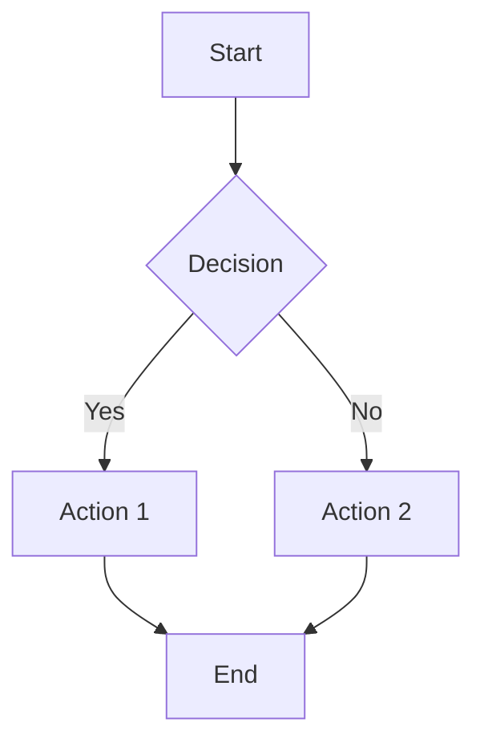

### Direction
- `TD` / `TB` - Top to bottom
- `BT` - Bottom to top
- `LR` - Left to right
- `RL` - Right to left

### Node Shapes
- `A[Text]` - Rectangle
- `A(Text)` - Rounded rectangle
- `A([Text])` - Stadium/pill
- `A[[Text]]` - Subroutine
- `A[(Text)]` - Cylinder (database)
- `A((Text))` - Circle
- `A>Text]` - Asymmetric
- `A{Text}` - Diamond (decision)
- `A{{Text}}` - Hexagon
- `A[/Text/]` - Parallelogram
- `A[\Text\]` - Parallelogram alt
- `A[/Text\]` - Trapezoid
- `A[\Text/]` - Trapezoid alt

### Edge Styles
- `A --> B` - Arrow
- `A --- B` - Line
- `A -.-> B` - Dotted arrow
- `A ==> B` - Thick arrow
- `A -->|text| B` - Arrow with label (preferred)
- `A ---|text| B` - Line with label (preferred)

**Important**: Always use pipe syntax `-->|label|` for edge labels. The space-dash syntax `-- label -->` can cause incomplete renders.

### Subgraphs
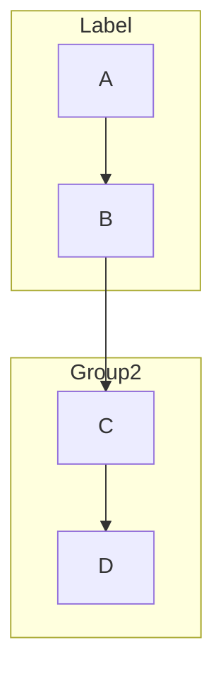

## Sequence Diagram

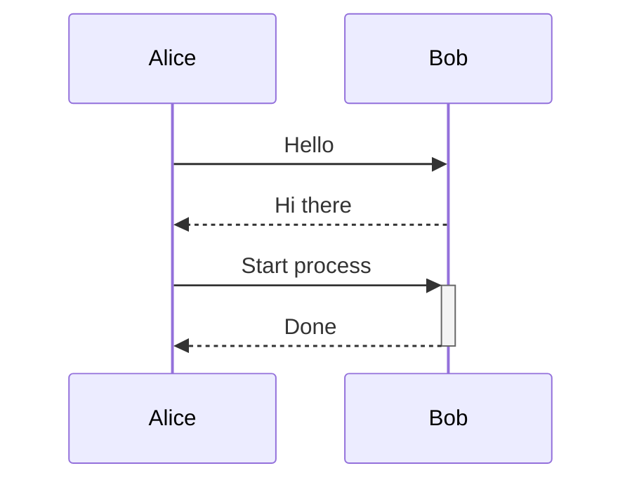

### Arrow Types
- `->>` - Solid arrow
- `-->>` - Dashed arrow
- `-x` - Solid with x
- `--x` - Dashed with x
- `-)` - Solid open arrow
- `--)` - Dashed open arrow

### Activations
- `+` after arrow activates participant
- `-` after arrow deactivates participant

### Notes and Boxes
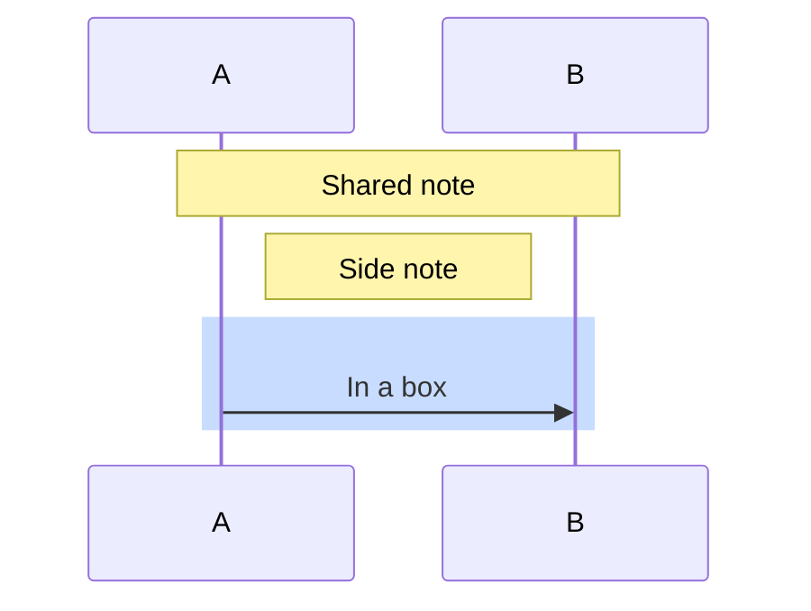

### Loops and Conditionals
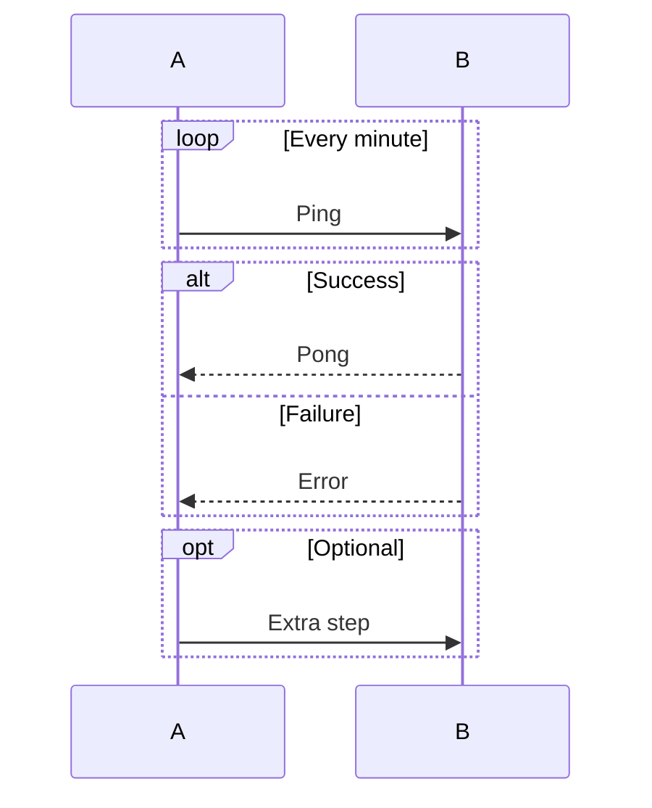

## State Diagram

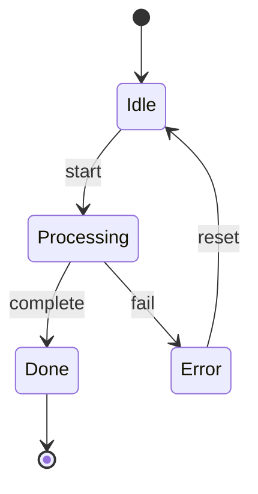

### Composite States
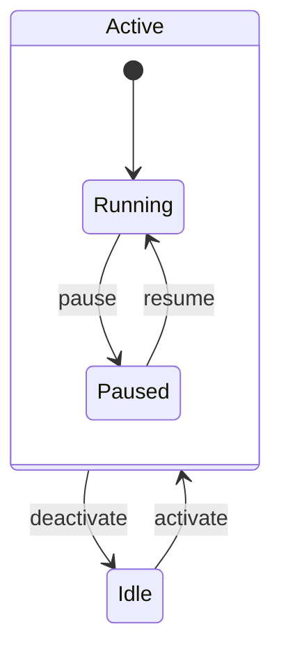

### Notes
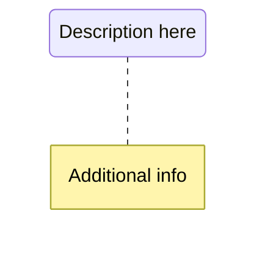

## Class Diagram

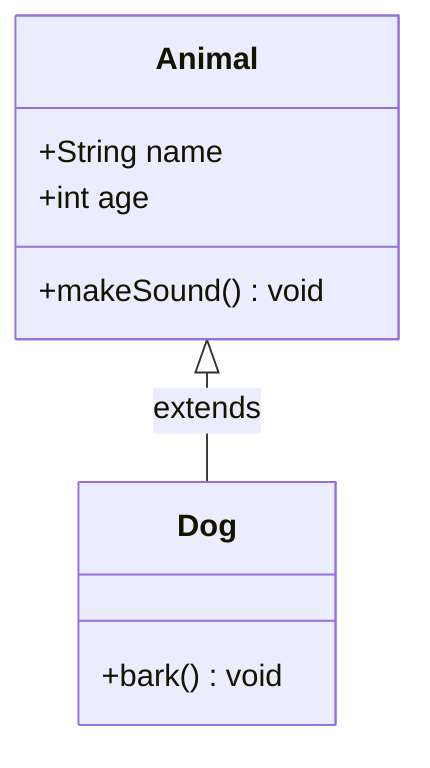

### Relationships
- `<|--` - Inheritance
- `*--` - Composition
- `o--` - Aggregation
- `-->` - Association
- `--` - Link (solid)
- `..>` - Dependency
- `..|>` - Realisation
- `..` - Link (dashed)

### Cardinality
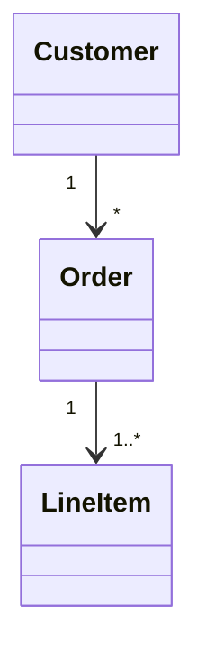

### Visibility
- `+` Public
- `-` Private
- `#` Protected
- `~` Package/Internal

## Entity-Relationship Diagram

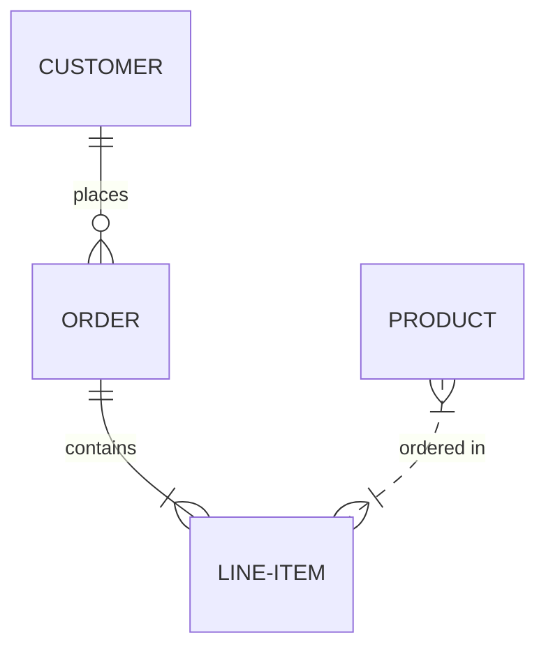

### Relationship Types
- `||` - Exactly one
- `|{` - One or more
- `o{` - Zero or more
- `o|` - Zero or one

### Identifying vs Non-identifying
- `--` - Identifying (solid)
- `..` - Non-identifying (dashed)

### Attributes
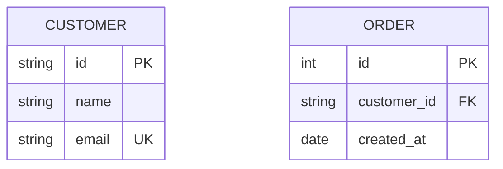

## Styling

### CSS Classes
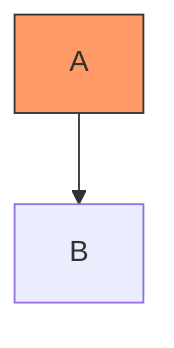

### Inline Styles
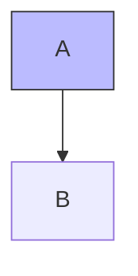

## Tips

1. **Escape special characters**: Use quotes for labels with special chars: `A["Label with (parens)"]`
2. **Multi-line labels**: Use `<br/>` for line breaks
3. **Comments**: Use `%%` for comments that won't render
4. **IDs vs Labels**: Node IDs should be simple, labels can be complex: `node1["Complex Label Here"]`
```

## File: `plugins/context7/README.md`
```markdown
# context7

Retrieve up-to-date documentation for software libraries, frameworks, and components via the Context7 API. This skill should be used when looking up documentation for any programming library or framework, finding code examples for specific APIs or features, verifying correct usage of library functions, or obtaining current information about library APIs that may have changed since training.

## Installation

### Claude Code / Cowork

```bash
claude plugin marketplace add intellectronica/agent-skills
claude plugin install context7@intellectronica-skills
```

### npx skills

```bash
npx skills add intellectronica/agent-skills --skill context7
```

---

> This plugin is auto-generated from [skills/context7](../../skills/context7).
```

## File: `plugins/context7/skills/SKILL.md`
```markdown
---
name: context7
description: Retrieve up-to-date documentation for software libraries, frameworks, and components via the Context7 API. This skill should be used when looking up documentation for any programming library or framework, finding code examples for specific APIs or features, verifying correct usage of library functions, or obtaining current information about library APIs that may have changed since training.
---

# Context7

## Overview

This skill enables retrieval of current documentation for software libraries and components by querying the Context7 API via curl. Use it instead of relying on potentially outdated training data.

## Workflow

### Step 1: Search for the Library

To find the Context7 library ID, query the search endpoint:

```bash
curl -s "https://context7.com/api/v2/libs/search?libraryName=LIBRARY_NAME&query=TOPIC" | jq '.results[0]'
```

**Parameters:**
- `libraryName` (required): The library name to search for (e.g., "react", "nextjs", "fastapi", "axios")
- `query` (required): A description of the topic for relevance ranking

**Response fields:**
- `id`: Library identifier for the context endpoint (e.g., `/websites/react_dev_reference`)
- `title`: Human-readable library name
- `description`: Brief description of the library
- `totalSnippets`: Number of documentation snippets available

### Step 2: Fetch Documentation

To retrieve documentation, use the library ID from step 1:

```bash
curl -s "https://context7.com/api/v2/context?libraryId=LIBRARY_ID&query=TOPIC&type=txt"
```

**Parameters:**
- `libraryId` (required): The library ID from search results
- `query` (required): The specific topic to retrieve documentation for
- `type` (optional): Response format - `json` (default) or `txt` (plain text, more readable)

## Examples

### React hooks documentation

```bash
# Find React library ID
curl -s "https://context7.com/api/v2/libs/search?libraryName=react&query=hooks" | jq '.results[0].id'
# Returns: "/websites/react_dev_reference"

# Fetch useState documentation
curl -s "https://context7.com/api/v2/context?libraryId=/websites/react_dev_reference&query=useState&type=txt"
```

### Next.js routing documentation

```bash
# Find Next.js library ID
curl -s "https://context7.com/api/v2/libs/search?libraryName=nextjs&query=routing" | jq '.results[0].id'

# Fetch app router documentation
curl -s "https://context7.com/api/v2/context?libraryId=/vercel/next.js&query=app+router&type=txt"
```

### FastAPI dependency injection

```bash
# Find FastAPI library ID
curl -s "https://context7.com/api/v2/libs/search?libraryName=fastapi&query=dependencies" | jq '.results[0].id'

# Fetch dependency injection documentation
curl -s "https://context7.com/api/v2/context?libraryId=/fastapi/fastapi&query=dependency+injection&type=txt"
```

## Tips

- Use `type=txt` for more readable output
- Use `jq` to filter and format JSON responses
- Be specific with the `query` parameter to improve relevance ranking
- If the first search result is not correct, check additional results in the array
- URL-encode query parameters containing spaces (use `+` or `%20`)
- No API key is required for basic usage (rate-limited)
```

## File: `plugins/copilot-sdk/README.md`
```markdown
# copilot-sdk

This skill provides guidance for creating agents and applications with the GitHub Copilot SDK. It should be used when the user wants to create, modify, or work on software that uses the GitHub Copilot SDK in TypeScript, Python, Go, or .NET. The skill covers SDK usage patterns, CLI configuration, custom tools, MCP servers, and custom agents.

## Installation

### Claude Code / Cowork

```bash
claude plugin marketplace add intellectronica/agent-skills
claude plugin install copilot-sdk@intellectronica-skills
```

### npx skills

```bash
npx skills add intellectronica/agent-skills --skill copilot-sdk
```

---

> This plugin is auto-generated from [skills/copilot-sdk](../../skills/copilot-sdk).
```

## File: `plugins/copilot-sdk/skills/SKILL.md`
```markdown
---
name: copilot-sdk
description: This skill provides guidance for creating agents and applications with the GitHub Copilot SDK. It should be used when the user wants to create, modify, or work on software that uses the GitHub Copilot SDK in TypeScript, Python, Go, or .NET. The skill covers SDK usage patterns, CLI configuration, custom tools, MCP servers, and custom agents.
---

# GitHub Copilot SDK

## Overview

The GitHub Copilot SDK is a multi-platform agent runtime that embeds Copilot's agentic workflows into applications. It exposes the same engine behind Copilot CLI, enabling programmatic invocation without requiring custom orchestration development.

**Status:** Technical Preview (suitable for development and testing)

**Supported Languages:** TypeScript/Node.js, Python, Go, .NET

## Primary Documentation

- [GitHub Copilot SDK Repository](https://github.com/github/copilot-sdk)
- [Getting Started Guide](https://github.com/github/copilot-sdk/blob/main/docs/getting-started.md)
- [Cookbook with Recipes](https://github.com/github/copilot-sdk/blob/main/cookbook/README.md)

### Language-Specific SDK Docs

- [Node.js/TypeScript SDK](https://github.com/github/copilot-sdk/blob/main/nodejs/README.md)
- [Python SDK](https://github.com/github/copilot-sdk/blob/main/python/README.md)
- [Go SDK](https://github.com/github/copilot-sdk/tree/main/go)
- [.NET SDK](https://github.com/github/copilot-sdk/tree/main/dotnet)

### CLI and Configuration Docs

- [About GitHub Copilot CLI](https://docs.github.com/en/copilot/concepts/agents/about-copilot-cli)
- [Using GitHub Copilot CLI](https://docs.github.com/en/copilot/how-tos/use-copilot-agents/use-copilot-cli)
- [Creating Custom Agents](https://docs.github.com/en/copilot/how-tos/use-copilot-agents/coding-agent/create-custom-agents)
- [Custom Agents Configuration Reference](https://docs.github.com/en/copilot/reference/custom-agents-configuration)
- [Enhancing Agent Mode with MCP](https://docs.github.com/en/copilot/tutorials/enhance-agent-mode-with-mcp)
- [Supported AI Models](https://docs.github.com/en/copilot/reference/ai-models/supported-models)

---

## Prerequisites

1. **GitHub Copilot Subscription** - Pro, Pro+, Business, or Enterprise
2. **GitHub Copilot CLI** - Installed and authenticated (`copilot --version`)
3. **Runtime:** Node.js 18+, Python 3.8+, Go 1.21+, or .NET 8.0+

## Installation

| Language | Command |
|----------|---------|
| TypeScript/Node.js | `npm install @github/copilot-sdk` |
| Python | `pip install github-copilot-sdk` |
| Go | `go get github.com/github/copilot-sdk/go` |
| .NET | `dotnet add package GitHub.Copilot.SDK` |

## Architecture

```
Application → SDK Client → JSON-RPC → Copilot CLI (server mode)
```

The SDK manages CLI lifecycle automatically. External server connections supported via `cliUrl` / `cli_url`.

---

## Quick Start (TypeScript)

```typescript
import { CopilotClient } from "@github/copilot-sdk";

const client = new CopilotClient();
await client.start();

const session = await client.createSession({ model: "gpt-5" });

// Register handler BEFORE send()
session.on((event) => {
  if (event.type === "assistant.message") {
    console.log(event.data.content);
  }
});

await session.send({ prompt: "What is 2 + 2?" });

await session.destroy();
await client.stop();
```

**Critical:** Register event handlers **before** calling `send()` to capture all events.

For complete examples in all languages, see `references/working-examples.md`.

---

## Core Concepts

### Client

Main entry point. Manages CLI server lifecycle and session creation.

**Operations:** `start()`, `stop()`, `createSession()`, `resumeSession()`

**Config:** `cliPath`, `cliUrl`, `port`, `useStdio`, `autoStart`, `autoRestart`

### Session

Individual conversation context with message history.

**Operations:** `send()`, `sendAndWait()`, `on()`, `abort()`, `getMessages()`, `destroy()`

**Config:** `model`, `streaming`, `tools`, `systemMessage`

### Events

Key events during processing:

| Event | Purpose |
|-------|---------|
| `assistant.message` | Complete response |
| `assistant.message_delta` | Streaming chunk |
| `session.idle` | Ready for next prompt |
| `tool.execution_start/end` | Tool invocations |

For full event lifecycle and SessionEvent structure, see `references/event-system.md`.

### Streaming

- `streaming: false` (default) - Content arrives all at once
- `streaming: true` - Content arrives incrementally via `assistant.message_delta`

Final `assistant.message` **always fires** regardless of streaming setting.

---

## Available Models

See [Supported AI Models](https://docs.github.com/en/copilot/reference/ai-models/supported-models) for full list.

| Provider | Model ID | Notes |
|----------|----------|-------|
| OpenAI | `gpt-4.1`, `gpt-5`, `gpt-5-mini` | Included |
| OpenAI | `gpt-5.1`, `gpt-5.1-codex`, `gpt-5.2` | Premium |
| Anthropic | `claude-sonnet-4.5` | Premium (CLI default) |
| Anthropic | `claude-opus-4.5` | Premium (3× multiplier) |
| Google | `gemini-3-pro-preview` | Premium |

---

## Custom Tools

**TypeScript (Zod):**
```typescript
const tool = defineTool("lookup_issue", {
  description: "Fetch issue details",
  parameters: z.object({ id: z.string() }),
  handler: async ({ id }) => fetchIssue(id),
});
```

**Python (Pydantic):**
```python
@define_tool(description="Fetch issue details")
async def lookup_issue(params: IssueParams) -> dict:
    return fetch_issue(params.id)
```

For complete tool examples in all languages, see `references/working-examples.md`.

---

## Language Conventions

| Concept | TypeScript | Python | Go | .NET |
|---------|------------|--------|----|----|
| Create session | `createSession()` | `create_session()` | `CreateSession()` | `CreateSessionAsync()` |
| Delta content | `deltaContent` | `delta_content` | `DeltaContent` | `DeltaContent` |

For full conventions table, see `references/event-system.md`.

---

## CLI Configuration

Config stored in `~/.copilot/`:
- `config.json` - General configuration
- `mcp-config.json` - MCP server definitions

For custom agents and MCP setup, see `references/cli-agents-mcp.md`.

---

## Troubleshooting

| Problem | Solution |
|---------|----------|
| Events fire but content empty | Use `event.data.content`, not `event.content` |
| Handler never fires | Register **before** `send()` |
| Python enum issues | Use `event.type.value` |
| Go nil pointer | Check `!= nil` before dereferencing |

For debugging techniques, see `references/troubleshooting.md`.

---

## Skill References

Detailed documentation in this skill:

- `references/working-examples.md` - Complete examples for all languages, custom tools
- `references/event-system.md` - Event lifecycle, SessionEvent structure, language conventions
- `references/troubleshooting.md` - Common issues, debugging techniques
- `references/cli-agents-mcp.md` - CLI configuration, custom agents, MCP server setup

---

## Additional Resources

- [SDK Samples](https://github.com/github/copilot-sdk/blob/main/samples/README.md)
- [SDK Releases](https://github.com/github/copilot-sdk/releases)
- [Cookbook](https://github.com/github/copilot-sdk/blob/main/cookbook/README.md)
- [awesome-copilot](https://github.com/github/awesome-copilot)
```

## File: `plugins/copilot-sdk/skills/references/cli-agents-mcp.md`
```markdown
# CLI, Custom Agents, and MCP Servers

## GitHub Copilot CLI Configuration

The SDK uses Copilot CLI as its engine. Configuration is stored in `~/.copilot/` (or `$XDG_CONFIG_HOME/copilot/`):

- `config.json` - General configuration
- `mcp-config.json` - MCP server definitions

For full CLI documentation, see [Using GitHub Copilot CLI](https://docs.github.com/en/copilot/how-tos/use-copilot-agents/use-copilot-cli).

---

# Custom Agents

Custom agents are specialized configurations with tailored expertise for specific tasks.

See [Creating Custom Agents](https://docs.github.com/en/copilot/how-tos/use-copilot-agents/coding-agent/create-custom-agents) and [Custom Agents Configuration Reference](https://docs.github.com/en/copilot/reference/custom-agents-configuration).

## Agent Profile Structure

Custom agents use Markdown files with YAML frontmatter:

```yaml
---
name: my-agent
description: A specialized agent for specific tasks
tools: ["read", "edit", "search"]
target: github-copilot
mcp-servers:
  custom-mcp:
    type: 'local'
    command: 'mcp-server'
    args: ['--flag']
---

# Agent Instructions

Detailed behavioral instructions here (max 30,000 characters).
```

## YAML Frontmatter Properties

| Property | Type | Purpose |
|----------|------|---------|
| `name` | string | Display name (optional, defaults to filename) |
| `description` | string | **Required** - describes purpose and capabilities |
| `target` | string | Environment: `vscode` or `github-copilot` |
| `tools` | list/string | Available tools; defaults to all if unset |
| `infer` | boolean | Allow automatic selection based on context |
| `mcp-servers` | object | MCP server configurations (org/enterprise level) |

## Tools Configuration

Configure tool access:

- **Enable all:** Omit `tools` or use `tools: ["*"]`
- **Enable specific:** `tools: ["read", "edit", "search"]`
- **Disable all:** `tools: []`

**Tool Aliases:**
- `execute` - Run shell commands
- `read` - Access file contents
- `edit` - Modify files
- `search` - Find files/text (grep, glob)
- `agent` - Invoke other custom agents
- `web` - Web search/fetch

**MCP Tool References:** `mcp-server-name/tool-name` or `mcp-server-name/*`

## Agent Storage Locations

- **Repository:** `.github/agents/` directory
- **Organization/Enterprise:** Configured via GitHub settings
- **System:** CLI includes default agents

**Priority (naming conflicts):** System > Repository > Organization

---

# MCP Server Integration

Model Context Protocol (MCP) servers extend Copilot's capabilities with external tools and resources.

See [Enhancing Agent Mode with MCP](https://docs.github.com/en/copilot/tutorials/enhance-agent-mode-with-mcp) and [Setting up the GitHub MCP Server](https://docs.github.com/en/copilot/how-tos/provide-context/use-mcp/set-up-the-github-mcp-server).

## Default MCP Server

Copilot CLI comes with the GitHub MCP server pre-configured, enabling:
- Repository access and management
- Pull request operations
- Issue tracking
- GitHub workflow management

## MCP Configuration Format

MCP servers are configured in `~/.copilot/mcp-config.json`:

```json
{
  "mcpServers": {
    "server-name": {
      "type": "local",
      "command": "mcp-server-command",
      "args": ["--arg1", "--arg2"],
      "env": {
        "API_KEY": "$COPILOT_MCP_API_KEY"
      }
    }
  }
}
```

## Environment Variables in MCP Config

Supported patterns:
- `$COPILOT_MCP_VAR`
- `${COPILOT_MCP_VAR}`
- `${{ secrets.COPILOT_MCP_VAR }}`
- `${{ var.COPILOT_MCP_VAR }}`
```

## File: `plugins/copilot-sdk/skills/references/event-system.md`
```markdown
# Event System

## Event Lifecycle

Events fire in this typical sequence for a single request:

```
1. user.message              → User prompt recorded
2. assistant.turn_start      → Model begins processing
3. session.usage_info        → Token/usage metadata
4. assistant.message_delta   → Streaming chunks (if enabled, repeats)
5. assistant.message         → Final complete response
6. assistant.reasoning       → Chain-of-thought (if available)
7. assistant.turn_end        → Model finished processing
8. session.idle              → Session ready for next prompt
```

When tools are invoked, additional events appear:
```
   tool.execution_start      → Tool invocation began
   tool.execution_end        → Tool execution completed
```

## SessionEvent Structure

Events are wrapped in a `SessionEvent` object (exact field names vary by language):

```
SessionEvent {
  type: string | enum       // Event type identifier
  data: {                   // Event-specific payload
    content?: string        // Full text (final events)
    deltaContent?: string   // Incremental text (delta events)
    // Other fields vary by event type
  }
  id?: string               // Event identifier
  timestamp?: string        // When event occurred
}
```

**Important access patterns:**
- TypeScript: `event.type` (string), `event.data.content`, `event.data.deltaContent`
- Python: `event.type.value` (enum requires `.value`), `event.data.content`, `event.data.delta_content`
- Go: `event.Type` (string), `*event.Data.Content`, `*event.Data.DeltaContent` (pointers)
- .NET: Pattern match on event class, then `evt.Data.Content`, `evt.Data.DeltaContent`

## Event Types Reference

| Event Type | Purpose | Key Data Fields |
|------------|---------|-----------------|
| `user.message` | User input recorded | `content` |
| `assistant.message` | Complete response | `content` |
| `assistant.message_delta` | Streaming chunk | `deltaContent` / `delta_content` |
| `assistant.reasoning` | Chain-of-thought | `content` |
| `assistant.reasoning_delta` | Reasoning chunk | `deltaContent` / `delta_content` |
| `assistant.turn_start` | Processing began | — |
| `assistant.turn_end` | Processing finished | — |
| `tool.execution_start` | Tool invoked | tool name, parameters |
| `tool.execution_end` | Tool completed | result |
| `session.idle` | Ready for next prompt | — |
| `session.usage_info` | Token/usage data | usage metrics |

## Streaming Behavior

The `streaming` configuration option controls **when** content arrives, not **which** events fire:

| Setting | Behavior |
|---------|----------|
| `streaming: false` (default) | Content arrives all at once in `assistant.message` |
| `streaming: true` | Content arrives incrementally via `assistant.message_delta` events |

**Important:** Final events (`assistant.message`, `assistant.reasoning`) **always fire** regardless of streaming setting. They contain the complete accumulated content.

To build a response progressively:
1. Accumulate `deltaContent` from each `assistant.message_delta` event
2. Or wait for `assistant.message` which contains the complete text

---

# Language-Specific Conventions

| Concept | TypeScript | Python | Go | .NET |
|---------|------------|--------|----|----|
| Client class | `CopilotClient` | `CopilotClient` | `Client` | `CopilotClient` |
| Create session | `createSession()` | `create_session()` | `CreateSession()` | `CreateSessionAsync()` |
| Send message | `send()` / `sendAndWait()` | `send()` / `send_and_wait()` | `Send()` | `SendAsync()` |
| Session config | `{ model, streaming }` | `{"model", "streaming"}` | `&SessionConfig{}` | `new SessionConfig{}` |
| Event handler | `session.on(fn)` | `session.on(fn)` | `session.On(fn)` | `session.On(fn)` |
| Delta content | `deltaContent` | `delta_content` | `DeltaContent` | `DeltaContent` |
| System message | `systemMessage` | `system_message` | `SystemMessage` | `SystemMessage` |
| CLI path option | `cliPath` | `cli_path` | `CLIPath` | `CliPath` |
```

## File: `plugins/copilot-sdk/skills/references/troubleshooting.md`
```markdown
# Troubleshooting

## Common Issues

| Problem | Cause | Solution |
|---------|-------|----------|
| Events fire but content is empty | Accessing wrong property | Use `event.data.content`, not `event.content` |
| Handler never fires | Registered after `send()` | Register handler **before** calling `send()` |
| `get_messages()` returns events, not messages | Method returns all `SessionEvent` objects | Filter by `event.type` and extract from `.data` |
| Response in console but not captured | SDK logs internally | Capture via event handler, not console output |
| Python: `event.type` returns enum object | Enum needs `.value` | Use `event.type.value` for the string |
| Go: nil pointer dereference | Content fields are pointers | Check `!= nil` before dereferencing |

## Event Handler Timing

**Correct pattern:**
```
1. Create session
2. Register event handler(s)
3. Call send()
4. Wait for session.idle or use sendAndWait()
```

**Incorrect pattern (misses events):**
```
1. Create session
2. Call send()
3. Register event handler  ← Too late, events already fired
```

## Debugging Events

To inspect all events during development:

**TypeScript:**
```typescript
session.on((event) => {
  console.log(JSON.stringify(event, null, 2));
});
```

**Python:**
```python
def debug_handler(event):
    print(f"Event: {event.type.value}")
    print(f"Data: {event.data}")

session.on(debug_handler)
```

**Go:**
```go
session.On(func(event copilot.SessionEvent) {
    fmt.Printf("Event: %s\n", event.Type)
    fmt.Printf("Data: %+v\n", event.Data)
})
```

**C#:**
```csharp
session.On(evt => {
    Console.WriteLine($"Event: {evt.GetType().Name}");
});
```
```

## File: `plugins/copilot-sdk/skills/references/working-examples.md`
```markdown
# Complete Working Examples

**Critical:** Register event handlers **before** calling `send()` to capture all events.

## TypeScript/Node.js

```typescript
import { CopilotClient, SessionEvent } from "@github/copilot-sdk";

async function main() {
  const client = new CopilotClient();
  await client.start();

  const session = await client.createSession({
    model: "gpt-5",
    streaming: true,
  });

  const done = new Promise<string>((resolve) => {
    let content = "";

    // Register handler BEFORE send()
    session.on((event: SessionEvent) => {
      if (event.type === "assistant.message_delta") {
        process.stdout.write(event.data.deltaContent ?? "");
      }
      if (event.type === "assistant.message") {
        content = event.data.content ?? "";
      }
      if (event.type === "session.idle") {
        resolve(content);
      }
    });
  });

  await session.send({ prompt: "What is 2 + 2?" });
  const response = await done;

  console.log("\n\nFinal response:", response);

  await session.destroy();
  await client.stop();
}

main();
```

## Python

```python
import asyncio
from copilot import CopilotClient

async def main():
    client = CopilotClient()
    await client.start()

    session = await client.create_session({
        "model": "gpt-5",
        "streaming": True,
    })

    done = asyncio.Event()
    final_content = ""

    def on_event(event):
        nonlocal final_content
        # Access type via .value for the string
        event_type = event.type.value

        if event_type == "assistant.message_delta":
            print(event.data.delta_content, end="", flush=True)
        elif event_type == "assistant.message":
            final_content = event.data.content
        elif event_type == "session.idle":
            done.set()

    # Register handler BEFORE send()
    session.on(on_event)

    await session.send({"prompt": "What is 2 + 2?"})
    await done.wait()

    print(f"\n\nFinal response: {final_content}")

    await session.destroy()
    await client.stop()

asyncio.run(main())
```

## Go

```go
package main

import (
    "fmt"
    copilot "github.com/github/copilot-sdk/go"
)

func main() {
    client := copilot.NewClient(nil)
    if err := client.Start(); err != nil {
        panic(err)
    }
    defer client.Stop()

    session, err := client.CreateSession(&copilot.SessionConfig{
        Model:     "gpt-5",
        Streaming: true,
    })
    if err != nil {
        panic(err)
    }
    defer session.Destroy()

    done := make(chan string)
    var finalContent string

    // Register handler BEFORE Send()
    session.On(func(event copilot.SessionEvent) {
        switch event.Type {
        case "assistant.message_delta":
            if event.Data.DeltaContent != nil {
                fmt.Print(*event.Data.DeltaContent)
            }
        case "assistant.message":
            if event.Data.Content != nil {
                finalContent = *event.Data.Content
            }
        case "session.idle":
            done <- finalContent
        }
    })

    _, err = session.Send(copilot.MessageOptions{Prompt: "What is 2 + 2?"})
    if err != nil {
        panic(err)
    }

    response := <-done
    fmt.Printf("\n\nFinal response: %s\n", response)
}
```

## .NET (C#)

```csharp
using GitHub.Copilot.SDK;

await using var client = new CopilotClient();
await client.StartAsync();

await using var session = await client.CreateSessionAsync(new SessionConfig
{
    Model = "gpt-5",
    Streaming = true
});

var done = new TaskCompletionSource<string>();
var finalContent = "";

// Register handler BEFORE SendAsync()
session.On(evt =>
{
    switch (evt)
    {
        case AssistantMessageDeltaEvent delta:
            Console.Write(delta.Data.DeltaContent);
            break;
        case AssistantMessageEvent msg:
            finalContent = msg.Data.Content ?? "";
            break;
        case SessionIdleEvent:
            done.SetResult(finalContent);
            break;
    }
});

await session.SendAsync(new MessageOptions { Prompt = "What is 2 + 2?" });
var response = await done.Task;

Console.WriteLine($"\n\nFinal response: {response}");
```

---

# Custom Tools

The SDK allows defining tools that Copilot can invoke during conversations.

## TypeScript (using Zod)

```typescript
import { defineTool } from "@github/copilot-sdk";
import { z } from "zod";

const myTool = defineTool("lookup_issue", {
  description: "Fetch issue details from tracker",
  parameters: z.object({
    id: z.string().describe("Issue identifier"),
  }),
  handler: async ({ id }) => {
    // Implementation
    return { status: "found", title: "Bug report" };
  },
});

// Use in session
const session = await client.createSession({
  model: "gpt-5",
  tools: [myTool],
});
```

## Python (using Pydantic)

```python
from pydantic import BaseModel, Field
from copilot import CopilotClient, define_tool

class IssueParams(BaseModel):
    id: str = Field(description="Issue identifier")

@define_tool(description="Fetch issue details from tracker")
async def lookup_issue(params: IssueParams) -> dict:
    return {"status": "found", "title": "Bug report"}

# Use in session
session = await client.create_session({
    "model": "gpt-5",
    "tools": [lookup_issue],
})
```

## Go (using DefineTool)

```go
type IssueParams struct {
    ID string `json:"id" description:"Issue identifier"`
}

tool := copilot.DefineTool("lookup_issue", "Fetch issue details from tracker",
    func(params IssueParams, inv copilot.ToolInvocation) (any, error) {
        return map[string]string{"status": "found", "title": "Bug report"}, nil
    })

// Use in session
session, _ := client.CreateSession(&copilot.SessionConfig{
    Model: "gpt-5",
    Tools: []copilot.Tool{tool},
})
```

## .NET (using AIFunctionFactory)

```csharp
using Microsoft.Extensions.AI;

var tool = AIFunctionFactory.Create(
    (string id) => new { Status = "found", Title = "Bug report" },
    "lookup_issue",
    "Fetch issue details from tracker"
);

// Use in session
var session = await client.CreateSessionAsync(new SessionConfig
{
    Model = "gpt-5",
    Tools = new[] { tool }
});
```
```

## File: `plugins/gog-cli/README.md`
```markdown
# gog-cli

This skill provides comprehensive instructions for using gogcli (gog), a fast, script-friendly CLI for Google Workspace services including Gmail, Calendar, Drive, Docs, Sheets, Slides, Chat, Classroom, Contacts, Tasks, People, Groups, and Keep. This skill should be used when the user wants to interact with Google services via the command line, including reading/sending email, managing calendar events, working with Google Drive files, managing classroom courses, or any other Google Workspace operations. The skill assumes gog is installed and authorised.

## Installation

### Claude Code / Cowork

```bash
claude plugin marketplace add intellectronica/agent-skills
claude plugin install gog-cli@intellectronica-skills
```

### npx skills

```bash
npx skills add intellectronica/agent-skills --skill gog-cli
```

---

> This plugin is auto-generated from [skills/gog-cli](../../skills/gog-cli).
```

## File: `plugins/gog-cli/skills/SKILL.md`
```markdown
---
name: gog-cli
description: This skill provides comprehensive instructions for using gogcli (gog), a fast, script-friendly CLI for Google Workspace services including Gmail, Calendar, Drive, Docs, Sheets, Slides, Chat, Classroom, Contacts, Tasks, People, Groups, and Keep. This skill should be used when the user wants to interact with Google services via the command line, including reading/sending email, managing calendar events, working with Google Drive files, managing classroom courses, or any other Google Workspace operations. The skill assumes gog is installed and authorised.
---

# gogcli (gog) CLI

A fast, script-friendly CLI for Google Workspace services with JSON-first output and multi-account support.

**Repository**: https://github.com/steipete/gogcli

## Prerequisites

This skill assumes `gog` is installed and authorised. If commands fail with authentication errors, inform the user they need to:
1. **Install gog**: `brew install steipete/tap/gogcli`
2. **Store OAuth credentials**: `gog auth credentials <path-to-credentials.json>`
3. **Add account**: `gog auth add user@gmail.com --services all`

Do not attempt to resolve authentication issues automatically. Provide the user with the relevant command and let them handle it.

## Supported Services

Gmail, Calendar, Drive, Docs, Sheets, Slides, Chat (Workspace), Classroom, Contacts, Tasks, People, Groups (Workspace), Keep (Workspace, service account only).

## Quick Reference

### Global Flags

```bash
--account <email>    # Select account
--client <name>      # Select OAuth client
--json               # JSON output
--plain              # TSV output (for scripting)
--force              # Skip confirmations
--no-input           # Fail instead of prompting
```

### Common Patterns

```bash
gog --account work@example.com gmail search "is:unread"  # Use specific account
gog gmail search "is:unread" --json | jq '.threads[].id' # JSON for parsing
gog gmail search "is:unread" --plain | cut -f1           # Plain for shell
gog gmail search "is:unread" --max 10 --page <token>     # Pagination
```

## Gmail

### Search and Read

```bash
gog gmail search "is:unread from:boss@example.com newer_than:7d"
gog gmail messages search "is:unread" --include-body
gog gmail thread get <threadId>
gog gmail get <messageId> --format full
```

### Send Email

```bash
# Basic send
gog gmail send --to user@example.com --subject "Hello" --body "Message"

# With HTML and attachments
gog gmail send --to user@example.com --subject "Report" \
  --body-html "<h1>Report</h1>" --attach ~/report.pdf

# Reply
gog gmail send --to user@example.com --subject "Re: Original" \
  --body "Reply" --reply-to-message-id <messageId>
```

### Labels

```bash
gog gmail labels list
gog gmail labels create "Project/Subproject"
gog gmail thread modify <threadId> --add "Label" --remove INBOX
```

For full Gmail reference including drafts, filters, vacation, delegates, tracking, and watch, see `references/gmail.md`.

## Calendar

### Events

```bash
gog calendar events primary --from "2024-12-01" --to "2024-12-31" --weekday
gog calendar events primary --query "meeting"

# Create event
gog calendar create primary --summary "Meeting" \
  --from "2024-12-20T14:00:00" --to "2024-12-20T15:00:00"

# With attendees and recurrence
gog calendar create primary --summary "Weekly Standup" \
  --from "2024-12-20T09:00:00" --to "2024-12-20T09:30:00" \
  --attendees "alice@example.com,bob@example.com" \
  --rrule "FREQ=WEEKLY;BYDAY=MO,WE,FR"

# Respond
gog calendar respond primary <eventId> --status accepted
```

### Special Event Types

```bash
gog calendar focus-time create primary --from DT --to DT --auto-decline
gog calendar ooo create primary --from DT --to DT --decline-message "Away"
gog calendar working-location create primary --from DT --to DT --location home
```

For full Calendar reference, see `references/calendar.md`.

## Drive, Docs, Sheets, Slides

### Drive

```bash
gog drive ls --parent <folderId>
gog drive search "quarterly report"
gog drive download <fileId> --out ~/Downloads/
gog drive upload ~/report.pdf --parent <folderId>
gog drive mkdir "New Folder" --parent <folderId>
gog drive share <fileId> --email user@example.com --role writer
```

### Sheets

```bash
gog sheets read <spreadsheetId> "Sheet1!A1:D10"
gog sheets write <spreadsheetId> "Sheet1!A1:B2" --values '[["Name","Age"],["Alice",30]]'
gog sheets append <spreadsheetId> "Sheet1!A:B" --values '[["Bob",25]]'
gog sheets format <spreadsheetId> "Sheet1!A1:D1" --bold --bg-color "#FFCC00"
```

### Export

```bash
gog docs export <documentId> --format pdf --out ~/doc.pdf
gog slides export <presentationId> --format pptx --out ~/slides.pptx
```

For full Drive/Docs/Sheets/Slides reference, see `references/drive-docs.md`.

## Tasks

```bash
gog tasks lists
gog tasks list <tasklistId>
gog tasks add <tasklistId> --title "Buy groceries" --due "2024-12-20"
gog tasks add <tasklistId> --title "Weekly review" --due "2024-12-20" --repeat weekly
gog tasks done <tasklistId> <taskId>
```

## Contacts

```bash
gog contacts search "john"
gog contacts create --given "John" --family "Doe" --email "john@example.com"
gog contacts directory search "smith"  # Workspace
```

## Classroom

```bash
gog classroom courses --state ACTIVE
gog classroom students <courseId>
gog classroom coursework create <courseId> --title "Homework" --type ASSIGNMENT --due "2024-12-31T23:59:59Z"
gog classroom submissions grade <courseId> <courseworkId> <submissionId> --grade 95
```

For Classroom, Chat, Contacts, Tasks, People, Groups, Keep, see `references/other-services.md`.

## Configuration

### Config Locations

- **macOS**: `~/Library/Application Support/gogcli/config.json`
- **Linux**: `~/.config/gogcli/config.json`
- **Windows**: `%AppData%\gogcli\config.json`

### Settings

```bash
gog config set default_timezone America/New_York
gog config set default_account user@gmail.com
gog config list
```

### Environment Variables

```bash
GOG_ACCOUNT=user@gmail.com      # Default account
GOG_CLIENT=work                 # OAuth client
GOG_JSON=1                      # Default JSON output
GOG_PLAIN=1                     # Default plain output
GOG_TIMEZONE=America/New_York   # Display timezone
GOG_ENABLE_COMMANDS=calendar,tasks  # Command allowlist
```

For full configuration, see `references/configuration.md`.

## Multi-Account Usage

```bash
gog --account work@example.com gmail search "is:unread"
gog auth alias set work work@example.com
gog --account work gmail search "is:unread"
gog auth list --check
```

For authentication including service accounts, see `references/authentication.md`.

## Scripting

```bash
# JSON processing
gog gmail search "is:unread" --json | jq -r '.threads[].id'

# Batch operations
gog gmail search "older_than:30d" --json | \
  jq -r '.threads[].id' | \
  xargs -I {} gog gmail thread modify {} --add Archive --remove INBOX

# Non-interactive
gog gmail send --to user@example.com --subject "Test" --body "Hi" --force
```

## Troubleshooting

If commands fail, inform the user of the likely cause:

| Error | Cause | Solution |
|-------|-------|----------|
| `no credentials` | OAuth not configured | `gog auth credentials <file>` |
| `token expired` | Auth invalid | `gog auth add <email> --force-consent` |
| `insufficient scope` | Missing permissions | `gog auth add <email> --services <services>` |
| `command not found` | Not installed | `brew install steipete/tap/gogcli` |

Status checks:
```bash
gog auth list --check
gog auth status
```

## Reference Files

- `references/command-reference.md` - Complete command specification
- `references/authentication.md` - Auth, credentials, multi-account
- `references/configuration.md` - Config and environment variables
- `references/gmail.md` - Gmail operations
- `references/calendar.md` - Calendar operations
- `references/drive-docs.md` - Drive, Docs, Sheets, Slides
- `references/other-services.md` - Classroom, Chat, Contacts, Tasks, People, Groups, Keep
```

## File: `plugins/gog-cli/skills/references/authentication.md`
```markdown
# gogcli Authentication Guide

Complete guide to authentication, credentials, and account management.

## Credential Storage

Tokens are secured using OS-native keystores:
- **macOS**: Keychain
- **Linux**: Secret Service (GNOME Keyring, KWallet)
- **Windows**: Credential Manager

An encrypted on-disk fallback is available when native keyring is unavailable.

### Keyring Backend Configuration

```bash
# Check current backend
gog config get keyring_backend

# Force specific backend
gog config set keyring_backend keychain  # macOS
gog config set keyring_backend file      # Encrypted file fallback

# Environment variable override
export GOG_KEYRING_BACKEND=file
export GOG_KEYRING_PASSWORD=your-encryption-password
```

---

## OAuth Client Credentials

Before adding accounts, store OAuth client credentials from Google Cloud Console.

### Creating OAuth Credentials

1. Go to Google Cloud Console > APIs & Services > Credentials
2. Create OAuth 2.0 Client ID (Desktop application type)
3. Download the JSON credentials file
4. Enable required APIs (Gmail, Calendar, Drive, etc.) in API Library

### Storing Credentials

```bash
# Store default credentials
gog auth credentials ~/Downloads/client_secret.json

# Store from stdin
cat client_secret.json | gog auth credentials -

# Store named client (for multiple organisations)
gog --client work auth credentials ~/Downloads/work-client.json
gog --client personal auth credentials ~/Downloads/personal-client.json

# Store with domain mapping (auto-select for matching email domains)
gog --client work auth credentials ~/Downloads/work.json --domain example.com

# List stored credentials
gog auth credentials list
```

---

## Adding Accounts

```bash
# Add account with interactive browser flow
gog auth add user@gmail.com

# Add with specific services
gog auth add user@gmail.com --services gmail,calendar,drive

# Add all available services
gog auth add user@gmail.com --services all

# Add with readonly access
gog auth add user@gmail.com --readonly

# Add with specific Drive scope
gog auth add user@gmail.com --drive-scope file      # Per-file access only
gog auth add user@gmail.com --drive-scope readonly  # Read-only
gog auth add user@gmail.com --drive-scope full      # Full access (default)

# Browserless flow (for headless systems)
gog auth add user@gmail.com --manual

# Force new consent (re-authorise)
gog auth add user@gmail.com --force-consent
```

### Available Services

```bash
# Show available services
gog auth services

# Show as markdown
gog auth services --markdown
```

Common services:
- `user` - Basic profile info (default)
- `gmail` - Email access
- `calendar` - Calendar access
- `drive` - Google Drive
- `contacts` - Contacts and People
- `tasks` - Tasks
- `classroom` - Google Classroom
- `chat` - Google Chat (Workspace)
- `sheets` - Google Sheets
- `docs` - Google Docs
- `slides` - Google Slides

---

## Managing Multiple Accounts

### Account Selection

```bash
# Use specific account for one command
gog --account work@example.com gmail search "is:unread"

# Set default account via environment
export GOG_ACCOUNT=work@example.com

# Set default account in config
gog config set default_account work@example.com
```

### Account Aliases

```bash
# Create alias
gog auth alias set work work@example.com
gog auth alias set personal me@gmail.com

# Use alias
gog --account work gmail search "is:unread"

# List aliases
gog auth alias list

# Remove alias
gog auth alias unset work
```

### Client Selection

```bash
# Use specific client for one command
gog --client work auth add user@example.com

# Set via environment
export GOG_CLIENT=work

# Auto-select by domain (configured during credential storage)
# Accounts at @example.com will automatically use the "work" client
```

---

## Service Accounts (Workspace)

For automated access without user interaction, use service accounts with domain-wide delegation.

### Setup

1. Create service account in Google Cloud Console
2. Enable domain-wide delegation
3. Grant required scopes in Google Workspace Admin
4. Download service account key JSON

```bash
# Configure service account for impersonation
gog auth service-account set admin@example.com --key ~/service-account.json

# Check status
gog auth service-account status

# Use impersonated account
gog --account admin@example.com gmail search "is:unread"
```

### Google Keep (Workspace Only)

Keep API requires service account authentication:

```bash
gog auth keep user@example.com --key ~/service-account.json
```

---

## Account Status

```bash
# List all authenticated accounts
gog auth list

# List with token validation check
gog auth list --check

# Show detailed auth status
gog auth status

# List stored tokens
gog auth tokens list
```

---

## Removing Accounts

```bash
# Remove account
gog auth remove user@gmail.com

# Delete specific token
gog auth tokens delete user@gmail.com
```

---

## Client Selection Hierarchy

When determining which OAuth client to use, `gog` follows this priority:

1. `--client` command flag
2. `GOG_CLIENT` environment variable
3. Account-specific mapping (`account_clients` in config)
4. Domain-based mapping (`client_domains` in config)
5. Domain-matching credentials file (`credentials-<domain>.json`)
6. Default client (`credentials.json`)

---

## Troubleshooting

### Token Expired

```bash
# Re-authenticate
gog auth add user@gmail.com --force-consent
```

### Wrong Scopes

If receiving permission errors, the token may have insufficient scopes:

```bash
# Re-add with required services
gog auth add user@gmail.com --services gmail,calendar,drive --force-consent
```

### Keyring Issues

```bash
# Check keyring backend
gog config get keyring_backend

# Force file backend
gog config set keyring_backend file

# Or use environment variable
export GOG_KEYRING_BACKEND=file
export GOG_KEYRING_PASSWORD=your-secure-password
```

### Multiple Client Confusion

```bash
# See which client is being used
gog auth status

# Explicitly specify client
gog --client work gmail search "is:unread"
```
```

## File: `plugins/gog-cli/skills/references/calendar.md`
```markdown
# Calendar Operations Reference

Comprehensive guide to Google Calendar operations with `gog`.

## Listing Calendars

```bash
# List all calendars
gog calendar calendars

# JSON output
gog calendar calendars --json
```

## Listing Events

```bash
# List events from primary calendar
gog calendar events primary

# List from specific calendar
gog calendar events work@group.calendar.google.com

# Filter by date range
gog calendar events primary --from 2024-12-01T00:00:00Z --to 2024-12-31T23:59:59Z

# Natural date formats also work
gog calendar events primary --from "2024-12-01" --to "2024-12-31"

# Search events
gog calendar events primary --query "meeting"

# Show weekday
gog calendar events primary --weekday

# Limit results
gog calendar events primary --max 10

# Paginate
gog calendar events primary --page <nextPageToken>
```

---

## Getting Event Details

```bash
gog calendar event primary <eventId>
gog calendar get primary <eventId>
```

---

## Creating Events

### Basic Event

```bash
gog calendar create primary \
  --summary "Team Meeting" \
  --from "2024-12-20T14:00:00" \
  --to "2024-12-20T15:00:00"
```

### With Details

```bash
gog calendar create primary \
  --summary "Project Review" \
  --description "Quarterly review of project progress" \
  --location "Conference Room A" \
  --from "2024-12-20T14:00:00" \
  --to "2024-12-20T15:00:00"
```

### With Attendees

```bash
gog calendar create primary \
  --summary "Team Sync" \
  --from "2024-12-20T14:00:00" \
  --to "2024-12-20T15:00:00" \
  --attendees "alice@example.com,bob@example.com"
```

### All-Day Event

```bash
gog calendar create primary \
  --summary "Company Holiday" \
  --from "2024-12-25" \
  --to "2024-12-26" \
  --all-day
```

### With Recurrence

```bash
# Weekly meeting
gog calendar create primary \
  --summary "Weekly Standup" \
  --from "2024-12-20T09:00:00" \
  --to "2024-12-20T09:30:00" \
  --rrule "FREQ=WEEKLY;BYDAY=MO,WE,FR"

# Monthly meeting
gog calendar create primary \
  --summary "Monthly Review" \
  --from "2024-12-01T10:00:00" \
  --to "2024-12-01T11:00:00" \
  --rrule "FREQ=MONTHLY;BYMONTHDAY=1"
```

### With Reminders

```bash
gog calendar create primary \
  --summary "Important Meeting" \
  --from "2024-12-20T14:00:00" \
  --to "2024-12-20T15:00:00" \
  --reminders "10m,1h,1d"
```

---

## Updating Events

```bash
# Update summary
gog calendar update primary <eventId> --summary "Updated Title"

# Update time
gog calendar update primary <eventId> \
  --from "2024-12-20T15:00:00" \
  --to "2024-12-20T16:00:00"

# Update multiple fields
gog calendar update primary <eventId> \
  --summary "New Title" \
  --description "Updated description" \
  --location "New Location"

# Add attendee (preserves existing)
gog calendar update primary <eventId> --add-attendee "new@example.com"

# Replace all attendees
gog calendar update primary <eventId> --attendees "only@example.com"
```

---

## Deleting Events

```bash
gog calendar delete primary <eventId>
```

---

## Responding to Events

```bash
# Accept invitation
gog calendar respond primary <eventId> --status accepted

# Decline
gog calendar respond primary <eventId> --status declined

# Tentative
gog calendar respond primary <eventId> --status tentative

# Control notification sending
gog calendar respond primary <eventId> \
  --status accepted \
  --send-updates all          # all, none, externalOnly
```

---

## Checking Availability

```bash
# Check free/busy for calendars
gog calendar freebusy "primary,work@group.calendar.google.com" \
  --from "2024-12-20T08:00:00Z" \
  --to "2024-12-20T18:00:00Z"
```

---

## Proposing Alternative Times

```bash
gog calendar propose-time primary <eventId> \
  --from "2024-12-21T14:00:00" \
  --to "2024-12-21T15:00:00"
```

---

## Special Event Types

### Focus Time

```bash
gog calendar focus-time create primary \
  --from "2024-12-20T09:00:00" \
  --to "2024-12-20T12:00:00" \
  --summary "Deep Work" \
  --auto-decline
```

### Out of Office

```bash
gog calendar ooo create primary \
  --from "2024-12-20T00:00:00" \
  --to "2024-12-27T00:00:00" \
  --summary "Holiday" \
  --decline-message "I'm away until Dec 27"
```

### Working Location

```bash
# Office
gog calendar working-location create primary \
  --from "2024-12-20T09:00:00" \
  --to "2024-12-20T17:00:00" \
  --location office \
  --building "HQ" \
  --floor "3" \
  --desk "3-42"

# Home
gog calendar working-location create primary \
  --from "2024-12-20T09:00:00" \
  --to "2024-12-20T17:00:00" \
  --location home

# Custom
gog calendar working-location create primary \
  --from "2024-12-20T09:00:00" \
  --to "2024-12-20T17:00:00" \
  --location custom \
  --custom-location "Client Site"
```

---

## Calendar Colours

```bash
gog calendar colors
```

---

## Team Calendars

```bash
# View team calendar
gog calendar team team@group.calendar.google.com

# Filter by date range
gog calendar team team@group.calendar.google.com \
  --from "2024-12-01" \
  --to "2024-12-31"
```

---

## Conflict Detection

```bash
gog calendar conflicts primary \
  --from "2024-12-20T00:00:00Z" \
  --to "2024-12-27T00:00:00Z"
```

---

## Workspace Users

```bash
# List workspace users (for scheduling)
gog calendar users
gog calendar users --max 50
```

---

## Access Control

```bash
# List calendar ACLs
gog calendar acl primary
gog calendar acl work@group.calendar.google.com
```

---

## Time Formats

Commands accept various time formats:

| Format | Example |
|--------|---------|
| RFC3339 | `2024-12-20T14:00:00Z` |
| RFC3339 with offset | `2024-12-20T14:00:00-05:00` |
| Date only | `2024-12-20` |
| ISO datetime | `2024-12-20T14:00:00` |

The default timezone can be configured:

```bash
# Set default timezone
gog config set default_timezone America/New_York

# Or via environment
export GOG_TIMEZONE=Europe/London

# Or per-command
gog time now --timezone Asia/Tokyo
```

---

## Scripting Examples

### Find Available Slots

```bash
# Get free/busy and parse with jq
gog calendar freebusy "user1@example.com,user2@example.com" \
  --from "2024-12-20T08:00:00Z" \
  --to "2024-12-20T18:00:00Z" \
  --json | jq '.calendars'
```

### Batch Create Events

```bash
# Create events from a file
while IFS=$'\t' read -r summary from to; do
  gog calendar create primary \
    --summary "$summary" \
    --from "$from" \
    --to "$to"
done < events.tsv
```

### Export Events

```bash
# Export events to JSON
gog calendar events primary \
  --from "2024-12-01" \
  --to "2024-12-31" \
  --json > december-events.json
```
```

## File: `plugins/gog-cli/skills/references/command-reference.md`
```markdown
# gogcli Command Reference

Complete command specification for all `gog` commands.

## Global Flags

All commands support these flags:

| Flag | Description |
|------|-------------|
| `--color=auto\|always\|never` | Control colour output (default: `auto`) |
| `--json` | Output in JSON format |
| `--plain` | Output in TSV format (stable/parseable) |
| `--force` | Skip confirmations |
| `--no-input` | Fail instead of prompting |
| `--version` | Show version |
| `--client <name>` | Select OAuth client |
| `--account <email>` | Select account |

---

## Auth Commands

```bash
# Store OAuth credentials
gog auth credentials <credentials.json|->

# List stored credentials
gog auth credentials list

# Add account with auth flow
gog auth add <email> [options]
  --services user|all|gmail,calendar,etc.
  --readonly
  --drive-scope full|readonly|file
  --manual                              # Browserless flow
  --force-consent                       # Force consent prompt

# Show available services
gog auth services [--markdown]

# Add Google Keep (Workspace only)
gog auth keep <email> --key <service-account.json>

# Service account management
gog auth service-account set <email> --key <service-account.json>
gog auth service-account status

# List authenticated accounts
gog auth list [--check]

# Alias management
gog auth alias list
gog auth alias set <alias> <email>
gog auth alias unset <alias>

# Show auth status
gog auth status

# Remove account
gog auth remove <email>

# Token management
gog auth tokens list
gog auth tokens delete <email>
```

---

## Config Commands

```bash
gog config get <key>              # Retrieve config value
gog config keys                   # List all config keys
gog config list                   # Show all config
gog config path                   # Show config directory
gog config set <key> <value>      # Set config value
gog config unset <key>            # Remove config value
```

---

## Gmail Commands

### Search & Retrieve

```bash
# Search threads
gog gmail search <query> [--max N] [--page TOKEN]

# Search messages
gog gmail messages search <query> [options]
  [--max N] [--page TOKEN] [--include-body]

# Get thread
gog gmail thread get <threadId> [--download]

# Modify thread labels
gog gmail thread modify <threadId> [--add ...] [--remove ...]

# Get message
gog gmail get <messageId> [options]
  [--format full|metadata|raw] [--headers ...]

# Download attachment
gog gmail attachment <messageId> <attachmentId> [--out PATH] [--name NAME]

# Get Gmail URLs
gog gmail url <threadIds...>
```

### Labels

```bash
gog gmail labels list
gog gmail labels get <labelIdOrName>
gog gmail labels create <name>
gog gmail labels modify <threadIds...> [--add ...] [--remove ...]
```

### Send

```bash
gog gmail send [options]
  --to a@b.com --subject S
  [--body B] [--body-html H]
  [--cc ...] [--bcc ...]
  [--reply-to-message-id ...]
  [--reply-to addr]
  [--attach <file>...]
  [--track]                        # Enable open tracking
  [--track-split]                  # Send tracked to multiple recipients
```

### Drafts

```bash
gog gmail drafts list [--max N] [--page TOKEN]
gog gmail drafts get <draftId> [--download]
gog gmail drafts create [--subject S] [--to ...] [options]
gog gmail drafts update <draftId> [--subject S] [options]
gog gmail drafts send <draftId>
gog gmail drafts delete <draftId>
```

### Settings

```bash
# Autoforward
gog gmail autoforward status
gog gmail autoforward enable <email>
gog gmail autoforward disable

# Delegates
gog gmail delegates list
gog gmail delegates add <email>
gog gmail delegates remove <email>

# Filters
gog gmail filters list
gog gmail filters get <filterId>
gog gmail filters create [options]
gog gmail filters delete <filterId>

# Forwarding addresses
gog gmail forwarding list
gog gmail forwarding add <email>
gog gmail forwarding remove <email>

# Vacation responder
gog gmail vacation status
gog gmail vacation enable [--subject S] [--body B] [--from DT] [--to DT]
gog gmail vacation disable

# Send-as addresses
gog gmail sendas list
gog gmail sendas get <email>
```

### Tracking

```bash
gog gmail track setup --worker-url <URL>
gog gmail track status
gog gmail track opens [--id ID] [--recipient EMAIL]
```

### Watch (Pub/Sub)

```bash
gog gmail watch start --topic <gcp-topic> [--label <idOrName>...]
gog gmail watch status
gog gmail watch renew
gog gmail watch stop
gog gmail watch serve --bind <ip> --port <num> --path <path>
  [--include-body] [--max-bytes N]
gog gmail history --since <historyId>
```

---

## Calendar Commands

```bash
# List calendars
gog calendar calendars

# List ACLs
gog calendar acl <calendarId>

# List events
gog calendar events <calendarId> [options]
  [--from RFC3339] [--to RFC3339]
  [--max N] [--page TOKEN]
  [--query Q] [--weekday]

# Get event
gog calendar event <calendarId> <eventId>
gog calendar get <calendarId> <eventId>

# Create event
gog calendar create <calendarId> [options]
  --summary S --from DT --to DT
  [--description D] [--location L]
  [--attendees a@b.com,c@d.com]
  [--all-day]
  [--event-type default|focusTime|outOfOffice|workingLocation]
  [--rrule RRULE]
  [--reminders 10m,1h]

# Update event
gog calendar update <calendarId> <eventId> [options]
  [--summary S] [--from DT] [--to DT]
  [--description D] [--location L]
  [--attendees ...] [--add-attendee ...]
  [--all-day]
  [--event-type TYPE]

# Delete event
gog calendar delete <calendarId> <eventId>

# Check availability
gog calendar freebusy <calendarIds> --from RFC3339 --to RFC3339

# Respond to event
gog calendar respond <calendarId> <eventId> [options]
  --status accepted|declined|tentative
  [--send-updates all|none|externalOnly]

# Propose alternative time
gog calendar propose-time <calendarId> <eventId> --from DT --to DT

# Calendar colours
gog calendar colors

# Team calendars
gog calendar team <groupEmail> [--from DT] [--to DT]

# Conflicts detection
gog calendar conflicts <calendarId> --from DT --to DT

# Workspace users
gog calendar users [--max N] [--page TOKEN]
```

### Special Event Types

```bash
# Focus time
gog calendar focus-time create <calendarId> --from DT --to DT
  [--summary S] [--auto-decline]

# Out of office
gog calendar ooo create <calendarId> --from DT --to DT
  [--summary S] [--decline-message M]

# Working location
gog calendar working-location create <calendarId> --from DT --to DT
  [--location office|home|custom] [--building ID] [--floor F] [--desk D]
```

---

## Drive Commands

```bash
# List files
gog drive ls [--parent ID] [--max N] [--page TOKEN] [--query Q]

# Search files
gog drive search <text> [--max N] [--page TOKEN]

# Get file metadata
gog drive get <fileId>

# Download file
gog drive download <fileId> [--out PATH]

# Upload file
gog drive upload <localPath> [--name N] [--parent ID]

# Create folder
gog drive mkdir <name> [--parent ID]

# Delete file
gog drive delete <fileId>

# Move file
gog drive move <fileId> --parent ID

# Copy file
gog drive copy <fileId> [--name N] [--parent ID]

# Rename file
gog drive rename <fileId> <newName>

# Share file
gog drive share <fileId> [options]
  [--anyone | --email addr]
  [--role reader|writer|commenter]
  [--discoverable]

# List permissions
gog drive permissions <fileId> [--max N] [--page TOKEN]

# Remove sharing
gog drive unshare <fileId> <permissionId>

# Get URLs
gog drive url <fileIds...>

# List shared drives
gog drive drives [--max N] [--page TOKEN] [--query Q]

# Comments
gog drive comments <fileId> [--max N] [--page TOKEN]
gog drive comments add <fileId> --content <text>
gog drive comments reply <fileId> <commentId> --content <text>
gog drive comments resolve <fileId> <commentId>
gog drive comments delete <fileId> <commentId>
```

---

## Sheets Commands

```bash
# Create spreadsheet
gog sheets create <title> [--sheet NAME]

# Get spreadsheet info
gog sheets get <spreadsheetId>

# Read cells
gog sheets read <spreadsheetId> <range>
  # range format: SheetName!A1:B10

# Write cells
gog sheets write <spreadsheetId> <range> --values '[[...],[...]]'
  # values: JSON array of arrays

# Update cells
gog sheets update <spreadsheetId> <range> --values '[[...],[...]]'

# Append rows
gog sheets append <spreadsheetId> <range> --values '[[...],[...]]'

# Clear cells
gog sheets clear <spreadsheetId> <range>

# Format cells
gog sheets format <spreadsheetId> <range> [options]
  [--bold] [--italic] [--underline]
  [--bg-color #RRGGBB] [--fg-color #RRGGBB]
  [--font-size N] [--font-family NAME]
  [--h-align left|center|right]
  [--v-align top|middle|bottom]
  [--number-format FORMAT]

# Spreadsheet metadata
gog sheets metadata <spreadsheetId>
```

---

## Docs Commands

```bash
# Create document
gog docs create <title>

# Get document info
gog docs get <documentId>

# Export document
gog docs export <documentId> [--format pdf|docx|txt|html|md] [--out PATH]
```

---

## Slides Commands

```bash
# Create presentation
gog slides create <title>

# Get presentation info
gog slides get <presentationId>

# Export presentation
gog slides export <presentationId> [--format pdf|pptx] [--out PATH]
```

---

## Classroom Commands

### Courses

```bash
gog classroom courses [--state ACTIVE|ARCHIVED|...] [--max N] [--page TOKEN]
gog classroom courses get <courseId>
gog classroom courses create --name NAME [--owner me] [--state ACTIVE|...]
gog classroom courses update <courseId> [--name ...] [--state ...]
gog classroom courses delete <courseId>
gog classroom courses archive <courseId>
gog classroom courses unarchive <courseId>
gog classroom courses join <courseId> [--role student|teacher] [--user me]
gog classroom courses leave <courseId> [--role student|teacher] [--user me]
gog classroom courses url <courseId...>
```

### Rosters

```bash
gog classroom students <courseId> [--max N] [--page TOKEN]
gog classroom students get <courseId> <userId>
gog classroom students add <courseId> <userId> [--enrollment-code CODE]
gog classroom students remove <courseId> <userId>

gog classroom teachers <courseId> [--max N] [--page TOKEN]
gog classroom teachers get <courseId> <userId>
gog classroom teachers add <courseId> <userId>
gog classroom teachers remove <courseId> <userId>

gog classroom roster <courseId> [--students] [--teachers]
```

### Coursework

```bash
gog classroom coursework <courseId> [--state ...] [--topic TOPIC_ID] [--scan-pages N] [--max N] [--page TOKEN]
gog classroom coursework get <courseId> <courseworkId>
gog classroom coursework create <courseId> [options]
  --title T [--description D] [--type ASSIGNMENT|SHORT_ANSWER_QUESTION|...]
  [--due DT] [--max-points N] [--topic TOPIC_ID]
gog classroom coursework update <courseId> <courseworkId> [options]
gog classroom coursework delete <courseId> <courseworkId>
gog classroom coursework assignees <courseId> <courseworkId>
  [--mode ALL_STUDENTS|INDIVIDUAL_STUDENTS]
  [--add-student ...]
```

### Materials

```bash
gog classroom materials <courseId> [--state ...] [--topic TOPIC_ID] [--max N] [--page TOKEN]
gog classroom materials get <courseId> <materialId>
gog classroom materials create <courseId> [options]
gog classroom materials update <courseId> <materialId> [options]
gog classroom materials delete <courseId> <materialId>
```

### Submissions

```bash
gog classroom submissions <courseId> <courseworkId> [--state ...] [--max N] [--page TOKEN]
gog classroom submissions get <courseId> <courseworkId> <submissionId>
gog classroom submissions turn-in <courseId> <courseworkId> <submissionId>
gog classroom submissions reclaim <courseId> <courseworkId> <submissionId>
gog classroom submissions return <courseId> <courseworkId> <submissionId>
gog classroom submissions grade <courseId> <courseworkId> <submissionId> --grade N
```

### Announcements

```bash
gog classroom announcements <courseId> [--state ...] [--max N] [--page TOKEN]
gog classroom announcements get <courseId> <announcementId>
gog classroom announcements create <courseId> --text T [--state ...]
gog classroom announcements update <courseId> <announcementId> [options]
gog classroom announcements delete <courseId> <announcementId>
gog classroom announcements assignees <courseId> <announcementId> [--mode ...]
```

### Topics

```bash
gog classroom topics <courseId> [--max N] [--page TOKEN]
gog classroom topics get <courseId> <topicId>
gog classroom topics create <courseId> --name N
gog classroom topics update <courseId> <topicId> --name N
gog classroom topics delete <courseId> <topicId>
```

### Invitations & Guardians

```bash
gog classroom invitations [--course ID] [--user ID]
gog classroom invitations get <invitationId>
gog classroom invitations create --course ID --user EMAIL --role student|teacher
gog classroom invitations accept <invitationId>
gog classroom invitations delete <invitationId>

gog classroom guardians <studentId> [--max N] [--page TOKEN]
gog classroom guardians get <studentId> <guardianId>
gog classroom guardians delete <studentId> <guardianId>

gog classroom guardian-invitations <studentId> [--state ...] [--max N] [--page TOKEN]
gog classroom guardian-invitations get <studentId> <invitationId>
gog classroom guardian-invitations create <studentId> --email EMAIL
```

### Profile

```bash
gog classroom profile [userId]
```

---

## Chat Commands (Workspace)

```bash
# Spaces
gog chat spaces list [--max N] [--page TOKEN]
gog chat spaces find <displayName> [--max N]
gog chat spaces create <displayName> [--member email,...]

# Messages
gog chat messages list <space> [--max N] [--page TOKEN] [--order ORDER] [--thread THREAD] [--unread]
gog chat messages send <space> --text TEXT [--thread THREAD]

# Threads
gog chat threads list <space> [--max N] [--page TOKEN]

# Direct messages
gog chat dm space <email>
gog chat dm send <email> --text TEXT [--thread THREAD]
```

---

## Tasks Commands

```bash
# Task lists
gog tasks lists [--max N] [--page TOKEN]
gog tasks lists create <title>

# List tasks
gog tasks list <tasklistId> [--max N] [--page TOKEN]

# Get task
gog tasks get <tasklistId> <taskId>

# Add task
gog tasks add <tasklistId> [options]
  --title T [--notes N]
  [--due RFC3339|YYYY-MM-DD]
  [--repeat daily|weekly|monthly|yearly]
  [--repeat-count N]
  [--repeat-until DT]
  [--parent ID] [--previous ID]

# Update task
gog tasks update <tasklistId> <taskId> [options]
  [--title T] [--notes N] [--due ...]
  [--status needsAction|completed]

# Complete/uncomplete task
gog tasks done <tasklistId> <taskId>
gog tasks undo <tasklistId> <taskId>

# Delete task
gog tasks delete <tasklistId> <taskId>

# Clear completed tasks
gog tasks clear <tasklistId>
```

---

## Contacts Commands

```bash
# Search contacts
gog contacts search <query> [--max N]

# List contacts
gog contacts list [--max N] [--page TOKEN]

# Get contact
gog contacts get <people/...|email>

# Create contact
gog contacts create --given NAME [--family NAME] [--email addr] [--phone num]

# Update contact
gog contacts update <people/...> [--given NAME] [--family NAME] [--email addr] [--phone num]

# Delete contact
gog contacts delete <people/...>

# Directory (Workspace)
gog contacts directory list [--max N] [--page TOKEN]
gog contacts directory search <query> [--max N] [--page TOKEN]

# Other contacts
gog contacts other list [--max N] [--page TOKEN]
gog contacts other search <query> [--max N]
```

---

## People Commands

```bash
gog people me                                # Get own profile
gog people get <people/...|userId>           # Get profile
gog people search <query> [--max N] [--page TOKEN]
gog people relations [<people/...|userId>] [--type TYPE]
```

---

## Groups Commands (Workspace)

```bash
gog groups list [--max N] [--page TOKEN]
gog groups get <groupEmail>
gog groups members <groupEmail> [--max N] [--page TOKEN]
```

---

## Keep Commands (Workspace)

```bash
gog keep list [--max N] [--page TOKEN]
gog keep get <noteId>
gog keep create --title T [--text CONTENT] [--list "item1,item2,..."]
gog keep delete <noteId>
```

---

## Time Commands

```bash
gog time now [--timezone TZ]
```

---

## Completion Commands

```bash
gog completion bash
gog completion zsh
gog completion fish
gog completion powershell
```
```

## File: `plugins/gog-cli/skills/references/configuration.md`
```markdown
# gogcli Configuration Reference

Complete guide to configuration options and environment variables.

## Configuration File

Configuration is stored as JSON5 in platform-specific directories:

| Platform | Path |
|----------|------|
| macOS | `~/Library/Application Support/gogcli/config.json` |
| Linux | `~/.config/gogcli/config.json` |
| Windows | `%AppData%\gogcli\config.json` |

### Viewing Configuration

```bash
# Show config directory path
gog config path

# List all config values
gog config list

# Get specific value
gog config get default_timezone

# List all available keys
gog config keys
```

### Setting Configuration

```bash
# Set value
gog config set default_timezone America/New_York

# Remove value
gog config unset default_timezone
```

---

## Configuration Keys

### `keyring_backend`

Force specific credential storage backend.

```bash
gog config set keyring_backend keychain  # macOS Keychain
gog config set keyring_backend file      # Encrypted file
gog config set keyring_backend auto      # Auto-detect (default)
```

### `default_timezone`

Default timezone for time display (IANA format).

```bash
gog config set default_timezone America/New_York
gog config set default_timezone Europe/London
gog config set default_timezone UTC
```

### `default_account`

Default account when `--account` not specified.

```bash
gog config set default_account user@gmail.com
```

### `account_aliases`

Map short names to email addresses. Set via `gog auth alias` commands.

### `account_clients`

Map specific accounts to OAuth clients.

```json5
{
  "account_clients": {
    "work@example.com": "work",
    "personal@gmail.com": "personal"
  }
}
```

### `client_domains`

Map email domains to OAuth clients (auto-selection).

```json5
{
  "client_domains": {
    "example.com": "work",
    "company.org": "enterprise"
  }
}
```

---

## Environment Variables

Environment variables override configuration file values.

### Account Selection

```bash
# Default account
export GOG_ACCOUNT=user@gmail.com

# OAuth client selection
export GOG_CLIENT=work
```

### Output Format

```bash
# Default to JSON output
export GOG_JSON=1

# Default to plain/TSV output
export GOG_PLAIN=1

# Control colour output
export GOG_COLOR=auto    # Auto-detect (default)
export GOG_COLOR=always  # Force colours
export GOG_COLOR=never   # Disable colours

# Disable colours (standard)
export NO_COLOR=1
```

### Time Settings

```bash
# Default timezone
export GOG_TIMEZONE=America/New_York

# Always show weekday in calendar output
export GOG_CALENDAR_WEEKDAY=1
```

### Keyring Settings

```bash
# Force keyring backend
export GOG_KEYRING_BACKEND=file

# Encryption password for file backend
export GOG_KEYRING_PASSWORD=your-secure-password
```

### Command Allowlist

Restrict available commands (useful for sandboxed/agent execution):

```bash
# Allow only calendar and tasks commands
export GOG_ENABLE_COMMANDS=calendar,tasks

# Allow Gmail read-only operations
export GOG_ENABLE_COMMANDS=gmail
```

---

## Output Formats

All commands support three output modes:

### Human-Friendly (Default)

Coloured tables optimised for terminal display.

```bash
gog gmail search "is:unread"
```

### JSON

Machine-readable format for scripting and parsing.

```bash
gog gmail search "is:unread" --json

# Or via environment
GOG_JSON=1 gog gmail search "is:unread"
```

### Plain/TSV

Tab-separated values for piping to other tools.

```bash
gog gmail search "is:unread" --plain

# Or via environment
GOG_PLAIN=1 gog gmail search "is:unread"
```

---

## Pagination

List commands support pagination:

```bash
# Limit results
gog gmail search "is:unread" --max 10

# Get next page
gog gmail search "is:unread" --page <nextPageToken>
```

JSON output includes pagination token:

```bash
gog gmail search "is:unread" --json | jq '.nextPageToken'
```

---

## Scripting Best Practices

### Use JSON Output

```bash
# Parse with jq
gog gmail search "is:unread" --json | jq -r '.threads[].id'
```

### Use Plain Output

```bash
# Simple field extraction
gog gmail search "is:unread" --plain | cut -f1
```

### Batch Operations

```bash
# Process multiple items
gog gmail search "is:unread" --json | \
  jq -r '.threads[].id' | \
  xargs -I {} gog gmail thread modify {} --add LABEL_ID
```

### Error Handling

```bash
# Check exit codes
if gog gmail send --to user@example.com --subject "Test" --body "Hello"; then
  echo "Sent successfully"
else
  echo "Send failed"
fi
```

### Non-Interactive Mode

```bash
# Skip confirmations
gog gmail send --to user@example.com --subject "Test" --body "Hello" --force

# Fail instead of prompting
gog auth add user@gmail.com --no-input
```
```

## File: `plugins/gog-cli/skills/references/drive-docs.md`
```markdown
# Drive, Docs, Sheets, and Slides Reference

Comprehensive guide to Google Drive and document operations with `gog`.

## Google Drive

### Listing Files

```bash
# List files in root
gog drive ls

# List in specific folder
gog drive ls --parent <folderId>

# Filter with query
gog drive ls --query "mimeType='application/pdf'"

# Limit results
gog drive ls --max 20

# Paginate
gog drive ls --page <nextPageToken>
```

### Searching Files

```bash
# Text search
gog drive search "quarterly report"

# Limit results
gog drive search "budget" --max 10
```

### File Information

```bash
# Get file metadata
gog drive get <fileId>

# Get web URLs
gog drive url <fileId1> <fileId2>
```

### Downloading Files

```bash
# Download file
gog drive download <fileId>

# Specify output path
gog drive download <fileId> --out ~/Downloads/file.pdf
```

### Uploading Files

```bash
# Upload to root
gog drive upload ~/Documents/report.pdf

# Upload with custom name
gog drive upload ~/Documents/report.pdf --name "Q4 Report.pdf"

# Upload to specific folder
gog drive upload ~/Documents/report.pdf --parent <folderId>
```

### Creating Folders

```bash
# Create folder in root
gog drive mkdir "New Folder"

# Create in specific location
gog drive mkdir "Subfolder" --parent <folderId>
```

### File Operations

```bash
# Delete file (to trash)
gog drive delete <fileId>

# Move file
gog drive move <fileId> --parent <newFolderId>

# Copy file
gog drive copy <fileId>
gog drive copy <fileId> --name "Copy of File"
gog drive copy <fileId> --parent <folderId>

# Rename file
gog drive rename <fileId> "New Name"
```

### Sharing Files

```bash
# Share with anyone (link sharing)
gog drive share <fileId> --anyone --role reader

# Share with specific person
gog drive share <fileId> --email user@example.com --role writer

# Make discoverable
gog drive share <fileId> --anyone --role reader --discoverable

# List permissions
gog drive permissions <fileId>

# Remove sharing
gog drive unshare <fileId> <permissionId>
```

### Shared Drives

```bash
# List shared drives
gog drive drives

# Search shared drives
gog drive drives --query "name contains 'Team'"
```

### Comments

```bash
# List comments
gog drive comments <fileId>

# Add comment
gog drive comments add <fileId> --content "This needs review"

# Reply to comment
gog drive comments reply <fileId> <commentId> --content "Done!"

# Resolve comment
gog drive comments resolve <fileId> <commentId>

# Delete comment
gog drive comments delete <fileId> <commentId>
```

---

## Google Sheets

### Creating Spreadsheets

```bash
# Create empty spreadsheet
gog sheets create "Budget 2024"

# Create with named sheet
gog sheets create "Budget 2024" --sheet "Q1"
```

### Getting Spreadsheet Info

```bash
# Get spreadsheet metadata
gog sheets get <spreadsheetId>

# Get sheet metadata
gog sheets metadata <spreadsheetId>
```

### Reading Data

```bash
# Read range
gog sheets read <spreadsheetId> "Sheet1!A1:D10"

# Read entire sheet
gog sheets read <spreadsheetId> "Sheet1"

# JSON output
gog sheets read <spreadsheetId> "Sheet1!A1:D10" --json
```

### Writing Data

```bash
# Write values (overwrites)
gog sheets write <spreadsheetId> "Sheet1!A1:B2" \
  --values '[["Name","Age"],["Alice",30]]'

# Update values
gog sheets update <spreadsheetId> "Sheet1!A1:B2" \
  --values '[["Name","Age"],["Bob",25]]'
```

### Appending Data

```bash
# Append rows
gog sheets append <spreadsheetId> "Sheet1!A:B" \
  --values '[["Charlie",35],["Diana",28]]'
```

### Clearing Data

```bash
# Clear range
gog sheets clear <spreadsheetId> "Sheet1!A1:D10"
```

### Formatting Cells

```bash
# Bold text
gog sheets format <spreadsheetId> "Sheet1!A1:D1" --bold

# Multiple formatting options
gog sheets format <spreadsheetId> "Sheet1!A1:D1" \
  --bold \
  --italic \
  --bg-color "#FFCC00" \
  --fg-color "#000000" \
  --font-size 14 \
  --h-align center

# Number formatting
gog sheets format <spreadsheetId> "Sheet1!B2:B100" \
  --number-format "$#,##0.00"
```

### Range Format (A1 Notation)

| Format | Description |
|--------|-------------|
| `Sheet1!A1` | Single cell |
| `Sheet1!A1:B2` | Range |
| `Sheet1!A:A` | Entire column |
| `Sheet1!1:1` | Entire row |
| `Sheet1` | Entire sheet |
| `A1:B2` | Default sheet |

---

## Google Docs

### Creating Documents

```bash
gog docs create "Meeting Notes"
```

### Getting Document Info

```bash
gog docs get <documentId>
```

### Exporting Documents

```bash
# Export as PDF
gog docs export <documentId> --format pdf --out ~/Documents/notes.pdf

# Export as Word
gog docs export <documentId> --format docx --out ~/Documents/notes.docx

# Other formats
gog docs export <documentId> --format txt
gog docs export <documentId> --format html
gog docs export <documentId> --format md
```

---

## Google Slides

### Creating Presentations

```bash
gog slides create "Q4 Review"
```

### Getting Presentation Info

```bash
gog slides get <presentationId>
```

### Exporting Presentations

```bash
# Export as PDF
gog slides export <presentationId> --format pdf --out ~/Documents/slides.pdf

# Export as PowerPoint
gog slides export <presentationId> --format pptx --out ~/Documents/slides.pptx
```

---

## Drive Query Syntax

The `--query` parameter uses Google Drive query syntax:

| Query | Description |
|-------|-------------|
| `name = 'Report'` | Exact name match |
| `name contains 'Report'` | Name contains |
| `mimeType = 'application/pdf'` | File type |
| `'folderId' in parents` | In specific folder |
| `trashed = false` | Not in trash |
| `starred = true` | Starred files |
| `sharedWithMe = true` | Shared with me |
| `modifiedTime > '2024-01-01'` | Modified after date |

### Common MIME Types

| Type | MIME Type |
|------|-----------|
| Folder | `application/vnd.google-apps.folder` |
| Document | `application/vnd.google-apps.document` |
| Spreadsheet | `application/vnd.google-apps.spreadsheet` |
| Presentation | `application/vnd.google-apps.presentation` |
| PDF | `application/pdf` |

### Example Queries

```bash
# PDFs only
gog drive ls --query "mimeType='application/pdf'"

# Recent files
gog drive ls --query "modifiedTime > '2024-12-01'"

# Starred spreadsheets
gog drive ls --query "starred=true and mimeType='application/vnd.google-apps.spreadsheet'"
```

---

## Scripting Examples

### Backup Folder

```bash
# Download all files from a folder
gog drive ls --parent <folderId> --json | \
  jq -r '.files[].id' | \
  xargs -I {} gog drive download {} --out ~/backup/
```

### Bulk Upload

```bash
# Upload all PDFs in directory
for f in ~/Documents/*.pdf; do
  gog drive upload "$f" --parent <folderId>
done
```

### Export All Docs as PDF

```bash
gog drive ls --query "mimeType='application/vnd.google-apps.document'" --json | \
  jq -r '.files[] | "\(.id) \(.name)"' | \
  while read id name; do
    gog docs export "$id" --format pdf --out "~/pdfs/${name}.pdf"
  done
```
```

## File: `plugins/gog-cli/skills/references/gmail.md`
```markdown
# Gmail Operations Reference

Comprehensive guide to Gmail operations with `gog`.

## Search Syntax

Gmail search uses standard Gmail search operators:

| Operator | Description | Example |
|----------|-------------|---------|
| `from:` | Sender | `from:user@example.com` |
| `to:` | Recipient | `to:me` |
| `subject:` | Subject line | `subject:meeting` |
| `is:unread` | Unread messages | `is:unread` |
| `is:starred` | Starred messages | `is:starred` |
| `is:important` | Important messages | `is:important` |
| `has:attachment` | Has attachments | `has:attachment` |
| `label:` | Label name | `label:work` |
| `in:` | Location | `in:inbox`, `in:sent`, `in:trash` |
| `after:` | Date filter | `after:2024/01/01` |
| `before:` | Date filter | `before:2024/12/31` |
| `newer_than:` | Relative date | `newer_than:7d` |
| `older_than:` | Relative date | `older_than:1m` |
| `larger:` | Size filter | `larger:5M` |
| `smaller:` | Size filter | `smaller:1M` |
| `filename:` | Attachment name | `filename:report.pdf` |

### Combining Operators

```bash
# Unread from specific sender in last week
gog gmail search "is:unread from:boss@example.com newer_than:7d"

# Large attachments from anyone
gog gmail search "has:attachment larger:10M"

# Exclude certain labels
gog gmail search "is:unread -label:newsletters"
```

---

## Searching and Retrieving

### Search Threads

```bash
# Basic search
gog gmail search "is:unread"

# Limit results
gog gmail search "is:unread" --max 10

# Get next page
gog gmail search "is:unread" --page <token>

# JSON output for scripting
gog gmail search "is:unread" --json
```

### Search Messages

```bash
# Search individual messages
gog gmail messages search "from:user@example.com"

# Include message body
gog gmail messages search "is:unread" --include-body
```

### Get Thread

```bash
# Get full thread
gog gmail thread get <threadId>

# Download attachments
gog gmail thread get <threadId> --download
```

### Get Message

```bash
# Get message (default format)
gog gmail get <messageId>

# Specific format
gog gmail get <messageId> --format full
gog gmail get <messageId> --format metadata
gog gmail get <messageId> --format raw

# Get specific headers
gog gmail get <messageId> --headers Subject,From,Date
```

### Get Attachments

```bash
# Download attachment
gog gmail attachment <messageId> <attachmentId>

# Specify output path
gog gmail attachment <messageId> <attachmentId> --out ~/Downloads/

# Specify filename
gog gmail attachment <messageId> <attachmentId> --name report.pdf
```

### Get URLs

```bash
# Get Gmail web URLs
gog gmail url <threadId1> <threadId2>
```

---

## Sending Email

### Basic Send

```bash
gog gmail send \
  --to recipient@example.com \
  --subject "Hello" \
  --body "Plain text message"
```

### HTML Body

```bash
gog gmail send \
  --to recipient@example.com \
  --subject "Hello" \
  --body-html "<h1>Hello</h1><p>HTML message</p>"
```

### Multiple Recipients

```bash
gog gmail send \
  --to user1@example.com \
  --to user2@example.com \
  --cc manager@example.com \
  --bcc archive@example.com \
  --subject "Team Update"
  --body "Message to multiple recipients"
```

### Attachments

```bash
gog gmail send \
  --to recipient@example.com \
  --subject "Report" \
  --body "Please see attached" \
  --attach ~/Documents/report.pdf \
  --attach ~/Documents/data.xlsx
```

### Reply to Message

```bash
gog gmail send \
  --to recipient@example.com \
  --subject "Re: Original Subject" \
  --body "Reply content" \
  --reply-to-message-id <originalMessageId>
```

### With Open Tracking

```bash
# Send with tracking (requires setup)
gog gmail send \
  --to recipient@example.com \
  --subject "Tracked Email" \
  --body-html "<p>This email tracks opens</p>" \
  --track

# Track multiple recipients separately
gog gmail send \
  --to user1@example.com \
  --to user2@example.com \
  --subject "Tracked" \
  --body-html "<p>Each recipient tracked separately</p>" \
  --track-split
```

---

## Labels

### List Labels

```bash
gog gmail labels list
gog gmail labels list --json
```

### Get Label

```bash
gog gmail labels get INBOX
gog gmail labels get "Label Name"
gog gmail labels get <labelId>
```

### Create Label

```bash
gog gmail labels create "Project/SubLabel"
```

### Modify Thread Labels

```bash
# Add label
gog gmail thread modify <threadId> --add "Label Name"

# Remove label
gog gmail thread modify <threadId> --remove INBOX

# Multiple operations
gog gmail thread modify <threadId> --add Archive --remove INBOX
```

### Batch Label Modification

```bash
gog gmail labels modify <threadId1> <threadId2> --add "Done"
```

---

## Drafts

### List Drafts

```bash
gog gmail drafts list
gog gmail drafts list --max 10
```

### Create Draft

```bash
gog gmail drafts create \
  --to recipient@example.com \
  --subject "Draft Subject" \
  --body "Draft content"
```

### Update Draft

```bash
gog gmail drafts update <draftId> \
  --subject "Updated Subject" \
  --body "Updated content"
```

### Send Draft

```bash
gog gmail drafts send <draftId>
```

### Delete Draft

```bash
gog gmail drafts delete <draftId>
```

---

## Settings

### Autoforward

```bash
gog gmail autoforward status
gog gmail autoforward enable forward@example.com
gog gmail autoforward disable
```

### Delegates

```bash
gog gmail delegates list
gog gmail delegates add assistant@example.com
gog gmail delegates remove assistant@example.com
```

### Filters

```bash
# List filters
gog gmail filters list

# Get filter
gog gmail filters get <filterId>

# Delete filter
gog gmail filters delete <filterId>
```

### Vacation Responder

```bash
# Check status
gog gmail vacation status

# Enable
gog gmail vacation enable \
  --subject "Out of Office" \
  --body "I am currently away..." \
  --from "2024-12-20T00:00:00Z" \
  --to "2024-12-27T00:00:00Z"

# Disable
gog gmail vacation disable
```

### Send-As Addresses

```bash
gog gmail sendas list
gog gmail sendas get alias@example.com
```

---

## Email Tracking

### Setup Tracking

```bash
# Configure tracking worker URL
gog gmail track setup --worker-url https://your-worker.workers.dev
```

### Check Status

```bash
gog gmail track status
```

### View Opens

```bash
# By tracking ID
gog gmail track opens --id <trackingId>

# By recipient
gog gmail track opens --recipient user@example.com
```

---

## Watch (Pub/Sub Notifications)

### Start Watching

```bash
# Watch all labels
gog gmail watch start --topic projects/my-project/topics/gmail-notifications

# Watch specific labels
gog gmail watch start \
  --topic projects/my-project/topics/gmail-notifications \
  --label INBOX \
  --label "Important"
```

### Check Status

```bash
gog gmail watch status
```

### Renew Watch

```bash
gog gmail watch renew
```

### Stop Watching

```bash
gog gmail watch stop
```

### Run Handler Server

```bash
gog gmail watch serve \
  --bind 0.0.0.0 \
  --port 8080 \
  --path /webhook

# Include message body in notifications
gog gmail watch serve \
  --bind 0.0.0.0 \
  --port 8080 \
  --path /webhook \
  --include-body \
  --max-bytes 20000
```

### Get History

```bash
gog gmail history --since <historyId>
```
```

## File: `plugins/gog-cli/skills/references/other-services.md`
```markdown
# Other Services Reference

Guide to Classroom, Chat, Contacts, Tasks, People, Groups, and Keep.

## Google Classroom

### Courses

```bash
# List courses
gog classroom courses
gog classroom courses --state ACTIVE
gog classroom courses --state ARCHIVED

# Get course details
gog classroom courses get <courseId>

# Create course
gog classroom courses create --name "Physics 101"
gog classroom courses create --name "Physics 101" --owner me --state ACTIVE

# Update course
gog classroom courses update <courseId> --name "Physics 102"
gog classroom courses update <courseId> --state ARCHIVED

# Delete course
gog classroom courses delete <courseId>

# Archive/unarchive
gog classroom courses archive <courseId>
gog classroom courses unarchive <courseId>

# Join/leave course
gog classroom courses join <courseId> --role student
gog classroom courses leave <courseId>

# Get course URLs
gog classroom courses url <courseId1> <courseId2>
```

### Students & Teachers

```bash
# List students
gog classroom students <courseId>

# Get student
gog classroom students get <courseId> <userId>

# Add student
gog classroom students add <courseId> user@example.com
gog classroom students add <courseId> user@example.com --enrollment-code CODE

# Remove student
gog classroom students remove <courseId> <userId>

# List teachers
gog classroom teachers <courseId>

# Add/remove teachers
gog classroom teachers add <courseId> teacher@example.com
gog classroom teachers remove <courseId> <userId>

# Full roster
gog classroom roster <courseId>
gog classroom roster <courseId> --students
gog classroom roster <courseId> --teachers
```

### Coursework

```bash
# List coursework
gog classroom coursework <courseId>
gog classroom coursework <courseId> --state PUBLISHED
gog classroom coursework <courseId> --topic <topicId>

# Get coursework
gog classroom coursework get <courseId> <courseworkId>

# Create assignment
gog classroom coursework create <courseId> \
  --title "Homework 1" \
  --description "Complete exercises 1-10" \
  --type ASSIGNMENT \
  --due "2024-12-31T23:59:59Z" \
  --max-points 100

# Update coursework
gog classroom coursework update <courseId> <courseworkId> --title "Updated Title"

# Delete coursework
gog classroom coursework delete <courseId> <courseworkId>

# Manage assignees
gog classroom coursework assignees <courseId> <courseworkId> --mode ALL_STUDENTS
gog classroom coursework assignees <courseId> <courseworkId> \
  --mode INDIVIDUAL_STUDENTS \
  --add-student user1@example.com
```

### Submissions

```bash
# List submissions
gog classroom submissions <courseId> <courseworkId>
gog classroom submissions <courseId> <courseworkId> --state TURNED_IN

# Get submission
gog classroom submissions get <courseId> <courseworkId> <submissionId>

# Turn in submission
gog classroom submissions turn-in <courseId> <courseworkId> <submissionId>

# Reclaim submission
gog classroom submissions reclaim <courseId> <courseworkId> <submissionId>

# Return submission
gog classroom submissions return <courseId> <courseworkId> <submissionId>

# Grade submission
gog classroom submissions grade <courseId> <courseworkId> <submissionId> --grade 95
```

### Materials

```bash
# List materials
gog classroom materials <courseId>

# Create/update/delete materials
gog classroom materials create <courseId> --title "Lecture Notes"
gog classroom materials update <courseId> <materialId> --title "Updated Notes"
gog classroom materials delete <courseId> <materialId>
```

### Announcements

```bash
# List announcements
gog classroom announcements <courseId>

# Create announcement
gog classroom announcements create <courseId> --text "Class cancelled tomorrow"

# Update/delete
gog classroom announcements update <courseId> <announcementId> --text "Updated text"
gog classroom announcements delete <courseId> <announcementId>
```

### Topics

```bash
# List topics
gog classroom topics <courseId>

# Create topic
gog classroom topics create <courseId> --name "Unit 1"

# Update/delete
gog classroom topics update <courseId> <topicId> --name "Unit 1: Introduction"
gog classroom topics delete <courseId> <topicId>
```

### Guardians

```bash
# List guardians
gog classroom guardians <studentId>

# List guardian invitations
gog classroom guardian-invitations <studentId>

# Invite guardian
gog classroom guardian-invitations create <studentId> --email parent@example.com
```

### Profile

```bash
gog classroom profile
gog classroom profile <userId>
```

---

## Google Chat (Workspace)

### Spaces

```bash
# List spaces
gog chat spaces list

# Find space by name
gog chat spaces find "Team Chat"

# Create space
gog chat spaces create "Project Discussion"
gog chat spaces create "Project Discussion" --member user1@example.com --member user2@example.com
```

### Messages

```bash
# List messages in space
gog chat messages list <spaceId>
gog chat messages list <spaceId> --max 50
gog chat messages list <spaceId> --unread

# List messages in thread
gog chat messages list <spaceId> --thread <threadId>

# Send message
gog chat messages send <spaceId> --text "Hello team!"

# Reply to thread
gog chat messages send <spaceId> --text "Reply" --thread <threadId>
```

### Threads

```bash
gog chat threads list <spaceId>
```

### Direct Messages

```bash
# Get/create DM space with user
gog chat dm space user@example.com

# Send DM
gog chat dm send user@example.com --text "Hi there!"

# Reply to DM thread
gog chat dm send user@example.com --text "Reply" --thread <threadId>
```

---

## Google Tasks

### Task Lists

```bash
# List task lists
gog tasks lists

# Create task list
gog tasks lists create "Personal"
```

### Tasks

```bash
# List tasks in list
gog tasks list <tasklistId>

# Get task
gog tasks get <tasklistId> <taskId>

# Add task
gog tasks add <tasklistId> --title "Buy groceries"

# Add task with details
gog tasks add <tasklistId> \
  --title "Project deadline" \
  --notes "Submit final report" \
  --due "2024-12-31"

# Add repeating task
gog tasks add <tasklistId> \
  --title "Weekly review" \
  --due "2024-12-20" \
  --repeat weekly

# Repeat options: daily, weekly, monthly, yearly
gog tasks add <tasklistId> \
  --title "Monthly report" \
  --due "2024-12-01" \
  --repeat monthly \
  --repeat-count 12                # Repeat 12 times

gog tasks add <tasklistId> \
  --title "Daily standup" \
  --due "2024-12-01" \
  --repeat daily \
  --repeat-until "2024-12-31"      # Repeat until date

# Update task
gog tasks update <tasklistId> <taskId> --title "Updated title"
gog tasks update <tasklistId> <taskId> --notes "Updated notes"
gog tasks update <tasklistId> <taskId> --due "2024-12-25"

# Complete task
gog tasks done <tasklistId> <taskId>

# Uncomplete task
gog tasks undo <tasklistId> <taskId>

# Delete task
gog tasks delete <tasklistId> <taskId>

# Clear completed tasks from list
gog tasks clear <tasklistId>
```

### Subtasks

```bash
# Add subtask
gog tasks add <tasklistId> --title "Subtask" --parent <parentTaskId>

# Add after specific task
gog tasks add <tasklistId> --title "Task" --previous <previousTaskId>
```

---

## Google Contacts

### Search & List

```bash
# Search contacts
gog contacts search "john"

# List all contacts
gog contacts list
gog contacts list --max 100
```

### CRUD Operations

```bash
# Get contact
gog contacts get people/c1234567890
gog contacts get john@example.com

# Create contact
gog contacts create --given "John" --family "Doe"
gog contacts create --given "John" --email "john@example.com" --phone "+1234567890"

# Update contact
gog contacts update people/c1234567890 --given "Jonathan"
gog contacts update people/c1234567890 --email "new@example.com"

# Delete contact
gog contacts delete people/c1234567890
```

### Workspace Directory

```bash
# List directory
gog contacts directory list

# Search directory
gog contacts directory search "smith"
```

### Other Contacts

```bash
# List "other contacts" (auto-added from interactions)
gog contacts other list

# Search other contacts
gog contacts other search "jane"
```

---

## Google People

```bash
# Get own profile
gog people me

# Get user profile
gog people get people/c1234567890
gog people get user@example.com

# Search people
gog people search "john smith"

# Get relations
gog people relations
gog people relations people/c1234567890 --type manager
```

---

## Google Groups (Workspace)

```bash
# List groups
gog groups list

# Get group info
gog groups get group@example.com

# List group members
gog groups members group@example.com
```

---

## Google Keep (Workspace Only)

Requires service account authentication.

```bash
# List notes
gog keep list

# Get note
gog keep get <noteId>

# Create text note
gog keep create --title "Shopping List" --text "Milk, Eggs, Bread"

# Create checklist note
gog keep create --title "Todo" --list "Task 1,Task 2,Task 3"

# Delete note
gog keep delete <noteId>
```

---

## Time Utilities

```bash
# Get current time
gog time now

# Get time in specific timezone
gog time now --timezone America/New_York
gog time now --timezone Europe/London
gog time now --timezone Asia/Tokyo
```
```

## File: `plugins/gpt-image-1-5/README.md`
```markdown
# gpt-image-1-5

Generate and edit images using OpenAI's GPT Image 1.5 model. Use when the user asks to generate, create, edit, modify, change, alter, or update images. Also use when user references an existing image file and asks to modify it in any way (e.g., "modify this image", "change the background", "replace X with Y"). Supports text-to-image generation and image editing with optional mask. DO NOT read the image file first - use this skill directly with the --input-image parameter.

## Installation

### Claude Code / Cowork

```bash
claude plugin marketplace add intellectronica/agent-skills
claude plugin install gpt-image-1-5@intellectronica-skills
```

### npx skills

```bash
npx skills add intellectronica/agent-skills --skill gpt-image-1-5
```

---

> This plugin is auto-generated from [skills/gpt-image-1-5](../../skills/gpt-image-1-5).
```

## File: `plugins/gpt-image-1-5/scripts/generate_image.py`
```python
#!/usr/bin/env python3
# /// script
# requires-python = ">=3.10"
# dependencies = [
#     "openai>=1.50.0",
#     "pillow>=10.0.0",
# ]
# ///
"""
Generate and edit images using OpenAI's GPT Image 1.5 model via the Responses API.

Usage:
    # Generate new image
    uv run generate_image.py --prompt "description" --filename "output.png" [options]

    # Edit image (conversational, no mask)
    uv run generate_image.py --prompt "edit instructions" --filename "output.png" --input-image "input.png" [options]

    # Edit image with mask (precise inpainting)
    uv run generate_image.py --prompt "what to add" --filename "output.png" --input-image "input.png" --mask "mask.png" [options]
"""

import argparse
import base64
import os
import sys
from io import BytesIO
from pathlib import Path


def get_api_key(provided_key: str | None) -> str | None:
    """Get API key from argument first, then environment."""
    if provided_key:
        return provided_key
    return os.environ.get("OPENAI_API_KEY")


def create_full_transparent_mask(image_path: str) -> bytes:
    """Create a fully transparent PNG mask matching the input image dimensions."""
    from PIL import Image

    with Image.open(image_path) as img:
        width, height = img.size

    # Create fully transparent image (all pixels have alpha=0)
    mask = Image.new("RGBA", (width, height), (0, 0, 0, 0))

    buf = BytesIO()
    mask.save(buf, format="PNG")
    return buf.getvalue()


def generate_image_responses_api(
    client,
    prompt: str,
    quality: str = "medium",
    size: str = "1024x1024",
    background: str = "auto",
) -> bytes:
    """Generate image using the Responses API with gpt-image-1.5."""

    # Build tool configuration for image generation
    tool_config = {
        "type": "image_generation",
        "quality": quality,
    }

    # Add size if not auto
    if size != "auto":
        tool_config["size"] = size

    # Add background setting
    if background != "auto":
        tool_config["background"] = background

    # Call the Responses API
    response = client.responses.create(
        model="gpt-4.1",  # Model that orchestrates the image generation tool
        input=prompt,
        tools=[tool_config],
    )

    # Extract the generated image
    for output in response.output:
        if output.type == "image_generation_call":
            return base64.b64decode(output.result)

    raise RuntimeError("No image was generated in the response")


def edit_image_with_mask(
    client,
    prompt: str,
    image_path: str,
    mask_path: str | None,
    size: str = "1024x1024",
) -> bytes:
    """Edit image using the Image API with mask support."""
    from PIL import Image

    # If no mask provided, create a fully transparent one (edit entire image)
    if mask_path:
        mask_file = open(mask_path, "rb")
    else:
        mask_bytes = create_full_transparent_mask(image_path)
        mask_file = BytesIO(mask_bytes)
        mask_file.name = "mask.png"

    try:
        result = client.images.edit(
            model="gpt-image-1.5",
            image=open(image_path, "rb"),
            mask=mask_file,
            prompt=prompt,
            size=size if size != "auto" else "1024x1024",
        )

        image_base64 = result.data[0].b64_json
        return base64.b64decode(image_base64)
    finally:
        if mask_path:
            mask_file.close()


def main():
    parser = argparse.ArgumentParser(
        description="Generate and edit images using OpenAI GPT Image 1.5"
    )
    parser.add_argument(
        "--prompt", "-p",
        required=True,
        help="Image description or editing instructions"
    )
    parser.add_argument(
        "--filename", "-f",
        required=True,
        help="Output filename (e.g., output.png)"
    )
    parser.add_argument(
        "--input-image", "-i",
        help="Optional input image path for editing"
    )
    parser.add_argument(
        "--mask", "-m",
        help="Optional mask image path for precise inpainting (PNG with transparent areas to edit)"
    )
    parser.add_argument(
        "--quality", "-q",
        choices=["low", "medium", "high"],
        default="medium",
        help="Output quality: low, medium (default), or high"
    )
    parser.add_argument(
        "--size", "-s",
        choices=["1024x1024", "1024x1536", "1536x1024", "auto"],
        default="1024x1024",
        help="Output size (default: 1024x1024)"
    )
    parser.add_argument(
        "--background", "-b",
        choices=["transparent", "opaque", "auto"],
        default="auto",
        help="Background type for generation (default: auto)"
    )
    parser.add_argument(
        "--api-key", "-k",
        help="OpenAI API key (overrides OPENAI_API_KEY env var)"
    )

    args = parser.parse_args()

    # Get API key
    api_key = get_api_key(args.api_key)
    if not api_key:
        print("Error: No API key provided.", file=sys.stderr)
        print("Please either:", file=sys.stderr)
        print("  1. Provide --api-key argument", file=sys.stderr)
        print("  2. Set OPENAI_API_KEY environment variable", file=sys.stderr)
        sys.exit(1)

    # Import here after checking API key to avoid slow import on error
    from openai import OpenAI

    # Initialise client
    client = OpenAI(api_key=api_key)

    # Set up output path
    output_path = Path(args.filename)
    output_path.parent.mkdir(parents=True, exist_ok=True)

    # Determine operation mode
    if args.input_image:
        # Validate input image exists
        if not Path(args.input_image).exists():
            print(f"Error: Input image not found: {args.input_image}", file=sys.stderr)
            sys.exit(1)

        if args.mask:
            # Validate mask exists
            if not Path(args.mask).exists():
                print(f"Error: Mask image not found: {args.mask}", file=sys.stderr)
                sys.exit(1)

            print(f"Editing image with mask using Image API...")
            print(f"  Input: {args.input_image}")
            print(f"  Mask: {args.mask}")
            print(f"  Size: {args.size}")

            try:
                image_bytes = edit_image_with_mask(
                    client,
                    args.prompt,
                    args.input_image,
                    args.mask,
                    args.size,
                )
            except Exception as e:
                print(f"Error editing image with mask: {e}", file=sys.stderr)
                sys.exit(1)
        else:
            # Edit without mask - use Image API with auto-generated full mask
            print(f"Editing image using Image API (full image edit)...")
            print(f"  Input: {args.input_image}")
            print(f"  Size: {args.size}")

            try:
                image_bytes = edit_image_with_mask(
                    client,
                    args.prompt,
                    args.input_image,
                    None,  # No mask - will create full transparent mask
                    args.size,
                )
            except Exception as e:
                print(f"Error editing image: {e}", file=sys.stderr)
                sys.exit(1)
    else:
        # Generation mode - use Responses API
        print(f"Generating image using Responses API...")
        print(f"  Quality: {args.quality}")
        print(f"  Size: {args.size}")
        print(f"  Background: {args.background}")

        try:
            image_bytes = generate_image_responses_api(
                client,
                args.prompt,
                args.quality,
                args.size,
                args.background,
            )
        except Exception as e:
            print(f"Error generating image: {e}", file=sys.stderr)
            sys.exit(1)

    # Save the image
    from PIL import Image

    image = Image.open(BytesIO(image_bytes))

    # Handle format conversion if needed
    if args.background == "transparent" or output_path.suffix.lower() == ".png":
        # Keep RGBA for transparent or PNG output
        if image.mode != "RGBA":
            image = image.convert("RGBA")
        image.save(str(output_path), "PNG")
    else:
        # Convert to RGB for non-transparent output
        if image.mode == "RGBA":
            rgb_image = Image.new("RGB", image.size, (255, 255, 255))
            rgb_image.paste(image, mask=image.split()[3])
            rgb_image.save(str(output_path), "PNG")
        elif image.mode == "RGB":
            image.save(str(output_path), "PNG")
        else:
            image.convert("RGB").save(str(output_path), "PNG")

    full_path = output_path.resolve()
    print(f"\nImage saved: {full_path}")


if __name__ == "__main__":
    main()
```

## File: `plugins/gpt-image-1-5/skills/SKILL.md`
```markdown
---
name: gpt-image-1-5
description: Generate and edit images using OpenAI's GPT Image 1.5 model. Use when the user asks to generate, create, edit, modify, change, alter, or update images. Also use when user references an existing image file and asks to modify it in any way (e.g., "modify this image", "change the background", "replace X with Y"). Supports text-to-image generation and image editing with optional mask. DO NOT read the image file first - use this skill directly with the --input-image parameter.
---

# GPT Image 1.5 - Image Generation & Editing

Generate new images or edit existing ones using OpenAI's GPT Image 1.5 model.

- **Generation**: Uses the Responses API with image_generation tool
- **Editing**: Uses the Image API for reliable mask-based inpainting

## Usage

Run the script using absolute path (do NOT cd to skill directory first):

**Generate new image:**
```bash
uv run ~/.claude/skills/gpt-image-1-5/scripts/generate_image.py --prompt "your image description" --filename "output-name.png" [--quality low|medium|high] [--size 1024x1024|1024x1536|1536x1024|auto] [--background transparent|opaque|auto] [--api-key KEY]
```

**Edit existing image (without mask - full image edit):**
```bash
uv run ~/.claude/skills/gpt-image-1-5/scripts/generate_image.py --prompt "editing instructions" --filename "output-name.png" --input-image "path/to/input.png" [--size 1024x1024|1024x1536|1536x1024|auto] [--api-key KEY]
```

**Edit existing image (with mask - precise inpainting):**
```bash
uv run ~/.claude/skills/gpt-image-1-5/scripts/generate_image.py --prompt "what to put in masked area" --filename "output-name.png" --input-image "path/to/input.png" --mask "path/to/mask.png" [--size 1024x1024|1024x1536|1536x1024|auto] [--api-key KEY]
```

**Important:** Always run from the user's current working directory so images are saved where the user is working, not in the skill directory.

## Parameters

### Quality Options
- **low** - Fastest generation, lower quality
- **medium** (default) - Balanced quality and speed
- **high** - Best quality, slower generation

Map user requests:
- No mention of quality -> `medium`
- "quick", "fast", "draft" -> `low`
- "high quality", "best", "detailed", "high-res" -> `high`

### Size Options
- **1024x1024** (default) - Square format
- **1024x1536** - Portrait format
- **1536x1024** - Landscape format
- **auto** - Let the model decide based on prompt

Map user requests:
- No mention of size -> `1024x1024`
- "square" -> `1024x1024`
- "portrait", "vertical", "tall" -> `1024x1536`
- "landscape", "horizontal", "wide" -> `1536x1024`

### Background Options (generation only)
- **auto** (default) - Model decides
- **transparent** - Transparent background (PNG/WebP output)
- **opaque** - Solid background

## API Key

The script checks for API key in this order:
1. `--api-key` argument (use if user provided key in chat)
2. `OPENAI_API_KEY` environment variable

If neither is available, the script exits with an error message.

## Filename Generation

Generate filenames with the pattern: `yyyy-mm-dd-hh-mm-ss-name.png`

**Format:** `{timestamp}-{descriptive-name}.png`
- Timestamp: Current date/time in format `yyyy-mm-dd-hh-mm-ss` (24-hour format)
- Name: Descriptive lowercase text with hyphens
- Keep the descriptive part concise (1-5 words typically)
- Use context from user's prompt or conversation
- If unclear, use random identifier (e.g., `x9k2`, `a7b3`)

Examples:
- Prompt "A serene Japanese garden" -> `2025-12-17-14-23-05-japanese-garden.png`
- Prompt "sunset over mountains" -> `2025-12-17-15-30-12-sunset-mountains.png`
- Prompt "create an image of a robot" -> `2025-12-17-16-45-33-robot.png`
- Unclear context -> `2025-12-17-17-12-48-x9k2.png`

## Image Editing

Both editing modes use the Image API (images.edit endpoint) with gpt-image-1.5 for reliable results.

### Without Mask (Full Image Edit)
When the user wants to modify an existing image without specifying exact regions:
1. Use `--input-image` parameter with the path to the image
2. The prompt should contain editing instructions (e.g., "make the sky more dramatic", "change to cartoon style")
3. A fully transparent mask is auto-generated, allowing the model to edit the entire image

### With Mask (Precise Inpainting)
When the user wants to edit specific regions:
1. Use `--input-image` parameter with the path to the image
2. Use `--mask` parameter with a PNG mask file
3. The mask should have transparent areas (alpha=0) where edits should occur
4. The prompt describes what should appear in the masked region

Common editing tasks: add/remove elements, change style, adjust colors, replace backgrounds, etc.

## Prompt Handling

**For generation:** Pass user's image description as-is to `--prompt`. Only rework if clearly insufficient.

**For editing:** Pass editing instructions in `--prompt` (e.g., "add a rainbow in the sky", "make it look like a watercolor painting")

Preserve user's creative intent in both cases.

## Output

- Saves PNG to current directory (or specified path if filename includes directory)
- Script outputs the full path to the generated image
- **Do not read the image back** - just inform the user of the saved path

## Examples

**Generate new image:**
```bash
uv run ~/.claude/skills/gpt-image-1-5/scripts/generate_image.py --prompt "A serene Japanese garden with cherry blossoms" --filename "2025-12-17-14-23-05-japanese-garden.png" --quality high --size 1536x1024
```

**Generate with transparent background:**
```bash
uv run ~/.claude/skills/gpt-image-1-5/scripts/generate_image.py --prompt "A cute cartoon cat mascot" --filename "2025-12-17-14-25-30-cat-mascot.png" --background transparent --quality high
```

**Edit existing image (full image):**
```bash
uv run ~/.claude/skills/gpt-image-1-5/scripts/generate_image.py --prompt "make the sky more dramatic with storm clouds" --filename "2025-12-17-14-27-00-dramatic-sky.png" --input-image "original-photo.jpg"
```

**Edit with mask (inpainting):**
```bash
uv run ~/.claude/skills/gpt-image-1-5/scripts/generate_image.py --prompt "a flamingo swimming" --filename "2025-12-17-14-30-00-lounge-flamingo.png" --input-image "lounge.png" --mask "mask.png"
```
```

## File: `plugins/here-be-git/README.md`
```markdown
# here-be-git

Initialise a git repository with optional agent commit instructions and .gitignore. Use when users say "here be git", "init git", "initialise git", or otherwise indicate they want to set up version control in the current directory.

## Installation

### Claude Code / Cowork

```bash
claude plugin marketplace add intellectronica/agent-skills
claude plugin install here-be-git@intellectronica-skills
```

### npx skills

```bash
npx skills add intellectronica/agent-skills --skill here-be-git
```

---

> This plugin is auto-generated from [skills/here-be-git](../../skills/here-be-git).
```

## File: `plugins/here-be-git/skills/SKILL.md`
```markdown
---
name: here-be-git
description: Initialise a git repository with optional agent commit instructions and .gitignore. Use when users say "here be git", "init git", "initialise git", or otherwise indicate they want to set up version control in the current directory.
---

# Here Be Git

Initialise a git repository with optional configuration for agent workflows.

## Workflow

### Step 1: Initialise Git Repository

Run `git init` in the current working directory. Confirm to the user that the repository has been initialised.

### Step 2: Agent Commit Instructions

Ask the user:

> Would you like me to add instructions for the agent to always commit when it's done with a task?

If the user confirms:

1. Check if `AGENTS.md` exists in the current directory
2. If it exists, append the commit instructions to it
3. If it doesn't exist, create it with the commit instructions

The commit instructions to add:

```markdown
## Git Workflow — CRITICAL, MANDATORY, NO EXCEPTIONS

> **THIS IS NOT OPTIONAL.** Every agent operating in this repository MUST follow this workflow after every change, no matter how small. There are ZERO exceptions to this rule. Skipping a commit is never acceptable. If you have made any change to any file, you MUST commit before moving on.

### Rules

1. **ALWAYS commit your changes immediately after completing a task or reaching any logical stopping point.** Do not defer. Do not batch. Do not skip.
2. **ALWAYS commit before ending your session.** The working directory MUST be clean (all changes committed) when you finish. Leaving uncommitted changes is a failure state.
3. **Use clear, descriptive commit messages** that explain what was done and why.
4. **If in doubt, commit.** It is always better to have one commit too many than one too few.

### To be absolutely clear

- "I'll commit later" — **No. Commit now.**
- "It's just a small change" — **Commit it.**
- "I'm about to make another change" — **Commit the current one first.**
- "The user didn't ask me to commit" — **Irrelevant. Commit anyway.**
```

After creating or updating `AGENTS.md`, commit it with an appropriate message.

### Step 3: Gitignore Configuration

Ask the user:

> Would you like me to create a .gitignore? If so, what flavour or patterns should I include? (e.g., Node.js, Python, macOS, IDE files, or specific files/patterns)

If the user provides a flavour or patterns:

1. Generate an appropriate `.gitignore` based on their input
2. For common flavours, include standard patterns:
   - **Node.js**: `node_modules/`, `dist/`, `.env`, `*.log`, etc.
   - **Python**: `__pycache__/`, `*.pyc`, `.venv/`, `venv/`, `.env`, `*.egg-info/`, etc.
   - **macOS**: `.DS_Store`, `.AppleDouble`, `.LSOverride`, `._*`
   - **IDE files**: `.idea/`, `.vscode/`, `*.swp`, `*.swo`, `*.sublime-*`
3. Include any specific files or patterns the user mentions
4. Commit the `.gitignore` with an appropriate message

If the user declines, skip this step.

## Notes

- If git is already initialised in the directory, inform the user and skip to Step 2
- Use the AskUserQuestion tool for the confirmation prompts
- Keep commits atomic and well-described
```

## File: `plugins/lorem-ipsum/README.md`
```markdown
# lorem-ipsum

Generate lorem ipsum placeholder text. This skill should be used when users ask to generate lorem ipsum content, placeholder text, dummy text, or filler text. Supports various structures including plain paragraphs, headings with sections, lists, and continuous text. Output can be saved to a file or used directly as requested by the user.

## Installation

### Claude Code / Cowork

```bash
claude plugin marketplace add intellectronica/agent-skills
claude plugin install lorem-ipsum@intellectronica-skills
```

### npx skills

```bash
npx skills add intellectronica/agent-skills --skill lorem-ipsum
```

---

> This plugin is auto-generated from [skills/lorem-ipsum](../../skills/lorem-ipsum).
```

## File: `plugins/lorem-ipsum/scripts/generate.py`
```python
#!/usr/bin/env python3
# /// script
# requires-python = ">=3.10"
# ///
"""
Lorem ipsum generator script.

Usage:
    uv run generate.py [options]

Options:
    --paragraphs N      Number of paragraphs (default: 3)
    --sentences N       Sentences per paragraph (default: 5)
    --words N           Approximate total word count
    --characters N      Exact number of characters (truncates to match)
    --tokens N          Estimated LLM token count (~4 chars/token)
    --continuous        Output as continuous text without paragraph breaks
    --headings N        Number of sections with headings (each gets paragraphs underneath)
    --bullets N         Number of bullet points per section (use with --headings)
    --numbered          Use numbered lists instead of bullets
    --mixed N           Generate realistic document with N sections, varied content types
    --output FILE       Write to file instead of stdout
    --format FORMAT     Output format: text, markdown, html (default: markdown)
"""

import argparse
import random
import sys

# Classic lorem ipsum vocabulary
WORDS = [
    "lorem", "ipsum", "dolor", "sit", "amet", "consectetur", "adipiscing", "elit",
    "sed", "do", "eiusmod", "tempor", "incididunt", "ut", "labore", "et", "dolore",
    "magna", "aliqua", "enim", "ad", "minim", "veniam", "quis", "nostrud",
    "exercitation", "ullamco", "laboris", "nisi", "aliquip", "ex", "ea", "commodo",
    "consequat", "duis", "aute", "irure", "in", "reprehenderit", "voluptate",
    "velit", "esse", "cillum", "fugiat", "nulla", "pariatur", "excepteur", "sint",
    "occaecat", "cupidatat", "non", "proident", "sunt", "culpa", "qui", "officia",
    "deserunt", "mollit", "anim", "id", "est", "laborum", "perspiciatis", "unde",
    "omnis", "iste", "natus", "error", "voluptatem", "accusantium", "doloremque",
    "laudantium", "totam", "rem", "aperiam", "eaque", "ipsa", "quae", "ab", "illo",
    "inventore", "veritatis", "quasi", "architecto", "beatae", "vitae", "dicta",
    "explicabo", "nemo", "ipsam", "quia", "voluptas", "aspernatur", "aut", "odit",
    "fugit", "consequuntur", "magni", "dolores", "eos", "ratione", "sequi",
    "nesciunt", "neque", "porro", "quisquam", "nihil", "numquam", "eius", "modi",
    "tempora", "corporis", "suscipit", "laboriosam", "aliquid", "commodi",
    "consequatur", "autem", "vel", "eum", "iure", "quam", "nihil", "molestiae",
    "illum", "quo", "maxime", "placeat", "facere", "possimus", "assumenda",
    "repellendus", "temporibus", "quibusdam", "officiis", "debitis", "rerum",
    "necessitatibus", "saepe", "eveniet", "voluptates", "repudiandae", "recusandae",
    "itaque", "earum", "hic", "tenetur", "sapiente", "delectus", "reiciendis",
    "voluptatibus", "maiores", "alias", "perferendis", "doloribus", "asperiores",
    "repellat"
]

# Canonical opening
OPENING = "Lorem ipsum dolor sit amet, consectetur adipiscing elit, sed do eiusmod tempor incididunt ut labore et dolore magna aliqua."


def generate_word():
    return random.choice(WORDS)


def generate_words(count):
    return [generate_word() for _ in range(count)]


def generate_sentence(min_words=6, max_words=15):
    length = random.randint(min_words, max_words)
    words = generate_words(length)
    words[0] = words[0].capitalize()
    return " ".join(words) + "."


def generate_paragraph(sentences=5, use_opening=False):
    result = []
    for i in range(sentences):
        if i == 0 and use_opening:
            result.append(OPENING)
        else:
            result.append(generate_sentence())
    return " ".join(result)


def generate_heading():
    word_count = random.randint(2, 4)
    words = generate_words(word_count)
    return " ".join(w.capitalize() for w in words)


def generate_bullet_item():
    word_count = random.randint(4, 10)
    words = generate_words(word_count)
    words[0] = words[0].capitalize()
    return " ".join(words)


def format_output(content, fmt, is_heading=False, heading_level=2):
    if fmt == "html":
        if is_heading:
            return f"<h{heading_level}>{content}</h{heading_level}>"
        return f"<p>{content}</p>"
    elif fmt == "markdown":
        if is_heading:
            return "#" * heading_level + " " + content
        return content
    else:  # plain text
        return content


def format_list_item(content, fmt, numbered=False, index=1):
    if fmt == "html":
        return f"<li>{content}</li>"
    elif fmt == "markdown":
        if numbered:
            return f"{index}. {content}"
        return f"- {content}"
    else:
        if numbered:
            return f"{index}. {content}"
        return f"* {content}"


def generate_mixed_section(fmt, use_opening=False):
    """Generate a section with varied content types."""
    lines = []

    # Choose section structure randomly
    structure = random.choice([
        "paragraphs",           # Just paragraphs
        "bullets",              # Just bullet list
        "numbered",             # Just numbered list
        "para_then_bullets",    # Paragraph intro + bullets
        "para_then_numbered",   # Paragraph intro + numbered
        "subheadings",          # Subheadings with paragraphs
        "subheadings_mixed",    # Subheadings with mixed content
    ])

    if structure == "paragraphs":
        num_paras = random.randint(1, 3)
        for i in range(num_paras):
            para = generate_paragraph(random.randint(3, 6), use_opening=(i == 0 and use_opening))
            lines.append(format_output(para, fmt))
            lines.append("")

    elif structure == "bullets":
        num_bullets = random.randint(3, 7)
        if fmt == "html":
            lines.append("<ul>")
        for i in range(num_bullets):
            item = generate_bullet_item()
            lines.append(format_list_item(item, fmt, numbered=False, index=i+1))
        if fmt == "html":
            lines.append("</ul>")
        lines.append("")

    elif structure == "numbered":
        num_items = random.randint(3, 6)
        if fmt == "html":
            lines.append("<ol>")
        for i in range(num_items):
            item = generate_bullet_item()
            lines.append(format_list_item(item, fmt, numbered=True, index=i+1))
        if fmt == "html":
            lines.append("</ol>")
        lines.append("")

    elif structure == "para_then_bullets":
        para = generate_paragraph(random.randint(2, 4), use_opening=use_opening)
        lines.append(format_output(para, fmt))
        lines.append("")
        num_bullets = random.randint(3, 6)
        if fmt == "html":
            lines.append("<ul>")
        for i in range(num_bullets):
            item = generate_bullet_item()
            lines.append(format_list_item(item, fmt, numbered=False, index=i+1))
        if fmt == "html":
            lines.append("</ul>")
        lines.append("")

    elif structure == "para_then_numbered":
        para = generate_paragraph(random.randint(2, 4), use_opening=use_opening)
        lines.append(format_output(para, fmt))
        lines.append("")
        num_items = random.randint(3, 6)
        if fmt == "html":
            lines.append("<ol>")
        for i in range(num_items):
            item = generate_bullet_item()
            lines.append(format_list_item(item, fmt, numbered=True, index=i+1))
        if fmt == "html":
            lines.append("</ol>")
        lines.append("")

    elif structure == "subheadings":
        num_subs = random.randint(2, 4)
        for _ in range(num_subs):
            subheading = generate_heading()
            lines.append(format_output(subheading, fmt, is_heading=True, heading_level=3))
            lines.append("")
            para = generate_paragraph(random.randint(2, 4))
            lines.append(format_output(para, fmt))
            lines.append("")

    elif structure == "subheadings_mixed":
        # Intro paragraph
        para = generate_paragraph(random.randint(2, 3), use_opening=use_opening)
        lines.append(format_output(para, fmt))
        lines.append("")

        num_subs = random.randint(2, 3)
        for _ in range(num_subs):
            subheading = generate_heading()
            lines.append(format_output(subheading, fmt, is_heading=True, heading_level=3))
            lines.append("")

            # Random content under subheading
            if random.choice([True, False]):
                para = generate_paragraph(random.randint(2, 3))
                lines.append(format_output(para, fmt))
                lines.append("")
            else:
                num_bullets = random.randint(3, 5)
                if fmt == "html":
                    lines.append("<ul>")
                for i in range(num_bullets):
                    item = generate_bullet_item()
                    lines.append(format_list_item(item, fmt, numbered=False, index=i+1))
                if fmt == "html":
                    lines.append("</ul>")
                lines.append("")

    return lines


def main():
    parser = argparse.ArgumentParser(description="Generate lorem ipsum text")
    parser.add_argument("--paragraphs", type=int, default=3, help="Number of paragraphs")
    parser.add_argument("--sentences", type=int, default=5, help="Sentences per paragraph")
    parser.add_argument("--words", type=int, help="Approximate total word count")
    parser.add_argument("--characters", type=int, help="Exact character count (truncates to match)")
    parser.add_argument("--tokens", type=int, help="Estimated LLM token count (~4 chars/token)")
    parser.add_argument("--continuous", action="store_true", help="Continuous text without breaks")
    parser.add_argument("--headings", type=int, help="Number of sections with headings")
    parser.add_argument("--bullets", type=int, help="Bullet points per section")
    parser.add_argument("--numbered", action="store_true", help="Use numbered lists")
    parser.add_argument("--mixed", type=int, help="Generate realistic document with N sections")
    parser.add_argument("--output", "-o", help="Output file path")
    parser.add_argument("--format", "-f", choices=["text", "markdown", "html"], default="markdown")

    args = parser.parse_args()

    # Convert tokens/characters to word count estimate for generation
    # Then we'll truncate to exact character count if needed
    target_chars = None
    if args.characters:
        target_chars = args.characters
        # Estimate words needed: avg ~8 chars per word (including space)
        args.words = (args.characters // 6) + 10  # Generate extra, then truncate
    elif args.tokens:
        target_chars = args.tokens * 4  # ~4 chars per token
        args.words = (target_chars // 6) + 10

    output_lines = []
    use_opening = True

    # Mixed document mode - realistic varied structure
    if args.mixed:
        for section_idx in range(args.mixed):
            heading = generate_heading()
            output_lines.append(format_output(heading, args.format, is_heading=True))
            output_lines.append("")
            section_lines = generate_mixed_section(args.format, use_opening=(section_idx == 0))
            output_lines.extend(section_lines)

    # Structured mode (headings with optional word count target)
    elif args.headings:
        num_headings = args.headings

        # Calculate content per section based on word count or defaults
        if args.words:
            words_per_section = args.words // num_headings
        else:
            words_per_section = None

        for section_idx in range(num_headings):
            heading = generate_heading()
            output_lines.append(format_output(heading, args.format, is_heading=True))
            output_lines.append("")

            if args.bullets:
                # Bullet list mode
                if args.format == "html":
                    tag = "ol" if args.numbered else "ul"
                    output_lines.append(f"<{tag}>")

                num_bullets = args.bullets
                if words_per_section:
                    # Estimate bullets needed for word count
                    words_per_bullet = 7  # average
                    num_bullets = max(args.bullets, words_per_section // words_per_bullet)

                section_words = 0
                for i in range(num_bullets):
                    if words_per_section and section_words >= words_per_section:
                        break
                    item = generate_bullet_item()
                    section_words += len(item.split())
                    output_lines.append(format_list_item(item, args.format, args.numbered, i + 1))

                if args.format == "html":
                    output_lines.append(f"</{tag}>")
                output_lines.append("")
            else:
                # Paragraph mode under headings
                if words_per_section:
                    # Generate paragraphs until word count reached
                    section_words = 0
                    while section_words < words_per_section:
                        para = generate_paragraph(args.sentences, use_opening=use_opening)
                        use_opening = False
                        section_words += len(para.split())
                        output_lines.append(format_output(para, args.format))
                        output_lines.append("")
                else:
                    # Use paragraph count
                    paragraphs_per_section = max(1, args.paragraphs // num_headings)
                    for _ in range(paragraphs_per_section):
                        para = generate_paragraph(args.sentences, use_opening=use_opening)
                        use_opening = False
                        output_lines.append(format_output(para, args.format))
                        output_lines.append("")

    # Plain word count mode (no structure)
    elif args.words:
        words_generated = 0
        paragraphs = []
        while words_generated < args.words:
            para = generate_paragraph(args.sentences, use_opening=use_opening)
            use_opening = False
            paragraphs.append(para)
            words_generated += len(para.split())

        if args.continuous:
            output_lines.append(" ".join(paragraphs))
        else:
            for para in paragraphs:
                output_lines.append(format_output(para, args.format))
                if args.format != "html":
                    output_lines.append("")

    # Standard paragraph mode
    else:
        paragraphs = []
        for _ in range(args.paragraphs):
            para = generate_paragraph(args.sentences, use_opening=use_opening)
            use_opening = False
            paragraphs.append(para)

        if args.continuous:
            output_lines.append(" ".join(paragraphs))
        else:
            for para in paragraphs:
                output_lines.append(format_output(para, args.format))
                if args.format != "html":
                    output_lines.append("")

    # Join and output
    result = "\n".join(output_lines).strip()

    # Truncate to exact character count if specified
    if target_chars and len(result) > target_chars:
        result = result[:target_chars].rstrip()

    if args.output:
        with open(args.output, "w") as f:
            f.write(result)
        print(f"Written to {args.output}")
    else:
        print(result)


if __name__ == "__main__":
    main()
```

## File: `plugins/lorem-ipsum/skills/SKILL.md`
```markdown
---
name: lorem-ipsum
description: Generate lorem ipsum placeholder text. This skill should be used when users ask to generate lorem ipsum content, placeholder text, dummy text, or filler text. Supports various structures including plain paragraphs, headings with sections, lists, and continuous text. Output can be saved to a file or used directly as requested by the user.
---

# Lorem Ipsum Generator

## Overview

Generate lorem ipsum placeholder text using the bundled generator script. **Always use the script** to generate content rather than writing lorem ipsum directly.

**Critical requirement**: ALL text in the generated output must be lorem ipsum, including headings, bullet points, list items, table cells, and any other textual elements.

## Generator Script

Use `scripts/generate.py` to produce lorem ipsum content. The script handles all text generation to ensure consistent, authentic lorem ipsum output.

### Basic Usage

```bash
# Generate 3 paragraphs (default)
uv run scripts/generate.py

# Generate 5 paragraphs with 4 sentences each
uv run scripts/generate.py --paragraphs 5 --sentences 4

# Generate approximately 500 words
uv run scripts/generate.py --words 500

# Generate exactly 1000 characters
uv run scripts/generate.py --characters 1000

# Generate approximately 200 LLM tokens (~800 characters)
uv run scripts/generate.py --tokens 200

# Continuous text without paragraph breaks
uv run scripts/generate.py --paragraphs 4 --continuous
```

### Structured Content

```bash
# 3 sections with headings and 2 paragraphs each
uv run scripts/generate.py --headings 3 --paragraphs 6

# 4 sections with bullet points (5 bullets each)
uv run scripts/generate.py --headings 4 --bullets 5

# Numbered lists instead of bullets
uv run scripts/generate.py --headings 3 --bullets 6 --numbered

# Realistic mixed document with 5 sections (varied content types)
uv run scripts/generate.py --mixed 5
```

The `--mixed` option generates realistic documents with varied structure per section:
- Some sections have paragraphs only
- Some have bullet or numbered lists
- Some have subheadings (h3) with nested content
- Some combine paragraphs with lists

### Output Options

```bash
# Write to file
uv run scripts/generate.py --paragraphs 3 --output ~/Desktop/placeholder.txt

# HTML format
uv run scripts/generate.py --headings 2 --format html --output page.html

# Plain text (no markdown formatting)
uv run scripts/generate.py --format text

# Copy to clipboard
uv run scripts/generate.py --words 200 | pbcopy
```

### All Options

| Option | Description |
|--------|-------------|
| `--paragraphs N` | Number of paragraphs (default: 3) |
| `--sentences N` | Sentences per paragraph (default: 5) |
| `--words N` | Approximate total word count |
| `--characters N` | Exact character count (truncates to match) |
| `--tokens N` | Estimated LLM token count (~4 chars/token) |
| `--continuous` | Output without paragraph breaks |
| `--headings N` | Number of sections with headings |
| `--bullets N` | Bullet points per section |
| `--numbered` | Use numbered lists instead of bullets |
| `--mixed N` | Realistic document with N sections, varied content types |
| `--output FILE` | Write to file instead of stdout |
| `--format FORMAT` | Output format: text, markdown, html (default: markdown) |

## Workflow

1. Interpret the user's request for length and structure
2. Run `scripts/generate.py` with appropriate options
3. If the user wants the output saved, use `--output` or redirect/pipe as needed
4. If the user wants it in clipboard, pipe to `pbcopy`
5. Display the result or confirm the file was written

## Examples

**"Generate 3 paragraphs of lorem ipsum"**
```bash
uv run scripts/generate.py --paragraphs 3
```

**"Create lorem ipsum with 3 headings and 2 paragraphs under each"**
```bash
uv run scripts/generate.py --headings 3 --paragraphs 6
```

**"Give me a document with bullet points"**
```bash
uv run scripts/generate.py --headings 3 --bullets 5
```

**"500 words of continuous lorem ipsum saved to ~/Desktop/placeholder.txt"**
```bash
uv run scripts/generate.py --words 500 --continuous --output ~/Desktop/placeholder.txt
```

**"Lorem ipsum with numbered lists in HTML format"**
```bash
uv run scripts/generate.py --headings 4 --bullets 5 --numbered --format html
```

**"Exactly 500 characters of lorem ipsum"**
```bash
uv run scripts/generate.py --characters 500
```

**"About 100 tokens worth of lorem ipsum with headings"**
```bash
uv run scripts/generate.py --tokens 100 --headings 2
```

**"A realistic document with mixed content"**
```bash
uv run scripts/generate.py --mixed 5
```
```

## File: `plugins/markdown-converter/README.md`
```markdown
# markdown-converter

Convert documents and files to Markdown using markitdown. Use when converting PDF, Word (.docx), PowerPoint (.pptx), Excel (.xlsx, .xls), HTML, CSV, JSON, XML, images (with EXIF/OCR), audio (with transcription), ZIP archives, YouTube URLs, or EPubs to Markdown format for LLM processing or text analysis.

## Installation

### Claude Code / Cowork

```bash
claude plugin marketplace add intellectronica/agent-skills
claude plugin install markdown-converter@intellectronica-skills
```

### npx skills

```bash
npx skills add intellectronica/agent-skills --skill markdown-converter
```

---

> This plugin is auto-generated from [skills/markdown-converter](../../skills/markdown-converter).
```

## File: `plugins/markdown-converter/skills/SKILL.md`
```markdown
---
name: markdown-converter
description: Convert documents and files to Markdown using markitdown. Use when converting PDF, Word (.docx), PowerPoint (.pptx), Excel (.xlsx, .xls), HTML, CSV, JSON, XML, images (with EXIF/OCR), audio (with transcription), ZIP archives, YouTube URLs, or EPubs to Markdown format for LLM processing or text analysis.
---

# Markdown Converter

Convert files to Markdown using `uvx markitdown` — no installation required.

## Basic Usage

```bash
# Convert to stdout
uvx markitdown input.pdf

# Save to file
uvx markitdown input.pdf -o output.md
uvx markitdown input.docx > output.md

# From stdin
cat input.pdf | uvx markitdown
```

## Supported Formats

- **Documents**: PDF, Word (.docx), PowerPoint (.pptx), Excel (.xlsx, .xls)
- **Web/Data**: HTML, CSV, JSON, XML
- **Media**: Images (EXIF + OCR), Audio (EXIF + transcription)
- **Other**: ZIP (iterates contents), YouTube URLs, EPub

## Options

```bash
-o OUTPUT      # Output file
-x EXTENSION   # Hint file extension (for stdin)
-m MIME_TYPE   # Hint MIME type
-c CHARSET     # Hint charset (e.g., UTF-8)
-d             # Use Azure Document Intelligence
-e ENDPOINT    # Document Intelligence endpoint
--use-plugins  # Enable 3rd-party plugins
--list-plugins # Show installed plugins
```

## Examples

```bash
# Convert Word document
uvx markitdown report.docx -o report.md

# Convert Excel spreadsheet
uvx markitdown data.xlsx > data.md

# Convert PowerPoint presentation
uvx markitdown slides.pptx -o slides.md

# Convert with file type hint (for stdin)
cat document | uvx markitdown -x .pdf > output.md

# Use Azure Document Intelligence for better PDF extraction
uvx markitdown scan.pdf -d -e "https://your-resource.cognitiveservices.azure.com/"
```

## Notes

- Output preserves document structure: headings, tables, lists, links
- First run caches dependencies; subsequent runs are faster
- For complex PDFs with poor extraction, use `-d` with Azure Document Intelligence
```

## File: `plugins/mgrep-code-search/README.md`
```markdown
# mgrep-code-search

Semantic code search using mgrep for efficient codebase exploration. This skill should be used when searching or exploring codebases with more than 30 non-gitignored files and/or nested directory structures. It provides natural language semantic search that complements traditional grep/ripgrep for finding features, understanding intent, and exploring unfamiliar code.

## Installation

### Claude Code / Cowork

```bash
claude plugin marketplace add intellectronica/agent-skills
claude plugin install mgrep-code-search@intellectronica-skills
```

### npx skills

```bash
npx skills add intellectronica/agent-skills --skill mgrep-code-search
```

---

> This plugin is auto-generated from [skills/mgrep-code-search](../../skills/mgrep-code-search).
```

## File: `plugins/mgrep-code-search/skills/SKILL.md`
```markdown
---
name: mgrep-code-search
description: Semantic code search using mgrep for efficient codebase exploration. This skill should be used when searching or exploring codebases with more than 30 non-gitignored files and/or nested directory structures. It provides natural language semantic search that complements traditional grep/ripgrep for finding features, understanding intent, and exploring unfamiliar code.
---

# mgrep Code Search

## Overview

mgrep is a semantic search tool that enables natural language queries across code, text, PDFs, and images. It is particularly effective for exploring larger or complex codebases where traditional pattern matching falls short.

## When to Use This Skill

Use mgrep when:
- The codebase contains more than 30 non-gitignored files
- There are nested directory structures
- Searching for concepts, features, or intent rather than exact strings
- Exploring an unfamiliar codebase
- Need to understand "where" or "how" something is implemented

Use traditional grep/ripgrep when:
- Searching for exact patterns or symbols
- Regex-based refactoring
- Tracing specific function or variable names

## Quick Start

### Indexing

Before searching, start the watcher to index the repository:

```bash
bunx @mixedbread/mgrep watch
```

The `watch` command indexes the repository and maintains synchronisation with file changes. It respects `.gitignore` and `.mgrepignore` patterns.

### Searching

```bash
bunx @mixedbread/mgrep "your natural language query" [path]
```

## Search Commands

### Basic Search

```bash
bunx @mixedbread/mgrep "where is authentication configured?"
bunx @mixedbread/mgrep "how do we handle errors in API calls?" src/
bunx @mixedbread/mgrep "database connection setup" src/lib
```

### Search Options

| Option | Description |
|--------|-------------|
| `-m <count>` | Maximum results (default: 10) |
| `-c, --content` | Display full result content |
| `-a, --answer` | Generate AI-powered synthesis of results |
| `-s, --sync` | Update index before searching |
| `--no-rerank` | Disable relevance optimisation |

### Examples with Options

```bash
# Get more results
bunx @mixedbread/mgrep -m 25 "user authentication flow"

# Show full content of matches
bunx @mixedbread/mgrep -c "error handling patterns"

# Get an AI-synthesised answer
bunx @mixedbread/mgrep -a "how does the caching layer work?"

# Sync index before searching
bunx @mixedbread/mgrep -s "payment processing" src/services
```

## Workflow

1. **Start watcher** (once per session or when files change significantly):
   ```bash
   bunx @mixedbread/mgrep watch
   ```

2. **Search semantically**:
   ```bash
   bunx @mixedbread/mgrep "what you're looking for" [optional/path]
   ```

3. **Refine as needed** using path constraints or options:
   ```bash
   bunx @mixedbread/mgrep -m 20 -c "refined query" src/specific/directory
   ```

## Environment Variables

Configure defaults via environment variables:

| Variable | Purpose |
|----------|---------|
| `MGREP_MAX_COUNT` | Default result limit |
| `MGREP_CONTENT` | Enable content display (1/true) |
| `MGREP_ANSWER` | Enable AI synthesis (1/true) |
| `MGREP_SYNC` | Pre-search sync (1/true) |

## Important Notes

- Always use `bunx @mixedbread/mgrep` to run commands (not npm/npx or direct installation)
- Run `bunx @mixedbread/mgrep watch` before searching to ensure the index is current
- mgrep respects `.gitignore` patterns automatically
- Create `.mgrepignore` for additional exclusions
```

## File: `plugins/nano-banana-2/README.md`
```markdown
# nano-banana-2

Generate and edit images using Google's Nano Banana 2 (Gemini 3.1 Flash Image Preview) API. This skill should be used when the user asks to create or modify images, especially when they need fast iteration, explicit aspect-ratio control, or resolution control from 512px to 4K.

## Installation

### Claude Code / Cowork

```bash
claude plugin marketplace add intellectronica/agent-skills
claude plugin install nano-banana-2@intellectronica-skills
```

### npx skills

```bash
npx skills add intellectronica/agent-skills --skill nano-banana-2
```

---

> This plugin is auto-generated from [skills/nano-banana-2](../../skills/nano-banana-2).
```

## File: `plugins/nano-banana-2/scripts/generate_image.py`
```python
#!/usr/bin/env python3
# /// script
# requires-python = ">=3.12"
# dependencies = [
#     "google-genai>=1.65.0",
#     "pillow>=12.1.1",
# ]
# ///
"""
Generate and edit images using Nano Banana 2 (Gemini 3.1 Flash Image Preview).

Usage examples:
    uv run ./.agents/skills/nano-banana-2/scripts/generate_image.py \
      --prompt "A serene Japanese garden at sunrise" \
      --filename "output.png" \
      --resolution 2K \
      --aspect-ratio 16:9

    uv run ./.agents/skills/nano-banana-2/scripts/generate_image.py \
      --prompt "Turn this into a cinematic poster" \
      --filename "edited.png" \
      --input-image "input.png" \
      --resolution 4K
"""

import argparse
import os
import sys
from io import BytesIO
from pathlib import Path


SUPPORTED_ASPECT_RATIOS = [
    "1:1", "1:4", "1:8", "2:3", "3:2", "3:4", "4:1",
    "4:3", "4:5", "5:4", "8:1", "9:16", "16:9", "21:9",
]
SUPPORTED_RESOLUTIONS = ["512px", "1K", "2K", "4K"]
MAX_REFERENCE_IMAGES = 14


def get_api_key(provided_key: str | None) -> str | None:
    """Get API key from argument first, then environment."""
    if provided_key:
        return provided_key
    return os.environ.get("GEMINI_API_KEY")


def save_png(image, output_path: Path) -> None:
    """Save image as PNG in RGB mode."""
    if image.mode == "RGBA":
        rgb_image = image.convert("RGB")
        rgb_image.save(str(output_path), "PNG")
    elif image.mode == "RGB":
        image.save(str(output_path), "PNG")
    else:
        image.convert("RGB").save(str(output_path), "PNG")


def auto_detect_resolution(input_images, user_resolution: str) -> str:
    """Auto-select output size from input references when user left default 1K."""
    if user_resolution != "1K" or not input_images:
        return user_resolution

    max_dim = max(max(image.size) for image in input_images)
    if max_dim >= 3000:
        return "4K"
    if max_dim >= 1500:
        return "2K"
    if max_dim <= 640:
        return "512px"
    return "1K"


def main() -> None:
    parser = argparse.ArgumentParser(
        description="Generate/edit images with Nano Banana 2 (gemini-3.1-flash-image-preview)"
    )
    parser.add_argument("--prompt", "-p", required=True, help="Image prompt/instructions")
    parser.add_argument("--filename", "-f", required=True, help="Output filename (.png recommended)")
    parser.add_argument(
        "--input-image",
        "-i",
        action="append",
        default=[],
        help=(
            "Optional reference/input image path. Repeat flag for multiple images "
            f"(up to {MAX_REFERENCE_IMAGES})."
        ),
    )
    parser.add_argument(
        "--resolution",
        "-r",
        choices=SUPPORTED_RESOLUTIONS,
        default="1K",
        help="Output resolution: 512px, 1K (default), 2K, or 4K",
    )
    parser.add_argument(
        "--aspect-ratio",
        "-a",
        choices=SUPPORTED_ASPECT_RATIOS,
        help="Optional output aspect ratio",
    )
    parser.add_argument("--api-key", "-k", help="Gemini API key (overrides GEMINI_API_KEY)")

    args = parser.parse_args()

    api_key = get_api_key(args.api_key)
    if not api_key:
        print("Error: No API key provided.", file=sys.stderr)
        print("Provide --api-key or set GEMINI_API_KEY.", file=sys.stderr)
        sys.exit(1)

    if len(args.input_image) > MAX_REFERENCE_IMAGES:
        print(
            f"Error: Too many input images ({len(args.input_image)}). "
            f"Maximum supported: {MAX_REFERENCE_IMAGES}.",
            file=sys.stderr,
        )
        sys.exit(1)

    from google import genai
    from google.genai import types
    from PIL import Image as PILImage

    client = genai.Client(api_key=api_key)

    output_path = Path(args.filename)
    output_path.parent.mkdir(parents=True, exist_ok=True)

    input_images = []
    if args.input_image:
        for image_path in args.input_image:
            try:
                image = PILImage.open(image_path)
                input_images.append(image)
                print(f"Loaded input image: {image_path}")
            except Exception as exc:
                print(f"Error loading input image '{image_path}': {exc}", file=sys.stderr)
                sys.exit(1)

    output_resolution = auto_detect_resolution(input_images, args.resolution)

    image_config_kwargs = {"image_size": output_resolution}
    if args.aspect_ratio:
        image_config_kwargs["aspect_ratio"] = args.aspect_ratio

    if input_images:
        contents = [args.prompt, *input_images]
        print(
            "Editing/generating from references "
            f"({len(input_images)} image(s)), resolution {output_resolution}"
            + (f", aspect ratio {args.aspect_ratio}" if args.aspect_ratio else "")
            + "..."
        )
    else:
        contents = [args.prompt]
        print(
            f"Generating image with resolution {output_resolution}"
            + (f", aspect ratio {args.aspect_ratio}" if args.aspect_ratio else "")
            + "..."
        )

    try:
        response = client.models.generate_content(
            model="gemini-3.1-flash-image-preview",
            contents=contents,
            config=types.GenerateContentConfig(
                response_modalities=["TEXT", "IMAGE"],
                image_config=types.ImageConfig(**image_config_kwargs),
            ),
        )

        image_parts = 0
        saved_paths = []

        for part in response.parts:
            if part.text is not None:
                print(f"Model response: {part.text}")
            elif part.inline_data is not None:
                image_parts += 1

                image_data = part.inline_data.data
                if isinstance(image_data, str):
                    import base64

                    image_data = base64.b64decode(image_data)

                image = PILImage.open(BytesIO(image_data))

                if image_parts == 1:
                    current_path = output_path
                else:
                    current_path = output_path.with_name(
                        f"{output_path.stem}-{image_parts}{output_path.suffix or '.png'}"
                    )

                save_png(image, current_path)
                saved_paths.append(current_path.resolve())

        if saved_paths:
            print("\nSaved image file(s):")
            for path in saved_paths:
                print(path)
        else:
            print("Error: No image was generated in the response.", file=sys.stderr)
            sys.exit(1)

    except Exception as exc:
        print(f"Error generating image: {exc}", file=sys.stderr)
        sys.exit(1)


if __name__ == "__main__":
    main()
```

## File: `plugins/nano-banana-2/skills/SKILL.md`
```markdown
---
name: nano-banana-2
description: Generate and edit images using Google's Nano Banana 2 (Gemini 3.1 Flash Image Preview) API. This skill should be used when the user asks to create or modify images, especially when they need fast iteration, explicit aspect-ratio control, or resolution control from 512px to 4K.
---

# Nano Banana 2 Image Generation & Editing

Generate new images or edit existing images with Nano Banana 2 (`gemini-3.1-flash-image-preview`).

## Usage

Run the script using absolute or workspace-relative path (do NOT cd into the skill directory first):

**Generate new image:**
```bash
uv run ./.agents/skills/nano-banana-2/scripts/generate_image.py --prompt "your image description" --filename "output-name.png" [--resolution 512px|1K|2K|4K] [--aspect-ratio RATIO] [--api-key KEY]
```

**Edit image(s) with references:**
```bash
uv run ./.agents/skills/nano-banana-2/scripts/generate_image.py --prompt "editing instructions" --filename "output-name.png" --input-image "path/to/input1.png" [--input-image "path/to/input2.png" ...] [--resolution 512px|1K|2K|4K] [--aspect-ratio RATIO] [--api-key KEY]
```

Always run from the user's current working directory so outputs are saved in the active project context.

## Model

Use model code:
- `gemini-3.1-flash-image-preview` (Nano Banana 2)

Do not use `gemini-3-pro-image-preview` in this skill.

## Resolution Options

Nano Banana 2 supports:
- `512px` (fastest, low-latency iteration)
- `1K` (default)
- `2K`
- `4K`

Map common user language:
- "quick draft", "thumbnail", "tiny", "512", "0.5K" → `512px`
- no resolution mention → `1K`
- "2K", "medium", "normal" → `2K`
- "4K", "high-res", "ultra", "print quality" → `4K`

Use uppercase `K` for `1K`, `2K`, `4K`.

## Aspect Ratios

Supported aspect ratios:
- `1:1`, `1:4`, `1:8`, `2:3`, `3:2`, `3:4`, `4:1`, `4:3`, `4:5`, `5:4`, `8:1`, `9:16`, `16:9`, `21:9`

Map common requests:
- square post / icon → `1:1`
- phone wallpaper / vertical reel → `9:16`
- widescreen / slide / hero image → `16:9`
- cinematic wide → `21:9`
- portrait print → `2:3` or `3:4`
- panorama banner → `4:1` or `8:1`

If unspecified, let the model default behavior apply.

## Reference Images (New in Gemini 3 Image workflows)

Provide up to 14 reference images when needed by repeating `--input-image`:
- preserve character consistency
- preserve object fidelity
- combine multiple visual references into one output

Use one image for simple edits; use multiple images for composition or consistency-sensitive tasks.

## API Key

Resolve API key in this order:
1. `--api-key` argument
2. `GEMINI_API_KEY` environment variable

If no key is available, stop and report a clear error.

## Filename Generation

Generate filenames as: `yyyy-mm-dd-hh-mm-ss-name.png`

Examples:
- `2026-02-26-17-31-04-japanese-garden.png`
- `2026-02-26-17-31-59-social-banner.png`

## Prompt Handling

For generation, pass the user's request as-is unless critically underspecified.
For editing, include explicit transformation instructions in the prompt and preserve the original intent.

## Output

- Save PNG to the current directory (or to a provided path in `--filename`)
- Return the full saved path(s)
- Do not read the output image back unless explicitly requested

## Examples

**Create a 4K widescreen image:**
```bash
uv run ./.agents/skills/nano-banana-2/scripts/generate_image.py --prompt "Futuristic city skyline at blue hour with neon reflections" --filename "2026-02-26-17-45-00-futuristic-skyline.png" --resolution 4K --aspect-ratio 16:9
```

**Edit with multiple references:**
```bash
uv run ./.agents/skills/nano-banana-2/scripts/generate_image.py --prompt "Create a polished campaign image that keeps the exact logo details and character identity" --filename "2026-02-26-17-50-10-campaign-image.png" --input-image "logo.png" --input-image "character.png" --resolution 2K --aspect-ratio 4:5
```
```

## File: `plugins/nano-banana-pro/README.md`
```markdown
# nano-banana-pro

Generate and edit images using Google's Nano Banana Pro (Gemini 3 Pro Image) API. Use when the user asks to generate, create, edit, modify, change, alter, or update images. Also use when user references an existing image file and asks to modify it in any way (e.g., "modify this image", "change the background", "replace X with Y"). Supports both text-to-image generation and image-to-image editing with configurable resolution (1K default, 2K, or 4K for high resolution). DO NOT read the image file first - use this skill directly with the --input-image parameter.

## Installation

### Claude Code / Cowork

```bash
claude plugin marketplace add intellectronica/agent-skills
claude plugin install nano-banana-pro@intellectronica-skills
```

### npx skills

```bash
npx skills add intellectronica/agent-skills --skill nano-banana-pro
```

---

> This plugin is auto-generated from [skills/nano-banana-pro](../../skills/nano-banana-pro).
```

## File: `plugins/nano-banana-pro/scripts/generate_image.py`
```python
#!/usr/bin/env python3
# /// script
# requires-python = ">=3.10"
# dependencies = [
#     "google-genai>=1.0.0",
#     "pillow>=10.0.0",
# ]
# ///
"""
Generate images using Google's Nano Banana Pro (Gemini 3 Pro Image) API.

Usage:
    uv run generate_image.py --prompt "your image description" --filename "output.png" [--resolution 1K|2K|4K] [--api-key KEY]
"""

import argparse
import os
import sys
from pathlib import Path


def get_api_key(provided_key: str | None) -> str | None:
    """Get API key from argument first, then environment."""
    if provided_key:
        return provided_key
    return os.environ.get("GEMINI_API_KEY")


def main():
    parser = argparse.ArgumentParser(
        description="Generate images using Nano Banana Pro (Gemini 3 Pro Image)"
    )
    parser.add_argument(
        "--prompt", "-p",
        required=True,
        help="Image description/prompt"
    )
    parser.add_argument(
        "--filename", "-f",
        required=True,
        help="Output filename (e.g., sunset-mountains.png)"
    )
    parser.add_argument(
        "--input-image", "-i",
        help="Optional input image path for editing/modification"
    )
    parser.add_argument(
        "--resolution", "-r",
        choices=["1K", "2K", "4K"],
        default="1K",
        help="Output resolution: 1K (default), 2K, or 4K"
    )
    parser.add_argument(
        "--api-key", "-k",
        help="Gemini API key (overrides GEMINI_API_KEY env var)"
    )

    args = parser.parse_args()

    # Get API key
    api_key = get_api_key(args.api_key)
    if not api_key:
        print("Error: No API key provided.", file=sys.stderr)
        print("Please either:", file=sys.stderr)
        print("  1. Provide --api-key argument", file=sys.stderr)
        print("  2. Set GEMINI_API_KEY environment variable", file=sys.stderr)
        sys.exit(1)

    # Import here after checking API key to avoid slow import on error
    from google import genai
    from google.genai import types
    from PIL import Image as PILImage

    # Initialise client
    client = genai.Client(api_key=api_key)

    # Set up output path
    output_path = Path(args.filename)
    output_path.parent.mkdir(parents=True, exist_ok=True)

    # Load input image if provided
    input_image = None
    output_resolution = args.resolution
    if args.input_image:
        try:
            input_image = PILImage.open(args.input_image)
            print(f"Loaded input image: {args.input_image}")

            # Auto-detect resolution if not explicitly set by user
            if args.resolution == "1K":  # Default value
                # Map input image size to resolution
                width, height = input_image.size
                max_dim = max(width, height)
                if max_dim >= 3000:
                    output_resolution = "4K"
                elif max_dim >= 1500:
                    output_resolution = "2K"
                else:
                    output_resolution = "1K"
                print(f"Auto-detected resolution: {output_resolution} (from input {width}x{height})")
        except Exception as e:
            print(f"Error loading input image: {e}", file=sys.stderr)
            sys.exit(1)

    # Build contents (image first if editing, prompt only if generating)
    if input_image:
        contents = [input_image, args.prompt]
        print(f"Editing image with resolution {output_resolution}...")
    else:
        contents = args.prompt
        print(f"Generating image with resolution {output_resolution}...")

    try:
        response = client.models.generate_content(
            model="gemini-3-pro-image-preview",
            contents=contents,
            config=types.GenerateContentConfig(
                response_modalities=["TEXT", "IMAGE"],
                image_config=types.ImageConfig(
                    image_size=output_resolution
                )
            )
        )
        
        # Process response and convert to PNG
        image_saved = False
        for part in response.parts:
            if part.text is not None:
                print(f"Model response: {part.text}")
            elif part.inline_data is not None:
                # Convert inline data to PIL Image and save as PNG
                from io import BytesIO

                # inline_data.data is already bytes, not base64
                image_data = part.inline_data.data
                if isinstance(image_data, str):
                    # If it's a string, it might be base64
                    import base64
                    image_data = base64.b64decode(image_data)

                image = PILImage.open(BytesIO(image_data))

                # Ensure RGB mode for PNG (convert RGBA to RGB with white background if needed)
                if image.mode == 'RGBA':
                    rgb_image = PILImage.new('RGB', image.size, (255, 255, 255))
                    rgb_image.paste(image, mask=image.split()[3])
                    rgb_image.save(str(output_path), 'PNG')
                elif image.mode == 'RGB':
                    image.save(str(output_path), 'PNG')
                else:
                    image.convert('RGB').save(str(output_path), 'PNG')
                image_saved = True
        
        if image_saved:
            full_path = output_path.resolve()
            print(f"\nImage saved: {full_path}")
        else:
            print("Error: No image was generated in the response.", file=sys.stderr)
            sys.exit(1)
            
    except Exception as e:
        print(f"Error generating image: {e}", file=sys.stderr)
        sys.exit(1)


if __name__ == "__main__":
    main()
```

## File: `plugins/nano-banana-pro/skills/SKILL.md`
```markdown
---
name: nano-banana-pro
description: Generate and edit images using Google's Nano Banana Pro (Gemini 3 Pro Image) API. Use when the user asks to generate, create, edit, modify, change, alter, or update images. Also use when user references an existing image file and asks to modify it in any way (e.g., "modify this image", "change the background", "replace X with Y"). Supports both text-to-image generation and image-to-image editing with configurable resolution (1K default, 2K, or 4K for high resolution). DO NOT read the image file first - use this skill directly with the --input-image parameter.
---

# Nano Banana Pro Image Generation & Editing

Generate new images or edit existing ones using Google's Nano Banana Pro API (Gemini 3 Pro Image).

## Usage

Run the script using absolute path (do NOT cd to skill directory first):

**Generate new image:**
```bash
uv run ~/.claude/skills/nano-banana-pro/scripts/generate_image.py --prompt "your image description" --filename "output-name.png" [--resolution 1K|2K|4K] [--api-key KEY]
```

**Edit existing image:**
```bash
uv run ~/.claude/skills/nano-banana-pro/scripts/generate_image.py --prompt "editing instructions" --filename "output-name.png" --input-image "path/to/input.png" [--resolution 1K|2K|4K] [--api-key KEY]
```

**Important:** Always run from the user's current working directory so images are saved where the user is working, not in the skill directory.

## Resolution Options

The Gemini 3 Pro Image API supports three resolutions (uppercase K required):

- **1K** (default) - ~1024px resolution
- **2K** - ~2048px resolution
- **4K** - ~4096px resolution

Map user requests to API parameters:
- No mention of resolution → `1K`
- "low resolution", "1080", "1080p", "1K" → `1K`
- "2K", "2048", "normal", "medium resolution" → `2K`
- "high resolution", "high-res", "hi-res", "4K", "ultra" → `4K`

## API Key

The script checks for API key in this order:
1. `--api-key` argument (use if user provided key in chat)
2. `GEMINI_API_KEY` environment variable

If neither is available, the script exits with an error message.

## Filename Generation

Generate filenames with the pattern: `yyyy-mm-dd-hh-mm-ss-name.png`

**Format:** `{timestamp}-{descriptive-name}.png`
- Timestamp: Current date/time in format `yyyy-mm-dd-hh-mm-ss` (24-hour format)
- Name: Descriptive lowercase text with hyphens
- Keep the descriptive part concise (1-5 words typically)
- Use context from user's prompt or conversation
- If unclear, use random identifier (e.g., `x9k2`, `a7b3`)

Examples:
- Prompt "A serene Japanese garden" → `2025-11-23-14-23-05-japanese-garden.png`
- Prompt "sunset over mountains" → `2025-11-23-15-30-12-sunset-mountains.png`
- Prompt "create an image of a robot" → `2025-11-23-16-45-33-robot.png`
- Unclear context → `2025-11-23-17-12-48-x9k2.png`

## Image Editing

When the user wants to modify an existing image:
1. Check if they provide an image path or reference an image in the current directory
2. Use `--input-image` parameter with the path to the image
3. The prompt should contain editing instructions (e.g., "make the sky more dramatic", "remove the person", "change to cartoon style")
4. Common editing tasks: add/remove elements, change style, adjust colors, blur background, etc.

## Prompt Handling

**For generation:** Pass user's image description as-is to `--prompt`. Only rework if clearly insufficient.

**For editing:** Pass editing instructions in `--prompt` (e.g., "add a rainbow in the sky", "make it look like a watercolor painting")

Preserve user's creative intent in both cases.

## Output

- Saves PNG to current directory (or specified path if filename includes directory)
- Script outputs the full path to the generated image
- **Do not read the image back** - just inform the user of the saved path

## Examples

**Generate new image:**
```bash
uv run ~/.claude/skills/nano-banana-pro/scripts/generate_image.py --prompt "A serene Japanese garden with cherry blossoms" --filename "2025-11-23-14-23-05-japanese-garden.png" --resolution 4K
```

**Edit existing image:**
```bash
uv run ~/.claude/skills/nano-banana-pro/scripts/generate_image.py --prompt "make the sky more dramatic with storm clouds" --filename "2025-11-23-14-25-30-dramatic-sky.png" --input-image "original-photo.jpg" --resolution 2K
```
```

## File: `plugins/notion-api/README.md`
```markdown
# notion-api

This skill provides comprehensive instructions for interacting with the Notion API via REST calls. This skill should be used whenever the user asks to interact with Notion, including reading, creating, updating, or deleting pages, databases, blocks, comments, or any other Notion content. The skill covers authentication, all available endpoints, pagination, error handling, and best practices.

## Installation

### Claude Code / Cowork

```bash
claude plugin marketplace add intellectronica/agent-skills
claude plugin install notion-api@intellectronica-skills
```

### npx skills

```bash
npx skills add intellectronica/agent-skills --skill notion-api
```

---

> This plugin is auto-generated from [skills/notion-api](../../skills/notion-api).
```

## File: `plugins/notion-api/skills/SKILL.md`
```markdown
---
name: notion-api
description: >
  This skill provides comprehensive instructions for interacting with the Notion API via REST calls.
  This skill should be used whenever the user asks to interact with Notion, including reading, creating,
  updating, or deleting pages, databases, blocks, comments, or any other Notion content. The skill
  covers authentication, all available endpoints, pagination, error handling, and best practices.
---

# Notion API Skill

This skill enables interaction with Notion workspaces through the Notion REST API. Use `curl` and `jq` for direct REST calls, or write ad-hoc scripts as appropriate for the task.

## Authentication

### API Key Handling

1. **Environment Variable**: Check if `NOTION_API_TOKEN` is available in the environment
2. **User-Provided Key**: If the user provides an API key in context, use that instead
3. **No Key Available**: If neither is available, use AskUserQuestion (or equivalent) to request the API key from the user

**IMPORTANT**: Never display, log, or send `NOTION_API_TOKEN` anywhere except in the `Authorization` header. Confirm its existence, ask if missing, use it in requests—but never echo or expose it.

### Request Headers

All requests require these headers:

```bash
-H "Authorization: Bearer $NOTION_API_TOKEN" \
-H "Notion-Version: 2025-09-03" \
-H "Content-Type: application/json"
```

### Verifying Authentication

Test the API key by retrieving the bot user:

```bash
curl -s "https://api.notion.com/v1/users/me" \
  -H "Authorization: Bearer $NOTION_API_TOKEN" \
  -H "Notion-Version: 2025-09-03" | jq
```

## Base URL and Conventions

- **Base URL**: `https://api.notion.com`
- **API Version**: `2025-09-03` (required header)
- **Data Format**: JSON for all request/response bodies
- **IDs**: UUIDv4 format (dashes optional in requests)
- **Timestamps**: ISO 8601 format (`2020-08-12T02:12:33.231Z`)
- **Property Names**: `snake_case`
- **Empty Values**: Use `null` instead of empty strings

## Rate Limits

- **Average**: 3 requests per second per integration
- **Bursts**: Brief bursts above this limit are allowed
- **Rate Limited Response**: HTTP 429 with `Retry-After` header
- **Strategy**: Implement exponential backoff when receiving 429 responses

## Request Size Limits

| Type | Limit |
|------|-------|
| Maximum block elements per payload | 1000 |
| Maximum payload size | 500KB |
| Rich text content | 2000 characters |
| URLs | 2000 characters |
| Equations | 1000 characters |
| Email addresses | 200 characters |
| Phone numbers | 200 characters |
| Multi-select options | 100 items |
| Relations | 100 related pages |
| People mentions | 100 users |
| Block arrays per request | 100 elements |

## Confirmation for Destructive Operations

**IMPORTANT**: Before executing any operation that modifies or deletes data, ask the user for confirmation. This includes:
- Updating pages or blocks
- Deleting/archiving pages or blocks
- Modifying database schemas
- Creating pages (if multiple or in batch)
- Any bulk operations

For a logical group of related operations, a single confirmation is sufficient.

## Core API Endpoints

### Search

Search across all accessible pages and databases:

```bash
curl -s -X POST "https://api.notion.com/v1/search" \
  -H "Authorization: Bearer $NOTION_API_TOKEN" \
  -H "Notion-Version: 2025-09-03" \
  -H "Content-Type: application/json" \
  -d '{
    "query": "search term",
    "filter": {"property": "object", "value": "page"},
    "sort": {"direction": "descending", "timestamp": "last_edited_time"},
    "page_size": 100
  }' | jq
```

Filter values: `"page"` or `"data_source"` (or omit for both)

### Pages

#### Retrieve a Page

```bash
curl -s "https://api.notion.com/v1/pages/{page_id}" \
  -H "Authorization: Bearer $NOTION_API_TOKEN" \
  -H "Notion-Version: 2025-09-03" | jq
```

**Note**: This returns page properties, not content. For content, use "Retrieve block children" with the page ID.

#### Create a Page

```bash
curl -s -X POST "https://api.notion.com/v1/pages" \
  -H "Authorization: Bearer $NOTION_API_TOKEN" \
  -H "Notion-Version: 2025-09-03" \
  -H "Content-Type: application/json" \
  -d '{
    "parent": {"page_id": "parent-page-id"},
    "properties": {
      "title": {
        "title": [{"text": {"content": "Page Title"}}]
      }
    },
    "children": [
      {
        "object": "block",
        "type": "paragraph",
        "paragraph": {
          "rich_text": [{"type": "text", "text": {"content": "Paragraph content"}}]
        }
      }
    ]
  }' | jq
```

Parent options:
- `{"page_id": "..."}` - Create under a page
- `{"database_id": "..."}` - Create in a database (legacy)
- `{"data_source_id": "..."}` - Create in a data source (API v2025-09-03+)

#### Update a Page

```bash
curl -s -X PATCH "https://api.notion.com/v1/pages/{page_id}" \
  -H "Authorization: Bearer $NOTION_API_TOKEN" \
  -H "Notion-Version: 2025-09-03" \
  -H "Content-Type: application/json" \
  -d '{
    "properties": {
      "title": {"title": [{"text": {"content": "Updated Title"}}]}
    },
    "icon": {"type": "emoji", "emoji": "📝"},
    "archived": false
  }' | jq
```

Additional update options: `cover`, `is_locked`, `in_trash`

#### Archive (Delete) a Page

```bash
curl -s -X PATCH "https://api.notion.com/v1/pages/{page_id}" \
  -H "Authorization: Bearer $NOTION_API_TOKEN" \
  -H "Notion-Version: 2025-09-03" \
  -H "Content-Type: application/json" \
  -d '{"archived": true}' | jq
```

#### Retrieve a Page Property Item

For properties with more than 25 references:

```bash
curl -s "https://api.notion.com/v1/pages/{page_id}/properties/{property_id}" \
  -H "Authorization: Bearer $NOTION_API_TOKEN" \
  -H "Notion-Version: 2025-09-03" | jq
```

### Blocks (Page Content)

#### Retrieve Block Children

```bash
curl -s "https://api.notion.com/v1/blocks/{block_id}/children?page_size=100" \
  -H "Authorization: Bearer $NOTION_API_TOKEN" \
  -H "Notion-Version: 2025-09-03" | jq
```

Use the page ID as `block_id` to get page content. Check `has_children` on each block for nested content.

#### Append Block Children

```bash
curl -s -X PATCH "https://api.notion.com/v1/blocks/{block_id}/children" \
  -H "Authorization: Bearer $NOTION_API_TOKEN" \
  -H "Notion-Version: 2025-09-03" \
  -H "Content-Type: application/json" \
  -d '{
    "children": [
      {
        "object": "block",
        "type": "heading_2",
        "heading_2": {
          "rich_text": [{"type": "text", "text": {"content": "New Section"}}]
        }
      },
      {
        "object": "block",
        "type": "paragraph",
        "paragraph": {
          "rich_text": [{"type": "text", "text": {"content": "Content here"}}]
        }
      }
    ]
  }' | jq
```

Maximum 100 blocks per request, up to 2 levels of nesting.

Position options in request body:
- Default: appends to end
- `"position": {"type": "start"}` - Insert at beginning
- `"position": {"type": "after_block", "after_block": {"id": "block-id"}}` - Insert after specific block

#### Retrieve a Block

```bash
curl -s "https://api.notion.com/v1/blocks/{block_id}" \
  -H "Authorization: Bearer $NOTION_API_TOKEN" \
  -H "Notion-Version: 2025-09-03" | jq
```

#### Update a Block

```bash
curl -s -X PATCH "https://api.notion.com/v1/blocks/{block_id}" \
  -H "Authorization: Bearer $NOTION_API_TOKEN" \
  -H "Notion-Version: 2025-09-03" \
  -H "Content-Type: application/json" \
  -d '{
    "paragraph": {
      "rich_text": [{"type": "text", "text": {"content": "Updated content"}}]
    }
  }' | jq
```

The update replaces the entire value for the specified field.

#### Delete a Block

```bash
curl -s -X DELETE "https://api.notion.com/v1/blocks/{block_id}" \
  -H "Authorization: Bearer $NOTION_API_TOKEN" \
  -H "Notion-Version: 2025-09-03" | jq
```

Moves block to trash (can be restored).

### Databases

#### Retrieve a Database

```bash
curl -s "https://api.notion.com/v1/databases/{database_id}" \
  -H "Authorization: Bearer $NOTION_API_TOKEN" \
  -H "Notion-Version: 2025-09-03" | jq
```

Returns database structure including data sources and properties.

#### Query a Database

```bash
curl -s -X POST "https://api.notion.com/v1/databases/{database_id}/query" \
  -H "Authorization: Bearer $NOTION_API_TOKEN" \
  -H "Notion-Version: 2025-09-03" \
  -H "Content-Type: application/json" \
  -d '{
    "filter": {
      "property": "Status",
      "select": {"equals": "Done"}
    },
    "sorts": [
      {"property": "Created", "direction": "descending"}
    ],
    "page_size": 100
  }' | jq
```

See `references/filters-and-sorts.md` for comprehensive filter and sort documentation.

#### Create a Database

```bash
curl -s -X POST "https://api.notion.com/v1/databases" \
  -H "Authorization: Bearer $NOTION_API_TOKEN" \
  -H "Notion-Version: 2025-09-03" \
  -H "Content-Type: application/json" \
  -d '{
    "parent": {"page_id": "parent-page-id"},
    "title": [{"type": "text", "text": {"content": "My Database"}}],
    "is_inline": true,
    "initial_data_source": {
      "properties": {
        "Name": {"title": {}},
        "Status": {
          "select": {
            "options": [
              {"name": "To Do", "color": "red"},
              {"name": "In Progress", "color": "yellow"},
              {"name": "Done", "color": "green"}
            ]
          }
        },
        "Due Date": {"date": {}}
      }
    }
  }' | jq
```

#### Update a Database

```bash
curl -s -X PATCH "https://api.notion.com/v1/databases/{database_id}" \
  -H "Authorization: Bearer $NOTION_API_TOKEN" \
  -H "Notion-Version: 2025-09-03" \
  -H "Content-Type: application/json" \
  -d '{
    "title": [{"text": {"content": "Updated Title"}}],
    "description": [{"text": {"content": "Database description"}}]
  }' | jq
```

### Data Sources (API v2025-09-03+)

Data sources are individual tables within a database. As of API version 2025-09-03, databases can contain multiple data sources.

#### Create a Data Source

```bash
curl -s -X POST "https://api.notion.com/v1/data_sources" \
  -H "Authorization: Bearer $NOTION_API_TOKEN" \
  -H "Notion-Version: 2025-09-03" \
  -H "Content-Type: application/json" \
  -d '{
    "parent": {"type": "database_id", "database_id": "database-id"},
    "title": [{"type": "text", "text": {"content": "New Data Source"}}],
    "properties": {
      "Name": {"title": {}},
      "Description": {"rich_text": {}}
    }
  }' | jq
```

### Users

#### List All Users

```bash
curl -s "https://api.notion.com/v1/users?page_size=100" \
  -H "Authorization: Bearer $NOTION_API_TOKEN" \
  -H "Notion-Version: 2025-09-03" | jq
```

#### Retrieve a User

```bash
curl -s "https://api.notion.com/v1/users/{user_id}" \
  -H "Authorization: Bearer $NOTION_API_TOKEN" \
  -H "Notion-Version: 2025-09-03" | jq
```

#### Retrieve Bot User (Self)

```bash
curl -s "https://api.notion.com/v1/users/me" \
  -H "Authorization: Bearer $NOTION_API_TOKEN" \
  -H "Notion-Version: 2025-09-03" | jq
```

### Comments

#### Retrieve Comments

```bash
curl -s "https://api.notion.com/v1/comments?block_id={block_id}&page_size=100" \
  -H "Authorization: Bearer $NOTION_API_TOKEN" \
  -H "Notion-Version: 2025-09-03" | jq
```

Use a page ID as `block_id` for page-level comments.

#### Create a Comment

On a page:

```bash
curl -s -X POST "https://api.notion.com/v1/comments" \
  -H "Authorization: Bearer $NOTION_API_TOKEN" \
  -H "Notion-Version: 2025-09-03" \
  -H "Content-Type: application/json" \
  -d '{
    "parent": {"page_id": "page-id"},
    "rich_text": [{"type": "text", "text": {"content": "Comment content"}}]
  }' | jq
```

Reply to a discussion:

```bash
curl -s -X POST "https://api.notion.com/v1/comments" \
  -H "Authorization: Bearer $NOTION_API_TOKEN" \
  -H "Notion-Version: 2025-09-03" \
  -H "Content-Type: application/json" \
  -d '{
    "discussion_id": "discussion-id",
    "rich_text": [{"type": "text", "text": {"content": "Reply content"}}]
  }' | jq
```

**Note**: The API cannot start new inline discussion threads or edit/delete existing comments.

## Pagination

Paginated endpoints return:
- `has_more`: Boolean indicating more results exist
- `next_cursor`: Cursor for the next page
- `results`: Array of items

To iterate through all results:

1. Make the initial request (omit `start_cursor`)
2. Check `has_more` in the response
3. If `true`, extract `next_cursor` and include it as `start_cursor` in the next request
4. Repeat until `has_more` is `false`

Example request with cursor:

```json
{
  "page_size": 100,
  "start_cursor": "v1%7C..."
}
```

## Error Handling

| HTTP Status | Code | Description |
|-------------|------|-------------|
| 400 | `invalid_json` | Request body is not valid JSON |
| 400 | `invalid_request_url` | URL is malformed |
| 400 | `invalid_request` | Request is not supported |
| 400 | `validation_error` | Request body doesn't match expected schema |
| 400 | `missing_version` | Missing Notion-Version header |
| 401 | `unauthorized` | Invalid bearer token |
| 403 | `restricted_resource` | Token lacks permission |
| 404 | `object_not_found` | Resource doesn't exist or not shared with integration |
| 409 | `conflict_error` | Data collision during transaction |
| 429 | `rate_limited` | Rate limit exceeded (check Retry-After header) |
| 500 | `internal_server_error` | Unexpected server error |
| 503 | `service_unavailable` | Notion unavailable or 60s timeout exceeded |
| 503 | `database_connection_unavailable` | Database unresponsive |
| 504 | `gateway_timeout` | Request timeout |

## Best Practices

1. **Store IDs**: When creating pages/databases, store the returned IDs for future updates
2. **Use Property IDs**: Reference properties by ID rather than name for stability
3. **Batch Operations**: Aggregate multiple small operations into fewer requests
4. **Respect Rate Limits**: Implement exponential backoff for 429 responses
5. **Check `has_more`**: Always handle pagination for list endpoints
6. **Validate Before Updates**: Retrieve current state before making updates
7. **Use Environment Variables**: Never hardcode API keys
8. **Handle Errors Gracefully**: Check response status codes and error messages
9. **Schema Size**: Keep database schemas under 50KB for optimal performance
10. **Properties Limit**: Properties with >25 page references require separate retrieval

## References

For detailed documentation on specific topics, see:
- `references/block-types.md` - All supported block types and their structures
- `references/property-types.md` - Database property types and value formats
- `references/filters-and-sorts.md` - Database query filter and sort syntax
- `references/rich-text.md` - Rich text object structure and annotations
```

## File: `plugins/notion-api/skills/references/block-types.md`
```markdown
# Notion Block Types Reference

This document provides comprehensive documentation for all supported block types in the Notion API.

## Block Structure

Every block contains these common fields:

```json
{
  "object": "block",
  "id": "uuid",
  "type": "block_type",
  "parent": {"type": "page_id", "page_id": "..."},
  "created_time": "2024-01-01T00:00:00.000Z",
  "last_edited_time": "2024-01-01T00:00:00.000Z",
  "created_by": {"object": "user", "id": "..."},
  "last_edited_by": {"object": "user", "id": "..."},
  "archived": false,
  "in_trash": false,
  "has_children": false,
  "{type}": { /* type-specific properties */ }
}
```

## Text Blocks

### Paragraph

```json
{
  "type": "paragraph",
  "paragraph": {
    "rich_text": [{"type": "text", "text": {"content": "Paragraph text"}}],
    "color": "default"
  }
}
```

Supports children (nested blocks).

### Headings

```json
{
  "type": "heading_1",
  "heading_1": {
    "rich_text": [{"type": "text", "text": {"content": "Heading 1"}}],
    "color": "default",
    "is_toggleable": false
  }
}
```

Types: `heading_1`, `heading_2`, `heading_3`

When `is_toggleable: true`, headings can contain children.

### Quote

```json
{
  "type": "quote",
  "quote": {
    "rich_text": [{"type": "text", "text": {"content": "Quote text"}}],
    "color": "default"
  }
}
```

Supports children.

### Callout

```json
{
  "type": "callout",
  "callout": {
    "rich_text": [{"type": "text", "text": {"content": "Callout text"}}],
    "icon": {"type": "emoji", "emoji": "💡"},
    "color": "gray_background"
  }
}
```

Supports children. Icon can be emoji or file.

### Code

```json
{
  "type": "code",
  "code": {
    "rich_text": [{"type": "text", "text": {"content": "const x = 1;"}}],
    "caption": [],
    "language": "javascript"
  }
}
```

Supported languages: `abap`, `arduino`, `bash`, `basic`, `c`, `clojure`, `coffeescript`, `cpp`, `csharp`, `css`, `dart`, `diff`, `docker`, `elixir`, `elm`, `erlang`, `flow`, `fortran`, `fsharp`, `gherkin`, `glsl`, `go`, `graphql`, `groovy`, `haskell`, `html`, `java`, `javascript`, `json`, `julia`, `kotlin`, `latex`, `less`, `lisp`, `livescript`, `lua`, `makefile`, `markdown`, `markup`, `matlab`, `mermaid`, `nix`, `objective-c`, `ocaml`, `pascal`, `perl`, `php`, `plain text`, `powershell`, `prolog`, `protobuf`, `python`, `r`, `reason`, `ruby`, `rust`, `sass`, `scala`, `scheme`, `scss`, `shell`, `sql`, `swift`, `typescript`, `vb.net`, `verilog`, `vhdl`, `visual basic`, `webassembly`, `xml`, `yaml`, `java/c/c++/c#`

### Equation

```json
{
  "type": "equation",
  "equation": {
    "expression": "E = mc^2"
  }
}
```

Uses LaTeX/KaTeX syntax.

## List Blocks

### Bulleted List Item

```json
{
  "type": "bulleted_list_item",
  "bulleted_list_item": {
    "rich_text": [{"type": "text", "text": {"content": "List item"}}],
    "color": "default"
  }
}
```

Supports children (nested list items).

### Numbered List Item

```json
{
  "type": "numbered_list_item",
  "numbered_list_item": {
    "rich_text": [{"type": "text", "text": {"content": "List item"}}],
    "color": "default"
  }
}
```

Supports children.

### To-Do

```json
{
  "type": "to_do",
  "to_do": {
    "rich_text": [{"type": "text", "text": {"content": "Task"}}],
    "checked": false,
    "color": "default"
  }
}
```

Supports children.

### Toggle

```json
{
  "type": "toggle",
  "toggle": {
    "rich_text": [{"type": "text", "text": {"content": "Toggle header"}}],
    "color": "default"
  }
}
```

Supports children (the toggle content).

## Media Blocks

### Image

```json
{
  "type": "image",
  "image": {
    "type": "external",
    "external": {"url": "https://example.com/image.png"},
    "caption": []
  }
}
```

Or for uploaded files:

```json
{
  "type": "image",
  "image": {
    "type": "file",
    "file": {"url": "https://...", "expiry_time": "..."},
    "caption": []
  }
}
```

Supported formats: `.bmp`, `.gif`, `.heic`, `.jpeg`, `.jpg`, `.png`, `.svg`, `.tif`, `.tiff`

### Video

```json
{
  "type": "video",
  "video": {
    "type": "external",
    "external": {"url": "https://www.youtube.com/watch?v=..."},
    "caption": []
  }
}
```

Supported formats: `.mp4`, `.mov`, `.avi`, `.mkv`, `.wmv`, plus YouTube links

### Audio

```json
{
  "type": "audio",
  "audio": {
    "type": "external",
    "external": {"url": "https://example.com/audio.mp3"},
    "caption": []
  }
}
```

Supported formats: `.mp3`, `.wav`, `.ogg`, `.oga`, `.m4a`

### File

```json
{
  "type": "file",
  "file": {
    "type": "external",
    "external": {"url": "https://example.com/doc.pdf"},
    "caption": [],
    "name": "Document.pdf"
  }
}
```

### PDF

```json
{
  "type": "pdf",
  "pdf": {
    "type": "external",
    "external": {"url": "https://example.com/document.pdf"},
    "caption": []
  }
}
```

### Bookmark

```json
{
  "type": "bookmark",
  "bookmark": {
    "url": "https://example.com",
    "caption": []
  }
}
```

### Embed

```json
{
  "type": "embed",
  "embed": {
    "url": "https://example.com/embed",
    "caption": []
  }
}
```

**Note**: Embed rendering may differ from Notion app due to lack of iFramely integration.

### Link Preview

```json
{
  "type": "link_preview",
  "link_preview": {
    "url": "https://example.com"
  }
}
```

**Read-only** - cannot be created via API.

## Structural Blocks

### Divider

```json
{
  "type": "divider",
  "divider": {}
}
```

### Table of Contents

```json
{
  "type": "table_of_contents",
  "table_of_contents": {
    "color": "default"
  }
}
```

### Breadcrumb

```json
{
  "type": "breadcrumb",
  "breadcrumb": {}
}
```

### Column List and Column

```json
{
  "type": "column_list",
  "column_list": {}
}
```

Column list contains column children:

```json
{
  "type": "column",
  "column": {}
}
```

Columns contain actual content blocks. **Note**: Column list must have at least 2 columns.

### Table

```json
{
  "type": "table",
  "table": {
    "table_width": 3,
    "has_column_header": true,
    "has_row_header": false
  }
}
```

Table contains `table_row` children:

```json
{
  "type": "table_row",
  "table_row": {
    "cells": [
      [{"type": "text", "text": {"content": "Cell 1"}}],
      [{"type": "text", "text": {"content": "Cell 2"}}],
      [{"type": "text", "text": {"content": "Cell 3"}}]
    ]
  }
}
```

**Note**: `table_width` can only be set at creation, not updated later.

## Special Blocks

### Child Page

```json
{
  "type": "child_page",
  "child_page": {
    "title": "Page Title"
  }
}
```

**Read-only** - use Create Page endpoint to create pages.

### Child Database

```json
{
  "type": "child_database",
  "child_database": {
    "title": "Database Title"
  }
}
```

**Read-only** - use Create Database endpoint to create databases.

### Synced Block

Original synced block:

```json
{
  "type": "synced_block",
  "synced_block": {
    "synced_from": null
  }
}
```

Reference to synced block:

```json
{
  "type": "synced_block",
  "synced_block": {
    "synced_from": {
      "type": "block_id",
      "block_id": "original-block-id"
    }
  }
}
```

**Note**: API doesn't support updating synced block content.

### Template (Deprecated)

```json
{
  "type": "template",
  "template": {
    "rich_text": [{"type": "text", "text": {"content": "Template button"}}]
  }
}
```

**Deprecated** as of March 27, 2023 - use database templates instead.

### Unsupported

```json
{
  "type": "unsupported",
  "unsupported": {}
}
```

Represents blocks not supported by the API.

## Color Options

Available colors for blocks that support the `color` property:

- `default`
- `gray`, `brown`, `orange`, `yellow`, `green`, `blue`, `purple`, `pink`, `red`
- `gray_background`, `brown_background`, `orange_background`, `yellow_background`, `green_background`, `blue_background`, `purple_background`, `pink_background`, `red_background`

## Blocks That Support Children

The following block types can contain nested blocks:
- `paragraph`
- `bulleted_list_item`
- `numbered_list_item`
- `to_do`
- `toggle`
- `quote`
- `callout`
- `column_list` (contains `column` children)
- `column` (contains content blocks)
- `table` (contains `table_row` children)
- `synced_block`
- `template`
- `heading_1`, `heading_2`, `heading_3` (when `is_toggleable: true`)
- `child_page` (conceptually, via separate API calls)
- `child_database` (conceptually, via separate API calls)
```

## File: `plugins/notion-api/skills/references/filters-and-sorts.md`
```markdown
# Notion Database Query Filters and Sorts

This document provides comprehensive documentation for filtering and sorting database queries in the Notion API.

## Filter Structure

Filters are sent in the request body of database query requests:

```bash
curl -s -X POST "https://api.notion.com/v1/databases/{database_id}/query" \
  -H "Authorization: Bearer $NOTION_API_KEY" \
  -H "Notion-Version: 2025-09-03" \
  -H "Content-Type: application/json" \
  -d '{
    "filter": { /* filter object */ },
    "sorts": [ /* sort array */ ],
    "page_size": 100
  }'
```

## Single Property Filters

Each filter object requires:
- `property`: The property name or ID
- A type-specific condition object

### Text Filters (Rich Text, Title, URL, Email, Phone Number)

```json
{
  "property": "Name",
  "rich_text": {
    "equals": "exact match"
  }
}
```

Text conditions:
- `equals` - Exact match (case-sensitive)
- `does_not_equal` - Not exact match
- `contains` - Contains substring
- `does_not_contain` - Does not contain substring
- `starts_with` - Starts with string
- `ends_with` - Ends with string
- `is_empty` - Value is empty (boolean: true)
- `is_not_empty` - Value is not empty (boolean: true)

Examples:

```json
{"property": "Title", "title": {"contains": "Project"}}
{"property": "Website", "url": {"starts_with": "https://"}}
{"property": "Email", "email": {"is_not_empty": true}}
{"property": "Phone", "phone_number": {"contains": "+1"}}
```

### Number Filters

```json
{
  "property": "Price",
  "number": {
    "greater_than": 100
  }
}
```

Number conditions:
- `equals` - Equal to number
- `does_not_equal` - Not equal to number
- `greater_than` - Greater than number
- `less_than` - Less than number
- `greater_than_or_equal_to` - Greater than or equal
- `less_than_or_equal_to` - Less than or equal
- `is_empty` - Value is empty (boolean: true)
- `is_not_empty` - Value is not empty (boolean: true)

### Checkbox Filters

```json
{
  "property": "Complete",
  "checkbox": {
    "equals": true
  }
}
```

Checkbox conditions:
- `equals` - Equal to boolean (true/false)
- `does_not_equal` - Not equal to boolean

### Select Filters

```json
{
  "property": "Status",
  "select": {
    "equals": "Done"
  }
}
```

Select conditions:
- `equals` - Matches option name
- `does_not_equal` - Does not match option name
- `is_empty` - No selection (boolean: true)
- `is_not_empty` - Has selection (boolean: true)

### Multi-Select Filters

```json
{
  "property": "Tags",
  "multi_select": {
    "contains": "Urgent"
  }
}
```

Multi-select conditions:
- `contains` - Contains option name
- `does_not_contain` - Does not contain option name
- `is_empty` - No selections (boolean: true)
- `is_not_empty` - Has selections (boolean: true)

### Status Filters

```json
{
  "property": "Project Status",
  "status": {
    "equals": "In progress"
  }
}
```

Status conditions (same as select):
- `equals`, `does_not_equal`, `is_empty`, `is_not_empty`

### Date Filters

```json
{
  "property": "Due Date",
  "date": {
    "after": "2024-01-01"
  }
}
```

Date conditions with date values:
- `equals` - Exact date match
- `before` - Before date
- `after` - After date
- `on_or_before` - On or before date
- `on_or_after` - On or after date

Date conditions without values (boolean: true):
- `is_empty` - No date set
- `is_not_empty` - Date is set
- `past_week` - Within the past week
- `past_month` - Within the past month
- `past_year` - Within the past year
- `this_week` - Within current week
- `next_week` - Within next week
- `next_month` - Within next month
- `next_year` - Within next year

Date format: ISO 8601 (`YYYY-MM-DD` or `YYYY-MM-DDTHH:MM:SS.sssZ`)

**Note**: If no timezone is provided, defaults to UTC.

### People Filters

```json
{
  "property": "Assignee",
  "people": {
    "contains": "user-uuid"
  }
}
```

People conditions:
- `contains` - Contains user ID
- `does_not_contain` - Does not contain user ID
- `is_empty` - No people assigned (boolean: true)
- `is_not_empty` - Has people assigned (boolean: true)

### Files Filters

```json
{
  "property": "Attachments",
  "files": {
    "is_not_empty": true
  }
}
```

Files conditions:
- `is_empty` - No files (boolean: true)
- `is_not_empty` - Has files (boolean: true)

### Relation Filters

```json
{
  "property": "Related Projects",
  "relation": {
    "contains": "page-uuid"
  }
}
```

Relation conditions:
- `contains` - Contains related page ID
- `does_not_contain` - Does not contain related page ID
- `is_empty` - No relations (boolean: true)
- `is_not_empty` - Has relations (boolean: true)

### Rollup Filters

Rollup filters depend on the rollup type:

For aggregated rollups (count, sum, etc.):

```json
{
  "property": "Task Count",
  "rollup": {
    "number": {
      "greater_than": 5
    }
  }
}
```

For "show original" rollups, use `any`, `every`, or `none`:

```json
{
  "property": "Task Statuses",
  "rollup": {
    "any": {
      "select": {
        "equals": "Done"
      }
    }
  }
}
```

Rollup conditions:
- `any` - At least one item matches
- `every` - All items match
- `none` - No items match

### Formula Filters

Formula filters depend on the formula result type:

```json
{
  "property": "Days Until Due",
  "formula": {
    "number": {
      "less_than": 7
    }
  }
}
```

```json
{
  "property": "Is Overdue",
  "formula": {
    "checkbox": {
      "equals": true
    }
  }
}
```

### Timestamp Filters

Filter by creation or edit time without specifying a property:

```json
{
  "timestamp": "created_time",
  "created_time": {
    "after": "2024-01-01"
  }
}
```

```json
{
  "timestamp": "last_edited_time",
  "last_edited_time": {
    "past_week": {}
  }
}
```

### Unique ID Filters

```json
{
  "property": "ID",
  "unique_id": {
    "equals": 42
  }
}
```

Unique ID conditions:
- `equals` - Exact number match
- `does_not_equal` - Not equal to number
- `greater_than`, `less_than`, `greater_than_or_equal_to`, `less_than_or_equal_to`

---

## Compound Filters

Combine multiple filters using `and` or `or`:

### AND Filter (All conditions must match)

```json
{
  "and": [
    {"property": "Status", "select": {"equals": "In Progress"}},
    {"property": "Priority", "select": {"equals": "High"}}
  ]
}
```

### OR Filter (Any condition must match)

```json
{
  "or": [
    {"property": "Status", "select": {"equals": "Done"}},
    {"property": "Status", "select": {"equals": "Archived"}}
  ]
}
```

### Nested Compound Filters

**Note**: Nesting is supported up to **two levels deep**.

```json
{
  "and": [
    {"property": "Type", "select": {"equals": "Task"}},
    {
      "or": [
        {"property": "Priority", "select": {"equals": "High"}},
        {
          "and": [
            {"property": "Priority", "select": {"equals": "Medium"}},
            {"property": "Due Date", "date": {"before": "2024-02-01"}}
          ]
        }
      ]
    }
  ]
}
```

---

## Sort Structure

Sorts are provided as an array. Earlier sorts take precedence over later ones.

### Property Value Sort

```json
{
  "sorts": [
    {
      "property": "Due Date",
      "direction": "ascending"
    }
  ]
}
```

### Timestamp Sort

```json
{
  "sorts": [
    {
      "timestamp": "created_time",
      "direction": "descending"
    }
  ]
}
```

### Multiple Sorts

```json
{
  "sorts": [
    {"property": "Priority", "direction": "descending"},
    {"property": "Due Date", "direction": "ascending"},
    {"timestamp": "created_time", "direction": "descending"}
  ]
}
```

Sort directions:
- `ascending` - A to Z, 0 to 9, oldest to newest
- `descending` - Z to A, 9 to 0, newest to oldest

---

## Complete Query Examples

### Tasks due this week, high priority first

```json
{
  "filter": {
    "and": [
      {"property": "Due Date", "date": {"this_week": {}}},
      {"property": "Status", "status": {"does_not_equal": "Done"}}
    ]
  },
  "sorts": [
    {"property": "Priority", "direction": "descending"},
    {"property": "Due Date", "direction": "ascending"}
  ],
  "page_size": 50
}
```

### Recent items created by specific user

```json
{
  "filter": {
    "and": [
      {"timestamp": "created_time", "created_time": {"past_month": {}}},
      {"property": "Created By", "people": {"contains": "user-uuid"}}
    ]
  },
  "sorts": [
    {"timestamp": "created_time", "direction": "descending"}
  ]
}
```

### Items with specific tag OR high priority

```json
{
  "filter": {
    "or": [
      {"property": "Tags", "multi_select": {"contains": "Urgent"}},
      {"property": "Priority", "select": {"equals": "High"}}
    ]
  }
}
```

### Uncompleted tasks assigned to anyone

```json
{
  "filter": {
    "and": [
      {"property": "Assignee", "people": {"is_not_empty": true}},
      {"property": "Complete", "checkbox": {"equals": false}}
    ]
  }
}
```

---

## Filter Properties Parameter

Limit which properties are returned in the response:

```bash
curl -s -X POST "https://api.notion.com/v1/databases/{database_id}/query" \
  -H "Authorization: Bearer $NOTION_API_KEY" \
  -H "Notion-Version: 2025-09-03" \
  -H "Content-Type: application/json" \
  -d '{
    "filter_properties": ["Name", "Status", "Due Date"]
  }'
```

Or using property IDs:

```json
{
  "filter_properties": ["title", "abc123", "xyz789"]
}
```

---

## Limitations

1. **Nesting Depth**: Compound filters support up to 2 levels of nesting
2. **Relation Rollups**: Formulas depending on relations with >25 references only evaluate 25 items
3. **Multi-layer Rollups**: Rollups of rollups may produce incorrect results
4. **Case Sensitivity**: Text comparisons are case-sensitive
5. **Date Precision**: Date comparisons use millisecond precision when times are included
```

## File: `plugins/notion-api/skills/references/property-types.md`
```markdown
# Notion Property Types Reference

This document covers database property schemas and page property values in the Notion API.

## Property Schema Objects (Database Columns)

Property schemas define the structure of database columns. Every database requires exactly one `title` property.

### Title

```json
{
  "Name": {
    "id": "title",
    "type": "title",
    "title": {}
  }
}
```

Required. One per database. Controls the title displayed at the top of pages.

### Rich Text

```json
{
  "Description": {
    "type": "rich_text",
    "rich_text": {}
  }
}
```

### Number

```json
{
  "Price": {
    "type": "number",
    "number": {
      "format": "dollar"
    }
  }
}
```

Format options:
- Numbers: `number`, `number_with_commas`, `percent`
- Currencies: `dollar`, `euro`, `pound`, `yen`, `ruble`, `rupee`, `won`, `yuan`, `real`, `lira`, `canadian_dollar`, `australian_dollar`, `singapore_dollar`, `hong_kong_dollar`, `new_zealand_dollar`, `krona`, `norwegian_krone`, `mexican_peso`, `rand`, `new_taiwan_dollar`, `danish_krone`, `zloty`, `baht`, `forint`, `koruna`, `shekel`, `chilean_peso`, `philippine_peso`, `dirham`, `colombian_peso`, `riyal`, `ringgit`, `leu`, `argentine_peso`, `uruguayan_peso`, `peruvian_sol`

### Select

```json
{
  "Status": {
    "type": "select",
    "select": {
      "options": [
        {"id": "uuid", "name": "To Do", "color": "red"},
        {"id": "uuid", "name": "In Progress", "color": "yellow"},
        {"id": "uuid", "name": "Done", "color": "green"}
      ]
    }
  }
}
```

Color options: `default`, `gray`, `brown`, `orange`, `yellow`, `green`, `blue`, `purple`, `pink`, `red`

### Multi-Select

```json
{
  "Tags": {
    "type": "multi_select",
    "multi_select": {
      "options": [
        {"id": "uuid", "name": "Tag1", "color": "blue"},
        {"id": "uuid", "name": "Tag2", "color": "green"}
      ]
    }
  }
}
```

Maximum 100 options.

### Status

```json
{
  "Project Status": {
    "type": "status",
    "status": {
      "options": [
        {"id": "uuid", "name": "Not started", "color": "default"},
        {"id": "uuid", "name": "In progress", "color": "blue"},
        {"id": "uuid", "name": "Done", "color": "green"}
      ],
      "groups": [
        {"id": "uuid", "name": "To-do", "color": "gray", "option_ids": ["..."]},
        {"id": "uuid", "name": "In progress", "color": "blue", "option_ids": ["..."]},
        {"id": "uuid", "name": "Complete", "color": "green", "option_ids": ["..."]}
      ]
    }
  }
}
```

**Note**: Creating new status properties via API is not supported.

### Date

```json
{
  "Due Date": {
    "type": "date",
    "date": {}
  }
}
```

### Checkbox

```json
{
  "Complete": {
    "type": "checkbox",
    "checkbox": {}
  }
}
```

### URL

```json
{
  "Website": {
    "type": "url",
    "url": {}
  }
}
```

### Email

```json
{
  "Contact": {
    "type": "email",
    "email": {}
  }
}
```

### Phone Number

```json
{
  "Phone": {
    "type": "phone_number",
    "phone_number": {}
  }
}
```

### People

```json
{
  "Assignee": {
    "type": "people",
    "people": {}
  }
}
```

### Files

```json
{
  "Attachments": {
    "type": "files",
    "files": {}
  }
}
```

### Relation

Single-direction relation:

```json
{
  "Related Tasks": {
    "type": "relation",
    "relation": {
      "database_id": "target-database-uuid",
      "type": "single_property"
    }
  }
}
```

Dual-direction relation:

```json
{
  "Related Tasks": {
    "type": "relation",
    "relation": {
      "database_id": "target-database-uuid",
      "type": "dual_property",
      "dual_property": {
        "synced_property_name": "Related Projects",
        "synced_property_id": "..."
      }
    }
  }
}
```

### Rollup

```json
{
  "Total Hours": {
    "type": "rollup",
    "rollup": {
      "relation_property_name": "Tasks",
      "relation_property_id": "...",
      "rollup_property_name": "Hours",
      "rollup_property_id": "...",
      "function": "sum"
    }
  }
}
```

Rollup functions:
- Aggregation: `count_all`, `count_values`, `count_unique_values`, `count_empty`, `count_not_empty`, `percent_empty`, `percent_not_empty`
- Numbers: `sum`, `average`, `median`, `min`, `max`, `range`
- Dates: `earliest_date`, `latest_date`, `date_range`
- Booleans: `checked`, `unchecked`, `percent_checked`, `percent_unchecked`
- Display: `show_original`, `show_unique`

### Formula

```json
{
  "Full Name": {
    "type": "formula",
    "formula": {
      "expression": "prop(\"First Name\") + \" \" + prop(\"Last Name\")"
    }
  }
}
```

### Created Time (Read-Only)

```json
{
  "Created": {
    "type": "created_time",
    "created_time": {}
  }
}
```

### Created By (Read-Only)

```json
{
  "Creator": {
    "type": "created_by",
    "created_by": {}
  }
}
```

### Last Edited Time (Read-Only)

```json
{
  "Updated": {
    "type": "last_edited_time",
    "last_edited_time": {}
  }
}
```

### Last Edited By (Read-Only)

```json
{
  "Editor": {
    "type": "last_edited_by",
    "last_edited_by": {}
  }
}
```

### Unique ID (Read-Only)

```json
{
  "ID": {
    "type": "unique_id",
    "unique_id": {
      "prefix": "PROJ"
    }
  }
}
```

---

## Property Value Objects (Page Properties)

Property values are used when creating or updating pages.

### Title Value

```json
{
  "Name": {
    "title": [
      {"type": "text", "text": {"content": "Page Title"}}
    ]
  }
}
```

### Rich Text Value

```json
{
  "Description": {
    "rich_text": [
      {"type": "text", "text": {"content": "Description text"}}
    ]
  }
}
```

### Number Value

```json
{
  "Price": {
    "number": 99.99
  }
}
```

### Select Value

```json
{
  "Status": {
    "select": {"name": "In Progress"}
  }
}
```

Or by ID:

```json
{
  "Status": {
    "select": {"id": "option-uuid"}
  }
}
```

### Multi-Select Value

```json
{
  "Tags": {
    "multi_select": [
      {"name": "Tag1"},
      {"name": "Tag2"}
    ]
  }
}
```

### Status Value

```json
{
  "Project Status": {
    "status": {"name": "In progress"}
  }
}
```

### Date Value

Single date:

```json
{
  "Due Date": {
    "date": {
      "start": "2024-12-31"
    }
  }
}
```

Date with time:

```json
{
  "Meeting": {
    "date": {
      "start": "2024-12-31T14:00:00.000Z",
      "time_zone": "America/New_York"
    }
  }
}
```

Date range:

```json
{
  "Sprint": {
    "date": {
      "start": "2024-01-01",
      "end": "2024-01-14"
    }
  }
}
```

### Checkbox Value

```json
{
  "Complete": {
    "checkbox": true
  }
}
```

### URL Value

```json
{
  "Website": {
    "url": "https://example.com"
  }
}
```

### Email Value

```json
{
  "Contact": {
    "email": "user@example.com"
  }
}
```

### Phone Number Value

```json
{
  "Phone": {
    "phone_number": "+1-555-123-4567"
  }
}
```

### People Value

```json
{
  "Assignee": {
    "people": [
      {"id": "user-uuid"}
    ]
  }
}
```

Maximum 100 users.

### Files Value

External files:

```json
{
  "Attachments": {
    "files": [
      {
        "name": "Document.pdf",
        "type": "external",
        "external": {"url": "https://example.com/doc.pdf"}
      }
    ]
  }
}
```

Uploaded files (use file upload API first):

```json
{
  "Attachments": {
    "files": [
      {
        "name": "Photo.jpg",
        "type": "file",
        "file": {"url": "https://..."}
      }
    ]
  }
}
```

**Note**: Updating files property replaces all existing files.

### Relation Value

```json
{
  "Related Tasks": {
    "relation": [
      {"id": "page-uuid-1"},
      {"id": "page-uuid-2"}
    ]
  }
}
```

Maximum 100 related pages.

### Rollup Value (Read-Only)

Rollup values are computed and cannot be set directly.

Response example:

```json
{
  "Total": {
    "type": "rollup",
    "rollup": {
      "type": "number",
      "number": 42,
      "function": "sum"
    }
  }
}
```

### Formula Value (Read-Only)

Formula values are computed and cannot be set directly.

Response example:

```json
{
  "Full Name": {
    "type": "formula",
    "formula": {
      "type": "string",
      "string": "John Doe"
    }
  }
}
```

Formula result types: `string`, `number`, `boolean`, `date`

### Created Time Value (Read-Only)

```json
{
  "Created": {
    "type": "created_time",
    "created_time": "2024-01-01T00:00:00.000Z"
  }
}
```

### Created By Value (Read-Only)

```json
{
  "Creator": {
    "type": "created_by",
    "created_by": {
      "object": "user",
      "id": "user-uuid"
    }
  }
}
```

### Last Edited Time Value (Read-Only)

```json
{
  "Updated": {
    "type": "last_edited_time",
    "last_edited_time": "2024-01-15T12:00:00.000Z"
  }
}
```

### Last Edited By Value (Read-Only)

```json
{
  "Editor": {
    "type": "last_edited_by",
    "last_edited_by": {
      "object": "user",
      "id": "user-uuid"
    }
  }
}
```

### Unique ID Value (Read-Only)

```json
{
  "ID": {
    "type": "unique_id",
    "unique_id": {
      "prefix": "PROJ",
      "number": 42
    }
  }
}
```

---

## Important Notes

### Property Value Limit

Property values in page objects have a **25 page reference limit**. Properties containing more than 25 page references (in `relation`, `people`, or `rollup` properties) only display the first 25 in standard responses.

Use the "Retrieve a page property" endpoint to get the complete list:

```bash
curl -s "https://api.notion.com/v1/pages/{page_id}/properties/{property_id}" \
  -H "Authorization: Bearer $NOTION_API_KEY" \
  -H "Notion-Version: 2025-09-03"
```

### Read-Only Properties

These properties cannot be set via API:
- `created_time`
- `created_by`
- `last_edited_time`
- `last_edited_by`
- `rollup`
- `formula`
- `unique_id`

### Property References

Properties can be referenced by either:
- **Name**: `"Status"` (may change if user renames)
- **ID**: `"abc123"` (stable, recommended for integrations)

Get property IDs by retrieving the database schema.

### Null Values

To clear a property value, set it to `null`:

```json
{
  "Due Date": {
    "date": null
  }
}
```

For rich text/title, use an empty array:

```json
{
  "Description": {
    "rich_text": []
  }
}
```
```

## File: `plugins/notion-api/skills/references/rich-text.md`
```markdown
# Notion Rich Text Reference

This document provides comprehensive documentation for rich text objects in the Notion API.

## Rich Text Array Structure

Rich text in Notion is represented as an array of rich text objects. Each block or property that supports formatted text uses this structure:

```json
{
  "rich_text": [
    {
      "type": "text",
      "text": {"content": "Hello "},
      "annotations": {"bold": false, "italic": false, "strikethrough": false, "underline": false, "code": false, "color": "default"},
      "plain_text": "Hello ",
      "href": null
    },
    {
      "type": "text",
      "text": {"content": "world", "link": {"url": "https://example.com"}},
      "annotations": {"bold": true, "italic": false, "strikethrough": false, "underline": false, "code": false, "color": "default"},
      "plain_text": "world",
      "href": "https://example.com"
    }
  ]
}
```

## Common Fields

All rich text objects contain:

| Field | Type | Description |
|-------|------|-------------|
| `type` | string | The type of rich text object |
| `annotations` | object | Styling applied to the text |
| `plain_text` | string | Plain text without formatting |
| `href` | string or null | URL if the text is a link |

---

## Rich Text Types

### Text

Basic text content with optional link:

```json
{
  "type": "text",
  "text": {
    "content": "Link text",
    "link": {"url": "https://example.com"}
  },
  "annotations": { /* ... */ },
  "plain_text": "Link text",
  "href": "https://example.com"
}
```

Without link:

```json
{
  "type": "text",
  "text": {
    "content": "Plain text"
  },
  "annotations": { /* ... */ },
  "plain_text": "Plain text",
  "href": null
}
```

### Equation

Inline mathematical expressions using LaTeX/KaTeX:

```json
{
  "type": "equation",
  "equation": {
    "expression": "E = mc^2"
  },
  "annotations": { /* ... */ },
  "plain_text": "E = mc^2",
  "href": null
}
```

### Mention

References to other Notion objects or users.

#### User Mention

```json
{
  "type": "mention",
  "mention": {
    "type": "user",
    "user": {
      "object": "user",
      "id": "user-uuid",
      "name": "John Doe",
      "avatar_url": "https://...",
      "type": "person",
      "person": {"email": "john@example.com"}
    }
  },
  "annotations": { /* ... */ },
  "plain_text": "@John Doe",
  "href": "https://www.notion.so/user-uuid"
}
```

#### Page Mention

```json
{
  "type": "mention",
  "mention": {
    "type": "page",
    "page": {
      "id": "page-uuid"
    }
  },
  "annotations": { /* ... */ },
  "plain_text": "Page Title",
  "href": "https://www.notion.so/page-uuid"
}
```

**Note**: If the integration doesn't have access to the mentioned page, only the ID is returned.

#### Database Mention

```json
{
  "type": "mention",
  "mention": {
    "type": "database",
    "database": {
      "id": "database-uuid"
    }
  },
  "annotations": { /* ... */ },
  "plain_text": "Database Title",
  "href": "https://www.notion.so/database-uuid"
}
```

#### Date Mention

```json
{
  "type": "mention",
  "mention": {
    "type": "date",
    "date": {
      "start": "2024-01-15",
      "end": null,
      "time_zone": null
    }
  },
  "annotations": { /* ... */ },
  "plain_text": "January 15, 2024",
  "href": null
}
```

With date range:

```json
{
  "type": "mention",
  "mention": {
    "type": "date",
    "date": {
      "start": "2024-01-15",
      "end": "2024-01-20",
      "time_zone": null
    }
  },
  "annotations": { /* ... */ },
  "plain_text": "January 15, 2024 → January 20, 2024",
  "href": null
}
```

#### Link Preview Mention

```json
{
  "type": "mention",
  "mention": {
    "type": "link_preview",
    "link_preview": {
      "url": "https://github.com/..."
    }
  },
  "annotations": { /* ... */ },
  "plain_text": "https://github.com/...",
  "href": "https://github.com/..."
}
```

#### Template Mention (Date)

Used in template blocks for dynamic dates:

```json
{
  "type": "mention",
  "mention": {
    "type": "template_mention",
    "template_mention": {
      "type": "template_mention_date",
      "template_mention_date": "today"
    }
  },
  "annotations": { /* ... */ },
  "plain_text": "@today",
  "href": null
}
```

Template date options: `today`, `now`

#### Template Mention (User)

Used in template blocks for dynamic user references:

```json
{
  "type": "mention",
  "mention": {
    "type": "template_mention",
    "template_mention": {
      "type": "template_mention_user",
      "template_mention_user": "me"
    }
  },
  "annotations": { /* ... */ },
  "plain_text": "@me",
  "href": null
}
```

---

## Annotations

Annotations control text styling:

```json
{
  "annotations": {
    "bold": false,
    "italic": false,
    "strikethrough": false,
    "underline": false,
    "code": false,
    "color": "default"
  }
}
```

| Property | Type | Description |
|----------|------|-------------|
| `bold` | boolean | Bold text |
| `italic` | boolean | Italic text |
| `strikethrough` | boolean | Strikethrough text |
| `underline` | boolean | Underlined text |
| `code` | boolean | Inline code styling |
| `color` | string | Text or background color |

### Color Options

Text colors:
- `default`
- `gray`
- `brown`
- `orange`
- `yellow`
- `green`
- `blue`
- `purple`
- `pink`
- `red`

Background colors:
- `gray_background`
- `brown_background`
- `orange_background`
- `yellow_background`
- `green_background`
- `blue_background`
- `purple_background`
- `pink_background`
- `red_background`

---

## Creating Rich Text

### Simple Text

```json
[
  {
    "type": "text",
    "text": {"content": "Simple text"}
  }
]
```

### Formatted Text

```json
[
  {
    "type": "text",
    "text": {"content": "Bold and italic"},
    "annotations": {"bold": true, "italic": true}
  }
]
```

### Mixed Formatting

```json
[
  {"type": "text", "text": {"content": "Normal "}},
  {"type": "text", "text": {"content": "bold"}, "annotations": {"bold": true}},
  {"type": "text", "text": {"content": " and "}},
  {"type": "text", "text": {"content": "italic"}, "annotations": {"italic": true}},
  {"type": "text", "text": {"content": " text."}}
]
```

### Text with Link

```json
[
  {"type": "text", "text": {"content": "Check out "}},
  {
    "type": "text",
    "text": {"content": "this link", "link": {"url": "https://example.com"}}
  },
  {"type": "text", "text": {"content": " for more info."}}
]
```

### Code Styling

```json
[
  {"type": "text", "text": {"content": "Use the "}},
  {"type": "text", "text": {"content": "console.log()"}, "annotations": {"code": true}},
  {"type": "text", "text": {"content": " function."}}
]
```

### Colored Text

```json
[
  {
    "type": "text",
    "text": {"content": "Important!"},
    "annotations": {"color": "red", "bold": true}
  }
]
```

### With Background Color

```json
[
  {
    "type": "text",
    "text": {"content": "Highlighted text"},
    "annotations": {"color": "yellow_background"}
  }
]
```

### User Mention

```json
[
  {"type": "text", "text": {"content": "Assigned to "}},
  {
    "type": "mention",
    "mention": {
      "type": "user",
      "user": {"id": "user-uuid"}
    }
  }
]
```

### Page Mention

```json
[
  {"type": "text", "text": {"content": "See also: "}},
  {
    "type": "mention",
    "mention": {
      "type": "page",
      "page": {"id": "page-uuid"}
    }
  }
]
```

### Date Mention

```json
[
  {"type": "text", "text": {"content": "Due: "}},
  {
    "type": "mention",
    "mention": {
      "type": "date",
      "date": {"start": "2024-12-31"}
    }
  }
]
```

### Inline Equation

```json
[
  {"type": "text", "text": {"content": "The formula is "}},
  {"type": "equation", "equation": {"expression": "x = \\frac{-b \\pm \\sqrt{b^2-4ac}}{2a}"}},
  {"type": "text", "text": {"content": "."}}
]
```

---

## Limits

| Type | Limit |
|------|-------|
| Rich text content | 2000 characters per rich text object |
| Rich text array | 100 items max |
| Equations | 1000 characters |

---

## Reading Rich Text

When processing rich text from API responses, you can:

1. **Get plain text**: Concatenate all `plain_text` values
2. **Preserve formatting**: Process each object and apply `annotations`
3. **Extract links**: Check `href` field or `text.link.url`

Example (JavaScript):

```javascript
function getPlainText(richTextArray) {
  return richTextArray.map(rt => rt.plain_text).join('');
}

function getLinks(richTextArray) {
  return richTextArray
    .filter(rt => rt.href)
    .map(rt => ({text: rt.plain_text, url: rt.href}));
}
```

Example (bash with jq):

```bash
# Get plain text
echo "$rich_text_json" | jq -r '[.[].plain_text] | join("")'

# Get all links
echo "$rich_text_json" | jq '[.[] | select(.href != null) | {text: .plain_text, url: .href}]'
```
```

## File: `plugins/promptify/README.md`
```markdown
# promptify

Transform user requests into detailed, precise prompts for AI models. Use when users say "promptify", "promptify this", or explicitly request prompt engineering or improvement of their request for better AI responses.

## Installation

### Claude Code / Cowork

```bash
claude plugin marketplace add intellectronica/agent-skills
claude plugin install promptify@intellectronica-skills
```

### npx skills

```bash
npx skills add intellectronica/agent-skills --skill promptify
```

---

> This plugin is auto-generated from [skills/promptify](../../skills/promptify).
```

## File: `plugins/promptify/skills/SKILL.md`
```markdown
---
name: promptify
description: Transform user requests into detailed, precise prompts for AI models. Use when users say "promptify", "promptify this", or explicitly request prompt engineering or improvement of their request for better AI responses.
---

# Promptify

Transform user requests into detailed, precise prompts optimised for AI model consumption.

## Core Task

Rewrite the user's request as a clear, specific, and complete prompt that guides an AI model to produce the desired output without ambiguity. Treat the output as specification language, not casual natural language.

## Process

1. **Read and understand** - Read the user's request carefully to understand the full context, intent, and all details
2. **Plan the rewrite** - Consider what specific information, instructions, or context the AI model needs to fulfill the request effectively
3. **Rewrite as a detailed prompt** - Transform the request into a precise prompt with clarity, specificity, and completeness

## Writing Guidelines

### Structure

- Begin with a single short paragraph summarising the overall task
- Use headings (##, ###, ####) for sections only where appropriate (no first-level title)
- Use **bold**, _italics_, bullet points (`-`), and numbered lists (1., 2.) liberally for organisation
- Never use emojis
- Never use `*` for bullet points, always use `-`

### Language

- Use plain, straightforward, precise language
- Avoid embellishments, niceties, or creative flourishes
- Think of language as specification/code, not natural language
- Be clear and specific in all instructions

### Content

- Keep the prompt concise: 0.75X to 1.5X the length of the original request
- Do not add or invent information not present in the input
- Do not include unnecessary complexity or verbosity

## Output

Provide only the final prompt as markdown, without additional commentary or explanation.
```

## File: `plugins/raindrop-api/README.md`
```markdown
# raindrop-api

This skill provides comprehensive instructions for interacting with the Raindrop.io bookmarks service via its REST API using curl and jq. It covers authentication, CRUD operations for collections, raindrops (bookmarks), tags, highlights, filters, import/export, and backups. Use this skill whenever the user asks to work with their bookmarks from Raindrop.io, including reading, creating, updating, deleting, searching, or organising bookmarks and collections.

## Installation

### Claude Code / Cowork

```bash
claude plugin marketplace add intellectronica/agent-skills
claude plugin install raindrop-api@intellectronica-skills
```

### npx skills

```bash
npx skills add intellectronica/agent-skills --skill raindrop-api
```

---

> This plugin is auto-generated from [skills/raindrop-api](../../skills/raindrop-api).
```

## File: `plugins/raindrop-api/skills/SKILL.md`
```markdown
---
name: raindrop-api
description: >
  This skill provides comprehensive instructions for interacting with the Raindrop.io bookmarks service
  via its REST API using curl and jq. It covers authentication, CRUD operations for collections, raindrops
  (bookmarks), tags, highlights, filters, import/export, and backups. Use this skill whenever the user asks
  to work with their bookmarks from Raindrop.io, including reading, creating, updating, deleting, searching,
  or organising bookmarks and collections.
---

# Raindrop.io API Skill

This skill enables interaction with the Raindrop.io bookmarks service through its REST API. Use `curl` and `jq` for direct REST calls.

**Official API documentation**: https://developer.raindrop.io/

## Authentication

### Token Resolution

Resolve the API token in this order:

1. Check environment variable `RAINDROP_TOKEN`
2. Check if the user has provided a token in the conversation context
3. If neither is available, use AskUserQuestion to request the token from the user

To verify a token exists in the environment:

```bash
[ -n "$RAINDROP_TOKEN" ] && echo "Token available" || echo "Token not set"
```

**Quick setup**: For personal use or development, generate a test token at https://app.raindrop.io/settings/integrations — open your app and copy the "Test token". Test tokens do not expire.

For full OAuth2 flow details, see the [Authentication](#authentication-oauth2-flow) section below.

### Making Authenticated Requests

All requests require the Authorization header with Bearer token:

```bash
curl -s -H "Authorization: Bearer $RAINDROP_TOKEN" \
  "https://api.raindrop.io/rest/v1/ENDPOINT"
```

For POST/PUT requests with JSON body:

```bash
curl -s -X POST \
  -H "Authorization: Bearer $RAINDROP_TOKEN" \
  -H "Content-Type: application/json" \
  -d '{"key": "value"}' \
  "https://api.raindrop.io/rest/v1/ENDPOINT"
```

### Verifying Authentication

Test the token by retrieving the current user:

```bash
curl -s -H "Authorization: Bearer $RAINDROP_TOKEN" \
  "https://api.raindrop.io/rest/v1/user" | jq '.user.fullName'
```

## Base URL and Conventions

- **Base URL**: `https://api.raindrop.io/rest/v1/`
- **Data Format**: JSON for all request/response bodies
- **Timestamps**: ISO 8601 format
- **Rate Limit**: 120 requests per minute per authenticated user
- **CORS**: Supported for browser-based apps

## Confirmation Requirement

**Before executing any destructive action (DELETE, bulk update, move to trash), always ask the user for confirmation using AskUserQuestion.** A single confirmation suffices for a logical group of related actions.

Destructive actions include:
- Deleting raindrops, collections, or tags
- Bulk updating or moving raindrops
- Merging or removing tags
- Removing collaborators from shared collections
- Clearing trash

Read-only operations (GET requests) do not require confirmation.

## Endpoints Reference

### Raindrops (Bookmarks)

Docs: https://developer.raindrop.io/v1/raindrops

#### Single Raindrop Operations

| Operation | Method | Endpoint |
|-----------|--------|----------|
| Get raindrop | GET | `/raindrop/{id}` |
| Create raindrop | POST | `/raindrop` |
| Update raindrop | PUT | `/raindrop/{id}` |
| Remove raindrop | DELETE | `/raindrop/{id}` |
| Upload file | PUT | `/raindrop/file` |
| Upload cover | PUT | `/raindrop/{id}/cover` |
| Get permanent copy | GET | `/raindrop/{id}/cache` |
| Suggest (new URL) | POST | `/raindrop/suggest` |
| Suggest (existing) | GET | `/raindrop/{id}/suggest` |

Docs: https://developer.raindrop.io/v1/raindrops/single

**Raindrop creation/update fields:**
- `link` (string, required for creation) - Bookmark URL
- `title` (string) - Bookmark title
- `excerpt` (string) - Short description
- `note` (string) - User notes (supports Markdown)
- `tags` (array of strings) - Tag names
- `collection` (object) - `{"$id": collectionId}`
- `type` (string) - `link`, `article`, `image`, `video`, `document`, `audio`
- `important` (boolean) - Mark as favourite
- `order` (number) - Sort order (ascending)
- `media` (array) - Media/thumbnail info
- `highlights` (array) - Text highlights
- `cover` (string) - Cover image URL, or `<screenshot>` for auto-capture
- `pleaseParse` (object) - `{}` to trigger background metadata parsing
- `created` (string) - ISO 8601 creation date
- `lastUpdate` (string) - ISO 8601 last update date
- `reminder` (object) - Reminder settings

**Deletion behaviour**: Removing a raindrop moves it to Trash (collection ID `-99`). Removing from Trash deletes permanently.

#### Multiple Raindrop Operations

| Operation | Method | Endpoint |
|-----------|--------|----------|
| Get raindrops | GET | `/raindrops/{collectionId}` |
| Create multiple | POST | `/raindrops` |
| Update multiple | PUT | `/raindrops/{collectionId}` |
| Remove multiple | DELETE | `/raindrops/{collectionId}` |
| Export | GET | `/raindrops/{collectionId}/export.{format}` |

Docs: https://developer.raindrop.io/v1/raindrops/multiple

**collectionId values:**
- `0` - All raindrops
- `-1` - Unsorted
- `-99` - Trash
- Any positive integer - Specific collection

**Query parameters for GET /raindrops/{collectionId}:**
- `sort` - Sort order: `-created` (default), `created`, `score`, `-sort`, `title`, `-title`, `domain`, `-domain`
- `perpage` - Results per page (max 50)
- `page` - Page number (0-indexed)
- `search` - Search query (see `references/search-operators.md`)
- `nested` - Boolean, include child collection bookmarks

**Bulk update fields** (PUT with `ids` array or `search` query):
- `important` (boolean)
- `tags` (array) - Appends tags; empty array clears all
- `media` (array) - Appends; empty array clears
- `cover` (string) - URL or `<screenshot>`
- `collection` (object) - `{"$id": collectionId}` to move

**Export formats**: `csv`, `html`, `zip`

### Collections

Docs: https://developer.raindrop.io/v1/collections

| Operation | Method | Endpoint |
|-----------|--------|----------|
| List root collections | GET | `/collections` |
| List child collections | GET | `/collections/childrens` |
| Get collection | GET | `/collection/{id}` |
| Create collection | POST | `/collection` |
| Update collection | PUT | `/collection/{id}` |
| Upload cover | PUT | `/collection/{id}/cover` |
| Delete collection | DELETE | `/collection/{id}` |
| Delete multiple | DELETE | `/collections` |
| Reorder/expand all | PUT | `/collections` |
| Merge collections | PUT | `/collections/merge` |
| Remove empty | PUT | `/collections/clean` |
| Empty trash | DELETE | `/collection/-99` |
| System collection counts | GET | `/user/stats` |
| Search covers/icons | GET | `/collections/covers/{text}` |
| Featured covers | GET | `/collections/covers` |

Docs: https://developer.raindrop.io/v1/collections/methods

**Collection fields:**
- `title` (string) - Collection name
- `view` (string) - Display style: `list`, `simple`, `grid`, `masonry`
- `public` (boolean) - Public accessibility
- `parent` (object) - `{"$id": parentCollectionId}` for nesting
- `sort` (number) - Sort position
- `cover` (array) - Cover image URLs
- `expanded` (boolean) - Whether subcollections are expanded
- `color` (string) - Collection colour

**System collections** (non-removable):
- ID `-1` - "Unsorted"
- ID `-99` - "Trash"

**Access levels** (`access.level`):
- `1` - Read only
- `2` - Collaborator (write)
- `3` - Collaborator (write + manage)
- `4` - Owner

For sharing/collaborators, see `references/collections-sharing.md`.

### Tags

Docs: https://developer.raindrop.io/v1/tags

| Operation | Method | Endpoint |
|-----------|--------|----------|
| Get tags | GET | `/tags/{collectionId}` |
| Rename tag | PUT | `/tags/{collectionId}` |
| Merge tags | PUT | `/tags/{collectionId}` |
| Remove tag(s) | DELETE | `/tags/{collectionId}` |

**collectionId**: Omit or use `0` for tags from all collections.

**Get tags response:**

```json
{
  "result": true,
  "items": [{"_id": "tagname", "count": 42}]
}
```

**Rename tag:**

```bash
curl -s -X PUT \
  -H "Authorization: Bearer $RAINDROP_TOKEN" \
  -H "Content-Type: application/json" \
  -d '{"replace": "new-name", "tags": ["old-name"]}' \
  "https://api.raindrop.io/rest/v1/tags/0"
```

**Merge tags** (same endpoint, multiple tags in array):

```bash
curl -s -X PUT \
  -H "Authorization: Bearer $RAINDROP_TOKEN" \
  -H "Content-Type: application/json" \
  -d '{"replace": "merged-name", "tags": ["tag1", "tag2", "tag3"]}' \
  "https://api.raindrop.io/rest/v1/tags/0"
```

**Remove tags:**

```bash
curl -s -X DELETE \
  -H "Authorization: Bearer $RAINDROP_TOKEN" \
  -H "Content-Type: application/json" \
  -d '{"tags": ["tag-to-remove"]}' \
  "https://api.raindrop.io/rest/v1/tags/0"
```

### Highlights

Docs: https://developer.raindrop.io/v1/highlights

| Operation | Method | Endpoint |
|-----------|--------|----------|
| Get all highlights | GET | `/highlights` |
| Get collection highlights | GET | `/highlights/{collectionId}` |
| Get raindrop highlights | GET | `/raindrop/{id}` |
| Add highlight | PUT | `/raindrop/{id}` |
| Update highlight | PUT | `/raindrop/{id}` |
| Delete highlight | PUT | `/raindrop/{id}` |

For details, see `references/highlights.md`.

### Filters

Docs: https://developer.raindrop.io/v1/filters

```bash
curl -s -H "Authorization: Bearer $RAINDROP_TOKEN" \
  "https://api.raindrop.io/rest/v1/filters/{collectionId}" | jq '.'
```

Use `0` for all collections. Returns aggregated counts for broken links, duplicates, favourites, untagged items, tags, and content types.

**Query parameters:**
- `tagsSort` - `-count` (default) or `_id` (alphabetical)
- `search` - Additional search filter

### User

Docs: https://developer.raindrop.io/v1/user

| Operation | Method | Endpoint |
|-----------|--------|----------|
| Get current user | GET | `/user` |
| Update user | PUT | `/user` |

### Import

Docs: https://developer.raindrop.io/v1/import

| Operation | Method | Endpoint |
|-----------|--------|----------|
| Parse URL | GET | `/import/url/parse?url={url}` |
| Check URL existence | POST | `/import/url/exists` |
| Parse HTML bookmark file | POST | `/import/file` |

### Backups

Docs: https://developer.raindrop.io/v1/backups

| Operation | Method | Endpoint |
|-----------|--------|----------|
| List backups | GET | `/backups` |
| Download backup | GET | `/backup/{id}.{format}` |
| Generate new backup | GET | `/backup` |

**Formats**: `html` or `csv`

## Authentication: OAuth2 Flow

Docs: https://developer.raindrop.io/v1/authentication/token

For apps accessing other users' data (not personal use), use the full OAuth2 flow:

### Step 1: Authorise

Direct users to:

```
https://raindrop.io/oauth/authorize?client_id=YOUR_CLIENT_ID&redirect_uri=YOUR_REDIRECT_URI&response_type=code
```

### Step 2: Exchange Code for Token

```bash
curl -s -X POST "https://raindrop.io/oauth/access_token" \
  -H "Content-Type: application/json" \
  -d '{
    "code": "AUTH_CODE",
    "client_id": "YOUR_CLIENT_ID",
    "client_secret": "YOUR_CLIENT_SECRET",
    "redirect_uri": "YOUR_REDIRECT_URI",
    "grant_type": "authorization_code"
  }' | jq '.'
```

Response:

```json
{
  "access_token": "...",
  "refresh_token": "...",
  "expires_in": 1209599,
  "token_type": "Bearer"
}
```

### Step 3: Refresh Token

Access tokens expire after two weeks. Refresh with:

```bash
curl -s -X POST "https://raindrop.io/oauth/access_token" \
  -H "Content-Type: application/json" \
  -d '{
    "client_id": "YOUR_CLIENT_ID",
    "client_secret": "YOUR_CLIENT_SECRET",
    "refresh_token": "YOUR_REFRESH_TOKEN",
    "grant_type": "refresh_token"
  }' | jq '.'
```

## Error Handling

Check HTTP status codes:

- `200` - Success
- `204` - Success, no content
- `400` - Bad request
- `401` - Authentication failed (check token)
- `403` - Forbidden (insufficient permissions)
- `404` - Resource not found
- `429` - Rate limited (120 req/min exceeded)
- `5xx` - Server error

### Example with Error Handling

```bash
response=$(curl -s -w "\n%{http_code}" \
  -H "Authorization: Bearer $RAINDROP_TOKEN" \
  "https://api.raindrop.io/rest/v1/raindrops/0")

http_code=$(echo "$response" | tail -1)
body=$(echo "$response" | sed '$d')

if [ "$http_code" -ge 200 ] && [ "$http_code" -lt 300 ]; then
  echo "$body" | jq '.'
else
  echo "Error: HTTP $http_code"
  echo "$body"
fi
```

## Common Patterns

### List All Bookmarks in a Collection

```bash
curl -s -H "Authorization: Bearer $RAINDROP_TOKEN" \
  "https://api.raindrop.io/rest/v1/raindrops/COLLECTION_ID?perpage=50" | jq '.items[] | {title, link}'
```

### Create a Bookmark

```bash
curl -s -X POST \
  -H "Authorization: Bearer $RAINDROP_TOKEN" \
  -H "Content-Type: application/json" \
  -d '{
    "link": "https://example.com",
    "title": "Example Site",
    "tags": ["reference", "example"],
    "collection": {"$id": COLLECTION_ID},
    "pleaseParse": {}
  }' \
  "https://api.raindrop.io/rest/v1/raindrop" | jq '.'
```

### Search Bookmarks

```bash
# Search across all collections
curl -s -H "Authorization: Bearer $RAINDROP_TOKEN" \
  "https://api.raindrop.io/rest/v1/raindrops/0?search=YOUR_QUERY" | jq '.items[] | {title, link}'

# Search with tag filter
curl -s -H "Authorization: Bearer $RAINDROP_TOKEN" \
  "https://api.raindrop.io/rest/v1/raindrops/0?search=%23tagname" | jq '.items[] | {title, link}'
```

See `references/search-operators.md` for the complete search query syntax.

### Move Bookmark to a Collection

```bash
curl -s -X PUT \
  -H "Authorization: Bearer $RAINDROP_TOKEN" \
  -H "Content-Type: application/json" \
  -d '{"collection": {"$id": TARGET_COLLECTION_ID}}' \
  "https://api.raindrop.io/rest/v1/raindrop/RAINDROP_ID" | jq '.'
```

### Get All Tags

```bash
curl -s -H "Authorization: Bearer $RAINDROP_TOKEN" \
  "https://api.raindrop.io/rest/v1/tags/0" | jq '.items[] | {tag: ._id, count}'
```

### Create a Collection

```bash
curl -s -X POST \
  -H "Authorization: Bearer $RAINDROP_TOKEN" \
  -H "Content-Type: application/json" \
  -d '{"title": "My Collection", "view": "list"}' \
  "https://api.raindrop.io/rest/v1/collection" | jq '.'
```

### List All Collections (Root + Children)

```bash
# Root collections
curl -s -H "Authorization: Bearer $RAINDROP_TOKEN" \
  "https://api.raindrop.io/rest/v1/collections" | jq '.items[] | {id: ._id, title}'

# Child collections
curl -s -H "Authorization: Bearer $RAINDROP_TOKEN" \
  "https://api.raindrop.io/rest/v1/collections/childrens" | jq '.items[] | {id: ._id, title, parent: .parent."$id"}'
```

### Paginate Through All Bookmarks

```bash
page=0
while true; do
  response=$(curl -s -H "Authorization: Bearer $RAINDROP_TOKEN" \
    "https://api.raindrop.io/rest/v1/raindrops/0?perpage=50&page=$page")

  count=$(echo "$response" | jq '.items | length')
  echo "$response" | jq '.items[] | {title, link}'

  if [ "$count" -lt 50 ]; then
    break
  fi
  page=$((page + 1))
done
```

### Export Bookmarks

```bash
# Export all bookmarks as CSV
curl -s -H "Authorization: Bearer $RAINDROP_TOKEN" \
  "https://api.raindrop.io/rest/v1/raindrops/0/export.csv" -o bookmarks.csv

# Export as HTML
curl -s -H "Authorization: Bearer $RAINDROP_TOKEN" \
  "https://api.raindrop.io/rest/v1/raindrops/0/export.html" -o bookmarks.html
```

### Check if URL Already Saved

```bash
curl -s -X POST \
  -H "Authorization: Bearer $RAINDROP_TOKEN" \
  -H "Content-Type: application/json" \
  -d '{"urls": ["https://example.com"]}' \
  "https://api.raindrop.io/rest/v1/import/url/exists" | jq '.'
```

## Pagination

Raindrop uses page-based pagination (not cursor-based):

- `page` - Page number (0-indexed)
- `perpage` - Items per page (max 50, default 25 for highlights)

When the number of items returned is less than `perpage`, you have reached the last page.

## Nested Collection Structure

Collections are organised hierarchically. Reconstructing the full sidebar requires:

1. `GET /user` - Returns `groups` array with collection ordering
2. `GET /collections` - Root collections
3. `GET /collections/childrens` - Nested collections

Root collection sort order is persisted in the user's `groups[].collections` array. Child collection sort order is stored in the collection's `sort` field.

## Additional Reference

For detailed documentation on specific topics, consult:
- `references/search-operators.md` - Search query syntax and operators
- `references/collections-sharing.md` - Collection sharing and collaborators
- `references/highlights.md` - Highlight management

## Workflow Summary

1. **Resolve token** - Environment, context, or ask user
2. **Verify authentication** - Test with `GET /user`
3. **Read operations** - Execute directly without confirmation
4. **Write operations** - Ask for confirmation before executing
5. **Handle pagination** - Loop with page number until items < perpage
6. **Parse responses** - Use jq to extract and format data
```

## File: `plugins/raindrop-api/skills/references/collections-sharing.md`
```markdown
# Collection Sharing and Collaborators

Raindrop.io allows sharing collections with other users for collaboration. This reference covers the sharing API endpoints.

Docs: https://developer.raindrop.io/v1/collections/sharing

## Collaborator Object

Each collaborator record contains:

| Field | Type | Description |
|-------|------|-------------|
| `_id` | number | User ID |
| `email` | string | Email address (empty for read-only users) |
| `email_MD5` | string | MD5 hash of email (for Gravatar) |
| `fullName` | string | Full name |
| `role` | string | `member` (write + invite) or `viewer` (read-only) |

## Endpoints

### Share Collection (Invite)

Send invitations to collaborate on a collection.

```bash
curl -s -X POST \
  -H "Authorization: Bearer $RAINDROP_TOKEN" \
  -H "Content-Type: application/json" \
  -d '{
    "role": "member",
    "emails": ["user1@example.com", "user2@example.com"]
  }' \
  "https://api.raindrop.io/rest/v1/collection/{id}/sharing" | jq '.'
```

**Fields:**
- `role` (string, required) - `member` or `viewer`
- `emails` (array, required) - Up to 10 email addresses

### Get Collaborators

```bash
curl -s -H "Authorization: Bearer $RAINDROP_TOKEN" \
  "https://api.raindrop.io/rest/v1/collection/{id}/sharing" | jq '.'
```

Returns array of collaborator objects.

### Unshare / Leave Collection

- **Owner**: Removes all collaborators
- **Member/Viewer**: Removes self from the collection

```bash
curl -s -X DELETE \
  -H "Authorization: Bearer $RAINDROP_TOKEN" \
  "https://api.raindrop.io/rest/v1/collection/{id}/sharing" | jq '.'
```

### Change Collaborator Role

```bash
curl -s -X PUT \
  -H "Authorization: Bearer $RAINDROP_TOKEN" \
  -H "Content-Type: application/json" \
  -d '{"role": "viewer"}' \
  "https://api.raindrop.io/rest/v1/collection/{id}/sharing/{userId}" | jq '.'
```

### Remove Specific Collaborator

```bash
curl -s -X DELETE \
  -H "Authorization: Bearer $RAINDROP_TOKEN" \
  "https://api.raindrop.io/rest/v1/collection/{id}/sharing/{userId}" | jq '.'
```

### Accept Invitation

```bash
curl -s -X POST \
  -H "Authorization: Bearer $RAINDROP_TOKEN" \
  -H "Content-Type: application/json" \
  -d '{"token": "INVITATION_TOKEN"}' \
  "https://api.raindrop.io/rest/v1/collection/{id}/join" | jq '.'
```

The `token` is provided in the email invitation.

## Error Cases

- Empty emails array
- More than 10 recipients
- Too many pending invitations
- Insufficient permissions (not an owner)
- Invalid/expired invitation token
- Collection no longer exists
- User already owns the collection
```

## File: `plugins/raindrop-api/skills/references/highlights.md`
```markdown
# Highlights

Highlights are text excerpts saved from web pages, associated with individual raindrops (bookmarks).

Docs: https://developer.raindrop.io/v1/highlights

## Highlight Object

| Field | Type | Description |
|-------|------|-------------|
| `_id` | string | Unique identifier |
| `text` | string | Highlighted text content (required) |
| `title` | string | Associated bookmark title |
| `color` | string | Highlight colour (default: `yellow`) |
| `note` | string | Optional annotation |
| `created` | string | ISO 8601 timestamp |
| `tags` | array | Tag labels |
| `link` | string | Source page URL |

**Colour options**: `blue`, `brown`, `cyan`, `gray`, `green`, `indigo`, `orange`, `pink`, `purple`, `red`, `teal`, `yellow`

## Retrieve All Highlights

Paginated list of all highlights across all raindrops.

```bash
curl -s -H "Authorization: Bearer $RAINDROP_TOKEN" \
  "https://api.raindrop.io/rest/v1/highlights?page=0&perpage=50" | jq '.'
```

**Query parameters:**
- `page` (number) - Page number (0-indexed)
- `perpage` (number) - Results per page (max 50, default 25)

## Retrieve Collection Highlights

Highlights from a specific collection.

```bash
curl -s -H "Authorization: Bearer $RAINDROP_TOKEN" \
  "https://api.raindrop.io/rest/v1/highlights/{collectionId}" | jq '.'
```

## Retrieve Raindrop Highlights

Get highlights for a specific bookmark (returned as part of the raindrop object).

```bash
curl -s -H "Authorization: Bearer $RAINDROP_TOKEN" \
  "https://api.raindrop.io/rest/v1/raindrop/{id}" | jq '.item.highlights'
```

## Add Highlight

Add a new highlight to a raindrop by updating it with the `highlights` array.

```bash
curl -s -X PUT \
  -H "Authorization: Bearer $RAINDROP_TOKEN" \
  -H "Content-Type: application/json" \
  -d '{
    "highlights": [
      {
        "text": "The highlighted text",
        "color": "yellow",
        "note": "My annotation"
      }
    ]
  }' \
  "https://api.raindrop.io/rest/v1/raindrop/{id}" | jq '.'
```

**Fields:**
- `text` (string, required) - The highlighted text
- `color` (string, optional) - Colour name (default: `yellow`)
- `note` (string, optional) - User annotation

## Update Highlight

Update an existing highlight's note or colour by including its `_id`.

```bash
curl -s -X PUT \
  -H "Authorization: Bearer $RAINDROP_TOKEN" \
  -H "Content-Type: application/json" \
  -d '{
    "highlights": [
      {
        "_id": "HIGHLIGHT_ID",
        "note": "Updated annotation",
        "color": "blue"
      }
    ]
  }' \
  "https://api.raindrop.io/rest/v1/raindrop/{id}" | jq '.'
```

## Delete Highlight

Remove a highlight by setting its `text` to an empty string.

```bash
curl -s -X PUT \
  -H "Authorization: Bearer $RAINDROP_TOKEN" \
  -H "Content-Type: application/json" \
  -d '{
    "highlights": [
      {
        "_id": "HIGHLIGHT_ID",
        "text": ""
      }
    ]
  }' \
  "https://api.raindrop.io/rest/v1/raindrop/{id}" | jq '.'
```

All highlight operations return the updated raindrop object with `"result": true`.
```

## File: `plugins/raindrop-api/skills/references/search-operators.md`
```markdown
# Raindrop.io Search Query Syntax

The `search` query parameter on the `/raindrops/{collectionId}` endpoint accepts the same search syntax used in the Raindrop.io app. You can test searches in the app first, then copy the query string for API use.

Full help: https://help.raindrop.io/using-search

## Basic Search

| Syntax | Description | Example |
|--------|-------------|---------|
| `word1 word2` | Items containing these words (in title, description, domain, or page content) | `apple iphone` |
| `"exact phrase"` | Items containing the exact phrase | `"superman vs. batman"` |
| `-term` | Exclude results containing term | `-superman` |

## Tag Operators

| Syntax | Description | Example |
|--------|-------------|---------|
| `#tag` | Items with a specific tag | `#coffee` |
| `#"multi word"` | Items with a multi-word tag | `#"coffee beans"` |
| `-#tag` | Items without a specific tag | `-#coffee` |

## Boolean Logic

| Syntax | Description | Example |
|--------|-------------|---------|
| `word1 word2` | AND (default) - items containing all terms | `apple iphone` |
| `word1 word2 match:OR` | OR - items containing either term | `superman batman match:OR` |

## Field-Specific Search

| Syntax | Description | Example |
|--------|-------------|---------|
| `title:term` | Search in title only | `title:css` |
| `title:"phrase"` | Search exact phrase in title | `title:"css grid"` |
| `excerpt:term` | Search in description/excerpt | `excerpt:css` |
| `excerpt:"phrase"` | Exact phrase in description | `excerpt:"css grid"` |
| `note:term` | Search in notes | `note:css` |
| `note:"phrase"` | Exact phrase in notes | `note:"css grid"` |
| `link:term` | Search in URL | `link:drop` |
| `link:"phrase"` | Exact phrase in URL | `link:"crunch base"` |

## Date Filters

| Syntax | Description | Example |
|--------|-------------|---------|
| `created:YYYY-MM-DD` | Created on specific date | `created:2024-06-15` |
| `created:YYYY-MM` | Created in specific month | `created:2024-06` |
| `created:YYYY` | Created in specific year | `created:2024` |
| `created:>YYYY-MM-DD` | Created after date | `created:>2024-01-01` |
| `created:<YYYY-MM-DD` | Created before date | `created:<2024-07-01` |
| `lastUpdate:YYYY-MM-DD` | Last updated on date | `lastUpdate:2024-06-15` |

## Type Filters

| Syntax | Description |
|--------|-------------|
| `type:link` | Regular links |
| `type:article` | Articles |
| `type:image` | Images |
| `type:video` | Videos |
| `type:document` | Documents |
| `type:audio` | Audio files |

## Special Filters

| Syntax | Description |
|--------|-------------|
| `❤️` | Favourites (important items) |
| `file:true` | Items with file attachments |
| `notag:true` | Untagged items |
| `cache.status:ready` | Items with permanent copy saved |
| `-cache.status:ready` | Items without permanent copy |
| `reminder:true` | Items with reminders |
| `info:` | Prefix to disable full-text search |

## URL Encoding for curl

When using search queries with curl, URL-encode special characters:

```bash
# Search by tag
curl -s -H "Authorization: Bearer $RAINDROP_TOKEN" \
  "https://api.raindrop.io/rest/v1/raindrops/0?search=%23tagname"

# Search by exact phrase
curl -s -H "Authorization: Bearer $RAINDROP_TOKEN" \
  "https://api.raindrop.io/rest/v1/raindrops/0?search=%22exact%20phrase%22"

# Search by type
curl -s -H "Authorization: Bearer $RAINDROP_TOKEN" \
  "https://api.raindrop.io/rest/v1/raindrops/0?search=type%3Aarticle"

# Favourites
curl -s -H "Authorization: Bearer $RAINDROP_TOKEN" \
  "https://api.raindrop.io/rest/v1/raindrops/0?search=%E2%9D%A4%EF%B8%8F"

# Untagged items
curl -s -H "Authorization: Bearer $RAINDROP_TOKEN" \
  "https://api.raindrop.io/rest/v1/raindrops/0?search=notag%3Atrue"

# Created after a date
curl -s -H "Authorization: Bearer $RAINDROP_TOKEN" \
  "https://api.raindrop.io/rest/v1/raindrops/0?search=created%3A%3E2024-01-01"
```

## Common Encoding Reference

| Character | Encoded |
|-----------|---------|
| space | `%20` |
| `#` | `%23` |
| `"` | `%22` |
| `:` | `%3A` |
| `<` | `%3C` |
| `>` | `%3E` |
| `❤️` | `%E2%9D%A4%EF%B8%8F` |

## Combined Search Examples

### Articles tagged "design" created this year

```bash
search="type%3Aarticle%20%23design%20created%3A2024"
curl -s -H "Authorization: Bearer $RAINDROP_TOKEN" \
  "https://api.raindrop.io/rest/v1/raindrops/0?search=$search"
```

### Untagged items in a specific collection

```bash
curl -s -H "Authorization: Bearer $RAINDROP_TOKEN" \
  "https://api.raindrop.io/rest/v1/raindrops/COLLECTION_ID?search=notag%3Atrue"
```

### Bookmarks matching either term

```bash
search="react%20vue%20match%3AOR"
curl -s -H "Authorization: Bearer $RAINDROP_TOKEN" \
  "https://api.raindrop.io/rest/v1/raindrops/0?search=$search"
```
```

## File: `plugins/ray-so-code-snippet/README.md`
```markdown
# ray-so-code-snippet

Generate beautiful code snippet images using ray.so. This skill should be used when the user asks to create a code image, code screenshot, code snippet image, or wants to make their code look pretty for sharing. Saves images locally to the current working directory or a user-specified path.

## Installation

### Claude Code / Cowork

```bash
claude plugin marketplace add intellectronica/agent-skills
claude plugin install ray-so-code-snippet@intellectronica-skills
```

### npx skills

```bash
npx skills add intellectronica/agent-skills --skill ray-so-code-snippet
```

---

> This plugin is auto-generated from [skills/ray-so-code-snippet](../../skills/ray-so-code-snippet).
```

## File: `plugins/ray-so-code-snippet/skills/SKILL.md`
```markdown
---
name: ray-so-code-snippet
description: Generate beautiful code snippet images using ray.so. This skill should be used when the user asks to create a code image, code screenshot, code snippet image, or wants to make their code look pretty for sharing. Saves images locally to the current working directory or a user-specified path.
---

# ray.so Code Snippet Image Generator

Generate beautiful code snippet images using [ray.so](https://ray.so/) and save them locally.

## Requirements

- The user MUST provide the code snippet, either directly or by pointing to a file/selection in context
- MUST ask the user for ALL styling parameters before generating, presenting ALL available options
- MUST use `agent-browser` for screenshot capture (check availability first)

## Workflow

### Step 1: Verify agent-browser Availability

Before proceeding, verify that `agent-browser` is available:

```bash
which agent-browser
```

If `agent-browser` is not found in the PATH, inform the user that this skill requires agent-browser and cannot proceed without it.

### Step 2: Fetch Available Options

Fetch the current themes and languages from ray.so's GitHub repository using curl:

```bash
# Fetch and parse available themes
curl -s "https://raw.githubusercontent.com/raycast/ray-so/main/app/(navigation)/(code)/store/themes.ts" | grep -oE 'id:\s*"[^"]+"' | sed 's/id:\s*"//;s/"//' | sort -u

# Fetch and parse available languages
curl -s "https://raw.githubusercontent.com/raycast/ray-so/main/app/(navigation)/(code)/util/languages.ts" | grep -oE '^[[:space:]]*"?[a-zA-Z0-9+#-]+"?\s*:\s*\{' | sed 's/[[:space:]]*"//g;s/".*//;s/:.*//' | sort -u
```

### Step 3: Ask User for ALL Parameters

MUST use AskUserQuestion to ask for EVERY parameter, presenting ALL available options. Ask for parameters in this order:

#### 3.1 Theme Selection

Present ALL available themes. In the question, list every theme fetched from step 2. Example:

```
Question: "Which theme would you like?"
Description: "Available themes: [list ALL themes from curl output]"
Options (pick 4 popular ones for quick select):
- breeze (default, purple gradient)
- midnight (cyan-blue)
- vercel (minimalist dark)
- sunset (warm orange)
Note: User can select "Other" to type any theme from the full list
```

#### 3.2 Language Selection

**Infer the language when possible.** Skip this question if:
- The user explicitly specified a language
- The code comes from a file with a clear extension (e.g., `.py` → python, `.js` → javascript, `.ts` → typescript, `.rs` → rust, `.go` → go, etc.)
- The syntax is unmistakably identifiable (e.g., `def`/`import` → python, `func`/`package` → go, `fn`/`let mut` → rust)

Only ask this question if the language cannot be confidently inferred:

```
Question: "Which language for syntax highlighting?"
Description: "Available languages: [list ALL languages from curl output]"
Options:
- auto (auto-detect)
- javascript
- python
- typescript
Note: User can select "Other" to type any language from the full list
```

#### 3.3 Dark/Light Mode

```
Question: "Dark or light mode?"
Options:
- Dark mode (default)
- Light mode
```

#### 3.4 Background

```
Question: "Show the gradient background?"
Options:
- Yes, show background (default)
- No, transparent/minimal background
```

#### 3.5 Padding

```
Question: "How much padding around the code?"
Options:
- 16 (compact)
- 32 (small)
- 64 (medium, default)
- 128 (large)
```

#### 3.6 Line Numbers

```
Question: "Show line numbers?"
Options:
- No (default)
- Yes
```

#### 3.7 Title

```
Question: "Add a title above the code? (e.g., filename)"
Options:
- No title (default)
- Yes, add title
If yes, ask for the title text.
```

Note: Do NOT ask about output path/filename. Save to the current working directory with a sensible filename (e.g., `rayso-snippet.png`, or based on the title if provided like `fibonacci.png`). Only use a different path if the user explicitly specifies one in their original request.

### Step 4: Build the ray.so URL

**CRITICAL: ALL parameters must be in the URL hash (after #), NOT in the query string.**

Build the URL using shell commands:

```bash
# 1. Base64 encode the code
CODE_BASE64=$(echo -n 'YOUR_CODE_HERE' | base64)

# 2. URL encode the base64 string
CODE_ENCODED=$(python3 -c "import urllib.parse; print(urllib.parse.quote('$CODE_BASE64'))")

# 3. Build the URL with ALL parameters in the hash
# Format: https://ray.so/#param1=value1&param2=value2&code=ENCODED_CODE
# Do NOT include width parameter - let ray.so auto-size to fit content
URL="https://ray.so/#theme=THEME&padding=PADDING&background=BACKGROUND&darkMode=DARKMODE&language=LANGUAGE&code=${CODE_ENCODED}"

# Add optional parameters if needed:
# If lineNumbers: add "&lineNumbers=true" before &code=
# If title: add "&title=URL_ENCODED_TITLE" before &code=
```

**URL Hash Parameters:**
| Parameter | Values | Default |
|-----------|--------|---------|
| theme | Any theme from list | breeze |
| padding | 16, 32, 64, 128 | 64 |
| background | true, false | true |
| darkMode | true, false | true |
| language | Any language from list, or "auto" | auto |
| lineNumbers | true, false | false |
| title | URL-encoded string | (none) |
| width | Number (pixels) | auto |
| code | Base64-encoded, then URL-encoded | (required) |

**Note on width:** Do NOT include the `width` parameter unless you specifically need a fixed width. Without it, ray.so auto-sizes the frame to fit the code content, avoiding unnecessary empty space.

**Example URL construction:**
```bash
# For code: for i in range(23):\n    print(i)
# Theme: midnight, Padding: 64, Dark mode: true, Background: true, Language: python, Title: test.py

CODE='for i in range(23):
    print(i)'
CODE_BASE64=$(echo -n "$CODE" | base64)
CODE_ENCODED=$(python3 -c "import urllib.parse; print(urllib.parse.quote('$CODE_BASE64'))")
TITLE_ENCODED=$(python3 -c "import urllib.parse; print(urllib.parse.quote('test.py'))")
URL="https://ray.so/#theme=midnight&padding=64&background=true&darkMode=true&language=python&title=${TITLE_ENCODED}&code=${CODE_ENCODED}"
echo "$URL"
```

### Step 5: Capture High-Quality Image with agent-browser

MUST use agent-browser (verified in Step 1). This approach uses the `html-to-image` library (same as ray.so's internal export) with high pixelRatio for crisp, sharp text rendering.

**IMPORTANT:** Always use a unique session name with `--session` to avoid stale session issues.

```bash
# Generate unique session name
SESSION="rayso-$(date +%s)"

# 1. Set viewport
agent-browser --session $SESSION set viewport 1400 900

# 2. Open the URL
agent-browser --session $SESSION open "$URL"

# 3. Wait for the page to fully render
agent-browser --session $SESSION wait --load networkidle
agent-browser --session $SESSION wait 3000

# 4. Load html-to-image library (same library ray.so uses internally)
agent-browser --session $SESSION eval 'new Promise((r,e)=>{const s=document.createElement("script");s.src="https://cdn.jsdelivr.net/npm/html-to-image@1.11.11/dist/html-to-image.js";s.onload=r;s.onerror=e;document.head.appendChild(s)})'

# 5. Capture at 4x resolution using html-to-image (produces crisp text)
agent-browser --session $SESSION eval 'htmlToImage.toPng(document.querySelector("#frame > div"),{pixelRatio:4,skipAutoScale:true})' > /tmp/rayso-dataurl-$SESSION.txt

# 6. Close the browser
agent-browser --session $SESSION close

# 7. Convert data URL to PNG file
DATAURL=$(cat /tmp/rayso-dataurl-$SESSION.txt | tr -d '"' | tr -d '\n')
echo "$DATAURL" | sed 's/data:image\/png;base64,//' | base64 -d > /path/to/output.png

# 8. Clean up temp file
rm /tmp/rayso-dataurl-$SESSION.txt
```

**Critical notes:**
- Uses `html-to-image` library which is what ray.so uses for its own export feature
- `pixelRatio: 4` produces high-DPI images with crisp, sharp text (4x native resolution)
- The data URL is captured directly from the library, not from a screenshot
- No ImageMagick required - pure browser-based rendering at high resolution
- Output is correctly sized with no extra whitespace

### Step 6: Confirm Output and STOP

Report the saved file location to the user. **The task is complete - do not perform any additional checks, explorations, or verifications after the screenshot is saved.**

## Complete Example

User: "Create a code snippet image of this Python function"

```python
def fibonacci(n):
    if n <= 1:
        return n
    return fibonacci(n-1) + fibonacci(n-2)
```

1. Check `which agent-browser` - confirmed available

2. Fetch themes and languages:
```bash
curl -s "https://raw.githubusercontent.com/raycast/ray-so/main/app/(navigation)/(code)/store/themes.ts" | grep -oE 'id:\s*"[^"]+"' | sed 's/id:\s*"//;s/"//' | sort -u
```

3. Ask user for parameters via AskUserQuestion:
   - Theme: user selects "midnight"
   - Language: *inferred as python from `def` syntax - not asked*
   - Dark mode: user selects "Dark mode"
   - Background: user selects "Yes"
   - Padding: user selects "64"
   - Line numbers: user selects "No"
   - Title: user selects "No title"

4. Build URL (all params in hash, no width for auto-sizing):
```bash
CODE='def fibonacci(n):
    if n <= 1:
        return n
    return fibonacci(n-1) + fibonacci(n-2)'
CODE_BASE64=$(echo -n "$CODE" | base64)
CODE_ENCODED=$(python3 -c "import urllib.parse; print(urllib.parse.quote('$CODE_BASE64'))")
URL="https://ray.so/#theme=midnight&padding=64&background=true&darkMode=true&language=python&code=${CODE_ENCODED}"
```

5. Capture high-quality image:
```bash
SESSION="rayso-$(date +%s)"

agent-browser --session $SESSION set viewport 1400 900
agent-browser --session $SESSION open "$URL"
agent-browser --session $SESSION wait --load networkidle
agent-browser --session $SESSION wait 3000

# Load html-to-image library
agent-browser --session $SESSION eval 'new Promise((r,e)=>{const s=document.createElement("script");s.src="https://cdn.jsdelivr.net/npm/html-to-image@1.11.11/dist/html-to-image.js";s.onload=r;s.onerror=e;document.head.appendChild(s)})'

# Capture at 4x resolution
agent-browser --session $SESSION eval 'htmlToImage.toPng(document.querySelector("#frame > div"),{pixelRatio:4,skipAutoScale:true})' > /tmp/rayso-dataurl-$SESSION.txt
agent-browser --session $SESSION close

# Save as PNG
DATAURL=$(cat /tmp/rayso-dataurl-$SESSION.txt | tr -d '"' | tr -d '\n')
echo "$DATAURL" | sed 's/data:image\/png;base64,//' | base64 -d > ./fibonacci.png
rm /tmp/rayso-dataurl-$SESSION.txt
```

6. Report: "Saved code snippet image to ./fibonacci.png"

## Image Resolution and Quality

This skill uses the `html-to-image` library with `pixelRatio: 4` to produce high-quality images with crisp, sharp text. This is the same rendering approach that ray.so uses for its built-in export feature.

**Output quality:**
- Default: 4x native resolution (frame auto-sizes to content, then rendered at 4x)
- Text is rendered at high DPI, not upscaled from low resolution
- Gradient backgrounds and all CSS styling are preserved
- No unnecessary empty space (frame auto-sizes to fit code)

**Adjusting resolution:**
- For smaller files: Change `pixelRatio:4` to `pixelRatio:2` in the eval command
- For maximum quality: Use `pixelRatio:6` (same as ray.so's "6x" export option)

**Forcing a specific width:**
- Only add `&width=NUMBER` to the URL if you need a fixed width (e.g., for consistent sizing across multiple images)

## Troubleshooting

- **If agent-browser is not available:** Inform the user and do not proceed
- If curl fails to fetch themes/languages, use these common defaults:
  - Themes: breeze, midnight, candy, crimson, falcon, meadow, raindrop, sunset, vercel, supabase, tailwind
  - Languages: auto, javascript, typescript, python, rust, go, java, ruby, swift, kotlin, css, html, json, yaml, bash
- **If parameters aren't applied:** Ensure ALL parameters are in the URL hash (after #), not the query string
- **If title isn't showing:** The title parameter must be in the hash: `#title=filename.py&code=...`
- **If html-to-image fails to load:** Check network connectivity; the library loads from jsdelivr CDN
- **If capture returns empty:** The frame selector `#frame > div` may have changed; inspect the page structure
- For very long code snippets, ray.so may truncate; consider splitting into multiple images
- If the page doesn't load properly, increase the wait time (try 4000ms or more)
- **If you get a blank page:** Use a fresh unique session name with `--session` flag
- **If data URL is malformed:** Ensure quotes and newlines are stripped before base64 decoding
```

## File: `plugins/tavily/README.md`
```markdown
# tavily

Use this skill for web search, extraction, mapping, crawling, and research via Tavily’s REST API when web searches are needed and no built-in tool is available, or when Tavily’s LLM-friendly format is beneficial.

## Installation

### Claude Code / Cowork

```bash
claude plugin marketplace add intellectronica/agent-skills
claude plugin install tavily@intellectronica-skills
```

### npx skills

```bash
npx skills add intellectronica/agent-skills --skill tavily
```

---

> This plugin is auto-generated from [skills/tavily](../../skills/tavily).
```

## File: `plugins/tavily/skills/SKILL.md`
```markdown
---
name: tavily
description: Use this skill for web search, extraction, mapping, crawling, and research via Tavily’s REST API when web searches are needed and no built-in tool is available, or when Tavily’s LLM-friendly format is beneficial.
---

# Tavily

## Purpose

Provide a curl-based interface to Tavily’s REST API for web search, extraction, mapping, crawling, and optional research. Return structured results suitable for LLM workflows and multi-step investigations.

## When to Use

- Use when a task needs live web information, site extraction, mapping, or crawling.
- Use when web searches are needed and no built-in tool is available, or when Tavily’s LLM-friendly output (summaries, chunks, sources, citations) is beneficial.
- Use when a task requires structured search results, extraction, or site discovery from Tavily.

## Required Environment

- Require `TAVILY_API_KEY` in the environment.
- If `TAVILY_API_KEY` is missing, prompt the user to provide the API key before proceeding.

## Base URL and Auth

- Base URL: `https://api.tavily.com`
- Authentication: `Authorization: Bearer $TAVILY_API_KEY`
- Content type: `Content-Type: application/json`
- Optional project tracking: add `X-Project-ID: <project-id>` if project attribution is needed.

## Tool Mapping (Tavily REST)

### 1) search → POST /search

Use for web search with optional answer and content extraction.

Recommended minimal request:

```bash
curl -sS -X POST "https://api.tavily.com/search" \
  -H "Content-Type: application/json" \
  -H "Authorization: Bearer $TAVILY_API_KEY" \
  -d '{
    "query": "<query>",
    "search_depth": "basic",
    "max_results": 5,
    "include_answer": true,
    "include_raw_content": false,
    "include_images": false
  }'
```

Key parameters (all optional unless noted):
- `query` (required): search text
- `search_depth`: `basic` | `advanced` | `fast` | `ultra-fast`
- `chunks_per_source`: 1–3 (advanced only)
- `max_results`: 0–20
- `topic`: `general` | `news` | `finance`
- `time_range`: `day|week|month|year|d|w|m|y`
- `start_date`, `end_date`: `YYYY-MM-DD`
- `include_answer`: `false` | `true` | `basic` | `advanced`
- `include_raw_content`: `false` | `true` | `markdown` | `text`
- `include_images`: boolean
- `include_image_descriptions`: boolean
- `include_favicon`: boolean
- `include_domains`, `exclude_domains`: string arrays
- `country`: country name (general topic only)
- `auto_parameters`: boolean
- `include_usage`: boolean

Expected response fields:
- `answer` (if requested), `results[]` with `title`, `url`, `content`, `score`, `raw_content` (optional), `favicon` (optional)
- `response_time`, `usage`, `request_id`

### 2) extract → POST /extract

Use for extracting content from specific URLs.

```bash
curl -sS -X POST "https://api.tavily.com/extract" \
  -H "Content-Type: application/json" \
  -H "Authorization: Bearer $TAVILY_API_KEY" \
  -d '{
    "urls": ["https://example.com/article"],
    "query": "<optional intent for reranking>",
    "chunks_per_source": 3,
    "extract_depth": "basic",
    "format": "markdown",
    "include_images": false,
    "include_favicon": false
  }'
```

Key parameters:
- `urls` (required): array of URLs
- `query`: rerank chunks by intent
- `chunks_per_source`: 1–5 (only when `query` provided)
- `extract_depth`: `basic` | `advanced`
- `format`: `markdown` | `text`
- `timeout`: 1–60 seconds
- `include_usage`: boolean

Expected response fields:
- `results[]` with `url`, `raw_content`, `images`, `favicon`
- `failed_results[]`, `response_time`, `usage`, `request_id`

### 3) map → POST /map

Use for generating a site map (URL discovery only).

```bash
curl -sS -X POST "https://api.tavily.com/map" \
  -H "Content-Type: application/json" \
  -H "Authorization: Bearer $TAVILY_API_KEY" \
  -d '{
    "url": "https://docs.tavily.com",
    "max_depth": 1,
    "max_breadth": 20,
    "limit": 50,
    "allow_external": true
  }'
```

Key parameters:
- `url` (required)
- `instructions`: natural language guidance (raises cost)
- `max_depth`: 1–5
- `max_breadth`: 1+
- `limit`: 1+
- `select_paths`, `select_domains`, `exclude_paths`, `exclude_domains`: arrays of regex strings
- `allow_external`: boolean
- `timeout`: 10–150 seconds
- `include_usage`: boolean

Expected response fields:
- `base_url`, `results[]` (list of URLs), `response_time`, `usage`, `request_id`

### 4) crawl → POST /crawl

Use for site traversal with built-in extraction.

```bash
curl -sS -X POST "https://api.tavily.com/crawl" \
  -H "Content-Type: application/json" \
  -H "Authorization: Bearer $TAVILY_API_KEY" \
  -d '{
    "url": "https://docs.tavily.com",
    "instructions": "Find all pages about the Python SDK",
    "max_depth": 1,
    "max_breadth": 20,
    "limit": 50,
    "extract_depth": "basic",
    "format": "markdown",
    "include_images": false
  }'
```

Key parameters:
- `url` (required)
- `instructions`: optional; raises cost and enables `chunks_per_source`
- `chunks_per_source`: 1–5 (only with `instructions`)
- `max_depth`, `max_breadth`, `limit`: same as map
- `extract_depth`: `basic` | `advanced`
- `format`: `markdown` | `text`
- `include_images`, `include_favicon`, `allow_external`
- `timeout`: 10–150 seconds
- `include_usage`: boolean

Expected response fields:
- `base_url`, `results[]` with `url`, `raw_content`, `favicon`
- `response_time`, `usage`, `request_id`

## Optional Research Workflow (Deep Investigation)

Use when a query needs multi-step analysis and citations.

### create research task → POST /research

```bash
curl -sS -X POST "https://api.tavily.com/research" \
  -H "Content-Type: application/json" \
  -H "Authorization: Bearer $TAVILY_API_KEY" \
  -d '{
    "input": "<research question>",
    "model": "auto",
    "stream": false,
    "citation_format": "numbered"
  }'
```

Expected response fields:
- `request_id`, `created_at`, `status` (pending), `input`, `model`, `response_time`

### get research status → GET /research/{request_id}

```bash
curl -sS -X GET "https://api.tavily.com/research/<request_id>" \
  -H "Authorization: Bearer $TAVILY_API_KEY"
```

Expected response fields:
- `status`: `completed`
- `content`: report text or structured object
- `sources[]`: `{ title, url, favicon }`

### streaming research (SSE)

Set `"stream": true` in the POST body and use curl with `-N` to stream events:

```bash
curl -N -X POST "https://api.tavily.com/research" \
  -H "Content-Type: application/json" \
  -H "Authorization: Bearer $TAVILY_API_KEY" \
  -d '{"input":"<question>","stream":true,"model":"pro"}'
```

Handle SSE events (tool calls, tool responses, content chunks, sources, done).

## Usage Notes

- Treat `search`, `extract`, `map`, and `crawl` as the primary endpoints for discovery and content retrieval.
- Return structured results with URLs, titles, and summaries for easy downstream use.
- Default to conservative parameters (`search_depth: basic`, `max_results: 5`) unless deeper recall is needed.
- Reuse consistent request bodies across calls to keep results predictable.

## Error Handling

- If any request returns 401/403, prompt for or re-check `TAVILY_API_KEY`.
- If timeouts occur, reduce `max_depth`/`limit` or use `search_depth: basic`.
- If responses are too large, lower `max_results` or `chunks_per_source`.
```

## File: `plugins/todoist-api/README.md`
```markdown
# todoist-api

This skill provides instructions for interacting with Todoist using the td CLI tool. It covers CRUD operations for tasks/projects/sections/labels/comments, and requires confirmation before destructive actions. Use this skill when the user wants to read, create, update, or delete Todoist data.

## Installation

### Claude Code / Cowork

```bash
claude plugin marketplace add intellectronica/agent-skills
claude plugin install todoist-api@intellectronica-skills
```

### npx skills

```bash
npx skills add intellectronica/agent-skills --skill todoist-api
```

---

> This plugin is auto-generated from [skills/todoist-api](../../skills/todoist-api).
```

## File: `plugins/todoist-api/skills/SKILL.md`
```markdown
---
name: todoist-api
description: This skill provides instructions for interacting with Todoist using the td CLI tool. It covers CRUD operations for tasks/projects/sections/labels/comments, and requires confirmation before destructive actions. Use this skill when the user wants to read, create, update, or delete Todoist data.
---

# Todoist CLI Skill

This skill provides procedural guidance for working with Todoist using the `td` CLI tool.

## Prerequisites

The `td` CLI must be installed and authenticated. Verify with:

```bash
td auth status
```

If td is not installed or not authenticated:
- **Not installed**: Tell the user to install with `npm install -g @doist/todoist-cli`
- **Not authenticated**: Tell the user to run `td auth login` to authenticate via OAuth

## Output Formats for Agents

For machine-readable output, use these flags:
- `--json` - Output as JSON array
- `--ndjson` - Output as newline-delimited JSON (one object per line)
- `--full` - Include all fields in JSON output (default shows essential fields only)

## Confirmation Requirement

**Before executing any destructive action, always ask the user for confirmation using AskUserQuestion or similar tool.** A single confirmation suffices for a logical group of related actions.

Destructive actions include:
- Deleting tasks, projects, sections, labels, or comments
- Completing tasks
- Updating existing resources
- Archiving projects

Read-only operations do not require confirmation.

## Quick Commands

| Command | Description |
|---------|-------------|
| `td add "text"` | Quick add with natural language parsing |
| `td today` | Tasks due today and overdue |
| `td upcoming [days]` | Tasks due in next N days (default: 7) |
| `td inbox` | Tasks in Inbox |
| `td completed` | Recently completed tasks |

### Quick Add Examples

```bash
td add "Buy milk tomorrow p1 #Shopping"
td add "Call dentist every monday @health"
td add "Review PR #Work /Code Review"
```

The quick add parser supports:
- Due dates: `tomorrow`, `next monday`, `Jan 15`
- Priority: `p1` (urgent) through `p4` (normal)
- Project: `#ProjectName`
- Section: `/SectionName`
- Labels: `@label1 @label2`

## Tasks

### List Tasks

```bash
td task list [options]
```

**Filters:**
- `--project <name>` - Filter by project name or id:xxx
- `--label <name>` - Filter by label (comma-separated for multiple)
- `--priority <p1-p4>` - Filter by priority
- `--due <date>` - Filter by due date (today, overdue, or YYYY-MM-DD)
- `--filter <query>` - Raw Todoist filter query
- `--assignee <ref>` - Filter by assignee (me or id:xxx)
- `--workspace <name>` - Filter to workspace
- `--personal` - Filter to personal projects only

**Output:**
```bash
td task list --json                    # JSON array
td task list --project "Work" --json   # Filtered JSON
td task list --all --json              # All tasks (no limit)
```

### View Task Details

```bash
td task view <ref>              # Human-readable
td task view <ref> --json       # JSON output
```

The ref can be a task name, partial match, or `id:xxx`.

### Create Task

**Quick add (natural language):**
```bash
td add "Task text with #Project @label tomorrow p2"
```

**Explicit flags:**
```bash
td task add --content "Task text" \
  --project "Work" \
  --due "tomorrow" \
  --priority p2 \
  --labels "urgent,review" \
  --description "Additional details"
```

**Options:**
- `--content <text>` - Task content (required)
- `--due <date>` - Due date (natural language or YYYY-MM-DD)
- `--deadline <date>` - Deadline date (YYYY-MM-DD)
- `--priority <p1-p4>` - Priority level
- `--project <name>` - Project name or id:xxx
- `--section <id>` - Section ID
- `--labels <a,b>` - Comma-separated labels
- `--parent <ref>` - Parent task for subtask
- `--description <text>` - Task description
- `--assignee <ref>` - Assign to user (name, email, id:xxx, or "me")
- `--duration <time>` - Duration (e.g., 30m, 1h, 2h15m)

### Update Task

```bash
td task update <ref> --content "New content" --due "next week"
```

**Options:**
- `--content <text>` - New content
- `--due <date>` - New due date
- `--deadline <date>` - Deadline date
- `--no-deadline` - Remove deadline
- `--priority <p1-p4>` - New priority
- `--labels <a,b>` - Replace labels
- `--description <text>` - New description
- `--assignee <ref>` - Assign to user
- `--unassign` - Remove assignee
- `--duration <time>` - Duration

### Complete Task

```bash
td task complete <ref>
```

### Reopen Task

```bash
td task uncomplete id:xxx
```

Note: Uncomplete requires the task ID (id:xxx format).

### Delete Task

```bash
td task delete <ref>
```

### Move Task

```bash
td task move <ref> --project "New Project"
td task move <ref> --section <section-id>
td task move <ref> --parent <task-ref>
```

### Open in Browser

```bash
td task browse <ref>
```

## Projects

### List Projects

```bash
td project list                     # Human-readable tree
td project list --json              # JSON array
td project list --personal --json   # Personal projects only
```

### View Project

```bash
td project view <ref>
td project view <ref> --json
```

### Create Project

```bash
td project create --name "Project Name" \
  --color "blue" \
  --parent "Parent Project" \
  --view-style board \
  --favorite
```

**Options:**
- `--name <name>` - Project name (required)
- `--color <color>` - Colour name
- `--parent <ref>` - Parent project for nesting
- `--view-style <style>` - "list" or "board"
- `--favorite` - Mark as favourite

### Update Project

```bash
td project update <ref> --name "New Name" --color "red"
```

### Archive/Unarchive Project

```bash
td project archive <ref>
td project unarchive <ref>
```

### Delete Project

```bash
td project delete <ref>
```

Note: Project must have no uncompleted tasks.

### List Collaborators

```bash
td project collaborators <ref>
```

## Sections

### List Sections

```bash
td section list <project>           # Human-readable
td section list <project> --json    # JSON array
```

### Create Section

```bash
td section create --name "Section Name" --project "Project Name"
```

### Update Section

```bash
td section update <id> --name "New Name"
```

### Delete Section

```bash
td section delete <id>
```

## Labels

### List Labels

```bash
td label list              # Human-readable
td label list --json       # JSON array
```

### Create Label

```bash
td label create --name "label-name" --color "green" --favorite
```

### Update Label

```bash
td label update <ref> --name "new-name" --color "blue"
```

### Delete Label

```bash
td label delete <name>
```

## Comments

### List Comments

```bash
td comment list <task-ref>                    # Comments on task
td comment list <project-ref> --project       # Comments on project
```

### Add Comment

```bash
td comment add <task-ref> --content "Comment text"
td comment add <project-ref> --project --content "Comment text"
```

### Update Comment

```bash
td comment update <id> --content "Updated text"
```

### Delete Comment

```bash
td comment delete <id>
```

## Reminders

### List Reminders

```bash
td reminder list <task-ref>
```

### Add Reminder

```bash
td reminder add <task-ref> --due "tomorrow 9am"
```

### Delete Reminder

```bash
td reminder delete <id>
```

## Filters

### List Saved Filters

```bash
td filter list --json
```

### Show Tasks Matching Filter

```bash
td filter show <filter-ref> --json
```

### Create Filter

```bash
td filter create --name "My Filter" --query "today & p1"
```

## Completed Tasks

```bash
td completed                              # Today's completed tasks
td completed --since 2024-01-01           # Since specific date
td completed --project "Work" --json      # Filtered JSON output
td completed --all --json                 # All completed (no limit)
```

**Options:**
- `--since <date>` - Start date (YYYY-MM-DD), default: today
- `--until <date>` - End date (YYYY-MM-DD), default: tomorrow
- `--project <name>` - Filter by project

## Activity and Stats

```bash
td activity                  # Recent activity
td stats                     # Productivity stats and karma
```

## Pagination

For large result sets, use `--all` to fetch everything, or handle pagination with cursors:

```bash
# First page
result=$(td task list --json --limit 50)

# If there's a next_cursor in the response, continue
cursor=$(echo "$result" | jq -r '.[-1].id // empty')
td task list --json --limit 50 --cursor "$cursor"
```

## Reference Resolution

The `<ref>` parameter in commands accepts:
- Task/project/label name (partial match supported)
- `id:xxx` for exact ID match
- Numeric ID (interpreted as id:xxx)

## Additional Reference

For detailed information on specific topics, consult:
- `references/completed-tasks.md` - Alternative methods for completed task history via API
- `references/filters.md` - Todoist filter query syntax for `--filter` flag

## Workflow Summary

1. **Verify authentication** - `td auth status`
2. **Read operations** - Execute directly without confirmation
3. **Write operations** - Ask for confirmation before executing
4. **Use JSON output** - Add `--json` flag for machine-readable data
5. **Handle large datasets** - Use `--all` or pagination with `--cursor`
```

## File: `plugins/todoist-api/skills/references/completed-tasks.md`
```markdown
# Retrieving Completed Tasks

The `td completed` command is the primary way to retrieve completed tasks.

## CLI Usage

### Basic Usage

```bash
td completed                    # Today's completed tasks
td completed --json             # JSON output
td completed --all --json       # All completed (no limit)
```

### Date Range

```bash
td completed --since 2024-01-01 --until 2024-01-31
td completed --since 2024-01-01 --json
```

### Filter by Project

```bash
td completed --project "Work" --json
```

### Options

- `--since <date>` - Start date (YYYY-MM-DD), default: today
- `--until <date>` - End date (YYYY-MM-DD), default: tomorrow
- `--project <name>` - Filter by project name
- `--limit <n>` - Limit number of results (default: 300)
- `--all` - Fetch all results (no limit)
- `--json` - Output as JSON
- `--ndjson` - Output as newline-delimited JSON
- `--full` - Include all fields in JSON output

## Alternative: Direct API Access

If you need more control or the CLI doesn't provide the required functionality, you can use the API directly.

### API v1 Endpoints

**By Completion Date:**
```bash
curl -s -H "Authorization: Bearer $TODOIST_API_TOKEN" \
  "https://api.todoist.com/api/v1/tasks/completed/by_completion_date?since=2024-01-01T00:00:00Z&until=2024-01-31T23:59:59Z"
```

**By Due Date:**
```bash
curl -s -H "Authorization: Bearer $TODOIST_API_TOKEN" \
  "https://api.todoist.com/api/v1/tasks/completed/by_due_date?since=2024-01-01T00:00:00Z"
```

### API Parameters

- `since` - Start date (ISO 8601 format)
- `until` - End date (ISO 8601 format)
- `project_id` - Filter by project ID
- `limit` - Results per page
- `cursor` - Pagination cursor

### Response Structure

Completed task objects include:

```json
{
  "id": "123456789",
  "content": "Task content",
  "project_id": "987654321",
  "completed_at": "2024-06-15T14:30:00Z",
  "meta_data": null
}
```

## Notes

- Completed tasks are stored in history and may have limited retention based on user plan
- Use `td task uncomplete id:xxx` to reopen a completed task
- Recurring tasks create new instances when completed; the original remains in history
```

## File: `plugins/todoist-api/skills/references/filters.md`
```markdown
# Todoist Filter Query Syntax

The `--filter` flag on `td task list` accepts Todoist's filter query language, enabling powerful task queries.

## Usage with td CLI

```bash
td task list --filter "today & p1"
td task list --filter "overdue | today" --json
td task list --filter "#Work & @urgent" --all
```

## Basic Filters

| Filter | Description |
|--------|-------------|
| `today` | Tasks due today |
| `tomorrow` | Tasks due tomorrow |
| `overdue` | Overdue tasks |
| `no date` | Tasks without a due date |
| `7 days` | Tasks due within the next 7 days |
| `next week` | Tasks due next week |
| `recurring` | Recurring tasks only |

## Date Filters

| Filter | Description |
|--------|-------------|
| `due before: Jan 1` | Due before specific date |
| `due after: Jan 1` | Due after specific date |
| `due: Jan 1` | Due on specific date |
| `created: today` | Created today |
| `created before: -7 days` | Created more than 7 days ago |

## Priority Filters

| Filter | Description |
|--------|-------------|
| `p1` | Priority 1 (urgent) |
| `p2` | Priority 2 (high) |
| `p3` | Priority 3 (medium) |
| `p4` or `no priority` | Priority 4 (normal) |

## Label Filters

| Filter | Description |
|--------|-------------|
| `@label_name` | Tasks with specific label |
| `no labels` | Tasks without any labels |

## Project and Section Filters

| Filter | Description |
|--------|-------------|
| `#Project Name` | Tasks in specific project |
| `##Project Name` | Tasks in project and subprojects |
| `/Section Name` | Tasks in specific section |

## Assignment Filters

| Filter | Description |
|--------|-------------|
| `assigned to: me` | Tasks assigned to you |
| `assigned to: John` | Tasks assigned to John |
| `assigned by: me` | Tasks you assigned |
| `assigned` | All assigned tasks |

## Combining Filters

Use logical operators to combine filters:

| Operator | Description | Example |
|----------|-------------|---------|
| `&` | AND | `today & p1` |
| `\|` | OR | `today \| overdue` |
| `!` | NOT | `!#Inbox` |
| `()` | Grouping | `(today \| overdue) & p1` |

## Example Queries

### High-Priority Tasks Due Soon

```bash
td task list --filter "(today | overdue) & (p1 | p2)" --json
```

### Unassigned Tasks in Work Project

```bash
td task list --filter "#Work & !assigned" --json
```

### Tasks with Label Due This Week

```bash
td task list --filter "@waiting & 7 days" --json
```

### All Inbox Tasks Not Started

```bash
td task list --filter "#Inbox & no date" --json
```

### Urgent Tasks Assigned to Me

```bash
td task list --filter "assigned to: me & p1" --json
```

## Notes

- Filter queries are case-insensitive
- Project and label names with spaces should be quoted: `"#My Project"`
- Complex filters may require Premium/Business plans
- The CLI handles quoting and escaping automatically (unlike raw API calls)
```

## File: `plugins/ultrathink/README.md`
```markdown
# ultrathink

Display colorful ANSI art of the word "ultrathink". Use when the user says "ultrathink" or invokes /ultrathink.

## Installation

### Claude Code / Cowork

```bash
claude plugin marketplace add intellectronica/agent-skills
claude plugin install ultrathink@intellectronica-skills
```

### npx skills

```bash
npx skills add intellectronica/agent-skills --skill ultrathink
```

---

> This plugin is auto-generated from [skills/ultrathink](../../skills/ultrathink).
```

## File: `plugins/ultrathink/skills/SKILL.md`
```markdown
---
name: ultrathink
description: Display colorful ANSI art of the word "ultrathink". Use when the user says "ultrathink" or invokes /ultrathink.
---

# Ultrathink

When this skill is invoked, run this Bash command to display colourful ANSI art:

```bash
printf '\n  \033[1;31m╦ ╦\033[1;33m╦  \033[1;32m╔╦╗\033[1;36m╦═╗\033[1;34m╔═╗\033[1;35m╔╦╗\033[1;31m╦ ╦\033[1;33m╦\033[1;32m╔╗╔\033[1;36m╦╔═\033[0m\n  \033[1;31m║ ║\033[1;33m║   \033[1;32m║ \033[1;36m╠╦╝\033[1;34m╠═╣\033[1;35m ║ \033[1;31m╠═╣\033[1;33m║\033[1;32m║║║\033[1;36m╠╩╗\033[0m\n  \033[1;31m╚═╝\033[1;33m╩═╝\033[1;32m ╩ \033[1;36m╩╚═\033[1;34m╩ ╩\033[1;35m ╩ \033[1;31m╩ ╩\033[1;33m╩\033[1;32m╝╚╝\033[1;36m╩ ╩\033[0m\n\n'
```

Do not add any other output or commentary.
```

## File: `plugins/upstash-redis-kv/README.md`
```markdown
# upstash-redis-kv

Read and write to Upstash Redis-compatible key-value store via REST API. Use when there is a need to save or retrieve key-value data, use Redis features (caching, counters, lists, sets, hashes, sorted sets, etc.) for the current interaction, or when the user explicitly asks to use Upstash or Redis.

## Installation

### Claude Code / Cowork

```bash
claude plugin marketplace add intellectronica/agent-skills
claude plugin install upstash-redis-kv@intellectronica-skills
```

### npx skills

```bash
npx skills add intellectronica/agent-skills --skill upstash-redis-kv
```

---

> This plugin is auto-generated from [skills/upstash-redis-kv](../../skills/upstash-redis-kv).
```

## File: `plugins/upstash-redis-kv/scripts/upstash-client.ts`
```typescript
#!/usr/bin/env bun
import { parseArgs } from "node:util";
import { Redis } from "@upstash/redis";

const { values, positionals } = parseArgs({
  args: process.argv.slice(2),
  options: {
    url: { type: "string" },
    token: { type: "string" },
    help: { type: "boolean", short: "h" },
    // SET options
    ex: { type: "string" },
    px: { type: "string" },
    exat: { type: "string" },
    pxat: { type: "string" },
    nx: { type: "boolean" },
    xx: { type: "boolean" },
    keepttl: { type: "boolean" },
    get: { type: "boolean" },
    // ZRANGE/ZADD options
    withscores: { type: "boolean" },
    byscore: { type: "boolean" },
    bylex: { type: "boolean" },
    rev: { type: "boolean" },
    limit: { type: "string" },
    // ZADD-specific options
    gt: { type: "boolean" },
    lt: { type: "boolean" },
    ch: { type: "boolean" },
    // JSON input for complex objects
    json: { type: "boolean" },
  },
  allowPositionals: true,
});

function printHelp() {
  console.log(`Usage: bun run upstash-client.ts [options] <command> [args...]

Connection Options:
  --url <url>      Upstash REST URL (or UPSTASH_REDIS_REST_URL env var)
  --token <token>  Upstash REST token (or UPSTASH_REDIS_REST_TOKEN env var)
  -h, --help       Show this help

SET Options:
  --ex <seconds>   Set expiration in seconds
  --px <ms>        Set expiration in milliseconds
  --exat <ts>      Set expiration as Unix timestamp (seconds)
  --pxat <ts>      Set expiration as Unix timestamp (milliseconds)
  --nx             Only set if key does not exist
  --xx             Only set if key already exists
  --keepttl        Retain existing TTL
  --get            Return old value

ZADD Options:
  --nx             Only add new elements
  --xx             Only update existing elements
  --gt             Only update when new score > current score
  --lt             Only update when new score < current score
  --ch             Return number of changed elements

ZRANGE Options:
  --withscores     Include scores in output
  --byscore        Interpret range as score range
  --bylex          Interpret range as lexicographical range
  --rev            Reverse order
  --limit <off,count>  Limit results (e.g., --limit 0,10)

General:
  --json           Parse next argument as JSON (for complex objects)

Commands:

  STRING:
    GET <key>
    SET <key> <value> [--ex N] [--px N] [--nx] [--xx]
    MGET <key1> [key2...]
    MSET <key1> <val1> [key2 val2...]
    INCR <key>
    INCRBY <key> <increment>
    DECR <key>
    DECRBY <key> <decrement>
    APPEND <key> <value>
    STRLEN <key>

  HASH:
    HGET <key> <field>
    HSET <key> <field1> <val1> [field2 val2...]
    HMGET <key> <field1> [field2...]
    HGETALL <key>
    HDEL <key> <field1> [field2...]
    HEXISTS <key> <field>
    HKEYS <key>
    HVALS <key>
    HLEN <key>
    HINCRBY <key> <field> <increment>
    HSETNX <key> <field> <value>

  LIST:
    LPUSH <key> <val1> [val2...]
    RPUSH <key> <val1> [val2...]
    LPOP <key> [count]
    RPOP <key> [count]
    LRANGE <key> <start> <stop>
    LLEN <key>
    LINDEX <key> <index>
    LSET <key> <index> <value>
    LREM <key> <count> <value>
    LTRIM <key> <start> <stop>
    LINSERT <key> <BEFORE|AFTER> <pivot> <value>

  SET:
    SADD <key> <member1> [member2...]
    SREM <key> <member1> [member2...]
    SMEMBERS <key>
    SISMEMBER <key> <member>
    SCARD <key>
    SPOP <key> [count]
    SRANDMEMBER <key> [count]
    SINTER <key1> [key2...]
    SUNION <key1> [key2...]
    SDIFF <key1> [key2...]

  SORTED SET:
    ZADD <key> <score1> <member1> [score2 member2...] [--nx] [--xx] [--gt] [--lt] [--ch]
    ZREM <key> <member1> [member2...]
    ZSCORE <key> <member>
    ZRANK <key> <member>
    ZREVRANK <key> <member>
    ZRANGE <key> <start> <stop> [--withscores] [--byscore] [--bylex] [--rev]
    ZRANGEBYSCORE <key> <min> <max> [--withscores] [--limit off,count]
    ZCARD <key>
    ZCOUNT <key> <min> <max>
    ZINCRBY <key> <increment> <member>
    ZPOPMIN <key> [count]
    ZPOPMAX <key> [count]

  KEY:
    DEL <key1> [key2...]
    EXISTS <key1> [key2...]
    EXPIRE <key> <seconds>
    EXPIREAT <key> <timestamp>
    TTL <key>
    PTTL <key>
    PERSIST <key>
    KEYS <pattern>
    SCAN <cursor> [MATCH pattern] [COUNT count]
    TYPE <key>
    RENAME <key> <newkey>
    RENAMENX <key> <newkey>

  SERVER:
    DBSIZE
    FLUSHDB
    PING
    ECHO <message>

Examples:
  # Basic string operations
  bun run upstash-client.ts SET mykey "hello world"
  bun run upstash-client.ts GET mykey
  bun run upstash-client.ts SET session:123 "data" --ex 3600

  # Hash operations (field/value pairs)
  bun run upstash-client.ts HSET user:1 name "John" email "john@example.com" age 30
  bun run upstash-client.ts HGET user:1 name
  bun run upstash-client.ts HGETALL user:1

  # List operations
  bun run upstash-client.ts LPUSH tasks "task1" "task2" "task3"
  bun run upstash-client.ts LRANGE tasks 0 -1

  # Set operations
  bun run upstash-client.ts SADD tags "javascript" "redis" "nodejs"
  bun run upstash-client.ts SMEMBERS tags

  # Sorted set operations (score member pairs)
  bun run upstash-client.ts ZADD leaderboard 1000 "player1" 1500 "player2"
  bun run upstash-client.ts ZRANGE leaderboard 0 -1 --withscores --rev

  # Multiple keys
  bun run upstash-client.ts MSET key1 "val1" key2 "val2" key3 "val3"
  bun run upstash-client.ts MGET key1 key2 key3

  # With explicit credentials
  bun run upstash-client.ts --url https://... --token AX... GET mykey`);
}

if (values.help || positionals.length === 0) {
  printHelp();
  process.exit(values.help ? 0 : 1);
}

const url = values.url || process.env.UPSTASH_REDIS_REST_URL;
const token = values.token || process.env.UPSTASH_REDIS_REST_TOKEN;

if (!url || !token) {
  console.error("Error: Missing credentials");
  console.error("Provide --url and --token, or set UPSTASH_REDIS_REST_URL and UPSTASH_REDIS_REST_TOKEN");
  process.exit(1);
}

const redis = new Redis({ url, token });
const [rawCmd, ...args] = positionals;
const cmd = rawCmd.toUpperCase();

// Helper to parse a value (try JSON, fall back to string/number)
function parseValue(val: string): any {
  if (values.json) {
    try {
      return JSON.parse(val);
    } catch {
      return val;
    }
  }
  // Try to parse as number
  const num = Number(val);
  if (!isNaN(num) && val.trim() !== "") {
    return num;
  }
  // Try to parse as JSON object/array
  if ((val.startsWith("{") && val.endsWith("}")) || (val.startsWith("[") && val.endsWith("]"))) {
    try {
      return JSON.parse(val);
    } catch {
      return val;
    }
  }
  return val;
}

// Helper to convert pairs to object: [k1, v1, k2, v2] -> {k1: v1, k2: v2}
function pairsToObject(pairs: string[]): Record<string, any> {
  const obj: Record<string, any> = {};
  for (let i = 0; i < pairs.length; i += 2) {
    if (i + 1 < pairs.length) {
      obj[pairs[i]] = parseValue(pairs[i + 1]);
    }
  }
  return obj;
}

// Helper to convert score/member pairs: [s1, m1, s2, m2] -> [{score: s1, member: m1}, ...]
function scoreMemberPairs(pairs: string[]): Array<{ score: number; member: string }> {
  const result: Array<{ score: number; member: string }> = [];
  for (let i = 0; i < pairs.length; i += 2) {
    if (i + 1 < pairs.length) {
      result.push({ score: Number(pairs[i]), member: pairs[i + 1] });
    }
  }
  return result;
}

// Build SET options
function buildSetOptions(): Record<string, any> | undefined {
  const opts: Record<string, any> = {};
  if (values.ex) opts.ex = Number(values.ex);
  if (values.px) opts.px = Number(values.px);
  if (values.exat) opts.exat = Number(values.exat);
  if (values.pxat) opts.pxat = Number(values.pxat);
  if (values.nx) opts.nx = true;
  if (values.xx) opts.xx = true;
  if (values.keepttl) opts.keepttl = true;
  if (values.get) opts.get = true;
  return Object.keys(opts).length > 0 ? opts : undefined;
}

// Build ZADD options
function buildZaddOptions(): Record<string, any> | undefined {
  const opts: Record<string, any> = {};
  if (values.nx) opts.nx = true;
  if (values.xx) opts.xx = true;
  if (values.gt) opts.gt = true;
  if (values.lt) opts.lt = true;
  if (values.ch) opts.ch = true;
  return Object.keys(opts).length > 0 ? opts : undefined;
}

// Build ZRANGE options
function buildZrangeOptions(): Record<string, any> | undefined {
  const opts: Record<string, any> = {};
  if (values.withscores) opts.withScores = true;
  if (values.byscore) opts.byScore = true;
  if (values.bylex) opts.byLex = true;
  if (values.rev) opts.rev = true;
  if (values.limit) {
    const [offset, count] = values.limit.split(",").map(Number);
    opts.offset = offset;
    opts.count = count;
  }
  return Object.keys(opts).length > 0 ? opts : undefined;
}

// Parse SCAN arguments: SCAN cursor [MATCH pattern] [COUNT count]
function parseScanArgs(args: string[]): { cursor: number; options?: { match?: string; count?: number } } {
  const cursor = Number(args[0]) || 0;
  const options: { match?: string; count?: number } = {};

  for (let i = 1; i < args.length; i++) {
    const arg = args[i].toUpperCase();
    if (arg === "MATCH" && i + 1 < args.length) {
      options.match = args[++i];
    } else if (arg === "COUNT" && i + 1 < args.length) {
      options.count = Number(args[++i]);
    }
  }

  return { cursor, options: Object.keys(options).length > 0 ? options : undefined };
}

async function execute(): Promise<any> {
  // STRING COMMANDS
  switch (cmd) {
    case "GET":
      return redis.get(args[0]);

    case "SET": {
      const opts = buildSetOptions();
      return opts
        ? redis.set(args[0], parseValue(args[1]), opts)
        : redis.set(args[0], parseValue(args[1]));
    }

    case "SETNX":
      return redis.setnx(args[0], parseValue(args[1]));

    case "SETEX":
      return redis.setex(args[0], Number(args[1]), parseValue(args[2]));

    case "PSETEX":
      return redis.psetex(args[0], Number(args[1]), parseValue(args[2]));

    case "MGET":
      return redis.mget(...args);

    case "MSET":
      return redis.mset(pairsToObject(args));

    case "MSETNX":
      return redis.msetnx(pairsToObject(args));

    case "INCR":
      return redis.incr(args[0]);

    case "INCRBY":
      return redis.incrby(args[0], Number(args[1]));

    case "INCRBYFLOAT":
      return redis.incrbyfloat(args[0], Number(args[1]));

    case "DECR":
      return redis.decr(args[0]);

    case "DECRBY":
      return redis.decrby(args[0], Number(args[1]));

    case "APPEND":
      return redis.append(args[0], args[1]);

    case "STRLEN":
      return redis.strlen(args[0]);

    case "GETRANGE":
      return redis.getrange(args[0], Number(args[1]), Number(args[2]));

    case "SETRANGE":
      return redis.setrange(args[0], Number(args[1]), args[2]);

    // HASH COMMANDS
    case "HGET":
      return redis.hget(args[0], args[1]);

    case "HSET":
      return redis.hset(args[0], pairsToObject(args.slice(1)));

    case "HSETNX":
      return redis.hsetnx(args[0], args[1], parseValue(args[2]));

    case "HMSET":
      return redis.hset(args[0], pairsToObject(args.slice(1)));

    case "HMGET":
      return redis.hmget(args[0], ...args.slice(1));

    case "HGETALL":
      return redis.hgetall(args[0]);

    case "HDEL":
      return redis.hdel(args[0], ...args.slice(1));

    case "HEXISTS":
      return redis.hexists(args[0], args[1]);

    case "HKEYS":
      return redis.hkeys(args[0]);

    case "HVALS":
      return redis.hvals(args[0]);

    case "HLEN":
      return redis.hlen(args[0]);

    case "HINCRBY":
      return redis.hincrby(args[0], args[1], Number(args[2]));

    case "HINCRBYFLOAT":
      return redis.hincrbyfloat(args[0], args[1], Number(args[2]));

    case "HSCAN": {
      const cursor = Number(args[1]) || 0;
      const scanOpts: { match?: string; count?: number } = {};
      for (let i = 2; i < args.length; i++) {
        if (args[i].toUpperCase() === "MATCH" && i + 1 < args.length) scanOpts.match = args[++i];
        if (args[i].toUpperCase() === "COUNT" && i + 1 < args.length) scanOpts.count = Number(args[++i]);
      }
      return redis.hscan(args[0], cursor, Object.keys(scanOpts).length > 0 ? scanOpts : undefined);
    }

    // LIST COMMANDS
    case "LPUSH":
      return redis.lpush(args[0], ...args.slice(1).map(parseValue));

    case "RPUSH":
      return redis.rpush(args[0], ...args.slice(1).map(parseValue));

    case "LPUSHX":
      return redis.lpushx(args[0], ...args.slice(1).map(parseValue));

    case "RPUSHX":
      return redis.rpushx(args[0], ...args.slice(1).map(parseValue));

    case "LPOP":
      return args.length > 1 ? redis.lpop(args[0], Number(args[1])) : redis.lpop(args[0]);

    case "RPOP":
      return args.length > 1 ? redis.rpop(args[0], Number(args[1])) : redis.rpop(args[0]);

    case "LRANGE":
      return redis.lrange(args[0], Number(args[1]), Number(args[2]));

    case "LLEN":
      return redis.llen(args[0]);

    case "LINDEX":
      return redis.lindex(args[0], Number(args[1]));

    case "LSET":
      return redis.lset(args[0], Number(args[1]), parseValue(args[2]));

    case "LREM":
      return redis.lrem(args[0], Number(args[1]), parseValue(args[2]));

    case "LTRIM":
      return redis.ltrim(args[0], Number(args[1]), Number(args[2]));

    case "LINSERT":
      return redis.linsert(
        args[0],
        args[1].toLowerCase() as "before" | "after",
        parseValue(args[2]),
        parseValue(args[3])
      );

    case "LPOS":
      return redis.lpos(args[0], parseValue(args[1]));

    case "LMOVE":
      return redis.lmove(
        args[0],
        args[1],
        args[2].toUpperCase() as "LEFT" | "RIGHT",
        args[3].toUpperCase() as "LEFT" | "RIGHT"
      );

    // SET COMMANDS
    case "SADD":
      return redis.sadd(args[0], ...args.slice(1).map(parseValue));

    case "SREM":
      return redis.srem(args[0], ...args.slice(1).map(parseValue));

    case "SMEMBERS":
      return redis.smembers(args[0]);

    case "SISMEMBER":
      return redis.sismember(args[0], parseValue(args[1]));

    case "SMISMEMBER":
      return redis.smismember(args[0], args.slice(1).map(parseValue));

    case "SCARD":
      return redis.scard(args[0]);

    case "SPOP":
      return args.length > 1 ? redis.spop(args[0], Number(args[1])) : redis.spop(args[0]);

    case "SRANDMEMBER":
      return args.length > 1 ? redis.srandmember(args[0], Number(args[1])) : redis.srandmember(args[0]);

    case "SINTER":
      return redis.sinter(...args);

    case "SINTERSTORE":
      return redis.sinterstore(args[0], ...args.slice(1));

    case "SUNION":
      return redis.sunion(...args);

    case "SUNIONSTORE":
      return redis.sunionstore(args[0], ...args.slice(1));

    case "SDIFF":
      return redis.sdiff(...args);

    case "SDIFFSTORE":
      return redis.sdiffstore(args[0], ...args.slice(1));

    case "SMOVE":
      return redis.smove(args[0], args[1], parseValue(args[2]));

    case "SSCAN": {
      const cursor = Number(args[1]) || 0;
      const scanOpts: { match?: string; count?: number } = {};
      for (let i = 2; i < args.length; i++) {
        if (args[i].toUpperCase() === "MATCH" && i + 1 < args.length) scanOpts.match = args[++i];
        if (args[i].toUpperCase() === "COUNT" && i + 1 < args.length) scanOpts.count = Number(args[++i]);
      }
      return redis.sscan(args[0], cursor, Object.keys(scanOpts).length > 0 ? scanOpts : undefined);
    }

    // SORTED SET COMMANDS
    case "ZADD": {
      const zaddOpts = buildZaddOptions();
      const members = scoreMemberPairs(args.slice(1));
      return zaddOpts
        ? redis.zadd(args[0], zaddOpts, ...members)
        : redis.zadd(args[0], ...members);
    }

    case "ZREM":
      return redis.zrem(args[0], ...args.slice(1));

    case "ZSCORE":
      return redis.zscore(args[0], args[1]);

    case "ZMSCORE":
      return redis.zmscore(args[0], ...args.slice(1));

    case "ZRANK":
      return redis.zrank(args[0], args[1]);

    case "ZREVRANK":
      return redis.zrevrank(args[0], args[1]);

    case "ZRANGE": {
      const opts = buildZrangeOptions();
      return opts
        ? redis.zrange(args[0], args[1], args[2], opts)
        : redis.zrange(args[0], args[1], args[2]);
    }

    case "ZRANGEBYSCORE": {
      const opts: { withScores?: boolean; offset?: number; count?: number } = {};
      if (values.withscores) opts.withScores = true;
      if (values.limit) {
        const [offset, count] = values.limit.split(",").map(Number);
        opts.offset = offset;
        opts.count = count;
      }
      return Object.keys(opts).length > 0
        ? redis.zrange(args[0], args[1], args[2], { byScore: true, ...opts })
        : redis.zrange(args[0], args[1], args[2], { byScore: true });
    }

    case "ZREVRANGE": {
      const opts = buildZrangeOptions();
      return redis.zrange(args[0], args[1], args[2], { rev: true, ...opts });
    }

    case "ZREVRANGEBYSCORE": {
      const opts: { withScores?: boolean; offset?: number; count?: number } = {};
      if (values.withscores) opts.withScores = true;
      if (values.limit) {
        const [offset, count] = values.limit.split(",").map(Number);
        opts.offset = offset;
        opts.count = count;
      }
      return redis.zrange(args[0], args[2], args[1], { byScore: true, rev: true, ...opts });
    }

    case "ZCARD":
      return redis.zcard(args[0]);

    case "ZCOUNT":
      return redis.zcount(args[0], args[1], args[2]);

    case "ZINCRBY":
      return redis.zincrby(args[0], Number(args[1]), args[2]);

    case "ZPOPMIN":
      return args.length > 1 ? redis.zpopmin(args[0], Number(args[1])) : redis.zpopmin(args[0]);

    case "ZPOPMAX":
      return args.length > 1 ? redis.zpopmax(args[0], Number(args[1])) : redis.zpopmax(args[0]);

    case "ZREMRANGEBYRANK":
      return redis.zremrangebyrank(args[0], Number(args[1]), Number(args[2]));

    case "ZREMRANGEBYSCORE":
      return redis.zremrangebyscore(args[0], args[1], args[2]);

    case "ZINTERSTORE":
      return redis.zinterstore(args[0], Number(args[1]), ...args.slice(2));

    case "ZUNIONSTORE":
      return redis.zunionstore(args[0], Number(args[1]), ...args.slice(2));

    case "ZSCAN": {
      const cursor = Number(args[1]) || 0;
      const scanOpts: { match?: string; count?: number } = {};
      for (let i = 2; i < args.length; i++) {
        if (args[i].toUpperCase() === "MATCH" && i + 1 < args.length) scanOpts.match = args[++i];
        if (args[i].toUpperCase() === "COUNT" && i + 1 < args.length) scanOpts.count = Number(args[++i]);
      }
      return redis.zscan(args[0], cursor, Object.keys(scanOpts).length > 0 ? scanOpts : undefined);
    }

    // KEY COMMANDS
    case "DEL":
      return redis.del(...args);

    case "UNLINK":
      return redis.unlink(...args);

    case "EXISTS":
      return redis.exists(...args);

    case "EXPIRE":
      return redis.expire(args[0], Number(args[1]));

    case "EXPIREAT":
      return redis.expireat(args[0], Number(args[1]));

    case "PEXPIRE":
      return redis.pexpire(args[0], Number(args[1]));

    case "PEXPIREAT":
      return redis.pexpireat(args[0], Number(args[1]));

    case "TTL":
      return redis.ttl(args[0]);

    case "PTTL":
      return redis.pttl(args[0]);

    case "PERSIST":
      return redis.persist(args[0]);

    case "KEYS":
      return redis.keys(args[0]);

    case "SCAN": {
      const { cursor, options } = parseScanArgs(args);
      return options ? redis.scan(cursor, options) : redis.scan(cursor);
    }

    case "TYPE":
      return redis.type(args[0]);

    case "RENAME":
      return redis.rename(args[0], args[1]);

    case "RENAMENX":
      return redis.renamenx(args[0], args[1]);

    case "COPY":
      return redis.copy(args[0], args[1]);

    case "DUMP":
      return redis.dump(args[0]);

    case "OBJECT": {
      const subcmd = args[0].toUpperCase();
      if (subcmd === "ENCODING") return redis.objectEncoding(args[1]);
      if (subcmd === "FREQ") return redis.objectFreq(args[1]);
      if (subcmd === "IDLETIME") return redis.objectIdletime(args[1]);
      if (subcmd === "REFCOUNT") return redis.objectRefcount(args[1]);
      throw new Error(`Unknown OBJECT subcommand: ${subcmd}`);
    }

    case "RANDOMKEY":
      return redis.randomkey();

    case "TOUCH":
      return redis.touch(...args);

    // SERVER COMMANDS
    case "DBSIZE":
      return redis.dbsize();

    case "FLUSHDB":
      return redis.flushdb();

    case "FLUSHALL":
      return redis.flushall();

    case "PING":
      return args.length > 0 ? redis.ping(args[0]) : redis.ping();

    case "ECHO":
      return redis.echo(args[0]);

    case "TIME":
      return redis.time();

    case "INFO":
      return redis.info(args[0]);

    // JSON COMMANDS (if using Upstash JSON)
    case "JSON.SET":
      return (redis as any).json.set(args[0], args[1], parseValue(args[2]));

    case "JSON.GET":
      return (redis as any).json.get(args[0], args.length > 1 ? args[1] : "$");

    case "JSON.DEL":
      return (redis as any).json.del(args[0], args.length > 1 ? args[1] : "$");

    default:
      throw new Error(`Unknown or unsupported command: ${cmd}`);
  }
}

try {
  const result = await execute();

  if (result === null || result === undefined) {
    console.log("(nil)");
  } else if (typeof result === "object") {
    console.log(JSON.stringify(result, null, 2));
  } else {
    console.log(result);
  }
} catch (err) {
  console.error(`Error: ${err instanceof Error ? err.message : err}`);
  process.exit(1);
}
```

## File: `plugins/upstash-redis-kv/skills/SKILL.md`
```markdown
---
name: upstash-redis-kv
description: Read and write to Upstash Redis-compatible key-value store via REST API. Use when there is a need to save or retrieve key-value data, use Redis features (caching, counters, lists, sets, hashes, sorted sets, etc.) for the current interaction, or when the user explicitly asks to use Upstash or Redis.
---

# Upstash Redis Key-Value Store

Interact with Upstash's Redis-compatible key-value store using the REST interface.

## Script Location

```bash
bun run scripts/upstash-client.ts <command> [args...]
```

**IMPORTANT**: Always run with `bun run`, not directly.

## Configuration

### Environment Variables

The script uses these environment variables by default:
- `UPSTASH_REDIS_REST_URL` - The Upstash REST API URL
- `UPSTASH_REDIS_REST_TOKEN` - The Upstash REST API token

### Overriding Credentials

If the user provides credentials from another source (conversation context, a file, etc.), use the `--url` and `--token` flags to override environment variables:

```bash
bun run scripts/upstash-client.ts --url "https://..." --token "AX..." GET mykey
```

**Priority**: Command-line flags > Environment variables

## Command Reference

### String Commands

```bash
# Get/Set
GET <key>
SET <key> <value> [--ex seconds] [--px ms] [--nx] [--xx] [--keepttl] [--get]
SETNX <key> <value>                    # Set if not exists
SETEX <key> <seconds> <value>          # Set with expiration

# Multiple keys (key/value pairs)
MGET <key1> [key2...]
MSET <key1> <val1> [key2 val2...]
MSETNX <key1> <val1> [key2 val2...]    # Set all if none exist

# Counters
INCR <key>
INCRBY <key> <increment>
INCRBYFLOAT <key> <increment>
DECR <key>
DECRBY <key> <decrement>

# String manipulation
APPEND <key> <value>
STRLEN <key>
GETRANGE <key> <start> <end>
SETRANGE <key> <offset> <value>
```

### Hash Commands

Hashes store field-value pairs. Pass fields and values as alternating arguments:

```bash
# Set hash fields (field/value pairs)
HSET <key> <field1> <val1> [field2 val2...]
HSETNX <key> <field> <value>           # Set field if not exists

# Get hash fields
HGET <key> <field>
HMGET <key> <field1> [field2...]
HGETALL <key>

# Hash operations
HDEL <key> <field1> [field2...]
HEXISTS <key> <field>
HKEYS <key>
HVALS <key>
HLEN <key>
HINCRBY <key> <field> <increment>
HINCRBYFLOAT <key> <field> <increment>
HSCAN <key> <cursor> [MATCH pattern] [COUNT count]
```

**Examples:**

```bash
# Store user data
bun run scripts/upstash-client.ts HSET user:1 name "John" email "john@example.com" age 30

# Get single field
bun run scripts/upstash-client.ts HGET user:1 name

# Get all fields
bun run scripts/upstash-client.ts HGETALL user:1

# Increment numeric field
bun run scripts/upstash-client.ts HINCRBY user:1 age 1
```

### List Commands

Lists are ordered collections. Values are pushed/popped from left (head) or right (tail):

```bash
# Push elements
LPUSH <key> <val1> [val2...]           # Push to head
RPUSH <key> <val1> [val2...]           # Push to tail
LPUSHX <key> <val1> [val2...]          # Push if list exists
RPUSHX <key> <val1> [val2...]

# Pop elements
LPOP <key> [count]
RPOP <key> [count]

# Access elements
LRANGE <key> <start> <stop>            # Get range (0 = first, -1 = last)
LLEN <key>
LINDEX <key> <index>

# Modify
LSET <key> <index> <value>
LREM <key> <count> <value>             # Remove count occurrences
LTRIM <key> <start> <stop>             # Keep only range
LINSERT <key> <BEFORE|AFTER> <pivot> <value>
LPOS <key> <value>
LMOVE <src> <dst> <LEFT|RIGHT> <LEFT|RIGHT>
```

**Examples:**

```bash
# Create a task queue
bun run scripts/upstash-client.ts RPUSH tasks "task1" "task2" "task3"

# Get all tasks
bun run scripts/upstash-client.ts LRANGE tasks 0 -1

# Pop task from front (FIFO queue)
bun run scripts/upstash-client.ts LPOP tasks

# Pop task from back (LIFO stack)
bun run scripts/upstash-client.ts RPOP tasks
```

### Set Commands

Sets store unique, unordered members:

```bash
# Add/remove members
SADD <key> <member1> [member2...]
SREM <key> <member1> [member2...]

# Query
SMEMBERS <key>
SISMEMBER <key> <member>
SMISMEMBER <key> <member1> [member2...]
SCARD <key>

# Random access
SPOP <key> [count]
SRANDMEMBER <key> [count]

# Set operations
SINTER <key1> [key2...]
SINTERSTORE <dest> <key1> [key2...]
SUNION <key1> [key2...]
SUNIONSTORE <dest> <key1> [key2...]
SDIFF <key1> [key2...]
SDIFFSTORE <dest> <key1> [key2...]
SMOVE <src> <dst> <member>
SSCAN <key> <cursor> [MATCH pattern] [COUNT count]
```

**Examples:**

```bash
# Add tags
bun run scripts/upstash-client.ts SADD article:1:tags "javascript" "redis" "nodejs"

# Check membership
bun run scripts/upstash-client.ts SISMEMBER article:1:tags "javascript"

# Get all members
bun run scripts/upstash-client.ts SMEMBERS article:1:tags

# Find common tags between articles
bun run scripts/upstash-client.ts SINTER article:1:tags article:2:tags
```

### Sorted Set Commands

Sorted sets store members with scores for ranking:

```bash
# Add members (score/member pairs)
ZADD <key> <score1> <member1> [score2 member2...] [--nx] [--xx] [--gt] [--lt] [--ch]

# Remove
ZREM <key> <member1> [member2...]
ZREMRANGEBYRANK <key> <start> <stop>
ZREMRANGEBYSCORE <key> <min> <max>

# Scores and ranks
ZSCORE <key> <member>
ZMSCORE <key> <member1> [member2...]
ZRANK <key> <member>                   # Rank (low to high)
ZREVRANK <key> <member>                # Rank (high to low)
ZINCRBY <key> <increment> <member>

# Range queries
ZRANGE <key> <start> <stop> [--withscores] [--rev] [--byscore] [--bylex]
ZRANGEBYSCORE <key> <min> <max> [--withscores] [--limit off,count]
ZREVRANGE <key> <start> <stop> [--withscores]
ZREVRANGEBYSCORE <key> <max> <min> [--withscores] [--limit off,count]

# Counting
ZCARD <key>
ZCOUNT <key> <min> <max>

# Pop
ZPOPMIN <key> [count]
ZPOPMAX <key> [count]

# Set operations
ZINTERSTORE <dest> <numkeys> <key1> [key2...]
ZUNIONSTORE <dest> <numkeys> <key1> [key2...]
ZSCAN <key> <cursor> [MATCH pattern] [COUNT count]
```

**Examples:**

```bash
# Create leaderboard (score member pairs)
bun run scripts/upstash-client.ts ZADD leaderboard 1000 "player1" 1500 "player2" 1200 "player3"

# Get top 3 with scores (highest first)
bun run scripts/upstash-client.ts ZRANGE leaderboard 0 2 --rev --withscores

# Get player's rank
bun run scripts/upstash-client.ts ZREVRANK leaderboard "player2"

# Increment player's score
bun run scripts/upstash-client.ts ZINCRBY leaderboard 100 "player1"

# Get players with scores between 1000 and 1500
bun run scripts/upstash-client.ts ZRANGEBYSCORE leaderboard 1000 1500 --withscores
```

### Key Commands

```bash
# Delete
DEL <key1> [key2...]
UNLINK <key1> [key2...]                # Async delete

# Existence/Type
EXISTS <key1> [key2...]
TYPE <key>

# Expiration
EXPIRE <key> <seconds>
EXPIREAT <key> <timestamp>
PEXPIRE <key> <milliseconds>
PEXPIREAT <key> <timestamp>
TTL <key>
PTTL <key>
PERSIST <key>                          # Remove expiration

# Rename
RENAME <key> <newkey>
RENAMENX <key> <newkey>

# Search
KEYS <pattern>                         # Use with caution in production
SCAN <cursor> [MATCH pattern] [COUNT count]

# Other
COPY <src> <dst>
DUMP <key>
TOUCH <key1> [key2...]
RANDOMKEY
OBJECT ENCODING|FREQ|IDLETIME|REFCOUNT <key>
```

**Examples:**

```bash
# Set key with 1 hour expiration
bun run scripts/upstash-client.ts SET session:abc "data"
bun run scripts/upstash-client.ts EXPIRE session:abc 3600

# Or in one command
bun run scripts/upstash-client.ts SET session:abc "data" --ex 3600

# Check TTL
bun run scripts/upstash-client.ts TTL session:abc

# Scan keys matching pattern
bun run scripts/upstash-client.ts SCAN 0 MATCH "user:*" COUNT 100
```

### Server Commands

```bash
PING [message]
ECHO <message>
DBSIZE
TIME
INFO [section]
FLUSHDB                                # Delete all keys in current DB (DANGEROUS)
FLUSHALL                               # Delete all keys in all DBs (DANGEROUS)
```

## Command Options

### SET Options

```bash
--ex <seconds>     # Expire in seconds
--px <ms>          # Expire in milliseconds
--exat <ts>        # Expire at Unix timestamp (seconds)
--pxat <ts>        # Expire at Unix timestamp (ms)
--nx               # Only set if key does not exist
--xx               # Only set if key exists
--keepttl          # Retain existing TTL
--get              # Return old value
```

### ZADD Options

```bash
--nx               # Only add new members
--xx               # Only update existing members
--gt               # Only update if new score > current
--lt               # Only update if new score < current
--ch               # Return number of changed elements
```

### ZRANGE Options

```bash
--withscores       # Include scores in output
--byscore          # Range by score instead of rank
--bylex            # Range by lexicographical order
--rev              # Reverse order
--limit off,count  # Limit results (e.g., --limit 0,10)
```

## Output Format

- **String values**: Printed directly
- **null/nil**: Prints `(nil)`
- **Objects/arrays**: Pretty-printed as JSON

## Confirmation Behaviour

### Default: Ask for Confirmation

Before executing any destructive operation (write, modify, or delete), you MUST ask the user for confirmation. This includes:

**Write operations:**
- SET, SETNX, SETEX, PSETEX, MSET, MSETNX
- HSET, HSETNX
- LPUSH, RPUSH, LPUSHX, RPUSHX, LSET, LINSERT
- SADD
- ZADD

**Modify operations:**
- INCR, INCRBY, INCRBYFLOAT, DECR, DECRBY
- APPEND, SETRANGE
- HINCRBY, HINCRBYFLOAT
- LREM, LTRIM, LMOVE
- ZINCRBY

**Delete operations:**
- DEL, UNLINK
- HDEL
- LPOP, RPOP
- SREM, SPOP, SMOVE
- ZREM, ZREMRANGEBYRANK, ZREMRANGEBYSCORE, ZPOPMIN, ZPOPMAX
- FLUSHDB, FLUSHALL (extra caution)

**TTL/Rename operations:**
- EXPIRE, EXPIREAT, PEXPIRE, PEXPIREAT, PERSIST
- RENAME, RENAMENX

Example confirmation prompt:
> "I'm about to HSET `user:1` with fields `{name: "John", email: "john@example.com"}`. Proceed?"

### YOLO Mode: Skip Confirmation

If the user indicates they do not want to be asked for confirmation, respect this for all subsequent operations. Indicators include:

- "YOLO mode"
- "Don't ask for confirmation"
- "You're free to make changes without asking"
- "Just do it"
- "No need to confirm"
- "Auto-approve" or "auto-confirm"
- Any similar phrasing indicating blanket approval

Once YOLO mode is activated, proceed with destructive operations without asking, but still inform the user what was done.

Example:
> Set `user:1` with `{name: "John", email: "john@example.com"}` - done.

## Error Handling

If credentials are missing or invalid, the script will exit with an error message. Ensure the user has configured either:
1. Environment variables (`UPSTASH_REDIS_REST_URL`, `UPSTASH_REDIS_REST_TOKEN`)
2. Or provides credentials via `--url` and `--token` flags

## When to Use This Skill

- User explicitly asks to store or retrieve data from Upstash/Redis
- Need to persist data across conversations or sessions
- Implementing caching for expensive operations
- Maintaining counters, rate limits, or statistics
- Storing user preferences or session data
- Building leaderboards or rankings (sorted sets)
- Managing queues or task lists (lists)
- Tagging or categorisation (sets)
- Storing structured objects (hashes)
- Any scenario requiring fast key-value storage
```

## File: `plugins/youtube-transcript/README.md`
```markdown
# youtube-transcript

Extract transcripts from YouTube videos. Use when the user asks for a transcript, subtitles, or captions of a YouTube video and provides a YouTube URL (youtube.com/watch?v=, youtu.be/, or similar). Supports output with or without timestamps.

## Installation

### Claude Code / Cowork

```bash
claude plugin marketplace add intellectronica/agent-skills
claude plugin install youtube-transcript@intellectronica-skills
```

### npx skills

```bash
npx skills add intellectronica/agent-skills --skill youtube-transcript
```

---

> This plugin is auto-generated from [skills/youtube-transcript](../../skills/youtube-transcript).
```

## File: `plugins/youtube-transcript/scripts/get_transcript.py`
```python
#!/usr/bin/env -S uv run --script
# /// script
# requires-python = ">=3.10"
# dependencies = ["youtube-transcript-api>=1.0.0"]
# ///
"""
Extract transcript from a YouTube video.

Usage:
    uv run scripts/get_transcript.py <video_id_or_url> [--timestamps]
"""

import sys
import re
import argparse
from youtube_transcript_api import YouTubeTranscriptApi


def extract_video_id(url_or_id: str) -> str:
    """Extract video ID from various YouTube URL formats or return as-is if already an ID."""
    patterns = [
        r'(?:youtube\.com/watch\?v=|youtu\.be/|youtube\.com/embed/|youtube\.com/v/)([a-zA-Z0-9_-]{11})',
        r'^([a-zA-Z0-9_-]{11})$'
    ]
    for pattern in patterns:
        match = re.search(pattern, url_or_id)
        if match:
            return match.group(1)
    raise ValueError(f"Could not extract video ID from: {url_or_id}")


def format_timestamp(seconds: float) -> str:
    """Convert seconds to HH:MM:SS or MM:SS format."""
    hours = int(seconds // 3600)
    minutes = int((seconds % 3600) // 60)
    secs = int(seconds % 60)
    if hours > 0:
        return f"{hours:02d}:{minutes:02d}:{secs:02d}"
    return f"{minutes:02d}:{secs:02d}"


def get_transcript(video_id: str, with_timestamps: bool = False) -> str:
    """Fetch and format transcript for a YouTube video."""
    api = YouTubeTranscriptApi()
    transcript = api.fetch(video_id)
    
    if with_timestamps:
        lines = [f"[{format_timestamp(snippet.start)}] {snippet.text}" for snippet in transcript.snippets]
    else:
        lines = [snippet.text for snippet in transcript.snippets]
    
    return '\n'.join(lines)


def main():
    parser = argparse.ArgumentParser(description='Get YouTube video transcript')
    parser.add_argument('video', help='YouTube video URL or video ID')
    parser.add_argument('--timestamps', '-t', action='store_true', 
                        help='Include timestamps in output')
    args = parser.parse_args()
    
    try:
        video_id = extract_video_id(args.video)
        transcript = get_transcript(video_id, with_timestamps=args.timestamps)
        print(transcript)
    except Exception as e:
        print(f"Error: {e}", file=sys.stderr)
        sys.exit(1)


if __name__ == '__main__':
    main()
```

## File: `plugins/youtube-transcript/skills/SKILL.md`
```markdown
---
name: youtube-transcript
description: Extract transcripts from YouTube videos. Use when the user asks for a transcript, subtitles, or captions of a YouTube video and provides a YouTube URL (youtube.com/watch?v=, youtu.be/, or similar). Supports output with or without timestamps.
---

# YouTube Transcript

Extract transcripts from YouTube videos using the youtube-transcript-api.

## Usage

Run the script with a YouTube URL or video ID:

```bash
uv run scripts/get_transcript.py "VIDEO_URL_OR_ID"
```

With timestamps:

```bash
uv run scripts/get_transcript.py "VIDEO_URL_OR_ID" --timestamps
```

## Defaults

- **Without timestamps** (default): Plain text, one line per caption segment
- **With timestamps**: `[MM:SS] text` format (or `[HH:MM:SS]` for longer videos)

## Supported URL Formats

- `https://www.youtube.com/watch?v=VIDEO_ID`
- `https://youtu.be/VIDEO_ID`
- `https://youtube.com/embed/VIDEO_ID`
- Raw video ID (11 characters)

## Output

- CRITICAL: YOU MUST NEVER MODIFY THE RETURNED TRANSCRIPT
- If the transcript is without timestamps, you SHOULD clean it up so that it is arranged by complete paragraphs and the lines don't cut in the middle of sentences.
- If you were asked to save the transcript to a specific file, save it to the requested file.
- If no output file was specified, use the YouTube video ID with a `-transcript.txt` suffix.

## Notes

- Fetches auto-generated or manually added captions (whichever is available)
- Requires the video to have captions enabled
- Falls back to auto-generated captions if manual ones aren't available
```

## File: `skills/.gitkeep`
```

```

## File: `skills/anki-connect/SKILL.md`
```markdown
---
name: anki-connect
description: This skill is for interacting with Anki through AnkiConnect, and should be used whenever a user asks to interact with Anki, including to read or modify decks, notes, cards, models, media, or sync operations.
---

# AnkiConnect

## Overview

Enable reliable interaction with Anki through the AnkiConnect local HTTP API. Use this skill to translate user requests into AnkiConnect actions, craft JSON requests, run them via curl/jq (or equivalent tools), and interpret results safely.

## Preconditions and Environment

- If Anki is not running, launch Anki, then wait until the AnkiConnect server responds at `http://127.0.0.1:8765` (default). Verify readiness using curl, e.g. `curl -sS http://127.0.0.1:8765` should return `Anki-Connect`.

## Safety and Confirmation Policy (Critical)

**CRITICAL — NO EXCEPTIONS**

Before any destructive or modifying operation on **notes or cards** (adding, updating, deleting, rescheduling, suspending, unsuspending, changing deck, or changing fields/tags), request confirmation from the user. Use the **AskUserQuestion** tool if available; otherwise ask via chat. Only request confirmation **once** per logical operation, even if it requires multiple API calls (e.g., search + update + verify). Group confirmation by intent and scope (e.g., “Update 125 notes matching query X”).

Treat the following as confirmation-required by default:

- Notes: `addNote`, `addNotes`, `updateNoteFields`, `updateNoteTags`, `updateNote`, `updateNoteModel`, `deleteNotes`, `removeEmptyNotes`, `replaceTags`, `replaceTagsInAllNotes`, `clearUnusedTags`.
- Cards: `setEaseFactors`, `setSpecificValueOfCard`, `suspend`, `unsuspend`, `forgetCards`, `relearnCards`, `answerCards`, `setDueDate`, `changeDeck`.
- Deck or model modifications that materially change cards/notes (deck deletion, model edits). Ask even if the action is not explicitly listed above.

## API Fundamentals

### Request Format

Every request is JSON with:

- `action`: string action name
- `version`: API version (use `6` unless user specifies otherwise)
- `params`: object of parameters (optional)

### Response Format

Every response is JSON with:

- `result`: return value
- `error`: `null` on success or a string describing the error

Always check `error` before using `result`.

### Permissions

- Use `requestPermission` first when interacting from a non-trusted origin; it is the only action that accepts any origin.
- Use `version` to ensure compatibility; older versions may omit the `error` field in responses when `version` ≤ 4.

## curl + jq Patterns

Prefer `jq` to build JSON and parse responses. Keep requests explicit and structured.

### Minimal request template

```bash
jq -n --arg action "deckNames" --argjson version 6 '{action:$action, version:$version}' \
| curl -sS http://127.0.0.1:8765 -X POST -H 'Content-Type: application/json' -d @-
```

### With params

```bash
jq -n \
	--arg action "findNotes" \
	--argjson version 6 \
	--arg query "deck:French tag:verbs" \
	'{action:$action, version:$version, params:{query:$query}}' \
| curl -sS http://127.0.0.1:8765 -X POST -H 'Content-Type: application/json' -d @-
```

### Handling result/error

```bash
curl -sS http://127.0.0.1:8765 -X POST -H 'Content-Type: application/json' -d @- \
| jq -e 'if .error then halt_error(1) else .result end'
```

### Batching multiple actions

Use `multi` to reduce round-trips and to group actions under a single confirmation when modifying data.

```bash
jq -n --argjson version 6 --arg query "deck:French" \
	'{action:"multi", version:$version, params:{actions:[
		{action:"findNotes", params:{query:$query}},
		{action:"notesInfo", params:{notes:[]}} 
	]}}' \
| curl -sS http://127.0.0.1:8765 -X POST -H 'Content-Type: application/json' -d @-
```

Replace the empty array with the result of the previous action when chaining; in CLI usage, split into two calls unless using a scripting language.

## Core Workflow Guidance

### 1) Verify connectivity and version

- Call `requestPermission` (safe).
- Call `version` to confirm the API level and use `version: 6` in requests.

### 2) Discover supported actions

- Use `apiReflect` with `scopes: ["actions"]` to list supported actions.
- Use this list to map user intent to action names.

### 3) Resolve user request into action sequence

- Identify read-only vs destructive operations.
- For destructive/modifying operations on notes/cards, request confirmation once with the scope and count.
- Prefer `findNotes`/`findCards` + `notesInfo`/`cardsInfo` for previews before modification.

### 4) Execute and validate

- Execute the call(s) in order.
- Check `error` for each response.
- Report summarized results and any IDs returned.

## Common Task Recipes (CLI-Oriented)

### List decks

- Action: `deckNames`

### Create deck

- Action: `createDeck`
- Confirmation required if the deck is being created as part of a card/note modification workflow.

### Search notes / cards

- Actions: `findNotes`, `findCards`
- Use Anki search syntax (see “Search Syntax Quick Notes” below).

### Preview note data

- Action: `notesInfo` (note IDs)

### Add notes

- Actions: `addNote`, `addNotes`
- Confirmation required.
- Use `canAddNotes` or `canAddNotesWithErrorDetail` for preflight checks.

### Update note fields or tags

- Actions: `updateNoteFields`, `updateNoteTags`, or combined `updateNote`
- Confirmation required.
- Warning: Do not have the note open in the browser; updates may fail to apply.

### Delete notes

- Action: `deleteNotes`
- Confirmation required.

### Suspend/unsuspend cards

- Actions: `suspend`, `unsuspend`
- Confirmation required.

### Move cards to a deck

- Action: `changeDeck`
- Confirmation required.

### Set due date or reschedule

- Action: `setDueDate`
- Confirmation required.

### Media upload/download

- Actions: `storeMediaFile`, `retrieveMediaFile`, `getMediaFilesNames`, `getMediaDirPath`, `deleteMediaFile`
- Use base64 (`data`), file path (`path`), or URL (`url`) for upload.

### Sync

- Action: `sync`

## Search Syntax Quick Notes (for `findNotes`/`findCards`)

- Separate terms by spaces; terms are ANDed by default.
- Use `or`, parentheses, and `-` for NOT logic.
- Use `deck:Name`, `tag:tagname`, `note:ModelName`, `card:CardName`.
- Use `front:...` or other field names to limit by field.
- Use `re:` for regex, `w:` for word-boundary searches, `nc:` to ignore accents.
- Use `is:due`, `is:new`, `is:learn`, `is:review`, `is:suspended`, `is:buried` to filter card states.
- Use `prop:` searches for properties like interval or due date.
- Escape special characters with quotes or backslashes as needed.

## Action Catalog (Use as a mapping reference)

### Card Actions

- `getEaseFactors`
- `setEaseFactors`
- `setSpecificValueOfCard`
- `suspend`
- `unsuspend`
- `suspended`
- `areSuspended`
- `areDue`
- `getIntervals`
- `findCards`
- `cardsToNotes`
- `cardsModTime`
- `cardsInfo`
- `forgetCards`
- `relearnCards`
- `answerCards`
- `setDueDate`

### Deck Actions

- `deckNames`
- `deckNamesAndIds`
- `getDecks`
- `createDeck`
- `changeDeck`
- `deleteDecks`
- `getDeckConfig`
- `saveDeckConfig`
- `setDeckConfigId`
- `cloneDeckConfigId`
- `removeDeckConfigId`
- `getDeckStats`

### Graphical Actions

- `guiBrowse`
- `guiSelectCard`
- `guiSelectedNotes`
- `guiAddCards`
- `guiEditNote`
- `guiAddNoteSetData`
- `guiCurrentCard`
- `guiStartCardTimer`
- `guiShowQuestion`
- `guiShowAnswer`
- `guiAnswerCard`
- `guiUndo`
- `guiDeckOverview`
- `guiDeckBrowser`
- `guiDeckReview`
- `guiImportFile`
- `guiExitAnki`
- `guiCheckDatabase`
- `guiPlayAudio`

### Media Actions

- `storeMediaFile`
- `retrieveMediaFile`
- `getMediaFilesNames`
- `getMediaDirPath`
- `deleteMediaFile`

### Miscellaneous Actions

- `requestPermission`
- `version`
- `apiReflect`
- `sync`
- `getProfiles`
- `getActiveProfile`
- `loadProfile`
- `multi`
- `exportPackage`
- `importPackage`
- `reloadCollection`

### Model Actions

- `modelNames`
- `modelNamesAndIds`
- `findModelsById`
- `findModelsByName`
- `modelFieldNames`
- `modelFieldDescriptions`
- `modelFieldFonts`
- `modelFieldsOnTemplates`
- `createModel`
- `modelTemplates`
- `modelStyling`
- `updateModelTemplates`
- `updateModelStyling`
- `findAndReplaceInModels`
- `modelTemplateRename`
- `modelTemplateReposition`
- `modelTemplateAdd`
- `modelTemplateRemove`
- `modelFieldRename`
- `modelFieldReposition`
- `modelFieldAdd`
- `modelFieldRemove`
- `modelFieldSetFont`
- `modelFieldSetFontSize`
- `modelFieldSetDescription`

### Note Actions

- `addNote`
- `addNotes`
- `canAddNotes`
- `canAddNotesWithErrorDetail`
- `updateNoteFields`
- `updateNote`
- `updateNoteModel`
- `updateNoteTags`
- `getNoteTags`
- `addTags`
- `removeTags`
- `getTags`
- `clearUnusedTags`
- `replaceTags`
- `replaceTagsInAllNotes`
- `findNotes`
- `notesInfo`
- `notesModTime`
- `deleteNotes`
- `removeEmptyNotes`

### Statistic Actions

- `getNumCardsReviewedToday`
- `getNumCardsReviewedByDay`
- `getCollectionStatsHTML`
- `cardReviews`
- `getReviewsOfCards`
- `getLatestReviewID`
- `insertReviews`

## Notes and Pitfalls

- Keep Anki in the foreground on macOS or disable App Nap to prevent AnkiConnect from pausing.
- When updating a note, ensure it is not being viewed in the browser editor; updates may not apply.
- `importPackage` paths are relative to the Anki `collection.media` folder, not the client.
- `deleteDecks` requires `cardsToo: true` to delete cards along with decks.

## Resources

No bundled scripts or assets are required for this skill.
```

## File: `skills/beautiful-mermaid/SKILL.md`
```markdown
---
name: beautiful-mermaid
description: Render Mermaid diagrams as SVG and PNG using the Beautiful Mermaid library. Use when the user asks to render a Mermaid diagram.
---

# Beautiful Mermaid Diagram Rendering

Render Mermaid diagrams as SVG and PNG images using the Beautiful Mermaid library.

## Dependencies

This skill requires the `agent-browser` skill for PNG rendering. Load it before proceeding with PNG capture.

## Supported Diagram Types

- **Flowchart** - Process flows, decision trees, CI/CD pipelines
- **Sequence** - API calls, OAuth flows, database transactions
- **State** - State machines, connection lifecycles
- **Class** - UML class diagrams, design patterns
- **Entity-Relationship** - Database schemas, data models

## Available Themes

Default, Dracula, Solarized, Zinc Dark, Tokyo Night, Tokyo Night Storm, Tokyo Night Light, Catppuccin Latte, Nord, Nord Light, GitHub Dark, GitHub Light, One Dark.

If no theme is specified, use `default`.

## Common Syntax Patterns

### Flowchart Edge Labels

Use pipe syntax for edge labels:

```mermaid
A -->|label| B
A ---|label| B
```

Avoid space-dash syntax which can cause incomplete renders:

```mermaid
A -- label --> B   # May cause issues
```

### Node Labels with Special Characters

Wrap labels containing special characters in quotes:

```mermaid
A["Label with (parens)"]
B["Label with / slash"]
```

## Workflow

### Step 1: Generate or Validate Mermaid Code

If the user provides a description rather than code, generate valid Mermaid syntax. Consult `references/mermaid-syntax.md` for full syntax details.

### Step 2: Render SVG

Run the rendering script to produce an SVG file:

```bash
bun run scripts/render.ts --code "graph TD; A-->B" --output diagram --theme default
```

Or from a file:

```bash
bun run scripts/render.ts --input diagram.mmd --output diagram --theme tokyo-night
```

Alternative runtimes:
```bash
npx tsx scripts/render.ts --code "..." --output diagram
deno run --allow-read --allow-write --allow-net scripts/render.ts --code "..." --output diagram
```

This produces `<output>.svg` in the current working directory.

### Step 3: Create HTML Wrapper

Run the HTML wrapper script to prepare for screenshot:

```bash
bun run scripts/create-html.ts --svg diagram.svg --output diagram.html
```

This creates a minimal HTML file that displays the SVG with proper padding and background.

### Step 4: Capture High-Resolution PNG with agent-browser

Use the agent-browser CLI to capture a high-quality screenshot. Refer to the `agent-browser` skill for full CLI documentation.

```bash
# Set 4K viewport for high-resolution capture
agent-browser set viewport 3840 2160

# Open the HTML wrapper
agent-browser open "file://$(pwd)/diagram.html"

# Wait for render to complete
agent-browser wait 1000

# Capture full-page screenshot
agent-browser screenshot --full diagram.png

# Close browser
agent-browser close
```

For even higher resolution on complex diagrams, increase the viewport further or use the `--padding` option when creating the HTML wrapper to give the diagram more space.

### Step 5: Clean Up Intermediary Files

After rendering, remove all intermediary files. Only the final `.svg` and `.png` should remain.

Files to clean up:
- The HTML wrapper file (e.g., `diagram.html`)
- Any temporary `.mmd` files created to hold diagram code
- Any other files created during the rendering process

```bash
rm diagram.html
```

If a temporary `.mmd` file was created, remove it as well.

## Output

Both outputs are always produced:
- **SVG**: Vector format, infinitely scalable, small file size
- **PNG**: High-resolution raster, captured at 4K (3840×2160) viewport with minimum 1200px diagram width

Files are saved to the current working directory unless the user explicitly specifies a different path.

## Theme Selection Guide

| Theme | Background | Best For |
|-------|------------|----------|
| default | Light grey | General use |
| dracula | Dark purple | Dark mode preference |
| tokyo-night | Dark blue | Modern dark aesthetic |
| tokyo-night-storm | Darker blue | Higher contrast |
| nord | Dark arctic | Muted, calm visuals |
| nord-light | Light arctic | Light mode with soft tones |
| github-dark | GitHub dark | Matches GitHub UI |
| github-light | GitHub light | Matches GitHub UI |
| catppuccin-latte | Warm light | Soft pastel aesthetic |
| solarized | Tan/cream | Solarized colour scheme |
| one-dark | Atom dark | Atom editor aesthetic |
| zinc-dark | Neutral dark | Minimal, no colour bias |

## Troubleshooting

### Theme not applied

Check the render script output for the `bg` and `fg` values, or inspect the SVG's opening tag for `--bg` and `--fg` CSS custom properties.

### Diagram appears cut off or incomplete

- Check edge label syntax — use `-->|label|` pipe notation, not `-- label -->`
- Verify all node IDs are unique
- Check for unclosed brackets in node labels

### Render produces empty or malformed SVG

- Validate Mermaid syntax at https://mermaid.live before rendering
- Check for special characters that need escaping (wrap in quotes)
- Ensure flowchart direction is specified (`graph TD`, `graph LR`, etc.)
```

## File: `skills/beautiful-mermaid/references/mermaid-syntax.md`
```markdown
# Mermaid Syntax Reference

Quick reference for generating valid Mermaid diagram code.

## Flowchart

```mermaid
graph TD
    A[Start] --> B{Decision}
    B -->|Yes| C[Action 1]
    B -->|No| D[Action 2]
    C --> E[End]
    D --> E
```

### Direction
- `TD` / `TB` - Top to bottom
- `BT` - Bottom to top
- `LR` - Left to right
- `RL` - Right to left

### Node Shapes
- `A[Text]` - Rectangle
- `A(Text)` - Rounded rectangle
- `A([Text])` - Stadium/pill
- `A[[Text]]` - Subroutine
- `A[(Text)]` - Cylinder (database)
- `A((Text))` - Circle
- `A>Text]` - Asymmetric
- `A{Text}` - Diamond (decision)
- `A{{Text}}` - Hexagon
- `A[/Text/]` - Parallelogram
- `A[\Text\]` - Parallelogram alt
- `A[/Text\]` - Trapezoid
- `A[\Text/]` - Trapezoid alt

### Edge Styles
- `A --> B` - Arrow
- `A --- B` - Line
- `A -.-> B` - Dotted arrow
- `A ==> B` - Thick arrow
- `A -->|text| B` - Arrow with label (preferred)
- `A ---|text| B` - Line with label (preferred)

**Important**: Always use pipe syntax `-->|label|` for edge labels. The space-dash syntax `-- label -->` can cause incomplete renders.

### Subgraphs
```mermaid
graph TD
    subgraph Group1 [Label]
        A --> B
    end
    subgraph Group2
        C --> D
    end
    B --> C
```

## Sequence Diagram

```mermaid
sequenceDiagram
    participant A as Alice
    participant B as Bob
    A->>B: Hello
    B-->>A: Hi there
    A->>+B: Start process
    B-->>-A: Done
```

### Arrow Types
- `->>` - Solid arrow
- `-->>` - Dashed arrow
- `-x` - Solid with x
- `--x` - Dashed with x
- `-)` - Solid open arrow
- `--)` - Dashed open arrow

### Activations
- `+` after arrow activates participant
- `-` after arrow deactivates participant

### Notes and Boxes
```mermaid
sequenceDiagram
    Note over A,B: Shared note
    Note right of A: Side note
    rect rgb(200, 220, 255)
        A->>B: In a box
    end
```

### Loops and Conditionals
```mermaid
sequenceDiagram
    loop Every minute
        A->>B: Ping
    end
    alt Success
        B-->>A: Pong
    else Failure
        B-->>A: Error
    end
    opt Optional
        A->>B: Extra step
    end
```

## State Diagram

```mermaid
stateDiagram-v2
    [*] --> Idle
    Idle --> Processing : start
    Processing --> Done : complete
    Processing --> Error : fail
    Error --> Idle : reset
    Done --> [*]
```

### Composite States
```mermaid
stateDiagram-v2
    state Active {
        [*] --> Running
        Running --> Paused : pause
        Paused --> Running : resume
    }
    Idle --> Active : activate
    Active --> Idle : deactivate
```

### Notes
```mermaid
stateDiagram-v2
    State1 : Description here
    note right of State1
        Additional info
    end note
```

## Class Diagram

```mermaid
classDiagram
    class Animal {
        +String name
        +int age
        +makeSound() void
    }
    class Dog {
        +bark() void
    }
    Animal <|-- Dog : extends
```

### Relationships
- `<|--` - Inheritance
- `*--` - Composition
- `o--` - Aggregation
- `-->` - Association
- `--` - Link (solid)
- `..>` - Dependency
- `..|>` - Realisation
- `..` - Link (dashed)

### Cardinality
```mermaid
classDiagram
    Customer "1" --> "*" Order
    Order "1" --> "1..*" LineItem
```

### Visibility
- `+` Public
- `-` Private
- `#` Protected
- `~` Package/Internal

## Entity-Relationship Diagram

```mermaid
erDiagram
    CUSTOMER ||--o{ ORDER : places
    ORDER ||--|{ LINE-ITEM : contains
    PRODUCT }|..|{ LINE-ITEM : "ordered in"
```

### Relationship Types
- `||` - Exactly one
- `|{` - One or more
- `o{` - Zero or more
- `o|` - Zero or one

### Identifying vs Non-identifying
- `--` - Identifying (solid)
- `..` - Non-identifying (dashed)

### Attributes
```mermaid
erDiagram
    CUSTOMER {
        string id PK
        string name
        string email UK
    }
    ORDER {
        int id PK
        string customer_id FK
        date created_at
    }
```

## Styling

### CSS Classes
```mermaid
graph TD
    A:::highlight --> B
    classDef highlight fill:#f96,stroke:#333
```

### Inline Styles
```mermaid
graph TD
    A --> B
    style A fill:#bbf,stroke:#333
```

## Tips

1. **Escape special characters**: Use quotes for labels with special chars: `A["Label with (parens)"]`
2. **Multi-line labels**: Use `<br/>` for line breaks
3. **Comments**: Use `%%` for comments that won't render
4. **IDs vs Labels**: Node IDs should be simple, labels can be complex: `node1["Complex Label Here"]`
```

## File: `skills/beautiful-mermaid/scripts/create-html.ts`
```typescript
#!/usr/bin/env -S npx tsx
/**
 * Create an HTML wrapper for an SVG to enable high-quality PNG capture
 *
 * Usage:
 *   bun run create-html.ts --svg diagram.svg --output diagram.html
 *   bun run create-html.ts --svg diagram.svg --output diagram.html --padding 40
 *
 * Runtimes:
 *   bun run create-html.ts ...
 *   npx tsx create-html.ts ...
 *   deno run --allow-read --allow-write create-html.ts ...
 */

import { readFileSync, writeFileSync, existsSync } from "node:fs";
import { resolve, basename } from "node:path";

interface Args {
  svg: string;
  output: string;
  padding: number;
  background?: string;
}

function parseArgs(): Args {
  const args = process.argv.slice(2);
  const result: Partial<Args> = { padding: 40 };

  for (let i = 0; i < args.length; i++) {
    const arg = args[i];
    const next = args[i + 1];

    switch (arg) {
      case "--svg":
      case "-s":
        result.svg = next;
        i++;
        break;
      case "--output":
      case "-o":
        result.output = next;
        i++;
        break;
      case "--padding":
      case "-p":
        result.padding = parseInt(next, 10) || 40;
        i++;
        break;
      case "--background":
      case "-b":
        result.background = next;
        i++;
        break;
      case "--help":
      case "-h":
        printHelp();
        process.exit(0);
    }
  }

  if (!result.svg) {
    console.error("Error: --svg is required");
    printHelp();
    process.exit(1);
  }

  if (!result.output) {
    console.error("Error: --output is required");
    printHelp();
    process.exit(1);
  }

  return result as Args;
}

function printHelp(): void {
  console.log(`
SVG to HTML Wrapper

Creates a minimal HTML file for screenshot capture of SVG diagrams.

Usage:
  create-html.ts --svg <file.svg> --output <file.html> [options]

Options:
  -s, --svg <file>         Input SVG file
  -o, --output <file>      Output HTML file
  -p, --padding <pixels>   Padding around SVG (default: 40)
  -b, --background <color> Background colour (auto-detected from SVG)
  -h, --help               Show this help

Examples:
  create-html.ts --svg diagram.svg --output diagram.html
  create-html.ts --svg diagram.svg --output diagram.html --padding 60
  create-html.ts --svg diagram.svg --output diagram.html --background "#1a1b26"
`);
}

function extractBackgroundFromSvg(svgContent: string): string | null {
  // Try to extract background from SVG style or rect
  const bgMatch = svgContent.match(/background(?:-color)?:\s*([^;"\s]+)/i);
  if (bgMatch) return bgMatch[1];

  // Check for a background rect
  const rectMatch = svgContent.match(
    /<rect[^>]*fill="([^"]+)"[^>]*(?:width="100%"|height="100%")/i
  );
  if (rectMatch) return rectMatch[1];

  // Check style attribute on svg element
  const svgStyleMatch = svgContent.match(
    /<svg[^>]*style="[^"]*background(?:-color)?:\s*([^;"\s]+)/i
  );
  if (svgStyleMatch) return svgStyleMatch[1];

  return null;
}

function main(): void {
  const args = parseArgs();

  const svgPath = resolve(args.svg);
  if (!existsSync(svgPath)) {
    console.error(`SVG file not found: ${svgPath}`);
    process.exit(1);
  }

  const svgContent = readFileSync(svgPath, "utf-8");

  // Determine background colour
  const background =
    args.background ?? extractBackgroundFromSvg(svgContent) ?? "#ffffff";

  // Create HTML wrapper optimised for high-resolution screenshot
  // SVG renders at natural size with generous padding, no constraints
  const html = `<!DOCTYPE html>
<html lang="en">
<head>
  <meta charset="UTF-8">
  <meta name="viewport" content="width=device-width, initial-scale=1.0">
  <title>${basename(args.svg, ".svg")}</title>
  <style>
    * {
      margin: 0;
      padding: 0;
      box-sizing: border-box;
    }
    html, body {
      background: ${background};
    }
    .container {
      padding: ${args.padding}px;
      display: inline-block;
      background: ${background};
    }
    .container svg {
      display: block;
      min-width: 1200px;
      height: auto;
    }
  </style>
</head>
<body>
  <div class="container">
    ${svgContent}
  </div>
</body>
</html>`;

  const outputPath = resolve(args.output);
  writeFileSync(outputPath, html, "utf-8");

  console.log(`HTML wrapper written to: ${outputPath}`);
  console.log(`Background colour: ${background}`);
}

main();
```

## File: `skills/beautiful-mermaid/scripts/render.ts`
```typescript
#!/usr/bin/env -S npx tsx
/**
 * Render a Mermaid diagram to SVG using Beautiful Mermaid
 *
 * Usage:
 *   bun run render.ts --input diagram.mmd --output diagram --theme tokyo-night
 *   bun run render.ts --code "graph TD; A-->B" --output diagram
 *
 * Runtimes:
 *   bun run render.ts ...
 *   npx tsx render.ts ...
 *   deno run --allow-read --allow-write --allow-net render.ts ...
 *
 * Output:
 *   Produces <output>.svg
 */

import { readFileSync, writeFileSync, existsSync } from "node:fs";
import { resolve } from "node:path";

const THEMES = [
  "default",
  "dracula",
  "solarized",
  "zinc-dark",
  "tokyo-night",
  "tokyo-night-storm",
  "tokyo-night-light",
  "catppuccin-latte",
  "nord",
  "nord-light",
  "github-dark",
  "github-light",
  "one-dark",
] as const;

type Theme = (typeof THEMES)[number];

interface Args {
  input?: string;
  code?: string;
  output: string;
  theme: Theme;
}

function parseArgs(): Args {
  const args = process.argv.slice(2);
  const result: Partial<Args> = { theme: "default" };

  for (let i = 0; i < args.length; i++) {
    const arg = args[i];
    const next = args[i + 1];

    switch (arg) {
      case "--input":
      case "-i":
        result.input = next;
        i++;
        break;
      case "--code":
      case "-c":
        result.code = next;
        i++;
        break;
      case "--output":
      case "-o":
        result.output = next;
        i++;
        break;
      case "--theme":
      case "-t":
        if (next && THEMES.includes(next as Theme)) {
          result.theme = next as Theme;
        } else {
          console.error(`Invalid theme: ${next}`);
          console.error(`Available themes: ${THEMES.join(", ")}`);
          process.exit(1);
        }
        i++;
        break;
      case "--help":
      case "-h":
        printHelp();
        process.exit(0);
    }
  }

  if (!result.input && !result.code) {
    console.error("Error: Either --input or --code is required");
    printHelp();
    process.exit(1);
  }

  if (!result.output) {
    console.error("Error: --output is required");
    printHelp();
    process.exit(1);
  }

  return result as Args;
}

function printHelp(): void {
  console.log(`
Beautiful Mermaid Renderer

Renders Mermaid diagrams to SVG.

Usage:
  render.ts --input <file.mmd> --output <basename> [--theme <theme>]
  render.ts --code "<mermaid code>" --output <basename> [--theme <theme>]

Options:
  -i, --input <file>    Input Mermaid file (.mmd)
  -c, --code <string>   Mermaid code as string
  -o, --output <name>   Output base name (without extension)
  -t, --theme <theme>   Theme name (default: default)
  -h, --help            Show this help

Available themes:
  ${THEMES.join(", ")}

Output:
  Produces <output>.svg

Examples:
  render.ts -i diagram.mmd -o diagram -t tokyo-night
  render.ts -c "graph TD; A-->B" -o simple
`);
}

function detectRuntime(): "bun" | "deno" | "node" {
  if (typeof (globalThis as any).Bun !== "undefined") return "bun";
  if (typeof (globalThis as any).Deno !== "undefined") return "deno";
  return "node";
}

async function ensurePackage(name: string): Promise<any> {
  const runtime = detectRuntime();

  try {
    if (runtime === "deno") {
      return await import(`npm:${name}`);
    }
    return await import(name);
  } catch {
    console.error(`${name} not found. Installing...`);

    const { execSync } = await import("node:child_process");

    try {
      if (runtime === "bun") {
        execSync(`bun add ${name}`, { stdio: "inherit" });
      } else if (runtime === "deno") {
        return await import(`npm:${name}`);
      } else {
        execSync(`npm install ${name}`, { stdio: "inherit" });
      }
      return await import(name);
    } catch (installError) {
      console.error(`Failed to install ${name}:`, installError);
      process.exit(1);
    }
  }
}

function getThemeConfig(themeName: Theme): { bg: string; fg: string } {
  const themeConfigs: Record<Theme, { bg: string; fg: string }> = {
    default: { bg: "#f5f5f5", fg: "#333333" },
    dracula: { bg: "#282a36", fg: "#f8f8f2" },
    solarized: { bg: "#fdf6e3", fg: "#657b83" },
    "zinc-dark": { bg: "#18181b", fg: "#fafafa" },
    "tokyo-night": { bg: "#1a1b26", fg: "#a9b1d6" },
    "tokyo-night-storm": { bg: "#24283b", fg: "#a9b1d6" },
    "tokyo-night-light": { bg: "#d5d6db", fg: "#343b58" },
    "catppuccin-latte": { bg: "#eff1f5", fg: "#4c4f69" },
    nord: { bg: "#2e3440", fg: "#eceff4" },
    "nord-light": { bg: "#eceff4", fg: "#2e3440" },
    "github-dark": { bg: "#0d1117", fg: "#c9d1d9" },
    "github-light": { bg: "#ffffff", fg: "#24292f" },
    "one-dark": { bg: "#282c34", fg: "#abb2bf" },
  };

  return themeConfigs[themeName];
}

async function main(): Promise<void> {
  const args = parseArgs();

  let mermaidCode: string;
  if (args.input) {
    const inputPath = resolve(args.input);
    if (!existsSync(inputPath)) {
      console.error(`Input file not found: ${inputPath}`);
      process.exit(1);
    }
    mermaidCode = readFileSync(inputPath, "utf-8");
  } else {
    mermaidCode = args.code!;
  }

  console.log(`Rendering diagram with theme: ${args.theme}`);

  const beautifulMermaid = await ensurePackage("beautiful-mermaid");
  const renderMermaid = beautifulMermaid.renderMermaid;
  const THEMES = beautifulMermaid.THEMES;

  const themeConfig = THEMES?.[args.theme] ?? getThemeConfig(args.theme);
  console.log(`Using theme: bg=${themeConfig.bg}, fg=${themeConfig.fg}`);

  const svg = await renderMermaid(mermaidCode, themeConfig);

  const svgPath = resolve(`${args.output}.svg`);
  writeFileSync(svgPath, svg, "utf-8");
  console.log(`SVG written to: ${svgPath}`);
}

main().catch((err) => {
  console.error("Error:", err.message);
  process.exit(1);
});
```

## File: `skills/context7/SKILL.md`
```markdown
---
name: context7
description: Retrieve up-to-date documentation for software libraries, frameworks, and components via the Context7 API. This skill should be used when looking up documentation for any programming library or framework, finding code examples for specific APIs or features, verifying correct usage of library functions, or obtaining current information about library APIs that may have changed since training.
---

# Context7

## Overview

This skill enables retrieval of current documentation for software libraries and components by querying the Context7 API via curl. Use it instead of relying on potentially outdated training data.

## Workflow

### Step 1: Search for the Library

To find the Context7 library ID, query the search endpoint:

```bash
curl -s "https://context7.com/api/v2/libs/search?libraryName=LIBRARY_NAME&query=TOPIC" | jq '.results[0]'
```

**Parameters:**
- `libraryName` (required): The library name to search for (e.g., "react", "nextjs", "fastapi", "axios")
- `query` (required): A description of the topic for relevance ranking

**Response fields:**
- `id`: Library identifier for the context endpoint (e.g., `/websites/react_dev_reference`)
- `title`: Human-readable library name
- `description`: Brief description of the library
- `totalSnippets`: Number of documentation snippets available

### Step 2: Fetch Documentation

To retrieve documentation, use the library ID from step 1:

```bash
curl -s "https://context7.com/api/v2/context?libraryId=LIBRARY_ID&query=TOPIC&type=txt"
```

**Parameters:**
- `libraryId` (required): The library ID from search results
- `query` (required): The specific topic to retrieve documentation for
- `type` (optional): Response format - `json` (default) or `txt` (plain text, more readable)

## Examples

### React hooks documentation

```bash
# Find React library ID
curl -s "https://context7.com/api/v2/libs/search?libraryName=react&query=hooks" | jq '.results[0].id'
# Returns: "/websites/react_dev_reference"

# Fetch useState documentation
curl -s "https://context7.com/api/v2/context?libraryId=/websites/react_dev_reference&query=useState&type=txt"
```

### Next.js routing documentation

```bash
# Find Next.js library ID
curl -s "https://context7.com/api/v2/libs/search?libraryName=nextjs&query=routing" | jq '.results[0].id'

# Fetch app router documentation
curl -s "https://context7.com/api/v2/context?libraryId=/vercel/next.js&query=app+router&type=txt"
```

### FastAPI dependency injection

```bash
# Find FastAPI library ID
curl -s "https://context7.com/api/v2/libs/search?libraryName=fastapi&query=dependencies" | jq '.results[0].id'

# Fetch dependency injection documentation
curl -s "https://context7.com/api/v2/context?libraryId=/fastapi/fastapi&query=dependency+injection&type=txt"
```

## Tips

- Use `type=txt` for more readable output
- Use `jq` to filter and format JSON responses
- Be specific with the `query` parameter to improve relevance ranking
- If the first search result is not correct, check additional results in the array
- URL-encode query parameters containing spaces (use `+` or `%20`)
- No API key is required for basic usage (rate-limited)
```

## File: `skills/copilot-sdk/SKILL.md`
```markdown
---
name: copilot-sdk
description: This skill provides guidance for creating agents and applications with the GitHub Copilot SDK. It should be used when the user wants to create, modify, or work on software that uses the GitHub Copilot SDK in TypeScript, Python, Go, or .NET. The skill covers SDK usage patterns, CLI configuration, custom tools, MCP servers, and custom agents.
---

# GitHub Copilot SDK

## Overview

The GitHub Copilot SDK is a multi-platform agent runtime that embeds Copilot's agentic workflows into applications. It exposes the same engine behind Copilot CLI, enabling programmatic invocation without requiring custom orchestration development.

**Status:** Technical Preview (suitable for development and testing)

**Supported Languages:** TypeScript/Node.js, Python, Go, .NET

## Primary Documentation

- [GitHub Copilot SDK Repository](https://github.com/github/copilot-sdk)
- [Getting Started Guide](https://github.com/github/copilot-sdk/blob/main/docs/getting-started.md)
- [Cookbook with Recipes](https://github.com/github/copilot-sdk/blob/main/cookbook/README.md)

### Language-Specific SDK Docs

- [Node.js/TypeScript SDK](https://github.com/github/copilot-sdk/blob/main/nodejs/README.md)
- [Python SDK](https://github.com/github/copilot-sdk/blob/main/python/README.md)
- [Go SDK](https://github.com/github/copilot-sdk/tree/main/go)
- [.NET SDK](https://github.com/github/copilot-sdk/tree/main/dotnet)

### CLI and Configuration Docs

- [About GitHub Copilot CLI](https://docs.github.com/en/copilot/concepts/agents/about-copilot-cli)
- [Using GitHub Copilot CLI](https://docs.github.com/en/copilot/how-tos/use-copilot-agents/use-copilot-cli)
- [Creating Custom Agents](https://docs.github.com/en/copilot/how-tos/use-copilot-agents/coding-agent/create-custom-agents)
- [Custom Agents Configuration Reference](https://docs.github.com/en/copilot/reference/custom-agents-configuration)
- [Enhancing Agent Mode with MCP](https://docs.github.com/en/copilot/tutorials/enhance-agent-mode-with-mcp)
- [Supported AI Models](https://docs.github.com/en/copilot/reference/ai-models/supported-models)

---

## Prerequisites

1. **GitHub Copilot Subscription** - Pro, Pro+, Business, or Enterprise
2. **GitHub Copilot CLI** - Installed and authenticated (`copilot --version`)
3. **Runtime:** Node.js 18+, Python 3.8+, Go 1.21+, or .NET 8.0+

## Installation

| Language | Command |
|----------|---------|
| TypeScript/Node.js | `npm install @github/copilot-sdk` |
| Python | `pip install github-copilot-sdk` |
| Go | `go get github.com/github/copilot-sdk/go` |
| .NET | `dotnet add package GitHub.Copilot.SDK` |

## Architecture

```
Application → SDK Client → JSON-RPC → Copilot CLI (server mode)
```

The SDK manages CLI lifecycle automatically. External server connections supported via `cliUrl` / `cli_url`.

---

## Quick Start (TypeScript)

```typescript
import { CopilotClient } from "@github/copilot-sdk";

const client = new CopilotClient();
await client.start();

const session = await client.createSession({ model: "gpt-5" });

// Register handler BEFORE send()
session.on((event) => {
  if (event.type === "assistant.message") {
    console.log(event.data.content);
  }
});

await session.send({ prompt: "What is 2 + 2?" });

await session.destroy();
await client.stop();
```

**Critical:** Register event handlers **before** calling `send()` to capture all events.

For complete examples in all languages, see `references/working-examples.md`.

---

## Core Concepts

### Client

Main entry point. Manages CLI server lifecycle and session creation.

**Operations:** `start()`, `stop()`, `createSession()`, `resumeSession()`

**Config:** `cliPath`, `cliUrl`, `port`, `useStdio`, `autoStart`, `autoRestart`

### Session

Individual conversation context with message history.

**Operations:** `send()`, `sendAndWait()`, `on()`, `abort()`, `getMessages()`, `destroy()`

**Config:** `model`, `streaming`, `tools`, `systemMessage`

### Events

Key events during processing:

| Event | Purpose |
|-------|---------|
| `assistant.message` | Complete response |
| `assistant.message_delta` | Streaming chunk |
| `session.idle` | Ready for next prompt |
| `tool.execution_start/end` | Tool invocations |

For full event lifecycle and SessionEvent structure, see `references/event-system.md`.

### Streaming

- `streaming: false` (default) - Content arrives all at once
- `streaming: true` - Content arrives incrementally via `assistant.message_delta`

Final `assistant.message` **always fires** regardless of streaming setting.

---

## Available Models

See [Supported AI Models](https://docs.github.com/en/copilot/reference/ai-models/supported-models) for full list.

| Provider | Model ID | Notes |
|----------|----------|-------|
| OpenAI | `gpt-4.1`, `gpt-5`, `gpt-5-mini` | Included |
| OpenAI | `gpt-5.1`, `gpt-5.1-codex`, `gpt-5.2` | Premium |
| Anthropic | `claude-sonnet-4.5` | Premium (CLI default) |
| Anthropic | `claude-opus-4.5` | Premium (3× multiplier) |
| Google | `gemini-3-pro-preview` | Premium |

---

## Custom Tools

**TypeScript (Zod):**
```typescript
const tool = defineTool("lookup_issue", {
  description: "Fetch issue details",
  parameters: z.object({ id: z.string() }),
  handler: async ({ id }) => fetchIssue(id),
});
```

**Python (Pydantic):**
```python
@define_tool(description="Fetch issue details")
async def lookup_issue(params: IssueParams) -> dict:
    return fetch_issue(params.id)
```

For complete tool examples in all languages, see `references/working-examples.md`.

---

## Language Conventions

| Concept | TypeScript | Python | Go | .NET |
|---------|------------|--------|----|----|
| Create session | `createSession()` | `create_session()` | `CreateSession()` | `CreateSessionAsync()` |
| Delta content | `deltaContent` | `delta_content` | `DeltaContent` | `DeltaContent` |

For full conventions table, see `references/event-system.md`.

---

## CLI Configuration

Config stored in `~/.copilot/`:
- `config.json` - General configuration
- `mcp-config.json` - MCP server definitions

For custom agents and MCP setup, see `references/cli-agents-mcp.md`.

---

## Troubleshooting

| Problem | Solution |
|---------|----------|
| Events fire but content empty | Use `event.data.content`, not `event.content` |
| Handler never fires | Register **before** `send()` |
| Python enum issues | Use `event.type.value` |
| Go nil pointer | Check `!= nil` before dereferencing |

For debugging techniques, see `references/troubleshooting.md`.

---

## Skill References

Detailed documentation in this skill:

- `references/working-examples.md` - Complete examples for all languages, custom tools
- `references/event-system.md` - Event lifecycle, SessionEvent structure, language conventions
- `references/troubleshooting.md` - Common issues, debugging techniques
- `references/cli-agents-mcp.md` - CLI configuration, custom agents, MCP server setup

---

## Additional Resources

- [SDK Samples](https://github.com/github/copilot-sdk/blob/main/samples/README.md)
- [SDK Releases](https://github.com/github/copilot-sdk/releases)
- [Cookbook](https://github.com/github/copilot-sdk/blob/main/cookbook/README.md)
- [awesome-copilot](https://github.com/github/awesome-copilot)
```

## File: `skills/copilot-sdk/references/cli-agents-mcp.md`
```markdown
# CLI, Custom Agents, and MCP Servers

## GitHub Copilot CLI Configuration

The SDK uses Copilot CLI as its engine. Configuration is stored in `~/.copilot/` (or `$XDG_CONFIG_HOME/copilot/`):

- `config.json` - General configuration
- `mcp-config.json` - MCP server definitions

For full CLI documentation, see [Using GitHub Copilot CLI](https://docs.github.com/en/copilot/how-tos/use-copilot-agents/use-copilot-cli).

---

# Custom Agents

Custom agents are specialized configurations with tailored expertise for specific tasks.

See [Creating Custom Agents](https://docs.github.com/en/copilot/how-tos/use-copilot-agents/coding-agent/create-custom-agents) and [Custom Agents Configuration Reference](https://docs.github.com/en/copilot/reference/custom-agents-configuration).

## Agent Profile Structure

Custom agents use Markdown files with YAML frontmatter:

```yaml
---
name: my-agent
description: A specialized agent for specific tasks
tools: ["read", "edit", "search"]
target: github-copilot
mcp-servers:
  custom-mcp:
    type: 'local'
    command: 'mcp-server'
    args: ['--flag']
---

# Agent Instructions

Detailed behavioral instructions here (max 30,000 characters).
```

## YAML Frontmatter Properties

| Property | Type | Purpose |
|----------|------|---------|
| `name` | string | Display name (optional, defaults to filename) |
| `description` | string | **Required** - describes purpose and capabilities |
| `target` | string | Environment: `vscode` or `github-copilot` |
| `tools` | list/string | Available tools; defaults to all if unset |
| `infer` | boolean | Allow automatic selection based on context |
| `mcp-servers` | object | MCP server configurations (org/enterprise level) |

## Tools Configuration

Configure tool access:

- **Enable all:** Omit `tools` or use `tools: ["*"]`
- **Enable specific:** `tools: ["read", "edit", "search"]`
- **Disable all:** `tools: []`

**Tool Aliases:**
- `execute` - Run shell commands
- `read` - Access file contents
- `edit` - Modify files
- `search` - Find files/text (grep, glob)
- `agent` - Invoke other custom agents
- `web` - Web search/fetch

**MCP Tool References:** `mcp-server-name/tool-name` or `mcp-server-name/*`

## Agent Storage Locations

- **Repository:** `.github/agents/` directory
- **Organization/Enterprise:** Configured via GitHub settings
- **System:** CLI includes default agents

**Priority (naming conflicts):** System > Repository > Organization

---

# MCP Server Integration

Model Context Protocol (MCP) servers extend Copilot's capabilities with external tools and resources.

See [Enhancing Agent Mode with MCP](https://docs.github.com/en/copilot/tutorials/enhance-agent-mode-with-mcp) and [Setting up the GitHub MCP Server](https://docs.github.com/en/copilot/how-tos/provide-context/use-mcp/set-up-the-github-mcp-server).

## Default MCP Server

Copilot CLI comes with the GitHub MCP server pre-configured, enabling:
- Repository access and management
- Pull request operations
- Issue tracking
- GitHub workflow management

## MCP Configuration Format

MCP servers are configured in `~/.copilot/mcp-config.json`:

```json
{
  "mcpServers": {
    "server-name": {
      "type": "local",
      "command": "mcp-server-command",
      "args": ["--arg1", "--arg2"],
      "env": {
        "API_KEY": "$COPILOT_MCP_API_KEY"
      }
    }
  }
}
```

## Environment Variables in MCP Config

Supported patterns:
- `$COPILOT_MCP_VAR`
- `${COPILOT_MCP_VAR}`
- `${{ secrets.COPILOT_MCP_VAR }}`
- `${{ var.COPILOT_MCP_VAR }}`
```

## File: `skills/copilot-sdk/references/event-system.md`
```markdown
# Event System

## Event Lifecycle

Events fire in this typical sequence for a single request:

```
1. user.message              → User prompt recorded
2. assistant.turn_start      → Model begins processing
3. session.usage_info        → Token/usage metadata
4. assistant.message_delta   → Streaming chunks (if enabled, repeats)
5. assistant.message         → Final complete response
6. assistant.reasoning       → Chain-of-thought (if available)
7. assistant.turn_end        → Model finished processing
8. session.idle              → Session ready for next prompt
```

When tools are invoked, additional events appear:
```
   tool.execution_start      → Tool invocation began
   tool.execution_end        → Tool execution completed
```

## SessionEvent Structure

Events are wrapped in a `SessionEvent` object (exact field names vary by language):

```
SessionEvent {
  type: string | enum       // Event type identifier
  data: {                   // Event-specific payload
    content?: string        // Full text (final events)
    deltaContent?: string   // Incremental text (delta events)
    // Other fields vary by event type
  }
  id?: string               // Event identifier
  timestamp?: string        // When event occurred
}
```

**Important access patterns:**
- TypeScript: `event.type` (string), `event.data.content`, `event.data.deltaContent`
- Python: `event.type.value` (enum requires `.value`), `event.data.content`, `event.data.delta_content`
- Go: `event.Type` (string), `*event.Data.Content`, `*event.Data.DeltaContent` (pointers)
- .NET: Pattern match on event class, then `evt.Data.Content`, `evt.Data.DeltaContent`

## Event Types Reference

| Event Type | Purpose | Key Data Fields |
|------------|---------|-----------------|
| `user.message` | User input recorded | `content` |
| `assistant.message` | Complete response | `content` |
| `assistant.message_delta` | Streaming chunk | `deltaContent` / `delta_content` |
| `assistant.reasoning` | Chain-of-thought | `content` |
| `assistant.reasoning_delta` | Reasoning chunk | `deltaContent` / `delta_content` |
| `assistant.turn_start` | Processing began | — |
| `assistant.turn_end` | Processing finished | — |
| `tool.execution_start` | Tool invoked | tool name, parameters |
| `tool.execution_end` | Tool completed | result |
| `session.idle` | Ready for next prompt | — |
| `session.usage_info` | Token/usage data | usage metrics |

## Streaming Behavior

The `streaming` configuration option controls **when** content arrives, not **which** events fire:

| Setting | Behavior |
|---------|----------|
| `streaming: false` (default) | Content arrives all at once in `assistant.message` |
| `streaming: true` | Content arrives incrementally via `assistant.message_delta` events |

**Important:** Final events (`assistant.message`, `assistant.reasoning`) **always fire** regardless of streaming setting. They contain the complete accumulated content.

To build a response progressively:
1. Accumulate `deltaContent` from each `assistant.message_delta` event
2. Or wait for `assistant.message` which contains the complete text

---

# Language-Specific Conventions

| Concept | TypeScript | Python | Go | .NET |
|---------|------------|--------|----|----|
| Client class | `CopilotClient` | `CopilotClient` | `Client` | `CopilotClient` |
| Create session | `createSession()` | `create_session()` | `CreateSession()` | `CreateSessionAsync()` |
| Send message | `send()` / `sendAndWait()` | `send()` / `send_and_wait()` | `Send()` | `SendAsync()` |
| Session config | `{ model, streaming }` | `{"model", "streaming"}` | `&SessionConfig{}` | `new SessionConfig{}` |
| Event handler | `session.on(fn)` | `session.on(fn)` | `session.On(fn)` | `session.On(fn)` |
| Delta content | `deltaContent` | `delta_content` | `DeltaContent` | `DeltaContent` |
| System message | `systemMessage` | `system_message` | `SystemMessage` | `SystemMessage` |
| CLI path option | `cliPath` | `cli_path` | `CLIPath` | `CliPath` |
```

## File: `skills/copilot-sdk/references/troubleshooting.md`
```markdown
# Troubleshooting

## Common Issues

| Problem | Cause | Solution |
|---------|-------|----------|
| Events fire but content is empty | Accessing wrong property | Use `event.data.content`, not `event.content` |
| Handler never fires | Registered after `send()` | Register handler **before** calling `send()` |
| `get_messages()` returns events, not messages | Method returns all `SessionEvent` objects | Filter by `event.type` and extract from `.data` |
| Response in console but not captured | SDK logs internally | Capture via event handler, not console output |
| Python: `event.type` returns enum object | Enum needs `.value` | Use `event.type.value` for the string |
| Go: nil pointer dereference | Content fields are pointers | Check `!= nil` before dereferencing |

## Event Handler Timing

**Correct pattern:**
```
1. Create session
2. Register event handler(s)
3. Call send()
4. Wait for session.idle or use sendAndWait()
```

**Incorrect pattern (misses events):**
```
1. Create session
2. Call send()
3. Register event handler  ← Too late, events already fired
```

## Debugging Events

To inspect all events during development:

**TypeScript:**
```typescript
session.on((event) => {
  console.log(JSON.stringify(event, null, 2));
});
```

**Python:**
```python
def debug_handler(event):
    print(f"Event: {event.type.value}")
    print(f"Data: {event.data}")

session.on(debug_handler)
```

**Go:**
```go
session.On(func(event copilot.SessionEvent) {
    fmt.Printf("Event: %s\n", event.Type)
    fmt.Printf("Data: %+v\n", event.Data)
})
```

**C#:**
```csharp
session.On(evt => {
    Console.WriteLine($"Event: {evt.GetType().Name}");
});
```
```

## File: `skills/copilot-sdk/references/working-examples.md`
```markdown
# Complete Working Examples

**Critical:** Register event handlers **before** calling `send()` to capture all events.

## TypeScript/Node.js

```typescript
import { CopilotClient, SessionEvent } from "@github/copilot-sdk";

async function main() {
  const client = new CopilotClient();
  await client.start();

  const session = await client.createSession({
    model: "gpt-5",
    streaming: true,
  });

  const done = new Promise<string>((resolve) => {
    let content = "";

    // Register handler BEFORE send()
    session.on((event: SessionEvent) => {
      if (event.type === "assistant.message_delta") {
        process.stdout.write(event.data.deltaContent ?? "");
      }
      if (event.type === "assistant.message") {
        content = event.data.content ?? "";
      }
      if (event.type === "session.idle") {
        resolve(content);
      }
    });
  });

  await session.send({ prompt: "What is 2 + 2?" });
  const response = await done;

  console.log("\n\nFinal response:", response);

  await session.destroy();
  await client.stop();
}

main();
```

## Python

```python
import asyncio
from copilot import CopilotClient

async def main():
    client = CopilotClient()
    await client.start()

    session = await client.create_session({
        "model": "gpt-5",
        "streaming": True,
    })

    done = asyncio.Event()
    final_content = ""

    def on_event(event):
        nonlocal final_content
        # Access type via .value for the string
        event_type = event.type.value

        if event_type == "assistant.message_delta":
            print(event.data.delta_content, end="", flush=True)
        elif event_type == "assistant.message":
            final_content = event.data.content
        elif event_type == "session.idle":
            done.set()

    # Register handler BEFORE send()
    session.on(on_event)

    await session.send({"prompt": "What is 2 + 2?"})
    await done.wait()

    print(f"\n\nFinal response: {final_content}")

    await session.destroy()
    await client.stop()

asyncio.run(main())
```

## Go

```go
package main

import (
    "fmt"
    copilot "github.com/github/copilot-sdk/go"
)

func main() {
    client := copilot.NewClient(nil)
    if err := client.Start(); err != nil {
        panic(err)
    }
    defer client.Stop()

    session, err := client.CreateSession(&copilot.SessionConfig{
        Model:     "gpt-5",
        Streaming: true,
    })
    if err != nil {
        panic(err)
    }
    defer session.Destroy()

    done := make(chan string)
    var finalContent string

    // Register handler BEFORE Send()
    session.On(func(event copilot.SessionEvent) {
        switch event.Type {
        case "assistant.message_delta":
            if event.Data.DeltaContent != nil {
                fmt.Print(*event.Data.DeltaContent)
            }
        case "assistant.message":
            if event.Data.Content != nil {
                finalContent = *event.Data.Content
            }
        case "session.idle":
            done <- finalContent
        }
    })

    _, err = session.Send(copilot.MessageOptions{Prompt: "What is 2 + 2?"})
    if err != nil {
        panic(err)
    }

    response := <-done
    fmt.Printf("\n\nFinal response: %s\n", response)
}
```

## .NET (C#)

```csharp
using GitHub.Copilot.SDK;

await using var client = new CopilotClient();
await client.StartAsync();

await using var session = await client.CreateSessionAsync(new SessionConfig
{
    Model = "gpt-5",
    Streaming = true
});

var done = new TaskCompletionSource<string>();
var finalContent = "";

// Register handler BEFORE SendAsync()
session.On(evt =>
{
    switch (evt)
    {
        case AssistantMessageDeltaEvent delta:
            Console.Write(delta.Data.DeltaContent);
            break;
        case AssistantMessageEvent msg:
            finalContent = msg.Data.Content ?? "";
            break;
        case SessionIdleEvent:
            done.SetResult(finalContent);
            break;
    }
});

await session.SendAsync(new MessageOptions { Prompt = "What is 2 + 2?" });
var response = await done.Task;

Console.WriteLine($"\n\nFinal response: {response}");
```

---

# Custom Tools

The SDK allows defining tools that Copilot can invoke during conversations.

## TypeScript (using Zod)

```typescript
import { defineTool } from "@github/copilot-sdk";
import { z } from "zod";

const myTool = defineTool("lookup_issue", {
  description: "Fetch issue details from tracker",
  parameters: z.object({
    id: z.string().describe("Issue identifier"),
  }),
  handler: async ({ id }) => {
    // Implementation
    return { status: "found", title: "Bug report" };
  },
});

// Use in session
const session = await client.createSession({
  model: "gpt-5",
  tools: [myTool],
});
```

## Python (using Pydantic)

```python
from pydantic import BaseModel, Field
from copilot import CopilotClient, define_tool

class IssueParams(BaseModel):
    id: str = Field(description="Issue identifier")

@define_tool(description="Fetch issue details from tracker")
async def lookup_issue(params: IssueParams) -> dict:
    return {"status": "found", "title": "Bug report"}

# Use in session
session = await client.create_session({
    "model": "gpt-5",
    "tools": [lookup_issue],
})
```

## Go (using DefineTool)

```go
type IssueParams struct {
    ID string `json:"id" description:"Issue identifier"`
}

tool := copilot.DefineTool("lookup_issue", "Fetch issue details from tracker",
    func(params IssueParams, inv copilot.ToolInvocation) (any, error) {
        return map[string]string{"status": "found", "title": "Bug report"}, nil
    })

// Use in session
session, _ := client.CreateSession(&copilot.SessionConfig{
    Model: "gpt-5",
    Tools: []copilot.Tool{tool},
})
```

## .NET (using AIFunctionFactory)

```csharp
using Microsoft.Extensions.AI;

var tool = AIFunctionFactory.Create(
    (string id) => new { Status = "found", Title = "Bug report" },
    "lookup_issue",
    "Fetch issue details from tracker"
);

// Use in session
var session = await client.CreateSessionAsync(new SessionConfig
{
    Model = "gpt-5",
    Tools = new[] { tool }
});
```
```

## File: `skills/gog-cli/SKILL.md`
```markdown
---
name: gog-cli
description: This skill provides comprehensive instructions for using gogcli (gog), a fast, script-friendly CLI for Google Workspace services including Gmail, Calendar, Drive, Docs, Sheets, Slides, Chat, Classroom, Contacts, Tasks, People, Groups, and Keep. This skill should be used when the user wants to interact with Google services via the command line, including reading/sending email, managing calendar events, working with Google Drive files, managing classroom courses, or any other Google Workspace operations. The skill assumes gog is installed and authorised.
---

# gogcli (gog) CLI

A fast, script-friendly CLI for Google Workspace services with JSON-first output and multi-account support.

**Repository**: https://github.com/steipete/gogcli

## Prerequisites

This skill assumes `gog` is installed and authorised. If commands fail with authentication errors, inform the user they need to:
1. **Install gog**: `brew install steipete/tap/gogcli`
2. **Store OAuth credentials**: `gog auth credentials <path-to-credentials.json>`
3. **Add account**: `gog auth add user@gmail.com --services all`

Do not attempt to resolve authentication issues automatically. Provide the user with the relevant command and let them handle it.

## Supported Services

Gmail, Calendar, Drive, Docs, Sheets, Slides, Chat (Workspace), Classroom, Contacts, Tasks, People, Groups (Workspace), Keep (Workspace, service account only).

## Quick Reference

### Global Flags

```bash
--account <email>    # Select account
--client <name>      # Select OAuth client
--json               # JSON output
--plain              # TSV output (for scripting)
--force              # Skip confirmations
--no-input           # Fail instead of prompting
```

### Common Patterns

```bash
gog --account work@example.com gmail search "is:unread"  # Use specific account
gog gmail search "is:unread" --json | jq '.threads[].id' # JSON for parsing
gog gmail search "is:unread" --plain | cut -f1           # Plain for shell
gog gmail search "is:unread" --max 10 --page <token>     # Pagination
```

## Gmail

### Search and Read

```bash
gog gmail search "is:unread from:boss@example.com newer_than:7d"
gog gmail messages search "is:unread" --include-body
gog gmail thread get <threadId>
gog gmail get <messageId> --format full
```

### Send Email

```bash
# Basic send
gog gmail send --to user@example.com --subject "Hello" --body "Message"

# With HTML and attachments
gog gmail send --to user@example.com --subject "Report" \
  --body-html "<h1>Report</h1>" --attach ~/report.pdf

# Reply
gog gmail send --to user@example.com --subject "Re: Original" \
  --body "Reply" --reply-to-message-id <messageId>
```

### Labels

```bash
gog gmail labels list
gog gmail labels create "Project/Subproject"
gog gmail thread modify <threadId> --add "Label" --remove INBOX
```

For full Gmail reference including drafts, filters, vacation, delegates, tracking, and watch, see `references/gmail.md`.

## Calendar

### Events

```bash
gog calendar events primary --from "2024-12-01" --to "2024-12-31" --weekday
gog calendar events primary --query "meeting"

# Create event
gog calendar create primary --summary "Meeting" \
  --from "2024-12-20T14:00:00" --to "2024-12-20T15:00:00"

# With attendees and recurrence
gog calendar create primary --summary "Weekly Standup" \
  --from "2024-12-20T09:00:00" --to "2024-12-20T09:30:00" \
  --attendees "alice@example.com,bob@example.com" \
  --rrule "FREQ=WEEKLY;BYDAY=MO,WE,FR"

# Respond
gog calendar respond primary <eventId> --status accepted
```

### Special Event Types

```bash
gog calendar focus-time create primary --from DT --to DT --auto-decline
gog calendar ooo create primary --from DT --to DT --decline-message "Away"
gog calendar working-location create primary --from DT --to DT --location home
```

For full Calendar reference, see `references/calendar.md`.

## Drive, Docs, Sheets, Slides

### Drive

```bash
gog drive ls --parent <folderId>
gog drive search "quarterly report"
gog drive download <fileId> --out ~/Downloads/
gog drive upload ~/report.pdf --parent <folderId>
gog drive mkdir "New Folder" --parent <folderId>
gog drive share <fileId> --email user@example.com --role writer
```

### Sheets

```bash
gog sheets read <spreadsheetId> "Sheet1!A1:D10"
gog sheets write <spreadsheetId> "Sheet1!A1:B2" --values '[["Name","Age"],["Alice",30]]'
gog sheets append <spreadsheetId> "Sheet1!A:B" --values '[["Bob",25]]'
gog sheets format <spreadsheetId> "Sheet1!A1:D1" --bold --bg-color "#FFCC00"
```

### Export

```bash
gog docs export <documentId> --format pdf --out ~/doc.pdf
gog slides export <presentationId> --format pptx --out ~/slides.pptx
```

For full Drive/Docs/Sheets/Slides reference, see `references/drive-docs.md`.

## Tasks

```bash
gog tasks lists
gog tasks list <tasklistId>
gog tasks add <tasklistId> --title "Buy groceries" --due "2024-12-20"
gog tasks add <tasklistId> --title "Weekly review" --due "2024-12-20" --repeat weekly
gog tasks done <tasklistId> <taskId>
```

## Contacts

```bash
gog contacts search "john"
gog contacts create --given "John" --family "Doe" --email "john@example.com"
gog contacts directory search "smith"  # Workspace
```

## Classroom

```bash
gog classroom courses --state ACTIVE
gog classroom students <courseId>
gog classroom coursework create <courseId> --title "Homework" --type ASSIGNMENT --due "2024-12-31T23:59:59Z"
gog classroom submissions grade <courseId> <courseworkId> <submissionId> --grade 95
```

For Classroom, Chat, Contacts, Tasks, People, Groups, Keep, see `references/other-services.md`.

## Configuration

### Config Locations

- **macOS**: `~/Library/Application Support/gogcli/config.json`
- **Linux**: `~/.config/gogcli/config.json`
- **Windows**: `%AppData%\gogcli\config.json`

### Settings

```bash
gog config set default_timezone America/New_York
gog config set default_account user@gmail.com
gog config list
```

### Environment Variables

```bash
GOG_ACCOUNT=user@gmail.com      # Default account
GOG_CLIENT=work                 # OAuth client
GOG_JSON=1                      # Default JSON output
GOG_PLAIN=1                     # Default plain output
GOG_TIMEZONE=America/New_York   # Display timezone
GOG_ENABLE_COMMANDS=calendar,tasks  # Command allowlist
```

For full configuration, see `references/configuration.md`.

## Multi-Account Usage

```bash
gog --account work@example.com gmail search "is:unread"
gog auth alias set work work@example.com
gog --account work gmail search "is:unread"
gog auth list --check
```

For authentication including service accounts, see `references/authentication.md`.

## Scripting

```bash
# JSON processing
gog gmail search "is:unread" --json | jq -r '.threads[].id'

# Batch operations
gog gmail search "older_than:30d" --json | \
  jq -r '.threads[].id' | \
  xargs -I {} gog gmail thread modify {} --add Archive --remove INBOX

# Non-interactive
gog gmail send --to user@example.com --subject "Test" --body "Hi" --force
```

## Troubleshooting

If commands fail, inform the user of the likely cause:

| Error | Cause | Solution |
|-------|-------|----------|
| `no credentials` | OAuth not configured | `gog auth credentials <file>` |
| `token expired` | Auth invalid | `gog auth add <email> --force-consent` |
| `insufficient scope` | Missing permissions | `gog auth add <email> --services <services>` |
| `command not found` | Not installed | `brew install steipete/tap/gogcli` |

Status checks:
```bash
gog auth list --check
gog auth status
```

## Reference Files

- `references/command-reference.md` - Complete command specification
- `references/authentication.md` - Auth, credentials, multi-account
- `references/configuration.md` - Config and environment variables
- `references/gmail.md` - Gmail operations
- `references/calendar.md` - Calendar operations
- `references/drive-docs.md` - Drive, Docs, Sheets, Slides
- `references/other-services.md` - Classroom, Chat, Contacts, Tasks, People, Groups, Keep
```

## File: `skills/gog-cli/references/authentication.md`
```markdown
# gogcli Authentication Guide

Complete guide to authentication, credentials, and account management.

## Credential Storage

Tokens are secured using OS-native keystores:
- **macOS**: Keychain
- **Linux**: Secret Service (GNOME Keyring, KWallet)
- **Windows**: Credential Manager

An encrypted on-disk fallback is available when native keyring is unavailable.

### Keyring Backend Configuration

```bash
# Check current backend
gog config get keyring_backend

# Force specific backend
gog config set keyring_backend keychain  # macOS
gog config set keyring_backend file      # Encrypted file fallback

# Environment variable override
export GOG_KEYRING_BACKEND=file
export GOG_KEYRING_PASSWORD=your-encryption-password
```

---

## OAuth Client Credentials

Before adding accounts, store OAuth client credentials from Google Cloud Console.

### Creating OAuth Credentials

1. Go to Google Cloud Console > APIs & Services > Credentials
2. Create OAuth 2.0 Client ID (Desktop application type)
3. Download the JSON credentials file
4. Enable required APIs (Gmail, Calendar, Drive, etc.) in API Library

### Storing Credentials

```bash
# Store default credentials
gog auth credentials ~/Downloads/client_secret.json

# Store from stdin
cat client_secret.json | gog auth credentials -

# Store named client (for multiple organisations)
gog --client work auth credentials ~/Downloads/work-client.json
gog --client personal auth credentials ~/Downloads/personal-client.json

# Store with domain mapping (auto-select for matching email domains)
gog --client work auth credentials ~/Downloads/work.json --domain example.com

# List stored credentials
gog auth credentials list
```

---

## Adding Accounts

```bash
# Add account with interactive browser flow
gog auth add user@gmail.com

# Add with specific services
gog auth add user@gmail.com --services gmail,calendar,drive

# Add all available services
gog auth add user@gmail.com --services all

# Add with readonly access
gog auth add user@gmail.com --readonly

# Add with specific Drive scope
gog auth add user@gmail.com --drive-scope file      # Per-file access only
gog auth add user@gmail.com --drive-scope readonly  # Read-only
gog auth add user@gmail.com --drive-scope full      # Full access (default)

# Browserless flow (for headless systems)
gog auth add user@gmail.com --manual

# Force new consent (re-authorise)
gog auth add user@gmail.com --force-consent
```

### Available Services

```bash
# Show available services
gog auth services

# Show as markdown
gog auth services --markdown
```

Common services:
- `user` - Basic profile info (default)
- `gmail` - Email access
- `calendar` - Calendar access
- `drive` - Google Drive
- `contacts` - Contacts and People
- `tasks` - Tasks
- `classroom` - Google Classroom
- `chat` - Google Chat (Workspace)
- `sheets` - Google Sheets
- `docs` - Google Docs
- `slides` - Google Slides

---

## Managing Multiple Accounts

### Account Selection

```bash
# Use specific account for one command
gog --account work@example.com gmail search "is:unread"

# Set default account via environment
export GOG_ACCOUNT=work@example.com

# Set default account in config
gog config set default_account work@example.com
```

### Account Aliases

```bash
# Create alias
gog auth alias set work work@example.com
gog auth alias set personal me@gmail.com

# Use alias
gog --account work gmail search "is:unread"

# List aliases
gog auth alias list

# Remove alias
gog auth alias unset work
```

### Client Selection

```bash
# Use specific client for one command
gog --client work auth add user@example.com

# Set via environment
export GOG_CLIENT=work

# Auto-select by domain (configured during credential storage)
# Accounts at @example.com will automatically use the "work" client
```

---

## Service Accounts (Workspace)

For automated access without user interaction, use service accounts with domain-wide delegation.

### Setup

1. Create service account in Google Cloud Console
2. Enable domain-wide delegation
3. Grant required scopes in Google Workspace Admin
4. Download service account key JSON

```bash
# Configure service account for impersonation
gog auth service-account set admin@example.com --key ~/service-account.json

# Check status
gog auth service-account status

# Use impersonated account
gog --account admin@example.com gmail search "is:unread"
```

### Google Keep (Workspace Only)

Keep API requires service account authentication:

```bash
gog auth keep user@example.com --key ~/service-account.json
```

---

## Account Status

```bash
# List all authenticated accounts
gog auth list

# List with token validation check
gog auth list --check

# Show detailed auth status
gog auth status

# List stored tokens
gog auth tokens list
```

---

## Removing Accounts

```bash
# Remove account
gog auth remove user@gmail.com

# Delete specific token
gog auth tokens delete user@gmail.com
```

---

## Client Selection Hierarchy

When determining which OAuth client to use, `gog` follows this priority:

1. `--client` command flag
2. `GOG_CLIENT` environment variable
3. Account-specific mapping (`account_clients` in config)
4. Domain-based mapping (`client_domains` in config)
5. Domain-matching credentials file (`credentials-<domain>.json`)
6. Default client (`credentials.json`)

---

## Troubleshooting

### Token Expired

```bash
# Re-authenticate
gog auth add user@gmail.com --force-consent
```

### Wrong Scopes

If receiving permission errors, the token may have insufficient scopes:

```bash
# Re-add with required services
gog auth add user@gmail.com --services gmail,calendar,drive --force-consent
```

### Keyring Issues

```bash
# Check keyring backend
gog config get keyring_backend

# Force file backend
gog config set keyring_backend file

# Or use environment variable
export GOG_KEYRING_BACKEND=file
export GOG_KEYRING_PASSWORD=your-secure-password
```

### Multiple Client Confusion

```bash
# See which client is being used
gog auth status

# Explicitly specify client
gog --client work gmail search "is:unread"
```
```

## File: `skills/gog-cli/references/calendar.md`
```markdown
# Calendar Operations Reference

Comprehensive guide to Google Calendar operations with `gog`.

## Listing Calendars

```bash
# List all calendars
gog calendar calendars

# JSON output
gog calendar calendars --json
```

## Listing Events

```bash
# List events from primary calendar
gog calendar events primary

# List from specific calendar
gog calendar events work@group.calendar.google.com

# Filter by date range
gog calendar events primary --from 2024-12-01T00:00:00Z --to 2024-12-31T23:59:59Z

# Natural date formats also work
gog calendar events primary --from "2024-12-01" --to "2024-12-31"

# Search events
gog calendar events primary --query "meeting"

# Show weekday
gog calendar events primary --weekday

# Limit results
gog calendar events primary --max 10

# Paginate
gog calendar events primary --page <nextPageToken>
```

---

## Getting Event Details

```bash
gog calendar event primary <eventId>
gog calendar get primary <eventId>
```

---

## Creating Events

### Basic Event

```bash
gog calendar create primary \
  --summary "Team Meeting" \
  --from "2024-12-20T14:00:00" \
  --to "2024-12-20T15:00:00"
```

### With Details

```bash
gog calendar create primary \
  --summary "Project Review" \
  --description "Quarterly review of project progress" \
  --location "Conference Room A" \
  --from "2024-12-20T14:00:00" \
  --to "2024-12-20T15:00:00"
```

### With Attendees

```bash
gog calendar create primary \
  --summary "Team Sync" \
  --from "2024-12-20T14:00:00" \
  --to "2024-12-20T15:00:00" \
  --attendees "alice@example.com,bob@example.com"
```

### All-Day Event

```bash
gog calendar create primary \
  --summary "Company Holiday" \
  --from "2024-12-25" \
  --to "2024-12-26" \
  --all-day
```

### With Recurrence

```bash
# Weekly meeting
gog calendar create primary \
  --summary "Weekly Standup" \
  --from "2024-12-20T09:00:00" \
  --to "2024-12-20T09:30:00" \
  --rrule "FREQ=WEEKLY;BYDAY=MO,WE,FR"

# Monthly meeting
gog calendar create primary \
  --summary "Monthly Review" \
  --from "2024-12-01T10:00:00" \
  --to "2024-12-01T11:00:00" \
  --rrule "FREQ=MONTHLY;BYMONTHDAY=1"
```

### With Reminders

```bash
gog calendar create primary \
  --summary "Important Meeting" \
  --from "2024-12-20T14:00:00" \
  --to "2024-12-20T15:00:00" \
  --reminders "10m,1h,1d"
```

---

## Updating Events

```bash
# Update summary
gog calendar update primary <eventId> --summary "Updated Title"

# Update time
gog calendar update primary <eventId> \
  --from "2024-12-20T15:00:00" \
  --to "2024-12-20T16:00:00"

# Update multiple fields
gog calendar update primary <eventId> \
  --summary "New Title" \
  --description "Updated description" \
  --location "New Location"

# Add attendee (preserves existing)
gog calendar update primary <eventId> --add-attendee "new@example.com"

# Replace all attendees
gog calendar update primary <eventId> --attendees "only@example.com"
```

---

## Deleting Events

```bash
gog calendar delete primary <eventId>
```

---

## Responding to Events

```bash
# Accept invitation
gog calendar respond primary <eventId> --status accepted

# Decline
gog calendar respond primary <eventId> --status declined

# Tentative
gog calendar respond primary <eventId> --status tentative

# Control notification sending
gog calendar respond primary <eventId> \
  --status accepted \
  --send-updates all          # all, none, externalOnly
```

---

## Checking Availability

```bash
# Check free/busy for calendars
gog calendar freebusy "primary,work@group.calendar.google.com" \
  --from "2024-12-20T08:00:00Z" \
  --to "2024-12-20T18:00:00Z"
```

---

## Proposing Alternative Times

```bash
gog calendar propose-time primary <eventId> \
  --from "2024-12-21T14:00:00" \
  --to "2024-12-21T15:00:00"
```

---

## Special Event Types

### Focus Time

```bash
gog calendar focus-time create primary \
  --from "2024-12-20T09:00:00" \
  --to "2024-12-20T12:00:00" \
  --summary "Deep Work" \
  --auto-decline
```

### Out of Office

```bash
gog calendar ooo create primary \
  --from "2024-12-20T00:00:00" \
  --to "2024-12-27T00:00:00" \
  --summary "Holiday" \
  --decline-message "I'm away until Dec 27"
```

### Working Location

```bash
# Office
gog calendar working-location create primary \
  --from "2024-12-20T09:00:00" \
  --to "2024-12-20T17:00:00" \
  --location office \
  --building "HQ" \
  --floor "3" \
  --desk "3-42"

# Home
gog calendar working-location create primary \
  --from "2024-12-20T09:00:00" \
  --to "2024-12-20T17:00:00" \
  --location home

# Custom
gog calendar working-location create primary \
  --from "2024-12-20T09:00:00" \
  --to "2024-12-20T17:00:00" \
  --location custom \
  --custom-location "Client Site"
```

---

## Calendar Colours

```bash
gog calendar colors
```

---

## Team Calendars

```bash
# View team calendar
gog calendar team team@group.calendar.google.com

# Filter by date range
gog calendar team team@group.calendar.google.com \
  --from "2024-12-01" \
  --to "2024-12-31"
```

---

## Conflict Detection

```bash
gog calendar conflicts primary \
  --from "2024-12-20T00:00:00Z" \
  --to "2024-12-27T00:00:00Z"
```

---

## Workspace Users

```bash
# List workspace users (for scheduling)
gog calendar users
gog calendar users --max 50
```

---

## Access Control

```bash
# List calendar ACLs
gog calendar acl primary
gog calendar acl work@group.calendar.google.com
```

---

## Time Formats

Commands accept various time formats:

| Format | Example |
|--------|---------|
| RFC3339 | `2024-12-20T14:00:00Z` |
| RFC3339 with offset | `2024-12-20T14:00:00-05:00` |
| Date only | `2024-12-20` |
| ISO datetime | `2024-12-20T14:00:00` |

The default timezone can be configured:

```bash
# Set default timezone
gog config set default_timezone America/New_York

# Or via environment
export GOG_TIMEZONE=Europe/London

# Or per-command
gog time now --timezone Asia/Tokyo
```

---

## Scripting Examples

### Find Available Slots

```bash
# Get free/busy and parse with jq
gog calendar freebusy "user1@example.com,user2@example.com" \
  --from "2024-12-20T08:00:00Z" \
  --to "2024-12-20T18:00:00Z" \
  --json | jq '.calendars'
```

### Batch Create Events

```bash
# Create events from a file
while IFS=$'\t' read -r summary from to; do
  gog calendar create primary \
    --summary "$summary" \
    --from "$from" \
    --to "$to"
done < events.tsv
```

### Export Events

```bash
# Export events to JSON
gog calendar events primary \
  --from "2024-12-01" \
  --to "2024-12-31" \
  --json > december-events.json
```
```

## File: `skills/gog-cli/references/command-reference.md`
```markdown
# gogcli Command Reference

Complete command specification for all `gog` commands.

## Global Flags

All commands support these flags:

| Flag | Description |
|------|-------------|
| `--color=auto\|always\|never` | Control colour output (default: `auto`) |
| `--json` | Output in JSON format |
| `--plain` | Output in TSV format (stable/parseable) |
| `--force` | Skip confirmations |
| `--no-input` | Fail instead of prompting |
| `--version` | Show version |
| `--client <name>` | Select OAuth client |
| `--account <email>` | Select account |

---

## Auth Commands

```bash
# Store OAuth credentials
gog auth credentials <credentials.json|->

# List stored credentials
gog auth credentials list

# Add account with auth flow
gog auth add <email> [options]
  --services user|all|gmail,calendar,etc.
  --readonly
  --drive-scope full|readonly|file
  --manual                              # Browserless flow
  --force-consent                       # Force consent prompt

# Show available services
gog auth services [--markdown]

# Add Google Keep (Workspace only)
gog auth keep <email> --key <service-account.json>

# Service account management
gog auth service-account set <email> --key <service-account.json>
gog auth service-account status

# List authenticated accounts
gog auth list [--check]

# Alias management
gog auth alias list
gog auth alias set <alias> <email>
gog auth alias unset <alias>

# Show auth status
gog auth status

# Remove account
gog auth remove <email>

# Token management
gog auth tokens list
gog auth tokens delete <email>
```

---

## Config Commands

```bash
gog config get <key>              # Retrieve config value
gog config keys                   # List all config keys
gog config list                   # Show all config
gog config path                   # Show config directory
gog config set <key> <value>      # Set config value
gog config unset <key>            # Remove config value
```

---

## Gmail Commands

### Search & Retrieve

```bash
# Search threads
gog gmail search <query> [--max N] [--page TOKEN]

# Search messages
gog gmail messages search <query> [options]
  [--max N] [--page TOKEN] [--include-body]

# Get thread
gog gmail thread get <threadId> [--download]

# Modify thread labels
gog gmail thread modify <threadId> [--add ...] [--remove ...]

# Get message
gog gmail get <messageId> [options]
  [--format full|metadata|raw] [--headers ...]

# Download attachment
gog gmail attachment <messageId> <attachmentId> [--out PATH] [--name NAME]

# Get Gmail URLs
gog gmail url <threadIds...>
```

### Labels

```bash
gog gmail labels list
gog gmail labels get <labelIdOrName>
gog gmail labels create <name>
gog gmail labels modify <threadIds...> [--add ...] [--remove ...]
```

### Send

```bash
gog gmail send [options]
  --to a@b.com --subject S
  [--body B] [--body-html H]
  [--cc ...] [--bcc ...]
  [--reply-to-message-id ...]
  [--reply-to addr]
  [--attach <file>...]
  [--track]                        # Enable open tracking
  [--track-split]                  # Send tracked to multiple recipients
```

### Drafts

```bash
gog gmail drafts list [--max N] [--page TOKEN]
gog gmail drafts get <draftId> [--download]
gog gmail drafts create [--subject S] [--to ...] [options]
gog gmail drafts update <draftId> [--subject S] [options]
gog gmail drafts send <draftId>
gog gmail drafts delete <draftId>
```

### Settings

```bash
# Autoforward
gog gmail autoforward status
gog gmail autoforward enable <email>
gog gmail autoforward disable

# Delegates
gog gmail delegates list
gog gmail delegates add <email>
gog gmail delegates remove <email>

# Filters
gog gmail filters list
gog gmail filters get <filterId>
gog gmail filters create [options]
gog gmail filters delete <filterId>

# Forwarding addresses
gog gmail forwarding list
gog gmail forwarding add <email>
gog gmail forwarding remove <email>

# Vacation responder
gog gmail vacation status
gog gmail vacation enable [--subject S] [--body B] [--from DT] [--to DT]
gog gmail vacation disable

# Send-as addresses
gog gmail sendas list
gog gmail sendas get <email>
```

### Tracking

```bash
gog gmail track setup --worker-url <URL>
gog gmail track status
gog gmail track opens [--id ID] [--recipient EMAIL]
```

### Watch (Pub/Sub)

```bash
gog gmail watch start --topic <gcp-topic> [--label <idOrName>...]
gog gmail watch status
gog gmail watch renew
gog gmail watch stop
gog gmail watch serve --bind <ip> --port <num> --path <path>
  [--include-body] [--max-bytes N]
gog gmail history --since <historyId>
```

---

## Calendar Commands

```bash
# List calendars
gog calendar calendars

# List ACLs
gog calendar acl <calendarId>

# List events
gog calendar events <calendarId> [options]
  [--from RFC3339] [--to RFC3339]
  [--max N] [--page TOKEN]
  [--query Q] [--weekday]

# Get event
gog calendar event <calendarId> <eventId>
gog calendar get <calendarId> <eventId>

# Create event
gog calendar create <calendarId> [options]
  --summary S --from DT --to DT
  [--description D] [--location L]
  [--attendees a@b.com,c@d.com]
  [--all-day]
  [--event-type default|focusTime|outOfOffice|workingLocation]
  [--rrule RRULE]
  [--reminders 10m,1h]

# Update event
gog calendar update <calendarId> <eventId> [options]
  [--summary S] [--from DT] [--to DT]
  [--description D] [--location L]
  [--attendees ...] [--add-attendee ...]
  [--all-day]
  [--event-type TYPE]

# Delete event
gog calendar delete <calendarId> <eventId>

# Check availability
gog calendar freebusy <calendarIds> --from RFC3339 --to RFC3339

# Respond to event
gog calendar respond <calendarId> <eventId> [options]
  --status accepted|declined|tentative
  [--send-updates all|none|externalOnly]

# Propose alternative time
gog calendar propose-time <calendarId> <eventId> --from DT --to DT

# Calendar colours
gog calendar colors

# Team calendars
gog calendar team <groupEmail> [--from DT] [--to DT]

# Conflicts detection
gog calendar conflicts <calendarId> --from DT --to DT

# Workspace users
gog calendar users [--max N] [--page TOKEN]
```

### Special Event Types

```bash
# Focus time
gog calendar focus-time create <calendarId> --from DT --to DT
  [--summary S] [--auto-decline]

# Out of office
gog calendar ooo create <calendarId> --from DT --to DT
  [--summary S] [--decline-message M]

# Working location
gog calendar working-location create <calendarId> --from DT --to DT
  [--location office|home|custom] [--building ID] [--floor F] [--desk D]
```

---

## Drive Commands

```bash
# List files
gog drive ls [--parent ID] [--max N] [--page TOKEN] [--query Q]

# Search files
gog drive search <text> [--max N] [--page TOKEN]

# Get file metadata
gog drive get <fileId>

# Download file
gog drive download <fileId> [--out PATH]

# Upload file
gog drive upload <localPath> [--name N] [--parent ID]

# Create folder
gog drive mkdir <name> [--parent ID]

# Delete file
gog drive delete <fileId>

# Move file
gog drive move <fileId> --parent ID

# Copy file
gog drive copy <fileId> [--name N] [--parent ID]

# Rename file
gog drive rename <fileId> <newName>

# Share file
gog drive share <fileId> [options]
  [--anyone | --email addr]
  [--role reader|writer|commenter]
  [--discoverable]

# List permissions
gog drive permissions <fileId> [--max N] [--page TOKEN]

# Remove sharing
gog drive unshare <fileId> <permissionId>

# Get URLs
gog drive url <fileIds...>

# List shared drives
gog drive drives [--max N] [--page TOKEN] [--query Q]

# Comments
gog drive comments <fileId> [--max N] [--page TOKEN]
gog drive comments add <fileId> --content <text>
gog drive comments reply <fileId> <commentId> --content <text>
gog drive comments resolve <fileId> <commentId>
gog drive comments delete <fileId> <commentId>
```

---

## Sheets Commands

```bash
# Create spreadsheet
gog sheets create <title> [--sheet NAME]

# Get spreadsheet info
gog sheets get <spreadsheetId>

# Read cells
gog sheets read <spreadsheetId> <range>
  # range format: SheetName!A1:B10

# Write cells
gog sheets write <spreadsheetId> <range> --values '[[...],[...]]'
  # values: JSON array of arrays

# Update cells
gog sheets update <spreadsheetId> <range> --values '[[...],[...]]'

# Append rows
gog sheets append <spreadsheetId> <range> --values '[[...],[...]]'

# Clear cells
gog sheets clear <spreadsheetId> <range>

# Format cells
gog sheets format <spreadsheetId> <range> [options]
  [--bold] [--italic] [--underline]
  [--bg-color #RRGGBB] [--fg-color #RRGGBB]
  [--font-size N] [--font-family NAME]
  [--h-align left|center|right]
  [--v-align top|middle|bottom]
  [--number-format FORMAT]

# Spreadsheet metadata
gog sheets metadata <spreadsheetId>
```

---

## Docs Commands

```bash
# Create document
gog docs create <title>

# Get document info
gog docs get <documentId>

# Export document
gog docs export <documentId> [--format pdf|docx|txt|html|md] [--out PATH]
```

---

## Slides Commands

```bash
# Create presentation
gog slides create <title>

# Get presentation info
gog slides get <presentationId>

# Export presentation
gog slides export <presentationId> [--format pdf|pptx] [--out PATH]
```

---

## Classroom Commands

### Courses

```bash
gog classroom courses [--state ACTIVE|ARCHIVED|...] [--max N] [--page TOKEN]
gog classroom courses get <courseId>
gog classroom courses create --name NAME [--owner me] [--state ACTIVE|...]
gog classroom courses update <courseId> [--name ...] [--state ...]
gog classroom courses delete <courseId>
gog classroom courses archive <courseId>
gog classroom courses unarchive <courseId>
gog classroom courses join <courseId> [--role student|teacher] [--user me]
gog classroom courses leave <courseId> [--role student|teacher] [--user me]
gog classroom courses url <courseId...>
```

### Rosters

```bash
gog classroom students <courseId> [--max N] [--page TOKEN]
gog classroom students get <courseId> <userId>
gog classroom students add <courseId> <userId> [--enrollment-code CODE]
gog classroom students remove <courseId> <userId>

gog classroom teachers <courseId> [--max N] [--page TOKEN]
gog classroom teachers get <courseId> <userId>
gog classroom teachers add <courseId> <userId>
gog classroom teachers remove <courseId> <userId>

gog classroom roster <courseId> [--students] [--teachers]
```

### Coursework

```bash
gog classroom coursework <courseId> [--state ...] [--topic TOPIC_ID] [--scan-pages N] [--max N] [--page TOKEN]
gog classroom coursework get <courseId> <courseworkId>
gog classroom coursework create <courseId> [options]
  --title T [--description D] [--type ASSIGNMENT|SHORT_ANSWER_QUESTION|...]
  [--due DT] [--max-points N] [--topic TOPIC_ID]
gog classroom coursework update <courseId> <courseworkId> [options]
gog classroom coursework delete <courseId> <courseworkId>
gog classroom coursework assignees <courseId> <courseworkId>
  [--mode ALL_STUDENTS|INDIVIDUAL_STUDENTS]
  [--add-student ...]
```

### Materials

```bash
gog classroom materials <courseId> [--state ...] [--topic TOPIC_ID] [--max N] [--page TOKEN]
gog classroom materials get <courseId> <materialId>
gog classroom materials create <courseId> [options]
gog classroom materials update <courseId> <materialId> [options]
gog classroom materials delete <courseId> <materialId>
```

### Submissions

```bash
gog classroom submissions <courseId> <courseworkId> [--state ...] [--max N] [--page TOKEN]
gog classroom submissions get <courseId> <courseworkId> <submissionId>
gog classroom submissions turn-in <courseId> <courseworkId> <submissionId>
gog classroom submissions reclaim <courseId> <courseworkId> <submissionId>
gog classroom submissions return <courseId> <courseworkId> <submissionId>
gog classroom submissions grade <courseId> <courseworkId> <submissionId> --grade N
```

### Announcements

```bash
gog classroom announcements <courseId> [--state ...] [--max N] [--page TOKEN]
gog classroom announcements get <courseId> <announcementId>
gog classroom announcements create <courseId> --text T [--state ...]
gog classroom announcements update <courseId> <announcementId> [options]
gog classroom announcements delete <courseId> <announcementId>
gog classroom announcements assignees <courseId> <announcementId> [--mode ...]
```

### Topics

```bash
gog classroom topics <courseId> [--max N] [--page TOKEN]
gog classroom topics get <courseId> <topicId>
gog classroom topics create <courseId> --name N
gog classroom topics update <courseId> <topicId> --name N
gog classroom topics delete <courseId> <topicId>
```

### Invitations & Guardians

```bash
gog classroom invitations [--course ID] [--user ID]
gog classroom invitations get <invitationId>
gog classroom invitations create --course ID --user EMAIL --role student|teacher
gog classroom invitations accept <invitationId>
gog classroom invitations delete <invitationId>

gog classroom guardians <studentId> [--max N] [--page TOKEN]
gog classroom guardians get <studentId> <guardianId>
gog classroom guardians delete <studentId> <guardianId>

gog classroom guardian-invitations <studentId> [--state ...] [--max N] [--page TOKEN]
gog classroom guardian-invitations get <studentId> <invitationId>
gog classroom guardian-invitations create <studentId> --email EMAIL
```

### Profile

```bash
gog classroom profile [userId]
```

---

## Chat Commands (Workspace)

```bash
# Spaces
gog chat spaces list [--max N] [--page TOKEN]
gog chat spaces find <displayName> [--max N]
gog chat spaces create <displayName> [--member email,...]

# Messages
gog chat messages list <space> [--max N] [--page TOKEN] [--order ORDER] [--thread THREAD] [--unread]
gog chat messages send <space> --text TEXT [--thread THREAD]

# Threads
gog chat threads list <space> [--max N] [--page TOKEN]

# Direct messages
gog chat dm space <email>
gog chat dm send <email> --text TEXT [--thread THREAD]
```

---

## Tasks Commands

```bash
# Task lists
gog tasks lists [--max N] [--page TOKEN]
gog tasks lists create <title>

# List tasks
gog tasks list <tasklistId> [--max N] [--page TOKEN]

# Get task
gog tasks get <tasklistId> <taskId>

# Add task
gog tasks add <tasklistId> [options]
  --title T [--notes N]
  [--due RFC3339|YYYY-MM-DD]
  [--repeat daily|weekly|monthly|yearly]
  [--repeat-count N]
  [--repeat-until DT]
  [--parent ID] [--previous ID]

# Update task
gog tasks update <tasklistId> <taskId> [options]
  [--title T] [--notes N] [--due ...]
  [--status needsAction|completed]

# Complete/uncomplete task
gog tasks done <tasklistId> <taskId>
gog tasks undo <tasklistId> <taskId>

# Delete task
gog tasks delete <tasklistId> <taskId>

# Clear completed tasks
gog tasks clear <tasklistId>
```

---

## Contacts Commands

```bash
# Search contacts
gog contacts search <query> [--max N]

# List contacts
gog contacts list [--max N] [--page TOKEN]

# Get contact
gog contacts get <people/...|email>

# Create contact
gog contacts create --given NAME [--family NAME] [--email addr] [--phone num]

# Update contact
gog contacts update <people/...> [--given NAME] [--family NAME] [--email addr] [--phone num]

# Delete contact
gog contacts delete <people/...>

# Directory (Workspace)
gog contacts directory list [--max N] [--page TOKEN]
gog contacts directory search <query> [--max N] [--page TOKEN]

# Other contacts
gog contacts other list [--max N] [--page TOKEN]
gog contacts other search <query> [--max N]
```

---

## People Commands

```bash
gog people me                                # Get own profile
gog people get <people/...|userId>           # Get profile
gog people search <query> [--max N] [--page TOKEN]
gog people relations [<people/...|userId>] [--type TYPE]
```

---

## Groups Commands (Workspace)

```bash
gog groups list [--max N] [--page TOKEN]
gog groups get <groupEmail>
gog groups members <groupEmail> [--max N] [--page TOKEN]
```

---

## Keep Commands (Workspace)

```bash
gog keep list [--max N] [--page TOKEN]
gog keep get <noteId>
gog keep create --title T [--text CONTENT] [--list "item1,item2,..."]
gog keep delete <noteId>
```

---

## Time Commands

```bash
gog time now [--timezone TZ]
```

---

## Completion Commands

```bash
gog completion bash
gog completion zsh
gog completion fish
gog completion powershell
```
```

## File: `skills/gog-cli/references/configuration.md`
```markdown
# gogcli Configuration Reference

Complete guide to configuration options and environment variables.

## Configuration File

Configuration is stored as JSON5 in platform-specific directories:

| Platform | Path |
|----------|------|
| macOS | `~/Library/Application Support/gogcli/config.json` |
| Linux | `~/.config/gogcli/config.json` |
| Windows | `%AppData%\gogcli\config.json` |

### Viewing Configuration

```bash
# Show config directory path
gog config path

# List all config values
gog config list

# Get specific value
gog config get default_timezone

# List all available keys
gog config keys
```

### Setting Configuration

```bash
# Set value
gog config set default_timezone America/New_York

# Remove value
gog config unset default_timezone
```

---

## Configuration Keys

### `keyring_backend`

Force specific credential storage backend.

```bash
gog config set keyring_backend keychain  # macOS Keychain
gog config set keyring_backend file      # Encrypted file
gog config set keyring_backend auto      # Auto-detect (default)
```

### `default_timezone`

Default timezone for time display (IANA format).

```bash
gog config set default_timezone America/New_York
gog config set default_timezone Europe/London
gog config set default_timezone UTC
```

### `default_account`

Default account when `--account` not specified.

```bash
gog config set default_account user@gmail.com
```

### `account_aliases`

Map short names to email addresses. Set via `gog auth alias` commands.

### `account_clients`

Map specific accounts to OAuth clients.

```json5
{
  "account_clients": {
    "work@example.com": "work",
    "personal@gmail.com": "personal"
  }
}
```

### `client_domains`

Map email domains to OAuth clients (auto-selection).

```json5
{
  "client_domains": {
    "example.com": "work",
    "company.org": "enterprise"
  }
}
```

---

## Environment Variables

Environment variables override configuration file values.

### Account Selection

```bash
# Default account
export GOG_ACCOUNT=user@gmail.com

# OAuth client selection
export GOG_CLIENT=work
```

### Output Format

```bash
# Default to JSON output
export GOG_JSON=1

# Default to plain/TSV output
export GOG_PLAIN=1

# Control colour output
export GOG_COLOR=auto    # Auto-detect (default)
export GOG_COLOR=always  # Force colours
export GOG_COLOR=never   # Disable colours

# Disable colours (standard)
export NO_COLOR=1
```

### Time Settings

```bash
# Default timezone
export GOG_TIMEZONE=America/New_York

# Always show weekday in calendar output
export GOG_CALENDAR_WEEKDAY=1
```

### Keyring Settings

```bash
# Force keyring backend
export GOG_KEYRING_BACKEND=file

# Encryption password for file backend
export GOG_KEYRING_PASSWORD=your-secure-password
```

### Command Allowlist

Restrict available commands (useful for sandboxed/agent execution):

```bash
# Allow only calendar and tasks commands
export GOG_ENABLE_COMMANDS=calendar,tasks

# Allow Gmail read-only operations
export GOG_ENABLE_COMMANDS=gmail
```

---

## Output Formats

All commands support three output modes:

### Human-Friendly (Default)

Coloured tables optimised for terminal display.

```bash
gog gmail search "is:unread"
```

### JSON

Machine-readable format for scripting and parsing.

```bash
gog gmail search "is:unread" --json

# Or via environment
GOG_JSON=1 gog gmail search "is:unread"
```

### Plain/TSV

Tab-separated values for piping to other tools.

```bash
gog gmail search "is:unread" --plain

# Or via environment
GOG_PLAIN=1 gog gmail search "is:unread"
```

---

## Pagination

List commands support pagination:

```bash
# Limit results
gog gmail search "is:unread" --max 10

# Get next page
gog gmail search "is:unread" --page <nextPageToken>
```

JSON output includes pagination token:

```bash
gog gmail search "is:unread" --json | jq '.nextPageToken'
```

---

## Scripting Best Practices

### Use JSON Output

```bash
# Parse with jq
gog gmail search "is:unread" --json | jq -r '.threads[].id'
```

### Use Plain Output

```bash
# Simple field extraction
gog gmail search "is:unread" --plain | cut -f1
```

### Batch Operations

```bash
# Process multiple items
gog gmail search "is:unread" --json | \
  jq -r '.threads[].id' | \
  xargs -I {} gog gmail thread modify {} --add LABEL_ID
```

### Error Handling

```bash
# Check exit codes
if gog gmail send --to user@example.com --subject "Test" --body "Hello"; then
  echo "Sent successfully"
else
  echo "Send failed"
fi
```

### Non-Interactive Mode

```bash
# Skip confirmations
gog gmail send --to user@example.com --subject "Test" --body "Hello" --force

# Fail instead of prompting
gog auth add user@gmail.com --no-input
```
```

## File: `skills/gog-cli/references/drive-docs.md`
```markdown
# Drive, Docs, Sheets, and Slides Reference

Comprehensive guide to Google Drive and document operations with `gog`.

## Google Drive

### Listing Files

```bash
# List files in root
gog drive ls

# List in specific folder
gog drive ls --parent <folderId>

# Filter with query
gog drive ls --query "mimeType='application/pdf'"

# Limit results
gog drive ls --max 20

# Paginate
gog drive ls --page <nextPageToken>
```

### Searching Files

```bash
# Text search
gog drive search "quarterly report"

# Limit results
gog drive search "budget" --max 10
```

### File Information

```bash
# Get file metadata
gog drive get <fileId>

# Get web URLs
gog drive url <fileId1> <fileId2>
```

### Downloading Files

```bash
# Download file
gog drive download <fileId>

# Specify output path
gog drive download <fileId> --out ~/Downloads/file.pdf
```

### Uploading Files

```bash
# Upload to root
gog drive upload ~/Documents/report.pdf

# Upload with custom name
gog drive upload ~/Documents/report.pdf --name "Q4 Report.pdf"

# Upload to specific folder
gog drive upload ~/Documents/report.pdf --parent <folderId>
```

### Creating Folders

```bash
# Create folder in root
gog drive mkdir "New Folder"

# Create in specific location
gog drive mkdir "Subfolder" --parent <folderId>
```

### File Operations

```bash
# Delete file (to trash)
gog drive delete <fileId>

# Move file
gog drive move <fileId> --parent <newFolderId>

# Copy file
gog drive copy <fileId>
gog drive copy <fileId> --name "Copy of File"
gog drive copy <fileId> --parent <folderId>

# Rename file
gog drive rename <fileId> "New Name"
```

### Sharing Files

```bash
# Share with anyone (link sharing)
gog drive share <fileId> --anyone --role reader

# Share with specific person
gog drive share <fileId> --email user@example.com --role writer

# Make discoverable
gog drive share <fileId> --anyone --role reader --discoverable

# List permissions
gog drive permissions <fileId>

# Remove sharing
gog drive unshare <fileId> <permissionId>
```

### Shared Drives

```bash
# List shared drives
gog drive drives

# Search shared drives
gog drive drives --query "name contains 'Team'"
```

### Comments

```bash
# List comments
gog drive comments <fileId>

# Add comment
gog drive comments add <fileId> --content "This needs review"

# Reply to comment
gog drive comments reply <fileId> <commentId> --content "Done!"

# Resolve comment
gog drive comments resolve <fileId> <commentId>

# Delete comment
gog drive comments delete <fileId> <commentId>
```

---

## Google Sheets

### Creating Spreadsheets

```bash
# Create empty spreadsheet
gog sheets create "Budget 2024"

# Create with named sheet
gog sheets create "Budget 2024" --sheet "Q1"
```

### Getting Spreadsheet Info

```bash
# Get spreadsheet metadata
gog sheets get <spreadsheetId>

# Get sheet metadata
gog sheets metadata <spreadsheetId>
```

### Reading Data

```bash
# Read range
gog sheets read <spreadsheetId> "Sheet1!A1:D10"

# Read entire sheet
gog sheets read <spreadsheetId> "Sheet1"

# JSON output
gog sheets read <spreadsheetId> "Sheet1!A1:D10" --json
```

### Writing Data

```bash
# Write values (overwrites)
gog sheets write <spreadsheetId> "Sheet1!A1:B2" \
  --values '[["Name","Age"],["Alice",30]]'

# Update values
gog sheets update <spreadsheetId> "Sheet1!A1:B2" \
  --values '[["Name","Age"],["Bob",25]]'
```

### Appending Data

```bash
# Append rows
gog sheets append <spreadsheetId> "Sheet1!A:B" \
  --values '[["Charlie",35],["Diana",28]]'
```

### Clearing Data

```bash
# Clear range
gog sheets clear <spreadsheetId> "Sheet1!A1:D10"
```

### Formatting Cells

```bash
# Bold text
gog sheets format <spreadsheetId> "Sheet1!A1:D1" --bold

# Multiple formatting options
gog sheets format <spreadsheetId> "Sheet1!A1:D1" \
  --bold \
  --italic \
  --bg-color "#FFCC00" \
  --fg-color "#000000" \
  --font-size 14 \
  --h-align center

# Number formatting
gog sheets format <spreadsheetId> "Sheet1!B2:B100" \
  --number-format "$#,##0.00"
```

### Range Format (A1 Notation)

| Format | Description |
|--------|-------------|
| `Sheet1!A1` | Single cell |
| `Sheet1!A1:B2` | Range |
| `Sheet1!A:A` | Entire column |
| `Sheet1!1:1` | Entire row |
| `Sheet1` | Entire sheet |
| `A1:B2` | Default sheet |

---

## Google Docs

### Creating Documents

```bash
gog docs create "Meeting Notes"
```

### Getting Document Info

```bash
gog docs get <documentId>
```

### Exporting Documents

```bash
# Export as PDF
gog docs export <documentId> --format pdf --out ~/Documents/notes.pdf

# Export as Word
gog docs export <documentId> --format docx --out ~/Documents/notes.docx

# Other formats
gog docs export <documentId> --format txt
gog docs export <documentId> --format html
gog docs export <documentId> --format md
```

---

## Google Slides

### Creating Presentations

```bash
gog slides create "Q4 Review"
```

### Getting Presentation Info

```bash
gog slides get <presentationId>
```

### Exporting Presentations

```bash
# Export as PDF
gog slides export <presentationId> --format pdf --out ~/Documents/slides.pdf

# Export as PowerPoint
gog slides export <presentationId> --format pptx --out ~/Documents/slides.pptx
```

---

## Drive Query Syntax

The `--query` parameter uses Google Drive query syntax:

| Query | Description |
|-------|-------------|
| `name = 'Report'` | Exact name match |
| `name contains 'Report'` | Name contains |
| `mimeType = 'application/pdf'` | File type |
| `'folderId' in parents` | In specific folder |
| `trashed = false` | Not in trash |
| `starred = true` | Starred files |
| `sharedWithMe = true` | Shared with me |
| `modifiedTime > '2024-01-01'` | Modified after date |

### Common MIME Types

| Type | MIME Type |
|------|-----------|
| Folder | `application/vnd.google-apps.folder` |
| Document | `application/vnd.google-apps.document` |
| Spreadsheet | `application/vnd.google-apps.spreadsheet` |
| Presentation | `application/vnd.google-apps.presentation` |
| PDF | `application/pdf` |

### Example Queries

```bash
# PDFs only
gog drive ls --query "mimeType='application/pdf'"

# Recent files
gog drive ls --query "modifiedTime > '2024-12-01'"

# Starred spreadsheets
gog drive ls --query "starred=true and mimeType='application/vnd.google-apps.spreadsheet'"
```

---

## Scripting Examples

### Backup Folder

```bash
# Download all files from a folder
gog drive ls --parent <folderId> --json | \
  jq -r '.files[].id' | \
  xargs -I {} gog drive download {} --out ~/backup/
```

### Bulk Upload

```bash
# Upload all PDFs in directory
for f in ~/Documents/*.pdf; do
  gog drive upload "$f" --parent <folderId>
done
```

### Export All Docs as PDF

```bash
gog drive ls --query "mimeType='application/vnd.google-apps.document'" --json | \
  jq -r '.files[] | "\(.id) \(.name)"' | \
  while read id name; do
    gog docs export "$id" --format pdf --out "~/pdfs/${name}.pdf"
  done
```
```

## File: `skills/gog-cli/references/gmail.md`
```markdown
# Gmail Operations Reference

Comprehensive guide to Gmail operations with `gog`.

## Search Syntax

Gmail search uses standard Gmail search operators:

| Operator | Description | Example |
|----------|-------------|---------|
| `from:` | Sender | `from:user@example.com` |
| `to:` | Recipient | `to:me` |
| `subject:` | Subject line | `subject:meeting` |
| `is:unread` | Unread messages | `is:unread` |
| `is:starred` | Starred messages | `is:starred` |
| `is:important` | Important messages | `is:important` |
| `has:attachment` | Has attachments | `has:attachment` |
| `label:` | Label name | `label:work` |
| `in:` | Location | `in:inbox`, `in:sent`, `in:trash` |
| `after:` | Date filter | `after:2024/01/01` |
| `before:` | Date filter | `before:2024/12/31` |
| `newer_than:` | Relative date | `newer_than:7d` |
| `older_than:` | Relative date | `older_than:1m` |
| `larger:` | Size filter | `larger:5M` |
| `smaller:` | Size filter | `smaller:1M` |
| `filename:` | Attachment name | `filename:report.pdf` |

### Combining Operators

```bash
# Unread from specific sender in last week
gog gmail search "is:unread from:boss@example.com newer_than:7d"

# Large attachments from anyone
gog gmail search "has:attachment larger:10M"

# Exclude certain labels
gog gmail search "is:unread -label:newsletters"
```

---

## Searching and Retrieving

### Search Threads

```bash
# Basic search
gog gmail search "is:unread"

# Limit results
gog gmail search "is:unread" --max 10

# Get next page
gog gmail search "is:unread" --page <token>

# JSON output for scripting
gog gmail search "is:unread" --json
```

### Search Messages

```bash
# Search individual messages
gog gmail messages search "from:user@example.com"

# Include message body
gog gmail messages search "is:unread" --include-body
```

### Get Thread

```bash
# Get full thread
gog gmail thread get <threadId>

# Download attachments
gog gmail thread get <threadId> --download
```

### Get Message

```bash
# Get message (default format)
gog gmail get <messageId>

# Specific format
gog gmail get <messageId> --format full
gog gmail get <messageId> --format metadata
gog gmail get <messageId> --format raw

# Get specific headers
gog gmail get <messageId> --headers Subject,From,Date
```

### Get Attachments

```bash
# Download attachment
gog gmail attachment <messageId> <attachmentId>

# Specify output path
gog gmail attachment <messageId> <attachmentId> --out ~/Downloads/

# Specify filename
gog gmail attachment <messageId> <attachmentId> --name report.pdf
```

### Get URLs

```bash
# Get Gmail web URLs
gog gmail url <threadId1> <threadId2>
```

---

## Sending Email

### Basic Send

```bash
gog gmail send \
  --to recipient@example.com \
  --subject "Hello" \
  --body "Plain text message"
```

### HTML Body

```bash
gog gmail send \
  --to recipient@example.com \
  --subject "Hello" \
  --body-html "<h1>Hello</h1><p>HTML message</p>"
```

### Multiple Recipients

```bash
gog gmail send \
  --to user1@example.com \
  --to user2@example.com \
  --cc manager@example.com \
  --bcc archive@example.com \
  --subject "Team Update"
  --body "Message to multiple recipients"
```

### Attachments

```bash
gog gmail send \
  --to recipient@example.com \
  --subject "Report" \
  --body "Please see attached" \
  --attach ~/Documents/report.pdf \
  --attach ~/Documents/data.xlsx
```

### Reply to Message

```bash
gog gmail send \
  --to recipient@example.com \
  --subject "Re: Original Subject" \
  --body "Reply content" \
  --reply-to-message-id <originalMessageId>
```

### With Open Tracking

```bash
# Send with tracking (requires setup)
gog gmail send \
  --to recipient@example.com \
  --subject "Tracked Email" \
  --body-html "<p>This email tracks opens</p>" \
  --track

# Track multiple recipients separately
gog gmail send \
  --to user1@example.com \
  --to user2@example.com \
  --subject "Tracked" \
  --body-html "<p>Each recipient tracked separately</p>" \
  --track-split
```

---

## Labels

### List Labels

```bash
gog gmail labels list
gog gmail labels list --json
```

### Get Label

```bash
gog gmail labels get INBOX
gog gmail labels get "Label Name"
gog gmail labels get <labelId>
```

### Create Label

```bash
gog gmail labels create "Project/SubLabel"
```

### Modify Thread Labels

```bash
# Add label
gog gmail thread modify <threadId> --add "Label Name"

# Remove label
gog gmail thread modify <threadId> --remove INBOX

# Multiple operations
gog gmail thread modify <threadId> --add Archive --remove INBOX
```

### Batch Label Modification

```bash
gog gmail labels modify <threadId1> <threadId2> --add "Done"
```

---

## Drafts

### List Drafts

```bash
gog gmail drafts list
gog gmail drafts list --max 10
```

### Create Draft

```bash
gog gmail drafts create \
  --to recipient@example.com \
  --subject "Draft Subject" \
  --body "Draft content"
```

### Update Draft

```bash
gog gmail drafts update <draftId> \
  --subject "Updated Subject" \
  --body "Updated content"
```

### Send Draft

```bash
gog gmail drafts send <draftId>
```

### Delete Draft

```bash
gog gmail drafts delete <draftId>
```

---

## Settings

### Autoforward

```bash
gog gmail autoforward status
gog gmail autoforward enable forward@example.com
gog gmail autoforward disable
```

### Delegates

```bash
gog gmail delegates list
gog gmail delegates add assistant@example.com
gog gmail delegates remove assistant@example.com
```

### Filters

```bash
# List filters
gog gmail filters list

# Get filter
gog gmail filters get <filterId>

# Delete filter
gog gmail filters delete <filterId>
```

### Vacation Responder

```bash
# Check status
gog gmail vacation status

# Enable
gog gmail vacation enable \
  --subject "Out of Office" \
  --body "I am currently away..." \
  --from "2024-12-20T00:00:00Z" \
  --to "2024-12-27T00:00:00Z"

# Disable
gog gmail vacation disable
```

### Send-As Addresses

```bash
gog gmail sendas list
gog gmail sendas get alias@example.com
```

---

## Email Tracking

### Setup Tracking

```bash
# Configure tracking worker URL
gog gmail track setup --worker-url https://your-worker.workers.dev
```

### Check Status

```bash
gog gmail track status
```

### View Opens

```bash
# By tracking ID
gog gmail track opens --id <trackingId>

# By recipient
gog gmail track opens --recipient user@example.com
```

---

## Watch (Pub/Sub Notifications)

### Start Watching

```bash
# Watch all labels
gog gmail watch start --topic projects/my-project/topics/gmail-notifications

# Watch specific labels
gog gmail watch start \
  --topic projects/my-project/topics/gmail-notifications \
  --label INBOX \
  --label "Important"
```

### Check Status

```bash
gog gmail watch status
```

### Renew Watch

```bash
gog gmail watch renew
```

### Stop Watching

```bash
gog gmail watch stop
```

### Run Handler Server

```bash
gog gmail watch serve \
  --bind 0.0.0.0 \
  --port 8080 \
  --path /webhook

# Include message body in notifications
gog gmail watch serve \
  --bind 0.0.0.0 \
  --port 8080 \
  --path /webhook \
  --include-body \
  --max-bytes 20000
```

### Get History

```bash
gog gmail history --since <historyId>
```
```

## File: `skills/gog-cli/references/other-services.md`
```markdown
# Other Services Reference

Guide to Classroom, Chat, Contacts, Tasks, People, Groups, and Keep.

## Google Classroom

### Courses

```bash
# List courses
gog classroom courses
gog classroom courses --state ACTIVE
gog classroom courses --state ARCHIVED

# Get course details
gog classroom courses get <courseId>

# Create course
gog classroom courses create --name "Physics 101"
gog classroom courses create --name "Physics 101" --owner me --state ACTIVE

# Update course
gog classroom courses update <courseId> --name "Physics 102"
gog classroom courses update <courseId> --state ARCHIVED

# Delete course
gog classroom courses delete <courseId>

# Archive/unarchive
gog classroom courses archive <courseId>
gog classroom courses unarchive <courseId>

# Join/leave course
gog classroom courses join <courseId> --role student
gog classroom courses leave <courseId>

# Get course URLs
gog classroom courses url <courseId1> <courseId2>
```

### Students & Teachers

```bash
# List students
gog classroom students <courseId>

# Get student
gog classroom students get <courseId> <userId>

# Add student
gog classroom students add <courseId> user@example.com
gog classroom students add <courseId> user@example.com --enrollment-code CODE

# Remove student
gog classroom students remove <courseId> <userId>

# List teachers
gog classroom teachers <courseId>

# Add/remove teachers
gog classroom teachers add <courseId> teacher@example.com
gog classroom teachers remove <courseId> <userId>

# Full roster
gog classroom roster <courseId>
gog classroom roster <courseId> --students
gog classroom roster <courseId> --teachers
```

### Coursework

```bash
# List coursework
gog classroom coursework <courseId>
gog classroom coursework <courseId> --state PUBLISHED
gog classroom coursework <courseId> --topic <topicId>

# Get coursework
gog classroom coursework get <courseId> <courseworkId>

# Create assignment
gog classroom coursework create <courseId> \
  --title "Homework 1" \
  --description "Complete exercises 1-10" \
  --type ASSIGNMENT \
  --due "2024-12-31T23:59:59Z" \
  --max-points 100

# Update coursework
gog classroom coursework update <courseId> <courseworkId> --title "Updated Title"

# Delete coursework
gog classroom coursework delete <courseId> <courseworkId>

# Manage assignees
gog classroom coursework assignees <courseId> <courseworkId> --mode ALL_STUDENTS
gog classroom coursework assignees <courseId> <courseworkId> \
  --mode INDIVIDUAL_STUDENTS \
  --add-student user1@example.com
```

### Submissions

```bash
# List submissions
gog classroom submissions <courseId> <courseworkId>
gog classroom submissions <courseId> <courseworkId> --state TURNED_IN

# Get submission
gog classroom submissions get <courseId> <courseworkId> <submissionId>

# Turn in submission
gog classroom submissions turn-in <courseId> <courseworkId> <submissionId>

# Reclaim submission
gog classroom submissions reclaim <courseId> <courseworkId> <submissionId>

# Return submission
gog classroom submissions return <courseId> <courseworkId> <submissionId>

# Grade submission
gog classroom submissions grade <courseId> <courseworkId> <submissionId> --grade 95
```

### Materials

```bash
# List materials
gog classroom materials <courseId>

# Create/update/delete materials
gog classroom materials create <courseId> --title "Lecture Notes"
gog classroom materials update <courseId> <materialId> --title "Updated Notes"
gog classroom materials delete <courseId> <materialId>
```

### Announcements

```bash
# List announcements
gog classroom announcements <courseId>

# Create announcement
gog classroom announcements create <courseId> --text "Class cancelled tomorrow"

# Update/delete
gog classroom announcements update <courseId> <announcementId> --text "Updated text"
gog classroom announcements delete <courseId> <announcementId>
```

### Topics

```bash
# List topics
gog classroom topics <courseId>

# Create topic
gog classroom topics create <courseId> --name "Unit 1"

# Update/delete
gog classroom topics update <courseId> <topicId> --name "Unit 1: Introduction"
gog classroom topics delete <courseId> <topicId>
```

### Guardians

```bash
# List guardians
gog classroom guardians <studentId>

# List guardian invitations
gog classroom guardian-invitations <studentId>

# Invite guardian
gog classroom guardian-invitations create <studentId> --email parent@example.com
```

### Profile

```bash
gog classroom profile
gog classroom profile <userId>
```

---

## Google Chat (Workspace)

### Spaces

```bash
# List spaces
gog chat spaces list

# Find space by name
gog chat spaces find "Team Chat"

# Create space
gog chat spaces create "Project Discussion"
gog chat spaces create "Project Discussion" --member user1@example.com --member user2@example.com
```

### Messages

```bash
# List messages in space
gog chat messages list <spaceId>
gog chat messages list <spaceId> --max 50
gog chat messages list <spaceId> --unread

# List messages in thread
gog chat messages list <spaceId> --thread <threadId>

# Send message
gog chat messages send <spaceId> --text "Hello team!"

# Reply to thread
gog chat messages send <spaceId> --text "Reply" --thread <threadId>
```

### Threads

```bash
gog chat threads list <spaceId>
```

### Direct Messages

```bash
# Get/create DM space with user
gog chat dm space user@example.com

# Send DM
gog chat dm send user@example.com --text "Hi there!"

# Reply to DM thread
gog chat dm send user@example.com --text "Reply" --thread <threadId>
```

---

## Google Tasks

### Task Lists

```bash
# List task lists
gog tasks lists

# Create task list
gog tasks lists create "Personal"
```

### Tasks

```bash
# List tasks in list
gog tasks list <tasklistId>

# Get task
gog tasks get <tasklistId> <taskId>

# Add task
gog tasks add <tasklistId> --title "Buy groceries"

# Add task with details
gog tasks add <tasklistId> \
  --title "Project deadline" \
  --notes "Submit final report" \
  --due "2024-12-31"

# Add repeating task
gog tasks add <tasklistId> \
  --title "Weekly review" \
  --due "2024-12-20" \
  --repeat weekly

# Repeat options: daily, weekly, monthly, yearly
gog tasks add <tasklistId> \
  --title "Monthly report" \
  --due "2024-12-01" \
  --repeat monthly \
  --repeat-count 12                # Repeat 12 times

gog tasks add <tasklistId> \
  --title "Daily standup" \
  --due "2024-12-01" \
  --repeat daily \
  --repeat-until "2024-12-31"      # Repeat until date

# Update task
gog tasks update <tasklistId> <taskId> --title "Updated title"
gog tasks update <tasklistId> <taskId> --notes "Updated notes"
gog tasks update <tasklistId> <taskId> --due "2024-12-25"

# Complete task
gog tasks done <tasklistId> <taskId>

# Uncomplete task
gog tasks undo <tasklistId> <taskId>

# Delete task
gog tasks delete <tasklistId> <taskId>

# Clear completed tasks from list
gog tasks clear <tasklistId>
```

### Subtasks

```bash
# Add subtask
gog tasks add <tasklistId> --title "Subtask" --parent <parentTaskId>

# Add after specific task
gog tasks add <tasklistId> --title "Task" --previous <previousTaskId>
```

---

## Google Contacts

### Search & List

```bash
# Search contacts
gog contacts search "john"

# List all contacts
gog contacts list
gog contacts list --max 100
```

### CRUD Operations

```bash
# Get contact
gog contacts get people/c1234567890
gog contacts get john@example.com

# Create contact
gog contacts create --given "John" --family "Doe"
gog contacts create --given "John" --email "john@example.com" --phone "+1234567890"

# Update contact
gog contacts update people/c1234567890 --given "Jonathan"
gog contacts update people/c1234567890 --email "new@example.com"

# Delete contact
gog contacts delete people/c1234567890
```

### Workspace Directory

```bash
# List directory
gog contacts directory list

# Search directory
gog contacts directory search "smith"
```

### Other Contacts

```bash
# List "other contacts" (auto-added from interactions)
gog contacts other list

# Search other contacts
gog contacts other search "jane"
```

---

## Google People

```bash
# Get own profile
gog people me

# Get user profile
gog people get people/c1234567890
gog people get user@example.com

# Search people
gog people search "john smith"

# Get relations
gog people relations
gog people relations people/c1234567890 --type manager
```

---

## Google Groups (Workspace)

```bash
# List groups
gog groups list

# Get group info
gog groups get group@example.com

# List group members
gog groups members group@example.com
```

---

## Google Keep (Workspace Only)

Requires service account authentication.

```bash
# List notes
gog keep list

# Get note
gog keep get <noteId>

# Create text note
gog keep create --title "Shopping List" --text "Milk, Eggs, Bread"

# Create checklist note
gog keep create --title "Todo" --list "Task 1,Task 2,Task 3"

# Delete note
gog keep delete <noteId>
```

---

## Time Utilities

```bash
# Get current time
gog time now

# Get time in specific timezone
gog time now --timezone America/New_York
gog time now --timezone Europe/London
gog time now --timezone Asia/Tokyo
```
```

## File: `skills/gpt-image-1-5/SKILL.md`
```markdown
---
name: gpt-image-1-5
description: Generate and edit images using OpenAI's GPT Image 1.5 model. Use when the user asks to generate, create, edit, modify, change, alter, or update images. Also use when user references an existing image file and asks to modify it in any way (e.g., "modify this image", "change the background", "replace X with Y"). Supports text-to-image generation and image editing with optional mask. DO NOT read the image file first - use this skill directly with the --input-image parameter.
---

# GPT Image 1.5 - Image Generation & Editing

Generate new images or edit existing ones using OpenAI's GPT Image 1.5 model.

- **Generation**: Uses the Responses API with image_generation tool
- **Editing**: Uses the Image API for reliable mask-based inpainting

## Usage

Run the script using absolute path (do NOT cd to skill directory first):

**Generate new image:**
```bash
uv run ~/.claude/skills/gpt-image-1-5/scripts/generate_image.py --prompt "your image description" --filename "output-name.png" [--quality low|medium|high] [--size 1024x1024|1024x1536|1536x1024|auto] [--background transparent|opaque|auto] [--api-key KEY]
```

**Edit existing image (without mask - full image edit):**
```bash
uv run ~/.claude/skills/gpt-image-1-5/scripts/generate_image.py --prompt "editing instructions" --filename "output-name.png" --input-image "path/to/input.png" [--size 1024x1024|1024x1536|1536x1024|auto] [--api-key KEY]
```

**Edit existing image (with mask - precise inpainting):**
```bash
uv run ~/.claude/skills/gpt-image-1-5/scripts/generate_image.py --prompt "what to put in masked area" --filename "output-name.png" --input-image "path/to/input.png" --mask "path/to/mask.png" [--size 1024x1024|1024x1536|1536x1024|auto] [--api-key KEY]
```

**Important:** Always run from the user's current working directory so images are saved where the user is working, not in the skill directory.

## Parameters

### Quality Options
- **low** - Fastest generation, lower quality
- **medium** (default) - Balanced quality and speed
- **high** - Best quality, slower generation

Map user requests:
- No mention of quality -> `medium`
- "quick", "fast", "draft" -> `low`
- "high quality", "best", "detailed", "high-res" -> `high`

### Size Options
- **1024x1024** (default) - Square format
- **1024x1536** - Portrait format
- **1536x1024** - Landscape format
- **auto** - Let the model decide based on prompt

Map user requests:
- No mention of size -> `1024x1024`
- "square" -> `1024x1024`
- "portrait", "vertical", "tall" -> `1024x1536`
- "landscape", "horizontal", "wide" -> `1536x1024`

### Background Options (generation only)
- **auto** (default) - Model decides
- **transparent** - Transparent background (PNG/WebP output)
- **opaque** - Solid background

## API Key

The script checks for API key in this order:
1. `--api-key` argument (use if user provided key in chat)
2. `OPENAI_API_KEY` environment variable

If neither is available, the script exits with an error message.

## Filename Generation

Generate filenames with the pattern: `yyyy-mm-dd-hh-mm-ss-name.png`

**Format:** `{timestamp}-{descriptive-name}.png`
- Timestamp: Current date/time in format `yyyy-mm-dd-hh-mm-ss` (24-hour format)
- Name: Descriptive lowercase text with hyphens
- Keep the descriptive part concise (1-5 words typically)
- Use context from user's prompt or conversation
- If unclear, use random identifier (e.g., `x9k2`, `a7b3`)

Examples:
- Prompt "A serene Japanese garden" -> `2025-12-17-14-23-05-japanese-garden.png`
- Prompt "sunset over mountains" -> `2025-12-17-15-30-12-sunset-mountains.png`
- Prompt "create an image of a robot" -> `2025-12-17-16-45-33-robot.png`
- Unclear context -> `2025-12-17-17-12-48-x9k2.png`

## Image Editing

Both editing modes use the Image API (images.edit endpoint) with gpt-image-1.5 for reliable results.

### Without Mask (Full Image Edit)
When the user wants to modify an existing image without specifying exact regions:
1. Use `--input-image` parameter with the path to the image
2. The prompt should contain editing instructions (e.g., "make the sky more dramatic", "change to cartoon style")
3. A fully transparent mask is auto-generated, allowing the model to edit the entire image

### With Mask (Precise Inpainting)
When the user wants to edit specific regions:
1. Use `--input-image` parameter with the path to the image
2. Use `--mask` parameter with a PNG mask file
3. The mask should have transparent areas (alpha=0) where edits should occur
4. The prompt describes what should appear in the masked region

Common editing tasks: add/remove elements, change style, adjust colors, replace backgrounds, etc.

## Prompt Handling

**For generation:** Pass user's image description as-is to `--prompt`. Only rework if clearly insufficient.

**For editing:** Pass editing instructions in `--prompt` (e.g., "add a rainbow in the sky", "make it look like a watercolor painting")

Preserve user's creative intent in both cases.

## Output

- Saves PNG to current directory (or specified path if filename includes directory)
- Script outputs the full path to the generated image
- **Do not read the image back** - just inform the user of the saved path

## Examples

**Generate new image:**
```bash
uv run ~/.claude/skills/gpt-image-1-5/scripts/generate_image.py --prompt "A serene Japanese garden with cherry blossoms" --filename "2025-12-17-14-23-05-japanese-garden.png" --quality high --size 1536x1024
```

**Generate with transparent background:**
```bash
uv run ~/.claude/skills/gpt-image-1-5/scripts/generate_image.py --prompt "A cute cartoon cat mascot" --filename "2025-12-17-14-25-30-cat-mascot.png" --background transparent --quality high
```

**Edit existing image (full image):**
```bash
uv run ~/.claude/skills/gpt-image-1-5/scripts/generate_image.py --prompt "make the sky more dramatic with storm clouds" --filename "2025-12-17-14-27-00-dramatic-sky.png" --input-image "original-photo.jpg"
```

**Edit with mask (inpainting):**
```bash
uv run ~/.claude/skills/gpt-image-1-5/scripts/generate_image.py --prompt "a flamingo swimming" --filename "2025-12-17-14-30-00-lounge-flamingo.png" --input-image "lounge.png" --mask "mask.png"
```
```

## File: `skills/gpt-image-1-5/scripts/generate_image.py`
```python
#!/usr/bin/env python3
# /// script
# requires-python = ">=3.10"
# dependencies = [
#     "openai>=1.50.0",
#     "pillow>=10.0.0",
# ]
# ///
"""
Generate and edit images using OpenAI's GPT Image 1.5 model via the Responses API.

Usage:
    # Generate new image
    uv run generate_image.py --prompt "description" --filename "output.png" [options]

    # Edit image (conversational, no mask)
    uv run generate_image.py --prompt "edit instructions" --filename "output.png" --input-image "input.png" [options]

    # Edit image with mask (precise inpainting)
    uv run generate_image.py --prompt "what to add" --filename "output.png" --input-image "input.png" --mask "mask.png" [options]
"""

import argparse
import base64
import os
import sys
from io import BytesIO
from pathlib import Path


def get_api_key(provided_key: str | None) -> str | None:
    """Get API key from argument first, then environment."""
    if provided_key:
        return provided_key
    return os.environ.get("OPENAI_API_KEY")


def create_full_transparent_mask(image_path: str) -> bytes:
    """Create a fully transparent PNG mask matching the input image dimensions."""
    from PIL import Image

    with Image.open(image_path) as img:
        width, height = img.size

    # Create fully transparent image (all pixels have alpha=0)
    mask = Image.new("RGBA", (width, height), (0, 0, 0, 0))

    buf = BytesIO()
    mask.save(buf, format="PNG")
    return buf.getvalue()


def generate_image_responses_api(
    client,
    prompt: str,
    quality: str = "medium",
    size: str = "1024x1024",
    background: str = "auto",
) -> bytes:
    """Generate image using the Responses API with gpt-image-1.5."""

    # Build tool configuration for image generation
    tool_config = {
        "type": "image_generation",
        "quality": quality,
    }

    # Add size if not auto
    if size != "auto":
        tool_config["size"] = size

    # Add background setting
    if background != "auto":
        tool_config["background"] = background

    # Call the Responses API
    response = client.responses.create(
        model="gpt-4.1",  # Model that orchestrates the image generation tool
        input=prompt,
        tools=[tool_config],
    )

    # Extract the generated image
    for output in response.output:
        if output.type == "image_generation_call":
            return base64.b64decode(output.result)

    raise RuntimeError("No image was generated in the response")


def edit_image_with_mask(
    client,
    prompt: str,
    image_path: str,
    mask_path: str | None,
    size: str = "1024x1024",
) -> bytes:
    """Edit image using the Image API with mask support."""
    from PIL import Image

    # If no mask provided, create a fully transparent one (edit entire image)
    if mask_path:
        mask_file = open(mask_path, "rb")
    else:
        mask_bytes = create_full_transparent_mask(image_path)
        mask_file = BytesIO(mask_bytes)
        mask_file.name = "mask.png"

    try:
        result = client.images.edit(
            model="gpt-image-1.5",
            image=open(image_path, "rb"),
            mask=mask_file,
            prompt=prompt,
            size=size if size != "auto" else "1024x1024",
        )

        image_base64 = result.data[0].b64_json
        return base64.b64decode(image_base64)
    finally:
        if mask_path:
            mask_file.close()


def main():
    parser = argparse.ArgumentParser(
        description="Generate and edit images using OpenAI GPT Image 1.5"
    )
    parser.add_argument(
        "--prompt", "-p",
        required=True,
        help="Image description or editing instructions"
    )
    parser.add_argument(
        "--filename", "-f",
        required=True,
        help="Output filename (e.g., output.png)"
    )
    parser.add_argument(
        "--input-image", "-i",
        help="Optional input image path for editing"
    )
    parser.add_argument(
        "--mask", "-m",
        help="Optional mask image path for precise inpainting (PNG with transparent areas to edit)"
    )
    parser.add_argument(
        "--quality", "-q",
        choices=["low", "medium", "high"],
        default="medium",
        help="Output quality: low, medium (default), or high"
    )
    parser.add_argument(
        "--size", "-s",
        choices=["1024x1024", "1024x1536", "1536x1024", "auto"],
        default="1024x1024",
        help="Output size (default: 1024x1024)"
    )
    parser.add_argument(
        "--background", "-b",
        choices=["transparent", "opaque", "auto"],
        default="auto",
        help="Background type for generation (default: auto)"
    )
    parser.add_argument(
        "--api-key", "-k",
        help="OpenAI API key (overrides OPENAI_API_KEY env var)"
    )

    args = parser.parse_args()

    # Get API key
    api_key = get_api_key(args.api_key)
    if not api_key:
        print("Error: No API key provided.", file=sys.stderr)
        print("Please either:", file=sys.stderr)
        print("  1. Provide --api-key argument", file=sys.stderr)
        print("  2. Set OPENAI_API_KEY environment variable", file=sys.stderr)
        sys.exit(1)

    # Import here after checking API key to avoid slow import on error
    from openai import OpenAI

    # Initialise client
    client = OpenAI(api_key=api_key)

    # Set up output path
    output_path = Path(args.filename)
    output_path.parent.mkdir(parents=True, exist_ok=True)

    # Determine operation mode
    if args.input_image:
        # Validate input image exists
        if not Path(args.input_image).exists():
            print(f"Error: Input image not found: {args.input_image}", file=sys.stderr)
            sys.exit(1)

        if args.mask:
            # Validate mask exists
            if not Path(args.mask).exists():
                print(f"Error: Mask image not found: {args.mask}", file=sys.stderr)
                sys.exit(1)

            print(f"Editing image with mask using Image API...")
            print(f"  Input: {args.input_image}")
            print(f"  Mask: {args.mask}")
            print(f"  Size: {args.size}")

            try:
                image_bytes = edit_image_with_mask(
                    client,
                    args.prompt,
                    args.input_image,
                    args.mask,
                    args.size,
                )
            except Exception as e:
                print(f"Error editing image with mask: {e}", file=sys.stderr)
                sys.exit(1)
        else:
            # Edit without mask - use Image API with auto-generated full mask
            print(f"Editing image using Image API (full image edit)...")
            print(f"  Input: {args.input_image}")
            print(f"  Size: {args.size}")

            try:
                image_bytes = edit_image_with_mask(
                    client,
                    args.prompt,
                    args.input_image,
                    None,  # No mask - will create full transparent mask
                    args.size,
                )
            except Exception as e:
                print(f"Error editing image: {e}", file=sys.stderr)
                sys.exit(1)
    else:
        # Generation mode - use Responses API
        print(f"Generating image using Responses API...")
        print(f"  Quality: {args.quality}")
        print(f"  Size: {args.size}")
        print(f"  Background: {args.background}")

        try:
            image_bytes = generate_image_responses_api(
                client,
                args.prompt,
                args.quality,
                args.size,
                args.background,
            )
        except Exception as e:
            print(f"Error generating image: {e}", file=sys.stderr)
            sys.exit(1)

    # Save the image
    from PIL import Image

    image = Image.open(BytesIO(image_bytes))

    # Handle format conversion if needed
    if args.background == "transparent" or output_path.suffix.lower() == ".png":
        # Keep RGBA for transparent or PNG output
        if image.mode != "RGBA":
            image = image.convert("RGBA")
        image.save(str(output_path), "PNG")
    else:
        # Convert to RGB for non-transparent output
        if image.mode == "RGBA":
            rgb_image = Image.new("RGB", image.size, (255, 255, 255))
            rgb_image.paste(image, mask=image.split()[3])
            rgb_image.save(str(output_path), "PNG")
        elif image.mode == "RGB":
            image.save(str(output_path), "PNG")
        else:
            image.convert("RGB").save(str(output_path), "PNG")

    full_path = output_path.resolve()
    print(f"\nImage saved: {full_path}")


if __name__ == "__main__":
    main()
```

## File: `skills/here-be-git/SKILL.md`
```markdown
---
name: here-be-git
description: Initialise a git repository with optional agent commit instructions and .gitignore. Use when users say "here be git", "init git", "initialise git", or otherwise indicate they want to set up version control in the current directory.
---

# Here Be Git

Initialise a git repository with optional configuration for agent workflows.

## Workflow

### Step 1: Initialise Git Repository

Run `git init` in the current working directory. Confirm to the user that the repository has been initialised.

### Step 2: Agent Commit Instructions

Ask the user:

> Would you like me to add instructions for the agent to always commit when it's done with a task?

If the user confirms:

1. Check if `AGENTS.md` exists in the current directory
2. If it exists, append the commit instructions to it
3. If it doesn't exist, create it with the commit instructions

The commit instructions to add:

```markdown
## Git Workflow — CRITICAL, MANDATORY, NO EXCEPTIONS

> **THIS IS NOT OPTIONAL.** Every agent operating in this repository MUST follow this workflow after every change, no matter how small. There are ZERO exceptions to this rule. Skipping a commit is never acceptable. If you have made any change to any file, you MUST commit before moving on.

### Rules

1. **ALWAYS commit your changes immediately after completing a task or reaching any logical stopping point.** Do not defer. Do not batch. Do not skip.
2. **ALWAYS commit before ending your session.** The working directory MUST be clean (all changes committed) when you finish. Leaving uncommitted changes is a failure state.
3. **Use clear, descriptive commit messages** that explain what was done and why.
4. **If in doubt, commit.** It is always better to have one commit too many than one too few.

### To be absolutely clear

- "I'll commit later" — **No. Commit now.**
- "It's just a small change" — **Commit it.**
- "I'm about to make another change" — **Commit the current one first.**
- "The user didn't ask me to commit" — **Irrelevant. Commit anyway.**
```

After creating or updating `AGENTS.md`, commit it with an appropriate message.

### Step 3: Gitignore Configuration

Ask the user:

> Would you like me to create a .gitignore? If so, what flavour or patterns should I include? (e.g., Node.js, Python, macOS, IDE files, or specific files/patterns)

If the user provides a flavour or patterns:

1. Generate an appropriate `.gitignore` based on their input
2. For common flavours, include standard patterns:
   - **Node.js**: `node_modules/`, `dist/`, `.env`, `*.log`, etc.
   - **Python**: `__pycache__/`, `*.pyc`, `.venv/`, `venv/`, `.env`, `*.egg-info/`, etc.
   - **macOS**: `.DS_Store`, `.AppleDouble`, `.LSOverride`, `._*`
   - **IDE files**: `.idea/`, `.vscode/`, `*.swp`, `*.swo`, `*.sublime-*`
3. Include any specific files or patterns the user mentions
4. Commit the `.gitignore` with an appropriate message

If the user declines, skip this step.

## Notes

- If git is already initialised in the directory, inform the user and skip to Step 2
- Use the AskUserQuestion tool for the confirmation prompts
- Keep commits atomic and well-described
```

## File: `skills/lorem-ipsum/SKILL.md`
```markdown
---
name: lorem-ipsum
description: Generate lorem ipsum placeholder text. This skill should be used when users ask to generate lorem ipsum content, placeholder text, dummy text, or filler text. Supports various structures including plain paragraphs, headings with sections, lists, and continuous text. Output can be saved to a file or used directly as requested by the user.
---

# Lorem Ipsum Generator

## Overview

Generate lorem ipsum placeholder text using the bundled generator script. **Always use the script** to generate content rather than writing lorem ipsum directly.

**Critical requirement**: ALL text in the generated output must be lorem ipsum, including headings, bullet points, list items, table cells, and any other textual elements.

## Generator Script

Use `scripts/generate.py` to produce lorem ipsum content. The script handles all text generation to ensure consistent, authentic lorem ipsum output.

### Basic Usage

```bash
# Generate 3 paragraphs (default)
uv run scripts/generate.py

# Generate 5 paragraphs with 4 sentences each
uv run scripts/generate.py --paragraphs 5 --sentences 4

# Generate approximately 500 words
uv run scripts/generate.py --words 500

# Generate exactly 1000 characters
uv run scripts/generate.py --characters 1000

# Generate approximately 200 LLM tokens (~800 characters)
uv run scripts/generate.py --tokens 200

# Continuous text without paragraph breaks
uv run scripts/generate.py --paragraphs 4 --continuous
```

### Structured Content

```bash
# 3 sections with headings and 2 paragraphs each
uv run scripts/generate.py --headings 3 --paragraphs 6

# 4 sections with bullet points (5 bullets each)
uv run scripts/generate.py --headings 4 --bullets 5

# Numbered lists instead of bullets
uv run scripts/generate.py --headings 3 --bullets 6 --numbered

# Realistic mixed document with 5 sections (varied content types)
uv run scripts/generate.py --mixed 5
```

The `--mixed` option generates realistic documents with varied structure per section:
- Some sections have paragraphs only
- Some have bullet or numbered lists
- Some have subheadings (h3) with nested content
- Some combine paragraphs with lists

### Output Options

```bash
# Write to file
uv run scripts/generate.py --paragraphs 3 --output ~/Desktop/placeholder.txt

# HTML format
uv run scripts/generate.py --headings 2 --format html --output page.html

# Plain text (no markdown formatting)
uv run scripts/generate.py --format text

# Copy to clipboard
uv run scripts/generate.py --words 200 | pbcopy
```

### All Options

| Option | Description |
|--------|-------------|
| `--paragraphs N` | Number of paragraphs (default: 3) |
| `--sentences N` | Sentences per paragraph (default: 5) |
| `--words N` | Approximate total word count |
| `--characters N` | Exact character count (truncates to match) |
| `--tokens N` | Estimated LLM token count (~4 chars/token) |
| `--continuous` | Output without paragraph breaks |
| `--headings N` | Number of sections with headings |
| `--bullets N` | Bullet points per section |
| `--numbered` | Use numbered lists instead of bullets |
| `--mixed N` | Realistic document with N sections, varied content types |
| `--output FILE` | Write to file instead of stdout |
| `--format FORMAT` | Output format: text, markdown, html (default: markdown) |

## Workflow

1. Interpret the user's request for length and structure
2. Run `scripts/generate.py` with appropriate options
3. If the user wants the output saved, use `--output` or redirect/pipe as needed
4. If the user wants it in clipboard, pipe to `pbcopy`
5. Display the result or confirm the file was written

## Examples

**"Generate 3 paragraphs of lorem ipsum"**
```bash
uv run scripts/generate.py --paragraphs 3
```

**"Create lorem ipsum with 3 headings and 2 paragraphs under each"**
```bash
uv run scripts/generate.py --headings 3 --paragraphs 6
```

**"Give me a document with bullet points"**
```bash
uv run scripts/generate.py --headings 3 --bullets 5
```

**"500 words of continuous lorem ipsum saved to ~/Desktop/placeholder.txt"**
```bash
uv run scripts/generate.py --words 500 --continuous --output ~/Desktop/placeholder.txt
```

**"Lorem ipsum with numbered lists in HTML format"**
```bash
uv run scripts/generate.py --headings 4 --bullets 5 --numbered --format html
```

**"Exactly 500 characters of lorem ipsum"**
```bash
uv run scripts/generate.py --characters 500
```

**"About 100 tokens worth of lorem ipsum with headings"**
```bash
uv run scripts/generate.py --tokens 100 --headings 2
```

**"A realistic document with mixed content"**
```bash
uv run scripts/generate.py --mixed 5
```
```

## File: `skills/lorem-ipsum/scripts/generate.py`
```python
#!/usr/bin/env python3
# /// script
# requires-python = ">=3.10"
# ///
"""
Lorem ipsum generator script.

Usage:
    uv run generate.py [options]

Options:
    --paragraphs N      Number of paragraphs (default: 3)
    --sentences N       Sentences per paragraph (default: 5)
    --words N           Approximate total word count
    --characters N      Exact number of characters (truncates to match)
    --tokens N          Estimated LLM token count (~4 chars/token)
    --continuous        Output as continuous text without paragraph breaks
    --headings N        Number of sections with headings (each gets paragraphs underneath)
    --bullets N         Number of bullet points per section (use with --headings)
    --numbered          Use numbered lists instead of bullets
    --mixed N           Generate realistic document with N sections, varied content types
    --output FILE       Write to file instead of stdout
    --format FORMAT     Output format: text, markdown, html (default: markdown)
"""

import argparse
import random
import sys

# Classic lorem ipsum vocabulary
WORDS = [
    "lorem", "ipsum", "dolor", "sit", "amet", "consectetur", "adipiscing", "elit",
    "sed", "do", "eiusmod", "tempor", "incididunt", "ut", "labore", "et", "dolore",
    "magna", "aliqua", "enim", "ad", "minim", "veniam", "quis", "nostrud",
    "exercitation", "ullamco", "laboris", "nisi", "aliquip", "ex", "ea", "commodo",
    "consequat", "duis", "aute", "irure", "in", "reprehenderit", "voluptate",
    "velit", "esse", "cillum", "fugiat", "nulla", "pariatur", "excepteur", "sint",
    "occaecat", "cupidatat", "non", "proident", "sunt", "culpa", "qui", "officia",
    "deserunt", "mollit", "anim", "id", "est", "laborum", "perspiciatis", "unde",
    "omnis", "iste", "natus", "error", "voluptatem", "accusantium", "doloremque",
    "laudantium", "totam", "rem", "aperiam", "eaque", "ipsa", "quae", "ab", "illo",
    "inventore", "veritatis", "quasi", "architecto", "beatae", "vitae", "dicta",
    "explicabo", "nemo", "ipsam", "quia", "voluptas", "aspernatur", "aut", "odit",
    "fugit", "consequuntur", "magni", "dolores", "eos", "ratione", "sequi",
    "nesciunt", "neque", "porro", "quisquam", "nihil", "numquam", "eius", "modi",
    "tempora", "corporis", "suscipit", "laboriosam", "aliquid", "commodi",
    "consequatur", "autem", "vel", "eum", "iure", "quam", "nihil", "molestiae",
    "illum", "quo", "maxime", "placeat", "facere", "possimus", "assumenda",
    "repellendus", "temporibus", "quibusdam", "officiis", "debitis", "rerum",
    "necessitatibus", "saepe", "eveniet", "voluptates", "repudiandae", "recusandae",
    "itaque", "earum", "hic", "tenetur", "sapiente", "delectus", "reiciendis",
    "voluptatibus", "maiores", "alias", "perferendis", "doloribus", "asperiores",
    "repellat"
]

# Canonical opening
OPENING = "Lorem ipsum dolor sit amet, consectetur adipiscing elit, sed do eiusmod tempor incididunt ut labore et dolore magna aliqua."


def generate_word():
    return random.choice(WORDS)


def generate_words(count):
    return [generate_word() for _ in range(count)]


def generate_sentence(min_words=6, max_words=15):
    length = random.randint(min_words, max_words)
    words = generate_words(length)
    words[0] = words[0].capitalize()
    return " ".join(words) + "."


def generate_paragraph(sentences=5, use_opening=False):
    result = []
    for i in range(sentences):
        if i == 0 and use_opening:
            result.append(OPENING)
        else:
            result.append(generate_sentence())
    return " ".join(result)


def generate_heading():
    word_count = random.randint(2, 4)
    words = generate_words(word_count)
    return " ".join(w.capitalize() for w in words)


def generate_bullet_item():
    word_count = random.randint(4, 10)
    words = generate_words(word_count)
    words[0] = words[0].capitalize()
    return " ".join(words)


def format_output(content, fmt, is_heading=False, heading_level=2):
    if fmt == "html":
        if is_heading:
            return f"<h{heading_level}>{content}</h{heading_level}>"
        return f"<p>{content}</p>"
    elif fmt == "markdown":
        if is_heading:
            return "#" * heading_level + " " + content
        return content
    else:  # plain text
        return content


def format_list_item(content, fmt, numbered=False, index=1):
    if fmt == "html":
        return f"<li>{content}</li>"
    elif fmt == "markdown":
        if numbered:
            return f"{index}. {content}"
        return f"- {content}"
    else:
        if numbered:
            return f"{index}. {content}"
        return f"* {content}"


def generate_mixed_section(fmt, use_opening=False):
    """Generate a section with varied content types."""
    lines = []

    # Choose section structure randomly
    structure = random.choice([
        "paragraphs",           # Just paragraphs
        "bullets",              # Just bullet list
        "numbered",             # Just numbered list
        "para_then_bullets",    # Paragraph intro + bullets
        "para_then_numbered",   # Paragraph intro + numbered
        "subheadings",          # Subheadings with paragraphs
        "subheadings_mixed",    # Subheadings with mixed content
    ])

    if structure == "paragraphs":
        num_paras = random.randint(1, 3)
        for i in range(num_paras):
            para = generate_paragraph(random.randint(3, 6), use_opening=(i == 0 and use_opening))
            lines.append(format_output(para, fmt))
            lines.append("")

    elif structure == "bullets":
        num_bullets = random.randint(3, 7)
        if fmt == "html":
            lines.append("<ul>")
        for i in range(num_bullets):
            item = generate_bullet_item()
            lines.append(format_list_item(item, fmt, numbered=False, index=i+1))
        if fmt == "html":
            lines.append("</ul>")
        lines.append("")

    elif structure == "numbered":
        num_items = random.randint(3, 6)
        if fmt == "html":
            lines.append("<ol>")
        for i in range(num_items):
            item = generate_bullet_item()
            lines.append(format_list_item(item, fmt, numbered=True, index=i+1))
        if fmt == "html":
            lines.append("</ol>")
        lines.append("")

    elif structure == "para_then_bullets":
        para = generate_paragraph(random.randint(2, 4), use_opening=use_opening)
        lines.append(format_output(para, fmt))
        lines.append("")
        num_bullets = random.randint(3, 6)
        if fmt == "html":
            lines.append("<ul>")
        for i in range(num_bullets):
            item = generate_bullet_item()
            lines.append(format_list_item(item, fmt, numbered=False, index=i+1))
        if fmt == "html":
            lines.append("</ul>")
        lines.append("")

    elif structure == "para_then_numbered":
        para = generate_paragraph(random.randint(2, 4), use_opening=use_opening)
        lines.append(format_output(para, fmt))
        lines.append("")
        num_items = random.randint(3, 6)
        if fmt == "html":
            lines.append("<ol>")
        for i in range(num_items):
            item = generate_bullet_item()
            lines.append(format_list_item(item, fmt, numbered=True, index=i+1))
        if fmt == "html":
            lines.append("</ol>")
        lines.append("")

    elif structure == "subheadings":
        num_subs = random.randint(2, 4)
        for _ in range(num_subs):
            subheading = generate_heading()
            lines.append(format_output(subheading, fmt, is_heading=True, heading_level=3))
            lines.append("")
            para = generate_paragraph(random.randint(2, 4))
            lines.append(format_output(para, fmt))
            lines.append("")

    elif structure == "subheadings_mixed":
        # Intro paragraph
        para = generate_paragraph(random.randint(2, 3), use_opening=use_opening)
        lines.append(format_output(para, fmt))
        lines.append("")

        num_subs = random.randint(2, 3)
        for _ in range(num_subs):
            subheading = generate_heading()
            lines.append(format_output(subheading, fmt, is_heading=True, heading_level=3))
            lines.append("")

            # Random content under subheading
            if random.choice([True, False]):
                para = generate_paragraph(random.randint(2, 3))
                lines.append(format_output(para, fmt))
                lines.append("")
            else:
                num_bullets = random.randint(3, 5)
                if fmt == "html":
                    lines.append("<ul>")
                for i in range(num_bullets):
                    item = generate_bullet_item()
                    lines.append(format_list_item(item, fmt, numbered=False, index=i+1))
                if fmt == "html":
                    lines.append("</ul>")
                lines.append("")

    return lines


def main():
    parser = argparse.ArgumentParser(description="Generate lorem ipsum text")
    parser.add_argument("--paragraphs", type=int, default=3, help="Number of paragraphs")
    parser.add_argument("--sentences", type=int, default=5, help="Sentences per paragraph")
    parser.add_argument("--words", type=int, help="Approximate total word count")
    parser.add_argument("--characters", type=int, help="Exact character count (truncates to match)")
    parser.add_argument("--tokens", type=int, help="Estimated LLM token count (~4 chars/token)")
    parser.add_argument("--continuous", action="store_true", help="Continuous text without breaks")
    parser.add_argument("--headings", type=int, help="Number of sections with headings")
    parser.add_argument("--bullets", type=int, help="Bullet points per section")
    parser.add_argument("--numbered", action="store_true", help="Use numbered lists")
    parser.add_argument("--mixed", type=int, help="Generate realistic document with N sections")
    parser.add_argument("--output", "-o", help="Output file path")
    parser.add_argument("--format", "-f", choices=["text", "markdown", "html"], default="markdown")

    args = parser.parse_args()

    # Convert tokens/characters to word count estimate for generation
    # Then we'll truncate to exact character count if needed
    target_chars = None
    if args.characters:
        target_chars = args.characters
        # Estimate words needed: avg ~8 chars per word (including space)
        args.words = (args.characters // 6) + 10  # Generate extra, then truncate
    elif args.tokens:
        target_chars = args.tokens * 4  # ~4 chars per token
        args.words = (target_chars // 6) + 10

    output_lines = []
    use_opening = True

    # Mixed document mode - realistic varied structure
    if args.mixed:
        for section_idx in range(args.mixed):
            heading = generate_heading()
            output_lines.append(format_output(heading, args.format, is_heading=True))
            output_lines.append("")
            section_lines = generate_mixed_section(args.format, use_opening=(section_idx == 0))
            output_lines.extend(section_lines)

    # Structured mode (headings with optional word count target)
    elif args.headings:
        num_headings = args.headings

        # Calculate content per section based on word count or defaults
        if args.words:
            words_per_section = args.words // num_headings
        else:
            words_per_section = None

        for section_idx in range(num_headings):
            heading = generate_heading()
            output_lines.append(format_output(heading, args.format, is_heading=True))
            output_lines.append("")

            if args.bullets:
                # Bullet list mode
                if args.format == "html":
                    tag = "ol" if args.numbered else "ul"
                    output_lines.append(f"<{tag}>")

                num_bullets = args.bullets
                if words_per_section:
                    # Estimate bullets needed for word count
                    words_per_bullet = 7  # average
                    num_bullets = max(args.bullets, words_per_section // words_per_bullet)

                section_words = 0
                for i in range(num_bullets):
                    if words_per_section and section_words >= words_per_section:
                        break
                    item = generate_bullet_item()
                    section_words += len(item.split())
                    output_lines.append(format_list_item(item, args.format, args.numbered, i + 1))

                if args.format == "html":
                    output_lines.append(f"</{tag}>")
                output_lines.append("")
            else:
                # Paragraph mode under headings
                if words_per_section:
                    # Generate paragraphs until word count reached
                    section_words = 0
                    while section_words < words_per_section:
                        para = generate_paragraph(args.sentences, use_opening=use_opening)
                        use_opening = False
                        section_words += len(para.split())
                        output_lines.append(format_output(para, args.format))
                        output_lines.append("")
                else:
                    # Use paragraph count
                    paragraphs_per_section = max(1, args.paragraphs // num_headings)
                    for _ in range(paragraphs_per_section):
                        para = generate_paragraph(args.sentences, use_opening=use_opening)
                        use_opening = False
                        output_lines.append(format_output(para, args.format))
                        output_lines.append("")

    # Plain word count mode (no structure)
    elif args.words:
        words_generated = 0
        paragraphs = []
        while words_generated < args.words:
            para = generate_paragraph(args.sentences, use_opening=use_opening)
            use_opening = False
            paragraphs.append(para)
            words_generated += len(para.split())

        if args.continuous:
            output_lines.append(" ".join(paragraphs))
        else:
            for para in paragraphs:
                output_lines.append(format_output(para, args.format))
                if args.format != "html":
                    output_lines.append("")

    # Standard paragraph mode
    else:
        paragraphs = []
        for _ in range(args.paragraphs):
            para = generate_paragraph(args.sentences, use_opening=use_opening)
            use_opening = False
            paragraphs.append(para)

        if args.continuous:
            output_lines.append(" ".join(paragraphs))
        else:
            for para in paragraphs:
                output_lines.append(format_output(para, args.format))
                if args.format != "html":
                    output_lines.append("")

    # Join and output
    result = "\n".join(output_lines).strip()

    # Truncate to exact character count if specified
    if target_chars and len(result) > target_chars:
        result = result[:target_chars].rstrip()

    if args.output:
        with open(args.output, "w") as f:
            f.write(result)
        print(f"Written to {args.output}")
    else:
        print(result)


if __name__ == "__main__":
    main()
```

## File: `skills/markdown-converter/SKILL.md`
```markdown
---
name: markdown-converter
description: Convert documents and files to Markdown using markitdown. Use when converting PDF, Word (.docx), PowerPoint (.pptx), Excel (.xlsx, .xls), HTML, CSV, JSON, XML, images (with EXIF/OCR), audio (with transcription), ZIP archives, YouTube URLs, or EPubs to Markdown format for LLM processing or text analysis.
---

# Markdown Converter

Convert files to Markdown using `uvx markitdown` — no installation required.

## Basic Usage

```bash
# Convert to stdout
uvx markitdown input.pdf

# Save to file
uvx markitdown input.pdf -o output.md
uvx markitdown input.docx > output.md

# From stdin
cat input.pdf | uvx markitdown
```

## Supported Formats

- **Documents**: PDF, Word (.docx), PowerPoint (.pptx), Excel (.xlsx, .xls)
- **Web/Data**: HTML, CSV, JSON, XML
- **Media**: Images (EXIF + OCR), Audio (EXIF + transcription)
- **Other**: ZIP (iterates contents), YouTube URLs, EPub

## Options

```bash
-o OUTPUT      # Output file
-x EXTENSION   # Hint file extension (for stdin)
-m MIME_TYPE   # Hint MIME type
-c CHARSET     # Hint charset (e.g., UTF-8)
-d             # Use Azure Document Intelligence
-e ENDPOINT    # Document Intelligence endpoint
--use-plugins  # Enable 3rd-party plugins
--list-plugins # Show installed plugins
```

## Examples

```bash
# Convert Word document
uvx markitdown report.docx -o report.md

# Convert Excel spreadsheet
uvx markitdown data.xlsx > data.md

# Convert PowerPoint presentation
uvx markitdown slides.pptx -o slides.md

# Convert with file type hint (for stdin)
cat document | uvx markitdown -x .pdf > output.md

# Use Azure Document Intelligence for better PDF extraction
uvx markitdown scan.pdf -d -e "https://your-resource.cognitiveservices.azure.com/"
```

## Notes

- Output preserves document structure: headings, tables, lists, links
- First run caches dependencies; subsequent runs are faster
- For complex PDFs with poor extraction, use `-d` with Azure Document Intelligence
```

## File: `skills/mgrep-code-search/SKILL.md`
```markdown
---
name: mgrep-code-search
description: Semantic code search using mgrep for efficient codebase exploration. This skill should be used when searching or exploring codebases with more than 30 non-gitignored files and/or nested directory structures. It provides natural language semantic search that complements traditional grep/ripgrep for finding features, understanding intent, and exploring unfamiliar code.
---

# mgrep Code Search

## Overview

mgrep is a semantic search tool that enables natural language queries across code, text, PDFs, and images. It is particularly effective for exploring larger or complex codebases where traditional pattern matching falls short.

## When to Use This Skill

Use mgrep when:
- The codebase contains more than 30 non-gitignored files
- There are nested directory structures
- Searching for concepts, features, or intent rather than exact strings
- Exploring an unfamiliar codebase
- Need to understand "where" or "how" something is implemented

Use traditional grep/ripgrep when:
- Searching for exact patterns or symbols
- Regex-based refactoring
- Tracing specific function or variable names

## Quick Start

### Indexing

Before searching, start the watcher to index the repository:

```bash
bunx @mixedbread/mgrep watch
```

The `watch` command indexes the repository and maintains synchronisation with file changes. It respects `.gitignore` and `.mgrepignore` patterns.

### Searching

```bash
bunx @mixedbread/mgrep "your natural language query" [path]
```

## Search Commands

### Basic Search

```bash
bunx @mixedbread/mgrep "where is authentication configured?"
bunx @mixedbread/mgrep "how do we handle errors in API calls?" src/
bunx @mixedbread/mgrep "database connection setup" src/lib
```

### Search Options

| Option | Description |
|--------|-------------|
| `-m <count>` | Maximum results (default: 10) |
| `-c, --content` | Display full result content |
| `-a, --answer` | Generate AI-powered synthesis of results |
| `-s, --sync` | Update index before searching |
| `--no-rerank` | Disable relevance optimisation |

### Examples with Options

```bash
# Get more results
bunx @mixedbread/mgrep -m 25 "user authentication flow"

# Show full content of matches
bunx @mixedbread/mgrep -c "error handling patterns"

# Get an AI-synthesised answer
bunx @mixedbread/mgrep -a "how does the caching layer work?"

# Sync index before searching
bunx @mixedbread/mgrep -s "payment processing" src/services
```

## Workflow

1. **Start watcher** (once per session or when files change significantly):
   ```bash
   bunx @mixedbread/mgrep watch
   ```

2. **Search semantically**:
   ```bash
   bunx @mixedbread/mgrep "what you're looking for" [optional/path]
   ```

3. **Refine as needed** using path constraints or options:
   ```bash
   bunx @mixedbread/mgrep -m 20 -c "refined query" src/specific/directory
   ```

## Environment Variables

Configure defaults via environment variables:

| Variable | Purpose |
|----------|---------|
| `MGREP_MAX_COUNT` | Default result limit |
| `MGREP_CONTENT` | Enable content display (1/true) |
| `MGREP_ANSWER` | Enable AI synthesis (1/true) |
| `MGREP_SYNC` | Pre-search sync (1/true) |

## Important Notes

- Always use `bunx @mixedbread/mgrep` to run commands (not npm/npx or direct installation)
- Run `bunx @mixedbread/mgrep watch` before searching to ensure the index is current
- mgrep respects `.gitignore` patterns automatically
- Create `.mgrepignore` for additional exclusions
```

## File: `skills/nano-banana-2/SKILL.md`
```markdown
---
name: nano-banana-2
description: Generate and edit images using Google's Nano Banana 2 (Gemini 3.1 Flash Image Preview) API. This skill should be used when the user asks to create or modify images, especially when they need fast iteration, explicit aspect-ratio control, or resolution control from 512px to 4K.
---

# Nano Banana 2 Image Generation & Editing

Generate new images or edit existing images with Nano Banana 2 (`gemini-3.1-flash-image-preview`).

## Usage

Run the script using absolute or workspace-relative path (do NOT cd into the skill directory first):

**Generate new image:**
```bash
uv run ./.agents/skills/nano-banana-2/scripts/generate_image.py --prompt "your image description" --filename "output-name.png" [--resolution 512px|1K|2K|4K] [--aspect-ratio RATIO] [--api-key KEY]
```

**Edit image(s) with references:**
```bash
uv run ./.agents/skills/nano-banana-2/scripts/generate_image.py --prompt "editing instructions" --filename "output-name.png" --input-image "path/to/input1.png" [--input-image "path/to/input2.png" ...] [--resolution 512px|1K|2K|4K] [--aspect-ratio RATIO] [--api-key KEY]
```

Always run from the user's current working directory so outputs are saved in the active project context.

## Model

Use model code:
- `gemini-3.1-flash-image-preview` (Nano Banana 2)

Do not use `gemini-3-pro-image-preview` in this skill.

## Resolution Options

Nano Banana 2 supports:
- `512px` (fastest, low-latency iteration)
- `1K` (default)
- `2K`
- `4K`

Map common user language:
- "quick draft", "thumbnail", "tiny", "512", "0.5K" → `512px`
- no resolution mention → `1K`
- "2K", "medium", "normal" → `2K`
- "4K", "high-res", "ultra", "print quality" → `4K`

Use uppercase `K` for `1K`, `2K`, `4K`.

## Aspect Ratios

Supported aspect ratios:
- `1:1`, `1:4`, `1:8`, `2:3`, `3:2`, `3:4`, `4:1`, `4:3`, `4:5`, `5:4`, `8:1`, `9:16`, `16:9`, `21:9`

Map common requests:
- square post / icon → `1:1`
- phone wallpaper / vertical reel → `9:16`
- widescreen / slide / hero image → `16:9`
- cinematic wide → `21:9`
- portrait print → `2:3` or `3:4`
- panorama banner → `4:1` or `8:1`

If unspecified, let the model default behavior apply.

## Reference Images (New in Gemini 3 Image workflows)

Provide up to 14 reference images when needed by repeating `--input-image`:
- preserve character consistency
- preserve object fidelity
- combine multiple visual references into one output

Use one image for simple edits; use multiple images for composition or consistency-sensitive tasks.

## API Key

Resolve API key in this order:
1. `--api-key` argument
2. `GEMINI_API_KEY` environment variable

If no key is available, stop and report a clear error.

## Filename Generation

Generate filenames as: `yyyy-mm-dd-hh-mm-ss-name.png`

Examples:
- `2026-02-26-17-31-04-japanese-garden.png`
- `2026-02-26-17-31-59-social-banner.png`

## Prompt Handling

For generation, pass the user's request as-is unless critically underspecified.
For editing, include explicit transformation instructions in the prompt and preserve the original intent.

## Output

- Save PNG to the current directory (or to a provided path in `--filename`)
- Return the full saved path(s)
- Do not read the output image back unless explicitly requested

## Examples

**Create a 4K widescreen image:**
```bash
uv run ./.agents/skills/nano-banana-2/scripts/generate_image.py --prompt "Futuristic city skyline at blue hour with neon reflections" --filename "2026-02-26-17-45-00-futuristic-skyline.png" --resolution 4K --aspect-ratio 16:9
```

**Edit with multiple references:**
```bash
uv run ./.agents/skills/nano-banana-2/scripts/generate_image.py --prompt "Create a polished campaign image that keeps the exact logo details and character identity" --filename "2026-02-26-17-50-10-campaign-image.png" --input-image "logo.png" --input-image "character.png" --resolution 2K --aspect-ratio 4:5
```
```

## File: `skills/nano-banana-2/scripts/generate_image.py`
```python
#!/usr/bin/env python3
# /// script
# requires-python = ">=3.12"
# dependencies = [
#     "google-genai>=1.65.0",
#     "pillow>=12.1.1",
# ]
# ///
"""
Generate and edit images using Nano Banana 2 (Gemini 3.1 Flash Image Preview).

Usage examples:
    uv run ./.agents/skills/nano-banana-2/scripts/generate_image.py \
      --prompt "A serene Japanese garden at sunrise" \
      --filename "output.png" \
      --resolution 2K \
      --aspect-ratio 16:9

    uv run ./.agents/skills/nano-banana-2/scripts/generate_image.py \
      --prompt "Turn this into a cinematic poster" \
      --filename "edited.png" \
      --input-image "input.png" \
      --resolution 4K
"""

import argparse
import os
import sys
from io import BytesIO
from pathlib import Path


SUPPORTED_ASPECT_RATIOS = [
    "1:1", "1:4", "1:8", "2:3", "3:2", "3:4", "4:1",
    "4:3", "4:5", "5:4", "8:1", "9:16", "16:9", "21:9",
]
SUPPORTED_RESOLUTIONS = ["512px", "1K", "2K", "4K"]
MAX_REFERENCE_IMAGES = 14


def get_api_key(provided_key: str | None) -> str | None:
    """Get API key from argument first, then environment."""
    if provided_key:
        return provided_key
    return os.environ.get("GEMINI_API_KEY")


def save_png(image, output_path: Path) -> None:
    """Save image as PNG in RGB mode."""
    if image.mode == "RGBA":
        rgb_image = image.convert("RGB")
        rgb_image.save(str(output_path), "PNG")
    elif image.mode == "RGB":
        image.save(str(output_path), "PNG")
    else:
        image.convert("RGB").save(str(output_path), "PNG")


def auto_detect_resolution(input_images, user_resolution: str) -> str:
    """Auto-select output size from input references when user left default 1K."""
    if user_resolution != "1K" or not input_images:
        return user_resolution

    max_dim = max(max(image.size) for image in input_images)
    if max_dim >= 3000:
        return "4K"
    if max_dim >= 1500:
        return "2K"
    if max_dim <= 640:
        return "512px"
    return "1K"


def main() -> None:
    parser = argparse.ArgumentParser(
        description="Generate/edit images with Nano Banana 2 (gemini-3.1-flash-image-preview)"
    )
    parser.add_argument("--prompt", "-p", required=True, help="Image prompt/instructions")
    parser.add_argument("--filename", "-f", required=True, help="Output filename (.png recommended)")
    parser.add_argument(
        "--input-image",
        "-i",
        action="append",
        default=[],
        help=(
            "Optional reference/input image path. Repeat flag for multiple images "
            f"(up to {MAX_REFERENCE_IMAGES})."
        ),
    )
    parser.add_argument(
        "--resolution",
        "-r",
        choices=SUPPORTED_RESOLUTIONS,
        default="1K",
        help="Output resolution: 512px, 1K (default), 2K, or 4K",
    )
    parser.add_argument(
        "--aspect-ratio",
        "-a",
        choices=SUPPORTED_ASPECT_RATIOS,
        help="Optional output aspect ratio",
    )
    parser.add_argument("--api-key", "-k", help="Gemini API key (overrides GEMINI_API_KEY)")

    args = parser.parse_args()

    api_key = get_api_key(args.api_key)
    if not api_key:
        print("Error: No API key provided.", file=sys.stderr)
        print("Provide --api-key or set GEMINI_API_KEY.", file=sys.stderr)
        sys.exit(1)

    if len(args.input_image) > MAX_REFERENCE_IMAGES:
        print(
            f"Error: Too many input images ({len(args.input_image)}). "
            f"Maximum supported: {MAX_REFERENCE_IMAGES}.",
            file=sys.stderr,
        )
        sys.exit(1)

    from google import genai
    from google.genai import types
    from PIL import Image as PILImage

    client = genai.Client(api_key=api_key)

    output_path = Path(args.filename)
    output_path.parent.mkdir(parents=True, exist_ok=True)

    input_images = []
    if args.input_image:
        for image_path in args.input_image:
            try:
                image = PILImage.open(image_path)
                input_images.append(image)
                print(f"Loaded input image: {image_path}")
            except Exception as exc:
                print(f"Error loading input image '{image_path}': {exc}", file=sys.stderr)
                sys.exit(1)

    output_resolution = auto_detect_resolution(input_images, args.resolution)

    image_config_kwargs = {"image_size": output_resolution}
    if args.aspect_ratio:
        image_config_kwargs["aspect_ratio"] = args.aspect_ratio

    if input_images:
        contents = [args.prompt, *input_images]
        print(
            "Editing/generating from references "
            f"({len(input_images)} image(s)), resolution {output_resolution}"
            + (f", aspect ratio {args.aspect_ratio}" if args.aspect_ratio else "")
            + "..."
        )
    else:
        contents = [args.prompt]
        print(
            f"Generating image with resolution {output_resolution}"
            + (f", aspect ratio {args.aspect_ratio}" if args.aspect_ratio else "")
            + "..."
        )

    try:
        response = client.models.generate_content(
            model="gemini-3.1-flash-image-preview",
            contents=contents,
            config=types.GenerateContentConfig(
                response_modalities=["TEXT", "IMAGE"],
                image_config=types.ImageConfig(**image_config_kwargs),
            ),
        )

        image_parts = 0
        saved_paths = []

        for part in response.parts:
            if part.text is not None:
                print(f"Model response: {part.text}")
            elif part.inline_data is not None:
                image_parts += 1

                image_data = part.inline_data.data
                if isinstance(image_data, str):
                    import base64

                    image_data = base64.b64decode(image_data)

                image = PILImage.open(BytesIO(image_data))

                if image_parts == 1:
                    current_path = output_path
                else:
                    current_path = output_path.with_name(
                        f"{output_path.stem}-{image_parts}{output_path.suffix or '.png'}"
                    )

                save_png(image, current_path)
                saved_paths.append(current_path.resolve())

        if saved_paths:
            print("\nSaved image file(s):")
            for path in saved_paths:
                print(path)
        else:
            print("Error: No image was generated in the response.", file=sys.stderr)
            sys.exit(1)

    except Exception as exc:
        print(f"Error generating image: {exc}", file=sys.stderr)
        sys.exit(1)


if __name__ == "__main__":
    main()
```

## File: `skills/nano-banana-pro/SKILL.md`
```markdown
---
name: nano-banana-pro
description: Generate and edit images using Google's Nano Banana Pro (Gemini 3 Pro Image) API. Use when the user asks to generate, create, edit, modify, change, alter, or update images. Also use when user references an existing image file and asks to modify it in any way (e.g., "modify this image", "change the background", "replace X with Y"). Supports both text-to-image generation and image-to-image editing with configurable resolution (1K default, 2K, or 4K for high resolution). DO NOT read the image file first - use this skill directly with the --input-image parameter.
---

# Nano Banana Pro Image Generation & Editing

Generate new images or edit existing ones using Google's Nano Banana Pro API (Gemini 3 Pro Image).

## Usage

Run the script using absolute path (do NOT cd to skill directory first):

**Generate new image:**
```bash
uv run ~/.claude/skills/nano-banana-pro/scripts/generate_image.py --prompt "your image description" --filename "output-name.png" [--resolution 1K|2K|4K] [--api-key KEY]
```

**Edit existing image:**
```bash
uv run ~/.claude/skills/nano-banana-pro/scripts/generate_image.py --prompt "editing instructions" --filename "output-name.png" --input-image "path/to/input.png" [--resolution 1K|2K|4K] [--api-key KEY]
```

**Important:** Always run from the user's current working directory so images are saved where the user is working, not in the skill directory.

## Resolution Options

The Gemini 3 Pro Image API supports three resolutions (uppercase K required):

- **1K** (default) - ~1024px resolution
- **2K** - ~2048px resolution
- **4K** - ~4096px resolution

Map user requests to API parameters:
- No mention of resolution → `1K`
- "low resolution", "1080", "1080p", "1K" → `1K`
- "2K", "2048", "normal", "medium resolution" → `2K`
- "high resolution", "high-res", "hi-res", "4K", "ultra" → `4K`

## API Key

The script checks for API key in this order:
1. `--api-key` argument (use if user provided key in chat)
2. `GEMINI_API_KEY` environment variable

If neither is available, the script exits with an error message.

## Filename Generation

Generate filenames with the pattern: `yyyy-mm-dd-hh-mm-ss-name.png`

**Format:** `{timestamp}-{descriptive-name}.png`
- Timestamp: Current date/time in format `yyyy-mm-dd-hh-mm-ss` (24-hour format)
- Name: Descriptive lowercase text with hyphens
- Keep the descriptive part concise (1-5 words typically)
- Use context from user's prompt or conversation
- If unclear, use random identifier (e.g., `x9k2`, `a7b3`)

Examples:
- Prompt "A serene Japanese garden" → `2025-11-23-14-23-05-japanese-garden.png`
- Prompt "sunset over mountains" → `2025-11-23-15-30-12-sunset-mountains.png`
- Prompt "create an image of a robot" → `2025-11-23-16-45-33-robot.png`
- Unclear context → `2025-11-23-17-12-48-x9k2.png`

## Image Editing

When the user wants to modify an existing image:
1. Check if they provide an image path or reference an image in the current directory
2. Use `--input-image` parameter with the path to the image
3. The prompt should contain editing instructions (e.g., "make the sky more dramatic", "remove the person", "change to cartoon style")
4. Common editing tasks: add/remove elements, change style, adjust colors, blur background, etc.

## Prompt Handling

**For generation:** Pass user's image description as-is to `--prompt`. Only rework if clearly insufficient.

**For editing:** Pass editing instructions in `--prompt` (e.g., "add a rainbow in the sky", "make it look like a watercolor painting")

Preserve user's creative intent in both cases.

## Output

- Saves PNG to current directory (or specified path if filename includes directory)
- Script outputs the full path to the generated image
- **Do not read the image back** - just inform the user of the saved path

## Examples

**Generate new image:**
```bash
uv run ~/.claude/skills/nano-banana-pro/scripts/generate_image.py --prompt "A serene Japanese garden with cherry blossoms" --filename "2025-11-23-14-23-05-japanese-garden.png" --resolution 4K
```

**Edit existing image:**
```bash
uv run ~/.claude/skills/nano-banana-pro/scripts/generate_image.py --prompt "make the sky more dramatic with storm clouds" --filename "2025-11-23-14-25-30-dramatic-sky.png" --input-image "original-photo.jpg" --resolution 2K
```
```

## File: `skills/nano-banana-pro/scripts/generate_image.py`
```python
#!/usr/bin/env python3
# /// script
# requires-python = ">=3.10"
# dependencies = [
#     "google-genai>=1.0.0",
#     "pillow>=10.0.0",
# ]
# ///
"""
Generate images using Google's Nano Banana Pro (Gemini 3 Pro Image) API.

Usage:
    uv run generate_image.py --prompt "your image description" --filename "output.png" [--resolution 1K|2K|4K] [--api-key KEY]
"""

import argparse
import os
import sys
from pathlib import Path


def get_api_key(provided_key: str | None) -> str | None:
    """Get API key from argument first, then environment."""
    if provided_key:
        return provided_key
    return os.environ.get("GEMINI_API_KEY")


def main():
    parser = argparse.ArgumentParser(
        description="Generate images using Nano Banana Pro (Gemini 3 Pro Image)"
    )
    parser.add_argument(
        "--prompt", "-p",
        required=True,
        help="Image description/prompt"
    )
    parser.add_argument(
        "--filename", "-f",
        required=True,
        help="Output filename (e.g., sunset-mountains.png)"
    )
    parser.add_argument(
        "--input-image", "-i",
        help="Optional input image path for editing/modification"
    )
    parser.add_argument(
        "--resolution", "-r",
        choices=["1K", "2K", "4K"],
        default="1K",
        help="Output resolution: 1K (default), 2K, or 4K"
    )
    parser.add_argument(
        "--api-key", "-k",
        help="Gemini API key (overrides GEMINI_API_KEY env var)"
    )

    args = parser.parse_args()

    # Get API key
    api_key = get_api_key(args.api_key)
    if not api_key:
        print("Error: No API key provided.", file=sys.stderr)
        print("Please either:", file=sys.stderr)
        print("  1. Provide --api-key argument", file=sys.stderr)
        print("  2. Set GEMINI_API_KEY environment variable", file=sys.stderr)
        sys.exit(1)

    # Import here after checking API key to avoid slow import on error
    from google import genai
    from google.genai import types
    from PIL import Image as PILImage

    # Initialise client
    client = genai.Client(api_key=api_key)

    # Set up output path
    output_path = Path(args.filename)
    output_path.parent.mkdir(parents=True, exist_ok=True)

    # Load input image if provided
    input_image = None
    output_resolution = args.resolution
    if args.input_image:
        try:
            input_image = PILImage.open(args.input_image)
            print(f"Loaded input image: {args.input_image}")

            # Auto-detect resolution if not explicitly set by user
            if args.resolution == "1K":  # Default value
                # Map input image size to resolution
                width, height = input_image.size
                max_dim = max(width, height)
                if max_dim >= 3000:
                    output_resolution = "4K"
                elif max_dim >= 1500:
                    output_resolution = "2K"
                else:
                    output_resolution = "1K"
                print(f"Auto-detected resolution: {output_resolution} (from input {width}x{height})")
        except Exception as e:
            print(f"Error loading input image: {e}", file=sys.stderr)
            sys.exit(1)

    # Build contents (image first if editing, prompt only if generating)
    if input_image:
        contents = [input_image, args.prompt]
        print(f"Editing image with resolution {output_resolution}...")
    else:
        contents = args.prompt
        print(f"Generating image with resolution {output_resolution}...")

    try:
        response = client.models.generate_content(
            model="gemini-3-pro-image-preview",
            contents=contents,
            config=types.GenerateContentConfig(
                response_modalities=["TEXT", "IMAGE"],
                image_config=types.ImageConfig(
                    image_size=output_resolution
                )
            )
        )
        
        # Process response and convert to PNG
        image_saved = False
        for part in response.parts:
            if part.text is not None:
                print(f"Model response: {part.text}")
            elif part.inline_data is not None:
                # Convert inline data to PIL Image and save as PNG
                from io import BytesIO

                # inline_data.data is already bytes, not base64
                image_data = part.inline_data.data
                if isinstance(image_data, str):
                    # If it's a string, it might be base64
                    import base64
                    image_data = base64.b64decode(image_data)

                image = PILImage.open(BytesIO(image_data))

                # Ensure RGB mode for PNG (convert RGBA to RGB with white background if needed)
                if image.mode == 'RGBA':
                    rgb_image = PILImage.new('RGB', image.size, (255, 255, 255))
                    rgb_image.paste(image, mask=image.split()[3])
                    rgb_image.save(str(output_path), 'PNG')
                elif image.mode == 'RGB':
                    image.save(str(output_path), 'PNG')
                else:
                    image.convert('RGB').save(str(output_path), 'PNG')
                image_saved = True
        
        if image_saved:
            full_path = output_path.resolve()
            print(f"\nImage saved: {full_path}")
        else:
            print("Error: No image was generated in the response.", file=sys.stderr)
            sys.exit(1)
            
    except Exception as e:
        print(f"Error generating image: {e}", file=sys.stderr)
        sys.exit(1)


if __name__ == "__main__":
    main()
```

## File: `skills/notion-api/SKILL.md`
```markdown
---
name: notion-api
description: >
  This skill provides comprehensive instructions for interacting with the Notion API via REST calls.
  This skill should be used whenever the user asks to interact with Notion, including reading, creating,
  updating, or deleting pages, databases, blocks, comments, or any other Notion content. The skill
  covers authentication, all available endpoints, pagination, error handling, and best practices.
---

# Notion API Skill

This skill enables interaction with Notion workspaces through the Notion REST API. Use `curl` and `jq` for direct REST calls, or write ad-hoc scripts as appropriate for the task.

## Authentication

### API Key Handling

1. **Environment Variable**: Check if `NOTION_API_TOKEN` is available in the environment
2. **User-Provided Key**: If the user provides an API key in context, use that instead
3. **No Key Available**: If neither is available, use AskUserQuestion (or equivalent) to request the API key from the user

**IMPORTANT**: Never display, log, or send `NOTION_API_TOKEN` anywhere except in the `Authorization` header. Confirm its existence, ask if missing, use it in requests—but never echo or expose it.

### Request Headers

All requests require these headers:

```bash
-H "Authorization: Bearer $NOTION_API_TOKEN" \
-H "Notion-Version: 2025-09-03" \
-H "Content-Type: application/json"
```

### Verifying Authentication

Test the API key by retrieving the bot user:

```bash
curl -s "https://api.notion.com/v1/users/me" \
  -H "Authorization: Bearer $NOTION_API_TOKEN" \
  -H "Notion-Version: 2025-09-03" | jq
```

## Base URL and Conventions

- **Base URL**: `https://api.notion.com`
- **API Version**: `2025-09-03` (required header)
- **Data Format**: JSON for all request/response bodies
- **IDs**: UUIDv4 format (dashes optional in requests)
- **Timestamps**: ISO 8601 format (`2020-08-12T02:12:33.231Z`)
- **Property Names**: `snake_case`
- **Empty Values**: Use `null` instead of empty strings

## Rate Limits

- **Average**: 3 requests per second per integration
- **Bursts**: Brief bursts above this limit are allowed
- **Rate Limited Response**: HTTP 429 with `Retry-After` header
- **Strategy**: Implement exponential backoff when receiving 429 responses

## Request Size Limits

| Type | Limit |
|------|-------|
| Maximum block elements per payload | 1000 |
| Maximum payload size | 500KB |
| Rich text content | 2000 characters |
| URLs | 2000 characters |
| Equations | 1000 characters |
| Email addresses | 200 characters |
| Phone numbers | 200 characters |
| Multi-select options | 100 items |
| Relations | 100 related pages |
| People mentions | 100 users |
| Block arrays per request | 100 elements |

## Confirmation for Destructive Operations

**IMPORTANT**: Before executing any operation that modifies or deletes data, ask the user for confirmation. This includes:
- Updating pages or blocks
- Deleting/archiving pages or blocks
- Modifying database schemas
- Creating pages (if multiple or in batch)
- Any bulk operations

For a logical group of related operations, a single confirmation is sufficient.

## Core API Endpoints

### Search

Search across all accessible pages and databases:

```bash
curl -s -X POST "https://api.notion.com/v1/search" \
  -H "Authorization: Bearer $NOTION_API_TOKEN" \
  -H "Notion-Version: 2025-09-03" \
  -H "Content-Type: application/json" \
  -d '{
    "query": "search term",
    "filter": {"property": "object", "value": "page"},
    "sort": {"direction": "descending", "timestamp": "last_edited_time"},
    "page_size": 100
  }' | jq
```

Filter values: `"page"` or `"data_source"` (or omit for both)

### Pages

#### Retrieve a Page

```bash
curl -s "https://api.notion.com/v1/pages/{page_id}" \
  -H "Authorization: Bearer $NOTION_API_TOKEN" \
  -H "Notion-Version: 2025-09-03" | jq
```

**Note**: This returns page properties, not content. For content, use "Retrieve block children" with the page ID.

#### Create a Page

```bash
curl -s -X POST "https://api.notion.com/v1/pages" \
  -H "Authorization: Bearer $NOTION_API_TOKEN" \
  -H "Notion-Version: 2025-09-03" \
  -H "Content-Type: application/json" \
  -d '{
    "parent": {"page_id": "parent-page-id"},
    "properties": {
      "title": {
        "title": [{"text": {"content": "Page Title"}}]
      }
    },
    "children": [
      {
        "object": "block",
        "type": "paragraph",
        "paragraph": {
          "rich_text": [{"type": "text", "text": {"content": "Paragraph content"}}]
        }
      }
    ]
  }' | jq
```

Parent options:
- `{"page_id": "..."}` - Create under a page
- `{"database_id": "..."}` - Create in a database (legacy)
- `{"data_source_id": "..."}` - Create in a data source (API v2025-09-03+)

#### Update a Page

```bash
curl -s -X PATCH "https://api.notion.com/v1/pages/{page_id}" \
  -H "Authorization: Bearer $NOTION_API_TOKEN" \
  -H "Notion-Version: 2025-09-03" \
  -H "Content-Type: application/json" \
  -d '{
    "properties": {
      "title": {"title": [{"text": {"content": "Updated Title"}}]}
    },
    "icon": {"type": "emoji", "emoji": "📝"},
    "archived": false
  }' | jq
```

Additional update options: `cover`, `is_locked`, `in_trash`

#### Archive (Delete) a Page

```bash
curl -s -X PATCH "https://api.notion.com/v1/pages/{page_id}" \
  -H "Authorization: Bearer $NOTION_API_TOKEN" \
  -H "Notion-Version: 2025-09-03" \
  -H "Content-Type: application/json" \
  -d '{"archived": true}' | jq
```

#### Retrieve a Page Property Item

For properties with more than 25 references:

```bash
curl -s "https://api.notion.com/v1/pages/{page_id}/properties/{property_id}" \
  -H "Authorization: Bearer $NOTION_API_TOKEN" \
  -H "Notion-Version: 2025-09-03" | jq
```

### Blocks (Page Content)

#### Retrieve Block Children

```bash
curl -s "https://api.notion.com/v1/blocks/{block_id}/children?page_size=100" \
  -H "Authorization: Bearer $NOTION_API_TOKEN" \
  -H "Notion-Version: 2025-09-03" | jq
```

Use the page ID as `block_id` to get page content. Check `has_children` on each block for nested content.

#### Append Block Children

```bash
curl -s -X PATCH "https://api.notion.com/v1/blocks/{block_id}/children" \
  -H "Authorization: Bearer $NOTION_API_TOKEN" \
  -H "Notion-Version: 2025-09-03" \
  -H "Content-Type: application/json" \
  -d '{
    "children": [
      {
        "object": "block",
        "type": "heading_2",
        "heading_2": {
          "rich_text": [{"type": "text", "text": {"content": "New Section"}}]
        }
      },
      {
        "object": "block",
        "type": "paragraph",
        "paragraph": {
          "rich_text": [{"type": "text", "text": {"content": "Content here"}}]
        }
      }
    ]
  }' | jq
```

Maximum 100 blocks per request, up to 2 levels of nesting.

Position options in request body:
- Default: appends to end
- `"position": {"type": "start"}` - Insert at beginning
- `"position": {"type": "after_block", "after_block": {"id": "block-id"}}` - Insert after specific block

#### Retrieve a Block

```bash
curl -s "https://api.notion.com/v1/blocks/{block_id}" \
  -H "Authorization: Bearer $NOTION_API_TOKEN" \
  -H "Notion-Version: 2025-09-03" | jq
```

#### Update a Block

```bash
curl -s -X PATCH "https://api.notion.com/v1/blocks/{block_id}" \
  -H "Authorization: Bearer $NOTION_API_TOKEN" \
  -H "Notion-Version: 2025-09-03" \
  -H "Content-Type: application/json" \
  -d '{
    "paragraph": {
      "rich_text": [{"type": "text", "text": {"content": "Updated content"}}]
    }
  }' | jq
```

The update replaces the entire value for the specified field.

#### Delete a Block

```bash
curl -s -X DELETE "https://api.notion.com/v1/blocks/{block_id}" \
  -H "Authorization: Bearer $NOTION_API_TOKEN" \
  -H "Notion-Version: 2025-09-03" | jq
```

Moves block to trash (can be restored).

### Databases

#### Retrieve a Database

```bash
curl -s "https://api.notion.com/v1/databases/{database_id}" \
  -H "Authorization: Bearer $NOTION_API_TOKEN" \
  -H "Notion-Version: 2025-09-03" | jq
```

Returns database structure including data sources and properties.

#### Query a Database

```bash
curl -s -X POST "https://api.notion.com/v1/databases/{database_id}/query" \
  -H "Authorization: Bearer $NOTION_API_TOKEN" \
  -H "Notion-Version: 2025-09-03" \
  -H "Content-Type: application/json" \
  -d '{
    "filter": {
      "property": "Status",
      "select": {"equals": "Done"}
    },
    "sorts": [
      {"property": "Created", "direction": "descending"}
    ],
    "page_size": 100
  }' | jq
```

See `references/filters-and-sorts.md` for comprehensive filter and sort documentation.

#### Create a Database

```bash
curl -s -X POST "https://api.notion.com/v1/databases" \
  -H "Authorization: Bearer $NOTION_API_TOKEN" \
  -H "Notion-Version: 2025-09-03" \
  -H "Content-Type: application/json" \
  -d '{
    "parent": {"page_id": "parent-page-id"},
    "title": [{"type": "text", "text": {"content": "My Database"}}],
    "is_inline": true,
    "initial_data_source": {
      "properties": {
        "Name": {"title": {}},
        "Status": {
          "select": {
            "options": [
              {"name": "To Do", "color": "red"},
              {"name": "In Progress", "color": "yellow"},
              {"name": "Done", "color": "green"}
            ]
          }
        },
        "Due Date": {"date": {}}
      }
    }
  }' | jq
```

#### Update a Database

```bash
curl -s -X PATCH "https://api.notion.com/v1/databases/{database_id}" \
  -H "Authorization: Bearer $NOTION_API_TOKEN" \
  -H "Notion-Version: 2025-09-03" \
  -H "Content-Type: application/json" \
  -d '{
    "title": [{"text": {"content": "Updated Title"}}],
    "description": [{"text": {"content": "Database description"}}]
  }' | jq
```

### Data Sources (API v2025-09-03+)

Data sources are individual tables within a database. As of API version 2025-09-03, databases can contain multiple data sources.

#### Create a Data Source

```bash
curl -s -X POST "https://api.notion.com/v1/data_sources" \
  -H "Authorization: Bearer $NOTION_API_TOKEN" \
  -H "Notion-Version: 2025-09-03" \
  -H "Content-Type: application/json" \
  -d '{
    "parent": {"type": "database_id", "database_id": "database-id"},
    "title": [{"type": "text", "text": {"content": "New Data Source"}}],
    "properties": {
      "Name": {"title": {}},
      "Description": {"rich_text": {}}
    }
  }' | jq
```

### Users

#### List All Users

```bash
curl -s "https://api.notion.com/v1/users?page_size=100" \
  -H "Authorization: Bearer $NOTION_API_TOKEN" \
  -H "Notion-Version: 2025-09-03" | jq
```

#### Retrieve a User

```bash
curl -s "https://api.notion.com/v1/users/{user_id}" \
  -H "Authorization: Bearer $NOTION_API_TOKEN" \
  -H "Notion-Version: 2025-09-03" | jq
```

#### Retrieve Bot User (Self)

```bash
curl -s "https://api.notion.com/v1/users/me" \
  -H "Authorization: Bearer $NOTION_API_TOKEN" \
  -H "Notion-Version: 2025-09-03" | jq
```

### Comments

#### Retrieve Comments

```bash
curl -s "https://api.notion.com/v1/comments?block_id={block_id}&page_size=100" \
  -H "Authorization: Bearer $NOTION_API_TOKEN" \
  -H "Notion-Version: 2025-09-03" | jq
```

Use a page ID as `block_id` for page-level comments.

#### Create a Comment

On a page:

```bash
curl -s -X POST "https://api.notion.com/v1/comments" \
  -H "Authorization: Bearer $NOTION_API_TOKEN" \
  -H "Notion-Version: 2025-09-03" \
  -H "Content-Type: application/json" \
  -d '{
    "parent": {"page_id": "page-id"},
    "rich_text": [{"type": "text", "text": {"content": "Comment content"}}]
  }' | jq
```

Reply to a discussion:

```bash
curl -s -X POST "https://api.notion.com/v1/comments" \
  -H "Authorization: Bearer $NOTION_API_TOKEN" \
  -H "Notion-Version: 2025-09-03" \
  -H "Content-Type: application/json" \
  -d '{
    "discussion_id": "discussion-id",
    "rich_text": [{"type": "text", "text": {"content": "Reply content"}}]
  }' | jq
```

**Note**: The API cannot start new inline discussion threads or edit/delete existing comments.

## Pagination

Paginated endpoints return:
- `has_more`: Boolean indicating more results exist
- `next_cursor`: Cursor for the next page
- `results`: Array of items

To iterate through all results:

1. Make the initial request (omit `start_cursor`)
2. Check `has_more` in the response
3. If `true`, extract `next_cursor` and include it as `start_cursor` in the next request
4. Repeat until `has_more` is `false`

Example request with cursor:

```json
{
  "page_size": 100,
  "start_cursor": "v1%7C..."
}
```

## Error Handling

| HTTP Status | Code | Description |
|-------------|------|-------------|
| 400 | `invalid_json` | Request body is not valid JSON |
| 400 | `invalid_request_url` | URL is malformed |
| 400 | `invalid_request` | Request is not supported |
| 400 | `validation_error` | Request body doesn't match expected schema |
| 400 | `missing_version` | Missing Notion-Version header |
| 401 | `unauthorized` | Invalid bearer token |
| 403 | `restricted_resource` | Token lacks permission |
| 404 | `object_not_found` | Resource doesn't exist or not shared with integration |
| 409 | `conflict_error` | Data collision during transaction |
| 429 | `rate_limited` | Rate limit exceeded (check Retry-After header) |
| 500 | `internal_server_error` | Unexpected server error |
| 503 | `service_unavailable` | Notion unavailable or 60s timeout exceeded |
| 503 | `database_connection_unavailable` | Database unresponsive |
| 504 | `gateway_timeout` | Request timeout |

## Best Practices

1. **Store IDs**: When creating pages/databases, store the returned IDs for future updates
2. **Use Property IDs**: Reference properties by ID rather than name for stability
3. **Batch Operations**: Aggregate multiple small operations into fewer requests
4. **Respect Rate Limits**: Implement exponential backoff for 429 responses
5. **Check `has_more`**: Always handle pagination for list endpoints
6. **Validate Before Updates**: Retrieve current state before making updates
7. **Use Environment Variables**: Never hardcode API keys
8. **Handle Errors Gracefully**: Check response status codes and error messages
9. **Schema Size**: Keep database schemas under 50KB for optimal performance
10. **Properties Limit**: Properties with >25 page references require separate retrieval

## References

For detailed documentation on specific topics, see:
- `references/block-types.md` - All supported block types and their structures
- `references/property-types.md` - Database property types and value formats
- `references/filters-and-sorts.md` - Database query filter and sort syntax
- `references/rich-text.md` - Rich text object structure and annotations
```

## File: `skills/notion-api/references/block-types.md`
```markdown
# Notion Block Types Reference

This document provides comprehensive documentation for all supported block types in the Notion API.

## Block Structure

Every block contains these common fields:

```json
{
  "object": "block",
  "id": "uuid",
  "type": "block_type",
  "parent": {"type": "page_id", "page_id": "..."},
  "created_time": "2024-01-01T00:00:00.000Z",
  "last_edited_time": "2024-01-01T00:00:00.000Z",
  "created_by": {"object": "user", "id": "..."},
  "last_edited_by": {"object": "user", "id": "..."},
  "archived": false,
  "in_trash": false,
  "has_children": false,
  "{type}": { /* type-specific properties */ }
}
```

## Text Blocks

### Paragraph

```json
{
  "type": "paragraph",
  "paragraph": {
    "rich_text": [{"type": "text", "text": {"content": "Paragraph text"}}],
    "color": "default"
  }
}
```

Supports children (nested blocks).

### Headings

```json
{
  "type": "heading_1",
  "heading_1": {
    "rich_text": [{"type": "text", "text": {"content": "Heading 1"}}],
    "color": "default",
    "is_toggleable": false
  }
}
```

Types: `heading_1`, `heading_2`, `heading_3`

When `is_toggleable: true`, headings can contain children.

### Quote

```json
{
  "type": "quote",
  "quote": {
    "rich_text": [{"type": "text", "text": {"content": "Quote text"}}],
    "color": "default"
  }
}
```

Supports children.

### Callout

```json
{
  "type": "callout",
  "callout": {
    "rich_text": [{"type": "text", "text": {"content": "Callout text"}}],
    "icon": {"type": "emoji", "emoji": "💡"},
    "color": "gray_background"
  }
}
```

Supports children. Icon can be emoji or file.

### Code

```json
{
  "type": "code",
  "code": {
    "rich_text": [{"type": "text", "text": {"content": "const x = 1;"}}],
    "caption": [],
    "language": "javascript"
  }
}
```

Supported languages: `abap`, `arduino`, `bash`, `basic`, `c`, `clojure`, `coffeescript`, `cpp`, `csharp`, `css`, `dart`, `diff`, `docker`, `elixir`, `elm`, `erlang`, `flow`, `fortran`, `fsharp`, `gherkin`, `glsl`, `go`, `graphql`, `groovy`, `haskell`, `html`, `java`, `javascript`, `json`, `julia`, `kotlin`, `latex`, `less`, `lisp`, `livescript`, `lua`, `makefile`, `markdown`, `markup`, `matlab`, `mermaid`, `nix`, `objective-c`, `ocaml`, `pascal`, `perl`, `php`, `plain text`, `powershell`, `prolog`, `protobuf`, `python`, `r`, `reason`, `ruby`, `rust`, `sass`, `scala`, `scheme`, `scss`, `shell`, `sql`, `swift`, `typescript`, `vb.net`, `verilog`, `vhdl`, `visual basic`, `webassembly`, `xml`, `yaml`, `java/c/c++/c#`

### Equation

```json
{
  "type": "equation",
  "equation": {
    "expression": "E = mc^2"
  }
}
```

Uses LaTeX/KaTeX syntax.

## List Blocks

### Bulleted List Item

```json
{
  "type": "bulleted_list_item",
  "bulleted_list_item": {
    "rich_text": [{"type": "text", "text": {"content": "List item"}}],
    "color": "default"
  }
}
```

Supports children (nested list items).

### Numbered List Item

```json
{
  "type": "numbered_list_item",
  "numbered_list_item": {
    "rich_text": [{"type": "text", "text": {"content": "List item"}}],
    "color": "default"
  }
}
```

Supports children.

### To-Do

```json
{
  "type": "to_do",
  "to_do": {
    "rich_text": [{"type": "text", "text": {"content": "Task"}}],
    "checked": false,
    "color": "default"
  }
}
```

Supports children.

### Toggle

```json
{
  "type": "toggle",
  "toggle": {
    "rich_text": [{"type": "text", "text": {"content": "Toggle header"}}],
    "color": "default"
  }
}
```

Supports children (the toggle content).

## Media Blocks

### Image

```json
{
  "type": "image",
  "image": {
    "type": "external",
    "external": {"url": "https://example.com/image.png"},
    "caption": []
  }
}
```

Or for uploaded files:

```json
{
  "type": "image",
  "image": {
    "type": "file",
    "file": {"url": "https://...", "expiry_time": "..."},
    "caption": []
  }
}
```

Supported formats: `.bmp`, `.gif`, `.heic`, `.jpeg`, `.jpg`, `.png`, `.svg`, `.tif`, `.tiff`

### Video

```json
{
  "type": "video",
  "video": {
    "type": "external",
    "external": {"url": "https://www.youtube.com/watch?v=..."},
    "caption": []
  }
}
```

Supported formats: `.mp4`, `.mov`, `.avi`, `.mkv`, `.wmv`, plus YouTube links

### Audio

```json
{
  "type": "audio",
  "audio": {
    "type": "external",
    "external": {"url": "https://example.com/audio.mp3"},
    "caption": []
  }
}
```

Supported formats: `.mp3`, `.wav`, `.ogg`, `.oga`, `.m4a`

### File

```json
{
  "type": "file",
  "file": {
    "type": "external",
    "external": {"url": "https://example.com/doc.pdf"},
    "caption": [],
    "name": "Document.pdf"
  }
}
```

### PDF

```json
{
  "type": "pdf",
  "pdf": {
    "type": "external",
    "external": {"url": "https://example.com/document.pdf"},
    "caption": []
  }
}
```

### Bookmark

```json
{
  "type": "bookmark",
  "bookmark": {
    "url": "https://example.com",
    "caption": []
  }
}
```

### Embed

```json
{
  "type": "embed",
  "embed": {
    "url": "https://example.com/embed",
    "caption": []
  }
}
```

**Note**: Embed rendering may differ from Notion app due to lack of iFramely integration.

### Link Preview

```json
{
  "type": "link_preview",
  "link_preview": {
    "url": "https://example.com"
  }
}
```

**Read-only** - cannot be created via API.

## Structural Blocks

### Divider

```json
{
  "type": "divider",
  "divider": {}
}
```

### Table of Contents

```json
{
  "type": "table_of_contents",
  "table_of_contents": {
    "color": "default"
  }
}
```

### Breadcrumb

```json
{
  "type": "breadcrumb",
  "breadcrumb": {}
}
```

### Column List and Column

```json
{
  "type": "column_list",
  "column_list": {}
}
```

Column list contains column children:

```json
{
  "type": "column",
  "column": {}
}
```

Columns contain actual content blocks. **Note**: Column list must have at least 2 columns.

### Table

```json
{
  "type": "table",
  "table": {
    "table_width": 3,
    "has_column_header": true,
    "has_row_header": false
  }
}
```

Table contains `table_row` children:

```json
{
  "type": "table_row",
  "table_row": {
    "cells": [
      [{"type": "text", "text": {"content": "Cell 1"}}],
      [{"type": "text", "text": {"content": "Cell 2"}}],
      [{"type": "text", "text": {"content": "Cell 3"}}]
    ]
  }
}
```

**Note**: `table_width` can only be set at creation, not updated later.

## Special Blocks

### Child Page

```json
{
  "type": "child_page",
  "child_page": {
    "title": "Page Title"
  }
}
```

**Read-only** - use Create Page endpoint to create pages.

### Child Database

```json
{
  "type": "child_database",
  "child_database": {
    "title": "Database Title"
  }
}
```

**Read-only** - use Create Database endpoint to create databases.

### Synced Block

Original synced block:

```json
{
  "type": "synced_block",
  "synced_block": {
    "synced_from": null
  }
}
```

Reference to synced block:

```json
{
  "type": "synced_block",
  "synced_block": {
    "synced_from": {
      "type": "block_id",
      "block_id": "original-block-id"
    }
  }
}
```

**Note**: API doesn't support updating synced block content.

### Template (Deprecated)

```json
{
  "type": "template",
  "template": {
    "rich_text": [{"type": "text", "text": {"content": "Template button"}}]
  }
}
```

**Deprecated** as of March 27, 2023 - use database templates instead.

### Unsupported

```json
{
  "type": "unsupported",
  "unsupported": {}
}
```

Represents blocks not supported by the API.

## Color Options

Available colors for blocks that support the `color` property:

- `default`
- `gray`, `brown`, `orange`, `yellow`, `green`, `blue`, `purple`, `pink`, `red`
- `gray_background`, `brown_background`, `orange_background`, `yellow_background`, `green_background`, `blue_background`, `purple_background`, `pink_background`, `red_background`

## Blocks That Support Children

The following block types can contain nested blocks:
- `paragraph`
- `bulleted_list_item`
- `numbered_list_item`
- `to_do`
- `toggle`
- `quote`
- `callout`
- `column_list` (contains `column` children)
- `column` (contains content blocks)
- `table` (contains `table_row` children)
- `synced_block`
- `template`
- `heading_1`, `heading_2`, `heading_3` (when `is_toggleable: true`)
- `child_page` (conceptually, via separate API calls)
- `child_database` (conceptually, via separate API calls)
```

## File: `skills/notion-api/references/filters-and-sorts.md`
```markdown
# Notion Database Query Filters and Sorts

This document provides comprehensive documentation for filtering and sorting database queries in the Notion API.

## Filter Structure

Filters are sent in the request body of database query requests:

```bash
curl -s -X POST "https://api.notion.com/v1/databases/{database_id}/query" \
  -H "Authorization: Bearer $NOTION_API_KEY" \
  -H "Notion-Version: 2025-09-03" \
  -H "Content-Type: application/json" \
  -d '{
    "filter": { /* filter object */ },
    "sorts": [ /* sort array */ ],
    "page_size": 100
  }'
```

## Single Property Filters

Each filter object requires:
- `property`: The property name or ID
- A type-specific condition object

### Text Filters (Rich Text, Title, URL, Email, Phone Number)

```json
{
  "property": "Name",
  "rich_text": {
    "equals": "exact match"
  }
}
```

Text conditions:
- `equals` - Exact match (case-sensitive)
- `does_not_equal` - Not exact match
- `contains` - Contains substring
- `does_not_contain` - Does not contain substring
- `starts_with` - Starts with string
- `ends_with` - Ends with string
- `is_empty` - Value is empty (boolean: true)
- `is_not_empty` - Value is not empty (boolean: true)

Examples:

```json
{"property": "Title", "title": {"contains": "Project"}}
{"property": "Website", "url": {"starts_with": "https://"}}
{"property": "Email", "email": {"is_not_empty": true}}
{"property": "Phone", "phone_number": {"contains": "+1"}}
```

### Number Filters

```json
{
  "property": "Price",
  "number": {
    "greater_than": 100
  }
}
```

Number conditions:
- `equals` - Equal to number
- `does_not_equal` - Not equal to number
- `greater_than` - Greater than number
- `less_than` - Less than number
- `greater_than_or_equal_to` - Greater than or equal
- `less_than_or_equal_to` - Less than or equal
- `is_empty` - Value is empty (boolean: true)
- `is_not_empty` - Value is not empty (boolean: true)

### Checkbox Filters

```json
{
  "property": "Complete",
  "checkbox": {
    "equals": true
  }
}
```

Checkbox conditions:
- `equals` - Equal to boolean (true/false)
- `does_not_equal` - Not equal to boolean

### Select Filters

```json
{
  "property": "Status",
  "select": {
    "equals": "Done"
  }
}
```

Select conditions:
- `equals` - Matches option name
- `does_not_equal` - Does not match option name
- `is_empty` - No selection (boolean: true)
- `is_not_empty` - Has selection (boolean: true)

### Multi-Select Filters

```json
{
  "property": "Tags",
  "multi_select": {
    "contains": "Urgent"
  }
}
```

Multi-select conditions:
- `contains` - Contains option name
- `does_not_contain` - Does not contain option name
- `is_empty` - No selections (boolean: true)
- `is_not_empty` - Has selections (boolean: true)

### Status Filters

```json
{
  "property": "Project Status",
  "status": {
    "equals": "In progress"
  }
}
```

Status conditions (same as select):
- `equals`, `does_not_equal`, `is_empty`, `is_not_empty`

### Date Filters

```json
{
  "property": "Due Date",
  "date": {
    "after": "2024-01-01"
  }
}
```

Date conditions with date values:
- `equals` - Exact date match
- `before` - Before date
- `after` - After date
- `on_or_before` - On or before date
- `on_or_after` - On or after date

Date conditions without values (boolean: true):
- `is_empty` - No date set
- `is_not_empty` - Date is set
- `past_week` - Within the past week
- `past_month` - Within the past month
- `past_year` - Within the past year
- `this_week` - Within current week
- `next_week` - Within next week
- `next_month` - Within next month
- `next_year` - Within next year

Date format: ISO 8601 (`YYYY-MM-DD` or `YYYY-MM-DDTHH:MM:SS.sssZ`)

**Note**: If no timezone is provided, defaults to UTC.

### People Filters

```json
{
  "property": "Assignee",
  "people": {
    "contains": "user-uuid"
  }
}
```

People conditions:
- `contains` - Contains user ID
- `does_not_contain` - Does not contain user ID
- `is_empty` - No people assigned (boolean: true)
- `is_not_empty` - Has people assigned (boolean: true)

### Files Filters

```json
{
  "property": "Attachments",
  "files": {
    "is_not_empty": true
  }
}
```

Files conditions:
- `is_empty` - No files (boolean: true)
- `is_not_empty` - Has files (boolean: true)

### Relation Filters

```json
{
  "property": "Related Projects",
  "relation": {
    "contains": "page-uuid"
  }
}
```

Relation conditions:
- `contains` - Contains related page ID
- `does_not_contain` - Does not contain related page ID
- `is_empty` - No relations (boolean: true)
- `is_not_empty` - Has relations (boolean: true)

### Rollup Filters

Rollup filters depend on the rollup type:

For aggregated rollups (count, sum, etc.):

```json
{
  "property": "Task Count",
  "rollup": {
    "number": {
      "greater_than": 5
    }
  }
}
```

For "show original" rollups, use `any`, `every`, or `none`:

```json
{
  "property": "Task Statuses",
  "rollup": {
    "any": {
      "select": {
        "equals": "Done"
      }
    }
  }
}
```

Rollup conditions:
- `any` - At least one item matches
- `every` - All items match
- `none` - No items match

### Formula Filters

Formula filters depend on the formula result type:

```json
{
  "property": "Days Until Due",
  "formula": {
    "number": {
      "less_than": 7
    }
  }
}
```

```json
{
  "property": "Is Overdue",
  "formula": {
    "checkbox": {
      "equals": true
    }
  }
}
```

### Timestamp Filters

Filter by creation or edit time without specifying a property:

```json
{
  "timestamp": "created_time",
  "created_time": {
    "after": "2024-01-01"
  }
}
```

```json
{
  "timestamp": "last_edited_time",
  "last_edited_time": {
    "past_week": {}
  }
}
```

### Unique ID Filters

```json
{
  "property": "ID",
  "unique_id": {
    "equals": 42
  }
}
```

Unique ID conditions:
- `equals` - Exact number match
- `does_not_equal` - Not equal to number
- `greater_than`, `less_than`, `greater_than_or_equal_to`, `less_than_or_equal_to`

---

## Compound Filters

Combine multiple filters using `and` or `or`:

### AND Filter (All conditions must match)

```json
{
  "and": [
    {"property": "Status", "select": {"equals": "In Progress"}},
    {"property": "Priority", "select": {"equals": "High"}}
  ]
}
```

### OR Filter (Any condition must match)

```json
{
  "or": [
    {"property": "Status", "select": {"equals": "Done"}},
    {"property": "Status", "select": {"equals": "Archived"}}
  ]
}
```

### Nested Compound Filters

**Note**: Nesting is supported up to **two levels deep**.

```json
{
  "and": [
    {"property": "Type", "select": {"equals": "Task"}},
    {
      "or": [
        {"property": "Priority", "select": {"equals": "High"}},
        {
          "and": [
            {"property": "Priority", "select": {"equals": "Medium"}},
            {"property": "Due Date", "date": {"before": "2024-02-01"}}
          ]
        }
      ]
    }
  ]
}
```

---

## Sort Structure

Sorts are provided as an array. Earlier sorts take precedence over later ones.

### Property Value Sort

```json
{
  "sorts": [
    {
      "property": "Due Date",
      "direction": "ascending"
    }
  ]
}
```

### Timestamp Sort

```json
{
  "sorts": [
    {
      "timestamp": "created_time",
      "direction": "descending"
    }
  ]
}
```

### Multiple Sorts

```json
{
  "sorts": [
    {"property": "Priority", "direction": "descending"},
    {"property": "Due Date", "direction": "ascending"},
    {"timestamp": "created_time", "direction": "descending"}
  ]
}
```

Sort directions:
- `ascending` - A to Z, 0 to 9, oldest to newest
- `descending` - Z to A, 9 to 0, newest to oldest

---

## Complete Query Examples

### Tasks due this week, high priority first

```json
{
  "filter": {
    "and": [
      {"property": "Due Date", "date": {"this_week": {}}},
      {"property": "Status", "status": {"does_not_equal": "Done"}}
    ]
  },
  "sorts": [
    {"property": "Priority", "direction": "descending"},
    {"property": "Due Date", "direction": "ascending"}
  ],
  "page_size": 50
}
```

### Recent items created by specific user

```json
{
  "filter": {
    "and": [
      {"timestamp": "created_time", "created_time": {"past_month": {}}},
      {"property": "Created By", "people": {"contains": "user-uuid"}}
    ]
  },
  "sorts": [
    {"timestamp": "created_time", "direction": "descending"}
  ]
}
```

### Items with specific tag OR high priority

```json
{
  "filter": {
    "or": [
      {"property": "Tags", "multi_select": {"contains": "Urgent"}},
      {"property": "Priority", "select": {"equals": "High"}}
    ]
  }
}
```

### Uncompleted tasks assigned to anyone

```json
{
  "filter": {
    "and": [
      {"property": "Assignee", "people": {"is_not_empty": true}},
      {"property": "Complete", "checkbox": {"equals": false}}
    ]
  }
}
```

---

## Filter Properties Parameter

Limit which properties are returned in the response:

```bash
curl -s -X POST "https://api.notion.com/v1/databases/{database_id}/query" \
  -H "Authorization: Bearer $NOTION_API_KEY" \
  -H "Notion-Version: 2025-09-03" \
  -H "Content-Type: application/json" \
  -d '{
    "filter_properties": ["Name", "Status", "Due Date"]
  }'
```

Or using property IDs:

```json
{
  "filter_properties": ["title", "abc123", "xyz789"]
}
```

---

## Limitations

1. **Nesting Depth**: Compound filters support up to 2 levels of nesting
2. **Relation Rollups**: Formulas depending on relations with >25 references only evaluate 25 items
3. **Multi-layer Rollups**: Rollups of rollups may produce incorrect results
4. **Case Sensitivity**: Text comparisons are case-sensitive
5. **Date Precision**: Date comparisons use millisecond precision when times are included
```

## File: `skills/notion-api/references/property-types.md`
```markdown
# Notion Property Types Reference

This document covers database property schemas and page property values in the Notion API.

## Property Schema Objects (Database Columns)

Property schemas define the structure of database columns. Every database requires exactly one `title` property.

### Title

```json
{
  "Name": {
    "id": "title",
    "type": "title",
    "title": {}
  }
}
```

Required. One per database. Controls the title displayed at the top of pages.

### Rich Text

```json
{
  "Description": {
    "type": "rich_text",
    "rich_text": {}
  }
}
```

### Number

```json
{
  "Price": {
    "type": "number",
    "number": {
      "format": "dollar"
    }
  }
}
```

Format options:
- Numbers: `number`, `number_with_commas`, `percent`
- Currencies: `dollar`, `euro`, `pound`, `yen`, `ruble`, `rupee`, `won`, `yuan`, `real`, `lira`, `canadian_dollar`, `australian_dollar`, `singapore_dollar`, `hong_kong_dollar`, `new_zealand_dollar`, `krona`, `norwegian_krone`, `mexican_peso`, `rand`, `new_taiwan_dollar`, `danish_krone`, `zloty`, `baht`, `forint`, `koruna`, `shekel`, `chilean_peso`, `philippine_peso`, `dirham`, `colombian_peso`, `riyal`, `ringgit`, `leu`, `argentine_peso`, `uruguayan_peso`, `peruvian_sol`

### Select

```json
{
  "Status": {
    "type": "select",
    "select": {
      "options": [
        {"id": "uuid", "name": "To Do", "color": "red"},
        {"id": "uuid", "name": "In Progress", "color": "yellow"},
        {"id": "uuid", "name": "Done", "color": "green"}
      ]
    }
  }
}
```

Color options: `default`, `gray`, `brown`, `orange`, `yellow`, `green`, `blue`, `purple`, `pink`, `red`

### Multi-Select

```json
{
  "Tags": {
    "type": "multi_select",
    "multi_select": {
      "options": [
        {"id": "uuid", "name": "Tag1", "color": "blue"},
        {"id": "uuid", "name": "Tag2", "color": "green"}
      ]
    }
  }
}
```

Maximum 100 options.

### Status

```json
{
  "Project Status": {
    "type": "status",
    "status": {
      "options": [
        {"id": "uuid", "name": "Not started", "color": "default"},
        {"id": "uuid", "name": "In progress", "color": "blue"},
        {"id": "uuid", "name": "Done", "color": "green"}
      ],
      "groups": [
        {"id": "uuid", "name": "To-do", "color": "gray", "option_ids": ["..."]},
        {"id": "uuid", "name": "In progress", "color": "blue", "option_ids": ["..."]},
        {"id": "uuid", "name": "Complete", "color": "green", "option_ids": ["..."]}
      ]
    }
  }
}
```

**Note**: Creating new status properties via API is not supported.

### Date

```json
{
  "Due Date": {
    "type": "date",
    "date": {}
  }
}
```

### Checkbox

```json
{
  "Complete": {
    "type": "checkbox",
    "checkbox": {}
  }
}
```

### URL

```json
{
  "Website": {
    "type": "url",
    "url": {}
  }
}
```

### Email

```json
{
  "Contact": {
    "type": "email",
    "email": {}
  }
}
```

### Phone Number

```json
{
  "Phone": {
    "type": "phone_number",
    "phone_number": {}
  }
}
```

### People

```json
{
  "Assignee": {
    "type": "people",
    "people": {}
  }
}
```

### Files

```json
{
  "Attachments": {
    "type": "files",
    "files": {}
  }
}
```

### Relation

Single-direction relation:

```json
{
  "Related Tasks": {
    "type": "relation",
    "relation": {
      "database_id": "target-database-uuid",
      "type": "single_property"
    }
  }
}
```

Dual-direction relation:

```json
{
  "Related Tasks": {
    "type": "relation",
    "relation": {
      "database_id": "target-database-uuid",
      "type": "dual_property",
      "dual_property": {
        "synced_property_name": "Related Projects",
        "synced_property_id": "..."
      }
    }
  }
}
```

### Rollup

```json
{
  "Total Hours": {
    "type": "rollup",
    "rollup": {
      "relation_property_name": "Tasks",
      "relation_property_id": "...",
      "rollup_property_name": "Hours",
      "rollup_property_id": "...",
      "function": "sum"
    }
  }
}
```

Rollup functions:
- Aggregation: `count_all`, `count_values`, `count_unique_values`, `count_empty`, `count_not_empty`, `percent_empty`, `percent_not_empty`
- Numbers: `sum`, `average`, `median`, `min`, `max`, `range`
- Dates: `earliest_date`, `latest_date`, `date_range`
- Booleans: `checked`, `unchecked`, `percent_checked`, `percent_unchecked`
- Display: `show_original`, `show_unique`

### Formula

```json
{
  "Full Name": {
    "type": "formula",
    "formula": {
      "expression": "prop(\"First Name\") + \" \" + prop(\"Last Name\")"
    }
  }
}
```

### Created Time (Read-Only)

```json
{
  "Created": {
    "type": "created_time",
    "created_time": {}
  }
}
```

### Created By (Read-Only)

```json
{
  "Creator": {
    "type": "created_by",
    "created_by": {}
  }
}
```

### Last Edited Time (Read-Only)

```json
{
  "Updated": {
    "type": "last_edited_time",
    "last_edited_time": {}
  }
}
```

### Last Edited By (Read-Only)

```json
{
  "Editor": {
    "type": "last_edited_by",
    "last_edited_by": {}
  }
}
```

### Unique ID (Read-Only)

```json
{
  "ID": {
    "type": "unique_id",
    "unique_id": {
      "prefix": "PROJ"
    }
  }
}
```

---

## Property Value Objects (Page Properties)

Property values are used when creating or updating pages.

### Title Value

```json
{
  "Name": {
    "title": [
      {"type": "text", "text": {"content": "Page Title"}}
    ]
  }
}
```

### Rich Text Value

```json
{
  "Description": {
    "rich_text": [
      {"type": "text", "text": {"content": "Description text"}}
    ]
  }
}
```

### Number Value

```json
{
  "Price": {
    "number": 99.99
  }
}
```

### Select Value

```json
{
  "Status": {
    "select": {"name": "In Progress"}
  }
}
```

Or by ID:

```json
{
  "Status": {
    "select": {"id": "option-uuid"}
  }
}
```

### Multi-Select Value

```json
{
  "Tags": {
    "multi_select": [
      {"name": "Tag1"},
      {"name": "Tag2"}
    ]
  }
}
```

### Status Value

```json
{
  "Project Status": {
    "status": {"name": "In progress"}
  }
}
```

### Date Value

Single date:

```json
{
  "Due Date": {
    "date": {
      "start": "2024-12-31"
    }
  }
}
```

Date with time:

```json
{
  "Meeting": {
    "date": {
      "start": "2024-12-31T14:00:00.000Z",
      "time_zone": "America/New_York"
    }
  }
}
```

Date range:

```json
{
  "Sprint": {
    "date": {
      "start": "2024-01-01",
      "end": "2024-01-14"
    }
  }
}
```

### Checkbox Value

```json
{
  "Complete": {
    "checkbox": true
  }
}
```

### URL Value

```json
{
  "Website": {
    "url": "https://example.com"
  }
}
```

### Email Value

```json
{
  "Contact": {
    "email": "user@example.com"
  }
}
```

### Phone Number Value

```json
{
  "Phone": {
    "phone_number": "+1-555-123-4567"
  }
}
```

### People Value

```json
{
  "Assignee": {
    "people": [
      {"id": "user-uuid"}
    ]
  }
}
```

Maximum 100 users.

### Files Value

External files:

```json
{
  "Attachments": {
    "files": [
      {
        "name": "Document.pdf",
        "type": "external",
        "external": {"url": "https://example.com/doc.pdf"}
      }
    ]
  }
}
```

Uploaded files (use file upload API first):

```json
{
  "Attachments": {
    "files": [
      {
        "name": "Photo.jpg",
        "type": "file",
        "file": {"url": "https://..."}
      }
    ]
  }
}
```

**Note**: Updating files property replaces all existing files.

### Relation Value

```json
{
  "Related Tasks": {
    "relation": [
      {"id": "page-uuid-1"},
      {"id": "page-uuid-2"}
    ]
  }
}
```

Maximum 100 related pages.

### Rollup Value (Read-Only)

Rollup values are computed and cannot be set directly.

Response example:

```json
{
  "Total": {
    "type": "rollup",
    "rollup": {
      "type": "number",
      "number": 42,
      "function": "sum"
    }
  }
}
```

### Formula Value (Read-Only)

Formula values are computed and cannot be set directly.

Response example:

```json
{
  "Full Name": {
    "type": "formula",
    "formula": {
      "type": "string",
      "string": "John Doe"
    }
  }
}
```

Formula result types: `string`, `number`, `boolean`, `date`

### Created Time Value (Read-Only)

```json
{
  "Created": {
    "type": "created_time",
    "created_time": "2024-01-01T00:00:00.000Z"
  }
}
```

### Created By Value (Read-Only)

```json
{
  "Creator": {
    "type": "created_by",
    "created_by": {
      "object": "user",
      "id": "user-uuid"
    }
  }
}
```

### Last Edited Time Value (Read-Only)

```json
{
  "Updated": {
    "type": "last_edited_time",
    "last_edited_time": "2024-01-15T12:00:00.000Z"
  }
}
```

### Last Edited By Value (Read-Only)

```json
{
  "Editor": {
    "type": "last_edited_by",
    "last_edited_by": {
      "object": "user",
      "id": "user-uuid"
    }
  }
}
```

### Unique ID Value (Read-Only)

```json
{
  "ID": {
    "type": "unique_id",
    "unique_id": {
      "prefix": "PROJ",
      "number": 42
    }
  }
}
```

---

## Important Notes

### Property Value Limit

Property values in page objects have a **25 page reference limit**. Properties containing more than 25 page references (in `relation`, `people`, or `rollup` properties) only display the first 25 in standard responses.

Use the "Retrieve a page property" endpoint to get the complete list:

```bash
curl -s "https://api.notion.com/v1/pages/{page_id}/properties/{property_id}" \
  -H "Authorization: Bearer $NOTION_API_KEY" \
  -H "Notion-Version: 2025-09-03"
```

### Read-Only Properties

These properties cannot be set via API:
- `created_time`
- `created_by`
- `last_edited_time`
- `last_edited_by`
- `rollup`
- `formula`
- `unique_id`

### Property References

Properties can be referenced by either:
- **Name**: `"Status"` (may change if user renames)
- **ID**: `"abc123"` (stable, recommended for integrations)

Get property IDs by retrieving the database schema.

### Null Values

To clear a property value, set it to `null`:

```json
{
  "Due Date": {
    "date": null
  }
}
```

For rich text/title, use an empty array:

```json
{
  "Description": {
    "rich_text": []
  }
}
```
```

## File: `skills/notion-api/references/rich-text.md`
```markdown
# Notion Rich Text Reference

This document provides comprehensive documentation for rich text objects in the Notion API.

## Rich Text Array Structure

Rich text in Notion is represented as an array of rich text objects. Each block or property that supports formatted text uses this structure:

```json
{
  "rich_text": [
    {
      "type": "text",
      "text": {"content": "Hello "},
      "annotations": {"bold": false, "italic": false, "strikethrough": false, "underline": false, "code": false, "color": "default"},
      "plain_text": "Hello ",
      "href": null
    },
    {
      "type": "text",
      "text": {"content": "world", "link": {"url": "https://example.com"}},
      "annotations": {"bold": true, "italic": false, "strikethrough": false, "underline": false, "code": false, "color": "default"},
      "plain_text": "world",
      "href": "https://example.com"
    }
  ]
}
```

## Common Fields

All rich text objects contain:

| Field | Type | Description |
|-------|------|-------------|
| `type` | string | The type of rich text object |
| `annotations` | object | Styling applied to the text |
| `plain_text` | string | Plain text without formatting |
| `href` | string or null | URL if the text is a link |

---

## Rich Text Types

### Text

Basic text content with optional link:

```json
{
  "type": "text",
  "text": {
    "content": "Link text",
    "link": {"url": "https://example.com"}
  },
  "annotations": { /* ... */ },
  "plain_text": "Link text",
  "href": "https://example.com"
}
```

Without link:

```json
{
  "type": "text",
  "text": {
    "content": "Plain text"
  },
  "annotations": { /* ... */ },
  "plain_text": "Plain text",
  "href": null
}
```

### Equation

Inline mathematical expressions using LaTeX/KaTeX:

```json
{
  "type": "equation",
  "equation": {
    "expression": "E = mc^2"
  },
  "annotations": { /* ... */ },
  "plain_text": "E = mc^2",
  "href": null
}
```

### Mention

References to other Notion objects or users.

#### User Mention

```json
{
  "type": "mention",
  "mention": {
    "type": "user",
    "user": {
      "object": "user",
      "id": "user-uuid",
      "name": "John Doe",
      "avatar_url": "https://...",
      "type": "person",
      "person": {"email": "john@example.com"}
    }
  },
  "annotations": { /* ... */ },
  "plain_text": "@John Doe",
  "href": "https://www.notion.so/user-uuid"
}
```

#### Page Mention

```json
{
  "type": "mention",
  "mention": {
    "type": "page",
    "page": {
      "id": "page-uuid"
    }
  },
  "annotations": { /* ... */ },
  "plain_text": "Page Title",
  "href": "https://www.notion.so/page-uuid"
}
```

**Note**: If the integration doesn't have access to the mentioned page, only the ID is returned.

#### Database Mention

```json
{
  "type": "mention",
  "mention": {
    "type": "database",
    "database": {
      "id": "database-uuid"
    }
  },
  "annotations": { /* ... */ },
  "plain_text": "Database Title",
  "href": "https://www.notion.so/database-uuid"
}
```

#### Date Mention

```json
{
  "type": "mention",
  "mention": {
    "type": "date",
    "date": {
      "start": "2024-01-15",
      "end": null,
      "time_zone": null
    }
  },
  "annotations": { /* ... */ },
  "plain_text": "January 15, 2024",
  "href": null
}
```

With date range:

```json
{
  "type": "mention",
  "mention": {
    "type": "date",
    "date": {
      "start": "2024-01-15",
      "end": "2024-01-20",
      "time_zone": null
    }
  },
  "annotations": { /* ... */ },
  "plain_text": "January 15, 2024 → January 20, 2024",
  "href": null
}
```

#### Link Preview Mention

```json
{
  "type": "mention",
  "mention": {
    "type": "link_preview",
    "link_preview": {
      "url": "https://github.com/..."
    }
  },
  "annotations": { /* ... */ },
  "plain_text": "https://github.com/...",
  "href": "https://github.com/..."
}
```

#### Template Mention (Date)

Used in template blocks for dynamic dates:

```json
{
  "type": "mention",
  "mention": {
    "type": "template_mention",
    "template_mention": {
      "type": "template_mention_date",
      "template_mention_date": "today"
    }
  },
  "annotations": { /* ... */ },
  "plain_text": "@today",
  "href": null
}
```

Template date options: `today`, `now`

#### Template Mention (User)

Used in template blocks for dynamic user references:

```json
{
  "type": "mention",
  "mention": {
    "type": "template_mention",
    "template_mention": {
      "type": "template_mention_user",
      "template_mention_user": "me"
    }
  },
  "annotations": { /* ... */ },
  "plain_text": "@me",
  "href": null
}
```

---

## Annotations

Annotations control text styling:

```json
{
  "annotations": {
    "bold": false,
    "italic": false,
    "strikethrough": false,
    "underline": false,
    "code": false,
    "color": "default"
  }
}
```

| Property | Type | Description |
|----------|------|-------------|
| `bold` | boolean | Bold text |
| `italic` | boolean | Italic text |
| `strikethrough` | boolean | Strikethrough text |
| `underline` | boolean | Underlined text |
| `code` | boolean | Inline code styling |
| `color` | string | Text or background color |

### Color Options

Text colors:
- `default`
- `gray`
- `brown`
- `orange`
- `yellow`
- `green`
- `blue`
- `purple`
- `pink`
- `red`

Background colors:
- `gray_background`
- `brown_background`
- `orange_background`
- `yellow_background`
- `green_background`
- `blue_background`
- `purple_background`
- `pink_background`
- `red_background`

---

## Creating Rich Text

### Simple Text

```json
[
  {
    "type": "text",
    "text": {"content": "Simple text"}
  }
]
```

### Formatted Text

```json
[
  {
    "type": "text",
    "text": {"content": "Bold and italic"},
    "annotations": {"bold": true, "italic": true}
  }
]
```

### Mixed Formatting

```json
[
  {"type": "text", "text": {"content": "Normal "}},
  {"type": "text", "text": {"content": "bold"}, "annotations": {"bold": true}},
  {"type": "text", "text": {"content": " and "}},
  {"type": "text", "text": {"content": "italic"}, "annotations": {"italic": true}},
  {"type": "text", "text": {"content": " text."}}
]
```

### Text with Link

```json
[
  {"type": "text", "text": {"content": "Check out "}},
  {
    "type": "text",
    "text": {"content": "this link", "link": {"url": "https://example.com"}}
  },
  {"type": "text", "text": {"content": " for more info."}}
]
```

### Code Styling

```json
[
  {"type": "text", "text": {"content": "Use the "}},
  {"type": "text", "text": {"content": "console.log()"}, "annotations": {"code": true}},
  {"type": "text", "text": {"content": " function."}}
]
```

### Colored Text

```json
[
  {
    "type": "text",
    "text": {"content": "Important!"},
    "annotations": {"color": "red", "bold": true}
  }
]
```

### With Background Color

```json
[
  {
    "type": "text",
    "text": {"content": "Highlighted text"},
    "annotations": {"color": "yellow_background"}
  }
]
```

### User Mention

```json
[
  {"type": "text", "text": {"content": "Assigned to "}},
  {
    "type": "mention",
    "mention": {
      "type": "user",
      "user": {"id": "user-uuid"}
    }
  }
]
```

### Page Mention

```json
[
  {"type": "text", "text": {"content": "See also: "}},
  {
    "type": "mention",
    "mention": {
      "type": "page",
      "page": {"id": "page-uuid"}
    }
  }
]
```

### Date Mention

```json
[
  {"type": "text", "text": {"content": "Due: "}},
  {
    "type": "mention",
    "mention": {
      "type": "date",
      "date": {"start": "2024-12-31"}
    }
  }
]
```

### Inline Equation

```json
[
  {"type": "text", "text": {"content": "The formula is "}},
  {"type": "equation", "equation": {"expression": "x = \\frac{-b \\pm \\sqrt{b^2-4ac}}{2a}"}},
  {"type": "text", "text": {"content": "."}}
]
```

---

## Limits

| Type | Limit |
|------|-------|
| Rich text content | 2000 characters per rich text object |
| Rich text array | 100 items max |
| Equations | 1000 characters |

---

## Reading Rich Text

When processing rich text from API responses, you can:

1. **Get plain text**: Concatenate all `plain_text` values
2. **Preserve formatting**: Process each object and apply `annotations`
3. **Extract links**: Check `href` field or `text.link.url`

Example (JavaScript):

```javascript
function getPlainText(richTextArray) {
  return richTextArray.map(rt => rt.plain_text).join('');
}

function getLinks(richTextArray) {
  return richTextArray
    .filter(rt => rt.href)
    .map(rt => ({text: rt.plain_text, url: rt.href}));
}
```

Example (bash with jq):

```bash
# Get plain text
echo "$rich_text_json" | jq -r '[.[].plain_text] | join("")'

# Get all links
echo "$rich_text_json" | jq '[.[] | select(.href != null) | {text: .plain_text, url: .href}]'
```
```

## File: `skills/promptify/SKILL.md`
```markdown
---
name: promptify
description: Transform user requests into detailed, precise prompts for AI models. Use when users say "promptify", "promptify this", or explicitly request prompt engineering or improvement of their request for better AI responses.
---

# Promptify

Transform user requests into detailed, precise prompts optimised for AI model consumption.

## Core Task

Rewrite the user's request as a clear, specific, and complete prompt that guides an AI model to produce the desired output without ambiguity. Treat the output as specification language, not casual natural language.

## Process

1. **Read and understand** - Read the user's request carefully to understand the full context, intent, and all details
2. **Plan the rewrite** - Consider what specific information, instructions, or context the AI model needs to fulfill the request effectively
3. **Rewrite as a detailed prompt** - Transform the request into a precise prompt with clarity, specificity, and completeness

## Writing Guidelines

### Structure

- Begin with a single short paragraph summarising the overall task
- Use headings (##, ###, ####) for sections only where appropriate (no first-level title)
- Use **bold**, _italics_, bullet points (`-`), and numbered lists (1., 2.) liberally for organisation
- Never use emojis
- Never use `*` for bullet points, always use `-`

### Language

- Use plain, straightforward, precise language
- Avoid embellishments, niceties, or creative flourishes
- Think of language as specification/code, not natural language
- Be clear and specific in all instructions

### Content

- Keep the prompt concise: 0.75X to 1.5X the length of the original request
- Do not add or invent information not present in the input
- Do not include unnecessary complexity or verbosity

## Output

Provide only the final prompt as markdown, without additional commentary or explanation.
```

## File: `skills/raindrop-api/SKILL.md`
```markdown
---
name: raindrop-api
description: >
  This skill provides comprehensive instructions for interacting with the Raindrop.io bookmarks service
  via its REST API using curl and jq. It covers authentication, CRUD operations for collections, raindrops
  (bookmarks), tags, highlights, filters, import/export, and backups. Use this skill whenever the user asks
  to work with their bookmarks from Raindrop.io, including reading, creating, updating, deleting, searching,
  or organising bookmarks and collections.
---

# Raindrop.io API Skill

This skill enables interaction with the Raindrop.io bookmarks service through its REST API. Use `curl` and `jq` for direct REST calls.

**Official API documentation**: https://developer.raindrop.io/

## Authentication

### Token Resolution

Resolve the API token in this order:

1. Check environment variable `RAINDROP_TOKEN`
2. Check if the user has provided a token in the conversation context
3. If neither is available, use AskUserQuestion to request the token from the user

To verify a token exists in the environment:

```bash
[ -n "$RAINDROP_TOKEN" ] && echo "Token available" || echo "Token not set"
```

**Quick setup**: For personal use or development, generate a test token at https://app.raindrop.io/settings/integrations — open your app and copy the "Test token". Test tokens do not expire.

For full OAuth2 flow details, see the [Authentication](#authentication-oauth2-flow) section below.

### Making Authenticated Requests

All requests require the Authorization header with Bearer token:

```bash
curl -s -H "Authorization: Bearer $RAINDROP_TOKEN" \
  "https://api.raindrop.io/rest/v1/ENDPOINT"
```

For POST/PUT requests with JSON body:

```bash
curl -s -X POST \
  -H "Authorization: Bearer $RAINDROP_TOKEN" \
  -H "Content-Type: application/json" \
  -d '{"key": "value"}' \
  "https://api.raindrop.io/rest/v1/ENDPOINT"
```

### Verifying Authentication

Test the token by retrieving the current user:

```bash
curl -s -H "Authorization: Bearer $RAINDROP_TOKEN" \
  "https://api.raindrop.io/rest/v1/user" | jq '.user.fullName'
```

## Base URL and Conventions

- **Base URL**: `https://api.raindrop.io/rest/v1/`
- **Data Format**: JSON for all request/response bodies
- **Timestamps**: ISO 8601 format
- **Rate Limit**: 120 requests per minute per authenticated user
- **CORS**: Supported for browser-based apps

## Confirmation Requirement

**Before executing any destructive action (DELETE, bulk update, move to trash), always ask the user for confirmation using AskUserQuestion.** A single confirmation suffices for a logical group of related actions.

Destructive actions include:
- Deleting raindrops, collections, or tags
- Bulk updating or moving raindrops
- Merging or removing tags
- Removing collaborators from shared collections
- Clearing trash

Read-only operations (GET requests) do not require confirmation.

## Endpoints Reference

### Raindrops (Bookmarks)

Docs: https://developer.raindrop.io/v1/raindrops

#### Single Raindrop Operations

| Operation | Method | Endpoint |
|-----------|--------|----------|
| Get raindrop | GET | `/raindrop/{id}` |
| Create raindrop | POST | `/raindrop` |
| Update raindrop | PUT | `/raindrop/{id}` |
| Remove raindrop | DELETE | `/raindrop/{id}` |
| Upload file | PUT | `/raindrop/file` |
| Upload cover | PUT | `/raindrop/{id}/cover` |
| Get permanent copy | GET | `/raindrop/{id}/cache` |
| Suggest (new URL) | POST | `/raindrop/suggest` |
| Suggest (existing) | GET | `/raindrop/{id}/suggest` |

Docs: https://developer.raindrop.io/v1/raindrops/single

**Raindrop creation/update fields:**
- `link` (string, required for creation) - Bookmark URL
- `title` (string) - Bookmark title
- `excerpt` (string) - Short description
- `note` (string) - User notes (supports Markdown)
- `tags` (array of strings) - Tag names
- `collection` (object) - `{"$id": collectionId}`
- `type` (string) - `link`, `article`, `image`, `video`, `document`, `audio`
- `important` (boolean) - Mark as favourite
- `order` (number) - Sort order (ascending)
- `media` (array) - Media/thumbnail info
- `highlights` (array) - Text highlights
- `cover` (string) - Cover image URL, or `<screenshot>` for auto-capture
- `pleaseParse` (object) - `{}` to trigger background metadata parsing
- `created` (string) - ISO 8601 creation date
- `lastUpdate` (string) - ISO 8601 last update date
- `reminder` (object) - Reminder settings

**Deletion behaviour**: Removing a raindrop moves it to Trash (collection ID `-99`). Removing from Trash deletes permanently.

#### Multiple Raindrop Operations

| Operation | Method | Endpoint |
|-----------|--------|----------|
| Get raindrops | GET | `/raindrops/{collectionId}` |
| Create multiple | POST | `/raindrops` |
| Update multiple | PUT | `/raindrops/{collectionId}` |
| Remove multiple | DELETE | `/raindrops/{collectionId}` |
| Export | GET | `/raindrops/{collectionId}/export.{format}` |

Docs: https://developer.raindrop.io/v1/raindrops/multiple

**collectionId values:**
- `0` - All raindrops
- `-1` - Unsorted
- `-99` - Trash
- Any positive integer - Specific collection

**Query parameters for GET /raindrops/{collectionId}:**
- `sort` - Sort order: `-created` (default), `created`, `score`, `-sort`, `title`, `-title`, `domain`, `-domain`
- `perpage` - Results per page (max 50)
- `page` - Page number (0-indexed)
- `search` - Search query (see `references/search-operators.md`)
- `nested` - Boolean, include child collection bookmarks

**Bulk update fields** (PUT with `ids` array or `search` query):
- `important` (boolean)
- `tags` (array) - Appends tags; empty array clears all
- `media` (array) - Appends; empty array clears
- `cover` (string) - URL or `<screenshot>`
- `collection` (object) - `{"$id": collectionId}` to move

**Export formats**: `csv`, `html`, `zip`

### Collections

Docs: https://developer.raindrop.io/v1/collections

| Operation | Method | Endpoint |
|-----------|--------|----------|
| List root collections | GET | `/collections` |
| List child collections | GET | `/collections/childrens` |
| Get collection | GET | `/collection/{id}` |
| Create collection | POST | `/collection` |
| Update collection | PUT | `/collection/{id}` |
| Upload cover | PUT | `/collection/{id}/cover` |
| Delete collection | DELETE | `/collection/{id}` |
| Delete multiple | DELETE | `/collections` |
| Reorder/expand all | PUT | `/collections` |
| Merge collections | PUT | `/collections/merge` |
| Remove empty | PUT | `/collections/clean` |
| Empty trash | DELETE | `/collection/-99` |
| System collection counts | GET | `/user/stats` |
| Search covers/icons | GET | `/collections/covers/{text}` |
| Featured covers | GET | `/collections/covers` |

Docs: https://developer.raindrop.io/v1/collections/methods

**Collection fields:**
- `title` (string) - Collection name
- `view` (string) - Display style: `list`, `simple`, `grid`, `masonry`
- `public` (boolean) - Public accessibility
- `parent` (object) - `{"$id": parentCollectionId}` for nesting
- `sort` (number) - Sort position
- `cover` (array) - Cover image URLs
- `expanded` (boolean) - Whether subcollections are expanded
- `color` (string) - Collection colour

**System collections** (non-removable):
- ID `-1` - "Unsorted"
- ID `-99` - "Trash"

**Access levels** (`access.level`):
- `1` - Read only
- `2` - Collaborator (write)
- `3` - Collaborator (write + manage)
- `4` - Owner

For sharing/collaborators, see `references/collections-sharing.md`.

### Tags

Docs: https://developer.raindrop.io/v1/tags

| Operation | Method | Endpoint |
|-----------|--------|----------|
| Get tags | GET | `/tags/{collectionId}` |
| Rename tag | PUT | `/tags/{collectionId}` |
| Merge tags | PUT | `/tags/{collectionId}` |
| Remove tag(s) | DELETE | `/tags/{collectionId}` |

**collectionId**: Omit or use `0` for tags from all collections.

**Get tags response:**

```json
{
  "result": true,
  "items": [{"_id": "tagname", "count": 42}]
}
```

**Rename tag:**

```bash
curl -s -X PUT \
  -H "Authorization: Bearer $RAINDROP_TOKEN" \
  -H "Content-Type: application/json" \
  -d '{"replace": "new-name", "tags": ["old-name"]}' \
  "https://api.raindrop.io/rest/v1/tags/0"
```

**Merge tags** (same endpoint, multiple tags in array):

```bash
curl -s -X PUT \
  -H "Authorization: Bearer $RAINDROP_TOKEN" \
  -H "Content-Type: application/json" \
  -d '{"replace": "merged-name", "tags": ["tag1", "tag2", "tag3"]}' \
  "https://api.raindrop.io/rest/v1/tags/0"
```

**Remove tags:**

```bash
curl -s -X DELETE \
  -H "Authorization: Bearer $RAINDROP_TOKEN" \
  -H "Content-Type: application/json" \
  -d '{"tags": ["tag-to-remove"]}' \
  "https://api.raindrop.io/rest/v1/tags/0"
```

### Highlights

Docs: https://developer.raindrop.io/v1/highlights

| Operation | Method | Endpoint |
|-----------|--------|----------|
| Get all highlights | GET | `/highlights` |
| Get collection highlights | GET | `/highlights/{collectionId}` |
| Get raindrop highlights | GET | `/raindrop/{id}` |
| Add highlight | PUT | `/raindrop/{id}` |
| Update highlight | PUT | `/raindrop/{id}` |
| Delete highlight | PUT | `/raindrop/{id}` |

For details, see `references/highlights.md`.

### Filters

Docs: https://developer.raindrop.io/v1/filters

```bash
curl -s -H "Authorization: Bearer $RAINDROP_TOKEN" \
  "https://api.raindrop.io/rest/v1/filters/{collectionId}" | jq '.'
```

Use `0` for all collections. Returns aggregated counts for broken links, duplicates, favourites, untagged items, tags, and content types.

**Query parameters:**
- `tagsSort` - `-count` (default) or `_id` (alphabetical)
- `search` - Additional search filter

### User

Docs: https://developer.raindrop.io/v1/user

| Operation | Method | Endpoint |
|-----------|--------|----------|
| Get current user | GET | `/user` |
| Update user | PUT | `/user` |

### Import

Docs: https://developer.raindrop.io/v1/import

| Operation | Method | Endpoint |
|-----------|--------|----------|
| Parse URL | GET | `/import/url/parse?url={url}` |
| Check URL existence | POST | `/import/url/exists` |
| Parse HTML bookmark file | POST | `/import/file` |

### Backups

Docs: https://developer.raindrop.io/v1/backups

| Operation | Method | Endpoint |
|-----------|--------|----------|
| List backups | GET | `/backups` |
| Download backup | GET | `/backup/{id}.{format}` |
| Generate new backup | GET | `/backup` |

**Formats**: `html` or `csv`

## Authentication: OAuth2 Flow

Docs: https://developer.raindrop.io/v1/authentication/token

For apps accessing other users' data (not personal use), use the full OAuth2 flow:

### Step 1: Authorise

Direct users to:

```
https://raindrop.io/oauth/authorize?client_id=YOUR_CLIENT_ID&redirect_uri=YOUR_REDIRECT_URI&response_type=code
```

### Step 2: Exchange Code for Token

```bash
curl -s -X POST "https://raindrop.io/oauth/access_token" \
  -H "Content-Type: application/json" \
  -d '{
    "code": "AUTH_CODE",
    "client_id": "YOUR_CLIENT_ID",
    "client_secret": "YOUR_CLIENT_SECRET",
    "redirect_uri": "YOUR_REDIRECT_URI",
    "grant_type": "authorization_code"
  }' | jq '.'
```

Response:

```json
{
  "access_token": "...",
  "refresh_token": "...",
  "expires_in": 1209599,
  "token_type": "Bearer"
}
```

### Step 3: Refresh Token

Access tokens expire after two weeks. Refresh with:

```bash
curl -s -X POST "https://raindrop.io/oauth/access_token" \
  -H "Content-Type: application/json" \
  -d '{
    "client_id": "YOUR_CLIENT_ID",
    "client_secret": "YOUR_CLIENT_SECRET",
    "refresh_token": "YOUR_REFRESH_TOKEN",
    "grant_type": "refresh_token"
  }' | jq '.'
```

## Error Handling

Check HTTP status codes:

- `200` - Success
- `204` - Success, no content
- `400` - Bad request
- `401` - Authentication failed (check token)
- `403` - Forbidden (insufficient permissions)
- `404` - Resource not found
- `429` - Rate limited (120 req/min exceeded)
- `5xx` - Server error

### Example with Error Handling

```bash
response=$(curl -s -w "\n%{http_code}" \
  -H "Authorization: Bearer $RAINDROP_TOKEN" \
  "https://api.raindrop.io/rest/v1/raindrops/0")

http_code=$(echo "$response" | tail -1)
body=$(echo "$response" | sed '$d')

if [ "$http_code" -ge 200 ] && [ "$http_code" -lt 300 ]; then
  echo "$body" | jq '.'
else
  echo "Error: HTTP $http_code"
  echo "$body"
fi
```

## Common Patterns

### List All Bookmarks in a Collection

```bash
curl -s -H "Authorization: Bearer $RAINDROP_TOKEN" \
  "https://api.raindrop.io/rest/v1/raindrops/COLLECTION_ID?perpage=50" | jq '.items[] | {title, link}'
```

### Create a Bookmark

```bash
curl -s -X POST \
  -H "Authorization: Bearer $RAINDROP_TOKEN" \
  -H "Content-Type: application/json" \
  -d '{
    "link": "https://example.com",
    "title": "Example Site",
    "tags": ["reference", "example"],
    "collection": {"$id": COLLECTION_ID},
    "pleaseParse": {}
  }' \
  "https://api.raindrop.io/rest/v1/raindrop" | jq '.'
```

### Search Bookmarks

```bash
# Search across all collections
curl -s -H "Authorization: Bearer $RAINDROP_TOKEN" \
  "https://api.raindrop.io/rest/v1/raindrops/0?search=YOUR_QUERY" | jq '.items[] | {title, link}'

# Search with tag filter
curl -s -H "Authorization: Bearer $RAINDROP_TOKEN" \
  "https://api.raindrop.io/rest/v1/raindrops/0?search=%23tagname" | jq '.items[] | {title, link}'
```

See `references/search-operators.md` for the complete search query syntax.

### Move Bookmark to a Collection

```bash
curl -s -X PUT \
  -H "Authorization: Bearer $RAINDROP_TOKEN" \
  -H "Content-Type: application/json" \
  -d '{"collection": {"$id": TARGET_COLLECTION_ID}}' \
  "https://api.raindrop.io/rest/v1/raindrop/RAINDROP_ID" | jq '.'
```

### Get All Tags

```bash
curl -s -H "Authorization: Bearer $RAINDROP_TOKEN" \
  "https://api.raindrop.io/rest/v1/tags/0" | jq '.items[] | {tag: ._id, count}'
```

### Create a Collection

```bash
curl -s -X POST \
  -H "Authorization: Bearer $RAINDROP_TOKEN" \
  -H "Content-Type: application/json" \
  -d '{"title": "My Collection", "view": "list"}' \
  "https://api.raindrop.io/rest/v1/collection" | jq '.'
```

### List All Collections (Root + Children)

```bash
# Root collections
curl -s -H "Authorization: Bearer $RAINDROP_TOKEN" \
  "https://api.raindrop.io/rest/v1/collections" | jq '.items[] | {id: ._id, title}'

# Child collections
curl -s -H "Authorization: Bearer $RAINDROP_TOKEN" \
  "https://api.raindrop.io/rest/v1/collections/childrens" | jq '.items[] | {id: ._id, title, parent: .parent."$id"}'
```

### Paginate Through All Bookmarks

```bash
page=0
while true; do
  response=$(curl -s -H "Authorization: Bearer $RAINDROP_TOKEN" \
    "https://api.raindrop.io/rest/v1/raindrops/0?perpage=50&page=$page")

  count=$(echo "$response" | jq '.items | length')
  echo "$response" | jq '.items[] | {title, link}'

  if [ "$count" -lt 50 ]; then
    break
  fi
  page=$((page + 1))
done
```

### Export Bookmarks

```bash
# Export all bookmarks as CSV
curl -s -H "Authorization: Bearer $RAINDROP_TOKEN" \
  "https://api.raindrop.io/rest/v1/raindrops/0/export.csv" -o bookmarks.csv

# Export as HTML
curl -s -H "Authorization: Bearer $RAINDROP_TOKEN" \
  "https://api.raindrop.io/rest/v1/raindrops/0/export.html" -o bookmarks.html
```

### Check if URL Already Saved

```bash
curl -s -X POST \
  -H "Authorization: Bearer $RAINDROP_TOKEN" \
  -H "Content-Type: application/json" \
  -d '{"urls": ["https://example.com"]}' \
  "https://api.raindrop.io/rest/v1/import/url/exists" | jq '.'
```

## Pagination

Raindrop uses page-based pagination (not cursor-based):

- `page` - Page number (0-indexed)
- `perpage` - Items per page (max 50, default 25 for highlights)

When the number of items returned is less than `perpage`, you have reached the last page.

## Nested Collection Structure

Collections are organised hierarchically. Reconstructing the full sidebar requires:

1. `GET /user` - Returns `groups` array with collection ordering
2. `GET /collections` - Root collections
3. `GET /collections/childrens` - Nested collections

Root collection sort order is persisted in the user's `groups[].collections` array. Child collection sort order is stored in the collection's `sort` field.

## Additional Reference

For detailed documentation on specific topics, consult:
- `references/search-operators.md` - Search query syntax and operators
- `references/collections-sharing.md` - Collection sharing and collaborators
- `references/highlights.md` - Highlight management

## Workflow Summary

1. **Resolve token** - Environment, context, or ask user
2. **Verify authentication** - Test with `GET /user`
3. **Read operations** - Execute directly without confirmation
4. **Write operations** - Ask for confirmation before executing
5. **Handle pagination** - Loop with page number until items < perpage
6. **Parse responses** - Use jq to extract and format data
```

## File: `skills/raindrop-api/references/collections-sharing.md`
```markdown
# Collection Sharing and Collaborators

Raindrop.io allows sharing collections with other users for collaboration. This reference covers the sharing API endpoints.

Docs: https://developer.raindrop.io/v1/collections/sharing

## Collaborator Object

Each collaborator record contains:

| Field | Type | Description |
|-------|------|-------------|
| `_id` | number | User ID |
| `email` | string | Email address (empty for read-only users) |
| `email_MD5` | string | MD5 hash of email (for Gravatar) |
| `fullName` | string | Full name |
| `role` | string | `member` (write + invite) or `viewer` (read-only) |

## Endpoints

### Share Collection (Invite)

Send invitations to collaborate on a collection.

```bash
curl -s -X POST \
  -H "Authorization: Bearer $RAINDROP_TOKEN" \
  -H "Content-Type: application/json" \
  -d '{
    "role": "member",
    "emails": ["user1@example.com", "user2@example.com"]
  }' \
  "https://api.raindrop.io/rest/v1/collection/{id}/sharing" | jq '.'
```

**Fields:**
- `role` (string, required) - `member` or `viewer`
- `emails` (array, required) - Up to 10 email addresses

### Get Collaborators

```bash
curl -s -H "Authorization: Bearer $RAINDROP_TOKEN" \
  "https://api.raindrop.io/rest/v1/collection/{id}/sharing" | jq '.'
```

Returns array of collaborator objects.

### Unshare / Leave Collection

- **Owner**: Removes all collaborators
- **Member/Viewer**: Removes self from the collection

```bash
curl -s -X DELETE \
  -H "Authorization: Bearer $RAINDROP_TOKEN" \
  "https://api.raindrop.io/rest/v1/collection/{id}/sharing" | jq '.'
```

### Change Collaborator Role

```bash
curl -s -X PUT \
  -H "Authorization: Bearer $RAINDROP_TOKEN" \
  -H "Content-Type: application/json" \
  -d '{"role": "viewer"}' \
  "https://api.raindrop.io/rest/v1/collection/{id}/sharing/{userId}" | jq '.'
```

### Remove Specific Collaborator

```bash
curl -s -X DELETE \
  -H "Authorization: Bearer $RAINDROP_TOKEN" \
  "https://api.raindrop.io/rest/v1/collection/{id}/sharing/{userId}" | jq '.'
```

### Accept Invitation

```bash
curl -s -X POST \
  -H "Authorization: Bearer $RAINDROP_TOKEN" \
  -H "Content-Type: application/json" \
  -d '{"token": "INVITATION_TOKEN"}' \
  "https://api.raindrop.io/rest/v1/collection/{id}/join" | jq '.'
```

The `token` is provided in the email invitation.

## Error Cases

- Empty emails array
- More than 10 recipients
- Too many pending invitations
- Insufficient permissions (not an owner)
- Invalid/expired invitation token
- Collection no longer exists
- User already owns the collection
```

## File: `skills/raindrop-api/references/highlights.md`
```markdown
# Highlights

Highlights are text excerpts saved from web pages, associated with individual raindrops (bookmarks).

Docs: https://developer.raindrop.io/v1/highlights

## Highlight Object

| Field | Type | Description |
|-------|------|-------------|
| `_id` | string | Unique identifier |
| `text` | string | Highlighted text content (required) |
| `title` | string | Associated bookmark title |
| `color` | string | Highlight colour (default: `yellow`) |
| `note` | string | Optional annotation |
| `created` | string | ISO 8601 timestamp |
| `tags` | array | Tag labels |
| `link` | string | Source page URL |

**Colour options**: `blue`, `brown`, `cyan`, `gray`, `green`, `indigo`, `orange`, `pink`, `purple`, `red`, `teal`, `yellow`

## Retrieve All Highlights

Paginated list of all highlights across all raindrops.

```bash
curl -s -H "Authorization: Bearer $RAINDROP_TOKEN" \
  "https://api.raindrop.io/rest/v1/highlights?page=0&perpage=50" | jq '.'
```

**Query parameters:**
- `page` (number) - Page number (0-indexed)
- `perpage` (number) - Results per page (max 50, default 25)

## Retrieve Collection Highlights

Highlights from a specific collection.

```bash
curl -s -H "Authorization: Bearer $RAINDROP_TOKEN" \
  "https://api.raindrop.io/rest/v1/highlights/{collectionId}" | jq '.'
```

## Retrieve Raindrop Highlights

Get highlights for a specific bookmark (returned as part of the raindrop object).

```bash
curl -s -H "Authorization: Bearer $RAINDROP_TOKEN" \
  "https://api.raindrop.io/rest/v1/raindrop/{id}" | jq '.item.highlights'
```

## Add Highlight

Add a new highlight to a raindrop by updating it with the `highlights` array.

```bash
curl -s -X PUT \
  -H "Authorization: Bearer $RAINDROP_TOKEN" \
  -H "Content-Type: application/json" \
  -d '{
    "highlights": [
      {
        "text": "The highlighted text",
        "color": "yellow",
        "note": "My annotation"
      }
    ]
  }' \
  "https://api.raindrop.io/rest/v1/raindrop/{id}" | jq '.'
```

**Fields:**
- `text` (string, required) - The highlighted text
- `color` (string, optional) - Colour name (default: `yellow`)
- `note` (string, optional) - User annotation

## Update Highlight

Update an existing highlight's note or colour by including its `_id`.

```bash
curl -s -X PUT \
  -H "Authorization: Bearer $RAINDROP_TOKEN" \
  -H "Content-Type: application/json" \
  -d '{
    "highlights": [
      {
        "_id": "HIGHLIGHT_ID",
        "note": "Updated annotation",
        "color": "blue"
      }
    ]
  }' \
  "https://api.raindrop.io/rest/v1/raindrop/{id}" | jq '.'
```

## Delete Highlight

Remove a highlight by setting its `text` to an empty string.

```bash
curl -s -X PUT \
  -H "Authorization: Bearer $RAINDROP_TOKEN" \
  -H "Content-Type: application/json" \
  -d '{
    "highlights": [
      {
        "_id": "HIGHLIGHT_ID",
        "text": ""
      }
    ]
  }' \
  "https://api.raindrop.io/rest/v1/raindrop/{id}" | jq '.'
```

All highlight operations return the updated raindrop object with `"result": true`.
```

## File: `skills/raindrop-api/references/search-operators.md`
```markdown
# Raindrop.io Search Query Syntax

The `search` query parameter on the `/raindrops/{collectionId}` endpoint accepts the same search syntax used in the Raindrop.io app. You can test searches in the app first, then copy the query string for API use.

Full help: https://help.raindrop.io/using-search

## Basic Search

| Syntax | Description | Example |
|--------|-------------|---------|
| `word1 word2` | Items containing these words (in title, description, domain, or page content) | `apple iphone` |
| `"exact phrase"` | Items containing the exact phrase | `"superman vs. batman"` |
| `-term` | Exclude results containing term | `-superman` |

## Tag Operators

| Syntax | Description | Example |
|--------|-------------|---------|
| `#tag` | Items with a specific tag | `#coffee` |
| `#"multi word"` | Items with a multi-word tag | `#"coffee beans"` |
| `-#tag` | Items without a specific tag | `-#coffee` |

## Boolean Logic

| Syntax | Description | Example |
|--------|-------------|---------|
| `word1 word2` | AND (default) - items containing all terms | `apple iphone` |
| `word1 word2 match:OR` | OR - items containing either term | `superman batman match:OR` |

## Field-Specific Search

| Syntax | Description | Example |
|--------|-------------|---------|
| `title:term` | Search in title only | `title:css` |
| `title:"phrase"` | Search exact phrase in title | `title:"css grid"` |
| `excerpt:term` | Search in description/excerpt | `excerpt:css` |
| `excerpt:"phrase"` | Exact phrase in description | `excerpt:"css grid"` |
| `note:term` | Search in notes | `note:css` |
| `note:"phrase"` | Exact phrase in notes | `note:"css grid"` |
| `link:term` | Search in URL | `link:drop` |
| `link:"phrase"` | Exact phrase in URL | `link:"crunch base"` |

## Date Filters

| Syntax | Description | Example |
|--------|-------------|---------|
| `created:YYYY-MM-DD` | Created on specific date | `created:2024-06-15` |
| `created:YYYY-MM` | Created in specific month | `created:2024-06` |
| `created:YYYY` | Created in specific year | `created:2024` |
| `created:>YYYY-MM-DD` | Created after date | `created:>2024-01-01` |
| `created:<YYYY-MM-DD` | Created before date | `created:<2024-07-01` |
| `lastUpdate:YYYY-MM-DD` | Last updated on date | `lastUpdate:2024-06-15` |

## Type Filters

| Syntax | Description |
|--------|-------------|
| `type:link` | Regular links |
| `type:article` | Articles |
| `type:image` | Images |
| `type:video` | Videos |
| `type:document` | Documents |
| `type:audio` | Audio files |

## Special Filters

| Syntax | Description |
|--------|-------------|
| `❤️` | Favourites (important items) |
| `file:true` | Items with file attachments |
| `notag:true` | Untagged items |
| `cache.status:ready` | Items with permanent copy saved |
| `-cache.status:ready` | Items without permanent copy |
| `reminder:true` | Items with reminders |
| `info:` | Prefix to disable full-text search |

## URL Encoding for curl

When using search queries with curl, URL-encode special characters:

```bash
# Search by tag
curl -s -H "Authorization: Bearer $RAINDROP_TOKEN" \
  "https://api.raindrop.io/rest/v1/raindrops/0?search=%23tagname"

# Search by exact phrase
curl -s -H "Authorization: Bearer $RAINDROP_TOKEN" \
  "https://api.raindrop.io/rest/v1/raindrops/0?search=%22exact%20phrase%22"

# Search by type
curl -s -H "Authorization: Bearer $RAINDROP_TOKEN" \
  "https://api.raindrop.io/rest/v1/raindrops/0?search=type%3Aarticle"

# Favourites
curl -s -H "Authorization: Bearer $RAINDROP_TOKEN" \
  "https://api.raindrop.io/rest/v1/raindrops/0?search=%E2%9D%A4%EF%B8%8F"

# Untagged items
curl -s -H "Authorization: Bearer $RAINDROP_TOKEN" \
  "https://api.raindrop.io/rest/v1/raindrops/0?search=notag%3Atrue"

# Created after a date
curl -s -H "Authorization: Bearer $RAINDROP_TOKEN" \
  "https://api.raindrop.io/rest/v1/raindrops/0?search=created%3A%3E2024-01-01"
```

## Common Encoding Reference

| Character | Encoded |
|-----------|---------|
| space | `%20` |
| `#` | `%23` |
| `"` | `%22` |
| `:` | `%3A` |
| `<` | `%3C` |
| `>` | `%3E` |
| `❤️` | `%E2%9D%A4%EF%B8%8F` |

## Combined Search Examples

### Articles tagged "design" created this year

```bash
search="type%3Aarticle%20%23design%20created%3A2024"
curl -s -H "Authorization: Bearer $RAINDROP_TOKEN" \
  "https://api.raindrop.io/rest/v1/raindrops/0?search=$search"
```

### Untagged items in a specific collection

```bash
curl -s -H "Authorization: Bearer $RAINDROP_TOKEN" \
  "https://api.raindrop.io/rest/v1/raindrops/COLLECTION_ID?search=notag%3Atrue"
```

### Bookmarks matching either term

```bash
search="react%20vue%20match%3AOR"
curl -s -H "Authorization: Bearer $RAINDROP_TOKEN" \
  "https://api.raindrop.io/rest/v1/raindrops/0?search=$search"
```
```

## File: `skills/ray-so-code-snippet/SKILL.md`
```markdown
---
name: ray-so-code-snippet
description: Generate beautiful code snippet images using ray.so. This skill should be used when the user asks to create a code image, code screenshot, code snippet image, or wants to make their code look pretty for sharing. Saves images locally to the current working directory or a user-specified path.
---

# ray.so Code Snippet Image Generator

Generate beautiful code snippet images using [ray.so](https://ray.so/) and save them locally.

## Requirements

- The user MUST provide the code snippet, either directly or by pointing to a file/selection in context
- MUST ask the user for ALL styling parameters before generating, presenting ALL available options
- MUST use `agent-browser` for screenshot capture (check availability first)

## Workflow

### Step 1: Verify agent-browser Availability

Before proceeding, verify that `agent-browser` is available:

```bash
which agent-browser
```

If `agent-browser` is not found in the PATH, inform the user that this skill requires agent-browser and cannot proceed without it.

### Step 2: Fetch Available Options

Fetch the current themes and languages from ray.so's GitHub repository using curl:

```bash
# Fetch and parse available themes
curl -s "https://raw.githubusercontent.com/raycast/ray-so/main/app/(navigation)/(code)/store/themes.ts" | grep -oE 'id:\s*"[^"]+"' | sed 's/id:\s*"//;s/"//' | sort -u

# Fetch and parse available languages
curl -s "https://raw.githubusercontent.com/raycast/ray-so/main/app/(navigation)/(code)/util/languages.ts" | grep -oE '^[[:space:]]*"?[a-zA-Z0-9+#-]+"?\s*:\s*\{' | sed 's/[[:space:]]*"//g;s/".*//;s/:.*//' | sort -u
```

### Step 3: Ask User for ALL Parameters

MUST use AskUserQuestion to ask for EVERY parameter, presenting ALL available options. Ask for parameters in this order:

#### 3.1 Theme Selection

Present ALL available themes. In the question, list every theme fetched from step 2. Example:

```
Question: "Which theme would you like?"
Description: "Available themes: [list ALL themes from curl output]"
Options (pick 4 popular ones for quick select):
- breeze (default, purple gradient)
- midnight (cyan-blue)
- vercel (minimalist dark)
- sunset (warm orange)
Note: User can select "Other" to type any theme from the full list
```

#### 3.2 Language Selection

**Infer the language when possible.** Skip this question if:
- The user explicitly specified a language
- The code comes from a file with a clear extension (e.g., `.py` → python, `.js` → javascript, `.ts` → typescript, `.rs` → rust, `.go` → go, etc.)
- The syntax is unmistakably identifiable (e.g., `def`/`import` → python, `func`/`package` → go, `fn`/`let mut` → rust)

Only ask this question if the language cannot be confidently inferred:

```
Question: "Which language for syntax highlighting?"
Description: "Available languages: [list ALL languages from curl output]"
Options:
- auto (auto-detect)
- javascript
- python
- typescript
Note: User can select "Other" to type any language from the full list
```

#### 3.3 Dark/Light Mode

```
Question: "Dark or light mode?"
Options:
- Dark mode (default)
- Light mode
```

#### 3.4 Background

```
Question: "Show the gradient background?"
Options:
- Yes, show background (default)
- No, transparent/minimal background
```

#### 3.5 Padding

```
Question: "How much padding around the code?"
Options:
- 16 (compact)
- 32 (small)
- 64 (medium, default)
- 128 (large)
```

#### 3.6 Line Numbers

```
Question: "Show line numbers?"
Options:
- No (default)
- Yes
```

#### 3.7 Title

```
Question: "Add a title above the code? (e.g., filename)"
Options:
- No title (default)
- Yes, add title
If yes, ask for the title text.
```

Note: Do NOT ask about output path/filename. Save to the current working directory with a sensible filename (e.g., `rayso-snippet.png`, or based on the title if provided like `fibonacci.png`). Only use a different path if the user explicitly specifies one in their original request.

### Step 4: Build the ray.so URL

**CRITICAL: ALL parameters must be in the URL hash (after #), NOT in the query string.**

Build the URL using shell commands:

```bash
# 1. Base64 encode the code
CODE_BASE64=$(echo -n 'YOUR_CODE_HERE' | base64)

# 2. URL encode the base64 string
CODE_ENCODED=$(python3 -c "import urllib.parse; print(urllib.parse.quote('$CODE_BASE64'))")

# 3. Build the URL with ALL parameters in the hash
# Format: https://ray.so/#param1=value1&param2=value2&code=ENCODED_CODE
# Do NOT include width parameter - let ray.so auto-size to fit content
URL="https://ray.so/#theme=THEME&padding=PADDING&background=BACKGROUND&darkMode=DARKMODE&language=LANGUAGE&code=${CODE_ENCODED}"

# Add optional parameters if needed:
# If lineNumbers: add "&lineNumbers=true" before &code=
# If title: add "&title=URL_ENCODED_TITLE" before &code=
```

**URL Hash Parameters:**
| Parameter | Values | Default |
|-----------|--------|---------|
| theme | Any theme from list | breeze |
| padding | 16, 32, 64, 128 | 64 |
| background | true, false | true |
| darkMode | true, false | true |
| language | Any language from list, or "auto" | auto |
| lineNumbers | true, false | false |
| title | URL-encoded string | (none) |
| width | Number (pixels) | auto |
| code | Base64-encoded, then URL-encoded | (required) |

**Note on width:** Do NOT include the `width` parameter unless you specifically need a fixed width. Without it, ray.so auto-sizes the frame to fit the code content, avoiding unnecessary empty space.

**Example URL construction:**
```bash
# For code: for i in range(23):\n    print(i)
# Theme: midnight, Padding: 64, Dark mode: true, Background: true, Language: python, Title: test.py

CODE='for i in range(23):
    print(i)'
CODE_BASE64=$(echo -n "$CODE" | base64)
CODE_ENCODED=$(python3 -c "import urllib.parse; print(urllib.parse.quote('$CODE_BASE64'))")
TITLE_ENCODED=$(python3 -c "import urllib.parse; print(urllib.parse.quote('test.py'))")
URL="https://ray.so/#theme=midnight&padding=64&background=true&darkMode=true&language=python&title=${TITLE_ENCODED}&code=${CODE_ENCODED}"
echo "$URL"
```

### Step 5: Capture High-Quality Image with agent-browser

MUST use agent-browser (verified in Step 1). This approach uses the `html-to-image` library (same as ray.so's internal export) with high pixelRatio for crisp, sharp text rendering.

**IMPORTANT:** Always use a unique session name with `--session` to avoid stale session issues.

```bash
# Generate unique session name
SESSION="rayso-$(date +%s)"

# 1. Set viewport
agent-browser --session $SESSION set viewport 1400 900

# 2. Open the URL
agent-browser --session $SESSION open "$URL"

# 3. Wait for the page to fully render
agent-browser --session $SESSION wait --load networkidle
agent-browser --session $SESSION wait 3000

# 4. Load html-to-image library (same library ray.so uses internally)
agent-browser --session $SESSION eval 'new Promise((r,e)=>{const s=document.createElement("script");s.src="https://cdn.jsdelivr.net/npm/html-to-image@1.11.11/dist/html-to-image.js";s.onload=r;s.onerror=e;document.head.appendChild(s)})'

# 5. Capture at 4x resolution using html-to-image (produces crisp text)
agent-browser --session $SESSION eval 'htmlToImage.toPng(document.querySelector("#frame > div"),{pixelRatio:4,skipAutoScale:true})' > /tmp/rayso-dataurl-$SESSION.txt

# 6. Close the browser
agent-browser --session $SESSION close

# 7. Convert data URL to PNG file
DATAURL=$(cat /tmp/rayso-dataurl-$SESSION.txt | tr -d '"' | tr -d '\n')
echo "$DATAURL" | sed 's/data:image\/png;base64,//' | base64 -d > /path/to/output.png

# 8. Clean up temp file
rm /tmp/rayso-dataurl-$SESSION.txt
```

**Critical notes:**
- Uses `html-to-image` library which is what ray.so uses for its own export feature
- `pixelRatio: 4` produces high-DPI images with crisp, sharp text (4x native resolution)
- The data URL is captured directly from the library, not from a screenshot
- No ImageMagick required - pure browser-based rendering at high resolution
- Output is correctly sized with no extra whitespace

### Step 6: Confirm Output and STOP

Report the saved file location to the user. **The task is complete - do not perform any additional checks, explorations, or verifications after the screenshot is saved.**

## Complete Example

User: "Create a code snippet image of this Python function"

```python
def fibonacci(n):
    if n <= 1:
        return n
    return fibonacci(n-1) + fibonacci(n-2)
```

1. Check `which agent-browser` - confirmed available

2. Fetch themes and languages:
```bash
curl -s "https://raw.githubusercontent.com/raycast/ray-so/main/app/(navigation)/(code)/store/themes.ts" | grep -oE 'id:\s*"[^"]+"' | sed 's/id:\s*"//;s/"//' | sort -u
```

3. Ask user for parameters via AskUserQuestion:
   - Theme: user selects "midnight"
   - Language: *inferred as python from `def` syntax - not asked*
   - Dark mode: user selects "Dark mode"
   - Background: user selects "Yes"
   - Padding: user selects "64"
   - Line numbers: user selects "No"
   - Title: user selects "No title"

4. Build URL (all params in hash, no width for auto-sizing):
```bash
CODE='def fibonacci(n):
    if n <= 1:
        return n
    return fibonacci(n-1) + fibonacci(n-2)'
CODE_BASE64=$(echo -n "$CODE" | base64)
CODE_ENCODED=$(python3 -c "import urllib.parse; print(urllib.parse.quote('$CODE_BASE64'))")
URL="https://ray.so/#theme=midnight&padding=64&background=true&darkMode=true&language=python&code=${CODE_ENCODED}"
```

5. Capture high-quality image:
```bash
SESSION="rayso-$(date +%s)"

agent-browser --session $SESSION set viewport 1400 900
agent-browser --session $SESSION open "$URL"
agent-browser --session $SESSION wait --load networkidle
agent-browser --session $SESSION wait 3000

# Load html-to-image library
agent-browser --session $SESSION eval 'new Promise((r,e)=>{const s=document.createElement("script");s.src="https://cdn.jsdelivr.net/npm/html-to-image@1.11.11/dist/html-to-image.js";s.onload=r;s.onerror=e;document.head.appendChild(s)})'

# Capture at 4x resolution
agent-browser --session $SESSION eval 'htmlToImage.toPng(document.querySelector("#frame > div"),{pixelRatio:4,skipAutoScale:true})' > /tmp/rayso-dataurl-$SESSION.txt
agent-browser --session $SESSION close

# Save as PNG
DATAURL=$(cat /tmp/rayso-dataurl-$SESSION.txt | tr -d '"' | tr -d '\n')
echo "$DATAURL" | sed 's/data:image\/png;base64,//' | base64 -d > ./fibonacci.png
rm /tmp/rayso-dataurl-$SESSION.txt
```

6. Report: "Saved code snippet image to ./fibonacci.png"

## Image Resolution and Quality

This skill uses the `html-to-image` library with `pixelRatio: 4` to produce high-quality images with crisp, sharp text. This is the same rendering approach that ray.so uses for its built-in export feature.

**Output quality:**
- Default: 4x native resolution (frame auto-sizes to content, then rendered at 4x)
- Text is rendered at high DPI, not upscaled from low resolution
- Gradient backgrounds and all CSS styling are preserved
- No unnecessary empty space (frame auto-sizes to fit code)

**Adjusting resolution:**
- For smaller files: Change `pixelRatio:4` to `pixelRatio:2` in the eval command
- For maximum quality: Use `pixelRatio:6` (same as ray.so's "6x" export option)

**Forcing a specific width:**
- Only add `&width=NUMBER` to the URL if you need a fixed width (e.g., for consistent sizing across multiple images)

## Troubleshooting

- **If agent-browser is not available:** Inform the user and do not proceed
- If curl fails to fetch themes/languages, use these common defaults:
  - Themes: breeze, midnight, candy, crimson, falcon, meadow, raindrop, sunset, vercel, supabase, tailwind
  - Languages: auto, javascript, typescript, python, rust, go, java, ruby, swift, kotlin, css, html, json, yaml, bash
- **If parameters aren't applied:** Ensure ALL parameters are in the URL hash (after #), not the query string
- **If title isn't showing:** The title parameter must be in the hash: `#title=filename.py&code=...`
- **If html-to-image fails to load:** Check network connectivity; the library loads from jsdelivr CDN
- **If capture returns empty:** The frame selector `#frame > div` may have changed; inspect the page structure
- For very long code snippets, ray.so may truncate; consider splitting into multiple images
- If the page doesn't load properly, increase the wait time (try 4000ms or more)
- **If you get a blank page:** Use a fresh unique session name with `--session` flag
- **If data URL is malformed:** Ensure quotes and newlines are stripped before base64 decoding
```

## File: `skills/tavily/SKILL.md`
```markdown
---
name: tavily
description: Use this skill for web search, extraction, mapping, crawling, and research via Tavily’s REST API when web searches are needed and no built-in tool is available, or when Tavily’s LLM-friendly format is beneficial.
---

# Tavily

## Purpose

Provide a curl-based interface to Tavily’s REST API for web search, extraction, mapping, crawling, and optional research. Return structured results suitable for LLM workflows and multi-step investigations.

## When to Use

- Use when a task needs live web information, site extraction, mapping, or crawling.
- Use when web searches are needed and no built-in tool is available, or when Tavily’s LLM-friendly output (summaries, chunks, sources, citations) is beneficial.
- Use when a task requires structured search results, extraction, or site discovery from Tavily.

## Required Environment

- Require `TAVILY_API_KEY` in the environment.
- If `TAVILY_API_KEY` is missing, prompt the user to provide the API key before proceeding.

## Base URL and Auth

- Base URL: `https://api.tavily.com`
- Authentication: `Authorization: Bearer $TAVILY_API_KEY`
- Content type: `Content-Type: application/json`
- Optional project tracking: add `X-Project-ID: <project-id>` if project attribution is needed.

## Tool Mapping (Tavily REST)

### 1) search → POST /search

Use for web search with optional answer and content extraction.

Recommended minimal request:

```bash
curl -sS -X POST "https://api.tavily.com/search" \
  -H "Content-Type: application/json" \
  -H "Authorization: Bearer $TAVILY_API_KEY" \
  -d '{
    "query": "<query>",
    "search_depth": "basic",
    "max_results": 5,
    "include_answer": true,
    "include_raw_content": false,
    "include_images": false
  }'
```

Key parameters (all optional unless noted):
- `query` (required): search text
- `search_depth`: `basic` | `advanced` | `fast` | `ultra-fast`
- `chunks_per_source`: 1–3 (advanced only)
- `max_results`: 0–20
- `topic`: `general` | `news` | `finance`
- `time_range`: `day|week|month|year|d|w|m|y`
- `start_date`, `end_date`: `YYYY-MM-DD`
- `include_answer`: `false` | `true` | `basic` | `advanced`
- `include_raw_content`: `false` | `true` | `markdown` | `text`
- `include_images`: boolean
- `include_image_descriptions`: boolean
- `include_favicon`: boolean
- `include_domains`, `exclude_domains`: string arrays
- `country`: country name (general topic only)
- `auto_parameters`: boolean
- `include_usage`: boolean

Expected response fields:
- `answer` (if requested), `results[]` with `title`, `url`, `content`, `score`, `raw_content` (optional), `favicon` (optional)
- `response_time`, `usage`, `request_id`

### 2) extract → POST /extract

Use for extracting content from specific URLs.

```bash
curl -sS -X POST "https://api.tavily.com/extract" \
  -H "Content-Type: application/json" \
  -H "Authorization: Bearer $TAVILY_API_KEY" \
  -d '{
    "urls": ["https://example.com/article"],
    "query": "<optional intent for reranking>",
    "chunks_per_source": 3,
    "extract_depth": "basic",
    "format": "markdown",
    "include_images": false,
    "include_favicon": false
  }'
```

Key parameters:
- `urls` (required): array of URLs
- `query`: rerank chunks by intent
- `chunks_per_source`: 1–5 (only when `query` provided)
- `extract_depth`: `basic` | `advanced`
- `format`: `markdown` | `text`
- `timeout`: 1–60 seconds
- `include_usage`: boolean

Expected response fields:
- `results[]` with `url`, `raw_content`, `images`, `favicon`
- `failed_results[]`, `response_time`, `usage`, `request_id`

### 3) map → POST /map

Use for generating a site map (URL discovery only).

```bash
curl -sS -X POST "https://api.tavily.com/map" \
  -H "Content-Type: application/json" \
  -H "Authorization: Bearer $TAVILY_API_KEY" \
  -d '{
    "url": "https://docs.tavily.com",
    "max_depth": 1,
    "max_breadth": 20,
    "limit": 50,
    "allow_external": true
  }'
```

Key parameters:
- `url` (required)
- `instructions`: natural language guidance (raises cost)
- `max_depth`: 1–5
- `max_breadth`: 1+
- `limit`: 1+
- `select_paths`, `select_domains`, `exclude_paths`, `exclude_domains`: arrays of regex strings
- `allow_external`: boolean
- `timeout`: 10–150 seconds
- `include_usage`: boolean

Expected response fields:
- `base_url`, `results[]` (list of URLs), `response_time`, `usage`, `request_id`

### 4) crawl → POST /crawl

Use for site traversal with built-in extraction.

```bash
curl -sS -X POST "https://api.tavily.com/crawl" \
  -H "Content-Type: application/json" \
  -H "Authorization: Bearer $TAVILY_API_KEY" \
  -d '{
    "url": "https://docs.tavily.com",
    "instructions": "Find all pages about the Python SDK",
    "max_depth": 1,
    "max_breadth": 20,
    "limit": 50,
    "extract_depth": "basic",
    "format": "markdown",
    "include_images": false
  }'
```

Key parameters:
- `url` (required)
- `instructions`: optional; raises cost and enables `chunks_per_source`
- `chunks_per_source`: 1–5 (only with `instructions`)
- `max_depth`, `max_breadth`, `limit`: same as map
- `extract_depth`: `basic` | `advanced`
- `format`: `markdown` | `text`
- `include_images`, `include_favicon`, `allow_external`
- `timeout`: 10–150 seconds
- `include_usage`: boolean

Expected response fields:
- `base_url`, `results[]` with `url`, `raw_content`, `favicon`
- `response_time`, `usage`, `request_id`

## Optional Research Workflow (Deep Investigation)

Use when a query needs multi-step analysis and citations.

### create research task → POST /research

```bash
curl -sS -X POST "https://api.tavily.com/research" \
  -H "Content-Type: application/json" \
  -H "Authorization: Bearer $TAVILY_API_KEY" \
  -d '{
    "input": "<research question>",
    "model": "auto",
    "stream": false,
    "citation_format": "numbered"
  }'
```

Expected response fields:
- `request_id`, `created_at`, `status` (pending), `input`, `model`, `response_time`

### get research status → GET /research/{request_id}

```bash
curl -sS -X GET "https://api.tavily.com/research/<request_id>" \
  -H "Authorization: Bearer $TAVILY_API_KEY"
```

Expected response fields:
- `status`: `completed`
- `content`: report text or structured object
- `sources[]`: `{ title, url, favicon }`

### streaming research (SSE)

Set `"stream": true` in the POST body and use curl with `-N` to stream events:

```bash
curl -N -X POST "https://api.tavily.com/research" \
  -H "Content-Type: application/json" \
  -H "Authorization: Bearer $TAVILY_API_KEY" \
  -d '{"input":"<question>","stream":true,"model":"pro"}'
```

Handle SSE events (tool calls, tool responses, content chunks, sources, done).

## Usage Notes

- Treat `search`, `extract`, `map`, and `crawl` as the primary endpoints for discovery and content retrieval.
- Return structured results with URLs, titles, and summaries for easy downstream use.
- Default to conservative parameters (`search_depth: basic`, `max_results: 5`) unless deeper recall is needed.
- Reuse consistent request bodies across calls to keep results predictable.

## Error Handling

- If any request returns 401/403, prompt for or re-check `TAVILY_API_KEY`.
- If timeouts occur, reduce `max_depth`/`limit` or use `search_depth: basic`.
- If responses are too large, lower `max_results` or `chunks_per_source`.
```

## File: `skills/todoist-api/SKILL.md`
```markdown
---
name: todoist-api
description: This skill provides instructions for interacting with Todoist using the td CLI tool. It covers CRUD operations for tasks/projects/sections/labels/comments, and requires confirmation before destructive actions. Use this skill when the user wants to read, create, update, or delete Todoist data.
---

# Todoist CLI Skill

This skill provides procedural guidance for working with Todoist using the `td` CLI tool.

## Prerequisites

The `td` CLI must be installed and authenticated. Verify with:

```bash
td auth status
```

If td is not installed or not authenticated:
- **Not installed**: Tell the user to install with `npm install -g @doist/todoist-cli`
- **Not authenticated**: Tell the user to run `td auth login` to authenticate via OAuth

## Output Formats for Agents

For machine-readable output, use these flags:
- `--json` - Output as JSON array
- `--ndjson` - Output as newline-delimited JSON (one object per line)
- `--full` - Include all fields in JSON output (default shows essential fields only)

## Confirmation Requirement

**Before executing any destructive action, always ask the user for confirmation using AskUserQuestion or similar tool.** A single confirmation suffices for a logical group of related actions.

Destructive actions include:
- Deleting tasks, projects, sections, labels, or comments
- Completing tasks
- Updating existing resources
- Archiving projects

Read-only operations do not require confirmation.

## Quick Commands

| Command | Description |
|---------|-------------|
| `td add "text"` | Quick add with natural language parsing |
| `td today` | Tasks due today and overdue |
| `td upcoming [days]` | Tasks due in next N days (default: 7) |
| `td inbox` | Tasks in Inbox |
| `td completed` | Recently completed tasks |

### Quick Add Examples

```bash
td add "Buy milk tomorrow p1 #Shopping"
td add "Call dentist every monday @health"
td add "Review PR #Work /Code Review"
```

The quick add parser supports:
- Due dates: `tomorrow`, `next monday`, `Jan 15`
- Priority: `p1` (urgent) through `p4` (normal)
- Project: `#ProjectName`
- Section: `/SectionName`
- Labels: `@label1 @label2`

## Tasks

### List Tasks

```bash
td task list [options]
```

**Filters:**
- `--project <name>` - Filter by project name or id:xxx
- `--label <name>` - Filter by label (comma-separated for multiple)
- `--priority <p1-p4>` - Filter by priority
- `--due <date>` - Filter by due date (today, overdue, or YYYY-MM-DD)
- `--filter <query>` - Raw Todoist filter query
- `--assignee <ref>` - Filter by assignee (me or id:xxx)
- `--workspace <name>` - Filter to workspace
- `--personal` - Filter to personal projects only

**Output:**
```bash
td task list --json                    # JSON array
td task list --project "Work" --json   # Filtered JSON
td task list --all --json              # All tasks (no limit)
```

### View Task Details

```bash
td task view <ref>              # Human-readable
td task view <ref> --json       # JSON output
```

The ref can be a task name, partial match, or `id:xxx`.

### Create Task

**Quick add (natural language):**
```bash
td add "Task text with #Project @label tomorrow p2"
```

**Explicit flags:**
```bash
td task add --content "Task text" \
  --project "Work" \
  --due "tomorrow" \
  --priority p2 \
  --labels "urgent,review" \
  --description "Additional details"
```

**Options:**
- `--content <text>` - Task content (required)
- `--due <date>` - Due date (natural language or YYYY-MM-DD)
- `--deadline <date>` - Deadline date (YYYY-MM-DD)
- `--priority <p1-p4>` - Priority level
- `--project <name>` - Project name or id:xxx
- `--section <id>` - Section ID
- `--labels <a,b>` - Comma-separated labels
- `--parent <ref>` - Parent task for subtask
- `--description <text>` - Task description
- `--assignee <ref>` - Assign to user (name, email, id:xxx, or "me")
- `--duration <time>` - Duration (e.g., 30m, 1h, 2h15m)

### Update Task

```bash
td task update <ref> --content "New content" --due "next week"
```

**Options:**
- `--content <text>` - New content
- `--due <date>` - New due date
- `--deadline <date>` - Deadline date
- `--no-deadline` - Remove deadline
- `--priority <p1-p4>` - New priority
- `--labels <a,b>` - Replace labels
- `--description <text>` - New description
- `--assignee <ref>` - Assign to user
- `--unassign` - Remove assignee
- `--duration <time>` - Duration

### Complete Task

```bash
td task complete <ref>
```

### Reopen Task

```bash
td task uncomplete id:xxx
```

Note: Uncomplete requires the task ID (id:xxx format).

### Delete Task

```bash
td task delete <ref>
```

### Move Task

```bash
td task move <ref> --project "New Project"
td task move <ref> --section <section-id>
td task move <ref> --parent <task-ref>
```

### Open in Browser

```bash
td task browse <ref>
```

## Projects

### List Projects

```bash
td project list                     # Human-readable tree
td project list --json              # JSON array
td project list --personal --json   # Personal projects only
```

### View Project

```bash
td project view <ref>
td project view <ref> --json
```

### Create Project

```bash
td project create --name "Project Name" \
  --color "blue" \
  --parent "Parent Project" \
  --view-style board \
  --favorite
```

**Options:**
- `--name <name>` - Project name (required)
- `--color <color>` - Colour name
- `--parent <ref>` - Parent project for nesting
- `--view-style <style>` - "list" or "board"
- `--favorite` - Mark as favourite

### Update Project

```bash
td project update <ref> --name "New Name" --color "red"
```

### Archive/Unarchive Project

```bash
td project archive <ref>
td project unarchive <ref>
```

### Delete Project

```bash
td project delete <ref>
```

Note: Project must have no uncompleted tasks.

### List Collaborators

```bash
td project collaborators <ref>
```

## Sections

### List Sections

```bash
td section list <project>           # Human-readable
td section list <project> --json    # JSON array
```

### Create Section

```bash
td section create --name "Section Name" --project "Project Name"
```

### Update Section

```bash
td section update <id> --name "New Name"
```

### Delete Section

```bash
td section delete <id>
```

## Labels

### List Labels

```bash
td label list              # Human-readable
td label list --json       # JSON array
```

### Create Label

```bash
td label create --name "label-name" --color "green" --favorite
```

### Update Label

```bash
td label update <ref> --name "new-name" --color "blue"
```

### Delete Label

```bash
td label delete <name>
```

## Comments

### List Comments

```bash
td comment list <task-ref>                    # Comments on task
td comment list <project-ref> --project       # Comments on project
```

### Add Comment

```bash
td comment add <task-ref> --content "Comment text"
td comment add <project-ref> --project --content "Comment text"
```

### Update Comment

```bash
td comment update <id> --content "Updated text"
```

### Delete Comment

```bash
td comment delete <id>
```

## Reminders

### List Reminders

```bash
td reminder list <task-ref>
```

### Add Reminder

```bash
td reminder add <task-ref> --due "tomorrow 9am"
```

### Delete Reminder

```bash
td reminder delete <id>
```

## Filters

### List Saved Filters

```bash
td filter list --json
```

### Show Tasks Matching Filter

```bash
td filter show <filter-ref> --json
```

### Create Filter

```bash
td filter create --name "My Filter" --query "today & p1"
```

## Completed Tasks

```bash
td completed                              # Today's completed tasks
td completed --since 2024-01-01           # Since specific date
td completed --project "Work" --json      # Filtered JSON output
td completed --all --json                 # All completed (no limit)
```

**Options:**
- `--since <date>` - Start date (YYYY-MM-DD), default: today
- `--until <date>` - End date (YYYY-MM-DD), default: tomorrow
- `--project <name>` - Filter by project

## Activity and Stats

```bash
td activity                  # Recent activity
td stats                     # Productivity stats and karma
```

## Pagination

For large result sets, use `--all` to fetch everything, or handle pagination with cursors:

```bash
# First page
result=$(td task list --json --limit 50)

# If there's a next_cursor in the response, continue
cursor=$(echo "$result" | jq -r '.[-1].id // empty')
td task list --json --limit 50 --cursor "$cursor"
```

## Reference Resolution

The `<ref>` parameter in commands accepts:
- Task/project/label name (partial match supported)
- `id:xxx` for exact ID match
- Numeric ID (interpreted as id:xxx)

## Additional Reference

For detailed information on specific topics, consult:
- `references/completed-tasks.md` - Alternative methods for completed task history via API
- `references/filters.md` - Todoist filter query syntax for `--filter` flag

## Workflow Summary

1. **Verify authentication** - `td auth status`
2. **Read operations** - Execute directly without confirmation
3. **Write operations** - Ask for confirmation before executing
4. **Use JSON output** - Add `--json` flag for machine-readable data
5. **Handle large datasets** - Use `--all` or pagination with `--cursor`
```

## File: `skills/todoist-api/references/completed-tasks.md`
```markdown
# Retrieving Completed Tasks

The `td completed` command is the primary way to retrieve completed tasks.

## CLI Usage

### Basic Usage

```bash
td completed                    # Today's completed tasks
td completed --json             # JSON output
td completed --all --json       # All completed (no limit)
```

### Date Range

```bash
td completed --since 2024-01-01 --until 2024-01-31
td completed --since 2024-01-01 --json
```

### Filter by Project

```bash
td completed --project "Work" --json
```

### Options

- `--since <date>` - Start date (YYYY-MM-DD), default: today
- `--until <date>` - End date (YYYY-MM-DD), default: tomorrow
- `--project <name>` - Filter by project name
- `--limit <n>` - Limit number of results (default: 300)
- `--all` - Fetch all results (no limit)
- `--json` - Output as JSON
- `--ndjson` - Output as newline-delimited JSON
- `--full` - Include all fields in JSON output

## Alternative: Direct API Access

If you need more control or the CLI doesn't provide the required functionality, you can use the API directly.

### API v1 Endpoints

**By Completion Date:**
```bash
curl -s -H "Authorization: Bearer $TODOIST_API_TOKEN" \
  "https://api.todoist.com/api/v1/tasks/completed/by_completion_date?since=2024-01-01T00:00:00Z&until=2024-01-31T23:59:59Z"
```

**By Due Date:**
```bash
curl -s -H "Authorization: Bearer $TODOIST_API_TOKEN" \
  "https://api.todoist.com/api/v1/tasks/completed/by_due_date?since=2024-01-01T00:00:00Z"
```

### API Parameters

- `since` - Start date (ISO 8601 format)
- `until` - End date (ISO 8601 format)
- `project_id` - Filter by project ID
- `limit` - Results per page
- `cursor` - Pagination cursor

### Response Structure

Completed task objects include:

```json
{
  "id": "123456789",
  "content": "Task content",
  "project_id": "987654321",
  "completed_at": "2024-06-15T14:30:00Z",
  "meta_data": null
}
```

## Notes

- Completed tasks are stored in history and may have limited retention based on user plan
- Use `td task uncomplete id:xxx` to reopen a completed task
- Recurring tasks create new instances when completed; the original remains in history
```

## File: `skills/todoist-api/references/filters.md`
```markdown
# Todoist Filter Query Syntax

The `--filter` flag on `td task list` accepts Todoist's filter query language, enabling powerful task queries.

## Usage with td CLI

```bash
td task list --filter "today & p1"
td task list --filter "overdue | today" --json
td task list --filter "#Work & @urgent" --all
```

## Basic Filters

| Filter | Description |
|--------|-------------|
| `today` | Tasks due today |
| `tomorrow` | Tasks due tomorrow |
| `overdue` | Overdue tasks |
| `no date` | Tasks without a due date |
| `7 days` | Tasks due within the next 7 days |
| `next week` | Tasks due next week |
| `recurring` | Recurring tasks only |

## Date Filters

| Filter | Description |
|--------|-------------|
| `due before: Jan 1` | Due before specific date |
| `due after: Jan 1` | Due after specific date |
| `due: Jan 1` | Due on specific date |
| `created: today` | Created today |
| `created before: -7 days` | Created more than 7 days ago |

## Priority Filters

| Filter | Description |
|--------|-------------|
| `p1` | Priority 1 (urgent) |
| `p2` | Priority 2 (high) |
| `p3` | Priority 3 (medium) |
| `p4` or `no priority` | Priority 4 (normal) |

## Label Filters

| Filter | Description |
|--------|-------------|
| `@label_name` | Tasks with specific label |
| `no labels` | Tasks without any labels |

## Project and Section Filters

| Filter | Description |
|--------|-------------|
| `#Project Name` | Tasks in specific project |
| `##Project Name` | Tasks in project and subprojects |
| `/Section Name` | Tasks in specific section |

## Assignment Filters

| Filter | Description |
|--------|-------------|
| `assigned to: me` | Tasks assigned to you |
| `assigned to: John` | Tasks assigned to John |
| `assigned by: me` | Tasks you assigned |
| `assigned` | All assigned tasks |

## Combining Filters

Use logical operators to combine filters:

| Operator | Description | Example |
|----------|-------------|---------|
| `&` | AND | `today & p1` |
| `\|` | OR | `today \| overdue` |
| `!` | NOT | `!#Inbox` |
| `()` | Grouping | `(today \| overdue) & p1` |

## Example Queries

### High-Priority Tasks Due Soon

```bash
td task list --filter "(today | overdue) & (p1 | p2)" --json
```

### Unassigned Tasks in Work Project

```bash
td task list --filter "#Work & !assigned" --json
```

### Tasks with Label Due This Week

```bash
td task list --filter "@waiting & 7 days" --json
```

### All Inbox Tasks Not Started

```bash
td task list --filter "#Inbox & no date" --json
```

### Urgent Tasks Assigned to Me

```bash
td task list --filter "assigned to: me & p1" --json
```

## Notes

- Filter queries are case-insensitive
- Project and label names with spaces should be quoted: `"#My Project"`
- Complex filters may require Premium/Business plans
- The CLI handles quoting and escaping automatically (unlike raw API calls)
```

## File: `skills/ultrathink/SKILL.md`
```markdown
---
name: ultrathink
description: Display colorful ANSI art of the word "ultrathink". Use when the user says "ultrathink" or invokes /ultrathink.
---

# Ultrathink

When this skill is invoked, run this Bash command to display colourful ANSI art:

```bash
printf '\n  \033[1;31m╦ ╦\033[1;33m╦  \033[1;32m╔╦╗\033[1;36m╦═╗\033[1;34m╔═╗\033[1;35m╔╦╗\033[1;31m╦ ╦\033[1;33m╦\033[1;32m╔╗╔\033[1;36m╦╔═\033[0m\n  \033[1;31m║ ║\033[1;33m║   \033[1;32m║ \033[1;36m╠╦╝\033[1;34m╠═╣\033[1;35m ║ \033[1;31m╠═╣\033[1;33m║\033[1;32m║║║\033[1;36m╠╩╗\033[0m\n  \033[1;31m╚═╝\033[1;33m╩═╝\033[1;32m ╩ \033[1;36m╩╚═\033[1;34m╩ ╩\033[1;35m ╩ \033[1;31m╩ ╩\033[1;33m╩\033[1;32m╝╚╝\033[1;36m╩ ╩\033[0m\n\n'
```

Do not add any other output or commentary.
```

## File: `skills/upstash-redis-kv/SKILL.md`
```markdown
---
name: upstash-redis-kv
description: Read and write to Upstash Redis-compatible key-value store via REST API. Use when there is a need to save or retrieve key-value data, use Redis features (caching, counters, lists, sets, hashes, sorted sets, etc.) for the current interaction, or when the user explicitly asks to use Upstash or Redis.
---

# Upstash Redis Key-Value Store

Interact with Upstash's Redis-compatible key-value store using the REST interface.

## Script Location

```bash
bun run scripts/upstash-client.ts <command> [args...]
```

**IMPORTANT**: Always run with `bun run`, not directly.

## Configuration

### Environment Variables

The script uses these environment variables by default:
- `UPSTASH_REDIS_REST_URL` - The Upstash REST API URL
- `UPSTASH_REDIS_REST_TOKEN` - The Upstash REST API token

### Overriding Credentials

If the user provides credentials from another source (conversation context, a file, etc.), use the `--url` and `--token` flags to override environment variables:

```bash
bun run scripts/upstash-client.ts --url "https://..." --token "AX..." GET mykey
```

**Priority**: Command-line flags > Environment variables

## Command Reference

### String Commands

```bash
# Get/Set
GET <key>
SET <key> <value> [--ex seconds] [--px ms] [--nx] [--xx] [--keepttl] [--get]
SETNX <key> <value>                    # Set if not exists
SETEX <key> <seconds> <value>          # Set with expiration

# Multiple keys (key/value pairs)
MGET <key1> [key2...]
MSET <key1> <val1> [key2 val2...]
MSETNX <key1> <val1> [key2 val2...]    # Set all if none exist

# Counters
INCR <key>
INCRBY <key> <increment>
INCRBYFLOAT <key> <increment>
DECR <key>
DECRBY <key> <decrement>

# String manipulation
APPEND <key> <value>
STRLEN <key>
GETRANGE <key> <start> <end>
SETRANGE <key> <offset> <value>
```

### Hash Commands

Hashes store field-value pairs. Pass fields and values as alternating arguments:

```bash
# Set hash fields (field/value pairs)
HSET <key> <field1> <val1> [field2 val2...]
HSETNX <key> <field> <value>           # Set field if not exists

# Get hash fields
HGET <key> <field>
HMGET <key> <field1> [field2...]
HGETALL <key>

# Hash operations
HDEL <key> <field1> [field2...]
HEXISTS <key> <field>
HKEYS <key>
HVALS <key>
HLEN <key>
HINCRBY <key> <field> <increment>
HINCRBYFLOAT <key> <field> <increment>
HSCAN <key> <cursor> [MATCH pattern] [COUNT count]
```

**Examples:**

```bash
# Store user data
bun run scripts/upstash-client.ts HSET user:1 name "John" email "john@example.com" age 30

# Get single field
bun run scripts/upstash-client.ts HGET user:1 name

# Get all fields
bun run scripts/upstash-client.ts HGETALL user:1

# Increment numeric field
bun run scripts/upstash-client.ts HINCRBY user:1 age 1
```

### List Commands

Lists are ordered collections. Values are pushed/popped from left (head) or right (tail):

```bash
# Push elements
LPUSH <key> <val1> [val2...]           # Push to head
RPUSH <key> <val1> [val2...]           # Push to tail
LPUSHX <key> <val1> [val2...]          # Push if list exists
RPUSHX <key> <val1> [val2...]

# Pop elements
LPOP <key> [count]
RPOP <key> [count]

# Access elements
LRANGE <key> <start> <stop>            # Get range (0 = first, -1 = last)
LLEN <key>
LINDEX <key> <index>

# Modify
LSET <key> <index> <value>
LREM <key> <count> <value>             # Remove count occurrences
LTRIM <key> <start> <stop>             # Keep only range
LINSERT <key> <BEFORE|AFTER> <pivot> <value>
LPOS <key> <value>
LMOVE <src> <dst> <LEFT|RIGHT> <LEFT|RIGHT>
```

**Examples:**

```bash
# Create a task queue
bun run scripts/upstash-client.ts RPUSH tasks "task1" "task2" "task3"

# Get all tasks
bun run scripts/upstash-client.ts LRANGE tasks 0 -1

# Pop task from front (FIFO queue)
bun run scripts/upstash-client.ts LPOP tasks

# Pop task from back (LIFO stack)
bun run scripts/upstash-client.ts RPOP tasks
```

### Set Commands

Sets store unique, unordered members:

```bash
# Add/remove members
SADD <key> <member1> [member2...]
SREM <key> <member1> [member2...]

# Query
SMEMBERS <key>
SISMEMBER <key> <member>
SMISMEMBER <key> <member1> [member2...]
SCARD <key>

# Random access
SPOP <key> [count]
SRANDMEMBER <key> [count]

# Set operations
SINTER <key1> [key2...]
SINTERSTORE <dest> <key1> [key2...]
SUNION <key1> [key2...]
SUNIONSTORE <dest> <key1> [key2...]
SDIFF <key1> [key2...]
SDIFFSTORE <dest> <key1> [key2...]
SMOVE <src> <dst> <member>
SSCAN <key> <cursor> [MATCH pattern] [COUNT count]
```

**Examples:**

```bash
# Add tags
bun run scripts/upstash-client.ts SADD article:1:tags "javascript" "redis" "nodejs"

# Check membership
bun run scripts/upstash-client.ts SISMEMBER article:1:tags "javascript"

# Get all members
bun run scripts/upstash-client.ts SMEMBERS article:1:tags

# Find common tags between articles
bun run scripts/upstash-client.ts SINTER article:1:tags article:2:tags
```

### Sorted Set Commands

Sorted sets store members with scores for ranking:

```bash
# Add members (score/member pairs)
ZADD <key> <score1> <member1> [score2 member2...] [--nx] [--xx] [--gt] [--lt] [--ch]

# Remove
ZREM <key> <member1> [member2...]
ZREMRANGEBYRANK <key> <start> <stop>
ZREMRANGEBYSCORE <key> <min> <max>

# Scores and ranks
ZSCORE <key> <member>
ZMSCORE <key> <member1> [member2...]
ZRANK <key> <member>                   # Rank (low to high)
ZREVRANK <key> <member>                # Rank (high to low)
ZINCRBY <key> <increment> <member>

# Range queries
ZRANGE <key> <start> <stop> [--withscores] [--rev] [--byscore] [--bylex]
ZRANGEBYSCORE <key> <min> <max> [--withscores] [--limit off,count]
ZREVRANGE <key> <start> <stop> [--withscores]
ZREVRANGEBYSCORE <key> <max> <min> [--withscores] [--limit off,count]

# Counting
ZCARD <key>
ZCOUNT <key> <min> <max>

# Pop
ZPOPMIN <key> [count]
ZPOPMAX <key> [count]

# Set operations
ZINTERSTORE <dest> <numkeys> <key1> [key2...]
ZUNIONSTORE <dest> <numkeys> <key1> [key2...]
ZSCAN <key> <cursor> [MATCH pattern] [COUNT count]
```

**Examples:**

```bash
# Create leaderboard (score member pairs)
bun run scripts/upstash-client.ts ZADD leaderboard 1000 "player1" 1500 "player2" 1200 "player3"

# Get top 3 with scores (highest first)
bun run scripts/upstash-client.ts ZRANGE leaderboard 0 2 --rev --withscores

# Get player's rank
bun run scripts/upstash-client.ts ZREVRANK leaderboard "player2"

# Increment player's score
bun run scripts/upstash-client.ts ZINCRBY leaderboard 100 "player1"

# Get players with scores between 1000 and 1500
bun run scripts/upstash-client.ts ZRANGEBYSCORE leaderboard 1000 1500 --withscores
```

### Key Commands

```bash
# Delete
DEL <key1> [key2...]
UNLINK <key1> [key2...]                # Async delete

# Existence/Type
EXISTS <key1> [key2...]
TYPE <key>

# Expiration
EXPIRE <key> <seconds>
EXPIREAT <key> <timestamp>
PEXPIRE <key> <milliseconds>
PEXPIREAT <key> <timestamp>
TTL <key>
PTTL <key>
PERSIST <key>                          # Remove expiration

# Rename
RENAME <key> <newkey>
RENAMENX <key> <newkey>

# Search
KEYS <pattern>                         # Use with caution in production
SCAN <cursor> [MATCH pattern] [COUNT count]

# Other
COPY <src> <dst>
DUMP <key>
TOUCH <key1> [key2...]
RANDOMKEY
OBJECT ENCODING|FREQ|IDLETIME|REFCOUNT <key>
```

**Examples:**

```bash
# Set key with 1 hour expiration
bun run scripts/upstash-client.ts SET session:abc "data"
bun run scripts/upstash-client.ts EXPIRE session:abc 3600

# Or in one command
bun run scripts/upstash-client.ts SET session:abc "data" --ex 3600

# Check TTL
bun run scripts/upstash-client.ts TTL session:abc

# Scan keys matching pattern
bun run scripts/upstash-client.ts SCAN 0 MATCH "user:*" COUNT 100
```

### Server Commands

```bash
PING [message]
ECHO <message>
DBSIZE
TIME
INFO [section]
FLUSHDB                                # Delete all keys in current DB (DANGEROUS)
FLUSHALL                               # Delete all keys in all DBs (DANGEROUS)
```

## Command Options

### SET Options

```bash
--ex <seconds>     # Expire in seconds
--px <ms>          # Expire in milliseconds
--exat <ts>        # Expire at Unix timestamp (seconds)
--pxat <ts>        # Expire at Unix timestamp (ms)
--nx               # Only set if key does not exist
--xx               # Only set if key exists
--keepttl          # Retain existing TTL
--get              # Return old value
```

### ZADD Options

```bash
--nx               # Only add new members
--xx               # Only update existing members
--gt               # Only update if new score > current
--lt               # Only update if new score < current
--ch               # Return number of changed elements
```

### ZRANGE Options

```bash
--withscores       # Include scores in output
--byscore          # Range by score instead of rank
--bylex            # Range by lexicographical order
--rev              # Reverse order
--limit off,count  # Limit results (e.g., --limit 0,10)
```

## Output Format

- **String values**: Printed directly
- **null/nil**: Prints `(nil)`
- **Objects/arrays**: Pretty-printed as JSON

## Confirmation Behaviour

### Default: Ask for Confirmation

Before executing any destructive operation (write, modify, or delete), you MUST ask the user for confirmation. This includes:

**Write operations:**
- SET, SETNX, SETEX, PSETEX, MSET, MSETNX
- HSET, HSETNX
- LPUSH, RPUSH, LPUSHX, RPUSHX, LSET, LINSERT
- SADD
- ZADD

**Modify operations:**
- INCR, INCRBY, INCRBYFLOAT, DECR, DECRBY
- APPEND, SETRANGE
- HINCRBY, HINCRBYFLOAT
- LREM, LTRIM, LMOVE
- ZINCRBY

**Delete operations:**
- DEL, UNLINK
- HDEL
- LPOP, RPOP
- SREM, SPOP, SMOVE
- ZREM, ZREMRANGEBYRANK, ZREMRANGEBYSCORE, ZPOPMIN, ZPOPMAX
- FLUSHDB, FLUSHALL (extra caution)

**TTL/Rename operations:**
- EXPIRE, EXPIREAT, PEXPIRE, PEXPIREAT, PERSIST
- RENAME, RENAMENX

Example confirmation prompt:
> "I'm about to HSET `user:1` with fields `{name: "John", email: "john@example.com"}`. Proceed?"

### YOLO Mode: Skip Confirmation

If the user indicates they do not want to be asked for confirmation, respect this for all subsequent operations. Indicators include:

- "YOLO mode"
- "Don't ask for confirmation"
- "You're free to make changes without asking"
- "Just do it"
- "No need to confirm"
- "Auto-approve" or "auto-confirm"
- Any similar phrasing indicating blanket approval

Once YOLO mode is activated, proceed with destructive operations without asking, but still inform the user what was done.

Example:
> Set `user:1` with `{name: "John", email: "john@example.com"}` - done.

## Error Handling

If credentials are missing or invalid, the script will exit with an error message. Ensure the user has configured either:
1. Environment variables (`UPSTASH_REDIS_REST_URL`, `UPSTASH_REDIS_REST_TOKEN`)
2. Or provides credentials via `--url` and `--token` flags

## When to Use This Skill

- User explicitly asks to store or retrieve data from Upstash/Redis
- Need to persist data across conversations or sessions
- Implementing caching for expensive operations
- Maintaining counters, rate limits, or statistics
- Storing user preferences or session data
- Building leaderboards or rankings (sorted sets)
- Managing queues or task lists (lists)
- Tagging or categorisation (sets)
- Storing structured objects (hashes)
- Any scenario requiring fast key-value storage
```

## File: `skills/upstash-redis-kv/scripts/upstash-client.ts`
```typescript
#!/usr/bin/env bun
import { parseArgs } from "node:util";
import { Redis } from "@upstash/redis";

const { values, positionals } = parseArgs({
  args: process.argv.slice(2),
  options: {
    url: { type: "string" },
    token: { type: "string" },
    help: { type: "boolean", short: "h" },
    // SET options
    ex: { type: "string" },
    px: { type: "string" },
    exat: { type: "string" },
    pxat: { type: "string" },
    nx: { type: "boolean" },
    xx: { type: "boolean" },
    keepttl: { type: "boolean" },
    get: { type: "boolean" },
    // ZRANGE/ZADD options
    withscores: { type: "boolean" },
    byscore: { type: "boolean" },
    bylex: { type: "boolean" },
    rev: { type: "boolean" },
    limit: { type: "string" },
    // ZADD-specific options
    gt: { type: "boolean" },
    lt: { type: "boolean" },
    ch: { type: "boolean" },
    // JSON input for complex objects
    json: { type: "boolean" },
  },
  allowPositionals: true,
});

function printHelp() {
  console.log(`Usage: bun run upstash-client.ts [options] <command> [args...]

Connection Options:
  --url <url>      Upstash REST URL (or UPSTASH_REDIS_REST_URL env var)
  --token <token>  Upstash REST token (or UPSTASH_REDIS_REST_TOKEN env var)
  -h, --help       Show this help

SET Options:
  --ex <seconds>   Set expiration in seconds
  --px <ms>        Set expiration in milliseconds
  --exat <ts>      Set expiration as Unix timestamp (seconds)
  --pxat <ts>      Set expiration as Unix timestamp (milliseconds)
  --nx             Only set if key does not exist
  --xx             Only set if key already exists
  --keepttl        Retain existing TTL
  --get            Return old value

ZADD Options:
  --nx             Only add new elements
  --xx             Only update existing elements
  --gt             Only update when new score > current score
  --lt             Only update when new score < current score
  --ch             Return number of changed elements

ZRANGE Options:
  --withscores     Include scores in output
  --byscore        Interpret range as score range
  --bylex          Interpret range as lexicographical range
  --rev            Reverse order
  --limit <off,count>  Limit results (e.g., --limit 0,10)

General:
  --json           Parse next argument as JSON (for complex objects)

Commands:

  STRING:
    GET <key>
    SET <key> <value> [--ex N] [--px N] [--nx] [--xx]
    MGET <key1> [key2...]
    MSET <key1> <val1> [key2 val2...]
    INCR <key>
    INCRBY <key> <increment>
    DECR <key>
    DECRBY <key> <decrement>
    APPEND <key> <value>
    STRLEN <key>

  HASH:
    HGET <key> <field>
    HSET <key> <field1> <val1> [field2 val2...]
    HMGET <key> <field1> [field2...]
    HGETALL <key>
    HDEL <key> <field1> [field2...]
    HEXISTS <key> <field>
    HKEYS <key>
    HVALS <key>
    HLEN <key>
    HINCRBY <key> <field> <increment>
    HSETNX <key> <field> <value>

  LIST:
    LPUSH <key> <val1> [val2...]
    RPUSH <key> <val1> [val2...]
    LPOP <key> [count]
    RPOP <key> [count]
    LRANGE <key> <start> <stop>
    LLEN <key>
    LINDEX <key> <index>
    LSET <key> <index> <value>
    LREM <key> <count> <value>
    LTRIM <key> <start> <stop>
    LINSERT <key> <BEFORE|AFTER> <pivot> <value>

  SET:
    SADD <key> <member1> [member2...]
    SREM <key> <member1> [member2...]
    SMEMBERS <key>
    SISMEMBER <key> <member>
    SCARD <key>
    SPOP <key> [count]
    SRANDMEMBER <key> [count]
    SINTER <key1> [key2...]
    SUNION <key1> [key2...]
    SDIFF <key1> [key2...]

  SORTED SET:
    ZADD <key> <score1> <member1> [score2 member2...] [--nx] [--xx] [--gt] [--lt] [--ch]
    ZREM <key> <member1> [member2...]
    ZSCORE <key> <member>
    ZRANK <key> <member>
    ZREVRANK <key> <member>
    ZRANGE <key> <start> <stop> [--withscores] [--byscore] [--bylex] [--rev]
    ZRANGEBYSCORE <key> <min> <max> [--withscores] [--limit off,count]
    ZCARD <key>
    ZCOUNT <key> <min> <max>
    ZINCRBY <key> <increment> <member>
    ZPOPMIN <key> [count]
    ZPOPMAX <key> [count]

  KEY:
    DEL <key1> [key2...]
    EXISTS <key1> [key2...]
    EXPIRE <key> <seconds>
    EXPIREAT <key> <timestamp>
    TTL <key>
    PTTL <key>
    PERSIST <key>
    KEYS <pattern>
    SCAN <cursor> [MATCH pattern] [COUNT count]
    TYPE <key>
    RENAME <key> <newkey>
    RENAMENX <key> <newkey>

  SERVER:
    DBSIZE
    FLUSHDB
    PING
    ECHO <message>

Examples:
  # Basic string operations
  bun run upstash-client.ts SET mykey "hello world"
  bun run upstash-client.ts GET mykey
  bun run upstash-client.ts SET session:123 "data" --ex 3600

  # Hash operations (field/value pairs)
  bun run upstash-client.ts HSET user:1 name "John" email "john@example.com" age 30
  bun run upstash-client.ts HGET user:1 name
  bun run upstash-client.ts HGETALL user:1

  # List operations
  bun run upstash-client.ts LPUSH tasks "task1" "task2" "task3"
  bun run upstash-client.ts LRANGE tasks 0 -1

  # Set operations
  bun run upstash-client.ts SADD tags "javascript" "redis" "nodejs"
  bun run upstash-client.ts SMEMBERS tags

  # Sorted set operations (score member pairs)
  bun run upstash-client.ts ZADD leaderboard 1000 "player1" 1500 "player2"
  bun run upstash-client.ts ZRANGE leaderboard 0 -1 --withscores --rev

  # Multiple keys
  bun run upstash-client.ts MSET key1 "val1" key2 "val2" key3 "val3"
  bun run upstash-client.ts MGET key1 key2 key3

  # With explicit credentials
  bun run upstash-client.ts --url https://... --token AX... GET mykey`);
}

if (values.help || positionals.length === 0) {
  printHelp();
  process.exit(values.help ? 0 : 1);
}

const url = values.url || process.env.UPSTASH_REDIS_REST_URL;
const token = values.token || process.env.UPSTASH_REDIS_REST_TOKEN;

if (!url || !token) {
  console.error("Error: Missing credentials");
  console.error("Provide --url and --token, or set UPSTASH_REDIS_REST_URL and UPSTASH_REDIS_REST_TOKEN");
  process.exit(1);
}

const redis = new Redis({ url, token });
const [rawCmd, ...args] = positionals;
const cmd = rawCmd.toUpperCase();

// Helper to parse a value (try JSON, fall back to string/number)
function parseValue(val: string): any {
  if (values.json) {
    try {
      return JSON.parse(val);
    } catch {
      return val;
    }
  }
  // Try to parse as number
  const num = Number(val);
  if (!isNaN(num) && val.trim() !== "") {
    return num;
  }
  // Try to parse as JSON object/array
  if ((val.startsWith("{") && val.endsWith("}")) || (val.startsWith("[") && val.endsWith("]"))) {
    try {
      return JSON.parse(val);
    } catch {
      return val;
    }
  }
  return val;
}

// Helper to convert pairs to object: [k1, v1, k2, v2] -> {k1: v1, k2: v2}
function pairsToObject(pairs: string[]): Record<string, any> {
  const obj: Record<string, any> = {};
  for (let i = 0; i < pairs.length; i += 2) {
    if (i + 1 < pairs.length) {
      obj[pairs[i]] = parseValue(pairs[i + 1]);
    }
  }
  return obj;
}

// Helper to convert score/member pairs: [s1, m1, s2, m2] -> [{score: s1, member: m1}, ...]
function scoreMemberPairs(pairs: string[]): Array<{ score: number; member: string }> {
  const result: Array<{ score: number; member: string }> = [];
  for (let i = 0; i < pairs.length; i += 2) {
    if (i + 1 < pairs.length) {
      result.push({ score: Number(pairs[i]), member: pairs[i + 1] });
    }
  }
  return result;
}

// Build SET options
function buildSetOptions(): Record<string, any> | undefined {
  const opts: Record<string, any> = {};
  if (values.ex) opts.ex = Number(values.ex);
  if (values.px) opts.px = Number(values.px);
  if (values.exat) opts.exat = Number(values.exat);
  if (values.pxat) opts.pxat = Number(values.pxat);
  if (values.nx) opts.nx = true;
  if (values.xx) opts.xx = true;
  if (values.keepttl) opts.keepttl = true;
  if (values.get) opts.get = true;
  return Object.keys(opts).length > 0 ? opts : undefined;
}

// Build ZADD options
function buildZaddOptions(): Record<string, any> | undefined {
  const opts: Record<string, any> = {};
  if (values.nx) opts.nx = true;
  if (values.xx) opts.xx = true;
  if (values.gt) opts.gt = true;
  if (values.lt) opts.lt = true;
  if (values.ch) opts.ch = true;
  return Object.keys(opts).length > 0 ? opts : undefined;
}

// Build ZRANGE options
function buildZrangeOptions(): Record<string, any> | undefined {
  const opts: Record<string, any> = {};
  if (values.withscores) opts.withScores = true;
  if (values.byscore) opts.byScore = true;
  if (values.bylex) opts.byLex = true;
  if (values.rev) opts.rev = true;
  if (values.limit) {
    const [offset, count] = values.limit.split(",").map(Number);
    opts.offset = offset;
    opts.count = count;
  }
  return Object.keys(opts).length > 0 ? opts : undefined;
}

// Parse SCAN arguments: SCAN cursor [MATCH pattern] [COUNT count]
function parseScanArgs(args: string[]): { cursor: number; options?: { match?: string; count?: number } } {
  const cursor = Number(args[0]) || 0;
  const options: { match?: string; count?: number } = {};

  for (let i = 1; i < args.length; i++) {
    const arg = args[i].toUpperCase();
    if (arg === "MATCH" && i + 1 < args.length) {
      options.match = args[++i];
    } else if (arg === "COUNT" && i + 1 < args.length) {
      options.count = Number(args[++i]);
    }
  }

  return { cursor, options: Object.keys(options).length > 0 ? options : undefined };
}

async function execute(): Promise<any> {
  // STRING COMMANDS
  switch (cmd) {
    case "GET":
      return redis.get(args[0]);

    case "SET": {
      const opts = buildSetOptions();
      return opts
        ? redis.set(args[0], parseValue(args[1]), opts)
        : redis.set(args[0], parseValue(args[1]));
    }

    case "SETNX":
      return redis.setnx(args[0], parseValue(args[1]));

    case "SETEX":
      return redis.setex(args[0], Number(args[1]), parseValue(args[2]));

    case "PSETEX":
      return redis.psetex(args[0], Number(args[1]), parseValue(args[2]));

    case "MGET":
      return redis.mget(...args);

    case "MSET":
      return redis.mset(pairsToObject(args));

    case "MSETNX":
      return redis.msetnx(pairsToObject(args));

    case "INCR":
      return redis.incr(args[0]);

    case "INCRBY":
      return redis.incrby(args[0], Number(args[1]));

    case "INCRBYFLOAT":
      return redis.incrbyfloat(args[0], Number(args[1]));

    case "DECR":
      return redis.decr(args[0]);

    case "DECRBY":
      return redis.decrby(args[0], Number(args[1]));

    case "APPEND":
      return redis.append(args[0], args[1]);

    case "STRLEN":
      return redis.strlen(args[0]);

    case "GETRANGE":
      return redis.getrange(args[0], Number(args[1]), Number(args[2]));

    case "SETRANGE":
      return redis.setrange(args[0], Number(args[1]), args[2]);

    // HASH COMMANDS
    case "HGET":
      return redis.hget(args[0], args[1]);

    case "HSET":
      return redis.hset(args[0], pairsToObject(args.slice(1)));

    case "HSETNX":
      return redis.hsetnx(args[0], args[1], parseValue(args[2]));

    case "HMSET":
      return redis.hset(args[0], pairsToObject(args.slice(1)));

    case "HMGET":
      return redis.hmget(args[0], ...args.slice(1));

    case "HGETALL":
      return redis.hgetall(args[0]);

    case "HDEL":
      return redis.hdel(args[0], ...args.slice(1));

    case "HEXISTS":
      return redis.hexists(args[0], args[1]);

    case "HKEYS":
      return redis.hkeys(args[0]);

    case "HVALS":
      return redis.hvals(args[0]);

    case "HLEN":
      return redis.hlen(args[0]);

    case "HINCRBY":
      return redis.hincrby(args[0], args[1], Number(args[2]));

    case "HINCRBYFLOAT":
      return redis.hincrbyfloat(args[0], args[1], Number(args[2]));

    case "HSCAN": {
      const cursor = Number(args[1]) || 0;
      const scanOpts: { match?: string; count?: number } = {};
      for (let i = 2; i < args.length; i++) {
        if (args[i].toUpperCase() === "MATCH" && i + 1 < args.length) scanOpts.match = args[++i];
        if (args[i].toUpperCase() === "COUNT" && i + 1 < args.length) scanOpts.count = Number(args[++i]);
      }
      return redis.hscan(args[0], cursor, Object.keys(scanOpts).length > 0 ? scanOpts : undefined);
    }

    // LIST COMMANDS
    case "LPUSH":
      return redis.lpush(args[0], ...args.slice(1).map(parseValue));

    case "RPUSH":
      return redis.rpush(args[0], ...args.slice(1).map(parseValue));

    case "LPUSHX":
      return redis.lpushx(args[0], ...args.slice(1).map(parseValue));

    case "RPUSHX":
      return redis.rpushx(args[0], ...args.slice(1).map(parseValue));

    case "LPOP":
      return args.length > 1 ? redis.lpop(args[0], Number(args[1])) : redis.lpop(args[0]);

    case "RPOP":
      return args.length > 1 ? redis.rpop(args[0], Number(args[1])) : redis.rpop(args[0]);

    case "LRANGE":
      return redis.lrange(args[0], Number(args[1]), Number(args[2]));

    case "LLEN":
      return redis.llen(args[0]);

    case "LINDEX":
      return redis.lindex(args[0], Number(args[1]));

    case "LSET":
      return redis.lset(args[0], Number(args[1]), parseValue(args[2]));

    case "LREM":
      return redis.lrem(args[0], Number(args[1]), parseValue(args[2]));

    case "LTRIM":
      return redis.ltrim(args[0], Number(args[1]), Number(args[2]));

    case "LINSERT":
      return redis.linsert(
        args[0],
        args[1].toLowerCase() as "before" | "after",
        parseValue(args[2]),
        parseValue(args[3])
      );

    case "LPOS":
      return redis.lpos(args[0], parseValue(args[1]));

    case "LMOVE":
      return redis.lmove(
        args[0],
        args[1],
        args[2].toUpperCase() as "LEFT" | "RIGHT",
        args[3].toUpperCase() as "LEFT" | "RIGHT"
      );

    // SET COMMANDS
    case "SADD":
      return redis.sadd(args[0], ...args.slice(1).map(parseValue));

    case "SREM":
      return redis.srem(args[0], ...args.slice(1).map(parseValue));

    case "SMEMBERS":
      return redis.smembers(args[0]);

    case "SISMEMBER":
      return redis.sismember(args[0], parseValue(args[1]));

    case "SMISMEMBER":
      return redis.smismember(args[0], args.slice(1).map(parseValue));

    case "SCARD":
      return redis.scard(args[0]);

    case "SPOP":
      return args.length > 1 ? redis.spop(args[0], Number(args[1])) : redis.spop(args[0]);

    case "SRANDMEMBER":
      return args.length > 1 ? redis.srandmember(args[0], Number(args[1])) : redis.srandmember(args[0]);

    case "SINTER":
      return redis.sinter(...args);

    case "SINTERSTORE":
      return redis.sinterstore(args[0], ...args.slice(1));

    case "SUNION":
      return redis.sunion(...args);

    case "SUNIONSTORE":
      return redis.sunionstore(args[0], ...args.slice(1));

    case "SDIFF":
      return redis.sdiff(...args);

    case "SDIFFSTORE":
      return redis.sdiffstore(args[0], ...args.slice(1));

    case "SMOVE":
      return redis.smove(args[0], args[1], parseValue(args[2]));

    case "SSCAN": {
      const cursor = Number(args[1]) || 0;
      const scanOpts: { match?: string; count?: number } = {};
      for (let i = 2; i < args.length; i++) {
        if (args[i].toUpperCase() === "MATCH" && i + 1 < args.length) scanOpts.match = args[++i];
        if (args[i].toUpperCase() === "COUNT" && i + 1 < args.length) scanOpts.count = Number(args[++i]);
      }
      return redis.sscan(args[0], cursor, Object.keys(scanOpts).length > 0 ? scanOpts : undefined);
    }

    // SORTED SET COMMANDS
    case "ZADD": {
      const zaddOpts = buildZaddOptions();
      const members = scoreMemberPairs(args.slice(1));
      return zaddOpts
        ? redis.zadd(args[0], zaddOpts, ...members)
        : redis.zadd(args[0], ...members);
    }

    case "ZREM":
      return redis.zrem(args[0], ...args.slice(1));

    case "ZSCORE":
      return redis.zscore(args[0], args[1]);

    case "ZMSCORE":
      return redis.zmscore(args[0], ...args.slice(1));

    case "ZRANK":
      return redis.zrank(args[0], args[1]);

    case "ZREVRANK":
      return redis.zrevrank(args[0], args[1]);

    case "ZRANGE": {
      const opts = buildZrangeOptions();
      return opts
        ? redis.zrange(args[0], args[1], args[2], opts)
        : redis.zrange(args[0], args[1], args[2]);
    }

    case "ZRANGEBYSCORE": {
      const opts: { withScores?: boolean; offset?: number; count?: number } = {};
      if (values.withscores) opts.withScores = true;
      if (values.limit) {
        const [offset, count] = values.limit.split(",").map(Number);
        opts.offset = offset;
        opts.count = count;
      }
      return Object.keys(opts).length > 0
        ? redis.zrange(args[0], args[1], args[2], { byScore: true, ...opts })
        : redis.zrange(args[0], args[1], args[2], { byScore: true });
    }

    case "ZREVRANGE": {
      const opts = buildZrangeOptions();
      return redis.zrange(args[0], args[1], args[2], { rev: true, ...opts });
    }

    case "ZREVRANGEBYSCORE": {
      const opts: { withScores?: boolean; offset?: number; count?: number } = {};
      if (values.withscores) opts.withScores = true;
      if (values.limit) {
        const [offset, count] = values.limit.split(",").map(Number);
        opts.offset = offset;
        opts.count = count;
      }
      return redis.zrange(args[0], args[2], args[1], { byScore: true, rev: true, ...opts });
    }

    case "ZCARD":
      return redis.zcard(args[0]);

    case "ZCOUNT":
      return redis.zcount(args[0], args[1], args[2]);

    case "ZINCRBY":
      return redis.zincrby(args[0], Number(args[1]), args[2]);

    case "ZPOPMIN":
      return args.length > 1 ? redis.zpopmin(args[0], Number(args[1])) : redis.zpopmin(args[0]);

    case "ZPOPMAX":
      return args.length > 1 ? redis.zpopmax(args[0], Number(args[1])) : redis.zpopmax(args[0]);

    case "ZREMRANGEBYRANK":
      return redis.zremrangebyrank(args[0], Number(args[1]), Number(args[2]));

    case "ZREMRANGEBYSCORE":
      return redis.zremrangebyscore(args[0], args[1], args[2]);

    case "ZINTERSTORE":
      return redis.zinterstore(args[0], Number(args[1]), ...args.slice(2));

    case "ZUNIONSTORE":
      return redis.zunionstore(args[0], Number(args[1]), ...args.slice(2));

    case "ZSCAN": {
      const cursor = Number(args[1]) || 0;
      const scanOpts: { match?: string; count?: number } = {};
      for (let i = 2; i < args.length; i++) {
        if (args[i].toUpperCase() === "MATCH" && i + 1 < args.length) scanOpts.match = args[++i];
        if (args[i].toUpperCase() === "COUNT" && i + 1 < args.length) scanOpts.count = Number(args[++i]);
      }
      return redis.zscan(args[0], cursor, Object.keys(scanOpts).length > 0 ? scanOpts : undefined);
    }

    // KEY COMMANDS
    case "DEL":
      return redis.del(...args);

    case "UNLINK":
      return redis.unlink(...args);

    case "EXISTS":
      return redis.exists(...args);

    case "EXPIRE":
      return redis.expire(args[0], Number(args[1]));

    case "EXPIREAT":
      return redis.expireat(args[0], Number(args[1]));

    case "PEXPIRE":
      return redis.pexpire(args[0], Number(args[1]));

    case "PEXPIREAT":
      return redis.pexpireat(args[0], Number(args[1]));

    case "TTL":
      return redis.ttl(args[0]);

    case "PTTL":
      return redis.pttl(args[0]);

    case "PERSIST":
      return redis.persist(args[0]);

    case "KEYS":
      return redis.keys(args[0]);

    case "SCAN": {
      const { cursor, options } = parseScanArgs(args);
      return options ? redis.scan(cursor, options) : redis.scan(cursor);
    }

    case "TYPE":
      return redis.type(args[0]);

    case "RENAME":
      return redis.rename(args[0], args[1]);

    case "RENAMENX":
      return redis.renamenx(args[0], args[1]);

    case "COPY":
      return redis.copy(args[0], args[1]);

    case "DUMP":
      return redis.dump(args[0]);

    case "OBJECT": {
      const subcmd = args[0].toUpperCase();
      if (subcmd === "ENCODING") return redis.objectEncoding(args[1]);
      if (subcmd === "FREQ") return redis.objectFreq(args[1]);
      if (subcmd === "IDLETIME") return redis.objectIdletime(args[1]);
      if (subcmd === "REFCOUNT") return redis.objectRefcount(args[1]);
      throw new Error(`Unknown OBJECT subcommand: ${subcmd}`);
    }

    case "RANDOMKEY":
      return redis.randomkey();

    case "TOUCH":
      return redis.touch(...args);

    // SERVER COMMANDS
    case "DBSIZE":
      return redis.dbsize();

    case "FLUSHDB":
      return redis.flushdb();

    case "FLUSHALL":
      return redis.flushall();

    case "PING":
      return args.length > 0 ? redis.ping(args[0]) : redis.ping();

    case "ECHO":
      return redis.echo(args[0]);

    case "TIME":
      return redis.time();

    case "INFO":
      return redis.info(args[0]);

    // JSON COMMANDS (if using Upstash JSON)
    case "JSON.SET":
      return (redis as any).json.set(args[0], args[1], parseValue(args[2]));

    case "JSON.GET":
      return (redis as any).json.get(args[0], args.length > 1 ? args[1] : "$");

    case "JSON.DEL":
      return (redis as any).json.del(args[0], args.length > 1 ? args[1] : "$");

    default:
      throw new Error(`Unknown or unsupported command: ${cmd}`);
  }
}

try {
  const result = await execute();

  if (result === null || result === undefined) {
    console.log("(nil)");
  } else if (typeof result === "object") {
    console.log(JSON.stringify(result, null, 2));
  } else {
    console.log(result);
  }
} catch (err) {
  console.error(`Error: ${err instanceof Error ? err.message : err}`);
  process.exit(1);
}
```

## File: `skills/youtube-transcript/SKILL.md`
```markdown
---
name: youtube-transcript
description: Extract transcripts from YouTube videos. Use when the user asks for a transcript, subtitles, or captions of a YouTube video and provides a YouTube URL (youtube.com/watch?v=, youtu.be/, or similar). Supports output with or without timestamps.
---

# YouTube Transcript

Extract transcripts from YouTube videos using the youtube-transcript-api.

## Usage

Run the script with a YouTube URL or video ID:

```bash
uv run scripts/get_transcript.py "VIDEO_URL_OR_ID"
```

With timestamps:

```bash
uv run scripts/get_transcript.py "VIDEO_URL_OR_ID" --timestamps
```

## Defaults

- **Without timestamps** (default): Plain text, one line per caption segment
- **With timestamps**: `[MM:SS] text` format (or `[HH:MM:SS]` for longer videos)

## Supported URL Formats

- `https://www.youtube.com/watch?v=VIDEO_ID`
- `https://youtu.be/VIDEO_ID`
- `https://youtube.com/embed/VIDEO_ID`
- Raw video ID (11 characters)

## Output

- CRITICAL: YOU MUST NEVER MODIFY THE RETURNED TRANSCRIPT
- If the transcript is without timestamps, you SHOULD clean it up so that it is arranged by complete paragraphs and the lines don't cut in the middle of sentences.
- If you were asked to save the transcript to a specific file, save it to the requested file.
- If no output file was specified, use the YouTube video ID with a `-transcript.txt` suffix.

## Notes

- Fetches auto-generated or manually added captions (whichever is available)
- Requires the video to have captions enabled
- Falls back to auto-generated captions if manual ones aren't available
```

## File: `skills/youtube-transcript/scripts/get_transcript.py`
```python
#!/usr/bin/env -S uv run --script
# /// script
# requires-python = ">=3.10"
# dependencies = ["youtube-transcript-api>=1.0.0"]
# ///
"""
Extract transcript from a YouTube video.

Usage:
    uv run scripts/get_transcript.py <video_id_or_url> [--timestamps]
"""

import sys
import re
import argparse
from youtube_transcript_api import YouTubeTranscriptApi


def extract_video_id(url_or_id: str) -> str:
    """Extract video ID from various YouTube URL formats or return as-is if already an ID."""
    patterns = [
        r'(?:youtube\.com/watch\?v=|youtu\.be/|youtube\.com/embed/|youtube\.com/v/)([a-zA-Z0-9_-]{11})',
        r'^([a-zA-Z0-9_-]{11})$'
    ]
    for pattern in patterns:
        match = re.search(pattern, url_or_id)
        if match:
            return match.group(1)
    raise ValueError(f"Could not extract video ID from: {url_or_id}")


def format_timestamp(seconds: float) -> str:
    """Convert seconds to HH:MM:SS or MM:SS format."""
    hours = int(seconds // 3600)
    minutes = int((seconds % 3600) // 60)
    secs = int(seconds % 60)
    if hours > 0:
        return f"{hours:02d}:{minutes:02d}:{secs:02d}"
    return f"{minutes:02d}:{secs:02d}"


def get_transcript(video_id: str, with_timestamps: bool = False) -> str:
    """Fetch and format transcript for a YouTube video."""
    api = YouTubeTranscriptApi()
    transcript = api.fetch(video_id)
    
    if with_timestamps:
        lines = [f"[{format_timestamp(snippet.start)}] {snippet.text}" for snippet in transcript.snippets]
    else:
        lines = [snippet.text for snippet in transcript.snippets]
    
    return '\n'.join(lines)


def main():
    parser = argparse.ArgumentParser(description='Get YouTube video transcript')
    parser.add_argument('video', help='YouTube video URL or video ID')
    parser.add_argument('--timestamps', '-t', action='store_true', 
                        help='Include timestamps in output')
    args = parser.parse_args()
    
    try:
        video_id = extract_video_id(args.video)
        transcript = get_transcript(video_id, with_timestamps=args.timestamps)
        print(transcript)
    except Exception as e:
        print(f"Error: {e}", file=sys.stderr)
        sys.exit(1)


if __name__ == '__main__':
    main()
```

